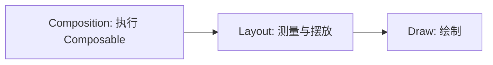

# Jetpack Compose 完整学习笔记

<!-- lecture-notes:integrated-v2 -->

> 最后调研时间：2026-07-28
>
> 适用范围：Android 原生 Jetpack Compose。本文结合 `_posts/Markdown笔记/1/compose/` 目录下的分章内容，并参考 Android Developers 官方文档整理。

## 讲义导读

这份笔记的目标不是“背 API”，而是建立一套可落地的 Compose 心智模型：**状态驱动 UI，事件向上流动，副作用受生命周期约束，性能、测试、无障碍和互操作都是工程的一部分**。

学习 Compose 时，最容易犯的错不是写不出页面，而是把它当成“用 Kotlin 写 XML”。真正需要掌握的是：

- 谁拥有状态。
- 哪些状态变化会触发重组。
- 副作用应该放在哪里。
- 列表、导航、测试和无障碍如何和状态模型对齐。
- 版本、BOM、Compiler 和库兼容如何管理。

## 目录映射

下面这套完整笔记的内容，来自 Compose 目录下的分章材料：

| 文件 | 主题 |
|---|---|
| [00-README.md](<./_posts/Markdown笔记/1/compose/00-README.md>) | 学习总览 |
| [01-总览与环境配置.md](<./_posts/Markdown笔记/1/compose/01-总览与环境配置.md>) | 环境、BOM、版本、Gradle |
| [02-核心模型与声明式AI.md](<./_posts/Markdown笔记/1/compose/02-核心模型与声明式AI.md>) | 声明式模型、Composition、Recomposition |
| [03-状态管理与状态提升.md](<./_posts/Markdown笔记/1/compose/03-状态管理与状态提升.md>) | `remember`、`rememberSaveable`、状态提升 |
| [04-副作用与生命周期.md](<./_posts/Markdown笔记/1/compose/04-副作用与生命周期.md>) | Effect API、生命周期、一次性事件 |
| [05-UI 基础.md](<./_posts/Markdown笔记/1/compose/05-UI 基础.md>) | Modifier、布局、Material 3、Lazy |
| [06-架构、导航与单向数据流.md](<./_posts/Markdown笔记/1/compose/06-架构、导航与单向数据流.md>) | UDF、MVVM、Navigation |
| [07-性能、稳定性与调试.md](<./_posts/Markdown笔记/1/compose/07-性能、稳定性与调试.md>) | 稳定性、性能、诊断 |
| [08-测试、无障碍与 View 互操作.md](<./_posts/Markdown笔记/1/compose/08-测试、无障碍与 View 互操作.md>) | UI 测试、语义、无障碍、互操作 |
| [09-常见坑与检查清单.md](<./_posts/Markdown笔记/1/compose/09-常见坑与检查清单.md>) | 高频坑、检查项 |
| [10-参考资料.md](<./_posts/Markdown笔记/1/compose/10-参考资料.md>) | 官方资料 |
| [11-实战串联：Feed 列表页到详情页.md](<./_posts/Markdown笔记/1/compose/11-实战串联：Feed 列表页到详情页.md>) | 完整实战 |

## 1. Compose 是什么

Jetpack Compose 是 Android 的声明式 UI 工具包。传统 View 更像“先创建再命令式修改”，Compose 更像“根据当前状态描述界面应该是什么样”。

### 1.1 先把 Compose 说清楚

Compose 不是简单的 UI 语法糖，也不是“用 Kotlin 写 XML”。它是一套围绕状态、重组和副作用组织 Android 界面的方式。

你可以先把它理解成三件事：

- **声明式 UI**：界面由状态决定。
- **组合式构建**：UI 被拆成可组合的函数。
- **受控副作用**：网络、导航、监听、动画和其他外部行为都要放进明确边界。

### 1.2 它和传统 View 的差别

传统 View 开发常见流程是：

1. 创建 View。
2. 找到 View。
3. 修改属性。
4. 在事件里继续改状态。

Compose 的流程更接近：

1. 维护状态。
2. 根据状态描述 UI。
3. 状态变化后自动重组。
4. 事件向上流动，状态由更高层更新。

这带来的结果是：

- 不再依赖手动 `findViewById`。
- UI 的更新路径更统一。
- 代码更容易拆分为“状态、视图、事件、效果”四部分。
- 同时也更要求你理解重组与副作用，否则很容易把逻辑写散。

### 1.3 Compose 的三个关键词

#### 状态

状态是会影响 UI 的数据，比如登录状态、列表内容、输入文本、加载中标记、选中项。

#### 重组

当状态变化，Compose 重新执行受影响的 composable。这里不是“整屏重画”，而是精细到受影响的部分。

#### 副作用

网络请求、数据库写入、导航、日志、监听器注册、Snackbar 显示，都是副作用。它们不能随便放在 composable 主体里。

### 1.4 一个最小例子

```kotlin
@Composable
fun CounterCard(
    count: Int,
    onIncrement: () -> Unit
) {
    Column {
        Text(text = "Count: $count")
        Button(onClick = onIncrement) {
            Text("Add")
        }
    }
}

@Composable
fun CounterRoute() {
    var count by rememberSaveable { mutableIntStateOf(0) }

    CounterCard(
        count = count,
        onIncrement = { count += 1 }
    )
}
```

这个例子里，`CounterCard` 只负责显示和发事件，`CounterRoute` 负责保存状态。这个拆法比把 `count` 直接写死在 UI 里更适合真实项目。

### 1.5 学习 Compose 时先问的五个问题

每次看到一个 composable 或 API，先问：

1. 它读谁的状态？
2. 状态变化后会不会重组？
3. 这里有没有副作用？
4. 状态应该保存在哪里？
5. 这段逻辑怎么测？

如果这五个问题答不出来，通常说明你还停留在“会调用 API”，还没有进入 Compose 的工程视角。

### 1.6 这章最容易踩的坑

- 把 composable 当成普通函数，里面随便发请求。
- 把页面状态放在子组件内部，导致上层无法控制。
- 只关注“能显示”，忽略配置变化、返回栈和恢复。
- 不理解重组，看到函数重复执行就误以为“出 bug 了”。
- 只记 API 名字，不记状态所有权和副作用边界。

### 1.7 本章应该达成什么

读完这一章后，你至少应该能：

- 用自己的话解释 Compose 的声明式模型。
- 说清状态、重组、副作用这三个核心概念。
- 看懂一个最小 Compose 页面是如何把状态和事件串起来的。
- 知道 Compose 不等于 XML 替代品，而是一套新的 UI 构建方式。

### 1.8 小练习

请先做一个只有“加一、减一、重置”的计数器页面，再给它补上：

- `rememberSaveable`
- 一个 loading 状态
- 一个错误态
- 一个 ViewModel 版本

做完后对比这四个版本，你会更清楚状态该放在哪里。

### 1.9 读本章时的判断标准

你不是在找“哪个 API 更强”，而是在找：

- 哪些状态是 UI 真相。
- 哪些动作是副作用。
- 哪些输入会触发重组。
- 哪些状态需要保存。
- 哪些地方该交给 ViewModel。

这就是 Compose 最初也是最重要的门槛。

### 1.10 传统写法对照

下面这个例子和前面的计数器例子放在一起看，会更容易看出 Compose 的思路差异：

```kotlin
@Composable
fun ProfileCard(userName: String, enabled: Boolean, onSave: () -> Unit) {
    Text(text = userName)
    Button(onClick = onSave, enabled = enabled) {
        Text("保存")
    }
}
```

核心公式可以记成：

```text
UI = f(state)
```

这意味着：

- UI 只负责描述当前状态。
- 状态变化会驱动 UI 更新。
- Composable 可能被多次执行、跳过或取消，因此函数体里不要放不可控副作用。
- 业务状态通常应放在 ViewModel、State Holder 或数据层，而不是散落在 UI 里。

## 2. 版本与环境

Compose 相关版本不要混着猜。先把这条链路记牢：**Kotlin / Compose Compiler 插件 / AGP / Compose BOM / 其他 Jetpack 依赖**。新项目最常见的问题不是写错 UI，而是版本边界没理顺。

### 2.1 先看版本链路

| 层级 | 作用 | 备注 |
|---|---|---|
| Android Studio / Gradle / AGP | 工程入口和构建能力 | 决定模板和构建方式 |
| Kotlin | 语言和编译基础 | Compose 代码首先受它影响 |
| Compose Compiler 插件 | 把 Composable 和状态跟踪编译进产物 | Kotlin 2.0+ 用 `org.jetbrains.kotlin.plugin.compose` |
| Compose BOM | 统一 Compose 族依赖版本 | 只管 Compose artifact |
| 其他 Jetpack 库 | Navigation、Lifecycle、Activity、Paging 等 | 仍需单独管理版本 |

这条链路里，最关键的是两件事：

- **Compose Compiler 插件负责编译层兼容**。
- **Compose BOM 负责 Compose 库版本对齐**。

### 2.2 先选项目基线

建议优先采用官方模板和最新稳定工具链，不要拿几年前的配置直接复制到新项目里。

推荐原则：

- 新项目优先使用 Kotlin 2.x。
- Kotlin 2.0+ 项目优先使用 `org.jetbrains.kotlin.plugin.compose`。
- Compose 族依赖用 BOM 管理，不要给 `ui`、`foundation`、`material3` 手写版本。
- 非 Compose 的 AndroidX 依赖仍按各自版本管理。
- 版本升级优先看官方 release notes 和兼容说明，不要只看博客截图。

### 2.3 最小可运行工程

一个最小可运行的 Compose 页面通常只需要三件事：Activity、`setContent`、主题入口。

```kotlin
class MainActivity : ComponentActivity() {
    override fun onCreate(savedInstanceState: Bundle?) {
        super.onCreate(savedInstanceState)
        setContent {
            AppTheme {
                CounterRoute()
            }
        }
    }
}
```

这段代码只负责把 Compose 树挂到 Activity 上，真正的页面逻辑应该继续下沉到 Route / Screen / ViewModel。

### 2.4 Gradle 配置怎么写

`settings.gradle.kts` 里通常要先确保仓库来源正确：

```kotlin
pluginManagement {
    repositories {
        google()
        mavenCentral()
        gradlePluginPortal()
    }
}

dependencyResolutionManagement {
    repositoriesMode.set(RepositoriesMode.FAIL_ON_PROJECT_REPOS)
    repositories {
        google()
        mavenCentral()
    }
}
```

根工程插件版本建议统一管理：

```kotlin
plugins {
    id("com.android.application") version "<agp-version>" apply false
    id("org.jetbrains.kotlin.android") version "<kotlin-version>" apply false
    id("org.jetbrains.kotlin.plugin.compose") version "<kotlin-version>" apply false
}
```

模块中再启用 Compose：

```kotlin
plugins {
    id("com.android.application")
    id("org.jetbrains.kotlin.android")
    id("org.jetbrains.kotlin.plugin.compose")
}

android {
    namespace = "com.example.composeapp"
    compileSdk = 36

    defaultConfig {
        applicationId = "com.example.composeapp"
        minSdk = 23
        targetSdk = 36
    }

    buildFeatures {
        compose = true
    }
}
```

依赖示例：

```kotlin
dependencies {
    val composeBom = platform("androidx.compose:compose-bom:2026.06.00")
    implementation(composeBom)
    androidTestImplementation(composeBom)

    implementation("androidx.activity:activity-compose")
    implementation("androidx.compose.ui:ui")
    implementation("androidx.compose.ui:ui-tooling-preview")
    implementation("androidx.compose.foundation:foundation")
    implementation("androidx.compose.material3:material3")
    implementation("androidx.lifecycle:lifecycle-runtime-compose")
    implementation("androidx.lifecycle:lifecycle-viewmodel-compose")
    implementation("androidx.navigation:navigation-compose")

    debugImplementation("androidx.compose.ui:ui-tooling")
    debugImplementation("androidx.compose.ui:ui-test-manifest")
    androidTestImplementation("androidx.compose.ui:ui-test-junit4")
}
```

### 2.5 Version Catalog 推荐写法

团队项目更适合用 `gradle/libs.versions.toml` 统一管理：

```toml
[versions]
agp = "8.11.0"
kotlin = "2.2.0"
composeBom = "2026.06.00"
activityCompose = "1.10.1"
lifecycle = "2.9.0"
navigation = "2.9.0"

[libraries]
androidx-compose-bom = { module = "androidx.compose:compose-bom", version.ref = "composeBom" }
androidx-compose-ui = { module = "androidx.compose.ui:ui" }
androidx-compose-ui-tooling-preview = { module = "androidx.compose.ui:ui-tooling-preview" }
androidx-compose-ui-tooling = { module = "androidx.compose.ui:ui-tooling" }
androidx-compose-material3 = { module = "androidx.compose.material3:material3" }
androidx-compose-foundation = { module = "androidx.compose.foundation:foundation" }
androidx-activity-compose = { module = "androidx.activity:activity-compose", version.ref = "activityCompose" }
androidx-lifecycle-runtime-compose = { module = "androidx.lifecycle:lifecycle-runtime-compose", version.ref = "lifecycle" }
androidx-lifecycle-viewmodel-compose = { module = "androidx.lifecycle:lifecycle-viewmodel-compose", version.ref = "lifecycle" }
androidx-navigation-compose = { module = "androidx.navigation:navigation-compose", version.ref = "navigation" }
```

### 2.6 版本边界怎么理解

- Compose BOM 只管理 Compose 族 artifact。
- `activity-compose`、`lifecycle-runtime-compose`、`navigation-compose` 仍按各自版本管理。
- Kotlin 2.0+ 项目优先用 Compose Compiler 插件；旧项目则需要查 Compose Compiler 与 Kotlin 的兼容关系。
- 如果你要核对某个 Compose artifact 的具体版本，查官方 BOM mapping 页面，而不是猜依赖树。

### 2.7 常见编译错误

| 现象 | 常见原因 | 处理 |
|---|---|---|
| `This version of the Compose Compiler requires Kotlin...` | Kotlin 与 Compose Compiler 配置不匹配 | 升级到 Kotlin 2.x 插件方式，或按兼容表回退 |
| `Unresolved reference: compose` | 没启用 `compose = true` 或没应用 compose 插件 | 检查模块插件和 `buildFeatures` |
| Preview 不显示 | 缺少 `ui-tooling-preview` 或 debug tooling | 加上 preview 依赖并确认 Android Studio 版本 |
| 多模块部分编译失败 | 只有 app 模块启用了 Compose | 所有含 Composable 的 Android 模块都要启用 |
| BOM 已配但版本冲突 | 某些 Compose 依赖显式写了版本 | 使用 BOM 后，Compose artifact 通常不要再单独写版本 |

### 2.8 环境排查命令

建议把下面这些命令当成基础检查：

```bash
java -version
./gradlew :app:assembleDebug
./gradlew :app:dependencies
./gradlew lintDebug
```

如果你在真机或模拟器上调试，还要顺手确认：

- Android Studio 是否与当前 AGP/Kotlin 版本兼容。
- `google()` 是否存在于插件仓库和依赖仓库。
- CI 和本地是否使用相同的 JDK。
- Compose 相关依赖是否都走 BOM。

### 2.9 本章验收

读完这一章后，你至少应该能：

- 解释 Compose Compiler 插件和 Compose BOM 的分工。
- 写出一个最小可运行的 Compose Activity 和模块依赖。
- 判断一个版本冲突是 Kotlin、Compiler、BOM 还是普通 AndroidX 库引起的。
- 说清哪些库受 BOM 管理，哪些不受 BOM 管理。
- 用基本命令定位构建失败、预览失败和版本冲突。

## 3. 核心心智模型

Compose 的核心不是“写 UI”，而是“管理状态、身份、重组和副作用边界”。如果第1章回答“Compose 是什么”，第3章要回答“Compose 为什么会这样运行”。

这一章先记住一句话：**Composable 是可重复执行的 UI 描述，Composition 记录它的位置和状态，Snapshot 记录状态读写，Recomposition 根据状态变化重新执行必要部分**。

### 3.1 基本公式：UI 是状态的函数

```text
UI = f(state)
```

这不是一句口号，而是 Compose 的设计前提：

- 状态不变时，UI 描述应保持一致。
- 状态变化时，UI 通过重组更新。
- UI 不应该靠手动找控件再改属性。
- 业务真相不应该散落在各个 composable 内部。

传统 View 常见写法是“拿到控件，然后改控件”：

```kotlin
textView.text = user.name
button.isEnabled = formValid
```

Compose 写法是“根据状态描述控件”：

```kotlin
@Composable
fun ProfileScreen(
    user: User,
    formValid: Boolean,
    onSave: () -> Unit
) {
    Text(text = user.name)
    Button(enabled = formValid, onClick = onSave) {
        Text("保存")
    }
}
```

当 `user` 或 `formValid` 变化时，Compose 会重新计算受影响的 UI 描述。

### 3.2 Composable 函数不是普通函数

`@Composable` 函数会被 Compose Compiler 改写，参与 Runtime 的 Composition、状态读取、重组和跳过判断。它看起来像普通 Kotlin 函数，但运行模型不同。

Composable 应该做到：

- **快速**：不要在函数体里做阻塞计算。
- **幂等**：同样输入应该描述同样 UI。
- **无副作用**：不要依赖执行次数。
- **只读必要状态**：状态读得越宽，可能重组的范围越大。
- **参数化**：通过参数接收状态和事件，而不是隐式读取全局可变对象。

错误示例：

```kotlin
@Composable
fun BadUserScreen(repository: UserRepository) {
    val user = repository.loadUserBlocking()
    Text(text = user.name)
}
```

问题是：Composable 可能重组多次，这段代码会重复阻塞、重复访问数据源，并且无法被生命周期和取消逻辑正确管理。

更合理的结构：

```kotlin
@Composable
fun UserRoute(viewModel: UserViewModel = viewModel()) {
    val uiState by viewModel.uiState.collectAsStateWithLifecycle()

    UserScreen(
        uiState = uiState,
        onRetry = viewModel::retry
    )
}

@Composable
fun UserScreen(
    uiState: UserUiState,
    onRetry: () -> Unit
) {
    when {
        uiState.loading -> CircularProgressIndicator()
        uiState.error != null -> Button(onClick = onRetry) { Text("重试") }
        uiState.user != null -> Text(uiState.user.name)
    }
}
```

### 3.3 Composition 是什么

Composition 是 Compose 维护的一份 UI 结构记录。初次执行 composable 时，Compose 会建立 Composition；后续状态变化时，Compose 在已有 Composition 上更新。

可以把它理解成一份运行时账本，记录了：

- Composable 调用位置。
- `remember` 保存的值。
- 状态读取关系。
- Effect 的进入与退出。
- 哪些范围可以尝试跳过重组。

```text
setContent / Composable 入口
  → 执行 Composable
  → 建立 Composition
  → 记录状态读取和调用位置
  → 状态变化
  → 标记受影响范围
  → 重组并应用 UI 变化
```

Composition 的关键不是“生成了一棵固定 View 树”，而是“维护了当前 UI 描述及其状态归属”。

### 3.4 Recomposition 是什么

Recomposition 是状态变化后，Compose 重新执行受影响 composable 的过程。

```kotlin
@Composable
fun CounterPanel() {
    var count by remember { mutableIntStateOf(0) }

    Column {
        Header()
        Text(text = "Count: $count")
        Button(onClick = { count++ }) {
            Text("Add")
        }
        Footer()
    }
}
```

当 `count` 改变时，Compose 会重新执行读取 `count` 的相关范围。它不是必然“整屏重画”，也不是必然“所有子组件都重跑到底”。Compose 会根据状态读取、参数变化和稳定性判断尽量缩小范围。

你要记住：

- 重组是正常机制，不是错误。
- Composable 可能执行多次、跳过、取消或重新进入。
- 不要写依赖“只执行一次”的普通函数体逻辑。
- 真正危险的是昂贵重组、错误副作用和状态归属混乱。

### 3.5 状态读取决定重组范围

谁读取状态，谁就可能因状态变化而重组。状态读取越靠上，影响范围越大。

不理想写法：

```kotlin
@Composable
fun BadList(
    items: List<Post>,
    selectedId: String?
) {
    LazyColumn {
        items(items) { item ->
            Row(
                modifier = Modifier.background(
                    if (selectedId == item.id) Color.Blue else Color.Transparent
                )
            ) {
                Text(item.title)
            }
        }
    }
}
```

这里每个 item 都依赖 `selectedId`。当选中项变化时，可见 item 都可能重新计算。更清晰的拆法是把状态判断变成 item 的显式参数：

```kotlin
@Composable
fun BetterList(
    items: List<Post>,
    selectedId: String?
) {
    LazyColumn {
        items(
            items = items,
            key = { it.id }
        ) { item ->
            PostRow(
                post = item,
                selected = item.id == selectedId
            )
        }
    }
}
```

这不一定自动消除所有重组，但它让重组边界、状态来源和后续优化方向更清楚。

### 3.6 `remember` 的真实含义

`remember` 的意思是：把一个值保存在当前调用位置对应的 Composition 中。它不是全局缓存，也不是持久化存储。

```kotlin
@Composable
fun SearchBox() {
    var query by remember { mutableStateOf("") }

    TextField(
        value = query,
        onValueChange = { query = it }
    )
}
```

`remember` 的生命周期可以这样理解：

| 场景 | 是否保留 |
|---|---|
| 普通重组 | 保留 |
| 当前 composable 离开 Composition | 丢失 |
| Activity 配置变化 | 通常丢失 |
| 进程死亡恢复 | 不保留 |

如果状态需要配置变化后恢复，用 `rememberSaveable`；如果状态属于页面业务，用 ViewModel；如果状态属于持久业务真相，用数据层。

`remember(key)` 还有一个重要含义：key 变化时旧值失效，重新计算。

```kotlin
val formatter = remember(locale) {
    DateTimeFormatter.ofPattern("yyyy-MM-dd", locale)
}
```

### 3.7 `key` 决定动态结构中的身份

当列表或条件结构发生移动、插入、删除时，Compose 需要知道“哪个 UI 状态属于哪个数据对象”。这就是 `key` 的价值。

错误示例：

```kotlin
LazyColumn {
    items(users) { user ->
        var expanded by remember { mutableStateOf(false) }
        UserRow(user = user, expanded = expanded, onToggle = { expanded = !expanded })
    }
}
```

如果 `users` 重排，`expanded` 可能跟着位置走，而不是跟着用户走。

更稳的写法：

```kotlin
LazyColumn {
    items(
        items = users,
        key = { it.id }
    ) { user ->
        UserRow(user = user)
    }
}
```

如果展开状态真的属于某个用户，更推荐放到 ViewModel，以 `user.id` 管理，而不是让 item 内部长期持有业务状态。

普通动态分支中也可以显式使用 `key`：

```kotlin
key(user.id) {
    UserCard(user)
}
```

### 3.8 稳定性与跳过重组

Compose 会尝试跳过输入没有变化且可安全跳过的 composable。能否跳过，和参数稳定性有关。

简化理解：

| 类型 | 通常表现 |
|---|---|
| `Int`、`Boolean`、`String`、函数类型 | 通常稳定 |
| 含只读字段的简单 data class | 取决于字段稳定性 |
| `MutableList`、`MutableMap` | 容易不稳定 |
| 公开可变属性的类 | 容易不稳定 |
| 使用不可变集合和不可变模型 | 更容易被判断为稳定 |

推荐 UI State 尽量不可变：

```kotlin
data class FeedUiState(
    val loading: Boolean = false,
    val posts: List<PostUiModel> = emptyList(),
    val errorMessage: String? = null
)
```

注意：普通 `List` 接口不保证底层一定不可变。性能敏感页面要结合 Compose Compiler metrics 或稳定性诊断工具确认。

### 3.9 Snapshot 状态系统的直觉

`mutableStateOf` 不是普通变量。它参与 Compose Snapshot 状态系统。

可以这样理解：

- Composable 读取 State 时，Compose 记录这个位置依赖该状态。
- State 写入新值时，依赖它的范围会被标记为需要重组。
- 普通可变对象内部变化不会自动通知 Compose。
- 状态写入应在可控线程和生命周期内进行。

正确示例：

```kotlin
var title by remember { mutableStateOf("Hello") }

Text(title)

Button(onClick = { title = "Compose" }) {
    Text("更新")
}
```

容易出问题的示例：

```kotlin
val tags = remember { mutableListOf<String>() }

Button(onClick = { tags.add("Compose") }) {
    Text("Add")
}
```

这里 `tags` 内部变了，但 Compose 未必知道 UI 应该更新。更稳的做法是用可观察状态或不可变列表替换引用。

### 3.10 重组、布局、绘制不要混为一谈

Compose 的性能问题要先判断瓶颈在哪个阶段：

| 阶段 | 发生了什么 | 常见问题 |
|---|---|---|
| Recomposition | 重新执行 composable | 状态读取太宽、参数不稳定、副作用重复 |
| Layout | 测量和摆放节点 | 布局层级复杂、约束变化频繁、尺寸跳动 |
| Draw | 绘制像素 | 阴影、模糊、透明叠加、大图和复杂绘制 |

如果只是视觉位置变化，不一定要让 composable 重新执行。很多场景可以把变化下沉到绘制或图层层面，例如使用 `graphicsLayer` 处理简单位移。

### 3.11 常见误解

| 误解 | 正确认识 |
|---|---|
| 重组就是重绘 | 重组是重新执行 composable，最终是否绘制取决于后续变化 |
| `remember` 可以存业务状态 | 它只适合局部 UI 状态，业务状态应提升 |
| Composable 只会执行一次 | 它可能多次执行、跳过、取消、重新进入 |
| 到处加 `remember` 就是优化 | 滥用会增加复杂度，先测量再优化 |
| `LaunchedEffect(Unit)` 全局只执行一次 | 它只在当前 Composition 生命周期内“一次” |

### 3.12 本章验收

读完这一章后，你至少应该能：

- 解释 `UI = f(state)` 在工程里的含义。
- 区分 Composition、Recomposition、Layout 和 Draw。
- 说明状态读取如何决定重组范围。
- 判断 `remember`、`rememberSaveable` 和 ViewModel 的边界。
- 在 Lazy 列表中解释为什么要有稳定 key。
- 识别普通可变对象为什么不会自动触发 UI 更新。
- 解释稳定性、跳过和性能优化之间的关系。

## 4. 状态与状态提升

状态是 Compose 的主轴。要先回答四个问题：**状态属于谁、谁需要读它、是否要跨配置变化保存、是否应该进入 ViewModel**。状态管理的质量，几乎决定了页面是否可控、可测试、可恢复。

### 4.1 状态到底是什么

状态是任何会随时间变化并影响 UI 的值。官方文档里，像输入框文本、加载标记、列表内容、弹窗开关、滚动位置、选中项都属于状态。

常见状态包括：

- 文本输入框内容。
- 当前选中的 Tab。
- 列表数据和分页状态。
- 加载中、成功、失败。
- 登录态、筛选条件、排序方式。
- 弹窗是否显示、表单是否可提交。
- 滚动位置和展开状态。

Compose 只会自动观察 Compose State。普通变量变了，UI 不一定会更新。

### 4.2 状态分类

可以按生命周期和职责把状态分成几类：

| 类型 | 生命周期 | 推荐位置 |
|---|---|---|
| 局部 UI 状态 | 只在当前组件有效 | `remember` |
| 可恢复 UI 状态 | 配置变化或进程重建后应恢复 | `rememberSaveable`、`SavedStateHandle` |
| 页面 UI 状态 | 页面内容、加载态、错误态、列表数据 | ViewModel |
| 业务状态 | 用户资料、订单、缓存数据、登录态 | Repository / UseCase / 数据层 |
| 导航状态 | 当前页面、返回栈、路由参数 | Navigation |

原则：**状态放在所有读写者的最小共同拥有者处**。这也是官方 state hoisting 页面强调的最佳实践。

### 4.3 `remember` 的职责

`remember` 只保留当前 Composition 中的值。它适合临时 UI 状态，不适合业务真相。

```kotlin
@Composable
fun ExpandableTitle(title: String) {
    var expanded by remember { mutableStateOf(false) }

    Column {
        Row(Modifier.clickable { expanded = !expanded }) {
            Text(title)
        }
        if (expanded) {
            Text("详细内容")
        }
    }
}
```

适合：

- 临时 UI 状态。
- 不需要配置变化恢复。
- 不需要跨页面共享。

不适合：

- 来自网络或数据库的业务数据。
- 页面主要状态。
- 重要输入草稿。

### 4.4 `rememberSaveable` 的职责

`rememberSaveable` 适合保存小而重要、可通过 Bundle 恢复的 UI 状态。官方 state-saving 文档强调，它适合简单状态，不适合大对象和复杂数据。

```kotlin
@Composable
fun SearchInput() {
    var query by rememberSaveable { mutableStateOf("") }

    TextField(
        value = query,
        onValueChange = { query = it },
        label = { Text("搜索") }
    )
}
```

适合：

- 输入框文本。
- Tab 选中项。
- 简单筛选条件。
- 短小的草稿状态。

不适合：

- 网络列表。
- 图片缓存。
- 数据库实体全集。
- 巨大的复杂对象。

如果类型不是天然可保存的基础类型，可以用 `Saver`、`listSaver`、`mapSaver` 或自定义保存逻辑。

### 4.5 `SavedStateHandle` 的职责

`SavedStateHandle` 属于 ViewModel 层的状态保存工具。它和 `rememberSaveable` 一样面向“少量、关键、简单”的状态，但它的入口在 ViewModel，不在 Composable。

官方文档强调：`SavedStateHandle` 仍然基于 Bundle 机制，所以只适合小状态，不适合大对象。

```kotlin
class DetailViewModel(
    savedStateHandle: SavedStateHandle,
    repository: ArticleRepository
) : ViewModel() {
    private val articleId: String = checkNotNull(savedStateHandle["articleId"])
}
```

适合：

- 导航参数里的简单 ID。
- 输入框草稿。
- 小型筛选条件。

不适合：

- 完整文章、图片、分页结果。
- 复杂大对象。
- 可以由数据层重新生成的内容。

### 4.6 状态提升

状态提升的本质是：**把状态从子组件抬到共同父级，让 UI 可控、可测试、可复用**。

有状态组件：

```kotlin
@Composable
fun SearchBar() {
    var query by rememberSaveable { mutableStateOf("") }
    TextField(value = query, onValueChange = { query = it })
}
```

无状态组件：

```kotlin
@Composable
fun SearchBar(
    query: String,
    onQueryChange: (String) -> Unit,
    modifier: Modifier = Modifier
) {
    TextField(
        value = query,
        onValueChange = onQueryChange,
        modifier = modifier,
        singleLine = true
    )
}
```

调用者持有状态：

```kotlin
@Composable
fun SearchScreen() {
    var query by rememberSaveable { mutableStateOf("") }
    SearchBar(query = query, onQueryChange = { query = it })
}
```

状态提升的好处：

- 状态来源更清晰。
- 组件更容易复用。
- UI 测试更简单。
- 预览更容易。
- 父级更容易控制子组件。

### 4.7 `remember`、`rememberSaveable`、`derivedStateOf`

- `remember`：记住组合内对象。
- `rememberSaveable`：保存可恢复的简单 UI 状态。
- `derivedStateOf`：从已有状态派生出只在输入变化时更新的结果。

不要把所有状态都塞进 `remember`；能提升的尽量提升，能派生的尽量派生。

`derivedStateOf` 适合“输入变化频繁，但结果变化稀疏”的场景：

```kotlin
@Composable
fun ScrollToTopButton(listState: LazyListState) {
    val showButton by remember {
        derivedStateOf {
            listState.firstVisibleItemIndex > 0
        }
    }

    AnimatedVisibility(visible = showButton) {
        FloatingActionButton(onClick = { /* scroll */ }) {
            Icon(Icons.Default.KeyboardArrowUp, contentDescription = "回到顶部")
        }
    }
}
```

### 4.8 ViewModel + UI State

推荐页面结构：

```text
Route -> Screen -> ViewModel -> UiState / Event / Effect
```

UI 负责显示和发事件，ViewModel 负责处理业务逻辑和状态流转。

```kotlin
data class ArticleListUiState(
    val loading: Boolean = false,
    val articles: List<ArticleUiModel> = emptyList(),
    val errorMessage: String? = null
)

class ArticleListViewModel(
    private val repository: ArticleRepository
) : ViewModel() {
    private val _uiState = MutableStateFlow(ArticleListUiState(loading = true))
    val uiState: StateFlow<ArticleListUiState> = _uiState.asStateFlow()

    init {
        load()
    }

    fun load() {
        viewModelScope.launch {
            _uiState.value = _uiState.value.copy(loading = true, errorMessage = null)
            runCatching { repository.getArticles() }
                .onSuccess { articles ->
                    _uiState.value = ArticleListUiState(
                        loading = false,
                        articles = articles.map { it.toUiModel() }
                    )
                }
                .onFailure { error ->
                    _uiState.value = _uiState.value.copy(
                        loading = false,
                        errorMessage = error.message ?: "加载失败"
                    )
                }
        }
    }
}
```

收集状态时，Android 页面更推荐使用生命周期感知方式：

```kotlin
@Composable
fun ArticleListRoute(
    viewModel: ArticleListViewModel = viewModel()
) {
    val uiState by viewModel.uiState.collectAsStateWithLifecycle()

    ArticleListScreen(
        uiState = uiState,
        onRetry = viewModel::load
    )
}
```

### 4.9 Route 与 Screen 分层

```kotlin
@Composable
fun LoginRoute(
    viewModel: LoginViewModel = viewModel(),
    onLoginSuccess: () -> Unit
) {
    val uiState by viewModel.uiState.collectAsStateWithLifecycle()

    LaunchedEffect(uiState.loggedIn) {
        if (uiState.loggedIn) onLoginSuccess()
    }

    LoginScreen(
        uiState = uiState,
        onUsernameChange = viewModel::onUsernameChange,
        onPasswordChange = viewModel::onPasswordChange,
        onSubmit = viewModel::submit
    )
}
```

分层原则：

| 层 | 责任 |
|---|---|
| Route | 连接 ViewModel、导航、生命周期、一次性 Effect |
| Screen | 展示 UI，接收状态和事件 |
| Component | 可复用局部 UI |
| ViewModel | 处理事件、更新 UI State、调用领域层 |

### 4.10 StateHolder 模式

不是所有状态都必须进 ViewModel。纯 UI 交互状态可以封装成普通 state holder，尤其是复杂组件内部状态。

```kotlin
@Stable
class SearchPanelState(
    initialQuery: String = ""
) {
    var query by mutableStateOf(initialQuery)
        private set

    var filtersExpanded by mutableStateOf(false)
        private set

    fun onQueryChange(value: String) {
        query = value
    }

    fun toggleFilters() {
        filtersExpanded = !filtersExpanded
    }
}

@Composable
fun rememberSearchPanelState(
    initialQuery: String = ""
): SearchPanelState {
    return remember(initialQuery) {
        SearchPanelState(initialQuery)
    }
}
```

适合 StateHolder：

- 只服务某个复合 UI 组件。
- 不直接调用 Repository。
- 不包含跨页面业务规则。
- 想减少 Screen 参数数量，但又不想引入 ViewModel。

不适合 StateHolder：

- 需要持久化业务状态。
- 需要调用 UseCase/Repository。
- 需要跨多个页面共享。
- 需要进程死亡后可靠恢复大量数据。

### 4.11 表单状态建模

表单页常见错误是每个 `TextField` 自己 `remember`，最后提交时父级拿不到完整状态。更推荐把字段集中建模。

```kotlin
data class LoginUiState(
    val username: String = "",
    val password: String = "",
    val usernameError: String? = null,
    val passwordError: String? = null,
    val submitting: Boolean = false
) {
    val canSubmit: Boolean
        get() = username.isNotBlank() && password.isNotBlank() && !submitting
}
```

事件：

```kotlin
sealed interface LoginEvent {
    data class UsernameChange(val value: String) : LoginEvent
    data class PasswordChange(val value: String) : LoginEvent
    data object Submit : LoginEvent
}
```

这样的建模有几个好处：

- 字段集中管理。
- 校验规则容易测试。
- UI 更容易预览和复用。
- 页面状态更容易和 ViewModel 对齐。

### 4.12 常见错误

- 每个输入框自己 `remember`，导致表单提交困难。
- 把网络列表放进 `rememberSaveable` 或 `SavedStateHandle`。
- 在子组件内部长期保存本应由父级控制的状态。
- 把业务状态和 UI 临时状态混在一起。
- 把可恢复状态和持久数据混为一谈。
- 在 Composable 里直接收集并修改业务仓库数据。

### 4.13 本章验收

读完这一章后，你至少应该能：

- 区分 `remember`、`rememberSaveable`、ViewModel、`SavedStateHandle` 和 Repository 的边界。
- 说明为什么状态提升能提升可测试性和可复用性。
- 画出 `Route -> Screen -> ViewModel -> UiState / Event / Effect` 页面结构。
- 为表单页设计统一的 `UiState` 和事件模型。
- 解释 `derivedStateOf` 和 `remember` 的使用差异。
- 说明为什么可变列表内部修改不会自动触发 UI 更新。
- 知道什么时候应该用 StateHolder，什么时候应该用 ViewModel。

## 5. 副作用与生命周期

Composable 主体应尽量纯；副作用要放到受控 API 里。副作用这一章最重要的不是“记住有哪些 API”，而是知道**什么动作必须和 Composition 生命周期绑定，什么动作应该交给 ViewModel，什么动作只该执行一次，什么动作需要清理**。

### 5.1 什么是副作用

副作用是 Composable 作用域之外发生的变化，例如：

- 发起网络请求。
- 写数据库。
- 上报埋点。
- 订阅传感器、广播、回调。
- 启动协程。
- 调用导航。
- 显示 Snackbar。

Composable 可能被多次执行、跳过、取消，因此副作用不能直接写在函数体里。官方 side-effects 文档强调，Effect 的作用是让这些动作在可预测、可管理的时机执行。

错误示例：

```kotlin
@Composable
fun ProfileScreen(userId: String, repo: UserRepository) {
    repo.loadUser(userId) // 错：重组时可能重复调用
    Text("Profile")
}
```

更合理的方向是：

- 页面数据加载放 ViewModel。
- 与 Composition 生命周期绑定的任务用 Effect API。
- 与 Android Lifecycle 绑定的收集用 lifecycle-compose。

### 5.2 Effect API 总览

| API | 作用 | 典型场景 |
|---|---|---|
| `LaunchedEffect` | 在组合中启动协程，key 变化时重启 | 加载数据、触发动画、页面进入后执行一次任务 |
| `rememberCoroutineScope` | 获取与 Composition 绑定的协程作用域 | 点击后显示 Snackbar、滚动列表 |
| `DisposableEffect` | 注册/注销资源，离开组合时清理 | 监听器、广播、传感器、生命周期观察者 |
| `SideEffect` | 在每次成功重组后执行同步副作用 | 同步分析属性、轻量同步外部对象 |
| `produceState` | 把外部异步源转换成 Compose `State` | 小型数据源桥接、图片状态封装 |
| `rememberUpdatedState` | 在长生命周期 Effect 中获取最新值 | 定时回调、延迟执行、动画回调 |
| `snapshotFlow` | 将 Compose State 读出为 Flow | 滚动埋点、状态转 Flow 再做操作符处理 |

### 5.3 `LaunchedEffect`

`LaunchedEffect` 会在进入 Composition 时启动协程；当 key 改变时，旧协程取消，新协程启动；离开 Composition 时协程取消。

```kotlin
@Composable
fun AutoRefresh(
    userId: String,
    onRefresh: suspend (String) -> Unit
) {
    LaunchedEffect(userId) {
        onRefresh(userId)
    }
}
```

适合：

- 根据参数变化加载数据。
- 执行动画。
- 进入页面后触发滚动。
- 处理一次性收集逻辑。

key 的选择很重要：

```kotlin
LaunchedEffect(userId) {
    viewModel.load(userId)
}
```

`userId` 变化时才重启，语义清楚。

```kotlin
LaunchedEffect(Unit) {
    viewModel.loadOnce()
}
```

它只在当前 Composition 生命周期内启动一次；页面离开再回来仍会重新执行。

危险写法：

```kotlin
LaunchedEffect(uiState) {
    // uiState 每次变化都可能重启，容易形成重复请求或循环
}
```

除非真的要监听整个状态对象，否则 key 应尽量具体。

### 5.4 `rememberCoroutineScope`

事件回调不是 Composable 作用域，不能直接调用 suspend 函数。`rememberCoroutineScope()` 返回一个与 Composition 绑定的 scope，适合事件处理。

```kotlin
@Composable
fun SnackbarButton(snackbarHostState: SnackbarHostState) {
    val scope = rememberCoroutineScope()

    Button(
        onClick = {
            scope.launch {
                snackbarHostState.showSnackbar("已保存")
            }
        }
    ) {
        Text("保存")
    }
}
```

适合：

- 点击后显示 Snackbar。
- 点击后滚动列表。
- 与 UI 控件交互紧密的小型协程任务。

不适合：

- 页面业务请求主流程。
- 长期后台任务。

### 5.5 `DisposableEffect`

需要注册和清理成对出现的逻辑，应该使用 `DisposableEffect`。

```kotlin
@Composable
fun LifecycleLogger(
    lifecycleOwner: LifecycleOwner = LocalLifecycleOwner.current,
    onStart: () -> Unit,
    onStop: () -> Unit
) {
    val currentOnStart by rememberUpdatedState(onStart)
    val currentOnStop by rememberUpdatedState(onStop)

    DisposableEffect(lifecycleOwner) {
        val observer = LifecycleEventObserver { _, event ->
            when (event) {
                Lifecycle.Event.ON_START -> currentOnStart()
                Lifecycle.Event.ON_STOP -> currentOnStop()
                else -> Unit
            }
        }

        lifecycleOwner.lifecycle.addObserver(observer)

        onDispose {
            lifecycleOwner.lifecycle.removeObserver(observer)
        }
    }
}
```

适合：

- 注册广播、传感器、监听器。
- 添加生命周期观察者。
- 连接第三方 SDK 回调。
- 需要明确 `add` / `remove` 对应关系的逻辑。

注意：`onDispose` 必须释放资源。

### 5.6 `rememberUpdatedState`

长时间运行的 Effect 捕获 lambda 时，可能捕获旧值。`rememberUpdatedState` 可以让 Effect 不重启，同时拿到最新 lambda。

```kotlin
@Composable
fun SplashScreen(onTimeout: () -> Unit) {
    val currentOnTimeout by rememberUpdatedState(onTimeout)

    LaunchedEffect(Unit) {
        delay(2000)
        currentOnTimeout()
    }
}
```

如果把 `onTimeout` 直接放进 key：

```kotlin
LaunchedEffect(onTimeout) { ... }
```

上层重组导致 lambda 引用变化时，计时可能会被重启，这通常不是想要的结果。

### 5.7 `SideEffect`

`SideEffect` 在每次成功重组后执行，适合把 Compose 状态同步给非 Compose 对象。

```kotlin
@Composable
fun AnalyticsUserProperty(userType: String, analytics: Analytics) {
    SideEffect {
        analytics.setUserProperty("userType", userType)
    }
}
```

适合：

- 更新外部对象当前属性。
- 同步一些轻量系统状态。

不适合：

- suspend 函数。
- 耗时操作。
- 需要清理的监听逻辑。

### 5.8 `produceState`

`produceState` 可以把异步来源转换成 Compose `State<T>`。

```kotlin
@Composable
fun rememberImageState(
    url: String,
    loader: ImageLoader
): State<ImageResult> {
    return produceState<ImageResult>(
        initialValue = ImageResult.Loading,
        url,
        loader
    ) {
        value = runCatching { loader.load(url) }
            .fold(
                onSuccess = { ImageResult.Success(it) },
                onFailure = { ImageResult.Error(it) }
            )
    }
}
```

适合封装 UI 层的小型异步桥接。大型业务数据仍建议放 ViewModel。

### 5.9 `snapshotFlow`

如果需要把 Compose State 转成 Flow，例如监听滚动变化并做分析：

```kotlin
@Composable
fun FeedList(analytics: Analytics) {
    val listState = rememberLazyListState()

    LaunchedEffect(listState) {
        snapshotFlow { listState.firstVisibleItemIndex }
            .map { index -> index > 0 }
            .distinctUntilChanged()
            .filter { it }
            .collect {
                analytics.logScrolledPastFirstItem()
            }
    }

    LazyColumn(state = listState) {
        // items
    }
}
```

注意：

- `snapshotFlow` 只追踪 block 中读取的 Compose State。
- block 中不要做耗时计算。
- 常配合 `distinctUntilChanged()`、`debounce()`、`filter()` 降低事件频率。
- 如果只是显示“回到顶部”按钮，用 `derivedStateOf` 更简单。

### 5.10 生命周期感知 Flow 收集

在 Android 上优先：

```kotlin
val uiState by viewModel.uiState.collectAsStateWithLifecycle()
```

它会结合 Lifecycle，在合适生命周期状态收集，避免后台无意义收集。

如果你在非 Android Compose 或特殊场景中使用：

```kotlin
val uiState by viewModel.uiState.collectAsState()
```

要明确生命周期语义。

### 5.11 一次性事件

常见一次性事件：

- 导航到新页面。
- 显示 Snackbar。
- Toast。
- 弹系统权限请求。

推荐 ViewModel 暴露 `SharedFlow`：

```kotlin
sealed interface LoginEffect {
    data object NavigateHome : LoginEffect
    data class ShowMessage(val message: String) : LoginEffect
}

class LoginViewModel : ViewModel() {
    private val _effects = MutableSharedFlow<LoginEffect>()
    val effects = _effects.asSharedFlow()

    fun submit() {
        viewModelScope.launch {
            _effects.emit(LoginEffect.NavigateHome)
        }
    }
}
```

Compose 收集：

```kotlin
@Composable
fun LoginRoute(
    viewModel: LoginViewModel = viewModel(),
    navController: NavController,
    snackbarHostState: SnackbarHostState
) {
    LaunchedEffect(viewModel) {
        viewModel.effects.collect { effect ->
            when (effect) {
                LoginEffect.NavigateHome -> navController.navigate("home")
                is LoginEffect.ShowMessage -> snackbarHostState.showSnackbar(effect.message)
            }
        }
    }
}
```

注意：

- 不要把一次性事件放进普通 `UiState` 后忘记消费，否则旋转屏幕可能重复触发。
- `SharedFlow` 默认没有 replay，页面不在前台时可能错过事件；这通常符合导航和 Snackbar，但要根据业务判断。

### 5.12 `LaunchedEffect` 与 ViewModel 的边界

| 逻辑 | 放哪里 |
|---|---|
| 页面初始化加载业务数据 | ViewModel `init` 或接收参数后加载 |
| 用户点击后保存 | ViewModel |
| 点击后滚动列表 | `rememberCoroutineScope()` |
| 进入页面后滚到指定位置 | `LaunchedEffect(targetId)` |
| 收集 ViewModel 一次性事件 | `LaunchedEffect(viewModel)` |
| 注册系统监听器 | `DisposableEffect` |
| 同步分析用户属性 | `SideEffect` |

经验规则：如果逻辑即使 UI 换成 XML/View 也仍然存在，通常不属于 Composable。

### 5.13 常见错误

| 错误 | 问题 | 修正 |
|---|---|---|
| 在 Composable 函数体直接请求网络 | 重组重复请求 | ViewModel 或 `LaunchedEffect` |
| `LaunchedEffect(true)` 中捕获旧 lambda | 执行旧回调 | `rememberUpdatedState` |
| `DisposableEffect` 不清理 | 泄漏监听器 | `onDispose` 中释放 |
| key 太宽泛 | 频繁取消重启协程 | 使用具体 key |
| key 太窄 | 参数变化但 Effect 不更新 | 把影响任务的参数放入 key |
| ViewModel 暴露 Channel 但 UI 未及时收集 | 事件丢失或阻塞 | 根据语义选 `SharedFlow`/`StateFlow`/Channel |

### 5.14 Effect 选择决策表

| 需求 | 推荐 API | 说明 |
|---|---|---|
| 进入页面后启动一个协程任务 | `LaunchedEffect(key)` | key 变化会取消并重启 |
| 点击按钮后调用 suspend UI 操作 | `rememberCoroutineScope()` | 例如 Snackbar、滚动 |
| 注册监听器并释放 | `DisposableEffect(key)` | `onDispose` 必须释放 |
| 把 Compose 状态同步给外部对象 | `SideEffect` | 每次成功重组后执行 |
| 外部异步源转成 Compose State | `produceState` | 适合封装小型桥接 |
| 长生命周期任务拿最新 lambda | `rememberUpdatedState` | 避免为了新 lambda 重启任务 |
| 监听 Compose State 并用 Flow 操作符处理 | `snapshotFlow` | 常用于滚动埋点 |
| 从高频状态派生低频 UI 状态 | `derivedStateOf` | 常用于滚动按钮显隐 |

### 5.15 不要用 Effect 修补错误架构

这些写法通常说明边界放错了：

| 写法 | 问题 | 更好的方向 |
|---|---|---|
| `LaunchedEffect(Unit) { viewModel.load() }` 到处出现 | 页面初始化逻辑分散 | ViewModel 从参数初始化或明确 Route 触发 |
| `LaunchedEffect(uiState) { if (...) navigate() }` | 可能重复导航，key 太宽 | 用一次性 Effect Flow |
| `DisposableEffect(Unit)` 注册全局单例监听 | 生命周期可能不符合业务 | 放 Application/Repository 或明确 lifecycle owner |
| `SideEffect` 里写耗时逻辑 | 阻塞重组后流程 | 放 ViewModel 或后台线程 |
| `rememberCoroutineScope` 发业务请求 | UI scope 生命周期太短 | ViewModel `viewModelScope` |

### 5.16 本章验收

读完这一章后，你至少应该能：

- 解释什么是副作用，以及为什么不能直接写在 composable 主体里。
- 说清 `LaunchedEffect`、`DisposableEffect`、`rememberCoroutineScope`、`rememberUpdatedState`、`SideEffect`、`produceState`、`snapshotFlow` 的分工。
- 说明 key 为什么会重启 effect。
- 说明 `collectAsStateWithLifecycle()` 为什么更适合 Android 页面状态。
- 设计一次性事件，而不是把导航或 Snackbar 塞进 `UiState`。
- 区分应该放在 ViewModel 的逻辑和应该放在 Effect 里的逻辑。

## 6. UI 基础

Compose 的 UI 基础不只是“把控件摆上去”，而是把组件 API、布局、主题、语义、动画和可访问性放进一套可维护规则里。

### 6.1 组件 API 设计

可复用组件最好满足这几条：

- 暴露 `modifier`。
- 状态参数和事件参数成对出现。
- 尽量无状态。
- 不要偷偷调用 Repository 或 ViewModel。
- 文案、颜色、间距尽量来自主题或上层传入。

```kotlin
@Composable
fun UserCard(
    user: UserUiModel,
    onClick: () -> Unit,
    modifier: Modifier = Modifier,
    enabled: Boolean = true
) {
    Surface(
        onClick = onClick,
        enabled = enabled,
        modifier = modifier
    ) {
        Column(Modifier.padding(16.dp)) {
            Text(user.name, style = MaterialTheme.typography.titleMedium)
            Text(user.email, style = MaterialTheme.typography.bodyMedium)
        }
    }
}
```

如果一个组件一开始就有太多参数，可以考虑 slot API：

```kotlin
@Composable
fun SectionCard(
    title: String,
    modifier: Modifier = Modifier,
    actions: @Composable RowScope.() -> Unit = {},
    content: @Composable ColumnScope.() -> Unit
) {
    Card(modifier = modifier) {
        Column(Modifier.padding(16.dp)) {
            Row(verticalAlignment = Alignment.CenterVertically) {
                Text(title, modifier = Modifier.weight(1f))
                actions()
            }
            Spacer(Modifier.height(12.dp))
            content()
        }
    }
}
```

### 6.2 Modifier 的本质

`Modifier` 是不可变链式对象，用来修饰 Composable 的布局、绘制、点击、语义、焦点等行为。

```kotlin
Modifier
    .fillMaxWidth()
    .padding(16.dp)
    .clip(RoundedCornerShape(12.dp))
    .background(MaterialTheme.colorScheme.surfaceVariant)
    .clickable(onClick = onClick)
    .padding(16.dp)
```

顺序非常重要：

1. 先决定尺寸和约束。
2. 再决定绘制和裁剪。
3. 再决定点击和语义。
4. 最后补充内边距或局部效果。

常见例子：

```kotlin
Text(
    text = "A",
    modifier = Modifier
        .background(Color.Yellow)
        .padding(16.dp)
)
```

背景只包住原始文本大小。

```kotlin
Text(
    text = "A",
    modifier = Modifier
        .padding(16.dp)
        .background(Color.Yellow)
)
```

背景包住的是 padding 后的区域。

### 6.3 基础布局

Compose 的布局以约束为核心：

1. 父布局给子布局约束。
2. 子布局在约束内测量自己。
3. 父布局决定子布局位置。

最常用的三种布局是 `Column`、`Row` 和 `Box`。

#### Column

```kotlin
Column(
    modifier = Modifier
        .fillMaxSize()
        .padding(16.dp),
    verticalArrangement = Arrangement.spacedBy(12.dp),
    horizontalAlignment = Alignment.CenterHorizontally
) {
    Text("标题")
    Button(onClick = {}) { Text("确定") }
}
```

#### Row

```kotlin
Row(
    modifier = Modifier.fillMaxWidth(),
    horizontalArrangement = Arrangement.SpaceBetween,
    verticalAlignment = Alignment.CenterVertically
) {
    Text("用户名")
    IconButton(onClick = {}) {
        Icon(Icons.Default.Edit, contentDescription = "编辑")
    }
}
```

#### Box

```kotlin
Box(Modifier.fillMaxSize()) {
    Image(
        painter = painterResource(R.drawable.header),
        contentDescription = null,
        modifier = Modifier.fillMaxWidth()
    )
    Text(
        text = "标题",
        modifier = Modifier.align(Alignment.BottomStart).padding(16.dp)
    )
}
```

`Box` 适合叠放、浮层和对齐，`Row` / `Column` 适合线性排布。

### 6.4 约束与测量

常见尺寸 API：

| API | 作用 |
|---|---|
| `fillMaxWidth()` | 尽量填满最大宽度 |
| `fillMaxSize()` | 尽量填满父级空间 |
| `wrapContentSize()` | 根据内容包裹 |
| `size(48.dp)` | 固定宽高 |
| `requiredSize(48.dp)` | 强制尺寸，可能突破约束 |
| `weight(1f)` | 在 Row / Column 中按剩余空间分配 |
| `aspectRatio(16f / 9f)` | 保持宽高比 |
| `heightIn(min, max)` | 限制高度范围 |

```kotlin
Row(Modifier.fillMaxWidth()) {
    Text(
        text = "标题",
        modifier = Modifier.weight(1f)
    )
    IconButton(onClick = {}) {
        Icon(Icons.Default.MoreVert, contentDescription = "更多")
    }
}
```

如果内容经常溢出，先检查约束和尺寸，而不是先怀疑主题。

### 6.5 Lazy 列表

Lazy 列表是 Compose 中高频场景。重点是：

- 给稳定 `key`。
- 在需要时设置 `contentType`。
- 避免 item 过重。
- 图片和文本尺寸要合理。

```kotlin
LazyColumn(
    modifier = Modifier.fillMaxSize(),
    contentPadding = PaddingValues(16.dp),
    verticalArrangement = Arrangement.spacedBy(8.dp)
) {
    items(
        items = posts,
        key = { it.id },
        contentType = { it.type }
    ) { post ->
        PostRow(post = post, onClick = { onPostClick(post.id) })
    }
}
```

必须重视 `key`：

- 保持 item 身份。
- 避免重排序时状态错位。
- 帮助 Lazy 复用和动画。

`contentType` 可以帮助 Lazy 列表更好地复用相同类型布局。

### 6.6 列表状态

```kotlin
@Composable
fun MessageList(messages: List<Message>) {
    val listState = rememberLazyListState()
    val scope = rememberCoroutineScope()

    Box {
        LazyColumn(state = listState) {
            items(messages, key = { it.id }) { message ->
                MessageItem(message)
            }
        }

        FloatingActionButton(
            onClick = {
                scope.launch {
                    listState.animateScrollToItem(0)
                }
            },
            modifier = Modifier
                .align(Alignment.BottomEnd)
                .padding(16.dp)
        ) {
            Icon(Icons.Default.KeyboardArrowUp, contentDescription = "回到顶部")
        }
    }
}
```

不要把 `rememberLazyListState()` 放进每个 item 中，通常列表级别持有一个。

### 6.7 自定义布局

需要更复杂排布时，先考虑现有布局组合，再考虑 `Layout` 或 `layout` modifier。自定义布局要明确测量约束、排列逻辑和可测试性。

### 6.8 Scaffold

`Scaffold` 提供 Material 页面基础结构：

```kotlin
@OptIn(ExperimentalMaterial3Api::class)
@Composable
fun HomeScreen() {
    val snackbarHostState = remember { SnackbarHostState() }

    Scaffold(
        topBar = {
            TopAppBar(title = { Text("首页") })
        },
        floatingActionButton = {
            FloatingActionButton(onClick = {}) {
                Icon(Icons.Default.Add, contentDescription = "新增")
            }
        },
        snackbarHost = {
            SnackbarHost(snackbarHostState)
        }
    ) { innerPadding ->
        HomeContent(
            modifier = Modifier.padding(innerPadding)
        )
    }
}
```

注意：必须处理 `innerPadding`，否则内容可能被 top bar 或 bottom bar 遮挡。

### 6.9 Material 3 主题

主题通常包含：

- ColorScheme。
- Typography。
- Shapes。
- 动态颜色。
- 暗色模式。

```kotlin
@Composable
fun AppTheme(
    darkTheme: Boolean = isSystemInDarkTheme(),
    content: @Composable () -> Unit
) {
    val colorScheme = if (darkTheme) {
        darkColorScheme()
    } else {
        lightColorScheme()
    }

    MaterialTheme(
        colorScheme = colorScheme,
        typography = AppTypography,
        shapes = AppShapes,
        content = content
    )
}
```

使用主题值：

```kotlin
Text(
    text = "标题",
    color = MaterialTheme.colorScheme.onSurface,
    style = MaterialTheme.typography.titleLarge
)
```

不要在业务页面到处硬编码颜色、字号。可复用 UI 应从 `MaterialTheme` 或自定义 design token 读取。

### 6.10 CompositionLocal

`CompositionLocal` 用于向子树隐式提供值，例如主题、间距、当前用户显示策略等。

```kotlin
val LocalSpacing = staticCompositionLocalOf {
    Spacing()
}

data class Spacing(
    val small: Dp = 8.dp,
    val medium: Dp = 16.dp,
    val large: Dp = 24.dp
)

@Composable
fun AppTheme(content: @Composable () -> Unit) {
    CompositionLocalProvider(LocalSpacing provides Spacing()) {
        MaterialTheme(content = content)
    }
}
```

使用：

```kotlin
val spacing = LocalSpacing.current
Column(Modifier.padding(spacing.medium)) { }
```

慎用：

- 不要用 CompositionLocal 传业务数据。
- 不要隐藏关键依赖，导致组件难测试。
- 更适合全局 UI 环境值。

### 6.11 动画基础

状态驱动动画：

```kotlin
val alpha by animateFloatAsState(
    targetValue = if (visible) 1f else 0f,
    label = "alpha"
)

Box(Modifier.graphicsLayer { this.alpha = alpha })
```

显示隐藏：

```kotlin
AnimatedVisibility(visible = expanded) {
    Text("更多内容")
}
```

内容切换：

```kotlin
AnimatedContent(
    targetState = count,
    label = "count"
) { targetCount ->
    Text("Count: $targetCount")
}
```

原则：

- 动画目标由状态决定。
- 不要在 Composable 函数体中手写无限循环动画，使用 Effect 或动画 API。
- 列表大量 item 同时动画要谨慎测量性能。

### 6.12 图片加载

Compose 官方基础库提供 Image，但网络图片通常使用第三方库，例如 Coil。

```kotlin
AsyncImage(
    model = imageUrl,
    contentDescription = title,
    contentScale = ContentScale.Crop,
    modifier = Modifier
        .fillMaxWidth()
        .aspectRatio(16f / 9f)
)
```

注意：

- 列表图片要给稳定尺寸，避免加载完成后布局跳动。
- `contentDescription` 根据语义决定，装饰图传 `null`。
- 大图、圆角、阴影、模糊会增加绘制成本。

### 6.13 输入法、焦点与键盘动作

表单页常见交互：

```kotlin
@Composable
fun LoginForm(
    username: String,
    password: String,
    onUsernameChange: (String) -> Unit,
    onPasswordChange: (String) -> Unit,
    onSubmit: () -> Unit
) {
    val passwordFocusRequester = remember { FocusRequester() }
    val keyboardController = LocalSoftwareKeyboardController.current

    Column {
        TextField(
            value = username,
            onValueChange = onUsernameChange,
            singleLine = true,
            keyboardOptions = KeyboardOptions(imeAction = ImeAction.Next),
            keyboardActions = KeyboardActions(
                onNext = { passwordFocusRequester.requestFocus() }
            )
        )

        TextField(
            value = password,
            onValueChange = onPasswordChange,
            singleLine = true,
            keyboardOptions = KeyboardOptions(imeAction = ImeAction.Done),
            keyboardActions = KeyboardActions(
                onDone = {
                    keyboardController?.hide()
                    onSubmit()
                }
            ),
            modifier = Modifier.focusRequester(passwordFocusRequester)
        )
    }
}
```

注意：

- `FocusRequester` 要 `remember`。
- 键盘动作只负责 UI 交互，提交校验仍应进 ViewModel。
- 输入框不要固定太小高度，支持错误文案和大字体。

### 6.14 Preview 组织方式

Preview 不是测试，但能提高组件开发效率。

```kotlin
@Preview(name = "Light")
@Preview(name = "Dark", uiMode = Configuration.UI_MODE_NIGHT_YES)
@Composable
private fun UserCardPreview() {
    AppTheme {
        UserCard(
            user = UserUiModel(
                id = "1",
                name = "Ada Lovelace",
                email = "ada@example.com"
            ),
            onClick = {}
        )
    }
}
```

建议：

- Preview 面向 `Screen` 和可复用组件，不直接预览依赖真实 ViewModel 的 `Route`。
- 准备一组 fake UI state：loading、empty、content、error、long text。
- 预览深色模式、大字体、窄屏/宽屏。
- 不在 Preview 中访问网络、数据库、真实 DI 容器。

### 6.15 响应式布局与窗口尺寸

Compose 页面不要只按一台手机尺寸设计。常见适配维度：

- 手机竖屏。
- 手机横屏。
- 折叠屏。
- 平板。
- 桌面模式或大屏。

简单策略：

| 场景 | 建议 |
|---|---|
| 窄屏 | 单列布局，底部导航或顶部栏 |
| 中等宽度 | 内容限制最大宽度，避免拉得太散 |
| 宽屏 | 列表 + 详情双栏、NavigationRail |
| 大字体 | 避免固定高度，允许换行 |

```kotlin
@Composable
fun ArticleAdaptiveScreen(
    compact: Boolean,
    list: @Composable () -> Unit,
    detail: @Composable () -> Unit
) {
    if (compact) {
        list()
    } else {
        Row(Modifier.fillMaxSize()) {
            Box(Modifier.weight(1f)) { list() }
            VerticalDivider()
            Box(Modifier.weight(2f)) { detail() }
        }
    }
}
```

实际项目可以结合 Window Size Class 或自定义断点，把“选择什么布局”的逻辑放在页面上层，不要散落在每个小组件里。

### 6.16 语义与无障碍基础

Compose 的语义层不仅服务无障碍，也服务测试和自动化。

- 图标按钮要有 `contentDescription`。
- 装饰性图片可以传 `null`。
- 组合控件要暴露清晰语义。
- 交互区域要足够大。

```kotlin
IconButton(onClick = onEdit) {
    Icon(
        imageVector = Icons.Default.Edit,
        contentDescription = "编辑"
    )
}
```

如果一个控件只能靠颜色辨认、没有语义文本、点击区域过小，测试和无障碍都会一起变差。

### 6.17 本章验收

读完这一章后，你至少应该能：

- 设计带 `modifier`、状态、事件和默认值的可复用组件。
- 解释 `Modifier` 顺序为什么会影响布局、点击和绘制。
- 画出 `Column`、`Row`、`Box`、`Scaffold` 的适用边界。
- 为 Lazy 列表配置稳定 `key` 和合适的 `contentType`。
- 用 Material3 主题、`CompositionLocal` 和设计 token 管理视觉风格。
- 给表单页处理焦点、键盘动作和输入法交互。
- 组织 Preview，并覆盖深色模式、大字体和长文案。
- 解释何时该做响应式布局和窗口适配。
- 为关键交互补齐语义和无障碍信息。

### 6.18 组件检查清单

| 项目 | 要检查什么 |
|---|---|
| 参数设计 | 是否暴露 `modifier`、`onXxx`、可测试的 state |
| 布局 | 是否正确使用 `Column` / `Row` / `Box` / `Scaffold` |
| Lazy 列表 | 是否有稳定 `key`、`contentType`、固定尺寸 |
| 主题 | 是否从 `MaterialTheme` 或设计 token 取值 |
| 图片 | 是否限制尺寸、是否正确设置语义 |
| 输入 | 是否处理焦点、键盘动作、大字体 |
| 无障碍 | 是否有 `contentDescription` 和合适语义 |
| Preview | 是否覆盖 loading / empty / content / error |

### 6.19 常见错误

- 把业务逻辑塞进 UI 组件。
- modifier 放在错误位置，导致点击区域和视觉区域不一致。
- Lazy item 没有稳定 key。
- 图片没有尺寸约束，列表滚动时跳动。
- 主题到处硬编码颜色和字号。
- 大屏仍然只写单列，导致空间浪费。
- 预览依赖真实 ViewModel 或网络。

### 6.20 本章小结

UI 基础的核心不是“元素越多越好”，而是把组件、布局、主题、语义、动画、输入和预览放进同一套可维护规则里。一个 Compose 页面要能显示、能复用、能测试、能访问、能适配，而不只是“看起来像个页面”。

## 7. 架构与导航

### 7.1 单向数据流

推荐的页面结构：

```text
UI -> Event -> ViewModel -> UiState -> UI
```

让 UI 只做显示和发事件，把状态管理、业务处理、错误处理放到中间层。

单向数据流的意义不是“代码看起来整齐”，而是让每个状态变化都有清楚来源、每个事件都有明确处理者、每次 UI 更新都能追踪原因。

常见职责划分：

| 层 | 责任 |
|---|---|
| UI / Screen | 显示状态、发事件 |
| Route | 连接导航、ViewModel、一次性 Effect |
| ViewModel | 处理事件、维护 UiState、调用领域层 |
| UseCase / Repository | 获取和保存业务数据 |
| Navigation | 管理页面关系和返回栈 |

错误写法通常是：

- UI 直接改仓库。
- 页面同时持有本地状态、ViewModel 状态和缓存状态。
- 导航回调在多个层之间来回传递而没有边界。
- 一次性事件和持久状态混在一起。

### 7.2 推荐页面结构

一个稳定的页面通常长这样：

```kotlin
@Composable
fun ProductRoute(
    productId: String,
    onBack: () -> Unit,
    viewModel: ProductViewModel = viewModel()
) {
    val uiState by viewModel.uiState.collectAsStateWithLifecycle()

    LaunchedEffect(productId) {
        viewModel.load(productId)
    }

    ProductScreen(
        uiState = uiState,
        onBack = onBack,
        onRetry = viewModel::retry,
        onFavoriteClick = viewModel::toggleFavorite
    )
}

@Composable
fun ProductScreen(
    uiState: ProductUiState,
    onBack: () -> Unit,
    onRetry: () -> Unit,
    onFavoriteClick: () -> Unit
) {
    // 只负责展示 UI
}
```

更理想的方式是让 ViewModel 从 `SavedStateHandle` 读取 `productId`，这样 Route 不必再手动触发加载：

```kotlin
class ProductViewModel(
    savedStateHandle: SavedStateHandle,
    private val repository: ProductRepository
) : ViewModel() {
    private val productId: String = checkNotNull(savedStateHandle["productId"])

    val uiState: StateFlow<ProductUiState> =
        repository.observeProduct(productId)
            .map { ProductUiState.Content(it.toUiModel()) }
            .stateIn(
                scope = viewModelScope,
                started = SharingStarted.WhileSubscribed(5_000),
                initialValue = ProductUiState.Loading
            )
}
```

### 7.3 Navigation Compose

导航参数不要滥传大对象，优先传可序列化、可恢复的小型标识。

Navigation 2.8+ 开始支持类型安全导航思路，适合把目的地建成 Kotlin 类型，而不是字符串拼接。

```kotlin
@Serializable
object Home

@Serializable
data class Profile(val id: String)
```

设计导航时要考虑：

- 页面状态是否需要保存和恢复。
- 返回栈是否应该保留页面状态。
- 参数是否足够小且可序列化。
- 路由是否清晰反映业务边界。

### 7.4 传统字符串路由

```kotlin
@Composable
fun AppNavHost(navController: NavHostController) {
    NavHost(
        navController = navController,
        startDestination = "home"
    ) {
        composable("home") {
            HomeRoute(
                onArticleClick = { articleId ->
                    navController.navigate("article/$articleId")
                }
            )
        }

        composable(
            route = "article/{articleId}",
            arguments = listOf(navArgument("articleId") { type = NavType.StringType })
        ) {
            ArticleRoute(onBack = navController::popBackStack)
        }
    }
}
```

### 7.5 类型安全导航

Navigation 2.8+ 开始支持类型安全导航思路，适合把目的地建成 Kotlin 类型，而不是字符串拼接。

```kotlin
@Serializable
data object Home

@Serializable
data class ArticleDetail(val articleId: String)
```

完整示意：

```kotlin
@Composable
fun AppNavHost(navController: NavHostController) {
    NavHost(
        navController = navController,
        startDestination = Home
    ) {
        composable<Home> {
            HomeRoute(
                onArticleClick = { articleId ->
                    navController.navigate(ArticleDetail(articleId))
                }
            )
        }

        composable<ArticleDetail> { backStackEntry ->
            val route = backStackEntry.toRoute<ArticleDetail>()
            ArticleRoute(
                articleId = route.articleId,
                onBack = navController::popBackStack
            )
        }
    }
}
```

类型安全路由的收益：

- 参数名和类型由 Kotlin 编译期约束。
- 减少 `"article/{articleId}"` 和 `"article/$id"` 手拼不一致。
- 深链和参数解析更集中。

仍然要注意：类型安全不等于可以传大对象。导航参数仍应保持小而稳定。

### 7.6 导航参数原则

只传最小必要参数：

```kotlin
navController.navigate("article/$articleId")
```

不要传完整对象：

```kotlin
// 不推荐：对象大、序列化复杂、可能过期
navController.navigate(articleObject)
```

目标页面通过 ID 从 Repository 或缓存读取最新数据。

原因：

- 返回栈参数大小有限。
- 对象可能变化，传对象容易显示旧数据。
- 深链、进程恢复、分享链接都更适合 ID。

### 7.7 顶层导航与 Bottom Bar

```kotlin
@Composable
fun AppRoot() {
    val navController = rememberNavController()

    Scaffold(
        bottomBar = {
            NavigationBar {
                NavigationBarItem(
                    selected = false,
                    onClick = { navController.navigate("home") },
                    icon = { Icon(Icons.Default.Home, contentDescription = "首页") },
                    label = { Text("首页") }
                )
            }
        }
    ) { innerPadding ->
        AppNavHost(
            navController = navController,
            modifier = Modifier.padding(innerPadding)
        )
    }
}
```

底部导航的关键不是 UI，而是页面切换时是否保留状态、是否恢复滚动位置、是否处理返回栈。

### 7.8 页面状态保存与返回栈

导航场景下，状态保存要分清三层：

| 场景 | 常见方案 |
|---|---|
| 页面内临时状态 | `remember` |
| 旋转屏幕恢复的小状态 | `rememberSaveable` |
| 页面切换后仍应保留的状态 | ViewModel + `SavedStateHandle` |
| 需要从持久数据恢复的状态 | Repository / 数据层 |

典型问题是：列表页滚到一半，点进详情再返回，希望滚动位置不丢。此时通常要结合 `rememberSaveable`、`LazyListState` 保存、Navigation 返回栈状态保留一起考虑。

### 7.9 多层导航和嵌套路由

复杂 App 不会只有一个 NavHost。常见做法是：

- 顶层 NavHost 管主页面。
- 每个 feature 内部可以有局部导航。
- 对话框、底部弹层和全屏页各自有明确入口。

原则：

- 导航图按业务边界拆，不按“页面数量”乱堆。
- feature 之间通过路由和状态通信，不直接访问内部 ViewModel。
- 不要在多个地方重复定义相同路由常量。

### 7.10 架构建议

- Route 负责接收导航和注入 ViewModel。
- Screen 负责 UI 渲染。
- ViewModel 负责状态和事件处理。
- Repository 负责数据来源。

补充一个实用判断：

- 如果逻辑即使 UI 换成 View 也仍然存在，通常不属于 Screen。
- 如果逻辑只和这个页面的视觉交互有关，通常可以放在 Route 或 Effect。
- 如果逻辑需要跨页面共享、保存或恢复，通常应进入 ViewModel 或数据层。

### 7.11 常见错误

- UI 直接操作 Repository。
- Navigation 参数传大对象。
- Route 和 Screen 的职责混在一起。
- ViewModel 既管状态又管导航又管资源释放，职责过重。
- 返回栈没有考虑状态恢复。
- 页面参数、路由字符串、深链定义散落在不同文件。

### 7.12 本章验收

读完这一章后，你至少应该能：

- 画出 `UI -> Event -> ViewModel -> UiState -> UI` 的单向数据流。
- 说明 Route、Screen、ViewModel、Repository 的职责边界。
- 写出字符串路由和类型安全路由的基本结构。
- 解释为什么导航参数应该尽量小且可恢复。
- 说清页面状态、返回栈状态和持久数据之间的区别。
- 为主页面和详情页设计可维护的导航结构。

## 8. 性能、稳定性与调试

### 8.1 稳定性

Compose 性能优化的第一原则是：**先测量，再定位，再修复，再验证**。  
不要一上来就给所有代码加 `remember`，真正需要处理的是热点页面、热点列表和热点状态。

常见问题来源：

- 状态读取范围太宽，导致重组扩散。
- 参数不稳定，导致 Composable 无法跳过。
- Lazy 列表没有稳定 `key`。
- 在 `item` 里做昂贵计算、对象创建或 I/O。
- 图片、阴影、模糊、自定义绘制成本过高。
- 把重活放在主线程。

### 8.2 Compose 的三个阶段



理解这三个阶段很重要，因为性能问题不一定都来自重组：

- `Composition` 阶段读状态，状态变化可能触发重组。
- `Layout` 阶段如果读取了状态，可能触发重新测量。
- `Draw` 阶段如果读取了状态，通常只会影响重绘。

如果只是位移、透明度、缩放一类变化，优先考虑更靠近 `layout/draw` 的方案，而不是强行让整棵 UI 反复重组。

```kotlin
Modifier.graphicsLayer {
    translationY = scrollOffset
}
```

### 8.3 稳定性与可跳过性

Compose 编译器会根据参数稳定性判断一个 Composable 是否可以跳过。
稳定性越好，跳过重组的机会越多。

容易导致不稳定的写法：

```kotlin
data class FeedUiState(
    val items: MutableList<Article>,
    var selectedId: String?
)
```

更好的写法：

```kotlin
@Immutable
data class FeedUiState(
    val items: List<ArticleUiModel>,
    val selectedId: String?
)
```

再进一步，如果项目允许，可以使用不可变集合：

```kotlin
@Immutable
data class FeedUiState(
    val items: ImmutableList<ArticleUiModel>
)
```

要点：

- `@Immutable` 和 `@Stable` 是对编译器的承诺，不是魔法。
- `MutableList`、公开 `var`、临时包装对象、频繁新建 lambda 都会影响稳定性判断。
- 如果项目确实存在第三方类型或标准库类型的稳定性问题，可以使用 Compose Compiler 的稳定性配置文件，但前提是你真的理解这些类型的变更契约。

### 8.4 强跳过模式

官方已经提供了强跳过模式来放宽部分稳定性规则。
它能帮助一些带不稳定参数的 Composable 也具备可跳过能力，但它不是“忽略数据建模问题”的借口。

实战顺序建议是：

1. 先把 UI model 改成稳定、不可变、字段最小。
2. 再缩小参数和状态读取范围。
3. 仍然有明显稳定性问题时，再考虑强跳过模式或稳定性配置。

### 8.5 `remember`、`derivedStateOf`、`snapshotFlow`

`remember` 适合缓存昂贵但和组合生命周期一致的对象：

```kotlin
val interactionSource = remember { MutableInteractionSource() }
```

`derivedStateOf` 适合把派生状态收窄，避免滚动一变就让大块 UI 重组：

```kotlin
val showButton by remember {
    derivedStateOf { listState.firstVisibleItemIndex > 0 }
}
```

`snapshotFlow` 适合把 Compose 状态转成 Flow 做埋点或异步收集：

```kotlin
LaunchedEffect(listState) {
    snapshotFlow { listState.firstVisibleItemIndex }
        .distinctUntilChanged()
        .filter { it > 0 }
        .collect { analytics.logScrolled() }
}
```

不要把这三个 API 混用成“性能玄学工具”。它们的目标分别是：

- `remember`：缓存对象。
- `derivedStateOf`：减少无意义的状态扩散。
- `snapshotFlow`：把状态变化交给协程/Flow 处理。

### 8.6 Lazy 列表性能

Lazy 列表是 Compose 中最常见的性能热点之一。

推荐写法：

```kotlin
LazyColumn {
    items(
        items = messages,
        key = { it.id },
        contentType = { it.kind }
    ) { message ->
        MessageRow(message)
    }
}
```

关键点：

- `key` 必须稳定，最好是业务唯一 ID。
- 多类型列表尽量提供 `contentType`，方便复用。
- `item` 内部不要做格式化、数据库访问、网络请求和复杂映射。
- 不要在 `item` 里创建新的 `ViewModel`。
- 不要用 index 充当 key，插入和删除时很容易错位。

如果是无限列表或大数据集，优先配合 Paging，而不是一次性把所有数据塞进内存。

### 8.7 状态读取范围

一个常见错误是把整个 `uiState` 直接传给所有子组件。

不好：

```kotlin
@Composable
fun ProfileScreen(uiState: ProfileUiState) {
    Header(uiState)
    Content(uiState)
    Footer(uiState)
}
```

更好：

```kotlin
Header(name = uiState.name, avatarUrl = uiState.avatarUrl)
Content(posts = uiState.posts)
Footer(enabled = uiState.canSubmit)
```

原则很简单：**只把子组件真正需要的字段传给它**。  
这样可以减少重组范围，也能让依赖关系更清晰。

### 8.8 绘制与图片

自定义绘制和图片是另一类高频性能点。

```kotlin
Canvas(modifier = Modifier.size(120.dp)) {
    drawCircle(Color.Red)
}
```

注意事项：

- 避免每帧分配大量对象。
- 复杂路径、渐变、阴影尽量缓存。
- 动画里尽量少用高成本模糊和重阴影。
- 图片请求要按展示尺寸加载，不要把超大图直接铺满界面。

如果绘制对象构建成本高，可以用 `drawWithCache`：

```kotlin
Modifier.drawWithCache {
    val path = Path().apply {
        addOval(Rect(Offset.Zero, size))
    }
    onDrawBehind {
        drawPath(path, Color.Blue)
    }
}
```

### 8.9 调试工具

常用工具和用途：

| 工具 | 用途 |
|---|---|
| Layout Inspector | 查看 Compose UI 树、重组计数、层级 |
| Compose Compiler metrics | 看 `stable`、`unstable`、`skippable` |
| Stability diagnostics | 排查不必要的重组和不稳定类型 |
| Macrobenchmark | 测启动、滚动、切页、帧时间 |
| Baseline Profiles | 优化冷启动和关键路径 |
| Android Studio Profiler | CPU、内存、主线程耗时 |
| `logcat` / `adb` / Perfetto | 辅助定位卡顿和线程阻塞 |

排查顺序建议：

1. 先定位现象出现在启动、列表、动画还是切页。
2. 再看重组是否过宽。
3. 然后看参数是否不稳定、`key` 是否正确。
4. 最后再看是否存在主线程阻塞或绘制瓶颈。

### 8.10 Compose Compiler metrics

Compiler metrics 适合做专项分析，不建议日常一直开着。

重点看这些指标：

| 指标 | 含义 | 关注点 |
|---|---|---|
| `restartable` | 该函数可作为重组入口 | 正常现象 |
| `skippable` | 参数不变时可跳过 | 列表 item 和热点组件要重点看 |
| `stable` / `unstable` | 编译器判断的稳定性 | 可变集合、公开 `var`、外部类型 |
| `readonly` | 只读函数 | 了解即可 |

如果一个页面明显卡顿，可以先看：

- 是否有热点 Composable 反复进入 `unstable`。
- 是否把 `MutableList`、实体对象、匿名包装对象直接传给 UI。
- 是否存在“只需要一两个字段，却传了整坨 state”的情况。

### 8.11 Baseline Profiles 与 Macrobenchmark

Compose 页面启动、首屏渲染和滚动都适合用 Benchmark 量化。

适合测量的对象：

- App 启动。
- Feed 首屏。
- 长列表滚动。
- 搜索切换。
- 复杂动画页面。

示意：

```kotlin
@Test
fun scrollFeed() = benchmarkRule.measureRepeated(
    packageName = "com.example.app",
    metrics = listOf(FrameTimingMetric()),
    iterations = 5,
    setupBlock = {
        startActivityAndWait()
    }
) {
    device.findObject(By.res("feed_list")).fling(Direction.DOWN)
}
```

注意：

- Benchmark 应该放在独立模块里。
- 结果要在接近 release 的构建上看。
- 优化结果要能被复测验证，否则很容易回退。

### 8.12 性能排查流程

```text
1. 先确认现象：卡启动、卡滚动、卡切页还是卡动画
2. 再看是否主线程阻塞
3. 看 Layout Inspector 的重组范围
4. 检查 LazyColumn 的 key / contentType
5. 检查 item 内是否有昂贵计算
6. 检查图片尺寸、加载和占位
7. 检查 UI State 是否频繁整体替换
8. 用 Macrobenchmark 验证修复
```

### 8.13 实战优化示例

原始写法：

```kotlin
@Composable
fun ArticleRow(article: Article) {
    val dateText = SimpleDateFormat("yyyy-MM-dd", Locale.getDefault())
        .format(Date(article.publishTime))

    Row(Modifier.fillMaxWidth().padding(16.dp)) {
        Text(article.title)
        Text(dateText)
    }
}
```

问题：

- 每次重组都会创建 `SimpleDateFormat`。
- `Article` 可能是数据层实体，字段过多且不稳定。

优化后：

```kotlin
@Immutable
data class ArticleUiModel(
    val id: String,
    val title: String,
    val dateText: String
)

@Composable
fun ArticleRow(article: ArticleUiModel) {
    Row(Modifier.fillMaxWidth().padding(16.dp)) {
        Text(article.title, modifier = Modifier.weight(1f))
        Text(article.dateText)
    }
}
```

把日期格式化移到 ViewModel、mapper 或数据层，UI 只负责展示。

### 8.14 不要过度优化

这些地方通常不需要优先优化：

- 小型静态页面的普通重组。
- 简单字符串拼接。
- 少量 lambda 创建。
- 少量组件嵌套。
- 没有实际性能问题的普通 `Column`。

优先关注：

- 大列表。
- 高频状态变化。
- 动画。
- 图片密集页面。
- 自定义绘制。
- 首页和启动路径。

### 8.15 本章验收

读完这一章后，你至少应该能：

- 解释 `composition`、`layout`、`draw` 的区别。
- 说清楚稳定性为什么会影响跳过重组。
- 正确使用 `remember`、`derivedStateOf` 和 `snapshotFlow`。
- 给 `LazyColumn` 配出稳定 `key` 和合理 `contentType`。
- 解释 `Layout Inspector`、`Compiler metrics`、`Macrobenchmark` 各自看什么。
- 按步骤定位并修复一个列表卡顿问题。

## 9. 测试、无障碍与 View 互操作

### 9.1 Compose 测试

Compose UI Test 的核心不是“找 View”，而是通过 **Semantics 语义树** 查找节点、断言属性并执行用户操作。

常用依赖：

```kotlin
dependencies {
    androidTestImplementation(platform("androidx.compose:compose-bom:<当前项目使用的 BOM 版本>"))
    androidTestImplementation("androidx.compose.ui:ui-test-junit4")
    debugImplementation("androidx.compose.ui:ui-test-manifest")
}
```

最小测试结构：

```kotlin
class CounterScreenTest {
    @get:Rule
    val composeTestRule = createComposeRule()

    @Test
    fun counter_incrementsWhenClicked() {
        composeTestRule.setContent {
            CounterScreen()
        }

        composeTestRule.onNodeWithText("Count: 0").assertExists()
        composeTestRule.onNodeWithText("增加").performClick()
        composeTestRule.onNodeWithText("Count: 1").assertExists()
    }
}
```

测试能力主要包括：

- 查找节点：`onNodeWithText`、`onNodeWithContentDescription`、`onNodeWithTag`。
- 断言状态：`assertExists`、`assertIsDisplayed`、`assertIsEnabled`。
- 执行动作：`performClick`、`performTextInput`、`performScrollToIndex`。
- 控制时间：`mainClock.autoAdvance`、`advanceTimeBy`。
- 等待同步：Compose 测试规则会等待 UI 空闲，但外部异步仍要显式处理。

### 9.2 测试什么

```kotlin
composeTestRule.onNodeWithText("保存")
    .assertExists()
    .performClick()
```

优先覆盖真实用户能感知的行为：

- 加载态、空态、错误态、成功态。
- 点击、输入、滚动和导航。
- 异步时间控制。
- 表单错误提示。
- 权限、网络失败、重试。
- 返回后状态是否保留。

测试分工建议：

| 测试对象 | 重点 |
|---|---|
| ViewModel 单元测试 | 事件处理、状态转换、错误分支 |
| Composable UI 测试 | 给定状态时显示什么，用户操作是否发出事件 |
| Navigation 测试 | 点击后是否进入正确目的地 |
| Screenshot 测试 | 视觉回归，通常需要额外工具 |
| Macrobenchmark | 启动、滚动、帧性能 |

不要用 UI 测试覆盖所有业务逻辑。业务规则应该优先放在 ViewModel、UseCase 或 Repository 的单元测试里。

### 9.3 可测试的 Composable 设计

最容易测试的 Composable 通常是无状态的：

```kotlin
@Composable
fun LoginScreen(
    username: String,
    password: String,
    isLoading: Boolean,
    errorMessage: String?,
    onUsernameChange: (String) -> Unit,
    onPasswordChange: (String) -> Unit,
    onLoginClick: () -> Unit
) {
    // 只根据输入状态渲染，并通过回调发事件
}
```

测试时可以直接传入假状态并记录事件：

```kotlin
@Test
fun loginButton_emitsClick() {
    var clicked = false

    composeTestRule.setContent {
        LoginScreen(
            username = "alice",
            password = "123456",
            isLoading = false,
            errorMessage = null,
            onUsernameChange = {},
            onPasswordChange = {},
            onLoginClick = { clicked = true }
        )
    }

    composeTestRule.onNodeWithText("登录").performClick()
    assertThat(clicked).isTrue()
}
```

设计建议：

- `Route` 负责连接 ViewModel 和导航，`Screen` 负责纯 UI。
- UI 测试优先测 `Screen`，避免强依赖真实网络、数据库和导航框架。
- 事件通过 lambda 暴露，测试中用变量或 fake 对象记录。
- 不要为了测试把业务逻辑塞进 Composable。

### 9.4 Semantics 与无障碍

Semantics 是 Compose 给测试、无障碍服务、自动化工具和系统理解 UI 的语义层。视觉上看起来一样的两个组件，如果语义不同，对 TalkBack 和 UI Test 来说就是不同的组件。

常见查找方式：

```kotlin
onNodeWithText("登录")
onNodeWithContentDescription("返回")
onNodeWithTag("login_button")
onNode(hasClickAction() and hasText("保存"))
```

添加测试 tag：

```kotlin
Button(
    onClick = onLoginClick,
    modifier = Modifier.testTag("login_button")
) {
    Text("登录")
}
```

使用顺序建议：

1. 优先使用用户可见文本。
2. 功能图标使用 `contentDescription`。
3. 重复节点、动态文本、列表容器再使用 `testTag`。
4. 不要为了测试添加无意义的可见文案。

### 9.5 无障碍基础

Semantics 是无障碍的基础，但无障碍不只等于 `contentDescription`。

图标按钮：

```kotlin
IconButton(onClick = onBack) {
    Icon(
        imageVector = Icons.AutoMirrored.Filled.ArrowBack,
        contentDescription = "返回"
    )
}
```

装饰性图片：

```kotlin
Image(
    painter = painterResource(R.drawable.header_decoration),
    contentDescription = null
)
```

要点：

- 有功能的图标必须有语义描述。
- 装饰图片传 `contentDescription = null`，避免读屏噪音。
- 文本已经说明含义时，旁边图标通常可以传 `null`。
- 点击区域至少应接近 48dp。
- 不要只靠颜色表达状态。
- 表单错误必须能被读屏理解。
- 大字体模式下文本不能被裁剪。

### 9.6 自定义语义

自定义组件如果只画了一个视觉效果，读屏和测试工具不一定知道它是什么。此时需要手动补充语义。

进度条示例：

```kotlin
Box(
    modifier = Modifier.semantics {
        contentDescription = "上传进度 60%"
        progressBarRangeInfo = ProgressBarRangeInfo(
            current = 0.6f,
            range = 0f..1f
        )
    }
) {
    LinearProgressIndicator(progress = { 0.6f })
}
```

合并子节点：

```kotlin
Row(
    modifier = Modifier.semantics(mergeDescendants = true) {}
) {
    Text("订单号")
    Text("123456")
}
```

适用场景：

- 多个视觉元素共同表达一个业务对象。
- 自定义绘制组件需要暴露角色、状态或操作。
- 列表 item 内部元素很多，但读屏应该按一个整体朗读。

### 9.7 动态字体与可读性

Compose 页面要尊重系统字体缩放。

注意事项：

- 文字大小使用 `sp`，不要用 `dp`。
- 避免固定高度导致大字体被裁剪。
- 按钮、Tab、卡片标题要允许换行或省略。
- 关键页面要测试系统字体放大后的布局。
- 文本和背景对比度要足够，不要只依赖浅色提示。

大字体经常暴露的问题不是“字体太大”，而是布局写死、容器高度写死、文案无法换行。

### 9.8 动画、协程与测试时钟

Compose 测试默认会等待 UI 空闲。对于动画和延迟逻辑，可以控制测试时钟。

```kotlin
@Test
fun splash_navigatesAfterDelay() {
    composeTestRule.mainClock.autoAdvance = false

    var navigated = false
    composeTestRule.setContent {
        SplashScreen(onTimeout = { navigated = true })
    }

    composeTestRule.mainClock.advanceTimeBy(1_999)
    assertThat(navigated).isFalse()

    composeTestRule.mainClock.advanceTimeBy(1)
    assertThat(navigated).isTrue()
}
```

注意：

- 不要在 UI 测试里用 `Thread.sleep()` 等动画。
- `LaunchedEffect` 中的 Compose 相关延迟通常可以被测试时钟推进。
- ViewModel 里的复杂协程逻辑更适合用 coroutine test 做单元测试。

### 9.9 Lazy 列表测试

Lazy 列表只组合当前可见或接近可见的 item。不可见 item 不一定在语义树中。

```kotlin
composeTestRule
    .onNodeWithTag("feed_list")
    .performScrollToIndex(30)

composeTestRule
    .onNodeWithText("第 30 篇文章")
    .assertIsDisplayed()
```

给列表添加 tag：

```kotlin
LazyColumn(
    modifier = Modifier.testTag("feed_list")
) {
    items(items, key = { it.id }) { item ->
        ArticleRow(item)
    }
}
```

建议：

- 滚动目标使用稳定文本或 tag。
- 不要假设 Lazy 列表会组合所有 item。
- 重复文本节点用 `onAllNodesWithText()` 或更精确 matcher。
- 列表 item 的 `key` 仍然要使用业务 ID，测试稳定性和运行时稳定性是一回事。

### 9.10 View 中嵌入 Compose

在 XML/View 项目中渐进迁移时，可以用 `ComposeView`。

```kotlin
class ProfileFragment : Fragment(R.layout.fragment_profile) {
    override fun onViewCreated(view: View, savedInstanceState: Bundle?) {
        val composeView = view.findViewById<ComposeView>(R.id.compose_view)
        composeView.setViewCompositionStrategy(
            ViewCompositionStrategy.DisposeOnViewTreeLifecycleDestroyed
        )
        composeView.setContent {
            AppTheme {
                ProfileRoute()
            }
        }
    }
}
```

关键点：

- Fragment 中通常使用 `DisposeOnViewTreeLifecycleDestroyed`。
- 不要让 Composition 生命周期长于 Fragment View 生命周期。
- 老 View 页面里嵌 Compose 时，主题、Insets、生命周期和 ViewModel 作用域要统一。
- 如果一个 XML 页面里嵌多个 `ComposeView`，要确保每个容器有稳定 ID，避免状态保存冲突。

### 9.11 Compose 中嵌入 View

Compose 中复用老 View 或第三方 View 时使用 `AndroidView`。

```kotlin
@Composable
fun MapPanel(
    modifier: Modifier = Modifier,
    cameraPosition: CameraPosition
) {
    AndroidView(
        modifier = modifier,
        factory = { context ->
            MapView(context).apply {
                // 初始化只做一次
            }
        },
        update = { mapView ->
            // 根据 Compose state 同步 View 状态
            mapView.moveCamera(cameraPosition)
        }
    )
}
```

适合场景：

- 地图。
- 视频播放器。
- 广告 SDK。
- WebView。
- 复杂富文本编辑器。
- 尚无 Compose 版本的第三方控件。

注意：

- `factory` 负责创建 View，通常只调用一次。
- `update` 会随着状态变化执行，必须保持幂等。
- 不要在 `update` 中反复注册监听器或创建昂贵对象。
- 资源释放要考虑 View 自身生命周期，必要时配合 `DisposableEffect`。

### 9.12 监听器与资源释放

当 View 需要注册监听器、生命周期观察者或外部资源时，要明确创建、更新和释放边界。

```kotlin
@Composable
fun PlayerViewPanel(
    player: Player,
    modifier: Modifier = Modifier
) {
    AndroidView(
        modifier = modifier,
        factory = { context ->
            PlayerView(context).apply {
                this.player = player
            }
        },
        update = { playerView ->
            playerView.player = player
        }
    )

    DisposableEffect(player) {
        onDispose {
            player.release()
        }
    }
}
```

真实项目中要谨慎决定是否由这个 Composable 释放 `player`。如果 `player` 是外部作用域传入的共享对象，释放权不一定属于 UI 层。释放原则是：**谁创建，谁负责释放；谁接管生命周期，谁写清楚边界**。

### 9.13 互操作测试

混合页面可能同时包含 View 和 Compose。

常见情况：

- View 页面中嵌入 `ComposeView`，用 Compose 测试规则定位 Compose 节点。
- Compose 页面中嵌入 `AndroidView`，必要时配合 Espresso 或 UiAutomator 操作 View。
- RecyclerView item 内嵌 Compose 时，需要先定位具体 item，再限定测试范围。

如果需要让 UiAutomator 通过资源 ID 查找 `testTag`，可以在语义树中开启 `testTagsAsResourceId`：

```kotlin
Box(
    modifier = Modifier.semantics {
        testTagsAsResourceId = true
    }
) {
    FeedScreen()
}
```

不要把互操作测试写成脆弱的层级查询。优先使用稳定语义、稳定文本和稳定业务标识。

### 9.14 渐进迁移策略

从 View 迁移到 Compose 时，不建议一次性重写所有页面。

更稳的顺序：

1. 新页面优先用 Compose。
2. 老 Fragment 中局部使用 `ComposeView`。
3. 稳定后把整个 Fragment 内容替换为 Compose。
4. 再迁移到 Navigation Compose。
5. 最后清理老主题、老控件和重复状态通道。

迁移时重点检查：

- 同一份状态是否被 View 和 Compose 双向修改。
- 主题色、字体、间距是否一致。
- 返回键、生命周期、Insets、焦点和键盘是否正常。
- ViewModel 作用域是否意外变大或变小。
- 测试是否覆盖 View 与 Compose 的边界。

### 9.15 测试与无障碍清单

- 关键按钮是否能通过文本或 `contentDescription` 找到。
- 图标按钮是否有正确描述。
- 装饰图片是否使用 `contentDescription = null`。
- 自定义组件是否暴露角色、状态和操作。
- 大字体下文本是否被裁剪。
- 表单错误是否能被读屏理解。
- UI 测试是否覆盖空、加载、成功、失败。
- ViewModel 测试是否覆盖状态转换。
- `ComposeView` 是否设置合适的 `ViewCompositionStrategy`。
- `AndroidView` 是否处理 `factory`、`update` 和资源释放。
- 动画测试是否使用 `mainClock`，没有真实 `sleep`。
- Lazy 列表测试是否先滚动到目标 item。

### 9.16 本章验收

读完这一章后，你至少应该能：

- 写出一个最小 Compose UI Test。
- 解释测试为什么依赖 Semantics，而不是 View id。
- 给图标、进度、组合控件补充合理语义。
- 说明 `contentDescription = null` 的正确场景。
- 在 View 项目里用 `ComposeView` 渐进接入 Compose。
- 在 Compose 页面里用 `AndroidView` 复用老控件。
- 设计一套同时覆盖测试、无障碍和互操作的检查清单。

## 10. 常见坑

### 10.1 典型误区

Compose 的常见坑，核心都不是“语法写错”，而是**职责边界错了**。

最常见的错法：

- 界面能显示，但状态来源不清。
- 界面能点击，但副作用位置不对。
- 列表能滚动，但 item 状态会错位。
- 页面能跳转，但返回栈和状态恢复不稳定。
- 无障碍看起来“差不多”，但读屏根本不可靠。

### 10.2 状态误区

#### 把业务状态放进 `remember`

错误：

```kotlin
@Composable
fun ProfileScreen() {
    var name by remember { mutableStateOf("") }
}
```

问题：

- 配置变化后可能丢失。
- 页面销毁后无法恢复。
- 业务逻辑和 UI 生命周期绑死。

更好的做法：

- 页面级业务状态放 `ViewModel`。
- 可恢复的临时 UI 状态放 `rememberSaveable`。
- 纯显示状态直接由参数传入。

#### 把可变集合直接暴露给 UI

错误：

```kotlin
data class UiState(
    val items: MutableList<Item>
)
```

更好：

```kotlin
data class UiState(
    val items: List<ItemUiModel>
)
```

#### 用 `remember` 代替真正的状态来源

`remember` 只适合缓存组合期间的对象或局部值，不适合充当业务真相。
如果数据丢了会影响返回、恢复、分享、深链或测试，那就不该放在 `remember` 里。

### 10.3 副作用误区

#### 在 `Composable` 主体里发请求

错误：

```kotlin
@Composable
fun UserScreen(repo: UserRepository) {
    val user = repo.loadUser()
}
```

正确思路：

- 放到 ViewModel 初始化。
- 或放到 `LaunchedEffect(key)` 里。
- 让请求和 UI 重组解耦。

#### `LaunchedEffect` 的 key 选错

key 太宽：

```kotlin
LaunchedEffect(uiState) { }
```

key 太窄：

```kotlin
LaunchedEffect(Unit) { }
```

应该按真实依赖选择，比如 `userId`、`pageId`、`query`。

#### 忘记清理监听器

```kotlin
DisposableEffect(Unit) {
    listener.start()
    onDispose { listener.stop() }
}
```

只要有注册，就要想清楚释放。

### 10.4 Lazy 列表误区

#### 没有稳定 key

错误：

```kotlin
items(users) { user -> UserRow(user) }
```

更好：

```kotlin
items(users, key = { it.id }) { user -> UserRow(user) }
```

#### 用 index 当 key

插入、删除、排序后 index 会变，状态就容易错位。
如果 item 内部有输入框、展开状态、动画状态，这个问题会非常明显。

#### item 内做昂贵计算

错误：

```kotlin
items(orders) { order ->
    Text(order.items.sumOf { it.price }.toString())
}
```

更好：

- 在 ViewModel 预先映射成 UI model。
- 或用 `remember(order.id, order.items)` 缓存局部派生值。

#### 图片尺寸不稳定

图片没有固定比例时，列表测量和重排会更频繁。
如果是网络图片，尽量提前约束尺寸和 `contentScale`。

### 10.5 Modifier 误区

#### 顺序写错

```kotlin
Modifier
    .padding(16.dp)
    .clickable { }
```

和：

```kotlin
Modifier
    .clickable { }
    .padding(16.dp)
```

会影响点击区域。

#### 组件吞掉外部 `modifier`

错误：

```kotlin
@Composable
fun UserCard(user: User) {
    Card(Modifier.fillMaxWidth()) { }
}
```

更好：

```kotlin
@Composable
fun UserCard(
    user: User,
    modifier: Modifier = Modifier
) {
    Card(modifier.fillMaxWidth()) { }
}
```

如果组件不接收 `modifier`，调用方就失去了控制布局、语义和测试入口的能力。

### 10.6 Navigation 误区

#### 路由传大对象

问题：

- 参数过大。
- 序列化复杂。
- 进程恢复困难。
- 数据容易过期。

正确原则：**只传 ID**。

#### 底部导航重复创建页面

切换 tab 时推荐：

```kotlin
navController.navigate(route) {
    popUpTo(navController.graph.findStartDestination().id) {
        saveState = true
    }
    launchSingleTop = true
    restoreState = true
}
```

#### Screen 直接依赖 `NavController`

不推荐：

```kotlin
fun DetailScreen(navController: NavController)
```

推荐：

```kotlin
fun DetailScreen(onBack: () -> Unit, onOpenUser: (String) -> Unit)
```

这样 Screen 更容易预览、测试和复用。

### 10.7 性能误区

#### 把整个 `UiState` 传给所有子组件

错误：

```kotlin
@Composable
fun ProfileScreen(uiState: ProfileUiState) {
    Header(uiState)
    Content(uiState)
    Footer(uiState)
}
```

更好：

```kotlin
Header(name = uiState.name, avatarUrl = uiState.avatarUrl)
Content(posts = uiState.posts)
Footer(enabled = uiState.canSubmit)
```

#### 滥用 `derivedStateOf`

`derivedStateOf` 只适合频繁变化输入、低频输出的派生状态。
如果只是简单拼字符串，通常不需要。

#### 滥用 `remember`

`remember` 是缓存，不是性能护身符。
简单表达式、轻量对象、一次性计算，不值得特意缓存。

#### 不稳定 UI State

错误：

```kotlin
data class UiState(
    val items: MutableList<Item>
)
```

推荐：

```kotlin
data class UiState(
    val items: List<ItemUiModel>
)
```

### 10.8 测试与无障碍误区

#### 只靠 `testTag`

`testTag` 适合测试，但不能替代语义。
优先保证用户可见文本、`contentDescription` 和角色定义正确。

#### 图标没有语义

功能性图标必须能被读屏识别。
装饰图则应传 `null`，避免噪音。

#### 忽略大字体

如果大字体下文本被裁剪，说明布局不够弹性。

#### UI 测试没有覆盖空、错、载入

一个页面至少应验证：

- 加载中。
- 空数据。
- 错误提示。
- 正常内容。

### 10.9 版本与依赖误区

#### 版本混乱

Compose 相关库很多：

- Kotlin
- Compose Compiler
- Compose BOM
- Material3
- Navigation Compose
- Lifecycle Compose
- Activity Compose

如果这些版本不匹配，常见结果不是“页面坏了”，而是编译失败、稳定性误判、运行异常或测试不稳定。

#### 只看旧文章不看官方兼容表

学习资料可以看，但最终要回到官方版本说明和兼容矩阵。

### 10.10 排查顺序

遇到问题时，按这个顺序排：

1. 看状态来源。
2. 看重组边界。
3. 看副作用位置。
4. 看导航与保存。
5. 看列表 key。
6. 看语义和测试。
7. 看版本兼容。

### 10.11 一页检查清单

| 检查项 | 要点 |
|---|---|
| 状态来源 | 是否只有一个真实来源 |
| 重组边界 | 是否只读必要字段 |
| 副作用 | 是否放在正确的 Effect / ViewModel 中 |
| 列表 | 是否有稳定 `key` |
| 导航 | 是否只传最小必要参数 |
| 性能 | 是否把重活放进 UI |
| 无障碍 | 是否有语义、描述和足够点击区域 |
| 测试 | 是否覆盖关键状态和用户动作 |
| 版本 | 是否对齐 Compose、Kotlin 和相关库 |

### 10.12 本章验收

读完这一章后，你至少应该能：

- 判断一个问题属于状态、副作用、列表、导航、性能还是语义。
- 找出 `remember`、`LaunchedEffect`、`DisposableEffect` 的常见误用。
- 解释为什么列表需要稳定 `key`。
- 说清为什么 Screen 不应该直接绑定 `NavController`。
- 按清单排查一个 Compose 页面里的常见 bug。

## 11. 实战串联：Feed 列表页到详情页

这一章把前面拆开的概念串成一个完整页面：列表页、详情页、状态、导航、副作用、性能和测试。
目标不是“写一个能跑的 Demo”，而是建立一条可复用的页面搭建路径。

### 11.1 练习目标

这个练习至少要覆盖：

- 列表页的加载态、空态、错误态和内容态。
- 详情页通过 `articleId` 加载数据。
- 列表到详情的类型安全导航。
- 返回后列表状态和滚动位置尽量可恢复。
- `UiState`、`Event`、`Effect` 分层。
- `LazyColumn` 的稳定 `key` 和 `contentType`。
- 最小的 UI 测试和 ViewModel 测试。

### 11.2 建议的文件结构

```text
feature/feed/
  FeedRoute.kt
  FeedScreen.kt
  FeedViewModel.kt
  FeedUiState.kt
  FeedEvent.kt
  FeedEffect.kt
  FeedItemUiModel.kt

feature/article/
  ArticleRoute.kt
  ArticleScreen.kt
  ArticleViewModel.kt
  ArticleUiState.kt

data/
  ArticleRepository.kt
  FakeArticleRepository.kt

app/navigation/
  AppNavHost.kt
  Destinations.kt
```

职责边界保持一致：

| 文件 | 职责 |
|---|---|
| `Route` | 连接 ViewModel、收集 Effect、处理导航 |
| `Screen` | 只负责渲染和把事件往上抛 |
| `ViewModel` | 处理事件、管理状态、调用数据层 |
| `Repository` | 提供数据源 |
| `UiState` | 只描述屏幕当前状态 |
| `Effect` | 只描述一次性动作 |

### 11.3 数据模型

先把领域对象转成适合 UI 的模型，不要把数据库实体直接暴露给页面。

```kotlin
@Immutable
data class FeedUiState(
    val loading: Boolean = true,
    val refreshing: Boolean = false,
    val items: List<FeedItemUiModel> = emptyList(),
    val errorMessage: String? = null
)

@Immutable
data class FeedItemUiModel(
    val id: String,
    val title: String,
    val summary: String,
    val coverUrl: String?,
    val authorName: String,
    val publishDateText: String,
    val kind: FeedItemKind
)

enum class FeedItemKind {
    Article,
    Ad,
    Recommendation
}

sealed interface FeedEvent {
    data object Refresh : FeedEvent
    data class ArticleClick(val articleId: String) : FeedEvent
    data object RetryClick : FeedEvent
}

sealed interface FeedEffect {
    data class OpenArticle(val articleId: String) : FeedEffect
    data class ShowMessage(val message: String) : FeedEffect
}
```

建模原则：

- `UiState` 是可持续展示的状态。
- `Event` 是用户动作。
- `Effect` 是一次性动作，不要放进 `UiState`。
- `FeedItemUiModel` 只保留页面真正需要的字段。

### 11.4 仓库与映射

```kotlin
interface ArticleRepository {
    suspend fun getFeed(): List<Article>
    suspend fun getArticle(articleId: String): Article
    suspend fun refreshFeed(): List<Article>
}

@Immutable
data class Article(
    val id: String,
    val title: String,
    val summary: String,
    val coverUrl: String?,
    val authorName: String,
    val publishTime: Long,
    val kind: FeedItemKind,
    val content: String
)

fun Article.toFeedItemUiModel(): FeedItemUiModel {
    return FeedItemUiModel(
        id = id,
        title = title,
        summary = summary,
        coverUrl = coverUrl,
        authorName = authorName,
        publishDateText = publishTime.toDateText(),
        kind = kind
    )
}
```

如果是生产项目，日期格式化、语言本地化、作者名拼接这些逻辑最好在 mapper 或数据层完成，而不是放在 item 里重算。

### 11.5 FeedViewModel

```kotlin
class FeedViewModel(
    private val repository: ArticleRepository
) : ViewModel() {
    private val _uiState = MutableStateFlow(FeedUiState())
    val uiState: StateFlow<FeedUiState> = _uiState.asStateFlow()

    private val _effects = MutableSharedFlow<FeedEffect>()
    val effects: SharedFlow<FeedEffect> = _effects.asSharedFlow()

    init {
        load()
    }

    fun onEvent(event: FeedEvent) {
        when (event) {
            FeedEvent.Refresh -> refresh()
            FeedEvent.RetryClick -> load()
            is FeedEvent.ArticleClick -> openArticle(event.articleId)
        }
    }

    private fun load() {
        viewModelScope.launch {
            _uiState.update { it.copy(loading = true, errorMessage = null) }

            runCatching { repository.getFeed() }
                .onSuccess { articles ->
                    _uiState.value = FeedUiState(
                        loading = false,
                        items = articles.map { it.toFeedItemUiModel() }
                    )
                }
                .onFailure { error ->
                    _uiState.update {
                        it.copy(
                            loading = false,
                            errorMessage = error.userMessage()
                        )
                    }
                }
        }
    }

    private fun refresh() {
        viewModelScope.launch {
            _uiState.update { it.copy(refreshing = true, errorMessage = null) }

            runCatching { repository.refreshFeed() }
                .onSuccess { articles ->
                    _uiState.value = _uiState.value.copy(
                        refreshing = false,
                        items = articles.map { it.toFeedItemUiModel() }
                    )
                }
                .onFailure { error ->
                    _uiState.update { it.copy(refreshing = false) }
                    _effects.emit(FeedEffect.ShowMessage(error.userMessage()))
                }
        }
    }

    private fun openArticle(articleId: String) {
        viewModelScope.launch {
            _effects.emit(FeedEffect.OpenArticle(articleId))
        }
    }
}
```

注意点：

- 首次加载失败和刷新失败的处理策略可以不同。
- `SharedFlow` 适合消费一次性 Effect。
- ViewModel 不直接依赖 `NavController`。
- 状态更新尽量围绕同一个 `UiState` 模型完成。

### 11.6 FeedRoute

```kotlin
@Composable
fun FeedRoute(
    onOpenArticle: (String) -> Unit,
    viewModel: FeedViewModel = viewModel()
) {
    val uiState by viewModel.uiState.collectAsStateWithLifecycle()
    val snackbarHostState = remember { SnackbarHostState() }

    LaunchedEffect(viewModel) {
        viewModel.effects.collect { effect ->
            when (effect) {
                is FeedEffect.OpenArticle -> onOpenArticle(effect.articleId)
                is FeedEffect.ShowMessage -> snackbarHostState.showSnackbar(effect.message)
            }
        }
    }

    FeedScreen(
        uiState = uiState,
        snackbarHostState = snackbarHostState,
        onEvent = viewModel::onEvent
    )
}
```

`Route` 的职责很窄：

- 订阅状态。
- 收集 Effect。
- 把导航和 Snackbar 这类一次性动作接出去。
- 不在这里堆布局细节。

### 11.7 FeedScreen

```kotlin
@OptIn(ExperimentalMaterial3Api::class)
@Composable
fun FeedScreen(
    uiState: FeedUiState,
    snackbarHostState: SnackbarHostState,
    onEvent: (FeedEvent) -> Unit,
    modifier: Modifier = Modifier
) {
    Scaffold(
        snackbarHost = { SnackbarHost(snackbarHostState) },
        topBar = {
            TopAppBar(
                title = { Text("Feed") },
                actions = {
                    IconButton(onClick = { onEvent(FeedEvent.Refresh) }) {
                        Icon(
                            imageVector = Icons.Default.Refresh,
                            contentDescription = "刷新"
                        )
                    }
                }
            )
        },
        modifier = modifier
    ) { innerPadding ->
        when {
            uiState.loading -> FeedLoading(Modifier.padding(innerPadding))
            uiState.errorMessage != null && uiState.items.isEmpty() -> {
                FeedError(
                    message = uiState.errorMessage,
                    onRetryClick = { onEvent(FeedEvent.RetryClick) },
                    modifier = Modifier.padding(innerPadding)
                )
            }
            else -> {
                FeedList(
                    items = uiState.items,
                    isRefreshing = uiState.refreshing,
                    onArticleClick = { onEvent(FeedEvent.ArticleClick(it)) },
                    modifier = Modifier.padding(innerPadding)
                )
            }
        }
    }
}
```

### 11.8 FeedList 与 item

```kotlin
@Composable
private fun FeedList(
    items: List<FeedItemUiModel>,
    isRefreshing: Boolean,
    onArticleClick: (String) -> Unit,
    modifier: Modifier = Modifier
) {
    val listState = rememberLazyListState()

    Box(modifier = modifier.fillMaxSize()) {
        LazyColumn(
            state = listState,
            contentPadding = PaddingValues(16.dp),
            verticalArrangement = Arrangement.spacedBy(12.dp),
            modifier = Modifier.fillMaxSize()
        ) {
            items(
                items = items,
                key = { it.id },
                contentType = { it.kind }
            ) { item ->
                FeedArticleItem(
                    item = item,
                    onClick = { onArticleClick(item.id) }
                )
            }
        }

        if (isRefreshing) {
            LinearProgressIndicator(
                modifier = Modifier.fillMaxWidth()
            )
        }
    }
}

@Composable
private fun FeedArticleItem(
    item: FeedItemUiModel,
    onClick: () -> Unit
) {
    ElevatedCard(
        onClick = onClick,
        modifier = Modifier.fillMaxWidth()
    ) {
        Column(Modifier.padding(16.dp)) {
            Text(item.title, style = MaterialTheme.typography.titleMedium)
            Spacer(Modifier.height(8.dp))
            Text(item.summary, style = MaterialTheme.typography.bodyMedium)
            Spacer(Modifier.height(8.dp))
            Text(
                text = "${item.authorName} · ${item.publishDateText}",
                style = MaterialTheme.typography.labelSmall
            )
        }
    }
}
```

这里最重要的是：

- `key = { it.id }` 必须稳定。
- `contentType` 有助于混合类型列表复用。
- `LazyListState` 归列表所有，不要下沉进每个 item。
- item 只接收渲染所需字段。

### 11.9 详情页与类型安全导航

```kotlin
@Serializable
data object FeedDestination

@Serializable
data class ArticleDestination(val articleId: String)

@Composable
fun AppNavHost(navController: NavHostController) {
    NavHost(
        navController = navController,
        startDestination = FeedDestination
    ) {
        composable<FeedDestination> {
            FeedRoute(
                onOpenArticle = { articleId ->
                    navController.navigate(ArticleDestination(articleId))
                }
            )
        }

        composable<ArticleDestination> {
            ArticleRoute(
                onBack = navController::popBackStack
            )
        }
    }
}
```

详情页 ViewModel 可以直接从 `SavedStateHandle` 读取路由参数：

```kotlin
class ArticleViewModel(
    savedStateHandle: SavedStateHandle,
    private val repository: ArticleRepository
) : ViewModel() {
    private val articleId = savedStateHandle.toRoute<ArticleDestination>().articleId

    private val _uiState = MutableStateFlow<ArticleUiState>(ArticleUiState.Loading)
    val uiState: StateFlow<ArticleUiState> = _uiState.asStateFlow()

    init {
        load()
    }

    private fun load() {
        viewModelScope.launch {
            runCatching { repository.getArticle(articleId) }
                .onSuccess { article ->
                    _uiState.value = ArticleUiState.Content(article)
                }
                .onFailure { error ->
                    _uiState.value = ArticleUiState.Error(error.userMessage())
                }
        }
    }
}
```

### 11.10 详情页 UI

```kotlin
sealed interface ArticleUiState {
    data object Loading : ArticleUiState
    data class Content(val article: Article) : ArticleUiState
    data class Error(val message: String) : ArticleUiState
}

@Composable
fun ArticleRoute(
    onBack: () -> Unit,
    viewModel: ArticleViewModel = viewModel()
) {
    val uiState by viewModel.uiState.collectAsStateWithLifecycle()

    ArticleScreen(
        uiState = uiState,
        onBack = onBack
    )
}

@Composable
fun ArticleScreen(
    uiState: ArticleUiState,
    onBack: () -> Unit
) {
    when (uiState) {
        ArticleUiState.Loading -> Text("加载中")
        is ArticleUiState.Content -> {
            Column {
                IconButton(onClick = onBack) {
                    Icon(
                        imageVector = Icons.AutoMirrored.Filled.ArrowBack,
                        contentDescription = "返回"
                    )
                }
                Text(uiState.article.title)
                Text(uiState.article.content)
            }
        }
        is ArticleUiState.Error -> Text(uiState.message)
    }
}
```

### 11.11 状态恢复与返回栈

这个练习里最值得关注的不是“跳转成功”，而是返回后状态是否仍然合理。

建议检查：

- 列表滚动位置是否尽量保留。
- 返回后列表数据是否重复请求。
- 详情页是否从 `articleId` 重新加载，而不是依赖旧对象。
- 底部导航或多页签场景下是否正确保存返回栈状态。

如果需要显式保存滚动位置，可以把 `LazyListState` 视为列表内部状态，并在更上层保持页面级状态不丢失。  
真正需要长期保存的，仍然应该是数据和页面输入，不是单纯 UI 对象。

### 11.12 测试示例

#### ViewModel 测试

```kotlin
@Test
fun loadFeed_emitsContentState() = runTest {
    val repository = FakeArticleRepository()
    val viewModel = FeedViewModel(repository)

    assertThat(viewModel.uiState.value.loading).isFalse()
    assertThat(viewModel.uiState.value.items).isNotEmpty()
}
```

#### UI 测试

```kotlin
@Test
fun feedItem_clickOpensDetail() {
    var openedId: String? = null

    composeTestRule.setContent {
        FeedScreen(
            uiState = FeedUiState(
                loading = false,
                items = listOf(
                    FeedItemUiModel(
                        id = "1",
                        title = "Compose 入门",
                        summary = "简介",
                        coverUrl = null,
                        authorName = "Android",
                        publishDateText = "2026-07-28",
                        kind = FeedItemKind.Article
                    )
                )
            ),
            snackbarHostState = remember { SnackbarHostState() },
            onEvent = {
                if (it is FeedEvent.ArticleClick) {
                    openedId = it.articleId
                }
            }
        )
    }

    composeTestRule.onNodeWithText("Compose 入门").performClick()
    assertThat(openedId).isEqualTo("1")
}
```

### 11.13 常见错误

- 在 item 里直接做网络请求。
- 用 index 作为 `key`。
- `Route` 里堆太多 UI 逻辑。
- 详情页直接传完整对象而不是 ID。
- `UiState` 同时放持久状态和一次性事件。
- 返回时依赖 UI 旧缓存而不是重新取数。
- 只测成功路径，不测空态和错误态。

### 11.14 本章验收

读完这一章后，你至少应该能：

- 把 Feed 列表页拆成 `Route`、`Screen`、`ViewModel`、`Repository`。
- 为列表和详情页设计清晰的 `UiState`、`Event`、`Effect`。
- 用稳定 `key` 和合理 `contentType` 写 `LazyColumn`。
- 用类型安全导航把列表页和详情页连起来。
- 让详情页通过 `SavedStateHandle` 读取导航参数。
- 写出至少一个 ViewModel 测试和一个 UI 测试。
- 说清返回栈恢复和页面状态恢复的边界。

## 12. 学习路线

推荐顺序：

1. 先读 [01-总览与环境配置.md](<./_posts/Markdown笔记/1/compose/01-总览与环境配置.md>) 和 [02-核心模型与声明式AI.md](<./_posts/Markdown笔记/1/compose/02-核心模型与声明式AI.md>)。
2. 再读 [03-状态管理与状态提升.md](<./_posts/Markdown笔记/1/compose/03-状态管理与状态提升.md>) 和 [04-副作用与生命周期.md](<./_posts/Markdown笔记/1/compose/04-副作用与生命周期.md>)。
3. 接着读 [05-UI 基础.md](<./_posts/Markdown笔记/1/compose/05-UI 基础.md>) 和 [06-架构、导航与单向数据流.md](<./_posts/Markdown笔记/1/compose/06-架构、导航与单向数据流.md>)。
4. 页面变复杂后读 [07-性能、稳定性与调试.md](<./_posts/Markdown笔记/1/compose/07-性能、稳定性与调试.md>)。
5. 上线前读 [08-测试、无障碍与 View 互操作.md](<./_posts/Markdown笔记/1/compose/08-测试、无障碍与 View 互操作.md>) 和 [09-常见坑与检查清单.md](<./_posts/Markdown笔记/1/compose/09-常见坑与检查清单.md>)。
6. 最后用 [11-实战串联：Feed 列表页到详情页.md](<./_posts/Markdown笔记/1/compose/11-实战串联：Feed 列表页到详情页.md>) 把能力串起来。

## 13. 最小检查清单

- 状态是否单一来源。
- 副作用是否放在 Effect 或生命周期里。
- Lazy 列表是否有稳定 key。
- 导航参数是否小而可恢复。
- 语义是否足够完整，是否能被测试和读屏使用。
- 版本是否经过 BOM 和官方兼容说明核对。
- 页面是否能在旋转、返回栈和进程重建后恢复。

## 14. 参考资料

以下资料优先使用官方文档：

- [Thinking in Compose](https://developer.android.com/develop/ui/compose/mental-model)
- [State and Jetpack Compose](https://developer.android.com/develop/ui/compose/state)
- [Where to hoist state](https://developer.android.com/develop/ui/compose/state-hoisting)
- [Save UI state in Compose](https://developer.android.com/develop/ui/compose/state-saving)
- [Side-effects in Compose](https://developer.android.com/develop/ui/compose/side-effects)
- [Lifecycle of composables](https://developer.android.com/develop/ui/compose/lifecycle)
- [Compose BOM](https://developer.android.com/develop/ui/compose/bom)
- [BOM to library version mapping](https://developer.android.com/develop/ui/compose/bom/bom-mapping)
- [Compose layout basics](https://developer.android.com/develop/ui/compose/layouts/basics)
- [Compose modifiers](https://developer.android.com/develop/ui/compose/modifiers)
- [Lazy lists and lazy grids](https://developer.android.com/develop/ui/compose/lists)
- [Navigation Compose type safety](https://developer.android.com/guide/navigation/design/type-safety)
- [Navigation overview](https://developer.android.com/guide/navigation)
- [Diagnose stability issues](https://developer.android.com/develop/ui/compose/performance/stability/diagnose)
- [Test your Compose layout](https://developer.android.com/develop/ui/compose/testing)
- [Semantics](https://developer.android.com/develop/ui/compose/accessibility/semantics)
- [Accessibility in Jetpack Compose](https://developer.android.com/develop/ui/compose/accessibility)
- [Interoperability APIs](https://developer.android.com/develop/ui/compose/migrate/interoperability-apis)
- [Using Compose in Views](https://developer.android.com/develop/ui/compose/migrate/interoperability-apis/compose-in-views)
- [Using Views in Compose](https://developer.android.com/develop/ui/compose/migrate/interoperability-apis/views-in-compose)
