# Kubernetes 与 OpenYurt 学习笔记

> **最后调研时间**：2026-09-08。
>
> **读者水平**：入门至进阶。建议先具备基本 Linux、容器（镜像/容器运行时）与基础网络概念；纯零基础读者可先做 1.2 节的前置实验。
>
> **版本边界**：第一部分以 Kubernetes v1.37（2026-08-26 发布，见 [Kubernetes v1.37 发布说明](https://kubernetes.io/zh-cn/blog/2026/08/26/kubernetes-v1-37-release/)）为最新版本背景；第二部分以 OpenYurt v1.7.0（2026-05-06 发布，见 [OpenYurt GitHub README](https://github.com/openyurtio/openyurt/)）为背景。OpenYurt v1.7.0 官方认证兼容至 Kubernetes v1.34（来源：[OpenYurt GitHub README](https://github.com/openyurtio/openyurt/)），高于 v1.34 的 Kubernetes 未获官方验证，实践时请按目标版本核对。本文涉及的 OpenYurt API 以 `apps.openyurt.io/v1beta2` 的 NodePool 等资源为准。
>
> **适用范围**：云原生核心机制、Kubernetes 集群理解与运维，以及面向边缘计算的 OpenYurt 体系（NodePool、YurtHub、Raven、自治、OTA、设备管理、安装实战）。
>
> **不包含**：应用层框架（Helm/Operator 入门之外的深度开发）、生产级安全合规审计、性能压测基准。

---

## 讲义导读

这份讲义的目标不是"记住所有 API 名字"，而是建立两套能指导设计、选型与排错的心智模型：**Kubernetes 是"声明式期望状态 + 控制器收敛循环"的分布式操作系统**；**OpenYurt 是在保持 Kubernetes API 兼容的前提下，把"云边链路不可靠、节点多地域、边缘侧需自治"这几类约束注入 Kubernetes 控制环的扩展层**。前者解释"集群为什么这样自愈、为什么出问题"，后者解释"为什么原生 Kubernetes 直接搬到边缘会失败，OpenYurt 又如何用最小侵入解决"。

最容易产生的错误理解有两处：一是把 Kubernetes 当成"升级版 Docker Compose"，只关心 YAML 语法，忽略了它真正的语义是**声明式 API 加控制器收敛**，YAML 只是这种语义的外壳；二是把 OpenYurt 当成"另一个边缘操作系统"，实际它**不替换 Kubernetes**，而是与 Kubernetes 共用 API，只在节点代理、云侧控制器和网络层做扩展（来源：[OpenYurt 官方文档 Introduction](https://openyurt.io/zh/docs/)）。丢掉这两点，排错时会找错观察层：前者该看控制器状态循环却去看进程，后者该看云边链路与 YurtHub 缓存却去改集群 YAML。

贯穿全文的实践主线是"**观察信号 → 定位分层 → 最小修复**"。Kubernetes 排错分控制平面、调度、kubelet、容器运行时、网络、存储六层；OpenYurt 在其上再叠加云边代理、节点池与自治三层的视角。讲义每章末尾给出能力式验收，最后一张给出可勾选的最小检查清单，你可以把它当作长期复习的目录。

为了让"为什么"不脱离"怎么做"，讲义会在关键章节提供最小可运行的 YAML 或命令、常见错误对照表和 Mermaid 图；图表均为根据官方资料重绘的文本标注图，图后注明来源，方便你回去核对原始定义。

---

## 目录或内容地图

| 章节 | 核心问题 | 主要产出 |
|---|---|---|
| 第一章 学习目标与前置知识 | 学完能解决什么问题、需要什么基础 | 学习边界与验收锚点 |
| 第二章 Kubernetes 整体认识与心智模型 | K8s 解决什么问题、心智模型是什么 | 期望状态/控制器收敛模型 |
| 第三章 Kubernetes 架构与核心组件 | 集群由哪些进程组成、数据怎么流动 | 组件职责表与控制面数据路径 |
| 第四章 对象模型与控制器模式 | spec/status 与声明式 API 如何运转 | 对象书写规范与排错思维 |
| 第五章 工作负载：Pod 与控制器 | Pod 与 Deployment/StatefulSet 等如何管理 | 状态机、滚动升级与选择依据 |
| 第六章 调度、资源与稳定性 | Pod 如何被调度、怎样保障稳定 | 调度两阶段与 QoS/亲和性 |
| 第七章 网络模型与流量路径 | Pod/Service/Ingress 网络如何实现 | Service 流量路径与排错分层 |
| 第八章 存储抽象与数据持久化 | PV/PVC/StorageClass 如何供给存储 | 生命周期与动态供给闭环 |
| 第九章 安全、认证授权与多租户 | 谁可以做什么、Pod 隔离到哪一层 | RBAC/SA/PSA 最小实践 |
| 第十章 集群安装、升级与端到端运维 | 集群怎么建、怎么升级、怎么排错 | kubeadm 流程与故障树 |
| 第十一章 为什么要为边缘改造 Kubernetes | 原生 K8s 为什么不适合弱网边缘 | 问题-约束对照表 |
| 第十二章 OpenYurt 定位、版本与生态 | 它是什么、版本兼容边界如何 | 版本演进与选型锚点 |
| 第十三章 OpenYurt 总体架构与组件总览 | 云边组件如何分工 | 架构图与职责边界表 |
| 第十四章 YurtHub：节点侧代理与可编程过滤 | 节点侧代理如何转发、缓存、过滤 | 过滤器链与断连行为 |
| 第十五章 Yurt-Manager：边缘控制器集 | 云侧控制器集做什么 | 控制器清单与触发源 |
| 第十六章 NodePool：多地域管理单元 | 多地域节点池如何建模 | v1beta2 创建与选举示例 |
| 第十七章 Raven：跨 NodePool 网络 | 跨池通信如何打通 | L3 隧道与 L7 反向代理模型 |
| 第十八章 Yurt-Coordinator 与池级元数据流量优化 | 云边带宽如何被放大、如何收敛 | Yurt-Coordinator 协作模型 |
| 第十九章 边缘工作负载：YurtAppSet 与静态 Pod | 跨池应用如何声明式交付 | YurtAppSet/静态 Pod 语义 |
| 第二十章 服务拓扑、NodePort 隔离与流量本地化 | 流量如何留在本池/隔离 NodePort | 过滤器与选择依据 |
| 第二十一章 边缘自治与断网自愈 | 断网时谁在"看着" Pod | 自治配置与自愈流程 |
| 第二十二章 升级模型：Auto/OTA 与镜像预热 | 弱网下升级为何阻塞、如何解 | 升级模式决策表与预热 |
| 第二十三章 云原生设备管理：YurtIoTDock | 端设备如何云原生纳管 | CRD→EdgeX 数据流 |
| 第二十四章 安装、纳管与端到端实战 | 如何搭建并跑通一个云边案例 | 安装流程与验证矩阵 |
| 第二十五章 选型边界、限制与分层排错 | 什么时候该用/不该用、坏在哪层 | 适用性表与故障树 |
| 第二十六章 学习路线、实践闭环与检查清单 | 下一步学什么、如何验收 | 学习路线与最小清单 |

---

# 第一部分 Kubernetes：声明式控制环与平台机制

第一部分回答一个主问题：**一个由多台机器组成的 Kubernetes 集群，为什么能像一台"永远在纠正偏差"的计算机一样工作？** 学习主线是从整体架构进入对象模型，再从工作负载、调度、网络、存储、安全这些"资源域"回到集群级运维，最后用一次端到端练习把模块串起来。

## 第一章 学习目标与前置知识

### 1.1 学完之后应能解决什么问题

- 能向别人解释 Kubernetes 的核心心智模型：声明式期望状态、实际状态与控制器收敛，并说明 etcd 为什么是唯一事实源。
- 能画出集群组件图，说出每个组件的职责与非职责，遇到故障能先判断"该看控制平面、调度、节点还是网络层"。
- 能写出并解释 Pod、Deployment、Service、Ingress、PVC、RBAC 的最小 YAML，知道每个字段是"期望"还是"状态"。
- 能解释滚动升级、驱逐、调度器筛选/打分、Service 流量路径、PV 生命周期等机制的输入输出，而不是只背名词。
- 能在不联网读文档的情况下，用 `kubectl get/describe/logs/events` 完成"服务不通、Pod 起不来、节点 NotReady"三类常见问题的定位。
- 能完成一次 kubeadm 集群搭建与升级预演，并理解 Kubernetes 官方"最近三个 minor 版本"维护与版本偏差政策（来源：[Kubernetes 版本偏差政策](https://kubernetes.io/zh-cn/releases/version-skew-policy/)）。

### 1.2 前置知识

- **Linux 基础**：能看进程、日志与网络端口（`systemctl`、`journalctl`、`ss`、`ip`）。
- **容器基础**：理解镜像分层、容器运行时（containerd/docker）概念，会 `docker run`/`crictl` 级别的操作。
- **网络基础**：理解 IP、端口、NAT、DNS 与隧道的基本含义；不理解 CNI 细节不影响先读前六章。
- **一门脚本语言**：能看懂 YAML 和简单 shell 脚本即可，不必先会 Go。
- 建议的最小动手环境：本机安装 `kind`（Kubernetes in Docker）或 `minikube`，用于第二～九章的小实验；第十章 kubeadm 实验再准备 2–3 台 Linux 主机。

### 1.3 学习范围与非目标

| 范围 | 内容 |
|---|---|
| 包含 | K8s 架构/对象模型/工作负载/调度/网络/存储/安全/安装运维；OpenYurt 动机/架构/NodePool/YurtHub/Raven/自治/OTA/设备管理/安装实战/排错 |
| 不包含 | 深度 Operator 开发、多集群联邦、完整安全合规（PCI/HIPAA）、大规模性能压测与成本优化 |
| 版本策略 | 规范与概念以官方中文文档为准；对会变化的命令/API 明确给出版本边界，不把历史命令当现行命令 |

---

## 第二章 Kubernetes 整体认识与心智模型

### 2.1 Kubernetes 是什么，解决什么问题

按照 Kubernetes 官方概述，Kubernetes 是一个可移植、可扩展的**开源平台，用于管理容器化的工作负载和服务**，它既支持声明式配置，也支持自动化（来源：[Kubernetes 概述](https://kubernetes.io/zh-cn/docs/concepts/overview/)）。把它放在技术史上理解更准确：容器解决了"单机可移植打包"，Kubernetes 解决的是"**成百上千台机器上的容器，如何声明式地分发、扩缩、自愈与升级**"。

它解决的问题可以归纳为四类：

1. **调度与装箱**：把容器放到有足够资源的节点上，并处理亲和性、污点等约束。
2. **自愈与收敛**：进程崩溃、节点失联时，让系统回到用户声明的期望状态。
3. **服务发现与负载均衡**：给一组 Pod 一个稳定访问入口，流量在成员间分发。
4. **声明式运维**：用户描述"要什么"（Deployment 三个副本、镜像版本 v2），系统决定"怎么做"，这与命令式 `docker run` 的"一步一命令"完全不同。

因此 Kubernetes 的编排对象不是"机器"，而是**一组 API 对象**；机器只是运行 kubelet 的资源提供者。

### 2.2 一句话心智模型

```text
期望状态（spec） → API Server 持久化到 etcd
                    ↓ watch 通知
              各类控制器持续比对
                    ↓ 调谐
实际状态（status）→ 由 kubelet/网络/存储插件落地
                    ↓ 上报
控制器再比对 → 有偏差就再纠正（收敛循环）
```

这个循环被称为 **reconciliation loop（调谐循环/控制器模式）**：控制器通过 List/Watch 获得对象期望状态，观察系统实际状态，然后执行一系列操作把实际状态推向期望状态，每个控制器只处理自己职责内的那类对象（来源：[Kubernetes 控制器模式](https://kubernetes.io/zh-cn/docs/concepts/architecture/controller/)）。

这条模型解释了几乎所有 Kubernetes 排错直觉：**"YAML 对了"不等于"集群对了"**，YAML 只是期望状态；真正要观察的是对象的 `status`、对应控制器的日志以及底层是否执行成功。Kubernetes 不会自动修复"配置错误导致的崩溃循环"，因为配置错误下实际状态永远无法收敛到期望状态——它只负责"尽力收敛"，不负责"判断期望本身是否合理"。

### 2.3 与旧方案的差异

| 维度 | 裸 Docker / Compose | Kubernetes | 选择影响 |
|---|---|---|---|
| 部署单元 | 容器/Compose 服务 | Pod + 控制器对象 | K8s 的扩缩、更新、自愈都作用在对象上 |
| 表达方式 | 命令式（run/scale） | 声明式（spec） | K8s 更容易做审计、回滚、GitOps |
| 单机故障 | 需外部脚本或人工处理 | 控制器自动重建/重调度 | 编排价值在规模与故障下才明显 |
| 调度 | Docker Swarm 等简单打分 | 筛选+打分两阶段，可扩展调度器 | 需要自定义调度策略时 K8s 更通用 |
| 网络 | 端口映射/NAT | CNI 插件 + Service/NetworkPolicy | 多节点互联是平台能力而非应用负担 |
| 学习成本 | 低 | 高 | 小型固定单机场景不必上 K8s |

### 2.4 知识地图

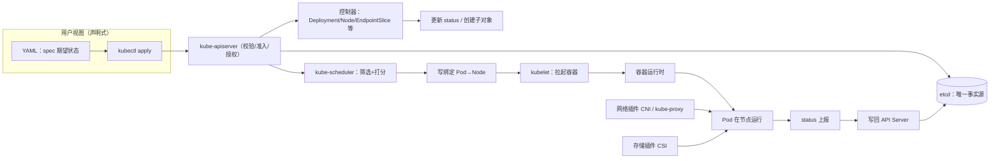

图：根据 [Kubernetes 组件](https://kubernetes.io/zh-cn/docs/concepts/overview/components/) 与 [控制器模式](https://kubernetes.io/zh-cn/docs/concepts/architecture/controller/) 整理/重绘的状态流。

### 2.5 常见误解

| 误区 | 为什么错 | 更准确的理解 | 实际后果 |
|---|---|---|---|
| "YAML 提交成功就是部署成功" | apply 只表示期望被接受并持久化 | 收敛结果看 status 与事件 | 出问题时不看 status 而反复 apply |
| "K8s 会保证应用永远可用" | 它只负责收敛到期望状态 | 配置/镜像错误会造成崩溃循环 | 盲目信任自愈，缺少 readiness 与监控 |
| "Kubernetes = 容器运行时" | 运行时只是被 kubelet 调用的一层 | 平台价值在上层对象与控制循环 | 排错只查 Docker，忽略控制器 |
| "节点多了自动就高可用" | 自愈不等于高可用 | 需要副本、反亲和、PodDisruptionBudget | 单副本+单节点仍会中断 |

### 2.6 本章验收

读完本章后，至少应该能：

- 用自己的话解释"声明式期望状态 + 控制器收敛"，并指出 etcd 在其中的角色。
- 看到"Pod 反复重启"时，能说出要检查哪几类输入（镜像、配置、探针、资源）。
- 区分"平台自愈能力"与"业务自身必须做的高可用设计"。

---

## 第三章 Kubernetes 架构与核心组件

### 3.1 控制平面与工作节点

Kubernetes 集群由**控制平面（Control Plane）** 与**工作节点（Node/Worker）** 组成。控制平面负责做出全局决策与维护集群状态；工作节点负责运行 Pod。云厂商托管的托管集群会把控制平面作为服务提供，用户只管理节点（来源：[Kubernetes 组件](https://kubernetes.io/zh-cn/docs/concepts/overview/components/)）。

| 角色 | 组件 | 主要职责 | 非职责 |
|---|---|---|---|
| 控制平面 | kube-apiserver | 集群所有 API 请求入口：认证、授权、准入、校验、持久化 | 不直接调度 Pod、不直接管理容器 |
| 控制平面 | etcd | 保存全部集群状态（键值存储，raft 一致性） | 不做业务计算 |
| 控制平面 | kube-scheduler | 为新 Pod 选择节点（筛选+打分） | 不负责创建 Pod 本体 |
| 控制平面 | kube-controller-manager | 运行各类内置控制器（Node/Replication/Endpoint 等） | 每个控制器只处理自己的资源域 |
| 控制平面 | cloud-controller-manager | 对接云厂商 API（负载均衡、路由、存储卷） | 私有/裸金属集群可不用 |
| 工作节点 | kubelet | 节点上的"主代理"：管理 PodSpec、健康探针、与容器运行时交互 | 不做跨节点决策 |
| 工作节点 | kube-proxy | 维护节点上 Service 的转发规则（iptables/ipvs） | 不负责 Pod 间寻址（那是 CNI 的活） |
| 工作节点 | 容器运行时 | 实际创建/销毁容器（containerd、CRI-O、Docker 等） | 无集群语义 |

职责边界是排错的第一把尺子：**请求先到 apiserver，状态在 etcd，决策在调度器与控制器，落地在 kubelet 与运行时，寻址在 CNI，转发在 kube-proxy**。

### 3.2 架构图

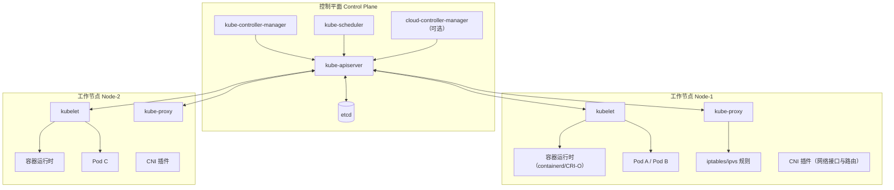

图：根据 [Kubernetes 组件](https://kubernetes.io/zh-cn/docs/concepts/overview/components/) 整理/重绘的组件关系。

### 3.3 组件分工与数据路径

一次"创建 Deployment"背后完整经过：

1. `kubectl` 把 Deployment 对象提交给 kube-apiserver。
2. apiserver 完成认证/授权/准入/校验后写入 etcd，并向所有 watch 该资源的客户端广播。
3. Deployment 控制器发现期望副本与现役 ReplicaSet 不符，创建 ReplicaSet 对象。
4. ReplicaSet 控制器创建 Pod 对象；scheduler 观察到未调度的 Pod，做筛选与打分后把 Pod 绑定到某节点。
5. 该节点 kubelet watch 到绑定的 Pod，通过 CRI 让容器运行时拉镜像并启动容器，配置 CNI 网络，执行探针。
6. kubelet 持续上报 Pod/节点状态，控制器更新 status，直到实际状态等于期望状态。

这条路径上的每一跳都可能失败，因此排错要**逆着数据路径自下而上分层**：先确认对象是否生成、再确认是否调度、再确认节点上是否拉起、最后才怀疑应用本身。

### 3.4 etcd 与 kube-apiserver 的关键属性

- **单写入口**：只有 kube-apiserver 会写 etcd，其他组件都是它的客户端。
- **watch 机制**：控制器依赖 List/Watch 实现近乎实时的"状态变化驱动动作"，这是控制环低延迟的基础。
- **存储边界**：etcd 存的是"对象"，不存容器日志、不存镜像层；日志由节点侧采集，镜像由镜像仓库分发。
- **版本演进示例**：在 v1.37 中，`metrics.k8s.io`（HPA/`kubectl top` 使用的指标 API）正式 GA，etcd RangeStream 进入 Beta——这类演进反映的是"集群基础设施 API 逐步稳定"的方向（来源：[Kubernetes v1.37 发布说明](https://kubernetes.io/zh-cn/blog/2026/08/26/kubernetes-v1-37-release/)）。

### 3.5 常见误解

| 误区 | 更准确的理解 | 后果 |
|---|---|---|
| "所有集群问题都在 etcd" | 大量问题是控制器逻辑/节点层导致，etcd 只是状态库 | 一有问题就重启 etcd |
| "kube-proxy 负责 Pod 互通" | Pod 互通由 CNI 负责，kube-proxy 只管 Service VIP 转发 | Service 通但 Pod 不通时查错组件 |
| "kubelet 是容器运行时" | kubelet 是 API 代理与生命周期管理，运行时是底层 CRI 实现 | 用错工具看错日志 |
| "控制平面必须每台都跑全套" | 控制平面可高可用部署（多副本 apiserver/etcd/控制器） | 单点部署被误当架构事实 |

### 3.6 本章验收

读完本章后，至少应该能：

- 画出一张组件关系图，并在"对象没生成/没调度/没拉起"三个故障点说出该查的组件。
- 解释 kube-apiserver 为什么是"唯一写入口"，以及 watch 在控制器循环中的作用。
- 说出 kubelet、kube-proxy、CNI 插件、容器运行时四者职责不重叠的原因。

---

## 第四章 对象模型与控制器模式

### 4.1 对象的三要素：spec / status / metadata

Kubernetes 中几乎所有管理对象都由三部分构成（来源：[使用 Kubernetes 对象](https://kubernetes.io/zh-cn/docs/concepts/overview/working-with-objects/)）：

- `metadata`：身份与组织信息（`name`、`namespace`、`labels`、`annotations`、`ownerReferences`、`resourceVersion`）。
- `spec`：用户声明的**期望状态**，这是唯一"用户说了算"的部分。
- `status`：系统观测并写入的**实际状态**，通常由控制器或 kubelet 维护，用户不应直接改。

把"期望"与"实际"分开存储，是声明式系统的关键设计：**diff 在哪里，责任就在哪里**。例如 Deployment 的 `spec.replicas: 3` 是期望，`status.readyReplicas` 是实际；控制器的工作就是让后者收敛到前者。

`namespace` 提供资源的多租户命名空间隔离，`name` 在同一 namespace 内唯一；`uid` 则是全集群唯一且对象一旦创建不可变更，控制器与所有者引用都依赖它。

### 4.2 Labels、Selectors 与组织方式

**Label 是附着在对象上的键值对，是 Kubernetes 的组织与选择语言**。控制器通过 Label Selector 找到"属于我的"Pod；Service 通过 Selector 找到后端 Pod；NodeSelector/亲和性通过 Label 选择节点。Label 的经典设计原则是"标识对象**是什么**（环境、版本、组件），而不是描述对象**怎么配置**"，后者应放 Annotation——Annotation 不参与选择，适合存非标识性元数据（来源：[标签和选择算符](https://kubernetes.io/zh-cn/docs/concepts/overview/working-with-objects/labels/)）。

还有一个容易忽略的字段：`ownerReferences`。它把"子对象属于谁"记录下来（例如 ReplicaSet 属于 Deployment），Kubernetes 借此实现**级联删除与 GC**：删除 Deployment 时，它会按 owner 关系清理 ReplicaSet 与 Pod。

### 4.3 API 版本与资源组

资源通过 `apiVersion` 定位到**分组与版本**，例如 `apps/v1`（Deployment、StatefulSet、DaemonSet）、`batch/v1`（Job、CronJob）、`networking.k8s.io/v1`（Ingress、NetworkPolicy）、`storage.k8s.io/v1`（StorageClass）。Kubernetes 以 `alpha → beta → stable(GA)` 的成熟度推进 API；GA 版本长期稳定且不再删除字段。升级集群时，alpha/beta 资源的迁移是常见破坏点（来源：[Kubernetes API 概述](https://kubernetes.io/zh-cn/docs/concepts/overview/kubernetes-api/)）。

因此阅读别人 YAML 时先看 `apiVersion` 与 `kind`，再决定"这是规范概念还是历史概念"；版本边界是本章最重要的元信息。

### 4.4 声明式操作：kubectl apply 的语义

```bash
kubectl apply -f deployment.yaml     # 声明式：创建或更新到与文件一致
kubectl create -f deployment.yaml    # 命令式创建：已存在则报错
kubectl replace -f deployment.yaml   # 命令式替换：整体覆盖
kubectl scale deployment/nginx --replicas=5   # 命令式改字段（不推荐用于生产）
```

`kubectl apply` 会记住对象的上一次配置（annotation），做**三方合并**（last-applied / 集群现状 / 本次输入），因此反复 apply 同一目录是幂等的；而 `replace` 是整体覆盖，容易误删并发修改。生产环境建议把 YAML 纳入 Git，用 GitOps 工具（如 Argo CD、Flux）自动 apply，这是声明式哲学的自然延伸。

### 4.5 最小示例：从 YAML 看到"期望"

```yaml
apiVersion: apps/v1
kind: Deployment
metadata:
  name: nginx-demo
  namespace: default
  labels:
    app: nginx-demo
spec:
  replicas: 3
  selector:
    matchLabels:
      app: nginx-demo
  template:
    metadata:
      labels:
        app: nginx-demo
    spec:
      containers:
      - name: nginx
        image: nginx:1.27
        ports:
        - containerPort: 80
```

应用后建议执行并观察"收敛证据"：

```bash
kubectl apply -f deployment.yaml
kubectl get deployment nginx-demo -o wide
kubectl rollout status deployment/nginx-demo
kubectl describe deployment nginx-demo | tail -30   # 看 Events
```

预期现象：Deployment、ReplicaSet、Pod 三层对象依次出现，最终 `READY 3/3`；若镜像拉取失败，Events 里会出现 `Failed to pull image`。这一步是从"看 YAML"过渡到"看状态"的关键习惯。

### 4.6 常见误解

| 误区 | 更准确的理解 | 后果 |
|---|---|---|
| "改了 YAML 就会立即生效" | 只对 watch 到的控制器生效，且只收敛 spec | 改了副本数却忘了 apply |
| "Label 与 Annotation 可以互换" | Label 参与选择与调度，Annotation 不参与 | 误删 Label 导致控制器失控 |
| "status 可以手改" | status 由系统维护，手改会被覆盖 | 产生假状态与排查误导 |
| "apiVersion 无所谓" | 版本决定字段语义与迁移行为 | 升级后老 YAML 无法 apply |

### 4.7 本章验收

读完本章后，至少应该能：

- 拿到任意一个对象 YAML，能区分 `spec`/`status`/`metadata` 各自属于谁维护。
- 解释 Label Selector 与 ownerReferences 为什么是控制器工作的基础。
- 说清 `apply` 与 `create/replace` 的语义差别，并解释为什么生产推荐 GitOps 式 apply。

---

## 第五章 工作负载：Pod 与控制器

### 5.1 Pod：最小调度与部署单元

**Pod 是 Kubernetes 中可以创建和部署的最小单元**，是一组（通常一个）共享网络命名空间、IPC 命名空间与存储卷的容器集合（来源：[Pod 概述](https://kubernetes.io/zh-cn/docs/concepts/workloads/pods/)）。同一个 Pod 内的容器：

- 共享同一个 Pod IP 与 localhost；
- 共享挂载的 Volume；
- 一起被调度到同一节点、一起被重启或销毁。

所以"要不要放同一个 Pod"的判据是**生命周期是否强耦合**（如日志边车、代理边车需要与主容器同生共死）；业务上松耦合的多个服务应该拆成多个 Pod，由 Service 组织。Pod 支持 `restartPolicy`（Always/OnFailure/Never）与 `initContainers`（先于主容器完成初始化），并可通过 `hostNetwork`/`nodeName` 等字段绕过普通调度约束（静态 Pod 由 kubelet 直接根据目录文件管理，不经过 apiserver 创建，是 OpenYurt 中 YurtHub 等组件常用部署方式，来源：[Pod 概述](https://kubernetes.io/zh-cn/docs/concepts/workloads/pods/)）。

### 5.2 Pod 生命周期状态机

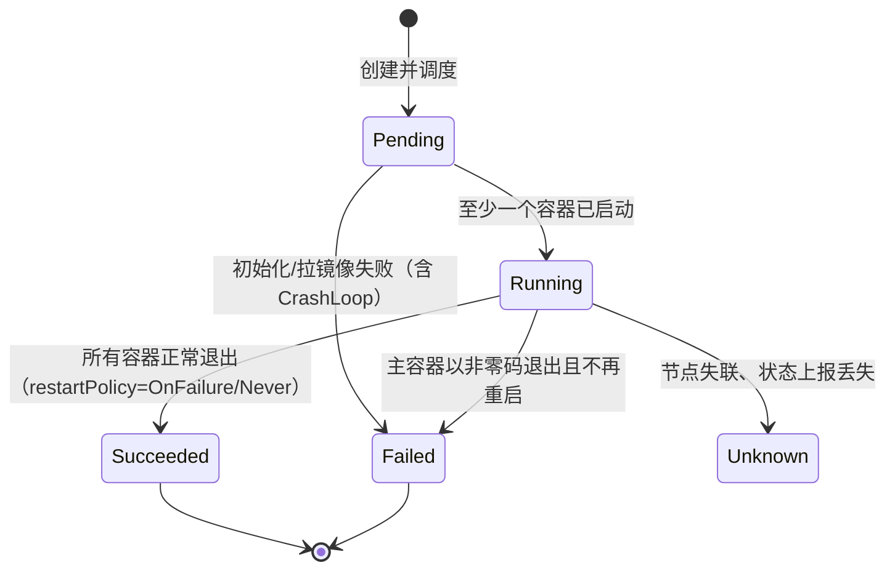

图：根据 [Pod 生命周期](https://kubernetes.io/zh-cn/docs/concepts/workloads/pods/pod-lifecycle/) 整理/重绘的状态机（简化）。

排错时区分两个层面：Pod 层的 `phase`（Pending/Running/Succeeded/Failed/Unknown）与容器层的 `state`（Waiting/Running/Terminated）。`CrashLoopBackOff` 是容器反复启动后退出，属于容器层问题；`Pending` 则多半在调度或初始化阶段。

### 5.3 控制器选型：谁来管"这一类"Pod

普通 Pod 没有自愈语义，生产工作负载应由控制器管理（来源：[工作负载控制器](https://kubernetes.io/zh-cn/docs/concepts/workloads/controllers/)）：

| 控制器 | 保证的语义 | 典型场景 | 不适合 |
|---|---|---|---|
| Deployment + ReplicaSet | 无状态副本、滚动升级/回滚 | Web、API 服务 | 有状态、需稳定标识的数据库 |
| StatefulSet | 稳定网络标识、稳定存储、有序部署/收缩 | 数据库、消息队列、etcd | 纯无状态应用（反而复杂） |
| DaemonSet | 每节点恰好一份 | 日志采集、节点监控、CNI/CSI 组件 | 需要副本数=业务实例数的服务 |
| Job | 运行到成功结束的批处理 | 迁移、批量计算 | 常驻服务 |
| CronJob | 按时间表创建 Job | 定时备份、报表 | 需要秒级精度的调度 |

选择原则：先问"这组 Pod 有没有状态（存储与身份）"，有状态用 StatefulSet；再问"是不是每节点一份"，是则用 DaemonSet；"一次性还是定时"用 Job/CronJob；其余默认 Deployment。

### 5.4 Deployment 的滚动升级与回滚

Deployment 通过创建新 ReplicaSet、逐步增减副本完成升级，策略参数 `maxUnavailable` 与 `maxSurge` 控制"最少可用"与"最多超量"的边界（来源：[Deployment 滚动更新](https://kubernetes.io/zh-cn/docs/concepts/workloads/controllers/deployment/)）。

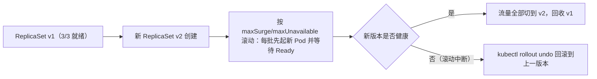

关键习惯：

- 升级前记录：`kubectl rollout history deployment/nginx-demo`。
- 升级中观察：`kubectl rollout status deployment/nginx-demo`；失败时先看新 Pod 的 Ready/探针。
- 失败回滚：`kubectl rollout undo deployment/nginx-demo`。
- readinessProbe 决定"何时算新副本可用"，没有它滚动可能把坏版本上线——探针是滚动安全的前提。

### 5.5 探针：谁来判断"活着"与"可用"

Pod 支持三类探针（来源：[配置存活、就绪与启动探针](https://kubernetes.io/zh-cn/docs/tasks/configure-pod-container/configure-liveness-readiness-startup-probes/)）：

- `livenessProbe`：容器是否**活着**；失败则按策略重启容器。
- `readinessProbe`：容器是否**能接流量**；失败则从 Service 后端摘除，但不重启。
- `startupProbe`：慢启动应用在就绪前给的"宽限期"，避免 liveness 误杀。

最小实践规则：对外提供请求的应用必须配 readiness；易死锁或泄露的进程配 liveness；启动超过默认 `initialDelaySeconds` 的应用配 startup，并把 liveness 的探测起点放宽。

### 5.6 常见错误与调试

| 现象 | 可能原因 | 先观察 | 排查顺序 | 修复方向 |
|---|---|---|---|---|
| `ImagePullBackOff` | 镜像名/仓库/标签错误、私有仓库未配 imagePullSecret | `kubectl describe pod` 的 Events | 镜像存在性 → 仓库可达性 → 拉取凭证 | 修正 tag、配置 Secret、换镜像源 |
| `CrashLoopBackOff` | 应用配置错、端口绑定错、启动即崩 | 容器退出码与 `kubectl logs` | 退出码 → 启动日志 → 探针配置 | 修配置/代码，必要时先禁 liveness 验证 |
| Pod 一直 `Pending` | 无节点满足资源/亲和性/污点容忍 | `kubectl describe pod` 的 Events | 资源量 → 污点 → 亲和性 → 存储依赖 | 扩容、去污点容忍、修正选择器 |
| 升级后流量中断 | readiness 未就绪即滚动、探针路径错误 | `rollout status` 与 EndpointSlice | 新 Pod Ready？→ Endpoint 是否含新 Pod | 修正 readiness，回滚再重试 |
| 节点维护时业务中断 | 无副本/无 PDB/无反亲和 | 事件中的 Evicted | 副本数 → PDB → 拓扑分布 | 提升副本、加 PodDisruptionBudget |

官方调试路径可参考 [调试 Pod 文档](https://kubernetes.io/zh-cn/docs/tasks/debug/debug-application/debug-pods/)。原则：**先取 Events 与日志这些事实，再动配置**。

### 5.7 本章验收

读完本章后，至少应该能：

- 根据"有状态/每节点一份/一次性/常驻无状态"四问选择控制器。
- 解释滚动升级中 `maxSurge`/`maxUnavailable`/readinessProbe 三者如何共同保证不中断。
- 用退出码、Events、日志把 CrashLoopBackOff 与 ImagePullBackOff 区分开。

---

## 第六章 调度、资源与稳定性

### 6.1 调度器如何工作：筛选 + 打分

kube-scheduler 为每个新创建的、尚未绑定节点的 Pod 选择节点，流程分两阶段（来源：[kube-scheduler 文档](https://kubernetes.io/zh-cn/docs/concepts/scheduling-eviction/kube-scheduler/)）：

1. **筛选（Filtering）**：找出满足硬约束的节点集合——资源足够、端口不冲突、满足节点选择器与亲和性、容忍污点、满足卷可用性等。
2. **打分（Scoring）**：对候选节点按规则打分（资源碎片、已运行 Pod 数量、亲和性权重等），选择得分最高者。

调度结果是**一次绑定决策**（Pod 与 Node 的绑定写入 apiserver），不是"持续管理"；调度完成后由 kubelet 负责落地。这也意味着：调度是一次性决策，运行中的再平衡（如某节点变热）主要靠驱逐与重建，而不是"迁移进程"。

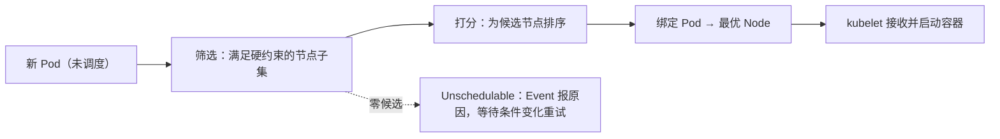

### 6.2 让 Pod"想"去某处：节点选择、亲和性与污点

控制 Pod 落点有四类互补手段：

- `nodeSelector` / 节点 Label：简单精确匹配，例如"只去 GPU 节点"。
- `nodeAffinity`/`podAffinity`/`podAntiAffinity`：支持 `requiredDuringScheduling`（硬）与 `preferredDuringScheduling`（软）两档。
- **污点（Taints）与容忍（Tolerations）**：节点打污点"默认不接纳"，只有带对应容忍的 Pod 才可调度上去；常用于隔离专用节点（来源：[污点和容忍度](https://kubernetes.io/zh-cn/docs/concepts/scheduling-eviction/taint-and-toleration/)）。
- **拓扑分布约束**（Pod Topology Spread）：让副本尽量分散到 zone/节点，提升故障域隔离。

一个容易混淆点：**污点是节点"拒绝"，亲和性是 Pod"申请"**。即使 Pod 有 `nodeAffinity` 指向某节点，若该节点带未容忍的污点，Pod 仍不会被调度上去。

### 6.3 资源请求与限制：从调度到驱逐

`requests` 是调度与 QoS 的基准（容器**保证**能拿到的量），`limits` 是**上限**。两者关系决定 QoS 等级：

| QoS 等级 | 判定 | 过载时的命运 |
|---|---|---|
| Guaranteed | 每个容器 requests == limits，且都设置 | 最不容易被驱逐 |
| Burstable | 任一容器 requests != limits 或未全设置 | 资源竞争时次优先 |
| BestEffort | 所有容器都不设 requests/limits | 最先被 OOM/驱逐 |

节点资源不足或节点故障时，kubelet/调度器按 QoS 从低到高驱逐 Pod（来源：[配置 Pod 服务质量](https://kubernetes.io/zh-cn/docs/concepts/workloads/pods/pod-qos/)）。`kubectl top node` 与容器 `metrics-server` 是观测资源水位的基本入口。

### 6.4 调度失败排查

调度失败的特征是 Pod 长期 `Pending`，且 `kubectl describe pod` 的 Events 中出现 `FailedScheduling` 与原因。常见原因按频率排列：

1. 节点资源（CPU/内存/临时存储/GPU）不足——先 `kubectl describe node` 看 Allocatable。
2. 未容忍的污点——查看节点 `Taints` 字段。
3. 亲和性/反亲和互斥（尤其反亲和要求副本数超过可用节点数）。
4. 存储：PVC 未绑定或只能在特定节点供给。
5. 端口冲突或 `hostPort` 稀缺。

修复方向永远是"让期望更符合现实"：加资源、加容忍、放宽拓扑或增加节点，而不是反复删除重建。

### 6.5 需要知道的两个例外

- **DaemonSet** 的 Pod 由 DaemonSet 控制器直接安排到每个（满足条件的）节点，不经过 scheduler。
- **静态 Pod** 由 kubelet 直接从清单目录加载，也不经过 scheduler——但 kubelet 会把它们的镜像对象镜像成 apiserver 中的 Pod 对象。

### 6.6 本章验收

读完本章后，至少应该能：

- 解释"筛选 + 打分"两阶段并指出调度是一次性绑定决策。
- 区分 nodeSelector、亲和性、污点容忍与拓扑分布各自适用的约束类型。
- 看到一个 Pending Pod，能用 Events 与节点资源列出至少四种可能原因并按序排查。

---

## 第七章 网络模型与流量路径

### 7.1 Kubernetes 网络模型：四个假设

Kubernetes 对集群网络提出一套"必须满足"的模型，任何 CNI 插件都要兑现（来源：[集群网络](https://kubernetes.io/zh-cn/docs/concepts/cluster-administration/networking/)）：

1. 所有 Pod 可以不通过 NAT 直接互相通信（无论跨不跨节点）。
2. 所有节点可以不通过 NAT 直接访问所有 Pod。
3. Pod 自己看到的 IP 与其他 Pod 看到的 IP 一致。
4. 网络隔离（NetworkPolicy）是独立、可插拔的层。

模型的本质是**把 Pod IP 当作一等公民**：寻址责任从应用转移到集群网络插件（CNI），应用只关心"地址可用"。CNI 插件负责分配 Pod IP、创建虚拟网卡、维护节点间路由或 Overlay 隧道，常见实现如 Calico、Flannel、Cilium（来源：[CNI 规范](https://kubernetes.io/zh-cn/docs/concepts/cluster-administration/networking/#how-to-implement-the-kubernetes-networking-model)）。

### 7.2 三类流量与三套机制

| 流量 | 谁解决 | 核心对象/机制 |
|---|---|---|
| Pod → Pod | CNI 插件 | 每 Pod 独立 IP + 节点间路由/隧道 |
| Pod → Service | kube-proxy | ClusterIP 上的 iptables/ipvs 转发到 EndpointSlice |
| 集群外 → Service | kube-proxy + 负载均衡层 | NodePort/LoadBalancer/Ingress |

### 7.3 Service：稳定的虚拟入口

Service 为一组 Pod 提供**稳定访问入口**，它通过 Selector 选择后端 Pod，并把成员名单写入 EndpointSlice 对象；kube-proxy 根据 EndpointSlice 维护转发规则（来源：[Service](https://kubernetes.io/zh-cn/docs/concepts/services-networking/service/)）。ClusterIP 是虚拟 IP，kube-proxy 在节点上把它翻译成具体 Pod IP 的 DNAT。

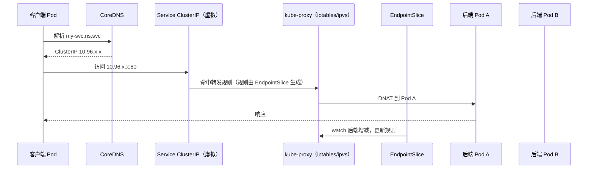

图：根据 [Service](https://kubernetes.io/zh-cn/docs/concepts/services-networking/service/) 与 [EndpointSlice](https://kubernetes.io/zh-cn/docs/concepts/services-networking/endpoint-slices/) 整理/重绘的流量路径。

### 7.4 Service 类型与选型

| 类型 | 暴露范围 | 机制 | 适用 |
|---|---|---|---|
| ClusterIP | 集群内 | 虚拟 IP | 内部服务间调用（默认） |
| NodePort | 集群外可达（节点 IP:端口） | 每个节点开高可用端口转发 | 简单暴露、无云 LB、边缘测试 |
| LoadBalancer | 公网/云内 | 云 LB 把流量导到 NodePort/直连 | 云上对外服务 |
| ExternalName | DNS 别名 | 返回 CNAME | 把外部域名伪装成集群内服务 |
| Headless（clusterIP: None） | 无 VIP | 直接返回 Pod IP 列表 | 需要直连后端、StatefulSet 稳定标识 |

Service 流量本地化（把流量限制在本地节点/同一地域节点）正是 OpenYurt 第二十章要讲的话题；原生 Service 默认把后端视为"同质集合"，这与边缘多地域场景冲突。

### 7.5 DNS 与服务发现

集群内默认部署 CoreDNS，Pod 可使用完整域名 `my-service.my-namespace.svc.cluster.local` 访问服务；同 namespace 下可简写服务名。Pod 的 `resolv.conf` 由 kubelet 注入 `search` 域，这是"服务名直接可用"的原因（来源：[集群内 DNS](https://kubernetes.io/zh-cn/docs/concepts/services-networking/dns-pod-service/)）。

### 7.6 Ingress 与 Gateway API

Ingress 是**七层（HTTP/HTTPS）入口对象**，把外部域名/路径路由到集群内 Service，具体由 Ingress Controller（如 NGINX Ingress）实现；它比 NodePort 更适合"按域名/路径暴露多个 HTTP 服务"。新一代 **Gateway API** 把入口、服务网格、东西向流量统一为更细粒度的资源模型，是官方推荐的演进方向（来源：[Ingress](https://kubernetes.io/zh-cn/docs/concepts/services-networking/ingress/) 与 [Gateway API](https://gateway-api.sigs.k8s.io/)）。

### 7.7 NetworkPolicy：面向应用的网络隔离

NetworkPolicy 声明"谁可以访问这组 Pod"，支持 `podSelector`（选择目标 Pod）、`ingress/egress` 规则、`ipBlock`/`namespaceSelector`/`podSelector` 三类对端匹配（来源：[网络策略](https://kubernetes.io/zh-cn/docs/concepts/services-networking/network-policies/)）。三个必须知道的边界：

- 必须由支持 NetworkPolicy 的 CNI（Calico/Cilium 等）实施；Flannel 等部分插件不实施，写了也不生效。
- **默认允许模型**：没有策略的 namespace 里流量全通；一旦有策略选中某个 Pod，未匹配的流量被拒绝——先写"拒绝全部"再放行是常见模式。
- 它隔离的是**网络数据面**，不是身份面；精细到工作负载身份可用 ServiceAccount 与更细的网络方案配合。

### 7.8 常见问题排查：按流量方向分层

| 现象 | 排查顺序 |
|---|---|
| Pod A 无法访问 Pod B | A 是否 Running → B 是否存在 → 同节点测 B IP → 跨节点测 → CNI 路由/防火墙 → NetworkPolicy 是否挡 |
| Pod 无法访问 Service | Service 是否有 Endpoint（`kubectl get endpointslices`）→ 后端 Pod Ready？→ kube-proxy 规则（`iptables -t nat -L`）→ 是否命中 ClusterIP 冲突 |
| 集群外访问 NodePort 不通 | 节点安全组/防火墙 → Service NodePort 是否创建 → 后端 Pod 是否就绪 → kube-proxy 是否运行 |
| 服务名解析失败 | `nslookup`/`dig` 结果 → CoreDNS Pod 状态 → 是否用 hostNetwork 绕过 DNS → Service 是否与域名匹配 |

调试命令速查：`kubectl get endpointslices -l kubernetes.io/service-name=my-svc`、`kubectl get networkpolicy -A`、节点上 `iptables -t nat -S KUBE-SERVICES`（或 ipvs 查看）。先确认"后端名单对不对"，再怀疑"转发规则坏没坏"。

### 7.9 本章验收

读完本章后，至少应该能：

- 画出 Service 访问路径并指出 EndpointSlice 与 kube-proxy 各自的角色。
- 根据暴露范围在 ClusterIP/NodePort/LoadBalancer/Ingress 间选型。
- 写一个只放行指定来源的 NetworkPolicy，并解释为什么 CNI 不支持时它无效。

---

## 第八章 存储抽象与数据持久化

### 8.1 从容器卷到持久化存储的四层抽象

Kubernetes 把"卷的接入"与"卷的供给"分层解耦（来源：[持久卷](https://kubernetes.io/zh-cn/docs/concepts/storage/persistent-volumes/)）：

| 层 | 对象/组件 | 职责 |
|---|---|---|
| 使用层 | Pod 中的 `volume` 挂载 | 声明"我要把这个卷挂到哪" |
| 请求层 | PVC（PersistentVolumeClaim） | 声明"我要多大、什么访问模式、哪类存储" |
| 供给层 | PV（PersistentVolume） | 描述一块真实存储及其回收策略 |
| 动态供给层 | StorageClass + provisioner | 按需调用 CSI 插件创建存储卷 |

一句话模型：**PVC 是"需求"，PV 是"供给"，StorageClass 是"自动按需供给的工厂"**。Pod 从不直接绑定 PV，而是通过 PVC 间接获得存储，从而让应用 YAML 与底层存储厂商解耦。

### 8.2 静态供给与动态供给

- **静态供给**：管理员预先创建 PV，PVC 通过容量与访问模式匹配到一个空闲 PV（`kubectl get pv` 状态为 Available → Bound）。
- **动态供给**：PVC 指定 `storageClassName`，provisioner 按 StorageClass 参数调用 CSI 插件现建存储并生成 PV。若 PVC 未指定且集群有默认 StorageClass，也走动态供给。

```yaml
apiVersion: v1
kind: PersistentVolumeClaim
metadata:
  name: data-nginx
spec:
  accessModes:
  - ReadWriteOnce
  resources:
    requests:
      storage: 1Gi
  storageClassName: standard   # 动态供给；省略则用默认 StorageClass
```

```yaml
apiVersion: apps/v1
kind: Deployment
metadata:
  name: nginx-pvc
spec:
  replicas: 1
  selector:
    matchLabels:
      app: nginx-pvc
  template:
    metadata:
      labels:
        app: nginx-pvc
    spec:
      volumes:
      - name: data
        persistentVolumeClaim:
          claimName: data-nginx
      containers:
      - name: nginx
        image: nginx:1.27
        volumeMounts:
        - name: data
          mountPath: /usr/share/nginx/html
```

关键字段语义：

- `accessModes`：ReadWriteOnce（单节点读写）/ReadOnlyMany（多节点只读）/ReadWriteMany（多节点读写）。是"能怎么挂"，不是强制的锁。
- `reclaimPolicy`：PV 释放后 Retain（保留，管理员手工清理）/Delete（删除底层存储）；Retain 适合要保数据的场景。
- `volumeMode`：Filesystem 或 Block（块设备，供数据库等使用）。

### 8.3 PVC/PV 生命周期

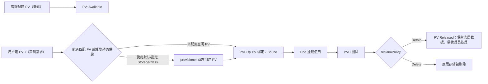

图：根据 [持久卷](https://kubernetes.io/zh-cn/docs/concepts/storage/persistent-volumes/) 整理/重绘的生命周期。

### 8.4 有状态工作负载与 StatefulSet

StatefulSet 通过 `volumeClaimTemplates` 为每个副本生成稳定的 PVC/PV（`data-<pod>-0`、`data-<pod>-1`…），配合稳定主机名，使数据库、消息队列等能在重启/重建后找回同一份数据（来源：[StatefulSet](https://kubernetes.io/zh-cn/docs/concepts/workloads/controllers/statefulset/)）。注意：StatefulSet 的删除默认**不会**删除 PVC，这是刻意的数据保护；`kubectl delete statefulset` 前想清楚数据归属。

### 8.5 常见错误与调试

| 现象 | 可能原因 | 先观察 | 排查顺序 | 修复方向 |
|---|---|---|---|---|
| PVC 一直 Pending | 无匹配 PV、StorageClass 不存在/驱动未装、容量超配 | `kubectl describe pvc` Events | 是否有 PV → storageClass → provisioner 日志 | 创建存储类/修正容量，或建 PV |
| 存储插件相关 Pod 异常 | CSI driver 未部署、节点驱动缺失 | `kubectl get pods -n kube-system` 中 csi 相关 | 驱动 DaemonSet → 节点内核/依赖 | 修复驱动安装 |
| 挂载目录为空 | 镜像路径覆盖挂载点、volumeMount 路径错 | `kubectl exec` 检查 | 路径 → 是否为空 dir → PV 内容 | 修正 mountPath 或改用 subPath |
| 删除 PVC 后数据也没了 | reclaimPolicy=Delete 且无备份 | 查看 PV 策略 | 误删前先确认策略 | 需要保留时改用 Retain 并定期备份 |

### 8.6 本章验收

读完本章后，至少应该能：

- 用一句话说清 PVC/PV/StorageClass 三者的供给关系。
- 写出一个"动态供给 + Pod 挂载"的最小示例并解释关键字段。
- 看到 PVC Pending 时按"匹配→供给→挂载"的顺序排错。

---

## 第九章 安全、认证授权与多租户

### 9.1 安全边界模型：谁 → 能干什么 → 是否放行

Kubernetes 对 API 请求做四道检查（来源：[保护集群](https://kubernetes.io/zh-cn/docs/tasks/administer-cluster/securing-a-cluster/) 与 [认证](https://kubernetes.io/zh-cn/docs/reference/access-authn-authz/authentication/)）：

1. **传输安全**：TLS 加密。
2. **认证（Authentication）**：确认"你是谁"（客户端证书、ServiceAccount Token、静态 Token、OIDC 等）。
3. **授权（Authorization）**：确认"你能做什么"（RBAC 为主）。
4. **准入控制（Admission）**：请求写入前的一票否决/改写（Admission Controller、PSA、自定义 Webhook）。

这个模型的排错含义：`kubectl` 报 `Forbidden` 多半是**授权**问题（RBAC 没配）；报证书/token 错误多半在**认证**层；对象合法却被拒绝，多半是**准入**层拦截。

### 9.2 ServiceAccount 与凭据

ServiceAccount 是 Pod 在集群内的"身份"。Pod 创建时可以指定 `serviceAccountName`，kubelet 会把对应 Token（若开启了 TokenRequest 投影，则是短期、绑定 Pod 的 Token）与 CA 挂载进容器，供应用以 InClusterConfig 方式访问 API（来源：[ServiceAccount](https://kubernetes.io/zh-cn/docs/concepts/security/service-accounts/)）。

最小实践：

- 不要给所有 Pod 用 `default` SA 的最高权限想象——default 本身无额外权限，权限来自绑定的 Role。
- 拉私有镜像用 `imagePullSecrets`，不要硬编码 Registry 密码到镜像。
- 长期静态 Token（自动生成的 Secret 类型 token）在 1.24+ 不再自动为 SA 创建；短期投射 Token 是推荐做法。

### 9.3 RBAC：最小权限授权

RBAC 用四类对象描述授权（来源：[RBAC](https://kubernetes.io/zh-cn/docs/reference/access-authn-authz/rbac/)）：

- `Role` / `ClusterRole`：能对哪些资源做什么（verbs + resources）。
- `RoleBinding` / `ClusterRoleBinding`：把 Role 授予哪些主体（User/Group/ServiceAccount）。

```yaml
apiVersion: rbac.authorization.k8s.io/v1
kind: Role
metadata:
  namespace: app-a
  name: app-a-pod-reader
rules:
- apiGroups: [""]
  resources: ["pods", "pods/log"]
  verbs: ["get", "list", "watch"]
---
apiVersion: rbac.authorization.k8s.io/v1
kind: RoleBinding
metadata:
  namespace: app-a
  name: app-a-pod-reader-bind
subjects:
- kind: ServiceAccount
  name: app-a-sa
  namespace: app-a
roleRef:
  kind: Role
  name: app-a-pod-reader
  apiGroup: rbac.authorization.k8s.io
```

官方"良好实践"强调：优先 namespace 级 Role 而非 ClusterRole；不要给 `system:...` 前缀的集群主体乱绑；定期用审计日志核对谁的权限过大（来源：[RBAC 良好实践](https://kubernetes.io/zh-cn/docs/concepts/security/rbac-good-practices/)）。RBAC 生效是"加法"：某个请求只要命中任一允许规则就放行，因此少授权、定期回收是硬纪律。

### 9.4 Pod Security Admission（PSA）

Pod Security Standards 定义三档安全基线（来源：[Pod 安全标准](https://kubernetes.io/zh-cn/docs/concepts/security/pod-security-standards/)）：

- `privileged`：不做限制。
- `baseline`：禁止明显危险的默认配置（特权容器、hostPID/hostNetwork 等）。
- `restricted`：进一步要求只读根文件系统、拒绝提升权限、限制 capabilities 等。

命名空间通过标签声明执行模式（来源：[Pod Security Admission](https://kubernetes.io/zh-cn/docs/concepts/security/pod-security-admission/)）：

```bash
kubectl label ns app-b pod-security.kubernetes.io/enforce=baseline
kubectl label ns app-b pod-security.kubernetes.io/enforce-version=v1.37
kubectl label ns app-b pod-security.kubernetes.io/warn=restricted
```

`enforce` 直接拒绝违规 Pod，`warn`/`audit` 记录但不阻止，适合灰度收紧。注意特权型系统组件（CNI、CSI、kube-proxy 所在 ns）需要保留 `privileged`。

### 9.5 Secret 与数据安全边界

Secret 只解决"不与 ConfigMap 明文混淆"，并不自动加密：默认情况下 Secret 以 base64 存在 etcd，读取者只要有 GET 权限就能解码。生产环境应开启 **etcd 静态加密**（EncryptionConfiguration）并配合 RBAC 收紧（来源：[加密传输中的数据](https://kubernetes.io/zh-cn/docs/tasks/administer-cluster/encrypt-data/)）。任何"把 Secret 打日志、打进镜像、放进 Git"的做法都等于泄露。

### 9.6 常见错误与调试

| 现象 | 可能原因 | 排查顺序 | 修复方向 |
|---|---|---|---|
| `Forbidden ... is forbidden` | RBAC 未授予 | 确认请求者身份 → `kubectl auth can-i` 验证 → 检查 Binding | 补最小 Role/Binding |
| 控制器创建子资源失败 | 控制器 ServiceAccount 权限不足 | 看 controller-manager 日志的 forbidden | 升级 chart/授予所需 RBAC |
| Pod 里访问 API 403 | SA 未绑定角色、Token 过期 | 看 SA → 看 token 有效期 → 测试 can-i | 绑定角色或改用投射 Token |
| 高危 Pod 被拒 | PSA enforce 挡住 | 看事件里 pod-security 原因 | 修 spec 或降级该 ns 档位 |

### 9.7 本章验收

读完本章后，至少应该能：

- 分清认证、授权、准入三层并据此判断 403/证书/被准入拒绝分别属于哪层。
- 写出"某 SA 只在某 namespace 读 Pod 日志"的最小 RBAC。
- 解释 PSA 的 enforce/warn/audit 差别并知道系统组件 namespace 为何要 privileged。

---

## 第十章 集群安装、升级与端到端运维

### 10.1 安装方式选型

| 方式 | 适合 | 不适合 |
|---|---|---|
| 云厂商托管（控制平面托管） | 不想运维控制平面、要 SLA | 需要完全自控控制面配置 |
| kubeadm | 自建生产、裸金属、学习控制平面机制 | 不想接触证书/升级流程的团队 |
| 二进制手动部署 | 深度理解组件、特殊发行版 | 常规生产（维护成本高） |
| kind / minikube | 本地开发与学习 | 生产 |
| K3s / RKE2 等轻量发行版 | 资源受限、边缘、快速起步 | 需要与上游完全一致的默认行为时需评估 |

本讲义以 **kubeadm** 为主线演示控制平面机制，这也是 OpenYurt 转换部署所依赖的"标准 Kubernetes 集群"形态（见第二十四章）。

### 10.2 kubeadm 建立集群的最小流程

```bash
# 控制平面节点
kubeadm init --pod-network-cidr=10.244.0.0/16 \
  --apiserver-advertise-address=<控制面IP>
mkdir -p $HOME/.kube && cp -i /etc/kubernetes/admin.conf $HOME/.kube/config
kubectl apply -f <CNI 插件 manifest>      # 如 calico/flannel

# 工作节点（输出里会给 join 命令与 token）
kubeadm join <控制面IP>:6443 --token <token> \
  --discovery-token-ca-cert-hash sha256:<hash>

# 验证
kubectl get nodes
kubectl get pods -n kube-system
kubectl taint nodes <control-plane-name> node-role.kubernetes.io/control-plane:NoSchedule-
```

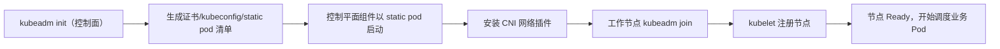

预期结果：`kubectl get nodes` 全部 `Ready`，`kube-system` 下 kube-apiserver/etcd/kube-scheduler/kube-controller-manager/CoreDNS/CNI 均 Running。若失败先检查：端口 6443 可达、容器运行时与 kubelet 已启用、镜像可拉取（国内环境建议先配镜像加速）。

### 10.3 集群升级与版本偏差政策

升级的正确顺序是"先控制平面、后节点"，且节点要逐个 `drain`（安全腾空）再升级再 `uncordon`：

```bash
kubeadm upgrade plan
kubeadm upgrade apply v1.37.x
kubectl drain <node> --ignore-daemonsets --delete-emptydir-data
# 升级该节点 kubelet/kubeadm 后
kubeadm upgrade node
kubectl uncordon <node>
```

官方维护策略与偏差约束以 [版本偏差政策](https://kubernetes.io/zh-cn/releases/version-skew-policy/) 为准：先读它再规划升级窗口。通用纪律包括：kubelet 不要比 kube-apiserver 新；跨多个 minor 时先小步升级验证；升级前备份 etcd。

### 10.4 证书与常见运维坑

- kubeadm 默认签发的集群证书有效期约一年；接近过期时执行 `kubeadm certs renew all` 并重启相关组件。
- `kubeconfig` 过期表现为 `Unable to connect`/证书错误——先查 `kubectl config view` 与 `/etc/kubernetes` 证书到期时间。
- 节点 `NotReady` 优先查：容器运行时是否存活 → kubelet 是否运行且能访问 apiserver → CNI 是否损坏 → 磁盘/内存是否打满。

### 10.5 排错故障树与命令速查

```text
现象：服务不可用 / Pod 异常
  ├─ 1. kubectl get nodes：节点 Ready？
  │     └─ 否 → kubelet？运行时？CNI？磁盘？时间同步？
  ├─ 2. kubectl get pods -A：对象存在？
  │     └─ 否 → 控制器/CRD/准入是否正常
  ├─ 3. kubectl describe pod：Events 与状态
  │     └─ Pending→调度；ImagePull→镜像；CrashLoop→应用日志
  ├─ 4. kubectl logs / kubectl exec：应用是否真的健康
  ├─ 5. Service/Ingress：Endpoint 名单是否正确
  └─ 6. 网络层：Pod 间、DNS、NodePort/云安全组
```

| 想看什么 | 命令 |
|---|---|
| 集群整体 | `kubectl get nodes -o wide`、`kubectl get pods -A -o wide` |
| 单个对象详情与事件 | `kubectl describe <type> <name>` |
| 容器日志 | `kubectl logs -f <pod> [-c <container>]` |
| 调度/控制器细节 | 控制平面组件日志（静态 Pod 时用 `journalctl` 或 `kubectl logs -n kube-system`） |
| 资源水位 | `kubectl top node/pod`（需 metrics-server） |
| API 审计/权限验证 | `kubectl auth can-i --list --as=system:serviceaccount:ns:sa` |

### 10.6 端到端运维练习：从空集群到可访问应用

练习目标：用 kind 或 kubeadm 得到一个集群，从"应用 YAML → 滚动升级 → 扩容 → 故障注入 → 清理"完整走一遍，验证第一部分各模块能串联。

```bash
# 1. 部署应用与 Service
kubectl apply -f - <<'EOF'
apiVersion: apps/v1
kind: Deployment
metadata:
  name: whoami
spec:
  replicas: 2
  selector:
    matchLabels: { app: whoami }
  template:
    metadata:
      labels: { app: whoami }
    spec:
      containers:
      - name: whoami
        image: traefik/whoami:v1.10
        ports: [{ containerPort: 80 }]
        readinessProbe:
          httpGet: { path: /, port: 80 }
---
apiVersion: v1
kind: Service
metadata:
  name: whoami
spec:
  selector: { app: whoami }
  ports: [{ port: 80 }]
EOF

# 2. 验证收敛与服务发现
kubectl rollout status deployment/whoami
kubectl get endpointslices -l kubernetes.io/service-name=whoami

# 3. 滚动升级（改 image 标签）
kubectl set image deployment/whoami whoami=traefik/whoami:v1.11
kubectl rollout status deployment/whoami

# 4. 扩缩容
kubectl scale deployment/whoami --replicas=3

# 5. 故障注入：删除一个 Pod，观察自愈
kubectl delete pod -l app=whoami

# 6. 内部访问
kubectl run curl --image=curlimages/curl --rm -it -- curl http://whoami

# 7. 清理
kubectl delete deployment,service whoami
```

练习验证点：rollout 无中断（配合 readiness）；EndpointSlice 成员随副本增减变化；删除 Pod 后新 Pod 自动补位；通过 Service 域名能访问。

### 10.7 本章验收

读完本章后，至少应该能：

- 说出 kubeadm 建集群的最小步骤与验证命令。
- 按"控制平面→节点"顺序规划一次升级，并知道先读版本偏差政策。
- 从"节点 NotReady / Pod Pending / 服务不通"三类现象出发，按故障树走到根因。

---

# 第二部分 OpenYurt：把 Kubernetes 扩展到边缘

第二部分的路线是"先认清边缘问题，再读 OpenYurt 的组件分工，然后用 NodePool、自治、网络、升级、设备、安装实战把概念闭环"，最后回到选型与排错。读完这部分，你应该能在自己的边缘实验环境里解释"哪个组件在做什么、断网时系统为什么还能工作"。

## 第十一章 为什么要为边缘改造 Kubernetes

### 11.1 边缘场景与云原生假设的冲突

原生 Kubernetes 的前提是"控制平面与节点之间网络相对可靠"。边缘场景却普遍存在三类事实（来源：[OpenYurt 核心能力](https://openyurt.io/zh/docs/)，[CNCF：OpenYurt 成为 Incubating 项目](https://www.cncf.io/blog/2025/07/02/openyurt-becomes-a-cncf-incubating-project/)）：

| 边缘事实 | 与原生假设的冲突 | 典型后果 |
|---|---|---|
| 云边链路弱网、抖动、可断连 | 节点心跳与 watch 持续依赖 apiserver | 断连超过阈值后 Pod 被驱逐/节点被标记 NotReady |
| 边缘节点跨多个地域/局域网 | 原生 Service/CNI 假设全网互通 | 跨 NodePool 的 Pod IP、Service 不通 |
| 海量异构节点、分层归属不同业主 | 集群是"单一信任域 + 同质节点" | 升级决定权、流量本地性、安全边界难表达 |
| 公网带宽昂贵 | watch 全量广播（endpoints 等）按节点重复下发 | 云边流量放大、成本高 |
| 端设备需要被管理 | 原生 K8s 不抽象设备 | 需另建设备管理孤岛 |

其中断连驱逐是"最反直觉"的一条：**断网恰恰发生在"最需要本地点点自治"的时刻，而原生控制环的默认反应却是清退这个节点上的工作负载**。这正是 OpenYurt 自治能力的出发点（来源：[OpenYurt 文档：边缘自治](https://openyurt.io/zh/docs/)）。

### 11.2 原生 Kubernetes 的三个具体痛点

1. **节点失联驱逐**：kube-apiserver 失联超时后，集群控制平面会认为节点不健康并驱逐其上的 Pod；弱网下这会造成"一断网就雪崩"（来源：[OpenYurt 文档：边缘自治](https://openyurt.io/zh/docs/)）。OpenYurt 通过节点自治配置与改造后的节点生命周期控制器避免这类误驱逐。
2. **边侧依赖云上数据面**：kubelet、kube-proxy 需要实时访问 apiserver 获取 Service/ConfigMap/EndpointSlice 等数据；断网后边侧组件失去"知识来源"。
3. **无地域与拓扑语义**：Service 把后端视为同质集合，无法表达"流量只进本 NodePool"；NodePort 默认在每个节点监听，无法按池隔离入口（来源：[OpenYurt 文档：服务拓扑与流量管理](https://openyurt.io/zh/docs/next/user-manuals/workload/workload-management-overview/)）。

### 11.3 OpenYurt 的解法思路：扩展而非替换

OpenYurt 的定位是**业界首个对云原生体系无侵入的边缘计算平台**：它基于上游 Kubernetes 构建，保持 API 兼容；用户可以在边缘获得与数据中心 Kubernetes 一致的使用体验，同时获得边缘自治、跨地域网络、多地域编排、升级模型与云原生设备管理能力（来源：[OpenYurt 文档 Introduction](https://openyurt.io/zh/docs/)）。"无侵入"体现在三个层面：

- **API 不变**：Kubernetes 原生 API 与对象照常使用，新增能力通过 CRD 与扩展控制器表达。
- **节点侧只加代理**：在边缘节点以 static pod/系统服务形式运行 YurtHub 等轻量组件，不改 kubelet 源码。
- **云端只加控制器集**：Yurt-Manager 以控制器 + webhook 方式运行在云侧。

项目现为 CNCF Incubating 项目（2025-07-02 宣布），由阿里云于 2020 年开源（来源：[CNCF 公告](https://www.cncf.io/blog/2025/07/02/openyurt-becomes-a-cncf-incubating-project/)、[OpenYurt GitHub README](https://github.com/openyurtio/openyurt/)）。

### 11.4 本章验收

读完本章后，至少应该能：

- 列举三条"原生 Kubernetes 直搬边缘会失败"的机制性原因。
- 解释为什么断连驱逐在边缘是危险行为，而 OpenYurt 把它列为头号能力。
- 说出 OpenYurt "扩展而非替换"在 API、节点侧、云侧三个层面的含义。

---

## 第十二章 OpenYurt 定位、版本与生态

### 12.1 版本演进脉络

OpenYurt 于 2020-05-29 发布首个版本 v0.1.0-beta.1，经过多年演进到 v1.7.0（2026-05-06 发布），并已从 CNCF Sandbox 晋级为 **Incubating 项目**（2025-07-02 公告）（来源：[OpenYurt GitHub README](https://github.com/openyurtio/openyurt/)、[CNCF 公告](https://www.cncf.io/blog/2025/07/02/openyurt-becomes-a-cncf-incubating-project/)）。

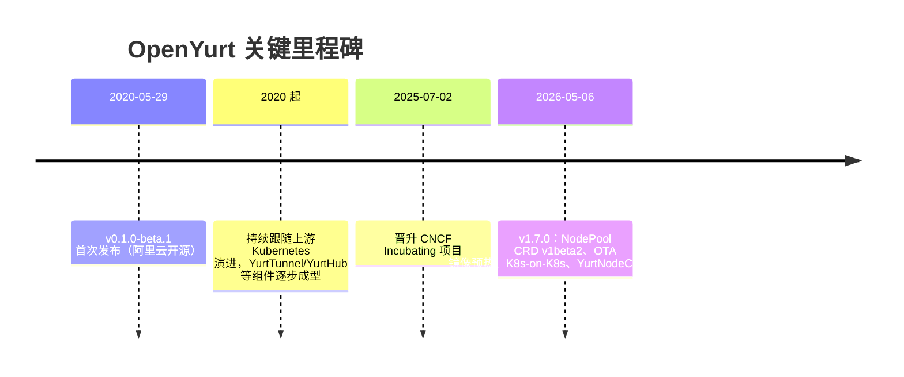

图：根据 [OpenYurt GitHub README](https://github.com/openyurtio/openyurt/) 与 [v1.7.0 Release Notes](https://newreleases.io/project/github/openyurtio/openyurt/release/v1.7.0) 整理。

### 12.2 与上游 Kubernetes 的版本关系

OpenYurt 跟随上游做依赖升级并做认证测试。v1.7.0 把 `k8s.io/*` 依赖与相关模块升级到 v1.34.0，官方表述是"**当前认证支持到 Kubernetes v1.34**，后续版本预计兼容但尚未验证"（来源：[OpenYurt GitHub README](https://github.com/openyurtio/openyurt/)、[v1.7.0 Release Notes](https://newreleases.io/project/github/openyurtio/openyurt/release/v1.7.0)）。

实践推论：

- 在 K8s v1.34（含）以内的集群使用 OpenYurt v1.7.0 是官方验证过的组合；用 v1.35+ 需自己评估并按社区进展核对。
- 版本边界不是"只升 OpenYurt 就够"：OpenYurt 升级节奏与上游认证矩阵绑定，升级集群前先查 OpenYurt 对应支持声明。
- NodePool 等 CRD 的 API 版本会演进（如 v1.7.0 中升级到 `apps.openyurt.io/v1beta2`），存量 YAML 需按目标版本的 [API 参考](https://openyurt.io/zh/docs/next/api-reference/) 核对字段。

### 12.3 v1.7.0 的关键变化（决定你读到哪些"历史概念"）

根据 v1.7.0 Release Notes，以下演进直接影响学习资料的有效性（来源：[v1.7.0 Release Notes](https://newreleases.io/project/github/openyurtio/openyurt/release/v1.7.0)）：

| 变化 | 含义 |
|---|---|
| 支持 Kubernetes v1.34 | 依赖整体升到 v1.34.0，E2E 以 v1.34 集群验证 |
| NodePool CRD 升级到 v1beta2 | 学习/创建 NodePool 时以 v1beta2 为准 |
| OTA 升级支持镜像预热 | 新增 ImagePreHeat 控制器、Pod 条件与 OTA API，见第二十二章 |
| 支持 K8s-on-K8s（KOK） | 可在既有 OpenYurt 集群之上部署租户控制面，见第二十四章 |
| YurtNodeConversion 控制器 | 通过给节点打标签即可自动安装/转换 YurtHub，节点纳管走向声明式 |
| 移除 YurtAppOverrider、弃用 YurtAppDaemon | 老文档中的这些用法在新版本已不再推荐/可用 |
| YurtHub 增加 Leader 选举相关能力 | 与 NodePool 的池级元数据共享相关 |

因此，阅读旧版技术博客时请先对照版本：**v1.1 及更早文章里的 YurtTunnel/YurtAppDaemon/YurtAppOverrider 等属于历史形态，不代表当前架构**。

### 12.4 生态与学习资源

- 主仓库：[openyurtio/openyurt](https://github.com/openyurtio/openyurt/)：README、架构图、CHANGELOG、Issue/Discussion 是核对行为的第一现场。
- 官方中文文档站：[openyurt.io/zh/docs](https://openyurt.io/zh/docs/) 与 `docs/next` 系列（最新版）。
- 版本特性中文解读（实践向）：[OSCHINA：OpenYurt v1.7 正式发布](https://www.oschina.net/news/464780/openyurt-1-7-released)、[阿里云开发者社区 OpenYurt 孵化相关文章](https://developer.aliyun.com/article/1670127)。
- 社区沟通：GitHub Issues/PR、邮件列表与钉钉群，入口见 [OpenYurt README 的 Community 节](https://github.com/openyurtio/openyurt/)。

### 12.5 本章验收

读完本章后，至少应该能：

- 说出 v1.7.0 的发布信息与官方认证的 Kubernetes 版本上限。
- 识别老文章中 YurtTunnel/YurtAppDaemon/YurtAppOverrider 属于历史概念。
- 制定一条"先查 OpenYurt 支持矩阵，再定 Kubernetes 版本"的版本决策顺序。

---

## 第十三章 OpenYurt 总体架构与组件总览

### 13.1 云边两段式与 NodePool

OpenYurt 采用经典的云边架构：**集中式 Kubernetes 控制平面位于云中心**，管理分散在多个边缘站点的节点；边缘节点可以横跨多个物理地域，OpenYurt 把同一地域/同一管理域的节点抽象为 **Pool（节点池，NodePool）**（来源：[OpenYurt GitHub README](https://github.com/openyurtio/openyurt/)）。控制平面与业务组件之间没有额外发明一套编排系统，Kubernetes 本体就是编排系统。

从节点角色看：

- **云侧/控制面节点**：运行 Kubernetes 控制平面与 Yurt-Manager 等云侧组件，连接被视为稳定。
- **边缘节点**：运行 kubelet、容器运行时、CNI 与 OpenYurt 节点侧组件（YurtHub、Raven-Agent 等），可能断连、可能跨公网。
- **Cloud 类型 NodePool**：面向连接稳定的云侧/IDC 节点；**Edge 类型 NodePool**：面向边缘节点，断连时依赖缓存与自治（来源：[创建节点池文档](https://openyurt.io/zh/docs/next/user-manuals/node-pool-management/create-a-node-pool/)）。

### 13.2 组件总览

根据官方文档，OpenYurt 的核心组件包括（来源：[OpenYurt 文档 Introduction](https://openyurt.io/zh/docs/)、[OpenYurt GitHub README](https://github.com/openyurtio/openyurt/)）：

| 组件 | 运行位置 | 职责 | 对应原生 K8s 的"替身" |
|---|---|---|---|
| kube-apiserver/etcd/调度器等 | 云侧 | 标准 Kubernetes 控制平面 | 不变 |
| Yurt-Manager | 云侧 | 边缘相关控制器与 Webhook 集合 | 替代/补充 kube-controller-manager 的边缘部分 |
| YurtHub | 每个节点 | 节点上 kubelet/kube-proxy 等访问 apiserver 的代理：转发、缓存、可编程过滤 | 替代 kubelet 直连 apiserver 的通道 |
| Raven-Agent | 每个节点 | 跨 NodePool 的 L3 网络 + L7 反向代理（`kubectl exec/logs` 等） | 替代 YurtTunnel（历史）的云边运维通道 |
| Yurt-Coordinator | 节点池/云边协同场景 | 池级元数据协同与带宽优化 | 见第十八章说明 |
| YurtIoTDock | 每个 NodePool | 桥接 EdgeX Foundry，用 CRD 管理端设备 | 无（新增能力） |
| yurtadm | 运维工具 | init/join/reset 类安装与节点纳管 | 类似 kubeadm 的角色 |

### 13.3 总体架构图

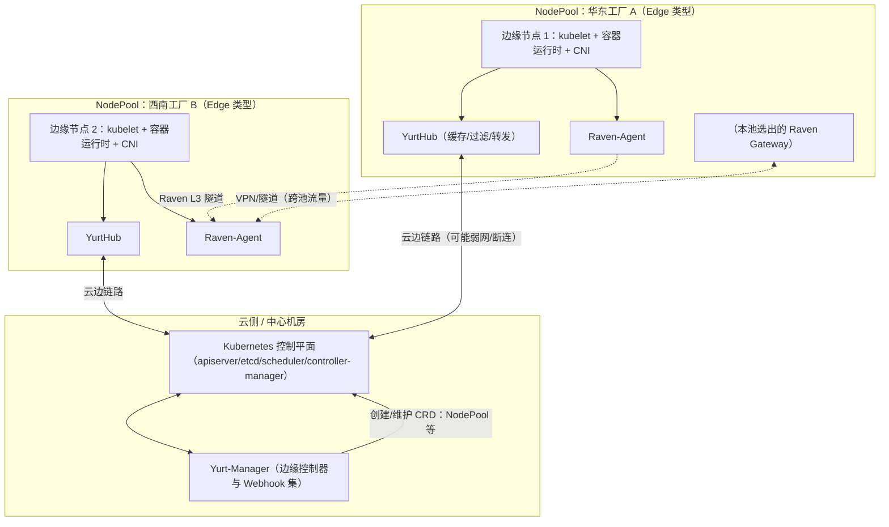

图：根据 [OpenYurt 官方文档](https://openyurt.io/zh/docs/)、[系统架构文档](https://openyurt.io/zh/docs/next/core-concepts/architecture/) 与 [GitHub README](https://github.com/openyurtio/openyurt/) 整理/重绘。Raven 隧道只承载跨 NodePool 流量，池内流量仍走原生 CNI（见第十七章）。

### 13.4 控制流与数据流如何叠加

OpenYurt 不改变 Kubernetes 的"期望状态→控制器→实际状态"主循环，而是：

1. **在节点侧替换访问通道**：边缘节点的 kubelet/kube-proxy 把请求发给本机 YurtHub，由 YurtHub 代理到云侧 apiserver；断连时 YurtHub 返回本地缓存（来源：[OpenYurt 文档：边缘自治](https://openyurt.io/zh/docs/)）。
2. **在云侧补充控制器语义**：Yurt-Manager 提供节点生命周期自治、Pod 绑定、NodePool、服务拓扑、升级控制等控制器与 Webhook。
3. **在资源模型上增加地域维度**：NodePool 是"地域/管理域"的抽象；工作负载（YurtAppSet）、流量（服务拓扑）、升级策略都以池为粒度表达。
4. **在网络上增加跨池隧道**：Raven 负责跨 NodePool 与云边运维通道。

### 13.5 你需要知道的两个"分层判断"

- **集群控制平面本身不属于 OpenYurt 组件**：OpenYurt 只是"附加在 Kubernetes 上的扩展控制环"。遇到"对象没被处理"时，先分清是原生控制器的问题还是 Yurt-Manager 控制器的问题。
- **YurtHub 是"透明代理"**：kubelet 看到的仍是标准 API 语义，只是数据来源从"云"变成"云 + 本地缓存 + 可编程改写"。这也是为什么 OpenYurt 能保持 Kubernetes API 兼容。

### 13.6 本章验收

读完本章后，至少应该能：

- 画出一张包含 YurtHub/Yurt-Manager/Raven/NodePool 的云边架构图，并说明每个组件在哪一侧。
- 说出控制流（期望状态收敛）与数据流（节点到 apiserver）分别被 OpenYurt 改在哪里。
- 判断一个问题"是原生控制器、Yurt-Manager 控制器还是节点侧代理"引发的。

---

## 第十四章 YurtHub：节点侧代理与可编程过滤

### 14.1 它是什么，为什么存在

YurtHub 以 static pod（或 v1.7 起的 systemd 托管方式）运行在每个工作节点上，是**节点上各类组件（kubelet、kube-proxy、使用 InClusterConfig 的 Pod）访问云端 kube-apiserver 的边车代理**（来源：[OpenYurt GitHub README](https://github.com/openyurtio/openyurt/)）。它把"节点 → 云上 API"这条唯一的访问通道收口到一处，之后所有边缘能力（缓存、断连自治、可编程过滤、池级元数据共享）都在这条通道上实现。

为什么需要这一层：

- **断连自治的前提是本地有状态**：kubelet/kube-proxy 需要 Service、ConfigMap、EndpointSlice 等数据才能工作，YurtHub 可以把这些数据缓存到节点本地，断网时继续喂给节点组件（来源：[OpenYurt 文档：边缘自治](https://openyurt.io/zh/docs/)）。
- **可编程改写**：部分返回数据需要在边侧按需改写（例如把 Service 的 EndpointSlice 裁剪成本池后端），直接在 kubelet 里改不现实，收口到代理层最干净。
- **通道优化**：多个节点组件可以复用同一条到云上 apiserver 的连接（multiplexer），并配合 Leader Hub 减少重复带宽。

### 14.2 数据路径与断连行为

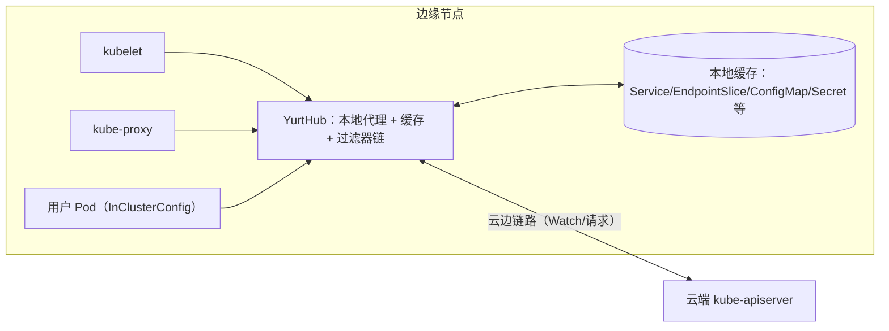

图：根据 [OpenYurt 文档：边缘自治](https://openyurt.io/zh/docs/) 与 [资源访问控制文档](https://openyurt.io/zh/docs/next/user-manuals/resource-access-control/) 整理/重绘。

在线时，YurtHub 把请求代理到云端并把响应写入缓存；云端响应与本地缓存保持一致。链路中断后：

1. YurtHub 无法访问 apiserver，但对 kubelet 等本地组件而言"API 仍然可用"，因为 YurtHub 用缓存响应；
2. 节点心跳停止上报会使云侧看到节点 NotReady——但 OpenYurt 通过节点自治机制让 Pod 不被误驱逐（见第二十一章）；
3. 网络恢复后，YurtHub 重新建立连接、恢复 watch，把缓存同步回最新状态。

在 NodePool 语义里，**Edge 类型池**的节点会缓存响应并对 apiserver 执行健康检查，**Cloud 类型池**被视为连接稳定、不做缓存与健康检查——这是你判断"某节点为什么有缓存行为"的配置依据（来源：[创建节点池文档](https://openyurt.io/zh/docs/next/user-manuals/node-pool-management/create-a-node-pool/)）。

### 14.3 可编程过滤器链

YurtHub 内置**可编程数据过滤框架**：云端返回的数据会经过一条过滤器链，被无感知、按需地改写，以满足服务拓扑、链路自适应等需求。官方文档列出的过滤器包括（来源：[OpenYurt 文档：可编程资源访问控制](https://openyurt.io/zh/docs/)、[资源访问控制文档](https://openyurt.io/zh/docs/next/user-manuals/resource-access-control/)）：

| 过滤器 | 作用 |
|---|---|
| `masterservice` | 改写 default/kubernetes 这个 master Service 的 ClusterIP 与 https 端口，让使用 InClusterConfig 的 Pod 经 YurtHub 无感访问云端 apiserver |
| `servicetopology` | 按服务拓扑设置重组 EndpointSlices，让访问 Service 的流量只落到同 NodePool 的后端 |
| `discardcloudservice` | 丢弃 kube-proxy 侧 LoadBalancer 类型 Service（云上 LoadBalancer 无法经 Pod IP 直达） |
| `inclusterconfig` | 改写 kube-system/kube-proxy ConfigMap 里的 kubeconfig，使 kube-proxy 用 InClusterConfig 访问 apiserver |
| `nodeportisolation` | 精确选择某 NodePool 保留/丢弃哪些 NodePort 服务，避免 kube-proxy 处理无谓 NodePort 流量 |

框架本身是可扩展的：新过滤器可以加入链中满足云边协同的定制需求。学习时把它想成"节点侧访问 API 的中间件"，而不是某个具体业务功能。

### 14.4 v1.7：Leader Hub 与池级元数据共享

当 NodePool 开启 Leader 选举后，池内会选出若干 Leader 节点，由 Leader 的 YurtHub 负责从云端读取"池级元数据"（如 services、endpointslices），缓存并分发给同池其他 Follower 的 YurtHub（来源：[创建节点池文档](https://openyurt.io/zh/docs/next/user-manuals/node-pool-management/create-a-node-pool/)、[v1.7.0 Release Notes](https://newreleases.io/project/github/openyurtio/openyurt/release/v1.7.0)）。这解决了"同一份 endpoints 数据被云上重复广播给池内每个节点"的带宽放大问题，机制细节见第十八章。

v1.7.0 还引入 `YurtNodeConversionController`，让 YurtHub 的安装、配置与启动可以由**给节点打 Label 来触发**（经 systemd 托管），并支持转换/回退——节点纳管从 `yurtadm join/reset` 的命令式流程走向声明式（来源：[v1.7.0 Release Notes](https://newreleases.io/project/github/openyurtio/openyurt/release/v1.7.0)）。

### 14.5 观察与验证

- 先确认 YurtHub 在目标节点上存在且健康：静态 Pod 场景查 `kubectl get pods -n kube-system -o wide`（或对应 namespace），systemd 场景查 `systemctl status yurthub`。
- 确认节点属于 Edge 类型 NodePool（决定是否缓存），可用 `kubectl get nodepool` 与节点上的 `apps.openyurt.io/...` 标注核对。
- 弱网实验是最好验证：断开该节点的云边链路，观察 kubelet/kube-proxy 是否仍能按缓存工作、Pod 是否不被驱逐（方法见第二十一章）。
- 过滤器是否生效：对照"节点上 kube-proxy 拿到的 EndpointSlice 是否只剩本池成员"这类外部可观测结果。

### 14.6 常见错误与调试

| 现象 | 可能原因 | 排查顺序 | 修复方向 |
|---|---|---|---|
| YurtHub 未启动/崩溃 | 静态 Pod 清单缺失、镜像拉取失败、证书/CSR 未批准 | 查看 Pod 状态与日志 → 检查 CSR 是否 Approved | 重装/修复 YurtHub，检查 csrapprover 是否启用 |
| 节点上组件拿不到云端数据 | 云边链路不通或证书过期 | 在节点上 curl apiserver → 查 YurtHub 日志与健康检查 | 修网络、续证书、确认 Edge 池配置 |
| kube-proxy 出现不应有的 Service 规则 | 过滤器未按预期生效/配置版本不匹配 | 对照节点实际 EndpointSlice 与 Service 清单 | 核对过滤链版本与 NodePool 配置 |
| 断网恢复后状态陈旧 | 缓存与云端长时间未同步 | 观察 YurtHub 是否重连并恢复 watch | 检查重连与鉴权，必要时重启 YurtHub |

### 14.7 本章验收

读完本章后，至少应该能：

- 画出"kubelet/kube-proxy → YurtHub → 云端 apiserver"的数据路径，并说明缓存出现的位置。
- 说出 servicetopology、nodeportisolation 等至少三个过滤器的用途。
- 解释 Edge/Cloud 类型 NodePool 在缓存行为上的差异，以及 Leader Hub 解决的带宽问题。

---

## 第十五章 Yurt-Manager：边缘控制器集

### 15.1 它是什么，为什么存在

Yurt-Manager 由多个控制器和 Webhook 组成，目标是让 Kubernetes 在云边协同场景下像在数据中心一样顺畅运行：它管理多地域工作负载，并为 DaemonSet/静态 Pod 提供 AdvancedRollingUpdate 与 OTA 升级能力（来源：[Yurt-Manager 文档](https://openyurt.io/zh/docs/next/core-concepts/yurt-manager/)）。

部署与运行特征：

- 建议与 Kubernetes 控制平面组件（如 kube-controller-manager）同机部署，通常以 Deployment 形式运行一主一备两个实例；
- `--controllers` 参数可精确启用/停用控制器：`*` 表示启用全部默认项，写名称表示只启用该控制器，`-名称` 表示停用；独立 Webhook 默认开启，可用 `--disable-independent-webhooks` 关闭；
- 独立 Webhook "Node" 会按节点所属 NodePool 的属性给节点打合适标签。

### 15.2 控制器功能地图

下面是官方文档列出的控制器分类与职责（来源：[Yurt-Manager 文档](https://openyurt.io/zh/docs/next/core-concepts/yurt-manager/)）：

| 分组 | 控制器 | 职责 |
|---|---|---|
| 边缘自治 | nodelifecycle | 增强版节点生命周期：需先关闭原生 kube-controller-manager 的同名控制器；对带 `apps.openyurt.io/binding=true` 注解的节点，即使节点 NotReady 也不会把 Pod 的 Ready 条件置为 false |
| 边缘自治 | podbinding | 维护 Pod 绑定能力：binding=true 节点上的 Pod 对 `node.kubernetes.io/not-ready`/`unreachable` 的容忍时间被置为 0，断网不驱逐（未启用时默认 300s） |
| 边缘自治 | HubLeader / HubLeaderConfig | 按策略在 NodePool 内选举 Leader 并维护端点列表与 ConfigMap（含池级元数据） |
| 边缘自治 | HubLeaderConfig（ClusterRole） | 维护授予池级 API list/watch 权限的 ClusterRole |
| Raven 网络 | gatewaypickup / gatewaydns / gatewayinternalservice / gatewaypublicservice | 协同 Raven 的 Gateway CRD：选举网关、维护 NodeName 域名解析 ConfigMap、维护转发用内部 Service 与可选 LoadBalancer |
| 工作负载 | daemonpodupdater | 为 DaemonSet 提供 AdvancedRollingUpdate 与 OTA 升级模式（见第二十二章） |
| 工作负载 | ImagePreheat | 监听带预热注解的 DaemonSet，升级前在目标节点先拉镜像 |
| 工作负载 | yurtappset | 管理 YurtAppSet CRD（1.5 起合并 yurtappset/yurtappdaemon/yurtappoverrider 能力） |
| 工作负载 | yurtstaticset | 为静态 Pod 提供 AdvancedRollingUpdate 与 OTA 管理 |
| 节点/池 | nodepool | NodePool 的控制器/Webhook，创建池时自动打 `nodepool.openyurt.io/type` 标签（默认 edge） |
| 安全 | csrapprover | 审批 OpenYurt 组件（如 YurtHub）产生的 CSR，原生控制器默认不会批准这些 CSR |
| 设备 | platformadmin | 把 PlatformAdmin CR 解析为 ConfigMap/Service/YurtAppSet，完成 EdgeX 平台与 YurtIoTDock 的池内部署 |
| 网络/流量 | servicetopologyendpoints / servicetopologyendpointslices | 配合 YurtHub 的 servicetopology 过滤器，在 Service 拓扑注解变化时更新 Endpoints/EndpointSlices |
| 网络/流量 | LoadBalancerSet | 管理 PoolService CRD：监听带节点池选择注解的 Service，为每个 NodePool 建 PoolService 并聚合回父 Service |
| 网络/流量 | NodeBucket | 为每个 NodePool 建 NodeBucket，把节点分组到大小有限的 ConfigMap 桶中，避免单 ConfigMap 过大 |

另外，v1.7.0 新增 **YurtNodeConversion** 控制器：给节点打 Label 即可触发 YurtHub 的自动安装、配置与启动（来源：[v1.7.0 Release Notes](https://newreleases.io/project/github/openyurtio/openyurt/release/v1.7.0)）。

### 15.3 工作机制与关键注解

边缘自治相关控制器的核心是两类声明（来源：[Yurt-Manager 文档](https://openyurt.io/zh/docs/next/core-concepts/yurt-manager/)）：

1. 节点注解 `apps.openyurt.io/binding=true`：声明"本节点需要 Pod 持久绑定"。
2. `nodelifecycle` 控制器看到该注解后：节点 NotReady 时不把 Pod 的 Ready 条件改为 false。
3. `podbinding` 控制器维护 Pod 容忍策略：binding=true 时把 Pod 对 not-ready/unreachable 的 `tolerationSeconds` 置 0，从而云边断连不驱逐；未开启时这些容忍默认 300s。

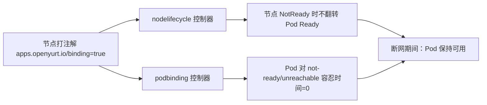

图：根据 [Yurt-Manager 文档](https://openyurt.io/zh/docs/next/core-concepts/yurt-manager/) 整理/重绘。

注意一个运维前提：启用 Yurt-Manager 的 nodelifecycle 前，必须**关闭原生 kube-controller-manager 中同名的 nodelifecycle 控制器**，否则两套逻辑会冲突（来源：[Yurt-Manager 文档](https://openyurt.io/zh/docs/next/core-concepts/yurt-manager/)）。

### 15.4 常见错误与调试

| 现象 | 可能原因 | 排查顺序 | 修复方向 |
|---|---|---|---|
| YurtHub 的 CSR 一直 Pending | csrapprover 未启用或 RBAC 缺失 | 查 `kubectl get csr` 状态与 yurt-manager 日志 | 启用 csrapprover 或检查其权限 |
| 断网后 Pod 仍被驱逐 | 节点未打 binding=true，或原生 nodelifecycle 未关闭 | 检查节点注解与两个控制器的共存状态 | 打注解/关闭原生同名控制器 |
| 升级卡住 | NotReady 节点阻塞 RollingUpdate | 确认使用的升级模式与控制器启用情况 | 改用 AdvancedRollingUpdate/OTA |
| NodePool 状态不更新 | nodepool 控制器未启用/Webhook 被关 | 查看 yurt-manager 日志与 `--controllers` | 恢复默认控制器开关 |

### 15.5 本章验收

读完本章后，至少应该能：

- 说出 Yurt-Manager 的部署形态与"控制器开关"管理方式。
- 列举自治、工作负载、Raven、设备四类控制器各一例并说出其输入声明。
- 解释 `apps.openyurt.io/binding=true` 如何避免断网驱逐，并知道启用前要关闭原生 nodelifecycle。

---

## 第十六章 NodePool：多地域管理单元

### 16.1 它是什么，为什么存在

NodePool（节点池）是 OpenYurt 对"具有共性的一组节点"的管理抽象：共性的例子包括地理位置、CPU 架构、云厂商等。用户无需在海量节点上一一打标签、调污点、配调度，而是把节点归入 NodePool，在更高一层统一管理（来源：[Yurt-Manager 文档](https://openyurt.io/zh/docs/next/core-concepts/yurt-manager/)、[创建节点池文档](https://openyurt.io/zh/docs/next/user-manuals/node-pool-management/create-a-node-pool/)）。NodePool 是 OpenYurt 一系列能力的"底座"：

- **流量语义**：服务拓扑让流量只落到同池 Pod；Raven 以池（网络域）为单位打通跨池通信；
- **工作负载语义**：YurtAppSet 以 `nodepoolSelector` 选择池并自动同步；
- **数据与带宽语义**：池级元数据（如 EndpointSlice）在池内共享，避免逐节点重复下发；
- **身份与运维语义**：Pool 决定节点是 Cloud 还是 Edge，从而决定缓存/自治行为。

### 16.2 Cloud 与 Edge 两类池

NodePool 资源当前版本为 `apps.openyurt.io/v1beta2`（来源：[创建节点池文档](https://openyurt.io/zh/docs/next/user-manuals/node-pool-management/create-a-node-pool/)）：

| 类型 | 语义 | 缓存与健康检查行为 | 典型位置 |
|---|---|---|---|
| `Cloud` | 云侧/IDC 节点，连接视为稳定 | 不缓存 apiserver 响应、不做针对 apiserver 的健康检查 | 云数据中心、与 API Server 稳定连通的节点 |
| `Edge` | 边缘节点，链路可能断连 | 缓存响应、对 apiserver 执行健康检查 | 工厂、门店、路边单元等 |

创建后，nodepool 控制器会自动为节点打 `nodepool.openyurt.io/type` 标签（默认 `edge`），供调度与工作负载选择使用（来源：[Yurt-Manager 文档](https://openyurt.io/zh/docs/next/core-concepts/yurt-manager/)）。

### 16.3 最小示例：创建一个 Edge 池

```bash
cat <<EOF | kubectl apply -f -
apiVersion: apps.openyurt.io/v1beta2
kind: NodePool
metadata:
  name: hangzhou
spec:
  type: Edge
  hostNetwork: true
  annotations:
    apps.openyurt.io/example: test-hangzhou
  labels:
    apps.openyurt.io/example: test-hangzhou
  taints:
  - key: apps.openyurt.io/example
    value: test-hangzhou
    effect: NoSchedule
EOF
```

上述 YAML 会创建 `type=Edge` 且 `hostNetwork=true` 的节点池，并把 annotation、label、taint 一并写入池定义（来源：[创建节点池文档](https://openyurt.io/zh/docs/next/user-manuals/node-pool-management/create-a-node-pool/)）。把节点加入池的方式：给节点打上对应 NodePool 的标签/标注，由池控制器与相关纳管流程把节点归池。

### 16.4 Leader 选举与池级元数据共享

NodePool 支持在池内选举 **Hub Leader**，Leader 的 YurtHub 处理发往 apiserver 的请求并把响应缓存、分发给同池 Follower（来源：[创建节点池文档](https://openyurt.io/zh/docs/next/user-manuals/node-pool-management/create-a-node-pool/)）。配置要点：

- `enableLeaderElection: true` 开启；
- `leaderElectionStrategy`：`random`（默认，随机选）或 `mark`（用 `leaderNodeLabelSelector` 指定候选标签）；
- `leaderReplicas`：选多少个 Leader（默认 1）；
- `poolScopeMetadata`：声明哪些类型的资源作为"池级元数据"被 Leader 缓存并分发（官方示例配置 `services/v1` 与 `discovery.k8s.io/v1/endpointslices`）；
- 只有 `Ready` 且具有 `InternalIP` 的节点才有资格被选为 Leader。

```yaml
apiVersion: apps.openyurt.io/v1beta2
kind: NodePool
metadata:
  name: hangzhou
spec:
  type: Edge
  enableLeaderElection: true
  interConnectivity: true
  leaderElectionStrategy: random
  leaderReplicas: 2
  poolScopeMetadata:
  - group: ""
    resource: services
    version: v1
  - group: discovery.k8s.io
    resource: endpointslices
    version: v1
```

来源：[创建节点池文档](https://openyurt.io/zh/docs/next/user-manuals/node-pool-management/create-a-node-pool/)（字段含义以当时 API 为准）。

### 16.5 验证与观测

```bash
kubectl get nodepools
# 输出列：NAME TYPE READYNODES NOTREADYNODES LEADERNODES LEADERELECTIONAGE AGE
kubectl get nodepool yurt-pool2 -o yaml
# status.leaderEndpoints：Leader 节点地址与最近选举时间；nodes/readyNodeNum/unreadyNodeNum
```

示例输出形态见 [创建节点池文档](https://openyurt.io/zh/docs/next/user-manuals/node-pool-management/create-a-node-pool/)：`kubectl get nodepools` 能一眼看到每个池的就绪节点数、Leader 节点数与选举时长。

### 16.6 适用场景与常见错误

| 适合 | 不适合 | 常见错误 |
|---|---|---|
| 多地域/多站点统一管理 | 单地域同质小集群（收益小） | 把业务节点与云控制面节点混入同一 Edge 池 |
| 按池做调度、流量、升级策略 | 需要逐节点精细独立配置 | 忘记 Edge 池才有缓存/自治语义 |
| 需要池级元数据共享控制带宽 | 节点数极少、链路极好 | 开启 Leader 选举但不配 poolScopeMetadata |

### 16.7 本章验收

读完本章后，至少应该能：

- 用 `apps.openyurt.io/v1beta2` 写一个 Edge/Cloud NodePool 的创建 YAML。
- 解释 Cloud 与 Edge 池在缓存、健康检查上的差异。
- 配置 Leader 选举并解释 `poolScopeMetadata` 中 services/endpointslices 的含义。

---

## 第十七章 Raven：跨 NodePool 网络

### 17.1 问题：原生 CNI 的"局域网假设"

边缘节点天然分属不同物理地域/局域网。原生 CNI（Flannel、Calico 等）假设节点间二层/三层可达，于是跨 NodePool 的 Pod IP、Service IP、Node IP 之间互不可达；把数据中心 CNI 直接搬过来无法形成"一个集群一张网"（来源：[OpenYurt 文档：网络](https://openyurt.io/zh/docs/user-manuals/network/network-management-overview/)）。

### 17.2 Raven 的解法：池内原生、池间隧道

Raven 是 OpenYurt 的跨 NodePool 网络方案：

- 每个节点运行一个 Raven 守护进程（Raven-Agent），每个 NodePool/网络域中选出一个守护进程作为 **Gateway**；
- 各池 Gateway 之间建立 VPN 隧道（跨 NodePool 流量走隧道）；
- 池内其他守护进程配置跨池路由，确保跨池流量经本池 Gateway 转发；
- **Raven 只劫持跨 NodePool 流量，池内流量仍走原生 CNI**，因此可以与 Flannel、Calico 等无缝协同（来源：[OpenYurt 文档：核心能力-跨 NodePool 网络通信](https://openyurt.io/zh/docs/)、[OpenYurt GitHub README](https://github.com/openyurtio/openyurt/)）。

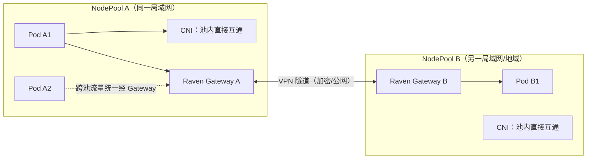

图：根据 [OpenYurt 文档：核心能力](https://openyurt.io/zh/docs/) 与 [网络管理总览](https://openyurt.io/zh/docs/user-manuals/network/network-management-overview/) 整理/重绘。

### 17.3 与 Kubernetes 运维通道：L7 反向代理

除了 L3 数据面，Raven 还提供 **L7 反向代理**能力，承载云侧对边缘的运维命令（如 `kubectl exec`、`kubectl logs`），**取代早期 YurtTunnel 的角色**（来源：[OpenYurt GitHub README](https://github.com/openyurtio/openyurt/)）。

机制上，Raven 相关控制器协同完成：

- `gatewaypickup` 控制器基于 Gateway CRD 为每个网络域选举网关节点；
- `gatewaydns` 控制器维护 NodeName 的域名解析（raven-proxy-dns 的 hosts 表），把 NodeName 解析到内部代理 Service；
- `gatewayinternalservice`/`gatewaypublicservice` 控制器维护转发用 Service 与可选 LoadBalancer（来源：[Yurt-Manager 文档](https://openyurt.io/zh/docs/next/core-concepts/yurt-manager/)）。

因此云侧的 `kubectl exec/logs` 请求经"内部代理 Service → 网关 → 隧道/局域网 → 目标节点"到达边缘，无需给每个边缘节点暴露公网端口。

### 17.4 适用、边界与验证

| 适合 | 不适合 | 需要先核对 |
|---|---|---|
| 跨地域 Pod/Service 互通、云端访问边缘 Pod | 池内大量东西向流量（不该走隧道） | Gateway 节点的网络出口与端口要求 |
| 边缘节点需要被 `kubectl exec/logs` 运维 | 对延迟极敏感且链路差的场景 | 官方安装文档对网络、防火墙与版本的要求 |

验证手段：

- 池 A 的一个 Pod `ping` 池 B 的一个 Pod IP；再用 Service ClusterIP 跨池访问。
- 云上 `kubectl exec -it <edge-pod> -- sh` 验证 L7 运维通道。
- `kubectl get gateway` 查看网络域的 Gateway 状态；在节点上检查 raven-agent 进程与隧道接口。

### 17.5 本章验收

读完本章后，至少应该能：

- 解释"池内原生 CNI、池间 Raven 隧道"的分工以及为什么能与 Calico/Flannel 共存。
- 说出 Raven 同时承担 L3 跨池网络与 L7 云边运维代理两件事。
- 用"跨池 ping + 跨池访问 Service + kubectl exec"设计一组验证实验。

---

## 第十八章 Yurt-Coordinator 与池级元数据流量优化

### 18.1 问题：云边带宽如何被放大

在大规模 OpenYurt 集群中，如果 Pod 频繁删除重建，会产生大量云边通信流量：边缘节点的 kube-proxy 要监听所有 endpoints/endpointslices 变化，而**同一份数据会被重复传输给池内每一个边缘节点**；云边走公网时，这会带来显著的成本与抖动（来源：[OpenYurt 文档：云边网络带宽减少](https://openyurt.io/zh/docs/)）。

### 18.2 解法：池级元数据 + Leader 单点拉取

官方给出的收敛思路是引入 **pool-scoped Data（池级数据）**：像 endpoints/endpointslices 这类数据在**同一 NodePool 内对所有节点是相同且唯一的**，没必要每节点各拉一份。具体机制：

1. NodePool 开启 Leader 选举（见第十六章），池内选出 Leader；
2. Leader 的 YurtHub 从云端 apiserver 读取池级数据，写入协调组件（官方文档语境中的 **Yurt-Coordinator**）；
3. 池内其他 YurtHub 从该协调点获取池级数据，不再各自走公网访问云端 apiserver；
4. 云边公网流量从"每节点一份全量 Watch"收敛为"Leader 一份 + 池内本地分发"（来源：[OpenYurt 文档：云边网络带宽减少](https://openyurt.io/zh/docs/)、[创建节点池文档](https://openyurt.io/zh/docs/next/user-manuals/node-pool-management/create-a-node-pool/)）。

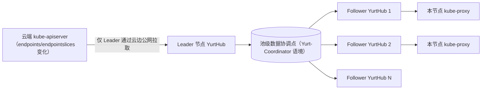

图：根据 [OpenYurt 文档：云边网络带宽减少](https://openyurt.io/zh/docs/) 整理/重绘。

### 18.3 与之配套的 NodePool 配置

Leader Hub 的配置表达在 NodePool 上（来源：[创建节点池文档](https://openyurt.io/zh/docs/next/user-manuals/node-pool-management/create-a-node-pool/)）：

- `enableLeaderElection: true` + `interConnectivity: true`：池内 Leader/Follower 互通；
- `poolScopeMetadata`：声明哪些资源按池级共享（官方示例即 `services` 与 `endpointslices`）；
- `leaderElectionStrategy` 与 `leaderNodeLabelSelector`：决定 Leader 由随机还是标签指定；
- `leaderReplicas`：Leader 数量（默认 1，多个 Leader 可按哈希分流）。

HubLeader/HubLeaderConfig 控制器负责把池内选举结果与池级元数据写入 ConfigMap，供 YurtHub 获知 Leader 名单与权限（来源：[Yurt-Manager 文档](https://openyurt.io/zh/docs/next/core-concepts/yurt-manager/)）。

### 18.4 版本注意与学习边界

池级流量优化属于仍在演进的机制：官方 v1.7.0 CHANGELOG 中有多处与 Yurt-Coordinator/YurtHub 集成形态相关的改动（例如从 YurtHub 与 Helm chart 中移除相关代码，见 [v1.7.0 Release Notes](https://newreleases.io/project/github/openyurtio/openyurt/release/v1.7.0)）。因此本章只讲"为什么需要、数据流怎么收敛"的概念模型；**具体部署形态、组件清单与开关请以你实际安装版本的官方安装文档与 Helm chart 为准**，不要照搬早期博客中的组件名去部署。

### 18.5 观测与收益验证

观测建议：

- 对比"开启 Leader 选举前后"云边链路的请求/流量：关注节点 YurtHub 的对外请求数与流量指标；
- 检查池内 Follower 的 YurtHub 是否从协调点获取 endpointslices 而非直连云端；
- 制造 Pod 频繁重建的负载，观察云边流量是否随节点数线性放大（开启前）还是基本恒定（开启后）。

### 18.6 本章验收

读完本章后，至少应该能：

- 解释为什么 endpoints/endpointslices 的 watch 在边缘会放大公网流量。
- 画出"Leader 单点拉取 → 池级协调点 → Follower 分发"的数据流。
- 在 NodePool 上找到 `enableLeaderElection`/`poolScopeMetadata` 等开关，并说明验证指标。

---

## 第十九章 边缘工作负载：YurtAppSet 与静态 Pod

### 19.1 问题：跨池应用交付的三个复杂度

边缘应用通常要部署到多个 NodePool（上海、杭州、工厂 A…）。用原生方式做会有三类痛点：

1. **重复配置**：每个池各写一个 Deployment，模板几乎一样；
2. **不同步**：新增/删除 NodePool 时，应用不会自动跟随；
3. **地域差异难表达**：上海 3 副本、杭州 1 副本这类"同模板不同量/不同参数"的差异，只能各自改各自。

OpenYurt 用 **YurtAppSet** 解决这类问题（来源：[Yurt-Manager 文档](https://openyurt.io/zh/docs/next/core-concepts/yurt-manager/)、[工作负载管理总览](https://openyurt.io/zh/docs/next/user-manuals/workload/workload-management-overview/)）。

### 19.2 YurtAppSet：跨池的"应用部署单元"

OpenYurt 从 1.5 起把原先 yurtappset、yurtappdaemon、yurtappoverrider 的能力合并进同一个 CRD `YurtAppSet`（`apps.openyurt.io/v1beta1`），用于在更高一层集中管理多类工作负载（例如统一创建、更新、删除多个 Deployment）。它提供的三类能力（来源：[Yurt-Manager 文档](https://openyurt.io/zh/docs/next/core-concepts/yurt-manager/)）：

| 能力 | 字段/载体 | 作用 |
|---|---|---|
| 统一模板定义 | `workloadTemplate` | 一份模板下发到多个地域，避免重复配置 |
| 自动化部署 | `nodepoolSelector` | 按标签选择 NodePool；池增删时工作负载自动跟随 |
| 地域差异化 | `workloadTweaks` | 针对特定池/特定副本做定制，无需各地域各管一份 |

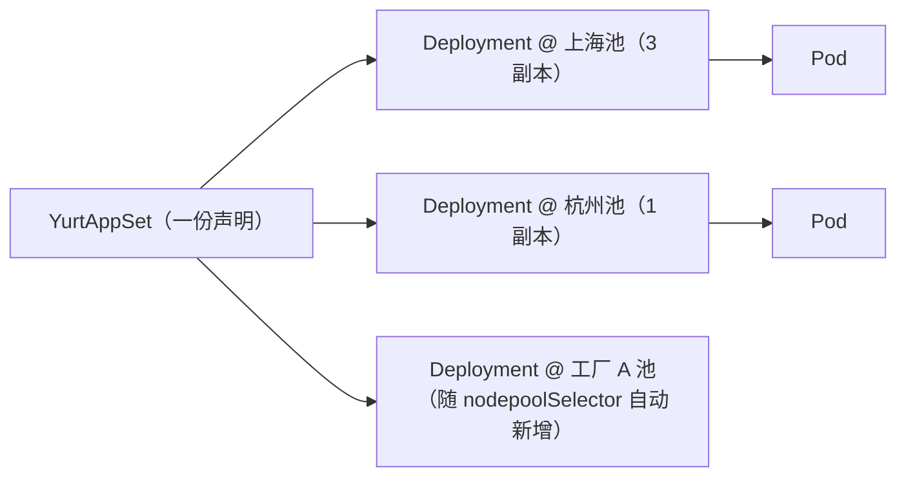

图：根据 [Yurt-Manager 文档](https://openyurt.io/zh/docs/next/core-concepts/yurt-manager/) 整理/重绘。

以下为**概念示意**（字段名来自官方叙述，具体嵌套结构以你所用版本的 [OpenYurt API 参考](https://openyurt.io/zh/docs/next/api-reference/) 为准）：

```yaml
apiVersion: apps.openyurt.io/v1beta1
kind: YurtAppSet
metadata:
  name: edge-app
spec:
  workloadTemplate:
    # ... Deployment/StatefulSet 模板定义 ...
  nodepoolSelector:
    matchLabels:
      # 选择要部署到的 NodePool
  workloadTweaks:
    - # 针对特定 NodePool 的副本/参数差异化
```

历史形态提示：早期版本的 YurtAppDaemon 已被弃用、YurtAppOverrider 已在 v1.7.0 移除，学习时应直接使用合并后的 YurtAppSet（来源：[Yurt-Manager 文档](https://openyurt.io/zh/docs/next/core-concepts/yurt-manager/)、[v1.7.0 Release Notes](https://newreleases.io/project/github/openyurtio/openyurt/release/v1.7.0)）。

### 19.3 YurtStaticSet：让静态 Pod 也可升级

静态 Pod 由 kubelet 直接根据节点上清单文件管理，不经过 API 创建，因此在海量边缘设备上手工部署与升级风险高、成本高。OpenYurt 用 **YurtStaticSet** 把静态 Pod 纳入版本管理，并提供与 DaemonSet 相同的 AdvancedRollingUpdate 与 OTA 升级机制（来源：[Yurt-Manager 文档](https://openyurt.io/zh/docs/next/core-concepts/yurt-manager/)）。

学习时注意区分：

- 原生静态 Pod = kubelet 本地文件清单，集群不可控；
- YurtStaticSet = 从云端声明期望，控制静态 Pod 的版本与升级节奏（高级/OTA 模式细节见第二十二章）。

### 19.4 常见错误与调试

| 现象 | 可能原因 | 排查顺序 | 修复方向 |
|---|---|---|---|
| YurtAppSet 没有在预期池生成工作负载 | `nodepoolSelector` 与实际 NodePool 标签不匹配 | `kubectl get yurtappsets` 状态 → 检查池标签 | 修正选择器或给池补标签 |
| 某池副本数不对 | `workloadTweaks` 覆盖了默认值 | 对照 tweaks 与池名/标签 | 修正 tweak 条目 |
| 新增 NodePool 后应用没跟上 | 控制器未启用或同步延迟 | 看 yurt-manager 日志与事件 | 确认 yurtappset 控制器启用 |

### 19.5 本章验收

读完本章后，至少应该能：

- 说出 YurtAppSet 合并了历史三个 CRD 的哪些能力，并说明"同一版本 1.5+"这一版本前提。
- 解释 YurtAppSet 如何做到"池增删自动跟随"。
- 区分原生静态 Pod 与 YurtStaticSet 的管理边界。

---

## 第二十章 服务拓扑、NodePort 隔离与流量本地化

### 20.1 问题：流量不该跨地域乱跑

原生 Service 把后端 Pod 视为同质集合，客户端可能被路由到千里之外的 NodePool；在跨池网络不通或跨地域带宽昂贵时，这既不可达又费钱。OpenYurt 的**服务拓扑**能力让"Pod 访问某 Service 的流量只转发到同 NodePool 内的后端"（来源：[可编程资源访问控制](https://openyurt.io/zh/docs/next/user-manuals/resource-access-control/)、[Service Topology 文档](https://openyurt.io/docs/v1.6/user-manuals/network/service-topology/)）。

### 20.2 服务拓扑机制与用法

机制分两段：

1. **云侧**：`servicetopologyendpoints`/`servicetopologyendpointslices` 控制器监听 Service 拓扑注解变化，更新 Endpoints/EndpointSlices（来源：[Yurt-Manager 文档](https://openyurt.io/zh/docs/next/core-concepts/yurt-manager/)）；
2. **节点侧**：YurtHub 的 `servicetopology` 过滤器按拓扑设置"重组"发给 kube-proxy 的 EndpointSlices，只保留本池后端（来源：[可编程资源访问控制](https://openyurt.io/zh/docs/next/user-manuals/resource-access-control/)）。

用法：给 Service 打上 `openyurt.io/topologyKeys: openyurt.io/nodepool` 注解。此后访问该 Service 的 Pod，其流量只会被路由到同 NodePool 的后端（来源：[Service Topology 文档](https://openyurt.io/docs/v1.6/user-manuals/network/service-topology/)）。

```bash
# 让 my-svc 的流量按 NodePool 本地化
kubectl annotate service my-svc openyurt.io/topologyKeys='openyurt.io/nodepool'

# 让 CoreDNS 也按 NodePool 本地解析（可选，同类思路）
kubectl annotate svc kube-dns -n kube-system openyurt.io/topologyKeys='openyurt.io/nodepool'
```

第二行来源：[CoreDNS 调整文档](https://openyurt.io/docs/v1.6/installation/coredns-prepare/)。注意拓扑能力依赖集群中存在 NodePool 资源：官方 FAQ 指出，集群没有 NodePool 时 servicetopology 过滤器可能一直未就绪，kube-proxy 侧的缓存数据不会按拓扑重组（来源：[OpenYurt FAQ：yurthub](https://openyurt.io/zh/docs/v1.4/faq/yurthub/)）。

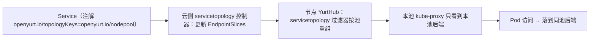

图：根据 [可编程资源访问控制](https://openyurt.io/zh/docs/next/user-manuals/resource-access-control/) 与 [Yurt-Manager 文档](https://openyurt.io/zh/docs/next/core-concepts/yurt-manager/) 整理/重绘。

### 20.3 NodePort 隔离：按池决定谁监听

原生 NodePort 会在**集群每个节点**监听端口，边缘场景下既浪费又增大暴露面。`nodeportisolation` 过滤器通过 Service 上的 `nodeport.openyurt.io/listen` 注解，让 NodePort 服务只在指定 NodePool 中监听，其余池的 kube-proxy 不再处理这些服务（来源：[可编程资源访问控制](https://openyurt.io/zh/docs/next/user-manuals/resource-access-control/)、[NodePort 隔离文档](https://openyurt.io/zh/docs/v1.6/user-manuals/network/nodeport-isolation/)）。

```bash
# 示意：给 NodePort Service 声明"只在哪些池监听"（取值格式以官方文档示例为准）
kubectl annotate service my-nodeport nodeport.openyurt.io/listen='<目标 NodePool 列表>'
```

预期效果：只有被点名的池节点开放 NodePort，其余池不监听，避免跨池端口冲突、收敛暴露面。

### 20.4 池级对外暴露：LoadBalancerSet / PoolService

当需要按池各自对外暴露服务（每池一个网关/负载均衡）时，`LoadBalancerSet` 控制器管理 PoolService CRD：它监听带节点池选择注解的 Service，为每个 NodePool 创建 PoolService，再把各池负载均衡状态聚合回父 Service（来源：[Yurt-Manager 文档](https://openyurt.io/zh/docs/next/core-concepts/yurt-manager/)）。适合"边缘站点各自接入公网、又想用父 Service 统一表达"的场景。

### 20.5 验证与常见错误

| 想验证什么 | 方法 |
|---|---|
| 拓扑生效 | 在池 A 的 Pod 里访问 my-svc，确认只落到池 A 后端；查看节点 `/etc/kubernetes/cache/kube-proxy` 下的 EndpointSlice 缓存是否只剩本池成员（参考 [FAQ：yurthub](https://openyurt.io/zh/docs/v1.4/faq/yurthub/)） |
| NodePort 隔离生效 | 非目标池节点 `ss -lnt` 是否监听该 NodePort |
| 拓扑不生效的原因 | 是否有 NodePool、注解是否打在 Service 上、yurt-manager 与 YurtHub 是否运行正常 |

### 20.6 本章验收

读完本章后，至少应该能：

- 用一条 `kubectl annotate` 把 Service 流量限制在同一 NodePool，并解释云侧控制器与节点侧过滤器的分工。
- 说明 `nodeportisolation` 与 `nodeport.openyurt.io/listen` 解决什么问题。
- 设计一组命令验证拓扑与 NodePort 隔离是否真正生效。

---

## 第二十一章 边缘自治与断网自愈

### 21.1 问题：原生 Kubernetes 在断连时的三种失败

官方文档把原生问题概括为三点（来源：[配置节点自治](https://openyurt.io/zh/docs/next/user-manuals/node-management/configure-node-autonomy/)、[OpenYurt 文档：边缘自治](https://openyurt.io/zh/docs/)）：

1. **kubelet 断连期间重启会丢 Pod**：Pod 定义在内存中，无法从 apiserver 恢复，kubelet 重启后业务容器起不来；
2. **心跳超时触发驱逐**：kubelet 一定时间（官方以约 5 分钟为例）无法上报心跳后，原生控制器会把节点上 Pod 驱逐（删除并可能重调度）——而边缘的断连是常态，不代表节点故障；
3. **边侧组件失去数据源**：kube-proxy 等需要 Service/EndpointSlice 等实时数据。

### 21.2 三层自愈能力

OpenYurt 按"本地恢复 → 防驱逐 → 心跳兜底"提供三层能力：

**第一层：断连重启自愈（默认，有 YurtHub 即启用）**

在线时 YurtHub 缓存必要数据（如 Pod 规格）。节点/kubelet 在断网期间重启后，kubelet 从 YurtHub 本地缓存恢复数据并重启业务容器（来源：[配置节点自治](https://openyurt.io/zh/docs/next/user-manuals/node-management/configure-node-autonomy/)）。任何通过 `yurtadm join` 加入的节点会自动安装 YurtHub，因此该能力默认生效。

**第二层：防止驱逐的两种官方机制**

机制 A——单节点自治时长（推荐用于大多数边缘节点）：

```bash
# 先标记为边缘节点
kubectl label node my-edge-node openyurt.io/is-edge-worker=true

# 自治时长 24 小时：控制平面最多等 24h 才驱逐该节点 Pod
kubectl annotate node my-edge-node node.openyurt.io/autonomy-duration="24h"

# 无限自治：Pod 永不因心跳丢失被驱逐（慎用）
kubectl annotate node my-edge-node node.openyurt.io/autonomy-duration="0"
```

来源：[配置节点自治](https://openyurt.io/zh/docs/next/user-manuals/node-management/configure-node-autonomy/)。它按节点覆盖集群级驱逐超时，是"大多数边缘节点的推荐方案"。

机制 B——绑定式自治（binding annotation）：给节点加 `apps.openyurt.io/binding=true`，nodelifecycle/podbinding 控制器保证节点 NotReady 时不翻转 Pod Ready、Pod 对 not-ready/unreachable 的容忍时间为 0，断连不驱逐（来源：[Yurt-Manager 文档](https://openyurt.io/zh/docs/next/core-concepts/yurt-manager/)）。

**第三层：心跳委托（高级，需 Yurt-Coordinator）**

当节点与云端断连但池内本地网络连通时，池内 Leader YurtHub 可代表失联节点向云端发送心跳，使该节点在云端保持 Ready、避免驱逐，同时给节点加特殊 Taint 阻止调度器分配新 Pod。官方提示该高级功能需要：版本 ≥1.2.0、每个 NodePool 一个 Yurt-Coordinator 实例、以 `--enable-coordinator=true` 启动 YurtHub（来源：[配置节点自治](https://openyurt.io/zh/docs/next/user-manuals/node-management/configure-node-autonomy/)）。

### 21.3 断网期间系统行为全景

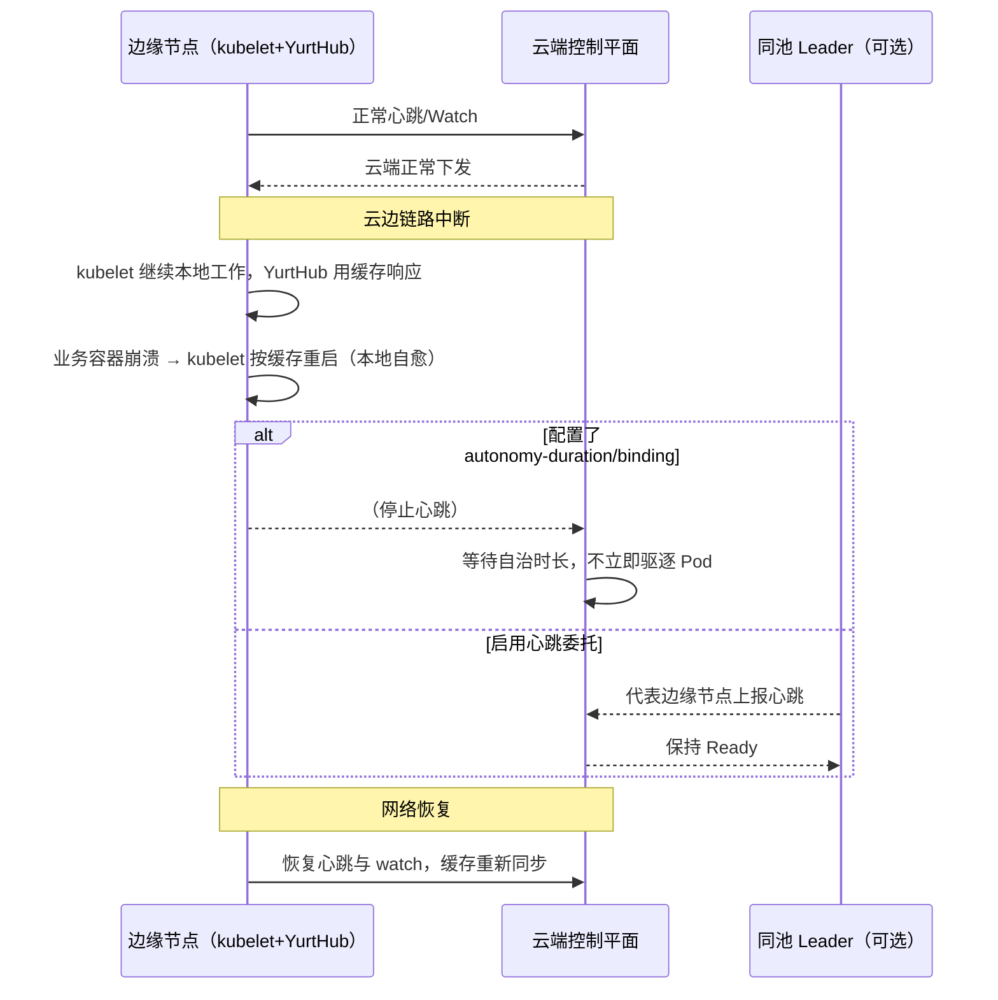

图：根据 [配置节点自治](https://openyurt.io/zh/docs/next/user-manuals/node-management/configure-node-autonomy/) 与 [断网自愈文档](https://openyurt.io/zh/docs/next/user-manuals/autonomy/selfhealing-during-network-disconnection/) 整理/重绘。

### 21.4 自治的边界（必须诚实面对）

自治不等于"集群仍然完整"：

- 断网期间**无法做新的调度决策**：扩容、新 Deployment 需要 apiserver 参与，不会在断连节点上凭空生效；
- **跨节点操作不可用**：无法把 Pod 挪到别的节点；
- 自治时长越长，"节点其实已坏但集群迟迟不处理"的窗口越大——`autonomy-duration=0`（无限）要配合独立的带外监控使用；
- 依赖云上服务的业务逻辑（认证中心、数据库在云端）在断网时依然不可用，自治保护的是"节点本地点点自治能恢复的部分"。

### 21.5 验证实验与验收

最小实验（需能手动断网的环境）：

1. 节点加入 Edge 池并设置 `autonomy-duration=24h`；
2. 在节点上运行一个有 `restartPolicy: Always` 的测试 Pod；
3. 断开该节点云边链路，手动 `kill` 业务进程——观察 kubelet 是否在断网期间把它重启；
4. 重启节点上的 kubelet——观察它能否从 YurtHub 缓存恢复 Pod；
5. 恢复链路，确认状态同步、无驱逐记录。

### 21.6 本章验收

读完本章后，至少应该能：

- 说出原生 K8s 断连的三种失败与 OpenYurt 三层自治能力的对应关系。
- 用 `openyurt.io/is-edge-worker` 与 `node.openyurt.io/autonomy-duration` 配置单节点自治并说明取值含义。
- 说明自治的边界（哪些事断网时依然做不了），并设计一组断网验证实验。

---

## 第二十二章 升级模型：Auto/OTA 与镜像预热

### 22.1 为什么原生升级在边缘会失败

云边架构中，DaemonSet 传统 RollingUpdate 有两个典型困境（来源：[OpenYurt 文档：高级工作负载升级模型](https://openyurt.io/zh/docs/)、[Yurt-Manager 文档](https://openyurt.io/zh/docs/next/core-concepts/yurt-manager/)）：

1. **NotReady 节点阻塞升级**：如果 NotReady 节点数超过 RollingUpdate 的 `maxUnavailable`，升级流程会长时间卡住；
2. **升级决定权错位**：有的边缘节点属于不同业主（如新能源汽车），业主希望自己决定何时升级，而不是集群管理员全局强制。

OpenYurt 通过 `daemonpodupdater` 控制器（DaemonSet）与 `yurtstaticset` 控制器（静态 Pod）提供两类新模式：**AdvancedRollingUpdate（Auto）** 与 **OTA（On-The-Air）**。

### 22.2 两种升级模式对比

| 维度 | AdvancedRollingUpdate（Auto） | OTA | 原生 RollingUpdate |
|---|---|---|---|
| 决策者 | 集群控制器自动推进 | 边缘节点所有者/边缘侧触发 | 集群控制器 |
| 处理 NotReady 节点 | 跳过，恢复后自动补升 | 由边缘侧决定 | 可能阻塞整个发布 |
| 适用 | 站点归我方、弱网频繁 | 节点归他人、需用户确认（车/门店） | 数据中心场景 |
| 配套控制器 | daemonpodupdater | daemonpodupdater / yurtstaticset + 节点侧 OTA API | 原生 |

Auto 模式的关键语义：**先升级 Ready 节点上的工作负载，NotReady 节点被跳过；当节点恢复 Ready 后，其工作负载自动补齐升级**。OTA 模式的关键语义：**边缘节点上提供 REST API，业主先查询有没有新版本，再决定何时触发本节点升级**（来源：[Yurt-Manager 文档](https://openyurt.io/zh/docs/next/core-concepts/yurt-manager/)、[OpenYurt 文档：高级升级模型](https://openyurt.io/zh/docs/)）。

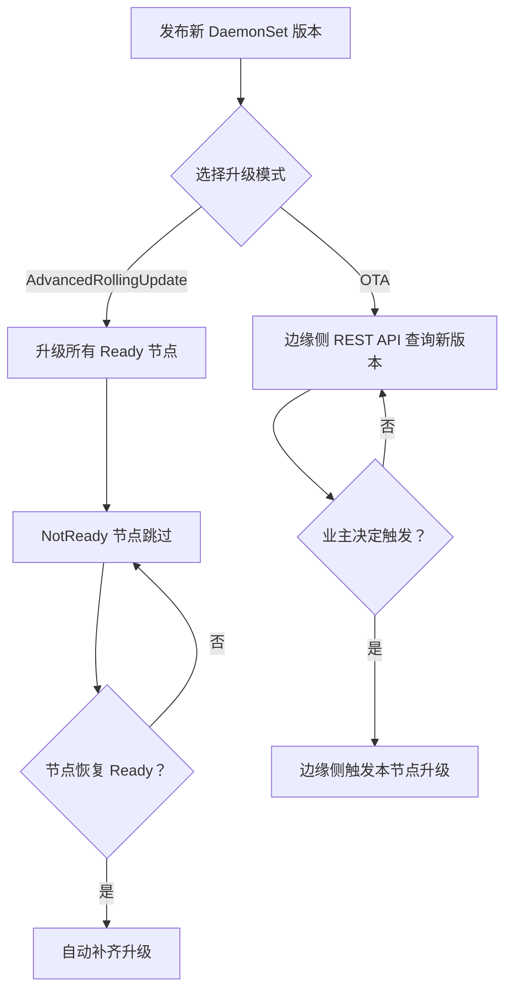

图：根据 [OpenYurt 文档：高级工作负载升级模型](https://openyurt.io/zh/docs/) 与 [Yurt-Manager 文档](https://openyurt.io/zh/docs/next/core-concepts/yurt-manager/) 整理/重绘。

### 22.3 v1.7：OTA 镜像预热

OTA 升级此前有一个痛点：**镜像拉取发生在 Pod 重启阶段，成为升级关键路径**——边缘网络差时，边拉镜像边切换会造成明显服务中断。v1.7.0 让 OTA 支持**镜像预热**：

- 新的 `ImagePreHeat` 控制器负责把镜像预热 Job 派发到边缘节点，在真正切换前把新镜像下载好；
- 引入两个 Pod 条件追踪状态：`PodNeedUpgrade`（需要升级）与 `PodImageReady`（镜像已就绪）；
- 提供新 OTA API 端点：`POST /openyurt.io/v1/namespaces/{ns}/pods/{podname}/imagepull`，可主动触发预热；
- 效果：把"拉镜像"与"切换发布"解耦，实际切换的服务中断降到接近零（来源：[v1.7.0 Release Notes](https://newreleases.io/project/github/openyurtio/openyurt/release/v1.7.0)、[OTA 镜像预热 Proposal #2474](https://github.com/openyurtio/openyurt/pull/2474)）。

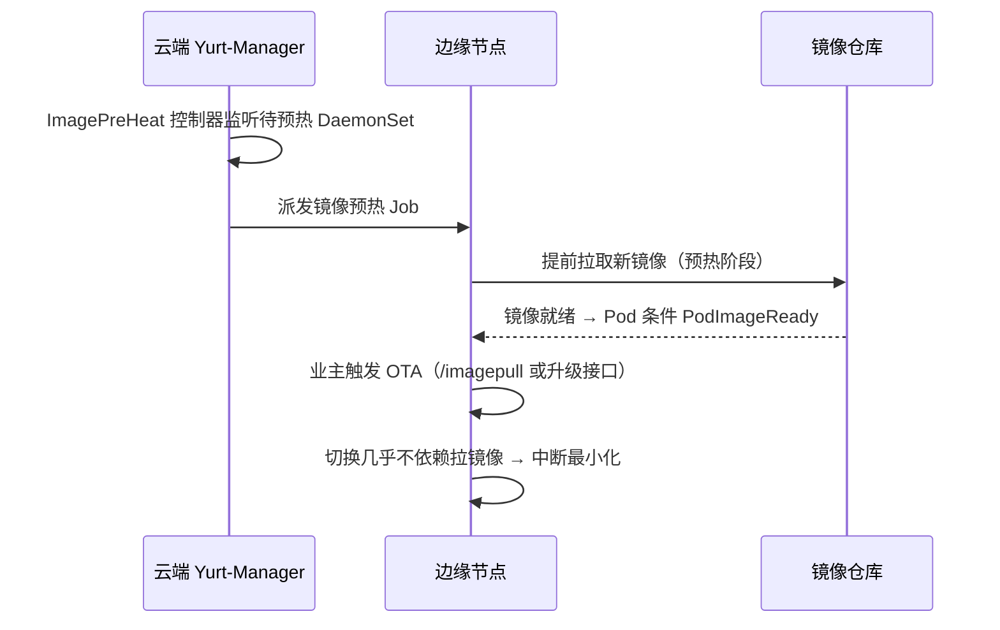

图：根据 [v1.7.0 Release Notes](https://newreleases.io/project/github/openyurtio/openyurt/release/v1.7.0) 整理/重绘。

### 22.4 选型与运维建议

决策顺序：

1. 节点/业主归属权：集群管理员说了算 → Auto 或原生滚动；边缘业主说了算 → OTA。
2. 网络质量：弱网、大镜像 → 优先 OTA + 镜像预热，避免升级阻塞与关键路径拉镜像。
3. 升级对象：DaemonSet 用 daemonpodupdater；静态 Pod 用 YurtStaticSet 提供的同款模式。

常见错误：

- 期望 Auto 模式却不启用 daemonpodupdater 控制器 → 仍走原生滚动而阻塞；
- OTA 模式把"触发权"误以为在云端 API → 它面向边缘侧 REST API；
- 忽略 `PodNeedUpgrade`/`PodImageReady` 条件 → 预热进度不可见。

### 22.5 本章验收

读完本章后，至少应该能：

- 解释 Auto 与 OTA 在"决策者、NotReady 处理、适用场景"上的差异。
- 说出 v1.7 OTA 镜像预热把哪两个阶段解耦，以及两个 Pod 条件的含义。
- 根据节点归属权与网络质量选择升级模式。

---

## 第二十三章 云原生设备管理：YurtIoTDock

### 23.1 为什么需要"云原生的设备管理"

边缘站点不仅有服务器，还有大量终端设备（传感器、摄像头、工业控制器等）。传统做法是"一套独立 IoT 平台 + 另一套 K8s 集群"两套系统并存。OpenYurt 从云原生视角抽象设备的**基本特征（是什么）、主要能力（能做什么）、产生的数据（能传递什么信息）**，通过声明式 API 提供设备数据采集与管理能力，并与 EdgeX Foundry 等业界方案松耦合集成（来源：[OpenYurt 文档：云原生边缘设备管理](https://openyurt.io/zh/docs/)）。

### 23.2 组件与机制：YurtIoTDock × EdgeX

官方架构里，每个 NodePool 部署**一个 YurtIoTDock 实例 + EdgeX Foundry 服务**（来源：[OpenYurt GitHub README](https://github.com/openyurtio/openyurt/)）：

- **上行（云 → 设备）**：YurtIoTDock 从云端 apiserver 监听 Device CRD 变化，把 CRD 的 spec 转成 EdgeX Foundry 的请求下发给设备；
- **下行（设备 → 云）**：YurtIoTDock 订阅 EdgeX Foundry 的设备状态，状态变化时回写 Device CRD 的 status；
- **平台部署**：`PlatformAdmin` CR（由早期 EdgeX CRD 演进而来）描述设备管理平台抽象，用户填平台参数、目标 NodePool、部署版本即可；`platformadmin` 控制器把它解析为 ConfigMap、Service 与 YurtAppSet 完成部署，并把 YurtIoTDock 分发到对应 NodePool（来源：[Yurt-Manager 文档](https://openyurt.io/zh/docs/next/core-concepts/yurt-manager/)）。

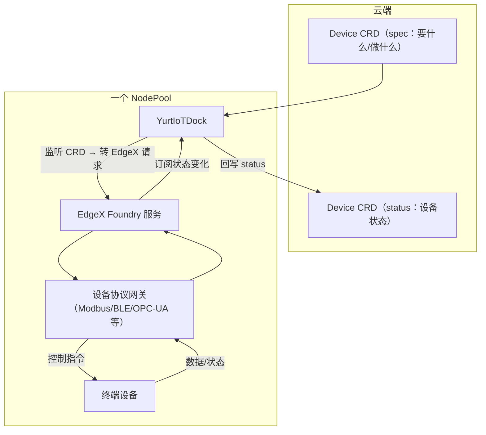

图：根据 [OpenYurt 文档：云原生边缘设备管理](https://openyurt.io/zh/docs/) 与 [Yurt-Manager 文档](https://openyurt.io/zh/docs/next/core-concepts/yurt-manager/) 整理/重绘。

### 23.3 适用、生态与限制

| 适合 | 需要注意 |
|---|---|
| 已用 EdgeX Foundry、想统一到 K8s 声明式管理 | Device/DeviceProfile 等 CRD 的字段以官方 API 参考与目标版本为准 |
| 需要在池内一键部署设备平台与边到端链路 | EdgeX 组件选择通过 PlatformAdmin 的 `components` 字段控制 |
| 车联网/工业网关等"设备+应用同池"场景 | 具体协议接入（Modbus/BLE 等）由 EdgeX device services 承担 |

学习提示：设备管理是 OpenYurt 生态的扩展域，与核心自治/网络机制解耦；初学可先掌握"CRD 声明 → YurtIoTDock 桥接 → EdgeX 落地 → 状态回写"这条数据流，不必先深入 EdgeX 细节。

### 23.4 本章验收

读完本章后，至少应该能：

- 画出 Device CRD、YurtIoTDock、EdgeX、终端设备之间的双向数据流。
- 解释 PlatformAdmin 与 platformadmin 控制器在设备管理中的角色。
- 说出"声明式设备管理"相对传统独立 IoT 平台的价值点。

---

## 第二十四章 安装、纳管与端到端实战

### 24.1 练习目标与环境规划

练习目标：从零搭一个"1 个云侧控制节点 + 2 个边缘节点（模拟两个 NodePool）"的最小 OpenYurt 环境，跑通"NodePool → 跨池应用交付 → 服务拓扑 → 断网自治"闭环。

| 节点 | 角色 | 建议配置 |
|---|---|---|
| cloud-ctl | 控制平面 + Yurt-Manager 等云侧组件 | 2C4G，可访问公网 |
| edge-a | Edge 池 A | 2C4G，与 edge-b 分属不同局域网（可用不同网段模拟） |
| edge-b | Edge 池 B | 同上 |

前提：全部 Linux；安装 containerd 或 Docker 作为容器运行时；云边之间 6443（apiserver）与 OpenYurt 组件端口可达；掌握 kubeadm 建集群（见第十章）。

### 24.2 三条安装路径（按版本选）

OpenYurt 安装大体分"建集群"与"纳管节点/装组件"两步，官方历史文档提供过 yurtadm 的 init/join 路径：`yurtadm init` 初始化 OpenYurt 集群，`yurtadm join` 把边缘/云端节点加入。注意：**官方"从零安装"示例长期停留在较老的 Kubernetes（如 1.22.8）与 sealer 流程**（来源：[从零开始安装文档](https://openyurt.io/zh/docs/next/installation/yurtadm-init/)），不要照抄版本号；请以你目标 OpenYurt 版本的官方安装手册与 [GitHub README Getting Started](https://github.com/openyurtio/openyurt/) 为准。

三条路径的本质区别：

| 路径 | 做法 | 适合 |
|---|---|---|
| A：先建标准 K8s 再接入 OpenYurt | kubeadm 建标准集群 → 安装 OpenYurt 组件 → 纳管节点 | 已有标准集群、渐进接入 |
| B：yurtadm 引导全新集群 | `yurtadm init`（封装集群初始化）+ `yurtadm join` 加入节点 | 全新环境、愿意跟随工具演进 |
| C：标签驱动纳管（v1.7 起） | 标准集群 + Yurt-Manager，给节点打 Label 触发 YurtNodeConversion 自动部署 YurtHub | 大规模、声明式纳管（来源：[v1.7.0 Release Notes](https://newreleases.io/project/github/openyurtio/openyurt/release/v1.7.0)） |

```mermaid
flowchart TD
  S["准备：Linux + 容器运行时 + 网络"] --> K["kubeadm 建立标准 Kubernetes 集群"]
  K --> O["安装 OpenYurt 云侧：Yurt-Manager + CRD + 相关控制器"]
  O --> N1{"纳管方式"}
  N1 -- yurtadm join --> N2["节点安装 YurtHub 等并接入"]
  N1 -- Label 驱动（v1.7） --> N3["给节点打 Label → YurtNodeConversion 自动部署"]
  N2 --> P["创建 NodePool（v1beta2）并把节点归池"]
  N3 --> P
  P --> R["按需安装/配置 Raven 与跨池网络"]
  R --> V["端到端验证"]
```

图：根据 [从零开始安装文档](https://openyurt.io/zh/docs/next/installation/yurtadm-init/)、[OpenYurt GitHub README](https://github.com/openyurtio/openyurt/) 与 [v1.7.0 Release Notes](https://newreleases.io/project/github/openyurtio/openyurt/release/v1.7.0) 整理/重绘。

### 24.3 关键步骤与验证点

1. **建集群**：`kubeadm init`（参考第十章），装好 CNI，`kubectl get nodes` 全 Ready。
2. **装云侧**：按官方手册部署 Yurt-Manager 与 CRD；验证 `kubectl get crd | grep openyurt` 出现 NodePool/YurtAppSet 等资源、Yurt-Manager Pod 一主一备 Running。
3. **纳管节点**：把 edge-a/edge-b 标记为边缘节点并安装 YurtHub（yurtadm 或 Label 驱动）；验证节点上 YurtHub 进程正常、相关 CSR 已被批准、节点在集群中状态正常。
4. **建池归组**：用第十六章 YAML 创建 `shanghai`、`hangzhou` 两个 Edge 池；验证 `kubectl get nodepools` 显示节点归池、类型正确。
5. **（可选）跨池网络**：按 [网络管理总览](https://openyurt.io/zh/docs/user-manuals/network/network-management-overview/) 配置 Raven；验证池间 Pod 可互通、`kubectl exec` 能进对端池 Pod。
6. **交付与流量**：用 YurtAppSet 把 demo 应用发到两个池；给 Service 打拓扑注解；验证"流量只落同池"。
7. **自治演练**：给 edge-a 设 `node.openyurt.io/autonomy-duration=24h`，断其云边链路，验证 Pod 不被驱逐、本地可自愈（第二十一章）。

### 24.4 验证与失败注入矩阵

| 场景 | 输入 | 预期结果 | 证据 |
|---|---|---|---|
| 正常：应用交付 | 创建 YurtAppSet 覆盖两池 | 两池各生成工作负载并 Ready | `kubectl get yurtappsets,pods -o wide` |
| 边界：新增池 | 新建 NodePool 并匹配 selector | 应用自动部署到新池 | `kubectl get pods -o wide` |
| 拓扑：流量本地化 | 同池与跨池各发起访问 | 只路由到同池后端 | EndpointSlice 内容/访问日志 |
| 失败注入：断网 | 断开 edge-a 云边链路 | Pod 不驱逐、本地可重启恢复 | `kubectl get node/pod`、驱逐事件缺失 |
| 失败注入：NotReady 节点升级 | 一个节点 NotReady 时发布 Auto 模式 | Ready 节点先升级，NotReady 恢复后补升 | rollout 事件与 Pod 镜像版本 |

### 24.5 安装常见错误

| 现象 | 可能原因 | 排查顺序 |
|---|---|---|
| 节点加入后无 YurtHub | 纳管步骤未执行或 CSR 未批准 | 看节点进程 → CSR → YurtHub 日志 |
| 建池后节点未归池 | 节点标签/池选择器不匹配 | `kubectl get node --show-labels` 对照池定义 |
| Yurt-Manager 无法协调 | 与原生控制器冲突（如 nodelifecycle） | 检查 `--controllers` 开关与 kube-controller-manager 同名控制器 |
| 跨池网络不通 | Raven 网关/隧道未就绪 | `kubectl get gateway` → raven-agent 日志 → 节点路由 |

### 24.6 本章验收

读完本章后，至少应该能：

- 规划一个云边最小集群的节点与网络前提，并选择三条安装路径之一。
- 按"建集群→装云侧→纳管→归池→交付→验证"顺序推进并说明每步的验证命令。
- 用失败注入矩阵验证断网自治与 Auto 升级。

---

## 第二十五章 选型边界、限制与分层排错

### 25.1 什么时候该用 OpenYurt

| 适合 | 不适合 / 收益低 | 选择信号 |
|---|---|---|
| 大量边缘节点跨地域、网络弱或不稳定 | 单一地域、网络稳定的数据中心场景 | 节点是否"断连可控"、是否需自治 |
| 需要边侧长期自治（车、门店、路侧） | 要求集群级一致性且不允许跳过升级的强管控 | 节点业主是否有独立升级决定权 |
| 需要流量本地化、按池管理 | 纯单池边缘（用 K3s 等更轻方案即可） | 是否真的有多 NodePool 拓扑 |
| 需要端设备+应用统一云原生纳管 | 无设备管理诉求 | 是否存在 EdgeX/设备接入需求 |
| 已投资源在标准 Kubernetes 上、想保持 API 兼容 | 能接受重写平台模型（此时可看其他边缘方案） | 是否要求"无侵入、跟随上游" |

OpenYurt 的定位决定它**不适合**当作"完全离线的独立操作系统"：云端控制平面仍是集群语义的中心，自治覆盖的是"节点本地点点自愈"与"防驱逐"，而不是让集群在完全没有云端的情况下做跨节点编排。

### 25.2 横向选型时需要核对什么

与 K3s（轻量发行版）、KubeEdge（另一 CNCF 边缘方案）等比较时，请以各项目**当期的官方文档与支持矩阵**为准，不要凭旧文结论做决定。可用来锚定比较的四组问题：

1. **兼容模型**：是否保持原生 Kubernetes API 与上游版本跟随？CRD/注解是否需要专用工具？
2. **自治范围**：断网时谁能恢复什么？驱逐语义、心跳、镜像拉取、本地存储各到什么程度？
3. **网络模型**：跨地域互通、云边运维通道由谁提供，是否依赖特定 CNI/隧道？
4. **生态与治理**：CNCF 阶段、社区活跃度、版本发布节奏、与你现有发行版/工具链的配合。

### 25.3 OpenYurt 与 KubeEdge 的逐项对比

KubeEdge 是当前与 OpenYurt 最常并列的"云原生边缘计算"方案：两者都是 CNCF 项目、都声明"基于 Kubernetes 构建、把云上能力带到边缘"，但实现哲学差异很大。先记三个切入点（版本以截至 2026-09-08 的官方资料为据）：

1. **运行时哲学不同**：OpenYurt 走"标准 kubelet 不动 + 加一层透明边车代理（YurtHub）与云端控制器集"，从而最大化 Kubernetes API 与工具链兼容（来源：[OpenYurt 文档 Introduction](https://openyurt.io/zh/docs/)）；KubeEdge 走"边缘侧自研轻量运行时与本地 API"——EdgeCore 里的 Edged 是边缘节点上管理 Pod 生命周期的轻量版 kubelet，MetaManager 提供本地元数据与 API 代理（来源：[KubeEdge 官网](https://kubeedge.io/en/)、[Edged 文档（KubeEdge v1.22 文档）](https://release-1-22.docs.kubeedge.io/docs/architecture/edge/edged/)）。模块级组件说明与更新可看 [KubeEdge 官方文档](https://kubeedge.io/docs/) 与 [kubeedge/kubeedge 仓库](https://github.com/kubeedge/kubeedge/)。
2. **网络/数据面分层不同**：OpenYurt 的 Raven 提供跨 NodePool 的 L3 隧道（池间 Pod IP 互通），跨地域服务发现之外的流量还能按池本地化（见第十七、二十章）；KubeEdge 明确"不取代 CNI"，其跨局域网/跨地域的服务发现与转发由可选的 EdgeMesh（LibP2P 隧道）补充，云边通道 CloudHub/EdgeHub（WebSocket/QUIC）只承载控制面消息，不承载应用流量（来源：[CNI 插件与边缘网络边界说明](https://kubeedge.io/zh/docs/advanced/cni-edge-networking/)）。
3. **治理阶段不同**：KubeEdge 已于 2024-10-15 成为 CNCF 毕业项目（官方表述为 CNCF 首个边缘计算毕业项目，来源：[CNCF KubeEdge 毕业公告](https://www.cncf.io/announcements/2024/10/15/cloud-native-computing-foundation-announces-kubeedge-graduation/)）；OpenYurt 目前为 CNCF Incubating 项目（2025-07-02 公告，来源：[CNCF：OpenYurt 成为 Incubating](https://www.cncf.io/blog/2025/07/02/openyurt-becomes-a-cncf-incubating-project/)）。**毕业阶段代表治理成熟度，不代表功能对齐**，不能据此推断能力等价。

#### 核心差异速览

| 对比维度 | OpenYurt v1.7.0 | KubeEdge v1.23.0 | 判读要点 |
|---|---|---|---|
| 起源与治理 | 阿里云 2020 年开源，CNCF Incubating（2025-07-02，来源：[CNCF 公告](https://www.cncf.io/blog/2025/07/02/openyurt-becomes-a-cncf-incubating-project/)） | 华为云发起并捐赠，2024-10-15 成为 CNCF 毕业项目（来源：[CNCF 毕业公告](https://www.cncf.io/announcements/2024/10/15/cloud-native-computing-foundation-announces-kubeedge-graduation/)、[华为云新闻稿](https://www.huaweicloud.com/intl/en-us/news/20241018154136583.html)） | 治理成熟度不同；毕业不等于能力对齐 |
| 官方定位 | 对云原生体系无侵入的边缘计算平台，保持 Kubernetes API 兼容（来源：[OpenYurt Introduction](https://openyurt.io/zh/docs/)） | Kubernetes Native Edge Computing Framework：把原生容器化应用编排扩展到边缘主机（来源：[KubeEdge 官网](https://kubeedge.io/en/)） | 都"扩展 Kubernetes"，但边缘侧实现路径不同 |
| 边缘节点运行时 | 标准 kubelet + 容器运行时 + CNI + YurtHub 边车 | EdgeCore：Edged（轻量版 kubelet）管理 Pod，MetaManager 做本地 API/元数据；CNI 插件需另行安装在边缘节点 | 决定资源占用、K8s 功能子集与存量迁移成本 |
| 边侧 API/元数据 | YurtHub 代理并缓存 apiserver 响应，List/Watch 语义不变（来源：[OpenYurt 边缘自治](https://openyurt.io/zh/docs/)） | MetaManager 提供本地 Kube-API 端点与每节点元数据持久化，官网宣称节点恢复不需要重新全量 List/Watch（来源：[KubeEdge 官网](https://kubeedge.io/en/)） | 断连自治与快速恢复的实现支点不同 |
| 云边通道 | 节点组件经 YurtHub 访问云端 apiserver；kubectl exec/logs 类运维走 Raven L7 | CloudHub/EdgeHub 之间的 WebSocket/QUIC 控制面隧道只承载调度下发、设备孪生、ConfigMap/Secret 与心跳，不承载应用流量（来源：[CNI 插件与边缘网络边界说明](https://kubeedge.io/zh/docs/advanced/cni-edge-networking/)） | 端口、加密与排错点不同；应用流量都不走云边通道 |
| 应用数据面 | 池内走原生 CNI，跨 NodePool 走 Raven L3 隧道，池间 Pod IP 可互通 | 不取代 CNI；跨局域网/跨地域的 Pod 间服务发现与转发由可选 EdgeMesh 以 LibP2P 隧道提供（来源：[CNI 插件与边缘网络边界说明](https://kubeedge.io/zh/docs/advanced/cni-edge-networking/)） | OpenYurt=三层跨池隧道；KubeEdge=服务级转发，不是跨域三层 Pod IP |
| 流量/服务控制 | 服务拓扑让 Service 流量留在本 NodePool；NodePort 隔离按池控制监听（来源：[可编程资源访问控制](https://openyurt.io/zh/docs/next/user-manuals/resource-access-control/)） | EdgeMesh 承担边缘服务发现与跨域转发；NodePort/拓扑类行为以官方文档为准 | 需要"流量本地化"时 OpenYurt 的表达更显式 |
| 断网自治 | YurtHub 缓存 + autonomy-duration/binding + Yurt-Coordinator 心跳委托，防驱逐需显式配置（见第二十一章） | 每节点元数据持久化支撑断连自治；官网宣称内存占用可低至约 70MB、异构支持 x86/ARMv7/ARMv8（来源：[KubeEdge 官网](https://kubeedge.io/en/)） | 都宣称自治，但机制与"谁能恢复什么"不同，必须各自做断网实验 |
| 设备管理 | YurtIoTDock（每池一个实例）桥接 EdgeX Foundry，PlatformAdmin 部署平台（见第二十三章） | Device/DeviceModel CRD + Mapper + MQTT EventBus + DeviceTwin；设备组 `devices.kubeedge.io/v1beta1`，v1.23 起 DeviceStatus 拆为独立 CRD 并支持设备异常检测（来源：[Device Controller 文档](https://kubeedge.io/docs/architecture/cloud/device_controller/)、[KubeEdge v1.23 Release Blog](https://kubeedge.io/blog/release-v1.23/)） | 设备生态绑定不同：EdgeX 桥接 vs 自带设备孪生与 Mapper 生态 |
| 应用交付 | 池级 YurtAppSet、YurtStaticSet 管理静态 Pod，DaemonSet/静态 Pod 支持 Auto/OTA 升级（见第十九、二十二章） | 边侧 Pod 生命周期由 Edged 管理，容器编排仍以 Kubernetes 对象表达；是否存在等价"池级/OTA"语义需按官方 release 核对 | Auto/OTA 与池级抽象是本讲义中 OpenYurt 的差异化能力 |
| 安装/纳管 | yurtadm（init/join/reset），v1.7 起支持 Label 驱动的节点转换纳管（来源：[yurtadm 从零安装](https://openyurt.io/zh/docs/next/installation/yurtadm-init/)、[v1.7.0 Release Notes](https://newreleases.io/project/github/openyurtio/openyurt/release/v1.7.0)） | keadm 完成 CloudCore/EdgeCore 的安装与升级（v1.23 增强 Windows 下 keadm 与 EdgeCore 能力，来源：[KubeEdge v1.23 Release Blog](https://kubeedge.io/blog/release-v1.23/)） | 命令式工具与"声明式纳管"哲学不同 |
| 版本节奏 | v1.7.0 于 2026-05-06 发布，官方认证兼容 Kubernetes 至 v1.34 | v1.23.0 于 2026-03-11 发布，依赖的 Kubernetes 升级到 v1.32.10（来源：[KubeEdge v1.23 Release Blog](https://kubeedge.io/blog/release-v1.23/)） | 上游版本窗口不同；上线前看各自支持矩阵 |

#### 决策参考流程

```mermaid
flowchart TD
  A["评估起点：边缘环境约束 + 存量资产"] --> B{"要求边缘与云侧一致的 kubelet/CNI/API 体验？"}
  B -- 是 --> C["OpenYurt 更贴合：保留标准运行时，跨池加 Raven 隧道（见 13/17 章）"]
  B -- 否，端侧资源紧张 --> D{"设备接入是否以 EdgeX 生态为主？"}
  D -- 是 --> E["OpenYurt：YurtIoTDock 直接桥接 EdgeX（见第 23 章）"]
  D -- 否 --> F{"需要自带轻量边缘运行时与 Mapper/设备孪生生态？"}
  F -- 是 --> G["KubeEdge：Edged + MetaManager + Device/DeviceModel"]
  F -- 否 --> H["回到 25.1/25.2 的四组问题重新评估"]
```

图：根据本节所列 OpenYurt 与 KubeEdge 官方资料整理的决策参考，仅作初筛，不替代 PoC。

#### 换项目前必须做的验证

1. **同硬件最小对比**：分别跑一个边缘节点最小集群，验证 Pod 生命周期、`kubectl logs/exec`、镜像拉取与重启恢复。
2. **断网实验**：断开云边链路，分别测"进程崩溃重启、kubelet/EdgeCore 重启、节点防驱逐"三种场景。
3. **设备闭环**：用 Device CRD + Mapper 与 EdgeX + YurtIoTDock 各跑一个真实/模拟设备 Demo。
4. **网络拓扑**：在"同局域网、跨局域网、跨 NodePool"三种拓扑下验证服务可达性与流量本地化。
5. **版本跟进**：同时记录两边的 CNCF 阶段、发布频率、上游 Kubernetes 支持矩阵与安全补丁节奏。

### 25.4 限制与版本边界（截至 2026-09-08）

- OpenYurt v1.7.0 官方认证兼容至 Kubernetes v1.34；v1.35+ 属"预期兼容、未验证"，上线前自行评估（来源：[OpenYurt GitHub README](https://github.com/openyurtio/openyurt/)）。
- 同一能力在不同版本表达不同：NodePool 当前为 `apps.openyurt.io/v1beta2`；YurtAppSet 为 1.5 起合并后的形态；YurtTunnel/YurtAppDaemon/YurtAppOverrider 属历史概念（来源：[v1.7.0 Release Notes](https://newreleases.io/project/github/openyurtio/openyurt/release/v1.7.0)、[Yurt-Manager 文档](https://openyurt.io/zh/docs/next/core-concepts/yurt-manager/)）。
- 自治、心跳委托、池级元数据共享等机制的组件形态仍在演进；部署前以目标版本的官方安装手册与 Helm chart 清单为准（见 [配置节点自治](https://openyurt.io/zh/docs/next/user-manuals/node-management/configure-node-autonomy/) 与第十八章说明）。
- 本文所有命令与字段仅为学习示例：真实环境先 `--help`/API 参考核对参数，再上生产。

### 25.5 分层排错：坏在哪一层的判断顺序

OpenYurt 的排错要在原生 Kubernetes 分层之上再加"云边"视角。推荐顺序：

```text
现象（应用不可用 / 节点异常 / 断网后行为不对）
  ├─ L0 应用层：Pod 日志、探针、业务依赖（与云/边无关的部分）
  ├─ L1 节点侧 OpenYurt：YurtHub 是否存活、缓存是否正常、过滤器是否生效
  ├─ L2 节点侧 Raven：隧道/网关是否建立、路由是否正确
  ├─ L3 NodePool 配置：类型、标签、Leader 选举、autonomy-duration、拓扑注解
  ├─ L4 云侧 Yurt-Manager：控制器是否启用、日志中的 forbidden/错误
  ├─ L5 原生 Kubernetes：控制平面、调度、CNI、存储
  └─ L6 物理与网络：云边链路、DNS、防火墙、端口、时间同步
```

命令速查：

| 要查什么 | 命令/日志位置 |
|---|---|
| 云侧控制器状态 | yurt-manager Pod 日志；`--controllers` 配置 |
| 节点组件状态 | `kubectl get pods -n <openyurt ns> -o wide`；节点上 `systemctl status yurthub/raven-agent` |
| 缓存是否按预期 | 节点上 YurtHub 缓存目录（如 `/etc/kubernetes/cache/kube-proxy`）对照（参考 [FAQ：yurthub](https://openyurt.io/zh/docs/v1.4/faq/yurthub/)） |
| 池与选举 | `kubectl get nodepools -o yaml` 的 leaderEndpoints/节点数 |
| 跨池网络 | `kubectl get gateway`、raven-agent 日志、节点路由/隧道接口 |

### 25.6 常见误区

| 误区 | 为什么错 | 更准确的理解 |
|---|---|---|
| "OpenYurt 是 Kubernetes 的发行版" | 它是在上游 K8s 上加扩展层 | 它仍需要一套标准 Kubernetes（通常自建/托管） |
| "断网=整池照常工作" | 自治覆盖本地点点自愈与防驱逐 | 扩容/调度/跨节点变更在断网时不可用 |
| "只要加了 YurtHub 就有全部自治" | 防驱逐需显式配置 | 需要 autonomy-duration 或 binding=true 等声明 |
| "NodePort 隔离是全局限流" | 它按池过滤 kube-proxy 监听 | 隔离范围由 `nodeport.openyurt.io/listen` 决定 |
| "旧文章组件名可以直接套用" | 组件与 CRD 演进快 | 先对版本再对组件（YurtTunnel/AppDaemon 等已是历史） |

### 25.7 本章验收

读完本章后，至少应该能：

- 根据节点规模、网络、归属权、设备诉求判断 OpenYurt 是否适合。
- 按 L0–L6 分层顺序定位一个云边故障，并说出每层该看的日志或状态。
- 明确说出 v1.7.0 的版本兼容边界与"先对版本再学组件"的纪律。

---

## 第二十六章 学习路线、实践闭环与检查清单

### 26.1 学习路线

1. **第一阶段：Kubernetes 机制**（第一～十章）——用 kind/kubeadm 亲手跑一遍"Deployment+Service+滚动升级+扩容+故障注入"，把"期望状态→控制器收敛→落地"变成肌肉记忆。
2. **第二阶段：OpenYurt 心智**（第十一～十三章）——先能讲清"原生 K8s 哪里不适合边缘、OpenYurt 在哪三层做扩展"。
3. **第三阶段：组件深挖**（第十四～二十三章）——按 YurtHub→Yurt-Manager→NodePool→Raven→自治→升级→设备逐个做"最小实验"，重点完成断网实验与跨池实验。
4. **第四阶段：端到端与源码**（第二十四～二十五章）——搭一套云边集群跑通全部验证矩阵；再回到 [openyurtio/openyurt](https://github.com/openyurtio/openyurt/) 读 YurtHub 代理、Yurt-Manager 控制器、`docs/proposals` 的设计文档，理解"为什么这么设计"。
5. **第五阶段（可选）**：参与社区——读 CHANGELOG 跟进版本、在 GitHub Issue 中复现问题、从测试与文档起步贡献。

### 26.2 实践闭环建议项目

- **项目 A（断网自治演示）**：一台云节点 + 一台边缘节点，验证 kubelet 重启恢复、autonomy-duration 防驱逐、恢复后同步。
- **项目 B（双池业务）**：两台边缘节点分两个 NodePool，用 YurtAppSet 交付应用，加服务拓扑注解并验证流量本地化。
- **项目 C（升级演练）**：模拟一个节点 NotReady，分别用 Auto 与 OTA 模式发布，观察升级顺序与镜像预热条件。

### 26.3 最小检查清单

- [ ] 能解释 Kubernetes 的"声明式期望状态 + 控制器收敛"模型，并画出控制平面数据路径。
- [ ] 能在 kind/kubeadm 集群上完成一次 Deployment+Service 的滚动升级与回滚。
- [ ] 能按六层（控制平面/调度/kubelet/运行时/网络/存储）定位一个 Kubernetes 故障。
- [ ] 能解释原生 K8s 在弱网边缘的三个痛点，以及 OpenYurt 在哪三层做扩展。
- [ ] 能创建 `apps.openyurt.io/v1beta2` 的 Edge/Cloud NodePool 并解释缓存与自治差异。
- [ ] 能用 `node.openyurt.io/autonomy-duration` 配置单节点自治并设计断网验证。
- [ ] 能说明 Auto 与 OTA 升级模式的差异以及 v1.7 镜像预热解决什么。
- [ ] 能说出 OpenYurt v1.7.0 的 Kubernetes 兼容上限（v1.34）与本文最后调研时间。
- [ ] 遇到云边故障时，能按 L0–L6 分层顺序而不是乱翻日志。
- [ ] 能随手指出某个结论对应的官方/社区来源（对应文末参考资料）。

---

## 参考资料与延伸阅读

正文中每个转述的事实、命令、配置、经验或图表均已就地标注来源链接；本节按类型汇总，URL 与正文一致。文档以本节结束。

### Kubernetes 官方文档（中文，除特别注明）

- `官方` [Kubernetes v1.37 发布说明](https://kubernetes.io/zh-cn/blog/2026/08/26/kubernetes-v1-37-release/) — v1.37 版本背景（metrics.k8s.io GA、etcd RangeStream Beta）。
- `官方` [Kubernetes 概述](https://kubernetes.io/zh-cn/docs/concepts/overview/) — 平台定义与动机。
- `官方` [Kubernetes 组件](https://kubernetes.io/zh-cn/docs/concepts/overview/components/) — 控制平面与节点组件职责。
- `官方` [使用 Kubernetes 对象](https://kubernetes.io/zh-cn/docs/concepts/overview/working-with-objects/) — spec/status/metadata 与对象语义。
- `官方` [标签和选择算符](https://kubernetes.io/zh-cn/docs/concepts/overview/working-with-objects/labels/) — Label/Selector 设计原则。
- `官方` [Kubernetes API 概述](https://kubernetes.io/zh-cn/docs/concepts/overview/kubernetes-api/) — API 分组、版本与成熟度。
- `官方` [控制器模式](https://kubernetes.io/zh-cn/docs/concepts/architecture/controller/) — reconciliation loop 权威定义。
- `官方` [Pod 概述](https://kubernetes.io/zh-cn/docs/concepts/workloads/pods/) 与 [Pod 生命周期](https://kubernetes.io/zh-cn/docs/concepts/workloads/pods/pod-lifecycle/) — Pod 语义与状态机。
- `官方` [工作负载控制器](https://kubernetes.io/zh-cn/docs/concepts/workloads/controllers/)、[Deployment](https://kubernetes.io/zh-cn/docs/concepts/workloads/controllers/deployment/)、[StatefulSet](https://kubernetes.io/zh-cn/docs/concepts/workloads/controllers/statefulset/) — 控制器选型与滚动升级。
- `官方` [配置存活、就绪与启动探针](https://kubernetes.io/zh-cn/docs/tasks/configure-pod-container/configure-liveness-readiness-startup-probes/) — 探针语义。
- `官方` [调试 Pod](https://kubernetes.io/zh-cn/docs/tasks/debug/debug-application/debug-pods/) — 排错入口。
- `官方` [kube-scheduler](https://kubernetes.io/zh-cn/docs/concepts/scheduling-eviction/kube-scheduler/) — 调度器职责。
- `官方` [污点和容忍度](https://kubernetes.io/zh-cn/docs/concepts/scheduling-eviction/taint-and-toleration/) — Taint/Toleration 语义。
- `官方` [配置 Pod 服务质量](https://kubernetes.io/zh-cn/docs/concepts/workloads/pods/pod-qos/) — QoS 等级与驱逐关系。
- `官方` [集群网络](https://kubernetes.io/zh-cn/docs/concepts/cluster-administration/networking/) — Kubernetes 网络模型。
- `官方` [集群网络：如何实现 Kubernetes 网络模型（CNI）](https://kubernetes.io/zh-cn/docs/concepts/cluster-administration/networking/#how-to-implement-the-kubernetes-networking-model) — CNI 职责与实现约定。
- `官方` [Service](https://kubernetes.io/zh-cn/docs/concepts/services-networking/service/) 与 [EndpointSlice](https://kubernetes.io/zh-cn/docs/concepts/services-networking/endpoint-slices/) — Service 数据面。
- `官方` [集群内 DNS](https://kubernetes.io/zh-cn/docs/concepts/services-networking/dns-pod-service/) 与 [Ingress](https://kubernetes.io/zh-cn/docs/concepts/services-networking/ingress/) — 服务发现与入口。
- `标准` [Gateway API](https://gateway-api.sigs.k8s.io/) — Ingress 演进方向。
- `官方` [网络策略](https://kubernetes.io/zh-cn/docs/concepts/services-networking/network-policies/) — NetworkPolicy 语义与实施前提。
- `官方` [持久卷](https://kubernetes.io/zh-cn/docs/concepts/storage/persistent-volumes/) — PV/PVC/StorageClass 生命周期。
- `官方` [保护集群](https://kubernetes.io/zh-cn/docs/tasks/administer-cluster/securing-a-cluster/)、[认证](https://kubernetes.io/zh-cn/docs/reference/access-authn-authz/authentication/)、[RBAC](https://kubernetes.io/zh-cn/docs/reference/access-authn-authz/rbac/) — 安全模型。
- `官方` [ServiceAccount](https://kubernetes.io/zh-cn/docs/concepts/security/service-accounts/)、[RBAC 良好实践](https://kubernetes.io/zh-cn/docs/concepts/security/rbac-good-practices/) — 最小权限。
- `官方` [Pod 安全标准](https://kubernetes.io/zh-cn/docs/concepts/security/pod-security-standards/)、[Pod Security Admission](https://kubernetes.io/zh-cn/docs/concepts/security/pod-security-admission/) — PSA 与三档基线。
- `官方` [加密 etcd 数据](https://kubernetes.io/zh-cn/docs/tasks/administer-cluster/encrypt-data/) — Secret 静态加密。
- `官方` [Kubernetes 版本偏差政策](https://kubernetes.io/zh-cn/releases/version-skew-policy/) — 升级与版本偏差依据。

### OpenYurt 官方文档与仓库

- `官方` [OpenYurt GitHub README](https://github.com/openyurtio/openyurt/) — v1.7.0、认证版本上限、组件总览、社区渠道。
- `官方` [OpenYurt 文档 Introduction](https://openyurt.io/zh/docs/) — 定位、核心能力（自治/跨池网络/升级/带宽/设备）。
- `官方` [OpenYurt 系统架构](https://openyurt.io/zh/docs/next/core-concepts/architecture/) — 云边架构与组件划分。
- `官方` [Yurt-Manager 文档](https://openyurt.io/zh/docs/next/core-concepts/yurt-manager/) — 控制器/Webhook 清单与开关。
- `官方` [创建节点池（v1beta2）](https://openyurt.io/zh/docs/next/user-manuals/node-pool-management/create-a-node-pool/) — Cloud/Edge 类型、Leader 选举、poolScopeMetadata、示例输出。
- `官方` [配置节点自治](https://openyurt.io/zh/docs/next/user-manuals/node-management/configure-node-autonomy/) — autonomy-duration、心跳委托与 YurtHub 缓存自愈。
- `官方` [断网自愈文档](https://openyurt.io/zh/docs/next/user-manuals/autonomy/selfhealing-during-network-disconnection/) — 断网期间自愈行为。
- `官方` [工作负载管理总览](https://openyurt.io/zh/docs/next/user-manuals/workload/workload-management-overview/) — 边缘工作负载管理入口。
- `官方` [可编程资源访问控制](https://openyurt.io/zh/docs/next/user-manuals/resource-access-control/) — YurtHub 过滤器链与用途。
- `官方` [网络管理总览](https://openyurt.io/zh/docs/user-manuals/network/network-management-overview/) — Raven/服务拓扑/NodePort 隔离总览。
- `官方` [Service Topology（英文 v1.6）](https://openyurt.io/docs/v1.6/user-manuals/network/service-topology/) — `openyurt.io/topologyKeys` 注解用法。
- `官方` [NodePort 端口监听隔离（v1.6 中文）](https://openyurt.io/zh/docs/v1.6/user-manuals/network/nodeport-isolation/) — `nodeport.openyurt.io/listen` 注解。
- `官方` [CoreDNS 调整](https://openyurt.io/docs/v1.6/installation/coredns-prepare/) — CoreDNS 按 NodePool 拓扑解析。
- `官方` [OpenYurt FAQ：yurthub](https://openyurt.io/zh/docs/v1.4/faq/yurthub/) — 过滤器就绪条件与缓存目录核查。
- `官方` [从零开始安装（yurtadm）](https://openyurt.io/zh/docs/next/installation/yurtadm-init/) — yurtadm init 示例（注意示例停留在较老版本）。
- `官方` [OpenYurt API 参考](https://openyurt.io/zh/docs/next/api-reference/) — CRD 字段权威来源。
- `标准` [CNCF：OpenYurt 成为 Incubating 项目](https://www.cncf.io/blog/2025/07/02/openyurt-becomes-a-cncf-incubating-project/) — 治理阶段背景。
- `源代码` [openyurtio/openyurt PR #2474（OTA 镜像预热 Proposal）](https://github.com/openyurtio/openyurt/pull/2474) — OTA 预热设计讨论。

### KubeEdge 官方文档与发布资料（对比用）

- `官方` [KubeEdge 官网首页](https://kubeedge.io/en/) — 定位、Kubernetes Native API at Edge、自治、约 70MB 内存占用宣称与异构支持。
- `官方` [KubeEdge 文档：架构与模块说明](https://kubeedge.io/docs/) — Edged/EdgeHub/EventBus/DeviceTwin/MetaManager/ServiceBus 等边缘组件定位。
- `官方` [CNI 插件与边缘网络边界说明](https://kubeedge.io/zh/docs/advanced/cni-edge-networking/) — KubeEdge 与 CNI/EdgeMesh 的网络职责边界、云边隧道只承载控制面。
- `官方` [Edged（KubeEdge v1.22 文档）](https://release-1-22.docs.kubeedge.io/docs/architecture/edge/edged/) — Edged 是管理边缘节点 Pod 生命周期的模块，支持通过 CRI 使用 Docker/containerd/CRI-O 与轻量运行时。
- `官方` [Device Controller 文档](https://kubeedge.io/docs/architecture/cloud/device_controller/) — Device CRD/DeviceTwin/Mapper/MQTT EventBus 的设备管理链路。
- `官方` [KubeEdge v1.23 Release Blog](https://kubeedge.io/blog/release-v1.23/) — v1.23.0 发布日期、Kubernetes v1.32.10 依赖、DeviceStatus CRD 拆分与设备异常检测。
- `源代码` [github.com/kubeedge/kubeedge](https://github.com/kubeedge/kubeedge/) — 版本发布、CHANGELOG 与问题跟踪入口。
- `标准` [CNCF：KubeEdge 毕业公告](https://www.cncf.io/announcements/2024/10/15/cloud-native-computing-foundation-announces-kubeedge-graduation/) — KubeEdge 2024-10-15 毕业与"CNCF 首个边缘计算毕业项目"表述。
- `厂商博客` [华为云新闻稿：KubeEdge 成为 CNCF 毕业项目](https://www.huaweicloud.com/intl/en-us/news/20241018154136583.html) — 项目来源（华为云发起）与毕业背景。

### 发布说明与社区资料

- `官方/发布` [OpenYurt v1.7.0 Release Notes（via NewReleases）](https://newreleases.io/project/github/openyurtio/openyurt/release/v1.7.0) — v1.7.0 特性与 PR 清单。
- `社区` [OSCHINA：OpenYurt v1.7 正式发布](https://www.oschina.net/news/464780/openyurt-1-7-released) — v1.7 发布解读。
- `厂商博客` [阿里云开发者社区：OpenYurt 相关文章](https://developer.aliyun.com/article/1670127) — 项目背景与工程实践参考。
