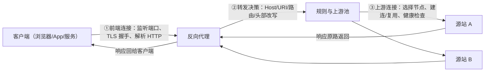
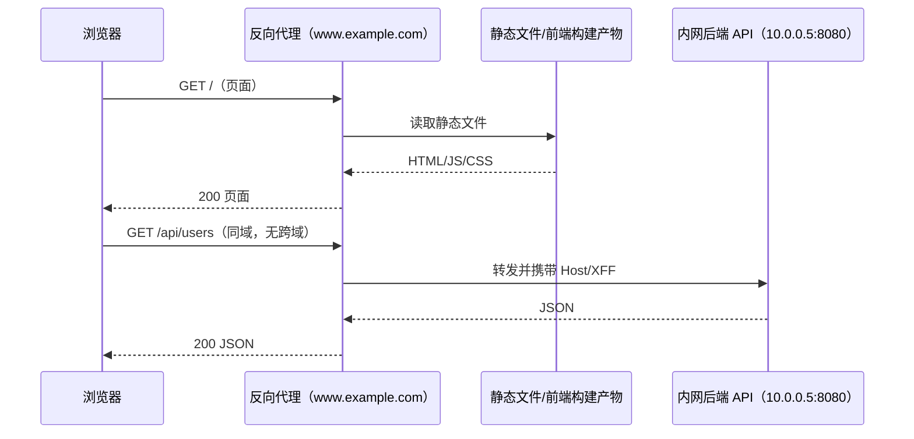
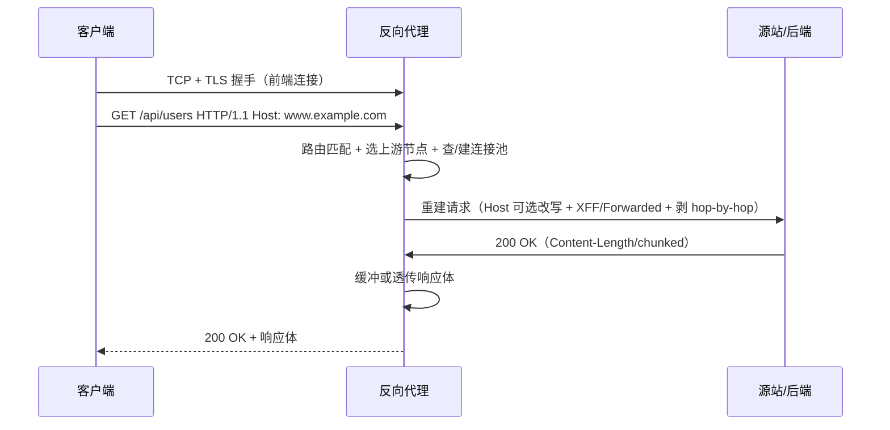
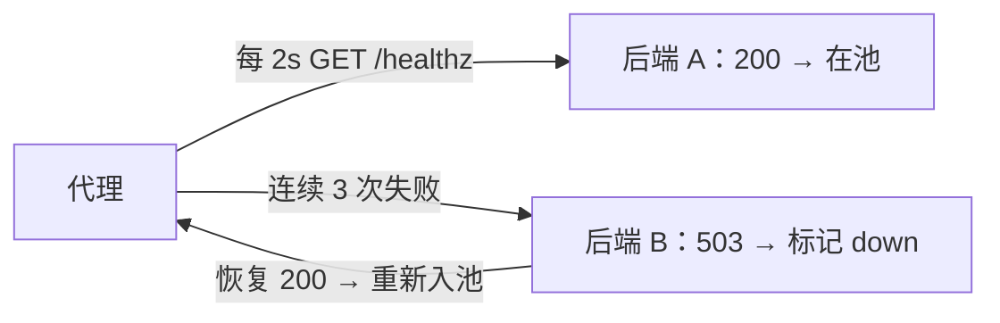
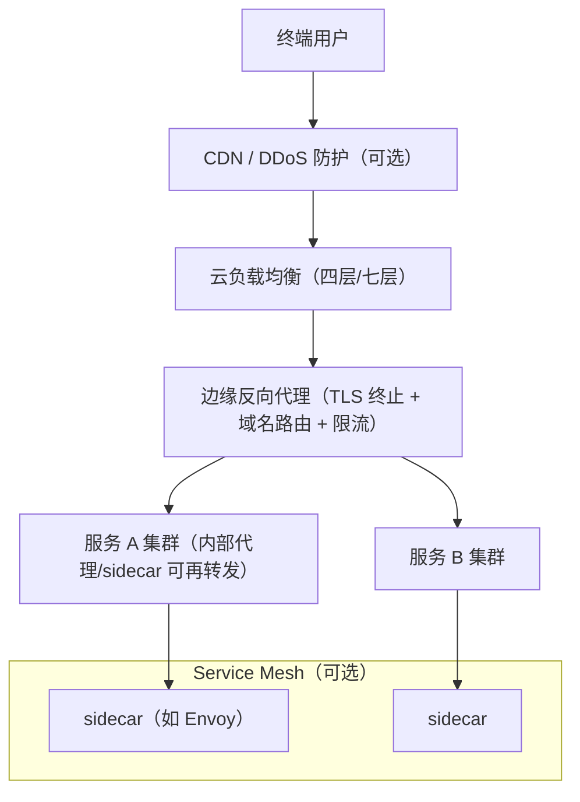
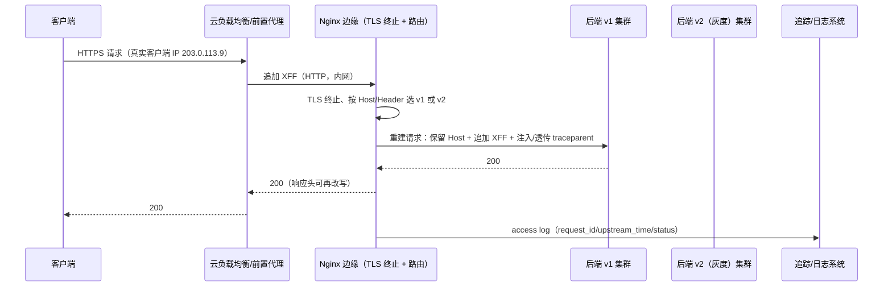
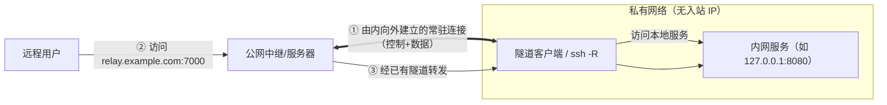
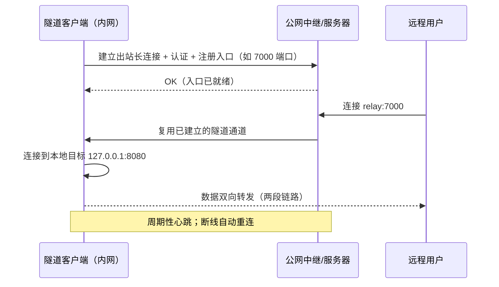

# 反向代理与反向隧道学习笔记

> **最后调研时间**：2026-09-08。
>
> **读者水平**：入门至进阶。建议先具备基础 HTTP（方法、状态码、请求/响应头）与 TCP/TLS 概念；完全没有基础也能读，但最好先在本地把第二、四章的例子跑一遍。
>
> **版本边界**：产品版本以调研时官方资料为据——nginx 稳定版 1.30.x（2026-07-15 发布 1.30.4，见 [nginx news](https://nginx.org/news.html)）；HAProxy 3.2 LTS 系列（2025-05-28 发布，见 [HAProxy 官网](https://www.haproxy.org/)）；Envoy v1.39.x（2026-08-26 发布 v1.39.1，见 [Envoy Releases](https://github.com/envoyproxy/envoy/releases/tag/v1.39.1)）；Traefik v3.7（2026-05-05 发布，见 [Traefik v3.7 Blog](https://traefik.io/blog/traefik-proxy-3-7-is-available)）；Caddy 2.11.x（2026-02 发布 v2.11.1，见 [Caddy Releases](https://github.com/caddyserver/caddy/releases/tag/v2.11.1)）。协议语义以 RFC 9110（HTTP 语义）、RFC 9112（HTTP/1.1）、RFC 7239（Forwarded）为准。
>
> **适用范围**：HTTP/1.1、HTTPS、HTTP/2、WebSocket/SSE、gRPC 场景下的反向代理；主产品 Nginx/HAProxy/Envoy/Traefik/Caddy/Apache；Kubernetes Ingress 与 Gateway API 语境；负载均衡、安全加固、可观测与排错。
>
> **不包含**：CDN 商业化产品全量功能、TLS/证书体系完整课程、网络协议栈源码级实现、各云厂商负载均衡服务逐项对比。
>
> **第二部分（反向隧道）**：从"谁先建立连接"的角度理解内网穿透：SSH Remote Forwarding/autossh、frp（自托管）、ngrok 与 Cloudflare Tunnel（托管），覆盖原理、协议、安全、选型与排错。版本参照：frp v0.71.0（2026-08-14，见 [frp Releases](https://github.com/fatedier/frp/releases/tag/v0.71.0)）、ngrok agent 3.x（见 [ngrok Agent 文档](https://ngrok.com/docs/gateway/agent/)）、cloudflared 以官方发布为准（见 [cloudflared 仓库](https://github.com/cloudflare/cloudflared)）。

---

## 讲义导读

这份讲义的目标不是背下"某产品的几十条指令"，而是建立一套关于**反向代理**的通用心智模型，让你能"换一个产品也能上手、出问题知道坏在哪一段、选型时知道取舍在哪"。先记住一句话：**反向代理是站在源站前面的中间人——它对客户端表现为服务器，对服务器表现为客户端，一个请求因此被拆成"客户端连接 + 转发决策 + 上游连接"三段**。

最容易产生的错误理解有三个：第一，把反向代理当成"端口转发器"，只抄 `proxy_pass` 一行，结果丢 Host、丢客户端 IP、WebSocket 打不开；第二，把"客户端 IP 一定来自连接源地址"当成事实，忽略代理之后**原始客户端信息只能靠头部传递，而头部可被伪造**；第三，把 Nginx、HAProxy、Envoy、Traefik 当同义词，实际它们在"静态配置 vs 动态发现、L4 vs L7、运维风格"上差异巨大。

贯穿全文的主线是"**请求三段的每一段都有明确的输入输出与观测信号**"：

```text
客户端 → [前端连接：监听/TLS/HTTP 解析] → [转发决策：Host/URI/头部/路由]
        → [上游连接：选择节点/建连/健康检查] → 源站 → 响应原路返回
```

哪一段出错，就看哪一段的日志与时间戳：前端段看访问日志，转发段看路由匹配与头部改写，上游段看 upstream 地址、连接超时与后端日志。各章末尾的能力式验收与全文末尾的最小检查清单，用于确认你"真的会用"而不是"看懂了"。

示例与配置均以"最小可运行"为标准：优先给完整可复制的片段，再解释每段在模型中的角色；命令与配置行下方或段落内就近给出官方文档链接，便于你回查当时版本的细节。

**第二部分补充**：反向代理研究的是"流量怎么进源站"；反向隧道研究的是"源站在 NAT/防火墙后面、连不进来时，怎么让流量仍然进来"——答案是**用一条由内而外的常驻连接把入口搬出去**。两者经常组合出现：隧道把内网服务送到公网节点，公网节点再用反向代理做 TLS 终止、域名路由与访问控制（来源：[腾讯云开发者：超越 NAT，内网穿透隧道原理](https://cloud.tencent.com/developer/article/2568569)，2025-09-15）。第二十一至三十二章把这条链路拆开讲。

---

## 目录或内容地图

| 章节 | 核心问题 | 主要产出 |
|---|---|---|
| 第一章 学习目标与前置知识 | 学完能做什么、需要什么基础 | 学习边界与能力锚点 |
| 第二章 反向代理是什么：定义、边界与心智模型 | 定义、正反代理区别、心智模型 | 三段式模型与术语表 |
| 第三章 为什么需要反向代理 | 它解决什么问题、何时不该用 | 价值-场景-反模式对照 |
| 第四章 一条请求的旅程：核心数据路径与转发语义 | 数据路径与转发语义如何运转 | 请求三段流程图 |
| 第五章 HTTP 头部与信任模型 | Host/XFF/Forwarded 如何传递与防伪 | 头部改写规范 |
| 第六章 连接与流量控制机制 | 负载均衡、健康检查、重试、限流如何工作 | 算法与配置对照表 |
| 第七章 协议支持全景 | HTTP/2、WebSocket、gRPC 等如何代理 | 协议特性速查 |
| 第八章 分层模型与架构拓扑 | L4/L7、边缘/内部、K8s Ingress 的位置 | 部署拓扑图 |
| 第九章 主流产品与选型 | 五类产品怎么选 | 选型矩阵与决策顺序 |
| 第十章 实战：Nginx | 最小反代、头与 WebSocket 怎么做 | 可运行配置与验证 |
| 第十一章 实战：Envoy | xDS 风格 L7 代理怎么写 | 静态配置与验证 |
| 第十二章 实战：Traefik | 服务发现驱动的路由怎么写 | Docker/文件配置示例 |
| 第十三章 实战：HAProxy | L4/L7 高并发代理怎么写 | frontend/backend 配置 |
| 第十四章 实战：Caddy | 自动 HTTPS 反代怎么写 | Caddyfile 最小示例 |
| 第十五章 端到端实战：多级代理链路 | 多级代理链路如何串联与验证 | 时序图与验证矩阵 |
| 第十六章 安全专题 | 头注入、开放代理、走私如何防 | 加固清单 |
| 第十七章 可观测性：拿到证据再排错 | 日志/指标/追踪如何拿到证据 | 观测字段与命令 |
| 第十八章 分层排错：常见错误与定位顺序 | 502/504 等怎么定位 | 故障树与对照表 |
| 第十九章 常见误区 | 最容易错的认知是什么 | 误区纠正表 |
| 第二十章 学习路线、实践闭环与检查清单 | 下一步学什么、如何验收 | 路线与最小清单 |
| **第二部分 反向隧道（第二十一至三十二章）** | 内网服务如何通过出站连接被公网安全访问 | 隧道原理与工具实践 |
| 第二十一章 学习目标与前置知识（反向隧道） | 反向隧道要什么基础、范围是什么 | 能力锚点与前置清单 |
| 第二十二章 反向隧道是什么：定义、心智模型与"先出后入" | 隧道与反代的本质区别 | 先出后入模型 |
| 第二十三章 为什么需要反向隧道：场景、价值与边界 | 哪些场景必须用隧道、何时不该用 | 场景-边界对照表 |
| 第二十四章 工作原理与协议要素：控制面、数据面与保活 | 隧道由哪些机制构成 | 协议要素与数据流图 |
| 第二十五章 SSH 反向隧道：手工 -R 与 autossh 保活 | 如何手工建立并长期保活隧道 | ssh -R/autossh 配置与验证 |
| 第二十六章 frp 自托管实战：服务端与客户端 | 自托管隧道怎么搭 | frps/frpc 最小配置 |
| 第二十七章 托管隧道实战：ngrok 与 Cloudflare Tunnel | SaaS 隧道怎么用 | ngrok/cloudflared 命令与验证 |
| 第二十八章 云边与设备场景：长连接隧道在系统里的角色 | 云边设备如何借隧道被访问 | 架构约束与观测要点 |
| 第二十九章 安全专题：认证、暴露面与异常隧道 | 隧道有哪些安全红线 | 加固清单与检测信号 |
| 第三十章 工具与方案选型：SSH/frp/ngrok/Cloudflare Tunnel | 四种方案怎么选 | 选型矩阵与决策顺序 |
| 第三十一章 排错与常见问题：隧道建立、保活与性能 | 隧道故障如何定位 | 故障树与对照表 |
| 第三十二章 常见误区、学习路线与最小检查清单 | 反向隧道最后怎么验收 | 误区表、路线与清单 |

---

## 第一章 学习目标与前置知识

### 1.1 学完之后应能解决什么问题

- 能向别人讲清正向代理与反向代理的区别，以及反向代理"替谁隐藏、对谁伪装"。
- 能画出并解释请求三段模型（前端连接、转发决策、上游连接），并在排错时指出"坏在哪一段"。
- 能正确配置并解释 `Host`、`X-Forwarded-For`、`X-Forwarded-Proto`、标准 `Forwarded` 的传递与信任边界（来源：[MDN：X-Forwarded-For](https://developer.mozilla.org/zh-CN/docs/Web/HTTP/Reference/Headers/X-Forwarded-For)、[RFC 7239](https://www.rfc-editor.org/rfc/rfc7239.html)）。
- 能根据场景在 Nginx、HAProxy、Envoy、Traefik、Caddy、云负载均衡之间做选型，并说出不选其他方案的原因。
- 能写出并运行至少两个产品的"最小反向代理"，验证 WebSocket、gRPC 或 SSE 之一。
- 能用日志、`curl -v`、超时与状态码分层定位 502/504/WebSocket 断连等常见故障。
- 能识别并规避开放代理、请求走私、头注入等代理相关安全风险（参考 [MDN：代理服务器与隧道](https://developer.mozilla.org/zh-CN/docs/Web/HTTP/Guides/Proxy_servers_and_tunneling)）。

### 1.2 前置知识

- **HTTP 基础**：方法（GET/POST 等）、状态码（2xx/3xx/4xx/5xx）、请求头/响应头、Cookie、Content-Type。
- **网络基础**：TCP 三次握手与连接、DNS、IP/端口；知道 TLS 在 TCP 之上、HTTP 在 TLS 之上即可。
- **Linux/终端**：会编辑配置文件、看日志、执行 `curl`；会 `docker run` 或系统包安装。
- 建议本地准备：Docker（一条命令起后端）、`curl`、一个文本编辑器；第九章之后的产品可用容器运行。

### 1.3 学习范围与非目标

| 范围 | 内容 |
|---|---|
| 包含 | 概念与心智模型、请求/响应数据路径、头部语义与信任、负载均衡与健康检查、协议支持、架构拓扑、产品选型、五个产品的实战配置、端到端链路、安全加固、可观测、排错 |
| 不包含 | 代理产品源码、QUIC/HTTP/3 完整实现、Web 服务器静态托管全讲、商业 CDN 完整配置 |
| 版本策略 | 概念以 RFC/官方文档为准；命令与配置给出版本边界；社区文章只作实践与踩坑补充，不作规范性结论 |

---

## 第二章 反向代理是什么：定义、边界与心智模型

### 2.1 先把主题说清楚

按照 MDN 的定义，代理位于客户端与服务器之间，主要有两类：**正向代理**（为客户端/一组客户端服务，典型如访问控制、翻墙、缓存），**反向代理**（用于控制和保护对服务器的访问，承担负载均衡、身份验证、解密或缓存）（来源：[MDN：代理服务器与隧道](https://developer.mozilla.org/zh-CN/docs/Web/HTTP/Guides/Proxy_servers_and_tunneling)）。

判定的简便方法看"谁是被隐藏的一方"：

- **正向代理隐藏客户端**：服务器看到的是代理，不知道真实客户端是谁；代理在客户端侧（显式配置或透明网关）。
- **反向代理隐藏服务器**：客户端只认识代理，不知道背后有多少台源站、源站在哪；代理部署在服务器侧，客户端通常不知道它的存在。

| 维度 | 正向代理 | 反向代理 |
|---|---|---|
| 谁配置它 | 客户端（或客户端所在网络） | 服务器所有者 |
| 站在谁前面 | 客户端后面 | 源站前面 |
| 隐藏谁 | 客户端 | 源站/后端集群 |
| 典型作用 | 绕过访问限制、缓存、匿名 | 负载均衡、TLS 卸载、路由、安全、缓存 |
| 典型例子 | 企业代理、浏览器代理 | Nginx/HAProxy/Envoy/Traefik/Caddy、云 LB、Ingress |
| 客户端是否感知 | 通常显式配置代理地址 | 不感知，代理看起来就是服务器 |

### 2.2 核心心智模型：请求三段论



图：根据 [MDN：代理服务器与隧道](https://developer.mozilla.org/zh-CN/docs/Web/HTTP/Guides/Proxy_servers_and_tunneling) 整理/重绘的请求三段模型。

这条模型有三个推论，是理解后续所有章节的钥匙：

1. **一个请求跨两条独立的 TCP/TLS 连接**：客户端→代理是一条，代理→源站是另一条。任何"连接级"信息（源 IP、TLS 证书、连接是否保活）都只属于其中一段，不能自动穿过代理。
2. **原始客户端信息只能靠头部携带**：正因为连接级信息无法穿过，代理才发明了 `X-Forwarded-For`、`Forwarded` 这类头部（来源：[MDN：X-Forwarded-For](https://developer.mozilla.org/zh-CN/docs/Web/HTTP/Reference/Headers/X-Forwarded-For)、[RFC 7239](https://www.rfc-editor.org/rfc/rfc7239.html)）。
3. **"转发"是重建请求，不是搬运字节**：代理会把请求行、Host、部分头部改写，把 hop-by-hop 头剥掉，再按自己的配置向上游发起一个"新请求"。

### 2.3 与相邻概念的边界

| 概念 | 与反向代理的关系 | 边界 |
|---|---|---|
| 负载均衡器 | 反向代理的一项核心能力 | 负载均衡可以只做 L4 转发，反向代理通常带 L7 语义 |
| API 网关 | 反向代理 + API 治理（鉴权、限流、聚合、开发者门户） | 网关是反代的超集 |
| Ingress Controller | 在 Kubernetes 里实现 Ingress 的"反代控制器" | 本质是反向代理 + 服务发现 |
| Service Mesh sidecar | 以"透明代理"形态做应用间流量治理 | 是反向代理思想在数据面的应用（如 Envoy） |
| Web 服务器（静态） | 反代产品通常同时能做静态服务 | "代理"与"托管静态文件"是两个功能域 |

社区对"反代/负载均衡/网关边界正在模糊"的判断值得记下：Envoy、Traefik、HAProxy 等都能同时扮演多层角色，选型应以"你真正需要哪一组能力"为准（来源：[DEV：The Gateway Layer Explained](https://dev.to/walosha/the-gateway-layer-explained-reverse-proxies-load-balancers-and-api-gateways-once-and-for-all-1h41)）。

### 2.4 常见误解

| 误区 | 为什么错 | 更准确的理解 |
|---|---|---|
| "反向代理就是 Nginx 的 proxy_pass" | proxy_pass 只是"转发决策"里的一行 | 还有监听/TLS/头部/上游/缓冲/日志一整条链 |
| "加个代理后端就查不到客户端 IP" | 代理可以显式传递 | 需要配置并信任 XFF/Forwarded 链 |
| "反向代理必须是独立机器" | 可以是进程、容器、sidecar | 部署形态不改变其本质 |
| "配置好就不用管" | 产品/协议/证书/后端都在变 | 需要版本管理与定期验证 |

### 2.5 本章验收

读完本章后，至少应该能：

- 用"隐藏谁"区分正/反向代理，并给出两类例子。
- 画出请求三段模型并解释"为什么代理两侧是两个独立连接"。
- 说出三个与反向代理相邻且易混的概念，并解释边界。

---

## 第三章 为什么需要反向代理

### 3.1 价值清单：它解决什么问题

反向代理是"部署在源站与外界之间的所有共性能力"的收口点。常见价值如下表：

| 价值 | 机制要点 | 典型场景 | 选型提示 |
|---|---|---|---|
| 统一入口与拓扑隐藏 | 客户端只连代理域名/IP，不接触后端 | 后端多实例、内网 IP 频繁变化 | 反向代理的"第一价值" |
| 负载均衡与高可用 | 按算法分发请求、摘除故障节点 | 多副本 Web/API | 见第六章算法与健康检查 |
| TLS 卸载 | 代理终结 HTTPS，后端可只跑 HTTP | 后端无法处理 TLS | 卸载点=信任边界，见第七章 |
| 路由与虚拟主机 | 按 Host/Path/Header 分发给不同后端 | 一个域名多个应用、前后端分离 | 路由规则是排错高发区 |
| 缓存与压缩 | 缓存可缓存响应、统一 gzip/br | 静态资源、热点 API | 缓存语义要遵循 HTTP 缓存头 |
| 安全防护 | ACL、限流、请求体大小限制、头清洗 | 对外暴露的入口 | 见第十六章 |
| 协议转换 | h2c→HTTP/1.1、gRPC/WebSocket 专用通道 | 微服务/实时应用 | 见第七章 |
| 灰度与蓝绿 | 按 Header/Cookie/权重切流量 | 版本发布 | 依赖稳定路由 + 观测 |
| 可观测性单点 | 访问日志、错误率、延迟、追踪头 | 全链路排障 | 见第十七章 |

### 3.2 一个典型的"为什么需要它"的例子

前后端分离部署时，浏览器页面在 `https://www.example.com`，后端 API 在内部 `http://10.0.0.5:8080`。若直接跨域访问会产生 CORS、暴露内网拓扑、还要逐个管理证书。用一个反代做"同域转发"即可一次解决：浏览器只与 `www.example.com` 通信，代理把 `/api/*` 转发到内网后端，把静态资源直接返回（来源：[腾讯云开发者：前后端分离项目 Nginx 反向代理实战全解](https://cloud.tencent.com.cn/developer/article/2717564)，2026-07-28）。



图：根据 [腾讯云开发者：Nginx 反向代理实战全解](https://cloud.tencent.com.cn/developer/article/2717564) 场景整理/重绘。

### 3.3 适用场景、不适用场景与选择信号

| 适合 | 不适合/收益低 | 选择信号 |
|---|---|---|
| 后端有多个实例要统一暴露 | 单机单进程且无公网暴露需求 | 是否存在"多个后端/多次变更" |
| 需要 TLS 终止或证书集中管理 | 链路全在内网且协议单一 | 是否要对外提供 HTTPS |
| 需要按域名/路径分流、灰度 | 所有流量本来就是固定目标 | 路由是否随发布频繁变化 |
| 需要限流/ACL/审计 | 无合规与暴露面需求 | 是否有对外 API 被滥用风险 |
| 需要统一日志与追踪插桩 | 各服务已有完整观测栈且不需要中心化 | 排障是否需要"一处看全部入口" |

**错误选择的后果示例**：把不需要代理的数据库直连塞进 L7 反代，只是徒增一跳延迟；把需要 WebSocket 长连接的应用丢给"默认缓冲 + 短读超时"的反代而不配置 Upgrade，会得到莫名断连。所有"要不要用反代"的答案都应回到"哪个需求是真的"。

### 3.4 本章验收

读完本章后，至少应该能：

- 列出反向代理至少六项价值并各给一个触发场景。
- 说明"同域反代解决前后端跨域"这类最小案例里代理做了什么。
- 判断一个场景是否真需要反向代理，并说清不适用时的后果。

---

## 第四章 一条请求的旅程：核心数据路径与转发语义

### 4.1 请求在代理内部经过哪些阶段

无论产品是 Nginx、HAProxy、Envoy 还是 Traefik，一次被代理的请求大致都经历以下阶段（对应产品的配置项不同，但职责相同）：

1. **监听与接受**：在指定地址/端口 accept TCP（或 UDP），进入连接生命周期管理。
2. **TLS 握手（若启用）**：服务端证书校验与协商；也可能是 SNI 就完成分流的四层透传场景。
3. **HTTP 解析**：读取请求行、请求头、按 Content-Length/chunked 读请求体。
4. **路由匹配**：按 Host/server_name、URI/location、请求头、Cookie、TLS 信息等决定"交给谁处理"。
5. **上游解析与选择**：从 upstream/cluster/backend 池里选一个节点（见第六章）。
6. **建连/复用上游连接**：从连接池取或新建到源站的连接。
7. **重建请求并转发**：按配置改写请求行与头部、剥除逐跳头、加转发头，把请求体（或流式）发往源站。
8. **读取响应**：接收响应头/响应体；按配置做缓冲、限速、压缩、缓存。
9. **返回客户端**：把响应（含改写后的响应头）写回客户端连接。



图：根据 [MDN：代理服务器与隧道](https://developer.mozilla.org/zh-CN/docs/Web/HTTP/Guides/Proxy_servers_and_tunneling) 与各产品官方文档整理/重绘。

### 4.2 代理"重建请求"到底改了什么

代理向上游发起的是**新请求**，以下内容可能被改写：

| 部分 | 典型行为 | 示例 |
|---|---|---|
| 请求行（request-target） | 可能改变路径 | `location /api/ { proxy_pass http://backend/; }` 会把 `/api/users` 变成 `/users` |
| Host 头 | 可保留原始、可替换为上游地址 | `proxy_set_header Host $host;` 保留浏览器 Host |
| 转发相关头 | 追加 XFF、Forwarded 等 | 见第五章 |
| hop-by-hop 头 | 代理会处理并移除 | `Connection`、`Keep-Alive`、`Upgrade`、`TE`、`Transfer-Encoding` 等（来源：[RFC 9110](https://www.rfc-editor.org/rfc/rfc9110.html) 对逐跳头的定义） |
| 连接属性 | 上游协议/版本/是否 keep-alive | `proxy_http_version 1.1;`、`upstream keepalive` |

"URI 前缀是否保留"是 Nginx 初学者最常踩的坑之一：`proxy_pass` 带 URI（如 `http://backend/` 尾部有 `/`）会**替换** location 前缀，不带 URI（如 `http://backend` 或指向 upstream 变量名）则**保留原路径**（来源：[CSDN：反向代理进阶配置技巧](https://blog.csdn.net/2502_91869417/article/details/152160762)，2025-09-26；[Nginx proxy 模块文档](https://nginx.org/en/docs/http/ngx_http_proxy_module.html)）。规则只靠读背不够，实验命令：分别访问 `/api/a` 与 `/api/`，观察后端收到的 request-target。

### 4.3 缓冲、流式与全双工

反代对请求体和响应体有两种姿态：

- **缓冲（buffering）**：代理先把上游响应读完整（或按缓冲大小）再发给客户端。好处是能快速释放上游连接、支持限速与再压缩；坏处是首字节延迟更高、内存占用更大、不利于实时流。
- **流式/透传（streaming）**：代理边收边发，适合 SSE、大文件下载、WebSocket（Upgrade 后变原始字节转发）、gRPC 流。

典型配置开关示例（Nginx）：`proxy_buffering off;`、`proxy_request_buffering off;`、配合 `proxy_read_timeout`/`proxy_send_timeout` 设置空闲超时（来源：[Nginx proxy 模块文档](https://nginx.org/en/docs/http/ngx_http_proxy_module.html)）。选错姿态的症状很有辨识度：SSE 半天不出数据、WebSocket 被缓冲层掐断、大文件下载内存暴涨。

### 4.4 观察每一段发生了什么

排错第一步是"给三段各留证据"：

- 前端段：代理访问日志中的 client IP、request line、status、request_time。
- 转发段：路由匹配结果（如 Nginx 的 `$upstream_addr`/`$upstream_status`，或产品 dashboard 里的 route/service）。
- 上游段：源站自己的访问日志（对比时间戳与 request-target 是否与预期一致）。

一条实用的验证命令：

```bash
curl -v http://127.0.0.1:8080/api/ping
# 观察：代理返回的 Server 头、后端收到的路径、是否出现 X-Forwarded-For
```

预期现象：代理侧 200、后端日志出现 `/ping`（若配置了前缀替换则注意路径变化）；若后端收到路径与预期不符，先检查 proxy_pass 尾部斜杠。

### 4.5 本章验收

读完本章后，至少应该能：

- 按九阶段讲清一次请求在代理内部的处理顺序。
- 用实验解释 `proxy_pass` 带/不带 URI 的路径语义差异。
- 区分缓冲与流式姿态，并指出 WebSocket/SSE 需要哪种。

---

## 第五章 HTTP 头部与信任模型

### 5.1 Host：路由与后端的"真相"

HTTP/1.1 起 Host 是必带头，虚拟主机靠它区分同一 IP 上的不同站点。反代场景里 Host 有两个用途：

1. **路由键**：Nginx 的 `server_name`、Traefik 的 `Host(...)` 规则、Envoy 的 `host` match 都用它选路由。
2. **后端的"原始意图"**：很多应用用 Host 拼绝对 URL/重定向，因此反代要显式决定"传给上游的是原始 Host 还是上游地址"。

Nginx 默认会传原始 Host；显式写法是 `proxy_set_header Host $host;`。需要改写（如用内部域名访问上游）则用 `proxy_set_header Host backend.internal;`（来源：[Nginx proxy 模块文档](https://nginx.org/en/docs/http/ngx_http_proxy_module.html)）。

### 5.2 X-Forwarded-For 的语义与坑

`X-Forwarded-For`（XFF）是事实标准请求头，用于标识"经代理访问的客户端原始 IP"；当请求经多个代理时，每跳追加一个地址，形成 `client, proxy1, proxy2` 这样的链（来源：[MDN：X-Forwarded-For](https://developer.mozilla.org/zh-CN/docs/Web/HTTP/Reference/Headers/X-Forwarded-For)）。

关键结论（MDN 原话的核心是"**当客户端与服务器之间有不可信代理时，XFF 不可信**"）：

- XFF 可以由客户端任意伪造，除非你确定"到你的应用之间每一个代理都可信且会覆盖/追加"。
- 若应用取"最左 IP"当客户端，而外层代理只是追加（append），攻击者塞一个假的 `X-Forwarded-For: 1.2.3.4` 就能伪造来源。
- 正确做法之一：**在最外层可信边界覆盖 XFF**（丢弃客户端带来的 XFF 再写真实值），应用再只信任"自己那一跳"。

Nginx 常用写法（含覆盖/追加两种意图）：

```nginx
# 向源站透传原始 Host 与客户端地址（追加）
proxy_set_header Host              $host;
proxy_set_header X-Real-IP         $remote_addr;
proxy_set_header X-Forwarded-For   $proxy_add_x_forwarded_for;
proxy_set_header X-Forwarded-Proto $scheme;
```

来源：[阿里云开发者：Nginx 生产部署指南](https://developer.aliyun.com/article/1745447) 提供的同类配置，2026-07-04；指令语义以 [Nginx proxy 模块文档](https://nginx.org/en/docs/http/ngx_http_proxy_module.html) 为准。`$proxy_add_x_forwarded_for` 在 Nginx 里的语义是"客户端带来的 XFF + $remote_addr"（若客户端头为空则只含 $remote_addr）。

### 5.3 标准 Forwarded（RFC 7239）

因为 XFF/X-Forwarded-Proto/X-Forwarded-Host 各自为政且语义含糊，IETF 定义了标准头 `Forwarded`，用 `for=`、`by=`、`proto=`、`host=` 表达原始地址、经过的代理、协议与 Host（来源：[RFC 7239](https://www.rfc-editor.org/rfc/rfc7239.html)；[MDN：Forwarded](https://developer.mozilla.org/en-US/docs/Web/HTTP/Reference/Headers/Forwarded)）。

```http
Forwarded: for=192.0.2.60;proto=https;host=www.example.com
```

MDN 的建议是：应用/代理支持标准 `Forwarded` 时优先使用它；XFF 系仍是事实标准，很多产品两者都会发（来源：[MDN：Forwarded](https://developer.mozilla.org/en-US/docs/Web/HTTP/Reference/Headers/Forwarded)）。**实践铁律**：无论用哪种头，应用都要显式配置"可信代理层数/网段"，否则取了头也不该信。

### 5.4 多级代理链示例

```text
客户端(203.0.113.9)
  → CDN/云 LB       追加 XFF: 203.0.113.9
  → Nginx 边缘      追加 XFF: 203.0.113.9, <CDN节点IP>
  → 应用
```

应用要拿到真实客户端，一般读取 XFF 的"可信前缀里的第一个地址"——取决于"你信任哪一跳会正确覆盖/追加"。若边缘 Nginx 选择覆盖整个 XFF（清空后只写 `$remote_addr`），则下游永远只有一跳，逻辑最清晰但会丢失 CDN 之前的链。链越长，越要在每一层都做"仅信任可信对端写入的头"。

### 5.5 常见错误与修复

| 现象 | 可能原因 | 排查顺序 | 修复方向 |
|---|---|---|---|
| 后端日志全是代理 IP | 没配 XFF 或后端没读 | 看后端收到的头（可临时 echo 请求头） | 配 `proxy_set_header X-Forwarded-For`，并让后端启用 trusted proxy |
| 伪造 IP 绕过白名单 | 信任了不可信输入的 XFF | 检查最外层是否覆盖 XFF | 在最可信边界清空/覆盖 XFF |
| 重定向跳到内网域名 | Host 被改成上游地址 | 看 Location 响应头 | 传原始 Host 或在响应层重写 Location |
| 判断 https 出错 | 后端只看连接协议 | 看是否收到 X-Forwarded-Proto | 配 `X-Forwarded-Proto $scheme` 并让应用识别 |

### 5.6 本章验收

读完本章后，至少应该能：

- 解释 XFF 链的形成方式，以及"为什么存在不可信代理时它不可信"。
- 说出 RFC 7239 的 `Forwarded` 与 XFF 系头的区别与取舍。
- 设计一个"边缘覆盖 XFF、应用只信一跳"的防伪造方案。

---

## 第六章 连接与流量控制机制

### 6.1 负载均衡算法：把请求分给谁

| 算法 | 语义 | 适合 | 注意 |
|---|---|---|---|
| Round Robin（轮询） | 轮流分发 | 同质后端 | 慢节点会拖整体 |
| Weighted RR | 按权重比例分发 | 异构机器 | 权重需按容量定 |
| Least Connections | 发给当前连接最少者 | 长连接/计算型 | 短请求下与 RR 差别小 |
| IP/URI Hash | 对键做哈希分节点 | 会话/缓存亲和 | 节点增删会重散列，用一致性哈希缓解 |
| Consistent Hash（一致性哈希） | 环形哈希，增删节点影响小 | 缓存类后端 | Envoy ring hash、Nginx 商业/三方模块支持 |
| Random Two Choices | 随机抽两个比负载 | 大规模分布式 | 理论均衡性好 |

选型判断：无状态 API 用轮询/最少连接；需要"同一用户固定到同一后端"（本地会话/缓存）时用哈希或 Cookie 粘性。**粘性与哈希不是一回事**：Cookie 粘性由代理写入并识别会话 Cookie（如 HAProxy `cookie SERVERID insert`），IP 哈希在 NAT 环境下会把一堆用户打成同一后端。

### 6.2 健康检查：主动与被动

- **被动检查**：转发失败达到阈值（如 Nginx `max_fails` + `fail_timeout`）就把节点标为不可用，恢复后自动放回。
- **主动检查**：代理周期性探测（TCP connect、HTTP GET 指定路径、TLS 握手），决定节点是否参与分发。主动探测的路径要真实反映"业务可用"，否则会探活成功但转发失败。

各产品对照：Nginx OSS 原生以被动为主，主动健康检查在 Nginx Plus；HAProxy 用 `option httpchk`/`http-check`；Envoy 有主动 `health_check` + 被动 `outlier_detection`；Traefik 的 service 层支持 `healthCheck`（来源：[HAProxy 配置手册](https://www.haproxy.org/)、[Nginx 文档](https://nginx.org/en/docs/http/ngx_http_upstream_module.html)、[Envoy 文档](https://www.envoyproxy.io/docs/envoy/latest/)）。



### 6.3 超时、重试与熔断

- **超时分为多段**：连接建立（connect）、发请求（send）、读响应（read）、上游响应头等待（header）。Nginx 用 `proxy_connect_timeout`/`proxy_read_timeout`/`proxy_send_timeout`（来源：[Nginx proxy 模块文档](https://nginx.org/en/docs/http/ngx_http_proxy_module.html)）。
- **重试要看幂等性**：GET/HEAD 类可安全重试；非幂等写请求重试要谨慎。Nginx 用 `proxy_next_upstream` 控制"什么错误才换下一个上游"，默认不重试 4xx/5xx；Envoy 的 `retry_policy` 支持按状态码、方法、条件重试。
- **熔断/摘除**：持续失败把节点从池摘除、给客户端快速失败而不是拖死，配合超时形成"快速失败 + 逐步恢复"。

选错参数的症状：把 `proxy_read_timeout` 设太小，长轮询/SSE 被无故掐断；把重试开给 POST，造成重复下单。**先确定语义再定参数**。

### 6.4 连接池与 keep-alive

代理与上游之间维护 keep-alive 连接池能显著降低建连开销。Nginx 需要在 upstream 配置 `keepalive 32;` 且转发时设 `proxy_http_version 1.1;` 否则默认 HTTP/1.0 逐请求断连——这一默认行为正在演进：nginx mainline 1.29.7 起把默认上游 HTTP 版本升级为 HTTP/1.1 并启用 keep-alive（来源：[nginx 1.29.7 Release](https://github.com/nginx/nginx/releases/tag/release-1.29.7)）。Envoy 的 cluster 有连接池管理；HAProxy 用 `option http-server-close`/`keep-alive` 控制。

### 6.5 限流：令牌桶与并发限制

- **请求速率限流**：典型实现是令牌桶（令牌按速率补充、桶容量允许突发）。Nginx `limit_req_zone` + `limit_req`；HAProxy 用 stick-table + `http-request track-sc`；Traefik 用 rateLimit middleware。
- **并发连接限制**：`limit_conn`（Nginx）、`maxconn`（HAProxy）限制同一来源的连接数。

最小示例（Nginx）：

```nginx
limit_req_zone $binary_remote_addr zone=api:10m rate=10r/s;
server {
  location /api/ {
    limit_req zone=api burst=20 nodelay;
    proxy_pass http://backend;
  }
}
```

超出速率的请求默认返回 503；`burst` 允许突发排队，`nodelay` 让放行不再排队等待。字段语义见 [Nginx 限流与模块文档](https://nginx.org/en/docs/http/ngx_http_limit_req_module.html)。

### 6.6 本章验收

读完本章后，至少应该能：

- 为"无状态 API / 本地会话 / 缓存后端"分别选择负载均衡算法并说明理由。
- 区分主动/被动健康检查，并知道探测路径为什么必须代表业务可用性。
- 说清超时、重试、熔断三者的语义与"POST 重试"的风险。

---

## 第七章 协议支持全景

### 7.1 HTTP/1.1：基线语义

HTTP/1.1 是多数代理的基线：请求行+头部+按 Content-Length 或 chunked 编码的请求体；连接可 keep-alive，但同一连接上的请求必须串行。代理必须正确处理 Transfer-Encoding、逐跳头（Connection/Keep-Alive/Upgrade/TE 等），并区分"端到端头"与"逐跳头"（来源：[RFC 9112](https://www.rfc-editor.org/rfc/rfc9112.html)、[RFC 9110](https://www.rfc-editor.org/rfc/rfc9110.html)）。

### 7.2 HTTPS/TLS 的三种代理姿态

| 姿态 | 说明 | 适用 | 代价 |
|---|---|---|---|
| TLS 终止（termination） | 代理持有证书、终结 TLS，后端走明文 HTTP 或自建 TLS | 后端不想管证书、需在代理层读请求做 L7 路由 | 代理到后端链路需内网保护，否则要再加密 |
| TLS 重新加密（re-encryption） | 代理终结后又用证书连后端 | 内外都要加密 | 多一次握手 |
| TLS 透传（passthrough） | 代理不碰 TLS，只按 SNI 转发字节流 | 无法解密的协议、端到端安全要求高 | 只能做 L4/SNI 级路由 |

需要按域名分流又不解密时用 **SNI 路由**：Nginx stream 的 `ssl_preread`、HAProxy 的 `use_backend ... if { ssl_fc_sni ... }`、Envoy 的 filter chain SNI 匹配都能在 TLS 握手里读取 SNI 后转发（来源：[Nginx stream_ssl_preread 文档](https://nginx.org/en/docs/stream/ngx_stream_ssl_preread_module.html)）。

### 7.3 HTTP/2：多路复用与代理注意点

- HTTP/2 在一个 TCP 连接上多路复用多个流，用 HPACK 压缩头（来源：[RFC 9113](https://www.rfc-editor.org/rfc/rfc9113.html)）。
- 代理常见姿势：客户端侧支持 HTTP/2，转发到上游时"降级"为 HTTP/1.1——因为很多后端只支持 HTTP/1.1。这意味着代理要负责 h2↔h1.1 的转换（帧、伪头、TE 等）。
- 常见故障：HTTP/2 连接被 RST、`connection error`、代理与后端头大小上限不一致（header 过大被 reset）。案例见 [Envoy v1.36.7 对"超最大头大小即重置流"的安全修复](https://github.com/envoyproxy/envoy/releases/tag/v1.36.7)。

### 7.4 WebSocket：Upgrade 是逐跳语义

WebSocket 建连靠 HTTP Upgrade 握手，`Connection: Upgrade` 与 `Upgrade: websocket` 都是逐跳头，普通反代默认会剥掉——所以 WebSocket 需要显式支持。Nginx 需同时配：

```nginx
location /ws/ {
  proxy_pass http://backend;
  proxy_http_version 1.1;
  proxy_set_header Upgrade $http_upgrade;
  proxy_set_header Connection "upgrade";
  proxy_read_timeout 3600s;   # 长连接空闲超时按需调大
}
```

升级成功后代理进入"原始字节双向转发"；`proxy_read_timeout` 决定长时间无消息时是否掐断（来源：[Nginx WebSocket 文档](https://nginx.org/en/docs/http/websocket.html)；社区同类总结见 [e-com-net：Nginx 反向代理踩坑](https://www.e-com-net.com/article/2032026194374877184.htm)）。

### 7.5 SSE 与长轮询

SSE 是"一条长 HTTP 响应"：代理**不能缓冲整段响应**，否则客户端永远等不到增量；空闲超时也要按业务调大。正确姿势是 `proxy_buffering off;` 并把 `proxy_read_timeout` 放宽（来源：[Nginx proxy 模块文档](https://nginx.org/en/docs/http/ngx_http_proxy_module.html)）。

### 7.6 gRPC：要求 HTTP/2

gRPC 基于 HTTP/2（明文 h2c 或 TLS h2）。代理若向后端只发 HTTP/1.1，gRPC 会失败。Nginx 用 `grpc_pass` 模块（内部处理 h2）：

```nginx
location /grpc/ {
  grpc_pass grpc://backend:50051;
}
```

Envoy 对 gRPC 有原生支持（HTTP/2 cluster + 流式）；Traefik/HAProxy 在配置正确的情况下也可代理 HTTP/2。关键检查点：客户端→代理、代理→后端两段都必须支持 HTTP/2（来源：[Nginx grpc 模块文档](https://nginx.org/en/docs/http/ngx_http_grpc_module.html)、[Envoy HTTP/2 文档](https://www.envoyproxy.io/docs/envoy/latest/)）。

### 7.7 协议速查表

| 场景 | 需要的前端能力 | 需要的转发设置 | 常见错误 |
|---|---|---|---|
| 普通 HTTP API | 无 | Host/XFF 透传 | 路径被错误改写 |
| HTTPS 网站 | 证书/TLS 终止 | 传 `X-Forwarded-Proto` | 应用误判 http |
| WebSocket | Upgrade 支持 | 传 Upgrade/Connection、关缓冲、放宽超时 | 建连后秒断 |
| SSE/长轮询 | 流式响应 | 关响应缓冲、放宽读超时 | 数据不增量到达 |
| gRPC | HTTP/2 | h2/h2c 转发 | 用 http/1.1 转 grpc |
| TLS 透传/SNI 分流 | SNI 读取 | L4 层按 SNI 选后端 | 想按 URL 分流却透传了 |

### 7.8 本章验收

读完本章后，至少应该能：

- 区分 TLS 终止/重加密/透传三种姿态并说明适用场景。
- 配置一个 WebSocket 反代并解释为什么需要显式传 Upgrade。
- 解释 gRPC 为什么不能走 HTTP/1.1 转发，并给出 Nginx 的最小 `grpc_pass` 示例。

---

## 第八章 分层模型与架构拓扑

### 8.1 L4 代理与 L7 代理

| 维度 | L4 代理/转发 | L7 代理 |
|---|---|---|
| 看到什么 | TCP/UDP 流（四元组、SNI 可看） | HTTP 请求/响应语义 |
| 路由依据 | IP、端口、（可选的）SNI | Host、URI、Header、Cookie、方法 |
| 能做 | 透传、端口映射、简单分流 | 改写、路由、限流、鉴权、缓存、协议转换 |
| 性能/开销 | 低（少解析） | 高（逐请求解析与处理） |
| 适合 | 数据库、Redis、任意 TCP 服务 | Web、API、微服务流量治理 |
| 代表 | HAProxy(可 L4)、云 NLB、nginx stream | Nginx、Envoy、Traefik、HAProxy mode http |

注意 HAProxy 与 Nginx 都同时支持 L4/L7：Nginx 的 `stream` 上下文是 L4，`http` 上下文是 L7；HAProxy 的 `mode tcp` 是 L4，`mode http` 是 L7。

### 8.2 常见部署拓扑



图：根据 [MDN：代理服务器与隧道](https://developer.mozilla.org/zh-CN/docs/Web/HTTP/Guides/Proxy_servers_and_tunneling) 与 [Kubernetes Ingress](https://kubernetes.io/zh-cn/docs/concepts/services-networking/ingress/) 等资料整理/重绘的常见分层。

拓扑含义：

- **多跳 = 多次头部追加**：CDN、云 LB、边缘反代每一跳都会往 XFF/Forwarded 追加，链路越长，"最左地址是否可信"越需要显式管理（见第五章）。
- **TLS 终止点通常设在"最外一层能看内容的地方"**：CDN/云 LB 终止后到边缘可能已是 HTTP，或云 LB 与边缘之间用私有网络。
- **边缘代理管"南北向"，内部代理/sidecar 管"东西向"**：职责不同，配置与安全边界也不同。

### 8.3 Kubernetes 语境：Service、Ingress 与 Gateway API

- **Service**：集群内的虚拟入口与负载均衡对象，把流量转发给一组 Pod（来源：[Kubernetes Service](https://kubernetes.io/zh-cn/docs/concepts/services-networking/service/)）。
- **Ingress**：集群入口的"反代声明"——Ingress Controller（Nginx Ingress、Traefik、HAProxy Ingress、Envoy Gateway 等）监听 Ingress 对象并把它翻译成反代配置（来源：[Kubernetes Ingress](https://kubernetes.io/zh-cn/docs/concepts/services-networking/ingress/)）。
- **Gateway API**：新一代入口标准，比 Ingress 更细粒度地表达 Gateway/HTTPRoute，Traefik v3.7 已声明支持 Gateway API v1.5.1（来源：[Traefik v3.7 Blog](https://traefik.io/blog/traefik-proxy-3-7-is-available)、[Gateway API](https://gateway-api.sigs.k8s.io/)）。

一句话：在 Kubernetes 里"Ingress/HTTPRoute 对象 = 你要的路由声明，Ingress Controller/Gateway 实现 = 反向代理进程"。反向代理的通用知识（TLS、XFF、WebSocket、超时）在写 Ingress 注解时同样适用。

### 8.4 网关与反代融合趋势

微服务对网关的要求是"能动态发现服务、能按版本灰度、能做鉴权限流"，于是出现反代与网关融合的趋势：Envoy、Traefik 既是反代也是可编程网关；K8s 里与网关等价的概念叫 Ingress（来源：[腾讯云开发者：网关 V.S 反向代理](https://cloud.tencent.cn/developer/article/1791690)，2021；该文为早期综述，结论需与当前版本核对）。选择时不要纠结名字，而是把需求列成清单再对照产品能力。

### 8.5 本章验收

读完本章后，至少应该能：

- 说清 L4/L7 代理的差异并为"数据库直连/HTTP 网关"两类需求选型。
- 画出"CDN→云 LB→边缘反代→集群"拓扑并指出每一跳对 XFF 的影响。
- 解释 Kubernetes 中 Ingress/Gateway API 对象与 Ingress Controller/网关实现的关系。

---

## 第九章 主流产品与选型

### 9.1 各产品画像

| 产品 | 语言/定位 | 配置风格 | L4/L7 | 服务发现/动态性 | 典型场景 |
|---|---|---|---|---|---|
| Nginx | C；Web 服务器+反代 | 静态文件 + reload | 都有（http/stream） | 弱（需 reload/第三方方案） | 网站入口、传统运维栈 |
| OpenResty | Nginx + Lua | Nginx 风格 + Lua 编程 | 都有 | 通过 Lua 与 API 扩展 | 需在代理层写业务逻辑 |
| HAProxy | C；专业负载均衡 | 静态 cfg、超高性能 | 都有 | 弱（可配 DNS/程序化 API） | 高并发 TCP/HTTP 入口 |
| Envoy | C++；云原生 L7 | YAML + xDS 动态下发 | 以 L7 为主 | 强（xDS、服务发现） | 服务网格数据面、网关、K8s |
| Traefik | Go；云原生反代 | 标签/CRD/文件自动发现 | L7（另有 TCP 支持） | 强（Docker/K8s/Consul 等 provider） | 容器/K8s 自动路由、入口网关 |
| Caddy | Go；自动 HTTPS | Caddyfile（人类友好） | L7 | 中 | 个人/中小站点快速 HTTPS 反代 |
| Apache httpd mod_proxy | C | httpd.conf | 以 L7 为主 | 弱 | 老牌 LAMP/既有 Apache 栈 |
| 云负载均衡/API 网关 | 厂商托管 | 控制台/OpenAPI | 均有 | 依产品 | 不想自运维基础设施 |

产品官方文档入口：Nginx [proxy 模块](https://nginx.org/en/docs/http/ngx_http_proxy_module.html)、HAProxy [官网文档](https://www.haproxy.org/)、Envoy [官方文档](https://www.envoyproxy.io/docs/envoy/latest/)、Traefik [官方文档](https://doc.traefik.io/traefik/)、Caddy [reverse_proxy 指令文档](https://caddyserver.com/docs/caddyfile/directives/reverse_proxy)、Apache [mod_proxy 文档](https://httpd.apache.org/docs/current/mod/mod_proxy.html)。

### 9.2 需求 → 推荐的选型矩阵

| 需求或约束 | 推荐 | 不推荐 | 原因 |
|---|---|---|---|
| 网站/API 统一入口，团队熟悉传统运维 | Nginx | Envoy | 学习曲线与生态匹配 |
| 极高并发、纯四层/七层转发、极少改写 | HAProxy | Traefik | 性能与内存占用优势 |
| Kubernetes 内自动发现服务、注解式路由 | Traefik（或 Nginx Ingress） | 手写静态配置 | 动态 provider 自动感知 Service/Ingress |
| 服务网格/数据面或需要 xDS 动态控制面 | Envoy | Nginx 静态配置 | Envoy 面向控制面驱动设计 |
| 个人/团队想要零配置自动 HTTPS | Caddy | HAProxy | Caddy 自动 ACME 证书 |
| 老系统已有 Apache | Apache mod_proxy 延续 | 引入新组件 | 减少迁移成本 |
| 有 API 治理（订阅/配额/开发者门户）需求 | 云 API 网关或 Kong/APISIX 类网关 | 纯反代 | 反代不提供门户级治理 |

决策顺序建议：

1. 先定**南北向还是东西向**：入口流量 → Ingress/边缘反代；服务间流量 → mesh/sidecar。
2. 再定**动态性**：服务变更频繁且想自动发现 → Traefik/Envoy/Ingress Controller；稳定少变 → Nginx/HAProxy 静态配置更简单。
3. 然后定**协议与性能**：gRPC/mTLS/HTTP2 原生支持、需要 QPS/内存预算 → 对照 Envoy/HAProxy/Nginx。
4. 最后看**团队技能与运维面**：你能长期维护哪种配置与升级节奏（社区观点可参考 [DEV：Design Philosophies（Part 2 预告）](https://dev.to/shinagawa-web/youve-configured-a-reverse-proxy-but-can-you-explain-why-it-works-part-1-1lpf)，2026-08-19）。

### 9.3 版本与更新时间线（截至 2026-09-08）

| 产品 | 调研时最新 | 关键事实 | 依据 |
|---|---|---|---|
| nginx | stable 1.30.4 / mainline 1.31.3（2026-07-15） | 持续跟进安全修复；近期修复了 proxy 模块相关 CVE | [nginx news](https://nginx.org/news.html) |
| HAProxy | 3.2 LTS 迭代中（2025-05-28 发布） | 3.2 为 LTS 分支 | [HAProxy 官网](https://www.haproxy.org/) |
| Envoy | v1.39.1（2026-08-26） | 季度主版本发布节奏 | [Envoy Releases](https://github.com/envoyproxy/envoy/releases/tag/v1.39.1) |
| Traefik | v3.7（2026-05-05） | 支持 Gateway API v1.5.1、兼容更多 Ingress 注解 | [Traefik v3.7 Blog](https://traefik.io/blog/traefik-proxy-3-7-is-available) |
| Caddy | 2.11.x（2026-02 起迭代） | 2.x 持续发布 | [Caddy Releases](https://github.com/caddyserver/caddy/releases/tag/v2.11.1) |

### 9.4 本章验收

读完本章后，至少应该能：

- 对照需求矩阵为"传统入口/K8s 自动路由/服务网格数据面/自动 HTTPS"四种场景选出产品。
- 说出动态性（静态配置 vs 服务发现）是选型的重要分水岭。
- 引用官方文档指出所选产品的当前版本与文档入口。

---

## 第十章 实战：Nginx

### 10.1 目标与最小环境

目标：用一份 Nginx 配置完成"静态页面 + `/api/` 反代 + WebSocket 反代 + TLS"中最核心的部分，并把"转发语义"讲清楚。最小环境可用 Docker：

```bash
docker network create proxy-demo
# 起一个简单的后端（任意返回 JSON/文本均可）
docker run -d --name backend --network proxy-demo -p 127.0.0.1:8080 \
  traefik/whoami:v1.10
# 起 Nginx 并挂载配置文件
docker run -d --name nginx-proxy --network proxy-demo -p 127.0.0.1:80:80 \
  -v $PWD/nginx.conf:/etc/nginx/conf.d/default.conf:ro nginx:1.30-alpine
```

### 10.2 一份带注释的最小配置

```nginx
upstream backend_api {
    server backend:8080;            # 容器网络里的主机名；Docker 内可 DNS 解析
    keepalive 32;                    # 到后端的 keep-alive 连接池
}

server {
    listen 80;
    server_name www.example.com;     # 虚拟主机路由键

    # 转发原始信息给后端（见第五章）
    proxy_set_header Host              $host;
    proxy_set_header X-Real-IP         $remote_addr;
    proxy_set_header X-Forwarded-For   $proxy_add_x_forwarded_for;
    proxy_set_header X-Forwarded-Proto $scheme;

    location / {
        root /usr/share/nginx/html;    # 静态文件
        try_files $uri $uri/ /index.html;
    }

    # 路径语义：proxy_pass 尾部带 "/" → location 前缀被替换
    location /api/ {
        proxy_pass http://backend_api/;
        proxy_http_version 1.1;        # keepalive 需要 1.1
    }

    # WebSocket：必须显式透传 Upgrade（见 7.4）
    location /ws/ {
        proxy_pass http://backend_api;
        proxy_http_version 1.1;
        proxy_set_header Upgrade $http_upgrade;
        proxy_set_header Connection "upgrade";
        proxy_read_timeout 3600s;
        proxy_buffering off;
    }
}
```

说明与边界：

- `/api/users` 经上面规则转发后，后端收到的是 `/users`（前缀被替换）；若希望保留 `/api/users`，把 `proxy_pass` 改成 `http://backend_api;`（不带尾部 `/`）——这是最容易出错的语义点（来源：[Nginx proxy 模块文档](https://nginx.org/en/docs/http/ngx_http_proxy_module.html)）。
- `proxy_http_version 1.1;` 是 `keepalive` 生效的前提；nginx mainline 1.29.7 起默认行为向 HTTP/1.1 + keep-alive 演进，稳定分支请按官方 CHANGES 核对（来源：[nginx 1.29.7 Release](https://github.com/nginx/nginx/releases/tag/release-1.29.7)）。
- TLS 版本做法：`listen 443 ssl;` + `ssl_certificate`/`ssl_certificate_key`，HTTP 到 HTTPS 用 301 跳转。

社区把上面的结构总结为"通过统一入口转发请求、隐藏后端服务"，可作为初学阶段的记忆锚点（来源：微信公众号《一文吃透 Nginx 反向代理配置（原理 + 实战）》，2026-01-05，[原文链接](https://mp.weixin.qq.com/s/PbthFMISJP075jT2Q8vbmw)）。

### 10.3 验证与观测

```bash
nginx -t                     # 配置语法检查，先于 reload
nginx -s reload              # 平滑重载
curl -v http://127.0.0.1/api/ping
curl -H 'Upgrade: websocket' -H 'Connection: Upgrade' \
  http://127.0.0.1/ws/       # 观察握手与 101 Switching Protocols
```

预期现象：`/api/ping` 返回后端内容且后端日志路径为 `/ping`；WebSocket 握手返回 101。观测入口：`access.log` 看 request/status/`$upstream_addr`，`error.log` 看连接与上游错误。

### 10.4 Nginx 常见错误与调试

| 现象 | 可能原因 | 先观察 | 修复方向 |
|---|---|---|---|
| 502 Bad Gateway | 后端没起、端口错、容器网络不通 | `error.log` 的 connect() failed；后端是否监听 | 修 upstream 地址/网络 |
| 504 Gateway Timeout | 后端太慢或 `proxy_read_timeout` 太小 | `$upstream_response_time` 与后端日志耗时 | 调大超时或优化后端 |
| 后端路径缺前缀 | proxy_pass 尾部 `/` 替换了前缀 | 后端访问日志的 request line | 按需保留/替换 |
| WebSocket 连上即断 | 没传 Upgrade/Connection 或缓冲未关 | 是否返回 101；客户端错误 | 补 7.4 配置 |
| 404 静态文件 | root/try_files 顺序问题 | 实际请求路径与文件位置 | 调 root 或 try_files |

升级提醒：代理产品是安全更新高频区。nginx 近期披露过 proxy 相关 CVE（如 HTTP/2 请求注入问题 CVE-2026-42926、SSL upstream 注入 CVE-2026-1642），务必跟踪官方发布并及时升级（来源：[nginx 1.31.0 Release](https://github.com/nginx/nginx/releases/tag/release-1.31.0)、[nginx news](https://nginx.org/news.html)）。

### 10.5 本章验收

读完本章后，至少应该能：

- 写出一份含 upstream、静态、API、WebSocket 的 Nginx 最小配置并解释每一段的角色。
- 用实验验证 proxy_pass 的路径替换语义，并说出 keepalive 需要 `proxy_http_version 1.1`。
- 用 `nginx -t`/`curl -v`/日志完成一次 502 或 WebSocket 断连定位。

---

## 第十一章 实战：Envoy

### 11.1 定位与配置模型

Envoy 是云原生 L7 代理：以"监听器（listener）→ 过滤器链（filter chain）→ 路由（route）→ 集群（cluster）"为核心模型，配置可用静态 YAML，也可由 xDS 控制面动态下发（来源：[Envoy 官方文档](https://www.envoyproxy.io/docs/envoy/latest/)）。它常被用作 Istio 等 Service Mesh 的数据面与各类网关的底座。

### 11.2 最小静态配置

```yaml
static_resources:
  listeners:
  - name: listener_0
    address:
      socket_address: { address: 0.0.0.0, port_value: 10000 }
    filter_chains:
    - filters:
      - name: envoy.filters.network.http_connection_manager
        typed_config:
          "@type": type.googleapis.com/envoy.extensions.filters.network.http_connection_manager.v3.HttpConnectionManager
          stat_prefix: ingress_http
          codec_type: AUTO
          route_config:
            name: local_route
            virtual_hosts:
            - name: main
              domains: ["*"]
              routes:
              - match: { prefix: "/" }
                route:
                  cluster: service_backend
                  timeout: 5s
          http_filters:
          - name: envoy.filters.http.router
            typed_config:
              "@type": type.googleapis.com/envoy.extensions.filters.http.router.v3.Router
  clusters:
  - name: service_backend
    connect_timeout: 1s
    type: STRICT_DNS
    load_assignment:
      cluster_name: service_backend
      endpoints:
      - lb_endpoints:
        - endpoint:
            address:
              socket_address: { address: backend, port_value: 8080 }
admin:
  address:
    socket_address: { address: 0.0.0.0, port_value: 9901 }
```

运行示例（参考官方 front proxy 沙箱结构，配置为演示用途）：

```bash
docker run -d --name envoy-proxy --network proxy-demo \
  -p 127.0.0.1:10000:10000 -p 127.0.0.1:9901:9901 \
  -v $PWD/envoy.yaml:/etc/envoy.yaml \
  envoyproxy/envoy:v1.39.1 -c /etc/envoy.yaml
```

说明：

- `http_connection_manager` 是 Envoy 处理 HTTP 的核心过滤器，负责解析、路由、产生访问日志。
- 默认行为已包含合理缺省：保留原始路径与 Host；Envoy 会自动管理到上游的连接池。
- 高级能力通过在 route 上加 `retry_policy`、在 cluster 上加 `outlier_detection`/`health_checks`、在 HCM 上加 `access_log` 实现（来源：[Envoy 官方文档](https://www.envoyproxy.io/docs/envoy/latest/)）。

### 11.3 验证与观测

```bash
curl -v http://127.0.0.1:10000/api/ping
curl -s http://127.0.0.1:9901/stats | grep -E 'upstream_cx_active|http1'
curl -s http://127.0.0.1:9901/config_dump   # 查看生效配置
```

预期现象：请求被转发到后端；`/stats` 里能看到 cluster 的连接与请求计数；`/config_dump` 能核对实际生效的路由与集群。Envoy 访问日志默认打到 stdout，容器里 `docker logs envoy-proxy` 即可看。

### 11.4 常见错误与调试

| 现象 | 可能原因 | 排查顺序 | 修复方向 |
|---|---|---|---|
| 连接被拒 | listener 地址/端口与发布端口不一致 | `/config_dump` 看 listener | 对齐端口与容器发布 |
| 路由 404 | virtual_host domains 或 route match 不符 | 看 route_config 与请求 Host | 修正 domains/prefix |
| 上游 503/无健康主机 | cluster 端点不可达或类型错误 | 看 cluster 的 endpoint 状态与 stats | 修 DNS/端口/健康检查 |
| 配置格式错 | @type/字段版本不匹配 | 看启动日志错误 | 对照当前版本 proto 文档 |

### 11.5 本章验收

读完本章后，至少应该能：

- 画出 Envoy 的 listener→filter→route→cluster 四层配置模型。
- 运行一个最小静态配置并解释 HCM 与 cluster 各自的角色。
- 用 admin 端口查看 stats 与 config_dump 定位路由/上游问题。

---

## 第十二章 实战：Traefik

### 12.1 定位：服务发现驱动的反向代理

Traefik 是面向容器与 Kubernetes 的 L7 反代：不写静态路由文件，而是通过 **providers**（Docker、Kubernetes、Consul、File 等）自动发现服务，再用 **routers（路由）/ services（上游）/ middlewares（中间件）** 三个抽象描述流量（来源：[Traefik 官方文档](https://doc.traefik.io/traefik/)）。

### 12.2 最小示例：Docker provider + 标签路由

```yaml
# docker-compose.yml
services:
  traefik:
    image: traefik:v3.7
    command:
      - "--providers.docker=true"          # 自动发现同网络容器
      - "--entrypoints.web.address=:80"
      - "--api.insecure=true"              # 演示用 dashboard
    ports:
      - "127.0.0.1:8080:80"
      - "127.0.0.1:8081:8080"
    volumes:
      - "/var/run/docker.sock:/var/run/docker.sock:ro"

  whoami:
    image: traefik/whoami:v1.10
    labels:
      - "traefik.enable=true"
      - "traefik.http.routers.whoami.rule=Host(`whoami.localhost`)"
      - "traefik.http.services.whoami.loadbalancer.server.port=80"
```

```bash
docker compose up -d
# 用 Host 头发起请求（whoami.localhost 无需真 DNS）
curl -v -H 'Host: whoami.localhost' http://127.0.0.1:8080/
```

预期现象：请求命中 `whoami` 服务并返回后端信息；访问 http://127.0.0.1:8081/ 可看 dashboard 与自动生成的 router/service。配置细节以 [Traefik Docker provider 文档](https://doc.traefik.io/traefik/routing/providers/docker/) 为准。

### 12.3 Kubernetes 用法与 v3.7 更新

在 Kubernetes 中 Traefik 既可当标准 Ingress Controller（读取 Ingress 资源），也可用自有 CRD（IngressRoute）表达路由与中间件（如 rateLimit、headers）；v3.7 增强了 Ingress 注解兼容并支持 Gateway API v1.5.1（来源：[Traefik v3.7 Blog](https://traefik.io/blog/traefik-proxy-3-7-is-available)）。

```yaml
# KubernetesIngressRoute 概念示例（字段以当前文档为准）
apiVersion: traefik.io/v1alpha1
kind: IngressRoute
metadata:
  name: web
spec:
  entryPoints: ["web"]
  routes:
  - match: Host(`app.example.com`) && PathPrefix(`/api`)
    kind: Rule
    services:
    - name: api-svc
      port: 80
```

### 12.4 常见错误与调试

| 现象 | 可能原因 | 排查顺序 | 修复方向 |
|---|---|---|---|
| 404/路由未命中 | provider 没看到服务或规则不匹配 | dashboard 的 routers 面板 | 修 rule、确认容器标签/enable |
| 502 no such host | 上游服务名/端口错 | dashboard services 面板 | 对齐服务与端口 |
| dashboard 登录受限 | api.insecure 仅用于本地 | 看是否暴露到公网 | 生产关 insecure 并配置 auth |
| Host 不匹配 | 用 IP 访问但规则要求 Host | curl -H Host 实验 | 加匹配规则或 hosts 映射 |

### 12.5 本章验收

读完本章后，至少应该能：

- 说清 router/service/middleware 三个概念与"provider 自动发现"的关系。
- 用 docker-compose 标签跑通"容器自动进路由"的最小反代。
- 用 dashboard 判断路由是否生成、请求落到哪个 service。

---

## 第十三章 实战：HAProxy

### 13.1 定位与配置结构

HAProxy 是高并发负载均衡/反代，擅长纯转发与四层/七层混合场景；配置由 `global`、`defaults`、`frontend`（入口与路由）、`backend`（服务器池与策略）、`listen`（单块入口+池）组成（来源：[HAProxy 官网](https://www.haproxy.org/)）。当前版本主线以 3.2 LTS（2025-05 发布）等分支迭代。

### 13.2 最小七层配置

```haproxy
global
    maxconn 4096
    log stdout format raw local0 info

defaults
    mode http
    timeout connect 5s
    timeout client  30s
    timeout server  30s
    option httplog

frontend web
    bind *:8080
    # 按路径分流：/api 去 api 池，其余去 web 池
    use_backend api_servers if { path_beg /api }
    default_backend web_servers

backend web_servers
    balance roundrobin
    option httpchk GET /healthz
    server web1 127.0.0.1:8001 check
    server web2 127.0.0.1:8002 check

backend api_servers
    balance leastconn
    cookie SERVERID insert indirect nocache
    server api1 127.0.0.1:9001 check cookie api1
    server api2 127.0.0.1:9002 check cookie api2
```

要点解释：

- `balance roundrobin`/`leastconn` 是负载算法；`cookie SERVERID insert` 实现 Cookie 粘性（来源：[HAProxy 官网文档](https://www.haproxy.org/)）。
- `option httpchk GET /healthz` 做主动健康检查；`check` 让 HAProxy 对 server 探测。
- 需要 TLS 时前端写 `bind *:443 ssl crt /etc/haproxy/certs/example.pem`。

### 13.3 四层与 SNI 透传示例

```haproxy
frontend tcp_in
    bind *:8443
    mode tcp
    use_backend app_a if { req_ssl_sni -i app-a.example.com }
    default_backend app_default

backend app_a
    mode tcp
    server a1 10.0.0.10:8443
```

`mode tcp` 下 HAProxy 不解析 HTTP，只按 SNI 分流后转发字节（TLS 透传）。要求"不解密、端到端 TLS"的 MySQL/任意 TCP 服务同理。

### 13.4 验证与常见错误

```bash
haproxy -c -f haproxy.cfg     # 配置校验
kill -USR2 <haproxy_pid>      # 优雅重载
curl -v http://127.0.0.1:8080/healthz
```

| 现象 | 可能原因 | 修复方向 |
|---|---|---|
| backend 全 down（红色） | 探测路径/端口错、后端未监听 | 修 `option httpchk` 或 server 地址 |
| 502（如 `no server available`） | 无健康服务器 | 检查 check 状态与后端 |
| 粘性失效 | 无 cookie 或未设置 cookie 名 | 加 `cookie SERVERID insert` |
| SNI 路由不生效 | 用了 mode http 或匹配表达式错误 | 确认 `mode tcp` 与 `req_ssl_sni` |

### 13.5 本章验收

读完本章后，至少应该能：

- 写出含 frontend/backend、健康检查与粘性 Cookie 的最小 HAProxy 配置。
- 用 `mode tcp` + SNI 实现 TLS 透传分流并说明与 L7 分流的差别。
- 用 `haproxy -c` 与 stats 判断"后端是否健康、流量是否分发"。

---

## 第十四章 实战：Caddy

### 14.1 定位：自动 HTTPS 的反代

Caddy 是 Go 编写的 Web 服务器/反代，卖点是"配置最少 + 自动 HTTPS"：为公开域名配置站点时，Caddy 自动申请并续期 ACME 证书，普通用户不用接触证书细节（来源：[Caddy 文档](https://caddyserver.com/docs/)）。

### 14.2 Caddyfile 最小示例

```caddyfile
# 把本机 80 端口的请求全部转发给本地后端
:80 {
	reverse_proxy 127.0.0.1:8080
}
```

```bash
# 安装或使用官方容器后加载配置
caddy run --config Caddyfile
curl -v http://127.0.0.1/
```

按路径分流 + 设置转发头：

```caddyfile
app.example.com {
	handle /api/* {
		reverse_proxy 127.0.0.1:9000 {
			header_up X-Forwarded-Proto {scheme}
		}
	}
	handle {
		root * /srv/www
		file_server
	}
}
```

说明：真实域名（如 `app.example.com`）在公开网络下会被 Caddy 自动签发证书并监听 443；`handle` 块按路径分流，`header_up` 控制转发请求头（来源：[Caddy reverse_proxy 指令文档](https://caddyserver.com/docs/caddyfile/directives/reverse_proxy)）。

### 14.3 验证与常见问题

| 现象 | 可能原因 | 修复方向 |
|---|---|---|
| 证书申请失败 | 域名未解析到本机/80 443 不可达 | 先修 DNS 与端口，用 `--acme-ca-staging` 测试 |
| 路径没命中预期块 | handle 顺序与匹配 | 调整 handle 块顺序与通配路径 |
| 反代 5xx | 后端地址/端口错 | 检查 reverse_proxy 目标与后端日志 |

### 14.4 本章验收

读完本章后，至少应该能：

- 用 3 行 Caddyfile 跑通"本机反代"，并说明自动 HTTPS 的适用前提。
- 用 handle 块实现按路径分流并自定义一个转发头。
- 描述 Caddy 与 Nginx/HAProxy 在证书管理上的体验差异。

---

## 第十五章 端到端实战：多级代理链路

### 15.1 练习目标

把前面各章串起来：一条"客户端 → 云负载均衡 → Nginx 边缘反代 → 后端服务"的链路，验证 **TLS 终止、Host/XFF 传递、按路径与版本分流、WebSocket、链路追踪头、失败注入** 六件事。

### 15.2 链路与职责



### 15.3 关键实现点

```nginx
log_format main '$remote_addr - $request_id - "$request" $status '
                'upstream=$upstream_addr rt=$request_time urt=$upstream_response_time';
access_log /var/log/nginx/access.log main;

map $http_x_canary $backend {
    default      v1;
    "true"       v2;   # 按请求头做灰度
}

server {
    listen 443 ssl;
    server_name www.example.com;
    ssl_certificate     /certs/www.example.com.crt;
    ssl_certificate_key /certs/www.example.com.key;

    proxy_set_header Host              $host;
    proxy_set_header X-Forwarded-For   $proxy_add_x_forwarded_for;
    proxy_set_header X-Forwarded-Proto $scheme;
    # 若需要，把客户端 request_id 落到 traceparent：通常由应用框架/可观测代理处理
    add_header X-Request-ID $request_id always;

    location /api/ {
        proxy_pass http://$backend;
        proxy_http_version 1.1;
    }
}
```

要点：

- TLS 终止发生在 Nginx；与上游之间走内网 HTTP 时，安全边界是"Nginx 与后端必须同属可信网络"。
- 灰度靠"请求头→选择 upstream"：选择后灰度策略只影响入口一跳，后端无感知（实践扩展见 [腾讯云开发者：Nginx 配置实战](https://cloud.tencent.com.cn/developer/article/2593550)，2025-11-24）。
- `$request_id` 与 W3C Trace Context 的 `traceparent` 是两套东西：前者是请求标识，后者是分布式追踪的传播头；代理应当透传 `traceparent` 而不改写（来源：[W3C Trace Context](https://www.w3.org/TR/trace-context/)）。

### 15.4 验证与失败注入矩阵

| 场景 | 输入 | 预期结果 | 证据 |
|---|---|---|---|
| 正常路由 | 请求 `/api/ping` | v1 后端返回且后端日志出现 XFF 链 | 代理日志 + 后端日志时间戳对照 |
| 灰度 | 带 `X-Canary: true` | 落到 v2 集群 | 后端标识字段（whoami 类回显） |
| TLS | `curl https://...` | 证书有效、`X-Forwarded-Proto: https` | curl -v 输出 |
| WebSocket | ws 客户端连 `/ws/` | 101 且消息双向可达 | 应用日志与客户端状态 |
| 失败注入 | 停掉 v1 全部后端 | 边缘返回 502 或切到健康池（取决于配置） | 代理日志 upstream 状态 |
| 失败注入 | 后端延迟 20s | 若超时 5s 则 504，`urt` 字段可见 | `$upstream_response_time` 与 error log |
| 安全验证 | 客户端伪造 XFF 访问 | 边缘把 XFF 重置为可信值 | 后端收到的 XFF |

### 15.5 本章验收

读完本章后，至少应该能：

- 设计一条多级代理链路并说清每一跳对 Host/XFF/Proto 的处理。
- 用一个代理配置同时实现路径路由、灰度与 WebSocket。
- 用"代理日志+后端日志+curl -v"的证据链定位链路级问题。

---

## 第十六章 安全专题

### 16.1 开放代理与 SSRF：最大的"配置性漏洞"

反代最常见的危险写法是"用请求里的可变内容决定上游地址"，例如把用户输入的 Host 或 URL 拼进 `proxy_pass`。一旦上游地址可被客户端控制，反代就退化成**开放代理**：任何人都能借你的服务器访问内网/任意地址（SSRF）。

防御规则：

- 上游目标永远来自**受信配置**（upstream 块、路由表、服务发现），不来自请求内容。
- 若确需按域名映射，也要用白名单映射表并做严格校验，而不是把用户输入直通。
- 网络层再加一道：反代到内网只放行必要的目标网段/端口，即使配置出错也缩小爆炸半径。
- `listen` 只绑需要的地址（如 `127.0.0.1:8080`），不要把管理接口暴露公网。

### 16.2 请求走私（Request Smuggling）

请求走私利用"前置代理与后置服务器对请求边界（Content-Length 与 Transfer-Encoding）判定不一致"，把一段请求"走私"到下一个请求里。它通常出在前后组件协议处理不一致或配置冲突时（[RFC 9112](https://www.rfc-editor.org/rfc/rfc9112.html) 定义了消息体长度的判定规则）。历史与近年的代理 CVE 多与此相关：

- nginx 修复过 proxy 模块相关的 HTTP/2 请求注入问题 CVE-2026-42926（来源：[nginx 1.31.0 Release](https://github.com/nginx/nginx/releases/tag/release-1.31.0)）。
- Envoy 会把"超过最大头大小的 HTTP/2 流直接重置"作为安全修复（来源：[Envoy v1.36.7 Release](https://github.com/envoyproxy/envoy/releases/tag/v1.36.7)）。

工程建议：**保持链路各组件协议解析一致且都更新到已修复版本**；不要在前端禁掉请求体、后端却按 body 处理（不一致是走私的温床）；头大小与超时限制保持两端一致或前端更严。

### 16.3 头注入、头部伪造与信息泄露

- **头注入（CRLF）**：若把不可信输入拼进响应头或日志格式，`\r\n` 可能被解释为新头。所有"回显用户输入"的地方都要校验/转义。
- **伪造 XFF 绕过白名单**：信任来自不可信链的 XFF 等于没有白名单（见第五章）。
- **信息泄露**：默认关闭版本 banner（Nginx `server_tokens off;`），不要把内网主机名/端口塞进错误页或响应头。
- **清掉不需要的内部头**：可用 `proxy_set_header X-Internal-Token "";` 一类写法置空，避免把内部信息带到下游。

### 16.4 请求面加固清单

| 检查项 | 常见配置/手段 | 目的 |
|---|---|---|
| 请求体上限 | `client_max_body_size`（Nginx）、`max_request_bytes` 类配置 | 防超大 body 拖垮 |
| 请求速率与连接限制 | 令牌桶限流、每 IP 并发上限（第六章） | 防滥用与慢速攻击 |
| 头大小上限 | `large_client_header_buffers`（Nginx）等 | 防超大头/DoS |
| 版本隐藏 | `server_tokens off;` | 少泄露指纹 |
| 方法限制 | 只允许需要的 HTTP 方法 | 缩小攻击面 |
| TLS 配置 | 仅启用现代协议套件、HSTS（必要时） | 传输安全 |
| mTLS/客户端证书 | 边缘要求客户端证书 | 强身份边界 |
| WebSocket Origin 校验 | 在业务层校验 `Origin` | 防跨站 WebSocket 劫持 |
| 日志脱敏 | 不记录 Authorization/Cookie 明文 | 防日志泄露凭据 |

### 16.5 安全更新节奏

代理处于网络边界，属于 CVE 高发组件：Nginx、Envoy、Traefik 等的安全公告应纳入例行跟进（nginx 安全公告页见 [nginx security advisories](https://nginx.org/en/security_advisories.html)）。原则：**边界组件不升级的窗口 = 漏洞敞开的窗口**。

### 16.6 本章验收

读完本章后，至少应该能：

- 解释"用户输入控制上游地址 → 开放代理/SSRF"的攻击链与防御。
- 说出请求走私的根因（前后端边界判定不一致）并给出两条工程防线。
- 对照加固清单为自己的反代配置做一次自查。

---

## 第十七章 可观测性：拿到证据再排错

### 17.1 访问日志：反代排错的第一现场

反代访问日志应包含四组字段，缺一组就会少一个证据维度：

| 组 | 字段示例 | 回答的问题 |
|---|---|---|
| 客户端 | 连接 IP、XFF、用户标识 | 谁来的 |
| 请求 | 方法、URI、Host、状态码 | 请求了什么、结果如何 |
| 性能 | request_time、upstream_response_time | 慢在哪一段 |
| 上游 | upstream_addr、upstream_status | 转发给了谁、上游返回什么 |

Nginx 自定义格式示例：

```nginx
log_format main '$remote_addr "$request" $status '
                'req_t=$request_time up_t=$upstream_response_time '
                'up=$upstream_addr up_status=$upstream_status '
                'xff=$http_x_forwarded_for rid=$request_id';
```

Envoy 的 access_log、Traefik 的 accessLog、HAProxy 的 `option httplog` 都提供同类字段；关键是**每个字段都能对上"请求三段模型"中的某一段**。

### 17.2 指标：长期趋势与容量信号

- 入口：QPS、5xx/4xx 占比、活动连接数、TLS 握手失败。
- 上游：活跃连接池、失败率、健康状态、排队。
- 观测手段：Nginx stub_status/`/metrics`（如用 nginx-prometheus-exporter）、HAProxy stats（`stats socket`/页面）、Envoy admin `/stats`、Traefik dashboard 与 Prometheus 端点。

趋势比单点重要：5xx 从 0.1% 爬到 3% 通常早于用户投诉，值得先看"时间曲线 + 哪个 upstream"。

### 17.3 分布式追踪：链路跨代理怎么串

- W3C `traceparent` 头在服务间传播 trace id；代理应**透传**（除非它自己就是追踪系统的一环），不要改坏格式（来源：[W3C Trace Context](https://www.w3.org/TR/trace-context/)）。
- 反代层面一般用 `$request_id` 关联"同一次请求在代理与后端的日志"，再让后端把自己的 request_id 响应回来（如 `X-Request-ID`），实现从浏览器到日志的闭环。
- 全链路延迟拆解：TLS 握手时间、代理处理时间、上游响应时间、后端自身时间——**先确认时间花在哪一段**再决定优化谁。

### 17.4 观测实践顺序

1. 看状态码分布（错误率是上升还是单点）。
2. 看延迟分段（`request_time` vs `upstream_response_time`）：差距大 = 慢在代理/网络；两者都大 = 慢在后端。
3. 抽一条慢请求/错误样本，对后端日志时间戳与 trace id。
4. 复现并保留证据（curl -v、双端日志、时间同步确认）。

时间同步提醒：多机对比时间戳前先确认 NTP，否则"代理说 5 秒、后端说 0 秒"可能是时钟漂移。

### 17.5 本章验收

读完本章后，至少应该能：

- 为 Nginx 写一个含"客户端、上游、性能"字段的日志格式并解释每个变量含义。
- 用延迟字段判断"慢在代理还是后端"。
- 说出 `traceparent` 的传播原则与 `X-Request-ID` 的关联用法。

---

## 第十八章 分层排错：常见错误与定位顺序

### 18.1 排错总原则

1. 先稳定复现并记录"环境版本 + 请求 + 响应"。
2. 先收集事实（日志、状态码、时间），不先猜参数。
3. 从外向内：客户端 → 代理前端 → 路由/头部 → 上游连接 → 后端应用。
4. 每次只改一个变量，改完立即验证。

### 18.2 状态码故障树

```text
现象：HTTP 错误
  ├─ 4xx
  │    ├─ 400/431：请求头过大、Host 缺失或解析失败
  │    ├─ 404：路由没匹配 / 上游路径被改写得不认识
  │    ├─ 413：请求体超限（client_max_body_size）
  │    └─ 499/客户端提前断开：客户端取消了（Nginx 的 499）
  └─ 5xx
       ├─ 502：连不上上游或上游异常关闭（DNS/端口/健康）
       ├─ 503：限流命中 或 无可用上游（维护/全挂）
       ├─ 504：上游在超时内没返回（慢后端 / 超时太小）
       └─ 500：上游自身错误（去看后端日志）
```

### 18.3 常见错误对照表

| 现象 | 可能原因 | 先观察 | 排查顺序 | 修复方向 |
|---|---|---|---|---|
| 502 Bad Gateway | 上游不可达/拒绝/提前关闭 | error log 的 `connect() failed`/`upstream prematurely closed` | 上游端口 → DNS → 健康状态 → 防火墙 | 修地址、起服务、调网络 |
| 504 Gateway Timeout | 后端慢或代理超时太小 | `upstream_response_time` vs `request_time` | 后端处理耗时 → 代理超时配置 | 调大 read timeout 或优化后端 |
| 499 客户端断开 | 客户端等不及取消 | 客户端侧行为与超时设置 | 前端超时 vs 客户端超时 | 调一致 |
| WebSocket 断连 | 未传 Upgrade/缓冲/空闲超时太小 | 是否 101、断连前 idle 时长 | 握手头 → 超时配置 | 见 7.4 |
| 404 路由 | Host/路径不匹配或前缀被改 | 后端收到的 request line | 规则匹配 → proxy_pass 路径 | 修路由/路径语义 |
| 太多重定向 | Host/协议判断错 | Location 头内容 | 后端收到的 Host/Proto | 传原始 Host 与 Proto |
| 413 请求体过大 | 上传超限 | 代理错误日志 | 业务体大小 vs 限制 | 调 client_max_body_size |
| 后端"没收到"某些请求 | 限流/ACL 拦截 | 是否返回 503/403 或日志静默丢弃 | 限流 → 访问控制 → 网络策略 | 调规则 |

### 18.4 定位动作清单

```bash
# 客户端视角
curl -v https://www.example.com/api/ping
# 代理视角
tail -f /var/log/nginx/access.log      # 看状态码与 upstream
tail -f /var/log/nginx/error.log       # 看连接失败与超时
# 上游视角：后端应用日志按时间戳与 request_id 对
# 网络视角（必要时）
ss -tnp | grep :443                     # 连接状态
tcpdump -ni any port 8080 -c 50         # 抓包确认字节是否到达
```

社区实践同样印证"先看 error.log 的连接失败、再对照后端日志"的顺序（来源：[CSDN：Nginx 反向代理进阶与踩坑](https://blog.csdn.net/2502_91869417/article/details/152160762)，2025-09-26；[掘金：Nginx 反向代理初体验与踩坑](https://juejin.cn/post/7493867452205629452)，2025-04-16）。

### 18.5 本章验收

读完本章后，至少应该能：

- 按故障树把 400/404/413/499/502/503/504 归到正确层。
- 用"代理日志+后端日志+curl -v"三条证据完成一次 502 定位。
- 对 WebSocket 断连给出至少三个候选原因并按顺序排查。

---

## 第十九章 常见误区

| 误区 | 为什么错 | 更准确的理解 | 实际后果 |
|---|---|---|---|
| "反向代理 = 端口转发" | 端口转发只换目标，反代还做解析与重建请求 | 反代是"重建请求 + 头部改写 + 上游选择" | 丢 Host/XFF，WebSocket 失败 |
| "配置了 XFF 应用就能信" | XFF 可被客户端伪造 | 只有可信链上的代理写入才可信 | 伪造 IP 绕过白名单 |
| "客户端 IP = $remote_addr" | 代理后 remote_addr 是代理 | 要读 XFF/Forwarded 并配置信任 | 后端日志/审计全是代理 IP |
| "Nginx 默认 keep-alive 到后端" | 老版本默认 proxy HTTP/1.0 无 keepalive | 要显式 `proxy_http_version 1.1;` + upstream keepalive（1.29.7 起默认演进） | 连接频繁重建、性能差 |
| "WebSocket 配好 location 就行" | Upgrade 是逐跳头，默认被剥 | 必须传 Upgrade/Connection 且关缓冲 | 建连即断 |
| "gRPC 走普通反代就行" | gRPC 需要 HTTP/2 | 两段都要 h2，或使用 grpc_pass/原生支持 | 连接被重置 |
| "反代能替代后端鉴权" | 反代只做传输层/入口控制 | 应用仍要鉴权与校验 | 直连后端绕过入口 |
| "四层代理也能做七层路由" | L4 看不到 HTTP | 需要解析用 L7/SNI | 路由规则不生效 |
| "HTTPS 终止就完事了" | 终止点之后是明文 | 要按信任边界决定是否再加密 | 内网被穿透后流量裸露 |
| "用变量拼 proxy_pass 很灵活" | 用户输入可控 = 开放代理 | 上游目标来自受信配置 | SSRF/开放代理漏洞 |

## 第二十章 学习路线、实践闭环与检查清单

### 20.1 学习路线

1. **第一阶段（模型）**：用第二～五章建立"请求三段 + 头部信任"心智模型；本地起一个 Nginx + whoami 后端，逐字段观察改了什么。
2. **第二阶段（机制）**：用第六章～第八章逐个做小实验：负载均衡算法切换、健康检查摘除节点、WebSocket/SSE/gRPC 代理、TLS 终止与 SNI 分流。
3. **第三阶段（多产品）**：按第九～十四章把 Nginx/Envoy/Traefik/HAProxy/Caddy 的最小示例各跑一遍，对比它们的"配置抽象"差异。
4. **第四阶段（链路与治理）**：完成第十五章端到端链路；给链路加日志、指标与 trace 传播；做一次灰度与失败注入。
5. **第五阶段（安全与源码）**：按第十六章清单加固；再读所选产品的官方文档细节（Nginx 模块语义、Envoy proto、Traefik middleware 清单），有条件可深入源码或社区 Issue。

### 20.2 实践闭环建议项目

- **项目 A（最小反代）**：Nginx 或 Caddy 反代一个本地服务，验证路径语义与 XFF 透传。
- **项目 B（多协议）**：同一条反代上同时提供 HTTP、WebSocket、SSE、gRPC 四类入口并逐个验证。
- **项目 C（高可用入口）**：两个后端实例 + 健康检查 + 停机注入，观察 502/503 与自动恢复。
- **项目 D（K8s 入口）**：在 Kubernetes 里用 Ingress/Gateway API 复现项目 B，比较注解/CRD 与裸反代的差异。
- **项目 E（安全对照）**：构造"伪造 XFF、超大 body、恶意 Host"三组攻击，验证自己的加固是否生效。

### 20.3 最小检查清单

- [ ] 能用"隐藏谁"区分正/反向代理，并画出请求三段模型。
- [ ] 能解释 XFF/Forwarded 的形成、伪造风险与"可信边界覆盖"做法。
- [ ] 能为"无状态 API/会话粘性/缓存后端"各选一种负载均衡算法。
- [ ] 能写并运行 Nginx（或另一产品）反代，验证 WebSocket 与路径语义。
- [ ] 能说明 TLS 终止/重加密/透传的取舍，并知道 SNI 路由何时可用。
- [ ] 能按故障树把 400/404/413/499/502/503/504 定位到"前端/路由/上游"哪一层。
- [ ] 能说出至少三条反代安全红线（不可信上游、XFF 信任、协议一致性）。
- [ ] 能给链路加上"客户端/上游/性能"三组日志字段并解释每个变量的含义。
- [ ] 能说明调研时的产品版本边界（nginx 1.30.x、HAProxy 3.2 LTS、Envoy 1.39.x、Traefik v3.7、Caddy 2.11.x，截至 2026-09-08）。
- [ ] 能随手指出某个结论对应的官方/社区来源（见文末参考资料）。

---

# 第二部分 反向隧道：概念、协议与工具实践

反向隧道是反向代理的"镜像问题"：反向代理解决"源站可见、流量如何高效安全进入"；反向隧道解决"源站本身躲在 NAT/防火墙后面、连不进来，如何让流量仍然进入"。学习主线从"谁先建立连接"这个心智模型出发，先掌握 SSH 手工隧道，再对比自托管（frp）与托管（ngrok、Cloudflare Tunnel）两类产品，最后落到安全、选型与排错。章节编号承接第一部分（第二十一至三十二章）。

## 第二十一章 学习目标与前置知识（反向隧道）

### 21.1 学完之后应能解决什么问题

- 能用"谁先建立连接、入口在哪一侧"解释反向隧道，并说清它与反向代理、正向代理、端口转发的边界。
- 能用 `ssh -R` 手工把内网服务暴露到公网 VPS，并用 autossh 让它断线自动重建。
- 能部署一套 frp（frps + frpc）自托管隧道，理解 token 认证与代理类型（TCP/HTTP 等）。
- 能用 ngrok/Cloudflare Tunnel 快速把本地服务暴露成 HTTPS URL，并理解托管隧道的限制与成本。
- 能为隧道方案做安全加固，识别"异常出站长连接"这类风险信号。
- 能按"控制面/数据面/保活/转发目标"四要素定位隧道故障。

### 21.2 前置知识

- 读完第一部分（重点是 TCP/TLS、NAT/防火墙直觉、反向代理语义）。
- 有一台能出网的"内网"机器（本地电脑即可）和一台有公网 IP 的 VPS（做 SSH/frp 服务端实验）。
- 会用 `ssh`、`ss`、`curl`，能读懂端口监听与连接状态。
- 理解基本安全概念：密钥认证、最小权限、公网暴露面。

### 21.3 学习范围与非目标

| 范围 | 内容 |
|---|---|
| 包含 | 隧道心智模型与协议要素；SSH -R/autossh；frp 自托管；ngrok/Cloudflare Tunnel 托管方案；云边/设备场景；安全；选型；排错 |
| 不包含 | NAT 打洞（hole punching）完整算法（STUN/TURN 体系）、VPN/组网产品全讲、隧道底层协议源码 |
| 版本策略 | 命令与配置以目标版本官方文档为准；托管产品行为可能随版本变化 |

---

## 第二十二章 反向隧道是什么：定义、心智模型与"先出后入"

### 22.1 定义

**反向隧道（reverse tunnel）**：由位于私有网络/防火墙之后的"客户端"主动向一台公网可达的"中继/服务端"建立一条常驻连接，此后从公网进入中继的流量，通过这条已建立的连接被转发回内网目标服务。因为连接方向是"内 → 外"，它绕过了"外网无法主动连入内网"的 NAT/防火墙限制（来源：[腾讯云开发者：超越 NAT 的内网穿透隧道](https://cloud.tencent.com/developer/article/2568569)，2025-09-15）。

SSH 术语里的"远程端口转发（Remote Forwarding，`-R`）"就是最典型的反向隧道：客户端要求 SSH 服务器在本机监听某端口，把连到该端口的流量经 SSH 安全通道送回客户端本地端口（来源：[OpenSSH ssh(1) 手册](https://man.openbsd.org/ssh.1)）。

### 22.2 心智模型：先出后入



图：根据 [OpenSSH ssh(1) 手册](https://man.openbsd.org/ssh.1) 与 [腾讯云开发者：内网穿透原理](https://cloud.tencent.com/developer/article/2568569) 整理/重绘。

一句话模型：

```text
入口（监听公网端口/域名）在中继侧
建立连接（出站拨号）在客户端侧
数据（双向转发）走"内 → 外"那条常驻通道
```

这个"先出后入"决定了四件事：

1. 内网设备**不需要公网 IP、不需要入站端口映射**，只要 80/443 等出站方向可达即可。
2. 隧道生命周期由**客户端侧的连接保活**决定（断了就失去入口）。
3. 中继（服务器/托管边缘）是**信任与安全的关键点**：所有公网流量都经过它。
4. 数据至少经过"内网 → 中继 → 远程用户"两段链路，延迟与带宽受中继位置限制。

### 22.3 与相关概念的边界

| 概念 | 连接方向 | 解决的问题 | 典型 |
|---|---|---|---|
| 反向代理 | 客户端→代理→源站（源站可见） | 流量如何进入源站 | Nginx/Envoy/Traefik |
| 反向隧道 | 源站侧主动连中继，再反向转发 | 源站不可见/被 NAT 挡住时如何进入 | ssh -R、frp、ngrok、cloudflared |
| 端口转发（DNAT） | 网关把入站包转到内网主机 | 有网关控制权时的静态映射 | 家用路由端口映射 |
| NAT 打洞 | 双端都连公网协商点 | 尽量建立直连 | STUN/ICE（本文不展开） |
| VPN/组网 | 两端互为对等点 | 组私网、互通 | WireGuard/Tailscale（仅作方向提示） |

注意命名的坑："frp 官方自称 **A fast reverse proxy**（帮助暴露 NAT/防火墙后的本地服务）"（来源：[fatedier/frp 仓库](https://github.com/fatedier/frp)）——这里 "reverse proxy" 指的是"把公网访问反向引到内网"，本质实现是反向隧道，不要与第一部分的正向反向代理概念混淆。

### 22.4 常见误解

| 误区 | 更准确的理解 |
|---|---|
| "反向隧道 = 反向代理" | 一个是"出站拨号 + 中继转发"，一个是"入站收口 + 上游选择"；可以组合但不能混为一谈 |
| "隧道建立后内网机器就能被 ping 通" | 能通的是"中继上的入口"，不是内网 IP |
| "NAT 后面的服务必须打洞" | 反向隧道不需要打洞，只要出站可达 |
| "隧道就是加密的" | 是否加密取决于协议与配置（SSH/HTTPS 隧道默认加密，自定义 TCP 隧道要自己加） |

### 22.5 本章验收

读完本章后，至少应该能：

- 用"先出后入"解释反向隧道并指出中继是信任关键点。
- 在"反向代理/反向隧道/端口映射/打洞/VPN"五者之间做边界判断。
- 解释 frp 自称 reverse proxy 为什么与第一部分概念不同。

---

## 第二十三章 为什么需要反向隧道：场景、价值与边界

### 23.1 触发场景

| 场景 | 为什么需要 | 说明 |
|---|---|---|
| 本地开发接收 Webhook | 本地没有公网 IP，但 GitHub/支付回调需要回访本地 | ngrok/cloudflared quick tunnel 一次 `--url` 即可 |
| 远程访问家中 NAS/实验室设备 | 家用宽带无公网 IPv4 或无端口映射权限 | SSH -R 或 frp 走一台 VPS |
| 云边/设备运维 | 边缘设备在 NAT 后，运维命令（exec/logs/SSH）需要从云端主动发起 | 参见第二十八章 |
| 临时联调/演示 | 把本地分支给异地同事看 | 托管隧道几分钟内给 URL |
| 公网服务器昂贵 | 用一台小 VPS 把多个内网服务"编外暴露" | frp 自托管适合多服务 |
| 物联网远程控制台 | 设备只允许出站 MQTT/HTTPS | 隧道随设备进程启动 |

### 23.2 什么时候不该用

| 不该用 | 原因 | 替代 |
|---|---|---|
| 常态化的服务间高吞吐流量 | 单点中继带来带宽/延迟与单点故障 | 用组网（如 WireGuard/Tailscale 类）让两端直连或就近 |
| 完全没有公网中继可用 | 隧道总需要一个"能互相到达的中间人" | 先解决出站可达性 |
| 把生产数据库直接隧道暴露 | 等于绕过网络边界开放端口 | 先做认证、审计与防火墙 |
| 需要低延迟双工实时流 | 中继转发放大延迟 | 评估直连/打洞方案 |

### 23.3 决策要点

托管（ngrok/Cloudflare Tunnel）省运维但有账户、用量、数据路径与合规约束；自托管（frp/SSH）完全自主但你要负责 VPS 安全、高可用与升级。**先回答三个问题再选型**：能不能自持中继？数据能否经过第三方边缘？需要多长的连接保活与多大的吞吐？（详见第三十章）。

### 23.4 本章验收

读完本章后，至少应该能：

- 给五类触发场景各指出"出站可用、入站不可用"的关键约束。
- 判断"常态化生产流量/生产数据库"为什么不应直接靠隧道解决。
- 说出托管与自托管两类方案各自的取舍维度。

---

## 第二十四章 工作原理与协议要素：控制面、数据面与保活

### 24.1 两条"面"与一条通道

一条反向隧道由三部分构成：

1. **控制面（control plane）**：客户端与中继之间协商"我要在公网暴露哪个端口/域名、转发到哪个内网目标、用什么认证"。SSH 里由 SSH 协议完成；frp 里是 frpc 与 frps 的私有信令；托管产品由各自 agent 完成。
2. **数据面（data plane）**：远程用户连到中继入口后，字节被复用进客户端那条已建立的通道，送回内网目标。多路复用做得好的产品能让大量并发流共享一条长连接（避免每连接新建）。
3. **生命周期（keepalive/reconnect）**：NAT 会话有超时、网络会断，客户端要定期心跳并在断线后自动重连，否则入口"看似在、实际坏"。



图：根据 [OpenSSH ssh(1) 手册](https://man.openbsd.org/ssh.1) 与 [fatedier/frp 仓库](https://github.com/fatedier/frp) 整理/重绘。

### 24.2 转发入口的两种形态

- **TCP 端口型**：中继监听某个端口（如 `7000`），远程用户连端口即进隧道（SSH -R、frp type=tcp）。
- **域名型（HTTP/HTTPS）**：中继按 Host 分流，远程用户访问域名经边缘终止 TLS 后再进隧道（ngrok、cloudflared、frp type=http/https）。域名型通常由托管边缘自动签发证书（来源：[Cloudflare Tunnel：Quick Tunnels 文档](https://developers.cloudflare.com/cloudflare-one/networks/connectors/cloudflare-tunnel/do-more-with-tunnels/trycloudflare/)）。

### 24.3 产品协议对比（以官方文档为口径）

| 方案 | 控制/数据通道 | 加密 | 多路复用 | 保活/重连 |
|---|---|---|---|---|
| SSH -R | SSH 安全通道 | SSH（默认） | 复用有限（每转发端口独立会话） | 手动/autossh |
| frp | frpc↔frps 私有信令 | 可选 TLS；token 认证 | 支持流多路复用 | 内置心跳与重连 |
| ngrok | agent↔ngrok 边缘出站通道 | TLS | 支持 | agent 内建 |
| Cloudflare Tunnel | cloudflared↔CF 边缘出站通道 | TLS（细节以官方为准） | 支持多路复用 | daemon 内建 |

### 24.4 性能与观测要素

- **路径长度**：远程用户→中继→内网，链路越长延迟越高；中继带宽是所有流量的共享瓶颈。
- **拥塞与丢包**：隧道叠加在公网上，最终吞吐受"客户端↔中继"这一段制约。
- **观测点**：中继侧看入口连接数与转发流量；客户端侧看隧道进程的日志与重连次数；必要时抓包确认字节确实经过预期路径。

### 24.5 本章验收

读完本章后，至少应该能：

- 画出"控制面/数据面/生命周期"三要素并指出它们在四类产品里的对应物。
- 区分 TCP 端口型与域名型入口，并说明各自适合的暴露方式。
- 解释为什么中继的带宽与位置决定隧道体验上限。

---

## 第二十五章 SSH 反向隧道：手工 -R 与 autossh 保活

### 25.1 手工建立：ssh -R

OpenSSH 的 `-R [bind_address:]port:host:hostport` 表示"让 SSH 服务器在它的 `port` 上监听，把进入该端口的连接经 SSH 通道送回本机的 `host:hostport`"（来源：[OpenSSH ssh(1) 手册](https://man.openbsd.org/ssh.1)）。

```bash
# 内网机器上执行：把 VPS 的 7000 端口，隧道回本机 8080
ssh -N -R 7000:localhost:8080 user@vps.example.com
```

- `-N`：不执行远程命令，只做转发（纯隧道）。
- `-f`：后台运行（配合 `-N` 时用；脚本化建议交给 systemd/autossh）。

服务器端行为（必须理解）：

- 默认情况下，`7000` 只绑定在 SSH 服务器的 **loopback**（`127.0.0.1`）上，其他机器访问不到；
- 要让公网其他主机也能访问，需在服务端 `sshd_config` 设置 `GatewayPorts`（`yes` 或 `clientspecified`），并重载 sshd；`AllowTcpForwarding` 也必须允许（来源：[OpenSSH sshd_config(5) 手册](https://man.openbsd.org/sshd_config.5)）。

```bash
# 服务端 /etc/ssh/sshd_config
GatewayPorts clientspecified    # 允许客户端 -R 时指定绑定地址
AllowTcpForwarding yes
# 重启：systemctl restart sshd（或按发行版方式 reload）
```

安全取舍：`GatewayPorts yes` 会让 -R 监听通配地址（等于把内网服务开到公网），默认 `no`（只回环）更安全；多数教程只演示"在 VPS 本机验证隧道"，这是刻意的最小暴露。

### 25.2 保活与断线重连：ServerAlive + autossh

NAT 空闲会话超时与网络抖动会让隧道悄悄断掉。两件事必做：

1. **TCP keepalive / SSH 层心跳**：在客户端 `~/.ssh/config` 或命令行设置 `ServerAliveInterval`（发送存活探测的间隔）与 `ServerAliveCountMax`（允许连续丢失次数），让 ssh 感知死连接并退出（来源：[OpenSSH ssh_config(5) 手册](https://man.openbsd.org/ssh_config.5)）。
2. **自动重连**：用 autossh 包装 ssh——autossh 会监视隧道并在断开后重新拉起（来源：[autossh 官网](https://www.harding.motd.ca/autossh/)）。

```bash
autossh -M 0 -N -R 7000:localhost:8080 user@vps.example.com \
  -o ServerAliveInterval=30 -o ServerAliveCountMax=3 \
  -o ExitOnForwardFailure=yes -o TCPKeepAlive=yes
```

`-M 0` 表示不占用额外探测端口（让 autossh 依赖 SSH 自身的存活探测，官方 README 推荐的现代用法）。生产建议用 systemd 管理 autossh（`Restart=always`），而不是裸 `-f`。

### 25.3 验证与观测

```bash
# VPS 上确认 7000 是否监听及其绑定地址
ss -tlnp | grep 7000
# VPS 本机验证（loopback 绑定必通）
curl -v http://127.0.0.1:7000/
# 若配置了 GatewayPorts，再从第三台机器访问 http://vps.example.com:7000/
# 客户端看进程与日志
ps aux | grep '[a]utossh\|[s]sh -N'
journalctl -u autossh-tunnel.service -f    # 若用 systemd
```

预期现象：VPS 上 `7000` 在监听；VPS 本机请求能到内网服务。`ss` 输出里的 `0.0.0.0` 与 `127.0.0.1` 明确告诉你"公网可见还是仅本机可见"。

### 25.4 常见错误与调试

| 现象 | 可能原因 | 排查顺序 | 修复方向 |
|---|---|---|---|
| VPS 上 7000 没监听 | ssh -R 失败或 `ExitOnForwardFailure` 未设 | 客户端 ssh -v 输出；VPS sshd 日志 | 修复认证；检查 AllowTcpForwarding |
| 本机 curl 通、外部不通 | 只绑了 loopback | VPS 上 `ss -tlnp` 看地址 | 按需配 GatewayPorts + 防火墙放行 |
| 端口已被占用 | 前一次隧道残留 | `ss -tlnp`、`ps` | 清理进程或用别的端口 |
| 一段时间后失效 | NAT 空闲超时/网络抖动 | 看客户端进程是否退出 | ServerAlive + autossh/systemd |
| 只有交互终端能建 | ssh 想执行命令 | 检查是否加 `-N` | 用 `-N` 或只读 key + no-pty |

### 25.5 本章验收

读完本章后，至少应该能：

- 用 `ssh -N -R` 建一条隧道，并解释"默认绑 loopback、GatewayPorts 控制公网可见"。
- 用 autossh + systemd 让隧道长期保活。
- 用 `ss -tlnp` 判断隧道入口的公网可见范围。

## 第二十六章 frp 自托管实战：服务端与客户端

### 26.1 定位与版本

frp 由 fatedier 开源维护，官方定位是"A fast reverse proxy to help you expose a local server behind a NAT or firewall to the internet"（帮助暴露 NAT/防火墙后的本地服务），由 **frps**（有公网地址的服务端）与 **frpc**（内网客户端）组成，支持 TCP/UDP/HTTP/HTTPS/STCP 等代理类型（来源：[fatedier/frp 仓库](https://github.com/fatedier/frp)）。调研时最新为 v0.71.0（2026-08-14 发布，见 [frp Releases](https://github.com/fatedier/frp/releases/tag/v0.71.0)）；新版本配置使用 TOML 格式，旧版 ini 示例请注意版本差异。

### 26.2 最小部署：暴露内网 SSH/任意 TCP

```toml
# frps.toml（公网 VPS）
bindPort = 7000
auth.method = "token"
auth.token = "change-me-to-long-random"
```

```toml
# frpc.toml（内网机器）
serverAddr = "vps.example.com"
serverPort = 7000
auth.method = "token"
auth.token = "change-me-to-long-random"

[[proxies]]
name = "ssh-access"
type = "tcp"
localIP = "127.0.0.1"
localPort = 22
remotePort = 6000
```

```bash
# VPS
./frps -c frps.toml
# 内网
./frpc -c frpc.toml
# 从任意机器验证：连 VPS 的 6000 即连回内网 22
ssh -p 6000 user@vps.example.com
```

说明与边界：

- 认证只用 `auth.token` 时属于共享密钥，泄露即等于开放入口；生产还要叠加防火墙限制来源、使用 TLS/证书并关注 frp 安全公告。
- `remotePort` 由 frps 监听并对外转发（默认监听所有地址），请在 VPS 防火墙只放行必要的来源 IP。
- 想按域名暴露 HTTP 服务，使用 `type = "http"` 并把域名解析到 VPS（frps 按 Host 分流），细节以 [frp 官方示例](https://github.com/fatedier/frp) 的 `conf` 目录为准。
- 仅需要"客户端对客户端"互访且不想让服务开公网时，可研究 frp 的 `stcp`/`xtcp` 类型（本文不展开）。

### 26.3 验证与观测

```bash
# frps 日志：看到新 proxy 注册；frpc 日志：tunnel established
# 远端验证连通性
ssh -p 6000 user@vps.example.com
# 或 curl（如果转发的是 HTTP 服务）
curl -v http://vps.example.com:6000/
```

社区完整部署案例（含 systemd、Docker 与常见坑）可参考 [CSDN：使用 frp 实现内网穿透](https://blog.csdn.net/yyz_1987/article/details/147992826)，2025-05-14；[阿里云开发者：使用 frp 内网穿透](https://developer.aliyun.com/article/1671199)，2025-07-12。

### 26.4 常见错误与调试

| 现象 | 可能原因 | 排查顺序 | 修复方向 |
|---|---|---|---|
| frpc 连不上 frps | 端口/地址错、token 不一致、出站 7000 被拦 | frpc 日志 + VPS `ss -tlnp` | 修地址/token/防火墙 |
| 隧道"已建立"但连不通 | 内网目标地址/端口错或只绑了别的接口 | frpc 日志中的转发目标；内网本机先自测 | 修正 localIP/localPort |
| remotePort 被占用 | 与 VPS 上已有服务冲突 | VPS `ss -tlnp` | 换 remotePort 或停冲突服务 |
| 域名访问失败 | type=http 需要域名解析与 vhost 分流配置 | DNS 是否指向 VPS；frps vhostHTTPPort | 按官方示例补齐 |
| 断线后不恢复 | 网络抖动后 frpc 退出 | 看 frpc 进程 | 用 systemd 托管自动重启 |

### 26.5 本章验收

读完本章后，至少应该能：

- 用两份 TOML 配置跑通"VPS 6000 → 内网 22"的 frp 隧道。
- 说清 token 认证的边界与 remotePort 的公网暴露含义。
- 用两端日志与 `ss` 定位"连不上服务端/连不通目标"两类问题。

---

## 第二十七章 托管隧道实战：ngrok 与 Cloudflare Tunnel

### 27.1 ngrok：Tunneling-as-a-Service

ngrok 的 agent 从你的机器**出站**连到 ngrok 边缘，边缘对外提供 URL；`ngrok http 8080` 是最常见的用法，会得到一个 HTTPS 地址并转发到本机 8080（来源：[ngrok Agent CLI 文档](https://ngrok.com/docs/gateway/agent/cli)、[ngrok Agent 文档](https://ngrok.com/docs/gateway/agent/)）。

```bash
ngrok config add-authtoken <你的 token>   # 首次
ngrok http 8080                           # 默认随机子域
# 输出里会给出 https://xxxx.ngrok-free.app/ 之类的公网 URL
curl -v https://xxxx.ngrok-free.app/
```

要点：

- 免费版子域随机，重启会变化；固定域名/保留域名属付费能力，以官方套餐为准。
- 公网 URL 默认是"公开的"——演示与联调记得加 ngrok 的认证中间件（如 basic-auth/oauth），不要把生产凭据放在这种 URL 后面。
- Dashboard 与 Agent 日志都能看到请求明细，适合"给同事一个临时地址"。

### 27.2 Cloudflare Tunnel：Quick Tunnel 与 Named Tunnel

Cloudflare Tunnel（cloudflared）让运行在本地/内网的 daemon **只出站**连到 Cloudflare 边缘，公网入口由边缘提供，因此无需在本地开入站端口（来源：[Cloudflare Tunnel：Quick Tunnels 文档](https://developers.cloudflare.com/cloudflare-one/networks/connectors/cloudflare-tunnel/do-more-with-tunnels/trycloudflare/)）。

```bash
# Quick Tunnel（零配置，随机 *.trycloudflare.com 地址）
cloudflared tunnel --url http://localhost:8080
```

官方文档明确提醒的 Quick Tunnel 特性：

- URL 每次重启都会变，适合临时实验，不适合稳定对外；
- 不需要 Cloudflare 账户/自定义域名；
- 有并发上限（文档示例当前为 200 个 in-flight 请求）等限制（来源：[Cloudflare Tunnel：Quick Tunnels 文档](https://developers.cloudflare.com/cloudflare-one/networks/connectors/cloudflare-tunnel/do-more-with-tunnels/trycloudflare/)）。

需要稳定入口与访问控制时使用 **Named Tunnel**：登录、创建隧道、配置 DNS 路由、用配置文件运行 `cloudflared`，可对接 Cloudflare Access（Zero Trust）做身份层访问控制（来源：[cloudflared 仓库](https://github.com/cloudflare/cloudflared)）。

### 27.3 ngrok vs Cloudflare Tunnel 快速对比

| 维度 | ngrok | Cloudflare Tunnel（Quick） |
|---|---|---|
| 中继 | ngrok 边缘 | Cloudflare 边缘 |
| 零配置暴露 | `ngrok http 8080` | `cloudflared tunnel --url ...` |
| URL 稳定性 | 免费随机子域 | 每次随机，重启即变 |
| 需要账户 | 需要 authtoken | Quick 不需要（Named 需要） |
| 访问控制 | Dashboard/中间件（basic-auth 等） | 对接 Cloudflare Access |
| 适用 | 开发联调、Webhook | 快速试用、已有 Cloudflare 域名 |

### 27.4 常见错误与调试

| 现象 | 可能原因 | 排查顺序 | 修复方向 |
|---|---|---|---|
| 启动即报 auth 错误 | 未配置 authtoken / token 失效 | ngrok dashboard 状态 | 重新 add-authtoken |
| 页面 521/522 | 源站不可达（本机服务没起/端口错） | 先本机 curl 8080 | 修本地服务或 --url 端口 |
| Quick Tunnel 被限流 | 并发超过官方限制 | 看 cloudflared 日志 | 换 Named Tunnel 或限流 |
| 出站被企业防火墙拦 | trycloudflare/ngrok 边缘域名被封 | 看 agent 日志的连接失败 | 加白名单或改用自托管 frp |

### 27.5 本章验收

读完本章后，至少应该能：

- 用 `ngrok http 8080` 与 `cloudflared tunnel --url ...` 各拿到一个公网 URL 并验证。
- 说明 Quick Tunnel 地址为何不适合作为稳定入口。
- 说出托管隧道在账户、用量、URL 稳定性上的三类边界。

---

## 第二十八章 云边与设备场景：长连接隧道在系统里的角色

### 28.1 云边访问的本质约束

边缘/设备节点通常只能出站（可访问云端），云端却需要主动下配置、发指令、取日志。这与本章主题同构：**凡是想从"外"访问"内"，而"内"只能出站时，就要在"内"侧建立一条常驻出站通道**。这也是 OpenYurt 等云边方案里"云侧如何 exec/logs 进边缘 Pod、边缘如何断网自治后再同步"要解决的那类问题——相关机制在仓库另一份讲义里展开（参见 [Kubernetes 与 OpenYurt 学习笔记](Kubernetes与OpenYurt学习笔记.md) 的 YurtHub/Raven 与自治章节）。

### 28.2 典型形态

| 形态 | 谁建隧道 | 入口 | 数据 |
|---|---|---|---|
| 远程支持（如远程桌面类） | 被支持设备上的代理 | 服务商中继 | 屏幕/输入流 |
| 设备控制台 | 设备 daemon | 平台中继 | 控制指令与遥测 |
| 边缘运维 | 边缘节点代理 | 云侧运维通道 | exec/logs/配置 |
| 传感器网关 | 网关进程 | 数据平台入口 | 采样数据（多数为"设备主动上报"，隧道用于反向控制） |

### 28.3 规模化后的工程约束

- **身份**：每台设备/每个隧道都要有独立身份与凭证，不能所有设备共用一个 token。
- **多路复用与配额**：海量设备同时保活会消耗中继资源，需要心跳间隔、空闲超时与带宽配额。
- **保活风暴**：大批设备同时断线重连会造成"重连风暴"，重连要加抖动（jitter）与指数退避。
- **观测**：中继侧要能回答"哪些隧道在线、最近一次心跳、转发量、错误码"；设备侧 daemon 日志要与中继日志能对上。
- **安全边界**：云端发给边缘的指令若经隧道，等于隧道成了控制通道，必须端到端认证 + 审计。

### 28.4 本章验收

读完本章后，至少应该能：

- 解释"边缘只能出站，云侧要主动访问"为什么必然需要反向隧道类机制。
- 列举规模化隧道要处理的四类工程约束（身份/配额/重连风暴/观测）。
- 把本章模型映射到"远程支持、设备控制台、边缘运维"三种形态。

## 第二十九章 安全专题：认证、暴露面与异常隧道

### 29.1 威胁模型

| 威胁 | 成因 | 缓解 |
|---|---|---|
| 未授权访问隧道入口 | 隧道把内网服务开到了公网 | 入口加认证、限制来源、最小暴露 |
| 中继被攻破/不可信 | 自托管 VPS 或第三方边缘 | 端到端加密、token/证书、不传明文凭据 |
| token/密钥泄露 | 弱口令、硬编码、日志泄露 | 强随机 token、密钥仅配+定期轮换 |
| 本地服务权限过大被滥用 | 把管理后台/调试口直接暴露 | 暴露前先加固目标服务本身 |
| URL 被猜测/分享 | 把随机 URL 当"秘密" | 托管隧道也要加认证（basic-auth/Zero Trust） |
| 恶意反向隧道（C2） | 攻击者在内网建立出站通道保持控制 | 出站连接审计与异常检测 |

### 29.2 加固清单

| 项 | 做法 | 对象 |
|---|---|---|
| 公网入口最小化 | 默认只绑 loopback；需要外部访问才开 GatewayPorts 并配合防火墙来源限制 | SSH -R |
| 身份与密钥 | 独立低权限账号、仅公钥、无 shell/无 pty（`-N` 或 restricted key）、不跑在 root | SSH/autossh |
| 共享密钥 | token 用足够长的随机串并定期轮换；能上 TLS/证书就上 | frp |
| 托管入口认证 | ngrok basic-auth/oauth、Cloudflare Access | ngrok/Cloudflare |
| 目标服务本身加固 | 不给隧道背后的管理端口开裸奔，暴露前先做认证与审计 | 所有方案 |
| 出站侧审计 | 长期驻留的出站进程必须来自可信安装源；白名单域名/IP | 企业网络 |
| 运行托管 | autossh/frp/cloudflared 用 systemd 管理，限制工作目录与网络权限 | 自托管 |
| 日志与告警 | 记录连接来源、登录失败、异常 URL 访问，设置告警 | 中继侧 |

### 29.3 恶意反向隧道：识别信号

反向隧道同时也是 C2/后门的常见形态（攻击者让被控主机出站连自己的服务器）。企业网络中以下信号值得关注（工程判断，无单一权威标准，需结合环境）：

- 出现指向未知 IP/域名的**长连接**且周期性心跳（beaconing）。
- 系统里多了来源不明的 daemon/计划任务/启动项，且能建立外连。
- 端口映射工具（frpc、cloudflared、autossh、ngrok 等）出现在不该出现的服务器上。

应对顺序：先确认进程来源与签名/安装渠道 → 断网隔离 → 审计出站白名单 → 全盘排查启动项与凭据。**隧道工具本身没有善恶，关键是谁安装、连到哪里、转发了什么**。

### 29.4 本章验收

读完本章后，至少应该能：

- 对照威胁模型为一种隧道方案完成加固清单勾选。
- 解释"随机 URL ≠ 安全"，并知道托管入口为什么还要认证。
- 说出至少三个"疑似恶意反向隧道"的观测信号。

---

## 第三十章 工具与方案选型：SSH/frp/ngrok/Cloudflare Tunnel

### 30.1 选型矩阵

| 维度 | SSH -R + autossh | frp（自托管） | ngrok | Cloudflare Tunnel |
|---|---|---|---|---|
| 中继归属 | 你的 VPS | 你的 VPS | ngrok 边缘 | Cloudflare 边缘 |
| 支持协议 | TCP（经 SSH 通道） | TCP/UDP/HTTP/HTTPS/STCP 等 | HTTP/HTTPS/TCP/TLS 等 | HTTP/HTTPS/TCP 等（以文档为准） |
| 公网域名/TLS | 手动（端口型入口） | 可配域名 + vhost | 自动 HTTPS URL | 自动 HTTPS（Quick 随机/命名域名） |
| 保活 | autossh/systemd | 内置心跳 | agent 内建 | daemon 内建 |
| 运维成本 | 低-中（自管 VPS） | 中（两端都要升级/加固） | 低 | 低 |
| 账户/费用 | 无 | 无（自持资源） | 需账户；付费特性 | Quick 免费；Named 需域名/账户 |
| 数据路径 | 经你的 VPS | 经你的 VPS | 经 ngrok | 经 Cloudflare |
| 适合 | 临时/少量、完全自控 | 多服务、长期、自持中继 | 快速联调/Webhook | 已有 Cloudflare 生态/需稳定域名+Access |

frp 为 v0.71.0（2026-08-14，来源：[frp Releases](https://github.com/fatedier/frp/releases/tag/v0.71.0)）；ngrok agent 3.x（来源：[ngrok Agent 文档](https://ngrok.com/docs/gateway/agent/)）；cloudflared 版本以 [官方仓库 Releases](https://github.com/cloudflare/cloudflared) 为准。

### 30.2 决策顺序

1. **先定数据路径约束**：数据能否经过第三方边缘？不能 → SSH/frp 自持中继。
2. **再定暴露形态**：需要域名 + 自动 HTTPS → ngrok/Cloudflare/type=http；只要端口 → SSH -R/frp tcp。
3. **看稳定与保活**：长期服务 → frp Named Tunnel 或 autossh+systemd；临时演示 → Quick/ngrok。
4. **最后算运维面**：你是否有精力维护 VPS 安全与升级（frp/SSH），否则优先托管。

### 30.3 不推荐的情形

- 生产数据库/内部管理接口一律不应直接隧道裸奔（见第二十九、二十三章）。
- "常态化、跨地域、高吞吐"服务间流量优先评估组网/专线，而不是公共中继隧道。
- 把隧道当"永久的公网架构"使用前，先问清楚合规、审计与可用性由谁负责。

### 30.4 本章验收

读完本章后，至少应该能：

- 用四象限（自持/托管 × 端口/域名）对四种方案快速归位。
- 按"数据路径→暴露形态→稳定性→运维面"顺序做一次选型。
- 说明为何生产数据库与常态化服务流量不是隧道的目标场景。

---

## 第三十一章 排错与常见问题：隧道建立、保活与性能

### 31.1 排错总原则

隧道问题永远按三段查：**入口（中继侧有没有监听/URL 是否生效）→ 通道（客户端连接是否建立、是否掉线）→ 目标（内网服务是否真的可达）**。先稳定复现，再逐段留证据，最后只改一个变量。

### 31.2 故障树

```text
现象：远程访问不到隧道入口 / 访问了但失败
  ├─ 1. 中继侧：入口存在吗？
  │     ├─ SSH/frp：ss -tlnp 看端口与绑定地址（0.0.0.0 vs 127.0.0.1）
  │     └─ 托管：URL 是否有效、账号/套餐是否到期
  ├─ 2. 通道侧：客户端在线吗？
  │     ├─ 进程是否存活、日志是否重连、心跳是否正常
  │     └─ 出站是否被防火墙/NAT 空闲超时掐断
  └─ 3. 目标侧：内网服务可达吗？
        ├─ 本地先 curl/localhost 自测
        └─ 检查服务只绑 127.0.0.1 还是需要 LAN 可达
```

### 31.3 常见问题对照表

| 现象 | 可能原因 | 排查顺序 | 修复方向 |
|---|---|---|---|
| "隧道在线"但转发失败 | 内网目标没起/端口错/目标只绑 127.0.0.1 而你转发目标写了 0.0.0.0 才可达的地址 | 本地先自测 → 看 frpc/agent 日志的转发目标 | 修正 localIP/localPort 或让服务绑定预期接口 |
| 时好时坏/一段时间后失效 | NAT 空闲会话超时、客户端网络切换 | 看客户端进程与重连时间点 | ServerAlive/autossh/systemd、缩短心跳 |
| 建连慢或吞吐低 | 中继地理距离远、带宽小、TCP 重传多 | 对比"直连中继"与"隧道"延迟 | 换更近中继、升带宽、避免多层隧道嵌套 |
| 托管返回 521/522/502 | 源站不可达（服务没起/端口错/绑定地址） | 本机自测 → agent 日志 | 修本地服务；确认 --url 端口 |
| 自定义域名不生效 | DNS 未解析到中继、frp vhost 未配置 | `dig`、frps 配置 | 修 DNS/vhostHTTPPort 与 customDomains |
| 端口冲突 | 中继侧 remotePort/入口被占用 | `ss -tlnp` | 换端口 |
| 访问到的是别的服务 | 中继上多个隧道/路由规则串了 | 核对入口映射与规则 | 清理旧进程与规则 |

社区实践提示：很多"隧道通了但访问失败"是因为本地服务只监听了 `127.0.0.1`，而转发目标/agent 期望的是可达地址或服务需绑定到对外接口（参考 [掘金：OpenClaw + FRP 内网穿透实战](https://juejin.cn/post/7602910573404422182)，2026-02-03）。

### 31.4 观测命令速查

```bash
# 中继侧
ss -tlnp | grep -E '7000|6000'
# 客户端侧
ps aux | grep -E 'autossh|frpc|cloudflared|ngrok'
tail -f /var/log/frpc.log    # frpc 日志（或用 -v 提高日志级别）
cloudflared tunnel --loglevel debug ... run
# SSH 调式
ssh -vv -N -R 7000:localhost:8080 user@vps.example.com
```

### 31.5 本章验收

读完本章后，至少应该能：

- 按"入口→通道→目标"三段定位一次隧道故障。
- 说出三类最常被忽略的原因：loopback 绑定、NAT 空闲超时、本地服务只绑 127.0.0.1。
- 用 `ss`、进程列表与双端日志收集排障证据。

---

## 第三十二章 常见误区、学习路线与最小检查清单

### 32.1 常见误区

| 误区 | 为什么错 | 更准确的理解 |
|---|---|---|
| "反向隧道就是反向代理" | 两者连接方向与解决的问题不同 | 一个是出站拨号+中继，一个是入站收口（第二十二章） |
| "隧道 = 安全" | 是否安全取决于认证/加密/暴露面 | 隧道只是通路，还要做入口认证与审计 |
| "随机 URL 可以当秘密" | URL 可被分享/枚举/爬取 | 公开 URL 默认公开，需要额外认证 |
| "内网服务 bind localhost 也能被隧道访问" | 隧道客户端连的是目标地址 | 转发目标要指向服务实际监听/可达的地址 |
| "隧道断了我重连就行" | 无人值守下断连=服务不可用 | 用 autossh/systemd/daemon 自动恢复 |
| "自托管 = 免费安全" | VPS 要自己打补丁、防爆破 | 托管省运维，自托管省第三方依赖 |
| "frp 官方叫 reverse proxy 就是反代" | 这里指"把公网访问反引到内网" | 看实现是反向隧道（第二十二章） |

### 32.2 学习路线

1. **手工打通**：用 `ssh -R` 把内网 8080 暴露到 VPS 7000，观察 loopback 与 GatewayPorts 的差别。
2. **保活工程化**：autossh + systemd 托管，故意断网验证自动重连。
3. **自托管**：搭 frps/frpc 的 TCP 与 HTTP 两种代理，对照官方示例学 TOML 配置。
4. **托管对照**：ngrok/Cloudflare Quick 各跑一次，记录 URL 稳定性与限制。
5. **安全与规模化**：按第二十九、二十八章做加固与身份/配额设计；有精力可研究 stcp/Zero Trust Access 与重连抖动。

### 32.3 最小检查清单

- [ ] 能用一句话解释"先出后入"并画出隧道链路。
- [ ] 能手工建立 ssh -R 隧道并解释 loopback/GatewayPorts。
- [ ] 能用 autossh + systemd 让隧道长期保活。
- [ ] 能部署 frp 的 TCP 代理并说明 token 认证边界。
- [ ] 能用 ngrok/cloudflared 各拿一个 HTTPS URL 并验证。
- [ ] 能按"入口→通道→目标"定位三类典型隧道故障。
- [ ] 能说出隧道加固清单与"恶意出站隧道"的观测信号。
- [ ] 能说明调研时的版本边界（frp v0.71.0、ngrok agent 3.x、cloudflared 以官方发布为准，截至 2026-09-08）。

### 32.4 本章验收

读完本章后，至少应该能：

- 纠正至少七个关于反向隧道的常见误解。
- 按五步路线独立完成一次"内网服务 → 公网入口"的端到端实践。
- 对照最小清单确认自己具备隧道建立、保活、加固与排错四项能力。

## 参考资料与延伸阅读

正文中每个转述的事实、命令、配置、经验或图表均已就地标注来源链接；本节按类型汇总，URL 与正文一致。文档以本节结束。

### 标准与协议

- `标准` [RFC 9110：HTTP 语义](https://www.rfc-editor.org/rfc/rfc9110.html) — 端到端头/逐跳头语义与 HTTP 语义基线。
- `标准` [RFC 9112：HTTP/1.1](https://www.rfc-editor.org/rfc/rfc9112.html) — 消息语法、Content-Length/Transfer-Encoding 判定。
- `标准` [RFC 9113：HTTP/2](https://www.rfc-editor.org/rfc/rfc9113.html) — 多路复用、流与 HPACK 背景。
- `标准` [RFC 7239：Forwarded HTTP 扩展](https://www.rfc-editor.org/rfc/rfc7239.html) — 标准化的转发信息头。
- `标准` [W3C Trace Context](https://www.w3.org/TR/trace-context/) — traceparent 跨服务传播规范。
- `标准` [MDN：代理服务器与隧道](https://developer.mozilla.org/zh-CN/docs/Web/HTTP/Guides/Proxy_servers_and_tunneling) — 正向/反向代理定义。
- `标准` [MDN：X-Forwarded-For](https://developer.mozilla.org/zh-CN/docs/Web/HTTP/Reference/Headers/X-Forwarded-For) — XFF 语义与可信性。
- `标准` [MDN：Forwarded](https://developer.mozilla.org/en-US/docs/Web/HTTP/Reference/Headers/Forwarded) — 标准 Forwarded 头说明。

### 产品官方文档与发布资料

- `官方` [nginx news（版本与安全更新）](https://nginx.org/news.html) — 当前 stable/mainline 版本。
- `官方` [Nginx ngx_http_proxy_module](https://nginx.org/en/docs/http/ngx_http_proxy_module.html) — proxy_pass 与头部/超时/缓冲指令。
- `官方` [Nginx ngx_http_upstream_module](https://nginx.org/en/docs/http/ngx_http_upstream_module.html) — upstream 池与 keepalive/max_fails。
- `官方` [Nginx ngx_http_limit_req_module](https://nginx.org/en/docs/http/ngx_http_limit_req_module.html) — 令牌桶限流配置。
- `官方` [Nginx WebSocket 代理](https://nginx.org/en/docs/http/websocket.html) — Upgrade 透传与超时。
- `官方` [Nginx ngx_http_grpc_module](https://nginx.org/en/docs/http/ngx_http_grpc_module.html) — gRPC 反代。
- `官方` [Nginx ngx_stream_ssl_preread_module](https://nginx.org/en/docs/stream/ngx_stream_ssl_preread_module.html) — SNI 分流。
- `官方` [Nginx security advisories](https://nginx.org/en/security_advisories.html) — 安全公告入口。
- `源代码` [nginx 1.29.7 Release](https://github.com/nginx/nginx/releases/tag/release-1.29.7) — 默认上游 HTTP/1.1 keep-alive 演进。
- `源代码` [nginx 1.31.0 Release](https://github.com/nginx/nginx/releases/tag/release-1.31.0) — proxy 模块 HTTP/2 注入修复（CVE-2026-42926）。
- `官方` [HAProxy 官网](https://www.haproxy.org/) — 分支版本、配置文档入口。
- `官方` [Envoy 官方文档](https://www.envoyproxy.io/docs/envoy/latest/) — listener/filter/cluster 与 xDS。
- `源代码` [Envoy v1.39.1 Release](https://github.com/envoyproxy/envoy/releases/tag/v1.39.1) — 当前版本与安全修复。
- `源代码` [Envoy v1.36.7 Release](https://github.com/envoyproxy/envoy/releases/tag/v1.36.7) — HTTP/2 超大头即重置流的安全修复。
- `官方` [Traefik 官方文档](https://doc.traefik.io/traefik/) — providers/routers/services/middlewares。
- `官方` [Traefik Docker provider](https://doc.traefik.io/traefik/routing/providers/docker/) — 标签路由语法。
- `厂商博客` [Traefik v3.7 Release Blog](https://traefik.io/blog/traefik-proxy-3-7-is-available) — v3.7 与 Gateway API v1.5.1 支持。
- `官方` [Caddy 文档](https://caddyserver.com/docs/) — Caddyfile 与自动 HTTPS。
- `官方` [Caddy reverse_proxy 指令](https://caddyserver.com/docs/caddyfile/directives/reverse_proxy) — 反代指令与 header_up。
- `源代码` [Caddy v2.11.1 Release](https://github.com/caddyserver/caddy/releases/tag/v2.11.1) — 当前 2.11 系列版本依据。
- `官方` [Apache mod_proxy 文档](https://httpd.apache.org/docs/current/mod/mod_proxy.html) — Apache 反代模块参考。

### Kubernetes / 云原生平台

- `官方` [Kubernetes Service](https://kubernetes.io/zh-cn/docs/concepts/services-networking/service/) — 集群内服务与负载均衡对象。
- `官方` [Kubernetes Ingress](https://kubernetes.io/zh-cn/docs/concepts/services-networking/ingress/) — Ingress 与 Controller 职责。
- `标准` [Gateway API](https://gateway-api.sigs.k8s.io/) — 新一代入口标准。

### 反向隧道：SSH 与工具官方资料

- `标准` [OpenSSH ssh(1) 手册](https://man.openbsd.org/ssh.1) — `-R` Remote Forwarding 语义与端口绑定行为。
- `标准` [OpenSSH ssh_config(5) 手册](https://man.openbsd.org/ssh_config.5) — ServerAliveInterval/ServerAliveCountMax 存活探测选项。
- `标准` [OpenSSH sshd_config(5) 手册](https://man.openbsd.org/sshd_config.5) — GatewayPorts/AllowTcpForwarding 服务端开关。
- `官方` [autossh](https://www.harding.motd.ca/autossh/) — 隧道自动重连工具与 README。
- `源代码` [fatedier/frp](https://github.com/fatedier/frp) — frps/frpc、代理类型与官方示例目录。
- `源代码` [frp v0.71.0 Release](https://github.com/fatedier/frp/releases/tag/v0.71.0) — 调研时最新版本（2026-08-14）。
- `官方` [ngrok Agent 文档](https://ngrok.com/docs/gateway/agent/) 与 [ngrok Agent CLI](https://ngrok.com/docs/gateway/agent/cli) — `ngrok http` 用法与 agent 说明。
- `官方` [Cloudflare Tunnel：Quick Tunnels](https://developers.cloudflare.com/cloudflare-one/networks/connectors/cloudflare-tunnel/do-more-with-tunnels/trycloudflare/) — Quick Tunnel 用法、随机 URL 与并发限制。
- `源代码` [cloudflared 仓库](https://github.com/cloudflare/cloudflared) — cloudflared 安装与版本发布。

### 反向隧道：社区实践

- `社区` [腾讯云开发者：超越 NAT，如何构建高效安全的内网穿透隧道](https://cloud.tencent.com/developer/article/2568569)，2025-09-15 — 反向隧道原理与"出站连接绕过防火墙"表述。
- `社区` [CSDN：使用 frp 实现内网穿透（从基础到进阶）](https://blog.csdn.net/yyz_1987/article/details/147992826)，2025-05-14 — frp 部署与踩坑。
- `厂商博客` [阿里云开发者：使用 frp 内网穿透](https://developer.aliyun.com/article/1671199)，2025-07-12 — frps/frpc 配置实践。
- `社区` [掘金：OpenClaw + FRP 内网穿透实战](https://juejin.cn/post/7602910573404422182)，2026-02-03 — 本地服务绑定地址导致转发失败的案例。

### 社区与厂商实践

- `社区` [DEV：The Gateway Layer Explained（反代/负载均衡/网关边界）](https://dev.to/walosha/the-gateway-layer-explained-reverse-proxies-load-balancers-and-api-gateways-once-and-for-all-1h41)，2026-06-03。
- `社区` [DEV：You've Configured a Reverse Proxy, But Can You Explain Why It Works? Part 1](https://dev.to/shinagawa-web/youve-configured-a-reverse-proxy-but-can-you-explain-why-it-works-part-1-1lpf)，2026-08-19。
- `社区` [CSDN：反向代理进阶配置技巧（10 个踩坑案例）](https://blog.csdn.net/2502_91869417/article/details/152160762)，2025-09-26。
- `社区` [掘金：Nginx 反向代理初体验与踩坑](https://juejin.cn/post/7493867452205629452)，2025-04-16。
- `社区` [腾讯云开发者：前后端分离项目 Nginx 反向代理实战全解](https://cloud.tencent.com.cn/developer/article/2717564)，2026-07-28。
- `社区` [腾讯云开发者：Nginx 配置实战（反向代理与负载均衡）](https://cloud.tencent.com.cn/developer/article/2593550)，2025-11-24。
- `社区` [腾讯云开发者：网关 V.S 反向代理](https://cloud.tencent.cn/developer/article/1791690)，2021-02-22（早期综述，结论需按当前版本核对）。
- `厂商博客` [阿里云开发者：Nginx 生产级部署实操指南](https://developer.aliyun.com/article/1745447)，2026-07-04。
- `社区` [e-com-net：Nginx 反向代理踩坑（WebSocket/超时）](https://www.e-com-net.com/article/2032026194374877184.htm) — 实践总结（日期未见，仅作参考）。
- `微信公众号` 《一文吃透 Nginx 反向代理配置（原理 + 实战）》，2026-01-05，[原文链接](https://mp.weixin.qq.com/s/PbthFMISJP075jT2Q8vbmw) — 配置结构与常见坑总结。
