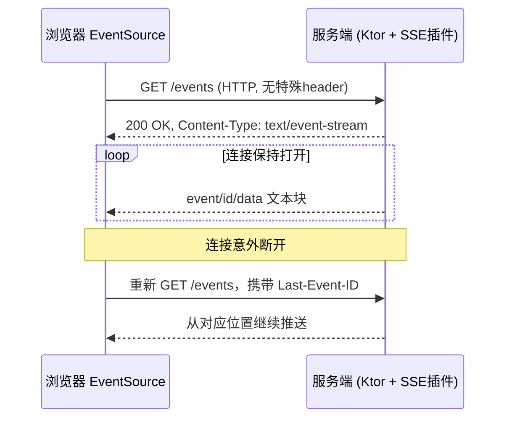

# Server-Sent Events (SSE) 学习笔记 —— 以 Ktor 为教学示例

**Last researched:** 2026-08-26

## 摘要

SSE（Server-Sent Events）是一种基于普通 HTTP 长连接的服务器单向推送技术：浏览器用 `EventSource` 发起一次请求，服务器把响应类型声明为 `text/event-stream`，此后连接不关闭，服务器可以随时往这条连接里写入一条条文本事件，浏览器边收边触发事件回调。它比 WebSocket 更轻量、天然支持断线重连和"断点续传"（`Last-Event-ID`），但只能服务器推、客户端不能通过同一条连接回话。本笔记用 Kotlin 的 Ktor 框架作为服务端和客户端的教学示例，讲清楚协议本身、Ktor 的 API、常见坑和适用场景。

## 学习目标

- 理解 SSE 的报文格式、连接语义和重连机制，能独立解释它和 WebSocket、长轮询的区别
- 会用 Ktor 服务端插件搭建一个 SSE 接口，包括心跳、序列化、按需推送
- 会用 Ktor 客户端插件消费 SSE 流，包括反序列化和自动重连配置
- 知道生产环境部署 SSE 时（Nginx/网关缓冲、鉴权、连接数限制）容易踩的坑以及对应处理办法

## 前置知识

- 基本的 HTTP 请求/响应模型（状态码、header、chunked transfer）
- Kotlin 协程基础（`suspend`、`Flow`、`delay`）
- 对 Ktor 的 `routing`、`install` 插件机制有基本印象（不熟悉也可以边看边理解，本文会在用到的地方解释）

## 核心概念

### 1. SSE 是什么

SSE 是 HTML 标准（WHATWG HTML Living Standard 第 9.2 节）定义的一套"事件流"格式和浏览器 API：服务器用一个普通的 HTTP 响应，把 `Content-Type` 设为 `text/event-stream`，然后持续不断地往响应体里追加文本，连接始终不关闭；浏览器侧用原生的 `EventSource` 对象来订阅这个地址，收到数据后自动解析成一个个事件对象派发给 JS 代码。<cite index="15-1">这套事件流格式必须始终使用 UTF-8 编码，行与行之间用回车换行、单独换行或单独回车分隔。</cite>

### 2. 事件流的报文格式

<cite index="12-1">事件流是简单的文本数据流，必须使用 UTF-8 编码；流里的消息之间用一对换行符分隔，行首如果是冒号则整行被当作注释而被忽略。</cite>每条消息由若干 `field: value` 行组成，常见字段含义：

| 字段 | 作用 |
|---|---|
| `event` | <cite index="12-1">标识事件的类型字符串；如果指定了这个字段，浏览器会把事件派发给通过 addEventListener() 监听该事件名的监听器；如果没有指定 event 字段，则触发默认的 onmessage 处理器。</cite> |
| `data` | <cite index="12-1">消息的数据内容；当 EventSource 连续收到多行以 data: 开头的内容时，会把它们拼接起来，用换行符连接，并去掉末尾多余的换行。</cite> |
| `id` | 本条事件的唯一标识，浏览器会把它记录为 `lastEventId`。 |
| `retry` | <cite index="12-1">重连的时间间隔，必须是整数，单位毫秒；如果连接断开，浏览器会等待这个时间之后再尝试重连；如果给的值不是整数，这个字段会被忽略。</cite> |

一条完整消息举例：

```text
event: sensor-update
id: 42
data: {"level":"high","valve":"Vd3"}

```

（注意末尾必须有一个空行，代表消息结束。）

### 3. 自动重连与断点续传（Last-Event-ID）

<cite index="34-1">EventSource 的一大特点是断线自动重连：如果连接丢失，浏览器会按指数退避策略自动尝试重新连接。</cite>重连时浏览器会自动带上一个特殊请求头：<cite index="45-1">Last-Event-ID，代表断开时收到的最后一条事件的 id，属于一种重连时的同步机制，服务端可以据此判断从哪里继续推送，避免丢消息。</cite>需要强调的是，这个"记住位置"完全靠**事件里带没带 `id` 字段**——如果服务端从不下发 `id`，重连后服务端也就无从判断该从哪儿续传。

### 4. 与 WebSocket、（长）轮询的关键差异

<cite index="40-1">SSE 基于 HTTP 协议，利用其长连接特性由浏览器向服务器发起一次请求、建立一条持久连接；而 WebSocket 是通过 HTTP 的升级协议建立一个新的连接，与传统 HTTP 连接不同。SSE 只支持单向的服务器到客户端数据流，WebSocket 则支持双向数据流，通信双方都可以互相发送消息。</cite>另外 <cite index="40-1">SSE 的连接状态只有已连接、连接中、已断开三种，且完全由浏览器自动维护，客户端代码无法手动控制重连；WebSocket 的连接状态则更灵活，可以由业务代码手动打开、关闭、重连。</cite>

和轮询相比：<cite index="41-1">短轮询需要客户端定时发请求，缺点是频繁建立连接、消耗服务器资源，实时性也不好；长轮询是建立连接后由服务端把请求"挂起"，等数据有更新才响应，响应完或超时后关闭连接，从而减少了短轮询频繁建连的问题；SSE 本质上是建立一条 HTTP 长连接，服务端以事件的形式持续发送数据流，不需要客户端每次都重新发起请求，也不用像 WebSocket 那样处理复杂的双向连接管理。</cite>

## 架构与数据流



Figure: 基于 WHATWG 规范和 Ktor 官方文档整理的 SSE 连接与重连流程，参考 [WHATWG HTML 9.2 节](https://html.spec.whatwg.org/multipage/server-sent-events.html) 与 [Ktor SSE 服务端文档](https://ktor.io/docs/server-server-sent-events.html)。

## 适用场景与不适用场景

| 维度 | 适合用 SSE | 不适合用 SSE，考虑 WebSocket |
|---|---|---|
| 通信方向 | 只需要服务器往客户端推：通知、进度条、日志流、AI 流式回答、股票行情 | 需要客户端也频繁往服务器发消息：聊天室、协同编辑、多人游戏 |
| 网络环境 | 普通 HTTP/HTTPS，经过大多数代理和 CDN 都能正常工作 | 需要极低延迟的双向交互 |
| 断线恢复 | 需要"断点续传"语义（配合 `id` + `Last-Event-ID`） | 需要连接建立后维持复杂的会话状态协商 |
| 数据格式 | 纯文本（JSON 等），<cite index="34-1">不追求二进制帧和极致带宽效率</cite> | 需要二进制帧、极致吞吐 |

一个实际的选型参考：<cite index="21-1">如果只需要服务器推送数据，比如 AI 流式对话、股票行情、通知推送，SSE 是更优解；如果需要双向交互，比如在线游戏、视频会议，才需要考虑 WebSocket。</cite>

## Ktor 模块深入讲解

Ktor 把 SSE 拆成两个独立的模块：服务端插件 `ktor-server-sse` 和客户端插件（内置在 `ktor-client-core` 里，无需额外依赖）。下面分别讲。

### 模块一：服务端 SSE 插件 `io.ktor.server.sse`

**是什么**：Ktor 提供的服务端插件，负责建立并维护 SSE 会话，提供 `send()`、心跳、序列化等能力。

**为什么存在**：如果不用这个插件，开发者需要手写 `Content-Type: text/event-stream` 响应头、手动管理连接不关闭、手动拼装 `data:`/`id:`/`event:` 格式字符串，容易出错；插件把这些协议细节封装掉。

**依赖引入**：

```kotlin
// build.gradle.kts
implementation("io.ktor:ktor-server-sse:$ktor_version")
```

<cite index="8-1">要使用 SSE，需要在构建脚本中引入 ktor-server-sse 这个 artifact。</cite>

**安装插件**：

```kotlin
import io.ktor.server.engine.*
import io.ktor.server.netty.*
import io.ktor.server.application.*
import io.ktor.server.sse.*

fun main() {
    embeddedServer(Netty, port = 8080) {
        install(SSE)
        // ...
    }.start(wait = true)
}
```

<cite index="8-1">安装 SSE 插件之后，就可以在 routing 块里调用 sse() 函数来添加一个处理 SSE 会话的路由，既可以指定具体路径，也可以不指定路径。</cite>

**核心 API（`ServerSSESession` 作用域内）**：

- `send()`：<cite index="8-1">创建并向客户端发送一个 ServerSentEvent。</cite>
- `call`：<cite index="8-1">当前会话对应的 ApplicationCall。</cite>
- `close()`：<cite index="8-1">关闭会话并终止与客户端的连接；所有 send() 操作完成后会自动调用 close()；需要注意，调用 close() 本身并不会向客户端发送一个"结束事件"，如果要在关闭会话前明确告诉客户端流已结束，需要自己用 send() 发一个特定的事件。</cite>

**最小可运行示例**（服务端每隔 1 秒推 6 条事件）：

```kotlin
routing {
    sse("/events") {
        repeat(6) {
            send(ServerSentEvent("this is SSE #$it"))
            delay(1000)
        }
    }
}
```

<cite index="8-1">这个例子在 /events 端点上建立一个 SSE 会话，每隔 1000 毫秒通过 SSE 通道发送一条事件，一共发送 6 条。</cite>

**心跳（heartbeat）**：<cite index="8-1">心跳用来在连接空闲期间保持 SSE 连接的活性，通过周期性发送事件实现；只要会话仍然活跃，服务器就会按配置的时间间隔发送指定的事件。</cite>

```kotlin
sse("/heartbeat") {
    heartbeat {
        period = 10.milliseconds
        event = ServerSentEvent("heartbeat")
    }
    // ...
}
```

也可以用 `eventProvider` 动态生成心跳内容：<cite index="8-1">eventProvider 会在每次心跳触发时被调用，用来生成一个 ServerSentEvent，这样心跳事件里就可以带上动态内容，比如时间戳或状态信息；如果同时配置了 event 和 eventProvider，eventProvider 的优先级更高。</cite>

```kotlin
sse("/heartbeat-custom") {
    heartbeat {
        period = 30.milliseconds
        eventProvider = {
            ServerSentEvent(data = "ts=${Clock.System.now()}")
        }
    }
}
```

**序列化对象**：<cite index="8-1">要启用序列化，需要在 SSE 路由上通过 serialize 参数提供一个自定义的序列化函数，在处理逻辑里就可以用 ServerSSESessionWithSerialization 类来发送序列化后的事件。</cite>

```kotlin
@Serializable
data class Customer(val id: Int, val firstName: String, val lastName: String)

fun Application.module() {
    install(SSE)
    routing {
        sse("/json", serialize = { typeInfo, it ->
            val serializer = Json.serializersModule.serializer(typeInfo.kotlinType!!)
            Json.encodeToString(serializer, it)
        }) {
            send(Customer(0, "Jet", "Brains"))
        }
    }
}
```

**Last-Event-ID 在服务端的读取**：Ktor 没有内置"断点续传"逻辑，需要开发者自己从请求头里取值、决定推送起点：

```kotlin
fun Route.sseOrderUpdates() {
    sse("/orders/{orderId}/events") {
        val orderId = call.parameters["orderId"] ?: return@sse
        val lastEventId = call.request.headers["Last-Event-ID"]?.toLongOrNull()
        orderRepository.updatesFrom(orderId, afterSequence = lastEventId)
            .collect { event -> send(ServerSentEvent(data = event.toJson(), id = event.seq.toString())) }
    }
}
```

<cite index="35-1">这段最小实现展示了如何安装 SSE 插件并搭建一个由 Flow 支撑的路由：从 Last-Event-ID 请求头里取出客户端断连前收到的最后一个序列号，再从数据源里查询该序列号之后的所有更新并逐条推送。</cite>这正是把协议里的"断点续传"能力落地成业务逻辑的标准做法：**协议只提供 header 传递机制，"记住进度、找回丢失的事件"这件事永远是业务层自己实现**。

**限制**：<cite index="8-1">Ktor 不支持对 SSE 响应做数据压缩；如果使用了 Compression 插件，它默认会跳过对 SSE 响应的压缩。</cite>

### 模块二：客户端 SSE 插件 `io.ktor.client.plugins.sse`

**是什么**：Ktor HTTP 客户端的一个插件，封装了连接建立、事件解析、自动重连、反序列化。

**依赖**：<cite index="9-1">SSE 只需要 ktor-client-core 这个 artifact，不需要额外的专门依赖。</cite>

**安装**：

```kotlin
import io.ktor.client.*
import io.ktor.client.engine.cio.*
import io.ktor.client.plugins.sse.*

val client = HttpClient(CIO) {
    install(SSE)
}
```

**自动重连配置**：<cite index="9-1">要启用自动重连，需要把 maxReconnectionAttempts 设置为大于 0 的值，还可以通过 reconnectionTime 配置每次重连之间的等待时间；如果与服务器的连接丢失，客户端会先等待指定的 reconnectionTime，再尝试重新连接，最多尝试 maxReconnectionAttempts 次。</cite>

```kotlin
install(SSE) {
    maxReconnectionAttempts = 4
    reconnectionTime = 2.seconds
}
```

**建立会话并读取事件**：

```kotlin
fun main() {
    val client = HttpClient {
        install(SSE) {
            showCommentEvents()
            showRetryEvents()
        }
    }
    runBlocking {
        client.sse(host = "0.0.0.0", port = 8080, path = "/events") {
            while (true) {
                incoming.collect { event ->
                    println("Event from server:")
                    println(event)
                }
            }
        }
    }
}
```

<cite index="9-1">在这个例子里，SSE 插件被安装进 HTTP 客户端，通过 sse() 函数在 events 端点上建立一个新的 SSE 会话，再通过 incoming 属性读取事件并打印收到的 ServerSentEvent 对象。</cite>会话内可用的成员：<cite index="9-1">call 是发起该会话的 HttpClientCall；incoming 是一个持续产出服务端事件的 Flow。</cite>

**反序列化为强类型对象**：<cite index="9-1">SSE 插件支持把服务端发来的事件反序列化为类型安全的 Kotlin 对象，这在处理结构化数据时特别有用；要启用反序列化，需要在 SSE 访问函数上通过 deserialize 参数提供一个自定义反序列化函数，并在处理块里使用 ClientSSESessionWithDeserialization 类来处理反序列化后的事件。</cite>

```kotlin
client.sse({
    url("http://localhost:8080/serverSentEvents")
}, deserialize = { typeInfo, jsonString ->
    val serializer = Json.serializersModule.serializer(typeInfo.kotlinType!!)
    Json.decodeFromString(serializer, jsonString)!!
}) {
    incoming.collect { event: TypedServerSentEvent<String> ->
        when (event.event) {
            "customer" -> deserialize<Customer>(event.data)
            "product" -> deserialize<Product>(event.data)
        }
    }
}
```

**诊断缓冲区（用于排查连接失败）**：<cite index="9-1">由于 SSE 响应本质上是流式的，完整捕获响应体并不现实；可以启用一个诊断缓冲区，在 SSE 流失败时安全地取回已处理过的响应内容，这个缓冲区只包含已经处理过的数据（不会重新从网络读取），主要用于失败时的日志记录和问题分析。</cite>

```kotlin
install(SSE) {
    bufferPolicy = SSEBufferPolicy.LastEvents(10)
}
```

<cite index="9-1">缓冲策略包括：Off（默认，不缓冲）、LastLines(n)（保留最后 n 行）、LastEvent（保留最后一条完整事件）、LastEvents(n)（保留最后 n 条完整事件）、All（保留目前为止处理过的全部事件，长连接下要谨慎使用）。</cite>

## 关键设计决策与取舍（Scenario Guidance）

| 决策点 | 选择 A | 选择 B | 取舍依据 |
|---|---|---|---|
| 事件要不要带 `id` | 带 `id`，配合业务序列号 | 不带 `id` | 只要客户端可能断线重连、且不能接受"丢事件"，就必须带 `id`，否则 `Last-Event-ID` 机制形同虚设 |
| 心跳周期怎么定 | 短周期（几秒到几十秒） | 不开心跳 | 中间经过 Nginx/负载均衡时，长时间无数据的连接容易被中间设备判定为空闲并主动断开；开心跳能防止误断连 |
| 反序列化放服务端还是客户端 | 服务端 `serialize` 参数统一转 JSON | 客户端各自反序列化 | 建议服务端统一序列化成 JSON 字符串放进 `data`，客户端用 `deserialize` 参数按事件类型分别转成强类型对象，职责更清晰 |
| SSE 还是 WebSocket | SSE | WebSocket | 只要客户端不需要通过同一条连接向服务端发送业务数据（哪怕是控制指令），优先选 SSE，实现和运维成本都更低；一旦出现需要双向交互的场景（比如协同编辑），才切到 WebSocket |

## 常见问题与踩坑（含中文社区经验）

### 1. Nginx/网关把 SSE 流缓冲了，前端"卡顿"或"一次性收到全部数据"

这是国内实践中被反复提到的高频坑。<cite index="31-1">很多前后端分离项目里，前端访问被 Nginx 反向代理的后端 SSE 接口，本来预期是流式返回，但实际经常很久不响应，一响应就把全部结果一下子都返回了；查看后端日志能确认响应其实是流式产生的，问题出在 Nginx 的缓冲配置上。</cite>

根因：<cite index="32-1">当 proxy_buffering 设置为 on（这也是默认值）时，Nginx 会把来自上游服务器的响应内容先缓存在本地内存里，直到整个响应体接收完毕，或者达到 proxy_buffers、proxy_buffer_size 指定的缓冲区大小限制，才会转发给客户端。</cite>

解法：<cite index="28-1">如果客户端和服务器之间只有一层 Nginx，可以在接口响应里加上 X-Accel-Buffering: no 这个响应头，告诉 Nginx 不要缓存这次响应。</cite>但要注意架构里如果有**多层** Nginx/网关：<cite index="27-1">如果链路上有多个 Nginx 网关（比如公司统一网关 + K8s 内部反向代理网关两层），只在最终应用里设置一次 X-Accel-Buffering: no 是不够的，因为响应数据先到达第一层 Nginx，这一层会消费掉这个 header，再把数据透传给下一层，下一层由于默认开启缓冲又会重新把流缓存住；客户端与服务器之间有 n 层 Nginx，就需要在至少 n-1 层里都配置好这个 header 才能生效。</cite>

### 2. `EventSource` 原生不支持自定义请求头，鉴权很麻烦

<cite index="47-1">浏览器原生的 EventSource API 对允许传递的参数有很大限制：唯一能传的参数只有 url 和 withCredentials；这带来的直接后果是，不能传请求体，必须把发起请求所需的全部信息编码进 URL 里，而大多数浏览器的 URL 长度限制在 2000 字符以内；如果连接中断，也无法自己控制重试策略，只能依赖浏览器默默重试几次后放弃。</cite>这也是社区里公开讨论过的浏览器标准缺口：<cite index="48-1">目前确实没有办法给 EventSource 添加 Authorization 或其他自定义请求头。</cite>

常见workaround：
- 把 token 作为 query 参数拼进 URL（简单但 token 可能被日志/浏览器历史记录留痕，需要短生命周期 token）
- 用 Cookie 鉴权（`withCredentials: true`），依赖同源或正确配置 CORS
- 换用支持自定义 header 的 fetch 封装库，比如 `@microsoft/fetch-event-source`：<cite index="47-1">该库提供了一个更完善的事件源请求 API，具备 Fetch API 的全部能力，可以像普通 fetch 一样传 headers、body、AbortSignal 等参数，弥补了浏览器原生 EventSource 的限制。</cite>

Ktor 客户端因为底层走的是完整的 HTTP 客户端引擎而不是浏览器 `EventSource`，天然没有这个限制，可以正常设置任意请求头，这也是 Ktor 客户端插件相比浏览器原生 API 的一个优势（适用于 Kotlin Multiplatform 的移动端/桌面端场景）。

### 3. `Last-Event-ID` 语义容易理解错

<cite index="37-1">不要把"字节已经到达内核"和"业务侧真正处理完成"混为一谈：浏览器的 EventSource 只跟踪协议层面的事件派发，并不知道你的数据库事务是否提交成功；如果下游处理是异步的、且副作用很重要，应用层可能需要自己维护一个持久化的消费位点，而不是完全依赖 Last-Event-ID。</cite>换句话说，`Last-Event-ID` 解决的是"重连后从哪条事件继续推"，不能替代业务自己的幂等/去重设计。

### 4. 移动端场景下连接会被系统"杀掉"

<cite index="35-1">在 Android Doze 休眠模式解除、或 iOS 后台应用刷新触发之后，客户端重新连接时会自动带上 Last-Event-ID 请求头；服务端的 Flow 背压意味着慢客户端不会拖垮服务器，但会让一个协程持续挂起，所以服务端要设置合理的超时时间，避免"僵尸连接"越积越多。</cite>

### 5. 每浏览器域名的连接数限制

<cite index="49-1">在不使用 HTTP/2 的情况下，SSE 受到打开连接数的限制，这个限制是针对浏览器的，且被设成了一个很低的数字（6），如果同时打开多个标签页会格外痛苦；这个限制是按浏览器和域名维度计算的，也就是说可以对同一个域名在所有标签页里总共打开 6 条 SSE 连接；使用 HTTP/2 时，最大并发 HTTP 流数量由服务器和客户端协商决定（默认 100）。</cite>生产环境如果面向普通浏览器，尽量让后端跑在 HTTP/2 之上，避免多标签页场景下连接数耗尽。

## Ktor SSE 与其他推送方案对比

| 方案 | 连接方向 | 断线重连 | 实现复杂度 | 典型场景 |
|---|---|---|---|---|
| 短轮询 | 客户端主动拉 | 无需处理（每次都是新请求） | 最低 | 对实时性要求很低的场景 |
| 长轮询 | 客户端主动拉，服务端挂起 | <cite index="41-1">超时或推送结束后连接关闭，客户端立即发起下一次请求</cite> | 中 | 兼容性要求高、无法使用长连接的老旧环境 |
| SSE（Ktor `ktor-server-sse`） | 服务端推 | 浏览器原生自动重连 + `Last-Event-ID` | 中低 | AI 流式回复、通知、进度、监控大屏 |
| WebSocket（Ktor `ktor-server-websockets`） | 双向 | 需要业务自己实现重连和状态恢复 | 较高 | 聊天、协同编辑、多人游戏 |

## 版本说明

本文示例基于 Ktor 3.5.2 文档整理（截至 2026-08-05 的官方文档快照）。`ktor-server-sse` 和 SSE 客户端插件的 API 在 Ktor 3.x 系列中相对稳定；如果项目使用的是 2.x 系列的 Ktor，SSE 支持可能不完整或 API 略有差异，升级前建议对照官方文档确认。

## 参考资料 / References

- Official：[Server-Sent Events in Ktor Server | Ktor Documentation](https://ktor.io/docs/server-server-sent-events.html)
- Official：[Server-Sent Events in Ktor Client | Ktor Documentation](https://ktor.io/docs/client-server-sent-events.html)
- Official：[io.ktor.server.sse API 参考](https://api.ktor.io/ktor-server-sse/io.ktor.server.sse/index.html)
- Standard：[WHATWG HTML Living Standard — 9.2 Server-sent events](https://html.spec.whatwg.org/multipage/server-sent-events.html)
- Official：[MDN — Using server-sent events](https://developer.mozilla.org/en-US/docs/Web/API/Server-sent_events/Using_server-sent_events)
- Official：[MDN — EventSource](https://developer.mozilla.org/en-US/docs/Web/API/EventSource)
- Official（中文）：[MDN 中文 — EventSource](https://developer.mozilla.org/zh-CN/docs/Web/API/EventSource)
- Community：[CSDN — nginx 反代 SSE 出现数据截断问题解决](https://blog.csdn.net/zhoudingding/article/details/137854363)
- Community：[CSDN — 解决 SSE 流被 Nginx 缓存的问题](https://blog.csdn.net/u013534071/article/details/131500873)
- Community：[CSDN — 解决 nginx 代理 SSE 接口的响应没有流式返回](https://blog.csdn.net/qq_23204557/article/details/142332111)
- Community：[CSDN — Web 实时通信的学习之旅：轮询、WebSocket、SSE 的区别以及优缺点](https://blog.csdn.net/shanghai597/article/details/138129022)
- Community：[CSDN — 实时数据传输方法：轮询、长轮询、SSE 与 Websocket 的比较与应用](https://blog.csdn.net/sinat_41871344/article/details/137891393)
- Community：[腾讯云开发者社区 — 前端 Server-Sent Events、EventSource 接口相关知识点总结](https://cloud.tencent.com/developer/article/2256607)
- Community：[GitCode — EventSource 前端使用（需要添加 header 等自定义配置）](https://gitcode.csdn.net/65ec41451a836825ed795465.html)
- Community：[核心编程 — EventSource JS 开源库 —— Fetch Event Source](https://www.hxstrive.com/article/1449.htm)
- Community/Vendor blog：[DEV Community — Server-Sent Events as Your Mobile Real-Time Layer](https://dev.to/software_mvp-factory/server-sent-events-as-your-mobile-real-time-layer-8md)
- Vendor blog：[MVP Factory — SSE on Ktor 深入实践](https://mvpfactory.io/blog/server-sent-events-as-your-mobile-real-time-layer-automatic-reconnection-last/)
- Reference：[http.dev — Last-Event-ID 请求头](https://http.dev/last-event-id)
- Reference：[QASkills — SSE Testing Reconnect Last Event ID](https://qaskills.sh/blog/sse-testing-reconnect-last-event-id)
- Reference：[GitHub whatwg/html Issue #2177 — Setting headers for EventSource](https://github.com/whatwg/html/issues/2177)
- Official：[Cloudflare Workers — EventSource](https://developers.cloudflare.com/workers/runtime-apis/eventsource)
