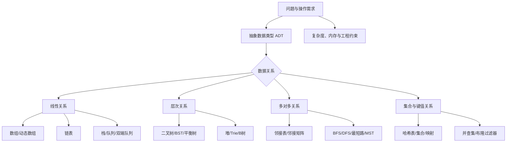

# 数据结构学习笔记

> 本文将项目内的《数据结构笔记》《数据结构》和《408 数据结构学习笔记》重新编排，并结合公开课程、教材、算法可视化资料与中文实践文章补充整理。目标是形成一份能够用于入门、408 复习、算法题训练和日常工程设计的长期笔记，而不是简单罗列名词。

**最后检索日期**：2026 年 7 月 23 日  
**适用范围**：程序设计入门、数据结构课程、408 数据结构、算法面试、日常工程设计  
**默认示例语言**：Python；伪代码中的 `push`、`pop`、`enqueue` 等名称保持数据结构常用术语。

## 目录

- [一、学习目标与总览](#一学习目标与总览)
- [二、基本概念：数据、结构、操作与 ADT](#二基本概念数据结构操作与-adt)
- [三、复杂度分析与算法思维](#三复杂度分析与算法思维)
- [四、线性结构](#四线性结构)
- [五、栈、队列与优先队列](#五栈队列与优先队列)
- [六、字符串、哈希、集合与映射](#六字符串哈希集合与映射)
- [七、树形结构](#七树形结构)
- [八、图结构与图算法](#八图结构与图算法)
- [九、查找](#九查找)
- [十、排序](#十排序)
- [十一、工程中常见的高级结构](#十一工程中常见的高级结构)
- [十二、选型、调试与常见误区](#十二选型调试与常见误区)
- [十三、学习路线与实践建议](#十三学习路线与实践建议)
- [参考资料](#参考资料)

---

## 一、学习目标与总览

### 1.1 学完之后应能解决什么问题

数据结构学习的核心不是记住几十个结构的定义，而是能够回答以下问题：

1. 数据之间有什么关系：顺序、层次、网络，还是只有“属于同一集合”？
2. 需要支持什么操作：随机访问、按值查找、插入、删除、排序、范围查询，还是最短路径？
3. 数据规模、访问模式和更新频率是什么？
4. 需要保证有序、稳定、持久化、并发安全，还是只要求平均速度快？
5. 内存连续性、缓存局部性、指针开销、扩容成本和故障边界会不会改变理论上的优劣？

### 1.2 知识地图



图中“关系”决定结构的大方向，“操作”决定具体实现。相同的逻辑结构可能有多种存储方式：线性表既可以用数组表示，也可以用链表表示；树可以用指针表示，也可以用数组表示；图可以用邻接表、邻接矩阵或边集表示。

### 1.3 前置知识

- 能使用一种编程语言的变量、函数、循环、条件和基本容器。
- 了解引用或指针、内存地址、递归调用栈的基本概念。
- 能阅读简单的数学表达式，理解对数、求和和递推关系。
- 能独立运行小程序并用断点、日志或测试用例定位错误。

---

## 二、基本概念：数据、结构、操作与 ADT

第二章是后续所有结构和算法的概念基础。学习数组、链表、树和图之前，必须先区分“数据是什么”“数据之间有什么关系”“关系如何存进内存”“允许执行哪些操作”。如果这几个层次混在一起，后续很容易出现把逻辑结构当成存储结构、把接口复杂度当成实现复杂度、把算法步骤当成数据结构定义等问题。

### 2.1 数据元素、数据项和数据对象

| 名称 | 含义 | 示例 |
|---|---|---|
| 数据 | 对客观事物的符号化表示 | 用户记录、订单、图像像素 |
| 数据元素 | 数据的基本单位，通常作为一个整体处理 | 一个用户、一个订单 |
| 数据项 | 构成数据元素的最小不可分割单位 | 用户名、年龄、订单金额 |
| 数据对象 | 具有相同性质的数据元素集合 | 所有订单、所有顶点 |
| 数据结构 | 数据元素之间的关系，以及在其上的操作 | 线性表、树、图、哈希表 |

可以用“学校学生信息”理解这些概念：

```text
数据对象：全校学生集合
数据元素：一个学生对象
数据项：学号、姓名、专业、年龄
数据结构：按照学号组织的映射、按照班级组织的树、学生关系图
```

数据元素通常是程序操作的对象，数据项则是比较、排序或索引时使用的字段。例如订单是数据元素，订单金额是数据项；若按订单金额排序，排序键就是数据项，而不是整个订单对象。

数据结构通常从三个层次理解：

1. **逻辑结构**：只描述元素之间的关系，不关心如何落在内存中。
2. **存储结构**：描述逻辑关系在计算机中的表示，如顺序存储、链式存储、索引存储和散列存储。
3. **数据运算**：描述查找、插入、删除、遍历、排序、合并等操作。

这三个层次可以分别回答三个问题：

| 层次 | 要回答的问题 | 示例 |
|---|---|---|
| 逻辑结构 | 元素之间是什么关系？ | “每个节点最多有两个孩子” |
| 存储结构 | 这些关系如何表示？ | `left`、`right` 指针或数组下标 |
| 数据运算 | 对结构可以做什么？ | 插入、删除、查找、遍历 |

### 2.2 数据结构、数据类型和数据对象的区别

几个名称容易混淆：

- **数据类型**描述数据的取值范围、表示方式和允许操作，例如整数、浮点数、字符串。
- **数据对象**是某种数据类型的具体集合，例如所有整数、某个班级的学生集合。
- **数据结构**进一步描述一组数据元素之间的关系和组织方法，例如“按顺序排列的整数序列”或“带权有向图”。
- **抽象数据类型**把数据对象、关系和操作封装成与实现无关的接口。

例如，整数类型可以作为数组元素；数组是线性结构的一种存储实现；“有序整数集合”则是更高层的抽象，既可以用有序数组实现，也可以用平衡搜索树实现。

### 2.3 四类基本逻辑结构

#### 2.3.1 集合结构

集合结构中的元素除了“属于同一个集合”外，没有规定前驱、后继或父子关系。重点操作通常是成员判断、插入、删除、并集和交集。

```text
S = {2, 4, 6, 8}
```

如果只需要判断一个整数是否出现，哈希集合或位图比列表更合适；如果还要保存元素的排序关系，则应改用有序集合或平衡树。

#### 2.3.2 线性结构

线性结构中的元素形成一个序列。除首元素外，每个元素最多有一个直接前驱；除尾元素外，每个元素最多有一个直接后继。

```text
a1 -> a2 -> a3 -> ... -> an
```

数组、链表、栈和队列都可以看作线性结构，但它们的操作限制不同：线性表允许在多个位置插入删除，栈只允许访问一端，队列分别在两端执行不同操作。

#### 2.3.3 树形结构

树形结构表达层次关系。一个节点可以有多个孩子，但每个非根节点通常只有一个父节点。文件目录、组织架构、HTML 文档和数据库索引都可以抽象为树。

树结构的核心特征是路径和层级：从根到任意节点通常只有一条路径。若一个节点允许多个父节点，或节点之间存在环，就不再是通常意义上的树，而更接近一般图。

#### 2.3.4 图结构

图结构表达多对多关系。一个顶点可以和任意数量的顶点相邻，边可以有方向、权重和容量，也可以形成环。

社交关系、道路网络、课程依赖、服务调用链和推荐关系都更适合用图表示。图的复杂度通常同时依赖顶点数 `V` 和边数 `E`，不能只用一个 `n` 说明。

| 逻辑结构 | 关系特征 | 典型实现 | 常见场景 |
|---|---|---|---|
| 集合 | 元素之间除同属一个集合外无其他关系 | 哈希集合、位图 | 去重、成员判断 |
| 线性结构 | 除首尾外，每个元素最多一个直接前驱和后继 | 数组、链表 | 序列、缓冲区、栈、队列 |
| 树形结构 | 一对多的层次关系 | 二叉树、堆、B+ 树 | 文件目录、索引、优先级 |
| 图结构 | 多对多关系 | 邻接表、邻接矩阵 | 网络、依赖、地图、推荐关系 |

### 2.4 逻辑结构与存储结构不是一一对应

同一种逻辑结构可以有多种存储结构，同一种存储结构也可以表达不同的逻辑关系。

| 逻辑结构 | 可能的存储方式 |
|---|---|
| 线性表 | 顺序存储、单链式存储、双链式存储 |
| 完全二叉树 | 数组下标、节点指针 |
| 一般树 | 孩子链表、孩子兄弟表示法、父指针数组 |
| 图 | 邻接矩阵、邻接表、边集、十字链表 |
| 集合/映射 | 哈希表、平衡树、排序数组 |

例如“队列”是一个抽象的先进先出接口，可以使用循环数组，也可以使用带头尾指针的链表。选择哪种实现，取决于是否需要随机访问、容量是否固定、是否重视缓存局部性和是否允许动态扩容。

### 2.5 常见存储结构

#### 2.5.1 顺序存储

顺序存储把元素放在地址连续的存储单元中。数组是最典型的顺序存储结构。

设首元素地址为 `base`，每个元素占用 `w` 个存储单元，零基下标为 `i`，则可抽象为：

```text
address(A[i]) = base + i * w
```

优点：

- 可以通过地址计算实现 `O(1)` 随机访问。
- 没有节点指针开销，存储密度高。
- 连续遍历通常具有较好的 CPU 缓存局部性。

缺点：

- 中间插入和删除需要移动元素。
- 扩容需要申请新的连续空间并复制数据。
- 大对象或频繁扩容时可能产生较高的复制和分配成本。

#### 2.5.2 链式存储

链式存储不要求元素物理连续，通过指针、引用或数组下标保存逻辑邻接关系。

```text
[node A | next] -> [node B | next] -> [node C | null]
```

优点是插入、删除时不必整体移动元素，且结构长度可以自然变化；缺点是随机访问需要沿链接逐个查找，节点还会产生指针、对象头和内存分配开销。

需要特别注意：链表“插入删除快”有前提。若已经拿到目标位置的节点或前驱节点，修改链接可以是 `O(1)`；若只有下标，仍需从头遍历，整体仍是 `O(n)`。

#### 2.5.3 索引存储

索引存储在数据之外建立一个或多个索引，用索引快速定位目标数据。数据库中的 B+ 树索引、倒排索引、文件目录索引都属于这种思想。

索引通常会带来：

- 更快的查找和范围定位。
- 额外的空间占用。
- 插入、删除时维护索引的成本。
- 数据和索引之间的一致性要求。

索引不是“免费加速”。当写入很多、查询很少，或者索引选择性很低时，建立索引可能反而降低整体性能。

#### 2.5.4 散列存储

散列存储通过哈希函数把键映射到数组桶或槽位，以较低的平均成本完成按键查找。它通常不保证有序，且需要处理哈希冲突、扩容、负载因子和键的稳定性。

散列存储适合精确匹配：`key -> value`。若需要范围查询、前驱后继或按键排序，哈希表通常不是最合适的结构，应考虑平衡树或 B+ 树。

### 2.6 数据结构的基本运算

不同教材对运算分类略有差异，但常见基本运算包括：

| 运算 | 含义 | 需要关注的问题 |
|---|---|---|
| 创建 | 分配并初始化结构 | 初始容量、空状态、默认值 |
| 销毁 | 释放结构占用的资源 | 节点、缓冲区、外部句柄 |
| 访问 | 读取指定元素 | 是否支持随机访问、下标是否越界 |
| 查找 | 根据位置或键定位元素 | 是否有序、是否允许重复 |
| 插入 | 增加新元素 | 位置、容量、链接、索引维护 |
| 删除 | 移除元素 | 返回被删值、释放节点、保持不变量 |
| 遍历 | 按一定顺序访问全部元素 | 顺序、是否允许修改、是否可能成环 |
| 排序 | 改变元素排列顺序 | 稳定性、额外空间、比较规则 |
| 合并 | 将多个结构组合 | 是否保持有序、是否复制数据 |

每个运算都应明确前置条件和后置条件。例如“删除第 `i` 个元素”至少要说明：`i` 是从 `0` 还是 `1` 开始、空表是否报错、删除后是否返回元素、后续元素是否移动，以及迭代器或索引是否失效。

### 2.7 抽象数据类型 ADT

ADT（Abstract Data Type）是对“数据对象、数据关系和操作契约”的抽象。它只规定**能做什么**，不规定**必须怎样实现**。

例如 `Stack` ADT 可以规定：

```text
create()       创建空栈
push(x)        将 x 放入栈顶
pop()          删除并返回栈顶元素；空栈时报告错误
peek()         返回栈顶元素但不删除
is_empty()     判断是否为空
size()         返回元素数量
```

这里的“栈顶”是语义概念，不是某个固定内存地址。它可以由动态数组实现，也可以由链表实现，只要两种实现对外表现出相同的后进先出行为。

#### ADT、数据结构和具体实现

| 层次 | 关注点 | 示例 |
|---|---|---|
| ADT | 对外提供什么语义 | `Map.get(key)`、`Stack.pop()` |
| 数据结构 | 如何组织元素关系 | 哈希表、链表、堆 |
| 实现 | 如何用语言和内存完成 | 开放寻址、链地址、数组扩容 |

这种分层带来两个好处：

1. **替换实现而不改变调用代码**：将链表栈替换成动态数组栈，调用者仍然使用 `push` 和 `pop`。
2. **把正确性责任分层**：调用者依赖 ADT 契约，实现者负责维护内部表示不变量。

### 2.8 常见 ADT 及其实现选择

| ADT | 主要语义 | 常见实现 | 关键选择依据 |
|---|---|---|---|
| List | 有序、允许重复、按位置访问 | 动态数组、链表 | 随机访问与插删比例 |
| Stack | 后进先出 | 动态数组、单链表 | 栈顶操作和容量变化 |
| Queue | 先进先出 | 循环数组、链式队列 | 固定容量、吞吐和内存局部性 |
| Deque | 两端插入删除 | 循环数组、双链表 | 两端操作和随机访问需求 |
| Set | 唯一成员集合 | 哈希表、平衡树、位图 | 是否有序、键范围、误判容忍度 |
| Map | 键值映射 | 哈希表、平衡树、B+ 树 | 精确查找、范围查询、外存需求 |
| Priority Queue | 按优先级取出元素 | 二叉堆、平衡树 | 是否需要任意删除和范围操作 |
例如：

- 需要按下标频繁读取，选择动态数组。
- 需要按键精确查找且不关心顺序，选择哈希映射。
- 需要按照键的范围扫描，选择平衡树或 B+ 树。
- 需要不断取出当前最小任务，选择小根堆。
- 只需要判断小整数是否出现，选择位图。

### 2.9 接口契约：前置条件、后置条件和错误语义

一个完整的 ADT 接口至少应该写清楚以下内容：

#### 前置条件

调用操作前必须成立的条件，例如：

- `pop()` 要求栈非空。
- `get(i)` 要求 `0 <= i < size`。
- 二分查找要求序列按照比较规则有序。
- Dijkstra 要求边权非负。

#### 后置条件

操作完成后必须成立的结果，例如：

- `push(x)` 后，栈大小增加一，`peek()` 返回 `x`。
- 删除链表节点后，除目标节点外的元素相对顺序不变。
- `union(a, b)` 后，两个元素属于同一个集合。

#### 错误语义

空结构操作可以有不同设计：

- 抛出异常或返回错误对象。
- 返回特殊值，例如 `None`，但要避免和合法数据混淆。
- 阻塞等待，例如并发队列。
- 自动扩容，例如动态数组。

不能只写“出错”，还应说明调用者如何判断错误、结构状态是否改变、操作是否具有原子性。

#### 复杂度契约

接口还应说明复杂度的大致保证：

```text
Map.get(key)：平均 O(1)，最坏 O(n)，不保证遍历顺序
OrderedMap.get(key)：最坏 O(log n)，按键有序遍历
Queue.enqueue(x)：摊还 O(1)，容量不足时可能扩容
```

“平均”“摊还”“最坏”不能互相替换。复杂度契约是调用者进行容量规划和性能设计的重要依据。

### 2.10 算法的基本特性

经典定义通常要求算法具有：

- **有穷性**：在有限步骤后终止。
- **确定性**：同一状态下指令含义明确。
- **可行性**：每一步都能由有限基本操作执行。
- **输入**：可以有零个或多个输入。
- **输出**：至少产生一个结果或状态变化。

工程上还要增加正确性、可读性、健壮性、可维护性和资源效率。一个理论复杂度漂亮但无法处理异常输入、整数溢出或内存不足的算法，仍然不是合格实现。

算法和数据结构的关系可以概括为：

```text
数据结构决定数据如何组织
算法决定如何在这种组织上完成目标
复杂度描述这种组合的资源代价
```

同一个问题换一种数据结构，算法复杂度可能完全不同。例如在无序数组中查找需要顺序扫描；如果先排序，可用二分查找；如果建立哈希表，则精确查找的平均成本可能降为常数级，但会增加空间和维护成本。

### 2.11 表示不变量与边界条件

**表示不变量**是实现内部必须始终保持成立的条件；它比抽象接口的语义更具体。例如：

| 结构 | 典型表示不变量 |
|---|---|
| 动态数组 | `0 <= size <= capacity`，有效元素位于 `[0, size)` |
| 单链表 | 从头指针可达的节点没有意外环，尾节点的 `next` 为 `None` |
| 双链表 | `node.next.prev == node`，`node.prev.next == node` |
| 哈希表 | 每个键位于由哈希函数和冲突策略确定的可探测位置 |
| BST | 左右子树满足统一的键序规则 |
| 堆 | 每个父节点满足堆序性质 |
| 图遍历 | 已访问节点不会被重复处理，或重复处理有明确目的 |
| 并查集 | 每个节点沿父指针最终到达根，根的父指针指向自身 |

实现每个操作时，建议按以下顺序：

1. 写出操作前必须成立的前置条件。
2. 写出操作后必须成立的后置条件。
3. 列出会变化的字段、指针、计数器或索引。
4. 先处理空结构、单元素、头尾和容量边界。
5. 更新内部表示。
6. 用断言或测试重新验证不变量。

常见边界包括：空结构、只有一个元素、删除头尾、容量为零、重复键、负数和零、图中孤立点、无路径、负权边、递归深度过大。

### 2.12 从现实问题抽象为数据结构

建模时不要一开始就问“应该用数组还是链表”，而应先完成以下转换：

1. **识别对象**：系统中有哪些实体或状态？
2. **识别关系**：实体之间是顺序、层次、依赖、邻接还是键值关系？
3. **识别操作**：最频繁、最关键的读取和更新是什么？
4. **估计规模**：元素数、键范围、顶点数、边数、内存上限是多少？
5. **选择表示**：根据关系和操作选择具体结构。
6. **验证代价**：分析时间、空间、缓存、扩容、持久化和并发影响。

例如设计“课程先修关系”：

```text
对象：课程
关系：课程 A 是课程 B 的先修课
操作：判断是否存在循环、生成可行学习顺序、查询依赖
抽象：有向图
实现：邻接表 + DFS/Kahn 拓扑排序
```

再例如设计“最近访问页面缓存”：

```text
对象：页面键和值
关系：键到缓存项的映射 + 访问新旧顺序
操作：按键查找、命中后更新顺序、超容量淘汰
抽象：Map + 顺序表
实现：哈希表 + 双向链表，即 LRU
```

### 2.13 本章小结

- 数据结构要同时看逻辑关系、存储表示和允许的运算。
- 集合、线性结构、树和图是最基本的逻辑结构分类。
- 顺序、链式、索引和散列是常见存储思想，各有适用边界。
- ADT 描述语义和接口，具体数据结构与实现负责兑现契约。
- 一个可靠的接口必须说明前置条件、后置条件、错误语义和复杂度保证。
- 不变量是实现正确性的核心；边界条件不是附加修补，而是结构设计的一部分。
- 面对实际问题，应先抽象对象、关系和操作，再选择具体数据结构。

---
## 三、复杂度分析与算法思维

复杂度分析回答的是：当输入规模增长时，算法需要多少计算资源。它不是对某台机器、某种语言或某一次运行耗时的简单计时，而是对算法增长趋势的抽象描述。

学习复杂度的目的有三个：

1. 在编码前判断方案是否可能处理目标规模。
2. 在多个正确方案中选择资源代价更合适的方案。
3. 出现性能问题时，定位是算法增长过快，还是常数、内存、I/O 等工程因素导致的瓶颈。

### 3.1 输入规模与基本操作模型

#### 3.1.1 先定义输入规模

复杂度中的 `n` 不一定总是“元素个数”。应根据问题选择能够反映规模的参数：

| 问题类型 | 常用规模参数 |
|---|---|
| 数组、链表、字符串 | 元素数或字符数 `n` |
| 两个序列 | `n`、`m`，不要强行合并成一个参数 |
| 图 | 顶点数 `V`、边数 `E` |
| 矩阵 | 行数 `r`、列数 `c` |
| 树 | 节点数 `n`、高度 `h`、最大宽度 `w` |
| 哈希表 | 元素数 `n`、桶数量 `m`、负载因子 `α` |
| 数值算法 | 数值大小的位数 `L`，而不只是数值本身 |
| 字符串匹配 | 文本长度 `n`、模式长度 `m` |
| 外部数据处理 | 数据总量、页数、I/O 次数和缓冲区大小 |

例如图算法写成 `O(V + E)` 比写成 `O(n)` 更准确，因为稀疏图和稠密图的边数增长完全不同。两个输入序列的算法若需要同时遍历，应保留 `O(n + m)` 或 `O(nm)`，不能默认 `n = m`。

#### 3.1.2 计算模型

渐进分析通常假设基本算术、比较、赋值、数组下标访问和指针跳转的成本为常数。这个模型适合比较算法的增长阶，但并不表示现实中的所有操作同样快。

以下操作在复杂度分析中经常被错误地当成 `O(1)`：

- 对长度为 `n` 的字符串执行复制、拼接或切片。
- 在动态数组头部插入，导致后续元素移动。
- 计算一个很长对象的哈希值。
- 复制一个包含 `n` 个元素的容器。
- 进行网络请求、磁盘读写或数据库查询。
- 调用递归函数时忽略调用栈和参数复制成本。

因此分析前应先确定“基本操作”是什么，并把隐藏的遍历、复制和分配展开。

#### 3.1.3 渐进分析不等于运行时间

若两个算法分别为 `100n` 和 `n log n`，在较小输入下前者可能更快；当 `n` 足够大时，后者通常更有优势。复杂度适合描述规模增长趋势，不负责预测某个固定输入下的精确毫秒数。

实际性能还会受以下因素影响：

- 编译器优化、解释器开销和语言运行时。
- CPU 缓存局部性、分支预测和 SIMD。
- 内存分配器、对象头和垃圾回收。
- 磁盘、网络、数据库和系统调用。
- 并发竞争、锁等待和调度。

### 3.2 时间复杂度

时间复杂度描述基本操作次数随输入规模增长的趋势。它通常不直接表示秒数，而是回答“输入扩大后，工作量大约如何变化”。

| 复杂度 | 规模翻倍后的典型变化 | 常见例子 |
|---|---|---|
| `O(1)` | 基本不变 | 数组按下标访问、栈顶访问 |
| `O(log n)` | 增加一个常数级步骤 | 二分查找、平衡树高度 |
| `O(n)` | 约翻倍 | 顺序查找、链表遍历 |
| `O(n log n)` | 略多于翻倍 | 归并排序、堆排序 |
| `O(n^2)` | 约变为四倍 | 冒泡排序、两两比较 |
| `O(n^3)` | 约变为八倍 | Floyd-Warshall |
| `O(2^n)` | 近似平方增长 | 枚举子集、未剪枝递归 |
| `O(n!)` | 增长极快 | 枚举排列 |

常见的复杂度从低到高大致为：

```text
O(1) < O(log n) < O(n) < O(n log n) < O(n^2)
     < O(n^3) < O(2^n) < O(n!)
```

这只是渐进增长的排序，不意味着所有 `O(n)` 算法都比所有 `O(log n)` 算法在小输入上快，也不意味着复杂度相同的算法常数相同。

### 3.3 Big-O、Big-Ω、Big-Θ 及更细记号

#### 3.3.1 Big-O：渐进上界

`f(n) = O(g(n))` 表示当 `n` 足够大时，`f(n)` 的增长不会超过 `g(n)` 的常数倍。工程讨论中常用它描述最坏情况上界，但严格来说 `O` 本身只表示上界，必须结合上下文说明输入情形。

例如：

```text
3n^2 + 5n + 7 = O(n^2)
```

#### 3.3.2 Big-Ω：渐进下界

`f(n) = Ω(g(n))` 表示当 `n` 足够大时，`f(n)` 至少以 `g(n)` 的常数倍增长。它可以描述算法的最低代价，也可以用于证明某类问题不可能普遍快于某个阶。

例如，比较排序在一般模型下存在 `Ω(n log n)` 的下界；这不表示每个特定输入都需要 `n log n` 次比较，而是说明一般比较排序不能在所有输入上都突破这个渐进下界。

#### 3.3.3 Big-Θ：渐进紧确界

`f(n) = Θ(g(n))` 同时表示 `O(g(n))` 和 `Ω(g(n))`，说明两者增长同阶：

```text
3n^2 + 5n + 7 = Θ(n^2)
```

当能够确定上下界时，使用 `Θ` 比只写 `O` 更精确；但在工程沟通中，`O` 常被用作“复杂度上界或数量级”的简写。

#### 3.3.4 小 `o` 和小 `ω`

在需要更严格比较增长速度时：

- `f(n) = o(g(n))` 表示 `f(n)` 的增长严格慢于 `g(n)`。
- `f(n) = ω(g(n))` 表示 `f(n)` 的增长严格快于 `g(n)`。

例如 `n = o(n^2)`，但 `n^2` 不是 `o(n^2)`。

### 3.4 空间复杂度

空间复杂度描述算法运行时所需的内存随输入规模的增长趋势。应区分：

- **输入空间**：保存原始输入所需的空间。
- **输出空间**：保存返回结果所需的空间。
- **辅助空间**：算法为了计算额外使用的空间。
- **总空间**：输入、输出、辅助空间及运行时开销的总和。

很多题目默认讨论辅助空间。例如原地反转数组的辅助空间是 `O(1)`，但若把输入数组本身也算入总空间，仍然需要 `O(n)` 的输入存储。

常见额外空间来源：

| 来源 | 典型复杂度 | 说明 |
|---|---:|---|
| 常数个变量 | `O(1)` | 不随输入增长 |
| 递归调用栈 | `O(h)` 或 `O(n)` | `h` 为递归深度 |
| 临时数组 | `O(n)` | 例如归并排序辅助数组 |
| 哈希表/集合 | `O(n)` | 保存访问记录、计数或索引 |
| 图的邻接表 | `O(V+E)` | 也可能是输入结构本身 |
| 线段树 | `O(n)` | 节点和懒标记 |

“原地”通常表示辅助空间为 `O(1)` 或 `O(log n)` 级别，但不同资料对递归栈是否计入、是否允许修改输入的约定可能不同，答题时要说明口径。

### 3.5 五条常用分析规则

#### 3.5.1 忽略常数因子

```text
7n + 20       = O(n)
1000          = O(1)
0.5n^2 + 3n    = O(n^2)
```

忽略常数是为了比较增长阶，不是说常数在工程上没有意义。对于固定规模、实时系统或热点循环，常数可能直接决定性能。

#### 3.5.2 保留最高阶项

```text
n^3 + 2n^2 + 100n + 8 = O(n^3)
```

当多个输入参数独立时不要随意省略：`O(n^2 + m)` 与 `O(n^2)` 不一定等价。

#### 3.5.3 顺序代码相加

```python
for value in values:
    process(value)              # O(n)

for item in other_values:
    process(item)               # O(m)
```

总复杂度是 `O(n + m)`。只有在明确 `m = Θ(n)` 时，才能进一步写成 `O(n)`。

#### 3.5.4 嵌套代码相乘

```python
for left in values:             # n 次
    for right in values:        # n 次
        compare(left, right)
```

总复杂度为 `O(n^2)`。如果内层循环不是每次都完整执行，必须计算实际总次数，不能机械地看到两层循环就一定写成 `O(n^2)`。

#### 3.5.5 折半和倍增对应对数

```python
size = n
while size > 1:
    size //= 2
```

`size` 每次缩小一半，循环次数为 `Θ(log n)`。同理，若变量从 `1` 开始每次乘以 `2`，直到超过 `n`，次数也为 `Θ(log n)`。

### 3.6 常见代码结构的复杂度

#### 3.6.1 单层线性循环

```python
for index in range(n):
    work(index)
```

若 `work` 为 `O(1)`，总复杂度为 `Θ(n)`。

#### 3.6.2 两个不相交循环

```python
for index in range(n):
    work(index)

for index in range(n):
    work(index)
```

总操作数为 `2n`，因此仍为 `Θ(n)`，不是 `Θ(n^2)`。

#### 3.6.3 三角形循环

```python
for right in range(n):
    for left in range(right):
        work(left, right)
```

执行次数为：

\[
0+1+2+\cdots+(n-1)=\frac{n(n-1)}{2}=\Theta(n^2)
\]

#### 3.6.4 对数循环

```python
step = 1
while step < n:
    step *= 2
```

执行 `k` 次后 `step = 2^k`，令 `2^k >= n`，得到 `k >= log_2 n`，因此复杂度为 `Θ(log n)`。

#### 3.6.5 线性加对数

```python
for value in values:
    process(value)               # O(n)

step = 1
while step < n:
    step *= 2                     # O(log n)
```

总复杂度为 `O(n + log n) = O(n)`，因为线性项增长更快。

#### 3.6.6 不是所有嵌套循环都是相乘

```python
left = 0
right = 0
while left < n and right < n:
    if values[left] < target[right]:
        left += 1
    else:
        right += 1
```

虽然有两个变量共同变化，但 `left` 和 `right` 各自最多增加 `n` 次，整体是 `O(n)`，而不是 `O(n^2)`。分析循环时要看变量总共推进多少次，而不是只看语法嵌套层数。

#### 3.6.7 隐含复制

```python
def remove_first(values):
    return values[1:]
```

在许多语言中，切片会复制 `n - 1` 个元素，因此是 `O(n)` 时间和 `O(n)` 空间；它不是只修改一个起始下标的 `O(1)` 操作。类似地，字符串拼接和容器拷贝也要检查是否产生新对象。

### 3.7 递归复杂度与递推式

递归算法至少要分析两个维度：递归调用次数和每次调用中的非递归工作量。

#### 3.7.1 线性递归

```python
def sum_values(values, index):
    if index == len(values):
        return 0
    return values[index] + sum_values(values, index + 1)
```

递推式为：

```text
T(n) = T(n - 1) + O(1)
```

因此时间复杂度为 `Θ(n)`，递归栈空间也是 `Θ(n)`。

#### 3.7.2 折半递归

```text
T(n) = T(n / 2) + O(1)
```

每次把问题规模缩小一半，递归深度为 `Θ(log n)`，时间和栈空间分别取决于每层工作量。

#### 3.7.3 分治递归

归并排序将问题分为两个规模约为 `n/2` 的子问题，并用 `O(n)` 合并：

```text
T(n) = 2T(n / 2) + O(n) = Θ(n log n)
```

快速排序的递推式取决于分区是否均衡：

```text
均衡分区：T(n) = 2T(n / 2) + O(n) = O(n log n)
极端分区：T(n) = T(n - 1) + O(n) = O(n^2)
```

#### 3.7.4 重复子问题

朴素递归计算斐波那契数会重复计算相同子问题：

```text
T(n) = T(n - 1) + T(n - 2) + O(1)
```

时间复杂度呈指数增长。使用记忆化或自底向上的动态规划后，每个状态只计算一次，通常可降为 `O(n)` 时间和 `O(n)` 空间。

#### 3.7.5 主定理的常见形式

对于：

```text
T(n) = aT(n / b) + f(n)
```

其中 `a` 是子问题数量，`b` 是规模缩小倍数，`f(n)` 是划分和合并成本。比较 `f(n)` 与 `n^(log_b a)` 的增长关系，可以快速判断很多分治算法的复杂度：

| 情况 | 直观条件 | 结果示例 |
|---|---|---|
| 子问题成本占主导 | `f(n)` 增长更慢 | `T(n)=2T(n/2)+O(1)` 为 `Θ(n)` |
| 分割合并成本同阶 | `f(n)=Θ(n^(log_b a))` | 归并排序为 `Θ(n log n)` |
| 合并成本占主导 | `f(n)` 增长更快 | 需要满足规则附加条件 |

主定理是分析工具，不是所有递归都能直接套用。规模不均匀、子问题数量变化、非多项式合并成本或递归边界特殊时，应使用递归树、代入法或直接求和。

### 3.8 最好、最坏、平均和期望复杂度

#### 最好情况

输入最有利时的资源消耗。例如顺序查找目标恰好在第一个位置，最好时间为 `Θ(1)`。最好情况通常不能代表实际性能，但能帮助理解算法行为的范围。

#### 最坏情况

输入最不利时的资源消耗。例如顺序查找目标不存在或位于最后，时间为 `Θ(n)`。最坏界便于建立可靠的资源上限，因此接口和系统设计经常优先关注它。

#### 平均情况

对一组输入分布取平均。平均复杂度必须说明输入分布，否则“平均”没有明确含义。例如顺序查找若假设目标等概率出现在每个位置，平均比较次数约为 `n/2`，仍然是 `Θ(n)`。

#### 期望复杂度

期望复杂度常来自算法内部随机化，例如随机快速排序。它依赖随机过程的数学期望，不等于对某个固定数据集简单测量几次后得到的平均耗时。

#### 四者对比

| 类型 | 依赖什么 | 适合回答的问题 |
|---|---|---|
| 最好 | 最有利输入 | 最快可能多快？ |
| 最坏 | 最不利输入 | 资源上限是什么？ |
| 平均 | 输入分布 | 常见输入下平均如何？ |
| 期望 | 随机过程 | 随机化算法长期平均如何？ |

不要把“平均 `O(1)`”写成“任何情况下都是 `O(1)`”。哈希表可能因为冲突退化；快速排序可能因为 pivot 选择不当退化；动态数组可能在扩容时出现一次 `O(n)` 操作。

### 3.9 摊还复杂度

摊还分析研究一长串操作的总成本，而不是孤立地放大某一次昂贵操作。它不需要假设输入随机，也不同于平均复杂度。

#### 3.9.1 三种常用方法

1. **聚合法**：直接计算一系列操作的总成本，再除以操作次数。
2. **记账法**：给便宜操作多收取一些“摊还费用”，把多余费用存起来支付未来昂贵操作。
3. **势能法**：定义数据结构的势能，把结构状态变化转化为可用的预付成本。

#### 3.9.2 动态数组追加

假设容量按 2 倍增长。追加第 `1、2、4、8...` 个元素时发生扩容，复制总量为：

\[
1+2+4+\cdots+2^k < 2^{k+1}=O(n)
\]

连续追加 `n` 次的总成本为 `O(n)`，因此每次追加的摊还时间为 `O(1)`。这并不表示每一次追加都是真正的 `O(1)`；扩容那一次仍然可能是 `O(n)`。

#### 3.9.3 栈的多次弹出

如果 `multipop(k)` 最多弹出 `k` 个元素，单次最坏可能为 `O(k)`。但在一系列操作中，每个元素最多被压入一次、弹出一次，因此总弹出次数不超过总压入次数，连续操作的总成本仍可按操作数量摊还。

#### 3.9.4 摊还与平均的区别

| 对比项 | 平均复杂度 | 摊还复杂度 |
|---|---|---|
| 依赖输入概率分布 | 通常需要 | 不需要 |
| 研究对象 | 输入集合或随机过程 | 操作序列 |
| 典型例子 | 随机快速排序 | 动态数组追加 |
| 是否允许某次很慢 | 可以 | 可以 |
| 结论含义 | 平均输入/随机行为下的代价 | 任意合法操作序列的长期平均代价 |

### 3.10 常见数据结构操作复杂度

下表给出典型实现的数量级。实际复杂度要结合具体语言、重复键策略、平衡条件和是否已经持有节点等前提理解。

| 结构 | 访问/查找 | 插入 | 删除 | 备注 |
|---|---:|---:|---:|---|
| 静态数组 | 按下标 `O(1)`；查找 `O(n)` | 中间 `O(n)` | 中间 `O(n)` | 连续存储 |
| 动态数组 | 按下标 `O(1)` | 尾部摊还 `O(1)` | 尾部 `O(1)` | 中间移动 `O(n)` |
| 单链表 | 按位置 `O(n)` | 已知前驱 `O(1)` | 已知前驱 `O(1)` | 只有节点时删除前驱不一定已知 |
| 双链表 | 按位置 `O(n)` | 已知位置 `O(1)` | 已知节点 `O(1)` | 指针开销更大 |
| 哈希表 | 平均 `O(1)`，最坏 `O(n)` | 平均 `O(1)` | 平均 `O(1)` | 扩容为 `O(n)` |
| 平衡搜索树 | `O(log n)` | `O(log n)` | `O(log n)` | 保持有序 |
| 二叉堆 | 堆顶 `O(1)` | `O(log n)` | 删除堆顶 `O(log n)` | 任意值查找通常 `O(n)` |
| Trie | `O(L)` | `O(L)` | `O(L)` | `L` 为键长 |
| 并查集 | `O(α(n))` 摊还 | `O(α(n))` 摊还 | 不擅长删除 | 需要路径压缩和按秩合并 |
| 邻接表图 | 邻居遍历 `O(degree)` | 加边视实现 | 删除边视实现 | 空间 `O(V+E)` |
| 邻接矩阵图 | 判断邻接 `O(1)` | `O(1)` | `O(1)` | 空间 `O(V^2)` |

表中的“插入 `O(1)`”必须附带前提。例如哈希表是平均复杂度，链表是已经定位到位置，动态数组是尾部追加且采用摊还分析，堆是插入到堆尾后上浮。

### 3.11 图算法的复杂度写法

图算法常用 `V` 表示顶点数、`E` 表示边数。使用邻接表时，遍历所有顶点和边通常是 `O(V + E)`；使用邻接矩阵时，许多操作需要扫描整行或整列，常见为 `O(V^2)`。

| 算法 | 邻接表典型复杂度 | 说明 |
|---|---:|---|
| BFS | `O(V+E)` | 每个顶点和边至多被处理常数次 |
| DFS | `O(V+E)` | 同上 |
| Kahn 拓扑排序 | `O(V+E)` | 统计入度并删除出边 |
| Kruskal | `O(E log E)` | 主要成本是边排序 |
| Prim + 二叉堆 | `O((V+E)log V)` | 维护候选边 |
| Dijkstra + 二叉堆 | `O((V+E)log V)` | 非负权图 |
| Bellman-Ford | `O(VE)` | 反复松弛所有边 |
| Floyd-Warshall | `O(V^3)` | 三层顶点循环 |

稀疏图满足 `E` 接近 `V`，邻接表优势明显；稠密图满足 `E` 接近 `V^2`，邻接矩阵的空间代价可能可以接受，而且某些算法实现更简单。

### 3.12 复杂度分析的完整流程

遇到一个新算法时，可以按以下步骤分析：

#### 第一步：确定输入规模

明确是 `n`、`n/m`、`V/E`、树高 `h`、字符串长度 `L`，还是多个参数的组合。

#### 第二步：确定基本操作

找出比较、赋值、指针移动、哈希、数组复制、节点分配、I/O 等主要成本。

#### 第三步：计算循环或递归次数

观察变量是否每次加一、乘二、减半，或者是否由两个变量共同推进；递归则写出递推式。

#### 第四步：处理分支和输入情况

分别判断最好、最坏、平均或期望情况。若存在随机化、哈希冲突或平衡条件，要明确结论依赖什么假设。

#### 第五步：合并各部分复杂度

顺序部分相加，嵌套部分根据实际次数计算，保留独立输入参数，最后化简到渐进阶。

#### 第六步：分析额外空间

统计临时数组、哈希表、递归栈、队列、节点、缓存和输出的规模。

#### 第七步：核对隐藏成本

检查切片、字符串、对象复制、动态扩容、哈希计算、排序比较器、数据库访问和系统调用。

#### 第八步：用小规模实测验证模型

实测不能替代理论分析，但可以发现常数过大、缓存不友好、输入分布不符合假设或实现存在额外复制等问题。

### 3.13 理论分析与实际基准测试

复杂度分析和 benchmark 解决不同问题：

- 复杂度分析回答规模扩大后趋势如何。
- 基准测试回答当前机器、当前实现和当前输入下实际多快。

设计 benchmark 时应注意：

1. 使用多组规模，而不是只测一个 `n`。
2. 同时测试随机、已排序、逆序、重复值和极端输入。
3. 预热运行时，区分初始化成本和核心操作成本。
4. 避免编译器或解释器优化掉没有被使用的结果。
5. 记录时间、内存、分配次数、缓存和 I/O 等指标。
6. 多次运行并报告中位数或分位数，不只看一次结果。

若理论复杂度相同但实测差异很大，应继续检查数据布局、缓存局部性、分支、分配和常数，而不是立即否定复杂度模型。

### 3.14 复杂度分析常见误区

- 把 `O` 当成精确运行时间，忽略常数和输入分布。
- 看到两层循环就写 `O(n^2)`，没有计算循环变量的总推进次数。
- 把两个独立输入 `n` 和 `m` 强行合并为一个参数。
- 把哈希表平均 `O(1)` 当成所有情况下的 `O(1)`。
- 忽略动态数组扩容、字符串拼接、切片和容器复制。
- 只分析时间复杂度，不分析递归栈、临时数组和哈希表空间。
- 把单次最坏复杂度和摊还复杂度混为一谈。
- 把递归深度误认为递归调用总数，或只看深度不看每层工作量。
- 忽略图的表示方式，直接套用 `O(V+E)` 到邻接矩阵实现。
- 以 benchmark 的一次结果替代理论证明。
- 只追求更低渐进复杂度，忽略算法正确性、可维护性和边界行为。

### 3.15 本章小结

- 复杂度分析首先要定义正确的输入规模和基本操作。
- 时间复杂度描述工作量增长趋势，空间复杂度描述额外资源增长趋势。
- `O`、`Ω`、`Θ` 分别表示上界、下界和紧确界；最好、最坏、平均、期望、摊还描述不同分析口径。
- 循环要看变量实际推进次数，递归要写递推式，数据结构操作要检查隐藏复制和分配。
- 动态数组追加、堆操作、并查集和哈希表都需要区分单次最坏与长期摊还或平均复杂度。
- 图算法应使用 `V` 和 `E`，并结合邻接表或邻接矩阵分析。
- 理论复杂度用于判断增长趋势，benchmark 用于验证具体实现和工程常数，两者不能互相替代。

---
## 四、线性结构

线性结构把数据元素组织成一个具有先后次序的序列。它是最基础、最常用的数据组织形式，数组、链表、字符串、栈和队列都可以从线性表抽象出来。

学习线性结构时，需要同时理解三层内容：

1. **线性表 ADT**：元素具有顺序，提供访问、查找、插入、删除和遍历等语义。
2. **顺序存储**：用连续内存表示，例如数组和动态数组。
3. **链式存储**：用节点和链接表示，例如单链表、双链表和循环链表。

### 4.1 线性表的统一模型

线性表是有限序列：

\[
L=(a_1,a_2,\ldots,a_n)
\]

其中 `n` 是表长，`a_i` 是第 `i` 个数据元素。线性表的逻辑特征是：

- 有且只有一个首元素和一个尾元素（空表没有首尾元素）。
- 除首元素外，每个元素有且只有一个直接前驱。
- 除尾元素外，每个元素有且只有一个直接后继。
- 元素之间存在明确的先后次序，但逻辑相邻不代表物理地址相邻。

#### 4.1.1 线性表的基本操作

| 操作 | 语义 | 需要明确的边界 |
|---|---|---|
| `create` | 创建空表 | 初始容量、空表表示 |
| `length` | 返回元素数量 | `0` 是否表示空表 |
| `get(i)` | 访问第 `i` 个元素 | 下标从 `0` 还是 `1` 开始 |
| `set(i, x)` | 修改第 `i` 个元素 | 是否允许改变元素类型 |
| `find(x)` | 按值查找 | 重复值返回第一个还是全部 |
| `insert(i, x)` | 在位置 `i` 前插入 | 是否允许尾后位置 |
| `remove(i)` | 删除位置 `i` 的元素 | 是否返回被删元素 |
| `append(x)` | 在尾部追加 | 容量不足时如何处理 |
| `traverse` | 按顺序访问元素 | 遍历期间是否允许修改 |
| `clear` | 删除所有元素 | 是否释放底层容量 |

位置语义必须在接口中统一。本文后续代码默认数组下标从 `0` 开始，插入位置 `i` 表示新元素插入到原下标 `i` 之前，允许 `i == size` 表示尾部追加。

#### 4.1.2 线性表的两个视角

同一张表可以从两种视角理解：

```text
逻辑视角：a0 -> a1 -> a2 -> a3

数组表示：
地址       1000  1004  1008  1012
元素       a0    a1    a2    a3

链表表示：
[node a0 | next=地址B] -> [node a1 | next=地址C] -> ...
```

逻辑视角关注顺序；存储视角关注地址、指针、容量和移动成本。数组和链表的算法题差异，本质上来自这两种存储方式的差异。

### 4.2 数组与动态数组

数组把同类元素放在一段连续内存中。若首地址为 `base`、元素大小为 `w`，则零基下标 `i` 的地址可抽象为：

```text
address(A[i]) = base + i * w
```

因此按下标访问是 `O(1)`。数组的优势还包括存储密度高、遍历顺序稳定、CPU 缓存局部性好，很多语言的标准容器也以连续数组作为高性能基础。

#### 4.2.1 数组操作复杂度

| 操作 | 静态数组 | 动态数组 |
|---|---:|---:|
| 按下标访问 | `O(1)` | `O(1)` |
| 修改指定位置 | `O(1)` | `O(1)` |
| 末尾追加 | 容量足够时 `O(1)` | 摊还 `O(1)` |
| 头部插入 | `O(n)` | `O(n)` |
| 中间插入/删除 | `O(n)` | `O(n)` |
| 查找无序值 | `O(n)` | `O(n)` |
| 有序数组二分查找 | `O(log n)` | `O(log n)` |
| 扩容 | 需重新分配 | 偶发 `O(n)` |

按下标访问是 `O(1)`，并不代表数组上的所有操作都是常数级。中间插入时，需要将后续元素向后移动；删除时，需要将后续元素向前覆盖。

#### 4.2.2 插入和删除的移动方向

在数组的有效区间 `[0, size)` 中插入元素 `x` 到位置 `i`：

1. 检查 `0 <= i <= size`。
2. 确保容量足够。
3. 从后向前移动 `[i, size)` 的元素。
4. 将 `x` 写入 `i`。
5. 将 `size` 加一。

必须从后向前移动，否则前面的写入会覆盖尚未搬走的数据。

删除位置 `i` 的元素：

1. 检查 `0 <= i < size`。
2. 保存被删元素。
3. 从前向后移动 `[i + 1, size)` 的元素。
4. 将最后一个有效位置清空或标记为无效。
5. 将 `size` 减一。

删除时应从前向后移动，因为目标位置需要被后继元素覆盖；如果方向错误，可能重复复制同一个元素。

#### 4.2.3 二分查找的前提

有序数组可以通过二分查找把查找时间降为 `O(log n)`，但必须满足：

- 数据按统一比较规则有序。
- 能够根据下标快速访问中间元素。
- 循环区间的开闭定义保持一致。

链表即使逻辑上有序，也不适合直接使用二分查找，因为找到中间节点通常需要 `O(n)`，无法稳定获得对数级收益。

#### 4.2.4 动态数组的状态

动态数组至少维护两个状态：

```text
size     已经存放的有效元素数量
capacity 底层数组可以容纳的元素数量
```

表示不变量是：

```text
0 <= size <= capacity
有效元素位于 [0, size)
无效区域不应被公开访问
```

一个简单实现如下：

```python
class DynamicArray:
    def __init__(self, initial_capacity=4):
        if initial_capacity < 0:
            raise ValueError("capacity must not be negative")
        self._data = [None] * initial_capacity
        self._size = 0

    def __len__(self):
        return self._size

    def append(self, value):
        if self._size == len(self._data):
            new_capacity = max(1, len(self._data) * 2)
            new_data = [None] * new_capacity
            new_data[:self._size] = self._data[:self._size]
            self._data = new_data
        self._data[self._size] = value
        self._size += 1

    def get(self, index):
        if not 0 <= index < self._size:
            raise IndexError("index out of range")
        return self._data[index]

    def pop(self):
        if self._size == 0:
            raise IndexError("pop from empty array")
        self._size -= 1
        value = self._data[self._size]
        self._data[self._size] = None
        return value
```

#### 4.2.5 扩容策略

常见扩容策略是将容量扩大为原来的 `1.5` 倍或 `2` 倍：

- 扩容次数较少，连续追加的总复制量为 `O(n)`。
- 单次扩容仍可能复制 `O(n)` 个元素。
- 容量越大，空间浪费可能越多。
- 扩容因子过小会导致频繁复制，过大则导致内存浪费。

若容量按固定增量增加，例如每次只增加 `10`，连续追加 `n` 个元素可能产生 `O(n^2)` 的总复制成本。因此动态数组通常采用倍增或至少按比例增长。

#### 4.2.6 缩容策略

删除元素后不能每次都立即缩容，否则追加和删除交替会导致反复分配和复制。常见做法是：

- 当 `size / capacity` 低于某个阈值时缩容。
- 缩容到原容量的一半或其他比例。
- 设置最小容量，避免空表在小规模操作中频繁申请和释放。

扩容和缩容阈值最好不要相同。例如扩容阈值为 `1.0`、缩容阈值为 `0.25`，可以形成滞回区间，减少容量抖动。

#### 4.2.7 数组的内存和缓存特征

连续数组的优势不只是下标访问快，还包括：

- 相邻元素通常位于相邻缓存行，顺序遍历预取效果好。
- 不需要为每个元素保存 `next`、`prev` 等链接字段。
- 内存分配次数较少，批量复制可使用底层高效操作。

但数组也有局限：

- 扩容要求找到更大的连续空间，可能导致整体搬迁。
- 大量中间插删会产生元素移动。
- 保存大型对象时，数组中可能保存的是引用，真实对象仍然分散在堆上。

### 4.3 数组的扩展结构与常用技巧

#### 4.3.1 二维数组和多维数组

二维数组可以表示矩阵、棋盘、图像和动态规划状态。需要区分：

```text
真正的连续二维数组：所有元素可能位于一整段连续内存
数组的数组：每一行可能是独立数组，行之间不保证连续
```

若算法频繁按行访问，行主序通常更有缓存优势；若频繁按列访问，可能需要转置、分块或改变数据布局。

二维数组边界应统一检查：行范围 `0 <= row < rows`，列范围 `0 <= column < columns`。矩阵乘法、网格 BFS 和二维前缀和中，越界判断往往比核心公式更容易出错。

#### 4.3.2 稀疏数组和稀疏矩阵

当矩阵大部分位置都是默认值时，直接保存全部元素会浪费空间。可以只保存非零项：

| 表示 | 适用特点 |
|---|---|
| 三元组 `(row, column, value)` | 实现简单，适合静态稀疏数据 |
| CSR | 行遍历和矩阵乘法较好 |
| CSC | 列遍历和列运算较好 |
| 哈希坐标表 | 动态修改稀疏位置方便 |

稀疏表示减少空间不代表所有操作都更快；随机访问一个不存在的位置可能需要哈希或索引，连续遍历则要看非零项分布。

#### 4.3.2.1 特殊矩阵的压缩存储

特殊矩阵具有大量相同元素、零元素，或这些元素的位置分布具有明显规律。压缩存储的原则是：相同值只保存一次，规律性位置通过下标映射恢复，从而减少冗余空间。

**对称矩阵**满足 `A[i][j] == A[j][i]`。只保存下三角区和主对角线即可。使用零基下标、按行优先存储时：

```text
若 i >= j：index(i, j) = i * (i + 1) / 2 + j
若 i <  j：index(i, j) = j * (j + 1) / 2 + i
```

第二种情况先利用对称性把 `(i, j)` 映射为 `(j, i)`。下标从 `1` 开始时公式会产生相应的 `+1` 偏移，做题前必须确认题目下标约定。

**下三角矩阵**的下三角和主对角线保存真实元素，上三角区若为同一常量，则额外保存一次该常量。下三角有效元素的映射与对称矩阵相同；上三角访问统一映射到常量槽位。

**上三角矩阵**可以按行优先保存主对角线和上三角元素，再额外保存下三角的统一常量。零基下标下，若 `i <= j`，可用“前面完整行的元素数 + 当前行偏移”计算位置；若 `i > j`，直接返回常量槽位。

**对角矩阵**只有主对角线可能非零，通常只保存 `A[i][i]`；访问非主对角线位置时返回零。**三对角矩阵**只保存主对角线、上对角线和下对角线，其他位置返回零，适合求解带状矩阵问题。

做压缩矩阵题时，建议按以下步骤：

1. 明确矩阵下标从 `0` 还是 `1` 开始。
2. 画出有效区域并标出存储顺序。
3. 计算目标元素前面有多少个已存元素。
4. 处理对称映射、常量槽位和越界位置。

#### 4.3.3 双指针

双指针用两个下标或节点指针维护一个关系，常用于：

- 有序数组合并。
- 原地删除重复元素。
- 判断回文。
- 快慢指针找中点或检测环。
- 滑动窗口维护连续区间。

双指针通常能把两层嵌套扫描降为 `O(n)`，但必须证明每个指针整体只向前移动有限次。

#### 4.3.4 滑动窗口

滑动窗口维护一个连续区间 `[left, right]`。右指针扩展窗口，左指针在不满足条件时收缩窗口。

典型问题：最长不重复子串、满足和约束的最短子数组、固定窗口最大值。关键是定义窗口不变量，例如“窗口内没有重复字符”或“窗口和不超过目标”。

#### 4.3.5 前缀和与差分数组

前缀和：

\[
P[i]=a_0+a_1+\cdots+a_{i-1}
\]

区间 `[left, right]` 的和为：

\[
P[right+1]-P[left]
\]

预处理 `O(n)`，每次区间和查询 `O(1)`。

差分数组适合批量区间加法。对 `[left, right]` 加上 `delta` 时，只需要：

```text
diff[left] += delta
diff[right + 1] -= delta
```

最后做一次前缀累加恢复结果。差分数组并不适合直接回答每次修改后的任意区间查询，选择前要看操作顺序和查询需求。

#### 4.3.6 原地算法

原地算法直接修改输入数组，减少额外空间。例如双指针删除重复元素可以把结果写回数组前缀：

```python
def remove_duplicates(values):
    if not values:
        return 0
    write = 1
    for read in range(1, len(values)):
        if values[read] != values[write - 1]:
            values[write] = values[read]
            write += 1
    return write
```

返回值 `write` 表示有效区间长度，而不是数组物理长度。调用者必须按照 `[0, write)` 读取结果。

### 4.4 链表

链表通过节点和链接表示线性关系，不要求节点在物理内存中连续。节点通常包含数据域和链接域：

```python
class Node:
    def __init__(self, value, next_node=None):
        self.value = value
        self.next = next_node
```

单链表只能沿 `next` 向后移动；双链表增加 `prev`，便于从任意节点向两个方向移动；循环链表让尾节点指向头节点，适合轮转调度。

#### 4.4.1 单链表、双链表和循环链表

| 类型 | 节点链接 | 优点 | 缺点 |
|---|---|---|---|
| 单链表 | `next` | 节点简单、空间开销较小 | 不能向前移动，删除常需前驱 |
| 双链表 | `prev + next` | 双向遍历，已知节点删除方便 | 指针更多，维护更复杂 |
| 循环单链表 | 尾节点指向首节点 | 适合循环遍历和轮转 | 结束条件不能只判断 `None` |
| 循环双链表 | 首尾互相连接 | 两端操作统一 | 边界和指针数量都更复杂 |

循环链表遍历时必须记录起点或节点数量：

```python
current = head
if current is not None:
    start = current
    while True:
        visit(current)
        current = current.next
        if current is start:
            break
```

若错误地使用 `while current is not None`，循环链表会永不结束。

#### 4.4.2 哨兵节点

在头部放置不存放业务数据的 dummy 节点，可以统一处理空表、头部插入、头部删除等边界：

```python
dummy = Node(None)
dummy.next = head
```

带哨兵的链表通常能减少分支数量，代价是调用者必须理解真正首节点是 `dummy.next`。双向循环链表也常使用一个哨兵节点，让空表表示为：

```text
sentinel.next == sentinel
sentinel.prev == sentinel
```

这样插入和删除头尾节点可以统一为“在两个已知节点之间改变链接”。

#### 4.4.3 链表的复杂度

| 操作 | 单链表 | 双链表 |
|---|---:|---:|
| 按位置访问 | `O(n)` | `O(n)` |
| 按值查找 | `O(n)` | `O(n)` |
| 已知节点后插入 | `O(1)` | `O(1)` |
| 已知节点删除 | 需知道前驱；通常 `O(n)` | `O(1)` |
| 头部插入/删除 | `O(1)` | `O(1)` |
| 尾部追加 | 有尾指针时 `O(1)` | 有尾指针时 `O(1)` |
| 按下标插入/删除 | `O(n)` | `O(n)` |

链表的理论插入优势只有在“已经定位到插入位置”时才成立；若为了找到位置仍需遍历，整体复杂度仍是 `O(n)`。链表节点分散在内存中，指针开销和缓存未命中也可能使其实际性能低于动态数组。

#### 4.4.4 插入节点

在单链表节点 `previous` 后插入 `new_node`：

```python
new_node.next = previous.next
previous.next = new_node
```

顺序不能颠倒。如果先执行 `previous.next = new_node`，再读取原来的后继，就可能丢失后半段链表。

在双链表中，需要同时维护四条关系：

```python
new_node.prev = previous
new_node.next = following
previous.next = new_node
following.prev = new_node
```

如果 `following` 可能为空，应使用尾哨兵或显式判断，避免访问空节点的 `prev`。

#### 4.4.5 删除节点

删除双链表中的已知节点 `node`：

```python
node.prev.next = node.next
node.next.prev = node.prev
node.prev = None
node.next = None
```

最后两步不是所有语言都必须做，但可以帮助断开无效链接，降低误用已删除节点的风险。

单链表删除节点通常需要前驱节点：

```python
previous.next = node.next
```

如果只有待删除节点而没有前驱，在保证节点不是尾节点的前提下，可以把后继节点的数据复制到当前节点，再删除后继节点。但这种做法会改变节点身份，不适合依赖稳定节点对象的场景。

### 4.4.6 静态链表

静态链表用数组模拟链式存储。每个数组单元包含数据域和游标 `next`，游标保存下一个节点在数组中的下标，而不是机器指针：

```c
typedef struct {
    ElemType data;
    int next;
} StaticNode;
```

静态链表通常还需要维护备用空间链表：

```text
备用节点 -> 备用节点 -> ... -> -1
```

插入时从备用链表取出一个数组单元，删除时把该单元归还备用链表。逻辑链表的结束标记通常为 `-1`，而备用链表也要有独立的头指针。

静态链表的特点：

- 节点物理位置可以不连续，但存储空间需要预先分配。
- 插入、删除只需修改游标，不需要移动大量数据。
- 不能像普通数组一样通过下标直接得到逻辑上的第 `i` 个元素。
- 最大节点数受数组容量限制。
- 适合不支持指针的语言、固定内存池或需要可控分配的场景。

静态链表同时具有数组和链表的特点：通过数组下标定位存储单元，通过游标表达逻辑链接。它不应被误认为动态链表，容量耗尽时不能无限增长。

### 4.5 链表的典型算法

#### 4.5.1 反转链表

反转的核心是保存后继，依次把当前节点的 `next` 指向前驱：

```python
def reverse(head):
    previous = None
    current = head
    while current is not None:
        following = current.next
        current.next = previous
        previous = current
        current = following
    return previous
```

时间复杂度为 `O(n)`，额外空间为 `O(1)`。常见错误是先改写 `current.next` 后没有保存 `following`，导致后半段链表丢失。

#### 4.5.2 递归反转

递归版本更接近数学描述，但栈空间为 `O(n)`，深链表可能导致栈溢出。工程代码通常优先使用迭代版本，除非递归形式能显著提高可读性并且深度受控。

#### 4.5.3 快慢指针找中点

让 `slow` 每次走一步、`fast` 每次走两步：

```python
def middle_node(head):
    slow = head
    fast = head
    while fast is not None and fast.next is not None:
        slow = slow.next
        fast = fast.next.next
    return slow
```

对于偶数长度链表，这段代码返回后半段的第一个节点。若需要前半段最后一个节点，需要调整循环条件或让 `fast` 从头节点的下一个位置开始。

#### 4.5.4 判断链表是否有环

若 `slow` 和 `fast` 最终相遇，链表存在环：

```python
def has_cycle(head):
    slow = head
    fast = head
    while fast is not None and fast.next is not None:
        slow = slow.next
        fast = fast.next.next
        if slow is fast:
            return True
    return False
```

相遇后让一个指针回到头部，再让两个指针每次走一步，它们再次相遇的位置是环入口。该算法时间复杂度为 `O(n)`，额外空间为 `O(1)`。

#### 4.5.5 删除倒数第 `n` 个节点

使用 dummy 节点，让 `fast` 先走 `n + 1` 步，再同时移动 `fast` 和 `slow`。当 `fast` 到达空节点时，`slow` 位于待删节点的前驱位置。这样可以统一删除头节点的情况。

必须明确：

- `n` 是否保证为正数。
- `n` 是否可能大于链表长度。
- 删除后返回原头节点还是 dummy 后继。

#### 4.5.6 合并两个有序链表

维护一个 dummy 节点，每次取两个头节点中较小者：

```python
def merge_sorted(first, second):
    dummy = Node(None)
    tail = dummy
    while first is not None and second is not None:
        if first.value <= second.value:
            tail.next = first
            first = first.next
        else:
            tail.next = second
            second = second.next
        tail = tail.next
    tail.next = first if first is not None else second
    return dummy.next
```

时间复杂度为 `O(n + m)`，若直接复用原节点，额外空间为 `O(1)`。使用 `<=` 可以保留两个链表中相等元素的相对来源顺序，体现稳定合并。

#### 4.5.7 判断回文链表

一种 `O(n)` 时间、`O(1)` 额外空间的方法是：找中点、反转后半段、逐个比较，再按需要恢复链表。若业务不允许修改输入，可以把后半段恢复；若更看重实现简单，可将值复制到数组后使用双指针，空间为 `O(n)`。

#### 4.5.8 链表相交

两个单链表如果相交，交点之后共享同一批节点，而不是值相同。可以让两个指针分别遍历 `A + B` 和 `B + A`，它们会在相交节点或空节点相遇：

```python
def intersection(first, second):
    left = first
    right = second
    while left is not right:
        left = second if left is None else left.next
        right = first if right is None else right.next
    return left
```

该方法不需要提前计算长度，时间复杂度为 `O(n + m)`，额外空间为 `O(1)`。

### 4.6 数组与链表如何选择

| 约束 | 更倾向数组 | 更倾向链表 |
|---|---|---|
| 随机访问多 | 是 | 否 |
| 中间插删多且位置已有节点 | 否 | 是 |
| 数据量连续增长 | 动态数组 | 链表或其他结构 |
| 强缓存局部性 | 是 | 否 |
| 需要稳定地址/节点身份 | 视语言和实现而定 | 通常更自然 |
| 内存紧张 | 连续存储通常更省 | 指针增加额外开销 |
| 需要按值查找 | 两者都通常为 `O(n)` | 两者都通常为 `O(n)` |
| 需要二分查找 | 有序数组适合 | 链表不适合 |

实际工程中，除非有明确的频繁插删或节点稳定引用需求，否则优先考虑动态数组，因为它常能提供更好的局部性、更少的分配次数和更低的单位元素开销。

### 4.7 线性结构的工程注意点

#### 4.7.1 迭代器和引用失效

动态数组扩容可能搬迁底层存储，使指向旧元素的引用、指针或迭代器失效；中间插入删除也可能使后续元素的位置改变。链表插入删除通常不会让其他节点地址改变，但被删除节点本身和相关迭代器会失效。

使用容器时要确认：

- 扩容是否会搬迁元素。
- 插入删除后哪些迭代器仍然有效。
- 返回的是元素副本、引用还是节点句柄。
- 是否允许遍历过程中修改结构。

#### 4.7.2 对象大小和内存布局

链表看似只增加一个 `next` 指针，但在对象模型中还可能包含对象头、对齐填充和分配器元数据。对于大量小对象，指针和分配开销可能超过数据本身。

如果节点数量巨大且结构简单，可以考虑：

- 用数组保存节点字段，用整数下标代替指针。
- 使用对象池或内存池，减少频繁分配。
- 使用索引链表，将 `next` 保存为数组下标。
- 评估动态数组、分块数组或跳表是否更适合。

#### 4.7.3 并发修改

线性结构在并发环境中需要额外考虑：

- 多线程同时修改 `size` 是否会丢失更新。
- 链表修改多个指针时是否需要原子性。
- 读者是否可能看到半完成的插入或删除。
- 迭代期间其他线程修改是否允许。

“单次指针赋值是原子的”不等于“整个链表插入操作是线程安全的”。线程安全通常需要锁、无锁算法、不可变结构或明确的所有权协议。

#### 4.7.4 边界测试集合

实现数组或链表后，至少测试：

```text
空表
只有一个元素
插入头部、尾部和中间
删除头部、尾部和中间
连续插入后连续删除
重复值和空值
容量为 0、扩容和缩容
单链表环、偶数长度、奇数长度
两个空链表、一个空链表
删除不存在的位置
```

测试不应只检查返回值，还应检查长度、头尾指针、节点可达性、数组有效区间和重复操作后的结构状态。

### 4.8 本章小结

- 线性表是有限有序序列，数组和链表是两种主要存储实现。
- 数组依靠连续内存提供 `O(1)` 随机访问，链表依靠链接提供灵活的插入删除。
- 动态数组的尾部追加是摊还 `O(1)`，中间插入删除仍通常为 `O(n)`。
- 链表的插入删除只有在已经定位到节点或前驱时才是 `O(1)`。
- 哨兵节点可以统一头尾边界；双指针和快慢指针是链表题的核心技巧。
- 二维数组、稀疏矩阵、前缀和、差分数组和滑动窗口扩展了数组的应用范围。
- 选择数组还是链表时，不能只看渐进复杂度，还要考虑缓存、分配、对象大小、引用失效和并发语义。

---
## 五、栈、队列与优先队列

栈、队列和优先队列都属于受限线性结构。它们不允许像一般线性表那样在任意位置自由访问，而是通过限制访问端点来获得清晰的语义和稳定的操作复杂度。

| 结构 | 访问规则 | 插入位置 | 删除位置 | 典型应用 |
|---|---|---|---|---|
| 栈 Stack | 后进先出 LIFO | 栈顶 | 栈顶 | 调用栈、撤销、括号、DFS |
| 队列 Queue | 先进先出 FIFO | 队尾 | 队头 | 调度、消息、BFS |
| 双端队列 Deque | 两端均可 | 队头或队尾 | 队头或队尾 | 滑动窗口、缓存、双向调度 |
| 优先队列 Priority Queue | 按优先级取出 | 由实现决定 | 当前最高/最低优先级 | Top-K、Dijkstra、任务调度 |

### 5.1 栈 Stack

栈遵循 LIFO（后进先出），只在栈顶进行访问、插入和删除。最后压入的元素最先弹出：

```text
push(1) -> push(2) -> push(3)
pop()   -> 3
pop()   -> 2
pop()   -> 1
```

#### 5.1.1 栈的基本接口

| 操作 | 语义 | 典型复杂度 |
|---|---|---:|
| `push(x)` | 将 `x` 放入栈顶 | `O(1)` 摊还 |
| `pop()` | 删除并返回栈顶 | `O(1)` |
| `peek()` | 返回栈顶但不删除 | `O(1)` |
| `is_empty()` | 判断是否为空 | `O(1)` |
| `size()` | 返回元素数量 | `O(1)` |
| `clear()` | 清空栈 | `O(1)` 或 `O(n)`，取决于是否释放存储 |

空栈执行 `pop` 或 `peek` 称为下溢（underflow）。固定容量栈在容量已满时执行 `push` 可能上溢（overflow）；动态数组栈则通常通过扩容避免逻辑上溢，但仍可能因为内存不足失败。

#### 5.1.2 栈的不变量

数组栈常维护：

```text
0 <= top <= capacity
有效元素位于 data[0 : top]
data[top - 1] 是栈顶
```

链式栈常维护：

```text
top 指向栈顶节点
size 等于从 top 可达的节点数
空栈时 top == None
```

实现 `pop` 时必须先保存栈顶值，再移动栈顶指针或减少 `top`，不能在释放或覆盖节点后再读取数据。

#### 5.1.3 顺序栈：用动态数组实现

动态数组适合在尾部进行栈操作：

```python
class ArrayStack:
    def __init__(self):
        self._data = []

    def push(self, value):
        self._data.append(value)

    def pop(self):
        if not self._data:
            raise IndexError("pop from empty stack")
        return self._data.pop()

    def peek(self):
        if not self._data:
            raise IndexError("peek from empty stack")
        return self._data[-1]

    def is_empty(self):
        return not self._data
```

数组栈的优点是连续存储、缓存友好、节点开销低；缺点是扩容时可能搬迁底层数组。若语言的动态数组已经实现了倍增扩容，通常不需要手工实现链式栈。

#### 5.1.4 链式栈：用单链表实现

链式栈把栈顶放在链表头部，使 `push` 和 `pop` 都不需要遍历：

```python
class LinkedStack:
    def __init__(self):
        self._top = None
        self._size = 0

    def push(self, value):
        self._top = Node(value, self._top)
        self._size += 1

    def pop(self):
        if self._top is None:
            raise IndexError("pop from empty stack")
        value = self._top.value
        self._top = self._top.next
        self._size -= 1
        return value
```

链式栈不需要整体扩容，但每个元素都要承担节点分配和链接开销。若操作数量大、元素小且追求吞吐，数组栈通常更有优势。

### 5.2 栈的典型应用

#### 5.2.1 函数调用栈与递归

函数调用通常会在调用栈中保存：

- 返回地址。
- 参数和局部变量。
- 保存的寄存器或上下文。
- 临时计算结果。

递归本质上是隐式使用栈。递归深度为 `h` 时，调用栈空间通常为 `O(h)`；若 `h` 可能与输入规模 `n` 相同，就要评估栈溢出风险。可以使用显式栈把递归 DFS 改写为迭代版本。

#### 5.2.2 括号匹配

括号匹配必须同时检查嵌套顺序和类型：

```python
def is_balanced(expression):
    pairs = {")": "(", "]": "[", "}": "{"
    }
    stack = []
    for symbol in expression:
        if symbol in "([{" :
            stack.append(symbol)
        elif symbol in pairs:
            if not stack or stack.pop() != pairs[symbol]:
                return False
    return not stack
```

算法复杂度为 `O(n)` 时间和 `O(n)` 空间。不要只统计左右括号数量，因为 `([)]` 数量相等但嵌套顺序错误。

实际解析器还需要处理字符串、注释和转义字符中的括号；不能简单地把所有字符都当作语法括号。

#### 5.2.3 表达式求值

表达式处理常见两种方法：

1. **双栈法**：一个栈保存数字，一个栈保存运算符，依据优先级和括号决定计算时机。
2. **逆波兰表达式**：先将中缀表达式转换为后缀表达式，再使用一个操作数栈求值。

例如：

```text
中缀：  2 + 3 * 4
后缀：  2 3 4 * +
结果：  14
```

后缀表达式求值规则：遇到数字入栈，遇到运算符弹出右操作数和左操作数，计算后再把结果入栈。弹出顺序不能颠倒，因为减法和除法不满足交换律。

#### 5.2.4 深度优先搜索

递归 DFS：

```python
def dfs(graph, node, visited):
    if node in visited:
        return
    visited.add(node)
    for neighbor in graph[node]:
        dfs(graph, neighbor, visited)
```

显式栈版本：

```python
def iterative_dfs(graph, start):
    visited = set()
    stack = [start]
    while stack:
        node = stack.pop()
        if node in visited:
            continue
        visited.add(node)
        for neighbor in reversed(graph[node]):
            if neighbor not in visited:
                stack.append(neighbor)
    return visited
```

若要求迭代版本产生与递归版本完全相同的访问顺序，需要按照递归调用的相反顺序入栈。DFS 的“入栈时标记”和“出栈时标记”会产生不同的重复访问行为，必须根据问题选择。

#### 5.2.5 撤销与重做

编辑器撤销可以使用一个栈保存历史操作；重做通常再使用另一个栈：

```text
执行新操作：放入 undo，清空 redo
撤销：从 undo 弹出，执行逆操作，放入 redo
重做：从 redo 弹出，重新执行，放回 undo
```

若新操作不能被可靠地逆转，可以保存完整状态、差异记录或命令对象。状态快照更简单但空间较大，逆操作更节省空间但实现复杂。

#### 5.2.6 单调栈

单调栈维护一个按值单调递增或递减的栈，常用于：

- 下一个更大元素。
- 下一个更小元素。
- 每日温度。
- 柱状图最大矩形。
- 接雨水的边界处理。

以“下一个更大元素”为例，维护一个值递减的栈：当当前元素大于栈顶元素时，当前元素就是栈顶元素的答案，持续弹出直到恢复单调性。每个元素最多入栈一次、出栈一次，所以整体复杂度为 `O(n)`。

单调栈的关键不是“栈里保持排序”本身，而是明确被弹出元素为什么不可能再成为未来答案。若无法解释弹出条件，通常说明单调性设计还不完整。

### 5.3 队列 Queue

队列遵循 FIFO（先进先出），在队尾 `enqueue`，在队头 `dequeue`：

```text
入队：A -> B -> C
出队：A，之后是 B，再之后是 C
```

#### 5.3.1 队列的基本接口

| 操作 | 语义 | 典型复杂度 |
|---|---|---:|
| `enqueue(x)` | 在队尾加入元素 | `O(1)` 摊还 |
| `dequeue()` | 删除并返回队头元素 | `O(1)` |
| `front()` | 查看队头元素 | `O(1)` |
| `rear()` | 查看队尾元素 | `O(1)` |
| `is_empty()` | 判断是否为空 | `O(1)` |
| `size()` | 返回元素数量 | `O(1)` |

空队列执行 `dequeue` 或 `front` 是下溢。固定容量队列还要区分满队列和空队列，不能只依赖一个模运算后的下标判断。

#### 5.3.2 普通数组队列的问题

若每次出队都执行：

```python
values.pop(0)
```

后续元素需要整体前移，一次出队为 `O(n)`，连续出队可能退化为 `O(n^2)`。正确的数组队列应保存一个逻辑头指针，不移动所有元素；当尾部空间不足时，再通过循环复用或整体整理解决。

### 5.4 循环队列

循环队列把数组首尾连接起来，用模运算让下标回到数组开头：

```text
next_index = (index + 1) % capacity
```

常用状态表示有两种：

#### 方案一：保存 `size`

```text
head：队头元素位置
size：当前元素数量
capacity：数组容量
队尾插入位置 = (head + size) % capacity
```

判定：

```text
空：size == 0
满：size == capacity
```

这种方式最直观，可以利用全部容量。

#### 方案二：预留一个空位

只保存 `head` 和 `tail`：

```text
空：head == tail
满：(tail + 1) % capacity == head
```

这种方式实现简单，但实际可用容量只有数组长度减一。

#### 5.4.1 循环队列实现

```python
class CircularQueue:
    def __init__(self, capacity):
        if capacity <= 0:
            raise ValueError("capacity must be positive")
        self._data = [None] * capacity
        self._head = 0
        self._size = 0

    def enqueue(self, value):
        if self._size == len(self._data):
            raise OverflowError("queue is full")
        tail = (self._head + self._size) % len(self._data)
        self._data[tail] = value
        self._size += 1

    def dequeue(self):
        if self._size == 0:
            raise IndexError("dequeue from empty queue")
        value = self._data[self._head]
        self._data[self._head] = None
        self._head = (self._head + 1) % len(self._data)
        self._size -= 1
        return value
```

要测试循环队列，不能只测试一次入队再一次出队，而要测试多轮“尾部回绕”：容量为 `3` 时连续入队、出队、再入队，确认新元素能复用数组前端空间。

### 5.5 链式队列

链式队列使用单链表保存元素，并维护 `head` 和 `tail`：

```text
head -> A -> B -> C <- tail
```

入队在尾部插入，出队在头部删除。两种操作都可以是 `O(1)`。空队列时，`head` 和 `tail` 必须同时为空；删除最后一个节点后，也必须把 `tail` 置空。

```python
class LinkedQueue:
    def __init__(self):
        self._head = None
        self._tail = None
        self._size = 0

    def enqueue(self, value):
        node = Node(value)
        if self._tail is None:
            self._head = self._tail = node
        else:
            self._tail.next = node
            self._tail = node
        self._size += 1

    def dequeue(self):
        if self._head is None:
            raise IndexError("dequeue from empty queue")
        value = self._head.value
        self._head = self._head.next
        self._size -= 1
        if self._head is None:
            self._tail = None
        return value
```

链式队列的主要代价是节点分配和指针访问；固定容量、高吞吐或需要更好缓存局部性时，循环数组更合适。

### 5.6 双端队列 Deque

Deque 支持两端插入和删除：

```text
push_front / pop_front
push_back  / pop_back
```

它可以模拟：

- 栈：只使用同一端。
- 队列：一端入队，另一端出队。
- 滑动窗口：尾部加入新候选，头部移除过期候选。
- 双向调度：根据任务状态从两端取出。

循环数组和双链表都适合实现 Deque。循环数组空间紧凑、缓存友好；双链表在节点已定位时两端操作自然，但每个元素有更多指针和分配成本。

### 5.7 队列的典型应用

#### 5.7.1 广度优先搜索 BFS

BFS 使用队列按层扩展节点。在无权图中，从源点第一次访问某节点时，得到的是从源点到它的最少边数：

```python
from collections import deque

def bfs_distance(graph, start):
    distance = {start: 0}
    queue = deque([start])
    while queue:
        node = queue.popleft()
        for neighbor in graph[node]:
            if neighbor not in distance:
                distance[neighbor] = distance[node] + 1
                queue.append(neighbor)
    return distance
```

应在入队时标记节点，而不是等出队时才标记，否则同一节点可能被多个前驱重复加入队列，导致额外空间和运行时间膨胀。

#### 5.7.2 层序遍历

树的层序遍历也是 BFS。若需要区分层数，可以在每轮记录当前队列长度，或在入队时保存深度。队列最大长度通常等于树的最大宽度，因此辅助空间为 `O(w)`。

#### 5.7.3 生产者消费者

生产者把任务放入队列，消费者从队列取出任务。实际系统中的队列还要定义：

- 是否有界。
- 队列满时阻塞、丢弃、覆盖还是报错。
- 队列空时阻塞、返回空值还是超时。
- 是否支持多个生产者和多个消费者。
- 是否需要确认、重试、顺序保证和持久化。

“队列是 FIFO”只描述理想数据结构，不自动包含线程安全、可靠投递或跨进程持久化语义。

#### 5.7.4 任务调度与限流

普通 FIFO 队列适合公平处理；若任务有优先级，应使用优先队列；若要限制处理速率，可以使用定长队列、令牌桶、漏桶或带时间戳的双端队列。数据结构选择要和调度策略一起考虑。

### 5.8 优先队列 Priority Queue

优先队列不是按到达顺序出队，而是每次取出优先级最高或键最小的元素。常见语义是最小优先队列：

```text
insert(task, priority)
peek_min()       查看最小优先级
extract_min()    删除并返回最小优先级
```

若多个元素优先级相同，还应明确是否保持稳定顺序。可以为每个元素附加递增序号，比较 `(priority, sequence)`，从而实现“优先级相同时先进先出”。

#### 5.8.1 二叉堆实现

二叉堆是完全二叉树，通常用数组表示。以零基下标为例：

```text
parent(i) = (i - 1) // 2
left(i)   = 2 * i + 1
right(i)  = 2 * i + 2
```

小根堆满足父节点键值不大于子节点：

```text
heap[parent(i)] <= heap[i]
```

插入流程：

1. 把新元素放在数组末尾。
2. 与父节点比较。
3. 若违反堆序，则向上交换。
4. 直到根节点或堆序恢复。

删除最小值流程：

1. 保存根节点。
2. 用末尾元素填充根部。
3. 从根向下与较小的孩子比较并交换。
4. 直到堆序恢复。

复杂度：

| 操作 | 二叉堆复杂度 |
|---|---:|
| 查看最值 | `O(1)` |
| 插入 | `O(log n)` |
| 删除最值 | `O(log n)` |
| 建堆 | `O(n)` |
| 任意值查找 | 通常 `O(n)` |
| 删除任意已定位节点 | `O(log n)` |

#### 5.8.2 为什么建堆是 `O(n)`

若逐个插入建堆，每次上浮最多 `O(log n)`，总复杂度为 `O(n log n)`。Floyd 自底向上建堆从最后一个非叶节点开始下沉。底层节点高度很小，虽然节点数量多，但每个节点的调整成本低；所有节点的下沉成本求和为 `O(n)`。

#### 5.8.3 优先队列的比较器

优先队列必须有一致的比较规则。常见问题包括：

- 比较器不满足传递性，导致堆序无法稳定维护。
- 修改已经入堆元素的优先级，却没有重新调整位置。
- 只比较优先级，不处理相同优先级的稳定顺序。
- 用大根堆和小根堆的方向混淆，导致取出的元素相反。

如果需要降低某个元素的优先级，通常要支持 `decrease-key` 或将新版本再次入堆并在取出时丢弃旧版本。后者实现简单，但堆中可能存在过期条目，需要额外判断。

### 5.9 优先队列的典型应用

#### 5.9.1 Top-K

维护大小为 `k` 的小根堆或大根堆，可以在 `O(n log k)` 时间内求出 Top-K，而不必完整排序 `O(n log n)`。选择堆的方向要根据目标确定：

- 求最大的 `k` 个元素：维护大小为 `k` 的小根堆，堆顶是当前 Top-K 中最小者。
- 求最小的 `k` 个元素：维护大小为 `k` 的大根堆，堆顶是当前 Top-K 中最大者。

#### 5.9.2 多路归并

合并 `k` 个有序序列时，将每个序列当前头元素放入优先队列，每次取出最小元素，再加入该元素所在序列的下一个元素。若总元素数为 `n`，复杂度为 `O(n log k)`。

#### 5.9.3 Dijkstra 最短路径

Dijkstra 使用优先队列维护当前距离最小的候选顶点。若使用懒删除策略，同一个顶点可能多次入堆，出堆时检查条目是否过期。算法要求所有边权非负；有负权边时不能直接使用。

#### 5.9.4 事件模拟与任务调度

离散事件模拟可以按事件发生时间把事件放入最小堆，每次取出最早事件并产生新事件。任务调度则可以按优先级、截止时间、预计执行时间和提交顺序构造复合比较键。

### 5.10 单调队列

单调队列是双端队列的一种使用方式，维护候选元素的单调性。以滑动窗口最大值为例：

- 队列保存下标，不直接只保存值。
- 队列中的值从队头到队尾单调递减。
- 新元素进入前，从队尾删除所有不可能成为最大值的更小元素。
- 窗口右移后，从队头删除已经过期的下标。
- 队头始终是当前窗口最大值。

```python
def sliding_window_maximum(values, window_size):
    from collections import deque

    if window_size <= 0 or window_size > len(values):
        raise ValueError("invalid window size")

    candidates = deque()
    result = []
    for index, value in enumerate(values):
        while candidates and candidates[0] <= index - window_size:
            candidates.popleft()
        while candidates and values[candidates[-1]] <= value:
            candidates.pop()
        candidates.append(index)
        if index >= window_size - 1:
            result.append(values[candidates[0]])
    return result
```

每个下标最多进入和离开队列一次，时间复杂度为 `O(n)`，额外空间为 `O(window_size)`。如果保存的是值而不是下标，就无法判断队头元素是否已经离开窗口。

### 5.11 栈、队列和优先队列的选型

| 问题特征 | 选择 |
|---|---|
| 只处理最近加入的元素 | 栈 |
| 按到达顺序公平处理 | 队列 |
| 两端都可能操作 | Deque |
| 每次处理最紧急或最小/最大元素 | 优先队列 |
| 维护滑动窗口最值 | 单调队列 |
| DFS 或回溯 | 栈或递归 |
| BFS 或无权最短路 | 队列 |
| Dijkstra、Top-K、多路归并 | 优先队列 |
| 撤销和重做 | 两个栈 |

不要因为某个结构“能实现”需求就直接选择它，还要看复杂度和语义是否匹配。例如用排序数组实现优先队列也可行，但每次插入或删除可能需要移动元素；二叉堆通常更适合动态取最值。

### 5.12 常见错误与调试清单

#### 栈

- 空栈 `pop` 没有定义错误行为。
- `peek` 意外删除了元素。
- 数组栈扩容后 `top` 或有效区间没有更新。
- 链式栈弹出后忘记更新栈顶或长度。
- 表达式求值时左右操作数顺序颠倒。
- 单调栈弹出条件写反，导致维护的单调性不成立。

#### 队列

- 用数组 `pop(0)` 导致连续出队退化为 `O(n^2)`。
- 循环队列混淆空和满。
- 删除最后一个元素后没有同时清空 `head` 和 `tail`。
- 循环下标忘记取模，或容量为零时发生除零。
- BFS 出队时才标记，导致节点重复入队。
- 循环链表仍然用 `None` 作为终止条件。

#### 优先队列

- 堆序方向与题目要求相反。
- 建堆误写成逐个插入，复杂度从 `O(n)` 变为 `O(n log n)`。
- 修改堆内元素的优先级后没有重新调整。
- 相同优先级的顺序不明确。
- 用 Dijkstra 处理负权边。
- Top-K 中堆的大小或方向选错。

### 5.13 本章小结

- 栈是 LIFO，队列是 FIFO，Deque 支持两端操作，优先队列按优先级取出元素。
- 数组栈和循环队列通常具有更好的缓存局部性；链式实现扩容简单但节点开销更大。
- 循环队列必须明确空、满、头指针、尾指针和容量的关系。
- 栈可以处理调用、递归、括号、表达式、DFS、撤销和单调性问题。
- 队列可以处理 BFS、层序遍历、消息缓冲、生产者消费者和公平调度。
- 二叉堆支持 `O(1)` 查看最值、`O(log n)` 插入和删除最值，自底向上建堆为 `O(n)`。
- 单调栈和单调队列依靠“每个元素至多进出一次”实现线性复杂度。
- 选择结构时应同时考虑操作语义、复杂度、容量策略、稳定性、并发和错误处理。

---
## 六、字符串、哈希、集合与映射

字符串、哈希表、集合和映射都与“按键或内容快速定位”有关，但它们解决的问题不同：

- 字符串是有序字符序列，重点是编码、比较、拼接和模式匹配。
- 哈希表根据键定位值，重点是哈希函数、冲突、负载因子和扩容。
- 集合只关心元素是否存在以及是否重复。
- 映射保存 `key -> value` 关系，重点是键的唯一性、相等性和查找语义。
- Bitmap 和 Bloom Filter 用更少空间处理成员判断，但精确性和适用范围不同。

### 6.1 字符串的基本模型

字符串可以看作字符序列：

```text
S = s0 s1 s2 ... s(n-1)
```

但“字符”在工程中可能指不同层次：

| 概念 | 含义 | 示例 |
|---|---|---|
| 字节 | 存储和传输的基本单位 | UTF-8 中的一个字节 |
| 码元 | 某种编码使用的固定或变长单位 | UTF-16 码元 |
| Unicode 码点 | Unicode 为字符分配的编号 | `U+4E2D` |
| 字素/字形簇 | 用户感知的一个字符单位 | 一个基础字符加组合音标 |
| 字符串 | 按顺序排列的编码元素 | 文本、路径、协议字段 |

因此字符串的“长度”必须说明口径：字节长度、码点数量、码元数量或用户可见字符数量。不能默认 `len(text)` 一定等于用户看到的字符个数。

### 6.2 字符串存储与操作

#### 6.2.1 定长和变长字符串

定长字符串可以在固定空间内保存，访问和布局简单，但短文本可能浪费空间；变长字符串通常保存长度、容量和字符缓冲区，适合长度变化的文本。

常见表示包括：

- **长度前缀**：对象中保存长度，再保存字符数据。
- **终止符**：以特殊字符表示结尾，例如 C 风格字符串的 `\\0`。
- **指针加长度**：保存起始地址和长度，不要求内容以终止符结尾。
- **小字符串优化**：短字符串直接存储在对象内部，减少堆分配。
- **切片视图**：通过起始位置和长度引用原字符串，避免复制，但会延长原字符串生命周期。

#### 6.2.2 字符串操作复杂度

复杂度取决于字符串是否可变、是否复制数据以及语言的内部表示：

| 操作 | 常见复杂度 | 说明 |
|---|---:|---|
| 获取长度 | `O(1)` 或 `O(n)` | 取决于是否保存长度以及编码表示 |
| 按索引访问 | `O(1)` 或 `O(L)` | 变长编码可能需要定位前置码元 |
| 比较两个字符串 | 最坏 `O(L)` | `L` 为比较到的长度 |
| 复制字符串 | `O(L)` | 需要复制字符或字节 |
| 拼接两个字符串 | 常见 `O(n+m)` | 不可变字符串可能产生新对象 |
| 子串复制 | `O(L)` | 若返回视图则可能为 `O(1)` |
| 哈希字符串 | `O(L)` | 首次计算通常需要扫描内容 |

不可变字符串循环拼接可能产生大量临时对象：

```python
result = ""
for part in parts:
    result += part
```

若每次拼接都复制已有内容，整体可能退化为平方级。更稳妥的方式是先保存片段，再统一连接：

```python
result = "".join(parts)
```

对于需要频繁修改的长文本，应使用可变缓冲区、字符列表、`StringBuilder` 或专门的文本编辑结构。

#### 6.2.3 编码与规范化

处理用户文本时还要考虑：

- Unicode 等价字符可能有不同编码形式。
- 大小写转换与语言环境有关。
- 不同平台的换行符可能不同。
- 路径、URL、协议字段的比较规则可能不同。
- 直接按字节截断可能破坏多字节字符。

“字符串相等”必须先确定比较语义：字节相等、编码规范化后相等、大小写不敏感相等，还是按语言规则排序。哈希键也必须使用与相等判断一致的规范化规则。

### 6.3 字符串查找与模式匹配

设文本串长度为 `n`，模式串长度为 `m`。模式匹配的目标是找出模式在文本中出现的位置。

| 算法 | 典型复杂度 | 额外空间 | 核心思想 |
|---|---:|---:|---|
| 暴力匹配 | `O(nm)` | `O(1)` | 每个起点逐字符比较 |
| KMP | `O(n+m)` | `O(m)` | 利用模式自身前后缀避免回退 |
| Rabin-Karp | 期望接近 `O(n+m)` | `O(1)` 或 `O(k)` | 滚动哈希筛选候选位置 |
| Boyer-Moore 类算法 | 常见情况下较快 | 依实现而定 | 从模式尾部比较并跳跃 |
| Trie 前缀检索 | `O(L)` | 与字典规模相关 | 按字符路径组织键 |

#### 6.3.1 暴力匹配

从文本的每个可能起点开始，逐字符比较模式串。若文本和模式包含大量重复前缀，可能反复比较相同字符，最坏为 `O(nm)`。

它的优点是代码简单、常数小、适合短字符串或一次性匹配；不应因为理论复杂度较高就认为它在所有实际场景都慢。

#### 6.3.2 KMP 与前缀函数

KMP 的核心是：模式串匹配失败时，不回退文本指针，而是利用已经匹配部分的信息，找到模式串自身的最长相等真前后缀。

前缀函数 `pi[i]` 表示 `pattern[0:i+1]` 的最长相等真前后缀长度。例如模式：

```text
pattern = a b a b a
pi      = 0 0 1 2 3
```

一个常见实现：

```python
def prefix_function(pattern):
    prefix = [0] * len(pattern)
    matched = 0
    for index in range(1, len(pattern)):
        while matched > 0 and pattern[index] != pattern[matched]:
            matched = prefix[matched - 1]
        if pattern[index] == pattern[matched]:
            matched += 1
        prefix[index] = matched
    return prefix


def find_pattern(text, pattern):
    if not pattern:
        return 0
    prefix = prefix_function(pattern)
    matched = 0
    for index, symbol in enumerate(text):
        while matched > 0 and symbol != pattern[matched]:
            matched = prefix[matched - 1]
        if symbol == pattern[matched]:
            matched += 1
        if matched == len(pattern):
            return index - len(pattern) + 1
    return -1
```

KMP 预处理为 `O(m)`，匹配为 `O(n)`，总复杂度为 `O(n+m)`。实现时最容易错的是：

- `pi` 的定义是最长真前后缀，而不是最长前后缀。
- 失配后应跳到 `prefix[matched - 1]`，不是简单减一。
- 空模式、模式长度大于文本长度和完全匹配结束位置要单独测试。

#### 6.3.2.1 KMP 的 `nextval` 优化

普通 `next` 数组在某些重复字符模式下仍可能产生无效回退。例如模式串中连续出现多个相同字符时，失配后回退到的位置可能与当前失配字符相同，下一次比较必然再次失败。

`nextval` 的思想是：若 `pattern[j] == pattern[next[j]]`，则继续沿失配链回退，直接使用 `nextval[next[j]]`；否则保留 `next[j]`。可抽象为：

```text
若 pattern[j] == pattern[next[j]]：
    nextval[j] = nextval[next[j]]
否则：
    nextval[j] = next[j]
```

匹配主循环不变，只替换回退数组。优化后的数组可以跳过一串必然失败的比较，在重复字符较多的模式上减少常数开销；时间复杂度仍为 `O(n + m)`，它不是改变渐进阶，而是减少无效比较。

计算 `nextval` 时要先统一 `next` 的下标约定。不同教材可能采用 `next[0] = -1`、`next[0] = 0` 或从 `1` 开始的版本，不能混用伪代码。

#### 6.3.3 Rabin-Karp 与滚动哈希

Rabin-Karp 为文本窗口和模式计算哈希值。窗口向右移动时，可以通过移除左侧字符、整体乘基数、加入右侧字符快速更新哈希：

```text
next_hash = (current_hash - left_value * high_base) * base + right_value
```

哈希相等只能说明“可能相等”，最终仍需逐字符验证，以处理冲突。使用两个模数或更大的整数可以降低碰撞概率，但不能把概率保证误写成绝对正确性。

它适合同时搜索多个模式、文件指纹和重复片段检测；若只做一次精确匹配，KMP 或库函数往往更简单。

### 6.4 哈希表 Hash Table

哈希表通过哈希函数把键映射到桶或槽位：

```text
index = hash(key) mod capacity
```

它的目标是利用键的哈希值快速定位候选位置，再通过相等性判断确认目标键。理想情况下，查找、插入和删除平均为 `O(1)`，但最坏可能退化到 `O(n)`。

哈希表不天然有序。某些实现会保持插入顺序或使用有序桶，但那是额外语义，不能从 `Map` 接口本身推断。

#### 6.4.1 哈希表的组成

一个完整哈希表通常包含：

1. **键和值**：键用于定位，值是关联数据。
2. **哈希函数**：把键映射为整数或位模式。
3. **桶/槽位数组**：保存数据或冲突结构。
4. **相等比较函数**：确认候选键是否就是目标键。
5. **冲突处理策略**：处理多个键映射到同一位置。
6. **负载因子和扩容策略**：控制性能与空间使用。

哈希函数不是用来判断相等性的。两个不相等的键可以产生相同哈希值；两个相等的键必须产生相同哈希值。

#### 6.4.2 哈希函数的要求

实用哈希函数应尽量满足：

- 相等键必须有相同哈希值。
- 对常见输入分布具有较好的均匀性。
- 计算成本不能高到抵消查找收益。
- 键的有效字段改变后，哈希值应随之改变；已入表键通常不应再修改。
- 在需要防攻击的场景中，应考虑随机种子或抗碰撞设计。

简单地对字符串字符求和会使大量不同字符串产生相同结果；只取第一个字符也会造成严重聚集。哈希质量需要结合键类型、输入分布和安全需求评估。

### 6.5 冲突处理

#### 6.5.1 链地址法

链地址法让每个桶保存一个冲突集合：

```text
bucket[hash(key)] -> entry -> entry -> entry
```

冲突集合可以是链表、动态数组、平衡树或其他结构。优点是删除自然、负载因子可以超过 `1`；缺点是节点分散、指针开销大，冲突严重时查找退化。

若桶内使用平衡树，最坏查找可以从链表的 `O(n)` 改善到桶大小的 `O(log n)`，但需要额外维护树结构，且小规模桶未必值得。

#### 6.5.2 开放寻址法

开放寻址法把所有元素保存在槽位数组中。发生冲突后，按照探测序列寻找其他空槽：

```text
slot = probe(hash(key), attempt)
```

常见探测方式：

- 线性探测：`h + i`，实现简单但容易产生主聚集。
- 二次探测：`h + c1*i + c2*i^2`，减少部分聚集。
- 双重哈希：`h1 + i*h2`，探测分布通常更好。

优点是连续内存和缓存局部性好；缺点是负载因子不能过高，删除需要墓碑标记或重新整理探测链。

#### 6.5.3 开放寻址中的删除

直接把被删槽位设为空可能破坏后续键的探测路径：

```text
插入 A -> 冲突后放到槽位 3
删除 A -> 槽位 1 直接变空
查找 B -> 在槽位 1 看到空位，错误地认为 B 不存在
```

解决方案：

- 使用墓碑状态，区分“从未使用”和“曾经使用但已删除”。
- 删除后重新插入该探测簇中的后续元素。
- 使用支持删除的专门开放寻址策略。

墓碑过多会降低查找效率，因此需要在适当时机重建表。

### 6.6 负载因子、扩容和再哈希

负载因子通常定义为：

\[
\alpha=\frac{size}{capacity}
\]

它反映槽位或桶的拥挤程度。负载因子越高，空间利用率越高，但冲突和探测长度通常也会上升。

扩容流程：

1. 分配更大的桶数组或槽位数组。
2. 重新计算每个键在新容量下的位置。
3. 将所有有效元素迁移到新表。
4. 更新容量和阈值。

扩容本身是 `O(n)`，但按倍数扩容时，连续插入的总迁移量为 `O(n)`，单次插入的摊还复杂度通常为 `O(1)`。

扩容阈值不是越高越好：

- 阈值较低：冲突少、查找快，但空间浪费多、扩容更频繁。
- 阈值较高：空间利用率高，但冲突、探测和尾延迟可能增加。
- 开放寻址通常需要比链地址法更低的负载因子。

### 6.7 哈希表操作和复杂度

| 操作 | 平均复杂度 | 最坏复杂度 | 说明 |
|---|---:|---:|---|
| 查找 | `O(1)` | `O(n)` | 依赖哈希分布和冲突策略 |
| 插入 | `O(1)` 摊还 | `O(n)` | 扩容或严重冲突时变慢 |
| 删除 | `O(1)` | `O(n)` | 开放寻址需处理墓碑或重排 |
| 扩容 | `O(n)` | `O(n)` | 需要重新哈希全部元素 |
| 遍历 | `O(capacity)` 或 `O(n)` | 视布局而定 | 可能扫描空槽 |

哈希表的平均 `O(1)` 通常依赖：哈希函数分布良好、输入没有恶意构造、负载因子受控、相等比较成本为 `O(1)` 或可忽略。若键本身是长度为 `L` 的字符串，完整哈希和相等比较可能还要付出 `O(L)`。

### 6.8 键的相等性、不可变性与规范化

键必须同时满足哈希和相等性契约：

```text
如果 a == b，则 hash(a) == hash(b)
如果 a != b，hash(a) 可以相同，但会产生冲突
```

放入哈希表后的键最好不可变。若键参与哈希的字段被修改，元素可能仍在原槽位，但查找会根据新哈希值去别的位置，从而出现“表中有对象但查不到”的错误。

字符串键还要统一：

- 大小写是否敏感。
- 是否先做 Unicode 规范化。
- 是否去除首尾空白。
- URL、路径和域名是否采用特殊比较规则。
- `None`、空字符串和缺失键是否区分。

### 6.9 Set 与 Map

#### 6.9.1 Set

`Set` 只关心成员是否存在，不允许重复元素。典型操作：

```text
add(x)
remove(x)
contains(x)
union(A, B)
intersection(A, B)
difference(A, B)
```

`Set` 的元素没有“值”和“键”的区分；从实现角度看，集合通常可以看作只保存键、不关心关联值的映射。

#### 6.9.2 Map

`Map` 保存 `key -> value` 映射，键通常唯一。典型操作：

```text
put(key, value)
get(key)
remove(key)
contains_key(key)
get_or_default(key, default)
```

需要明确 `get` 在键不存在时的行为：返回特殊值、抛出异常，还是返回“是否存在 + 值”的组合。若合法值本身可以是 `None`，就不能仅靠 `None` 区分“键不存在”和“键存在但值为 None”。

#### 6.9.3 有序与无序

| 需求 | 常见选择 |
|---|---|
| 快速成员判断、无序去重 | 哈希集合 |
| 保持插入顺序并去重 | 有序哈希集合或“集合 + 链表” |
| 范围查询、按键排序 | 平衡树、有序映射 |
| 静态数据按键查找 | 排序数组 + 二分 |
| 大量整数的成员判断 | Bitmap/Bitset |
| 统计频次 | `Map<item, count>` |
| 记录图的访问状态 | `visited` 集合或布尔数组 |
| 外存键值和范围检索 | B+ 树或其他外存索引 |

不能把“哈希表快”理解成“所有查询都适合哈希表”。哈希表擅长精确匹配，不擅长按键范围、前驱后继、最小值最大值和有序遍历。

### 6.10 集合运算与常见模式

#### 6.10.1 去重

使用集合去重通常平均为 `O(n)` 时间，但会牺牲原始顺序。若需要保留首次出现顺序，可以使用“有序集合”，或同时维护集合和结果列表。

```python
def unique_in_order(values):
    seen = set()
    result = []
    for value in values:
        if value not in seen:
            seen.add(value)
            result.append(value)
    return result
```

#### 6.10.2 频次统计

```python
from collections import Counter

counts = Counter(values)
```

手工实现就是 `Map<value, count>`。如果值域很小且稠密，数组计数可能比哈希表更快；如果值类型复杂或范围很大，哈希表更灵活。

#### 6.10.3 访问标记

图遍历中常用 `visited` 集合防止重复访问。顶点编号连续时，布尔数组通常比哈希集合更省空间、更快；顶点是字符串或对象时，集合更自然。

#### 6.10.4 两数之和与索引映射

对于“是否存在一对元素满足条件”的问题，可以边遍历边把已经见过的值放入哈希表：

```python
def two_sum(values, target):
    positions = {}
    for index, value in enumerate(values):
        complement = target - value
        if complement in positions:
            return positions[complement], index
        positions[value] = index
    return None
```

时间复杂度平均为 `O(n)`，空间复杂度为 `O(n)`。必须明确重复值的处理，例如 `[3, 3]` 和目标 `6` 应允许使用两个不同位置。

### 6.11 位图 Bitmap / Bitset

当键是 `[0, U)` 范围内的整数时，可以用一个 bit 表示是否出现：

```text
bit[i] = 1  表示整数 i 存在
bit[i] = 0  表示整数 i 不存在
```

#### 6.11.1 空间估算

位图需要约 `U` 个 bit，即 `U / 8` 个字节。若保存 `n` 个普通整数，每个整数占 `w` 位，空间约为 `n*w` 位；当值域稠密或 `U` 可控时，位图非常节省空间。

但当 `U` 很大而实际元素很少时，位图会为大量空位置付费。这时可以考虑哈希集合、压缩位图或分块索引。

#### 6.11.2 典型操作

- 设置：`bit[i] = 1`。
- 清除：`bit[i] = 0`。
- 判断：读取对应 bit。
- 交集：位数组按位与。
- 并集：位数组按位或。
- 对称差：位数组按位异或。

集合运算可以利用 CPU 的位运算批量处理，适合权限集合、倒排标记、签到、质数筛和状态压缩。

#### 6.11.3 位图的边界

- 键必须能够映射到有限、可接受的整数范围。
- 负数需要偏移或单独处理。
- 并发设置和清除可能需要原子位操作。
- 需要保存计数时，单 bit 不够，应使用计数数组或其他结构。
- 位图只保存存在性，不保存原始值和插入顺序。

### 6.12 布隆过滤器 Bloom Filter

布隆过滤器使用一个位数组和多个哈希函数表示集合成员关系：

1. 插入元素时，计算 `k` 个哈希位置并将对应 bit 设为 `1`。
2. 查询元素时，检查这 `k` 个 bit。
3. 只要有一个 bit 为 `0`，元素一定不存在。
4. 如果所有 bit 都为 `1`，元素可能存在，也可能是不同元素碰撞造成的误判。

#### 6.12.1 正确性语义

布隆过滤器具有单向可靠性：

```text
返回“不存在” -> 一定不存在
返回“可能存在” -> 需要真实存储进一步确认
```

因此它不能直接替代数据库、集合或缓存内容。常见架构是：

```text
请求 -> Bloom Filter
          ├─ 一定不存在：快速拒绝
          └─ 可能存在：继续查询真实存储
```

#### 6.12.2 参数权衡

误判率取决于：

- 位数组大小 `m`。
- 哈希函数数量 `k`。
- 预计插入元素数量 `n`。
- 实际元素数量是否超过设计容量。

对于固定 `m` 和 `n`，`k` 过小会导致信息利用不足，`k` 过大则增加计算成本并可能加速位数组饱和。设计时应根据目标误判率预留空间，而不是运行中无限插入。

#### 6.12.3 删除问题

标准 Bloom Filter 只把 bit 从 `0` 设为 `1`，无法知道一个 bit 是由哪个元素设置的，因此不能直接删除单个元素。强行清零可能误伤其他元素。

可选方案：

- **计数布隆过滤器**：每个位置保存计数器，删除时递减。
- **可扩展布隆过滤器**：容量不足时增加新的过滤器。
- **Cuckoo Filter**：使用指纹和桶，支持删除并有不同的空间特征。

这些结构的误判、删除和并集合并语义不同，选择时不能只看名称。

#### 6.12.4 典型应用

- 缓存穿透拦截。
- 爬虫 URL 去重。
- 数据库或对象存储前置过滤。
- 分布式系统中判断某数据是否“可能在某节点”。
- 大规模日志和重复数据过滤。

### 6.13 结构选型总表

| 需求 | 首选结构 | 主要代价或限制 |
|---|---|---|
| 精确键查找 | 哈希表 | 无序，最坏可能退化 |
| 有序键查找和范围查询 | 平衡树 | 操作通常为 `O(log n)` |
| 静态有序键集合 | 排序数组 + 二分 | 更新成本高 |
| 前缀查找 | Trie | 内存占用可能较大 |
| 小整数范围成员判断 | Bitmap | 值域过大时浪费空间 |
| 允许误判的存在性预检 | Bloom Filter | 不能直接返回真实数据，标准版不支持删除 |
| 只需唯一性 | Set | 不保存键对应值 |
| 统计和关联数据 | Map | 需要定义键相等性和缺失语义 |
| 文本模式匹配 | KMP/库函数 | KMP 预处理和下标实现较复杂 |
| 多模式或指纹筛选 | 滚动哈希/Trie | 需要处理哈希碰撞或内存开销 |

### 6.14 常见错误与调试清单

#### 字符串

- 把字节长度当成用户可见字符数。
- 在不可变字符串上循环拼接，造成大量复制。
- 截断 UTF-8 或其他变长编码时破坏字符。
- KMP 前缀函数下标定义不一致。
- Rabin-Karp 只比较哈希，不做最终字符串验证。
- 忽略大小写、Unicode 规范化和空白规则，导致键不一致。

#### 哈希表

- 认为哈希冲突表示键相等。
- 自定义键实现了哈希却没有正确实现相等性，或反之。
- 修改已经入表的可变键。
- 开放寻址删除时直接清空槽位。
- 负载因子过高仍不扩容。
- 扩容后忘记按新容量重新计算位置。
- 把平均 `O(1)` 写成无条件最坏 `O(1)`。
- 哈希函数过慢，尤其是长字符串或大型对象的完整哈希。

#### Set、Map、Bitmap、Bloom Filter

- 用 Set 代替需要保存关联值的 Map。
- 依赖无序哈希表的遍历顺序。
- 混淆“键不存在”和“键存在但值为空”。
- 位图值域估计过大，导致大量空间浪费。
- 将 Bloom Filter 的“可能存在”当成“确定存在”。
- 标准 Bloom Filter 直接删除 bit，造成误报不存在。
- 没有根据预计容量和误判率设计过滤器参数。

### 6.15 本章小结

- 字符串是有序字符序列，长度、索引和比较都必须明确编码和语义。
- 不可变字符串的重复拼接可能产生大量复制，应使用缓冲区或统一连接。
- 暴力匹配简单直接，KMP 用前缀函数避免回退，Rabin-Karp 用滚动哈希筛选候选。
- 哈希表的平均 `O(1)` 依赖哈希质量、相等性、负载因子和冲突处理策略。
- 链地址法删除简单但指针开销较大；开放寻址缓存友好但需要处理探测、墓碑和高负载。
- Set 只关心唯一成员，Map 保存键值关系；哈希结构擅长精确匹配，不擅长范围查询。
- Bitmap 适合有限整数域的精确成员判断；Bloom Filter 适合允许误判的前置过滤。
- 工程使用时必须定义键的不可变性、相等性、顺序、缺失值、容量和错误语义。

---
## 七、树形结构

树形结构表达层次关系。文件系统目录、组织架构、HTML 文档、编译器语法树、数据库索引、优先队列和前缀词典都可以抽象为树。

树的核心特征是：从根到任意节点通常只有一条路径。与线性结构相比，一个节点可以有多个孩子；与一般图相比，树通常无环且具有明确的父子层次。

### 7.1 树的基本术语

树由节点和边构成。若一棵树包含 `n` 个节点且 `n > 0`，则边数为 `n - 1`；任意两个节点之间有且仅有一条简单路径。

常用术语如下：

| 术语 | 含义 |
|---|---|
| 根节点 | 没有父节点的节点，一棵非空树只有一个根 |
| 父节点 | 直接连接并位于上层的节点 |
| 子节点 | 某节点直接连接的下层节点 |
| 兄弟节点 | 拥有同一个父节点的节点 |
| 叶节点 | 没有子节点的节点 |
| 内部节点 | 至少有一个子节点的非叶节点 |
| 子树 | 某节点及其全部后代组成的树 |
| 森林 | 若干棵互不相交的树组成的集合 |
| 路径 | 依次经过的节点或边序列 |
| 深度 | 从根到节点的边数 |
| 高度 | 从节点到最深叶节点的边数 |
| 度 | 节点拥有的子节点数量 |
| 树的度 | 所有节点度的最大值 |

若根深度为 `0`：

- 节点深度是从根到该节点的边数。
- 树高是所有节点深度的最大值。
- 叶节点高度为 `0`。
- 空树高度的定义要根据题目约定，常见为 `-1` 或 `0`。

不要混淆“节点高度”和“树高度”，也要明确是按边数还是按节点数计算；考试和代码题常因定义不同产生 `+1` 差异。

### 7.2 树的存储表示

#### 7.2.1 父指针表示

每个节点只保存父节点下标或指针：

```text
parent[root] = -1
parent[child] = index_of_parent
```

它适合快速向上查找祖先、表示组织架构和实现并查集的基础版本，但向下遍历孩子需要额外的孩子列表或扫描所有节点。

#### 7.2.2 孩子链表表示

每个节点保存一个孩子集合或孩子链表：

```text
node.children = [child_1, child_2, ...]
```

优点是任意度数的树都能自然表示；缺点是节点对象和动态列表有额外开销，按编号访问孩子不一定是常数级。

#### 7.2.3 孩子兄弟表示法

一般树可以用二叉链式结构表示：

```text
first_child  指向第一个孩子
next_sibling 指向下一个兄弟
```

示意：

```text
A
├── B
├── C
└── D
    ├── E
    └── F

A.first_child -> B
B.next_sibling -> C -> D
D.first_child -> E
E.next_sibling -> F
```

这种表示只需要两个指针即可表达任意度数的树，也可以用于森林；但访问某节点的第 `k` 个孩子需要沿兄弟链查找。

#### 7.2.4 二叉树节点表示

二叉树节点通常保存左右孩子：

```python
class TreeNode:
    def __init__(self, value):
        self.value = value
        self.left = None
        self.right = None
```

若需要父节点、平衡信息、颜色或子树大小，还要保存 `parent`、`height`、`color`、`size` 等字段。字段越多，维护不变量的责任越大。

### 7.3 二叉树

二叉树中每个节点最多有两个孩子，分别称为左孩子和右孩子。即使某节点只有一个孩子，也必须区分它是左孩子还是右孩子。

二叉树不是“每个节点都有两个孩子”的树；“最多两个”是定义重点。二叉树也不一定有序，只有二叉搜索树才额外满足键序性质。

#### 7.3.1 二叉树的基本性质

按根深度为 `0`：

- 第 `i` 层最多有 `2^i` 个节点。
- 高度为 `h` 的二叉树最多有 `2^(h+1)-1` 个节点。
- 高度为 `h` 的非空二叉树至少有 `h+1` 个节点。
- 含 `n` 个节点的二叉树有 `n-1` 条边（`n > 0`）。
- 叶节点数等于度为 `2` 的节点数加 `1`：`n_0 = n_2 + 1`。

最后一个性质可由边数关系推导：设度为 `0、1、2` 的节点数量分别为 `n0、n1、n2`，则节点总数为 `n0+n1+n2`，边数为 `n1+2n2=n0+n1+n2-1`，因此 `n0=n2+1`。

#### 7.3.2 满二叉树、完全二叉树和完美二叉树

| 类型 | 定义 | 重要特点 |
|---|---|---|
| 满二叉树 | 每个节点要么没有孩子，要么有两个孩子 | 不存在只有一个孩子的节点 |
| 完美二叉树 | 所有内部节点有两个孩子，所有叶子在同一层 | 高度为 `h` 时节点数为 `2^(h+1)-1` |
| 完全二叉树 | 除最后一层外都满，最后一层节点从左到右连续排列 | 适合用数组表示 |
| 斜二叉树 | 每个节点最多只有一个孩子 | 高度可能达到 `n-1` |

“满”和“完全”不是同义词。完全二叉树允许最后一层不满，但节点必须靠左；堆正是利用了这一性质。

#### 7.3.3 数组表示

完全二叉树使用数组表示时，零基下标关系为：

```text
parent(i) = (i - 1) // 2
left(i)   = 2 * i + 1
right(i)  = 2 * i + 2
```

若使用一基下标，则：

```text
parent(i) = i // 2
left(i)   = 2 * i
right(i)  = 2 * i + 1
```

数组表示适合完全二叉树，不适合高度很大但节点稀疏的普通二叉树，因为空位置会浪费大量空间。

### 7.4 二叉树遍历

遍历是按照某种顺序访问树中所有节点。对含 `n` 个节点的树，遍历时间通常为 `O(n)`；额外空间取决于递归深度、显式栈或队列宽度。

| 遍历 | 顺序 | 典型用途 |
|---|---|---|
| 先序 | 根、左、右 | 复制树、序列化结构、前缀表达式 |
| 中序 | 左、根、右 | BST 按序输出、表达式中序形式 |
| 后序 | 左、右、根 | 删除树、计算子树结果、后缀表达式 |
| 层序 | 按层从上到下 | 最短层数、宽度、BFS |

#### 7.4.1 递归遍历

```python
def preorder(node):
    if node is None:
        return
    visit(node)
    preorder(node.left)
    preorder(node.right)


def inorder(node):
    if node is None:
        return
    inorder(node.left)
    visit(node)
    inorder(node.right)


def postorder(node):
    if node is None:
        return
    postorder(node.left)
    postorder(node.right)
    visit(node)
```

递归代码简洁，但递归深度等于树高。平衡树高度通常为 `O(log n)`，退化链状树高度可能为 `O(n)`，深树应考虑显式栈或限制递归深度。

#### 7.4.2 迭代先序遍历

先序访问顺序为“根、左、右”，栈应先压入右子树，再压入左子树：

```python
def preorder_iterative(root):
    if root is None:
        return []
    result = []
    stack = [root]
    while stack:
        node = stack.pop()
        result.append(node.value)
        if node.right is not None:
            stack.append(node.right)
        if node.left is not None:
            stack.append(node.left)
    return result
```

栈后进先出是这里最容易忽略的细节。若先压左子树，实际会先访问右子树，顺序就不再是标准先序。

#### 7.4.3 迭代中序遍历

中序遍历需要先不断向左走，再访问节点，之后转向右子树：

```python
def inorder_iterative(root):
    result = []
    stack = []
    current = root
    while stack or current is not None:
        while current is not None:
            stack.append(current)
            current = current.left
        current = stack.pop()
        result.append(current.value)
        current = current.right
    return result
```

中序遍历 BST 会产生非递减序列；如果题目规定键唯一，则应为严格递增序列。

#### 7.4.4 迭代后序遍历

后序遍历比先序和中序更容易写错，因为访问节点前必须确认左右子树都处理完成。可使用两个栈，也可以使用一个栈和 `last_visited` 指针。

使用两个栈的思路：

1. 按根、左、右顺序遍历节点并压入第一个栈。
2. 将弹出节点压入第二个栈。
3. 反向弹出第二个栈，得到左、右、根。

它的时间和额外空间都是 `O(n)`。删除树或释放节点时，后序遍历尤其自然，因为删除父节点前先处理孩子。

#### 7.4.5 层序遍历

层序遍历使用队列：

```python
from collections import deque

def level_order(root):
    if root is None:
        return []
    result = []
    queue = deque([root])
    while queue:
        node = queue.popleft()
        result.append(node.value)
        if node.left is not None:
            queue.append(node.left)
        if node.right is not None:
            queue.append(node.right)
    return result
```

若要按层分组，可以在每轮记录队列当前长度。空间复杂度为 `O(w)`，其中 `w` 是树的最大宽度。

### 7.5 树的常见递归问题

很多树题都可以使用“后序返回子树信息”的模板：

```python
def solve(node):
    if node is None:
        return base_value
    left_info = solve(node.left)
    right_info = solve(node.right)
    return combine(node, left_info, right_info)
```

设计递归时要先明确：

1. 函数对一个节点返回什么信息？
2. 空节点返回什么基值？
3. 当前节点如何组合左右子树结果？
4. 返回值是否包含全局答案，还是需要额外更新变量？

典型返回信息包括子树高度、节点数量、是否平衡、路径和、最大值、是否包含目标节点和子树摘要。

例如计算树高：

```python
def height(node):
    if node is None:
        return -1
    return 1 + max(height(node.left), height(node.right))
```

如果约定空树高度为 `0`、叶节点高度为 `1`，则基值和递推都要相应调整。定义不一致是树高题最常见的错误来源。

### 7.6 二叉树的序列化与重建

只保存一种遍历序列通常不能唯一确定一般二叉树。例如多个结构可能具有相同的先序序列。要唯一重建，常见方法是：

- 先序 + 中序，且节点值不重复。
- 后序 + 中序，且节点值不重复。
- 任一深度优先序列 + 空节点标记。
- 层序序列 + 空节点标记。

使用先序和中序重建时：

1. 先序第一个节点是当前根。
2. 在中序中找到根的位置。
3. 左侧部分是左子树，右侧部分是右子树。
4. 递归处理两个区间。

如果节点值可能重复，不能只通过值在中序中的位置定位，必须增加唯一编号或使用出现位置队列。

### 7.7 线索二叉树

普通二叉树中有许多空指针。线索二叉树利用空指针保存节点的前驱或后继信息，从而支持不使用递归栈或显式栈的遍历。

线索必须配合标记位区分：

```text
left 是真实左孩子，还是中序前驱线索
right 是真实右孩子，还是中序后继线索
```

它的优点是遍历时额外空间少；缺点是插入、删除和维护线索复杂，现代工程中通常只有在遍历模式固定、空间约束明确时才使用。

### 7.7.1 树、森林与二叉树的转换

一般树可以通过“孩子—兄弟”关系转换为二叉树：

1. 每个节点的第一个孩子作为二叉树左孩子。
2. 每个节点的下一个兄弟作为二叉树右孩子。
3. 删除原树中同层兄弟之间的直接连线，只保留孩子和兄弟关系。

因此，一般树的孩子链表与二叉树的左指针、右指针可以一一对应。森林则先把每棵树转换为二叉树，再把前一棵树的根作为后一棵树根的右兄弟，形成一棵二叉树。

遍历关系是 408 中的常见考点：

| 原结构 | 遍历方式 | 转换后二叉树的对应遍历 |
|---|---|---|
| 树 | 先根遍历 | 二叉树先序遍历 |
| 树 | 后根遍历 | 二叉树中序遍历 |
| 森林 | 先序遍历 | 二叉树先序遍历 |
| 森林 | 后序遍历 | 二叉树中序遍历 |

这里的“树的后根遍历对应二叉树中序”建立在孩子—兄弟转换规则之上，不是说任意二叉树的中序都等于一般树的后根遍历。转换时应先画出每个节点的第一个孩子和下一个兄弟，再确定左右指针。

### 7.8 二叉搜索树 BST

BST 是具有键序性质的二叉树。最常见规则为：

```text
左子树所有键 < 当前节点键 < 右子树所有键
```

如果允许重复键，必须提前规定重复键放在左侧、右侧，或将相同键计数保存在节点中。所有查找、插入、删除和验证逻辑必须使用同一规则。

中序遍历 BST 会得到有序序列，因此 BST 能支持：

- 精确查找。
- 前驱和后继。
- 最小值和最大值。
- 按键范围输出。
- 按序插入和删除。

#### 7.8.1 查找

从根开始比较：

- 目标等于当前键，查找成功。
- 目标小于当前键，进入左子树。
- 目标大于当前键，进入右子树。
- 走到空节点，查找失败。

查找复杂度等于树高 `h`：平衡时 `O(log n)`，退化时 `O(n)`。

#### 7.8.2 插入

按照查找路径向下走，直到找到空位置，再创建节点。插入不会破坏已有键序，但连续插入有序数据会形成链状树：

```text
1 -> 2 -> 3 -> 4 -> 5
```

这说明普通 BST 的复杂度保证依赖树高，不能默认每次都是 `O(log n)`。

#### 7.8.3 删除

删除节点分三类：

1. **叶节点**：直接让父节点对应链接为空。
2. **只有一个孩子**：用唯一孩子替代当前节点。
3. **有两个孩子**：用右子树最小节点（中序后继）或左子树最大节点（中序前驱）替代当前键，再删除替代节点。

使用后继替代时，后继节点没有左孩子，因此删除它会退化为前两种情况之一。实现删除时必须处理删除根节点、删除唯一节点和替代节点位于右子树最深处等边界。

#### 7.8.4 验证 BST

不能只检查每个节点和直接孩子的大小关系，因为错误可能出现在更深层。更可靠的方法是传递合法范围：

```python
def is_bst(node, lower=None, upper=None):
    if node is None:
        return True
    if lower is not None and node.value <= lower:
        return False
    if upper is not None and node.value >= upper:
        return False
    return (
        is_bst(node.left, lower, node.value)
        and is_bst(node.right, node.value, upper)
    )
```

若允许重复值，需要把严格不等号改成符合约定的边界规则。

### 7.9 AVL 树

AVL 树是严格平衡的二叉搜索树。对每个节点定义平衡因子：

\[
BF(node)=height(left)-height(right)
\]

AVL 要求：

```text
-1 <= BF(node) <= 1
```

插入或删除后，从修改路径向根回溯，更新高度并在平衡因子超出范围时旋转。

#### 7.9.1 四种失衡类型

| 类型 | 失衡路径 | 修复方式 |
|---|---|---|
| LL | 左子树的左侧过高 | 右旋 |
| RR | 右子树的右侧过高 | 左旋 |
| LR | 左子树的右侧过高 | 先左旋子树，再右旋 |
| RL | 右子树的左侧过高 | 先右旋子树，再左旋 |

右旋示意：

```text
        y                 x
       / \               / \
      x   T3    ->      T1  y
     / \                   / \
    T1 T2                 T2 T3
```

旋转时要同时维护根节点、父节点、子树 `T2` 的归属和高度。只修改 `x` 与 `y` 的连接而忘记接回父节点，是最常见的实现错误。

AVL 的查找、插入和删除均为 `O(log n)`，但删除可能沿路径触发多次调整。它适合查询密集、对树高敏感的场景。

### 7.10 红黑树

红黑树通过颜色约束保持近似平衡。常见性质为：

1. 每个节点是红色或黑色。
2. 根节点为黑色。
3. 所有空叶子（哨兵 NIL）视为黑色。
4. 红色节点不能有红色孩子。
5. 从任意节点到其后代空叶子的每条路径包含相同数量的黑色节点。

这些性质保证树高为 `O(log n)`，因此查找、插入和删除都有对数级最坏复杂度。

红黑树的调整依赖重新着色和旋转。与 AVL 相比，它的平衡约束较宽松，插入删除通常不需要把树调整得同样严格，因此适合通用动态有序映射；AVL 的高度更紧，查询可能更快，但更新维护成本可能更高。

实现红黑树时建议使用统一的黑色 NIL 哨兵，而不是让不同分支同时处理 `None` 和真实节点。颜色、父指针、旋转根和空叶语义必须保持一致。

### 7.11 堆 Heap

堆是满足堆序性质的完全二叉树。小根堆的父节点不大于孩子，大根堆相反。用数组表示时（零基下标）：

```text
parent(i) = (i - 1) // 2
left(i)   = 2 * i + 1
right(i)  = 2 * i + 2
```

插入时上浮，删除堆顶时用末尾元素补到根并下沉。自底向上的 Floyd 建堆为 `O(n)`，而逐个插入建堆为 `O(n log n)`。

| 操作 | 复杂度 |
|---|---:|
| 查看堆顶 | `O(1)` |
| 插入 | `O(log n)` |
| 删除堆顶 | `O(log n)` |
| 建堆 | `O(n)` |
| 任意值查找 | 通常 `O(n)` |

堆适合优先队列、Top-K、多路归并、Dijkstra 和堆排序；不适合按任意键快速查找，也不保证数组整体有序。第五章已经详细讨论了优先队列的接口和应用，本章重点是把堆放回树形结构中理解。

### 7.12 Trie 字典树

Trie 按字符路径组织字符串。每条从根到节点的路径对应一个前缀，节点可以用 `is_word` 标记某个前缀是否同时是完整单词。

```python
class TrieNode:
    def __init__(self):
        self.children = {}
        self.is_word = False


class Trie:
    def __init__(self):
        self.root = TrieNode()

    def insert(self, word):
        node = self.root
        for symbol in word:
            node = node.children.setdefault(symbol, TrieNode())
        node.is_word = True

    def contains(self, word):
        node = self.root
        for symbol in word:
            if symbol not in node.children:
                return False
            node = node.children[symbol]
        return node.is_word

    def starts_with(self, prefix):
        node = self.root
        for symbol in prefix:
            if symbol not in node.children:
                return False
            node = node.children[symbol]
        return True
```

若键长为 `L`：

- 插入、精确查找和前缀判断通常为 `O(L)`。
- 删除需要从末尾回溯，删除不再属于其他单词的节点。
- 内存复杂度与所有键的字符总数有关，节点多时指针和映射开销明显。

Trie 适合自动补全、词典、路由前缀和敏感词匹配。字符集大或键共享前缀少时，可考虑压缩 Trie、Radix Tree、数组子节点或哈希子节点。

### 7.13 哈夫曼树

哈夫曼树用于根据权重构造带权路径长度最小的前缀编码树。频率越高的符号通常离根越近，编码越短。

构造步骤：

1. 将每个符号作为带权节点放入最小堆。
2. 取出权重最小的两个节点。
3. 创建一个权重为两者之和的新父节点。
4. 将新节点放回堆。
5. 重复直到只剩一个根节点。

使用最小堆使构造过程高效。哈夫曼编码的核心性质是前缀无歧义：任何符号的编码都不是另一个符号编码的前缀，因此可以从左到右唯一解码。

哈夫曼树不一定是高度最小的树，它优化的是带权路径长度：

\[
WPL=\sum_{i} weight_i \times depth_i
\]

### 7.14 并查集 Union-Find

并查集维护若干互不相交的集合，适合只关心“是否属于同一组”的问题。它不保存集合之间的具体路径，也不适合频繁删除关系。

基本接口：

- `make_set(x)`：创建只包含 `x` 的集合。
- `find(x)`：返回 `x` 所在集合的代表。
- `union(a, b)`：合并两个集合。
- `connected(a, b)`：判断两个元素是否连通。

#### 7.14.1 朴素实现

每个节点保存父节点，根节点的父节点指向自身：

```text
parent[root] = root
```

朴素 `find` 沿父指针向上走。若总是把一个大集合挂到另一个集合下，树可能退化成链，单次操作为 `O(n)`。

#### 7.14.2 路径压缩

查找根节点后，把沿途节点直接连接到根：

```python
class DisjointSet:
    def __init__(self, size):
        self.parent = list(range(size))
        self.rank = [0] * size

    def find(self, value):
        if self.parent[value] != value:
            self.parent[value] = self.find(self.parent[value])
        return self.parent[value]

    def union(self, first, second):
        root_first = self.find(first)
        root_second = self.find(second)
        if root_first == root_second:
            return False
        if self.rank[root_first] < self.rank[root_second]:
            root_first, root_second = root_second, root_first
        self.parent[root_second] = root_first
        if self.rank[root_first] == self.rank[root_second]:
            self.rank[root_first] += 1
        return True
```

#### 7.14.3 按秩或按大小合并

合并时让较矮的树挂到较高的树下，或让较小集合挂到较大集合下，避免树高无谓增加。路径压缩和按秩/按大小合并一起使用时，单次操作摊还复杂度为 `O(α(n))`，其中 `α` 是增长极慢的反阿克曼函数，工程上可视为近似常数。

#### 7.14.4 典型应用

- Kruskal 最小生成树。
- 动态连通性。
- 网络合并和账户归并。
- 图像连通区域。
- 等价类划分和约束合并。
- 判断新增边是否会形成环。

并查集只能可靠地回答连通性和集合代表问题。如果需要输出两点之间的具体路径、计算距离、删除边或按时间回滚，需要图搜索、可持久化并查集或其他结构。

### 7.15 树结构选型

| 需求 | 适合结构 | 主要特点 |
|---|---|---|
| 层次展示和递归处理 | 普通树/多叉树 | 直接表达父子关系 |
| 二叉递归问题 | 二叉树 | 每个节点最多两个孩子 |
| 有序查找和范围查询 | 平衡 BST | `O(log n)` 动态操作 |
| 优先级最值 | 堆 | 堆顶快，任意查找慢 |
| 前缀搜索 | Trie | 复杂度与键长相关 |
| 外存索引 | B+ 树 | 高扇出、页友好、范围扫描好 |
| 动态连通性 | 并查集 | 合并和连通判断近似常数 |
| 权重最小前缀编码 | 哈夫曼树 | 通过最小堆构造 |

### 7.16 常见错误与调试清单

- 混淆深度和高度，或没有说明空树高度定义。
- 把满二叉树、完全二叉树和完美二叉树当成同一个概念。
- 用数组表示普通稀疏二叉树，造成大量空位置浪费。
- 迭代先序遍历压栈顺序错误。
- 中序遍历 BST 时没有处理重复键策略。
- 只检查节点与直接孩子的大小关系，错误地验证 BST。
- BST 连续插入有序数据后退化，却仍然声称查找为 `O(log n)`。
- BST 删除两个孩子节点时丢失子树或忘记重新连接父节点。
- AVL 旋转后忘记更新高度、根节点、父指针或中间子树。
- 红黑树忽略 NIL 哨兵、颜色规则或黑高一致性。
- Trie 只判断路径存在，没有用 `is_word` 区分完整单词和前缀。
- 并查集只使用路径压缩或只使用按秩合并，导致性能没有达到预期。
- 把并查集当成可以输出路径的图结构。
- 把堆序误认为整个数组已经有序。

### 7.17 本章小结

- 树表达层次关系，核心术语包括根、父子、叶、深度、高度、度和森林。
- 一般树可以用父指针、孩子链表或孩子兄弟表示法存储。
- 二叉树有严格的层次性质，完全二叉树适合数组表示；满、完全、完美三者定义不同。
- 先序、中序、后序和层序遍历都为 `O(n)`，但辅助空间分别受树高或最大宽度影响。
- BST 的操作复杂度等于树高，未平衡时可能退化为 `O(n)`。
- AVL 和红黑树通过不同平衡约束保证对数级操作；旋转和元数据维护是实现重点。
- 堆是完全二叉树，适合优先级最值；Trie 适合前缀查询；哈夫曼树优化带权路径长度。
- 并查集通过路径压缩和按秩/按大小合并实现近似常数级连通性操作。

---
## 八、图结构与图算法

图结构用于表示多对多关系。地图中的路网、社交网络、服务调用、课程依赖、推荐关系、电路连接和状态转移，都可以抽象成图。

图算法的难点通常不在某一行代码，而在于先准确建模：

- 顶点代表什么对象？
- 边代表什么关系？
- 边是否有方向？
- 边是否有权重、容量或时间？
- 是否允许重复边和自环？
- 需要回答连通性、顺序、距离、成本，还是割点和关键边？

### 8.1 图的基本概念

图记作：

\[
G=(V,E)
\]

其中 `V` 是顶点集合，`E` 是边集合。无向边可写作 `{u, v}`，有向边可写作 `(u, v)` 或 `u -> v`。

#### 8.1.1 常见图类型

| 类型 | 定义 | 典型场景 |
|---|---|---|
| 无向图 | 边没有方向，`u-v` 等价于 `v-u` | 社交关系、双向道路 |
| 有向图 | 边有方向，`u->v` 不等价于 `v->u` | 依赖、关注、单向道路 |
| 无权图 | 边只表示关系，不保存数值成本 | 连通性、最少边数 |
| 带权图 | 每条边有权重、距离、时间或费用 | 路径优化、网络成本 |
| 简单图 | 不含自环和重复边 | 基本图模型 |
| 多重图 | 两个顶点之间允许多条边 | 多条航线、并行链路 |
| DAG | 有向无环图 | 课程依赖、构建流程 |
| 完全图 | 任意两个不同顶点之间都有边 | 理论分析、全连接网络 |
| 二分图 | 顶点可分成两组，边只连接不同组 | 匹配、分组、冲突关系 |

#### 8.1.2 度、路径和环

- 无向图中顶点的度是与它相连的边数。
- 有向图中分为入度和出度。
- 路径是连续边组成的顶点序列。
- 简单路径不重复顶点。
- 环是首尾相同的闭合路径。
- 连通分量是无向图中极大的连通子图。
- 强连通分量是有向图中任意两点互相可达的极大子图。
- 桥是删除后会增加连通分量数量的边。
- 割点是删除后会增加连通分量数量的顶点。

不要把“有路径”“直接相邻”“属于同一连通分量”混为一谈。直接相邻只需要一条边，有路径可能需要经过很多中间顶点。

#### 8.1.3 图的规模

图算法通常使用：

```text
V：顶点数量
E：边数量
```

无向图所有顶点度数之和为 `2E`；有向图所有入度之和等于所有出度之和，且都等于 `E`。这些关系可用于检查输入和分析遍历复杂度。

### 8.2 图的建模方式

建图前先确定顶点编号和边语义。例如城市路网可以使用城市作为顶点、道路作为边；课程依赖可以使用课程作为顶点、先修关系作为有向边。

#### 8.2.1 有向边和无向边

无向边 `u-v` 在邻接表中通常保存两次：

```text
adj[u] 添加 v
adj[v] 添加 u
```

有向边 `u->v` 只保存一次：

```text
adj[u] 添加 v
```

如果把有向图错误地按无向图添加双向边，BFS、拓扑排序和最短路径结果都会改变。

#### 8.2.2 权重、容量和特殊状态

带权边通常保存：

```text
(neighbor, weight)
```

若问题还需要容量、费用、时间或原始边编号，可以保存结构体或记录：

```text
Edge(to, weight, capacity, id)
```

边权为负时，不能直接套用只支持非负权的算法；边权为零时，仍然可以使用 Dijkstra，但要注意多个节点可能具有相同最短距离。

### 8.3 图的存储

| 表示 | 空间 | 判断两点相邻 | 遍历邻居 | 适用场景 |
|---|---:|---:|---:|---|
| 邻接矩阵 | `O(V^2)` | `O(1)` | `O(V)` | 稠密图、频繁查边 |
| 邻接表 | `O(V+E)` | 取决于实现 | `O(degree)` | 稀疏图、遍历 |
| 边集 | `O(E)` | `O(E)` | `O(E)` | Kruskal、Bellman-Ford |
| 逆邻接表 | `O(V+E)` | 取决于实现 | 访问入邻居高效 | 反向图、入边分析 |
| CSR/压缩邻接表 | `O(V+E)` | 取决于实现 | 连续内存遍历 | 大规模静态稀疏图 |

#### 8.3.1 邻接矩阵

`matrix[u][v]` 表示 `u` 到 `v` 是否有边，带权图则保存权重或特殊无穷值：

```text
matrix[u][v] = weight
matrix[u][v] = INF  表示没有边
```

优点：判断相邻 `O(1)`，实现简单，适合 Floyd-Warshall 和稠密图。缺点：即使图很稀疏，也要占用 `O(V^2)` 空间；遍历一个顶点的所有邻居需要扫描整行。

无边和权重为 `0` 不能使用同一个标记，否则会误判。应使用 `None`、`INF` 或单独的布尔矩阵区分。

#### 8.3.2 邻接表

邻接表为每个顶点保存相邻顶点列表：

```python
graph = {
    "A": [("B", 4), ("C", 2)],
    "B": [("C", 1)],
    "C": []
}
```

稀疏图优先使用邻接表。遍历所有边的总成本是 `O(V+E)`，因为每个顶点列表只需扫描一次。

#### 8.3.3 边集

边集保存所有边：

```text
[(u1, v1, w1), (u2, v2, w2), ...]
```

Kruskal 需要按边权排序，Bellman-Ford 需要反复松弛所有边，因此边集很方便。它不适合快速查询某顶点的邻居。

#### 8.3.4 压缩邻接表

静态大图可以把所有邻居连续存放，再用偏移数组表示每个顶点的起止范围：

```text
offset[u] 到 offset[u+1) 是顶点 u 的邻居
```

这种布局减少对象和指针开销，改善缓存局部性，但动态增删边不方便。选择表示时要同时考虑图是否静态、内存上限和访问模式。

#### 8.3.5 十字链表与邻接多重表

邻接表适合遍历，但在有向图中删除一条边时，通常需要同时找到它在出边表和入边表中的位置；无向图把每条边保存两份，也不便于统一删除。十字链表和邻接多重表用于改善这些操作。

**十字链表**用于有向图。每条弧节点通常保存：

```text
tailvex：弧尾顶点
headvex：弧头顶点
hlink：同一弧尾发出的下一条弧
tlink：指向同一弧头的下一条弧
info：权重或其他信息
```

每个顶点同时保存第一条出边和第一条入边，因此可以沿 `hlink` 遍历出边，也可以沿 `tlink` 遍历入边。它适合频繁查询入边、出边和删除有向边，但节点结构比普通邻接表复杂。

**邻接多重表**用于无向图。每条边只保存一个边节点，但同时挂入两个端点的边链表：

```text
ivex、jvex：边的两个端点
ilink：与 ivex 相关的下一条边
jlink：与 jvex 相关的下一条边
```

这样一条无向边只有一个实体，删除和标记边时不会出现两份记录不同步的问题。它适合需要频繁操作边的无向图。

#### 8.3.6 图的基本操作

图的基本操作包括：

- `add_vertex`：增加顶点。
- `add_edge`：增加有向或无向边。
- `remove_edge`：删除边。
- `first_neighbor`：获取某顶点的第一个邻接点。
- `next_neighbor`：获取下一个邻接点。
- `degree`、`indegree`、`outdegree`：查询度数。
- `has_edge`：判断两点是否直接相邻。

不同存储结构的操作代价不同：邻接矩阵判断相邻为 `O(1)`，邻接表遍历邻居更高效，十字链表/邻接多重表更适合边的增删和入出边维护。不能脱离存储表示讨论图操作复杂度。

### 8.4 BFS：广度优先搜索

BFS 使用队列，按距离从近到远扩展节点。它适用于无权图的最少边数问题、层序遍历、连通分量和二分图判断。

```python
from collections import deque

def bfs_distance(graph, start):
    distance = {start: 0}
    parent = {start: None}
    queue = deque([start])
    while queue:
        node = queue.popleft()
        for neighbor in graph[node]:
            if neighbor not in distance:
                distance[neighbor] = distance[node] + 1
                parent[neighbor] = node
                queue.append(neighbor)
    return distance, parent
```

#### 8.4.1 BFS 的不变量

当节点第一次入队时：

- 它已经被标记为访问。
- `distance[node]` 是从源点到它的最少边数。
- `parent[node]` 保存一条最短路径上的前驱。
- 队列中的节点距离按非递减顺序排列。

应在入队时标记，而不是出队时标记。出队时才标记会让多个前驱重复加入同一个节点。

#### 8.4.2 还原路径

有了 `parent` 数组，可以从目标节点不断回溯到源点，再反转路径：

```python
def restore_path(parent, start, target):
    if target not in parent:
        return None
    path = []
    current = target
    while current is not None:
        path.append(current)
        current = parent[current]
    path.reverse()
    if path[0] != start:
        return None
    return path
```

若目标不可达，`target` 不会出现在 `parent` 中。不要仅根据 `distance[target] == 0` 判断可达，因为源点本身距离也是 `0`。

#### 8.4.3 BFS 的复杂度

邻接表实现：

```text
时间：O(V + E)
空间：O(V)
```

邻接矩阵实现需要扫描每个顶点的整行，常为 `O(V^2)`。图不连通时，从一个源点启动的 BFS 只访问一个连通区域；若要遍历整个图，需要对所有未访问顶点重复启动。

### 8.5 DFS：深度优先搜索

DFS 沿一条路径尽可能深入，再回溯处理其他分支。它适用于连通分量、环检测、拓扑排序、回溯、割点、桥和强连通分量。

#### 8.5.1 递归 DFS

```python
def dfs(graph, node, visited):
    visited.add(node)
    for neighbor in graph[node]:
        if neighbor not in visited:
            dfs(graph, neighbor, visited)
```

递归实现简洁，但深链图可能超过语言调用栈。需要处理大规模图时，应改用显式栈或调整运行时栈限制。

#### 8.5.2 三色标记

有向图检测环可以使用三种状态：

```text
白色：未访问
灰色：已进入递归但尚未完成
黑色：已经完成全部后继处理
```

DFS 遇到灰色邻居说明存在回边，因此有向图中存在环；遇到黑色邻居通常表示该分支已经处理完成，不代表当前路径有环。

#### 8.5.3 连通分量

无向图中，从每个未访问顶点启动 DFS/BFS，每启动一次就发现一个连通分量：

```python
def connected_components(graph):
    visited = set()
    components = []
    for node in graph:
        if node in visited:
            continue
        component = []
        stack = [node]
        visited.add(node)
        while stack:
            current = stack.pop()
            component.append(current)
            for neighbor in graph[current]:
                if neighbor not in visited:
                    visited.add(neighbor)
                    stack.append(neighbor)
        components.append(component)
    return components
```

整体复杂度仍为 `O(V+E)`，因为每个顶点和边只被处理有限次。

#### 8.5.4 二分图判断

图是二分图，当且仅当可以把顶点染成两种颜色，使每条边连接不同颜色的顶点。BFS/DFS 染色时：

1. 未染色顶点赋予颜色 `0`。
2. 邻居赋予相反颜色。
3. 若发现相邻节点颜色相同，说明存在奇环，不是二分图。
4. 对不连通图的每个分量重复处理。

二分图判断可用于冲突检测、任务分组和匹配问题。无向图含奇数长度环时一定不是二分图。

### 8.6 拓扑排序

拓扑序只适用于 DAG，要求每条有向边 `u -> v` 中 `u` 出现在 `v` 之前。拓扑序可能不唯一；若每次有多个入度为零节点，可以使用队列、栈或优先队列，得到不同的合法序列。

#### 8.6.1 入度法：Kahn 算法

1. 统计每个节点入度。
2. 将所有入度为零的节点放入队列。
3. 取出节点并删除其出边，使邻接点入度减一。
4. 新变为零的节点入队。
5. 若输出节点数少于 `V`，说明图中有环。

```python
from collections import deque

def topological_sort(graph):
    indegree = {node: 0 for node in graph}
    for node in graph:
        for neighbor in graph[node]:
            indegree[neighbor] += 1

    queue = deque(node for node in graph if indegree[node] == 0)
    order = []
    while queue:
        node = queue.popleft()
        order.append(node)
        for neighbor in graph[node]:
            indegree[neighbor] -= 1
            if indegree[neighbor] == 0:
                queue.append(neighbor)

    if len(order) != len(graph):
        return None
    return order
```

复杂度为 `O(V+E)`。若需要字典序最小的拓扑序，可以用最小堆替换普通队列。

#### 8.6.2 DFS 法

DFS 后序完成时记录节点，全部处理后逆序输出即可得到拓扑序。必须使用三色状态检测环；遇到灰色节点时不能继续输出合法结果。

Kahn 算法更容易同时得到入度变化和环检测结果；DFS 法适合递归结构和需要记录回边的场景。

#### 8.6.3 拓扑排序的应用

- 课程先修关系。
- 软件包安装顺序。
- 构建系统和任务编排。
- 数据处理流水线。
- DAG 中的动态规划。
- 依赖图中的循环检测。

### 8.7 最短路径的统一模型

带权图的最短路径问题是：给定源点 `s`，求到其他节点的最小路径代价。核心操作是**松弛**：

```text
如果 dist[v] > dist[u] + weight(u, v)：
    dist[v] = dist[u] + weight(u, v)
    parent[v] = u
```

初始状态通常为：

```text
dist[s] = 0
其他节点 = INF
```

不同最短路算法的主要区别在于：

- 是否允许负权边。
- 是单源还是多源。
- 是否需要检测负环。
- 如何选择下一条要处理的边或节点。

### 8.8 无权图最短路：BFS

当每条边代价相同，可以把每条边看作代价 `1`，BFS 第一次访问节点时得到最少边数路径。若所有边权都是同一个常数 `c`，最少边数路径也能得到最小总权重。

若边权不同，即使都为正数，也不能直接使用普通 BFS；应使用 Dijkstra 或其他适合的算法。

### 8.9 Dijkstra 算法

Dijkstra 解决单源非负权最短路问题。它维护当前已知距离最小的候选节点，每次取出后认为其最短距离已经确定。

```python
import heapq


def dijkstra(graph, start):
    distance = {node: float("inf") for node in graph}
    parent = {start: None}
    distance[start] = 0
    heap = [(0, start)]

    while heap:
        current_distance, node = heapq.heappop(heap)
        if current_distance != distance[node]:
            continue
        for neighbor, weight in graph[node]:
            candidate = current_distance + weight
            if candidate < distance[neighbor]:
                distance[neighbor] = candidate
                parent[neighbor] = node
                heapq.heappush(heap, (candidate, neighbor))
    return distance, parent
```

#### 8.9.1 正确性前提

Dijkstra 的贪心正确性依赖所有边权非负。若边 `u -> v` 权重为负，则一个已经取出的节点可能在未来通过负边得到更短距离，算法的“取出即确定”假设失效。

#### 8.9.2 复杂度

| 实现 | 典型复杂度 |
|---|---:|
| 数组扫描最小距离 | `O(V^2)` |
| 二叉堆 + 邻接表 | `O((V+E)log V)` |
| 更高级优先队列 | 理论上可改善，但实现复杂 |

代码中的“懒删除”允许同一节点多次进入堆；出堆时若条目距离不是当前最优值，就跳过。若使用可更新优先队列，则可以显式执行 `decrease-key`，但实现更复杂。

### 8.10 Bellman-Ford 算法

Bellman-Ford 允许负权边，并能检测从源点可达的负权环。

基本过程：

1. 初始化 `dist[s] = 0`，其他为无穷。
2. 重复 `V - 1` 轮，逐条松弛所有边。
3. 若某一轮没有任何更新，可以提前结束。
4. 再扫描一轮，若仍有边可松弛，则存在可达负环。

```python
def bellman_ford(vertex_count, edges, start):
    distance = [float("inf")] * vertex_count
    distance[start] = 0

    for _ in range(vertex_count - 1):
        changed = False
        for source, target, weight in edges:
            if distance[source] == float("inf"):
                continue
            candidate = distance[source] + weight
            if candidate < distance[target]:
                distance[target] = candidate
                changed = True
        if not changed:
            break

    for source, target, weight in edges:
        if distance[source] != float("inf") and distance[source] + weight < distance[target]:
            raise ValueError("reachable negative cycle")
    return distance
```

复杂度为 `O(VE)`，适合顶点和边规模中等、需要负权边或负环检测的场景。

### 8.11 DAG 最短路

DAG 没有环，可以先做拓扑排序，再按照拓扑顺序松弛边。每条边只被处理一次，复杂度为 `O(V+E)`，即使边权为负也可以工作，因为不存在环导致的反复更新。

这体现了拓扑序的价值：在 DAG 上，许多原本需要通用图算法的问题都可以转化为线性动态规划。

### 8.12 Floyd-Warshall 算法

Floyd-Warshall 解决所有顶点对之间的最短路径问题。令 `dist[i][j]` 表示当前最短距离，逐步允许顶点 `k` 作为中间点：

\[
dist[i][j]=\min(dist[i][j], dist[i][k]+dist[k][j])
\]

伪代码：

```text
for k in vertices:
    for i in vertices:
        for j in vertices:
            dist[i][j] = min(dist[i][j], dist[i][k] + dist[k][j])
```

复杂度为 `O(V^3)`，空间为 `O(V^2)`。它适合顶点数较小、需要多源最短路或邻接矩阵表示的场景。

若 `dist[i][i]` 在算法结束后小于 `0`，说明图中存在可达负环。使用无穷大表示不可达时，要避免执行 `INF + weight` 造成溢出或错误更新。

### 8.13 最短路径算法选型

| 条件 | 选择 |
|---|---|
| 无权图 | BFS |
| DAG，允许负权 | 拓扑序 + 松弛 |
| 单源、所有边非负 | Dijkstra |
| 单源、允许负权 | Bellman-Ford |
| 多源、顶点数较小 | Floyd-Warshall |
| 需要检测负环 | Bellman-Ford 或 Floyd-Warshall |
| 只需要连通而非距离 | BFS/DFS/并查集 |

不要仅凭“边权为正”就选择 Dijkstra，还要考虑是单源还是多源、图是否稀疏、顶点规模和是否需要路径恢复。

### 8.14 最小生成树 MST

最小生成树针对连通无向带权图，要求：

- 包含全部顶点。
- 不包含环。
- 恰好有 `V - 1` 条边。
- 所有选中边的总权重最小。

若图不连通，得到的是最小生成森林。MST 和最短路径树不同：

| 对比项 | 最小生成树 | 最短路径树 |
|---|---|---|
| 优化目标 | 所有选中边总权重最小 | 源点到各点距离最小 |
| 是否依赖源点 | 不依赖 | 依赖 |
| 适用问题 | 铺设总成本、网络连通 | 路由、导航、距离 |
| 允许有向图 | 经典定义通常不允许 | 可以有向 |

#### 8.14.1 Kruskal 算法

1. 按边权从小到大排序。
2. 依次考虑每条边。
3. 若两端不在同一集合，则选取该边并合并集合。
4. 选满 `V - 1` 条边后结束。

```python
def kruskal(vertex_count, edges):
    parent = list(range(vertex_count))
    size = [1] * vertex_count

    def find(value):
        while parent[value] != value:
            parent[value] = parent[parent[value]]
            value = parent[value]
        return value

    selected = []
    for source, target, weight in sorted(edges, key=lambda edge: edge[2]):
        root_source = find(source)
        root_target = find(target)
        if root_source == root_target:
            continue
        if size[root_source] < size[root_target]:
            root_source, root_target = root_target, root_source
        parent[root_target] = root_source
        size[root_source] += size[root_target]
        selected.append((source, target, weight))
        if len(selected) == vertex_count - 1:
            break
    return selected
```

复杂度主要来自排序，为 `O(E log E)`；并查集操作近似线性。Kruskal 适合边集已经存在、边数相对可管理的场景。

#### 8.14.2 Prim 算法

Prim 从任意顶点开始，不断选择连接当前树和外部顶点的最小边。使用优先队列维护候选边，可以达到 `O(E log V)` 量级；使用邻接矩阵和数组实现通常为 `O(V^2)`。

Prim 与 Dijkstra 都使用“当前最小候选”思想，但目标不同：Prim 选择的是连接树和外部节点的最小边，Dijkstra 选择的是源点距离最小的节点。

#### 8.14.3 MST 的正确性直觉

MST 的常用证明工具：

- **割性质**：跨越任意割的最轻边属于某棵 MST，或至少存在一棵 MST 包含它。
- **环性质**：一个环中权重最大的边不必出现在 MST 中。

这些性质也解释了 Kruskal 和 Prim 的贪心选择为何有效。

### 8.15 拓扑图中的关键路径

在 DAG 中，顶点或边可以表示任务，权重表示持续时间。关键路径是从起点到终点的最长路径，决定项目在依赖约束下的最短完成时间。

常见计算步骤：

1. 对任务依赖图做拓扑排序。
2. 按拓扑序计算每个任务的最早开始/完成时间。
3. 按逆拓扑序计算最晚开始/完成时间。
4. 计算总时差：最晚开始时间减最早开始时间。
5. 总时差为零的任务组成关键路径。

关键路径不是“权重最大的任意路径”这么简单，必须满足图中的依赖顺序。若有多个零时差分支，可能存在多条关键路径。

### 8.16 割点、桥和强连通分量

这些问题通常使用 DFS 时间戳和低链值（low-link）解决。

- **桥**：无向图中，删除该边会使连通分量增加。
- **割点**：无向图中，删除该顶点及其关联边会使连通分量增加。
- **强连通分量**：有向图中任意两点互相可达的最大集合。

Tarjan 算法可以在线性时间 `O(V+E)` 内求割点、桥或强连通分量。实现时需要区分 DFS 树边和返祖边，并正确处理 DFS 根节点：根节点有多个 DFS 子树时才是割点。

强连通分量也可以使用 Kosaraju 算法：

1. 在原图上 DFS，按完成时间入栈。
2. 对反图按完成时间逆序 DFS。
3. 每次 DFS 得到一个强连通分量。

### 8.17 图算法的工程注意点

#### 8.17.1 输入规模和内存

邻接矩阵空间为 `O(V^2)`，当 `V` 很大时即使边很少也不可接受。稀疏图应使用邻接表或 CSR。邻接表中的对象、元组和指针也会产生实际开销，大规模图可考虑压缩整数数组。

#### 8.17.2 顶点编号和映射

如果输入顶点是字符串或大型对象，可以先建立：

```text
label -> integer id
integer id -> label
```

算法内部使用连续整数提高数组访问效率，输出时再映射回原标签。要明确顶点编号是否从 `0` 或 `1` 开始，避免数组越界。

#### 8.17.3 不可达、无穷大和溢出

距离数组常用 `INF` 表示不可达，但：

- `INF + weight` 不能溢出。
- 不能把任意大数当成真实可达距离。
- 输出时要把 `INF` 转换为清晰的“不可达”。
- 负权图中距离可能下降，不能使用无符号类型。

#### 8.17.4 重复边、自环和无向边计数

输入可能包含重复边、自环或反向边。算法是否允许它们要提前决定：

- Dijkstra 可以保留重复边，较大权重边通常不会被选用。
- MST 中自环永远不会被选取。
- 无向图用邻接表保存两次边，遍历边数会按表示方式计算。
- 桥和割点算法要使用边编号区分平行边，否则可能误判。

### 8.18 图算法选型总表

| 问题 | 常用算法/结构 | 关键前提 |
|---|---|---|
| 无权最短路 | BFS | 每条边代价相同 |
| 非负权单源最短路 | Dijkstra | 不含负权边 |
| 含负权单源最短路 | Bellman-Ford | 可检测负环 |
| DAG 最短路 | 拓扑序 + DP | 有向无环 |
| 多源最短路 | Floyd-Warshall | `V` 不宜过大 |
| 连通分量 | BFS/DFS/并查集 | 无向或等价关系 |
| 拓扑顺序 | Kahn/DFS | DAG；有环时失败 |
| 最小生成树 | Kruskal/Prim | 连通无向带权图 |
| 二分图判断 | BFS/DFS 染色 | 检测奇环 |
| 桥和割点 | Tarjan DFS | 无向图 |
| 强连通分量 | Tarjan/Kosaraju | 有向图 |

### 8.19 常见错误与调试清单

- 把有向边错误地添加成双向边。
- 邻接矩阵中用 `0` 同时表示无边和零权边。
- BFS 出队时才标记节点，导致重复入队。
- 在邻接矩阵上直接套用 `O(V+E)` 遍历复杂度。
- 拓扑排序没有检查输出数量，误把有环图当成 DAG。
- Dijkstra 处理负权边。
- Bellman-Ford 没有跳过不可达源点，导致 `INF + weight` 错误更新。
- Floyd-Warshall 忽略无穷大加法和负环判断。
- 把最小生成树和最短路径树混淆。
- Kruskal 忘记跳过同一集合的边，形成环。
- Prim 没有处理图不连通的情况。
- 图不连通时只从一个源点遍历，却声称处理了全图。
- 无向图保存反向边后，错误地把边数计算两次。
- 递归 DFS 在深链图上栈溢出。
- 还原路径时没有保存 `parent`，或没有处理目标不可达。

### 8.20 本章小结

- 图 `G=(V,E)` 表示多对多关系，建模时必须明确方向、权重、重复边和自环语义。
- 邻接矩阵适合稠密图和 `O(1)` 查邻接；邻接表适合稀疏图和遍历；边集适合按边处理。
- BFS 使用队列，适合无权最短路和层次扩展；DFS 使用递归或栈，适合连通、环、拓扑和结构分析。
- 拓扑排序只适用于 DAG，Kahn 算法可以通过入度变化检测环。
- BFS、Dijkstra、Bellman-Ford、DAG 松弛和 Floyd-Warshall 的适用条件不同，不能只按代码模板套用。
- Kruskal 和 Prim 求最小生成树，但最小生成树不等于最短路径树。
- 关键路径、割点、桥和强连通分量都建立在图的结构性质和 DFS 信息之上。
- 图算法复杂度必须结合 `V`、`E` 和图的存储方式分析。

---
## 九、查找

查找是在数据集合中确定目标元素位置、判断成员是否存在，或返回满足某个条件的边界。查找问题的关键不只是“扫描得快不快”，还包括：

- 数据是否有序？
- 数据是否静态？
- 是否允许重复键？
- 需要精确匹配、范围查询、前驱后继，还是前缀匹配？
- 是否需要插入和删除？
- 数据是否全部在内存中？
- 能否接受平均复杂度、误判或额外索引空间？

### 9.1 查找问题的分类

| 分类 | 目标 | 例子 |
|---|---|---|
| 精确查找 | 找到等于目标键的元素 | 用户 ID、字典键 |
| 按位置查找 | 根据下标访问 | 数组第 `i` 个元素 |
| 边界查找 | 找第一个/最后一个满足条件的位置 | `lower_bound`、`upper_bound` |
| 范围查找 | 返回键位于区间内的所有元素 | 时间范围、价格区间 |
| 前驱后继 | 找小于/大于目标的最近键 | 有序集合 |
| 前缀查找 | 找所有具有某个前缀的字符串 | 自动补全 |
| 成员判断 | 只判断是否存在 | 去重、访问标记 |
| 近似成员判断 | 允许误判的存在性预检 | Bloom Filter |

不同目标需要不同结构。哈希表适合精确查找，但不适合范围和前驱后继；排序数组适合静态边界查找，但动态插入成本高；平衡树适合动态有序查询；Trie 适合前缀。

### 9.2 查找的基本概念

设数据集合为 `R`，目标键为 `K`，查找函数通常需要返回：

```text
成功：元素位置、节点、值或记录
失败：空值、-1、异常或“未找到”状态
```

若数据元素包含多个字段，应区分：

- **关键字/键**：用于比较和定位的字段。
- **记录**：包含完整业务信息的数据元素。
- **主键**：通常唯一标识一条记录。
- **次关键字**：可以重复，用于排序、筛选或辅助索引。

查找算法可能只返回记录位置，也可能返回完整记录。若数据存储在外部存储中，真正昂贵的成本常是页访问次数，而不是内存中的比较次数。

### 9.3 顺序查找

顺序查找从头到尾依次比较，适用于无序数据、规模较小的数据或只需要一次扫描的场景。

```python
def linear_search(values, target):
    for index, value in enumerate(values):
        if value == target:
            return index
    return -1
```

复杂度：

| 情况 | 比较次数 | 复杂度 |
|---|---:|---:|
| 最好 | `1` | `O(1)` |
| 最坏 | `n` | `O(n)` |
| 平均成功查找 | 约 `n/2` | `O(n)` |
| 失败查找 | `n` | `O(n)` |

#### 9.3.1 哨兵查找

哨兵查找把目标值临时放在数组末端，循环时不必每次检查是否越界：

```python
def sentinel_search(values, target):
    if not values:
        return -1
    last = values[-1]
    values[-1] = target
    index = 0
    while values[index] != target:
        index += 1
    values[-1] = last
    if index < len(values) - 1 or last == target:
        return index
    return -1
```

哨兵可以减少边界判断和常数开销，但它会修改输入数组，必须保证异常退出时也能恢复末尾值；如果数组只读、并发共享或元素有副作用，就不适合使用。

#### 9.3.2 有序顺序查找

如果序列按升序排列，可以在当前值大于目标时提前结束：

```python
def ordered_linear_search(values, target):
    for index, value in enumerate(values):
        if value == target:
            return index
        if value > target:
            break
    return -1
```

它的最坏复杂度仍为 `O(n)`，但对失败查找和目标较小时可能提前终止。数据量较大且需要多次查找时，应考虑排序数组和二分查找。

### 9.4 折半查找（二分查找）

二分查找要求数据按统一比较规则有序，并且通常需要随机访问。每次比较中间元素，把候选区间缩小一半，时间复杂度为 `O(log n)`。

最稳健的做法是先选择一种区间语义：

- 左闭右闭：`[left, right]`。
- 左闭右开：`[left, right)`。

然后让初始化、循环条件、中点更新和返回值始终遵循同一语义。

#### 9.4.1 查找任意一个目标

使用左闭右闭区间：

```python
def binary_search(values, target):
    left, right = 0, len(values) - 1
    while left <= right:
        middle = left + (right - left) // 2
        if values[middle] == target:
            return middle
        if values[middle] < target:
            left = middle + 1
        else:
            right = middle - 1
    return -1
```

中点写成 `left + (right - left) // 2` 可以避免某些定长整数语言中的 `left + right` 溢出。

#### 9.4.2 `lower_bound`

`lower_bound` 返回第一个大于等于目标的位置，使用左闭右开区间 `[left, right)`：

```python
def lower_bound(values, target):
    left, right = 0, len(values)
    while left < right:
        middle = left + (right - left) // 2
        if values[middle] < target:
            left = middle + 1
        else:
            right = middle
    return left
```

结果可能等于 `len(values)`，表示所有元素都小于目标。它可以用于：

- 找第一个等于目标的位置。
- 找插入位置。
- 统计小于目标的元素数量。
- 维护有序数组。

#### 9.4.3 `upper_bound`

`upper_bound` 返回第一个大于目标的位置：

```python
def upper_bound(values, target):
    left, right = 0, len(values)
    while left < right:
        middle = left + (right - left) // 2
        if values[middle] <= target:
            left = middle + 1
        else:
            right = middle
    return left
```

目标出现次数为：

```text
upper_bound(values, target) - lower_bound(values, target)
```

这比“找到一个目标后向两侧扩展”更稳定，后者在重复值很多时可能退化到 `O(n)`。

#### 9.4.4 二分查找的循环不变量

以 `lower_bound` 为例，可以维护：

```text
[left, right) 是仍可能包含答案的区间
区间左侧所有元素都 < target
区间右侧所有元素都 >= target
```

每次循环都要证明：

1. 循环开始时不变量成立。
2. 本轮操作后不变量仍成立。
3. 区间严格缩小，不会死循环。
4. 循环结束时，区间已经足够小，返回值满足定义。

二分查找的本质不是“会写模板”，而是维护一个可证明的边界不变量。

### 9.5 二分答案

有些问题没有直接的有序数组，但可以对答案值进行二分。前提是存在单调判定函数：

```text
若答案 x 可行，则更大/更小的一侧也具有固定可行性
```

例如最小化最大负载：

1. 猜测最大负载 `limit`。
2. 判断是否能在不超过 `limit` 的条件下完成任务。
3. 若可行，尝试更小的 `limit`。
4. 若不可行，增大 `limit`。

模板：

```python
def first_true(low, high, feasible):
    while low < high:
        middle = low + (high - low) // 2
        if feasible(middle):
            high = middle
        else:
            low = middle + 1
    return low
```

答案二分的复杂度为：

```text
判定函数复杂度 × 二分答案范围的对数
```

难点通常不在二分本身，而在于证明 `feasible(x)` 的单调性，并确定答案上下界。

### 9.6 旋转有序数组与特殊二分

在经过旋转的有序数组中，可以根据 `values[left] <= values[middle]` 判断哪一半有序，再判断目标是否位于该有序区间。

重复元素会破坏“哪一侧一定有序”的判断。当 `values[left] == values[middle] == values[right]` 时，可能只能收缩边界，最坏复杂度退化到 `O(n)`。

这类题不能直接套标准二分模板，应先明确：

- 是否允许重复值。
- 目标是否一定存在。
- 需要返回任意位置还是边界位置。
- 退化情况的最坏复杂度是否可以接受。

### 9.7 插值查找与指数查找

#### 9.7.1 插值查找

插值查找根据目标值在数值范围内的位置估计下标：

\[
position=low+\frac{(target-values[low])(high-low)}{values[high]-values[low]}
\]

当数据均匀分布时，平均性能可能优于二分；数据分布不均匀时可能退化到 `O(n)`，还要处理分母为零、整数溢出和目标越界。它适合特定数值分布，不是二分查找的通用替代品。

#### 9.7.2 指数查找

当有序数据规模未知或目标可能位于前部时，可以先按 `1、2、4、8...` 扩大范围，找到目标可能所在区间，再在区间内二分。若目标位置为 `p`，复杂度为 `O(log p)`；适合无界数组视图、流式数据或远程分页结构。

### 9.8 哈希查找

哈希查找通过键的哈希值定位桶，平均查找复杂度为 `O(1)`，最坏可能为 `O(n)`。它适合精确匹配：

```text
key -> value
```

不适合：

- 找最小键或最大键。
- 查找某个键范围内的全部元素。
- 找前驱、后继或排名。
- 按键顺序遍历。

哈希查找的真实成本还包括哈希计算和键相等比较。长字符串、大对象或复杂结构作为键时，单次查找可能需要 `O(L)` 的哈希与比较成本。

### 9.8.1 散列函数的构造方法

构造散列函数的目标是让关键字尽量均匀分布到表空间，同时保持计算简单。常见方法包括：

- **直接定址法**：`H(key) = a * key + b`，适合关键字范围较小且分布集中。
- **除留余数法**：`H(key) = key mod p`，通常选取与表长接近但不易产生规律冲突的 `p`。
- **数字分析法**：分析关键字各位的分布，选取分布均匀的若干位。
- **平方取中法**：先对关键字求平方，再取中间若干位作为地址，适合关键字各位分布不均时打散模式。
- **折叠法**：把关键字分成若干段，按位相加或异或后取地址，适合位数较长的关键字。
- **伪随机法**：使用伪随机函数产生地址，适合关键字分布具有特殊规律的场景。

选择除留余数法时，表长不是越大越好。若表长与输入关键字存在明显公因子，可能出现大量冲突；工程实现通常让容量采用合适的素数或经过验证的扩容序列。

散列函数只负责产生候选地址，不能替代相等性判断。两个不同关键字发生冲突是允许的，关键是冲突处理策略能够正确定位、插入和删除。

### 9.8.2 散列查找性能分析

设散列表长度为 `m`，表中已有 `n` 个元素，装填因子为：

\[
\alpha=\frac{n}{m}
\]

装填因子越大，冲突概率和平均探测长度通常越高。开放定址法不宜让 `α` 接近 `1`；拉链法可以允许 `α > 1`，但桶链会变长。

查找性能还取决于：

- 成功查找和失败查找的区别。
- 关键字分布是否均匀。
- 线性探测、平方探测或双重散列的聚集程度。
- 删除标记是否过多。
- 扩容和再散列是否及时。

开放定址法中不能直接清空被删除槽位，否则可能截断其他同义词的探测路径；应使用墓碑标记或重排后续探测簇。拉链法删除节点相对直接，但需要承担指针或桶容器的额外开销。

### 9.9 二叉搜索树查找

BST 通过键序关系缩小搜索方向：

```text
目标 < 当前键 -> 左子树
目标 > 当前键 -> 右子树
目标 = 当前键 -> 成功
```

查找复杂度为树高 `h`：

```text
平衡：O(log n)
退化：O(n)
```

普通 BST 不自动保持平衡。连续插入有序数据会形成链，实际工程通常使用 AVL、红黑树、Treap 或其他平衡结构。

#### 9.9.1 前驱和后继

- 节点有右子树时，后继是右子树最小节点。
- 节点没有右子树时，沿父指针向上找第一个把当前节点放在左侧的祖先。
- 前驱规则对称。

前驱和后继是有序集合支持范围迭代和删除的基础，哈希表无法自然提供这类操作。

#### 9.9.2 范围查找

在平衡 BST 中，可以跳过不可能落入范围的子树，只访问可能相关的节点。若输出 `k` 个结果，复杂度通常为：

```text
O(log n + k)
```

其中 `O(log n)` 用于定位范围边界，`O(k)` 用于输出结果。若不需要输出全部结果，只计算数量或判断是否存在，可以进一步减少访问。

### 9.10 分块查找

分块查找把数据分成若干块，块间按某个索引有序，块内可以无序：

```text
索引表：记录每块的最大值或范围
数据块：块内保存实际元素
```

查找流程：

1. 在索引表中找到目标可能所在的块。
2. 在该块内执行顺序查找。

若块数和每块大小约为 `√n`，索引查找和块内扫描的成本可以平衡到 `O(√n)`。它适合更新频率不高、数据分布稳定、无法或不值得维护完整排序的场景。

分块查找是折中方案：比全表顺序查找快，但通常不如真正的平衡树、哈希表或二分数组。

### 9.11 B 树与 B+ 树查找

内存中的 BST 每次沿一条边向下走；外存中的主要成本通常是页访问。B 树和 B+ 树通过让一个节点保存多个键和多个孩子，降低树高、提高每次页读取获得的信息量。

#### 9.11.1 B 树

B 树内部节点和叶节点都可能保存记录或记录指针。节点中的键有序，孩子指针把键空间划分为多个区间。

#### 9.11.2 B+ 树

B+ 树通常具有：

- 内部节点只保存导航键和孩子指针。
- 真实记录或记录指针集中在叶节点。
- 叶节点按键顺序链接。
- 高扇出和低高度，适合页式存储。

查找单个键通常需要 `O(log_B n)` 次页级访问；范围查找先定位起始叶节点，再沿叶链顺序扫描，常可表示为：

```text
O(log_B n + k)
```

其中 `B` 代表每个节点大致能容纳的分支规模，`k` 是输出记录数量。

### 9.11.3 B 树基本操作补充

B 树和 B+ 树都通过多路分支降低高度。以最小度数为 `t` 的 B 树为例，除根外的节点通常至少含有 `t-1` 个关键字、最多含有 `2t-1` 个关键字，并具有相应数量的孩子。

查找过程是在当前节点的有序关键字中定位区间：

1. 若命中当前节点关键字，查找成功。
2. 若未命中，根据关键字所在区间进入对应孩子。
3. 到达叶节点仍未命中则失败。

插入通常采用“自顶向下预分裂”：如果将要进入的孩子已经满了，就先将其分裂，再决定进入左孩子还是右孩子。这样递归向下时不会遇到满节点，最后在非满叶节点中插入。

节点分裂会把中间关键字提升到父节点，原节点分成两个节点。若根节点分裂，需要创建新根，树高增加一层。

删除比插入复杂：删除前要保证即将进入的孩子至少有足够关键字；若不足，可以向兄弟借关键字并调整父节点分隔键，或与兄弟合并。根节点只剩一个孩子时，可以降低树高。

B+ 树把记录集中到叶节点，并用叶链支持范围扫描；内部节点的分隔键更多承担导航作用。分析外存索引时，重点关注节点能容纳的关键字数量、页访问次数、节点填充率和分裂/合并成本。

### 9.12 索引查找

索引是为了减少定位成本而建立的辅助结构。常见索引包括：

- 主键索引：按唯一键定位记录。
- 二级索引：按非主键字段查找。
- 聚簇索引：数据记录与索引顺序紧密关联。
- 非聚簇索引：索引指向分散的数据位置。
- 倒排索引：词项映射到包含该词的文档列表。
- 前缀索引：只对字符串前缀建立索引。

索引带来查询加速，但也增加：

- 额外存储空间。
- 插入、删除和更新成本。
- 索引与数据的一致性维护。
- 查询优化和选择性评估的复杂度。

索引并非越多越好。低选择性字段、写入密集型表或很少被查询的字段，建立索引的收益可能不足以抵消维护成本。

### 9.13 查找结构复杂度对比

| 结构 | 精确查找 | 有序遍历 | 范围查询 | 动态更新 | 主要限制 |
|---|---:|---|---:|---:|---|
| 无序数组 | `O(n)` | 无序 | `O(n)` | 插入删除 `O(n)` | 扫描成本高 |
| 有序数组 | `O(log n)` | 好 | `O(log n+k)` | 插入删除 `O(n)` | 更新移动元素 |
| 哈希表 | 平均 `O(1)` | 不保证 | 不擅长 | 平均 `O(1)` | 最坏退化、无序 |
| 普通 BST | `O(h)` | 中序有序 | `O(h+k)` | `O(h)` | 可能退化 |
| AVL/红黑树 | `O(log n)` | 好 | `O(log n+k)` | `O(log n)` | 维护平衡信息 |
| 跳表 | 期望 `O(log n)` | 好 | 期望 `O(log n+k)` | 期望 `O(log n)` | 随机化、额外指针 |
| B+ 树 | 页级 `O(log_B n)` | 叶链有序 | 页级 `O(log_B n+k)` | 页级对数级 | 实现与维护复杂 |
| Trie | `O(L)` | 可按字典序 | 前缀相关 | `O(L)` | 字符节点空间大 |
| Bloom Filter | 近似 `O(k)` | 不支持 | 不支持 | 插入快 | 存在误判、不能直接取值 |

这里的 `k` 通常表示输出结果数量，`h` 表示树高，`L` 表示键长。不要把不同参数混成一个 `n`，否则会掩盖真正的性能瓶颈。

### 9.14 查找结构的选型流程

#### 第一步：确定是否需要顺序

如果只做精确匹配，哈希表通常优先；如果需要按键排序、范围、前驱后继或排名，应选择有序结构。

#### 第二步：确定数据是否静态

- 静态有序数据：排序数组 + 二分通常简单且缓存友好。
- 动态有序数据：AVL、红黑树、跳表或 B+ 树。
- 动态精确键查找：哈希表。

#### 第三步：确定存储层级

- 全部在内存中：数组、哈希表、平衡树。
- 数据需要页式读写：B+ 树、倒排索引或其他外存索引。
- 数据规模远超内存：重点优化 I/O 次数和顺序访问，而不是只看比较次数。

#### 第四步：确定键的形态

- 连续小整数：Bitmap。
- 长字符串前缀：Trie 或压缩 Trie。
- 复合对象：哈希表或树，但要定义稳定哈希和比较规则。
- 数值均匀分布：可考虑插值查找，但要确认退化风险。

#### 第五步：确定结果语义

要明确返回：任意匹配、第一条、最后一条、插入位置、全部范围结果、前驱、后继还是近似存在性。

### 9.15 查找正确性与测试

查找算法的测试不应只覆盖“目标存在”的普通情况，还要覆盖：

```text
空数组
只有一个元素
目标在首部、中部、尾部
目标不存在且小于所有元素
目标不存在且大于所有元素
全部元素相同
目标重复出现
有序数组逆序输入
边界值和整数溢出
空字符串和重复前缀
键存在但值为空
```

对边界查找可以使用性质测试：

```text
lower_bound 返回位置左侧都 < target
lower_bound 返回位置及右侧都 >= target
upper_bound 返回位置左侧都 <= target
upper_bound 返回位置及右侧都 > target
```

对 BST 可以验证中序序列有序、节点数量不变、插入后能查到、删除后查不到且其他键仍可查到。对哈希表可以与标准库映射进行随机操作对拍。

### 9.16 查找中的常见错误

- 未确认数据有序就使用二分查找。
- 混用 `[left, right]` 和 `[left, right)`，导致越界或死循环。
- 中点使用 `left + right` 造成定长整数溢出。
- 找到一个重复值后，错误地把它当成第一个或最后一个。
- `lower_bound` 和 `upper_bound` 的比较条件写反。
- 二分答案时没有证明判定函数的单调性。
- 旋转数组存在重复值时仍假设一定可以排除一半区间。
- 把哈希表平均 `O(1)` 当成最坏保证。
- 使用普通 BST 却忽略有序插入导致退化。
- 用链表进行二分，忽略定位中点本身的线性成本。
- 只分析查找时间，不计算索引维护、哈希计算和外存页访问。
- 依赖哈希表遍历顺序，却没有使用有序映射。
- Bloom Filter 返回“可能存在”时直接当成真实存在。

### 9.17 本章小结

- 查找问题要先明确精确匹配、边界、范围、前驱后继、前缀还是近似成员判断。
- 顺序查找适合无序或小规模数据；有序顺序查找可以提前结束，但最坏仍为 `O(n)`。
- 二分查找的核心是维护区间不变量；`lower_bound` 和 `upper_bound` 可统一处理重复值和插入边界。
- 二分答案要求判定函数具有单调性，复杂度是判定成本乘以答案范围的对数。
- 哈希表平均精确查找快，但不支持天然有序和范围操作。
- BST 的查找复杂度取决于树高，AVL、红黑树和跳表提供动态有序查找。
- B+ 树通过高扇出和叶节点链适合外存索引与范围查询。
- 查找结构选型必须同时考虑数据是否静态、是否有序、键类型、内存层级、更新成本和结果语义。

---
## 十、排序

排序是按照某个比较规则重新排列数据元素，使其满足非递减、非递增或自定义顺序。排序不仅是独立问题，也是查找、去重、范围处理、外部数据处理和数据库索引的重要基础。

选择排序算法前，需要先明确：

- 排序键是什么，是否可能重复？
- 是否要求稳定？
- 是否允许修改输入？
- 能否使用额外 `O(n)` 空间？
- 数据是否接近有序？
- 键是任意对象、整数、字符串还是有限范围值？
- 数据是否全部能放入内存？
- 是否更关注最坏延迟、平均吞吐还是常数性能？

### 10.1 排序的基本概念

#### 10.1.1 内部排序与外部排序

- **内部排序**：待排序数据可以全部装入内存，主要考虑比较、移动、缓存和辅助空间。
- **外部排序**：数据规模超过内存，必须借助磁盘或 SSD，主要目标是减少 I/O 次数和随机访问。

#### 10.1.2 稳定性

稳定排序保证相同键元素的相对顺序不变：

```text
排序前：(张三, 80), (李四, 70), (王五, 80)
按分数稳定排序后：(李四, 70), (张三, 80), (王五, 80)
```

稳定性在多关键字排序中很重要：先按次关键字稳定排序，再按主关键字稳定排序，就能得到多级排序结果。

稳定性是排序算法的性质和实现选择共同决定的，不是数据类型天然带来的。给相同键增加原始下标作为比较条件，虽然可以强制得到确定顺序，但不等于算法本身稳定。

#### 10.1.3 原地性

原地排序通常指辅助空间为 `O(1)` 或较低数量级，但仍可能使用递归栈、少量临时变量或交换空间。归并排序需要 `O(n)` 辅助数组，通常不被视为严格原地排序；快速排序虽然可以原地分区，但递归栈平均为 `O(log n)`。

#### 10.1.4 自适应性

自适应排序会利用输入的已有顺序。插入排序在近乎有序数据上可能接近 `O(n)`；某些混合排序会检测有序段并直接合并。自适应性不能只看最坏复杂度，还要看输入分布下的实际操作数量。

#### 10.1.5 比较排序和非比较排序

- **比较排序**通过比较元素大小决定顺序，例如插入、归并、快速、堆排序。
- **非比较排序**利用键的范围、位数或分布，例如计数、基数和桶排序。

对任意键、只允许比较的排序问题，一般存在 `Ω(n log n)` 的比较次数下界。非比较排序能突破这个下界，是因为它使用了额外的键结构信息，并不违反比较排序下界。

### 10.2 排序复杂度总表

| 算法 | 最好时间 | 平均时间 | 最坏时间 | 额外空间 | 稳定性 | 原地性 |
|---|---:|---:|---:|---:|---|---|
| 冒泡排序 | `O(n)` | `O(n^2)` | `O(n^2)` | `O(1)` | 稳定 | 是 |
| 选择排序 | `O(n^2)` | `O(n^2)` | `O(n^2)` | `O(1)` | 通常不稳定 | 是 |
| 直接插入排序 | `O(n)` | `O(n^2)` | `O(n^2)` | `O(1)` | 稳定 | 是 |
| 希尔排序 | 依赖增量 | 依赖增量 | 依赖增量 | `O(1)` | 通常不稳定 | 是 |
| 归并排序 | `O(n log n)` | `O(n log n)` | `O(n log n)` | `O(n)` | 稳定 | 否 |
| 快速排序 | `O(n log n)` | `O(n log n)` | `O(n^2)` | 平均 `O(log n)` 栈 | 通常不稳定 | 基本是 |
| 堆排序 | `O(n log n)` | `O(n log n)` | `O(n log n)` | `O(1)` | 不稳定 | 是 |
| 计数排序 | `O(n+k)` | `O(n+k)` | `O(n+k)` | `O(k)` 或 `O(n+k)` | 可稳定 | 否 |
| 基数排序 | `O(d(n+k))` | 同阶 | 同阶 | `O(n+k)` | 可稳定 | 否 |
| 桶排序 | 依赖分布 | 期望近似线性 | 可能 `O(n^2)` | `O(n+k)` | 视桶内排序 | 否 |

其中：

- `n` 是元素数量。
- `k` 是键值范围、桶数量或每趟基数的范围。
- `d` 是数字位数或处理趟数。

### 10.3 冒泡排序

冒泡排序反复比较相邻元素，将较大元素逐步交换到右侧。基础版本每轮把一个最大元素放到末尾：

```python
def bubble_sort(values):
    values = list(values)
    for end in range(len(values) - 1, 0, -1):
        swapped = False
        for index in range(end):
            if values[index] > values[index + 1]:
                values[index], values[index + 1] = (
                    values[index + 1], values[index]
                )
                swapped = True
        if not swapped:
            break
    return values
```

若某一轮没有交换，说明序列已经有序，可以提前结束，最好时间为 `O(n)`。冒泡排序稳定的原因是只交换严格逆序的相邻元素，不交换相等元素。

它的优点是实现简单、原地且稳定；缺点是平均和最坏时间为 `O(n^2)`，通常只适合教学、极小数据或需要简单稳定原地处理的场景。

### 10.4 选择排序

选择排序每轮从未排序区间中找到最小元素，与未排序区间的第一个元素交换：

```text
已排序区间 | 未排序区间
每轮把未排序区间最小值放到分界处
```

无论输入是否有序，都需要扫描剩余区间，因此最好、平均、最坏时间均为 `O(n^2)`。它的交换次数较少，若写操作成本高而比较成本低，可能有一定价值。

普通选择排序通常不稳定：将后方的最小元素交换到前面时，可能跨过一个相同键元素并改变相对顺序。若改为逐步移动而不是直接交换，可以恢复稳定性，但会增加移动成本。

### 10.5 直接插入排序

插入排序维护一个有序前缀，把下一个元素插入适当位置：

```python
def insertion_sort(values):
    values = list(values)
    for index in range(1, len(values)):
        current = values[index]
        position = index - 1
        while position >= 0 and values[position] > current:
            values[position + 1] = values[position]
            position -= 1
        values[position + 1] = current
    return values
```

复杂度取决于逆序对数量：

- 已有序：`O(n)`。
- 逆序：`O(n^2)`。
- 一般情况：与移动次数和逆序对数量相关。

插入排序稳定、原地、实现简单，对小数组和近乎有序数据非常有效。高效排序库常在递归分区或归并的小区间上切换到插入排序，以降低常数。

#### 10.5.1 折半插入排序

折半插入排序利用已排序前缀，通过二分查找确定当前元素的插入位置，再移动元素完成插入。它把“寻找位置”的比较次数从线性降为 `O(log i)`，但元素移动仍可能需要 `O(i)`。

因此总体时间复杂度仍为 `O(n^2)`，但在比较代价远高于移动代价时可以减少比较次数。它保持插入排序的稳定性时，遇到相等元素应把新元素插入到已有相等元素之后，而不是之前。

步骤：

1. 对下标 `i` 的元素保存临时值。
2. 在有序区间 `[0, i)` 中用 `upper_bound` 找插入位置。
3. 将插入位置后的元素整体后移。
4. 将临时值写入空出的位置。

### 10.6 希尔排序

希尔排序是插入排序的改进版。它先按较大间隔对元素分组进行插入排序，再逐步缩小间隔，最后使用间隔为 `1` 的插入排序。

间隔序列会影响复杂度，不同序列没有统一的简单最优结论。希尔排序通常原地、常数较小、比简单二次排序快，但稳定性通常无法保证，理论分析和工程使用都需要注明采用的增量序列。

### 10.7 归并排序

归并排序采用分治：

1. 将序列分成左右两半。
2. 递归排序左右子序列。
3. 在线性时间内合并两个有序序列。

```python
def merge_sort(values):
    if len(values) <= 1:
        return list(values)
    middle = len(values) // 2
    left = merge_sort(values[:middle])
    right = merge_sort(values[middle:])
    return merge(left, right)


def merge(left, right):
    result = []
    left_index = 0
    right_index = 0
    while left_index < len(left) and right_index < len(right):
        if left[left_index] <= right[right_index]:
            result.append(left[left_index])
            left_index += 1
        else:
            result.append(right[right_index])
            right_index += 1
    result.extend(left[left_index:])
    result.extend(right[right_index:])
    return result
```

复杂度：

```text
时间：O(n log n)
辅助空间：O(n)
```

合并时使用 `<=` 优先取左侧相等元素，才能保持稳定性。对链表进行归并排序时，可以通过快慢指针找中点、断开链表并原地合并，额外空间可降低到递归栈级别。

归并排序适合：

- 需要稳定的 `O(n log n)` 排序。
- 链表排序。
- 外部排序。
- 统计逆序对。

#### 10.7.1 逆序对

若 `i < j` 且 `a[i] > a[j]`，则 `(i,j)` 是逆序对。归并时，当右半部分元素先被取出时，左半部分剩余元素都大于它，可以一次性累加逆序对数量。这样可以在 `O(n log n)` 时间统计逆序对，而不是两层循环的 `O(n^2)`。

### 10.8 快速排序

快速排序选择一个 pivot，将元素划分为较小区间和较大区间，再递归处理子区间。

基本思想：

```text
[pivot 左侧较小元素] pivot [pivot 右侧较大元素]
```

平均时间为 `O(n log n)`，最坏时间为 `O(n^2)`。最坏情况可能发生在每次 pivot 都是当前区间最小或最大元素，例如对已排序数组使用固定首元素作为 pivot。

#### 10.8.1 分区策略

常见分区方法：

- **Lomuto 分区**：实现简单，但交换较多，重复值处理可能较差。
- **Hoare 分区**：交换较少，但返回边界和递归区间更容易写错。
- **三路分区**：把数据分为小于、等于、大于 pivot，适合重复值很多的输入。

#### 10.8.2 降低退化风险

- 随机选择 pivot。
- 使用三数取中估计较好的 pivot。
- 对重复值使用三路分区。
- 递归处理较小区间，较大区间用循环处理，控制栈深度。
- 小区间切换为插入排序。
- 使用 introsort，在递归过深时切换到堆排序，保证最坏 `O(n log n)`。

快速排序通常不稳定，因为分区交换可能改变相同键的相对顺序。它的优势常来自原地操作、缓存局部性和较低常数，而不是稳定性。

### 10.9 堆排序

堆排序利用二叉堆反复取出最值。以升序排序为例，可以建立大根堆，把最大元素交换到数组末尾，再缩小堆范围并恢复堆序。

流程：

1. 将数组构建为大根堆。
2. 交换堆顶和当前末尾元素。
3. 将堆大小减一。
4. 对根节点执行下沉。
5. 重复直到堆为空。

堆排序最坏时间稳定为 `O(n log n)`，辅助空间为 `O(1)`，但通常不稳定，且缓存局部性可能不如优化后的快速排序。它适合需要原地且有最坏时间保证的场景。

### 10.10 计数排序

计数排序不比较元素，而是统计每个键值出现的次数。假设整数键范围为 `[0, k)`：

1. 初始化计数数组 `count`。
2. 扫描输入并统计频次。
3. 按键值顺序输出对应数量的元素。

若只需要排序整数值，可以只保存计数：

```python
def counting_sort(values):
    if not values:
        return []
    minimum = min(values)
    maximum = max(values)
    counts = [0] * (maximum - minimum + 1)
    for value in values:
        counts[value - minimum] += 1
    result = []
    for offset, count in enumerate(counts):
        result.extend([offset + minimum] * count)
    return result
```

复杂度为 `O(n+k)`，当值域 `k` 不大时接近线性；若最大值与最小值相差极大而实际元素很少，计数数组会浪费空间。

#### 10.10.1 稳定计数排序

若元素是带记录的对象，不能只输出键值，需要使用前缀计数确定每个元素在输出中的位置。扫描方向和相同键的放置顺序会影响稳定性。基数排序通常依赖稳定计数排序，因此这一细节非常重要。

### 10.11 基数排序

基数排序按位处理键。以非负整数为例，可以从最低位到最高位逐趟排序：

```text
个位 -> 十位 -> 百位 -> ...
```

每一趟排序必须稳定，否则前面已经建立的低位顺序会被破坏。

若有 `d` 位，每一位的取值范围为 `k`，复杂度通常为：

```text
O(d(n + k))
```

基数排序适合定长整数、字符串或其他可以拆分为有限位段的键。它不适合直接处理比较规则复杂、位数无限或需要复杂对象比较的数据。

### 10.12 桶排序

桶排序把元素根据值域或分布放入多个桶，再分别对桶内元素排序，最后按桶顺序合并。

- 数据均匀分布时，平均性能可能接近 `O(n)`。
- 数据集中在少数桶时，桶内排序成本可能很高。
- 桶数量、映射函数和桶内排序算法会影响实际效果。

桶排序的线性期望复杂度依赖分布假设，不能把它写成无条件的 `O(n)`。

### 10.13 比较排序的下界

对任意元素只允许通过两两比较决定顺序时，排序过程可以看作一棵决策树。`n` 个不同元素有 `n!` 种可能排列，决策树至少需要 `n!` 个叶子，因此高度至少为：

\[
\log_2(n!)=\Omega(n\log n)
\]

这说明一般比较排序不可能在所有输入上都达到线性时间。计数、基数和桶排序能够突破这一结论，是因为它们不只使用比较，还使用了键值范围或分布信息。

### 10.14 混合排序与工程实现

实际标准库通常不会只使用一种朴素算法，而是根据输入和递归状态组合多种策略：

- **Timsort**：利用已有有序段，适合部分有序数据，强调稳定性。
- **Introsort**：以快速排序为主，递归过深时切换堆排序，小区间使用插入排序。
- **多路归并/外部归并**：适合外存数据和稳定排序。
- **并行排序**：将数据分段排序，再并行归并，受线程调度和内存带宽影响。

选择库排序通常优于手写排序，因为库实现会处理 pivot、重复值、递归深度、缓存、稳定性和边界情况。手写排序主要适合学习、定制键规则、特殊数据分布或算法题。

### 10.15 外部排序

当数据无法全部装入内存时，核心目标是减少磁盘或 SSD I/O，而不是只减少比较次数。

#### 10.15.1 外部归并排序流程

1. 分段读入内存。
2. 对每段进行内部排序。
3. 将各段写成有序文件。
4. 使用多路归并同时读取各段的当前最小元素。
5. 将归并结果顺序写出。

多路归并通常使用大小为 `k` 的优先队列，若总元素数为 `n`，内存中的归并处理约为 `O(n log k)`，但真正瓶颈常是顺序读写和缓冲区管理。

#### 10.15.2 I/O 优化重点

- 使用较大的顺序读写缓冲区。
- 避免大量随机访问。
- 控制归并路数，避免文件句柄和缓冲区过多。
- 让临时文件分布在足够快且有空间的存储上。
- 处理崩溃恢复、临时文件清理和校验。

### 10.15.3 多路平衡归并与败者树

多路归并同时合并多个有序归并段。若每次从 `k` 个段的当前首元素中选择最小值，直接扫描需要 `O(k)`；使用最小堆可降为 `O(log k)`，使用败者树也可实现稳定的 `O(log k)` 选择，并在连续归并中减少比较常数。

败者树是一棵用于记录比较结果的完全二叉树：内部节点保存在比较中失败的一方，根节点之外的“冠军”保存当前最小关键字所在的归并段编号。输出冠军后，只需读入该归并段的下一个记录，并沿其叶节点到根的路径重新比较，其他未受影响的比较结果可以复用。

多路平衡归并的归并趟数大致为 `ceil(log_k r)`，其中 `r` 是初始归并段数量；减少 `r` 或增大有效归并路数都能减少 I/O。

### 10.15.4 置换—选择排序

普通方法把内存工作区中的数据排序后直接输出，每个初始归并段长度通常受内存容量限制。置换—选择排序通过持续选择当前工作区中不小于上一次输出关键字的最小记录，生成尽可能长的有序段。

基本过程：

1. 读入能够容纳的 `w` 个记录到工作区。
2. 选择当前最小且不小于上一输出关键字的记录输出。
3. 从输入文件补充一个新记录。
4. 重复选择和输出，直到工作区中没有满足条件的记录。
5. 将剩余记录冻结，开始生成下一归并段。

初始归并段长度取决于输入分布：基本有序时可能远大于内存工作区容量，逆序或随机情况下则接近某个较短长度。它的价值在于减少初始归并段数量，而不是改变内部排序本身的复杂度。

### 10.15.5 最佳归并树

当初始归并段长度不等时，不同归并顺序会造成不同的 I/O 次数。可以把每个初始归并段看作带权叶节点，叶权为段长度，叶到根的路径长度表示该段参与归并的趟数；所有叶的带权路径长 `WPL` 与总记录读写量相关。

为了最小化总 I/O，应优先归并长度较小的段，把较长段尽量延后参与多次归并。这相当于把哈夫曼树思想推广到 `k` 叉归并树：

1. 将各初始归并段长度放入最小堆。
2. 每次取出 `k` 个最小段合并。
3. 将合并后的段长度重新放回堆。
4. 直到只剩一个最终归并段。

当初始段数量不能直接构成严格 `k` 叉树时，需要补充长度为零的虚段。若叶节点数量为 `n0`，要满足：

\[
(n_0-1)\bmod(k-1)=0
\]

若不满足，应补充足够的虚段使其满足。虚段不产生实际数据 I/O，但可以使归并树结构达到更低的带权路径长。

### 10.16 多关键字排序

多关键字排序有两种常见方法：

#### 方法一：一次比较复合键

```python
records.sort(key=lambda record: (record.department, -record.score))
```

比较器直接同时考虑多个字段，通常简单高效。

#### 方法二：从低优先级到高优先级稳定排序

```text
先按次关键字稳定排序
再按主关键字稳定排序
```

第二种方法依赖稳定性。若底层排序不稳定，先前的次关键字顺序可能被破坏。

### 10.17 排序的正确性与测试

排序的基本后置条件：

```text
对于所有 i < j，都满足 values[i] <= values[j]
```

若排序应保持元素集合不变，还要验证：

- 元素数量不变。
- 每个元素出现次数不变。
- 没有丢失、重复或非法修改元素。
- 稳定排序中相等键的原始顺序保持不变。

测试数据应包含：

```text
空数组
单元素
已排序
逆序
全部相等
大量重复值
只有两个不同值
负数和零
极端大值和小值
随机数据
近乎有序数据
带重复键的记录
```

可以使用标准库排序作为参考结果进行随机对拍；同时记录比较次数、交换次数、移动次数和内存使用，以理解算法的常数差异。

### 10.18 排序算法的选型

| 场景 | 推荐方向 |
|---|---|
| 通用内存排序 | 优先使用语言标准库 |
| 需要稳定的 `O(n log n)` | 归并排序、Timsort |
| 需要原地和最坏 `O(n log n)` | 堆排序、Introsort |
| 数据近乎有序 | 插入排序或自适应稳定排序 |
| 重复值很多 | 三路快速排序、归并排序 |
| 键是小范围整数 | 计数排序、Bitmap 辅助 |
| 定长整数或字符串 | 基数排序 |
| 值分布均匀 | 桶排序，可结合桶内排序 |
| 链表 | 归并排序 |
| 数据超过内存 | 外部归并排序 |
| 只需要 Top-K | 堆或快速选择，不必完整排序 |

### 10.19 常见错误与调试清单

- 只给出平均复杂度，没有说明快速排序最坏会退化。
- 将稳定性和原地性混为一谈。
- 归并时相等元素总从右侧取，破坏稳定性。
- 快速排序递归区间错误，导致漏元素、重复处理或无限递归。
- 快速排序对大量重复值仍使用普通二路分区，性能严重退化。
- 堆排序下沉时没有选择更小或更大的孩子。
- 建堆误用逐个插入，错把复杂度写成 `O(n)`。
- 计数排序值域过大，分配出不可接受的计数数组。
- 基数排序每一趟使用不稳定排序，导致最终结果错误。
- 桶排序没有说明均匀分布假设，直接声称 `O(n)`。
- 对不可比较的对象没有定义一致的比较器。
- 多关键字排序依赖稳定性，却使用了不稳定排序。
- 外部排序只关注比较次数，忽略 I/O、缓冲和临时文件。
- 排序后只检查顺序，没有检查元素是否丢失、重复或改变身份。

### 10.20 本章小结

- 排序选择要同时考虑稳定性、原地性、自适应性、最坏复杂度、键类型和存储层级。
- 插入排序适合小规模或近乎有序数据；归并排序稳定且适合链表和外部排序。
- 快速排序平均快但可能退化，应使用随机化、三路分区或混合策略。
- 堆排序提供原地和最坏 `O(n log n)` 保证，但通常不稳定。
- 计数、基数和桶排序利用键值范围、位数或分布，不能脱离适用前提讨论复杂度。
- 一般比较排序存在 `Ω(n log n)` 下界，非比较排序依赖额外的键结构信息。
- 工程中应优先使用标准库排序；数据超过内存时，应使用外部归并并优化 I/O。
- 排序测试既要验证有序性，也要验证元素集合不变和稳定性语义。

---
## 十一、工程中常见的高级结构

前面介绍的数组、链表、树、图和哈希表可以组合成很多更贴近工程的问题结构。高级结构通常不是凭空出现的，而是把多个基础结构组合起来，针对某类操作提供更好的复杂度或存储特性。

本章重点结构：

| 结构 | 主要解决的问题 |
|---|---|
| LRU/LFU | 有容量限制的缓存淘汰 |
| 跳表 | 动态有序数据的查找、插入和范围扫描 |
| B 树/B+ 树 | 面向磁盘、SSD 或页式存储的索引 |
| 线段树 | 动态区间查询和区间更新 |
| 树状数组 | 高效前缀统计和单点更新 |
| Bitmap | 有限整数域的紧凑成员判断 |
| Bloom Filter | 允许误判的低空间存在性预检 |

### 11.1 LRU 缓存

LRU（Least Recently Used，最近最少使用）缓存按照访问时间淘汰数据：当容量已满且需要插入新项时，删除最长时间没有被访问的项。

目标接口通常是：

```text
get(key)       查询并更新访问时间
put(key,value) 插入或更新，并在必要时淘汰
```

要求 `get` 和 `put` 平均为 `O(1)`，经典组合为：

- **哈希表**：`key -> 链表节点`，负责按键定位。
- **双向链表**：按照访问新旧维护顺序，头部最新，尾部最旧。

#### 11.1.1 LRU 的不变量

```text
哈希表中的每个 key 都对应链表中的一个节点
链表中的每个有效节点都能从哈希表找到
头部之后是最近访问项
尾部之前是最久未访问项
节点数量不超过 capacity
```

访问命中时将节点移动到头部；更新已有键时修改值并移动到头部；插入新键时放到头部；超过容量时删除尾部节点，并从哈希表删除对应键。

#### 11.1.2 LRU 的核心操作

```python
class LRUCache:
    def __init__(self, capacity):
        if capacity < 0:
            raise ValueError("capacity must not be negative")
        self.capacity = capacity
        self.values = {}
        self.order = OrderedList()

    def get(self, key):
        node = self.values.get(key)
        if node is None:
            return None
        self.order.move_to_front(node)
        return node.value

    def put(self, key, value):
        node = self.values.get(key)
        if node is not None:
            node.value = value
            self.order.move_to_front(node)
            return
        if self.capacity == 0:
            return
        node = self.order.push_front(key, value)
        self.values[key] = node
        if len(self.values) > self.capacity:
            removed = self.order.pop_back()
            del self.values[removed.key]
```

这里的 `OrderedList` 需要使用带头尾哨兵的双向链表，`move_to_front`、`push_front` 和 `pop_back` 都只修改常数条链接，因此为 `O(1)`。

#### 11.1.3 LRU 的边界

- 容量为 `0` 时，`put` 后不能保留任何数据。
- `get` 未命中是否返回 `None`、异常或特殊结果，要在接口中约定。
- 更新已有键是否算一次访问，通常应算。
- 并发读写需要锁、分段锁或并发链表；普通哈希表加链表不是线程安全的。
- 缓存淘汰不等于数据删除，真实数据通常仍保存在数据库或对象存储中。
- 多级缓存需要明确命中、回填、失效和一致性策略。

### 11.2 LFU 缓存

LFU（Least Frequently Used，最不经常使用）按照访问频次淘汰数据。频次最低的项优先被淘汰；若多个项频次相同，通常再按 LRU 规则淘汰其中最久未访问的项。

要实现平均 `O(1)` 的 `get` 和 `put`，通常需要：

```text
key -> node
frequency -> 按最近访问顺序排列的节点集合
min_frequency -> 当前最小频次
```

节点至少包含：

```text
key, value, frequency
```

#### 11.2.1 LFU 的操作流程

`get(key)`：

1. 从 `key -> node` 找到节点。
2. 从旧频次链表中删除节点。
3. 频次加一。
4. 将节点插入新频次链表头部。
5. 若旧频次等于 `min_frequency` 且旧链表为空，更新最小频次。

`put(key, value)`：

1. 若键已存在，更新值并执行一次频次提升。
2. 若容量为零，直接返回。
3. 若已满，从 `min_frequency` 对应链表的尾部淘汰节点。
4. 创建频次为 `1` 的新节点。
5. 将 `min_frequency` 设为 `1`。

LFU 比 LRU 复杂的原因是它同时维护“频次顺序”和“同频次内的时间顺序”。如果只用一个哈希表和一个按时间排序的链表，无法正确表达频次淘汰。

#### 11.2.2 LRU 与 LFU 的选择

| 场景 | 更适合 |
|---|---|
| 最近访问的数据更可能再次访问 | LRU |
| 高频热点长期存在，偶尔访问的数据应淘汰 | LFU |
| 访问模式变化快 | LRU 通常更敏感 |
| 热点稳定且容量紧张 | LFU 可能更有效 |
| 实现简单、维护成本低 | LRU |

LFU 还可能产生“历史热点”长期占据缓存的问题，工程中常加入频次衰减、时间窗口或分段策略。

### 11.3 跳表 Skip List

跳表在有序链表上增加多级索引。底层保存全部元素，上层只保存部分节点，形成类似多层快速通道：

```text
Level 2: head --------------------> 30 ------------> 70
Level 1: head --------> 20 --------> 30 ----> 50 --> 70
Level 0: head -> 10 -> 20 -> 30 -> 40 -> 50 -> 60 -> 70
```

查找从最高层开始，向右前进；如果下一节点超过目标，就下降一层。随机层高后，查找、插入和删除的期望复杂度为 `O(log n)`，最坏可能退化为 `O(n)`。

#### 11.3.1 跳表节点

一个节点包含：

```text
key
value
forward[0..level-1]
```

第 `i` 层的指针只连接高度至少为 `i+1` 的节点。层高通常按概率随机生成：

```text
level = 1
while random() < probability and level < max_level:
    level += 1
```

概率和最大层数影响空间、查找路径和随机波动。生产环境需要使用可控随机源，必要时固定种子进行测试。

#### 11.3.2 查找、插入和删除

查找时保存每一层最后一个小于目标的节点 `update[i]`。插入新节点后，在其所有层级把前后指针接起来；删除时同样按照 `update` 数组修改链接。

若支持重复键，要先确定策略：

- 相同键覆盖值。
- 相同键保存多个记录。
- 相同键按序号扩展为复合键。

范围查询是跳表的优势之一：先定位起点，再沿底层链表向右扫描，复杂度通常为 `O(log n + k)`，其中 `k` 为输出数量。

#### 11.3.3 跳表与平衡树对比

| 对比项 | 跳表 | AVL/红黑树 |
|---|---|---|
| 平衡方式 | 随机层高 | 确定性旋转/颜色约束 |
| 查找 | 期望 `O(log n)` | 最坏 `O(log n)` |
| 范围扫描 | 底层链表自然支持 | 需要中序迭代器 |
| 实现 | 指针多但旋转少 | 旋转和元数据复杂 |
| 内存 | 多级指针开销 | 节点指针和元数据 |
| 并发改造 | 某些实现较自然 | 平衡更新更复杂 |

跳表并不在所有场景都优于平衡树；如果需要严格最坏界、内存极紧或比较器复杂，平衡树可能更合适。

### 11.4 B 树和 B+ 树

B 树和 B+ 树面向页式存储设计。与内存 BST 每个节点通常只有一个键不同，一个 B 树节点可以保存大量键和子指针，使树的分支因子变大、高度变低。

#### 11.4.1 为什么外存更关注高度

从磁盘或 SSD 读取一个页的成本远高于内存中的一次比较。若索引树高度为 `h`，查找一个键大致需要访问 `h` 个页；提高节点扇出、降低高度，往往比减少几个内存比较更重要。

#### 11.4.2 B 树节点结构

一个节点通常包含：

```text
有序键数组
子指针数组
节点类型：内部节点或叶节点
```

节点中的键把值域划分为多个区间。所有叶节点通常处于同一层，树通过分裂和合并维持最小填充率。

#### 11.4.3 B+ 树特点

B+ 树通常具有：

- 内部节点只保存导航键和子指针。
- 真实记录或记录指针集中在叶节点。
- 叶节点按键顺序链接。
- 所有查找最终到达叶层。
- 高扇出降低树高，叶链便于范围扫描。

单键查找通常是 `O(log_B n)` 次页级访问；范围查询为：

```text
定位起始键：O(log_B n)
沿叶节点输出 k 条记录：O(k)
总计：O(log_B n + k)
```

#### 11.4.4 B+ 树插入

插入通常先定位叶节点，再将键插入有序位置。若节点超过容量：

1. 将节点拆成左右两个节点。
2. 将分隔键复制或提升到父节点。
3. 若父节点也溢出，继续向上分裂。
4. 根分裂时创建新根，树高增加一层。

分裂要考虑页空间、键复制规则和父子指针一致性。B+ 树中内部节点的分隔键与叶节点真实键的关系必须符合实现约定。

#### 11.4.5 B+ 树删除

删除叶节点中的键后，如果节点低于最小填充率，可以：

1. 向相邻兄弟借一个键，并更新父节点分隔键。
2. 与兄弟合并，并从父节点删除对应分隔键。
3. 若父节点因此下溢，继续向上处理。
4. 根节点只剩一个孩子时，可能降低树高。

删除比插入复杂，数据库实现还要考虑并发、页锁、日志和崩溃恢复。

#### 11.4.6 B+ 树与哈希索引

| 需求 | B+ 树 | 哈希索引 |
|---|---|---|
| 精确匹配 | 好 | 通常更快 |
| 范围查询 | 很好 | 不自然 |
| 按键排序 | 支持 | 不保证 |
| 前驱后继 | 支持 | 不自然 |
| 页式存储 | 适合 | 取决于实现 |
| 等值查询尾延迟 | 稳定 | 受冲突和扩容影响 |

若查询主要是等值匹配且不需要排序，哈希结构可能合适；若需要范围、排序、分页和前缀范围，B+ 树更自然。

### 11.5 线段树 Segment Tree

线段树把数组区间递归划分为若干节点，每个节点保存对应区间的聚合信息。它适合在数据动态变化时同时支持区间查询和更新。

以区间和为例：

```text
[0, n-1]
├── [0, mid]
└── [mid+1, n-1]
```

标准复杂度：

| 操作 | 复杂度 |
|---|---:|
| 建树 | `O(n)` |
| 单点更新 | `O(log n)` |
| 区间查询 | `O(log n)` |
| 区间更新（懒标记） | `O(log n)` |
| 空间 | `O(n)`，常见分配约 `4n` |

#### 11.5.1 节点信息和合并函数

线段树的核心是定义：

```text
节点保存什么信息？
两个子区间的信息如何合并？
```

可维护的聚合包括区间和、最小值、最大值、最大公约数、最大子段和等。合并操作通常需要满足结合律，但不一定要求交换律。

区间和节点：

```text
sum[parent] = sum[left_child] + sum[right_child]
```

区间最小值节点：

```text
minimum[parent] = min(minimum[left_child], minimum[right_child])
```

#### 11.5.2 单点更新和区间查询

查询区间 `[query_left, query_right]` 时：

- 当前节点区间完全包含在查询区间内，直接返回节点信息。
- 当前节点区间与查询区间没有交集，返回单位元。
- 部分重叠时递归左右子节点并合并结果。

区间和的无交集单位元是 `0`；区间最小值的单位元应是正无穷；区间最大值的单位元应是负无穷。单位元选错会污染结果。

#### 11.5.3 懒标记

当对整段区间执行相同更新时，可以只更新当前节点的聚合值，把“还没有下推到孩子”的更新保存在 lazy 标记中。

例如区间加法：

```text
sum[node] += delta * interval_length
lazy[node] += delta
```

访问子节点前执行下推：

1. 将父节点的 lazy 更新应用到左孩子。
2. 将同一更新应用到右孩子。
3. 清空父节点 lazy。

如果懒标记有多种操作，例如赋值和加法，必须定义标记组合顺序：

```text
先赋值再加法 != 先加法再赋值
```

懒标记本质上是对区间更新操作的延迟组合，设计时必须明确操作是否可交换、是否可覆盖和如何合并。

#### 11.5.4 线段树适用边界

适合：

- 在线处理区间查询和更新。
- 聚合操作复杂，树状数组难以表达。
- 需要维护最大值、最小值、最大子段和等信息。

不适合：

- 数据只读且查询固定，可使用前缀和或稀疏表。
- 只需要单点加法和前缀和，树状数组更简单。
- 区间操作很少，线段树实现成本不值得。

### 11.6 树状数组 Fenwick Tree

树状数组通过二进制低位结构保存若干个区间的聚合值，最常见用途是单点更新和前缀和查询。

它通常使用一基下标 `1..n`。令：

```text
lowbit(i) = i & (-i)
```

`tree[i]` 保存长度为 `lowbit(i)` 的一段后缀区间信息。

#### 11.6.1 前缀和查询

```python
def prefix_sum(tree, index):
    result = 0
    while index > 0:
        result += tree[index]
        index -= index & -index
    return result
```

每次去掉最低位的 `1`，索引快速向左跳跃，因此复杂度为 `O(log n)`。

#### 11.6.2 单点更新

```python
def add(tree, index, delta):
    while index < len(tree):
        tree[index] += delta
        index += index & -index
```

每次加上最低位的 `1`，索引向右跳跃，更新所有包含该位置的区间。

区间和：

```text
sum(left, right) = prefix_sum(right) - prefix_sum(left - 1)
```

#### 11.6.3 与线段树对比

| 对比项 | 树状数组 | 线段树 |
|---|---|---|
| 单点更新 | `O(log n)` | `O(log n)` |
| 区间和查询 | `O(log n)` | `O(log n)` |
| 区间更新 | 需要差分技巧 | 原生支持懒标记 |
| 实现复杂度 | 低 | 较高 |
| 常数和空间 | 较小 | 较大 |
| 支持复杂聚合 | 有限制 | 更灵活 |

树状数组主要依赖可逆的前缀聚合，例如加法可以通过两个前缀和相减得到区间和；最小值等操作通常不能直接使用同样方法处理任意区间。

#### 11.6.4 典型应用

- 动态前缀和和区间和。
- 逆序对统计。
- 离散化后的频次统计。
- 动态排名和第 `k` 小值。
- 二维点更新和矩形前缀统计的扩展版本。

使用树状数组统计逆序对时，可以从右向左扫描，把已出现元素的频次加入树状数组，再查询小于当前值的数量。值域很大时先进行坐标压缩。

### 11.7 坐标压缩与高级统计

许多问题中的数值很大，但实际只出现少量不同值。例如坐标达到 `10^9`，但输入只有 `n` 个位置。可以：

1. 收集所有出现的值。
2. 排序去重。
3. 将每个原值映射到 `1..m` 的连续编号。
4. 在树状数组、线段树或位图上处理压缩编号。
5. 需要输出时再映射回原值。

坐标压缩保持大小关系，但不保持原始数值之间的实际距离。因此适合比较、排名和区间包含问题，不适合直接计算真实距离，除非额外保存坐标差值。

### 11.8 Bitmap 与 Bloom Filter 的工程边界

这类结构都通过空间换速度，但语义不同：

| 结构 | 是否精确 | 是否保存值 | 是否支持删除 | 主要用途 |
|---|---|---|---|---|
| Bitmap | 精确 | 否 | 可 | 有限整数域成员判断 |
| Counting Bitmap | 精确计数 | 计数 | 可 | 小值域多重集合 |
| Bloom Filter | 有误判 | 否 | 标准版不可 | 前置存在性过滤 |
| Counting Bloom Filter | 有误判 | 否 | 可近似删除 | 动态存在性过滤 |
| Hash Set | 精确 | 保存键 | 可 | 通用成员判断 |

#### 11.8.1 组合架构

Bloom Filter 常作为真实存储前的快速过滤层：

```text
请求
  -> Bloom Filter
      ├── 一定不存在：直接返回未命中
      └── 可能存在：查询缓存、数据库或对象存储
```

Bitmap 可以作为精确的热数据集合，Bloom Filter 可以作为范围更大的粗过滤层，两者可以组合，但必须明确各自的更新和失效策略。

#### 11.8.2 工程风险

- Bloom Filter 只能减少不必要查询，不能证明数据一定存在。
- 过滤器容量超过设计值后，误判率会明显上升。
- 标准 Bloom Filter 不支持直接删除。
- 多副本系统中，过滤器更新延迟会造成额外误判，但不应导致真实数据错误。
- Bitmap 的值域过大时空间不可接受，应考虑分块、压缩位图或哈希集合。

### 11.9 组合结构：为什么高级结构有效

高级结构通常把不同结构的优势组合起来：

| 组合 | 各部分职责 |
|---|---|
| LRU | 哈希表定位 + 双链表维护时间顺序 |
| LFU | 哈希表定位 + 频次映射 + 同频次链表 |
| 跳表 | 多级链表索引 + 底层有序链表 |
| B+ 树 | 多路搜索节点 + 叶节点顺序链 |
| 线段树 | 区间递归划分 + 聚合信息 + 懒标记 |
| 树状数组 | 二进制区间分解 + 前缀聚合 |
| Bloom Filter | 位数组 + 多个哈希函数 |

学习这类结构时，应先拆解每个基础结构的职责，再明确组合后的表示不变量。例如 LRU 中哈希表和链表必须始终一一对应；线段树中节点聚合值和懒标记必须同步更新。

### 11.10 高级结构的选型表

| 需求 | 首选结构 | 关键复杂度/限制 |
|---|---|---|
| 固定容量最近访问淘汰 | LRU | 平均 `get/put O(1)` |
| 按访问频次淘汰 | LFU | 实现复杂，需要同频次顺序 |
| 动态有序和范围扫描 | 跳表或平衡树 | 跳表期望对数级，指针较多 |
| 内存页或磁盘索引 | B+ 树 | 关注页访问和填充率 |
| 动态区间聚合更新 | 线段树 | 实现复杂、空间较大 |
| 单点更新和前缀统计 | 树状数组 | 结构简单，表达能力较弱 |
| 小整数域精确存在性 | Bitmap | 值域不能过大或过稀疏 |
| 大规模存在性预检 | Bloom Filter | 有误判，标准版不支持删除 |
| 静态区间最值 | 稀疏表 | 预处理后查询快，更新困难 |
| 动态排名和第 `k` 小 | 树状数组/平衡树 | 常需坐标压缩 |

### 11.11 高级结构的测试方法

#### 11.11.1 LRU/LFU

- 容量为 `0`、`1` 和正常容量。
- 访问未命中键。
- 更新已有键是否刷新顺序或频次。
- 多个键同频次时的淘汰顺序。
- 连续命中、连续淘汰和反复插入删除。
- 与简单但较慢的参考实现进行随机对拍。

#### 11.11.2 跳表和平衡索引

- 空表、单节点、重复键。
- 最小键、最大键和不存在键。
- 插入后范围查询是否有序。
- 删除后所有层的前后指针是否一致。
- 随机层高是否超过最大层数。

#### 11.11.3 线段树和树状数组

- 单点更新、单点查询、全区间查询。
- 空区间、边界区间、完全覆盖和部分覆盖。
- 连续区间更新后查询。
- 懒标记多次叠加和更新顺序。
- 与暴力数组逐次更新、查询的结果对拍。
- 树状数组下标 `0`、`1`、`n` 的边界。

#### 11.11.4 Bitmap/Bloom Filter

- 空集合和边界键。
- 重复插入和重复删除。
- 超过预计容量后的误判率变化。
- Bloom Filter 返回可能存在时是否继续访问真实存储。
- 多线程下位操作是否需要原子性。

### 11.12 常见错误与调试清单

- LRU 只维护链表、不维护哈希表，导致定位退化为 `O(n)`。
- LRU 淘汰链表尾节点后忘记从哈希表删除。
- LFU 频次提升后忘记更新 `min_frequency`。
- LFU 同频次节点没有明确 LRU 规则。
- 跳表插入或删除只修改部分层，破坏层间结构。
- 跳表允许重复键却没有定义覆盖或多记录语义。
- B+ 树分裂后父节点分隔键、叶链或子指针更新错误。
- B+ 树删除下溢时借键和合并逻辑不一致。
- 线段树无交集返回值不是聚合单位元。
- 线段树懒标记下推顺序错误，导致重复更新或丢失更新。
- 混淆区间加法标记和区间赋值标记的组合规则。
- 树状数组误用零基下标，`index & -index` 进入死循环或越界。
- 树状数组用于不满足可逆前缀关系的聚合，却没有额外设计。
- 坐标压缩后忘记维护原值到压缩值的双向映射。
- 把 Bloom Filter 的“可能存在”当成确定存在。
- Bitmap 值域过大，空间估算没有使用 bit 而误按整数数量估算。

### 11.13 本章小结

- 高级数据结构通常是多个基础结构的组合，核心是明确每个组件的职责和联合不变量。
- LRU 使用哈希表加双向链表实现平均 `O(1)` 的定位和淘汰；LFU 还要维护频次和同频次顺序。
- 跳表通过多级链表索引提供期望 `O(log n)` 的动态有序操作和自然范围扫描。
- B+ 树通过高扇出、页友好节点和叶链降低外存访问成本，适合范围索引。
- 线段树适合动态区间查询和更新，懒标记是性能和正确性的关键。
- 树状数组实现简单、常数小，适合单点更新和前缀统计，但表达能力弱于线段树。
- Bitmap 追求有限整数域的精确紧凑表示，Bloom Filter 追求低空间的存在性预检，两者不能混用语义。
- 设计高级结构时，应同时验证复杂度、内存、并发、持久化、失效和边界行为。

---
## 十二、选型、调试与常见误区

数据结构没有脱离场景的“最优答案”。同一个需求，动态数组、链表、哈希表、平衡树或 B+ 树都可能实现，但它们在顺序、更新、内存、缓存、持久化和并发方面的代价不同。

工程选型应遵循：

```text
先明确语义 -> 再统计操作 -> 再估计规模 -> 再选择结构
-> 写出复杂度契约 -> 用边界测试验证 -> 用基准测试校准常数
```

### 12.1 先问五个问题

1. 数据是否需要保持顺序？顺序是插入顺序、排序顺序，还是拓扑顺序？
2. 读、写、插入、删除、范围查询、最值查询的比例是多少？
3. 规模上限是什么？键范围是否稠密？数据是否能放入内存？
4. 能否接受平均复杂度、哈希冲突、误判或随机化？
5. 是否需要并发访问、持久化、稳定迭代器、低延迟和可观测性？

还应补充三个问题：

6. 数据是一次性处理、长期驻留，还是持续流入流出？
7. 失败时需要返回错误、阻塞、重试、降级，还是保证事务回滚？
8. 结构的内部状态是否需要序列化、复制、快照或跨进程共享？

### 12.2 从操作需求反推结构

先写操作清单，再看哪种结构能以合理复杂度满足主要操作：

| 主要操作 | 倾向结构 | 原因 |
|---|---|---|
| 按下标随机访问 | 动态数组 | 连续存储，访问 `O(1)` |
| 头尾双端操作 | Deque | 两端操作稳定 |
| 后进先出 | 栈 | 语义直接，栈顶操作快 |
| 先进先出 | 循环队列/链式队列 | 头尾职责清晰 |
| 快速精确键查找 | 哈希表 | 平均 `O(1)` |
| 键的范围查询 | 平衡树/B+ 树 | 有序结构支持范围 |
| 取最小或最大优先级 | 堆 | 堆顶为 `O(1)` |
| 前缀搜索 | Trie | 按字符路径定位 |
| 动态连通性 | 并查集 | 合并和连通判断近似常数 |
| 无权最短路 | BFS | 按层扩展 |
| 依赖顺序 | 拓扑排序 | 处理有向无环依赖 |
| 区间统计和更新 | 线段树 | 支持动态区间操作 |
| 单点更新和前缀统计 | 树状数组 | 实现简单、常数小 |
| 外存范围索引 | B+ 树 | 页友好、叶链扫描 |
| 最近访问淘汰 | LRU | 哈希定位加时间顺序 |

### 12.3 快速选择表

| 需求 | 首选 | 备选/备注 |
|---|---|---|
| 按下标访问 | 动态数组 | 静态数组、连续缓冲区 |
| 头尾双端操作 | Deque | 双链表、循环数组 |
| 后进先出 | 栈 | 动态数组通常更合适 |
| 先进先出 | 队列 | 循环数组或链式队列 |
| 快速精确键查找 | 哈希表 | 需要有序时用平衡树 |
| 取最小/最大优先级 | 堆 | 若只取一次可排序数组 |
| 前缀搜索 | Trie | 字符集大时考虑压缩 Trie |
| 动态连通性 | 并查集 | 需要路径信息时使用图算法 |
| 无权最短路 | BFS | 有权非负边用 Dijkstra |
| 依赖顺序 | 拓扑排序 | 检测环并报告依赖链 |
| 区间统计/更新 | 线段树 | 只有前缀和时用树状数组 |
| 外存范围索引 | B+ 树 | 追加写入场景可研究 LSM Tree |

### 12.4 选型决策矩阵

#### 12.4.1 数组、链表和树

| 约束 | 动态数组 | 链表 | 平衡树 |
|---|---|---|---|
| 随机访问 | 很强 | 弱 | 按键查找而非下标访问 |
| 中间插删 | 需要移动 | 已知节点时快 | 按键定位后更新快 |
| 保持排序 | 插入成本高 | 定位成本高 | 自然支持 |
| 缓存局部性 | 好 | 较差 | 取决于节点布局 |
| 内存开销 | 较低 | 指针和节点较高 | 指针和元数据较高 |
| 范围查询 | 需排序 | 扫描 | `O(log n+k)` |
| 扩容/平衡维护 | 需要扩容 | 不需整体扩容 | 需要旋转或颜色维护 |

#### 12.4.2 哈希表、平衡树和 B+ 树

| 约束 | 哈希表 | 平衡树 | B+ 树 |
|---|---|---|---|
| 精确查找 | 平均很快 | 稳定对数级 | 页级对数级 |
| 范围查询 | 不自然 | 支持 | 很适合 |
| 有序遍历 | 不保证 | 支持 | 叶链适合顺序扫描 |
| 内存数据 | 适合 | 适合 | 也可使用 |
| 外存数据 | 需特殊设计 | 页访问多 | 专门适配 |
| 最坏延迟 | 受冲突影响 | 较稳定 | 受页和 I/O 影响 |
| 维护成本 | 扩容和哈希 | 平衡维护 | 分裂、合并、日志和恢复 |

### 12.5 正确性：从不变量开始

调试数据结构时，最重要的不是多打印几行，而是写出并验证表示不变量。

| 结构 | 应检查的不变量 |
|---|---|
| 动态数组 | `0 <= size <= capacity`，有效区间连续 |
| 栈 | 栈顶位置与元素数量一致 |
| 循环队列 | `0 <= size <= capacity`，头尾计算一致 |
| 单链表 | 节点可达、无意外环、尾节点正确 |
| 双链表 | `next.prev` 和 `prev.next` 相互一致 |
| 哈希表 | 每个键可按当前规则找到，元素数和桶状态一致 |
| 堆 | 每个父节点满足堆序 |
| BST | 所有节点满足全局键范围约束 |
| AVL | 高度正确、平衡因子在 `[-1, 1]` |
| 红黑树 | 颜色、红节点约束和黑高一致 |
| 图遍历 | 访问状态、距离和父节点一致 |
| 并查集 | 每个父指针最终到达根 |
| 线段树 | 父节点聚合值等于孩子合并结果 |
| 树状数组 | 前缀查询和暴力前缀和一致 |
| LRU | 哈希表和双链表一一对应 |

开发阶段可以把不变量写成 `assert` 或验证函数，在每次公开操作后执行；上线时则根据性能需求降低检查频率或只保留关键检查。

### 12.6 测试策略

#### 12.6.1 最小边界测试

每个结构至少测试：

```text
空结构
一个元素
两个元素
容量为零
插入头部和尾部
删除头部和尾部
重复值和空值
查找成功和失败
达到容量上限
扩容、缩容或回绕
```

#### 12.6.2 极端输入测试

```text
全部相等
严格递增
严格递减
随机数据
近乎有序
大量重复键
深链树
孤立顶点
稀疏图和稠密图
负权边和零权边
超长字符串
键值范围极大但元素很少
```

极端输入经常暴露快速排序退化、BST 退化、递归栈溢出、哈希冲突、计数数组浪费和图表示选择错误。

#### 12.6.3 性质测试

性质测试不依赖某个固定输出，而是检查结果必须满足的规律：

- 排序结果有序且元素多重集合不变。
- 栈弹出顺序等于压入顺序的逆序。
- 队列弹出顺序等于入队顺序。
- BST 中序遍历有序。
- 堆顶始终是当前最值。
- BFS 距离满足每条边两端距离差不超过一。
- 拓扑序中每条边的起点都在终点之前。
- 并查集合并后连通，未合并集合仍可区分。
- 线段树和树状数组与暴力计算结果一致。

#### 12.6.4 随机对拍

为复杂结构准备一个简单但可靠的参考实现：

```text
快速结构：哈希表、线段树、并查集、跳表
参考结构：列表、暴力扫描、集合或直接计算
```

随机生成操作序列，让两个实现处理相同输入并比较结果。对拍尤其适合发现删除、边界、重复键、懒标记和随机层高相关错误。

### 12.7 调试清单

遇到数据结构错误时，按以下顺序定位：

1. 先构造最小输入：空、一个元素、两个元素、重复元素、全部相等、单调输入。
2. 打印或断言不变量：长度、头尾、父子关系、堆序、入度、集合代表。
3. 对指针结构画出修改前后节点图，确认每条边只被正确改动一次。
4. 对边界使用固定区间语义，并将 `left`、`right`、`middle` 写入测试日志。
5. 检查复杂度隐藏项：字符串复制、切片、哈希、扩容、递归栈和重复入队。
6. 对随机化结构固定随机种子，先复现再分析。
7. 将失败输入缩减为最小复现样例，区分输入问题、实现问题和契约误用。
8. 检查错误发生前最后一次状态变更，而不是只查看最终错误状态。

### 12.8 按结构分类的故障定位

#### 12.8.1 数组和动态数组

症状：越界、元素丢失、扩容后数据异常。

排查：

- 检查 `size` 与 `capacity` 是否混淆。
- 检查有效区间是否为 `[0, size)`。
- 插入时是否从后向前移动。
- 删除时是否从前向后移动。
- 扩容复制是否只复制有效元素。
- 缩容后旧引用和迭代器是否失效。

#### 12.8.2 链表

症状：遍历死循环、节点丢失、删除后结构断裂。

排查：

- 修改 `next` 前是否保存后继。
- 双链表是否同时更新两个方向。
- 删除最后节点后 `head` 和 `tail` 是否一致为空。
- 循环链表是否使用了错误的 `None` 终止条件。
- 是否有意外环，可以使用快慢指针检测。
- 是否把节点值复制当成了节点本身替换，破坏了节点身份语义。

#### 12.8.3 栈、队列和堆

症状：顺序错误、空满判断错误、堆顶不正确。

排查：

- 栈是否误用了队列操作。
- 队列是否使用线性数组头部删除。
- 循环队列的 `head`、`tail`、`size` 是否一致。
- 堆上浮/下沉时是否选择了正确的父子节点。
- 小根堆和大根堆比较方向是否混淆。
- 优先级更新后是否重新调整堆。

#### 12.8.4 哈希表和集合

症状：偶尔查不到、删除失败、性能突然下降。

排查：

- 键的哈希值或相等字段是否被修改。
- 哈希和相等性契约是否一致。
- 扩容后是否按新容量重新定位。
- 开放寻址是否正确处理墓碑。
- 负载因子是否过高。
- 是否错误依赖遍历顺序。
- 长字符串和复杂键的哈希成本是否被忽略。

#### 12.8.5 树和图

症状：递归栈溢出、遍历遗漏、距离错误、拓扑排序失败。

排查：

- 树高是否可能达到 `O(n)`。
- BST 验证是否使用全局范围，而不是只比较直接孩子。
- AVL/红黑树旋转后父子链接和元数据是否一致。
- 图的有向边是否错误地添加成双向边。
- BFS 是否在入队时标记。
- Dijkstra 是否包含负权边。
- 拓扑排序输出数量是否等于顶点数。
- 不可达距离和 `INF` 运算是否安全。

### 12.9 复杂度与性能排查

性能问题应先确认是算法增长问题，还是实现常数和系统资源问题。

#### 12.9.1 先看规模增长

记录输入规模和耗时：

```text
n 增加 2 倍时，耗时是否约增加 2 倍？
n 增加 2 倍时，耗时是否约增加 4 倍？
```

如果接近平方增长，可能存在意外嵌套扫描、重复复制或退化树；如果只在某个规模突然变慢，可能触发扩容、缓存溢出、分页或垃圾回收。

#### 12.9.2 检查隐藏成本

- 字符串拼接和切片复制。
- 动态数组扩容和缩容。
- 哈希表扩容、冲突和长键哈希。
- 链表节点分配和缓存未命中。
- 递归调用栈和对象创建。
- 图中重复入队或重复边。
- 线段树懒标记错误导致重复下推。
- 外部排序中的随机 I/O 和缓冲区不足。

#### 12.9.3 理论分析与 benchmark

理论复杂度回答增长趋势，benchmark 回答当前实现的实际表现。基准测试应：

1. 使用多个输入规模。
2. 覆盖随机、已排序、逆序、重复和极端输入。
3. 区分初始化、构建和核心操作时间。
4. 预热运行时并多次测量。
5. 记录中位数、分位数和内存，而不只记录平均耗时。
6. 避免编译器或运行时优化掉没有被使用的结果。

### 12.10 并发、持久化和安全约束

#### 12.10.1 并发

“单次操作看起来是 `O(1)`”不代表并发安全。要明确：

- 多线程是否允许同时读写。
- 是否需要锁、读写锁、分段锁或无锁算法。
- 复合操作是否需要原子性，例如“检查后插入”。
- 迭代期间结构是否允许修改。
- 节点删除后是否存在悬空引用或 ABA 问题。

并发队列还要定义满时阻塞、丢弃、覆盖、超时和背压行为。

#### 12.10.2 持久化

若结构需要写入磁盘，应额外考虑：

- 崩溃时索引和数据是否一致。
- 节点分裂、合并是否需要日志。
- 写入是否原子、是否需要校验和。
- 快照和增量日志如何恢复。
- 内存结构和磁盘结构的版本兼容。

B+ 树、LSM Tree 和外部哈希结构的复杂度不能只用内存比较次数描述，还要考虑页访问、写放大和恢复成本。

#### 12.10.3 安全

数据结构也可能成为攻击面：

- 恶意键导致哈希冲突，形成哈希拒绝服务。
- 用户可控输入造成 Trie、Bloom Filter 或缓存无限增长。
- 递归深度由用户输入控制，导致栈溢出。
- 图输入包含极大顶点/边数，导致内存耗尽。
- 线段树、位图按用户提供的范围分配超大数组。
- 缓存键空间无限增长，导致内存压力和淘汰抖动。

工程防护包括容量上限、输入校验、超时、资源配额、随机化哈希种子、递归深度限制和监控告警。

### 12.11 常见误区总表

| 误区 | 正确理解 |
|---|---|
| 链表插入永远 `O(1)` | 只有已经定位到节点/前驱时才是 `O(1)` |
| 哈希表查找永远 `O(1)` | 通常是平均 `O(1)`，最坏可退化 |
| BST 查找永远 `O(log n)` | 普通 BST 可能退化为链 |
| 堆数组整体有序 | 堆只保证父子堆序，任意查找仍慢 |
| BFS/DFS 都能求带权最短路 | BFS 只适合无权或等权边 |
| Dijkstra 可以处理所有非零边权 | 不能处理负权边 |
| 最小生成树就是最短路径树 | 优化目标不同 |
| Bloom Filter 返回存在就一定存在 | 只能说明可能存在 |
| `O(n)` 算法总比 `O(n log n)` 快 | 常数、缓存和输入规模会影响实际表现 |
| 原地排序不占任何空间 | 仍可能使用递归栈和临时变量 |
| 数组下标访问 `O(1)` 意味着切片也是 `O(1)` | 切片通常需要复制，可能为 `O(n)` |
| 结构能运行就说明正确 | 还需验证不变量、边界和元素守恒 |

### 12.12 工程交付前检查清单

#### 语义

- [ ] 已定义空结构、空值、重复键和失败返回语义。
- [ ] 已明确顺序、稳定性、可变性和迭代器语义。
- [ ] 已记录平均、最坏、摊还或期望复杂度口径。

#### 正确性

- [ ] 已覆盖空、单元素、边界、重复值和极端规模。
- [ ] 已为结构写出表示不变量。
- [ ] 已验证插入、删除、更新后元素数量和关系不变。
- [ ] 已使用参考实现或性质测试进行对拍。

#### 性能

- [ ] 已分析隐藏复制、分配、哈希、扩容、递归和 I/O。
- [ ] 已在目标规模和代表性输入上进行 benchmark。
- [ ] 已评估内存、缓存局部性和尾延迟。
- [ ] 已确认没有因退化输入出现平方或指数级增长。

#### 运行环境

- [ ] 已确定并发安全和复合操作原子性。
- [ ] 已设置容量、超时、递归深度和输入大小上限。
- [ ] 需要持久化时已设计日志、快照、恢复和版本兼容。
- [ ] 已为异常、资源不足和第三方依赖失败设计降级路径。

### 12.13 本章小结

- 数据结构选型应从语义、操作比例、规模、存储层级和失败边界出发，而不是只比较一个复杂度数字。
- 正确性调试的核心是表示不变量、边界测试、性质测试和最小复现。
- 性能排查要区分算法增长、常数开销、缓存、分配、I/O 和并发等待。
- 并发结构需要定义原子性、迭代器、阻塞、背压和内存安全语义。
- 持久化结构需要考虑页、日志、快照、恢复、写放大和版本兼容。
- 用户可控输入可能导致哈希冲突、内存耗尽、栈溢出和缓存失控，必须设置资源边界。
- 一个可交付的数据结构实现不仅要“算对”，还要语义明确、复杂度可解释、边界可验证、性能可测量、故障可恢复。

---
## 十三、学习路线与实践建议

### 13.1 分阶段路线

**阶段一：基础模型**

- 数据元素、逻辑结构、存储结构、ADT。
- 复杂度、递归、迭代、不变量。
- 数组、链表、栈、队列。

**阶段二：查找与排序**

- 二分查找、哈希表、集合、映射。
- 插入、选择、交换、归并、堆、计数和基数排序。
- 稳定性、原地性、最坏情况和摊还分析。

**阶段三：树与图**

- 二叉树遍历、BST、AVL/红黑树、堆、Trie、并查集。
- 图表示、BFS、DFS、拓扑排序、最短路径、最小生成树。

**阶段四：工程结构**

- LRU/LFU、跳表、B+ 树、布隆过滤器、Bitmap。
- 线段树、树状数组、外部排序和缓存局部性。

### 13.2 每个结构的学习模板

学习一个新结构时，统一记录以下内容：

1. 它解决什么问题，不能解决什么问题？
2. 逻辑不变量是什么？
3. 内存布局或节点关系如何表示？
4. 核心操作的最好、平均、最坏和摊还复杂度是什么？
5. 空间、缓存、分配和并发代价是什么？
6. 空结构、单元素、重复值、极端规模如何处理？
7. 用一个最小实现和一组边界测试验证理解。

### 13.3 推荐实践顺序

建议不要只刷“结构定义题”，而是为每个结构完成一组小实现：

1. 动态数组：扩容、缩容、插入、删除。
2. 单链表和双链表：反转、合并、环检测、LRU。
3. 栈和队列：括号匹配、表达式求值、循环队列、单调队列。
4. 哈希表：链地址法和开放寻址法，观察负载因子变化。
5. 二叉树：四种遍历、序列化、层序宽度和路径问题。
6. BST/堆/Trie/并查集：实现后写随机对拍，与标准库结果比较。
7. 图算法：BFS、DFS、拓扑、Dijkstra、Kruskal、Prim。
8. 排序：记录比较次数、移动次数、稳定性和不同输入分布下的表现。

### 13.4 408 复习注意点

408 体系尤其重视：

- 线性表、栈、队列的定义、顺序/链式实现和复杂度。
- 树与二叉树性质、遍历、线索化、哈夫曼树、并查集。
- 图的存储、遍历、最小生成树、最短路径、拓扑排序和关键路径。
- 查找结构的比较：BST、AVL、B 树/B+ 树、散列表。
- 排序算法的思想、稳定性、空间、最好/最坏时间和适用场景。

做题时先写清楚下标从 `0` 还是 `1` 开始、树高定义、图是否有向/带权、重复键如何处理，再开始推导。许多失分并非不会算法，而是题目模型没有确认。

---

## 参考资料

以下资料用于交叉核对定义、算法性质、复杂度和实践边界；本文内容均为重新组织后的概述，不复制原文段落。

### 权威课程、教材与参考文档

1. [NIST Dictionary of Algorithms and Data Structures](https://xlinux.nist.gov/dads/) — 算法与数据结构术语定义。
2. [MIT OpenCourseWare 6.006: Introduction to Algorithms](https://ocw.mit.edu/courses/6-006-introduction-to-algorithms-fall-2011/) — 算法、复杂度、哈希、树和图课程资料。
3. [OpenDSA: Data Structures and Algorithms](https://opendsa-server.cs.vt.edu/ODSA/Books/Everything/html/) — 交互式数据结构与算法教材。
4. [Open Data Structures](https://opendatastructures.org/) — 开放教材，覆盖数组、链表、树、哈希、图等结构。
5. [Algorithms, 4th Edition: Princeton](https://algs4.cs.princeton.edu/home/) — 排序、查找、图算法和实现分析。
6. [cppreference: Containers library](https://en.cppreference.com/w/cpp/container) — C++ 标准容器接口与复杂度参考。
7. [VisuAlgo](https://visualgo.net/en) — 数据结构和算法的交互式可视化，用于辅助理解过程。

### 中文实践与进阶资料

8. [OI Wiki：数据结构](https://oi-wiki.org/ds/) — 中文算法社区对常见数据结构、树、图和高级结构的整理。
9. [OI Wiki：图论](https://oi-wiki.org/graph/) — 图遍历、最短路、生成树和网络流等专题。
10. [LeetCode 中文：数据结构入门](https://leetcode.cn/leetbook/detail/数据结构入门/) — 面向练习的数组、链表、树、哈希和图题目组织。
11. [Sky Wang：红黑树](https://www.cnblogs.com/skywang12345/p/3603935.html) — 中文实践文章，辅助理解旋转、颜色约束和插入删除过程。
12. [CSDN 数据结构专题检索](https://so.csdn.net/so/search?q=数据结构) — 用于对照中文实现示例、边界讨论和常见错误；具体文章应结合权威资料核验。
13. [掘金数据结构专题检索](https://juejin.cn/search?query=数据结构) — 用于补充工程实践和算法题解思路；不将单篇社区文章作为规范性结论的唯一依据。

### 本次扩展补充资料

14. [Python Sorting HOWTO](https://docs.python.org/3/howto/sorting.html) — 稳定排序、多关键字排序和 Python 排序实践。
15. [cppreference: `std::sort`](https://en.cppreference.com/w/cpp/algorithm/sort) — C++ 通用排序接口、复杂度和实现语义参考。
16. [Redis Key Eviction](https://redis.io/docs/latest/develop/reference/eviction/) — LRU、LFU 等缓存淘汰策略及容量限制说明。
17. [PostgreSQL Index Types](https://www.postgresql.org/docs/current/indexes-types.html) — B-tree、Hash、GiST、SP-GiST、GIN 和 BRIN 等索引类型及适用场景。
18. [PostgreSQL B-Tree Indexes](https://www.postgresql.org/docs/current/btree.html) — 多路平衡树索引、页级结构和有序访问说明。
19. [Bloom, “Space/Time Trade-offs in Hash Coding with Allowable Errors”](https://doi.org/10.1145/362686.362692) — Bloom Filter 的经典原始论文。
20. [Fan et al., “Cuckoo Filter: Practically Better Than Bloom”](https://www.cs.cmu.edu/~binfan/papers/conext14_cuckoofilter.pdf) — 支持删除的近似集合成员结构及其与 Bloom Filter 的比较。
### 本地 PDF 对照资料

21. `2027王道《数据结构》考研复习指导 (王道论坛) (z-library.sk, 1lib.sk, z-lib.sk).pdf`（王道论坛组编，电子工业出版社，2026 年第 1 版）— 用于对照 408 数据结构知识框架和补充静态链表、特殊矩阵、KMP `nextval`、树森林转换、图的链式表示、散列函数、B 树操作及外部排序等知识点；本次整理不纳入书中习题、答案和大段原文。
