# 硬件与 PCB 完整学习笔记（完善版）

> 整理日期：2026-08-02  
> 内容依据：项目根目录原始文档 `硬件PCB完整学习笔记.md`  
> 适用对象：希望系统学习电子硬件、原理图、PCB、打样、焊接、调试与工程化交付的初学者和进阶学习者。

本文不是 EDA 软件操作手册，而是一份从需求到实物、从原理到验证的硬件工程学习笔记。原始文档包含大量重复章节和模板占位内容，本版重新组织知识体系，删除重复与无效段落，并补充设计依据、计算方法、检查清单、调试流程和项目实践。

> **重要说明**：本文中的经验值只用于学习和早期估算。实际产品必须以安全法规、产品标准、器件最新数据手册、参考设计、板厂与装配厂能力、仿真结果和实测结果为准。市电、高压、大功率、锂电池快充、医疗、汽车安全、射频发射和高速内存等项目应由具备相应经验的工程师设计和评审。

---

## 目录

### 第一篇：学习基础

1. [硬件工程全景与学习路线](#1-硬件工程全景与学习路线)
2. [安全、ESD 与实验室规范](#2-安全esd-与实验室规范)
3. [数学与电路基础](#3-数学与电路基础)
4. [常用元器件](#4-常用元器件)
5. [数据手册阅读与器件选型](#5-数据手册阅读与器件选型)
6. [常用工具与仪器](#6-常用工具与仪器)

### 第二篇：原理图与系统设计

7. [需求分析与系统架构](#7-需求分析与系统架构)
8. [原理图设计规范](#8-原理图设计规范)
9. [电源系统设计](#9-电源系统设计)
10. [接地、回流、去耦与滤波](#10-接地回流去耦与滤波)
11. [模拟电路基础](#11-模拟电路基础)
12. [数字电路与 MCU 最小系统](#12-数字电路与-mcu-最小系统)
13. [常见通信接口](#13-常见通信接口)
14. [传感器、执行器与大电流负载](#14-传感器执行器与大电流负载)
15. [接口保护与可靠性设计](#15-接口保护与可靠性设计)

### 第三篇：PCB 设计

16. [PCB 结构、材料与制造](#16-pcb-结构材料与制造)
17. [层叠、阻抗与设计规则](#17-层叠阻抗与设计规则)
18. [PCB 布局](#18-pcb-布局)
19. [PCB 布线](#19-pcb-布线)
20. [电源与大电流 PCB 设计](#20-电源与大电流-pcb-设计)
21. [信号完整性](#21-信号完整性)
22. [电源完整性](#22-电源完整性)
23. [EMI 与 EMC](#23-emi-与-emc)
24. [热设计、机械与结构协同](#24-热设计机械与结构协同)

### 第四篇：生产与验证

25. [符号、封装与库管理](#25-符号封装与库管理)
26. [DFM、DFA 与 DFT](#26-dfmdfa-与-dft)
27. [BOM、替代料与供应链](#27-bom替代料与供应链)
28. [制造文件与下单](#28-制造文件与下单)
29. [焊接、装配与返修](#29-焊接装配与返修)
30. [首次上电](#30-首次上电)
31. [测量、调试与故障排查](#31-测量调试与故障排查)
32. [版本管理与工程文档](#32-版本管理与工程文档)

### 第五篇：工具、实践与速查

33. [KiCad 工作流](#33-kicad-工作流)
34. [从 0 到 1 完成一块 PCB](#34-从-0-到-1-完成一块-pcb)
35. [分阶段实践项目](#35-分阶段实践项目)
36. [工程规则速查](#36-工程规则速查)
37. [完整设计检查清单](#37-完整设计检查清单)
38. [评审、上电与复盘模板](#38-评审上电与复盘模板)
39. [常见错误与纠偏](#39-常见错误与纠偏)
40. [术语与资料体系](#40-术语与资料体系)

---

# 第一篇：学习基础

## 1. 硬件工程全景与学习路线

### 1.1 本章学习目标

学完本章后，应能够：

- 说明硬件工程与“画原理图、画 PCB”的区别。
- 描述一块电路板从需求到量产资料归档的完整生命周期。
- 判断自己当前处于哪个学习层级，以及下一阶段需要补什么能力。
- 为一个入门项目写出需求、风险、里程碑、交付物和验证方法。
- 用“概念—计算—设计—测量—复盘”的方式组织学习，而不是只收藏资料。
- 识别不适合独立入门的高风险项目，并设置进入进阶领域的能力门槛。

### 1.2 硬件工程到底在做什么

硬件工程不是“把器件连起来”，也不是“让 ERC 和 DRC 通过”就结束。它是在功能、电气、物理、制造、可靠性、测试、成本和供应之间做可解释、可制造、可验证的权衡。

| 约束维度 | 核心问题 | 常见失败表现 |
| :--- | :--- | :--- |
| 功能 | 输入、处理、通信、驱动和输出是否满足需求 | 功能缺失、模式冲突、接口不兼容 |
| 电气 | 电压、电流、功耗、时序、噪声和阻抗是否合理 | 复位、掉电、误触发、波形失真 |
| 物理 | 封装、板框、层叠、安装、连接和散热是否可实现 | 装不进外壳、接口错位、器件干涉 |
| 制造 | PCB 能否稳定加工，器件能否贴装和返修 | 焊盘脱落、桥连、立碑、良率低 |
| 可靠性 | 温度、ESD、浪涌、振动、老化下是否稳定 | 偶发死机、批次差异、现场失效 |
| 测试 | 生产、调试和维修时能否观察内部状态 | 故障无法隔离、测试时间过长 |
| 成本 | BOM、PCB、装配、测试成本是否匹配目标 | 单板超预算、特殊工艺过多 |
| 供应 | 关键物料是否长期可采购和替换 | 缺料停产、替代料无法直接使用 |
| 合规 | 安全、EMC、环保和行业要求是否满足 | 认证失败、产品无法销售或使用 |

硬件设计的本质可以归纳为四件事：

1. **把需求转化为电气和物理约束**：例如“USB 供电”要继续拆解为输入范围、最大电流、连接器、热插拔、ESD、反灌和线缆压降。
2. **把约束转化为电路与 PCB**：选器件、做计算、画原理图、定义规则、布局布线并生成制造文件。
3. **用测量证明设计满足需求**：测试稳态、启动、瞬态、温升、误接、边界和长期运行，而不只验证“能亮”。
4. **把问题转化为可复用经验**：记录现象、条件、证据、根因、修复和预防措施，避免下一版重复犯错。

### 1.3 从抽象需求到真实电路板

同一个项目需要在多个抽象层之间来回检查：

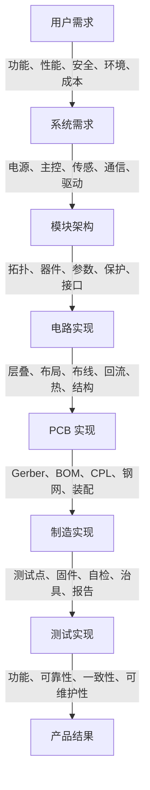

每向下一层细化一次，都要能够追溯到上层需求；每完成一层，都要反向确认没有破坏原目标。例如，为了降低成本更换稳压器时，要重新检查效率、热、纹波、封装、供货和软件控制，而不是只比较单价。

### 1.4 硬件项目完整生命周期

#### 1.4.1 需求与可行性

主要任务：明确功能、输入输出、使用环境、结构、成本、安全和验证标准；识别新技术、长交期器件、热和高速接口等高风险项。

主要交付物：

- 需求清单与验收标准。
- 系统框图、接口表和电源树。
- 初步功耗、成本和物料风险评估。
- 高风险项验证计划。

阶段出口：关键需求没有明显矛盾，高风险方案至少存在可验证路径。

#### 1.4.2 原理图与器件选型

主要任务：阅读数据手册，完成电路计算、接口保护、默认状态、时序、测试点和关键仿真。

主要交付物：

- 可评审的原理图 PDF。
- 关键器件选型记录和替代料。
- 电源、热、模拟精度和接口计算。
- ERC 报告及问题处理说明。

阶段出口：每个模块都能解释工作原理、边界条件和验证方法。

#### 1.4.3 PCB 与结构协同

主要任务：确定板框、层叠、规则、器件位置、信号回流、功率环路、散热、装配和测试可达性。

主要交付物：

- PCB 源文件、3D 视图和结构交换文件。
- 层叠、阻抗和设计规则说明。
- DRC 报告与关键网络检查记录。
- DFM、DFA、DFT 检查结果。

阶段出口：设计在电气、结构和制造三个视角下均可实现。

#### 1.4.4 打样、装配与首次上电

主要任务：检查制造文件、跟踪装配、进行静态检查、限流分步上电和最小系统验证。

主要交付物：

- Gerber、Drill、BOM、CPL 和装配图。
- 首次上电计划与实测记录。
- 焊接、错料、封装和制造问题清单。

阶段出口：电源、时钟、复位、下载和最小固件稳定运行，不存在未解释的过流或异常温升。

#### 1.4.5 功能、边界与可靠性验证

主要任务：覆盖输入范围、最大负载、温度、通信、异常状态、长时间运行和必要的 EMC 预兼容测试。

主要交付物：测试计划、原始数据、波形、问题单、修复验证和回归结果。

阶段出口：所有需求都有明确结论；未解决问题已评估风险并制定处理计划。

#### 1.4.6 改版与发布

主要任务：基于证据修复问题，冻结设计，确保源文件与制造资料版本一致，并归档变更理由。

主要交付物：发布包、版本说明、硬件变更日志、已知问题、兼容性说明和量产测试要求。

完整流程可概括为：

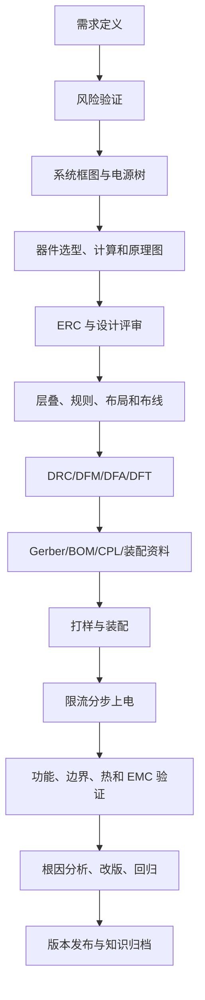

### 1.5 硬件知识地图

硬件知识不是一条直线，而是由基础、系统、实现和验证四条主线交织而成。

| 主线 | 包含内容 | 关键问题 |
| :--- | :--- | :--- |
| 电路基础 | 电压、电流、功率、RC、器件模型、反馈 | 电路为什么这样工作？ |
| 系统设计 | 电源、模拟、数字、MCU、接口、保护 | 模块如何组合且不互相破坏？ |
| PCB 实现 | 层叠、阻抗、布局、布线、回流、热 | 原理图如何变成真实电磁结构？ |
| 工程验证 | 仪器、调试、EMC、DFM、测试和版本 | 如何证明它在边界下仍然可靠？ |

学习时应不断建立横向联系。例如学习 MOSFET，不应只记符号和导通条件，还要关联栅极驱动、开关损耗、SOA、感性反冲、散热铜皮、示波器测量和故障保护。

### 1.6 建议能力层级

| 层级 | 学习重点 | 能力目标 | 可验证成果 |
| :--- | :--- | :--- | :--- |
| L0 安全 | 低压边界、短路、限流、焊接、ESD | 能安全搭建、测量和断电 | 完成上电前清单与低压实验 |
| L1 基础 | 欧姆定律、功率、RC、二极管、MOSFET | 能计算工作点、功耗和时间常数 | 实测 LED、RC、晶体管开关 |
| L2 原理图 | 数据手册、电源树、保护、接口、测试点 | 能画出逻辑清楚的原理图 | 完成电源板或 MCU 最小系统图 |
| L3 PCB | 封装、层叠、布局、布线、回流、DRC | 能完成可制造双层低速板 | 打样并成功上电一块自制 PCB |
| L4 系统 | 电源、模拟、数字、通信、传感器、负载 | 能设计完整嵌入式小系统 | 完成多模块项目与边界测试 |
| L5 工程化 | SI、PI、EMC、热、DFM、DFA、DFT | 能解释并降低量产风险 | 完成四层板、评审和预兼容测试 |
| L6 闭环 | 调试、失效分析、版本、供应链和复盘 | 能让设计经验持续复用 | 建立发布包、问题库和改版记录 |

不要仅按“学过哪些课程”判断层级。真正的升级标准是能否独立产出可检查的成果，并在实物上通过验证。

### 1.7 入门所需的基础能力

#### 1.7.1 数学

先掌握代数、比例、科学计数法、单位换算、一次方程、对数基础和简单三角函数。初期不要求复杂电磁场推导，但必须避免单位和数量级错误。

#### 1.7.2 物理与电路

理解电压、电流、能量、功率、阻抗、充放电、磁场和热。能够使用 KCL、KVL 和一阶 RC 模型分析简单电路。

#### 1.7.3 编程与数字基础

嵌入式项目至少需要理解二进制、十六进制、逻辑电平、寄存器、位操作和基本 C/C++。硬件调试常常需要最小固件配合，不能把所有问题都交给软件工程师。

#### 1.7.4 英文资料阅读

不要求逐句翻译，但应能定位数据手册中的引脚、额定值、电气特性、时序、典型应用、布局指南和封装尺寸。技术名词应保留英文关键词，方便搜索原始资料。

#### 1.7.5 结构与制造意识

理解毫米与英寸、尺寸公差、孔槽、器件高度、装配方向和连接器配对。即使主要做电路，也要能看懂基本机械图和板厂能力表。

### 1.8 分阶段学习路线

以下时间仅作为业余学习参考，应以成果验收而不是日历推进。

| 阶段 | 建议周期 | 学习内容 | 必做实践 | 阶段验收 |
| :--- | :--- | :--- | :--- | :--- |
| A 安全与测量 | 1 周 | 电源限流、万用表、焊接、ESD | LED、分压、通断和二极管测量 | 能安全完成上电和断电 |
| B 电路与器件 | 2～3 周 | R/C/L、二极管、BJT、MOSFET、RC | RC 波形、MOSFET 低侧开关 | 计算与实测基本一致 |
| C 原理图 | 2～3 周 | 数据手册、电源树、接口、保护、ERC | LDO 电源板或 MCU 最小系统 | 原理图可被他人独立读懂 |
| D 双层 PCB | 3～4 周 | 封装、布局、回流、布线、DRC、Gerber | 完成并打样一块低速板 | 无致命封装和连接错误 |
| E 系统设计 | 4～8 周 | MCU、传感器、通信、模拟与负载 | 传感器节点或控制板 | 完成功能和边界测试 |
| F 工程进阶 | 持续 | SI、PI、EMC、热、DFM、DFT、供应链 | 四层综合板与预兼容测试 | 能解释可靠性和量产风险 |

如果某一阶段的成果无法独立复现，应先补齐该阶段，不要仅为了“学得快”跳到更复杂的高速或多层设计。

### 1.9 项目驱动学习法

#### 1.9.1 选择合适项目

第一个项目应同时满足：

- 低压供电，故障能量有限。
- 功能可以拆成多个独立模块。
- 器件有完整数据手册和参考设计。
- 手工焊接或常规 SMT 可以完成。
- 每个关键节点都能用现有仪器测量。
- 即使失败，成本和风险也可接受。

推荐顺序：

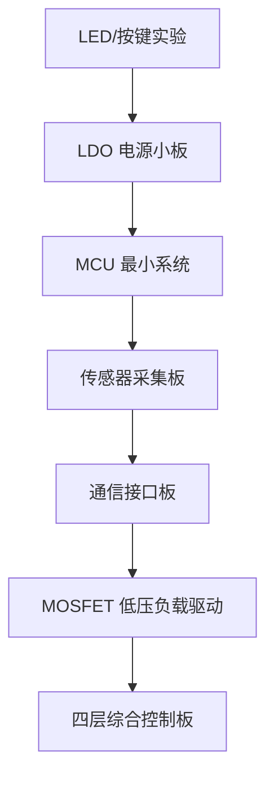

#### 1.9.2 最小闭环

每个项目至少完成以下闭环：

1. 写一页需求和验收标准。
2. 画系统框图和电源树。
3. 阅读关键器件数据手册并做计算。
4. 画原理图并完成 ERC 与人工检查。
5. 画 PCB，完成 DRC、3D 和 Gerber 检查。
6. 打样、焊接并限流分步上电。
7. 测试功能、边界、温升和异常状态。
8. 记录问题、根因和下一版修改。

如果只画完 PCB 没有打样，学习闭环停在“表达设计”；如果只让板子亮起来却没有边界测试，闭环停在“功能演示”；只有完成测量、故障分析和复盘，才接近工程能力。

#### 1.9.3 主动制造错误

在安全低压实验中，可主动改变一个条件观察故障，例如：

- 改变 RC 参数，比较时间常数和波形。
- 移远去耦电容，观察电源与数字波形变化。
- 改变 I²C 上拉，观察上升时间和通信稳定性。
- 增加 MOSFET 栅极电阻，比较开关速度、振铃和温升。
- 在软件中改变负载模式，观察电源瞬态。

主动实验必须一次只改变一个变量，并先写下预测结果。

### 1.10 知识点学习模板

每学习一个器件、接口或设计规则，都回答以下问题：

1. 它解决什么问题？
2. 输入、输出、供电和工作状态是什么？
3. 关键参数的典型值、保证值和极限值分别是什么？
4. 哪些参数需要计算，公式的假设是什么？
5. 原理图中需要哪些外围器件和默认状态？
6. PCB 中哪些器件必须靠近，电流和回流如何闭合？
7. 常见错误会产生什么电压、波形、温升或日志现象？
8. 使用什么仪器、测点和条件验证？
9. 它适用于什么场景，不适用于什么场景？
10. 项目中是否已经实测，证据保存在何处？

推荐使用“概念—计算—设计—测量—复盘”流程：

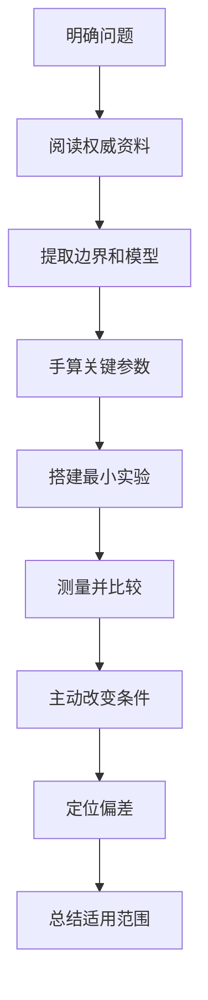

### 1.11 学习资料的使用顺序

按以下顺序建立可信度：

1. 产品安全法规和适用标准。
2. 芯片数据手册、勘误和官方硬件设计指南。
3. 官方参考设计、评估板原理图与 PCB。
4. 板厂和装配厂当前工艺能力。
5. 权威教材、应用笔记和标准组织资料。
6. 自己的计算、仿真、波形和测试报告。
7. 博客、论坛和视频，仅用于理解与排查线索。

学习笔记应区分三类信息：

- **事实**：数据手册保证值、封装尺寸、接口标准要求。
- **推导**：基于公式、模型和边界条件得到的设计结论。
- **经验**：特定板厂、层叠、器件和测试条件下的实践结果。

不要把特定项目经验写成无条件规则。每个重要结论后最好补充“适用条件”和“验证方法”。

### 1.12 每个项目应保留的工程资料

| 阶段 | 建议资料 |
| :--- | :--- |
| 需求 | 需求表、验收标准、接口表、风险清单 |
| 设计 | 系统框图、电源树、原理图、计算和选型记录 |
| PCB | 层叠、规则、PCB、3D、关键网络说明 |
| 生产 | Gerber、Drill、BOM、CPL、装配图、工艺说明 |
| 验证 | 上电记录、测试计划、波形、温升和边界数据 |
| 问题 | 现象、条件、假设、证据、根因、修复和回归 |
| 发布 | 版本号、Git 提交、变更日志、已知问题和兼容性 |

这些资料的目标不是增加形式，而是让另一个人在没有口头说明的情况下，仍能理解设计、复现测试和继续改版。

### 1.13 自我评估标准

可以用以下问题判断自己是否真正掌握一个主题：

- 能否不用教程，用自己的话解释原理和限制？
- 能否画出电流路径、回流路径和关键波形？
- 能否算出至少一个关键参数并说明余量？
- 能否指出原理图与 PCB 中最重要的三处实现？
- 能否预测一种错误设计会出现什么现象？
- 能否选择正确仪器、探头和测点验证？
- 能否区分器件问题、PCB 问题、焊接问题和软件问题？
- 能否把修复方案写成下一版可检查的修改项？

如果只能复述定义但不能计算、画图、测量和排错，说明仍停留在知识记忆阶段。

### 1.14 常见学习误区

- **先挑战复杂项目**：基础问题叠加后无法定位。应先完成低压、低速、模块化项目。
- **只收藏资料不实践**：把每个主题绑定到一个最小实验和一张实测波形。
- **只会照抄参考设计**：逐个解释外围器件，并根据自己的边界重新计算。
- **只追求 DRC 通过**：DRC 不能判断回流、热、保护和设计意图。
- **只测功能不测边界**：加入输入范围、峰值负载、启动、温升和异常测试。
- **一次改多个变量**：调试时保持单变量，并记录修改前后的证据。
- **用经验代替数据手册**：经验可以提出假设，最终结论应由规格、计算和实测支持。
- **没有版本意识**：源文件、BOM、Gerber、固件和测试报告必须可追溯。

### 1.15 初学边界与进阶门槛

初学阶段优先选择 3.3 V、5 V、12 V 范围内的低压、低速、小电流项目。以下主题不适合作为无人指导的第一个项目：

- 220 V 市电、电源适配器、PFC、逆变器和高压点火。
- 大功率电机、加热器、高能电容和大容量电池系统。
- 锂电池快充、多串电池管理与缺少认证的保护系统。
- 医疗、汽车安全、消防和其他失效会伤人的系统。
- DDR、PCIe、千兆以上 SerDes、射频功放和高密度 BGA。

进入更高风险或更高速领域前，至少应满足：

- 已独立完成两块以上低压 PCB 的设计、上电和改版闭环。
- 能熟练使用万用表和示波器，理解探头接地和测量带宽。
- 能阅读完整数据手册、参考设计和布局指南。
- 能计算电源、功耗、热、接口电平和基本信号完整性问题。
- 有明确的评审人、实验条件、安全措施和异常断电方案。
- 知道目标产品适用的安全与 EMC 要求，并愿意使用专业测试和认证资源。

### 1.16 第一阶段行动清单

如果从今天开始学习，可以按以下顺序行动：

1. 准备限流电源、万用表、基础示波器和安全焊接工具。
2. 完成 LED 限流、分压、RC 充放电和 MOSFET 低侧开关实验。
3. 为每个实验保留计算、照片、测点和波形。
4. 选择一个 5 V 转 3.3 V 电源小板作为首个 PCB 项目。
5. 写需求、电源预算、器件选型和首次上电计划。
6. 完成原理图、封装复核、双层 PCB、DRC 和 Gerber 检查。
7. 打样后限流上电，测量空载、负载、纹波和温升。
8. 根据实测完成一次复盘，即使第一版完全可用也记录可优化项。

完成这组行动后，再进入 MCU 最小系统、传感器和通信接口学习，会比直接照着复杂开发板抄图更容易建立稳定能力。

---

## 2. 安全、ESD 与实验室规范

### 2.1 本章学习目标

学完本章后，应能够：

- 在接线、焊接和上电前识别触电、短路、过热、储能、机械和 ESD 风险。
- 为低压实验建立“检查—限能—分步上电—异常断电—记录”的安全流程。
- 正确理解万用表、示波器、稳压电源和电子负载的接地与量程风险。
- 使用合适的 ESD 工作区、包装和操作方法保护敏感器件。
- 安全处理电池、电容、电感、电机、继电器和发热器件。
- 在异常发生时优先保护人员、切断能量并保存现场信息，而不是继续通电试错。

> **安全边界**：本章主要面向低压直流电子实验。市电、高压、高能电池、大功率电源、激光、微波、X 射线、医疗和汽车安全系统不应仅凭本章内容独立操作，必须使用符合目标场景的标准、场地、仪器、个人防护和专业监督。

### 2.2 风险不是只看电压

“低压”不等于“无风险”。风险由电压、电流、可用能量、持续时间、接触条件、温度、机械运动和故障路径共同决定。

| 风险类型 | 常见来源 | 可能后果 | 首要控制方法 |
| :--- | :--- | :--- | :--- |
| 触电 | 市电、高压电容、隔离失效、错误接地 | 电击、灼伤、二次跌落 | 隔离、外壳、屏障、断电操作 |
| 短路与电弧 | 电池、大电容、大电流电源、金属工具 | 烫伤、铜箔熔化、起火 | 保险、限流、遮蔽裸露导体 |
| 过热 | 稳压器、MOSFET、电阻、电机、连接器 | 烫伤、器件损坏、火灾 | 功耗计算、热监测、降额 |
| 储能 | 电容、电池、电感、旋转机械 | 断电后仍释放能量 | 放电设计、状态指示、等待与测量 |
| ESD | 人体、衣物、塑料、包装摩擦 | 器件立即或潜在失效 | EPA、腕带、台垫、防静电包装 |
| 化学与烟雾 | 焊接烟雾、助焊剂、清洗剂、电池泄漏 | 刺激、腐蚀、吸入风险 | 通风、合规存储、避免皮肤接触 |
| 机械 | 风扇、电机、飞轮、尖锐板边、工具 | 夹伤、割伤、飞出物 | 防护罩、固定、断电后接触 |
| 光与声 | 高亮 LED、激光器、超声和大功率蜂鸣器 | 眼睛或听力损伤 | 限制输出、避免直视、使用防护 |

安全设计优先级应遵循：

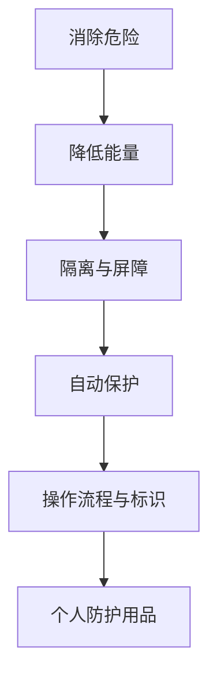

个人防护用品是最后一道防线，不能替代正确的电路保护和工作流程。

### 2.3 基本安全原则

1. **默认断电操作**：改线、换器件、插拔排线和调整探头前先断电，除非测试明确要求带电操作。
2. **限制可用能量**：第一次上电使用可调电源限流；大电流系统增加保险、电子保险丝或分段供电。
3. **从最小系统开始**：先验证输入保护和电源，再连接主控、接口和高能负载。
4. **保持单手可快速断电**：电源开关、急停或插头必须容易触及，不能被设备和线缆遮挡。
5. **不凭感觉判断安全**：用仪器确认电压、储能和温度，不用手指触碰器件试温。
6. **不绕过保护**：保险丝、保护地、隔离、联锁和限流功能不能为了“方便调试”被永久取消。
7. **不无人值守测试未知板卡**：初次上电、热测试、充电和大负载测试应有人观察，并设置自动停止条件。
8. **保持可追溯**：记录电源设置、接线、板卡版本、负载和异常现象。

### 2.4 建立安全工作台

#### 2.4.1 功能分区

建议将工作台划分为：

- **清洁装配区**：存放裸板、器件和防静电工具。
- **焊接返修区**：配置排烟、耐热垫、烙铁架和高温警示。
- **上电测试区**：配置稳压电源、示波器、电子负载和快速断电装置。
- **电池与高能器件区**：与纸张、溶剂、松散金属工具分离。
- **待检与故障隔离区**：未确认安全状态的板卡应贴标签，避免被误用。

#### 2.4.2 工作台要求

- 台面干燥、稳定、照明充足，不堆放饮料和导电碎屑。
- 电源线、探头线和下载线分类整理，避免被拉扯或绊倒。
- 使用带保护地、过流保护和状态指示的合规供电设施。
- 烙铁、热风枪和热板离开使用位置时有固定支架。
- 常用断电开关、灭火和应急联系方式清楚可见。
- 眼镜、戒指、手链等可能造成短路或卷入机械部件的物品按风险移除。

### 2.5 上电前风险评估

在首次上电或重大改版后上电前，先回答：

1. 能量从哪里进入，最大电压、电流和功率是多少？
2. 如果输入反接、输出短路或器件装反，哪一个保护器件先动作？
3. 哪些电容、电池或旋转部件在断电后仍保留能量？
4. 哪些节点可能快速升温、产生电弧或损坏探头？
5. 哪些外部设备通过 USB、示波器、串口或屏蔽层引入额外接地路径？
6. 异常时如何在不靠近危险区域的情况下快速断电？
7. 哪些负载可以先不连接，哪些模块可以通过 0 Ω、电感或保险丝分段？

将风险写成表格有助于避免遗漏：

| 风险 | 触发条件 | 预期保护 | 检查方法 | 异常处理 |
| :--- | :--- | :--- | :--- | :--- |
| 输入反接 | 电源线接反 | MOSFET/二极管阻断 | 二极管档、低压测试 | 断电检查保护器件 |
| 3.3 V 短路 | 焊桥或芯片反装 | 电源限流 | 测对地阻值 | 分段隔离、低能量定位 |
| 电机堵转 | 机械卡住 | 驱动限流/保险 | 受控负载测试 | 立即关闭驱动 |

### 2.6 首次上电前检查

#### 2.6.1 文件与物料

- [ ] PCB、BOM、装配图和上电计划版本一致。
- [ ] 输入电压、极性、连接器定义和跳线状态已确认。
- [ ] IC Pin 1、二极管、LED、电解电容和有极性器件方向正确。
- [ ] 实装料号与设计料号一致，不存在未评审替代料。

#### 2.6.2 外观与连接

- [ ] 无焊桥、漏焊、虚焊、锡珠、偏移和烧伤痕迹。
- [ ] 板底没有金属碎屑，螺钉和支柱不会压到铜箔或器件。
- [ ] 连接器、排线和探头方向正确，线缆无破损。
- [ ] 高器件、散热片和屏蔽罩不会碰到测试夹具。

#### 2.6.3 静态电气检查

- [ ] 输入正负端不存在明显短路。
- [ ] 每条电源轨对地阻值已测量并记录。
- [ ] 相邻电源轨和关键接口之间无意外连通。
- [ ] 保险丝、0 Ω、电感、磁珠和采样电阻装配正确。
- [ ] 需要断开的负载、电机、加热器和外部模块已隔离。

仅凭通断蜂鸣不能判断所有短路。大容量电容充电、低阻负载和芯片内部路径都可能导致短暂蜂鸣，应结合阻值变化、原理图和正常板对比。

### 2.7 限流与分步上电

#### 2.7.1 设置电源

- 先确认电源输出处于关闭状态，再接线。
- 核对电压设定、限流设定、输出极性和通道模式。
- 某些台式电源输出端可能浮地，也可能通过配置或仪器连接形成接地，应在接入示波器和电脑前确认。
- 限流值应高于当前步骤的合理启动电流，又低于可能造成进一步损坏的电流。
- 未知板卡不要一开始使用额定最大输入和最大负载。

#### 2.7.2 推荐顺序

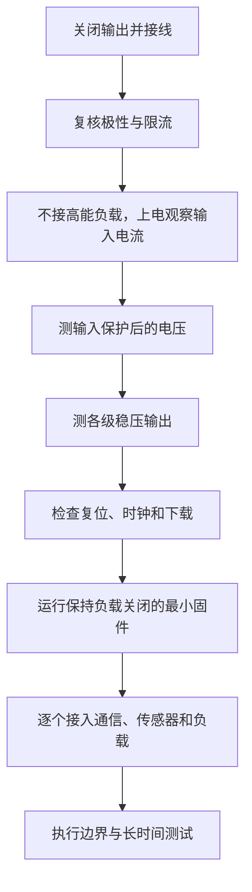

每一步都先写预期，再记录实测。若电源立即进入恒流模式、输入电流远高于预期、器件快速升温、出现异味或异响，应立即关闭输出，不要反复快速重启。

#### 2.7.3 断电后的处理

- 等待旋转部件停止和热器件降温。
- 用万用表确认关键电容和电源轨已降到安全状态。
- 使用设计好的泄放电阻或合规放电工具，不要直接用螺丝刀短接大电容。
- 对可能再次恢复电压的电容重复测量，注意介质吸收和其他电源反灌。

### 2.8 万用表使用安全

#### 2.8.1 接线与档位

- 测电压时并联，测电流时串联。
- 测电阻、通断和二极管前必须断电，并确认电容已放电。
- 使用电流档后立即将表笔恢复到电压/电阻插孔，避免下次测电压时短路。
- 不确定量级时从更高量程开始。
- 表笔绝缘破损、插头松动或保险丝规格错误时停止使用。

#### 2.8.2 CAT 等级与量程

万用表的最大显示电压不等于可以安全测量所有场景。测量市电、配电和高能回路时，仪表、表笔、保险丝和使用方式都必须符合相应测量类别和额定值。普通电子实验表不应用于未知高能电路。

#### 2.8.3 电流测量风险

电流档内部阻抗低，误并联到电源两端会形成短路。大电流测量优先使用合适分流器、电流探头或电源自身读数，并确认测量器件功率和连接器能力。

### 2.9 示波器与接地安全

#### 2.9.1 普通台式示波器

普通台式示波器的 BNC 外壳和探头地夹通常与保护地相连。多个通道的地夹通常也彼此相连。将地夹接到非地节点，可能通过保护地直接短路电路。

因此：

- 接探头前先确认被测系统的参考地和示波器保护地关系。
- 不要把两个通道地夹接到电路中不同电位的节点。
- 不要通过拆除保护地、使用不合规转接头或让普通示波器“浮地”来规避短路。
- USB、电脑、电源和其他仪器也可能建立额外地回路。

#### 2.9.2 浮地与差分测量

测量半桥、高侧开关、隔离侧或非地参考节点时，应使用符合电压、共模范围、带宽和测量类别要求的差分探头或专用隔离测量方案。连接前检查探头衰减、最大差模电压、最大共模电压和频率降额。

#### 2.9.3 探头连接

- 测高速和开关节点时使用短地弹簧或合适同轴连接。
- 长地线不仅会产生假振铃，还可能意外扫过相邻高电流节点。
- 探头夹具应固定，避免手持时滑落短路。
- 被测节点超过探头范围或不确定参考关系时，不进行测量。

### 2.10 ESD 防护基础

ESD 可能造成三类结果：立即失效、参数退化和潜在损伤。潜在损伤最难发现，器件可能通过初测，却在之后温度、振动或老化条件下失效。

#### 2.10.1 ESD 工作区

ESD Protected Area，简称 EPA，通常包括：

- 合规接地的防静电台垫。
- 带限流结构的接地腕带；不要把人体直接用普通导线硬接地。
- 防静电器件盒、屏蔽袋和周转容器。
- 低静电工具、服装和受控的绝缘材料。
- 接地状态检查和定期维护记录。

#### 2.10.2 操作规范

- 拿 PCB 时优先接触板边，不触摸金手指、芯片引脚和高阻节点。
- 敏感器件离开包装前，先进入已确认有效的 EPA。
- 不在普通塑料袋、泡沫、胶带和化纤表面放置裸器件。
- 运输时使用屏蔽袋或合适容器，不只使用颜色相似的普通塑料袋。
- 连接外部线缆前，评估人体、机壳和设备之间的电位差。

#### 2.10.3 PCB 上的 ESD 设计

- TVS 靠近接口入口，走线先保护后进入内部电路。
- 泄放路径短、宽、低电感，并明确连接到机壳地、屏蔽地或信号地的策略。
- 高速接口保护器件结电容应满足信号带宽。
- 外部接口与内部敏感电路之间保留物理距离和受控回流路径。
- ESD 设计需要通过实际测试验证，不能仅凭元件清单判断。

### 2.11 焊接与返修安全

#### 2.11.1 烙铁与热风枪

- 使用稳定支架和耐热垫，热端始终朝向安全区域。
- 调温遵循焊料、器件和工艺要求，不用过高温度弥补氧化或热容量不足。
- 更换烙铁头、喷嘴或清理设备前先断电并等待冷却。
- 热风枪可能吹飞小器件、熔化连接器和加热附近电池，使用前清理周围区域。

#### 2.11.2 通风与化学品

- 焊接烟雾应通过近端排烟或有效通风移离呼吸区域。
- 助焊剂、清洗剂和胶按说明存放，远离火源和高温表面。
- 不在食品容器中存放化学品，不在工作台饮食。
- 清洗后等待易燃溶剂完全挥发，再进行上电和热风操作。

#### 2.11.3 防止热损伤

- 使用镊子、夹具和 PCB 固定架，不用手扶住待加热焊点附近区域。
- 大铜皮焊接可通过合适预热和工具提高效率，避免长时间局部过热。
- 返修后检查焊盘、阻焊、过孔和邻近器件是否受损。
- 刚完成热风或回流的器件外观看似不红热，仍可能造成烫伤。

### 2.12 电池、超级电容与储能器件

#### 2.12.1 电池

- 使用来源明确、规格匹配且状态正常的电池和充电方案。
- 充电器、保护电路、温度检测和电池化学体系必须匹配。
- 初次充放电测试设置电压、电流、温度和时间停止条件，并保持观察。
- 不使用鼓包、破损、漏液、异味、异常发热或历史不明的电池。
- 避免挤压、穿刺、反接、短路和将裸电池与金属物品混放。
- 多节串并联涉及一致性、熔断、均衡和故障传播，不适合作为无指导入门项目。

电池发生异常时，不继续握持、充电或反复上电；在确保人员安全的前提下切断能量，隔离现场，并按照实验室应急预案和电池制造商指引处理。

#### 2.12.2 电容

大容量或高压电容断电后仍可能保持危险电压。设计中应考虑泄放电阻、状态指示、放电时间和维护测点。检修前先测量，不依据“已经断电多久”判断安全。

#### 2.12.3 电感与变压器

感性负载关断时会产生反冲电压。继电器、电机、线圈和变压器必须有明确的续流、吸收或钳位路径。不要在通电时随意拔除感性负载连接线。

### 2.13 电机、风扇、继电器和发热负载

- 电机和风扇首次运行前固定牢靠，清除叶片和联轴器附近线缆。
- 旋转部件完全停止前不触碰、不测量机械连接点。
- 电机堵转电流可能远高于空载电流，电源和驱动必须限流。
- 继电器不仅有线圈反冲，触点还可能产生电弧和高温。
- 加热器、功率电阻和灯具测试需使用耐热支架，并设置温度和时间上限。
- 高能负载由硬件默认关闭，不能依赖 MCU 启动后才关闭。

### 2.14 连接器、线缆与热插拔

连接器安全不仅取决于额定值，还取决于针脚顺序、接触电阻、插拔速度、线缆和故障状态。

- 使用防呆、锁扣和清晰极性标识。
- 电源连接器应避免反插和相邻针脚短路。
- 不支持热插拔的板卡、模块和排线应断电插拔。
- 长线缆会引入浪涌、ESD、压降、地电位差和天线效应。
- 多个供电入口同时连接前检查反灌和地环路。
- 杜邦线和面包板不适合高电流、长期运行和关键可靠性验证。

### 2.15 高压和市电的明确边界

以下情况不应由缺少培训和合规设施的初学者独立操作：

- 裸露市电输入、非隔离 AC-DC、电源一次侧和高压启动电路。
- 高压电容、CRT、点火线圈、微波炉、激光电源和类似高能设备。
- 需要隔离耐压、漏电流、爬电距离和保护接地验证的产品。
- 需要在带电状态下接触或探测危险节点的调试。

对于此类项目，必须使用适用标准、隔离与联锁设施、额定探头和仪表、绝缘屏障、远程上电、经过培训的协作人员以及明确的应急预案。不能把低压实验经验直接外推到市电系统。

### 2.16 异常与事故响应

#### 2.16.1 出现异常时

1. 优先关闭电源或使用预先准备的急停方式。
2. 不直接触摸发热、冒烟、旋转或可能带电的设备。
3. 若存在人身危险、起火、爆裂或有害烟雾，立即撤离并执行场地应急流程。
4. 不在原因不明时反复上电。
5. 等待设备进入可安全接近状态后，再测量残余电压和温度。
6. 记录电源设置、接线、负载、软件版本和最后操作。

#### 2.16.2 保留故障现场

不要立即清理所有焊点、拆除全部飞线或替换多个器件。先拍照并记录：

- 烧伤、裂纹、变色、鼓包和异味位置。
- 电源电压、限流、显示电流和异常持续时间。
- 已连接的 USB、示波器、串口、电源和负载。
- 故障发生前的软件操作和工作模式。

保留这些信息有助于区分设计、装配、接线、仪器和软件问题。

### 2.17 实验结束与无人值守检查

离开工作台前确认：

- [ ] 稳压电源、电子负载、烙铁、热风枪和热板已关闭。
- [ ] 电池不处于无人监管的未知充放电状态。
- [ ] 大电容和高能回路已进入安全状态。
- [ ] 电机、风扇、继电器和加热器不会被软件意外重新启动。
- [ ] 故障板和未确认板卡已断电并贴上状态标签。
- [ ] 易燃溶剂、助焊剂和电池已按要求存放。
- [ ] 工作台无松散金属、焊锡碎屑和高温工具。
- [ ] 需要持续运行的老化测试具备独立保护、自动停止、日志和合规场地。

### 2.18 安全记录模板

```markdown
# 硬件实验安全记录

- 项目：
- PCB 版本：
- 日期：
- 操作人：
- 实验类型：首次上电 / 负载 / 热 / 电池 / 电机 / EMC 预试验

## 能量来源

| 来源 | 电压范围 | 限流/保险 | 最大功率 | 断电方式 |
| :--- | :--- | :--- | :--- | :--- |
|  |  |  |  |  |

## 主要风险

| 风险 | 触发条件 | 防护措施 | 停止条件 |
| :--- | :--- | :--- | :--- |
|  |  |  |  |

## 上电前确认

- [ ] 极性、接地和仪器连接正确。
- [ ] 电源电压和限流已复核。
- [ ] 高能负载已隔离或固定。
- [ ] 急停和断电方式可用。
- [ ] 测点、预期值和异常阈值已记录。

## 异常记录

- 发生时间：
- 现象：
- 电源与负载状态：
- 处理动作：
- 是否禁止再次上电：
```

### 2.19 本章自测

完成以下问题后，再开始独立上电调试：

1. 为什么低电压大电流仍可能造成严重短路和起火？
2. 为什么断电不等于所有节点已经安全？
3. 如何判断台式示波器地夹能否连接到某个节点？
4. 万用表从电流测量切换到电压测量前必须检查什么？
5. 第一次上电的限流值应依据什么设置？
6. 为什么电池、电机和大电容要与普通逻辑板区别对待？
7. ESD 腕带、台垫和屏蔽包装分别解决什么问题？
8. 异常发生后，为什么不应立即反复通电或一次更换多个器件？
9. 哪些情况必须停止独立操作并寻求专业监督？

如果无法清楚回答，应回到相应小节，并在安全低压条件下由有经验人员指导完成操作。

---

## 3. 数学与电路基础

### 3.1 本章学习目标

学完本章后，应能够：

- 正确进行电压、电流、电阻、电容、频率和功率的单位换算。
- 使用欧姆定律、KCL、KVL、分压和分流分析基础电路。
- 用戴维南等效和源阻抗解释负载导致的电压变化。
- 计算电阻功耗、电容与电感储能、RC/RL 时间常数和一阶滤波器截止频率。
- 理解正弦波、频率、相位、RMS、占空比、阻抗和谐振的基本含义。
- 进行元件公差、最坏情况、温升、效率和测量误差的初步预算。
- 把公式结果与万用表、示波器和实际电路现象对应起来。

### 3.2 物理量、符号与单位

| 物理量 | 常用符号 | SI 单位 | 单位符号 | 直观含义 |
| :--- | :---: | :--- | :---: | :--- |
| 电压 | V、U | 伏特 | V | 单位电荷的能量差 |
| 电流 | I | 安培 | A | 单位时间流过的电荷量 |
| 电荷 | Q | 库仑 | C | 电荷总量 |
| 电阻 | R | 欧姆 | Ω | 对电流的阻碍程度 |
| 电导 | G | 西门子 | S | 电阻的倒数 |
| 电容 | C | 法拉 | F | 单位电压可储存的电荷 |
| 电感 | L | 亨利 | H | 对电流变化的阻碍程度 |
| 功率 | P | 瓦特 | W | 单位时间转换的能量 |
| 能量 | E、W | 焦耳 | J | 完成工作或释放热量的能力 |
| 频率 | f | 赫兹 | Hz | 每秒周期数 |
| 周期 | T | 秒 | s | 一个周期所需时间 |
| 阻抗 | Z | 欧姆 | Ω | 交流条件下电压与电流之比 |

同一个字母在不同上下文可能表示不同含义，例如 `C` 既可表示电荷单位库仑，也可表示电容量。阅读公式时应结合变量定义，而不是只看字母。

### 3.3 工程前缀与科学计数法

| 前缀 | 符号 | 倍率 | 示例 |
| :--- | :---: | ---: | :--- |
| 吉 | G | 10⁹ | 1 GHz |
| 兆 | M | 10⁶ | 1 MΩ |
| 千 | k | 10³ | 10 kΩ |
| 毫 | m | 10⁻³ | 20 mA |
| 微 | µ | 10⁻⁶ | 10 µF |
| 纳 | n | 10⁻⁹ | 100 nF |
| 皮 | p | 10⁻¹² | 22 pF |

常用换算：

```text
1 A = 1000 mA = 1 000 000 µA
1 F = 1000 mF = 1 000 000 µF
1 µF = 1000 nF = 1 000 000 pF
1 MHz = 1000 kHz = 1 000 000 Hz
1 MΩ = 1000 kΩ = 1 000 000 Ω
```

注意大小写：`M` 与 `m` 相差十亿倍，`1 mF` 也不是 `1 µF`。工程文档中常把小数点替换成单位字符以减少印刷歧义，例如 `4k7 = 4.7 kΩ`、`2R2 = 2.2 Ω`、`100n = 100 nF`。

### 3.4 量纲检查与数量级估算

计算后先检查单位是否正确。若由 `V × A` 得到结果，单位应为 W；若由 `Ω × F` 得到结果，单位应为 s。单位不匹配通常说明公式、换算或代入有误。

数量级估算可以快速发现错误：

- `5 V / 1 kΩ` 应是毫安量级，不可能是安培量级。
- `10 kΩ × 100 nF` 应是毫秒量级。
- `3.3 V × 100 mA` 应是几百毫瓦量级。

建议计算时保留原始单位，最后统一换算：

```text
I = 5 V / 1000 Ω = 0.005 A = 5 mA
τ = 10 000 Ω × 100×10⁻⁹ F = 0.001 s = 1 ms
```

### 3.5 比例、百分比与对数

#### 3.5.1 比例与误差

```text
相对误差 = (实测值 - 理论值) / 理论值
百分误差 = 相对误差 × 100%
效率 η = Pout / Pin × 100%
```

描述误差时要说明参考值。例如“误差 2%”必须说明相对于满量程、读数、标称值还是校准值。

#### 3.5.2 分贝

分贝用于表达比值：

```text
功率比：dB = 10 × log10(P2 / P1)
同阻抗电压比：dB = 20 × log10(V2 / V1)
```

常见近似：功率加倍约为 `+3 dB`，电压加倍约为 `+6 dB`，电压变为十分之一为 `-20 dB`。只有在阻抗条件明确时，才能直接用电压比推导功率变化。

### 3.6 电压、电流、功率与能量

#### 3.6.1 电压与电流方向

电压必须指定两个节点，例如“节点 A 相对 GND 为 3.3 V”。电流必须指定参考方向。计算结果为负，表示实际方向与假设方向相反，并不表示计算失败。

#### 3.6.2 功率

```text
P = V × I
P = I² × R
P = V² / R
```

当电流流入器件标记的正电压端时，`P > 0` 通常表示器件吸收功率；`P < 0` 表示器件向外提供功率。电阻、电感铜阻、连接器和 PCB 走线吸收的电功率最终主要转化为热。

#### 3.6.3 能量

```text
E = P × t
1 Wh = 3600 J
```

功率描述转换速度，能量描述总量。一个 10 W 负载工作 2 h 消耗约 20 Wh；一个高功率脉冲即使持续很短，也可能给器件带来较大的瞬时热或电气应力。

### 3.7 欧姆定律与电阻网络

#### 3.7.1 欧姆定律

```text
V = I × R
I = V / R
R = V / I
```

欧姆定律适用于可近似为线性电阻的工作区。二极管、MOSFET、灯丝、电机和许多传感器不是固定电阻，不能在所有条件下直接用一个阻值描述。

#### 3.7.2 串联与并联

```text
串联电阻：Req = R1 + R2 + ...
并联电阻：1 / Req = 1/R1 + 1/R2 + ...
两个电阻并联：Req = R1×R2 / (R1 + R2)
```

串联电路中各器件电流相同；并联支路两端电压相同。并联等效电阻一定小于最小的那个支路电阻。

#### 3.7.3 LED 限流示例

假设 5 V 电源、LED 正向压降约 2 V、目标电流 10 mA：

```text
R = (5 V - 2 V) / 10 mA = 300 Ω
```

选择标准值 `330 Ω` 后：

```text
I ≈ 3 V / 330 Ω ≈ 9.1 mA
PR ≈ I²R ≈ 27 mW
```

真实设计还应检查电源最大值、LED 压降最小值、亮度需求和电阻功率余量。

### 3.8 分压、分流与负载效应

#### 3.8.1 电阻分压

对于上方电阻 `R1`、下方电阻 `R2`：

```text
Vout = Vin × R2 / (R1 + R2)
```

该公式假设输出端没有额外负载。若接入负载 `RL`，应先计算：

```text
Rlower = R2 || RL
Vout = Vin × Rlower / (R1 + Rlower)
```

因此电阻分压适合偏置、检测和参考，不适合直接给明显耗电的负载供电。

#### 3.8.2 ADC 分压示例

使用 `27 kΩ` 和 `10 kΩ` 将 12 V 降低：

```text
Vout = 12 V × 10 / (27 + 10) ≈ 3.24 V
```

实际还要考虑输入可能高于 12 V、电阻公差、ADC 参考误差、输入钳位、采样时间和源阻抗。

#### 3.8.3 电流分流

并联支路电流与支路电阻成反比。两个并联电阻时：

```text
I1 = Itotal × R2 / (R1 + R2)
I2 = Itotal × R1 / (R1 + R2)
```

多个器件并联分流时，还要考虑温度系数和器件差异，不能只按室温标称电阻平均分配。

### 3.9 基尔霍夫定律

#### 3.9.1 KCL：节点电流定律

流入一个节点的电流代数和等于流出电流代数和：

```text
ΣI = 0
```

调试时，如果电源输入电流明显大于各已知负载之和，通常意味着存在遗漏负载、漏电、短路或反灌路径。

#### 3.9.2 KVL：回路电压定律

沿任意闭合回路，各段电压升降的代数和为零：

```text
ΣV = 0
```

可沿电源正端、连接器、保险丝、MOSFET、走线、负载和地回路逐段测量压降，定位接触电阻和过流发热点。

#### 3.9.3 节点分析步骤

1. 选择参考地。
2. 给未知节点定义电压。
3. 按假设方向写出各支路电流。
4. 对节点应用 KCL。
5. 求解并检查结果方向与数量级。

复杂电路优先使用节点法而不是凭直觉追踪每一条电流。

### 3.10 戴维南、诺顿与叠加思维

#### 3.10.1 戴维南等效

任意线性二端网络可在某个工作范围内等效为理想电压源 `Vth` 串联等效电阻 `Rth`。接入负载 `RL` 后：

```text
Vload = Vth × RL / (Rth + RL)
```

这个模型可以解释电池内阻、传感器输出阻抗、分压器带载和 GPIO 驱动能力。

#### 3.10.2 诺顿等效

同一个网络也可等效为理想电流源 `In` 并联 `Rn`：

```text
Rn = Rth
In = Vth / Rth
```

#### 3.10.3 叠加原理

在线性电路中，可分别计算多个独立源造成的响应，再将结果相加。关闭独立电压源时用短路代替，关闭独立电流源时用开路代替。叠加不能直接用于功率，因为功率不是电压或电流的线性函数。

### 3.11 电容基础

#### 3.11.1 基本关系

```text
Q = C × V
I = C × dV/dt
Ec = 1/2 × C × V²
```

电容电压不能瞬间跳变；若要快速改变电容电压，就需要较大的瞬态电流。去耦电容正是利用这一特性在负载附近提供瞬态能量。

#### 3.11.2 串并联

```text
并联电容：Ceq = C1 + C2 + ...
串联电容：1/Ceq = 1/C1 + 1/C2 + ...
```

实际电容还包含 ESR、ESL、漏电和介质吸收，并且有效容值可能随电压、温度和频率变化。

#### 3.11.3 充放电

RC 充电：

```text
Vc(t) = Vs × (1 - e^(-t/RC))
```

RC 放电：

```text
Vc(t) = V0 × e^(-t/RC)
```

在 `1τ` 时充电约达到最终值的 63.2%，在 `5τ` 时约达到 99.3%。这只是理想一阶模型，芯片输入阈值、漏电和电源变化都会影响实际延时。

### 3.12 电感基础

#### 3.12.1 基本关系

```text
V = L × dI/dt
EL = 1/2 × L × I²
```

电感电流不能瞬间跳变。关断电感电流时，电感会产生足够高的电压尝试维持原电流，因此继电器、电机和开关电源必须提供续流或钳位路径。

#### 3.12.2 串并联

在忽略磁耦合时：

```text
串联电感：Leq = L1 + L2 + ...
并联电感：1/Leq = 1/L1 + 1/L2 + ...
```

实际电感存在 DCR、饱和、自谐振、磁芯损耗和温升。超过饱和电流后，电感量下降，电流上升速度可能明显加快。

### 3.13 RC 与 RL 瞬态

#### 3.13.1 时间常数

```text
RC 电路：τ = R × C
RL 电路：τ = L / R
```

时间常数描述一阶系统变化速度，不等同于精确数字延时。Reset、Enable 和 Boot 脚若仅依赖 RC，必须检查输入阈值、迟滞、漏电、上电斜率和重复上电行为。

#### 3.13.2 RC 示例

`R = 10 kΩ`、`C = 100 nF`：

```text
τ = 10 kΩ × 100 nF = 1 ms
```

约 5 ms 后接近稳定值。如果电容实际因直流偏压只剩 60 nF，时间常数会降到约 0.6 ms。

#### 3.13.3 负载阶跃

在短时间近似忽略稳压器响应时，电容支持负载阶跃可粗略估算：

```text
ΔV ≈ ΔI × Δt / C
```

该公式只描述理想电容放电，还需加入 ESR 造成的瞬时压降和 PCB 路径阻抗。

### 3.14 周期、频率、相位与占空比

```text
f = 1 / T
T = 1 / f
角频率：ω = 2πf
占空比：D = Ton / T
```

例如 1 kHz 信号周期为 1 ms；占空比 25% 时，高电平持续约 0.25 ms。

相位描述两个同频周期信号在时间上的相对位置：

```text
相位差 φ = 360° × Δt / T
```

时钟与数据、三相驱动、滤波器和反馈环路都需要关注相位关系。

### 3.15 峰值、峰峰值、平均值与 RMS

- `Vp`：相对零点的峰值。
- `Vpp`：最大值与最小值之差。
- 平均值：一个时间区间内的平均。
- RMS：产生相同电阻热效应的等效直流值。

对于零均值正弦波：

```text
Vrms = Vp / √2
Vpp = 2 × Vp
```

示波器显示的幅值、万用表读数和数据手册条件可能分别使用峰值、峰峰值或 RMS，比较前必须统一定义。非正弦波的 RMS 不能直接套用正弦关系。

### 3.16 阻抗与电抗

#### 3.16.1 基本概念

阻抗描述交流条件下电压与电流的幅度和相位关系：

```text
Z = V / I
ZR = R
ZL = jωL
ZC = 1 / (jωC)
```

对应电抗幅值：

```text
XL = 2πfL
XC = 1 / (2πfC)
```

频率越高，理想电感阻抗越大，理想电容阻抗越小。但真实器件受寄生参数限制，超过自谐振频率后行为可能反转。

#### 3.16.2 相位关系

- 纯电阻中电压与电流同相。
- 理想电容中电流超前电压 90°。
- 理想电感中电流滞后电压 90°。

入门阶段先理解趋势和相位即可；复杂网络可使用复数、相量和仿真工具求解。

### 3.17 一阶滤波器

#### 3.17.1 RC 低通

```text
fc = 1 / (2πRC)
```

在截止频率处，理想一阶低通幅度相对低频下降约 3 dB。超过截止频率后，幅度以约 20 dB/dec 的速度下降。

示例：`R = 10 kΩ`、`C = 100 nF`：

```text
fc ≈ 1 / (2π × 10 kΩ × 100 nF) ≈ 159 Hz
```

#### 3.17.2 RC 高通

同样使用 `fc = 1/(2πRC)`，但输出取电阻两端。高通隔离直流、通过较高频率；低通保留低频、衰减较高频率。

#### 3.17.3 负载影响

滤波器前后的源阻抗和负载阻抗会改变实际截止频率和增益。运放、ADC、示波器探头和下一级电阻都可能成为滤波器的一部分。

### 3.18 谐振与品质因数

理想 LC 谐振频率：

```text
f0 = 1 / (2π√(LC))
```

在谐振附近，电感和电容能量交替交换。电阻损耗决定谐振峰值和带宽。品质因数 `Q` 越高，谐振越尖锐、阻尼越小，也越容易出现振铃。

电源网络中不同电容、走线电感和电源输出阻抗可能形成反谐振峰值，因此“增加更多电容”不一定在所有频率都降低阻抗。

### 3.19 直流、交流与瞬态的统一理解

同一个节点可能同时包含：

- 直流工作点，例如 3.3 V 平均电压。
- 周期分量，例如开关电源纹波和时钟串扰。
- 随机噪声，例如热噪声和器件噪声。
- 瞬态分量，例如负载阶跃、复位毛刺和 ESD。

万用表适合静态量和平均趋势，示波器适合观察时间变化，频谱分析用于观察能量分布在不同频率的位置。不能因为万用表显示 3.3 V，就断定电源没有纹波、尖峰或瞬态跌落。

### 3.20 源阻抗、输入阻抗与测量负载

实际信号源可以近似为理想电压源串联源阻抗。负载与源阻抗形成分压：

```text
Vload = Vsource × Zload / (Zsource + Zload)
```

因此：

- 传感器源阻抗过高时，ADC 采样电容可能充电不足。
- 分压器电阻过大时，示波器探头和漏电会改变测量结果。
- GPIO 驱动较重负载时，高低电平会偏离理想电源轨。
- 电源输出阻抗与负载阶跃共同决定瞬态压降。

测量仪器不是完全透明的。万用表输入电阻、示波器探头电阻与电容、逻辑分析仪输入电容都会成为电路的一部分。

### 3.21 功率、效率与热估算

#### 3.21.1 转换效率

```text
η = Pout / Pin
Ploss = Pin - Pout
```

例如输出 5 W、效率 90%：

```text
Pin = 5 W / 0.9 ≈ 5.56 W
Ploss ≈ 0.56 W
```

损耗会分布在芯片、MOSFET、电感、二极管、电容 ESR、PCB 和连接器中。

#### 3.21.2 LDO 损耗

```text
Ploss ≈ (Vin - Vout) × Iout + Vin × Iq
```

12 V 降到 3.3 V、输出 0.2 A 时，忽略静态电流的损耗约为：

```text
Ploss ≈ (12 - 3.3) × 0.2 = 1.74 W
```

这说明即使输出功率不大，压差较大的 LDO 也可能产生严重温升。

#### 3.21.3 温升初步估算

```text
Tj ≈ Ta + P × θJA
```

`θJA` 强烈依赖测试板、铜面积、层数、气流和外壳，只能用于早期估算。最终应结合数据手册热模型和实测温度验证。

### 3.22 导线、走线与连接器压降

任何铜箔、过孔、线缆和连接器都有电阻：

```text
Vdrop = I × Rpath
Ploss = I² × Rpath
```

若一条供电路径总电阻为 `0.1 Ω`，负载电流为 `2 A`：

```text
Vdrop = 2 A × 0.1 Ω = 0.2 V
Ploss = 2² × 0.1 = 0.4 W
```

这 0.4 W 可能集中在一个连接器、细颈或少量过孔上。大电流设计必须检查完整路径，而不是只看长直线的平均线宽。

### 3.23 公差、最坏情况与误差预算

#### 3.23.1 最坏情况分析

对安全阈值、最大电压、过流点和接口兼容等问题，应组合最不利的参数边界。例如 ADC 分压最大输出可能来自：

- 输入电压最大。
- 上方电阻取最小值。
- 下方电阻取最大值。
- ADC 参考电压取最小值。
- 温度和漏电向同一不利方向变化。

#### 3.23.2 统计方法

若多个误差彼此独立且近似随机，可使用均方根方法进行典型误差估算：

```text
Etotal ≈ √(E1² + E2² + E3² + ...)
```

它不能替代安全相关的最坏情况分析。确定性偏差、同源误差和温漂也不应被当成相互独立的随机项。

#### 3.23.3 误差预算表

| 误差来源 | 典型值 | 最大值 | 温度相关 | 可校准 | 备注 |
| :--- | ---: | ---: | :---: | :---: | :--- |
| 参考电压 |  |  | 是 | 部分 | 初始误差与温漂 |
| 分压电阻 |  |  | 是 | 部分 | 比值误差更关键 |
| 运放失调 |  |  | 是 | 是 | 关注输入等效误差 |
| ADC 增益/偏置 |  |  | 是 | 是 | 与量程相关 |
| PCB 漏电与噪声 |  |  | 是 | 否 | 高阻节点明显 |

### 3.24 测量不确定度与有效数字

测量值应包含条件和合理有效数字。若万用表精度、噪声和电路波动只能支持毫伏级判断，就不应记录大量没有意义的小数位。

比较理论与实测时检查：

- 仪器精度、量程和校准状态。
- 探头输入阻抗和接地方式。
- 采样位置、带宽和平均设置。
- 电源、负载、温度和软件模式。
- 元器件公差和模型假设。

“计算与实测不一致”不一定表示电路错误，也可能是模型过度简化或测量方法改变了电路。

### 3.25 常见计算错误

- 把 `mA` 当成 `A`、把 `µF` 当成 `nF`。
- 忘记电阻分压被后级负载并联。
- 使用 LED、二极管或 MOSFET 的单一“固定电阻”模型分析所有状态。
- 只计算典型功耗，不考虑最大输入和峰值负载。
- 只看器件额定电流，不检查封装、散热和 SOA。
- 将峰值、峰峰值、平均值和 RMS 混用。
- 用正弦波公式分析任意波形。
- 把一阶 RC 延时当成精确数字定时器。
- 忽略示波器探头、电源内阻、线缆和连接器造成的负载。
- 计算结果保留很多小数，却没有检查元件误差和数量级。

### 3.26 计算与验证模板

```markdown
# 电路计算记录

- 项目/模块：
- 目标：
- 原理图位置：
- 数据手册版本：

## 已知条件

| 参数 | 最小值 | 典型值 | 最大值 | 单位 | 来源 |
| :--- | ---: | ---: | ---: | :--- | :--- |
|  |  |  |  |  |  |

## 模型与假设

- 使用公式：
- 忽略因素：
- 适用范围：

## 计算结果

| 项目 | 计算值 | 选择值 | 余量 | 结论 |
| :--- | :--- | :--- | :--- | :--- |
|  |  |  |  |  |

## 实测验证

- 仪器与探头：
- 输入与负载：
- 测点：
- 实测结果：
- 偏差原因：
- 是否需要修改模型或设计：
```

### 3.27 本章自测

1. `4.7 kΩ` 接在 5 V 两端，电流和电阻功耗约为多少？
2. 两个 `10 kΩ` 电阻分压在空载时输出多少？接入 `10 kΩ` 负载后为什么不再是原值？
3. `10 kΩ` 与 `100 nF` 的时间常数和低通截止频率分别是多少？
4. 为什么电容电压和电感电流不能瞬间变化？
5. 1 V 峰值正弦波的峰峰值和 RMS 分别是多少？
6. 为什么高频下电容不一定表现为理想低阻抗？
7. 一个 2 A 回路中，连接器增加 `50 mΩ` 接触电阻会产生多少压降和功耗？
8. 最坏情况分析与均方根误差估算分别适合什么问题？
9. 为什么示波器探头可能让高阻或高速节点的实测值发生变化？
10. 如何通过 KCL 和 KVL 定位电源路径中的异常电流与压降？

能够独立完成这些计算，并用安全的低压实验验证其中至少一半，才算建立了后续器件、电源和 PCB 学习所需的基础。

---

## 4. 常用元器件

### 4.1 本章学习目标

学完本章后，应能够：

- 按“功能、关键参数、封装、失效方式、PCB 要求和验证方法”理解器件。
- 为电阻、电容、电感、二极管、晶体管和常用 IC 选择合理规格。
- 识别额定值、典型值、测试条件、温度降额和脉冲能力之间的区别。
- 判断两个型号是否能够替换，而不是只比较器件名称和封装。
- 使用万用表、示波器和 LCR 表完成基础器件检查。
- 识别反装、过热、击穿、饱和、老化和焊接损伤等常见故障。

### 4.2 学习器件的统一框架

对任何器件都应回答以下问题：

1. 它在电路中承担什么功能？
2. 简化模型是什么，模型在什么条件下失效？
3. 正常工作、极限和故障状态分别是什么？
4. 哪些参数决定功能，哪些参数决定可靠性？
5. 封装、温度和 PCB 铜皮如何影响额定能力？
6. 上电、关断、反接、短路和热插拔时会发生什么？
7. 失效后通常表现为开路、短路、漂移还是间歇性异常？
8. 如何在板上测量，如何与正常板对比？

器件选型不能只看产品标题中的一个最大值。例如“3 A 稳压器”“100 A MOSFET”和“25 V 电容”都必须结合温度、封装、输入输出条件、脉冲时间和 PCB 条件理解。

### 4.3 电阻

#### 4.3.1 关键参数

- 标称阻值与 E 系列标准值。
- 精度，例如 ±5%、±1%、±0.1%。
- 额定功率及随环境温度变化的降额曲线。
- 最大工作电压和最大过载电压。
- 温度系数 TCR，常用单位为 `ppm/°C`。
- 长期漂移、噪声、脉冲能力和封装。

电阻温漂可做初步估算：

```text
ΔR / R ≈ TCR × ΔT
```

例如 `100 ppm/°C` 的电阻温度变化 50°C，阻值变化量级约为 0.5%。

#### 4.3.2 常见类型

| 类型 | 特点 | 典型用途 |
| :--- | :--- | :--- |
| 厚膜电阻 | 成本低、型号多、脉冲与噪声一般 | 普通上拉、限流、分压 |
| 薄膜电阻 | 精度和温漂较好、噪声较低 | 模拟、反馈、精密分压 |
| 金属膜插件 | 稳定、易手焊 | 实验、低频精密电路 |
| 绕线电阻 | 功率和脉冲能力较强、寄生电感较大 | 功率耗散、低频负载 |
| 分流电阻 | 阻值低、温漂小、支持 Kelvin 取样 | 电流检测 |
| 电阻阵列 | 阻值匹配好、节省面积 | 总线上拉、匹配网络 |

#### 4.3.3 常见应用

- LED、基极和栅极限流。
- 上拉、下拉和默认状态。
- 电压分压和反馈网络。
- 运放增益和滤波器。
- 信号源端串联终端。
- 电流检测和放电电阻。
- 0 Ω 跳线、配置和分段调试。

#### 4.3.4 功率与电压限制

```text
P = I²R = V²/R
```

低阻电阻常由功率限制，高阻电阻可能先受到最大工作电压限制。即使计算功率低于额定值，也应结合环境温度、相邻热源、脉冲宽度和降额曲线留余量。

#### 4.3.5 电流采样电阻

采样电阻应检查阻值、功率、TCR、脉冲能力和焊盘散热。测量引线使用 Kelvin 连接，电压采样线从电阻端部独立引出，避免功率铜箔和焊点压降进入测量。

#### 4.3.6 常见故障

- 过载烧成开路或阻值增大。
- 高压脉冲造成内部击穿。
- 焊接裂纹导致间歇性开路。
- 料值或丝印读取错误，例如 `1002` 与 `1003` 混淆。
- 高阻节点受到污染、助焊剂和潮气影响。

### 4.4 热敏、电阻式传感器与可调电阻

#### 4.4.1 NTC 与 PTC

- NTC 阻值随温度升高而下降，常用于温度检测和浪涌限制。
- PTC 阻值随温度升高而上升，可用于过流、过温和自恢复保护。

NTC 的阻温关系非线性，精确测温需使用 B 值模型、Steinhart-Hart 模型或查表。浪涌抑制 NTC 在热态阻值低，快速断电重启时可能失去限流能力。

#### 4.4.2 压敏、光敏和应变器件

压敏电阻主要用于浪涌吸收；光敏电阻响应慢且一致性有限；应变片阻值变化很小，通常配合电桥和低噪声放大器。不能因为它们都表现为“电阻变化”，就使用相同测量电路。

#### 4.4.3 电位器

检查总阻值、线性或对数规律、滑动端电流、机械寿命和安装方向。滑动端用于关键反馈时，应考虑接触瞬断后的安全状态。

### 4.5 电容

#### 4.5.1 关键参数

- 标称容值、精度和温度特性。
- 额定电压和浪涌电压。
- ESR、ESL、自谐振频率和损耗角。
- 漏电流、纹波电流和寿命。
- 直流偏压、频率和老化造成的有效容值变化。
- 极性、封装、机械应力和声学效应。

#### 4.5.2 常见类型

| 类型 | 优点 | 局限 | 典型用途 |
| :--- | :--- | :--- | :--- |
| C0G/NP0 MLCC | 稳定、低损耗、低温漂 | 大容值较难获得 | 晶振、精密滤波、定时 |
| X7R/X5R MLCC | 体积小、容量较大 | 直流偏压下容值下降 | 去耦、电源滤波 |
| Y5V 等高介电陶瓷 | 容量密度高、成本低 | 温度和偏压稳定性差 | 非关键低成本场景 |
| 铝电解 | 容量大、成本低 | 有极性、寿命和 ESR 受限 | 低频储能、母线滤波 |
| 聚合物 | ESR 低、纹波能力较好 | 漏电与成本需评估 | 开关电源输出 |
| 钽电容 | 体积效率较好 | 浪涌和失效模式需谨慎 | 受控电源滤波 |
| 薄膜电容 | 稳定、耐脉冲、损耗低 | 体积较大 | 精密、吸收和功率电路 |

#### 4.5.3 MLCC 直流偏压

高介电常数陶瓷电容在接近额定电压时，有效容值可能远低于标称值。小封装、高容值和高偏压组合尤其明显。电源稳定性、负载瞬态和软启动计算应使用有效容值，而不是只使用外壳上的标称值。

#### 4.5.4 ESR、纹波与发热

电容纹波损耗可粗略表示为：

```text
Ploss ≈ Irms² × ESR
```

电解和聚合物电容应检查纹波电流和寿命；MLCC 应检查 RMS 电流、温升和机械裂纹。多个电容并联可降低等效 ESR/ESL，但也可能形成反谐振。

#### 4.5.5 极性与失效

铝电解、钽和部分聚合物电容有极性，反接或过压可能导致漏电、发热、短路、开裂甚至泄压。陶瓷电容常见失效是板弯或热冲击导致裂纹，并可能表现为短路。

### 4.6 电感

#### 4.6.1 关键参数

- 标称电感量及测试频率。
- 额定电流和温升电流。
- 饱和电流 `Isat`。
- 直流电阻 DCR。
- 自谐振频率 SRF。
- 磁芯材料、损耗、屏蔽结构和尺寸。

额定电流的定义因厂商而异：有的按温升，有的按电感下降比例。必须阅读测试条件，不能只比较表格中的单一数字。

#### 4.6.2 饱和与损耗

超过饱和电流后，电感量下降，电流纹波和峰值进一步增大。总损耗包括铜损和磁芯损耗：

```text
Pcu ≈ Irms² × DCR
```

磁芯损耗与频率、磁通摆幅、材料和温度有关，通常使用厂商工具或曲线估算。

#### 4.6.3 屏蔽电感

屏蔽电感可降低外泄磁场，但不等于完全没有磁场。电感仍应远离磁传感器、晶振、高阻模拟节点和天线。

### 4.7 磁珠、共模扼流圈与变压器

#### 4.7.1 磁珠

磁珠数据表中的“600 Ω”通常指某个高频测试点的阻抗，不是直流电阻。选型应查看阻抗—频率曲线、直流偏置、额定电流和 DCR。

磁珠与去耦电容可能形成谐振。使用前明确噪声源、噪声频段、传播路径和负载，不要把所有电源支路都机械串入磁珠。

#### 4.7.2 共模扼流圈

共模扼流圈对同方向共模电流呈高阻，对方向相反的差模工作电流影响较小。USB、CAN 和电源入口应用还要检查差模阻抗、寄生电容、额定电流和信号完整性。

#### 4.7.3 变压器

变压器可用于能量传输、电压变换、阻抗匹配和隔离。关键参数包括匝比、励磁电感、漏感、耐压、功率、频率范围、绝缘系统和温升。隔离安全不能只依据“有变压器”，还要检查绕组结构、爬电距离和认证。

### 4.8 普通二极管与肖特基二极管

#### 4.8.1 关键参数

- 最大反向工作电压与重复峰值反向电压。
- 平均正向电流和浪涌电流。
- 正向压降 `VF` 及其电流、温度条件。
- 反向漏电流。
- 反向恢复时间和反向恢复电荷。
- 结电容、封装和热阻。

#### 4.8.2 损耗

低频近似可用：

```text
Pforward ≈ VF × Iavg
```

高频整流还需考虑反向恢复和结电容损耗。肖特基二极管正向压降低、恢复快，但反向漏电通常更大，且高温下更明显。

#### 4.8.3 常见应用

- 反接保护和电源 OR-ing。
- 电感续流和钳位。
- 开关电源整流。
- 信号检波、限幅和保护。

二极管方向、故障电流和返回路径必须同时考虑。续流二极管应靠近感性负载或开关回路，缩小高 `di/dt` 环路。

### 4.9 稳压二极管、TVS、压敏电阻与气体放电管

#### 4.9.1 稳压二极管

稳压值取决于测试电流，低于规定电流时拐点较软，高于功率能力时会过热。它适合简单钳位和偏置，不应直接替代低噪声、高精度基准。

#### 4.9.2 TVS

TVS 选型应区分：

- `VRWM`：长期工作反向电压。
- `VBR`：规定测试电流下的击穿范围。
- `VC`：规定脉冲电流下的钳位电压。
- 峰值脉冲功率、波形条件和结电容。

受保护芯片实际看到的是 TVS 钳位电压、走线寄生、串联阻抗和回流地弹共同作用的结果，不是简单等于击穿电压。

#### 4.9.3 MOV 与 GDT

压敏电阻 MOV 可吸收较高能量浪涌，但会老化并具有漏电；气体放电管 GDT 能量能力高，但响应、续流和击穿离散性需评估。它们常见于高能入口保护，不适合作为缺少安规设计的入门尝试。

### 4.10 LED、光电器件与显示器件

#### 4.10.1 LED

LED 是电流驱动器件，应使用限流电阻、恒流源或驱动器。关键参数包括颜色、正向压降、推荐电流、峰值电流、亮度、视角、波长、反向耐压和热阻。

限流电阻：

```text
R = (Vsupply - VF) / ILED
```

应使用电源最大值和 LED 最小压降检查最大电流。高亮 LED 还要处理结温、散热和光学安全。

#### 4.10.2 光电二极管与光电晶体管

光电二极管常配合跨阻放大器，把微小电流转换为电压；光电晶体管输出较大但速度、线性和一致性通常较差。布局时注意环境光、漏电、屏蔽和高阻节点清洁。

#### 4.10.3 数码管与显示模块

检查共阳/共阴、段电流、扫描占空比、驱动能力和峰值电流。MCU GPIO 总电流限制可能比单个引脚限制更早成为瓶颈。

### 4.11 BJT

#### 4.11.1 基本类型

NPN 和 PNP BJT 有截止、放大和饱和三种常见工作状态。放大区可近似：

```text
IC ≈ β × IB
```

但 `β` 随电流、温度和批次变化很大，不适合作为精确设计常数。

#### 4.11.2 开关应用

作为开关时，应让 BJT 进入足够饱和状态，并按强制电流增益选择基极电流。检查：

- 集电极电流和功耗。
- `VCE(sat)` 对负载压降的影响。
- 基极电阻和 MCU 驱动能力。
- 关断速度、存储时间和反向结电压。
- 感性负载续流路径。

#### 4.11.3 典型用途

小信号放大、低频开关、电平转换、恒流源和差分对。低压大电流开关通常优先考虑低导通电阻 MOSFET。

### 4.12 MOSFET

#### 4.12.1 关键参数

- `VDS`：漏源耐压及浪涌余量。
- `VGS(max)`：栅源最大电压。
- `RDS(on)`：指定栅压和温度下的导通电阻。
- `Qg`、`Qgd`：栅极驱动和米勒平台相关电荷。
- SOA：安全工作区。
- 体二极管和反向恢复参数。
- 热阻、封装和雪崩能力。

`VGS(th)` 只表示微小测试电流下开始导通，不能证明 MOSFET 在该栅压下能低阻驱动负载。逻辑电平 MOSFET 应查看 2.5 V、4.5 V 或实际驱动电压下保证的 `RDS(on)`。

#### 4.12.2 导通与开关损耗

```text
Pcond ≈ Irms² × RDS(on)
Psw ≈ 1/2 × VDS × ID × (tr + tf) × fsw
```

开关损耗公式只是粗略估算，实际还受米勒平台、驱动阻抗、寄生参数、二极管恢复和拓扑影响。`RDS(on)` 随结温上升而增大。

#### 4.12.3 栅极网络

- 栅极串联电阻控制充放电速度、振铃和 EMI。
- 栅源下拉或上拉保证控制器未启动时状态确定。
- 栅极驱动器必须提供足够峰值电流。
- 高侧 N 沟道器件可能需要自举或隔离驱动。
- 栅极走线与功率回路分离，必要时使用 Kelvin Source。

#### 4.12.4 线性区与 SOA

MOSFET 在线性区可能同时承受高电压和大电流，功耗集中且存在热点。电子负载、热插拔和软启动不能只按导通电阻选型，必须检查相应脉冲时间与温度下的 SOA。

### 4.13 IGBT、晶闸管与双向可控硅

- IGBT 适合较高电压和较大功率开关，导通与开关特性不同于 MOSFET。
- SCR 晶闸管触发后通常保持导通，直到电流降到保持电流以下。
- TRIAC 常用于交流负载控制，需要处理零交越、`dv/dt`、浪涌和 EMI。

这些器件常涉及高压和高能量，不适合作为无专业指导的入门项目。本章只建立器件类别概念，具体设计应结合目标标准和完整驱动保护方案。

### 4.14 运算放大器

#### 4.14.1 关键参数

- 供电范围和静态电流。
- 输入共模范围。
- 输出摆幅和输出电流。
- 增益带宽积 GBW、压摆率 SR。
- 输入失调、偏置电流和噪声。
- 开环增益、CMRR、PSRR 和温漂。
- 容性负载稳定性与相位裕量。

#### 4.14.2 选型陷阱

- “Rail-to-Rail Input/Output” 也有负载、温度和电源条件。
- 低失调不等于低噪声，低噪声也不等于适合高源阻抗。
- GBW 足够不代表压摆率足够。
- 单位增益稳定器件也可能因容性负载和 PCB 寄生振荡。

#### 4.14.3 PCB 注意

反馈网络靠近引脚，高阻输入短且清洁，去耦靠近电源脚，输入远离数字边沿和开关节点。裸露焊盘与特殊地连接按数据手册处理。

### 4.15 比较器、施密特触发器与模拟开关

#### 4.15.1 比较器

比较器用于判断两个电压大小，输出可能是推挽或开漏。开漏输出需要上拉。输入接近阈值且存在噪声时，应增加迟滞，避免输出反复翻转。

检查输入共模范围、传播延时、过驱动恢复、输出类型和上电状态。不要用普通运放替代高速或精确比较器，除非确认其过载恢复和输出行为满足要求。

#### 4.15.2 施密特触发器

施密特输入具有不同的上升和下降阈值，可清理慢边沿和抖动信号。它不能替代真正的模拟滤波，输入仍必须满足绝对最大值和边沿要求。

#### 4.15.3 模拟开关与多路复用器

检查信号范围、导通电阻、平坦度、漏电、带宽、串扰、电荷注入、断电状态和电源时序。模拟信号通常不能超过器件电源轨，除非数据手册明确允许。

### 4.16 基准源、LDO 与开关电源芯片

#### 4.16.1 电压基准

关键参数包括初始精度、温漂、长期稳定性、噪声、负载调整率、最小工作电流和输出电容稳定性。基准源用于测量精度链路，不应与大电流或数字噪声回流共享狭窄路径。

#### 4.16.2 LDO

检查输入范围、输出精度、压差、静态电流、PSRR、噪声、限流、热关断、反向电流和输出电容要求。LDO 的“低噪声”与“高 PSRR”必须在目标频率和负载条件下比较。

#### 4.16.3 Buck、Boost 与 Buck-Boost

除了输入输出范围和额定电流，还应检查：

- 开关频率和工作模式。
- 电感、输入输出电容和补偿要求。
- 启动、软启动、Power Good 和时序。
- 轻载效率、跳脉冲和纹波。
- 短路、过压、欠压和热保护。
- 推荐布局和参考板层叠。

电源芯片性能高度依赖 PCB，不能把典型应用原理图正确等同于实物一定正确。

### 4.17 时钟器件、晶体与谐振器

#### 4.17.1 无源晶体

关键参数包括频率、负载电容、频率容差、温漂、ESR、驱动功率和振荡模式。外部负载电容近似满足：

```text
CL ≈ C1×C2 / (C1 + C2) + Cstray
```

`Cstray` 包括引脚、封装和 PCB 寄生。负载电容不是直接等于晶体标称 `CL`。

#### 4.17.2 有源振荡器

检查供电、电平、输出负载、频率稳定性、相位噪声或抖动、使能逻辑和启动时间。高速时钟输出可能需要源端终端。

#### 4.17.3 PCB 注意

晶体与负载电容紧靠芯片，走线短、对称、少过孔，远离开关节点和高速线。避免在晶振区域下方穿越高噪声信号。

### 4.18 数字逻辑、缓冲器与电平转换

#### 4.18.1 逻辑器件

检查逻辑系列、供电范围、`VIH/VIL`、`VOH/VOL`、输出驱动、传播延时、上电状态和输入容忍度。供电电压相同不代表逻辑阈值一定兼容。

#### 4.18.2 缓冲器与总线收发器

用于增强驱动、隔离负载、方向控制和三态总线。方向脚和输出使能脚必须有安全默认状态，避免上下电期间总线争用。

#### 4.18.3 电平转换

- 单向慢速信号可使用分压或逻辑缓冲器。
- 开漏总线可使用专用双向转换器或合适 MOSFET 方案。
- 推挽双向、高速和自动方向场景优先使用专用器件。

自动方向电平转换器对负载、电容、上拉和协议波形敏感，不能仅按“支持双向”选型。

### 4.19 MCU、存储器与接口芯片

#### 4.19.1 MCU

检查内核和主频、Flash/RAM、外设、ADC、定时器、封装、供电、低功耗、调试接口、启动方式、温度等级和软件生态。还要检查同系列不同后缀的引脚和存储差异。

#### 4.19.2 存储器

- EEPROM：适合少量配置，检查写周期和写入寿命。
- NOR Flash：支持随机读取和代码存储，检查擦除块和写保护。
- NAND Flash：容量大，需要坏块、ECC 和管理层。
- SRAM/DRAM：速度高，接口、时序和 PCB 要求更复杂。

掉电保存数据时，应考虑写入过程中断电、磨损均衡、校验和和版本兼容。

#### 4.19.3 接口收发器

CAN、RS-485、USB、以太网 PHY 等器件除了协议功能，还要检查共模范围、终端、隔离、ESD、待机、唤醒、晶振和参考布局。

### 4.20 传感器

#### 4.20.1 选型维度

- 测量范围、分辨率、精度和重复性。
- 带宽、采样率、响应时间和启动时间。
- 零点、增益、非线性、迟滞和温漂。
- 模拟或数字接口、供电和功耗。
- 校准、安装、封装和环境敏感性。

#### 4.20.2 布局相关风险

- 温度传感器受板上热源影响。
- IMU 受安装位置、板弯和振动影响。
- 磁传感器受电感、电机和大电流影响。
- 麦克风受气流、结构腔体和数字噪声影响。
- 光学器件受外壳窗口、杂散光和污染影响。

传感器规格是在特定安装和校准条件下获得的。把器件焊到 PCB 上之后，系统误差通常大于芯片单项误差。

### 4.21 继电器、开关与连接器

#### 4.21.1 继电器

线圈侧检查电压、吸合电流、释放电压、驱动管、续流和功耗；触点侧检查负载类型、额定电压电流、浪涌、最小湿润电流、电弧、寿命和绝缘。

直流感性负载、交流负载和容性负载对触点的压力不同，不能只比较稳态电流。

#### 4.21.2 开关与按键

检查触点额定值、机械寿命、行程、安装方式、防水、防抖和用户操作力。按键消抖可用软件、RC 或施密特触发器，但必须保证上电默认状态明确。

#### 4.21.3 连接器

连接器选型应核对：

- 完整系列和配对料号。
- 针脚编号、视图方向和防呆。
- 单针与整连接器额定电流。
- 接触电阻、温升和插拔寿命。
- 线径、压接端子、线束和工具。
- 锁扣、板端固定、振动和插拔力。
- 热插拔、先接地后接电和针脚时序要求。

### 4.22 保险丝、PTC 与电子保险丝

#### 4.22.1 一次性保险丝

检查额定电流、电压、分断能力、时间—电流曲线、环境温度和浪涌耐受。保险丝保护的是线路和系统，不一定能在半导体损坏前动作。

#### 4.22.2 自恢复 PTC

PTC 受温度影响明显，动作后保持较高阻态，断电冷却后恢复。检查保持电流、动作电流、最大电压、动作时间和重复动作后的性能变化。

#### 4.22.3 eFuse 与热插拔控制器

可提供限流、软启动、过压、欠压、反向阻断和故障指示。选型要检查 MOSFET SOA、故障持续时间、启动电容、电流限制精度和热设计。

#### 4.22.4 `I²t` 概念

保险器件和半导体承受脉冲能量时常使用 `I²t` 描述。比较保护器件与被保护器件时，必须使用相同波形定义和测试条件，不能只比较额定电流。

### 4.23 光耦、数字隔离器与隔离电源

#### 4.23.1 光耦

关键参数包括 CTR、输入 LED 电流、传播延时、温度与老化、输出类型、隔离耐压和爬电距离。CTR 离散性较大，设计时使用保证的最小值，并检查老化后余量。

#### 4.23.2 数字隔离器

检查通道方向、默认输出、数据速率、传播延时、共模瞬态抗扰度、失效保护、隔离额定和供电时序。数字隔离器两侧都需要去耦。

#### 4.23.3 隔离电源

信号隔离后若两侧共用同一非隔离电源，系统仍未形成完整隔离。隔离电源还要检查隔离电容、共模噪声、耐压、爬电和输出调节。

### 4.24 封装、热与可制造性

#### 4.24.1 常见封装因素

- 尺寸、引脚间距和焊接方式。
- 裸露焊盘、散热片和引脚功能。
- 贴片面、Pin 1 和顶视图/底视图。
- 器件高度、重量和机械固定。
- 手焊、返修、AOI 和 X-Ray 可见性。

#### 4.24.2 同型号不同封装不等价

更大封装通常具有更好的散热和浪涌能力，但寄生参数可能更大；更小封装节省空间，却可能限制功率、爬电、手焊和返修。数据手册中的额定能力通常对应特定 PCB 铜面积和测试条件。

#### 4.24.3 裸露焊盘

QFN、DFN 和功率封装的裸露焊盘可能同时承担电气和散热功能。检查是否接地、是否需要热过孔、钢网开口比例以及过孔吸锡风险。

### 4.25 器件替代与第二来源

“Pin-to-Pin” 不等于完全兼容。替代料至少比较：

| 类别 | 检查内容 |
| :--- | :--- |
| 引脚 | 编号、功能、NC、裸露焊盘、上电默认状态 |
| 电气 | 工作范围、阈值、驱动、噪声、时序、保护 |
| 热 | 功耗、热阻、降额、封装铜皮要求 |
| 模拟 | 精度、温漂、带宽、稳定性、参考条件 |
| 数字 | 逻辑电平、寄存器、地址、协议细节 |
| 电源 | 启动、软启动、补偿、输出电容和布局 |
| 生产 | 尺寸、钢网、MSL、贴装和可测试性 |
| 供应 | 生命周期、渠道、质量等级和最小包装 |

任何替代都应有样品验证和记录。对电源、晶振、模拟前端、保护和安全相关器件，不能在没有评审的情况下临时替换。

### 4.26 器件识别、收货与存储

#### 4.26.1 器件识别

不要只靠顶标判断型号。顶标可能缩写、重复或与批次代码混合。应结合包装标签、供应商料号、封装、采购记录和数据手册确认。

#### 4.26.2 收货检查

- 包装标签、制造商、MPN、批次和数量。
- 封装、顶标、引脚外观和卷带方向。
- 湿敏、真空包装、干燥剂和湿度指示卡状态。
- 是否存在氧化、污染、弯脚、破损和重新打磨痕迹。

#### 4.26.3 存储

敏感器件使用防静电包装；湿敏器件按标识管理暴露时间和烘烤要求；电解电容、电池、光学器件和继电器还要关注温度、湿度、保存期和机械保护。

### 4.27 器件测量与板级排查

#### 4.27.1 断电检查

- 电阻：测阻值，并考虑并联支路影响。
- 二极管：使用二极管档比较正反向压降。
- MOSFET：检查体二极管、栅极是否短路及漏源异常低阻。
- 电容：检查明显短路；大容量可观察充电过程。
- 电感：检查开路和 DCR，电感量需用 LCR 表。

板上测量常受其他器件影响。结论不明确时应抬起一端、拆下器件或与正常板比较。

#### 4.27.2 上电检查

- 比较器件两端电压、输入输出和控制脚状态。
- 测量稳态与启动电流。
- 使用示波器观察纹波、开关、振铃和过冲。
- 使用热像仪或热电偶寻找异常发热。

上电排查必须先控制故障能量，不能在疑似短路状态下直接提高限流寻找“冒烟点”。

### 4.28 常见失效模式

| 器件 | 常见失效 | 典型现象 |
| :--- | :--- | :--- |
| 电阻 | 开路、漂值、焊点裂纹 | 偏置错误、反馈失控、间歇故障 |
| MLCC | 机械裂纹、短路 | 电源轨低阻、偶发过流 |
| 电解电容 | ESR 增大、漏液、容量下降 | 纹波增大、启动失败、发热 |
| 电感 | 饱和、开路、过热 | 电流峰值大、效率低、无输出 |
| 二极管 | 短路、开路、漏电增大 | 保护失效、反灌、过热 |
| MOSFET | 漏源短路、栅极击穿 | 负载常开、过流、无法驱动 |
| BJT | 结击穿、增益下降 | 驱动不足、漏电或常导通 |
| IC | 闩锁、过压、热损伤 | 电流异常、功能随机、无法通信 |
| 连接器 | 接触电阻增大、松动 | 压降、发热、间歇断连 |
| 继电器 | 触点粘连、氧化、线圈开路 | 负载无法关闭或无法吸合 |

失效可能是结果而不是根因。例如 MOSFET 击穿可能源于栅极过压、感性浪涌、驱动交叠、散热不足或 PCB 寄生，单纯更换器件会再次损坏。

### 4.29 常见选型错误

- 只比较标称值，不查看温度、频率、负载和测试条件。
- 把绝对最大额定值当作长期工作点。
- 只看封装尺寸，不检查热和脉冲能力。
- 使用 `VGS(th)` 判断 MOSFET 能否完全导通。
- 使用 MLCC 标称容值进行电源稳定性计算，忽略直流偏压。
- 只看电感额定电流，不区分饱和电流和温升电流。
- 用普通稳压二极管替代精密基准或高速 TVS。
- 用运放代替比较器而不检查过载恢复。
- 连接器只看单针额定电流，不检查整连接器温升和线束。
- 替代料只核对引脚和价格，不验证启动、时序、软件和布局。

### 4.30 器件选型记录模板

```markdown
# 器件选型记录

- 功能模块：
- 器件类别：
- 首选 MPN：
- 封装：
- 数据手册版本：

## 需求边界

| 参数 | 最小 | 典型 | 最大 | 单位 | 说明 |
| :--- | ---: | ---: | ---: | :--- | :--- |
|  |  |  |  |  |  |

## 候选比较

| 参数 | 首选料 | 替代料 A | 替代料 B | 结论 |
| :--- | :--- | :--- | :--- | :--- |
|  |  |  |  |  |

## 设计验证

- 关键计算：
- 原理图要求：
- PCB 布局要求：
- 热与降额：
- 启动和故障状态：
- 测试方法：
- 供应风险：
```

### 4.31 本章自测

1. 为什么同样标称为 10 µF 的两个 MLCC，在 5 V 偏压下有效容值可能不同？
2. 电感的饱和电流和温升电流分别说明什么？
3. 为什么 TVS 的击穿电压不等于受保护芯片看到的最高电压？
4. `VGS(th)` 为什么不能用来判断 MOSFET 是否适合 3.3 V GPIO 驱动？
5. 高阻精密分压器为什么更容易受到漏电、污染和仪器输入阻抗影响？
6. 运放与比较器在输入过载和输出结构方面有什么差异？
7. 继电器触点额定电流为什么不能脱离负载类型理解？
8. 两个引脚兼容的电源芯片，为什么仍可能无法直接替换？
9. 如何使用 Kelvin 连接提高分流电阻测量精度？
10. 某器件反复击穿时，为什么不能只把它视为来料质量问题？

能够从数据手册中找出这些问题的证据，并把答案落实到原理图、PCB 和测试方法中，才算真正掌握了元器件选型。

---

## 5. 数据手册阅读与器件选型

### 5.1 本章学习目标

学完本章后，应能够：

- 区分数据手册、参考手册、勘误、应用笔记、参考设计和封装文档的作用。
- 使用分层阅读方法快速判断器件是否值得深入评估。
- 正确理解绝对最大额定值、推荐工作条件、保证值、典型值和测试条件。
- 从引脚、时序、热、布局、启动和故障行为中识别系统风险。
- 建立需求矩阵，对多个候选器件进行可追溯比较。
- 核对完整订购型号、封装、温度等级、卷带方向和制造要求。
- 评估第二来源、生命周期、软件生态、参考设计和采购风险。
- 把器件选择转化为计算、原理图、PCB 和测试计划，而不是停留在型号列表。

### 5.2 器件资料体系

一个复杂器件通常不只对应一份 PDF。常见资料如下：

| 资料 | 主要内容 | 主要用途 |
| :--- | :--- | :--- |
| Datasheet | 引脚、额定值、电气特性、功能和封装 | 选型与电路设计的核心依据 |
| Reference Manual | 模块、寄存器和系统功能的完整说明 | MCU、SoC、FPGA 深入开发 |
| Programming Manual | 指令集、内核、调试或编程模型 | 固件和底层软件开发 |
| Errata | 已知硅缺陷、限制和规避方法 | 判断器件是否适合目标场景 |
| Application Note | 特定拓扑、计算和设计方法 | 理解复杂应用与边界 |
| Hardware Design Guide | 电源、接口、层叠和布局规则 | 原理图与 PCB 实现 |
| Reference Design | 可验证的完整原理图、PCB 和 BOM | 作为工程起点和对照 |
| Evaluation Board Guide | 评估板跳线、测点和实验方法 | 快速验证器件能力 |
| Package Drawing | 封装尺寸、公差和引脚定义 | 封装库与结构设计 |
| Land Pattern Guide | 推荐焊盘、阻焊和钢网 | PCB 封装与装配 |
| IBIS/SPICE Model | 电气行为模型 | 信号、电源和模拟仿真 |
| PCN/EOL Notice | 工艺、封装、产地变更或停产 | 供应链与再验证 |
| Qualification Report | 可靠性和认证测试摘要 | 行业与质量评估 |

复杂器件的数据手册可能只描述引脚和电气边界，寄存器与功能细节位于参考手册；若只下载一份数据手册，很容易漏掉启动、时钟和软件限制。

### 5.3 资料来源、版本与可信度

#### 5.3.1 优先使用官方资料

数据手册优先从制造商官网、授权渠道或项目受控文档库获取。第三方参数页面适合搜索候选，不适合作为最终设计依据，因为字段可能缺失、过期或混用相近型号。

#### 5.3.2 记录文档版本

关键设计应记录：

- 文档标题和编号。
- 修订版本和发布日期。
- 下载日期。
- 对应完整器件型号。
- 使用过的关键页码、表格和图号。

同一型号的数据手册会修订。原理图完成后、PCB 发布前和量产改版时，应再次检查是否有新版文档、勘误或 PCN。不能只依赖本地文件名中的“final”。

#### 5.3.3 交叉验证

当数据手册、网页参数、评估板和供应商描述不一致时，以官方最新受控文档和制造商书面确认优先。关键矛盾应进入风险清单，未确认前不要假设更有利的参数正确。

### 5.4 三遍阅读法

#### 5.4.1 第一遍：快速筛选

目标是在几分钟内判断器件是否明显不合适：

1. 首页功能和关键特性。
2. 输入输出范围、供电、通道数和接口。
3. 目标封装、温度等级和可采购状态。
4. 是否存在明显缺失功能或额定值不足。

第一遍只回答“是否值得继续”，不要被典型应用图和营销特性吸引而忽略基本边界。

#### 5.4.2 第二遍：工程选型

重点阅读：

- 订购信息和封装。
- 引脚定义、内部框图和工作模式。
- Absolute Maximum Ratings。
- Recommended Operating Conditions。
- Electrical Characteristics。
- 时序、启动、掉电和保护行为。
- 典型应用、外围计算和布局指南。

第二遍的输出应是候选器件比较表、关键计算和风险清单。

#### 5.4.3 第三遍：实现与评审

在原理图和 PCB 阶段逐页核对：

- 每个引脚和未使用脚的处理。
- 每个外围元件的作用、数值与摆放要求。
- 参考地、反馈、开关、时钟和大电流节点。
- 封装、裸露焊盘、阻焊、钢网和热过孔。
- 测试方法、推荐波形和异常行为。

第三遍不是连续阅读，而是带着设计文件进行逐项审计。

### 5.5 首页和功能框图怎么读

首页通常包含器件定位、典型特性和应用范围，但这些内容常使用理想或典型条件。阅读时应把营销描述转换为可验证问题：

| 首页描述 | 需要继续确认的问题 |
| :--- | :--- |
| Low Power | 在什么电压、频率、模式和温度下？ |
| Low Noise | 哪个频段、什么增益和负载？ |
| Rail-to-Rail | 输入还是输出？距离电源轨多远？ |
| High Current | 连续、峰值还是限流值？需要怎样的 PCB？ |
| High Efficiency | 在什么输入、输出和负载下？ |
| Integrated Protection | 保护哪些故障，动作后如何恢复？ |
| Pin Compatible | 电气、软件和封装细节是否都兼容？ |

内部框图用于理解信号流、电源域、保护位置和控制关系。它不能替代内部电路模型，但能帮助判断哪些引脚属于敏感模拟、功率、高速或配置功能。

### 5.6 订购型号与后缀

一个完整料号可能编码：

- 功能或性能等级。
- 输出电压、精度或速度档位。
- 封装类型和引脚数。
- 商业、工业、汽车或其他温度等级。
- 无铅、卷带、托盘和包装数量。
- 固件版本、掩膜版本或特殊客户选项。

选型记录必须保存完整 MPN，不能只写系列名。原理图中的 Value、BOM 中的 MPN、采购料号和实际包装标签应能对应。

#### 5.6.1 易错点

- 同一系列不同后缀的引脚定义不同。
- 可调版本与固定输出版本外围电路不同。
- 不同温度等级的电气保证范围不同。
- 相同封装名称可能存在不同尺寸或裸露焊盘。
- 散装、卷带和卷带方向会影响自动贴片。

### 5.7 引脚定义与视图方向

#### 5.7.1 先确认视图

数据手册可能使用 Top View、Bottom View、透视图或焊盘侧视图。连接器、模块、BGA 和底部焊盘器件尤其容易镜像。核对时同时使用：

- Pin 1 标记。
- 引脚编号递增方向。
- 封装机械图。
- 实物照片或样品。
- 3D 模型和 1:1 打印。

#### 5.7.2 引脚类型

| 类型 | 关注点 |
| :--- | :--- |
| 电源输入 | 电压范围、去耦、上电顺序、反灌 |
| 地 | 模拟地、功率地、裸露焊盘和回流路径 |
| 模拟输入 | 共模、源阻抗、偏置、保护和漏电 |
| 数字输入 | 阈值、上拉下拉、5 V 容忍和默认状态 |
| 推挽输出 | 驱动电流、短路、上下电冲突 |
| 开漏输出 | 外部上拉、电压域和上升时间 |
| 高阻/反馈 | 走线、污染、保护和探头负载 |
| NC | 是否真正不可连接，还是内部保留 |
| DNC/Reserved | 通常必须保持未连接或按规定处理 |

不要把 `NC` 自动理解为“可随意接地”。某些器件的 NC 仅表示正常功能未使用，但内部可能存在测试结构。

### 5.8 绝对最大额定值

Absolute Maximum Ratings 表示器件不应超过的应力边界。超过可能立即损坏，也可能造成不可见的可靠性下降。

#### 5.8.1 正确理解

- 不是正常工作范围。
- 通常不保证功能和性能。
- 多个极限参数不一定允许同时达到。
- 短时间允许不等于长期可靠。
- 引脚电压限制可能相对于 GND、VDD 或其他引脚定义。
- 输入电流限制可能与内部钳位二极管相关。

#### 5.8.2 设计余量

工作点应位于 Recommended Operating Conditions 内，并根据浪涌、温度、容差、老化和行业要求进一步降额。对 MOSFET、二极管、电容和连接器，还要检查脉冲、SOA 和温升，而不只是直流额定值。

#### 5.8.3 ESD 额定值

芯片数据表中的 HBM、CDM 等 ESD 等级主要用于器件制造和操作资格，不等于产品外部接口可以承受同等级系统 ESD。板级接口仍需保护、布局和整机测试。

### 5.9 推荐工作条件

Recommended Operating Conditions 是保证器件按规格工作的条件范围，常包括：

- 电源、输入和输出电压。
- 温度、频率和负载。
- 时钟、上升下降时间和占空比。
- 外部电容、电感或电阻范围。
- 电源时序、参考和偏置要求。

如果系统条件位于推荐范围之外，即使样机看似正常，也不能假设批量、温度和寿命下仍可靠。

### 5.10 电气特性表

#### 5.10.1 Min、Typ、Max

- `Min`：保证不低于该值，适合检查最低驱动、最低增益等。
- `Max`：保证不高于该值，适合检查功耗、漏电、误差等。
- `Typ`：典型样品在指定条件下的参考值，不是生产保证。
- 空白：可能未规定、未测试或仅通过描述限制，不能自行填入典型值。

#### 5.10.2 测试条件

每个参数都要连同测试条件阅读：

- `TA`、`TJ` 或壳温。
- 电源电压与输入共模。
- 输出负载与负载电容。
- 频率、增益和测量带宽。
- 工作模式、开关频率和寄存器配置。
- 是否仅在 25°C 测试，还是全温度范围保证。

表头、脚注和章节开头的统一条件往往比参数名称更重要。

#### 5.10.3 保证方式

部分参数可能通过生产测试保证，部分通过设计或特性分析保证。对于安全、精度和时序关键参数，应确认其保证范围，而不是假设所有典型曲线都经过逐颗测试。

### 5.11 典型曲线

典型曲线用于理解参数趋势，例如：

- `RDS(on)` 随结温和栅压变化。
- LDO 压差随输出电流变化。
- 运放输出摆幅随负载变化。
- 电容有效容值随偏压变化。
- 转换器效率随输入和负载变化。

阅读曲线时记录横轴、纵轴、对数刻度、样品条件、温度和固定参数。典型曲线适合设计趋势和估算，不能替代最坏保证值。

### 5.12 时序图与数字参数

#### 5.12.1 建立信号关系

时序图需要同时阅读：

- 信号有效电平和边沿。
- 建立时间、保持时间和脉宽。
- 时钟频率、占空比和相位。
- 芯片选择、数据方向和高阻状态。
- 延时是从哪个阈值测到哪个阈值。

#### 5.12.2 Min 和 Max 的组合

检查发送端最大传播延时与接收端最小建立时间，不能只比较典型时序。多个器件、连接器、PCB 延时和时钟偏差应进入完整时序预算。

#### 5.12.3 异步与复位信号

Reset、Interrupt、Enable 和 Boot 的最小脉宽、上升时间、去抖和同步要求容易被忽略。慢边沿可能导致重复触发或输入电流异常，应确认是否需要施密特输入或外部整形。

### 5.13 上电、掉电与工作模式

必须查找以下行为：

- 上电顺序和电源间最大电压差。
- Power-On Reset 阈值和保持时间。
- Enable、Reset、Boot 的内部上下拉。
- 软启动和启动浪涌。
- 掉电时输出是否高阻、放电或反向导通。
- 未供电输入是否允许外部电压存在。
- Sleep、Standby 和 Shutdown 模式下引脚状态。
- 欠压、过压、过流和热保护后的恢复方式。

许多系统在稳态下正常，却在慢上电、快速重启、外设先上电或电池掉电时失败，原因通常藏在这些章节和脚注中。

### 5.14 功能说明与寄存器

阅读功能章节时建立状态机，而不是只抄寄存器值：

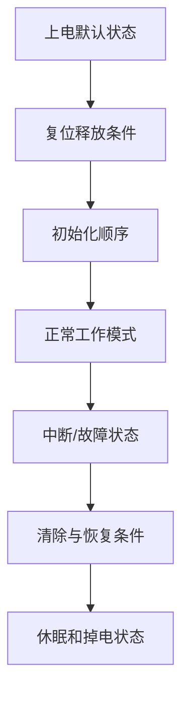

对 MCU 和复杂传感器，寄存器字段还要确认：

- Reset Value。
- Read/Write、Write-1-to-Clear 等访问语义。
- 保留位必须写入什么值。
- 配置生效时机和锁定机制。
- 多字节寄存器的字节顺序和一致性读取。

### 5.15 典型应用电路

典型应用图是起点，不是可直接复制的最终设计。

#### 5.15.1 逐项解释

对每个外围器件回答：

- 它用于偏置、补偿、滤波、去耦、保护还是配置？
- 数值来自公式、稳定性要求还是经验？
- 是否要求特定介质、ESR、DCR、精度或功率？
- 是否必须靠近某个引脚？
- 删除、改值或换封装会产生什么影响？

#### 5.15.2 匹配自己的条件

重新代入自己的输入范围、输出、负载、频率、精度、温度和层叠。评估板往往为展示性能而使用较高成本器件、宽松空间和特定测试条件，不一定直接满足产品成本和结构要求。

#### 5.15.3 对照多个参考

同时比较典型应用图、评估板原理图、参考 PCB 和 BOM。若三者不同，应理解差异是器件版本、性能优化、测试功能还是文档更新造成的。

### 5.16 外围器件计算

常见需要重新计算的项目：

- 稳压器反馈分压、补偿、电感和电容。
- 运放增益、偏置、滤波和稳定性。
- ADC 输入 RC、参考和驱动器。
- MOSFET 栅极电阻、驱动电流和损耗。
- 晶体负载电容和驱动功率。
- LED、电阻、上拉和终端。
- 传感器量程、桥路和校准参数。

计算记录应写明使用的数据手册参数、页码、公式假设和最坏条件。若使用厂商在线工具，也应保存输入条件和结果版本。

### 5.17 Layout Guidelines

布局指南通常决定器件能否达到数据手册性能。重点标记：

- 输入去耦、输出电容和参考电容的位置。
- 高频电流环路和开关节点。
- 功率地、模拟地、裸露焊盘和回流连接。
- 反馈、采样、差分和高阻节点。
- 晶振、天线和高速差分线。
- 禁铜区、热过孔、层叠和阻抗要求。

将布局要求直接转化为 PCB 约束：器件锁定距离、禁布区、网络类、差分规则、铜皮优先级和评审检查项。只在笔记中写“靠近芯片”是不够的。

### 5.18 封装与机械图

#### 5.18.1 尺寸与公差

封装图通常给出本体尺寸、引脚间距、引脚宽度、共面度、底部焊盘和最大高度。建库应使用推荐焊盘或 IPC 方法，并考虑制造公差，不应直接把器件最大外形当成焊盘尺寸。

#### 5.18.2 焊盘、阻焊和钢网

检查：

- Solder Mask Defined 或 Non-Solder Mask Defined。
- 阻焊扩展和最小阻焊桥。
- Paste 层开口和分窗比例。
- 裸露焊盘下的热过孔与吸锡风险。
- 通孔、槽孔、NPTH/PTH 和机械定位柱。

#### 5.18.3 Pin 1 与方向

同时在符号、封装、3D、装配图和丝印中核对 Pin 1。连接器还应从线束和配对端视角复核，避免“PCB 端看起来正确、实际线序镜像”。

### 5.19 热参数

#### 5.19.1 常见参数

- `TJ(max)`：最大结温。
- `θJA`：结到环境热阻，强烈依赖测试板和环境。
- `θJC`：结到壳或指定参考面的热阻。
- `ΨJT`、`ΨJB`：结温估算相关表征参数，不等同于热阻网络中的单一路径。
- Power Dissipation：通常绑定特定温度和 PCB 条件。

#### 5.19.2 使用方法

`θJA` 可用于早期估算，但不能脱离铜面积、层数、热过孔、气流和外壳直接套用。功率器件应结合损耗模型、热路径、数据手册推荐 PCB 和实测温度。

#### 5.19.3 降额曲线

额定功率或电流常在某个环境温度以上开始下降。若产品工作在高温外壳内，应使用对应降额后的能力，而不是室温标题参数。

### 5.20 保护与故障行为

“带保护”不表示系统安全。需要明确：

- 触发阈值的最小、典型和最大值。
- 响应时间和故障期间峰值应力。
- 锁存关断、自动重试还是折返限流。
- 保护动作时输出引脚和 Power Good 状态。
- 恢复需要断电、重新使能还是自动冷却。
- 重复故障是否造成热积累。

例如自动重试短路保护可能持续周期性加热负载；热关断是最后保护，不应作为正常温控方式。

### 5.21 勘误表与已知限制

勘误可能影响启动、通信、ADC、低功耗、调试和安全功能。处理流程：

1. 确认器件硅版本、掩膜版本或批次。
2. 筛选与本项目使用模块和模式相关的条目。
3. 记录触发条件、影响和官方规避方法。
4. 将规避措施落实到原理图、PCB、固件或测试中。
5. 判断规避方法是否破坏性能、功耗和兼容性。

“未来版本修复”不能解决当前采购器件的问题。若某缺陷影响核心功能且无可靠规避，应更换器件或调整需求。

### 5.22 仿真模型与参考设计

#### 5.22.1 SPICE 模型

用于模拟模拟器件、电源环路、瞬态和部分非线性行为。检查模型适用电压、温度、频率和仿真器版本。简化模型可能不包含保护、启动和极限行为。

#### 5.22.2 IBIS 模型

用于数字 I/O 信号完整性分析，包含驱动、钳位、封装和波形信息。应选择正确电压、封装和工艺角模型。

#### 5.22.3 参考设计

参考设计的价值在于原理图、PCB、BOM 和测试结果形成闭环。复用时记录哪些部分原样保留、哪些部分修改，以及修改后需要重新验证什么。

### 5.23 从需求开始选型

不要先搜索型号再反推需求。先建立需求表：

| 类别 | 需要定义的边界 |
| :--- | :--- |
| 功能 | 通道、拓扑、接口、模式和控制方式 |
| 输入 | 最小、典型、最大、浪涌和反接 |
| 输出 | 范围、精度、电流、负载和动态 |
| 性能 | 带宽、噪声、延时、效率和功耗 |
| 环境 | 温度、湿度、振动和 EMC |
| 安全 | 绝缘、故障能量、保护和认证 |
| 封装 | 尺寸、高度、散热、焊接和返修 |
| 供应 | 生命周期、第二来源、交期和成本 |
| 软件 | 驱动、工具、许可证和长期维护 |

每个条件标记为：

- **必须满足**：不满足即淘汰。
- **期望满足**：用于候选排序。
- **可协商**：可通过系统调整解决。
- **未知风险**：需要样品、仿真或厂商确认。

### 5.24 候选器件筛选流程

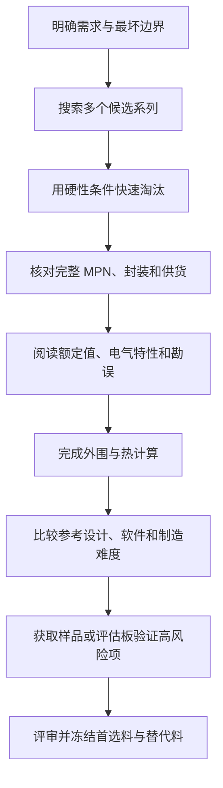

不建议只保留一个候选。至少对关键器件保留一个架构替代方向，即使无法做到完全 Pin-to-Pin 兼容，也能降低后续缺料风险。

### 5.25 选型评分矩阵

可用加权表比较候选，但评分不能掩盖硬性不符合项。

| 指标 | 权重 | 候选 A | 候选 B | 候选 C | 证据 |
| :--- | ---: | ---: | ---: | ---: | :--- |
| 功能符合度 | 25 |  |  |  | 数据手册章节 |
| 电气余量 | 20 |  |  |  | 最坏情况计算 |
| 热与效率 | 15 |  |  |  | 损耗与热估算 |
| PCB/制造 | 10 |  |  |  | 封装与布局 |
| 软件生态 | 10 |  |  |  | 驱动与工具 |
| 供应风险 | 15 |  |  |  | 生命周期与库存 |
| 成本 | 5 |  |  |  | 目标采购数量 |

评分表用于讨论，不替代工程判断。任何必须条件不满足，综合分再高也不能选用。

### 5.26 最坏情况与余量

器件选型至少检查以下组合：

- 最大输入、最大负载和最高环境温度。
- 最小输入、最大压差和启动峰值。
- 电阻、电容、参考和器件参数公差。
- 老化、直流偏压和温漂。
- 连接器、线缆和 PCB 压降。
- 故障期间的脉冲、SOA 和保护动作时间。

设计余量应说明依据。固定写“留 20%”并不适用于所有参数：电容耐压、MOSFET SOA、逻辑时序、热和安全间距需要不同方法。

### 5.27 分类选型重点

#### 5.27.1 电阻与电容

- 电阻：阻值、精度、TCR、功率、电压和脉冲。
- MLCC：有效容值、偏压、温度、封装和裂纹风险。
- 电解/聚合物：ESR、纹波、寿命、漏电和极性。

#### 5.27.2 电感与磁性器件

检查电感量测试条件、饱和电流、温升电流、DCR、磁芯损耗、SRF 和屏蔽。变压器还要检查绝缘、匝比、漏感和频率范围。

#### 5.27.3 二极管与 MOSFET

- 二极管：反向耐压、正向压降、漏电、恢复、浪涌和热。
- MOSFET：实际栅压下的 `RDS(on)`、`Qg`、SOA、体二极管、热和封装。

#### 5.27.4 运放、比较器与 ADC

- 运放：共模、输出摆幅、GBW、SR、失调、噪声和稳定性。
- 比较器：输入范围、迟滞、输出结构、传播延时和过驱动恢复。
- ADC：输入范围、参考、源阻抗、采样时间、ENOB、INL/DNL 和接口时序。

#### 5.27.5 电源芯片

检查输入输出、拓扑、最大占空比、限流、启动、工作模式、补偿、外围器件、热和布局。额定最大电流通常不能脱离输入电压和散热条件理解。

#### 5.27.6 MCU 与数字器件

检查存储、外设、引脚复用、电源域、Boot、调试、时钟、封装、勘误、软件工具和生命周期。逻辑器件还要检查阈值、驱动、传播延时和上下电状态。

#### 5.27.7 连接器与机电器件

检查完整配对料号、电流、温升、触点材料、插拔寿命、线径、压接工具、防呆、锁扣、振动和结构空间。

### 5.28 封装核对流程

1. 从完整 MPN 找到对应封装代码。
2. 确认机械图是目标封装，而不是同系列其他选项。
3. 核对 Top/Bottom View、Pin 1 和编号方向。
4. 获取推荐焊盘、阻焊和钢网说明。
5. 检查裸露焊盘、热过孔、槽孔和定位柱。
6. 将符号引脚与物理焊盘逐一对应。
7. 对照供应商图片、样品和 3D 模型。
8. 特殊连接器和模块进行 1:1 打印或实物试放。
9. 由另一人独立复核关键封装。

封装核对结果应形成清单，而不是只口头确认“看过了”。

### 5.29 第二来源与替代料

替代料分为：

- **完全兼容**：引脚、功能、电气、软件和封装均满足，可直接替换。
- **条件兼容**：需要改变外围值、固件配置、BOM 或测试参数。
- **设计兼容**：预留双封装、跳线或不同布线，可在生产前选择。
- **架构替代**：需要改版，但保留系统功能和供应退路。

替代验证包括：

- 原理图与引脚审查。
- 最坏电气和热计算。
- PCB 与封装审查。
- 启动、掉电、故障和边界测试。
- 软件驱动与寄存器验证。
- EMC、精度和长期测试的必要回归。

### 5.30 生命周期与供应风险

#### 5.30.1 生命周期状态

关注 Active、Not Recommended for New Designs、Last Time Buy、Obsolete 等状态，以及制造商 PCN/EOL 通知。生命周期信息会变化，项目发布和采购前都应重新确认。

#### 5.30.2 供应链因素

- 授权渠道与可追溯性。
- 正常交期、最小包装和目标数量价格。
- 单一晶圆厂、封装厂或产地风险。
- 汽车、工业和商业等级的供应差异。
- 替代料验证成本和库存策略。

低单价但单一来源、交期长的器件，系统成本可能高于单价稍高但供应稳定的器件。

### 5.31 软件与工具生态

复杂器件还应检查：

- 官方驱动、HAL、Linux 驱动或中间件。
- 配置工具、代码生成器和编程器。
- 调试探针、量产烧录和安全配置。
- 库的许可证、维护状态和平台依赖。
- 示例代码是否匹配当前硅版本和 SDK。
- 固件升级、密钥、校准和数据格式的长期维护。

评估板演示可以运行，不等于软件可直接进入产品。需要判断代码质量、错误处理、资源占用和许可证。

### 5.32 样品与评估板验证

高风险器件在正式 PCB 前可使用评估板验证：

- 输入输出和动态性能。
- 启动、掉电和故障恢复。
- 驱动、寄存器和软件工具。
- 功耗、温升、噪声和负载能力。
- 模型与数据手册理解是否正确。

评估板验证时记录跳线、供电、仪器、固件、寄存器和测试点。评估板具有不同层叠、散热和外围器件，结果不能无条件外推到自己的 PCB。

### 5.33 选型评审流程

关键器件在冻结前建议完成：

1. 需求与硬性条件复核。
2. 完整 MPN、封装和生命周期复核。
3. 数据手册关键页和勘误复核。
4. 电气、热、时序和外围计算复核。
5. 原理图、PCB 布局和测试点复核。
6. 软件、工具和量产烧录复核。
7. 首选料、替代料和采购渠道复核。
8. 样品测试和风险关闭。

评审结论应为“通过”“带条件通过”或“不通过”，并明确未关闭问题、负责人和截止阶段。

### 5.34 选型记录模板

```markdown
# 器件选型与数据手册记录

- 项目：
- 模块：
- 文档作者：
- 日期：

## 需求

| 参数 | 最小 | 典型 | 最大 | 单位 | 必须/期望 | 来源 |
| :--- | ---: | ---: | ---: | :--- | :--- | :--- |
|  |  |  |  |  |  |  |

## 首选器件

- 制造商：
- 完整 MPN：
- 封装：
- 温度等级：
- 数据手册编号/版本：
- 勘误版本：
- 生命周期状态：

## 关键规格

| 项目 | 数据手册条件 | 保证值 | 设计条件 | 余量 | 页码/表格 |
| :--- | :--- | :--- | :--- | :--- | :--- |
|  |  |  |  |  |  |

## 设计要求

- 必要外围器件：
- 上电/掉电要求：
- 原理图注意：
- PCB 布局注意：
- 热设计：
- 软件与寄存器：
- 测试方法：

## 风险与替代

- 已知勘误：
- 供应风险：
- 替代料：
- 替代验证要求：
- 未关闭问题：
```

### 5.35 示例：为 5 V 转 3.3 V 小系统选择 LDO

#### 5.35.1 需求

- 输入：USB 5 V，考虑输入波动和线缆压降。
- 输出：3.3 V。
- 典型负载：80 mA。
- 峰值负载：200 mA。
- 要求：低噪声、Enable、可手焊或常规贴装。

#### 5.35.2 快速筛选

候选器件至少满足：输入最大值有余量、输出固定 3.3 V、连续电流满足峰值、目标封装可制造、工作温度覆盖项目环境。

#### 5.35.3 深入检查

- 最大负载和最低输入时的 dropout。
- 5 V 输入、200 mA 时的功耗：

```text
Ploss ≈ (5 - 3.3) × 0.2 = 0.34 W
```

- `θJA` 对应的 PCB 条件和预计结温。
- 输出电容容值、ESR、材质和有效容值。
- Enable 默认状态、软启动和掉电行为。
- PSRR 和噪声是否在目标频段满足系统需要。
- 限流和热关断是何种恢复模式。
- 输入掉电而输出被外部抬高时是否允许反向电流。

#### 5.35.4 PCB 与测试

输入输出电容紧靠引脚，地回路短；预留输入、输出和 Enable 测试点。样机测试空载、典型负载、峰值负载、输入范围、启动、掉电、纹波和温升。

这个例子说明，“输出 3.3 V、支持 200 mA”只完成了初筛，真正选型还必须覆盖稳定性、热、启动、反灌、布局和验证。

### 5.36 常见阅读与选型错误

- 只看首页和参数搜索结果，不读脚注和测试条件。
- 把 Absolute Maximum 当成推荐工作条件。
- 使用典型值进行安全、热和时序设计。
- 忽略不同后缀、封装和温度等级差异。
- 把 Pin Compatible 当作无需验证的完全替代。
- 抄典型应用图但更换外围值和封装后不重新计算。
- 只看原理图，不阅读 Layout Guidelines。
- 直接根据 `θJA` 计算结温，不确认测试板条件。
- 忽略 Errata、PCN、EOL 和硅版本。
- 只评估芯片单价，不计算外围、PCB、测试和软件成本。
- 只验证正常稳态，不测试启动、掉电、短路和边界。
- 选型结论没有记录数据手册版本和证据位置。

### 5.37 本章自测

1. 数据手册、参考手册、应用笔记和勘误分别解决什么问题？
2. 为什么 Absolute Maximum Ratings 不能作为正常设计点？
3. Electrical Characteristics 中的 Typical 值可以用于哪些场景，不能用于哪些场景？
4. 为什么同一个参数必须连同温度、负载和测试电路阅读？
5. 如何判断一个引脚图是顶视图还是底视图？
6. 为什么芯片 HBM ESD 等级不能替代外部接口系统 ESD 设计？
7. 典型应用电路中的电容可以随意更换介质和封装吗？
8. `θJA` 为什么不能被视为器件固定不变的参数？
9. Pin-to-Pin 替代还需要验证哪些电气、软件和生产条件？
10. 为什么评估板测试通过后，自己的 PCB 仍需重新验证？
11. PCN、EOL 和勘误如何进入项目版本管理？
12. 如何为关键器件建立可复查的选型证据链？

能够从官方文档中快速定位这些答案，并把结论落实到需求表、原理图、PCB 规则和测试计划中，才算真正具备数据手册阅读和器件选型能力。

---

## 6. 常用工具与仪器

### 6.1 本章学习目标

学完本章后，应能够：

- 根据项目阶段配置基础、进阶和专项工具，而不是盲目购买仪器。
- 正确连接稳压电源、万用表、示波器、逻辑分析仪和电子负载。
- 理解带宽、采样率、分辨率、输入阻抗、探头负载和接地对测量结果的影响。
- 使用触发、长存储、游标、数学运算和协议解码捕获偶发问题。
- 测量电源启动、纹波、负载阶跃、效率、温升和通信波形。
- 选择合适的焊接、返修、放大观察和清洁工具。
- 记录测量条件、不确定度和原始数据，使结果能够复现。

### 6.2 仪器不是旁观者

任何测量都会改变被测电路。仪器通过输入电阻、输入电容、接地、线缆、分流器和采样算法参与电路。

常见影响包括：

- 万用表输入电阻使高阻分压输出降低。
- 电流档的分流电阻产生 Burden Voltage，改变被测电路电压。
- 示波器探头电容减慢高速边沿或使振荡器停振。
- 长探头地线产生寄生电感，制造并不存在的振铃。
- 逻辑分析仪只显示越过数字阈值后的状态，隐藏过冲和噪声。
- 台式仪器保护地建立额外回流或直接短路浮地节点。

测量前应画出“仪器接入后的等效电路”，至少考虑输入阻抗和接地路径。

### 6.3 测量系统的关键指标

| 指标 | 含义 | 常见误区 |
| :--- | :--- | :--- |
| 精度 Accuracy | 测量值接近真实值的程度 | 与显示位数混淆 |
| 分辨率 Resolution | 能显示或区分的最小变化 | 分辨率高不代表准确 |
| 带宽 Bandwidth | 可在规定误差内测量的频率范围 | 只按信号基频选择 |
| 采样率 Sample Rate | 每秒采集样本数量 | 高采样率不等于高模拟带宽 |
| 存储深度 Memory Depth | 单次捕获可保存的样本数 | 深存储下实际刷新变慢 |
| 输入阻抗 | 仪器对电路形成的负载 | 忽略探头电容和终端 |
| 噪声底 | 仪器自身噪声水平 | 把仪器噪声当成电路噪声 |
| 动态范围 | 同时分辨大信号和小信号的能力 | 只看 ADC 位数 |
| 共模范围 | 差分测量可承受的公共电压 | 只检查差模电压 |

### 6.4 分阶段工具配置

#### 6.4.1 入门最低组合

- 可调稳压电源，支持恒压、恒流和输出开关。
- 数字万用表，支持电压、电流、电阻、通断和二极管。
- 恒温烙铁、焊锡、助焊剂、镊子、吸锡带和剪钳。
- ESD 台垫、合规腕带、耐热垫和良好照明。
- USB 转串口和目标 MCU 下载器。
- 放大镜或基础显微观察设备。

#### 6.4.2 PCB 调试组合

- 基础数字示波器与合适的无源探头。
- 逻辑分析仪和协议解码软件。
- 电子负载。
- 热像仪或热电偶温度计。
- 可调热风返修台和更完善的显微镜。

#### 6.4.3 进阶专项工具

- 差分探头、电流探头和高压额定探头。
- 函数/任意波形发生器。
- LCR 表、源表和精密基准。
- 频谱分析仪、近场探头、VNA 或阻抗分析仪。
- 自动测试夹具、数据采集和环境试验设备。

购买顺序应由项目风险决定。没有正确探头和测试方法时，升级更高带宽示波器往往不能解决问题。

### 6.5 可调稳压电源

#### 6.5.1 CV 与 CC 模式

- CV：恒压模式，输出电压维持设定值，电流由负载决定。
- CC：恒流模式，负载试图取更大电流时，电源降低电压以限制电流。

首次上电应同时设定电压和限流，并观察电源当前处于 CV 还是 CC。板卡进入 CC 不一定是电源故障，通常表示负载电流超过限流设定或存在短路。

#### 6.5.2 正确连接顺序

1. 关闭输出。
2. 设置电压和限流。
3. 核对正负极和通道模式。
4. 使用合适线径连接，必要时远端采样。
5. 再次确认板卡输入范围。
6. 打开输出并观察电流、状态和温升。

#### 6.5.3 线缆与远端采样

大电流时，电源线和夹具压降不可忽略。Remote Sense 可补偿线缆压降，但采样线断开、反接或错误连接可能导致输出异常。使用前应阅读电源手册，并在负载端同时用万用表确认电压。

#### 6.5.4 多通道电源

通道可能独立、共地、串联跟踪或内部关联。串联、并联和正负电源连接前确认每通道浮地能力、最大对地电压和保护地关系。

#### 6.5.5 电源动态能力

台式电源显示通常刷新较慢，不能代替示波器捕获微秒级启动电流和电压跌落。无线模块、电机和大电容启动问题需要在负载端测量动态波形。

### 6.6 数字万用表

#### 6.6.1 电压测量

电压档并联到被测节点。高阻节点需检查万用表输入电阻；低电压精密测量需关注量程精度、温漂、噪声和表笔接触热电势。

#### 6.6.2 电流测量

电流档串联到回路。误将电流档并联到电源会形成短路。使用后立即把表笔恢复到电压/电阻插孔。

电流档内部采样电阻会产生压降：

```text
Vburden = I × Rshunt
```

低功耗电路可能因为这个压降改变工作状态。微安睡眠电流与安培峰值同时存在时，可考虑专用电流分析仪、分流器或电流探头。

#### 6.6.3 电阻与通断

测量前必须断电并确认储能已释放。通断蜂鸣阈值由仪表决定，大电容充电或低阻负载可能短暂蜂鸣。板上测阻还会受到并联支路影响。

#### 6.6.4 二极管档

适合比较 PN 结、LED 和 MOSFET 体二极管的正反向压降。不同仪表测试电流和开路电压不同，不能把读数直接当成器件在工作电流下的压降。

#### 6.6.5 四线制测量

低阻测量中，表笔和接触电阻可能大于被测值。四线 Kelvin 测量用一对线提供电流、另一对线测电压，可降低引线压降影响。

### 6.7 示波器基础

示波器显示电压随时间变化。基本控制包括：

- 垂直档位 `V/div`。
- 水平时基 `s/div`。
- 触发源、触发电平和触发类型。
- AC/DC 耦合。
- 带宽限制。
- 采样率、存储深度和采集模式。
- 通道输入阻抗与终端。

#### 6.7.1 带宽与上升时间

一阶近似关系：

```text
BW × tr ≈ 0.35
```

要准确观察快速边沿，仪器和探头带宽应高于信号的有效频率成分。只按时钟频率选带宽会低估需求，因为数字信号信息还包含边沿谐波。

#### 6.7.2 采样率与存储深度

采样率决定时间离散程度，存储深度决定高采样率下能观察多长时间：

```text
记录时长 ≈ 存储点数 / 采样率
```

捕获长时间偶发故障时，需要在时间跨度、采样率和存储深度之间权衡。

#### 6.7.3 ADC 分辨率与垂直范围

信号只占屏幕很小部分时，有效垂直分辨率下降。测小纹波应合理设置偏置、量程和带宽限制，必要时使用高分辨率采集模式，但不要把数字处理后的平滑误认为真实带宽提升。

### 6.8 无源示波器探头

#### 6.8.1 1× 与 10×

1× 探头输入电容通常更大、带宽更低，适合低频小信号；10× 探头对电路负载更小、带宽更高，是常用选择。示波器通道倍率必须与探头一致，否则读数比例错误。

#### 6.8.2 探头补偿

无源探头应使用示波器校准方波进行补偿。欠补偿和过补偿都会扭曲边沿，使方波看起来圆钝或过冲。

#### 6.8.3 接地附件

- 长鳄鱼地线：连接方便，但寄生电感大。
- 短地弹簧：适合高速和电源纹波。
- 同轴/焊接连接：适合重复、低噪声和高带宽测量。

探头尖端到地的环路越大，越容易拾取磁场噪声并产生假振铃。

### 6.9 差分探头

差分探头用于测量两个非地节点之间的电压，例如半桥开关节点、电流采样电阻两端和隔离侧信号。

选择时检查：

- 最大差模电压。
- 最大共模电压及频率降额。
- 共模抑制比 CMRR 随频率的变化。
- 带宽、噪声和输入电容。
- 衰减档、零点和探头供电。
- 测量类别和安全额定。

即使差分电压很小，共模电压也可能很高。超过共模范围会产生错误读数甚至损坏探头。

### 6.10 电流探头与分流器

#### 6.10.1 电流探头

电流探头可观察启动、纹波、PWM、电机和开关环路电流。检查量程、带宽、最大峰值、钳口方向、消磁和零点漂移。

#### 6.10.2 分流器测流

```text
I = Vshunt / Rshunt
```

选择分流器时检查阻值、功率、TCR、带宽和 Kelvin 连接。示波器测高侧分流器时需使用合适差分探头，不能把普通探头地夹接到高侧节点。

#### 6.10.3 动态范围

同一设备可能同时有微安睡眠电流和安培发射峰值。单一量程很难兼顾，需要分段测量、不同分流器或专用电源分析工具。

### 6.11 示波器触发与采集模式

#### 6.11.1 常用触发

- 边沿触发：观察周期信号和启动边沿。
- 脉宽/毛刺触发：捕获异常窄或异常宽脉冲。
- 欠幅/Runt 触发：捕获未达到正常逻辑幅度的脉冲。
- 超时触发：捕获信号长时间不翻转。
- 串行协议触发：按地址、数据或错误条件捕获。

#### 6.11.2 采集模式

- Sample：保留原始采样，通用模式。
- Peak Detect：更容易发现窄毛刺。
- Average：降低随机噪声，但会隐藏非重复偶发事件。
- High Resolution：通过数字处理提高垂直有效分辨率，带宽会变化。

使用平均前先确认问题是否重复，否则可能把真正故障平均掉。

#### 6.11.3 单次捕获

首次上电、复位、负载突变和偶发死机适合 Single 模式。触发前设置足够预触发比例，保留故障发生前的波形。

### 6.12 电源波形测量

#### 6.12.1 纹波

- 在负载引脚附近测量，而不只测电源入口。
- 使用短地弹簧或同轴。
- 记录全带宽和规定带宽限制下的结果。
- 区分周期纹波、随机噪声和开关尖峰。

#### 6.12.2 启动与掉电

同时观察输入、输出、Enable、Power Good、Reset 和负载电流。检查单调性、过冲、时序、反向电流和重复快速上电。

#### 6.12.3 负载阶跃

用电子负载、MOSFET 夹具或固件工作模式产生可重复负载变化，测量电压跌落、过冲、恢复时间和振铃。测量夹具的寄生参数也会影响结果。

### 6.13 函数与任意波形发生器

可用于产生正弦、方波、脉冲、扫频和自定义波形。主要参数包括频率范围、幅度、偏置、输出阻抗、上升时间和同步输出。

#### 6.13.1 50 Ω 负载陷阱

许多信号源按 50 Ω 负载显示幅度。若输出接高阻示波器，实际端口电压可能与面板显示不同。必须确认信号源的 Load 设置、输出阻抗和终端方式。

#### 6.13.2 直流偏置

幅度与偏置组合后，输出峰值不能超过仪器能力。把带负偏置或超出输入范围的信号接入芯片前，应检查钳位电流和绝对最大额定值。

#### 6.13.3 常见用途

- 测滤波器频率响应。
- 给 ADC 或比较器注入已知信号。
- 模拟传感器输出。
- 验证时钟、复位和中断输入边界。

### 6.14 电子负载

#### 6.14.1 常见模式

- CC：恒流，最常用于电源测试。
- CV：恒压，适用于特定源和电池模拟场景。
- CR：恒阻。
- CP：恒功率，电压下降时会增加电流，应注意稳定性。

#### 6.14.2 关键参数

检查最大电压、电流、功率、最小工作电压、动态响应、输入阻抗、远端采样和散热。额定电压、电流和功率通常不能同时达到。

#### 6.14.3 动态负载

设置高低电流、上升下降时间、占空比和频率。连接线过长会增加电感，使负载端波形与电源端不同。高速阶跃最好使用紧凑夹具并在 DUT 端测量。

#### 6.14.4 电池测试边界

电池放电需要欠压停止、温度监控、极性保护和能量评估。普通电子负载不等于完整电池安全测试系统。

### 6.15 逻辑分析仪

逻辑分析仪适合长时间观察大量数字通道和协议内容，例如 UART、I²C、SPI 和 GPIO 时序。

#### 6.15.1 采样率与阈值

采样率应足以观察最短脉冲和协议时序，而不仅是总线标称频率。输入阈值要与电压域匹配；部分廉价设备阈值固定，可能误判低电压信号。

#### 6.15.2 接地与通道

使用短地线并为高速通道提供邻近地。许多并行长飞线会增加负载和串扰。逻辑分析仪地与电脑地、电路地的关系也需确认。

#### 6.15.3 与示波器配合

逻辑分析仪回答“协议发生了什么”，示波器回答“电气波形为什么变成这样”。通信故障应先确认电平和边沿，再依赖协议解码。

### 6.16 串口工具、下载器与调试器

#### 6.16.1 USB 转串口

检查电压域、TX/RX 方向、共地、流控和接口类型。不要把 RS-232 电平直接连接 CMOS UART。部分模块的电源引脚会向目标板供电或反灌，应明确是否连接。

#### 6.16.2 MCU 下载调试器

常见功能包括烧录、单步、断点、寄存器、内存和 Trace。连接器应包含目标参考电压、地、时钟、数据和复位，并确保调试器不会向未上电目标反灌。

#### 6.16.3 调试日志

日志应包含时间、复位原因、固件版本和关键状态。高频日志可能改变实时性、电源和通信行为，故障复现时应记录日志级别。

### 6.17 LCR 表与阻抗测量

#### 6.17.1 测量条件

电阻、电容和电感的测量结果依赖测试频率、激励电平、串联/并联模型和直流偏置。读数必须连同这些条件记录。

#### 6.17.2 Open/Short 校准

夹具和测试线会引入开路电容与短路电感。精密测量前在实际夹具端进行 Open/Short 校准，必要时增加 Load 校准。

#### 6.17.3 典型应用

- 检查电感量、DCR 和器件偏差。
- 测电容、ESR 和频率特性。
- 对比来料、失效件和正常件。
- 验证分流器和低阻网络。

普通手持 LCR 表无法完整表征高频器件和带直流偏置条件，应理解其能力边界。

### 6.18 频率计、频谱分析仪与 VNA

#### 6.18.1 频率计

适合高精度测量稳定周期信号。检查输入幅度、耦合、触发阈值、闸门时间和参考时钟精度。

#### 6.18.2 频谱分析仪

显示信号能量随频率的分布，可用于时钟谐波、开关噪声、杂散和调制分析。输入前检查最大直流和射频功率，必要时使用隔直、衰减器和限幅保护。

#### 6.18.3 VNA

矢量网络分析仪用于测量 S 参数、阻抗、回波损耗、滤波器和天线。结果高度依赖校准平面、连接器、线缆和夹具去嵌。未经校准的曲线只能作为粗略趋势。

### 6.19 EMI 预调试工具

- 近场磁探头：寻找高 `di/dt` 电流环路和局部磁场。
- 近场电探头：寻找高 `dv/dt` 节点和电场耦合。
- 电流探头：观察线缆共模电流。
- LISN、频谱仪和瞬态注入设备：用于更规范的传导测试。

近场扫描适合定位相对热点，不等于正式辐射结果。扫描时记录探头方向、距离、频率、工作模式和仪器设置，才能比较修改前后差异。

### 6.20 热像仪、热电偶与测温

#### 6.20.1 热像仪

适合快速寻找发热点和热扩散路径。金属、焊锡和亮面器件发射率低，可能反射环境温度。可在允许位置贴高发射率胶带或使用热电偶交叉验证。

#### 6.20.2 热电偶

适合记录指定位置的温度随时间变化。固定方式会影响热路径；测量点应明确是器件壳体、焊盘、空气还是散热器。

#### 6.20.3 结温估算

壳体温度不等于结温。需结合数据手册的热参数、功耗和测点定义估算，并在最坏环境、输入和负载下测试。

### 6.21 焊接工具

#### 6.21.1 恒温烙铁

选择合适功率、温控稳定性和烙铁头系列。大铜皮需要更好的热恢复能力，而不是简单提高温度。烙铁头尺寸应与焊盘和热容量匹配。

#### 6.21.2 焊料与助焊剂

焊料合金决定熔点和工艺窗口；助焊剂帮助去除氧化和改善润湿。使用与清洗方式、可靠性和生产工艺兼容的材料，并保持通风。

#### 6.21.3 常用辅助工具

- 精密镊子、斜口钳、剥线钳和压接工具。
- 吸锡带、吸锡器和低熔点返修合金。
- PCB 固定架、耐热胶带和预热台。
- 焊锡丝、锡膏、点胶针筒和钢网。

工具尖端、镊子和剪钳需要保持清洁、平整和无磁性要求时的适配性。

### 6.22 热风返修与回流工具

热风返修关注温度、风量、喷嘴、预热和邻近器件保护。风量过大会吹飞小器件，温度过高会损坏塑料连接器、PCB 阻焊和器件封装。

使用流程：

1. 明确目标器件、邻近风险和板层热容量。
2. 固定 PCB，保护塑料和热敏器件。
3. 适量加助焊剂并进行均匀预热。
4. 达到焊料熔化后再移动器件，不强行撬动。
5. 冷却后清洁并检查焊盘、过孔和邻近器件。

热板和小型回流炉适合重复贴装，但必须建立温度曲线，不能只按面板温度判断 PCB 实际温度。

### 6.23 显微观察与焊点检查

良好照明和显微镜通常比更高档烙铁更早提升返修质量。检查重点：

- Pin 1、极性和料值。
- 少锡、多锡、桥连、虚焊和立碑。
- 焊盘翘起、阻焊破损和锡珠。
- QFN 周边润湿和器件偏移。
- 连接器焊脚、机械固定脚和通孔填充。

BGA、LGA 和 QFN 底部焊点可能需要 X-Ray、电气测试或专用检测，外观正常不代表内部焊接正常。

### 6.24 EDA、仿真与制造检查软件

常用软件类别：

- 原理图与 PCB EDA。
- SPICE、电源和热仿真工具。
- IBIS/SI/PI 分析工具。
- Gerber、ODB++ 和 3D Viewer。
- BOM 管理、版本控制和差异比较。
- 串口、逻辑分析、示波器和自动测试软件。

软件只是实现手段。任何自动检查都需要正确规则和模型；ERC/DRC 通过不代表设计意图、回流、热和制造一定正确。

### 6.25 线缆、转接板与测试夹具

#### 6.25.1 线缆

测试线缆需要合适线径、长度、屏蔽、阻抗和连接器。长鳄鱼线适合低频临时连接，不适合高速、低噪声和大电流测量。

#### 6.25.2 转接板

转接板应清楚标注 Pin 1、电压域、方向和测试点。高速转接会增加支路、连接器和阻抗不连续，测试结果需包含转接板影响。

#### 6.25.3 测试夹具

夹具应提供稳定接触、防反插、限位、保护和可重复定位。电源、地和高速信号使用合适探针数量与布局。夹具自身也需要版本、维护和校准记录。

### 6.26 仪器接地与地环路

多个台式仪器、电脑 USB、电源和 DUT 连接后，可能通过保护地形成额外回路。常见后果：

- 浮地节点被意外拉到保护地。
- 小信号测量出现工频噪声。
- 两个地夹连接不同电位造成短路。
- USB 屏蔽或调试器向目标板反灌。

连接前画出所有地与屏蔽路径。解决地环路不能通过拆除保护地，而应使用正确拓扑、差分测量、隔离接口或单点连接方案。

### 6.27 校准、验证与参考件

#### 6.27.1 校准与功能检查

正式校准由合格流程完成；日常使用前仍应做功能检查：

- 万用表用已知电压、短路和开路确认基本状态。
- 示波器使用校准输出检查探头补偿。
- 电源用独立万用表确认输出和限流。
- 电子负载与分流器交叉核对电流。
- 热工具检查实际温度和热恢复。

#### 6.27.2 参考件

保留已知正常板、标准电阻、电容、线缆和探头作为对照。故障排查中，A/B 对比常比孤立分析单块故障板更有效。

#### 6.27.3 校准记录

记录仪器资产编号、序列号、校准日期、到期日期、固件版本和损坏维修历史。测量报告应能追溯到使用的具体仪器和探头。

### 6.28 测量自动化与数据记录

自动化适合负载扫描、温升、效率、长期运行和批量测试。基本结构：

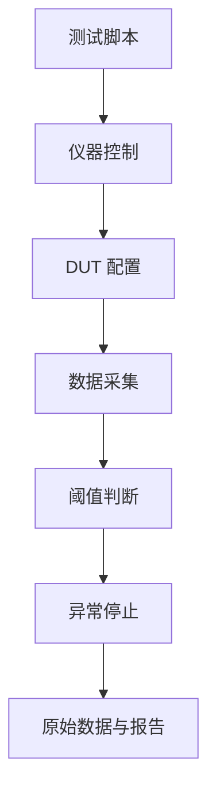

自动化应具备：

- 明确的安全限值和超限断电。
- 仪器与 DUT 身份记录。
- 输入、负载、温度和固件版本记录。
- 原始数据保存，而不只保存最终“通过”。
- 断线、超时、通信失败和脚本异常处理。

脚本错误也可能损坏硬件，首次自动测试应在保守限值下人工监控。

### 6.29 测量计划与纪律

每次测量前写清：

1. 要验证的需求是什么？
2. 理论预期和允许范围是什么？
3. 哪个测点最能区分不同故障假设？
4. 仪器带宽、量程、输入阻抗和接地是否合适？
5. 输入、负载、温度、固件和工作模式是什么？
6. 异常停止条件和断电方式是什么？

执行时遵守：

- 一次只改变一个变量。
- 先保存异常，再尝试修复。
- 同时记录仪器设置和探头连接照片。
- 不只测“能工作”，还测边界、启动和故障恢复。
- 对可疑结果使用第二种方法交叉验证。

### 6.30 工具购买优先级

#### 6.30.1 优先投资

- 安全可靠的稳压电源和万用表。
- 合适的烙铁头、镊子、助焊剂和放大观察。
- 探头附件、线缆、夹具和测试点设计。
- 与目标 MCU 匹配的正版或可靠调试器。

#### 6.30.2 按项目增加

- 做电源：电子负载、差分探头、电流探头和热工具。
- 做数字通信：示波器、逻辑分析仪和协议解码。
- 做模拟：低噪声信号源、精密万用表、LCR 和屏蔽夹具。
- 做 EMC/RF：频谱分析、近场探头、VNA 和规范校准件。

不要只比较仪器最大指标。探头质量、噪声、软件、接口、校准、维修和实际测量场景同样重要。

### 6.31 工具维护与耗材管理

- 定期检查表笔、探头、地线、夹子和线缆绝缘。
- 烙铁头保持上锡，避免长期高温空烧。
- 热风喷嘴、风道和过滤部件按要求清理。
- 电池供电仪器避免长期过放和漏液。
- 助焊剂、锡膏、胶和清洗剂记录批次、开封和保存条件。
- 探头附件、转接头和校准件分类存放，避免机械损伤。
- 故障或超期仪器贴出状态标签，避免被继续使用。

### 6.32 测量记录模板

```markdown
# 硬件测量记录

- 项目：
- PCB 版本：
- 固件版本：
- 日期/操作人：
- 测试目的：

## 条件

| 项目 | 设置 |
| :--- | :--- |
| 输入电源 |  |
| 负载 |  |
| 环境温度 |  |
| 工作模式 |  |

## 仪器

| 仪器/探头 | 型号或资产号 | 关键设置 | 校准状态 |
| :--- | :--- | :--- | :--- |
|  |  |  |  |

## 测量

| 测点 | 理论预期 | 允许范围 | 实测 | 结论 |
| :--- | :--- | :--- | :--- | :--- |
|  |  |  |  |  |

## 波形与附件

- 文件名：
- 探头连接照片：
- 原始数据：

## 异常与下一步

- 现象：
- 当前假设：
- 下一项单变量实验：
```

### 6.33 建议实践任务

1. 用万用表测量分压器，接入不同负载并观察负载效应。
2. 比较示波器 1×、10× 探头对 RC 边沿的影响。
3. 使用长地线和短地弹簧测同一方波，比较假振铃。
4. 设置电源限流，对电阻负载观察 CV/CC 切换。
5. 使用电子负载对 3.3 V 电源做静态和动态负载测试。
6. 用逻辑分析仪解码 I²C，同时用示波器检查上升时间。
7. 用 LCR 表在不同频率下测同一电容或电感。
8. 用热像仪和热电偶测同一器件，比较发射率与接触误差。
9. 建立一个自动负载扫描脚本，并加入超限断电。

每个实践都要记录仪器设置、连接方式、理论预期、结果差异和误差来源。

### 6.34 常见测量错误

- 万用表仍在电流档时并联到电源。
- 示波器地夹接到非地节点造成短路。
- 探头倍率与通道设置不一致。
- 使用长地线测高速节点并把假振铃当成真实波形。
- 只看示波器自动测量，不检查量程、触发和采样状态。
- 用平均模式隐藏偶发毛刺。
- 信号源设置为 50 Ω 负载，但实际接高阻输入导致幅度翻倍。
- 逻辑分析仪解码正常就断定信号质量正常。
- 电子负载在 CP 模式下引起源与负载环路不稳定。
- 热像仪直接读取亮面金属温度，不校正发射率。
- LCR 结果没有记录频率和串并联模型。
- 测量截图没有测点、探头和输入负载条件。

### 6.35 本章自测

1. 为什么仪器输入阻抗会改变高阻分压器的输出？
2. 稳压电源进入 CC 模式表示什么？
3. 万用表电流档的 Burden Voltage 会怎样影响低功耗电路？
4. 示波器带宽、采样率和存储深度分别解决什么问题？
5. 为什么 10× 探头通常比 1× 探头更适合观察快速边沿？
6. 什么情况下必须使用差分探头？
7. 平均采集模式为什么可能隐藏真实故障？
8. 信号源的 50 Ω 设置为什么会导致幅度理解错误？
9. 逻辑分析仪和示波器在通信调试中的职责有何不同？
10. LCR 测量为什么必须记录频率、激励和等效模型？
11. 热像仪为什么可能误判金属表面温度？
12. 一份可复现的测量记录至少应包含哪些条件？

能够正确连接这些仪器，并在不改变被测系统关键行为的前提下获得可重复结果，才算真正具备基础硬件测量能力。

---
# 第二篇：原理图与系统设计

## 7. 需求分析与系统架构

### 7.1 本章学习目标

学完本章后，应能够：

- 把模糊产品想法转换为明确、可测试、可追溯的硬件需求。
- 区分功能需求、性能需求、约束、假设和非目标。
- 建立系统框图、电源树、接口表、信号表和状态模型。
- 完成功耗、电流、数据带宽、引脚、热和成本的初步预算。
- 在原理图开始前识别电源、接口、结构、安全和供应链风险。
- 使用权衡矩阵和小型原型验证关键架构选择。
- 通过需求评审和架构评审形成受控基线，减少后期反复改板。

### 7.2 为什么先做需求分析

原理图可以表达“怎么连接”，但不能回答“为什么这样连接”和“什么情况下算成功”。如果需求没有定义，设计人员通常会自行假设输入电压、负载、通信距离、环境温度和成本，后期每发现一个遗漏就可能触发器件、PCB、外壳和软件联动修改。

需求分析的目标不是写长文档，而是尽早暴露冲突：

- 用户要求体积小，但峰值功率和散热很高。
- 希望使用 USB 供电，但负载峰值超过供电协商能力。
- 要求长线高速通信，却没有定义物理层和终端。
- 要求电池续航数月，但无线发射和传感器功耗未预算。
- 要求低成本，同时要求多层板、隔离和高精度器件。
- 要求现场升级，却没有调试、恢复和安全启动机制。

越早量化这些矛盾，修改成本越低。

### 7.3 需求来源与相关方

硬件需求可能来自：

- 最终用户和产品经理。
- 结构、工业设计和安装现场。
- 固件、软件、算法和云平台。
- 生产、测试、采购和售后。
- 安全、EMC、质量和行业规范。
- 已有产品兼容性和历史故障。

同一句需求在不同角色眼中含义不同。例如“支持 USB-C”可能分别意味着连接器外形、5 V 取电、数据通信、正反插、充电、PD 协商或高速模式。需求评审必须把这些含义拆开。

### 7.4 使用场景与用例

先描述产品在什么场景、由谁、如何使用：

| 场景 | 需要明确的问题 |
| :--- | :--- |
| 正常启动 | 谁供电、多久可用、默认输出是否安全 |
| 正常运行 | 工作模式、输入、输出和用户操作 |
| 峰值负载 | 哪些负载同时开启、持续多久 |
| 通信中断 | 是否重连、保持输出还是进入安全态 |
| 掉电重启 | 数据是否保存、外设是否反灌、如何恢复 |
| 维护升级 | 如何进入 Boot、如何回滚、接口是否可达 |
| 误操作 | 反插、短路、错误电源和热插拔 |
| 故障模式 | 传感器断线、过温、电机堵转和看门狗复位 |

用例应覆盖正常路径、边界路径和异常路径。只描述“用户按键后设备运行”不足以指导硬件设计。

### 7.5 功能需求

功能需求描述系统必须做什么，例如：

- 采集 4 路模拟电压和 2 路数字传感器。
- 通过 CAN 与上位机通信。
- 驱动一个 12 V 风扇并检测堵转。
- 存储最近 1000 条事件。
- 支持调试、固件升级和恢复出厂设置。

每条功能需求建议使用唯一编号：

```text
FR-001：设备应采集 0～3.0 V 模拟输入。
FR-002：设备应通过 CAN 上传采样结果。
FR-003：通信中断后风扇应进入预定义安全状态。
```

“支持”“兼容”“智能”“稳定”等词必须继续展开，否则无法验收。

### 7.6 性能与非功能需求

非功能需求描述功能需要达到什么水平：

| 类别 | 示例参数 |
| :--- | :--- |
| 精度 | 量程、绝对误差、重复性、温漂 |
| 速度 | 采样率、带宽、延时、响应时间 |
| 功耗 | 待机、典型、峰值、关机漏电 |
| 可靠性 | 工作寿命、启动次数、故障恢复 |
| 可维护性 | 测试点、日志、升级、模块替换时间 |
| 可制造性 | 工艺能力、测试时间、一次通过率目标 |
| 兼容性 | 电气、机械、协议和固件版本 |

例如“快速响应”应改写为“输入变化后 20 ms 内输出达到目标值的 95%”，并注明输入条件、滤波和负载。

### 7.7 一条合格需求的特征

合格需求应尽量做到：

- **唯一**：一条需求只描述一个主要目标。
- **明确**：术语和方向没有歧义。
- **可量化**：包含范围、阈值、时间或判定标准。
- **可实现**：技术、成本和周期上存在可行方案。
- **可验证**：能通过检查、分析、测试或演示确认。
- **可追溯**：能关联到来源、设计模块和测试用例。
- **有优先级**：明确必须、期望或可延后。

不合格示例：

```text
设备应尽可能低功耗并保持高速通信。
```

改写示例：

```text
NFR-PWR-001：在 25°C、每分钟上传一次数据的模式下，
设备平均输入电流应不高于 500 µA。

NFR-COM-001：接收命令后 100 ms 内应返回有效响应，
测试条件为 10 m 目标线缆和规定终端。
```

### 7.8 假设、约束与非目标

#### 7.8.1 假设

假设是尚未验证但当前设计依赖的条件，例如“外部电源具有 1 A 输出能力”。假设应有负责人和确认期限，不能长期隐藏在设计者脑中。

#### 7.8.2 约束

约束包括：

- 必须使用现有外壳和连接器。
- 必须兼容指定线束或旧版协议。
- PCB 层数、尺寸和成本上限。
- 指定器件、工具链或生产工厂。
- 适用安全和行业要求。

#### 7.8.3 非目标

明确本版本不做什么，例如不支持 USB 数据、不支持电池充电、不保证热插拔、不用于户外。非目标可以防止团队把未来需求误认为当前必须实现。

### 7.9 输入需求

输入不仅指电源，还包括模拟、数字、机械和环境输入。

#### 7.9.1 电源输入

- 标称、最小、最大和瞬态电压。
- 最大持续和峰值电流。
- 极性、连接器、线缆和接地。
- 反接、热插拔、浪涌、欠压和掉电。
- 多电源同时存在时的优先级与反灌。

#### 7.9.2 信号输入

- 电平、共模、频率、带宽和源阻抗。
- 正常、最大、负值和未上电输入。
- 线缆长度、屏蔽、连接器和 ESD。
- 开路、短路、反接和外部误驱动。

#### 7.9.3 用户与机械输入

按键、旋钮、编码器、触摸、插拔、振动和安装方向都可能成为系统输入，应定义防抖、寿命、防水、防呆和误操作行为。

### 7.10 输出与负载需求

输出要求需包含：

- 电压、电流、精度和纹波。
- 持续、峰值、启动和堵转负载。
- 容性、感性、阻性或非线性负载类型。
- 输出短路、开路、反灌和断线行为。
- 上电默认状态、掉电状态和故障安全态。
- 连接器、线缆压降和远端负载条件。

例如“驱动 1 A 电机”不足以选驱动器，应进一步定义堵转电流、PWM 频率、启动次数、制动方式、反电动势、线缆长度和环境温度。

### 7.11 接口需求

每个接口都应明确逻辑层、物理层和机械层：

| 层级 | 需要定义的内容 |
| :--- | :--- |
| 协议 | UART/I²C/SPI/CAN/USB 等及版本 |
| 时序 | 速率、延时、超时、主从和同步方式 |
| 电气 | 电平、共模、终端、偏置和隔离 |
| 线缆 | 长度、阻抗、屏蔽、线序和接地 |
| 连接器 | 系列、针脚、方向、锁扣和热插拔 |
| 保护 | ESD、浪涌、误接和反灌 |
| 故障 | 断线、短路、总线占用和恢复 |

#### 7.11.1 接口控制文档

跨板、跨团队或外部产品连接时，建立 Interface Control Document，简称 ICD。它应成为双方共同基线，避免原理图各自理解。

```markdown
| Pin | 名称 | 方向 | 电平/范围 | 默认状态 | 最大速率 | 保护 | 备注 |
| :--- | :--- | :--- | :--- | :--- | :--- | :--- | :--- |
| 1 | +5V_IN | 输入 | 4.75～5.25 V | - | - | 保险/TVS | 不允许反向供电 |
| 2 | UART_TX | 输出 | 3.3 V CMOS | 高 | 1 Mbps | 串阻/ESD | 从本板视角 |
```

接口表必须说明方向是从哪一块板或哪个系统视角定义。

### 7.12 环境与可靠性需求

环境需求至少评估：

- 工作与存储温度。
- 湿度、凝露和污染。
- 海拔、气压和散热条件。
- 振动、冲击、跌落和板弯。
- 粉尘、盐雾、腐蚀性气体和清洗剂。
- ESD、EFT、浪涌、射频干扰和磁场。
- 紫外、光照、气流和安装方向。

环境会改变器件额定能力、连接器接触、散热、绝缘和传感器准确度。需求中应说明测试条件和持续时间，而不只写“工业级”。

### 7.13 安全与合规需求

安全需求从危害和故障结果出发：

- 哪些节点可被用户触及？
- 单点故障是否会导致过热、起火、触电或危险运动？
- 保护地、隔离、保险和外壳分别承担什么作用？
- 电池、马达、加热器和大电容的最大故障能量是多少？
- 哪些标准、认证或客户规范适用？

安全功能应定义诊断覆盖、默认安全态、故障锁存、恢复方式和独立保护。不能只写“满足认证”，也不能在架构冻结后才开始考虑间距和隔离。

### 7.14 机械与结构需求

#### 7.14.1 PCB 约束

- 板框、厚度、孔位、禁布区和板边连接器。
- 最大器件高度、重量和散热器。
- 螺钉、支柱、卡扣、导轨和防呆。
- 天线净空、传感器窗口和气流通道。

#### 7.14.2 装配与维护

- 连接器插拔方向和手指空间。
- 排线弯曲半径和装配顺序。
- 调试口、测试点、保险丝和可更换器件可达性。
- 外壳拆装后是否需要重新校准或绝缘检查。

#### 7.14.3 数据交换

结构与硬件之间使用受控的板框、孔位、Keepout 和 3D 模型。任何机械变更都要反馈到 PCB，而不是依靠口头通知。

### 7.15 制造、测试与维护需求

需求阶段就应考虑：

- 预计产量和试产数量。
- PCB 层数、板厚、铜厚和特殊工艺限制。
- 最小封装、BGA/QFN、通孔和手焊比例。
- 单面或双面贴装、拼板和工艺边。
- ICT、飞针、功能测试或人工测试。
- 单板测试时间、校准时间和追溯信息。
- 固件烧录、序列号和密钥管理。
- 现场维修、更换和故障日志。

若产品要求低测试成本，架构应支持模块隔离、自检和快速连接，而不是在 PCB 完成后再寻找测点。

### 7.16 成本需求

成本不只是芯片价格：

```text
总成本 = BOM + PCB + SMT/焊接 + 结构 + 测试
       + 校准 + 报废返修 + 认证 + 采购与库存 + 维护
```

需求中应定义目标数量下的成本，而不是只看样品价。特殊封装、多层阻抗板、双面贴装、手工校准和长测试时间可能比某颗芯片的单价更重要。

可建立成本预算：

| 模块 | 目标成本 | 预计成本 | 风险 | 优化方向 |
| :--- | ---: | ---: | :--- | :--- |
| 电源 |  |  |  |  |
| 主控与存储 |  |  |  |  |
| 传感器 |  |  |  |  |
| 接口与保护 |  |  |  |  |
| PCB 与装配 |  |  |  |  |

### 7.17 生命周期与升级需求

需要定义：

- 预计生产年限和维护年限。
- 关键器件生命周期与第二来源。
- 固件升级、恢复和版本兼容。
- 校准数据和用户数据迁移。
- 旧版线束、板卡和上位机兼容。
- 停产物料替换和重新认证策略。

硬件接口和连接器一旦进入现场，修改成本远高于软件接口。应预留必要版本识别和兼容机制，但避免无边界“为了未来”增加复杂度。

### 7.18 需求优先级与变更

可以使用以下分类：

- Must：当前版本必须满足。
- Should：强烈期望，必要时可通过评审调整。
- Could：有资源时实现。
- Won't：当前版本明确不实现。

优先级不能由个人随意修改。需求变更应记录原因、影响范围、成本、周期、风险和批准人，并重新检查原理图、PCB、软件、结构和测试。

### 7.19 验收标准与验证方法

每条需求应分配验证方式：

- **检查 Inspection**：查看文件、装配、标识和结构。
- **分析 Analysis**：计算、仿真和公差预算。
- **测试 Test**：使用仪器施加条件并测量结果。
- **演示 Demonstration**：按用户流程展示功能。

示例：

```text
REQ-PWR-003：在输入 4.75～5.25 V、负载 0～200 mA、
环境 0～50°C 条件下，3.3 V 电源应保持在规定范围内。

验证：在输入最小/标称/最大、电流最小/典型/最大和温度边界下测试，
记录稳态电压、纹波、启动和温升。
```

### 7.20 需求追踪矩阵

需求追踪将“为什么设计”与“如何验证”连接起来：

| 需求 ID | 来源 | 架构模块 | 原理图页 | PCB 区域 | 测试用例 | 状态 |
| :--- | :--- | :--- | :--- | :--- | :--- | :--- |
| REQ-PWR-001 | 产品需求 | 电源入口 | P2 | 左上 | TP-PWR-01 | 开放 |
| REQ-COM-002 | 接口协议 | CAN | P5 | 板边 | TP-CAN-03 | 已验证 |

追踪矩阵能快速发现“有需求但没有实现”“有电路但没有需求”和“有设计但没有测试”的孤立项。

### 7.21 系统架构的目标

系统架构把需求分配到模块和接口，并控制复杂度。好的架构通常具有：

- 模块职责明确。
- 能量流、信号流和控制流清晰。
- 高风险模块可独立验证。
- 故障不会无控制扩散。
- 接口数量和耦合尽量少。
- 支持测试、升级、替代和维护。

架构不是把所有芯片画成方框，而是明确每个方框的边界、输入输出、资源和故障行为。

### 7.22 系统框图

先画框图，再画原理图。常见模块包括：

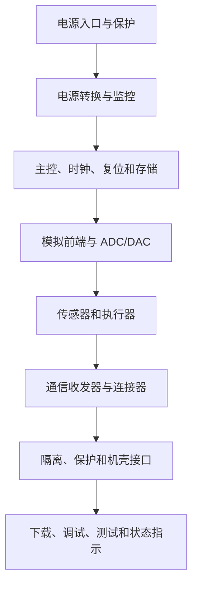

框图应标注：

- 电源轨和电压。
- 信号方向和接口类型。
- 隔离边界和地参考。
- 数据速率、关键带宽和峰值功率。
- 安全关键和高风险模块。

### 7.23 功能分区与模块边界

常见分区：

- 电源入口与高能量区。
- 数字处理与存储区。
- 模拟测量与参考区。
- 通信物理层与外部接口区。
- 电机、继电器和大电流驱动区。
- 隔离前后区域。

模块边界应尽量沿清晰接口划分。若多个模块共享复杂模拟节点、时钟或高电流回流，独立验证和故障隔离会变得困难。

### 7.24 电源树

电源树应描述从入口到每个负载的完整路径：

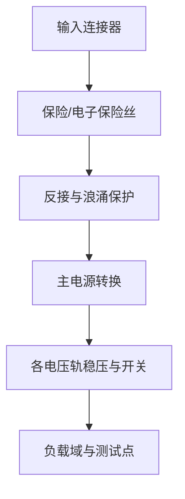

每条电源轨记录：

| 项目 | 内容 |
| :--- | :--- |
| 来源 | 输入电源或上一级稳压器 |
| 电压范围 | 最小、典型、最大和纹波 |
| 负载 | 模块和器件清单 |
| 电流 | 休眠、典型、峰值和启动 |
| 时序 | 上电、掉电和依赖关系 |
| 控制 | Enable、Power Good 和关断源 |
| 保护 | 限流、短路、过压和反灌 |
| 测试 | 测试点、分段和测流方式 |

### 7.25 电流与功耗预算

#### 7.25.1 负载表

| 模块 | 电源轨 | 休眠 | 典型 | 峰值 | 峰值持续 | 同时系数 | 数据来源 |
| :--- | :--- | ---: | ---: | ---: | :--- | ---: | :--- |
| MCU | 3V3 |  |  |  |  |  |  |
| 无线模块 | 3V3 |  |  |  |  |  |  |
| 传感器 | 3V3 |  |  |  |  |  |  |
| 电机 | VIN |  |  |  |  |  |  |

不能只把典型电流相加。需要判断哪些峰值会同时发生，并保留启动、温度和器件差异余量。

#### 7.25.2 输入功率

转换器输入功率粗略估算：

```text
Pin = Pout / η
Iin = Pin / Vin
```

电池和 USB 输入还应考虑线缆压降、保护器件损耗和最低输入电压下的最大输入电流。

#### 7.25.3 能量预算

电池系统使用工作周期计算平均功耗：

```text
Iavg = Σ(Istate × DutyState)
理论续航 ≈ 可用容量 / Iavg
```

真实续航还受温度、老化、自放电、转换效率、峰值能力和截止电压影响。

### 7.26 电源时序与状态

绘制上电和掉电时序，标注：

- 输入电源出现。
- 各电压轨达到稳定。
- Power Good 和 Reset 释放。
- 时钟启动。
- MCU 配置外设与负载。
- 故障时各输出关闭顺序。

检查外设先于主控上电、主控掉电而接口仍被驱动、快速重启和部分电源缺失等状态。必要时使用负载开关、隔离缓冲和电源监控器。

### 7.27 时钟、复位与启动架构

系统级时钟需求包括频率、精度、抖动、启动时间、同步关系和备份时钟。复位架构应覆盖：

- 上电复位。
- 欠压与棕断。
- 外部复位。
- 看门狗复位。
- 软件复位和升级复位。

每种复位应定义哪些模块重置、输出进入什么状态、复位原因如何记录。Boot 配置、下载接口和量产模式也应在架构阶段确定。

### 7.28 数据流、带宽与存储预算

数据链路预算应考虑：

```text
原始数据率 = 通道数 × 每样本位数 × 采样率
实际链路率 = 原始数据率 + 协议开销 + 重传与余量
```

还需评估：

- MCU 处理能力和 DMA。
- RAM 缓冲和最坏阻塞时间。
- Flash 擦写粒度与寿命。
- 通信总线利用率和仲裁。
- 时间戳、校验、日志和升级空间。

只按平均数据率选接口可能在突发、重传和多设备并发时失败。

### 7.29 引脚与资源预算

在选 MCU 或 FPGA 前建立资源表：

| 资源 | 需求 | 候选器件能力 | 余量 | 风险 |
| :--- | ---: | ---: | ---: | :--- |
| GPIO |  |  |  |  |
| ADC 通道 |  |  |  |  |
| UART/I²C/SPI |  |  |  |  |
| 定时器/PWM |  |  |  |  |
| DMA |  |  |  |  |
| Flash/RAM |  |  |  |  |

同时检查引脚复用冲突、封装差异、电源域、5 V 容忍、启动脚和调试口。纸面外设数量足够，不代表所需功能可以同时映射。

### 7.30 接地、隔离与机壳架构

在系统层先决定：

- 是否需要安全隔离、功能隔离或无隔离。
- 信号地、功率地、屏蔽层和机壳地如何关联。
- 外部线缆屏蔽在哪一端、以何种频率路径连接。
- 隔离边界上通过哪些信号和电源。
- ESD、浪涌和故障电流从哪里泄放。

不要在 PCB 布局阶段才临时决定“模拟地和数字地怎么分”。接地策略来自系统电流路径和安全边界。

### 7.31 热架构

热预算从模块损耗开始：

- 稳压器、MOSFET、电感和二极管损耗。
- MCU、无线和处理器工作模式功耗。
- 连接器、采样电阻和铜箔损耗。
- 外壳、气流、环境温度和邻近热源。

确定主要热源、允许结温、散热路径和温敏器件位置。若热设计依赖金属外壳、风扇或导热垫，这些结构必须成为明确需求和接口。

### 7.32 诊断、测试与维护架构

系统应能够回答“哪里坏了”：

- 电源轨是否正常。
- 时钟、复位和主控是否运行。
- 外部接口是否连接和收发。
- 传感器是断线、超量程还是通信失败。
- 负载是开路、短路、堵转还是过温。

建议提供：

- 电源与关键信号测试点。
- 串口或调试日志。
- 复位原因、故障码和运行计数器。
- 模块自检和环回模式。
- 可控的电源分段与负载禁用。
- 量产烧录、校准和序列号接口。

### 7.33 故障安全与降级模式

对每个关键故障定义：

1. 如何检测？
2. 多久检测到？
3. 检测后进入什么状态？
4. 是否自动恢复，恢复条件是什么？
5. 故障是否记录并对外报告？

安全状态不一定是“全部断电”。例如风扇控制器通信失效时，保持高转速可能比关闭更安全。具体状态由系统危害分析决定。

### 7.34 硬件安全与升级架构

联网或可升级设备还需考虑：

- 固件签名、版本和回滚策略。
- 调试接口在开发、生产和现场的权限。
- 密钥、序列号和校准数据存储。
- 升级掉电后的恢复路径。
- 外部存储和通信接口的未授权访问。

安全功能会影响 MCU、存储、Boot、测试和量产流程，应在架构阶段规划，而不是产品发布前临时关闭调试口。

### 7.35 风险分析

#### 7.35.1 风险清单

| 风险 | 触发条件 | 后果 | 严重度 | 发生可能 | 可检测性 | 当前措施 | 验证 |
| :--- | :--- | :--- | :---: | :---: | :---: | :--- | :--- |
|  |  |  |  |  |  |  |  |

风险来源包括新器件、未验证拓扑、特殊封装、高峰值电流、热、高速接口、长线通信、单一来源物料、未定结构和复杂软件依赖。

#### 7.35.2 FMEA 思维

对模块分析失效模式、原因、影响、现有控制和改进措施。严重度高的风险即使发生概率低，也应优先处理。风险优先数可以辅助排序，但不能替代对安全和法规风险的专业判断。

#### 7.35.3 风险关闭

风险只有在获得证据后才算关闭，例如：

- 样品或评估板测试。
- 计算和仿真评审。
- PCB 原型和边界测试。
- 厂商书面确认。
- 供应链第二来源验证。

“设计人员认为没问题”不是风险关闭证据。

### 7.36 架构权衡

常见权衡包括：

- LDO 与 Buck：噪声、效率、热、成本和面积。
- 两层与四层 PCB：成本、回流、EMC 和布局密度。
- 集成器件与分立方案：开发时间、灵活性和供应风险。
- 模拟处理与数字处理：噪声、精度、算力和可校准性。
- 隔离与非隔离：安全、共模、成本和电源复杂度。
- 单 MCU 与多控制器：耦合、实时性、故障域和软件复杂度。

使用权衡矩阵记录依据：

| 方案 | 功能 | 风险 | 成本 | 热 | PCB | 软件 | 供应 | 结论 |
| :--- | :---: | :---: | :---: | :---: | :---: | :---: | :---: | :--- |
| 方案 A |  |  |  |  |  |  |  |  |
| 方案 B |  |  |  |  |  |  |  |  |

### 7.37 高风险项原型验证

在完整 PCB 前，优先验证：

- 新电源拓扑的效率、纹波和热。
- 新传感器的噪声、安装和校准。
- 长线或高速接口的波形和抗干扰。
- 特殊封装、天线和结构空间。
- 电机、继电器和大电流负载的峰值与 EMI。
- 关键软件工具、驱动和升级路径。

原型可以是评估板、面包板、小模块 PCB 或仿真。原型目标是关闭具体风险，不是提前制作一个不可维护的完整产品。

### 7.38 架构评审与阶段门

#### 7.38.1 需求评审

- 需求是否明确、可测试且没有明显冲突？
- 输入、输出、接口、环境、安全和成本是否覆盖？
- 假设、约束和非目标是否清楚？
- 每条关键需求是否有验证方法？

#### 7.38.2 架构评审

- 模块边界和接口是否清楚？
- 电源、时序、地、热和安全架构是否完整？
- 资源、功耗、带宽和成本预算是否有余量？
- 高风险项是否有验证计划？
- 测试、升级、生产和维护是否可实现？

#### 7.38.3 阶段出口

评审结论分为通过、带条件通过和不通过。带条件通过必须列出未关闭项、负责人和在原理图冻结前必须获得的证据。

### 7.39 需求与架构基线

评审通过后建立基线：

- 需求版本。
- 系统框图和接口文档版本。
- 电源、功耗、资源和成本预算版本。
- 风险清单和未关闭问题。
- 关键架构决策与替代方案。

后续变更必须基于这个基线评估影响。没有基线时，团队无法判断某个修改是错误修复、需求变更还是范围扩张。

### 7.40 示例：低压 MCU 传感器节点

#### 7.40.1 初始想法

“做一块 USB 供电的 MCU 传感器板，通过串口输出数据。”

#### 7.40.2 需求展开

- 输入：USB-C 5 V，仅取电，不支持 USB 数据和 PD。
- 输出：3.3 V，峰值负载 250 mA。
- 传感器：一路 I²C 温湿度，一路模拟电压。
- 通信：3.3 V UART 调试输出。
- 启动：上电 1 s 内输出版本和传感器状态。
- 结构：板框、两个安装孔、接口位于板边。
- 环境：室内常温，无凝露。
- 安全：低压，输入具备限流、反接风险控制和 ESD 保护。
- 生产：首批 20 块，优先常规两层工艺和可手工返修封装。

#### 7.40.3 系统架构

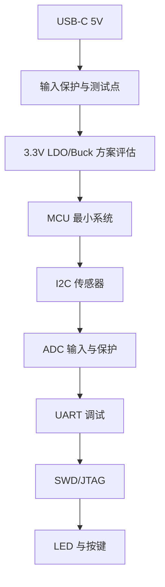

#### 7.40.4 关键预算

- 统计 MCU、传感器、LED 和扩展口峰值电流。
- 比较 LDO 的 5 V 到 3.3 V 损耗与温升。
- 评估 ADC 输入范围、分压、源阻抗和保护。
- 预留下载、UART、3.3 V、5 V、GND 和模拟输入测试点。

#### 7.40.5 主要风险

- USB-C CC 配置错误导致无法稳定取电。
- LDO 热余量不足。
- 模拟输入超过 MCU 允许范围。
- 传感器位置受稳压器和 MCU 热影响。
- UART 模块向未上电板反灌。

这些风险应在原理图开始前转化为具体设计和测试项。

### 7.41 需求与架构模板

```markdown
# 硬件需求与系统架构

- 项目：
- 版本：
- 日期：
- 负责人：

## 范围

- 产品目标：
- 使用场景：
- 非目标：
- 假设与约束：

## 需求

| ID | 类别 | 需求描述 | 优先级 | 验证方法 | 状态 |
| :--- | :--- | :--- | :--- | :--- | :--- |
|  |  |  |  |  |  |

## 系统框图

## 接口

| 接口 | 方向 | 电气范围 | 速率 | 连接器 | 保护 | 故障状态 |
| :--- | :--- | :--- | :--- | :--- | :--- | :--- |
|  |  |  |  |  |  |  |

## 电源树与预算

| 电源轨 | 来源 | 电压范围 | 典型电流 | 峰值电流 | 时序 | 负载 |
| :--- | :--- | :--- | ---: | ---: | :--- | :--- |
|  |  |  |  |  |  |  |

## 资源与成本

## 风险

| 风险 | 后果 | 当前措施 | 验证证据 | 负责人 | 状态 |
| :--- | :--- | :--- | :--- | :--- | :--- |
|  |  |  |  |  |  |

## 架构决策

| 决策 | 候选方案 | 选择 | 理由 | 影响 |
| :--- | :--- | :--- | :--- | :--- |
|  |  |  |  |  |
```

### 7.42 常见错误

- 先选 MCU 和电源，再询问真正需求。
- 使用“稳定、低功耗、高性能”等无法验收的描述。
- 只定义正常工作，不定义启动、掉电、误接和故障状态。
- 接口只写协议名，不写电平、线缆、终端、连接器和方向。
- 电源预算只相加典型电流，忽略同时峰值和效率。
- 选择器件时只看外设数量，不检查引脚复用和封装差异。
- 安全、EMC、结构和测试等到 PCB 完成后才考虑。
- 通过增加大量预留功能应对不确定需求，导致成本和复杂度失控。
- 风险清单只有描述，没有验证计划和关闭证据。
- 需求变更没有版本和影响分析，导致原理图、PCB、BOM 和测试不一致。

### 7.43 本章自测

1. 功能需求、性能需求、约束、假设和非目标有什么区别？
2. 如何把“设备要稳定、低功耗”改写为可测试需求？
3. 一个完整接口定义至少包含哪些逻辑、电气和机械信息？
4. 为什么功耗预算不能只使用典型电流相加？
5. 电源树中为什么要记录启动、掉电和反灌路径？
6. 系统框图与原理图分别解决什么问题？
7. 如何通过需求追踪矩阵发现设计和测试遗漏？
8. 哪些高风险项应该在完整 PCB 前用原型验证？
9. 什么情况下系统的安全状态不是“全部关闭”？
10. 架构评审带条件通过时必须留下哪些信息？
11. 为什么硬件版本冻结前要明确生命周期和替代策略？
12. 需求变更如何影响原理图、PCB、固件、结构和测试？

能够独立完成一份包含需求、框图、接口、电源预算、风险和验证方法的系统方案，并让另一位工程师据此开始原理图设计，才算真正完成了需求分析与系统架构阶段。

---

## 8. 原理图设计规范

### 8.1 本章学习目标

学完本章后，应能够：

- 把系统架构转换为层次清晰、易读、可检查的原理图。
- 正确使用符号、引脚电气类型、网络标签、电源符号和层次端口。
- 在原理图中表达电源树、电压域、默认状态、保护和测试策略。
- 正确处理电源脚、未使用脚、裸露焊盘、NC/DNC 和多单元器件。
- 为连接器、模拟、数字、电源、隔离和负载驱动建立统一表达规范。
- 使用 ERC 发现电气规则问题，并通过人工评审检查设计意图。
- 让原理图、封装、BOM、PCB 和制造资料保持可追溯一致。

### 8.2 原理图的工程作用

原理图不是“线连对即可”的中间文件，它同时承担：

- **电气定义**：器件之间如何连接。
- **设计说明**：每个模块为什么这样设计。
- **评审入口**：他人如何检查边界、风险和默认状态。
- **PCB 输入**：网络、封装、电源域和关键约束如何传递。
- **BOM 输入**：实际采购哪些完整型号和装配选项。
- **调试地图**：测试点、信号方向和模块边界在哪里。
- **维护文档**：未来改版和故障分析如何理解原设计。

一份高质量原理图应做到：不依赖设计者口头解释，也能让另一位工程师理解功能、核对参数并定位测点。

### 8.3 原理图质量标准

| 维度 | 合格标准 |
| :--- | :--- |
| 正确性 | 连接、极性、数值、封装和电压域正确 |
| 完整性 | 电源、保护、默认状态、测试和配置没有遗漏 |
| 可读性 | 分页合理，信号流清楚，交叉线少，命名统一 |
| 可检查性 | 关键参数、计算依据和风险可定位 |
| 可制造性 | 器件字段、封装、DNP 和替代条件明确 |
| 可维护性 | 版本、变更、接口和设计意图可追溯 |

ERC 通过只能说明满足已配置的电气规则，不能自动保证以上全部质量。

### 8.4 项目与页面信息

原理图项目应统一设置：

- 项目名称、硬件版本和文档状态。
- 作者、评审人和日期。
- 页码、总页数和页面标题。
- 公司或团队信息。
- 图纸尺寸、单位和文本规范。
- 受控库路径与项目配置。

版本字段应与 PCB 丝印、BOM 和发布包一致。草稿、评审版和发布版应有明确状态，避免将未评审文件用于生产。

### 8.5 原理图分层策略

#### 8.5.1 平铺式原理图

所有页面处于同一层，通过全局或页面标签连接。适合页数少、模块关系简单的项目，但全局网络过多时容易产生隐式连接。

#### 8.5.2 层次式原理图

顶层放系统框图和模块实例，子页通过层次端口连接。适合模块化、重复通道和多人协作，可限制网络作用域并清晰表达接口。

#### 8.5.3 选择原则

- 小型单板可使用适度平铺，但仍按功能分页。
- 中大型项目优先使用层次结构和明确接口。
- 重复通道使用可复用子页时，确认位号、网络和参数实例化规则。
- 不要为了“看起来高级”创建过深层次，使读者不断跳转。

### 8.6 推荐页面结构

常见页面顺序：

1. 封面、版本、系统框图和目录。
2. 电源入口、保护和主电源。
3. 各电源轨、负载开关和电源监控。
4. MCU/FPGA 最小系统、时钟和复位。
5. 存储、启动和调试接口。
6. 模拟前端、ADC/DAC 和参考源。
7. 传感器和扩展接口。
8. 通信收发器与外部连接器。
9. MOSFET、继电器、电机和其他负载驱动。
10. 测试点、配置、指示和生产功能。

页面应按系统信号流和调试顺序组织，而不是按器件型号分类。

### 8.7 页面布局与阅读方向

- 信号通常从左向右。
- 电源通常从上向下。
- 输入连接器放左侧，输出和负载放右侧。
- 控制器放中间，配置和反馈靠近对应模块。
- GND 符号朝下，正电源符号朝上。
- 避免导线绕过整页、无意义折线和密集交叉。
- 同一模块保留适当空白，用视觉边界帮助阅读。

阅读方向是规范而不是绝对限制。关键是同一项目保持一致，并让能量流和信号方向直观。

### 8.8 符号设计原则

#### 8.8.1 逻辑优先

原理图符号用于表达功能，不必机械复制封装物理引脚位置。可以把电源脚集中、同类接口分组，并让信号方向清楚。

#### 8.8.2 引脚编号必须物理一致

符号可以重新排列，但引脚编号必须与目标封装和数据手册一致。任何重映射都应通过独立复核。

#### 8.8.3 多单元器件

运放、逻辑门和电阻阵列常拆分为多个 Unit。必须确认：

- 所有单元均被放置或明确未使用。
- 电源单元未遗漏。
- 单元交换不会破坏 PCB 引脚和调试文档。
- 不同单元共享的裸露焊盘或公共引脚正确处理。

### 8.9 引脚电气类型

EDA 根据引脚类型执行 ERC。常见类型：

| 类型 | 含义 | 常见器件 |
| :--- | :--- | :--- |
| Input | 输入 | GPIO 输入、Enable、ADC |
| Output | 推挽或一般输出 | GPIO 输出、缓冲器输出 |
| Bidirectional | 双向 | 数据总线、GPIO |
| Tri-state | 可高阻输出 | 总线收发器 |
| Open Collector/Drain | 开集/开漏 | I²C、告警输出 |
| Power Input | 电源输入 | IC VDD、VSS |
| Power Output | 电源输出 | 稳压器输出、供电源 |
| Passive | 被动连接 | 电阻、电容、连接器 |
| No Connect | 无内部电气连接 | 特定 NC 引脚 |

引脚类型设置错误会造成误报或漏报。例如把所有连接器脚设为 Passive 可以减少 ERC 警告，却也失去检测两个推挽输出短接的能力。

### 8.10 位号、数值与字段

#### 8.10.1 位号

常见前缀：

```text
R 电阻    C 电容    L 电感    FB 磁珠
D 二极管  Q 晶体管  U 集成电路
J 连接器  TP 测试点 SW 开关
F 保险丝  T 变压器  Y 晶体/振荡器
```

位号应唯一、稳定，改版时避免无意义地全部重新编号，否则 BOM、装配图和故障记录难以比较。

#### 8.10.2 Value

Value 应对读图有意义，例如 `10k 1%`、`100n X7R`、`3V3 LDO`。完整 MPN 放在专用字段，不要把所有采购信息塞进 Value 导致图纸拥挤。

#### 8.10.3 建议字段

- Manufacturer。
- MPN。
- Package/Footprint。
- Voltage/Power/Accuracy 等关键规格。
- Supplier Part Number。
- DNP/Variant。
- Datasheet。
- Lifecycle/Alternative。

字段命名和导出规则在项目开始时统一。

### 8.11 数值书写规范

- 电阻使用 `4R7`、`4k7`、`1M0` 等不易丢失小数点的写法。
- 电容统一使用 `pF`、`nF`、`µF` 中最易读单位。
- 电感使用 `nH`、`µH`、`mH`。
- 精密器件标注精度、温漂或关键材质。
- 有极性电容标注耐压和极性。
- 关键电阻标注功率，关键电容标注有效容值要求。

同一项目不要混用 `0.1uF`、`100n`、`104` 表示同一容值，除非 BOM 规则明确。

### 8.12 网络命名原则

网络名应简洁、唯一、可搜索，并表达功能：

- `USB_D+`、`USB_D-`。
- `I2C1_SCL`、`I2C1_SDA`。
- `MOTOR1_PWM`、`MOTOR1_FAULT_N`。
- `ADC_TEMP_IN`、`VREF_2V5`。
- `RESET_N`、`BOOT0`。

避免：

- `NET1`、`SIGNAL_A` 等无语义名称。
- 只用器件引脚名，无法表达系统用途。
- 相似网络使用过于相近名称，例如 `3V3A` 与 `3V3_AUX`。
- 隐式空格、大小写或特殊字符造成工具兼容问题。

### 8.13 标签作用域

- Local Label：仅当前页面或当前层级使用。
- Hierarchical Label：通过子页接口连接。
- Global Label：整个项目范围连接。
- Power Symbol：通常具有全局或特殊电源语义。

优先使用最小必要作用域。全局标签使用过多会形成跨页隐式连接，使错误难以发现。层次接口应与系统框图一致。

### 8.14 低有效、差分与总线命名

#### 8.14.1 低有效

统一使用 `_N`、`#` 或工具支持的上划线之一，例如 `RESET_N`、`CS_N`。不要同一项目混用 `RESET_B`、`/RESET` 和 `nRESET`。

#### 8.14.2 差分对

使用明确成对名称，例如：

```text
USB_D+ / USB_D-
CAN_H / CAN_L
ETH_TX_P / ETH_TX_N
CLK_P / CLK_N
```

差分极性和 P/N 定义按接口数据手册核对，不能只凭命名猜测。

#### 8.14.3 总线

并行总线使用一致编号和范围，如 `DATA[0..7]`、`ADDR[0..15]`。检查位序、字节序和连接器针脚顺序，避免图上视觉顺序与实际编号相反。

### 8.15 电源网络命名

电源名应包含电压、用途和必要的状态：

- `+5V_USB`：USB 输入后的 5 V。
- `+5V_PROT`：保护后的 5 V。
- `+3V3_SYS`：系统数字电源。
- `+3V3_A`：模拟电源域。
- `+1V8_CORE`：核心电源。
- `VBAT_RAW`：电池原始电压。
- `VREF_2V5`：2.5 V 参考。

不要把保护前后的网络都叫 `+5V`，否则 PCB 上可能绕过保险、开关或滤波器。地网络也应明确 `GND`、`CHASSIS`、`AGND`、`PGND`、隔离侧地等含义，并说明连接策略。

### 8.16 电源树的原理图表达

电源页面应从入口到负载清楚展示：

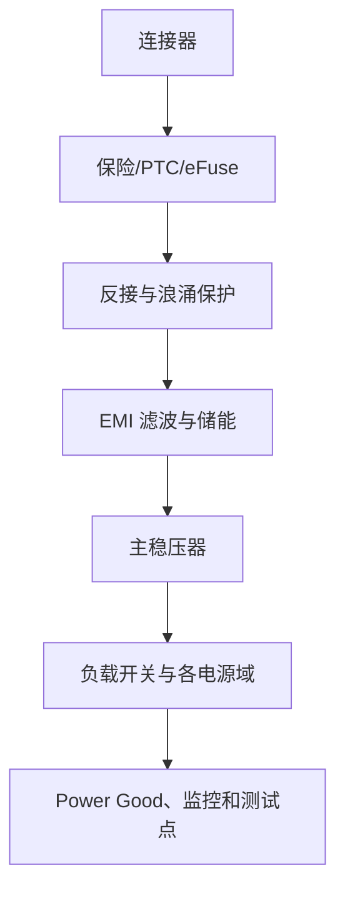

标注每条电源轨的电压范围、最大电流、Enable 来源和主要负载。多电源系统增加时序图或状态说明。

### 8.17 Power Flag 与电源驱动关系

许多 EDA 需要明确某个网络由 Power Output 驱动。连接器输入、跳线或无源保护后的电源可能需要 Power Flag，表示该网络有合法电源来源。

Power Flag 只用于告诉 ERC 电源存在，不能修复真实电路中没有供电、反接或保护路径错误的问题。每个 Flag 都应有明确物理来源。

### 8.18 去耦与储能的表达

- 每个 IC 电源脚附近显示对应去耦电容。
- 多个相同去耦可以集中绘制，但必须明确数量和对应电源域。
- BGA、多电源域和高速器件建议按电源组标注去耦阵列。
- 储能电容、输入电容和参考电容与普通去耦区分。
- 标注必须使用的材质、ESR、耐压和有效容值。

不要只在页面角落放一组“通用电容”，让读者无法判断每个引脚是否得到处理。

### 8.19 Reset、Enable、Boot 与默认状态

这些引脚必须分析三个阶段：

1. 电源未稳定时。
2. MCU 尚未配置 GPIO 时。
3. 正常软件运行和故障复位时。

原理图应清楚表示：

- 内部与外部上下拉。
- RC、复位监控和开漏连接。
- 外部调试器或连接器是否会驱动。
- 默认状态是否关闭危险负载。
- 测试点和强制配置方式。

不要把安全状态依赖于 MCU 启动后的第一行代码。

### 8.20 时钟与晶振

原理图需包含：

- 晶体或振荡器完整型号和频率。
- 负载电容、偏置或串联电阻。
- 时钟输入输出电平和供电。
- Enable/OE 默认状态。
- 备用时钟或外部时钟选择。
- 布局说明和测量限制。

晶体负载电容不能仅按标称 `CL` 直接各放一个相同值，应结合两个电容的串联等效和寄生计算。

### 8.21 未使用引脚、NC 与保留脚

- 未使用数字输入按数据手册固定或在固件中配置，不悬空。
- 未使用模拟输入按建议连接，避免噪声和额外功耗。
- 未使用输出通常可悬空，但确认是否需要禁用。
- `NC`、`DNC`、Reserved 必须按手册处理。
- EDA 中真正未连接的引脚使用 No Connect 标记，不能用短小悬空线假装连接。

No Connect 标记表示设计者有意不连接，应只在核对数据手册后使用。

### 8.22 裸露焊盘与散热焊盘

确认裸露焊盘的：

- 电气网络，通常是 GND、PGND 或特殊节点。
- 是否必须连接和允许连接的范围。
- 热过孔数量与位置。
- 钢网分窗和焊锡空洞要求。
- 是否可用作唯一地连接。

原理图符号应包含裸露焊盘引脚或明确注释，避免封装存在焊盘但网络未分配。

### 8.23 连接器设计

#### 8.23.1 视角与针脚

连接器必须从 PCB 端、线束端和配对端三种视角核对。原理图旁可增加针脚功能表，说明方向以本板为参考。

#### 8.23.2 电源与地针

多个电源或地针不能默认平均分流。检查单针额定、连接顺序、先接地、热插拔、反插和未完全插入状态。

#### 8.23.3 外部误接

对外连接器考虑：

- 错误电压和极性。
- 相邻针脚短路。
- 未上电时被外部信号驱动。
- USB、串口和调试器反灌。
- 线缆屏蔽和机壳连接。

### 8.24 外部接口保护

保护链应按干扰进入方向绘制：

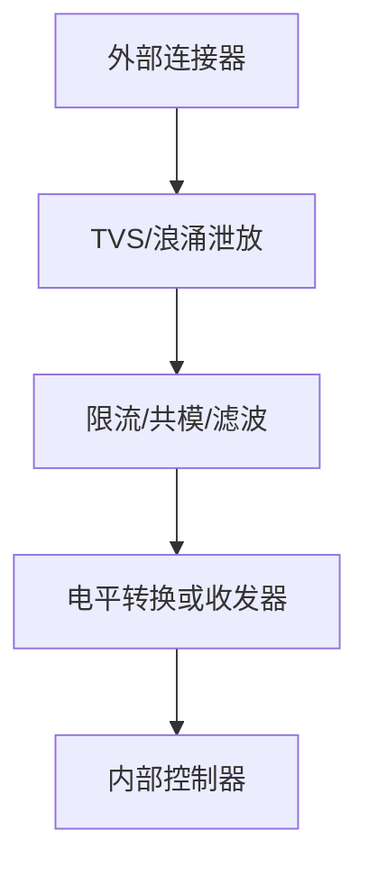

原理图要说明：

- TVS 的工作和钳位范围。
- 泄放到哪一个地或机壳。
- 串联阻抗和内部钳位电流。
- 保护器件结电容对高速信号的影响。
- 故障电流经过的保险和回流路径。

### 8.25 电压域与电平转换

对每个跨域信号标注源域、目标域和方向。检查：

- `VOH/VOL` 与 `VIH/VIL` 的最坏兼容。
- 输入是否 5 V 容忍。
- 推挽、开漏、单向或双向。
- 上电顺序和未供电输入。
- 转换器方向、OE 和默认状态。
- 高速、容性负载和自动方向限制。

相同逻辑名称在不同电压域之间不要直接复用同一网络名，应通过电平转换器形成清楚的两侧网络。

### 8.26 模拟信号链

模拟页面应从传感器到 ADC 或输出逐级绘制：

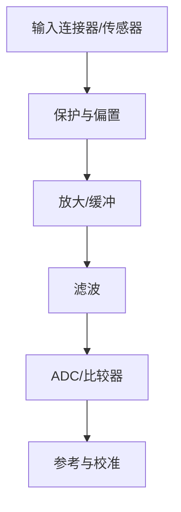

标注量程、单位、直流工作点、增益、截止频率和预期测试电压。高阻节点、差分输入、Kelvin 采样和保护电流路径应有文字说明。

### 8.27 运放与比较器

原理图检查：

- 正负输入方向和反馈极性。
- 输入共模、输出摆幅和供电。
- 增益、偏置和滤波计算。
- 未使用通道的稳定处理。
- 去耦、参考和输出负载。
- 比较器输出是推挽还是开漏。
- 迟滞网络和上拉电压域。

运放符号旁可标注关键节点预期电压，便于评审发现输入或输出超范围。

### 8.28 ADC、DAC 与参考源

#### 8.28.1 ADC

- 输入范围、共模和源阻抗。
- RC 滤波、采样时间和驱动器。
- 参考电压、旁路和参考地。
- 模拟与数字电源去耦。
- 输入过压和未上电保护。

#### 8.28.2 DAC

- 输出范围、参考和负载。
- 上电默认值和毛刺。
- 输出缓冲、滤波和短路能力。

#### 8.28.3 参考源

参考电压网络使用独立名称，标注精度、温漂、滤波和主要负载。不要让 LED、数字上拉或其他非关键负载使用精密参考轨。

### 8.29 电源转换器原理图

#### 8.29.1 LDO

包含输入输出电容、Enable、反馈/固定输出、噪声旁路、Power Good、反向电流和测试点。标注电容有效容值与 ESR 要求。

#### 8.29.2 Buck/Boost

包括输入电容、开关管或内部开关、电感、二极管、输出电容、自举、反馈、补偿、软启动和保护。关键器件旁标注布局优先级。

#### 8.29.3 反馈与采样

反馈网络使用独立网络名，避免与大电流输出铜皮在原理图上看不出取样点差异。远端采样、Kelvin 和模拟地连接需要文字说明或 Net Tie。

### 8.30 MOSFET、继电器和负载驱动

原理图检查：

- MOSFET 类型、源漏方向和体二极管。
- 栅极驱动电压、串阻和默认上下拉。
- 高侧驱动、自举和最大占空比。
- 感性负载续流、TVS 或吸收网络。
- 电流采样、故障反馈和温度保护。
- 连接器负载极性和外部电源关系。

负载驱动页面应标注“默认关闭”“故障关闭”或其他安全状态。

### 8.31 通信接口原理图

#### 8.31.1 UART、I²C、SPI

- UART：电平、TX/RX 方向、共地和外部物理层。
- I²C：开漏上拉、电压域、地址和总线电容。
- SPI：模式、CS 默认状态、MISO 三态和串联阻尼预留。

#### 8.31.2 CAN 与 RS-485

包含收发器、终端、偏置、共模器件、TVS、隔离、使能和故障状态。A/B、H/L 命名必须与连接器和线束一致。

#### 8.31.3 USB 与高速接口

标注差分对、阻抗、ESD、共模器件、串联电阻、VBUS 保护、CC 配置和连接器外壳。不要在 D+/D- 上增加未评估的测试点和支路。

### 8.32 隔离电路

隔离页面应明确：

- 隔离前后电源和地。
- 隔离器通道方向和默认输出。
- 隔离电源来源和功率。
- 爬电、电气间隙和禁布边界。
- 屏蔽、Y 电容或机壳连接。
- 故障时哪一侧保持安全。

跨隔离边界不能使用普通全局地符号意外连接。必要时使用不同网络名和 PCB 禁布区强化边界。

### 8.33 Net Tie、0 Ω 与磁珠

#### 8.33.1 Net Tie

Net Tie 用于在指定物理位置连接两个逻辑上不同的网络，例如 AGND 与 GND、机壳地与信号地。它表达“只允许在此处连接”，比使用同名网络或隐藏铜桥更可检查。

#### 8.33.2 0 Ω 电阻

用途包括配置、调试分段、可选连接、版本兼容和电流测量。检查阻值功率、额定电流和封装，不要把 0 Ω 当作无限电流导体。

#### 8.33.3 磁珠

磁珠用于有明确频段目标的滤波。原理图旁标注额定电流、DCR、目标阻抗频率和替代条件，避免后续被随意替换为 0 Ω。

### 8.34 测试点设计

至少考虑：

- 输入电源、保护后电源和所有稳压输出。
- 足够数量且位置合理的 GND 测试点。
- Reset、Boot、Enable、Power Good 和时钟。
- UART、I²C、SPI、CAN、RS-485 等关键总线。
- 模拟输入输出、参考、反馈和电流采样。
- 生产烧录、校准和自检接口。

测试点符号应关联专用封装和可识别名称。高速节点是否允许测试点必须结合支路和寄生评估。

### 8.35 配置、变体与 DNP

#### 8.35.1 配置方式

- 0 Ω 电阻。
- 焊接跳线。
- 拨码开关或排针。
- 可选电容、电阻和终端。
- 软件读取的硬件版本电阻。

#### 8.35.2 DNP 管理

DNP 器件在原理图中保留位号、作用和默认状态，并通过字段进入 BOM 和装配图。不要删除所有可选器件后只依赖口头说明。

#### 8.35.3 互斥配置

若两个器件不能同时安装，使用注释、Variant 规则和评审检查明确互斥关系。避免出现两个输出源同时驱动一个网络。

### 8.36 设计注释与计算依据

在原理图中适度记录：

- 输入输出范围和预期工作点。
- 分压、增益、截止频率和限流值。
- 数据手册关键页或应用笔记编号。
- PCB 布局要求。
- 上电默认状态和故障行为。
- 特殊装配、DNP 和替代条件。

注释应帮助评审，不要把整段数据手册复制进图纸。复杂计算放在独立文档，并在原理图中给出链接或编号。

### 8.37 图形与文本规范

- 字号保证导出 PDF 后可读。
- 重要警告、接口和电压域使用统一文本样式。
- 网络标签不压在引脚、导线或其他文本上。
- 结点连接使用明确 Junction，避免四线交叉歧义。
- 不连接的交叉线保持足够间距。
- 模块边框、注释颜色和线型保持一致。

不要依赖颜色作为唯一信息，因为打印、评审工具和视觉条件可能不同。

### 8.38 原理图与 BOM 一致性

每个装配器件应具有：

- 唯一位号。
- 可采购的完整型号或明确通用规格。
- 正确封装。
- 数量和装配变体。
- 替代料或不可替代说明。

原理图值、BOM MPN 和 PCB 封装之间的任何自动映射都要经过检查。连接器、晶体、功率电感和特殊器件不能只使用通用 Value 下单。

### 8.39 ERC 配置

#### 8.39.1 常见检查

- 输出对输出冲突。
- 电源输入没有驱动源。
- 未连接输入和未使用引脚。
- 开漏输出缺少上拉。
- 层次端口方向不一致。
- 网络标签重复或悬空。
- 电源域错误连接。

#### 8.39.2 警告处理原则

每个警告应：

1. 修复真实问题；或
2. 修改错误的符号/引脚类型；或
3. 在确认合理后使用明确豁免并记录原因。

不要通过把大量引脚改成 Passive、添加无意义 Power Flag 或全局忽略规则来“清零”报告。

#### 8.39.3 自定义规则

关键项目可增加脚本或检查：

- 必填 MPN 和封装字段。
- DNP 与 Variant 合法性。
- 电源网络命名。
- 差分对命名完整性。
- 禁止使用未受控库。

### 8.40 人工评审流程

#### 8.40.1 按电流路径评审

从每个电源入口开始，沿保护、稳压、负载和回流检查。对 MOSFET、电机和继电器画出导通与关断路径。

#### 8.40.2 按信号路径评审

从外部输入到处理和输出，检查电平、共模、增益、带宽、保护和默认状态。

#### 8.40.3 按工作状态评审

- 未上电。
- 上电启动。
- 正常运行。
- 睡眠或关机。
- 热插拔和快速重启。
- 短路、断线、过温和通信失败。

#### 8.40.4 按器件评审

逐个关键器件对照数据手册首页、引脚、电气特性、典型应用、布局指南和封装图。

### 8.41 原理图检查清单

#### 8.41.1 页面与命名

- [ ] 页面标题、版本和页码完整。
- [ ] 功能分页合理，信号流清楚。
- [ ] 网络、电源、低有效和差分命名统一。
- [ ] 标签作用域正确，无意外全局连接。

#### 8.41.2 器件与引脚

- [ ] 符号引脚编号与目标封装一致。
- [ ] 所有电源脚、地、裸露焊盘正确连接。
- [ ] NC、DNC、Reserved 和未使用脚按手册处理。
- [ ] 多单元器件和隐藏电源单元完整。

#### 8.41.3 电气设计

- [ ] 电源入口、保护、反接、过流和反灌完整。
- [ ] 每个 IC 去耦和储能满足数据手册。
- [ ] Reset、Boot、Enable、CS 和栅极默认安全。
- [ ] 电压域、逻辑阈值和电平转换兼容。
- [ ] 模拟输入、参考、滤波和共模范围正确。
- [ ] 高速接口终端、偏置和保护正确。
- [ ] 感性负载具有续流或吸收路径。

#### 8.41.4 工程化

- [ ] 测试点、下载、校准和版本识别完整。
- [ ] DNP、Variant 和互斥配置明确。
- [ ] MPN、封装和关键规格字段完整。
- [ ] ERC 无未解释问题。
- [ ] 关键计算、风险和布局要求有记录。

### 8.42 原理图冻结与发布

原理图冻结前：

1. 运行 ERC 并处理全部问题。
2. 更新位号和封装分配。
3. 导出 PDF 进行独立评审。
4. 生成 BOM，检查 MPN、数量、DNP 和替代料。
5. 与系统需求、接口文档和电源预算交叉检查。
6. 对关键器件完成数据手册和封装复核。
7. 记录未关闭风险和 PCB 阶段必须验证的事项。

冻结后任何电气修改都应更新版本并重新同步 PCB。不要在 PCB 中私自修改网络或封装而不回写原理图。

### 8.43 原理图变更管理

每次变更记录：

- 变更原因和关联需求/问题单。
- 修改页面、器件和网络。
- 对 PCB、BOM、固件、结构和测试的影响。
- 是否需要重新计算和验证。
- 评审人与日期。

位号重排、网络改名和封装更换也属于工程变更，可能影响软件、测试治具和生产资料。

### 8.44 推荐页面示例

以低压 MCU 控制板为例：

```text
P1  系统框图、版本和接口摘要
P2  5V 输入、保护和 3.3V 电源
P3  MCU、电源、时钟、复位和 Boot
P4  SWD/JTAG、UART 日志和版本识别
P5  模拟输入、参考和 ADC 滤波
P6  I2C/SPI 传感器与扩展接口
P7  CAN/RS-485 收发器、终端和保护
P8  MOSFET/继电器负载驱动
P9  测试点、DNP 配置和装配说明
```

每页左上角可放本页输入条件，右下角放输出和关键测试点，帮助评审按路径阅读。

### 8.45 原理图评审记录模板

```markdown
# 原理图评审记录

- 项目：
- 硬件版本：
- 原理图版本：
- Git 提交：
- 日期：
- 评审人：

## 评审范围

- 页面：
- 需求版本：
- 数据手册版本：

## 问题

| ID | 页面/器件 | 问题 | 严重度 | 处理方案 | 负责人 | 状态 |
| :--- | :--- | :--- | :--- | :--- | :--- | :--- |
|  |  |  |  |  |  |  |

## 关键确认

- [ ] 电源树和时序正确。
- [ ] 接口方向、电平和保护正确。
- [ ] 默认状态和故障状态安全。
- [ ] MPN、封装和 DNP 完整。
- [ ] 测试、烧录和校准可实现。

## 未关闭风险

| 风险 | PCB/样机阶段验证方法 | 关闭条件 |
| :--- | :--- | :--- |
|  |  |  |
```

### 8.46 常见错误

- 原理图按器件摆放，不按功能和信号流分页。
- 大量使用全局标签，导致跨页误连接。
- 为了消除 ERC，把所有引脚改成 Passive。
- 保护前后电源使用同一网络名，意外绕过保护器件。
- MCU 的 Reset、Boot、Enable 和危险负载栅极没有默认状态。
- 去耦电容只集中画在页面角落，无法确认对应引脚。
- 连接器从错误视角编号，导致线束镜像。
- 同一信号跨电压域仍使用同名网络，绕过电平转换。
- DNP 器件被删除，装配变体只能依靠口头说明。
- 隐藏电源脚或多单元器件未完整放置。
- 原理图 Value 与 BOM MPN、PCB 封装不一致。
- 只运行 ERC，不做状态、电流路径和数据手册人工评审。

### 8.47 本章自测

1. 原理图除定义连接外，还承担哪些工程作用？
2. 平铺式与层次式原理图分别适合什么项目？
3. 为什么不能把所有符号引脚都设置为 Passive？
4. Local、Hierarchical 和 Global Label 应如何选择？
5. 为什么保护器件前后的电源网络必须使用不同名称？
6. Reset、Boot、Enable 和 MOSFET 栅极应检查哪些工作阶段？
7. 如何处理 NC、DNC、Reserved 和未使用输入？
8. 为什么同一逻辑信号跨电压域后不应继续使用同一网络名？
9. Net Tie、0 Ω 电阻和磁珠分别适合表达什么设计意图？
10. ERC 通过后为什么仍需要按电流路径和工作状态评审？
11. 原理图冻结前如何确认 BOM、封装和 DNP 一致？
12. 一个连接器如何从 PCB 端、线束端和配对端进行交叉核对？

能够让另一位工程师仅凭原理图和关联资料理解系统、发现风险、完成 PCB 并制定调试计划，才算原理图设计达到工程交付标准。

---

## 9. 电源系统设计

### 9.1 本章学习目标

学完本章后，应能够：

- 从输入源、负载、时序、噪声、热和故障状态定义电源需求。
- 建立电源树、电流预算、功率预算和能量预算。
- 根据压差、效率、噪声、成本和复杂度选择 LDO、Buck、Boost、Buck-Boost 等拓扑。
- 完成电感、电容、二极管、MOSFET、反馈和保护器件的初步计算。
- 识别启动浪涌、反接、反灌、热插拔、短路和多电源时序风险。
- 理解环路稳定性、负载瞬态、纹波、PSRR 和电源完整性的基本关系。
- 按高频电流回路完成 PCB 布局，并使用正确探头验证电源性能。

> **安全边界**：本章主要讨论低压直流板级电源。市电输入、PFC、离线反激、高压储能、大功率电池包和安全隔离电源需要符合适用标准的专业设计、评审与测试，不应仅凭本章内容独立实施。

### 9.2 电源系统的目标

一个合格电源系统不仅要“输出目标电压”，还要在以下条件下保持可接受状态：

- 输入最小、典型、最大和瞬态。
- 空载、轻载、典型负载、峰值负载和短路。
- 启动、快速重启、掉电和多电源切换。
- 最低和最高环境温度。
- 负载工作模式和动态切换。
- 器件公差、老化和供应替代。
- PCB 压降、连接器和线缆损耗。

设计结果应同时满足：电压正确、纹波可接受、瞬态不过界、效率合理、温升受控、保护有效、布局可实现和测试可重复。

### 9.3 电源需求表

| 项目 | 需要明确的内容 |
| :--- | :--- |
| 输入 | 类型、最小/典型/最大、瞬态、极性和线缆 |
| 输出 | 电压、精度、纹波、持续和峰值电流 |
| 动态 | 负载阶跃、恢复时间、过冲和跌落 |
| 时序 | 上电、掉电、Enable、Power Good 和复位 |
| 效率 | 典型、轻载和最坏点目标 |
| 热 | 环境温度、允许结温、散热路径和外壳 |
| 噪声 | 目标频段、敏感负载和 EMI 要求 |
| 保护 | 反接、过流、短路、过压、欠压和反灌 |
| 机械 | 面积、高度、器件封装和磁性器件位置 |
| 生产 | 常规工艺、器件可得性和测试方法 |

“3.3 V/1 A”只描述了两个数字，远不足以完成电源设计。

### 9.4 电源轨与负载预算

#### 9.4.1 负载表

| 负载 | 电源轨 | 休眠电流 | 典型电流 | 峰值电流 | 峰值持续 | 同时系数 | 来源 |
| :--- | :--- | ---: | ---: | ---: | :--- | ---: | :--- |
| MCU | 3V3 |  |  |  |  |  |  |
| 无线模块 | 3V3 |  |  |  |  |  |  |
| 传感器 | 3V3_A |  |  |  |  |  |  |
| 电机 | VIN |  |  |  |  |  |  |

峰值是否同时发生由系统工作模式决定。例如无线发射、Flash 写入和 LED 点亮可能重叠，不能只选其中最大的单项峰值。

#### 9.4.2 功率与输入电流

```text
Pout = Vout × Iout
Pin = Pout / η
Iin = Pin / Vin
```

最低输入电压下通常需要更大输入电流，应检查线缆、连接器、保险和保护器件的压降与温升。

#### 9.4.3 预算余量

余量应覆盖器件差异、启动峰值、温度和未来可确认的扩展，但不能无依据地把所有负载翻倍。对无线、电机和处理器，应优先使用实际工作波形和厂商测试条件。

### 9.5 电源树

电源树表达能量从入口到各负载域的路径：

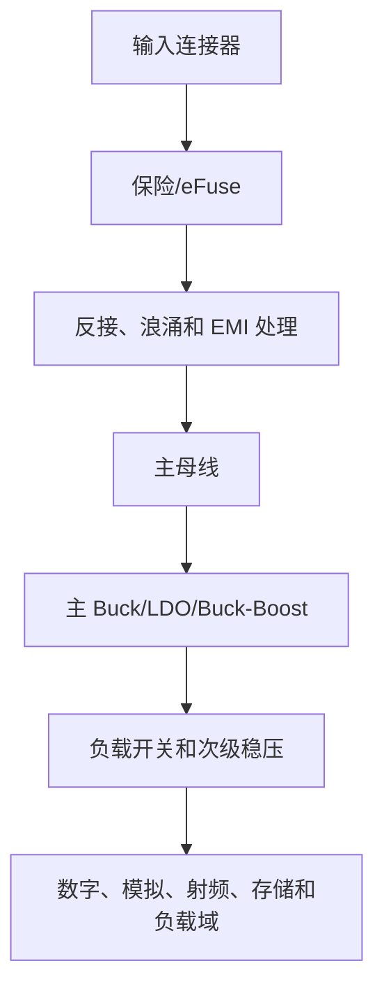

每条电源轨记录来源、范围、负载、时序、Enable、Power Good、保护、测试点和允许的反向电流。保护前后、开关前后和滤波前后使用不同网络名。

### 9.6 输入电源类型

#### 9.6.1 稳压适配器

仍需考虑空载偏高、负载压降、启动过冲、线缆损耗、插拔浪涌和连接器极性。不要因为标称“12 V”就假设始终为精确 12 V。

#### 9.6.2 USB 供电

需要区分连接器形式、默认供电能力、角色、数据和是否进行供电协商。USB-C 仅取电也必须正确处理 CC，并评估 VBUS 反灌、热插拔和 ESD。

#### 9.6.3 电池

电池电压随荷电状态、温度、内阻和负载变化。还需考虑充电、保护、截止电压、峰值能力和寿命。多串锂电系统不适合作为无专业指导的入门项目。

#### 9.6.4 工业总线或长线供电

长线会引入压降、浪涌、EFT、共模和接地电位差。入口保护、滤波、隔离和连接器能力往往比稳态电压更重要。

### 9.7 拓扑选择

| 条件 | 常见选择 | 主要权衡 |
| :--- | :--- | :--- |
| 输入略高于输出、低电流、低噪声 | LDO | 简单但压差损耗大 |
| 输入高于输出、中大电流 | Buck | 效率高，布局与 EMI 更复杂 |
| 输入低于输出 | Boost | 输入电流和峰值应力较高 |
| 输入可能高于或低于输出 | Buck-Boost | 成本、控制和纹波更复杂 |
| 小电流倍压/反相 | Charge Pump | 无电感，但电流与纹波受限 |
| 需要安全或功能隔离 | 隔离拓扑 | 变压器、控制、安规与 EMI 复杂 |

拓扑选择还要比较轻载效率、静态电流、器件高度、开关频率、输出噪声、启动和故障行为。

### 9.8 线性电源与开关电源的组合

常见架构：

- Buck 先高效率降压，再用低噪声 LDO 给模拟或射频负载。
- 主电源持续工作，低功耗支路使用负载开关关闭。
- 电池输入使用 Buck-Boost 保持稳定母线，再分配到各电源域。

级联会增加压差、静态功耗、时序和成本。LDO 是否能滤除前级开关纹波，要查看目标频率下的 PSRR 和剩余压差。

### 9.9 输入保护链

根据风险选择：

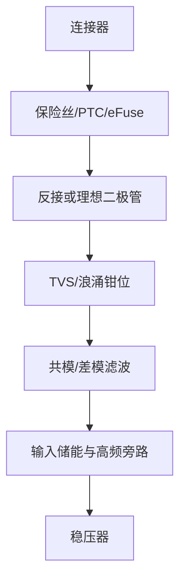

顺序不是固定模板。应根据故障能量、保护器件承受能力和泄放路径确定。例如 TVS 需要上游限流或足够低的源阻抗配合，否则自身可能持续过热。

### 9.10 保险丝、PTC 与 eFuse

#### 9.10.1 保险丝

检查额定电流、电压、分断能力、时间—电流曲线、环境温度和启动浪涌。保险丝通常保护线缆和系统，不保证在半导体损坏前动作。

#### 9.10.2 PTC

检查保持电流、动作电流、最大电压、温度影响和恢复时间。高温环境下可用保持电流会下降。

#### 9.10.3 eFuse

可集成限流、软启动、过压、欠压、反向阻断和故障指示。仍需检查内部或外部 MOSFET 的 SOA、热、启动电容和故障重试模式。

### 9.11 反接、理想二极管与电源 OR-ing

#### 9.11.1 串联二极管

简单可靠，但存在正向压降和功耗，低电压大电流系统可能不适合。

#### 9.11.2 MOSFET 反接保护

可降低压降，但必须核对器件方向、体二极管、栅源电压、启动和故障状态。P 沟道方案简单，N 沟道方案通常需要更复杂驱动。

#### 9.11.3 理想二极管与 OR-ing

多电源入口需要控制优先级、反灌、无缝切换和故障隔离。检查切换过程中电压跌落、回流和控制器未供电状态。

### 9.12 热插拔、浪涌与启动电流

输入电容在插入电源瞬间近似短路，可能产生较大浪涌：

```text
I = C × dV/dt
```

浪涌会造成连接器电弧、电源跌落、保险误动作和输入振铃。控制方法包括串联阻抗、NTC、预充电、限流开关和受控软启动。

热插拔测试应覆盖不同插入速度、线缆长度、电源源阻抗和重复快速插拔。示波器同时观察连接器侧和稳压器输入侧。

### 9.13 输入滤波与源稳定性

输入 LC 或 π 型滤波器可降低传导噪声，但会改变源阻抗，并可能与转换器负阻抗特性形成振荡。设计时：

- 明确要抑制的频段和差模/共模类型。
- 计算滤波器谐振并提供阻尼。
- 检查上游电源和线缆阻抗。
- 在最小、典型、最大负载下验证启动和瞬态。

磁珠加电容并不是无条件稳定的电源滤波器。

### 9.14 LDO 工作原理与选型

LDO 通过线性调整管消耗输入与输出之间的压差。适合低噪声、低电流、压差较小和电路简单的场景。

关键参数：

- 输入范围和输出电压。
- Dropout 与输出电流、温度的关系。
- 输出精度、负载和线性调整率。
- 静态电流与关断电流。
- PSRR、噪声和带宽。
- 限流、热关断和反向电流。
- 输出电容范围、ESR 和稳定性。

### 9.15 LDO 损耗与热

```text
Ploss ≈ (Vin - Vout) × Iout + Vin × Iq
```

例如 12 V 降到 3.3 V、输出 200 mA：

```text
Ploss ≈ (12 - 3.3) × 0.2 = 1.74 W
```

这通常不适合小封装 LDO。应结合环境温度、热阻、铜面积和降额估算结温。热关断是故障保护，不应作为正常工作模式。

### 9.16 LDO 稳定性、压差与反向电流

- 输出电容必须满足容值、有效容值和 ESR 要求。
- MLCC 直流偏压可能使实际容值下降。
- 输入接近输出时检查最坏 dropout，而不只看典型值。
- 输入掉电但输出被其他电源抬高时，检查反向电流路径。
- Enable 未定义可能造成上电抖动或意外开启。
- 低噪声旁路电容和参考地按数据手册布局。

### 9.17 Buck 基本工作过程

Buck 在开关导通时从输入向电感和负载传递能量，关断时电感通过低侧开关或二极管继续向负载供电。理想连续导通模式下：

```text
D ≈ Vout / Vin
```

真实占空比还受开关压降、死区、DCR、控制方式和最小导通时间影响。

### 9.18 Buck 电感纹波与峰值

理想近似：

```text
ΔIL ≈ (Vin - Vout) × D / (L × fsw)
IL_peak ≈ Iout + ΔIL/2
IL_valley ≈ Iout - ΔIL/2
```

电感选择步骤：

1. 根据负载和控制器建议确定目标纹波。
2. 计算最坏输入下的电感量范围。
3. 检查峰值电流低于饱和能力并留余量。
4. 检查 RMS 电流、DCR、磁芯损耗和温升。
5. 检查尺寸、屏蔽和自谐振频率。

### 9.19 Buck 输入电容

输入电容承担脉冲电流，高频旁路必须靠近开关器件形成最小输入环路。检查：

- 有效容值和耐压。
- RMS 纹波电流。
- ESR、ESL 和温升。
- 输入线缆与储能电容。
- 多个 MLCC 的机械裂纹和反谐振。

大容量电容放在连接器旁不能替代芯片附近的高频输入电容。

### 9.20 Buck 输出电容

输出纹波由电感纹波、电容充放电和 ESR 共同决定。粗略关系：

```text
ΔVout ≈ ΔIL / (8 × fsw × Cout) + ΔIL × ESR
```

实际还受控制环路、负载阶跃和 PCB 阻抗影响。输出电容必须满足控制器稳定性要求，不能只按纹波公式选择。

### 9.21 二极管整流与同步整流

#### 9.21.1 异步 Buck

低侧使用肖特基或快恢复二极管，方案简单，但二极管导通损耗在低输出电压和大电流时明显。

#### 9.21.2 同步 Buck

低侧使用 MOSFET，可提高效率，但需要死区控制、栅极驱动和反向电流管理。轻载可能进入二极管模拟、跳脉冲或强制 PWM 模式。

检查二极管/MOSFET 耐压、峰值、热、反向恢复和布局，不只比较额定电流。

### 9.22 控制方式与环路稳定性

常见控制方式包括电压模式、电流模式、迟滞、恒定导通时间和数字控制。不同方式对补偿、负载范围、输出电容和噪声的要求不同。

环路需要在响应速度与稳定裕量之间权衡：

- 带宽过低：负载瞬态恢复慢、跌落大。
- 带宽过高：容易受开关噪声影响或振荡。
- 相位裕量不足：出现振铃、亚谐波或不稳定。

使用厂商计算工具时保存输入条件，并通过负载阶跃、频响或推荐测试方法验证。

### 9.23 Boost 基本设计

Boost 导通时电感储能，关断时电感与输入共同向输出传递能量。理想连续模式：

```text
D ≈ 1 - Vin/Vout
```

关键风险：

- 输入电流通常大于输出电流。
- 电感和开关峰值显著高于负载电流。
- 启动和短路期间应力较大。
- 异步拓扑在关断时可能仍有输入到输出通路。
- 输出断开、轻载和反馈开路可能过压。

### 9.24 Buck-Boost 与反相电源

Buck-Boost 适合输入高于或低于输出的场景，需比较四开关、SEPIC、Zeta 和反相等方案。关注：

- 开关和电感电流应力。
- 效率、器件数量和控制复杂度。
- 输入输出纹波和共地关系。
- 启动、短路和关断路径。
- 反相输出对接口和测量地的影响。

### 9.25 Charge Pump 与隔离电源概览

Charge Pump 使用开关电容实现倍压、降压或反相，适合较小电流和有限压差场景。检查飞跨电容、开关频率、输出阻抗、纹波和启动。

隔离电源需要同时设计变压器、开关、反馈、绝缘、爬电、电气间隙、共模噪声和故障保护。离线和高压隔离电源应由具备相应经验的工程师按适用标准完成。

### 9.26 负载开关与电源域控制

负载开关用于控制支路电源、降低待机功耗、实现时序和隔离故障域。检查：

- 输入输出范围和持续电流。
- 导通电阻与压降。
- 限流、软启动和输出放电。
- Enable 阈值和默认状态。
- 反向电流和 Quick Output Discharge。
- 关断时输出是否被外部信号反向供电。

输出放电功能会在关断时消耗电容能量，但也可能与外部供电冲突，必须分析完整电源状态。

### 9.27 上电时序与电源监控

多电源系统可能要求：

- 核心电源先于 I/O 电源，或相反。
- 电源轨之间电压差不能超过限制。
- 时钟或复位在电源稳定后释放。
- 掉电顺序避免内部反灌和闩锁。

时序实现方法：

- 稳压器 Enable 级联。
- Power Good 驱动下一级。
- 专用时序控制器。
- 负载开关和电源监控器。
- MCU 控制，但必须保证 MCU 自身先安全启动。

RC 延时受阈值、漏电、容差和上电斜率影响，只适合非关键、宽容差场景。

### 9.28 Power Good、复位与棕断

Power Good 应定义有效电平、开漏/推挽、上拉电压、阈值、迟滞和延时。复位监控器应覆盖慢上电、短暂跌落和快速重启。

棕断条件下系统可能出现：

- MCU 执行错误指令或 Flash 写入中断。
- MOSFET 栅极电压不足而处于线性区。
- 通信收发器输出异常。
- 多电源器件内部反灌。

硬件监控与 MCU Brown-Out 配置需要协同，复位原因应可记录。

### 9.29 电流检测

#### 9.29.1 低侧采样

电路简单、共模低，但采样电阻抬高负载地，可能影响接口、传感器和保护。

#### 9.29.2 高侧采样

负载地保持完整，但放大器需要承受高共模和瞬态。检查共模范围、反向电压、输入滤波和供电时序。

#### 9.29.3 分流电阻

```text
Vshunt = I × Rshunt
Pshunt = I² × Rshunt
```

阻值越大信号越容易测量，但压降和损耗越高。使用 Kelvin 连接，并将功率路径与采样路径分开。

#### 9.29.4 其他方法

霍尔、电流互感器和磁阻方案可提供隔离或较低损耗，但带宽、偏置、温漂和成本不同。

### 9.30 过压、欠压、过流与短路保护

#### 9.30.1 UVLO

欠压锁定防止器件在输入不足时进入不确定或高损耗状态。阈值和迟滞应覆盖线缆压降与启动浪涌，避免反复启停。

#### 9.30.2 OVP

过压保护可以关闭开关、钳位、断开输入或触发 Crowbar。保护方式取决于故障能量和受保护负载耐压。

#### 9.30.3 OCP 与短路

常见模式：恒流、折返、打嗝重试和锁存关断。自动重试可能在持续短路下周期性加热，应验证最坏热状态。

#### 9.30.4 OTP

过温保护是最后防线。持续触发 OTP 表示正常设计热余量不足，不能把它当作温控策略。

### 9.31 启动、软启动与预偏置

软启动限制输出上升速度和浪涌，但过慢可能导致负载长时间停留在欠压区。检查：

- 输出电容充电电流。
- 负载是否在低电压就开始取电。
- 启动期间限流是否导致失败。
- 输出已有预偏置时控制器是否允许启动。
- 多路电源之间是否通过信号脚互相充电。

启动波形应在输入最小、最大电容、最大负载和快速重启条件下验证。

### 9.32 负载瞬态

负载电流突变时，电源环路无法立即响应，输出电容先提供或吸收电流。初步近似：

```text
ΔVcap ≈ ΔI × Δt / C
ΔVESR ≈ ΔI × ESR
```

真实波形由电容、ESR/ESL、PCB 阻抗、控制带宽和负载边沿共同决定。测试应记录阶跃幅度、上升下降时间、频率和测点。

### 9.33 输出纹波与噪声

区分：

- 开关基频纹波。
- 开关边沿尖峰和振铃。
- 控制模式造成的低频包络。
- 随机噪声。
- 负载耦合和数字串扰。

纹波指标必须说明测量带宽、探头连接和测试点。使用长地线得到的尖峰不能直接作为电源真实噪声。

### 9.34 PSRR 与电源级联

LDO 或模拟器件对输入纹波的抑制随频率变化。若前级 Buck 纹波位于 LDO PSRR 已下降的频段，后级噪声改善可能有限。

级联设计检查：

- 前级最小输出与后级 dropout。
- 前级纹波频率和后级 PSRR。
- 两级静态电流与效率。
- 启动顺序和反向电流。
- 两级控制环路与输入滤波相互作用。

### 9.35 接地与电流回路

电源设计先画出高 `di/dt` 回路：

- Buck 输入电容—高侧开关—低侧开关—输入电容。
- Boost 开关—电感—二极管/MOSFET—输出电容。
- 栅极驱动回路。
- 输出电容—负载—回流。

功率地、模拟地和反馈地的连接遵循控制器数据手册。多数低压板优先保持完整地平面，通过器件布局和回路控制隔离噪声，而不是随意切割地。

### 9.36 PCB 布局优先级

推荐布局顺序：

1. 控制器和裸露焊盘。
2. 高频输入电容。
3. 高侧/低侧开关和栅极驱动。
4. 电感、二极管和输出电容。
5. 自举电容。
6. 反馈分压、补偿和软启动。
7. 大容量储能、保护和测试点。

先缩小高频回路，再考虑铺大铜散热。不要为了视觉整齐把输入电容移远。

### 9.37 开关节点与栅极布局

`SW` 节点具有高 `dv/dt`：

- 铜面积在电气和散热允许下尽量受控。
- 远离反馈、晶振、模拟输入、天线和连接器。
- 不在其下方或相邻层穿越敏感信号。
- 测试点应小，并评估探头寄生。

栅极回路短且有邻近回流，驱动器靠近 MOSFET。并联 MOSFET、半桥和大电流设计考虑 Kelvin Source 与对称驱动。

### 9.38 反馈、补偿与 Kelvin 取样

- 反馈从稳定输出点取样，不从大电流铜皮前端取样。
- 分压器靠近控制器反馈脚。
- 上端电阻走线避开 `SW` 和电感。
- 下端连接到数据手册指定模拟地。
- 远端采样成对布线，并设置开路保护。
- 补偿器件靠近控制器，避免噪声注入。

反馈线路虽电流很小，却直接决定输出电压和环路行为，应按敏感模拟信号处理。

### 9.39 热设计

损耗来源包括：

- MOSFET 导通与开关损耗。
- 二极管正向与反向恢复损耗。
- 电感铜损和磁芯损耗。
- 电容 ESR 损耗。
- 控制器驱动和静态损耗。
- 分流器、连接器和 PCB 铜损。

热设计步骤：

1. 计算主要损耗。
2. 识别热源和热敏器件。
3. 设计铜面积、热过孔和外壳路径。
4. 按最高环境和最坏工作点估算。
5. 样机实测稳态温度和热时间常数。

### 9.40 效率与损耗分解

```text
η = Pout / Pin
Ploss = Pin - Pout
```

测效率时在 DUT 输入端和输出端同时测量实际电压电流，包含线缆压降。效率曲线应覆盖：

- 空载和关断。
- 轻载。
- 典型负载。
- 满载。
- 输入最小、典型和最大。

低负载下静态电流和工作模式占主导，高负载下导通、开关和磁性损耗占主导。

### 9.41 器件额定与降额

检查：

- 电容实际工作电压、纹波和温度。
- MOSFET `VDS`、`VGS`、峰值电流和 SOA。
- 二极管反向耐压、浪涌和热。
- 电感峰值低于饱和能力，RMS 低于温升能力。
- 连接器、保险、过孔和铜箔持续能力。
- 电阻功率、电压和脉冲能力。

降额不是统一百分比，应根据器件类型、故障波形、温度和可靠性目标确定。

### 9.42 低功耗与能源管理

低功耗设计需要同时控制：

- 稳压器静态电流。
- 分压、上拉、LED 和泄放电阻的持续消耗。
- 未供电外设通过信号脚反灌。
- 负载开关关断漏电。
- MCU 睡眠、唤醒源和外设状态。
- 电池自放电与保护板消耗。

平均电流预算：

```text
Iavg = Σ(Istate × DutyState)
```

睡眠电流很低但唤醒频繁时，启动能量可能成为主要消耗。应使用动态电流波形和实际工作周期评估。

### 9.43 电池充电与供电边界

电池系统必须匹配化学体系、电芯数量、充电电压、电流、温度和保护。检查：

- 充电器输入能力和功率路径。
- 电池保护、温度检测和截止条件。
- 充放电同时进行时的路径。
- USB/适配器与电池之间的反灌和优先级。
- 电量计、采样位置和休眠电流。

多串、大容量、快充和高能电池系统需要专业 BMS、安全评审和受控测试，不应简化为“加一颗充电芯片”。

### 9.44 仿真、计算工具与模型

可使用：

- 厂商器件选择和补偿工具。
- SPICE 开关模型或平均模型。
- 热估算和效率计算工具。
- PCB 电流、压降和 PI 工具。

工具输入必须与实际器件、层叠、温度和负载一致。模型可能不包含启动、保护、寄生和布局，应通过样机验证。

### 9.45 样机首次上电

1. 不连接高能负载。
2. 测输入和各输出轨对地阻值。
3. 设置保守输入和限流。
4. 先验证保护后输入和主电源。
5. 检查 Enable、Power Good、开关和输出波形。
6. 逐步增加负载并监测温升。
7. 再接入 MCU、通信和最终负载。

发现电流异常、输出振荡、快速升温或开关节点异常时立即断电，先定位根因再重启。

### 9.46 电源测试计划

| 测试 | 条件 | 记录 |
| :--- | :--- | :--- |
| 空载/关断 | 输入范围 | 输出、静态电流、反灌 |
| 线性调整率 | 输入最小到最大 | 输出变化 |
| 负载调整率 | 空载到满载 | 输出变化 |
| 启动 | 输入与 Enable | 浪涌、过冲、时序 |
| 快速重启 | 不同断电间隔 | 是否锁死或反灌 |
| 负载阶跃 | 规定幅度和边沿 | 跌落、过冲、恢复 |
| 纹波噪声 | 不同负载和模式 | 全带宽/限带宽波形 |
| 效率 | 输入与负载矩阵 | Pin、Pout、损耗 |
| 热 | 最坏输入、负载、环境 | 温度与稳定时间 |
| 保护 | 短路、过流、欠压 | 阈值、模式、恢复 |

测试前定义允许范围和停止条件，不能测试后再决定结果是否“看起来可以”。

### 9.47 测量方法

#### 9.47.1 纹波

使用短地弹簧或同轴，在负载引脚和输出电容附近测量。记录带宽限制、探头倍率、耦合和测点。

#### 9.47.2 开关节点

使用合适带宽和额定的探头，缩小测量环路。半桥、高侧和浮地测量使用差分探头，不能让普通地夹造成短路。

#### 9.47.3 效率

优先四线或在 DUT 端测输入输出电压，电流测量注意分流器压降和仪器同步。低功率下仪器分辨率可能主导误差。

#### 9.47.4 温度

记录环境、输入、负载、时间和测点。热像仪与热电偶交叉验证，注意发射率和器件内部结温。

### 9.48 常见故障排查

#### 9.48.1 无输出

检查输入保护、UVLO、Enable、反馈、软启动、短路、器件方向和焊接。

#### 9.48.2 输出偏低

检查电源是否限流、输入压降、LDO dropout、电感饱和、反馈分压、负载过大和测点位置。

#### 9.48.3 输出偏高

检查反馈开路、下拉电阻漏焊、取样点错误、地断开和过压保护。

#### 9.48.4 振荡或纹波大

检查输出电容有效值与 ESR、补偿、布局、输入滤波、负载模式和探头连接。

#### 9.48.5 过热

分解 MOSFET、二极管、电感、控制器和连接器损耗，检查开关频率、驱动、饱和、环路和散热铜皮。

#### 9.48.6 启动反复

检查 UVLO 迟滞、输入源阻抗、浪涌、软启动负载、短路重试和电源时序。

### 9.49 示例：12 V 输入的 5 V 与 3.3 V 系统

#### 9.49.1 需求

- 输入：9～15 V 低压直流。
- 5 V：峰值 1 A，给外设和 USB 相关负载。
- 3.3 V：峰值 300 mA，给 MCU 和传感器。
- 模拟传感器要求较低噪声。

#### 9.49.2 架构候选

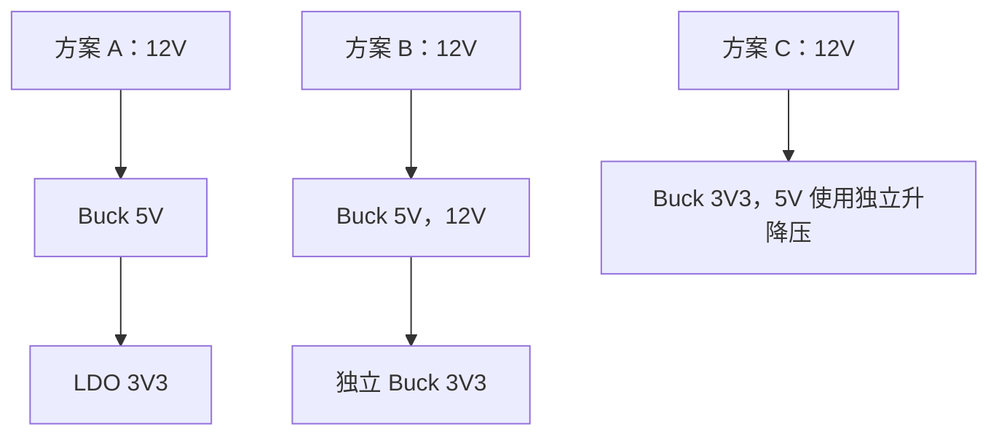

方案 A 简单，3.3 V LDO 损耗在 300 mA 时约：

```text
Ploss ≈ (5 - 3.3) × 0.3 = 0.51 W
```

需检查热是否可接受，以及 5 V Buck 纹波在 LDO PSRR 后是否满足模拟需求。若 3.3 V 长期高负载，独立 Buck 可能更高效。

#### 9.49.3 设计要点

- 入口保险、反接、TVS 和输入滤波。
- 5 V Buck 输入环路、SW、反馈和散热。
- 3.3 V 电源 Enable、时序和反向电流。
- 模拟支路可通过低噪声 LDO 或受控滤波供电。
- 所有电源轨预留测试点和分段测流位置。

#### 9.49.4 验证

覆盖 9 V、12 V、15 V 输入；空载、典型、峰值负载；启动、快速重启、负载阶跃、效率、纹波、短路和最高环境温升。

### 9.50 电源设计检查清单

#### 需求与架构

- [ ] 输入、输出、负载、动态、时序和环境明确。
- [ ] 电源树、电流和功率预算完成。
- [ ] 拓扑选择有计算和权衡依据。

#### 器件与原理图

- [ ] 稳压器、MOSFET、二极管、电感和电容按最坏条件选择。
- [ ] 保护、反接、反灌、浪涌和热插拔已处理。
- [ ] Enable、Power Good、软启动和故障恢复明确。
- [ ] 输出电容有效值和稳定性满足数据手册。
- [ ] 分流器、反馈和远端采样使用 Kelvin 思维。

#### PCB

- [ ] 高频输入和开关回路最小。
- [ ] SW 面积受控，远离敏感节点。
- [ ] 反馈、补偿和模拟地布局正确。
- [ ] 大电流铜皮、过孔和连接器无细颈。
- [ ] 散热铜、热过孔和温敏器件位置合理。

#### 测试

- [ ] 首次上电使用限流和分段负载。
- [ ] 启动、纹波、负载阶跃、效率和热均有计划。
- [ ] 保护阈值和恢复方式已验证。
- [ ] 测量探头和带宽设置有记录。

### 9.51 电源设计记录模板

```markdown
# 电源设计记录

- 项目：
- 电源轨：
- 版本：
- 控制器/稳压器：
- 数据手册版本：

## 需求

| 参数 | 最小 | 典型 | 最大 | 单位 | 备注 |
| :--- | ---: | ---: | ---: | :--- | :--- |
| 输入电压 |  |  |  | V |  |
| 输出电压 |  |  |  | V |  |
| 输出电流 |  |  |  | A |  |
| 纹波 |  |  |  | mV |  |

## 计算

- 拓扑选择：
- 占空比：
- 电感纹波与峰值：
- 输入/输出电容：
- 主要损耗：
- 结温估算：
- 保护阈值：

## PCB 约束

- 高频回路：
- SW 节点：
- 反馈与模拟地：
- 大电流路径：
- 热与过孔：

## 验证

| 测试 | 条件 | 预期 | 实测 | 结论 |
| :--- | :--- | :--- | :--- | :--- |
|  |  |  |  |  |

## 风险与改版

- 未关闭风险：
- 替代器件要求：
- 下一版修改：
```

### 9.52 常见错误

- 只按标称输入和典型负载设计。
- 把稳压器标题中的最大电流当作所有条件下可用电流。
- LDO 只检查输出电流，不计算压差损耗和结温。
- Buck 输入电容离芯片远，高频回路经过长走线。
- `SW` 铜皮过大并靠近反馈、晶振和连接器。
- 只按标称容值选择 MLCC，忽略直流偏压。
- 电感只看额定电流，不检查饱和、DCR 和磁芯损耗。
- 输入滤波器没有阻尼，导致电源启动或负载瞬态振荡。
- 反馈从大电流路径错误位置取样。
- 多路电源只考虑上电顺序，不考虑掉电和外部反灌。
- 把过流、热关断和打嗝保护当成正常工作控制。
- 使用长示波器地线测纹波，并把假尖峰当成真实结果。

### 9.53 本章自测

1. 为什么电源需求不能只写输出电压和最大电流？
2. 如何从负载表得到输入功率和最低输入下的最大电流？
3. LDO 在什么情况下比 Buck 更合适，什么情况下热损耗不可接受？
4. Buck 的高 `di/dt` 输入环路包含哪些器件？
5. 电感饱和电流和温升电流分别约束什么？
6. 为什么输出电容还必须满足控制环路稳定性要求？
7. 输入 LC 滤波器为什么可能让转换器振荡？
8. 多电源系统需要检查哪些上电、掉电和反灌状态？
9. 负载阶跃的电压跌落由哪些因素共同决定？
10. 如何正确测量开关电源纹波和效率？
11. 为什么自动重试短路保护仍可能造成过热？
12. 电源 PCB 中为什么反馈线比普通低速信号更敏感？

能够完成一条电源轨从需求、计算、原理图、PCB 到启动、动态、效率、热和保护测试的完整闭环，才算真正掌握电源系统设计。

---

## 10. 接地、回流、去耦与滤波

### 10.1 本章学习目标

学完本章后，应能够：

- 把 GND 理解为承载电流的导体和参考网络，而不是理想零电位。
- 为数字、模拟、电源、高速和外部接口画出完整回流路径。
- 判断何时使用完整地平面、单点连接、机壳地或真正隔离。
- 正确安排信号换层、参考层转换和地缝合过孔。
- 根据瞬态电流、频率和目标阻抗设计去耦与储能网络。
- 识别电容 ESR、ESL、自谐振和反谐振问题。
- 选择 RC、LC、π 型、磁珠和共模扼流圈，并提供必要阻尼。
- 使用示波器、近场探头和阻抗测量方法验证接地、回流与滤波效果。

### 10.2 GND 不是理想的零电位

实际地网络由铜箔、平面、过孔、焊点、连接器、线缆和机壳构成，均具有电阻、电感和寄生电容。简化阻抗：

```text
Zground ≈ R + jωL
```

低频和直流时，电阻压降可能占主导；频率和边沿速度升高后，寄生电感产生的电压更明显：

```text
V = L × di/dt
```

因此两个在原理图上同名的 GND 节点，在大电流瞬态下可能存在可测电压差。

### 10.3 电压必须有参考

“这个节点是 3.3 V”实际上表示“该节点相对某个参考点为 3.3 V”。不同测量地、不同电源域和不同机壳连接会改变参考。

设计和测量时明确：

- 信号相对哪个地定义。
- 接收器使用哪个地判断阈值。
- 示波器探头地连接在哪里。
- 电源负端、保护地、屏蔽和机壳是否相连。
- 隔离两侧是否允许形成外部连接。

### 10.4 电流总要形成闭合回路

任何信号和电源都存在去程与回程：

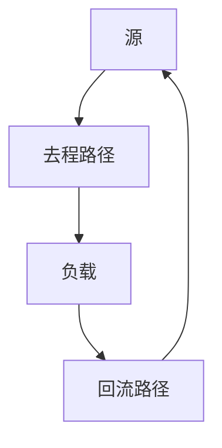

原理图通常突出信号线，却把回流隐藏在 GND 符号中。PCB 设计必须重新把回流路径画出来。若无法说明电流如何返回源端，就不能判断环路面积、串扰和 EMI。

### 10.5 低频与高频回流

#### 10.5.1 低频回流

低频和直流电流更倾向于选择总电阻较低的路径，可能在较宽区域分布。

#### 10.5.2 高频回流

高频回流更关注环路电感，倾向于贴着信号走线下方或邻近参考平面返回，以减小磁场和环路面积。

#### 10.5.3 过渡不是固定频率

回流行为与走线长度、层间距、边沿速度和几何结构有关，不能用一个固定频率简单划分“低频”和“高频”。数字信号即使切换频率低，只要边沿快，也包含高频回流。

### 10.6 环路面积

环路面积越大：

- 自感通常越大。
- 对外磁场辐射越强。
- 对外部磁场越敏感。
- 开关瞬态和振铃越明显。

因此去程与回程应靠近：信号线贴近参考平面，电源开关环路紧凑，差分对保持成对，接口保护泄放路径短。

### 10.7 公共阻抗耦合

两个回路共享一段地或电源阻抗时，一个回路的电流变化会在共享阻抗上产生电压，进入另一个回路：

```text
Vcoupled = Iaggressor × Zshared
```

常见例子：

- 电机回流与 MCU 地共享细长走线，导致复位。
- LED 大电流与 ADC 参考共享过孔，造成采样跳动。
- USB 屏蔽泄放电流经过数字地，导致通信异常。
- 功率 MOSFET 源极压降进入栅极驱动和电流采样。

解决思路是减少共享阻抗、重排电流路径或分配独立回流，而不是只增加滤波电容。

### 10.8 完整地平面

完整地平面的优势：

- 为高速信号提供连续、邻近回流。
- 降低地阻抗和公共阻抗耦合。
- 简化布局布线与 EMI 控制。
- 提供屏蔽、散热和过孔连接空间。

大多数低压数字和混合信号 PCB 优先使用连续地平面。双层板也应尽量让一层保持大面积连续地，避免被普通信号切成碎片。

### 10.9 分割地平面的风险

随意分割地平面可能导致：

- 信号跨缝，回流被迫绕路。
- 环路面积增大，辐射和串扰上升。
- 连接点形成狭窄公共阻抗。
- 多条外部线缆重新把分开的地连接成环路。
- PCB 调试和改版难度增加。

模拟和数字噪声控制通常优先通过功能分区、器件布局和电流路径解决，而不是先切地。

### 10.10 模拟地与数字地

#### 10.10.1 常见正确思路

- 保持连续参考地。
- 将模拟前端、参考和 ADC 布置在安静区域。
- 数字时钟和大电流回流不穿过模拟区域。
- ADC 的模拟和数字引脚按数据手册去耦和连接。
- 接口在模块边界进入，不让外部泄放电流穿越模拟区。

#### 10.10.2 何时使用不同网络名

不同网络名可用于表达连接位置和约束，例如 `AGND`、`PGND`、`GND` 通过 Net Tie 在指定位置连接。是否需要这样做取决于器件参考设计和电流路径，不是所有 ADC 都要求切割地平面。

### 10.11 星形接地

星形接地让多个回路只在一个节点汇合，可降低低频大电流之间的公共阻抗。适合：

- 低频音频和大电流负载。
- 独立电源支路。
- Kelvin 采样和精密参考连接。

星形接地不适合替代高速信号的连续参考平面。若高速信号被迫通过长星形回路返回，结果可能更差。

### 10.12 单点、多点与混合接地

- 单点接地：适合低频、多个独立大电流支路。
- 多点接地：适合高频，通过低阻抗平面和多处连接缩小回路。
- 混合接地：低频控制汇合点，高频通过电容、机壳或平面提供短路径。

选择依据是频率、回路、结构和安全要求，而不是固定流派。应分别画出低频与高频电流路径。

### 10.13 机壳地、屏蔽地与保护地

#### 10.13.1 保护地 PE

保护地主要承担人身安全和故障电流，不应为了消除噪声被断开。其连接、线径和结构由适用安全要求决定。

#### 10.13.2 机壳地 Chassis

金属机壳可作为屏蔽和 ESD 泄放路径。外部连接器屏蔽通常需要在入口附近与机壳形成短、高频低阻路径。

#### 10.13.3 信号地

信号地是电路参考。它与机壳的连接可以是直连、单点、电容、RC 或受控网络，取决于安全、EMC 和接口。不要在多个不受控位置偶然连接。

### 10.14 隔离系统的地

真正隔离系统至少包含：

- 独立电源或隔离电源。
- 隔离信号器件。
- 受控爬电、电气间隙和 PCB 边界。
- 清楚命名的两侧地，如 `GND_PRI`、`GND_ISO`。

USB、示波器、编程器、屏蔽层和机壳可能重新跨接隔离两侧。系统图和测试方案必须把这些外部路径考虑进去。

### 10.15 信号换层与参考转换

信号换层时，如果新层仍参考同一个 GND 平面，回流可通过附近地过孔完成层间转换。原则：

- 信号过孔附近提供一个或多个参考地过孔。
- 避免信号过孔离回流过孔很远。
- 差分对换层时保持过孔结构对称。
- 高频总线大量换层时规划回流过孔阵列。

回流过孔的作用不是“补地铜”，而是为高频电流提供层间闭合路径。

### 10.16 参考平面变化

若信号从参考 GND 的层切换到参考电源平面的层，回流需要通过电源—地去耦电容完成参考转换。应在换层附近提供合适高频去耦，并确认两个平面之间具有低阻抗连接。

更简单可靠的做法是让关键信号始终邻近连续地平面，减少参考转换。

### 10.17 跨越平面缝隙

高速或快速边沿信号不应跨越：

- 地平面分割缝。
- 电源岛边缘而没有参考转换。
- 大面积开槽、安装孔和板边缺口。
- 连接器屏蔽与信号地之间的禁铜边界。

若结构无法避免，应重新规划层、增加受控回流桥接或调整接口位置，而不是用一根远距离地线补救。

### 10.18 差分信号的回流

理想差分对中两根线电流方向相反，可相互提供部分回流，但实际仍存在共模分量和不完全对称，因此仍需要连续参考平面。

差分对设计关注：

- 两线耦合和参考平面。
- 共模回流和连接器屏蔽。
- 换层回流过孔。
- ESD 和共模器件的对称布局。
- 不跨平面缝隙。

### 10.19 电源电流回路

电源路径不仅是“电源线加粗”，还包括负载回流：

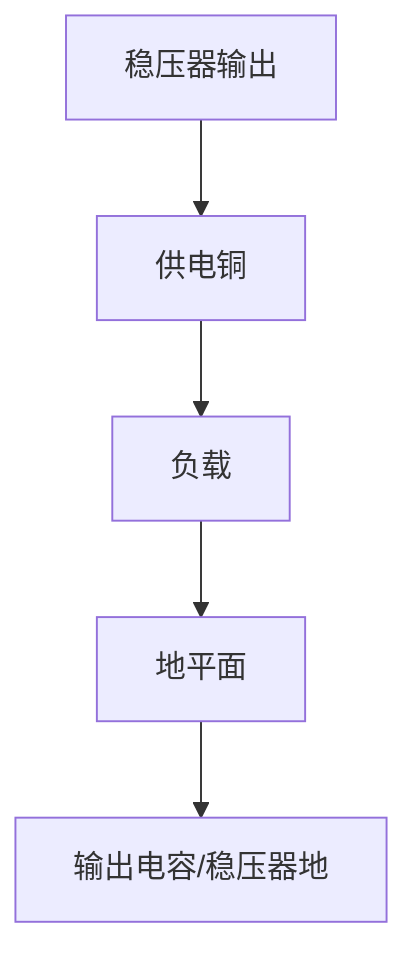

大电流负载应从电源分配点独立引出，避免经过精密模拟和主控参考地。连接器、保险、采样电阻和过孔都属于完整回路。

### 10.20 开关电源回路

开关电源应分别识别：

- 输入高频脉冲回路。
- 栅极驱动回路。
- 开关节点电场区域。
- 电感与输出电容回路。
- 反馈与补偿小信号回路。

功率回路和控制回路在指定点汇合，避免大电流压降进入反馈和控制地。

### 10.21 Kelvin 连接

Kelvin 连接通过独立采样路径避开功率路径压降，常用于：

- 电流采样电阻。
- 远端电压采样。
- 功率 MOSFET Source Sense。
- 精密参考地。
- 大电流连接器压降检测。

采样线从元件端点直接引出，成对、短、远离开关噪声，并避免与功率铜共享细颈。

### 10.22 去耦的目的

芯片开关时需要快速电流。远端稳压器无法通过带电感的走线立即提供这部分电流，去耦电容在负载附近形成局部回路：

```mermaid
flowchart TD
    N1["去耦电容"]
    N2["芯片电源脚"]
    N3["芯片内部开关"]
    N4["地脚"]
    N1 --> N2
    N2 --> N3
    N3 --> N4
    N4 --> N1
```

去耦同时降低电源网络阻抗、限制局部电压变化，并减少高频电流在整板传播。

### 10.23 电容的真实高频模型

真实电容可简化为电容、ESR 和 ESL 的组合：

```text
ZC ≈ ESR + jωESL + 1/(jωC)
```

低频时容抗占主导；自谐振附近阻抗最低；更高频时 ESL 占主导，电容表现得更像电感。

自谐振近似：

```text
fSR ≈ 1 / (2π√(ESL×C))
```

因此“大容量电容高频阻抗一定更低”并不成立。

### 10.24 去耦电容的位置

关键不是电容到芯片的直线距离，而是完整电流环路的电感。布局原则：

- 电容靠近对应电源和地引脚。
- 电源脚—电容—地过孔路径短、宽、无细颈。
- 电容优先放在与芯片同面。
- 地过孔靠近电容地焊盘。
- 多电源脚按数据手册分配，不让多个高速电源脚共享长路径。

### 10.25 过孔与安装电感

电容本体性能再好，长走线、远过孔和窄焊盘连接也会增加安装电感。改善方法：

- 使用短焊盘连接。
- 电源和地分别使用邻近过孔。
- 大电流或高频场景使用多个过孔。
- 减少过孔到平面之间的长颈。
- BGA 下方按电源域规划电容和过孔。

### 10.26 去耦容值的选择

常见容值组合不是固定配方。选择依据包括负载瞬态、芯片封装、目标频段、有效容值和安装电感。

初步储能估算：

```text
C ≥ ΔI × Δt / ΔV
```

该公式只描述一段时间内允许的电压变化，不包含 ESR、ESL、稳压器响应和反谐振。最终应结合数据手册、PDN 分析或负载阶跃验证。

### 10.27 小电容与大电容的分工

- 小封装、小容量 MLCC：安装电感低，适合较高频局部瞬态。
- 中等容量 MLCC：覆盖中频段，但需检查直流偏压。
- 聚合物或电解：提供较低频储能和阻尼。
- 电源入口大容量：处理线缆与负载慢变化，不能替代芯片近端去耦。

器件数量和容值应根据目标阻抗和实际频谱选择，不是“每个芯片都固定放 100 nF + 10 µF”。

### 10.28 储能电容

储能电容通常放在：

- 电源入口。
- 稳压器输入与输出。
- 连接器和长线负载附近。
- 电机、无线和高峰值负载附近。

检查容值、耐压、ESR、纹波电流、寿命、浪涌和启动电流。过大的输入电容可能增加热插拔浪涌，过低 ESR 也可能使某些控制环路或输入滤波缺少阻尼。

### 10.29 目标阻抗

电源网络允许的最大阻抗可初步表示为：

```text
Ztarget = ΔVallow / ΔItransient
```

例如允许电源变化 50 mV，负载阶跃 0.5 A：

```text
Ztarget = 0.05 / 0.5 = 0.1 Ω
```

目标阻抗用于指导稳压器、平面和电容网络在目标频段内保持足够低的阻抗。它不是单个电容阻抗指标，而是整个 PDN 的系统指标。

### 10.30 PDN 的频段分工

- 稳压器控制环路：较低频。
- 大容量电容：低到中频。
- 近端 MLCC：中到较高频。
- 平面对、电源过孔和封装：更高频。
- 芯片内部电容：最高频局部瞬态。

各部分重叠形成完整供电网络。若某一频段出现高阻抗峰值，负载电流会在该频段产生更大电压噪声。

### 10.31 反谐振

不同容值、电容 ESR/ESL、过孔和平面组合可能形成反谐振峰值。简单并联多个理想不同容值并不保证阻抗曲线平滑。

降低风险的方法：

- 使用适当 ESR 的电容提供阻尼。
- 减少不必要的安装电感差异。
- 采用同系列多颗电容形成可预测网络。
- 通过仿真、VNA 或负载阶跃验证。
- 避免无依据地堆叠“十进制容值阵列”。

### 10.32 MCU、FPGA 与 BGA 去耦

复杂数字器件通常有多个电源域和大量电源脚。设计步骤：

1. 按核心、I/O、模拟、PLL、存储等电源域分类。
2. 从数据手册获取每个域的去耦与时序要求。
3. 规划 BGA 扇出、电源和地过孔。
4. 将高频电容放在引脚附近或背面近端。
5. 中低频储能分布在器件周围和电源入口。
6. 检查电容、过孔与平面形成的实际回路。

只统计电容总数量，不能证明每个电源域都得到有效去耦。

### 10.33 ADC、DAC、PLL 与参考去耦

这些节点对噪声和回流更敏感：

- 使用数据手册指定容值、材质和连接。
- 参考电容靠近引脚，回流到指定参考地。
- 不让数字、电机和开关电源回流经过参考路径。
- PLL 或模拟电源可使用 LDO、RC 或受控磁珠隔离，但需检查稳定性。
- 不把精密参考轨用于 LED、上拉和其他普通负载。

### 10.34 磁珠隔离电源域

磁珠串在电源域之间时，需要同时检查：

- 目标噪声频段的阻抗。
- 直流电流和偏置下阻抗变化。
- DCR 和压降。
- 两侧电容形成的谐振。
- 负载瞬态是否造成局部电压跌落。
- 未上电和反灌路径。

磁珠适合限制高频噪声传播，不适合修复错误的回流路径，也不应替代稳压器或真正隔离。

### 10.35 滤波前先建立噪声模型

任何滤波设计先回答：

1. 噪声源在哪里？
2. 主要频率和边沿是什么？
3. 通过传导、共阻抗、电场、磁场还是辐射传播？
4. 受害者允许的噪声是多少？
5. 滤波器放在哪里才能截断路径？
6. 源阻抗和负载阻抗是多少？

不知道噪声源和频段时堆叠元件，可能增加压降、振铃和成本，却没有改善问题。

### 10.36 RC 滤波器

一阶 RC 低通：

```text
fc = 1 / (2πRC)
```

优点：简单、天然有阻尼、成本低。局限：串联电阻产生压降、热和源阻抗，不能用于大电流电源。

常见用途：

- ADC 输入抗混叠和限流。
- Reset、Enable 和慢速控制去毛刺。
- 传感器偏置与参考滤波。
- 小电流模拟电源支路。

### 10.37 LC 与 π 型滤波器

理想 LC 谐振频率：

```text
f0 = 1 / (2π√(LC))
```

LC 损耗低，但容易出现高 Q 谐振。π 型滤波器提供更强衰减，但元件和寄生更多，对源负载阻抗与布局更敏感。

设计时检查：

- 谐振频率与噪声频段。
- 电感饱和、DCR 和磁芯损耗。
- 电容有效值、ESR 和纹波。
- 转换器输入稳定性。
- 启动浪涌和负载瞬态。

### 10.38 阻尼方法

常见阻尼方法：

- 利用电解或聚合物电容的 ESR。
- 在电容支路串联小电阻。
- RC 阻尼支路。
- 选择损耗更合适的磁珠或电感。
- 降低滤波器 Q 或移动截止频率。

阻尼元件会产生损耗，应按 RMS 电流和温升选择。阻尼设计通过阻抗曲线、阶跃响应或实际噪声测试验证。

### 10.39 共模与差模噪声

- 差模噪声：两根导线电流方向相反，表现为线与线之间的噪声。
- 共模噪声：多根导线相对机壳或环境同方向变化，回流可能通过寄生电容和屏蔽。

差模滤波使用串联电感、差模电容等；共模滤波常使用共模扼流圈、机壳连接和共模电容。必须先判断噪声模式，不能用共模扼流圈解决所有线间纹波。

### 10.40 共模扼流圈

共模扼流圈的两绕组对工作差模电流磁通抵消，对共模电流呈较高阻抗。选型检查：

- 共模阻抗频率曲线。
- 差模漏感和信号影响。
- 额定电流、DCR 和温升。
- 寄生电容和自谐振。
- 高速接口的插入损耗、模式转换和不平衡。

器件布局应靠近连接器或噪声边界，并保持差分通道对称。

### 10.41 馈通电容与机壳滤波

馈通电容利用三端结构提供低电感高频泄放，适合接口或屏蔽边界。普通两端电容如果通过长走线连接到机壳，实际高频效果可能很差。

接口滤波的理想位置是噪声穿过边界的地方：

- 连接器附近。
- 屏蔽壳入口。
- 电源穿墙端子。
- 隔离和功能分区边界。

### 10.42 信号 RC 与输入保护

信号串联电阻可以：

- 限制 ESD/过压钳位电流。
- 与输入电容形成低通。
- 减缓数字边沿和振铃。
- 隔离运放与容性负载。

但电阻会增加噪声、延时和源阻抗。ADC、比较器和高速数字输入需检查采样、阈值和时序。

### 10.43 ADC 输入滤波

ADC 输入 RC 既是滤波器，也是采样电容充电网络。设计时考虑：

- ADC 采样时间和采样电容。
- 驱动源阻抗和运放稳定性。
- 抗混叠目标频率。
- 串联电阻限制输入钳位电流。
- 电容介质、漏电和失真。

只按 `fc` 公式选择 RC，可能导致 ADC 在采样窗口内无法达到目标精度。

### 10.44 电源入口滤波

入口滤波同时面对外部噪声进入和内部噪声外泄。设计检查：

- 线缆、适配器和输入电容产生的振铃。
- TVS 与滤波器的位置顺序。
- 共模和差模回流。
- 保险与浪涌限制。
- 滤波器对热插拔和 UVLO 的影响。
- 机壳、屏蔽和保护地路径。

入口滤波应与 EMC 测试和实际线缆一起验证。

### 10.45 线缆屏蔽连接

屏蔽层用于截获电场和提供共模电流路径。高频下，长“猪尾巴”接地线电感较大，屏蔽效果明显下降。优先使用靠近连接器的低阻抗、较大周向接触。

屏蔽连接策略需结合：

- 机壳是否导电和接地。
- 两端设备地电位差。
- 安全与低频地环路。
- 高频共模泄放需求。

“只接一端”或“两端都接”不是无条件规则，应区分频率和系统结构。

### 10.46 实验室地环路

台式电源、示波器、电脑 USB、串口和 DUT 可能通过保护地形成多个连接。故障表现：

- 工频纹波和低频噪声。
- 浮地节点被意外接地。
- 屏蔽层流过大电流。
- 普通探头地夹造成短路。

解决方式是明确所有地路径，使用差分测量、隔离接口、正确屏蔽和单点连接。不能拆除保护地来“消除地环路”。

### 10.47 地弹与同步开关噪声

多个数字输出同时翻转时，共享封装、过孔和地平面电感会产生 Ground Bounce。影响包括：

- 输入阈值误判。
- 时钟抖动和假边沿。
- ADC 与参考噪声。
- EMI 增加。

改善方法：增加电源地引脚去耦、减少共享回路、控制边沿、优化引脚分配和连续参考平面。

### 10.48 测量接地与回流

#### 10.48.1 电源纹波

使用短地弹簧或同轴，在负载引脚附近测量。长地线环路会拾取磁场并产生假尖峰。

#### 10.48.2 地电位差

使用差分探头测量两个地节点之间的瞬态，确认共模范围和探头额定。不要用两个普通探头地夹分别连接不同地节点。

#### 10.48.3 电流回路

电流探头或分流器可帮助确认回流是否经过预期路径。近场磁探头适合定位高 `di/dt` 环路热点。

### 10.49 去耦验证方法

- 在芯片电源脚附近测量负载切换时的电压。
- 比较不同工作模式和时钟频率。
- 使用负载阶跃观察跌落、过冲和振铃。
- 比较电容位置、过孔和容值修改前后。
- 必要时测量 PDN 阻抗或进行频域仿真。

仅测稳态平均电压不能证明去耦有效。

### 10.50 滤波器验证方法

验证包括：

- 插入损耗或频率响应。
- 输入输出噪声频谱。
- 负载阶跃和启动响应。
- 不同源阻抗、负载和线缆。
- 元件公差、温度和直流偏置。
- 是否产生新的谐振峰值。

滤波器在 50 Ω 仪器系统中表现良好，不代表在真实高阻或低阻电路中同样有效。

### 10.51 混合信号板示例

系统包含 MCU、ADC、传感器、Buck 和电机驱动：

```mermaid
flowchart TD
    N1["电源入口"]
    N2["Buck"]
    N3["3V3_SYS"]
    N4["MCU/数字接口"]
    N5["磁珠或 LDO"]
    N6["3V3_A"]
    N7["ADC/参考/传感器"]
    N8["电机电源"]
    N9["驱动器"]
    N10["电机"]
    N1 --> N2
    N2 --> N3
    N3 --> N4
    N4 --> N5
    N5 --> N6
    N6 --> N7
    N8 --> N9
    N9 --> N10
```

布局策略：

- 保持完整地平面。
- Buck 与电机驱动靠近电源和负载接口。
- 模拟前端远离 SW、电感和 PWM。
- 磁珠/LDO 在模拟电源域入口，模拟负载局部去耦。
- ADC 模拟与数字引脚按手册连接，数字线不穿过模拟输入区。
- 电机回流直接返回功率入口，不穿过 ADC 参考区域。

验证时分别运行静态采样、MCU 高负载、Buck 轻载、电机 PWM 和堵转边界，观察 ADC 噪声与电源地瞬态。

### 10.52 接地与去耦检查清单

#### 回流与平面

- [ ] 每条关键信号和电源都有明确回流路径。
- [ ] 高速信号不跨地缝、开槽和参考中断。
- [ ] 换层附近有参考地过孔。
- [ ] 差分对换层与保护器件保持对称。
- [ ] 大电流回流不穿过模拟和参考区域。

#### 接地架构

- [ ] GND、AGND、PGND、CHASSIS、PE 和隔离地定义清楚。
- [ ] Net Tie 或单点连接位置有依据。
- [ ] 机壳和屏蔽泄放路径靠近接口。
- [ ] 外部仪器和 USB 不会意外跨接隔离域。

#### 去耦与 PDN

- [ ] 每个电源域按数据手册配置去耦。
- [ ] 电容回路短，过孔靠近焊盘。
- [ ] 使用有效容值而非只看标称值。
- [ ] 储能、纹波和启动浪涌均已检查。
- [ ] 反谐振和目标阻抗风险有分析或实测。

#### 滤波

- [ ] 噪声源、频段、路径和受害者明确。
- [ ] RC/LC/磁珠/共模器件选择有计算依据。
- [ ] 滤波器具有足够阻尼。
- [ ] 源负载阻抗、直流偏置和温升已考虑。
- [ ] 启动、负载阶跃和真实线缆条件已验证。

### 10.53 接地与滤波记录模板

```markdown
# 接地、回流与滤波设计记录

- 项目：
- 模块：
- PCB 版本：

## 电流回路

| 回路 | 去程 | 回流 | 频率/边沿 | 风险 |
| :--- | :--- | :--- | :--- | :--- |
|  |  |  |  |  |

## 地与屏蔽

- 信号地：
- 功率地：
- 模拟地：
- 机壳/屏蔽：
- 隔离边界：
- 指定连接点：

## 去耦

| 电源域/器件 | 瞬态电流 | 允许波动 | 电容配置 | 布局说明 |
| :--- | :--- | :--- | :--- | :--- |
|  |  |  |  |  |

## 滤波

| 噪声源 | 目标频段 | 传播路径 | 滤波器 | 阻尼 | 验证方法 |
| :--- | :--- | :--- | :--- | :--- | :--- |
|  |  |  |  |  |  |

## 测试结果

- 测点与探头：
- 工作模式：
- 修改前：
- 修改后：
- 结论：
```

### 10.54 常见错误

- 把 GND 当成吸收所有噪声的理想节点。
- 只看信号去程，不画回流路径。
- 为了区分模拟和数字而随意切割地平面。
- 高速信号跨越地缝、安装孔和参考平面边缘。
- 信号换层但没有附近参考过孔。
- 去耦电容靠近芯片，但地过孔和回路很远。
- 用大容量入口电容替代芯片近端高频去耦。
- 只按标称容值，不检查 MLCC 直流偏压和安装电感。
- 不分析反谐振，机械堆叠多个不同容值。
- 用磁珠掩盖错误回流路径或电源布局。
- LC/π 滤波器没有阻尼，启动或负载变化时振荡。
- 线缆屏蔽通过长引线连接到机壳，失去高频效果。
- 测纹波使用长地线，把测量环路噪声当成真实结果。

### 10.55 本章自测

1. 为什么同名 GND 节点在瞬态电流下可能存在电压差？
2. 低频和高频回流选择路径的主要差异是什么？
3. 公共阻抗耦合如何让电机电流影响 ADC 读数？
4. 为什么完整地平面通常优于随意分割模拟地和数字地？
5. 信号换层时参考地过孔承担什么作用？
6. 差分信号为什么仍然需要连续参考平面？
7. 去耦电容的关键为什么是完整环路而不只是距离？
8. ESR、ESL 和自谐振如何影响电容高频行为？
9. 目标阻抗如何从允许电压变化和负载阶跃得到？
10. 为什么不同容值电容并联可能产生反谐振？
11. LC 和 π 型滤波器为什么常需要阻尼？
12. 如何区分共模噪声和差模噪声？
13. 为什么屏蔽层的长接地尾线在高频下效果差？
14. 如何用正确探头验证去耦和滤波是否有效？

能够为一条信号、一条电源和一个外部接口分别画出完整回路，并通过布局和测量证明回流与滤波符合预期，才算真正掌握接地、去耦与滤波设计。

---

## 11. 模拟电路基础

### 11.1 本章学习目标

模拟电路的任务，是在真实世界连续变化的电压、电流、电荷、阻抗和频率信息与数字系统之间建立可靠接口。本章完成后，应能够：

- 从传感器输出、量程、带宽和精度要求出发规划完整信号链。
- 正确使用运算放大器、仪表放大器、比较器和跨阻放大器。
- 建立增益、带宽、噪声、失调、漂移和动态范围的误差预算。
- 理解 ADC、DAC、参考电压和采样网络之间的相互影响。
- 设计基础滤波、偏置、保护、校准和模拟 PCB 布局。
- 使用示波器、万用表、信号源和频谱分析方法验证模拟电路。

模拟设计不是“套公式选阻容”，而是在输入范围、供电条件、器件非理想特性、噪声环境、生产偏差和成本之间进行系统折中。

### 11.2 模拟信号链的系统视角

典型模拟信号链可以抽象为：

```text
传感器或外部接口
    ↓
限流、钳位、ESD 与浪涌保护
    ↓
偏置、阻抗变换、放大或衰减
    ↓
模拟滤波与抗混叠
    ↓
ADC 与参考电压
    ↓
数字校准、滤波、补偿和控制
    ↓
DAC、PWM 滤波或模拟驱动输出
```

每一级都应有明确的输入范围、输出范围、增益、带宽、噪声、容差和异常状态。前级一旦饱和，后级再高的分辨率也无法恢复信息；保护器件若具有过大的漏电流或结电容，也可能破坏高阻或高速测量。因此，模拟链路必须按端到端指标设计。

### 11.3 需求分解与动态范围

开始画原理图前，应至少明确以下条件：

- 被测信号的最小值、最大值、直流偏置和允许过载范围。
- 有效频率范围、边沿速度、脉冲宽度或建立时间。
- 目标绝对误差、相对误差、重复性和长期稳定性。
- 环境温度、供电变化、共模电压和外部干扰水平。
- 输入是否允许加载，输出需要驱动多大的电阻和电容。
- 是否存在掉电、热插拔、反接、开路、短路或超量程情况。

若有效信号范围为 `Vmax - Vmin`，而系统可分辨的最小变化为 `ΔVmin`，所需动态范围近似为：

```text
Dynamic Range = 20 × log10((Vmax - Vmin) / ΔVmin) dB
```

动态范围不仅由 ADC 位数决定，还会被前端噪声、参考源噪声、增益误差、非线性和布局耦合限制。设计时应给过载、温漂和器差留出裕量，避免把正常最大信号恰好设计到电源轨或 ADC 满量程。

### 11.4 单端、差分与电流信号

单端信号以公共参考地为基准，结构简单，但容易受到地电位差和共模噪声影响。差分信号使用两根线的电压差表示信息，只要接收器共模范围允许，并且两根线受到近似相同的干扰，就能获得较好的共模抑制。

```text
Vdiff = V+ - V-
Vcm   = (V+ + V-) / 2
```

差分输入合法不代表每个引脚电压都合法，必须同时检查 `Vdiff`、`Vcm` 和输入绝对最大额定值。工业接口和远距离传感器常使用 `4–20 mA` 等电流信号，因为线路压降对环路电流影响较小；接收端可用精密采样电阻转换为电压：

```text
Vsense = Iloop × Rsense
```

### 11.5 源阻抗与负载效应

任何信号源都具有有限输出阻抗，测量电路也具有有限输入阻抗。若输入阻抗不够高，测量本身就会改变被测信号。对于源电阻 `Rs` 和输入电阻 `Rin`：

```text
Vmeas = Vsource × Rin / (Rs + Rin)
```

直流场景关注分压误差，交流场景还必须考虑输入电容、走线寄生电容和保护器件电容。高阻传感器通常需要低输入偏置电流放大器、短走线、清洁板面和 Guard；低阻传感器则更容易受到连接器接触电阻、走线压降和热电势影响。

### 11.6 理想运算放大器模型

理想运算放大器具有无限开环增益、无限输入阻抗、零输出阻抗、无限带宽和零失调。在线性负反馈且输出未饱和时，可使用两个近似：

```text
输入电流：I+ ≈ I- ≈ 0
虚短关系：V+ ≈ V-
```

“虚短”不是两个输入端真实短路，也不意味着输入电压在所有条件下相等。若反馈方向错误、输入超出共模范围、输出达到摆幅极限、频率过高或电源尚未建立，理想模型就可能失效。分析电路前，应先确认负反馈路径真实存在。

### 11.7 负反馈与闭环增益

运放开环关系为：

```text
Vout = Aol × (V+ - V-)
```

其中 `Aol` 是随频率降低的开环增益。负反馈把一部分输出送回反相端，使差分输入减小，并由外部阻抗网络决定闭环增益。负反馈可改善增益准确度、线性度和输出阻抗，但会引入稳定性问题。

判断反馈极性的简单方法是：假设输出略微上升，沿反馈路径检查该变化是否促使输出回落。若反而继续推动输出上升，就是正反馈，电路会趋向饱和或振荡。

### 11.8 电压跟随器与缓冲

电压跟随器把输出直接反馈到反相端，理想闭环增益为 `1`：

```text
Vout ≈ Vin
```

它用于提高输入阻抗、降低输出阻抗和隔离前后级，但“单位增益”并不意味着任何运放都能稳定工作。选型时必须确认器件为 Unity-Gain Stable，并检查输入共模范围、输出摆幅、容性负载能力和静态电流。

跟随器驱动 ADC 时，还要检查运放能否快速给 ADC 内部采样电容充电，以及采样瞬态是否会使运放振荡。常见做法是在运放输出与 ADC 输入之间串联小电阻，并在 ADC 端就近放置电容形成电荷储存和隔离网络。

### 11.9 同相放大器

同相放大器输入阻抗高，输出与输入同相。理想增益为：

```text
Av = 1 + Rf / Rg
Vout = Vin × Av
```

`Rf` 从输出接到反相端，`Rg` 从反相端接到参考节点。双电源系统中参考节点通常是地；单电源系统中可能是中点偏置 `Vbias`，此时：

```text
Vout = Vbias + (Vin - Vbias) × Av
```

电阻不宜过小，否则增加输出负载和功耗；也不宜过大，否则偏置电流、热噪声和寄生电容影响上升。精密增益通常使用低温漂、匹配良好的电阻网络。

### 11.10 反相放大器

反相放大器通过输入电阻 `Rin` 将信号送到反相端，理想关系为：

```text
Av = -Rf / Rin
Vout = Vref - (Vin - Vref) × Rf / Rin
```

其输入阻抗近似等于 `Rin`，因此会直接加载信号源。反相节点是“虚拟参考点”，不是可以随意连接其他负载的低阻电源节点。布局时，反相输入、`Rin`、`Rf` 和输出之间的环路应尽可能短。

反相结构的 Noise Gain 为 `1 + Rf/Rin`，而不是信号增益的绝对值。在跨阻放大器、交流耦合或复杂反馈网络中，稳定性分析必须基于 Noise Gain。

### 11.11 求和器与差分放大器

反相求和器可把多路信号按电阻比例加权：

```text
Vout = Vref - Rf × Σ((Vi - Vref) / Ri)
```

它常用于 DAC 合成、偏置叠加和多通道混合。各输入会在求和节点耦合，设计时应分析某一路断开、短路或掉电时对其他通道的影响。

四电阻差分放大器在电阻比满足 `R2/R1 = R4/R3` 时，可放大两输入之差。其共模抑制高度依赖电阻比匹配，使用四只独立 `1%` 电阻通常无法获得高 CMRR。高精度场景应采用匹配电阻网络或仪表放大器。

### 11.12 输入共模范围与输出摆幅

运放输入共模范围定义两个输入端允许共同处于的电压区间。输入差分电压很小，并不代表输入共模合法。超出范围后可能出现失真、增益异常、相位反转或恢复缓慢。

输出摆幅取决于电源电压、负载电流、温度和输出方向。所谓 Rail-to-Rail Input/Output 也通常只能“接近”电源轨，不能默认精确达到电源轨。应查看数据手册在实际负载和温度条件下的保证值，而不是只看典型曲线。

设计检查应覆盖：

- 正常最小、典型和最大输入。
- 上电、掉电和异常输入状态。
- 输入共模随增益和偏置变化的轨迹。
- 输出峰值、负载电流和距离电源轨的余量。

### 11.13 增益带宽积与 Noise Gain

单主极点补偿运放的闭环带宽可粗略估算为：

```text
Closed-Loop Bandwidth ≈ GBW / Noise Gain
```

该公式只适合初步估算。实际带宽还受高阶极点、负载、反馈电容和器件工艺影响。为了获得规定频率处较小的幅度和相位误差，GBW 通常要比最低理论需求高若干倍。

Noise Gain 是把非反相端微小扰动放大到输出的闭环增益。即使反相放大器的信号增益小于 `1`，Noise Gain 仍至少为 `1`。选择“最小稳定增益大于 1”的运放时，必须确保整个频率范围内的 Noise Gain 满足稳定条件。

### 11.14 压摆率与大信号带宽

压摆率 `SR` 表示输出电压最大变化速度。正弦波峰值为 `Vp`、频率为 `f` 时，避免 Slew Rate 失真至少需要：

```text
SR ≥ 2πfVp
```

例如，`100 kHz`、`5 Vpp` 正弦波的 `Vp = 2.5 V`，理论最低 `SR` 约为 `1.57 V/µs`。工程上还应留出裕量。GBW 描述小信号频率响应，SR 描述大信号变化能力，两者必须同时满足。

阶跃响应还受到输出电流限制。驱动大电容时，即使运放本身 SR 很高，最大变化速度仍可能近似受限于：

```text
dV/dt = Iout / Cload
```

### 11.15 失调电压、偏置电流与温漂

输入失调电压 `Vos` 可理解为使理想输出归零所需施加在输入端的等效微小电压。闭环输出误差近似为：

```text
Vout_offset ≈ Vos × Noise Gain
```

输入偏置电流流经源阻抗和反馈电阻，也会产生附加失调。双极型输入运放通常偏置电流较大但电压噪声可能较低；JFET 或 CMOS 输入运放偏置电流较小，但必须关注输入电压噪声、漏电随温度变化以及输入保护结构。

精密系统不能只看室温初始值，还应计算失调温漂、偏置电流温漂、电阻温漂、参考源温漂和长期漂移。自动归零或斩波运放可降低低频失调，但可能带来开关纹波、输入电流脉冲和特定频段噪声峰值。

### 11.16 CMRR 与 PSRR

共模抑制比 CMRR 描述运放抑制两个输入端共同变化的能力，电源抑制比 PSRR 描述电源变化转换为输入等效误差的程度。两者通常随频率升高而下降。

高 CMRR 不仅依赖芯片本身，也依赖外部阻抗匹配。差分输入两侧若 RC 不对称，共模干扰会被转换为差模误差。高 PSRR 也不能替代良好的供电去耦，因为开关电源纹波、数字瞬态和地弹噪声可能通过多条路径进入信号链。

### 11.17 模拟噪声的基本认识

噪声应使用频谱密度和带宽分析，而不能只看一个峰峰值数字。常见噪声包括：

- 电阻热噪声，近似白噪声。
- 运放输入电压噪声和输入电流噪声。
- 半导体器件的 `1/f` 噪声，低频下更明显。
- 电源纹波、时钟、PWM、射频和工频耦合等确定性干扰。
- ADC 量化噪声、参考噪声和采样时钟抖动。

互不相关的 RMS 噪声不能直接线性相加，应使用均方根合成：

```text
Vnoise_total = sqrt(V1² + V2² + V3² + ...)
```

降低带宽通常是最有效的降噪措施之一，因此滤波器带宽应围绕真实信号需求设置，而不是越宽越保险。

### 11.18 电阻热噪声

电阻在绝对温度 `T`、带宽 `B` 内的 RMS 热噪声电压为：

```text
en = sqrt(4kTRB)
```

其中 `k` 为玻尔兹曼常数，`R` 为电阻值。热噪声随电阻平方根、带宽平方根和绝对温度平方根增加。高阻反馈网络虽然省电，却会提高热噪声，并放大输入偏置电流和板面漏电造成的误差。

除了热噪声，还应注意电阻的过量噪声、电压系数和温度系数。厚膜电阻在高增益低频精密场景中可能不如薄膜电阻，实际选型应根据误差预算和成本决定。

### 11.19 运放电压噪声与电流噪声

运放输入电压噪声密度通常以 `nV/√Hz` 表示，输入电流噪声密度通常以 `pA/√Hz` 或 `fA/√Hz` 表示。电流噪声流过源阻抗后转换成电压噪声：

```text
en_current = in × Zsource
```

低源阻抗系统通常更关注电压噪声，较高源阻抗系统则可能由电流噪声主导。总输出噪声应分别计算各噪声源经过其 Noise Gain 或传递函数后的贡献，再按 RSS 合成。

数据手册给出的宽带噪声密度不能直接代表低频性能。直流和慢速测量应重点检查 `0.1–10 Hz` 峰峰值噪声、`1/f` 拐点和温漂；音频或高速系统则应积分目标频带内的噪声谱密度。

### 11.20 稳定性与相位裕量

负反馈系统在环路增益大于 `1` 时若累计相移接近 `180°`，负反馈会转化为正反馈并导致振荡。相位裕量越小，阶跃响应通常越容易出现过冲和振铃。

稳定性受以下因素影响：

- 运放开环增益和高阶极点。
- 反馈网络的电容与寄生参数。
- 传感器、ADC、连接器和走线形成的容性负载。
- 电源去耦、接地电感和输出电流变化。
- 原理图上未显示的封装、探头和测试夹具寄生参数。

检查稳定性不能只看直流输出“正常”。应观察小信号和大信号阶跃响应、不同负载和温度下的振铃，并在必要时进行环路增益仿真或实测。

### 11.21 容性负载与输出隔离

运放输出直接驱动较大电容时，输出阻抗与负载电容会增加环路相移。常见处理方法是在输出端串联隔离电阻 `Riso`，将负载电容与反馈环路隔开。

若反馈从运放引脚侧取样，稳定性通常较好，但负载端会产生 `Riso` 压降；若反馈从负载端取样，可以补偿直流压降，却会把电容重新纳入反馈环路，需要按数据手册推荐网络设计。`Riso` 不能凭经验固定为某个值，应结合负载电容、输出电流和阶跃响应优化。

### 11.22 仪表放大器

仪表放大器适合测量叠加在较大共模电压上的微小差分信号，具有高输入阻抗、较高 CMRR 和可设定增益。典型应用包括电桥、应变计、低侧分流和生物电信号。

使用时应重点检查：

- 输入共模范围是否随增益和输出电压变化。
- `REF` 引脚允许的驱动阻抗和电压范围。
- 传感器是否有输入偏置电流的直流回路。
- 输入过压时内部保护电流是否超限。
- 工频和射频共模滤波是否对称。

仪表放大器不是隔离器，不能承受超出绝对最大额定值的共模电压，也不能消除系统之间危险的地电位差。

### 11.23 跨阻放大器

跨阻放大器 TIA 将光电二极管等电流信号转换为电压。理想直流关系为：

```text
Vout ≈ Vref - Iin × Rf
```

反馈电阻 `Rf` 决定转换增益，反馈电容 `Cf` 用于限制带宽和改善稳定性。光电二极管结电容、运放输入电容和 PCB 寄生电容共同作用于反相节点，容易导致 Noise Gain 随频率升高并产生振荡。

TIA 的反相节点应极短、极小、洁净，并远离数字信号。不要随意放置大面积铜皮，因为额外寄生电容会降低带宽和相位裕量。微弱光电流测量还应评估运放偏置电流、输入保护漏电、连接器漏电和阻焊层污染。

### 11.24 电流检测

电流检测通常分为低侧和高侧：

- 低侧检测电路简单、共模电压低，但会抬高负载地电位。
- 高侧检测保持负载接地完整，但放大器必须承受较高共模电压。

采样电阻的基本关系为：

```text
Vsense = Iload × Rshunt
Pshunt = Iload² × Rshunt
```

`Rshunt` 越大，信号越容易测量，但功耗、压降和发热越大。大电流精密测量应使用 Kelvin 连接，把采样引线从电阻端子内侧独立引出，避免把载流铜箔和焊点压降计入测量结果。

还应检查脉冲电流下的峰值功率、温升、温度系数和放大器输入恢复时间。双向电流检测通常把零电流输出偏置到 ADC 中点附近。

### 11.25 比较器与迟滞

比较器用于判断两个电压的大小并快速切换输出，不应简单用普通运放替代。运放进入饱和后恢复可能很慢，输入差分保护和输出结构也未必适合比较器工作方式。

输入信号在阈值附近带噪声时，输出可能反复跳变。通过正反馈建立两个不同阈值可形成迟滞：

```text
输入上升时越过 VTH_H 才翻转
输入下降时低于 VTH_L 才复位
Hysteresis = VTH_H - VTH_L
```

设计时应检查开漏输出是否有上拉电阻、上拉电压是否与后级兼容、输入共模范围、传播延迟、最小脉宽和上电默认状态。迟滞电阻网络会与信号源阻抗相互作用，阈值必须按完整等效电路计算。

### 11.26 模拟开关与多路复用器

模拟开关和多路复用器 MUX 可让多个信号共享 ADC 或放大器，但它们不是理想导线。关键参数包括导通电阻 `Ron`、导通电阻平坦度、漏电流、关断隔离度、通道串扰、带宽、电荷注入和切换建立时间。

高阻信号容易受到漏电流影响；低电平精密信号容易受到热电势和电荷注入影响；高速信号则受到寄生电容和带宽限制。切换通道后不能立即采样，应给前端、滤波电容和 ADC 采样网络足够时间建立到目标精度。

还应检查：

- 输入电压是否始终位于模拟开关供电轨允许范围内。
- 掉电时输入是否会通过内部保护二极管反向供电。
- Break-Before-Make 是否能避免两个信号源短接。
- 未选通通道是否需要确定偏置，避免悬空积累电荷。

### 11.27 ADC 的常见架构

不同 ADC 架构适用于不同速度、分辨率和延迟要求：

- SAR ADC：中高速、中高分辨率、低延迟，常用于控制与数据采集。
- Sigma-Delta ADC：高分辨率、较低带宽，依赖过采样和数字滤波。
- Pipeline ADC：适合更高采样率，通常具有固定流水线延迟。
- Flash ADC：速度极高，但功耗、面积和成本较高。
- MCU 内置 ADC：集成方便，但更容易受片内数字噪声、参考质量和引脚复用影响。

选型不能只比较“位数”和“采样率”。还应关注输入结构、满量程范围、差分或单端模式、INL、DNL、SNR、THD、输入带宽、延迟、功耗、通道切换方式和数字接口时序。

### 11.28 分辨率、SNR 与 ENOB

分辨率为 `N` 位、满量程为 `VFS` 时，理想 LSB 为：

```text
LSB = VFS / 2^N
```

理想 ADC 对满幅正弦波的量化信噪比近似为：

```text
SNRideal ≈ 6.02N + 1.76 dB
```

根据实测 SNR 可估算有效位数：

```text
ENOB = (SNR - 1.76) / 6.02
```

标称位数表示输出码宽，不等于实际有效精度。直流精度还受偏置误差、增益误差、INL、参考误差和温漂影响；交流性能还受噪声、失真和时钟抖动影响。对于慢速传感器，重复采样的码跳动、无噪声分辨率和峰峰值噪声往往比单一 ENOB 更直观。

### 11.29 采样、Nyquist 与混叠

采样定理指出，带限信号的采样频率必须高于最高信号频率的两倍才能理论重建。但真实滤波器不可能在 Nyquist 频率处无限陡峭，因此采样率通常要高于最低理论值，并在 ADC 前设置抗混叠滤波器。

高于 Nyquist 频率的输入会折叠到目标频带内：

```text
falias = |fin - k × fs|
```

其中 `k` 取使结果落入目标频带的整数。混叠发生后无法仅靠数字低通恢复原始信号。即使被测信号本身很慢，开关电源、时钟和射频干扰也可能通过混叠落入低频测量带宽。

### 11.30 SAR ADC 的输入驱动

SAR ADC 输入端通常含有开关电容采样保持网络。采样瞬间会从外部吸取脉冲电荷，信号源必须在规定采样时间内把电容充到目标精度。高阻分压器直接连接 ADC 时，静态电压可能正确，但动态采样结果会偏低或产生通道串扰。

常见解决方案包括：

- 降低等效源阻抗。
- 延长 Acquisition Time。
- 使用适合驱动 SAR ADC 的缓冲放大器。
- 在 ADC 引脚附近放置储能电容，并串联小电阻隔离运放。
- 通道切换后丢弃第一次转换或增加建立时间。

RC 网络的电阻既要隔离采样冲击，又不能使建立过慢；电容既要提供电荷，又不能让驱动放大器失稳。优先采用 ADC 数据手册或评估板中经过验证的驱动拓扑。

### 11.31 Sigma-Delta ADC

Sigma-Delta ADC 通过过采样、噪声整形和数字滤波获得较高低频分辨率。其输出数据率不等于调制器内部采样率，数字滤波器会引入建立时间和群延迟。

使用时应注意：

- 切换通道、增益或输入后，等待数字滤波器完全建立。
- 工频抑制能力取决于输出数据率、滤波器类型和时钟准确度。
- 输入缓冲开启或关闭会改变允许源阻抗、噪声和功耗。
- PGA 增益提高后，输入范围和共模范围通常会缩小。
- “24 位”并不代表 24 位无噪声精度，应查看不同数据率下的 RMS 噪声表。

### 11.32 参考电压设计

ADC 和 DAC 的结果通常与参考电压成比例，因此参考源是信号链的一部分。应关注初始精度、温漂、长期漂移、输出噪声、负载调整率、静态电流和启动时间。

参考引脚可能在转换瞬间吸取动态电流。参考源若输出阻抗过高，会产生码相关误差。应按数据手册选择旁路电容、ESR 和缓冲器，并把电容紧靠参考引脚放置。参考地回流应直接、安静，避免与数字 IO、LED、电机或开关电源大电流共用狭窄路径。

比率式测量中，如果传感器激励与 ADC 使用同一参考，参考的绝对误差可在比例关系中部分抵消。例如电阻桥和电位器测量常利用这一特性，但仍需保证激励稳定、布线压降可控且参考输入不过载。

### 11.33 ADC 输入保护与过驱恢复

ADC 引脚通常只有较弱的内部 ESD 结构，不能把内部钳位二极管当作系统级保护。外部输入保护可由串联限流电阻、低漏电钳位器件、TVS、RC 滤波和前级缓冲组成。

设计应同时满足：

- 正常范围内保护器件不显著增加漏电、噪声或非线性。
- 异常电压下流入 ADC 钳位结构的电流低于数据手册限制。
- 输入断电而外部信号存在时，不会反向供电整个系统。
- 大过驱结束后，前端能在规定时间内恢复，而不是长时间饱和。

串联电阻并非越大越安全，它会与 ADC 采样电容形成建立误差，并增加热噪声。高能量或危险电压输入还需满足爬电距离、电气间隙、保险和隔离要求，不能仅依赖小信号钳位网络。

### 11.34 DAC 与模拟输出

DAC 可输出电压、电流或电荷，常见应用包括偏置、阈值、波形发生和闭环控制。需要关注分辨率、单调性、INL、DNL、输出范围、建立时间、Glitch Energy、输出噪声和负载能力。

电阻串或 R-2R DAC 输出通常不能直接驱动重负载。后级缓冲器必须满足输入共模、输出摆幅、稳定性和压摆率要求。若 DAC 输出用于精密设定值，还应考虑参考源误差、码跳变毛刺、上电默认码和数字通信错误。

PWM 经低通滤波也可形成低成本模拟量，但纹波、更新延迟、占空比分辨率、时钟漂移和负载变化通常比专用 DAC 更明显。

### 11.35 被动 RC 滤波器

一阶 RC 低通截止频率为：

```text
fc = 1 / (2πRC)
```

在截止频率处，幅度下降约 `3 dB`，相位滞后约 `45°`；远高于截止频率后，理想衰减斜率约为 `20 dB/decade`。一阶高通可用于隔离直流，但会改变低频波形和启动瞬态。

真实 RC 滤波器必须把信号源阻抗和后级输入阻抗纳入计算。级联两个未经缓冲的一阶网络时，后级会加载前级，不能直接认为截止频率不变且斜率简单相加。电容还具有容差、温漂、漏电、介质吸收和电压系数，精密滤波应选择合适介质。

### 11.36 主动滤波器

主动滤波器利用运放实现二阶或更高阶响应，可同时提供增益和缓冲。常见拓扑包括 Sallen-Key、Multiple Feedback 和状态变量滤波器；常见响应包括 Butterworth、Bessel 和 Chebyshev。

- Butterworth 通带幅度平坦，适合一般测量。
- Bessel 阶跃响应和群延迟较好，适合保留波形形状。
- Chebyshev 过渡带更陡，但通带存在纹波。

滤波器设计不能只计算 `fc`。运放 GBW、SR、输出摆幅、元件容差和 Q 值都会影响实际响应。高 Q 二阶节对元件误差更敏感，多个二阶节级联时应合理安排顺序，避免中间级峰值导致内部过载。

### 11.37 抗混叠与重构滤波

抗混叠滤波器位于 ADC 前，用于限制采样前的模拟带宽；重构滤波器位于 DAC 或 PWM 后，用于抑制采样镜像、码阶跃和载波分量。

设计抗混叠滤波器时，应从允许进入目标带宽的最大混叠干扰反推 Nyquist 附近所需衰减。若模拟滤波难以实现，可提高采样率，把过渡带拉宽，再在数字域降采样。数字滤波可以改善带内噪声和选择性，但不能消除采样前已经发生的混叠。

### 11.38 传感器激励与电桥测量

电阻桥把微小阻值变化转换为差分电压，常用于应变、压力和称重测量。桥式传感器输出通常较小，并叠加在激励电压相关的共模电平上，需要低噪声、高 CMRR 的仪表放大器或差分 ADC。

设计重点包括：

- 使用稳定电压或电流激励，并评估自热。
- 采用比率式 ADC 参考以抵消激励变化。
- 对称布置输入滤波，保持两侧阻抗匹配。
- 处理零点偏置、灵敏度容差、温漂和机械蠕变。
- 长线传感器使用 Sense 线或六线制补偿线阻。

桥式测量精度往往由机械安装、温度梯度、粘接和线缆应力共同决定，不能只优化放大器指标。

### 11.39 热敏电阻与阻性传感器

NTC 热敏电阻常与精密电阻构成分压器。阻值与温度是非线性关系，可使用 Beta 模型、Steinhart-Hart 方程或查表插值转换。

设计时应考虑：

- 分压电流造成的自热误差。
- 固定电阻容差和温漂。
- ADC 输入范围与目标温区内灵敏度。
- 线阻、连接器接触电阻和开路检测。
- RC 滤波器建立时间与采样周期。

RTD 精密测量常使用恒流激励和三线或四线连接。四线制可把载流线压降与测量线分离，适合低阻高精度测量；同时必须评估激励电流的自热与参考电阻误差。

### 11.40 校准与误差预算

误差预算应在设计早期建立，将误差分为偏置、增益、非线性、噪声、温漂和时间漂移。对可视为独立随机量的误差可用 RSS 合成；对可能同向叠加或必须保证最坏情况的误差，应进行 Worst-Case 分析。

常见校准方式包括：

- 零点校准：修正固定偏置。
- 两点校准：修正偏置和增益。
- 多点校准：修正非线性。
- 温度校准：建立误差随温度的补偿表或模型。
- 系统校准：包含传感器、线缆、前端、ADC 和机械结构。

校准不能修复随机噪声、迟滞、饱和、稳定性不足和重复性差。校准系数应带版本、单位、校准条件、时间戳和完整性校验，并定义恢复默认值的策略。

### 11.41 模拟接口保护

模拟接口保护需要在“承受异常”和“保持测量性能”之间折中。常见器件的主要副作用如下：

- TVS：浪涌能力强，但结电容和漏电较大。
- 肖特基二极管：正向压降低，但反向漏电随温度明显增加。
- 串联电阻：限流简单，但增加热噪声和采样建立时间。
- PTC 或保险丝：适合持续过流，但动作慢且阻值有温漂。
- 气体放电管：耐受能量高，但动作电压高，不适合直接保护低压引脚。

保护路径应让浪涌电流在连接器附近流向机壳地、保护地或专用泄放路径，避免穿过敏感模拟地。保护器件后的残压、串联元件脉冲功率和重复浪涌寿命都需要验证。

### 11.42 模拟电源、接地与去耦

模拟电路需要低噪声电源，但“单独 LDO”并不会自动得到安静系统。应分析噪声从电源、地、空间电场、磁场和信号线进入的所有路径。

基本原则包括：

- 每个模拟 IC 的电源引脚就近放置高频去耦电容。
- 较大储能电容负责低频负载变化，小电容负责高频电流环路。
- 参考源、ADC 和放大器的回流路径短而连续。
- 不让继电器、LED、数字 IO 和开关节点的脉冲电流穿过敏感地路径。
- 按功能分区布置，但通常保持连续地平面，避免信号跨越地缝。

模拟地与数字地是否分割不能机械套用。多数混合信号板更适合连续参考平面和受控回流；只有在明确知道电流路径、连接点和隔离目标时才考虑分割。

### 11.43 模拟 PCB 布局

布局直接决定原理图中的性能能否实现。推荐遵循：

- 输入保护靠近连接器，先泄放干扰再进入敏感区域。
- 信号链按能量和方向排列，避免输出绕回输入。
- 运放反馈元件紧靠引脚，缩小高增益环路面积。
- ADC 驱动 RC、参考旁路和去耦电容紧靠对应引脚。
- 差分输入成对走线，保持相似长度、层叠和邻近环境。
- 时钟、晶振、PWM、电感和开关节点远离高阻与低电平信号。
- Kelvin 采样线不承载负载电流，并从采样元件内侧引出。

对于低频精密电路，最短走线并非唯一目标，还应防止温度梯度。发热电阻、LDO、处理器和功率器件应远离参考源、分流电阻和热敏感放大器。

### 11.44 高阻节点、Guard 与板面清洁

兆欧至吉欧级源阻抗下，助焊剂残留、潮气、指纹、连接器污染和阻焊层表面都可能形成可观漏电。高阻节点铜面积应小，远离高压和快速变化信号，并减少过孔和测试点。

Guard 是用低阻驱动、且电位接近敏感节点的铜环包围高阻节点，使表面漏电不再直接流入测量节点。Guard 必须由合适的低阻节点驱动，不能简单接地；错误的 Guard 可能增加寄生电容或形成不稳定负载。

生产后应建立清洗、烘干和绝缘测试流程。测试时避免直接触摸高阻区域，并注意普通示波器探头的输入阻抗和漏电可能已经足以改变结果。

### 11.45 模拟电路仿真

SPICE 适合验证工作点、增益、频率响应、瞬态、噪声和稳定性，但模型与真实器件存在边界。推荐的仿真顺序为：

1. 运行 DC Operating Point，确认所有器件在线性范围内。
2. 运行 DC Sweep，观察输入全量程、温度和电源变化。
3. 运行 AC Analysis，检查增益、带宽、峰化和相位。
4. 运行 Transient，检查阶跃、启动、过载和恢复。
5. 运行 Noise Analysis，确认主要噪声贡献。
6. 进行参数扫描和 Monte Carlo，观察容差敏感性。

仿真中应加入合理的源阻抗、负载电容、ESR、走线寄生和器件容差。仿真“收敛”不代表电路正确，理想电源、理想信号源和缺失的封装寄生往往会掩盖真实问题。

### 11.46 模拟测量方法

测量模拟电路前，应明确带宽、接地方式和探头负载。示波器默认全带宽可能把高频噪声显示得很大，而数字万用表的平均结果又可能掩盖振荡和瞬态。

常用方法包括：

- 测直流精度时预热设备，并记录环境温度和供电。
- 测低噪声时限制带宽、使用短接地弹簧或差分探头。
- 测频率响应时保持输入幅度不过载，并记录幅度和相位。
- 测 ADC 时同时观察输入引脚波形、参考引脚和数字输出码。
- 测微小电压时避免不同金属和温度梯度产生热电势。
- 测高阻节点时使用有源探头、静电计或缓冲器，避免普通探头加载。

所有测量都应记录仪器型号、量程、带宽限制、探头倍率、连接方式和测试点，否则结果难以复现。

### 11.47 常见故障排查流程

模拟故障应从供电和工作点开始，而不是立即更换器件：

1. 检查电源轨、参考电压、地电位和启动时序。
2. 测量运放两个输入端、输出端和关键偏置节点的直流电压。
3. 确认输入共模和输出摆幅未越界。
4. 将输入固定为已知值，逐级隔离信号链。
5. 用示波器检查振荡、周期纹波、采样尖峰和过载恢复。
6. 改变负载、带宽、采样率和输入源阻抗，观察问题是否相关。
7. 比较好板与坏板的波形、温度和阻抗，而不仅是静态电压。

若 ADC 码值不稳定，应分别验证模拟输入、参考、电源、采样时序和数字读取逻辑。若运放输出异常，不要只看输入差值，还要检查共模范围、反馈焊接、输出负载和电源去耦。

### 11.48 示例：0–10 V 输入接入 3.3 V ADC

假设需要把外部 `0–10 V` 信号送入 `0–3.3 V` ADC，可按以下流程设计：

1. 预留输入过压，例如按 `12 V` 正常可测、并定义更高异常等级。
2. 使用分压器把最大正常电压缩放到低于 ADC 满量程，例如留出 `5%–10%` 裕量。
3. 计算分压器总阻值在功耗、输入阻抗、热噪声和采样建立之间的折中。
4. 根据 ADC 输入结构决定是否增加 Rail-to-Rail 缓冲器。
5. 在连接器侧配置限流、钳位和 RC 滤波，并验证漏电误差。
6. 检查运放输入共模、输出摆幅、GBW、SR 和过压时的输入电流。
7. 计算电阻容差、参考误差、ADC 误差和温漂形成的总误差预算。
8. 在 PCB 上把保护区、缓冲区、ADC 和参考区按信号方向紧凑布置。

若使用 `30 kΩ` 与 `10 kΩ` 理想分压，比例为 `0.25`，`10 V` 输入得到 `2.5 V`，虽然未充分利用 `3.3 V` 满量程，但为过压、容差和运放摆幅留出了裕量。最终电阻值应根据系统输入阻抗与 ADC Acquisition Time 重新验证，而不是只按比例选择。

### 11.49 模拟设计检查清单

原理图评审时至少检查：

- 输入最小、最大、共模和异常电压是否全部定义。
- 每个运放的输入共模、输出摆幅、负载、GBW 和 SR 是否满足。
- 失调、偏置、噪声、温漂和电阻误差是否纳入预算。
- ADC 源阻抗、采样时间、参考驱动和抗混叠是否匹配。
- 保护器件的漏电、电容、钳位电流和脉冲功率是否合适。
- 高阻节点、Kelvin 连接、差分对和反馈网络是否正确布局。
- 上电、掉电、热插拔、通道切换和过载恢复是否验证。
- 测试点是否可访问，且测试点本身不会显著增加寄生参数。

### 11.50 模拟设计记录模板

建议为每条关键信号链保存统一记录：

```text
信号名称：
来源与接口：
输入正常范围 / 异常范围：
共模范围：
目标带宽与采样率：
允许总误差：
增益与偏置：
噪声预算：
关键器件与选型依据：
ADC / DAC / Vref 参数：
保护等级与故障状态：
校准方式：
仿真文件与测试条件：
实测结果与结论：
```

记录不仅用于评审，也便于器件替代、量产测试和现场故障追踪。关键计算应注明单位、温度范围、典型值或最坏值，避免只保留最终数字。

### 11.51 常见错误与改进方法

| 常见错误 | 直接后果 | 改进方法 |
|---|---|---|
| 只看运放供电范围，不看输入共模范围 | 输出失真、锁死或相位反转 | 按所有工作点检查共模轨迹 |
| 把 Rail-to-Rail 理解为精确到电源轨 | 满量程附近削顶 | 按负载和温度留出摆幅裕量 |
| 高阻分压直接驱动 SAR ADC | 码值偏差、通道串扰 | 验证采样建立，增加缓冲或储能电容 |
| 用普通运放代替比较器 | 饱和恢复慢、输出异常 | 使用专用比较器并设计迟滞 |
| 只按标称位数判断 ADC 精度 | 实际噪声和误差远超预期 | 查看 ENOB、INL、噪声和参考误差 |
| 模拟地与数字地随意切割 | 回流绕路、辐射和串扰增加 | 优先连续平面并控制回流路径 |
| 忽略保护器件漏电和电容 | 高阻或高速信号失真 | 将保护器件非理想参数纳入预算 |
| 反馈电阻离运放很远 | 寄生耦合、振荡和噪声增加 | 紧凑放置反馈网络 |
| 只测平均直流值 | 漏掉振荡、纹波和采样尖峰 | 同时使用示波器检查动态波形 |

### 11.52 本章自测

1. 为什么运放在线性负反馈条件下才能使用“虚短”和“虚断”近似？
2. 同相增益为 `11`、目标闭环带宽为 `100 kHz` 时，选择 GBW 应考虑哪些裕量？
3. 为什么反相放大器的 Noise Gain 与信号增益不一定相同？
4. 高源阻抗传感器应如何比较运放电压噪声与电流噪声的影响？
5. SAR ADC 输入前的串联电阻和储能电容分别解决什么问题，又会带来什么副作用？
6. 为什么数字滤波无法消除已经混叠到目标频带内的干扰？
7. 参考电压的噪声、温漂和动态输出阻抗如何影响 ADC？
8. 低侧与高侧电流检测各有什么系统级优缺点？
9. 为什么四只普通精度电阻组成的差分放大器通常难以获得高 CMRR？
10. 如何通过阶跃响应初步判断运放电路的稳定性？
11. Guard 为什么不能简单理解为“在高阻节点旁边铺地”？
12. 针对一个 `0–10 V` 工业输入，如何同时设计量程、保护、滤波、ADC 驱动和误差预算？

---

## 12. 数字电路与 MCU 最小系统

### 12.1 本章学习目标

MCU 最小系统不是“芯片加几个电容”，而是保证处理器能够在所有规定电源、温度、复位和外部接口状态下可靠启动、运行、调试和恢复的完整硬件基础。本章完成后，应能够：

- 判断不同器件之间的逻辑电平和驱动能力是否兼容。
- 正确设计上拉、下拉、开漏、三态和电平转换电路。
- 规划 MCU 的供电、去耦、时钟、复位、启动配置与调试接口。
- 处理异步输入、按键抖动、亚稳态和上电默认状态。
- 建立引脚分配表、启动时序表、最小系统检查表和 Bring-up 流程。
- 从原理图、PCB 和固件协同角度排查无法下载、无法启动和运行不稳定问题。

本章重点是数字电路与 MCU 核心硬件。UART、I²C、SPI、USB、CAN 和 RS-485 等协议细节将在第 13 章展开，传输线和反射问题将在第 21 章进一步讨论。

### 12.2 数字信号并非理想的 0 和 1

数字系统使用逻辑状态表达信息，但 PCB 上实际传输的仍是连续变化的模拟电压和电流。一个数字节点至少同时具有以下属性：

- 高、低电平范围及噪声裕量。
- 上升时间、下降时间与输出驱动能力。
- 输入阈值、迟滞、漏电流和输入电容。
- 走线阻抗、回流路径和负载电容。
- 上电、复位、三态和掉电期间的默认状态。

数字设计失败经常不是逻辑功能错误，而是边沿过快、输入悬空、电平不兼容、回流不连续、时序裕量不足或掉电反向供电。因此，不能只按“频率不高”判断数字信号是否容易设计。

### 12.3 逻辑电平参数

连接两个数字器件时，应使用数据手册保证值比较，而不是用供电电压直接推断。常见参数为：

```text
VOH：发送端保证输出为高时的最低电压
VOL：发送端保证输出为低时的最高电压
VIH：接收端保证识别为高的最低输入电压
VIL：接收端保证识别为低的最高输入电压
```

可靠连接至少应满足：

```text
VOH(min) ≥ VIH(min)
VOL(max) ≤ VIL(max)
```

同时还要确认测试条件，例如 `VOH` 和 `VOL` 往往只在指定输出电流下保证。空载时测到接近电源轨，并不能证明重载时仍满足逻辑阈值。

### 12.4 噪声裕量

高、低电平噪声裕量可定义为：

```text
NMH = VOH(min) - VIH(min)
NML = VIL(max) - VOL(max)
```

裕量越大，系统对地弹、串扰、电源纹波和外部干扰越不敏感。实际设计还应扣除地电位差、连接器压降、终端网络和温度变化带来的影响。

若器件输出是 `1.8 V CMOS`，而接收端属于固定阈值 `3.3 V` 逻辑，`1.8 V` 高电平可能无法达到 `VIH`。反之，`3.3 V` 输出接入 `1.8 V` 输入即使逻辑上能识别，也可能超过绝对最大额定值。

### 12.5 CMOS 输入与悬空节点

CMOS 输入阻抗很高，悬空后会被微小漏电、静电和邻近信号耦合到不确定电平。输入停留在阈值附近时，内部上下管可能同时部分导通，导致功耗增加、逻辑抖动甚至振荡。

以下节点不能依赖“板上通常不会碰到”：

- Reset、Boot、Enable、Chip Select。
- MOSFET 栅极和功率开关控制脚。
- 中断、唤醒和安全联锁输入。
- 连接器上可能开路的检测信号。
- MCU 复位阶段尚未配置的 GPIO。

应通过外部上拉、下拉、施密特输入、缓冲器或明确的源端驱动建立默认状态。内部上下拉适合一般用途，但阻值范围较宽，且在复位、低功耗或特定复用功能下可能失效。

### 12.6 上拉与下拉电阻选取

上拉或下拉电阻需要在抗干扰、静态功耗、漏电误差和边沿速度之间折中。以低有效信号配上拉为例，输出拉低时静态电流近似为：

```text
Ilow = Vpullup / Rpullup
```

节点释放后的上升时间由上拉电阻和总电容决定：

```text
τ = Rpullup × Cbus
```

阻值过大时，节点容易受漏电和噪声影响，上升沿也较慢；阻值过小时，低电平电流和功耗增加，还可能超过开漏器件的灌电流能力。启动配置脚通常优先使用数据手册推荐阻值，并确认外部下载器、其他器件和内部上下拉不会形成冲突。

### 12.7 推挽、开漏与三态输出

推挽输出可以主动拉高和拉低，边沿较快，适合点对点数字信号。开漏或开集输出只能主动拉低，高电平由外部上拉产生，适合多器件线与、不同电压域接口和故障告警。

三态输出除高、低外还可进入高阻态，常用于共享总线。共享线路必须保证任一时刻只有允许的驱动器主动输出，否则会发生总线争用。争用电流可能远大于正常 IO 电流，即使短时间也会引起电源跌落、发热或器件损伤。

开漏输出还应检查：

- 上拉电压不能超过所有连接引脚的允许范围。
- 输出低电平电流下的 `VOL` 是否满足接收端 `VIL`。
- 上升时间是否满足总线时序。
- 掉电器件是否会通过保护结构钳位总线。

### 12.8 扇出、输入漏电与容性负载

一个输出能驱动多少输入，不能只数引脚数量。静态扇出受发送端源/灌电流能力与接收端输入漏电影响，动态扇出则主要受总输入电容、走线电容和边沿要求限制。

```text
Ctotal = ΣCinput + Ctrace + Cconnector + Cprobe
I = Ctotal × dV/dt
```

负载电容越大，输出需要的瞬态电流越大，边沿越慢。过慢边沿会增加接收器在阈值区停留时间，过快边沿又会加重反射、串扰和 EMI。必要时使用扇出缓冲器、时钟缓冲器或靠近源端的串联电阻，而不是无限并联输入。

### 12.9 绝对最大额定值与 5 V 容忍

“5 V tolerant”通常只适用于特定数字输入、特定工作模式和芯片已上电条件，不一定适用于模拟引脚、晶振引脚、Reset、USB 或所有复用功能。必须逐引脚查看 Pin Description 和 Absolute Maximum Ratings。

输入高于器件电源时，可能通过内部钳位结构向电源轨注入电流，形成反向供电。其后果包括：

- 芯片在主电源关闭时局部上电，进入不可预测状态。
- 电源轨被抬高，影响其他器件复位。
- 超过注入电流限制，导致锁存或损伤。
- ADC 和相邻通道精度下降。

若两个电压域存在独立上下电时序，应把掉电状态也作为电平兼容条件，而不是只验证两边都上电的情况。

### 12.10 电平转换方案概览

常见电平转换方式包括：

- 电阻分压：适合单向、低速、推挽高到低转换。
- 串联限流电阻：仅在接收端明确允许钳位电流时使用，不能作为通用方案。
- 单向逻辑缓冲器：边沿明确、驱动能力强，适合高速控制信号。
- 双电源电平转换器：适合两个独立电压域，并可处理掉电隔离。
- N 沟道 MOSFET：常用于低速开漏双向总线。
- 专用总线收发器：适合宽总线、方向控制和总线保持。

选型要看方向、输出类型、速率、负载、上下电顺序和 Fail-Safe 特性。标注“自动方向”的转换器并不适合所有强推挽、长线或高电容场景。

### 12.11 单向电平转换

高电压推挽信号转换到低电压输入时，电阻分压简单可靠，但分压器与输入电容形成低通，会降低边沿速度。分压阻值还受输入漏电和静态功耗限制。

低电压输出驱动高电压输入时，若 `VOH(min)` 已满足 `VIH(min)`，可能无需转换；否则应使用兼容输入阈值的缓冲器或双电源电平转换器。不能因为样机在室温下偶尔能工作，就忽略批次、温度和电源容差。

对于时钟、复位和高速片选等关键单向信号，优先使用方向固定、延迟和输出驱动能力明确的器件。

### 12.12 双向电平转换

低速开漏总线常使用小信号 NMOS 实现双向电平转换，两侧分别上拉到各自电源。该结构依赖开漏行为，不适用于一般推挽总线。

双向转换应验证：

- 两侧上拉电阻和总电容形成的上升时间。
- MOSFET 阈值、电源最低值和低电平传递能力。
- 两侧电源独立开关时是否隔离。
- 总线卡死、热插拔和器件掉电状态。
- 连接器侧浪涌是否会通过转换器进入核心电源域。

自动方向转换器通常通过边沿检测或弱保持判断方向，在强上拉、大电容、慢边沿或多个驱动器场景可能误判，应严格按器件适用条件使用。

### 12.13 边沿速度比时钟频率更重要

判断数字信号完整性时，应关注上升/下降时间，而不仅是重复频率。一个仅 `1 MHz` 的方波，如果边沿为 `1 ns`，仍包含很高频率成分，其走线可能表现为传输线。

可用经验关系估算边沿的有效带宽：

```text
Bandwidth ≈ 0.35 / tr
```

其中 `tr` 为 10% 到 90% 上升时间。驱动强度和 Slew Rate 不应默认设为最大；在满足时序的前提下，较慢边沿通常更有利于降低过冲、串扰和 EMI。

### 12.14 传播延迟与传输线判断

PCB 外层和内层信号传播速度通常约为每 `150–180 ps/mm`，具体取决于材料和结构。当走线单程传播延迟与信号上升时间相比不可忽略时，应按传输线处理。

简单经验是：若单程传播延迟大于上升时间的约 `1/6`，就应认真评估反射。该判断只用于初筛，真正设计还需考虑拓扑、源阻抗、负载、连接器、过孔和接收阈值。详细的阻抗、反射和串扰分析见第 21 章。

### 12.15 串联阻尼与端接基础

源端串联电阻可与驱动器输出阻抗共同接近走线特性阻抗，减小过冲、振铃和 EMI。电阻应靠近驱动端放置，常用于时钟、SPI、存储器控制线和其他点对点高速信号。

阻值不能机械使用 `22 Ω` 或 `33 Ω`。应结合驱动器输出阻抗、目标阻抗、负载和时序裕量确定。电阻过大会使边沿过慢、延迟增加；电阻过小则抑制效果有限。并联端接、Thevenin 端接和差分端接会持续消耗功率，通常用于更高速或特定标准接口。

### 12.16 异步输入与亚稳态

异步信号在触发器采样窗口附近变化时，触发器可能进入亚稳态，输出在一段不确定时间后才稳定。亚稳态无法完全消除，只能通过同步器降低传播到系统逻辑的概率。

单比特慢速异步输入通常使用两级或多级触发器同步。多比特数据不能简单让每一位独立同步，否则各位可能来自不同采样时刻。多比特跨时钟域应使用握手、Gray Code、异步 FIFO 或专用 CDC 结构。

外部 Reset 的释放也属于异步事件，常采用“异步拉低、同步释放”结构，避免不同触发器在不同周期退出复位。

### 12.17 按键、继电器与触点消抖

机械触点闭合和断开时会在数毫秒内多次跳变。直接连接中断输入可能产生多次触发。消抖可由 RC 加施密特触发器、专用消抖器或固件时间确认完成。

纯 RC 连接普通 CMOS 输入时，慢边沿可能长时间停留在阈值区，增加功耗和误触发，因此更适合配合施密特输入。外部长线按键还需要考虑 ESD、浪涌、工频耦合、断线检测和地电位差。

固件消抖应分别处理按下和释放，并明确长按、连击和唤醒行为。安全急停等关键输入不能只依赖普通软件消抖，应按安全等级使用独立硬件链路。

### 12.18 MCU 时钟架构

MCU 常包含内部 RC、外部晶体、外部时钟、低速 RTC 晶体和 PLL。选用哪种时钟取决于：

- CPU 与外设所需最高频率。
- USB、以太网、音频或精密通信的频率精度要求。
- 启动时间、低功耗和温度范围。
- BOM、PCB 面积和抗振要求。
- 时钟失效后的安全行为。

内部 RC 启动快、成本低，但频率误差和温漂通常较大；外部晶体精度较高，但启动较慢并对布局和负载敏感。很多系统先由内部 RC 启动，再切换到外部晶体和 PLL。

### 12.19 晶体与负载电容

并联谐振晶体标称负载电容 `CL` 与两侧外部电容的关系可近似为：

```text
CL ≈ (C1 × C2) / (C1 + C2) + Cstray
```

若 `C1 = C2 = C`，则：

```text
C ≈ 2 × (CL - Cstray)
```

`Cstray` 包含 MCU 引脚、封装、焊盘和走线寄生，不能默认等于零。电容过大可能使启动变慢甚至不起振，过小则可能产生频偏和更强辐射。应结合晶体参数、MCU 推荐范围和实测频偏调整。

除频率外，还应检查晶体 ESR、驱动等级、并联电容、工作温度和基频/泛音模式。驱动功率过大可能加速老化或损坏晶体。

### 12.20 晶振布局与起振验证

晶体、负载电容和 MCU 振荡引脚应紧凑放置，形成极小回路。建议：

- 晶体与电容放在同一面，尽量不使用过孔。
- 两条振荡走线短且相似，不与高速信号长距离平行。
- 下方保持连续安静参考区域，避免开关节点和时钟穿越。
- 不在高阻振荡节点放置大测试点或长探针焊盘。
- 根据芯片建议决定是否设置 Guard 或局部禁布。

普通示波器探头电容可能导致晶体停振或频偏。验证时优先观察 MCU 输出的分频时钟、使用低电容有源探头，或通过计数器和定时器间接测量。测试要覆盖最低/最高温度、最低电压、慢上电和不同批次晶体。

### 12.21 有源振荡器与时钟缓冲

有源振荡器直接输出数字时钟，启动和驱动能力通常更明确，但会增加功耗、成本和 EMI。使用时应检查输出逻辑标准、占空比、相位噪声、抖动、使能脚默认状态和启动时间。

一个时钟源驱动多个负载时，不建议随意形成长分支星形网络。可使用专用时钟缓冲器提供匹配输出、确定延迟和足够驱动能力。未使用输出应按数据手册处理，差分时钟应保持成对与正确终端。

时钟 Enable 脚必须具有确定默认状态，避免上电时输出不受控脉冲。时钟切换若需要连续无毛刺，应使用 Glitch-Free Clock Mux 或 MCU 内部受控切换机制。

### 12.22 复位来源与复位域

复位可能来自上电复位 POR、棕断检测 BOR、外部 Reset、看门狗、调试器、软件命令、安全监控或独立电源管理器。不同复位源可能只影响部分电源域和外设，设计时应明确：

- 哪些模块被复位，哪些寄存器和备份域保留。
- 复位触发阈值、最小脉宽和释放延迟。
- 复位原因是否可以由软件读取并记录。
- 外部器件是否也需要同步复位。
- 连续复位循环时系统如何进入恢复模式。

复位不是万能错误处理。若电源不稳定、时钟不起振或外部总线被锁死，仅反复复位 MCU 可能无法恢复。

### 12.23 外部复位电路

简单 RC 复位只能提供与电源上升斜率相关的延迟，无法精确监测电压阈值，也可能在慢上电或短时跌落时失效。若系统对启动可靠性要求较高，应使用带精确阈值、迟滞和延迟的复位监控器。

Reset 引脚设计应考虑：

- 有效电平、内部上下拉和最小脉宽。
- 调试器、按键、监控器多个开漏源的线与连接。
- 外部 ESD 与长线干扰。
- 电容是否影响调试器驱动或导致释放过慢。
- MCU 掉电时外部 Reset 高电平是否造成反向供电。

手动复位按键靠近外壳时，应增加适当限流和 ESD 防护。用于安全控制的复位还应明确外设、功率输出和执行器的独立关断路径。

### 12.24 POR、BOR 与电源监控器

POR 负责初次上电复位，BOR 在运行中监测电源跌落。当供电低于 MCU 保证工作电压时，继续执行代码可能产生错误写 Flash、外设失控或程序跑飞，因此应合理设置 BOR 阈值。

专用电源监控器适用于以下情况：

- 电源上升或下降很慢。
- 多路电源需要满足确定顺序。
- MCU 内部 BOR 阈值或精度不足。
- 需要长复位延迟或人工复位输入。
- 必须同时复位多个器件。

监控阈值应高于系统失效电压并留出纹波裕量，但不能高到正常负载瞬态频繁触发。复位释放时间还应覆盖电源、晶体和外部器件的稳定时间。

### 12.25 Boot 配置与启动脚

Boot Strap 决定 MCU 从内部 Flash、ROM Bootloader、外部存储器或调试模式启动。启动脚在复位释放附近被采样，因此其默认状态必须由外部电阻可靠建立。

设计注意事项包括：

- 不让 LED、按键、外设或连接器在采样时改变 Boot 电平。
- 下载器对启动脚的控制不能与板载驱动器硬冲突。
- 上拉/下拉强度要压过内部弱上下拉和漏电流。
- 量产后仍保留进入恢复模式的方法，但避免用户误触发。
- 记录不同电平组合对应的启动模式。

若 Boot 脚与普通 GPIO 复用，固件初始化后可以承担其他功能，但外部电路仍必须满足启动采样阶段的电气要求。

### 12.26 MCU 电源域与供电架构

MCU 可能具有核心电源、IO 电源、模拟电源、USB 电源、备份电源、RTC 电源和内部稳压器电容引脚。每个引脚必须按数据手册连接，名称相似也不能随意短接或悬空。

供电设计应明确：

- 各电源域电压、容差和最大瞬态电流。
- 内部 LDO 或 DC-DC 所需外部电容及 ESR。
- IO Bank 对应的逻辑电平和外部器件。
- 备份域在主电源关闭时的电流路径。
- 调试、USB 或外部模块是否会反向供电。

估算稳压器容量时，除 MCU 平均电流外，还应加入启动、Flash 编程、无线发射、外设同时切换和温度降额，并保留合理裕量。

### 12.27 去耦与局部储能

去耦电容为 MCU 开关瞬态提供局部电流，并缩小高频电流环路。常见做法是在每组 VDD/VSS 引脚附近放置小容量陶瓷电容，并在芯片附近配置较大局部储能电容。

布局优先级通常高于“多放几个电容”：

- 电容与电源引脚、地过孔之间路径短而宽。
- 电源先经过电容附近再进入引脚，减少共享电感。
- 地端就近连接完整地平面，避免细长地线。
- BGA 封装根据引脚分布从背面或邻近层布置电容。
- 不让去耦回路跨越平面缝隙。

实际电容在高频下受 ESL 和安装电感限制，不同容值也可能形成反谐振。复杂高速系统的电源完整性将在第 22 章进一步讨论。

### 12.28 模拟电源、参考与内部稳压电容

MCU 的 `VDDA`、`VREF+`、`VREF-` 和内部稳压器电容脚需要严格按参考设计处理。常见要求包括磁珠或小电阻隔离、独立去耦、参考旁路以及特定容量和 ESR。

模拟电源滤波不能破坏供电范围和启动时序。磁珠在直流下有压降，且其阻抗随频率和偏置变化；与两侧电容还可能形成谐振。若 ADC 精度要求较高，应同时控制数字 IO 回流、参考地路径和采样时序，而不是只增加一个磁珠。

内部稳压器的 `VCAP` 类引脚通常既不是普通电源输出，也不能带外部负载。电容值、介质、容差和放置距离必须满足数据手册，否则可能导致内核电源不稳定。

### 12.29 上下电顺序与反向供电

多电源域系统应检查每种上电、掉电和局部断电组合。若某个 IO 在 MCU 未上电时已被外部器件拉高，电流可能经输入保护结构流入 MCU 电源轨，造成反向供电或违反注入电流限制。

常见处理方法包括：

- 使用带 `Ioff` 或 Partial-Power-Down 特性的缓冲器。
- 在跨电源域信号上使用具备掉电隔离的电平转换器。
- 用串联电阻限制异常注入电流，但必须验证仍满足时序和绝对最大值。
- 让外设 Enable、Reset 或电源开关确保信号只在两侧供电正常后出现。
- 对连接器信号考虑外部设备先上电的情况。

掉电顺序同样重要。电源下降过程中，GPIO 可能先失去驱动能力，功率器件控制脚应由硬件上下拉保持安全状态，不能依赖固件最后一条指令。

### 12.30 电源斜率、浪涌与负载阶跃

MCU 数据手册通常规定电源上升时间、下降时间和允许纹波。上电过慢可能使内部 POR 行为异常，上电过快或大容量电容又可能产生较大浪涌电流，导致前级电源限流或电压塌陷。

```text
Iinrush ≈ Ctotal × dV/dt
```

系统还应验证 CPU 高频运行、Flash 擦写、多个 GPIO 同时翻转和无线模块发射时的负载阶跃。稳压器瞬态响应、输出电容、走线阻抗和电源平面共同决定 MCU 引脚处的最低电压。

对于可热插拔或 USB 供电设备，还应检查输入浪涌、插拔抖动、VBUS 放电和不同电源来源之间的反灌电流。

### 12.31 MCU 最小系统组成

一个可独立启动和调试的 MCU 最小系统通常包括：

- MCU 本体及所有必要电源、地和裸露焊盘连接。
- 每组电源脚的去耦与局部储能。
- 主时钟、低速时钟或明确使用内部时钟的配置。
- Reset、Boot、Enable 和模式选择网络。
- SWD、JTAG 或其他下载调试接口。
- 至少一种最小诊断输出，例如 UART、LED 或测试引脚。
- 必要的电源监控、看门狗和安全默认状态。
- 可测量的电源、复位、时钟和关键 GPIO 测试点。

“最小”不表示省略保护和调试条件，而是移除与启动无关的复杂外设后，仍能重复证明 MCU 供电、复位、时钟、下载和执行代码均正常。

### 12.32 MCU 引脚类型

阅读引脚表时，应区分：

- 普通数字输入、推挽输出和开漏输出。
- 施密特触发输入与普通输入。
- 模拟输入、参考输入和模拟电源脚。
- 高电流或高速专用 IO。
- 复位、启动、调试和测试模式引脚。
- 晶振、USB、差分接口和外部存储器专用引脚。
- 仅供电或内部稳压器电容引脚。

同一个封装不同引脚可能具有不同 5 V 容忍、驱动等级、上拉能力和高速特性。复用到模拟功能后，数字输入缓冲和内部上下拉可能被关闭；复用到调试或启动功能时，上电默认行为又可能不同。

### 12.33 引脚复用与 Pin Map 规划

Pin Map 应在原理图早期建立，并与固件同步维护。建议表格至少包含：

```text
管脚号 | MCU 引脚名 | 网络名 | 方向 | 默认状态
复用功能 | 电压域 | 上下拉 | 启动影响 | 调试影响 | 备注
```

分配时优先锁定约束最多的功能，例如电源、晶振、USB、外部存储器、调试口和高速定时器，再安排可灵活映射的 GPIO。还要检查：

- 同一外设的信号是否可在同一复用组合中同时存在。
- DMA、定时器通道和中断线是否冲突。
- Boot、JTAG 和跟踪引脚是否占用目标功能。
- BGA 引脚是否可扇出，是否被机械结构或连接器限制。
- 固件库中的引脚编号是否与原理图封装编号一致。

### 12.34 GPIO 输出能力与同时切换限制

GPIO 的单脚最大电流通常是绝对最大值，不应当作连续推荐工作电流。数据手册还可能限制单个端口、单个电源 Bank 和整颗芯片的总源/灌电流。

GPIO 直接驱动 LED 时，应根据目标亮度和 `VOH/VOL` 条件计算限流电阻；驱动继电器、电机、蜂鸣器或大电容负载时，应使用晶体管、MOSFET 或专用驱动器，并提供续流和保护。

多个输出同时翻转会产生较大的瞬态电流，引起地弹和电源噪声。可通过降低驱动强度、错开翻转时间、增加局部去耦和优化回流路径降低影响。

### 12.35 未使用 GPIO 的处理

未使用引脚应按芯片建议配置为确定状态。常见做法包括固件设置为带上拉/下拉的输入，或配置为输出固定电平；不能假设复位默认状态在所有低功耗模式中都保持不变。

外接连接器但当前版本未使用的引脚仍要考虑：

- 用户误接和静电放电。
- 测试夹具或下一版本外设的反向驱动。
- 悬空引线作为天线耦合噪声。
- 上电前后内部保护二极管导通。

真正的 `NC`、`DNC`、`Reserved` 和 `Test` 引脚含义不同。标注 `DNC` 的引脚通常明确禁止连接，必须严格按数据手册处理。

### 12.36 外部中断与数字输入滤波

外部中断输入可能来自按键、编码器、传感器、比较器或长线接口。设计时应确定有效边沿、最小脉宽、输入迟滞、滤波方式和复位期间状态。

RC 滤波可以抑制窄脉冲，但会改变边沿和延迟。若输入没有施密特特性，可增加施密特缓冲器。长线输入应在连接器附近增加限流、钳位和共模干扰处理，并保证回流路径明确。

固件中断处理还应防止过高事件速率占满 CPU。对高频脉冲、编码器和精确定时输入，优先使用定时器捕获、硬件滤波或专用计数器，而不是普通 GPIO 中断轮询。

### 12.37 SWD 与 JTAG 调试接口

SWD 通常包含 `SWDIO`、`SWCLK`、GND、目标电压参考和可选 `NRST`、`SWO`；JTAG 还包含 `TDI`、`TDO`、`TMS`、`TCK` 等信号。具体连接以 MCU 和调试器要求为准。

调试接口设计原则：

- 连接器提供可靠地和目标电压参考，不能让下载器猜测目标电平。
- 调试线短，避免与高噪声功率节点并行。
- 调试引脚上的 LED、强上下拉和大电容不能妨碍下载。
- 必要的串联电阻应靠近驱动端，并预留旁路或调整位置。
- `NRST` 连接允许调试器执行 Connect Under Reset。
- 量产接口应考虑防呆、寿命和夹具接触可靠性。

即使最终产品关闭调试功能，开发样机和量产恢复路径仍应保留清晰方案。

### 12.38 下载、量产烧录与安全配置

开发阶段使用排针连接器方便调试，量产时可改用 Tag-Connect、弹簧针测试点或板边触点。量产烧录应同时完成固件、配置字、校准数据、唯一标识和必要的安全设置，并验证读回结果。

烧录设计需要考虑：

- 测试点尺寸、间距和定位孔。
- 测试夹具对 Reset、Boot 和电源的控制。
- 多板并行烧录时的电源容量和信号隔离。
- 写保护、读保护或安全熔丝的设置顺序。
- 安全配置后是否仍有授权恢复和返修方案。

永久锁定类配置一旦错误可能无法恢复，应把安全锁定安排在功能测试通过后的受控步骤，并保留配置审计记录。

### 12.39 Bootloader 与故障恢复硬件

Bootloader 可通过 UART、USB、CAN 或其他接口升级固件，但硬件必须支持在主应用损坏时仍能进入恢复模式。常见方案包括启动按键、受保护的 Boot Strap、双镜像选择脚或调试器强制复位。

恢复路径应满足：

- 不依赖可能已损坏的主应用初始化。
- 在外设异常、通信总线占用时仍可进入。
- 升级断电后可以回滚或再次升级。
- 用户无法通过普通误操作进入危险生产模式。
- 安全启动系统中具有认证和防降级机制。

硬件至少应保留 Reset、必要 Boot 控制和可用通信接口。若产品封装后不可接触，应在设计阶段验证远程升级失败时的恢复策略。

### 12.40 外部存储器与片选默认状态

外部 Flash、EEPROM、SRAM 或 FPGA 配置存储器在 MCU 复位期间也可能响应总线。所有 `CS`、`OE`、`WE`、Hold 和 Write Protect 引脚都应具有安全默认状态。

特别要避免：

- MCU 复位时 `CS` 悬空，外部存储器误接收时钟。
- 多个器件同时驱动共享 MISO 或数据总线。
- 外部存储器先上电并通过 IO 反向供电 MCU。
- 写保护脚默认无效，电源抖动时误写数据。
- 高速存储器布局未按接口要求控制长度和阻抗。

从外部存储器启动的 MCU，还需要把存储器上电、复位释放和数据有效时间纳入整个启动时序。

### 12.41 看门狗与独立硬件监控

看门狗用于检测软件未按期执行，不应在任意循环中无条件喂狗。合理做法是由系统健康监控确认关键任务、通信、存储和控制状态均正常后统一喂狗。

内部独立看门狗通常使用独立低速时钟，在主时钟失效时仍可工作。高可靠系统还可使用外部窗口看门狗或电源管理器，以检测 MCU 完全失控、时钟异常和喂狗频率错误。

看门狗复位后应记录复位原因、关键错误码和启动计数，并避免立即进入同样故障循环。对于功率控制系统，外部硬件必须在 MCU 失控或复位时把输出保持在安全状态。

### 12.42 上电默认状态与安全输出

从电源开始上升到固件完成初始化之间，GPIO 通常处于高阻输入或芯片定义的复用状态。任何会启动电机、加热器、继电器、激光器或高压输出的控制脚，都必须由硬件建立安全默认值。

设计顺序应为：

1. 用外部上下拉确定功率驱动器关断状态。
2. 保证 MCU 复位和掉电期间控制脚不会悬空。
3. 固件先配置安全状态，再使能外设电源和输出驱动。
4. 初始化完成并通过自检后，才允许进入工作状态。
5. 看门狗复位、通信中断和程序崩溃时自动回到安全状态。

硬件安全链路不能完全依赖 MCU。例如高风险加热系统可使用独立温控开关、熔断器或硬件互锁作为最终保护。

### 12.43 低功耗与唤醒设计

MCU 低功耗模式可能关闭主时钟、PLL、部分 RAM、调试口和 IO 保持功能。进入低功耗前，应确认哪些电源域继续工作，哪些引脚会变成模拟、高阻或保持状态。

唤醒源设计需要检查：

- 唤醒输入的有效电平和上下拉在睡眠期间是否存在。
- 外部中断脉冲宽度是否足以被低速时钟捕获。
- RTC 晶体、低速振荡器和备份电源功耗。
- 外设掉电后接口是否反向供电。
- 唤醒后时钟和电源稳定所需时间。

测量低功耗电流时，应断开调试器、LED、串口转换器和外部上拉等旁路电流，并区分平均电流、峰值电流和占空比。

### 12.44 模拟与数字功能共存

MCU 内部 ADC、DAC、比较器和数字逻辑共享衬底、电源和封装，数字开关活动可能污染模拟测量。改善方法包括：

- 为 `VDDA` 和参考引脚提供合适滤波与去耦。
- 模拟输入远离时钟、PWM 和大电流 GPIO。
- 在 ADC 采样窗口减少不必要的 GPIO 翻转和通信活动。
- 禁用模拟引脚上的数字输入缓冲和内部上下拉。
- 对高精度通道使用外部参考、缓冲或独立 ADC。

模拟地和数字地通常不应在 MCU 下方随意切开，因为这会破坏回流。更有效的方法是功能分区、短电流环路和连续参考平面。

### 12.45 封装、裸露焊盘与热设计

MCU 封装选择影响引脚数量、扇出难度、热阻、返修和成本。QFN 的裸露焊盘通常需要连接地并通过导热过孔散热，也可能是器件电气功能的一部分，不能遗漏。

BGA 封装应提前规划层叠、过孔类型和逃线方案，确认 PCB 厂能稳定制造。细间距器件还需要考虑阻焊桥、钢网开口、过孔塞孔和 X-Ray 检查。

MCU 功耗可粗略分为静态功耗和随频率、电压、翻转活动增加的动态功耗。温升会影响时钟、ADC、内部稳压器和 Flash 寿命，因此应结合最大环境温度、铜面积和邻近热源评估结温。

### 12.46 原理图分层与评审方法

复杂 MCU 原理图建议按功能分页：电源与复位、时钟、调试、存储、通信、模拟输入和功率控制。顶层使用清晰网络名连接，避免大量跨页飞线。

评审时按“引脚逐一核对”而不是只凭功能模块观察：

- 每个电源、地和裸露焊盘是否连接。
- 每个特殊引脚是否按数据手册处理。
- 网络名、电压域和方向是否一致。
- Boot、Reset、调试和安全输出默认状态是否正确。
- 所有外部连接是否具备保护和掉电兼容性。
- 原理图封装引脚号是否与官方封装图一致。

建议使用 Pin Checklist 将数据手册引脚表与原理图逐项勾选，尤其适合 BGA 和多电源域 MCU。

### 12.47 MCU 区域 PCB 布局

布局推荐先固定 MCU，再围绕引脚安排去耦、晶体、复位、启动和调试网络：

- 去耦电容优先占据电源脚附近最短位置。
- 晶体区域紧凑、安静，并远离开关电源电感和高速输出。
- Reset 与 Boot 网络短且不经过噪声区域。
- 高速接口从对应引脚自然扇出，减少交叉和换层。
- 模拟输入集中在模拟区域，避免穿越数字回流密集区。
- 裸露焊盘和地引脚使用足够接地过孔。

不要先把连接器和外围器件随意摆满，再把 MCU 信号“绕过去”。Pin Map、器件摆放和层叠应协同迭代。

### 12.48 测试点与可测性

最小系统至少应为以下节点提供可访问测试方式：

- 主电源、核心电源、模拟电源和参考电压。
- Reset、Boot 和关键 Enable。
- 主时钟的安全观测点或分频输出。
- SWD/JTAG、UART 日志和至少一个诊断 GPIO。
- 关键外设片选、中断和电源使能。

测试点会增加支路和寄生电容，高速时钟和晶体节点不宜使用大圆形测试点。量产测试点应符合探针尺寸、间距、接触方向和治具定位要求。

### 12.49 新板 Bring-up 顺序

新板首次上电应从最小风险路径逐步推进：

1. 断电检查短路、器件方向、焊接和电源对地阻值。
2. 使用限流电源，从较低电流限制开始上电。
3. 测量所有电源轨、纹波、启动顺序和静态电流。
4. 检查 Reset 电平、Boot 状态和主时钟是否合理。
5. 连接调试器，读取芯片 ID 并执行擦除、下载和校验。
6. 运行最小程序，只翻转一个 GPIO 或输出串口日志。
7. 依次启用外部晶体、存储器、通信和高功率外设。
8. 每增加一个模块都记录电流和关键波形变化。

首次上电不要立即连接电机、高压、加热器和昂贵负载。先验证安全状态和关断链路，再逐级增加能量。

### 12.50 首次上电检查表

上电前检查：

- 电源输入极性、稳压器反馈和输出电压设定正确。
- 电源与地无明显短路，芯片方向和一脚标记正确。
- 所有 Boot、Reset、Enable 和片选具有确定状态。
- 晶体、电容、去耦和内部稳压电容型号与位置正确。
- 调试接口电压和接线与目标板匹配。
- 功率输出保持关闭，外部负载已断开。

上电后立即检查电流是否异常、器件是否发热、稳压器是否振荡。若限流触发或电压明显偏低，应立即断电排查，不要反复提高电流限制试图“冲过去”。

### 12.51 无法启动与无法下载的排查

调试器无法连接时，可按以下顺序检查：

1. 目标电压参考和地是否正确连接。
2. MCU 所有电源轨及内部稳压电容是否正常。
3. Reset 是否被持续拉低或释放波形异常。
4. SWD/JTAG 引脚是否接反、短路或被外围强驱动。
5. Boot 配置是否进入预期模式。
6. 使用降低调试时钟和 Connect Under Reset。
7. 检查芯片是否启用了读保护或重新映射调试引脚。
8. 更换空白芯片、调试器或最小程序进行交叉验证。

若能下载但程序不运行，应检查启动地址、向量表、时钟配置、看门狗、BOR、外部晶体和早期初始化代码。可先使用内部 RC 和最小裸机程序排除外部时钟及复杂固件影响。

### 12.52 运行不稳定的排查

运行中随机复位或死机时，应先读取并保存复位原因，再检查：

- 电源跌落、纹波和负载阶跃。
- 时钟失效、PLL 配置和晶体边缘起振。
- 看门狗超时、HardFault、栈溢出和非法存储访问。
- 外部 ESD、继电器和电机干扰。
- 输入过压、反向供电和闩锁。
- 温度、机械应力和焊接不良。

使用示波器同时触发 Reset、电源轨和可疑干扰源，可比只查看软件日志更快定位问题。对极低概率故障，应增加掉电保持日志、复位计数和故障上下文记录。

### 12.53 示例：通用 3.3 V MCU 最小系统

一个通用 `3.3 V` MCU 最小系统可按以下思路实现：

1. 使用满足峰值电流和瞬态要求的 `3.3 V` 稳压器。
2. 每组 VDD/VSS 就近配置数据手册推荐去耦，芯片附近增加局部储能。
3. `VDDA/VREF` 按精度需求设置滤波和旁路。
4. 默认使用内部 RC 启动，预留外部主晶体和 RTC 晶体位置。
5. `NRST` 使用上拉、按键和可选复位监控器，并连接调试器。
6. Boot 脚使用明确上下拉，并预留进入 ROM Bootloader 的跳帽或测试点。
7. 引出 SWD、目标电压、GND、Reset 和 UART 日志。
8. 所有功率控制和外设片选设置安全默认状态。
9. 预留电源、Reset、Boot、UART 和诊断 GPIO 测试点。

具体电容、阻值和引脚连接必须以目标 MCU 数据手册、Hardware Design Guide 和参考设计为准，不能把其他系列的“通用最小系统图”直接复制使用。

### 12.54 MCU 最小系统检查清单

- [ ] 所有电源、地、裸露焊盘和内部稳压电容脚连接正确。
- [ ] 每组电源脚具有紧邻放置的去耦和足够局部储能。
- [ ] 输入电平、输出电流、5 V 容忍和掉电状态均已验证。
- [ ] 时钟器件参数、负载电容、布局和启动裕量满足要求。
- [ ] POR、BOR、Reset、Boot 和看门狗行为明确。
- [ ] GPIO 在上电、复位、下载和固件崩溃期间保持安全状态。
- [ ] SWD/JTAG、UART 日志和量产烧录接口可访问。
- [ ] 引脚复用、封装编号和固件 Pin Map 已交叉核对。
- [ ] 外部器件不会在 MCU 掉电时反向供电。
- [ ] 新板 Bring-up、恢复模式和量产测试方案已经定义。

### 12.55 设计记录模板

建议为 MCU 核心硬件保存以下记录：

```text
MCU 型号、封装与修订版：
主电源 / 模拟电源 / 备份电源：
最大与典型功耗：
主时钟 / RTC 时钟：
Reset、BOR 与看门狗策略：
Boot 模式与默认电平：
调试和量产烧录接口：
Pin Map 文件版本：
外部电压域与电平转换：
上电、掉电和恢复时序：
安全默认输出：
Bring-up 程序版本：
关键测试结果与已知限制：
```

记录中应引用具体数据手册版本、原理图页码和 PCB 版本。MCU 替代或封装变更时，必须重新执行引脚、电源、时钟和启动条件核对。

### 12.56 常见错误与改进方法

| 常见错误 | 可能后果 | 改进方法 |
|---|---|---|
| 只比较供电电压，不比较 `VOH/VOL` 与 `VIH/VIL` | 边界条件下逻辑误判 | 使用最坏保证值计算噪声裕量 |
| Reset、Boot 或 Enable 仅依赖内部上下拉 | 上电模式随机、功率输出误动作 | 使用外部电阻建立硬件默认状态 |
| 把所有标称 GPIO 都视为 5 V 容忍 | 输入损伤或反向供电 | 按具体引脚和复用模式核对 |
| 去耦电容离电源脚很远 | 电源尖峰、随机复位和 EMI | 缩短电容至电源/地回路 |
| 晶体负载电容直接照抄其他板 | 频偏、启动慢或不起振 | 按 `CL`、寄生和实测调整 |
| 调试接口没有目标电压和 Reset | 下载不稳定、无法低层恢复 | 完整引出调试器所需信号 |
| 功率控制脚在复位期间悬空 | 电机、加热器或继电器误动作 | 外部上下拉保证安全关断 |
| 多电源域未检查掉电状态 | IO 注入、芯片假上电 | 使用掉电隔离或时序控制 |
| 未记录 Pin Map 与复用冲突 | 原理图和固件长期不同步 | 建立可审查的引脚分配表 |

### 12.57 本章自测

1. 为什么两个器件都使用 `3.3 V` 供电，也不能直接认定逻辑电平兼容？
2. 如何根据 `VOH/VOL` 与 `VIH/VIL` 计算高、低电平噪声裕量？
3. 上拉电阻过大和过小分别会带来什么问题？
4. 为什么开漏总线能实现多器件共享，而推挽输出直接并联会产生风险？
5. 为什么判断传输线效应时上升时间通常比时钟频率更重要？
6. 异步单比特输入和多比特总线跨时钟域应分别如何处理？
7. 晶体负载电容如何由标称 `CL` 与寄生电容估算？
8. 简单 RC 复位在哪些上电条件下可能不可靠？
9. MCU 掉电而外设仍上电时，反向供电通常通过什么路径发生？
10. 为什么功率控制 GPIO 必须在固件运行前由硬件保持安全状态？
11. 调试器无法连接目标 MCU 时，应按什么顺序检查？
12. 如何规划一个同时支持开发调试、量产烧录和现场恢复的最小系统？

---

## 13. 常见通信接口

### 13.1 本章学习目标

通信接口设计同时涉及协议、时序、电平、传输介质、拓扑、保护和软件配置。本章完成后，应能够：

- 区分控制器逻辑接口、收发器物理层和上层通信协议。
- 为 UART、I²C、SPI、I²S、USB、CAN、RS-485、LIN、Ethernet 和 SDIO 设计基本硬件。
- 计算或估算上拉、终端、总线电容、波特率误差和时序裕量。
- 处理多器件共享、电平转换、隔离、热插拔和掉电状态。
- 使用示波器、逻辑分析仪和协议分析工具定位通信故障。
- 建立接口定义表、线缆定义、测试用例和故障恢复策略。

任何接口都不能只凭网络名连接。相同的 `TX/RX`、`SCL/SDA` 或 `A/B` 名称，可能具有完全不同的电气标准、方向定义和电压范围。

### 13.2 协议层与物理层

通信系统可简化为三部分：

```text
上层协议：数据含义、地址、命令、校验、重试
控制器接口：UART、SPI、I²C、CAN Controller、MAC
物理层：CMOS IO、RS-232、RS-485、CAN Transceiver、PHY
```

例如 Modbus RTU 是协议，可运行在 RS-485 物理层之上；UART 是字符收发控制器，不等于 RS-232；Ethernet MAC 也不能直接连接双绞线，通常需要 PHY 和磁性器件。

排查问题时应逐层定位：先确认供电和物理波形，再确认位时序与帧格式，最后检查地址、校验和应用数据。若物理层已经失真，修改上层协议代码通常无效。

### 13.3 接口选型维度

选择接口时应综合评估：

- 点对点、总线、星形还是菊花链拓扑。
- 单向、半双工或全双工。
- 同步或异步，是否需要独立时钟。
- 目标速率、线长、节点数和更新延迟。
- 单端或差分，共模范围与抗干扰能力。
- 连接器、线缆、隔离和热插拔需求。
- 控制器资源、引脚数量、DMA 和软件复杂度。
- 错误检测、仲裁、重试与故障恢复能力。

板内短距离低速控制可优先考虑 I²C 或 SPI；远距离工业环境通常需要 CAN 或 RS-485；高速主机连接可使用 USB 或 Ethernet。最终选择必须以系统边界和环境为依据。

### 13.4 通信接口通用电气检查

每个接口在原理图评审时至少检查：

1. 电压域、输入阈值、输出驱动和绝对最大额定值。
2. 信号方向、主从关系和上电默认状态。
3. 走线拓扑、长度、参考平面和回流路径。
4. 上拉、下拉、串联电阻和终端的位置与阻值。
5. 连接器针脚、线缆定义、屏蔽和机壳地连接。
6. ESD、浪涌、过流、共模和隔离要求。
7. 掉电、热插拔、复位和固件未初始化时的行为。
8. 测试点、协议日志和故障注入方式。

外部接口还应考虑误插、线序错误、短路到电源或地、两端地电位差以及用户使用非标准线缆等真实故障。

### 13.5 UART 基本工作方式

UART 是异步串行接口，常用信号为 `TX`、`RX` 和 GND。线路空闲通常为高电平，一帧一般由起始位、数据位、可选校验位和停止位组成：

```mermaid
flowchart TD
    N1["Idle"]
    N2["Start"]
    N3["Data[0...n]"]
    N4["Parity"]
    N5["Stop"]
    N1 --> N2
    N2 --> N3
    N3 --> N4
    N4 --> N5
    N5 --> N1
```

双方必须配置一致的波特率、数据位、校验方式和停止位。常见写法如 `115200 8N1`，表示 `115200 bit/s`、8 个数据位、无校验、1 个停止位。

UART 通常点对点全双工，TX 与 RX 交叉连接。若只需要单向日志，可只连接目标 TX、接收端 RX 和公共地。

### 13.6 UART 波特率误差

UART 没有独立时钟线，接收端根据起始位边沿估算采样时刻，因此两端时钟误差会在一帧内累计。允许误差取决于过采样方式、帧长度和接收器实现。

波特率发生器常按外围时钟分频：

```text
Baud ≈ Fperipheral / Divider
Error = (Baud_actual - Baud_target) / Baud_target × 100%
```

设计时应计算发送端与接收端的最坏组合误差，而不是只看 MCU 单端典型值。使用内部 RC 时钟、低温或高温环境、高波特率和长数据帧时尤其要留意。示波器测得的单比特宽度可用于快速判断波特率是否正确。

### 13.7 CMOS UART、RS-232 与 USB-UART

MCU UART 引脚通常是 `1.8 V`、`3.3 V` 或 `5 V` CMOS/TTL 电平，不等于传统 RS-232 电平。RS-232 使用正负电压且逻辑极性通常与 TTL UART 相反，需要专用电平收发器。

USB-UART 模块内部包含 USB 设备控制器和 UART 电平接口。连接前应确认：

- 模块 IO 电压是否与目标 MCU 匹配。
- 模块的 `5 V`、`3.3 V` 引脚是电源输入还是输出。
- 是否会通过 TX、DTR、RTS 或电源脚反向供电目标板。
- DTR/RTS 是否连接 Reset 或 Boot 自动下载电路。

长距离或强干扰环境不适合直接传输 CMOS UART，应转换为 RS-232、RS-485、CAN 或隔离接口。

### 13.8 UART 硬件设计

板内 UART 走线通常较简单，但仍应保证连续参考地和正确电平。对外连接时建议：

- 在连接器附近配置 ESD 和适当串联限流。
- 提供可靠 GND，必要时使用隔离收发器。
- TX、RX 网络名标注本端方向，连接器定义说明对端接法。
- Reset 和 Boot 自动下载信号使用明确逻辑和默认状态。
- 长线降低波特率，避免与电机、电源线并行。

串联电阻可减小边沿振铃并限制异常电流，但会与输入电容形成延迟。阻值应结合线长、边沿和波形验证。

### 13.9 UART 调试流程

UART 无输出时可依次检查：

1. TX 引脚是否选对复用功能，GPIO 是否被其他外设占用。
2. 两端是否共地，TX/RX 是否交叉，电平是否兼容。
3. 空闲电平、起始位极性和实际位宽是否正确。
4. 波特率、数据位、校验位和停止位是否一致。
5. MCU 外围时钟和分频是否按预期工作。
6. 是否存在 USB-UART 模块反向供电或电平冲突。

逻辑分析仪适合解码字节，示波器适合检查电平、边沿、振铃和噪声。若解码乱码，先测单比特宽度，再检查帧格式和时钟误差。

### 13.10 I²C 基本工作方式

I²C 使用 `SCL` 和 `SDA` 两根开漏线。器件只能主动拉低，由上拉电阻产生高电平，因此多个器件可以共享总线并执行仲裁。

基本事务包含 Start、地址、读写位、ACK/NACK、数据字节和 Stop。数据通常在 SCL 高电平期间保持稳定，在 SCL 低电平期间变化；Start 和 Stop 是 SDA 在 SCL 高电平时的特定跳变。

I²C 适合板内低速控制和配置，不适合未经评估直接连接长线。总线速率受上拉、电容、器件时序和布线环境共同限制。

### 13.11 I²C 上拉电阻计算

上拉电阻上限受上升时间限制，下限受器件允许灌电流和低电平电压限制。简化关系为：

```text
tr ≈ 0.8473 × Rp × Cbus
Rp_max ≈ tr_max / (0.8473 × Cbus)
Rp_min ≈ (Vpullup - VOL_max) / IOL
```

实际阻值应位于 `Rp_min` 与 `Rp_max` 之间。总线每条线都需要上拉，多个模块自带上拉时应计算并联后的等效阻值。

上拉阻值过大导致上升沿慢、时序失败和抗干扰下降；过小则增加低电平电流、功耗和器件压力。高速模式或大电容总线可能需要有源上拉、缓冲器或降低拓扑复杂度。

### 13.12 I²C 总线电容与速度

总线电容来自 MCU、从设备、连接器、电平转换器、ESD 器件、测试点和走线。线缆和排线会显著增加电容与干扰耦合。

降低电容的方法包括：

- 缩短总线和支线。
- 减少并联器件与大焊盘测试点。
- 选择低电容 ESD 和转换器。
- 使用 I²C Buffer 或 Mux 分割电容。
- 降低总线速度并重新计算上拉。

不能只在软件中把 SCL 设置为目标频率，还应实测 SCL/SDA 的上升时间、低电平和边沿噪声。

### 13.13 I²C 地址与设备识别

I²C 常见地址为 7 位，软件资料有时把地址左移一位并包含读写位，容易出现 `0x50` 与 `0xA0` 混淆。接口文档应明确记录“7-bit address”还是“8-bit address byte”。

多个相同器件并联时，可通过地址配置脚、I²C Mux、独立 Enable、可编程地址或多条总线解决冲突。地址脚不能悬空，应按数据手册上拉、下拉或连接到指定电平。

总线扫描只能证明某地址有 ACK，不能证明器件型号和寄存器状态正确。调试时应读取芯片 ID、版本寄存器或已知默认值进一步确认。

### 13.14 时钟拉伸、仲裁与多主机

从设备可通过持续拉低 SCL 请求 Clock Stretching，主机必须支持并设置合理超时。部分硬件控制器、GPIO 模拟驱动或隔离器不完整支持时钟拉伸，选型时要验证。

多主机系统通过监测 SDA 完成仲裁：发送高电平的一方若读到低电平，就失去仲裁并停止驱动。多主机设计还需要处理总线忙、重复 Start、超时和恢复，复杂度显著高于单主机。

若系统并不需要多主机，应避免让多个控制器在没有协调的情况下驱动同一总线。调试器、扩展板和备用 MCU 也可能成为意外主机。

### 13.15 I²C 电平转换

I²C 为开漏接口，常使用 NMOS 双向转换器或专用 I²C Level Translator。两侧分别上拉到各自电压，低电平可跨域传递。

设计时检查：

- MOSFET 阈值是否适合最低电源电压。
- 两侧上拉和电容能否满足目标上升时间。
- 转换器是否支持 Clock Stretching 与双向仲裁。
- 一侧掉电时是否隔离，是否有反向供电路径。
- 总线电压是否超过任一器件引脚额定值。

普通方向控制逻辑转换器通常不适合 I²C，自动方向推挽转换器也可能因慢边沿和开漏特性工作异常。

### 13.16 I²C Mux、Buffer 与 Repeater

I²C Mux 用于选择不同支路、解决地址冲突或隔离故障设备；Buffer/Repeater 用于分割总线电容和延长距离。三者作用不同，不能只根据引脚数量替代。

使用这些器件时应注意：

- 两侧低电平阈值和电压偏移可能不同。
- 某些 Buffer 不允许同型号背靠背连接。
- Mux 上电默认通道和复位状态要明确。
- 故障支路是否会把主总线持续拉低。
- 热插拔时是否抑制毛刺并预充总线。

系统软件应能复位 Mux、隔离故障通道，并在总线恢复后重新初始化下游设备。

### 13.17 I²C 总线锁死与恢复

若主机在事务中复位，从设备可能仍等待剩余时钟并持续拉低 SDA。常见恢复方法是在 GPIO 模式下检测总线状态，对 SCL 输出若干脉冲，使从设备释放 SDA，然后生成 Stop 并重新初始化控制器。

恢复逻辑必须设置超时，避免永久阻塞主任务。硬件上可以：

- 为故障从设备提供独立 Reset 或电源开关。
- 使用 Mux 隔离可疑支路。
- 选择带 Stuck-Bus Recovery 的 Buffer。
- 对外部总线增加热插拔和 ESD 保护。

若 SDA 或 SCL 被硬件短路，软件时钟恢复无效，应报告故障并停止反复驱动。

### 13.18 I²C 布局与调试

I²C 走线应短、参考连续，并远离开关节点、晶振和大电流回路。SCL 和 SDA 不要求像高速差分对那样严格等长，但两者应处于相似噪声环境。

调试时同时观察 SCL 与 SDA：

- 检查高低电平、上升时间和 ACK 位。
- 确认地址格式和寄存器字节顺序。
- 检查是否存在 Clock Stretching、重复 Start 和异常 Stop。
- 在复位和热插拔期间观察是否有毛刺或总线锁死。

探头接地线过长会引入振铃假象。优先使用短接地弹簧，并把逻辑分析解码与模拟波形结合判断。

### 13.19 SPI 基本结构

SPI 通常包含：

```text
SCLK：主机输出时钟
MOSI：主机输出、从机输入
MISO：主机输入、从机输出
CS：片选，通常低有效
```

SPI 没有统一的帧格式、地址、确认和最大时钟定义，具体行为完全取决于从设备数据手册。不同器件可能使用不同位序、字长、命令结构、Dummy Cycle 和 CS 时序。

SPI 通常为单主机全双工，多个从设备共享 SCLK、MOSI 和 MISO，并使用独立 CS。高速或板外传输时，拓扑和边沿控制非常重要。

### 13.20 CPOL、CPHA 与采样边沿

SPI 模式由时钟空闲电平 `CPOL` 和采样相位 `CPHA` 定义。常见 Mode 0 到 Mode 3 只是组合编号，器件手册有时直接描述“上升沿采样、下降沿改变”，应以时序图为准。

调试模式错误时，数据可能整体移位、偶发错误或在低速下看似正常。应确认：

- 时钟空闲电平。
- 数据在哪个边沿更新、哪个边沿采样。
- MSB First 或 LSB First。
- 每帧位数和 CS 前后建立保持时间。

逻辑分析仪的 SPI Mode 设置错误也会显示错误解码，因此应同时查看原始波形。

### 13.21 SPI 片选设计

CS 不只是“选择器件”，还常用于复位串行状态机、锁存命令和划分帧。很多器件要求 CS 在每个命令后返回无效，也有器件允许连续保持有效以进行 Burst 传输。

每个 CS 应具备安全默认电平，避免 MCU 复位时从设备误接收时钟。外部上拉通常比仅依赖 MCU 内部上拉更可靠。多个从设备共用总线时，任何时刻只能有一个器件有效驱动 MISO。

高速器件的 CS 也有建立时间、保持时间和最小无效时间，不能仅以 GPIO 软件翻转顺序判断正确。

### 13.22 MISO 三态与总线争用

未被选中的 SPI 从设备应把 MISO 置为高阻。如果器件在 CS 无效时仍驱动输出，或上电过程中状态不确定，就会与其他从设备发生争用。

可通过以下方式解决：

- 使用真正支持 MISO 三态的器件。
- 为有问题的器件增加三态缓冲器。
- 分离为不同 SPI 控制器或使用 Mux。
- 对各 MISO 增加串联电阻限制争用并便于示波器定位。

MISO 弱上拉或下拉可为总线空闲提供确定状态，但不能修复主动驱动冲突。调试时应分别只使能一个从设备观察总线。

### 13.23 SPI 时序裕量

SPI 读数据的时序裕量由主机时钟输出延迟、从机 Clock-to-Out、走线传播、缓冲器延迟、数据建立保持时间和主机输入采样共同决定。

简化思路为：

```text
Available Time ≈ Half Clock Period
Timing Margin = Available Time - Σ(All Delays)
```

高速下不能只看从设备标称最大频率，还要检查主机和从机的时序基准是否对应。温度、电压、隔离器和电平转换器都会增加延迟与偏差。

降低时钟可以验证是否为时序问题，但最终应测量最远端接收引脚处的 SCLK 和数据关系。

### 13.24 SPI 信号完整性与串联阻尼

SPI 的 SCLK 通常是最敏感信号，因为它驱动多个从设备并决定采样边沿。长分支、星形拓扑和过快边沿容易引起重复跨阈值，从而产生额外时钟。

常见改进方法：

- 主机到多个从设备尽量采用短主干和短支线。
- 在 SCLK、MOSI、CS 的驱动端预留串联电阻。
- 必要时为返回 MISO 在从机端设置串联电阻。
- 降低 GPIO Slew Rate 或驱动强度。
- 保持连续参考平面，减少换层和连接器不连续。

串联电阻应靠近实际驱动器，阻值通过波形和时序联合验证。详细反射分析见第 21 章。

### 13.25 多从机、隔离与板间 SPI

SPI 适合板内短距离连接。若跨板、跨连接器或需要隔离，应重新评估地电位差、时钟偏斜、共模干扰和返回通道。

数字隔离器会为时钟与数据引入传播延迟和通道间偏斜，可能显著降低可用 SPI 频率。长距离可考虑差分缓冲、源同步串行接口或将协议转换为 RS-485、CAN、USB 等更适合线缆的物理层。

多从机系统还应记录每个器件的 Mode、最大时钟、位序和 CS 规则，驱动程序切换设备前必须同步更新控制器配置。

### 13.26 QSPI、OSPI 与串行存储器

QSPI/OSPI 使用多根双向数据线提高 Flash 或 PSRAM 带宽。进入多线模式通常需要先通过单线命令配置器件，掉电或复位后模式可能恢复默认。

设计重点包括：

- 数据线方向切换和上电默认状态。
- 时钟、数据和片选的长度与时序偏斜。
- XIP 启动时存储器电源和复位时序。
- Dummy Cycle、采样延迟和温度下的时序窗口。
- Flash 写入期间掉电保护和数据完整性。

高速存储器应优先遵循 MCU Hardware Design Guide 和官方参考布局，必要时使用控制器的延迟校准功能。

### 13.27 SPI 调试流程

SPI 无响应时可依次检查：

1. CS 是否选中正确器件并满足前后时序。
2. SCLK 空闲电平、频率和 Mode 是否正确。
3. MOSI/MISO 是否接反，位序和帧长是否一致。
4. 从设备电源、Reset、Enable 和启动时间是否满足。
5. MISO 是否在未选中时释放，是否发生总线争用。
6. 降低时钟后错误是否消失。
7. 读取芯片 ID 或固定寄存器验证基本链路。

示波器应在从设备引脚附近测量，逻辑分析仪则用于确认命令和返回数据。若写正常读异常，重点检查 MISO 三态、返回延迟和采样边沿。

### 13.28 I²S 数字音频接口

I²S 常用于 MCU、Codec、ADC、DAC 和音频处理器之间传输 PCM 音频。典型信号包括：

```text
BCLK：位时钟
LRCLK/WS：左右声道或字选择
SD：串行音频数据
MCLK：可选主时钟
```

I²S 与 Left-Justified、Right-Justified、DSP/TDM 格式在数据相对 LRCLK 的位置上不同，必须核对双方格式、位宽、声道数和主从关系。

音频数据位宽可能为 16、24 或 32 位，而总线 Slot Width 可能不同。配置错误常表现为幅度异常、左右声道交换、噪声或数据整体移位。

### 13.29 I²S、TDM 时钟与布局

音频链路应先确定谁提供 MCLK、BCLK 和 LRCLK，避免两个器件同时驱动时钟。TDM 在一个帧内传输多个时隙，对 BCLK 频率和时序裕量要求更高。

时钟抖动会影响高性能 DAC 的输出噪声和失真。布局时应让音频时钟远离开关电源、射频和高速存储器，保持连续参考平面，并根据边沿预留源端串联阻尼。

若 Codec 和 MCU 使用独立时钟域，必须通过异步采样率转换、FIFO 或受控时钟架构处理长期频率偏差，不能假设两个标称相同的晶振永远同步。

### 13.30 1-Wire 与单线接口

1-Wire 使用单根开漏数据线加地传输，部分器件还可从总线寄生取电。其硬件简单，但时序、上拉和线缆电容较敏感。

设计时应检查：

- 普通上拉与 Strong Pull-Up 的需求。
- 线缆长度、星形支线和总线电容。
- 寄生供电期间的电流需求。
- MCU GPIO 切换输入/开漏输出的时序。
- ESD、浪涌和外部接地。

长线网络应降低速率、优化拓扑，并通过示波器验证复位脉冲、Presence Pulse 和读写时隙。

### 13.31 并行总线与 GPIO 扩展接口

并行地址、数据和控制总线可提供较高吞吐和低延迟，但占用引脚多，并面临多线偏斜、同时切换噪声和复杂布线。常见于外部 SRAM、显示接口、FPGA 或存储映射外设。

设计应关注：

- 地址、数据、读写和片选之间的建立保持时间。
- 双向数据总线的方向切换与三态时刻。
- 总线缓冲器、电平转换器和连接器延迟。
- 同时切换输出导致的地弹与电源噪声。
- 控制线是否需要更严格的串联阻尼。

低速 GPIO 扩展可使用 I²C/SPI 扩展器减少引脚，但中断延迟、启动默认状态和通信故障需要纳入系统设计。

### 13.32 接口隔离的基本原则

隔离用于切断直流地电流、承受共模电压或满足安全要求。数字隔离器、光耦和隔离收发器只能隔离信号，隔离侧通常还需要独立隔离电源。

选型参数包括：

- 工作电压、耐压、爬电距离和电气间隙。
- 传播延迟、通道偏斜、数据率和默认输出状态。
- CMTI，即对快速共模瞬变的抗扰度。
- 隔离电容形成的共模位移电流和 EMI。
- Fail-Safe、上电状态和两侧掉电行为。

安全隔离必须按适用标准和绝缘等级设计，不能只看器件标称耐压。PCB 开槽、污染等级、连接器和隔离电源同样属于绝缘系统。

### 13.33 USB 架构与角色

USB 系统包含 Host、Device 和 Hub。Host 负责枚举、供电管理和总线调度，Device 提供功能端点。传统接口的角色通常由连接器类型决定，USB-C 则通过 CC 引脚识别连接方向、数据角色和供电角色。

USB 控制器可能直接集成 PHY，也可能需要外部 ULPI PHY。设计前应明确：

- 目标速率与控制器实际支持能力。
- Host、Device、Dual-Role 或仅供电角色。
- 是否需要 Hub、Type-C Mux、Retimer 或 PD Controller。
- VBUS 由谁提供、检测和断开。
- 固件是否具有对应 USB Device Class 或 Host Driver。

USB 连接成功需要电气层、描述符、端点配置和驱动程序共同正确。

### 13.34 USB 2.0 差分信号

USB 2.0 使用 `D+` 与 `D-` 差分传输。低速、全速和高速具有不同电气行为，但 PCB 都应保持差分对对称、连续参考和较小不连续。

USB 设备通过上拉、电阻检测或集成 PHY 机制向 Host 表明速度。大多数现代 MCU 已内置终端或上拉，外部是否需要电阻必须按芯片手册确定，不能照抄旧参考电路。

高速 USB 对时钟抖动、差分阻抗、插入损耗和 ESD 电容更敏感。若 MCU 需要外部精密时钟，应同时满足频率误差和启动时间要求。

### 13.35 USB 2.0 PCB 布局

USB 2.0 高速差分阻抗通常按 `90 Ω differential` 目标设计，具体线宽、间距和参考层由 PCB 层叠决定。布局布线原则包括：

- D+、D- 并行成对，保持相似长度和环境。
- 全程参考连续平面，不跨越地缝或电源分割。
- 尽量少换层；换层时保持过孔结构对称，并提供邻近回流过孔。
- 避免长支线、锐角、大测试点和不对称焊盘。
- 连接器、ESD、共模器件与 PHY 之间路径短而直接。
- 远离晶振、开关节点和高噪声电源区域。

差分对长度匹配不是唯一目标。阻抗连续、对称性和回流路径通常比追求极小长度差更重要。

### 13.36 USB ESD 与共模器件

USB 连接器是高频外部接口，应在连接器附近放置低电容 ESD 器件，让放电电流最短路径进入机壳地或低阻保护地。ESD 之后再进入 PHY，避免受保护走线与接口侧未保护走线长距离并行。

共模电感可抑制部分共模噪声，但会增加插入损耗、模式转换和寄生，不应默认必须安装。建议预留可选位置，并通过眼图、EMI 和互操作测试决定。

ESD 器件选型应关注工作电压、钳位电压、动态电阻、结电容、封装寄生和脉冲能力。仅有低静态电容标称值，并不保证高速信号完整性一定满足要求。

### 13.37 USB VBUS 与供电路径

USB Device 通常检测 VBUS 是否存在；USB Host 必须受控提供 VBUS，并具备过流检测和关断能力。自供电设备不能把本地电源反灌到 VBUS。

VBUS 设计需要考虑：

- 输入浪涌与大容量电容的充电电流。
- 负载开关的限流、软启动和反向阻断。
- Host 端口短路后的快速关断。
- VBUS 分压检测在 MCU 掉电时的注入电流。
- ESD、浪涌和连接器触点抖动。
- 屏蔽壳、信号地和机壳地连接方式。

电源路径、数据角色和 Type-C 角色必须一致，不能出现“数据上是 Device、供电上却互相对顶”的冲突。

### 13.38 USB-C CC 引脚

USB-C 的 `CC1`、`CC2` 用于连接方向检测、数据角色识别和默认电流能力声明。仅作为 USB 2.0 Device 的 Sink 设备，通常需要在两个 CC 引脚分别配置规定的下拉；Source 则通过上拉声明供电能力。

设计注意事项：

- CC1 与 CC2 不能直接短接。
- 电阻角色必须与产品实际供电方向一致。
- CC 引脚也属于外部接口，需要适合的 ESD 保护。
- 连接器翻转后，USB 2.0 D+/D- 的对应触点应按标准方式并接。
- SuperSpeed 信号需要方向 Mux 或具备翻转处理能力的 PHY。

只更换为 USB-C 连接器而忽略 CC，可能导致设备无法获得 VBUS 或角色识别错误。

### 13.39 USB-C 数据与供电简化设计

若产品仅需要 USB 2.0 Device 和默认 `5 V` 供电，可以采用不带 PD 的简化 Type-C Sink 设计，但必须正确配置 CC、电流消耗、VBUS 保护和数据线。

若产品仅供电不传数据，应明确是否需要数据线留空、充电识别或 Type-C 电流检测。若产品既可能供电又可能受电，或需要角色切换，应使用专用 Type-C Port Controller 管理状态，而不是由普通 GPIO 随意切换电阻。

Type-C 连接器引脚密集，PCB 封装应严格核对上下排针脚、外壳固定脚和厂商推荐焊盘，避免 D+/D-、CC 或 VBUS 漏接。

### 13.40 USB Power Delivery 概览

USB PD 通过 CC 线上的编码通信协商供电电压、电流和角色。PD 系统通常包含协议控制器、电源路径、功率 MOSFET、电流检测、VBUS 放电和保护。

设计 PD 时必须保证：

- 未完成协商前不会向 Sink 施加非默认高电压。
- 电源路径能够承受协商后的最大电压、电流和瞬态。
- VBUS、CC 和连接器具有合适保护。
- 固件、控制器配置和电源硬件的能力声明一致。
- 异常拔插、协商失败和固件崩溃时回到安全状态。

高功率 PD 涉及较大能量和认证要求，优先采用经过验证的控制器参考设计，并进行完整互操作、热和故障测试。

### 13.41 USB 调试流程

USB 无法枚举时可按以下层次排查：

1. 检查 VBUS、芯片电源、Reset 和 USB 时钟。
2. 确认 Host/Device 角色、CC 电阻和连接器方向。
3. 用示波器观察 D+/D- 是否有连接检测和初始数据活动。
4. 检查差分线是否短路、接反、断路或被高电容器件加载。
5. 查看操作系统枚举日志、VID/PID、描述符和端点错误。
6. 使用已知良好的短线缆、端口和测试主机交叉验证。

反复连接断开可能来自供电跌落、时钟误差、ESD 器件不合适、固件复位或 VBUS 检测错误。高速问题还需要眼图和协议分析仪辅助定位。

### 13.42 CAN 物理层基础

CAN Controller 产生逻辑位和帧，CAN Transceiver 把 `TXD/RXD` 转换为 `CANH/CANL` 差分总线电平。两者不可省略或直接互连总线。

CAN 使用显性和隐性状态，多节点可通过线与特性进行无破坏仲裁。差分接收提高抗共模干扰能力，但收发器仍有允许共模范围，较大地电位差需要隔离或额外保护。

设计时应确认控制器支持的协议版本、收发器数据率、供电电压、IO 电平、静音/待机模式和故障保护能力。

### 13.43 CAN 拓扑与终端

CAN 推荐线性总线拓扑，在物理总线两端各放置一个与线缆特性阻抗匹配的终端，常见总等效约为：

```text
Rbus ≈ 120 Ω || 120 Ω ≈ 60 Ω
```

断电测量 CANH 与 CANL 之间约 `60 Ω`，可快速判断两个终端是否存在，但需排除其他并联网络。

节点支线应尽量短。星形连接会形成多个反射点，尤其在高数据率和长线缆下容易失败。终端应位于线缆真正的两端，而不是固定放在“主控板”和“某块常用板”上。

### 13.44 CAN 速率、长度与支线

CAN 可用数据率受线缆传播延迟、收发器延迟、隔离器延迟、节点数量和采样点配置影响。总线越长，允许位率通常越低；支线越长，反射越明显。

不能只用固定的“速率对应最大长度”表格代替分析。应根据线缆传播速度、环路延迟和 Bit Timing 计算传播段，并在真实拓扑下验证。

支线连接器、保护器件和共模电感也会增加不连续。高速 CAN FD 的数据阶段对支线和器件带宽更敏感。

### 13.45 CAN 收发器模式与默认状态

CAN 收发器常具有 Standby、Silent、Wake 或 Enable 引脚。MCU 复位期间这些脚必须具有确定状态，避免节点无意发送显性位阻塞总线。

`TXD` 在上电或 MCU 掉电时也应保持隐性状态。可选择带 TXD Dominant Timeout、欠压保护和掉电高阻特性的收发器，降低单节点故障拖垮全网的风险。

低功耗唤醒设计需确认总线唤醒条件、唤醒脉冲过滤、收发器供电域和 MCU 唤醒时序。只关闭 MCU 主电源而保留收发器时，要防止 RXD/TXD 反向供电。

### 13.46 CAN FD

CAN FD 支持更长数据字段，并允许仲裁阶段和数据阶段使用不同位率。数据阶段更高的边沿速率要求更短支线、更合适的收发器和更严格的时序裕量。

使用 CAN FD 时应确认：

- 控制器、收发器、隔离器和分析工具均支持目标数据率。
- 经典 CAN 节点能否与 FD 帧共存。
- Bit Rate Switching、采样点和延迟补偿设置正确。
- 线缆、连接器和终端在更高频段仍保持良好特性。

系统在经典 CAN 下稳定，不代表切换到 CAN FD 数据阶段后仍可靠。

### 13.47 CAN 保护与隔离

车载和工业 CAN 接口通常需要 TVS、共模电感、串联器件和可选隔离。保护网络应靠近连接器，使浪涌电流不穿过收发器和逻辑地。

隔离 CAN 需要隔离信号和隔离电源，并满足总传播延迟、CMTI、共模工作电压与爬电距离要求。隔离器延迟会减少位时序裕量，不能只按耐压选型。

Split Termination 可用两个电阻和中点电容改善部分共模噪声，但中点连接和器件容差需要按参考设计实现。共模电感也应验证饱和、漏感和故障脉冲能力。

### 13.48 CAN 调试流程

CAN 通信异常时可依次检查：

1. 断电测量 CANH/CANL 间终端等效阻值。
2. 检查 CANH、CANL 线序、公共参考或隔离供电。
3. 确认控制器位率、采样点和时钟准确度。
4. 观察差分波形、显性电平、振铃和共模范围。
5. 查看错误计数器、Error Passive 和 Bus-Off 状态。
6. 逐个断开节点，定位持续显性或异常终端节点。

只看到“有波形”不能证明位时序正确。使用 CAN 分析仪查看 ACK、错误帧和重发，并同时测量最远节点处波形。

### 13.49 RS-485 物理层基础

RS-485 定义差分电气层，不规定数据帧和设备地址。它可用于半双工两线或全双工四线通信，常与 UART 控制器配合。

收发器通常包含差分驱动器、接收器及 `DE/RE` 控制。设计应确认供电电压、逻辑电平、共模范围、单位负载、数据率、Fail-Safe、短路保护和掉电状态。

不同厂商对 `A/B`、`D+/D-` 的命名可能相反，必须依据“哪个端子在逻辑状态下电压更高”及数据手册真值表核对全链路，不能只按字母连接。

### 13.50 RS-485 拓扑、终端与偏置

RS-485 推荐一条主干线，终端放在主干两端，支线尽量短。半双工两线总线通常只在两端终端，不能每个节点都并联终端。

当所有驱动器关闭时，总线需要确定空闲状态。现代收发器常集成 Receiver Fail-Safe，但系统仍可能使用外部偏置电阻。偏置网络要与终端共同计算，确保空闲差分电压满足接收阈值，同时不让驱动器负载过重。

终端阻值应匹配实际线缆特性阻抗。低速短线可根据功耗和环境决定是否省略，但应通过波形和误码测试验证，而不是形成固定规则。

### 13.51 RS-485 收发使能时序

半双工 RS-485 的关键是正确控制 `DE`。发送前要提前使能驱动器，最后一个停止位真正移出移位寄存器后才能关闭，而不是 DMA 缓冲区为空就立即关闭。

```mermaid
flowchart TD
    N1["DE Enable"]
    N2["Driver Settling"]
    N3["UART Frame"]
    N4["Last Stop Bit"]
    N5["DE Disable"]
    N1 --> N2
    N2 --> N3
    N3 --> N4
    N4 --> N5
```

关闭过早会截断最后字节，关闭过晚会占用总线并阻止对端响应。操作系统、DMA 和中断延迟会影响软件控制精度，可优先使用带自动 DE 的 UART 或硬件定时器。

多节点协议还需要规定响应延迟、总线空闲时间和冲突恢复。任何节点都不应在无超时保护下永久保持 DE 有效。

### 13.52 RS-485 保护、隔离与接地

长距离 RS-485 容易遭受地电位差、EFT、ESD 和浪涌。保护设计通常包含 TVS、共模抑制、串联限流、屏蔽和可选隔离。

非隔离系统仍应考虑参考地连接。只传 A/B 而完全没有公共参考，可能使共模电压超出收发器范围；直接粗线连接两端地又可能形成较大环流。应根据系统接地和线缆环境设计参考导体、限流或隔离。

隔离方案需要独立隔离电源。隔离收发器的耐压、工作电压、传播延迟和浪涌能力应与 PCB 间距、连接器和保护路径一致。

### 13.53 Modbus RTU 与 RS-485 的区别

Modbus RTU 是常运行于 RS-485 上的主从协议，定义地址、功能码、数据和 CRC；RS-485 只定义电气层。一个 RS-485 波形正常的系统仍可能因为 Modbus 地址、寄存器映射、字节序或帧间隔错误而无法通信。

调试 Modbus RTU 应分别核对：

- 波特率、数据位、校验和停止位。
- 从站地址与广播地址使用。
- 功能码和寄存器地址偏移。
- 16 位寄存器内部字节序与多寄存器数据顺序。
- 帧间静默时间、响应超时和 CRC。

文档应明确寄存器是从 `0` 还是从 `1` 编号，避免显示地址与协议地址混淆。

### 13.54 RS-485 调试流程

RS-485 无法通信时可按顺序检查：

1. A/B 线序和公共参考是否正确。
2. 两端终端、偏置和空闲差分电压。
3. UART 帧格式与实际位宽。
4. DE 的开启和关闭时刻。
5. 差分摆幅、共模电压、振铃和支线反射。
6. 是否有多个节点同时发送或某节点永久占用总线。
7. 上层协议地址、CRC、超时和字节序。

示波器应优先测量 `A-B` 差分波形，并同时观察 DE 和 UART TX。仅单端测量 A 或 B 容易把共模噪声误判为有效信号问题。

### 13.55 RS-232 接口

RS-232 是点对点单端接口，使用相对于信号地的正负电压，逻辑极性通常反转。MCU UART 必须通过 RS-232 收发器及其电荷泵电容连接到 DB9 或其他接口。

设计时应确认 DTE/DCE 角色、TX/RX 针脚、握手线和 Null-Modem 需求。RS-232 对地电位差容忍有限，不适合强干扰和大地环路环境。

连接器附近应考虑 ESD，电荷泵电容必须按收发器手册选择和放置。只需要三线通信时可不连接 RTS/CTS，但软件流控与硬件流控配置必须一致。

### 13.56 LIN 接口

LIN 是面向车载低速节点的单线通信，通常由 UART/LIN 控制器配合 LIN Transceiver 实现。总线通过上拉形成隐性状态，主节点和从节点的终端配置不同。

LIN 收发器提供电平转换、斜率控制、唤醒和汽车瞬态保护。设计应检查电池电压范围、反接、Load Dump、睡眠电流、唤醒时序和本地地参考。

LIN 的 Break 字段长度不同于普通 UART 字符，控制器或固件必须支持正确生成和检测。不能把 MCU UART 引脚通过电阻直接连接 LIN 总线。

### 13.57 Ethernet 硬件结构

典型铜缆 Ethernet 节点由 MAC、PHY、参考时钟、磁性器件、RJ45、终端和保护组成：

```text
MCU/SoC MAC ↔ MII/RMII/RGMII ↔ PHY ↔ Magnetics ↔ Cable
```

部分连接器集成磁性器件和 LED，但引脚定义、中心抽头和屏蔽连接仍需核对。PHY 的模拟电源、内部稳压、电阻基准、Reset、地址 Strap 和时钟必须按参考设计连接。

MAC 与 PHY 之间是板级数字接口，PHY 到线缆侧则是受控阻抗差分模拟接口，两部分布局要求不同。

### 13.58 Ethernet 磁性器件与线缆侧

磁性器件提供耦合、共模抑制和一定隔离。中心抽头连接方式、Bob Smith Termination、机壳地和 PoE 兼容性必须按 PHY 与磁性器件参考设计确定。

线缆侧差分对应短、对称、少过孔，远离晶振和开关电源。连接器屏蔽壳通常连接机壳地或通过 RC/电容网络处理，不能随意接到敏感数字地。

ESD 保护应靠近 RJ45，并选择适合 Ethernet 频带的低寄生器件。磁性器件隔离耐压不等于整个产品已满足安全隔离要求，还要考虑 PCB 间距和其他跨隔离路径。

### 13.59 RMII、MII 与 RGMII

MAC 与 PHY 的数字接口有 MII、RMII、RGMII 等形式。它们在信号数量、时钟频率、数据宽度和时序方式上不同。

RMII 常使用 `50 MHz` 参考时钟，必须明确由 PHY、MAC 还是外部振荡器提供。RGMII 在时钟双边沿传输，对时钟与数据偏斜要求更严格，延迟可能由 PHY、MAC 内部或 PCB 走线实现，三者不能重复补偿或全部缺失。

Strap 引脚常与 LED 或数字接口复用，外部电阻既要保证复位采样，又不能妨碍正常功能。应建立专门 Strap 表记录地址、模式和时钟配置。

### 13.60 Ethernet 布局与调试

PHY 应靠近磁性器件和 RJ45，MAC-PHY 数字总线则根据时序与主芯片位置安排。不同差分对之间保持间距，不在磁性器件隔离区下方铺设跨越铜皮。

链路无法建立时依次检查：

1. PHY 各电源、Reset、参考时钟和基准电阻。
2. Strap 地址、模式与管理接口读写。
3. 磁性器件方向、中心抽头和差分对线序。
4. Link Pulse、LED 状态和 PHY 状态寄存器。
5. 自协商、速率和双工配置。
6. MAC-PHY 接口时钟、延迟和数据波形。

可使用已知良好的交换机和短网线交叉验证。能亮 Link 灯只说明物理层部分建立，不代表 IP、ARP、DHCP 或应用协议正确。

### 13.61 SD 卡、SDIO 与 SPI 模式

SD 卡可使用原生 SD/SDIO 总线或兼容 SPI 模式。原生模式通常性能更高，包含 CLK、CMD 和多根 DAT；SPI 模式引脚较少、控制简单，但吞吐较低。

设计重点包括：

- 上电初始化期间的低速时钟和后续高速切换。
- CMD/DAT 上拉和未使用数据线处理。
- 卡座热插拔、Card Detect 和 Write Protect。
- 电源浪涌、掉电数据完整性和 ESD。
- CLK 源端串联阻尼及总线长度匹配。
- 高速模式下的 IO 电压切换和时序调校。

拔卡或掉电时正在写入，可能损坏文件系统。硬件可提供电源保持和卡检测，软件必须执行同步、卸载和错误恢复。

### 13.62 热插拔与掉电状态

外部通信接口必须分析插入顺序和器件未上电状态。连接器的地、屏蔽、电源和信号触点可能不会同时接触，信号可经保护二极管反向供电。

热插拔设计可采用：

- 长短针脚让地先接触、信号后接触。
- 限流负载开关和受控电源斜率。
- 带预充电、总线隔离或 Hot-Swap 特性的接口器件。
- 掉电高阻的收发器和电平转换器。
- 插拔检测、去抖和软件重新枚举。

验证应包括带电反复插拔、慢插、快速插拔、只接部分触点和对端先上电等情况。

### 13.63 屏蔽、接地与共模路径

线缆接口的抗干扰性能取决于信号回流和共模泄放路径。屏蔽层通常应在连接器入口附近低阻连接机壳地，使高频干扰不进入数字地平面。

是否单端、双端连接屏蔽取决于频率、安全和地环路环境。高频下长引线电感很大，使用大面积 360° 屏蔽连接通常比细线尾巴更有效。

非隔离差分接口仍需要在收发器允许范围内控制共模电压。隔离接口也要注意隔离电容产生的共模电流路径，以及屏蔽跨接对 EMI 和安全的影响。

### 13.64 通信接口测试工具

常用工具各自解决不同问题：

- 万用表：检查短路、终端、静态电平和供电。
- 示波器：观察模拟电平、边沿、振铃、共模和时序。
- 逻辑分析仪：解码数字帧和长时间捕获事件。
- 协议分析仪：查看 USB、CAN、Ethernet 等协议细节和错误。
- 误码率测试：验证长时间和边界条件下的可靠性。
- TDR/VNA：分析阻抗不连续、线缆和高速互连。

逻辑分析仪显示“数据正确”并不代表电气裕量充足；示波器波形漂亮也不代表上层协议正确。应组合使用工具。

### 13.65 接口选型对比

| 接口 | 常见拓扑 | 主要优势 | 主要限制 | 典型用途 |
|---|---|---|---|---|
| UART | 点对点 | 简单、便于日志 | 无时钟、板外抗扰较弱 | 调试、模块控制 |
| I²C | 多从机总线 | 两根线、可寻址 | 电容和地址冲突 | 板内传感器、配置 |
| SPI | 单主多从 | 高速、低开销 | 引脚多、无统一协议 | Flash、ADC、显示 |
| I²S/TDM | 点对点或级联 | 适合连续音频流 | 时钟架构较敏感 | Codec、数字麦克风 |
| USB | Host-Device | 通用、高速、可供电 | 枚举和布局复杂 | PC 与外设连接 |
| CAN | 多主总线 | 仲裁、错误检测、抗扰强 | 需要收发器与终端 | 汽车、工业控制 |
| RS-485 | 多点总线 | 远距离、实现灵活 | 协议与方向控制自定义 | 工业仪表、Modbus |
| Ethernet | 交换网络 | 高吞吐、网络生态完整 | PHY、磁性器件和软件复杂 | 联网设备、网关 |

表格仅用于初步筛选，最终速率和距离取决于具体器件、线缆、拓扑与环境。

### 13.66 接口设计检查清单

- [ ] 已区分上层协议、控制器接口和物理层收发器。
- [ ] 电压域、逻辑阈值、共模范围和掉电状态兼容。
- [ ] 上拉、终端、偏置、串联阻尼和 Strap 阻值已计算。
- [ ] 拓扑、线长、支线、节点数和目标速率相匹配。
- [ ] Reset、Enable、CS、DE 和角色控制脚默认状态明确。
- [ ] 外部接口具备合适 ESD、浪涌、屏蔽和接地路径。
- [ ] 连接器针脚、线缆线序和信号命名已全链路核对。
- [ ] 热插拔、对端先上电、总线锁死和掉线恢复已设计。
- [ ] 提供测试点、状态寄存器、日志和协议抓包方法。
- [ ] 已在最低/最高电压、温度、最长线缆和最大负载下验证。

### 13.67 接口设计记录模板

```text
接口名称与用途：
上层协议 / 物理层：
主机、从机与节点数量：
电压域与供电顺序：
目标速率、线长与拓扑：
连接器和线缆定义：
上拉、终端、偏置与阻尼：
保护、隔离和屏蔽方式：
复位、热插拔和故障状态：
控制器与收发器配置：
测试工具与测试点：
误码、波形和边界测试结果：
```

接口文档应明确方向以本板为基准还是以对端为基准，地址采用何种表示法，A/B 或 TX/RX 的命名规则是什么。线缆和连接器版本变化也应纳入配置管理。

### 13.68 常见错误与改进方法

| 常见错误 | 可能后果 | 改进方法 |
|---|---|---|
| 把 UART 当作 RS-232 直接连接 | 电平错误甚至损坏 IO | 使用匹配的 RS-232 收发器 |
| I²C 上拉阻值只凭经验选择 | 上升过慢或灌电流过大 | 根据总线电容和时序计算 |
| SPI 多从机未确认 MISO 三态 | 总线争用、读数异常 | 增加缓冲或分离总线 |
| USB-C 只连接 D+/D- 和 VBUS | 角色无法识别、无供电 | 正确设计 CC 与电源路径 |
| CAN 每个节点都安装终端 | 总线负载过重、差分幅度下降 | 仅在物理总线两端终端 |
| RS-485 仅按 A/B 字母接线 | 线序反接、逻辑颠倒 | 按真值表和差分极性核对 |
| 用逻辑分析仪代替模拟波形检查 | 漏掉振铃、共模和阈值问题 | 结合示波器与协议分析 |
| 忽略对端先上电和热插拔 | 反向供电、锁死或损伤 | 设计掉电隔离和受控上电 |
| 只在短线低温样机上测试 | 量产或现场出现随机误码 | 覆盖线长、电压、温度边界 |

### 13.69 本章自测

1. 为什么 UART、RS-232 和 Modbus RTU 不能视为同一层级的概念？
2. 如何根据总线电容、上升时间和灌电流确定 I²C 上拉范围？
3. I²C 从设备持续拉低 SDA 时，主机可采用什么恢复流程？
4. SPI 的 `CPOL/CPHA` 错误为什么可能在低速时偶尔看似正常？
5. 多从机 SPI 中如何验证未选中设备是否真正释放 MISO？
6. USB 2.0 差分对布局中，为什么连续参考和平衡性比盲目等长更重要？
7. 仅使用 USB-C 作为 `5 V` Device 接口时，CC 引脚起什么作用？
8. 为什么 CAN 终端应位于物理总线两端，而不是固定放在主控节点？
9. RS-485 的外部偏置电阻需要与哪些负载共同计算？
10. 半双工 RS-485 为什么必须等待最后一个停止位发送完成后再关闭 DE？
11. Ethernet MAC、PHY 和 Magnetics 分别承担什么功能？
12. 如何设计一套同时覆盖电气层、帧时序和上层协议的接口调试流程？

---

## 14. 传感器、执行器与大电流负载

### 14.1 本章学习目标

传感器把温度、压力、位置、光、磁场和运动等物理量转换为电信号；执行器则把电能转换为光、声、热、力和运动。本章完成后，应能够：

- 根据量程、精度、带宽、环境和安装条件选择传感器。
- 设计模拟、数字、阻性、电流型和桥式传感器接口。
- 处理传感器校准、温漂、机械应力、布线与故障诊断。
- 使用晶体管、MOSFET、继电器和专用驱动器控制不同负载。
- 为电机、线圈、加热器、风扇和高功率 LED 设计驱动与保护。
- 估算启动、堵转、浪涌、开关损耗、热和大电流路径风险。

本章强调器件与负载本身的工作特性。系统级接口保护在第 15 章展开，大电流 PCB 布局在第 20 章展开，完整热设计在第 24 章展开。

### 14.2 从物理量到控制闭环

一个典型测控系统可以抽象为：

```text
真实物理量
  ↓
传感器与激励
  ↓
信号调理、ADC 与数字滤波
  ↓
控制算法、状态机与安全判断
  ↓
驱动级与功率级
  ↓
执行器和机械负载
  ↓
反馈到传感器
```

设计时应同时考虑测量链和执行链。传感器延迟、滤波延迟、控制周期、执行器惯性和机械谐振共同决定闭环稳定性。仅提高 PWM 频率或传感器采样率，并不一定改善控制效果。

### 14.3 传感器分类

按输出形式，传感器可分为：

- 模拟电压型：输出与物理量相关的电压。
- 模拟电流型：例如工业 `4–20 mA` 信号。
- 阻性或桥式：NTC、RTD、应变片、压阻桥。
- 电荷或电流型：光电二极管、压电传感器。
- 频率或脉冲型：编码器、流量计、霍尔转速传感器。
- 数字接口型：I²C、SPI、1-Wire、UART、CAN 或专用接口。

数字输出不代表测量天然准确。数字传感器内部同样包含模拟前端、ADC、校准和滤波，还会受到安装、供电、热和机械环境影响。

### 14.4 传感器关键参数

选型时至少核对：

- 测量范围与允许过载。
- 绝对精度、重复性、分辨率和噪声。
- 灵敏度、线性度、迟滞和零点误差。
- 温度系数、长期漂移和老化。
- 响应时间、带宽和内部滤波延迟。
- 供电范围、功耗、预热时间和自热。
- 工作温湿度、振动、冲击和封装等级。
- 安装方向、机械耦合和校准要求。

“分辨率高”不等于“精度高”，“响应快”也不等于“噪声低”。必须依据系统误差预算和动态要求综合选择。

### 14.5 精度、重复性与分辨率

精度表示结果接近真值的程度，重复性表示相同条件下多次测量的一致程度，分辨率表示可观察的最小输出变化。高分辨率传感器可能存在较大固定偏置，而经过校准后仍可获得较好准确度。

误差通常包含：

```text
总误差 = 零点误差 + 增益误差 + 非线性 + 温漂 + 噪声 + 安装误差
```

独立随机误差可用 RSS 合成，必须保证的误差则应进行最坏情况分析。规格书中的典型值不能替代全温保证值。

### 14.6 量程与动态范围

传感器量程应覆盖正常最大值、启动冲击、安装偏差和故障过载。若量程太大，单位信号变化对应的输出变化较小，系统有效分辨率下降；若量程太小，则容易饱和或损坏。

设计时可将范围划分为：

- 正常测量区：满足精度指标。
- 扩展测量区：允许精度下降但仍可报告。
- 过载区：不要求测量，但器件不应损坏。
- 破坏区：必须由机械或电气保护避免进入。

控制系统还应区分传感器饱和、真实物理量超限和线路故障，避免把满量程码直接当作有效极值。

### 14.7 采样率、带宽与响应时间

传感器的数据输出率、内部带宽和响应时间不是同一概念。数字传感器可能以高 ODR 输出，但内部低通滤波使真实响应较慢；某些气体或湿度传感器则需要较长预热和稳定时间。

采样设计应满足：

- 采样率高于目标信号带宽并留出抗混叠余量。
- 滤波器延迟不会破坏控制闭环或告警响应。
- 数据就绪信号、FIFO 和通信带宽能够承载目标速率。
- 多传感器时间戳和同步误差满足融合要求。

对于冲击、振动和电流尖峰，应关注传感器模拟带宽与饱和恢复，而不能只看平均采样率。

### 14.8 模拟传感器接口

模拟传感器输出接入 ADC 前，通常需要供电滤波、偏置、保护、放大、阻抗变换和抗混叠滤波。设计流程为：

1. 明确传感器最小、最大、共模和异常输出。
2. 将输出映射到 ADC 有效输入范围并保留裕量。
3. 计算源阻抗与 ADC 采样网络的建立时间。
4. 建立噪声、失调、温漂和参考误差预算。
5. 检查开路、短路、反接和传感器掉电状态。

高阻或微弱信号应缩短走线并控制漏电，差分信号两侧滤波应保持对称。详细模拟前端设计见第 11 章。

### 14.9 数字传感器接口

数字传感器常使用 I²C、SPI、1-Wire 或 UART。除协议连接外，还应检查：

- 上电复位时间和首次命令等待时间。
- 地址脚、模式脚和中断脚默认状态。
- IO 电平、上拉电压和掉电反向供电。
- 数据就绪、FIFO、水位中断和溢出行为。
- CRC、状态寄存器和通信超时。
- 传感器内部滤波、量程和采样率配置。

软件读到寄存器并不代表数据可信。应检查设备 ID、状态位、饱和标志、自检结果和单位换算。

### 14.10 传感器供电与去耦

传感器供电噪声可能直接转换为测量误差。每个器件应按数据手册就近去耦，模拟传感器必要时使用 RC、磁珠或低噪声 LDO 进一步隔离。

供电设计还应考虑：

- 传感器启动浪涌和测量脉冲电流。
- 低功耗间歇供电后的预热与稳定时间。
- 电源开关导通电阻和压降。
- 数字接口在传感器断电时的反向供电。
- 多个传感器共享电源时的相互干扰。

如果通过 GPIO 给传感器供电，应确认 GPIO 电流、压降、启动浪涌和关断漏电均满足要求；更稳妥的方式通常是使用负载开关。

### 14.11 远程传感器与线缆

板外传感器受到线阻、地电位差、共模干扰、ESD、浪涌和连接器接触问题影响。长线模拟电压信号较脆弱，可考虑差分输出、`4–20 mA`、频率输出或数字差分接口。

设计应明确：

- 线缆长度、线规、屏蔽和双绞方式。
- 传感器端供电压降和启动电流。
- 开路、短路、错线和热插拔状态。
- 屏蔽层与机壳地连接策略。
- 连接器防呆、锁紧、防水和维护寿命。

传感器地线同样承载电流，不能假设远端地与本板地完全相同。精密测量可使用差分输入、Sense 线或隔离方案。

### 14.12 校准、补偿与可追溯性

传感器校准可分为零点、一点、两点、多点和温度校准。两点校准可修正线性系统的偏置和增益，多点校准用于补偿非线性。

校准记录应包含：

- 参考设备和精度等级。
- 环境温度、湿度、供电和安装条件。
- 原始数据、拟合方法和残差。
- 校准系数版本、单位和写入位置。
- 校准日期、操作者和有效期。

校准不能修复重复性差、迟滞、机械松动和随机噪声。量产校准流程还应校验系数写入、CRC 和序列号绑定。

### 14.13 自检、冗余与故障诊断

关键传感器应设计故障检测，而不是只判断数值是否超限。可使用：

- 开路/短路诊断电阻或偏置网络。
- 传感器内部 Self-Test 与状态寄存器。
- 双传感器交叉比较或异构冗余。
- 物理模型检查，例如温升速率和电流功率关系。
- 变化率、卡死值和不可能状态检测。
- 上电基线和周期性参考校准。

冗余传感器若共享同一供电、连接器、机械位置和算法，可能具有共同原因失效。安全系统应分析独立性和故障覆盖率。

### 14.14 温度传感器类型

常见温度测量方案包括：

- IC 温度传感器：接口简单，适合 PCB 或环境温度。
- NTC/PTC：成本低、范围广，但非线性明显。
- RTD：精度和稳定性较好，需要精密激励与测量。
- 热电偶：温区宽，可测高温，需要冷端补偿和低噪声前端。
- 红外温度传感器：非接触测量，受发射率、视场和窗口影响。

选型时要区分芯片结温、PCB 局部温度、空气温度、表面温度和被测介质温度，这些量可能相差很大。

### 14.15 温度传感器布局

测环境温度时，传感器应远离 MCU、LDO、电感、MOSFET、LED 和大电流铜箔，并减少通过 PCB 铜皮传来的热。可将传感器放在板边、开槽形成热隔离，并让结构提供合理气流。

测功率器件温度时，应靠近热源并建立已知热路径，但需理解 PCB 温度与器件结温之间存在热阻和动态延迟。可结合器件内部温度读数、热模型和热电偶校准。

温度测试要等待系统达到稳态，并记录外壳、气流、安装方向和负载。开放台架上的结果不能直接代表封闭机壳。

### 14.16 NTC 热敏电阻

NTC 常与固定电阻构成分压器。固定电阻接电源或地会影响输出方向和故障诊断方式。目标温区内的固定电阻通常选在接近 NTC 中间阻值的位置，以获得较好灵敏度。

设计应计算：

```text
Pntc = Vntc² / Rntc
```

自热会使测得温度高于环境温度。降低分压电流、间歇供电或增加热耦合可以减小自热，但高源阻抗又会影响 ADC 采样。

开路和短路通常分别对应接近电源轨与地的极限码，应预留正常量程裕量以便区分故障。

### 14.17 RTD 与热电偶

RTD 常使用恒流源激励，通过测量电压得到阻值。三线制可补偿部分线阻，四线制通过独立激励线和测量线获得更高精度。激励电流过大会造成自热。

热电偶输出为微小差分电压，需要低失调、低漂移放大器和冷端补偿。连接器、铜走线和不同金属接点会形成附加热电势，因此端子区域应保持等温。

两类测量都应关注工频干扰、开路检测、输入保护和温度线性化。长线环境可使用专用前端或靠近探头的数字变送器。

### 14.18 压力与差压传感器

压力传感器可能输出桥式毫伏信号、比例电压、电流或数字数据。应区分绝压、表压和差压，并确认参考端口是否与环境连通。

选型和安装要考虑：

- 正常压力、爆破压力和允许过载。
- 介质兼容性、密封材料和冷凝。
- 端口方向、管路容积和响应延迟。
- 机械安装应力对零点的影响。
- 温度补偿和长期漂移。

差压测量中的软管弯折、积水和堵塞可能比电路误差更大。系统应提供零点校准和异常趋势检测。

### 14.19 湿度传感器

湿度传感器对污染、冷凝、气流和温度梯度敏感。传感器应接触目标空气，同时避免直接受热源、风扇高速气流和水滴冲击。

相对湿度与温度密切相关，温度测量位置不一致会带来明显误差。结构设计可使用透气膜、防尘网和防凝露加热，但这些措施会改变响应时间。

长期高湿、挥发性有机物和焊接残留可能造成漂移。生产流程应遵守回流、清洗和存储限制，并预留现场校准或更换方案。

### 14.20 IMU：加速度计与陀螺仪

IMU 选型应关注量程、噪声密度、零偏稳定性、温漂、带宽、采样率、FIFO、同步和抗冲击能力。较大量程可避免冲击饱和，但会降低单位码灵敏度。

设计时明确芯片坐标系与产品坐标系，并在原理图、PCB 丝印和软件中保持一致。多传感器融合还需要准确时间戳和采样同步。

陀螺仪零偏随温度和应力变化，不能只在静止室温下校准。振动可能通过机械整流产生低频假信号，应结合结构和数字滤波处理。

### 14.21 IMU 机械安装

IMU 应靠近需要测量的结构参考点，远离板边剧烈弯曲区、螺钉应力集中区和高振动器件。封装下方和周围的铜分布应尽量对称，避免 PCB 翘曲造成偏置变化。

布局时还应：

- 远离电感、扬声器和大电流磁场源。
- 避免紧邻发热器件形成温度梯度。
- 为中断和时钟同步信号保持干净回流。
- 按厂商建议处理封装焊盘和底部禁布。

整机校准应在最终外壳、紧固和灌封状态下进行，因为装配应力会改变偏置和轴间误差。

### 14.22 磁传感器与霍尔传感器

磁传感器可测方向、位置、电流和转速。磁场会受到电机、扬声器、磁性螺钉、电感、钢制外壳和大电流回路影响。

磁力计用于电子罗盘时，需要软铁、硬铁校准，并尽量远离可变电流路径。霍尔开关或线性霍尔传感器应根据磁体极性、气隙、灵敏度和温漂设计。

电流霍尔传感器具有隔离和低插入损耗优势，但零点、带宽、外部磁场和磁芯剩磁会影响精度。安装方向和回流导体位置必须固定。

### 14.23 光传感器与光电二极管

环境光、颜色、距离和光电检测会受到光源光谱、视场、窗口透过率、反射、环境杂散光和机械公差影响。结构中的黑色材料不一定对红外不透明，应实测目标波段。

光电二极管通常输出微小电流，可使用跨阻放大器转换为电压。高灵敏度设计需要控制暗电流、输入偏置、反馈电阻噪声和寄生电容。

脉冲光源可通过同步采样、调制和环境光扣除提高抗干扰能力。窗口污染和老化会改变光路，应提供校准或自检参考通道。

### 14.24 接近、距离与位置传感器

常见方案包括电感式、电容式、光学、超声波、磁编码和电位器。不同方案对材料、环境和安装间隙敏感：

- 电感式适合金属目标，受线圈和金属结构影响。
- 电容式可检测非金属，但容易受湿度、污染和人体耦合影响。
- 光学方案分辨率高，但受灰尘、颜色和外部光影响。
- 超声波受温度、风、软材料和近距离盲区影响。
- 磁编码器需要控制磁体同心度、气隙和倾斜。

位置测量应把机械公差、安装偏心和重复装配误差纳入总误差。

### 14.25 气体与颗粒物传感器

气体传感器可能采用电化学、金属氧化物、红外或催化原理。其预热时间、交叉敏感、湿度影响、寿命和校准周期差异很大。

颗粒物传感器通常包含风道、光源和风扇，安装时应保证进出气不短路，并避免油雾、冷凝和强外光。风扇老化和积尘会改变响应。

气体安全检测不能仅依赖单个低成本传感器。应分析失效模式、定期校准、寿命到期提示、通风路径和独立告警电源。

### 14.26 电压检测

高于 ADC 范围的电压通常通过分压、缓冲和保护后测量。设计应考虑：

- 分压比例与过压裕量。
- 电阻容差、温漂和耐压分配。
- ADC 采样源阻抗与滤波电容。
- 被测电源关闭时的放电路径。
- 高压系统的隔离、爬电和安全要求。

测电池或大电容时，分压器会持续耗电，可使用高侧开关、模拟开关或周期性采样，但要处理开关漏电和建立时间。高能量电路不能仅靠小封装电阻串联满足安全耐压。

### 14.27 电流检测

电流检测可使用分流电阻、霍尔传感器、电流互感器或磁通门传感器。分流方式成本低、带宽高，但会产生插入压降和功耗；霍尔方案可隔离直流，但零点和带宽需要评估。

```text
Vsense = I × Rshunt
Pshunt = I² × Rshunt
```

设计要覆盖连续电流、峰值、堵转和短路脉冲。分流电阻应使用 Kelvin 采样，放大器共模范围与瞬态恢复必须满足实际位置。电流检测还可用于过流保护、能量统计、堵转检测和闭环转矩控制。

### 14.28 应变片与称重传感器

应变片和 Load Cell 常组成 Wheatstone Bridge，输出通常为激励电压的毫伏每伏比例。系统需要低噪声仪表放大器或高分辨率差分 ADC。

设计重点包括：

- 使用比率式参考降低激励变化影响。
- 六线制 Sense 补偿长线激励压降。
- 输入滤波两侧对称以保持 CMRR。
- 处理零点偏置、蠕变、迟滞和温漂。
- 避免连接器热电势和机械应力变化。

称重系统的最终精度通常由机械结构、安装、温度和校准砝码共同决定，不能只比较 ADC 位数。

### 14.29 编码器与转速传感器

增量编码器常输出 A/B 正交信号和可选 Z 相。A/B 相位关系可判断方向，边沿计数得到位置或速度。高速编码器应使用定时器 Encoder Mode 或硬件计数器，避免普通中断丢脉冲。

外部编码器需要考虑：

- 推挽、开漏、差分 Line Driver 等输出类型。
- 电平、上拉、终端和线缆阻抗。
- 施密特输入、数字滤波和最小脉宽。
- 断线、短路和噪声引起的非法状态。
- 机械分辨率、齿隙和安装同心度。

长线工业编码器优先使用差分接收器，并在连接器侧进行保护和屏蔽处理。

### 14.30 执行器分类

常见执行器包括：

- 指示类：LED、显示、蜂鸣器。
- 开关类：继电器、电磁阀、锁和电磁铁。
- 热类：电阻加热器、热电制冷片。
- 旋转类：风扇、直流电机、无刷电机、步进电机、舵机。
- 精密运动类：音圈、压电执行器和线性电机。

执行器选型应关注供电、峰值电流、响应速度、保持力、寿命、噪声、热、反电动势和失效状态。硬件必须定义“控制器不工作时负载应该处于什么状态”。

### 14.31 GPIO 不能直接驱动功率负载

MCU GPIO 只适合小电流逻辑负载。继电器、线圈、电机、高功率 LED、加热器和大电容负载会超过 IO 电流、功耗和瞬态能力。

直接驱动的风险包括：

- 输出电压塌陷，逻辑电平失效。
- 感性关断产生高压损坏 MCU。
- 启动浪涌导致复位或芯片过热。
- 负载噪声直接进入数字电源和地。

应使用 BJT、MOSFET、专用驱动器或隔离器，并让控制脚具有明确的硬件默认关闭状态。

### 14.32 BJT 开关驱动

NPN BJT 可用于低侧开关小型继电器、蜂鸣器和指示负载。为保证饱和，应提供足够基极电流：

```text
Ib ≈ Ic / Forced_Beta
Rb ≈ (Vgpio - Vbe) / Ib
```

Forced Beta 常取比晶体管小信号增益更保守的值。基极电阻限制 GPIO 电流，基极到发射极下拉可保证复位时关闭。

BJT 饱和压降和基极电流会增加损耗，在较大电流下通常不如 MOSFET 高效。驱动感性负载仍需续流或钳位网络。

### 14.33 MOSFET 关键参数

MOSFET 选型不能只看 `VDS` 和最大电流。关键参数包括：

- `RDS(on)` 及其测试栅压、温度变化。
- `VGS(th)` 只表示微小电流开始导通，不代表完全增强。
- 总栅极电荷 `Qg`、米勒电荷和输入电容。
- 漏源耐压、雪崩能力和 SOA。
- 体二极管压降、恢复特性和反向电流路径。
- 封装热阻、焊盘和脉冲电流能力。

MCU 直接驱动时，应选择在实际 GPIO 高电平下明确给出低 `RDS(on)` 的 Logic-Level MOSFET，并考虑 GPIO 电压最低值和温度。

### 14.34 MOSFET 导通与开关损耗

导通损耗可粗略估算为：

```text
Pcond = Irms² × RDS(on)
```

开关损耗可初步估算为：

```text
Psw ≈ 0.5 × VDS × ID × (tr + tf) × fsw
```

实际损耗还包括栅极驱动、体二极管、反向恢复、输出电容和寄生振铃。`RDS(on)` 会随结温升高，热设计必须迭代计算，而不能只使用室温典型值。

低频开关通常以导通损耗为主，高频 PWM 则越来越受栅极电荷和开关损耗影响。更低 `RDS(on)` 的大芯片往往具有更大 `Qg`，需要在两者之间折中。

### 14.35 MOSFET 栅极驱动

MOSFET 栅极在动态过程中表现为电容负载，驱动器需要快速充放栅极电荷。平均栅极驱动功耗近似为：

```text
Pgate ≈ Qg × Vdrive × fsw
```

栅极峰值电流决定开关速度，简单估算为：

```text
Igate_avg_during_edge ≈ Qg / tswitch
```

栅极串联电阻可限制尖峰电流、控制边沿和抑制振铃；栅源下拉电阻确保驱动器高阻或掉电时关闭。高速或大功率 MOSFET 应使用专用 Gate Driver，而不是直接由 MCU GPIO 驱动。

驱动回路应短，Gate 与 Source 回流紧密，避免功率源极电感造成负反馈和误导通。部分封装提供 Kelvin Source，可单独连接驱动回路。

### 14.36 低侧开关

N 沟道 MOSFET 低侧开关结构简单，负载位于电源与 MOSFET Drain 之间。MOSFET Source 接功率地，Gate 由逻辑或驱动器控制。

优点是栅极驱动容易、导通电阻低；缺点是负载低端不再永久等于系统地，可能影响传感、通信或屏蔽连接。若负载外壳或信号线另有接地，低侧开关可能形成旁路电流。

驱动感性负载时，续流器件应围绕负载和 MOSFET 形成短回路。电流采样若放在低侧，还应处理功率地抬升对控制地和测量地的影响。

### 14.37 高侧开关

高侧开关位于电源与负载之间，负载低端可保持接地。低压小电流可使用 P 沟道 MOSFET，其驱动简单但同尺寸下 `RDS(on)` 通常高于 N 沟道器件。

N 沟道高侧开关需要栅极电压高于 Source，常使用 Charge Pump、Bootstrap 或专用 High-Side Driver。选择方案时应检查：

- 是否需要长期 `100%` 占空比导通。
- Bootstrap 电容在低频和静态导通时能否保持电压。
- 高侧电流检测与过流关断能力。
- 反向电流、反灌和负载放电路径。
- 输入电压瞬态和 MOSFET SOA。

负载开关 IC 常集成限流、软启动、反向阻断和热关断，适合电源分配与热插拔。

### 14.38 半桥与 H 桥

半桥由高侧和低侧开关组成，可在开关节点产生两电平 PWM；H 桥由两个半桥组成，可改变负载电流方向，常用于直流电机、步进电机绕组和双向电磁执行器。

设计重点包括：

- 高低侧驱动电压和传播延迟。
- 死区时间与 Shoot-Through 风险。
- 体二极管或同步整流回路。
- 电流采样位置和放大器共模范围。
- 再生制动能量回到电源时的处理。
- 开关节点布局、栅极回路和热耦合。

桥式驱动建议优先使用带欠压锁定、互锁和过流保护的专用驱动器。

### 14.39 死区与上下管直通

半桥高侧和低侧 MOSFET 若同时导通，会把电源直接短路，称为 Shoot-Through。由于器件关断延迟、米勒平台和传播偏差，高侧关闭命令与低侧开启命令之间需要适当 Dead Time。

死区过短会直通，过长则更多电流经过体二极管，增加损耗、反向恢复和波形失真。应结合驱动器延迟、MOSFET 开关时间、温度和栅极电阻实测优化。

仅靠 MCU 软件产生死区风险较高，优先使用定时器互补输出和驱动器硬件互锁。调试时应同时测量两只 MOSFET 的 `VGS`，并确认探头接法安全。

### 14.40 感性负载关断

电感电流不能瞬间变化，关断时会产生：

```text
V = L × di/dt
```

如果没有受控续流路径，开关节点电压会升高到器件雪崩、寄生击穿或电弧导通。继电器、阀、线圈、电机绕组和长线缆都具有电感。

保护方式包括续流二极管、TVS、齐纳、RCD、RC Snubber 和主动钳位。选择方案时要同时考虑最大钳位电压、释放速度、能量、重复频率和 EMI。

### 14.41 续流二极管与快速释放

在线圈两端反并联普通二极管，关断后电流缓慢衰减，开关器件电压低、EMI 较小，但继电器或电磁阀释放时间会变长。

使用二极管串联齐纳、TVS 或主动钳位可提高关断电压，使电流更快下降：

```text
di/dt ≈ -Vclamp / L
```

钳位电压越高，释放越快，但 MOSFET、连接器和绝缘承受的电压也越高。应保证钳位峰值低于器件耐压并留出浪涌和寄生裕量。

二极管必须按线圈电流、重复能量和反向耐压选型，并靠近负载或驱动回路放置。

### 14.42 继电器线圈驱动

继电器线圈是感性负载，驱动电路通常由 BJT/MOSFET、栅极或基极电阻、默认下拉和续流网络组成。应检查线圈额定电压、吸合电压、释放电压、功耗和温度特性。

线圈启动电流通常接近稳态电流，但双稳态继电器可能只需短脉冲并要求极性控制。节能驱动可先用较高电压吸合，再降低 PWM 占空比保持，但必须验证最低温度、最低供电和振动条件下不会释放。

继电器状态不等于线圈命令状态。关键系统可使用辅助触点、电流检测或负载反馈确认实际动作。

### 14.43 继电器触点选型

继电器触点额定值与负载类型密切相关。白炽灯、电容输入电源和电机的浪涌远大于稳态电流；直流感性负载关断时电弧比交流更难熄灭。

应核对：

- AC/DC 电压与对应开断电流。
- 阻性、感性、灯负载和电机负载额定值。
- 最大浪涌、最小可切换电流和接触电阻。
- 电气寿命、机械寿命和开关频率。
- 触点材料、环境密封和污染等级。

高浪涌负载可增加 NTC、预充电、零点开关或专用浪涌抑制。安全隔离还需满足线圈与触点之间及 PCB 的间距要求。

### 14.44 触点吸收与电弧抑制

继电器触点开断感性负载时，可在负载或触点两端使用 RC Snubber、MOV、TVS 或续流网络限制电压和电弧。器件位置决定电流回路和待机漏电。

RC Snubber 可降低 `dv/dt`，但交流系统中会产生持续漏电，可能使小型 LED 灯微亮。MOV 能吸收较大能量，但会随浪涌老化。直流线圈负载可使用二极管或 TVS，交流负载则需双向器件。

吸收网络必须按负载能量和允许关断时间设计，并通过触点波形、温升和寿命试验验证。

### 14.45 电磁阀与电磁铁

电磁阀和电磁铁通常具有较高吸合电流，保持阶段所需电流可能较低。可使用 Peak-and-Hold 驱动降低长期功耗和温升。

设计时考虑：

- 机械卡滞导致长期大电流。
- 线圈电阻随温度升高导致电流下降。
- 关断钳位电压对释放速度的影响。
- PWM 频率产生的噪声和机械振动。
- 线缆断线、短路和对地故障。

安全阀门应明确失电状态是开启还是关闭，并在电源、驱动器和控制器故障时保持系统安全。

### 14.46 电阻加热器

电阻加热器可由低侧 MOSFET、高侧开关、继电器或 SSR 控制。冷态电阻可能与热态不同，启动电流需按最低电阻计算。

热控制设计应包含：

- 加热功率与供电能力。
- 温度传感器位置和热延迟。
- PWM 周期与热惯性。
- MOSFET、连接器和铜箔温升。
- 传感器开路、粘连和失控加热保护。

高风险加热系统应具有独立于 MCU 的温控开关、热熔断器或硬件关断链路。仅靠软件限温无法覆盖 MCU、传感器和 MOSFET 同时故障。

### 14.47 热电制冷片

TEC/Peltier 可制冷也可加热，电流方向决定热流方向。它通常需要双向 H 桥或可逆电流驱动，并具有较大的连续电流。

TEC 热端必须有效散热，否则冷端温度会快速恶化。控制器应限制最大电流、温差和变化率，防止热冲击和冷凝。

电流闭环比单纯 PWM 占空比更可控。驱动器、MOSFET 和电源还要处理反向电流、开关纹波和 H 桥死区。

### 14.48 LED 与高功率 LED

普通指示 LED 可使用串联电阻限流：

```text
R = (Vsupply - Vf) / Iled
```

`Vf` 随颜色、温度和批次变化。GPIO 驱动时应检查单脚和端口总电流，不应直接按绝对最大值设计。

高功率 LED 更适合恒流驱动，因为电压微小变化会引起较大电流变化。设计要考虑调光方式、PWM 频率、驱动器效率、LED 结温、散热板和光学安全。多串 LED 还需要开路、短路和均流诊断。

### 14.49 蜂鸣器与扬声器

有源蜂鸣器内部带振荡器，只需直流或低频开关；无源蜂鸣器和压电片需要外部方波或交流驱动。电磁蜂鸣器属于感性负载，可能需要续流保护。

压电负载主要呈电容性，高压驱动时要限制充放电电流并考虑残余电荷。扬声器则需要音频功率放大器，不能由 GPIO 直接驱动。

声音大小不仅由电压决定，还与频率、谐振腔、安装方向和外壳开孔有关。PWM 基波和谐波可能产生可闻噪声或 EMI，应结合声学结构测试。

### 14.50 风扇接口

常见风扇有两线、三线和四线类型。两线风扇直接供电；三线增加转速反馈；四线通常增加独立 PWM 控制。

设计时检查：

- 启动电流、最低启动电压和堵转电流。
- Tach 输出是开漏还是推挽，以及上拉电压。
- PWM 频率、极性和占空比范围。
- 低占空比时是否停转或周期性重启。
- 堵转、断线和风道堵塞诊断。

风扇电机产生电源噪声，连接器附近可配置滤波和保护。温控策略应设置迟滞，避免风扇在阈值附近频繁启停。

### 14.51 有刷直流电机

有刷电机具有电刷换向噪声、启动浪涌和反电动势。单向调速可使用低侧或高侧 PWM，正反转与主动制动通常使用 H 桥。

关键参数包括额定电压、空载电流、额定电流、堵转电流、转速常数、转矩常数和机械惯量。驱动器必须按堵转和制动电流设计，而不是按空载电流设计。

电机端可使用电容、RC 或磁性器件抑制电刷噪声，线缆应与敏感信号分离。保护网络位置应让高频换向电流在电机附近闭合。

### 14.52 无刷直流电机

BLDC 通常使用三相桥驱动，通过霍尔传感器、编码器或反电动势估计完成换相。驱动系统包含栅极驱动、六只 MOSFET、电流检测、母线电容和控制器。

设计重点包括：

- 母线电压、相电流和堵转转矩。
- 换相方式、PWM 策略和死区。
- 启动、低速和传感器失效处理。
- 相线寄生、电流采样窗口和再生能量。
- MOSFET、驱动器和电机温度保护。

三相开关节点具有很高 `dv/dt`，布局和探测难度较大。调试应从低母线电压和限流条件开始。

### 14.53 步进电机

步进电机按脉冲逐步运动，常由双 H 桥恒流斩波驱动器控制。线圈电感限制电流上升，较高供电电压配合恒流驱动可改善高速转矩。

设计时关注：

- 相电流设定与采样电阻精度。
- Full-Step、Microstepping 与细分表。
- Decay Mode 对电流波形和噪声的影响。
- 启动加速度、机械共振和失步。
- 静止保持电流与发热。

步进电机通常没有天然位置反馈。关键定位系统可增加编码器检测失步，或使用闭环步进方案。

### 14.54 舵机与位置执行器

常见 RC Servo 接收周期性控制脉冲并由内部闭环控制位置。供电电流具有较大脉冲和堵转峰值，不应直接从 MCU 小电流稳压轨取电。

设计应提供独立或足够容量的电源、局部储能和公共参考地。控制信号电平要与舵机输入兼容，并在 MCU 复位时保持安全脉宽或关闭输出。

工业位置执行器可能使用模拟量、PWM、CAN 或 RS-485 控制，并提供位置、限位和故障反馈。控制命令与实际位置必须分别监测。

### 14.55 电机驱动器选型

专用电机驱动器可集成 Gate Driver、MOSFET、Current Regulation、Dead Time、Charge Pump 和保护。选型时应核对：

- 电机类型、相数、母线电压和峰值电流。
- 连续输出能力与 PCB 散热条件。
- PWM 频率、控制模式和最小脉宽。
- 电流采样方式、增益和过流阈值。
- 欠压、过温、短路和开路诊断。
- 休眠、制动、滑行和故障默认状态。

芯片标称峰值电流往往只能持续很短时间，实际连续电流受封装、铜面积和环境温度限制。

### 14.56 电流环与转矩控制

电机转矩通常与绕组电流相关，因此快速电流检测和闭环控制是高性能驱动的基础。采样方式包括低侧单电阻、低侧多电阻、相线采样和高侧母线采样。

低侧单电阻成本低，但某些 PWM 状态下没有有效采样窗口；多电阻方案信息更完整，但放大器和布局更复杂。电流放大器需承受开关节点共模跃迁并快速恢复。

硬件过流比较器应比软件控制更快，在短路时直接关闭 Gate Driver。软件再根据故障类型决定重试、降额或锁定。

### 14.57 制动与再生能量

电机减速时可把机械能转换回电能。若电源不能吸收回灌能量，母线电压会升高。尤其是电池断开、长线供电或台式电源只能供电不能吸收时，风险更明显。

处理方式包括：

- 增加母线电容吸收短时能量。
- 使用制动电阻与制动开关消耗能量。
- 将能量回灌到可充电电池或双向电源。
- 限制减速度和再生电流。
- 使用 TVS 处理短暂尖峰，但不把 TVS 当作持续制动负载。

设计应计算最坏机械能量，而不是只根据示波器上一次短暂测试判断安全。

### 14.58 启动、堵转与浪涌电流

电机静止时反电动势为零，启动电流接近绕组电阻限制值：

```text
Istall ≈ Vsupply / Rwinding
```

电容输入设备、灯丝、加热器和风扇也可能有较大启动浪涌。电源、连接器、MOSFET、保险丝和采样电阻都必须承受峰值与持续时间。

堵转保护可综合电流阈值、持续时间、转速反馈和温度判断。阈值过低会在正常启动时误动作，过高则无法保护负载。建议建立启动电流包络而非单一固定阈值。

### 14.59 PWM 频率与调制策略

PWM 频率影响可闻噪声、开关损耗、电流纹波、控制分辨率和 EMI。频率提高可减小机械或电流纹波，但增加 MOSFET 和驱动器开关损耗。

定时器分辨率近似受计数时钟与 PWM 频率限制：

```text
Resolution_counts = Ftimer / Fpwm
```

中心对齐 PWM 可改善部分谐波和采样对称性，但更新时序不同。电机控制还需协调 ADC 采样点，避开开关尖峰。随机扩频可降低离散频谱峰值，但会增加控制和验证复杂度。

### 14.60 吸收网络与 EMI 控制

功率回路中的寄生电感和器件电容会形成振铃。RC Snubber、RCD Clamp、TVS 和栅极电阻可用于控制过冲和 EMI，但应先定位振铃频率和电流回路。

RC Snubber 的初值可通过测量寄生振铃并迭代调整，最终同时验证器件温升、效率和辐射。盲目增大电容虽然可能降低尖峰，却会增加开关损耗和浪涌电流。

抑制噪声的首要方法是缩小高 `di/dt` 回路和高 `dv/dt` 节点面积，然后再使用滤波器件。电机线和线圈线可采用双绞、屏蔽或共模抑制。

### 14.61 功率与逻辑电源分区

执行器的启动和 PWM 电流不应通过 MCU、参考源和传感器的细长供电路径。系统应从电源入口规划功率支路与逻辑支路，并在适当位置连接公共地。

可采用：

- 独立稳压器或滤波支路供给逻辑与传感器。
- 功率负载附近配置局部储能和高频旁路。
- 大电流回路直接返回电源入口或功率地汇流点。
- 电流采样使用 Kelvin 连接，避免功率压降进入测量。
- 通过 Enable 和时序防止负载启动拉垮逻辑电源。

随意切割地平面可能使回流绕路，应通过器件布局和电流路径规划实现功能分区。

### 14.62 大电流连接器与线束

连接器额定电流受针脚数量、温升、环境温度、线规和接触电阻影响。数据手册单针额定值不一定适用于相邻多针同时满载。

设计应检查：

- 连续、峰值和插拔浪涌电流。
- 接触电阻及其老化后温升。
- 线径、端子压接、锁紧和防呆。
- 多针并联时的均流和插拔先后顺序。
- 振动、腐蚀、潮湿和维护次数。

功率与敏感传感器信号不宜共用不合理的回流针脚。线束图应明确针脚、颜色、线规、屏蔽和端接工艺。

### 14.63 铜箔、过孔与采样连接

大电流路径包括连接器、保险器件、铜箔、过孔、采样电阻、MOSFET 和回流。任何一个狭窄点都会产生压降和局部温升。

多个过孔并联时，应均匀分布在电流入口与出口之间，避免只有最近的少数过孔承担大部分电流。过孔电流能力受孔径、铜厚、板厚、填孔和制造公差影响。

采样电阻的 Kelvin 线应从电阻端子内侧单独引出，不承载功率电流。功率铜皮不要在采样点之间共享，否则铜箔压降会被计入测量。

### 14.64 SOA、热与降额

MOSFET 和 BJT 的 Safe Operating Area 描述不同电压、电流和脉冲时间组合下的安全范围。线性启动、短路限流和缓慢开关时，器件可能同时承受高电压与高电流，不能只按 `RDS(on)` 计算。

温升估算可从：

```text
Tj ≈ Ta + P × RθJA
```

开始，但实际 `RθJA` 强烈依赖 PCB 铜面积、气流和相邻热源。设计应使用最大损耗、最高环境温度和器件参数随温度变化进行迭代，并保留降额。

热关断是最后保护，不应作为正常温控手段。反复进入热保护会产生机械和电气应力，并使系统行为不可预测。

### 14.65 故障保护与诊断

执行器驱动常见故障包括开路、对地短路、对电源短路、堵转、过温、欠压和驱动器失效。专用驱动器可能提供 Fault、Current Sense 或 SPI 状态寄存器。

保护层次可包括：

- 硬件快速过流和短路关断。
- 驱动器欠压锁定与过温保护。
- 软件超时、堵转和反馈一致性检查。
- 保险丝、PTC 或熔断路径处理持续故障。
- 独立安全联锁关闭高风险能量。

自动重试应限制次数和间隔。对永久短路无限快速重试会使器件持续承受热冲击。

### 14.66 安全状态与失效模式

每个执行器都应定义在以下状态下的期望行为：上电、复位、固件升级、通信丢失、传感器故障、驱动器过温和主电源下降。

“关闭”不一定总是安全。例如制动器可能需要通电释放、失电抱闸；冷却风扇在控制器故障时可能应全速运行。应基于系统 Hazard Analysis 决定默认状态。

高风险执行器应使用外部上下拉、硬件 Enable、独立监控和能量切断元件，不把全部安全职责交给单个 GPIO 和软件变量。

### 14.67 PCB 布局原则

传感器与功率驱动应按能量和敏感度分区：

- 低电平、高阻和参考节点远离开关节点、栅极和电机线。
- Gate Driver、MOSFET 与去耦构成的开关回路紧凑。
- 续流器件靠近负载接口或功率开关回路。
- 大电流路径宽、短、层间连接充分，并避免穿过传感区域。
- 电流采样放大器靠近 Shunt，差分线成对布置。
- 功率连接器、TVS 和保险器件靠近板边入口。
- 温度传感器按测量目标选择与热源的距离。

详细大电流与开关节点布线见第 20 章，热和结构协同见第 24 章。

### 14.68 调试与验证流程

功率负载首次调试应使用限流电源、低电压或等效假负载逐级验证：

1. 断电检查 MOSFET 方向、体二极管、短路和 Gate 下拉。
2. 不接负载验证控制信号、默认状态和驱动电压。
3. 接入小电流假负载，观察开关节点和电流采样。
4. 在降低母线电压下连接真实负载。
5. 测量启动、堵转、关断和反向运行波形。
6. 检查 MOSFET、驱动器、连接器和线缆温升。
7. 注入开路、短路、传感器失效和通信中断。

测量半桥和高侧节点时应使用合适差分探头，避免示波器地夹造成短路。高能量系统还需要护目、防火和急停措施。

### 14.69 常见故障排查

负载不动作时，应检查电源、Enable、Gate/基极驱动、负载连续性和保护状态。负载动作但 MCU 复位，通常要检查启动电流、公共阻抗、去耦和地回流。

MOSFET 过热可能由以下原因造成：

- 实际 `VGS` 不足，未完全导通。
- PWM 频率过高或边沿过慢。
- 直通、反向恢复或雪崩损耗。
- `RDS(on)` 温升后增大。
- PCB 散热和过孔不足。

传感器读数在负载动作时跳变，则应同步观察传感器供电、参考、地电位和功率开关波形，定位传导或辐射耦合路径。

### 14.70 示例：24 V 电磁阀低侧驱动

一个 `24 V` 电磁阀低侧驱动可按以下步骤设计：

1. 获取线圈电阻、额定电流、允许电压和释放时间。
2. 选择耐压具有浪涌裕量、在实际栅压下低 `RDS(on)` 的 N-MOSFET。
3. 设置 Gate 串联电阻和栅源下拉，保证 MCU 复位时关闭。
4. 根据释放速度选择二极管、TVS 或二极管加齐纳钳位。
5. 计算 MOSFET 导通损耗、钳位能量和器件温升。
6. 在连接器侧加入适当保护并规划短续流回路。
7. 使用电流检测判断开路、短路和机械卡滞。
8. 实测最低温度吸合、最高温度保持和关断释放时间。

若阀门需要快速释放，单纯低压续流二极管可能不合适，应提高受控钳位电压并重新核对 MOSFET 耐压。

### 14.71 示例：有刷直流电机 H 桥

有刷电机双向驱动设计流程为：

1. 获取额定电压、堵转电流、机械惯量和最大制动能量。
2. 选择满足母线浪涌、峰值电流和 SOA 的 H 桥或集成驱动器。
3. 配置母线电容、续流路径、电流采样和快速过流关断。
4. 设置互补 PWM、死区、制动和滑行状态。
5. 规划正转、反转、急停和方向切换的状态机。
6. 处理再生能量，避免母线过压。
7. 测试启动、堵转、反接、急停和线缆拔插。
8. 在真实机械负载与最高环境温度下验证温升。

方向切换前通常应先降低电流或进入制动/滑行阶段，避免从满速正转直接施加反向电压产生巨大电流。

### 14.72 传感器设计检查清单

- [ ] 量程、过载、精度、带宽和响应时间满足系统需求。
- [ ] 供电噪声、ADC 范围、源阻抗和接口电平已验证。
- [ ] 温漂、长期漂移、迟滞、重复性和安装误差已纳入预算。
- [ ] 传感器位置、方向、气流、光路和机械应力合理。
- [ ] 远程线缆、屏蔽、地电位差和连接器故障已考虑。
- [ ] 开路、短路、饱和、卡死值和自检状态可诊断。
- [ ] 校准流程、参考设备、系数存储和追溯记录已定义。
- [ ] 传感器掉电时不会通过信号线反向供电。

### 14.73 执行器设计检查清单

- [ ] 连续、启动、堵转、浪涌和再生电流已确定。
- [ ] 开关器件耐压、电流、SOA、驱动和热满足要求。
- [ ] 感性负载具有受控续流或钳位路径。
- [ ] 半桥/H 桥具有死区、欠压、过流和直通保护。
- [ ] 连接器、线束、铜箔、过孔和 Shunt 可承载最大电流。
- [ ] 上电、复位、掉电和通信故障时输出处于安全状态。
- [ ] 开路、短路、堵转、过温和反馈异常可以诊断。
- [ ] 已在真实负载、最高温度和最低电源下验证。

### 14.74 设计记录模板

```text
传感器 / 执行器名称：
物理量、量程或负载规格：
正常与故障电压、电流：
精度、带宽与响应时间：
供电与接口形式：
安装位置、方向与结构要求：
驱动拓扑与关键器件：
续流、钳位与保护方式：
电流检测与故障诊断：
安全默认状态：
校准或控制参数：
温升、波形和边界测试结果：
```

记录应附带传感器坐标系、连接器针脚、线束定义、负载启动曲线和关键示波器波形，便于量产替代和现场故障分析。

### 14.75 常见错误与改进方法

| 常见错误 | 可能后果 | 改进方法 |
|---|---|---|
| 只看传感器分辨率，不看精度与温漂 | 显示位数多但结果不准 | 建立完整误差预算并校准 |
| 温度传感器紧邻 MCU 或 LDO | 测到板上热源而非环境 | 根据测量目标设计热路径 |
| IMU 未记录坐标方向 | 算法轴向错误、校准混乱 | 在 PCB、结构和软件统一坐标系 |
| GPIO 直接驱动线圈或电机 | IO 损坏、复位和强干扰 | 使用驱动级与续流保护 |
| 用 `VGS(th)` 判断 MOSFET 可完全导通 | 导通损耗过大、器件过热 | 查看实际栅压下的 `RDS(on)` |
| 只按电机空载电流选器件 | 启动或堵转时损坏 | 按峰值、持续时间和 SOA 设计 |
| 继电器只按稳态电流选触点 | 浪涌焊死或寿命骤降 | 按负载类型和开断曲线选型 |
| 高侧 N-MOS 长期导通却只用 Bootstrap | 栅压下降、器件发热 | 使用 Charge Pump 或合适驱动器 |
| 把 TVS 当作持续制动电阻 | TVS 过热失效 | 计算再生能量并配置制动路径 |

### 14.76 本章自测

1. 为什么数字传感器也需要关注供电、安装、温漂和校准？
2. 传感器量程过大与过小分别会造成什么问题？
3. NTC 分压电流为何会造成自热误差？
4. IMU 为什么应在最终装配状态下进行整机校准？
5. 如何区分传感器饱和、线路开路和真实物理量超限？
6. `VGS(th)` 为什么不能用于判断 MOSFET 是否适合 MCU 直接驱动？
7. 续流二极管与高压 TVS 钳位对线圈释放时间有何不同影响？
8. 半桥中死区过短和过长分别会产生什么后果？
9. 为什么电机驱动必须按堵转和制动条件验证，而不能只看额定电流？
10. 再生制动为什么可能使直流母线过压？
11. 如何为加热器设计独立于 MCU 的最终过温保护？
12. 面对传感器数据在电机动作时跳变，应如何定位耦合路径？

---

## 15. 接口保护与可靠性设计

### 15.1 本章学习目标

保护设计的目标不是让所有浪涌“消失”，而是为异常能量建立可控路径，使设备在规定威胁下保持安全、可恢复或以可接受方式失效。本章完成后，应能够：

- 根据接口、供电和使用环境建立威胁模型。
- 区分 ESD、EFT、浪涌、反接、过压、过流和热插拔问题。
- 选择并协调 TVS、MOV、GDT、保险丝、PTC、eFuse 和隔离器件。
- 规划保护器件位置、泄放路径、接地与屏蔽连接。
- 为元器件、电源、连接器和 PCB 建立降额与可靠性策略。
- 设计故障注入、环境、寿命和现场失效分析流程。

涉及人身安全、火灾、医疗、汽车、高压或法规认证的产品，必须依据适用地区、产品类别和最新标准完成专业评估。本章提供工程方法，不能替代正式合规设计与认证。

### 15.2 可靠性设计的基本思维

可靠性不是在原理图完成后“再加几个 TVS”，而应贯穿需求、架构、器件选型、PCB、制造和维护。设计应回答：

- 可能发生什么故障？
- 故障能量从哪里来，经过什么路径？
- 哪个器件先承受，应限制到什么水平？
- 故障后系统继续工作、自动恢复、锁定还是安全停机？
- 单个故障会不会扩展成更大损坏？
- 如何通过测试证明保护有效？

真正可靠的系统不仅要“抗住一次”，还要考虑重复冲击、器件老化、温度、容差和维修后的状态。

### 15.3 建立威胁模型

常见电气威胁包括：

- 人体或设备产生的 ESD。
- 继电器、电机和开关设备产生的 EFT/Burst。
- 电源、长线和雷击感应产生的浪涌。
- 反接、错插、过压、欠压和电源反灌。
- 短路、过流、堵转和连接器接触不良发热。
- 热插拔浪涌与未上电 IO 注入。
- 感性负载关断反冲和再生能量。
- 地电位差、共模瞬态与隔离击穿。
- 温度、湿度、振动、污染和老化。

威胁模型应注明源阻抗、峰值、电流、持续时间、重复次数、耦合方式和允许结果。只写“加 ESD 保护”无法指导器件和布局。

### 15.4 系统边界与能量入口

保护设计先确定系统边界：电源连接器、通信接口、传感器线缆、按键、金属外壳、屏蔽层、天线和可触碰测试点都可能成为能量入口。

建议在结构图上标出：

```mermaid
flowchart TD
    N1["外部能量源"]
    N2["连接器/外壳"]
    N3["一级泄放"]
    N4["限流/隔离"]
    N5["二级钳位"]
    N6["内部电路"]
    N1 --> N2
    N2 --> N3
    N3 --> N4
    N4 --> N5
    N5 --> N6
```

同时标出保护电流返回到哪里。若 TVS 钳位到一条细长数字地，再由数字地绕回电源入口，浪涌电流会在整板地平面上产生压降，敏感芯片仍可能受到破坏。

### 15.5 保护链路的分级协调

高能量异常通常需要多级器件协调：一级器件承受大能量，二级器件限制残余电压，串联阻抗限制级间电流，最终由芯片引脚保护处理很小残余。

```mermaid
flowchart TD
    N1["接口"]
    N2["GDT/MOV/TVS"]
    N3["电阻/PTC/电感"]
    N4["小信号钳位"]
    N5["IC"]
    N1 --> N2
    N2 --> N3
    N3 --> N4
    N4 --> N5
```

保护级之间必须按响应速度、钳位电压和动态电流协调。若一级器件动作电压过高，二级器件可能先损坏；若串联阻抗不足，大能量会直接灌入低功率 TVS。

器件越多并不必然越安全。每个保护器件都会引入漏电、电容、压降、功耗和失效模式。

### 15.6 推荐工作条件与绝对最大额定值

Recommended Operating Conditions 是保证器件功能和性能的范围；Absolute Maximum Ratings 是避免立即永久损坏的极限，不是可长期工作的设计点。

保护设计应使正常状态处于推荐范围，异常状态下尽量不超过绝对最大值，并限制持续时间和注入电流。即使一次异常未导致立刻失效，重复接近绝对最大值也可能产生潜在损伤、参数漂移和寿命下降。

数据手册中的最大值通常不能互相同时成立。例如最大电流、最大电压和最大功耗往往受热与 SOA 共同约束。

### 15.7 ESD 的基本认识

ESD 是快速高压、有限能量的放电事件，常由人体、工具、线缆和绝缘材料积累静电后产生。其上升时间很快，高频电流会优先沿最低电感而非最低直流电阻路径流动。

ESD 可能造成：

- 芯片立即击穿或潜在损伤。
- MCU 复位、锁死、通信中断和数据错误。
- 通过连接器屏蔽或地平面引起共模扰动。
- 保护器件多次冲击后性能退化。

保护应同时满足“不损坏”和“功能可接受”。有些系统硬件未损坏但每次放电都会复位，也可能不满足产品要求。

### 15.8 器件级 ESD 与系统级 ESD

芯片数据手册中的 HBM、CDM 等器件级 ESD 能力主要用于制造和装配环境，并不等同于整机接口承受外部 ESD 的能力。系统级放电具有不同波形、能量和耦合路径。

因此，不能因为 MCU 引脚标称具有较高 HBM 耐受，就省略连接器侧保护。芯片内部 ESD 结构通常只适合处理残余能量，外部 TVS 和布局负责把大部分电流在入口处泄放。

同样，TVS 通过单次实验并不代表产品所有触碰点、极性、接地和运行状态都已验证。

### 15.9 ESD 电流路径与布局

ESD 布局的核心是缩短泄放回路：

- TVS 紧靠连接器或触碰入口。
- 接口走线先经过保护节点，再进入内部电路。
- TVS 到机壳地、保护地或回流平面的路径短而宽。
- 避免受保护侧与未保护侧长距离并行耦合。
- 保护电流不穿过 MCU、晶振、参考源和模拟地。
- 接地过孔数量与位置足以降低高频电感。

TVS 放在芯片旁边、连接器走线先穿过整板，通常只能保护芯片局部，无法阻止 ESD 电流污染整块 PCB。

### 15.10 TVS 关键参数

TVS 选型应关注：

- `VRWM`：反向工作电压，正常最大信号下不应导通。
- `VBR`：击穿电压，通常在指定测试电流下定义。
- `VC`：在规定脉冲电流下的钳位电压。
- 峰值脉冲电流、功率和波形条件。
- 动态电阻、漏电流和结电容。
- 单向或双向结构、封装和失效模式。

必须比较钳位电压与后级允许电压，而不是只看 TVS 名称中的标称值。走线电感会在快速电流下产生附加过冲：

```text
Vovershoot = Lpath × di/dt
```

因此，低电感布局与器件参数同样重要。

### 15.11 低电容 TVS 与高速接口

USB、Ethernet、射频和高速差分接口需要低寄生保护器件。TVS 电容过大会增加插入损耗、相位偏差和模式转换。

选型时除单通道电容外，还应检查通道间匹配、封装引脚排列、穿通式布局和实际高速测试数据。阵列器件可减少面积，但公共引脚和内部耦合可能改变电流路径。

高速接口的保护顺序通常为连接器、低电容 ESD、可选共模器件、收发器。最终应通过眼图、误码、插入损耗或互操作测试验证，而不是只凭静态电容判断。

### 15.12 屏蔽壳与机壳地

外部连接器屏蔽壳用于把高频共模电流引向机壳或屏蔽结构。若直接通过长细线连接数字地，高频效果有限，还可能把干扰带入逻辑区域。

常见连接方式包括直接低阻连接、通过电容高频连接、RC 网络或预留多种装配选项。选择取决于安全接地、地环路、EMI 和结构。

屏蔽壳周围可布置密集接地过孔形成围栏，但应明确连接的是机壳地还是信号地。机壳、保护地、数字地和隔离地不能在文档中都笼统称为 `GND`。

### 15.13 EFT/Burst

EFT 是由继电器、接触器和感性负载开关产生的快速重复脉冲串。单个脉冲能量可能不如浪涌，但重复频率高，容易通过电源线、通信线和空间耦合导致 MCU 复位或接口错误。

应对方法包括：

- 在噪声源处使用续流、RC Snubber 或适当钳位。
- 接口入口使用 TVS、共模器件和滤波。
- 为 Reset、Boot、时钟和中断提供良好抗扰设计。
- 缩小高 `di/dt` 回路并保持连续参考平面。
- 软件设置超时、重试和状态恢复。

EFT 保护不仅是接口问题，电源完整性和固件恢复能力同样重要。

### 15.14 浪涌 Surge

浪涌持续时间和能量通常高于 ESD，可能来自电源切换、长线感应、雷击耦合和电机再生。小型低功率 ESD TVS 未必能承受浪涌能量。

浪涌设计需要明确波形、源阻抗、极性、线对线或线对地耦合方式。保护器件吸收能量可粗略估算为：

```text
E = ∫ v(t) × i(t) dt
```

应核对 TVS、MOV、GDT、串联阻抗、保险丝和 PCB 路径的脉冲能力。浪涌后的残压必须仍在后级可承受范围内。

### 15.15 雷击感应与长线接口

户外长线、建筑间线缆和高架线路容易耦合雷击产生的共模与差模浪涌。即使没有直接雷击，感应能量也可能远超普通板内接口。

高风险场景可采用：

- GDT 或高能 MOV 作为一级泄放。
- 串联阻抗、PTC 或专用浪涌电阻限制后级电流。
- TVS 作为二级精确钳位。
- 信号与电源隔离，控制地电位差。
- 屏蔽、电缆接地和建筑级防雷协调。

保护能力必须与线缆环境和安装方式一致，室内桌面接口的方案不能直接用于户外长线。

### 15.16 MOV、GDT 与 TVS 的配合

不同器件特点如下：

- GDT：耐受能量高、漏电小，但动作电压高、响应和续流行为需评估。
- MOV：能量能力较高、成本低，但存在老化和漏电上升。
- TVS：响应快、钳位较精确，但持续能量能力有限。

多级保护中可由 GDT/MOV 承担大能量，TVS 限制残压。级间需要足够阻抗或距离，让一级器件能够先分流。对于直流电源，还要检查 GDT 导通后的 Follow Current 是否能自行熄灭。

MOV 可能在多次浪涌后退化，关键系统应配置热保护、状态监测或定期更换策略。

### 15.17 串联电阻的保护作用

串联电阻可以限制钳位电流、隔离内部电容并与 TVS 形成分级保护。异常电流近似为：

```text
Iclamp ≈ (Vfault - Vclamp) / Rseries
```

但电阻也会增加压降、热噪声、RC 延迟和正常功耗。应检查持续故障功率、脉冲额定值、工作电压和封装耐压。

普通小封装电阻的脉冲能力可能远低于平均功率标称。高压输入可用多只电阻串联分担电压和能量，同时满足 PCB 间距。

### 15.18 RC、LC 与 π 型滤波

滤波器用于限制异常频谱进入内部电路，但必须区分差模和共模干扰。RC 结构简单且不易产生高 Q 谐振；LC 和 π 型滤波衰减更强，但可能与源阻抗、负载和电容 ESR 形成共振。

滤波设计应验证：

- 正常信号带宽和边沿是否受影响。
- 启动浪涌与热插拔电流。
- 电感饱和和电容偏压降容。
- 源端、负载端阻抗变化下的稳定性。
- 滤波器之前和之后的保护器件能量分配。

滤波器不能替代钳位和限流；高能量异常若没有泄放路径，可能只是在电感或电容上积累更高应力。

### 15.19 共模电感

共模电感对两根线同方向流动的共模电流呈高阻，对正常差分电流影响较小，常用于 USB、CAN、Ethernet 和电源入口。

选型应关注差模插入损耗、共模阻抗曲线、额定电流、直流电阻、漏感和饱和。高速差分接口还需检查通道匹配和模式转换。

共模电感并非所有 EMI 问题的通用答案。若根因是差模振铃、回流断裂或布局不对称，增加共模电感可能效果有限甚至恶化信号。

### 15.20 反接保护方案

常见反接保护包括：

- 串联普通二极管：简单，但压降和功耗较大。
- 肖特基二极管：压降低，但漏电和耐压需评估。
- P 沟道 MOSFET：低压降，适合中低压输入。
- N 沟道 MOSFET 加控制器：损耗低，适合较大电流。
- 整流桥：输入无极性，但存在双二极管压降。

MOSFET 方案必须正确利用体二极管建立启动方向，并保证反接时 `VGS` 和 `VDS` 不超限。外部接口信号也可能绕过电源反接器件形成供电路径。

### 15.21 理想二极管与电源 ORing

Ideal Diode Controller 通过 MOSFET 实现低压降单向导通，可用于双电源 ORing、防反灌和冗余电源切换。

设计应检查：

- 两路电源电压接近时的切换和振荡。
- 反向电压检测速度与 MOSFET 关断时间。
- 启动时体二极管压降和浪涌。
- MOSFET `RDS(on)`、SOA 和热。
- 控制器失效时的默认导通方向。

若两路电源需要主动优先级、限流和无缝切换，Power Mux 通常比简单二极管 ORing 更合适。

### 15.22 反灌电与未上电 IO

反灌电不仅发生在电源入口，也可能通过 USB VBUS、调试器、通信 IO、模拟输入和保护二极管进入关闭的电源域。

检查方法是列出所有电源状态组合：

```text
主电源开/关 × USB 开/关 × 调试器开/关 × 外设开/关
```

对每种组合检查电流路径、引脚电压和电源轨抬升。解决方案包括带 `Ioff` 的缓冲器、掉电隔离电平转换器、背靠背 MOSFET、负载开关和控制时序。

串联电阻只能限制电流，不能保证内部状态正常，需结合器件注入电流规格判断。

### 15.23 过压保护

过压可能来自适配器误用、稳压器失控、感性反冲、负载卸除和错误接线。保护方式包括 TVS 钳位、过压关断、Crowbar、串联限流和隔离。

选择策略取决于能量与允许结果：

- 短暂尖峰可由 TVS 吸收。
- 持续过压应断开输入，而不是让 TVS 长期耗散。
- 高可靠电源可使用独立 OVP 比较器控制 MOSFET。
- 需要强制熔断时可使用 Crowbar 配合保险丝。

过压阈值应高于正常最大输入与瞬态裕量，并低于后级损坏电压。

### 15.24 Crowbar 保护

Crowbar 通过 SCR、晶闸管或 MOSFET 在过压时把电源短接，使上游保险丝或限流器动作。它适合上游能够安全断开的电源系统。

设计必须确保：

- 上游限流或保险丝可以可靠切断故障。
- Crowbar 器件承受熔断前的峰值电流和能量。
- 触发阈值、噪声滤波和保持状态明确。
- PCB 和连接器能承受短路脉冲。

没有配合保护的 Crowbar 可能把过压问题变成持续大电流与火灾风险。

### 15.25 欠压、棕断与电源跌落

欠压不一定直接损坏器件，但可能导致 MCU 跑飞、Flash 写坏、MOSFET 半导通、继电器抖动和电机堵转。系统应设置欠压锁定 UVLO 和 Brown-Out Reset。

阈值设计要包含迟滞，避免电源在边界处反复启停。电源下降时应先关闭高功率负载、保存必要状态，再让 MCU 复位。

对保持型执行器和电磁阀，还应分析欠压时机械状态。某些负载在低压下无法完成动作，却持续消耗较大电流。

### 15.26 保险丝

保险丝主要保护线束、PCB 和系统免受持续过流与火灾风险。关键参数包括额定电流、额定电压、分断能力、时间-电流曲线、冷态电阻、环境温度降额和脉冲耐受。

额定电流不是精确动作电流。选择时应让正常启动浪涌不误熔断，同时保证故障电流足以在要求时间内动作。

保险丝位置应靠近能量源，使下游线路均受保护。若保险丝额定分断能力不足，在高故障电流下可能拉弧而无法安全断开。

### 15.27 自恢复保险丝 PTC

Polyfuse/PTC 过流发热后阻值升高，冷却后恢复。它适合低成本、允许慢速动作和故障后自动恢复的场景。

需要注意：

- Hold Current 与 Trip Current 随环境温度变化明显。
- 动作时间可能较长，不能保护快速半导体短路。
- 跳闸后仍有漏电流和较高温度。
- 多次动作会影响参数和寿命。
- 冷态电阻会增加正常压降。

PTC 应根据最坏环境温度和实际故障电流选型，并与下游器件耐受时间配合。

### 15.28 eFuse 与 Hot-Swap 控制器

eFuse 可集成限流、软启动、过压钳位或关断、反向阻断、热保护和故障指示。Hot-Swap Controller 常驱动外部 MOSFET，适合较高电压、电流和大电容负载。

选型应检查：

- 连续电流和限流精度。
- 启动电流、输出电容和软启动时间。
- MOSFET 在线性区的 SOA。
- 短路时恒流、折返或打嗝策略。
- 反向电流和输出放电功能。
- 自动重试、锁定和 Fault 引脚行为。

集成热保护不能替代系统热分析，外部铜面积不足时器件可能频繁热循环。

### 15.29 短路与 MOSFET SOA

短路限流期间，串联 MOSFET 可能同时承受高 `VDS` 和高电流，工作在线性区。此时必须查看 DC 或脉冲 SOA，而不是只看最大电流和 `RDS(on)`。

线性 SOA 会受结温、脉冲宽度、封装和热点效应限制。某些低导通电阻开关 MOSFET 并不适合长时间线性耗散。

应计算从短路发生到保护关断的能量，并验证最坏输入电压、最高温度和重试次数。必要时使用专为 Hot-Swap 设计的 MOSFET 或缩短故障计时。

### 15.30 限流、折返与打嗝模式

恒流限制在短路时维持固定电流，可能造成很大功耗；Foldback 随输出电压下降进一步减小电流；Hiccup 则周期性关断和重试，降低平均发热。

策略选择取决于负载启动特性：

- 大电容和电机可能需要较高启动电流。
- 数字系统反复 Hiccup 可能陷入启动循环。
- 锁存关断需要人工或电源复位恢复。
- 自动重试可能对永久短路造成长期热冲击。

故障策略应与产品使用场景和远程恢复能力一致。

### 15.31 热插拔与浪涌电流

带电连接大电容时，初始电流近似受电容充电限制：

```text
Iinrush = Cload × dV/dt
```

连接器触点抖动、线缆电感和输入电容还可能形成过冲与振铃。热插拔设计可使用预充电电阻、受控 MOSFET、eFuse、Hot-Swap Controller 和分级长短针脚。

除电源外，信号针脚可能先于地接触，造成 IO 注入。连接器应尽量让地与屏蔽先接触，控制信号和电源后接触，并验证慢插、快速插和半插状态。

### 15.32 大电容负载启动

负载启动时，限流器必须在为电容充电和保护 MOSFET 之间平衡。理想充电能量为：

```text
Ecap = 0.5 × C × V²
```

线性软启动过程中，部分能量在串联 MOSFET 上耗散。电容越大、电压越高、启动越慢，MOSFET SOA 压力可能越大。

设计应计算最大电容、最低温度下电容特性、输入电压上限和重复插拔。若负载本身还有 DC-DC 启动浪涌，应联合验证而不是分别测试。

### 15.33 感性反冲与再生能量

继电器、阀、电机、线缆和变压器都能储存磁能：

```text
Einductor = 0.5 × L × I²
```

关断时必须把能量引导到二极管、TVS、Snubber、电容、制动电阻或电源。保护器件需要承受单次能量、重复频率和温升。

电机制动还可能把远大于线圈单次储能的机械能回灌到母线。TVS 适合短暂尖峰，不适合作为持续再生能量的主要消耗器件。

### 15.34 继电器与接触器的干扰源控制

最佳保护通常从噪声源开始。在线圈处配置续流或钳位，在触点或负载处配置 RC、MOV 或其他吸收，可减少干扰进入线缆和电源。

线圈低压侧的抑制器件与触点高压侧的吸收器件作用不同，不能互相替代。吸收网络应按 AC/DC、阻性/感性负载和允许释放时间设计。

继电器线圈回路、触点负载回路和 MCU 控制回路应在布局与接地上明确分离，避免高 `di/dt` 电流共享敏感回流路径。

### 15.35 模拟输入保护

模拟输入保护要在异常耐受与测量精度之间折中。常用结构为串联限流电阻、RC 滤波、低漏电钳位和前端放大器。

重点检查：

- 保护器件漏电随温度造成的偏置误差。
- 结电容对带宽和稳定性的影响。
- 串联电阻与 ADC 采样电容的建立时间。
- 过驱后放大器和 ADC 的恢复时间。
- 输入断电时是否反向供电。

高阻和微弱电流测量不能直接套用普通 TVS，应选择低漏电方案并控制板面污染。

### 15.36 数字 IO 保护

板外 GPIO、中断、按键和编码器输入可使用串联电阻、RC、施密特缓冲、低电容 TVS 和适当上下拉。输出接口还应考虑对端短路到电源、地或不同电压域。

串联电阻可限制内部钳位电流，但必须确认：

- 故障电流低于器件允许注入电流。
- 正常边沿和时序仍满足要求。
- 电阻脉冲功率和耐压足够。
- MCU 掉电时电源轨不会被持续抬升。

关键安全输入应使用独立比较器、隔离器或专用数字输入前端，而不是只依赖 MCU 内部保护。

### 15.37 USB 接口保护重点

USB 保护需要兼顾高速信号、VBUS 能量和 Type-C 角色。D+/D- 使用低电容 ESD，器件靠近连接器并保持差分对对称。VBUS 则可能需要 TVS、过流负载开关、浪涌控制和反向阻断。

USB-C 的 CC、SBU 和 SuperSpeed 对同样需要适合其速率与电压的保护。保护器件封装和走线不对称可能引入差分模式转换。

设计应验证 ESD 后是否只是“不损坏”，还是能够自动重新枚举并恢复业务。详细 USB 接口设计见第 13 章。

### 15.38 CAN 与 RS-485 保护重点

CAN 和 RS-485 常连接长线，需同时处理差模浪涌、共模浪涌、地电位差和线缆 ESD。常见保护链包括 TVS、可选共模电感、串联器件和隔离收发器。

保护器件应满足收发器正常共模范围和总线电容要求。TVS 钳位电压需低于收发器故障耐受，但正常总线电压和测试脉冲下不能误导通。

隔离设计仍需为线缆侧提供浪涌泄放路径；隔离并不意味着接口可以没有 TVS 或屏蔽处理。

### 15.39 电源入口保护

电源入口通常承担最高能量，应按顺序考虑：

```mermaid
flowchart TD
    N1["连接器"]
    N2["保险/限流"]
    N3["反接与反灌"]
    N4["浪涌钳位"]
    N5["EMI 滤波"]
    N6["稳压器"]
    N1 --> N2
    N2 --> N3
    N3 --> N4
    N4 --> N5
    N5 --> N6
```

顺序不是固定模板。例如 TVS 放在保险丝前后会影响故障时谁先动作，反接 MOSFET 与 TVS 的方向也影响反接浪涌路径。

应分析正常输入、反接、持续过压、短路、热插拔和下游故障。保护器件额定电压、脉冲能量、稳态功耗和热应协同设计。

### 15.40 保护器件失效模式

保护器件也会失效：TVS 和 MOV 可能短路或漏电增加，保险丝可能开路，MOSFET 可能短路，PTC 可能长期高阻，隔离器可能输出固定状态。

系统设计应考虑：

- 保护器件短路是否会引起火灾或电池过流。
- 保护器件开路是否导致失去安全功能。
- 失效是否可被诊断和维修。
- 多次冲击后参数退化是否可接受。
- 关键保护是否需要串联保险或热熔断。

“保护器件承担牺牲”必须有受控后果，而不是牺牲后造成更危险状态。

### 15.41 隔离的目的与边界

隔离可能用于：

- 防止危险电压触及低压侧。
- 打断地环路和承受地电位差。
- 限制故障从一个子系统传播到另一个子系统。
- 提高高共模噪声环境下的通信可靠性。

必须明确隔离边界上穿过的所有路径：信号、电源、屏蔽、安装螺钉、散热片、调试器、连接器和测试设备。任一未受控跨接都可能旁路隔离。

功能隔离、基本绝缘、附加绝缘和加强绝缘具有不同目标，具体选用应由适用安全标准和产品风险决定。

### 15.42 电气间隙与爬电距离

电气间隙 Clearance 是导电部件之间穿过空气的最短距离；爬电距离 Creepage 是沿绝缘材料表面的最短路径。两者受工作电压、瞬态类别、污染等级、材料组别、海拔和绝缘类型影响。

不能使用一个固定经验值覆盖所有产品。设计流程应为：

1. 确定工作电压、峰值与重复瞬态。
2. 确定功能、基本、附加或加强绝缘目标。
3. 根据适用标准确定间距和测试电压。
4. 将焊盘、过孔、开槽、器件本体和制造公差纳入检查。
5. 验证阻焊层是否允许计入绝缘，不能默认其等同于可靠绝缘层。

高海拔空气密度降低时，电气间隙通常需要额外修正。

### 15.43 PCB 开槽与隔离区域

在隔离边界开槽可增加表面爬电路径，并减少污染沿板面形成导电通道。开槽宽度、长度和位置应与 PCB 制造能力、机械强度和标准要求协调。

隔离区域应避免：

- 铜皮、测试点或过孔无意跨越边界。
- 丝印、胶、导热材料和金属支架形成旁路。
- 连接器固定脚或屏蔽壳跨接两侧。
- 调试器和示波器地线在测试时破坏隔离。

多层板内部铜同样需要保持隔离距离，不能只检查顶层和底层。

### 15.44 数字隔离器与光耦

数字隔离器通常速度快、寿命和通道一致性较好；光耦能够提供光学隔离，但 CTR 会随温度、驱动电流和老化变化。选型应关注：

- 隔离额定值、工作电压和寿命模型。
- 数据率、传播延迟和通道偏斜。
- CMTI、输出默认状态和 Fail-Safe。
- 两侧供电时序和掉电行为。
- 隔离电容导致的共模位移电流。

光耦 LED 电流不能只按初始 CTR 设计，应考虑寿命末期和高温下降。数字隔离器也不能只看一次耐压测试值，应核对持续工作条件。

### 15.45 模拟隔离与隔离采样

模拟量隔离可通过隔离放大器、隔离 ADC、调制器、线性光耦或先数字化再隔离实现。选型需关注输入范围、线性度、噪声、带宽、共模瞬态和隔离侧供电。

高侧电流和高压测量中，隔离放大器的输入端通常工作在浮动高压域。其输入 RC、Shunt、保护和隔离电源都必须满足共模电压与瞬态要求。

隔离器输出端仍需正确参考低压地，后级 ADC 或 MCU 的输入范围和滤波也要匹配。隔离并不会自动消除测量误差。

### 15.46 隔离电源

完整隔离通常需要隔离 DC-DC、变压器或独立电源。隔离电源应检查：

- 输入输出耐压、工作电压和爬电距离。
- 输出纹波、负载调整率和启动行为。
- 隔离电容与共模噪声。
- 轻载稳定性、短路和过温保护。
- 两侧 Y 电容或屏蔽绕组的安全等级与电流路径。

小型隔离模块可能满足器件级耐压，但其外部焊盘间距、PCB 布局和系统连接仍需单独评估。隔离侧的 TVS、终端和连接器不能忽略。

### 15.47 CMTI 与高侧开关环境

CMTI 描述隔离器在快速共模电压变化下保持正确输出的能力。半桥、逆变器和高压开关节点可产生很高的 `dv/dt`，通过隔离电容耦合瞬态电流：

```text
Icm = Ciso × dv/dt
```

若 CMTI 不足，隔离器可能产生毛刺、丢脉冲或误导通。布局应缩小高侧回路、控制寄生电容，并让隔离器输入输出参考各自安静地。

Gate Driver 还应检查 Miller Clamp、负栅压、Desaturation 检测和故障关断传播路径。

### 15.48 地电位差与共模范围

非隔离差分收发器只能在规定共模范围内工作。建筑间、设备间和大电流系统中，地电位差可能超出范围并导致通信错误或器件损坏。

解决方式包括：

- 使用隔离收发器与隔离电源。
- 提供受控参考导体，并限制地环流。
- 使用屏蔽与等电位连接降低高频共模。
- 在接口侧增加共模浪涌保护。

简单断开参考地并不一定安全，因为差分线仍会通过收发器和保护器件建立隐含回路。应分析正常和故障共模电流的完整路径。

### 15.49 屏蔽、保护地与信号地

保护地 PE 用于人身安全和故障电流，机壳地用于屏蔽与结构参考，信号地用于电路回流。三者可能在指定位置连接，但作用不同。

高频屏蔽连接应短、宽、低电感；低频地环路则可能要求单点、阻抗网络或隔离。连接方式应同时满足安全与 EMC，不能只为解决某次干扰随意剪断保护地。

PCB 原理图和布局应使用清晰网络名区分 `PE`、`CHASSIS`、`DGND`、`AGND` 和隔离侧地，并记录连接策略。

### 15.50 温度与可靠性

温度会加速电容老化、半导体漏电、绝缘退化和焊点疲劳。可靠性设计应关注器件结温、PCB 局部温度、环境温度和温度循环，而不仅是平均室温。

降低温度的方法包括减少损耗、增加铜面积、改善气流、远离热源和使用更高等级器件。热设计应覆盖最坏输入、最大负载、堵塞风道、风扇失效和外壳密闭状态。

局部热点可能不会被板上传感器准确捕捉，应结合热像、热电偶和器件内部温度监测验证。

### 15.51 降额设计

降额是让器件长期工作在额定极限以内，以吸收温度、容差、浪涌、老化和模型误差。应分别考虑：

- 电阻的电压、功率和脉冲能量。
- 电容的工作电压、纹波电流和温度。
- 半导体的电压、电流、功耗、结温和 SOA。
- 连接器的电流、温升和插拔寿命。
- 磁性器件的饱和、铜损和绝缘。

降额比例没有脱离应用的统一答案，应依据行业、寿命、环境和失效后果制定，并记录计算依据。

### 15.52 电容可靠性

不同电容具有不同失效机制：

- MLCC：直流偏压降容、温度特性、机械裂纹和短路风险。
- 铝电解：寿命受温度与纹波电流显著影响，可能干涸和 ESR 上升。
- 钽电容：浪涌和反向电压敏感，需严格降额与限流。
- 薄膜电容：体积较大，但适合脉冲、高压和部分安全场景。

电源入口和高能量系统应评估电容短路或开路后的后果。并联大量 MLCC 会产生很高插入浪涌和机械应力，也可能与电源阻抗形成谐振。

### 15.53 电阻可靠性

电阻除平均功率外，还受工作电压、脉冲能量、温度系数和湿度影响。高压分压器可能需要多只电阻串联，以分担电压、功耗并增加 PCB 距离。

电流采样电阻要关注长期温升、脉冲额定、温度系数和焊点热循环。阻燃、熔断型和浪涌型电阻具有不同用途，普通厚膜电阻不能默认承担浪涌保险功能。

最坏功耗应使用最大电压与最小阻值组合计算，并考虑周围温度导致的功率降额。

### 15.54 半导体可靠性

半导体可靠性受到电压、电流、结温、热循环、ESD、闩锁和雪崩影响。器件选型应同时检查：

- 正常与瞬态电压裕量。
- 连续和脉冲电流、SOA。
- 开关损耗、导通损耗和散热。
- 栅极、输入和保护二极管注入电流。
- 失效模式是开路还是短路。

MOSFET 雪崩额定不应被当作正常重复钳位方案，除非器件明确支持并经过热与寿命验证。稳压器热关断也不能代替正常散热设计。

### 15.55 连接器可靠性

连接器失效常来自接触电阻增加、压接不良、腐蚀、振动松动、误插和多次插拔磨损。额定电流通常与针脚温升、相邻针脚同时载流和环境温度有关。

设计应考虑：

- 防呆、锁扣、插拔力和维护空间。
- 信号针脚与电源针脚的接触顺序。
- 镀层、污染、潮湿和盐雾环境。
- 线束拉力、弯折半径和应力释放。
- 插针缩退、压接高度和量产检查。

大电流连接器应在老化、振动和最高温度后重新测量接触压降与温升。

### 15.56 继电器、开关与机械寿命

继电器和机械开关同时具有机械寿命和电气寿命。带载开断的电弧、浪涌和触点材料决定电气寿命，通常远低于空载机械寿命。

小电流信号也可能因触点氧化而接触不可靠，需要选择适合 Dry Circuit 的触点材料或使用湿润电流。高电流负载则要防止触点焊接。

寿命测试应使用真实负载类型、开关频率、温度和吸收网络。只在万用表蜂鸣档检查通断无法评估长期可靠性。

### 15.57 风扇、泵与磨损部件

风扇、泵、电机轴承和继电器属于磨损部件，其寿命受温度、灰尘、振动、启停次数和安装方向影响。系统应考虑：

- 转速或电流反馈检测堵转与老化。
- 双风扇冗余或降额运行。
- 易更换结构和维护周期。
- 失效后的温度降额与安全停机。
- 启动自检和运行时趋势监测。

对于冷却风扇，平均寿命数字不能替代最高温度和实际风阻下的验证。

### 15.58 湿度、冷凝与污染

湿气、灰尘、盐、助焊剂残留和油污会降低绝缘电阻、增加高阻节点漏电并促进电化学迁移。冷凝比均匀高湿更危险，因为水膜可直接形成导电路径。

设计措施包括：

- 增加爬电距离和隔离开槽。
- 控制清洗、烘干和包装流程。
- 使用透气膜、密封和排水结构。
- 避免高阻节点暴露在污染路径上。
- 监测外壳内温湿度和露点。

密封外壳并不保证无湿气，温度循环会通过压差吸入水汽，内部材料也可能释放挥发物。

### 15.59 三防漆与灌封

三防漆可减缓湿气、污染和盐雾影响，但不能替代足够的爬电距离和清洁。涂覆前若残留污染物，反而可能把问题封在涂层下。

灌封可提高机械与环境防护，但会增加重量、热阻、返修难度和材料应力。材料固化收缩与热膨胀可能损伤 MLCC、BGA 和高阻节点。

选材应关注介电性能、阻燃、温度范围、吸湿、离子污染、可返修性和与塑料/密封件的化学兼容性。连接器、按键、继电器和传感器开口通常需要遮蔽。

### 15.60 腐蚀与电化学迁移

在湿气和电场共同作用下，金属离子可能沿 PCB 表面迁移形成枝晶，最终造成漏电或短路。高电压差、细间距和离子污染会加速该过程。

改善措施包括：

- 使用清洁且受控的制造流程。
- 避免相邻高低电位长距离平行。
- 增加间距、开槽和涂覆。
- 选择适合环境的连接器镀层和金属组合。
- 防止不同金属在潮湿环境形成电偶腐蚀。

失效分析时应保留污染物样本和环境记录，不要在显微观察前立即清洗故障板。

### 15.61 振动与机械冲击

振动会导致连接器松动、焊点疲劳、晶体损坏、重型器件摆动和线束磨损。冲击则可能使 PCB 瞬间弯曲，导致 MLCC 裂纹和 BGA 焊点损伤。

设计措施包括：

- 重型器件靠近固定点并增加机械支撑。
- 避免大 MLCC 放在板边、螺钉和分板应力区。
- 连接器和线束配置锁紧与应力释放。
- 晶体、传感器和继电器按安装方向验证。
- PCB 厚度、螺钉间距和开槽与结构协同。

振动测试应在完整装配、实际线束和工作负载下进行。

### 15.62 热循环与焊点疲劳

器件、焊料和 PCB 的热膨胀系数不同，反复温度变化会使焊点承受循环应力。大封装、BGA、QFN、金属端子和局部热点附近更敏感。

降低风险的方法包括：

- 减小局部温度梯度和快速热冲击。
- 合理选择封装与 PCB 材料。
- 为大器件和连接器提供机械支撑。
- 遵循焊盘、钢网和回流工艺建议。
- 在验证中包含通电温度循环。

温度范围相同但升降温速率、驻留时间和通电状态不同，损伤机制也可能不同。

### 15.63 MLCC 机械裂纹

MLCC 陶瓷体较脆，PCB 弯曲、分板、螺钉锁紧、连接器插拔和灌封应力可能引起裂纹。裂纹有时表现为延迟性短路，风险较高。

布局应避免将大尺寸 MLCC 放在板边、V-Cut、安装孔和连接器受力方向附近。可调整器件方向、使用较小封装并联、软端子电容或增加机械间距。

生产中应控制分板方式、治具支撑和锁螺钉顺序。电气测试通过并不能排除潜在裂纹。

### 15.64 器件布局与可靠性

可靠性布局不仅关注电气性能，还应考虑热、机械和污染：

- 保护器件靠近能量入口。
- 热敏器件远离功率器件和温度梯度。
- 重型器件靠近固定点，避免悬臂振动。
- 高压与低压区域清晰分隔并禁止无关铜穿越。
- 连接器受力不直接传递到脆弱器件。
- 维修件可访问，易损件便于更换。

布局评审应邀请结构、热、制造和测试人员参与，避免只由电气工程师检查网络连接。

### 15.65 冗余设计

冗余可提高容错能力，但只有失效相互独立时才有效。两个相同传感器若共享同一电源、连接器、线束和软件驱动，仍可能因共同原因同时失效。

冗余形式包括：

- 双电源与 ORing。
- 双传感器或异构测量原理。
- 双通信链路和备用控制器。
- N+1 风扇或并联功率模块。
- 主保护与独立后备保护。

系统还需要故障检测、投票、切换和降级策略。无法识别哪一路故障的冗余可能增加错误决策。

### 15.66 Fail-Safe 与 Fault-Tolerant

Fail-Safe 表示故障后进入安全状态，Fault-Tolerant 表示发生一定故障后仍维持功能。两者目标不同。

例如加热器控制故障后应断电属于 Fail-Safe；通信网关在单路电源故障后继续服务属于 Fault-Tolerant。某些执行器失电并不安全，如电磁制动器可能需要失电抱闸。

每项安全功能都应定义故障状态、检测时间、响应动作和恢复条件，并评估输出器件短路这种“无法由 MCU 关闭”的失效。

### 15.67 监控器、看门狗与健康管理

电源监控器、窗口看门狗、时钟监控和温度监控可检测 MCU 自身无法可靠判断的故障。关键输出可由独立硬件 Enable 链路控制。

合理的健康管理包括：

- 记录复位来源、温度、最低电压和错误计数。
- 看门狗由多个关键任务共同确认后喂养。
- 通信、传感器和执行器分别设置超时。
- 故障发生后限制重试频率。
- 保存足够上下文用于现场分析。

监控器本身也可能故障，关键系统应分析其输出卡高、卡低和供电丢失后的行为。

### 15.68 FMEA 基本方法

FMEA 通过列出功能、失效模式、原因、后果、检测方式和控制措施，系统化识别风险。可使用以下表格：

```text
功能 | 失效模式 | 局部后果 | 系统后果
原因 | 现有预防 | 现有检测 | 改进措施 | 负责人
```

分析应覆盖开路、短路到地、短路到电源、参数漂移、卡死、间歇接触和软件配置错误。对连接器、传感器和功率器件，还要考虑错误装配和维修误接。

风险排序只用于帮助分配资源，不能用低分掩盖法规或人身安全相关的不可接受风险。

### 15.69 故障树与共同原因失效

故障树从顶层危险事件向下分解导致事件的组合，可识别单点故障和多个条件同时发生的路径。它适合分析“负载失控”“失去制动”“隔离失效”等系统问题。

共同原因失效包括共享电源、共同连接器、同一环境、同一软件、同批次器件和同一错误设计。表面上的双通道可能仍被一个浪涌或一个时钟故障同时击穿。

架构设计应尽量让关键冗余通道在供电、布线、传感原理和软件实现上保持必要独立性。

### 15.70 MTBF 与可靠性数字的限制

MTBF 是统计意义上的平均故障间隔，不等于某台产品可以无故障运行相同时间，也不能直接代表寿命。电子元件随机失效率、磨损寿命和环境应力属于不同问题。

可靠性预测可用于比较方案和寻找主要贡献器件，但结果依赖模型、温度、使用率和数据库。不能用一个漂亮的 MTBF 数字替代热测试、浪涌测试和现场数据。

电解电容、风扇、继电器和电池等磨损件应根据寿命模型和任务周期单独评估。

### 15.71 设计验证计划

可靠性验证应从需求直接生成测试矩阵，包含：

- 样品数量、硬件和固件版本。
- 正常、边界和故障测试条件。
- 电压、温度、湿度、线缆和负载组合。
- 合格判据：不损坏、自动恢复、人工恢复或安全停机。
- 测试前后功能、参数和外观检查。
- 失败样品的隔离、记录和分析流程。

测试只覆盖单一典型样机无法证明量产裕量。关键项目应包含器件容差和多个批次样品。

### 15.72 ESD 测试方法

整机 ESD 测试应覆盖外壳可触碰点、连接器屏蔽、接口针脚附近和结构缝隙，并分别考虑设备运行、待机、通信和负载动作状态。

测试时记录：

- 放电位置、极性、次数和耦合方式。
- 系统功能、复位、通信和数据变化。
- 关键电源、Reset 和接口波形。
- 是否自动恢复以及恢复时间。

调试失败时，可使用电流探头、近场探头和局部屏蔽定位耦合路径。整改应优先缩短泄放路径，而不是仅增加软件延时。

### 15.73 EFT 与浪涌测试

EFT 和浪涌测试应按电源端口、信号端口、线对线和线对地分别规划。测试夹具、耦合网络、线缆长度和接地板都会影响结果。

测试前确认保护器件温度和重复脉冲能力，测试后检查 TVS 漏电、MOV 状态、保险丝、通信误码和模拟精度。设备表面看似恢复正常，不代表保护器件没有退化。

若失败，应区分能量直接损坏、复位耦合、通信状态机锁死和电源跌落，再针对路径整改。

### 15.74 故障注入测试

故障注入用于验证开路、短路、错接、掉电和传感器异常时的系统行为。可测试：

- 输入短接到地、电源或相邻针脚。
- 传感器开路、冻结、满量程和随机跳变。
- 通信线断开、反接、总线占用和错误帧。
- 风扇堵转、电机堵转、继电器粘连。
- 单路电源丢失、慢上电和电源反灌。
- 温度传感器失效时加热器保护。

故障注入应在安全夹具和受控能量下进行，避免操作人员暴露于高压、高温和机械危险。

### 15.75 HALT、HASS 与加速试验

HALT 用于在开发阶段通过超规格温度、振动和组合应力发现设计薄弱点；HASS 用于量产筛选潜在工艺缺陷。它们不是简单的合规测试，也不能直接等同于产品寿命。

加速试验必须理解失效机理。应力过高可能引入实际使用中不会发生的新失效模式，导致错误结论。

设计改进后应回到规定工作条件和正式验证计划确认性能。量产筛选强度还必须避免消耗产品有效寿命。

### 15.76 环境与寿命测试

常见环境测试包括高低温工作、温度循环、高温高湿、盐雾、振动、冲击、跌落和防护等级测试。测试条件应来自产品安装环境与任务剖面。

寿命测试可使用最大额定负载、温度和开关次数加速，但需持续监测关键参数趋势，如接触电阻、ESR、漏电、风扇转速和传感器漂移。

环境测试后应进行外观、功能、绝缘、电气性能和连接器检查，而不只是确认设备还能开机。

### 15.77 量产筛选与过程控制

设计可靠性必须由制造过程实现。量产控制可包括：

- 来料关键参数抽检和供应商变更管理。
- AOI、X-Ray、ICT、FCT 与烧录校验。
- 高压、绝缘或接地连续性测试。
- 关键电源电流、校准数据和通信测试。
- 清洗度、涂覆厚度和固化过程控制。
- 序列号、BOM、固件与测试结果追溯。

筛选不能修复系统性设计缺陷。如果大量产品在筛选中失败，应进行根因分析，而不是单纯增加筛选强度。

### 15.78 现场日志与失效分析

现场故障通常具有低概率、环境相关和难复现特点。设备应尽量记录：

- 复位原因、最低/最高电压与温度。
- 错误计数、通信状态和保护动作。
- 关键传感器与负载状态快照。
- 固件、配置、硬件版本和运行时间。
- 最近事件时间线和升级记录。

返回故障板后应先保存日志、照片和污染状态，再进行清洗或返修。可使用显微镜、X-Ray、热像、阻抗测量和器件替换逐步定位根因。

### 15.79 示例：12 V 直流电源入口

一个通用 `12 V` 输入可按以下流程设计：

1. 定义正常输入、反接、持续过压、热插拔和浪涌等级。
2. 在连接器附近设置保险或电子限流。
3. 使用 MOSFET 或理想二极管实现低损耗反接和反灌保护。
4. 根据浪涌能量选择 TVS，并规划短泄放回路。
5. 使用 eFuse/Hot-Swap 控制启动电流和持续过压。
6. 配置 EMI 滤波，并验证与稳压器输入阻抗的稳定性。
7. 检查后级最大输入、电容浪涌、MOSFET SOA 和温升。
8. 测试反接、短路、慢上电、重复插拔和浪涌后的恢复。

具体额定值必须根据适配器、线缆、产品环境和后级器件确定。

### 15.80 示例：外部长线传感器输入

外部长线模拟传感器接口可按以下层次设计：

```mermaid
flowchart TD
    N1["连接器与屏蔽"]
    N2["一级浪涌/ESD 泄放"]
    N3["串联限流与共模处理"]
    N4["二级低漏电钳位"]
    N5["对称滤波与差分放大"]
    N6["ADC"]
    N1 --> N2
    N2 --> N3
    N3 --> N4
    N4 --> N5
    N5 --> N6
```

设计中同时检查正常共模范围、线缆地电位差、保护漏电、输入过驱恢复和传感器断电。若环境共模或安全风险较高，应改用隔离变送器、`4–20 mA` 或隔离 ADC，而不是不断叠加小信号钳位器件。

### 15.81 保护设计检查清单

- [ ] 已列出所有能量入口、威胁波形、源阻抗和允许结果。
- [ ] 保护器件靠近入口，泄放路径短且不穿过敏感区域。
- [ ] TVS/MOV/GDT 的工作电压、残压和能量能力匹配。
- [ ] 持续过压、反接、反灌、短路和热插拔均有处理。
- [ ] 保险、PTC、eFuse 与线路、连接器和 MOSFET 能力协调。
- [ ] 高速或高阻接口已评估保护器件电容与漏电。
- [ ] 所有电源状态组合下不存在危险 IO 注入。
- [ ] 隔离边界、间距、隔离电源和跨接路径完整。
- [ ] 保护器件自身短路、开路和老化后果可接受。
- [ ] 已定义 ESD、EFT、浪涌和故障注入测试。

### 15.82 可靠性检查清单

- [ ] 器件电压、电流、功率、结温和 SOA 已适当降额。
- [ ] 电容、继电器、风扇和连接器寿命满足任务周期。
- [ ] 温度、湿度、污染、振动和机械应力已覆盖。
- [ ] 关键安全功能不存在未处理的单点故障。
- [ ] 冗余通道已分析共同原因失效。
- [ ] 上电、复位、通信丢失和故障时状态安全。
- [ ] FMEA、设计验证和量产筛选计划已建立。
- [ ] 现场日志、序列号和配置版本可以追溯。
- [ ] 易损件有维护、更换和寿命到期策略。
- [ ] 测试失败会进入根因分析而非只提高筛选强度。

### 15.83 设计记录模板

```text
接口或电源名称：
正常工作范围：
威胁类型、波形与源阻抗：
允许失效与恢复行为：
一级 / 二级保护器件：
限流、保险与热插拔策略：
反接、反灌与过压处理：
隔离类型与边界：
爬电、电气间隙依据：
器件降额与热计算：
环境和寿命要求：
验证项目与合格判据：
测试结果、问题与整改记录：
```

记录应注明器件数据手册版本、适用标准版本、PCB 版本和测试配置。保护器件替代时，不能只比较封装和标称电压。

### 15.84 常见错误与改进方法

| 常见错误 | 可能后果 | 改进方法 |
|---|---|---|
| TVS 放在芯片旁而非连接器旁 | 浪涌电流穿过整板 | 在入口建立短泄放路径 |
| 只看 TVS 击穿电压，不看钳位电压 | 后级仍承受过高残压 | 按实际脉冲电流比较 `VC` |
| 用 ESD TVS 承担持续过压 | TVS 过热短路甚至起火 | 持续故障使用关断或保险方案 |
| 保险丝只按额定电流选择 | 启动误熔断或故障不动作 | 核对时间-电流和分断能力 |
| MOSFET 限流只看最大电流 | 线性区 SOA 失效 | 按电压、电流和持续时间校核 |
| 隔离器件周围有铜或测试点跨界 | 绝缘距离被旁路 | 全层检查隔离边界 |
| 把阻焊层默认计入安全爬电 | 实际绝缘不满足要求 | 按适用标准和工艺确认 |
| 冗余通道共享全部资源 | 单一故障同时击穿两路 | 分析并降低共同原因失效 |
| 只验证设备是否还能开机 | 潜在损伤和参数退化被遗漏 | 测试前后比较关键参数 |

### 15.85 本章自测

1. 为什么保护设计必须先定义威胁波形、源阻抗和允许结果？
2. 器件级 HBM/CDM 指标为什么不能替代整机接口 ESD 保护？
3. TVS 的 `VRWM`、`VBR` 和 `VC` 分别表示什么？
4. 为什么快速 ESD 电流更关注回路电感，而不只是直流电阻？
5. 持续过压为什么不适合只用 TVS 吸收？
6. eFuse 进入短路限流时，为什么必须校核外部 MOSFET 的线性 SOA？
7. 反向供电可能通过哪些非电源引脚路径发生？
8. 电气间隙与爬电距离有什么区别，为什么不能使用统一固定值？
9. 隔离通信为什么还需要隔离电源和线缆侧浪涌保护？
10. 冗余设计中什么是共同原因失效？
11. 为什么高应力加速试验不能简单等同于产品实际寿命？
12. 如何为一个外部长线模拟输入建立分级保护和验证方案？

---
# 第三篇：PCB 设计

## 16. PCB 结构、材料与制造

### 16.1 本章学习目标

PCB 不只是承载元件的绿色平板，而是由导体、绝缘材料、孔金属化、表面处理和机械加工共同形成的多物理结构。本章完成后，应能够：

- 理解 Core、Prepreg、铜箔、阻焊、丝印和表面处理的作用。
- 根据温度、高频、机械、成本和可靠性要求选择板材。
- 区分通孔、盲埋孔、微孔、塞孔、填孔和盘中孔工艺。
- 了解 PCB 从内层图形到层压、钻孔、电镀和成型的制造流程。
- 理解蚀刻、钻孔、层压、阻焊和外形成型产生的实际公差。
- 与 PCB 制造商沟通材料替代、叠构、特殊工艺和验收要求。

层叠和受控阻抗将在第 17 章展开，面向制造与装配的规则将在第 26 章展开，制造文件和下单检查将在第 28 章展开。

### 16.2 PCB 的基本功能

PCB 同时承担：

- 电气连接：把器件焊盘按网络连接。
- 信号传输：提供受控回流和必要阻抗。
- 电源分配：承载直流与瞬态电流。
- 机械支撑：固定器件、连接器和结构件。
- 热传导：通过铜、介质和过孔扩散热量。
- 绝缘隔离：维持不同电压区域的安全距离。
- 制造基准：为贴装、焊接、测试和装配提供定位。

材料和工艺选择会同时影响这些功能。更厚铜有利于载流，却会降低精细线路蚀刻能力；更薄介质便于平面耦合，却可能增加层间对准和耐压挑战。

### 16.3 多层 PCB 的基本组成

典型多层刚性 PCB 由以下部分组成：

```text
顶层阻焊与字符
顶层铜箔
介质与半固化片
若干内层铜与 Core
底层铜箔
底层阻焊与字符
孔铜、表面处理和外形成型
```

Core 是已经固化、两面或单面覆铜的介质芯板；Prepreg 是含树脂的半固化玻纤材料，在层压时流动、填充并固化，把各层粘合在一起。

PCB 设计软件中的“层”与工厂实际材料层不完全等价。铜层之间的介质可能由一个 Core 或多张 Prepreg 组合形成。

### 16.4 Core 与 Prepreg

Core 厚度和铜厚通常较稳定，适合作为层叠基准；Prepreg 压合后的厚度受玻纤布类型、树脂含量、相邻铜分布和压合条件影响。

同一张 Prepreg 在大面积铜区与稀疏铜区的树脂流动不同，可能造成局部厚度差、树脂不足或翘曲。因此，内层铜分布和平衡会影响最终层压质量。

需要受控阻抗时，应使用板厂确认的成品介质厚度与材料参数，而不是只采用设计软件默认值。

### 16.5 FR-4 材料

FR-4 是常见玻璃纤维增强环氧树脂覆铜板类别，而不是单一固定配方。不同供应商和系列在 Tg、Td、Dk、Df、CTE、吸水率、CAF 性能和阻燃特性上存在差异。

“使用 FR-4”不足以定义材料要求。项目可根据需要指定：

- 材料系列或等效性能范围。
- Tg、Td 和热分解相关指标。
- 高频所需 Dk/Df 控制。
- 无铅回流与多次焊接耐受。
- CAF、吸水与长期绝缘性能。
- 铜箔类型与粗糙度。

允许板厂替代材料时，应明确哪些性能必须保持等效。

### 16.6 Tg：玻璃化转变温度

Tg 是树脂从较硬玻璃态转向较软橡胶态附近的温度区间。超过 Tg 后，材料的机械模量和热膨胀特性会明显变化。

较高 Tg 通常有利于高温加工和热循环，但 Tg 不是判断板材耐热性的唯一指标。板材可能具有较高 Tg，却在长时间高温下较早分解；还需要结合 Td、T260/T288、CTE 和实际回流次数评估。

工作温度不应简单设计到接近 Tg。器件结温、板上热点和焊接工艺的峰值温度属于不同条件。

### 16.7 Td、T260 与 T288

Td 表示材料在热重分析中达到规定质量损失时的分解温度。T260/T288 常用于描述样品在特定高温下发生规定失效前可承受的时间。

这些指标有助于评估无铅回流、多次返修和厚板加工耐受，但不能单独保证通孔可靠性。实际结果还受 Z 轴 CTE、板厚、孔径、孔铜厚度和回流曲线影响。

对多次回流、厚板、高纵横比孔或高可靠产品，应优先选择经过板厂验证的材料与工艺组合。

### 16.8 CTE 与 Z 轴膨胀

CTE 表示材料随温度变化的尺寸变化率。PCB 平面方向受玻纤约束较强，Z 轴膨胀通常更明显，尤其超过 Tg 后。

Z 轴反复膨胀会拉伸孔壁铜，可能造成 Barrel Crack、内层连接裂纹和微孔疲劳。风险随板厚、孔纵横比、温度循环和多次回流增加。

高可靠设计应控制板厚与孔径组合、材料 Z 轴 CTE、孔铜质量和热循环应力，而不是只增加成品孔铜厚度。

### 16.9 Dk 与 Df

介电常数 Dk 影响传播速度和阻抗，损耗因子 Df 影响介质损耗。普通 FR-4 的 Dk/Df 会随频率、树脂含量、玻纤结构和测试方法变化。

```text
传播速度约与 1 / sqrt(Dk_eff) 成比例
```

高速设计应使用目标频率下、与板厂叠构相符的有效参数。数据手册中的单一典型 Dk 可能采用不同测试方法，不能直接代入所有阻抗和损耗模型。

低速控制板通常不需要昂贵高频材料，但快速边沿、长走线和高速 SerDes 可能需要更低损耗、更稳定的材料系统。

### 16.10 吸水率与 CAF

材料吸湿会改变绝缘、电气损耗和尺寸稳定性。湿气与离子污染共同作用时，铜离子可能沿玻纤与树脂界面迁移形成 Conductive Anodic Filament，简称 CAF。

CAF 风险与电压、温湿度、孔间距、玻纤处理、树脂体系和制造清洁度有关。高压、细间距过孔阵列和潮湿环境需要特别评估。

改善方式包括选择高 CAF 性能材料、增加间距、优化孔结构、控制清洁和防潮，并进行适当高温高湿偏压验证。

### 16.11 玻纤布与编织效应

FR-4 使用玻璃纤维布增强。不同玻纤布型号具有不同厚度、纤维束尺寸和树脂含量。高速差分线若一根主要位于玻纤束上、另一根位于树脂区，可能产生传播速度差异，即 Fiber Weave Effect。

改善方法包括：

- 使用更均匀或 Spread Glass 材料。
- 让差分对相对玻纤方向略微倾斜。
- 增加线宽，使走线覆盖更多纤维与树脂区域。
- 由板厂提供适合高速设计的材料与叠构。

普通低速 PCB 通常无需为编织效应增加复杂度，应依据链路速率和时序裕量判断。

### 16.12 高频与低损耗材料

低损耗层压板常用于射频、微波、高速 SerDes 和低损耗背板。选择时除 Dk/Df 外，还应考虑：

- Dk 稳定性与批次公差。
- 铜箔粗糙度和导体损耗。
- 与普通 FR-4 混压的兼容性。
- 热膨胀、吸水和机械加工。
- 板厂库存、压合经验和成本。

混压结构可以只在关键层使用高频材料，但层间粘结、压合参数和阻抗模型更复杂，必须与板厂共同确认。

### 16.13 金属基 PCB

铝基或铜基 PCB 通过金属基板提高垂直散热，常用于 LED、电源模块和功率器件。典型结构包括铜线路、薄绝缘介质和金属基板。

关键参数是绝缘层热阻、耐压和厚度，而不是只看金属板导热率。金属基板通常布线层数少、通孔和隔离加工受限，不适合所有复杂控制电路。

器件到金属基的热路径还包含焊料、铜箔和绝缘层。热性能应由实际结构和测试确认。

### 16.14 陶瓷基板

氧化铝、氮化铝等陶瓷基板具有较高耐温、较低热膨胀和良好热性能，适合功率模块、射频和高可靠封装。其成本、脆性和加工方式与普通 FR-4 明显不同。

陶瓷金属化可采用厚膜、薄膜、DBC、AMB 等不同工艺。设计时需要与专业供应商确认最小线宽、通孔、金属厚度、焊接和机械固定。

陶瓷并不意味着结构永不变形，热应力和安装夹紧仍可能导致裂纹。

### 16.15 柔性板与刚柔结合板

FPC 使用柔性聚酰亚胺等材料，可在有限空间内弯折连接。Rigid-Flex 把刚性区与柔性区集成，减少连接器，但材料、层压和可靠性设计更复杂。

柔性区设计重点包括：

- 弯曲方向、半径、次数和动态/静态应用。
- 铜箔使用压延铜或适合弯折的材料。
- 走线垂直于弯曲轴，避免锐角和宽度突变。
- Coverlay 开窗、补强板和连接器受力。
- 刚柔过渡区避免过孔、焊盘和突然刚度变化。

动态弯折寿命必须通过实际材料、厚度和运动轨迹验证。

### 16.16 成品板厚

板厚影响机械刚度、连接器适配、过孔纵横比、阻抗、重量和成本。常见标称板厚并不代表成品精确等于标称值，铜、阻焊和压合公差都会影响结果。

设计应核对：

- 板边连接器和卡槽允许厚度。
- 螺钉、垫片、导轨和外壳空间。
- BGA 扇出与最小钻孔形成的纵横比。
- 弯曲、振动和装配受力。
- 受控阻抗需要的介质厚度。

极薄板更易翘曲，厚板则增加钻孔和孔铜可靠性挑战。

### 16.17 铜厚与铜重

铜厚常以微米或 `oz/ft²` 表示。基铜厚度经过外层电镀后会增加，成品外层铜与内层铜可能不同。

铜越厚，直流电阻和温升越低，但蚀刻侧壁更明显，细线距能力下降。大电流板不应只提高整板铜厚，也可通过局部铺铜、多层并联、铜条或 Busbar 实现。

下单时应明确基铜还是成品铜要求，并了解板厂对孔铜和表面铜的工艺关系。

### 16.18 电解铜与压延铜

Electrodeposited Copper，简称 ED Copper，成本和供应成熟，常用于刚性 PCB。Rolled Annealed Copper，简称 RA Copper，晶粒结构更适合反复弯折，常用于动态柔性板。

铜箔还可按表面粗糙度分为标准、低轮廓和超低轮廓类型。高速设计关注粗糙度带来的导体损耗，柔性设计关注延展性和弯折寿命。

材料选择必须与层压树脂粘结可靠性协调，不能只追求最低粗糙度。

### 16.19 铜箔粗糙度

铜箔表面粗糙可增强与树脂的机械结合，但高频电流集中在导体表面，粗糙度会增加实际电流路径和损耗。

高速损耗模型需要合理的粗糙度参数。不同供应商的 RTF、VLP、HVLP 等命名和数据格式可能不同，应由板厂确认实际铜箔。

对普通低速电路，粗糙度影响通常不如成本和可制造性重要；对高速长通道，应把材料、铜箔和叠构作为整体管理。

### 16.20 阻焊层

阻焊用于覆盖不需要焊接的铜，减少焊桥、氧化和表面污染。它并不是机械防护层，也不能默认作为安全绝缘的唯一依据。

关键参数包括：

- Solder Mask Expansion 与开窗方式。
- 最小阻焊桥宽度和对位公差。
- Via Tenting、塞孔和开窗要求。
- 颜色、光泽和厚度。
- 高压、射频和高阻节点的影响。

细间距焊盘之间若阻焊桥过窄，板厂可能合并开窗。设计规则应以实际工艺能力为准。

### 16.21 丝印与字符

丝印用于位号、极性、方向、接口定义、版本和安全标识。字符应避开焊盘、测试点、金手指和装配接触面。

设计时考虑最小线宽、字符高度、对位公差和油墨颜色。细小字符在制造后可能模糊或断裂，应通过 Gerber/ODB++ 预览检查。

关键极性和一脚标识不应只依赖丝印，还应在铜或阻焊图形中提供可识别标记，以防丝印偏移或被器件遮挡。

### 16.22 表面处理的作用

裸铜容易氧化，表面处理用于保护焊盘并提供可焊、接触或键合表面。选择时考虑：

- 焊盘平整度与细间距器件。
- 保存期、装配次数和返修。
- 接触磨损、按键和金手指需求。
- Wire Bonding 或铝线/金线键合。
- 成本、环保和供应商能力。
- 高频损耗与镍层影响。

同一块板可在不同区域使用特殊局部处理，但会增加工艺和成本。

### 16.23 HASL

HASL 通过热风整平在铜面形成焊料层，成本较低、可焊性良好。其表面平整度通常不如化学沉积类处理，对超细间距、BGA 和压接接触面需要评估。

热冲击可能影响薄板、细结构和部分高纵横比孔。板面两侧焊料厚度也可能不完全一致。

使用有铅或无铅 HASL 应根据产品法规与装配工艺确定。下单时不能只写“喷锡”而不说明具体要求。

### 16.24 无铅 HASL

无铅 HASL 的处理温度通常较高，对板材耐热、翘曲和多次回流裕量要求更高。其表面仍可能存在起伏，不适合某些精细接触和超小封装。

优点是成本相对可控、焊接润湿直观。选择时应结合板厚、孔结构、器件间距和装配工艺，而不是仅依据环保标签。

### 16.25 OSP

OSP 在铜面形成有机保护膜，表面平整、成本较低，并避免镍层。它适合 SMT 焊接，但保存、搬运、多次回流和返修窗口需要管理。

OSP 表面不适合长期机械接触、探针频繁接触或某些键合工艺。裸露区域容易因污染和摩擦破坏保护膜。

使用 OSP 时应与装配厂确认储存、开封、回流次数和测试探针方案。

### 16.26 ENIG

ENIG 通过化学镍和浸金形成平整表面，适合细间距、BGA 和较长储存需求。镍层阻止铜扩散，薄金层保护镍面。

需要关注镍腐蚀、Black Pad 风险、镍层对高频损耗和焊点脆性的影响。金层很薄，不适合长期插拔磨损，也不等同于硬金手指。

工厂过程控制和化学槽管理对 ENIG 质量很重要，外观金亮不能代表界面一定可靠。

### 16.27 ENEPIG

ENEPIG 在镍与金之间增加钯层，可提高部分焊接和 Wire Bonding 兼容性，并改善对镍层的保护。它适合需要多种装配工艺的高端产品，但成本更高。

具体镍、钯、金厚度和键合要求应由装配、封装和板厂共同确定。并非所有普通 SMT 板都需要 ENEPIG。

### 16.28 沉银与沉锡

Immersion Silver 表面平整、导电性好，适合高速和细间距，但对硫化、污染、包装和储存较敏感。Immersion Tin 同样平整，可焊性好，但需管理锡层厚度、储存和铜锡界面变化。

两种工艺都应与供应商确认保存期、包装方式和装配窗口。接触环境、潮湿和污染可能影响长期外观与性能。

### 16.29 硬金与金手指

金手指和高插拔触点通常采用电镀硬金，以获得耐磨表面。其工艺与 ENIG 浸金不同，镀金厚度、镍底层、倒角和引线位置需要专门定义。

设计应考虑：

- 连接器接触区长度和禁止阻焊范围。
- Gold Finger Chamfer 倒角角度与深度。
- 镀金引线或工艺边去除方式。
- 插拔寿命、接触力和污染环境。
- 差分或高速触点的长度与参考连续性。

金手指区域通常需要拼板工艺边支持电镀。

### 16.30 碳油、按键与特殊表面

碳油可用于低成本按键触点、电阻和跳线，但片阻、厚度、磨损和接触稳定性需要与板厂确认。导电橡胶按键配合的 PCB 触点应保持清洁、平整且无阻焊覆盖。

其他特殊工艺包括 Peelable Mask、导电银浆、选择性镀金和锡膏凸点。特殊表面必须在机械层、制造说明和验收标准中清晰定义，不能只靠丝印标注。

### 16.31 孔的基本分类

PCB 孔可分为：

- PTH：Plated Through Hole，孔壁有铜并参与电气连接。
- NPTH：Non-Plated Through Hole，孔壁无铜，多用于机械定位。
- Blind Via：从外层连接到部分内层。
- Buried Via：只连接内层，不到达外层。
- Microvia：通常由激光加工的浅孔。
- Slot：长圆孔或异形槽，可电镀或非电镀。

孔类型会影响制造顺序、成本、层压次数和可靠性，应在设计早期确定。

### 16.32 镀通孔 PTH

PTH 先机械钻孔，再经除胶渣、化学沉铜和电镀形成孔壁铜。它可连接所有铜层，工艺成熟且成本较低。

关键参数包括钻孔直径、成品孔径、孔铜厚度、环宽、纵横比和内层连接。插件孔还需考虑元件引脚公差、焊料填充和装配方式。

设计软件中的孔径可能表示 Drill Size 或 Finished Hole Size，下单前必须与板厂定义一致。

### 16.33 非金属化孔 NPTH

NPTH 用于螺钉、定位柱、塑料卡扣和工艺定位。若孔周围存在铜，应满足制造退让，避免钻孔偏移后切到铜导致意外金属化或毛刺。

某些板厂在不同工序加工 NPTH 与 PTH，尺寸公差和外观不同。机械孔、槽和压接孔应在图纸中明确成品尺寸、公差和是否允许孔壁铜。

### 16.34 插件孔与 Press-Fit 孔

普通插件孔需要在引脚最大尺寸、孔径公差、孔铜和焊料间隙之间平衡。孔过小会无法插装，过大则焊接填充和机械强度下降。

Press-Fit 压接孔对成品孔径、孔铜厚度、表面处理和基材强度要求更严格。应采用连接器厂商推荐孔结构，并与板厂确认专用能力。

压接区域的铜连接、反焊盘和层间支撑也会影响插入力与可靠性，不能把普通 PTH 尺寸直接用于压接。

### 16.35 纵横比 Aspect Ratio

通孔纵横比常近似定义为板厚与钻孔直径之比：

```text
Aspect Ratio = Board Thickness / Drill Diameter
```

纵横比越高，除胶渣、沉铜和电镀越困难，孔中部铜厚和均匀性更难保证。厚板小孔在多次热循环下风险更高。

板厂的能力与材料、钻机、电镀线和验收等级有关。设计应优先增大孔径或降低板厚，而不是把所有孔推到极限。

### 16.36 环宽与钻孔偏移

Annular Ring 是孔边缘到焊盘边缘的最小铜宽。实际制造中钻孔、层间图形和层压都会存在偏移，因此成品最小环宽小于 CAD 名义值。

焊盘设计应包含钻孔补偿和层间对准公差。内层连接盘、外层焊盘和过孔泪滴可提高部分偏移容忍度，但不能替代足够环宽。

环宽过小可能导致 Breakout、孔铜与内层连接不足或机械强度下降。

### 16.37 盲孔与埋孔

Blind Via 连接外层和部分内层，Buried Via 只连接内部层。它们可释放表层和通孔占用空间，但需要额外钻孔、层压和对准工序。

设计时应明确每组孔跨越哪些层，以及板厂采用顺序层压还是其他工艺。盲埋孔组合越复杂，压合次数、成本和报废风险越高。

若普通通孔可以完成扇出，不应仅为“看起来高级”采用盲埋孔。

### 16.38 激光微孔

Microvia 通常为外层到相邻层的浅孔，采用激光成孔。它适合细间距 BGA 和 HDI，但孔径、介质厚度、捕获盘和铜填充受工艺限制。

微孔可靠性与孔底清洁、铜填充、层间界面和堆叠方式有关。单层微孔通常比多层堆叠微孔风险低。

设计前应向板厂确认微孔直径、目标盘、允许层跨、是否填铜及最大堆叠层数。

### 16.39 叠孔与错位微孔

Stacked Microvia 在不同顺序层压层上垂直堆叠，可节省空间，但界面热机械应力集中。Staggered Microvia 横向错开，通常具有更好的制造和可靠性裕量，但占用更多布线面积。

高可靠设计应减少不必要的多层叠孔，并通过微切片和热循环验证。叠孔数量、填铜质量和捕获盘结构应由板厂能力决定。

### 16.40 Via-in-Pad

Via-in-Pad 将过孔放在器件焊盘内，可缩短连接、改善 BGA 扇出和热路径。若普通开口过孔直接位于焊盘，回流时焊料可能被吸入孔内，造成少锡、空洞或器件偏移。

可靠的盘中孔通常需要塞孔、填充、研磨和表面盖铜，即 VIPPO 类工艺。设计应注明孔类型、填充材料、是否铜填孔和表面平整要求。

盘中孔成本较高，只有在密度、热或电气性能确实需要时使用。

### 16.41 塞孔、填孔与盖孔

Via Tenting 是使用阻焊覆盖孔口；Plugging 使用树脂或阻焊材料堵塞孔；Filling 通常要求孔内充分填充；Capping 则在填孔后电镀铜盖形成平整表面。

这些术语在不同厂商中可能存在细节差异，下单时应明确目标：防止锡珠、避免吸锡、提高真空密封、形成盘中孔或改善热导。

单面盖油、双面塞孔、树脂塞孔和铜填孔的成本与可靠性不同。不能只在阻焊层隐藏过孔就假设制造商会自动完成塞孔。

### 16.42 树脂塞孔与铜填孔

树脂塞孔常用于盘中孔和多层板结构，填充后研磨并进行表面电镀。铜填孔则在微孔内通过电镀形成实心铜柱，可改善导电与导热，但对电镀均匀性和凹陷控制要求高。

需要确认：

- 允许的凹陷、凸起和空洞。
- 填充材料的热膨胀与耐回流能力。
- 表面铜厚和研磨后平整度。
- 叠孔上方再钻孔或再层压的工艺顺序。

高密度微孔填铜应与板厂的 HDI 量产能力匹配。

### 16.43 背钻 Backdrill

通孔只连接部分信号层时，未使用的孔段形成 Via Stub，可能在高速下产生谐振和损耗。Backdrill 使用受控深度钻孔去除多余孔铜。

设计需要定义从哪一面背钻、目标层、残桩长度、钻径和禁止区域。背钻孔通常大于原孔，必须为相邻走线和焊盘留出空间。

背钻深度受板厚和层压公差影响，不能要求理论上恰好停在目标层。高速通道是否需要背钻应由链路预算和仿真决定。

### 16.44 半孔与邮票孔

Castellated Hole 是位于板边的金属化半孔，常用于模块焊接到母板。制造时先形成金属化孔，再铣切板边，因此对孔铜附着、边缘毛刺和焊盘尺寸有特殊要求。

邮票孔 Mouse Bites 则用于拼板连接，通过一排小孔形成易折断桥。分板后会留下凸点，需要结合外壳间隙和后处理要求设计。

半孔和邮票孔用途不同。半孔用于电气与机械焊接，邮票孔主要用于工艺连接。

### 16.45 板边电镀与包边

Edge Plating 在 PCB 边缘形成金属层，可用于屏蔽、接地、导电安装和特殊连接器。工艺可能要求板边与铜图形、工艺边和电镀引线配合。

设计应明确哪些边需要包铜、是否连续、电镀厚度、倒角和阻焊开窗。若板边后续还要 V-Cut 或二次铣削，应确认不会破坏镀层。

板边金属可能影响安全间距和外壳接触，必须与机壳地、信号地和高压区域协同。

### 16.46 沉头孔与沉孔

Countersink 用锥形加工让沉头螺钉表面齐平；Counterbore 使用圆柱台阶容纳螺钉头。二者需要明确孔径、角度或台阶深度、加工面和公差。

沉头加工会减少局部板厚并可能接近内层铜，应设置足够铜退让。若孔壁需要金属化，也应确认板厂是否支持对应工艺。

机械图应标注加工方向，避免板厂从错误一面加工。

### 16.47 长圆孔与异形槽

槽孔可用于连接器定位片、开关端子、保险丝夹和机械卡扣。电镀槽与非电镀槽必须分别定义。

机械铣槽受刀具直径限制，内角会保留圆角。窄槽、直角内腔和小型闭合槽可能需要更小刀具或特殊加工，成本增加。

插件槽的成品尺寸应考虑端子最大尺寸、孔铜厚度和装配间隙。不要仅在丝印层画出槽形而未放入正式机械或钻孔数据。

### 16.48 外形成型方式

常见外形成型方式包括 CNC Routing、V-Cut、冲压和激光切割。CNC 铣边灵活，可加工异形轮廓，但内角受铣刀半径限制；V-Cut 效率高，适合直线分板；冲压适合大批量稳定产品，但模具成本较高。

设计应考虑：

- 成品尺寸和外形公差。
- 板边毛刺、铣刀补偿和内角半径。
- 分板应力对器件和焊点的影响。
- 工艺边、定位孔和拼板强度。

板框必须是唯一、闭合且无重叠的正式轮廓。

### 16.49 V-Cut

V-Cut 从 PCB 两面切出 V 形槽并保留一定残厚，适合规则矩形拼板。残厚决定拼板强度和分板力，过厚难分，过薄则运输和贴装时易断。

V-Cut 线通常要求贯穿整块拼板直线，不能随意在中间停止。器件、铜箔和走线应远离槽线，以避免分板应力和刀具偏差。

分板方向和器件方向也很重要，脆性 MLCC 不宜靠近 V-Cut 或使其长边处于主要弯曲应力方向。

### 16.50 CNC 铣边与内角

CNC Router 使用圆形铣刀加工外形，因此内角最小半径受刀具半径限制。结构件要求近似直角时，可设计 Dog-Bone、T-Bone 或额外避空，但需与机械装配确认。

铣边会产生粉尘、毛刺和尺寸公差。板边连接器、按键和导轨位置应根据成品外形而非理论中心线预留装配裕量。

高精度定位特征可通过专用基准孔、二次加工或金属结构承担，不能把普通 PCB 外形公差当作精密机械加工能力。

### 16.51 制造公差体系

PCB 成品会同时受到：

- 图形曝光与蚀刻公差。
- 内外层对准公差。
- 钻孔位置与孔径公差。
- 层压厚度和板厚公差。
- 阻焊、丝印和表面处理偏移。
- 外形铣削、V-Cut 和槽加工公差。

设计不能把每个几何尺寸都画到理论极限。应按功能区分关键尺寸与普通尺寸，并为钻偏、蚀刻和装配建立公差链。

### 16.52 蚀刻补偿与线宽变化

铜图形通过蚀刻形成，蚀刻会从侧面侵蚀导线，使截面呈梯形。铜越厚，达到相同底部线距所需的顶部补偿通常越大。

板厂会根据设备和铜厚进行 CAM 补偿，因此 Gerber 名义线宽不一定等于成品每个位置的实测线宽。受控阻抗应以成品截面和板厂模型为准。

超厚铜与超细线距组合工艺困难，应在设计早期确认，不要等到下单后才要求板厂同时满足相互冲突的能力。

### 16.53 钻孔偏移与层间对准

机械钻孔会受钻机精度、钻头磨损、层压伸缩和板材叠放影响。内层图形也会在层压中发生尺寸变化，工厂通常使用靶标和补偿提高对准。

设计中应保证足够环宽、反焊盘和孔到铜距离。高密度过孔阵列若所有参数同时接近最小能力，会降低良率。

对压接孔、连接器定位孔和机械基准，应单独规定尺寸和位置公差，而不是沿用普通过孔规则。

### 16.54 阻焊对位与阻焊桥

阻焊通过曝光和显影形成开窗，存在位置和尺寸公差。焊盘开窗过小可能覆盖可焊表面，过大则增加焊桥风险和裸铜区域。

细间距器件可采用 Solder Mask Defined 或 Non-Solder Mask Defined 焊盘，具体取决于封装、板厂能力和装配需求。BGA 通常需统一规则，避免相邻焊盘开窗不一致。

板厂可能自动删除过窄阻焊桥，应在出图前确认最小可保留宽度。

### 16.55 板厚、介质与铜厚公差

成品板厚由 Core、压合后的 Prepreg、铜和阻焊共同决定。Prepreg 厚度会随树脂流动和铜分布变化，因此阻抗层介质不能完全按理论标称值理解。

铜厚也存在基铜、图形电镀和表面处理差异。外层线路和孔铜常在同一电镀阶段增长，局部电流密度会影响均匀性。

对阻抗、压接、板边连接器和机械卡槽，应在采购文件中明确哪些是成品目标、允许公差和测试方法。

### 16.56 翘曲与扭曲

Bow 与 Twist 来自层叠不对称、铜分布不平衡、材料应力、回流温度和吸湿。翘曲会造成贴装吸取困难、BGA 焊接不良和结构装配问题。

降低风险的方法包括：

- 使用关于板中心近似对称的层叠。
- 平衡各层铜分布，必要时加入工艺铜。
- 避免一面集中大面积铜而另一面稀疏。
- 合理设计拼板支撑和回流托盘。
- 控制储存湿度和烘烤流程。

薄板、大尺寸板和局部重铜板更需要关注翘曲。

### 16.57 拼板基础

拼板把多个单板组合为适合曝光、贴片、回流和测试的制造单元。常见连接方式为工艺边、邮票孔和 V-Cut。

拼板设计应考虑：

- SMT 设备最小板边夹持区域。
- 全局 Fiducial 与局部 Fiducial。
- Tooling Hole、条码和测试 Coupon。
- 器件距板边与分板应力。
- 异形板之间的材料利用率和拼板强度。
- 分板后毛刺与外壳装配。

详细拼板与装配 DFM 将在第 26 章展开。

### 16.58 Fiducial 与 Tooling Hole

Fiducial 是视觉定位标记，供贴片机和 AOI 校正板位置、旋转和局部变形。它通常由裸铜圆点及周围阻焊避空组成。

Tooling Hole 用于工艺定位、治具和测试夹具。它与产品安装孔用途不同，应根据设备定位精度和公差设计。

全局基准放在拼板上，细间距 BGA/QFN 附近可根据装配需求放置局部基准。基准周围应保持光学背景干净。

### 16.59 Impedance Coupon 与工艺 Coupon

Coupon 是拼板工艺边上的测试结构，可用于阻抗、孔铜、层压和可焊性验证。阻抗 Coupon 应复制目标板的材料、层、线宽、间距和参考结构。

微切片 Coupon 可用于检查孔铜厚度、内层连接、微孔填充和层压质量。高可靠或特殊工艺板可在采购规范中要求保留和报告。

Coupon 测试结果代表同拼板工艺条件，但不能发现每个局部走线的所有缺陷，因此仍需结合电测和检验。

### 16.60 PCB 制造流程总览

典型多层 PCB 制造流程可概括为：

```mermaid
flowchart TD
    N1["工程资料检查与 CAM"]
    N2["内层图形转移与蚀刻"]
    N3["内层 AOI 与棕化/粗化"]
    N4["排板与层压"]
    N5["钻孔与除胶渣"]
    N6["化学沉铜与电镀"]
    N7["外层图形与蚀刻"]
    N8["阻焊、字符与表面处理"]
    N9["外形成型、电测、检验和包装"]
    N1 --> N2
    N2 --> N3
    N3 --> N4
    N4 --> N5
    N5 --> N6
    N6 --> N7
    N7 --> N8
    N8 --> N9
```

具体顺序会因加成法、HDI、盲埋孔、多次层压和表面处理而变化。

### 16.61 CAM 工程处理

板厂收到 Gerber、ODB++、IPC-2581、钻孔和说明文件后，会进行 CAM 检查和工艺补偿。常见处理包括：

- 蚀刻补偿和钻孔补偿。
- 拼板、工艺边、测试 Coupon 和电镀引线。
- 泪滴、阻焊开窗和字符裁剪。
- 检查短路、开路、孤立铜和制造能力。
- 生成曝光、钻孔、铣边和电测数据。

未经授权的自动修改可能改变设计意图。对于关键网络和特殊工艺，应要求板厂提交 EQ 工程问题或生产稿确认。

### 16.62 内层图形转移

内层覆铜板经清洁后贴覆感光膜，通过曝光和显影形成抗蚀图形，再蚀刻掉不需要的铜。随后去除干膜并进行检查。

图形质量受曝光、显影、蚀刻均匀性、铜厚和线宽影响。细线、孤立铜和密集/稀疏图形混合区域更难控制。

内层缺陷在层压后难以返修，因此通常会进行 AOI 检测。

### 16.63 内层 AOI

AOI 将实际内层图形与 CAM 数据比较，寻找开路、短路、缺口、残铜和线宽异常。设备可能产生假报，需要人工复核。

AOI 主要检查二维图形，不能完全判断铜厚、材料缺陷和未来热循环可靠性。关键板还需配合微切片、阻抗和电气测试。

### 16.64 内层表面处理与层压

内层铜表面会经过棕化、黑化替代或其他粗化处理，提高与树脂的结合。随后按叠构顺序放置 Core、Prepreg 和铜箔，在温度、压力和真空条件下层压固化。

层压过程影响介质厚度、树脂流动、空洞、层间对准和翘曲。重铜、铜分布不平衡和复杂盲埋孔结构会增加难度。

多次顺序层压的 HDI 板需要重复部分图形成形和层压流程，成本与风险随次数增加。

### 16.65 机械钻孔

层压后使用数控钻机加工通孔和机械孔。钻头会磨损，过多叠板、进给不当和材料玻纤磨蚀可能产生毛刺、孔偏、孔壁粗糙和树脂涂抹。

小钻头更脆、寿命短，通常需要控制命中次数。钻孔参数由板厂根据材料、板厚和孔径选择。

设计不应要求大量种类极其接近的钻径，否则增加换刀和管理复杂度。可在不影响功能时统一孔径。

### 16.66 除胶渣与孔壁处理

机械钻孔产生的热可能把树脂涂抹到内层铜截面，阻碍后续孔铜连接。Desmear 通过化学或等离子工艺去除胶渣并粗化孔壁。

处理不足会造成内层连接开路或高阻，处理过度则可能损伤树脂、扩大孔壁或产生 Wicking。材料体系和高纵横比孔需要合适工艺窗口。

激光微孔也需要去除孔底残渣，保证孔底铜暴露干净。

### 16.67 化学沉铜

孔壁树脂和玻纤本身不导电，先通过 Electroless Copper 沉积薄导电铜层，为后续电镀建立连续电流路径。

沉铜覆盖不完整会导致孔壁空洞和开路。孔内气泡、污染和高纵横比会增加难度。

部分先进工艺也可能采用直接金属化方法，但目标相同：在绝缘孔壁形成可靠导电种子层。

### 16.68 图形电镀与孔铜

外层图形和孔壁通过电镀增加铜厚。电流密度在板面、孔内、稀疏和密集区域不同，会影响厚度均匀性。

孔铜质量应关注最小厚度、结瘤、空洞、裂纹和与内层铜的连接。只测外层表面铜厚不能代表孔中部铜厚。

高可靠产品通常通过 Microsection 检查孔壁和层间连接，并按适用验收要求判定。

### 16.69 外层图形与蚀刻

外层在沉铜/电镀后形成线路图形，并蚀刻掉多余铜。具体工艺可能使用 Pattern Plating 或其他流程。

外层铜通常包含基铜和电镀增加量，因此比内层更难实现极细线距。细间距器件和厚铜设计应根据板厂成品能力设置规则。

蚀刻后需要检查线宽、间距、残铜和短路，并清理图形保护层。

### 16.70 阻焊制作

PCB 清洁后涂覆液态感光阻焊，通过预烘、曝光、显影和最终固化形成阻焊图形。阻焊厚度在铜面、基材和线路边缘并不完全相同。

常见缺陷包括开窗偏移、阻焊桥断裂、气泡、针孔、污染和 Via Hole 内残留不一致。颜色和表面效果也可能随批次变化。

对高阻、高压和光学传感区域，应评估阻焊材料的绝缘、漏电、反射和污染影响。

### 16.71 表面处理制作

阻焊后，对暴露铜面进行 HASL、OSP、ENIG、ENEPIG、沉银或沉锡等处理。不同工艺的化学流程、厚度控制和顺序不同。

板厂需保持槽液成分、温度、时间和污染在工艺窗口内。表面处理缺陷可能表现为润湿不良、镍腐蚀、金层异常、锡须风险、变色或局部漏镀。

设计方应根据装配、保存和接触需求定义表面处理，而不是只按外观选择。

### 16.72 字符、可剥胶与特殊油墨

字符可通过丝网印刷或喷墨打印。可剥胶用于临时覆盖焊盘或孔，在特定焊接步骤后移除。碳油、导电银浆和阻值油墨则需要专门工艺。

特殊油墨应定义层别、区域、厚度、固化和验收要求，并确认与后续回流、清洗和涂覆兼容。

### 16.73 外形成型与清洁

表面工艺完成后，PCB 通过铣边、V-Cut、冲压或激光形成最终外形，并进行去毛刺和清洁。外形加工可能暴露玻纤、切到铜或在半孔边缘产生毛刺。

清洁应去除粉尘、化学残留和离子污染。对于高阻、射频、高压或三防涂覆产品，表面清洁度尤其重要。

### 16.74 电气测试

PCB 电测用于检查网络开路和不应连接网络之间的短路。样板可使用飞针测试，批量可制作 Bed-of-Nails 测试治具。

电测只能验证网络连通关系，不能完全判断阻抗、孔铜可靠性、细微裂纹和高压绝缘寿命。测试阈值、网络合并和元件内建连接也会影响结果。

对 Net-Tie、天线、阻抗 Coupon 和特殊短接结构，应确保电测数据与设计意图一致。

### 16.75 AOI、X-Ray 与外观检验

成品检验可包含外层 AOI、自动外观、X-Ray、尺寸测量和显微检查。X-Ray 适合查看埋孔、填孔和部分内部结构，但对所有细小界面缺陷并非万能。

外观验收应按采购要求和适用质量等级执行，常见项目包括导线缺口、阻焊、孔铜、露基材、表面处理、翘曲和污染。

外观“看起来漂亮”不能替代电测、微切片和功能验证。

### 16.76 微切片与可靠性 Coupon

Microsection 将 PCB 或 Coupon 切割、镶嵌、研磨和抛光，用显微镜观察孔壁铜、内层连接、介质厚度、微孔填充和缺陷。

它是破坏性抽样，只代表被切位置。高风险结构可通过多个 Coupon、热应力前后切片和统计过程控制提高可信度。

分析报告应注明取样位置、倍率、测量方法和判定依据。

### 16.77 包装、储存与吸湿

成品 PCB 在运输和储存中会受到湿气、污染、摩擦和氧化影响。表面处理类型决定可接受保存期和包装方式。

防潮袋、干燥剂、湿度指示卡和真空包装可降低吸湿。开封后若长时间暴露，装配前可能需要按工艺要求烘烤，但过度烘烤也可能影响表面处理和阻焊。

板厂出货日期、储存环境和先进先出应纳入装配质量管理。

### 16.78 常见 PCB 制造缺陷

常见缺陷包括：

- 开路、短路、线宽不足和残铜。
- 钻偏、破环、孔壁空洞和 Barrel Crack。
- 内层分离、Delamination、Measling 和空洞。
- 阻焊偏位、气泡、桥断和污染。
- 表面处理漏镀、变色和润湿不良。
- 板翘、尺寸超差、毛刺和分层。
- 微孔底部连接不良和叠孔界面裂纹。

发现缺陷时应结合批次、位置和工艺记录判断系统性问题，不能只返修单块板。

### 16.79 HDI 可靠性关注点

HDI 通过微孔、细线距和顺序层压提高密度，但可靠性窗口更依赖材料和工艺。重点关注：

- 微孔孔底界面和填铜空洞。
- 多层叠孔的热机械疲劳。
- 薄介质耐压与层间对准。
- 细线蚀刻、阻焊桥和铜厚均匀性。
- 多次层压对材料热历史的影响。

高密度结构应避免无必要的极限堆叠，并通过 Coupon、切片、热循环和量产数据验证。

### 16.80 铜分布与制造平衡

同一层铜分布过于不均，会影响蚀刻、电镀、树脂流动和翘曲。板厂可能在空白区域添加 Thieving Copper 或工艺铜以改善均匀性。

设计方应规定工艺铜是否允许、与网络和板边的最小距离，以及高压、天线和隔离区是否禁止添加。自动添加铜不能进入敏感 RF、绝缘开槽或电容触摸区域。

多层板还应保持上下层铜量和结构近似平衡，以降低层压应力。

### 16.81 材料替代管理

板厂可能因库存或交期提出等效材料替代。评估不能只比较 Tg，还应比较：

- Dk/Df 与阻抗、损耗影响。
- Td、CTE 和多次回流耐受。
- CAF、吸水和环境可靠性。
- 铜箔类型、粗糙度和层压组合。
- 阻燃、环保和认证要求。

高频、高压、高可靠或已认证产品应建立批准材料清单，任何替代都需重新评估并保留记录。

### 16.82 与板厂确认特殊工艺

以下项目应在布局前与板厂沟通，而不是出图后才询价：

- HDI、盲埋孔、叠孔和盘中孔。
- 厚铜、混压、高频材料和金属基。
- 背钻、半孔、包边、沉头和压接孔。
- 特殊板厚、公差、翘曲和阻抗。
- 硬金、ENEPIG、碳油和特殊油墨。
- 高可靠孔铜、微切片和环境要求。

最好获取板厂 Capability Table 和推荐叠构，并记录工程确认邮件或 EQ 回复。

### 16.83 样板与量产工艺差异

样板厂可能使用通用拼板、飞针电测和库存材料，适合快速验证；量产则更关注专用拼板、稳定材料、治具和统计过程控制。

样板验证通过不代表换厂、换材料或大批量后完全一致。转量产时应重新确认：

- 材料系列和叠构。
- 线宽、孔径、阻抗和表面处理能力。
- 拼板、工艺边和装配流程。
- 电测、抽样、切片和验收标准。
- 变更通知与批次追溯。

### 16.84 制造能力表的阅读

板厂能力表常列出最小线宽/线距、最小孔径、环宽、板厚、铜厚、纵横比和特殊工艺。应区分：

- 标准量产能力。
- 加价高级能力。
- 极限试制能力。
- 特定材料、层数或铜厚下的条件能力。

不要把能力表中每个最小值同时使用在同一设计上。多个极限叠加会显著降低良率和交期稳定性。

### 16.85 PCB 结构与材料检查清单

- [ ] 板材性能与温度、高频、CAF 和回流要求匹配。
- [ ] 板厚、铜厚、介质和成品公差已明确。
- [ ] Core、Prepreg 和铜分布形成可制造的对称结构。
- [ ] 表面处理满足焊接、接触、储存和键合需求。
- [ ] PTH、NPTH、盲埋孔和微孔类型定义清楚。
- [ ] 纵横比、环宽、孔铜和微孔堆叠在标准能力内。
- [ ] 塞孔、填孔、盖孔、背钻和半孔要求已说明。
- [ ] 外形、槽、V-Cut、沉头和板边工艺完整。
- [ ] 高压、隔离和特殊材料区域禁止不当工艺铜。
- [ ] 已与板厂确认所有非标准工艺和材料替代规则。

### 16.86 制造流程检查清单

- [ ] CAM 修改权限和 EQ 确认流程明确。
- [ ] 内层 AOI、成品电测和外观验收要求明确。
- [ ] 关键孔结构要求微切片或 Coupon 验证。
- [ ] 阻抗 Coupon 与目标叠构和走线结构一致。
- [ ] 拼板、Fiducial、Tooling Hole 和工艺边满足装配。
- [ ] 表面处理、包装、保存期和烘烤要求已协调。
- [ ] 样板与量产材料、工艺和测试差异已识别。
- [ ] 批次、材料、生产日期和检验报告可追溯。

### 16.87 设计记录模板

```text
PCB 层数与成品板厚：
材料系列或性能要求：
Core / Prepreg 结构：
内外层基铜与成品铜：
Tg / Td / CTE / Dk / Df 要求：
最小线宽、线距、孔径与环宽：
孔类型、纵横比与填孔要求：
表面处理与特殊油墨：
外形、槽、V-Cut 与特殊机械加工：
阻抗、Coupon 与微切片要求：
板厂特殊工艺确认：
允许材料替代范围：
检验、包装和追溯要求：
```

记录应与叠构图、制造说明和采购规范保持一致，避免同一参数在多个文件中相互冲突。

### 16.88 常见错误与改进方法

| 常见错误 | 可能后果 | 改进方法 |
|---|---|---|
| 只写“FR-4”不定义关键性能 | 材料替代导致热或高速性能变化 | 指定性能范围或批准材料 |
| 把 Tg 当作唯一耐热指标 | 多次回流后分层或孔裂 | 同时评估 Td、CTE 和热历史 |
| 设计软件孔径与成品孔径概念混淆 | 插件无法装配或孔过大 | 与板厂明确 Drill/Finished Size |
| 厚铜同时使用极细线距 | 蚀刻困难、良率下降 | 根据铜厚采用对应规则 |
| 焊盘内放普通开口过孔 | 回流吸锡和少锡 | 使用 VIPPO 或移出焊盘 |
| 盲埋孔和叠孔无必要堆叠 | 成本和可靠性风险增加 | 优先普通通孔或错位微孔 |
| 只在顶层检查隔离间距 | 内层铜或过孔跨越隔离 | 全层检查实际结构 |
| 金手指使用普通 ENIG 替代硬金 | 插拔磨损和接触不可靠 | 明确硬金厚度与倒角 |
| 样板成功后量产随意换材料 | 阻抗、翘曲或回流表现变化 | 建立材料与工艺变更控制 |

### 16.89 本章自测

1. Core 与 Prepreg 在结构和制造中的作用有何不同？
2. 为什么 FR-4 不是单一、固定性能的材料？
3. Tg、Td、CTE 分别反映板材哪些特性？
4. 铜厚增加为什么会降低精细线距的制造能力？
5. ENIG 与硬金在用途和耐磨性上有什么区别？
6. PTH、盲孔、埋孔和微孔分别适合什么场景？
7. 为什么厚板小孔更容易出现孔铜可靠性问题？
8. 普通过孔放在 BGA 焊盘内为什么可能吸锡？
9. 背钻解决什么高速问题，它会带来哪些制造约束？
10. 为什么 PCB 的成品线宽、板厚和孔位置不能视为理想几何值？
11. 多层 PCB 的主要制造流程包含哪些阶段？
12. 材料替代时为什么不能只比较 Tg 和板厚？

---

## 17. 层叠、阻抗与设计规则

### 17.1 本章学习目标

PCB 层叠决定信号参考、电源回流、阻抗、串扰、机械对称和制造成本；设计规则则把这些目标转换为 EDA 工具可以自动检查的约束。本章完成后，应能够：

- 根据接口、密度、电源和成本规划双层、四层、六层及更多层 PCB。
- 为高速信号建立连续、邻近且可换层的参考平面。
- 理解 Microstrip、Stripline、Coplanar 和差分阻抗的主要影响因素。
- 与板厂共同确定可制造叠构、阻抗线宽和测试 Coupon。
- 建立 Net Class、差分、长度、过孔、高压和机械规则体系。
- 通过 DRC、规则审查表和制造反馈持续维护设计约束。

详细信号完整性原理将在第 21 章展开。本章重点是把电气目标转化为层叠与可执行规则。

### 17.2 层叠设计的输入条件

开始规划层叠前，应收集：

- 板框尺寸、器件封装、BGA Pitch 和连接器位置。
- 高速接口数量、阻抗类型、最高边沿速度和长度预算。
- 电源轨数量、最大电流和电源完整性要求。
- 模拟、射频、高压和隔离区域。
- 目标板厚、铜厚、机械刚度和连接器要求。
- PCB 厂标准叠构、材料库存和成本等级。
- 是否需要盲埋孔、背钻、盘中孔和 HDI。

层数不是越多越好。层数应足够提供连续参考、合理布线通道和可制造结构，同时避免无必要的成本与过孔复杂度。

### 17.3 层功能分配原则

每一层应有主要职责，例如器件与短连接、水平信号、垂直信号、完整地平面或电源平面。功能清晰有利于控制回流和布线密度。

推荐原则：

- 每个高速信号层紧邻完整参考平面。
- 相邻两个高速信号层尽量采用正交主布线方向或以平面隔开。
- 电源平面与地平面尽量邻近以增加平面对电容。
- 外层便于器件连接和调试，内层 Stripline 屏蔽更好。
- 不把大量高速线放在远离参考平面的厚介质外层。

层名只是文档，真正决定性能的是铜层顺序、介质厚度和回流结构。

### 17.4 对称层叠与机械平衡

多层板应尽量关于中面对称，包括铜层位置、Core/Prepreg 结构和铜厚。非对称层叠会增加层压应力和翘曲风险。

对称并不要求每层图形完全相同，但上下层总铜量应尽量平衡。若一侧大面积实铜、另一侧极稀疏，回流焊后可能明显翘曲。

受控阻抗、混压材料或特殊厚铜可能要求非完全对称，此时应让板厂评估压合和翘曲，并通过实际样板验证。

### 17.5 Core、Prepreg 与成品介质

Core 厚度较稳定，Prepreg 压合后厚度受树脂含量、玻纤、铜分布和压合条件影响。阻抗计算需要成品介质厚度，而不是材料下单前的简单标称厚度。

板厂通常根据标准 Core 和 Prepreg 组合给出推荐叠构。设计方应基于该叠构调整线宽，不应先固定任意线宽，再要求板厂用非常规介质厚度强行满足阻抗。

### 17.6 参考平面的作用

参考平面为信号提供返回电流路径，并与信号线共同形成传输结构。高速返回电流倾向于沿信号正下方或邻近区域流动，以最小化环路电感。

完整地平面通常是最稳定的参考。电源平面也可作为交流参考，但信号换层或跨电源区域时，需要通过去耦电容为返回电流提供合理路径。

参考平面被开槽、分割或密集过孔切碎后，返回电流被迫绕行，会增加环路面积、串扰和辐射。

### 17.7 回流路径连续性

布线评审不应只看信号正向路径，还应跟踪对应回流路径。常见破坏包括：

- 信号跨越地平面分割或狭缝。
- 换层后参考平面改变但没有回流过孔或电容。
- 连接器信号旁缺少足够地针。
- 平面被反焊盘和过孔阵列切成狭窄通道。
- 高速线从板边或开槽附近经过。

一个布通的网络不等于一个闭合、低电感的电流回路。

### 17.8 双层板基本策略

双层板适合低速、低密度和成本敏感产品。常见策略是顶层放器件与主要信号，底层尽量保持连续地铜，并使用短跳线或少量换层解决交叉。

关键原则包括：

- 不为布通低优先级信号切碎地平面。
- 每个去耦电容具有短电源与地回路。
- 晶振、开关电源和高速时钟回路极短。
- 大电流与敏感模拟回流路径分开规划。
- 顶底铺铜通过足够地过孔连接，避免孤岛。

若双层板无法同时保证地连续、布线密度和 EMI，应升级层数，而不是不断缩小规则。

### 17.9 双层板的常见问题

双层板经常出现：

- 底层地被长信号线切割成多个区域。
- 大量过孔和换层形成狭窄回流瓶颈。
- 电源与地使用细长蛇形走线。
- 连接器返回电流穿过整板。
- 高速线缺少邻近参考，只能依赖远处铺铜。

铺铜不等于平面。若铜皮被过多间隙和走线割裂，其高频回流能力可能很差。

### 17.10 四层板常用层叠一

一种常见四层结构为：

```text
L1：器件与高速/关键短线
L2：完整 GND 平面
L3：电源平面与低速信号
L4：器件与一般信号
```

L1 紧邻 L2，适合关键高速线。L4 的参考可能较远，且 L3 若被多路电源分割，L4 高速回流会受影响，因此 L4 更适合低速或参考明确的信号。

这种层叠易用，但电源与地之间距离可能较大，平面对电容有限。

### 17.11 四层板常用层叠二

另一种结构为：

```text
L1：器件与信号
L2：完整 GND 平面
L3：完整 GND 或主要电源平面
L4：器件与信号
```

两外层均可获得邻近平面参考，但电源需要通过走线或局部铜分配。若 L3 为完整地，可获得良好屏蔽和回流，但电源布线压力增加。

具体选择取决于接口密度、电源数量和板厂介质配置，不存在适合所有产品的唯一四层叠构。

### 17.12 四层板设计重点

四层板的核心是保护至少一个连续地平面。不要因为电源种类多就把 L2 地平面切成多个电源区域。

设计时应：

- 优先把 L2 作为连续地。
- 关键线尽量放在紧邻 L2 的外层。
- 若底层参考 L3 分割，避免高速线跨越分割边界。
- 电源通过铜区和过孔连接去耦，而非占用完整地层。
- 在连接器、换层和板边处提供回流过孔。

### 17.13 六层板常用思路

六层板可为高速信号、电源和器件扇出提供更多自由度。例如：

```text
L1：器件与高速信号
L2：GND
L3：内层信号
L4：电源或内层信号
L5：GND
L6：器件与信号
```

L1/L6 分别参考 L2/L5。L3 和 L4 若相邻且均为高速信号层，需关注层间串扰；可调整为 GND/Power 相邻或让主布线方向正交。

六层板应尽量保持层叠对称，并把最重要信号分配到参考最稳定的层。

### 17.14 六层板的电源平面选择

若六层板包含完整电源平面，可使电源与地相邻，形成较低平面阻抗。但多电源系统中，整层电源可能被分割，需避免高速信号参考该分割层。

若电源数量多且电流不大，可用走线和局部铜区分配，把更多完整层留给地和平稳信号参考。电源平面是否值得占用一整层，应由电流、去耦和布线密度决定。

### 17.15 八层及更多层板

八层及以上层数可实现多个地平面、专用电源层、更多 Stripline 和更好的层间屏蔽。层数增加后应避免“每层都布一点”的无序分配。

建议先确定：

- 最关键高速层与相邻地平面。
- 电源-地平面对。
- BGA 扇出和主布线方向。
- 高速信号与低速控制信号隔离。
- 背钻、盲埋孔和层换的成本。

层数增加不自动保证性能，错误的参考与换层仍会产生问题。

### 17.16 混合信号层叠

模拟与数字电路通常可以共享完整地平面，通过布局分区和回流控制减少互扰，而不是机械切割地平面。

应把高精度 ADC、参考源和模拟前端集中布置，让模拟回流局限在局部区域；数字时钟、存储器和开关电源放在其他区域。跨区信号应经过明确接口，不让高速数字线穿过模拟核心。

只有在真正的隔离边界或明确电流路径下，才使用分割地。

### 17.17 电源平面设计

电源平面可降低直流压降并提供分布电流，但其形状和连接仍需规划。狭窄颈部、过孔瓶颈和大面积反焊盘会增加阻抗。

多电源岛应根据负载位置组织，避免细长、尖角和互相穿插。去耦电容连接应短，电源过孔与地过孔靠近形成小环路。

对大电流电源，平面厚度、层间并联和温升需要专门计算，详见第 20 章。

### 17.18 分割平面的风险

分割平面可以隔离不同电源或真正隔离地，但容易造成高速信号跨缝。跨缝后返回电流必须绕远或通过寄生电容闭合，引发辐射和串扰。

评审时应显示参考平面并沿每条关键线检查。若必须跨越不同电源参考，可在换层或跨界附近放置合适的 Stitching Capacitor，为高频回流提供路径；安全隔离边界则绝不能用该方法跨接。

### 17.19 平面对电容与嵌入式电容

相邻电源与地平面可形成分布电容：

```text
C ≈ ε × A / d
```

减小平面间距、增加重叠面积可提高电容并降低高频电源阻抗。普通 PCB 平面对电容通常有限，但其低电感特性有助于高频瞬态。

专用 Embedded Capacitance 材料可提供更高单位面积电容，但成本和制造要求更高，应依据电源完整性目标决定。

### 17.20 铜平衡与工艺铜

上下层及同层铜分布不平衡会增加翘曲、蚀刻和电镀不均。可在空白区域添加 Hatch 或 Solid Thieving Copper 改善制造平衡。

工艺铜必须遵守电气禁区：

- 不进入高压与隔离区域。
- 不靠近天线、射频匹配和电容触摸区。
- 不形成悬浮大铜岛或意外谐振结构。
- 与受控阻抗线保持模型要求的距离。

是否允许板厂自动添加工艺铜，应在制造说明中明确。

### 17.21 换层与信号过孔

信号换层会引入过孔电感、电容和阻抗不连续。低速信号通常影响较小，高速链路则应减少不必要换层并优化过孔焊盘、反焊盘和 Stub。

换层后若参考平面仍为同一地网络，应在信号过孔附近放置地 Stitching Via，为返回电流提供短路径。差分对的换层过孔结构应保持对称。

高速过孔建模和 Stub 处理将在第 21 章进一步讨论。

### 17.22 参考平面切换

信号从参考地平面的层切换到参考电源平面的层时，返回电流也必须跨越两个平面。可在换层附近使用连接该电源与地的去耦电容提供高频通道。

若两个参考平面属于不同地网络或安全隔离域，不应让信号随意跨越。应使用隔离器、共模器件或重新规划层和路径。

参考切换位置应集中、可控，而不是让大量高速线在不同区域随机换层。

### 17.23 特性阻抗的概念

当信号传播延迟相对边沿不可忽略时，走线表现为传输线。特性阻抗是传播电压与电流波之比，不等于万用表测得的直流电阻。

均匀传输线在没有反射时，源端初始看到的是特性阻抗；当波到达负载并返回后，才体现负载的稳态效果。

控制阻抗的目标是让走线、过孔、连接器和终端尽量匹配接口要求，从而控制反射、眼图和时序裕量。

### 17.24 直流电阻与阻抗的区别

一条长而细的铜线可能直流电阻只有几欧姆甚至更低，但其特性阻抗可能为几十欧姆。直流电阻由电阻率、长度和截面积决定；特性阻抗由单位长度电感和电容决定：

```text
Z0 = sqrt(L' / C')
```

因此，加宽走线通常降低特性阻抗，同时也降低直流电阻；减小走线到参考平面的距离也会降低阻抗，但对直流电阻几乎无影响。

### 17.25 Microstrip

Microstrip 是外层走线参考相邻内层平面的结构。其电磁场一部分位于介质中，一部分位于空气或阻焊中，因此有效介电常数低于基材本体 Dk。

Microstrip 优点是易布线、易探测、过孔少；缺点是更易受外界耦合和辐射影响。阻焊会改变有效 Dk 和阻抗，尤其在线宽较窄、阻焊较厚时。

### 17.26 Stripline

Stripline 是位于两个参考平面之间的内层走线，电磁场主要被介质和参考平面包围，屏蔽和串扰控制通常优于外层 Microstrip。

缺点包括无法直接探测、换层更多、传播延迟较大，以及需要严格控制上下介质与铜厚。若走线不位于两个平面正中，属于 Asymmetric Stripline，阻抗计算需要使用对应结构。

### 17.27 Coplanar Waveguide

Coplanar Waveguide 在信号线同层两侧放置接地铜，并通常同时参考下方地平面。它可用于射频、改善隔离或在特定空间内实现目标阻抗。

阻抗由线宽、同层间隙、下方介质、铜厚和接地过孔共同决定。同层地若没有密集过孔连接到底层参考，其效果会显著下降。

普通铺铜靠近信号线会改变阻抗，设计时必须确定是否按 Coplanar 结构计算。

### 17.28 单端阻抗

单端阻抗以一根信号线相对于参考平面定义，常见目标值由接口标准或器件手册给出。影响因素包括：

- 线宽与铜厚。
- 走线到参考平面的介质厚度。
- 有效 Dk、阻焊和铜粗糙度。
- 相邻铜、过孔和板边。
- 制造蚀刻与层压公差。

不同层的几何结构不同，即使目标阻抗相同，所需线宽也可能不同。

### 17.29 差分阻抗

差分对由两根相反方向电流的走线组成。差分阻抗不仅取决于每根线相对平面的阻抗，还取决于两线之间的耦合。

两线靠得越近，差分耦合越强，差分阻抗通常越低。增大间距后，差分阻抗趋近于两倍单根线的单端阻抗，但实际关系需由场求解器计算。

设计应区分目标是 `Zdiff`、单根 Odd-Mode Impedance 还是器件规定的其他参数。

### 17.30 Even Mode 与 Odd Mode

两根耦合线同相驱动称为 Even Mode，反相驱动称为 Odd Mode。差分传输主要对应 Odd Mode，共模噪声则涉及 Even Mode。

差分阻抗与 Odd-Mode 阻抗常有关系：

```text
Zdiff ≈ 2 × Zodd
```

这是理想对称耦合线的常用关系。实际连接器、过孔和不对称参考会引起差共模转换，需通过仿真或测量评估。

### 17.31 阻抗的主要几何因素

一般趋势为：

- 线宽增加，阻抗降低。
- 走线离参考平面更近，阻抗降低。
- 介电常数增加，阻抗降低。
- 铜厚增加，阻抗通常降低。
- Coplanar 同层地更靠近，阻抗降低。
- 差分线间距减小，差分阻抗降低。

这些只是方向性规律，不能替代实际叠构计算。多个参数同时变化时可能相互抵消。

### 17.32 介电常数的使用

阻抗计算应使用目标频率和具体材料结构对应的 Dk。外层 Microstrip 使用有效 Dk，内层 Stripline 更接近介质本体值。

Prepreg 压合后的树脂含量、玻纤型号和铜覆盖会改变局部 Dk。高精度高速设计应让板厂使用实际材料库和二维场求解器计算。

软件默认 `FR-4 = 4.2` 只能用于早期估算，不能作为最终生产依据。

### 17.33 阻焊对阻抗的影响

外层走线覆盖阻焊后，周围有效介电常数上升，阻抗通常下降。阻焊厚度、颜色和覆盖方式也存在公差。

对于普通 USB、CAN 等接口，板厂阻抗模型通常已包含阻焊；对射频或非常严格的外层阻抗，可局部开阻焊或定义特殊结构，但会带来氧化、制造和装配影响。

下单阻抗要求时应明确成品是否覆盖阻焊。

### 17.34 铜厚、梯形截面与阻抗

外层铜经过图形电镀与蚀刻后，截面往往不是理想矩形，而是带有侧蚀的梯形。顶部线宽、底部线宽和成品铜厚都会影响阻抗。

板厂会根据工艺进行蚀刻补偿。设计方应提供名义几何和目标阻抗，由板厂回算生产线宽；不要用游标卡尺测表面线宽后直接断定阻抗不合格。

### 17.35 铜粗糙度与阻抗损耗

铜粗糙度对低频阻抗值影响通常较小，但会增加高频导体损耗并改变有效电流路径。高速长链路应在损耗仿真中使用实际铜箔粗糙度模型。

低轮廓铜可降低损耗，但材料成本、粘结和板厂供应需要综合评估。详细材料选择见第 16 章。

### 17.36 阻抗公差

阻抗公差来自线宽、铜厚、介质厚度、Dk、阻焊和测量误差。目标公差越严，制造成本和报废风险越高。

设计应依据接口预算选择合理公差，而不是默认要求最严数值。很多系统的连接器、线缆和封装本身已具有显著不连续，单纯把 PCB 阻抗公差压得极低未必带来相同比例收益。

### 17.37 阻抗设计流程

推荐流程：

1. 从接口或器件手册确定目标阻抗与允许公差。
2. 选择层数、目标板厚和关键信号层。
3. 向板厂索取标准材料与叠构。
4. 使用场求解器得到初始线宽和间距。
5. 检查线宽、线距和铜厚是否在标准能力内。
6. 由板厂使用实际材料回算并确认生产参数。
7. 在制造文件中列出阻抗层、网络和 Coupon 要求。
8. 获取生产测量报告并反馈设计数据库。

### 17.38 与板厂协同阻抗

阻抗控制不是设计方单独完成的。板厂掌握实际 Core、Prepreg、压合厚度、铜箔和蚀刻补偿，应在下单前确认。

常见沟通内容包括：

- 目标单端/差分阻抗及公差。
- 所在层、参考层和是否覆盖阻焊。
- 设计名义线宽/间距与允许板厂调整范围。
- 材料系列、铜厚和成品板厚。
- Coupon 结构、测试方法和报告要求。

未经确认擅自调整线宽可能影响 BGA 扇出、间距和长度，应规定工程变更确认流程。

### 17.39 阻抗 Coupon

阻抗 Coupon 通常放在拼板工艺边，复制目标信号层、参考层、线宽、间距、铜厚和介质。不同阻抗结构可能需要不同测试线。

Coupon 测量反映同批材料和工艺，但不保证板内每个局部过孔、连接器和弯折处都完全一致。它主要验证均匀传输线段和制造过程。

应确保 Coupon 与实际板使用相同表面处理和阻焊状态，且长度足以稳定测量。

### 17.40 TDR 测量

Time Domain Reflectometry 向传输线注入快速边沿，并根据反射随时间变化推断阻抗分布。阻抗突变会在 TDR 曲线上表现为上升或下降。

测量结果受探头、连接器、边沿速度、校准、Coupon 长度和损耗影响。报告通常会排除起始夹具和末端区域。

TDR 适合定位阻抗不连续，但对极短结构的分辨率有限。高速链路还可能需要 VNA、眼图和误码测试。

### 17.41 阻抗控制与端接

受控阻抗使传输线特性可预测，端接用于匹配源、负载或差分结构并吸收反射。两者不能互相替代。

如果走线很短，相对边沿传播延迟可忽略，可能无需严格端接；若走线很长，即使阻抗控制准确，负载不匹配仍会产生反射。

端接拓扑和阻值将在第 21 章信号完整性中进一步讨论。

### 17.42 差分对线宽与间距

差分对规则至少包括单线宽度、对内间距、目标阻抗、最大间距变化和参考平面。线宽/间距应优先选择板厂标准能力中的稳健组合。

在 BGA 逃线、连接器和 ESD 器件附近允许短距离 Neckdown，但应保持两线对称，并限制过渡长度。不能为了全程固定中心距而导致一根线绕行另一根线直走。

### 17.43 差分对耦合与环境对称

差分对抗干扰依赖两根线处于相似电磁环境。设计应保持：

- 相同参考层与换层次数。
- 相似过孔、焊盘和连接器结构。
- 相似邻近铜、板边和其他信号距离。
- ESD、共模电感和 AC 电容布局对称。

局部间距短暂变化通常不如长期环境不对称严重。差分对不是必须在所有位置紧密贴合，而应保证阻抗和对称性。

### 17.44 对内长度差与 Skew

差分对内长度差会转换为到达时间差和差共模转换。长度差应根据接口允许 Skew 和层传播速度转换，而不是使用所有接口统一的毫米规则。

```text
Skew ≈ Length_Mismatch × Propagation_Delay_per_Length
```

器件封装、连接器和线缆也会贡献 Skew。PCB 补偿只能修正已知、稳定且方向明确的偏差。

### 17.45 长度调节与蛇形线

Serpentine 用于增加走线长度，但相邻折返段会互相耦合，使电气延迟不完全等于几何增加量。折返间距过小还会增加串扰和局部阻抗变化。

调节应使用较宽松的折返间距、平滑拐角和有限密度。不要在连接器、BGA 扇出和参考不连续区域堆积密集蛇形。

真正目标是时序匹配，而不是让 CAD 显示的长度数字完全相同。

### 17.46 过孔对阻抗的影响

信号过孔包含孔壁电感、焊盘和反焊盘电容，以及未使用 Stub。差分过孔还会受到两孔间距和参考过孔位置影响。

优化方式包括：

- 减少换层次数。
- 适当减小焊盘、增大反焊盘，但保持制造可靠性。
- 在附近设置对称地回流过孔。
- 对长 Stub 使用背钻或盲孔。
- 对高速差分过孔使用三维仿真或经过验证的结构。

### 17.47 背钻、盲孔与高速换层

当通孔 Stub 对高速链路影响明显时，可采用 Backdrill 去除多余孔段，或使用盲孔、微孔减少 Stub。选择时应比较信号性能、板厚、BGA 密度、成本和可靠性。

背钻需要额外钻径、层深和残桩公差；盲孔和微孔需要顺序层压。普通接口不应在没有链路预算的情况下默认采用复杂孔结构。

### 17.48 连接器与阻抗连续性

PCB 阻抗良好并不能修复连接器和封装的严重不连续。高速连接器需要检查差分针脚、地针分布、焊盘、反焊盘、过孔和逃线结构。

连接器附近应：

- 让差分对对称进入焊盘。
- 避免大面积不必要焊盘和长支线。
- 提供足够返回地针和接地过孔。
- 使屏蔽壳或机壳地具有短回流路径。
- 避免在过渡区堆积长度调节。

关键高速接口优先采用连接器厂商推荐 Launch 结构或经过仿真的过渡。

### 17.49 设计规则的目标

EDA 设计规则应同时保证：

- 电气功能：阻抗、时序、载流、隔离和回流。
- 制造能力：线宽、间距、孔径、环宽和阻焊。
- 装配能力：焊盘、器件间距、钢网和返修空间。
- 机械要求：板边、孔、开槽和高度限制。
- 测试要求：探针、测试点和可访问性。

规则不应只是为了“让 DRC 变绿”，而应能追溯到需求、数据手册、板厂能力或工艺约束。

### 17.50 板厂标准能力与极限能力

规则设置应优先采用板厂标准量产能力。极限线宽、最小孔径和最窄阻焊桥通常需要加价，并降低良率和交期稳定性。

应区分：

- 标准能力：适合常规量产。
- 高级能力：需要特殊流程或加价。
- 极限能力：适合验证，不宜大面积使用。

不要把能力表中多个独立极限同时叠加，例如厚铜、超细线距、超小孔和高层数一起使用。

### 17.51 Net Class 规划

按电气特性建立网络类别，例如：

- Default：普通低速数字信号。
- Power：电源与大电流网络。
- Analog：高阻、低噪声和参考网络。
- Clock：晶振、时钟和快速控制信号。
- Differential：USB、CAN、Ethernet 和高速 SerDes。
- High Voltage：高压、危险电压和隔离区域。
- RF：射频、天线和匹配网络。
- Test：测试与调试专用网络。

网络类别应与原理图标签、约束管理器和 PCB 规则名称保持一致，便于团队审查。

### 17.52 线宽规则

线宽由制造能力、阻抗、载流、压降、机械强度和焊盘逃线共同决定。普通信号线应使用有充分裕量的标准宽度；仅在 BGA 逃线等局部区域使用 Neckdown。

电源线宽不能只按平均电流计算，还要考虑峰值、温升、允许压降、铜厚和散热环境。高速阻抗线宽则由叠构决定，不能为了布线方便随意变化。

### 17.53 间距规则

普通低压网络间距主要受制造能力、串扰和可测试性影响；高压网络还受电气间隙和爬电距离约束。

常见间距类别包括：

- Trace-to-Trace。
- Trace-to-Pad/Via。
- Copper-to-Board Edge。
- Copper-to-Slot/Mechanical Hole。
- High-Voltage-to-SELV。
- RF Keepout 与天线净空。

应使用 Clearance Matrix 为不同 Net Class 组合定义间距，而不是一个全局数值覆盖全部网络。

### 17.54 过孔规则

过孔规则包含 Drill、Finished Hole、Pad、Annular Ring、Antipad、孔到孔距离和允许层跨。可建立：

- 普通信号过孔。
- 电源/地大过孔。
- BGA 逃线小过孔。
- 微孔和盲埋孔。
- 热过孔与塞孔过孔。

过孔尺寸越小，制造成本和纵横比风险越高。应减少无必要的过孔类型，避免钻孔表过度复杂。

### 17.55 Neckdown 规则

Neckdown 是在焊盘、BGA 通道或密集区域短距离减小线宽。它应满足：

- 仍高于板厂可制造线宽。
- 长度尽量短，避免显著阻抗和电阻变化。
- 对差分对保持对称。
- 对大电流线检查局部温升与压降。
- 从焊盘平滑过渡，避免尖锐铜颈。

设计工具可针对焊盘附近设置局部规则或自动宽度过渡，避免人工随意缩线。

### 17.56 电源线载流与压降规则

电源网络需要同时限制温升和压降：

```text
Vdrop = I × R
Ploss = I² × R
```

走线电阻受长度、铜厚、宽度和温度影响。大电流网络还要检查连接器、过孔、保险丝、MOSFET 和 Shunt 的串联电阻。

EDA 线宽规则只能保证几何下限，不能自动证明热与电流分配正确。详细大电流设计见第 20 章。

### 17.57 高压间距规则

高压规则应基于适用产品标准、工作电压、峰值、瞬态、污染等级、材料组别、海拔和绝缘类型确定。低压 PCB 厂最小间距不能用于安全设计。

应分别定义：

- 同一高压域内部间距。
- 高压到低压 SELV 间距。
- 基本绝缘与加强绝缘边界。
- 铜到孔、板边、开槽和金属外壳距离。
- 阻焊下和裸露区域的不同要求。

涉及安全认证时应由具备资质的工程与认证人员评审。

### 17.58 电气间隙与爬电距离

Clearance 是穿过空气的最短距离，主要应对瞬态击穿；Creepage 是沿绝缘表面的最短路径，受污染、湿度和材料 CTI 影响。

PCB 上爬电路径可能绕过焊盘、孔、槽和板边。测量时应沿实际表面最短路径，而不是只看二维直线距离。

阻焊是否可计入绝缘取决于具体标准、材料和工艺，不能默认全部计入。

### 17.59 污染等级、材料组与海拔

污染等级描述环境中导电污染或冷凝的可能性；材料组通常与 CTI 相关；高海拔会降低空气绝缘能力。这些因素会改变所需间距。

因此，同样工作电压在密封洁净设备、工业粉尘环境和高海拔户外设备中的规则可能不同。项目文档应记录环境假设，并防止后续结构开孔、涂覆或使用地点变化破坏假设。

### 17.60 开槽与绝缘屏障规则

PCB 开槽可增加爬电距离并减少表面污染路径，但会降低机械强度和拼板稳定性。槽宽、圆角和位置受铣刀工艺限制。

设计工具中应为开槽建立机械 Keepout，并检查所有铜层、过孔、丝印和装配件不会跨越。隔离器件本体、导热材料、螺钉和连接器也不能旁路开槽。

### 17.61 铜到板边距离

铜靠近板边可能在铣削、V-Cut 和分板时暴露、毛刺或短接到金属外壳。普通信号铜、地铜、高压铜和金手指应设置不同边距。

V-Cut 周围需要比 CNC 铣边更大的器件和铜退让。板边电镀、半孔和天线区域则需要专门局部规则，不能使用全局铜到板边数值。

### 17.62 孔到铜与孔到孔规则

钻孔存在位置公差，机械孔和 NPTH 周围应设置铜退让。相邻小孔过近会降低基材强度，并增加钻偏、树脂裂纹和孔铜问题。

高压区还应检查孔壁金属是否缩短实际爬电路径。安装螺钉可能连接机壳或保护地，其周围间距必须按实际电位处理。

### 17.63 焊盘间距与 Sliver

细间距焊盘之间需要同时满足铜间距、阻焊桥和钢网开口要求。极窄的铜或阻焊 Sliver 可能在制造中脱落、短路或被板厂删除。

异形焊盘和 Thermal Relief 也可能形成细铜尖角。DRC 应检查最小铜宽、最小阻焊桥和酸陷阱风险，而不仅是网络间距。

### 17.64 阻焊规则

阻焊规则包括 Expansion、最小桥宽、Via Tenting、盘中孔开窗和局部禁阻焊。Solder Mask Defined 与 Non-Solder Mask Defined 焊盘应根据封装和装配工艺选择。

同一 BGA 阵列应保持一致规则，避免部分焊盘由阻焊定义、部分由铜定义。测试点和金手指需要明确开窗，Via Tenting 也要指定单双面。

### 17.65 差分对规则

差分规则至少包含：

- 正常线宽和对内间距。
- 最大允许 Gap 与 Gap 变化长度。
- 目标差分阻抗和所在层。
- 对内长度差或 Skew。
- 换层过孔类型和最大次数。
- 与其他网络、板边和铜区的间距。

不同接口应建立不同 Differential Pair Class，不应把 USB、CAN 和高速 SerDes 使用同一套参数。

### 17.66 网络长度规则

长度规则可限制最大长度、最小长度或组内匹配。长度应使用电气目标推导，而不是从其他项目复制毫米数。

最大长度可能来自传播延迟、损耗、协议规范或 EMI；最小长度较少见，但某些时钟延迟、拓扑或端接结构可能需要。规则应注明是否包含封装、连接器和线缆延迟。

### 17.67 匹配组与总线时序

并行存储器、显示和源同步总线通常需要组内匹配。应按时序关系分组，例如 Clock、Command/Address、Data Byte Lane 和 Strobe，而不是把全部网络强制等长。

某些信号相对于 Strobe 匹配，某些相对于 Clock，容差也不同。应从控制器与存储器时序预算推导 PCB 允许 Skew。

### 17.68 传播延迟与长度换算

PCB 传播延迟取决于层结构和有效 Dk，常用关系为：

```text
Delay = Length / Propagation_Velocity
```

外层 Microstrip 与内层 Stripline 的单位长度延迟不同，因此跨层总线不能只比较几何长度。高级 EDA 工具可使用叠构计算 Electrical Length 或 Delay。

长度匹配应尽量在同层完成，减少不同层 Dk 和过孔延迟的不确定性。

### 17.69 时钟网络规则

时钟边沿快、重复翻转且扇出较多，规则应比一般控制信号更严格。可设置：

- 独立线宽和更大邻线间距。
- 最大长度和最大换层次数。
- 源端串联电阻预留。
- 连续参考与回流过孔。
- 禁止跨分割和进入模拟区域。
- 扇出缓冲器后的拓扑约束。

晶振网络与普通数字时钟不同，通常极短且不应添加测试支线。

### 17.70 敏感模拟网络规则

高阻、低噪声和参考网络应具有：

- 较大对数字时钟和开关节点间距。
- 限制过孔、测试点和走线长度。
- 禁止通过污染、高压和连接器区域。
- Guard、屏蔽或专用地铜规则。
- 差分两侧对称 RC 与相似环境。

模拟网络规则不一定要求受控阻抗，但更关注漏电、热梯度、回流和耦合。

### 17.71 电源网络规则

电源网络可按电流和噪声分为 Core Rail、Analog Rail、Power Input、Motor Rail 等类别。每类设置最小线宽、过孔数量、铜区、间距和允许压降。

开关电源 SW Node 虽然属于电源网络，却应使用面积上限而不是越宽越大；高 `dv/dt` 铜区还要设置 Keepout，避免其他层敏感线经过。

### 17.72 高压与隔离规则

高压区域应建立独立 Net Class 和 Room，使用 Clearance Matrix 强制与低压网络保持距离。还应设置：

- 全层 Copper Keepout。
- Via 与孔到隔离边界间距。
- Board Edge 和 Slot 规则。
- 元件 Courtyard 与本体跨界检查。
- 丝印和测试点禁止区。

EDA DRC 只能检查已建模对象，变压器、光耦本体和灌封材料仍需人工评审。

### 17.73 RF 与天线规则

RF 走线通常需要受控阻抗、最少换层、连续参考和明确 Coplanar 间隙。天线区域则需禁止铜、器件、走线和金属结构进入规定净空。

匹配网络器件应紧凑并预留调试位置。RF 规则要控制过孔围栏间距、连接器 Launch 和同层地距离。

不要让自动铺铜在重新填充后侵入天线和匹配区域。

### 17.74 BGA 逃线规则

BGA 逃线由 Pitch、焊盘直径、阻焊桥、过孔、线宽和层数共同决定。设计前应计算每两排焊盘之间可通过几根线，并确定是否需要 Dog-Bone、Via-in-Pad 或 HDI。

逃线规则应使用板厂标准能力留裕量。不要在布局完成后才发现内层通道无法满足线宽/线距或微孔结构过于昂贵。

电源和地焊球应优先通过短过孔连接平面，避免为了信号逃线牺牲去耦回路。

### 17.75 过孔类型与成本规则

可在 EDA 中限制不同网络允许使用的 Via Style。例如普通网络禁止微孔，高速 BGA 网络允许特定盲孔，大电流网络要求较大孔或多孔阵列。

限制可防止布线过程中无意使用昂贵工艺。设计结束时应统计钻孔种类、盲埋孔层对和微孔堆叠，确认与报价和制造方案一致。

### 17.76 层对与布线方向规则

不同信号类别可限制在特定层：高速差分优先某些阻抗层，低速控制使用其他层，模拟线限制在局部区域。

相邻信号层若没有平面隔开，可让主布线方向正交以降低宽边耦合。但现代复杂布线不应机械强制每层只能水平或垂直，应以参考连续和串扰间距为核心。

### 17.77 Room 与区域化规则

Room 或 Region 可为特定区域设置不同规则，例如 BGA 逃线、连接器入口、高压隔离、天线净空和电源模块。

局部规则应具有清晰边界和名称，避免与全局 Net Class 冲突。规则覆盖关系必须经过测试，防止器件移动出 Room 后失去约束。

### 17.78 Keepout 规则

Keepout 可禁止走线、过孔、铜皮、器件或全部对象进入。常见用途包括：

- 天线和射频净空。
- 安装孔、导轨和卡扣区域。
- 高压开槽与隔离区。
- 连接器插拔和外壳干涉区。
- 磁性器件下方和敏感传感器周围。

应明确 Keepout 针对哪类对象，避免只禁止布线却允许铺铜自动进入。

### 17.79 器件间距与 Courtyard

器件间距不仅为贴装，还要考虑返修、探头、散热、连接器操作和结构公差。Courtyard 应表示元件本体与装配占用区域，而不是简单复制丝印外框。

高器件、可调器件、螺钉和散热器需要 3D 高度规则。板边连接器还应检查插头、锁扣和线缆弯曲空间。

### 17.80 机械规则

机械规则包括板框闭合、孔槽尺寸、器件到板边、铜到铣边、V-Cut、弯折区和高度限制。EDA 3D 模型可帮助发现外壳与连接器干涉。

关键机械尺寸应来自统一基准和坐标系，并与结构 CAD 交换。不要通过移动整个 PCB 来弥补坐标不一致而未更新基准。

### 17.81 测试与 DFT 规则

测试点需要规定焊盘尺寸、阻焊开窗、间距、同面优先和探针可达性。高速或高阻网络不宜因测试点形成长 Stub 或大电容。

量产 Bed-of-Nails 测试还需要探针网格、治具压板和禁止器件区。详细 DFT 在第 26 章展开。

### 17.82 规则优先级

复杂 EDA 工具允许全局、Net Class、Room、对象和查询规则叠加。若优先级不清，可能出现本应更严格的网络被宽松规则覆盖。

建议：

- 规则名称包含用途和约束对象。
- 从通用到特殊建立明确优先级。
- 使用测试网络验证规则命中结果。
- 删除失效和重复规则。
- 导出规则报告纳入评审。

### 17.83 在线 DRC 与批量 DRC

在线 DRC 在布线时即时阻止违规，批量 DRC 用于完整检查。高密度区域可临时关闭在线限制进行规划，但最终必须恢复并运行全量检查。

DRC 结果应按类别处理：真实错误、已批准例外、库问题和工具误报。不能通过全局放宽规则来消除少数局部违规。

### 17.84 规则例外管理

某些封装焊盘、天线结构或厂商参考设计可能需要局部违反通用规则。例外应：

- 使用局部规则精确限定对象。
- 记录来源、原因和批准人。
- 在制造和评审文档中可追溯。
- 避免使用全局 Ignore 或关闭整个检查项。

未记录的例外会在后续版本中被误删、扩大或错误复制。

### 17.85 规则审查流程

规则应在三个阶段审查：

1. 布局前：确认板厂能力、层叠、阻抗和 Net Class。
2. 布线中：检查实际规则命中、局部 Neckdown 和换层结构。
3. 出图前：运行全量 DRC，审查全部 Waiver 和规则报告。

板厂能力或器件替代发生变化时，应重新审查相关规则，不能只修改封装。

### 17.86 层叠文档

层叠图应至少包含：

```text
铜层编号与名称
每层铜厚
Core / Prepreg 材料与成品厚度
目标总板厚
信号层参考平面
阻抗结构、线宽和间距
材料 Dk/Df 或板厂料号
阻焊与表面处理说明
```

层叠图应与 EDA Layer Stack Manager、制造说明和板厂生产稿一致。

### 17.87 阻抗控制表

建议建立统一表格：

```text
接口/网络 | 所在层 | 参考层 | 结构类型
目标阻抗 | 公差 | 设计线宽 | 设计间距
板厂调整后线宽/间距 | Coupon | 备注
```

若同一接口跨多个层，应分别列出各层结构。生产后把 TDR 实测值和板厂叠构回填，形成下一版本依据。

### 17.88 示例：稳健四层板

适合一般 MCU、USB 2.0、CAN 和模拟采集的四层板可采用：

```text
L1：器件、关键短线和主要信号
L2：连续 GND
L3：电源铜区与低速信号
L4：低速信号、调试和辅助器件
```

执行要点：L1 关键线参考 L2；L4 不跨越 L3 电源分割；连接器和换层处配置地过孔；晶振、USB 和模拟前端优先放在 L1；L2 不被任何信号切割。

具体阻抗线宽必须由实际叠构计算。

### 17.89 示例：六层高速控制板

一种六层思路为：

```text
L1：器件与高速信号
L2：GND
L3：内层信号
L4：电源平面与低速信号
L5：GND
L6：器件与信号
```

关键接口放在 L1/L6 并分别参考 L2/L5；L3 信号需要确认参考层和与 L4 的关系；电源-地通过去耦形成短路径。若 L3 需要大量高速线，可调整层叠让其紧邻完整平面。

层叠应与 BGA 扇出和板厂标准材料共同迭代。

### 17.90 层叠与阻抗检查清单

- [ ] 每个高速信号层都有连续邻近参考平面。
- [ ] 层叠结构和铜分布尽量对称平衡。
- [ ] 电源与地平面配置满足去耦和回流需求。
- [ ] 关键网络未跨越平面分割、开槽和板边缺口。
- [ ] 换层处具有合理返回过孔或参考转换路径。
- [ ] 阻抗使用板厂实际材料和成品介质计算。
- [ ] 差分对线宽、间距、对称性和 Skew 规则完整。
- [ ] Coupon、TDR、公差和板厂调整权限已明确。
- [ ] 盲孔、背钻和高速过孔结构有明确依据。
- [ ] 层叠图与 EDA、制造文件和生产稿一致。

### 17.91 设计规则检查清单

- [ ] Net Class 覆盖普通、电源、模拟、时钟、差分、高压和 RF 网络。
- [ ] 线宽、间距、过孔和 Neckdown 采用可量产能力。
- [ ] 高压规则基于适用标准和真实环境条件。
- [ ] BGA、连接器、天线和隔离区有局部规则与 Keepout。
- [ ] 长度匹配按时序组和传播延迟建立。
- [ ] 器件 Courtyard、板边、机械孔和测试点规则完整。
- [ ] 规则优先级经过测试，无宽松规则错误覆盖。
- [ ] 所有 DRC Waiver 均有明确原因和批准记录。
- [ ] 出图前已运行完整 DRC 并审查规则报告。

### 17.92 设计记录模板

```text
目标板厚、层数与铜厚：
板厂与标准叠构编号：
各层功能和参考平面：
材料、Dk/Df 与介质厚度：
单端 / 差分阻抗目标：
阻抗公差与 Coupon 要求：
板厂回算线宽 / 间距：
Net Class 与规则版本：
长度、Skew 与最大过孔数：
高压间距依据：
特殊区域与 Keepout：
DRC 例外及批准记录：
生产 TDR 与叠构回填：
```

### 17.93 常见错误与改进方法

| 常见错误 | 可能后果 | 改进方法 |
|---|---|---|
| 先固定线宽再要求板厂满足阻抗 | 非标准介质、成本和良率问题 | 先确认标准叠构再计算线宽 |
| 把铺铜当作完整参考平面 | 回流绕路、串扰和辐射 | 检查铜的连续性与连接过孔 |
| 高速线跨越电源或地分割 | 回流中断和 EMI 增加 | 改层、改路径或提供参考转换 |
| 所有网络使用同一线宽间距 | 电源、高速和高压需求不满足 | 建立分级 Net Class |
| 所有差分接口使用同一规则 | 阻抗和时序目标错误 | 按接口分别建立差分规则 |
| 只追求几何等长 | 密集蛇形反而产生耦合 | 按电气延迟和 Skew 调节 |
| 规则冲突后直接关闭 DRC | 隐藏真实违规 | 修正规则优先级或建立局部例外 |
| 高压距离直接使用板厂最小间距 | 安全绝缘不足 | 按产品标准正式确定间距 |
| 阻抗生产后不回填实测数据 | 后续版本重复偏差 | 保存板厂叠构和 TDR 报告 |

### 17.94 本章自测

1. 为什么高速信号层必须邻近连续参考平面？
2. 四层板中把 L2 地平面切割为多个电源岛会产生什么问题？
3. Microstrip、Stripline 和 Coplanar Waveguide 有什么结构差异？
4. 线宽、介质厚度和 Dk 增大时，阻抗分别如何变化？
5. 差分线间距变小时，差分阻抗通常如何变化？
6. 为什么阻抗线宽应由板厂实际叠构回算？
7. 信号换层时为什么需要考虑返回电流的换层路径？
8. 长度匹配为什么应基于时间 Skew 而不是统一毫米数？
9. 高压设计中 Clearance 与 Creepage 有何区别？
10. 为什么不应同时使用板厂能力表中的多个极限参数？
11. 如何验证一条规则真正命中了目标网络和区域？
12. 一个完整阻抗控制表应记录哪些设计与生产信息？

---

## 18. PCB 布局

### 18.1 本章学习目标

PCB 布局决定信号能否短而直接、电流回路能否闭合、热量能否扩散，以及产品能否装配、测试和维修。优秀布线通常来自优秀布局，而不是布线阶段的补救。本章完成后，应能够：

- 从结构、接口、信号流、电源流和热源出发制定布局方案。
- 对电源、数字、模拟、射频、高压和功率负载进行合理分区。
- 正确摆放去耦、晶振、反馈、保护、终端和采样器件。
- 为 BGA、连接器、高速接口和大电流路径预留布线通道。
- 同时满足散热、装配、测试、返修、涂覆和机械约束。
- 使用 3D、布局评审表和关键回路检查验证布局质量。

本章聚焦器件与功能块的位置关系。具体走线方法将在第 19 章展开，电源与大电流细节在第 20 章展开。

### 18.2 布局优先于布线

若布局错误，后续布线通常会出现：

- 关键网络绕远、换层过多和交叉严重。
- 去耦、反馈和采样回路面积过大。
- 高速信号跨越分割或穿过噪声区域。
- 功率回流与模拟回流共享狭窄路径。
- 连接器、线缆、散热器和外壳发生干涉。
- 测试点、烧录口和返修空间被遮挡。

因此，布局阶段应完成主要电流路径和关键网络的“虚拟布线”。如果关键连接无法短而直接，应先移动器件，而不是立刻开始绕线。

### 18.3 布局前的输入资料

布局前应准备：

- 已确认的板框、安装孔、外壳、面板和连接器位置。
- 层叠、阻抗层、过孔方案和板厂能力。
- 原理图功能框图、关键信号列表和电源树。
- 器件封装、3D 模型、散热与禁布要求。
- 天线、传感器、显示、按键和线缆的结构要求。
- 高压、隔离、爬电和安全区域。
- SMT、插件、测试、分板和返修流程。
- 关键器件厂商 Layout Guide 与评估板资料。

输入资料缺失时，应先形成假设清单并与结构、固件、制造人员确认，避免布局完成后大范围返工。

### 18.4 板框与坐标基准

板框应来自正式机械数据，并保持单一闭合轮廓。安装孔、定位孔、板边连接器和关键器件应使用统一坐标基准。

建议：

- 定义 PCB 原点和装配原点。
- 锁定板框、孔位和结构 Keepout。
- 标记外壳接触面、导轨和卡扣区域。
- 明确板厚、倒角、V-Cut 和铣边方向。
- 保留结构版本和导入日期。

不要通过整体拖动 PCB 来修正结构偏差而不更新基准，否则坐标文件、测试夹具和机械图会失去一致性。

### 18.5 机械约束器件优先

位置由外壳或用户交互决定的器件应最先放置，例如：

- 外部连接器、天线和 SIM/SD 卡座。
- 按键、旋钮、LED、显示屏和蜂鸣器。
- 安装孔、定位孔、螺钉和支撑柱。
- 风扇、散热器、导热垫和屏蔽罩。
- 摄像头、光学传感器、麦克风和气流传感器。

这些器件一旦位置固定，其他模块才能围绕其信号、电源和机械方向布局。

### 18.6 推荐布局顺序

可采用以下流程：

1. 锁定板框、孔、禁布区和机械接口。
2. 放置外部连接器、用户交互与结构约束器件。
3. 放置电源入口、保护和主要稳压器。
4. 放置 MCU/SoC、存储器、晶振和调试接口。
5. 放置通信 PHY/Transceiver 和模拟前端。
6. 放置功率驱动、继电器、电机和大电流器件。
7. 放置去耦、反馈、终端、采样和滤波小器件。
8. 检查关键网络、回流、热、装配和测试空间。
9. 进行粗布线验证后再锁定布局。

布局是迭代过程，但应避免无目标地反复移动单个器件。

### 18.7 功能框图到 PCB 分区

先将原理图整理为功能框图，再把功能块映射到 PCB：

```mermaid
flowchart TD
    N1["接口入口"]
    N2["保护"]
    N3["收发/调理"]
    N4["主控"]
    N5["驱动/输出"]
    N1 --> N2
    N2 --> N3
    N3 --> N4
    N4 --> N5
```

功能块边界应依据能量和信号流，而不是原理图页码。一个模块内部应尽量紧凑，模块之间通过少量明确网络连接。

分区的目标是让噪声源远离敏感节点，让高电流路径不穿过低电平区域，并让外部瞬态在板边被处理。

### 18.8 能量与敏感度分级

可按能量和敏感度对模块分类：

- 高能量源：电源入口、DC-DC、MOSFET、继电器、电机接口。
- 高频噪声源：时钟、DDR、USB、以太网 PHY、开关节点。
- 敏感区域：ADC 参考、高阻输入、晶振、传感器、射频前端。
- 外部威胁入口：连接器、按键、线缆和金属外壳。

布局应避免高能量、高 `dv/dt` 或高 `di/dt` 模块紧邻敏感区域。必要时通过距离、地过孔围栏、屏蔽和方向控制降低耦合。

### 18.9 信号流方向

模拟与通信链路通常按入口到处理器方向排列：

```mermaid
flowchart TD
    N1["连接器"]
    N2["保护"]
    N3["滤波/隔离"]
    N4["收发器/ADC"]
    N5["MCU"]
    N1 --> N2
    N2 --> N3
    N3 --> N4
    N4 --> N5
```

输出链则反向：

```mermaid
flowchart TD
    N1["MCU"]
    N2["驱动器"]
    N3["功率器件"]
    N4["保护/连接器"]
    N5["负载"]
    N1 --> N2
    N2 --> N3
    N3 --> N4
    N4 --> N5
```

尽量避免信号在模块间来回折返。输入与输出紧邻时，应防止高能输出耦合回低电平输入。

### 18.10 连接器优先布局

连接器位置不仅由结构决定，还影响保护路径、线缆回流和布线扇出。布局时应确认：

- 插拔方向、锁扣和手指操作空间。
- 线缆弯曲半径与应力释放。
- 屏蔽壳、固定脚和机壳接地点。
- 高低压、信号与功率针脚分组。
- 接口保护器件和收发器的相对位置。
- 连接器下方是否允许器件或铜皮。

外部接口信号不应先穿过整块 PCB 再到保护器件。

### 18.11 接口保护器件布局

TVS、GDT、MOV、共模电感和限流器件应在连接器入口形成清晰保护链。基本顺序通常为：

```mermaid
flowchart TD
    N1["连接器"]
    N2["一级泄放/钳位"]
    N3["限流/滤波"]
    N4["收发器或内部芯片"]
    N1 --> N2
    N2 --> N3
    N3 --> N4
```

TVS 到保护地或机壳地的路径要短、宽、低电感。受保护侧与未保护侧避免长距离并行，防止浪涌重新耦合。

高速接口还需保持保护器件焊盘和差分走线对称。

### 18.12 电源入口布局

电源入口区域通常包含连接器、保险、反接、浪涌、热插拔、滤波和一级储能。布局应让异常电流在板边闭合，不进入逻辑区域。

注意：

- 保险器件靠近能量源入口。
- TVS 泄放回路短，避免穿过稳压器地。
- 反接 MOSFET 体二极管方向正确，Gate 回路紧凑。
- 大电容靠近负载开关或稳压器输入。
- 高压与低压侧保持足够间距。

### 18.13 稳压模块位置

稳压器应靠近主要负载或电源入口，具体取决于输入电流、输出电流、热和噪声。开关稳压器需避免靠近晶振、天线、ADC 参考和高阻传感器。

多路电源可围绕各负载分布，减少高电流长距离传输；也可集中在电源区，便于屏蔽和热管理。选择应根据电流、噪声和空间权衡。

稳压器 Enable、反馈、补偿和去耦器件应与主器件一同放置，而不是留到最后填空。

### 18.14 MCU/SoC 的初始位置

主控位置决定大部分布线拓扑。应综合：

- 外部存储器和高速接口方向。
- 电源引脚和去耦扇出空间。
- 调试、Boot、Reset 与时钟位置。
- BGA 逃线层数和通道。
- 与模拟、射频和功率区域的距离。
- 散热器、外壳和高器件限制。

旋转 MCU 可能显著减少网络交叉。应尝试多个方向，并用 Ratsnest 和粗布线比较，而不是只让 Pin 1 朝统一方向。

### 18.15 BGA 器件布局

BGA 布局必须与逃线方案同步。放置前应确定：

- 使用 Dog-Bone、Via-in-Pad 还是 Microvia。
- 每层能逃出哪些球排和信号组。
- 电源与地球的过孔位置和去耦通道。
- DDR、SerDes 和高速接口的主方向。
- 底部禁布、热和返修要求。

BGA 周围应保留足够器件空白，让过孔和扇出完成后再放小元件。盲目把去耦全部贴到 BGA 边缘可能封死信号逃线。

### 18.16 QFN 与裸露焊盘器件

QFN 的裸露焊盘常用于接地和散热，应确认 Via-in-Pad、钢网分窗和底部铜连接。周围去耦和关键网络应短，但要保留返修热风空间。

裸露焊盘过孔数量过多且未塞孔，可能吸锡并造成器件浮起或空洞。布局需与封装和钢网设计协同。

### 18.17 去耦电容布局

去耦电容的目标是缩小电源引脚到电容再到地的高频电流回路。优先级通常为：

1. 电容靠近目标电源脚。
2. 电容电源端与地端路径短而宽。
3. 地端就近过孔连接完整平面。
4. 电源过孔与地过孔相互靠近。
5. 避免电流先经过长细线再到电容。

多个电源脚应分配本地去耦，不应把所有小电容集中在芯片一侧形成“电容墙”。

### 18.18 BGA 去耦布局

BGA 电源球可通过相邻过孔连接到电源/地平面，去耦放在器件周边或背面。布局要平衡去耦回路与信号逃线。

背面去耦通常路径较短，但可能占用测试、散热器固定和装配空间。电容过孔应尽量接近对应电源球区域，并避免与高速过孔阵列冲突。

关键核心电源与一般 IO 电源可使用不同优先级和电容组合，具体依据芯片 Hardware Design Guide。

### 18.19 晶体与振荡器布局

晶体、负载电容和 MCU 振荡引脚应形成极小区域：

- 晶体紧靠引脚并与电容同面。
- 走线短、对称、少过孔。
- 远离时钟输出、开关节点和大电流走线。
- 不在高阻振荡节点放置大测试点。
- 下方参考和 Keepout 按芯片建议处理。

有源振荡器输出属于快速数字时钟，可能需要源端串联电阻和明确回流路径。

### 18.20 Reset、Boot 与调试接口布局

Reset 和 Boot 网络应短、远离噪声源，并具有清晰默认状态。调试连接器应靠近板边、方向明确且不被高器件遮挡。

SWD/JTAG 连接器需要目标电压、GND、Reset 和必要调试信号。调试线应避免跨越功率区，必要的串联电阻靠近实际驱动端。

量产烧录测试点应满足治具探针间距和压板空间，而不是只对手工探针友好。

### 18.21 外部存储器布局

Flash、PSRAM、SDRAM 和 DDR 应靠近控制器对应引脚组，并按总线拓扑排列。布局前先规划 Clock、Strobe、Data Byte Lane、Command/Address 和电源去耦。

器件方向应减少交叉与换层。终端、电阻阵列和 VREF 器件必须同时摆放，以免后期无空间实现参考拓扑。

高速存储器布局应优先遵循控制器参考设计和时序分组，不能只追求几何整齐。

### 18.22 ADC 与 DAC 布局

ADC/DAC 应位于模拟前端与数字主控之间，让模拟输入短、参考安静、数字接口向数字区展开。布局时：

- 参考源和参考旁路紧靠对应引脚。
- ADC 驱动 RC 靠近 ADC 输入。
- 差分输入两侧环境对称。
- 数字时钟和数据线从数字侧引出。
- 模拟与数字回流在完整地平面上保持局部。

不要把 ADC 放在模拟连接器附近，却让其数字总线穿过整个模拟区。

### 18.23 运放与反馈网络布局

运放的反相输入、反馈电阻、电容和输出应紧凑，缩小高增益反馈环路。输入保护和滤波靠近接口，放大器靠近需要处理的信号源。

高阻输入铜面积应小，远离数字信号、阻焊污染和连接器泄漏路径。跨阻放大器的反相节点尤其需要短、小、洁净。

输出驱动大电容时的隔离电阻应靠近运放输出，ADC 储能电容则靠近 ADC 引脚。

### 18.24 模拟前端布局

模拟前端可按信号能量由小到大或由接口到 ADC 排列。传感器输入、增益级、滤波、ADC 和参考应形成明确方向。

布局重点：

- 低电平输入远离继电器、电机、DC-DC 和时钟。
- 差分输入成对进入，滤波器件对称。
- 参考与偏置节点不承载数字或负载回流。
- 热源远离精密电阻、Shunt 和参考源。
- 校准和测试点不形成长支线或高漏电路径。

### 18.25 传感器布局总则

传感器位置由被测物理量决定，而不只是布线最短。应同时考虑：

- 温度、气流、光路、磁场和振动环境。
- 结构安装、受力、方向和密封。
- 热源、扬声器、电机、电感和大电流铜。
- 外壳开孔、透气膜和保护罩。
- 校准、替换和维护方式。

传感器布局需由电气、结构和算法共同确认。

### 18.26 IMU 布局

IMU 应靠近产品运动参考点或质心附近，并明确芯片坐标系。远离板边弯曲、螺钉应力、电感、电机和强振动源。

周围铜和机械结构尽量对称，避免局部温度梯度。丝印应标出轴向，软件坐标变换与 PCB 方向一致。

若设备存在明显机械谐振，可通过结构隔振、器件位置和采样滤波共同处理。

### 18.27 温湿度传感器布局

环境温度传感器应远离 MCU、稳压器、MOSFET、LED 和大电流铜。可位于板边并使用开槽降低板内导热，同时保证空气交换。

湿度传感器需要接触目标空气，避免被三防漆、胶水、粉尘和冷凝水覆盖。外壳开孔、透气膜和风道会改变响应时间。

若测量器件温度，则应靠近热源并建立可重复热路径，不能沿用环境传感器布局原则。

### 18.28 磁传感器布局

磁力计和霍尔传感器应远离电感、扬声器、电机、钢制螺钉、屏蔽罩和大电流回路。电源和地电流返回也会产生磁场。

若传感器必须靠近电流导体，应固定导体几何并在整机状态校准。磁体位置、气隙、倾角和结构公差通常比走线长度更重要。

### 18.29 光学与摄像器件布局

环境光、接近、红外和摄像器件由光轴、视场、窗口和遮光结构决定位置。应避免 LED 漏光、PCB 反射、外壳缝隙和其他光源直接进入接收器。

发射与接收器件可能需要光学隔墙。窗口材料在目标波段的透过率、颜色和厚度应实测。

摄像头还需考虑连接器弯折、镜头高度、对焦距离、结构公差和散热。

### 18.30 天线布局

天线应优先放在板边或结构指定位置，并遵守芯片/模块厂商的净空要求。天线下方和前方的铜、器件、电池、屏蔽罩和外壳金属都会影响性能。

布局时应：

- 保留完整 Antenna Keepout。
- 让 RF 馈线短、参考连续并尽量少过孔。
- 匹配网络靠近天线或射频端口。
- 远离开关电源、电机和高速数字总线。
- 预留测试连接或匹配调试位置。

最终天线性能必须在完整外壳、电池和线缆状态下验证。

### 18.31 USB 器件布局

USB 连接器、ESD、可选共模电感、Type-C 控制器和 USB PHY 应按信号流紧凑排列。D+/D- 或 SuperSpeed 对不应在器件之间绕行和交叉。

VBUS 负载开关、过流和储能电容靠近电源路径。CC1/CC2 保护和控制器靠近 Type-C 连接器，并保证两侧对称。

避免把大测试点、长支线和不对称过孔放在高速差分路径中。

### 18.32 Ethernet 器件布局

典型顺序为 MAC/SoC、PHY、Magnetics、RJ45。PHY 通常靠近磁性器件和连接器，以缩短线缆侧差分对；MAC-PHY 数字接口则根据时序规划。

RJ45 屏蔽壳和线缆侧保护靠近板边，隔离区域下方避免无关铜跨越。PHY 参考电阻、晶振、模拟去耦和 Strap 器件紧靠对应引脚。

### 18.33 CAN 与 RS-485 布局

连接器、TVS、共模电感、终端、收发器和隔离器按接口到逻辑侧顺序排列。终端应位于物理总线端点，而不是只为了靠近收发器。

差分线成对、短而对称，保护回流不穿过逻辑地。隔离方案应在 PCB 上形成清晰边界，隔离电源和线缆侧地位于对应区域。

### 18.34 继电器布局

继电器布局需同时处理线圈低压侧与触点负载侧。线圈驱动、续流和控制器靠近线圈引脚；触点吸收器件靠近触点或负载连接器。

高压触点与低压线圈、控制和安装孔保持规定间距。继电器产生热和磁场，应远离磁传感器、精密模拟和温度传感器。

触点大电流路径应宽、直接，不经过控制区。

### 18.35 电机与功率驱动布局

电机驱动器、Gate Driver、MOSFET、母线电容、Shunt 和电机连接器应构成紧凑功率区。高 `di/dt` 开关回路最小，电流采样与功率路径清晰分离。

逻辑控制从功率区一侧进入，电机相线从另一侧离开，避免开关节点回绕到 MCU。驱动器 Fault、Enable 和 Current Sense 走线远离相线与 Gate。

### 18.36 高压与隔离布局

高压区和低压区应在布局阶段形成清晰边界，并预留所需 Clearance、Creepage 和开槽。隔离器件跨越边界放置，其他器件、铜、测试点和金属件不得绕过。

高压连接器靠近板边，保护和保险靠近入口。高压电流路径不应穿过低压区或安装孔附近。

涉及安全认证时，间距和区域必须依据适用标准正式评审。

### 18.37 大电流连接器布局

大电流连接器应靠近电源入口、功率器件或负载，减少铜路径长度。连接器多个并联针脚需让电流路径尽量对称，避免只有最近针脚承担主要电流。

应预留插拔、锁线、螺钉和线束弯曲空间，并远离温敏器件和塑料受热区域。连接器热量、机械力和 PCB 铜面积需要协同设计。

### 18.38 Shunt 与电流检测布局

Shunt 应放在被测电流主路径上，并让功率端与 Kelvin Sense 端功能分离。电流采样放大器靠近 Shunt，差分输入线从电阻端子内侧对称引出。

不要让采样线承载功率电流，也不要在 Shunt 两侧之间共享大电流铜。高侧测量还要控制放大器与开关节点距离和共模瞬态耦合。

### 18.39 反馈与采样器件布局

稳压器反馈分压、补偿和 Remote Sense 决定控制环路准确性。反馈上端从真实输出采样点引出，反馈下端连接安静参考地，避免开关电流路径。

反馈器件靠近控制器引脚，并远离 SW Node、电感和 Gate。Remote Sense 线不承载负载电流，应成对或与参考路径紧密布置。

### 18.40 DC-DC 功率级初步布局

开关稳压器布局首先放置输入电容、开关器件、续流器件/同步 MOSFET、电感和输出电容，使高频电流环路最小。控制器和反馈网络围绕功率级布置。

SW Node 铜面积只需满足连接和热，不应无意义扩大。Bootstrap 电容与驱动引脚靠近，功率地与信号地连接按参考设计处理。

详细电源布局见第 20 章。

### 18.41 用电流回路审查布局

每个功能块至少画出以下回路：

- 电源输入充电回路。
- 去耦电容到芯片开关电流回路。
- DC-DC 开通与关断高频回路。
- 感性负载续流回路。
- 差分信号正向与返回路径。
- ESD/浪涌泄放回路。

若回路在布局上跨越多个区域、形成大面积或共享敏感路径，应重新摆放器件。

### 18.42 器件方向与旋转

器件方向应服务于连接和装配，而不是机械追求全部 Pin 1 同向。合理旋转可显著减少交叉、换层和反馈环路。

同时应保持：

- 同类极性器件方向尽量一致。
- 二极管、LED、电解电容极性容易识别。
- IC Pin 1 标记不被邻近器件遮挡。
- 连接器编号与线束图一致。
- 测试和返修时可看清位号。

### 18.43 参考设计的使用

芯片厂商参考布局通常包含关键器件位置、回路和叠构假设，应优先理解后再复用。不能只复制外形而忽略：

- 参考板的层数和参考平面。
- 输入输出电压、电流和工作频率。
- 器件封装和寄生参数。
- 测试目的与产品实际环境。

若必须偏离参考布局，应记录原因，并通过仿真或实测验证关键性能。

### 18.44 扇出与布线通道预规划

布局阶段应预估主要布线通道：

- BGA 每层逃线方向和通道数。
- 存储器数据组与时钟组路径。
- 差分接口从芯片到连接器的直达通道。
- 电源平面、过孔阵列和去耦位置。
- 高压隔离边界与开槽。

可使用临时粗线、Connection Lines 和关键网络手工预布线验证。若通道不足，应移动器件或增加层数，而不是等全部布局锁定后再解决。

### 18.45 为布线预留通道

器件之间的空隙不是“浪费面积”，而是信号、过孔、回流和返修通道。布局过密会迫使布线绕行、缩线和频繁换层。

应预留：

- BGA 与存储器之间的总线通道。
- 主控到连接器的差分直达通道。
- 去耦与电源过孔通道。
- 模拟前端与 ADC 的安静区域。
- 功率区到连接器的大电流铜通道。
- 高压区所需间距和开槽。

布局评审时可隐藏小型无关网络，只显示关键网络检查是否具有自然路径。

### 18.46 过孔位置预规划

过孔需要焊盘、反焊盘和相邻层空间。密集器件下若不提前规划，后续可能无法连接电源平面或形成返回路径。

布局阶段应预留：

- BGA 逃线过孔阵列。
- 每组电源与地过孔。
- 差分对对称换层过孔。
- 连接器和板边的 Stitching Via。
- 热过孔阵列和盘中孔。
- 高压隔离区的无孔边界。

不要把所有小器件紧贴芯片，封死过孔入口和内层逃线通道。

### 18.47 信号层分配预规划

布局时应知道关键网络计划在哪些层布线。器件方向要让高速引脚朝向目标走线层和目标连接器，减少交叉与换层。

例如顶层 USB PHY 引脚直接朝向连接器，可让差分对全程保持顶层；DDR 数据组朝向存储器，可减少跨层调长；模拟输入引脚朝向接口，可避免穿越数字区。

层分配不必在布局阶段完全锁死，但关键接口必须有明确优先层。

### 18.48 Keepout 的布局应用

Keepout 应根据对象分别定义：禁止器件、禁止铜、禁止走线、禁止过孔或全部禁止。常见区域包括：

- 天线净空和 RF 匹配区。
- 外壳筋位、卡扣、螺钉和导轨。
- 高压隔离槽和爬电路径。
- 连接器插头、锁扣和线缆活动区。
- 触摸按键、磁传感器和光学窗口。
- 散热器压紧、导热垫和屏蔽罩边缘。

Keepout 应放在正确机械或规则层，并随结构版本更新。

### 18.49 器件到板边距离

器件靠近板边会受到铣削、V-Cut、分板和装配应力。连接器以外的一般器件应留出足够边距，高器件和脆性 MLCC 需要更大裕量。

V-Cut 附近尤其应避免：

- 大尺寸 MLCC、晶体和 BGA。
- 重型电感、变压器和连接器。
- 细长焊盘和易受弯曲焊点。
- 高压铜和敏感天线。

具体退让应结合板厂和装配厂分板方式确定。

### 18.50 安装孔与螺钉区域

安装孔周围要考虑螺钉头、垫片、支撑柱、工具和 PCB 弯曲。金属螺钉可能连接机壳地，也可能意外接触铜皮。

布局应设置：

- 器件和铜的 Mechanical Keepout。
- 必要的接地环或完全绝缘区。
- 螺钉锁紧工具空间。
- 与高压和天线的安全距离。
- 防止板弯传递到 BGA、MLCC 和传感器。

安装孔不应放在主要高速通道或大电流回流瓶颈上。

### 18.51 连接器机械可靠性

频繁插拔连接器应靠近板边和固定点，避免插拔力使 PCB 大面积弯曲。重型连接器可使用金属固定脚、螺钉或外壳承担机械力。

布局还需确认：

- 插头本体和线缆不会撞到器件。
- 拔插工具和手指有足够空间。
- 插拔方向不会压到板上元件。
- 连接器 Pin 1 与面板标识一致。
- 防呆键位和锁扣可正常动作。

### 18.52 按键、LED 与显示布局

用户界面器件应以最终外壳和视角为准。LED 亮度会受导光柱、面板厚度、观察角和邻近漏光影响；按键则受键帽行程、公差和 PCB 弯曲影响。

多个 LED 应统一极性与颜色标识，并避免高亮 LED 靠近环境光传感器。显示器连接器、排线弯折和背光电源需预留空间。

调试 LED 不应放在产品外观敏感位置，也不能因耗电和 EMI 干扰低功耗或模拟测试。

### 18.53 线缆弯曲与应力释放

线缆从连接器引出后需要最小弯曲半径和固定路径。布局时应避免线缆覆盖散热器、天线、按键和测试点。

重型线束应由外壳夹持或扎带孔释放应力，不能让连接器焊点承担全部拉力。高速差分线缆和同轴线还应避免急弯与扭转。

### 18.54 高器件与高度分区

变压器、电感、电解电容、连接器和散热器会形成高度限制。应根据外壳内部高度、倾斜面、筋位和其他 PCB 建立 Height Keepout。

高器件不应遮挡调试口、测试点、螺钉或风道。贴近板边的高器件还可能影响贴片机夹持和选择性焊接治具。

### 18.55 气流与风道布局

有风冷系统中，器件应沿空气入口到出口形成可通风路径。高器件若横向阻挡风道，会使后方器件形成热阴影。

建议：

- 把高热器件布置在主气流路径上。
- 避免线缆和屏蔽罩堵塞入口。
- 温度传感器放在需要监控的位置，而非随机空位。
- 让风扇 Tach 和故障检测易于连接。
- 检查滤网堵塞和风扇失效时的降额。

### 18.56 热源分布

稳压器、MOSFET、电感、CPU、功率电阻和 LED 是常见热源。多个热源不宜全部集中在局部小区域，除非有专门散热器和风道。

布局应防止热源靠近电解电容、晶体、参考源、温度传感器和塑料连接器。热量可通过铜皮扩散，但也会沿铜传到不希望升温的区域。

### 18.57 温敏器件布局

参考源、精密电阻、Shunt、晶振、传感器和部分模拟器件会随温度漂移。应远离周期性热源和温度梯度，并尽量处于稳定、可重复的热环境。

对需要匹配的电阻或晶体管，应靠近放置，使其温度变化一致。不能只看器件间电气距离，而忽略热耦合与热电势。

### 18.58 散热器与导热结构

散热器需要考虑固定孔、弹片、螺钉、绝缘片、导热垫和装配方向。散热器金属可能接地、浮空或处于高电位，必须明确电气状态。

周围应预留工具、返修和空气空间，避免散热器压住小器件。导热垫压缩公差和外壳平面度会影响接触，应通过 3D 与公差分析确认。

### 18.59 热焊盘与热过孔布局

QFN、功率 IC 和 LED 裸露焊盘下可布置热过孔，把热量传到内层或背面铜。过孔数量、孔径、间距和是否塞孔需与钢网和制造工艺协同。

热过孔过少散热不足，过多开口孔则可能吸锡。背面铜若被器件或阻焊完全覆盖，实际对流和散热条件也会变化。

详细热计算见第 24 章。

### 18.60 EMI 源与受害者布局

EMI 控制首先通过距离和回路面积实现。典型噪声源包括 SW Node、Gate、时钟、DDR、电机相线和继电器触点；受害者包括晶振、高阻输入、ADC 参考、天线和 Reset。

布局应让源与受害者分开，并避免平行长边相对。若必须邻近，可使用完整地参考、屏蔽罩、过孔围栏和正交方向降低耦合。

### 18.61 时钟器件与其他模块距离

时钟缓冲器、振荡器和高速时钟输出应靠近负载群，并远离模拟输入、天线和板边。时钟网络越长，辐射和串扰风险越高。

多个时钟域应按功能集中，避免时钟线从一个板角穿越到另一个板角。需要多负载时，优先使用靠近拓扑中心的时钟缓冲，而不是从单个驱动脚形成长星形支线。

### 18.62 串扰的布局预防

串扰不仅由走线间距决定，也由器件位置和接口方向决定。若两个高速器件被放在平行长边方向，即使后期增加间距也可能难以避免长距离并行。

布局阶段可通过旋转器件、改变连接器针脚方向、让总线正交离开和插入地参考区域，减少后续串扰风险。

### 18.63 模拟与数字共存

模拟区和数字区可以共享完整地平面，但器件应按功能分开，使各自回流局限在局部。ADC 位于两区边界，模拟输入朝模拟侧，数字接口朝数字侧。

数字时钟不穿过模拟前端，模拟信号不绕过处理器和存储区。模拟稳压和参考靠近 ADC/AFE，而开关稳压器和高速逻辑远离。

### 18.64 地与机壳连接布局

信号地、机壳地和保护地的连接点应根据接口与结构规划。屏蔽连接器入口处通常需要低电感机壳连接，不能让屏蔽电流穿过数字核心。

若使用 RC、电容或 Net-Tie 连接地网络，器件和连接点应放在真正需要的位置，并在 PCB 上清晰标识。不要在多个随机位置由安装孔、屏蔽罩和连接器形成未知接地点。

### 18.65 屏蔽罩布局

RF 或高噪声模块可使用金属 Shield Can。布局需预留罩框焊盘、接地过孔围栏、开盖空间和内部器件高度。

屏蔽罩不能弥补错误回流和开关回路。罩内发热器件可能温升更高，调试点也会不可访问。可拆盖、分区罩和测试开孔需在结构阶段确定。

### 18.66 测试点布局

测试点应覆盖电源、地、Reset、Boot、时钟观测、通信、关键模拟和故障信号。布局要求：

- 探针可垂直接触，不被高器件遮挡。
- 具有邻近地测试点，便于示波器短回路测量。
- 高速和高阻节点的测试点不形成大 Stub。
- 量产测试点尽量集中同面并满足治具间距。
- 清楚标注网络名和测试用途。

测试点应在布局早期规划，不能只在最后空隙中随机添加。

### 18.67 编程与调试连接器

开发接口应便于重复插拔，量产接口则要适合弹簧针、定位和自动化。二者可共用信号，但机械形式和寿命要求不同。

连接器周围应留出调试器插头、转接板和手指空间。若使用 Tag-Connect 或无连接器方案，应预留定位孔、治具压紧和板底空间。

### 18.68 状态 LED 的工程布局

状态 LED 可帮助 Bring-up，但布局不当会影响功耗、光学传感和外观。建议把电源、运行、通信和故障 LED 放在可观察区域，并统一逻辑含义。

低功耗产品可设置可拆电阻或固件关闭。高速通信 LED 走线和回流也可能产生噪声，不应穿过模拟区域。

### 18.69 量产 DFT 布局

Bed-of-Nails 测试需要足够测试点密度、探针间距和压板区域。双面探测会增加夹具复杂度，尽量让主要测试点位于同一面。

治具压紧位置不能压到脆弱器件、连接器和高器件。板上还可预留模式选择、边界扫描和电源分区控制，使测试可隔离故障模块。

### 18.70 Fiducial 布局

全局 Fiducial 通常位于拼板或单板边缘，分布成不共线结构以校正平移和旋转。细间距 BGA、QFN 或连接器附近可设置局部 Fiducial。

基准点周围保持无铜、无丝印和无阻焊干扰的光学净空。位置不能被治具、夹边和元件遮挡。

### 18.71 Tooling Hole 与工艺边

Tooling Hole 和工艺边服务于贴装、波峰焊、测试和分板。布局应预留夹持宽度、输送方向、条码和治具定位空间。

工艺边可能在分板后移除，因此不能放置产品必须保留的电路。拼板方向还会影响回流翘曲和波峰焊阴影。

### 18.72 拼板对布局的影响

异形板、板边连接器和靠边器件需要在拼板中验证。器件过于靠近邮票孔或 V-Cut 会承受分板应力。

面板化时还要检查：

- 相邻单板高器件是否碰撞。
- 波峰焊方向与连接器阴影。
- 分板工具是否接触元件。
- 天线和敏感传感器是否被工艺边铜影响。

### 18.73 装配方向一致性

同类极性器件方向一致可降低装配和检验错误。电解电容、二极管、LED、IC Pin 1 和连接器方向应有清晰规律。

但功能连接优先于视觉整齐。若强制统一方向导致关键走线绕远，可采用不同方向并通过明显丝印与装配图消除歧义。

### 18.74 极性与一脚标识

丝印可能偏移或被器件遮挡，关键极性可同时使用铜、阻焊缺口、焊盘形状和装配图标识。

应检查：

- 二极管符号指示 Cathode 还是 Anode。
- 电解电容符号与元件本体标记一致。
- LED 标识与装配方向一致。
- IC Pin 1 标记清晰且不与散热焊盘混淆。
- 连接器编号方向与线束定义一致。

### 18.75 回流与立碑风险的布局因素

小型无源器件若两端焊盘热容量和铜连接不对称，回流时可能受力不均而 Tombstone。布局应尽量让两端连接对称，避免一端直接接大铜平面、另一端接细线。

可使用 Thermal Relief、调整走线进入方式和优化钢网开口改善。密集器件间距也要允许焊膏印刷和 AOI 观察。

### 18.76 波峰焊与选择性焊布局

插件器件布局需考虑波峰方向、阴影效应、偷锡焊盘、连接器耐温和底面 SMT 元件禁区。高器件与密集引脚方向会影响焊料流动。

选择性焊需要喷嘴空间和局部耐热间距。插件焊点附近不应放置无法承受热量的小型塑料器件或敏感传感器。

### 18.77 返修空间

BGA、QFN、连接器、继电器和功率器件周围应预留热风、烙铁、镊子和吸锡工具空间。高器件紧贴小器件会增加返修损伤风险。

可更换保险、跳线、电池和插座应便于操作，不需要拆除大量无关器件。返修空间也是产品生命周期成本的一部分。

### 18.78 三防漆与灌封布局

需要三防涂覆时，应标记连接器、测试点、按键、继电器、蜂鸣器、传感器开口和散热接触面等 Masking Area。

灌封材料会改变散热、机械应力和射频性能。大体积灌封区应避免把脆性 MLCC、晶体和高阻节点置于强应力位置，并为排气和固化流动预留路径。

### 18.79 高阻与洁净区域

跨阻放大器、电化学传感器、光电流和高阻分压节点需要洁净、短小且易于清洗的布局。应远离连接器污染路径、三防漆边缘和高压铜。

Guard 铜、开槽和禁阻焊是否使用，应由电位和漏电路径决定。测试点、过孔和丝印油墨也可能增加表面泄漏。

### 18.80 高压爬电路径布局

高压布局应在器件摆放阶段保证实际爬电路径，而不是布线完成后再测间距。变压器、光耦、继电器和连接器跨越隔离边界时，本体尺寸和焊盘同样属于路径。

开槽可增加路径，但要检查所有层铜、螺钉、散热器、屏蔽罩和涂覆材料不会旁路。安全距离必须依据适用标准和真实环境确定。

### 18.81 3D 模型检查

3D 检查应覆盖：

- 器件本体、连接器、散热器和外壳干涉。
- 螺钉、垫片、卡扣和导轨空间。
- 显示、按键、LED 与面板开孔对准。
- 线缆、排线和同轴线弯曲。
- 顶底器件相互碰撞和装配工具空间。
- 屏蔽罩、导热垫和电池压缩量。

3D 模型必须核对尺寸与原点。缺少模型时，应使用 Courtyard 和机械占位体代替。

### 18.82 公差链分析

PCB 孔位、板框、连接器、外壳、螺钉和元件本体都有公差。装配是否干涉取决于多个公差叠加，而不是单个 CAD 名义尺寸。

关键接口应进行 Worst-Case 或统计公差分析，例如 USB 连接器对面板开孔、显示对窗口、按键对键帽和导热垫压缩。

不要依赖“样机刚好能装进去”的零间隙设计。

### 18.83 装配顺序验证

布局应支持实际装配顺序。某些螺钉必须先锁、某些排线必须先插、屏蔽罩可能最后焊接。若顺序不合理，会出现工具无法进入或连接器无法插拔。

建议用首件样机完整演练：PCB 安装、线缆连接、散热器固定、外壳闭合、拆卸和返修，并记录需要调整的器件位置。

### 18.84 布局锁定与版本管理

机械约束器件、主控、接口和电源模块确认后应分阶段锁定，防止布线时误移动。锁定不是禁止修改，而是要求修改经过评审。

重大布局变化应记录原因、影响网络、结构版本和验证项目。复制旧板布局时也应重新核对封装、层叠和外壳，不要只看视觉相似。

### 18.85 布局评审流程

建议分阶段评审：

1. 结构评审：板框、孔位、接口、高度和装配。
2. 功能评审：分区、信号流和电源流。
3. 关键回路评审：去耦、时钟、反馈、保护和功率环路。
4. 可布线评审：BGA、差分、总线和电源通道。
5. 热与 EMI 评审：热源、风道、源与受害者。
6. DFA/DFT 评审：方向、测试点、返修和拼板。

评审时应显示关键网络和回流，而不仅是查看器件是否排列整齐。

### 18.86 示例：MCU 控制板布局

通用 MCU 控制板可按以下布局：

1. 板边固定 USB、CAN、传感器和电源连接器。
2. 各接口保护紧靠对应连接器，收发器位于其后。
3. MCU 位于中央偏数字区，高速引脚朝接口方向。
4. 晶体、Reset、Boot 和调试口围绕 MCU 紧凑布置。
5. 去耦按电源脚分布，稳压器靠近电源入口或主要负载。
6. 模拟前端位于传感器接口与 ADC 之间。
7. 继电器和功率输出位于另一板边，远离模拟区。
8. 预留关键电源、通信和诊断测试点。

### 18.87 示例：高精度模拟采集板

高精度采集板可按信号流排列：

```mermaid
flowchart TD
    N1["模拟连接器"]
    N2["保护"]
    N3["输入滤波"]
    N4["放大器"]
    N5["ADC"]
    N6["数字隔离/MCU"]
    N1 --> N2
    N2 --> N3
    N3 --> N4
    N4 --> N5
    N5 --> N6
```

参考源、参考电阻和 ADC 驱动器靠近 ADC；数字时钟从 ADC 数字侧离开；DC-DC 和隔离电源远离输入端；高阻和微弱信号区域缩小铜面积并保持洁净。

温度传感器放在需要补偿的位置，热源与风道不穿过精密电阻和参考源。

### 18.88 示例：电机驱动控制板

电机驱动板可分为控制区、栅极驱动区、功率桥区和连接器区。MCU 与通信接口位于安静侧，隔离器或电平接口形成边界。

母线电容、MOSFET 半桥、Shunt 和电机连接器紧凑排列；Gate Driver 靠近 MOSFET；Current Sense 靠近 Shunt；相线和 SW Node 不经过逻辑区。

功率和逻辑电源从入口分支，保护与保险靠近连接器，并为散热器、风道和大电流测试预留空间。

### 18.89 PCB 布局检查清单

- [ ] 板框、孔位、接口、高度和结构 Keepout 已锁定。
- [ ] 功能块按信号流、能量和敏感度合理分区。
- [ ] 连接器后的保护、滤波和收发器顺序清晰。
- [ ] 去耦、晶振、反馈、终端和 Shunt 紧靠目标器件。
- [ ] 高速、模拟、RF、高压和功率通道具备自然布线路径。
- [ ] 高 `dv/dt`、高 `di/dt` 回路面积最小。
- [ ] 热源远离温敏器件，散热和风道可实现。
- [ ] 测试点、调试口、返修和量产治具可访问。
- [ ] 器件方向、极性、丝印和装配顺序明确。
- [ ] 已完成 3D、机械公差和跨专业布局评审。

### 18.90 常见错误与改进方法

| 常见错误 | 可能后果 | 改进方法 |
|---|---|---|
| 先随意摆满器件再开始布线 | 关键网络绕远、换层过多 | 先按功能和通道规划布局 |
| 去耦电容集中排成一列 | 高频回路仍然很长 | 按电源脚就近分布 |
| TVS 靠近芯片而非连接器 | 浪涌电流穿过整板 | 在接口入口建立泄放路径 |
| ADC 位于模拟区但数字总线穿越输入区 | 数字噪声污染测量 | 让模拟脚和数字脚分别朝对应区域 |
| 为视觉整齐强制所有 IC 同方向 | 走线交叉和反馈环路增大 | 功能连接优先，标识保证可装配 |
| 大电流连接器远离功率器件 | 压降、温升和回路面积增加 | 让功率链路短而直接 |
| 高器件遮挡调试口和测试点 | Bring-up 与返修困难 | 提前进行工具和插拔空间检查 |
| 只依赖 3D 模型不核对实物尺寸 | 模型错误导致结构干涉 | 与机械图和首件实装交叉验证 |
| 布局完成后才考虑拼板和分板 | 器件受力或无法装配 | 布局阶段纳入制造流程 |

### 18.91 本章自测

1. 为什么优秀布线通常依赖优秀布局？
2. 功能分区的核心为什么是控制电流路径，而不是画模块边框？
3. 外部连接器、保护器件和收发器应采用什么布局顺序？
4. MCU 旋转方向应根据哪些因素确定？
5. BGA 周围为什么不能过早塞满所有小器件？
6. 去耦电容“靠近芯片”为什么还不够，必须检查什么回路？
7. ADC 应如何位于模拟区和数字区之间？
8. 为什么 Shunt 的 Kelvin 采样线不能与功率铜共享路径？
9. 高压隔离布局需要检查哪些可能跨越边界的对象？
10. 测试点为什么应在布局早期规划？
11. 3D 检查之外为什么还要进行公差链和实物装配验证？
12. 如何通过粗布线判断当前布局是否具备可实现性？

---

## 19. PCB 布线

### 19.1 本章学习目标

PCB 布线的任务，是把原理图网络转换为具有明确电流路径、阻抗、时序、载流和制造裕量的实际铜结构。本章完成后，应能够：

- 按电源环路、时钟、差分、模拟和普通控制网络确定布线优先级。
- 为每条关键信号同时规划正向路径和返回路径。
- 正确选择线宽、间距、过孔、拓扑、换层和长度匹配方式。
- 完成 USB、Ethernet、CAN、SPI、时钟、ADC 和 Kelvin 采样布线。
- 合理使用地平面、铺铜、缝合过孔、Guard 和高压禁区。
- 通过 DRC、长度报告、回流审查和关键波形测试验证布线。

布线不是把飞线全部消除，而是满足第 17 章定义的约束，并保持第 18 章布局建立的功能与电流路径。

### 19.2 布线开始前检查

正式布线前确认：

- 板框、孔位、连接器和关键器件位置已评审。
- 层叠、参考平面、阻抗线宽和过孔方案已确认。
- Net Class、差分对、长度组和高压规则已生效。
- BGA、存储器和高速连接器具有可用逃线通道。
- 去耦、反馈、终端和保护器件已放在正确位置。
- 电源入口、开关回路和大电流路径已粗规划。
- 高压、天线、机械和装配 Keepout 完整。

如果关键网络无法自然连接，应回到布局阶段调整，不要用大量换层和蛇形掩盖布局问题。

### 19.3 推荐布线优先级

一般优先级为：

1. 开关电源高频环路、反馈与关键采样。
2. 晶振、参考、低电平模拟和高阻节点。
3. 高速差分、时钟、DDR 与源同步总线。
4. 大电流电源、地和功率输出。
5. Reset、Boot、中断和时序敏感控制。
6. SPI、I²C、UART 与普通数字信号。
7. 铺铜、地缝合、测试点和丝印整理。

具体项目可调整顺序，但关键、不可妥协的网络必须先布，不能让普通 GPIO 占用最佳通道。

### 19.4 从关键网络开始

先显示少量关键网络，隐藏普通飞线。每完成一组，立即检查阻抗层、参考、长度、过孔和间距，再锁定或标记。

推荐按功能块完成局部闭环，例如先完成 ADC 输入与参考，再完成数字接口；先完成 DC-DC 功率环路，再连接低速 Enable。

这样可以减少大量网络同时显示造成的视觉噪声，也便于发现布局本身的问题。

### 19.5 由近到远与由内到外

BGA、QFN 和密集连接器通常先完成焊盘逃线，再向外连接。普通器件则优先完成同模块内部短线，再连接模块之间网络。

“由近到远”不能凌驾于优先级。若先布完所有短 GPIO，却堵住高速差分通道，应重新调整。

### 19.6 BGA 逃线

BGA 逃线应按球排、信号组和层规划，而不是逐根随机布线。常见方式包括 Dog-Bone、Via-in-Pad、Microvia 和逐层扇出。

注意：

- 电源与地球优先就近连接平面。
- 差分对和字节组从同一方向逃出。
- 过孔阵列不切断下方参考平面通道。
- 避免在逃线区进行长度调节。
- 检查阻焊桥、环宽和板厂能力。

BGA 逃线完成后应重新检查去耦位置和层间通道。

### 19.7 层分配策略

每类网络应有优先层。关键高速线使用阻抗明确、参考连续的层；低速控制使用剩余层；模拟和电源根据区域和回流安排。

相邻信号层若没有平面隔离，长距离平行走线会增加 Broadside Coupling。可通过正交主方向、增大间距或重新分配层降低耦合。

不要频繁在多个层之间切换只为让局部视觉更整齐。

### 19.8 同层优先与减少换层

同层连续布线可减少过孔、Stub、参考切换和制造复杂度。对高速差分、时钟、晶振和低电平模拟，尤其应减少换层。

但“零过孔”不是绝对目标。若绕很远才能保持同层，合理换层并提供返回路径可能更好。应比较总长度、回路面积、参考连续和过孔影响。

### 19.9 信号与返回电流

任何信号都通过闭合回路传输。低频返回电流倾向于按直流电阻分布，高频返回电流倾向于靠近信号线，以降低环路电感。

因此，布线时应同时问：

- 信号参考哪一层？
- 返回电流能否沿线下方连续流动？
- 换层后返回如何换层？
- 连接器是否有邻近地针？
- 平面开槽和反焊盘是否形成瓶颈？

### 19.10 连续参考平面

高速线应始终位于完整参考平面上方或下方。避免跨越：

- 电源岛边缘和地平面分割。
- 板内开槽和安装孔缺口。
- 密集过孔形成的平面狭缝。
- 天线净空和无铜区。
- 不同隔离地边界。

参考连续通常比走线是否绝对最短更重要。

### 19.11 跨越平面分割

信号跨越参考平面分割后，高频回流必须绕到远处连接点或通过寄生电容跨越，导致更大环路和 EMI。

解决顺序为：

1. 改变走线路径，不跨分割。
2. 调整电源岛或平面边界。
3. 改到参考完整的层。
4. 若两个参考平面允许交流连接，在边界附近提供 Stitching Capacitor。

安全隔离边界不能通过电容随意跨接，必须按系统安全与 EMC 设计处理。

### 19.12 地缝合过孔

地 Stitching Via 用于连接不同地层、缩短返回路径、围栏屏蔽和抑制铜岛。常见位置包括：

- 高速信号换层过孔旁。
- 连接器地针和屏蔽入口。
- 板边和屏蔽罩周围。
- 差分对层换两侧。
- 电源模块和分区边界。

过孔应连接真实完整地平面。落在孤立地铜上的“地过孔”不能提供有效回流。

### 19.13 信号换层

信号换层时，信号过孔改变传播结构，返回电流也需要从原参考迁移到新参考。若两层都参考同一地网络，在信号过孔附近增加地过孔。

差分对换层应使用相似孔、焊盘、反焊盘和过孔间距，并让地回流过孔对称。避免一根线多一个过孔或一根线在不同层绕行。

### 19.14 参考平面换层

若信号从参考 GND 的层切换到参考 Power Plane 的层，应在附近提供连接该电源与地的去耦电容，形成高频返回路径。

若新旧参考属于不同隔离域，应重新规划信号路径或使用隔离器，不能仅添加普通地过孔。

### 19.15 过孔数量控制

过孔增加电阻、电感、Stub 和制造风险，也占用平面和布线通道。应优先减少关键网络过孔，普通低速信号则不必为了少一个过孔绕行很远。

可在规则中设置高速网络最大 Via Count，并在布线完成后生成统计报告。大电流过孔数量要按电流、孔铜和温升计算。

### 19.16 Via Stub 与背钻

通孔连接内层信号后，未使用孔段形成 Stub。其长度达到电气敏感范围时会产生谐振和反射。

处理方式包括：

- 选择靠近表面的信号层。
- 使用盲孔或微孔。
- 对长 Stub 进行 Backdrill。
- 改变连接器或器件层面。

是否需要背钻应由通道损耗、速率和仿真决定，不能只按时钟频率判断。

### 19.17 点对点拓扑

Point-to-Point 是一个驱动器连接一个接收器，通常最容易控制阻抗和端接。走线应直接、少换层、少支路。

源端串联端接靠近驱动器，负载端并联或差分端接靠近接收器。端接位置属于拓扑的一部分，不能随意放在走线中间。

### 19.18 Daisy Chain 拓扑

Daisy Chain 按顺序经过多个接收器，适合部分存储器、时钟和控制总线。主干应连续，器件引脚形成的 Stub 尽量短。

各器件顺序会影响时序和拓扑，应结合 Fly-By、端接和控制器要求规划。不要为了布局整齐把链式拓扑变成随机星形。

### 19.19 星形拓扑

Star 从一个节点分出多个等价支路，可能适合低速控制、独立缓冲器输出或特定时钟网络。未缓冲高速单端信号直接星形分叉容易在分支点产生阻抗不连续。

若必须多路分配高速信号，优先使用多输出缓冲器，让每个输出形成独立点对点链路。

### 19.20 多点总线拓扑

CAN、RS-485 等多点总线通常使用线性主干和短支线。终端位于物理主干两端，节点支线长度受速率和边沿限制。

PCB 内连接多个收发器或连接器时，也应保持总线主干概念，避免形成大星形或长 T 分支。

### 19.21 Stub 支路

Stub 是从主传输路径分出的支线。支线越长，相对边沿越容易产生反射和谐振。

常见 Stub 来源包括测试点长引线、未使用连接器分支、T 形分叉、器件焊盘绕线和未背钻过孔段。关键高速网络应缩短或消除 Stub。

### 19.22 走线宽度一致性

受控阻抗线应保持设计线宽，避免不必要变宽、缩窄和铜皮侵入。焊盘、连接器和 BGA 逃线附近允许短距离过渡，但应对称、平滑且足够短。

普通低速线可根据空间调整宽度，但不要形成易断的细颈或在大电流路径上突然收窄。

### 19.23 转角与圆弧

45° 转角和圆弧有利于可读性与一致性。对于多数现代 PCB，90° 转角本身并不是主要失效来源，但锐角、宽度突变和不连续参考仍应避免。

射频和严格阻抗线可使用圆弧或 Mitered Bend 控制局部阻抗。普通数字线不必为追求圆弧而增加不必要路径。

### 19.24 蛇形与绕线

蛇形用于增加电气延迟，不应作为填充空白的装饰。相邻折返段间距过小会自耦，使实际延迟小于几何长度并增加串扰。

调长应：

- 使用较宽折返间距。
- 远离连接器、过孔和参考切换。
- 在接收端或规则指定区域完成。
- 避免一个局部堆积过多密集蛇形。
- 以 Delay/Skew 结果而非视觉等长为准。

### 19.25 Neckdown 与宽度过渡

焊盘逃线和 BGA 通道可能需要短距离 Neckdown。过渡应平滑，并在离开密集区后恢复正常线宽。

差分两线应同时缩窄、间距同步调整，并重新评估阻抗。电源线 Neckdown 要检查局部电流密度和热。

### 19.26 尖角、铜刺与酸陷阱

极锐内角、细小铜刺和狭长三角铜可能在蚀刻中残留或过蚀，也会降低机械可靠性。现代制造对传统 Acid Trap 的敏感度有所降低，但保持干净几何仍有利于 DFM 和检查。

铺铜后应删除 Sliver、尖角和狭窄孤立连接。

### 19.27 信号线宽规则

普通信号线宽应采用板厂标准能力并留裕量。线宽选择还受焊盘间通道、机械强度和返修影响。

不应全板使用最小线宽。较宽标准线具有更低电阻、更高良率和更好返修耐受，最小线宽只用于确有需要的局部区域。

### 19.28 电源线压降

电源线压降为：

```text
Vdrop = I × R
```

走线电阻随长度、宽度、铜厚和温度变化。供电路径要从电源源头一直算到负载引脚和返回地，包括过孔、连接器、保险丝、MOSFET 和 Shunt。

不能只按“线看起来很宽”判断压降。

### 19.29 铜损与发热

导体损耗为：

```text
P = I² × R
```

局部颈缩、焊盘和过孔可能成为热点。外层铜散热通常优于内层，但最终温升受板厚、铜面积、邻近层和气流影响。

大电流详细计算和验证见第 20 章。

### 19.30 大电流过孔阵列

多层电源并联时，需要多个过孔分担电流。过孔应均匀分布在电流进入和离开区域，避免全部集中在铜皮一端。

过孔数量应按孔径、孔铜、板厚、允许温升和制造公差评估。阵列周围的铜连接也要足够宽，否则过孔再多也会被铜颈限制。

### 19.31 电源与地的并行路径

电源电流必须经负载返回地。电源线很宽但地回路细长，系统仍会产生压降和噪声。

应让电源与对应地路径在空间上相近，减小环路面积。连接器也应提供足够地针，不让多个大电流输出共享单一细地针。

### 19.32 差分对基本布线

差分对应同层、同参考、相似线宽和间距，并尽量同时布线。真正目标是保持阻抗、对称性和低差共模转换。

差分对可围绕小障碍共同偏移，避免一根直走另一根绕远。两线不必在任何位置保持绝对固定距离，但较长变化区域应重新评估阻抗。

### 19.33 差分对间距

对内间距决定耦合和差分阻抗，与其他网络的间距决定外部串扰。一般应保持：

- 对内间距按阻抗计算。
- 对外间距明显大于对内间距。
- 远离板边、开槽和不对称铜区。
- 不让单端时钟长期贴近其中一根线。

### 19.34 差分对对称性

对称性包括走线、过孔、焊盘、保护器件、AC 电容和连接器。两线的任何结构差异都可能把差分信号转换为共模。

ESD 阵列、共模电感和耦合电容应成对紧凑放置，并避免一根线多一个测试点或额外过孔。

### 19.35 差分对长度与 Skew

差分对内长度差应根据接口允许 Skew 和传播延迟确定：

```text
Skew ≈ Length_Mismatch × Delay_per_Length
```

不要默认要求 `0 mm`。过度调长会增加损耗、耦合和占用空间。器件封装和连接器内部偏差也应纳入总预算。

### 19.36 差分对调长

优先通过自然路径和转角补偿小长度差，最后才使用蛇形。调长放在参考稳定、空间宽裕且远离连接器的区域。

若一根线因绕障碍产生较大差异，应先重新规划两线共同路径，而不是只给短线堆积蛇形。

### 19.37 差分对换层

差分对换层过孔应成对、间距一致、Stub 相似。邻近放置对称地过孔，让返回电流同步换层。

换层前后保持线序，避免在过孔区交叉。高速接口还需优化 Pad、Antipad 和过孔深度。

### 19.38 差分对与相邻信号

差分传输仍会受到外部不对称耦合。应避免差分对的一根线更靠近时钟、板边、地铜开口或其他过孔。

多个差分对并行时，按接口要求保持 Pair-to-Pair 间距，并控制不同 Lane 的相对长度和串扰。

### 19.39 差分对焊盘逃线

从 IC 或连接器焊盘逃出时，焊盘宽度通常大于走线，形成局部电容。可采用平滑 Neckdown、调整反焊盘或优化焊盘几何减小不连续。

两线应以相似角度和长度离开焊盘，避免一根线先转弯、另一根长距离直行。

### 19.40 USB 2.0 布线

USB D+/D- 应按目标差分阻抗、连续参考和对称性布线：

- 连接器、ESD、可选共模电感和 PHY 直线排列。
- 避免长 Stub、大测试点和多次换层。
- 参考平面连续，换层时提供地过孔。
- 两线经过相同器件与过孔结构。
- VBUS 与差分线保持合理距离。

USB-C 翻转连接的 D+/D- 合并点应靠近连接器，并保持两侧支路对称且短。

### 19.41 Ethernet 差分对布线

PHY 到 Magnetics 的差分对应短、对称并按阻抗布线。不同 Pair 之间保持间距，避免无必要层换和长并行。

磁性器件到 RJ45 的线缆侧同样需要短而对称，并保持隔离区域完整。中心抽头和 Bob Smith 网络按参考设计放置，不让数字地铜跨越隔离区。

### 19.42 CAN 与 RS-485 布线

CANH/CANL、A/B 作为差分对从收发器经过共模器件、TVS 到连接器。支线短、两线同环境，保护器件靠近入口。

终端电阻位于物理总线端点。若连接器同时提供参考地，地线与差分对一起规划，避免共模电流绕行。

### 19.43 SPI 布线

SPI 中 SCLK 优先级最高，应短、连续参考，并根据边沿在驱动端预留串联电阻。MOSI 和 CS 同样由主机驱动，串联阻尼靠近主机；MISO 由从机驱动，阻尼位置随实际驱动端变化。

多从机总线采用短主干与短支线，避免 SCLK 大星形。各从机 CS 单独布线并保持默认无效状态。

### 19.44 I²C 布线

I²C 为开漏总线，SCL/SDA 主要受上拉、电容和噪声影响。走线应短、参考连续、远离强噪声，并避免长星形支线。

上拉电阻可放在主控附近或总线电气中心，关键是计算总并联上拉和总线电容。外部连接时应增加保护并评估线缆长度。

### 19.45 UART 与低速控制线

板内 UART 和普通 GPIO 通常不需要受控阻抗，但快速边沿仍可能产生振铃和串扰。长线、板外或经过连接器时，可预留源端串联电阻和 ESD。

Reset、Boot、Enable 和功率控制线虽低速，却具有高功能优先级，应远离噪声并保持可靠默认状态。

### 19.46 时钟网络布线

时钟信号重复翻转、边沿快，应比普通数据线更严格。布线原则包括：

- 从驱动器到负载采用明确点对点、链式或缓冲拓扑。
- 保持连续参考，减少过孔和长支线。
- 与敏感模拟、Reset 和天线保持更大距离。
- 源端串联电阻靠近时钟驱动器。
- 多负载时优先使用时钟缓冲而非随机星形。

时钟线不应沿板边长距离行走，也不应穿越连接器保护和功率开关区域。

### 19.47 晶振网络布线

晶体两端是高增益、较高阻抗振荡节点，必须极短、同层并紧邻 MCU 与负载电容。通常不通过过孔，不添加长测试点，也不与其他时钟平行。

负载电容的地回路短而直接，具体下方铺铜、Guard 和 Keepout 方式按芯片厂商建议处理。普通数字时钟布线规则不能机械套用于晶振节点。

### 19.48 并行存储器总线

DDR、SDRAM 和并行存储器应按 Clock、Command/Address、Data Byte Lane、DQS 和控制信号分组布线。不同组具有不同匹配参考和容差。

应优先完成拓扑与分组，再进行组内调长。数据线通常相对 Strobe 匹配，命令地址可能相对 Clock 匹配，不能把所有线强制同长。

过孔数、层别和参考切换也会贡献延迟，长度报告应使用电气延迟而不仅是几何长度。

### 19.49 源同步接口

Source-Synchronous 接口由发送端同时输出数据和 Strobe/Clock，接收端根据该时钟采样。布线重点是数据与其 Strobe 之间的相对 Skew，而不是与系统其他时钟等长。

应保持同层、相似过孔和相似参考，调长在接收端或厂商指定区域进行。接口速率提高后，还需考虑封装延迟和板内走线损耗。

### 19.50 高速单端信号

高速单端信号包括时钟、片选、复位释放、存储控制和高速 GPIO。它们对地弹、串扰和参考连续性比差分线更敏感。

可使用更大对外间距、源端串联阻尼、较少过孔和完整地参考。不要因为信号逻辑频率较低，就忽略极快边沿带来的传输线效应。

### 19.51 低电平模拟信号

微伏、毫伏和高增益模拟信号应短、远离数字时钟、开关节点、电感和电机线。输入信号从连接器经过保护、滤波到放大器，按信号流直接连接。

模拟线下方保持连续地参考，但避免让大电流或数字回流经过同一区域。差分输入两侧滤波和走线保持相似。

### 19.52 高阻节点与 Guard

高阻节点铜面积应小，减少过孔、测试点和阻焊表面路径。走线远离高压、潮湿入口和快速信号。

Guard 应由与敏感节点近似等电位的低阻节点驱动，包围输入走线和焊盘以截获表面漏电。Guard 不是简单接地铜，也要检查驱动稳定性和寄生电容。

### 19.53 模拟差分信号

模拟差分输入不一定需要严格受控差分阻抗，但应保持两线对称、相似长度、相同过孔和相同邻近环境，以维持 CMRR。

两侧 RC 滤波元件靠近接收器并采用匹配器件。不要让一根线靠近数字时钟而另一根处于安静区域。

### 19.54 ADC 输入驱动网络

运放输出到 SAR ADC 的隔离电阻和储能电容应按器件手册放置。通常隔离电阻靠近驱动器或位于两者之间，储能电容紧靠 ADC 输入与参考地。

走线过长会增加寄生电容和采样尖峰耦合。多通道 ADC 的每个输入应保持相似结构，避免某通道长支线影响切换建立。

### 19.55 Kelvin 采样布线

Shunt、精密电阻和大电流连接器的 Kelvin Sense 线必须从目标端子内部独立引出，不承载功率电流。

两根 Sense 线成对、短、远离开关节点，并直接进入电流放大器输入滤波。若从功率铜任意位置取样，铜箔和焊点压降会进入测量结果。

### 19.56 稳压反馈布线

反馈线应从真实输出调节点连接到反馈分压器，而不是从高电流铜路径的任意位置取样。反馈下端接安静信号地，避免功率地压降。

反馈、补偿和软启动节点短、小，并远离 SW Node、Gate、电感和整流节点。必要时用地铜屏蔽，但避免增加过大寄生电容。

### 19.57 RF 走线

RF 馈线按目标阻抗使用 Microstrip 或 Coplanar Waveguide，短、直、少过孔。走线到同层地、下方参考和板边的距离应符合仿真结构。

匹配网络器件按信号方向紧凑排列，焊盘和器件本身属于传输结构。拐角可使用圆弧或平滑转角，换层应采用优化过孔与地过孔围栏。

### 19.58 天线馈线

芯片或模块到天线的馈线尽量短，穿过匹配网络后进入天线区域。天线 Keepout 内禁止无关铜、走线、过孔和器件。

馈线不应靠近开关电源、电机线、晶振和高速存储器。射频测试连接器或可断开匹配位应放置在可测且不过度增加 Stub 的位置。

### 19.59 开关节点布线

DC-DC 的 SW Node、半桥中点和电机相线具有高 `dv/dt`，铜面积只需满足连接和热，不应无意义扩大。

SW Node 不在其他层敏感走线上方或下方长距离重叠，不靠近反馈、时钟、ADC 和天线。其回路和布局详见第 20 章。

### 19.60 Gate 与 Bootstrap 布线

Gate Driver 到 MOSFET Gate 的路径短而宽，Gate 与 Source/Kelvin Source 回流靠近形成小环路。栅极电阻靠近需要控制振铃的器件端，具体位置依据驱动结构确定。

Bootstrap 电容紧靠驱动器 VB/HS 等引脚，回路短。高低侧 Gate 线不与 SW Node 长距离平行，避免米勒耦合误导通。

### 19.61 大电流路径布线

大电流路径优先使用宽铜区、多个层并联和足够过孔。电流从连接器、保险、MOSFET、Shunt 到负载应直接，不出现窄颈和不必要绕行。

每个焊盘进入和离开的铜宽应与主路径匹配。Thermal Relief 可能限制电流，应对高电流焊盘使用合适直连或加强连接，并兼顾可焊性。

### 19.62 电源平面与铜区

电源铜区应覆盖负载区域，并通过短过孔连接去耦与电源脚。多个电源岛之间边界清晰，避免形成细长舌状和尖角。

高速信号不应参考被分割的电源层跨岛布线。铺铜完成后检查平面是否被过孔、反焊盘和其他铜区切成狭窄通道。

### 19.63 地平面优先

完整地平面通常比在地层布信号更重要。不要为了消除少量飞线切割主要地平面。

若必须穿越地层，应评估对回流的影响，并尽量让走线短、位于低敏感区域。四层板通常应保护核心 GND 层不被任何信号切割。

### 19.64 铺地铜

外层铺地可提供回流、屏蔽和热扩散，但必须通过地过孔可靠连接内层地。仅依靠单个细颈连接的大铜区可能成为谐振或天线结构。

铺地与高速阻抗线的间距会改变阻抗，应按 Coplanar 模型或保持足够距离。模拟高阻、天线和高压区域可能需要禁铜。

### 19.65 孤岛与细颈

铺铜后检查：

- 完全无连接的孤岛。
- 仅通过细长铜颈连接的大铜区。
- 被过孔阵列切割的狭窄地通道。
- 板边伸出的天线状铜舌。
- 热焊盘造成的电流瓶颈。

无功能铜岛应删除；需要保留的铜区应增加可靠连接和缝合过孔。

### 19.66 Thermal Relief

Thermal Relief 使用辐条连接焊盘与大铜面，降低焊接热容量。辐条数量和宽度影响可焊性、载流和机械强度。

高电流连接器、Shunt 和功率器件可能需要直连或更宽辐条；普通小器件若直连大平面，手焊和回流润湿可能困难。

### 19.67 地缝合过孔阵列

地缝合过孔可沿板边、接口、屏蔽罩、RF 线和分区边界布置。间距应依据目标最高频率、结构和板厂能力，而不是固定套用某个数值。

过孔围栏需要连接连续地层。若地平面本身被切断，密集过孔不能修复错误参考。

### 19.68 Via Fence 与屏蔽

RF 馈线、屏蔽罩边缘和高噪声模块周围可使用 Via Fence 减少场泄漏。过孔应靠近同层地边缘并均匀分布。

Via Fence 会占用空间并可能改变邻近阻抗线环境，应在阻抗模型中考虑。低速区域无需为了视觉效果全板铺满过孔。

### 19.69 板边地缝合

板边 Stitching 可降低边缘辐射并连接上下层地铜，尤其适合屏蔽接口和多层地结构。天线区域、隔离边界和非接地板边应按功能保留净空。

板边过孔距铣边需满足制造公差，避免成品露铜或孔破边。

### 19.70 机壳地与屏蔽走线

连接器屏蔽壳到机壳地应短、宽、低电感。不要用长细线把屏蔽电流带到板中心。

若机壳地通过 RC、电容或 Net-Tie 连接信号地，连接点应靠近接口并符合结构接地策略。多个接口和安装孔可能形成额外连接，应全板检查。

### 19.71 开槽与禁布区

开槽周围所有铜层和走线必须退让。信号不能跨越开槽，回流也无法穿过无铜区。

高压开槽、天线净空、触摸区域和机械槽应使用正式 Keepout，而不是仅靠人工记忆。重新铺铜后必须复查这些区域。

### 19.72 高压布线

高压网络应短、直接，远离低压、板边、安装孔和可触摸区域。拐角使用平滑几何，避免尖端电场集中。

高压与低压间距应根据工作电压、瞬态、污染等级、材料、海拔和适用标准确定。不能使用普通制造最小间距代替安全距离。

### 19.73 爬电路径控制

爬电距离沿 PCB 表面计算，槽、孔、焊盘、阻焊和器件本体都会改变路径。布线时要检查实际最短路径，而不只是网络间直线距离。

需要增加爬电时，可移动铜、增加开槽或重新布局器件。阻焊是否可计入绝缘必须按适用标准确认。

### 19.74 测试点支线

低速测试点可直接连接网络，高速测试点应避免形成长 Stub 和大焊盘。可采用串联探测焊盘、专用高速连接器或靠近终端的短测试结构。

高阻模拟节点的测试点会增加漏电和电容，应谨慎放置。每个关键测试点附近提供地参考，有利于示波器测量。

### 19.75 探头接地路径

示波器探测高速节点时，长地夹会形成大环路并显示虚假振铃。PCB 可预留相邻信号与地焊盘、同轴连接器或探针座。

测试结构本身属于电路的一部分，应在布线和阻抗预算中考虑，而不是测量时临时接长导线。

### 19.76 丝印整理

布线和铺铜稳定后再最终整理丝印。丝印应包含板名、版本、接口方向、Pin 1、极性、关键测试点和必要警告。

不要让丝印覆盖焊盘、金手指、测试点和板边接触面。字符方向应便于装配和维修查看，连接器针脚定义应以本板视角清楚标注。

### 19.77 泪滴 Teardrop

Teardrop 在走线进入焊盘或过孔处增加渐变铜，可提高钻偏和机械应力容忍，并减少尖锐颈部。

是否使用取决于板厂、密度和设计规范。自动添加后应检查不会侵犯间距、阻抗、BGA 逃线和高压规则。泪滴不能替代足够环宽和制造裕量。

### 19.78 铺铜优先级与重铺

多个 Polygon/Zone 重叠时，应明确优先级、净空、最小铜宽和 Remove Island 规则。不同电源铜区不能因优先级错误互相切割。

任何器件、过孔、规则或板框变化后都应重新铺铜，并再次运行 DRC。未重铺的旧铜可能掩盖短路、孤岛和回流问题。

### 19.79 长度与过孔报告

布线完成后导出：

- 差分对内 Skew。
- 匹配组最大最小 Delay。
- 各关键网络总长度。
- 过孔数量和换层次数。
- 是否跨越多个传播层。

报告应与接口时序预算比较，而不是只确认所有数字变成绿色。

### 19.80 完整 DRC

出图前运行完整 DRC，至少检查：

- 未布网络、短路和间距。
- 线宽、过孔、环宽和孔到铜。
- 差分、长度、Skew 和阻抗规则。
- 铜到板边、开槽和高压区域。
- 阻焊、丝印和器件 Courtyard。
- Keepout、禁止层和规则例外。

每个 Waiver 都应有记录，不能用全局忽略消除错误。

### 19.81 平面完整性检查

隐藏信号层，逐层查看地与电源平面：

- 是否被走线、反焊盘和开槽切断。
- 是否存在狭窄颈部和孤岛。
- 去耦与负载之间是否具有直接连接。
- 大电流路径是否出现瓶颈。
- 高速信号下方参考是否连续。

平面问题在普通网络 DRC 中可能不会被自动发现，需要人工审查。

### 19.82 回流路径审查

逐条选择关键网络，并同时显示参考平面、换层过孔和连接器地针。检查电流从发送端到接收端以及返回源端的完整闭环。

重点审查时钟、USB、Ethernet、ADC、开关电源、继电器和 ESD 泄放路径。若无法清楚描述回流路径，设计通常仍需调整。

### 19.83 原理图与 PCB 交叉检查

使用 Cross-Probe 按功能页检查 PCB：保护器件顺序、终端位置、去耦目标、电源网络和默认上下拉是否与原理图意图一致。

特别检查 Net-Tie、0 Ω、DNP、测试跳线和不同地网络，避免 PCB 铺铜或自动布线改变功能边界。

### 19.84 拥塞后的处理

布线拥塞时，优先顺序为：

1. 删除无意义绕线和多余过孔。
2. 调整局部器件位置或旋转方向。
3. 重新分配信号层和通道。
4. 调整合理的 Neckdown 或过孔方案。
5. 必要时增加层数或采用 HDI。

不要先全局缩小线宽和间距，这会把局部布局问题扩展为整板制造风险。

### 19.85 自动布线的合理使用

自动布线可处理部分低速、规则明确的普通网络，但不应自动决定关键电流回路、差分、时钟、高阻模拟和功率路径。

若使用 Autorouter，应先完成关键网络手工布线、锁定区域与规则，并对自动结果逐条检查回流、过孔和拓扑。完成率高不代表质量高。

### 19.86 布线后 3D 与机械复查

布线过程中新增过孔、测试点、铜区和器件移动可能影响机械结构。完成后重新运行 3D 检查，确认螺钉、导轨、散热器、屏蔽罩和连接器区域未被侵入。

板边铜、半孔、V-Cut 和开槽也应与最终外形数据一致。

### 19.87 示例：MCU 控制板布线

推荐顺序：

1. 晶振、Reset、Boot 与调试口。
2. USB/CAN 等外部接口及保护链。
3. MCU 去耦与各电源连接。
4. ADC、参考和模拟输入。
5. SPI/I²C/UART 与普通 GPIO。
6. 电源铜区、地缝合和测试点。

每完成一个模块就检查参考平面和回流，不等待全板结束后一次性发现问题。

### 19.88 示例：USB 接口布线

USB 2.0 接口可按以下步骤：

1. 从连接器到 ESD 再到 PHY 规划最短路径。
2. 确认目标阻抗层和参考平面。
3. D+/D- 同时布线，保持对称和合理间距。
4. 避免测试 Stub、平面分割和不对称过孔。
5. 若换层，使用成对信号过孔和邻近地过孔。
6. 最后检查 VBUS 保护、电源回流和 Type-C CC 网络。

### 19.89 示例：精密模拟前端布线

传感器输入先经过板边保护和对称滤波，再进入放大器与 ADC。输入差分线短、同环境，高阻节点小且洁净。

参考源、偏置和反馈网络位于安静区域，数字时钟从 ADC 数字侧离开。Shunt 和精密电阻采用 Kelvin 连接，测试点不形成明显漏电和电容负载。

### 19.90 示例：电机驱动布线

先完成母线电容、半桥和续流的高频功率回路，再完成 Gate 与 Source 回路、Shunt Kelvin 和电机相线。逻辑控制和 Fault 信号最后从安静侧进入驱动器。

SW Node 面积受控，不经过 MCU 和传感器区域；母线与地使用多层铜和过孔并联；再生和浪涌电流具有明确回路。

### 19.91 PCB 布线检查清单

- [ ] 关键网络按优先级完成，普通网络未占用关键通道。
- [ ] 每条高速和功率网络具有连续返回路径。
- [ ] 关键线未跨越平面分割、开槽和参考中断。
- [ ] 换层过孔附近具有合理返回过孔或参考转换。
- [ ] 差分对阻抗、对称、Skew、过孔和器件结构一致。
- [ ] 模拟高阻、反馈、参考和 Kelvin 网络短而安静。
- [ ] 大电流铜、焊盘和过孔无细颈与瓶颈。
- [ ] 铺铜无孤岛、铜刺、狭窄回流和禁区侵入。
- [ ] 长度、Delay、过孔数和全量 DRC 已审查。
- [ ] 已完成平面、回流、3D 和原理图交叉检查。

### 19.92 设计记录模板

```text
关键网络与优先级：
主要布线层与参考层：
阻抗线宽 / 间距：
差分对 Skew 与最大过孔数：
匹配组与 Delay 预算：
电源线宽、压降和过孔数量：
模拟、高阻与 Kelvin 规则：
高压间距与开槽：
铺铜与地缝合策略：
DRC 例外及批准原因：
长度、过孔与平面检查报告：
关键网络仿真和实测结果：
```

### 19.93 常见错误与改进方法

| 常见错误 | 可能后果 | 改进方法 |
|---|---|---|
| 先布普通 GPIO，最后处理关键线 | 高速与模拟网络被迫绕行 | 按优先级锁定关键通道 |
| 只看信号线，不检查返回路径 | EMI、串扰和波形异常 | 同时显示参考平面审查闭环 |
| 为减少过孔让高速线大幅绕远 | 损耗和串扰增加 | 综合比较长度、换层与参考 |
| 差分对只追求几何等长 | 大量蛇形和环境不对称 | 以阻抗、Skew 和对称性为目标 |
| 大电流铜在焊盘处突然收窄 | 局部温升和压降 | 检查完整电流链路最窄处 |
| 铺铜后不重新检查平面 | 孤岛、细颈和回流被切断 | 每次修改后重铺并人工审查 |
| 测试点形成高速长 Stub | 反射与眼图恶化 | 使用短测试结构或专用连接器 |
| 通过全局缩小规则解决拥塞 | 整板良率和可靠性下降 | 优先调整布局、层和局部规则 |
| 自动布线完成率高就直接出图 | 拓扑、回流和过孔质量差 | 人工审查关键网络与平面 |

### 19.94 本章自测

1. 为什么布线开始前必须先确认层叠和规则？
2. 高速信号换层时，返回电流应如何完成换层？
3. 点对点、Daisy Chain、Star 和多点总线分别适合哪些场景？
4. Stub 可能来自哪些常见 PCB 结构？
5. 蛇形线的几何增加长度为什么不完全等于电气延迟增加？
6. 差分对布线中为什么环境对称比绝对贴紧更重要？
7. Kelvin 采样为什么必须从 Shunt 端子内部单独引出？
8. 外层铺地铜在什么情况下会改变受控阻抗？
9. 为什么地平面被过孔反焊盘切出狭窄通道也会产生问题？
10. 高压网络布线为什么不能使用普通制造最小间距？
11. 完成 DRC 后为什么仍需人工进行平面与回流审查？
12. 布线拥塞时，为什么不应首先全局缩小线宽和间距？

---

## 20. 电源与大电流 PCB 设计

### 20.1 本章学习目标

电源 PCB 的性能往往由纳亨级寄生电感、毫欧级公共阻抗和局部温升决定。原理图正确并不代表稳压器能够稳定、高效和低噪声工作。本章完成后，应能够：

- 根据不同开关状态画出高 `di/dt` 与高 `dv/dt` 电流回路。
- 完成 Buck、Boost、Buck-Boost、Flyback、LDO 和 Hot-Swap 的关键布局。
- 正确放置输入输出电容、电感、MOSFET、Bootstrap 和反馈网络。
- 设计低压降、低温升的大电流铜皮、过孔、连接器和 Shunt。
- 控制开关节点、栅极回路、再生能量和输入滤波的 EMI 风险。
- 使用示波器、电流探头、电子负载和热像验证边界条件。

本章聚焦 PCB 实现。电源拓扑与器件计算、接地去耦原理、驱动器和热设计分别可结合前文相关章节学习。

### 20.2 电源 PCB 的核心目标

电源布局应同时实现：

- 高频开关回路面积最小。
- 大电流路径电阻和公共阻抗低。
- 开关节点面积受控，远离敏感网络。
- 反馈、补偿和采样具有安静参考。
- 功率器件散热路径连续且可制造。
- 输入输出连接和故障电流路径明确。
- 测试点可安全测量关键波形。

“铜越大越好”只适用于部分直流路径。对 SW Node 和 Gate 等高频节点，面积过大反而增加寄生和辐射。

### 20.3 先画工作状态电流回路

对于每种拓扑，应分别画出开关导通、关断、死区、启动、短路和再生状态下的电流路径。重点标记电流快速变化的回路。

```mermaid
flowchart TD
    N1["输入电容"]
    N2["开关器件"]
    N3["电感/变压器"]
    N4["返回输入电容"]
    N1 --> N2
    N2 --> N3
    N3 --> N4
```

PCB 设计目标是让这些高频回路短、宽、紧凑，让输入或输出的大电流脉冲在局部电容中闭合，而不是通过长线缆和整块地平面返回。

### 20.4 高 di/dt 节点

高 `di/dt` 路径中的寄生电感会产生电压尖峰：

```text
V = L × di/dt
```

常见高 `di/dt` 回路包括 Buck 输入热回路、Boost 输出整流回路、半桥换相回路和 Gate 驱动回路。即使走线直流电阻很低，只要回路面积大，开关尖峰与 EMI 仍可能严重。

减小寄生电感的主要方法是缩短正向与返回路径、使用宽铜面和紧邻层平面，并让电容真正位于回路中。

### 20.5 高 dv/dt 节点

高 `dv/dt` 节点通过寄生电容向周围注入位移电流：

```text
I = Cparasitic × dv/dt
```

典型节点包括 SW、半桥中点、MOSFET Drain 和变压器开关端。其铜面积应限制在满足连接、载流和热的范围内。

高 `dv/dt` 铜不应与反馈、ADC、晶振、天线、连接器线缆和隔离边界下方大面积重叠。

### 20.6 电流地图

可在 PCB 上为每条电源建立 Current Map，标出：

- 正常连续电流。
- 开关 RMS 与峰值电流。
- 启动、堵转和短路电流。
- 正向供电与反向再生路径。
- 电流进入和离开每个铜区的位置。
- 连接器、保险、MOSFET、Shunt 和过孔瓶颈。

电流地图比单纯查看网络高亮更有效，因为同一 Net 内也可能存在需要分开的高频回路与安静采样点。

### 20.7 电源模块布局顺序

推荐顺序为：

1. 固定控制器、功率器件和电感/变压器。
2. 放置输入高频电容并闭合输入热回路。
3. 放置整流或同步开关器件。
4. 放置输出电容并闭合输出脉动回路。
5. 放置 Gate、Bootstrap、Snubber 和电流采样。
6. 放置反馈、补偿、Soft-Start 和模拟小信号器件。
7. 规划散热铜、热过孔、电源出口和测试点。

先完成关键器件，再围绕剩余空间摆放低优先级控制电阻。

### 20.8 电源入口布局

电源连接器、保险、反接、浪涌、Hot-Swap、输入滤波和一级储能应靠近板边形成入口区。故障电流不应先流经内部板区再返回保护器件。

输入正负路径要同时规划。若正极宽而地回路细长，仍会产生较大压降和环路面积。

### 20.9 输入保护与功率级衔接

保护器件之后到稳压器输入之间的路径应短、宽，并避免形成高阻瓶颈。TVS 泄放地与功率级高频地不应共享长细回路。

若输入包含 EMI 滤波器，应明确噪声源侧与线缆侧，避免高频噪声绕过滤波器通过地或空间耦合。

### 20.10 Bulk 电容

Bulk Capacitor 提供低频和负载瞬态储能，常放在电源入口、稳压器输入和大负载附近。其容量、ESR、纹波电流和温度寿命需要匹配。

大电容不能替代高频陶瓷输入电容，因为引线、封装和走线电感会限制高频性能。两类电容应分别服务不同频段。

### 20.11 高频输入电容

开关稳压器输入陶瓷电容必须直接跨接功率输入与功率地，使脉冲电流在局部闭合。电容与芯片 VIN/PGND 之间不应有长细线、过多过孔或保险器件。

多只陶瓷电容并联时，最小封装和最靠近引脚的电容承担最高频电流。电容实际容量还受直流偏压和温度影响。

### 20.12 Buck 导通与关断回路

Buck 导通时，电流从输入电容经高侧开关、电感和负载返回；关断时，电感电流通过低侧开关或二极管续流。

最关键热回路通常由输入电容、高侧和低侧开关构成。输入电容必须靠近两只开关的电源与地端，而不是仅靠近电感。

### 20.13 Buck 布局

典型顺序为：

```mermaid
flowchart TD
    N1["输入电容"]
    N2["IC/MOSFET"]
    N3["SW"]
    N4["电感"]
    N5["输出电容"]
    N6["负载"]
    N1 --> N2
    N2 --> N3
    N3 --> N4
    N4 --> N5
    N5 --> N6
```

输入电容与功率地紧凑；SW 到电感短；输出电容靠近电感和负载回路；反馈从输出电容之后的稳定点取样。

控制器、补偿和反馈位于安静侧，不让 SW Node 从其下方或旁边经过。

### 20.14 同步 Buck

同步 Buck 使用低侧 MOSFET 替代二极管，提高效率但增加 Gate 驱动、死区和反向恢复问题。高低侧 MOSFET、Driver 和输入电容应形成最小半桥回路。

高低侧 Gate 回路分开、短且参考各自 Source。低侧 Source 到输入电容地的路径同时承担大电流，应避免 Gate Driver 地与功率压降共享细颈。

### 20.15 异步 Buck

异步 Buck 的续流二极管应靠近开关节点和功率地，形成短关断回路。二极管反向恢复和结电容会影响尖峰与效率。

肖特基二极管通常恢复快，但反向漏电和耐压需评估。二极管散热铜应避免扩大 SW Node 面积，可在非开关端增加散热。

### 20.16 Boost 电流回路

Boost 开关导通时，输入经电感和开关储能；关断时，电感经二极管或同步开关向输出电容供能。高频输出热回路包含开关、整流器和输出电容。

输出电容必须靠近整流器与功率地，减少脉冲电流回路。SW Node 包含电感开关端、MOSFET Drain 和整流节点，面积需严格控制。

### 20.17 Boost 布局

输入电容靠近电感输入和功率地，MOSFET/IC、整流器与输出电容紧凑。反馈从输出电容之后采样，并远离电感与开关节点。

Boost 输入电流较连续，但输出脉冲电流大，因此输出电容 ESR、RMS 电流和布局尤其关键。

### 20.18 Buck-Boost 布局

Buck-Boost 可能包含四开关非反相结构、SEPIC、Ćuk 等形式。应分别画出每个模式和开关状态的回路，因为 Buck 区、Boost 区和模式切换时的关键回路可能不同。

四开关 Buck-Boost 具有两个开关节点和更多 Gate 回路，器件布局应让输入半桥、电感、输出半桥和输入输出电容紧凑排列。反馈和控制区位于远离两侧 SW 的安静位置。

### 20.19 Flyback 原边回路

Flyback 开关导通时，输入电容经原边绕组和 MOSFET 储能；关断时原边电流停止，能量转移到副边。原边高 `di/dt` 回路由输入电容、原边绕组和 MOSFET 构成。

RCD/TVS Clamp 和 Snubber 靠近变压器原边与 MOSFET，减少漏感尖峰回路。高压 Drain 铜面积受控并远离控制反馈与隔离边界。

### 20.20 Flyback 副边回路

副边能量通过整流二极管或同步整流器进入输出电容。整流器、变压器副边和输出电容形成紧凑高频回路。

输出大电流路径与反馈采样点分离。光耦、TL431 或隔离反馈器件位于隔离边界附近，并保持原副边间距。

### 20.21 隔离电源边界

隔离电源 PCB 应让原边和副边形成清晰区域，变压器、光耦和隔离电容跨越边界。所有层铜、过孔、散热片、屏蔽和测试点都要满足间距。

原副边高频回路分别在各自区域闭合。Y 电容或屏蔽绕组的连接点决定共模电流路径，必须依据安全与 EMI 目标设计。

### 20.22 LDO 布局

LDO 虽无开关节点，但输入输出电容、反馈/Adjust 和散热仍需正确布局。输入电容靠近 IN/GND，输出电容靠近 OUT/GND，并满足稳定性所需容量与 ESR。

可调 LDO 的分压器靠近反馈脚，从真实输出点采样。高电流 LDO 的主要挑战是压差功耗与热：

```text
Ploss ≈ (Vin - Vout) × Iout
```

### 20.23 负载开关与 eFuse

Load Switch/eFuse 放在电源入口或负载分支起点。输入输出电容、Current Limit、Timer 和 Enable 器件按手册靠近。

若使用外部 MOSFET，短路或启动期间可能在线性区工作，散热铜和 SOA 必须满足。输入与输出铜不应在器件周围通过其他层无意短接，破坏反向阻断。

### 20.24 Hot-Swap 控制器

Hot-Swap 控制器需要检测 Shunt、驱动串联 MOSFET 并控制大电容充电。Shunt Kelvin、Gate、Source Sense 和 Timer 网络应短、远离噪声。

串联 MOSFET 的散热与 SOA 是核心，布局应提供足够铜面积和热过孔，同时让故障电流路径直接经过 Shunt 和 MOSFET。

### 20.25 Charge Pump

Charge Pump 使用 Flying Capacitor 周期转移电荷。飞跨电容与输入输出电容应紧靠对应引脚，回路短且对称。

这些节点存在高频脉冲，不能用长走线或多个过孔连接。输出纹波敏感应用还需把 Charge Pump 与模拟输入和射频隔开。

### 20.26 Gate Driver 布局

Gate Driver 到 MOSFET Gate 和 Source 的回路必须短。驱动去耦电容直接跨接 Driver 电源与地，靠近引脚。

Gate 电阻、二极管和 Miller Clamp 靠近需要控制的 MOSFET；若使用分离开通/关断电阻，布局要避免形成长支路。Driver 输入逻辑线从安静侧进入，不与 Gate 或 SW Node 并行。

### 20.27 Bootstrap 回路

Bootstrap 电容、充电二极管和高侧驱动引脚形成高频回路，应紧靠 Driver。电容一端连接浮动高侧参考，不能错误接到逻辑地。

Bootstrap 走线过长会增加噪声和栅极欠压。高侧长期导通时还需确认 Bootstrap 是否能刷新，或使用 Charge Pump 驱动。

### 20.28 SW Node 面积控制

SW Node 铜区应覆盖 IC/MOSFET 到电感或变压器的必要连接，但尽量小。面积过大增加对下层、散热器和线缆的寄生电容与辐射。

不要在 SW Node 下方布反馈、晶振、ADC、通信和高阻信号。若需要散热，优先在非开关端、Source/PGND 或器件底部热焊盘扩散热量。

### 20.29 电感布局

电感靠近开关器件和输出电容，避免 SW 到电感路径过长。屏蔽电感可降低外泄磁场，但仍应远离磁传感器、音频和高增益模拟。

电感下方是否允许铜和走线取决于结构与厂商建议。某些开磁路电感下方磁场强，应设置 Keepout。

大电流电感焊盘与铜连接要宽，不能在端子处出现细颈。

### 20.30 输出电容布局

输出电容接收电感纹波电流并为负载瞬态供能。电感输出、输出电容和功率地路径要短，负载从电容之后引出。

多个电容并联时，布局应让电流合理分配。最靠近功率级的陶瓷电容承担高频纹波，Bulk 电容承担较低频瞬态。

### 20.31 反馈采样点

反馈上端应从输出电容后的稳定调节点采样，避免从电感前、连接器前或大电流铜的高压降位置取样。

如果需要补偿远端压降，可使用 Remote Sense，但必须防止 Sense 线开路、噪声和错误连接造成输出过压。

### 20.32 反馈分压器

反馈分压器靠近 FB 引脚，分压中点极短。上臂从输出采样点引入，下臂连接安静信号地或手册指定参考点。

反馈线远离 SW、Gate、电感和整流器。可以用地铜屏蔽，但不应增加大寄生电容导致环路变化。

### 20.33 补偿网络

误差放大器 COMP 网络通常为高阻模拟节点，应靠近控制器引脚并远离功率铜。器件顺序与连接按参考设计保持。

示波器探测 COMP 会增加电容并改变环路，应使用低电容探头或预留合适测试方法。布局变化可能改变寄生和环路稳定性，需通过负载阶跃验证。

### 20.34 模拟地与功率地

许多控制器区分 AGND/SGND 与 PGND。PGND 承载开关与 Gate 大电流，AGND 参考反馈、补偿和软启动。

连接方式必须按数据手册推荐，通常在芯片底部或指定单点汇接。不能在多个随机位置把两者连接，形成公共阻抗与环流。

### 20.35 电流检测布局

电流检测可位于低侧、高侧、相线或电感 DCR。无论哪种方式，都要把高电流路径与测量路径分开。

输入滤波电阻、电容靠近检测放大器或控制器，引线成对、短且远离 SW Node。高侧电流放大器需避免共模瞬态通过寄生不对称耦合。

### 20.36 Shunt Kelvin 连接

Shunt 的 Force 端承载主电流，Sense 端从电阻端子内侧单独引出：

```mermaid
flowchart TD
    N1["负载电流：Force+"]
    N2["Shunt"]
    N3["Force-"]
    N1 --> N2
    N2 --> N3
```

Sense 线不能从功率铜任意位置取样，也不能共享大电流过孔。两线应成对进入放大器，并保持相似阻抗和环境。

### 20.37 电感 DCR 采样

DCR Sensing 使用电感绕组直流电阻估算电流，损耗低，但需要 RC 网络模拟电感电流，并受电感 DCR 温漂影响。

采样线从电感两端 Kelvin 引出，RC 器件靠近控制器，远离 SW 磁场与 Gate。温度补偿和时间常数必须与实际电感参数匹配。

### 20.38 Remote Sense

Remote Sense 用独立高阻线测量负载端电压，补偿电源铜和连接器压降。Sense+ 与 Sense- 应成对、远离噪声，并在负载真实端点取样。

必须处理 Sense 线开路、短路和连接顺序。没有保护的开路 Sense 可能让控制器把输出推到危险电压。

### 20.39 Enable、Soft-Start 与 Power-Good

Enable、Soft-Start、Tracking 和 Power-Good 属于控制节点，应远离 SW 与 Gate。软启动电容靠近引脚，不能与大电流地共享长路径。

Power-Good 若为开漏，需上拉到正确电压域，并考虑控制器掉电时反向供电。时序线与其他电源域连接时应分析上下电状态。

### 20.40 电源时序布局

多路电源时序可能由 Sequencer、PG、Enable、分压监控和负载开关构成。相关器件应集中，便于确认逻辑与测试。

关键时序测试点包括各电源、Enable、PG 和 Reset。若信号分散在板上，Bring-up 和故障捕获会困难。

### 20.41 热焊盘

稳压器、Driver 和 Power MOSFET 的 Exposed Pad 常同时承担电气地与散热。铜区应直接连接目标地，并按数据手册配置过孔。

焊盘下开口热过孔可能吸锡，应与 Via-in-Pad、塞孔和钢网分窗协同。热焊盘不能只在顶层铺铜而缺少向内层和背面传热路径。

### 20.42 热过孔

热过孔把器件底部热量传到内层和背面铜。数量、孔径、孔距、孔铜和是否填孔共同决定热阻与可制造性。

过孔应覆盖热源区域，但不要密到破坏焊盘铜和钢网。背面若安装散热器或导热垫，应保持平整并避免凸起焊锡。

### 20.43 铜皮散热

铜皮可沿 PCB 横向扩散热量。增加面积在初期效果明显，但面积继续增大后受 FR-4 和对流限制，收益递减。

高温铜区不要直接连接温敏参考、晶体和传感器。多层地与电源平面可参与散热，但也可能把热传播到其他区域。

### 20.44 多相电源布局

多相 Buck 应让各相功率级结构尽量相似，包括输入电容、MOSFET、电感、Shunt 和相线长度，以改善电流均分与热平衡。

控制器位于各相中心或按厂商推荐位置，公共输入输出电容均匀分布。各相 SW Node 之间保持距离，反馈从汇合后的稳定输出采样。

### 20.45 并联电源与均流

并联稳压器或功率模块需要受控均流。仅把输出直接并联可能因参考误差和路径电阻差导致一台承担大部分电流。

PCB 应让各模块输入、输出和地路径阻抗对称，使用均流总线、Droop、Active Current Share 或厂商支持方式。温度与散热也应对称，避免热失配进一步恶化均流。

### 20.46 大电流结构的完整链路

大电流设计应从能量源一直检查到负载和返回端：

```mermaid
flowchart TD
    N1["电源/电池"]
    N2["连接器"]
    N3["保险"]
    N4["开关器件"]
    N5["Shunt"]
    N6["铜箔/过孔"]
    N7["负载连接器"]
    N8["负载"]
    N9["返回路径"]
    N1 --> N2
    N2 --> N3
    N3 --> N4
    N4 --> N5
    N5 --> N6
    N6 --> N7
    N7 --> N8
    N8 --> N9
```

链路能力由最弱环节决定。主铜区很宽，但保险丝焊盘、连接器针脚或单个过孔过窄，仍会产生热点和压降。

### 20.47 电流密度与局部瓶颈

电流从大铜面进入小焊盘、窄颈或过孔时会集中。局部电流密度高于平均值，温升也会集中。

应检查：

- 铜皮进入连接器和 MOSFET 的颈部。
- Thermal Relief 辐条宽度与数量。
- Shunt 两端铜的扩散方式。
- 多过孔阵列的入口与出口分布。
- 铜区绕孔或开槽后的最窄截面。

### 20.48 走线电阻估算

铜走线直流电阻可近似为：

```text
R = ρ × L / (W × T)
```

其中 `ρ` 为铜电阻率，`L` 为长度，`W` 为宽度，`T` 为铜厚。温度升高后铜电阻增加，因此最大压降应使用工作温度下电阻。

实际路径还包括孔铜、焊料、器件引脚和连接器接触电阻。

### 20.49 线宽与温升

线宽选择取决于电流、铜厚、内外层、允许温升、邻近铜和散热环境。不能使用脱离条件的“每毫米几安”固定规则。

外层铜可直接对流散热，内层铜温升通常不同。脉冲负载还需考虑占空比、热时间常数和峰值电流。

计算结果应通过真实板厚、外壳和环境温度下的热测试验证。

### 20.50 多层铜并联

大电流可在多层使用重叠铜面并联，通过过孔阵列连接。各层电流分配取决于路径长度、铜厚和过孔位置，不会自动平均。

电流入口和出口处都应配置足够过孔，让电流能均匀进入各层。只在铜区中间放一排过孔，可能使大部分电流仍留在单层。

### 20.51 大电流过孔

过孔载流能力与孔径、孔铜厚度、板厚、温升和并联分布有关。多个过孔应留有制造裕量，不能假设每个孔完全均流。

高电流过孔阵列应：

- 靠近电流转层位置。
- 在铜区入口和出口均匀分布。
- 避免孔间铜被反焊盘切成细颈。
- 必要时采用较大孔、铜填孔或专用铜柱。

### 20.52 厚铜与重铜 PCB

增加铜厚可降低电阻，但会提高成本、蚀刻侧蚀、阻焊覆盖和细线距难度。整板重铜不一定比局部多层铜更经济。

选择重铜前应与板厂确认最小线宽/线距、孔铜、表面平整和层压结构。控制与信号区可能需要与功率区采用不同铜层或局部结构。

### 20.53 铜条、Busbar 与铜块

超大电流可使用焊接铜条、Busbar、嵌铜块或金属母排降低电阻和提高热容量。它们会增加机械、焊接、热膨胀和装配要求。

连接界面是关键：螺钉、焊料和压接点的接触电阻可能成为热点。应规定表面处理、锁紧力矩、防松和温升测试。

### 20.54 连接器电流与温升

连接器额定电流通常依赖单针、相邻针脚数量、线规和环境温度。多针同时满载时需降额。

布局应让并联针脚的铜路径对称，并为连接器周围散热。测试应测量针脚压降、塑料壳温度和线束端子温升，而不是只测 PCB 铜温度。

### 20.55 保险丝与保险电阻布局

保险丝靠近能量源，确保下游线束和 PCB 全部受保护。其焊盘、铜箔和周围材料必须承受故障前的温升与电弧风险。

保险器件附近不放置电解电容、塑料连接器和敏感传感器。可更换保险丝需要操作空间和明确额定标识。

### 20.56 Shunt 功率与热

Shunt 功耗为：

```text
Pshunt = I² × Rshunt
```

温升会改变阻值并影响测量。Shunt 周围铜既参与散热，也可能因温度梯度和热电势影响精度。

设计应让 Force 路径对称、Sense 线 Kelvin 引出，并将放大器远离高温端但不过度拉长输入线。

### 20.57 接触电阻

螺钉、继电器、连接器、保险座和压接端子的毫欧级接触电阻在大电流下会产生明显损耗：

```text
Pcontact = I² × Rcontact
```

接触电阻会随腐蚀、振动、松动和插拔次数增加。大电流验证应在老化和机械测试后重复测量压降与温升。

### 20.58 电源压降预算

从稳压器输出到负载引脚应建立压降预算：

```text
Vsource
- Vtrace
- Vvia
- Vconnector
- Vfuse
- Vswitch
= Vload
```

负载最低允许电压必须在最大电流、最高温度和最低源电压下满足。Remote Sense 可补偿部分路径压降，但不能修复过热连接器和铜颈。

### 20.59 负载阶跃电流路径

负载瞬间增加时，最先由负载附近去耦电容提供电流，随后由输出电容、稳压器电感和输入电源补充。

PCB 应让本地电容到负载的回路短，避免瞬态电流经过长连接器或细铜。负载阶跃测试可验证布局、输出电容和控制环路的综合性能。

### 20.60 输入浪涌电流

大输入电容、DC-DC 启动和多个负载同时开启会产生 Inrush。入口铜、连接器、保险和 MOSFET 必须承受峰值。

软启动只控制某个稳压器输出，不一定限制输入 Bulk 电容充电。可使用 NTC、预充电、电阻旁路、eFuse 或 Hot-Swap 管理入口浪涌。

### 20.61 再生与反向电流

电机、TEC 和某些电感负载会向母线回灌能量。若稳压器、适配器或实验室电源不能吸收，母线电压会上升。

PCB 需要提供反向电流路径、制动电阻、可吸收电源或足够母线电容。反向阻断 MOSFET、理想二极管和负载开关的方向应与系统策略一致。

### 20.62 功率地回流

功率地并非一个理想零电位。输入电容地、低侧 MOSFET、输出电容地、Shunt 和负载地之间会存在脉冲电流和压降。

应把高频回路局限在局部，让信号地和反馈地连接到安静参考点。大电流回流不应经过 MCU、ADC 和参考源区域。

### 20.63 多路负载的供电分支

多个大负载共享电源时，应从低阻汇流点分别分支，避免上游负载电流通过下游负载参考路径。

每个分支可设置独立保险、开关、Shunt 和 Bulk 电容。布局和丝印应清晰标识各分支额定值与测试点。

### 20.64 电机驱动电源路径

电机母线电容靠近 H 桥，正负母线成对布置。电机相线从功率区直接到连接器，不穿过控制区。

Shunt、Gate Driver 和 MOSFET 构成紧凑回路，逻辑地通过指定点与功率地连接。再生和制动电流路径必须从电机返回母线或制动器件。

### 20.65 继电器与电磁阀电源

线圈电流与续流电流应在驱动器、线圈接口和钳位器件之间局部闭合。续流二极管或 TVS 靠近负载接口或驱动器，具体依据线缆与钳位策略。

线圈电源与 MCU 电源分支，避免吸合瞬态造成逻辑复位。触点负载侧与线圈控制侧的高低压路径分开。

### 20.66 加热器与高功率 LED

加热器和 LED 驱动通常为连续大电流。电源铜、MOSFET、连接器和 Shunt 按持续热设计，而不是只按短时峰值。

高功率 LED 使用恒流驱动时，采样和反馈远离开关节点。加热器还需独立过温关断和热熔断路径，保护器件靠近能量源或热源。

### 20.67 电池路径

电池具有低内阻和高故障能量。电池连接器、保险、反接、保护 MOSFET 和 Shunt 应靠近入口，减少未保护铜长度。

充放电共用路径时，需分析双向电流、反灌和采样极性。电芯连接、均衡和温度线属于敏感测量，不与主电流铜共享路径。

### 20.68 USB 供电路径

USB VBUS 需要考虑角色、限流、浪涌、反向阻断和电容。Host 端负载开关靠近连接器或电源出口，Device 端检测分压不能在 MCU 掉电时反向供电。

Type-C/PD 设计中，VBUS MOSFET、Shunt、放电和控制器按功率方向紧凑排列。高功率协商后的电压、电流和热必须与连接器及铜结构一致。

### 20.69 PoE 与线缆供电

PoE 或其他线缆供电同时包含通信、共模电压、浪涌和隔离。整流、检测、Hot-Swap、变压器和隔离 DC-DC 应按参考设计形成清晰高压侧与低压侧。

中心抽头、磁性器件、保护和机壳地路径需要与 Ethernet 信号完整性协同。涉及标准供电协商和安全时，应使用符合目标等级的控制器与认证方案。

### 20.70 市电与危险电压电源

市电和高压离线电源涉及触电、火灾和法规风险。PCB 必须按适用产品标准确定绝缘、间距、保险、浪涌、温升和防火材料。

原副边、保护地、Y 电容、变压器和开槽构成完整安全系统，不能仅凭通用经验设计。调试需使用隔离、差分高压探头、限流和防护措施。

### 20.71 输入 EMI 滤波器布局

输入滤波器应把线缆侧与开关电源侧物理分开。噪声源侧走线不能绕过电感或共模电感与接口侧长距离并行。

滤波电容回流到机壳地、保护地或功率地的位置决定共模与差模电流路径。滤波器附近保持紧凑，避免输入与输出磁、电场耦合。

### 20.72 滤波器与负阻抗稳定性

输入 LC 滤波器可能与开关电源呈现的动态负阻抗相互作用，引起低频振荡。布局正确不能替代阻尼设计。

可使用电阻、电容 ESR、RC 阻尼或有损磁性器件降低 Q。验证时观察输入滤波器两侧电压和电流，而不只看输出纹波。

### 20.73 Snubber 布局

RC/RCD Snubber 应直接跨接产生振铃的器件或节点，形成最小局部回路。放得很远会因走线电感失去效果。

Snubber 电阻可能明显发热，应远离温敏器件并使用合适脉冲额定。参数应通过测量和损耗权衡迭代，不盲目增大电容。

### 20.74 Gate 电阻与边沿控制

Gate 电阻决定开关速度、振铃和损耗。它应靠近 MOSFET Gate 或按驱动器参考结构放置，使受控回路明确。

可预留开通/关断分离电阻、二极管和 0 Ω 选项，便于实验优化。调整栅极电阻后必须重新验证效率、温升、直通、EMI 和过压尖峰。

### 20.75 磁珠与电源隔离

磁珠适合隔离高频噪声，不应把它当作直流稳压器。布局时明确噪声源侧与敏感负载侧，并在需要的一侧放置去耦。

磁珠与电容可能形成高 Q 谐振，额定阻抗随直流偏置变化。大电流电源使用磁珠还要检查 DCR、温升和饱和。

### 20.76 机壳与屏蔽回流

电源入口共模噪声应通过短路径返回机壳或保护地，避免在数字地中长距离流动。Y 电容、馈通电容和屏蔽壳连接的位置决定高频回路。

机壳地、信号地和保护地连接必须与安全和 EMC 策略一致，不能为降低一次测试噪声随意增加跨接。

### 20.77 纹波测量

测输出纹波时使用短地弹簧、同轴探头或焊接测量座，避免长地夹形成天线。可开启带宽限制区分高频尖峰和低频纹波。

测量点应在输出电容或负载端明确指定，并记录探头、带宽、耦合和负载条件。不同接法的结果不能直接比较。

### 20.78 SW Node 与 Gate 测量

SW Node 具有高 `dv/dt`，应使用足够带宽和共模能力的探头。半桥高侧 Gate 应测量 `VGS`，即 Gate 相对 Source，而不是 Gate 相对系统地。

探头地线错误可能短路功率级或显示虚假振铃。高压或隔离系统应使用合适差分探头并遵守仪器安全等级。

### 20.79 电流测量

电流可通过 Shunt 差分测量、电流探头或电源分析仪观察。Shunt 测量需注意探头共模、带宽和 Kelvin 点。

电流探头应消磁、归零，并考虑夹持方向、最大峰值和带宽。对多相系统，可同时测各相电流检查均流。

### 20.80 负载阶跃测试

电子负载在低负载与高负载之间快速切换，可观察输出跌落、过冲、恢复时间和振铃。测试条件应覆盖不同输入电压、输出电容和补偿配置。

负载连接线过长会引入额外电感，建议在板端就近施加阶跃或使用远端 Sense。示波器同时观察输出、SW、COMP 和 PG 有助于定位环路与布局问题。

### 20.81 效率与损耗分解

效率为：

```text
η = Pout / Pin × 100%
```

输入输出功率应在 PCB 连接器或明确端点测量，避免线缆压降混入未知位置。进一步可分解 MOSFET、磁性器件、Shunt、连接器和控制器损耗。

轻载、典型负载和满载效率均需测量，并记录 PWM/PFM 模式和温度。

### 20.82 热验证

在最高环境温度、最坏输入、最大负载和封闭外壳下达到热稳态后，测量控制器、MOSFET、电感、二极管、Shunt、连接器和电容温度。

热像适合寻找热点，但反射率会影响读数；关键点应使用热电偶或器件内部温度交叉验证。测试还应覆盖风扇失效、滤网堵塞和相邻热源。

### 20.83 启动与关断测试

观察输入、电源输出、Enable、PG、Reset 和负载电流。覆盖快速上电、慢上电、输入抖动、重复插拔和预偏置输出。

关断时检查反向电流、输出放电、母线过压和不同电源域反向供电。多个稳压器之间的时序不能只依赖一次典型波形。

### 20.84 短路与过流测试

短路测试应使用受控夹具、限流电源和安全防护。记录峰值电流、限流模式、MOSFET `VDS`、温度、重试周期和恢复条件。

检查恒流、Foldback、Hiccup 或锁存策略是否符合负载需求。永久短路下自动重试不能导致器件持续热失控。

### 20.85 输入变化与线缆阻抗

长线供电会带来串联电阻和电感，输入端可能在负载阶跃时产生跌落或振铃。实验室短粗线测试不能代表现场线缆。

验证应使用最长线缆、最低电源电压和实际连接器，检查稳压器 UVLO、输入滤波和 Bulk 电容是否合适。

### 20.86 最坏条件矩阵

建立验证矩阵组合：

- 输入最低/典型/最高。
- 负载轻载/典型/满载/瞬态/短路。
- 环境低温/室温/高温。
- 输出电容最小/典型/最大和不同 ESR。
- 器件容差、工作模式和线缆长度。

不一定测试所有全组合，但应依据风险选择覆盖最危险边界。

### 20.87 布局评审方法

电源 PCB 评审时，隐藏普通网络，逐一高亮：

1. 输入热回路。
2. 续流或同步整流回路。
3. Gate 与 Bootstrap 回路。
4. 输出纹波电流回路。
5. 反馈、补偿与采样路径。
6. 大电流和故障电流路径。
7. 热扩散与测试点。

若无法清楚解释每个回路，应继续优化布局。

### 20.88 示例：同步 Buck 布局流程

1. 把高低侧 MOSFET 与控制器/Driver 紧凑放置。
2. 输入陶瓷电容直接跨接 VIN 与 PGND。
3. 缩小半桥热回路和 Gate 回路。
4. SW 短接电感，并控制铜面积。
5. 输出电容靠近电感与功率地。
6. 反馈从输出电容之后采样。
7. COMP/FB 位于安静侧，远离 SW。
8. 布置热过孔、Bulk 电容和测试点。
9. 通过负载阶跃、效率、热和 EMI 实测迭代。

### 20.89 示例：电机母线与 H 桥

电池或电源入口经过保险、反接和 Shunt 后进入母线。母线电容紧靠 H 桥，高低侧 MOSFET 和 Gate Driver 形成最小换相回路。

电机相线直接到连接器，Shunt 使用 Kelvin 采样，逻辑控制从安静侧进入。再生能量通过母线电容、电池或制动电阻处理，不能只依赖 TVS。

### 20.90 电源与大电流检查清单

- [ ] 已画出所有开关状态、启动、短路和再生电流回路。
- [ ] 输入高频电容、功率开关和功率地形成最小热回路。
- [ ] SW、Gate 和其他高 `dv/dt` 铜面积受控。
- [ ] 电感、输出电容和负载出口形成短路径。
- [ ] 反馈、补偿、Remote Sense 和 Kelvin 采样位于安静区域。
- [ ] 大电流链路无焊盘、铜颈、过孔和连接器瓶颈。
- [ ] 热焊盘、过孔、铜皮和气流满足最坏温度。
- [ ] 输入滤波、浪涌、反接、反灌和热插拔路径清晰。
- [ ] 已测纹波、阶跃、效率、启动、短路和温升。
- [ ] 所有高压与高能量测试具有安全测量方案。

### 20.91 设计记录模板

```text
拓扑、输入与输出范围：
开关频率与工作模式：
连续/峰值/短路电流：
关键高 di/dt 回路：
SW 与 Gate 节点范围：
输入输出电容及 RMS 要求：
电感/变压器与功率器件：
Shunt、Kelvin 与 Remote Sense：
铜厚、线宽、过孔与压降预算：
热路径与最高温度：
保护、再生与故障策略：
测试点与探头方式：
效率、纹波、阶跃和热测试结果：
```

### 20.92 常见错误与改进方法

| 常见错误 | 可能后果 | 改进方法 |
|---|---|---|
| 输入陶瓷电容只靠近电感 | Buck 热回路仍然很大 | 直接靠近 VIN 与 PGND 开关回路 |
| 为散热无限扩大 SW 铜 | 辐射和共模耦合增加 | 在非开关端扩散热量 |
| 反馈从大电流铜前端取样 | 负载调整率和噪声异常 | 从输出电容后安静点 Kelvin 取样 |
| 只把正电源线加宽 | 地回流压降和环路仍大 | 同时规划供电与返回路径 |
| 多层大铜只有少量转层过孔 | 电流集中、局部发热 | 在入口出口均匀布置过孔阵列 |
| 只按 MOSFET `RDS(on)` 估算温度 | 忽略开关、Gate 和恢复损耗 | 分解全部损耗并实测温升 |
| 用长地夹测电源纹波 | 把探头环路噪声当作尖峰 | 使用短地弹簧或同轴测量 |
| 实验室电源无法吸收再生能量 | 母线过压、器件损坏 | 配置可吸收电源或制动路径 |
| 输入 LC 滤波器没有阻尼验证 | 电源低频振荡 | 联合源阻抗和转换器动态测试 |

### 20.93 本章自测

1. 为什么电源 PCB 必须分别画出开关导通和关断电流回路？
2. 高 `di/dt` 与高 `dv/dt` 节点分别通过什么寄生机制产生干扰？
3. Buck 转换器最关键的输入热回路由哪些器件组成？
4. Boost 转换器为什么特别关注整流器与输出电容回路？
5. 为什么 SW Node 铜面积不能按“大电流越宽越好”处理？
6. 反馈采样点为什么应位于输出电容之后？
7. Shunt Kelvin 连接如何避免铜箔压降进入测量？
8. 多层铜并联时，为什么只增加铜层而不增加入口过孔效果有限？
9. 大电流系统为什么必须把连接器接触电阻纳入损耗预算？
10. 输入 LC 滤波器为什么可能使开关电源产生低频振荡？
11. 如何正确测量半桥高侧 MOSFET 的 `VGS`？
12. 一个完整的电源验证矩阵应覆盖哪些输入、负载和温度边界？

---

## 21. 信号完整性

### 21.1 本章学习目标

信号完整性关注数字或模拟波形经过驱动器、封装、PCB、连接器和负载后，是否仍满足电压、时序、抖动和误码要求。本章完成后，应能够：

- 根据边沿速度和传播延迟判断是否需要传输线分析。
- 理解特性阻抗、反射系数、过冲、振铃和多次反射。
- 选择源端、负载端、Thevenin、AC 和差分端接方式。
- 分析导体损耗、介质损耗、Via Stub、连接器和封装影响。
- 理解串扰、地弹、共模转换、Skew、Jitter 和眼图指标。
- 使用 IBIS、S 参数、TDR、VNA、示波器和误码测试验证链路。

信号完整性不是只属于 GHz 系统。低频 GPIO 若边沿很快、走线较长或拓扑复杂，同样可能产生严重反射与串扰。

### 21.2 信号完整性的基本问题

常见 SI 问题包括：

- 阻抗不连续导致反射、过冲、下冲和振铃。
- 走线、介质和连接器损耗导致边沿变慢与眼图闭合。
- 相邻网络电容和电感耦合产生串扰。
- 参考平面中断导致返回电流绕行与共模辐射。
- 封装、过孔、Stub 和测试点形成谐振结构。
- 时钟抖动、组内 Skew 和噪声导致 Setup/Hold 失败。
- 同步开关电流造成 Ground Bounce 与电源噪声。

分析必须同时覆盖电压裕量和时间裕量。

### 21.3 频率与边沿速度

数字信号包含基频和大量谐波。决定互连高频行为的主要参数通常是上升/下降时间，而不是重复频率。

边沿有效带宽可粗略估算为：

```text
Bandwidth ≈ 0.35 / tr
```

例如较低重复频率的方波若具有纳秒级边沿，仍包含数百 MHz 频率成分。GPIO Slew Rate 或驱动强度不应默认设为最大。

### 21.4 上升时间的定义

数据手册中的 Rise Time 可能按 10%–90%、20%–80% 或其他阈值定义。不同定义不能直接比较。

分析时应使用驱动器在实际电压、负载、驱动强度和温度下的最快边沿，因为最快边沿通常对应最严重反射和串扰。测量时也应注明阈值定义与探头带宽。

### 21.5 传播速度

电磁波在 PCB 上的传播速度低于真空光速，并与有效介电常数有关：

```text
v ≈ c / sqrt(Dk_eff)
```

外层 Microstrip 的场部分位于空气中，`Dk_eff` 通常低于材料本体 Dk；内层 Stripline 更接近介质 Dk。

材料、玻纤、频率和线结构都会影响实际传播速度。

### 21.6 单程传播延迟

走线单程延迟为：

```text
TD = Length / Propagation_Velocity
```

PCB 常见延迟量级约为每毫米数皮秒，精确值由层叠决定。高速总线的长度匹配应优先使用 EDA 工具基于叠构计算的 Delay，而不是所有层统一按几何长度比较。

### 21.7 何时按传输线处理

若互连单程传播延迟与边沿时间相比不可忽略，就应按传输线分析。常见初筛是：

```text
TD ≥ tr / 6
```

不同工程场景也可能使用更保守或更宽松阈值。拓扑、负载、容许过冲和时序裕量都会影响判断，经验式只用于初步筛选。

### 21.8 集中参数与分布参数

短互连可用集中电阻、电容和电感近似；长互连中，电压和电流沿位置与时间变化，需要使用分布参数模型。

将一条高速走线只建模为单个电容，会忽略传播和反射；将所有低速短线都建模为复杂传输线，则增加不必要工作。应根据边沿和长度选择模型层级。

### 21.9 RLGC 模型

传输线每单位长度可用 `R'`、`L'`、`G'`、`C'` 表示：

```text
R'：导体损耗
L'：单位长度电感
G'：介质泄漏与损耗
C'：单位长度电容
```

低损耗近似下：

```text
Z0 ≈ sqrt(L' / C')
v  ≈ 1 / sqrt(L' × C')
```

频率升高后，皮肤效应、介质损耗和粗糙度会使参数随频率变化。

### 21.10 特性阻抗

特性阻抗 `Z0` 是沿均匀传输线传播的电压波与电流波之比，不是万用表测得的直流电阻。

一条未到达负载的长线，在源端初始表现为 `Z0`。波到达负载后，根据负载与 `Z0` 的关系产生反射，再返回源端形成最终稳态。

### 21.11 有效介电常数

Microstrip 的场同时分布在基材、阻焊和空气中，因此使用 `Dk_eff`；Stripline 场主要位于介质中，更接近材料 Dk。

阻焊、同层地铜、玻纤编织和材料频散会改变有效参数。最终阻抗与延迟应使用板厂实际叠构和合适场求解器计算。

### 21.12 反射系数

负载端反射系数为：

```text
ΓL = (ZL - Z0) / (ZL + Z0)
```

- `Γ = 0`：完全匹配，无反射。
- `Γ > 0`：反射同极性，负载电压上升。
- `Γ < 0`：反射反极性，负载电压下降。
- `|Γ| = 1`：完全反射。

源端也存在反射系数，由源阻抗与传输线阻抗决定。

### 21.13 开路与短路反射

理想开路负载 `ZL → ∞`，因此：

```text
ΓL = +1
```

到达负载的电压波同极性完全反射，负载瞬间电压可叠加到入射波的两倍。

理想短路 `ZL = 0`，则：

```text
ΓL = -1
```

电压反向完全反射，短路端电压为零，但电流反射关系不同。

### 21.14 匹配负载

当 `ZL = Z0` 时，能量被负载吸收，不产生反射。并联端接和差分端接就是利用这一原理。

真实接收器输入通常是高阻并带电容，因此未端接的 CMOS 点对点线接近开路负载。系统能否工作取决于源阻抗、多次反射和采样时刻。

### 21.15 源阻抗与初始电压

驱动器输出具有有限源阻抗 `ZS`。信号刚进入传输线时，初始电压由分压决定：

```text
Vincident = Vsource × Z0 / (ZS + Z0)
```

如果 `ZS` 很低，初始波接近源电压；到达高阻负载后反射叠加，可能造成过冲。如果 `ZS + Rseries ≈ Z0`，初始波约为最终值一半，到达开路负载后翻倍至目标电压。

### 21.16 阶跃传播过程

信号并非整条走线同时改变。阶跃从源端沿传输线传播，经过一个 TD 到达负载，反射再经过一个 TD 返回源端。

因此，在源端、线中部和负载端测得的波形可能不同。采样点位于接收器输入，因此负载端波形比源端探测更能代表逻辑是否可靠。

### 21.17 多次反射

若源端和负载端都不匹配，反射会在两端往返，每次按对应反射系数衰减或改变极性。最终在损耗和匹配作用下趋于稳态。

多负载和支线系统会产生更多反射路径，波形可能出现多个离散台阶。Bounce Diagram 可帮助理解到达时间与电压叠加。

### 21.18 Bounce Diagram

Bounce Diagram 以距离和时间表示入射波、负载反射和源端再反射。它适合分析点对点传输线的阶跃响应。

绘制步骤：

1. 计算源端初始入射波。
2. 经过 TD 到达负载并乘以 `ΓL`。
3. 反射波经过 TD 返回源端并乘以 `ΓS`。
4. 继续叠加直到幅度可忽略。

它能解释为什么接收端可能先到达正确电平，随后又因反射跨回阈值。

### 21.19 过冲与下冲

过冲和下冲来自反射、寄生电感、地弹和探头回路。其风险包括：

- 超过 IO 绝对最大电压，触发内部钳位。
- 增加闩锁、老化和 EMI 风险。
- 多次跨越输入阈值，造成额外时钟或误触发。
- 使接收器恢复时间和抖动增加。

评价不能只看峰值，还要看持续时间、重复次数和钳位电流。

### 21.20 振铃

振铃是互连电感、电容和反射共同形成的衰减振荡。频率和衰减可帮助定位结构长度与阻尼不足。

常见来源包括长 Stub、连接器、Via Stub、过大负载电容、探头长地线和电源回路。先确认测量系统没有制造假振铃，再修改 PCB。

### 21.21 阻尼方法

降低振铃的方法包括：

- 源端串联电阻增加源阻尼。
- 负载端并联端接吸收能量。
- RC/AC Termination 限制直流功耗。
- 减少 Stub、换层和阻抗突变。
- 降低驱动 Slew Rate 或驱动强度。
- 改善返回路径和地弹。

端接只能处理反射，不能修复断裂参考平面和严重串扰。

### 21.22 源端串联端接

串联电阻与驱动器输出阻抗共同接近 `Z0`：

```text
Rseries + Rdriver ≈ Z0
```

电阻应靠近驱动端，使电阻之后只有极短 Stub。它适合点对点、单向和单一远端负载。

源端波形可能出现中间台阶，负载端在第一次到达时得到完整幅度。若中间还有接收器，多点采样可能不适合源端端接。

### 21.23 并联端接

负载端并联电阻等于传输线阻抗，可吸收第一次到达波，减少反射。电阻必须靠近负载端。

缺点是持续直流功耗和驱动电流较大，逻辑高电平下尤为明显。驱动器必须能满足输出电流和 `VOH/VOL`。

### 21.24 Thevenin 端接

Thevenin 端接使用上拉和下拉电阻，其并联等效接近 `Z0`，中点偏置到合适电平：

```text
Rup || Rdown ≈ Z0
Vbias = VDD × Rdown / (Rup + Rdown)
```

它可降低单侧直流电流或提供特定偏置，但器件数和静态功耗仍较高。常用于部分并行总线。

### 21.25 AC 端接

AC Termination 使用串联 RC 接地，电容在边沿初期近似短路，使电阻吸收高频能量；稳态后电容充电，直流功耗降低。

RC 时间常数应足够覆盖反射过程，但不能导致基线漂移或连续数据模式下失效。它更适合特定时钟和低占空变化信号，需要仿真验证。

### 21.26 差分端接

差分接口常在接收端两线之间放置 `Rdiff ≈ Zdiff` 的端接电阻。电阻靠近接收器引脚，避免端接后仍有长 Stub。

部分接口的端接已集成在芯片内部，外部是否需要由数据手册决定。双向总线或多个接收端可能需要不同终端策略。

### 21.27 Split Termination

Split Termination 将差分端接分为两个电阻，中点通过电容连接参考地，用于为部分共模噪声提供高频路径：

```text
Line+ — R/2 — Center — R/2 — Line-
                  |
                  C
                  |
                 GND
```

中点电容和地路径必须短。该结构常见于部分 CAN 和差分总线，但应按接口与收发器建议使用。

### 21.28 端接位置

端接器件的位置与阻值同等重要。并联端接离接收器较远会在端接后留下 Stub；串联端接离驱动器较远会在驱动器到电阻之间形成未阻尼支线。

布局阶段应先放端接，再布线。后期在空白处补电阻通常无法实现正确拓扑。

### 21.29 过端接与欠端接

端接阻值过小会增加负载、电流和边沿变慢，欠端接则无法充分吸收反射。真实最佳值还包含驱动器输出阻抗、连接器和损耗。

可通过仿真得到初值，再使用可替换电阻和实测波形微调。不要把 `22 Ω`、`33 Ω` 或 `100 Ω` 视为不经分析的固定答案。

### 21.30 点对点链路

点对点是最容易分析的拓扑：一个驱动器、一条主线、一个负载。优先保证均匀阻抗、连续参考和端接位置。

即使点对点链路，也会受到封装、连接器、过孔和 AC 耦合电容影响。高数据率下需要评估完整 Channel，而不只是 PCB 线段。

### 21.31 多负载与拓扑选择

一个驱动器连接多个接收器时，可使用 Daisy Chain、Fly-By、Star 或缓冲器分支。选择取决于接口协议、采样方式和端接。

未经过验证的星形会在分叉点产生多个不同延迟的反射。高速系统通常使用专用 Buffer 把一个源转换为多个独立点对点链路。

### 21.32 Stub 长度

Stub 的风险取决于其往返延迟与边沿/数据周期。短 Stub 可近似为小电容，长 Stub 则成为独立传输线并产生谐振。

连接器分支、测试点、未选设备和 T 形网络都可能形成 Stub。应尽量把器件直接放在主路径上，或使用 Mux/Buffer 隔离支路。

### 21.33 Via Stub

通孔连接内层后，未使用孔段形成 Via Stub。其谐振频率与长度和传播速度有关，可能造成插入损耗陷波和眼图闭合。

处理方式包括选择靠近表面的信号层、Blind Via、Microvia 和 Backdrill。背钻残桩仍有公差，应在模型中使用最坏长度。

### 21.34 连接器不连续

连接器中的针脚、焊盘、过孔、地针和结构材料形成复杂三维电磁结构。高性能连接器通常提供 S 参数或推荐 Launch。

连接器信号针旁应有足够返回针，差分对经过相似路径。地针不足会提高回流电感和差共模转换。

### 21.35 焊盘与宽度突变

大焊盘相对于窄走线表现为局部附加电容，窄颈则可能增加局部电感。BGA、连接器和 AC 电容焊盘是常见不连续。

可通过缩小非必要焊盘、调整反焊盘、平滑 Neckdown 和缩短结构长度优化。制造与焊接可靠性不能为追求阻抗而被牺牲。

### 21.36 转角与弯折

普通 45° 转角的 SI 影响通常小于过孔、焊盘和参考中断。对射频或非常宽的传输线，可使用圆弧或 Miter 控制局部电容。

真正应避免的是不必要的长度、锐利宽度突变、参考平面缺口和转角处同层铜侵入。

### 21.37 导体损耗

导体损耗来自铜的有限电导，并随频率升高受皮肤效应和粗糙度影响。走线越长、越窄、铜越粗糙，插入损耗通常越大。

高数据率链路不仅关注阻抗值，还要控制损耗预算。较宽走线、低粗糙度铜和更短路径可降低导体损耗。

### 21.38 皮肤效应

交流电流随频率升高逐渐集中在导体表面，等效导电截面积减小。皮肤深度近似随频率平方根下降：

```text
δ ∝ 1 / sqrt(f)
```

当铜厚远大于皮肤深度后，继续增加铜厚对高频损耗改善有限，但对直流载流仍有帮助。

### 21.39 铜粗糙度

铜表面粗糙使高频电流路径变长并增加损耗。高速长通道可使用低轮廓铜和适当粗糙度模型。

铜箔粗糙度、树脂结合和成本需整体权衡。材料名中的 Low Profile 并不能直接替代实际参数和供应商确认。

### 21.40 介质损耗

介质损耗与材料 Df、频率、电场分布和长度有关。高频信号能量部分转化为热，使高频成分衰减更快，边沿变慢。

低损耗材料主要在高速长通道中体现价值。短距离低速板通常更应优先优化布局、参考和过孔，而不是直接升级昂贵材料。

### 21.41 频散

材料参数和传播模式随频率变化，导致不同频率成分传播速度不同，即 Dispersion。结果可能是边沿展宽和相位失真。

高速模型应使用宽带 Dk/Df 和合理传输线模型。单一频率点的阻抗正确不代表整个数据频带损耗和延迟都理想。

### 21.42 插入损耗

Insertion Loss 表示信号通过通道后的能量衰减，常用 S 参数 `S21` 描述。损耗来自导体、介质、辐射和不连续反射。

插入损耗曲线中的凹陷可能来自 Via Stub、连接器谐振或模式转换。链路预算应覆盖 PCB、封装、连接器和线缆。

### 21.43 回波损耗

Return Loss 与反射相关，常用 `S11` 描述输入端反射。回波损耗越好，表示反射能量越小。

阻抗均匀并不意味着零损耗，低插入损耗也不意味着低反射。两者应同时评估。

### 21.44 眼图

眼图把大量码元波形按单位间隔叠加，直观显示电压和时间裕量。眼图闭合可能来自噪声、损耗、反射、串扰、抖动和码间干扰。

眼图应按接口规定的测试点、参考接收器、滤波和 Mask 评估。示波器上“看起来张开”不等于通过规范。

### 21.45 眼高与眼宽

Eye Height 表示采样时刻的电压裕量，受噪声、串扰和幅度衰减影响；Eye Width 表示时间裕量，受抖动、Skew 和码间干扰影响。

优化眼高常涉及阻抗、损耗、均衡和噪声；优化眼宽则涉及时钟、抖动、长度匹配和边沿稳定性。

### 21.46 码间干扰 ISI

通道损耗和反射会使前一个码元的波形延伸到后续码元，称为 Inter-Symbol Interference。长连续码型和高频交替码型可能产生不同最坏情况。

提高带宽、降低反射、使用预加重/去加重和接收均衡可改善 ISI。仿真应使用代表性或规范指定码型。

### 21.47 Jitter

Jitter 是信号边沿相对于理想时间位置的变化。它会减小眼宽并影响 Setup/Hold 裕量。

来源包括时钟相位噪声、电源噪声、串扰、阈值噪声、ISI、PLL 和测量仪器。分析时应区分发送端、通道和接收端贡献。

### 21.48 随机与确定性抖动

Random Jitter 常与热噪声等随机过程相关，理论分布无界；Deterministic Jitter 具有有界或相关特征，包括周期抖动、数据相关抖动和占空比失真。

总抖动通常与目标误码率相关，不能简单把所有峰峰值直接相加。高速规范常定义专门分解和测量方法。

### 21.49 Skew

Skew 是两个相关信号到达时间的差异。差分对内 Skew 会产生共模和眼图恶化；并行总线 Skew 会减少接收器采样窗口。

Skew 来源包括 PCB 长度、不同层传播速度、过孔、封装、连接器和器件内部延迟。只匹配 PCB 几何长度不能保证系统总 Skew 为零。

### 21.50 Setup 与 Hold

同步接口要求数据在采样时钟边沿前满足 Setup Time，并在边沿后保持 Hold Time。PCB Flight Time、Skew、Jitter 和器件延迟共同占用时序预算。

```text
Setup Margin = Available Time - Data Path Delay - Required Setup
Hold Margin  = Data Earliest Arrival - Required Hold
```

具体公式需根据同沿/异沿、源同步和时钟拓扑建立，不能使用单一模板覆盖所有接口。

### 21.51 Flight Time 与时序预算

Flight Time 是信号从发送器到接收器的传播时间，包含封装、PCB、连接器和线缆。它不一定等于简单的 PCB 单程延迟，因为阈值到达时刻还会受到边沿、反射和接收阈值影响。

时序预算应使用最早和最晚到达情况，包括电压、温度、工艺与通道变化。仿真中的 Threshold Crossing Time 比单纯几何长度更接近真实采样风险。

### 21.52 源同步时序

源同步接口由发送器同时输出数据和 Strobe/Clock。接收器关注数据相对该 Strobe 的时间关系。

PCB 设计应按 Byte Lane 或接口分组匹配，并考虑 Strobe 与数据封装延迟、过孔和层差异。中心对齐与边沿对齐接口的 Setup/Hold 预算不同，必须依据器件时序图建立模型。

### 21.53 同步开关噪声

多个输出同时翻转会从 IO 电源和地引脚吸取瞬态电流，封装与 PCB 电感产生电源跌落和 Ground Bounce。接收器阈值参考也会随本地地变化。

改善方法包括：

- 增加就近去耦与地/电源引脚连接。
- 降低不必要的驱动强度和 Slew Rate。
- 分散大量输出的同时翻转时刻。
- 使用更多地针和连续参考平面。
- 控制连接器地针比例和返回路径。

### 21.54 Ground Bounce

输出灌电流快速变化时，共享地电感产生：

```text
Vbounce = Lcommon × di/dt
```

这会让芯片内部地相对 PCB 地抬升，造成低电平输出上移、输入阈值变化和误触发。示波器若远离器件测地，也可能看不到芯片局部 Ground Bounce。

降低公共地电感通常比单纯增加地铜面积更有效，需要缩短引脚、过孔和回流路径。

### 21.55 电源噪声对信号的影响

驱动器输出幅度、边沿速度和延迟会随 IO 电源变化。电源纹波可转换为幅度调制和时序抖动，PLL 与时钟电源尤其敏感。

信号完整性与电源完整性并非独立问题。仿真高性能接口时，必要时采用 Power-Aware IBIS 或联合分析，把 VDD/VSS Noise 纳入模型。

### 21.56 串扰的电容耦合

相邻走线之间存在互电容。Aggressor 电压快速变化时，会通过互电容向 Victim 注入电流：

```text
Icrosstalk = Cmutual × dv/dt
```

线间距离越近、平行长度越长、边沿越快，电容耦合通常越强。Victim 阻抗高时，产生的电压噪声更明显。

### 21.57 串扰的电感耦合

相邻电流回路之间存在互感。Aggressor 电流变化会在 Victim 回路中感应电压：

```text
Vinduced = M × di/dt
```

使信号靠近参考平面可减小回路面积和互感。仅增大线间距而参考平面很远，串扰改善可能有限。

### 21.58 近端串扰 NEXT

Near-End Crosstalk 在靠近 Aggressor 驱动端的 Victim 端观察。电容与电感耦合贡献在近端通常同向叠加。

NEXT 幅度与平行耦合长度相关，直到耦合区往返时间超过边沿后趋于一定行为。高阻 Victim 和未端接线更容易出现明显近端噪声。

### 21.59 远端串扰 FEXT

Far-End Crosstalk 在耦合区远端观察。电容与电感耦合贡献可能部分抵消，其幅度和极性与传播结构、耦合长度和速度差有关。

Stripline 对称结构的 FEXT 特性与 Microstrip 不同。高速并行总线应通过场求解或串扰仿真确认，而不只依赖简单间距经验。

### 21.60 间距与串扰

增大间距通常可降低互电容和互感。常见 `3W` 规则只是经验起点，不是所有层叠和速率的保证值。

真正影响包括线宽、介质厚度、参考距离、平行长度、Victim 终端和边沿速度。关键网络的 Pair-to-Pair 或 Clock-to-Data 间距应由串扰预算确定。

### 21.61 平行长度

短距离靠近通常比长距离平行风险低。布局和布线时应减少 Aggressor 与 Victim 的共同平行区，而不是只在局部把两线推开。

时钟、PWM、SW 控制和高速数据应避免与 Reset、高阻模拟和中断线长距离并行。

### 21.62 相邻层正交布线

相邻两个信号层若没有平面隔开，正交主布线方向可减少宽边耦合长度。但局部平行仍可能存在，且 Broadside Coupling 受层间距离影响很大。

最有效的方式仍是用参考平面隔开高速信号层。正交规则不能修复缺少参考平面的层叠。

### 21.63 Broadside Coupling

上下相邻层走线重叠时会产生宽边耦合。由于层间介质可能很薄，即使平面视图中两线不相邻，耦合也可能较强。

避免在相邻信号层长距离同方向重叠；可改变层分配、正交走线或插入地平面。EDA 串扰检查应使用三维层关系，而不只检查同层间距。

### 21.64 Victim 端接与串扰

Victim 的端接和阻抗决定耦合电流形成的噪声电压。高阻、悬空或弱上拉输入更容易被串扰推动越过阈值。

给关键控制线建立确定上下拉、合理端接或低阻驱动，可降低敏感度。未使用输入和三态总线尤其需要默认状态。

### 21.65 Aggressor 边沿控制

串扰与 `dv/dt`、`di/dt` 直接相关。在满足时序的前提下，降低 GPIO Slew Rate、驱动强度或增加源端串联电阻，常比无限增加间距更经济。

边沿过慢也会增加阈值区停留时间和时序延迟，因此应通过波形和裕量平衡。

### 21.66 Guard Trace 的作用

在 Aggressor 与 Victim 之间放置接地 Guard Trace，只有在其通过足够密集地过孔连接参考平面时才可能有效。悬浮或稀疏连接的 Guard 可能自身成为耦合结构。

增加源与受害者间距通常更简单可靠。Guard Trace 适用于确有空间且能正确接地的场景，不应作为普遍默认规则。

### 21.67 差分传输基础

差分接收器检测两线之差：

```text
Vdiff = V+ - V-
Vcm   = (V+ + V-) / 2
```

理想外部共模噪声同时作用于两线，可被接收器 CMRR 抑制。实际抑制能力取决于通道对称、接收器共模范围和差共模转换。

### 21.68 Odd Mode 与 Even Mode

差分反相激励对应 Odd Mode，共模同相激励对应 Even Mode。耦合线的两种模式阻抗和传播速度可能不同。

差分阻抗常近似为：

```text
Zdiff ≈ 2 × Zodd
```

连接器、过孔和参考不对称会在两种模式之间转换能量。

### 21.69 差共模转换

当差分对两线经历不同阻抗、延迟或耦合时，一部分差分能量转换为共模。共模电流容易通过线缆辐射并降低接收眼图。

常见原因包括：

- 对内长度差。
- 一根线多过孔或不同 Stub。
- ESD、AC 电容和连接器不对称。
- 一根线靠近板边或其他网络。
- 参考平面开口不对称。

### 21.70 差分对内 Skew

差分线到达时间不同会使瞬时差分幅度减小并产生共模脉冲。Skew 预算应包含 PCB、封装、连接器和线缆。

调长应控制密集蛇形的自耦。若已知封装内部一条线更长，可在 PCB 上反向补偿，但必须确认不同封装和器件版本保持一致。

### 21.71 差分对间距变化

差分对经过焊盘、过孔、共模电感和 BGA 逃线时，间距可能变化。短而对称的变化通常比长距离不对称更容易接受。

线宽与间距同时变化时，应使用场求解器优化过渡阻抗。不要为了保持固定对间距而让一根线产生额外绕行。

### 21.72 差分参考平面

差分对仍需要良好参考平面。两线场并非全部互相闭合，尤其耦合较弱时，平面承担显著返回电流。

跨平面缝隙会改变阻抗并增加共模。所谓“差分不需要地”的说法只适用于非常理想化的强耦合结构，不能指导普通 PCB。

### 21.73 差分换层过孔

两根信号过孔应对称，Pad、Antipad、Stub 和层跨一致。周围地回流过孔应成对或对称放置。

过孔间距既影响差分耦合，也影响与地过孔的场分布。高数据率结构可通过三维电磁仿真优化。

### 21.74 共模电感的 SI 影响

Common-Mode Choke 可衰减共模噪声，但具有差模插入损耗、寄生电容、模式转换和饱和风险。

器件应选用目标接口专用型号，并保持焊盘与走线对称。通过 EMI 测试前，不应默认共模电感一定改善系统；建议预留可旁路位置并比较眼图和辐射。

### 21.75 平面不连续与模式转换

地缝、过孔反焊盘、连接器地针缺失和不对称开槽会破坏返回路径，使部分差分或单端能量转换为共模。

模式转换不仅造成 EMI，也会改变接收端幅度与抖动。布局布线评审应同时查看信号与参考平面的三维结构。

### 21.76 返回路径与 Stitching

高速单端信号换层时，在附近提供连接参考地层的 Stitching Via；从参考地切换到参考电源时，可在允许的情况下提供就近去耦电容。

连接器信号旁也需要地针，让返回电流从 PCB 平面进入线缆或对端。只优化正向信号针而忽略返回针，会增加连接器不连续。

### 21.77 跨分割平面

跨分割使返回电流绕远，增加环路电感和辐射。源端串联端接可能减轻波形反射，却不能消除该共模回路问题。

优先改线或改平面。若必须跨越同一安全域内不同参考平面，应设计明确高频返回通道；安全隔离边界则必须使用隔离器件。

### 21.78 过孔等效模型

过孔可近似为串联电感、焊盘/反焊盘电容和 Stub 传输线。频率较低时可使用简化集总模型，速率更高时需要分布或三维模型。

过孔模型应包含实际板厚、层连接、焊盘、反焊盘、孔径、背钻残桩和附近地过孔。

### 21.79 Antipad 优化

过孔穿越参考平面时，Antipad 形成局部电容与回流绕行。过小 Antipad 电容过大，过大则切割平面并影响地回流。

差分过孔可使用共享或独立 Antipad，具体结构需结合阻抗、制造和地过孔优化。不能为降低电容无限增大反焊盘。

### 21.80 Backdrill

Backdrill 去除未使用 Via Stub，可显著改善高频插入损耗和谐振。设计需考虑钻径、层深、残桩公差和邻近铜退让。

背钻是否有效应通过 S 参数或时域仿真确认。若主要问题来自连接器和介质损耗，背钻收益可能有限。

### 21.81 封装影响

芯片封装包含 Bond Wire、Lead Frame、Substrate Trace、Bump 和 Ball 等结构，会贡献阻抗、损耗、串扰和 Skew。

高速器件可能提供 Package Model、IBIS 或 S 参数。PCB 长度匹配若忽略封装内部延迟，可能在板上“等长”后仍有明显系统偏差。

### 21.82 IBIS 模型

IBIS 描述数字 IO 的电压-电流特性、上升下降波形、封装寄生和钳位行为，而不暴露晶体管内部电路。它适合 Board-Level SI 仿真。

使用时应选择正确 Pin、Model、Voltage Range、Drive Strength 和 Corner。IBIS 模型质量取决于供应商数据，仿真前应检查模型版本与器件型号。

### 21.83 SPICE 与 S 参数

SPICE 适合模拟端接、驱动器和集总电路；S 参数适合描述连接器、过孔、封装和无源通道的频域行为。

S 参数端口定义、参考阻抗、频率范围和无源性必须正确。差分通道可转换为 Mixed-Mode S 参数，分别观察差分、共模和模式转换。

### 21.84 预布局仿真

Pre-Layout Simulation 用于在 PCB 完成前比较层叠、拓扑、线长、端接和驱动强度。它可回答：

- 是否需要端接以及初始阻值。
- 最大线长和 Stub 长度。
- 允许的 Pair Spacing 和串扰。
- 不同层叠与材料的损耗。
- 接口时序和眼图是否有基本裕量。

预布局模型不必包含所有细节，但应覆盖主要风险和最坏参数。

### 21.85 后布局仿真

Post-Layout Simulation 从实际 PCB 提取走线、过孔、参考和器件位置，用于验证最终实现。应包含真实端接、封装、连接器和必要 S 参数。

后仿真可发现局部 Neckdown、换层、Stub 和串扰问题。仿真结果若失败，应回到布局布线修复，而不是只调接收器均衡掩盖所有问题。

### 21.86 串扰仿真

串扰仿真需选择最可能同时翻转的 Aggressor，并为 Victim 设置真实驱动和终端状态。悬空、弱拉和主动驱动的 Victim 结果差异很大。

应评估峰值噪声、阈值穿越、Jitter 和协议最坏码型。只模拟两根孤立线可能低估多线总线的累积耦合。

### 21.87 眼图与统计仿真

高速串行链路可使用长码型、发射器 Jitter、通道 S 参数和接收均衡生成统计眼图。目标应使用规范定义的 Mask、BER 和参考接收器。

统计仿真效率高，但依赖线性时不变假设；强非线性、模式切换和电源噪声可能需要时域联合仿真。

### 21.88 TDR

TDR 注入快速阶跃并根据反射推断沿线阻抗。阻抗高于参考时曲线上升，低于参考时下降。

它适合检查 Coupon、连接器 Launch、过孔和板内不连续。空间分辨率受边沿和带宽限制，夹具与探头需校准或去嵌。

### 21.89 VNA

Vector Network Analyzer 测量幅度与相位 S 参数，可得到插入损耗、回波损耗、串扰和模式转换。高速通道通常使用校准夹具、探针或连接器测量。

测量频率范围应覆盖数据 Nyquist 频率及足够谐波。端口和线缆校准、连接器重复性与 De-Embedding 会显著影响结果。

### 21.90 示波器与探头

测量高速波形需要足够带宽、采样率、低电容探头和短接地路径。普通被动探头可能显著加载高阻或高速节点。

差分信号应使用差分探头或两通道精确差分，并确认共模范围。探头带宽和输入电容应纳入被测电路模型。

### 21.91 探头负载

探头可近似为输入电阻、输入电容和连接电感。高频下输入电容阻抗下降，可能减慢边沿或改变振铃。

```text
Zc = 1 / (2πfCprobe)
```

测试点和焊接引线也会形成 Stub。高阻晶振、跨阻放大器和 RF 节点尤其容易被探头扰动。

### 21.92 带宽与采样率

示波器带宽不足会使边沿看起来更慢、过冲更小；采样率不足则可能漏掉窄尖峰或产生混叠。

仪器上升时间与信号上升时间可近似按 RSS 关系组合：

```text
tr_measured² ≈ tr_signal² + tr_scope²
```

测量前应根据目标边沿选择探头和示波器，而不是只看信号基频。

### 21.93 De-Embedding

去嵌用于从测量结果中移除测试夹具、连接器、探针和走线影响，得到目标参考面处的特性。

需要准确夹具模型或校准结构。错误 De-Embedding 可能产生非物理增益或波形，因此应检查因果性、无源性和参考面定义。

### 21.94 触发与统计采集

偶发 SI 问题需要长时间、分段存储、Mask Test 或协议触发。单次正常波形不能证明没有低概率过冲和时序失败。

可按错误包、特定码型、电源跌落或温度条件触发，并保存波形统计。测量系统时钟和触发抖动也要与目标裕量相比。

### 21.95 测量位置

源端、走线中部和负载端波形不同。逻辑可靠性主要由接收器引脚处波形决定，驱动器端“漂亮”不能证明远端正确。

应在设计阶段预留接收端附近的低 Stub 测试结构。规范若定义特定 Compliance Point，应在该参考面测量。

### 21.96 信号完整性调试流程

1. 确认电源、地、逻辑阈值和配置正确。
2. 在接收器端测量实际电平、边沿、过冲和时序。
3. 降低频率与 Slew Rate，观察问题是否改善。
4. 临时改变串联/并联端接，判断反射贡献。
5. 断开支线或相邻 Aggressor，判断串扰。
6. 检查参考平面、换层和连接器回流。
7. 使用仿真复现并定位主要不连续。
8. 在温度、电压和不同板卡上验证修复裕量。

### 21.97 示例：SPI 时钟振铃

若 SPI SCLK 在从设备端出现多次跨阈值，可按以下流程：

1. 使用短地探头确认不是测量假象。
2. 检查 SCLK 是否形成星形和长 Stub。
3. 在主机端加入可调串联电阻。
4. 降低 GPIO Drive/Slew Rate。
5. 测量最远与最近从设备端波形。
6. 若多负载仍困难，使用缓冲器分支或降低速率。

### 21.98 示例：USB 高速链路

USB 高速问题应检查连接器、ESD、共模电感、差分走线、过孔和 PHY 的完整通道。常见问题包括 ESD 电容过大、差分不对称、参考中断和 VBUS 噪声。

调试可先旁路可选共模电感、使用已知良好线缆、比较眼图和枚举日志，并确认 PHY 时钟与供电。任何改动都应同时验证 ESD/EMI 与信号完整性。

### 21.99 示例：DDR 时序问题

DDR 随机错误可能来自组内 Skew、过孔差异、参考噪声、终端、VREF 和电源噪声。应按 Byte Lane 分析 Data/DQS，按拓扑分析 Address/Command/Clock。

降低速率能够改善问题时，不一定只是长度过长，也可能是边沿、串扰、VREF 和时钟 Jitter。结合控制器训练结果、眼图和后布局仿真定位。

### 21.100 信号完整性设计检查清单

- [ ] 已按最快边沿而非仅按时钟频率判断高速风险。
- [ ] 每条关键线具有已知阻抗、参考和传播延迟。
- [ ] 拓扑、Stub、端接位置和阻值满足接口需求。
- [ ] 连接器、过孔、焊盘、封装和线缆纳入通道分析。
- [ ] 差分对对称、Skew、参考和模式转换受控。
- [ ] 高速线未跨越平面分割，换层回流路径明确。
- [ ] Aggressor/Victim 间距和平行长度满足串扰预算。
- [ ] 驱动 Slew Rate 和端接不过度设计。
- [ ] Setup/Hold、Jitter、损耗和眼图具有裕量。
- [ ] 已定义仿真模型、测量参考面和合格判据。

### 21.101 仿真检查清单

- [ ] 驱动器使用正确 IBIS Model、Corner 和 Drive Strength。
- [ ] 接收器阈值、封装和钳位模型正确。
- [ ] PCB 叠构、Dk/Df、铜厚和粗糙度符合生产条件。
- [ ] 过孔、连接器和线缆使用合理模型或 S 参数。
- [ ] 端接、负载电容和电源电压与实际一致。
- [ ] 已覆盖最短/最长、快/慢和温度电压边界。
- [ ] 串扰仿真包含真实 Aggressor 活动与 Victim 状态。
- [ ] 结果使用接收阈值、时序和 BER 判据评价。

### 21.102 测量检查清单

- [ ] 探头带宽、输入电容和共模范围适合目标信号。
- [ ] 使用短接地、差分探头或受控测试夹具。
- [ ] 测量位置位于接收器或规范参考面。
- [ ] 已记录带宽限制、采样率、终端和触发条件。
- [ ] 夹具、连接器和探针影响已校准或去嵌。
- [ ] 同时观察信号、电源和参考噪声。
- [ ] 覆盖不同码型、负载、电压、温度和板卡。
- [ ] 测量结果与仿真趋势一致或差异已有解释。

### 21.103 设计记录模板

```text
接口与数据率：
驱动器 / 接收器型号及模型：
上升下降时间与驱动强度：
拓扑、长度、Stub 与过孔：
目标阻抗与端接：
PCB 材料、层叠与损耗参数：
连接器、封装和线缆模型：
Setup/Hold、Skew 与 Jitter 预算：
串扰 Aggressor/Victim 组合：
预布局与后布局仿真结果：
TDR/VNA/眼图测量条件：
问题、整改和最终裕量：
```

### 21.104 常见错误与改进方法

| 常见错误 | 可能后果 | 改进方法 |
|---|---|---|
| 只按时钟频率判断是否高速 | 低频快速边沿仍产生反射 | 使用最快 Rise/Fall Time 判断 |
| 把直流电阻与特性阻抗混淆 | 端接与走线设计错误 | 使用分布参数和 `Z0` 模型 |
| 端接电阻放在走线中间 | 留下未端接 Stub | 源端或负载端紧邻放置 |
| 为消除反射盲目增大串联电阻 | 边沿过慢、时序失败 | 联合驱动阻抗和时序优化 |
| 差分线认为不需要参考平面 | 共模、阻抗和 EMI 恶化 | 保持连续对称参考 |
| 只增加线间距不缩短平行区 | 串扰改善有限 | 同时控制间距、长度和边沿 |
| 示波器长地夹测高速波形 | 产生虚假振铃 | 使用低电感探测方法 |
| 只在源端观察波形 | 漏掉接收端反射和阈值问题 | 在接收器参考面测量 |
| 仿真忽略封装、连接器与过孔 | 结果过于理想 | 构建完整通道模型 |

### 21.105 本章自测

1. 为什么边沿速度通常比时钟频率更能决定 SI 风险？
2. 特性阻抗与走线直流电阻有什么本质区别？
3. 开路、短路和匹配负载的反射系数分别是多少？
4. 源端串联端接为什么通常只适合单一远端负载？
5. 过冲、振铃和 Ground Bounce 应如何区分来源？
6. 导体损耗、介质损耗和反射分别如何影响眼图？
7. NEXT 与 FEXT 的观察位置和形成机制有何区别？
8. 差分对为什么仍然需要连续参考平面？
9. Via Stub 为什么会在高速通道中产生损耗陷波？
10. IBIS 与 S 参数分别更适合描述哪些部分？
11. 示波器探头负载为什么可能改变被测信号本身？
12. 如何建立从预布局仿真到后布局测量的完整 SI 验证闭环？

---

## 22. 电源完整性

### 22.1 本章学习目标

电源完整性 Power Integrity，简称 PI，关注芯片电源引脚在直流和动态负载下是否始终保持在允许范围内。它不仅是“多放几个电容”，而是稳压器、PCB、封装、去耦和芯片负载共同形成的频率相关网络。本章完成后，应能够：

- 从允许电压波动和负载阶跃建立目标阻抗。
- 理解 VRM、Bulk、MLCC、平面、封装和片上电容的频段分工。
- 分析电容 ESR、ESL、自谐振和多电容反谐振。
- 优化 BGA 去耦、电源过孔、平面对和多电源域结构。
- 使用 DC IR Drop、AC Impedance 与电热仿真评估 PDN。
- 使用示波器、动态负载和 VNA 测量真实供电裕量。

PI 与 SI、EMI 和热设计高度耦合：电源噪声会转化为信号抖动，开关电流会形成辐射，共享阻抗还会让不同模块相互干扰。

### 22.2 什么是 PDN

Power Distribution Network，简称 PDN，是从能量源到芯片晶体管的完整供电路径：

```mermaid
flowchart TD
    N1["电源输入"]
    N2["VRM/LDO"]
    N3["PCB 电源与地"]
    N4["去耦电容"]
    N5["封装 Ball/Lead/Substrate"]
    N6["片上电源网格与片上电容"]
    N7["晶体管负载"]
    N1 --> N2
    N2 --> N3
    N3 --> N4
    N4 --> N5
    N5 --> N6
    N6 --> N7
```

任何一段电阻或电感都会在电流变化时产生压降。PDN 设计必须同时考虑正电源路径和地返回路径，因为芯片真正看到的是两者之间的差分电压。

### 22.3 电源完整性的主要风险

常见问题包括：

- 直流 IR Drop 导致远端负载电压偏低。
- 负载阶跃产生 Droop、Overshoot 和振铃。
- 去耦与平面寄生产生阻抗峰值。
- 多电源域通过公共地或磁珠互相耦合。
- 封装电感与片上电流造成 Ground Bounce。
- VRM、输入滤波和大电容组合引起控制环路不稳定。
- 电源噪声转换为 PLL Jitter、ADC 噪声和 IO 时序变化。

只有在芯片电源脚附近验证，才能确认负载真正获得的电压。

### 22.4 电压容差预算

电源额定电压与允许范围之间的裕量需要分配给：

- VRM 初始精度与温漂。
- 直流走线和连接器压降。
- 低频负载变化与控制环路误差。
- 高频瞬态 Droop 与 Overshoot。
- 电源纹波、噪声和测量误差。
- 器件批次、温度和老化。

若芯片允许范围很窄，不能把全部裕量用于稳压器精度，必须为 PDN 动态行为保留预算。

### 22.5 目标阻抗

目标阻抗的基础估算为：

```text
Ztarget = ΔVallow / ΔItransient
```

例如允许波动 `50 mV`，最大瞬态变化 `0.5 A`，则目标阻抗约为 `0.1 Ω`。PDN 在相关频率范围内应尽量低于该阻抗。

这是一种工程起点，不会自动包含电流频谱、封装、噪声随机性和 VRM 非线性。高性能系统可能需要频率相关目标或更完整时域预算。

### 22.6 负载阶跃的定义

`ΔItransient` 应来自真实负载状态变化，例如 CPU Idle 到 Full Load、FPGA 多 Bank 同时翻转、无线发射启动或存储器突发访问。

设计应明确：

- 电流变化幅度。
- 上升/下降时间。
- 脉冲持续时间和重复率。
- 同时切换的模块数量。
- 最低/最高温度和工作模式。

仅使用平均电流会严重低估去耦需求。

### 22.7 负载电流频谱

时域电流变化可分解为不同频率成分。慢速功耗变化由 VRM 响应，快速边沿则依赖本地电容、封装和片上电容。

周期性 CPU、DDR 和时钟活动还会在基频与谐波处形成离散谱线。PDN 阻抗峰值若与负载谱线重合，会放大电源噪声。

### 22.8 时域与频域关系

频域中某频率的电源噪声近似为：

```text
Vnoise(f) = Zpdn(f) × Iload(f)
```

时域 Droop 和振铃是多频率分量叠加的结果。频域阻抗有助于发现谐振，时域负载阶跃则直接观察系统响应，两者应结合使用。

### 22.9 PDN 的频段分工

典型分工为：

- 极低频：上级电源、适配器和系统能量管理。
- 低频：VRM 控制环路与 Bulk Capacitor。
- 中频：板级 MLCC 与平面结构。
- 高频：靠近芯片的低 ESL 去耦、封装电容。
- 更高频：封装内部与片上电容。

各频段边界取决于具体 VRM、布局、封装和负载，不能使用固定频率表覆盖所有设计。

### 22.10 VRM 的作用

Voltage Regulator Module，简称 VRM，为负载提供平均电流并调节低频电压。其控制环路只能在有限带宽内响应，无法直接补偿纳秒级负载变化。

VRM 输出阻抗由控制器、功率级、输出电容、补偿和工作模式共同决定。轻载 PFM、相数切换和限流模式可能产生与满载不同的阻抗特性。

### 22.11 VRM 输出阻抗

理想稳压器输出阻抗为零，真实 VRM 随频率变化。控制环路带宽内，反馈可降低输出阻抗；超过带宽后，输出电容与寄生主导。

输出电感、电容和控制环路可能形成峰值。应查看负载阶跃、Bode Plot 或供应商模型，不要把稳态负载调整率当作完整 PI 指标。

### 22.12 控制环路带宽

提高 VRM 带宽可改善低频瞬态，但受开关频率、相位裕量、采样延迟和输出滤波限制。带宽过高或补偿不当会产生振荡。

PCB 反馈采样、输出电容 ESR 与实际寄生会改变环路。PI 设计必须使用最终电容组合和布局验证稳定性。

### 22.13 Bulk Capacitor

Bulk 电容负责较低频储能和较长负载脉冲，常见为铝电解、聚合物、钽或大容量陶瓷。关键参数包括容量、ESR、纹波电流、温度与寿命。

Bulk 电容离负载较远时，平面和连接电感会限制高频作用。它不能替代芯片附近的 MLCC，但可降低 VRM 到本地负载之间的低频 Droop。

### 22.14 MLCC 去耦

MLCC 具有低 ESR、低 ESL 和良好高频性能，适合本地去耦。但标称容量会受直流偏压、封装、介质和温度影响。

不同介质等级的稳定性不同。关键电源应使用工作电压下的有效容量，而不是 BOM 标称值。

### 22.15 电容的真实模型

简化电容模型为理想电容、ESR 和 ESL 串联：

```text
Zcap = ESR + jωESL + 1/(jωC)
```

低频由电容量主导，接近自谐振时阻抗最低，高频则由 ESL 主导呈感性。真实器件还包含频率相关损耗和并联寄生。

### 22.16 ESR

Equivalent Series Resistance 会产生损耗和纹波：

```text
PESR = Irms² × ESR
```

适量 ESR 可以为 PDN 和 VRM 输出滤波提供阻尼；ESR 太高则增加纹波和发热。不同电容技术的 ESR 频率特性和温度变化不同。

### 22.17 ESL

Equivalent Series Inductance 来自电容本体、电极、焊盘、过孔和电流回路。高频性能往往更受安装 ESL 而不是器件标称 ESL 限制。

减小 ESL 的方法包括：

- 使用更小封装或反向几何电容。
- 缩短焊盘到电源/地过孔路径。
- 电源与地过孔靠近。
- 使用多个并联过孔或 Via-in-Pad。
- 让电容真正靠近负载电源脚。

### 22.18 自谐振频率

理想串联 RLC 的自谐振频率为：

```text
fSRF = 1 / (2π√(ESL × C))
```

在 SRF 附近，容抗与感抗抵消，阻抗接近 ESR。超过 SRF 后，电容表现为电感。

“小容量负责高频”主要因为通常具有更高 SRF 和更小封装，但安装结构同样关键。

### 22.19 直流偏压降容

Class II 陶瓷电容在接近额定电压时，有效容量可能显著低于标称值。小封装、高容量和较低额定电压组合通常更敏感。

设计应查询厂商 DC Bias 曲线，并叠加温度、容差和老化。关键去耦可提高额定电压、增大封装或并联更多器件，但需重新评估谐振。

### 22.20 温度、容差与老化

电容有效值受到初始容差、温度特性、直流偏压和时间老化影响。最坏容量可能远低于标称值。

电源稳定性和 PI 仿真应使用有效范围而不是单一典型值。电解和聚合物电容还需考虑 ESR 随低温升高与长期寿命变化。

### 22.21 电容值的选择

去耦组合应覆盖目标频段并控制阻抗峰值。常用思路包括：

- 以同一容量和低 ESL 阵列形成平坦阻抗。
- 使用少量不同容量扩展频段，并通过仿真控制反谐振。
- 使用带适当 ESR 的 Bulk 或阻尼器件压低 Q。
- 结合 VRM、平面、封装和片上模型优化。

不能仅按“每个电源脚 0.1 µF”套用所有器件。

### 22.22 同值电容阵列

多个同值同封装电容并联可降低等效 ESR/ESL 并增加容量，通常产生较可预测的单一宽谐振区域。

若电容位置不同，安装电感不同，实际贡献也不同。最靠近芯片的器件主要服务高频，较远器件更多服务中低频。

### 22.23 混合容值组合

不同容值具有不同 SRF，可扩展低阻频带，但其感性与容性区域互相作用，可能形成高 Q Antiresonance Peak。

混合容值设计应基于实际 RLC 模型和布局仿真。简单使用 `10 µF + 1 µF + 0.1 µF + 0.01 µF` 并不保证阻抗更低。

### 22.24 反谐振

当一个电容已呈感性、另一个仍呈容性时，可与互连电感形成并联谐振，产生高阻抗峰值。若峰值落在负载电流谱内，会放大电源噪声。

反谐振频率和 Q 受容量、ESR、ESL、平面与安装位置影响。阻抗曲线比仅查看单个电容 SRF 更有意义。

### 22.25 阻尼反谐振

降低阻抗峰值的方法包括：

- 使用具有适当 ESR 的聚合物或电解 Bulk。
- 在阻尼支路中串联小电阻与电容。
- 避免容量跨度过大且 ESR 极低的组合。
- 优化电容位置和连接电感。
- 使用同值阵列形成更平坦网络。
- 调整 VRM 输出网络和控制补偿。

阻尼会增加损耗，应在阻抗、纹波和效率之间权衡。

### 22.26 电容数量不是越多越好

增加电容可降低部分频段阻抗，但也可能：

- 形成新的反谐振峰值。
- 增加上电浪涌与 VRM 启动压力。
- 使 VRM 环路超出稳定电容范围。
- 占用 BGA 逃线和散热空间。
- 增加 BOM、装配和 MLCC 裂纹风险。

电容数量应由目标阻抗和验证结果决定。

### 22.27 去耦电容位置

去耦电容到负载的总回路电感决定高频效果。电容“看起来靠近芯片”不够，应检查电源端和地端到对应 Ball/Pin 的完整路径。

最优位置通常让电容、过孔、平面和芯片电源脚形成最小环路。长细走线和远处共享过孔会显著降低效果。

### 22.28 安装电感

安装电感包括焊盘、走线、过孔和参考平面扩散电感。高频下可能大于电容本体 ESL。

典型优化：

- 电容长边或短边方向根据电流路径选择。
- 电源与地过孔紧贴相应焊盘。
- 使用较短、较宽焊盘连接。
- 避免两端通过远距离细线到过孔。
- 必要时使用双过孔或 Via-in-Pad。

### 22.29 电容焊盘几何

长焊盘和细 Neck 会增加串联电感。小封装电容若使用过大的通用焊盘，可能失去其低 ESL 优势。

同时，焊盘不能小到影响焊接可靠性。应使用器件与装配厂推荐焊盘，并根据高频目标优化过孔位置。

### 22.30 电源与地过孔对

电容电源过孔和地过孔靠近可减小回路面积。若两过孔相距很远，平面电流需要横向扩散，增加电感。

过孔对还应靠近芯片对应电源区域。多个电容共享单一远端地过孔会形成公共电感耦合。

### 22.31 过孔电感

过孔电感与板厚、孔径、返回路径和并联数量有关。单个电源过孔的阻抗在高频可能成为去耦瓶颈。

多个并联过孔可降低等效电感，但只有在电流能均匀进入时才有效。地返回过孔同样重要，不能只增加电源过孔。

### 22.32 BGA 去耦规划

BGA 电源球众多，应按电源域、Ball 区域和层分配去耦。布局前确定：

- 哪些电容放在器件同面周边。
- 哪些放在背面并通过短过孔连接。
- 电源/地 Ball 到平面的过孔阵列。
- 与高速逃线、热过孔和测试点的冲突。

所有电源共享少量过孔会产生公共电感和域间耦合。

### 22.33 背面去耦

背面去耦可缩短 BGA 电源球到电容的平面距离，尤其适合核心电源。但器件正下方可能有密集 Via Field，需合理安排焊盘和过孔。

还要考虑背面器件高度、散热器、测试治具、装配和返修。Via-in-Pad 可进一步降低路径，但增加制造成本。

### 22.34 封装与片上电容

封装基板、Ball、Lead 和 Bond Wire 构成电感网络。片上电容位于晶体管附近，可服务最高频负载，但容量有限。

板级电容无法完全替代片上与封装电容，因为封装电感隔离了高频电流。高性能芯片 PI 分析应包含 Package Model 和厂商去耦指南。

### 22.35 封装谐振

板级电容、封装电感和片上电容可能形成封装谐振。该频段通常高于普通板级谐振，但可能直接影响核心电压与 IO Jitter。

仅在 PCB 测试点测量可能低估 Die 端噪声。需要使用 Package/Die 模型、专用监测引脚或片上电压监测结果评估。

### 22.36 电源平面对

相邻电源与地平面形成低电感分布结构。平面对电容近似为：

```text
Cplane ≈ ε × Area / Dielectric_Thickness
```

减小介质厚度和增加重叠面积可提高电容。平面在高频下提供低扩散电感，但普通 FR-4 平面对电容量通常有限。

### 22.37 扩散电感

电流从电容过孔进入平面后，需要横向扩散到芯片过孔。距离越远、平面间距越大，Spreading Inductance 通常越高。

因此，高频去耦需要靠近负载；远处大电容即使容量很大，也可能因扩散电感无法提供快速电流。

### 22.38 嵌入式电容材料

Embedded Capacitance 使用超薄介质或高介电材料提高平面对电容，并降低高频电感。它可减少部分离散去耦，但增加材料、制造和成本要求。

是否采用应由目标阻抗、板面积、层数和高频负载决定，并与板厂确认材料和可靠性。

### 22.39 平面腔体谐振

电源与地平面形成二维腔体，在特定频率出现驻波和阻抗峰值。板尺寸、介质、边界和去耦分布决定谐振模式。

高频电流可能在板边形成辐射。分布去耦、较薄平面对、边缘地缝合和合理分区可降低部分问题。

### 22.40 平面边缘效应

电源平面通常应相对地平面内缩，使边缘电场更多终止于地，降低边缘辐射。具体退缩量取决于层间距、频率和结构。

高速信号也不应靠近平面边缘和开口，避免返回路径扩散。天线和隔离区则可能要求完全不同的禁铜策略。

### 22.41 电源过孔与平面连接

电源过孔应直接连接目标平面，避免 Thermal Relief 形成高频或大电流瓶颈。普通小电流装配焊盘可使用热焊盘，但核心电源和去耦过孔通常需要低阻连接。

过孔 Antipad 会切割相邻平面，密集 Via Field 可能形成回流狭缝。BGA 区需同时优化供电与信号逃线。

### 22.42 电源铜颈

电源平面被过孔、开槽、焊盘和其他电源岛挤压后，可能形成狭窄铜颈。直流时产生压降，高频时增加电感并隔离去耦区域。

铺铜完成后应逐层检查最窄路径，尤其是 BGA 下方、电源入口、连接器和 Shunt 周围。

### 22.43 多负载共享电源

多个芯片共享同一电源时，会通过公共 PDN 阻抗互相耦合。一个负载的瞬态电流可在另一负载处产生电压噪声。

降低耦合的方法包括本地去耦、低阻平面、分支拓扑、局部 LDO/磁珠和不同工作时序。隔离器件本身也可能引入谐振，应联合分析。

### 22.44 电源与地的差分阻抗

芯片关心的是电源与地之间的电压，因此 PDN 分析必须包含两条路径。只提取电源铜而把地视为理想零阻抗，会低估噪声。

连接器地针、封装地球、地过孔和地平面开口都会影响供电回路。尤其 IO Bank 同时切换时，地端电感与电源端同样关键。

### 22.45 多电源域耦合

不同电源域可能通过公共地、芯片封装、去耦电容、磁珠和稳压器输入互相耦合。一个数字域的噪声可能进入 PLL、ADC 或 RF 电源。

应建立 Rail-to-Rail Transfer Impedance 或联合模型，而不是只独立查看每条电源的自阻抗。

### 22.46 模拟电源域

ADC、DAC、Reference 和模拟前端电源应低噪声，但不应盲目通过高阻磁珠隔离。负载瞬态、PSRR、采样频率和参考结构共同决定要求。

模拟域的本地去耦与参考地短而直接，数字回流不穿过模拟区。必要时使用低噪声 LDO 或 RC/LC 滤波，并验证稳定性和压降。

### 22.47 PLL 与 SerDes 电源

PLL、Clock、SerDes Analog Rail 对特定频段电源噪声敏感，噪声会转换为相位抖动和眼图收缩。器件厂商通常给出去耦、滤波和噪声模板。

应关注稳压器噪声谱、磁珠谐振、封装电源 Ball 和本地电容位置，而不只是测量宽带 RMS 电压。

### 22.48 磁珠隔离

磁珠在高频呈阻抗，可隔离部分噪声，但其阻抗随频率、直流偏置和温度变化。磁珠两侧电容会形成 π 型网络和潜在反谐振。

设计应明确噪声源侧、负载侧、电流和允许压降，并通过阻抗或噪声传递测试验证。磁珠不是理想单向噪声阀门。

### 22.49 LDO 后级净化

在开关电源后使用 LDO 可降低部分低中频纹波，但效果受 LDO PSRR、压差、负载和频率影响。PSRR 通常随频率升高下降。

若高频噪声通过地、空间或输出电容寄生耦合，增加 LDO 未必有效。LDO 仍需稳定的输入输出电容与正确布局。

### 22.50 磁珠与 LDO 稳定性

磁珠、长走线和输入电容会改变 LDO 或负载看到的源阻抗；输出侧低 ESR 电容也可能影响稳定性。

必须核对 LDO 数据手册的电容范围与 ESR，测试启动、负载阶跃和不同温度。不要只在稳态测得低纹波后认定网络稳定。

### 22.51 Remote Sense 与 PI

Remote Sense 可补偿 VRM 到负载之间的直流和低频压降，但无法消除负载附近的高频 Droop。Sense+ 与 Sense- 应从负载真实端点 Kelvin 引出，远离开关噪声。

若 Sense 线开路或错接，控制器可能输出过压。应按器件建议设置本地回退电阻、限压和故障检测。

### 22.52 负载阶跃响应

负载电流快速增加时，电压通常经历：

1. 封装和本地电感造成瞬时 Droop。
2. 本地去耦放电维持电压。
3. Bulk 电容与平面补充能量。
4. VRM 控制环路提高供电。

负载释放时则可能产生 Overshoot。波形各阶段可对应不同频段和 PDN 元件，帮助定位优化方向。

### 22.53 Droop 的组成

电压跌落可粗略分解为：

```text
ΔV ≈ ΔI × ESR + ESL × di/dt + ΔQ / C + IR Drop
```

- `ESL × di/dt` 主导极快瞬态。
- `ΔI × ESR` 产生瞬时阶跃。
- `ΔQ/C` 表示电容放电导致的斜坡。
- VRM 与路径电阻决定更低频变化。

通过波形形状可初步判断主导机制。

### 22.54 VRM 响应阶段

VRM 需要检测输出变化、误差放大、调制并改变电感电流，因此响应有限。控制带宽、开关频率、电感和电流限值决定恢复速度。

若负载阶跃超过 VRM 电流斜率能力，再多补偿带宽也无法瞬间提供电流，需要本地储能或降低负载变化速度。

### 22.55 Bulk 电容响应

Bulk 电容适合微秒到更慢的能量需求，但其 ESR、ESL 和到负载的平面电感限制快速响应。它通常放在 VRM 输出或负载区域入口。

增加 Bulk 可改善长脉冲 Droop，却可能增加启动浪涌和环路稳定性风险。应与 VRM 输出电容规范协调。

### 22.56 本地 MLCC 响应

芯片附近 MLCC 为快速负载提供电荷。其有效频率上限受安装电感和封装电感限制。

同样数量电容分散到负载电源球附近，通常比集中在远处更有效。高频优化应优先减少回路电感，再考虑增加容量。

### 22.57 封装与片上响应

极快晶体管切换首先依赖片上和封装内电容。板级电容的电流必须经过封装电感，无法及时补偿最高频成分。

芯片厂商可能在封装中集成电容，或要求特定 Ball 分配和板级去耦。高端 FPGA/SoC 需要结合 Power Integrity Guide 和 Package Model 设计。

### 22.58 时域振铃与频域峰值

负载阶跃后的衰减振铃通常对应 PDN 阻抗曲线中的谐振峰。振铃频率可用于定位电容、平面、封装或 VRM 形成的共振。

在频域降低峰值后，时域振铃通常改善；但测量位置与激励边沿会影响可见程度。两种方法应相互验证。

### 22.59 动态电流注入

可在目标电源附近放置快速 MOSFET 和电阻形成 Dynamic Load，以受控边沿切换电流。测试板应让电流从本地电源到地形成短回路。

需要记录阶跃幅度、边沿、脉宽、重复率和实际负载电阻。驱动 MOSFET 自身寄生、热和 Gate 波形会影响结果。

### 22.60 测量参考点

VRM 输出、Bulk 电容端、PCB 测试点和芯片电源 Ball 处波形不同。最关键是芯片实际看到的 VDD-VSS。

若无法直接测 Ball，应在最近去耦电容两端或专用 Sense/Test Pin 测量，并明确与 Die 的路径差异。远处连接器上的“稳定电压”不能证明芯片端稳定。

### 22.61 示波器测量 PI

电源噪声幅度可能只有毫伏级，测量需低噪声、短回路和足够动态范围。可使用：

- 焊接同轴线和 `50 Ω` 输入。
- 低噪声电源完整性探头。
- 近距离差分探头。
- AC Coupling 或 Offset 扩大垂直分辨率。

必须确认探头和同轴连接不会给电源增加显著额外电容或地路径。

### 22.62 长地线的测量误差

普通探头长地夹形成环路电感，会拾取磁场并与探头电容产生振铃。测到的尖峰可能主要来自测量回路。

应使用地弹簧、同轴、差分探头或紧邻信号/地测试焊盘。任何电源纹波数据都应记录探头接法。

### 22.63 VNA 阻抗测量

VNA 可测量 PDN 随频率变化的阻抗与传递特性。低阻 PDN 测量对夹具、校准和仪器动态范围要求高。

常见方法包括 One-Port Reflection、Two-Port Shunt-Through 和改进低阻测量结构。不同方法适合不同阻抗和频率范围。

### 22.64 单端口反射法

One-Port 方法通过 `S11` 推算阻抗：

```text
Z = Zref × (1 + S11) / (1 - S11)
```

当被测阻抗远低于 `50 Ω` 时，`S11` 非常接近 `-1`，小测量误差会造成较大阻抗误差。因此它更适合不太低的阻抗或配合专用低阻夹具。

### 22.65 Two-Port Shunt-Through

Two-Port Shunt-Through 将低阻 DUT 并接在两端口传输路径中，可提高毫欧级测量灵敏度。测试线、端口地环路和仪器保护需要谨慎处理。

标准 Shunt-Through 在极低频或极低阻抗下可能受端口 Ground Loop 影响，可使用变压器、共模隔离或改进夹具降低误差。

### 22.66 校准与 De-Embedding

VNA 测量前应把校准参考面移动到测试夹具端。夹具走线、连接器和探针可通过 De-Embedding 去除。

低阻测量对接触电阻和地连接非常敏感。夹具应重复、短而对称，并通过已知标准件或空夹具验证测量可信度。

### 22.67 VNA 测量范围限制

仪器底噪、端口功率、接收机动态范围和连接器重复性会限制可测最低阻抗。高频端还受夹具谐振和探针模式影响。

测量曲线出现异常尖峰时，应先检查夹具、线缆和校准，而不是立即判断 PCB 存在谐振。

### 22.68 电流探头

电流探头可观察 VRM 电感电流、输入电流、负载阶跃和地回流。使用前应消磁、归零并确认带宽与峰值能力。

夹入额外长线会改变回路电感，测得结果可能不同于实际 PCB。可预留短电流环或使用 Shunt 配合差分探头。

### 22.69 电子负载

电子负载适合低频到中频负载阶跃，但其连接线和控制带宽可能无法模拟芯片纳秒级电流。使用 Dynamic Mode 时要测量实际电流边沿，而不只相信设定值。

远端 Sense 能消除线缆直流压降，但不能消除线缆电感。负载应尽量靠近板端，或使用板载动态负载。

### 22.70 板载动态负载设计

板载动态负载通常由 MOSFET、负载电阻、Gate Driver 和脉冲源构成。它应靠近目标电源测试点，电流回路短。

MOSFET 可能在线性区工作，应检查脉冲 SOA 与温升。负载电阻脉冲额定和测量 Shunt 同样重要。

### 22.71 预布局 PI 仿真

Pre-Layout Simulation 可用于比较：

- VRM 与输出电容组合。
- 不同电容容值、数量和 ESR。
- 平面间距与目标阻抗。
- BGA 去耦位置和 Via Style。
- 磁珠/滤波器隔离与谐振。

预仿真可先使用简化互连电感，快速排除明显不合理组合。

### 22.72 后布局 PI 提取

Post-Layout Simulation 从实际 PCB 提取电源/地平面、过孔、铜颈和电容位置，计算自阻抗、传递阻抗和电流密度。

提取应包含真实层叠、铜厚、过孔和器件模型。若把地平面视为理想零阻抗，会低估公共耦合和 Ground Bounce。

### 22.73 电容模型

仿真优先使用厂商提供的宽带等效模型或 S 参数，而不是理想 C。模型需对应封装、偏压和温度条件。

若只有 RLC 模型，应让 ESR、ESL 和 SRF 与器件数据一致，并额外加入安装寄生。多个电容并联时，布局连接不能省略。

### 22.74 VRM 模型

VRM 可使用输出阻抗曲线、控制环路模型、平均模型或详细开关模型。频域 PI 常使用线性化输出阻抗，时域启动和模式切换则需要更详细模型。

模型必须对应实际补偿、工作点、输出电容和模式。只使用理想电压源会完全掩盖低频 PI 问题。

### 22.75 Package 与 Die 模型

高性能芯片厂商可能提供封装 RLC、S 参数、Die Capacitance 和电流谱模型。模型通常按电源域和 Ball 分组。

应保证 PCB Ball Mapping 与模型端口一致。简化成单个电源引脚会丢失局部电流分布与封装谐振。

### 22.76 DC IR Drop 分析

DC 分析计算铜、过孔、连接器和器件在稳态电流下的压降与电流密度。输入条件应包括最大电流、铜厚、温度和多个负载分配。

结果用于发现铜颈、过孔瓶颈和远端欠压，但不能预测高频 Droop。DC 与 AC PI 必须分别分析。

### 22.77 AC Impedance 分析

AC 分析计算 PDN 自阻抗和 Transfer Impedance 随频率变化。应与目标阻抗比较，并识别反谐振、平面腔体和封装峰值。

除负载端口自阻抗外，还应查看不同芯片或不同电源域之间的传递阻抗，评估噪声耦合。

### 22.78 电热联合分析

铜电阻随温度升高，电流密度又产生热，形成电热耦合。高电流核心电源、连接器和 Shunt 可使用 Electro-Thermal Analysis 评估。

仿真边界应包含环境温度、铜厚、风速、散热器和器件损耗。热结果用于更新电阻和电压裕量。

### 22.79 去耦优化

Decap Optimization 的目标是在满足阻抗与时域裕量的前提下，用合理数量、容值和位置的电容实现成本与面积最优。

优化变量包括：

- 电容类型、容值和封装。
- 位置与电源/地过孔结构。
- Bulk ESR 与阻尼支路。
- 平面间距和电源 Ball 分配。
- VRM 输出网络。

不能只让软件最小化电容数量，还要加入装配、供应和有效容量约束。

### 22.80 最坏条件仿真

PI 仿真应覆盖：

- 电容最小有效值与 ESR/ESL 变化。
- VRM 快慢 Corner 和输入电压。
- PCB 介质、铜厚和过孔公差。
- 封装与 Die 电容变化。
- 温度、工作模式和负载谱。
- 部分电容 DNP 或失效。

典型曲线平坦并不保证量产最坏条件满足目标。

### 22.81 SI/PI 联合分析

驱动器电源噪声会改变输出边沿与阈值，形成 Power-Induced Jitter；大量 IO 翻转又会注入 PDN 电流。

高速并行总线、DDR 和 SerDes 可使用 Power-Aware IBIS 或联合仿真，分析电源噪声、Ground Bounce、串扰和通道的共同影响。

### 22.82 Simultaneous Switching Noise

多个 IO 同时翻转时，封装和 PCB 电源/地电感产生同步开关噪声。其幅度与同时翻转数量、驱动强度、边沿和公共电感有关。

可通过增加电源/地 Ball 和去耦、降低 Slew Rate、分散翻转和改善返回路径减小。只增加远处 Bulk 电容通常难以解决高频 SSN。

### 22.83 Ground Bounce

地返回路径的公共电感产生：

```text
Vground = Lground × di/dt
```

芯片内部地抬升会改变输入阈值和输出低电平。PI 分析必须同时包含 VDD 与 VSS 网络，而不是只优化正电源平面。

### 22.84 参考电压噪声

ADC VREF、DDR VREF、比较器基准和 PLL Bias 对噪声非常敏感。参考节点通常负载较小，但对公共地、数字切换和泄漏敏感。

参考去耦应靠近引脚，使用安静地路径，并避免与大电流输出共用过孔。是否使用 RC、Buffer 或独立参考源由带宽和动态负载决定。

### 22.85 ADC 与 DAC 的 PI 影响

ADC 数字输出切换、采样电容和参考输入会产生瞬态电流。数字电源噪声可能经衬底、地和参考进入转换结果。

可通过良好去耦、连续地、数字活动时序控制、独立参考和模拟电源滤波改善。应在频谱中观察电源纹波是否形成 Spur。

### 22.86 时钟与 PLL Jitter

振荡器、PLL 和 Clock Buffer 的电源噪声会通过 Supply Sensitivity 转换为相位噪声。不同频率电源噪声的转换增益可能不同。

选择低噪声稳压器只是起点，还需控制磁珠谐振、地噪声、封装和本地去耦。测量应结合相位噪声或 Jitter，而不只看电源 RMS。

### 22.87 PI 与 EMI

PDN 中的高频电流和腔体谐振可通过板边、连接器和线缆形成共模辐射。降低阻抗峰值、缩小电流回路和改善屏蔽回流可同时改善 PI 与 EMI。

但无限增加低 ESR 电容可能改变噪声频谱和共模路径。整改应通过阻抗、时域和辐射联合验证。

### 22.88 示例：MCU 核心电源

通用 MCU 核心电源可按以下流程：

1. 获取核心电压范围、峰值电流和内部稳压要求。
2. 计算初始目标阻抗与压降预算。
3. 使用靠近芯片的 MLCC 和附近 Bulk 配合 VRM。
4. 每组 VDD/VSS 采用短过孔和连续平面。
5. 测量最大主频、Flash、外设和 IO 同时活动场景。
6. 检查 Reset、BOR 和 ADC 是否受供电瞬态影响。

### 22.89 示例：FPGA 多电源域

FPGA 常包含 Core、Aux、IO Bank、Transceiver 和 PLL 多电源域。设计应分别建立电流、目标阻抗和去耦表。

核心域电流大、目标阻抗低；Transceiver/PLL 域更关注特定频段噪声；IO Bank 受 SSN 和连接器回流影响。BGA Ball、背面电容和电源平面应按域组织，避免共享少量过孔。

### 22.90 示例：高精度 ADC 系统

ADC 系统应分别分析模拟电源、数字电源和参考。开关电源提供上游能量，可由 LDO 或滤波支路净化模拟域。

参考源与 ADC VREF 电容靠近，数字输出回流不穿过参考区域。使用输入短路、不同采样率和数字活动模式测量噪声谱，判断供电 Spur。

### 22.91 示例：无线发射负载

无线 PA 在发射时产生高峰值脉冲电流。Bulk、电池内阻、连接器和本地 MLCC 共同决定电压 Droop。

测试应覆盖最大功率、最差电池电压、低温和重复发射。电源跌落可能导致 MCU Reset、射频失真或协议掉线，应同时观察 PA 电源和系统电源。

### 22.92 电源完整性调试流程

1. 明确异常发生时的负载与工作模式。
2. 在芯片附近用低噪声方法测量 VDD-VSS。
3. 同时观察电流阶跃、VRM 输出和 PG/Reset。
4. 根据 Droop 形状区分 ESL、ESR、容量与控制响应。
5. 测量或仿真 PDN 阻抗，寻找谐振峰。
6. 临时增加已知 ESR/容量或改变电容位置验证假设。
7. 检查平面铜颈、过孔和连接器压降。
8. 在温度、电压和多块样机上确认修复裕量。

### 22.93 PI 设计检查清单

- [ ] 已建立各电源域电压与动态噪声预算。
- [ ] 目标阻抗使用真实最大负载阶跃计算。
- [ ] VRM、Bulk、MLCC、平面、封装和片上电容频段明确。
- [ ] 电容使用偏压、温度和容差后的有效参数。
- [ ] 多容值组合已检查反谐振和阻尼。
- [ ] BGA 电源/地 Ball、过孔和去耦按电源域组织。
- [ ] 平面无铜颈、回流中断和过孔瓶颈。
- [ ] 多负载与多电源域之间的传递阻抗已评估。
- [ ] PI 与 SI、EMI、热和 VRM 稳定性联合验证。
- [ ] 测量位置和合格判据对应芯片真实需求。

### 22.94 PI 布局检查清单

- [ ] 高频去耦电容到电源/地引脚回路最小。
- [ ] 电源与地过孔成对、靠近且数量充分。
- [ ] 背面去耦没有被逃线和测试结构阻断。
- [ ] VRM 输出与负载之间无细颈和共享高阻路径。
- [ ] Remote Sense、VREF 和模拟电源远离开关节点。
- [ ] 磁珠和滤波器的源侧/负载侧清晰，不存在旁路耦合。
- [ ] 电源平面与地平面对连续且结构平衡。
- [ ] 连接器和地针能够承载动态返回电流。

### 22.95 PI 仿真检查清单

- [ ] VRM 模型包含真实输出阻抗或控制环路。
- [ ] 电容模型包含 ESR、ESL、偏压和安装寄生。
- [ ] PCB 提取包含电源和地平面、过孔与铜颈。
- [ ] Package/Die 模型与 Ball Mapping 正确。
- [ ] 已比较自阻抗、传递阻抗和目标阻抗。
- [ ] DC IR Drop、AC Impedance 与时域阶跃结果一致。
- [ ] 覆盖电容、材料、温度和负载最坏条件。
- [ ] 仿真结果能转化为可执行布局或 BOM 修改。

### 22.96 PI 测量检查清单

- [ ] 在负载附近而非只在 VRM 端测量。
- [ ] 探头连接短、低噪声且动态范围足够。
- [ ] 实际负载阶跃幅度和边沿已测量。
- [ ] 覆盖启动、模式切换、最大活动和负载释放。
- [ ] VNA 夹具、校准和低阻测量方法已验证。
- [ ] 已记录带宽、采样率、探头和参考点。
- [ ] 测试覆盖电压、温度、板卡和电容容差。
- [ ] 测试前后没有因夹具增加额外去耦而改变系统。

### 22.97 设计记录模板

```text
电源域名称与负载：
标称电压与允许范围：
最大平均/峰值/阶跃电流：
允许动态电压变化：
目标阻抗与频率范围：
VRM 型号、模式与输出阻抗：
Bulk / MLCC 有效参数：
平面、过孔与 BGA Ball 结构：
Package / Die 模型：
谐振峰值与阻尼措施：
DC IR Drop 与 AC 阻抗结果：
负载阶跃与 VNA 测量条件：
最坏电压、温度与工作模式结果：
```

### 22.98 常见错误与改进方法

| 常见错误 | 可能后果 | 改进方法 |
|---|---|---|
| 只按平均电流设计 PDN | 峰值活动时电源跌落 | 使用真实负载阶跃和频谱 |
| 只看标称电容量 | 偏压后有效容量不足 | 使用 Bias/温度/容差后参数 |
| 堆叠大量不同容值电容 | 形成高 Q 反谐振峰值 | 使用真实模型仿真并增加阻尼 |
| 电容靠近芯片但过孔很远 | 安装电感抵消高频作用 | 缩小完整电源-地回路 |
| 只分析正电源不分析地 | 低估 Ground Bounce 和公共耦合 | 提取完整 VDD/VSS 网络 |
| 只测 VRM 输出端波形 | 看不到芯片端 Droop | 在最近负载参考面测量 |
| 使用长地夹测毫伏噪声 | 测量环路产生虚假尖峰 | 使用同轴或低噪声短回路探头 |
| 磁珠后随意增加电容 | 谐振或 LDO 不稳定 | 联合源阻抗和负载仿真 |
| 仿真使用理想电压源和理想电容 | 完全掩盖真实 PI 问题 | 加入 VRM、RLC、平面和封装模型 |

### 22.99 本章自测

1. PDN 从稳压器到芯片晶体管包含哪些主要结构？
2. 如何根据允许电压波动和负载阶跃计算目标阻抗？
3. 为什么 VRM 无法直接响应纳秒级负载变化？
4. 电容在超过自谐振频率后为什么表现为电感？
5. 多种低 ESR 电容并联为什么可能产生反谐振？
6. 为什么去耦电容的安装电感可能比器件 ESL 更重要？
7. BGA 电源和地过孔为什么需要按电源域分组？
8. PDN 时域振铃与频域阻抗峰值有什么关系？
9. 为什么 One-Port VNA 方法难以精确测量极低阻抗？
10. Remote Sense 可以补偿哪些问题，不能补偿哪些问题？
11. 电源噪声如何转换为 PLL Jitter 或 ADC Spur？
12. 如何建立从目标阻抗、仿真到动态负载和 VNA 测量的 PI 闭环？

---

## 23. EMI 与 EMC

### 23.1 本章学习目标

本章用于建立从噪声产生、耦合传播到测试整改的完整思路。学习重点不是背诵某一种滤波器，而是能够回答以下问题：噪声由什么产生，沿哪条路径传播，在哪个端口超标，哪一个改动可以切断主要耦合路径，以及如何用可复现的测试证明整改有效。

### 23.2 EMI、EMC、EMI 与 EMS 的区别

- `EMI`（Electromagnetic Interference）强调电磁干扰本身，包括传导干扰和辐射干扰。
- `EMC`（Electromagnetic Compatibility）强调设备在电磁环境中正常工作，同时不对其他设备造成不可接受的干扰。
- `EMS`（Electromagnetic Susceptibility）或抗扰度，强调设备承受外部干扰的能力。
- 发射不过限并不代表产品抗扰度足够；抗扰度通过也不代表自身发射一定合格。

### 23.3 EMI 三要素

EMI 问题通常可以拆成三部分：

```mermaid
flowchart TD
    N1["噪声源"]
    N2["耦合路径"]
    N3["受害者"]
    N1 --> N2
    N2 --> N3
```

整改可以降低源强、切断耦合路径或提高受害者抗扰度。只在系统最后增加磁珠，往往无法解决高 `dv/dt` 节点、错误回流或屏蔽泄漏造成的根因。

### 23.4 发射与抗扰度的两类问题

- 发射问题：设备把能量通过电源端口、信号线、机壳或空间辐射出去。
- 抗扰度问题：外部的 ESD、EFT、浪涌、射频场或传导扰动进入设备并造成复位、误码、死机或功能漂移。
- 同一条接口可能既是发射路径，也是外部干扰的入口。
- 设计时应同时检查“噪声出去”和“干扰进来”两个方向。

### 23.5 常见噪声源总览

- DC-DC 的开关节点、功率回路、栅极驱动和整流回路。
- MCU、FPGA、DDR、SerDes 和高速时钟的输出边沿。
- 电机、电刷、继电器、螺线管、风扇和压电器件。
- 连接器插拔、长线缆、屏蔽层断点和外部负载变化。
- ESD、EFT、浪涌、地电位变化以及电源热插拔。
- 振荡器、晶振、PLL、射频本振和高增益模拟放大器。

### 23.6 噪声的频率来源

噪声频率不只等于开关频率或时钟频率。实际频谱通常包括：

- 基频及其整数次谐波。
- 边沿带宽决定的高频连续谱。
- 开关节点振铃形成的窄带峰值。
- 电源与走线寄生参数形成的谐振峰。
- 周期调制、扩频调制和数字活动造成的边带。
- 非周期事件如 ESD、继电器触点和电机换向造成的宽带能量。

### 23.7 边沿速度与频谱

一个数字信号即使只有几 MHz，只要上升沿和下降沿很快，就可能包含数百 MHz 甚至更高频率的能量。工程上可用近似关系估算边沿相关带宽：

```text
f knee ≈ 0.35 / tr
```

其中 `tr` 为 10% 到 90% 的上升时间。该式用于判断布局和测试频段，不代表信号在该频率处一定有最大辐射。

### 23.8 开关节点的危险性

高 `dv/dt` 的开关节点通过寄生电容向周围铜皮、散热器、变压器和机壳注入位移电流；高 `di/dt` 回路通过寄生电感产生电压尖峰和磁场辐射。因此开关节点既可能是电场噪声源，也可能是磁场噪声源。

### 23.9 噪声源的三种能量表现

- 电压噪声：在高阻抗节点上表现明显，容易通过寄生电容耦合。
- 电流噪声：在低阻抗回路中表现明显，容易在共享阻抗上产生压降。
- 共模电流：相对于参考地或机壳同时流动，常通过线缆形成高效天线。

### 23.10 传导耦合

传导干扰沿电源线、地线、信号线、屏蔽层或结构件传播。判断传导路径时，要同时关注直流连接和高频等效连接；一块直流上“悬空”的铜板，可能通过寄生电容在高频下形成明显回路。

### 23.11 电场耦合

高 `dv/dt` 节点与受害走线之间的寄生电容会产生位移电流：

```text
i = Cpar × dv/dt
```

减小平行耦合长度、降低噪声节点面积、增加间距、加入参考地屏蔽以及控制边沿速度，通常可以降低电场耦合。

### 23.12 磁场耦合

高 `di/dt` 回路中的电流变化通过互感耦合到邻近回路。减小发射回路和受害回路的面积、让正向和回流路径靠近、避免大电流绕行，是抑制磁场耦合的首要手段。

### 23.13 共阻抗耦合

两个电路共享一段地线、过孔、铜箔、连接器引脚或电源阻抗时，一个电路的电流变化会在共享阻抗上产生电压，并叠加到另一个电路。分区名称本身不能消除共阻抗，必须从物理回路和电流路径上减少共享部分。

### 23.14 辐射耦合

当走线、线缆、散热器或机壳结构的尺寸达到噪声波长的一定比例时，可能形成有效天线。辐射强弱与长度、方向、回流路径、共模电流、终端阻抗和结构开口共同相关，不能只看某一根信号线的长度。

### 23.15 差模与共模

- 差模电流在正、负导体之间大小相等、方向相反，回路通常局限在局部区域。
- 共模电流在多个导体上相对于参考地同向流动，常通过机壳、屏蔽层或线缆对外辐射。
- 差模问题通常优先检查电流环路和滤波器；共模问题通常优先检查线缆、机壳、屏蔽和接地点。
- 实际系统中两者会通过不对称结构相互转换。

### 23.16 共模转换的来源

差分对不对称、过孔结构不对称、连接器引脚分配不合理、参考平面缺口、滤波器寄生和屏蔽层不连续，都可能把差模能量转换为共模电流。高速差分接口不能只依赖“差分”二字免疫 EMC 问题。

### 23.17 高频电流回流原则

高频回流倾向于沿着使环路阻抗最小的路径流动，通常紧贴信号所在参考平面，而不是按照直流意义上的最短路径自由返回。设计时应优先保证信号与参考平面连续、距离小、过渡平滑。

### 23.18 参考平面跨越问题

信号跨越电源分割、地平面裂缝、开槽或连接器间隙时，回流需要绕行，环路面积和辐射风险显著增加。若必须跨越，应提供低阻抗的高频回流通道，例如合理布置参考过孔或改变信号层和连接器分配。

### 23.19 过孔换层与回流过孔

信号换层时，参考电流也需要换层。若附近没有参考过孔，回流会通过较大的寄生路径绕行。高速信号、时钟、外部接口和噪声敏感线换层时，应将信号过孔与参考过孔作为一个结构一起规划。

### 23.20 板边回流

板边附近的高频场容易受到连接器、机壳和外部线缆影响。高速信号靠近板边布线时，应检查参考平面边界、地过孔围栏和连接器屏蔽结构，避免让回流在板边断开或外溢。

### 23.21 高速线与噪声线的相对位置

应避免将高速时钟、复位、ADC 输入、晶振节点、射频线和低噪声模拟线长距离平行布置。不能只依靠增加线间距解决问题，还应检查两条线的参考平面、回流共用情况和是否存在终端振铃。

### 23.22 3W 规则的局限

常见的 `3W` 线间距规则可以作为初始经验，但它不是通用的 EMC 保证。实际耦合还取决于介质厚度、线宽、平行长度、层叠、边沿速度、终端阻抗和回流路径。对关键网络应通过场求解、串扰仿真或近场扫描验证。

### 23.23 高噪声区域的定义

高噪声区域通常包括 DC-DC 热回路、功率开关节点、变压器原副边、继电器触点、电机驱动桥臂、射频功放和高速存储器。区域定义的重点不是画一个方框，而是确定其高频电流边界并限制噪声能量跨区传播。

### 23.24 热回路与 EMI

DC-DC 的输入电容、开关管、二极管或同步管构成的高 `di/dt` 热回路应尽可能小。输入电容放置过远，即使直流压降很小，也会因寄生电感产生尖峰、振铃和共模电流。

### 23.25 开关节点铜皮面积

开关节点铜皮不应为了散热而无限扩大。面积增大会增加对周围结构的寄生电容和电场耦合；应在器件热设计、爬电距离、铜箔电流能力与 EMI 之间取得平衡。必要时可将散热铜与高 `dv/dt` 节点通过结构隔离。

### 23.26 栅极驱动走线

栅极驱动回路应短、紧凑并具有明确的驱动回流路径。栅极串联电阻可以调节边沿和抑制振铃，但不能替代良好的功率回路布局。驱动信号不应与敏感模拟输入或外部连接器长距离平行。

### 23.27 开关节点振铃

振铃通常由寄生 `L` 与寄生 `C` 形成，频率可近似表示为：

```text
f ring ≈ 1 / (2π√(Lpar × Cpar))
```

应先确定振铃频率和发生位置，再通过缩小回路、优化栅极阻尼、增加 RC Snubber 或改变器件参数处理，不能仅凭示波器波形盲目增加电容。

### 23.28 RC Snubber

RC Snubber 可在目标频段提供耗能通道，降低开关节点或变压器绕组的振铃。电阻和电容应根据实际波形、损耗、温升和器件电压选择；Snubber 位置必须靠近产生振铃的节点，否则寄生路径可能让效果大幅下降。

### 23.29 RCD 吸收与钳位

RCD 吸收、TVS、齐纳和有源钳位可以限制尖峰能量，但每种方案的适用对象不同。钳位器件应考虑脉冲功率、重复频率、漏电、动态电阻和失效模式，不能只依据静态击穿电压选型。

### 23.30 时钟与高速 GPIO

时钟通常具有较强周期性，容易在基频和谐波处形成窄带辐射。可从源端控制驱动强度、边沿速度、串联终端和时钟扇出；同时保持回流连续，避免让时钟线经过板边、分割或连接器空隙。

### 23.31 串联终端与 EMI

源端串联电阻能够降低过冲、振铃和高频电流，通常适用于点到点数字信号。阻值需要结合驱动器输出阻抗、走线特性阻抗、负载电容和时序裕量确定。终端过强可能增加延迟和上升时间，过弱则无法改善反射。

### 23.32 边沿速率控制

如果系统时序允许，应选择较慢的驱动 slew rate 或降低不必要的驱动强度。边沿控制应在最慢温度、最低电压、最大负载和量产器件差异下验证，避免只在典型条件下满足时序。

### 23.33 扩频时钟

扩频可以把集中在单一频点的能量分散到一定带宽内，降低某些窄带测试频点的峰值。但扩频不能减少总能量，也可能影响时钟抖动、协议时序和系统同步。它应作为系统级手段，而不是替代布局和回流优化。

### 23.34 电源与地噪声转换

电源纹波、地弹、封装电感和负载阶跃会调制数字信号的边沿和阈值，进一步转化为 EMI。电源完整性与 EMI 并非两个独立问题，必须同时分析 PDN 阻抗、回流环路和时钟活动。

### 23.35 晶振与时钟模块

晶振、负载电容、驱动器和回流路径应保持局部紧凑。晶振节点属于敏感且可能有较强高频能量的区域，周围不宜布置高速数据线、开关节点或大面积浮空铜皮。

### 23.36 复位与中断线

复位、中断、唤醒和电源良好信号经常连接到高阻抗输入，容易被瞬态噪声触发。可通过合理上拉、RC、施密特输入、软件去抖和局部参考地改善，但不能用过大的电容破坏启动时序或故障响应。

### 23.37 模拟输入与 EMI

高阻抗模拟输入应缩短走线、远离数字边沿，并在输入端提供明确的偏置和滤波回路。滤波器的参考地必须就近连接，避免电容回流经过数字地弹噪声路径。高精度 ADC 还要检查采样瞬态对输入源阻抗的影响。

### 23.38 射频区域的边界

射频输入、输出、匹配网络、功放和本振应形成清晰的受控区域。区域边界包括地过孔、屏蔽罩、层叠、走线方向和连接器结构；仅仅在丝印上标注 RF 区域并不能产生屏蔽效果。

### 23.39 连接器是 EMI 关键点

连接器把 PCB 内部的噪声直接连接到线缆和外部空间。高速信号、供电、机壳地、屏蔽层和保护器件的引脚分配应同时考虑信号完整性、回流连续性、共模电流和插拔可靠性。

### 23.40 线缆的天线效应

线缆长度、走向、屏蔽结构、终端共模阻抗和设备机壳会共同决定辐射。实验室中移动线缆导致测试结果变化，通常说明共模电流和线缆布局是主要因素，而不是单纯的差模信号问题。

### 23.41 接口保护器件位置

ESD/TVS 器件应尽量靠近连接器入口，且放电电流路径应短、宽、直接通向机壳或保护参考点。器件离接口很远时，保护器件之前的走线仍可能把瞬态能量带入板内。

### 23.42 TVS 的寄生参数

TVS 的电容、封装电感、动态电阻和布局寄生都会影响高速接口。低电容器件不一定在所有瞬态场景中更好，应结合工作电压、钳位电压、峰值脉冲功率、数据速率和认证要求综合选择。

### 23.43 共模扼流圈

共模扼流圈主要阻碍共模电流，同时尽量保留差模信号。需要查看共模阻抗曲线、差模插损、额定电流、饱和特性、漏磁和高速信号眼图，不能只看标称阻抗数值。

### 23.44 磁珠的正确定位

磁珠是频率相关阻抗元件，适合在明确的噪声频段提供衰减或隔离。它不应被当作万能“分区器件”；如果两侧存在较大的高频电压或电流，磁珠与旁路电容可能形成新的谐振。

### 23.45 π 型滤波器

π 型滤波器由电容—串联阻抗—电容构成，可改善端口传导噪声，但输入输出电容、源阻抗、负载阻抗和寄生参数会决定实际效果。滤波器两侧应保持物理隔离，避免输入与输出在铜皮或空间中重新耦合。

### 23.46 LC 滤波器的阻尼

理想 LC 滤波器可能具有很高的 Q 值，在某些频率产生峰值。可通过 ESR、串联阻尼电阻、阻尼网络或选择带损耗的磁性元件降低峰值。设计目标是既满足插损，又不造成电源启动、瞬态或稳定性问题。

### 23.47 滤波器的端口定义

滤波器的“输入端”和“输出端”必须根据噪声源和受害者定义。把滤波器放在错误位置，或者让噪声在滤波器后通过地、机壳或空间绕行，都会导致插入损耗与实际整改效果不一致。

### 23.48 滤波器的布局分区

滤波器前后的铜皮、参考地和线缆应尽量隔离。信号穿过滤波器后不能再绕回滤波器前侧；地回流也应按照预期路径通过滤波器或机壳连接，避免形成旁路。

### 23.49 屏蔽罩设计

屏蔽罩的效果取决于屏蔽连续性、接地阻抗、开口尺寸、缝隙长度、内部吸波和线缆穿透方式。屏蔽罩边缘应使用足够密度的接地点，避免形成长缝隙和高频泄漏通道。

### 23.50 屏蔽罩开口与缝隙

开口的最大尺寸、形状和数量会影响高频泄漏。通风孔应避免形成长条缝，连接器窗口应配合弹片、导电泡棉或金属框连续接触。任何未经控制的缝隙都可能成为辐射源或接收天线。

### 23.51 屏蔽层的连接方式

屏蔽层连接到机壳地、保护地或信号地时，应根据频率、电流、安全和系统接地架构决定。高频屏蔽通常需要低电感的大面积连接；仅用一根细长引线连接屏蔽层，会使连接点在高频下呈现较大阻抗。

### 23.52 单点接地与多点接地

- 低频或直流系统常使用单点接地，减少低频地环路。
- 高频系统更关注连接电感，常需要多点、短路径地连接。
- 不能简单地把“单点接地”或“多点接地”作为绝对规则，应按目标频段和电流路径选择。
- 信号地、功率地、机壳地和保护地的关系必须在系统级定义。

### 23.53 机壳地与信号地

机壳地的主要作用是承接外部瞬态、屏蔽电流和共模高频电流；信号地用于定义电路电压参考。二者是否直接连接、连接位置在哪里、是否串联器件，都应结合安全等级、线缆结构和频率范围设计，不能在 PCB 末端临时决定。

### 23.54 安全地与功能地

保护地连接涉及人身安全和故障电流，功能地连接涉及电路性能和噪声控制。安全地的线宽、连接器件、爬电距离、间隙和故障路径应满足产品安全要求；功能地的 EMI 优化不能破坏保护地的可靠连续性。

### 23.55 电容跨接机壳地

跨接电容可为高频共模电流提供路径，但其耐压、脉冲能力、漏电流、失效模式和安规等级必须匹配应用。对连接市电或可能出现高压瞬态的端口，不能用普通电容代替符合要求的安全电容。

### 23.56 接地弹片与导电泡棉

金属机壳的接地点应考虑接触电阻、接触电感、装配公差、氧化和长期可靠性。导电泡棉、弹片、螺钉和导电胶的性能会随压缩量、表面处理和频率变化，结构设计与 PCB 设计必须联合验证。

### 23.57 地过孔围栏

地过孔围栏可以约束高频回流、改善屏蔽边界和降低边缘泄漏，但过孔间距、孔径、层连接和板边距离应与目标频率及制造能力匹配。过孔围栏不是把所有区域简单“围起来”，还要保证内部回流和外部接口不会被迫绕行。

### 23.58 地铜的正确使用

大面积地铜有利于降低阻抗和提供屏蔽，但浮空地铜可能通过寄生电容耦合噪声，狭长地铜可能形成电流瓶颈，分割不当还会迫使回流绕行。每块铜皮都应明确其参考、连接点和高频电流用途。

### 23.59 板层与 EMC

优先为高速信号提供连续且距离较近的参考平面；将高噪声电源层、敏感模拟层和外部接口层安排在可控位置。层叠应使电源回路、信号回流和屏蔽结构能够闭合，而不是只追求走线层数量。

### 23.60 叠层中的平面间距

信号层与参考平面距离越小，回流路径通常越紧凑，外泄场也更小。电源平面与地平面的间距会影响平面电容和腔体谐振；层叠选择应同时考虑阻抗、制造、耐压、散热、PDN 和 EMI。

### 23.61 电源平面开槽

电源分割或开槽可能让某些回流路径变差，并形成新的平面谐振边界。若必须分割，应从实际负载电流和高频回流角度验证，不能仅按功能框图把模拟地、数字地机械切开。

### 23.62 模拟地与数字地

模拟地和数字地是否分割，取决于器件内部连接、回流路径、采样结构和系统噪声。更常见的有效做法是控制数字回流不穿过模拟敏感区域，并在明确的连接点建立低阻抗参考，而不是依赖大面积断缝。

### 23.63 高速差分对的 EMC

差分对需要保持阻抗、间距、长度和过孔结构一致，同时为共模电流提供连续回流。差分不对称、连接器转换、焊盘过渡和参考平面缺口都会增加共模转换，进而提高辐射风险。

### 23.64 差分对的共模扼流圈位置

共模扼流圈应放在噪声源与外部线缆之间的明确边界处，通常靠近连接器或板外接口。器件前后要有清晰的地和屏蔽分区，避免共模电流从器件旁路绕过。

### 23.65 高速接口的 ESD 回流

ESD 回流必须优先进入机壳或保护参考点，再避免穿过核心数字地和敏感模拟区。保护器件到连接器、保护回路到机壳的路径应短而宽，信号线不能在保护器件之后又绕回高敏感区域。

### 23.66 ESD、EFT 与浪涌的差异

- ESD 上升沿极快，寄生电感和局部回流结构影响很大。
- EFT 通常具有重复脉冲特征，容易触发复位、通信错误和电源扰动。
- 浪涌能量更大、持续时间更长，重点关注钳位、能量承受和安全间距。
- 三类试验的整改器件、接地路径和失效表现不一定相同。

### 23.67 ESD 设计的分级防护

可把防护分为接口入口、机壳边界、板级保护和芯片内部保护。外层承担大部分瞬态能量，内层负责限制残余电压和电流。防护级联时要检查各级器件的触发和钳位顺序，避免后级先导通而损坏。

### 23.68 EFT 设计的关注点

EFT 容易通过电源线、继电器线圈、长 GPIO 和连接器进入系统。除 TVS 外，还应检查电源入口滤波、复位电路、看门狗、通信收发器、电缆屏蔽和软件恢复机制。

### 23.69 浪涌回路与器件间距

浪涌保护路径要按脉冲电流规划，避免细长走线、锐角和多个小过孔串联。高压侧与低压侧之间应保持足够的电气间距，保护器件失效时也要有可控的故障路径。

### 23.70 共模电流的测量思路

可使用电流探头测量线缆整体的共模电流，也可通过分离、改变线缆位置和增加临时共模磁环观察频谱变化。若临时磁环显著降低辐射，说明线缆共模路径值得优先排查，但仍需追溯共模电流的板内来源。

### 23.71 传导发射测试

传导发射通常在电源端口或规定的人工网络条件下测量。测试前应确认输入电源、负载、线缆长度、接地方式、工作模式、频谱仪设置和环境底噪一致，否则不同轮次结果无法可靠比较。

### 23.72 辐射发射测试

辐射发射受设备姿态、转台角度、天线极化、线缆摆放、接地平面、机壳状态和工作模式影响。测试记录必须保留最大频点、峰值与平均值、天线方向、线缆布置和复现条件。

### 23.73 预兼容测试的意义

预兼容测试用于尽早发现高风险频点和敏感结构，不能直接替代正式认证。其价值在于建立改动前后的相对比较、缩小问题范围、验证假设并避免在正式测试中临时猜测。

### 23.74 频谱仪设置

分辨率带宽、视频带宽、检波方式、扫描时间、衰减和前置放大器都会影响读数。测量时应记录完整设置，并避免输入过载、底噪不足或扫描速度导致的峰值遗漏。

### 23.75 峰值、准峰值与平均值

不同检波方式对脉冲噪声的响应不同。整改比较必须使用同一检波方式和同一带宽；不能把一次峰值读数与另一次平均值读数直接比较，更不能仅凭频谱线条的视觉高度判断合格程度。

### 23.76 近场探头扫描

近场扫描适合定位 PCB 上的局部热点，常见对象包括 DC-DC、晶振、时钟过孔、连接器、屏蔽缝隙和高速收发器。扫描结果是相对强度图，不等同于远场辐射量，但可用于快速定位发射源。

### 23.77 电场探头与磁场探头

- 磁场探头更适合发现高 `di/dt` 电流环路、回流断裂和功率回路问题。
- 电场探头更适合发现高 `dv/dt` 节点、浮空铜皮、屏蔽缝隙和电容性耦合。
- 两类探头都应保持扫描高度、方向、带宽和位置记录一致。

### 23.78 近场扫描的对比方法

应先建立原始基线，再一次只改变一个主要变量，例如临时加地过孔、改变滤波器位置、降低驱动强度或覆盖屏蔽铜箔。若多个改动同时进行，虽然峰值可能下降，但无法判断真正有效的机制。

### 23.79 传导噪声与辐射噪声的关联

某个频点同时出现在电源端口传导和空间辐射中，可能说明板内噪声先进入电源或线缆，再由线缆共模辐射。应结合电流探头、近场扫描和滤波器前后测量判断主路径，而不是只在端口增加电容。

### 23.80 LISN 与人工网络

实验室使用的人工网络用于稳定测试阻抗、隔离外部电源噪声并提供规定的测量端口。设计人员应理解它改变了被测设备看到的高频环境，实验室结果不能简单等同于任意实际电源和线缆条件下的结果。

### 23.81 线缆摆放敏感性

逐根改变线缆的走向、长度、接地和屏蔽连接，观察最大频点变化，可以快速判断共模路径。若线缆姿态影响很大，应优先检查接口共模滤波、机壳连接和屏蔽层端接，而不是先修改内部低速信号。

### 23.82 工作模式扫描

测试应覆盖待机、启动、满载、轻载、通信满负荷、显示刷新、电机动作、无线发射和故障恢复等模式。最大 EMI 往往出现在功耗变化、多个模块同时活动或特定调制模式下。

### 23.83 噪声频点的谐波判断

若频点呈现基频整数倍分布，通常与周期性开关或时钟有关；若出现固定窄带峰值，可能与寄生谐振或晶振有关；若频谱较宽且随负载变化，可能与边沿、共模电流或开关回路有关。频谱形状只能提供线索，仍需时域和空间定位验证。

### 23.84 频点与结构尺寸的关系

当问题频率接近机壳、线缆、屏蔽腔体或 PCB 结构的特征谐振频率时，微小的装配变化也可能引起明显差异。应把 PCB、连接器、线缆和机箱作为一个电磁系统分析，避免只在原理图层面寻找原因。

### 23.85 近场与远场的区别

近场主要描述源附近的局部电场、磁场和反应能量，远场更接近天线辐射和空间传播。近场热点很强不一定对应远场最大值，但它可以帮助找到导致远场问题的局部结构。

### 23.86 EMC 设计的优先级

建议按以下优先级整改：

1. 优化源端高频环路和开关节点。
2. 恢复信号与回流的连续路径。
3. 控制边沿、振铃和电源噪声。
4. 在明确的端口边界加入滤波和保护。
5. 最后使用屏蔽、吸波和结构件手段处理残余问题。

### 23.87 整改案例：DC-DC 辐射超标

典型现象是某开关频率及其谐波在近场扫描和远场测试中同时突出。排查顺序应包括输入热回路、开关节点面积、栅极振铃、整流回路、变压器寄生和散热器耦合。通常先缩小高频回路并改善输入旁路，再决定是否增加 Snubber 或屏蔽。

### 23.88 整改案例：高速时钟导致窄带峰值

如果峰值与时钟基频及谐波一致，可依次尝试源端串联终端、降低驱动强度、调整边沿速度、缩短时钟分支、改善参考平面连续性。整改后要同时检查时序、占空比、抖动和接收端电压裕量。

### 23.89 整改案例：线缆共模辐射

当线缆方向、长度和屏蔽端接明显影响测试结果时，应检查接口共模电流。可通过共模扼流圈、屏蔽层 360 度端接、机壳入口滤波、减少连接器附近的高频电压和增加回流过孔进行验证。不要只在板内信号线上串联电阻。

### 23.90 整改案例：ESD 后系统复位

先区分是电源跌落、复位脚误触发、时钟失锁、通信收发器异常还是软件状态损坏。示波器应在芯片电源脚、复位脚和关键时钟处使用短地弹簧测量，同时观察 ESD 电流是否经过数字核心地。硬件防护和软件恢复应共同设计。

### 23.91 整改案例：滤波器增加后反而恶化

常见原因包括滤波器反谐振、输入输出空间耦合、磁珠直流偏置导致阻抗下降、地回流绕过器件以及滤波器位置错误。应测量滤波器前后噪声、检查阻抗曲线并逐步加入阻尼，而不是继续堆叠更多电容或磁珠。

### 23.92 整改案例：屏蔽罩效果不稳定

如果屏蔽罩安装压力、螺钉数量、导电泡棉压缩量或连接器插拔状态会改变结果，说明屏蔽连接阻抗或缝隙泄漏是关键因素。应检查罩体接触连续性、边缘过孔、开口尺寸、线缆穿透和内部高频源到罩体的距离。

### 23.93 EMI 故障定位流程

建议按以下步骤执行：

1. 固定样机、线缆、负载、姿态和软件版本，建立可复现基线。
2. 记录超标频点、峰值、模式、端口、天线极化和线缆状态。
3. 通过近场探头、电流探头和临时屏蔽定位主要源。
4. 判断问题属于差模、共模、电场、磁场或结构泄漏。
5. 一次只改变一个变量，记录改动与结果。
6. 在多个工作模式和极限条件下复测，确认整改不是偶然有效。

### 23.94 整改变量的优先顺序

优先改变对根因影响大且副作用可控的变量：高频环路面积、回流路径、开关节点面积、边沿速度、终端阻抗、滤波器位置和屏蔽连接。涉及器件替换、层叠修改或机箱改版的方案，应在确认机理后再实施，以减少无效迭代。

### 23.95 EMC 设计记录模板

每个关键问题至少记录以下信息：

| 项目 | 记录内容 |
|---|---|
| 现象 | 超标频点、幅度、失效功能 |
| 条件 | 电压、负载、温度、软件模式、线缆和姿态 |
| 假设 | 噪声源、耦合路径、受害者 |
| 改动 | 器件、布局、走线、屏蔽或软件修改 |
| 结果 | 改动前后数据、时序影响、热影响 |
| 结论 | 已确认、待验证或排除的原因 |

### 23.96 EMC 原理图检查清单

- 是否明确机壳地、保护地、信号地和功率地的连接关系。
- 每个外部端口是否有明确的 ESD、EFT、浪涌和过压策略。
- 接口滤波器的额定电压、电流、插损和信号带宽是否匹配。
- TVS、共模扼流圈、磁珠和电容是否有可验证的回流路径。
- 高速信号是否需要源端终端、接收端终端或边沿控制。
- 关键电源域是否有足够的去耦、阻尼和电源完整性预算。

### 23.97 EMC PCB 布局检查清单

- 高频功率回路是否最小且闭合。
- 开关节点是否远离连接器、板边、晶振和模拟输入。
- 高速信号是否拥有连续参考平面并避免跨越缺口。
- 信号换层位置是否有配套参考过孔。
- 滤波器前后是否物理分隔，是否存在铜皮或空间旁路。
- 接口保护器件是否靠近入口，放电回路是否直接通向机壳或保护参考点。
- 屏蔽罩边缘、地过孔围栏和连接器屏蔽是否连续。

### 23.98 EMC 测试检查清单

- 是否固定测试电压、负载、线缆、姿态和软件版本。
- 是否覆盖启动、待机、满载、通信、显示、无线和故障模式。
- 是否记录频谱仪带宽、检波方式、天线高度和极化。
- 是否分别使用 E 场探头、H 场探头和电流探头定位。
- 是否区分传导、辐射、差模和共模问题。
- 是否保留原始波形、频谱截图、样机版本和整改编号。

### 23.99 本章自测

1. EMI 三要素是什么？为什么只增加滤波器通常不能解决根因？
2. 数字信号的边沿速度为什么比逻辑频率更能决定高频辐射风险？
3. 差模电流和共模电流分别应该优先检查哪些路径？
4. 为什么高频回流通常贴近参考平面，而不是简单走最短直流路径？
5. 开关节点铜皮为什么不能无限扩大？
6. 磁场耦合和电场耦合分别与哪些变化率相关？
7. 为什么差分接口仍可能产生严重的共模辐射？
8. TVS 器件为什么必须靠近连接器入口？
9. 滤波器加入后噪声变大，可能有哪些反谐振和旁路原因？
10. 如何通过近场探头、电流探头和临时屏蔽建立可验证的整改闭环？
11. 为什么屏蔽罩的缝隙、连接器窗口和线缆穿透点经常成为辐射热点？
12. 如何设计一套能覆盖最坏工作模式的 EMC 预兼容测试计划？

---

## 24. 热设计、机械与结构协同

### 24.1 本章学习目标

本章建立从功耗估算、热路径设计、温升仿真、结构安装到可靠性验证的完整方法。PCB 热设计不是简单增加铜皮或安装散热器，而是要同时解决热源识别、热流方向、器件寿命、装配公差、机械应力、振动和外壳边界条件。

### 24.2 热设计的三类边界条件

- 热源边界：器件功耗、发热位置、负载周期和效率变化。
- 传热边界：铜箔、过孔、焊盘、封装、导热垫、散热器和外壳。
- 环境边界：环境温度、自然对流、强迫风冷、辐射、安装方向和周边结构。

任何一个边界条件被错误假设，仿真和实测都可能出现明显偏差。热设计应明确每项假设的依据和验证方法。

### 24.3 热量传递的基本方式

- 传导：热量通过芯片、封装、焊盘、PCB、散热器和外壳传递。
- 对流：空气或液体流动带走表面热量。
- 辐射：物体通过红外辐射向周围释放热量。
- 实际产品通常是三种方式同时存在，但主要路径可能随结构和温度变化。

### 24.4 热阻网络

热阻可以类比电阻，温差对应电压，热流对应电流。单一热路径可近似表示为：

```text
ΔT = P × θ
```

多个路径并联时，总热阻取决于每条路径的热导能力。分析时应画出从结区到环境的热阻网络，而不是只引用一个 `θJA` 数值。

### 24.5 结温估算

器件结温常用近似式：

```text
Tj ≈ Ta + P × θJA
```

但数据手册中的 `θJA` 依赖测试板、铜面积、气流、封装方向和测量方法，不能直接代表实际产品。更可靠的方法是结合 `θJC`、`θJB`、板级热阻、外壳路径和实测结果校准。

### 24.6 结温、壳温与环境温度

- `Tj` 是芯片结温，通常最难直接测量。
- `Tc` 或 `Tcase` 是封装指定位置的壳体温度。
- `Tb` 或 `Tboard` 是器件附近 PCB 温度。
- `Ta` 是器件周围环境温度，不一定等于实验室室温。

测量点和热阻参数必须一一对应，否则会把壳温、板温和环境温度混用。

### 24.7 功耗估算的原则

功耗应尽量从最坏工作条件估算，包括输入电压上限、输出电流上限、开关频率、占空比、温度、通信活动和故障状态。只使用典型效率或平均电流，可能低估启动、短路、堵转和峰值发射等条件下的热负荷。

### 24.8 线性器件功耗

线性稳压器、限流器和有源负载的主要功耗近似为：

```text
P ≈ (Vin - Vout) × Iout
```

当输入输出压差较大时，即使输出电流不高，也可能产生明显热量。应检查压差、负载变化、限流状态和输入瞬态，而不能只看输出功率。

### 24.9 开关电源损耗

开关电源损耗通常由导通损耗、开关损耗、栅极驱动损耗、磁性器件损耗、整流损耗和 PCB 寄生损耗组成。不同负载区间的主导损耗可能不同，轻载、重载和高温条件应分别分析。

### 24.10 MOSFET 导通损耗

导通损耗可用近似关系估算：

```text
Pcond ≈ Irms² × RDS(on)
```

`RDS(on)` 会随结温升高而增加，因此应在热迭代中考虑正反馈：温度上升导致电阻增大，电阻增大又导致功耗上升。并联 MOSFET 还要检查电流均流和布局对称性。

### 24.11 MOSFET 开关损耗

开关损耗与电压、电流、开关频率和电压电流重叠时间相关。栅极驱动过慢可能增加交越损耗，过快则可能增加振铃、EMI 和误导通风险。最终应以波形和温升实测校准估算结果。

### 24.12 二极管与整流损耗

二极管损耗可近似分为正向导通损耗和反向恢复相关损耗。高频应用中，反向恢复电流会增加开关尖峰、器件温升和 EMI。同步整流虽然可以降低导通压降，但会引入时序、死区和交叉导通问题。

### 24.13 电感损耗

电感损耗包括铜损、磁芯损耗和高频邻近效应。电感的温升会提高绕组电阻，直流偏置会降低电感量并增加纹波电流。应查看额定电流、饱和电流、温升电流和实际开关频率下的损耗数据。

### 24.14 电容损耗与温升

电容的纹波电流经过 ESR 会产生发热：

```text
Pcap ≈ Irms² × ESR
```

高温会改变电容容值、ESR 和寿命。输入、输出和高频去耦电容都要检查纹波电流、直流偏置、温度等级和长期老化。

### 24.15 电阻功耗与脉冲负荷

电阻不能只按平均功耗选型。启动限流、浪涌吸收、栅极电阻、放电电阻和采样电阻可能承受短时脉冲，应查看脉冲功率、脉冲宽度、重复周期和 PCB 散热条件。

### 24.16 连接器发热

连接器触点、压接端子和过孔会因接触电阻或电流拥挤产生热量。大电流连接器应检查额定电流的降额条件、并联针脚均流、温升、插拔寿命和附近塑胶材料的耐温。

### 24.17 PCB 铜箔的热扩散

铜箔不仅承担电流，也可以把热量扩散到更大区域。热扩散能力取决于铜厚、面积、层数、过孔连接和周围材料。局部大功率器件下方若只有一小块孤立铜皮，增加线宽未必能有效降低温升。

### 24.18 铜箔厚度与热设计

厚铜可以降低电阻和改善热扩散，但会增加蚀刻、阻抗、焊接、过孔和制造成本。应根据持续电流、脉冲电流、温升目标、制造能力和板厚综合选择，不能把厚铜作为所有热问题的通用解决方案。

### 24.19 多层板的垂直导热

热量可通过铜箔、热过孔、器件焊盘和平面之间的连接在层间传播。若内层平面被切断，热过孔可能只把热量传到一层无法继续扩散。热设计要检查整个垂直热路径，而不是只看顶层铜面积。

### 24.20 裸露焊盘与底部散热

带裸露焊盘的 QFN、DFN、功率 MOSFET 和电源模块通常依赖底部焊盘把热量传入 PCB。焊盘尺寸、钢网分割、焊料厚度、过孔形式和焊接空洞都会影响热阻与机械可靠性。

### 24.21 热过孔的作用

热过孔用于把器件底部热量传递到内层或底层铜面。过孔数量、孔径、铜厚、填孔方式、焊盘覆盖和连接平面决定有效热阻。过孔不是越多越好，还要兼顾焊料流失和制造良率。

### 24.22 热过孔与钢网设计

开放热过孔可能把焊料吸入孔内，造成底部焊盘空洞、焊料不足或器件倾斜。常见改进包括过孔填充、树脂塞孔、缩小孔径、钢网分区和调整焊膏开口。方案必须结合 PCB 厂与 SMT 厂工艺能力确认。

### 24.23 热过孔的电气副作用

热过孔可能改变电源回路电感、增加寄生电容、影响阻抗或穿越相邻层的敏感区域。高速器件和射频区域的热过孔设计应同时检查电磁影响，避免为了散热引入新的回流或谐振路径。

### 24.24 散热焊盘的形状

散热焊盘应使热量均匀扩散，并避免大面积连续焊膏导致空洞、浮高和器件偏移。对大焊盘进行小块化钢网开口，通常更容易控制焊料分布和空洞率。

### 24.25 热扩散器

铜块、铜柱、石墨片、均热板和金属壳体都可以作为热扩散器。热扩散器的价值在于把局部热点转化为更大面积的温升，但其接触热阻、绝缘要求、结构空间和长期可靠性必须纳入设计。

### 24.26 导热垫与导热界面材料

导热垫的热阻由导热系数、厚度、压缩率和接触面积共同决定。导热系数很高但厚度过大的材料，实际效果可能不如较薄且贴合良好的材料。还要检查绝缘耐压、阻燃、泵出、压缩永久变形和装配公差。

### 24.27 接触热阻

两个表面之间即使看似贴合，也可能因粗糙度、翘曲、污染和压力不足产生接触热阻。热界面材料应填充微观空隙，但不能依靠无限增加压紧力弥补结构设计缺陷。

### 24.28 散热器选择

散热器应根据允许温升、功耗、环境、方向、气流和安装方式选择。标称热阻通常对应特定风速和测试条件，实际产品需要考虑散热器底部接触、周边遮挡、表面处理和装配偏差。

### 24.29 自然对流

自然对流依赖温差、表面积、方向和周围空间。散热片竖直放置通常有利于热空气上升，水平放置或被外壳紧密包围会显著改变效果。外壳开孔应同时考虑防尘、防水、屏蔽和安全。

### 24.30 强迫风冷

风扇系统需要关注风量、静压、风道、滤网、噪声、堵转、灰尘和寿命。风扇额定风量不等于装入产品后的实际风量，应通过风道和阻力条件评估，并检查局部热点是否真正处于有效气流中。

### 24.31 热点与平均温度

系统平均温度较低，不代表局部热点安全。热点可能出现在 MOSFET、磁性器件、连接器、线性稳压器、功率电阻和过孔瓶颈处。布局阶段应使用功耗地图和热源分布，避免多个热点在同一狭窄区域叠加。

### 24.32 热源分区

高功率器件应与温敏器件、晶振、精密基准、传感器、电解电容和连接器适当分离。热源分区不仅看平面距离，还要检查热流是否通过底层铜、金属支柱或外壳传向敏感区域。

### 24.33 热串扰

一个器件的热量会改变相邻器件的温度和参数。例如功率电阻靠近基准源可能造成输出漂移，发热处理器靠近晶振可能改变频率稳定性，功率 MOSFET 靠近电解电容可能缩短寿命。

### 24.34 温度对器件参数的影响

温度会影响电阻值、电容值、晶振频率、放大器失调、电池内阻、半导体漏电和磁性器件参数。热设计不应只验证“不超过绝对最大额定值”，还要验证精度、噪声、时序、效率和寿命指标。

### 24.35 温度降额

器件在高温、满载和高输入条件下通常需要降额。降额曲线可能与电流、功率、环境温度、封装和安装方式相关，应以器件数据手册和产品可靠性要求为依据，并保留批次差异与测量误差裕量。

### 24.36 电解电容寿命

电解电容寿命通常对温度非常敏感。附近功率器件的热辐射、热空气流和 PCB 热传导都会影响其实际温度。布局时应让电解电容远离热源，并验证低温启动、高温寿命和纹波电流条件。

### 24.37 电池与热设计

电池系统需同时关注电芯温度、充放电电流、保护器件、保险丝、连接器和壳体散热。温度传感器应测到有代表性的电芯或功率路径温度，不能放在远离热源且响应滞后的位置。

### 24.38 热设计的时间尺度

不同问题发生在不同时间尺度：芯片结温可快速变化，PCB 和封装响应较慢，外壳和环境达到稳态更慢。启动、脉冲负载和周期性工作不能只用稳态模型分析，还要检查瞬态热阻和热容。

### 24.39 稳态与瞬态热分析

- 稳态分析用于判断持续满载时的最终温升。
- 瞬态分析用于判断启动、突发计算、无线发射和周期性负载。
- 周期性负载需要观察热循环是否积累，而不是只看单个脉冲峰值。
- 热容、热阻和边界条件应与真实封装和结构相匹配。

### 24.40 热时间常数

热时间常数反映结构温度响应速度。小封装可能快速升温，大面积铜和金属外壳可能延缓局部温升。测试时应等待足够长时间达到稳定，或者明确记录不同时间点的温度曲线。

### 24.41 热仿真的用途

热仿真适合比较布局、铜面积、过孔、散热器、风道和外壳方案，帮助提前发现热点。仿真结果依赖材料参数、接触热阻、功耗和边界条件，不能替代最终样机测试。

### 24.42 功耗地图

建立功耗地图时应标注器件位置、典型功耗、最坏功耗、工作占空比和热敏感等级。功耗地图可以帮助结构工程师确定散热片、导热垫、风道和开孔位置，也能帮助布局工程师避免热源聚集。

### 24.43 热模型的层级

可按需求建立不同精度的模型：系统级热阻网络、PCB 级二维扩散模型、封装与过孔三维模型、带风道的 CFD 模型以及实验校准模型。模型越复杂不一定越准确，关键是输入参数和边界条件可信。

### 24.44 材料热参数

常见热参数包括热导率、比热容、密度、热膨胀系数和表面发射率。PCB 介质层、铜、焊料、导热垫、胶、铝壳和塑胶件的参数会显著影响结果，不应把所有材料简单当作均匀金属。

### 24.45 PCB 各向异性导热

PCB 在平面方向通常更容易通过铜层扩散热量，垂直方向则受介质层和过孔影响。仿真中把 PCB 当作各向同性材料可能低估或高估某些热路径，应根据模型精度需求使用等效各向异性参数。

### 24.46 热过孔等效模型

大量热过孔可以用等效导热区域建模，也可以在关键区域建立显式过孔模型。等效模型适合早期比较，显式模型适合最终验证过孔数量、排列、孔径和填孔方案的影响。

### 24.47 风道模型

强迫风冷仿真应包括风扇曲线、进风口、出风口、滤网、散热器鳍片、线缆和结构挡板。只给 PCB 一个均匀风速，无法反映实际产品中局部回流、旁路风和热点遮挡。

### 24.48 仿真结果的敏感性

应对环境温度、功耗、接触热阻、风速、材料热导率和装配间隙做敏感性分析。若某个参数轻微变化就导致结温越限，说明设计裕量不足，需要优化结构或降低功耗，而不是只引用典型仿真结果。

### 24.49 热设计裕量

热裕量应覆盖器件公差、环境变化、制造差异、老化、灰尘、风扇性能衰减和测量误差。设计目标不应等于绝对最大结温，而应根据产品寿命、可靠性和性能要求设置更合理的内部限值。

### 24.50 热设计评审输出

热评审至少应输出功耗表、热源分布、热路径说明、关键器件温度预算、仿真条件、测试计划、降额规则和未关闭风险。结构、硬件、PCB、器件和可靠性团队应使用同一版本的功耗与边界条件。

### 24.51 机械设计输入

PCB 设计开始前应获得外壳三维模型、板框、安装孔、连接器出口、按键、显示窗口、螺钉柱、散热器、风道、屏蔽罩和禁止区域。机械输入不完整时，不应过早冻结板框和器件位置。

### 24.52 机械基准

板框、安装孔和关键接口应使用统一机械基准。基准应明确原点、坐标方向、单位、板厚参考面和装配方向，避免 PCB、结构件和测试夹具各自使用不同的零点导致累积偏差。

### 24.53 板框设计

板框不仅决定外形，还影响强度、装配、散热和 EMC。尖角、窄颈、长悬臂、内凹槽和大面积开槽可能形成应力集中或降低刚度。板框修改应同步检查走线、铜皮、阻焊、拼板和外壳干涉。

### 24.54 安装孔

安装孔周围应定义机械禁布区和电气禁铜区，并根据螺钉、垫片、支柱和金属壳体确定绝缘要求。若安装孔承担保护地或屏蔽连接，应明确镀层、接触面、压紧力和可靠性验证方法。

### 24.55 安装孔的受力

螺钉预紧力会通过支柱、垫片和 PCB 形成局部弯曲。安装孔过近、孔边铜环不均匀、板厚不足或支柱高度不一致，都可能造成板弯、焊点疲劳和连接器倾斜。

### 24.56 支柱与间隙

支柱高度应与 PCB 厚度、垫片、屏蔽罩和元件高度共同确认。支柱顶部、螺钉头和外壳内壁应保留装配公差，不能只按名义尺寸判断不干涉。

### 24.57 螺钉扭矩

螺钉扭矩过小可能导致松动、接地不稳定和结构振动；扭矩过大可能造成 PCB 弯曲、焊点开裂或塑胶柱损坏。量产应规定扭矩范围、工具校准周期和扭矩追溯方式。

### 24.58 板弯与板扭

PCB 的平面度会受到铜分布、层叠不对称、压合工艺、回流焊和螺钉装配影响。板弯和板扭不仅影响外观，还可能使 BGA、连接器、晶振、陶瓷电容和细间距器件承受额外应力。

### 24.59 铜分布平衡

大面积单面铜、局部电源平面或密集器件区域会导致压合和回流过程中的热机械不均匀。可通过铜平衡、对称层叠、非功能铜和合理拼板改善，但非功能铜必须确认不会造成 EMI、阻抗或腐蚀问题。

### 24.60 层叠对机械可靠性的影响

层数、介质厚度、铜厚和材料体系共同决定 PCB 的刚度、热膨胀和回流变形。高层数并不自动等于更可靠，应结合板厚、长宽比、安装方式、器件集中区域和生产能力选择层叠。

### 24.61 CTE 与热机械应力

PCB、封装、焊料、散热器和外壳材料的热膨胀系数不同，温度变化会产生相对位移。大尺寸 BGA、板边连接器、刚性固定点和金属散热器连接处尤其需要评估热机械应力。

### 24.62 Z 方向膨胀

多层 PCB 在回流、温循和高温工作时会发生 Z 方向膨胀。过孔、镀铜、树脂体系和玻纤结构都会影响可靠性。高纵横比通孔、微孔堆叠和大铜区域应结合厂商的可靠性数据确认。

### 24.63 PCB 与散热器的相对位移

散热器或金属底板可能比 PCB 产生更大的热膨胀。若通过硬连接、螺钉或胶体把二者强行固定，温度循环时会把应力传给焊盘和器件。可根据结构需求使用柔性导热界面或允许滑移的安装方式。

### 24.64 大型器件固定

变压器、电感、继电器、连接器、散热器和大容量电容在振动或跌落中会产生较大惯性力。焊点不能独自承担长期机械载荷，必要时应使用胶固定、卡扣、支架、压板或结构限位。

### 24.65 胶固定的注意事项

胶体的固化收缩、弹性、吸湿、耐温、阻燃和返修性都会影响可靠性。胶不应覆盖需要检查的焊点、测试点、散热界面和透气区域；对陶瓷器件应避免刚性胶体在温循中产生额外拉力。

### 24.66 连接器机械强度

连接器的插拔力、侧向力、锁扣力和线缆拉力会作用到焊盘、通孔和板框。高插拔次数或外力较大的接口应优先使用带固定脚、金属屏蔽壳、螺钉锁紧或独立结构支撑的连接器。

### 24.67 连接器焊盘与锚固

通孔焊脚、压接脚和固定脚需要足够的焊盘、孔壁和铜箔锚固。板边连接器附近不宜布置脆弱的细线和小型陶瓷电容，避免插拔操作把应力传递到敏感区域。

### 24.68 按键与开关

按键位置要与外壳按钮、导柱、硅胶垫和行程保持一致。按压偏心可能造成 PCB 局部弯曲，长期操作会使焊点疲劳。机械按键还要检查触点抖动、ESD 路径和开孔边缘强度。

### 24.69 显示屏与 FPC

显示屏、FPC、连接器和背光件需要同时满足弯折半径、插拔方向、压合空间和屏蔽要求。FPC 出口处应避免锐角和夹压，连接器附近应留出装配工具和检修空间。

### 24.70 LED 与导光结构

LED 的位置、发光角、光轴和高度必须与导光柱、透镜和面板窗口配合。LED 周边铜皮、过孔和阻焊颜色会影响光学一致性；高亮 LED 的功耗也可能在小空间内形成局部热源。

### 24.71 天线净空

天线区域的净空需要同时考虑 PCB 铜、地平面、屏蔽罩、电池、金属支架、显示屏、线缆和外壳镀层。机械件移动几毫米就可能改变天线效率、匹配和辐射方向，应在结构冻结前进行联合仿真和实测。

### 24.72 结构件对射频的影响

金属支柱、螺钉、屏蔽罩、散热片和电池镍片可能改变 RF 电流和天线近场。结构件应纳入天线环境模型，不能只在裸板状态下通过匹配，装入整机后再发现性能下降。

### 24.73 外壳开孔

外壳开孔要平衡散热、声学、光学、防水、防尘、EMC 和机械强度。开孔边缘可能成为电场泄漏点，长条缝隙尤其需要检查屏蔽连续性和谐振风险。

### 24.74 防水与透气

防水结构通常需要密封圈、透气膜或灌封方案。密封件的压缩率、装配偏差、老化和温度变化会影响可靠性。透气膜的位置不能被热源、胶体或污染物遮挡，且要确认其对压力平衡和 EMI 的影响。

### 24.75 结构散热与 EMC 的矛盾

增加金属散热片可能改善温升，却可能扩大高 `dv/dt` 节点的电容耦合；增加通风孔可能改善对流，却可能降低屏蔽效果。热、EMC 和结构方案应联合优化，而不是在后期互相打补丁。

### 24.76 机械间隙与电气间距

机械间隙用于防止干涉、摩擦和装配碰撞；电气间距用于防止击穿、爬电和放电。二者的参考对象不同，外壳或金属支柱靠近高压区域时，应同时检查空间距离、爬电距离、污染等级和公差。

### 24.77 高压区域结构协同

高压连接器、保险丝、继电器、变压器和散热器周围需要结合绝缘片、挡墙、槽孔和装配工具设计。PCB 禁布区不能替代结构隔离，结构件也不能遮挡必要的测试点和安全标识。

### 24.78 爬电距离与开槽

开槽可以增加爬电路径或隔离高压节点，但会降低 PCB 强度、影响阻抗和改变回流。槽孔边缘还要考虑毛刺、污染、阻焊覆盖和结构应力，必须与安全和制造团队共同确认。

### 24.79 灌封与三防漆

灌封和三防漆可以改善防潮、绝缘、振动和环境适应性，但也会增加热阻、影响返修、改变高频寄生并产生固化应力。材料选择应结合介电常数、导热率、吸湿率、阻燃和长期可靠性。

### 24.80 防震与减振

减振垫、橡胶柱和浮动安装可以降低结构振动传递，但会改变连接器、线缆和接地的机械边界。减振方案必须确保 PCB 在冲击中不会撞击外壳，也不能让机壳地连接变得不稳定。

### 24.81 振动模态

PCB、散热器和大型器件都有固有频率和振型。若激励频率接近固有频率，响应会被放大。通过增加支撑、改变板厚、缩短悬臂、降低器件质量或调整固定点，可改变模态和应力分布。

### 24.82 PCB 固有频率

板长、板宽、厚度、材料、安装边界和器件质量都会影响固有频率。大型空板区域通常更容易产生弯曲，长连接器和大电感可能成为局部质量集中点。结构仿真和振动测试应关注实际装配状态。

### 24.83 跌落冲击

跌落时的主要风险包括 PCB 弯曲、连接器断裂、焊点开裂、重器件脱落、电池移动和外壳局部碰撞。测试后应结合外观、X-ray、截面、功能和电性能检查，不能只看设备是否还能开机。

### 24.84 焊点疲劳

焊点疲劳通常来自热循环、板弯、振动和器件质量。大尺寸器件、角部焊点、连接器、BGA 和底部焊盘需要重点关注。焊盘形状、焊料合金、器件支撑和温度循环范围都会影响寿命。

### 24.85 BGA 的板级可靠性

BGA 对板弯、局部应力、温循和回流变形较敏感。应避免把大型连接器、螺钉柱和硬质支撑直接布置在 BGA 附近导致局部弯曲；同时要控制器件下方铜分布、过孔结构和返修工艺。

### 24.86 陶瓷电容的机械裂纹

MLCC 可能因 PCB 弯曲、安装孔附近应力、分板、连接器插拔或刚性胶体而产生裂纹。高风险位置应使用柔性端头器件、优化焊盘方向、远离板边和受力点，并在工艺中控制分板和压装方式。

### 24.87 分板应力

V-cut、铣刀、冲压和激光分板的机械应力不同。脆性器件、BGA、晶振和陶瓷电容应远离分板线；对于应力敏感产品，应评估分板方向、支撑方式、刀具状态和分板后的电性变化。

### 24.88 装配顺序

装配顺序会影响 PCB 受力、热路径和器件可达性。应明确先装支柱、屏蔽罩、散热器还是连接器，避免后装结构件挤压器件、擦伤焊点或导致导热垫偏移。维修和返工顺序也应提前考虑。

### 24.89 公差叠加

PCB 外形、孔位、器件偏移、焊接偏差、外壳注塑收缩、螺钉位置和导热垫厚度都会叠加。关键接口和高件应采用公差链分析，不要只拿一套典型样机进行干涉判断。

### 24.90 高度管理

应建立 PCB 两侧的器件高度图，标注器件本体、焊点、连接器、散热器、屏蔽罩、导热垫和外壳的安全间隙。高度检查要覆盖装配偏差、器件替代料和返修后可能出现的局部翘起。

### 24.91 结构干涉检查

三维检查应覆盖真实封装高度、连接器插头、线缆弯曲半径、螺钉头、卡扣、密封圈、散热器和工具通道。只导入 PCB 板框而不导入器件模型，会漏掉最常见的装配干涉。

### 24.92 线缆与 PCB 协同

线缆弯曲半径、拉力、固定点和插拔方向会影响连接器焊点与 EMC。线缆不应压住散热器、天线或高压区域；需要扎带、卡扣或胶固定时，应在 PCB 和外壳上预留明确的受力结构。

### 24.93 测试点与维修空间

测试点应避开结构支柱、屏蔽罩、导热垫和线缆，同时满足探针角度、治具压合和示波器探头接入。若关键测试点被结构件遮挡，量产故障分析和现场维修成本会显著增加。

### 24.94 生产治具协同

ICT、FCT、烧录、老化和功能测试治具的探针、定位销、压板和夹具边界应在 PCB 布局阶段确认。定位孔、基准边和压合区域不能与高件、脆性器件、天线和外露连接器冲突。

### 24.95 热测试方法

热测试应覆盖最高环境温度、最大输入、满载、低电压大电流、堵转、充电、无线发射和最差通风状态。记录环境温度、输入输出功率、关键器件壳温、板温、风速和达到稳态所需时间。

### 24.96 温度测量误差

热电偶会受导线导热、粘接方式、测点尺寸和气流影响；红外热像会受发射率、反射、视角和表面处理影响。测量前应校准方法，并用多个点或接触式方法交叉验证。

### 24.97 热像仪使用

热像图适合发现相对热点和温度分布，不应直接把屏幕读数当作绝对真实温度。应设置正确发射率、避免反光表面误判，并记录镜头角度、距离、环境反射和设备工作状态。

### 24.98 热循环与机械可靠性验证

热循环、温度冲击、湿热、振动、机械冲击、跌落、插拔和扭矩测试应根据产品环境与使用方式组合。测试前后应检查功能、关键参数、外观、X-ray、焊点、连接器、紧固件和绝缘性能。

### 24.99 本章自测

1. 为什么不能直接把数据手册中的 `θJA` 当作整机实际热阻？
2. 如何从功耗、热路径和环境边界建立热设计预算？
3. 热过孔为什么可能改善散热，却同时造成焊料流失和装配缺陷？
4. 如何区分结温、壳温、板温和环境温度？
5. 为什么散热器、导热垫和金属外壳必须与 PCB 一起设计？
6. 安装孔、螺钉和支柱如何影响 PCB 弯曲与焊点可靠性？
7. BGA、MLCC 和板边连接器分别有哪些机械风险？
8. 如何通过公差链分析避免 PCB 与外壳、线缆和散热器干涉？
9. 热设计、EMC、天线和结构开孔之间有哪些相互制约关系？
10. 热测试为什么必须覆盖稳态、瞬态和最坏通风条件？
11. 如何建立从热仿真、样机测温到可靠性验证的闭环？
12. 一块产品 PCB 在满载不超温但跌落后失效，应该从哪些结构和焊点路径排查？

---
# 第四篇：生产与验证

## 25. 符号、封装与库管理

### 25.1 本章学习目标

本章建立从制造商资料、原理图符号、PCB 封装、3D 模型到项目库发布的完整流程。库的质量直接影响连接关系、贴装方向、焊接质量、结构干涉、BOM 准确性和量产可追溯性，不能把“画出来能放置”当作库审核通过。

### 25.2 库的三层对象

- 原理图符号：表达逻辑引脚、功能、方向、电气类型和连接关系。
- PCB 封装：表达焊盘、孔、阻焊、钢网、丝印、装配层和机械边界。
- 3D 模型：表达器件外形、高度、方向、可视化和结构干涉。

三者必须通过明确的料号、封装名称和版本关联，不能仅凭相似名字判断它们是否匹配。

### 25.3 制造商料号是主键

库对象应绑定明确的制造商料号、后缀、封装变体和版本。相同系列器件可能存在不同引脚、不同裸露焊盘、不同温度等级或不同包装形式。通用名称只能用于搜索，不能替代采购和设计主键。

### 25.4 数据手册优先级

创建库时应优先使用制造商正式数据手册、封装图、推荐焊盘图、机械尺寸图和勘误信息。经销商页面、旧版库和网络图片只能作为辅助，不能覆盖正式资料中的引脚编号与尺寸定义。

### 25.5 数据手册版本记录

应记录使用的数据手册文件名、版本、发布日期和下载来源。若制造商更新封装图或引脚说明，需评估是否影响现有符号、封装、BOM、PCB 和量产产品，不能静默替换库对象。

### 25.6 机械尺寸与电气定义分离

数据手册中的机械图、引脚表、功能框图和推荐 PCB 图形关注点不同。创建库时应分别提取外形尺寸、引脚编号、电气功能、焊盘尺寸、禁布区和装配高度，避免把机械图中的视图方向误当成 PCB 顶视方向。

### 25.7 原理图符号的职责

符号应准确表达逻辑连接和设计意图，不应把 PCB 封装细节塞入符号图形。引脚编号、隐藏电源脚、可选引脚、未连接引脚、功能分组和电气类型必须清晰，避免符号看起来正确但网表连接错误。

### 25.8 符号引脚编号

符号引脚编号必须与制造商定义和封装焊盘编号一致。对于底视图、镜像封装、连接器和多单元器件，应建立独立的编号核对表，不能依靠视觉位置或软件自动递增结果。

### 25.9 符号引脚名称

引脚名称应尽量保留制造商原始含义，同时在需要时补充清晰的功能说明。复用引脚、低有效信号、差分正负端、电源域和模拟地应使用一致的命名规则，避免在不同项目中出现同一含义多种写法。

### 25.10 电气类型

输入、输出、双向、开集电极、三态、电源输入、无连接和被动引脚等电气类型会影响 ERC。类型设置应反映真实使用方式；不能为了消除 ERC 报告而把所有引脚设为被动，否则会掩盖电源冲突和驱动冲突。

### 25.11 电源引脚处理

电源引脚应在符号中明确显示，必要时分成独立电源单元。隐藏电源脚会降低可读性并增加误连风险；若软件或库规范要求隐藏，应通过电源标志、规则检查和人工审核补足可见性。

### 25.12 多单元器件

运算放大器、逻辑阵列、继电器和多通道 ADC 常需要拆分为多个符号单元。多单元符号必须保证公共电源单元、引脚编号、单位编号和封装关联正确，并在放置后检查跨页连接和未使用通道处理。

### 25.13 未使用引脚

未使用引脚不能一律悬空。输入脚、模拟脚、配置脚、保留脚和测试脚的处理方式应以数据手册为准，并在原理图中使用明确的 No Connect 标记、上拉下拉或规定连接。

### 25.14 复用引脚说明

复用引脚应在符号或关联文档中标注默认功能、启动配置、调试接口和替代功能。若某些引脚在不同模式下具有不同电气约束，应在设计备注或规则中明确，避免布局完成后才发现不能复用。

### 25.15 极性标记

二极管、LED、电解电容、钽电容、连接器、电池、变压器和磁性器件的极性必须在符号与封装中保持一致。极性标记要能在装配、AOI、返修和目检环节被识别，不能只依赖小号丝印。

### 25.16 Pin 1 标记

Pin 1 标记应同时存在于封装丝印、装配层或 Fab 图中，并与数据手册视图一致。对于 BGA、QFN、DFN、LGA 等底部引脚封装，应重点检查 Pin 1 方向、倒角、圆点和器件本体标记的对应关系。

### 25.17 顶视图与底视图

数据手册可能使用器件顶视图、底视图、焊接面视图或插接面视图。创建封装前应写下当前视图含义，并用引脚编号和机械特征交叉验证，避免整体镜像后仍然“外形看起来正常”。

### 25.18 PCB 焊盘的组成

一个焊盘对象通常涉及铜焊盘、阻焊开窗、钢网开口、钻孔、孔壁镀层和热焊盘连接方式。焊盘最终形状由这些层共同决定，不能只检查顶层铜图形。

### 25.19 SMD 焊盘

SMD 焊盘尺寸应根据制造商推荐值、焊接工艺、器件公差和装配能力确定。焊盘过小可能导致焊接不良，过大可能引起立碑、偏移、桥连或焊点应力增加。

### 25.20 通孔焊盘

通孔焊盘需要同时确定焊盘外径、钻孔孔径、成品孔公差、焊环宽度、阻焊开窗和焊接面要求。大电流通孔还要检查孔壁镀铜、并联孔、热焊盘和回流焊填充能力。

### 25.21 NPTH 与 PTH

- `PTH` 具有镀铜孔壁，通常用于电气连接或需要焊接的通孔。
- `NPTH` 不具有电气镀铜孔壁，常用于定位、安装或机械通孔。
- 两者在制造、钻孔、阻焊和装配文件中的处理可能不同。
- 不能仅把孔径相同的 PTH 和 NPTH 当作等价对象。

### 25.22 槽孔与异形孔

槽孔、长圆孔、沉头孔、沉孔和铣削轮廓需要明确尺寸、角度、是否金属化、加工层和制造工艺。异形孔若缺少正确的机械图或 NC 数据，可能在制板或装配时被误处理为普通圆孔。

### 25.23 焊盘扩展与阻焊桥

阻焊开窗应考虑阻焊对位公差和最小阻焊桥。细间距封装如果阻焊桥过窄，制造中可能出现连窗；完全开窗或局部扩窗则可能增加桥连和污染风险。规则应与 PCB 厂能力匹配。

### 25.24 阻焊定义方式

阻焊定义焊盘和非阻焊定义焊盘对尺寸、对位和焊点形状有不同影响。BGA、细间距器件和高可靠性焊点应依据封装建议、焊接工艺和供应商能力选择，不能在整个项目中机械套用一种方式。

### 25.25 钢网开口

钢网开口尺寸、形状、分割和厚度决定焊膏体积与释放效果。大焊盘常需要窗口分割，细间距焊盘需要控制开口宽度和面积比，底部焊盘还要兼顾空洞率和器件共面度。

### 25.26 钢网与封装关联

钢网需求应在封装阶段体现，例如特殊焊盘标记、开口缩放、分割规则和局部厚度要求。若等到贴片文件输出时才手工修改，版本追踪和重复使用都会变差。

### 25.27 丝印设计

丝印应服务于装配识别、极性确认和维修定位。丝印不能压住焊盘、阻焊开窗或关键测试点；线宽、字高、字符间距和最小清晰度应符合制造能力。

### 25.28 装配层与 Fab 层

装配层用于表达器件本体、方向、参考标识和装配信息；Fab 层用于更精确的尺寸、引脚、基准和制造检查。两者应分工明确，不能只依赖丝印承载所有信息。

### 25.29 Courtyard

Courtyard 用于表达器件装配所需的最小外包络和器件间距。它应包含本体、引脚、夹具可能接触的区域以及必要的制造裕量。缺失或过小的 Courtyard 会让自动间距检查失去意义。

### 25.30 Assembly Outline

装配外形应尽量接近实际器件本体和关键凸起，不应把复杂结构简化到无法进行高度或干涉检查。对于连接器、屏蔽罩、散热器和带卡扣器件，要把实际装配边界纳入模型。

### 25.31 3D 模型来源

3D 模型可以来自制造商、供应商、标准模型或自行建模。使用外部模型时应检查单位、原点、旋转轴、坐标方向、封装基准面和模型版本，不能因为外形相似就直接绑定。

### 25.32 3D 模型单位

模型单位错误会导致尺寸放大或缩小，常见问题包括 mm 与 inch 混用、导入缩放错误和原点偏移。导入后应使用已知封装尺寸测量模型，并与 PCB 封装焊盘和丝印位置叠加检查。

### 25.33 3D 模型方向

器件模型的 Pin 1、极性、倒角和本体缺口必须与符号和封装方向一致。旋转角度正确但镜像错误，往往最难通过普通视觉检查发现，因此要用关键基准点进行比对。

### 25.34 3D 模型高度

高度应从 PCB 参考面到器件最高点定义，并考虑焊料、引脚、屏蔽罩、散热器、连接器插头和结构压缩。高度模型过低会漏检干涉，过高则可能造成不必要的禁布和结构浪费。

### 25.35 封装命名

命名应包含封装族、关键尺寸、引脚间距、焊盘变体和特殊属性。名称要稳定、可搜索、可排序，避免使用只对个人有意义的缩写。料号、封装名和版本应分开表达，不能把所有信息塞进一个难以维护的字符串。

### 25.36 符号命名

符号名称应描述功能和通道数量，避免使用 `U1`、`IC_A` 等无法区分的泛化名称。符号命名不应包含会频繁变化的采购状态，采购替代应通过 BOM 和选型表管理。

### 25.37 库目录结构

可按符号、封装、3D 模型、制造商、项目和状态建立目录。目录结构应便于权限控制、备份、搜索和自动检查，并避免同一对象在多个目录中复制后产生版本漂移。

### 25.38 项目库与公共库

- 公共库保存经过审核、可跨项目复用的稳定对象。
- 项目库保存项目特有、尚未泛化或需要冻结的对象。
- 项目应固定引用的库版本，避免公共库更新后导致历史项目隐式变化。
- 迁移公共对象时应保留来源、审核记录和变更原因。

### 25.39 库对象状态

建议为库对象设置草稿、待审核、已批准、已弃用和冻结等状态。只有已批准对象才能进入量产项目；已弃用对象应保留只读访问，防止旧项目无法打开或无法追溯。

### 25.40 版本控制

库文件应纳入版本控制，记录创建人、审核人、变更日期、变更原因、数据手册版本和影响范围。禁止直接覆盖已用于量产的封装；应通过新版本或新对象实现可追溯变更。

### 25.41 变更影响分析

修改符号引脚编号、封装焊盘、3D 模型高度、Courtyard 或属性字段时，应分析对原理图、PCB、BOM、制造文件、治具和已生产产品的影响。看似“只改显示”的修改，也可能改变输出文件或装配判断。

### 25.42 封装派生版本

同一器件可能存在标准焊盘、增强散热焊盘、手焊版本、波峰焊版本和高可靠性版本。派生版本应明确差异和适用工艺，不应通过在 PCB 中临时拉伸焊盘来替代正式库对象。

### 25.43 替代料封装

可替代器件只有在引脚、封装外形、焊盘、极性、热性能和电气能力都兼容时，才能共用封装。若存在高度、焊盘或散热差异，应使用不同封装并在 BOM 中明确装配选项。

### 25.44 兼容性分级

可以把库对象分为完全兼容、条件兼容和不可兼容。条件兼容应在属性或设计备注中写明限制，例如只能用于某一电压、某一散热器、某一钢网或某一贴装方向。

### 25.45 库审核角色

创建者负责资料转录和初步验证，审核者应独立复核引脚、极性、封装尺寸、焊盘和机械方向。关键器件最好由硬件、PCB、工艺或结构人员分别从各自角度确认。

### 25.46 双人复核

关键库对象至少执行一次独立双人复核。审核者不应只看库编辑器中的图形，还要把对象与数据手册、1:1 打印图、3D 模型和实际器件照片进行交叉比对。

### 25.47 1:1 打印验证

将封装按 1:1 比例打印，放上实物器件或透明胶片，可以快速发现焊盘间距、极性、孔位和外形比例错误。打印验证不能替代制造数据检查，但对于自建封装非常有效。

### 25.48 实物试放

对连接器、开关、屏蔽罩、散热器、变压器、大型电感和细间距器件，应优先进行实物试放。试放时同时检查焊盘、丝印、装配方向、工具空间、线缆出口和外壳干涉。

### 25.49 封装检查报告

检查报告应记录资料来源、关键尺寸、检查项目、实物验证、审核结论、风险项和后续动作。报告与库对象版本绑定，避免多年后无法判断某个封装为什么这样定义。

### 25.50 库发布前门禁

库发布前至少检查：引脚编号、极性、焊盘尺寸、孔径、阻焊、钢网、丝印、Courtyard、3D 方向、高度、单位、命名、属性和数据手册版本。任何关键项未确认，都应保持待审核状态。

### 25.51 器件属性

器件属性应区分参考标号、值、制造商料号、供应商料号、封装、描述、生命周期、替代状态、温度等级和备注。属性名称应统一，避免同一字段在不同项目中出现多个拼写，导致 BOM 和数据库无法可靠合并。

### 25.52 Value 与 Part Number

`Value` 适合表达电阻值、容值、型号类别或功能描述；`Part Number` 用于锁定实际采购和制造商对象。不能把精确料号只写在 Value 中，也不能让多个电气性能不同的器件共享一个模糊描述。

### 25.53 封装字段绑定

原理图中的封装字段应绑定经过审核的封装对象，而不是手工输入一个可能拼写错误的字符串。绑定关系要能被 EDA 工具、BOM 导出、网表和库检查脚本稳定解析。

### 25.54 生命周期状态

库中应标识器件是新料、量产料、停产风险料、NRND、已停产还是仅用于样品。生命周期变化可能触发替代封装、重新认证和生产文件变更，应纳入设计评审而不是等采购通知后临时处理。

### 25.55 供应链信息边界

供应商价格、库存和交期变化频繁，不宜直接写死在封装几何中。库对象保存稳定的制造商和封装信息，采购动态信息由 BOM、PLM 或供应链系统维护，避免库频繁改版。

### 25.56 料号与替代料

替代料应有明确的主料、候选料、适用版本和限制条件。替代料不能只比较封装名称，还要核对引脚、额定电压、电流、热阻、频率、启动行为、阻抗和安规属性。

### 25.57 版本化 BOM

BOM 应与原理图、PCB、库版本和制造输出建立关联。任何封装变更、替代料变更或装配选项变更，都应增加版本记录，避免生产线拿到旧封装或错误的装配说明。

### 25.58 DNP 与可选器件

`DNP`、可选电阻、调试接口、EMI 预留器件和不同配置版本应使用统一属性表达。可选器件的焊盘和丝印要保留明确意图，不能让生产人员根据空焊盘自行猜测是否装配。

### 25.59 调试器件的库策略

调试电阻、测试点、跳线、烧录接口和示波器探测点应使用可识别的对象或属性。调试器件若在量产版本中去除，应确认不会留下悬空网络、错误阻抗、失效保护或无法维修的问题。

### 25.60 标准封装模板

对 0402、0603、SOIC、QFN、连接器和常用通孔器件建立经过验证的模板，可以减少重复劳动和人为差异。模板只能作为起点，最终仍需根据具体器件推荐焊盘、引脚尺寸和工艺要求调整。

### 25.61 IPC 推荐焊盘的使用

标准推荐值适合建立初始封装，但实际焊盘还受器件公差、焊接方向、工艺能力、钢网、回流设备和可靠性目标影响。对高密度、细间距、底部焊盘和高可靠性器件，必须结合制造商建议和工艺试验。

### 25.62 密封端与非密封端器件

同一封装族中可能存在不同端头形状、端头长度、底部端子或侧面可焊性。焊盘设计应确认实际可焊区域和 AOI 可见性，不能只按外轮廓尺寸生成。

### 25.63 端头尺寸公差

焊盘长度、宽度和间距应覆盖器件端头的最小、典型和最大尺寸。若焊盘只适合典型尺寸，批次变化可能导致焊点偏移、立碑、焊料不足或焊盘间桥连。

### 25.64 QFN 与 DFN 封装

QFN、DFN 的底部焊盘、侧面引脚可见性、散热过孔和钢网分割需要独立评估。封装外形相似不代表引脚编号、端头形状和推荐焊盘相同，尤其要核对底部视图和 Pin 1 标记。

### 25.65 BGA 封装

BGA 库需要准确表达球距、行列编号、缺球位置、NC 球、焊球直径和器件外形。焊盘、阻焊、过孔、逃线和 X-ray 检查方式之间存在强关联，库审核不能只看焊盘阵列是否完整。

### 25.66 LGA 与底部端子

LGA、底部端子模块和压接类器件可能没有明显的外露焊脚，方向与平面度尤其重要。应通过底视图、定位特征、焊盘编号和装配标记确认方向，并在 3D 中检查器件是否被错误翻转。

### 25.67 连接器封装

连接器封装除焊脚外，还要包含定位柱、固定脚、金属壳、插拔空间、锁扣、线缆出口和配对端禁布区。仅按电气引脚建立封装，会在结构装配和插拔测试时暴露问题。

### 25.68 开关与继电器封装

机械开关和继电器的触点、线圈、安装脚和执行机构位置必须与外壳动作方向一致。继电器还应检查爬电距离、触点间距、磁场影响、线圈反电动势和 PCB 热区域。

### 25.69 变压器与磁性器件

磁性器件的引脚编号经常受到顶视图、底视图和绕组图影响。封装应同时记录绕组方向、屏蔽脚、极性点、安装边界、磁芯高度和安全间距，不能只按引脚数量复制通用模板。

### 25.70 晶振封装

晶振和振荡器要确认 Pin 1、供电脚、输出脚、使能脚、底部金属、外壳高度和推荐接地方式。晶振封装靠近板边或开槽时，还要检查机械支撑、焊点应力和 EMC 影响。

### 25.71 电解电容封装

电解电容需要明确极性、负极标记、引脚间距、罐体直径、底部安全区和装配高度。卧式安装还要考虑套管方向、固定胶、线缆空间和振动支撑。

### 25.72 保险丝与保护器件

保险丝封装要标识额定方向、熔断特性、替换空间和热影响范围。TVS、压敏电阻、气体放电管和保险丝的封装还应体现安全间距、脉冲能量和失效后的可维护性。

### 25.73 光电器件封装

光耦、红外接收器、光电传感器和发光器件需要同时核对光轴、窗口、爬电距离和遮光结构。封装中的丝印和 3D 模型应能帮助装配人员确认光学方向。

### 25.74 散热器封装

散热器封装应表达底面接触区、安装孔、卡扣、鳍片方向、占用高度和禁布范围。若散热器与器件之间需要绝缘片或导热垫，应将其厚度和压缩状态纳入结构模型。

### 25.75 屏蔽罩封装

屏蔽罩应区分罩体、底框、焊接脚、开口、维修窗口和内部器件高度。屏蔽罩封装不能只画一个矩形外框，还要考虑焊盘宽度、焊接工艺、局部地连接和返修方式。

### 25.76 测试点封装

测试点应定义探针接触面积、阻焊开窗、丝印标识、推荐探针方向和周边净空。高压测试点、差分测试点和高速测试点应使用不同属性或封装类型，防止测试动作引入短路或信号失真。

### 25.77 安装孔封装

安装孔封装需要明确孔类型、孔径、铜环、阻焊、Courtyard、机械禁布和 3D 支柱模型。接地安装孔与绝缘安装孔不应共用一个含糊的封装名称。

### 25.78 封装的层使用规范

应统一约定铜层、阻焊层、钢网层、丝印层、装配层、Fab 层、Courtyard 层、机械层和用户自定义层的用途。层使用混乱会导致 Gerber、装配图、3D 检查和制造解释出现差异。

### 25.79 参考标号位置

参考标号应放在可见、可读且不与焊盘和器件本体冲突的位置。对于高密度器件，可以把参考标号放在装配层或 Fab 层，但应保证生产、维修和 AOI 流程能获得所需信息。

### 25.80 封装原点

封装原点影响放置、旋转、拾取、坐标输出、3D 对齐和自动化脚本。常见原点包括器件中心、Pin 1、机械定位点和连接器基准边。项目应统一规则，并对特殊器件写明例外原因。

### 25.81 拾取中心

SMT 机器的拾取中心与 CAD 原点不一定相同。器件本体不对称、吸嘴位置特殊或存在局部高度差时，应在装配数据中定义可靠的拾取点和旋转角，避免贴片偏移或吸取失败。

### 25.82 极性与装配方向数据

极性标记、旋转角和镜像属性应同时在原理图、PCB、3D、坐标文件和装配图中一致。对于底部焊盘器件，不能仅依靠丝印判断方向，应提供可由 AOI 或人工识别的外部特征。

### 25.83 库与 DRC

封装的 Courtyard、焊盘间距、阻焊桥、孔边距和高度信息会直接影响 DRC。若库对象缺少这些图形，DRC 通过只说明规则没有检测到对象，不代表真实装配安全。

### 25.84 库与 DFM

DFM 检查需要焊盘、钢网、阻焊、孔和丝印信息完整。封装应尽量体现制造限制，例如最小线宽、最小阻焊桥、孔环、细间距和边缘距离，避免把所有判断推给生产文件后处理。

### 25.85 库与 DFA

DFA 关注器件能否被正确放置、焊接、检查、返修和装配。Courtyard、器件间距、方向、可视性、工具空间和分区属性都应在库中体现，尤其是连接器、屏蔽罩和机械开关。

### 25.86 库与 SPI/AOI

焊膏检测和 AOI 依赖焊盘、阻焊、丝印、器件外形和极性信息。若封装丝印压焊盘、器件外形错误或极性标记不清，自动检测可能产生大量误报或漏报。

### 25.87 库与 X-ray

BGA、QFN、底部焊盘和隐藏焊点需要通过 X-ray 检查。库应提供正确的焊盘阵列、球位、底部焊盘和器件轮廓，便于将 X-ray 结果与设计意图对应。

### 25.88 库与坐标文件

器件中心、旋转角、镜像属性和参考标号会影响 Pick and Place 坐标。封装原点和旋转基准错误时，贴片机可能把所有器件以一致但错误的角度装配，因此输出前应使用样例坐标与装配图交叉检查。

### 25.89 库与 Gerber

Gerber 输出应检查焊盘、阻焊、丝印、装配标识和机械层是否来自正确对象。特别是负片电源层、开窗规则、异形焊盘和槽孔，需要在 CAM 或 Gerber 查看器中确认最终图形。

### 25.90 库与钻孔文件

钻孔文件要区分 PTH、NPTH、盲埋孔、微孔和槽孔，并确认单位、原点、孔径表和电镀属性。孔类型错误会导致制造报价、钻孔工艺、可靠性和装配结果全部偏离设计意图。

### 25.91 自动化库检查

可以使用脚本或 EDA 规则自动检查：缺少封装、缺少 3D、缺少 Courtyard、引脚编号重复、焊盘无连接、阻焊桥过窄、丝印压焊盘、器件高度为空和命名不符合规范。自动检查不能替代人工验证，但能减少低级遗漏。

### 25.92 库检查的人工重点

自动化检查难以确认视图方向、极性含义、连接器配对关系、器件真实外形和推荐焊盘是否适合工艺。人工重点应放在数据手册理解、关键基准和可能导致整板返工的错误上。

### 25.93 库质量分级

可按普通、关键、高风险三个等级管理库对象。高风险对象包括高压器件、连接器、BGA、细间距器件、功率模块、变压器、天线、屏蔽罩和结构配合件，应要求更严格的实物与多角色审核。

### 25.94 变更请求

库变更请求应说明问题、来源、影响对象、建议修改、验证方法和回滚方式。涉及引脚、焊盘或方向的变更必须标注是否影响既有 PCB、Gerber、坐标、钢网和量产库存。

### 25.95 库迁移

从旧 EDA 工具或第三方库迁移时，应先建立映射表，再批量转换。迁移后重点检查单位、层映射、圆弧、异形焊盘、孔类型、文本属性、3D 路径和自定义规则，不能只看对象能否打开。

### 25.96 库备份与可恢复性

库系统需要定期备份并验证恢复。备份应包含源文件、符号、封装、3D、数据手册、审核记录和转换脚本；仅备份最终二进制库，可能无法在工具升级或路径变化后恢复完整设计。

### 25.97 库与项目冻结

项目进入 PCB、试产和量产阶段后，应冻结引用的库版本。若必须修复库错误，应创建变更记录并重新生成受影响的原理图、PCB 和制造文件，禁止只替换库文件后继续使用旧输出。

### 25.98 库管理常见错误

- 用相似封装替代未经核对的真实封装。
- 只检查焊盘，不检查 Pin 1、极性和视图方向。
- 3D 模型比例或旋转错误，导致结构干涉漏检。
- 修改已量产封装但没有创建版本和影响记录。
- 把供应链动态信息硬编码到几何库中。
- 依赖个人绝对路径，换电脑或换工程师后库丢失。

### 25.99 本章自测

1. 原理图符号、PCB 封装和 3D 模型分别解决什么问题？
2. 为什么制造商料号应作为库对象的重要主键？
3. 如何防止数据手册顶视图、底视图和焊接面视图混淆？
4. `PTH`、`NPTH` 和槽孔在制造数据中有哪些差异？
5. Courtyard、装配层和 Fab 层分别服务于哪些流程？
6. 为什么封装原点、拾取中心和旋转角会影响贴片生产？
7. 如何审核 QFN、BGA、连接器、散热器和屏蔽罩等高风险封装？
8. 库对象修改后，为什么必须分析对 BOM、PCB 和制造文件的影响？
9. 自动化库检查能发现哪些问题，哪些问题仍然需要人工审核？
10. 如何建立项目库、公共库、版本控制和量产冻结之间的关系？
11. 一个器件 3D 外形正确但装配后 Pin 1 反向，应该检查哪些数据链路？
12. 如何通过 1:1 打印、实物试放和生产反馈持续改进封装库？

---

## 26. DFM、DFA 与 DFT

### 26.1 本章学习目标

本章用于把“能设计出来”的 PCB 转化为“能稳定制造、快速装配、容易测试并且适合量产”的产品。重点不只是检查某一个线宽、孔径或器件间距，而是建立从制造商能力、PCB 工艺、SMT 装配、测试治具到数据追溯的全流程约束。

### 26.2 DFM、DFA 与 DFT 的关系

- `DFM`（Design for Manufacturing）关注 PCB、材料、工艺和制造良率。
- `DFA`（Design for Assembly）关注器件能否高效、正确、可重复地装配。
- `DFT`（Design for Test）关注产品能否快速、稳定、低误判地测试。
- 三者相互影响：为了测试增加测试点可能改变布线和拼板；为了装配统一方向可能影响器件摆放；为了制造降低工艺难度可能需要调整封装和阻抗。

### 26.3 制造能力矩阵

项目开始时应从 PCB 厂、钢网厂、SMT 厂、组装厂和测试厂收集能力数据，形成统一矩阵。矩阵至少包含线宽线距、最小孔径、激光孔、铜厚、板厚、阻焊桥、表面处理、阻抗控制、器件能力、钢网能力和测试探针限制。

### 26.4 常规能力与极限能力

设计规则不应只满足供应商给出的极限能力。极限工艺通常意味着更高成本、更大批次波动、更低良率和更严格的过程控制。量产产品优先采用供应商稳定的常规能力，并为关键尺寸保留制造裕量。

### 26.5 制程窗口

制造可靠性取决于制程窗口，而不是某个样品是否成功。线宽、阻焊桥、焊膏量、回流温度、贴装偏移和孔铜厚度都应有上下限。设计值越靠近窗口边缘，越需要额外的过程监控和验证。

### 26.6 设计规则的来源

每一条 DRC 规则都应能追溯到制造商能力、器件数据手册、信号完整性要求、安规要求或装配工艺。不要把历史项目中的规则盲目复制到新产品，也不要为了消除 DRC 报警而放宽规则而不记录风险。

### 26.7 线宽与线距

线宽线距应根据铜厚、蚀刻补偿、工作电压、载流、阻抗、制造能力和相邻层结构确定。高压间距、差分阻抗间距和模拟隔离间距不能统一用一个最小值替代。关键区域应使用更保守的规则。

### 26.8 铜厚与蚀刻补偿

外层和内层的实际线宽变化不同，厚铜、细线和密集线路的蚀刻侧蚀也不同。阻抗线、射频线和电源铜皮应在 PCB 厂确认实际线宽、铜厚和介质厚度，不应只依赖 CAD 中的名义值。

### 26.9 最小环宽

环宽过小会增加钻孔偏移、蚀刻偏差和热应力导致的断环风险。焊盘、过孔、插件孔和内层连接都应检查最坏偏移下的剩余铜环，并确认制造商对不同孔径和铜厚的能力。

### 26.10 钻孔与成品孔

钻孔文件中的孔径、成品孔径、镀铜厚度和钻孔补偿不是同一个概念。通孔、非金属化孔、压接孔、槽孔和沉头孔应分别定义，避免把机械孔误生成金属化孔或把成品孔要求遗漏在制造说明中。

### 26.11 孔径与纵横比

高纵横比通孔、盲埋孔和微孔对钻孔、镀铜、除胶渣和可靠性要求更高。孔径越小、板越厚，制造难度通常越大。高速和高密度设计应在前期确认孔结构是否适合批量生产，而不是布局完成后再询价。

### 26.12 过孔类型选择

- 通孔工艺成熟、成本低，但会贯穿所有层并占用背面空间。
- 盲孔可以释放内层和器件底部空间，但制造成本和叠层要求更高。
- 埋孔可以提高布线密度，但检验和返修更复杂。
- 微孔适合 HDI 和 BGA 扇出，但要关注堆叠、错位和可靠性。

### 26.13 微孔堆叠

堆叠微孔会把应力集中在局部结构中，孔铜、填孔、对位和压合过程必须受控。对于高可靠性产品，应根据厂商经验选择错位、交错或受控堆叠方案，并对热循环和机械冲击进行验证。

### 26.14 过孔盘与焊盘

器件焊盘上的过孔可能导致焊料流失、虚焊、空洞或焊点高度不一致。BGA、QFN 和功率裸露焊盘应根据钢网和焊接工艺决定是否采用填孔、盖油、树脂塞孔或偏移过孔。

### 26.15 铜到板边距离

铜皮过于靠近板边可能因铣边、冲压、倒角和装配磨损露铜或形成短路风险。高压、射频、屏蔽和连接器区域的板边距离还要结合结构件、金属壳体和接地方式确认。

### 26.16 V-cut 与铣槽

V-cut 适合规则直线拼板，但会留下残厚并产生分板应力；铣槽适合复杂外形和局部隔离，但成本和加工时间较高。器件、铜皮、金属边和脆性元件应远离分板线并考虑刀具路径。

### 26.17 板边倒角与圆角

板边倒角、圆角和金手指斜边需要在机械图和制造文件中明确。板边形状会影响连接器插入、外壳装配、治具定位和边缘电气间距，不能只在 PCB 图形中凭经验绘制。

### 26.18 阻焊桥

阻焊桥可以防止焊料连锡并提高可识别性，但细间距器件可能无法保留完整阻焊桥。若采用无阻焊桥设计，应确认焊盘间距、钢网开口、焊膏量和装配厂工艺窗口。

### 26.19 阻焊开窗

阻焊开窗应区分焊盘开窗、散热焊盘开窗、测试点开窗、金手指和机壳接触区。过大的开窗可能引发桥连和腐蚀，过小的开窗可能造成焊接不足或接触不良。

### 26.20 丝印可制造性

丝印不能覆盖焊盘、阻焊开窗、连接器接触面和测试点。文字高度、线宽、方向和最小间距应满足供应商能力；关键极性和位号即使在丝印裁切后仍应可识别。

### 26.21 表面处理

HASL、无铅喷锡、ENIG、沉银、沉锡和 OSP 的平整度、焊接性、保存期限、成本和可靠性不同。细间距、金手指、铝线键合、射频接触和高可靠产品应根据应用选择表面处理，而不是只按价格决定。

### 26.22 金手指设计

金手指需要考虑倒角、镀层厚度、禁阻焊区域、边缘距离、插拔次数和连接器触点位置。金手指附近不应布置可能被插拔磨损的铜皮或丝印，拼板和 V-cut 也不能影响边缘质量。

### 26.23 板材选择

板材应根据工作频率、介电性能、耐热等级、吸湿、玻璃化温度、热膨胀、阻燃和机械强度选择。高速、高压、高温、射频和柔性应用不能只按通用 FR-4 的默认参数设计。

### 26.24 板厚与阻抗

板厚、介质厚度、铜厚、线宽和阻抗相互耦合。层叠调整可能同时影响阻抗、弯曲刚度、热路径、压合良率和成本。阻抗目标应在层叠冻结前与板厂共同确认。

### 26.25 拼板方式

拼板要考虑板框利用率、传送方向、SMT 轨道宽度、治具夹持、分板应力、器件方向和后续测试。拼板不是简单重复单板外形，还要为工艺边、定位孔和标记留出空间。

### 26.26 工艺边

工艺边用于传送、夹持和定位。工艺边宽度、断开方式、铜皮和器件禁布区要与生产线确认。若不能保留工艺边，应评估载具、托盘或特殊夹持方案及其成本。

### 26.27 Fiducial Mark

全局和局部 Fiducial 用于贴片机识别板、拼板和精细器件位置。标记应保持清晰的铜、阻焊和背景对比，周围避免丝印、铜皮干扰和反光结构，并在拼板中保证每个关键区域可被相机识别。

### 26.28 Tooling Hole

Tooling Hole 用于 PCB、钢网、治具和装配设备定位。孔径、位置、数量和非金属化要求必须统一。定位孔如果同时作为结构安装孔或接地孔，需明确不同工序下的使用边界。

### 26.29 传送方向

传送方向会影响长边支撑、元件阴影、波峰焊方向、回流温差和分板。大器件、连接器、细长器件和高件应结合传送方向评估倾倒、遮挡和焊接质量。

### 26.30 生产文件包

完整生产文件包通常包括 Gerber 或 ODB++、钻孔文件、叠层、阻抗表、板框图、装配图、BOM、CPL、钢网说明、工艺要求和变更记录。文件命名、版本号和生成时间必须可追溯。

### 26.31 Gerber 检查

发布前应确认层名称、极性、单位、原点、镜像、阻焊开窗、丝印裁切、板框闭合和负片层显示正确。Gerber 预览不能替代规则检查，还应与 PCB 原文件、钻孔文件和机械图交叉核对。

### 26.32 ODB++ 与智能制造数据

ODB++ 或类似集成格式可以减少层文件、孔文件和元数据之间的不一致，但仍需检查版本、层映射、板框、器件属性和制造商导入结果。自动化格式并不意味着可以省略人工首件确认。

### 26.33 BOM 结构

BOM 应区分内部料号、制造商料号、替代料、DNP、装配位号、数量、极性、寿命和采购状态。一个物料对应多个封装或多个版本时，必须用清晰的装配属性避免误贴。

### 26.34 CPL 文件

CPL 应包含位号、X/Y 坐标、旋转角、面别和装配状态。坐标原点、旋转基准、底面镜像、圆形器件方向和连接器旋转是最容易出错的项目，发布前应使用贴片机格式或可视化工具复核。

### 26.35 设计数据一致性

原理图、PCB、BOM、CPL、装配图和 3D 模型必须保持位号、封装、极性和版本一致。建议在输出文件前执行网表比较、封装审查、BOM 差异检查和关键器件人工确认。

### 26.36 DFA 器件间距

器件间距要满足贴片吸嘴、焊盘热扩散、AOI 视野、返修烙铁、点胶针头和治具探针的需求。不同封装相邻时，应以焊盘、丝印、器件本体和工具空间中最严格的约束为准。

### 26.37 器件方向统一

同类有极性器件尽量保持方向一致，例如二极管、电解电容、LED、连接器和 IC 缺口方向。方向统一能降低贴片错误、目检时间和维修误判，也有利于装配图和 AOI 程序复用。

### 26.38 器件极性标识

极性标识应同时存在于封装丝印、装配图和 BOM 属性中。标识不能被焊盘、器件本体、屏蔽罩或板边遮挡。对无明显极性标记的连接器和二极管，应在 PCB 和装配文件中建立唯一方向定义。

### 26.39 器件重心与倾倒

高件、长件和重件在回流、运输和振动中容易倾倒或产生焊点应力。应考虑焊盘对称性、传送方向、支撑点、胶固定和邻近器件遮挡，避免把重件放在板边悬臂区域。

### 26.40 阴影效应

高件、连接器、屏蔽罩和散热器会阻挡热风或焊料，导致后方器件焊接不均。布局时要结合回流方向、波峰方向和器件高度安排，必要时改变方向、增加局部预热或采用选择性焊接。

### 26.41 QFN 与 DFN 装配

QFN/DFN 底部焊盘应控制焊膏量、开口分割、过孔吸锡和空洞。周边引脚焊盘要保证可润湿和可检查，丝印不应覆盖焊盘。若需要返修，应提前设计加热、观察和清理空间。

### 26.42 BGA 装配

BGA 设计需要确认球距、焊盘形式、过孔结构、钢网厚度、开口比例、回流曲线和 X-ray 检查能力。高密度扇出方案应兼顾制造偏差、焊点可靠性、返修可行性和测试覆盖。

### 26.43 细间距器件

细间距器件对焊盘偏移、阻焊桥、钢网对位和焊膏塌边更敏感。布局时应避免与高件、连接器和板边过近，保证 AOI 光学角度和返修工具进入空间。

### 26.44 通孔器件

通孔器件要根据波峰焊、选择性焊、压装或手焊工艺安排方向和间距。过孔、焊盘、丝印和插件孔不能互相干涉；需要二次焊接的器件应保留足够的烙铁和检查空间。

### 26.45 混合装配技术

贴片、通孔、压接、螺钉、灌封和屏蔽件混合时，应明确每种工艺的先后顺序。后装器件不能遮挡前道焊点，波峰焊不能污染已装配的敏感区域，压装力不能传递到脆性器件。

### 26.46 钢网设计

钢网厚度、开口比例、壁面处理、阶梯结构和局部减薄会影响焊膏释放。细间距焊盘、QFN 底部焊盘、大功率焊盘和连接器焊盘可能需要不同开口策略，不能对所有器件统一缩放。

### 26.47 焊膏量控制

焊膏过多可能造成桥连、立碑和器件浮高，焊膏过少则可能造成润湿不足、空洞和焊点强度下降。焊盘面积、钢网开口、器件共面性和回流曲线必须一起优化。

### 26.48 回流焊曲线

回流曲线需要满足焊膏合金、器件耐温、板厚、铜分布和热容量要求。应关注升温速率、预热、恒温、液相线以上时间、峰值温度和冷却速率，并通过热电偶验证实际板上最冷点和最热点。

### 26.49 过炉方向

板子进入回流炉或波峰焊设备的方向会影响热均匀性、元件阴影、焊料流动和连接器受力。拼板、工艺边、重件和细长器件的方向应在布局和工艺评审时共同确认。

### 26.50 首件与工艺验证

量产前应进行首件装配、SPI、AOI、X-ray、人工目检和关键尺寸确认。首件验证不仅检查“能否焊上”，还要确认极性、焊点形态、器件高度、连接器配合、测试点可达性和结构装配。

### 26.51 SPI 检查

SPI（Solder Paste Inspection）用于检查焊膏体积、面积、高度、偏移、连锡和少锡。SPI 数据可以在回流前发现钢网、印刷压力、刮刀、焊膏状态和 PCB 支撑问题，是降低后续焊接缺陷的重要环节。

### 26.52 AOI 检查

AOI 可检查器件缺失、错件、偏移、极性、立碑、桥连和部分焊点外观。AOI 程序需要使用正确的 CAD、BOM、CPL、器件库和极性规则，并通过首件样板调整阈值，避免过度依赖默认模板。

### 26.53 X-ray 检查

X-ray 适合检查 BGA、QFN 底部焊盘、通孔填充、焊点空洞和不可见焊接面。判定标准应考虑焊点位置、空洞大小与分布、器件类型和可靠性要求，不能把所有空洞简单视为同一种缺陷。

### 26.54 人工目检

人工目检适合检查丝印方向、器件损伤、连接器、屏蔽罩、螺钉、异物、污染和装配完整性。目检标准需要图示化、可量化并区分可接受、返工和报废，避免不同检验员产生过大差异。

### 26.55 焊点验收标准

焊点验收应覆盖润湿、焊料量、焊盘覆盖、焊脚成形、裂纹、桥连、虚焊和残留。不同封装和工艺应采用相应判定标准，不能用普通片式电阻的外观要求判断 BGA、连接器或功率焊盘。

### 26.56 立碑

立碑通常与两端焊盘受热不均、焊膏量不一致、焊盘设计不对称、器件偏移或回流曲线有关。改善时应同时检查焊盘几何、钢网开口、铜皮散热、器件方向和炉温，而不是只调贴片机坐标。

### 26.57 桥连

桥连可能来自焊膏过多、焊盘过近、钢网塌边、器件偏移、回流曲线不当或焊盘设计错误。细间距区域应优先优化开口和焊膏释放，同时确认焊盘和阻焊桥满足制造能力。

### 26.58 少锡与虚焊

少锡和虚焊可能由焊膏不足、焊盘氧化、器件共面性差、热容量不平衡、回流温度不足或污染造成。对于功率器件和连接器，应通过截面、拉力、X-ray 或电气测试确认焊点是否真正可靠。

### 26.59 空洞

空洞与焊膏挥发、焊盘面积、钢网开口、回流曲线和过孔吸锡有关。空洞是否可接受取决于器件功能、热路径、焊点应力和可靠性要求。热焊盘需要同时优化导热与焊料排气。

### 26.60 器件偏移

器件偏移可能来自贴片坐标、视觉识别、焊膏印刷、焊盘不对称、回流表面张力和板面支撑。应区分系统性偏移与局部偏移：前者检查程序和基准，后者检查板翘、钢网和局部热容量。

### 26.61 器件共面性

引脚或端子共面性不足会导致局部开路、少锡和焊点高度不一致。连接器、屏蔽罩、功率封装和大尺寸器件应检查来料共面性、PCB 平整度和贴装压力。

### 26.62 焊盘设计与焊接窗口

焊盘长度、宽度、间距、阻焊扩展和钢网开口共同决定焊接窗口。过度追求焊盘大可能增加桥连，焊盘过小又会降低焊点强度和自对准能力，设计应结合器件推荐封装和实际工艺数据。

### 26.63 铜皮与焊盘热不平衡

同一器件两端连接到不同面积的铜皮时，回流过程中可能出现润湿和熔化时间差，导致立碑、偏移或少锡。可通过热平衡、焊盘调整、铜皮开窗和热隔离改善。

### 26.64 波峰焊设计

波峰焊需要关注焊盘方向、引脚间距、阴影效应、阻焊桥、偷锡焊盘和板底器件高度。大面积铜、连接器和高件可能改变焊料流动，设计应配合传送方向和波峰参数验证。

### 26.65 选择性焊

选择性焊适合局部通孔焊接，可减少整板受热和对已装贴片的影响。焊盘、阻焊、喷嘴路径、预热区域和治具开口需要共同设计，并保留喷嘴进入和排气空间。

### 26.66 手工焊与返修空间

需要手焊或返修的区域应预留焊盘可视角度、烙铁头空间、助焊剂清洁路径和器件拆卸空间。高密度区域如果没有返修窗口，量产后的维修效率和良率会受到影响。

### 26.67 清洁与残留

助焊剂残留、离子污染、清洗剂残留和金属屑可能造成漏电、腐蚀、绝缘下降或高阻节点漂移。是否清洗、使用何种清洗方式以及清洗后的干燥条件，应由器件、材料、结构和可靠性共同决定。

### 26.68 洗板设计

洗板过程需要考虑器件底部缝隙、屏蔽罩、连接器密封、麦克风、压力传感器和残液排出。不能只确认板面干净，还要检查隐藏区域的清洁度、干燥时间和材料兼容性。

### 26.69 三防漆覆盖

三防漆需要明确禁涂区，包括连接器触点、按键、测试点、散热界面、天线匹配区域和需要返修的焊点。涂层厚度、边缘爬胶、气泡和固化状态会影响绝缘、散热和可维修性。

### 26.70 DFT 的目标

DFT 的目标不是尽可能增加测试点，而是让测试能够快速区分来料、装配、焊接、器件、固件和功能故障。每个测试项目都应对应明确的故障覆盖、测量窗口和判定逻辑。

### 26.71 测试点规划

测试点应覆盖主电源、地、关键电源域、编程接口、时钟、复位、通信总线、模拟输入输出和故障隔离节点。测试点位置应便于探针接触，避免被器件、屏蔽罩或外壳遮挡。

### 26.72 测试点尺寸与间距

测试点的直径、间距、形状和阻焊开窗应匹配探针规格及治具加工能力。高密度测试点不能只追求数量，还要考虑探针机械干涉、压板变形、针床布线和维护空间。

### 26.73 测试点网络命名

测试点网络名应稳定、唯一且与原理图、BOM、测试程序和故障记录一致。不要使用会随布局变化的临时网络名；关键测试点应在装配图和测试规范中明确用途。

### 26.74 ICT 测试

ICT（In-Circuit Test）侧重检查元件、焊点、开短路、阻值、电容、二极管和部分网络连接。ICT 需要足够的测试点、可控的电路隔离和稳定的治具接触，设计早期就应评估覆盖率和成本。

### 26.75 FCT 测试

FCT（Functional Circuit Test）验证产品在接近实际使用条件下的功能、通信、输入输出、电源、传感器和执行器。FCT 需要定义安全的负载、测试顺序、故障恢复和测试时间，避免测试本身损坏产品。

### 26.76 Boundary Scan

Boundary Scan 和 JTAG 可以在测试点有限或 BGA 连接不可见时检查部分数字互连。设计时要确认器件是否支持、链路是否完整、TCK/TMS/TDI/TDO 的连接和上拉下拉是否满足工具要求。

### 26.77 JTAG 与调试接口

调试接口既可用于开发，也可用于生产烧录和故障定位。量产时应定义接口的权限、锁定策略、测试夹具连接、信号保护和版本管理，避免调试口成为未经授权的产品入口。

### 26.78 烧录与版本识别

生产烧录流程应包括硬件版本识别、固件版本、校准数据、序列号、配置区和校验结果。烧录失败时要能区分接触不良、供电异常、通信错误、文件错误和芯片损坏。

### 26.79 上电测试顺序

测试夹具应控制上电顺序、限流、复位和负载使能。高功率产品不应在探针接触不稳定时直接满载上电；多电源系统应先确认各电源轨的时序、过压和欠压状态。

### 26.80 电源隔离测试

若产品含多个电源域，应支持分域测量和故障隔离。测试点、跳线、零欧姆电阻、磁珠或可拆卸连接器可以帮助定位短路和漏电，但这些器件必须明确额定电流和最终装配状态。

### 26.81 电流测量点

在关键电源路径中预留可控的测流位置，有利于验证功耗、待机电流、启动电流和模块隔离。测流结构的串联电阻、连接器和跳线会引入压降与寄生，应在正常产品状态下评估影响。

### 26.82 模拟测试点

模拟测试点应具有稳定的参考地、可接受的负载效应和足够的探针空间。高阻节点如果直接引出大面积测试焊盘，可能增加寄生电容和噪声耦合，需要在测试便利性与电路性能之间权衡。

### 26.83 通信测试模式

UART、I2C、SPI、CAN、USB、Ethernet 和无线模块可提供环回、自检或内部测试模式。测试模式应能够覆盖收发器、电源、时钟和接口连接，同时避免把未连接外部设备的正常状态误判为故障。

### 26.84 传感器校准测试

传感器测试应定义输入基准、允许误差、稳定时间、温度条件和校准数据格式。模拟传感器注入点应避免绕过真实前端保护和滤波，否则可能只验证芯片内部而没有覆盖整条信号链。

### 26.85 执行器与大负载测试

电机、继电器、加热器、灯具和功率负载测试需要考虑限流、散热、火花、反电动势和异常保护。测试夹具应具备安全互锁，并在测试程序中定义超时、过流和失联处理。

### 26.86 测试治具设计

治具要考虑定位、压合、探针寿命、线缆、屏蔽、散热、操作安全和换型。探针不应压在脆性器件、晶振、BGA 和悬空板边上；压板受力应均匀并有机械限位。

### 26.87 探针接触可靠性

接触不良是生产测试误判的重要来源。测试点表面处理、开窗尺寸、探针型号、行程、压合力和污染都会影响接触。治具应有接触自检、开短路基线和定期更换探针的维护计划。

### 26.88 测试覆盖率

测试覆盖率应从故障模型出发，包括器件缺失、错件、反向、焊接开路、桥连、短路、参数漂移、固件错误和功能异常。覆盖率高不等于测试有效，若测试窗口过窄或误判率过高，实际产线价值仍然有限。

### 26.89 测试限值

限值应根据规格、测量误差、器件公差、温度、电源变化和过程能力设定。过窄的限值会造成大量误判，过宽的限值又可能放过边界缺陷。应记录限值来源，并用量产数据持续校准。

### 26.90 Golden Sample

Golden Sample 用于确认治具、仪器和测试程序的基本稳定性。它应有明确版本、保存条件和定期复核计划，不能把一块未经筛选的普通样板当作黄金样板。

### 26.91 测试仪器校准

电源、电子负载、万用表、示波器、频率计、耐压仪和通信分析设备都需要在有效校准周期内使用。测试记录应包含仪器编号、量程、软件版本、校准状态和异常处理。

### 26.92 测试程序版本管理

测试程序、固件、配置、限值、治具接线和产品硬件版本必须绑定管理。程序升级后要保留变更说明、回归结果和兼容性范围，避免产线误用旧限值或错误硬件配置。

### 26.93 误判与漏判

误判会增加返修和复测成本，漏判会把缺陷产品流入后续工序。优化方法包括增加接触自检、延长稳定时间、改善屏蔽、校准仪器、调整测试顺序和分析失败分布，而不是简单放宽限值。

### 26.94 测试时间优化

测试时间应按故障排除效率排序：先做快速的开短路、电源和版本检查，再做通信、模拟、满载和环境相关测试。并行测量、缓存校准数据和分级失败处理可以缩短节拍，但不能牺牲关键覆盖。

### 26.95 可追溯性

每块板或每台产品应关联序列号、PCB 版本、BOM 版本、固件、关键物料批次、设备编号、操作者、测试结果和返修记录。追溯数据应能从异常产品反查到生产批次和工艺参数。

### 26.96 过程能力与 SPC

对焊膏体积、贴片偏移、回流温度、孔铜厚度、测试电流和关键尺寸等指标，可使用 SPC 观察过程趋势。过程能力不足时应优化工艺中心和波动，而不是只依赖最终检验拦截。

### 26.97 PFMEA 与控制计划

PFMEA 用于识别失效模式、原因、后果和现有控制；控制计划则把关键特性、测量方法、频次、责任人和异常反应固化到生产流程。DFM、DFA 和 DFT 评审发现的风险应进入这些质量文件。

### 26.98 设计变更与再验证

器件替代、封装变化、板材变化、钢网修改、回流曲线调整、测试限值变化和结构件变更都可能影响制造、装配和测试。变更应评估影响范围，必要时重新进行首件、可靠性、EMC、热和功能验证。

### 26.99 本章自测

1. DFM、DFA 与 DFT 分别解决什么问题？为什么三者必须联合评审？
2. 为什么量产设计不应只满足 PCB 厂给出的极限能力？
3. 如何判断一个过孔结构是否适合高密度 BGA 扇出和批量制造？
4. Gerber、钻孔、BOM、CPL、装配图和 3D 文件如何进行一致性检查？
5. QFN 裸露焊盘、细间距器件和 BGA 的钢网设计有哪些不同？
6. SPI、AOI、X-ray、ICT 和 FCT 分别适合发现哪些缺陷？
7. 为什么测试点数量多并不一定代表测试覆盖率高？
8. 如何降低生产测试中的误判率和漏判率？
9. 如何通过 Golden Sample、仪器校准和程序版本管理保证测试稳定？
10. 设计变更后，哪些情况需要重新进行制造、装配和功能验证？
11. 如何把 DFM/DFA/DFT 风险转化为 PFMEA 和控制计划中的可执行项目？
12. 如何建立从首件、量产数据、SPC 到持续改进的闭环？

---

## 27. BOM、替代料与供应链

### 27.1 本章学习目标

本章建立从设计 BOM、采购 BOM、制造 BOM 到量产追溯的物料管理方法。BOM 不只是器件清单，还承载电气约束、封装关系、替代边界、采购渠道、质量等级、生命周期、装配配置和变更记录。

### 27.2 BOM 的基本作用

BOM 用于回答以下问题：产品由哪些物料组成，每个物料装在哪里，需要多少数量，使用哪个制造商料号，允许哪些替代，哪一版设计和哪一批物料对应，以及出现质量问题时如何追溯到来源。

### 27.3 EBOM、MBOM 与采购 BOM

- `EBOM` 侧重设计对象、功能模块和工程关系。
- `MBOM` 侧重制造顺序、装配层级、工艺辅料和工位使用。
- 采购 BOM 侧重采购料号、供应商、包装、数量、交期和库存。
- 三类 BOM 可以有不同字段，但必须通过稳定的内部料号和版本关系保持一致。

### 27.4 BOM 的必要字段

建议至少包含：位号、数量、描述、值、制造商、完整 `MPN`、封装、内部料号、首选供应商料号、替代料、DNP 状态、关键等级、生命周期、版本、备注和来源。高可靠产品还应记录批次、检验要求、认证和可追溯字段。

### 27.5 位号与数量

位号必须与原理图、PCB、装配图、CPL 和测试程序一致。数量应区分单板数量、整机数量、备料数量和损耗系数，避免把采购冗余量误写入装配数量。

### 27.6 描述与 Value

描述应能帮助工程、采购、仓库和生产人员识别物料。`Value` 可以表达电阻值、电容值、型号或功能，但不能代替完整料号。描述字段应避免“同上”“常规电阻”等不可追溯表达。

### 27.7 制造商与完整 MPN

制造商名称和完整 `MPN` 应保留所有影响性能的后缀，例如精度、温度等级、封装、包装、材料、车规等级和环保版本。截短料号或只保留系列号，可能导致采购到电气或机械不兼容的变体。

### 27.8 内部物料编码

内部料号用于跨项目管理、库存、替代和质量追溯。内部料号应具有稳定性，不应包含会频繁变化的供应商价格和交期。制造商料号变化但电气和机械对象仍完全兼容时，也应根据企业规则决定是否建立新内部料号。

### 27.9 封装字段

封装字段必须与经过审核的 EDA 封装对象关联。BOM 中的封装名称、原理图封装属性和 PCB 实际封装不一致时，应在输出制造文件前阻断发布，而不是由生产人员人工判断。

### 27.10 关键规格字段

关键规格应结构化保存，例如额定电压、电流、功率、阻值、容值、精度、温度系数、频率、耐压、ESR、封装高度和安全等级。结构化字段便于筛选替代料和自动检查，不能把所有约束埋在长文本备注中。

### 27.11 首选供应商料号

采购料号应包含供应商、包装形式、最小包装量和交付状态。制造商料号相同但供应商包装不同，可能影响贴片机上料、湿敏管理、库存和单板成本，因此应明确区分。

### 27.12 DNP 与装配配置

`DNP`、调试预留、区域版本、功能选件和客户定制版本应通过配置字段管理。不同配置应有独立的装配 BOM 或规则，不能只在 PDF 上手写“不装”。

### 27.13 设计版本与 BOM 版本

BOM 版本应与原理图、PCB、库、固件、结构和制造文件建立对应关系。设计版本变化不一定都需要更换物料，但物料、封装、装配或测试条件变化必须触发 BOM 版本评估。

### 27.14 物料状态

物料状态可分为候选、已评估、已批准、试产、量产、暂停、淘汰和禁止使用。状态变更应有责任人、日期、依据和影响范围，避免采购直接使用未验证的候选料。

### 27.15 关键器件分级

建议按功能失效、供应风险、安全影响和验证难度对器件分级：

- A 类：主控、电源、保护、时钟、存储、连接器和安全关键器件。
- B 类：对性能或装配有明显影响、但存在已验证替代的器件。
- C 类：通用阻容、跳线和风险较低的标准物料。

分级决定替代验证深度、来料检验强度和库存策略。

### 27.16 替代料不是参数相近

替代料必须同时检查电气、时序、启动、引脚、封装、热、机械、软件寄存器、质量等级、认证和供应链条件。“参数差不多”只能作为候选筛选依据，不能作为直接替代结论。

### 27.17 替代料的兼容层级

- 直接兼容：引脚、封装、关键参数和使用条件均一致，可按批准流程导入。
- 条件兼容：需要修改配置、散热、软件、钢网或测试限值。
- 设计替代：需要修改 PCB、原理图、结构或认证，不能作为临时换料处理。
- 不兼容：存在明确的电气、机械、安全或功能冲突。

### 27.18 引脚兼容性

替代料首先要核对引脚编号、功能、未连接脚、裸露焊盘、散热焊盘、启动配置和电源脚。引脚名称相同不代表内部功能和时序相同，特别要注意复用脚、开漏脚和电源域脚。

### 27.19 电气参数兼容性

比较额定值、工作范围、阈值、漏电、输入输出电平、增益、带宽、噪声、精度、温漂、启动时间、关断行为和保护机制。最大额定值相同但典型工作参数不同，也可能导致系统行为变化。

### 27.20 时序兼容性

数字器件替代要检查建立时间、保持时间、传播延迟、上升下降时间、复位时序、时钟要求和协议容差。高速接口器件还要检查眼图、抖动、均衡、阻抗和训练过程，不能只比较逻辑电平。

### 27.21 启动与异常行为

替代电源芯片、MCU、存储器和收发器时，应比较上电复位、软启动、欠压锁定、限流、故障锁存、看门狗和掉电行为。很多替代料在正常稳态下兼容，但会在启动或异常条件下产生差异。

### 27.22 被动器件替代

电阻、电容、电感的替代不仅看标称值，还要比较精度、温度系数、封装尺寸、额定电压、电流、脉冲能力、频率特性、ESR、ESL、直流偏置和长期稳定性。

### 27.23 电容替代

电容替代应检查材质、容值偏差、额定电压、直流偏压降容、温度特性、ESR、纹波电流、寿命、啸叫风险和封装高度。电源环路中的电容替代还要重新评估稳定性、瞬态和反谐振。

### 27.24 电阻替代

电阻替代应检查阻值、精度、功率、脉冲能力、温度系数、最大工作电压、噪声、封装和阻燃等级。采样电阻、栅极电阻、终端电阻和高压分压电阻对动态行为敏感，不能只看阻值相同。

### 27.25 电感替代

电感替代要比较电感量、公差、饱和电流、温升电流、直流电阻、磁芯材料、自谐振频率和屏蔽结构。电源电感替换后应重新检查纹波、效率、峰值电流、温升和 EMI。

### 27.26 二极管替代

二极管要比较反向耐压、正向压降、平均电流、浪涌电流、反向恢复、结电容、漏电、温度特性和封装散热。高速整流和钳位应用对恢复特性和寄生电容特别敏感。

### 27.27 MOSFET 替代

MOSFET 替代应比较目标栅压下的 `RDS(on)`、栅极电荷 `Qg`、阈值、输出电容、反向恢复、SOA、体二极管、封装热阻和最大结温。相同电压电流等级不代表开关损耗和驱动兼容。

### 27.28 IGBT 与功率模块替代

IGBT、SiC、GaN 和功率模块替代需要比较栅极驱动电压、负压要求、短路能力、开关速度、寄生电感、保护时序和散热界面。驱动器、死区、吸收器件和 EMC 通常需要联合验证。

### 27.29 运算放大器替代

运算放大器要比较输入共模范围、输出摆幅、噪声、失调、偏置电流、增益带宽、压摆率、稳定性和负载能力。引脚兼容不等于闭环稳定和动态性能兼容。

### 27.30 ADC 与 DAC 替代

ADC/DAC 替代要比较分辨率、采样率、参考电压、输入范围、接口时序、建立时间、噪声、线性度、校准方式和寄存器配置。软件驱动和模拟前端可能需要同步修改。

### 27.31 存储器替代

存储器要检查容量、地址宽度、读写时序、擦写寿命、启动时间、坏块管理、掉电行为、封装和软件初始化。SPI、I2C、QSPI、eMMC、DDR 等接口的替代边界不同，不能只看总容量。

### 27.32 MCU 与 FPGA 替代

MCU/FPGA 替代涉及引脚复用、启动模式、供电域、时钟、下载方式、外设寄存器、封装底部焊盘和软件工具链。即使逻辑资源或 Flash 容量更大，也必须重新检查 PCB、固件和生产测试。

### 27.33 时钟器件替代

晶振、振荡器和时钟缓冲器要比较频率、稳定度、相噪、抖动、负载、驱动电平、启动时间和输出格式。时钟替代可能改变 EMI、SerDes 裕量和 ADC 采样性能，应进行系统级验证。

### 27.34 接口收发器替代

USB、CAN、RS-485、Ethernet、LVDS 和高速串行收发器要比较共模范围、驱动能力、终端要求、ESD 等级、波形、时序、环回和故障保护。引脚相同但电气标准不同的器件不能直接替换。

### 27.35 连接器替代

连接器替代必须比较针数、间距、极性、锁扣、插拔方向、配对件、额定电压电流、接触电阻、屏蔽、镀层、安装高度和机械寿命。配对端不兼容时，即使 PCB 焊盘完全相同也无法作为有效替代。

### 27.36 继电器与开关替代

继电器和开关要检查线圈电压、触点形式、触点容量、释放时间、爬电距离、磁保持特性、引脚布局和机械动作空间。触点电流变化还可能改变电弧、EMI 和寿命。

### 27.37 安规器件替代

保险丝、压敏电阻、TVS、安全电容、光耦和隔离器件必须比较认证、耐压、爬电、失效模式、漏电和脉冲能力。普通器件不能因为标称参数相近就替代具有安全认证的器件。

### 27.38 认证与法规影响

器件替代可能影响 EMC、安规、无线、环保、材料和运输认证。需要明确哪些替代料属于“无需重新认证”的范围，哪些必须重新进行局部或整机验证，并在变更记录中保留依据。

### 27.39 封装兼容性

封装名称相同也可能存在焊盘、端头、引脚长度、裸露焊盘和本体高度差异。替代前应叠加机械外形、焊盘推荐图、Courtyard 和 3D 模型，确认不会发生焊接或结构问题。

### 27.40 热兼容性

替代料要比较功耗、热阻、最大结温、封装散热路径和铜皮需求。功率器件即使电气参数更优，若底部焊盘、热过孔或散热器不兼容，整机温升仍可能恶化。

### 27.41 软件兼容性

带寄存器、非易失配置、固件识别或校准的器件替代，需要检查 ID、寄存器地址、默认值、时序、异常码和升级流程。硬件团队不能只验证示波器波形，还要由软件和测试团队共同确认。

### 27.42 替代料评估表

建议为每个替代料建立评估表，至少包含：原料号、候选料号、差异项、兼容等级、需要修改的文件、样品数量、验证项目、责任人、结论和批准日期。没有评估表的口头替代不应直接进入生产。

### 27.43 替代验证样本

验证样本应覆盖候选料不同批次、不同封装变体和最坏工作条件。数量由风险决定，关键器件不能只用一块样板在典型条件下验证。样品应记录批次、日期和来源，便于复现。

### 27.44 替代验证项目

验证可包括上电启动、负载瞬态、温升、效率、时序、通信、EMI、ESD、机械装配、回流焊、可靠性和长期老化。项目应围绕差异项选择，避免只执行与替代风险无关的通用测试。

### 27.45 临时替代流程

缺料时使用临时替代，应明确适用批次、数量、生产期限、测试加强项和回切条件。临时替代不能修改正式 BOM 后不留记录，更不能让采购或生产人员自行决定长期替代。

### 27.46 单一来源风险

单一来源器件应建立风险登记，记录无替代原因、预计供货周期、库存覆盖、停产预警和第二来源计划。对主控、电源、连接器和安全器件，第二来源可能需要从设计阶段提前规划。

### 27.47 生命周期管理

生命周期管理应持续关注新料、量产、成熟、NRND、停产预告和停产状态。停产预警出现后，要及时进行最后采购、替代评估、库存策略和产品版本规划，避免被动断供。

### 27.48 交期与库存覆盖

库存覆盖应根据预测用量、供应周期、采购批量、质量放行和安全库存计算。不能只看仓库数量，还要扣除冻结库存、待检库存、呆滞库存、已分配库存和报废风险库存。

### 27.49 最小采购量

最小采购量和包装量会影响现金占用、物料过期、仓储空间和版本切换。对低用量特殊器件，应评估共享项目、替代封装、寄售、备件和最后采购策略。

### 27.50 供应商准入

供应商准入应关注授权渠道、质量体系、追溯能力、包装和湿敏管理、交期稳定性、变更通知、退货流程和防伪能力。低价但无法提供来源和批次信息的渠道，不适合关键器件。

### 27.51 AVL 与 AML

`AVL`（Approved Vendor List）通常描述已批准的供应商；`AML`（Approved Manufacturer List）通常描述已批准的制造商或料号。企业应明确二者定义，避免只批准了供应商却没有批准实际制造商，或只批准制造商却忽略渠道和包装条件。

### 27.52 供应商等级

供应商可按关键器件能力、质量稳定性、交期、技术支持、变更管理和成本分级。高风险器件应优先使用有授权、可追溯、能配合失效分析和变更通知的供应商，不能只按单次报价选择。

### 27.53 供应商质量协议

关键物料应明确来料检验、批次标识、变更通知、异常响应、样品保留、失效分析、退货和召回责任。没有书面质量协议时，异常发生后往往难以界定批次范围和责任边界。

### 27.54 采购规格书

采购规格书应把设计真正关心的参数写成可验收条款，例如额定值、精度、尺寸、封装、材料、寿命、认证、包装、湿敏等级和检验方式。只引用供应商网页链接，不能替代受控的采购规格。

### 27.55 来料检验计划

来料检验应按物料风险确定项目和抽样：外观、料号、数量、包装、标签、尺寸、关键电气参数、焊接性、可靠性和证书。关键物料可以采用全批追溯或更严格抽样，普通物料则可使用统计抽样。

### 27.56 来料检验与设计参数

检验项目必须来自设计约束和失效模式，而不是只检查包装标签。对电源器件应检验关键额定参数和批次，对连接器应检验配合与接触，对晶振应关注频率和负载，对电容应关注材质与耐压。

### 27.57 样品抽取

抽样应避免只从最外层或同一卷带抽取，尽量覆盖不同包装位置和批次。抽样计划应记录批号、供应商、日期、数量、抽样规则和检验结论，以便追溯异常分布。

### 27.58 标签与批次

标签至少应能识别制造商料号、供应商、批号、日期码、数量、包装状态和湿敏信息。标签模糊、重贴、批次不一致或日期码异常时，应先隔离物料并完成确认，不能直接上线。

### 27.59 日期码管理

日期码可以帮助判断存储时间、老化和供应来源，但不同制造商的编码规则不同。检验系统应保存原始标签和解析规则，不能用经验猜测日期码含义。

### 27.60 湿敏等级

MSL（Moisture Sensitivity Level）器件拆封后会吸湿，回流时可能发生分层、爆米花或内部裂纹。仓库和产线应记录拆封时间、环境湿度、暴露时间、烘烤状态和重新封装状态。

### 27.61 干燥包装

干燥包装、湿度指示卡和干燥剂需要保持有效。包装破损、真空失效或湿度指示异常时，应按器件规则评估是否烘烤，不能只重新贴一层包装膜。

### 27.62 烘烤管理

烘烤温度、时间和器件包装要匹配制造商要求。高温烘烤可能影响塑封、端头、胶体、标签和焊接性；烘烤记录应与批次绑定，并标识剩余可使用时间。

### 27.63 FIFO 与 FEFO

普通物料可采用 FIFO（先进先出），有保质期、日期码或湿敏暴露限制的物料还应考虑 FEFO（先到期先出）。库存系统应避免把较新物料先消耗而把临期物料长期积压。

### 27.64 存储环境

温度、湿度、静电、灰尘、腐蚀性气体、光照和机械挤压都会影响物料。连接器、金属端头、光学件、胶体、电池和湿敏器件需要不同的存储要求，不能全部放在同一普通货架上。

### 27.65 ESD 物料管理

静电敏感器件应使用防静电包装、工作台、腕带、接地和运输流程。仓库标签、开封、分料、检验和上线过程都要保持 ESD 控制，不能只在 SMT 车间设置一张防静电桌。

### 27.66 物料上线核对

上线前应核对工单、BOM 版本、料站、料号、包装方向、批次、替代状态和剩余数量。对于极性器件、特殊封装和临时替代料，应增加人工复核或扫码校验。

### 27.67 料站表

料站表应包含站位、位号、料号、封装、旋转、包装类型、数量和替代关系。料站表变更必须经过版本控制，防止同一料站在不同设备或班次使用了不一致的物料。

### 27.68 物料条码

条码系统可降低错料、漏料和批次丢失风险，但要保证条码内容、解析规则、包装层级和系统主数据一致。扫描成功不代表物料正确，还要校验工单和设计版本。

### 27.69 供应商变更通知

供应商的晶圆厂、封装厂、材料、工艺、设备、测试程序、包装、生产地点或规格变化，都可能影响产品。应要求供应商提供 `PCN`（Product Change Notification）或等效变更通知，并进入工程评估流程。

### 27.70 PCN 评估

PCN 评估应确认变更内容、影响物料、实施批次、样品、验证数据、可靠性报告和最后采购窗口。不能只看“规格未变”结论，因为工艺变化可能改变噪声、寿命、焊接性或批次一致性。

### 27.71 PDN 与停产通知

`PDN`（Product Discontinuation Notification）或停产通知需要触发库存、最后采购、替代料和产品生命周期规划。关键器件应提前建立第二来源，避免在停产窗口关闭后才开始寻找替代。

### 27.72 供应链风险登记

风险登记表可包含单一来源、长交期、停产概率、假货风险、特殊包装、质量波动、地缘风险、运输风险和最小采购量。每项风险应有等级、责任人、缓解措施和复查日期。

### 27.73 风险评分

风险评分可以结合发生概率、影响程度、可探测性和恢复时间。评分不是为了生成一个漂亮数字，而是帮助确定哪些物料需要库存、替代、双供应商、提前认证或设计改版。

### 27.74 第二来源策略

第二来源可以在设计时并列支持，也可以作为经过验证的备用方案。并列支持要求封装、引脚、参数和软件兼容；备用方案则必须保留独立验证和切换时的生产文件，不应等断供后临时寻找。

### 27.75 双供应商的隐藏差异

即使两个供应商提供相同 MPN，包装、日期码、运输、存储和来料检验能力也可能不同。双供应商策略要同时管理渠道、批次、质量协议和追溯，而不只是 BOM 中增加一行供应商名称。

### 27.76 原厂与授权渠道

关键器件优先使用原厂或授权渠道。非授权渠道采购时，应提高来料检验和防伪等级，检查来源、批次、外观、标识、尺寸、电气特性、焊接性和必要的开封分析。

### 27.77 假货风险

高风险假货对象包括高价值 FPGA、MCU、存储器、功率模块、连接器和停产器件。外观翻新、重标、混批、拆机件和参数缩水可能在普通电测中暂时通过，因此需要供应链与质量团队联合控制。

### 27.78 防伪与真伪验证

真伪验证可结合包装标签、激光标识、尺寸、引脚镀层、X-ray、开封、曲线追踪、电气参数和原厂确认。验证方法应与物料风险匹配，不能只凭字体或颜色判断。

### 27.79 来料失效分析

物料异常时应隔离可疑批次，保留样品和包装，建立失效现象、测试条件、批号、供应商和使用工位记录。必要时使用显微镜、X-ray、曲线示踪、截面、成分分析或原厂实验室进行确认。

### 27.80 物料替换的工程流程

建议流程为：提出缺料或风险—筛选候选—参数比较—样品确认—原理图/PCB/BOM 影响分析—样机验证—生产试装—批准发布—库存切换—结果追踪。每一步都应有输入、输出和责任人。

### 27.81 替代料矩阵

替代料矩阵可以按原料号列出候选料、兼容等级、可替代配置、封装、供应商、验证状态和限制条件。矩阵应与 BOM 和采购系统关联，避免工程师各自维护互相矛盾的 Excel 文件。

### 27.82 验证样机配置

替代验证样机必须标明原料、替代料、混装情况和 PCB/固件版本。混装验证要特别谨慎，因为不同器件批次或不同环路参数组合可能产生单独验证时没有出现的问题。

### 27.83 电源器件替代验证

电源器件替代至少应验证启动、关断、短路、过流、负载阶跃、效率、纹波、温升、EMI 和长期运行。对控制器、MOSFET、电感和输出电容的替代，通常需要联合验证而不是单独验证。

### 27.84 时钟与高速器件替代验证

高速器件应验证眼图、抖动、误码率、链路训练、时序、电源噪声和温度范围。实验室短线测试通过不代表实际连接器、线缆和整机结构下仍然满足裕量。

### 27.85 模拟器件替代验证

模拟器件需要关注偏置、噪声、失调、漂移、稳定性、输入输出范围、负载和校准。替代料可能改变噪声频谱或环路相位，即使直流输出看起来相同，也要做动态和温度验证。

### 27.86 连接器替代验证

连接器替代需验证配对件、插拔力、保持力、接触电阻、信号完整性、屏蔽连续性、线缆弯曲和机械寿命。若使用不同厂商配对体系，必须进行实物配合，而不是只比较 CAD 外形。

### 27.87 物料与固件配置

不同物料版本可能需要不同固件配置、校准参数、设备 ID 或启动表。生产系统应根据扫描到的物料和硬件版本自动选择正确固件，禁止依靠操作员手工记忆。

### 27.88 物料与测试限值

替代料可能改变功耗、电流、频率、模拟精度和启动时间，因此测试限值、超时和故障判定可能需要调整。限值修改必须经过工程和质量批准，不能为了让替代料“通过”而随意放宽。

### 27.89 库、BOM 和采购的接口

库管理负责符号、封装和 3D；BOM 管理负责设计物料和配置；采购系统负责供应商、价格、库存和交期。三个系统应通过内部料号和版本关联，避免使用自由文本造成对象重复和替代失控。

### 27.90 NPI 物料准备

新产品导入前应完成物料编码、AVL/AML、样品、替代策略、包装、湿敏要求、检验规范、备料数量、工艺限制和测试程序准备。缺少任一项都可能在试产阶段出现停线或返工。

### 27.91 试产物料管理

试产物料要区分工程样品、量产料、替代料、借料和客户指定料。试产结束后应清理剩余物料状态，避免未批准样品混入量产仓或后续项目。

### 27.92 首批量产确认

首批量产应对关键物料批次、替代状态、封装、焊接性、贴片方向、测试结果和良率进行专项复核。首批通过不代表后续批次免检，关键特性仍需纳入过程监控。

### 27.93 库存与设计变更

设计变更时应盘点在库、在途、已上线、已装配半成品和已发货产品。若旧料仍可使用，应明确适用版本和切换点；若不能使用，应评估返工、报废、转用或重新认证。

### 27.94 呆滞物料

呆滞物料可能因生命周期、客户配置、封装变更或设计冻结产生。处理时要确认日期码、湿敏暴露、可焊性、真伪、兼容版本和未来需求，不能只按账面数量决定继续使用。

### 27.95 物料保质期

焊膏、胶、三防漆、电池、连接器和部分化学材料具有明确保质期。过期物料使用前应按供应商规则评估性能、检验和批准，不能通过重新贴标签延长有效期。

### 27.96 供应链与质量闭环

来料不良、制程不良、现场失效和客户退货都应反馈到物料风险与供应商评价。一个物料在设计阶段的“低风险”判断，应随着真实批次数据和失效分析结果动态更新。

### 27.97 BOM 冻结

下单、试产和量产前应分别冻结对应版本的 BOM。冻结后任何物料、替代、封装、DNP、配置或数量变更，都必须通过受控变更流程，并重新确认原理图、PCB、CPL、装配图和测试程序。

### 27.98 供应链常见错误

- 只记录系列名，不记录完整 MPN 和后缀。
- 把“引脚兼容”误当作“系统兼容”。
- 临时替代没有样机、测试和批准记录。
- 忽略包装、日期码、湿敏等级和仓储条件。
- 只比较典型参数，不比较最坏条件和动态行为。
- 物料变更后没有同步固件、测试限值、钢网和结构文件。

### 27.99 本章自测

1. EBOM、MBOM 和采购 BOM 的侧重点分别是什么？
2. BOM 中为什么要同时保存内部料号、制造商料号和供应商料号？
3. 替代料评估为什么必须覆盖启动、时序、热、软件和认证？
4. 电容、MOSFET、电感、连接器和存储器分别有哪些关键替代参数？
5. 如何建立 AVL/AML、生命周期和单一来源风险管理？
6. MSL、日期码、干燥包装和烘烤记录为什么属于供应链质量的一部分？
7. 如何识别和控制非授权渠道、翻新件和假货风险？
8. 替代料验证样机应如何记录原料、替代料和软硬件版本？
9. 设计变更后，如何决定库存继续使用、返工、报废或切换？
10. 如何把来料检验、生产测试、现场失效和供应商改进连接起来？
11. 为什么冻结 BOM 后仍可能需要重新确认测试限值和固件配置？
12. 如何建立从候选物料、样品验证、试产到量产追溯的完整闭环？

---

## 28. 制造文件与下单

### 28.1 本章学习目标

本章建立从设计冻结、制造数据生成、CAM 审核、询价下单、首件确认到文件归档的完整流程。制造文件不是“导出后压缩发送”的附件，而是把电气、机械、工艺、材料、质量和交付要求准确传递给供应商的受控技术基线。

### 28.2 制造数据包的组成

PCB 制造数据包通常包括：铜层 Gerber 或 ODB++、阻焊、丝印、装配层、板框、钻孔文件、层叠表、材料说明、阻抗表、表面处理、特殊工艺、拼板图、质量要求和版本说明。不同供应商要求可能不同，应以项目约定为准。

### 28.3 制造文件与设计源文件

设计源文件用于继续编辑，制造文件用于供应商生产。二者必须来自同一冻结版本，但不能假设供应商会读取源文件中的所有规则。最终生产意图必须在 Gerber、钻孔、叠层、工艺说明和装配文件中明确表达。

### 28.4 输出前的设计冻结

输出制造文件前应冻结原理图、PCB、库、BOM、CPL、结构、层叠和规则。任何输出后修改都必须重新生成受影响文件，并更新版本号、校验值和变更记录，禁止只替换一个文件而继续沿用旧压缩包。

### 28.5 版本号策略

版本号应能区分工程样、试产版、量产版和修订版。建议在压缩包名称、文件头、制造说明、装配图和 BOM 中使用同一版本标识，避免供应商只看到局部文件名而无法判断整包版本。

### 28.6 文件命名规范

文件名应包含项目、板卡、版本、层或用途，例如 `Project_MainBoard_R02`。名称不应依赖特殊字符、个人简称或目录上下文；同一文件不能同时存在多个含义相同但版本不同的副本。

### 28.7 设计单位与原点

Gerber、钻孔、CPL 和机械文件的单位、坐标原点和精度必须明确。mm 与 inch 混用、底面镜像、原点偏移和尾随零省略是最常见的生产数据错误之一，应在独立查看器中复核。

### 28.8 Gerber 铜层

每个铜层都应有清晰的层名和顺序，确认信号层、电源层、地层、内层负片和外层正片没有错位。铜层文件应与层叠表一致，不能出现少层、多层或上下层颠倒。

### 28.9 正片与负片层

负片电源层通常以清除区域表达分割和禁布，查看时不能只看“有无铜”。应确认孤岛、热焊盘、反焊盘、分割边界、开槽和过孔连接在负片逻辑下仍符合设计意图。

### 28.10 阻焊层

阻焊文件决定哪些区域开窗、覆盖或露铜。重点检查细间距焊盘、BGA、测试点、金手指、连接器触点、安装孔和高压区域。阻焊开窗异常可能导致桥连、接触不良或绝缘间距不足。

### 28.11 丝印层

丝印应检查位号、极性、Pin 1、连接器方向、版本标识和警告文字。需确认丝印不会覆盖焊盘、阻焊开窗、金手指和结构配合面，并在板边裁切后仍保持可识别。

### 28.12 板框文件

板框应使用闭合轮廓表达，明确外形、内槽、开孔、倒角、圆角和分板线。板框层不能由多条近似重叠线组成，否则 CAM 可能无法判断成品外形或误把内部线条当作铣削路径。

### 28.13 机械层管理

机械层可承载板框、尺寸、开槽、工艺边、拼板、结构禁布和装配基准，但必须在制造说明中明确每个机械层的用途。不要把不同性质的线全部放在一个没有命名约定的层中。

### 28.14 Drill 文件

钻孔文件需要区分 PTH、NPTH、盲孔、埋孔、微孔和槽孔，并包含孔径表、数量、单位和坐标。钻孔文件应与 PCB 过孔统计、机械孔清单和 Gerber 孔图交叉比较。

### 28.15 PTH 与 NPTH 文件

有些制造流程要求 PTH 与 NPTH 分开输出，有些流程使用统一钻孔文件并通过工具属性区分。下单前必须确认供应商的格式要求，避免安装孔被电镀、信号孔未电镀或孔径解释错误。

### 28.16 槽孔文件

槽孔要说明长度、宽度、圆角、是否金属化、起止点和加工方式。若槽孔由钻孔文件表达，应确认供应商支持该格式；若由机械层表达，应在制造说明中明确不能把它当作普通轮廓线。

### 28.17 成品孔与钻头尺寸

制造商可能根据电镀和加工补偿使用不同钻头尺寸。图纸中应明确成品孔尺寸、允许公差和孔类型，避免把 CAD 中的名义孔径直接误认为最终可测孔径。

### 28.18 铜厚定义

应分别说明基铜厚度、成品铜厚、外层电镀增厚和特殊厚铜区域。电源层、金手指、微孔和阻抗线的铜厚要求可能不同，统一写一个“1 oz”可能不足以表达真实制造目标。

### 28.19 板厚定义

板厚应明确是成品总厚还是裸板厚，并说明是否包含阻焊、表面处理、金属基材、补强和局部台阶。连接器插拔、卡槽、阻抗和结构配合对厚度公差可能很敏感。

### 28.20 层叠表

层叠表应列出层编号、铜厚、介质材料、介质厚度、阻抗参考层、板材体系、压合结构和成品厚度。压合后介质厚度会受铜分布和树脂填充影响，阻抗表应以供应商实际叠层为准。

### 28.21 材料要求

制造说明应写明板材系列、玻璃化温度、阻燃等级、无卤要求、吸湿、介电参数、高频材料和可靠性等级。若允许替代材料，应规定等效参数、验证项目和批准流程。

### 28.22 表面处理

表面处理可选无铅喷锡、沉金、沉银、沉锡、OSP、硬金和其他工艺。应明确适用区域、厚度、平整度、保存期限、焊接性和金手指要求，不能只写“按常规处理”。

### 28.23 金手指要求

金手指需要说明硬金区域、斜边、镀层厚度、阻焊退让、边缘距离、倒角和保护要求。金手指与普通沉金的工艺和可靠性不同，不能在订单中混用名称。

### 28.24 阻抗控制表

阻抗表至少应包含网络名称、层、线宽、线距、目标阻抗、公差、参考平面和测试 coupon 要求。差分阻抗和单端阻抗应分开定义，必要时注明是否考虑阻焊覆盖。

### 28.25 阻抗 Coupon

Coupon 应能代表关键层叠、线宽、铜厚和介质结构，并在制造文件或图纸中明确位置和测试方式。Coupon 不是随意放置的测试线，若与实际高速区域结构不等效，其结果不能代表整板阻抗。

### 28.26 线宽补偿

供应商可能根据铜厚、蚀刻和阻焊对阻抗线进行补偿。设计人员应在询价和首件阶段确认实际线宽、介质厚度和阻抗结果，不能擅自修改 CAD 线宽而不更新设计记录。

### 28.27 电气测试要求

制造要求可包括飞针、针床、开短路、孔铜、绝缘、耐压和阻抗测试。应明确测试范围、抽检或全检、测试点可达性、治具需求和不合格处理，避免生产后才发现测试无法覆盖。

### 28.28 高压与安全要求

高压板应在制造文件中明确爬电距离、间隙、槽孔、阻焊、隔离区域、耐压测试和安全标识。制造商的普通 DRC 通过不能代替安规距离和成品耐压验证。

### 28.29 特殊工艺说明

特殊工艺包括控深、背钻、填孔、塞孔、树脂塞孔、铜浆、金手指、局部厚铜、边镀、压合盲孔和金属基板。每项特殊工艺都应说明目的、尺寸、公差、检验方法和允许替代方案。

### 28.30 背钻与残 stub

背钻文件需要说明目标孔、背钻方向、深度、允许残 stub 和未背钻孔。连接器、高速 SerDes 和差分过孔的背钻结果会影响信号完整性，必须与叠层和阻抗要求一起确认。

### 28.31 填孔与塞孔

填孔、塞孔和盖油对 BGA、Via-in-Pad、表面平整度和焊接可靠性影响明显。应区分树脂填孔、铜填孔、塞孔后盖油和普通阻焊覆盖，避免制造商按不同工艺理解同一文字。

### 28.32 盲埋孔结构

盲埋孔需要明确起止层、孔径、捕获焊盘、叠层结构和层间连接。层叠表若没有描述孔结构，供应商可能无法准确判断加工路径，报价和制造能力也会出现偏差。

### 28.33 拼板图

拼板图应表达单板方向、数量、工艺边、定位孔、Fiducial、分板方式、邮票孔、V-cut、桥接、Mark 点和禁止区域。拼板图必须与制造 Gerber、装配 CPL 和测试治具使用方向一致。

### 28.34 V-Cut 说明

V-Cut 需要说明方向、深度、残厚、贯穿长度和是否允许局部断开。V-cut 位置靠近脆性器件、金手指、高压区域或结构孔时，应进行机械和电气风险评估。

### 28.35 邮票孔

邮票孔的孔径、间距、残边、毛刺和分板后边缘质量会影响装配和外壳。需要手工掰板或连接器靠近板边时，应通过样板确认分板后不会造成焊点裂纹和板边损伤。

### 28.36 生产工艺边

工艺边要为贴片机传送、夹持、定位和 AOI 留出空间。若器件靠近板边，应明确是否可使用无工艺边、载具或特殊夹具，并在订单和装配图中标注。

### 28.37 装配 BOM

装配 BOM 应明确顶面、底面、DNP、替代料、装配数量、极性、特殊工艺、安装顺序和后装结构件。它与采购 BOM 不一定完全相同，必须避免把胶、螺钉、屏蔽罩和散热垫遗漏。

### 28.38 CPL 文件

CPL 或 Pick and Place 文件包含位号、中心坐标、旋转、面别、封装和装配状态。底面器件的镜像和旋转规则必须与贴片机定义一致，连接器、圆形器件和非对称器件应人工核对。

### 28.39 装配图

顶面和底面装配图应显示位号、极性、Pin 1、方向、DNP、特殊物料和版本。对高密度板，可拆分为器件图、极性图、后装图和返修图，提高生产和检验可读性。

### 28.40 钢网文件

钢网文件应对应明确的 PCB、BOM 和工艺版本，并说明钢网厚度、阶梯区域、开口缩放、底部焊盘分割、阻焊处理和特殊器件要求。钢网修改必须纳入变更控制。

### 28.41 特殊焊接说明

通孔波峰焊、选择性焊、手焊、压装、线缆焊接、散热器安装、屏蔽罩焊接和灌封都应写明工艺顺序、材料、温度、检验点和返修方法。

### 28.42 烧录与校准文件

制造包中应说明固件文件、硬件版本、烧录地址、校验方式、校准流程、校准工具、输入标准、输出数据格式和失败处理。程序文件必须与 BOM/PCB 版本绑定，避免硬件和固件错配。

### 28.43 测试要求

应列出 ICT、FCT、耐压、绝缘、功能、通信、校准、老化和抽检要求，并标明测试顺序、限值、治具版本和测试程序版本。测试说明不能只写“按标准测试”，必须让生产和质量人员可执行。

### 28.44 文件包目录

建议按 `PCB_Fabrication`、`Assembly`、`Test`、`Mechanical`、`Readme` 和 `Archive` 分类。目录层级不宜过深，文件名要包含板卡名称、版本和用途，防止供应商漏拿或误拿文件。

### 28.45 Readme 文件

Readme 应说明项目名称、板卡版本、文件清单、制造数量、特殊工艺、材料、表面处理、阻抗、拼板、装配配置、测试要求、联系人和变更摘要。它是供应商快速理解制造意图的重要入口。

### 28.46 校验和与文件完整性

可以为制造压缩包生成哈希值或受控发布编号，确保传输和归档后文件未被替换。供应商回签文件时，应确认回签版本、压缩包内容和校验信息一致。

### 28.47 独立 Gerber 查看

应使用不同于设计软件的独立 CAM/Viewer 查看 Gerber，检查板框、孔、槽、焊盘、阻焊、丝印、铜皮、泪滴、负片层、孤岛、开窗和机械尺寸。独立查看可以发现导出设置或层映射错误。

### 28.48 层顺序检查

检查层叠表与 Gerber 文件名、铜层编号、阻焊面、丝印面和装配面是否一致。上下层颠倒时，图形可能仍然闭合且看似合理，因此要用连接器、极性器件和安装孔作为方向基准。

### 28.49 网表与 Gerber 交叉检查

Gerber 本身通常不包含完整逻辑网表，需通过 PCB 源文件、网络统计、关键电源网络和钻孔连接关系进行交叉检查。重点关注分割电源、热焊盘、过孔阵列、测试点和铜皮孤岛。

### 28.50 输出前签核

制造文件签核至少应覆盖硬件、PCB、结构、工艺、质量和项目负责人。签核内容应包括设计版本、文件清单、特殊要求、未解决风险、供应商能力确认和本次变更摘要。

### 28.51 询价资料

询价资料应同时包含数量、交期、板材、层数、板厚、铜厚、表面处理、阻抗、特殊孔、拼板、测试、包装和质量要求。只发送 Gerber 而不说明数量和特殊工艺，供应商可能按错误假设报价。

### 28.52 询价数量

询价数量应区分工程样、首件、小批试产和量产。数量变化可能影响板材开料、拼板利用率、表面处理、钢网、治具和测试成本，不能用小批报价直接推算量产成本。

### 28.53 交期定义

交期需要明确从资料确认、工程审核、开料、制板、表面处理、测试到出货的起算点。特殊材料、阻抗板、HDI、金手指和高可靠性测试可能增加周期，应在项目计划中单独列出。

### 28.54 价格拆分

报价最好拆分为 PCB、钢网、治具、测试、拼板、特殊工艺、加急费用和运输费用。拆分有助于比较供应商方案，也便于后续设计变更时识别增加的真实成本。

### 28.55 供应商能力确认

询价阶段应确认供应商能否完成最小线宽线距、孔径、叠层、阻抗、表面处理、槽孔、填孔、金手指和测试要求。供应商回复“可以”后，还需确认对应工艺路线和量产经验。

### 28.56 能力偏差处理

如果供应商建议放宽线宽、修改孔径、调整阻抗或更换材料，应由工程团队评估影响并形成书面批准。供应商不能在未批准的情况下自行修改设计数据。

### 28.57 CAM 工程审核

供应商 CAM 工程可能提出阻焊扩展、泪滴、铜皮、孔径、板框、拼板和工艺边修改建议。所有修改都应回传给设计方审核，不能把“为了能生产”作为默认授权。

### 28.58 CAM 回签文件

CAM 回签应包含最终层叠、钻孔表、阻抗结构、线路补偿、阻焊处理、拼板图、工艺边和特殊加工说明。设计方应对回签文件进行逐项确认，并保留批准记录。

### 28.59 回签差异表

建议使用差异表记录原始设计与 CAM 建议的差异，包括差异位置、原因、影响、责任人、是否批准和适用批次。差异表可以避免同一问题在下一批次被重复解释。

### 28.60 工程问题单

制造过程中出现孔径、层叠、阻抗、丝印、拼板、焊盘或材料疑问时，应通过工程问题单沟通。问题单应包含图示、文件版本、问题描述、建议方案和截止时间，减少聊天记录无法追踪的问题。

### 28.61 首件定义

首件是按计划工艺生产并经过检查的第一批代表性样品，不只是流水线上最先完成的一块板。首件应覆盖板材、表面处理、孔结构、阻抗、拼板、焊接和结构装配等关键特性。

### 28.62 首件检查项目

首件检查可包括外观、尺寸、板厚、铜厚、孔径、孔位、镀层、阻焊、丝印、板弯、阻抗、金手指、焊接性和电气测试。具体项目应根据风险和产品等级确定。

### 28.63 首件报告

首件报告应记录样品编号、生产日期、批次、设备、材料、工艺参数、测量仪器、测量结果、照片、缺陷和结论。报告应与制造文件版本和供应商批次绑定，方便后续追溯。

### 28.64 尺寸检查

尺寸检查不只测量板长和板宽，还应测量安装孔、槽孔、连接器开口、板边倒角、金手指长度、板厚和关键高度。测量基准要与结构图和装配基准一致。

### 28.65 板弯板扭检查

板弯板扭会影响 SMT、连接器、外壳和治具。应在裸板、回流后和整机装配后分别关注平整度，必要时记录测量方法、支撑方式、方向和允许值。

### 28.66 孔位检查

孔位检查要覆盖安装孔、连接器孔、定位孔、压接孔、金手指和关键通孔。孔径正确但孔位偏移仍可能造成结构无法装配或连接器受力，建议与机械治具进行叠加验证。

### 28.67 镀层与表面检查

表面处理应检查覆盖、颜色、平整度、划伤、氧化、针孔、粗糙和边缘缺陷。金手指还要检查插拔区域的镀层连续性和倒角质量，不能用普通焊盘标准替代。

### 28.68 阻抗测试报告

阻抗报告应包含测试 coupon 编号、结构、线宽、目标值、实测值、公差、测试方法和仪器信息。若结果接近公差边界，应评估板内实际线路、温度和批次波动，而不是只看报告是否写了“Pass”。

### 28.69 微切片与孔铜

高可靠性或高纵横比板可通过微切片检查孔铜、层间连接、裂纹、空洞、镀层厚度和压合质量。微切片位置应覆盖代表性和高风险区域，不能只选择最好看的样品。

### 28.70 可靠性试验样品

温循、热冲击、湿热、偏压、耐压、机械冲击和焊接可靠性试验要使用与量产工艺一致的样品。试验前应记录初始尺寸、电气参数和外观，试验后进行同样项目对比。

### 28.71 PCB 电气测试

裸板电气测试可检查开路、短路、网络连通、孔壁连接和部分高压绝缘。测试覆盖应与设计规则和制造能力匹配，不能因为有飞针或针床测试就忽略关键电源层和内层连接。

### 28.72 飞针测试

飞针测试适合小批量和快速换型，不需要固定针床，但测试时间可能较长。测试点、探针角度、板面高度、网络可达性和高压隔离需要提前规划。

### 28.73 针床测试

针床测试适合大批量高速测试，但治具成本、换型时间和维护要求较高。PCB 需要提供稳定的定位孔、测试点、压合区域和治具避空，设计变更可能触发治具修改。

### 28.74 测试治具归属

应明确治具由谁设计、谁验收、谁维护、谁承担改版费用以及停产后如何保存。治具版本应与 PCB、测试程序和产品版本绑定，避免拿错治具造成大批量误测。

### 28.75 钢网验收

钢网验收应检查板框尺寸、定位孔、开口文件、阶梯区域、厚度、张力、清洁度和标识。钢网版本变化必须同步更新贴片工艺、首件记录和质量文件。

### 28.76 钢网清洁与寿命

钢网污染、堵孔、变形和张力下降会改变焊膏体积。生产中应规定擦网频率、深度清洁周期、存放方式和报废标准，并把焊膏 SPI 趋势与钢网维护关联起来。

### 28.77 贴片程序确认

贴片程序应与 CPL、BOM、封装、器件方向、吸嘴和料站表一致。首件阶段要重点确认连接器、极性器件、非对称器件、底面器件和特殊高度器件的角度。

### 28.78 回流曲线确认

回流曲线应使用实际板卡和代表性器件布置测量，覆盖热容量最大、最小和最敏感的位置。锡膏批次、炉温、传送速度、氮气和板面支撑变化都可能影响结果。

### 28.79 波峰与选择性焊参数

通孔焊接需确认助焊剂、预热、波峰高度、传送速度、焊料温度、喷嘴路径和遮蔽治具。参数改变后要重新检查桥连、少锡、连锡、孔填充和对周边贴片器件的影响。

### 28.80 装配顺序回签

供应商应回签贴片、回流、通孔、选择性焊、手焊、清洗、测试和结构装配顺序。顺序错误可能造成屏蔽罩无法安装、测试点被遮挡、导热垫压偏或器件在二次加热中受损。

### 28.81 物料替代回签

供应商提出缺料替代时，应提交制造商料号、封装图、数据手册、批次、库存量、影响位号和建议切换日期。没有工程批准的替代料不能直接贴装，即使采购交期紧张也必须保留受控记录。

### 28.82 供应商反馈文件

供应商反馈可能包含 CAM 修改、工艺能力、材料替代、拼板建议、阻抗结果和风险说明。设计方应把反馈转化为正式版本或问题单，不能只在邮件中口头同意。

### 28.83 版本签名

可在制造压缩包、Readme、装配图和 PCB 丝印中加入版本标识，但丝印版本不能作为唯一版本依据。生产系统应通过扫描或系统记录绑定文件版本，避免人为抄写错误。

### 28.84 生产订单

生产订单应明确产品、板卡、版本、数量、交期、物料状态、制造文件版本、装配版本、测试版本、包装要求和交付文件。订单变更要保留新旧版本和变更原因。

### 28.85 小批试产

小批试产用于验证工艺窗口、拼板、钢网、贴片、回流、测试和结构装配。试产数量应足以暴露批次差异和重复性问题，不能只做一块样板就宣布工艺成熟。

### 28.86 试产问题闭环

试产问题应记录现象、位号、批次、工序、照片、频率、根因、临时措施、永久措施、责任人和关闭条件。重复出现的问题应进入设计规则、库、工艺文件或供应商评价，而不是只在本批次返修。

### 28.87 返工与返修记录

返工需要记录原因、对象、工艺、操作者、工具、材料和结果。对 BGA、功率器件、连接器、高压和射频区域，返修可能改变可靠性或性能，应定义可返修次数和复验项目。

### 28.88 不合格品隔离

不合格 PCB、装配板、替代料和待判定物料应有明确的隔离区和状态标签。禁止把待判定品与合格品混放，也不能通过修改标签或转移工位绕过质量判定。

### 28.89 让步接收

让步接收只适用于经过工程、质量和客户要求评估后风险可接受的情况。让步单应明确缺陷、批次、数量、风险、临时期限、追踪要求和是否影响认证。

### 28.90 供应商纠正措施

供应商纠正措施应包含问题定义、围堵、根因、永久措施、验证、责任人和完成日期。仅写“加强检验”通常不是充分的根因措施，应优先改变设计、工艺或防错机制。

### 28.91 交付检验包

供应商交付时可要求提供成品检验报告、阻抗报告、尺寸报告、材料证明、可靠性报告、首件报告、测试记录、批次清单和变更声明。交付文件应与产品批次和版本相互对应。

### 28.92 包装与运输

PCB 和 PCBA 包装要考虑防静电、防潮、防尘、碰撞、弯曲、堆叠、温度和运输方向。金手指、连接器、屏蔽罩和高件应有保护，不能让真空袋或缓冲材料压坏器件。

### 28.93 成品标签

成品标签应能识别产品型号、板卡版本、序列号、生产日期、批次、固件版本和检验状态。标签位置不能遮挡散热、连接器、天线、测试点和安全标识。

### 28.94 文件归档

归档内容应包括设计源、制造输出、CAM 回签、BOM、CPL、钢网、治具、测试程序、首件报告、变更记录、来料批次和质量报告。归档应具备只读基线、访问权限和恢复能力。

### 28.95 交付文件校验

交付前应重新确认压缩包可解压、文件数量、版本号、文件名、哈希或发布编号、Readme 和目录结构。建议由未参与生成文件的人员进行独立抽查，避免创建者遗漏旧文件。

### 28.96 制造文件常见错误

- Gerber 来自旧 PCB 版本，BOM 却来自新版本。
- PTH/NPTH、槽孔或盲埋孔属性丢失。
- 底面 CPL 镜像或旋转错误。
- 拼板图与真实生产方向不一致。
- 阻抗表缺少参考层或公差。
- 供应商 CAM 修改未经工程批准。
- 订单数量、备损和版本标识不清。

### 28.97 下单前检查清单

- 是否冻结原理图、PCB、库、BOM、CPL、结构和测试版本。
- 是否完成 Gerber、钻孔、叠层、阻抗、拼板和装配文件检查。
- 是否确认板材、板厚、铜厚、表面处理和特殊工艺。
- 是否确认制造商能力、交期、数量、备损和质量报告要求。
- 是否有 Readme、版本号、变更摘要和联系人。

### 28.98 生产问题复盘

每批生产结束后，应把开短路、板弯、阻抗、焊接、装配、测试、返工和交期问题进行复盘。复盘结果应反馈到 DRC、封装库、BOM、供应商能力矩阵、制造说明和下次订单模板。

### 28.99 本章自测

1. PCB 制造数据包和装配数据包分别包含哪些核心文件？
2. 为什么制造文件必须来自同一冻结版本？
3. Gerber、钻孔、叠层表和阻抗表如何交叉检查？
4. 正片、负片、阻焊和丝印文件在 CAM 审核中有哪些风险？
5. PTH、NPTH、槽孔、盲孔、埋孔和微孔如何在制造资料中区分？
6. 拼板、工艺边、Fiducial、Tooling Hole 和分板方式如何共同设计？
7. CAM 回签修改为什么必须经过工程批准？
8. 首件报告应记录哪些制造、测量和版本信息？
9. 如何处理供应商提出的物料替代、材料替代和工艺变更？
10. 如何建立从询价、下单、试产、交付到归档的版本闭环？
11. 制造文件出现版本不一致时，如何快速定位影响范围？
12. 如何将生产问题反馈为设计规则、库、工艺和供应商管理的改进项？

---

## 29. 焊接、装配与返修

### 29.1 本章学习目标

本章建立从焊料与助焊剂选择、手工焊接、SMT 回流、通孔装配、缺陷检查到返修验证的完整方法。焊接的目标不是“焊点看起来有锡”，而是在受控热历史下形成电气连续、机械可靠、可检查且可追溯的冶金连接。

### 29.2 焊接的基本过程

焊接通常包括表面清洁、助焊剂活化、母材升温、焊料熔化、润湿铺展、界面金属间化合物形成和冷却凝固。任何一步受污染、温度不足、加热不均或冷却扰动，都可能形成外观或潜在可靠性缺陷。

### 29.3 焊料合金

常见焊料包括有铅和无铅体系。不同合金的熔点、润湿性、机械特性、疲劳寿命和工艺窗口不同。设计与维修时应确认原产品使用的焊料体系，避免随意混用造成熔点、脆性和长期可靠性变化。

### 29.4 无铅焊接的特点

无铅焊料通常需要更高的工艺温度，润湿外观也可能与有铅焊点不同。高温会增加 PCB 翘曲、器件受热、助焊剂挥发和焊盘损伤风险，因此需要更严格控制预热、峰值温度和加热时间。

### 29.5 焊料丝

焊料丝应确认合金、线径、助焊剂芯类型、有效期和存储条件。细线适合小焊盘和精细控制，粗线适合大焊盘和接地铜面。不能只提高烙铁温度来弥补焊料丝或焊头选择不合理。

### 29.6 焊膏

焊膏由合金粉末、助焊剂和载体组成。粉末粒径、金属含量、黏度、坍塌、开口释放、回流气体和存储状态都会影响印刷和焊接质量。焊膏型号必须与钢网、器件间距和回流曲线匹配。

### 29.7 焊膏储存

焊膏应按照供应商要求冷藏、回温、搅拌和使用。未充分回温就开封可能凝结水汽，反复冷藏和超时暴露会改变黏度与印刷性能。开封时间、批次和剩余量应纳入生产记录。

### 29.8 助焊剂的作用

助焊剂用于去除氧化物、降低表面张力、改善润湿并在加热时保护金属表面。助焊剂活性过弱可能润湿不足，活性过强或残留未处理则可能引起腐蚀、漏电和污染。

### 29.9 助焊剂类型

不同助焊剂在活性、残留、清洁需求、离子污染和高阻电路兼容性方面不同。免洗助焊剂并不意味着任何情况下都无需清洁；高阻模拟、高压、潮湿和涂覆产品需要评估残留影响。

### 29.10 润湿

良好润湿表现为焊料在焊盘和引脚表面自然铺展，并形成连续界面。润湿不良可能由氧化、污染、温度不足、助焊剂失效、镀层问题或母材不可焊造成。

### 29.11 金属间化合物

焊料与铜、镍等表面会形成金属间化合物层。适当厚度有助于形成可靠连接，但加热时间过长或多次返修可能使界面层过厚、变脆并降低疲劳寿命。

### 29.12 焊接温度与时间

烙铁设定温度不等于焊点实际温度。焊接效果由焊头热容量、接触面积、铜皮散热、预热、停留时间和焊料熔点共同决定。应使用足够热容量的焊头，在尽量短的时间内完成可靠润湿。

### 29.13 烙铁功率

大功率烙铁不一定更容易损坏器件，关键是温控和停留时间。功率不足会导致焊点长时间无法升温，反而增加热扩散和焊盘脱落风险。应根据焊盘面积、铜厚和器件热容量选择工具。

### 29.14 焊头形状

尖头适合狭小空间但热传递面积小，刀头、马蹄头和斜面头更适合大焊盘、拖焊和接地铜面。焊头应覆盖焊盘与引脚的接触区域，使热量同时传入两个被焊表面。

### 29.15 焊头维护

焊头氧化会降低热传递和上锡能力。工作中应保持薄层焊锡保护，使用合适方式清洁，长时间停机前上锡。频繁用硬物刮削可能破坏焊头镀层并缩短寿命。

### 29.16 预热

预热可以降低大铜面、多层板和大型器件的局部温差，减少焊盘脱落、板弯和热冲击。预热温度与时间应受控，避免塑料连接器、电池、显示屏和温敏器件超过允许温度。

### 29.17 热容量不匹配

焊盘一端连接大面积地平面，另一端连接细线时，两端升温速度不同，可能造成立碑、润湿不一致或手焊困难。布局、热焊盘、预热和焊接工具应共同解决热容量差异。

### 29.18 ESD 防护

焊接和返修工作台应具备接地、腕带、防静电垫、工具和物料防护。烙铁接地、热风枪、吸锡器和人员移动都可能成为静电路径，敏感器件不能只依靠包装袋保护。

### 29.19 手工焊接顺序

通常先焊低矮、小型、电源和基础器件，再焊 IC、连接器、大型磁性器件和结构件。每完成一个功能块就检查阻值、短路、极性和方向，避免全部焊完后才发现系统性错误。

### 29.20 上电前检查

首次上电前应检查电源与地短路、极性器件、芯片方向、连接器、电源电压配置、跳线和焊锡桥。可使用限流电源逐步升压，并监测输入电流和关键电源轨。

### 29.21 片式电阻和电容

手焊片式器件时可先在一个焊盘上预上少量焊锡，定位器件后固定一端，再焊另一端并回补第一端。器件应平贴、居中，避免焊料过多、端头未润湿或长期受力。

### 29.22 小尺寸器件

0201、01005 等小器件对镊子压力、焊料量、热风风量和显微镜操作要求高。返修时容易被气流吹走、焊盘短路或端头损伤，必要时应使用专用夹具、微型焊头和低风量热风。

### 29.23 SOIC、TSSOP 与 QFP

多引脚器件可采用逐脚焊接或拖焊。先固定对角引脚并确认方向和对齐，再使用适量助焊剂完成其余引脚。桥连应通过清洁焊头、补充助焊剂或吸锡带处理，不应长时间反复加热。

### 29.24 拖焊

拖焊依靠合适的焊头形状、助焊剂和表面张力，使焊锡沿引脚均匀分布。操作时应保持速度和角度稳定，焊锡量不能过多；完成后用显微镜检查引脚根部和隐藏桥连。

### 29.25 QFN 与 DFN

QFN/DFN 的中心焊盘和周边引脚同时决定散热、电气和机械连接。手工焊接通常需要底部预上锡、钢网或热风回流，必须控制中心焊料量，避免器件漂浮、周边开路或大面积空洞。

### 29.26 LGA

LGA 焊点位于器件底部，外观难以完整判断。焊接前应保证焊盘清洁、焊膏均匀、器件方向正确和贴放共面，完成后可通过 X-ray、电气测试和功能验证判断焊接质量。

### 29.27 BGA

BGA 焊接依赖钢网、焊膏、球位、板面平整、器件共面和回流曲线。手工操作应使用受控预热和顶部加热，避免局部过热、焊球塌陷不均和 PCB 翘曲。仅凭器件“自动归位”不能证明所有焊球可靠。

### 29.28 BGA 返修设备

BGA 返修通常需要底部预热、顶部热风或红外、温度曲线、光学对位和吸取机构。设备参数应根据板厚、铜层、器件尺寸和邻近器件校准，并使用热电偶验证焊点附近的实际温度。

### 29.29 通孔器件

通孔焊点应保证焊料充分润湿焊盘和引脚，并达到合理孔填充。多层地孔和大铜面可能需要预热；焊接时间过长容易损伤孔壁、焊盘和塑胶器件。

### 29.30 连接器焊接

连接器需要保持平整、垂直和机械位置准确。先固定定位脚或对角焊脚，再检查与板边和外壳的配合。大电流连接器要保证孔填充和机械固定，不能只在表面堆积焊锡。

### 29.31 线缆焊接

线缆应先剥线、上锡、加热缩管并做好应力释放。焊点不能承受持续拉力，导线不能出现过长裸铜、散股或锡爬导致的硬化。大电流线还要检查线径、温升和端子压接。

### 29.32 屏蔽层焊接

屏蔽层通常需要较大热容量和短而宽的连接。若使用细长引线连接屏蔽层，机械强度和高频接地效果都可能不足。焊接时应避免长时间加热损坏线缆介质。

### 29.33 压接与焊接的边界

某些端子设计用于压接而非焊接。焊锡进入压接区可能导致导线硬化、应力集中和长期断裂。应按端子和线束工艺选择压接、焊接或压接后局部补强，不能随意混用。

### 29.34 焊膏印刷

焊膏印刷质量取决于钢网厚度、开口、刮刀压力、速度、脱模、PCB 支撑和焊膏状态。印刷后应检查焊膏体积、偏移、连锡、少锡和开口堵塞，不能等回流后才分析缺陷。

### 29.35 钢网开口释放

细小开口需要满足合理的面积比和壁面质量，否则焊膏容易粘在钢网内。钢网激光切割、抛光、纳米涂层和阶梯结构可以改善释放，但应结合实际焊膏和封装验证。

### 29.36 贴片精度

贴片精度受 Fiducial、器件库、视觉识别、吸嘴、PCB 支撑和器件包装影响。轻微偏移可在回流中依靠表面张力自对准，但大偏移、极性错误和焊盘不对称无法依靠回流自动修复。

### 29.37 贴片压力

贴片压力过大可能挤压焊膏、造成桥连或损坏脆性器件，压力过小则可能贴放不稳或位置漂移。BGA、LGA、麦克风、传感器和薄型器件应使用适合的吸嘴与压力设置。

### 29.38 回流焊阶段

典型回流过程包括预热、恒温、回流和冷却。各阶段用于控制板面温差、助焊剂活化、焊料熔化、润湿和组织形成。曲线必须满足焊膏和器件的允许窗口。

### 29.39 升温速率

升温过快可能造成器件热冲击、焊膏飞溅和局部温差，过慢则可能使助焊剂提前耗尽或增加总热暴露。应使用板上热电偶测量真实升温，而不是只相信回流炉设定值。

### 29.40 预热与恒温区

预热和恒温用于缩小板面温差、挥发溶剂并激活助焊剂。时间过短会造成大器件和大铜区未充分升温，时间过长可能使助焊剂失活、氧化加重或器件受热过久。

### 29.41 液相线以上时间

焊点需要在液相线以上保持足够时间完成熔化和润湿，但过长会增加金属间化合物、器件热损伤和板翘。最冷点和最热点都应处于允许窗口内。

### 29.42 峰值温度

峰值温度由焊膏、器件耐温、PCB 材料和可靠性要求共同限制。板上不同位置会有不同峰值，温度曲线应覆盖热容量最大器件、最小器件和温敏器件。

### 29.43 冷却速率

冷却影响焊点组织、板弯、器件应力和助焊剂残留。过快冷却可能增加热应力，过慢冷却可能形成较粗组织。冷却阶段也应纳入工艺曲线而不是自然放置不管。

### 29.44 氮气回流

氮气可以降低氧化、改善润湿和细间距焊接，但会增加成本并改变焊点外观和工艺窗口。是否使用氮气应根据封装、焊膏、缺陷率和可靠性需求决定。

### 29.45 板面支撑

回流和贴片过程中的板面支撑可以减少印刷变形、贴片偏移和高温板弯。支撑位置不能顶到器件、测试点和底面焊膏，也不能遮挡炉内气流和回流区域。

### 29.46 双面回流

双面装配需要考虑第一面器件在第二次回流中的重熔、重力、胶固定和温度历史。重件和高件通常放在后回流面或采用额外固定，具体顺序由器件质量、焊盘和工艺能力决定。

### 29.47 波峰焊

波峰焊适用于批量通孔焊接，需要控制助焊剂、预热、焊料温度、波峰高度、传送速度和板面方向。贴片器件、连接器和大铜面会产生阴影和桥连风险，应在 PCB 设计阶段考虑。

### 29.48 选择性焊

选择性焊通过喷嘴对局部通孔区域焊接，可减少整板受热。喷嘴尺寸、路径、预热、焊盘间距、周围器件高度和治具开口决定可制造性，布局时要留出喷嘴活动空间。

### 29.49 压装器件

压接连接器需要精确孔径、孔铜、压入力、支撑和装配治具。压装过程会产生较大机械载荷，应避免使 PCB 弯曲或损伤邻近 BGA、MLCC 和走线。

### 29.50 装配过程防错

可通过极性统一、器件防呆、条码、料站校验、治具限位、视觉检测和首件签核降低错料、反向和漏装。防错应优先在流程和结构中实现，不能完全依赖操作员经验。

### 29.51 首件装配

首件装配应确认物料、位号、方向、贴装面、焊接工艺、钢网、回流曲线、通孔顺序和后装结构件。首件通过的依据应包含图片、测量结果、缺陷记录和批准签名，而不是只确认产品能上电。

### 29.52 工艺巡检

生产过程中应按频次检查焊膏状态、钢网清洁、贴片偏移、回流曲线、焊点外观、设备报警和物料批次。巡检结果要与生产批次和设备关联，便于发现过程漂移。

### 29.53 目检

目检适合发现错料、反向、缺件、明显桥连、器件损伤、锡珠、污染和丝印问题。目检应有统一光照、放大倍数、样板和判定图，不能只依靠个人经验。

### 29.54 显微镜检查

显微镜适合检查细间距引脚、焊盘边缘、焊料润湿、裂纹、端头偏移和局部污染。检查倍率应与缺陷尺寸匹配，过高倍率可能忽略整体器件方向和周边桥连。

### 29.55 AOI 检查

AOI 可检查器件缺失、错件、偏移、极性、立碑、桥连和可见焊点。AOI 结果需要结合器件库、CAD、BOM、CPL 和首件图片建立程序，不能直接使用默认封装模型。

### 29.56 SPI 检查

SPI 在回流前检查焊膏体积、面积、高度、偏移和连锡，可提前发现钢网堵孔、焊膏黏度、刮刀压力和 PCB 支撑问题。SPI 数据应与回流后缺陷关联，用于调整印刷过程。

### 29.57 X-ray 检查

X-ray 适合检查 BGA、QFN、LGA、底部焊盘、通孔填充、空洞、桥连和隐藏焊点。判定时应考虑器件结构、焊点位置、空洞分布和可靠性目标，不能把所有灰度差异都判为缺陷。

### 29.58 截面分析

截面可以观察焊点形状、孔填充、孔铜、焊盘界面、金属间化合物和层间结构。截面是破坏性检查，应提前定义取样位置、数量、制样方法和判定标准，不能只切最容易合格的位置。

### 29.59 开短路测试

开短路测试可以发现焊接断线、桥连、过孔问题和部分装配错误，但不能证明模拟性能、时序和热设计合格。测试结果应与网络清单、禁测网络和可访问性规则一致。

### 29.60 上电限流

装配后首次上电应使用限流电源或受控电源，先测输入电流和主电源阻抗，再逐步开启负载。电源芯片、FPGA、无线模块和大容量电容的启动电流可能造成误判或损坏，应设置合理的限流和超时。

### 29.61 焊点电阻

高电流连接、采样电阻、继电器触点和电池端子需要关注焊点与接触电阻。电阻过大可能导致局部发热、压降和功能漂移，可通过四线法、温升和负载测试进行验证。

### 29.62 焊点外观与可靠性

外观合格不代表焊点长期可靠，尤其是 BGA、QFN、底部端子和大质量器件。热循环、振动、拉力、剪切、截面和电气漂移测试应根据器件和产品环境选择。

### 29.63 少锡

少锡可能由钢网开口过小、焊膏不足、焊盘氧化、器件偏移、回流热量不足或焊脚共面性差造成。排查应从印刷、贴装和回流三道工序分别取证，不能只在焊点上补锡。

### 29.64 虚焊

虚焊可能呈现外观正常但电阻大、机械强度低或热循环后失效。常见原因包括未润湿、冷却扰动、污染、焊盘氧化和热量不足。应通过拉力、截面、X-ray、低阻测量和温度循环确认。

### 29.65 冷焊

冷焊通常表现为焊点表面粗糙、润湿不足或界面结合不良。原因可能是焊接温度不足、热量输入不够、焊料或助焊剂不匹配。修复时应去除异常焊料并重新形成界面，而不是在原焊点上无限堆锡。

### 29.66 桥连

桥连可能由焊膏过多、钢网开口过大、器件偏移、引脚间距过小、回流曲线或焊盘设计造成。细间距区域优先检查钢网和焊盘，返修时要避免把桥连焊锡推到相邻器件或过孔中。

### 29.67 锡珠

锡珠可能来自焊膏飞溅、钢网污染、焊膏塌边、元件间隙小、升温过快或焊盘表面不平。高压、高阻和移动产品中，残留锡珠可能形成间歇短路，应重点清除和追溯来源。

### 29.68 立碑

立碑常由两端焊盘受热不均、焊膏量不同、器件偏移、焊盘尺寸不对称或回流表面张力造成。改善需要同时检查焊盘、铜皮、钢网、器件方向和炉温，不宜只降低贴片速度。

### 29.69 器件偏移

器件偏移要区分贴片坐标误差、视觉识别误差、焊膏推移、板弯和回流自对准失败。通过 SPI、AOI 和首件坐标对比可以判断缺陷发生在印刷、贴装还是回流阶段。

### 29.70 反向与错件

反向和错件是高风险装配缺陷。应检查 BOM、料站、CPL、封装极性、丝印、AOI 模板和操作员扫描记录。对二极管、电解电容、连接器、IC 和变压器应制定专门防错措施。

### 29.71 焊盘脱落

焊盘脱落通常与过热、反复返修、机械拉力、板材结合力不足、焊盘设计或分板应力有关。返修前应评估铜箔残留和基材状态，不能用大面积加热试图恢复已经剥离的焊盘。

### 29.72 过孔损伤

过孔可能因吸锡、热冲击、钻孔缺陷、返修刮伤或机械应力断裂。检查时应测量网络连通、观察焊盘周围和必要时进行截面；高可靠产品不能只凭表面焊料判断过孔状态。

### 29.73 助焊剂残留

残留可能造成外观污染、漏电、腐蚀、绝缘下降和高阻节点漂移。是否清洗要结合助焊剂类型、产品环境、线路阻抗、涂覆和可靠性要求确定，免洗并不等于无需验证。

### 29.74 清洗工艺

清洗需确认清洗剂、温度、时间、刷洗或超声方式、冲洗、干燥和材料兼容性。连接器、麦克风、压力传感器、开关、电池和屏蔽罩区域可能不适合强清洗，应设置禁洗或保护方案。

### 29.75 离子污染

离子污染在潮湿和偏压下可能形成电化学迁移。可通过离子污染测试、绝缘电阻、表面观察和长期偏压试验评估。高压、高阻、精密模拟和户外产品应提高控制等级。

### 29.76 三防漆前处理

涂覆前需确保表面清洁、干燥、无助焊剂活性残留和颗粒。连接器触点、测试点、按键、散热面、天线匹配和返修区域要可靠遮蔽，涂层边缘不能侵入关键接触面。

### 29.77 返修原则

返修前先确认根因、缺陷位置、器件状态和允许工艺。不要反复加热碰运气，也不要在没有测量的情况下大面积补锡。返修操作应保护邻近器件、塑胶件、屏蔽件和 PCB 走线。

### 29.78 返修工具选择

小型片式器件适合微型烙铁或镊子焊台，细间距器件适合拖焊和吸锡带，BGA/QFN 适合受控热风或返修台，大铜面和连接器可能需要预热。工具选择应根据器件、板厚、铜分布和返修目标决定。

### 29.79 热风返修

热风返修要控制温度、风量、喷嘴尺寸、预热、加热距离和保护范围。风量过大可能吹走小器件，温度过高可能损坏塑胶、焊盘和周边芯片，喷嘴过小则会形成局部热冲击。

### 29.80 吸锡带

吸锡带适合去除桥连和薄层多余焊锡，但使用时需配合助焊剂、适当温度和短时间接触。过度按压或长时间加热会刮伤阻焊、拉起焊盘并造成铜箔损伤。

### 29.81 吸锡器

吸锡器适合通孔焊点，但需要先充分熔化焊料并确保喷嘴与焊孔对齐。残锡清除后要检查孔是否贯通、焊盘是否松动和周围走线是否受热影响，不能强行拔出未熔化的引脚。

### 29.82 器件拆除

拆除多引脚器件应尽量同时均匀加热，避免单边撬起造成焊盘剥离。BGA、QFN 和底部焊盘器件拆除前应保护周边元件，并记录原器件是否可能因热历史已经失效。

### 29.83 焊盘清理

更换器件前应清理残锡、助焊剂和污染，使焊盘平整且没有刮伤。焊盘过度抛磨会减少铜厚和焊盘面积，清理后应使用显微镜检查阻焊边界和焊盘附着。

### 29.84 焊盘修复

焊盘轻微损伤可以根据面积、网络、电流和可靠性要求采用飞线、铜箔补片、导电胶或专用修复材料。修复后必须进行机械固定、绝缘保护和电气验证，高电流和高压焊盘不能只靠一根细飞线代替。

### 29.85 走线修复

走线断裂修复要匹配原网络的电流、阻抗、差分结构和耐压。高速线修复应尽量短、对称并保持参考回流；电源线修复要检查压降、温升和机械固定。

### 29.86 过孔修复

过孔断裂或焊盘损伤可使用过孔修复线、铆钉、导电胶或外接飞线，但要确认跨层连接、绝缘、阻抗和可靠性。修复区域应避免被螺钉、屏蔽罩或散热器挤压。

### 29.87 QFN 返修

QFN 返修需要控制中心焊盘焊料量、周边引脚润湿、器件对位和底部热量。返修后可通过 X-ray、显微镜周边检查、引脚电气测试和功能测试判断结果，不能只看器件没有明显松动。

### 29.88 BGA 返修

BGA 返修通常包括拆除、焊盘清理、植球或预制球、重新贴装、回流和 X-ray 检查。每次返修都会增加 PCB 和器件热历史，应记录次数、曲线和结果，并设置最大返修次数。

### 29.89 BGA 重植球

重植球要确认球径、合金、模板、助焊剂、焊盘平整度和器件底面清洁。植球不均、残锡过厚、球位偏移和混合合金都会导致后续焊点高度和可靠性问题。

### 29.90 连接器返修

连接器返修要同时控制焊点、板孔、固定脚、屏蔽壳和机械位置。拆装时不能让插拔力作用到邻近器件；返修后应进行配对插拔、接触电阻、机械保持力和功能测试。

### 29.91 返修后清洁

返修后应去除助焊剂、焊锡残渣和污染，并检查是否有锡珠、飞线、残留带状焊锡和遮蔽胶。高阻、高压和射频区域清洁后要确认没有改变匹配、绝缘和屏蔽路径。

### 29.92 返修后外观检查

外观检查应覆盖器件方向、焊点、丝印、焊盘、阻焊、走线、过孔、飞线、胶体和周边器件。检查结果要与返修前照片或缺陷记录对比，确认没有引入新的损伤。

### 29.93 返修后电气检查

至少进行电源与地短路、关键网络连通、阻值、二极管压降、绝缘、启动电流和功能测试。返修的是电源、时钟、复位、存储器或高速接口时，应增加纹波、时序和通信验证。

### 29.94 返修后热检查

功率器件、连接器、焊盘修复和电源路径返修后，应在额定负载和最坏条件下检查温升。飞线、补片和焊点增加的电阻可能导致局部热点，不能只验证低电流空载状态。

### 29.95 返修后可靠性

关键返修板应根据风险进行温循、振动、热冲击、老化、插拔或机械应力验证。返修后通过功能测试只说明当前可工作，不代表焊点和修复结构能够承受长期环境。

### 29.96 返修次数管理

每块板应记录器件级和板级返修次数、返修位置、热历史、操作员、设备和结果。超过规定次数或涉及关键区域时，应转入报废、工程评估或特殊可靠性验证流程。

### 29.97 返修根因分析

根因分析应区分设计问题、物料问题、印刷问题、贴片问题、回流问题、操作问题、设备问题和检验问题。返修只是恢复样品，不等于关闭根因；重复缺陷必须反馈到设计、工艺和供应商。

### 29.98 焊接与返修常见错误

- 只提高烙铁温度，不解决热容量和润湿问题。
- 在未确认极性和料号前直接返修。
- 反复加热同一焊盘，导致焊盘剥离。
- 用外观判断 BGA、QFN 和 LGA 底部焊点。
- 返修后不清洁、不测量、不记录热历史。
- 用飞线临时恢复功能，却没有验证电流、阻抗和机械可靠性。

### 29.99 本章自测

1. 焊料、助焊剂、润湿和金属间化合物分别在焊接中起什么作用？
2. 为什么烙铁设定温度不等于焊点实际温度？
3. 如何通过焊头、预热和焊接时间改善大铜面焊点？
4. QFN、LGA 和 BGA 为什么不能只靠外观判断焊接质量？
5. 如何区分少锡、虚焊、冷焊、桥连、锡珠、立碑和器件偏移？
6. SPI、AOI、X-ray、显微镜和电气测试分别适合发现哪些问题？
7. BGA 返修为什么需要控制热历史和返修次数？
8. 如何修复焊盘、走线和过孔，并验证修复后的电气与机械性能？
9. 返修后为什么必须重新清洁、检查、上电和进行功能验证？
10. 如何把重复焊接缺陷反馈为封装、钢网、回流和供应商改进？
11. 手工焊接高压、电源和高速区域时分别有哪些额外风险？
12. 如何建立从缺陷发现、返修、复验到根因关闭的质量闭环？

---

## 30. 首次上电

### 30.1 本章学习目标

本章建立从装配完成、静态检查、受控上电、分级验证到软硬件故障定位的流程。首次上电的目标不是尽快让产品“跑起来”，而是在尽量小的损失范围内确认电源、时钟、复位、下载、通信和负载逐层正常，并保留足够证据用于后续分析。

### 30.2 首次上电的风险

首次上电可能造成器件烧毁、过压、反灌、热失控、机械动作、短路扩大和数据损坏。高压、电池、电机、加热器、激光、无线功放和大电容系统应建立独立的安全边界与断电方式。

### 30.3 上电前资料确认

确认 PCB、BOM、装配、固件、结构和测试文件来自同一版本。核对电源输入范围、启动时序、接口电平、跳线配置、保险丝、调试接口、危险负载和已知风险，不能拿未经确认的样机直接接入实验室电源。

### 30.4 上电前静态检查

1. 检查 PCB 版本、BOM 版本和装配状态。
2. 核对极性、Pin 1、连接器、跳线和 DNP。
3. 目检焊桥、漏焊、错料、异物和机械损伤。
4. 测量输入与各电源轨对地阻值或等效阻抗。
5. 检查保险、0 Ω、磁珠、电感和保护器件是否装对。
6. 断开电机、加热器、扬声器和其他高能负载。

### 30.5 安全边界

明确电源开关、急停、限流电源、保险、隔离变压器、放电电阻和防护罩的位置。高压与大电流测试应使用单手操作、绝缘探头、护目镜和合适的防触碰措施，实验桌上不能堆放会造成短路的金属工具。

### 30.6 被测板固定

PCB 应使用绝缘支撑，避免底部焊点接触金属台面或散落螺钉。支撑点不能压在脆性器件、测试点、天线和板边连接器上。高功率板还应预留散热、测温和快速断电空间。

### 30.7 电源设置

从最低合理输入电压和保守限流开始。限流值应高于当前阶段的预期启动电流，又低于可能造成进一步损坏的水平。多电源入口应确认共地、反灌、先后顺序和是否允许同时接入。

### 30.8 电源线与探头

电源线应足够短、截面积合适并具有明确极性。电压测量探头、地夹和示波器探头应在上电前连接，避免带电操作时探头滑动造成短路。高频纹波测量应使用短地弹簧或同轴方式。

### 30.9 输入限流

限流可以降低短路和装配错误造成的损害，但限流过低可能让正常启动误判为故障。首次上电可先使用较低限流观察静态电流，再按阶段逐步提高，并记录电源是否进入恒流模式。

### 30.10 电源极性

确认实验室电源、连接器、线缆、测试夹具和 PCB 入口的正负极性。对交流、双极性、反接保护和电池系统，不能仅凭颜色判断，必须用万用表和原理图核对。

### 30.11 输入保护检查

上电前确认保险丝、TVS、反接保护 MOSFET、整流桥、限流电阻、浪涌抑制和输入滤波器的方向与型号。保护器件装反或额定值不匹配，可能在正常输入下立即发热或短路。

### 30.12 对地电阻测量

输入和电源轨对地电阻只能作为线索，不能简单以“阻值低就是短路”判断。大容量电容、DC-DC 反馈、半导体结和放电回路会造成读数变化，应观察上升、下降和极性，并结合断电注入验证。

### 30.13 二极管档测量

二极管档可以帮助判断保护器件、MOSFET 体二极管、晶体管结和电源轨之间的异常，但不同网络存在并联路径。测量结果应与正常样板、原理图和器件数据手册比较，不能孤立解读。

### 30.14 电源轨隔离

通过拆除 0 Ω、磁珠、电感、保险或断开跳线，可以把系统分成输入、主电源、模拟电源、数字电源和负载区域。隔离前要记录原始连接关系，避免返装时改变设计状态。

### 30.15 电容充电效应

测量大电容或电源轨时，万用表读数可能从低阻逐渐升高，说明电容正在充电。若读数一直稳定在极低值，才更值得怀疑短路；同时要考虑芯片内部钳位和并联负载。

### 30.16 断电放电

断电后不要立即触碰高压电容和大电源轨。使用受控放电电阻或放电工具，并用合适量程确认电压已经降到安全范围。放电时间和残余电压应纳入测试记录。

### 30.17 反灌检查

调试器、USB、串口、外部传感器和多个电源入口可能通过 IO 保护二极管向目标板反灌。首次上电前应确认各接口电平和上电顺序，必要时只连接地和受控信号，避免外部设备先给板上电。

### 30.18 电源轨清单

建立电源轨表，列出输入范围、目标电压、允许误差、最大电流、启动顺序、使能来源、复位依赖、测量点和负载模块。首次上电每完成一条电源轨，就记录电压、电流、纹波和温度。

### 30.19 分步上电

```mermaid
flowchart TD
    N1["输入保护"]
    N2["主电源"]
    N3["各级稳压"]
    N4["复位/时钟"]
    N5["下载调试"]
    N6["最小固件"]
    N7["通信"]
    N8["传感器"]
    N9["负载"]
    N1 --> N2
    N2 --> N3
    N3 --> N4
    N4 --> N5
    N5 --> N6
    N6 --> N7
    N7 --> N8
    N8 --> N9
```

每一步只引入一个新的变量。发现异常立即停在当前层，不要继续接入更多模块或提高输入功率。

### 30.20 主电源确认

先确认输入端没有异常发热、保护器件没有导通过度、主电源电压稳定且输入电流符合预期。若主电源异常，应先断开后级稳压和负载，避免把上游问题扩散到多个电源域。

### 30.21 稳压器输出

检查每个稳压器的输入、输出、使能、反馈和地。输出电压异常时，区分未启动、过流限流、反馈错误、输入不足、输出短路和器件损坏。测量时要同时观察启动波形和稳态纹波。

### 30.22 电源时序

多电源系统应按照数据手册和系统要求检查上电、掉电、复位释放和电源良好信号。时序错误可能导致芯片锁死、IO 反灌、存储器异常或间歇性启动。

### 30.23 使能与反馈

检查使能脚的默认状态、上拉下拉、开漏逻辑、启动延时和控制器输出。反馈分压、补偿网络和感测点错误会导致输出过压、欠压、振荡或无法启动。

### 30.24 负载逐步接入

在确认空载或最小负载正常后，再逐步接入传感器、通信模块、显示、存储器和功率负载。每接入一个模块都记录输入电流、电源跌落、温升和功能变化，异常时回退到上一稳定状态。

### 30.25 电源纹波测量

纹波测量必须使用正确的带宽、接地和探头连接。长地线会把环境噪声和探头环路感应进测量结果，应使用短地弹簧、同轴连接或差分探头，并记录带宽限制。

### 30.26 启动电流

启动电流可能来自输入电容充电、软启动、处理器启动、无线校准、马达动作和负载使能。应使用示波器或电流探头捕捉峰值与持续时间，不能只看实验室电源的平均显示。

### 30.27 稳态电流

稳态电流应按待机、空载、典型负载、满载、通信、显示刷新和发射等模式分别记录。电流异常升高可能来自短路、固件死循环、时钟异常、外设未配置或功率器件损坏。

### 30.28 电源温升

启动后应快速扫描输入保护、稳压器、MOSFET、电感、二极管、电阻、连接器和芯片温度。局部热点通常比平均电流更能提示问题，热像仪和热电偶要结合使用。

### 30.29 电源噪声与功能

电源电压看似正确，但纹波、振铃、瞬态跌落和地弹可能导致复位、ADC 漂移、通信误码和 PLL 失锁。示波器应在芯片电源脚和实际地参考点测量，而不是只在实验室电源端测量。

### 30.30 复位检查

检查复位脚电平、释放时刻、脉宽、上电阈值、手动复位和看门狗复位原因。复位脚被噪声触发时，应同时检查电源、时钟、外部接口和复位网络的布局与回流。

### 30.31 时钟检查

检查晶振起振、频率、幅度、占空比、时钟源选择、PLL 锁定和分频配置。测量晶振时要避免探头电容影响起振；必要时从时钟输出、测试脚或缓冲节点测量。

### 30.32 下载接口

确认调试器电压、地、复位、时钟、数据、连接方向和目标电源。下载失败应区分供电、接触、权限、芯片状态、时钟和接口复用问题，不能反复点击下载而不记录现象。

### 30.33 最小固件

最小固件只执行必要动作：危险负载关闭、初始化时钟、翻转 LED 或 GPIO、输出串口日志、读取复位原因和检查基础电源。不要一开始运行完整业务软件，以免硬件和软件问题相互覆盖。

### 30.34 固件启动日志

启动日志应分阶段输出，例如复位原因、时钟状态、电源状态、存储器 ID、外设初始化结果和错误码。日志接口要使用稳定的波特率、电平和连接方式，并避免日志本身改变实时行为。

### 30.35 GPIO 自检

通过已知安全的 GPIO 翻转可以验证时钟、CPU 执行、复位释放和基本引脚复用。高频翻转可能引入 EMI 和电源噪声，自检频率应可配置，并确保不会驱动外部危险负载。

### 30.36 串口调试

串口适合输出启动阶段和故障日志。要确认电平标准、波特率、地参考、收发方向和是否存在外部反灌。乱码可能来自时钟错误、波特率配置错误、电平不兼容或信号完整性问题。

### 30.37 复位原因读取

MCU、SoC 和电源管理器通常能提供上电、看门狗、欠压、软件、外部和异常复位原因。固件应在早期保存并输出该信息，避免初始化过程清除故障证据。

### 30.38 看门狗策略

首次调试时可暂时延长或关闭看门狗，但必须记录状态并在功能验证前恢复。看门狗反复复位可能是电源、时钟、死锁、堆栈溢出或通信等待造成，不能通过永久关闭来掩盖问题。

### 30.39 存储器检查

先读取器件 ID 和状态寄存器，再进行小范围读写、擦除和校验。存储器异常可能来自电源、片选、时钟、数据线、WP/HOLD、时序或器件方向，测试应按信号链逐项隔离。

### 30.40 通信接口检查

通信调试应先确认物理层电平、参考地、终端、电源和收发方向，再检查协议、地址、时序和软件状态机。使用逻辑分析仪时要注意探头负载和采样率，避免把仪器接入变成新的问题源。

### 30.41 I2C 检查

检查上拉电阻、电平、总线电容、起始停止条件、地址、时钟拉伸和是否被某个从设备拉低。总线卡死时可按规定恢复时钟，但恢复动作不能替代查找掉电、复位和供电顺序问题。

### 30.42 SPI 检查

确认 CPOL、CPHA、片选时序、数据位序、频率、MISO 三态和电平转换。多从设备系统要观察未选中器件是否错误驱动总线，避免一个器件故障造成全总线异常。

### 30.43 UART 检查

确认 TX/RX 是否交叉、地是否连接、逻辑电平是否匹配、波特率时钟是否正确和终端是否反灌。长线或高速 UART 还要检查边沿、终端和共模噪声。

### 30.44 USB 与高速接口

高速接口上电前应检查 ESD 器件方向、共模器件、差分阻抗、参考平面、连接器和电源限流。枚举失败应区分供电、晶振、PHY、协议、线缆、ESD 损坏和软件描述符问题。

### 30.45 传感器调试

先确认传感器供电、复位、地址、时钟、采样率和输出范围，再进行校准和数据解释。异常数据可能来自输入饱和、参考电压、接地噪声、安装方向、环境条件或软件缩放错误。

### 30.46 ADC 调试

ADC 调试应测量参考电压、模拟电源、输入共模、输入源阻抗、采样时间、量程和噪声。若代码读数异常，先用外部精密电压或短接输入验证硬件，再检查数字转换和校准。

### 30.47 DAC 与模拟输出

DAC 输出要检查参考、负载、缓冲器、建立时间、输出摆幅和滤波器。示波器测量可能改变高阻输出，负载过重、运放不稳定和电源噪声都可能造成波形失真。

### 30.48 执行器与电机

电机、继电器和加热器应在限流、保护和机械安全条件下逐步启用。先验证控制信号和空载，再接入实际负载；检查反电动势、启动电流、地弹、驱动器温升和机械卡滞。

### 30.49 无线模块

无线模块上电后应检查供电瞬态、时钟、复位、通信、电流峰值、天线连接和发射许可条件。发射测试应使用匹配负载或受控天线环境，避免近距离大功率辐射损伤仪器或人员。

### 30.50 最小系统验收

首次上电阶段至少应确认输入保护、主电源、所有关键电源轨、复位、时钟、下载、最小固件、基础通信和安全关断。只有这些项目形成记录后，才进入完整业务功能测试。

### 30.51 调试记录

每次上电应记录样机编号、PCB/BOM/固件版本、电源设置、限流、连接设备、测量点、波形、温度、异常和修改。没有记录的“偶尔成功”无法用于判断根因，也无法支持团队复现。

### 30.52 一次只改变一个变量

调试时一次只改变一个主要变量，例如更换器件、断开负载、修改固件、改变电压或调整时钟。多个改动同时进行虽然可能暂时恢复功能，但会丢失因果关系并增加回归风险。

### 30.53 建立基线

基线包括正常样板、预期电流、电源波形、启动日志、温度、时序和通信数据。没有基线时，很难判断某个波形是设计特征还是异常。基线应与具体版本和工作模式绑定。

### 30.54 电流特征

系统在不同启动阶段通常具有可重复的电流特征，例如主电源建立、CPU 启动、存储器访问、无线发射和负载开启。使用电流波形定位“停在哪一步”，常比只读取一条错误日志更有效。

### 30.55 示波器触发

应使用电源上升沿、复位、使能、过流、故障脚或通信片选作为触发源，捕捉启动和异常瞬间。单次触发、滚动模式、分段存储和长记录可以帮助定位低概率故障。

### 30.56 探头接地

普通示波器地夹通常与保护地相连，错误连接可能短路浮地电路、半桥节点或市电系统。测量高侧、隔离电源和高共模节点时，应使用差分探头、隔离方案或合适的测量仪器。

### 30.57 差分探头

差分探头应检查最大差分电压、共模范围、带宽、衰减、偏置和绝缘等级。探头输入线要尽量短且对称，避免较大回路拾取开关噪声。

### 30.58 电流探头

电流探头可观察启动浪涌、开关电流、负载阶跃、电机电流和线缆共模电流。使用前应消磁、调零并确认量程和带宽，长时间直流可能导致磁芯饱和或零点漂移。

### 30.59 逻辑分析仪

逻辑分析仪适合观察数字协议和多通道时序，但阈值、电平兼容、采样率和探头负载必须正确。对模拟边沿、振铃和电源噪声问题，逻辑分析仪不能替代示波器。

### 30.60 热像与点温

热像仪用于快速定位热点，热电偶用于获得更稳定的接触温度。发射率、反射、测量角度、胶带和导线导热都会影响结果，应结合两种方法确认关键器件温升。

### 30.61 输入电流过大

输入电流过大时，应立即限流或断电，按输入保护、主电源、各电源域和负载逐段隔离。使用低压注入、热像、酒精挥发或电压降定位前，要确认注入电压不会反向损坏芯片和电容。

### 30.62 低压注入定位短路

低压注入适用于确认低压电源轨短路位置。注入电压应低于该网络上所有器件允许电压，电流逐步增加，并监测热点。不能对未知高压、敏感模拟或电池网络直接注入大电流。

### 30.63 压降定位

短路网络上流过电流时，可以沿铜皮测量微小压降，判断电流方向和短路位置。该方法需要低阻测量、稳定电流和明确地参考，对大面积平面可结合热像和分区隔离。

### 30.64 酒精与冷冻喷剂

酒精挥发、热敏材料或冷冻喷剂可以帮助观察局部发热和温度敏感故障，但应确认材料可燃性、残留、器件兼容和高压安全。不能在带电高温或火花环境中盲目使用。

### 30.65 电源无输出

按输入电压、使能、反馈、软启动、补偿、过流、输出短路和器件方向逐项检查。开关电源还要观察栅极、开关节点和电感电流，区分控制器未启动与启动后保护关断。

### 30.66 输出电压过高

输出过高可能由反馈开路、分压错误、感测点错误、焊接缺陷、器件错料或控制器损坏造成。出现过压应立即断开敏感负载，并使用受控方式检查反馈网络，避免继续烧毁后级芯片。

### 30.67 输出电压偏低

输出偏低要检查输入余量、限流、负载过重、走线压降、LDO 压差、反馈分压和电感饱和。若仅在满载或高温下偏低，应重点检查热降额和电源路径电阻。

### 30.68 电源振荡

电源振荡可能来自补偿、输出电容 ESR、输入滤波、布局寄生、负载模式和测量方法。应同时观察输入、输出、反馈、开关节点和负载电流，不能只在输出端增加电容尝试。

### 30.69 反复复位

反复复位可能由欠压、纹波、复位脚噪声、看门狗、时钟失锁、软件异常和外部接口反灌造成。读取复位原因并同步捕捉电源、复位、时钟和电流，可以快速缩小范围。

### 30.70 晶振不起振

检查晶振型号、负载电容、反馈电阻、布局、地、焊接、芯片配置和探头负载。可以暂时使用外部时钟验证主控是否能运行，以区分晶振回路问题和芯片其他问题。

### 30.71 PLL 不锁定

PLL 失锁应检查参考时钟、电源噪声、复位时序、倍频配置、环路滤波、温度和布局。电源纹波或参考抖动可能导致偶发失锁，不能只重复复位来恢复。

### 30.72 无法下载

按目标电压、地、接口方向、复位、调试时钟、Boot 配置、芯片保护、焊接和调试器驱动顺序检查。降低调试时钟、复位下连接和隔离外部负载可帮助定位，但每项尝试都应记录。

### 30.73 程序下载后不运行

检查启动地址、Boot 模式、向量表、时钟、看门狗、堆栈、外部存储器和早期初始化。可在复位入口设置断点或翻转 GPIO，判断程序是否进入主函数之前就异常。

### 30.74 通信无响应

先检查电平、地、终端、时钟、收发方向和连接器，再检查协议地址、帧格式、超时和软件状态。使用已知正常的环回、模块或协议分析工具逐段替换，可以区分物理层和协议层问题。

### 30.75 通信偶发错误

偶发误码可能来自电源噪声、边沿振铃、终端不匹配、共模范围、时钟抖动、线缆、EMI 和软件缓冲区。应统计误码与负载、温度、线缆和工作模式的相关性。

### 30.76 ADC 数据异常

ADC 异常可从参考电压、输入范围、源阻抗、采样时间、模拟地、数字耦合、校准和代码缩放排查。使用稳定直流源、短接输入和内部参考测试有助于区分模拟前端与数字处理问题。

### 30.77 传感器漂移

传感器漂移可能来自温度、供电、参考、机械应力、安装方向、湿度、预热时间和校准。记录环境和时间曲线，避免把正常温漂误判为通信或器件故障。

### 30.78 器件异常发热

发热器件不一定是根因，也可能是短路电流的受害者。应同时测量器件电压、电流、控制信号和周边网络，区分正常功耗、过载、反向供电、振荡和内部损坏。

### 30.79 间歇性故障

间歇性故障需要固定触发条件并保留长时间数据。可通过轻微按压、温度变化、线缆移动、负载阶跃和日志时间戳关联，但不能使用可能损坏 PCB 的过度弯曲和敲击。

### 30.80 接触不良

连接器、测试夹具、跳线、排线和探针接触不良会造成高阻、掉电和通信异常。应测量接触电阻、插拔状态和机械保持力，并通过固定线缆或更换连接器验证。

### 30.81 焊接缺陷定位

怀疑焊接缺陷时，先使用显微镜、万用表、压降、X-ray、热像和轻微机械应力定位。不要直接大面积补焊，因为重新加热可能暂时掩盖缺陷并破坏根因证据。

### 30.82 A/B 对比

使用正常样板与异常样板进行 A/B 对比，包括阻值、电流、电源波形、温度、日志、时序和频谱。对比样板必须是相同硬件和固件版本，否则差异可能来自版本而不是故障。

### 30.83 器件互换

器件互换可验证故障是否随器件移动，但只适用于可安全拆装且不会破坏样品的情况。互换前后应记录器件批次、位置、焊接质量和热历史，避免引入新的不确定性。

### 30.84 模块隔离

通过关闭使能、拆除电阻、断开连接器或使用最小固件隔离模块，可以判断异常是否来自某个负载、接口或软件路径。隔离措施要可逆并记录，不能为了调试永久改变产品状态。

### 30.85 故障注入

在安全条件下，可以注入欠压、负载阶跃、通信断开、传感器边界值和复位，验证保护与恢复机制。故障注入必须有幅度、持续时间、限值和停止条件，不能直接制造破坏性故障。

### 30.86 保护功能验证

验证反接、过压、欠压、过流、短路、过温、看门狗和通信超时保护。保护动作应包括触发阈值、响应时间、锁存或自动恢复、故障日志和再次上电行为。

### 30.87 掉电行为

掉电时检查各电源轨下降顺序、复位、存储写入、输出状态、负载关断和反灌。慢速掉电、瞬时断电和电源抖动可能产生不同结果，应分别验证。

### 30.88 棕断与电源抖动

电源缓慢下降或短时跌落可能让 MCU、存储器和收发器进入未定义状态。验证 Brownout 阈值、复位脉宽、数据保护和恢复流程，确保电源恢复后系统可以自动回到已知状态。

### 30.89 热启动与冷启动

热启动、冷启动、快速重复上电和长时间断电后上电的行为可能不同。电容残压、晶振启动、温度和外设状态会影响结果，因此应建立多种启动测试组合。

### 30.90 极限条件上电

基础功能稳定后，逐步验证最低和最高输入、低温、高温、最大负载、最小负载和长线供电。极限测试应从受控范围逐步扩展，避免一开始就在最坏条件下损坏样机。

### 30.91 自动化上电脚本

自动化脚本可以控制电源、限流、继电器、万用表、示波器和日志采集，重复执行启动、掉电和异常测试。脚本应包含超时、急停、异常断电和数据保存，不能无人值守执行高风险动作。

### 30.92 数据时间同步

电源波形、串口日志、测试仪器和热数据应使用统一时间基准或触发标记。时间同步可以把电流突变、复位、错误日志和通信异常关联到同一事件。

### 30.93 调试版本管理

调试固件、跳线、飞线、替代器件、PCB 修改和仪器脚本都应标记版本。样机上的每个改动必须能够恢复或追溯，避免“只有这块板能工作”但无人知道具体差异。

### 30.94 飞线与临时修改

飞线应满足电流、阻抗、绝缘和机械固定要求，并记录起点、终点、线径、长度和目的。高速、射频和大电流网络的飞线可能改变性能，验证通过后仍需评估正式 PCB 修改。

### 30.95 首次上电报告

报告应包括样机版本、检查清单、电源设置、各电源轨结果、时钟、复位、下载、最小固件、通信、温度、异常、临时修改和结论。失败项目应有下一步计划和责任人。

### 30.96 上电检查清单

- 是否确认硬件、BOM、固件和装配版本。
- 是否完成极性、方向、焊接和对地阻值检查。
- 是否断开危险负载并设置限流和急停。
- 是否逐级确认电源、时序、复位、时钟和下载。
- 是否记录电流、纹波、温度、日志和异常。
- 是否在最小系统稳定后再接入完整负载。

### 30.97 故障定位检查清单

- 是否固定复现条件并建立正常基线。
- 是否一次只改变一个主要变量。
- 是否区分输入、电源、时钟、复位、固件、接口和负载层级。
- 是否使用合适的示波器、电流探头、逻辑分析仪和热像方法。
- 是否保留原始波形、照片、日志和样机状态。
- 是否把临时恢复与根因关闭明确区分。

### 30.98 常见上电错误

- 未检查极性和短路就直接接入满电压、大电流电源。
- 限流过高，短路器件迅速烧毁；限流过低，又误判正常启动失败。
- 同时连接 USB、调试器和外部电源，造成反灌。
- 一开始运行完整固件，硬件与软件问题无法分离。
- 使用长地线测纹波，把探头拾取噪声当成真实故障。
- 反复复位或补焊让系统暂时工作，却没有保存根因证据。

### 30.99 本章自测

1. 首次上电前为什么必须确认 PCB、BOM、固件和装配版本？
2. 如何根据预期启动电流设置实验室电源限流？
3. 为什么低阻电源轨不能仅凭万用表阻值判定短路？
4. 分步上电应按照什么层级进行？
5. 最小固件应该保留哪些功能，关闭哪些高风险功能？
6. 如何正确测量电源纹波、启动电流和复位波形？
7. 输入电流过大时，如何使用隔离、低压注入和压降定位？
8. 无法下载、反复复位和通信无响应分别应如何建立故障树？
9. 为什么 A/B 对比必须使用相同软硬件版本？
10. 如何验证掉电、棕断、热启动和快速重复上电行为？
11. 飞线和临时修改需要记录哪些信息？
12. 如何建立从首次上电、异常复现、根因定位到报告归档的调试闭环？

---

## 31. 测量、调试与故障排查

### 31.1 本章学习目标

本章建立从安全上电、测量准备、现象描述、假设建立、证据获取到根因关闭的调试方法。调试不是不断换器件和改参数，而是用可重复的实验把问题空间逐步缩小，并保留足够记录让其他人能够复现和验证。

### 31.2 调试基本流程

```mermaid
flowchart TD
    N1["描述现象"]
    N2["明确预期"]
    N3["固定条件"]
    N4["缩小范围"]
    N5["建立假设"]
    N6["选择测点"]
    N7["获取证据"]
    N8["单变量实验"]
    N9["修复验证"]
    N10["边界回归"]
    N11["记录根因"]
    N12["更新设计与测试方法"]
    N1 --> N2
    N2 --> N3
    N3 --> N4
    N4 --> N5
    N5 --> N6
    N6 --> N7
    N7 --> N8
    N8 --> N9
    N9 --> N10
    N10 --> N11
    N11 --> N12
```

每一步都应有明确的输入和输出。没有测量证据的判断只能作为假设，不能直接写成根因结论。

### 31.3 调试安全优先

上电前要确认电压等级、极性、限流、接地、隔离、散热和外部负载。高压、储能电容、电池、大电流和旋转负载必须使用防护、放电和互锁措施。测量仪器地夹不能随意接到高压或浮地节点。

### 31.4 首次上电前检查

- 检查 PCB 外观、器件方向、连接器、焊桥、异物和损伤。
- 测量主电源与地、各电源域与地的阻值或二极管压降。
- 确认跳线、DNP、启动配置、调试接口和负载连接。
- 核对电源极性、输入范围、限流值和可控上电顺序。
- 确认示波器探头、差分探头和电流测量方式不会造成短路。

### 31.5 限流电源

首次上电应使用具备可调限流的电源，并设置逐步提高的电压和电流上限。限流触发时不能直接把电流上限调大，应先判断是正常充电、启动浪涌、负载动作还是短路故障。

### 31.6 分段上电

多电源系统可通过断开磁珠、0 Ω 电阻、电感、保险丝或连接器将电源域分段。分段后要明确每一段的输入、输出、允许电压和测量点，避免拆除器件时破坏原有回流或保护路径。

### 31.7 放电与残压

断电后仍可能有电容、电池、变压器和外部线缆储能。应规定放电时间、放电电阻和验证方法，使用万用表确认残压降到安全范围后再进行焊接、拔插或探头调整。

### 31.8 调试记录模板

每次调试至少记录：样机编号、硬件版本、BOM、固件、输入电压、负载、温度、线缆、仪器、测点、波形、现象、假设、改动和结论。没有环境条件的波形截图通常无法支持可靠复现。

### 31.9 预期值与容差

测量前应先写出预期电压、频率、纹波、时序、逻辑电平、电流和温升范围。预期值要包含器件容差、测量误差、温度和工作模式，避免把典型值误当作硬性判据。

### 31.10 测量点规划

测量点应覆盖输入端、各级电源、参考地、复位、时钟、关键总线、模拟输入输出、保护器件前后和负载端。测试点应靠近真实受害者或噪声源，同时保证探头可接触且不会改变电路。

### 31.11 万用表测量

万用表适合测量直流电压、低频电阻、通断、二极管压降和电流，但无法准确观察高速纹波、尖峰和瞬态。电阻测量前必须断电并释放电容，电流档串联错误可能造成短路。

### 31.12 示波器接地

普通示波器探头的地夹通常与仪器保护地相连。把地夹夹到浮动节点、桥式开关节点或不同地电位之间，可能形成短路或改变被测回路。需要测浮地信号时，应使用差分探头或隔离测量方案。

### 31.13 短地弹簧

长鳄鱼地线会引入较大电感，容易把尖峰和振铃测成假的过冲。测量高频电源、开关节点和时钟时，应使用短地弹簧、同轴连接或合适的探头附件，让测量回路尽量小。

### 31.14 探头负载

探头的输入电容、电阻、接地电感和线缆会改变高阻节点、晶振、模拟输入和高速总线。测量前要估算探头对节点的负载，必要时使用有源探头、低电容探头或缓冲测试点。

### 31.15 差分探头

差分探头适合测量开关节点、半桥、跨地电压和浮动电源，但需确认共模范围、差模量程、带宽、衰减、输入阻抗和安全等级。探头本身也有偏置、噪声和频率响应误差。

### 31.16 电流测量

电流可通过分流电阻、示波器电流探头、万用表、电子负载或电源读数测量。分流电阻会引入压降和寄生电感，电流探头有带宽、灵敏度和夹口位置限制，应根据目标时间尺度选择方法。

### 31.17 分流电阻布局

分流电阻的 Kelvin 采样线要从电阻本体两端取样，避免把大电流铜箔压降混入测量。高频电流测量还要控制寄生电感和回流路径，不能只使用直流四线连接的思路。

### 31.18 示波器带宽

带宽过低会滤掉尖峰、边沿和振铃，带宽过高又可能引入噪声和不相关频率。应根据问题频段选择限制带宽，并同时保留一组宽带测量用于确认是否漏掉高频成分。

### 31.19 采样率与存储深度

采样率需要足够描述最高关注频率和边沿，存储深度决定能否观察长时间事件。只提高采样率但存储深度不足，可能无法捕获低频周期中的偶发故障；只延长记录时间又可能牺牲细节。

### 31.20 混叠

采样不足会产生混叠，让高频噪声显示为错误的低频波形。应使用合适的采样率、带宽限制和触发方式，并对可疑频率改变时基和采样设置复测。

### 31.21 触发设置

触发应围绕故障特征设置，例如欠压、过冲、特定边沿、脉宽、协议错误、突发电流或单次复位。触发电平、斜率、预触发比例和保持时间会影响捕获结果，不能只使用自动触发。

### 31.22 长存储与分段存储

偶发复位、通信丢包和温度漂移适合使用长存储、分段存储或历史波形功能。记录时要同时保存触发前后的电源、复位、时钟和关键数据线，避免只捕获故障发生后的结果。

### 31.23 逻辑分析仪

逻辑分析仪适合观察协议、状态转换、数据包和多路数字关系，但其输入阈值、采样率和探头负载可能不适合高速模拟波形。应先用示波器确认物理电平和边沿，再使用逻辑分析仪解码。

### 31.24 协议解码的边界

协议解码正确不等于物理层合格。逻辑分析仪可能因阈值、采样或容错而“解出”看似合理的数据，但实际信号可能存在过冲、振铃、占空比失真、共模超限或时序裕量不足。

### 31.25 热像仪

热像仪适合寻找热点、短路注入位置、器件发热差异和热扩散路径。测量要设置合适发射率、避免反射、记录视角和环境，并用热电偶或接触式方法验证关键温度。

### 31.26 低压短路注入

怀疑电源短路时，可在安全范围内使用低电压限流注入，让故障点产生可观察热量。注入电压不能超过可能损坏器件的范围，必须确认电源域、保护器件和电容耐压，并监测电流与温升。

### 31.27 热点定位

热点可能是短路负载、反向器件、击穿芯片、过流电阻、接触不良或正常高功耗器件。热像位置应与电流路径、原理图和器件功耗核对，不能只凭温度最高点断定故障。

### 31.28 电源故障树

若电流过大：

1. 断电并确认残压安全。
2. 测各电源轨对地阻值、二极管压降和短路分布。
3. 分段移除 0 Ω、电感、磁珠或保险器件。
4. 低电压限流注入，配合热像仪和电流测量定位。
5. 检查器件方向、焊桥、错料、击穿负载和电源时序。

### 31.29 电压偏低故障

电压偏低要检查输入是否限流、稳压器 Enable、反馈分压、输出短路、压差、开关波形、电感饱和、限流保护、负载过大和测试点压降。应分别在稳压器输出、负载端和芯片电源脚测量，避免只看一个点。

### 31.30 电源无输出

按输入、使能、参考、软启动、开关节点、反馈、功率器件、输出短路和保护状态顺序检查。若控制器没有开关动作，应先确认供电和启动条件；若有开关但无输出，再检查功率回路和整流路径。

### 31.31 电源纹波过大

检查示波器接地、测量点、负载模式、输出电容、ESR/ESL、去耦位置、开关频率、环路补偿和磁性器件。纹波应区分开关频率、低频负载变化、尖峰和测量引入的噪声。

### 31.32 电源启动异常

观察输入、Enable、软启动、输出、Power Good、复位和负载使能的时序。启动失败可能由欠压锁定、限流、预偏置、输出放电、负载过重、反馈错误或保护锁存引起。

### 31.33 电源关断异常

关断时要检查输入掉电速度、输出放电、反向电流、负载保持、复位门限和电源域互灌。某个电源域通过 IO 或保护二极管被反向供电，可能造成系统无法彻底关机。

### 31.34 电源时序

多电源系统应测量每条电源轨的上升、稳定、下降、复位释放和负载开启时间。时序满足静态电压要求并不代表满足芯片启动要求，尤其要检查斜率、相对延迟和故障恢复。

### 31.35 反向供电

当某个 IO、电源良好脚、通信线或保护器件在主电源关闭时仍有电压，可能发生反向供电。可通过断开接口、串联电阻或分段电源定位路径，并检查芯片绝对最大额定条件。

### 31.36 MCU 不运行

按以下顺序检查：所有电源与参考电压、Reset 电平和启动波形、Boot 配置、时钟是否起振、下载接口电平与方向、芯片型号与封装、焊接质量以及最小固件和看门狗/低功耗状态。

### 31.37 Reset 故障

Reset 长期有效或运行中反复拉低时，应测量复位源、上拉、RC、监控芯片、电源跌落、ESD 和软件看门狗。复位脚附近的探头、上拉阻值和外部接口也可能改变波形，需要比较正常与异常板。

### 31.38 Boot 配置

启动脚、模式脚、上下拉、拨码、启动电阻和外部存储器决定 MCU/FPGA 的启动模式。检查时要确认上电瞬间的电平，而不是只测稳定运行后的静态电压。

### 31.39 时钟不起振

检查晶振型号、负载电容、供电、驱动能力、布局、接地、焊接、探头负载和启动配置。不要直接用普通探头长地线测量晶振，否则可能把正常振荡变成停振。

### 31.40 下载与调试接口

下载失败要区分供电、复位、时钟、接口方向、引脚复用、线缆、驱动、锁定状态和芯片损坏。先使用最小线缆和低速配置，再验证 SWD/JTAG/UART 等接口电平和参考地。

### 31.41 固件最小系统

调试硬件故障时，应使用关闭复杂外设、看门狗、低功耗、DMA 和中断的最小固件。最小固件只做时钟、GPIO 翻转、串口输出或安全心跳，能帮助区分硬件启动问题和应用软件问题。

### 31.42 存储器启动故障

检查电源、片选、时钟、数据线、模式、时序、擦写状态和封装焊接。通过读固定 ID、写读测试、降低频率和分段连接，可以判断是器件、信号完整性、供电还是软件配置问题。

### 31.43 GPIO 异常

GPIO 异常要检查复用、方向、上下拉、负载、外部短路、电平转换、启动状态和软件时序。输出脚接到强驱动外部电路时，不能直接切换方向或电平而不确认冲突电流。

### 31.44 中断异常

中断未触发或频繁触发可能由电平/边沿配置、清除顺序、抖动、噪声、优先级、屏蔽、复位状态和硬件极性错误引起。调试时应同时记录引脚波形、寄存器状态和软件时间戳。

### 31.45 看门狗复位

看门狗复位应检查复位原因寄存器、任务阻塞、时钟停止、低功耗唤醒、内存异常和电源噪声。不要一开始就关闭看门狗掩盖问题；可延长窗口、增加事件记录并保留故障现场。

### 31.46 通信故障总览

先确认双方电源、参考地、针脚、方向、协议、速率、模式和线缆，再用示波器确认物理电平和边沿，最后用逻辑分析仪或协议工具解码。正常日志不能代替物理层证据。

### 31.47 UART 故障

检查 TX/RX 是否交叉、波特率、数据位、停止位、校验、逻辑电平、共地、流控和复位状态。波形正确但无数据时，要检查串口复用、驱动使能和接收端阈值。

### 31.48 I2C 故障

检查上拉电阻、电压、地址、SDA/SCL 方向、起始停止条件、时钟拉伸和总线是否被某个器件拉低。总线被拉死时应分段断开从设备，判断是器件、焊接、上拉还是软件状态机问题。

### 31.49 SPI 故障

检查 CS、SCK、MOSI、MISO、模式、时钟相位、片选时序、数据宽度和电平转换。多个从设备共享总线时，未选中的 MISO 是否正确释放是常见问题。

### 31.50 CAN、RS-485 与差分总线

检查终端电阻、偏置、共模范围、收发使能、方向控制、极性、线缆和节点数量。差分波形要同时观察共模电压、幅度、对称性和边沿，不能只测两根线的逻辑状态。

### 31.51 USB 故障

USB 调试应分为供电、连接检测、枚举、协议传输和高速信号完整性。检查 VBUS、电源开关、D+/D-、CC、ID、ESD 器件、连接器、差分阻抗和设备描述符；从低速模式或短线缆开始能帮助区分硬件与协议问题。

### 31.52 Ethernet 故障

检查 PHY 电源、参考时钟、复位、MDIO、磁性器件、中心抽头、终端、电缆、连接器和链路指示。能建立 Link 不代表数据链路稳定，还应检查误码、协商、不同速率、长线和 EMI 条件。

### 31.53 高速串行链路

SerDes、PCIe、SATA、HDMI、MIPI 等链路应检查电源、参考时钟、复位、训练状态、端接、均衡、插损、回损、过孔和连接器。问题可能只在特定速率、通道、线缆、温度或协议状态下出现。

### 31.54 眼图与误码率

眼图用于观察幅度、抖动、边沿和码间干扰，误码率用于验证长期可靠性。眼图合格不等于所有环境下无误码，误码率短时间为零也不代表有足够裕量，应结合通道损耗、抖动预算和长时间压力测试。

### 31.55 协议分析仪

协议分析仪可以查看训练、握手、重传、错误码和状态转换，但应与示波器、电源和时钟测量配合。协议错误可能由物理层、时序、电源跌落或软件状态导致，不能只在协议日志中寻找原因。

### 31.56 模拟精度故障

检查参考电压、输入共模、源阻抗、采样时间、地压降、温漂、运放饱和、滤波器误差和校准。短接输入、注入已知信号和分段测量，可以快速区分传感器、模拟前端、ADC 和软件换算问题。

### 31.57 参考电压

参考电压异常会影响多个模拟通道。应测量直流值、纹波、启动、负载变化、温漂和与数字活动的相关性。探头应直接接在参考引脚附近，并使用低噪声、短回路测量方式。

### 31.58 运算放大器异常

检查供电、输入共模范围、输出摆幅、闭环增益、反馈连接、负载、电容稳定性和输入保护。输出贴近电源轨、振荡或恢复缓慢，可能不是器件损坏，而是应用条件超出稳定工作范围。

### 31.59 运放振荡

运放振荡可能由容性负载、反馈寄生、去耦不足、输出隔离不足、布局回流和探头负载引起。应使用短地测量输出和电源，同时观察不同负载、增益和输出串联电阻下的变化。

### 31.60 ADC 码跳动

ADC 码跳动要区分输入噪声、参考噪声、地弹、采样建立、量化噪声、数字串扰和软件读取问题。可以短接输入、接精密基准、改变采样率、关闭数字模块并进行直方图和频谱比较。

### 31.61 ADC 偏差

ADC 偏差可能来自增益误差、零点误差、参考误差、分压器容差、输入源阻抗、保护电阻压降、校准和软件换算。分段注入已知电压并直接读取原始码，可区分硬件链路与算法问题。

### 31.62 DAC 与模拟输出

检查参考、供电、输出缓冲、负载、建立时间、码边界毛刺和滤波器。输出静态正确但动态失真时，应观察更新时钟、阶跃响应、负载电容和运放压摆率。

### 31.63 传感器故障

传感器故障要区分传感元件、供电、接口、机械安装、环境、校准和算法。对温度、压力、加速度、磁场和光学传感器，应使用可控标准输入，并检查安装应力、热源和外壳影响。

### 31.64 电桥与小信号测量

电桥、热电偶、应变片和毫伏级信号容易受偏置、热电势、共模、线缆和地回路影响。应使用差分测量、屏蔽、低热电势连接和稳定参考，必要时交换输入或反向激励验证系统误差。

### 31.65 噪声频谱

FFT 可以帮助识别工频、开关频率、时钟、振铃和调制边带，但频谱结果受窗函数、采样率、记录长度、量程和混叠影响。应同时查看时域波形和工作模式，不能只根据一个频谱峰值定性。

### 31.66 工频干扰

50 Hz、60 Hz 及其谐波可能来自人体耦合、示波器接地、电源适配器、照明和地环路。可通过电池供电、缩短线缆、改变接地、屏蔽和差分测量判断来源。

### 31.67 地环路

多个接地的仪器、PC、示波器、通信线和电源可能形成地环路。地环路既会产生低频偏差，也可能把高频共模噪声带入测量。调试时应画出仪器和样机的完整接地拓扑。

### 31.68 射频电路调试

射频调试应先确认供电、偏置、参考时钟、匹配网络、天线、屏蔽和连接器，再测量增益、功率、频谱、谐波和驻波。探头和飞线会显著改变 RF 节点，优先使用设计好的同轴测试口。

### 31.69 天线问题

天线性能异常要比较裸板、整机、不同外壳、线缆、电池和人体状态。检查匹配、净空、接地、同轴、连接器和结构件位置。只在开放环境调好匹配，装机后可能完全变化。

### 31.70 电机与执行器故障

检查供电、驱动器、方向、PWM、死区、反电动势、堵转电流、过流保护和机械负载。电机启动和换向会引入大电流与 EMI，应同时观察电源、驱动波形和 MCU 复位。

### 31.71 继电器故障

检查线圈电压、电流、驱动管、续流器件、触点负载、吸合释放时间和焊接。继电器线圈正常动作但负载不通时，应检查触点形式、公共端、接触电阻和负载浪涌。

### 31.72 过热故障

过热要区分功耗过大、散热路径不足、接触热阻、器件参数错误、工作模式异常和环境通风不足。测量输入输出功率、器件壳温、板温和环境温度，并与热预算和正常板比较。

### 31.73 低温故障

低温可能导致晶振启动慢、电池内阻增大、电容 ESR 上升、显示响应变慢、机械收缩和润滑变化。应在低温稳定后测试上电、通信、负载和恢复，而不是把室温运行的样机直接短时放入低温箱。

### 31.74 高温故障

高温会增加漏电、降低器件裕量、改变阈值、加速热保护并暴露焊点或连接器问题。应记录内部热点和环境温度，观察故障是随温度连续变化还是达到某个阈值突然发生。

### 31.75 温度扫描

温度扫描应按受控速率改变温度，并在多个稳定点重复测量。可以使用局部热风、冷喷或热台快速定位温敏区域，但局部方法会引入机械应力和湿气，需要谨慎解释结果。

### 31.76 机械姿态与振动

设备姿态、轻压 PCB、弯曲线缆或敲击外壳导致故障变化，通常提示焊点、连接器、裂纹、接触或机械应力问题。应使用受控的振动、弯曲和连接器操作复现，而不是随意拍打样机。

### 31.77 偶发问题

偶发问题必须记录温度、输入、电缆、负载、工作模式、运行时间、机械姿态、软件版本和触发事件。通过长存储、事件日志、故障计数器和环境扫描提高捕获概率。

### 31.78 故障现场保护

发生死机、复位、误码或异常输出后，应尽量保留电源、寄存器、日志、RAM、错误码和接口状态。不要立即重新上电或重新下载固件，否则可能清除关键证据。

### 31.79 事件日志

固件可记录复位原因、电源状态、温度、任务心跳、通信错误、看门狗、堆栈、时间戳和关键寄存器。日志要考虑掉电保存、写入寿命、缓冲溢出和故障时的可读性。

### 31.80 故障注入

可通过改变电压、负载、频率、线缆、温度、复位、通信错误和干扰条件验证系统边界。故障注入必须受控并有安全限制，目的是验证假设和恢复能力，而不是随机破坏样机。

### 31.81 正常板对比

正常板与异常板对比可以快速发现差异，但必须保证硬件版本、BOM、固件、批次、测试条件和仪器设置一致。正常板也可能存在隐患，因此对比结果仍需回到原理和规格验证。

### 31.82 Golden Sample

Golden Sample 应经过完整验证并有明确版本、配置、校准状态和保存条件。它用于验证仪器、治具和测试流程，但不能作为所有电气参数的唯一标准，更不能随意返修改动。

### 31.83 交换实验

将可插拔模块、线缆、电源、传感器或器件在正常板与异常板之间交换，可以定位问题归属。交换时要一次只换一个对象，并记录方向，避免引入多个变量或把故障传播到正常板。

### 31.84 分半查找

对长信号链、多个电源域或软件模块，可在中间节点注入已知信号或读取状态，将系统分成两半。每次根据结果继续缩小范围，比从输入到输出逐点盲测更高效。

### 31.85 单变量实验

一次只改变一个主要变量，例如温度、负载、阻值、固件功能、线缆或器件。若同时改变多个变量，即使问题消失，也无法判断真正的因果关系和副作用。

### 31.86 临时飞线

飞线适合验证连接、回流、屏蔽或配置假设，但会引入额外电感、电容、天线和机械风险。飞线的网络、长度、路径、固定和测试条件必须记录，不能把临时飞线直接当作量产修复方案。

### 31.87 临时拆件

移除磁珠、电容、保护器件或负载可帮助分段定位，但要考虑电源稳定、ESD、防反接、终端和启动条件。拆件后得到的正常结果，不一定意味着被拆器件本身损坏，也可能说明系统交互存在问题。

### 31.88 参数扫描

对反馈电阻、终端、上拉、滤波器、延时和驱动强度进行参数扫描，可以观察问题敏感度。扫描应覆盖设计允许范围，并记录每个参数下的波形、温升、时序和功能，避免只保留最终“能工作”的数值。

### 31.89 仿真与实测对照

将仿真中的电压、电流、阻抗、时序和温度与实测对照，可以发现模型、寄生和边界条件缺失。仿真不一致不代表仿真无用，而是提示需要修正模型或测量方法。

### 31.90 假根因

“换了器件就好”“加了电容就好”“重新焊过就好”都可能只是相关现象。真正根因应能解释故障条件、波形证据、为什么改动有效、为什么其他改动无效，以及在边界条件下是否仍然成立。

### 31.91 修复验证

修复后应在原故障条件下重复测试，并使用同一仪器、测点和判据比较改动前后结果。若故障无法再现，也要进行压力和长时间测试，确认不是触发概率降低造成的假通过。

### 31.92 边界回归

修复不能只在典型条件验证。应覆盖输入上下限、负载上下限、温度、线缆、速率、工作模式、启动关断、异常和长期运行，确认没有引入时序、热、EMI 或可靠性副作用。

### 31.93 相关功能回归

修改电源、时钟、滤波、终端、驱动强度、布局或固件后，应回归相关模块。电源电容变化可能影响启动，串联电阻变化可能影响时序，屏蔽和地连接变化可能影响天线与 ESD。

### 31.94 根因报告

根因报告应包含现象、影响范围、复现条件、证据、根因、临时措施、永久措施、验证结果、受影响版本和防止复发动作。报告应引用波形、图片、日志和修改文件，而不是只写文字结论。

### 31.95 设计改进闭环

已确认根因应反馈到原理图、PCB、封装库、BOM、固件、测试程序、生产工艺和设计检查清单。只修复当前样机而不更新设计资产，下一版本很可能重复出现相同问题。

### 31.96 调试纪律

- 一次只改变一个主要变量。
- 不用“换了就好”代替根因分析。
- 临时飞线、拆件、固件和参数修改全部记录。
- 波形截图必须包含探头、量程、时基和测点信息。
- 修复后重跑原故障条件、边界条件和相关回归测试。

### 31.97 调试检查清单

- 是否固定样机版本、固件、输入、负载、温度和线缆。
- 是否写明预期值、容差和判定标准。
- 是否确认探头接地、带宽、采样率和负载效应。
- 是否同时观察电源、复位、时钟和主要信号。
- 是否保存原始波形、日志、照片和修改记录。
- 是否通过独立实验验证根因并完成边界回归。

### 31.98 常见调试错误

- 未确认示波器地线关系就测量浮动电路。
- 只看万用表平均值，忽略启动瞬态和高频尖峰。
- 先改软件或换器件，却没有保存故障现场。
- 多个变量同时修改，无法判断真正有效项。
- 只验证一块板和典型条件，没有检查批次与边界。
- 修复样机后没有更新设计、BOM、测试和生产文件。

### 31.99 本章自测

1. 一个完整的硬件调试闭环包含哪些步骤？
2. 为什么普通示波器地夹不能随意连接到浮动开关节点？
3. 如何选择万用表、示波器、逻辑分析仪、热像仪和电流探头？
4. 测量电源纹波时，长地线为什么会产生误判？
5. MCU 不运行时，为什么应按电源、复位、启动和时钟顺序检查？
6. UART、I2C、SPI、CAN 和 USB 分别有哪些常见硬件故障？
7. 如何区分 ADC 噪声来自传感器、前端、参考、地和软件？
8. 偶发复位问题应如何保存现场并提高捕获概率？
9. 正常板对比、交换实验和分半查找分别适合什么场景？
10. 为什么“换了器件就好”不能直接作为根因？
11. 修复后应如何执行原条件验证、边界回归和相关功能回归？
12. 如何把调试结论反馈到设计规则、生产测试和知识库中？

---

## 32. 版本管理与工程文档

### 32.1 本章学习目标

本章建立从设计源文件、配置基线、工程变更、评审签核到发布归档的完整管理方法。版本管理的目标不是“保存多个副本”，而是让任何一块样机、生产批次和测试报告都能追溯到唯一的硬件、BOM、固件、结构和制造文件组合。

### 32.2 配置管理

配置管理用于识别配置项、控制变更、记录状态并验证发布内容。PCB 项目的配置项不仅包括原理图和 PCB，还包括库、层叠、BOM、固件、结构、测试程序、制造文件、治具和供应商回签资料。

### 32.3 配置项清单

建议将以下对象纳入受控管理：

- 原理图、PCB、项目库和规则文件。
- 机械交换文件、关键 3D 模型和结构图。
- 计算表、仿真文件、器件选型和设计决策。
- BOM、替代料、制造说明、装配说明和钢网资料。
- 固件基线、烧录文件、测试脚本和测试限值。
- 评审记录、问题单、失效分析和改版日志。

### 32.4 设计源与生成物

设计源是可以继续编辑并生成其他文件的对象，例如 EDA 项目、脚本、库和参数表；生成物包括 PDF、Gerber、BOM、CPL、图片和报告。二者应分开管理，并记录生成工具、版本、输入参数和来源提交。

### 32.5 单一事实来源

同一工程对象应有明确的单一事实来源，例如正式 BOM 由 PLM 或项目仓库维护，封装由受控库维护，发布包由标记提交生成。多个 Excel、网盘和聊天附件同时作为“最新版”会导致版本冲突。

### 32.6 版本控制系统

Git 等版本控制系统适合保存文本、脚本、部分 EDA 文件和文档，并记录提交、分支、标签和差异。对大型二进制 EDA 文件和 3D 模型，要结合文件锁、Git LFS 或专用 PLM/PDM 管理。

### 32.7 仓库目录结构

目录应按硬件、库、机械、固件、测试、制造、文档和发布组织，使每个团队能找到唯一来源。目录结构要稳定，不要在每次改版时随意移动文件并导致脚本、链接和外部工具失效。

### 32.8 路径规范

项目应优先使用相对路径、环境变量或受控映射，避免引用个人电脑的绝对路径。库、3D 模型、模板和脚本路径应在新环境中可恢复，并有自动检查缺失依赖的方法。

### 32.9 文本与二进制文件

文本文件容易比较和合并，二进制文件通常难以查看差异。对于 EDA 二进制对象，应依靠小步提交、文件锁、导出 PDF/网表辅助审查和严格变更说明降低冲突风险。

### 32.10 Git LFS

Git LFS 可以管理大型 3D 模型、图片、仿真结果和某些 EDA 二进制文件。使用前要确认服务器存储、克隆权限、离线备份和历史清理策略，避免仓库只保存指针而实际文件无法恢复。

### 32.11 文件锁

无法安全合并的 PCB、机械和二进制工程文件应使用文件锁或明确的编辑责任人。开始编辑前锁定，完成并提交后释放；锁定流程不能依赖口头通知，否则并行修改容易相互覆盖。

### 32.12 分支策略

硬件项目可使用主线、开发分支、问题修复分支和发布分支。分支数量不宜过多，每条分支都要有用途、责任人、合并条件和关闭时间。长期分叉会使原理图、PCB、BOM 和固件兼容关系难以维护。

### 32.13 主线原则

主线应保持可打开、可检查、版本关系明确。未完成的大范围修改应在独立分支进行，合并前完成 ERC、DRC、文档更新和评审，不能把无法生成制造文件的中间状态长期留在主线。

### 32.14 提交粒度

一次提交应围绕一个清晰目的，例如“修正 USB 连接器 Pin 1”“调整 3.3 V 电源反馈”或“更新量产 BOM”。不要在同一提交中同时修改无关电路、格式、目录和文档，否则难以评审与回滚。

### 32.15 提交说明

提交说明应写明改了什么、为什么改、影响哪些文件、如何验证以及是否存在兼容性变化。只写“update”“fix”或“优化”无法支持后续追溯和问题复盘。

### 32.16 提交前检查

提交前检查工程能否打开、库是否完整、ERC/DRC 是否执行、引用路径是否有效、生成文件是否来自当前源文件以及无关缓存是否被排除。二进制文件提交前还应确认没有覆盖他人修改。

### 32.17 合并评审

硬件变更的合并评审应同时查看原理图差异、PCB 差异、BOM 差异、3D 干涉和测试影响。仅查看 Git 文件列表不足以判断焊盘、层叠、引脚或走线变化是否正确。

### 32.18 标签与发布点

正式打样、试产和量产前应在对应提交上创建不可歧义的标签。标签应与发布包、订单、样机编号和测试报告对应，禁止移动已有量产标签或用同名文件覆盖旧发布。

### 32.19 版本号组成

可按产品系列、硬件主版本、次版本、配置和发布序号建立版本规则。例如主版本表示不兼容改版，次版本表示兼容修订，构建号表示文件重新生成。规则必须书面化并在团队内一致执行。

### 32.20 PCB 丝印版本

PCB 丝印应包含项目标识、硬件版本和必要的板卡编号，例如 `HW Rev.A`。丝印版本用于现场识别，但不能替代仓库标签和发布记录；丝印未变的装配 BOM 或固件变化仍需独立追溯。

### 32.21 原理图版本

原理图版本应记录电路连接、器件和设计意图变化。只修改 PCB 而不更新原理图会造成网表、维修和后续改版失真。任何正式 PCB 变更都应确认是否需要同步原理图和设计说明。

### 32.22 PCB 版本

PCB 版本应对应唯一的板框、层叠、封装、走线、铜皮、钻孔和制造要求。拼板、工艺边和制造商 CAM 修改是否属于 PCB 版本的一部分，应在管理规则中明确。

### 32.23 BOM 版本

BOM 版本应记录料号、替代、DNP、数量、装配配置和生命周期变化。BOM 改变即使不修改 PCB，也可能影响电气、热、EMI、测试和认证，因此需要兼容性和验证记录。

### 32.24 固件版本

固件版本应包含源代码提交、编译工具链、编译参数、配置、Bootloader、校准数据格式和最终二进制校验值。仅保存一个 `firmware.bin` 无法保证未来可以重现构建结果。

### 32.25 结构版本

外壳、支架、导热垫、屏蔽罩、线缆和紧固件的版本可能影响 PCB 装配、散热、天线和 EMC。结构版本应与硬件版本建立兼容矩阵，不能只靠文件名判断是否配套。

### 32.26 测试程序版本

测试脚本、治具接线、限值、校准和仪器配置应有独立版本，并绑定适用硬件、BOM 和固件。测试程序更新后要保留回归结果，避免新程序错误地放行或拦截产品。

### 32.27 兼容矩阵

建议建立硬件、BOM、固件、Bootloader、结构、测试程序和治具的兼容矩阵。矩阵应说明完全兼容、条件兼容和不兼容，尤其要标明需要跳线、配置、校准或返工的组合。

### 32.28 样机身份

每块样机应具有唯一编号，并记录 PCB 版本、BOM、固件、返修、飞线、器件替代、测试状态和保管人。没有身份记录的样机不能作为 Golden Sample、认证样机或量产基线。

### 32.29 生产批次身份

生产批次应关联订单、制造文件、板材、物料批次、钢网、回流曲线、测试程序、操作日期和供应商。现场失效发生后，应能够从序列号反查这些信息。

### 32.30 配置基线

基线是在某个里程碑被正式批准的一组配置项，例如原理图、PCB、BOM、固件、结构和测试文件。后续变更必须相对于基线描述，不能以个人目录中的临时文件为参照。

### 32.31 设计基线

设计基线用于进入布局、评审、打样或认证。建立前应完成需求分配、主要器件选型、接口定义、层叠、规则和风险评估。基线不是永远不变，而是任何变化都需要受控。

### 32.32 制造基线

制造基线包括 Gerber/ODB++、钻孔、层叠、BOM、CPL、装配图、钢网、制造说明和测试要求。生产订单只能引用已经批准的制造基线，不应直接引用开发分支中的工作文件。

### 32.33 验证基线

验证基线明确被测样机的软硬件版本、测试计划、仪器、治具、限值和环境。测试过程中若样机发生返修、固件升级或参数调整，应决定是否需要重新建立基线。

### 32.34 发布基线

发布基线用于客户交付、认证、量产和维护。它应包含完整文件、版本、审批、校验值、兼容矩阵、已知问题和使用限制，并能够在独立环境中恢复和重新生成关键输出。

### 32.35 变更触发条件

器件停产、缺陷修复、成本优化、供应商变化、认证要求、可靠性问题、软件需求和结构修改都可能触发工程变更。任何影响电气、机械、制造、测试或追溯的数据修改，都应进入正式变更流程。

### 32.36 ECR

`ECR`（Engineering Change Request）用于提出变更请求。内容至少包括现象、原因、建议方案、影响产品、紧急程度、库存、风险、验证和责任人。ECR 的目的不是立即批准修改，而是建立受控评估入口。

### 32.37 ECO

`ECO`（Engineering Change Order）用于批准并执行工程变更。ECO 应定义具体修改、适用版本、文件清单、切换日期、库存处理、生产返工、验证项目和批准人。

### 32.38 ECN

`ECN`（Engineering Change Notice）用于通知相关团队已批准的变更及实施要求。通知范围可能包括设计、采购、仓库、供应商、生产、测试、售后和客户，不能只通知修改文件的工程师。

### 32.39 变更分类

可以将变更分为文档更正、兼容性变更、不兼容改版、安全关键变更、临时偏差和紧急围堵。不同类别需要不同审批、验证和通知范围，不能所有改动都使用同一简化流程。

### 32.40 影响分析

变更前应检查电气、时序、SI/PI、EMI、热、机械、软件、测试、制造、库存、认证和现场产品。影响分析要覆盖直接影响和连锁影响，例如更换电容可能改变启动、环路稳定和测试限值。

### 32.41 库变更影响

符号引脚、封装焊盘、孔径、3D 高度、Courtyard 和属性字段变化，可能影响多个项目。库变更应列出引用项目和量产版本，避免修复一个封装却让历史产品产生隐式变化。

### 32.42 BOM 变更影响

BOM 替代可能影响参数、封装、热、软件、校准、认证、贴片程序和来料检验。临时替代和正式替代应使用不同状态，并明确适用批次和回切条件。

### 32.43 固件变更影响

固件变化可能改变 IO 默认状态、功耗、时钟、启动时序、通信协议和安全机制。即使硬件文件不变，也应评估电源、EMI、热、测试和现场升级风险。

### 32.44 紧急变更

紧急变更用于停线、重大缺陷或安全风险围堵，但不能省略记录。可以先采用临时措施恢复生产，同时规定失效时间、适用数量、加强检验和后续永久 ECO。

### 32.45 偏差与让步

偏差允许在特定批次、期限和条件下暂时偏离基线；让步接收用于评估已发生的不符合是否可接受。二者必须说明风险、数量、责任、追踪和关闭条件，不能代替正式改版。

### 32.46 变更评审

变更评审应由硬件、PCB、软件、结构、工艺、质量、采购和测试按影响参与。评审不是形式签字，每个角色应确认自己的输入、验证方法和未关闭风险。

### 32.47 变更批准

批准人应具备对应责任和权限。安全、认证、客户接口和量产变更可能需要更高级别批准。批准记录应包含日期、版本和条件，不能只保留聊天中的“可以”。

### 32.48 变更实施

实施阶段要同步修改源文件、生成物、BOM、库、测试程序、工艺文件、供应商资料和兼容矩阵。只修改 PCB 而遗漏装配图或测试限值，会让新版本在生产中继续使用旧方法。

### 32.49 变更验证

验证应围绕差异和风险设计，包含功能、边界、回归、制造、装配、热、EMI、可靠性和软件兼容。验证结论要与具体版本和样机绑定，不能把旧版本报告直接复制到新版本。

### 32.50 变更关闭

变更关闭前应确认所有文件已更新、库存已处理、供应商已通知、生产和测试已切换、验证通过、旧版本已隔离且追溯系统可识别新版本。未满足关闭条件的 ECO 应保持进行中状态。

### 32.51 发布包结构

推荐的发布包可按以下结构组织：

```mermaid
flowchart TD
    A["release/"]
    B["README_发布说明.md"]
    C["schematic.pdf"]
    D["pcb_fabrication/"]
    E["assembly/"]
    F["bom/"]
    G["firmware/"]
    H["mechanical/"]
    I["test/"]
    J["reports/"]
    K["changelog.md"]
    A --> B
    A --> C
    A --> D
    A --> E
    A --> F
    A --> G
    A --> H
    A --> I
    A --> J
    A --> K
```

目录和文件名应包含项目、版本和用途，避免依赖外部上下文才能判断文件内容。

### 32.52 README 发布说明

发布说明应包含项目、板卡、版本、发布时间、适用范围、文件清单、制造要求、固件关系、已知问题、兼容矩阵、联系人和变更摘要。供应商或维护人员应能从 README 快速判断使用哪组文件。

### 32.53 发布清单

发布清单逐项列出原理图 PDF、Gerber/ODB++、钻孔、层叠、BOM、CPL、装配图、钢网、固件、测试计划、报告和结构文件。每项应标记版本、校验值、生成来源和批准状态。

### 32.54 自动生成发布包

尽量通过脚本或明确的流水线从已标记提交生成 PDF、BOM、CPL、Gerber、校验值和压缩包。自动化可以减少复制旧文件、漏导层、路径错误和人为命名差异，但仍需要独立人工审核。

### 32.55 可重复发布

可重复发布要求在记录的工具版本、库版本、脚本和参数下，可以重新生成相同或等效的输出。若 EDA 工具升级会改变 Gerber、BOM 或坐标，应保留旧工具环境或完成差异验证。

### 32.56 工具版本

记录 EDA、仿真、编译器、脚本运行环境、插件和库版本。工具更新可能改变文件格式、规则解释、计算结果和生成物，即使源文件没有变化，也需要评估输出差异。

### 32.57 依赖锁定

脚本、文档构建和固件编译应锁定依赖版本，避免未来安装最新库后得到不同结果。依赖文件、安装说明、容器或虚拟环境配置应纳入仓库或受控文档。

### 32.58 校验和

为正式发布包和关键二进制文件生成哈希，可以确认传输、下载和归档后内容未变化。校验值应保存于发布记录或 README，并由接收方在使用前核对。

### 32.59 数字签名

对固件、升级包、客户交付或安全关键发布，可使用数字签名验证来源和完整性。签名密钥需要权限、备份、轮换和撤销策略，不能与普通项目文件一起公开存储。

### 32.60 发布审批

发布前应确认工程、质量、制造、测试、采购和项目负责人完成相应审批。批准对象必须是具体版本和具体文件包，不能用一次笼统审批覆盖后续重新生成的文件。

### 32.61 发布状态

可定义草稿、评审中、已批准、已发布、暂停、已撤回和已淘汰状态。生产系统只能使用已发布状态的基线；撤回和淘汰的版本仍应保留记录，避免历史批次失去追溯。

### 32.62 发布撤回

发现重大缺陷时应能立即撤回发布，通知供应商、生产、仓库、测试和相关项目。撤回记录应说明影响版本、批次、库存、在制品、已发货产品和临时围堵措施。

### 32.63 需求文档

需求应包含功能、接口、电源、性能、环境、可靠性、安全、法规、制造和测试要求。每条需求应具有唯一编号、来源、优先级、验收标准和责任人，避免模糊描述无法验证。

### 32.64 需求追溯

需求应能追溯到原理图模块、PCB 规则、器件选型、固件功能和验证用例。反向也应能从测试报告追溯到被验证的需求，防止功能已经实现却没有验收依据，或测试很多但没有覆盖关键需求。

### 32.65 接口控制文档

接口控制文档应定义连接器、引脚、电压、时序、协议、机械位置、配对件、屏蔽和异常行为。接口文档变化通常会影响多个团队和外部设备，应比普通内部网络使用更严格的变更流程。

### 32.66 电源树文档

电源树应记录每个电源轨的来源、负载、最大电流、时序、使能、保护、测点和功耗预算。电源树与原理图、BOM、热设计和测试计划要保持一致。

### 32.67 时钟树文档

时钟树应描述参考源、频率、分配、终端、抖动预算、备用源、启动和测试点。时钟树变化可能影响协议、EMI、功耗和固件配置，需要同步更新相关验证。

### 32.68 复位与启动文档

记录上电顺序、复位源、Boot 配置、看门狗、掉电行为、恢复策略和关键波形。该文档有助于首次上电、故障排查和软件启动流程保持一致。

### 32.69 地址与资源分配表

I2C 地址、SPI 片选、GPIO、ADC 通道、中断、DMA、存储映射和连接器引脚应集中管理。资源表可以避免硬件与固件各自维护不同定义，并支持自动生成代码或检查冲突。

### 32.70 设计计算记录

分压、滤波、环路补偿、热预算、铜宽、阻抗、爬电和寿命计算应保留输入、公式、假设、器件参数和结果。只保存最终电阻值，未来无法判断设计裕量和适用边界。

### 32.71 仿真记录

仿真应保存模型来源、版本、激励、边界、网格、求解设置、结果和结论。模型文件与报告应绑定，不能只保留截图。仿真修改后要说明与上一版本的差异。

### 32.72 器件选型记录

选型记录应比较候选器件、关键参数、成本、生命周期、风险、替代、封装、热和验证结论。记录被淘汰方案及原因，可以避免后续团队重复评估已经否决的器件。

### 32.73 设计决策记录

对地分割、层叠、终端、保护、屏蔽、散热、接口和安全策略等关键决策，应记录背景、候选方案、权衡、结论和后续条件。设计决策记录比零散会议纪要更便于长期维护。

### 32.74 评审记录

评审记录应包含评审对象、版本、参与人、检查项、问题、责任人、截止日期和关闭证据。评审结论不能只写“通过”，应区分无条件通过、条件通过和不通过。

### 32.75 问题单

问题单应使用唯一编号，记录现象、版本、复现条件、严重度、责任人、根因、措施、验证和状态。聊天讨论可作为补充，但最终结论必须回到受控问题系统。

### 32.76 缺陷状态

可定义新建、已确认、分析中、待修复、待验证、已关闭、无法复现和延期等状态。关闭前必须有验证证据；“换了一块板没再出现”通常不足以关闭系统性缺陷。

### 32.77 验证计划

验证计划应把需求、风险、测试方法、样机版本、环境、仪器、限值、样本数量和报告输出关联起来。计划更新后要说明新增、删除和修改的测试项及原因。

### 32.78 测试用例

每个测试用例应包含目的、前置条件、设备、连接、步骤、输入、预期、容差、数据记录和异常处理。测试步骤要足够清晰，使不同工程师能够得到可比较结果。

### 32.79 测试报告

测试报告应记录被测对象版本、序列号、BOM、固件、仪器、校准状态、环境、原始数据、结果、偏差和结论。截图必须带测点、量程、时基和设置，避免成为无法解释的图片。

### 32.80 原始数据

原始波形、日志、CSV、照片、热像、频谱和仪器配置应与报告一起归档。报告中的图表是解释层，原始数据用于复核、重新分析和审计，两者不能互相替代。

### 32.81 校准记录

测试仪器、治具和样品校准应记录编号、日期、方法、标准件、结果和有效期。使用过期仪器或未知校准状态的数据，应标记风险并评估是否需要重测。

### 32.82 Golden Sample 文档

Golden Sample 应有唯一编号、版本、配置、测试结果、校准状态、返修记录和保存条件。任何修改都要重新评估其黄金样品资格，不能在日常调试中随意拆件或飞线。

### 32.83 制造文档

制造文档包括 Gerber/ODB++、钻孔、层叠、板材、阻抗、特殊工艺、拼板、钢网、装配图和工艺说明。制造商 CAM 回签和工程批准也应作为基线的一部分保存。

### 32.84 供应商文档

供应商的规格书、报价、能力确认、材料证明、PCN、PDN、首件、阻抗、检验和纠正措施报告应与相应物料或批次关联。仅保存在个人邮箱中会造成团队知识丢失。

### 32.85 生产文档

生产文档包括工单、料站表、装配顺序、回流曲线、测试程序、限值、返工说明、巡检记录和批次数据。生产文档变更必须与工程基线和产品版本同步。

### 32.86 维护文档

维护文档应包含故障树、维修测试点、备件、固件升级、拆装、校准、返修限制和安全注意事项。维修版本必须与现场硬件和软件版本匹配，避免使用量产初版说明维修后续版本。

### 32.87 文档模板

统一模板有助于确保标题、版本、作者、审核、输入、结论、附件和变更记录完整。模板应服务于质量和效率，不能因为字段过多而迫使工程师填写无意义内容。

### 32.88 文档元数据

文档应包含名称、编号、版本、状态、作者、审核、批准、日期、适用产品、保密等级和关联配置项。元数据应与文件内容一致，不能只改文件名而忘记更新文档页眉和版本表。

### 32.89 文档评审

文档评审重点检查技术正确性、可执行性、版本一致性、引用有效性、术语统一和缺失附件。生产、测试和维修文档最好由实际使用人员参与评审。

### 32.90 权限控制

源文件、发布基线、签名密钥、供应商资料和客户数据应按角色控制访问。权限过宽会增加误删和泄露风险，权限过窄又会阻碍协作；需要定期复核账号、共享链接和离职人员权限。

### 32.91 备份策略

备份应覆盖代码仓库、LFS 对象、PLM/PDM、共享盘、数据库、邮件附件和发布归档。建议同时具备在线备份、离线备份和异地备份，并定期验证实际恢复而不是只查看备份任务成功提示。

### 32.92 恢复演练

恢复演练应验证仓库、历史版本、大文件、权限、发布包、工具环境和关键脚本能够在新设备上恢复。恢复失败时要更新备份范围和文档，避免真正事故发生时才发现缺少依赖。

### 32.93 保存期限

不同产品、行业和客户可能要求不同的设计、生产、测试和质量记录保存期限。项目应明确保存对象、时间、格式、介质和销毁流程，不能在存储压力下随意删除历史基线。

### 32.94 文件格式迁移

EDA、仿真和办公软件升级可能导致旧格式无法打开。迁移前应保留原文件、导出中立格式、记录工具版本并对转换结果进行差异检查。批量转换不能只确认“打开成功”。

### 32.95 项目归档

项目结束或产品停产时，应归档最终源文件、所有量产基线、兼容矩阵、BOM、固件、制造资料、测试报告、供应商文件、问题单和现场经验。归档包应能够支持未来维修、复产和审计。

### 32.96 审计与状态核对

定期审计配置项、版本、标签、发布包、生产使用状态和权限，可以发现未批准文件、移动标签、缺失报告和兼容矩阵错误。审计结果要有纠正措施和关闭证据。

### 32.97 版本管理检查清单

- 是否定义原理图、PCB、库、BOM、固件、结构和测试版本。
- 是否为样机、生产批次和发布包建立唯一身份。
- 是否通过提交、标签和基线记录正式发布点。
- 是否建立 ECR/ECO/ECN、影响分析和验证流程。
- 是否保存源文件、生成物、原始数据和审批记录。
- 是否验证备份、权限、归档和恢复能力。

### 32.98 常见管理错误

- 用文件名中的“final”“new”“最新”代替正式版本号。
- 原理图、PCB、BOM 和固件来自不同时间点。
- 修改已量产库或制造文件但没有变更记录。
- 发布包通过手工复制拼装，混入旧 Gerber 或旧 CPL。
- 测试报告没有样机、固件、仪器和环境信息。
- 项目结束后只保留 PDF，丢失源文件、依赖和原始数据。

### 32.99 本章自测

1. 配置管理与普通文件备份有什么区别？
2. PCB 项目中哪些对象应被视为配置项？
3. 为什么设计源文件和生成物需要分开管理？
4. 硬件、BOM、固件、结构和测试程序如何建立兼容矩阵？
5. ECR、ECO 和 ECN 分别解决什么问题？
6. 变更影响分析为什么要覆盖制造、库存、认证和现场产品？
7. 一个可重复发布包需要记录哪些工具、依赖和输入？
8. 需求、设计、测试用例和报告如何建立双向追溯？
9. Golden Sample、样机和生产批次分别需要哪些身份信息？
10. 如何防止发布包中混入旧 Gerber、BOM 或固件？
11. 为什么备份任务显示成功仍不能替代恢复演练？
12. 如何建立从设计提交、变更批准、发布、生产到归档的完整工程闭环？

---
# 第五篇：工具、实践与速查

## 33. KiCad 工作流

### 33.1 本章学习目标

本章以 KiCad 为例，建立从项目初始化、原理图设计、库管理、封装分配、PCB 布局布线、规则检查到制造文件输出的完整工作流。重点不是记住某个菜单位置，而是理解每个阶段的输入、输出、检查点和版本关系。

### 33.2 项目目录

项目应使用独立目录，避免多个项目共用可变库、缓存和生成文件。建议将原理图、PCB、库、3D、脚本、文档、制造输出和测试资料按稳定结构组织，并避免把临时下载文件放入正式目录。

### 33.3 项目文件命名

项目名、板卡名和文件名应保持一致，避免空格、特殊符号和个人简称造成脚本或跨平台问题。名称应能表达产品、板卡、功能和版本，但不要把所有动态信息硬编码到基础文件名中。

### 33.4 页面信息

在原理图页面中填写项目、板卡、作者、公司、日期、版本和版权信息。页面标题、页码、修订表和文档状态要与项目发布规范一致，避免 PDF 与源文件显示不同版本。

### 33.5 单位与网格

统一使用 mm 或 mil，并为符号、封装、原理图和 PCB 设置合理网格。精细封装需要更小网格，普通布局则应使用便于对齐的常规网格；过度依赖任意坐标会降低可维护性。

### 33.6 项目库

项目库用于保存项目特有或尚未泛化的符号、封装和 3D 模型。库路径应使用项目相对路径或受控变量，避免引用个人电脑绝对路径。库对象发布前应完成独立审核。

### 33.7 Git 初始化

项目创建后应尽早纳入 Git，配置合理的忽略文件和大文件管理。忽略缓存、锁文件、自动生成的临时目录和本地配置，但不要忽略导致项目无法恢复的库、脚本或关键模型。

### 33.8 Git 提交粒度

每次提交围绕一个明确目标，例如创建电源模块、修正 USB 引脚、完成 BGA 封装或输出试产版本。提交说明应写明变化、原因、影响和验证，便于回滚和审查。

### 33.9 原理图功能分区

按电源、主控、时钟、复位、接口、模拟、存储、驱动和调试等功能分页或分区。每个区域应有清晰标题、输入输出和参考说明，避免一张超大原理图让电流路径和信号关系难以阅读。

### 33.10 层次原理图

大型项目可使用层次页、层次标签和端口组织模块。层次接口要定义方向、名称和连接关系，避免同名标签意外跨页连接。修改层次接口后，应重新执行 ERC 和网表检查。

### 33.11 电源符号

电源符号应表达真实电源网络和参考关系。不同电压、模拟地、数字地、机壳地和保护地不能只依赖相似图形区分；必要时通过网络命名、全局标签和电源端口清晰说明。

### 33.12 网络命名

电源、时钟、复位、差分、接口和测试网络应使用稳定且可搜索的名称。名称不要只写 `Net1`、`Power` 或 `Signal`，应体现电压、方向、通道、正负端和功能。

### 33.13 器件属性

为器件填写参考标号、值、封装、制造商料号、描述、关键参数、DNP 和替代状态。属性字段要统一命名，避免 BOM 导出时同一含义出现多个字段或大量空白。

### 33.14 参考标号分配

可以在设计早期使用临时编号，进入评审和发布前再完成稳定编号。重新编号后要确认 PCB、BOM、CPL、装配图、测试程序和维修文档同步更新。

### 33.15 No Connect

只有确定真正不使用的引脚才使用 No Connect 标记。输入、配置、测试、保留和电源相关引脚不能为了消除 ERC 报警而随意标记未连接，应依据数据手册处理。

### 33.16 电气类型

电源输入、输出、输入、双向、开漏、三态、被动和未连接等类型应反映真实电路。错误类型会造成 ERC 漏报或误报；批量把所有引脚设置为被动会失去检查价值。

### 33.17 电源输入标识

多个电源来源、外部接口和模块供电应使用明确的电源输入或驱动标识，说明哪个模块提供电源、哪个模块消耗电源以及是否允许并联。对可选电源路径要记录装配配置和互斥条件。

### 33.18 原理图 ERC

ERC 应逐条处理，区分真实设计问题、库对象问题、工具规则和已批准例外。每个忽略或豁免都应有原因和范围，不能通过全局关闭 ERC 或批量标记忽略来获得“干净报告”。

### 33.19 原理图评审

评审应关注电源入口、保护、启动、复位、时钟、接口、模拟回路、未使用引脚、测试点、替代料和异常状态。建议输出 PDF 进行独立阅读，避免只在编辑器中依赖设计者记忆。

### 33.20 网表生成

从原理图更新 PCB 前，应确认参考标号、封装、网络、隐藏电源脚、层次连接和 DNP 状态。网表更新后要检查新增、删除、重命名和封装变化，避免 PCB 保留旧网络或旧器件。

### 33.21 封装分配

封装应从完整制造商型号、数据手册和推荐焊盘确认。不要只按 Value 或系列名自动分配封装，尤其要注意同一器件系列中的不同引脚、裸露焊盘和高度变体。

### 33.22 封装浏览器检查

检查焊盘、孔、阻焊、钢网、丝印、Courtyard、Fab、Pin 1、器件高度和 3D 模型。对连接器、屏蔽罩、散热器和特殊器件，应结合 1:1 图纸和实物验证。

### 33.23 3D 模型管理

3D 模型要确认单位、原点、旋转、镜像、颜色、最大高度和底面接触。模型路径应使用受控变量，不能引用某台电脑的下载目录；关键结构件要检查模型版本和来源。

### 33.24 1:1 封装验证

将封装 1:1 打印或叠加实物，验证焊盘间距、孔位、极性、连接器方向和本体外形。对于容易镜像的器件，使用 Pin 1、倒角和机械缺口进行多基准核对。

### 33.25 PCB 初始化

定义板框、安装孔、定位孔、结构基准、禁布区、连接器开口和金属件边界。板框应来自结构输入，不能先凭经验画一个矩形再要求外壳适配。

### 33.26 Board Setup

在 Board Setup 中配置层数、层名、铜厚、介质、板材、阻抗、规则、过孔、焊盘、阻焊和制造参数。设置完成后应保存层叠和规则说明，避免只存在于个人工程文件中。

### 33.27 层叠设置

层叠应符合板厂能力和阻抗目标，并同时考虑回流、PDN、EMI、散热、耐压和机械强度。KiCad 中的名义层叠需要与供应商实际压合结构核对。

### 33.28 设计规则

设置最小线宽线距、孔径、环宽、铜到板边、阻焊桥、长度、间距和高压规则。规则应按网络类别、区域和器件需求分级，不能只设置一个全局最小值。

### 33.29 Net Class

Net Class 可为普通信号、电源、高速差分、时钟、模拟、高压和大电流网络分配不同线宽、间距、过孔和长度约束。命名应体现用途，便于规则检查和后续维护。

### 33.30 差分规则

定义差分对名称、线宽、线距、阻抗、长度匹配、过孔和参考层。差分规则只是工具约束，仍需检查连接器、过孔、参考平面、共模转换和端接结构。

### 33.31 长度约束

长度匹配应依据时序、边沿和接口规范设置，而不是所有网络统一等长。需要区分差分内匹配、总线组匹配、时钟与数据关系以及蛇形线带来的额外耦合。

### 33.32 电源网络规则

电源网络要设置线宽、过孔、铜皮、允许瓶颈和热焊盘规则。大电流网络不能只依赖 DRC 通过，应结合压降、温升、过孔电流和回流路径验证。

### 33.33 PCB 导入封装

导入封装后先按功能和机械区域分组，再开始精细布局。检查器件面别、旋转、参考标号、3D 高度、Courtyard 和连接器方向，避免在布局完成后才发现库对象错误。

### 33.34 结构优先布局

先锁定板框、安装孔、连接器、按键、显示、天线、散热器、屏蔽罩和线缆出口，再安排电路器件。结构位置变化会引起大范围电气和布线返工，应优先冻结。

### 33.35 电源模块布局

按输入电容、开关器件、二极管或同步管、电感、输出电容和负载的电流路径安排器件。高 `di/dt` 热回路应短而紧凑，开关节点远离接口、晶振和模拟输入。

### 33.36 主控布局

主控周围优先安排去耦、晶振、复位、调试接口和关键外设。去耦电容、晶振和复位网络应具有短回路，主控热源和高速边沿不要压迫敏感模拟区域。

### 33.37 接口布局

连接器、ESD、共模器件、终端、隔离和参考地应形成从板内到板外的连续路径。接口保护器件靠近入口，避免保护前后的信号或地回流在 PCB 上绕行。

### 33.38 模拟区域布局

模拟输入、参考、运放、ADC、传感器和滤波器应远离开关节点、高速时钟和大电流回路。布局要同时考虑信号路径、参考地、热串扰、屏蔽和测试可达性。

### 33.39 高速区域布局

高速收发器、连接器、终端、时钟和电源去耦应形成清晰的通道。先确定参考平面和回流，再安排信号过孔和器件，避免在最后阶段用蛇形线补救结构问题。

### 33.40 走线优先级

建议优先处理电源、时钟、差分高速、敏感模拟、大电流和关键控制线，再处理普通 GPIO 和低速信号。每类网络完成后进行局部检查，避免所有走线结束后才暴露空间冲突。

### 33.41 回流路径

走线时要持续观察参考平面、换层、分割、开槽和过孔附近的高频回流。信号跨越平面缺口时，应改变层叠、路径或增加参考过孔，而不是只关注线本身是否连通。

### 33.42 差分布线

差分对要保持连续、对称、间距稳定、过渡平滑和参考一致。避免长距离平行靠近强噪声线，避免一根线绕行、一根线直走或一侧过孔结构明显不同。

### 33.43 蛇形线

蛇形线用于补偿时序差异时，应控制相邻平行段间距和折返长度，避免形成强耦合。先保证拓扑、参考和阻抗，再在确有时序需求时使用适度蛇形。

### 33.44 过孔与换层

信号换层时要考虑参考过孔、过孔 stub、阻抗突变、焊盘反焊盘和邻近网络。高速差分过孔应尽量对称，电源和地过孔要有足够数量和合理回路。

### 33.45 电源铺铜

大电流和低阻电源可使用铜皮或平面扩散，但要检查瓶颈、过孔阵列、热焊盘、分割、孤岛和板边距离。铜皮形状应服务于电流和散热，不应制造狭长颈部。

### 33.46 地平面

地平面应连续、低阻且为主要信号提供近距离参考。分割地平面前先分析真实回流，避免让高速信号跨越裂缝或让模拟回流绕过数字噪声区域。

### 33.47 Zone 铺铜

设置 Zone 时要确认网络、层、优先级、边界、间距、热焊盘和填充模式。修改板框、禁布区或规则后应重新填充并观察孤岛、细颈、未连接铜和热连接。

### 33.48 地缝合过孔

地缝合过孔可改善回流、屏蔽和热扩散，但不能随意密集放置。应避开高速差分、天线、阻抗结构、高压间距和敏感模拟区域，并确认过孔连接到正确参考层。

### 33.49 DRC

DRC 应在布局关键阶段、布线完成、铺铜完成和输出前多次运行。每个错误要判断是真问题、库问题、规则问题还是已批准例外；不要只把所有标记改成忽略。

### 33.50 3D 检查

3D 查看应覆盖板框、器件高度、连接器、按键、显示、散热器、屏蔽罩、螺钉、天线和外壳。3D 无干涉不代表焊接、EMI 或电气规则正确，但能提前发现大量结构错误。

### 33.51 铺铜收尾

完成布线后重新填充 Zone，检查地铜、热焊盘、孤岛、细颈、未连接铜、铜到板边和过孔连接。填充结果要与网络、层叠和回流意图一致，不能因为“铺满了”就认为地平面正确。

### 33.52 丝印收尾

检查参考标号、极性、Pin 1、连接器方向、版本、接口名称、测试点和警告文字。丝印不应覆盖焊盘、阻焊开窗、金手指或结构配合面，并要在制造最小线宽下保持可读。

### 33.53 规则异常管理

对必须保留的规则异常，应使用局部规则、明确注释或受控豁免，而不是全局关闭规则。异常记录需要说明位置、原因、风险、批准人和适用版本。

### 33.54 未连接网络

检查 ratsnest、未布线网络、孤立焊盘、悬空过孔和错误 No Connect。对故意未连接的测试、DNP 或备用网络，应在原理图和 PCB 中留下清晰意图。

### 33.55 高压规则检查

KiCad DRC 可以检查部分间距，但高压设计还要人工检查爬电、开槽、污染等级、结构件、测试点和装配工具。高压网络的规则应与制造和安规要求一致。

### 33.56 高速规则检查

检查差分对、阻抗层、参考平面、长度、过孔、stub、连接器和终端。工具显示长度匹配通过，不代表实际拓扑、回流和通道损耗满足要求。

### 33.57 热设计检查

检查功率器件铜面积、热过孔、散热器、导热垫、焊盘、温敏器件距离和风道。3D 模型中应体现散热器和外壳边界，不能只在 PCB 视图里判断热扩散。

### 33.58 DFM 检查

根据板厂能力检查线宽线距、孔径、孔环、铜到边、阻焊桥、槽孔、板厚、层叠、阻抗、拼板和表面处理。KiCad DRC 通过后仍需用制造商规则或 CAM 工具进行二次检查。

### 33.59 DFA 检查

检查器件间距、Courtyard、方向、极性、贴片机空间、回流方向、通孔顺序、返修空间和结构干涉。高件、重件、连接器和屏蔽罩要结合装配模型检查。

### 33.60 DFT 检查

检查电源、地、编程、复位、时钟、通信、模拟、执行器和故障隔离测试点。测试点要有足够尺寸、间距、开窗和探针空间，并在装配图和测试程序中使用同一网络名。

### 33.61 蛇形线与耦合

检查蛇形线平行段间距、差分对对称性和与邻近网络的耦合。过度蛇形可能增加串扰和辐射，时序要求不足时不要为了“看起来整齐”强行等长。

### 33.62 阻抗与层叠核对

将 KiCad 中的层叠、线宽、介质厚度和铜厚与板厂确认值对比。阻抗设计完成后若板厂调整介质或铜厚，应重新计算并记录差异，不能只修改订单备注。

### 33.63 差分对调试

差分对布线后检查正负线长度、过孔数量、转角、参考平面、连接器和终端。差分对旁边的地过孔、屏蔽铜和共模扼流圈也要纳入结构检查。

### 33.64 电源完整性检查

检查去耦电容距离、过孔对、VRM、Bulk 电容、电源平面对、回路瓶颈和负载分配。KiCad 只能表达几何和规则，目标阻抗、IR Drop 和 AC 阻抗仍需仿真或测量验证。

### 33.65 EMI 布局检查

检查开关节点、热回路、时钟、板边、连接器、线缆入口、屏蔽罩、地过孔和回流路径。布局完成后可使用近场扫描或临时屏蔽验证高风险区域，但工具本身不能预测所有系统级辐射。

### 33.66 原理图 PDF 输出

输出 PDF 前确认页面顺序、标题栏、页码、修订表、层次连接、电源符号和字体。PDF 应能独立阅读，不依赖设计者打开 KiCad 才能理解网络关系。

### 33.67 Gerber 输出

输出 Gerber 时检查铜层、阻焊、丝印、板框、装配和机械层映射，确认单位、原点、精度、镜像和负片设置。每次输出都应从当前冻结 PCB 重新生成，不能复用旧压缩包。

### 33.68 Drill 输出

钻孔输出要区分 PTH、NPTH、盲埋孔和槽孔，检查孔径表、单位、坐标原点和数量。使用 CAM Viewer 检查孔与焊盘、板框、机械孔和拼板的位置关系。

### 33.69 Gerber Viewer

使用独立 Viewer 查看最终 Gerber，检查板框、层顺序、铜皮、焊盘、阻焊开窗、丝印、槽孔、金手指、泪滴和尺寸。独立查看可以发现导出设置和层映射错误。

### 33.70 BOM 输出

BOM 输出应包含位号、值、封装、制造商料号、描述、数量、DNP、替代状态和版本。字段映射要与采购和装配要求一致，并检查未绑定封装、空料号和同一物料重复拆分。

### 33.71 CPL 输出

CPL 需要确认位号、中心坐标、旋转、面别、原点、单位、镜像和装配状态。底面器件、连接器、圆形器件、非对称封装和特殊拾取中心应使用装配图进行人工复核。

### 33.72 装配图输出

输出顶面、底面、极性、DNP、参考标号、器件高度和特殊装配图。高密度板可以额外输出局部放大图、后装图、手焊图和测试点图，减少生产与维修误判。

### 33.73 钢网数据

钢网开口通常由 PCB 焊盘和工艺规则生成，但 QFN 中心焊盘、大焊盘、细间距和阶梯钢网需要单独确认。输出后应检查开口缩放、分割和局部厚度要求。

### 33.74 制造说明

制造说明应记录板材、层数、板厚、铜厚、表面处理、阻抗、孔、槽、拼板、工艺边、特殊工艺、测试、包装和验收标准。说明要与实际输出版本一致。

### 33.75 发布包

发布包应包括源文件版本、原理图 PDF、Gerber、Drill、BOM、CPL、装配图、制造说明、测试计划、Readme 和变更记录。生成物与源文件必须来自同一标签或基线。

### 33.76 发布校验

发布前执行 ERC、DRC、未连接检查、BOM/CPL 一致性、Gerber Viewer、3D、板框、层叠和文件清单检查。可以生成压缩包哈希并由另一人独立验证。

### 33.77 KiCad 与 Git

提交前应确认工程引用的库和 3D 模型能在干净环境加载，忽略缓存和临时文件，保留必要配置。二进制 PCB 冲突不能靠普通文本合并解决，应使用文件锁和责任人流程。

### 33.78 库更新

库对象更新后要确认项目是否引用新版本、封装是否改变焊盘和高度、3D 是否改变方向以及历史版本是否仍可恢复。不要在量产项目中无记录地替换公共库。

### 33.79 ERC/DRC 报告

报告应保存运行时间、规则版本、错误数量、警告数量、豁免项和关闭依据。不同版本的规则可能产生不同结果，报告不能只保存一个“通过”截图。

### 33.80 工具配置备份

工作区、快捷键、颜色、规则、路径变量、模板和输出配置会影响效率和结果。团队可以维护受控模板，但个人偏好不应覆盖项目级规则和发布要求。

### 33.81 KiCad 脚本

脚本可用于批量导出、BOM 清洗、位号检查、网络检查、封装检查、坐标转换、版本标记和发布打包。脚本输入、输出、依赖、异常处理和版本应纳入 Git，避免“只有作者电脑能运行”。

### 33.82 Action Plugins

插件可以扩展批量标注、布局、检查和数据处理能力。使用第三方插件前应确认来源、权限、工具版本和输出影响，关键发布流程不能依赖未经审核的个人插件。

### 33.83 自动化检查

可以自动检查：空封装、缺失 3D、位号重复、料号为空、DNP 状态、丝印压焊盘、Courtyard 冲突、未连接网络、测试点缺失和文件版本。自动化规则要有误报处理和持续维护机制。

### 33.84 项目模板

项目模板可预置目录、层叠、规则、Net Class、标题栏、库路径、忽略文件和发布脚本。模板必须定期更新，并说明适用板厂、层数、材料和版本，不能把旧项目隐含的特殊规则带入所有新项目。

### 33.85 键盘与快捷操作

熟悉网格、对齐、旋转、镜像、推挤布线、交互布线、显示高亮、测量、切换层和填充 Zone 等快捷操作，可以减少鼠标操作和误点。快捷键应服务于流程，不应替代规则检查。

### 33.86 交互式布线

交互式布线时观察推挤、绕行、过孔、差分间距、长度和参考平面。自动绕线结果必须人工检查，尤其是高速、电源、晶振和接口区域。

### 33.87 高亮网络

使用网络高亮检查电源、地、差分、复位、时钟和接口路径，可以快速发现断点、错误连接和回流绕行。高亮时要同时查看顶层、内层、过孔和 Zone，避免只看当前可见层。

### 33.88 3D 视图技巧

3D 视图适合检查器件高度、连接器、散热器、屏蔽罩、安装孔和外壳干涉。对地铜、阻焊、板厚和金手指等电气细节，仍应回到层视图和独立 CAM 检查。

### 33.89 设计复用

成熟的电源模块、接口保护、调试口和传感器前端可以作为层次模块或模板复用。复用前要检查电压、器件版本、封装、布局、热、EMI 和适用范围，不能把旧项目全部复制后只改位号。

### 33.90 变体管理

通过 DNP、装配选项、配置字段和独立 BOM 管理产品变体。变体不应改变网络连接而不经过审查，测试程序、固件和结构配置要与变体矩阵同步。

### 33.91 迁移旧项目

旧项目迁移到新 KiCad 版本前，先备份原始文件和工具环境。迁移后检查符号、封装、3D、规则、层叠、文本、异形焊盘、Gerber 和 BOM，不能只确认工程能打开。

### 33.92 版本升级验证

KiCad 或插件升级可能改变文件格式、DRC 规则、3D 显示和输出结果。应使用代表性项目生成前后对比，并确认供应商、脚本和团队环境兼容后再切换。

### 33.93 常见原理图错误

- 隐藏电源脚连接错误或电源符号混用。
- 未使用输入脚没有按数据手册处理。
- 层次标签名称相同但意图不同。
- 封装字段为空或绑定了错误变体。
- ERC 警告全部忽略，没有记录原因。

### 33.94 常见 PCB 错误

- 板框未闭合、机械层用途混乱或安装孔缺失。
- 层叠与板厂确认值不一致。
- 高速线跨越平面缺口或差分对不对称。
- 铜皮未重新填充，地过孔连接错误。
- 3D 模型方向和真实器件 Pin 1 不一致。

### 33.95 常见输出错误

- Gerber、BOM、CPL 来自不同提交。
- 底面坐标镜像或旋转方向错误。
- PTH/NPTH、槽孔和盲埋孔属性丢失。
- 阻抗、板厚、铜厚和表面处理没有写入说明。
- 发布包混入旧文件、缓存或未经批准的 CAM 修改。

### 33.96 KiCad 工作流检查清单

- 是否创建独立项目并使用受控相对路径。
- 是否完成符号、封装、3D、BOM 和料号检查。
- 是否完成 ERC、PCB 规则、DRC、DFM、DFA 和 DFT 检查。
- 是否检查层叠、阻抗、回流、电源、热和 EMI。
- 是否从同一基线生成原理图、Gerber、BOM、CPL 和装配图。
- 是否完成独立 Viewer、3D、发布包和版本归档检查。

### 33.97 KiCad 调试方法

遇到工具报错、库丢失、DRC 异常或输出不一致时，先保存工程、记录 KiCad 版本、检查路径和最小复现项目，再逐步恢复。不要直接删除缓存或批量重建库，以免丢失问题证据。

### 33.98 KiCad 工作流常见错误

- 依赖个人绝对路径，换电脑后库和 3D 丢失。
- 先布局布线，后发现板框、连接器和层叠不匹配。
- 只看原理图 ERC，不检查封装和 3D。
- DRC 通过后没有独立查看 Gerber、BOM 和 CPL。
- 自动插件或脚本输出未经审核就进入量产。
- 更新公共库后没有分析历史项目影响。

### 33.99 本章自测

1. KiCad 项目初始化时应建立哪些目录、路径和版本规则？
2. 原理图阶段为什么要同时管理符号、电气类型、封装和料号？
3. ERC、DRC、DFM、DFA 和 DFT 分别解决什么问题？
4. 层叠、Net Class、差分规则和长度约束如何协同？
5. 为什么高速布线必须同时考虑参考平面和回流路径？
6. KiCad 中的 Zone、地缝合过孔和热焊盘有哪些检查重点？
7. Gerber、Drill、BOM、CPL 和装配图如何保证来自同一基线？
8. 如何使用 Git、文件锁和相对路径管理项目库与 3D 模型？
9. 自动化脚本和插件在发布流程中应如何控制风险？
10. 旧项目迁移或 KiCad 升级后需要验证哪些输出？
11. 如何建立从原理图、PCB、制造文件到测试和归档的 KiCad 闭环？
12. 一个工程 DRC 全部通过但量产失败，应该从哪些工作流环节复盘？

---

## 34. 从 0 到 1 完成一块 PCB

### 34.1 实战模板说明

以下流程以低压 MCU 传感器板为例，目标是把前面章节的知识串成可执行项目。示例使用 5 V USB-C 输入、3.3 V 逻辑、MCU、I²C 传感器、按键、LED、UART、SWD/JTAG 和 GPIO 扩展，但具体器件和数值应根据真实需求重新确认。

### 34.2 本章学习目标

完成本章后，应能独立完成需求定义、系统框图、器件选型、原理图、PCB 布局布线、制造文件、首件上电、功能测试、问题记录和下一版规划。重点是形成阶段性输出，不把所有工作堆到 PCB 布局结束后才检查。

### 34.3 项目边界

先明确产品不做什么，例如 USB-C 只作为 5 V 输入、不实现 USB PD、不承载高压、不驱动大功率负载、不把原型板直接当作认证产品。边界越清晰，保护、器件和测试范围越容易控制。

### 34.4 功能需求

定义 MCU 需要完成的采样、计算、通信、指示、按键和扩展功能。每项功能应有输入、输出、响应时间、异常行为和验收方法，避免只写“支持传感器”和“支持调试”这种不可验证描述。

### 34.5 电气需求

定义输入电压范围、输出电压、最大电流、纹波、启动时间、待机功耗、接口电平、保护等级和工作温度。对于 USB 输入，要明确是否允许反向供电、热插拔、外部负载和多个电源同时连接。

### 34.6 结构需求

明确板框、厚度、安装孔、连接器方向、按键位置、LED 可视性、传感器开孔、最大器件高度和外壳空间。结构输入不完整时，应把假设写入风险清单，不要把板框当成最终结构基准。

### 34.7 验证需求

为电源、下载、串口、I²C、按键、LED、GPIO、温升、输入范围、长时间运行和异常恢复分别定义测试方法。每项需求都应能追溯到测试点、测试程序或仪器测量。

### 34.8 约束清单

建立约束表，记录供电、层叠、尺寸、接口、器件高度、制造能力、交期、成本、替代料和安全限制。后续每次变更都要更新约束状态，防止早期假设被遗忘。

### 34.9 风险清单

提前列出 USB-C 配置、电源过流、MCU 启动、晶振、传感器地址、连接器方向、焊接、结构干涉和供应链风险。每项风险应有概率、影响、缓解措施、验证方法和责任人。

### 34.10 系统框图

```mermaid
flowchart TD
    N1["USB-C 5V"]
    N2["ESD/保险/输入电容"]
    N3["3.3V 稳压器"]
    N4["MCU 最小系统"]
    N5["I2C 传感器"]
    N6["UART 调试"]
    N7["SWD/JTAG"]
    N8["LED/按键"]
    N9["GPIO 扩展"]
    N1 --> N2
    N2 --> N3
    N3 --> N4
    N4 --> N5
    N5 --> N6
    N6 --> N7
    N7 --> N8
    N8 --> N9
```

系统框图应标出电源流、数据流、调试路径和外部接口边界，作为原理图分页、PCB 分区和测试顺序的依据。

### 34.11 电源预算

列出 MCU 运行、传感器测量、通信、LED、扩展口和启动峰值电流，分别计算典型、最大和瞬态需求。稳压器、电感、保险、USB 连接器和 PCB 走线都要使用最坏电流而不是平均电流。

### 34.12 功耗模式

定义运行、待机、睡眠、传感器采样、串口输出和扩展口供电等模式。功耗模式影响电源容量、固件时序、唤醒、测试限值和热设计，不能只在满载状态估算。

### 34.13 MCU 选型

比较供电范围、Flash、RAM、时钟、GPIO、ADC、I²C、UART、调试接口、封装、功耗、工具链、生命周期和替代料。主控选型还要考虑启动脚、复位脚、调试脚与外设复用冲突。

### 34.14 传感器选型

根据测量范围、精度、分辨率、噪声、响应时间、接口、供电、地址、封装、安装方向和环境选择传感器。传感器的物理安装位置与 PCB 电路同样重要，不能只看数据手册电气参数。

### 34.15 稳压器选型

比较输入范围、输出电流、压差、效率、静态电流、稳定性、输入输出电容、热阻、封装和保护功能。线性稳压器适合低噪声小功率，开关稳压器适合较大功率，但要增加 EMI 和布局评估。

### 34.16 USB-C 输入配置

USB-C 仅作为受电端 5 V 输入时，应按规范配置 CC 下拉、VBUS 保护、输入电容和接口 ESD。不要把 USB-C 连接器默认当作 USB 数据接口，也不要在未确认供电能力时连接大负载。

### 34.17 输入保护

输入端可根据需求加入保险丝、限流、TVS、反接保护、过压保护和滤波。保护器件的额定值、动作顺序、发热、漏电和替换料都要记录，不能只在原理图上画一个 TVS 符号。

### 34.18 主电源方案

确定 5 V 到 3.3 V 的稳压拓扑、反馈、Enable、Power Good、输入输出电容和放电路径。电源方案要同时满足启动、稳态、负载阶跃、短路、热和 EMI 条件。

### 34.19 输入输出电容

按稳压器数据手册选择容值、耐压、ESR、封装和数量。输入电容靠近电源入口或开关回路，输出电容靠近稳压器和负载；多个电容组合要注意反谐振和直流偏压降容。

### 34.20 MCU 去耦

MCU 每个电源脚附近配置适合频段的去耦电容，电容到电源脚和地的回路要短。大容量电容提供低频能量，小容量电容处理高频边沿，二者不能只靠一个大电容替代。

### 34.21 Reset 网络

设计复位芯片、RC、上拉、手动按键、调试接口和看门狗协同。复位默认状态必须确定，复位释放要满足 MCU 数据手册，外部接口不能在主电源未建立时把复位脚拉到异常电平。

### 34.22 Boot 配置

启动模式脚应有明确上下拉、跳线或拨码，并在上电瞬间保持可靠电平。Boot 配置需要在原理图、PCB 丝印、装配说明、固件和测试流程中保持一致。

### 34.23 时钟方案

根据精度、功耗、启动、接口和 EMI 选择内部 RC、晶振或外部振荡器。晶振负载电容、走线、地、屏蔽和探测方式必须按 MCU 与晶体参数共同设计。

### 34.24 SWD/JTAG

调试接口至少包含电源参考、地、时钟、数据和复位，必要时引出串口、Boot 和测试点。连接器方向、Pin 1、信号电平、保护和机械可达性要在 PCB 冻结前确认。

### 34.25 UART 日志

UART 用于启动日志、故障码和产线测试。确认电平标准、TX/RX 方向、共地、波特率、连接器和是否存在外部反灌；量产版本可通过跳线或 DNP 控制是否安装。

### 34.26 I²C 总线

确认上拉电压、阻值、总线电容、传感器地址、时钟频率、地址冲突和电平域。为 SDA、SCL、3.3 V 和地预留测量点，便于观察总线空闲电平和启动波形。

### 34.27 按键输入

按键应有明确默认电平、上拉或下拉、去抖策略、ESD 路径和机械位置。硬件 RC 与软件去抖要协调，按键附近不要让长线直接穿过高噪声电源区。

### 34.28 LED 指示

根据供电电压、LED 正向压降、目标电流和 MCU 驱动能力计算限流电阻。状态定义要避免多个 LED 同时高电流造成电源波动，丝印或文档应说明 LED 颜色和含义。

### 34.29 GPIO 扩展

扩展 GPIO 要定义电源、地、引脚顺序、接口方向、默认状态、最大电流、保护和连接器防呆。外部用户可能接入不同电压和长线缆，需评估串联电阻、ESD 和过压保护。

### 34.30 测试点规划

预留输入 5 V、3.3 V、地、复位、时钟、SWD/JTAG、UART、SDA、SCL、Boot 和关键传感器信号测试点。测试点要能被示波器、万用表和治具接触，不能被外壳或屏蔽罩遮挡。

### 34.31 原理图分页

建议按输入保护、电源、MCU、传感器、调试、用户接口和扩展分页。每页用输入输出标签和电源标识连接，标题栏写明功能和版本，方便独立评审。

### 34.32 电源原理图评审

检查输入保护、稳压器引脚、反馈分压、补偿、Enable、Power Good、软启动、输出放电和电容型号。逐项对照数据手册应用电路，避免只复制符号而遗漏关键外围。

### 34.33 MCU 原理图评审

检查每个电源脚、地脚、去耦、复位、时钟、Boot、调试接口、未使用引脚、IO 复用和电平。把关键引脚列表与 MCU 数据手册逐项比对。

### 34.34 传感器原理图评审

检查传感器供电、地址、接口、上拉、复位、测量范围、滤波、安装方向和校准需求。若有多个相同传感器，要确认地址选择和总线负载不会冲突。

### 34.35 保护与异常状态

分析输入反接、过压、短路、掉电、接口误接、传感器断开、总线卡死和 GPIO 外部驱动等异常。原理图要明确哪些状态安全、哪些状态需要限流或软件恢复。

### 34.36 计算表

建立稳压器损耗、结温、LED 电阻、I²C 上拉、按键 RC、USB 电流、去耦、过孔和线宽计算表。计算输入、假设和结果要保存，便于评审和下一版修改。

### 34.37 ERC 检查

运行 ERC，逐条处理电源冲突、悬空输入、输出相连、未驱动网络和层次连接问题。对确认的设计例外建立说明，不能批量关闭所有警告。

### 34.38 原理图发布

输出 PDF，检查页面顺序、标题、版本、位号、值、封装、料号、网络标签和层次连接。原理图发布后再导入 PCB，避免边设计边修改造成版本混乱。

### 34.39 PCB 板框

先根据外壳和安装基准定义板框、孔位、连接器开口、按键、LED、传感器开孔和最大高度。板框修改应同步回结构模型和制造图。

### 34.40 层叠与制造能力

低压 MCU 板可使用适合供应商能力的常规层叠，但仍要考虑地平面、电源扩散、USB 阻抗、EMI 和机械刚度。层叠、板厚、铜厚和表面处理要在布局前确认。

### 34.41 器件布局顺序

先锁定 USB-C、安装孔、SWD、UART、按键、LED、GPIO 和传感器位置，再放置稳压器、MCU、晶振和去耦。结构和用户接口优先于普通电阻电容。

### 34.42 电源布局

输入保护、电源电容、稳压器、反馈和负载按电流路径布置。高 `di/dt` 回路要短，反馈远离开关节点，3.3 V 主干避免通过细长铜皮连接大负载。

### 34.43 MCU 布局

MCU 放在功能中心，去耦靠近电源脚，晶振和复位局部紧凑，调试接口便于探针接触。高速 GPIO 和时钟不要穿过模拟传感器区域。

### 34.44 传感器布局

传感器位置由物理量决定：温度传感器远离功率热源，光学传感器面向开孔，压力传感器保留气路，加速度传感器关注安装方向和机械应力。传感器走线和地参考要保持干净。

### 34.45 接口保护布局

USB ESD、保险、输入电容、连接器和机壳参考应形成短路径。保护器件靠近接口，信号进入板内后再连接到控制器，避免放电电流穿过 MCU 区域。

### 34.46 走线顺序

优先布 5 V 和 3.3 V 电源、USB、时钟、I²C、SWD/JTAG 和关键传感器信号，再布按键、LED 和普通 GPIO。每一类走线完成后都检查回流、间距和测试可达性。

### 34.47 地平面

至少保证高速和敏感信号有连续参考地。不要为了区分功能而随意切割地平面；应通过布局和回流控制数字噪声不穿越传感器和模拟区域。

### 34.48 DRC 与 3D

布局布线过程中反复运行 DRC，检查线宽、间距、孔环、阻焊、板边、未连接和 Courtyard。3D 检查 USB、排针、按键、LED、传感器窗口和外壳高度。

### 34.49 Gerber 预览

输出前使用独立 Viewer 检查板框、铜层、阻焊、丝印、孔、开槽、金属安装孔和版本。确认 Gerber 是从最新 PCB 文件重新生成。

### 34.50 设计评审门

只有需求、选型、电源、原理图、ERC、封装、PCB、DRC、3D、DFM、DFT 和制造文件全部达到阶段门槛，才进入下一阶段。发现高风险问题时应回退，不要依靠量产返工解决设计缺陷。

### 34.51 BOM 冻结

冻结 BOM 前确认位号、数量、制造商料号、封装、DNP、替代料、生命周期和采购状态。BOM 必须与原理图、PCB、CPL、装配图和固件兼容矩阵来自同一版本。

### 34.52 CPL 检查

检查位号、X/Y 坐标、面别、旋转、原点、连接器方向和圆形器件。底面器件、非对称封装和传感器方向应通过装配图和 3D 视图人工确认。

### 34.53 装配图

输出顶面、底面、极性、Pin 1、DNP、版本、连接器和结构件装配图。对手焊器件、后装跳线、传感器窗口和测试点可以增加局部放大图。

### 34.54 钢网与焊膏

根据器件间距、QFN 中心焊盘、USB 连接器和大焊盘确认钢网厚度、开口分割和焊膏型号。焊膏储存、回温、有效期和使用记录纳入试产准备。

### 34.55 拼板方案

确定单板排列、工艺边、Fiducial、Tooling Hole、传送方向、V-Cut、邮票孔和分板方式。拼板要同时适配贴片机、回流炉、AOI、测试治具和外壳装配。

### 34.56 供应商 CAM 回签

把 Gerber、钻孔、层叠、板厚、铜厚、表面处理、阻抗和特殊工艺发送供应商审核。供应商提出的线宽、孔径、拼板或材料修改必须回传工程确认并保留批准记录。

### 34.57 制造文件发布

冻结 Git 提交，生成统一版本的 Gerber、Drill、BOM、CPL、装配图、制造说明和测试计划。压缩包中不能混入旧文件，发布后不再无记录修改源文件。

### 34.58 采购与备损

根据工程样、首件、小批和量产需求确定 PCB、钢网、元件和替代料数量。备损要覆盖贴装损耗、返修、测试损坏和样品留存，但不能把备损数量误写成装配数量。

### 34.59 首件装配

首件装配时逐项确认料站、方向、极性、封装、焊膏、回流曲线、通孔顺序和后装件。首件通过应有照片、SPI/AOI/X-ray 或人工检查记录，而不只是“能上电”。

### 34.60 焊接工艺

根据焊膏和板上热容量测量回流曲线，确认升温、恒温、液相线以上时间、峰值和冷却。大铜区、USB、MCU、传感器和连接器应覆盖最冷点与最热点。

### 34.61 裸板检查

收到 PCB 后检查外观、板框、孔位、板厚、铜皮、阻焊、丝印、表面处理、板弯、开槽和金手指。对低压原型也应确认输入电源和安装孔没有制造偏差。

### 34.62 装配后目检

检查缺件、错件、反向、焊桥、少锡、立碑、污染、器件损伤、连接器和测试点。对 QFN、BGA、LGA 和底部焊盘安排 X-ray 或其他适合的验证。

### 34.63 上电前阻值检查

测量 USB 5 V、3.3 V、MCU 电源、传感器电源与地之间的阻值或二极管压降。注意电容充电和芯片内部路径，必要时拆分磁珠或 0 Ω 电阻确认异常电源域。

### 34.64 限流上电

使用最低合理电压和保守限流，只接入 PCB 和必要调试设备。观察输入电流、主电源、3.3 V、稳压器温升和是否进入恒流状态，异常时立即断电并保存现场。

### 34.65 输入电源检查

确认 USB-C VBUS、CC、输入保护、保险丝、TVS、输入电容和连接器极性。检查 USB 线缆和调试器是否通过 IO 反向给板上电，避免多个电源入口形成反灌。

### 34.66 3.3 V 输出检查

测量稳压器输入、输出、Enable、反馈、Power Good 和负载端电压。确认空载和最小负载稳定，再逐步连接 MCU、传感器、扩展口和 LED。

### 34.67 纹波与启动波形

使用短地弹簧或差分探头观察 3.3 V 启动、稳态纹波、负载阶跃和关断。测量点应靠近 MCU 和传感器电源脚，而不是只测实验室电源端。

### 34.68 温升检查

扫描稳压器、输入保护、USB 连接器、LED 电阻、MCU、传感器和异常热点。记录环境温度、输入电压、负载、稳态时间和关键器件温度。

### 34.69 复位与时钟

检查 Reset 默认电平、上电释放、手动按键、Boot 配置和晶振起振。使用合适探头测量，避免长地线或大电容探头影响晶振回路。

### 34.70 下载接口

连接 SWD/JTAG，确认目标电压、地、时钟、数据、复位和连接器方向。下载失败时降低调试频率，隔离外部负载，并检查主控型号、焊接、启动脚和供电。

### 34.71 最小固件

最小固件只初始化时钟、GPIO、LED、UART 和复位原因，保持传感器和扩展负载在安全状态。先验证 CPU 能运行和日志能输出，再逐步打开外设。

### 34.72 LED 测试

通过不同闪烁模式表示启动、错误、通信和传感器状态。确认 LED 方向、限流电阻、GPIO 默认状态和同时点亮时的电源电流，避免 LED 状态与故障日志产生歧义。

### 34.73 UART 测试

输出启动阶段、复位原因、时钟、电源状态、固件版本和错误码。检查波特率、TX/RX 方向、电平和共地，保存原始日志并与样机编号关联。

### 34.74 I²C 扫描

先观察 SDA/SCL 空闲电平和上拉，再执行低速扫描，确认地址、ACK、时钟和总线释放。读取传感器 ID 与状态寄存器，避免只根据扫描到地址就认为传感器工作正常。

### 34.75 传感器功能

读取温度、压力、加速度或其他数据，与已知环境或参考设备比较。检查启动时间、采样率、滤波、校准、安装方向、热串扰和传感器断开后的错误处理。

### 34.76 按键测试

验证按下、释放、长按、抖动、复位和低功耗唤醒。示波器可观察按键输入和 RC，软件日志应记录识别事件，避免机械抖动被误判为多次操作。

### 34.77 GPIO 扩展测试

逐个测试扩展 GPIO 的输入、输出、默认状态和电平。使用限流或已知安全负载，检查接口插拔、外部上拉、过压、ESD 和长线缆对系统的影响。

### 34.78 功耗模式测试

分别测量运行、待机、睡眠、传感器采样、串口输出和 GPIO 扩展供电电流。确认未使用模块是否真正关闭，调试器、USB 转串口和 LED 是否引入额外电流。

### 34.79 输入范围测试

在允许的最低、典型和最高输入电压下测试启动、输出、电流、纹波、温升和功能。USB 输入还应测试不同线缆、供电器和热插拔条件。

### 34.80 负载测试

逐步增加 MCU 活动、传感器采样、通信、LED 和扩展口负载，观察 3.3 V 稳定性、效率、温升和复位。负载测试要覆盖峰值并发活动，而不只是单模块工作。

### 34.81 通信压力测试

持续执行 I²C 读写、UART 日志、GPIO 翻转和扩展接口通信，统计错误、超时、重试和丢包。压力测试可以暴露电源噪声、缓冲区、总线拉低和热稳定性问题。

### 34.82 长时间运行

在典型和偏极限条件下运行足够时间，记录电流、温度、日志、传感器漂移、复位和通信错误。长时间测试要保存事件时间戳，不能只在结束时看设备是否仍亮灯。

### 34.83 断电与重启

测试快速断电、慢速掉电、重复上电、USB 热插拔和电源抖动。观察复位、传感器状态、数据保存、I²C 总线恢复和固件启动，确认系统能回到已知状态。

### 34.84 故障注入

安全注入传感器断开、I²C 拉低、UART 断线、输入欠压、负载突变和复位，验证错误码、超时、看门狗和恢复流程。故障注入要限制能量和持续时间，避免损坏样机。

### 34.85 EMI 预检查

用近场探头扫描 USB 输入、稳压器、晶振、MCU、I²C、GPIO 和连接器。比较空闲、满载、通信和 LED 活动模式，记录高风险频点和后续整改方向。

### 34.86 ESD 预检查

对 USB、按键、GPIO、连接器和外露金属进行受控 ESD 预试验，观察复位、通信、数据和物理损伤。试验前确认样机、接地、放电点和保护措施，不能把预试验当作无风险操作。

### 34.87 热设计验证

测量稳压器、MCU、传感器、LED、电阻和连接器在最高输入、最大活动和最差通风下的温度。把结果与功耗预算、结温、结构和寿命要求对照。

### 34.88 机械装配验证

把 PCB 装入外壳或安装治具，检查孔位、连接器插拔、按键行程、LED 可视性、传感器开孔、板弯、螺钉和最大高度。装配后重新测试无线、EMI、热和功能。

### 34.89 测试记录

每项测试记录样机编号、硬件版本、BOM、固件、输入、负载、环境、仪器、步骤、原始数据、结果和异常。通过与失败都要保存，失败数据往往更有助于下一版设计。

### 34.90 问题分类

将问题分为设计、库、制造、焊接、物料、固件、测试、结构和操作类别。分类不是为了分责任，而是为了选择正确的根因分析和永久措施。

### 34.91 电源问题案例

若 3.3 V 上电即限流，先断开传感器和扩展口，测电源域阻值并使用低压注入。若断开某个磁珠后恢复，应继续检查该区域焊桥、器件方向、错料和传感器供电，而不是直接更换稳压器。

### 34.92 MCU 不启动案例

依次测 3.3 V、Reset、Boot、晶振、SWD 和最小固件 GPIO。若下载器无法连接，先确认目标供电和复位；若能下载但不运行，再检查时钟、启动配置、固件地址和焊接。

### 34.93 I²C 不通信案例

检查 SDA/SCL 上拉、地址、供电、总线电平、连接器和焊接。用示波器观察起始、地址、ACK 和是否被拉低；逐个断开从设备，判断是主控、传感器还是总线短路。

### 34.94 传感器数据异常案例

先用稳定环境和参考设备比较，再检查电源、参考地、安装方向、校准、滤波、采样率和温度。读取原始寄存器并记录时间曲线，避免只看经过软件缩放后的最终数值。

### 34.95 USB 输入异常案例

确认 CC 电阻、VBUS、保险、TVS、输入电容、连接器焊接和线缆。若换不同电源器或线缆结果变化，记录差异并检查供电能力、接触电阻和热插拔行为。

### 34.96 版本复盘

将样机问题、根因、测量证据、飞线、器件替换、临时软件和下一版修改逐条记录。区分“必须改”“建议改”和“保留观察”，避免所有想法同时进入紧急修复。

### 34.97 下一版规划

下一版修改应按影响、风险、成本和验证难度排序。电源、保护、启动、连接器和安全问题优先于丝印、孔位微调和非关键优化；每项修改都应有验证计划。

### 34.98 项目完成清单

- 需求、框图、选型、BOM 和风险已冻结。
- 原理图、ERC、封装、PCB、DRC、3D 和 DFM 已检查。
- Gerber、BOM、CPL、装配图和版本已统一。
- 首件、上电、功能、边界、热、EMI 和长时间测试已记录。
- 问题、根因、返修、下一版和发布包已归档。

### 34.99 本章自测

1. 从 0 到 1 设计一块 PCB 时，为什么要先定义边界、需求和验证方法？
2. 如何建立低压 MCU 传感器板的系统框图和电源预算？
3. USB-C 仅作 5 V 输入时，需要注意哪些 CC、保护和反灌问题？
4. MCU、传感器、晶振、复位、调试接口和 I²C 在原理图中如何协同？
5. PCB 布局时为什么要先锁定结构、接口、电源和传感器位置？
6. 如何安排从 PCB 设计、制造文件、首件到首次上电的阶段门？
7. 上电时如何验证 5 V 输入、3.3 V 稳压、复位、时钟和下载接口？
8. 如何逐步测试 LED、UART、I²C、按键、GPIO 和传感器？
9. 如何覆盖输入范围、负载、温升、EMI、ESD、断电和长时间运行？
10. 如果首件 I²C 无响应，应如何使用波形、分段和替换实验定位？
11. 如何把样机问题转化为下一版原理图、PCB、BOM、固件和测试改进？
12. 一块 PCB 什么时候才算真正完成从 0 到 1 的闭环？

---

## 35. 分阶段实践项目

### 35.1 本章学习目标

本章把前面的理论、设计、制造、测量和调试内容组织成可执行的项目路线。每个阶段都要求先定义目标，再完成计算、设计、装配、上电、测试、问题复盘和文档交付，避免只做“能亮灯”的样机而没有工程闭环。

### 35.2 实践项目的基本原则

- 项目规模逐步增加，不跨越尚未掌握的关键能力。
- 每个项目都保留设计源、制造文件、测试数据和问题记录。
- 先手算和仿真，再搭建和测量，最后比较差异。
- 一次只引入有限的新变量，确保问题可定位。
- 低压、限流、可断电和可观察优先于追求复杂功能。

### 35.3 项目分阶段路线

建议路线为：基础测量 → 电源小板 → MCU 最小系统 → 传感器节点 → 负载驱动 → 四层综合板 → 高速或无线扩展。每个阶段通过交付物和测试门槛后，再进入下一阶段。

### 35.4 项目文件结构

每个项目建议包含 `requirements`、`schematic`、`pcb`、`library`、`firmware`、`simulation`、`manufacturing`、`test`、`reports` 和 `release` 目录。目录应纳入 Git，并使用相对路径和明确版本。

### 35.5 项目需求

需求至少写明输入、输出、供电、功能、性能、环境、接口、安全、测试和交付边界。基础项目也要写需求，哪怕只有一页；没有需求就无法判断结果是否合格。

### 35.6 项目风险表

开始前列出电压、电流、发热、短路、机械动作、静电、焊接、器件供应和测试风险。每个风险要有预防措施、触发条件、应急动作和责任人。

### 35.7 实验记录

实验记录应包含日期、项目版本、仪器、接线、输入、负载、环境、测点、原始数据和结论。图片和波形要保留测量设置，不能只写“正常”“有问题”。

### 35.8 阶段验收

阶段验收包括功能通过、参数达标、边界测试完成、问题关闭、文件齐全和下一阶段风险可接受。某个功能偶尔成功不应作为验收标准，必须有重复性和可复现证据。

### 35.9 阶段 A：基础测量项目

项目由 LED、按键、RC 充放电、二极管、晶体管开关和简单分压组成。目标是理解电压、电流、功率、上拉下拉、时间常数、阈值和测量误差。

### 35.10 阶段 A 原理图

原理图应包含输入电源、限流电阻、LED、按键、上拉下拉、RC 节点、晶体管基极/栅极电阻和测试点。每个网络使用清晰标签，并标注预期电压和电流。

### 35.11 阶段 A 手算任务

计算 LED 电阻、晶体管基极电流或栅极电阻、RC 时间常数、按键电流、功耗和输入阈值。计算时写明器件容差、输入电压范围和最坏条件，不只计算典型值。

### 35.12 阶段 A 搭建顺序

先搭建电阻和 LED，再加入按键、RC 和晶体管。每加入一个模块，先断电检查连接，再使用限流电源上电并测量，避免多个接线错误叠加。

### 35.13 阶段 A 万用表任务

测量电源、LED 正向压降、按键节点、分压输出、晶体管导通压降和断电电阻。比较不同档位、不同表笔位置和负载接入前后的读数，理解仪表对电路的影响。

### 35.14 阶段 A 示波器任务

观察 RC 充放电曲线、按键抖动、晶体管开关边沿和 LED 驱动波形。使用游标测量时间常数、过冲、稳态值和上升下降时间，并比较不同探头接法的差异。

### 35.15 阶段 A 测量误差

分析电阻容差、示波器探头电容、万用表输入阻抗、面包板寄生、导线压降和接触电阻对结果的影响。要求写出理论值、实测值、误差百分比和可能原因。

### 35.16 阶段 A 故障注入

故意反接 LED、改变电阻、断开地线、增加电容、压低输入电压或制造按键抖动，再观察保护和测量结果。故障注入必须使用低压限流，并明确停止条件。

### 35.17 阶段 A 交付物

交付需求、原理图、手算表、面包板或小 PCB 照片、万用表记录、示波器波形、误差分析、故障注入结果和结论。没有误差分析的基础项目不算完成。

### 35.18 阶段 B：电源小板

项目为 5 V 转 3.3 V 的 LDO 或低功率开关电源板，包含输入保护、输入输出电容、指示灯、测试点和可调负载。应使用安全低压输入并设置明确电流上限。

### 35.19 阶段 B 需求

定义输入范围、输出电压、最大电流、纹波、负载调整率、启动时间、关断、短路行为、温升、效率和允许器件替代。将指标分为典型、最坏和验收门槛。

### 35.20 阶段 B 器件选型

根据压差、输出电流、功耗、封装、输入输出电容、稳定性和成本选择 LDO 或 DC-DC。记录数据手册要求，特别是最小负载、ESR、反向电流、热阻和保护模式。

### 35.21 阶段 B 原理图

原理图应包含输入保险或限流、反接保护、输入输出电容、反馈、使能、Power Good、测试点和负载接口。每个电源轨标明额定电压、最大电流和预期测量点。

### 35.22 阶段 B PCB 布局

输入电容、稳压器、输出电容和负载应形成紧凑回路。大电流路径加宽，反馈线远离开关或高电流节点，测试点便于探头接入，热焊盘和热过孔符合封装要求。

### 35.23 阶段 B 静态检查

上电前检查极性、焊桥、输入输出短路、反馈电阻、稳压器方向、热焊盘和连接器。测量输入、输出和反馈网络对地阻值，确认没有明显异常。

### 35.24 阶段 B 启动测试

从最低输入和保守限流开始，观察输入电流、输出电压、Enable、软启动、Power Good 和复位。记录空载、最小负载和典型负载启动时间及波形。

### 35.25 阶段 B 负载调整率

使用电子负载或分级电阻改变负载，测量输出电压、电流、压差和温升。记录轻载、额定负载和超出额定前的变化，计算负载调整率和功耗。

### 35.26 阶段 B 线性调整率

改变输入电压并记录输出变化、输入电流和稳压器温升。检查输入接近压差下限时是否失去稳压，输入上限时是否出现过热或保护。

### 35.27 阶段 B 纹波测量

使用短地弹簧或同轴方式测量输出纹波、开关尖峰和负载瞬态。比较不同负载、不同输入和不同探头接法，区分真实纹波与测量伪影。

### 35.28 阶段 B 热测试

在最高输入、最大负载和足够长的稳态时间下测量稳压器、二极管、电感、电阻和 PCB 温度。将实测温升与热阻估算比较，并检查是否存在局部热点。

### 35.29 阶段 B 短路测试

在安全限流条件下测试输出短路、限流、折返、自动恢复或锁存行为。限制短路持续时间，记录输入电流、器件温度和恢复过程，避免反复短路损坏样板。

### 35.30 阶段 B 交付物

交付需求、原理图、器件计算、热预算、PCB、BOM、制造文件、上电计划、纹波数据、负载和短路报告、问题清单及改版建议。

### 35.31 阶段 C：MCU 最小系统

项目包含 MCU、时钟、复位、下载接口、串口、LED、按键和基础电源。目标是完成从原理图到双层 PCB、装配、受控上电和最小固件的完整闭环。

### 35.32 阶段 C MCU 选型

根据供电、IO、ADC、定时器、通信、封装、调试方式、工具链、存储和供货选择 MCU。不要只按 Flash 容量选型，还要检查启动、低功耗、复位、调试和替代策略。

### 35.33 阶段 C 原理图模块

至少包括电源、去耦、复位、时钟、Boot、下载、串口、LED、按键和未使用引脚处理。每个模块都要标注设计意图和验证方法。

### 35.34 阶段 C 时钟设计

确认晶振频率、负载电容、布局、地、驱动模式和替代时钟。晶振区域保持紧凑，避免高速信号和开关节点经过，并在 PCB 上预留安全测量或替代时钟方案。

### 35.35 阶段 C 复位与 Boot

设计复位上拉、监控、手动复位、Boot 配置和下载模式。记录上电时序、复位释放、启动脚电平和调试器连接方式，避免样机无法下载时没有恢复路径。

### 35.36 阶段 C 双层 PCB

双层板应优先保证电源和地回流、晶振、去耦和接口路径。无法提供完整平面时，使用短而连续的地回路和必要的地过孔，避免高速信号跨越大面积缺口。

### 35.37 阶段 C 首次上电

断开外部负载，检查对地阻值和极性，使用限流电源逐级上电。先测电源，再测复位和时钟，最后连接下载器和运行最小固件，记录每一步结果。

### 35.38 阶段 C 最小固件

固件只初始化必要时钟、GPIO、串口和复位原因，周期翻转 LED、读取按键和输出启动日志。暂时关闭看门狗、复杂中断、低功耗和高风险外设，完成硬件基线后再逐步打开。

### 35.39 阶段 C 通信验证

使用串口回环、固定消息、错误输入和不同波特率验证通信。检查电平、TX/RX 方向、共地、波形、软件缓冲和复位恢复，不能只看终端窗口是否出现文字。

### 35.40 阶段 C 交付物

交付需求、MCU 选型、原理图、封装审核、双层 PCB、3D、BOM、CPL、固件源代码、烧录文件、上电报告、串口日志和问题复盘。

### 35.41 阶段 D：传感器节点

项目由 MCU、I2C/SPI 传感器、模拟采样、接口和校准功能组成。目标是理解地址、电平、上拉、采样、模拟噪声、布局、校准和长线通信风险。

### 35.42 阶段 D 传感器选型

确认量程、精度、分辨率、带宽、供电、接口、地址、温漂、封装、安装方向和校准要求。结构安装应提前考虑传感器开孔、气流、热源和机械应力。

### 35.43 阶段 D 接口设计

I2C 需要确认上拉、电平、总线电容和地址；SPI 需要确认模式、片选和 MISO 三态；模拟传感器需要确认偏置、滤波、保护和源阻抗。将这些约束写入原理图备注和测试计划。

### 35.44 阶段 D 模拟前端

设计输入保护、滤波、偏置、运放缓冲、ADC 参考和测试点。计算截止频率、噪声、增益、输入范围和最坏误差，避免只按照典型信号幅度设计。

### 35.45 阶段 D PCB 布局

传感器、模拟前端、参考和 ADC 靠近布置，远离开关节点、时钟和大电流回路。为模拟回流、屏蔽、测试和校准留出空间，检查结构件和线缆不会改变测量环境。

### 35.46 阶段 D 噪声测试

在传感器静止或输入固定时记录原始数据、均值、峰峰值、标准差和频谱。分别关闭无线、显示、通信和负载模块，比较噪声变化并定位耦合来源。

### 35.47 阶段 D 校准

使用至少两个已知点进行零点、增益或温度校准，记录校准设备、环境、参数格式和重复性。校准数据应绑定产品序列号和硬件版本，不能只写入一个无追溯的默认值。

### 35.48 阶段 D 长线测试

改变线缆长度、方向、屏蔽、上拉和通信速率，观察数据完整性、共模噪声和传感器稳定性。长线测试应覆盖插拔、接地差异和电源波动，模拟实际安装环境。

### 35.49 阶段 D 交付物

交付传感器选型、接口定义、误差预算、原理图、PCB、校准流程、原始采样数据、噪声报告、长线测试、固件和维护说明。

### 35.50 阶段 E：负载驱动

项目使用 MOSFET 驱动风扇、灯带或小型低压电机。目标是掌握峰值电流、续流、PWM、栅极驱动、热、保护和 EMI，必须使用安全低压、限流电源和明确负载边界。

### 35.51 阶段 E 需求

定义负载电压、电流、启动峰值、PWM 频率、控制方式、保护、温升、续流、噪声和最大工作时间。对电机和风扇要记录堵转、启动和反电动势条件，不能只按额定电流设计。

### 35.52 阶段 E MOSFET 选型

比较目标栅压下的 `RDS(on)`、栅极电荷、额定电压、电流、SOA、体二极管、封装热阻和可替代性。低压系统也要为负载尖峰、线缆感应和反向瞬态保留裕量。

### 35.53 阶段 E 驱动电路

设计栅极电阻、下拉、驱动器、死区、使能和故障关断。驱动回路短而紧凑，栅极回流不能与功率回路共用过长路径；高边和低边驱动要明确参考和电平转换。

### 35.54 阶段 E 续流与钳位

电机、继电器和线圈负载需要二极管、TVS、RC Snubber 或其他钳位。器件位置要靠近负载或开关回路，额定电压、脉冲功率和热要根据最坏关断条件选择。

### 35.55 阶段 E PWM 测试

测试占空比、频率、边沿、栅极波形、漏极波形、负载电流和输出纹波。改变频率和占空比，观察效率、噪声、温升和电机声学变化，找出实际可用的工作窗口。

### 35.56 阶段 E 启动与堵转

在安全限流和机械防护下测试启动电流、加速时间、堵转电流、保护动作和恢复。堵转测试持续时间要受控，避免电机、MOSFET、连接器和电源过热。

### 35.57 阶段 E 热测试

在最大负载、最高输入和最差散热条件下测量 MOSFET、二极管、电感、连接器和 PCB 温升。将功耗估算与热像结果比较，并检查 PWM 频率变化对温升的影响。

### 35.58 阶段 E EMI 测试

使用近场探头、电流探头和示波器观察开关节点、栅极、负载线和电源线。比较不同边沿速度、栅极电阻、续流器件和线缆布置，记录峰值频点和改动效果。

### 35.59 阶段 E 交付物

交付负载规格、MOSFET 计算、驱动原理图、保护设计、PCB、PWM 固件、启动/堵转数据、温升报告、EMI 预检和安全操作说明。

### 35.60 阶段 F：四层综合板

项目为带电源、MCU、模拟采样以及 USB、CAN 或 RS-485 之一的四层板。目标是综合层叠、阻抗、回流、接口保护、DFM、测试治具和版本发布能力。

### 35.61 阶段 F 系统需求

建立系统框图、电源树、时钟树、接口表、功耗预算、热预算、环境条件、保护等级和测试矩阵。所有模块都要有输入、输出、依赖和故障行为定义。

### 35.62 阶段 F 层叠设计

选择信号层、地平面、电源层和辅助信号层的顺序，明确介质厚度、铜厚、阻抗和回流。层叠方案应提前与板厂确认，并记录为什么选择该结构。

### 35.63 阶段 F 电源规划

绘制从输入到各电源域的路径，标注最大电流、去耦、磁珠、LDO、DC-DC、使能和测点。模拟、数字、接口和无线电源的隔离或耦合要有明确理由。

### 35.64 阶段 F 接口保护

USB、CAN、RS-485 或外部连接器应包含 ESD、过压、共模、终端、屏蔽和机壳回流方案。保护器件靠近连接器，信号和放电路径在 PCB 上保持清晰边界。

### 35.65 阶段 F 高速布线

根据层叠计算单端或差分阻抗，控制线宽、线距、参考平面、过孔和长度。检查连接器、共模器件、终端和换层结构，不能只依赖 CAD 长度匹配。

### 35.66 阶段 F 模拟采样

设计传感器输入、滤波、参考、ADC、保护和测试点。制定误差预算和噪声目标，布局时将模拟回流、高速数字、开关电源和高热源分离。

### 35.67 阶段 F DFM/DFA/DFT

运行板厂 DFM、装配间距、钢网、器件方向、测试点、治具和返修空间检查。四层综合板应至少具备可生产、可装配、可测试和可返修的基本条件。

### 35.68 阶段 F 预布局评审

在布线前评审板框、层叠、器件分区、电源回路、接口、热源、测试点、天线和结构。预布局阶段发现的问题比布线完成后修改成本低得多。

### 35.69 阶段 F PCB 实现

按电源、高速、时钟、模拟、接口和普通信号的优先级布线。持续检查回流、Zone、过孔、阻抗、热、EMI 和结构，不要等全部完成后才进行首次 DRC。

### 35.70 阶段 F 制造与装配

输出 Gerber/ODB++、Drill、叠层、阻抗、BOM、CPL、装配图、钢网和测试资料。完成首件装配、SPI、AOI、X-ray 或必要的电气检验，并记录供应商 CAM 回签。

### 35.71 阶段 F 首次上电

按输入保护、主电源、各电源轨、复位、时钟、下载、最小固件、接口和负载逐步验证。建立电流、纹波、温升、启动和故障日志，发现异常立即停止在当前层级。

### 35.72 阶段 F 综合测试

测试输入上下限、负载、通信、ADC、保护、热、EMI、启动、掉电、短路和长时间运行。每个测试项要有目标、条件、限值、数据和结论，不能只记录“功能正常”。

### 35.73 阶段 F 交付物

交付系统需求、框图、电源树、层叠、原理图、PCB、3D、BOM、CPL、制造包、测试治具、固件、测试报告、变更记录和发布说明。

### 35.74 项目评审节点

建议设置需求评审、方案评审、原理图评审、封装评审、预布局评审、PCB 评审、制造评审、首件评审、上电评审和量产评审。每个节点都有输入、输出、问题和关闭条件。

### 35.75 设计评审问题

评审问题应具体到网络、器件、封装、层、尺寸、规则和验证方法。例如“USB ESD 回流是否直接通向机壳？”比“检查 EMI”更容易执行和关闭。

### 35.76 项目评分维度

可以从功能、参数、可制造性、可装配性、可测试性、热、EMI、可靠性、文档和版本管理评分。评分不仅看是否能工作，还要评价设计是否可复现、可维护和可量产。

### 35.77 评分等级

- 入门：完成原理图、基础 PCB、装配和上电。
- 熟练：完成计算、规则、测试、问题定位和版本发布。
- 工程：完成制造、装配、可靠性、EMI、DFM/DFA/DFT 和变更闭环。
- 综合：能组织跨团队项目并形成可复用设计资产。

### 35.78 项目时间计划

时间计划应包含需求、选型、库、原理图、评审、PCB、制造、装配、上电、验证、改版和量产。关键器件、板厂交期、钢网、治具和测试设备要单独建立风险缓冲。

### 35.79 样机数量规划

样机数量要覆盖设计调试、装配首件、破坏性测试、可靠性、认证、备份和返修。只做一块样机可能无法区分设计问题和装配偶然性，也无法同时进行热、EMI 和机械测试。

### 35.80 预算规划

预算应包含 PCB、钢网、物料、替代料、装配、治具、测试、返修、运输、结构件、仪器和认证。低估测试和返工成本，会迫使团队在关键验证阶段削减样本和测试范围。

### 35.81 仪器准备

根据项目准备万用表、示波器、逻辑分析仪、电子负载、电源、热像仪、电流探头、差分探头、频谱或近场工具和治具。仪器要确认量程、带宽、校准和安全等级。

### 35.82 安全项目边界

基础项目优先使用低压限流电源、低能量负载和绝缘支撑。涉及市电、电池、大电流、旋转件、激光、加热和无线发射时，必须增加防护、急停、隔离、放电和操作培训。

### 35.83 失败优先策略

项目不应只展示成功样机。应主动设计短路、欠压、过载、通信断开、温度变化和错误操作测试，记录系统如何失败、如何保护、如何恢复，并把结果反馈到设计。

### 35.84 正常样板

每个项目应保留一块未返修、配置明确、测试完整的正常样板，用于后续 A/B 对比。正常样板应记录硬件、BOM、固件、校准、测试数据和保存条件。

### 35.85 问题清单

问题清单记录编号、现象、版本、复现条件、严重度、假设、措施、验证、责任人和状态。问题关闭要有证据，不能用“暂时没有再出现”替代根因分析。

### 35.86 改版策略

如果问题涉及电源、引脚、封装、层叠、回流、散热或安全，应优先进行正式改版；临时飞线只用于验证假设。改版前盘点库存、样机、制造文件、测试程序和结构影响。

### 35.87 低成本快速迭代

对基础项目可先使用洞洞板、面包板或模块验证概念，再制作小 PCB。涉及高速、电源、EMI、热和机械问题时，不能把面包板结果直接当作 PCB 设计结论。

### 35.88 从模块到整机

模块测试通过后，要检查模块组合时的电源、地、时序、接口、热、EMI 和机械交互。各模块单独正常，不代表组合后仍然正常，整机集成必须有独立验证阶段。

### 35.89 开源参考设计使用

参考设计可以帮助理解拓扑、布局和参数，但必须核对其版本、器件、材料、目标条件和许可证。不能直接复制而不验证数据手册、制造能力和本项目的输入输出边界。

### 35.90 数据手册阅读训练

每个项目至少选一个关键器件，整理绝对最大值、推荐条件、时序、布局、热、保护、封装和典型应用。把数据手册要求转换成原理图、PCB、BOM 和测试清单。

### 35.91 测量报告训练

报告要包括目的、装置、连接图、样机、输入、负载、环境、仪器、步骤、原始数据、波形、误差、结论和局限。要求别人能够仅根据报告复现实验。

### 35.92 设计评审训练

轮流担任设计者、评审者、工艺人员和测试人员，从不同角色提出问题。评审重点从“有没有连通”提升到“能否制造、装配、测试、维修和长期可靠工作”。

### 35.93 供应商沟通训练

将板厂能力、阻抗、叠层、孔、表面处理、拼板和 CAM 问题形成书面询问。比较供应商回复，并把批准的制造条件转化为项目规则和订单说明。

### 35.94 量产思维训练

即使项目只制作少量样板，也要练习 BOM、CPL、钢网、治具、测试点、序列号和追溯。这样可以提前发现“工程样机能做、量产无法做”的问题。

### 35.95 项目最终交付

最终交付包括需求、系统框图、选型、计算、原理图、PCB、3D、BOM、CPL、制造文件、装配说明、固件、测试计划、原始数据、报告、问题复盘和发布包。

### 35.96 项目验收清单

- 功能和性能满足需求，边界条件有数据。
- 电源、热、EMI、接口和保护已验证。
- ERC、DRC、DFM、DFA、DFT 已完成。
- 装配、上电、调试和返修记录完整。
- BOM、CPL、固件、制造文件和版本相互一致。
- 所有高风险问题有关闭证据或明确遗留风险。

### 35.97 项目复盘

复盘应回答：哪些问题在前期可以发现，哪些测量最有效，哪些库和规则需要改进，哪些供应商和工具限制影响最大，以及下一项目如何减少重复工作。复盘结论应转为模板、清单或设计规则。

### 35.98 实践项目常见错误

- 只完成原理图或面包板，没有进入 PCB、制造和测试。
- 没有需求和验收标准，最后只能凭“能运行”判断成功。
- 未做手算和风险分析，出现问题后只能盲目改参数。
- 只测试典型条件，不测试短路、温度、负载和接口异常。
- 不保存版本、原始数据和失败记录，导致经验无法复用。

### 35.99 本章自测

1. 为什么实践项目需要从基础测量逐步过渡到四层综合板？
2. 阶段 A 基础测量项目应验证哪些电路和仪器能力？
3. 电源小板项目需要完成哪些计算、测试和安全验证？
4. MCU 最小系统为什么要先使用最小固件？
5. 传感器节点如何验证接口、电平、噪声、校准和长线风险？
6. 负载驱动项目为什么必须测试启动、堵转、续流、热和 EMI？
7. 四层综合板项目如何体现层叠、回流、阻抗和接口保护能力？
8. 每个项目为什么都必须保留正常样板、问题清单和原始数据？
9. 如何设置需求评审、原理图评审、首件和量产评审节点？
10. 如何判断一个项目不仅“能工作”，而且“可制造、可测试和可维护”？
11. 项目失败时如何区分设计问题、装配问题、测量问题和操作问题？
12. 如何把项目复盘结果转化为下一项目的模板、规则和检查清单？

### 35.100 进阶项目路线

完成六个基础阶段后，可以继续开展高速接口、电源完整性、EMC 预兼容、无线传感器、低功耗电池和多板卡系统项目。进阶项目不应只增加器件数量，而应增加可验证的工程约束。

### 35.101 高速接口专项

选择 USB、CAN、RS-485、Ethernet 或其他受控接口，完成阻抗、终端、ESD、共模、连接器、线缆和误码测试。项目交付应包含层叠、阻抗表、眼图或波形、长线测试和接口保护验证。

### 35.102 电源完整性专项

设计具有多个电源域的 MCU 或 FPGA 小板，建立目标阻抗、负载阶跃、VRM、Bulk 电容、MLCC、过孔和电源平面方案。使用示波器或 VNA 验证电源阻抗，并比较布局前后的改进。

### 35.103 信号完整性专项

设计一组差分对、时钟和高速总线，完成阻抗计算、拓扑选择、终端、过孔、长度匹配和串扰评估。将仿真结果与实际眼图、边沿和误码率进行对照，记录模型差异。

### 35.104 EMC 预兼容专项

选择开关电源、时钟和外部线缆作为主要对象，使用近场探头、电流探头和频谱设备定位噪声。依次比较环路面积、边沿速度、滤波器、屏蔽和接地变化，形成整改前后频谱记录。

### 35.105 无线传感器专项

制作包含无线模块、传感器、电池和天线的完整节点，验证睡眠电流、唤醒峰值、发射电流、天线净空、结构装配和通信距离。测试时要比较裸板、外壳、线缆和电池位置变化。

### 35.106 电池与充电专项

设计低压电池输入、充电、保护、负载开关和电量测量系统。需要验证充放电路径、过压、过流、短路、热、反灌、低电压关断和异常恢复，不能只测试正常充电。

### 35.107 多板卡系统专项

使用主板、扩展板和线缆构成多板卡系统，研究地电位、连接器、供电压降、共模电流、热和机械配合。专项交付应包括接口控制文档、连接器引脚、线缆、测试治具和系统级验证。

### 35.108 可靠性专项

为同一设计制定温循、湿热、振动、跌落、插拔、老化和电源循环计划。每种试验都要定义样本、初始参数、应力条件、失效判据、过程记录和试验后复测。

### 35.109 测试自动化专项

使用可编程电源、电子负载、示波器、串口和脚本自动执行上电、负载、通信、掉电和数据采集。自动化系统要具备版本、校准、超时、急停、异常断电和原始数据保存能力。

### 35.110 量产导入专项

将一个已验证项目转换为小批量生产，准备 BOM、料站、钢网、CPL、治具、测试程序、序列号和追溯系统。对首件、良率、返修、测试节拍和供应商问题进行统计，而不是只关心功能通过率。

### 35.111 设计变更专项

人为设置一个器件停产、封装变更或电源性能改动，完成 ECR、影响分析、样品验证、ECO、ECN、库存切换和回归测试。该项目用于训练工程变更的完整闭环。

### 35.112 故障注入专项

建立欠压、过压、短路、传感器断开、总线拉低、时钟停止、温度变化和通信丢包场景，验证保护、日志、看门狗和恢复。每个故障都要定义注入能量、持续时间和停止条件。

### 35.113 复现性验收

让另一名工程师仅依据项目仓库、发布包和测试说明重新搭建并验证设计。若对方需要口头补充大量信息，说明文档、版本或流程仍不完整。

### 35.114 可维护性验收

检查测试点、调试口、备件、替代料、维修空间、返修限制、固件升级和故障日志。要求维修人员能够在不依赖原设计者的情况下完成基本定位和更换。

### 35.115 量化能力指标

可以使用首件通过率、一次测试通过率、返修率、平均定位时间、测试节拍、热裕量、EMI 裕量、文档完整率和版本错误数评价项目质量。指标用于发现改进方向，不应为了数字好看而降低测试难度。

### 35.116 能力认证项目

建立由需求、原理图、PCB、制造文件、首件、上电、故障定位和复盘组成的综合考核。考核者应提交完整仓库和发布包，并由另一人独立复现关键结果。

### 35.117 进阶项目报告

进阶报告应增加模型、仿真、仪器设置、样本统计、边界条件、失败案例和版本差异。对高速、电源、EMC 和可靠性项目，必须保留原始波形、频谱、温度或误码数据。

### 35.118 进阶项目常见误区

- 只增加复杂器件，不增加可验证工程约束。
- 高速项目只看逻辑功能，不测阻抗、眼图和误码。
- EMC 项目只加磁珠，不定位噪声源和共模路径。
- 可靠性项目只做一次样品，不记录初始状态和失效判据。
- 自动化测试没有版本、急停和原始数据，无法审计。

### 35.119 本章进阶自测

1. 基础 MCU 传感器板进入高速接口项目后，哪些设计约束会新增？
2. 如何为电源完整性专项建立目标阻抗、负载阶跃和 VNA 测试闭环？
3. EMC 预兼容项目如何区分差模、共模、电场和磁场问题？
4. 无线传感器项目为什么必须比较裸板、外壳、电池和线缆状态？
5. 电池充电项目如何验证异常状态和热安全，而不只验证正常充电？
6. 多板卡系统如何评估连接器、地电位、线缆、供电和机械交互？
7. 如何设计自动化测试的版本、校准、急停和数据保存机制？
8. 如何用复现性验收判断工程文档是否真正完整？

---

## 36. 工程规则速查

### 36.1 本章使用方法

本章适合在需求、原理图、布局、布线、调试、测试和发布阶段快速查阅。速查规则用于建立初始方案和发现高风险点，不能替代芯片数据手册、接口规范、板厂能力、安规要求、仿真和实测。

### 36.2 单位与数量级

设计计算前先统一 V、A、Ω、F、H、Hz、W、℃、mm 和 mil 的单位。高频、电容、时间和电流经常跨越多个数量级，先写出单位再代入公式，可以减少把 nF、µF、MHz 和 kHz 混用的错误。

### 36.3 欧姆定律

```text
V = I × R
I = V / R
R = V / I
```

用于电阻、分压、限流、压降和终端初步估算。实际电路要考虑负载、温度系数、容差、动态变化和并联路径。

### 36.4 电阻功耗

```text
P = I²R = V²/R = VI
```

选型时要比较平均功耗、脉冲功率、最大工作电压、温度降额和 PCB 散热。电阻额定功率不等于任何环境下都可持续使用的功率。

### 36.5 分压公式

```text
Vout = Vin × R2 / (R1 + R2)
```

分压输出接入 ADC、反馈或高阻输入时，要把输入阻抗、偏置电流、滤波电容、容差、温漂和负载变化纳入计算。反馈分压还要考虑开路或短路故障下的输出风险。

### 36.6 分压电流

```text
Idiv = Vin / (R1 + R2)
```

分压电流过小会增加偏置、漏电和噪声影响，过大会增加待机功耗。低功耗系统可使用开关控制分压，但要验证建立时间和 ADC 采样稳定性。

### 36.7 RC 截止频率

```text
fc = 1 / (2πRC)
```

该式适用于一阶低通或高通的初步估算。实际截止频率会受源阻抗、负载、运放、寄生和电容直流偏压影响，必须明确滤波器拓扑。

### 36.8 RC 时间常数

```text
τ = R × C
```

一阶充放电约经过 1τ 达到 63.2%，3τ 达到约 95%，5τ 接近稳定。复位、按键、使能和电源软启动要结合阈值和初始条件计算。

### 36.9 电容储能

```text
E = 1/2 × C × V²
```

用于估算输入电容、储能电容、放电电阻和瞬态负载的能量。电压升高会使储能按平方增加，放电和安全设计不能只看电容量。

### 36.10 电感关系

```text
V = L × di/dt
```

电流变化越快、寄生电感越大，尖峰越高。缩小回路、减少过孔和连接器电感、优化开关边沿和增加钳位都可以降低尖峰。

### 36.11 电感储能

```text
E = 1/2 × L × I²
```

电感选型要比较饱和电流、温升电流、纹波、DCR、磁芯损耗和实际开关频率。额定电流不是在所有波形下都可使用的连续电流。

### 36.12 电容阻抗

```text
|ZC| = 1 / (2πfC)
```

真实电容还包含 ESR 和 ESL，频率升高后会出现自谐振并转为感性。去耦设计不能只按标称容值排列，应结合频谱、封装和安装路径。

### 36.13 电感阻抗

```text
|ZL| = 2πfL
```

真实电感有 DCR、寄生电容、饱和和自谐振。磁珠应查看阻抗随频率和直流偏置变化，而不是只看一个标称阻抗值。

### 36.14 串并联电阻

串联：

```text
Rtotal = R1 + R2 + ...
```

并联：

```text
1/Rtotal = 1/R1 + 1/R2 + ...
```

高电流、分压、采样和冗余电阻要同时考虑功耗、均流、布局和误差。

### 36.15 串并联电容

并联电容直接相加；串联电容按倒数相加。实际还要考虑 ESR、ESL、直流偏压、容量容差、温度和安装寄生，不能用理想公式替代器件数据。

### 36.16 线性稳压器损耗

```text
P ≈ (Vin - Vout) × Iout + Vin × Iq
```

结温还要加上封装到 PCB、PCB 到环境的热阻。输入高、输出低和负载大时，LDO 可能比预期更热，效率也可能不适合系统。

### 36.17 开关电源效率

```text
η = Pout / Pin
P loss = Pin - Pout
```

效率应在轻载、典型负载、满载、输入上下限和温度范围内测量。只看数据手册典型曲线不能代替实际磁性器件、布局和负载条件。

### 36.18 允许热阻

```text
θallow ≈ (Tj_limit - Ta) / P
```

实际设计应扣除接触、安装、测量和环境裕量。`θJA` 数据依赖测试板和气流，不可直接等同于整机热阻。

### 36.19 目标阻抗

```text
Ztarget = ΔVallow / ΔItransient
```

用于电源完整性初步预算。应进一步分配给 VRM、Bulk 电容、MLCC、封装、过孔和平面，并通过负载阶跃、仿真或 VNA 验证。

### 36.20 走线压降

```text
Vdrop = I × Rtrace
```

铜箔电阻与长度、宽度、厚度和温度有关，连接器、过孔、保险、磁珠和焊点也应计入。电源路径要同时检查压降、温升和瞬态电感。

### 36.21 走线电阻初估

可用铜电阻率、长度、宽度和厚度进行初步估算，再结合板厂铜厚、蚀刻和温度验证。大电流路径应优先用实际截面积、过孔阵列和连接器数据计算，而不是只按线宽经验。

### 36.22 电流密度

电流密度用于发现过孔、焊盘、连接器和铜颈瓶颈。连续电流、脉冲电流、内层散热和允许温升不同，应使用适合的标准或计算器，并通过样板温升验证。

### 36.23 差分阻抗

差分阻抗由线宽、线距、介质厚度、铜厚、参考层和阻焊共同决定。设计目标应与板厂实际层叠和阻抗 coupon 对应，不能只依靠通用计算器的默认参数。

### 36.24 边沿相关带宽

```text
f knee ≈ 0.35 / tr
```

数字信号的高频内容与上升下降时间有关。低频时钟也可能产生高频 EMI；终端、边沿控制、回流和串扰应按边沿而非只按逻辑频率判断。

### 36.25 波长与结构

```text
λ = v / f
```

线缆、板边、开口和屏蔽缝隙的尺寸相对于波长越大，越需要考虑天线和谐振。工程判断要结合介质、结构、共模电流和实际测试频段。

### 36.26 上拉电阻

上拉电阻要在静态电流、上升时间、总线电容、器件漏电和电平裕量之间折中。I²C 等开漏总线的上拉不能只按“常用值”选择，应根据总线速度和电容计算并实测。

### 36.27 LED 限流

```text
RLED ≈ (Vdrive - Vf) / ILED
```

要考虑 GPIO 输出压降、LED 正向压降散差、温度、电流峰值和最大功耗。LED 亮度不是越大越好，多个指示灯同时工作可能影响电源和 GPIO。

### 36.28 按键去抖

硬件 RC 可降低尖峰和抖动，软件去抖可通过时间窗口、状态机和稳定计数实现。去抖时间要与用户体验、低功耗唤醒和中断响应平衡，不能让按键变得迟钝。

### 36.29 接口电平

检查高电平、低电平、阈值、驱动能力、输入容限、开漏、三态和电平转换。不同电压域直连可能导致过压、反灌或逻辑不可靠，不能只比较信号名称。

### 36.30 UART 速查

检查电平、共地、TX/RX 方向、波特率、停止位、校验、流控、线缆长度和保护。乱码时先看波形和时钟，再看协议配置，避免只修改软件波特率。

### 36.31 I²C 速查

检查开漏、上拉、总线电容、地址、SDA/SCL 方向、时钟拉伸、连接器和总线卡死恢复。上拉太大上升慢，太小静态电流大且低电平压降增加。

### 36.32 SPI 速查

检查 CPOL、CPHA、CS 时序、片选互斥、时钟频率、MISO 三态、数据位序和线长。多从设备共用总线时，未选器件必须可靠释放 MISO。

### 36.33 USB 速查

检查差分阻抗、长度、参考平面、ESD、VBUS、CC、连接器、支路、共模器件和电源限流。高速差分对不能跨越平面缺口或在连接器前后任意改变拓扑。

### 36.34 CAN 速查

检查终端位置、支线长度、共模范围、收发使能、保护、隔离、电源和连接器。总线异常时先确认物理层波形和终端，再查看协议错误计数。

### 36.35 RS-485 速查

检查终端、偏置、A/B 定义、方向控制、收发使能、共模、浪涌和隔离。方向切换时序错误可能造成首字节丢失或总线冲突。

### 36.36 Ethernet 速查

检查 PHY 电源、参考时钟、复位、磁性器件、中心抽头、差分走线、连接器、LED 和 ESD。Link 建立不代表误码、EMI 和长线性能合格。

### 36.37 差分对速查

保持线宽、线距、参考层、长度、过孔、转角和拓扑对称。差分对仍需控制共模转换、连接器不对称和回流断裂，不能只看两根线是否等长。

### 36.38 时钟速查

晶振靠近芯片，走线短且对称；远离开关节点和高速总线；负载电容按晶体和 MCU 参数计算；测量使用低负载探头；验证启动、频率、抖动和 EMI。

### 36.39 复位速查

确认默认电平、释放阈值、RC、监控芯片、手动复位、看门狗、外部接口和电源时序。运行中复位要同步观察电源跌落、复位噪声和复位原因。

### 36.40 Boot 速查

启动脚的上下拉、跳线、拨码和外部器件必须在上电采样时保持确定电平。Boot 状态要在丝印、装配、固件、调试和生产测试中一致。

### 36.41 去耦电容速查

去耦电容靠近电源脚，电源到电容、地到过孔的回路短；检查封装、直流偏压、ESR、ESL、数量和不同频段组合。不要把“每脚一个 100 nF”当成全部 PI 设计。

### 36.42 TVS 速查

TVS 靠近接口，放电路径短而宽，先通向机壳或保护参考点。检查工作电压、钳位电压、脉冲功率、漏电、电容和高速信号影响。

### 36.43 磁珠速查

磁珠按频率阻抗、直流电阻、额定电流、偏置、损耗和两侧电容选择。磁珠两侧要物理分隔，防止空间、地或铜皮旁路形成新的耦合路径。

### 36.44 开关电源速查

缩小输入热回路、功率开关回路和整流回路；开关节点面积受控；输入输出电容靠近；反馈远离噪声；栅极回路短；测量使用短地或差分探头。

### 36.45 反馈分压速查

反馈分压远离开关节点，取样点靠近实际输出负载，回流干净；检查电阻容差、前馈电容、开路故障、过压风险和布局寄生。

### 36.46 电流采样速查

使用 Kelvin 连接，采样线避开大电流铜路径和开关节点；检查分流电阻功耗、脉冲、共模、放大器输入范围和滤波。采样点不应混入连接器或过孔压降。

### 36.47 天线速查

遵循模块和天线参考设计，保持净空、地平面、连接器、同轴、外壳和电池边界一致。天线匹配必须在整机结构和线缆状态下验证。

### 36.48 连接器速查

检查 Pin 1、配对件、插拔方向、锁扣、机械固定、屏蔽、额定电流、接触电阻和线缆弯曲。连接器附近应同时安排 ESD、回流和测试空间。

### 36.49 安装孔速查

确认孔径、PTH/NPTH、铜环、阻焊、禁布、支柱、螺钉、垫片和保护地。安装孔周围的铜、走线和元件不能只按 PCB 视图判断，还要叠加结构模型。

### 36.50 测试点速查

电源、地、复位、时钟、调试、总线、模拟和关键负载应有可达测试点。测试点要考虑探针直径、间距、开窗、治具、探头角度和外壳遮挡。

### 36.51 板框速查

板框必须闭合，安装孔、槽孔、倒角、圆角、工艺边、分板线和连接器开口要有明确层和说明。板框一旦改变，应同步检查结构、拼板、CPL、治具和外壳。

### 36.52 层叠速查

层叠确认层数、铜厚、介质厚度、板厚、阻抗、参考平面、材料、耐压和板厂能力。不要在 PCB 设计末期才决定层叠，阻抗、回流、热和机械都会受到影响。

### 36.53 线宽线距速查

线宽线距按电流、压降、阻抗、高压、串扰、制造能力和温升确定。设计值应留出蚀刻、对位和批次裕量，不能只满足供应商的极限能力。

### 36.54 孔与环宽速查

检查成品孔、钻孔、PTH、NPTH、槽孔、孔环、纵横比、镀铜和过孔类型。小孔、厚板、盲埋孔和微孔要提前确认供应商可靠性和成本。

### 36.55 阻焊速查

检查阻焊开窗、阻焊桥、BGA、测试点、金手指、安装孔和高压区域。阻焊文件要与焊盘、钢网和制造能力匹配，不能只看顶层铜。

### 36.56 丝印速查

位号、极性、Pin 1、接口、版本和警告要可读，不覆盖焊盘、开窗、金手指和结构面。细间距区域可将详细标识放在装配层或 Fab 层。

### 36.57 表面处理速查

根据焊接、平整度、保存期限、插拔、金手指、射频接触和可靠性选择表面处理。订单中明确工艺和适用区域，避免把普通沉金和硬金混为一谈。

### 36.58 拼板速查

确认排列、工艺边、Fiducial、Tooling Hole、传送方向、V-Cut、邮票孔、分板应力和测试方向。拼板必须同时适配贴片、回流、AOI、分板和治具。

### 36.59 Gerber 速查

确认层名、层顺序、单位、原点、精度、镜像、正负片、板框、阻焊、丝印和机械层。使用独立 Viewer 检查，不能只相信 EDA 导出窗口。

### 36.60 Drill 速查

分清 PTH、NPTH、盲孔、埋孔、微孔和槽孔，检查孔径表、数量、单位、原点和电镀属性。钻孔文件要与 Gerber、PCB 孔统计和机械图互相核对。

### 36.61 BOM 速查

BOM 至少包含位号、数量、描述、值、制造商、完整 MPN、封装、内部料号、替代、DNP、生命周期和版本。BOM、原理图、PCB、CPL 和装配图必须来自同一基线。

### 36.62 CPL 速查

检查位号、X/Y、旋转、面别、原点、镜像、拾取中心和特殊器件方向。底面器件、连接器、圆形器件和非对称封装需要装配图人工复核。

### 36.63 钢网速查

确认厚度、开口缩放、细间距、QFN 中心焊盘、大焊盘分割、阶梯区域和焊膏型号。钢网版本、焊膏批次和回流曲线要绑定管理。

### 36.64 回流速查

测量真实板上的升温、恒温、液相线以上时间、峰值和冷却。覆盖热容量最大、最小和最敏感区域，不能只读取炉温设定值。

### 36.65 AOI/SPI/X-ray 速查

- SPI：看焊膏体积、面积、高度、偏移和连锡。
- AOI：看缺件、错件、偏移、极性、立碑和可见焊点。
- X-ray：看 BGA、QFN、LGA、底部焊盘、空洞和隐藏桥连。
- 人工检查：看结构、污染、损伤、连接器和不可自动识别项目。

### 36.66 DFM 速查

检查线宽线距、孔径、环宽、铜到板边、阻焊桥、板厚、铜厚、叠层、槽孔、表面处理、阻抗、拼板和测试。规则应以板厂稳定能力为准。

### 36.67 DFA 速查

检查器件间距、方向、极性、Courtyard、贴片机、回流、波峰、手焊、返修、工艺边和结构干涉。大型器件和连接器要考虑机械固定与应力。

### 36.68 DFT 速查

检查电源、地、编程、复位、时钟、通信、模拟、负载和故障隔离测试点。测试点必须可达、可识别、可测量，并与测试程序和装配图一致。

### 36.69 首次上电速查

顺序为：版本与外观 → 极性与阻值 → 输入保护 → 主电源 → 各电源轨 → 复位 → 时钟 → 下载 → 最小固件 → 接口 → 负载。任一层异常都应停止并记录。

### 36.70 电源故障速查

输入电流过大时，断电测阻值、分段隔离、低压限流注入并用热像定位。输出偏低检查限流、压差、负载、反馈和电感；无输出检查输入、Enable、软启动、开关节点和保护。

### 36.71 MCU 故障速查

按电源、复位、Boot、时钟、调试接口、芯片型号、焊接和最小固件顺序排查。读取复位原因，关闭复杂外设和看门狗，使用 GPIO 翻转或串口日志确认代码执行位置。

### 36.72 通信故障速查

先看电源、共地、引脚、方向、逻辑电平、速率和终端，再看协议、地址、时序和软件状态机。示波器确认物理层，逻辑分析仪负责协议解码。

### 36.73 模拟故障速查

检查参考、供电、共模、源阻抗、采样时间、滤波、地压降、温漂、运放稳定性和校准。用短接、精密源和分段测量区分传感器、前端、ADC 和软件问题。

### 36.74 热故障速查

测量输入输出功率、器件壳温、板温和环境。检查功耗估算、热过孔、铜面积、导热垫、散热器、风道、接触热阻和温度降额。

### 36.75 EMC 故障速查

使用 E/H 近场探头、电流探头和频谱设备定位噪声源。优先处理高 `di/dt` 环路、高 `dv/dt` 节点、回流断裂、线缆共模和屏蔽缝隙，再处理残余滤波。

### 36.76 示波器速查

确认探头地、带宽、采样率、时基、触发、量程和负载。高频纹波使用短地弹簧或差分探头，浮地和高压节点禁止使用普通地夹随意连接。

### 36.77 逻辑分析仪速查

确认输入阈值、采样率、电平兼容、探头负载和协议配置。逻辑波形正常不代表模拟幅度、过冲、振铃、共模和时序裕量合格。

### 36.78 热像仪速查

正确设置发射率，避免反光、角度和环境辐射造成误判。热像用于发现相对热点，关键温度要用热电偶或接触测量确认。

### 36.79 低压短路注入速查

注入电压必须低于网络上所有器件的安全电压，电流逐步增加并监视热点。未知高压、电池和敏感模拟网络不能直接大电流注入。

### 36.80 A/B 对比速查

正常板和异常板要保持硬件、BOM、固件、温度、输入、负载、线缆和仪器设置一致。比较电源、复位、时钟、通信、温升和日志，而不是只看一个功能结果。

### 36.81 单变量实验速查

一次只改变一个主要变量，并记录改动前后数据。临时飞线、拆件、替代料、固件参数和仪器设置都要进入实验记录，避免“换了就好”无法形成根因。

### 36.82 故障注入速查

可注入欠压、过压、负载阶跃、传感器断开、总线拉低、通信丢包、复位和温度变化，验证保护、日志、看门狗和恢复。每项故障要有上限、持续时间和急停条件。

### 36.83 保护设计速查

检查反接、过压、欠压、过流、短路、过温、ESD、EFT、浪涌和掉电。保护器件必须有实际泄放路径、额定值、热和失效模式，不能只在原理图上添加符号。

### 36.84 安规速查

高压设计检查工作电压、瞬态、爬电、间隙、槽孔、污染等级、海拔、绝缘系统、保险和耐压测试。PCB DRC 通过不代表产品安全要求满足。

### 36.85 热设计速查

列出功耗、热点、热路径、热阻、结温、壳温、板温、环境、风道和热界面材料。验证最高输入、最大负载、最高环境和最差通风，不能只测室温典型状态。

### 36.86 机械速查

检查板框、孔位、板厚、器件高度、连接器、按键、显示、线缆、散热器、屏蔽罩、天线、螺钉和公差链。装配后重新验证热、EMI、功能和插拔。

### 36.87 版本速查

原理图、PCB、BOM、固件、结构、测试程序、制造包和样机必须有唯一版本。正式发布使用标签和基线，变更使用 ECR/ECO/ECN，不能用 `final`、`new` 和 `latest` 代替版本号。

### 36.88 发布包速查

包含 README、原理图 PDF、Gerber/ODB++、Drill、叠层、阻抗、BOM、CPL、装配图、钢网、固件、测试计划、报告、变更记录和校验值。所有文件必须来自同一提交。

### 36.89 变更速查

变更记录问题、根因、修改、影响、风险、验证、库存、生产切换和通知范围。库、BOM、封装、固件、测试限值和制造文件的变化都要做影响分析。

### 36.90 供应链速查

关键器件记录 MPN、制造商、供应商、替代料、生命周期、日期码、批次、MSL、库存、交期和 PCN/PDN。替代料要验证引脚、电气、时序、热、机械、软件和认证。

### 36.91 库管理速查

符号、封装和 3D 模型通过明确料号关联。检查视图、Pin 1、极性、焊盘、孔、阻焊、钢网、丝印、Courtyard、原点、方向和高度，关键封装要 1:1 或实物验证。

### 36.92 生产追溯速查

序列号或批次要关联 PCB、BOM、固件、物料批次、钢网、回流曲线、测试程序、仪器、操作者、返修和交付。追溯数据应能反查到异常范围和受影响产品。

### 36.93 可靠性速查

根据产品环境选择温循、湿热、振动、跌落、插拔、老化、耐压、ESD、EFT 和浪涌。测试前后记录功能、参数、外观、X-ray、焊点和结构状态。

### 36.94 文档速查

设计文档要包含需求、框图、电源树、时钟树、计算、选型、原理图、PCB、BOM、制造、测试、问题、变更和发布记录。文档应能让另一名工程师复现关键结果。

### 36.95 数据归档速查

保留源文件、生成物、原始波形、日志、照片、热像、频谱、仿真模型、工具版本、依赖、审批、供应商回签和恢复说明。备份成功不代表恢复可用，要定期演练。

### 36.96 设计评审速查

需求评审看边界，原理图评审看连接，封装评审看尺寸和方向，PCB 评审看回流和布局，制造评审看能力，测试评审看覆盖，发布评审看版本一致性。

### 36.97 量产前总检查

确认设计、库、BOM、CPL、Gerber、Drill、叠层、阻抗、拼板、钢网、装配、测试、固件、结构、供应商、物料和版本全部冻结，并关闭所有高风险问题。

### 36.98 速查表使用误区

- 把经验值当成数据手册或标准要求。
- 只看一个参数，不看最坏条件和系统交互。
- 只做 DRC，不做制造、装配、热、EMI 和测试验证。
- 只保存通过结果，不保存失败、原始数据和版本。
- 只在项目末期查规则，错过低成本修改窗口。

### 36.99 本章自测

1. 工程速查规则为什么不能替代数据手册、标准和实测？
2. 如何使用电阻、RC、电容、热阻和目标阻抗公式进行初步估算？
3. UART、I²C、SPI、USB、CAN 和 RS-485 的核心关注点分别是什么？
4. 去耦、TVS、晶振、反馈、电流采样和开关电源布局有哪些首要规则？
5. Gerber、Drill、BOM、CPL、钢网和发布包应如何检查？
6. 首次上电、电源故障、通信故障和模拟故障应如何快速分层？
7. 如何用 A/B、单变量、故障注入和原始数据避免假根因？
8. 热、EMC、安规、机械和可靠性检查为什么必须系统协同？
9. 版本、供应链、库、生产追溯和文档之间如何形成闭环？
10. 如何把本章速查项转化为项目的设计评审和量产前清单？

---

## 37. 完整设计检查清单

### 37.1 使用说明

本章检查清单用于设计评审、PCB 发布、首件、首次上电、量产和改版门禁。每项应标记通过、失败、不适用或待验证，并填写证据链接、责任人、版本和关闭日期，不能只在会议上口头确认。

### 37.2 需求完整性

- [ ] 输入、输出、电流、带宽、精度、接口和时序明确。
- [ ] 环境、结构、安全、成本、数量和生命周期明确。
- [ ] 每项关键需求都有验收方法、限值和样本条件。
- [ ] 需求中的典型值、最坏值和禁止状态已区分。
- [ ] 外部接口、客户约束和认证要求已记录。

### 37.3 架构完整性

- [ ] 已绘制系统框图、电源树、时钟树和数据流。
- [ ] 功能模块、边界、依赖和故障行为明确。
- [ ] 电源域、地参考、复位和启动顺序已定义。
- [ ] 关键风险、单一来源和不可逆决策已登记。
- [ ] 架构方案经过硬件、软件、结构和测试评审。

### 37.4 电源预算

- [ ] 已列出典型、最大和峰值电流。
- [ ] 已计算稳压器、连接器、保险、铜箔和过孔余量。
- [ ] 启动、睡眠、通信、发射和异常模式均已评估。
- [ ] 输入范围、压降、纹波、时序和反灌已确认。
- [ ] 功耗和热预算与实际器件料号一致。

### 37.5 接口定义

- [ ] 连接器针脚、电压、方向、配对件和机械位置明确。
- [ ] 通信速率、协议、终端、地址和错误处理明确。
- [ ] 接口保护、ESD、共模和屏蔽路径已规划。
- [ ] 线缆长度、弯曲、拉力和插拔次数已定义。
- [ ] 接口测试点和治具连接方式已确认。

### 37.6 器件选型

- [ ] 使用完整制造商型号、正确后缀和正确封装。
- [ ] 检查绝对最大值与推荐工作条件。
- [ ] 关键参数按最坏值而非典型值计算。
- [ ] 检查热、启动、掉电、短路和异常行为。
- [ ] 阅读典型应用、布局指南、勘误和封装图。
- [ ] 关键器件有替代料、生命周期和供应风险说明。

### 37.7 被动器件

- [ ] 电阻检查精度、功率、脉冲和最大工作电压。
- [ ] 电容检查材质、耐压、偏压降容、ESR、纹波和寿命。
- [ ] 电感检查饱和电流、温升电流、DCR 和磁芯损耗。
- [ ] 终端、采样、反馈和滤波器件按频率特性验证。
- [ ] 高压、安规和脉冲器件符合相应等级。

### 37.8 功率器件

- [ ] MOSFET 在目标栅压下的 `RDS(on)` 和 `Qg` 已检查。
- [ ] 二极管检查恢复、漏电、反向耐压和结电容。
- [ ] 功率模块检查 SOA、热阻、封装和驱动要求。
- [ ] 栅极、续流、吸收、钳位和保护路径完整。
- [ ] 功率器件最坏损耗、结温和降额已计算。

### 37.9 时钟与存储器

- [ ] 晶振、振荡器、PLL、负载和启动条件正确。
- [ ] 时钟抖动、频率、终端和参考平面满足接口要求。
- [ ] 存储器容量、时序、电源、启动和寿命满足需求。
- [ ] 读写保护、掉电、擦写和异常恢复已考虑。
- [ ] 时钟和存储器有可观察的调试方法。

### 37.10 原理图电源

- [ ] 电源轨、地、电压域和网络名清晰。
- [ ] 所有电源脚、参考脚、散热焊盘和裸露焊盘正确处理。
- [ ] Enable、Power Good、反馈和软启动连接正确。
- [ ] 输入输出电容、去耦、储能、保护和放电路径完整。
- [ ] 多电源时序、反灌和掉电行为已分析。

### 37.11 原理图控制逻辑

- [ ] Reset、Boot、Enable、CS、栅极和输出默认状态安全。
- [ ] 未使用输入无悬空，保留脚按数据手册处理。
- [ ] 上拉下拉、终端、电平转换和开漏逻辑正确。
- [ ] 中断、看门狗、故障和恢复路径已定义。
- [ ] 调试接口在异常状态下仍可使用或有替代方式。

### 37.12 原理图接口

- [ ] 连接器方向与配对端核对。
- [ ] USB、CAN、RS-485、UART、I²C、SPI 等针脚一致。
- [ ] 外部电源和信号有过压、ESD、反接或限流策略。
- [ ] 屏蔽、机壳地、信号地和保护地的关系明确。
- [ ] 接口每个关键网络有测量、环回或功能测试方法。

### 37.13 原理图模拟部分

- [ ] 输入范围、偏置、共模、增益、带宽和滤波明确。
- [ ] 参考电压、模拟地和回流路径正确。
- [ ] 运放稳定性、输出负载和输入保护已检查。
- [ ] ADC/DAC 采样时间、源阻抗和校准已考虑。
- [ ] 模拟误差、噪声和温漂预算有计算记录。

### 37.14 原理图 ERC

- [ ] ERC 无未解释错误。
- [ ] 电源冲突、输出相连、悬空输入和层次连接逐条处理。
- [ ] No Connect 只用于真正未连接的引脚。
- [ ] 已批准的豁免有原因、范围和责任人。
- [ ] ERC 报告与原理图版本一起归档。

### 37.15 封装引脚

- [ ] 引脚编号、Pin 1、极性、顶/底视图正确。
- [ ] 连接器配对方向和机械基准已确认。
- [ ] 裸露焊盘、散热焊盘、NC 和固定脚处理正确。
- [ ] BGA、QFN、LGA 和底部端子已核对底视图。
- [ ] 封装引脚与符号和数据手册逐项比对。

### 37.16 封装焊盘

- [ ] 焊盘、孔、槽、阻焊、钢网和热焊盘符合手册。
- [ ] PTH、NPTH、沉孔和异形孔属性正确。
- [ ] 细间距、BGA、QFN 和大焊盘开口已与工艺确认。
- [ ] 阻焊桥、焊环、过孔和焊盘间距满足制造能力。
- [ ] 1:1 打印或实物试放已完成。

### 37.17 3D 与结构

- [ ] 3D 模型单位、方向、原点和高度正确。
- [ ] 板框、孔位、器件高度和外壳干涉已确认。
- [ ] 连接器、开关、散热器、屏蔽罩和按键完成实物配合。
- [ ] Courtyard、返修和探针空间足够。
- [ ] 天线、传感器开孔、线缆和结构支柱不冲突。

### 37.18 库版本

- [ ] 符号、封装和 3D 模型来自受控库。
- [ ] 制造商料号、库版本和数据手册版本已记录。
- [ ] 项目不依赖个人绝对路径。
- [ ] 量产封装未被无记录修改。
- [ ] 库变更影响项目和历史版本已评估。

### 37.19 PCB 初始化

- [ ] 板框、安装孔、定位基准和禁布区已锁定。
- [ ] 层叠、板厚、铜厚、阻抗和板厂规则已确认。
- [ ] Net Class、差分规则和高压规则已建立。
- [ ] 导入封装后检查面别、旋转、3D 和 Courtyard。
- [ ] 结构件和关键器件在布局前已冻结。

### 37.20 功能布局

- [ ] 功能分区和能量流向清楚。
- [ ] 输入、稳压、负载和回流路径紧凑。
- [ ] 主控、去耦、晶振、复位和调试接口位置合理。
- [ ] 模拟、数字、射频和功率区域边界明确。
- [ ] 高热器件远离温敏和寿命敏感器件。

### 37.21 接口布局

- [ ] 外部连接器靠近板边且方向正确。
- [ ] ESD、保险、共模和终端位于合理入口位置。
- [ ] 接口信号和屏蔽回流路径短而连续。
- [ ] 插拔、线缆弯曲、固定和治具空间足够。
- [ ] 连接器附近没有容易被机械力损坏的脆性器件。

### 37.22 电源布局

- [ ] DC-DC 输入热回路紧凑。
- [ ] 稳压器输入输出电容靠近对应引脚。
- [ ] 反馈线远离开关节点和大电流回路。
- [ ] 大电流铜皮、过孔、连接器和保险路径连续。
- [ ] 电源域隔离、磁珠和负载分区有明确目的。

### 37.23 去耦与晶振

- [ ] 每个关键电源脚附近有去耦。
- [ ] 去耦回路短，过孔和参考地连接合理。
- [ ] 晶振、负载电容和地形成紧凑局部区域。
- [ ] 高速边沿和开关节点远离晶振。
- [ ] 关键电源脚和晶振有安全测量方法。

### 37.24 模拟布局

- [ ] 传感器、参考、运放和 ADC 位置符合物理量要求。
- [ ] 模拟输入远离时钟、开关节点和大电流路径。
- [ ] 模拟回流连续，避免跨越数字回流瓶颈。
- [ ] 输入滤波和保护靠近接口或传感器。
- [ ] 热源、外壳、线缆和机械应力对传感器的影响已评估。

### 37.25 高速布局

- [ ] 高速器件、连接器、终端和时钟形成清晰通道。
- [ ] 差分对有连续参考平面。
- [ ] 过孔、换层、stub 和连接器结构已规划。
- [ ] 高速线远离开关节点和长线缆入口。
- [ ] 电源去耦和参考时钟位置满足接口要求。

### 37.26 PCB 布线

- [ ] 关键网络有连续参考平面。
- [ ] 高速信号不跨地缝和参考中断。
- [ ] 差分阻抗、间距、换层和长度满足要求。
- [ ] 大电流线宽、过孔、连接器和压降已计算。
- [ ] 电流采样采用 Kelvin 连接。
- [ ] 地铜无孤岛、细颈和意外天线。
- [ ] 换层附近有必要的回流过孔。

### 37.27 差分与长度

- [ ] 差分对正负线长度和拓扑满足要求。
- [ ] 线宽、线距、参考层和阻抗连续。
- [ ] 蛇形线不过度耦合，折返间距合理。
- [ ] 连接器、共模器件和过孔结构保持对称。
- [ ] 长度匹配依据时序和接口要求而非形式要求。

### 37.28 电源与地平面

- [ ] 电源平面没有不必要的瓶颈和孤岛。
- [ ] 地平面连续且为高速信号提供参考。
- [ ] 电源过孔和地过孔数量、位置合理。
- [ ] 分割和开槽经过回流分析。
- [ ] 平面腔体、边缘和连接器区域已评估。

### 37.29 铺铜与过孔

- [ ] Zone 网络、层、优先级和边界正确。
- [ ] 铺铜后检查孤岛、细颈、热焊盘和未连接铜。
- [ ] 地缝合过孔不破坏高速、天线和高压结构。
- [ ] 过孔孔径、环宽、间距和板厂能力一致。
- [ ] Zone 在最终规则和板框变化后重新填充。

### 37.30 DRC

- [ ] 已运行最终 DRC。
- [ ] 线宽、间距、孔、孔环、阻焊和铜到板边无未解释错误。
- [ ] Courtyard、机械、长度和高压规则已检查。
- [ ] 所有 DRC 豁免有原因、范围、风险和批准。
- [ ] DRC 报告与 PCB 版本一起归档。

### 37.31 热设计

- [ ] 器件功耗、结温和降额已估算。
- [ ] 热过孔、铜面积、散热器和导热垫合理。
- [ ] 高热器件远离电解电容、晶振和传感器。
- [ ] 自然对流或强迫风冷边界已确认。
- [ ] 关键热点有仿真或实测计划。

### 37.32 EMC 与 EMI

- [ ] 高频环路面积受控。
- [ ] 开关节点、时钟、板边和连接器风险已评估。
- [ ] 外部接口保护位于入口处。
- [ ] 共模电流、屏蔽、机壳地和线缆路径明确。
- [ ] 近场扫描或预兼容测试计划已准备。

### 37.33 可靠性与安全

- [ ] 反接、过压、过流、短路、过温和反灌有处理。
- [ ] 高压间距、爬电、开槽和绝缘材料符合要求。
- [ ] 板弯、振动、跌落、连接器受力和焊点疲劳已评估。
- [ ] MSL、热循环、湿热和环境条件已定义。
- [ ] 安全关键器件和失效模式有追踪记录。

### 37.34 测试与调试

- [ ] 电源、地、复位、时钟、下载和关键总线测试点完整。
- [ ] 分段测流、跳线、环回和故障注入方法明确。
- [ ] 上电计划包含电压、电流、纹波、温升和停机条件。
- [ ] 最小固件和测试程序已准备。
- [ ] 测量仪器、探头、治具和校准状态已确认。

### 37.35 设计评审

- [ ] 需求、方案、原理图、封装、PCB 和制造均有评审。
- [ ] 评审问题有编号、责任人、截止日期和关闭证据。
- [ ] 硬件、软件、结构、工艺、测试和质量都参与相关评审。
- [ ] 条件通过和遗留风险已明确。
- [ ] 评审文件与版本基线绑定。

### 37.36 版本与基线

- [ ] 原理图、PCB、库、BOM、固件、结构和测试版本明确。
- [ ] 已建立唯一 Git 提交、标签或发布编号。
- [ ] 兼容矩阵和变更记录已更新。
- [ ] 样机、生产批次和 Golden Sample 有唯一身份。
- [ ] 发布文件来自同一基线。

### 37.37 风险关闭

- [ ] 高风险项有预防、检测和应急措施。
- [ ] 单一来源、长交期和替代料风险已登记。
- [ ] 设计例外、临时飞线和让步有期限。
- [ ] 未关闭风险有接受人和后续计划。
- [ ] 认证和客户约束未被遗漏。

### 37.38 设计门禁

- [ ] 需求门：需求、边界、风险和验证明确。
- [ ] 原理图门：选型、计算、ERC 和评审完成。
- [ ] PCB 门：布局、布线、DRC、3D 和结构完成。
- [ ] 制造门：Gerber、BOM、CPL、装配和供应商回签完成。
- [ ] 验证门：上电、功能、边界、热、EMI 和可靠性有数据。

### 37.39 证据要求

每项检查应关联图纸、计算、波形、照片、报告、测量文件、供应商回签或问题单。没有证据的勾选项只能视为待确认，不能作为发布依据。

### 37.40 例外处理

不适用项要说明为什么不适用；豁免项要说明风险和批准；待验证项要写明计划和截止日期。空白、删除或批量忽略都会降低清单的可信度。

### 37.41 签核方式

签核记录应包含人员、角色、日期、版本、结论和条件。电子签核、Git 评论、问题单和发布系统都可以使用，但必须能够追溯到具体文件和配置基线。

### 37.42 检查清单版本

清单本身也应版本化。规则、制造能力、产品等级或认证变化后，要更新清单并说明新增、删除和修改的项目，避免旧清单继续用于新产品。

### 37.43 适用等级

可根据原型、工程样、试产、量产、高可靠和安全关键产品设置不同检查深度。等级差异应体现样本数量、证据强度、审批角色和验证范围，不能简单删掉关键检查。

### 37.44 复用清单

项目模板可以预置电源、接口、时钟、调试、制造和测试检查，但每次复用都要根据真实器件、层叠、板厂和结构重新确认。模板不能替代项目级评审。

### 37.45 生产文件

- [ ] Gerber/ODB++、Drill、BOM、CPL 来自同一版本。
- [ ] 使用独立 Viewer 检查制造文件。
- [ ] 层叠、阻抗、铜厚、板厚和特殊工艺明确。
- [ ] DNP、极性、Pin 1 和贴片面明确。
- [ ] 装配图、测试说明、烧录文件和钢网要求齐全。

### 37.46 供应商回签

- [ ] 已确认板厂线宽线距、孔径、层叠和阻抗能力。
- [ ] CAM 修改、材料替代和拼板方案经过批准。
- [ ] 首件、阻抗、尺寸、孔铜和表面处理报告已定义。
- [ ] 交期、数量、备损、包装和追溯要求明确。
- [ ] 供应商版本与项目发布基线一致。

### 37.47 装配检查

- [ ] BOM、料站、CPL、装配图和钢网版本一致。
- [ ] 极性、方向、DNP、封装和替代料已核对。
- [ ] SPI、AOI、X-ray 或人工检查范围明确。
- [ ] 回流、波峰、选择性焊和手焊参数已确认。
- [ ] 返修、清洁和三防漆禁涂区已定义。

### 37.48 首件检查

- [ ] 首件样品、批次和版本有唯一编号。
- [ ] 外观、尺寸、孔位、板厚、表面处理和板弯已检查。
- [ ] 焊点、极性、器件高度、连接器和结构配合已检查。
- [ ] 关键隐藏焊点使用适合方法验证。
- [ ] 首件报告和缺陷闭环完成。

### 37.49 首次上电

- [ ] 目检、极性、对地阻值和短路检查完成。
- [ ] 负载分段或可控。
- [ ] 可调电源限流设置合理。
- [ ] 已准备预期电压、电流和波形表。
- [ ] 最小固件不会意外打开危险负载。
- [ ] 异常时能快速断电并保留现场。

### 37.50 上电记录

- [ ] 输入电压、电流、各电源轨和纹波已记录。
- [ ] Reset、Boot、时钟和下载已验证。
- [ ] 启动日志、复位原因和固件版本已保存。
- [ ] 温升、热点和负载模式已记录。
- [ ] 任何飞线、拆件和临时参数都有记录。

### 37.51 电源功能验证

- [ ] 空载、典型负载和最大负载输出满足目标。
- [ ] 输入上下限、启动、关断和热插拔已测试。
- [ ] 纹波、过冲、负载阶跃和稳态电流有原始波形。
- [ ] 短路、过流、过压和恢复行为已验证。
- [ ] 电源器件温升和降额有实测证据。

### 37.52 MCU 功能验证

- [ ] 复位、Boot、时钟、下载和最小固件通过。
- [ ] GPIO 默认状态、复用和中断已检查。
- [ ] 看门狗、低功耗、唤醒和复位原因已验证。
- [ ] 存储器读写、掉电和异常恢复已测试。
- [ ] 固件版本、配置和校准数据可追溯。

### 37.53 传感器功能验证

- [ ] 传感器供电、地址、ID 和状态寄存器正确。
- [ ] 量程、精度、分辨率、噪声和响应时间满足需求。
- [ ] 校准、温漂、安装方向和环境影响已评估。
- [ ] 传感器断开、异常值和通信错误有处理。
- [ ] 原始数据、校准数据和最终输出可关联。

### 37.54 通信验证

- [ ] 物理电平、参考地、终端、上拉和方向正确。
- [ ] 速率、地址、协议、超时和重试已测试。
- [ ] 长线、插拔、干扰、负载和多节点场景已覆盖。
- [ ] 误码、丢包、总线锁死和恢复行为有记录。
- [ ] 逻辑分析仪和示波器波形与协议结果一致。

### 37.55 接口保护验证

- [ ] ESD、TVS、共模器件和保险额定值正确。
- [ ] 保护器件靠近接口，放电回路短而直接。
- [ ] 插拔、反接、外部过压和误接场景已评估。
- [ ] 保护动作不会破坏核心电源和信号参考。
- [ ] 保护后的残余电压和功能恢复有测试数据。

### 37.56 模拟性能

- [ ] 参考电压、输入共模、源阻抗和采样时间满足要求。
- [ ] 增益、偏置、带宽、噪声和线性度有数据。
- [ ] 运放稳定性和输出负载已确认。
- [ ] ADC/DAC 原始码、校准和软件换算一致。
- [ ] 高阻节点测量没有被探头和测试点明显影响。

### 37.57 高速信号

- [ ] 阻抗、差分、长度、过孔和参考平面满足目标。
- [ ] 眼图、边沿、抖动、串扰或误码率已测试。
- [ ] 不同速率、线缆、连接器和温度条件已覆盖。
- [ ] 终端、均衡和共模器件参数正确。
- [ ] 高速测试使用合适探头、夹具和校准。

### 37.58 热验证

- [ ] 最高输入、最大负载和最差通风条件已测试。
- [ ] 关键器件、连接器、PCB 和外壳温度有记录。
- [ ] 热像仪发射率、测量角度和参考方法已确认。
- [ ] 结温、壳温、板温和环境温度没有混用。
- [ ] 热裕量、降额和寿命风险可接受。

### 37.59 EMI 预检

- [ ] 近场扫描覆盖电源、时钟、接口和板边。
- [ ] 电流探头检查外部线缆共模电流。
- [ ] 工作模式、负载、线缆姿态和极化已记录。
- [ ] 高频热点与噪声源、耦合路径和受害者建立关联。
- [ ] 改动前后频谱和整改结论可比较。

### 37.60 ESD 与瞬态

- [ ] ESD、EFT、浪涌或等效预试验条件已定义。
- [ ] 试验前确认接地、放电点、样机和防护。
- [ ] 记录复位、死机、通信错误、数据损坏和物理损伤。
- [ ] 故障后系统能安全关断或恢复。
- [ ] 试验结果已反馈到保护、布局和结构设计。

### 37.61 环境验证

- [ ] 最低、典型和最高环境温度已测试。
- [ ] 湿度、冷凝、灰尘、盐雾或户外条件按需求覆盖。
- [ ] 低温启动、高温启动和热稳定已确认。
- [ ] 温度变化过程中的电源、时钟、通信和传感器有记录。
- [ ] 环境试验后执行功能和外观复检。

### 37.62 机械验证

- [ ] 板弯板扭、安装孔、支柱和螺钉受力合理。
- [ ] 连接器插拔、线缆拉力和按键行程已验证。
- [ ] 振动、冲击、跌落或运输条件已定义。
- [ ] BGA、MLCC、重器件和边缘器件风险已检查。
- [ ] 机械测试后执行焊点、功能和参数复测。

### 37.63 可靠性验证

- [ ] 温循、热冲击、湿热、老化和机械试验有计划。
- [ ] 样本数量、初始状态和失效判据明确。
- [ ] 试验前后关键参数、外观和 X-ray/截面有记录。
- [ ] 失效样本隔离并进行根因分析。
- [ ] 可靠性结果影响设计、物料和供应商决策。

### 37.64 软件兼容

- [ ] 固件、Bootloader、硬件、BOM 和测试版本匹配。
- [ ] IO 默认状态、时钟、复位和电源控制与硬件一致。
- [ ] 传感器 ID、寄存器、校准和配置已核对。
- [ ] 量产烧录、升级、回滚和异常恢复可执行。
- [ ] 固件二进制、源码提交和构建环境可追溯。

### 37.65 生产可制造性

- [ ] 板厂 DFM 通过，线宽、孔、环宽和板边满足能力。
- [ ] 拼板、工艺边、Fiducial、Tooling Hole 和分板已确认。
- [ ] 材料、板厚、铜厚、阻抗和表面处理明确。
- [ ] 特殊孔、填孔、背钻和金手指有制造说明。
- [ ] 首件、阻抗、尺寸和电气测试要求已写入订单。

### 37.66 装配可制造性

- [ ] 器件间距、方向、极性、Courtyard 和返修空间合理。
- [ ] 钢网、焊膏、回流、波峰和选择性焊方案明确。
- [ ] QFN、BGA、底部焊盘和通孔器件检查方法明确。
- [ ] SPI、AOI、X-ray 和人工目检范围明确。
- [ ] 物料、料站、CPL、装配图和钢网版本一致。

### 37.67 可测试性

- [ ] 电源、地、编程、复位、时钟和关键接口有测试点。
- [ ] 测试点尺寸、间距、开窗和探针空间满足治具。
- [ ] ICT/FCT、烧录、校准和功能测试有明确顺序。
- [ ] 测试限值、仪器、治具和程序版本受控。
- [ ] 产品序列号、测试结果和物料批次可追溯。

### 37.68 可维修性

- [ ] 关键器件、测试点和连接器可接近。
- [ ] 返修工具、预热、吸锡和热风空间足够。
- [ ] BGA、QFN、MLCC 和高压区域的返修限制明确。
- [ ] 飞线、补片、替代器件和返修次数有记录。
- [ ] 维修说明、备件、固件和校准方法齐全。

### 37.69 BOM 与供应链

- [ ] BOM 位号、数量、料号、封装和 DNP 正确。
- [ ] 关键器件有 AVL/AML、替代和生命周期状态。
- [ ] 料号后缀、包装、日期码和 MSL 已确认。
- [ ] 单一来源、长交期、假货和停产风险已登记。
- [ ] 临时替代经过工程验证和批准。

### 37.70 库与模型

- [ ] 符号、封装、3D 和料号绑定正确。
- [ ] Pin 1、极性、顶底视图和连接器方向正确。
- [ ] Courtyard、Fab、阻焊、钢网和装配层完整。
- [ ] 3D 模型单位、原点、方向和高度正确。
- [ ] 库版本、数据手册和审核记录可追溯。

### 37.71 版本基线

- [ ] 原理图、PCB、库、BOM、固件、结构和测试版本明确。
- [ ] 已建立唯一 Git 提交、标签或发布编号。
- [ ] 兼容矩阵和变更记录已更新。
- [ ] 制造、装配和测试文件来自同一基线。
- [ ] 样机、Golden Sample 和批次身份完整。

### 37.72 变更控制

- [ ] 每个改动都有 ECR/ECO/ECN 或等效记录。
- [ ] 电气、机械、热、EMI、软件、制造和库存影响已分析。
- [ ] 变更验证项目、样机和责任人明确。
- [ ] 旧物料、在制品和已发货产品影响已处理。
- [ ] 变更关闭有验证和发布证据。

### 37.73 发布包

- [ ] README、原理图 PDF、Gerber、Drill、BOM、CPL 和装配图齐全。
- [ ] 测试计划、固件、烧录、校准和报告齐全。
- [ ] 版本、日期、状态、联系人和变更摘要一致。
- [ ] 压缩包不含旧文件、缓存和未经批准的修改。
- [ ] 发布包哈希、审批和归档完成。

### 37.74 供应商文件

- [ ] CAM 回签、叠层、阻抗、尺寸和材料报告齐全。
- [ ] 首件、阻抗、孔铜和表面处理结果已审查。
- [ ] 物料批次、板批次、设备和工艺参数可追溯。
- [ ] 供应商 PCN/PDN 和质量异常已登记。
- [ ] 供应商纠正措施有关闭证据。

### 37.75 测试数据

- [ ] 原始波形、日志、CSV、照片、热像和频谱已保存。
- [ ] 报告包含样机、版本、环境、仪器和校准状态。
- [ ] 典型、最坏、异常和边界条件有数据。
- [ ] 通过和失败样本均有记录。
- [ ] 数据文件与测试用例和需求编号关联。

### 37.76 故障闭环

- [ ] 问题有编号、现象、复现条件和严重度。
- [ ] 已区分设计、物料、制造、装配、软件和测量原因。
- [ ] 根因有波形、照片、对比或实验支持。
- [ ] 临时措施和永久措施分开记录。
- [ ] 修复后完成原条件、边界和相关回归。

### 37.77 首件门禁

- [ ] 裸板外观、尺寸、孔位、板厚和表面处理合格。
- [ ] 物料、方向、极性、焊点和器件高度合格。
- [ ] 隐藏焊点已用适合方法检查。
- [ ] 上电、下载、最小固件和关键接口通过。
- [ ] 首件问题已关闭或有批准的遗留风险。

### 37.78 量产门禁

- [ ] 量产 BOM、工单、料站、程序和治具版本一致。
- [ ] 生产线具备测试、校准、追溯和异常隔离能力。
- [ ] 首件、良率、返修和测试节拍达到目标。
- [ ] 关键物料、板批次和工艺参数可回溯。
- [ ] 生产切换和旧版本隔离完成。

### 37.79 现场发布

- [ ] 现场硬件、固件、配置和升级包兼容。
- [ ] 安装、接线、调试、维护和回滚说明齐全。
- [ ] 序列号、校准、日志和故障上报机制可用。
- [ ] 现场环境、线缆、负载和安全要求明确。
- [ ] 现场问题能回溯到具体发布基线。

### 37.80 设计冻结

- [ ] 需求、风险、架构、原理图和 PCB 已签核。
- [ ] 关键器件、封装、层叠和结构已冻结。
- [ ] DRC、DFM、DFA、DFT、热、EMI 和可靠性结果可接受。
- [ ] 所有高风险项有关闭证据或批准的遗留状态。
- [ ] 冻结提交和发布包已创建。

### 37.81 工具链检查

- [ ] EDA、仿真、编译器、脚本和插件版本已记录。
- [ ] 库、3D、模板和规则路径可在干净环境恢复。
- [ ] 自动输出脚本可重复执行。
- [ ] 关键生成物前后差异已核对。
- [ ] 工具升级影响已评估。

### 37.82 自动化检查

- [ ] 自动检查覆盖空封装、缺 3D、BOM、CPL 和位号。
- [ ] 自动检查覆盖 DNP、丝印、Courtyard、测试点和网络。
- [ ] 脚本输出有版本、日志、异常和人工复核。
- [ ] 自动化工具不能绕过安全和发布审批。
- [ ] 脚本本身纳入版本控制和回归测试。

### 37.83 备份与恢复

- [ ] 源文件、生成物、LFS、发布包和原始数据均有备份。
- [ ] 备份包含库、3D、脚本和工具依赖。
- [ ] 备份有在线、离线或异地副本。
- [ ] 已进行恢复演练并记录结果。
- [ ] 历史发布包能够在新环境中打开或查看。

### 37.84 审计

- [ ] 配置项、版本、标签、发布状态和权限已核对。
- [ ] 生产使用版本与批准基线一致。
- [ ] 旧版本、撤回版本和临时文件已隔离。
- [ ] 变更、偏差、让步和供应商文件可追溯。
- [ ] 审计问题有责任人和关闭日期。

### 37.85 需求追溯

- [ ] 每项关键需求有设计实现位置。
- [ ] 每项关键需求有测试用例和报告。
- [ ] 测试结果可追溯到样机、版本和环境。
- [ ] 变更后受影响需求和测试已重新评估。
- [ ] 未实现或延期需求有批准记录。

### 37.86 设计决策

- [ ] 电源、层叠、接地、终端、保护和散热决策有记录。
- [ ] 候选方案、权衡、假设和限制已说明。
- [ ] 关键决策可追溯到需求或测试证据。
- [ ] 条件变化后重新评估决策适用性。
- [ ] 设计决策与当前版本一致。

### 37.87 教训沉淀

- [ ] 设计错误已反馈到库、模板和 DRC。
- [ ] 生产错误已反馈到封装、钢网和 DFA。
- [ ] 测试错误已反馈到测试点、治具和 DFT。
- [ ] 调试经验已反馈到故障树和上电计划。
- [ ] 供应商问题已反馈到能力矩阵和采购策略。

### 37.88 个人项目最低门槛

- [ ] 有需求、原理图、PCB、BOM 和版本。
- [ ] 有基本计算、ERC、DRC 和 3D 检查。
- [ ] 有制造文件、上电计划和测试记录。
- [ ] 有至少一块正常样板和问题清单。
- [ ] 有下一版建议或项目复盘。

### 37.89 工程样最低门槛

- [ ] 关键电源、接口、时钟、模拟和保护已验证。
- [ ] 已完成首件、上电、功能、边界和热测试。
- [ ] 关键制造和装配问题已关闭。
- [ ] 固件、测试程序和样机身份已绑定。
- [ ] 具备小批试产所需资料。

### 37.90 量产样最低门槛

- [ ] DFM、DFA、DFT、可靠性和供应链风险已评估。
- [ ] 首件、治具、程序、限值和追溯已验证。
- [ ] 生产良率、测试节拍和返修能力达到目标。
- [ ] 版本、变更、库存和供应商切换已受控。
- [ ] 现场维护和售后文档已发布。

### 37.91 安全关键门槛

- [ ] 保护、隔离、爬电、耐压和失效模式已验证。
- [ ] 单点故障和错误操作有安全响应。
- [ ] 器件认证、材料、生产和检验可追溯。
- [ ] 变更和替代需要额外批准。
- [ ] 量产和现场失效有召回或围堵流程。

### 37.92 复核方法

清单完成后由未参与主要设计的人进行独立复核。复核者应抽查原理图、PCB、Gerber、BOM、CPL、3D、测试数据和发布包，确认勾选项不是形式填写。

### 37.93 关闭证据

问题关闭证据可以是计算、波形、照片、X-ray、截面、测试报告、供应商回签、样机对比或代码提交。证据应能说明问题为什么解决，以及没有引入新的风险。

### 37.94 遗留风险

无法在当前版本关闭的风险要写明现象、影响、发生概率、检测方法、临时措施、接受人和后续版本。遗留风险不能隐藏在评审备注或个人笔记中。

### 37.95 发布前最终检查

- [ ] 最终版本号、日期、状态和联系人正确。
- [ ] Gerber、Drill、BOM、CPL、装配图、固件和测试文件一致。
- [ ] 独立 Viewer、3D、ERC、DRC 和清单检查完成。
- [ ] 发布包哈希、审批、归档和权限完成。
- [ ] 供应商、生产、测试和维护团队已收到正确版本。

### 37.96 现场问题回收

- [ ] 现场样机、序列号、硬件、固件和配置已记录。
- [ ] 复现条件、线缆、负载、环境和日志已保存。
- [ ] 返修、替代、升级和回滚有受控记录。
- [ ] 现场问题已反馈到设计和生产数据库。
- [ ] 重大问题触发变更、围堵或召回评估。

### 37.97 清单使用误区

- [ ] 不把全选勾选当作设计完成。
- [ ] 不用批量豁免代替根因分析。
- [ ] 不用旧项目清单覆盖新项目风险。
- [ ] 不把测试计划当作测试结果。
- [ ] 不把典型条件通过当作最坏条件通过。

### 37.98 本章复盘

复盘清单本身的误报、漏项、重复项和难以执行项。根据项目问题、供应商反馈、量产缺陷和现场失效更新清单，让检查表成为持续改进的工程资产，而不是静态文档。

### 37.99 本章自测

1. 为什么完整检查清单必须要求证据、责任人、版本和关闭日期？
2. 需求、架构、电源、器件、原理图和 PCB 检查之间如何建立关系？
3. 如何区分设计规则通过、制造可行和量产稳定？
4. 为什么 DRC 通过仍然需要独立 Gerber、3D 和装配检查？
5. 首次上电前最重要的电源、极性、限流和断电条件是什么？
6. 如何用测试数据验证电源、模拟、高速、热、EMI 和可靠性？
7. 如何管理豁免、不适用项、待验证项和遗留风险？
8. 如何把设计、生产、测试和现场问题反馈到检查清单？

### 37.100 风险分级检查

将检查项按安全、功能、电源、接口、制造、可靠性和供应链分级。高风险项要求更强证据、更多样本和更高审批级别，低风险项可以使用模板和自动化检查提高效率。

### 37.101 检查项权重

可以为电源、启动、保护、接口、热、EMI 和安全项目设置更高权重，形成风险加权评分。评分不能替代阻断条件；安全和严重功能项即使总分较高，失败时仍应阻止发布。

### 37.102 阻断条件

建议把以下情况设为默认阻断：高压安全未验证、输入保护缺失、关键电源过压、Pin 1 不确定、Gerber/BOM 版本不一致、无法限流上电、无关键测试方法和无批准的重大遗留风险。

### 37.103 条件通过

条件通过必须写明条件、适用范围、责任人、到期时间、补充测试和禁止场景。条件通过不是永久豁免，达到期限或发生变更后应重新评估。

### 37.104 证据质量分级

可将证据分为计算估算、仿真结果、单点实测、重复实测、批次统计、第三方报告和现场数据。证据等级越低，越需要保留裕量和安排后续验证，不能把计算表与量产统计视为同等强度。

### 37.105 证据可复现性

证据应包含样机、版本、输入、负载、环境、仪器、探头、软件和原始文件。另一名工程师应能够根据记录重现关键结果，否则检查项只能标记为待验证。

### 37.106 检查项与需求追溯

每个重要检查项应关联需求、风险或失效模式。这样可以避免清单越来越长却没有覆盖产品真正风险，也能在需求变更时快速识别需要重新检查的项目。

### 37.107 检查项与失效模式

可使用失效模式分析建立检查项，例如短路、反接、过压、过热、连接器断裂、BGA 开路、通信丢包和现场误操作。每个失效模式应对应预防、检测和纠正措施。

### 37.108 设计者自检

设计者先完成自检，重点发现遗漏、未保存证据和版本错误。自检不能替代独立评审，但能减少评审会议把时间耗在文件路径、位号和明显漏项上。

### 37.109 独立复核

独立复核者应从不同角色检查同一项目，例如硬件工程师看电源，PCB 工程师看回流，工艺工程师看装配，测试工程师看覆盖，结构工程师看干涉和受力。

### 37.110 交叉复核

抽取原理图中的关键网络，在 PCB、Gerber、BOM、CPL、测试程序和装配图中逐项追踪。交叉复核适合发现网络改名、位号变化、封装替换和文件基线不一致。

### 37.111 反向追溯

从现场故障、生产缺陷或测试失败反向追踪到对应检查项、设计决策、物料批次和发布版本。若某类问题无法在清单中找到位置，说明清单需要补充或重构。

### 37.112 审计抽样

大型项目不一定每次都人工重查所有文件，可以按风险抽样检查电源、接口、BGA、封装、Gerber、CPL、测试数据和变更。抽样规则要固定，关键安全项仍应全量检查。

### 37.113 量产数据反馈

把首件通过率、测试失败、返修位号、焊接缺陷、现场失效和供应商异常映射到清单章节。统计数据可以帮助识别哪些检查项最能预测后续缺陷，哪些检查项需要改进执行方式。

### 37.114 检查清单数字化

可以将清单放入 PLM、Issue Tracker、质量系统或受控表单，支持版本、状态、责任人、截止日期、证据附件和审批。数字化的重点是追溯与协作，不是把纸质清单简单搬到网页上。

### 37.115 自动阻断规则

发布脚本可以阻断缺少 BOM、CPL、Gerber、Drill、版本标签、ERC/DRC 报告或校验值的发布。自动阻断规则要有异常处理和管理员审批，避免脚本错误导致无依据绕过流程。

### 37.116 清单维护责任

应明确清单负责人、评审周期、变更来源和发布方式。板厂能力、工具版本、产品等级、认证要求和现场缺陷发生变化后，负责人要推动清单更新。

### 37.117 评审效率

评审前先完成文件预读和自动检查，会议集中处理高风险、冲突和未关闭项。评审记录应直接引用检查编号和证据，减少重复描述和口头承诺。

### 37.118 清单防错

检查项要使用明确动词和对象，例如“确认 USB ESD 放电路径通向机壳参考点”，不要写“检查 EMC”。一个检查项只表达一个可判断结论，避免一句话包含多个未定义条件。

### 37.119 工程化自测

选择一块已完成的项目，随机抽取十个检查项，要求在规定时间内找到对应证据并说明版本。如果无法快速定位，说明项目文件组织、命名或追溯链路需要改进。

### 37.120 进阶总结

完整设计检查清单的最终目标，是把需求、设计、制造、测试、现场和持续改进连接成一个可审计闭环。清单越长不一定越好，关键是风险覆盖、证据可靠、责任明确、状态真实并能推动设计质量提升。

---
---

## 38. 评审、上电与复盘模板

本章把“设计评审—样机上电—问题定位—改版验证—生产发布”整理成可以直接复制使用的工程模板。模板的目的不是增加文档负担，而是让关键假设、测量证据、责任人和关闭条件可追踪，避免问题只停留在口头结论中。

### 38.1 本章使用方法

- 在原理图评审、PCB 评审、样机调试、试产和量产变更时分别复制对应模板。
- 每一条问题都应有唯一编号、责任人、截止时间、验证方法和关闭证据。
- “已处理”不等于“已关闭”；只有复测通过并保存证据后才能关闭。
- 对未验证的内容使用“待验证”，不要用“应该没问题”替代结论。

### 38.2 模板字段约定

建议所有记录至少包含以下元数据：项目名称、硬件版本、BOM 版本、固件版本、测试环境、操作者、日期、工具版本和关联提交号。日期统一采用 `YYYY-MM-DD`，版本号必须能唯一定位到实物或文件。

### 38.3 评审结论分类

评审结论可分为四类：通过、条件通过、退回修改、信息记录。条件通过必须同时写明限制条件和放行前置项；信息记录不代表问题已解决，只表示当前接受该风险。

### 38.4 严重度分级

建议使用 `S0` 到 `S3` 分级：`S0` 为可能导致人身、起火或大范围损坏的阻断问题；`S1` 为核心功能、可靠性或法规不满足；`S2` 为局部功能或可制造性问题；`S3` 为文档、标识或体验问题。严重度应依据后果而不是修复难度确定。

### 38.5 风险登记表

| 编号 | 风险描述 | 触发条件 | 后果 | 概率 | 严重度 | 当前措施 | 责任人 | 截止日期 | 状态 |
| :--- | :--- | :--- | :--- | :--- | :--- | :--- | :--- | :--- | :--- |
| R-001 |  |  |  | 低/中/高 | S0-S3 |  |  |  | 开放 |

风险项必须写成可观察的事件，例如“输入反接时保护器件失效”，不要只写“电源有风险”。对高风险项优先安排破坏性、边界条件和长时间测试。

### 38.6 设计评审记录模板

```markdown
# 硬件设计评审记录

- 项目：
- 硬件版本：
- 原理图版本：
- PCB 版本：
- BOM 版本：
- Git 提交：
- 日期：
- 评审人：
- 当前阶段：原理图 / 布局 / 布线 / 打样 / 试产 / 发布
- 评审结论：通过 / 条件通过 / 退回修改 / 信息记录

## 设计边界

- 输入范围与极性：
- 输出与最大负载：
- 工作温度与湿度：
- 机械尺寸与安装限制：
- EMC、安规和行业要求：

## 高风险项

| 风险 | 后果 | 当前措施 | 验证方法 | 负责人 | 状态 |
| :--- | :--- | :--- | :--- | :--- | :--- |
|  |  |  |  |  |  |

## 评审问题

| 编号 | 页面/位置 | 问题 | 严重度 | 处理结论 | 负责人 | 截止日期 | 状态 |
| :--- | :--- | :--- | :--- | :--- | :--- | :--- | :--- |
| RV-001 |  |  | S0-S3 |  |  |  | 开放 |
```

### 38.7 评审前资料清单

- [ ] 原理图、PCB、BOM 和坐标文件版本一致。
- [ ] 关键器件数据手册、参考设计和设计计算已归档。
- [ ] 接口定义、功耗预算、热预算和安全边界已填写。
- [ ] 设计规则检查、原理图检查和未连接检查已完成。
- [ ] 已知限制、临时方案和待确认事项已单独列出。

### 38.8 需求与实现对照表

| 需求编号 | 需求内容 | 实现位置 | 验证方法 | 目标值 | 实测值 | 结论 |
| :--- | :--- | :--- | :--- | :--- | :--- | :--- |
| REQ-001 |  | 原理图页/网络/器件 | 测量/测试/检查 |  |  | 待验证 |

需求不能只写“支持某接口”或“性能良好”，应拆成速率、电平、距离、时序、误码率、温升和持续时间等可验证指标。

### 38.9 电源树评审表

| 电源节点 | 来源 | 目标电压 | 容差 | 最大电流 | 纹波目标 | 时序要求 | 保护措施 | 验证状态 |
| :--- | :--- | :--- | :--- | :--- | :--- | :--- | :--- | :--- |
| VIN |  |  |  |  |  |  |  | 待验证 |

评审时逐级确认输入范围、压差、峰值电流、启动电流、反向电流、短路行为、软启动、放电路径和测量回路，不能只核对标称输出电压。

### 38.10 电源完整性问题清单

- [ ] 每个电源引脚都有就近去耦，且回流路径连续。
- [ ] 稳压器的输入、输出电容满足数据手册的类型和布局要求。
- [ ] 负载瞬态、启动、关断和短路状态均有测试计划。
- [ ] 模拟、数字、射频和功率电源的隔离或耦合关系已说明。
- [ ] 电源测试点、地弹噪声和示波器探头接法已定义。

### 38.11 复位与时钟评审表

| 模块 | 复位来源 | 释放条件 | 时钟来源 | 频率/精度 | 异常行为 | 验证方法 |
| :--- | :--- | :--- | :--- | :--- | :--- | :--- |
| 主控 |  |  |  |  |  |  |

需要覆盖上电复位、欠压复位、看门狗复位、手动复位、时钟未起振和时钟切换失败等路径，并记录复位后外设引脚的默认状态。

### 38.12 接口评审表

| 接口 | 方向 | 电平 | 速率 | 连接对象 | 保护 | 终端/上拉 | 插拔要求 | 验证状态 |
| :--- | :--- | :--- | :--- | :--- | :--- | :--- | :--- | :--- |
|  |  |  |  |  |  |  |  | 待验证 |

接口评审应同时确认连接器针脚、信号命名、空脚处理、屏蔽层接法、热插拔、ESD、浪涌和误插风险。

### 38.13 关键器件选型复核

| 位号 | 器件功能 | 选型依据 | 关键参数 | 替代料 | 生命周期 | 供应状态 | 复核结论 |
| :--- | :--- | :--- | :--- | :--- | :--- | :--- | :--- |
|  |  |  |  |  |  |  |  |

关键器件至少复核额定值、降额、封装、温度范围、失效模式、采购渠道、替代料兼容性和软件配置依赖。

### 38.14 降额检查表

- [ ] 电阻、电容、电感和二极管的电压、电流、功率有余量。
- [ ] MOSFET、连接器、保险丝和继电器已检查峰值与持续应力。
- [ ] 电解电容的纹波电流、寿命和温度条件满足目标。
- [ ] 高频器件的额定值覆盖启动、瞬态、异常和插拔场景。
- [ ] 降额依据和最差条件已记录，而不是只看典型值。

### 38.15 封装与焊盘评审

评审内容包括焊盘尺寸、阻焊桥、钢网开口、散热焊盘、引脚编号、第一脚标识、器件高度、拼板间距和返修可达性。对于底部焊盘器件，应明确过孔是否塞孔、钢网分割方式和焊膏排气路径。

### 38.16 原理图可制造性评审

- [ ] 位号、值、封装和物料编码完整且无冲突。
- [ ] 连接器、测试点、极性标识和装配方向清晰。
- [ ] 关键网络名称能反映功能和电压域。
- [ ] 未连接引脚、保留引脚和悬空输入均有明确处理。
- [ ] 原理图注释足以支持调试和生产，不依赖设计者口头说明。

### 38.17 PCB 层叠评审模板

| 项目 | 设计值 | 板厂能力 | 依据/来源 | 是否确认 |
| :--- | :--- | :--- | :--- | :--- |
| 层数 |  |  |  |  |
| 板厚 |  |  |  |  |
| 介质厚度 |  |  |  |  |
| 铜厚 |  |  |  |  |
| 阻抗目标 |  |  |  |  |
| 最小线宽线距 |  |  |  |  |

层叠必须以目标板厂的正式 stackup 为准。阻抗控制线、参考平面、回流过孔和差分结构应在同一份层叠约束中闭环。

### 38.18 布局评审清单

- [ ] 高能量、敏感模拟、时钟、复位和连接器区域已按风险分区。
- [ ] 关键器件的去耦、反馈、补偿和采样回路紧凑。
- [ ] 发热器件、散热铜皮和结构通风方向一致。
- [ ] 调试接口、测试点和可替换器件便于探测与返修。
- [ ] 板边、安装孔、禁布区和器件高度满足结构要求。

### 38.19 回流路径评审

对每一条高速、脉冲和敏感信号，按“源—负载—参考平面—返回路径”检查。跨分割、换层、进入连接器、经过过孔阵列或靠近开关节点时，应记录回流是否连续以及采取了什么补偿措施。

### 38.20 差分与阻抗评审表

| 网络 | 类型 | 目标阻抗 | 线宽/间距 | 参考层 | 长度/偏差 | 过孔策略 | 实际状态 |
| :--- | :--- | :--- | :--- | :--- | :--- | :--- | :--- |
|  | USB/以太网/射频/其他 |  |  |  |  |  |  |

不要把“等长”当成所有差分问题的答案。还要检查极性、参考平面、共模回路、连接器过渡、拓扑和接收端允许的偏差。

### 38.21 EMI 预评审

- [ ] 开关节点面积最小，且远离连接器、天线和敏感输入。
- [ ] 外部线缆接口具有明确的滤波、放电和屏蔽回路。
- [ ] 高速信号没有无意形成大环路或长悬空支线。
- [ ] 屏蔽罩、机壳地、数字地和安全地的连接策略已定义。
- [ ] 预留近场探头位置和整改器件焊盘。

### 38.22 热设计评审表

| 热源 | 功耗 | 结温目标 | 散热路径 | 最差环境 | 预计温升 | 实测温升 | 结论 |
| :--- | :--- | :--- | :--- | :--- | :--- | :--- | :--- |
|  |  |  |  |  |  |  | 待验证 |

实测温度应说明测点、仪器、时间、负载和环境。芯片表面温度不能直接等同于结温，必要时应结合热阻模型估算。

### 38.23 安全与异常状态评审

至少覆盖反接、过压、欠压、输出短路、负载突卸、接口误插、风扇堵转、传感器断线、通信异常和固件失控。每个异常都要有“限制能量—保护动作—恢复方式—残余风险”的说明。

### 38.24 测试点规划表

| 测试点 | 网络 | 允许仪器 | 预期值 | 允许范围 | 测试阶段 | 探测风险 | 是否保留 |
| :--- | :--- | :--- | :--- | :--- | :--- | :--- | :--- |
| TP-001 |  | 万用表/示波器/电流探头 |  |  | 上电/量产 |  | 是 |

测试点应能支持最短故障定位路径。高阻节点要评估探头负载，开关节点要评估探测带来的短路和辐射风险。

### 38.25 生产测试覆盖表

| 测试项目 | 测试目的 | 输入条件 | 判定标准 | 仪器/治具 | 数据保存 | 失败处理 |
| :--- | :--- | :--- | :--- | :--- | :--- | :--- |
| 上电电流 | 排除装配短路和错件 |  |  |  |  |  |
| 关键电压 | 验证电源树 |  |  |  |  |  |
| 接口功能 | 验证连接质量 |  |  |  |  |  |

### 38.26 首次上电记录模板

```markdown
# 首次上电记录

- 项目：
- PCB 版本：
- BOM 版本：
- 固件版本：
- 样机编号：
- 日期：
- 操作人：
- 输入电压：
- 限流设置：
- 环境温度：
- 仪器型号与校准状态：

## 上电前检查

- [ ] 电源对地无异常短路，且已记录阻值或二极管压降。
- [ ] 芯片、二极管、电容、连接器和跳线方向正确。
- [ ] 高能负载、执行器和外部线缆已断开或限能。
- [ ] 示波器探头、万用表地线和断电方式已准备。
- [ ] 已确认发生异常时的立即断电动作。

## 分步结果

| 步骤 | 操作 | 预期 | 实测 | 电流 | 温度 | 结论 |
| :--- | :--- | :--- | :--- | :--- | :--- | :--- |
| 1 | 输入保护 |  |  |  |  |  |
| 2 | 主电源 |  |  |  |  |  |
| 3 | 各级稳压 |  |  |  |  |  |
| 4 | 复位/时钟 |  |  |  |  |  |
| 5 | 下载/日志 |  |  |  |  |  |
| 6 | 接口与负载 |  |  |  |  |  |
```

### 38.27 上电前安全检查

上电前至少进行三轮检查：目视检查、无源测量、限能上电准备。目视检查关注极性、焊接桥、偏移和异物；无源测量关注电源对地阻值、二极管模式和关键网络连通性；准备阶段确认限流、保险、急停和示波器接地方式。

### 38.28 限流值设置原则

限流值应从低到高逐级放宽，不能一开始就设置为电源额定最大电流。预估静态电流、启动峰值和电容充电电流后，为每一级电源记录目标限流、允许持续时间和停止条件。

### 38.29 分级上电顺序

典型顺序为输入保护、主电源、辅助电源、核心电源、复位和时钟、固件下载、低风险接口、最后接入高能负载。实际顺序必须根据电源时序、外部供电路径和器件绝对最大额定值调整。

### 38.30 上电停止条件

出现电流持续上升、局部快速升温、异味、冒烟、输出超范围、时钟异常、复位反复、保护器件动作或测量结果无法解释时，应立即断电。停止后先保存现场，不要在未知状态下反复通断电。

### 38.31 电源波形记录

| 节点 | 启动时间 | 上升时间 | 过冲/下冲 | 纹波 | 负载变化 | 探头方式 | 文件名 |
| :--- | :--- | :--- | :--- | :--- | :--- | :--- | :--- |
|  |  |  |  |  |  |  |  |

波形文件应包含时间刻度、垂直刻度、带宽限制、探头衰减、触发条件和负载状态。只截取局部波形而不保存测试条件，会降低后续复盘价值。

### 38.32 上电电流记录

| 状态 | 输入电压 | 峰值电流 | 稳态电流 | 持续时间 | 负载 | 预期范围 | 结论 |
| :--- | :--- | :--- | :--- | :--- | :--- | :--- | :--- |
| 启动 |  |  |  |  |  |  |  |
| 空载 |  |  |  |  |  |  |  |
| 满载 |  |  |  |  |  |  |  |

### 38.33 复位、时钟与启动日志

- [ ] 复位脚电平、持续时间和释放后的稳定性符合预期。
- [ ] 主时钟频率、幅度、占空比和起振时间已记录。
- [ ] 启动日志能区分上电复位、看门狗复位和软件复位。
- [ ] 关键外设初始化失败时有可观察的错误码或日志。
- [ ] 下载器、调试器和日志接口不会改变正常启动条件。

### 38.34 接口逐项验收

接口测试应按低速、低能量、无外部风险到高速、高负载顺序执行。每项记录空闲电平、信号幅度、时序、错误计数、插拔次数和异常恢复结果，不能只记录“能通信”。

### 38.35 负载接入记录

| 负载等级 | 负载类型 | 输入电流 | 输出电压 | 温度 | 波形变化 | 保护动作 | 结论 |
| :--- | :--- | :--- | :--- | :--- | :--- | :--- | :--- |
| 0% |  |  |  |  |  |  |  |
| 25% |  |  |  |  |  |  |  |
| 50% |  |  |  |  |  |  |  |
| 100% |  |  |  |  |  |  |  |

### 38.36 故障记录模板

```markdown
# 故障记录

- 故障编号：
- 项目/硬件版本：
- 样机编号：
- 现象：
- 复现条件：
- 影响范围：
- 首次出现版本：
- 发现人/日期：
- 当前状态：开放 / 定位中 / 待验证 / 已关闭

## 假设与证据

| 假设 | 预测现象 | 测量/实验 | 结果 | 是否排除 | 证据文件 |
| :--- | :--- | :--- | :--- | :--- | :--- |
|  |  |  |  |  |  |

## 根因

- 直接原因：
- 设计原因：
- 流程原因：

## 修复与验证

- 临时修复：
- 正式改版：
- 回归范围：
- 预防措施：
```

### 38.37 故障现象标准化

现象描述应包含触发条件、发生频率、持续时间、恢复方式、影响对象和可观察证据。将“偶发死机”改写为“室温、输入 12 V、连续运行 4 小时后，约每 3 次出现 1 次无日志复位，重新上电恢复”，才足以指导实验设计。

### 38.38 复现矩阵

| 变量 | 最小值 | 典型值 | 最大值 | 当前复现点 | 备注 |
| :--- | :--- | :--- | :--- | :--- | :--- |
| 输入电压 |  |  |  |  |  |
| 环境温度 |  |  |  |  |  |
| 负载 |  |  |  |  |  |
| 通信速率 |  |  |  |  |  |
| 运行时间 |  |  |  |  |  |

复现矩阵用于区分必现、概率性、边界性和环境相关故障，并帮助确定下一次实验只改变一个关键变量。

### 38.39 假设—证据表

| 假设编号 | 假设 | 支持证据 | 反证 | 下一步实验 | 优先级 | 结论 |
| :--- | :--- | :--- | :--- | :--- | :--- | :--- |
| H-001 |  |  |  |  | 高/中/低 | 未知 |

### 38.40 测量证据要求

每项证据应注明测量点、仪器、探头、带宽、采样率、触发条件、环境、负载和原始文件位置。截图可以用于快速沟通，但不能替代可复核的原始波形、日志或测试数据。

### 38.41 根因分类

根因建议分为元件失效、焊接装配、原理图错误、PCB 走线、层叠与回流、热设计、固件配置、测试方法、供应批次和需求遗漏。允许同时存在直接原因与系统原因，避免只更换器件而不修正流程。

### 38.42 故障隔离实验设计

- 每次实验只改变一个主要变量，并保留对照样机或对照条件。
- 先做低风险、可逆、信息增益高的测量，再做拆件和破坏性实验。
- 对怀疑的电源、时钟、复位和接口先建立基线波形。
- 记录实验前预测，实验后比较预测与结果，不要事后修改叙述。

### 38.43 临时修复记录

临时飞线、改阻值、切断铜箔、外接电源、屏蔽材料和软件绕过都必须记录位置、目的、适用范围和撤销方式。临时修复只能用于验证假设或短期调试，不能未经评审直接进入生产。

### 38.44 正式修复闭环

正式修复至少关联原理图、PCB、BOM、固件、测试用例和变更单。修复后要验证原故障消失、原有功能未退化、新增风险可接受，并把证据链接写入故障单。

### 38.45 改版复盘模板

```markdown
# 硬件改版复盘

- 项目：
- 原版本：
- 新版本：
- 改版原因：
- 关联故障/需求：
- 评审人：
- 复盘日期：

## 本版目标

## 设计变更

## 已验证功能

## 未解决问题

## 必须修改

## 建议优化

## BOM 与供应风险

## 下一版验证计划
```

### 38.46 改版差异清单

| 类别 | 原版本 | 新版本 | 变更原因 | 影响分析 | 是否需回归 |
| :--- | :--- | :--- | :--- | :--- | :--- |
| 原理图 |  |  |  |  | 是/否 |
| PCB |  |  |  |  | 是/否 |
| BOM |  |  |  |  | 是/否 |
| 固件 |  |  |  |  | 是/否 |

### 38.47 变更影响分析

任何电源、时钟、复位、接口、散热、层叠、关键器件和连接器变更，都应扩大回归范围。影响分析要回答“哪些功能可能改变、哪些测量能证明未退化、哪些文件必须同步更新”。

### 38.48 需求回归清单

| 需求编号 | 原结论 | 受影响程度 | 回归方法 | 新结论 | 证据 |
| :--- | :--- | :--- | :--- | :--- | :--- |
| REQ-001 | 通过 | 高/中/低 |  |  |  |

### 38.49 版本放行门禁

- [ ] 原理图、PCB、BOM、坐标、钢网和装配图版本一致。
- [ ] 所有 `S0`、`S1` 问题已关闭或获得书面豁免。
- [ ] 关键电源、接口、热、EMC 和异常状态有测试证据。
- [ ] 试产问题、返修记录和器件替代已纳入版本说明。
- [ ] 发布包已生成校验值并保存到受控位置。

### 38.50 前半章小结

评审和上电记录的核心是建立证据链：先明确边界，再识别风险；先限能上电，再逐级接入负载；先描述现象，再用实验排除假设；最后将修复、回归和发布资料绑定到同一个版本。后半部分继续补充验证报告、试产问题、量产放行、归档和团队复盘模板。

### 38.51 验证计划模板

```markdown
# 硬件验证计划

- 项目：
- 硬件版本：
- 固件版本：
- 测试负责人：
- 计划开始日期：
- 计划结束日期：

| 编号 | 验证项目 | 目的 | 条件 | 样本数 | 判定标准 | 负责人 | 状态 |
| :--- | :--- | :--- | :--- | :--- | :--- | :--- | :--- |
| VT-001 |  |  |  |  |  |  | 待执行 |
```

### 38.52 验证项目优先级

验证优先级建议按风险和不可逆程度排序：先验证可能损坏器件或造成人身风险的边界，再验证核心功能，再验证性能、可靠性和体验。高风险项目应在样机数量、仪器能力和时间安排上预留余量。

### 38.53 功能验证报告

| 项目 | 操作步骤 | 预期结果 | 实测结果 | 样机编号 | 测试环境 | 证据 | 结论 |
| :--- | :--- | :--- | :--- | :--- | :--- | :--- | :--- |
| 启动 |  |  |  |  |  |  |  |
| 采集 |  |  |  |  |  |  |  |
| 通信 |  |  |  |  |  |  |  |
| 关断 |  |  |  |  |  |  |  |

### 38.54 性能验证记录

性能测试必须说明测量定义。例如“响应快”应拆成触发到输出的延迟、上升时间、稳定时间和重复性；“纹波小”应说明带宽限制、探头接法、负载和峰峰值统计方式。

### 38.55 边界条件验证

- [ ] 输入电压最小、典型、最大值均已测试。
- [ ] 环境温度低温、常温、高温均有计划。
- [ ] 空载、典型负载、最大负载和突变负载均已覆盖。
- [ ] 通信速率、数据长度、缓存占用和异常帧已覆盖。
- [ ] 长时间运行和反复启停不会累积错误或漂移。

### 38.56 保护功能验证

| 异常条件 | 施加方式 | 预期保护动作 | 最大应力 | 恢复方式 | 实测结果 | 结论 |
| :--- | :--- | :--- | :--- | :--- | :--- | :--- |
| 输入反接 |  |  |  |  |  |  |
| 输出短路 |  |  |  |  |  |  |
| 过温 |  |  |  |  |  |  |
| 接口静电 |  |  |  |  |  |  |

破坏性验证必须事先明确安全边界、保险和样机数量。测试结束后检查保护器件、焊点、连接器和周边器件是否出现潜在退化。

### 38.57 热验证报告

热验证应记录环境温度、设备摆放、外壳状态、负载、运行时间、测点、热像仪发射率和稳态判定条件。热像图需要保留温标和样机编号，避免只保存没有上下文的截图。

### 38.58 长时间运行记录

| 样机 | 开始时间 | 结束时间 | 负载 | 环境 | 重启次数 | 错误次数 | 温度范围 | 结论 |
| :--- | :--- | :--- | :--- | :--- | :--- | :--- | :--- | :--- |
|  |  |  |  |  |  |  |  |  |

长时间测试应规定日志采样周期、异常保留策略和中断后的处理方式。自动恢复不代表无故障，必须记录恢复次数和故障前后的状态。

### 38.59 EMC 预检记录

| 测试模式 | 频段/项目 | 样机状态 | 天线/探头 | 结果 | 超标点 | 整改措施 | 复测结果 |
| :--- | :--- | :--- | :--- | :--- | :--- | :--- | :--- |
| 空闲 |  |  |  |  |  |  |  |
| 满载 |  |  |  |  |  |  |  |
| 接口工作 |  |  |  |  |  |  |  |

预检的目标是尽早发现趋势，不应把预检结果直接当作正式认证结论。所有临时磁环、铜箔、屏蔽和软件降频都要记录。

### 38.60 ESD 与插拔验证

验证前确认放电等级、接触点、空气放电点、接地方式、重复次数和性能判定标准。测试后检查复位、数据丢失、通信恢复、外壳损伤和隐性功能退化。

### 38.61 机械配合验证

- [ ] PCB 与外壳、支架、屏蔽罩和散热件无干涉。
- [ ] 连接器插拔方向、插拔力和锁止结构符合要求。
- [ ] 螺钉、垫片、铜柱和绝缘片不会造成短路或应力集中。
- [ ] 按键、指示灯、显示窗口和线缆弯折半径满足结构要求。
- [ ] 装配公差叠加后仍有安全间隙。

### 38.62 振动与运输风险记录

对于有运输或振动要求的产品，应记录样机固定方式、振动方向、持续时间、前后功能检查和外观检查。重点关注大质量器件、连接器、变压器、电感、继电器、散热器和板边焊点。

### 38.63 试产前资料包

试产前资料包至少包括生产 BOM、替代料规则、Gerber 或 ODB++、钻孔文件、钢网文件、坐标文件、装配图、测试程序、烧录文件、检验规范、包装要求和版本说明。资料包应锁定版本并生成校验值。

### 38.64 试产首件记录

| 项目 | 目标 | 首件结果 | 偏差 | 处理意见 | 确认人 |
| :--- | :--- | :--- | :--- | :--- | :--- |
| 板材与厚度 |  |  |  |  |  |
| 阻焊与字符 |  |  |  |  |  |
| 关键焊盘 |  |  |  |  |  |
| 极性与方向 |  |  |  |  |  |
| 连接器高度 |  |  |  |  |  |
| 通电电流 |  |  |  |  |  |

### 38.65 SMT 装配问题记录

| 位置/位号 | 缺陷类型 | 发生数量 | 可能原因 | 临时措施 | 长期措施 | 责任人 | 状态 |
| :--- | :--- | :--- | :--- | :--- | :--- | :--- | :--- |
|  | 偏移/连锡/少锡/立碑/反向 |  |  |  |  |  |  |

缺陷统计要区分来料、钢网、贴片、回流、手焊、测试和操作造成的原因，不能只记录“焊接不良”。

### 38.66 DFM 问题关闭表

| DFM 编号 | 制程意见 | 影响 | 设计回复 | 是否修改 | 验证证据 | 状态 |
| :--- | :--- | :--- | :--- | :--- | :--- | :--- |
| DFM-001 |  |  |  |  |  | 开放 |

### 38.67 生产测试治具评审

评审治具针点覆盖、压合力、定位精度、保护电路、操作防呆、程序版本、数据上传、校准周期和维护成本。治具本身不能给被测板带来过压、静电、机械损伤或错误接地。

### 38.68 烧录与序列号管理

- [ ] 固件文件、配置文件和校验值已锁定。
- [ ] 序列号、MAC 地址、校准参数和生产批次的写入规则明确。
- [ ] 重复烧录、断电中断和写入失败有恢复流程。
- [ ] 生产数据能关联到 PCB 版本、BOM 版本和测试结果。

### 38.69 量产测试记录

| 序列号 | 工位 | 测试程序版本 | 输入条件 | 关键测量 | 失败代码 | 操作员 | 时间 | 结论 |
| :--- | :--- | :--- | :--- | :--- | :--- | :--- | :--- | :--- |
|  |  |  |  |  |  |  |  |  |

### 38.70 不良品分析模板

```markdown
# 不良品分析记录

- 产品与版本：
- 序列号/批次：
- 不良工位：
- 不良现象：
- 初步分类：来料 / 装配 / 测试 / 设计 / 软件 / 操作

## 检查结果

| 检查项 | 正常样本 | 不良样本 | 差异 | 结论 |
| :--- | :--- | :--- | :--- | :--- |
| 外观 |  |  |  |  |
| 阻值/压降 |  |  |  |  |
| 电源电流 |  |  |  |  |
| 关键波形 |  |  |  |  |

## 处理决定

- 返修方式：
- 是否隔离批次：
- 是否触发设计变更：
- 是否需要扩大抽检：
```

### 38.71 来料异常记录

来料异常应同时记录供应商、料号、批次、数量、检验方法、失效比例、样品照片和临时处置。对关键器件要评估替代批次、混料风险和长期可靠性影响。

### 38.72 替代料验证表

| 原料号 | 替代料号 | 电气差异 | 封装差异 | 软件影响 | 认证影响 | 验证项目 | 结论 |
| :--- | :--- | :--- | :--- | :--- | :--- | :--- | :--- |
|  |  |  |  |  |  |  |  |

“参数更高”不代表可以直接替代，还要检查稳定性条件、引脚定义、时序、热阻、寄生参数、供应批次和生产工艺窗口。

### 38.73 变更申请模板

```markdown
# 硬件变更申请

- 变更编号：
- 申请人：
- 申请日期：
- 当前版本：
- 目标版本：
- 变更对象：原理图 / PCB / BOM / 固件 / 工艺 / 测试

## 变更原因

## 变更内容

## 影响范围

## 风险与回退方案

## 验证计划

## 审批结论
```

### 38.74 变更影响范围

变更分析应覆盖设计文件、采购、库存、生产、测试、维修、认证、包装、固件配置和用户手册。即使只是电阻值变化，也要确认校准参数、测试上限和软件阈值是否受到影响。

### 38.75 设计豁免记录

当某项偏离规则但经过风险评估后接受，应写明偏离内容、适用版本、风险、补偿措施、有效期、批准人和失效条件。豁免不能代替修复，也不能无限期沿用。

### 38.76 评审问题关闭标准

问题关闭需要同时满足：措施已实施、相关文件已更新、测试按约定执行、结果满足判定标准、证据已归档、责任人和评审人已确认。若只完成其中一项，状态应保持“待验证”或“条件通过”。

### 38.77 决策记录模板

| 决策编号 | 日期 | 议题 | 备选方案 | 选择方案 | 依据 | 风险 | 决策人 | 复查日期 |
| :--- | :--- | :--- | :--- | :--- | :--- | :--- | :--- | :--- |
| DEC-001 |  |  |  |  |  |  |  |  |

记录“为什么这样做”比只记录最终数值更有价值，尤其适用于器件替代、层叠选择、地划分、滤波方案和保护策略。

### 38.78 会议纪要模板

```markdown
# 硬件项目会议纪要

- 日期：
- 参会人：
- 版本/样机：
- 会议目标：

## 已确认结论

## 待解决问题

| 编号 | 行动项 | 负责人 | 截止日期 | 输出物 | 状态 |
| :--- | :--- | :--- | :--- | :--- | :--- |
| ACT-001 |  |  |  |  | 开放 |

## 风险变化

## 下次会议前置条件
```

### 38.79 样机编号规则

样机编号应至少表达项目、硬件版本、装配批次和序号，例如 `PROJ-A02-B03-001`。经过飞线、切割、替换关键器件或破坏性测试的样机应追加状态后缀，避免与标准样机混用。

### 38.80 测试文件命名规则

建议使用“项目_硬件版本_样机号_测试项目_日期_序号”的命名方式。波形、日志、照片、热像和表格必须使用同一套样机编号，禁止只用“最新测试”“现场照片”等不可检索的名称。

### 38.81 测量仪器记录

| 仪器 | 型号 | 资产编号 | 校准截止 | 探头/附件 | 测试用途 | 操作人 |
| :--- | :--- | :--- | :--- | :--- | :--- | :--- |
| 示波器 |  |  |  |  |  |  |
| 万用表 |  |  |  |  |  |  |
| 电源 |  |  |  |  |  |  |

### 38.82 校准与不确定度说明

关键判定接近上下限时，应说明仪器精度、分辨率、校准状态、探头影响和重复性。若测量不确定度可能改变结论，应增加裕量、重复测试或更换更合适的测量方法。

### 38.83 证据归档目录

建议按以下目录保存：`01_review`、`02_power_on`、`03_function`、`04_performance`、`05_reliability`、`06_failure`、`07_pilot_run`、`08_release`。目录名和编号固定后，团队成员更容易快速找到历史证据。

### 38.84 测试数据质量检查

- [ ] 每条数据都能追溯到样机和版本。
- [ ] 测试条件、仪器和判定标准完整。
- [ ] 原始数据未被覆盖，处理后的数据另存。
- [ ] 异常值有说明，没有静默删除。
- [ ] 表格单位、有效数字和小数点规则一致。

### 38.85 统计与趋势记录

批量测试不应只看“通过/失败”，还要观察电流、温度、频率、输出误差和测试时间的分布趋势。均值正常但离散度变大，往往是工艺、来料或测量系统出现了早期问题。

### 38.86 失效模式复盘

对高风险模块使用“失效模式—原因—后果—检测—预防”的格式复盘。若同类问题在不同版本重复出现，应把改进措施提升到设计规则、检查脚本、库管理或培训，而不是只在单个项目中修补。

### 38.87 设计规则沉淀

可沉淀为规则的内容包括最小间距、电源回路布局、测试点密度、阻抗结构、热过孔、连接器禁布区、丝印方向、器件降额和生产可测试性。规则应说明适用条件和例外情况，避免机械套用。

### 38.88 原理图评审问题库

- 电源输入是否存在反向供电和异常能量路径？
- 所有外部引脚是否考虑 ESD、浪涌和误插？
- 复位、启动脚和未使用引脚是否有确定状态？
- 反馈、采样和补偿网络是否按最差容差计算？
- 器件失效为开路或短路时，系统是否进入安全状态？

### 38.89 PCB 评审问题库

- 关键回路面积是否足够小，回流是否连续？
- 高速线是否跨越分割、靠近板边或形成长支线？
- 大电流路径、过孔阵列和连接器针脚是否满足温升？
- 发热器件是否会加热敏感器件、晶振或传感器？
- 测试点、丝印、装配方向和返修空间是否足够？

### 38.90 上电评审问题库

- 是否设置了合理限流和可快速断电的电源？
- 是否先验证电源，再连接主控和高能负载？
- 是否保存启动瞬态、稳态纹波和异常电流？
- 是否观察复位、时钟和关键通信波形？
- 是否定义了出现异常时的停止条件？

### 38.91 故障分析问题库

- 现象是否能够被另一个工程师独立复现？
- 当前假设是否有可证伪的预测？
- 是否存在正常样机或正常条件作为对照？
- 是否先排除了供电、地、时钟、复位和测量方法问题？
- 修复后是否验证了其他功能没有退化？

### 38.92 发布说明模板

```markdown
# 硬件版本发布说明

- 项目：
- 发布版本：
- 发布日期：
- 适用范围：
- 关联固件：
- 关联 BOM：

## 变更摘要

## 已知限制

## 已完成验证

## 未完成验证与限制条件

## 生产注意事项

## 维修与返工注意事项

## 归档位置与校验值
```

### 38.93 发布包完整性检查

发布前逐项核对文件存在性、版本号、生成时间、校验值和打开可读性。特别检查 Gerber、钻孔、坐标、BOM、钢网、装配图、测试程序和烧录文件是否来自同一次发布，避免“文件分别是最新但彼此不匹配”。

### 38.94 版本签核表

| 角色 | 确认内容 | 姓名 | 日期 | 签核结论 |
| :--- | :--- | :--- | :--- | :--- |
| 硬件设计 | 原理图、PCB 和计算 |  |  |  |
| 测试 | 验证和异常记录 |  |  |  |
| 生产 | 工艺和测试可执行性 |  |  |  |
| 采购 | 物料和替代风险 |  |  |  |
| 项目 | 范围和风险接受 |  |  |  |

### 38.95 归档与可追溯性

归档对象不仅是最终文件，还应包括评审记录、计算表、实验原始数据、失败样机照片、临时修改说明、供应商反馈和豁免记录。归档后禁止用同名文件覆盖历史版本，修订必须产生新版本。

### 38.96 团队复盘问题

- 哪个早期假设在后期被证明错误？为什么没有更早验证？
- 哪一次测量最有效地缩小了故障范围？能否标准化？
- 哪些问题是设计问题，哪些问题是流程或沟通问题？
- 哪些检查可以前移到原理图、库或自动化脚本？
- 下一版最值得投入时间和成本的三项改进是什么？

### 38.97 复盘行动项

| 行动项 | 根因类别 | 负责人 | 截止日期 | 交付物 | 验证方式 | 状态 |
| :--- | :--- | :--- | :--- | :--- | :--- | :--- |
|  | 设计/流程/工具/供应链 |  |  |  |  | 开放 |

行动项必须指向可交付物，例如规则文件、测试脚本、库修订、培训材料或验证报告，不要写成无法验收的“加强注意”。

### 38.98 可复用模板维护

模板本身也需要版本管理。每次新增字段都要说明来源、适用场景和兼容方式；删除字段前确认没有项目依赖。模板应保持足够通用，项目特有内容通过附录扩展，而不是把所有项目细节硬编码进主模板。

### 38.99 本章检查清单

- [ ] 评审记录包含边界、风险、问题、责任人和关闭证据。
- [ ] 上电记录包含限流、分步顺序、波形、电流、温度和停止条件。
- [ ] 故障记录包含可复现现象、假设、证据、根因、修复和回归。
- [ ] 改版记录包含差异、影响范围、验证计划和回退方案。
- [ ] 试产与量产记录能追溯到样机、批次、程序和测试结果。
- [ ] 发布包、签核、校验值和历史证据已归档。
- [ ] 复盘行动项有负责人、截止日期、交付物和验证方式。

本章的最终目标是让任何一块板卡都能回答五个问题：设计边界是什么、风险在哪里、上电如何保证安全、故障如何证明根因、版本为何可以放行。只要这五条证据链完整，个人学习笔记就能逐步转化为可复用的工程流程。

---

## 39. 常见错误与纠偏

### 39.1 本章学习目标

- 建立“现象—假设—证据—根因—纠正—预防”的闭环，而不是把问题简单归咎于某个器件或某条走线。
- 掌握从学习、原理图、封装、布局布线、制造装配、上电调试到项目管理的常见失误模式。
- 学会按风险和证据排序处理问题，优先控制可能造成损坏、返工或批量失效的错误。

### 39.2 错误分类与根因

- **知识错误**是不了解器件边界或信号行为；**执行错误**是知道规则却没有落实；**流程错误**是缺少检查点、责任人或版本控制。
- 同一个故障可能有多层根因，例如芯片损坏既可能来自反接，也可能来自没有限流、没有防呆、没有上电记录。
- 纠偏不能只写“下次注意”，应明确新增的计算、检查项、工具规则、评审责任和可追溯记录。

### 39.3 学习路径错误

- 只从软件菜单开始学习，容易把“能画出来”误认为“设计正确”；应先理解电流路径、回流路径、器件边界和制造限制。
- 一开始就做高速多层复杂板，会让问题变量过多；更合理的顺序是低压、低速、可测量的小项目逐级增加难度。
- 每学一个概念都应配套一个可验证实验，例如用示波器观察去耦效果、用热像仪比较稳压器温升。

### 39.4 只学软件操作

- 熟悉快捷键、布线和规则设置并不等于理解设计意图；操作前先说明该设置要解决的电气或制造问题。
- 对每个关键规则补充“为什么、何时适用、违反后有什么风险、如何验证”四项说明。
- 若只能在软件中复现步骤，不能在纸上画出电流与回流路径，说明知识还没有形成工程能力。

### 39.5 只背经验值

- “线宽多少”“电容多大”“间距多少”都必须带有电流、铜厚、层叠、频率、板厂能力和安全等级等前提。
- 经验值可以作为初始值，不能替代数据手册、阻抗计算、温升估算和实际测量。
- 记录经验值的来源和适用范围，避免把某个项目的局部结论复制到完全不同的产品。

### 39.6 项目跨度过大

- 第一个项目应优先选择电源、LED、按键、串口等容易观察的功能，避免同时引入高速总线、射频、电机和精密模拟。
- 将目标拆成最小可运行版本、功能扩展版本和可靠性版本，每一阶段都有独立的原理图、测试和结论。
- 复杂项目无法一次学会时，先抽取其中一个子电路做实验板，验证后再合并到整机。

### 39.7 只看成功案例

- 成功案例通常隐藏了器件筛选、失败版本和调试过程，直接照抄容易忽视设计条件。
- 主动建立“失败样例库”，收集短路、振荡、过热、通信错误、焊接缺陷和机械干涉等可复现实验。
- 复盘时同时记录“为什么当时看起来合理”，这比单纯记录最终答案更能避免再次犯错。

### 39.8 不做学习记录

- 没有记录就无法区分“已经验证”与“凭印象认为正确”，也无法在数周后恢复当时的测量条件。
- 每条笔记至少包含目的、假设、连接方式、器件版本、仪器设置、原始数据和结论。
- 对错误保留原始截图、波形、温度和修改前后差异，不要只保留修复后的漂亮结果。

### 39.9 原理图错误总览

- 原理图的核心风险包括供电边界不清、控制脚状态不确定、接口定义错误、保护缺失和测试不可达。
- 先做功能连通性检查，再做额定值、时序、电流、保护和可制造性检查，避免一开始只盯着符号是否连上。
- 任何关键网络都应能回答三个问题：它正常时是什么状态？异常时可能怎样？测量点在哪里？

### 39.10 误用绝对最大额定值

- 绝对最大额定值是不能超过的生存边界，不是推荐工作点；长期靠近边界会降低可靠性并放大批次差异。
- 应优先使用 Recommended Operating Conditions、Electrical Characteristics 和时序要求设计工作范围。
- 对输入过冲、负压、热关断、插拔和静电等瞬态单独核算，不能用稳态电压替代瞬态验证。

### 39.11 忽略推荐工作条件

- 只看芯片“能承受多少伏”而不看输入电压范围、输出电流、频率、温度和负载条件，容易得到能运行但不稳定的设计。
- 对关键参数建立上下限表，并注明测试温度、输入条件、负载条件和容差。
- 若设计点超出推荐条件，必须有厂商应用资料、仿真或实测证据，而不是用“目前能亮机”作为依据。

### 39.12 电源预算漏掉峰值

- 电源预算不能只填写平均电流，还要区分启动电流、无线发射峰值、存储器写入峰值、马达堵转和外设同时工作的组合情况。
- 为每路电源列出额定电流、连续电流、峰值电流、持续时间、压降和允许纹波。
- 计算后仍要用示波器和电流探头验证最坏场景，确认稳压器没有进入限流或瞬态响应异常。

### 39.13 漏接电源脚和裸露焊盘

- 多电源芯片常有模拟电源、数字电源、输入输出电源、参考电源和检测脚，漏接任何一个都可能出现“部分功能正常”的隐蔽故障。
- QFN、DFN 等器件的裸露焊盘可能承担散热、接地或电气连接，不能仅按机械焊盘处理。
- 按数据手册逐脚建立连接表，完成原理图和封装复核后，再在 PCB 和装配图中确认落地。

### 39.14 Reset、Boot、Enable 默认状态错误

- 上电瞬间电源、时钟和复位并不同步，控制脚若没有明确默认状态，芯片可能随机进入下载、低功耗或关闭状态。
- 检查内部上拉下拉是否存在、有效电平是什么、释放时序是否满足以及外部 RC 是否影响启动时间。
- 给关键控制脚设置测试点或串联电阻位，便于隔离外部电路并观察真实电平。

### 39.15 未使用输入悬空

- 未使用的数字输入、比较器输入和使能脚悬空时可能受到噪声干扰，造成不确定电流和偶发状态变化。
- 根据数据手册决定接地、接电源、通过电阻固定或配置为输出，不能笼统地把所有未用脚都接地。
- 对保留脚、未来功能脚和测试模式脚保留明确的 No Connect 标记及设计说明。

### 39.16 滥用 No Connect 标记

- No Connect 只适用于确认内部无电气功能且不需要连接的引脚，不能用来掩盖漏连电源、复位或配置脚。
- 对每个 No Connect 记录依据，例如数据手册明确标注 NC，或应用电路说明该脚必须悬空。
- 评审时逐个检查 No Connect 是否与封装、生产测试和未来扩展需求一致。

### 39.17 电源符号与地符号混淆

- 同名电源网络可能在软件中自动合并，名称相近的模拟地、功率地、机壳地和屏蔽地若没有明确策略，会导致意外短接或回流路径错误。
- 设计网络命名规则，区分功能地、保护地、机壳地和隔离侧地，并在接口处标明连接关系。
- 不要仅凭符号外观判断是否连通；使用网络高亮、网表或导出报告核对真实连接。

### 39.18 连接器视图与 Pin 1 错误

- 数据手册可能使用正视图、焊接面视图或插座端视图，连接器的左右顺序不能凭外形猜测。
- 将 Pin 1、缺口、锁扣、线缆颜色和板上丝印统一起来，并用实际连接器样品比对。
- 对每个外部接口制作“板端视图—线缆端视图—信号名称—电压等级”对照表。

### 39.19 TX/RX、A/B 和差分极性混淆

- UART 的 TX/RX 通常需要交叉连接，而 RS-485、CAN 或其他差分接口的 A/B、D+/D−命名并不总是统一。
- 以收发器数据手册和目标设备定义为准，在原理图、连接器丝印和测试程序中使用同一套命名。
- 首件验证优先使用低速、短线和回环测试，确认极性后再进行长线、终端和抗扰度测试。

### 39.20 照抄典型应用图

- 典型应用图通常隐含特定输入范围、负载、布局、磁性器件、补偿网络和测试条件，不能只复制符号连接。
- 对每个外围器件标注其选型依据、计算公式、容差、额定电压和替代限制。
- 复制后必须重新检查启动、稳定性、效率、纹波、温升和异常保护，而不是只验证输出电压。

### 39.21 器件替代不验证

- 料号后缀、封装、引脚功能、电气等级、温度等级和内部结构都可能影响兼容性，不能只按阻值或容量判断可替代。
- 对替代料建立参数对比表，至少比较工作范围、峰值能力、ESR、时序、保护阈值和封装焊盘。
- 将替代料写入受控 BOM，并在首件上执行与原器件相同的边界测试。

### 39.22 上拉、下拉与终端错误

- 电阻阻值要同时满足逻辑电平、上升下降时间、静态功耗和总线负载，过大可能抗噪不足，过小会增加功耗。
- 总线终端通常由拓扑、线长、速率和收发器要求共同决定，不能看到差分线就随意并联电阻。
- 对可选上拉、下拉和终端保留配置位，首件测量波形后再固化默认装配方案。

### 39.23 模拟输入范围错误

- ADC、运放、比较器和传感器输入不仅有绝对电压范围，还可能有共模范围、输入电流、采样电容和过压恢复限制。
- 分压、滤波和保护网络应按最小输入阻抗、采样时间、噪声带宽和容差联合设计。
- 对输入超过电源、输入反向、传感器断线和短接到电源等异常情况做单独测试。

### 39.24 保护器件遗漏

- 接口保护应覆盖 ESD、EFT、浪涌、反接、过压、过流和热失控等实际风险，而不是只放一个 TVS 就结束。
- 保护器件的钳位电压、结电容、脉冲功率、泄漏电流和失效模式必须与被保护电路匹配。
- 保护器件应尽量靠近能量进入点，并为其回流路径、接地过孔和保险元件安排明确布局。

### 39.25 缺少测试点

- 没有测试点会迫使调试人员在细小引脚、连接器或飞线上测量，增加短路、误判和重复劳动风险。
- 关键测试点至少覆盖输入电源、各级稳压输出、复位、时钟、通信线、模拟采样点和关键控制脚。
- 测试点要考虑探头空间、地夹回路、自动测试夹具和量产可达性，不能只在空白处随意放置。

### 39.26 批量忽略 ERC 警告

- ERC 警告不是越少越好，而是要逐条分类为真实错误、合理例外或工具误报，并留下处理说明。
- 对电源输入未驱动、多输出相连、输入悬空、隐藏电源脚和双向总线等高风险警告设置更严格的审核规则。
- 不能用全局忽略或批量标记掩盖问题；修改规则后要重新检查受影响的网络。

### 39.27 库与封装错误总览

- 原理图符号负责逻辑表达，封装负责物理落地，两者的引脚映射、编号方向和机械尺寸必须独立复核。
- 第三方库可以提高效率，但不能替代数据手册、封装图、推荐焊盘和实物确认。
- 对高风险器件采用双人复核或样品比对，尤其是连接器、BGA、QFN、晶振和带极性的器件。

### 39.28 顶视图与底视图混用

- 封装图的视角不同会导致左右镜像、Pin 1 反向和连接器插接面错误，这是最难靠普通 DRC 发现的错误之一。
- 在封装库中固定使用统一视角，并在审核图中同时展示数据手册视图和 PCB 顶视图。
- 对首件打印一比一封装纸样，将真实器件放置其上检查方向、间距和机械干涉。

### 39.29 Pin 1 与极性标记错误

- 二极管、发光二极管、电解电容、钽电容、连接器、芯片和模块的极性标记方式并不统一，丝印不能凭习惯绘制。
- 将 Pin 1、阴极、正极、缺口、圆点和斜角同时纳入封装检查表，并确保装配图可识别。
- 对容易被焊盘或铜皮遮挡的标记，调整丝印位置和线宽，避免生产后无法判断方向。

### 39.30 机械尺寸不完整

- 只画焊盘而不画本体、引脚高度、插拔空间和禁布区，会在装配、外壳或维修阶段暴露问题。
- 依据机械图建立 Courtyard、Keepout、装配外形和高度属性，并与外壳 CAD 进行干涉检查。
- 对连接器、屏蔽罩、散热器、电池和线缆预留装配公差，不要按理想尺寸贴边布局。

### 39.31 焊盘、阻焊与钢网错误

- 焊盘尺寸、阻焊扩展和钢网开口共同决定焊点形状，任一层错误都可能导致连锡、虚焊或偏移。
- 对 QFN、细间距引脚、超大焊盘和热焊盘检查钢网分割、减薄和开口比例。
- 生产前确认制造商使用的层定义、单位和极性规则，避免把绘图层当作工艺层。

### 39.32 PTH、NPTH 与槽孔混淆

- 有镀通孔承担电气连接，无镀通孔主要用于机械定位或安装，孔类型错误会造成短接、无法装配或板厂返工。
- 槽孔、沉头孔、沉金区域和压铆孔要在钻孔表、机械层和工艺说明中明确表达。
- 检查孔径公差、环宽、孔到板边距离和安装件实际尺寸，不能只看 PCB 编辑器中的圆形图形。

### 39.33 三维方向与高度错误

- 3D 模型方向错误会掩盖实际极性和机械干涉，模型缺失也会让装配审查失去依据。
- 统一 3D 模型坐标、Pin 1 方向、高度和旋转规则，对重要器件使用实物或 STEP 文件核对。
- 在整机装配中检查连接器插拔、螺钉、屏蔽罩、散热件和线缆弯折空间。

### 39.34 Courtyard 与返修空间不足

- 器件能焊上不代表能返修；烙铁、热风、夹具和探头都需要额外操作空间。
- 高风险器件周围预留返修区域，避免测试点、丝印、过孔和相邻器件遮挡焊盘。
- 对手工装配、小批试制和量产设备分别评估可操作性，必要时设置不同的装配禁布规则。

### 39.35 连接器封装错误

- 连接器最容易出现间距、排数、锁扣方向、插拔高度、固定脚和屏蔽脚错误，且错误往往要到装配才发现。
- 采购真实样品进行一比一装配验证，确认板边位置、插拔方向和线缆出口不会与外壳冲突。
- 对同系列不同后缀逐项比较 Pin 1、安装脚、定位柱和电气引脚，不能仅凭型号前缀复用封装。

### 39.36 BGA 与 QFN 特殊封装

- BGA 需要关注球距、逃线、过孔填充、阻焊定义和 X-Ray 检查；QFN 需要关注底部焊盘、钢网和散热回流。
- 封装修改后必须让板厂和装配厂评估可制造性，不能只依赖设计软件中的默认规则。
- 首件应安排截面、X-Ray 或拆解验证，确认隐藏焊点真正形成可靠连接。

### 39.37 PCB 布局错误总览

- PCB 布局错误通常不是“线没连上”，而是电流路径、回流路径、热路径、机械路径或保护路径没有闭合。
- 先确定板框、连接器、安装孔和关键器件，再做功能分区与电流路径规划，避免后期被动挤压。
- 对高风险区域采用“红色路径”审查：输入保护、功率回路、时钟、高速接口和敏感模拟节点逐一走查。

### 39.38 过晚确定板框和安装孔

- 板框、螺钉、连接器和外壳是硬约束，若最后才加入，通常会破坏走线、阻抗、散热和安全距离。
- 项目早期锁定板厚、层数、外形、安装孔、禁布区、连接器方向和器件高度限制。
- 每次机械变更都要重新执行 3D 干涉、板边安全距离、螺钉短路和装配可达性检查。

### 39.39 只按文字标签分区

- 在 PCB 上写“模拟区”“数字区”并不会自动改善性能，真正重要的是电流路径、回流路径和噪声耦合关系。
- 以噪声源、敏感负载、能量入口和回流出口为依据分区，避免为了视觉整齐把相关器件拆散。
- 分区完成后检查跨区信号是否需要跨越地平面缝隙，以及跨区电源是否形成不必要的大环路。

### 39.40 DC-DC 输入回路过大

- 开关电源输入电容、功率开关和功率地构成高 di/dt 回路，回路面积过大会增加 EMI、尖峰和地弹噪声。
- 输入陶瓷电容应尽量靠近芯片电源脚和功率地，连接使用短而宽的铜路径，必要时增加多颗并联电容。
- 通过示波器测量输入脚纹波和开关节点波形，不能只看输出端电压是否稳定。

### 39.41 开关节点铜皮过大

- SW 节点电压变化快，铜皮过大将增加对周边走线、地平面和散热器的电容耦合。
- 仅覆盖芯片、二极管或电感所需的最小有效区域，远离反馈、时钟、模拟输入和连接器线缆。
- 若需要散热，优先使用芯片建议的散热铜和过孔，不要把整个功率区域都铺成开关节点。

### 39.42 反馈网络靠近噪声源

- 反馈脚检测的是微小误差信号，若与 SW 节点、电感、栅极驱动或大电流回路平行，会引入纹波和振荡。
- 反馈分压应靠近芯片，走线短、参考地干净，远离开关节点并避免跨越功率回流路径。
- 用不同负载、输入电压和温度观察反馈波形，确认补偿网络在整个工作范围内稳定。

### 39.43 去耦电容距离过远

- 电容值相同并不代表效果相同，寄生电感会使远处电容无法及时提供高频电流。
- 高频去耦应靠近电源脚，电源脚到电容、再到地的环路要短；中低频储能电容可根据电源树分布。
- PCB 评审不仅检查“有没有电容”，还要检查焊盘方向、过孔位置和真实回路面积。

### 39.44 晶振与时钟布局不当

- 晶振负载电容、芯片引脚、地和晶体构成敏感网络，走线过长、过孔过多或靠近高速线都可能导致不起振或抖动。
- 晶振和负载电容靠近芯片，下面保持连续参考地，避免在其附近铺设高频开关节点。
- 起振问题要同时检查器件规格、负载电容、驱动能力、焊接质量和示波器探头负载。

### 39.45 TVS 放置位置错误

- TVS 放在被保护芯片旁而远离连接器时，浪涌电流可能先经过整段板内走线，仍会把噪声带入系统。
- 保护器件应靠近接口入口，泄放路径短、宽、低电感，必要时通过串联阻抗把残余能量限制在后级。
- 评审时同时检查 TVS 的工作电压、钳位电压、寄生电容和接地过孔数量。

### 39.46 错误切割地平面

- 为了“隔离模拟和数字”而随意切地，可能让信号回流绕路、穿越连接器或经过敏感区域。
- 先判断电流频率、参考层和跨区路径，再决定是否需要单点连接、磁珠或真正的隔离结构。
- 任何地分割都要用关键走线叠层图检查回流是否连续，并通过实测噪声验证收益。

### 39.47 破坏回流路径

- 高速信号跨越地缝、层切换没有回流过孔或参考层突然变化，会产生额外环路和共模辐射。
- 走线前先确定每段信号的参考平面，换层处提供就近地过孔，避免让回流绕过安装孔或电源岛。
- 对连接器、板边和层间过渡重点检查回流连续性，而不是只检查信号线是否连通。

### 39.48 大电流路径存在瓶颈

- 仅加宽主干线而忽略焊盘、过孔、连接器针脚、保险丝和铜箔 neck-down，实际最大电流仍受最窄处限制。
- 用电流路径图标出每个瓶颈，按连续电流、峰值电流、温升和压降分别核算。
- 通过多过孔并联、铜厚调整、铜条或局部加铜解决瓶颈，不能只在丝印上标注“大电流”。

### 39.49 功率器件热量聚集

- 高损耗器件集中放置会形成热岛，使周边电容、晶振、传感器和连接器长期处于高温。
- 先估算功耗和热阻，再安排散热铜、导热过孔、气流方向和器件间距。
- 热设计要覆盖满载、低输入高输出、堵转、环境高温和外壳密闭等最坏组合。

### 39.50 连接器与板边布局错误

- 连接器位置应同时满足插拔方向、外壳开口、线缆弯折、ESD 入口和装配工具空间。
- 板边高速或高能量接口要检查参考地、保护器件、爬电距离和边缘铜距离。
- 将连接器固定脚、屏蔽脚和电气脚分别审查，避免机械焊盘意外连接到信号网络。

### 39.51 PCB 布线错误总览

- 布线检查不能只看 DRC 是否通过，还要检查阻抗、回流、串扰、压降、温升、可测试性和可返修性。
- 先布置关键电源和高速网络，再处理普通控制线；最后铺铜和优化丝印，避免顺序反过来。
- 每次改变层叠、板框、连接器或电源结构后，都要重新审查受影响的关键网络。

### 39.52 高速信号跨越参考平面分割

- 信号跨越地平面或电源平面缝隙时，回流无法就近闭合，可能增加辐射、抖动和边沿畸变。
- 优先调整器件位置和层叠，使高速线始终有连续参考平面；无法避免时，在跨越处安排合理的回流过孔。
- 用叠层剖面和回流示意图评审，不要只凭二维布线外观判断安全。

### 39.53 差分对只追求等长

- 差分对质量不仅取决于长度匹配，还取决于线宽、间距、参考层、阻抗、过孔、耦合和拓扑。
- 长度匹配应服务于允许的时延偏差，不能为了追求数字相等而加入过多蛇形线。
- 检查差分对是否保持同层、同参考、同过孔数量和连续间距，并确认发送端、接收端拓扑合理。

### 39.54 蛇形线造成额外耦合

- 蛇形相邻线段距离过近时，耦合会抵消一部分有效延迟，实际等效长度并不等于几何长度。
- 蛇形段应保持足够间距，避免长距离平行，并尽量使用平滑转角和少量补偿。
- 只在时序预算确实需要时做长度补偿，不能把蛇形线当作布线装饰。

### 39.55 过孔过渡没有评估

- 信号换层会引入寄生电容、电感、阻抗不连续和回流路径变化，差分对两条线的过孔不对称还会增加共模转换。
- 高速线换层时保持两条线过孔数量和结构一致，必要时配置邻近地过孔。
- 对背钻、盲埋孔、过孔 stub 和连接器过渡，按照目标速率和板厂能力确定是否需要优化。

### 39.56 电源过孔数量不足

- 大电流过孔的载流能力、热能力和可靠性受孔径、铜厚、数量和并联均流影响，不能只放一个“看起来够大”的过孔。
- 过孔阵列要避开阻焊桥、焊盘空洞和装配限制，并检查实际钻孔与焊盘尺寸。
- 对电源层与焊盘之间的过孔，分别核算压降、温升和电流分布，必要时增加冗余。

### 39.57 地孤岛与天线效应

- 无法形成有效回流的孤立铜皮可能成为浮空节点，耦合噪声后表现为天线或不稳定参考。
- 铺铜后使用孤岛清理规则，确认每块铜皮都有明确连接、过孔和电气用途。
- 对天线、射频、时钟和高阻模拟节点附近的铜皮，按器件厂商建议决定保留、接地或挖空。

### 39.58 只依赖 DRC

- DRC 主要检查几何和规则约束，无法判断回流是否合理、稳压器是否稳定、保护是否有效或热量是否可散。
- DRC 通过后仍要执行网络级评审、叠层检查、3D 检查、制造检查和关键波形预估。
- 对工具无法表达的设计意图，使用人工检查表、仿真、计算和实测验证补足。

### 39.59 不查看 Gerber 和 3D

- 编辑器中的原始布局不一定等同于输出制造文件，层映射、镜像、孔表、阻焊和丝印错误可能只在 Gerber 中出现。
- 在 Gerber 查看器中逐层查看板框、焊盘、阻焊、丝印、铜皮、钻孔和开窗，并检查叠层顺序。
- 在 3D 中检查器件方向、板边、连接器、螺钉、外壳、散热件和高度禁区。

### 39.60 制造错误总览

- 制造风险来自线宽间距、孔加工、阻焊、铜厚、板厚、表面处理、叠层和工艺公差的组合，而不是某一个规则值。
- 在设计初期向板厂确认能力矩阵，使用常规能力优先，特殊能力必须有成本和交期依据。
- 出图前锁定制造说明、层叠表、阻抗表、表面处理和验收标准，避免口头约定。

### 39.61 依赖极限工艺能力

- 线宽、线距、微孔、薄环宽和小焊盘越接近工厂极限，批次波动和良率风险越大。
- 除非功能确实需要，否则优先扩大余量、减少特殊孔型和缩短极细线长度。
- 对极限特征在 CAM 阶段确认补偿策略，并要求板厂反馈可制造性，而不是等首件失败后再调整。

### 39.62 钻孔与环宽不足

- 孔径、成品孔、钻头补偿、板厚比和焊盘环宽需要同时考虑；过小环宽会增加偏钻和断环风险。
- 机械孔、电气孔、压接孔和过孔应使用清晰的类型与尺寸规则，避免钻孔表歧义。
- 对高可靠区域检查孔到铜、孔到板边、孔到孔和孔内残铜，不能只看最小孔径。

### 39.63 层叠与阻抗控制错误

- 阻抗由线宽、线距、介质厚度、铜厚、参考平面和频率共同决定，改变任一项都可能改变结果。
- 设计阻抗表要明确目标阻抗、容差、测试 coupon、层名、参考层和走线规则。
- 板厂回传的实际叠层与设计叠层不一致时，必须重新计算并确认，而不能默认“差不多”。

### 39.64 板边铜与安全距离不足

- 板边铣削、V-Cut、倒角和分板会带来尺寸公差，过近的铜皮可能外露、毛刺或造成装配短路。
- 按板厂能力设置板边到铜、板边到焊盘、板边到丝印和板边到高压网络的距离。
- 对高压、金属外壳和用户可触及区域，额外考虑爬电距离、电气间隙和污染等级。

### 39.65 拼板方式不合适

- 拼板要兼顾板材利用率、SMT 轨道、夹持边、分板应力、器件方向和后续测试夹具。
- 高器件、连接器、脆弱陶瓷件和板边器件应避开分板线，必要时增加邮票孔或铣槽并验证应力。
- 拼板、Mark 点、条码和工艺边变更后，要同步更新 Gerber、装配坐标和测试治具文件。

### 39.66 BOM、CPL 与 Gerber 版本不一致

- BOM 决定装什么，CPL 决定放哪里，Gerber 决定板上有什么，三者必须来自同一硬件版本。
- 发布包中记录生成时间、提交号、版本号和校验值，避免采购、贴片和板厂拿到不同文件。
- 变更器件封装、旋转角度或位号后，必须重新导出并抽查高风险器件。

### 39.67 未审核 CAM 修改

- 板厂为补偿工艺而修改焊盘、阻焊、丝印或线路时，可能无意改变电气或机械功能。
- 所有 CAM 修改都应形成差异记录，说明修改层、原因、影响和批准人。
- 未经批准的修改不得直接用于量产；若确需现场调整，应更新正式设计数据库。

### 39.68 装配错误总览

- 装配失效常见于错料、反向、漏装、偏移、虚焊、连锡、立碑、焊盘不润湿和温度曲线不匹配。
- 首件检查要同时覆盖物料、方向、位置、焊点、机械件和工艺参数，不能只看板子是否“能启动”。
- 将电气故障与装配缺陷关联分析，避免反复修改原理图来掩盖贴装问题。

### 39.69 极性和料号混装

- 同封装、不同电气等级或不同极性的器件可能外观极其相似，仓储和上线时容易混料。
- 对关键物料使用可扫描条码、独立料盘、首件核对和极性照片，并在装配图中突出标识。
- 替代料必须经过物料编码和工程批准，不允许现场凭外观选择“差不多”的器件。

### 39.70 钢网与回流焊设置错误

- 钢网厚度、开口面积、桥接间距、焊膏类型和回流曲线共同影响焊点，不能只沿用上一块板的工艺文件。
- 对大焊盘、底部焊盘、细间距和混合尺寸器件分别评估焊膏释放、空洞和连锡风险。
- 记录锡膏批次、存储时间、印刷参数和温度曲线，出现问题时才能追溯工艺变量。

### 39.71 忽略 SPI、AOI 与 X-Ray 证据

- SPI 可以发现锡膏体积和偏移问题，AOI 适合检查可见焊点，X-Ray 或截面更适合隐藏焊点和底部焊盘。
- 不同检测手段覆盖的缺陷不同，不能因为 AOI 没报警就认为 BGA、QFN 或连接器底部焊点可靠。
- 对检测结果按位号、缺陷类型和批次统计，判断是设计、物料还是工艺系统性问题。

### 39.72 返修后不复测

- 返修可能引入焊盘剥离、器件热损伤、邻近焊点扰动和残留物，修好外观不代表恢复可靠性。
- 返修后至少重新做电源短路检查、关键电压、通信、功能和外观检查；高风险板增加显微镜或 X-Ray 检查。
- 标记返修次数和位置，对重复返修板进行隔离分析，避免将潜在可靠性问题混入正常样品。

### 39.73 首次上电步骤错误

- 首次上电前应确认电源极性、限流值、负载连接、跳线状态、仪器地线和断电方式。
- 采用“输入保护—主电源—各级稳压—时钟复位—下载接口—外设负载”的分阶段顺序，观察每一步的电流和波形。
- 一旦出现异常电流、快速升温、异味或输出塌陷，立即断电并记录现象，不要反复通电碰运气。

### 39.74 不设置限流

- 直接接入大功率电源会把一个可逆的小错误变成芯片、铜箔或连接器损坏。
- 初次上电使用可调电源并设置保守限流，确认静态电流和各级电压后再逐步放宽限制。
- 对电池、适配器和高能负载使用保险、电子负载或串联限流方案，保证断电动作可控。

### 39.75 不测静态电阻

- 上电前测量电源对地电阻、二极管压降和关键节点阻值，可以快速发现反装、短路、焊桥和错误料号。
- 低阻不一定是短路，稳压器输出电容、芯片内部钳位和并联负载都可能造成低读数，需要结合拆分和注入法判断。
- 记录冷板、热板和分段后的阻值变化，避免凭一个万用表数字直接下结论。

### 39.76 多路电源反向灌电

- USB、调试器、外部接口、备用电源和板上稳压器之间可能通过 IO、保护二极管或使能网络互相供电。
- 设计阶段检查所有电源入口和电源域的隔离、理想二极管、负载开关和上电时序。
- 调试时逐一拔除外部线缆并测量各电源域，确认异常电压是否来自反向灌电。

### 39.77 过早加载完整固件

- 复杂固件同时打开中断、DMA、通信、显示和功率负载，会让硬件问题与软件问题相互掩盖。
- 先使用最小启动程序验证时钟、复位、GPIO、电源和下载链路，再逐个启用外设。
- 每个固件阶段保留可观测输出，例如串口日志、心跳脚、故障码或测试寄存器。

### 39.78 错误使用示波器地线

- 普通台式示波器的地夹通常与保护地相连，夹到非地节点可能造成短路、触电或损坏被测设备。
- 开关电源和高压节点优先使用差分探头、隔离探头或经过确认的安全测量方案。
- 探头接地线过长会引入虚假尖峰，测量高速和开关节点时使用短弹簧地或同轴连接。

### 39.79 调试错误总览

- 调试的目标是缩小问题空间，不是不断尝试修改；每一次实验都要能排除或支持一个明确假设。
- 先确认电源、复位、时钟和基础连通性，再进入协议、算法和性能问题。
- 将“已证实正常”的模块从故障树中移除，避免反复测量已经确认的部分。

### 39.80 一次修改多个变量

- 同时换器件、改电阻、改布局和改固件，结果即使变好也无法知道真正有效的改变。
- 调试时采用单变量或小批量对照，记录修改前后波形、温度、电流和软件版本。
- 对必须同时修改的组合，先定义组合假设，再通过回退实验拆分各因素影响。

### 39.81 没有基线和 A/B 对照

- 没有正常板、正常波形和正常电流基线时，很多“异常”只能靠经验判断。
- 保留黄金样机、参考波形、典型温升和关键电压表，换板或改版后与基线逐项比较。
- A/B 对照要控制探头位置、负载、环境、固件和仪器设置，否则差异可能来自测试条件。

### 39.82 过早认定根因

- “换了电容就好了”只能说明结果改变，不能证明电容就是根因；可能是焊接、接触、温度或测量扰动造成的。
- 根因结论应能解释现象、预测复现条件，并在独立实验中得到验证。
- 对每个结论保留支持证据和反证检查，避免调试过程被第一印象锁死。

### 39.83 只看万用表平均值

- 平均电压无法显示启动失败、短时跌落、开关尖峰、复位抖动和通信边沿异常。
- 电源问题至少同时观察直流值、启动波形、负载瞬态、纹波频率和故障发生时刻。
- 测量带宽、探头接法、采样率和触发条件要写入记录，否则不同人员的波形无法比较。

### 39.84 过度相信逻辑解码

- 逻辑分析仪显示出正确协议并不代表电平幅度、边沿、过冲、建立保持时间和噪声裕量合格。
- 对关键通信同时检查模拟波形和协议帧，区分“能被当前工具识别”和“满足接口规范”。
- 解码参数错误也可能产生看似合理的结果，必须核对采样率、阈值、位序、极性和时钟来源。

### 39.85 把飞线当正式修复

- 飞线可能改变回路面积、阻抗、寄生参数和机械可靠性，临时可用不代表量产可用。
- 每根飞线记录起点、终点、线径、长度、固定方式和对应假设，并在边界条件下重复验证。
- 通过飞线验证后，必须回写原理图、PCB、BOM 和变更记录，重新输出正式版本。

### 39.86 不记录偶发故障条件

- 偶发故障通常与温度、湿度、线缆、负载、供电、操作顺序或运行时间有关，缺少条件就无法复现。
- 记录故障发生前后的事件、时间戳、环境、版本、仪器和操作动作，必要时增加自动日志。
- 用最小复现步骤确认问题是否仍存在，避免把“偶尔没有复现”误判为已经修复。

### 39.87 建立电源故障树

- 电源异常可按输入、保护、开关转换、反馈、负载、回流和热保护逐级分解，而不是从芯片输出端盲测。
- 每一级记录输入、输出、使能、开关节点、温度和负载状态，先定位到电源域，再定位到器件。
- 对塌陷、啸叫、过热和周期重启分别建立预测现象，使用证据排除不符合的分支。

### 39.88 MCU 不运行

- 优先检查电源范围、复位释放、时钟起振、启动配置、下载接口、程序入口和看门狗，而不是先怀疑业务代码。
- 用最小程序控制心跳 GPIO 或输出固定串口，确认 CPU 是否真正执行到指定位置。
- 对电源脚、地脚、调试脚和启动脚进行逐脚核对，特别注意封装引脚映射和焊接缺陷。

### 39.89 通信失败

- 通信失败要区分无波形、波形幅度错误、极性错误、时序错误、终端错误、协议参数错误和接收端处理错误。
- 先做本地回环或已知正常设备对接，再逐步增加线长、负载、速率和干扰条件。
- 对差分接口测量共模范围、差分幅度、终端电阻、边沿和地电位差，不要只看软件是否收到数据。

### 39.90 模拟精度不达标

- 精度问题可能来自参考源、供电纹波、地回流、输入阻抗、热漂移、布局串扰、校准算法或测量仪器。
- 先用稳定外部源替代传感器，区分前端、ADC、参考和软件误差，再按温度和输入范围做误差分解。
- 记录零点、满量程、线性、重复性、噪声和温漂，避免只测一个中间点就宣称精度合格。

### 39.91 热问题与 EMI 问题混淆

- 发热、复位和通信错误可能由电源损耗造成，也可能由辐射或传导干扰造成，现象相似但纠偏路径不同。
- 用温度、频率、负载和屏蔽条件做对照，判断问题是否随功耗、边沿或线缆变化。
- 热问题重点看功耗和散热路径，EMI 问题重点看回路面积、回流、滤波和保护位置，不能只加大铜皮。

### 39.92 工程流程错误总览

- 设计质量不仅由工程师个人经验决定，还由需求、评审、版本、物料、制造和测试流程共同决定。
- 流程检查点必须产生可审计的证据，例如签核记录、计算表、波形、样品照片和变更单。
- 对高风险项目设置独立复核，避免设计者自己批准自己的关键假设。

### 39.93 版本号不一致

- 原理图、PCB、BOM、固件、测试脚本、Gerber 和装配文件若版本不一致，任何测试结论都可能无法复现。
- 使用统一版本号和提交号，在文件名、图纸标题栏、PCB 丝印和测试记录中保持一致。
- 发布前执行版本一致性检查，并对旧文件设置只读、归档或明确的废止状态。

### 39.94 未批准的替代料

- 采购短缺时直接换料会改变启动、噪声、热、可靠性或安全特性，尤其是电容、磁性器件、功率器件和连接器。
- 替代流程应包含参数对比、样品验证、风险等级、适用版本和批准人。
- 已验证替代料也要明确哪些条件不能改变，例如输入范围、负载、温度、工艺和安装方向。

### 39.95 缺少可追溯性

- 只知道“这块板能用”而不知道器件批次、固件、测试仪器和装配时间，会让批量问题难以定位。
- 为样机、物料、板号、程序、测试结果和返修动作建立关联，至少能追溯到板级和批次级。
- 对异常板保留原状，不要在没有拍照和记录前直接清洗、返修或重新烧录。

### 39.96 没有完整发布包

- 仅发送 PCB 文件或 Gerber 而缺少层叠、钻孔、阻抗、BOM、CPL、装配图和工艺说明，会给供应商留下错误解释空间。
- 发布包应包含设计文件、制造文件、装配文件、测试文件、变更记录和验收标准。
- 用压缩包清单与校验值确认文件完整，接收方回传确认后再进入生产。

### 39.97 纠偏优先级错误

- 先修丝印、命名或外观问题，却忽略反接保护、过热、短路和高压间距，会把资源用在低风险事项上。
- 建议按人员安全、器件损坏、批量影响、功能失效、性能退化、可维护性和文档质量排序。
- 对每项问题记录严重度、发生概率、可探测性、临时措施和最终措施，形成风险闭环。

### 39.98 常见错误纠偏检查表

- [ ] 原理图已核对额定值、工作条件、电源预算、控制脚默认状态和接口极性。
- [ ] 封装已核对 Pin 1、极性、机械外形、焊盘、钢网、孔型、3D 方向和返修空间。
- [ ] PCB 已核对关键回路、回流路径、去耦、保护、阻抗、压降、热路径和测试点。
- [ ] 制造资料已核对版本、层叠、钻孔、Gerber、BOM、CPL、拼板和工艺要求。
- [ ] 上电调试已使用限流，记录静态电阻、电流、启动波形、温升、固件和测量条件。
- [ ] 修复结果已通过独立复现、边界测试、回归测试和正式变更记录确认。

### 39.99 本章自测

- 能否举出一个“原理图正确但 PCB 仍然错误”的例子，并说明错误位于回流、热、机械还是制造路径？
- 面对一块首次上电电流过大的板，能否按安全顺序列出至少五个不破坏样品的检查步骤？
- 能否解释为什么 DRC 通过、协议能解码、输出电压正常，仍不能证明产品可靠？
- 能否把一个临时飞线修复转化为原理图、封装、PCB、BOM、测试和版本记录中的正式变更？

---

## 40. 术语与资料体系

### 40.1 常用术语

| 术语 | 含义 |
| :--- | :--- |
| ERC | 原理图电气规则检查 |
| DRC | PCB 设计规则检查 |
| DFM | 面向制造设计 |
| DFA | 面向装配设计 |
| DFT | 面向测试设计 |
| Gerber | PCB 图形制造文件 |
| Drill | 钻孔与槽孔文件 |
| BOM | 物料清单 |
| CPL/PnP | 贴片坐标文件 |
| MPN | 制造商完整料号 |
| DNP | 不装配器件 |
| Net Class | 网络规则分类 |
| Clearance | 导体间电气间距 |
| Creepage | 沿绝缘表面的爬电距离 |
| Annular Ring | 孔周围的焊盘环宽 |
| Via | 过孔 |
| Return Path | 电流返回源端的路径 |
| Decoupling | 为负载瞬态提供本地低阻抗回路 |
| SI | 信号完整性 |
| PI | 电源完整性 |
| EMI | 电磁干扰 |
| EMC | 电磁兼容 |
| ESD | 静电放电 |
| EFT | 电快速瞬变脉冲群 |
| TVS | 瞬态电压抑制器 |
| LDO | 低压差线性稳压器 |
| ESR/ESL | 等效串联电阻/电感 |
| SOA | 安全工作区 |
| PSRR | 电源抑制比 |
| ENOB | ADC 有效位数 |
| TDR | 时域反射测量 |

### 40.2 资料可信度顺序

建议按以下优先级建立证据：

1. 适用的法律法规和产品安全标准。
2. 器件官方数据手册、勘误和硬件设计指南。
3. 官方参考设计、评估板原理图与 PCB。
4. 板厂和装配厂最新工艺能力。
5. 官方应用笔记、标准组织资料和权威教材。
6. 仿真、实验室测量和自己项目的复盘记录。
7. 论坛、博客、视频和问答，仅作为线索。

### 40.3 建议建立的个人知识库

```mermaid
flowchart TD
    A["hardware-notes/"]
    B["fundamentals/<br/>电路、器件、测量基础"]
    C["datasheets/<br/>关键器件资料与勘误"]
    D["reference-designs/<br/>官方参考设计"]
    E["calculations/<br/>电源、热、阻抗、滤波计算"]
    F["footprints/<br/>已验证封装与检查记录"]
    G["checklists/<br/>评审、生产、上电清单"]
    H["failures/<br/>故障现象、证据、根因、修复"]
    I["projects/<br/>各项目设计与测试资料"]
    A --> B
    A --> C
    A --> D
    A --> E
    A --> F
    A --> G
    A --> H
    A --> I
```

### 40.4 一份合格硬件笔记的标准

一份真正可复用的笔记不应只写“应该怎么做”，还应同时写明：

- 适用场景和不适用场景。
- 原理、公式和关键假设。
- 原理图与 PCB 的具体体现。
- 常见失败现象和故障路径。
- 测量方法、仪器设置和判断标准。
- 数据手册、标准或实测证据。
- 项目中的改版与复盘结论。

### 40.5 术语学习方法

- 先写中文定义，再补充英文缩写、典型单位和常见使用场景。
- 同一个术语必须放回具体电路、测量方法或制造流程中理解，不能只记字面翻译。

### 40.6 缩写的管理规则

- 第一次出现时写出中文全称、英文全称和缩写，后续统一使用一种写法。
- 为项目建立缩写表，避免把 `PG`、`EN`、`OC`、`UVLO` 等相近信号混为一谈。

### 40.7 单位与数量级

- 记录电压、电流、频率、时间、温度和尺寸时必须带单位，并确认 `m`、`μ`、`n`、`p` 的数量级。
- 计算结果应进行数量级复核，例如电容充电时间、铜损、功耗和过孔载流能力不能只看小数点。

### 40.8 符号与参考方向

- 电压必须说明正负端，电流必须说明参考方向，功率必须说明输入、输出或损耗。
- 示波器截图、原理图和测试记录采用同一极性定义，避免“波形反了”只是标注不一致。

### 40.9 资料入口清单

- 每个关键器件至少保存官方产品页、数据手册、勘误、应用笔记和参考设计的入口。
- 入口记录应包含访问日期、版本号、下载文件名和适用型号，防止链接失效后无法复查。

### 40.10 数据手册版本

- 在项目资料中固定一份经过评审的数据手册副本，文件名中包含器件料号和版本日期。
- 若供应商更新数据手册，应比较电气参数、封装尺寸、引脚定义和推荐电路是否发生变化。

### 40.11 勘误与已知问题

- 芯片存在 `Errata`、`PCN`、`Silicon Revision` 或应用限制时，应单独建立已知问题清单。
- 设计评审不只看典型参数，还要逐条确认勘误中的限制是否会影响当前工作模式。

### 40.12 数据手册阅读顺序

1. 先看功能框图、引脚说明和典型应用，确认器件边界。
2. 再看绝对最大额定值、推荐工作条件、时序、电气特性和布局建议。
3. 最后查看应用章节、封装尺寸、订货信息和修订记录。

### 40.13 绝对最大额定值

- 绝对最大额定值是不可超过的生存边界，不是可以长期运行的设计目标。
- 对启动浪涌、热插拔、感性关断和外部接口过压，应检查瞬态是否可能越过该边界。

### 40.14 推荐工作条件

- 推荐工作条件定义器件能够保证性能的工作范围，应作为设计规格和验证条件的基础。
- 电源电压、环境温度、负载电流、输入频率和逻辑电平应同时纳入检查，而不能只看单一参数。

### 40.15 电气特性表

- 区分典型值、最小值、最大值、保证值和设计参考值，不能把典型值直接当作验收上限。
- 对关键参数记录测试条件，例如输入电压、负载、电容、温度、频率和测量带宽。

### 40.16 引脚与功能框图

- 逐个核对电源脚、地脚、输入脚、输出脚、复位脚、模式脚和未连接脚的处理要求。
- 功能框图用于理解内部电流路径和控制关系，不能替代详细的时序和应用电路说明。

### 40.17 典型应用电路

- 典型应用图是可验证的起点，不是可以无条件复制的最终方案。
- 抄用电阻、电容、补偿网络和保护器件前，应重新检查输入范围、负载、频率、温升和容差。

### 40.18 选型参数表

- 为每个候选器件建立参数对比表，至少包含功能、额定值、精度、温度范围、封装、供货和生命周期。
- 关键参数要写出“项目要求值”和“器件保证值”，并标注余量而不是只标记满足或不满足。

### 40.19 MPN 与订货号

- 设计文件中使用完整 `MPN`，不能只写系列名或营销名称。
- 封装、温度等级、精度、包装方式和环保后缀可能改变订货号，应与采购和供应商确认。

### 40.20 替代料规则

- 替代料必须同时验证功能、电气、机械、热、可靠性、可制造性和软件兼容性。
- “引脚兼容”不等于“完全替代”，尤其要检查启动行为、内部补偿、限流阈值和失效模式。

### 40.21 生命周期信息

- 记录器件状态，如量产、预发布、停产通知、最后订货或不推荐新设计。
- 对长期产品建立生命周期风险表，并为高风险器件准备第二来源或可行的改版路径。

### 40.22 供应风险等级

- 可按单一来源、交期、价格波动、区域供应、最小订货量和替代难度进行分级。
- 高风险物料应在原理图和 BOM 评审阶段就建立替代策略，而不是量产缺料后再处理。

### 40.23 安规与法规资料

- 涉及市电、隔离、人体接触、无线发射或电池时，应明确适用的安全和法规要求。
- 标准条款应转换成可检查的设计约束，例如爬电距离、间隙、保险、耐压和异常状态。

### 40.24 标准阅读方法

- 先确定产品类别、测试对象、环境等级和适用版本，再阅读条款中的术语与测试条件。
- 将“应”“不得”“除非”和“按规定”这类强制性表述单独摘出，形成设计检查项。

### 40.25 板厂能力资料

- 收集最小线宽线距、最小孔径、阻焊桥、铜厚、层叠、阻抗、板厚公差和表面处理能力。
- 设计规则必须来自当前板厂的实际能力，不能只套用软件默认值或过期工艺表。

### 40.26 装配厂能力资料

- 记录最小器件、最小间距、贴片方向、钢网开口、回流炉窗口、插件能力和返修限制。
- 对连接器、大质量器件、异形件和底部不可见焊点，应提前确认装配与检测方案。

### 40.27 材料与层叠资料

- 记录芯板、半固化片、介质厚度、介电常数、铜厚、阻焊和表面处理条件。
- 高频或高速设计应使用板厂提供的受控层叠数据，而不是只依据通用材料名估算阻抗。

### 40.28 阻抗资料

- 阻抗目标必须包含线宽、线距、铜厚、参考平面、介质厚度、走线层和测试方法。
- 阻抗报告应与最终层叠和制造文件对应，不能只在原理图备注一个“50 Ω”。

### 40.29 封装资料

- 封装依据制造商机械图创建，重点检查焊盘尺寸、间距、中心距、裸露焊盘和定位标记。
- 对底部焊盘、细间距、异形引脚和高引脚数器件，应保留封装复核记录与实物照片。

### 40.30 三维模型资料

- 三维模型用于检查器件高度、连接器干涉、屏蔽罩、外壳、散热器和装配方向。
- 三维模型不能替代二维封装图；模型缺失或比例异常时，应以机械图和实物为准。

### 40.31 原理图资料

- 原理图应能回答电源从哪里来、信号到哪里去、默认状态是什么、异常时如何保护。
- 每个关键网络都应有清晰的网络名、测试点或测量入口，避免只依赖“看起来连上了”。

### 40.32 原理图注释

- 注释写设计意图、边界条件和验证要求，不要只写“注意”“重要”等无法执行的提醒。
- 对可选器件、DNP、配置电阻和版本差异，使用统一格式并同步到 BOM 和装配说明。

### 40.33 网络命名

- 电源网络建议包含电压、用途和电源域，例如 `+3V3_MCU`、`+5V_USB`、`AVDD_ADC`。
- 差分、时钟、复位、使能和调试网络使用具有方向性的名称，减少连接器和测试时的误判。

### 40.34 电源域资料

- 每个电源域记录标称值、容差、最大电流、启动顺序、上电时间、掉电行为和允许纹波。
- 电源域之间存在电平转换、反向供电或时序依赖时，应在资料中明确条件和禁止状态。

### 40.35 接口资料

- 每个外部接口记录连接器定义、信号方向、参考地、保护器件、终端方式和插拔条件。
- 记录协议层参数与物理层参数的边界，避免把总线速率当成布线、边沿或阻抗要求的全部依据。

### 40.36 时序资料

- 将复位释放、时钟稳定、电源达到阈值、启动脚采样和通信开始整理成时序图。
- 时序图必须标出最小、最大和典型延迟，以及异常情况下的超时和恢复动作。

### 40.37 计算表的结构

- 计算表应包含输入参数、单位、公式、结果、容差、余量、数据来源和复核人。
- 不要只保留最终数字；删除中间假设会让后续改版无法判断结果是否仍然成立。

### 40.38 电源计算资料

- 记录静态电流、动态电流、启动峰值、转换效率、压差、纹波和最坏情况功耗。
- 对 DC-DC、LDO、负载开关和电池路径分别建模，避免用一个总电流数字掩盖局部瓶颈。

### 40.39 热计算资料

- 记录环境温度、结温上限、热阻、功耗、铜箔面积、散热路径和外壳条件。
- 热计算结果应与热像仪、热电偶或温升试验对照，并注明测量发射率和稳态时间。

### 40.40 可靠性计算资料

- 对电阻功率、电容电压、MOSFET 电压电流、二极管浪涌和连接器额定值保留余量计算。
- 计算应覆盖公差、温度、老化、启动和异常工况，而不是只验证典型工作点。

### 40.41 信号完整性资料

- 记录边沿时间、传输线长度、阻抗、端接、负载、过冲、振铃和时序裕量。
- 高速接口的判断依据应包括波形、眼图、抖动或接收端裕量，而不只是“通信成功”。

### 40.42 电源完整性资料

- 记录目标阻抗、负载瞬态、去耦网络、平面结构、压降、纹波和反谐振风险。
- 去耦电容的数量不能替代网络分析；应确认有效电容、ESR、ESL 和安装位置。

### 40.43 EMC 资料

- 按干扰源、耦合路径和敏感受体整理 EMC 风险，并记录每个措施的目标频段。
- 滤波器、屏蔽、接地、回流和接口保护应结合布局验证，不能只在原理图上堆器件。

### 40.44 ESD 与浪涌资料

- 记录放电等级、接触点、保护器件位置、放电回路和被保护节点的耐受范围。
- TVS 的工作电压、箝位电压、寄生电容、脉冲功率和地回路必须与接口场景匹配。

### 40.45 电池与电源安全资料

- 涉及电池时记录过充、过放、过流、短路、反接、温度和运输状态的保护边界。
- 电源入口应考虑保险、反接、热插拔、浪涌、连接器额定值和异常断电行为。

### 40.46 测量方法资料

- 每个关键测量记录测点、探头、带宽限制、采样率、触发条件、负载和接地方式。
- 测量结果应区分被测对象真实特性与测试系统引入的影响，例如探头电容、地线电感和仪器输入阻抗。

### 40.47 示波器记录

- 截图至少保留时间刻度、电压刻度、通道设置、探头倍率、带宽限制和触发信息。
- 关键波形同时记录最小、最大、峰峰值、频率、上升时间和异常出现概率。

### 40.48 万用表记录

- 记录测量档位、表笔位置、负载状态、供电状态和测量时刻。
- 低阻电源、分流电阻和高阻分压器测量时，应考虑表内负担电压和输入阻抗造成的扰动。

### 40.49 电流测量记录

- 明确测量的是平均电流、峰值电流、有效值、待机电流还是某一时间窗内的积分电荷。
- 电流探头、分流器和电源显示值的带宽与响应速度不同，比较时必须统一测量条件。

### 40.50 热测试记录

- 记录环境温度、气流、板卡姿态、外壳状态、工作时间、负载模式和器件表面处理。
- 热像照片应包含温度标尺、热点位置和反射背景说明，不能只截取彩色图而没有测量条件。

### 40.51 频率响应资料

- 记录扫频范围、激励幅度、直流偏置、负载、终端、探头补偿和校准状态。
- 滤波器、放大器和电源网络的带宽、截止频率、相位裕量与实际负载相关，不能脱离条件引用。

### 40.52 LCR 测量资料

- 记录测试频率、测试电平、直流偏置、串联/并联模型和夹具补偿。
- 电感的自谐振频率、电容的有效容量和电阻的频率特性应结合实际工作频段判断。

### 40.53 阻抗测量资料

- 记录测试结构、参考平面、校准方式、频率范围、连接器和去嵌入设置。
- TDR 或网络分析仪结果应与板层、线宽、介质厚度和制造批次关联保存。

### 40.54 逻辑分析资料

- 记录采样率、阈值、电压范围、通道映射、协议解码器版本和触发条件。
- 解码成功只能说明部分逻辑关系成立，仍要检查边沿、毛刺、电平和时序裕量。

### 40.55 仿真模型资料

- 记录模型来源、适用频率、温度、偏置、封装寄生和模型版本。
- 仿真结论必须说明输入假设与真实硬件的差异，不能把理想模型结果当作实测保证。

### 40.56 仿真与实测对照

- 为每个关键仿真建立“预测值—实测值—偏差—原因—后续动作”表格。
- 偏差较大时先检查测量方法、模型边界、器件批次和板层数据，再修改设计结论。

### 40.57 版本与配置管理

- 记录原理图、PCB、库、BOM、固件、测试脚本、制造文件和报告的对应版本。
- 同一套验证结果必须能追溯到唯一的硬件版本和软件配置，避免“混版验证”。

### 40.58 文件命名规则

- 文件名建议包含项目、对象、版本、状态和日期，例如 `ProjectA_BOM_R02_RELEASE_20260804.xlsx`。
- 日期和版本格式在整个项目中保持一致，避免同时出现 `V1.0`、`RevA` 和“最终版”三套语义。

### 40.59 目录结构规则

- 按需求、设计、库、计算、测试、制造、问题和发布包分层，而不是把所有文件放在一个目录。
- 临时导出、截图和自动备份应与受控文件分离，防止误把中间文件交给供应商。

### 40.60 变更记录

- 每次修改记录变更原因、影响文件、风险、验证项目、验证结果和批准人。
- 只改丝印、封装、BOM 或制造参数也应留下记录，因为这些变化可能影响装配和测试。

### 40.61 需求追溯表

- 每条关键需求应关联原理图网络、PCB 约束、测试方法、验收标准和证据文件。
- 需求变更后重新检查关联项，避免规格更新而设计和测试仍沿用旧边界。

### 40.62 风险登记表

- 风险项至少记录描述、原因、影响、概率、严重度、发现方法、责任人和关闭条件。
- 对高风险项设置明确的阻断规则，例如未完成绝缘测试不得进入量产发布。

### 40.63 设计评审资料包

- 评审包至少包含需求、框图、原理图、层叠、关键计算、布局截图、BOM、风险表和测试计划。
- 评审前冻结输入版本，评审后记录结论、遗留项、责任人和截止时间。

### 40.64 原理图评审资料

- 重点检查电源树、复位启动、接口方向、保护、终端、未使用脚、测试点和可替代方案。
- 每个评审问题都要有网络名或器件位号，避免只写“电源部分再确认”这类无法执行的意见。

### 40.65 PCB 评审资料

- 重点检查层叠、回流路径、关键环路、过孔、阻抗线、热源、连接器、装配间距和测试可达性。
- 使用 2D、3D、Gerber、钻孔图和装配图交叉检查，不依赖单一视图。

### 40.66 BOM 评审资料

- BOM 应包含位号、数量、参考值、封装、完整 MPN、替代料、DNP、生命周期和采购备注。
- 评审时检查同一 MPN 是否被不同封装或不同电气用途误复用。

### 40.67 制造文件资料包

- 发布包应包含 Gerber、Drill、层叠、阻抗、BOM、CPL、装配图、钢网要求和工艺备注。
- 文件包应能在干净目录中独立打开、检查和下单，不依赖设计者本机路径或临时库。

### 40.68 Gerber 检查资料

- 检查板框、铜层、阻焊、丝印、开窗、拼板标记、NPTH/PTH 和特殊工艺层。
- 重点观察孤岛铜、断线、短路、错误开窗、丝印压焊盘和板框外图形。

### 40.69 钻孔与槽孔资料

- 区分 PTH、NPTH、机械孔、沉头孔、背钻孔和槽孔，并检查孔径、公差和数量。
- 钻孔表的单位、原点、孔类型和电镀要求必须与板厂格式一致。

### 40.70 钢网与焊盘资料

- 记录钢网厚度、阶梯、开口缩放、分割、连桥和特殊器件开口要求。
- 大焊盘、细间距、QFN 裸露焊盘和异形焊盘需要评估锡膏量、空洞和桥连风险。

### 40.71 装配坐标资料

- CPL 应明确元件中心、角度、正反面、坐标原点和极性规则。
- 连接器、手插件、异形件和旋转对称器件要用装配图或照片辅助确认方向。

### 40.72 来料检验资料

- 对关键 IC、晶振、磁性器件、连接器和安全器件建立外观、标识、批次和尺寸检查项。
- 来料检验要能识别错料、混料、翻新料、受潮料和包装损伤，而不只是核对数量。

### 40.73 受潮与烘烤资料

- 对 MSL 器件记录包装状态、开封时间、车间暴露时间、烘烤条件和重新封装状态。
- 受潮风险高的器件应与回流曲线、焊接缺陷和返修记录关联分析。

### 40.74 回流焊资料

- 记录炉温曲线、测温点、板卡方向、元件分布、峰值温度、液相线时间和冷却速率。
- 回流窗口应同时满足焊膏、PCB、器件和装配厂要求，不能只看峰值温度。

### 40.75 波峰焊与选择焊资料

- 记录焊接方向、阴影效应、焊盘可达性、元件耐温和治具限制。
- 插件焊盘、偷锡焊盘、阻焊桥和过孔上锡问题应在 PCB 评审阶段提前处理。

### 40.76 清洗与残留资料

- 明确是否清洗、清洗剂、清洗设备、离子污染要求、残留判定和禁用材料。
- 高阻节点、模拟采样、绝缘区域和高压区域对助焊剂残留尤其敏感。

### 40.77 测试计划资料

- 测试计划包含目的、输入条件、步骤、测点、仪器、判定标准、重复次数和异常处理方式。
- 每项测试都要说明是设计验证、生产测试、可靠性测试还是故障定位，避免测试目的混淆。

### 40.78 测试用例编号

- 测试用例编号应稳定且可追溯，例如 `PWR-OVP-001`、`USB-ESD-003`。
- 用例标题写清对象、条件和动作，不能只写“电源测试”“接口测试”。

### 40.79 测试环境记录

- 记录环境温度、湿度、供电来源、负载、线缆、外设、固件、仪器和校准状态。
- 环境变化可能改变结果时，应设置控制范围并在报告中说明偏离情况。

### 40.80 测试数据格式

- 原始数据、处理后数据、截图和最终结论分开保存，并保留原始文件不可覆盖。
- 表格中不要只填写“通过”；应保留实测值、单位、上下限、样本编号和判定依据。

### 40.81 测试重复性

- 对偶发问题记录重复次数、出现概率、复现间隔和触发条件。
- 只有一次成功不能证明稳定，尤其是启动、通信、热保护和保护阈值测试。

### 40.82 测量不确定度

- 对接近规格边界的结果，应考虑仪器精度、探头误差、校准误差、分辨率和环境变化。
- 测量值为 `3.30 V` 不代表真实值无限精确，报告应保留合理有效数字。

### 40.83 判定标准

- 判定标准应优先来自产品需求、器件保证值、适用标准或经批准的工程目标。
- 工程目标与正式规格不一致时，必须明确两者关系，不能用“经验上正常”代替边界。

### 40.84 失败样品管理

- 失败样品应保留原始状态，记录编号、故障首次出现时间、操作历史和拆修过程。
- 拆焊、飞线、刷固件或更换器件前先完成照片、波形、阻值和版本记录。

### 40.85 故障现象描述

- 用可观察事实描述现象，例如“上电后 12 ms 复位脚保持低电平”，不要只写“启动失败”。
- 同时记录正常样品对照、发生概率、复现条件和影响范围。

### 40.86 故障假设

- 每个假设都要写出支持证据、反证方法、预期现象和下一步最小实验。
- 优先验证能区分多个假设的测量点，避免无目的地更换大量器件。

### 40.87 根因闭环

- 根因结论必须能解释现象、复现实验、说明为何其他假设被排除，并能指导永久修复。
- 修复后应进行回归测试和边界测试，确认没有把问题转移到另一个工作模式。

### 40.88 经验结论的边界

- “这个值通常可用”“这样布线没问题”都必须补充电压、频率、负载、层叠和制造条件。
- 经验可以作为初始方案，但最终结论要落到计算、数据手册或实测证据。

### 40.89 资料引用格式

- 引用资料时记录标题、发布者、文档编号、版本、页码或章节和访问日期。
- 对网页或动态页面保存关键内容的本地副本或截图，避免后续页面变化导致无法复核。

### 40.90 图片与截图命名

- 图片名包含项目、板号、样品号、测点、日期和序号，例如 `P1_U12_VOUT_R03_20260804_01.png`。
- 截图旁边保存文字说明，写明观察目的、关键读数和结论，避免图片脱离上下文。

### 40.91 知识卡片模板

- 每张卡片包含问题、结论、原理、适用条件、反例、证据和相关项目。
- 卡片应尽量只解决一个问题，例如“为什么 TVS 要靠近接口”比“接口保护大全”更容易复用。

### 40.92 公式卡片模板

- 公式卡片记录变量定义、单位、推导假设、适用频段、边界条件和一个带单位的例题。
- 公式结果必须附数量级检查和工程余量，避免把数学正确误认为设计可用。

### 40.93 器件卡片模板

- 器件卡片记录功能、关键参数、典型外围、禁忌事项、封装、替代料和已验证项目。
- 对容易误用的器件增加“不能这样用”一栏，突出启动、散热、稳定性和保护限制。

### 40.94 接口卡片模板

- 接口卡片包含引脚定义、电平、方向、速率、终端、保护、连接器、线缆和测试方法。
- 对差分接口额外记录阻抗、共模范围、偏置、极性和允许的拓扑结构。

### 40.95 失败案例卡片

- 采用“现象—条件—证据—假设—实验—根因—修复—预防”结构记录。
- 失败案例必须保留原始数据，不要只留下最终结论，因为后续可能需要重新解释证据。

### 40.96 资料标签体系

- 标签可以按主题、器件、接口、频率、电压、工艺、问题类型和验证状态组织。
- 标签数量不宜失控，优先建立少量稳定标签，再通过全文搜索补充细节。

### 40.97 搜索与索引

- 文件名、标题和正文中统一使用关键字，例如 `UVLO`、`inrush`、`creepage`、`return path`。
- 对常用资料建立索引页，记录资料位置、适用项目和最后复核日期。

### 40.98 知识库去重

- 同一结论有多个版本时保留权威原文、项目实测和最终推荐，明确它们的优先级。
- 不要简单删除旧记录；若旧记录曾导致错误，应保留并标记失效原因。

### 40.99 知识库复审

- 每个季度或每个重大项目结束后复审关键术语、器件、标准、工艺和检查清单。
- 过期内容标记“已失效”“仅供历史参考”或“待重新验证”，不要让旧经验伪装成现行规则。

### 40.100 术语与资料体系的最终原则

- 术语用于统一沟通，资料用于建立边界，计算用于预测，测量用于验证，复盘用于改进。
- 真正有价值的知识库不是资料堆积，而是能够从需求追溯到设计、从设计追溯到证据、从故障追溯到预防措施的工程系统。

---

## 结语

硬件能力的核心不是一次画对，而是建立稳定的工程闭环：能定义边界、能解释设计、能发现风险、能制造装配、能安全上电、能用证据定位故障，并能把经验沉淀到下一版。

学习时始终追问三件事：

1. 电流从哪里来，又从哪里回去？
2. 最坏条件下，哪个参数最先越界？
3. 板子不工作时，我准备用哪个测点和哪种波形证明原因？

当每个模块都能回答这三个问题，硬件学习就从“会照着画”进入了“能够设计、验证和复盘”的阶段。

