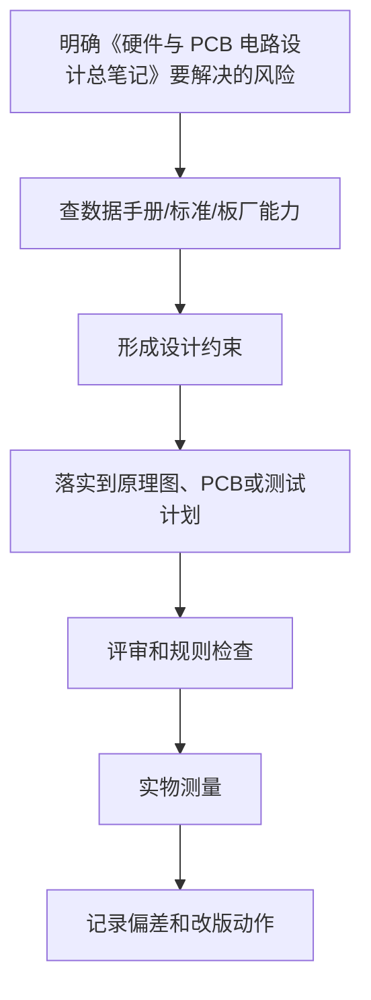
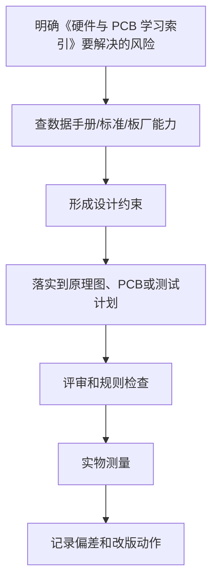
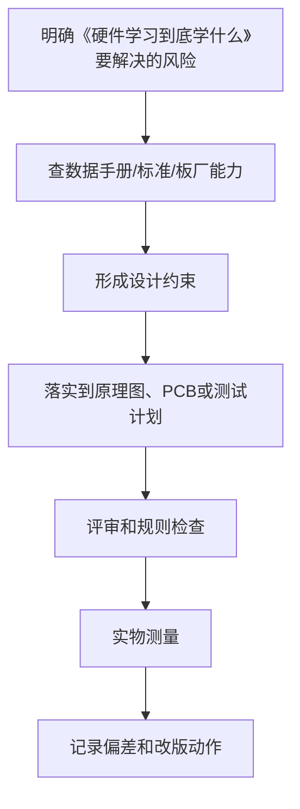
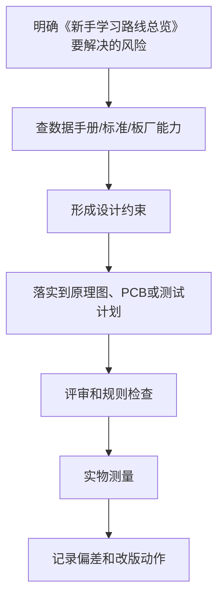
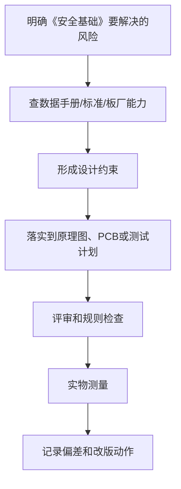
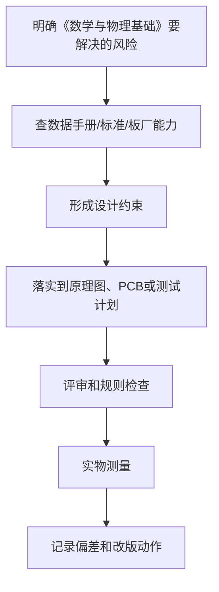
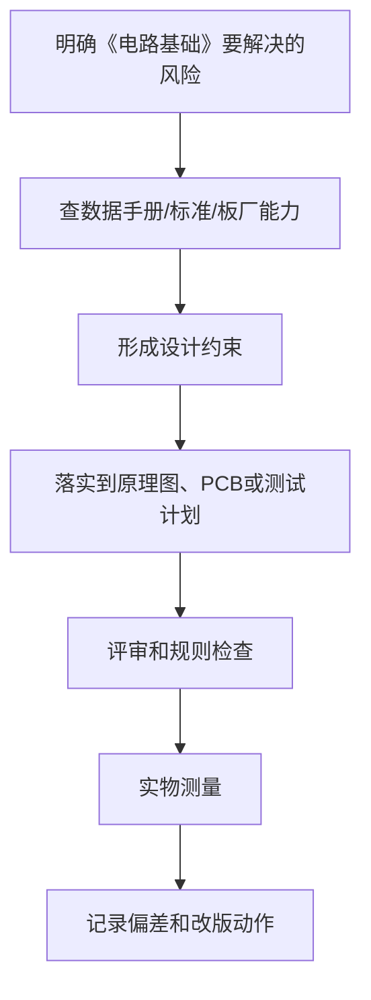
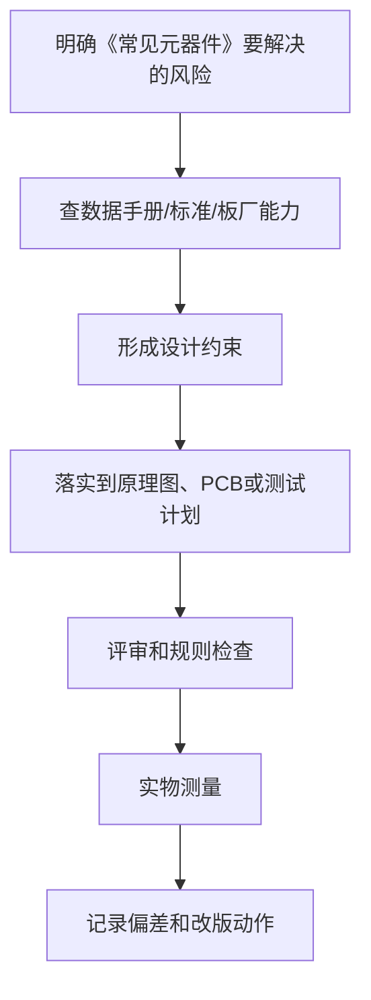
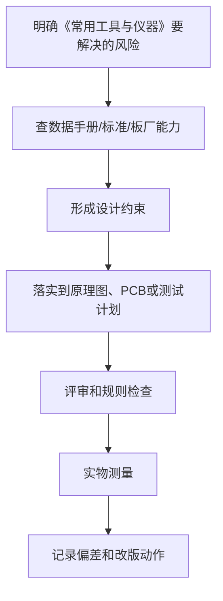

# 硬件与 PCB 完整学习笔记

> 全集整理日期：2026-08-02  
> 来源目录：`_posts/Markdown笔记/1/硬件PCB学习/`  
> 本文档保留原根目录学习总览，并完整收录来源目录中的综合总纲、索引和 40 个详细章节。原始资料之间存在重复内容，为保证完整性和可追溯性不做删减；仅调整标题层级和相对 Markdown 链接。

## 全集目录

- [第一编：学习总览](#part-summary)
- [第二编：原始综合总纲](#part-overview)
- [第三编：索引与详细章节](#part-chapters)
  - [硬件与 PCB 详细学习笔记索引](#source-00-索引)
  - [01 硬件学习到底学什么](#source-01-基础)
  - [02 新手学习路线总览](#source-02-学习路线)
  - [03 安全基础](#source-03-安全基础)
  - [04 数学与物理基础](#source-04-数学与物理基础)
  - [05 电路基础](#source-05-电路基础)
  - [06 常见元器件](#source-06-常见元器件)
  - [07 数据手册阅读](#source-07-数据手册阅读)
  - [08 常用工具与仪器](#source-08-常用工具与仪器)
  - [09 原理图设计基础](#source-09-原理图设计基础)
  - [10 PCB 设计基础](#source-10-pcb设计基础)
  - [11 PCB 制造工艺基础](#source-11-pcb制造工艺基础)
  - [12 PCB 层叠结构](#source-12-pcb层叠结构)
  - [13 PCB 布局原则](#source-13-pcb布局原则)
  - [14 PCB 布线原则](#source-14-pcb布线原则)
  - [15 电源设计基础](#source-15-电源设计基础)
  - [16 接地、回流路径与去耦](#source-16-接地-回流路径与去耦)
  - [17 模拟电路设计基础](#source-17-模电设计基础)
  - [18 数字电路设计基础](#source-18-数电设计基础)
  - [19 单片机与嵌入式硬件](#source-19-单片机与嵌入式硬件)
  - [20 常见通信接口](#source-20-常见通信接口)
  - [21 传感器与执行器](#source-21-传感器与执行器)
  - [22 电机、继电器和大电流负载](#source-22-电机继电器和大电流负载)
  - [23 信号完整性基础](#source-23-信号完整性基础)
  - [24 电源完整性基础](#source-24-信号完整性基础)
  - [25 EMI / EMC 基础](#source-25-emi-emc基础)
  - [26 热设计基础](#source-26-热设计基础)
  - [27 DFM、DFA、DFT](#source-27-dfm-dfa-dft基础)
  - [28 物料、封装和供应链](#source-28-物料封装与供应链)
  - [29 打样、焊接与装配](#source-29-打样-焊接与装配)
  - [30 调试与故障排查](#source-30-调试与故障排查)
  - [31 版本管理与硬件文档](#source-31-版本管理与硬件文档)
  - [32 KiCad 学习重点](#source-32-kicad-学习重点)
  - [33 从 0 到 1 画一块 PCB 的完整流程](#source-33-完整实践)
  - [34 初学者推荐项目](#source-34-初学者推荐)
  - [35 PCB 设计检查清单](#source-35-pcb-设计检查清单)
  - [36 常见错误](#source-36-常见错误)
  - [37 学习资料与参考链接](#source-37-学习资料与参考链接)
  - [38 PCB 工程规则速查](#source-38-pcb工程规则速查)
  - [39 设计评审、上电与复盘模板](#source-39-设计评审上电与复盘)
  - [40 PCB 与硬件设计术语表](#source-40-pcb与硬件设计术语)
- [来源文件清单](#source-manifest)

<a id="part-summary"></a>
## 第一编：学习总览

> 本编保留合并前根目录文档的整理版内容，适合先快速建立知识地图。


> 资料整理日期：2026-08-02  
> 本文基于本地目录 `_posts/Markdown笔记/1/硬件PCB学习/` 中 40 章笔记与网络资料校准整理。  
> 网络资料只用于补充和校准工程判断；真实项目仍应以安全法规、产品标准、芯片数据手册、板厂能力表、装配厂能力和实测结果为最终依据。

### 0. 学习目标和边界

学习硬件与 PCB，不是只学 KiCad、Altium Designer 或立创 EDA 这类工具。EDA 软件只能帮你表达连接关系和制造文件，真正决定板子能否稳定工作的，是需求边界、电路原理、器件选型、封装核对、PCB 物理实现、制造装配、上电调试和复盘能力。

一块 PCB 从想法到实物，大致经历：

```text
需求定义 -> 器件选型 -> 数据手册阅读 -> 原理图 -> ERC/评审
-> PCB 层叠和规则 -> 布局 -> 布线 -> DRC/DFM
-> Gerber/BOM/CPL -> 打样装配 -> 限流上电 -> 调试验证 -> 复盘改版
```

初学阶段建议长期停留在低压、低速、小电流项目，例如 LED 板、按键板、传感器板、USB 转串口小板、MCU 最小系统板。不要在没有经验、没有评审、没有仪器和没有安规知识的情况下独立设计市电、高压、大功率、电池快充、逆变器、医疗、汽车安全、射频和高速内存类项目。

### 1. 硬件学习地图

| 层级 | 重点 | 应达到的能力 |
| :--- | :--- | :--- |
| 安全基础 | 低压边界、短路、限流、ESD、焊接安全、电池风险 | 能安全搭电路和第一次上电 |
| 电路基础 | 欧姆定律、基尔霍夫定律、RC、功率、二极管、MOSFET | 能估算电压、电流、功耗和时间常数 |
| 器件与数据手册 | 电阻、电容、电感、IC、连接器、保护器件、封装 | 能按需求选型并识别关键参数 |
| 原理图 | 电源树、网络命名、接口、复位、时钟、测试点、ERC | 能把电路意图清楚表达出来 |
| PCB 基础 | 板框、层、走线、过孔、铺铜、DRC、Gerber | 能完成可制造的双层低速板 |
| 系统设计 | 电源、接地、去耦、模拟、数字、MCU、接口、负载 | 能做完整低压嵌入式小系统 |
| 工程进阶 | SI、PI、EMI/EMC、热、DFM、DFA、DFT、供应链 | 能解释稳定性、可靠性和生产问题 |
| 项目闭环 | 打样、焊接、上电、测量、故障定位、版本管理 | 能把失败转化为下一版改进 |

学习顺序建议：

| 阶段 | 时间 | 学习内容 | 输出物 |
| :--- | :--- | :--- | :--- |
| 入门 | 1-2 周 | 安全、电学、元器件、仪器 | 面包板小实验和测量记录 |
| 原理图与 PCB | 2-4 周 | 数据手册、原理图、双层 PCB、Gerber | 一块可打样的低压低速板 |
| 电源与系统 | 2-4 周 | LDO、DC-DC、接地、去耦、MCU、接口 | MCU 小系统或传感器板 |
| 工程化 | 4-8 周 | SI/PI、EMI、热、DFM/DFA/DFT、调试 | 检查清单、评审记录、改版记录 |
| 长期 | 持续 | 参考设计、标准、失效案例、项目复盘 | 自己的硬件知识库 |

### 2. 安全基础

硬件学习的第一原则是安全可控。新手应该从 3.3V、5V、12V 以内的低压直流电路开始。即使电压不高，短路、大电流、电池、反接、发热和焊接也可能造成器件损坏、烫伤或火灾。

上电前必须做：

- 用万用表测电源输入与 GND 是否短路。
- 确认电源极性、连接器方向、电解电容方向、二极管方向和 IC Pin 1。
- 第一次上电使用可调电源，并设置合理限流。
- 先空载或分模块上电，不要一次接入全部负载。
- 手指不要靠近可能发热、带高电流或高压的区域。
- 电池、电机、继电器、感性负载必须考虑过流、反接、反冲和温升。

ESD 和焊接也属于安全与可靠性问题。外部接口、人体可触碰连接器、长线缆输入、USB、按键和传感器线都应评估 ESD 保护。焊接时要保持通风，避免焊锡桥连，先焊低矮器件和电源部分，再逐步焊主控、接口和负载。

### 3. 数学、电路和元器件基础

初学硬件不需要一开始推很复杂的公式，但必须能做基本估算。

常用关系：

```text
欧姆定律：V = I * R
功率：P = V * I = I^2 * R = V^2 / R
电容充放电时间常数：tau = R * C
电感电压：V = L * di/dt
电容电流：I = C * dv/dt
压降：Vdrop = I * Rtrace
发热：Ploss = I^2 * R
```

常见元器件要从“用途、关键参数、失效方式”三个角度学习：

| 器件 | 关键参数 | 常见风险 |
| :--- | :--- | :--- |
| 电阻 | 阻值、误差、功率、温漂、封装 | 功率不足、阻值误用、上拉过强或过弱 |
| 电容 | 容值、耐压、材质、ESR、ESL、直流偏压 | MLCC 直流偏压导致实际容值下降 |
| 电感 | 电感量、饱和电流、DCR、屏蔽结构 | DC-DC 中饱和、发热和噪声 |
| 二极管 | 正向压降、反向耐压、电流、恢复时间 | 续流或整流场景选型错误 |
| TVS | 工作电压、钳位电压、结电容、封装 | 放置太远、选型影响高速信号 |
| BJT/MOSFET | 耐压、电流、Rds(on)、Qg、阈值、电热能力 | 只看阈值电压，不看实际栅压下导通能力 |
| LDO | 输入范围、压差、输出电流、稳定电容、热阻 | 压差不足或功耗过大发热 |
| DC-DC | 拓扑、开关频率、电感、反馈、补偿、布局 | 开关环路太大、反馈走线受干扰 |
| 连接器 | 额定电流、间距、方向、锁扣、耐插拔 | 封装方向错、线序不清 |

### 4. 数据手册阅读方法

数据手册不是只看典型应用图。每个关键芯片至少要读：

- `Absolute Maximum Ratings`：绝对最大额定值，只是损坏边界，不是正常工作条件。
- `Recommended Operating Conditions`：推荐工作条件，设计应落在这里。
- `Electrical Characteristics`：电压、电流、阈值、误差、时序、温度范围。
- `Pin Configuration` 和 `Pin Functions`：引脚编号、复用、未用脚处理。
- `Typical Application`：推荐外围，但要结合自己的输入、负载和环境校准。
- `Layout Guidelines`：去耦、电源回路、地、热焊盘、敏感节点和禁忌。
- `Package`：封装尺寸、焊盘、热阻、Pin 1 标识。
- `Ordering Information`：订购型号、温度等级、封装、包装方式。

数据手册笔记模板：

```markdown
## 器件名称

- 用途：
- 供电范围：
- 推荐工作电流：
- 绝对最大额定值风险：
- 关键引脚：
- 未用引脚处理：
- 推荐外围：
- 布局要求：
- 封装与 Pin 1：
- 替代料：
- 需要实测的项目：
```

资料优先级建议：

```text
安全法规/产品标准 > 芯片数据手册 > 官方应用笔记/评估板
> 板厂和装配厂能力 > EDA 规则 > 高质量工程文章 > 个人经验
```

### 5. 常用工具与仪器

软件工具：

- EDA：KiCad、Altium Designer、立创 EDA。
- 仿真：LTspice、厂商在线电源设计工具、SI/PI 工具。
- 文件检查：Gerber viewer、板厂 DFM 检查、BOM/CPL 检查工具。
- 版本管理：Git、原理图 PDF、Gerber 输出包、BOM 版本记录。

硬件仪器：

| 仪器 | 用途 | 入门重点 |
| :--- | :--- | :--- |
| 万用表 | 测电压、电阻、通断、电流 | 上电前查短路，上电后查关键电压 |
| 可调电源 | 限流上电、观察电流 | 第一次上电必须限流 |
| 示波器 | 看纹波、时钟、边沿、振铃、通信波形 | 探头接地要短，先确认量程和耦合 |
| 逻辑分析仪 | 看 UART/I2C/SPI 时序 | 适合数字协议定位 |
| 电子负载 | 测电源负载能力 | 看压降、纹波和热 |
| 热像仪/测温 | 找发热点 | 结合功耗计算判断是否异常 |
| LCR 表 | 测电感、电容、电阻 | 辅助确认物料和寄生特性 |

### 6. 原理图设计

原理图的目标不是“画得像”，而是让功能、电气关系和调试入口清楚。

推荐模块划分：

- 电源输入与保护。
- 电源转换和电源树。
- MCU/主控最小系统。
- 时钟、复位、Boot、下载调试接口。
- 传感器和模拟前端。
- 通信接口。
- 执行器和大电流负载。
- 测试点、跳线和版本识别。

原理图检查重点：

- 电源网络命名清楚，避免多个同名电源误连。
- 每个 IC 的每个电源脚和地脚都处理完整。
- 去耦电容在原理图中与对应电源脚关系明确。
- Reset、Boot、Enable、Chip Select 这类默认状态明确。
- TX/RX、MISO/MOSI、SDA/SCL、CANH/CANL、USB D+/D- 方向和命名清楚。
- 外部接口评估 ESD、过压、反接、浪涌和电平兼容。
- 感性负载有续流二极管、TVS、RC 吸收或合适驱动器。
- 关键节点保留测试点。
- ERC 通过后仍要人工评审，因为 ERC 不理解全部工程意图。

### 7. PCB 制造与层叠

PCB 制造会限制你的设计。常见参数包括板厚、层数、铜厚、最小线宽线距、最小孔径、孔环、阻焊桥、表面处理、板材、阻抗控制、拼板、V-cut、沉金或喷锡等。

重要原则：

- 板厂“最小能力”不是“推荐值”。越接近极限，越可能增加成本、降低良率或需要特殊工艺。
- 练习板和低速板尽量使用宽松规则，例如普通信号线 0.20-0.30 mm 起步，小电流电源线 0.50 mm 起步；具体值仍要按项目电流、压降、温升和板厂能力调整。
- 大电流、高压、高速、阻抗控制和细间距封装不能只套默认规则。
- 下单前要用当前板厂能力表重新校准线宽、线距、孔径、阻焊、铜厚和板厚。

层叠选择：

| 层数 | 适用场景 | 注意事项 |
| :--- | :--- | :--- |
| 单层板 | 极简单练习、低成本 | 回流路径差，不适合复杂系统 |
| 双层板 | 入门、低速 MCU、传感器、小接口板 | 一层走线一层尽量保持 GND 连续 |
| 四层板 | USB、以太网 PHY、无线模块、较复杂 MCU | 常用 `Signal-GND-Power-Signal` 或类似结构 |
| 多层板 | 高速、射频、DDR、复杂电源 | 需要阻抗、串扰、回流和制造约束设计 |

### 8. PCB 布局原则

布局比布线更重要。布局阶段决定电流路径、回流路径、热路径、装配可行性和调试可见性。

推荐顺序：

1. 固定板框、安装孔、连接器、按钮、LED、屏幕、天线和机械限制。
2. 放置电源入口、保护器件、稳压器和大电流负载。
3. 放置 MCU、时钟、复位、下载口和去耦电容。
4. 放置接口保护、传感器、模拟前端和执行器驱动。
5. 做布局评审，确认模块分区和关键路径。
6. 再开始大规模布线。

布局检查：

- 连接器靠近板边，插拔方向合理，Pin 1 和极性容易识别。
- TVS 靠近接口，泄放路径短而直接。
- DC-DC 输入电容、开关芯片、电感、续流路径、输出电容紧凑。
- 去耦电容靠近 IC 电源脚，不要排成一排放远处。
- 晶振靠近 MCU，走线短，远离开关节点和接口边缘。
- ADC、传感器和模拟前端远离电机、继电器、DC-DC 和高速时钟。
- 发热器件有铜皮、过孔、散热焊盘或热路径。
- 测试点可用探针接触，不能被高器件遮挡。

### 9. PCB 布线原则

布线不是把飞线消掉，而是控制电流、阻抗、回流、噪声、热和可制造性。

基础规则：

- 先布关键线：电源、大电流、时钟、差分、模拟输入、反馈线。
- 普通信号线短而直接，避免无意义绕线。
- 电源线按电流、压降和温升计算，不只看“能连上”。
- 地尽量保持连续平面，避免关键信号跨越地缝。
- 换层时给关键信号附近放 GND 过孔，提供回流路径。
- 差分线成对、同层、间距稳定、少过孔、少分支。
- 开关节点面积尽量小，远离反馈、ADC、晶振和接口。
- 铺铜要检查孤岛、热焊盘、过孔连接和回流路径。

线宽估算思路：

```text
走线电阻受铜厚、线宽、长度和温度影响。
压降 = 电流 * 走线电阻。
发热 = 电流^2 * 走线电阻。
```

工程上建议使用 IPC-2152 或板厂/EDA 计算器估算电流承载能力，再结合允许温升、压降、铜皮散热、连接器额定电流和保险丝容量确定规则。不要只记“某个线宽能过多少电流”。

线距和爬电距离：

- 低压数字板主要受制造能力、串扰和噪声影响。
- 高压板还要考虑电气间隙、爬电距离、污染等级、瞬态过压、板材 CTI 和安规要求。
- EDA DRC 通过不代表满足安规；高压、市电和认证产品需要专门标准和评审。

### 10. 电源设计

电源是硬件系统最常见的失败点之一。设计前先画电源树：

```text
输入电源 -> 防反接/保险/浪涌/ESD -> 主电源转换
-> 3V3/5V/模拟电源/数字电源/外设电源 -> 负载
```

电源预算：

| 项目 | 需要记录 |
| :--- | :--- |
| 输入范围 | 最小、典型、最大输入电压 |
| 负载电流 | 静态、峰值、启动、异常状态 |
| 转换器余量 | 额定电流、热、效率、压差 |
| 纹波要求 | MCU、ADC、射频、传感器分别评估 |
| 保护 | 反接、过流、过压、浪涌、ESD |
| 上电顺序 | 复位、Enable、外设电源依赖 |

LDO 适合低噪声、小电流、压差不大场景。注意功耗：

```text
P = (Vin - Vout) * Iout
```

DC-DC 适合效率要求高、电流较大或压差较大的场景。布局重点是输入高 di/dt 回路、开关节点、反馈走线、输出电容和地路径。DC-DC 外围电感、电容、补偿网络不要随意替换，必须按数据手册和参考设计校准。

### 11. 接地、回流路径与去耦

GND 不是理想的 0V。真实 PCB 中，地有阻抗，电流会产生压降和噪声。理解接地时不要只看“有没有接地”，还要看“电流从哪里回来”。

回流路径检查法：

1. 选一根关键信号线，例如时钟、USB、SPI SCK、ADC 输入。
2. 沿信号线下方或附近追踪 GND 是否连续。
3. 检查是否跨越地缝、板边缺口、分割平面或大电流回路。
4. 如果换层，附近是否有 GND 过孔。
5. 如果接外部线缆，接口附近是否有 ESD 泄放路径。

去耦电容的目标是给芯片瞬态电流提供本地小回路。典型做法是每个 IC 电源脚附近放置 100 nF 级别的低 ESL 去耦电容，并在电源入口和负载附近放置合适的大电容。但 100 nF 不是万用答案，具体容量、封装、耐压、ESR、ESL、数量和位置要看数据手册、频率、电源阻抗和负载瞬态。

优先级：

```text
芯片电源脚 -> 去耦电容 -> 地过孔/地平面
```

路径越短、回路面积越小，去耦效果越好。

### 12. 模拟、数字、MCU 与接口

模拟电路关注误差、噪声、输入阻抗、偏置电流、带宽、稳定性和参考电压。ADC 前端要特别关注输入范围、采样电容、源阻抗、抗混叠滤波、参考电源、地噪声和布局。

数字电路关注逻辑电平、边沿速度、时钟、复位、上拉下拉、总线时序和默认状态。边沿越快，越要关心回流路径、阻抗不连续、串扰和 EMI，即使信号频率不高。

MCU 最小系统检查：

- 所有 VDD/VSS/VDDA/VREF 处理完整。
- 每个电源脚有本地去耦。
- Reset 和 Boot 有明确默认状态。
- 下载调试接口可接入，方向和电压标清。
- 时钟源按数据手册和参考设计布局。
- 未用引脚按手册要求处理。
- 电源上电顺序和复位释放时序合理。

常见接口速查：

| 接口 | 重点 | 常见错误 |
| :--- | :--- | :--- |
| UART | TX/RX 方向、电平、GND 共地 | TX/RX 标号混乱 |
| I2C | 上拉电阻、总线电容、线长、地址冲突 | 上拉到错误电压 |
| SPI | SCK 短、片选独立、边沿干净 | SCK 过长、串扰到模拟线 |
| USB | 差分线、ESD、阻抗、连接器方向 | D+/D- 反接，TVS 放太远 |
| CAN | 120Ω 终端、共模范围、收发器、保护 | 终端位置错误 |
| RS-485 | A/B 定义、终端、偏置、ESD | 不同厂商 A/B 命名不一致 |

### 13. 电机、继电器和大电流负载

电机、继电器、电磁阀、喇叭和大功率 LED 都不是普通 GPIO 负载。它们会带来启动电流、感性反冲、地弹、发热、EMI 和电源跌落。

设计要点：

- MCU 不直接驱动大负载，使用 MOSFET、驱动芯片或继电器。
- 感性负载必须有续流、TVS、RC 吸收或合适钳位路径。
- 大电流路径和小信号路径分区，回流不要穿过 MCU、ADC 或传感器地。
- MOSFET 选型要看实际栅压下的 Rds(on)、电流、SOA、Qg 和热阻。
- 继电器线圈要有续流，触点要按负载类型和浪涌电流选型。
- 电机电源入口需要足够电容、保护和布局隔离。

### 14. 信号完整性、电源完整性和 EMI/EMC

信号完整性不是只属于高速板。只要边沿足够快、走线足够长、参考平面不连续或负载阻抗不匹配，就可能出现振铃、过冲、串扰、时序错误和 EMI。

SI 基础处理：

- 控制关键信号回流路径。
- 减少阻抗突变、分支和不必要过孔。
- 时钟和高速线短、直、有参考地。
- 必要时在源端预留串联阻尼电阻。
- 差分线按接口要求设置阻抗和长度约束。

PI 关注电源网络阻抗、负载瞬态、去耦网络、地弹、纹波和稳压器稳定性。开关电源和高速数字芯片要特别注意输入环路、输出电容、平面分割和去耦路径。

EMI/EMC 基本思路：

- 降低噪声源：减小开关环路面积，控制边沿，优化电源。
- 切断耦合路径：保持参考平面连续，合理分区，降低串扰。
- 提高受扰对象抗扰度：接口保护、滤波、屏蔽、共模电感、TVS。
- 外部线缆是常见天线，接口处应优先处理 ESD、共模和回流。

### 15. 热设计

所有功耗最终都变成热。热设计不是板子烫了以后才补救，而是在选型和布局阶段估算。

基本关系：

```text
结温 = 环境温度 + 功耗 * 总热阻
```

检查内容：

- LDO、MOSFET、DC-DC、电阻、电机驱动和 LED 驱动的功耗。
- 封装热阻、散热焊盘、铜皮面积、热过孔。
- 周围器件耐温和外壳通风。
- 高温环境下的降额。
- 实测温升和长时间运行稳定性。

### 16. DFM、DFA、DFT、BOM 和供应链

DFM 是面向制造设计，DFA 是面向装配设计，DFT 是面向测试设计。它们决定板子不仅能画出来，还能低风险生产、焊接、测试和维修。

DFM 检查：

- 线宽、线距、孔径、孔环、阻焊桥符合板厂能力。
- 板框、槽孔、邮票孔、V-cut、拼板符合要求。
- 铜皮到板边距离合理。
- Gerber、Drill、层名和板厚铜厚一致。

DFA 检查：

- 封装与实物一致，Pin 1、极性、方向清楚。
- 手焊器件周围有操作空间。
- 连接器、按键、LED 与外壳和使用方向一致。
- BOM 中型号、封装、数量、替代料、极性备注完整。
- CPL/Pick and Place 坐标方向经过检查。

DFT 检查：

- 电源、地、复位、时钟、下载口、关键总线有测试点。
- 测试点可接触、可标识、不会被外壳遮挡。
- 预留跳线、0Ω 电阻或断点用于隔离问题。
- 上电测试步骤有预期电压、电流、波形和判定标准。

供应链检查：

- 不只看一个店铺是否有货，要看生命周期、替代料、封装兼容和价格波动。
- 关键器件记录 MPN、封装、温度等级、供应商、替代料和风险。
- 不要把不同封装、不同电压等级或不同引脚定义的物料混成同一个 BOM 项。

### 17. KiCad 学习重点

KiCad 官方文档当前提供 10.0 文档入口。学习时建议按流程掌握，而不是只记快捷键：

1. 创建项目和设置库。
2. 画原理图，使用清晰网络名和层次结构。
3. 运行 ERC，修复电气规则问题。
4. 分配和核对封装。
5. 从原理图更新 PCB。
6. 设置板框、层叠、Net Class、线宽、线距、过孔和差分规则。
7. 布局关键器件，先做布局评审。
8. 布线、铺铜、检查回流路径。
9. 运行 DRC，修复规则问题。
10. 检查 3D 视图、丝印、极性和安装孔。
11. 导出 Gerber、Drill、BOM、CPL 和原理图 PDF。
12. 用 Gerber viewer 和板厂 DFM 再检查一次。

KiCad 中特别要熟悉：

- `Schematic Editor`
- `PCB Editor`
- `Symbol Editor`
- `Footprint Editor`
- `Board Setup`
- `Design Rules`
- `Net Classes`
- `DRC`
- `Plot Gerbers`

### 18. 从 0 到 1 做一块 PCB

推荐用“按键 + LED + MCU + USB/UART 下载 + 传感器接口”的低压项目练完整流程。

步骤：

1. 写需求：输入电压、接口、尺寸、负载、环境、调试方式。
2. 画系统框图：电源、主控、接口、传感器、输出。
3. 选型：按数据手册确认电压、电流、封装、供货和替代料。
4. 画原理图：电源树、保护、去耦、复位、下载、接口、测试点。
5. 原理图评审：检查电气、默认状态、接口方向和数据手册要求。
6. 分配封装：对照实物、封装图、Pin 1 和焊盘尺寸。
7. 设置 PCB 规则：板厂能力、线宽、线距、过孔、Net Class。
8. 布局：固定器件、电源路径、MCU、去耦、接口保护、传感器。
9. 布线：关键线优先，检查回流、电源线宽、差分和敏感节点。
10. DRC/DFM：修复违规，检查丝印、极性、板框和 Gerber。
11. 下单：确认层数、板厚、铜厚、表面处理、颜色、数量、贴片文件。
12. 焊接：先电源，再主控，再接口，最后负载。
13. 限流上电：记录电压、电流、温升、时钟、复位、下载结果。
14. 功能验证：逐个接口和模块验证。
15. 复盘改版：记录现象、根因、证据、修改项和版本号。

### 19. 新手推荐项目

| 项目 | 练习重点 | 风险等级 |
| :--- | :--- | :--- |
| LED 限流板 | 欧姆定律、封装、丝印、焊接 | 低 |
| 按键 LED 板 | 上拉下拉、去抖、GPIO | 低 |
| USB 转串口小板 | USB 接口、ESD、连接器方向 | 中 |
| MCU 最小系统板 | 电源、复位、时钟、下载、去耦 | 中 |
| 温湿度传感器板 | I2C、上拉、接口标注、传感器布局 | 中 |
| MOSFET 负载控制板 | 栅极驱动、续流、负载电流、热 | 中高 |
| 小型 Buck 电源板 | 开关电源布局、反馈、纹波、热 | 高，不建议第一个项目 |

每个项目都要产出：需求说明、原理图 PDF、PCB 截图、Gerber 包、BOM、CPL、上电记录、问题复盘。

### 20. 工程规则速查

先给项目定级：

| 等级 | 典型项目 | 设计策略 |
| :--- | :--- | :--- |
| L0 | LED、按键、蜂鸣器 | 用宽松规则练流程 |
| L1 | MCU 小板、传感器板 | 重点检查供电、去耦、复位、下载 |
| L2 | USB、CAN、RS-485、外部线缆接口 | 重视 ESD、回流、差分、终端 |
| L3 | DC-DC、电机、继电器、大电流 LED | 重视电流环路、线宽、热和 EMI |
| L4 | DDR、PCIe、射频、天线 | 需要阻抗控制、仿真和专家评审 |
| L5 | 市电、医疗、汽车、工业安全 | 不适合新手独立设计 |

常用 Net Class：

```text
Default        普通信号
Power_3V3_5V   小电流电源
Power_HighI    大电流电源
Clock          晶振和时钟
Diff_USB       USB 差分线
Analog         ADC 和模拟输入
Motor_Relay    电机、继电器和感性负载
```

下单参数表：

| 项目 | 本项目值 | 来源 |
| :--- | :--- | :--- |
| 层数 |  | 需求/成本/信号 |
| 板厚 |  | 结构/连接器/阻抗 |
| 铜厚 |  | 电流/板厂能力 |
| 最小线宽 |  | 板厂能力/项目余量 |
| 最小线距 |  | 板厂能力/电压/噪声 |
| 最小孔径 |  | 板厂能力/过孔可靠性 |
| 表面处理 |  | 焊接/成本/保存 |
| 阻抗控制 |  | 接口要求 |
| 拼板方式 |  | 装配要求 |

### 21. 设计检查清单

#### 需求

- [ ] 输入电压范围明确。
- [ ] 最大电流和峰值电流估算。
- [ ] 外部接口、线缆长度和人体接触风险明确。
- [ ] 板子尺寸、安装孔、外壳限制明确。
- [ ] 工作温度和环境明确。
- [ ] 高压、大电流、电池、感性负载风险已标注。

#### 原理图

- [ ] 电源树完整，电源网络命名清楚。
- [ ] 保护电路需求已判断。
- [ ] LDO/DC-DC 输入输出电容符合数据手册。
- [ ] 每个 IC 的电源脚都有去耦。
- [ ] Reset、Boot、Enable、CS 默认状态明确。
- [ ] 下载调试接口完整。
- [ ] 外部接口电平兼容。
- [ ] 关键测试点已预留。

#### 封装

- [ ] 封装和实物一致。
- [ ] Pin 1、极性、方向正确。
- [ ] 通孔孔径和焊盘适合装配。
- [ ] 连接器方向和线序确认。
- [ ] 3D 模型和机械干涉检查完成。

#### PCB

- [ ] 板框、安装孔和禁布区正确。
- [ ] 去耦电容靠近电源脚。
- [ ] 晶振靠近 MCU。
- [ ] TVS 靠近接口。
- [ ] DC-DC 关键环路紧凑。
- [ ] GND 连续，关键信号不跨地缝。
- [ ] 电源线宽按电流和压降估算。
- [ ] DRC 通过，且人工检查过回流路径。

#### 生产和上电

- [ ] Gerber、Drill、BOM、CPL 来自同一版本。
- [ ] 丝印不压焊盘，电源极性和接口方向清楚。
- [ ] 上电前测电源和 GND 短路。
- [ ] 限流电源设置合理。
- [ ] 首次上电记录电压、电流、温升和异常现象。
- [ ] 调试只改一个变量，并记录证据。

### 22. 首次上电记录模板

```markdown
## 首次上电记录

- 项目：
- PCB 版本：
- 日期：
- 操作人：
- 输入电压：
- 限流设置：
- 是否接负载：
- 环境温度：

### 上电前检查

- [ ] 电源与 GND 未短路。
- [ ] 电源极性正确。
- [ ] 芯片方向正确。
- [ ] 电解电容、二极管、LED 方向正确。
- [ ] 负载暂时断开或可控。

### 分步上电

| 步骤 | 操作 | 预期 | 实测 | 结论 |
| :--- | :--- | :--- | :--- | :--- |
| 1 | 输入电源空载 |  |  |  |
| 2 | 稳压输出 |  |  |  |
| 3 | MCU 电源 |  |  |  |
| 4 | 复位/时钟 |  |  |  |
| 5 | 下载接口 |  |  |  |
| 6 | 通信接口 |  |  |  |
| 7 | 负载测试 |  |  |  |

### 问题记录

| 现象 | 可能原因 | 测量证据 | 处理 | 是否需要改版 |
| :--- | :--- | :--- | :--- | :--- |
|  |  |  |  |  |
```

### 23. 常见错误

- 把绝对最大额定值当成正常工作条件。
- 去耦电容只在原理图里有，PCB 上离芯片很远。
- 封装引脚编号、Pin 1 或连接器方向没有对照实物。
- TX/RX、D+/D-、CANH/CANL、A/B 标号混乱。
- 没有给 Reset、Boot、Enable、CS 等引脚默认状态。
- 大电流走线只加宽一点，没有估算压降和热。
- DC-DC 布局把开关节点、反馈和输入环路放乱。
- 关键信号跨越地缝或参考平面中断。
- TVS 放在芯片旁边而不是接口旁边。
- DRC 通过后不看 Gerber、不看丝印、不看孔径和板框。
- 首次上电不用限流电源。
- 调试时一次改多个变量，导致无法确认根因。
- 改版不更新 BOM、CPL、版本号和记录。

### 24. 术语速查

| 术语 | 含义 |
| :--- | :--- |
| ERC | 原理图电气规则检查 |
| DRC | PCB 设计规则检查 |
| DFM | 面向制造设计 |
| DFA | 面向装配设计 |
| DFT | 面向测试设计 |
| Gerber | PCB 制造图形文件 |
| Drill | 钻孔文件 |
| BOM | 物料清单 |
| CPL / PnP | 贴片坐标文件 |
| Net Class | 按网络类型设置不同线宽、线距、过孔规则 |
| Clearance | 铜与铜之间的最小间距 |
| Creepage | 沿绝缘表面的爬电距离 |
| Clearance Distance | 空气中的电气间隙 |
| Annular Ring | 孔壁周围剩余焊盘环宽 |
| Via | 过孔 |
| Return Path | 信号或电源电流的回流路径 |
| Decoupling | 去耦，为芯片瞬态电流提供本地回路 |
| Bypass | 旁路，把噪声导到低阻路径 |
| SI | 信号完整性 |
| PI | 电源完整性 |
| EMI | 电磁干扰 |
| EMC | 电磁兼容 |
| TVS | 瞬态电压抑制器 |
| ESD | 静电放电 |
| LDO | 低压差线性稳压器 |
| DC-DC | 开关电源转换器 |
| ESR | 等效串联电阻 |
| ESL | 等效串联电感 |

### 25. 参考资料

本地资料：

- `_posts/Markdown笔记/1/硬件PCB学习/00_索引.md`
- `_posts/Markdown笔记/1/硬件PCB学习/硬件与 PCB 电路设计学习笔记.md`
- `_posts/Markdown笔记/1/硬件PCB学习/01_基础.md` 到 `40_PCB与硬件设计术语.md`

网络资料入口：

- KiCad 官方文档：https://docs.kicad.org/
- KiCad PCB Editor 文档：https://docs.kicad.org/10.0/en/pcbnew/pcbnew.html
- KiCad 官网：https://www.kicad.org/
- JLCPCB PCB Capabilities：https://jlcpcb.com/capabilities/pcb-capabilities
- 嘉立创 PCB 工艺能力说明：https://www.jlc.com/portal/vtechnology.html
- IPC / Global Electronics Association 标准入口：https://www.electronics.org/meet-your-standards
- IPC 设计标准列表：https://www.electronics.org/ipc-design-standards
- IPC 标准总览：https://www.electronics.org/ipc-standards
- IPC-A-610 标准入口：https://shop.electronics.org/ipc-a-610
- TI 技术文档与应用笔记入口：https://www.ti.com/design-development/technical-documents.html
- Analog Devices 技术文章与应用笔记入口：https://www.analog.com/en/resources/technical-articles.html
- STMicroelectronics 应用笔记入口：https://www.st.com/content/st_com/en/support/learning/stm32-education/stm32-step-by-step.html
- Espressif 硬件设计指南入口：https://docs.espressif.com/projects/esp-hardware-design-guidelines/en/latest/

使用这些资料时，建议优先找对应芯片或接口的 `Hardware Design Guide`、`Layout Guidelines`、`Reference Design`、`Evaluation Board Schematic` 和 `Application Note`。论坛、视频和经验文章可以作为排查线索，但不应替代标准、数据手册和实测。


---

<a id="part-overview"></a>
## 第二编：原始综合总纲

> 原始来源：`_posts/Markdown笔记/1/硬件PCB学习/硬件与 PCB 电路设计学习笔记.md`

### 硬件与 PCB 电路设计学习笔记


<!-- lecture-notes:integrated-v2 -->

#### 讲义导读：把电路变成能工作的板子

这一章讲的是 **硬件与 PCB 电路设计学习笔记**，属于 **硬件 PCB 学习路线**。学习硬件和 PCB 时，不要只看“这根线怎么连”，而要把它当成一次工程闭环：需求是什么，电路原理是否成立，器件是否选对，封装是否可靠，PCB 规则是否符合板厂能力，电源和地怎么走，信号回流在哪里，上电后用什么证据证明它稳定工作。

##### 一句话先懂

路线类章节要先建立硬件闭环：需求是否清楚，电路是否能解释，PCB 是否能制造，上电是否有检查，问题是否能复盘。

初学时先问三个问题：这部分电路要完成什么功能；最坏电压、电流、温度、频率和误差在哪里；如果板子不工作，我能从哪个测试点或波形开始定位。

##### 通俗类比

做 PCB 像规划一座小城市：原理图是功能规划，器件是建筑，走线是道路，电源是供水供电，地平面是公共基准，回流路径像车辆回程路线，制造规则像施工规范。

类比只是入门扶手。真正设计时，要回到电流路径、阻抗、功耗、热、封装、间距、线宽、层叠、回流路径、测试点和制造公差这些可计算、可测量、可检查的对象上。

##### 本章学习主线

1. **先定需求和边界**：输入/输出、电压电流、接口、环境、尺寸、成本、安全和可制造性要求是什么？
2. **再读数据手册**：绝对最大额定值、推荐工作条件、典型应用、封装、热阻、布局建议和禁忌分别在哪里？
3. **然后画原理图**：电源树、保护、时钟、复位、接口、测试点和关键网络命名是否清楚？
4. **接着做 PCB**：先定层叠和规则，再布局关键器件，最后按电源、回流、敏感信号、高速信号和制造约束布线。
5. **最后验证实物**：ERC/DRC/DFM、Gerber、BOM、装配图、上电计划、测量记录和复盘缺一不可。

##### 本章重点抓手

学习顺序、知识地图、项目选择、资料来源、常用术语、完整流程和新手避坑。

##### 最小实践任务

用一个最小项目做学习主线，例如电源小板、传感器小板或 MCU 最小系统，每学一章都回到这块板上验证。

建议每次设计都保留“设计理由”：为什么选这个器件，为什么这样放置，为什么这条线这么宽，为什么这个电容离引脚这么近，为什么这个测试点必须保留。硬件学习的关键不是画出一块板，而是能解释每个设计选择，并能在实物上验证。

##### 常见误区

- 只会连线，不知道电流和回流路径怎么走。
- 只看典型应用图，不读绝对最大额定值、推荐工作条件和布局建议。
- 画完板不做 ERC/DRC/DFM、检查清单和上电预案。

##### 推荐工具

KiCad/Altium、万用表、示波器、逻辑分析仪、稳压电源、电子负载、热像仪、LCR 表、Gerber viewer、厂商 DFM 检查。

##### 读完本章应该能做到

- 用自己的话解释本章概念，并指出它影响功能、可靠性、制造、调试还是成本。
- 给出一个最小设计例子，说明原理图、PCB、BOM 和测试方法如何对应。
- 说清至少一个常见硬件故障的现象、可能原因、测量方法和修复方向。
- 把经验规则落到数据手册、IPC/板厂规则、仿真或实测证据上。

> 本节是讲义化改写后的阅读入口。后续正文中的电路、规则、清单和参考资料，都应围绕“需求边界 + 数据手册 + PCB 规则 + 实物验证”来理解。

> 适合对象：想从零开始学习电子硬件、原理图设计、PCB 绘制、打样、焊接和调试的人。
这份文档是一份系统学习笔记，不是只讲“怎么画 PCB”。真正能做出可工作的电路板，需要同时理解电子基础、元器件、电源、信号、接口、原理图、PCB 布局布线、制造工艺、焊接调试和安全规范。

如果你是零基础，建议先不要直接挑战高速板、射频板、大功率电源、220V 市电、锂电池快充、四层以上复杂板。先从低压、低速、简单功能板开始，例如 LED 控制板、按键输入板、传感器采集板、单片机最小系统板。

#### 目录

1. 硬件学习到底学什么
2. 新手学习路线总览
3. 安全基础
4. 数学与物理基础
5. 电路基础
6. 常见元器件
7. 数据手册阅读
8. 常用工具与仪器
9. 原理图设计基础
10. PCB 设计基础
11. PCB 制造工艺基础
12. PCB 层叠结构
13. PCB 布局原则
14. PCB 布线原则
15. 电源设计基础
16. 接地、回流路径与去耦
17. 模拟电路设计基础
18. 数字电路设计基础
19. 单片机与嵌入式硬件
20. 常见通信接口
21. 传感器与执行器
22. 电机、继电器和大电流负载
23. 信号完整性基础
24. 电源完整性基础
25. EMI / EMC 基础
26. 热设计基础
27. DFM、DFA、DFT
28. 物料、封装和供应链
29. 打样、焊接与装配
30. 调试与故障排查
31. 版本管理与硬件文档
32. KiCad 学习重点
33. 从 0 到 1 画一块 PCB 的完整流程
34. 初学者推荐项目
35. PCB 设计检查清单
36. 常见错误
37. 学习资料与参考链接
38. PCB 工程规则速查
39. 设计评审、上电与复盘模板
40. PCB 与硬件设计术语表

#### 1. 硬件学习到底学什么

很多人以为学习 PCB 就是学一个软件，例如 KiCad、Altium Designer、立创 EDA。实际上，EDA 软件只是工具，真正重要的是电路设计能力和工程判断能力。

硬件学习可以拆成几层：

| 层级 | 要学什么 | 目标 |
| :--- | :--- | :--- |
| 电子基础 | 电压、电流、电阻、电容、电感、二极管、三极管、MOSFET | 能看懂基本电路 |
| 电路分析 | 欧姆定律、基尔霍夫定律、分压、滤波、RC 时间常数 | 能估算电路参数 |
| 元器件 | 电阻、电容、电感、IC、连接器、传感器、保护器件 | 会选型、会看规格 |
| 数据手册 | 引脚、推荐电路、绝对最大额定值、时序、封装 | 能按芯片要求设计外围 |
| 原理图 | 电路模块划分、网络连接、电源树、接口定义 | 能表达电路逻辑 |
| PCB 布局 | 元件位置、电源路径、接口位置、信号分区 | 让电路物理结构合理 |
| PCB 布线 | 走线宽度、间距、过孔、回流路径、阻抗 | 让信号和电源可靠传输 |
| 制造工艺 | 板厚、层数、铜厚、线宽线距、孔径、阻焊、丝印 | 确保板子能生产 |
| 焊接装配 | 封装选择、焊盘、钢网、贴片、手焊 | 确保板子能装起来 |
| 调试测试 | 万用表、示波器、逻辑分析仪、电源、热像 | 找出问题并验证设计 |
| 可靠性 | ESD、防反接、过流、过压、热、EMI | 让产品长期稳定 |

一句话总结：

> PCB 不是把线连起来，而是把电路变成真实世界中稳定工作的物理系统。

#### 2. 新手学习路线总览

##### 阶段 1：电子基础入门

目标：

- 看懂电压、电流、电阻的关系
- 会用万用表测电压、电阻、通断
- 能搭建 LED、电阻、按键、蜂鸣器等简单电路

需要学习：

- 欧姆定律
- 串联、并联
- 分压和限流
- 电容充放电
- 二极管和 LED
- 三极管和 MOSFET 基础
- 万用表使用

推荐练习：

- 用电阻限流点亮 LED
- 用按键控制 LED
- 用三极管控制蜂鸣器
- 用 MOSFET 控制小灯或小电机

##### 阶段 2：元器件与数据手册

目标：

- 能根据需求选择常见器件
- 能看懂芯片引脚和推荐电路
- 知道绝对最大额定值不能当正常工作条件

需要学习：

- 电阻、电容、电感参数
- 二极管、稳压管、TVS
- 三极管、MOSFET
- LDO、DC-DC
- MCU、传感器
- 连接器和开关
- 封装类型
- 数据手册结构

推荐练习：

- 找 5 个常见芯片的数据手册
- 画出它们的电源、地、输入、输出、推荐外围
- 总结每个芯片的供电范围和关键引脚

##### 阶段 3：原理图设计

目标：

- 会用 EDA 软件画清楚原理图
- 能把电路分成电源、主控、接口、传感器、输出等模块
- 能做 ERC 检查

需要学习：

- 符号库
- 网络标签
- 电源符号
- 参考设计ator
- 分层原理图
- ERC
- BOM
- Netlist

推荐练习：

- 画一个 LED 控制板原理图
- 画一个按键输入板原理图
- 画一个单片机最小系统原理图

##### 阶段 4：PCB 布局布线

目标：

- 能把原理图转成 PCB
- 会设置板框、线宽、间距、过孔
- 会完成简单双层板布线
- 会铺铜、做 DRC、导出 Gerber

需要学习：

- PCB 层
- 板框
- 封装
- 飞线
- 走线
- 过孔
- 铺铜
- 设计规则
- DRC
- Gerber
- Drill 文件

推荐练习：

- 完成一块 LED 控制板 PCB
- 完成一块 USB 转串口小板
- 完成一块单片机最小系统板

##### 阶段 5：打样、焊接、调试

目标：

- 会下单 PCB
- 会准备 BOM 和贴片文件
- 会手焊常见器件
- 会用仪器排查问题

需要学习：

- Gerber 检查
- BOM
- Pick and Place / CPL
- 手焊
- 回流焊基础
- 万用表
- 示波器
- 逻辑分析仪
- 上电检查
- 短路排查

推荐练习：

- 自己打一块简单板
- 手焊元件
- 测量电源电压
- 下载程序
- 验证每个接口

##### 阶段 6：进阶专题

目标：

- 能处理更复杂的真实项目

需要学习：

- 电源完整性
- 信号完整性
- 高速接口
- 差分线
- 阻抗控制
- EMI / EMC
- 热设计
- 安规
- DFM / DFA / DFT
- 可靠性设计

#### 3. 安全基础

硬件学习必须先讲安全。软件写错最多崩溃，硬件做错可能烧板、烫伤、起火，甚至触电。

##### 3.1 新手不要碰的内容

零基础阶段不要直接做：

- 220V / 110V 市电电路
- 开关电源原边高压部分
- 大容量锂电池充放电
- 大功率电机驱动
- 高压升压电路
- 电动车、电池包、逆变器
- 医疗、汽车、航空相关电路

如果必须接触这些内容，需要有经验的人指导，并使用隔离电源、保险丝、保护外壳、合适的测试工具。

##### 3.2 常见危险

| 危险 | 说明 | 预防 |
| :--- | :--- | :--- |
| 触电 | 高压或市电可能致命 | 新手只做低压直流电路 |
| 短路 | 电源正负极直接连通 | 上电前测阻抗，使用限流电源 |
| 过流 | 电流超过器件承受能力 | 加保险丝、限流、保护电路 |
| 过热 | 器件或导线温度过高 | 计算功耗，留散热铜皮 |
| 反接 | 电源极性接反 | 加防反接二极管或 MOSFET |
| ESD | 静电损坏芯片 | 戴防静电手环，正确存放芯片 |
| 电池起火 | 锂电池短路或过充 | 使用保护板和正规充电芯片 |
| 烙铁烫伤 | 烙铁头温度很高 | 使用烙铁架，工作区整洁 |

##### 3.3 新手推荐电压范围

建议从这些安全低压开始：

- 3.3V
- 5V
- 9V
- 12V

电流也要控制。刚开始使用实验电源时，建议设置限流，例如 100mA、300mA、500mA，根据电路逐步增加。

##### 3.4 上电前安全检查

每次第一次上电前检查：

- 电源正负极是否正确
- 供电电压是否符合芯片要求
- 是否有明显焊锡短路
- 电源和地之间是否短路
- 电解电容、二极管、芯片方向是否正确
- 是否有发热风险
- 实验电源是否设置限流

#### 4. 数学与物理基础

硬件设计不要求一开始学很深的数学，但基本计算必须会。

##### 4.1 必须掌握的数学

| 内容 | 用途 | 例子 |
| :--- | :--- | :--- |
| 四则运算 | 基础计算 | 电阻、电流、电压 |
| 比例 | 分压、放大倍数 | 两个电阻分压 |
| 单位换算 | 读参数 | mA、uA、kΩ、uF |
| 指数和科学计数法 | 数据手册常用 | 1e-6 F = 1uF |
| 对数基础 | 分贝、滤波器 | dB、增益 |
| 三角函数 | 交流电、相位 | 正弦波 |
| 微积分基础 | 电容电感、信号 | 不必一开始深入 |

##### 4.2 常见单位

| 单位 | 含义 | 常见换算 |
| :--- | :--- | :--- |
| V | 电压 | 1V = 1000mV |
| A | 电流 | 1A = 1000mA |
| Ω | 电阻 | 1kΩ = 1000Ω |
| F | 电容 | 1uF = 1000nF = 1000000pF |
| H | 电感 | 1mH = 1000uH |
| W | 功率 | P = U x I |
| Hz | 频率 | 1MHz = 1000kHz |
| dB | 分贝 | 表示比例，常用于增益和衰减 |

##### 4.3 工程单位前缀

| 前缀 | 符号 | 倍率 | 例子 |
| :--- | :--- | :--- | :--- |
| Giga | G | 10^9 | GHz |
| Mega | M | 10^6 | MHz、MΩ |
| kilo | k | 10^3 | kΩ |
| milli | m | 10^-3 | mA、mV |
| micro | u / μ | 10^-6 | uF、uA |
| nano | n | 10^-9 | nF |
| pico | p | 10^-12 | pF |

注意：

- `MΩ` 是兆欧，`mΩ` 是毫欧，大小差很多。
- 中文输入中 `μ` 不方便时常写成 `u`，例如 `10uF`。

#### 5. 电路基础

##### 5.1 电压、电流、电阻

| 概念 | 含义 | 类比 |
| :--- | :--- | :--- |
| 电压 | 推动电荷流动的“压力” | 水压 |
| 电流 | 电荷流动的多少 | 水流量 |
| 电阻 | 阻碍电流流动 | 水管阻力 |

核心公式：

```text
U = I x R
I = U / R
R = U / I
```

例子：

一个 LED 需要 10mA 电流，电源是 5V，LED 正向压降约 2V，则限流电阻：

```text
R = (5V - 2V) / 0.01A = 300Ω
```

可以选常见阻值 330Ω。

##### 5.2 功率

功率表示能量消耗或转换速度。

公式：

```text
P = U x I
P = I^2 x R
P = U^2 / R
```

例子：

一个 100Ω 电阻流过 0.1A：

```text
P = I^2 x R = 0.1 x 0.1 x 100 = 1W
```

这时不能用普通 1/4W 电阻，否则会发热甚至烧坏。

##### 5.3 串联和并联

串联：

- 电流相同
- 电压分配
- 总电阻等于各电阻相加

并联：

- 电压相同
- 电流分配
- 总电阻小于任意一个支路电阻

##### 5.4 分压电路

两个电阻串联可以得到中间电压。

公式：

```text
Vout = Vin x R2 / (R1 + R2)
```

用途：

- 电池电压检测
- 传感器电压缩放
- 设置参考电压

注意：

分压电阻会持续耗电。电阻太小耗电大，电阻太大容易受噪声和输入阻抗影响。

##### 5.5 电容

电容可以储存电荷，常用于滤波、去耦、延时。

常见用途：

- 电源去耦
- 输入输出滤波
- 信号耦合
- RC 延时
- 储能

常见参数：

- 容值
- 耐压
- 精度
- 材质
- ESR
- 封装

注意：

电容耐压要留余量。5V 电路不要选 6.3V 电容作为唯一选择，工程上常留更高余量。

##### 5.6 电感

电感抵抗电流变化，常用于滤波、DC-DC、电源 EMI 抑制。

常见参数：

- 电感量
- 饱和电流
- 直流电阻 DCR
- 额定电流
- 封装

注意：

电感不是只看电感量。DC-DC 中电感饱和会导致电源异常甚至烧毁。

##### 5.7 二极管

二极管通常只允许电流单向流动。

常见类型：

- 普通二极管
- 肖特基二极管
- 稳压二极管
- TVS 二极管
- LED

常见用途：

- 防反接
- 整流
- 续流
- 钳位
- ESD / 浪涌保护

##### 5.8 三极管和 MOSFET

三极管和 MOSFET 常用于开关和放大。

三极管：

- 电流控制型
- 有 NPN、PNP
- 适合小电流开关和简单放大

MOSFET：

- 电压控制型
- 有 NMOS、PMOS
- 适合开关控制和大电流负载

新手常用场景：

- MCU 控制 LED 灯带
- MCU 控制继电器
- MCU 控制小电机
- 电源防反接

#### 6. 常见元器件

##### 6.1 电阻

| 参数 | 含义 | 选型注意 |
| :--- | :--- | :--- |
| 阻值 | 电阻大小 | 按电路计算 |
| 精度 | 实际阻值偏差 | 常见 1%、5% |
| 功率 | 可承受功耗 | 功耗要留余量 |
| 温漂 | 温度变化引起阻值变化 | 精密电路要关注 |
| 封装 | 物理尺寸 | 0603、0805、1206 等 |

常见用途：

- 限流
- 分压
- 上拉
- 下拉
- 采样
- 终端匹配

##### 6.2 电容

| 类型 | 特点 | 常见用途 |
| :--- | :--- | :--- |
| 陶瓷电容 | 小、便宜、高频性能好 | 去耦、滤波 |
| 电解电容 | 容量大、有极性 | 电源储能 |
| 钽电容 | 容量较大、体积小 | 电源滤波 |
| 薄膜电容 | 稳定、损耗低 | 音频、交流 |

注意：

- 有极性电容不能接反。
- 陶瓷电容在直流偏压下有效容值会下降。
- 去耦电容要靠近芯片电源引脚。

##### 6.3 电感和磁珠

电感：

- 用于 DC-DC、LC 滤波
- 关注饱和电流和 DCR

磁珠：

- 用于高频噪声抑制
- 常放在电源分支或敏感模拟电路前

注意：

磁珠不是万能滤波器，用错可能产生振荡或压降问题。

##### 6.4 二极管和保护器件

| 器件 | 用途 | 注意 |
| :--- | :--- | :--- |
| 肖特基二极管 | 低压降整流、防反接 | 漏电较大 |
| TVS | ESD、浪涌保护 | 放在接口附近 |
| 稳压二极管 | 简单稳压、钳位 | 功耗有限 |
| 保险丝 | 过流保护 | 有一次性和自恢复 |
| PTC | 自恢复保险丝 | 响应较慢 |
| NTC | 浪涌抑制、温度检测 | 参数随温度变化 |

##### 6.5 芯片 IC

常见 IC：

- MCU
- LDO
- DC-DC
- 运放
- ADC
- DAC
- 电机驱动
- USB 转串口
- 存储器
- 通信芯片
- 传感器

选芯片时看：

- 功能是否满足
- 供电电压
- 输入输出电平
- 封装能否焊接
- 是否有参考设计
- 是否有库存
- 价格是否合适
- 生命周期是否稳定

##### 6.6 连接器

连接器常被低估，但真实项目里很重要。

常见类型：

- 排针
- 排母
- JST
- USB
- Type-C
- FPC / FFC
- 端子台
- DC 插座
- SMA / IPEX

选型关注：

- 间距
- 电流能力
- 插拔次数
- 方向
- 是否防呆
- 是否容易购买
- 是否适合手焊
- 机械强度

#### 7. 数据手册阅读

数据手册是硬件设计最重要的资料。不要只看网上示例图，一定要看官方数据手册和应用笔记。

##### 7.1 数据手册常见结构

| 章节 | 内容 | 为什么重要 |
| :--- | :--- | :--- |
| Features | 主要特性 | 快速判断是否合适 |
| Description | 功能描述 | 理解芯片用途 |
| Pin Configuration | 引脚图 | 防止接错引脚 |
| Pin Description | 引脚说明 | 知道每个脚怎么接 |
| Absolute Maximum Ratings | 绝对最大额定值 | 超过可能永久损坏 |
| Recommended Operating Conditions | 推荐工作条件 | 正常设计应按这里 |
| Electrical Characteristics | 电气参数 | 电压、电流、精度、时序 |
| Typical Application | 典型应用电路 | 画原理图的重要参考 |
| Layout Guidelines | PCB 布局建议 | 高速、电源、模拟电路必看 |
| Package | 封装尺寸 | 做封装和 PCB 必看 |
| Ordering Information | 订购型号 | 防止买错型号 |

##### 7.2 绝对最大额定值不是工作条件

数据手册里常有：

```text
Absolute Maximum Ratings
```

这表示芯片能承受的极限，不是推荐长期工作条件。

例如某芯片最大供电 6V，不代表你应该用 6V 供电。正常应看 Recommended Operating Conditions。

##### 7.3 典型应用电路要认真看

典型应用电路通常包含：

- 必要电源电容
- 上拉 / 下拉
- 输入输出保护
- 反馈电阻
- 电感和二极管
- 启动配置

新手可以先按典型应用电路画，理解后再修改。

##### 7.4 Layout Guidelines 必看

很多芯片是否稳定，取决于布局。

尤其这些芯片：

- DC-DC 电源芯片
- USB 芯片
- 射频芯片
- ADC / DAC
- 高速存储器
- 电机驱动
- 高精度运放

如果数据手册给了推荐布局，优先参考推荐布局。

#### 8. 常用工具与仪器

##### 8.1 软件工具

| 工具 | 用途 | 适合人群 |
| :--- | :--- | :--- |
| KiCad | 开源 EDA，画原理图和 PCB | 新手、开源项目、专业项目 |
| 立创 EDA | 在线 EDA，和打样贴片结合方便 | 国内新手、快速打样 |
| Altium Designer | 专业商业 EDA | 企业、复杂项目 |
| EasyEDA | 在线 EDA | 快速入门 |
| LTspice | 电路仿真 | 模拟、电源学习 |
| Falstad | 在线电路仿真 | 入门理解电路 |
| Saturn PCB Toolkit | PCB 参数计算 | 线宽、电流、阻抗估算 |
| FreeCAD / Fusion 360 | 机械结构 | 外壳、安装孔 |

##### 8.2 基础工具

| 工具 | 用途 | 新手建议 |
| :--- | :--- | :--- |
| 万用表 | 测电压、电阻、电流、通断 | 必买 |
| 可调直流电源 | 限压限流供电 | 强烈建议 |
| 烙铁 | 手焊 | 温控烙铁更好 |
| 焊锡丝 | 焊接 | 选择合适线径 |
| 助焊剂 | 改善焊接 | 贴片焊接很有用 |
| 吸锡带 | 清理多余焊锡 | 必备 |
| 镊子 | 夹贴片元件 | 防静电镊子 |
| 放大镜 / 显微镜 | 检查焊点 | 贴片器件很有用 |
| 面包板 | 搭建简单电路 | 只适合低速低频 |
| 杜邦线 | 临时连接 | 注意接触不可靠 |

##### 8.3 进阶仪器

| 仪器 | 用途 | 什么时候需要 |
| :--- | :--- | :--- |
| 示波器 | 看电压随时间变化 | 调电源、信号、时钟 |
| 逻辑分析仪 | 看数字通信波形 | I2C、SPI、UART |
| 函数发生器 | 输出测试信号 | 模拟电路 |
| 电子负载 | 测电源带载能力 | 电源设计 |
| LCR 表 | 测电感、电容、电阻 | 元件确认 |
| 热像仪 | 看发热 | 大电流、电源 |
| 频谱仪 | 看频谱和 EMI | 射频、高速、EMC |

##### 8.4 新手最低工具组合

建议最低配置：

- 万用表
- 可调限流电源
- 温控烙铁
- 镊子
- 助焊剂
- 吸锡带
- 放大镜
- USB 转串口模块
- 简易逻辑分析仪

如果预算允许，再买入门示波器。

#### 9. 原理图设计基础

原理图不是“画得像电路”，而是准确表达电路连接、功能模块和设计意图。

##### 9.1 原理图基本元素

| 元素 | 含义 |
| :--- | :--- |
| Symbol | 元器件符号 |
| Reference Designator | 位号，如 R1、C3、U2 |
| Value | 参数值，如 10k、100nF |
| Net | 电气网络 |
| Net Label | 网络标签 |
| Power Symbol | 电源符号，如 3V3、5V、GND |
| No Connect | 明确不连接 |
| Junction | 连接点 |
| Hierarchical Sheet | 分层原理图 |

##### 9.2 原理图模块划分

建议按功能分块：

- 电源输入
- 电源转换
- MCU / 主控
- 时钟
- 复位
- 下载调试接口
- 传感器
- 通信接口
- 按键和指示灯
- 输出驱动
- 保护电路

每个模块放在原理图中清楚的位置，并添加必要注释。

##### 9.3 原理图绘制原则

- 电源从左到右或从上到下表达
- 信号流向尽量从左到右
- GND 符号方向一致
- 网络名清楚，例如 `I2C_SCL`、`UART_TX`
- 不要让线交叉太多
- 不要把一个页面塞得太满
- 复杂项目使用分层原理图
- 未连接引脚用 No Connect 标记
- 每个 IC 电源脚附近画去耦电容

##### 9.4 电源树

电源树表示各路电压从哪里来、供给谁。

例子：

```text
USB 5V
  -> 5V_SYS
    -> LDO -> 3V3
      -> MCU
      -> Sensor
      -> I2C Pull-up
    -> DC-DC -> 12V
      -> Motor Driver
```

电源树要关注：

- 输入电压范围
- 每路输出电压
- 最大电流
- 上电顺序
- 是否需要保护
- 是否有噪声敏感模块

##### 9.5 ERC 检查

ERC 是 Electrical Rules Check，电气规则检查。

能发现：

- 电源引脚未连接
- 输出和输出短接
- 悬空输入
- 未标记的未连接引脚
- 网络命名问题

注意：

ERC 只能发现一部分问题，不能证明电路设计正确。

#### 10. PCB 设计基础

PCB 是 Printed Circuit Board，印刷电路板。

PCB 上常见内容：

- 铜箔走线
- 焊盘
- 过孔
- 阻焊层
- 丝印
- 板框
- 安装孔
- 铺铜
- 器件封装

##### 10.1 PCB 基本术语

| 术语 | 英文 | 含义 |
| :--- | :--- | :--- |
| 走线 | Trace / Track | 铜箔形成的导线 |
| 焊盘 | Pad | 元件焊接位置 |
| 过孔 | Via | 连接不同铜层的孔 |
| 通孔 | Through Hole | 穿透整板的孔 |
| 盲孔 | Blind Via | 从外层到内层，不贯穿 |
| 埋孔 | Buried Via | 内层之间连接，外面看不到 |
| 铺铜 | Copper Pour / Zone | 大面积铜区域 |
| 阻焊 | Solder Mask | 覆盖铜皮的绝缘油墨 |
| 丝印 | Silkscreen | 板上文字和标记 |
| 板框 | Board Outline | PCB 外形 |
| Keepout | 禁布区 | 禁止走线或放元件区域 |
| Clearance | 间距 | 铜到铜之间最小距离 |
| Annular Ring | 孔环 | 过孔或焊盘孔周围铜环 |

##### 10.2 PCB 文件

常见交付文件：

| 文件 | 用途 |
| :--- | :--- |
| Gerber | PCB 各层制造图形 |
| Drill File | 钻孔文件 |
| BOM | 物料清单 |
| CPL / Pick and Place | 贴片坐标文件 |
| Assembly Drawing | 装配图 |
| Schematic PDF | 原理图 PDF |
| Fabrication Drawing | 制造说明 |

##### 10.3 PCB 设计规则

设计规则由板厂工艺和电气需求决定。

常见规则：

- 最小线宽
- 最小线距
- 最小过孔孔径
- 最小孔环
- 铜到板边距离
- 阻焊桥宽度
- 丝印最小线宽
- 差分线规则
- 阻抗控制规则

新手建议：

使用板厂常规工艺，不要一开始追求极限线宽线距。

#### 11. PCB 制造工艺基础

##### 11.1 板材

常见板材：

- FR-4：最常见玻纤板材
- 铝基板：LED、大功率散热
- 高频板材：射频和高速专用
- 柔性板 FPC：可弯折

新手一般使用 FR-4。

##### 11.2 板厚

常见板厚：

- 0.8mm
- 1.0mm
- 1.2mm
- 1.6mm
- 2.0mm

默认常用 1.6mm。

选择板厚考虑：

- 机械强度
- 连接器要求
- 阻抗控制
- 外壳空间
- 成本

##### 11.3 铜厚

常见铜厚：

- 0.5oz
- 1oz
- 2oz

1oz 铜厚约 35um，是常见默认值。

大电流电路可能需要更厚铜或更宽走线。

##### 11.4 表面处理

常见：

- HASL 喷锡
- Lead-free HASL 无铅喷锡
- ENIG 沉金
- OSP

沉金表面平整，适合细间距和较好焊接品质，但成本更高。

##### 11.5 阻焊和丝印

阻焊：

- 常见绿色，也可选黑、白、蓝、红
- 防止焊锡桥连
- 保护铜箔

丝印：

- 标元件位号
- 标接口方向
- 标版本号
- 标电源极性
- 标测试点

新手注意：

丝印不要压到焊盘上，否则可能生产时被裁掉或影响焊接。

#### 12. PCB 层叠结构

##### 12.1 双层板

双层板有顶层和底层。

优点：

- 成本低
- 适合入门
- 手焊方便

缺点：

- 地平面不完整
- 高速和电源性能较差
- 布线复杂时容易绕线

适合：

- 简单 MCU 板
- LED 板
- 按键板
- 低速传感器板

##### 12.2 四层板

常见四层结构：

```text
Top Signal
GND Plane
Power Plane
Bottom Signal
```

或：

```text
Top Signal
GND Plane
GND / Power
Bottom Signal
```

优点：

- 有完整地平面
- 回流路径更好
- EMI 更容易控制
- 电源分配更稳定

适合：

- 中等复杂 MCU 板
- USB 板
- 带无线模块的板
- 对稳定性要求更高的产品

##### 12.3 多层板

六层、八层或更多用于：

- 高速数字
- DDR
- PCIe
- 高密度 BGA
- 射频
- 复杂电源

新手不建议从多层高速板开始。

#### 13. PCB 布局原则

布局比布线更重要。布局错了，后面布线很难救。

##### 13.1 先放固定器件

先放位置受机械限制的器件：

- USB 接口
- 电源接口
- 按键
- LED 指示灯
- 显示屏接口
- 天线
- 安装孔
- 外壳相关连接器

##### 13.2 按功能分区

常见分区：

- 电源区
- 主控区
- 模拟区
- 数字区
- 通信接口区
- 大电流区
- 高压区
- 用户操作区

原则：

- 噪声大的区域远离敏感区域
- 大电流路径短而粗
- 高频开关节点面积小
- 接口保护器件靠近接口
- 去耦电容靠近芯片电源脚

##### 13.3 关键信号优先

先考虑：

- 电源输入路径
- DC-DC 高频回路
- 时钟
- USB / 差分线
- ADC 输入
- 高速 SPI
- 天线馈线
- 大电流输出

普通 GPIO 可以后排。

##### 13.4 去耦电容位置

去耦电容应该：

- 靠近芯片电源脚
- 电容到电源脚路径短
- 电容到地路径短
- 优先让小容值高频电容更靠近引脚

错误做法：

- 去耦电容离芯片很远
- 电源先到芯片，再绕到电容
- 电容接地过孔离得很远

##### 13.5 接口保护器件位置

ESD / TVS 器件应靠近接口。

原因：

外部静电从接口进来，应尽早泄放到地，不要让静电路径穿过整块板。

##### 13.6 晶振布局

晶振要：

- 靠近 MCU 晶振引脚
- 走线短
- 远离高频、大电流、开关节点
- 周围地参考良好
- 负载电容靠近晶振和芯片

##### 13.7 天线布局

如果有无线模块或 PCB 天线：

- 天线区域要按模块要求 keepout
- 不要在天线下方铺铜
- 不要靠近金属外壳
- 不要靠近大电流线和高速线
- 严格参考模块硬件设计指南

#### 14. PCB 布线原则

##### 14.1 线宽

线宽由电流、温升、铜厚、制造能力决定。

粗略原则：

- 信号线可较细
- 电源线要更宽
- 大电流线要很宽或铺铜
- 接地尽量用平面或大面积铜

不要用很细的线跑大电流。

##### 14.2 线距

线距由电压、制造能力、噪声和安全要求决定。

注意：

- 普通低压数字信号按板厂常规线距即可
- 高压电路需要更大爬电距离和电气间隙
- 噪声信号和敏感信号要保持距离

##### 14.3 走线角度

常见建议：

- 避免锐角
- 常用 45 度或圆弧
- 高速信号关注阻抗连续性

现代工艺中 90 度拐角在低速低频场景通常不是核心问题，但良好习惯仍是避免奇怪尖角。

##### 14.4 过孔

过孔会引入寄生电感和寄生电容。

使用原则：

- 普通信号可以合理使用过孔
- 电源和地可以多打过孔降低阻抗
- 高速信号少换层
- 大电流过孔要多个并联
- 去耦电容接地过孔尽量近

##### 14.5 铺铜

铺铜常用于：

- 地平面
- 电源平面
- 散热
- 大电流
- 屏蔽

注意：

- 铺铜不能替代合理回流路径设计
- 孤岛铜皮最好移除或用过孔连接
- 地铜要连续
- 不要让高速信号跨越地平面裂缝

##### 14.6 回流路径

电流必须形成闭合回路。信号线出去，返回电流通常会沿着附近参考平面回来。

关键原则：

- 信号线下方最好有连续地平面
- 不要让信号跨越地平面分割
- 高频信号回流路径要短
- 回路面积越小，辐射越小

##### 14.7 差分线

差分线常见于：

- USB
- Ethernet
- LVDS
- PCIe
- HDMI

设计要点：

- 成对走线
- 长度匹配
- 间距稳定
- 阻抗控制
- 尽量少过孔
- 避免跨分割

新手如果做 USB 2.0，也要认真参考芯片和连接器布局建议。

#### 15. 电源设计基础

电源是硬件稳定性的根基。

##### 15.1 常见电源类型

| 类型 | 特点 | 使用场景 |
| :--- | :--- | :--- |
| LDO | 简单、噪声低、效率低 | 小电流、低噪声 |
| Buck | 降压 DC-DC，效率高 | 电池、较大电流 |
| Boost | 升压 DC-DC | 电池升压 |
| Buck-Boost | 升降压 | 输入可能高于或低于输出 |
| Charge Pump | 电荷泵 | 小电流升压或反压 |
| PMIC | 电源管理芯片 | 复杂系统 |

##### 15.2 LDO

LDO 适合：

- 5V 转 3.3V 小电流
- 模拟电路低噪声供电
- MCU 小系统

关注参数：

- 输入电压范围
- 输出电压
- 输出电流
- 压差 Dropout
- 静态电流
- 噪声
- 稳定所需电容
- 热阻

功耗计算：

```text
P = (Vin - Vout) x Iout
```

例子：

5V 转 3.3V，输出 300mA：

```text
P = (5 - 3.3) x 0.3 = 0.51W
```

这已经可能明显发热。

##### 15.3 DC-DC

DC-DC 效率高，但布局更敏感。

关注：

- 输入电压范围
- 输出电压
- 最大电流
- 开关频率
- 电感选型
- 二极管或同步整流
- 输入输出电容
- 反馈电阻
- 补偿网络
- Layout Guidelines

布局重点：

- 高频电流环路面积最小
- 输入电容靠近开关管和芯片
- 电感靠近开关节点
- SW 节点铜皮不要过大
- 反馈线远离开关节点
- 地回路短而粗

##### 15.4 电源保护

常见保护：

- 保险丝
- TVS
- 防反接
- 过压保护
- 过流保护
- 欠压锁定
- 输入滤波
- 软启动

##### 15.5 电源预算

做设计前要列电源预算：

| 模块 | 电压 | 典型电流 | 最大电流 |
| :--- | :--- | :--- | :--- |
| MCU | 3.3V | 30mA | 100mA |
| 传感器 | 3.3V | 5mA | 20mA |
| Wi-Fi 模块 | 3.3V | 100mA | 500mA |
| LED | 5V | 60mA | 300mA |

电源芯片要按最大电流并留余量选择。

#### 16. 接地、回流路径与去耦

##### 16.1 GND 不是理想的 0V

真实 PCB 上，地线和地平面有电阻、电感。大电流或高频电流流过时，地电位会变化。

因此：

- 地平面要低阻抗
- 回流路径要短
- 模拟地和数字地要合理规划
- 大电流地不要穿过敏感模拟区域

##### 16.2 单点接地和地平面

简单理解：

- 低频、大电流、模拟场景常讨论单点接地
- 高频数字场景更依赖完整连续地平面

新手不要机械地把地割成很多块。错误分割地平面可能让回流路径变差，反而增加噪声。

##### 16.3 去耦电容

去耦电容用于给芯片瞬态电流提供本地来源，并降低电源噪声。

常见组合：

- 每个 IC 电源脚附近 100nF
- 每个电源分支放 1uF 或 10uF
- 电源入口放更大电容

注意：

具体值以芯片数据手册为准。

##### 16.4 旁路和滤波

旁路：

- 让高频噪声从电源旁路到地

滤波：

- 用 RC、LC、磁珠、电容等降低噪声

常见：

- 电源入口 LC 滤波
- ADC 参考电压 RC 滤波
- 模拟电源磁珠隔离

#### 17. 模拟电路设计基础

模拟电路处理连续信号，例如电压、电流、声音、温度、压力。

##### 17.1 运算放大器

运放常用于：

- 放大
- 缓冲
- 滤波
- 比较
- 电流采样

关注参数：

- 供电范围
- 输入共模范围
- 输出摆幅
- 增益带宽积
- 压摆率
- 输入失调电压
- 输入偏置电流
- 噪声
- 稳定性

新手常见错误：

- 单电源运放输入超出共模范围
- 输出不能到达电源轨却按理想运放设计
- 忽略带宽和压摆率
- 反馈布局太长

##### 17.2 ADC

ADC 把模拟信号转换成数字量。

关注：

- 分辨率
- 采样率
- 输入范围
- 参考电压
- 输入阻抗
- 采样保持时间
- 噪声
- 布局

ADC 设计要点：

- 参考电压要稳定低噪声
- 输入信号要在允许范围内
- 模拟输入走线远离数字噪声
- 必要时加 RC 滤波
- 地参考要干净

##### 17.3 DAC

DAC 把数字量转换为模拟电压或电流。

用途：

- 音频输出
- 控制电压
- 波形生成
- 校准

##### 17.4 滤波器

常见滤波：

- 低通滤波：通过低频，抑制高频
- 高通滤波：通过高频，抑制低频
- 带通滤波：通过某个频段
- 带阻滤波：抑制某个频段

最简单低通 RC：

```text
fc = 1 / (2πRC)
```

#### 18. 数字电路设计基础

数字电路处理高低电平。

##### 18.1 逻辑电平

常见电平：

- 1.8V
- 3.3V
- 5V

注意：

3.3V MCU 不一定能承受 5V 输入。必须看数据手册是否 5V tolerant。

##### 18.2 上拉和下拉

上拉：

- 通过电阻连接到电源，让默认状态为高

下拉：

- 通过电阻连接到地，让默认状态为低

常见阻值：

- 4.7k
- 10k
- 100k

用途：

- 按键
- I2C
- 芯片启动配置
- 复位引脚

##### 18.3 时钟

时钟是数字系统的节拍。

常见来源：

- 内部 RC
- 外部晶振
- 有源晶振
- PLL

布局注意：

- 靠近芯片
- 走线短
- 远离噪声源
- 负载电容正确

##### 18.4 复位

复位电路确保系统从已知状态启动。

常见：

- RC 复位
- 复位芯片
- 手动复位按键
- 看门狗复位

#### 19. 单片机与嵌入式硬件

##### 19.1 MCU 最小系统

一个 MCU 最小系统通常需要：

- 电源
- 去耦电容
- 复位电路
- 时钟
- 下载 / 调试接口
- 启动模式配置
- 基本 IO

##### 19.2 常见 MCU 平台

| 平台 | 特点 | 适合 |
| :--- | :--- | :--- |
| Arduino | 入门简单，生态丰富 | 电子入门 |
| ESP32 | Wi-Fi / BLE，性价比高 | 物联网 |
| STM32 | 系列多，工业常见 | 嵌入式学习 |
| RP2040 | 文档友好，Pico 生态 | 教学、开源 |
| AVR | 经典简单 | 基础学习 |

##### 19.3 下载调试接口

常见：

- UART Bootloader
- SWD
- JTAG
- USB DFU

设计时要：

- 留下载接口
- 标明引脚
- 保留 GND
- 必要时留 3.3V 或 VTref
- 不要把调试引脚占死

##### 19.4 Boot 配置

很多 MCU 有启动模式引脚，例如选择从 Flash、系统 Bootloader 或外部存储启动。

这些引脚通常需要上拉或下拉。必须按数据手册设计。

#### 20. 常见通信接口

##### 20.1 UART

特点：

- TX、RX、GND
- 异步串口
- 简单易调试

注意：

- TX 接对方 RX
- RX 接对方 TX
- 电平要匹配
- 波特率一致

##### 20.2 I2C

特点：

- SCL 时钟
- SDA 数据
- 多设备总线
- 需要上拉电阻

注意：

- 上拉到正确电压
- 总线电容不能太大
- 地址不能冲突
- 线太长会不稳定

常见上拉：

- 4.7k
- 2.2k
- 10k

具体取值与速度、电容、功耗有关。

##### 20.3 SPI

特点：

- SCLK
- MOSI
- MISO
- CS
- 速度较快

注意：

- 每个从设备通常一个 CS
- 线较长时注意串扰和边沿
- 高速 SPI 要注意走线和地参考

##### 20.4 USB

特点：

- 差分信号 D+ / D-
- 对布局要求比 UART/I2C/SPI 高

注意：

- 差分线成对走
- 阻抗控制
- 靠近接口放 ESD
- 注意 Type-C CC 电阻
- 不要随意改变差分线间距

##### 20.5 CAN

特点：

- 工业和汽车常用
- 差分总线
- 抗干扰较强

需要：

- CAN 控制器或 MCU 内置 CAN
- CAN 收发器
- 终端电阻
- ESD / 共模保护

##### 20.6 RS-485

特点：

- 差分通信
- 适合长距离
- 工业常用

注意：

- 终端电阻
- 偏置电阻
- 防雷和 ESD
- 共地或隔离

#### 21. 传感器与执行器

##### 21.1 传感器

常见传感器：

- 温湿度
- 光照
- 压力
- 加速度
- 陀螺仪
- 距离
- 电流
- 电压
- 霍尔
- 麦克风

选型关注：

- 测量范围
- 精度
- 分辨率
- 响应时间
- 接口类型
- 供电电压
- 功耗
- 校准方式
- 封装和安装位置

##### 21.2 传感器布局

不同传感器要求不同：

- 温度传感器远离发热器件
- 光照传感器要有开窗
- 气压传感器要接触空气
- 麦克风要有声孔
- IMU 要靠近机械参考中心
- 电流采样要 Kelvin 连接

##### 21.3 执行器

常见执行器：

- LED
- 蜂鸣器
- 继电器
- 电机
- 舵机
- 加热片
- 电磁阀

执行器通常涉及更大电流和噪声，需要驱动和保护。

#### 22. 电机、继电器和大电流负载

##### 22.1 继电器

继电器线圈是感性负载，断开时会产生反向电压。

必须考虑：

- 驱动三极管或 MOSFET
- 续流二极管
- 线圈电流
- 触点电流
- 触点电压
- 触点火花

##### 22.2 电机

电机是噪声源。

设计要点：

- 驱动芯片电流足够
- 电源有足够裕量
- 加大电容储能
- 布线短而粗
- 电机线远离敏感信号
- 必要时加 TVS、RC 吸收、磁珠

##### 22.3 MOSFET 开关

选 MOSFET 看：

- Vds 耐压
- Id 电流
- Rds(on)
- Vgs 阈值
- 栅极电荷
- 封装散热
- 是否逻辑电平驱动

注意：

`Vgs(th)` 只是开始导通的阈值，不代表完全导通。用 MCU 3.3V 驱动时，要选逻辑电平 MOSFET。

#### 23. 信号完整性基础

信号完整性关注信号在 PCB 上是否保持正确形状和时序。

##### 23.1 什么时候要关心信号完整性

这些情况需要特别关注：

- 高速时钟
- USB、Ethernet、PCIe
- DDR 存储器
- 高速 ADC / DAC
- 长线缆
- 边沿很快的数字信号

注意：

信号完整性不只看频率，也看上升沿和下降沿。低频但边沿很快，也可能产生问题。

##### 23.2 常见问题

| 问题 | 说明 |
| :--- | :--- |
| 反射 | 阻抗不连续导致信号反弹 |
| 串扰 | 一根线影响另一根线 |
| 过冲 | 信号超过目标电压 |
| 振铃 | 信号边沿后出现震荡 |
| 时序偏斜 | 多根线到达时间不同 |
| 地弹 | 地参考被瞬态电流抬升 |

##### 23.3 基础处理方法

- 缩短信号线
- 保持连续参考地
- 避免跨地缝
- 控制阻抗
- 必要时端接
- 差分线长度匹配
- 时钟线远离敏感信号
- 减少过孔

#### 24. 电源完整性基础

电源完整性关注芯片获得的电源是否稳定、低噪声、低阻抗。

##### 24.1 常见问题

- 电源纹波过大
- 芯片瞬态电流导致掉压
- 去耦不足
- 地弹
- 电源平面阻抗高
- 电源噪声耦合到模拟信号

##### 24.2 基础方法

- 合理电源树
- 每个芯片就近去耦
- 电源入口有储能电容
- 地平面连续
- 大电流路径短
- 模拟电源单独滤波
- DC-DC 布局严格按推荐

#### 25. EMI / EMC 基础

EMI 是电磁干扰，EMC 是电磁兼容。

##### 25.1 基本概念

| 术语 | 含义 |
| :--- | :--- |
| EMI | 电磁干扰，设备对外产生干扰 |
| EMC | 电磁兼容，设备既不严重干扰别人，也能抗干扰 |
| ESD | 静电放电 |
| 辐射干扰 | 通过空间传播 |
| 传导干扰 | 通过线缆、电源传播 |
| 共模噪声 | 两根线相对地同方向噪声 |
| 差模噪声 | 两根线之间的噪声 |

##### 25.2 EMI 来源

常见来源：

- DC-DC 开关节点
- 电机
- 继电器
- 高速时钟
- 长线缆
- 大电流回路
- 不连续地平面

##### 25.3 基础抑制方法

- 缩小高 di/dt 回路面积
- 减小高 dv/dt 节点面积
- 保持地平面连续
- 接口加 ESD / EMI 滤波
- 时钟线短且有地参考
- 电源入口加滤波
- 外壳和屏蔽合理接地
- 避免线缆直接连接噪声节点

#### 26. 热设计基础

##### 26.1 为什么要热设计

器件发热会导致：

- 性能下降
- 寿命降低
- 保护关断
- 烧毁
- 外壳烫手

##### 26.2 功耗计算

常见：

```text
P = U x I
P = I^2 x R
P = (Vin - Vout) x Iout  // LDO
```

##### 26.3 热阻

热阻表示热从芯片传到环境的难易程度。

常见参数：

- θJA：结到环境热阻
- θJC：结到壳热阻

温升估算：

```text
温升 = 功耗 x 热阻
```

##### 26.4 PCB 散热方法

- 增加铜皮面积
- 使用热过孔
- 使用多层地 / 电源平面
- 选择更大封装
- 加散热片
- 增加风道
- 远离热敏器件

#### 27. DFM、DFA、DFT

##### 27.1 DFM

DFM 是 Design for Manufacturing，面向制造的设计。

关注：

- 线宽线距是否能生产
- 孔径是否太小
- 阻焊桥是否足够
- 板边距离是否满足
- 拼板是否合理
- Gerber 是否完整

##### 27.2 DFA

DFA 是 Design for Assembly，面向装配的设计。

关注：

- 元件间距是否方便贴片和焊接
- 极性方向是否清楚
- 丝印是否标明方向
- 连接器是否干涉
- 大器件是否有机械固定
- 手焊元件是否留足空间

##### 27.3 DFT

DFT 是 Design for Test，面向测试的设计。

关注：

- 电源测试点
- GND 测试点
- UART / SWD 测试点
- 关键模拟信号测试点
- 关键通信接口测试点
- 产测夹具接触点

新手做板也要留测试点。没有测试点，调试会很痛苦。

#### 28. 物料、封装和供应链

##### 28.1 BOM

BOM 是 Bill of Materials，物料清单。

通常包含：

- 位号
- 数量
- 器件名称
- 参数
- 封装
- 厂商
- 厂商型号
- 供应商型号
- 替代料
- 是否贴片

##### 28.2 封装

封装是元件在 PCB 上的物理焊盘和外形。

常见：

- 0402
- 0603
- 0805
- 1206
- SOT-23
- SOT-223
- SOIC
- TSSOP
- QFN
- QFP
- BGA

新手建议：

- 电阻电容先用 0603 或 0805，手焊友好
- IC 尽量选 SOIC、TSSOP、QFP 等可观察引脚封装
- 初期少用 QFN 和 BGA

##### 28.3 替代料

真实项目要考虑替代料。

特别是：

- 电阻电容
- LDO
- MOSFET
- 连接器
- 晶振

替代料要确认参数和封装兼容，不是“看起来差不多”就能替代。

##### 28.4 生命周期

选芯片时关注：

- 是否停产
- 是否长期供货
- 是否容易购买
- 是否有涨价风险
- 是否有国产替代

#### 29. 打样、焊接与装配

##### 29.1 打样前检查

下单前：

- DRC 通过
- ERC 通过
- Gerber 用查看器检查
- 板框正确
- 孔位正确
- 丝印没有压焊盘
- 极性标识清楚
- 连接器方向正确
- 封装和实物匹配
- BOM 和 PCB 位号一致

##### 29.2 手焊基础

手焊要点：

- 烙铁温度合适
- 焊盘先上锡
- 使用助焊剂
- 不要长时间加热芯片
- 焊后清洁
- 用放大镜检查虚焊和连锡

##### 29.3 焊接顺序

建议：

1. 先焊电源部分
2. 检查无短路
3. 上电测电源
4. 再焊主控
5. 下载程序
6. 再焊外设模块
7. 分模块测试

不要一口气全焊完再上电。全焊完再发现短路，排查会更难。

##### 29.4 极性器件

注意方向：

- 电解电容
- 钽电容
- 二极管
- LED
- IC
- 连接器
- 晶体管

丝印必须清楚标方向。

#### 30. 调试与故障排查

##### 30.1 第一次上电流程

推荐：

1. 目检焊点
2. 万用表测电源对地电阻
3. 实验电源设置限流
4. 慢慢升压或直接低电流上电
5. 观察电流是否异常
6. 测各路电源电压
7. 摸或测是否有发热
8. 确认复位和时钟
9. 尝试下载程序
10. 分模块测试接口

##### 30.2 常见故障

| 故障 | 可能原因 |
| :--- | :--- |
| 电源短路 | 焊锡桥、芯片方向错、电容反接、PCB 连接错 |
| 电压不对 | LDO 引脚错、反馈电阻错、负载过大 |
| MCU 无法下载 | SWD 接错、复位异常、BOOT 配置错、电源不稳 |
| 串口无输出 | TX/RX 接反、波特率错、电平不匹配 |
| I2C 不通 | 没上拉、地址错、SCL/SDA 接反、总线被拉低 |
| SPI 异常 | CPOL/CPHA 错、CS 错、线太长 |
| ADC 噪声大 | 参考电压噪声、地不好、输入未滤波 |
| 芯片发热 | 短路、过压、负载过大、封装散热不足 |
| 电机干扰 MCU | 电源跌落、地弹、没有续流和滤波 |

##### 30.3 调试思路

按顺序排查：

1. 电源是否正确
2. 地是否可靠
3. 时钟是否工作
4. 复位是否释放
5. 下载接口是否正确
6. 关键引脚电平是否正确
7. 通信波形是否正确
8. 软件配置是否匹配硬件
9. 外设是否焊接正确

##### 30.4 用仪器看什么

万用表：

- 电源电压
- 通断
- 电阻
- 电流

示波器：

- 电源纹波
- 时钟波形
- 复位波形
- PWM
- 开关节点

逻辑分析仪：

- UART
- I2C
- SPI
- GPIO 时序

热像仪：

- 发热点
- 散热效果

#### 31. 版本管理与硬件文档

硬件也需要版本管理。

##### 31.1 文件命名

建议：

```text
project_name/
  hardware/
    schematic/
    pcb/
    gerber/
    bom/
    datasheets/
    fabrication/
    test/
```

版本命名：

```text
v0.1_prototype
v0.2_fix_power
v1.0_release
```

##### 31.2 硬件版本记录

每次改板记录：

- 版本号
- 修改日期
- 修改原因
- 修改内容
- 已知问题
- 测试结论

##### 31.3 必备文档

- 原理图 PDF
- PCB 源文件
- Gerber
- BOM
- CPL
- 测试说明
- 上电步骤
- 接口定义
- 已知问题
- 变更记录

#### 32. KiCad 学习重点

KiCad 是开源 EDA 软件，适合学习和实际项目。

##### 32.1 KiCad 核心模块

| 模块 | 用途 |
| :--- | :--- |
| Project Manager | 项目管理 |
| Schematic Editor | 原理图编辑 |
| Symbol Editor | 符号编辑 |
| PCB Editor | PCB 编辑 |
| Footprint Editor | 封装编辑 |
| Gerber Viewer | Gerber 查看 |
| Calculator Tools | PCB 计算工具 |

##### 32.2 KiCad 基本流程

1. 新建项目
2. 画原理图
3. 给元件分配封装
4. ERC 检查
5. 更新 PCB
6. 画板框
7. 设置设计规则
8. 摆放元件
9. 布线
10. 铺铜
11. DRC 检查
12. 3D 查看
13. 导出 Gerber 和钻孔文件
14. 打样

##### 32.3 KiCad 必学功能

- 符号库管理
- 封装库管理
- 网络标签
- 电源符号
- ERC
- Assign Footprints
- Update PCB from Schematic
- Board Setup
- Net Classes
- Route Tracks
- Add Filled Zones
- DRC
- Plot Gerber
- Generate Drill Files
- 3D Viewer

##### 32.4 KiCad 新手注意

- 符号和封装是分开的
- 原理图正确不代表封装正确
- 每个元件都要检查封装
- 连接器方向必须核对实物
- DRC 通过不代表电路一定能工作
- 导出 Gerber 后要用 Gerber Viewer 检查

#### 33. 从 0 到 1 画一块 PCB 的完整流程

这里以“USB 供电的 MCU LED 控制小板”为例。

##### 33.1 需求定义

先写清楚：

- 输入：USB 5V
- 输出：3 个 LED
- 控制：MCU GPIO
- 下载：SWD 或 UART
- 指示：电源 LED
- 尺寸：50mm x 30mm
- 层数：双层
- 供电：5V 转 3.3V

##### 33.2 选型

选择：

- MCU
- LDO
- USB 接口
- LED
- 电阻
- 电容
- 下载接口
- 按键

确认：

- 供电电压
- 封装能焊
- 库存可买
- 数据手册完整

##### 33.3 画原理图

模块：

- USB 输入
- 5V 电源保护
- LDO 3.3V
- MCU 最小系统
- LED 输出
- 下载接口
- 复位按键

检查：

- 电源网络命名
- GND 完整
- 每个 IC 有去耦
- 下载接口有 GND
- LED 有限流电阻
- 未用引脚处理

##### 33.4 ERC

运行 ERC，解决：

- 未连接
- 电源未驱动
- 引脚类型冲突
- 悬空网络

##### 33.5 分配封装

例如：

- 电阻：0603 或 0805
- 电容：0603 或 0805
- LED：0603 或 0805
- LDO：SOT-23-5
- MCU：QFP 或 SOIC 初学更友好
- 接口：实物对应封装

##### 33.6 设置 PCB

设置：

- 板框
- 层数
- 最小线宽
- 最小线距
- 过孔大小
- 网类

新手可以设置：

- 普通信号线：0.20mm - 0.25mm
- 电源线：0.5mm 或更宽
- GND：铺铜

具体以板厂能力和电流需求为准。

##### 33.7 摆放元件

顺序：

1. USB 接口放板边
2. 下载接口放方便插的位置
3. LED 放用户能看到的位置
4. MCU 放中间
5. LDO 靠近电源输入和 MCU
6. 去耦电容靠近 MCU 电源脚
7. 复位按键放边缘或易按位置

##### 33.8 布线

优先：

1. 电源输入
2. 3.3V 电源
3. GND 规划
4. 下载接口
5. 时钟 / 复位
6. LED GPIO

原则：

- 电源线宽
- 信号线短
- 少绕路
- GND 铺铜
- 避免孤岛地

##### 33.9 丝印

标注：

- 板名
- 版本号
- 电源正负
- 接口方向
- LED 名称
- 按键功能
- 测试点名称

##### 33.10 DRC

解决所有 DRC 报错。

常见：

- 间距不足
- 未连接
- 丝印压焊盘
- 板边距离不足
- 过孔太小

##### 33.11 3D 检查

看：

- 接口方向
- 元件高度
- 连接器是否干涉
- 安装孔是否被挡
- 极性是否明显

##### 33.12 导出制造文件

导出：

- Gerber
- Drill
- BOM
- CPL
- 原理图 PDF
- 装配图

##### 33.13 打样下单

选择：

- 板厚
- 铜厚
- 阻焊颜色
- 表面处理
- 数量
- 是否贴片

##### 33.14 焊接与调试

顺序：

1. 焊电源输入和 LDO
2. 测 3.3V
3. 焊 MCU 和去耦
4. 测复位和下载
5. 下载点灯程序
6. 焊 LED 和按键
7. 分别测试

#### 34. 初学者推荐项目

##### 项目 1：LED 限流板

学习：

- 电阻限流
- PCB 走线
- 接口
- 丝印

功能：

- 输入 5V
- 点亮多个 LED
- 每个 LED 有独立限流电阻

##### 项目 2：按键 LED 板

学习：

- 按键
- 上拉 / 下拉
- 去抖概念
- GPIO

##### 项目 3：USB 转串口小板

学习：

- USB 接口
- UART
- ESD
- LDO
- Type-C 基础

##### 项目 4：MCU 最小系统板

学习：

- MCU 电源
- 去耦
- 复位
- 时钟
- 下载接口
- GPIO

##### 项目 5：温湿度传感器板

学习：

- I2C
- 上拉电阻
- 传感器布局
- 数据读取

##### 项目 6：MOSFET 负载控制板

学习：

- MOSFET
- 大电流走线
- 续流二极管
- 负载保护

##### 项目 7：小型 Buck 电源板

学习：

- DC-DC
- 电感
- 输入输出电容
- 高频回路
- 纹波测量

注意：

电源板比普通数字板更依赖布局，必须严格参考芯片推荐布局。

#### 35. PCB 设计检查清单

##### 35.1 原理图检查

- 电源输入范围是否正确
- 每个芯片供电电压是否正确
- 去耦电容是否完整
- 复位电路是否正确
- 时钟电路是否正确
- 下载接口是否完整
- Boot 引脚配置是否正确
- 输入输出电平是否匹配
- LED 是否有限流电阻
- 感性负载是否有续流路径
- 接口是否有必要保护
- 未用引脚是否按手册处理
- ERC 是否通过

##### 35.2 封装检查

- 封装和实物是否一致
- 引脚编号是否一致
- 极性方向是否正确
- 连接器方向是否正确
- 孔径是否适合
- 焊盘是否适合手焊或贴片
- 3D 模型是否大致匹配

##### 35.3 布局检查

- 固定器件位置是否正确
- 接口是否在板边
- 去耦电容是否靠近电源脚
- 电源芯片关键器件是否靠近
- 晶振是否靠近 MCU
- 高噪声区域是否远离模拟区
- 大电流路径是否短
- 测试点是否可接触
- 安装孔是否留足空间

##### 35.4 布线检查

- 所有网络是否连接
- 电源线是否足够宽
- GND 是否连续
- 关键回流路径是否完整
- 差分线是否成对
- 高速线是否少过孔
- 模拟输入是否远离噪声
- 开关节点面积是否小
- 反馈线是否远离噪声
- DRC 是否通过

##### 35.5 生产检查

- Gerber 是否完整
- Drill 文件是否完整
- 板框是否正确
- 丝印是否清楚
- 丝印是否压焊盘
- 阻焊是否正确
- BOM 是否完整
- CPL 坐标是否正确
- 极性标识是否明确
- 版本号是否在板上

##### 35.6 上电检查

- 电源和地是否短路
- 实验电源限流是否设置
- 电源电压是否正确
- LDO / DC-DC 是否发热
- MCU 供电是否正常
- 复位是否正常
- 时钟是否正常
- 下载是否成功

#### 36. 常见错误

| 错误 | 后果 | 解决 |
| :--- | :--- | :--- |
| 不看数据手册 | 接错引脚、外围错误 | 先看官方手册和参考设计 |
| 不放去耦电容 | 芯片复位、通信异常 | 每个电源脚附近放去耦 |
| 去耦电容离芯片太远 | 高频去耦无效 | 靠近电源脚和地 |
| 连接器方向错 | 板子插不上或线序错 | 核对实物和 3D |
| 封装错 | 元件焊不上 | 打印 1:1 核对或查封装图 |
| 电源线太细 | 压降、发热 | 按电流加宽 |
| GND 被割裂 | 噪声、EMI、通信异常 | 保持连续地平面 |
| 没有测试点 | 调试困难 | 关键电源和信号留测试点 |
| 没有限流上电 | 一上电烧板 | 使用限流电源 |
| 大电流和模拟混在一起 | ADC 噪声大 | 分区布局 |
| DC-DC 随便布线 | 纹波大、发热、EMI | 按芯片推荐布局 |
| 输入输出电平不匹配 | 烧芯片或通信失败 | 加电平转换 |
| 只做正常状态 | 产品不稳定 | 加保护、异常状态和测试 |

#### 37. 学习资料与参考链接

##### 官方和规范资料

- [KiCad 官方文档](https://docs.kicad.org/)
- [KiCad 入门文档](https://docs.kicad.org/master/en/getting_started_in_kicad/getting_started_in_kicad.html)
- [KiCad 官方介绍](https://www.kicad.org/about/kicad/)
- [IPC 标准入口](https://www.ipc.org/meet-your-standards)
- [IPC Design for Manufacturing 页面](https://www.ipc.org/design-manufacturing-confirmed-ipc-standards)
- [TI 电源 PCB Layout 指南视频](https://www.ti.com/video/6245175641001)
- [TI Practical PCB Design Rules 示例资料](https://www.ti.com/lit/an/slaae45/slaae45.pdf)
- [ST STM32 硬件入门应用笔记示例](https://www.st.com/resource/en/application_note/an6274-getting-started-with-stm32c5-mcu-hardware-development-stmicroelectronics.pdf)
- [Analog Devices 混合信号 PCB 指南](https://www.analog.com/en/resources/analog-dialogue/articles/what-are-the-basic-guidelines-for-layout-design-of-mixed-signal-pcbs.html)

##### 推荐学习顺序

1. 电子基础
2. 常见元器件
3. 万用表和电源
4. 面包板简单实验
5. 数据手册阅读
6. KiCad 原理图
7. KiCad PCB
8. 打样和焊接
9. 示波器和逻辑分析仪
10. MCU 最小系统
11. 电源设计
12. 信号完整性和 EMI

##### 最后总结

学习硬件和 PCB，最重要的是形成工程闭环：

```text
需求 -> 选型 -> 原理图 -> PCB -> DRC/ERC -> 打样 -> 焊接 -> 上电 -> 调试 -> 修改 -> 再版
```

不要只停留在画图软件里。硬件能力必须通过真实板子验证。第一块板即使有错误也很正常，关键是记录问题、理解原因、修改设计。每完成一版板子，你都会真正理解更多电路、布局、制造和调试知识。

新手最稳的路线是：

1. 先做低压低速简单板
2. 每块板只增加少量新知识
3. 每次打样都写检查清单
4. 每次调试都记录问题
5. 每次改版都写变更说明

这样学习，才能从“会画线”逐步变成“能设计可工作的硬件”。

#### 38. PCB 工程规则速查

工程规则不是背几个固定线宽线距，而是把板厂能力、芯片数据手册、电气需求和可靠性要求写进 EDA 约束。建议每个项目开始时先定义设计等级：练习板、MCU 小板、接口板、电源驱动板、高速板或安规产品。不同等级不应共用一套规则。

最少应在 EDA 中设置：

- 普通信号、电源、大电流、时钟、差分、模拟、外部接口等 Net Class。
- 线宽、线距、过孔孔径、过孔外径、阻焊开窗和差分规则。
- 板厂能力表中的最小值，以及本项目实际采用的保守值。
- 下单参数表，包括层数、板厚、铜厚、表面处理、阻抗控制、BOM 和 CPL 版本。

低压低速板可以从较宽松规则开始，但大电流、高压、阻抗控制、安规距离必须单独计算或按标准处理。详见 [38_ENGINEERING_RULES_QUICK_REFERENCE.md](<_posts/Markdown笔记/1/硬件PCB学习/38_PCB工程规则速查.md>)。

#### 39. 设计评审、上电与复盘模板

硬件项目要分阶段评审：

```text
需求评审 -> 原理图评审 -> PCB 布局评审 -> PCB 布线评审 -> 生产文件评审 -> 焊接评审 -> 首次上电 -> 功能验证 -> 改版复盘
```

每个阶段都应留下记录，尤其是：

- 输入电压、最大电流、接口、尺寸、环境和安全风险。
- 电源、MCU、接口、保护、测试点是否完整。
- 去耦、晶振、DC-DC、TVS、大电流回路和模拟区域布局是否合理。
- 首次上电的限流值、测量点、电流、电压、温升和异常现象。
- 改版时的问题编号、根因、修改方案和验证方法。

不要只写“已修复”。要写清楚现象、复现条件、测量证据、根因、临时修复和正式改版。详见 [39_DESIGN_REVIEW_AND_BRINGUP_TEMPLATES.md](<_posts/Markdown笔记/1/硬件PCB学习/39_设计评审上电与复盘.md>)。

#### 40. PCB 与硬件设计术语表

硬件资料中会频繁出现英文术语，例如 Stackup、Clearance、Annular Ring、Solder Mask、Gerber、CPL、Return Path、Ground Bounce、Series Termination、Creepage、ESD、DRC、ERC 等。

学习术语时要关注它对应的工程含义：

- 它是电气概念、制造概念、封装概念还是测试概念。
- 它会影响哪个设计文件或 EDA 设置。
- 它是否需要查板厂能力表、数据手册或标准。
- 它和相近概念有什么区别。

详见 [40_GLOSSARY.md](<_posts/Markdown笔记/1/硬件PCB学习/40_PCB与硬件设计术语.md>)。

---

#### 万字精讲扩展（2026-06-16 更新）
> Last researched: 2026-06-16。本文补充内容以入门到工程实践为主，数值和规则应在真实项目中继续以数据手册、板厂能力表、产品标准和实测结果校准。

##### 本章在整套学习路线中的位置

《硬件与 PCB 电路设计总笔记》承担的是把局部知识放进完整硬件设计流程的作用。学习这一章时，不要只看定义，而要关注它怎样影响需求、选型、原理图、PCB、制造、装配、调试和改版。硬件设计的每个决定都会在后面的实物阶段兑现：原理图里少一个保护器件，可能在插拔时烧芯片；PCB 上去耦电容放远，可能在负载跳变时复位；封装核对不严，可能导致整批板子无法焊接；没有测试点，可能让一个本来十分钟能定位的问题拖成几天。

本章学习完成后，至少应能做到三件事。第一，能用自己的话解释关键概念，而不是只背术语。第二，能把概念转换成设计检查项，例如线宽、间距、去耦、回流、保护、测试点、BOM 字段或生产文件。第三，能在调试时根据现象反推可能原因，并用仪器或目检验证。只要这三件事能完成，这章就不再是静态笔记，而会变成你设计下一块板子的工具。

##### 索引类笔记的精讲重点

索引不是目录的重复，而是学习系统的地图。一个好的索引应回答三个问题：先学什么，学到什么程度可以进入下一章，遇到问题应该回到哪一章查。硬件知识有很强的依赖关系，如果没有先理解电压、电流、功率和器件参数，就直接学 PCB 布线，很多规则只能死记；如果没有做过焊接和调试，就很难理解为什么要留测试点、为什么丝印要清楚、为什么封装核对如此重要。

建议把整套笔记分成四个层级阅读。第一层是安全、基础电学、元器件、数据手册和仪器，目标是能读懂简单电路并安全测量。第二层是原理图、PCB 基础、制造工艺、布局布线、层叠和规则，目标是能画出可打样的低压低速板。第三层是电源、接地、去耦、模电、数电、接口、传感器和负载驱动，目标是能做一个完整嵌入式小系统。第四层是 SI、PI、EMI/EMC、热设计、DFM/DFA/DFT、调试复盘和版本管理，目标是把“能工作”提升到“可维护、可复现、可改版”。

索引还应作为复盘入口。每做完一块板，把问题归类到对应章节：封装错归到物料封装，下载失败归到 MCU 最小系统，ADC 噪声归到模拟和接地，DC-DC 发热归到电源和热设计，焊接困难归到 DFA，调试找不到点归到 DFT 和丝印。这样索引会从静态目录变成问题知识库。

##### 工程学习的底层方法

硬件学习最容易出现的偏差，是把知识点当成孤立名词背诵。真正能落地的学习方式，是把每个知识点放进同一条工程链路里理解：需求从哪里来，器件为什么这样选，原理图如何表达意图，PCB 如何把电气意图变成物理结构，制造和装配会怎样限制你的设计，调试时又如何证明假设成立。这个链路一旦建立，很多看似零散的规则会变成同一个目标的不同侧面：降低回路面积、控制电流路径、保证制造余量、保留测试入口、减少不确定性。

初学阶段不要追求一次学完所有高端主题。更稳妥的路线是先把低压、低速、小电流、少接口的板子做闭环。所谓闭环，不是画完 PCB 就结束，而是完成需求定义、器件选型、原理图、ERC、PCB、DRC、Gerber 检查、打样、焊接、上电、测量、故障记录和改版。每完成一次闭环，你对数据手册、封装、布局、布线、去耦、接地、调试的理解都会变得更具体。没有实物反馈时，很多规则只是口号；有了失败样板以后，规则才会变成可执行的判断。

学习时建议同时维护三类笔记。第一类是概念笔记，用自己的话解释术语，不直接复制资料原文。第二类是规则笔记，把板厂能力、器件要求、个人默认规则写成表格，并标注来源和适用边界。第三类是复盘笔记，记录每块板子的设计假设、测量数据、错误原因和下一版修改。硬件经验的价值往往不在“知道一个规则”，而在知道这个规则什么时候适用、什么时候不够、什么时候必须回到数据手册或标准重新计算。

##### 从规则到判断：不要把经验值当标准

很多入门资料会给出 100 nF 去耦、45 度走线、线宽 0.2 mm、线距 0.2 mm、TVS 靠近接口、晶振靠近芯片等经验值。这些经验很有用，但它们不是脱离条件的真理。100 nF 的作用依赖电容封装、ESL、布局回路、电源阻抗和芯片瞬态电流；线宽取决于电流、铜厚、温升、压降、散热铜皮和工作环境；线距受制造能力、电压、安全规范、污染等级和产品要求影响。学习笔记里应当写清楚“为什么”和“边界”，而不是只写一个数字。

工程上可以采用四级依据。最高优先级是安全法规、产品标准和客户要求；其次是芯片数据手册、评估板、应用笔记和参考设计；再往下是板厂能力表、装配厂工艺能力和 EDA 规则；最后才是个人经验和论坛建议。社区经验可以帮助发现常见坑，但不能替代标准和厂商文档。尤其是高压、电池、大电流、电机、射频、高速总线、医疗和汽车场景，入门经验值通常不够，必须引入正式规范、仿真、评审和测试。

##### 一个可复用的硬件闭环


Figure: PCB 学习闭环，综合 KiCad 官方流程、板厂 DFM 要求、TI/ADI 布局应用笔记和中文社区调试经验重新整理。

##### 调试意识：把问题拆成可验证假设

调试不是“看到不工作就随机改”，而是把系统拆成一组可以测量的假设。电源是否到位，复位是否释放，时钟是否振荡，下载接口是否连通，GPIO 是否能翻转，通信波形是否符合电平和时序，模拟输入是否超量程，负载电流是否超过器件能力，每一步都应该有测量点、预期值和异常解释。硬件调试最忌讳同时改变多个变量，因为这样即使问题消失，也无法知道真正原因。

第一次上电建议采用限流电源，并把电流限值设成符合预期的保守值。先不上昂贵芯片或外部负载，先测裸板短路；再焊电源部分，测输入保护、稳压输出和纹波；再焊主控和下载接口；最后逐个启用传感器、通信接口和执行器。每一步都记录电压、电流、温度和波形截图。对于后续改版，测量记录比口头记忆可靠得多。

##### 核心知识点逐条精讲

###### 1. 完整学习路线

在《硬件与 PCB 电路设计总笔记》这一章里，`完整学习路线` 不是孤立知识点，而是一个需要落实到设计动作、检查动作和测试动作的工程对象。学习时先问三个问题：它解决什么风险，它依赖哪些前置条件，它失败时会表现成什么现象。比如一个规则如果用于 PCB，就要进一步落实到板框、封装、网络类、线宽线距、过孔、参考平面、测试点或生产文件；如果用于电路，就要落实到器件参数、工作条件、热、保护和测量方法。这样做可以避免只记住结论，却不知道如何在下一块板子上执行。

实践中建议把 `完整学习路线` 写成可检查条目，而不是写成笼统口号。可检查条目应包含对象、位置、数值或来源、验证方法和异常处理。例如“确认每个外部接口有合适保护”比“注意 ESD”更可执行；“确认 U1 每个 VDD 引脚旁边 1 至 3 mm 内有低 ESL 去耦路径，且地过孔靠近电容地端”比“加 100 nF”更接近工程要求。每个条目都要能在评审时被勾选，在调试时被测量，在改版时被追踪。

当 `完整学习路线` 与其他规则冲突时，应按约束优先级处理。安全和法规高于性能，数据手册高于经验，板厂能力高于个人习惯，实际测量高于未经验证的猜测。很多设计取舍没有唯一答案，例如更宽的线有利于电流和压降，却可能破坏阻抗或增加布线困难；更强的滤波有利于噪声，却可能降低响应速度或影响启动；更密的布局有利于面积，却可能损害焊接、返修和散热。笔记要记录取舍理由，而不是只留下最后结果。

###### 2. 章节整合

在《硬件与 PCB 电路设计总笔记》这一章里，`章节整合` 不是孤立知识点，而是一个需要落实到设计动作、检查动作和测试动作的工程对象。学习时先问三个问题：它解决什么风险，它依赖哪些前置条件，它失败时会表现成什么现象。比如一个规则如果用于 PCB，就要进一步落实到板框、封装、网络类、线宽线距、过孔、参考平面、测试点或生产文件；如果用于电路，就要落实到器件参数、工作条件、热、保护和测量方法。这样做可以避免只记住结论，却不知道如何在下一块板子上执行。

实践中建议把 `章节整合` 写成可检查条目，而不是写成笼统口号。可检查条目应包含对象、位置、数值或来源、验证方法和异常处理。例如“确认每个外部接口有合适保护”比“注意 ESD”更可执行；“确认 U1 每个 VDD 引脚旁边 1 至 3 mm 内有低 ESL 去耦路径，且地过孔靠近电容地端”比“加 100 nF”更接近工程要求。每个条目都要能在评审时被勾选，在调试时被测量，在改版时被追踪。

当 `章节整合` 与其他规则冲突时，应按约束优先级处理。安全和法规高于性能，数据手册高于经验，板厂能力高于个人习惯，实际测量高于未经验证的猜测。很多设计取舍没有唯一答案，例如更宽的线有利于电流和压降，却可能破坏阻抗或增加布线困难；更强的滤波有利于噪声，却可能降低响应速度或影响启动；更密的布局有利于面积，却可能损害焊接、返修和散热。笔记要记录取舍理由，而不是只留下最后结果。

###### 3. 工程闭环

在《硬件与 PCB 电路设计总笔记》这一章里，`工程闭环` 不是孤立知识点，而是一个需要落实到设计动作、检查动作和测试动作的工程对象。学习时先问三个问题：它解决什么风险，它依赖哪些前置条件，它失败时会表现成什么现象。比如一个规则如果用于 PCB，就要进一步落实到板框、封装、网络类、线宽线距、过孔、参考平面、测试点或生产文件；如果用于电路，就要落实到器件参数、工作条件、热、保护和测量方法。这样做可以避免只记住结论，却不知道如何在下一块板子上执行。

实践中建议把 `工程闭环` 写成可检查条目，而不是写成笼统口号。可检查条目应包含对象、位置、数值或来源、验证方法和异常处理。例如“确认每个外部接口有合适保护”比“注意 ESD”更可执行；“确认 U1 每个 VDD 引脚旁边 1 至 3 mm 内有低 ESL 去耦路径，且地过孔靠近电容地端”比“加 100 nF”更接近工程要求。每个条目都要能在评审时被勾选，在调试时被测量，在改版时被追踪。

当 `工程闭环` 与其他规则冲突时，应按约束优先级处理。安全和法规高于性能，数据手册高于经验，板厂能力高于个人习惯，实际测量高于未经验证的猜测。很多设计取舍没有唯一答案，例如更宽的线有利于电流和压降，却可能破坏阻抗或增加布线困难；更强的滤波有利于噪声，却可能降低响应速度或影响启动；更密的布局有利于面积，却可能损害焊接、返修和散热。笔记要记录取舍理由，而不是只留下最后结果。

###### 4. 综合参考

在《硬件与 PCB 电路设计总笔记》这一章里，`综合参考` 不是孤立知识点，而是一个需要落实到设计动作、检查动作和测试动作的工程对象。学习时先问三个问题：它解决什么风险，它依赖哪些前置条件，它失败时会表现成什么现象。比如一个规则如果用于 PCB，就要进一步落实到板框、封装、网络类、线宽线距、过孔、参考平面、测试点或生产文件；如果用于电路，就要落实到器件参数、工作条件、热、保护和测量方法。这样做可以避免只记住结论，却不知道如何在下一块板子上执行。

实践中建议把 `综合参考` 写成可检查条目，而不是写成笼统口号。可检查条目应包含对象、位置、数值或来源、验证方法和异常处理。例如“确认每个外部接口有合适保护”比“注意 ESD”更可执行；“确认 U1 每个 VDD 引脚旁边 1 至 3 mm 内有低 ESL 去耦路径，且地过孔靠近电容地端”比“加 100 nF”更接近工程要求。每个条目都要能在评审时被勾选，在调试时被测量，在改版时被追踪。

当 `综合参考` 与其他规则冲突时，应按约束优先级处理。安全和法规高于性能，数据手册高于经验，板厂能力高于个人习惯，实际测量高于未经验证的猜测。很多设计取舍没有唯一答案，例如更宽的线有利于电流和压降，却可能破坏阻抗或增加布线困难；更强的滤波有利于噪声，却可能降低响应速度或影响启动；更密的布局有利于面积，却可能损害焊接、返修和散热。笔记要记录取舍理由，而不是只留下最后结果。

###### 5. 长期复盘

在《硬件与 PCB 电路设计总笔记》这一章里，`长期复盘` 不是孤立知识点，而是一个需要落实到设计动作、检查动作和测试动作的工程对象。学习时先问三个问题：它解决什么风险，它依赖哪些前置条件，它失败时会表现成什么现象。比如一个规则如果用于 PCB，就要进一步落实到板框、封装、网络类、线宽线距、过孔、参考平面、测试点或生产文件；如果用于电路，就要落实到器件参数、工作条件、热、保护和测量方法。这样做可以避免只记住结论，却不知道如何在下一块板子上执行。

实践中建议把 `长期复盘` 写成可检查条目，而不是写成笼统口号。可检查条目应包含对象、位置、数值或来源、验证方法和异常处理。例如“确认每个外部接口有合适保护”比“注意 ESD”更可执行；“确认 U1 每个 VDD 引脚旁边 1 至 3 mm 内有低 ESL 去耦路径，且地过孔靠近电容地端”比“加 100 nF”更接近工程要求。每个条目都要能在评审时被勾选，在调试时被测量，在改版时被追踪。

当 `长期复盘` 与其他规则冲突时，应按约束优先级处理。安全和法规高于性能，数据手册高于经验，板厂能力高于个人习惯，实际测量高于未经验证的猜测。很多设计取舍没有唯一答案，例如更宽的线有利于电流和压降，却可能破坏阻抗或增加布线困难；更强的滤波有利于噪声，却可能降低响应速度或影响启动；更密的布局有利于面积，却可能损害焊接、返修和散热。笔记要记录取舍理由，而不是只留下最后结果。


##### 场景化判断表

| 场景 | 推荐处理 | 典型风险 | 验证方式 |
| :--- | :--- | :--- | :--- |
| 完整学习路线 | 先查数据手册、板厂能力或测试目标，再转成 EDA 规则和评审项 | 只凭经验值、没有来源、没有验证方法 | 设计评审、DRC、上电测试和改版复盘 |
| 章节整合 | 先查数据手册、板厂能力或测试目标，再转成 EDA 规则和评审项 | 只凭经验值、没有来源、没有验证方法 | 设计评审、DRC、上电测试和改版复盘 |
| 工程闭环 | 先查数据手册、板厂能力或测试目标，再转成 EDA 规则和评审项 | 只凭经验值、没有来源、没有验证方法 | 设计评审、DRC、上电测试和改版复盘 |
| 综合参考 | 先查数据手册、板厂能力或测试目标，再转成 EDA 规则和评审项 | 只凭经验值、没有来源、没有验证方法 | 设计评审、DRC、上电测试和改版复盘 |
| 长期复盘 | 先查数据手册、板厂能力或测试目标，再转成 EDA 规则和评审项 | 只凭经验值、没有来源、没有验证方法 | 设计评审、DRC、上电测试和改版复盘 |

表格里的“推荐处理”不是固定答案，而是提醒你把每个问题落到来源、约束和验证。硬件工程里最危险的状态不是不知道，而是以为某个经验值在所有场景都成立。每当项目电压、电流、速度、温度、线缆长度、外部环境、制造厂家或装配方式变化时，都应该重新检查这些条目。

##### 本章建议工作流



Figure: 《硬件与 PCB 电路设计总笔记》学习和实践工作流，综合官方文档、厂商应用笔记和板厂 DFM 资料整理。

这个工作流的重点是“先约束，后执行，再验证”。例如你要决定线宽，就不要只问别人用多少，而要先知道电流、铜厚、温升、压降和板厂能力；你要决定去耦，就不要只看电容值，而要看瞬态电流路径、封装 ESL、过孔位置和参考平面；你要决定接口保护，就要看接口是否出板、线缆长度、人体接触概率、芯片耐受能力和保护器件泄放路径。只要按这个流程写笔记，每一章都会从知识介绍变成工程方法。

##### 常见误区和纠正方法

- 误区：把 DRC 通过当作设计正确。纠正：DRC 只能检查你已经设置的规则，不能理解电路意图；设计正确还需要数据手册核对、布局评审、回流路径检查、制造文件检查和实物测试。
- 误区：把社区经验当成标准。纠正：社区经验适合发现问题和启发思路，最终参数要回到官方文档、板厂能力、器件数据手册和实测结果。
- 误区：只关注能不能工作，不关注能不能维护。纠正：学习阶段就要保留丝印、测试点、版本号、BOM 信息和复盘记录，否则下一次遇到同类问题仍然要从头猜。
- 误区：只看电气连接，不看物理路径。纠正：PCB 中的电流路径、回流路径、寄生电感、寄生电容、热路径和装配空间都会影响结果，原理图正确只是起点。
- 误区：追求一次完美。纠正：硬件设计天然需要迭代，关键是让每次迭代有明确假设、测量证据和改版记录。

##### 与相邻章节的关系

《硬件与 PCB 电路设计总笔记》应与前后章节交叉学习。向前看，它依赖基础电学、器件参数和数据手册阅读；向后看，它会影响 PCB 布局布线、制造装配、调试排障和版本管理。比如你在本章学到一个布局规则，应当回到元器件章节确认器件要求，再到 PCB 规则章节设置约束，再到调试章节设计测量点。这样多个笔记之间会形成网络，而不是彼此孤立。

如果某个概念暂时难以完全理解，不要停留在抽象层面反复阅读，可以通过低风险实验建立直觉。低压 LED 板、按键板、传感器板、MCU 最小系统板、MOSFET 负载板和小型 Buck 板都适合作为验证平台。每块板只重点验证两三个主题，效果通常比一块板塞满所有功能更好。


##### 实操训练和复盘模板

1. 选一个真实小项目，围绕 `完整学习路线` 写一条设计假设、一个检查方法和一个测量方法。
2. 选一个真实小项目，围绕 `章节整合` 写一条设计假设、一个检查方法和一个测量方法。
3. 选一个真实小项目，围绕 `工程闭环` 写一条设计假设、一个检查方法和一个测量方法。
4. 选一个真实小项目，围绕 `综合参考` 写一条设计假设、一个检查方法和一个测量方法。
5. 选一个真实小项目，围绕 `长期复盘` 写一条设计假设、一个检查方法和一个测量方法。建议每次练习都输出一页复盘，格式如下：

```text
项目名称：
本章主题：硬件与 PCB 电路设计总笔记
设计假设：
依据来源：数据手册 / 标准 / 板厂能力 / 应用笔记 / 实测经验
实施位置：原理图页码、PCB 区域、BOM 行、测试点编号
预期结果：
实际测量：
偏差原因：
下一版修改：
```

这个模板看起来简单，但能强迫你把“我觉得”变成“我依据什么、做在哪里、测到了什么、下一步怎么改”。硬件学习最怕只留下模糊印象，复盘模板能把每一次小失败转化成下一版的规则。

#### 参考资料与延伸阅读

- [Standard / IPC] IPC-2221B Preview: Generic Standard on Printed Board Design: https://webstore.ansi.org/preview-pages/IPC/preview_IPC%2B2221B-2012.pdf
- [Standard / ANSI] IPC-2152, Current Carrying Capacity in Printed Board Design: https://blog.ansi.org/ansi/ipc-2152-current-carrying-capacity-in-pcbs/
- [Tool / Official] KiCad 9.0 PCB Editor Documentation: https://docs.kicad.org/9.0/en/pcbnew/pcbnew.html
- [Tool / Official] Getting Started in KiCad 9.0: https://docs.kicad.org/9.0/en/getting_started_in_kicad/getting_started_in_kicad.html
- [Vendor / TI] PCB Design Guidelines For Reduced EMI: https://www.ti.com/lit/pdf/szza009
- [Vendor / TI] High Speed Layout Guidelines: https://www.ti.com/lit/pdf/scaa082
- [Vendor / TI] AN-1149 Layout Guidelines for Switching Power Supplies: https://www.ti.com/lit/pdf/snva021
- [Vendor / TI] PCB layout guidelines to optimize power supply performance: https://www.ti.com/lit/ml/slyp762/slyp762.pdf
- [Vendor / TI] Grounding in mixed-signal systems demystified, Part 2: https://www.ti.com/lit/pdf/slyt512
- [Vendor / Analog Devices] MT-031 Grounding Data Converters: https://www.analog.com/media/en/training-seminars/tutorials/MT-031.pdf
- [Vendor / Analog Devices] MT-101 Decoupling Techniques: https://www.analog.com/media/en/training-seminars/tutorials/MT-101.pdf
- [Vendor / Microchip] Basic 16-Bit MCU Design and Troubleshooting Checklist: https://ww1.microchip.com/downloads/aemDocuments/documents/MCU16/ProductDocuments/SupportingCollateral/Basic-16-Bit-MCU-Design-and-Troubleshooting-Checklist-DS50003274.pdf
- [Fab / PCBWay] PCB Manufacturing Tolerances: https://www.pcbway.com/pcb_prototype/PCB_Manufacturing_tolerances.html
- [Fab / PCBWay] PCB Design Rule Check: https://www.pcbway.com/pcb_prototype/PCB_Design_Rule_Check.html
- [Fab / OSH Park] Fabrication Services Design Rules: https://docs.oshpark.com/services/
- [Fab / Eurocircuits] PCB Design Guidelines: https://www.eurocircuits.com/technical-guidelines/pcb-design-guidelines/
- [Fab / Eurocircuits] Track Width and Isolation Gap Tolerances: https://www.eurocircuits.com/technical-guidelines/understanding-manufacturing-tolerances-on-a-pcb/track-width-and-isolation-gap-tolerances/
- [Community / 博客园] AD 学习笔记（基础）: https://www.cnblogs.com/Roboduster/p/15329893.html
- [Community / 博客园] Altium Designer PCB 文件的绘制（上：PCB 基础和布局）: https://www.cnblogs.com/zhjblogs/p/14172536.html
- [Community / CSDN] PCB 学习笔记: https://blog.csdn.net/weixin_51933819/article/details/122512816
- [Community / CSDN] PCB 布局布线要求及多层电路板叠加原则: https://blog.csdn.net/Ka_wyb/article/details/142337253
- [Community / 掘金] PCB 设计和布局: https://juejin.cn/post/7612948192174817295
- [Community / 掘金] 芯片电源引脚为什么要加一个 100nF 的电容: https://juejin.cn/post/7325069743144108073
- [Community / 电子工程专辑] 5 步搞定 PCB 调试: https://www.eet-china.com/mp/a393354.html

#### 2026 硬件 PCB 资料与设计核对补充

硬件 PCB 类笔记建议按“行业标准 + 厂商资料 + 板厂能力 + 实物测量”四层核对。

- **行业标准**：IPC-2221 用来建立通用 PCB 设计要求，IPC-A-600 关注裸板验收，IPC-A-610 关注电子组件可接受性；具体项目还要结合安规、EMC 和行业标准。
- **EDA 工具**：KiCad 官方文档适合核对开源工作流、原理图/PCB/库/制造输出；Altium 文档适合核对规则驱动设计、DRC、层叠和约束管理。
- **芯片厂商**：TI、Analog Devices、ST、Microchip、NXP 等厂商的 datasheet、application note、evaluation board 和 layout guide，通常比通用教程更接近真实器件约束。
- **板厂能力**：线宽线距、孔径、铜厚、阻抗、板材、阻焊桥、拼板、表面处理和装配能力必须按目标板厂确认，不要只套默认规则。
- **实验要求**：通用规则用 IPC-2221/IPC-A-600/IPC-A-610 等 IPC 体系建立底线，具体器件优先看芯片数据手册、评估板设计文件和厂商 layout guide。 关键结论最好能对应到一次 DRC/DFM 结果、一段数据手册原文、一张波形、一次温升测量或一次上电记录。

通俗地说，标准给底线，数据手册给器件边界，板厂规则给制造边界，仪器测量给现实答案。四者对不上，板子就可能“图上正确、实物翻车”。

参考资料：

- IPC Standards：https://www.ipc.org/standards
- KiCad Documentation：https://docs.kicad.org/
- KiCad Official Site：https://www.kicad.org/
- Altium PCB Design Rules Documentation：https://www.altium.com/documentation/altium-designer/pcb/design-rule-types
- Texas Instruments High-Speed Interface Layout Guidelines：https://www.ti.com/lit/pdf/spraar7
- Texas Instruments PCB Design Guidelines for Reduced EMI：https://www.ti.com/lit/pdf/szza009
- TI Grounding in Mixed-Signal Systems：https://www.ti.com/lit/pdf/SLYT499
- Analog Devices Mixed-Signal PCB Layout Guidelines：https://www.analog.com/en/resources/analog-dialogue/articles/what-are-the-basic-guidelines-for-layout-design-of-mixed-signal-pcbs.html
- Analog Devices RF and Mixed-Signal PCB Layout Guidelines：https://www.analog.com/en/resources/technical-articles/pcbs-layout-guidelines-for-rf--mixedsignal.html
- Microchip PCB Design and Layout Guide：https://ww1.microchip.com/downloads/en/Appnotes/VPPD-01161.pdf
- NXP High Speed Layout Design Guidelines：https://www.nxp.com/docs/en/application-note/AN2536.pdf


---

<a id="part-chapters"></a>
## 第三编：索引与详细章节

> 本编按文件名顺序完整收录 `00_索引.md` 和 `01` 至 `40` 的详细章节。

<a id="source-00-索引"></a>
### 硬件与 PCB 详细学习笔记索引

> 原始来源：`_posts/Markdown笔记/1/硬件PCB学习/00_索引.md`


<!-- lecture-notes:integrated-v2 -->

#### 讲义导读：把电路变成能工作的板子

这一章讲的是 **硬件与 PCB 详细学习笔记索引**，属于 **硬件 PCB 学习路线**。学习硬件和 PCB 时，不要只看“这根线怎么连”，而要把它当成一次工程闭环：需求是什么，电路原理是否成立，器件是否选对，封装是否可靠，PCB 规则是否符合板厂能力，电源和地怎么走，信号回流在哪里，上电后用什么证据证明它稳定工作。

##### 一句话先懂

路线类章节要先建立硬件闭环：需求是否清楚，电路是否能解释，PCB 是否能制造，上电是否有检查，问题是否能复盘。

初学时先问三个问题：这部分电路要完成什么功能；最坏电压、电流、温度、频率和误差在哪里；如果板子不工作，我能从哪个测试点或波形开始定位。

##### 通俗类比

做 PCB 像规划一座小城市：原理图是功能规划，器件是建筑，走线是道路，电源是供水供电，地平面是公共基准，回流路径像车辆回程路线，制造规则像施工规范。

类比只是入门扶手。真正设计时，要回到电流路径、阻抗、功耗、热、封装、间距、线宽、层叠、回流路径、测试点和制造公差这些可计算、可测量、可检查的对象上。

##### 本章学习主线

1. **先定需求和边界**：输入/输出、电压电流、接口、环境、尺寸、成本、安全和可制造性要求是什么？
2. **再读数据手册**：绝对最大额定值、推荐工作条件、典型应用、封装、热阻、布局建议和禁忌分别在哪里？
3. **然后画原理图**：电源树、保护、时钟、复位、接口、测试点和关键网络命名是否清楚？
4. **接着做 PCB**：先定层叠和规则，再布局关键器件，最后按电源、回流、敏感信号、高速信号和制造约束布线。
5. **最后验证实物**：ERC/DRC/DFM、Gerber、BOM、装配图、上电计划、测量记录和复盘缺一不可。

##### 本章重点抓手

学习顺序、知识地图、项目选择、资料来源、常用术语、完整流程和新手避坑。

##### 最小实践任务

用一个最小项目做学习主线，例如电源小板、传感器小板或 MCU 最小系统，每学一章都回到这块板上验证。

建议每次设计都保留“设计理由”：为什么选这个器件，为什么这样放置，为什么这条线这么宽，为什么这个电容离引脚这么近，为什么这个测试点必须保留。硬件学习的关键不是画出一块板，而是能解释每个设计选择，并能在实物上验证。

##### 常见误区

- 只会连线，不知道电流和回流路径怎么走。
- 只看典型应用图，不读绝对最大额定值、推荐工作条件和布局建议。
- 画完板不做 ERC/DRC/DFM、检查清单和上电预案。

##### 推荐工具

KiCad/Altium、万用表、示波器、逻辑分析仪、稳压电源、电子负载、热像仪、LCR 表、Gerber viewer、厂商 DFM 检查。

##### 读完本章应该能做到

- 用自己的话解释本章概念，并指出它影响功能、可靠性、制造、调试还是成本。
- 给出一个最小设计例子，说明原理图、PCB、BOM 和测试方法如何对应。
- 说清至少一个常见硬件故障的现象、可能原因、测量方法和修复方向。
- 把经验规则落到数据手册、IPC/板厂规则、仿真或实测证据上。

> 本节是讲义化改写后的阅读入口。后续正文中的电路、规则、清单和参考资料，都应围绕“需求边界 + 数据手册 + PCB 规则 + 实物验证”来理解。
这套笔记是对根目录 [HARDWARE_PCB_LEARNING_NOTES.md](<_posts/Markdown笔记/1/硬件PCB学习/硬件与 PCB 电路设计学习笔记.md>) 的逐章展开版。总纲负责建立知识地图，这个目录下的文件负责把每一章拆成更具体的学习内容、实操任务、检查清单和常见误区。

建议学习方式：

1. 先读总纲，知道整体路线。
2. 按编号阅读本目录中的详细笔记。
3. 每学完一章，完成对应练习。
4. 每做一个 PCB 项目，把相关章节的检查清单重新过一遍。
5. 不要跳过安全、电源、接地、调试这些基础内容。

#### 学习顺序

| 编号 | 章节 | 文件 |
| :--- | :--- | :--- |
| 01 | 硬件学习到底学什么 | [01_WHAT_TO_LEARN.md](<_posts/Markdown笔记/1/硬件PCB学习/01_基础.md>) |
| 02 | 新手学习路线总览 | [02_LEARNING_ROADMAP.md](<_posts/Markdown笔记/1/硬件PCB学习/02_学习路线.md>) |
| 03 | 安全基础 | [03_SAFETY_BASICS.md](<_posts/Markdown笔记/1/硬件PCB学习/03_安全基础.md>) |
| 04 | 数学与物理基础 | [04_MATH_PHYSICS_BASICS.md](<_posts/Markdown笔记/1/硬件PCB学习/04_数学与物理基础.md>) |
| 05 | 电路基础 | [05_CIRCUIT_BASICS.md](<_posts/Markdown笔记/1/硬件PCB学习/05_电路基础.md>) |
| 06 | 常见元器件 | [06_COMMON_COMPONENTS.md](<_posts/Markdown笔记/1/硬件PCB学习/06_常见元器件.md>) |
| 07 | 数据手册阅读 | [07_DATASHEET_READING.md](<_posts/Markdown笔记/1/硬件PCB学习/07_数据手册阅读.md>) |
| 08 | 常用工具与仪器 | [08_TOOLS_AND_INSTRUMENTS.md](<_posts/Markdown笔记/1/硬件PCB学习/08_常用工具与仪器.md>) |
| 09 | 原理图设计基础 | [09_SCHEMATIC_DESIGN.md](<_posts/Markdown笔记/1/硬件PCB学习/09_原理图设计基础.md>) |
| 10 | PCB 设计基础 | [10_PCB_DESIGN_BASICS.md](<_posts/Markdown笔记/1/硬件PCB学习/10_PCB设计基础.md>) |
| 11 | PCB 制造工艺基础 | [11_PCB_FABRICATION_BASICS.md](<_posts/Markdown笔记/1/硬件PCB学习/11_PCB制造工艺基础.md>) |
| 12 | PCB 层叠结构 | [12_PCB_STACKUP.md](<_posts/Markdown笔记/1/硬件PCB学习/12_PCB层叠结构.md>) |
| 13 | PCB 布局原则 | [13_PCB_PLACEMENT.md](<_posts/Markdown笔记/1/硬件PCB学习/13_PCB布局原则.md>) |
| 14 | PCB 布线原则 | [14_PCB_ROUTING.md](<_posts/Markdown笔记/1/硬件PCB学习/14_PCB布线原则.md>) |
| 15 | 电源设计基础 | [15_POWER_DESIGN.md](<_posts/Markdown笔记/1/硬件PCB学习/15_电源设计基础.md>) |
| 16 | 接地、回流路径与去耦 | [16_GROUNDING_RETURN_DECOUPLING.md](<_posts/Markdown笔记/1/硬件PCB学习/16_接地、回流路径与去耦.md>) |
| 17 | 模拟电路设计基础 | [17_ANALOG_CIRCUITS.md](<_posts/Markdown笔记/1/硬件PCB学习/17_模电设计基础.md>) |
| 18 | 数字电路设计基础 | [18_DIGITAL_CIRCUITS.md](<_posts/Markdown笔记/1/硬件PCB学习/18_数电设计基础.md>) |
| 19 | 单片机与嵌入式硬件 | [19_MCU_EMBEDDED_HARDWARE.md](<_posts/Markdown笔记/1/硬件PCB学习/19_单片机与嵌入式硬件.md>) |
| 20 | 常见通信接口 | [20_COMMUNICATION_INTERFACES.md](<_posts/Markdown笔记/1/硬件PCB学习/20_常见通信接口.md>) |
| 21 | 传感器与执行器 | [21_SENSORS_ACTUATORS.md](<_posts/Markdown笔记/1/硬件PCB学习/21_传感器与执行器.md>) |
| 22 | 电机、继电器和大电流负载 | [22_MOTORS_RELAYS_HIGH_CURRENT.md](<_posts/Markdown笔记/1/硬件PCB学习/22_电机继电器和大电流负载.md>) |
| 23 | 信号完整性基础 | [23_SIGNAL_INTEGRITY.md](<_posts/Markdown笔记/1/硬件PCB学习/23_信号完整性基础.md>) |
| 24 | 电源完整性基础 | [24_POWER_INTEGRITY.md](<_posts/Markdown笔记/1/硬件PCB学习/24_信号完整性基础.md>) |
| 25 | EMI / EMC 基础 | [25_EMI_EMC.md](<_posts/Markdown笔记/1/硬件PCB学习/25_EMI_EMC基础.md>) |
| 26 | 热设计基础 | [26_THERMAL_DESIGN.md](<_posts/Markdown笔记/1/硬件PCB学习/26_热设计基础.md>) |
| 27 | DFM、DFA、DFT | [27_DFM_DFA_DFT.md](<_posts/Markdown笔记/1/硬件PCB学习/27_DFM_DFA_DFT基础.md>) |
| 28 | 物料、封装和供应链 | [28_BOM_PACKAGES_SUPPLY.md](<_posts/Markdown笔记/1/硬件PCB学习/28_物料封装与供应链.md>) |
| 29 | 打样、焊接与装配 | [29_PROTOTYPING_SOLDERING_ASSEMBLY.md](<_posts/Markdown笔记/1/硬件PCB学习/29_打样、焊接与装配.md>) |
| 30 | 调试与故障排查 | [30_DEBUGGING_TROUBLESHOOTING.md](<_posts/Markdown笔记/1/硬件PCB学习/30_调试与故障排查.md>) |
| 31 | 版本管理与硬件文档 | [31_VERSIONING_DOCUMENTATION.md](<_posts/Markdown笔记/1/硬件PCB学习/31_版本管理与硬件文档.md>) |
| 32 | KiCad 学习重点 | [32_KICAD_LEARNING.md](<_posts/Markdown笔记/1/硬件PCB学习/32_KICAD_学习重点.md>) |
| 33 | 从 0 到 1 画一块 PCB 的完整流程 | [33_FULL_PCB_WORKFLOW.md](<_posts/Markdown笔记/1/硬件PCB学习/33_完整实践.md>) |
| 34 | 初学者推荐项目 | [34_BEGINNER_PROJECTS.md](<_posts/Markdown笔记/1/硬件PCB学习/34_初学者推荐.md>) |
| 35 | PCB 设计检查清单 | [35_PCB_CHECKLISTS.md](<_posts/Markdown笔记/1/硬件PCB学习/35_PCB_设计检查清单.md>) |
| 36 | 常见错误 | [36_COMMON_MISTAKES.md](<_posts/Markdown笔记/1/硬件PCB学习/36_常见错误.md>) |
| 37 | 学习资料与参考链接 | [37_REFERENCES.md](<_posts/Markdown笔记/1/硬件PCB学习/37_学习资料与参考链接.md>) |
| 38 | PCB 工程规则速查 | [38_ENGINEERING_RULES_QUICK_REFERENCE.md](<_posts/Markdown笔记/1/硬件PCB学习/38_PCB工程规则速查.md>) |
| 39 | 设计评审、上电与复盘模板 | [39_DESIGN_REVIEW_AND_BRINGUP_TEMPLATES.md](<_posts/Markdown笔记/1/硬件PCB学习/39_设计评审上电与复盘.md>) |
| 40 | PCB 与硬件设计术语表 | [40_GLOSSARY.md](<_posts/Markdown笔记/1/硬件PCB学习/40_PCB与硬件设计术语.md>) |

#### 推荐节奏

| 阶段 | 建议时间 | 学习内容 | 产出 |
| :--- | :--- | :--- | :--- |
| 入门 | 1-2 周 | 01-08 | 能搭简单电路，会用基础工具 |
| 原理图与 PCB | 2-4 周 | 09-14 | 能画简单双层板 |
| 电源与系统 | 2-4 周 | 15-22 | 能做 MCU 小系统和接口板 |
| 工程进阶 | 4-8 周 | 23-30 | 能调试、处理噪声和可靠性问题 |
| 项目化 | 长期 | 31-40 | 能管理版本、打样、复盘、评审和迭代 |

#### 重要提醒

- 新手阶段只做低压直流电路，避免市电、高压、大功率和大容量电池。
- 每次上电前都要检查电源和地是否短路，并使用限流电源。
- 每个芯片都必须看数据手册，尤其是供电、电平、引脚、推荐原理图和布局建议。
- DRC/ERC 通过不代表板子一定能工作，它们只是基础规则检查。
- 线宽、线距、孔径等参数不要只背固定数字，应同时参考板厂能力表、芯片布局指南和项目电气需求。
- 每次下单前建议填写工程参数表，每次上电和改版都要留下记录。
- 硬件学习必须通过真实项目闭环，光看资料不够。

---

#### 万字精讲扩展（2026-06-16 更新）
> Last researched: 2026-06-16。本文补充内容以入门到工程实践为主，数值和规则应在真实项目中继续以数据手册、板厂能力表、产品标准和实测结果校准。

##### 本章在整套学习路线中的位置

《硬件与 PCB 学习索引》承担的是把局部知识放进完整硬件设计流程的作用。学习这一章时，不要只看定义，而要关注它怎样影响需求、选型、原理图、PCB、制造、装配、调试和改版。硬件设计的每个决定都会在后面的实物阶段兑现：原理图里少一个保护器件，可能在插拔时烧芯片；PCB 上去耦电容放远，可能在负载跳变时复位；封装核对不严，可能导致整批板子无法焊接；没有测试点，可能让一个本来十分钟能定位的问题拖成几天。

本章学习完成后，至少应能做到三件事。第一，能用自己的话解释关键概念，而不是只背术语。第二，能把概念转换成设计检查项，例如线宽、间距、去耦、回流、保护、测试点、BOM 字段或生产文件。第三，能在调试时根据现象反推可能原因，并用仪器或目检验证。只要这三件事能完成，这章就不再是静态笔记，而会变成你设计下一块板子的工具。

##### 索引类笔记的精讲重点

索引不是目录的重复，而是学习系统的地图。一个好的索引应回答三个问题：先学什么，学到什么程度可以进入下一章，遇到问题应该回到哪一章查。硬件知识有很强的依赖关系，如果没有先理解电压、电流、功率和器件参数，就直接学 PCB 布线，很多规则只能死记；如果没有做过焊接和调试，就很难理解为什么要留测试点、为什么丝印要清楚、为什么封装核对如此重要。

建议把整套笔记分成四个层级阅读。第一层是安全、基础电学、元器件、数据手册和仪器，目标是能读懂简单电路并安全测量。第二层是原理图、PCB 基础、制造工艺、布局布线、层叠和规则，目标是能画出可打样的低压低速板。第三层是电源、接地、去耦、模电、数电、接口、传感器和负载驱动，目标是能做一个完整嵌入式小系统。第四层是 SI、PI、EMI/EMC、热设计、DFM/DFA/DFT、调试复盘和版本管理，目标是把“能工作”提升到“可维护、可复现、可改版”。

索引还应作为复盘入口。每做完一块板，把问题归类到对应章节：封装错归到物料封装，下载失败归到 MCU 最小系统，ADC 噪声归到模拟和接地，DC-DC 发热归到电源和热设计，焊接困难归到 DFA，调试找不到点归到 DFT 和丝印。这样索引会从静态目录变成问题知识库。

##### 工程学习的底层方法

硬件学习最容易出现的偏差，是把知识点当成孤立名词背诵。真正能落地的学习方式，是把每个知识点放进同一条工程链路里理解：需求从哪里来，器件为什么这样选，原理图如何表达意图，PCB 如何把电气意图变成物理结构，制造和装配会怎样限制你的设计，调试时又如何证明假设成立。这个链路一旦建立，很多看似零散的规则会变成同一个目标的不同侧面：降低回路面积、控制电流路径、保证制造余量、保留测试入口、减少不确定性。

初学阶段不要追求一次学完所有高端主题。更稳妥的路线是先把低压、低速、小电流、少接口的板子做闭环。所谓闭环，不是画完 PCB 就结束，而是完成需求定义、器件选型、原理图、ERC、PCB、DRC、Gerber 检查、打样、焊接、上电、测量、故障记录和改版。每完成一次闭环，你对数据手册、封装、布局、布线、去耦、接地、调试的理解都会变得更具体。没有实物反馈时，很多规则只是口号；有了失败样板以后，规则才会变成可执行的判断。

学习时建议同时维护三类笔记。第一类是概念笔记，用自己的话解释术语，不直接复制资料原文。第二类是规则笔记，把板厂能力、器件要求、个人默认规则写成表格，并标注来源和适用边界。第三类是复盘笔记，记录每块板子的设计假设、测量数据、错误原因和下一版修改。硬件经验的价值往往不在“知道一个规则”，而在知道这个规则什么时候适用、什么时候不够、什么时候必须回到数据手册或标准重新计算。

##### 从规则到判断：不要把经验值当标准

很多入门资料会给出 100 nF 去耦、45 度走线、线宽 0.2 mm、线距 0.2 mm、TVS 靠近接口、晶振靠近芯片等经验值。这些经验很有用，但它们不是脱离条件的真理。100 nF 的作用依赖电容封装、ESL、布局回路、电源阻抗和芯片瞬态电流；线宽取决于电流、铜厚、温升、压降、散热铜皮和工作环境；线距受制造能力、电压、安全规范、污染等级和产品要求影响。学习笔记里应当写清楚“为什么”和“边界”，而不是只写一个数字。

工程上可以采用四级依据。最高优先级是安全法规、产品标准和客户要求；其次是芯片数据手册、评估板、应用笔记和参考设计；再往下是板厂能力表、装配厂工艺能力和 EDA 规则；最后才是个人经验和论坛建议。社区经验可以帮助发现常见坑，但不能替代标准和厂商文档。尤其是高压、电池、大电流、电机、射频、高速总线、医疗和汽车场景，入门经验值通常不够，必须引入正式规范、仿真、评审和测试。

##### 一个可复用的硬件闭环


Figure: PCB 学习闭环，综合 KiCad 官方流程、板厂 DFM 要求、TI/ADI 布局应用笔记和中文社区调试经验重新整理。

##### 调试意识：把问题拆成可验证假设

调试不是“看到不工作就随机改”，而是把系统拆成一组可以测量的假设。电源是否到位，复位是否释放，时钟是否振荡，下载接口是否连通，GPIO 是否能翻转，通信波形是否符合电平和时序，模拟输入是否超量程，负载电流是否超过器件能力，每一步都应该有测量点、预期值和异常解释。硬件调试最忌讳同时改变多个变量，因为这样即使问题消失，也无法知道真正原因。

第一次上电建议采用限流电源，并把电流限值设成符合预期的保守值。先不上昂贵芯片或外部负载，先测裸板短路；再焊电源部分，测输入保护、稳压输出和纹波；再焊主控和下载接口；最后逐个启用传感器、通信接口和执行器。每一步都记录电压、电流、温度和波形截图。对于后续改版，测量记录比口头记忆可靠得多。

##### 核心知识点逐条精讲

###### 1. 学习路线分层

在《硬件与 PCB 学习索引》这一章里，`学习路线分层` 不是孤立知识点，而是一个需要落实到设计动作、检查动作和测试动作的工程对象。学习时先问三个问题：它解决什么风险，它依赖哪些前置条件，它失败时会表现成什么现象。比如一个规则如果用于 PCB，就要进一步落实到板框、封装、网络类、线宽线距、过孔、参考平面、测试点或生产文件；如果用于电路，就要落实到器件参数、工作条件、热、保护和测量方法。这样做可以避免只记住结论，却不知道如何在下一块板子上执行。

实践中建议把 `学习路线分层` 写成可检查条目，而不是写成笼统口号。可检查条目应包含对象、位置、数值或来源、验证方法和异常处理。例如“确认每个外部接口有合适保护”比“注意 ESD”更可执行；“确认 U1 每个 VDD 引脚旁边 1 至 3 mm 内有低 ESL 去耦路径，且地过孔靠近电容地端”比“加 100 nF”更接近工程要求。每个条目都要能在评审时被勾选，在调试时被测量，在改版时被追踪。

当 `学习路线分层` 与其他规则冲突时，应按约束优先级处理。安全和法规高于性能，数据手册高于经验，板厂能力高于个人习惯，实际测量高于未经验证的猜测。很多设计取舍没有唯一答案，例如更宽的线有利于电流和压降，却可能破坏阻抗或增加布线困难；更强的滤波有利于噪声，却可能降低响应速度或影响启动；更密的布局有利于面积，却可能损害焊接、返修和散热。笔记要记录取舍理由，而不是只留下最后结果。

###### 2. 章节依赖关系

在《硬件与 PCB 学习索引》这一章里，`章节依赖关系` 不是孤立知识点，而是一个需要落实到设计动作、检查动作和测试动作的工程对象。学习时先问三个问题：它解决什么风险，它依赖哪些前置条件，它失败时会表现成什么现象。比如一个规则如果用于 PCB，就要进一步落实到板框、封装、网络类、线宽线距、过孔、参考平面、测试点或生产文件；如果用于电路，就要落实到器件参数、工作条件、热、保护和测量方法。这样做可以避免只记住结论，却不知道如何在下一块板子上执行。

实践中建议把 `章节依赖关系` 写成可检查条目，而不是写成笼统口号。可检查条目应包含对象、位置、数值或来源、验证方法和异常处理。例如“确认每个外部接口有合适保护”比“注意 ESD”更可执行；“确认 U1 每个 VDD 引脚旁边 1 至 3 mm 内有低 ESL 去耦路径，且地过孔靠近电容地端”比“加 100 nF”更接近工程要求。每个条目都要能在评审时被勾选，在调试时被测量，在改版时被追踪。

当 `章节依赖关系` 与其他规则冲突时，应按约束优先级处理。安全和法规高于性能，数据手册高于经验，板厂能力高于个人习惯，实际测量高于未经验证的猜测。很多设计取舍没有唯一答案，例如更宽的线有利于电流和压降，却可能破坏阻抗或增加布线困难；更强的滤波有利于噪声，却可能降低响应速度或影响启动；更密的布局有利于面积，却可能损害焊接、返修和散热。笔记要记录取舍理由，而不是只留下最后结果。

###### 3. 复盘入口

在《硬件与 PCB 学习索引》这一章里，`复盘入口` 不是孤立知识点，而是一个需要落实到设计动作、检查动作和测试动作的工程对象。学习时先问三个问题：它解决什么风险，它依赖哪些前置条件，它失败时会表现成什么现象。比如一个规则如果用于 PCB，就要进一步落实到板框、封装、网络类、线宽线距、过孔、参考平面、测试点或生产文件；如果用于电路，就要落实到器件参数、工作条件、热、保护和测量方法。这样做可以避免只记住结论，却不知道如何在下一块板子上执行。

实践中建议把 `复盘入口` 写成可检查条目，而不是写成笼统口号。可检查条目应包含对象、位置、数值或来源、验证方法和异常处理。例如“确认每个外部接口有合适保护”比“注意 ESD”更可执行；“确认 U1 每个 VDD 引脚旁边 1 至 3 mm 内有低 ESL 去耦路径，且地过孔靠近电容地端”比“加 100 nF”更接近工程要求。每个条目都要能在评审时被勾选，在调试时被测量，在改版时被追踪。

当 `复盘入口` 与其他规则冲突时，应按约束优先级处理。安全和法规高于性能，数据手册高于经验，板厂能力高于个人习惯，实际测量高于未经验证的猜测。很多设计取舍没有唯一答案，例如更宽的线有利于电流和压降，却可能破坏阻抗或增加布线困难；更强的滤波有利于噪声，却可能降低响应速度或影响启动；更密的布局有利于面积，却可能损害焊接、返修和散热。笔记要记录取舍理由，而不是只留下最后结果。

###### 4. 资料优先级

在《硬件与 PCB 学习索引》这一章里，`资料优先级` 不是孤立知识点，而是一个需要落实到设计动作、检查动作和测试动作的工程对象。学习时先问三个问题：它解决什么风险，它依赖哪些前置条件，它失败时会表现成什么现象。比如一个规则如果用于 PCB，就要进一步落实到板框、封装、网络类、线宽线距、过孔、参考平面、测试点或生产文件；如果用于电路，就要落实到器件参数、工作条件、热、保护和测量方法。这样做可以避免只记住结论，却不知道如何在下一块板子上执行。

实践中建议把 `资料优先级` 写成可检查条目，而不是写成笼统口号。可检查条目应包含对象、位置、数值或来源、验证方法和异常处理。例如“确认每个外部接口有合适保护”比“注意 ESD”更可执行；“确认 U1 每个 VDD 引脚旁边 1 至 3 mm 内有低 ESL 去耦路径，且地过孔靠近电容地端”比“加 100 nF”更接近工程要求。每个条目都要能在评审时被勾选，在调试时被测量，在改版时被追踪。

当 `资料优先级` 与其他规则冲突时，应按约束优先级处理。安全和法规高于性能，数据手册高于经验，板厂能力高于个人习惯，实际测量高于未经验证的猜测。很多设计取舍没有唯一答案，例如更宽的线有利于电流和压降，却可能破坏阻抗或增加布线困难；更强的滤波有利于噪声，却可能降低响应速度或影响启动；更密的布局有利于面积，却可能损害焊接、返修和散热。笔记要记录取舍理由，而不是只留下最后结果。

###### 5. 阶段性项目

在《硬件与 PCB 学习索引》这一章里，`阶段性项目` 不是孤立知识点，而是一个需要落实到设计动作、检查动作和测试动作的工程对象。学习时先问三个问题：它解决什么风险，它依赖哪些前置条件，它失败时会表现成什么现象。比如一个规则如果用于 PCB，就要进一步落实到板框、封装、网络类、线宽线距、过孔、参考平面、测试点或生产文件；如果用于电路，就要落实到器件参数、工作条件、热、保护和测量方法。这样做可以避免只记住结论，却不知道如何在下一块板子上执行。

实践中建议把 `阶段性项目` 写成可检查条目，而不是写成笼统口号。可检查条目应包含对象、位置、数值或来源、验证方法和异常处理。例如“确认每个外部接口有合适保护”比“注意 ESD”更可执行；“确认 U1 每个 VDD 引脚旁边 1 至 3 mm 内有低 ESL 去耦路径，且地过孔靠近电容地端”比“加 100 nF”更接近工程要求。每个条目都要能在评审时被勾选，在调试时被测量，在改版时被追踪。

当 `阶段性项目` 与其他规则冲突时，应按约束优先级处理。安全和法规高于性能，数据手册高于经验，板厂能力高于个人习惯，实际测量高于未经验证的猜测。很多设计取舍没有唯一答案，例如更宽的线有利于电流和压降，却可能破坏阻抗或增加布线困难；更强的滤波有利于噪声，却可能降低响应速度或影响启动；更密的布局有利于面积，却可能损害焊接、返修和散热。笔记要记录取舍理由，而不是只留下最后结果。


##### 场景化判断表

| 场景 | 推荐处理 | 典型风险 | 验证方式 |
| :--- | :--- | :--- | :--- |
| 学习路线分层 | 先查数据手册、板厂能力或测试目标，再转成 EDA 规则和评审项 | 只凭经验值、没有来源、没有验证方法 | 设计评审、DRC、上电测试和改版复盘 |
| 章节依赖关系 | 先查数据手册、板厂能力或测试目标，再转成 EDA 规则和评审项 | 只凭经验值、没有来源、没有验证方法 | 设计评审、DRC、上电测试和改版复盘 |
| 复盘入口 | 先查数据手册、板厂能力或测试目标，再转成 EDA 规则和评审项 | 只凭经验值、没有来源、没有验证方法 | 设计评审、DRC、上电测试和改版复盘 |
| 资料优先级 | 先查数据手册、板厂能力或测试目标，再转成 EDA 规则和评审项 | 只凭经验值、没有来源、没有验证方法 | 设计评审、DRC、上电测试和改版复盘 |
| 阶段性项目 | 先查数据手册、板厂能力或测试目标，再转成 EDA 规则和评审项 | 只凭经验值、没有来源、没有验证方法 | 设计评审、DRC、上电测试和改版复盘 |

表格里的“推荐处理”不是固定答案，而是提醒你把每个问题落到来源、约束和验证。硬件工程里最危险的状态不是不知道，而是以为某个经验值在所有场景都成立。每当项目电压、电流、速度、温度、线缆长度、外部环境、制造厂家或装配方式变化时，都应该重新检查这些条目。

##### 本章建议工作流



Figure: 《硬件与 PCB 学习索引》学习和实践工作流，综合官方文档、厂商应用笔记和板厂 DFM 资料整理。

这个工作流的重点是“先约束，后执行，再验证”。例如你要决定线宽，就不要只问别人用多少，而要先知道电流、铜厚、温升、压降和板厂能力；你要决定去耦，就不要只看电容值，而要看瞬态电流路径、封装 ESL、过孔位置和参考平面；你要决定接口保护，就要看接口是否出板、线缆长度、人体接触概率、芯片耐受能力和保护器件泄放路径。只要按这个流程写笔记，每一章都会从知识介绍变成工程方法。

##### 常见误区和纠正方法

- 误区：把 DRC 通过当作设计正确。纠正：DRC 只能检查你已经设置的规则，不能理解电路意图；设计正确还需要数据手册核对、布局评审、回流路径检查、制造文件检查和实物测试。
- 误区：把社区经验当成标准。纠正：社区经验适合发现问题和启发思路，最终参数要回到官方文档、板厂能力、器件数据手册和实测结果。
- 误区：只关注能不能工作，不关注能不能维护。纠正：学习阶段就要保留丝印、测试点、版本号、BOM 信息和复盘记录，否则下一次遇到同类问题仍然要从头猜。
- 误区：只看电气连接，不看物理路径。纠正：PCB 中的电流路径、回流路径、寄生电感、寄生电容、热路径和装配空间都会影响结果，原理图正确只是起点。
- 误区：追求一次完美。纠正：硬件设计天然需要迭代，关键是让每次迭代有明确假设、测量证据和改版记录。

##### 与相邻章节的关系

《硬件与 PCB 学习索引》应与前后章节交叉学习。向前看，它依赖基础电学、器件参数和数据手册阅读；向后看，它会影响 PCB 布局布线、制造装配、调试排障和版本管理。比如你在本章学到一个布局规则，应当回到元器件章节确认器件要求，再到 PCB 规则章节设置约束，再到调试章节设计测量点。这样多个笔记之间会形成网络，而不是彼此孤立。

如果某个概念暂时难以完全理解，不要停留在抽象层面反复阅读，可以通过低风险实验建立直觉。低压 LED 板、按键板、传感器板、MCU 最小系统板、MOSFET 负载板和小型 Buck 板都适合作为验证平台。每块板只重点验证两三个主题，效果通常比一块板塞满所有功能更好。


##### 实操训练和复盘模板

1. 选一个真实小项目，围绕 `学习路线分层` 写一条设计假设、一个检查方法和一个测量方法。
2. 选一个真实小项目，围绕 `章节依赖关系` 写一条设计假设、一个检查方法和一个测量方法。
3. 选一个真实小项目，围绕 `复盘入口` 写一条设计假设、一个检查方法和一个测量方法。
4. 选一个真实小项目，围绕 `资料优先级` 写一条设计假设、一个检查方法和一个测量方法。
5. 选一个真实小项目，围绕 `阶段性项目` 写一条设计假设、一个检查方法和一个测量方法。建议每次练习都输出一页复盘，格式如下：

```text
项目名称：
本章主题：硬件与 PCB 学习索引
设计假设：
依据来源：数据手册 / 标准 / 板厂能力 / 应用笔记 / 实测经验
实施位置：原理图页码、PCB 区域、BOM 行、测试点编号
预期结果：
实际测量：
偏差原因：
下一版修改：
```

这个模板看起来简单，但能强迫你把“我觉得”变成“我依据什么、做在哪里、测到了什么、下一步怎么改”。硬件学习最怕只留下模糊印象，复盘模板能把每一次小失败转化成下一版的规则。

#### 参考资料与延伸阅读

- [Standard / IPC] IPC-2221B Preview: Generic Standard on Printed Board Design: https://webstore.ansi.org/preview-pages/IPC/preview_IPC%2B2221B-2012.pdf
- [Standard / ANSI] IPC-2152, Current Carrying Capacity in Printed Board Design: https://blog.ansi.org/ansi/ipc-2152-current-carrying-capacity-in-pcbs/
- [Tool / Official] KiCad 9.0 PCB Editor Documentation: https://docs.kicad.org/9.0/en/pcbnew/pcbnew.html
- [Tool / Official] Getting Started in KiCad 9.0: https://docs.kicad.org/9.0/en/getting_started_in_kicad/getting_started_in_kicad.html
- [Vendor / TI] PCB Design Guidelines For Reduced EMI: https://www.ti.com/lit/pdf/szza009
- [Vendor / TI] High Speed Layout Guidelines: https://www.ti.com/lit/pdf/scaa082
- [Vendor / TI] AN-1149 Layout Guidelines for Switching Power Supplies: https://www.ti.com/lit/pdf/snva021
- [Vendor / TI] PCB layout guidelines to optimize power supply performance: https://www.ti.com/lit/ml/slyp762/slyp762.pdf
- [Vendor / TI] Grounding in mixed-signal systems demystified, Part 2: https://www.ti.com/lit/pdf/slyt512
- [Vendor / Analog Devices] MT-031 Grounding Data Converters: https://www.analog.com/media/en/training-seminars/tutorials/MT-031.pdf
- [Vendor / Analog Devices] MT-101 Decoupling Techniques: https://www.analog.com/media/en/training-seminars/tutorials/MT-101.pdf
- [Vendor / Microchip] Basic 16-Bit MCU Design and Troubleshooting Checklist: https://ww1.microchip.com/downloads/aemDocuments/documents/MCU16/ProductDocuments/SupportingCollateral/Basic-16-Bit-MCU-Design-and-Troubleshooting-Checklist-DS50003274.pdf
- [Fab / PCBWay] PCB Manufacturing Tolerances: https://www.pcbway.com/pcb_prototype/PCB_Manufacturing_tolerances.html
- [Fab / PCBWay] PCB Design Rule Check: https://www.pcbway.com/pcb_prototype/PCB_Design_Rule_Check.html
- [Fab / OSH Park] Fabrication Services Design Rules: https://docs.oshpark.com/services/
- [Fab / Eurocircuits] PCB Design Guidelines: https://www.eurocircuits.com/technical-guidelines/pcb-design-guidelines/
- [Fab / Eurocircuits] Track Width and Isolation Gap Tolerances: https://www.eurocircuits.com/technical-guidelines/understanding-manufacturing-tolerances-on-a-pcb/track-width-and-isolation-gap-tolerances/
- [Community / 博客园] AD 学习笔记（基础）: https://www.cnblogs.com/Roboduster/p/15329893.html
- [Community / 博客园] Altium Designer PCB 文件的绘制（上：PCB 基础和布局）: https://www.cnblogs.com/zhjblogs/p/14172536.html
- [Community / CSDN] PCB 学习笔记: https://blog.csdn.net/weixin_51933819/article/details/122512816
- [Community / CSDN] PCB 布局布线要求及多层电路板叠加原则: https://blog.csdn.net/Ka_wyb/article/details/142337253
- [Community / 掘金] PCB 设计和布局: https://juejin.cn/post/7612948192174817295
- [Community / 掘金] 芯片电源引脚为什么要加一个 100nF 的电容: https://juejin.cn/post/7325069743144108073
- [Community / 电子工程专辑] 5 步搞定 PCB 调试: https://www.eet-china.com/mp/a393354.html

#### 2026 硬件 PCB 资料与设计核对补充

硬件 PCB 类笔记建议按“行业标准 + 厂商资料 + 板厂能力 + 实物测量”四层核对。

- **行业标准**：IPC-2221 用来建立通用 PCB 设计要求，IPC-A-600 关注裸板验收，IPC-A-610 关注电子组件可接受性；具体项目还要结合安规、EMC 和行业标准。
- **EDA 工具**：KiCad 官方文档适合核对开源工作流、原理图/PCB/库/制造输出；Altium 文档适合核对规则驱动设计、DRC、层叠和约束管理。
- **芯片厂商**：TI、Analog Devices、ST、Microchip、NXP 等厂商的 datasheet、application note、evaluation board 和 layout guide，通常比通用教程更接近真实器件约束。
- **板厂能力**：线宽线距、孔径、铜厚、阻抗、板材、阻焊桥、拼板、表面处理和装配能力必须按目标板厂确认，不要只套默认规则。
- **实验要求**：通用规则用 IPC-2221/IPC-A-600/IPC-A-610 等 IPC 体系建立底线，具体器件优先看芯片数据手册、评估板设计文件和厂商 layout guide。 关键结论最好能对应到一次 DRC/DFM 结果、一段数据手册原文、一张波形、一次温升测量或一次上电记录。

通俗地说，标准给底线，数据手册给器件边界，板厂规则给制造边界，仪器测量给现实答案。四者对不上，板子就可能“图上正确、实物翻车”。

参考资料：

- IPC Standards：https://www.ipc.org/standards
- KiCad Documentation：https://docs.kicad.org/
- KiCad Official Site：https://www.kicad.org/
- Altium PCB Design Rules Documentation：https://www.altium.com/documentation/altium-designer/pcb/design-rule-types
- Texas Instruments High-Speed Interface Layout Guidelines：https://www.ti.com/lit/pdf/spraar7
- Texas Instruments PCB Design Guidelines for Reduced EMI：https://www.ti.com/lit/pdf/szza009
- TI Grounding in Mixed-Signal Systems：https://www.ti.com/lit/pdf/SLYT499
- Analog Devices Mixed-Signal PCB Layout Guidelines：https://www.analog.com/en/resources/analog-dialogue/articles/what-are-the-basic-guidelines-for-layout-design-of-mixed-signal-pcbs.html
- Analog Devices RF and Mixed-Signal PCB Layout Guidelines：https://www.analog.com/en/resources/technical-articles/pcbs-layout-guidelines-for-rf--mixedsignal.html
- Microchip PCB Design and Layout Guide：https://ww1.microchip.com/downloads/en/Appnotes/VPPD-01161.pdf
- NXP High Speed Layout Design Guidelines：https://www.nxp.com/docs/en/application-note/AN2536.pdf

<!-- AUTO_EXPANDED_TO_REFERENCE_LENGTH_2026_06_23 -->

#### 万字精讲扩展：索引

> 本节为按参考笔记篇幅补充的系统化扩展内容，目标是把原有笔记从“知识点记录”扩展为“概念、原理、流程、工程实践、常见误区和复盘清单”完整学习材料。

##### 精讲扩展 1：索引 的原理图、器件选型 与工程化理解

学习 $topic 时，不能只把它当成一个孤立知识点来背诵，而要把它放到 $category 的完整问题链条里理解。一个知识点通常同时包含概念定义、适用边界、输入输出、运行过程、常见异常和工程取舍。真正掌握它，意味着看到一个具体场景时，能够判断它解决什么问题、依赖哪些前提、失败时会出现什么现象，以及应该用什么手段验证自己的判断。

从 $a 的角度看，最重要的是先建立清晰的对象模型。也就是明确系统里有哪些参与者、它们之间如何连接、数据或控制信号如何流动、哪些环节是同步的、哪些环节是异步的、哪些状态是临时状态、哪些状态需要长期保存。很多初学问题并不是公式不会、API 不熟，而是对象边界不清：把配置当成状态，把结果当成过程，把局部现象当成全局规律。写笔记时建议始终追问：这个概念的主体是谁，输入是什么，输出是什么，中间约束是什么，错误会在哪里暴露。

从 $b 的角度看，流程比单点知识更关键。一个成熟方案通常不是单个技巧，而是一组步骤：先确定目标，再拆分约束，然后选择工具，最后通过测试和复盘确认效果。比如在实际项目中，不能只问“怎么实现”，还要问“为什么要这样实现”“有没有更简单的替代方案”“边界条件是什么”“数据量、并发量、实时性、可靠性变化后还能不能工作”。这种流程意识能够避免把学习停留在教程层面，也能让后续排错有明确路线。

$topic 的 $c 往往决定它在真实项目中的稳定性。理论上可行的方案，到了工程环境中会受到数据质量、硬件条件、依赖版本、网络环境、团队协作、部署方式和维护成本影响。写代码或做设计时，应该把正常路径和异常路径同时考虑：正常情况下如何运行，输入为空怎么办，超时怎么办，重复执行怎么办，部分成功怎么办，版本升级后兼容性怎么办，日志和指标如何证明系统确实按预期工作。

进一步看 $d，它通常对应性能、可靠性或可维护性的核心矛盾。很多技术选择并没有绝对正确答案，只有是否适合当前约束。例如追求极致性能可能牺牲可读性，追求高度抽象可能增加调试成本，追求快速交付可能留下技术债，追求完全通用可能让简单场景变复杂。高质量笔记应该把这些取舍写出来，而不是只给一个“推荐方案”。推荐方案背后的条件越清楚，迁移到新场景时越不容易误用。

最后从 $e 的角度进行复盘，可以把知识从“看懂”推进到“会用”。建议为 $topic 建立三个层次的检查：第一层是概念检查，确认术语、流程和边界没有混淆；第二层是实践检查，确认能够独立完成一个最小案例；第三层是工程检查，确认这个案例在异常、规模、性能和维护方面经得起追问。每次学习完一个章节，都可以用这三层检查反向补齐笔记。

###### 典型场景拆解

在真实场景中，$topic 通常会经历“需求出现、方案选择、实现落地、问题暴露、持续优化”几个阶段。需求出现时，要先判断这个需求属于基础能力、性能优化、体验改进、可靠性建设还是长期架构演进。不同类型的需求对方案的评价标准不同：基础能力看正确性，性能优化看指标，体验改进看路径是否顺滑，可靠性建设看故障时能否降级和恢复，架构演进看未来变化是否容易吸收。

方案选择阶段，最容易犯的错误是直接套用熟悉工具。更稳妥的方式是列出约束：数据规模、时延要求、资源预算、团队熟悉度、运维能力、安全要求、可测试性和长期维护成本。只有把约束列清楚，才能解释为什么选择当前方案。否则方案看似高级，实际可能只是增加了复杂度。

实现落地阶段，要把 $a 和 $b 拆成可验证的小步骤。每一步都应该有明确的输入、输出和检查方式。对学习笔记而言，这意味着不能只有大段概念，还应该补充流程图式的文字描述、伪代码、命令示例、参数解释、错误现象和排查路径。这样以后复习时，笔记不仅能帮助理解，也能直接指导实践。

问题暴露阶段，要优先区分“理解错误、实现错误、环境错误、数据错误、依赖错误、边界条件错误”。很多复杂问题之所以难排，是因为一开始就把问题归因到错误层级。例如把配置问题当成算法问题，把权限问题当成代码问题，把数据分布变化当成模型失效，把硬件噪声当成软件逻辑错误。好的排查顺序应该从可观测事实开始，而不是从猜测开始。

持续优化阶段，不应只追求把当前问题压下去，还要沉淀成规则。比如记录触发条件、影响范围、定位方法、最终修复、预防措施和可监控指标。这样下一次出现类似问题时，团队可以复用经验，而不是重新从零排查。

###### 常见误区与纠偏

第一个误区是只记结论，不记前提。$topic 中很多结论都是有条件的：适用于小规模，不一定适用于大规模；适用于离线处理，不一定适用于实时系统；适用于单机环境，不一定适用于分布式环境；适用于教学案例，不一定适用于生产项目。纠偏方法是在每个重要结论后面补一句“适用条件”和“不适用情况”。

第二个误区是只关注工具，不关注模型。工具会变化，模型更稳定。无论工具名称如何变化，底层仍然要解决输入建模、状态管理、资源调度、错误恢复、性能约束和质量验证这些问题。学习 $topic 时，应该把工具用法和底层模型分开记录：工具命令解决“怎么做”，底层模型解释“为什么这样做”。

第三个误区是没有验证意识。很多笔记写得很完整，但没有说明如何确认自己做对了。对于 $category 相关主题，验证至少应包含最小样例、边界样例、异常样例和性能样例。最小样例证明流程跑通，边界样例证明理解完整，异常样例证明系统可恢复，性能样例证明方案在目标规模下仍然可用。

第四个误区是忽略可维护性。短期学习时，能跑通就容易产生掌握的错觉；长期使用时，命名、分层、注释、测试、日志、版本管理和文档才会决定知识能否转化为稳定能力。扩充 $topic 笔记时，应把“如何写得清楚、如何排查、如何交接、如何复盘”也纳入内容。

###### 学习与实践建议

建议围绕 $topic 做一个小型闭环练习：先用自己的话解释概念，再画出流程，再实现一个最小案例，然后主动制造一个错误并排查，最后写下复盘。这个过程看起来比直接读资料慢，但能显著提高迁移能力。很多人学完后不会用，根本原因是缺少“从概念到问题再到验证”的闭环。

复习时可以使用四个问题：它解决什么问题；它依赖什么条件；它失败时有什么表现；它如何被验证。只要这四个问题能回答清楚，说明对 $topic 的理解已经从表层进入工程层。如果回答不清楚，就回到对应章节补充例子、边界和排错方法。
##### 精讲扩展 2：索引 的器件选型、电源完整性 与工程化理解

学习 $topic 时，不能只把它当成一个孤立知识点来背诵，而要把它放到 $category 的完整问题链条里理解。一个知识点通常同时包含概念定义、适用边界、输入输出、运行过程、常见异常和工程取舍。真正掌握它，意味着看到一个具体场景时，能够判断它解决什么问题、依赖哪些前提、失败时会出现什么现象，以及应该用什么手段验证自己的判断。

从 $a 的角度看，最重要的是先建立清晰的对象模型。也就是明确系统里有哪些参与者、它们之间如何连接、数据或控制信号如何流动、哪些环节是同步的、哪些环节是异步的、哪些状态是临时状态、哪些状态需要长期保存。很多初学问题并不是公式不会、API 不熟，而是对象边界不清：把配置当成状态，把结果当成过程，把局部现象当成全局规律。写笔记时建议始终追问：这个概念的主体是谁，输入是什么，输出是什么，中间约束是什么，错误会在哪里暴露。

从 $b 的角度看，流程比单点知识更关键。一个成熟方案通常不是单个技巧，而是一组步骤：先确定目标，再拆分约束，然后选择工具，最后通过测试和复盘确认效果。比如在实际项目中，不能只问“怎么实现”，还要问“为什么要这样实现”“有没有更简单的替代方案”“边界条件是什么”“数据量、并发量、实时性、可靠性变化后还能不能工作”。这种流程意识能够避免把学习停留在教程层面，也能让后续排错有明确路线。

$topic 的 $c 往往决定它在真实项目中的稳定性。理论上可行的方案，到了工程环境中会受到数据质量、硬件条件、依赖版本、网络环境、团队协作、部署方式和维护成本影响。写代码或做设计时，应该把正常路径和异常路径同时考虑：正常情况下如何运行，输入为空怎么办，超时怎么办，重复执行怎么办，部分成功怎么办，版本升级后兼容性怎么办，日志和指标如何证明系统确实按预期工作。

进一步看 $d，它通常对应性能、可靠性或可维护性的核心矛盾。很多技术选择并没有绝对正确答案，只有是否适合当前约束。例如追求极致性能可能牺牲可读性，追求高度抽象可能增加调试成本，追求快速交付可能留下技术债，追求完全通用可能让简单场景变复杂。高质量笔记应该把这些取舍写出来，而不是只给一个“推荐方案”。推荐方案背后的条件越清楚，迁移到新场景时越不容易误用。

最后从 $e 的角度进行复盘，可以把知识从“看懂”推进到“会用”。建议为 $topic 建立三个层次的检查：第一层是概念检查，确认术语、流程和边界没有混淆；第二层是实践检查，确认能够独立完成一个最小案例；第三层是工程检查，确认这个案例在异常、规模、性能和维护方面经得起追问。每次学习完一个章节，都可以用这三层检查反向补齐笔记。

###### 典型场景拆解

在真实场景中，$topic 通常会经历“需求出现、方案选择、实现落地、问题暴露、持续优化”几个阶段。需求出现时，要先判断这个需求属于基础能力、性能优化、体验改进、可靠性建设还是长期架构演进。不同类型的需求对方案的评价标准不同：基础能力看正确性，性能优化看指标，体验改进看路径是否顺滑，可靠性建设看故障时能否降级和恢复，架构演进看未来变化是否容易吸收。

方案选择阶段，最容易犯的错误是直接套用熟悉工具。更稳妥的方式是列出约束：数据规模、时延要求、资源预算、团队熟悉度、运维能力、安全要求、可测试性和长期维护成本。只有把约束列清楚，才能解释为什么选择当前方案。否则方案看似高级，实际可能只是增加了复杂度。

实现落地阶段，要把 $a 和 $b 拆成可验证的小步骤。每一步都应该有明确的输入、输出和检查方式。对学习笔记而言，这意味着不能只有大段概念，还应该补充流程图式的文字描述、伪代码、命令示例、参数解释、错误现象和排查路径。这样以后复习时，笔记不仅能帮助理解，也能直接指导实践。

问题暴露阶段，要优先区分“理解错误、实现错误、环境错误、数据错误、依赖错误、边界条件错误”。很多复杂问题之所以难排，是因为一开始就把问题归因到错误层级。例如把配置问题当成算法问题，把权限问题当成代码问题，把数据分布变化当成模型失效，把硬件噪声当成软件逻辑错误。好的排查顺序应该从可观测事实开始，而不是从猜测开始。

持续优化阶段，不应只追求把当前问题压下去，还要沉淀成规则。比如记录触发条件、影响范围、定位方法、最终修复、预防措施和可监控指标。这样下一次出现类似问题时，团队可以复用经验，而不是重新从零排查。

###### 常见误区与纠偏

第一个误区是只记结论，不记前提。$topic 中很多结论都是有条件的：适用于小规模，不一定适用于大规模；适用于离线处理，不一定适用于实时系统；适用于单机环境，不一定适用于分布式环境；适用于教学案例，不一定适用于生产项目。纠偏方法是在每个重要结论后面补一句“适用条件”和“不适用情况”。

第二个误区是只关注工具，不关注模型。工具会变化，模型更稳定。无论工具名称如何变化，底层仍然要解决输入建模、状态管理、资源调度、错误恢复、性能约束和质量验证这些问题。学习 $topic 时，应该把工具用法和底层模型分开记录：工具命令解决“怎么做”，底层模型解释“为什么这样做”。

第三个误区是没有验证意识。很多笔记写得很完整，但没有说明如何确认自己做对了。对于 $category 相关主题，验证至少应包含最小样例、边界样例、异常样例和性能样例。最小样例证明流程跑通，边界样例证明理解完整，异常样例证明系统可恢复，性能样例证明方案在目标规模下仍然可用。

第四个误区是忽略可维护性。短期学习时，能跑通就容易产生掌握的错觉；长期使用时，命名、分层、注释、测试、日志、版本管理和文档才会决定知识能否转化为稳定能力。扩充 $topic 笔记时，应把“如何写得清楚、如何排查、如何交接、如何复盘”也纳入内容。

###### 学习与实践建议

建议围绕 $topic 做一个小型闭环练习：先用自己的话解释概念，再画出流程，再实现一个最小案例，然后主动制造一个错误并排查，最后写下复盘。这个过程看起来比直接读资料慢，但能显著提高迁移能力。很多人学完后不会用，根本原因是缺少“从概念到问题再到验证”的闭环。

复习时可以使用四个问题：它解决什么问题；它依赖什么条件；它失败时有什么表现；它如何被验证。只要这四个问题能回答清楚，说明对 $topic 的理解已经从表层进入工程层。如果回答不清楚，就回到对应章节补充例子、边界和排错方法。
##### 精讲扩展 3：索引 的电源完整性、信号完整性 与工程化理解

学习 $topic 时，不能只把它当成一个孤立知识点来背诵，而要把它放到 $category 的完整问题链条里理解。一个知识点通常同时包含概念定义、适用边界、输入输出、运行过程、常见异常和工程取舍。真正掌握它，意味着看到一个具体场景时，能够判断它解决什么问题、依赖哪些前提、失败时会出现什么现象，以及应该用什么手段验证自己的判断。

从 $a 的角度看，最重要的是先建立清晰的对象模型。也就是明确系统里有哪些参与者、它们之间如何连接、数据或控制信号如何流动、哪些环节是同步的、哪些环节是异步的、哪些状态是临时状态、哪些状态需要长期保存。很多初学问题并不是公式不会、API 不熟，而是对象边界不清：把配置当成状态，把结果当成过程，把局部现象当成全局规律。写笔记时建议始终追问：这个概念的主体是谁，输入是什么，输出是什么，中间约束是什么，错误会在哪里暴露。

从 $b 的角度看，流程比单点知识更关键。一个成熟方案通常不是单个技巧，而是一组步骤：先确定目标，再拆分约束，然后选择工具，最后通过测试和复盘确认效果。比如在实际项目中，不能只问“怎么实现”，还要问“为什么要这样实现”“有没有更简单的替代方案”“边界条件是什么”“数据量、并发量、实时性、可靠性变化后还能不能工作”。这种流程意识能够避免把学习停留在教程层面，也能让后续排错有明确路线。

$topic 的 $c 往往决定它在真实项目中的稳定性。理论上可行的方案，到了工程环境中会受到数据质量、硬件条件、依赖版本、网络环境、团队协作、部署方式和维护成本影响。写代码或做设计时，应该把正常路径和异常路径同时考虑：正常情况下如何运行，输入为空怎么办，超时怎么办，重复执行怎么办，部分成功怎么办，版本升级后兼容性怎么办，日志和指标如何证明系统确实按预期工作。

进一步看 $d，它通常对应性能、可靠性或可维护性的核心矛盾。很多技术选择并没有绝对正确答案，只有是否适合当前约束。例如追求极致性能可能牺牲可读性，追求高度抽象可能增加调试成本，追求快速交付可能留下技术债，追求完全通用可能让简单场景变复杂。高质量笔记应该把这些取舍写出来，而不是只给一个“推荐方案”。推荐方案背后的条件越清楚，迁移到新场景时越不容易误用。

最后从 $e 的角度进行复盘，可以把知识从“看懂”推进到“会用”。建议为 $topic 建立三个层次的检查：第一层是概念检查，确认术语、流程和边界没有混淆；第二层是实践检查，确认能够独立完成一个最小案例；第三层是工程检查，确认这个案例在异常、规模、性能和维护方面经得起追问。每次学习完一个章节，都可以用这三层检查反向补齐笔记。

###### 典型场景拆解

在真实场景中，$topic 通常会经历“需求出现、方案选择、实现落地、问题暴露、持续优化”几个阶段。需求出现时，要先判断这个需求属于基础能力、性能优化、体验改进、可靠性建设还是长期架构演进。不同类型的需求对方案的评价标准不同：基础能力看正确性，性能优化看指标，体验改进看路径是否顺滑，可靠性建设看故障时能否降级和恢复，架构演进看未来变化是否容易吸收。

方案选择阶段，最容易犯的错误是直接套用熟悉工具。更稳妥的方式是列出约束：数据规模、时延要求、资源预算、团队熟悉度、运维能力、安全要求、可测试性和长期维护成本。只有把约束列清楚，才能解释为什么选择当前方案。否则方案看似高级，实际可能只是增加了复杂度。

实现落地阶段，要把 $a 和 $b 拆成可验证的小步骤。每一步都应该有明确的输入、输出和检查方式。对学习笔记而言，这意味着不能只有大段概念，还应该补充流程图式的文字描述、伪代码、命令示例、参数解释、错误现象和排查路径。这样以后复习时，笔记不仅能帮助理解，也能直接指导实践。

问题暴露阶段，要优先区分“理解错误、实现错误、环境错误、数据错误、依赖错误、边界条件错误”。很多复杂问题之所以难排，是因为一开始就把问题归因到错误层级。例如把配置问题当成算法问题，把权限问题当成代码问题，把数据分布变化当成模型失效，把硬件噪声当成软件逻辑错误。好的排查顺序应该从可观测事实开始，而不是从猜测开始。

持续优化阶段，不应只追求把当前问题压下去，还要沉淀成规则。比如记录触发条件、影响范围、定位方法、最终修复、预防措施和可监控指标。这样下一次出现类似问题时，团队可以复用经验，而不是重新从零排查。

###### 常见误区与纠偏

第一个误区是只记结论，不记前提。$topic 中很多结论都是有条件的：适用于小规模，不一定适用于大规模；适用于离线处理，不一定适用于实时系统；适用于单机环境，不一定适用于分布式环境；适用于教学案例，不一定适用于生产项目。纠偏方法是在每个重要结论后面补一句“适用条件”和“不适用情况”。

第二个误区是只关注工具，不关注模型。工具会变化，模型更稳定。无论工具名称如何变化，底层仍然要解决输入建模、状态管理、资源调度、错误恢复、性能约束和质量验证这些问题。学习 $topic 时，应该把工具用法和底层模型分开记录：工具命令解决“怎么做”，底层模型解释“为什么这样做”。

第三个误区是没有验证意识。很多笔记写得很完整，但没有说明如何确认自己做对了。对于 $category 相关主题，验证至少应包含最小样例、边界样例、异常样例和性能样例。最小样例证明流程跑通，边界样例证明理解完整，异常样例证明系统可恢复，性能样例证明方案在目标规模下仍然可用。

第四个误区是忽略可维护性。短期学习时，能跑通就容易产生掌握的错觉；长期使用时，命名、分层、注释、测试、日志、版本管理和文档才会决定知识能否转化为稳定能力。扩充 $topic 笔记时，应把“如何写得清楚、如何排查、如何交接、如何复盘”也纳入内容。

###### 学习与实践建议

建议围绕 $topic 做一个小型闭环练习：先用自己的话解释概念，再画出流程，再实现一个最小案例，然后主动制造一个错误并排查，最后写下复盘。这个过程看起来比直接读资料慢，但能显著提高迁移能力。很多人学完后不会用，根本原因是缺少“从概念到问题再到验证”的闭环。

复习时可以使用四个问题：它解决什么问题；它依赖什么条件；它失败时有什么表现；它如何被验证。只要这四个问题能回答清楚，说明对 $topic 的理解已经从表层进入工程层。如果回答不清楚，就回到对应章节补充例子、边界和排错方法。
#### 扩展复盘清单

- 能否用一句话说明本主题解决的问题。
- 能否列出本主题最重要的输入、输出、约束和失败模式。
- 能否独立完成一个最小实践案例，并解释每一步为什么需要。
- 能否设计边界测试、异常测试和性能测试。
- 能否把本主题和所在技术体系中的其他主题连接起来理解。


---

<a id="source-01-基础"></a>
### 01 硬件学习到底学什么

> 原始来源：`_posts/Markdown笔记/1/硬件PCB学习/01_基础.md`


<!-- lecture-notes:integrated-v2 -->

#### 讲义导读：把电路变成能工作的板子

这一章讲的是 **01 硬件学习到底学什么**，属于 **硬件 PCB 学习路线**。学习硬件和 PCB 时，不要只看“这根线怎么连”，而要把它当成一次工程闭环：需求是什么，电路原理是否成立，器件是否选对，封装是否可靠，PCB 规则是否符合板厂能力，电源和地怎么走，信号回流在哪里，上电后用什么证据证明它稳定工作。

##### 一句话先懂

路线类章节要先建立硬件闭环：需求是否清楚，电路是否能解释，PCB 是否能制造，上电是否有检查，问题是否能复盘。

初学时先问三个问题：这部分电路要完成什么功能；最坏电压、电流、温度、频率和误差在哪里；如果板子不工作，我能从哪个测试点或波形开始定位。

##### 通俗类比

做 PCB 像规划一座小城市：原理图是功能规划，器件是建筑，走线是道路，电源是供水供电，地平面是公共基准，回流路径像车辆回程路线，制造规则像施工规范。

类比只是入门扶手。真正设计时，要回到电流路径、阻抗、功耗、热、封装、间距、线宽、层叠、回流路径、测试点和制造公差这些可计算、可测量、可检查的对象上。

##### 本章学习主线

1. **先定需求和边界**：输入/输出、电压电流、接口、环境、尺寸、成本、安全和可制造性要求是什么？
2. **再读数据手册**：绝对最大额定值、推荐工作条件、典型应用、封装、热阻、布局建议和禁忌分别在哪里？
3. **然后画原理图**：电源树、保护、时钟、复位、接口、测试点和关键网络命名是否清楚？
4. **接着做 PCB**：先定层叠和规则，再布局关键器件，最后按电源、回流、敏感信号、高速信号和制造约束布线。
5. **最后验证实物**：ERC/DRC/DFM、Gerber、BOM、装配图、上电计划、测量记录和复盘缺一不可。

##### 本章重点抓手

学习顺序、知识地图、项目选择、资料来源、常用术语、完整流程和新手避坑。

##### 最小实践任务

用一个最小项目做学习主线，例如电源小板、传感器小板或 MCU 最小系统，每学一章都回到这块板上验证。

建议每次设计都保留“设计理由”：为什么选这个器件，为什么这样放置，为什么这条线这么宽，为什么这个电容离引脚这么近，为什么这个测试点必须保留。硬件学习的关键不是画出一块板，而是能解释每个设计选择，并能在实物上验证。

##### 常见误区

- 只会连线，不知道电流和回流路径怎么走。
- 只看典型应用图，不读绝对最大额定值、推荐工作条件和布局建议。
- 画完板不做 ERC/DRC/DFM、检查清单和上电预案。

##### 推荐工具

KiCad/Altium、万用表、示波器、逻辑分析仪、稳压电源、电子负载、热像仪、LCR 表、Gerber viewer、厂商 DFM 检查。

##### 读完本章应该能做到

- 用自己的话解释本章概念，并指出它影响功能、可靠性、制造、调试还是成本。
- 给出一个最小设计例子，说明原理图、PCB、BOM 和测试方法如何对应。
- 说清至少一个常见硬件故障的现象、可能原因、测量方法和修复方向。
- 把经验规则落到数据手册、IPC/板厂规则、仿真或实测证据上。

> 本节是讲义化改写后的阅读入口。后续正文中的电路、规则、清单和参考资料，都应围绕“需求边界 + 数据手册 + PCB 规则 + 实物验证”来理解。
#### 学习目标

学完本章，你应该能回答：

- 学硬件是不是只学画 PCB 软件？
- 做一块能工作的电路板需要哪些能力？
- 原理图、PCB、焊接、调试之间是什么关系？
- 新手应该先学什么，哪些内容可以后学？

硬件学习的核心不是“把元件连起来”，而是把一个功能需求转化成真实世界中稳定、可制造、可焊接、可测试、可维护的电路系统。

#### 1. 硬件设计的完整链路

一个硬件项目通常经历：

```text
需求分析 -> 方案设计 -> 器件选型 -> 原理图 -> PCB -> 打样 -> 焊接 -> 调试 -> 测试 -> 改版
```

每一步都可能出错：

- 需求没想清楚，后面设计方向会错。
- 器件选型不合适，板子可能功能达不到。
- 原理图接错，PCB 再漂亮也没用。
- PCB 布局差，电源和信号可能不稳定。
- 封装错，元件焊不上。
- 没留测试点，调试困难。
- 没做保护，真实使用容易烧。

所以硬件学习是一套工程能力，不是单点技能。

#### 2. 硬件学习的知识分层

| 层级 | 内容 | 你需要达到的能力 |
| :--- | :--- | :--- |
| 基础电学 | 电压、电流、电阻、电容、电感、功率 | 能做基本计算，知道器件为什么会发热或烧毁 |
| 元器件 | 电阻、电容、二极管、MOSFET、IC、连接器 | 会读参数，会选型，会判断能不能替代 |
| 电路模块 | 电源、复位、时钟、接口、驱动、传感器 | 能把复杂电路拆成模块理解 |
| 原理图 | 符号、网络、位号、ERC、分层图 | 能清楚表达电路连接 |
| PCB | 封装、布局、布线、铺铜、DRC、Gerber | 能把原理图变成可制造电路板 |
| 工艺 | 板厚、铜厚、线宽线距、过孔、阻焊、丝印 | 知道板厂能不能生产 |
| 装配 | 手焊、贴片、钢网、BOM、CPL | 知道元件能不能焊、怎么装 |
| 调试 | 万用表、示波器、逻辑分析仪、电源 | 能定位板子为什么不工作 |
| 可靠性 | ESD、过压、过流、热、EMI | 能让电路更接近真实产品 |
| 文档 | 原理图 PDF、BOM、版本记录、测试记录 | 能让自己和别人维护项目 |

#### 3. 软件工具只是入口

常见 EDA 软件：

- KiCad
- Altium Designer
- 立创 EDA
- EasyEDA
- Eagle

它们能帮助你：

- 画原理图
- 分配封装
- 画 PCB
- 检查规则
- 导出生产文件

但软件不会自动告诉你：

- 这个芯片供电是否正确
- 这个电容是否应该靠近芯片
- 这根线是否能跑这么大电流
- 这个接口是否需要 ESD
- 这个 DC-DC 布局是否稳定
- 这个封装是否和实物一致

因此学习顺序应该是：

```text
先理解电路和器件 -> 再学习 EDA 工具 -> 再做真实 PCB 项目
```

#### 4. 原理图和 PCB 的关系

原理图表达“电气连接关系”。

PCB 表达“物理实现方式”。

同一个原理图，可以画出质量差异很大的 PCB：

- 元件摆放是否合理
- 电源路径是否短
- 地回流是否连续
- 去耦是否靠近芯片
- 接口是否靠近板边
- 大电流是否走得够宽
- 信号是否远离噪声源

所以原理图正确只是第一步。PCB 质量决定电路在真实世界里是否稳定。

#### 5. 为什么调试能力很重要

硬件不可能第一次永远正确。即使资深工程师，也需要调试。

调试能力包括：

- 会安全上电
- 会测电源
- 会判断短路
- 会看波形
- 会查通信
- 会区分硬件问题和软件问题
- 会记录现象和复现步骤

新手常犯的错误是：板子不工作后只凭感觉改。正确方式是按链路排查：

```text
电源 -> 复位 -> 时钟 -> 下载 -> 基础 IO -> 通信接口 -> 外设
```

#### 6. 新手应该先避开的方向

这些方向门槛较高：

- 市电 AC-DC
- 高压电路
- 大功率电机驱动
- 锂电池快充和电池保护
- 射频电路
- 高速 DDR / PCIe
- 多层 HDI
- 医疗、汽车、航空硬件

不是不能学，而是不适合作为第一阶段。

初学建议从：

- 3.3V / 5V 低压电路
- LED、按键、蜂鸣器
- MCU 最小系统
- UART、I2C、SPI
- 简单传感器
- 小电流 MOSFET 控制

#### 7. 学习成果应该怎么衡量

不要只用“看了多少教程”衡量学习。

更好的指标：

- 能独立看懂一个简单原理图
- 能根据数据手册画推荐外围电路
- 能画出可打样的双层 PCB
- 能导出 Gerber 并下单
- 能手焊并安全上电
- 能用万用表和示波器定位问题
- 能写出改版记录

#### 实操练习

1. 找一块 Arduino、ESP32、STM32 或传感器模块，观察上面的元件。
2. 尝试按功能分区：电源、主控、接口、晶振、按键、LED、传感器。
3. 找对应芯片数据手册，看推荐电路是否和板子相似。
4. 写一页分析笔记：这块板为什么这样布局？

#### 检查清单

- 我是否知道硬件学习不只是画 PCB？
- 我是否理解原理图和 PCB 的区别？
- 我是否知道打样后还需要焊接和调试？
- 我是否知道新手应先做低压低速项目？
- 我是否知道每个芯片都要看数据手册？

#### 常见误区

- 误区：会用 EDA 软件就会硬件。
  纠正：EDA 是工具，核心是电路和工程判断。

- 误区：原理图连通就一定能工作。
  纠正：PCB 布局、供电、地、噪声和封装都会影响结果。

- 误区：第一次板子必须完美。
  纠正：硬件需要迭代，关键是记录问题并改版。

#### 本章总结

硬件学习是一条从“理论”到“实物”的路线。你要学的不只是软件操作，而是需求、器件、电路、PCB、制造、焊接、调试和可靠性。真正的能力来自闭环：设计一块板，打出来，焊上，测它，修它，再改版。

---

#### 万字精讲扩展（2026-06-16 更新）
> Last researched: 2026-06-16。本文补充内容以入门到工程实践为主，数值和规则应在真实项目中继续以数据手册、板厂能力表、产品标准和实测结果校准。

##### 本章在整套学习路线中的位置

《硬件学习到底学什么》承担的是把局部知识放进完整硬件设计流程的作用。学习这一章时，不要只看定义，而要关注它怎样影响需求、选型、原理图、PCB、制造、装配、调试和改版。硬件设计的每个决定都会在后面的实物阶段兑现：原理图里少一个保护器件，可能在插拔时烧芯片；PCB 上去耦电容放远，可能在负载跳变时复位；封装核对不严，可能导致整批板子无法焊接；没有测试点，可能让一个本来十分钟能定位的问题拖成几天。

本章学习完成后，至少应能做到三件事。第一，能用自己的话解释关键概念，而不是只背术语。第二，能把概念转换成设计检查项，例如线宽、间距、去耦、回流、保护、测试点、BOM 字段或生产文件。第三，能在调试时根据现象反推可能原因，并用仪器或目检验证。只要这三件事能完成，这章就不再是静态笔记，而会变成你设计下一块板子的工具。

##### 基础类章节的精讲重点

基础类内容的目标不是让你推导复杂公式，而是建立工程直觉。电压可以理解为推动电荷移动的势能差，电流是单位时间通过截面的电荷量，电阻把电能转化为热，电容抵抗电压突变，电感抵抗电流突变。只要把这些直觉和公式联系起来，就能解释很多 PCB 现象：为什么电源线太细会压降和发热，为什么去耦电容要靠近芯片，为什么继电器和电机需要续流路径，为什么高频信号不再只沿着铜线“自己走”。

计算时应先做数量级估算。比如一个 5 V 负载电流 500 mA，功率就是 2.5 W；如果线缆、连接器、走线合计 0.2 欧姆，压降就是 0.1 V，发热就是 0.05 W。这个量级可能可以接受，也可能对低压数字系统造成边界问题。再比如 RC 低通的截止频率由电阻和电容共同决定，如果 ADC 前端随手放一个很大的电阻和电容，虽然看起来滤波更强，但采样保持电容可能充不满，导致读数偏差。基础公式必须和实际器件、布局、测量一起用。

学习基础知识时，建议每个概念都做一个小实验。欧姆定律用 LED 限流电阻验证，功率用不同阻值电阻发热验证，RC 时间常数用示波器观察按键或方波边沿，二极管压降用万用表二极管档观察，MOSFET 导通用小负载验证栅源电压影响。实验不追求复杂，但要形成“公式、实物、测量”三者对应关系。

##### 工程学习的底层方法

硬件学习最容易出现的偏差，是把知识点当成孤立名词背诵。真正能落地的学习方式，是把每个知识点放进同一条工程链路里理解：需求从哪里来，器件为什么这样选，原理图如何表达意图，PCB 如何把电气意图变成物理结构，制造和装配会怎样限制你的设计，调试时又如何证明假设成立。这个链路一旦建立，很多看似零散的规则会变成同一个目标的不同侧面：降低回路面积、控制电流路径、保证制造余量、保留测试入口、减少不确定性。

初学阶段不要追求一次学完所有高端主题。更稳妥的路线是先把低压、低速、小电流、少接口的板子做闭环。所谓闭环，不是画完 PCB 就结束，而是完成需求定义、器件选型、原理图、ERC、PCB、DRC、Gerber 检查、打样、焊接、上电、测量、故障记录和改版。每完成一次闭环，你对数据手册、封装、布局、布线、去耦、接地、调试的理解都会变得更具体。没有实物反馈时，很多规则只是口号；有了失败样板以后，规则才会变成可执行的判断。

学习时建议同时维护三类笔记。第一类是概念笔记，用自己的话解释术语，不直接复制资料原文。第二类是规则笔记，把板厂能力、器件要求、个人默认规则写成表格，并标注来源和适用边界。第三类是复盘笔记，记录每块板子的设计假设、测量数据、错误原因和下一版修改。硬件经验的价值往往不在“知道一个规则”，而在知道这个规则什么时候适用、什么时候不够、什么时候必须回到数据手册或标准重新计算。

##### 从规则到判断：不要把经验值当标准

很多入门资料会给出 100 nF 去耦、45 度走线、线宽 0.2 mm、线距 0.2 mm、TVS 靠近接口、晶振靠近芯片等经验值。这些经验很有用，但它们不是脱离条件的真理。100 nF 的作用依赖电容封装、ESL、布局回路、电源阻抗和芯片瞬态电流；线宽取决于电流、铜厚、温升、压降、散热铜皮和工作环境；线距受制造能力、电压、安全规范、污染等级和产品要求影响。学习笔记里应当写清楚“为什么”和“边界”，而不是只写一个数字。

工程上可以采用四级依据。最高优先级是安全法规、产品标准和客户要求；其次是芯片数据手册、评估板、应用笔记和参考设计；再往下是板厂能力表、装配厂工艺能力和 EDA 规则；最后才是个人经验和论坛建议。社区经验可以帮助发现常见坑，但不能替代标准和厂商文档。尤其是高压、电池、大电流、电机、射频、高速总线、医疗和汽车场景，入门经验值通常不够，必须引入正式规范、仿真、评审和测试。

##### 一个可复用的硬件闭环


Figure: PCB 学习闭环，综合 KiCad 官方流程、板厂 DFM 要求、TI/ADI 布局应用笔记和中文社区调试经验重新整理。

##### 调试意识：把问题拆成可验证假设

调试不是“看到不工作就随机改”，而是把系统拆成一组可以测量的假设。电源是否到位，复位是否释放，时钟是否振荡，下载接口是否连通，GPIO 是否能翻转，通信波形是否符合电平和时序，模拟输入是否超量程，负载电流是否超过器件能力，每一步都应该有测量点、预期值和异常解释。硬件调试最忌讳同时改变多个变量，因为这样即使问题消失，也无法知道真正原因。

第一次上电建议采用限流电源，并把电流限值设成符合预期的保守值。先不上昂贵芯片或外部负载，先测裸板短路；再焊电源部分，测输入保护、稳压输出和纹波；再焊主控和下载接口；最后逐个启用传感器、通信接口和执行器。每一步都记录电压、电流、温度和波形截图。对于后续改版，测量记录比口头记忆可靠得多。

##### 核心知识点逐条精讲

###### 1. 硬件设计完整链路

在《硬件学习到底学什么》这一章里，`硬件设计完整链路` 不是孤立知识点，而是一个需要落实到设计动作、检查动作和测试动作的工程对象。学习时先问三个问题：它解决什么风险，它依赖哪些前置条件，它失败时会表现成什么现象。比如一个规则如果用于 PCB，就要进一步落实到板框、封装、网络类、线宽线距、过孔、参考平面、测试点或生产文件；如果用于电路，就要落实到器件参数、工作条件、热、保护和测量方法。这样做可以避免只记住结论，却不知道如何在下一块板子上执行。

实践中建议把 `硬件设计完整链路` 写成可检查条目，而不是写成笼统口号。可检查条目应包含对象、位置、数值或来源、验证方法和异常处理。例如“确认每个外部接口有合适保护”比“注意 ESD”更可执行；“确认 U1 每个 VDD 引脚旁边 1 至 3 mm 内有低 ESL 去耦路径，且地过孔靠近电容地端”比“加 100 nF”更接近工程要求。每个条目都要能在评审时被勾选，在调试时被测量，在改版时被追踪。

当 `硬件设计完整链路` 与其他规则冲突时，应按约束优先级处理。安全和法规高于性能，数据手册高于经验，板厂能力高于个人习惯，实际测量高于未经验证的猜测。很多设计取舍没有唯一答案，例如更宽的线有利于电流和压降，却可能破坏阻抗或增加布线困难；更强的滤波有利于噪声，却可能降低响应速度或影响启动；更密的布局有利于面积，却可能损害焊接、返修和散热。笔记要记录取舍理由，而不是只留下最后结果。

###### 2. EDA 只是工具

在《硬件学习到底学什么》这一章里，`EDA 只是工具` 不是孤立知识点，而是一个需要落实到设计动作、检查动作和测试动作的工程对象。学习时先问三个问题：它解决什么风险，它依赖哪些前置条件，它失败时会表现成什么现象。比如一个规则如果用于 PCB，就要进一步落实到板框、封装、网络类、线宽线距、过孔、参考平面、测试点或生产文件；如果用于电路，就要落实到器件参数、工作条件、热、保护和测量方法。这样做可以避免只记住结论，却不知道如何在下一块板子上执行。

实践中建议把 `EDA 只是工具` 写成可检查条目，而不是写成笼统口号。可检查条目应包含对象、位置、数值或来源、验证方法和异常处理。例如“确认每个外部接口有合适保护”比“注意 ESD”更可执行；“确认 U1 每个 VDD 引脚旁边 1 至 3 mm 内有低 ESL 去耦路径，且地过孔靠近电容地端”比“加 100 nF”更接近工程要求。每个条目都要能在评审时被勾选，在调试时被测量，在改版时被追踪。

当 `EDA 只是工具` 与其他规则冲突时，应按约束优先级处理。安全和法规高于性能，数据手册高于经验，板厂能力高于个人习惯，实际测量高于未经验证的猜测。很多设计取舍没有唯一答案，例如更宽的线有利于电流和压降，却可能破坏阻抗或增加布线困难；更强的滤波有利于噪声，却可能降低响应速度或影响启动；更密的布局有利于面积，却可能损害焊接、返修和散热。笔记要记录取舍理由，而不是只留下最后结果。

###### 3. 原理图与 PCB 的差异

在《硬件学习到底学什么》这一章里，`原理图与 PCB 的差异` 不是孤立知识点，而是一个需要落实到设计动作、检查动作和测试动作的工程对象。学习时先问三个问题：它解决什么风险，它依赖哪些前置条件，它失败时会表现成什么现象。比如一个规则如果用于 PCB，就要进一步落实到板框、封装、网络类、线宽线距、过孔、参考平面、测试点或生产文件；如果用于电路，就要落实到器件参数、工作条件、热、保护和测量方法。这样做可以避免只记住结论，却不知道如何在下一块板子上执行。

实践中建议把 `原理图与 PCB 的差异` 写成可检查条目，而不是写成笼统口号。可检查条目应包含对象、位置、数值或来源、验证方法和异常处理。例如“确认每个外部接口有合适保护”比“注意 ESD”更可执行；“确认 U1 每个 VDD 引脚旁边 1 至 3 mm 内有低 ESL 去耦路径，且地过孔靠近电容地端”比“加 100 nF”更接近工程要求。每个条目都要能在评审时被勾选，在调试时被测量，在改版时被追踪。

当 `原理图与 PCB 的差异` 与其他规则冲突时，应按约束优先级处理。安全和法规高于性能，数据手册高于经验，板厂能力高于个人习惯，实际测量高于未经验证的猜测。很多设计取舍没有唯一答案，例如更宽的线有利于电流和压降，却可能破坏阻抗或增加布线困难；更强的滤波有利于噪声，却可能降低响应速度或影响启动；更密的布局有利于面积，却可能损害焊接、返修和散热。笔记要记录取舍理由，而不是只留下最后结果。

###### 4. 调试能力

在《硬件学习到底学什么》这一章里，`调试能力` 不是孤立知识点，而是一个需要落实到设计动作、检查动作和测试动作的工程对象。学习时先问三个问题：它解决什么风险，它依赖哪些前置条件，它失败时会表现成什么现象。比如一个规则如果用于 PCB，就要进一步落实到板框、封装、网络类、线宽线距、过孔、参考平面、测试点或生产文件；如果用于电路，就要落实到器件参数、工作条件、热、保护和测量方法。这样做可以避免只记住结论，却不知道如何在下一块板子上执行。

实践中建议把 `调试能力` 写成可检查条目，而不是写成笼统口号。可检查条目应包含对象、位置、数值或来源、验证方法和异常处理。例如“确认每个外部接口有合适保护”比“注意 ESD”更可执行；“确认 U1 每个 VDD 引脚旁边 1 至 3 mm 内有低 ESL 去耦路径，且地过孔靠近电容地端”比“加 100 nF”更接近工程要求。每个条目都要能在评审时被勾选，在调试时被测量，在改版时被追踪。

当 `调试能力` 与其他规则冲突时，应按约束优先级处理。安全和法规高于性能，数据手册高于经验，板厂能力高于个人习惯，实际测量高于未经验证的猜测。很多设计取舍没有唯一答案，例如更宽的线有利于电流和压降，却可能破坏阻抗或增加布线困难；更强的滤波有利于噪声，却可能降低响应速度或影响启动；更密的布局有利于面积，却可能损害焊接、返修和散热。笔记要记录取舍理由，而不是只留下最后结果。

###### 5. 学习成果衡量

在《硬件学习到底学什么》这一章里，`学习成果衡量` 不是孤立知识点，而是一个需要落实到设计动作、检查动作和测试动作的工程对象。学习时先问三个问题：它解决什么风险，它依赖哪些前置条件，它失败时会表现成什么现象。比如一个规则如果用于 PCB，就要进一步落实到板框、封装、网络类、线宽线距、过孔、参考平面、测试点或生产文件；如果用于电路，就要落实到器件参数、工作条件、热、保护和测量方法。这样做可以避免只记住结论，却不知道如何在下一块板子上执行。

实践中建议把 `学习成果衡量` 写成可检查条目，而不是写成笼统口号。可检查条目应包含对象、位置、数值或来源、验证方法和异常处理。例如“确认每个外部接口有合适保护”比“注意 ESD”更可执行；“确认 U1 每个 VDD 引脚旁边 1 至 3 mm 内有低 ESL 去耦路径，且地过孔靠近电容地端”比“加 100 nF”更接近工程要求。每个条目都要能在评审时被勾选，在调试时被测量，在改版时被追踪。

当 `学习成果衡量` 与其他规则冲突时，应按约束优先级处理。安全和法规高于性能，数据手册高于经验，板厂能力高于个人习惯，实际测量高于未经验证的猜测。很多设计取舍没有唯一答案，例如更宽的线有利于电流和压降，却可能破坏阻抗或增加布线困难；更强的滤波有利于噪声，却可能降低响应速度或影响启动；更密的布局有利于面积，却可能损害焊接、返修和散热。笔记要记录取舍理由，而不是只留下最后结果。


##### 场景化判断表

| 场景 | 推荐处理 | 典型风险 | 验证方式 |
| :--- | :--- | :--- | :--- |
| 硬件设计完整链路 | 先查数据手册、板厂能力或测试目标，再转成 EDA 规则和评审项 | 只凭经验值、没有来源、没有验证方法 | 设计评审、DRC、上电测试和改版复盘 |
| EDA 只是工具 | 先查数据手册、板厂能力或测试目标，再转成 EDA 规则和评审项 | 只凭经验值、没有来源、没有验证方法 | 设计评审、DRC、上电测试和改版复盘 |
| 原理图与 PCB 的差异 | 先查数据手册、板厂能力或测试目标，再转成 EDA 规则和评审项 | 只凭经验值、没有来源、没有验证方法 | 设计评审、DRC、上电测试和改版复盘 |
| 调试能力 | 先查数据手册、板厂能力或测试目标，再转成 EDA 规则和评审项 | 只凭经验值、没有来源、没有验证方法 | 设计评审、DRC、上电测试和改版复盘 |
| 学习成果衡量 | 先查数据手册、板厂能力或测试目标，再转成 EDA 规则和评审项 | 只凭经验值、没有来源、没有验证方法 | 设计评审、DRC、上电测试和改版复盘 |

表格里的“推荐处理”不是固定答案，而是提醒你把每个问题落到来源、约束和验证。硬件工程里最危险的状态不是不知道，而是以为某个经验值在所有场景都成立。每当项目电压、电流、速度、温度、线缆长度、外部环境、制造厂家或装配方式变化时，都应该重新检查这些条目。

##### 本章建议工作流



Figure: 《硬件学习到底学什么》学习和实践工作流，综合官方文档、厂商应用笔记和板厂 DFM 资料整理。

这个工作流的重点是“先约束，后执行，再验证”。例如你要决定线宽，就不要只问别人用多少，而要先知道电流、铜厚、温升、压降和板厂能力；你要决定去耦，就不要只看电容值，而要看瞬态电流路径、封装 ESL、过孔位置和参考平面；你要决定接口保护，就要看接口是否出板、线缆长度、人体接触概率、芯片耐受能力和保护器件泄放路径。只要按这个流程写笔记，每一章都会从知识介绍变成工程方法。

##### 常见误区和纠正方法

- 误区：把 DRC 通过当作设计正确。纠正：DRC 只能检查你已经设置的规则，不能理解电路意图；设计正确还需要数据手册核对、布局评审、回流路径检查、制造文件检查和实物测试。
- 误区：把社区经验当成标准。纠正：社区经验适合发现问题和启发思路，最终参数要回到官方文档、板厂能力、器件数据手册和实测结果。
- 误区：只关注能不能工作，不关注能不能维护。纠正：学习阶段就要保留丝印、测试点、版本号、BOM 信息和复盘记录，否则下一次遇到同类问题仍然要从头猜。
- 误区：只看电气连接，不看物理路径。纠正：PCB 中的电流路径、回流路径、寄生电感、寄生电容、热路径和装配空间都会影响结果，原理图正确只是起点。
- 误区：追求一次完美。纠正：硬件设计天然需要迭代，关键是让每次迭代有明确假设、测量证据和改版记录。

##### 与相邻章节的关系

《硬件学习到底学什么》应与前后章节交叉学习。向前看，它依赖基础电学、器件参数和数据手册阅读；向后看，它会影响 PCB 布局布线、制造装配、调试排障和版本管理。比如你在本章学到一个布局规则，应当回到元器件章节确认器件要求，再到 PCB 规则章节设置约束，再到调试章节设计测量点。这样多个笔记之间会形成网络，而不是彼此孤立。

如果某个概念暂时难以完全理解，不要停留在抽象层面反复阅读，可以通过低风险实验建立直觉。低压 LED 板、按键板、传感器板、MCU 最小系统板、MOSFET 负载板和小型 Buck 板都适合作为验证平台。每块板只重点验证两三个主题，效果通常比一块板塞满所有功能更好。


##### 实操训练和复盘模板

1. 选一个真实小项目，围绕 `硬件设计完整链路` 写一条设计假设、一个检查方法和一个测量方法。
2. 选一个真实小项目，围绕 `EDA 只是工具` 写一条设计假设、一个检查方法和一个测量方法。
3. 选一个真实小项目，围绕 `原理图与 PCB 的差异` 写一条设计假设、一个检查方法和一个测量方法。
4. 选一个真实小项目，围绕 `调试能力` 写一条设计假设、一个检查方法和一个测量方法。
5. 选一个真实小项目，围绕 `学习成果衡量` 写一条设计假设、一个检查方法和一个测量方法。建议每次练习都输出一页复盘，格式如下：

```text
项目名称：
本章主题：硬件学习到底学什么
设计假设：
依据来源：数据手册 / 标准 / 板厂能力 / 应用笔记 / 实测经验
实施位置：原理图页码、PCB 区域、BOM 行、测试点编号
预期结果：
实际测量：
偏差原因：
下一版修改：
```

这个模板看起来简单，但能强迫你把“我觉得”变成“我依据什么、做在哪里、测到了什么、下一步怎么改”。硬件学习最怕只留下模糊印象，复盘模板能把每一次小失败转化成下一版的规则。

#### 参考资料与延伸阅读

- [Standard / IPC] IPC-2221B Preview: Generic Standard on Printed Board Design: https://webstore.ansi.org/preview-pages/IPC/preview_IPC%2B2221B-2012.pdf
- [Standard / ANSI] IPC-2152, Current Carrying Capacity in Printed Board Design: https://blog.ansi.org/ansi/ipc-2152-current-carrying-capacity-in-pcbs/
- [Tool / Official] KiCad 9.0 PCB Editor Documentation: https://docs.kicad.org/9.0/en/pcbnew/pcbnew.html
- [Tool / Official] Getting Started in KiCad 9.0: https://docs.kicad.org/9.0/en/getting_started_in_kicad/getting_started_in_kicad.html
- [Vendor / TI] PCB Design Guidelines For Reduced EMI: https://www.ti.com/lit/pdf/szza009
- [Vendor / TI] High Speed Layout Guidelines: https://www.ti.com/lit/pdf/scaa082
- [Vendor / TI] AN-1149 Layout Guidelines for Switching Power Supplies: https://www.ti.com/lit/pdf/snva021
- [Vendor / TI] PCB layout guidelines to optimize power supply performance: https://www.ti.com/lit/ml/slyp762/slyp762.pdf
- [Vendor / TI] Grounding in mixed-signal systems demystified, Part 2: https://www.ti.com/lit/pdf/slyt512
- [Vendor / Analog Devices] MT-031 Grounding Data Converters: https://www.analog.com/media/en/training-seminars/tutorials/MT-031.pdf
- [Vendor / Analog Devices] MT-101 Decoupling Techniques: https://www.analog.com/media/en/training-seminars/tutorials/MT-101.pdf
- [Vendor / Microchip] Basic 16-Bit MCU Design and Troubleshooting Checklist: https://ww1.microchip.com/downloads/aemDocuments/documents/MCU16/ProductDocuments/SupportingCollateral/Basic-16-Bit-MCU-Design-and-Troubleshooting-Checklist-DS50003274.pdf
- [Fab / PCBWay] PCB Manufacturing Tolerances: https://www.pcbway.com/pcb_prototype/PCB_Manufacturing_tolerances.html
- [Fab / PCBWay] PCB Design Rule Check: https://www.pcbway.com/pcb_prototype/PCB_Design_Rule_Check.html
- [Fab / OSH Park] Fabrication Services Design Rules: https://docs.oshpark.com/services/
- [Fab / Eurocircuits] PCB Design Guidelines: https://www.eurocircuits.com/technical-guidelines/pcb-design-guidelines/
- [Fab / Eurocircuits] Track Width and Isolation Gap Tolerances: https://www.eurocircuits.com/technical-guidelines/understanding-manufacturing-tolerances-on-a-pcb/track-width-and-isolation-gap-tolerances/
- [Community / 博客园] AD 学习笔记（基础）: https://www.cnblogs.com/Roboduster/p/15329893.html
- [Community / 博客园] Altium Designer PCB 文件的绘制（上：PCB 基础和布局）: https://www.cnblogs.com/zhjblogs/p/14172536.html
- [Community / CSDN] PCB 学习笔记: https://blog.csdn.net/weixin_51933819/article/details/122512816
- [Community / CSDN] PCB 布局布线要求及多层电路板叠加原则: https://blog.csdn.net/Ka_wyb/article/details/142337253
- [Community / 掘金] PCB 设计和布局: https://juejin.cn/post/7612948192174817295
- [Community / 掘金] 芯片电源引脚为什么要加一个 100nF 的电容: https://juejin.cn/post/7325069743144108073
- [Community / 电子工程专辑] 5 步搞定 PCB 调试: https://www.eet-china.com/mp/a393354.html

#### 2026 硬件 PCB 资料与设计核对补充

硬件 PCB 类笔记建议按“行业标准 + 厂商资料 + 板厂能力 + 实物测量”四层核对。

- **行业标准**：IPC-2221 用来建立通用 PCB 设计要求，IPC-A-600 关注裸板验收，IPC-A-610 关注电子组件可接受性；具体项目还要结合安规、EMC 和行业标准。
- **EDA 工具**：KiCad 官方文档适合核对开源工作流、原理图/PCB/库/制造输出；Altium 文档适合核对规则驱动设计、DRC、层叠和约束管理。
- **芯片厂商**：TI、Analog Devices、ST、Microchip、NXP 等厂商的 datasheet、application note、evaluation board 和 layout guide，通常比通用教程更接近真实器件约束。
- **板厂能力**：线宽线距、孔径、铜厚、阻抗、板材、阻焊桥、拼板、表面处理和装配能力必须按目标板厂确认，不要只套默认规则。
- **实验要求**：通用规则用 IPC-2221/IPC-A-600/IPC-A-610 等 IPC 体系建立底线，具体器件优先看芯片数据手册、评估板设计文件和厂商 layout guide。 关键结论最好能对应到一次 DRC/DFM 结果、一段数据手册原文、一张波形、一次温升测量或一次上电记录。

通俗地说，标准给底线，数据手册给器件边界，板厂规则给制造边界，仪器测量给现实答案。四者对不上，板子就可能“图上正确、实物翻车”。

参考资料：

- IPC Standards：https://www.ipc.org/standards
- KiCad Documentation：https://docs.kicad.org/
- KiCad Official Site：https://www.kicad.org/
- Altium PCB Design Rules Documentation：https://www.altium.com/documentation/altium-designer/pcb/design-rule-types
- Texas Instruments High-Speed Interface Layout Guidelines：https://www.ti.com/lit/pdf/spraar7
- Texas Instruments PCB Design Guidelines for Reduced EMI：https://www.ti.com/lit/pdf/szza009
- TI Grounding in Mixed-Signal Systems：https://www.ti.com/lit/pdf/SLYT499
- Analog Devices Mixed-Signal PCB Layout Guidelines：https://www.analog.com/en/resources/analog-dialogue/articles/what-are-the-basic-guidelines-for-layout-design-of-mixed-signal-pcbs.html
- Analog Devices RF and Mixed-Signal PCB Layout Guidelines：https://www.analog.com/en/resources/technical-articles/pcbs-layout-guidelines-for-rf--mixedsignal.html
- Microchip PCB Design and Layout Guide：https://ww1.microchip.com/downloads/en/Appnotes/VPPD-01161.pdf
- NXP High Speed Layout Design Guidelines：https://www.nxp.com/docs/en/application-note/AN2536.pdf

<!-- AUTO_EXPANDED_TO_REFERENCE_LENGTH_2026_06_23 -->

#### 万字精讲扩展：基础

> 本节为按参考笔记篇幅补充的系统化扩展内容，目标是把原有笔记从“知识点记录”扩展为“概念、原理、流程、工程实践、常见误区和复盘清单”完整学习材料。

##### 精讲扩展 1：基础 的原理图、器件选型 与工程化理解

学习 $topic 时，不能只把它当成一个孤立知识点来背诵，而要把它放到 $category 的完整问题链条里理解。一个知识点通常同时包含概念定义、适用边界、输入输出、运行过程、常见异常和工程取舍。真正掌握它，意味着看到一个具体场景时，能够判断它解决什么问题、依赖哪些前提、失败时会出现什么现象，以及应该用什么手段验证自己的判断。

从 $a 的角度看，最重要的是先建立清晰的对象模型。也就是明确系统里有哪些参与者、它们之间如何连接、数据或控制信号如何流动、哪些环节是同步的、哪些环节是异步的、哪些状态是临时状态、哪些状态需要长期保存。很多初学问题并不是公式不会、API 不熟，而是对象边界不清：把配置当成状态，把结果当成过程，把局部现象当成全局规律。写笔记时建议始终追问：这个概念的主体是谁，输入是什么，输出是什么，中间约束是什么，错误会在哪里暴露。

从 $b 的角度看，流程比单点知识更关键。一个成熟方案通常不是单个技巧，而是一组步骤：先确定目标，再拆分约束，然后选择工具，最后通过测试和复盘确认效果。比如在实际项目中，不能只问“怎么实现”，还要问“为什么要这样实现”“有没有更简单的替代方案”“边界条件是什么”“数据量、并发量、实时性、可靠性变化后还能不能工作”。这种流程意识能够避免把学习停留在教程层面，也能让后续排错有明确路线。

$topic 的 $c 往往决定它在真实项目中的稳定性。理论上可行的方案，到了工程环境中会受到数据质量、硬件条件、依赖版本、网络环境、团队协作、部署方式和维护成本影响。写代码或做设计时，应该把正常路径和异常路径同时考虑：正常情况下如何运行，输入为空怎么办，超时怎么办，重复执行怎么办，部分成功怎么办，版本升级后兼容性怎么办，日志和指标如何证明系统确实按预期工作。

进一步看 $d，它通常对应性能、可靠性或可维护性的核心矛盾。很多技术选择并没有绝对正确答案，只有是否适合当前约束。例如追求极致性能可能牺牲可读性，追求高度抽象可能增加调试成本，追求快速交付可能留下技术债，追求完全通用可能让简单场景变复杂。高质量笔记应该把这些取舍写出来，而不是只给一个“推荐方案”。推荐方案背后的条件越清楚，迁移到新场景时越不容易误用。

最后从 $e 的角度进行复盘，可以把知识从“看懂”推进到“会用”。建议为 $topic 建立三个层次的检查：第一层是概念检查，确认术语、流程和边界没有混淆；第二层是实践检查，确认能够独立完成一个最小案例；第三层是工程检查，确认这个案例在异常、规模、性能和维护方面经得起追问。每次学习完一个章节，都可以用这三层检查反向补齐笔记。

###### 典型场景拆解

在真实场景中，$topic 通常会经历“需求出现、方案选择、实现落地、问题暴露、持续优化”几个阶段。需求出现时，要先判断这个需求属于基础能力、性能优化、体验改进、可靠性建设还是长期架构演进。不同类型的需求对方案的评价标准不同：基础能力看正确性，性能优化看指标，体验改进看路径是否顺滑，可靠性建设看故障时能否降级和恢复，架构演进看未来变化是否容易吸收。

方案选择阶段，最容易犯的错误是直接套用熟悉工具。更稳妥的方式是列出约束：数据规模、时延要求、资源预算、团队熟悉度、运维能力、安全要求、可测试性和长期维护成本。只有把约束列清楚，才能解释为什么选择当前方案。否则方案看似高级，实际可能只是增加了复杂度。

实现落地阶段，要把 $a 和 $b 拆成可验证的小步骤。每一步都应该有明确的输入、输出和检查方式。对学习笔记而言，这意味着不能只有大段概念，还应该补充流程图式的文字描述、伪代码、命令示例、参数解释、错误现象和排查路径。这样以后复习时，笔记不仅能帮助理解，也能直接指导实践。

问题暴露阶段，要优先区分“理解错误、实现错误、环境错误、数据错误、依赖错误、边界条件错误”。很多复杂问题之所以难排，是因为一开始就把问题归因到错误层级。例如把配置问题当成算法问题，把权限问题当成代码问题，把数据分布变化当成模型失效，把硬件噪声当成软件逻辑错误。好的排查顺序应该从可观测事实开始，而不是从猜测开始。

持续优化阶段，不应只追求把当前问题压下去，还要沉淀成规则。比如记录触发条件、影响范围、定位方法、最终修复、预防措施和可监控指标。这样下一次出现类似问题时，团队可以复用经验，而不是重新从零排查。

###### 常见误区与纠偏

第一个误区是只记结论，不记前提。$topic 中很多结论都是有条件的：适用于小规模，不一定适用于大规模；适用于离线处理，不一定适用于实时系统；适用于单机环境，不一定适用于分布式环境；适用于教学案例，不一定适用于生产项目。纠偏方法是在每个重要结论后面补一句“适用条件”和“不适用情况”。

第二个误区是只关注工具，不关注模型。工具会变化，模型更稳定。无论工具名称如何变化，底层仍然要解决输入建模、状态管理、资源调度、错误恢复、性能约束和质量验证这些问题。学习 $topic 时，应该把工具用法和底层模型分开记录：工具命令解决“怎么做”，底层模型解释“为什么这样做”。

第三个误区是没有验证意识。很多笔记写得很完整，但没有说明如何确认自己做对了。对于 $category 相关主题，验证至少应包含最小样例、边界样例、异常样例和性能样例。最小样例证明流程跑通，边界样例证明理解完整，异常样例证明系统可恢复，性能样例证明方案在目标规模下仍然可用。

第四个误区是忽略可维护性。短期学习时，能跑通就容易产生掌握的错觉；长期使用时，命名、分层、注释、测试、日志、版本管理和文档才会决定知识能否转化为稳定能力。扩充 $topic 笔记时，应把“如何写得清楚、如何排查、如何交接、如何复盘”也纳入内容。

###### 学习与实践建议

建议围绕 $topic 做一个小型闭环练习：先用自己的话解释概念，再画出流程，再实现一个最小案例，然后主动制造一个错误并排查，最后写下复盘。这个过程看起来比直接读资料慢，但能显著提高迁移能力。很多人学完后不会用，根本原因是缺少“从概念到问题再到验证”的闭环。

复习时可以使用四个问题：它解决什么问题；它依赖什么条件；它失败时有什么表现；它如何被验证。只要这四个问题能回答清楚，说明对 $topic 的理解已经从表层进入工程层。如果回答不清楚，就回到对应章节补充例子、边界和排错方法。
##### 精讲扩展 2：基础 的器件选型、电源完整性 与工程化理解

学习 $topic 时，不能只把它当成一个孤立知识点来背诵，而要把它放到 $category 的完整问题链条里理解。一个知识点通常同时包含概念定义、适用边界、输入输出、运行过程、常见异常和工程取舍。真正掌握它，意味着看到一个具体场景时，能够判断它解决什么问题、依赖哪些前提、失败时会出现什么现象，以及应该用什么手段验证自己的判断。

从 $a 的角度看，最重要的是先建立清晰的对象模型。也就是明确系统里有哪些参与者、它们之间如何连接、数据或控制信号如何流动、哪些环节是同步的、哪些环节是异步的、哪些状态是临时状态、哪些状态需要长期保存。很多初学问题并不是公式不会、API 不熟，而是对象边界不清：把配置当成状态，把结果当成过程，把局部现象当成全局规律。写笔记时建议始终追问：这个概念的主体是谁，输入是什么，输出是什么，中间约束是什么，错误会在哪里暴露。

从 $b 的角度看，流程比单点知识更关键。一个成熟方案通常不是单个技巧，而是一组步骤：先确定目标，再拆分约束，然后选择工具，最后通过测试和复盘确认效果。比如在实际项目中，不能只问“怎么实现”，还要问“为什么要这样实现”“有没有更简单的替代方案”“边界条件是什么”“数据量、并发量、实时性、可靠性变化后还能不能工作”。这种流程意识能够避免把学习停留在教程层面，也能让后续排错有明确路线。

$topic 的 $c 往往决定它在真实项目中的稳定性。理论上可行的方案，到了工程环境中会受到数据质量、硬件条件、依赖版本、网络环境、团队协作、部署方式和维护成本影响。写代码或做设计时，应该把正常路径和异常路径同时考虑：正常情况下如何运行，输入为空怎么办，超时怎么办，重复执行怎么办，部分成功怎么办，版本升级后兼容性怎么办，日志和指标如何证明系统确实按预期工作。

进一步看 $d，它通常对应性能、可靠性或可维护性的核心矛盾。很多技术选择并没有绝对正确答案，只有是否适合当前约束。例如追求极致性能可能牺牲可读性，追求高度抽象可能增加调试成本，追求快速交付可能留下技术债，追求完全通用可能让简单场景变复杂。高质量笔记应该把这些取舍写出来，而不是只给一个“推荐方案”。推荐方案背后的条件越清楚，迁移到新场景时越不容易误用。

最后从 $e 的角度进行复盘，可以把知识从“看懂”推进到“会用”。建议为 $topic 建立三个层次的检查：第一层是概念检查，确认术语、流程和边界没有混淆；第二层是实践检查，确认能够独立完成一个最小案例；第三层是工程检查，确认这个案例在异常、规模、性能和维护方面经得起追问。每次学习完一个章节，都可以用这三层检查反向补齐笔记。

###### 典型场景拆解

在真实场景中，$topic 通常会经历“需求出现、方案选择、实现落地、问题暴露、持续优化”几个阶段。需求出现时，要先判断这个需求属于基础能力、性能优化、体验改进、可靠性建设还是长期架构演进。不同类型的需求对方案的评价标准不同：基础能力看正确性，性能优化看指标，体验改进看路径是否顺滑，可靠性建设看故障时能否降级和恢复，架构演进看未来变化是否容易吸收。

方案选择阶段，最容易犯的错误是直接套用熟悉工具。更稳妥的方式是列出约束：数据规模、时延要求、资源预算、团队熟悉度、运维能力、安全要求、可测试性和长期维护成本。只有把约束列清楚，才能解释为什么选择当前方案。否则方案看似高级，实际可能只是增加了复杂度。

实现落地阶段，要把 $a 和 $b 拆成可验证的小步骤。每一步都应该有明确的输入、输出和检查方式。对学习笔记而言，这意味着不能只有大段概念，还应该补充流程图式的文字描述、伪代码、命令示例、参数解释、错误现象和排查路径。这样以后复习时，笔记不仅能帮助理解，也能直接指导实践。

问题暴露阶段，要优先区分“理解错误、实现错误、环境错误、数据错误、依赖错误、边界条件错误”。很多复杂问题之所以难排，是因为一开始就把问题归因到错误层级。例如把配置问题当成算法问题，把权限问题当成代码问题，把数据分布变化当成模型失效，把硬件噪声当成软件逻辑错误。好的排查顺序应该从可观测事实开始，而不是从猜测开始。

持续优化阶段，不应只追求把当前问题压下去，还要沉淀成规则。比如记录触发条件、影响范围、定位方法、最终修复、预防措施和可监控指标。这样下一次出现类似问题时，团队可以复用经验，而不是重新从零排查。

###### 常见误区与纠偏

第一个误区是只记结论，不记前提。$topic 中很多结论都是有条件的：适用于小规模，不一定适用于大规模；适用于离线处理，不一定适用于实时系统；适用于单机环境，不一定适用于分布式环境；适用于教学案例，不一定适用于生产项目。纠偏方法是在每个重要结论后面补一句“适用条件”和“不适用情况”。

第二个误区是只关注工具，不关注模型。工具会变化，模型更稳定。无论工具名称如何变化，底层仍然要解决输入建模、状态管理、资源调度、错误恢复、性能约束和质量验证这些问题。学习 $topic 时，应该把工具用法和底层模型分开记录：工具命令解决“怎么做”，底层模型解释“为什么这样做”。

第三个误区是没有验证意识。很多笔记写得很完整，但没有说明如何确认自己做对了。对于 $category 相关主题，验证至少应包含最小样例、边界样例、异常样例和性能样例。最小样例证明流程跑通，边界样例证明理解完整，异常样例证明系统可恢复，性能样例证明方案在目标规模下仍然可用。

第四个误区是忽略可维护性。短期学习时，能跑通就容易产生掌握的错觉；长期使用时，命名、分层、注释、测试、日志、版本管理和文档才会决定知识能否转化为稳定能力。扩充 $topic 笔记时，应把“如何写得清楚、如何排查、如何交接、如何复盘”也纳入内容。

###### 学习与实践建议

建议围绕 $topic 做一个小型闭环练习：先用自己的话解释概念，再画出流程，再实现一个最小案例，然后主动制造一个错误并排查，最后写下复盘。这个过程看起来比直接读资料慢，但能显著提高迁移能力。很多人学完后不会用，根本原因是缺少“从概念到问题再到验证”的闭环。

复习时可以使用四个问题：它解决什么问题；它依赖什么条件；它失败时有什么表现；它如何被验证。只要这四个问题能回答清楚，说明对 $topic 的理解已经从表层进入工程层。如果回答不清楚，就回到对应章节补充例子、边界和排错方法。
##### 精讲扩展 3：基础 的电源完整性、信号完整性 与工程化理解

学习 $topic 时，不能只把它当成一个孤立知识点来背诵，而要把它放到 $category 的完整问题链条里理解。一个知识点通常同时包含概念定义、适用边界、输入输出、运行过程、常见异常和工程取舍。真正掌握它，意味着看到一个具体场景时，能够判断它解决什么问题、依赖哪些前提、失败时会出现什么现象，以及应该用什么手段验证自己的判断。

从 $a 的角度看，最重要的是先建立清晰的对象模型。也就是明确系统里有哪些参与者、它们之间如何连接、数据或控制信号如何流动、哪些环节是同步的、哪些环节是异步的、哪些状态是临时状态、哪些状态需要长期保存。很多初学问题并不是公式不会、API 不熟，而是对象边界不清：把配置当成状态，把结果当成过程，把局部现象当成全局规律。写笔记时建议始终追问：这个概念的主体是谁，输入是什么，输出是什么，中间约束是什么，错误会在哪里暴露。

从 $b 的角度看，流程比单点知识更关键。一个成熟方案通常不是单个技巧，而是一组步骤：先确定目标，再拆分约束，然后选择工具，最后通过测试和复盘确认效果。比如在实际项目中，不能只问“怎么实现”，还要问“为什么要这样实现”“有没有更简单的替代方案”“边界条件是什么”“数据量、并发量、实时性、可靠性变化后还能不能工作”。这种流程意识能够避免把学习停留在教程层面，也能让后续排错有明确路线。

$topic 的 $c 往往决定它在真实项目中的稳定性。理论上可行的方案，到了工程环境中会受到数据质量、硬件条件、依赖版本、网络环境、团队协作、部署方式和维护成本影响。写代码或做设计时，应该把正常路径和异常路径同时考虑：正常情况下如何运行，输入为空怎么办，超时怎么办，重复执行怎么办，部分成功怎么办，版本升级后兼容性怎么办，日志和指标如何证明系统确实按预期工作。

进一步看 $d，它通常对应性能、可靠性或可维护性的核心矛盾。很多技术选择并没有绝对正确答案，只有是否适合当前约束。例如追求极致性能可能牺牲可读性，追求高度抽象可能增加调试成本，追求快速交付可能留下技术债，追求完全通用可能让简单场景变复杂。高质量笔记应该把这些取舍写出来，而不是只给一个“推荐方案”。推荐方案背后的条件越清楚，迁移到新场景时越不容易误用。

最后从 $e 的角度进行复盘，可以把知识从“看懂”推进到“会用”。建议为 $topic 建立三个层次的检查：第一层是概念检查，确认术语、流程和边界没有混淆；第二层是实践检查，确认能够独立完成一个最小案例；第三层是工程检查，确认这个案例在异常、规模、性能和维护方面经得起追问。每次学习完一个章节，都可以用这三层检查反向补齐笔记。

###### 典型场景拆解

在真实场景中，$topic 通常会经历“需求出现、方案选择、实现落地、问题暴露、持续优化”几个阶段。需求出现时，要先判断这个需求属于基础能力、性能优化、体验改进、可靠性建设还是长期架构演进。不同类型的需求对方案的评价标准不同：基础能力看正确性，性能优化看指标，体验改进看路径是否顺滑，可靠性建设看故障时能否降级和恢复，架构演进看未来变化是否容易吸收。

方案选择阶段，最容易犯的错误是直接套用熟悉工具。更稳妥的方式是列出约束：数据规模、时延要求、资源预算、团队熟悉度、运维能力、安全要求、可测试性和长期维护成本。只有把约束列清楚，才能解释为什么选择当前方案。否则方案看似高级，实际可能只是增加了复杂度。

实现落地阶段，要把 $a 和 $b 拆成可验证的小步骤。每一步都应该有明确的输入、输出和检查方式。对学习笔记而言，这意味着不能只有大段概念，还应该补充流程图式的文字描述、伪代码、命令示例、参数解释、错误现象和排查路径。这样以后复习时，笔记不仅能帮助理解，也能直接指导实践。

问题暴露阶段，要优先区分“理解错误、实现错误、环境错误、数据错误、依赖错误、边界条件错误”。很多复杂问题之所以难排，是因为一开始就把问题归因到错误层级。例如把配置问题当成算法问题，把权限问题当成代码问题，把数据分布变化当成模型失效，把硬件噪声当成软件逻辑错误。好的排查顺序应该从可观测事实开始，而不是从猜测开始。

持续优化阶段，不应只追求把当前问题压下去，还要沉淀成规则。比如记录触发条件、影响范围、定位方法、最终修复、预防措施和可监控指标。这样下一次出现类似问题时，团队可以复用经验，而不是重新从零排查。

###### 常见误区与纠偏

第一个误区是只记结论，不记前提。$topic 中很多结论都是有条件的：适用于小规模，不一定适用于大规模；适用于离线处理，不一定适用于实时系统；适用于单机环境，不一定适用于分布式环境；适用于教学案例，不一定适用于生产项目。纠偏方法是在每个重要结论后面补一句“适用条件”和“不适用情况”。

第二个误区是只关注工具，不关注模型。工具会变化，模型更稳定。无论工具名称如何变化，底层仍然要解决输入建模、状态管理、资源调度、错误恢复、性能约束和质量验证这些问题。学习 $topic 时，应该把工具用法和底层模型分开记录：工具命令解决“怎么做”，底层模型解释“为什么这样做”。

第三个误区是没有验证意识。很多笔记写得很完整，但没有说明如何确认自己做对了。对于 $category 相关主题，验证至少应包含最小样例、边界样例、异常样例和性能样例。最小样例证明流程跑通，边界样例证明理解完整，异常样例证明系统可恢复，性能样例证明方案在目标规模下仍然可用。

第四个误区是忽略可维护性。短期学习时，能跑通就容易产生掌握的错觉；长期使用时，命名、分层、注释、测试、日志、版本管理和文档才会决定知识能否转化为稳定能力。扩充 $topic 笔记时，应把“如何写得清楚、如何排查、如何交接、如何复盘”也纳入内容。

###### 学习与实践建议

建议围绕 $topic 做一个小型闭环练习：先用自己的话解释概念，再画出流程，再实现一个最小案例，然后主动制造一个错误并排查，最后写下复盘。这个过程看起来比直接读资料慢，但能显著提高迁移能力。很多人学完后不会用，根本原因是缺少“从概念到问题再到验证”的闭环。

复习时可以使用四个问题：它解决什么问题；它依赖什么条件；它失败时有什么表现；它如何被验证。只要这四个问题能回答清楚，说明对 $topic 的理解已经从表层进入工程层。如果回答不清楚，就回到对应章节补充例子、边界和排错方法。
#### 扩展复盘清单

- 能否用一句话说明本主题解决的问题。
- 能否列出本主题最重要的输入、输出、约束和失败模式。
- 能否独立完成一个最小实践案例，并解释每一步为什么需要。
- 能否设计边界测试、异常测试和性能测试。
- 能否把本主题和所在技术体系中的其他主题连接起来理解。


---

<a id="source-02-学习路线"></a>
### 02 新手学习路线总览

> 原始来源：`_posts/Markdown笔记/1/硬件PCB学习/02_学习路线.md`


<!-- lecture-notes:integrated-v2 -->

#### 讲义导读：把电路变成能工作的板子

这一章讲的是 **02 新手学习路线总览**，属于 **硬件 PCB 学习路线**。学习硬件和 PCB 时，不要只看“这根线怎么连”，而要把它当成一次工程闭环：需求是什么，电路原理是否成立，器件是否选对，封装是否可靠，PCB 规则是否符合板厂能力，电源和地怎么走，信号回流在哪里，上电后用什么证据证明它稳定工作。

##### 一句话先懂

路线类章节要先建立硬件闭环：需求是否清楚，电路是否能解释，PCB 是否能制造，上电是否有检查，问题是否能复盘。

初学时先问三个问题：这部分电路要完成什么功能；最坏电压、电流、温度、频率和误差在哪里；如果板子不工作，我能从哪个测试点或波形开始定位。

##### 通俗类比

做 PCB 像规划一座小城市：原理图是功能规划，器件是建筑，走线是道路，电源是供水供电，地平面是公共基准，回流路径像车辆回程路线，制造规则像施工规范。

类比只是入门扶手。真正设计时，要回到电流路径、阻抗、功耗、热、封装、间距、线宽、层叠、回流路径、测试点和制造公差这些可计算、可测量、可检查的对象上。

##### 本章学习主线

1. **先定需求和边界**：输入/输出、电压电流、接口、环境、尺寸、成本、安全和可制造性要求是什么？
2. **再读数据手册**：绝对最大额定值、推荐工作条件、典型应用、封装、热阻、布局建议和禁忌分别在哪里？
3. **然后画原理图**：电源树、保护、时钟、复位、接口、测试点和关键网络命名是否清楚？
4. **接着做 PCB**：先定层叠和规则，再布局关键器件，最后按电源、回流、敏感信号、高速信号和制造约束布线。
5. **最后验证实物**：ERC/DRC/DFM、Gerber、BOM、装配图、上电计划、测量记录和复盘缺一不可。

##### 本章重点抓手

学习顺序、知识地图、项目选择、资料来源、常用术语、完整流程和新手避坑。

##### 最小实践任务

用一个最小项目做学习主线，例如电源小板、传感器小板或 MCU 最小系统，每学一章都回到这块板上验证。

建议每次设计都保留“设计理由”：为什么选这个器件，为什么这样放置，为什么这条线这么宽，为什么这个电容离引脚这么近，为什么这个测试点必须保留。硬件学习的关键不是画出一块板，而是能解释每个设计选择，并能在实物上验证。

##### 常见误区

- 只会连线，不知道电流和回流路径怎么走。
- 只看典型应用图，不读绝对最大额定值、推荐工作条件和布局建议。
- 画完板不做 ERC/DRC/DFM、检查清单和上电预案。

##### 推荐工具

KiCad/Altium、万用表、示波器、逻辑分析仪、稳压电源、电子负载、热像仪、LCR 表、Gerber viewer、厂商 DFM 检查。

##### 读完本章应该能做到

- 用自己的话解释本章概念，并指出它影响功能、可靠性、制造、调试还是成本。
- 给出一个最小设计例子，说明原理图、PCB、BOM 和测试方法如何对应。
- 说清至少一个常见硬件故障的现象、可能原因、测量方法和修复方向。
- 把经验规则落到数据手册、IPC/板厂规则、仿真或实测证据上。

> 本节是讲义化改写后的阅读入口。后续正文中的电路、规则、清单和参考资料，都应围绕“需求边界 + 数据手册 + PCB 规则 + 实物验证”来理解。
#### 学习目标

学完本章，你应该能制定自己的硬件学习计划，知道每个阶段学什么、练什么、达到什么程度再进入下一阶段。

硬件学习最怕两种情况：

- 一开始就学太难的高速、电源、射频，导致挫败。
- 只看教程不做实物，导致知识无法落地。

合理路线应该是由低压、低速、小功能开始，逐步增加复杂度。

#### 1. 总体路线

推荐路线：

```text
安全意识
  -> 电路基础
  -> 元器件
  -> 仪器工具
  -> 面包板实验
  -> 数据手册
  -> 原理图
  -> PCB
  -> 打样焊接
  -> 调试
  -> MCU 项目
  -> 电源和接口
  -> 可靠性与工程化
```

每个阶段都要有可验证成果。

#### 2. 阶段 1：安全和基础电学

建议时间：1-2 周。

学习内容：

- 电压、电流、电阻、功率
- 欧姆定律
- 串联、并联
- 电容、电感基本概念
- LED 限流
- 二极管方向
- 万用表基本使用

推荐练习：

- 用电池、电阻、LED 搭限流电路。
- 用万用表测电池电压。
- 用万用表测电阻。
- 用通断档检查导线。
- 计算不同限流电阻下 LED 电流。

通过标准：

- 能解释为什么 LED 需要限流电阻。
- 能计算一个简单电阻的功耗。
- 能判断串联和并联电路的电压电流关系。
- 会用万用表测电压和通断。

#### 3. 阶段 2：常见元器件

建议时间：2-3 周。

学习内容：

- 电阻参数：阻值、精度、功率、封装
- 电容参数：容值、耐压、材质、ESR
- 二极管、LED、肖特基、TVS
- 三极管、MOSFET
- LDO、DC-DC
- 按键、开关、连接器
- 常见封装

推荐练习：

- 买一套常用电阻电容包。
- 识别 0603、0805、1206 封装。
- 用 MOSFET 控制一个小负载。
- 查一个 LDO 数据手册，画出推荐电路。

通过标准：

- 能看懂 `10k 1% 0603` 的含义。
- 能知道电容耐压为什么要留余量。
- 能区分 NPN、PNP、NMOS、PMOS 的基础用途。
- 能判断连接器引脚顺序。

#### 4. 阶段 3：仪器和焊接

建议时间：1-2 周。

学习内容：

- 万用表
- 可调限流电源
- 烙铁
- 助焊剂
- 吸锡带
- 示波器基础
- 逻辑分析仪基础

推荐练习：

- 焊接排针。
- 焊接 0805 电阻电容。
- 焊接一个简单 LED 板。
- 用限流电源给电路上电。
- 用示波器看 PWM 或方波。

通过标准：

- 能安全设置限流电源。
- 能焊接常见贴片元件。
- 能识别虚焊和连锡。
- 能用示波器看基本波形。

#### 5. 阶段 4：数据手册和原理图

建议时间：2-4 周。

学习内容：

- 数据手册结构
- 引脚功能
- 绝对最大额定值
- 推荐工作条件
- 典型应用电路
- 原理图符号
- 网络标签
- 电源网络
- ERC

推荐练习：

- 查一个 MCU 数据手册。
- 查一个 LDO 数据手册。
- 查一个传感器数据手册。
- 按典型应用画原理图。
- 画一个 LED + 按键 + MCU 最小系统。

通过标准：

- 能从数据手册找到供电范围。
- 能找到推荐外围电容。
- 能看懂引脚表。
- 能画清楚模块化原理图。

#### 6. 阶段 5：PCB 入门

建议时间：2-4 周。

学习内容：

- PCB 层
- 封装
- 板框
- 走线
- 过孔
- 铺铜
- 设计规则
- DRC
- Gerber

推荐练习：

- 画一块 LED 控制板。
- 画一块 USB 转串口小板。
- 画一块 MCU 最小系统板。

通过标准：

- 能从原理图更新 PCB。
- 能分配封装并核对。
- 能完成双层板布线。
- 能 DRC 通过。
- 能导出 Gerber。

#### 7. 阶段 6：打样、焊接和调试

建议时间：2-4 周。

学习内容：

- PCB 下单参数
- BOM
- CPL
- Gerber 检查
- 焊接顺序
- 上电流程
- 短路排查
- 接口调试

推荐练习：

- 实际下单一块简单板。
- 先只焊电源部分。
- 测 3.3V 或 5V。
- 再焊 MCU 和接口。
- 下载程序点亮 LED。
- 写调试记录。

通过标准：

- 知道第一次上电必须限流。
- 能排查电源短路。
- 能确认电源、复位、时钟。
- 能把板子调到基本工作。

#### 8. 阶段 7：系统设计进阶

建议时间：长期。

学习内容：

- 电源设计
- 去耦和接地
- 通信接口
- 信号完整性
- 电源完整性
- EMI / EMC
- 热设计
- DFM / DFA / DFT
- 版本管理

推荐项目：

- 带传感器的 MCU 板
- 带 USB 的数据采集板
- 小功率电机控制板
- 小型 Buck 电源板
- 带无线模块的物联网板

通过标准：

- 能按模块规划电源树。
- 能解释关键回流路径。
- 能为接口增加保护。
- 能留测试点。
- 能写改版说明。

#### 9. 每个阶段都要形成笔记

建议每个项目记录：

- 项目目标
- 原理图截图
- PCB 截图
- BOM
- 打样参数
- 焊接照片
- 上电电流
- 测试结果
- 遇到的问题
- 修改方案

这比只收藏教程更有价值。

#### 实操练习

制定一个 4 周计划：

- 第 1 周：电路基础 + LED 面包板实验
- 第 2 周：元器件 + 数据手册
- 第 3 周：KiCad 原理图 + PCB
- 第 4 周：打样准备 + 焊接练习

每周至少产出一份笔记和一个可验证结果。

#### 检查清单

- 我是否有阶段目标？
- 我是否从低压低速项目开始？
- 我是否每个阶段都有实物练习？
- 我是否会记录问题？
- 我是否知道什么时候该进入下一阶段？

#### 常见误区

- 误区：先把所有理论学完再做板。
  纠正：理论和项目要交替推进。

- 误区：直接复制开源原理图就行。
  纠正：必须理解每个元件为什么存在。

- 误区：只画板不焊不测。
  纠正：调试是硬件学习的一半。

#### 本章总结

硬件学习应按阶段推进。先安全和基础，再器件和工具，再原理图和 PCB，最后通过真实打样、焊接、调试建立闭环。不要急于做复杂板，先把简单板做稳定。

---

#### 万字精讲扩展（2026-06-16 更新）
> Last researched: 2026-06-16。本文补充内容以入门到工程实践为主，数值和规则应在真实项目中继续以数据手册、板厂能力表、产品标准和实测结果校准。

##### 本章在整套学习路线中的位置

《新手学习路线总览》承担的是把局部知识放进完整硬件设计流程的作用。学习这一章时，不要只看定义，而要关注它怎样影响需求、选型、原理图、PCB、制造、装配、调试和改版。硬件设计的每个决定都会在后面的实物阶段兑现：原理图里少一个保护器件，可能在插拔时烧芯片；PCB 上去耦电容放远，可能在负载跳变时复位；封装核对不严，可能导致整批板子无法焊接；没有测试点，可能让一个本来十分钟能定位的问题拖成几天。

本章学习完成后，至少应能做到三件事。第一，能用自己的话解释关键概念，而不是只背术语。第二，能把概念转换成设计检查项，例如线宽、间距、去耦、回流、保护、测试点、BOM 字段或生产文件。第三，能在调试时根据现象反推可能原因，并用仪器或目检验证。只要这三件事能完成，这章就不再是静态笔记，而会变成你设计下一块板子的工具。

##### 基础类章节的精讲重点

基础类内容的目标不是让你推导复杂公式，而是建立工程直觉。电压可以理解为推动电荷移动的势能差，电流是单位时间通过截面的电荷量，电阻把电能转化为热，电容抵抗电压突变，电感抵抗电流突变。只要把这些直觉和公式联系起来，就能解释很多 PCB 现象：为什么电源线太细会压降和发热，为什么去耦电容要靠近芯片，为什么继电器和电机需要续流路径，为什么高频信号不再只沿着铜线“自己走”。

计算时应先做数量级估算。比如一个 5 V 负载电流 500 mA，功率就是 2.5 W；如果线缆、连接器、走线合计 0.2 欧姆，压降就是 0.1 V，发热就是 0.05 W。这个量级可能可以接受，也可能对低压数字系统造成边界问题。再比如 RC 低通的截止频率由电阻和电容共同决定，如果 ADC 前端随手放一个很大的电阻和电容，虽然看起来滤波更强，但采样保持电容可能充不满，导致读数偏差。基础公式必须和实际器件、布局、测量一起用。

学习基础知识时，建议每个概念都做一个小实验。欧姆定律用 LED 限流电阻验证，功率用不同阻值电阻发热验证，RC 时间常数用示波器观察按键或方波边沿，二极管压降用万用表二极管档观察，MOSFET 导通用小负载验证栅源电压影响。实验不追求复杂，但要形成“公式、实物、测量”三者对应关系。

##### 工程学习的底层方法

硬件学习最容易出现的偏差，是把知识点当成孤立名词背诵。真正能落地的学习方式，是把每个知识点放进同一条工程链路里理解：需求从哪里来，器件为什么这样选，原理图如何表达意图，PCB 如何把电气意图变成物理结构，制造和装配会怎样限制你的设计，调试时又如何证明假设成立。这个链路一旦建立，很多看似零散的规则会变成同一个目标的不同侧面：降低回路面积、控制电流路径、保证制造余量、保留测试入口、减少不确定性。

初学阶段不要追求一次学完所有高端主题。更稳妥的路线是先把低压、低速、小电流、少接口的板子做闭环。所谓闭环，不是画完 PCB 就结束，而是完成需求定义、器件选型、原理图、ERC、PCB、DRC、Gerber 检查、打样、焊接、上电、测量、故障记录和改版。每完成一次闭环，你对数据手册、封装、布局、布线、去耦、接地、调试的理解都会变得更具体。没有实物反馈时，很多规则只是口号；有了失败样板以后，规则才会变成可执行的判断。

学习时建议同时维护三类笔记。第一类是概念笔记，用自己的话解释术语，不直接复制资料原文。第二类是规则笔记，把板厂能力、器件要求、个人默认规则写成表格，并标注来源和适用边界。第三类是复盘笔记，记录每块板子的设计假设、测量数据、错误原因和下一版修改。硬件经验的价值往往不在“知道一个规则”，而在知道这个规则什么时候适用、什么时候不够、什么时候必须回到数据手册或标准重新计算。

##### 从规则到判断：不要把经验值当标准

很多入门资料会给出 100 nF 去耦、45 度走线、线宽 0.2 mm、线距 0.2 mm、TVS 靠近接口、晶振靠近芯片等经验值。这些经验很有用，但它们不是脱离条件的真理。100 nF 的作用依赖电容封装、ESL、布局回路、电源阻抗和芯片瞬态电流；线宽取决于电流、铜厚、温升、压降、散热铜皮和工作环境；线距受制造能力、电压、安全规范、污染等级和产品要求影响。学习笔记里应当写清楚“为什么”和“边界”，而不是只写一个数字。

工程上可以采用四级依据。最高优先级是安全法规、产品标准和客户要求；其次是芯片数据手册、评估板、应用笔记和参考设计；再往下是板厂能力表、装配厂工艺能力和 EDA 规则；最后才是个人经验和论坛建议。社区经验可以帮助发现常见坑，但不能替代标准和厂商文档。尤其是高压、电池、大电流、电机、射频、高速总线、医疗和汽车场景，入门经验值通常不够，必须引入正式规范、仿真、评审和测试。

##### 一个可复用的硬件闭环


Figure: PCB 学习闭环，综合 KiCad 官方流程、板厂 DFM 要求、TI/ADI 布局应用笔记和中文社区调试经验重新整理。

##### 调试意识：把问题拆成可验证假设

调试不是“看到不工作就随机改”，而是把系统拆成一组可以测量的假设。电源是否到位，复位是否释放，时钟是否振荡，下载接口是否连通，GPIO 是否能翻转，通信波形是否符合电平和时序，模拟输入是否超量程，负载电流是否超过器件能力，每一步都应该有测量点、预期值和异常解释。硬件调试最忌讳同时改变多个变量，因为这样即使问题消失，也无法知道真正原因。

第一次上电建议采用限流电源，并把电流限值设成符合预期的保守值。先不上昂贵芯片或外部负载，先测裸板短路；再焊电源部分，测输入保护、稳压输出和纹波；再焊主控和下载接口；最后逐个启用传感器、通信接口和执行器。每一步都记录电压、电流、温度和波形截图。对于后续改版，测量记录比口头记忆可靠得多。

##### 核心知识点逐条精讲

###### 1. 分阶段目标

在《新手学习路线总览》这一章里，`分阶段目标` 不是孤立知识点，而是一个需要落实到设计动作、检查动作和测试动作的工程对象。学习时先问三个问题：它解决什么风险，它依赖哪些前置条件，它失败时会表现成什么现象。比如一个规则如果用于 PCB，就要进一步落实到板框、封装、网络类、线宽线距、过孔、参考平面、测试点或生产文件；如果用于电路，就要落实到器件参数、工作条件、热、保护和测量方法。这样做可以避免只记住结论，却不知道如何在下一块板子上执行。

实践中建议把 `分阶段目标` 写成可检查条目，而不是写成笼统口号。可检查条目应包含对象、位置、数值或来源、验证方法和异常处理。例如“确认每个外部接口有合适保护”比“注意 ESD”更可执行；“确认 U1 每个 VDD 引脚旁边 1 至 3 mm 内有低 ESL 去耦路径，且地过孔靠近电容地端”比“加 100 nF”更接近工程要求。每个条目都要能在评审时被勾选，在调试时被测量，在改版时被追踪。

当 `分阶段目标` 与其他规则冲突时，应按约束优先级处理。安全和法规高于性能，数据手册高于经验，板厂能力高于个人习惯，实际测量高于未经验证的猜测。很多设计取舍没有唯一答案，例如更宽的线有利于电流和压降，却可能破坏阻抗或增加布线困难；更强的滤波有利于噪声，却可能降低响应速度或影响启动；更密的布局有利于面积，却可能损害焊接、返修和散热。笔记要记录取舍理由，而不是只留下最后结果。

###### 2. 低压低速项目闭环

在《新手学习路线总览》这一章里，`低压低速项目闭环` 不是孤立知识点，而是一个需要落实到设计动作、检查动作和测试动作的工程对象。学习时先问三个问题：它解决什么风险，它依赖哪些前置条件，它失败时会表现成什么现象。比如一个规则如果用于 PCB，就要进一步落实到板框、封装、网络类、线宽线距、过孔、参考平面、测试点或生产文件；如果用于电路，就要落实到器件参数、工作条件、热、保护和测量方法。这样做可以避免只记住结论，却不知道如何在下一块板子上执行。

实践中建议把 `低压低速项目闭环` 写成可检查条目，而不是写成笼统口号。可检查条目应包含对象、位置、数值或来源、验证方法和异常处理。例如“确认每个外部接口有合适保护”比“注意 ESD”更可执行；“确认 U1 每个 VDD 引脚旁边 1 至 3 mm 内有低 ESL 去耦路径，且地过孔靠近电容地端”比“加 100 nF”更接近工程要求。每个条目都要能在评审时被勾选，在调试时被测量，在改版时被追踪。

当 `低压低速项目闭环` 与其他规则冲突时，应按约束优先级处理。安全和法规高于性能，数据手册高于经验，板厂能力高于个人习惯，实际测量高于未经验证的猜测。很多设计取舍没有唯一答案，例如更宽的线有利于电流和压降，却可能破坏阻抗或增加布线困难；更强的滤波有利于噪声，却可能降低响应速度或影响启动；更密的布局有利于面积，却可能损害焊接、返修和散热。笔记要记录取舍理由，而不是只留下最后结果。

###### 3. 从元器件到系统

在《新手学习路线总览》这一章里，`从元器件到系统` 不是孤立知识点，而是一个需要落实到设计动作、检查动作和测试动作的工程对象。学习时先问三个问题：它解决什么风险，它依赖哪些前置条件，它失败时会表现成什么现象。比如一个规则如果用于 PCB，就要进一步落实到板框、封装、网络类、线宽线距、过孔、参考平面、测试点或生产文件；如果用于电路，就要落实到器件参数、工作条件、热、保护和测量方法。这样做可以避免只记住结论，却不知道如何在下一块板子上执行。

实践中建议把 `从元器件到系统` 写成可检查条目，而不是写成笼统口号。可检查条目应包含对象、位置、数值或来源、验证方法和异常处理。例如“确认每个外部接口有合适保护”比“注意 ESD”更可执行；“确认 U1 每个 VDD 引脚旁边 1 至 3 mm 内有低 ESL 去耦路径，且地过孔靠近电容地端”比“加 100 nF”更接近工程要求。每个条目都要能在评审时被勾选，在调试时被测量，在改版时被追踪。

当 `从元器件到系统` 与其他规则冲突时，应按约束优先级处理。安全和法规高于性能，数据手册高于经验，板厂能力高于个人习惯，实际测量高于未经验证的猜测。很多设计取舍没有唯一答案，例如更宽的线有利于电流和压降，却可能破坏阻抗或增加布线困难；更强的滤波有利于噪声，却可能降低响应速度或影响启动；更密的布局有利于面积，却可能损害焊接、返修和散热。笔记要记录取舍理由，而不是只留下最后结果。

###### 4. 不要过早挑战高风险设计

在《新手学习路线总览》这一章里，`不要过早挑战高风险设计` 不是孤立知识点，而是一个需要落实到设计动作、检查动作和测试动作的工程对象。学习时先问三个问题：它解决什么风险，它依赖哪些前置条件，它失败时会表现成什么现象。比如一个规则如果用于 PCB，就要进一步落实到板框、封装、网络类、线宽线距、过孔、参考平面、测试点或生产文件；如果用于电路，就要落实到器件参数、工作条件、热、保护和测量方法。这样做可以避免只记住结论，却不知道如何在下一块板子上执行。

实践中建议把 `不要过早挑战高风险设计` 写成可检查条目，而不是写成笼统口号。可检查条目应包含对象、位置、数值或来源、验证方法和异常处理。例如“确认每个外部接口有合适保护”比“注意 ESD”更可执行；“确认 U1 每个 VDD 引脚旁边 1 至 3 mm 内有低 ESL 去耦路径，且地过孔靠近电容地端”比“加 100 nF”更接近工程要求。每个条目都要能在评审时被勾选，在调试时被测量，在改版时被追踪。

当 `不要过早挑战高风险设计` 与其他规则冲突时，应按约束优先级处理。安全和法规高于性能，数据手册高于经验，板厂能力高于个人习惯，实际测量高于未经验证的猜测。很多设计取舍没有唯一答案，例如更宽的线有利于电流和压降，却可能破坏阻抗或增加布线困难；更强的滤波有利于噪声，却可能降低响应速度或影响启动；更密的布局有利于面积，却可能损害焊接、返修和散热。笔记要记录取舍理由，而不是只留下最后结果。

###### 5. 阶段复盘

在《新手学习路线总览》这一章里，`阶段复盘` 不是孤立知识点，而是一个需要落实到设计动作、检查动作和测试动作的工程对象。学习时先问三个问题：它解决什么风险，它依赖哪些前置条件，它失败时会表现成什么现象。比如一个规则如果用于 PCB，就要进一步落实到板框、封装、网络类、线宽线距、过孔、参考平面、测试点或生产文件；如果用于电路，就要落实到器件参数、工作条件、热、保护和测量方法。这样做可以避免只记住结论，却不知道如何在下一块板子上执行。

实践中建议把 `阶段复盘` 写成可检查条目，而不是写成笼统口号。可检查条目应包含对象、位置、数值或来源、验证方法和异常处理。例如“确认每个外部接口有合适保护”比“注意 ESD”更可执行；“确认 U1 每个 VDD 引脚旁边 1 至 3 mm 内有低 ESL 去耦路径，且地过孔靠近电容地端”比“加 100 nF”更接近工程要求。每个条目都要能在评审时被勾选，在调试时被测量，在改版时被追踪。

当 `阶段复盘` 与其他规则冲突时，应按约束优先级处理。安全和法规高于性能，数据手册高于经验，板厂能力高于个人习惯，实际测量高于未经验证的猜测。很多设计取舍没有唯一答案，例如更宽的线有利于电流和压降，却可能破坏阻抗或增加布线困难；更强的滤波有利于噪声，却可能降低响应速度或影响启动；更密的布局有利于面积，却可能损害焊接、返修和散热。笔记要记录取舍理由，而不是只留下最后结果。


##### 场景化判断表

| 场景 | 推荐处理 | 典型风险 | 验证方式 |
| :--- | :--- | :--- | :--- |
| 分阶段目标 | 先查数据手册、板厂能力或测试目标，再转成 EDA 规则和评审项 | 只凭经验值、没有来源、没有验证方法 | 设计评审、DRC、上电测试和改版复盘 |
| 低压低速项目闭环 | 先查数据手册、板厂能力或测试目标，再转成 EDA 规则和评审项 | 只凭经验值、没有来源、没有验证方法 | 设计评审、DRC、上电测试和改版复盘 |
| 从元器件到系统 | 先查数据手册、板厂能力或测试目标，再转成 EDA 规则和评审项 | 只凭经验值、没有来源、没有验证方法 | 设计评审、DRC、上电测试和改版复盘 |
| 不要过早挑战高风险设计 | 先查数据手册、板厂能力或测试目标，再转成 EDA 规则和评审项 | 只凭经验值、没有来源、没有验证方法 | 设计评审、DRC、上电测试和改版复盘 |
| 阶段复盘 | 先查数据手册、板厂能力或测试目标，再转成 EDA 规则和评审项 | 只凭经验值、没有来源、没有验证方法 | 设计评审、DRC、上电测试和改版复盘 |

表格里的“推荐处理”不是固定答案，而是提醒你把每个问题落到来源、约束和验证。硬件工程里最危险的状态不是不知道，而是以为某个经验值在所有场景都成立。每当项目电压、电流、速度、温度、线缆长度、外部环境、制造厂家或装配方式变化时，都应该重新检查这些条目。

##### 本章建议工作流



Figure: 《新手学习路线总览》学习和实践工作流，综合官方文档、厂商应用笔记和板厂 DFM 资料整理。

这个工作流的重点是“先约束，后执行，再验证”。例如你要决定线宽，就不要只问别人用多少，而要先知道电流、铜厚、温升、压降和板厂能力；你要决定去耦，就不要只看电容值，而要看瞬态电流路径、封装 ESL、过孔位置和参考平面；你要决定接口保护，就要看接口是否出板、线缆长度、人体接触概率、芯片耐受能力和保护器件泄放路径。只要按这个流程写笔记，每一章都会从知识介绍变成工程方法。

##### 常见误区和纠正方法

- 误区：把 DRC 通过当作设计正确。纠正：DRC 只能检查你已经设置的规则，不能理解电路意图；设计正确还需要数据手册核对、布局评审、回流路径检查、制造文件检查和实物测试。
- 误区：把社区经验当成标准。纠正：社区经验适合发现问题和启发思路，最终参数要回到官方文档、板厂能力、器件数据手册和实测结果。
- 误区：只关注能不能工作，不关注能不能维护。纠正：学习阶段就要保留丝印、测试点、版本号、BOM 信息和复盘记录，否则下一次遇到同类问题仍然要从头猜。
- 误区：只看电气连接，不看物理路径。纠正：PCB 中的电流路径、回流路径、寄生电感、寄生电容、热路径和装配空间都会影响结果，原理图正确只是起点。
- 误区：追求一次完美。纠正：硬件设计天然需要迭代，关键是让每次迭代有明确假设、测量证据和改版记录。

##### 与相邻章节的关系

《新手学习路线总览》应与前后章节交叉学习。向前看，它依赖基础电学、器件参数和数据手册阅读；向后看，它会影响 PCB 布局布线、制造装配、调试排障和版本管理。比如你在本章学到一个布局规则，应当回到元器件章节确认器件要求，再到 PCB 规则章节设置约束，再到调试章节设计测量点。这样多个笔记之间会形成网络，而不是彼此孤立。

如果某个概念暂时难以完全理解，不要停留在抽象层面反复阅读，可以通过低风险实验建立直觉。低压 LED 板、按键板、传感器板、MCU 最小系统板、MOSFET 负载板和小型 Buck 板都适合作为验证平台。每块板只重点验证两三个主题，效果通常比一块板塞满所有功能更好。


##### 实操训练和复盘模板

1. 选一个真实小项目，围绕 `分阶段目标` 写一条设计假设、一个检查方法和一个测量方法。
2. 选一个真实小项目，围绕 `低压低速项目闭环` 写一条设计假设、一个检查方法和一个测量方法。
3. 选一个真实小项目，围绕 `从元器件到系统` 写一条设计假设、一个检查方法和一个测量方法。
4. 选一个真实小项目，围绕 `不要过早挑战高风险设计` 写一条设计假设、一个检查方法和一个测量方法。
5. 选一个真实小项目，围绕 `阶段复盘` 写一条设计假设、一个检查方法和一个测量方法。建议每次练习都输出一页复盘，格式如下：

```text
项目名称：
本章主题：新手学习路线总览
设计假设：
依据来源：数据手册 / 标准 / 板厂能力 / 应用笔记 / 实测经验
实施位置：原理图页码、PCB 区域、BOM 行、测试点编号
预期结果：
实际测量：
偏差原因：
下一版修改：
```

这个模板看起来简单，但能强迫你把“我觉得”变成“我依据什么、做在哪里、测到了什么、下一步怎么改”。硬件学习最怕只留下模糊印象，复盘模板能把每一次小失败转化成下一版的规则。

#### 参考资料与延伸阅读

- [Standard / IPC] IPC-2221B Preview: Generic Standard on Printed Board Design: https://webstore.ansi.org/preview-pages/IPC/preview_IPC%2B2221B-2012.pdf
- [Standard / ANSI] IPC-2152, Current Carrying Capacity in Printed Board Design: https://blog.ansi.org/ansi/ipc-2152-current-carrying-capacity-in-pcbs/
- [Tool / Official] KiCad 9.0 PCB Editor Documentation: https://docs.kicad.org/9.0/en/pcbnew/pcbnew.html
- [Tool / Official] Getting Started in KiCad 9.0: https://docs.kicad.org/9.0/en/getting_started_in_kicad/getting_started_in_kicad.html
- [Vendor / TI] PCB Design Guidelines For Reduced EMI: https://www.ti.com/lit/pdf/szza009
- [Vendor / TI] High Speed Layout Guidelines: https://www.ti.com/lit/pdf/scaa082
- [Vendor / TI] AN-1149 Layout Guidelines for Switching Power Supplies: https://www.ti.com/lit/pdf/snva021
- [Vendor / TI] PCB layout guidelines to optimize power supply performance: https://www.ti.com/lit/ml/slyp762/slyp762.pdf
- [Vendor / TI] Grounding in mixed-signal systems demystified, Part 2: https://www.ti.com/lit/pdf/slyt512
- [Vendor / Analog Devices] MT-031 Grounding Data Converters: https://www.analog.com/media/en/training-seminars/tutorials/MT-031.pdf
- [Vendor / Analog Devices] MT-101 Decoupling Techniques: https://www.analog.com/media/en/training-seminars/tutorials/MT-101.pdf
- [Vendor / Microchip] Basic 16-Bit MCU Design and Troubleshooting Checklist: https://ww1.microchip.com/downloads/aemDocuments/documents/MCU16/ProductDocuments/SupportingCollateral/Basic-16-Bit-MCU-Design-and-Troubleshooting-Checklist-DS50003274.pdf
- [Fab / PCBWay] PCB Manufacturing Tolerances: https://www.pcbway.com/pcb_prototype/PCB_Manufacturing_tolerances.html
- [Fab / PCBWay] PCB Design Rule Check: https://www.pcbway.com/pcb_prototype/PCB_Design_Rule_Check.html
- [Fab / OSH Park] Fabrication Services Design Rules: https://docs.oshpark.com/services/
- [Fab / Eurocircuits] PCB Design Guidelines: https://www.eurocircuits.com/technical-guidelines/pcb-design-guidelines/
- [Fab / Eurocircuits] Track Width and Isolation Gap Tolerances: https://www.eurocircuits.com/technical-guidelines/understanding-manufacturing-tolerances-on-a-pcb/track-width-and-isolation-gap-tolerances/
- [Community / 博客园] AD 学习笔记（基础）: https://www.cnblogs.com/Roboduster/p/15329893.html
- [Community / 博客园] Altium Designer PCB 文件的绘制（上：PCB 基础和布局）: https://www.cnblogs.com/zhjblogs/p/14172536.html
- [Community / CSDN] PCB 学习笔记: https://blog.csdn.net/weixin_51933819/article/details/122512816
- [Community / CSDN] PCB 布局布线要求及多层电路板叠加原则: https://blog.csdn.net/Ka_wyb/article/details/142337253
- [Community / 掘金] PCB 设计和布局: https://juejin.cn/post/7612948192174817295
- [Community / 掘金] 芯片电源引脚为什么要加一个 100nF 的电容: https://juejin.cn/post/7325069743144108073
- [Community / 电子工程专辑] 5 步搞定 PCB 调试: https://www.eet-china.com/mp/a393354.html

#### 2026 硬件 PCB 资料与设计核对补充

硬件 PCB 类笔记建议按“行业标准 + 厂商资料 + 板厂能力 + 实物测量”四层核对。

- **行业标准**：IPC-2221 用来建立通用 PCB 设计要求，IPC-A-600 关注裸板验收，IPC-A-610 关注电子组件可接受性；具体项目还要结合安规、EMC 和行业标准。
- **EDA 工具**：KiCad 官方文档适合核对开源工作流、原理图/PCB/库/制造输出；Altium 文档适合核对规则驱动设计、DRC、层叠和约束管理。
- **芯片厂商**：TI、Analog Devices、ST、Microchip、NXP 等厂商的 datasheet、application note、evaluation board 和 layout guide，通常比通用教程更接近真实器件约束。
- **板厂能力**：线宽线距、孔径、铜厚、阻抗、板材、阻焊桥、拼板、表面处理和装配能力必须按目标板厂确认，不要只套默认规则。
- **实验要求**：通用规则用 IPC-2221/IPC-A-600/IPC-A-610 等 IPC 体系建立底线，具体器件优先看芯片数据手册、评估板设计文件和厂商 layout guide。 关键结论最好能对应到一次 DRC/DFM 结果、一段数据手册原文、一张波形、一次温升测量或一次上电记录。

通俗地说，标准给底线，数据手册给器件边界，板厂规则给制造边界，仪器测量给现实答案。四者对不上，板子就可能“图上正确、实物翻车”。

参考资料：

- IPC Standards：https://www.ipc.org/standards
- KiCad Documentation：https://docs.kicad.org/
- KiCad Official Site：https://www.kicad.org/
- Altium PCB Design Rules Documentation：https://www.altium.com/documentation/altium-designer/pcb/design-rule-types
- Texas Instruments High-Speed Interface Layout Guidelines：https://www.ti.com/lit/pdf/spraar7
- Texas Instruments PCB Design Guidelines for Reduced EMI：https://www.ti.com/lit/pdf/szza009
- TI Grounding in Mixed-Signal Systems：https://www.ti.com/lit/pdf/SLYT499
- Analog Devices Mixed-Signal PCB Layout Guidelines：https://www.analog.com/en/resources/analog-dialogue/articles/what-are-the-basic-guidelines-for-layout-design-of-mixed-signal-pcbs.html
- Analog Devices RF and Mixed-Signal PCB Layout Guidelines：https://www.analog.com/en/resources/technical-articles/pcbs-layout-guidelines-for-rf--mixedsignal.html
- Microchip PCB Design and Layout Guide：https://ww1.microchip.com/downloads/en/Appnotes/VPPD-01161.pdf
- NXP High Speed Layout Design Guidelines：https://www.nxp.com/docs/en/application-note/AN2536.pdf

<!-- AUTO_EXPANDED_TO_REFERENCE_LENGTH_2026_06_23 -->

#### 万字精讲扩展：学习路线

> 本节为按参考笔记篇幅补充的系统化扩展内容，目标是把原有笔记从“知识点记录”扩展为“概念、原理、流程、工程实践、常见误区和复盘清单”完整学习材料。

##### 精讲扩展 1：学习路线 的原理图、器件选型 与工程化理解

学习 $topic 时，不能只把它当成一个孤立知识点来背诵，而要把它放到 $category 的完整问题链条里理解。一个知识点通常同时包含概念定义、适用边界、输入输出、运行过程、常见异常和工程取舍。真正掌握它，意味着看到一个具体场景时，能够判断它解决什么问题、依赖哪些前提、失败时会出现什么现象，以及应该用什么手段验证自己的判断。

从 $a 的角度看，最重要的是先建立清晰的对象模型。也就是明确系统里有哪些参与者、它们之间如何连接、数据或控制信号如何流动、哪些环节是同步的、哪些环节是异步的、哪些状态是临时状态、哪些状态需要长期保存。很多初学问题并不是公式不会、API 不熟，而是对象边界不清：把配置当成状态，把结果当成过程，把局部现象当成全局规律。写笔记时建议始终追问：这个概念的主体是谁，输入是什么，输出是什么，中间约束是什么，错误会在哪里暴露。

从 $b 的角度看，流程比单点知识更关键。一个成熟方案通常不是单个技巧，而是一组步骤：先确定目标，再拆分约束，然后选择工具，最后通过测试和复盘确认效果。比如在实际项目中，不能只问“怎么实现”，还要问“为什么要这样实现”“有没有更简单的替代方案”“边界条件是什么”“数据量、并发量、实时性、可靠性变化后还能不能工作”。这种流程意识能够避免把学习停留在教程层面，也能让后续排错有明确路线。

$topic 的 $c 往往决定它在真实项目中的稳定性。理论上可行的方案，到了工程环境中会受到数据质量、硬件条件、依赖版本、网络环境、团队协作、部署方式和维护成本影响。写代码或做设计时，应该把正常路径和异常路径同时考虑：正常情况下如何运行，输入为空怎么办，超时怎么办，重复执行怎么办，部分成功怎么办，版本升级后兼容性怎么办，日志和指标如何证明系统确实按预期工作。

进一步看 $d，它通常对应性能、可靠性或可维护性的核心矛盾。很多技术选择并没有绝对正确答案，只有是否适合当前约束。例如追求极致性能可能牺牲可读性，追求高度抽象可能增加调试成本，追求快速交付可能留下技术债，追求完全通用可能让简单场景变复杂。高质量笔记应该把这些取舍写出来，而不是只给一个“推荐方案”。推荐方案背后的条件越清楚，迁移到新场景时越不容易误用。

最后从 $e 的角度进行复盘，可以把知识从“看懂”推进到“会用”。建议为 $topic 建立三个层次的检查：第一层是概念检查，确认术语、流程和边界没有混淆；第二层是实践检查，确认能够独立完成一个最小案例；第三层是工程检查，确认这个案例在异常、规模、性能和维护方面经得起追问。每次学习完一个章节，都可以用这三层检查反向补齐笔记。

###### 典型场景拆解

在真实场景中，$topic 通常会经历“需求出现、方案选择、实现落地、问题暴露、持续优化”几个阶段。需求出现时，要先判断这个需求属于基础能力、性能优化、体验改进、可靠性建设还是长期架构演进。不同类型的需求对方案的评价标准不同：基础能力看正确性，性能优化看指标，体验改进看路径是否顺滑，可靠性建设看故障时能否降级和恢复，架构演进看未来变化是否容易吸收。

方案选择阶段，最容易犯的错误是直接套用熟悉工具。更稳妥的方式是列出约束：数据规模、时延要求、资源预算、团队熟悉度、运维能力、安全要求、可测试性和长期维护成本。只有把约束列清楚，才能解释为什么选择当前方案。否则方案看似高级，实际可能只是增加了复杂度。

实现落地阶段，要把 $a 和 $b 拆成可验证的小步骤。每一步都应该有明确的输入、输出和检查方式。对学习笔记而言，这意味着不能只有大段概念，还应该补充流程图式的文字描述、伪代码、命令示例、参数解释、错误现象和排查路径。这样以后复习时，笔记不仅能帮助理解，也能直接指导实践。

问题暴露阶段，要优先区分“理解错误、实现错误、环境错误、数据错误、依赖错误、边界条件错误”。很多复杂问题之所以难排，是因为一开始就把问题归因到错误层级。例如把配置问题当成算法问题，把权限问题当成代码问题，把数据分布变化当成模型失效，把硬件噪声当成软件逻辑错误。好的排查顺序应该从可观测事实开始，而不是从猜测开始。

持续优化阶段，不应只追求把当前问题压下去，还要沉淀成规则。比如记录触发条件、影响范围、定位方法、最终修复、预防措施和可监控指标。这样下一次出现类似问题时，团队可以复用经验，而不是重新从零排查。

###### 常见误区与纠偏

第一个误区是只记结论，不记前提。$topic 中很多结论都是有条件的：适用于小规模，不一定适用于大规模；适用于离线处理，不一定适用于实时系统；适用于单机环境，不一定适用于分布式环境；适用于教学案例，不一定适用于生产项目。纠偏方法是在每个重要结论后面补一句“适用条件”和“不适用情况”。

第二个误区是只关注工具，不关注模型。工具会变化，模型更稳定。无论工具名称如何变化，底层仍然要解决输入建模、状态管理、资源调度、错误恢复、性能约束和质量验证这些问题。学习 $topic 时，应该把工具用法和底层模型分开记录：工具命令解决“怎么做”，底层模型解释“为什么这样做”。

第三个误区是没有验证意识。很多笔记写得很完整，但没有说明如何确认自己做对了。对于 $category 相关主题，验证至少应包含最小样例、边界样例、异常样例和性能样例。最小样例证明流程跑通，边界样例证明理解完整，异常样例证明系统可恢复，性能样例证明方案在目标规模下仍然可用。

第四个误区是忽略可维护性。短期学习时，能跑通就容易产生掌握的错觉；长期使用时，命名、分层、注释、测试、日志、版本管理和文档才会决定知识能否转化为稳定能力。扩充 $topic 笔记时，应把“如何写得清楚、如何排查、如何交接、如何复盘”也纳入内容。

###### 学习与实践建议

建议围绕 $topic 做一个小型闭环练习：先用自己的话解释概念，再画出流程，再实现一个最小案例，然后主动制造一个错误并排查，最后写下复盘。这个过程看起来比直接读资料慢，但能显著提高迁移能力。很多人学完后不会用，根本原因是缺少“从概念到问题再到验证”的闭环。

复习时可以使用四个问题：它解决什么问题；它依赖什么条件；它失败时有什么表现；它如何被验证。只要这四个问题能回答清楚，说明对 $topic 的理解已经从表层进入工程层。如果回答不清楚，就回到对应章节补充例子、边界和排错方法。
##### 精讲扩展 2：学习路线 的器件选型、电源完整性 与工程化理解

学习 $topic 时，不能只把它当成一个孤立知识点来背诵，而要把它放到 $category 的完整问题链条里理解。一个知识点通常同时包含概念定义、适用边界、输入输出、运行过程、常见异常和工程取舍。真正掌握它，意味着看到一个具体场景时，能够判断它解决什么问题、依赖哪些前提、失败时会出现什么现象，以及应该用什么手段验证自己的判断。

从 $a 的角度看，最重要的是先建立清晰的对象模型。也就是明确系统里有哪些参与者、它们之间如何连接、数据或控制信号如何流动、哪些环节是同步的、哪些环节是异步的、哪些状态是临时状态、哪些状态需要长期保存。很多初学问题并不是公式不会、API 不熟，而是对象边界不清：把配置当成状态，把结果当成过程，把局部现象当成全局规律。写笔记时建议始终追问：这个概念的主体是谁，输入是什么，输出是什么，中间约束是什么，错误会在哪里暴露。

从 $b 的角度看，流程比单点知识更关键。一个成熟方案通常不是单个技巧，而是一组步骤：先确定目标，再拆分约束，然后选择工具，最后通过测试和复盘确认效果。比如在实际项目中，不能只问“怎么实现”，还要问“为什么要这样实现”“有没有更简单的替代方案”“边界条件是什么”“数据量、并发量、实时性、可靠性变化后还能不能工作”。这种流程意识能够避免把学习停留在教程层面，也能让后续排错有明确路线。

$topic 的 $c 往往决定它在真实项目中的稳定性。理论上可行的方案，到了工程环境中会受到数据质量、硬件条件、依赖版本、网络环境、团队协作、部署方式和维护成本影响。写代码或做设计时，应该把正常路径和异常路径同时考虑：正常情况下如何运行，输入为空怎么办，超时怎么办，重复执行怎么办，部分成功怎么办，版本升级后兼容性怎么办，日志和指标如何证明系统确实按预期工作。

进一步看 $d，它通常对应性能、可靠性或可维护性的核心矛盾。很多技术选择并没有绝对正确答案，只有是否适合当前约束。例如追求极致性能可能牺牲可读性，追求高度抽象可能增加调试成本，追求快速交付可能留下技术债，追求完全通用可能让简单场景变复杂。高质量笔记应该把这些取舍写出来，而不是只给一个“推荐方案”。推荐方案背后的条件越清楚，迁移到新场景时越不容易误用。

最后从 $e 的角度进行复盘，可以把知识从“看懂”推进到“会用”。建议为 $topic 建立三个层次的检查：第一层是概念检查，确认术语、流程和边界没有混淆；第二层是实践检查，确认能够独立完成一个最小案例；第三层是工程检查，确认这个案例在异常、规模、性能和维护方面经得起追问。每次学习完一个章节，都可以用这三层检查反向补齐笔记。

###### 典型场景拆解

在真实场景中，$topic 通常会经历“需求出现、方案选择、实现落地、问题暴露、持续优化”几个阶段。需求出现时，要先判断这个需求属于基础能力、性能优化、体验改进、可靠性建设还是长期架构演进。不同类型的需求对方案的评价标准不同：基础能力看正确性，性能优化看指标，体验改进看路径是否顺滑，可靠性建设看故障时能否降级和恢复，架构演进看未来变化是否容易吸收。

方案选择阶段，最容易犯的错误是直接套用熟悉工具。更稳妥的方式是列出约束：数据规模、时延要求、资源预算、团队熟悉度、运维能力、安全要求、可测试性和长期维护成本。只有把约束列清楚，才能解释为什么选择当前方案。否则方案看似高级，实际可能只是增加了复杂度。

实现落地阶段，要把 $a 和 $b 拆成可验证的小步骤。每一步都应该有明确的输入、输出和检查方式。对学习笔记而言，这意味着不能只有大段概念，还应该补充流程图式的文字描述、伪代码、命令示例、参数解释、错误现象和排查路径。这样以后复习时，笔记不仅能帮助理解，也能直接指导实践。

问题暴露阶段，要优先区分“理解错误、实现错误、环境错误、数据错误、依赖错误、边界条件错误”。很多复杂问题之所以难排，是因为一开始就把问题归因到错误层级。例如把配置问题当成算法问题，把权限问题当成代码问题，把数据分布变化当成模型失效，把硬件噪声当成软件逻辑错误。好的排查顺序应该从可观测事实开始，而不是从猜测开始。

持续优化阶段，不应只追求把当前问题压下去，还要沉淀成规则。比如记录触发条件、影响范围、定位方法、最终修复、预防措施和可监控指标。这样下一次出现类似问题时，团队可以复用经验，而不是重新从零排查。

###### 常见误区与纠偏

第一个误区是只记结论，不记前提。$topic 中很多结论都是有条件的：适用于小规模，不一定适用于大规模；适用于离线处理，不一定适用于实时系统；适用于单机环境，不一定适用于分布式环境；适用于教学案例，不一定适用于生产项目。纠偏方法是在每个重要结论后面补一句“适用条件”和“不适用情况”。

第二个误区是只关注工具，不关注模型。工具会变化，模型更稳定。无论工具名称如何变化，底层仍然要解决输入建模、状态管理、资源调度、错误恢复、性能约束和质量验证这些问题。学习 $topic 时，应该把工具用法和底层模型分开记录：工具命令解决“怎么做”，底层模型解释“为什么这样做”。

第三个误区是没有验证意识。很多笔记写得很完整，但没有说明如何确认自己做对了。对于 $category 相关主题，验证至少应包含最小样例、边界样例、异常样例和性能样例。最小样例证明流程跑通，边界样例证明理解完整，异常样例证明系统可恢复，性能样例证明方案在目标规模下仍然可用。

第四个误区是忽略可维护性。短期学习时，能跑通就容易产生掌握的错觉；长期使用时，命名、分层、注释、测试、日志、版本管理和文档才会决定知识能否转化为稳定能力。扩充 $topic 笔记时，应把“如何写得清楚、如何排查、如何交接、如何复盘”也纳入内容。

###### 学习与实践建议

建议围绕 $topic 做一个小型闭环练习：先用自己的话解释概念，再画出流程，再实现一个最小案例，然后主动制造一个错误并排查，最后写下复盘。这个过程看起来比直接读资料慢，但能显著提高迁移能力。很多人学完后不会用，根本原因是缺少“从概念到问题再到验证”的闭环。

复习时可以使用四个问题：它解决什么问题；它依赖什么条件；它失败时有什么表现；它如何被验证。只要这四个问题能回答清楚，说明对 $topic 的理解已经从表层进入工程层。如果回答不清楚，就回到对应章节补充例子、边界和排错方法。
##### 精讲扩展 3：学习路线 的电源完整性、信号完整性 与工程化理解

学习 $topic 时，不能只把它当成一个孤立知识点来背诵，而要把它放到 $category 的完整问题链条里理解。一个知识点通常同时包含概念定义、适用边界、输入输出、运行过程、常见异常和工程取舍。真正掌握它，意味着看到一个具体场景时，能够判断它解决什么问题、依赖哪些前提、失败时会出现什么现象，以及应该用什么手段验证自己的判断。

从 $a 的角度看，最重要的是先建立清晰的对象模型。也就是明确系统里有哪些参与者、它们之间如何连接、数据或控制信号如何流动、哪些环节是同步的、哪些环节是异步的、哪些状态是临时状态、哪些状态需要长期保存。很多初学问题并不是公式不会、API 不熟，而是对象边界不清：把配置当成状态，把结果当成过程，把局部现象当成全局规律。写笔记时建议始终追问：这个概念的主体是谁，输入是什么，输出是什么，中间约束是什么，错误会在哪里暴露。

从 $b 的角度看，流程比单点知识更关键。一个成熟方案通常不是单个技巧，而是一组步骤：先确定目标，再拆分约束，然后选择工具，最后通过测试和复盘确认效果。比如在实际项目中，不能只问“怎么实现”，还要问“为什么要这样实现”“有没有更简单的替代方案”“边界条件是什么”“数据量、并发量、实时性、可靠性变化后还能不能工作”。这种流程意识能够避免把学习停留在教程层面，也能让后续排错有明确路线。

$topic 的 $c 往往决定它在真实项目中的稳定性。理论上可行的方案，到了工程环境中会受到数据质量、硬件条件、依赖版本、网络环境、团队协作、部署方式和维护成本影响。写代码或做设计时，应该把正常路径和异常路径同时考虑：正常情况下如何运行，输入为空怎么办，超时怎么办，重复执行怎么办，部分成功怎么办，版本升级后兼容性怎么办，日志和指标如何证明系统确实按预期工作。

进一步看 $d，它通常对应性能、可靠性或可维护性的核心矛盾。很多技术选择并没有绝对正确答案，只有是否适合当前约束。例如追求极致性能可能牺牲可读性，追求高度抽象可能增加调试成本，追求快速交付可能留下技术债，追求完全通用可能让简单场景变复杂。高质量笔记应该把这些取舍写出来，而不是只给一个“推荐方案”。推荐方案背后的条件越清楚，迁移到新场景时越不容易误用。

最后从 $e 的角度进行复盘，可以把知识从“看懂”推进到“会用”。建议为 $topic 建立三个层次的检查：第一层是概念检查，确认术语、流程和边界没有混淆；第二层是实践检查，确认能够独立完成一个最小案例；第三层是工程检查，确认这个案例在异常、规模、性能和维护方面经得起追问。每次学习完一个章节，都可以用这三层检查反向补齐笔记。

###### 典型场景拆解

在真实场景中，$topic 通常会经历“需求出现、方案选择、实现落地、问题暴露、持续优化”几个阶段。需求出现时，要先判断这个需求属于基础能力、性能优化、体验改进、可靠性建设还是长期架构演进。不同类型的需求对方案的评价标准不同：基础能力看正确性，性能优化看指标，体验改进看路径是否顺滑，可靠性建设看故障时能否降级和恢复，架构演进看未来变化是否容易吸收。

方案选择阶段，最容易犯的错误是直接套用熟悉工具。更稳妥的方式是列出约束：数据规模、时延要求、资源预算、团队熟悉度、运维能力、安全要求、可测试性和长期维护成本。只有把约束列清楚，才能解释为什么选择当前方案。否则方案看似高级，实际可能只是增加了复杂度。

实现落地阶段，要把 $a 和 $b 拆成可验证的小步骤。每一步都应该有明确的输入、输出和检查方式。对学习笔记而言，这意味着不能只有大段概念，还应该补充流程图式的文字描述、伪代码、命令示例、参数解释、错误现象和排查路径。这样以后复习时，笔记不仅能帮助理解，也能直接指导实践。

问题暴露阶段，要优先区分“理解错误、实现错误、环境错误、数据错误、依赖错误、边界条件错误”。很多复杂问题之所以难排，是因为一开始就把问题归因到错误层级。例如把配置问题当成算法问题，把权限问题当成代码问题，把数据分布变化当成模型失效，把硬件噪声当成软件逻辑错误。好的排查顺序应该从可观测事实开始，而不是从猜测开始。

持续优化阶段，不应只追求把当前问题压下去，还要沉淀成规则。比如记录触发条件、影响范围、定位方法、最终修复、预防措施和可监控指标。这样下一次出现类似问题时，团队可以复用经验，而不是重新从零排查。

###### 常见误区与纠偏

第一个误区是只记结论，不记前提。$topic 中很多结论都是有条件的：适用于小规模，不一定适用于大规模；适用于离线处理，不一定适用于实时系统；适用于单机环境，不一定适用于分布式环境；适用于教学案例，不一定适用于生产项目。纠偏方法是在每个重要结论后面补一句“适用条件”和“不适用情况”。

第二个误区是只关注工具，不关注模型。工具会变化，模型更稳定。无论工具名称如何变化，底层仍然要解决输入建模、状态管理、资源调度、错误恢复、性能约束和质量验证这些问题。学习 $topic 时，应该把工具用法和底层模型分开记录：工具命令解决“怎么做”，底层模型解释“为什么这样做”。

第三个误区是没有验证意识。很多笔记写得很完整，但没有说明如何确认自己做对了。对于 $category 相关主题，验证至少应包含最小样例、边界样例、异常样例和性能样例。最小样例证明流程跑通，边界样例证明理解完整，异常样例证明系统可恢复，性能样例证明方案在目标规模下仍然可用。

第四个误区是忽略可维护性。短期学习时，能跑通就容易产生掌握的错觉；长期使用时，命名、分层、注释、测试、日志、版本管理和文档才会决定知识能否转化为稳定能力。扩充 $topic 笔记时，应把“如何写得清楚、如何排查、如何交接、如何复盘”也纳入内容。

###### 学习与实践建议

建议围绕 $topic 做一个小型闭环练习：先用自己的话解释概念，再画出流程，再实现一个最小案例，然后主动制造一个错误并排查，最后写下复盘。这个过程看起来比直接读资料慢，但能显著提高迁移能力。很多人学完后不会用，根本原因是缺少“从概念到问题再到验证”的闭环。

复习时可以使用四个问题：它解决什么问题；它依赖什么条件；它失败时有什么表现；它如何被验证。只要这四个问题能回答清楚，说明对 $topic 的理解已经从表层进入工程层。如果回答不清楚，就回到对应章节补充例子、边界和排错方法。
#### 扩展复盘清单

- 能否用一句话说明本主题解决的问题。
- 能否列出本主题最重要的输入、输出、约束和失败模式。
- 能否独立完成一个最小实践案例，并解释每一步为什么需要。
- 能否设计边界测试、异常测试和性能测试。
- 能否把本主题和所在技术体系中的其他主题连接起来理解。


---

<a id="source-03-安全基础"></a>
### 03 安全基础

> 原始来源：`_posts/Markdown笔记/1/硬件PCB学习/03_安全基础.md`


<!-- lecture-notes:integrated-v2 -->

#### 讲义导读：把电路变成能工作的板子

这一章讲的是 **03 安全基础**，属于 **硬件安全基础**。学习硬件和 PCB 时，不要只看“这根线怎么连”，而要把它当成一次工程闭环：需求是什么，电路原理是否成立，器件是否选对，封装是否可靠，PCB 规则是否符合板厂能力，电源和地怎么走，信号回流在哪里，上电后用什么证据证明它稳定工作。

##### 一句话先懂

硬件安全不是附加项，而是设计开始前就要确认电压、电流、温升、绝缘、接地和操作风险。

初学时先问三个问题：这部分电路要完成什么功能；最坏电压、电流、温度、频率和误差在哪里；如果板子不工作，我能从哪个测试点或波形开始定位。

##### 通俗类比

上电像第一次点火试车：先确认油路、电路、刹车和灭火手段，再慢慢加功率，而不是直接满油门。

类比只是入门扶手。真正设计时，要回到电流路径、阻抗、功耗、热、封装、间距、线宽、层叠、回流路径、测试点和制造公差这些可计算、可测量、可检查的对象上。

##### 本章学习主线

1. **先定需求和边界**：输入/输出、电压电流、接口、环境、尺寸、成本、安全和可制造性要求是什么？
2. **再读数据手册**：绝对最大额定值、推荐工作条件、典型应用、封装、热阻、布局建议和禁忌分别在哪里？
3. **然后画原理图**：电源树、保护、时钟、复位、接口、测试点和关键网络命名是否清楚？
4. **接着做 PCB**：先定层叠和规则，再布局关键器件，最后按电源、回流、敏感信号、高速信号和制造约束布线。
5. **最后验证实物**：ERC/DRC/DFM、Gerber、BOM、装配图、上电计划、测量记录和复盘缺一不可。

##### 本章重点抓手

触电风险、短路、过流、过压、反接、ESD、热风险、电池安全、保险丝、隔离和上电流程。

##### 最小实践任务

为一块板写上电检查表：限流值、测试点、预期电压、异常断电条件和安全防护。

建议每次设计都保留“设计理由”：为什么选这个器件，为什么这样放置，为什么这条线这么宽，为什么这个电容离引脚这么近，为什么这个测试点必须保留。硬件学习的关键不是画出一块板，而是能解释每个设计选择，并能在实物上验证。

##### 常见误区

- 没有限流就直接上电。
- 只看功能，不估算功耗和温升。
- 把低压等同于一定安全。

##### 推荐工具

KiCad/Altium、万用表、示波器、逻辑分析仪、稳压电源、电子负载、热像仪、LCR 表、Gerber viewer、厂商 DFM 检查。

##### 读完本章应该能做到

- 用自己的话解释本章概念，并指出它影响功能、可靠性、制造、调试还是成本。
- 给出一个最小设计例子，说明原理图、PCB、BOM 和测试方法如何对应。
- 说清至少一个常见硬件故障的现象、可能原因、测量方法和修复方向。
- 把经验规则落到数据手册、IPC/板厂规则、仿真或实测证据上。

> 本节是讲义化改写后的阅读入口。后续正文中的电路、规则、清单和参考资料，都应围绕“需求边界 + 数据手册 + PCB 规则 + 实物验证”来理解。
#### 学习目标

学完本章，你应该能：

- 识别硬件学习中的主要危险。
- 知道新手应该避开哪些电路。
- 掌握第一次上电前的安全检查流程。
- 理解限流电源、保险丝、防反接和 ESD 的意义。

硬件安全不是形式。很多电路问题会导致器件烧毁、板子冒烟、电池起火，甚至人身触电。新手学习必须先建立安全边界。

#### 1. 新手安全边界

建议新手从低压直流开始：

- 3.3V
- 5V
- 9V
- 12V

电流建议从小到大：

- 50mA
- 100mA
- 300mA
- 500mA
- 1A

刚开始不要直接做：

- 市电 220V / 110V
- AC-DC 开关电源原边
- 高压升压模块
- 大功率逆变器
- 大容量锂电池充放电
- 电动车控制器
- 大功率电机驱动
- 医疗或汽车安全相关硬件

#### 2. 电压危险

低压不一定完全安全，但高压明显更危险。

| 电压范围 | 风险 | 新手建议 |
| :--- | :--- | :--- |
| 3.3V / 5V | 较低，主要是短路烧器件 | 适合入门 |
| 12V | 较低，但大电流会发热 | 可学习，需限流 |
| 24V | 工业常见，短路能量更高 | 有基础后再做 |
| 48V | 风险增加 | 谨慎 |
| 110V / 220V AC | 触电风险高 | 新手不要直接做 |
| 数百伏以上 | 致命风险 | 必须专业训练 |

注意：

电压危险看的是电压、电流路径、接触时间和环境。潮湿环境、金属工具、裸露焊点都会增加风险。

#### 3. 电流和功率危险

很多低压系统也很危险，因为电流很大。

例如：

- 5V 10A 电源短路会产生大量热。
- 锂电池短路可能瞬间输出几十安。
- 电机启动电流可能远高于额定电流。

功率公式：

```text
P = U x I
```

12V 5A 就是 60W，已经不是“小电路”。

#### 4. 短路风险

短路是最常见事故。

常见原因：

- 焊锡连锡
- PCB 走线错误
- 元件方向错
- 电容接反
- 芯片引脚焊桥
- 金属工具掉到板上
- 杜邦线插错

预防：

- 上电前测电源对地电阻。
- 使用限流电源。
- 第一次上电只焊电源部分。
- 工作台保持整洁。
- 不在通电时随意移动裸线。

#### 5. 限流电源

限流电源是新手强烈建议购买的工具。

作用：

- 设置最大输出电流。
- 电路短路时限制电流。
- 避免烧毁更多元件。
- 通过电流读数判断电路状态。

第一次上电建议：

```text
目标电压：3.3V 或 5V
限流：50mA - 100mA 起步
```

如果电路正常，再逐步提高限流。

##### 限流电源上电流程

1. 电源先不要接板。
2. 设置输出电压。
3. 设置限流值。
4. 关闭输出。
5. 接入电路板。
6. 打开输出。
7. 观察电流是否异常。
8. 测关键电压。

#### 6. 电池安全

锂电池危险主要来自：

- 过充
- 过放
- 短路
- 过流
- 高温
- 刺穿
- 使用劣质电芯

新手如果用锂电池：

- 使用成品保护板。
- 使用正规充电模块。
- 不直接给裸电芯充电。
- 不短接电池正负极。
- 不在无人看管时长时间充电。
- 电池附近不要放易燃物。

#### 7. ESD 静电防护

ESD 是 Electrostatic Discharge，静电放电。

静电可能让芯片：

- 立即损坏
- 参数变差
- 隐性损伤，过一段时间才出问题

容易受 ESD 影响：

- MCU
- 传感器
- MOSFET 栅极
- USB 芯片
- 射频芯片
- 运放输入

防护方法：

- 戴防静电手环。
- 使用防静电垫。
- 芯片放防静电袋。
- 接口加 TVS。
- 不直接摸芯片引脚。

#### 8. 焊接安全

烙铁温度通常 300°C 左右。

注意：

- 烙铁不用时放烙铁架。
- 不要用手碰焊点确认温度。
- 焊接时保持通风。
- 助焊剂烟雾不要直接吸入。
- 剪下的引脚要清理，避免扎手或短路。
- 焊锡和助焊剂用完盖好。

#### 9. 实验环境安全

工作台建议：

- 绝缘桌面
- 良好照明
- 通风
- 工具固定位置
- 电源线整理
- 易燃物远离烙铁和电池
- 有小灭火器更好

不要：

- 在床上、布料上焊接。
- 带电时用金属镊子乱碰。
- 通电裸板和金属杂物混放。
- 把电池、螺丝、杜邦线混在一起。

#### 10. 第一次上电前检查清单

原理图：

- 电源输入范围是否正确。
- 电源极性是否正确。
- 芯片供电是否符合推荐工作条件。
- 保护器件方向是否正确。

PCB：

- 电源和地没有短路。
- 板框和连接器方向正确。
- 有极性器件方向正确。
- 丝印清楚。

焊接：

- 无明显连锡。
- 无虚焊。
- 芯片方向正确。
- 电解电容方向正确。
- 二极管方向正确。

上电：

- 电源限流已设置。
- 先测空载电源。
- 接线极性确认。
- 手不要碰裸露高温或带电区域。

#### 实操练习

1. 用万用表通断档检查一块未上电电路板的 5V 和 GND 是否短路。
2. 设置限流电源为 5V / 100mA，给一个 LED 限流电路供电。
3. 故意把限流设置成 20mA，观察 LED 亮度和电源限流状态。
4. 练习识别电解电容、二极管、LED 的极性标记。

#### 常见误区

- 误区：低压一定安全。
  纠正：低压大电流也会发热、烧线、烧板。

- 误区：短路一下没事。
  纠正：有些芯片毫秒级就会损坏。

- 误区：电源适配器可以直接替代实验电源。
  纠正：普通适配器没有可调限流，不适合第一次上电。

- 误区：ESD 只有工厂才需要管。
  纠正：实验室和家里也可能静电损坏芯片。

#### 本章总结

硬件学习必须建立安全习惯。新手只做低压直流，第一次上电必须限流，焊接和电池都要谨慎。安全流程会让你少烧板、少损失器件，也能保护自己。

---

#### 万字精讲扩展（2026-06-16 更新）
> Last researched: 2026-06-16。本文补充内容以入门到工程实践为主，数值和规则应在真实项目中继续以数据手册、板厂能力表、产品标准和实测结果校准。

##### 本章在整套学习路线中的位置

《安全基础》承担的是把局部知识放进完整硬件设计流程的作用。学习这一章时，不要只看定义，而要关注它怎样影响需求、选型、原理图、PCB、制造、装配、调试和改版。硬件设计的每个决定都会在后面的实物阶段兑现：原理图里少一个保护器件，可能在插拔时烧芯片；PCB 上去耦电容放远，可能在负载跳变时复位；封装核对不严，可能导致整批板子无法焊接；没有测试点，可能让一个本来十分钟能定位的问题拖成几天。

本章学习完成后，至少应能做到三件事。第一，能用自己的话解释关键概念，而不是只背术语。第二，能把概念转换成设计检查项，例如线宽、间距、去耦、回流、保护、测试点、BOM 字段或生产文件。第三，能在调试时根据现象反推可能原因，并用仪器或目检验证。只要这三件事能完成，这章就不再是静态笔记，而会变成你设计下一块板子的工具。

##### 基础类章节的精讲重点

基础类内容的目标不是让你推导复杂公式，而是建立工程直觉。电压可以理解为推动电荷移动的势能差，电流是单位时间通过截面的电荷量，电阻把电能转化为热，电容抵抗电压突变，电感抵抗电流突变。只要把这些直觉和公式联系起来，就能解释很多 PCB 现象：为什么电源线太细会压降和发热，为什么去耦电容要靠近芯片，为什么继电器和电机需要续流路径，为什么高频信号不再只沿着铜线“自己走”。

计算时应先做数量级估算。比如一个 5 V 负载电流 500 mA，功率就是 2.5 W；如果线缆、连接器、走线合计 0.2 欧姆，压降就是 0.1 V，发热就是 0.05 W。这个量级可能可以接受，也可能对低压数字系统造成边界问题。再比如 RC 低通的截止频率由电阻和电容共同决定，如果 ADC 前端随手放一个很大的电阻和电容，虽然看起来滤波更强，但采样保持电容可能充不满，导致读数偏差。基础公式必须和实际器件、布局、测量一起用。

学习基础知识时，建议每个概念都做一个小实验。欧姆定律用 LED 限流电阻验证，功率用不同阻值电阻发热验证，RC 时间常数用示波器观察按键或方波边沿，二极管压降用万用表二极管档观察，MOSFET 导通用小负载验证栅源电压影响。实验不追求复杂，但要形成“公式、实物、测量”三者对应关系。

##### 工程学习的底层方法

硬件学习最容易出现的偏差，是把知识点当成孤立名词背诵。真正能落地的学习方式，是把每个知识点放进同一条工程链路里理解：需求从哪里来，器件为什么这样选，原理图如何表达意图，PCB 如何把电气意图变成物理结构，制造和装配会怎样限制你的设计，调试时又如何证明假设成立。这个链路一旦建立，很多看似零散的规则会变成同一个目标的不同侧面：降低回路面积、控制电流路径、保证制造余量、保留测试入口、减少不确定性。

初学阶段不要追求一次学完所有高端主题。更稳妥的路线是先把低压、低速、小电流、少接口的板子做闭环。所谓闭环，不是画完 PCB 就结束，而是完成需求定义、器件选型、原理图、ERC、PCB、DRC、Gerber 检查、打样、焊接、上电、测量、故障记录和改版。每完成一次闭环，你对数据手册、封装、布局、布线、去耦、接地、调试的理解都会变得更具体。没有实物反馈时，很多规则只是口号；有了失败样板以后，规则才会变成可执行的判断。

学习时建议同时维护三类笔记。第一类是概念笔记，用自己的话解释术语，不直接复制资料原文。第二类是规则笔记，把板厂能力、器件要求、个人默认规则写成表格，并标注来源和适用边界。第三类是复盘笔记，记录每块板子的设计假设、测量数据、错误原因和下一版修改。硬件经验的价值往往不在“知道一个规则”，而在知道这个规则什么时候适用、什么时候不够、什么时候必须回到数据手册或标准重新计算。

##### 从规则到判断：不要把经验值当标准

很多入门资料会给出 100 nF 去耦、45 度走线、线宽 0.2 mm、线距 0.2 mm、TVS 靠近接口、晶振靠近芯片等经验值。这些经验很有用，但它们不是脱离条件的真理。100 nF 的作用依赖电容封装、ESL、布局回路、电源阻抗和芯片瞬态电流；线宽取决于电流、铜厚、温升、压降、散热铜皮和工作环境；线距受制造能力、电压、安全规范、污染等级和产品要求影响。学习笔记里应当写清楚“为什么”和“边界”，而不是只写一个数字。

工程上可以采用四级依据。最高优先级是安全法规、产品标准和客户要求；其次是芯片数据手册、评估板、应用笔记和参考设计；再往下是板厂能力表、装配厂工艺能力和 EDA 规则；最后才是个人经验和论坛建议。社区经验可以帮助发现常见坑，但不能替代标准和厂商文档。尤其是高压、电池、大电流、电机、射频、高速总线、医疗和汽车场景，入门经验值通常不够，必须引入正式规范、仿真、评审和测试。

##### 一个可复用的硬件闭环


Figure: PCB 学习闭环，综合 KiCad 官方流程、板厂 DFM 要求、TI/ADI 布局应用笔记和中文社区调试经验重新整理。

##### 调试意识：把问题拆成可验证假设

调试不是“看到不工作就随机改”，而是把系统拆成一组可以测量的假设。电源是否到位，复位是否释放，时钟是否振荡，下载接口是否连通，GPIO 是否能翻转，通信波形是否符合电平和时序，模拟输入是否超量程，负载电流是否超过器件能力，每一步都应该有测量点、预期值和异常解释。硬件调试最忌讳同时改变多个变量，因为这样即使问题消失，也无法知道真正原因。

第一次上电建议采用限流电源，并把电流限值设成符合预期的保守值。先不上昂贵芯片或外部负载，先测裸板短路；再焊电源部分，测输入保护、稳压输出和纹波；再焊主控和下载接口；最后逐个启用传感器、通信接口和执行器。每一步都记录电压、电流、温度和波形截图。对于后续改版，测量记录比口头记忆可靠得多。

##### 核心知识点逐条精讲

###### 1. 限流上电

在《安全基础》这一章里，`限流上电` 不是孤立知识点，而是一个需要落实到设计动作、检查动作和测试动作的工程对象。学习时先问三个问题：它解决什么风险，它依赖哪些前置条件，它失败时会表现成什么现象。比如一个规则如果用于 PCB，就要进一步落实到板框、封装、网络类、线宽线距、过孔、参考平面、测试点或生产文件；如果用于电路，就要落实到器件参数、工作条件、热、保护和测量方法。这样做可以避免只记住结论，却不知道如何在下一块板子上执行。

实践中建议把 `限流上电` 写成可检查条目，而不是写成笼统口号。可检查条目应包含对象、位置、数值或来源、验证方法和异常处理。例如“确认每个外部接口有合适保护”比“注意 ESD”更可执行；“确认 U1 每个 VDD 引脚旁边 1 至 3 mm 内有低 ESL 去耦路径，且地过孔靠近电容地端”比“加 100 nF”更接近工程要求。每个条目都要能在评审时被勾选，在调试时被测量，在改版时被追踪。

当 `限流上电` 与其他规则冲突时，应按约束优先级处理。安全和法规高于性能，数据手册高于经验，板厂能力高于个人习惯，实际测量高于未经验证的猜测。很多设计取舍没有唯一答案，例如更宽的线有利于电流和压降，却可能破坏阻抗或增加布线困难；更强的滤波有利于噪声，却可能降低响应速度或影响启动；更密的布局有利于面积，却可能损害焊接、返修和散热。笔记要记录取舍理由，而不是只留下最后结果。

###### 2. 短路和发热

在《安全基础》这一章里，`短路和发热` 不是孤立知识点，而是一个需要落实到设计动作、检查动作和测试动作的工程对象。学习时先问三个问题：它解决什么风险，它依赖哪些前置条件，它失败时会表现成什么现象。比如一个规则如果用于 PCB，就要进一步落实到板框、封装、网络类、线宽线距、过孔、参考平面、测试点或生产文件；如果用于电路，就要落实到器件参数、工作条件、热、保护和测量方法。这样做可以避免只记住结论，却不知道如何在下一块板子上执行。

实践中建议把 `短路和发热` 写成可检查条目，而不是写成笼统口号。可检查条目应包含对象、位置、数值或来源、验证方法和异常处理。例如“确认每个外部接口有合适保护”比“注意 ESD”更可执行；“确认 U1 每个 VDD 引脚旁边 1 至 3 mm 内有低 ESL 去耦路径，且地过孔靠近电容地端”比“加 100 nF”更接近工程要求。每个条目都要能在评审时被勾选，在调试时被测量，在改版时被追踪。

当 `短路和发热` 与其他规则冲突时，应按约束优先级处理。安全和法规高于性能，数据手册高于经验，板厂能力高于个人习惯，实际测量高于未经验证的猜测。很多设计取舍没有唯一答案，例如更宽的线有利于电流和压降，却可能破坏阻抗或增加布线困难；更强的滤波有利于噪声，却可能降低响应速度或影响启动；更密的布局有利于面积，却可能损害焊接、返修和散热。笔记要记录取舍理由，而不是只留下最后结果。

###### 3. 电池安全

在《安全基础》这一章里，`电池安全` 不是孤立知识点，而是一个需要落实到设计动作、检查动作和测试动作的工程对象。学习时先问三个问题：它解决什么风险，它依赖哪些前置条件，它失败时会表现成什么现象。比如一个规则如果用于 PCB，就要进一步落实到板框、封装、网络类、线宽线距、过孔、参考平面、测试点或生产文件；如果用于电路，就要落实到器件参数、工作条件、热、保护和测量方法。这样做可以避免只记住结论，却不知道如何在下一块板子上执行。

实践中建议把 `电池安全` 写成可检查条目，而不是写成笼统口号。可检查条目应包含对象、位置、数值或来源、验证方法和异常处理。例如“确认每个外部接口有合适保护”比“注意 ESD”更可执行；“确认 U1 每个 VDD 引脚旁边 1 至 3 mm 内有低 ESL 去耦路径，且地过孔靠近电容地端”比“加 100 nF”更接近工程要求。每个条目都要能在评审时被勾选，在调试时被测量，在改版时被追踪。

当 `电池安全` 与其他规则冲突时，应按约束优先级处理。安全和法规高于性能，数据手册高于经验，板厂能力高于个人习惯，实际测量高于未经验证的猜测。很多设计取舍没有唯一答案，例如更宽的线有利于电流和压降，却可能破坏阻抗或增加布线困难；更强的滤波有利于噪声，却可能降低响应速度或影响启动；更密的布局有利于面积，却可能损害焊接、返修和散热。笔记要记录取舍理由，而不是只留下最后结果。

###### 4. ESD 防护

在《安全基础》这一章里，`ESD 防护` 不是孤立知识点，而是一个需要落实到设计动作、检查动作和测试动作的工程对象。学习时先问三个问题：它解决什么风险，它依赖哪些前置条件，它失败时会表现成什么现象。比如一个规则如果用于 PCB，就要进一步落实到板框、封装、网络类、线宽线距、过孔、参考平面、测试点或生产文件；如果用于电路，就要落实到器件参数、工作条件、热、保护和测量方法。这样做可以避免只记住结论，却不知道如何在下一块板子上执行。

实践中建议把 `ESD 防护` 写成可检查条目，而不是写成笼统口号。可检查条目应包含对象、位置、数值或来源、验证方法和异常处理。例如“确认每个外部接口有合适保护”比“注意 ESD”更可执行；“确认 U1 每个 VDD 引脚旁边 1 至 3 mm 内有低 ESL 去耦路径，且地过孔靠近电容地端”比“加 100 nF”更接近工程要求。每个条目都要能在评审时被勾选，在调试时被测量，在改版时被追踪。

当 `ESD 防护` 与其他规则冲突时，应按约束优先级处理。安全和法规高于性能，数据手册高于经验，板厂能力高于个人习惯，实际测量高于未经验证的猜测。很多设计取舍没有唯一答案，例如更宽的线有利于电流和压降，却可能破坏阻抗或增加布线困难；更强的滤波有利于噪声，却可能降低响应速度或影响启动；更密的布局有利于面积，却可能损害焊接、返修和散热。笔记要记录取舍理由，而不是只留下最后结果。

###### 5. 焊接和实验室安全

在《安全基础》这一章里，`焊接和实验室安全` 不是孤立知识点，而是一个需要落实到设计动作、检查动作和测试动作的工程对象。学习时先问三个问题：它解决什么风险，它依赖哪些前置条件，它失败时会表现成什么现象。比如一个规则如果用于 PCB，就要进一步落实到板框、封装、网络类、线宽线距、过孔、参考平面、测试点或生产文件；如果用于电路，就要落实到器件参数、工作条件、热、保护和测量方法。这样做可以避免只记住结论，却不知道如何在下一块板子上执行。

实践中建议把 `焊接和实验室安全` 写成可检查条目，而不是写成笼统口号。可检查条目应包含对象、位置、数值或来源、验证方法和异常处理。例如“确认每个外部接口有合适保护”比“注意 ESD”更可执行；“确认 U1 每个 VDD 引脚旁边 1 至 3 mm 内有低 ESL 去耦路径，且地过孔靠近电容地端”比“加 100 nF”更接近工程要求。每个条目都要能在评审时被勾选，在调试时被测量，在改版时被追踪。

当 `焊接和实验室安全` 与其他规则冲突时，应按约束优先级处理。安全和法规高于性能，数据手册高于经验，板厂能力高于个人习惯，实际测量高于未经验证的猜测。很多设计取舍没有唯一答案，例如更宽的线有利于电流和压降，却可能破坏阻抗或增加布线困难；更强的滤波有利于噪声，却可能降低响应速度或影响启动；更密的布局有利于面积，却可能损害焊接、返修和散热。笔记要记录取舍理由，而不是只留下最后结果。


##### 场景化判断表

| 场景 | 推荐处理 | 典型风险 | 验证方式 |
| :--- | :--- | :--- | :--- |
| 限流上电 | 先查数据手册、板厂能力或测试目标，再转成 EDA 规则和评审项 | 只凭经验值、没有来源、没有验证方法 | 设计评审、DRC、上电测试和改版复盘 |
| 短路和发热 | 先查数据手册、板厂能力或测试目标，再转成 EDA 规则和评审项 | 只凭经验值、没有来源、没有验证方法 | 设计评审、DRC、上电测试和改版复盘 |
| 电池安全 | 先查数据手册、板厂能力或测试目标，再转成 EDA 规则和评审项 | 只凭经验值、没有来源、没有验证方法 | 设计评审、DRC、上电测试和改版复盘 |
| ESD 防护 | 先查数据手册、板厂能力或测试目标，再转成 EDA 规则和评审项 | 只凭经验值、没有来源、没有验证方法 | 设计评审、DRC、上电测试和改版复盘 |
| 焊接和实验室安全 | 先查数据手册、板厂能力或测试目标，再转成 EDA 规则和评审项 | 只凭经验值、没有来源、没有验证方法 | 设计评审、DRC、上电测试和改版复盘 |

表格里的“推荐处理”不是固定答案，而是提醒你把每个问题落到来源、约束和验证。硬件工程里最危险的状态不是不知道，而是以为某个经验值在所有场景都成立。每当项目电压、电流、速度、温度、线缆长度、外部环境、制造厂家或装配方式变化时，都应该重新检查这些条目。

##### 本章建议工作流



Figure: 《安全基础》学习和实践工作流，综合官方文档、厂商应用笔记和板厂 DFM 资料整理。

这个工作流的重点是“先约束，后执行，再验证”。例如你要决定线宽，就不要只问别人用多少，而要先知道电流、铜厚、温升、压降和板厂能力；你要决定去耦，就不要只看电容值，而要看瞬态电流路径、封装 ESL、过孔位置和参考平面；你要决定接口保护，就要看接口是否出板、线缆长度、人体接触概率、芯片耐受能力和保护器件泄放路径。只要按这个流程写笔记，每一章都会从知识介绍变成工程方法。

##### 常见误区和纠正方法

- 误区：把 DRC 通过当作设计正确。纠正：DRC 只能检查你已经设置的规则，不能理解电路意图；设计正确还需要数据手册核对、布局评审、回流路径检查、制造文件检查和实物测试。
- 误区：把社区经验当成标准。纠正：社区经验适合发现问题和启发思路，最终参数要回到官方文档、板厂能力、器件数据手册和实测结果。
- 误区：只关注能不能工作，不关注能不能维护。纠正：学习阶段就要保留丝印、测试点、版本号、BOM 信息和复盘记录，否则下一次遇到同类问题仍然要从头猜。
- 误区：只看电气连接，不看物理路径。纠正：PCB 中的电流路径、回流路径、寄生电感、寄生电容、热路径和装配空间都会影响结果，原理图正确只是起点。
- 误区：追求一次完美。纠正：硬件设计天然需要迭代，关键是让每次迭代有明确假设、测量证据和改版记录。

##### 与相邻章节的关系

《安全基础》应与前后章节交叉学习。向前看，它依赖基础电学、器件参数和数据手册阅读；向后看，它会影响 PCB 布局布线、制造装配、调试排障和版本管理。比如你在本章学到一个布局规则，应当回到元器件章节确认器件要求，再到 PCB 规则章节设置约束，再到调试章节设计测量点。这样多个笔记之间会形成网络，而不是彼此孤立。

如果某个概念暂时难以完全理解，不要停留在抽象层面反复阅读，可以通过低风险实验建立直觉。低压 LED 板、按键板、传感器板、MCU 最小系统板、MOSFET 负载板和小型 Buck 板都适合作为验证平台。每块板只重点验证两三个主题，效果通常比一块板塞满所有功能更好。


##### 实操训练和复盘模板

1. 选一个真实小项目，围绕 `限流上电` 写一条设计假设、一个检查方法和一个测量方法。
2. 选一个真实小项目，围绕 `短路和发热` 写一条设计假设、一个检查方法和一个测量方法。
3. 选一个真实小项目，围绕 `电池安全` 写一条设计假设、一个检查方法和一个测量方法。
4. 选一个真实小项目，围绕 `ESD 防护` 写一条设计假设、一个检查方法和一个测量方法。
5. 选一个真实小项目，围绕 `焊接和实验室安全` 写一条设计假设、一个检查方法和一个测量方法。建议每次练习都输出一页复盘，格式如下：

```text
项目名称：
本章主题：安全基础
设计假设：
依据来源：数据手册 / 标准 / 板厂能力 / 应用笔记 / 实测经验
实施位置：原理图页码、PCB 区域、BOM 行、测试点编号
预期结果：
实际测量：
偏差原因：
下一版修改：
```

这个模板看起来简单，但能强迫你把“我觉得”变成“我依据什么、做在哪里、测到了什么、下一步怎么改”。硬件学习最怕只留下模糊印象，复盘模板能把每一次小失败转化成下一版的规则。

#### 参考资料与延伸阅读

- [Standard / IPC] IPC-2221B Preview: Generic Standard on Printed Board Design: https://webstore.ansi.org/preview-pages/IPC/preview_IPC%2B2221B-2012.pdf
- [Standard / ANSI] IPC-2152, Current Carrying Capacity in Printed Board Design: https://blog.ansi.org/ansi/ipc-2152-current-carrying-capacity-in-pcbs/
- [Tool / Official] KiCad 9.0 PCB Editor Documentation: https://docs.kicad.org/9.0/en/pcbnew/pcbnew.html
- [Tool / Official] Getting Started in KiCad 9.0: https://docs.kicad.org/9.0/en/getting_started_in_kicad/getting_started_in_kicad.html
- [Vendor / TI] PCB Design Guidelines For Reduced EMI: https://www.ti.com/lit/pdf/szza009
- [Vendor / TI] High Speed Layout Guidelines: https://www.ti.com/lit/pdf/scaa082
- [Vendor / TI] AN-1149 Layout Guidelines for Switching Power Supplies: https://www.ti.com/lit/pdf/snva021
- [Vendor / TI] PCB layout guidelines to optimize power supply performance: https://www.ti.com/lit/ml/slyp762/slyp762.pdf
- [Vendor / TI] Grounding in mixed-signal systems demystified, Part 2: https://www.ti.com/lit/pdf/slyt512
- [Vendor / Analog Devices] MT-031 Grounding Data Converters: https://www.analog.com/media/en/training-seminars/tutorials/MT-031.pdf
- [Vendor / Analog Devices] MT-101 Decoupling Techniques: https://www.analog.com/media/en/training-seminars/tutorials/MT-101.pdf
- [Vendor / Microchip] Basic 16-Bit MCU Design and Troubleshooting Checklist: https://ww1.microchip.com/downloads/aemDocuments/documents/MCU16/ProductDocuments/SupportingCollateral/Basic-16-Bit-MCU-Design-and-Troubleshooting-Checklist-DS50003274.pdf
- [Fab / PCBWay] PCB Manufacturing Tolerances: https://www.pcbway.com/pcb_prototype/PCB_Manufacturing_tolerances.html
- [Fab / PCBWay] PCB Design Rule Check: https://www.pcbway.com/pcb_prototype/PCB_Design_Rule_Check.html
- [Fab / OSH Park] Fabrication Services Design Rules: https://docs.oshpark.com/services/
- [Fab / Eurocircuits] PCB Design Guidelines: https://www.eurocircuits.com/technical-guidelines/pcb-design-guidelines/
- [Fab / Eurocircuits] Track Width and Isolation Gap Tolerances: https://www.eurocircuits.com/technical-guidelines/understanding-manufacturing-tolerances-on-a-pcb/track-width-and-isolation-gap-tolerances/
- [Community / 博客园] AD 学习笔记（基础）: https://www.cnblogs.com/Roboduster/p/15329893.html
- [Community / 博客园] Altium Designer PCB 文件的绘制（上：PCB 基础和布局）: https://www.cnblogs.com/zhjblogs/p/14172536.html
- [Community / CSDN] PCB 学习笔记: https://blog.csdn.net/weixin_51933819/article/details/122512816
- [Community / CSDN] PCB 布局布线要求及多层电路板叠加原则: https://blog.csdn.net/Ka_wyb/article/details/142337253
- [Community / 掘金] PCB 设计和布局: https://juejin.cn/post/7612948192174817295
- [Community / 掘金] 芯片电源引脚为什么要加一个 100nF 的电容: https://juejin.cn/post/7325069743144108073
- [Community / 电子工程专辑] 5 步搞定 PCB 调试: https://www.eet-china.com/mp/a393354.html

#### 2026 硬件 PCB 资料与设计核对补充

硬件 PCB 类笔记建议按“行业标准 + 厂商资料 + 板厂能力 + 实物测量”四层核对。

- **行业标准**：IPC-2221 用来建立通用 PCB 设计要求，IPC-A-600 关注裸板验收，IPC-A-610 关注电子组件可接受性；具体项目还要结合安规、EMC 和行业标准。
- **EDA 工具**：KiCad 官方文档适合核对开源工作流、原理图/PCB/库/制造输出；Altium 文档适合核对规则驱动设计、DRC、层叠和约束管理。
- **芯片厂商**：TI、Analog Devices、ST、Microchip、NXP 等厂商的 datasheet、application note、evaluation board 和 layout guide，通常比通用教程更接近真实器件约束。
- **板厂能力**：线宽线距、孔径、铜厚、阻抗、板材、阻焊桥、拼板、表面处理和装配能力必须按目标板厂确认，不要只套默认规则。
- **实验要求**：通用规则用 IPC-2221/IPC-A-600/IPC-A-610 等 IPC 体系建立底线，具体器件优先看芯片数据手册、评估板设计文件和厂商 layout guide。 关键结论最好能对应到一次 DRC/DFM 结果、一段数据手册原文、一张波形、一次温升测量或一次上电记录。

通俗地说，标准给底线，数据手册给器件边界，板厂规则给制造边界，仪器测量给现实答案。四者对不上，板子就可能“图上正确、实物翻车”。

参考资料：

- IPC Standards：https://www.ipc.org/standards
- KiCad Documentation：https://docs.kicad.org/
- KiCad Official Site：https://www.kicad.org/
- Altium PCB Design Rules Documentation：https://www.altium.com/documentation/altium-designer/pcb/design-rule-types
- Texas Instruments High-Speed Interface Layout Guidelines：https://www.ti.com/lit/pdf/spraar7
- Texas Instruments PCB Design Guidelines for Reduced EMI：https://www.ti.com/lit/pdf/szza009
- TI Grounding in Mixed-Signal Systems：https://www.ti.com/lit/pdf/SLYT499
- Analog Devices Mixed-Signal PCB Layout Guidelines：https://www.analog.com/en/resources/analog-dialogue/articles/what-are-the-basic-guidelines-for-layout-design-of-mixed-signal-pcbs.html
- Analog Devices RF and Mixed-Signal PCB Layout Guidelines：https://www.analog.com/en/resources/technical-articles/pcbs-layout-guidelines-for-rf--mixedsignal.html
- Microchip PCB Design and Layout Guide：https://ww1.microchip.com/downloads/en/Appnotes/VPPD-01161.pdf
- NXP High Speed Layout Design Guidelines：https://www.nxp.com/docs/en/application-note/AN2536.pdf

<!-- AUTO_EXPANDED_TO_REFERENCE_LENGTH_2026_06_23 -->

#### 万字精讲扩展：安全基础

> 本节为按参考笔记篇幅补充的系统化扩展内容，目标是把原有笔记从“知识点记录”扩展为“概念、原理、流程、工程实践、常见误区和复盘清单”完整学习材料。

##### 精讲扩展 1：安全基础 的原理图、器件选型 与工程化理解

学习 $topic 时，不能只把它当成一个孤立知识点来背诵，而要把它放到 $category 的完整问题链条里理解。一个知识点通常同时包含概念定义、适用边界、输入输出、运行过程、常见异常和工程取舍。真正掌握它，意味着看到一个具体场景时，能够判断它解决什么问题、依赖哪些前提、失败时会出现什么现象，以及应该用什么手段验证自己的判断。

从 $a 的角度看，最重要的是先建立清晰的对象模型。也就是明确系统里有哪些参与者、它们之间如何连接、数据或控制信号如何流动、哪些环节是同步的、哪些环节是异步的、哪些状态是临时状态、哪些状态需要长期保存。很多初学问题并不是公式不会、API 不熟，而是对象边界不清：把配置当成状态，把结果当成过程，把局部现象当成全局规律。写笔记时建议始终追问：这个概念的主体是谁，输入是什么，输出是什么，中间约束是什么，错误会在哪里暴露。

从 $b 的角度看，流程比单点知识更关键。一个成熟方案通常不是单个技巧，而是一组步骤：先确定目标，再拆分约束，然后选择工具，最后通过测试和复盘确认效果。比如在实际项目中，不能只问“怎么实现”，还要问“为什么要这样实现”“有没有更简单的替代方案”“边界条件是什么”“数据量、并发量、实时性、可靠性变化后还能不能工作”。这种流程意识能够避免把学习停留在教程层面，也能让后续排错有明确路线。

$topic 的 $c 往往决定它在真实项目中的稳定性。理论上可行的方案，到了工程环境中会受到数据质量、硬件条件、依赖版本、网络环境、团队协作、部署方式和维护成本影响。写代码或做设计时，应该把正常路径和异常路径同时考虑：正常情况下如何运行，输入为空怎么办，超时怎么办，重复执行怎么办，部分成功怎么办，版本升级后兼容性怎么办，日志和指标如何证明系统确实按预期工作。

进一步看 $d，它通常对应性能、可靠性或可维护性的核心矛盾。很多技术选择并没有绝对正确答案，只有是否适合当前约束。例如追求极致性能可能牺牲可读性，追求高度抽象可能增加调试成本，追求快速交付可能留下技术债，追求完全通用可能让简单场景变复杂。高质量笔记应该把这些取舍写出来，而不是只给一个“推荐方案”。推荐方案背后的条件越清楚，迁移到新场景时越不容易误用。

最后从 $e 的角度进行复盘，可以把知识从“看懂”推进到“会用”。建议为 $topic 建立三个层次的检查：第一层是概念检查，确认术语、流程和边界没有混淆；第二层是实践检查，确认能够独立完成一个最小案例；第三层是工程检查，确认这个案例在异常、规模、性能和维护方面经得起追问。每次学习完一个章节，都可以用这三层检查反向补齐笔记。

###### 典型场景拆解

在真实场景中，$topic 通常会经历“需求出现、方案选择、实现落地、问题暴露、持续优化”几个阶段。需求出现时，要先判断这个需求属于基础能力、性能优化、体验改进、可靠性建设还是长期架构演进。不同类型的需求对方案的评价标准不同：基础能力看正确性，性能优化看指标，体验改进看路径是否顺滑，可靠性建设看故障时能否降级和恢复，架构演进看未来变化是否容易吸收。

方案选择阶段，最容易犯的错误是直接套用熟悉工具。更稳妥的方式是列出约束：数据规模、时延要求、资源预算、团队熟悉度、运维能力、安全要求、可测试性和长期维护成本。只有把约束列清楚，才能解释为什么选择当前方案。否则方案看似高级，实际可能只是增加了复杂度。

实现落地阶段，要把 $a 和 $b 拆成可验证的小步骤。每一步都应该有明确的输入、输出和检查方式。对学习笔记而言，这意味着不能只有大段概念，还应该补充流程图式的文字描述、伪代码、命令示例、参数解释、错误现象和排查路径。这样以后复习时，笔记不仅能帮助理解，也能直接指导实践。

问题暴露阶段，要优先区分“理解错误、实现错误、环境错误、数据错误、依赖错误、边界条件错误”。很多复杂问题之所以难排，是因为一开始就把问题归因到错误层级。例如把配置问题当成算法问题，把权限问题当成代码问题，把数据分布变化当成模型失效，把硬件噪声当成软件逻辑错误。好的排查顺序应该从可观测事实开始，而不是从猜测开始。

持续优化阶段，不应只追求把当前问题压下去，还要沉淀成规则。比如记录触发条件、影响范围、定位方法、最终修复、预防措施和可监控指标。这样下一次出现类似问题时，团队可以复用经验，而不是重新从零排查。

###### 常见误区与纠偏

第一个误区是只记结论，不记前提。$topic 中很多结论都是有条件的：适用于小规模，不一定适用于大规模；适用于离线处理，不一定适用于实时系统；适用于单机环境，不一定适用于分布式环境；适用于教学案例，不一定适用于生产项目。纠偏方法是在每个重要结论后面补一句“适用条件”和“不适用情况”。

第二个误区是只关注工具，不关注模型。工具会变化，模型更稳定。无论工具名称如何变化，底层仍然要解决输入建模、状态管理、资源调度、错误恢复、性能约束和质量验证这些问题。学习 $topic 时，应该把工具用法和底层模型分开记录：工具命令解决“怎么做”，底层模型解释“为什么这样做”。

第三个误区是没有验证意识。很多笔记写得很完整，但没有说明如何确认自己做对了。对于 $category 相关主题，验证至少应包含最小样例、边界样例、异常样例和性能样例。最小样例证明流程跑通，边界样例证明理解完整，异常样例证明系统可恢复，性能样例证明方案在目标规模下仍然可用。

第四个误区是忽略可维护性。短期学习时，能跑通就容易产生掌握的错觉；长期使用时，命名、分层、注释、测试、日志、版本管理和文档才会决定知识能否转化为稳定能力。扩充 $topic 笔记时，应把“如何写得清楚、如何排查、如何交接、如何复盘”也纳入内容。

###### 学习与实践建议

建议围绕 $topic 做一个小型闭环练习：先用自己的话解释概念，再画出流程，再实现一个最小案例，然后主动制造一个错误并排查，最后写下复盘。这个过程看起来比直接读资料慢，但能显著提高迁移能力。很多人学完后不会用，根本原因是缺少“从概念到问题再到验证”的闭环。

复习时可以使用四个问题：它解决什么问题；它依赖什么条件；它失败时有什么表现；它如何被验证。只要这四个问题能回答清楚，说明对 $topic 的理解已经从表层进入工程层。如果回答不清楚，就回到对应章节补充例子、边界和排错方法。
##### 精讲扩展 2：安全基础 的器件选型、电源完整性 与工程化理解

学习 $topic 时，不能只把它当成一个孤立知识点来背诵，而要把它放到 $category 的完整问题链条里理解。一个知识点通常同时包含概念定义、适用边界、输入输出、运行过程、常见异常和工程取舍。真正掌握它，意味着看到一个具体场景时，能够判断它解决什么问题、依赖哪些前提、失败时会出现什么现象，以及应该用什么手段验证自己的判断。

从 $a 的角度看，最重要的是先建立清晰的对象模型。也就是明确系统里有哪些参与者、它们之间如何连接、数据或控制信号如何流动、哪些环节是同步的、哪些环节是异步的、哪些状态是临时状态、哪些状态需要长期保存。很多初学问题并不是公式不会、API 不熟，而是对象边界不清：把配置当成状态，把结果当成过程，把局部现象当成全局规律。写笔记时建议始终追问：这个概念的主体是谁，输入是什么，输出是什么，中间约束是什么，错误会在哪里暴露。

从 $b 的角度看，流程比单点知识更关键。一个成熟方案通常不是单个技巧，而是一组步骤：先确定目标，再拆分约束，然后选择工具，最后通过测试和复盘确认效果。比如在实际项目中，不能只问“怎么实现”，还要问“为什么要这样实现”“有没有更简单的替代方案”“边界条件是什么”“数据量、并发量、实时性、可靠性变化后还能不能工作”。这种流程意识能够避免把学习停留在教程层面，也能让后续排错有明确路线。

$topic 的 $c 往往决定它在真实项目中的稳定性。理论上可行的方案，到了工程环境中会受到数据质量、硬件条件、依赖版本、网络环境、团队协作、部署方式和维护成本影响。写代码或做设计时，应该把正常路径和异常路径同时考虑：正常情况下如何运行，输入为空怎么办，超时怎么办，重复执行怎么办，部分成功怎么办，版本升级后兼容性怎么办，日志和指标如何证明系统确实按预期工作。

进一步看 $d，它通常对应性能、可靠性或可维护性的核心矛盾。很多技术选择并没有绝对正确答案，只有是否适合当前约束。例如追求极致性能可能牺牲可读性，追求高度抽象可能增加调试成本，追求快速交付可能留下技术债，追求完全通用可能让简单场景变复杂。高质量笔记应该把这些取舍写出来，而不是只给一个“推荐方案”。推荐方案背后的条件越清楚，迁移到新场景时越不容易误用。

最后从 $e 的角度进行复盘，可以把知识从“看懂”推进到“会用”。建议为 $topic 建立三个层次的检查：第一层是概念检查，确认术语、流程和边界没有混淆；第二层是实践检查，确认能够独立完成一个最小案例；第三层是工程检查，确认这个案例在异常、规模、性能和维护方面经得起追问。每次学习完一个章节，都可以用这三层检查反向补齐笔记。

###### 典型场景拆解

在真实场景中，$topic 通常会经历“需求出现、方案选择、实现落地、问题暴露、持续优化”几个阶段。需求出现时，要先判断这个需求属于基础能力、性能优化、体验改进、可靠性建设还是长期架构演进。不同类型的需求对方案的评价标准不同：基础能力看正确性，性能优化看指标，体验改进看路径是否顺滑，可靠性建设看故障时能否降级和恢复，架构演进看未来变化是否容易吸收。

方案选择阶段，最容易犯的错误是直接套用熟悉工具。更稳妥的方式是列出约束：数据规模、时延要求、资源预算、团队熟悉度、运维能力、安全要求、可测试性和长期维护成本。只有把约束列清楚，才能解释为什么选择当前方案。否则方案看似高级，实际可能只是增加了复杂度。

实现落地阶段，要把 $a 和 $b 拆成可验证的小步骤。每一步都应该有明确的输入、输出和检查方式。对学习笔记而言，这意味着不能只有大段概念，还应该补充流程图式的文字描述、伪代码、命令示例、参数解释、错误现象和排查路径。这样以后复习时，笔记不仅能帮助理解，也能直接指导实践。

问题暴露阶段，要优先区分“理解错误、实现错误、环境错误、数据错误、依赖错误、边界条件错误”。很多复杂问题之所以难排，是因为一开始就把问题归因到错误层级。例如把配置问题当成算法问题，把权限问题当成代码问题，把数据分布变化当成模型失效，把硬件噪声当成软件逻辑错误。好的排查顺序应该从可观测事实开始，而不是从猜测开始。

持续优化阶段，不应只追求把当前问题压下去，还要沉淀成规则。比如记录触发条件、影响范围、定位方法、最终修复、预防措施和可监控指标。这样下一次出现类似问题时，团队可以复用经验，而不是重新从零排查。

###### 常见误区与纠偏

第一个误区是只记结论，不记前提。$topic 中很多结论都是有条件的：适用于小规模，不一定适用于大规模；适用于离线处理，不一定适用于实时系统；适用于单机环境，不一定适用于分布式环境；适用于教学案例，不一定适用于生产项目。纠偏方法是在每个重要结论后面补一句“适用条件”和“不适用情况”。

第二个误区是只关注工具，不关注模型。工具会变化，模型更稳定。无论工具名称如何变化，底层仍然要解决输入建模、状态管理、资源调度、错误恢复、性能约束和质量验证这些问题。学习 $topic 时，应该把工具用法和底层模型分开记录：工具命令解决“怎么做”，底层模型解释“为什么这样做”。

第三个误区是没有验证意识。很多笔记写得很完整，但没有说明如何确认自己做对了。对于 $category 相关主题，验证至少应包含最小样例、边界样例、异常样例和性能样例。最小样例证明流程跑通，边界样例证明理解完整，异常样例证明系统可恢复，性能样例证明方案在目标规模下仍然可用。

第四个误区是忽略可维护性。短期学习时，能跑通就容易产生掌握的错觉；长期使用时，命名、分层、注释、测试、日志、版本管理和文档才会决定知识能否转化为稳定能力。扩充 $topic 笔记时，应把“如何写得清楚、如何排查、如何交接、如何复盘”也纳入内容。

###### 学习与实践建议

建议围绕 $topic 做一个小型闭环练习：先用自己的话解释概念，再画出流程，再实现一个最小案例，然后主动制造一个错误并排查，最后写下复盘。这个过程看起来比直接读资料慢，但能显著提高迁移能力。很多人学完后不会用，根本原因是缺少“从概念到问题再到验证”的闭环。

复习时可以使用四个问题：它解决什么问题；它依赖什么条件；它失败时有什么表现；它如何被验证。只要这四个问题能回答清楚，说明对 $topic 的理解已经从表层进入工程层。如果回答不清楚，就回到对应章节补充例子、边界和排错方法。
##### 精讲扩展 3：安全基础 的电源完整性、信号完整性 与工程化理解

学习 $topic 时，不能只把它当成一个孤立知识点来背诵，而要把它放到 $category 的完整问题链条里理解。一个知识点通常同时包含概念定义、适用边界、输入输出、运行过程、常见异常和工程取舍。真正掌握它，意味着看到一个具体场景时，能够判断它解决什么问题、依赖哪些前提、失败时会出现什么现象，以及应该用什么手段验证自己的判断。

从 $a 的角度看，最重要的是先建立清晰的对象模型。也就是明确系统里有哪些参与者、它们之间如何连接、数据或控制信号如何流动、哪些环节是同步的、哪些环节是异步的、哪些状态是临时状态、哪些状态需要长期保存。很多初学问题并不是公式不会、API 不熟，而是对象边界不清：把配置当成状态，把结果当成过程，把局部现象当成全局规律。写笔记时建议始终追问：这个概念的主体是谁，输入是什么，输出是什么，中间约束是什么，错误会在哪里暴露。

从 $b 的角度看，流程比单点知识更关键。一个成熟方案通常不是单个技巧，而是一组步骤：先确定目标，再拆分约束，然后选择工具，最后通过测试和复盘确认效果。比如在实际项目中，不能只问“怎么实现”，还要问“为什么要这样实现”“有没有更简单的替代方案”“边界条件是什么”“数据量、并发量、实时性、可靠性变化后还能不能工作”。这种流程意识能够避免把学习停留在教程层面，也能让后续排错有明确路线。

$topic 的 $c 往往决定它在真实项目中的稳定性。理论上可行的方案，到了工程环境中会受到数据质量、硬件条件、依赖版本、网络环境、团队协作、部署方式和维护成本影响。写代码或做设计时，应该把正常路径和异常路径同时考虑：正常情况下如何运行，输入为空怎么办，超时怎么办，重复执行怎么办，部分成功怎么办，版本升级后兼容性怎么办，日志和指标如何证明系统确实按预期工作。

进一步看 $d，它通常对应性能、可靠性或可维护性的核心矛盾。很多技术选择并没有绝对正确答案，只有是否适合当前约束。例如追求极致性能可能牺牲可读性，追求高度抽象可能增加调试成本，追求快速交付可能留下技术债，追求完全通用可能让简单场景变复杂。高质量笔记应该把这些取舍写出来，而不是只给一个“推荐方案”。推荐方案背后的条件越清楚，迁移到新场景时越不容易误用。

最后从 $e 的角度进行复盘，可以把知识从“看懂”推进到“会用”。建议为 $topic 建立三个层次的检查：第一层是概念检查，确认术语、流程和边界没有混淆；第二层是实践检查，确认能够独立完成一个最小案例；第三层是工程检查，确认这个案例在异常、规模、性能和维护方面经得起追问。每次学习完一个章节，都可以用这三层检查反向补齐笔记。

###### 典型场景拆解

在真实场景中，$topic 通常会经历“需求出现、方案选择、实现落地、问题暴露、持续优化”几个阶段。需求出现时，要先判断这个需求属于基础能力、性能优化、体验改进、可靠性建设还是长期架构演进。不同类型的需求对方案的评价标准不同：基础能力看正确性，性能优化看指标，体验改进看路径是否顺滑，可靠性建设看故障时能否降级和恢复，架构演进看未来变化是否容易吸收。

方案选择阶段，最容易犯的错误是直接套用熟悉工具。更稳妥的方式是列出约束：数据规模、时延要求、资源预算、团队熟悉度、运维能力、安全要求、可测试性和长期维护成本。只有把约束列清楚，才能解释为什么选择当前方案。否则方案看似高级，实际可能只是增加了复杂度。

实现落地阶段，要把 $a 和 $b 拆成可验证的小步骤。每一步都应该有明确的输入、输出和检查方式。对学习笔记而言，这意味着不能只有大段概念，还应该补充流程图式的文字描述、伪代码、命令示例、参数解释、错误现象和排查路径。这样以后复习时，笔记不仅能帮助理解，也能直接指导实践。

问题暴露阶段，要优先区分“理解错误、实现错误、环境错误、数据错误、依赖错误、边界条件错误”。很多复杂问题之所以难排，是因为一开始就把问题归因到错误层级。例如把配置问题当成算法问题，把权限问题当成代码问题，把数据分布变化当成模型失效，把硬件噪声当成软件逻辑错误。好的排查顺序应该从可观测事实开始，而不是从猜测开始。

持续优化阶段，不应只追求把当前问题压下去，还要沉淀成规则。比如记录触发条件、影响范围、定位方法、最终修复、预防措施和可监控指标。这样下一次出现类似问题时，团队可以复用经验，而不是重新从零排查。

###### 常见误区与纠偏

第一个误区是只记结论，不记前提。$topic 中很多结论都是有条件的：适用于小规模，不一定适用于大规模；适用于离线处理，不一定适用于实时系统；适用于单机环境，不一定适用于分布式环境；适用于教学案例，不一定适用于生产项目。纠偏方法是在每个重要结论后面补一句“适用条件”和“不适用情况”。

第二个误区是只关注工具，不关注模型。工具会变化，模型更稳定。无论工具名称如何变化，底层仍然要解决输入建模、状态管理、资源调度、错误恢复、性能约束和质量验证这些问题。学习 $topic 时，应该把工具用法和底层模型分开记录：工具命令解决“怎么做”，底层模型解释“为什么这样做”。

第三个误区是没有验证意识。很多笔记写得很完整，但没有说明如何确认自己做对了。对于 $category 相关主题，验证至少应包含最小样例、边界样例、异常样例和性能样例。最小样例证明流程跑通，边界样例证明理解完整，异常样例证明系统可恢复，性能样例证明方案在目标规模下仍然可用。

第四个误区是忽略可维护性。短期学习时，能跑通就容易产生掌握的错觉；长期使用时，命名、分层、注释、测试、日志、版本管理和文档才会决定知识能否转化为稳定能力。扩充 $topic 笔记时，应把“如何写得清楚、如何排查、如何交接、如何复盘”也纳入内容。

###### 学习与实践建议

建议围绕 $topic 做一个小型闭环练习：先用自己的话解释概念，再画出流程，再实现一个最小案例，然后主动制造一个错误并排查，最后写下复盘。这个过程看起来比直接读资料慢，但能显著提高迁移能力。很多人学完后不会用，根本原因是缺少“从概念到问题再到验证”的闭环。

复习时可以使用四个问题：它解决什么问题；它依赖什么条件；它失败时有什么表现；它如何被验证。只要这四个问题能回答清楚，说明对 $topic 的理解已经从表层进入工程层。如果回答不清楚，就回到对应章节补充例子、边界和排错方法。
#### 扩展复盘清单

- 能否用一句话说明本主题解决的问题。
- 能否列出本主题最重要的输入、输出、约束和失败模式。
- 能否独立完成一个最小实践案例，并解释每一步为什么需要。
- 能否设计边界测试、异常测试和性能测试。
- 能否把本主题和所在技术体系中的其他主题连接起来理解。


---

<a id="source-04-数学与物理基础"></a>
### 04 数学与物理基础

> 原始来源：`_posts/Markdown笔记/1/硬件PCB学习/04_数学与物理基础.md`


<!-- lecture-notes:integrated-v2 -->

#### 讲义导读：把电路变成能工作的板子

这一章讲的是 **04 数学与物理基础**，属于 **电路与物理基础**。学习硬件和 PCB 时，不要只看“这根线怎么连”，而要把它当成一次工程闭环：需求是什么，电路原理是否成立，器件是否选对，封装是否可靠，PCB 规则是否符合板厂能力，电源和地怎么走，信号回流在哪里，上电后用什么证据证明它稳定工作。

##### 一句话先懂

电路基础要把电压、电流、阻抗、功率、频率和时间常数这些量变成能估算、能测量、能解释现象的工具。

初学时先问三个问题：这部分电路要完成什么功能；最坏电压、电流、温度、频率和误差在哪里；如果板子不工作，我能从哪个测试点或波形开始定位。

##### 通俗类比

电路像水路只是入门比喻：电压像压力、电流像流量、阻抗像管道阻力，但高速和交流问题必须回到电磁场、回流路径和寄生参数。

类比只是入门扶手。真正设计时，要回到电流路径、阻抗、功耗、热、封装、间距、线宽、层叠、回流路径、测试点和制造公差这些可计算、可测量、可检查的对象上。

##### 本章学习主线

1. **先定需求和边界**：输入/输出、电压电流、接口、环境、尺寸、成本、安全和可制造性要求是什么？
2. **再读数据手册**：绝对最大额定值、推荐工作条件、典型应用、封装、热阻、布局建议和禁忌分别在哪里？
3. **然后画原理图**：电源树、保护、时钟、复位、接口、测试点和关键网络命名是否清楚？
4. **接着做 PCB**：先定层叠和规则，再布局关键器件，最后按电源、回流、敏感信号、高速信号和制造约束布线。
5. **最后验证实物**：ERC/DRC/DFM、Gerber、BOM、装配图、上电计划、测量记录和复盘缺一不可。

##### 本章重点抓手

欧姆定律、基尔霍夫定律、RC/RL、阻抗、功率、频率响应、噪声、容差和测量误差。

##### 最小实践任务

搭一个 RC 滤波或分压电路，先手算，再仿真，最后用示波器测量并解释误差。

建议每次设计都保留“设计理由”：为什么选这个器件，为什么这样放置，为什么这条线这么宽，为什么这个电容离引脚这么近，为什么这个测试点必须保留。硬件学习的关键不是画出一块板，而是能解释每个设计选择，并能在实物上验证。

##### 常见误区

- 只算理想值，不考虑容差和负载。
- 把电容电感当成理想元件。
- 不会把示波器波形和电路模型对应起来。

##### 推荐工具

KiCad/Altium、万用表、示波器、逻辑分析仪、稳压电源、电子负载、热像仪、LCR 表、Gerber viewer、厂商 DFM 检查。

##### 读完本章应该能做到

- 用自己的话解释本章概念，并指出它影响功能、可靠性、制造、调试还是成本。
- 给出一个最小设计例子，说明原理图、PCB、BOM 和测试方法如何对应。
- 说清至少一个常见硬件故障的现象、可能原因、测量方法和修复方向。
- 把经验规则落到数据手册、IPC/板厂规则、仿真或实测证据上。

> 本节是讲义化改写后的阅读入口。后续正文中的电路、规则、清单和参考资料，都应围绕“需求边界 + 数据手册 + PCB 规则 + 实物验证”来理解。
#### 学习目标

学完本章，你应该能：

- 熟练进行电子单位换算。
- 使用欧姆定律和功率公式做基础计算。
- 理解频率、周期、时间常数和分贝的基本意义。
- 知道哪些数学知识是入门必须，哪些可以后续再学。

硬件设计不要求一开始掌握很深的数学，但基本计算必须扎实。很多烧板问题，本质上是没有算电流、功耗、耐压和余量。

#### 1. 工程单位

电子工程中常用前缀：

| 前缀 | 符号 | 倍率 | 例子 |
| :--- | :--- | :--- | :--- |
| giga | G | 10^9 | 2.4GHz |
| mega | M | 10^6 | 16MHz、1MΩ |
| kilo | k | 10^3 | 10kΩ |
| milli | m | 10^-3 | 20mA |
| micro | u / μ | 10^-6 | 100uF |
| nano | n | 10^-9 | 100nF |
| pico | p | 10^-12 | 22pF |

注意大小写：

- `MΩ` 是兆欧。
- `mΩ` 是毫欧。
- `uF` 是微法。
- `nF` 是纳法。

#### 2. 常见单位换算

电压：

```text
1V = 1000mV
1mV = 0.001V
```

电流：

```text
1A = 1000mA
1mA = 1000uA
```

电阻：

```text
1MΩ = 1000kΩ
1kΩ = 1000Ω
```

电容：

```text
1F = 1000000uF
1uF = 1000nF
1nF = 1000pF
100nF = 0.1uF
```

频率：

```text
1GHz = 1000MHz
1MHz = 1000kHz
1kHz = 1000Hz
```

#### 3. 欧姆定律

核心公式：

```text
U = I x R
I = U / R
R = U / I
```

其中：

- U 是电压，单位 V。
- I 是电流，单位 A。
- R 是电阻，单位 Ω。

例子 1：5V 电源接 1kΩ 电阻，电流是多少？

```text
I = 5V / 1000Ω = 0.005A = 5mA
```

例子 2：3.3V 逻辑信号通过 330Ω 电阻点亮 LED，LED 压降 2V，电流约多少？

```text
I = (3.3V - 2V) / 330Ω = 0.00394A = 3.94mA
```

#### 4. 功率计算

功率公式：

```text
P = U x I
P = I^2 x R
P = U^2 / R
```

例子：一个 10Ω 电阻流过 0.2A，功率：

```text
P = I^2 x R = 0.2 x 0.2 x 10 = 0.4W
```

这时使用 1/4W 电阻不够，至少选 1/2W，并最好留更多余量。

#### 5. 余量意识

硬件设计不能只按刚好够用。

常见余量：

| 参数 | 建议 |
| :--- | :--- |
| 电容耐压 | 实际电压的 1.5-2 倍或按规范 |
| 电阻功率 | 实际功耗至少留 2 倍余量 |
| 电源电流 | 最大负载基础上留 20%-50% |
| MOSFET 耐压 | 高于最大电压并考虑尖峰 |
| TVS 选型 | 根据工作电压和保护电压匹配 |

余量不是越大越好，过大可能导致成本、体积、性能问题，但新手不能按极限设计。

#### 6. 频率和周期

频率表示每秒重复次数，单位 Hz。

周期表示一次重复所需时间。

公式：

```text
T = 1 / f
f = 1 / T
```

例子：

1kHz 方波周期：

```text
T = 1 / 1000 = 0.001s = 1ms
```

16MHz 时钟周期：

```text
T = 1 / 16000000 = 62.5ns
```

#### 7. RC 时间常数

电阻和电容组成 RC 电路时，有一个时间常数：

```text
τ = R x C
```

例如：

```text
R = 10kΩ
C = 100nF
τ = 10000 x 0.0000001 = 0.001s = 1ms
```

用途：

- 按键消抖
- 复位延时
- 简单滤波
- 信号平滑

#### 8. RC 低通截止频率

简单 RC 低通滤波器：

```text
fc = 1 / (2πRC)
```

例子：

```text
R = 1kΩ
C = 100nF
fc ≈ 1 / (6.28 x 1000 x 0.0000001)
fc ≈ 1592Hz
```

频率高于 fc 的信号会逐渐被衰减。

#### 9. 分贝 dB

dB 用来表达比例。

电压增益：

```text
dB = 20 x log10(Vout / Vin)
```

功率增益：

```text
dB = 10 x log10(Pout / Pin)
```

常见直觉：

- +6dB 约等于电压变 2 倍。
- -6dB 约等于电压变 1/2。
- +20dB 等于电压 10 倍。
- -20dB 等于电压 1/10。

入门阶段只需知道 dB 是比例单位，常用于增益、衰减、滤波和信号强度。

#### 10. 需要逐步学习的数学

入门必须：

- 单位换算
- 欧姆定律
- 功率公式
- 比例和分压
- 基础频率周期

进阶再学：

- 复数和阻抗
- 微积分
- 拉普拉斯变换
- 傅里叶变换
- 控制理论
- 传输线理论

不要因为进阶数学复杂就不开始。很多入门项目只需要基础计算就能完成。

#### 实操练习

1. 计算 5V 电源、LED 压降 2V、目标电流 5mA 时的限流电阻。
2. 计算 12V 到 5V LDO，输出 200mA 时的功耗。
3. 计算 10kΩ 和 100nF 的 RC 时间常数。
4. 把 0.1uF、100nF、100000pF 互相换算。
5. 计算 1MHz 信号的周期。

#### 检查清单

- 我能否熟练换算 mA、uA、kΩ、uF、nF？
- 我能否用欧姆定律计算限流电阻？
- 我能否计算电阻或 LDO 的功耗？
- 我能否理解频率和周期的关系？
- 我是否知道设计要留余量？

#### 常见误区

- 误区：电阻只看阻值。
  纠正：还要看功率、精度、封装和温漂。

- 误区：电容只看容值。
  纠正：还要看耐压、材质、ESR 和直流偏压。

- 误区：理论算刚好够就行。
  纠正：工程设计要留余量。

#### 本章总结

数学和物理基础不是为了考试，而是为了避免设计错误。能算电流、功耗、时间常数和单位换算，就能解决大量入门硬件问题。

---

#### 万字精讲扩展（2026-06-16 更新）
> Last researched: 2026-06-16。本文补充内容以入门到工程实践为主，数值和规则应在真实项目中继续以数据手册、板厂能力表、产品标准和实测结果校准。

##### 本章在整套学习路线中的位置

《数学与物理基础》承担的是把局部知识放进完整硬件设计流程的作用。学习这一章时，不要只看定义，而要关注它怎样影响需求、选型、原理图、PCB、制造、装配、调试和改版。硬件设计的每个决定都会在后面的实物阶段兑现：原理图里少一个保护器件，可能在插拔时烧芯片；PCB 上去耦电容放远，可能在负载跳变时复位；封装核对不严，可能导致整批板子无法焊接；没有测试点，可能让一个本来十分钟能定位的问题拖成几天。

本章学习完成后，至少应能做到三件事。第一，能用自己的话解释关键概念，而不是只背术语。第二，能把概念转换成设计检查项，例如线宽、间距、去耦、回流、保护、测试点、BOM 字段或生产文件。第三，能在调试时根据现象反推可能原因，并用仪器或目检验证。只要这三件事能完成，这章就不再是静态笔记，而会变成你设计下一块板子的工具。

##### 基础类章节的精讲重点

基础类内容的目标不是让你推导复杂公式，而是建立工程直觉。电压可以理解为推动电荷移动的势能差，电流是单位时间通过截面的电荷量，电阻把电能转化为热，电容抵抗电压突变，电感抵抗电流突变。只要把这些直觉和公式联系起来，就能解释很多 PCB 现象：为什么电源线太细会压降和发热，为什么去耦电容要靠近芯片，为什么继电器和电机需要续流路径，为什么高频信号不再只沿着铜线“自己走”。

计算时应先做数量级估算。比如一个 5 V 负载电流 500 mA，功率就是 2.5 W；如果线缆、连接器、走线合计 0.2 欧姆，压降就是 0.1 V，发热就是 0.05 W。这个量级可能可以接受，也可能对低压数字系统造成边界问题。再比如 RC 低通的截止频率由电阻和电容共同决定，如果 ADC 前端随手放一个很大的电阻和电容，虽然看起来滤波更强，但采样保持电容可能充不满，导致读数偏差。基础公式必须和实际器件、布局、测量一起用。

学习基础知识时，建议每个概念都做一个小实验。欧姆定律用 LED 限流电阻验证，功率用不同阻值电阻发热验证，RC 时间常数用示波器观察按键或方波边沿，二极管压降用万用表二极管档观察，MOSFET 导通用小负载验证栅源电压影响。实验不追求复杂，但要形成“公式、实物、测量”三者对应关系。

##### 工程学习的底层方法

硬件学习最容易出现的偏差，是把知识点当成孤立名词背诵。真正能落地的学习方式，是把每个知识点放进同一条工程链路里理解：需求从哪里来，器件为什么这样选，原理图如何表达意图，PCB 如何把电气意图变成物理结构，制造和装配会怎样限制你的设计，调试时又如何证明假设成立。这个链路一旦建立，很多看似零散的规则会变成同一个目标的不同侧面：降低回路面积、控制电流路径、保证制造余量、保留测试入口、减少不确定性。

初学阶段不要追求一次学完所有高端主题。更稳妥的路线是先把低压、低速、小电流、少接口的板子做闭环。所谓闭环，不是画完 PCB 就结束，而是完成需求定义、器件选型、原理图、ERC、PCB、DRC、Gerber 检查、打样、焊接、上电、测量、故障记录和改版。每完成一次闭环，你对数据手册、封装、布局、布线、去耦、接地、调试的理解都会变得更具体。没有实物反馈时，很多规则只是口号；有了失败样板以后，规则才会变成可执行的判断。

学习时建议同时维护三类笔记。第一类是概念笔记，用自己的话解释术语，不直接复制资料原文。第二类是规则笔记，把板厂能力、器件要求、个人默认规则写成表格，并标注来源和适用边界。第三类是复盘笔记，记录每块板子的设计假设、测量数据、错误原因和下一版修改。硬件经验的价值往往不在“知道一个规则”，而在知道这个规则什么时候适用、什么时候不够、什么时候必须回到数据手册或标准重新计算。

##### 从规则到判断：不要把经验值当标准

很多入门资料会给出 100 nF 去耦、45 度走线、线宽 0.2 mm、线距 0.2 mm、TVS 靠近接口、晶振靠近芯片等经验值。这些经验很有用，但它们不是脱离条件的真理。100 nF 的作用依赖电容封装、ESL、布局回路、电源阻抗和芯片瞬态电流；线宽取决于电流、铜厚、温升、压降、散热铜皮和工作环境；线距受制造能力、电压、安全规范、污染等级和产品要求影响。学习笔记里应当写清楚“为什么”和“边界”，而不是只写一个数字。

工程上可以采用四级依据。最高优先级是安全法规、产品标准和客户要求；其次是芯片数据手册、评估板、应用笔记和参考设计；再往下是板厂能力表、装配厂工艺能力和 EDA 规则；最后才是个人经验和论坛建议。社区经验可以帮助发现常见坑，但不能替代标准和厂商文档。尤其是高压、电池、大电流、电机、射频、高速总线、医疗和汽车场景，入门经验值通常不够，必须引入正式规范、仿真、评审和测试。

##### 一个可复用的硬件闭环


Figure: PCB 学习闭环，综合 KiCad 官方流程、板厂 DFM 要求、TI/ADI 布局应用笔记和中文社区调试经验重新整理。

##### 调试意识：把问题拆成可验证假设

调试不是“看到不工作就随机改”，而是把系统拆成一组可以测量的假设。电源是否到位，复位是否释放，时钟是否振荡，下载接口是否连通，GPIO 是否能翻转，通信波形是否符合电平和时序，模拟输入是否超量程，负载电流是否超过器件能力，每一步都应该有测量点、预期值和异常解释。硬件调试最忌讳同时改变多个变量，因为这样即使问题消失，也无法知道真正原因。

第一次上电建议采用限流电源，并把电流限值设成符合预期的保守值。先不上昂贵芯片或外部负载，先测裸板短路；再焊电源部分，测输入保护、稳压输出和纹波；再焊主控和下载接口；最后逐个启用传感器、通信接口和执行器。每一步都记录电压、电流、温度和波形截图。对于后续改版，测量记录比口头记忆可靠得多。

##### 核心知识点逐条精讲

###### 1. 单位换算

在《数学与物理基础》这一章里，`单位换算` 不是孤立知识点，而是一个需要落实到设计动作、检查动作和测试动作的工程对象。学习时先问三个问题：它解决什么风险，它依赖哪些前置条件，它失败时会表现成什么现象。比如一个规则如果用于 PCB，就要进一步落实到板框、封装、网络类、线宽线距、过孔、参考平面、测试点或生产文件；如果用于电路，就要落实到器件参数、工作条件、热、保护和测量方法。这样做可以避免只记住结论，却不知道如何在下一块板子上执行。

实践中建议把 `单位换算` 写成可检查条目，而不是写成笼统口号。可检查条目应包含对象、位置、数值或来源、验证方法和异常处理。例如“确认每个外部接口有合适保护”比“注意 ESD”更可执行；“确认 U1 每个 VDD 引脚旁边 1 至 3 mm 内有低 ESL 去耦路径，且地过孔靠近电容地端”比“加 100 nF”更接近工程要求。每个条目都要能在评审时被勾选，在调试时被测量，在改版时被追踪。

当 `单位换算` 与其他规则冲突时，应按约束优先级处理。安全和法规高于性能，数据手册高于经验，板厂能力高于个人习惯，实际测量高于未经验证的猜测。很多设计取舍没有唯一答案，例如更宽的线有利于电流和压降，却可能破坏阻抗或增加布线困难；更强的滤波有利于噪声，却可能降低响应速度或影响启动；更密的布局有利于面积，却可能损害焊接、返修和散热。笔记要记录取舍理由，而不是只留下最后结果。

###### 2. 欧姆定律

在《数学与物理基础》这一章里，`欧姆定律` 不是孤立知识点，而是一个需要落实到设计动作、检查动作和测试动作的工程对象。学习时先问三个问题：它解决什么风险，它依赖哪些前置条件，它失败时会表现成什么现象。比如一个规则如果用于 PCB，就要进一步落实到板框、封装、网络类、线宽线距、过孔、参考平面、测试点或生产文件；如果用于电路，就要落实到器件参数、工作条件、热、保护和测量方法。这样做可以避免只记住结论，却不知道如何在下一块板子上执行。

实践中建议把 `欧姆定律` 写成可检查条目，而不是写成笼统口号。可检查条目应包含对象、位置、数值或来源、验证方法和异常处理。例如“确认每个外部接口有合适保护”比“注意 ESD”更可执行；“确认 U1 每个 VDD 引脚旁边 1 至 3 mm 内有低 ESL 去耦路径，且地过孔靠近电容地端”比“加 100 nF”更接近工程要求。每个条目都要能在评审时被勾选，在调试时被测量，在改版时被追踪。

当 `欧姆定律` 与其他规则冲突时，应按约束优先级处理。安全和法规高于性能，数据手册高于经验，板厂能力高于个人习惯，实际测量高于未经验证的猜测。很多设计取舍没有唯一答案，例如更宽的线有利于电流和压降，却可能破坏阻抗或增加布线困难；更强的滤波有利于噪声，却可能降低响应速度或影响启动；更密的布局有利于面积，却可能损害焊接、返修和散热。笔记要记录取舍理由，而不是只留下最后结果。

###### 3. 功率和热

在《数学与物理基础》这一章里，`功率和热` 不是孤立知识点，而是一个需要落实到设计动作、检查动作和测试动作的工程对象。学习时先问三个问题：它解决什么风险，它依赖哪些前置条件，它失败时会表现成什么现象。比如一个规则如果用于 PCB，就要进一步落实到板框、封装、网络类、线宽线距、过孔、参考平面、测试点或生产文件；如果用于电路，就要落实到器件参数、工作条件、热、保护和测量方法。这样做可以避免只记住结论，却不知道如何在下一块板子上执行。

实践中建议把 `功率和热` 写成可检查条目，而不是写成笼统口号。可检查条目应包含对象、位置、数值或来源、验证方法和异常处理。例如“确认每个外部接口有合适保护”比“注意 ESD”更可执行；“确认 U1 每个 VDD 引脚旁边 1 至 3 mm 内有低 ESL 去耦路径，且地过孔靠近电容地端”比“加 100 nF”更接近工程要求。每个条目都要能在评审时被勾选，在调试时被测量，在改版时被追踪。

当 `功率和热` 与其他规则冲突时，应按约束优先级处理。安全和法规高于性能，数据手册高于经验，板厂能力高于个人习惯，实际测量高于未经验证的猜测。很多设计取舍没有唯一答案，例如更宽的线有利于电流和压降，却可能破坏阻抗或增加布线困难；更强的滤波有利于噪声，却可能降低响应速度或影响启动；更密的布局有利于面积，却可能损害焊接、返修和散热。笔记要记录取舍理由，而不是只留下最后结果。

###### 4. RC 时间常数

在《数学与物理基础》这一章里，`RC 时间常数` 不是孤立知识点，而是一个需要落实到设计动作、检查动作和测试动作的工程对象。学习时先问三个问题：它解决什么风险，它依赖哪些前置条件，它失败时会表现成什么现象。比如一个规则如果用于 PCB，就要进一步落实到板框、封装、网络类、线宽线距、过孔、参考平面、测试点或生产文件；如果用于电路，就要落实到器件参数、工作条件、热、保护和测量方法。这样做可以避免只记住结论，却不知道如何在下一块板子上执行。

实践中建议把 `RC 时间常数` 写成可检查条目，而不是写成笼统口号。可检查条目应包含对象、位置、数值或来源、验证方法和异常处理。例如“确认每个外部接口有合适保护”比“注意 ESD”更可执行；“确认 U1 每个 VDD 引脚旁边 1 至 3 mm 内有低 ESL 去耦路径，且地过孔靠近电容地端”比“加 100 nF”更接近工程要求。每个条目都要能在评审时被勾选，在调试时被测量，在改版时被追踪。

当 `RC 时间常数` 与其他规则冲突时，应按约束优先级处理。安全和法规高于性能，数据手册高于经验，板厂能力高于个人习惯，实际测量高于未经验证的猜测。很多设计取舍没有唯一答案，例如更宽的线有利于电流和压降，却可能破坏阻抗或增加布线困难；更强的滤波有利于噪声，却可能降低响应速度或影响启动；更密的布局有利于面积，却可能损害焊接、返修和散热。笔记要记录取舍理由，而不是只留下最后结果。

###### 5. 分贝和频率

在《数学与物理基础》这一章里，`分贝和频率` 不是孤立知识点，而是一个需要落实到设计动作、检查动作和测试动作的工程对象。学习时先问三个问题：它解决什么风险，它依赖哪些前置条件，它失败时会表现成什么现象。比如一个规则如果用于 PCB，就要进一步落实到板框、封装、网络类、线宽线距、过孔、参考平面、测试点或生产文件；如果用于电路，就要落实到器件参数、工作条件、热、保护和测量方法。这样做可以避免只记住结论，却不知道如何在下一块板子上执行。

实践中建议把 `分贝和频率` 写成可检查条目，而不是写成笼统口号。可检查条目应包含对象、位置、数值或来源、验证方法和异常处理。例如“确认每个外部接口有合适保护”比“注意 ESD”更可执行；“确认 U1 每个 VDD 引脚旁边 1 至 3 mm 内有低 ESL 去耦路径，且地过孔靠近电容地端”比“加 100 nF”更接近工程要求。每个条目都要能在评审时被勾选，在调试时被测量，在改版时被追踪。

当 `分贝和频率` 与其他规则冲突时，应按约束优先级处理。安全和法规高于性能，数据手册高于经验，板厂能力高于个人习惯，实际测量高于未经验证的猜测。很多设计取舍没有唯一答案，例如更宽的线有利于电流和压降，却可能破坏阻抗或增加布线困难；更强的滤波有利于噪声，却可能降低响应速度或影响启动；更密的布局有利于面积，却可能损害焊接、返修和散热。笔记要记录取舍理由，而不是只留下最后结果。


##### 场景化判断表

| 场景 | 推荐处理 | 典型风险 | 验证方式 |
| :--- | :--- | :--- | :--- |
| 单位换算 | 先查数据手册、板厂能力或测试目标，再转成 EDA 规则和评审项 | 只凭经验值、没有来源、没有验证方法 | 设计评审、DRC、上电测试和改版复盘 |
| 欧姆定律 | 先查数据手册、板厂能力或测试目标，再转成 EDA 规则和评审项 | 只凭经验值、没有来源、没有验证方法 | 设计评审、DRC、上电测试和改版复盘 |
| 功率和热 | 先查数据手册、板厂能力或测试目标，再转成 EDA 规则和评审项 | 只凭经验值、没有来源、没有验证方法 | 设计评审、DRC、上电测试和改版复盘 |
| RC 时间常数 | 先查数据手册、板厂能力或测试目标，再转成 EDA 规则和评审项 | 只凭经验值、没有来源、没有验证方法 | 设计评审、DRC、上电测试和改版复盘 |
| 分贝和频率 | 先查数据手册、板厂能力或测试目标，再转成 EDA 规则和评审项 | 只凭经验值、没有来源、没有验证方法 | 设计评审、DRC、上电测试和改版复盘 |

表格里的“推荐处理”不是固定答案，而是提醒你把每个问题落到来源、约束和验证。硬件工程里最危险的状态不是不知道，而是以为某个经验值在所有场景都成立。每当项目电压、电流、速度、温度、线缆长度、外部环境、制造厂家或装配方式变化时，都应该重新检查这些条目。

##### 本章建议工作流



Figure: 《数学与物理基础》学习和实践工作流，综合官方文档、厂商应用笔记和板厂 DFM 资料整理。

这个工作流的重点是“先约束，后执行，再验证”。例如你要决定线宽，就不要只问别人用多少，而要先知道电流、铜厚、温升、压降和板厂能力；你要决定去耦，就不要只看电容值，而要看瞬态电流路径、封装 ESL、过孔位置和参考平面；你要决定接口保护，就要看接口是否出板、线缆长度、人体接触概率、芯片耐受能力和保护器件泄放路径。只要按这个流程写笔记，每一章都会从知识介绍变成工程方法。

##### 常见误区和纠正方法

- 误区：把 DRC 通过当作设计正确。纠正：DRC 只能检查你已经设置的规则，不能理解电路意图；设计正确还需要数据手册核对、布局评审、回流路径检查、制造文件检查和实物测试。
- 误区：把社区经验当成标准。纠正：社区经验适合发现问题和启发思路，最终参数要回到官方文档、板厂能力、器件数据手册和实测结果。
- 误区：只关注能不能工作，不关注能不能维护。纠正：学习阶段就要保留丝印、测试点、版本号、BOM 信息和复盘记录，否则下一次遇到同类问题仍然要从头猜。
- 误区：只看电气连接，不看物理路径。纠正：PCB 中的电流路径、回流路径、寄生电感、寄生电容、热路径和装配空间都会影响结果，原理图正确只是起点。
- 误区：追求一次完美。纠正：硬件设计天然需要迭代，关键是让每次迭代有明确假设、测量证据和改版记录。

##### 与相邻章节的关系

《数学与物理基础》应与前后章节交叉学习。向前看，它依赖基础电学、器件参数和数据手册阅读；向后看，它会影响 PCB 布局布线、制造装配、调试排障和版本管理。比如你在本章学到一个布局规则，应当回到元器件章节确认器件要求，再到 PCB 规则章节设置约束，再到调试章节设计测量点。这样多个笔记之间会形成网络，而不是彼此孤立。

如果某个概念暂时难以完全理解，不要停留在抽象层面反复阅读，可以通过低风险实验建立直觉。低压 LED 板、按键板、传感器板、MCU 最小系统板、MOSFET 负载板和小型 Buck 板都适合作为验证平台。每块板只重点验证两三个主题，效果通常比一块板塞满所有功能更好。


##### 实操训练和复盘模板

1. 选一个真实小项目，围绕 `单位换算` 写一条设计假设、一个检查方法和一个测量方法。
2. 选一个真实小项目，围绕 `欧姆定律` 写一条设计假设、一个检查方法和一个测量方法。
3. 选一个真实小项目，围绕 `功率和热` 写一条设计假设、一个检查方法和一个测量方法。
4. 选一个真实小项目，围绕 `RC 时间常数` 写一条设计假设、一个检查方法和一个测量方法。
5. 选一个真实小项目，围绕 `分贝和频率` 写一条设计假设、一个检查方法和一个测量方法。建议每次练习都输出一页复盘，格式如下：

```text
项目名称：
本章主题：数学与物理基础
设计假设：
依据来源：数据手册 / 标准 / 板厂能力 / 应用笔记 / 实测经验
实施位置：原理图页码、PCB 区域、BOM 行、测试点编号
预期结果：
实际测量：
偏差原因：
下一版修改：
```

这个模板看起来简单，但能强迫你把“我觉得”变成“我依据什么、做在哪里、测到了什么、下一步怎么改”。硬件学习最怕只留下模糊印象，复盘模板能把每一次小失败转化成下一版的规则。

#### 参考资料与延伸阅读

- [Standard / IPC] IPC-2221B Preview: Generic Standard on Printed Board Design: https://webstore.ansi.org/preview-pages/IPC/preview_IPC%2B2221B-2012.pdf
- [Standard / ANSI] IPC-2152, Current Carrying Capacity in Printed Board Design: https://blog.ansi.org/ansi/ipc-2152-current-carrying-capacity-in-pcbs/
- [Tool / Official] KiCad 9.0 PCB Editor Documentation: https://docs.kicad.org/9.0/en/pcbnew/pcbnew.html
- [Tool / Official] Getting Started in KiCad 9.0: https://docs.kicad.org/9.0/en/getting_started_in_kicad/getting_started_in_kicad.html
- [Vendor / TI] PCB Design Guidelines For Reduced EMI: https://www.ti.com/lit/pdf/szza009
- [Vendor / TI] High Speed Layout Guidelines: https://www.ti.com/lit/pdf/scaa082
- [Vendor / TI] AN-1149 Layout Guidelines for Switching Power Supplies: https://www.ti.com/lit/pdf/snva021
- [Vendor / TI] PCB layout guidelines to optimize power supply performance: https://www.ti.com/lit/ml/slyp762/slyp762.pdf
- [Vendor / TI] Grounding in mixed-signal systems demystified, Part 2: https://www.ti.com/lit/pdf/slyt512
- [Vendor / Analog Devices] MT-031 Grounding Data Converters: https://www.analog.com/media/en/training-seminars/tutorials/MT-031.pdf
- [Vendor / Analog Devices] MT-101 Decoupling Techniques: https://www.analog.com/media/en/training-seminars/tutorials/MT-101.pdf
- [Vendor / Microchip] Basic 16-Bit MCU Design and Troubleshooting Checklist: https://ww1.microchip.com/downloads/aemDocuments/documents/MCU16/ProductDocuments/SupportingCollateral/Basic-16-Bit-MCU-Design-and-Troubleshooting-Checklist-DS50003274.pdf
- [Fab / PCBWay] PCB Manufacturing Tolerances: https://www.pcbway.com/pcb_prototype/PCB_Manufacturing_tolerances.html
- [Fab / PCBWay] PCB Design Rule Check: https://www.pcbway.com/pcb_prototype/PCB_Design_Rule_Check.html
- [Fab / OSH Park] Fabrication Services Design Rules: https://docs.oshpark.com/services/
- [Fab / Eurocircuits] PCB Design Guidelines: https://www.eurocircuits.com/technical-guidelines/pcb-design-guidelines/
- [Fab / Eurocircuits] Track Width and Isolation Gap Tolerances: https://www.eurocircuits.com/technical-guidelines/understanding-manufacturing-tolerances-on-a-pcb/track-width-and-isolation-gap-tolerances/
- [Community / 博客园] AD 学习笔记（基础）: https://www.cnblogs.com/Roboduster/p/15329893.html
- [Community / 博客园] Altium Designer PCB 文件的绘制（上：PCB 基础和布局）: https://www.cnblogs.com/zhjblogs/p/14172536.html
- [Community / CSDN] PCB 学习笔记: https://blog.csdn.net/weixin_51933819/article/details/122512816
- [Community / CSDN] PCB 布局布线要求及多层电路板叠加原则: https://blog.csdn.net/Ka_wyb/article/details/142337253
- [Community / 掘金] PCB 设计和布局: https://juejin.cn/post/7612948192174817295
- [Community / 掘金] 芯片电源引脚为什么要加一个 100nF 的电容: https://juejin.cn/post/7325069743144108073
- [Community / 电子工程专辑] 5 步搞定 PCB 调试: https://www.eet-china.com/mp/a393354.html

#### 2026 硬件 PCB 资料与设计核对补充

硬件 PCB 类笔记建议按“行业标准 + 厂商资料 + 板厂能力 + 实物测量”四层核对。

- **行业标准**：IPC-2221 用来建立通用 PCB 设计要求，IPC-A-600 关注裸板验收，IPC-A-610 关注电子组件可接受性；具体项目还要结合安规、EMC 和行业标准。
- **EDA 工具**：KiCad 官方文档适合核对开源工作流、原理图/PCB/库/制造输出；Altium 文档适合核对规则驱动设计、DRC、层叠和约束管理。
- **芯片厂商**：TI、Analog Devices、ST、Microchip、NXP 等厂商的 datasheet、application note、evaluation board 和 layout guide，通常比通用教程更接近真实器件约束。
- **板厂能力**：线宽线距、孔径、铜厚、阻抗、板材、阻焊桥、拼板、表面处理和装配能力必须按目标板厂确认，不要只套默认规则。
- **实验要求**：通用规则用 IPC-2221/IPC-A-600/IPC-A-610 等 IPC 体系建立底线，具体器件优先看芯片数据手册、评估板设计文件和厂商 layout guide。 关键结论最好能对应到一次 DRC/DFM 结果、一段数据手册原文、一张波形、一次温升测量或一次上电记录。

通俗地说，标准给底线，数据手册给器件边界，板厂规则给制造边界，仪器测量给现实答案。四者对不上，板子就可能“图上正确、实物翻车”。

参考资料：

- IPC Standards：https://www.ipc.org/standards
- KiCad Documentation：https://docs.kicad.org/
- KiCad Official Site：https://www.kicad.org/
- Altium PCB Design Rules Documentation：https://www.altium.com/documentation/altium-designer/pcb/design-rule-types
- Texas Instruments High-Speed Interface Layout Guidelines：https://www.ti.com/lit/pdf/spraar7
- Texas Instruments PCB Design Guidelines for Reduced EMI：https://www.ti.com/lit/pdf/szza009
- TI Grounding in Mixed-Signal Systems：https://www.ti.com/lit/pdf/SLYT499
- Analog Devices Mixed-Signal PCB Layout Guidelines：https://www.analog.com/en/resources/analog-dialogue/articles/what-are-the-basic-guidelines-for-layout-design-of-mixed-signal-pcbs.html
- Analog Devices RF and Mixed-Signal PCB Layout Guidelines：https://www.analog.com/en/resources/technical-articles/pcbs-layout-guidelines-for-rf--mixedsignal.html
- Microchip PCB Design and Layout Guide：https://ww1.microchip.com/downloads/en/Appnotes/VPPD-01161.pdf
- NXP High Speed Layout Design Guidelines：https://www.nxp.com/docs/en/application-note/AN2536.pdf

<!-- AUTO_EXPANDED_TO_REFERENCE_LENGTH_2026_06_23 -->

#### 万字精讲扩展：数学与物理基础

> 本节为按参考笔记篇幅补充的系统化扩展内容，目标是把原有笔记从“知识点记录”扩展为“概念、原理、流程、工程实践、常见误区和复盘清单”完整学习材料。

##### 精讲扩展 1：数学与物理基础 的原理图、器件选型 与工程化理解

学习 $topic 时，不能只把它当成一个孤立知识点来背诵，而要把它放到 $category 的完整问题链条里理解。一个知识点通常同时包含概念定义、适用边界、输入输出、运行过程、常见异常和工程取舍。真正掌握它，意味着看到一个具体场景时，能够判断它解决什么问题、依赖哪些前提、失败时会出现什么现象，以及应该用什么手段验证自己的判断。

从 $a 的角度看，最重要的是先建立清晰的对象模型。也就是明确系统里有哪些参与者、它们之间如何连接、数据或控制信号如何流动、哪些环节是同步的、哪些环节是异步的、哪些状态是临时状态、哪些状态需要长期保存。很多初学问题并不是公式不会、API 不熟，而是对象边界不清：把配置当成状态，把结果当成过程，把局部现象当成全局规律。写笔记时建议始终追问：这个概念的主体是谁，输入是什么，输出是什么，中间约束是什么，错误会在哪里暴露。

从 $b 的角度看，流程比单点知识更关键。一个成熟方案通常不是单个技巧，而是一组步骤：先确定目标，再拆分约束，然后选择工具，最后通过测试和复盘确认效果。比如在实际项目中，不能只问“怎么实现”，还要问“为什么要这样实现”“有没有更简单的替代方案”“边界条件是什么”“数据量、并发量、实时性、可靠性变化后还能不能工作”。这种流程意识能够避免把学习停留在教程层面，也能让后续排错有明确路线。

$topic 的 $c 往往决定它在真实项目中的稳定性。理论上可行的方案，到了工程环境中会受到数据质量、硬件条件、依赖版本、网络环境、团队协作、部署方式和维护成本影响。写代码或做设计时，应该把正常路径和异常路径同时考虑：正常情况下如何运行，输入为空怎么办，超时怎么办，重复执行怎么办，部分成功怎么办，版本升级后兼容性怎么办，日志和指标如何证明系统确实按预期工作。

进一步看 $d，它通常对应性能、可靠性或可维护性的核心矛盾。很多技术选择并没有绝对正确答案，只有是否适合当前约束。例如追求极致性能可能牺牲可读性，追求高度抽象可能增加调试成本，追求快速交付可能留下技术债，追求完全通用可能让简单场景变复杂。高质量笔记应该把这些取舍写出来，而不是只给一个“推荐方案”。推荐方案背后的条件越清楚，迁移到新场景时越不容易误用。

最后从 $e 的角度进行复盘，可以把知识从“看懂”推进到“会用”。建议为 $topic 建立三个层次的检查：第一层是概念检查，确认术语、流程和边界没有混淆；第二层是实践检查，确认能够独立完成一个最小案例；第三层是工程检查，确认这个案例在异常、规模、性能和维护方面经得起追问。每次学习完一个章节，都可以用这三层检查反向补齐笔记。

###### 典型场景拆解

在真实场景中，$topic 通常会经历“需求出现、方案选择、实现落地、问题暴露、持续优化”几个阶段。需求出现时，要先判断这个需求属于基础能力、性能优化、体验改进、可靠性建设还是长期架构演进。不同类型的需求对方案的评价标准不同：基础能力看正确性，性能优化看指标，体验改进看路径是否顺滑，可靠性建设看故障时能否降级和恢复，架构演进看未来变化是否容易吸收。

方案选择阶段，最容易犯的错误是直接套用熟悉工具。更稳妥的方式是列出约束：数据规模、时延要求、资源预算、团队熟悉度、运维能力、安全要求、可测试性和长期维护成本。只有把约束列清楚，才能解释为什么选择当前方案。否则方案看似高级，实际可能只是增加了复杂度。

实现落地阶段，要把 $a 和 $b 拆成可验证的小步骤。每一步都应该有明确的输入、输出和检查方式。对学习笔记而言，这意味着不能只有大段概念，还应该补充流程图式的文字描述、伪代码、命令示例、参数解释、错误现象和排查路径。这样以后复习时，笔记不仅能帮助理解，也能直接指导实践。

问题暴露阶段，要优先区分“理解错误、实现错误、环境错误、数据错误、依赖错误、边界条件错误”。很多复杂问题之所以难排，是因为一开始就把问题归因到错误层级。例如把配置问题当成算法问题，把权限问题当成代码问题，把数据分布变化当成模型失效，把硬件噪声当成软件逻辑错误。好的排查顺序应该从可观测事实开始，而不是从猜测开始。

持续优化阶段，不应只追求把当前问题压下去，还要沉淀成规则。比如记录触发条件、影响范围、定位方法、最终修复、预防措施和可监控指标。这样下一次出现类似问题时，团队可以复用经验，而不是重新从零排查。

###### 常见误区与纠偏

第一个误区是只记结论，不记前提。$topic 中很多结论都是有条件的：适用于小规模，不一定适用于大规模；适用于离线处理，不一定适用于实时系统；适用于单机环境，不一定适用于分布式环境；适用于教学案例，不一定适用于生产项目。纠偏方法是在每个重要结论后面补一句“适用条件”和“不适用情况”。

第二个误区是只关注工具，不关注模型。工具会变化，模型更稳定。无论工具名称如何变化，底层仍然要解决输入建模、状态管理、资源调度、错误恢复、性能约束和质量验证这些问题。学习 $topic 时，应该把工具用法和底层模型分开记录：工具命令解决“怎么做”，底层模型解释“为什么这样做”。

第三个误区是没有验证意识。很多笔记写得很完整，但没有说明如何确认自己做对了。对于 $category 相关主题，验证至少应包含最小样例、边界样例、异常样例和性能样例。最小样例证明流程跑通，边界样例证明理解完整，异常样例证明系统可恢复，性能样例证明方案在目标规模下仍然可用。

第四个误区是忽略可维护性。短期学习时，能跑通就容易产生掌握的错觉；长期使用时，命名、分层、注释、测试、日志、版本管理和文档才会决定知识能否转化为稳定能力。扩充 $topic 笔记时，应把“如何写得清楚、如何排查、如何交接、如何复盘”也纳入内容。

###### 学习与实践建议

建议围绕 $topic 做一个小型闭环练习：先用自己的话解释概念，再画出流程，再实现一个最小案例，然后主动制造一个错误并排查，最后写下复盘。这个过程看起来比直接读资料慢，但能显著提高迁移能力。很多人学完后不会用，根本原因是缺少“从概念到问题再到验证”的闭环。

复习时可以使用四个问题：它解决什么问题；它依赖什么条件；它失败时有什么表现；它如何被验证。只要这四个问题能回答清楚，说明对 $topic 的理解已经从表层进入工程层。如果回答不清楚，就回到对应章节补充例子、边界和排错方法。
##### 精讲扩展 2：数学与物理基础 的器件选型、电源完整性 与工程化理解

学习 $topic 时，不能只把它当成一个孤立知识点来背诵，而要把它放到 $category 的完整问题链条里理解。一个知识点通常同时包含概念定义、适用边界、输入输出、运行过程、常见异常和工程取舍。真正掌握它，意味着看到一个具体场景时，能够判断它解决什么问题、依赖哪些前提、失败时会出现什么现象，以及应该用什么手段验证自己的判断。

从 $a 的角度看，最重要的是先建立清晰的对象模型。也就是明确系统里有哪些参与者、它们之间如何连接、数据或控制信号如何流动、哪些环节是同步的、哪些环节是异步的、哪些状态是临时状态、哪些状态需要长期保存。很多初学问题并不是公式不会、API 不熟，而是对象边界不清：把配置当成状态，把结果当成过程，把局部现象当成全局规律。写笔记时建议始终追问：这个概念的主体是谁，输入是什么，输出是什么，中间约束是什么，错误会在哪里暴露。

从 $b 的角度看，流程比单点知识更关键。一个成熟方案通常不是单个技巧，而是一组步骤：先确定目标，再拆分约束，然后选择工具，最后通过测试和复盘确认效果。比如在实际项目中，不能只问“怎么实现”，还要问“为什么要这样实现”“有没有更简单的替代方案”“边界条件是什么”“数据量、并发量、实时性、可靠性变化后还能不能工作”。这种流程意识能够避免把学习停留在教程层面，也能让后续排错有明确路线。

$topic 的 $c 往往决定它在真实项目中的稳定性。理论上可行的方案，到了工程环境中会受到数据质量、硬件条件、依赖版本、网络环境、团队协作、部署方式和维护成本影响。写代码或做设计时，应该把正常路径和异常路径同时考虑：正常情况下如何运行，输入为空怎么办，超时怎么办，重复执行怎么办，部分成功怎么办，版本升级后兼容性怎么办，日志和指标如何证明系统确实按预期工作。

进一步看 $d，它通常对应性能、可靠性或可维护性的核心矛盾。很多技术选择并没有绝对正确答案，只有是否适合当前约束。例如追求极致性能可能牺牲可读性，追求高度抽象可能增加调试成本，追求快速交付可能留下技术债，追求完全通用可能让简单场景变复杂。高质量笔记应该把这些取舍写出来，而不是只给一个“推荐方案”。推荐方案背后的条件越清楚，迁移到新场景时越不容易误用。

最后从 $e 的角度进行复盘，可以把知识从“看懂”推进到“会用”。建议为 $topic 建立三个层次的检查：第一层是概念检查，确认术语、流程和边界没有混淆；第二层是实践检查，确认能够独立完成一个最小案例；第三层是工程检查，确认这个案例在异常、规模、性能和维护方面经得起追问。每次学习完一个章节，都可以用这三层检查反向补齐笔记。

###### 典型场景拆解

在真实场景中，$topic 通常会经历“需求出现、方案选择、实现落地、问题暴露、持续优化”几个阶段。需求出现时，要先判断这个需求属于基础能力、性能优化、体验改进、可靠性建设还是长期架构演进。不同类型的需求对方案的评价标准不同：基础能力看正确性，性能优化看指标，体验改进看路径是否顺滑，可靠性建设看故障时能否降级和恢复，架构演进看未来变化是否容易吸收。

方案选择阶段，最容易犯的错误是直接套用熟悉工具。更稳妥的方式是列出约束：数据规模、时延要求、资源预算、团队熟悉度、运维能力、安全要求、可测试性和长期维护成本。只有把约束列清楚，才能解释为什么选择当前方案。否则方案看似高级，实际可能只是增加了复杂度。

实现落地阶段，要把 $a 和 $b 拆成可验证的小步骤。每一步都应该有明确的输入、输出和检查方式。对学习笔记而言，这意味着不能只有大段概念，还应该补充流程图式的文字描述、伪代码、命令示例、参数解释、错误现象和排查路径。这样以后复习时，笔记不仅能帮助理解，也能直接指导实践。

问题暴露阶段，要优先区分“理解错误、实现错误、环境错误、数据错误、依赖错误、边界条件错误”。很多复杂问题之所以难排，是因为一开始就把问题归因到错误层级。例如把配置问题当成算法问题，把权限问题当成代码问题，把数据分布变化当成模型失效，把硬件噪声当成软件逻辑错误。好的排查顺序应该从可观测事实开始，而不是从猜测开始。

持续优化阶段，不应只追求把当前问题压下去，还要沉淀成规则。比如记录触发条件、影响范围、定位方法、最终修复、预防措施和可监控指标。这样下一次出现类似问题时，团队可以复用经验，而不是重新从零排查。

###### 常见误区与纠偏

第一个误区是只记结论，不记前提。$topic 中很多结论都是有条件的：适用于小规模，不一定适用于大规模；适用于离线处理，不一定适用于实时系统；适用于单机环境，不一定适用于分布式环境；适用于教学案例，不一定适用于生产项目。纠偏方法是在每个重要结论后面补一句“适用条件”和“不适用情况”。

第二个误区是只关注工具，不关注模型。工具会变化，模型更稳定。无论工具名称如何变化，底层仍然要解决输入建模、状态管理、资源调度、错误恢复、性能约束和质量验证这些问题。学习 $topic 时，应该把工具用法和底层模型分开记录：工具命令解决“怎么做”，底层模型解释“为什么这样做”。

第三个误区是没有验证意识。很多笔记写得很完整，但没有说明如何确认自己做对了。对于 $category 相关主题，验证至少应包含最小样例、边界样例、异常样例和性能样例。最小样例证明流程跑通，边界样例证明理解完整，异常样例证明系统可恢复，性能样例证明方案在目标规模下仍然可用。

第四个误区是忽略可维护性。短期学习时，能跑通就容易产生掌握的错觉；长期使用时，命名、分层、注释、测试、日志、版本管理和文档才会决定知识能否转化为稳定能力。扩充 $topic 笔记时，应把“如何写得清楚、如何排查、如何交接、如何复盘”也纳入内容。

###### 学习与实践建议

建议围绕 $topic 做一个小型闭环练习：先用自己的话解释概念，再画出流程，再实现一个最小案例，然后主动制造一个错误并排查，最后写下复盘。这个过程看起来比直接读资料慢，但能显著提高迁移能力。很多人学完后不会用，根本原因是缺少“从概念到问题再到验证”的闭环。

复习时可以使用四个问题：它解决什么问题；它依赖什么条件；它失败时有什么表现；它如何被验证。只要这四个问题能回答清楚，说明对 $topic 的理解已经从表层进入工程层。如果回答不清楚，就回到对应章节补充例子、边界和排错方法。
##### 精讲扩展 3：数学与物理基础 的电源完整性、信号完整性 与工程化理解

学习 $topic 时，不能只把它当成一个孤立知识点来背诵，而要把它放到 $category 的完整问题链条里理解。一个知识点通常同时包含概念定义、适用边界、输入输出、运行过程、常见异常和工程取舍。真正掌握它，意味着看到一个具体场景时，能够判断它解决什么问题、依赖哪些前提、失败时会出现什么现象，以及应该用什么手段验证自己的判断。

从 $a 的角度看，最重要的是先建立清晰的对象模型。也就是明确系统里有哪些参与者、它们之间如何连接、数据或控制信号如何流动、哪些环节是同步的、哪些环节是异步的、哪些状态是临时状态、哪些状态需要长期保存。很多初学问题并不是公式不会、API 不熟，而是对象边界不清：把配置当成状态，把结果当成过程，把局部现象当成全局规律。写笔记时建议始终追问：这个概念的主体是谁，输入是什么，输出是什么，中间约束是什么，错误会在哪里暴露。

从 $b 的角度看，流程比单点知识更关键。一个成熟方案通常不是单个技巧，而是一组步骤：先确定目标，再拆分约束，然后选择工具，最后通过测试和复盘确认效果。比如在实际项目中，不能只问“怎么实现”，还要问“为什么要这样实现”“有没有更简单的替代方案”“边界条件是什么”“数据量、并发量、实时性、可靠性变化后还能不能工作”。这种流程意识能够避免把学习停留在教程层面，也能让后续排错有明确路线。

$topic 的 $c 往往决定它在真实项目中的稳定性。理论上可行的方案，到了工程环境中会受到数据质量、硬件条件、依赖版本、网络环境、团队协作、部署方式和维护成本影响。写代码或做设计时，应该把正常路径和异常路径同时考虑：正常情况下如何运行，输入为空怎么办，超时怎么办，重复执行怎么办，部分成功怎么办，版本升级后兼容性怎么办，日志和指标如何证明系统确实按预期工作。

进一步看 $d，它通常对应性能、可靠性或可维护性的核心矛盾。很多技术选择并没有绝对正确答案，只有是否适合当前约束。例如追求极致性能可能牺牲可读性，追求高度抽象可能增加调试成本，追求快速交付可能留下技术债，追求完全通用可能让简单场景变复杂。高质量笔记应该把这些取舍写出来，而不是只给一个“推荐方案”。推荐方案背后的条件越清楚，迁移到新场景时越不容易误用。

最后从 $e 的角度进行复盘，可以把知识从“看懂”推进到“会用”。建议为 $topic 建立三个层次的检查：第一层是概念检查，确认术语、流程和边界没有混淆；第二层是实践检查，确认能够独立完成一个最小案例；第三层是工程检查，确认这个案例在异常、规模、性能和维护方面经得起追问。每次学习完一个章节，都可以用这三层检查反向补齐笔记。

###### 典型场景拆解

在真实场景中，$topic 通常会经历“需求出现、方案选择、实现落地、问题暴露、持续优化”几个阶段。需求出现时，要先判断这个需求属于基础能力、性能优化、体验改进、可靠性建设还是长期架构演进。不同类型的需求对方案的评价标准不同：基础能力看正确性，性能优化看指标，体验改进看路径是否顺滑，可靠性建设看故障时能否降级和恢复，架构演进看未来变化是否容易吸收。

方案选择阶段，最容易犯的错误是直接套用熟悉工具。更稳妥的方式是列出约束：数据规模、时延要求、资源预算、团队熟悉度、运维能力、安全要求、可测试性和长期维护成本。只有把约束列清楚，才能解释为什么选择当前方案。否则方案看似高级，实际可能只是增加了复杂度。

实现落地阶段，要把 $a 和 $b 拆成可验证的小步骤。每一步都应该有明确的输入、输出和检查方式。对学习笔记而言，这意味着不能只有大段概念，还应该补充流程图式的文字描述、伪代码、命令示例、参数解释、错误现象和排查路径。这样以后复习时，笔记不仅能帮助理解，也能直接指导实践。

问题暴露阶段，要优先区分“理解错误、实现错误、环境错误、数据错误、依赖错误、边界条件错误”。很多复杂问题之所以难排，是因为一开始就把问题归因到错误层级。例如把配置问题当成算法问题，把权限问题当成代码问题，把数据分布变化当成模型失效，把硬件噪声当成软件逻辑错误。好的排查顺序应该从可观测事实开始，而不是从猜测开始。

持续优化阶段，不应只追求把当前问题压下去，还要沉淀成规则。比如记录触发条件、影响范围、定位方法、最终修复、预防措施和可监控指标。这样下一次出现类似问题时，团队可以复用经验，而不是重新从零排查。

###### 常见误区与纠偏

第一个误区是只记结论，不记前提。$topic 中很多结论都是有条件的：适用于小规模，不一定适用于大规模；适用于离线处理，不一定适用于实时系统；适用于单机环境，不一定适用于分布式环境；适用于教学案例，不一定适用于生产项目。纠偏方法是在每个重要结论后面补一句“适用条件”和“不适用情况”。

第二个误区是只关注工具，不关注模型。工具会变化，模型更稳定。无论工具名称如何变化，底层仍然要解决输入建模、状态管理、资源调度、错误恢复、性能约束和质量验证这些问题。学习 $topic 时，应该把工具用法和底层模型分开记录：工具命令解决“怎么做”，底层模型解释“为什么这样做”。

第三个误区是没有验证意识。很多笔记写得很完整，但没有说明如何确认自己做对了。对于 $category 相关主题，验证至少应包含最小样例、边界样例、异常样例和性能样例。最小样例证明流程跑通，边界样例证明理解完整，异常样例证明系统可恢复，性能样例证明方案在目标规模下仍然可用。

第四个误区是忽略可维护性。短期学习时，能跑通就容易产生掌握的错觉；长期使用时，命名、分层、注释、测试、日志、版本管理和文档才会决定知识能否转化为稳定能力。扩充 $topic 笔记时，应把“如何写得清楚、如何排查、如何交接、如何复盘”也纳入内容。

###### 学习与实践建议

建议围绕 $topic 做一个小型闭环练习：先用自己的话解释概念，再画出流程，再实现一个最小案例，然后主动制造一个错误并排查，最后写下复盘。这个过程看起来比直接读资料慢，但能显著提高迁移能力。很多人学完后不会用，根本原因是缺少“从概念到问题再到验证”的闭环。

复习时可以使用四个问题：它解决什么问题；它依赖什么条件；它失败时有什么表现；它如何被验证。只要这四个问题能回答清楚，说明对 $topic 的理解已经从表层进入工程层。如果回答不清楚，就回到对应章节补充例子、边界和排错方法。
#### 扩展复盘清单

- 能否用一句话说明本主题解决的问题。
- 能否列出本主题最重要的输入、输出、约束和失败模式。
- 能否独立完成一个最小实践案例，并解释每一步为什么需要。
- 能否设计边界测试、异常测试和性能测试。
- 能否把本主题和所在技术体系中的其他主题连接起来理解。


---

<a id="source-05-电路基础"></a>
### 05 电路基础

> 原始来源：`_posts/Markdown笔记/1/硬件PCB学习/05_电路基础.md`


<!-- lecture-notes:integrated-v2 -->

#### 讲义导读：把电路变成能工作的板子

这一章讲的是 **05 电路基础**，属于 **电路与物理基础**。学习硬件和 PCB 时，不要只看“这根线怎么连”，而要把它当成一次工程闭环：需求是什么，电路原理是否成立，器件是否选对，封装是否可靠，PCB 规则是否符合板厂能力，电源和地怎么走，信号回流在哪里，上电后用什么证据证明它稳定工作。

##### 一句话先懂

电路基础要把电压、电流、阻抗、功率、频率和时间常数这些量变成能估算、能测量、能解释现象的工具。

初学时先问三个问题：这部分电路要完成什么功能；最坏电压、电流、温度、频率和误差在哪里；如果板子不工作，我能从哪个测试点或波形开始定位。

##### 通俗类比

电路像水路只是入门比喻：电压像压力、电流像流量、阻抗像管道阻力，但高速和交流问题必须回到电磁场、回流路径和寄生参数。

类比只是入门扶手。真正设计时，要回到电流路径、阻抗、功耗、热、封装、间距、线宽、层叠、回流路径、测试点和制造公差这些可计算、可测量、可检查的对象上。

##### 本章学习主线

1. **先定需求和边界**：输入/输出、电压电流、接口、环境、尺寸、成本、安全和可制造性要求是什么？
2. **再读数据手册**：绝对最大额定值、推荐工作条件、典型应用、封装、热阻、布局建议和禁忌分别在哪里？
3. **然后画原理图**：电源树、保护、时钟、复位、接口、测试点和关键网络命名是否清楚？
4. **接着做 PCB**：先定层叠和规则，再布局关键器件，最后按电源、回流、敏感信号、高速信号和制造约束布线。
5. **最后验证实物**：ERC/DRC/DFM、Gerber、BOM、装配图、上电计划、测量记录和复盘缺一不可。

##### 本章重点抓手

欧姆定律、基尔霍夫定律、RC/RL、阻抗、功率、频率响应、噪声、容差和测量误差。

##### 最小实践任务

搭一个 RC 滤波或分压电路，先手算，再仿真，最后用示波器测量并解释误差。

建议每次设计都保留“设计理由”：为什么选这个器件，为什么这样放置，为什么这条线这么宽，为什么这个电容离引脚这么近，为什么这个测试点必须保留。硬件学习的关键不是画出一块板，而是能解释每个设计选择，并能在实物上验证。

##### 常见误区

- 只算理想值，不考虑容差和负载。
- 把电容电感当成理想元件。
- 不会把示波器波形和电路模型对应起来。

##### 推荐工具

KiCad/Altium、万用表、示波器、逻辑分析仪、稳压电源、电子负载、热像仪、LCR 表、Gerber viewer、厂商 DFM 检查。

##### 读完本章应该能做到

- 用自己的话解释本章概念，并指出它影响功能、可靠性、制造、调试还是成本。
- 给出一个最小设计例子，说明原理图、PCB、BOM 和测试方法如何对应。
- 说清至少一个常见硬件故障的现象、可能原因、测量方法和修复方向。
- 把经验规则落到数据手册、IPC/板厂规则、仿真或实测证据上。

> 本节是讲义化改写后的阅读入口。后续正文中的电路、规则、清单和参考资料，都应围绕“需求边界 + 数据手册 + PCB 规则 + 实物验证”来理解。
#### 学习目标

学完本章，你应该能：

- 理解电压、电流、电阻、功率的关系。
- 看懂串联、并联、分压、限流等基础电路。
- 理解电容、电感、二极管、三极管、MOSFET 的基础作用。
- 能搭建并分析简单低压电路。

电路基础是硬件学习的根。PCB 只是电路的物理实现。如果不理解电路，PCB 很容易变成“照着连线”，遇到问题也无法排查。

#### 1. 电路的基本条件

一个电路要工作，通常需要：

- 电源
- 负载
- 闭合回路
- 合适的电压和电流

例如 LED 电路：

```text
5V -> 限流电阻 -> LED -> GND
```

电流从电源正极经过电阻和 LED，最后回到电源负极，形成闭合回路。

#### 2. 电压

电压可以理解为推动电流流动的压力。

常见电压：

- 1.8V：低功耗数字芯片
- 3.3V：MCU、传感器常用
- 5V：USB、Arduino、部分模块
- 12V：电机、灯带、工业小系统
- 24V：工业控制常用

设计时要确认：

- 芯片供电范围
- IO 电平范围
- 接口电平是否兼容
- 保护器件工作电压

#### 3. 电流

电流表示电荷流动大小。

设计时关注：

- 芯片典型电流
- 最大电流
- 启动电流
- 峰值电流
- 睡眠电流

例如 Wi-Fi 模块可能平均电流不高，但发射瞬间峰值很大。如果电源设计只看平均值，模块可能复位。

#### 4. 电阻

电阻用于限制电流和分配电压。

常见用途：

- LED 限流
- 分压
- 上拉
- 下拉
- 电流采样
- 信号匹配

##### LED 限流

公式：

```text
R = (Vcc - Vf) / I
```

其中：

- Vcc 是电源电压。
- Vf 是 LED 正向压降。
- I 是目标电流。

例子：

```text
Vcc = 5V
Vf = 2V
I = 10mA
R = 300Ω
```

实际可选 330Ω。

#### 5. 串联电路

串联特点：

- 电流相同
- 电压分配
- 总电阻相加

公式：

```text
Rtotal = R1 + R2 + R3
```

应用：

- LED 限流
- 电阻分压
- 电池串联提高电压

#### 6. 并联电路

并联特点：

- 电压相同
- 电流分配
- 总电阻变小

两个电阻并联：

```text
Rtotal = R1 x R2 / (R1 + R2)
```

应用：

- 电容并联增加容量
- 电源去耦多个电容并联
- 多负载并接电源

#### 7. 分压电路

分压公式：

```text
Vout = Vin x R2 / (R1 + R2)
```

用途：

- 电池电压检测
- ADC 输入缩放
- 参考电压生成

注意：

分压电路输出阻抗不能太高，否则容易受 ADC 输入、噪声和漏电影响。

#### 8. 电容基础

电容特点：

- 隔直流，通交流的趋势。
- 抵抗电压突变。
- 可以储能。

常见用途：

- 去耦
- 滤波
- 储能
- 耦合
- 延时

##### 去耦电容

芯片电源脚附近常放 100nF 电容。

作用：

- 提供瞬态电流。
- 降低电源噪声。
- 让芯片供电更稳定。

#### 9. 电感基础

电感特点：

- 抵抗电流突变。
- 储存磁场能量。

用途：

- DC-DC 电源
- LC 滤波
- EMI 抑制

注意：

电感有饱和电流。超过饱和电流后，电感量会下降，电路可能失控。

#### 10. 二极管基础

二极管单向导通。

常见用途：

- 整流
- 防反接
- 续流
- 钳位
- ESD 保护

常见类型：

- 普通二极管
- 肖特基二极管
- 稳压二极管
- TVS
- LED

##### 续流二极管

感性负载如继电器、电机断电时会产生反向高压。续流二极管给电流提供释放路径，保护驱动器件。

#### 11. 三极管基础

三极管类型：

- NPN
- PNP

常见用途：

- 小信号放大
- 开关控制
- 电平转换

新手常用 NPN 低端开关：

```text
MCU GPIO -> 基极电阻 -> NPN
负载 -> NPN -> GND
```

注意：

基极需要限流电阻。

#### 12. MOSFET 基础

MOSFET 常用于开关。

类型：

- NMOS
- PMOS

常见参数：

- Vds：漏源耐压
- Id：最大电流
- Rds(on)：导通电阻
- Vgs(th)：阈值电压
- Qg：栅极电荷

注意：

`Vgs(th)` 不是完全导通电压。用 3.3V MCU 控制负载时，要选逻辑电平 MOSFET。

#### 13. 开关和按键

机械按键会有抖动。

处理方法：

- 软件消抖
- RC 硬件消抖
- 施密特触发器

按键输入常见：

```text
GPIO -> 按键 -> GND
GPIO 通过电阻上拉到 VCC
```

按下为低，松开为高。

#### 14. 基础电路模块

入门需要掌握这些小模块：

- LED 限流
- 按键输入
- 分压测电压
- NPN 控制蜂鸣器
- MOSFET 控制负载
- LDO 稳压
- RC 低通
- TVS 接口保护

#### 实操练习

1. 计算并搭建一个 5V LED 限流电路。
2. 用两个电阻搭分压，把 5V 分到约 3.3V。
3. 用按键和上拉电阻做一个输入电路。
4. 用 NPN 或 MOSFET 控制一个小蜂鸣器或 LED 条。
5. 用电容观察按键消抖或 RC 延时效果。

#### 检查清单

- 我能否解释电流必须形成闭合回路？
- 我能否计算 LED 限流电阻？
- 我能否区分串联和并联？
- 我能否解释上拉和下拉？
- 我是否知道感性负载需要续流保护？
- 我是否知道 MOSFET 阈值电压不等于完全导通？

#### 常见误区

- 误区：LED 可以直接接电源。
  纠正：需要限流，否则可能烧毁。

- 误区：GPIO 可以直接驱动任何负载。
  纠正：GPIO 电流有限，大负载需要驱动器件。

- 误区：电容越大越好。
  纠正：电容要按频率、稳定性和电源需求选择。

#### 本章总结

电路基础看似简单，但直接决定硬件设计质量。先熟练掌握电阻、电容、二极管、三极管、MOSFET 和基础模块，再进入复杂原理图和 PCB，会稳很多。

---

#### 万字精讲扩展（2026-06-16 更新）
> Last researched: 2026-06-16。本文补充内容以入门到工程实践为主，数值和规则应在真实项目中继续以数据手册、板厂能力表、产品标准和实测结果校准。

##### 本章在整套学习路线中的位置

《电路基础》承担的是把局部知识放进完整硬件设计流程的作用。学习这一章时，不要只看定义，而要关注它怎样影响需求、选型、原理图、PCB、制造、装配、调试和改版。硬件设计的每个决定都会在后面的实物阶段兑现：原理图里少一个保护器件，可能在插拔时烧芯片；PCB 上去耦电容放远，可能在负载跳变时复位；封装核对不严，可能导致整批板子无法焊接；没有测试点，可能让一个本来十分钟能定位的问题拖成几天。

本章学习完成后，至少应能做到三件事。第一，能用自己的话解释关键概念，而不是只背术语。第二，能把概念转换成设计检查项，例如线宽、间距、去耦、回流、保护、测试点、BOM 字段或生产文件。第三，能在调试时根据现象反推可能原因，并用仪器或目检验证。只要这三件事能完成，这章就不再是静态笔记，而会变成你设计下一块板子的工具。

##### 基础类章节的精讲重点

基础类内容的目标不是让你推导复杂公式，而是建立工程直觉。电压可以理解为推动电荷移动的势能差，电流是单位时间通过截面的电荷量，电阻把电能转化为热，电容抵抗电压突变，电感抵抗电流突变。只要把这些直觉和公式联系起来，就能解释很多 PCB 现象：为什么电源线太细会压降和发热，为什么去耦电容要靠近芯片，为什么继电器和电机需要续流路径，为什么高频信号不再只沿着铜线“自己走”。

计算时应先做数量级估算。比如一个 5 V 负载电流 500 mA，功率就是 2.5 W；如果线缆、连接器、走线合计 0.2 欧姆，压降就是 0.1 V，发热就是 0.05 W。这个量级可能可以接受，也可能对低压数字系统造成边界问题。再比如 RC 低通的截止频率由电阻和电容共同决定，如果 ADC 前端随手放一个很大的电阻和电容，虽然看起来滤波更强，但采样保持电容可能充不满，导致读数偏差。基础公式必须和实际器件、布局、测量一起用。

学习基础知识时，建议每个概念都做一个小实验。欧姆定律用 LED 限流电阻验证，功率用不同阻值电阻发热验证，RC 时间常数用示波器观察按键或方波边沿，二极管压降用万用表二极管档观察，MOSFET 导通用小负载验证栅源电压影响。实验不追求复杂，但要形成“公式、实物、测量”三者对应关系。

##### 工程学习的底层方法

硬件学习最容易出现的偏差，是把知识点当成孤立名词背诵。真正能落地的学习方式，是把每个知识点放进同一条工程链路里理解：需求从哪里来，器件为什么这样选，原理图如何表达意图，PCB 如何把电气意图变成物理结构，制造和装配会怎样限制你的设计，调试时又如何证明假设成立。这个链路一旦建立，很多看似零散的规则会变成同一个目标的不同侧面：降低回路面积、控制电流路径、保证制造余量、保留测试入口、减少不确定性。

初学阶段不要追求一次学完所有高端主题。更稳妥的路线是先把低压、低速、小电流、少接口的板子做闭环。所谓闭环，不是画完 PCB 就结束，而是完成需求定义、器件选型、原理图、ERC、PCB、DRC、Gerber 检查、打样、焊接、上电、测量、故障记录和改版。每完成一次闭环，你对数据手册、封装、布局、布线、去耦、接地、调试的理解都会变得更具体。没有实物反馈时，很多规则只是口号；有了失败样板以后，规则才会变成可执行的判断。

学习时建议同时维护三类笔记。第一类是概念笔记，用自己的话解释术语，不直接复制资料原文。第二类是规则笔记，把板厂能力、器件要求、个人默认规则写成表格，并标注来源和适用边界。第三类是复盘笔记，记录每块板子的设计假设、测量数据、错误原因和下一版修改。硬件经验的价值往往不在“知道一个规则”，而在知道这个规则什么时候适用、什么时候不够、什么时候必须回到数据手册或标准重新计算。

##### 从规则到判断：不要把经验值当标准

很多入门资料会给出 100 nF 去耦、45 度走线、线宽 0.2 mm、线距 0.2 mm、TVS 靠近接口、晶振靠近芯片等经验值。这些经验很有用，但它们不是脱离条件的真理。100 nF 的作用依赖电容封装、ESL、布局回路、电源阻抗和芯片瞬态电流；线宽取决于电流、铜厚、温升、压降、散热铜皮和工作环境；线距受制造能力、电压、安全规范、污染等级和产品要求影响。学习笔记里应当写清楚“为什么”和“边界”，而不是只写一个数字。

工程上可以采用四级依据。最高优先级是安全法规、产品标准和客户要求；其次是芯片数据手册、评估板、应用笔记和参考设计；再往下是板厂能力表、装配厂工艺能力和 EDA 规则；最后才是个人经验和论坛建议。社区经验可以帮助发现常见坑，但不能替代标准和厂商文档。尤其是高压、电池、大电流、电机、射频、高速总线、医疗和汽车场景，入门经验值通常不够，必须引入正式规范、仿真、评审和测试。

##### 一个可复用的硬件闭环


Figure: PCB 学习闭环，综合 KiCad 官方流程、板厂 DFM 要求、TI/ADI 布局应用笔记和中文社区调试经验重新整理。

##### 调试意识：把问题拆成可验证假设

调试不是“看到不工作就随机改”，而是把系统拆成一组可以测量的假设。电源是否到位，复位是否释放，时钟是否振荡，下载接口是否连通，GPIO 是否能翻转，通信波形是否符合电平和时序，模拟输入是否超量程，负载电流是否超过器件能力，每一步都应该有测量点、预期值和异常解释。硬件调试最忌讳同时改变多个变量，因为这样即使问题消失，也无法知道真正原因。

第一次上电建议采用限流电源，并把电流限值设成符合预期的保守值。先不上昂贵芯片或外部负载，先测裸板短路；再焊电源部分，测输入保护、稳压输出和纹波；再焊主控和下载接口；最后逐个启用传感器、通信接口和执行器。每一步都记录电压、电流、温度和波形截图。对于后续改版，测量记录比口头记忆可靠得多。

##### 核心知识点逐条精讲

###### 1. 电压电流电阻

在《电路基础》这一章里，`电压电流电阻` 不是孤立知识点，而是一个需要落实到设计动作、检查动作和测试动作的工程对象。学习时先问三个问题：它解决什么风险，它依赖哪些前置条件，它失败时会表现成什么现象。比如一个规则如果用于 PCB，就要进一步落实到板框、封装、网络类、线宽线距、过孔、参考平面、测试点或生产文件；如果用于电路，就要落实到器件参数、工作条件、热、保护和测量方法。这样做可以避免只记住结论，却不知道如何在下一块板子上执行。

实践中建议把 `电压电流电阻` 写成可检查条目，而不是写成笼统口号。可检查条目应包含对象、位置、数值或来源、验证方法和异常处理。例如“确认每个外部接口有合适保护”比“注意 ESD”更可执行；“确认 U1 每个 VDD 引脚旁边 1 至 3 mm 内有低 ESL 去耦路径，且地过孔靠近电容地端”比“加 100 nF”更接近工程要求。每个条目都要能在评审时被勾选，在调试时被测量，在改版时被追踪。

当 `电压电流电阻` 与其他规则冲突时，应按约束优先级处理。安全和法规高于性能，数据手册高于经验，板厂能力高于个人习惯，实际测量高于未经验证的猜测。很多设计取舍没有唯一答案，例如更宽的线有利于电流和压降，却可能破坏阻抗或增加布线困难；更强的滤波有利于噪声，却可能降低响应速度或影响启动；更密的布局有利于面积，却可能损害焊接、返修和散热。笔记要记录取舍理由，而不是只留下最后结果。

###### 2. 串并联

在《电路基础》这一章里，`串并联` 不是孤立知识点，而是一个需要落实到设计动作、检查动作和测试动作的工程对象。学习时先问三个问题：它解决什么风险，它依赖哪些前置条件，它失败时会表现成什么现象。比如一个规则如果用于 PCB，就要进一步落实到板框、封装、网络类、线宽线距、过孔、参考平面、测试点或生产文件；如果用于电路，就要落实到器件参数、工作条件、热、保护和测量方法。这样做可以避免只记住结论，却不知道如何在下一块板子上执行。

实践中建议把 `串并联` 写成可检查条目，而不是写成笼统口号。可检查条目应包含对象、位置、数值或来源、验证方法和异常处理。例如“确认每个外部接口有合适保护”比“注意 ESD”更可执行；“确认 U1 每个 VDD 引脚旁边 1 至 3 mm 内有低 ESL 去耦路径，且地过孔靠近电容地端”比“加 100 nF”更接近工程要求。每个条目都要能在评审时被勾选，在调试时被测量，在改版时被追踪。

当 `串并联` 与其他规则冲突时，应按约束优先级处理。安全和法规高于性能，数据手册高于经验，板厂能力高于个人习惯，实际测量高于未经验证的猜测。很多设计取舍没有唯一答案，例如更宽的线有利于电流和压降，却可能破坏阻抗或增加布线困难；更强的滤波有利于噪声，却可能降低响应速度或影响启动；更密的布局有利于面积，却可能损害焊接、返修和散热。笔记要记录取舍理由，而不是只留下最后结果。

###### 3. 分压和限流

在《电路基础》这一章里，`分压和限流` 不是孤立知识点，而是一个需要落实到设计动作、检查动作和测试动作的工程对象。学习时先问三个问题：它解决什么风险，它依赖哪些前置条件，它失败时会表现成什么现象。比如一个规则如果用于 PCB，就要进一步落实到板框、封装、网络类、线宽线距、过孔、参考平面、测试点或生产文件；如果用于电路，就要落实到器件参数、工作条件、热、保护和测量方法。这样做可以避免只记住结论，却不知道如何在下一块板子上执行。

实践中建议把 `分压和限流` 写成可检查条目，而不是写成笼统口号。可检查条目应包含对象、位置、数值或来源、验证方法和异常处理。例如“确认每个外部接口有合适保护”比“注意 ESD”更可执行；“确认 U1 每个 VDD 引脚旁边 1 至 3 mm 内有低 ESL 去耦路径，且地过孔靠近电容地端”比“加 100 nF”更接近工程要求。每个条目都要能在评审时被勾选，在调试时被测量，在改版时被追踪。

当 `分压和限流` 与其他规则冲突时，应按约束优先级处理。安全和法规高于性能，数据手册高于经验，板厂能力高于个人习惯，实际测量高于未经验证的猜测。很多设计取舍没有唯一答案，例如更宽的线有利于电流和压降，却可能破坏阻抗或增加布线困难；更强的滤波有利于噪声，却可能降低响应速度或影响启动；更密的布局有利于面积，却可能损害焊接、返修和散热。笔记要记录取舍理由，而不是只留下最后结果。

###### 4. 电容电感

在《电路基础》这一章里，`电容电感` 不是孤立知识点，而是一个需要落实到设计动作、检查动作和测试动作的工程对象。学习时先问三个问题：它解决什么风险，它依赖哪些前置条件，它失败时会表现成什么现象。比如一个规则如果用于 PCB，就要进一步落实到板框、封装、网络类、线宽线距、过孔、参考平面、测试点或生产文件；如果用于电路，就要落实到器件参数、工作条件、热、保护和测量方法。这样做可以避免只记住结论，却不知道如何在下一块板子上执行。

实践中建议把 `电容电感` 写成可检查条目，而不是写成笼统口号。可检查条目应包含对象、位置、数值或来源、验证方法和异常处理。例如“确认每个外部接口有合适保护”比“注意 ESD”更可执行；“确认 U1 每个 VDD 引脚旁边 1 至 3 mm 内有低 ESL 去耦路径，且地过孔靠近电容地端”比“加 100 nF”更接近工程要求。每个条目都要能在评审时被勾选，在调试时被测量，在改版时被追踪。

当 `电容电感` 与其他规则冲突时，应按约束优先级处理。安全和法规高于性能，数据手册高于经验，板厂能力高于个人习惯，实际测量高于未经验证的猜测。很多设计取舍没有唯一答案，例如更宽的线有利于电流和压降，却可能破坏阻抗或增加布线困难；更强的滤波有利于噪声，却可能降低响应速度或影响启动；更密的布局有利于面积，却可能损害焊接、返修和散热。笔记要记录取舍理由，而不是只留下最后结果。

###### 5. 二极管和 MOSFET 入门

在《电路基础》这一章里，`二极管和 MOSFET 入门` 不是孤立知识点，而是一个需要落实到设计动作、检查动作和测试动作的工程对象。学习时先问三个问题：它解决什么风险，它依赖哪些前置条件，它失败时会表现成什么现象。比如一个规则如果用于 PCB，就要进一步落实到板框、封装、网络类、线宽线距、过孔、参考平面、测试点或生产文件；如果用于电路，就要落实到器件参数、工作条件、热、保护和测量方法。这样做可以避免只记住结论，却不知道如何在下一块板子上执行。

实践中建议把 `二极管和 MOSFET 入门` 写成可检查条目，而不是写成笼统口号。可检查条目应包含对象、位置、数值或来源、验证方法和异常处理。例如“确认每个外部接口有合适保护”比“注意 ESD”更可执行；“确认 U1 每个 VDD 引脚旁边 1 至 3 mm 内有低 ESL 去耦路径，且地过孔靠近电容地端”比“加 100 nF”更接近工程要求。每个条目都要能在评审时被勾选，在调试时被测量，在改版时被追踪。

当 `二极管和 MOSFET 入门` 与其他规则冲突时，应按约束优先级处理。安全和法规高于性能，数据手册高于经验，板厂能力高于个人习惯，实际测量高于未经验证的猜测。很多设计取舍没有唯一答案，例如更宽的线有利于电流和压降，却可能破坏阻抗或增加布线困难；更强的滤波有利于噪声，却可能降低响应速度或影响启动；更密的布局有利于面积，却可能损害焊接、返修和散热。笔记要记录取舍理由，而不是只留下最后结果。


##### 场景化判断表

| 场景 | 推荐处理 | 典型风险 | 验证方式 |
| :--- | :--- | :--- | :--- |
| 电压电流电阻 | 先查数据手册、板厂能力或测试目标，再转成 EDA 规则和评审项 | 只凭经验值、没有来源、没有验证方法 | 设计评审、DRC、上电测试和改版复盘 |
| 串并联 | 先查数据手册、板厂能力或测试目标，再转成 EDA 规则和评审项 | 只凭经验值、没有来源、没有验证方法 | 设计评审、DRC、上电测试和改版复盘 |
| 分压和限流 | 先查数据手册、板厂能力或测试目标，再转成 EDA 规则和评审项 | 只凭经验值、没有来源、没有验证方法 | 设计评审、DRC、上电测试和改版复盘 |
| 电容电感 | 先查数据手册、板厂能力或测试目标，再转成 EDA 规则和评审项 | 只凭经验值、没有来源、没有验证方法 | 设计评审、DRC、上电测试和改版复盘 |
| 二极管和 MOSFET 入门 | 先查数据手册、板厂能力或测试目标，再转成 EDA 规则和评审项 | 只凭经验值、没有来源、没有验证方法 | 设计评审、DRC、上电测试和改版复盘 |

表格里的“推荐处理”不是固定答案，而是提醒你把每个问题落到来源、约束和验证。硬件工程里最危险的状态不是不知道，而是以为某个经验值在所有场景都成立。每当项目电压、电流、速度、温度、线缆长度、外部环境、制造厂家或装配方式变化时，都应该重新检查这些条目。

##### 本章建议工作流



Figure: 《电路基础》学习和实践工作流，综合官方文档、厂商应用笔记和板厂 DFM 资料整理。

这个工作流的重点是“先约束，后执行，再验证”。例如你要决定线宽，就不要只问别人用多少，而要先知道电流、铜厚、温升、压降和板厂能力；你要决定去耦，就不要只看电容值，而要看瞬态电流路径、封装 ESL、过孔位置和参考平面；你要决定接口保护，就要看接口是否出板、线缆长度、人体接触概率、芯片耐受能力和保护器件泄放路径。只要按这个流程写笔记，每一章都会从知识介绍变成工程方法。

##### 常见误区和纠正方法

- 误区：把 DRC 通过当作设计正确。纠正：DRC 只能检查你已经设置的规则，不能理解电路意图；设计正确还需要数据手册核对、布局评审、回流路径检查、制造文件检查和实物测试。
- 误区：把社区经验当成标准。纠正：社区经验适合发现问题和启发思路，最终参数要回到官方文档、板厂能力、器件数据手册和实测结果。
- 误区：只关注能不能工作，不关注能不能维护。纠正：学习阶段就要保留丝印、测试点、版本号、BOM 信息和复盘记录，否则下一次遇到同类问题仍然要从头猜。
- 误区：只看电气连接，不看物理路径。纠正：PCB 中的电流路径、回流路径、寄生电感、寄生电容、热路径和装配空间都会影响结果，原理图正确只是起点。
- 误区：追求一次完美。纠正：硬件设计天然需要迭代，关键是让每次迭代有明确假设、测量证据和改版记录。

##### 与相邻章节的关系

《电路基础》应与前后章节交叉学习。向前看，它依赖基础电学、器件参数和数据手册阅读；向后看，它会影响 PCB 布局布线、制造装配、调试排障和版本管理。比如你在本章学到一个布局规则，应当回到元器件章节确认器件要求，再到 PCB 规则章节设置约束，再到调试章节设计测量点。这样多个笔记之间会形成网络，而不是彼此孤立。

如果某个概念暂时难以完全理解，不要停留在抽象层面反复阅读，可以通过低风险实验建立直觉。低压 LED 板、按键板、传感器板、MCU 最小系统板、MOSFET 负载板和小型 Buck 板都适合作为验证平台。每块板只重点验证两三个主题，效果通常比一块板塞满所有功能更好。


##### 实操训练和复盘模板

1. 选一个真实小项目，围绕 `电压电流电阻` 写一条设计假设、一个检查方法和一个测量方法。
2. 选一个真实小项目，围绕 `串并联` 写一条设计假设、一个检查方法和一个测量方法。
3. 选一个真实小项目，围绕 `分压和限流` 写一条设计假设、一个检查方法和一个测量方法。
4. 选一个真实小项目，围绕 `电容电感` 写一条设计假设、一个检查方法和一个测量方法。
5. 选一个真实小项目，围绕 `二极管和 MOSFET 入门` 写一条设计假设、一个检查方法和一个测量方法。建议每次练习都输出一页复盘，格式如下：

```text
项目名称：
本章主题：电路基础
设计假设：
依据来源：数据手册 / 标准 / 板厂能力 / 应用笔记 / 实测经验
实施位置：原理图页码、PCB 区域、BOM 行、测试点编号
预期结果：
实际测量：
偏差原因：
下一版修改：
```

这个模板看起来简单，但能强迫你把“我觉得”变成“我依据什么、做在哪里、测到了什么、下一步怎么改”。硬件学习最怕只留下模糊印象，复盘模板能把每一次小失败转化成下一版的规则。

#### 参考资料与延伸阅读

- [Standard / IPC] IPC-2221B Preview: Generic Standard on Printed Board Design: https://webstore.ansi.org/preview-pages/IPC/preview_IPC%2B2221B-2012.pdf
- [Standard / ANSI] IPC-2152, Current Carrying Capacity in Printed Board Design: https://blog.ansi.org/ansi/ipc-2152-current-carrying-capacity-in-pcbs/
- [Tool / Official] KiCad 9.0 PCB Editor Documentation: https://docs.kicad.org/9.0/en/pcbnew/pcbnew.html
- [Tool / Official] Getting Started in KiCad 9.0: https://docs.kicad.org/9.0/en/getting_started_in_kicad/getting_started_in_kicad.html
- [Vendor / TI] PCB Design Guidelines For Reduced EMI: https://www.ti.com/lit/pdf/szza009
- [Vendor / TI] High Speed Layout Guidelines: https://www.ti.com/lit/pdf/scaa082
- [Vendor / TI] AN-1149 Layout Guidelines for Switching Power Supplies: https://www.ti.com/lit/pdf/snva021
- [Vendor / TI] PCB layout guidelines to optimize power supply performance: https://www.ti.com/lit/ml/slyp762/slyp762.pdf
- [Vendor / TI] Grounding in mixed-signal systems demystified, Part 2: https://www.ti.com/lit/pdf/slyt512
- [Vendor / Analog Devices] MT-031 Grounding Data Converters: https://www.analog.com/media/en/training-seminars/tutorials/MT-031.pdf
- [Vendor / Analog Devices] MT-101 Decoupling Techniques: https://www.analog.com/media/en/training-seminars/tutorials/MT-101.pdf
- [Vendor / Microchip] Basic 16-Bit MCU Design and Troubleshooting Checklist: https://ww1.microchip.com/downloads/aemDocuments/documents/MCU16/ProductDocuments/SupportingCollateral/Basic-16-Bit-MCU-Design-and-Troubleshooting-Checklist-DS50003274.pdf
- [Fab / PCBWay] PCB Manufacturing Tolerances: https://www.pcbway.com/pcb_prototype/PCB_Manufacturing_tolerances.html
- [Fab / PCBWay] PCB Design Rule Check: https://www.pcbway.com/pcb_prototype/PCB_Design_Rule_Check.html
- [Fab / OSH Park] Fabrication Services Design Rules: https://docs.oshpark.com/services/
- [Fab / Eurocircuits] PCB Design Guidelines: https://www.eurocircuits.com/technical-guidelines/pcb-design-guidelines/
- [Fab / Eurocircuits] Track Width and Isolation Gap Tolerances: https://www.eurocircuits.com/technical-guidelines/understanding-manufacturing-tolerances-on-a-pcb/track-width-and-isolation-gap-tolerances/
- [Community / 博客园] AD 学习笔记（基础）: https://www.cnblogs.com/Roboduster/p/15329893.html
- [Community / 博客园] Altium Designer PCB 文件的绘制（上：PCB 基础和布局）: https://www.cnblogs.com/zhjblogs/p/14172536.html
- [Community / CSDN] PCB 学习笔记: https://blog.csdn.net/weixin_51933819/article/details/122512816
- [Community / CSDN] PCB 布局布线要求及多层电路板叠加原则: https://blog.csdn.net/Ka_wyb/article/details/142337253
- [Community / 掘金] PCB 设计和布局: https://juejin.cn/post/7612948192174817295
- [Community / 掘金] 芯片电源引脚为什么要加一个 100nF 的电容: https://juejin.cn/post/7325069743144108073
- [Community / 电子工程专辑] 5 步搞定 PCB 调试: https://www.eet-china.com/mp/a393354.html

#### 2026 硬件 PCB 资料与设计核对补充

硬件 PCB 类笔记建议按“行业标准 + 厂商资料 + 板厂能力 + 实物测量”四层核对。

- **行业标准**：IPC-2221 用来建立通用 PCB 设计要求，IPC-A-600 关注裸板验收，IPC-A-610 关注电子组件可接受性；具体项目还要结合安规、EMC 和行业标准。
- **EDA 工具**：KiCad 官方文档适合核对开源工作流、原理图/PCB/库/制造输出；Altium 文档适合核对规则驱动设计、DRC、层叠和约束管理。
- **芯片厂商**：TI、Analog Devices、ST、Microchip、NXP 等厂商的 datasheet、application note、evaluation board 和 layout guide，通常比通用教程更接近真实器件约束。
- **板厂能力**：线宽线距、孔径、铜厚、阻抗、板材、阻焊桥、拼板、表面处理和装配能力必须按目标板厂确认，不要只套默认规则。
- **实验要求**：通用规则用 IPC-2221/IPC-A-600/IPC-A-610 等 IPC 体系建立底线，具体器件优先看芯片数据手册、评估板设计文件和厂商 layout guide。 关键结论最好能对应到一次 DRC/DFM 结果、一段数据手册原文、一张波形、一次温升测量或一次上电记录。

通俗地说，标准给底线，数据手册给器件边界，板厂规则给制造边界，仪器测量给现实答案。四者对不上，板子就可能“图上正确、实物翻车”。

参考资料：

- IPC Standards：https://www.ipc.org/standards
- KiCad Documentation：https://docs.kicad.org/
- KiCad Official Site：https://www.kicad.org/
- Altium PCB Design Rules Documentation：https://www.altium.com/documentation/altium-designer/pcb/design-rule-types
- Texas Instruments High-Speed Interface Layout Guidelines：https://www.ti.com/lit/pdf/spraar7
- Texas Instruments PCB Design Guidelines for Reduced EMI：https://www.ti.com/lit/pdf/szza009
- TI Grounding in Mixed-Signal Systems：https://www.ti.com/lit/pdf/SLYT499
- Analog Devices Mixed-Signal PCB Layout Guidelines：https://www.analog.com/en/resources/analog-dialogue/articles/what-are-the-basic-guidelines-for-layout-design-of-mixed-signal-pcbs.html
- Analog Devices RF and Mixed-Signal PCB Layout Guidelines：https://www.analog.com/en/resources/technical-articles/pcbs-layout-guidelines-for-rf--mixedsignal.html
- Microchip PCB Design and Layout Guide：https://ww1.microchip.com/downloads/en/Appnotes/VPPD-01161.pdf
- NXP High Speed Layout Design Guidelines：https://www.nxp.com/docs/en/application-note/AN2536.pdf

<!-- AUTO_EXPANDED_TO_REFERENCE_LENGTH_2026_06_23 -->

#### 万字精讲扩展：电路基础

> 本节为按参考笔记篇幅补充的系统化扩展内容，目标是把原有笔记从“知识点记录”扩展为“概念、原理、流程、工程实践、常见误区和复盘清单”完整学习材料。

##### 精讲扩展 1：电路基础 的原理图、器件选型 与工程化理解

学习 $topic 时，不能只把它当成一个孤立知识点来背诵，而要把它放到 $category 的完整问题链条里理解。一个知识点通常同时包含概念定义、适用边界、输入输出、运行过程、常见异常和工程取舍。真正掌握它，意味着看到一个具体场景时，能够判断它解决什么问题、依赖哪些前提、失败时会出现什么现象，以及应该用什么手段验证自己的判断。

从 $a 的角度看，最重要的是先建立清晰的对象模型。也就是明确系统里有哪些参与者、它们之间如何连接、数据或控制信号如何流动、哪些环节是同步的、哪些环节是异步的、哪些状态是临时状态、哪些状态需要长期保存。很多初学问题并不是公式不会、API 不熟，而是对象边界不清：把配置当成状态，把结果当成过程，把局部现象当成全局规律。写笔记时建议始终追问：这个概念的主体是谁，输入是什么，输出是什么，中间约束是什么，错误会在哪里暴露。

从 $b 的角度看，流程比单点知识更关键。一个成熟方案通常不是单个技巧，而是一组步骤：先确定目标，再拆分约束，然后选择工具，最后通过测试和复盘确认效果。比如在实际项目中，不能只问“怎么实现”，还要问“为什么要这样实现”“有没有更简单的替代方案”“边界条件是什么”“数据量、并发量、实时性、可靠性变化后还能不能工作”。这种流程意识能够避免把学习停留在教程层面，也能让后续排错有明确路线。

$topic 的 $c 往往决定它在真实项目中的稳定性。理论上可行的方案，到了工程环境中会受到数据质量、硬件条件、依赖版本、网络环境、团队协作、部署方式和维护成本影响。写代码或做设计时，应该把正常路径和异常路径同时考虑：正常情况下如何运行，输入为空怎么办，超时怎么办，重复执行怎么办，部分成功怎么办，版本升级后兼容性怎么办，日志和指标如何证明系统确实按预期工作。

进一步看 $d，它通常对应性能、可靠性或可维护性的核心矛盾。很多技术选择并没有绝对正确答案，只有是否适合当前约束。例如追求极致性能可能牺牲可读性，追求高度抽象可能增加调试成本，追求快速交付可能留下技术债，追求完全通用可能让简单场景变复杂。高质量笔记应该把这些取舍写出来，而不是只给一个“推荐方案”。推荐方案背后的条件越清楚，迁移到新场景时越不容易误用。

最后从 $e 的角度进行复盘，可以把知识从“看懂”推进到“会用”。建议为 $topic 建立三个层次的检查：第一层是概念检查，确认术语、流程和边界没有混淆；第二层是实践检查，确认能够独立完成一个最小案例；第三层是工程检查，确认这个案例在异常、规模、性能和维护方面经得起追问。每次学习完一个章节，都可以用这三层检查反向补齐笔记。

###### 典型场景拆解

在真实场景中，$topic 通常会经历“需求出现、方案选择、实现落地、问题暴露、持续优化”几个阶段。需求出现时，要先判断这个需求属于基础能力、性能优化、体验改进、可靠性建设还是长期架构演进。不同类型的需求对方案的评价标准不同：基础能力看正确性，性能优化看指标，体验改进看路径是否顺滑，可靠性建设看故障时能否降级和恢复，架构演进看未来变化是否容易吸收。

方案选择阶段，最容易犯的错误是直接套用熟悉工具。更稳妥的方式是列出约束：数据规模、时延要求、资源预算、团队熟悉度、运维能力、安全要求、可测试性和长期维护成本。只有把约束列清楚，才能解释为什么选择当前方案。否则方案看似高级，实际可能只是增加了复杂度。

实现落地阶段，要把 $a 和 $b 拆成可验证的小步骤。每一步都应该有明确的输入、输出和检查方式。对学习笔记而言，这意味着不能只有大段概念，还应该补充流程图式的文字描述、伪代码、命令示例、参数解释、错误现象和排查路径。这样以后复习时，笔记不仅能帮助理解，也能直接指导实践。

问题暴露阶段，要优先区分“理解错误、实现错误、环境错误、数据错误、依赖错误、边界条件错误”。很多复杂问题之所以难排，是因为一开始就把问题归因到错误层级。例如把配置问题当成算法问题，把权限问题当成代码问题，把数据分布变化当成模型失效，把硬件噪声当成软件逻辑错误。好的排查顺序应该从可观测事实开始，而不是从猜测开始。

持续优化阶段，不应只追求把当前问题压下去，还要沉淀成规则。比如记录触发条件、影响范围、定位方法、最终修复、预防措施和可监控指标。这样下一次出现类似问题时，团队可以复用经验，而不是重新从零排查。

###### 常见误区与纠偏

第一个误区是只记结论，不记前提。$topic 中很多结论都是有条件的：适用于小规模，不一定适用于大规模；适用于离线处理，不一定适用于实时系统；适用于单机环境，不一定适用于分布式环境；适用于教学案例，不一定适用于生产项目。纠偏方法是在每个重要结论后面补一句“适用条件”和“不适用情况”。

第二个误区是只关注工具，不关注模型。工具会变化，模型更稳定。无论工具名称如何变化，底层仍然要解决输入建模、状态管理、资源调度、错误恢复、性能约束和质量验证这些问题。学习 $topic 时，应该把工具用法和底层模型分开记录：工具命令解决“怎么做”，底层模型解释“为什么这样做”。

第三个误区是没有验证意识。很多笔记写得很完整，但没有说明如何确认自己做对了。对于 $category 相关主题，验证至少应包含最小样例、边界样例、异常样例和性能样例。最小样例证明流程跑通，边界样例证明理解完整，异常样例证明系统可恢复，性能样例证明方案在目标规模下仍然可用。

第四个误区是忽略可维护性。短期学习时，能跑通就容易产生掌握的错觉；长期使用时，命名、分层、注释、测试、日志、版本管理和文档才会决定知识能否转化为稳定能力。扩充 $topic 笔记时，应把“如何写得清楚、如何排查、如何交接、如何复盘”也纳入内容。

###### 学习与实践建议

建议围绕 $topic 做一个小型闭环练习：先用自己的话解释概念，再画出流程，再实现一个最小案例，然后主动制造一个错误并排查，最后写下复盘。这个过程看起来比直接读资料慢，但能显著提高迁移能力。很多人学完后不会用，根本原因是缺少“从概念到问题再到验证”的闭环。

复习时可以使用四个问题：它解决什么问题；它依赖什么条件；它失败时有什么表现；它如何被验证。只要这四个问题能回答清楚，说明对 $topic 的理解已经从表层进入工程层。如果回答不清楚，就回到对应章节补充例子、边界和排错方法。
##### 精讲扩展 2：电路基础 的器件选型、电源完整性 与工程化理解

学习 $topic 时，不能只把它当成一个孤立知识点来背诵，而要把它放到 $category 的完整问题链条里理解。一个知识点通常同时包含概念定义、适用边界、输入输出、运行过程、常见异常和工程取舍。真正掌握它，意味着看到一个具体场景时，能够判断它解决什么问题、依赖哪些前提、失败时会出现什么现象，以及应该用什么手段验证自己的判断。

从 $a 的角度看，最重要的是先建立清晰的对象模型。也就是明确系统里有哪些参与者、它们之间如何连接、数据或控制信号如何流动、哪些环节是同步的、哪些环节是异步的、哪些状态是临时状态、哪些状态需要长期保存。很多初学问题并不是公式不会、API 不熟，而是对象边界不清：把配置当成状态，把结果当成过程，把局部现象当成全局规律。写笔记时建议始终追问：这个概念的主体是谁，输入是什么，输出是什么，中间约束是什么，错误会在哪里暴露。

从 $b 的角度看，流程比单点知识更关键。一个成熟方案通常不是单个技巧，而是一组步骤：先确定目标，再拆分约束，然后选择工具，最后通过测试和复盘确认效果。比如在实际项目中，不能只问“怎么实现”，还要问“为什么要这样实现”“有没有更简单的替代方案”“边界条件是什么”“数据量、并发量、实时性、可靠性变化后还能不能工作”。这种流程意识能够避免把学习停留在教程层面，也能让后续排错有明确路线。

$topic 的 $c 往往决定它在真实项目中的稳定性。理论上可行的方案，到了工程环境中会受到数据质量、硬件条件、依赖版本、网络环境、团队协作、部署方式和维护成本影响。写代码或做设计时，应该把正常路径和异常路径同时考虑：正常情况下如何运行，输入为空怎么办，超时怎么办，重复执行怎么办，部分成功怎么办，版本升级后兼容性怎么办，日志和指标如何证明系统确实按预期工作。

进一步看 $d，它通常对应性能、可靠性或可维护性的核心矛盾。很多技术选择并没有绝对正确答案，只有是否适合当前约束。例如追求极致性能可能牺牲可读性，追求高度抽象可能增加调试成本，追求快速交付可能留下技术债，追求完全通用可能让简单场景变复杂。高质量笔记应该把这些取舍写出来，而不是只给一个“推荐方案”。推荐方案背后的条件越清楚，迁移到新场景时越不容易误用。

最后从 $e 的角度进行复盘，可以把知识从“看懂”推进到“会用”。建议为 $topic 建立三个层次的检查：第一层是概念检查，确认术语、流程和边界没有混淆；第二层是实践检查，确认能够独立完成一个最小案例；第三层是工程检查，确认这个案例在异常、规模、性能和维护方面经得起追问。每次学习完一个章节，都可以用这三层检查反向补齐笔记。

###### 典型场景拆解

在真实场景中，$topic 通常会经历“需求出现、方案选择、实现落地、问题暴露、持续优化”几个阶段。需求出现时，要先判断这个需求属于基础能力、性能优化、体验改进、可靠性建设还是长期架构演进。不同类型的需求对方案的评价标准不同：基础能力看正确性，性能优化看指标，体验改进看路径是否顺滑，可靠性建设看故障时能否降级和恢复，架构演进看未来变化是否容易吸收。

方案选择阶段，最容易犯的错误是直接套用熟悉工具。更稳妥的方式是列出约束：数据规模、时延要求、资源预算、团队熟悉度、运维能力、安全要求、可测试性和长期维护成本。只有把约束列清楚，才能解释为什么选择当前方案。否则方案看似高级，实际可能只是增加了复杂度。

实现落地阶段，要把 $a 和 $b 拆成可验证的小步骤。每一步都应该有明确的输入、输出和检查方式。对学习笔记而言，这意味着不能只有大段概念，还应该补充流程图式的文字描述、伪代码、命令示例、参数解释、错误现象和排查路径。这样以后复习时，笔记不仅能帮助理解，也能直接指导实践。

问题暴露阶段，要优先区分“理解错误、实现错误、环境错误、数据错误、依赖错误、边界条件错误”。很多复杂问题之所以难排，是因为一开始就把问题归因到错误层级。例如把配置问题当成算法问题，把权限问题当成代码问题，把数据分布变化当成模型失效，把硬件噪声当成软件逻辑错误。好的排查顺序应该从可观测事实开始，而不是从猜测开始。

持续优化阶段，不应只追求把当前问题压下去，还要沉淀成规则。比如记录触发条件、影响范围、定位方法、最终修复、预防措施和可监控指标。这样下一次出现类似问题时，团队可以复用经验，而不是重新从零排查。

###### 常见误区与纠偏

第一个误区是只记结论，不记前提。$topic 中很多结论都是有条件的：适用于小规模，不一定适用于大规模；适用于离线处理，不一定适用于实时系统；适用于单机环境，不一定适用于分布式环境；适用于教学案例，不一定适用于生产项目。纠偏方法是在每个重要结论后面补一句“适用条件”和“不适用情况”。

第二个误区是只关注工具，不关注模型。工具会变化，模型更稳定。无论工具名称如何变化，底层仍然要解决输入建模、状态管理、资源调度、错误恢复、性能约束和质量验证这些问题。学习 $topic 时，应该把工具用法和底层模型分开记录：工具命令解决“怎么做”，底层模型解释“为什么这样做”。

第三个误区是没有验证意识。很多笔记写得很完整，但没有说明如何确认自己做对了。对于 $category 相关主题，验证至少应包含最小样例、边界样例、异常样例和性能样例。最小样例证明流程跑通，边界样例证明理解完整，异常样例证明系统可恢复，性能样例证明方案在目标规模下仍然可用。

第四个误区是忽略可维护性。短期学习时，能跑通就容易产生掌握的错觉；长期使用时，命名、分层、注释、测试、日志、版本管理和文档才会决定知识能否转化为稳定能力。扩充 $topic 笔记时，应把“如何写得清楚、如何排查、如何交接、如何复盘”也纳入内容。

###### 学习与实践建议

建议围绕 $topic 做一个小型闭环练习：先用自己的话解释概念，再画出流程，再实现一个最小案例，然后主动制造一个错误并排查，最后写下复盘。这个过程看起来比直接读资料慢，但能显著提高迁移能力。很多人学完后不会用，根本原因是缺少“从概念到问题再到验证”的闭环。

复习时可以使用四个问题：它解决什么问题；它依赖什么条件；它失败时有什么表现；它如何被验证。只要这四个问题能回答清楚，说明对 $topic 的理解已经从表层进入工程层。如果回答不清楚，就回到对应章节补充例子、边界和排错方法。
##### 精讲扩展 3：电路基础 的电源完整性、信号完整性 与工程化理解

学习 $topic 时，不能只把它当成一个孤立知识点来背诵，而要把它放到 $category 的完整问题链条里理解。一个知识点通常同时包含概念定义、适用边界、输入输出、运行过程、常见异常和工程取舍。真正掌握它，意味着看到一个具体场景时，能够判断它解决什么问题、依赖哪些前提、失败时会出现什么现象，以及应该用什么手段验证自己的判断。

从 $a 的角度看，最重要的是先建立清晰的对象模型。也就是明确系统里有哪些参与者、它们之间如何连接、数据或控制信号如何流动、哪些环节是同步的、哪些环节是异步的、哪些状态是临时状态、哪些状态需要长期保存。很多初学问题并不是公式不会、API 不熟，而是对象边界不清：把配置当成状态，把结果当成过程，把局部现象当成全局规律。写笔记时建议始终追问：这个概念的主体是谁，输入是什么，输出是什么，中间约束是什么，错误会在哪里暴露。

从 $b 的角度看，流程比单点知识更关键。一个成熟方案通常不是单个技巧，而是一组步骤：先确定目标，再拆分约束，然后选择工具，最后通过测试和复盘确认效果。比如在实际项目中，不能只问“怎么实现”，还要问“为什么要这样实现”“有没有更简单的替代方案”“边界条件是什么”“数据量、并发量、实时性、可靠性变化后还能不能工作”。这种流程意识能够避免把学习停留在教程层面，也能让后续排错有明确路线。

$topic 的 $c 往往决定它在真实项目中的稳定性。理论上可行的方案，到了工程环境中会受到数据质量、硬件条件、依赖版本、网络环境、团队协作、部署方式和维护成本影响。写代码或做设计时，应该把正常路径和异常路径同时考虑：正常情况下如何运行，输入为空怎么办，超时怎么办，重复执行怎么办，部分成功怎么办，版本升级后兼容性怎么办，日志和指标如何证明系统确实按预期工作。

进一步看 $d，它通常对应性能、可靠性或可维护性的核心矛盾。很多技术选择并没有绝对正确答案，只有是否适合当前约束。例如追求极致性能可能牺牲可读性，追求高度抽象可能增加调试成本，追求快速交付可能留下技术债，追求完全通用可能让简单场景变复杂。高质量笔记应该把这些取舍写出来，而不是只给一个“推荐方案”。推荐方案背后的条件越清楚，迁移到新场景时越不容易误用。

最后从 $e 的角度进行复盘，可以把知识从“看懂”推进到“会用”。建议为 $topic 建立三个层次的检查：第一层是概念检查，确认术语、流程和边界没有混淆；第二层是实践检查，确认能够独立完成一个最小案例；第三层是工程检查，确认这个案例在异常、规模、性能和维护方面经得起追问。每次学习完一个章节，都可以用这三层检查反向补齐笔记。

###### 典型场景拆解

在真实场景中，$topic 通常会经历“需求出现、方案选择、实现落地、问题暴露、持续优化”几个阶段。需求出现时，要先判断这个需求属于基础能力、性能优化、体验改进、可靠性建设还是长期架构演进。不同类型的需求对方案的评价标准不同：基础能力看正确性，性能优化看指标，体验改进看路径是否顺滑，可靠性建设看故障时能否降级和恢复，架构演进看未来变化是否容易吸收。

方案选择阶段，最容易犯的错误是直接套用熟悉工具。更稳妥的方式是列出约束：数据规模、时延要求、资源预算、团队熟悉度、运维能力、安全要求、可测试性和长期维护成本。只有把约束列清楚，才能解释为什么选择当前方案。否则方案看似高级，实际可能只是增加了复杂度。

实现落地阶段，要把 $a 和 $b 拆成可验证的小步骤。每一步都应该有明确的输入、输出和检查方式。对学习笔记而言，这意味着不能只有大段概念，还应该补充流程图式的文字描述、伪代码、命令示例、参数解释、错误现象和排查路径。这样以后复习时，笔记不仅能帮助理解，也能直接指导实践。

问题暴露阶段，要优先区分“理解错误、实现错误、环境错误、数据错误、依赖错误、边界条件错误”。很多复杂问题之所以难排，是因为一开始就把问题归因到错误层级。例如把配置问题当成算法问题，把权限问题当成代码问题，把数据分布变化当成模型失效，把硬件噪声当成软件逻辑错误。好的排查顺序应该从可观测事实开始，而不是从猜测开始。

持续优化阶段，不应只追求把当前问题压下去，还要沉淀成规则。比如记录触发条件、影响范围、定位方法、最终修复、预防措施和可监控指标。这样下一次出现类似问题时，团队可以复用经验，而不是重新从零排查。

###### 常见误区与纠偏

第一个误区是只记结论，不记前提。$topic 中很多结论都是有条件的：适用于小规模，不一定适用于大规模；适用于离线处理，不一定适用于实时系统；适用于单机环境，不一定适用于分布式环境；适用于教学案例，不一定适用于生产项目。纠偏方法是在每个重要结论后面补一句“适用条件”和“不适用情况”。

第二个误区是只关注工具，不关注模型。工具会变化，模型更稳定。无论工具名称如何变化，底层仍然要解决输入建模、状态管理、资源调度、错误恢复、性能约束和质量验证这些问题。学习 $topic 时，应该把工具用法和底层模型分开记录：工具命令解决“怎么做”，底层模型解释“为什么这样做”。

第三个误区是没有验证意识。很多笔记写得很完整，但没有说明如何确认自己做对了。对于 $category 相关主题，验证至少应包含最小样例、边界样例、异常样例和性能样例。最小样例证明流程跑通，边界样例证明理解完整，异常样例证明系统可恢复，性能样例证明方案在目标规模下仍然可用。

第四个误区是忽略可维护性。短期学习时，能跑通就容易产生掌握的错觉；长期使用时，命名、分层、注释、测试、日志、版本管理和文档才会决定知识能否转化为稳定能力。扩充 $topic 笔记时，应把“如何写得清楚、如何排查、如何交接、如何复盘”也纳入内容。

###### 学习与实践建议

建议围绕 $topic 做一个小型闭环练习：先用自己的话解释概念，再画出流程，再实现一个最小案例，然后主动制造一个错误并排查，最后写下复盘。这个过程看起来比直接读资料慢，但能显著提高迁移能力。很多人学完后不会用，根本原因是缺少“从概念到问题再到验证”的闭环。

复习时可以使用四个问题：它解决什么问题；它依赖什么条件；它失败时有什么表现；它如何被验证。只要这四个问题能回答清楚，说明对 $topic 的理解已经从表层进入工程层。如果回答不清楚，就回到对应章节补充例子、边界和排错方法。
#### 扩展复盘清单

- 能否用一句话说明本主题解决的问题。
- 能否列出本主题最重要的输入、输出、约束和失败模式。
- 能否独立完成一个最小实践案例，并解释每一步为什么需要。
- 能否设计边界测试、异常测试和性能测试。
- 能否把本主题和所在技术体系中的其他主题连接起来理解。


---

<a id="source-06-常见元器件"></a>
### 06 常见元器件

> 原始来源：`_posts/Markdown笔记/1/硬件PCB学习/06_常见元器件.md`


<!-- lecture-notes:integrated-v2 -->

#### 讲义导读：把电路变成能工作的板子

这一章讲的是 **06 常见元器件**，属于 **器件、数据手册与供应链**。学习硬件和 PCB 时，不要只看“这根线怎么连”，而要把它当成一次工程闭环：需求是什么，电路原理是否成立，器件是否选对，封装是否可靠，PCB 规则是否符合板厂能力，电源和地怎么走，信号回流在哪里，上电后用什么证据证明它稳定工作。

##### 一句话先懂

器件选型不是找一个参数看起来够用的料号，而是确认它在真实电压、电流、温度、封装、供货和替代料条件下都能工作。

初学时先问三个问题：这部分电路要完成什么功能；最坏电压、电流、温度、频率和误差在哪里；如果板子不工作，我能从哪个测试点或波形开始定位。

##### 通俗类比

数据手册像器件身份证和使用说明：第一页广告告诉你它擅长什么，电气表格告诉你边界在哪里，应用图告诉你怎么少踩坑。

类比只是入门扶手。真正设计时，要回到电流路径、阻抗、功耗、热、封装、间距、线宽、层叠、回流路径、测试点和制造公差这些可计算、可测量、可检查的对象上。

##### 本章学习主线

1. **先定需求和边界**：输入/输出、电压电流、接口、环境、尺寸、成本、安全和可制造性要求是什么？
2. **再读数据手册**：绝对最大额定值、推荐工作条件、典型应用、封装、热阻、布局建议和禁忌分别在哪里？
3. **然后画原理图**：电源树、保护、时钟、复位、接口、测试点和关键网络命名是否清楚？
4. **接着做 PCB**：先定层叠和规则，再布局关键器件，最后按电源、回流、敏感信号、高速信号和制造约束布线。
5. **最后验证实物**：ERC/DRC/DFM、Gerber、BOM、装配图、上电计划、测量记录和复盘缺一不可。

##### 本章重点抓手

绝对最大额定值、推荐工作条件、典型应用、热阻、封装、生命周期、替代料、BOM、降额和采购风险。

##### 最小实践任务

挑一个稳压器或 MCU，按数据手册整理供电、时钟、复位、去耦、热设计、封装和 layout checklist。

建议每次设计都保留“设计理由”：为什么选这个器件，为什么这样放置，为什么这条线这么宽，为什么这个电容离引脚这么近，为什么这个测试点必须保留。硬件学习的关键不是画出一块板，而是能解释每个设计选择，并能在实物上验证。

##### 常见误区

- 把典型值当保证值。
- 只看价格，不看供货周期和替代料。
- 忽略封装可焊性、散热和测试可达性。

##### 推荐工具

KiCad/Altium、万用表、示波器、逻辑分析仪、稳压电源、电子负载、热像仪、LCR 表、Gerber viewer、厂商 DFM 检查。

##### 读完本章应该能做到

- 用自己的话解释本章概念，并指出它影响功能、可靠性、制造、调试还是成本。
- 给出一个最小设计例子，说明原理图、PCB、BOM 和测试方法如何对应。
- 说清至少一个常见硬件故障的现象、可能原因、测量方法和修复方向。
- 把经验规则落到数据手册、IPC/板厂规则、仿真或实测证据上。

> 本节是讲义化改写后的阅读入口。后续正文中的电路、规则、清单和参考资料，都应围绕“需求边界 + 数据手册 + PCB 规则 + 实物验证”来理解。
#### 学习目标

学完本章，你应该能：

- 识别常见电子元器件。
- 看懂器件的关键参数。
- 知道不同器件的典型用途和选型注意点。
- 初步理解封装、功率、耐压、精度和替代料。

元器件选错，原理图和 PCB 再好也可能失败。学习硬件必须建立“参数意识”：每个元件不是一个图标，而是有真实限制的物理器件。

#### 1. 电阻

##### 关键参数

| 参数 | 含义 | 选型注意 |
| :--- | :--- | :--- |
| 阻值 | 电阻大小 | 根据电路计算 |
| 精度 | 实际阻值偏差 | 常见 1%、5% |
| 功率 | 可承受发热功率 | 必须大于实际功耗 |
| 温漂 | 温度变化引起阻值变化 | 精密采样要关注 |
| 封装 | 物理尺寸 | 影响焊接和功率 |

##### 常见用途

- LED 限流
- 电压分压
- 上拉 / 下拉
- 电流采样
- 信号终端匹配
- 放大器反馈

##### 常见封装

| 封装 | 特点 |
| :--- | :--- |
| 0402 | 很小，不适合新手手焊 |
| 0603 | 常用，能手焊但需要练习 |
| 0805 | 新手友好 |
| 1206 | 更大，功率更高 |

新手建议：先用 0603 或 0805。

#### 2. 电容

##### 关键参数

| 参数 | 含义 | 注意 |
| :--- | :--- | :--- |
| 容值 | 储电能力 | 单位 uF、nF、pF |
| 耐压 | 最大承受电压 | 要留余量 |
| 精度 | 容值偏差 | 滤波一般不太敏感 |
| 材质 | X7R、X5R、C0G 等 | 影响稳定性 |
| ESR | 等效串联电阻 | 电源和高频场景重要 |
| 封装 | 尺寸 | 影响容值和焊接 |

##### 常见类型

| 类型 | 特点 | 用途 |
| :--- | :--- | :--- |
| 陶瓷电容 | 小、便宜、高频好 | 去耦、滤波 |
| 电解电容 | 容量大、有极性 | 电源储能 |
| 钽电容 | 容量较大、有极性 | 电源滤波 |
| 薄膜电容 | 稳定、损耗低 | 音频、交流 |

##### 新手注意

- 有极性电容不能接反。
- 陶瓷电容在直流偏压下有效容值会下降。
- 去耦电容要靠近芯片电源引脚。
- 电容耐压不能贴着工作电压选。

#### 3. 电感

##### 关键参数

| 参数 | 含义 |
| :--- | :--- |
| 电感量 | 单位 H、mH、uH |
| 饱和电流 | 超过后电感量明显下降 |
| 额定电流 | 长期可承受电流 |
| DCR | 直流电阻 |
| 屏蔽结构 | 影响 EMI |

##### 用途

- DC-DC 电源
- LC 滤波
- EMI 抑制
- 储能

##### 新手注意

DC-DC 电感不能只看电感量。饱和电流、DCR 和封装都很重要。

#### 4. 磁珠

磁珠常用于抑制高频噪声。

关键参数：

- 阻抗值，例如 600Ω @ 100MHz
- 额定电流
- 直流电阻

用途：

- 模拟电源隔离
- 接口 EMI 抑制
- 电源分支噪声隔离

注意：

磁珠不是普通电感，不能随便替代电感。用在电源上要注意压降和稳定性。

#### 5. 二极管

##### 类型

| 类型 | 用途 | 特点 |
| :--- | :--- | :--- |
| 普通二极管 | 整流、续流 | 压降约 0.7V |
| 肖特基 | 低压降、防反接 | 速度快，漏电较大 |
| 稳压二极管 | 钳位、简单稳压 | 功耗有限 |
| TVS | ESD、浪涌保护 | 响应快 |
| LED | 发光 | 需要限流 |

##### 选型参数

- 反向耐压
- 正向电流
- 正向压降
- 反向漏电
- 功耗
- 封装

#### 6. 三极管

类型：

- NPN
- PNP

参数：

- Vceo：集电极-发射极耐压
- Ic：集电极电流
- hFE：电流放大倍数
- 封装功耗

用途：

- 小电流开关
- 信号放大
- 电平转换

新手常用：

- NPN 控制蜂鸣器
- NPN 控制继电器线圈
- PNP 或 PMOS 做高端控制

#### 7. MOSFET

类型：

- NMOS
- PMOS

关键参数：

| 参数 | 含义 | 注意 |
| :--- | :--- | :--- |
| Vds | 漏源耐压 | 要高于最大电压和尖峰 |
| Id | 最大电流 | 受散热影响 |
| Rds(on) | 导通电阻 | 决定发热 |
| Vgs(th) | 阈值电压 | 不是完全导通电压 |
| Qg | 栅极电荷 | 影响开关速度 |
| 封装 | 散热和焊接 | 大电流要关注 |

用途：

- 负载开关
- 电机控制
- LED 灯带控制
- 电源防反接
- DC-DC 开关

#### 8. 稳压芯片

##### LDO

优点：

- 简单
- 噪声低
- 外围少

缺点：

- 压差越大、输出电流越大，发热越严重。

关注：

- 输入电压
- 输出电压
- 最大电流
- Dropout
- 静态电流
- 输出电容要求
- 热阻

##### DC-DC

优点：

- 效率高
- 适合较大电流

缺点：

- 外围复杂
- 纹波和 EMI
- PCB 布局要求高

关注：

- 电感
- 输入输出电容
- 开关频率
- 反馈电阻
- 推荐布局

#### 9. 连接器

连接器是真实产品里非常重要的器件。

关注：

- 引脚数
- 间距
- 额定电流
- 插拔寿命
- 方向
- 防呆
- 固定强度
- 是否方便购买
- 是否适合手焊

常见连接器：

- 排针
- JST
- USB
- Type-C
- DC 插座
- 端子台
- FPC
- IPEX

新手要核对实物方向。连接器封装错是非常常见的问题。

#### 10. 晶振和时钟器件

类型：

- 无源晶振
- 有源晶振
- 陶瓷谐振器

关注：

- 频率
- 负载电容
- 精度
- 启振条件
- 封装
- 温度稳定性

布局：

- 靠近芯片
- 走线短
- 远离噪声

#### 11. 传感器

选型关注：

- 测量范围
- 精度
- 分辨率
- 接口
- 供电
- 功耗
- 响应时间
- 校准
- 布局要求

例如温度传感器不能放在 LDO 或 DC-DC 旁边，否则测到的是板上热源温度。

#### 12. 保护器件

常见：

- TVS
- ESD 二极管
- 保险丝
- PTC
- NTC
- 压敏电阻

保护位置：

- 电源入口
- 外部接口
- 长线连接
- 用户可触摸接口

#### 实操练习

1. 选 10 个常用电阻，写出阻值、精度、封装和功率。
2. 选 5 个电容，比较容值、耐压和材质。
3. 查一个 MOSFET 数据手册，找出 Vds、Id、Rds(on)、Vgs(th)。
4. 找一个 USB Type-C 母座，核对封装和实物方向。
5. 查一个 LDO，按数据手册画典型应用电路。

#### 检查清单

- 我是否知道电阻要看功率？
- 我是否知道电容要看耐压和材质？
- 我是否知道 MOSFET 阈值不等于完全导通？
- 我是否能核对连接器方向？
- 我是否会看器件封装尺寸？

#### 常见误区

- 误区：参数一样就能替代。
  纠正：还要看封装、耐压、功耗、温度、引脚和库存。

- 误区：电容越大越好。
  纠正：不同频段需要不同电容，且要满足芯片稳定性要求。

- 误区：所有 3.3V 芯片都能直接互连。
  纠正：还要看 IO 电平、输入容限和接口时序。

#### 本章总结

元器件是硬件设计的材料。学习元器件时，不要只记名称，要学会看参数、看封装、看限制条件。能正确选型，是从“照抄电路”走向“自己设计”的关键。

---

#### 万字精讲扩展（2026-06-16 更新）
> Last researched: 2026-06-16。本文补充内容以入门到工程实践为主，数值和规则应在真实项目中继续以数据手册、板厂能力表、产品标准和实测结果校准。

##### 本章在整套学习路线中的位置

《常见元器件》承担的是把局部知识放进完整硬件设计流程的作用。学习这一章时，不要只看定义，而要关注它怎样影响需求、选型、原理图、PCB、制造、装配、调试和改版。硬件设计的每个决定都会在后面的实物阶段兑现：原理图里少一个保护器件，可能在插拔时烧芯片；PCB 上去耦电容放远，可能在负载跳变时复位；封装核对不严，可能导致整批板子无法焊接；没有测试点，可能让一个本来十分钟能定位的问题拖成几天。

本章学习完成后，至少应能做到三件事。第一，能用自己的话解释关键概念，而不是只背术语。第二，能把概念转换成设计检查项，例如线宽、间距、去耦、回流、保护、测试点、BOM 字段或生产文件。第三，能在调试时根据现象反推可能原因，并用仪器或目检验证。只要这三件事能完成，这章就不再是静态笔记，而会变成你设计下一块板子的工具。

##### 元器件和数据手册的精讲重点

器件学习的核心不是背封装和型号，而是知道一个器件在系统中承担什么职责、关键参数是什么、哪些参数会随温度、频率、电压和批次变化。电阻除了阻值还有功率、精度、温漂、耐压和封装；电容除了容量还有耐压、介质、直流偏压、ESR、ESL、温度特性和寿命；MOSFET 除了导通电阻还有阈值电压、栅极电荷、安全工作区、体二极管和热阻。初学者常把典型值当保证值，把绝对最大额定值当工作条件，这是非常危险的。

数据手册阅读应当先看四张表：绝对最大额定值、推荐工作条件、电气特性和封装/热参数。绝对最大额定值只说明超过后可能损坏，不说明可以长期工作；推荐工作条件才是设计范围；电气特性表要区分最小值、典型值、最大值和测试条件；封装图要确认顶视图、底视图、引脚间距、焊盘建议和热焊盘要求。对于电源、运放、ADC、接口芯片，还要阅读典型应用电路和 PCB Layout 建议，因为很多性能参数只有在合适布局下才可能接近数据手册。

替代料判断不能只看“功能一样”。需要核对引脚定义、封装尺寸、耐压、电流、逻辑电平、温度范围、时序、默认状态、ESD 等级、输出结构、启动行为、热阻和供货状态。很多硬件错误不是原理错，而是替代料的某个边界条件不一致，例如 LDO 稳定性依赖输出电容 ESR，MOSFET 的阈值电压不能代表在 3.3 V GPIO 下充分导通，连接器同系列不同针序导致线束反接。

##### 工程学习的底层方法

硬件学习最容易出现的偏差，是把知识点当成孤立名词背诵。真正能落地的学习方式，是把每个知识点放进同一条工程链路里理解：需求从哪里来，器件为什么这样选，原理图如何表达意图，PCB 如何把电气意图变成物理结构，制造和装配会怎样限制你的设计，调试时又如何证明假设成立。这个链路一旦建立，很多看似零散的规则会变成同一个目标的不同侧面：降低回路面积、控制电流路径、保证制造余量、保留测试入口、减少不确定性。

初学阶段不要追求一次学完所有高端主题。更稳妥的路线是先把低压、低速、小电流、少接口的板子做闭环。所谓闭环，不是画完 PCB 就结束，而是完成需求定义、器件选型、原理图、ERC、PCB、DRC、Gerber 检查、打样、焊接、上电、测量、故障记录和改版。每完成一次闭环，你对数据手册、封装、布局、布线、去耦、接地、调试的理解都会变得更具体。没有实物反馈时，很多规则只是口号；有了失败样板以后，规则才会变成可执行的判断。

学习时建议同时维护三类笔记。第一类是概念笔记，用自己的话解释术语，不直接复制资料原文。第二类是规则笔记，把板厂能力、器件要求、个人默认规则写成表格，并标注来源和适用边界。第三类是复盘笔记，记录每块板子的设计假设、测量数据、错误原因和下一版修改。硬件经验的价值往往不在“知道一个规则”，而在知道这个规则什么时候适用、什么时候不够、什么时候必须回到数据手册或标准重新计算。

##### 从规则到判断：不要把经验值当标准

很多入门资料会给出 100 nF 去耦、45 度走线、线宽 0.2 mm、线距 0.2 mm、TVS 靠近接口、晶振靠近芯片等经验值。这些经验很有用，但它们不是脱离条件的真理。100 nF 的作用依赖电容封装、ESL、布局回路、电源阻抗和芯片瞬态电流；线宽取决于电流、铜厚、温升、压降、散热铜皮和工作环境；线距受制造能力、电压、安全规范、污染等级和产品要求影响。学习笔记里应当写清楚“为什么”和“边界”，而不是只写一个数字。

工程上可以采用四级依据。最高优先级是安全法规、产品标准和客户要求；其次是芯片数据手册、评估板、应用笔记和参考设计；再往下是板厂能力表、装配厂工艺能力和 EDA 规则；最后才是个人经验和论坛建议。社区经验可以帮助发现常见坑，但不能替代标准和厂商文档。尤其是高压、电池、大电流、电机、射频、高速总线、医疗和汽车场景，入门经验值通常不够，必须引入正式规范、仿真、评审和测试。

##### 一个可复用的硬件闭环


Figure: PCB 学习闭环，综合 KiCad 官方流程、板厂 DFM 要求、TI/ADI 布局应用笔记和中文社区调试经验重新整理。

##### 调试意识：把问题拆成可验证假设

调试不是“看到不工作就随机改”，而是把系统拆成一组可以测量的假设。电源是否到位，复位是否释放，时钟是否振荡，下载接口是否连通，GPIO 是否能翻转，通信波形是否符合电平和时序，模拟输入是否超量程，负载电流是否超过器件能力，每一步都应该有测量点、预期值和异常解释。硬件调试最忌讳同时改变多个变量，因为这样即使问题消失，也无法知道真正原因。

第一次上电建议采用限流电源，并把电流限值设成符合预期的保守值。先不上昂贵芯片或外部负载，先测裸板短路；再焊电源部分，测输入保护、稳压输出和纹波；再焊主控和下载接口；最后逐个启用传感器、通信接口和执行器。每一步都记录电压、电流、温度和波形截图。对于后续改版，测量记录比口头记忆可靠得多。

##### 核心知识点逐条精讲

###### 1. 电阻电容电感

在《常见元器件》这一章里，`电阻电容电感` 不是孤立知识点，而是一个需要落实到设计动作、检查动作和测试动作的工程对象。学习时先问三个问题：它解决什么风险，它依赖哪些前置条件，它失败时会表现成什么现象。比如一个规则如果用于 PCB，就要进一步落实到板框、封装、网络类、线宽线距、过孔、参考平面、测试点或生产文件；如果用于电路，就要落实到器件参数、工作条件、热、保护和测量方法。这样做可以避免只记住结论，却不知道如何在下一块板子上执行。

实践中建议把 `电阻电容电感` 写成可检查条目，而不是写成笼统口号。可检查条目应包含对象、位置、数值或来源、验证方法和异常处理。例如“确认每个外部接口有合适保护”比“注意 ESD”更可执行；“确认 U1 每个 VDD 引脚旁边 1 至 3 mm 内有低 ESL 去耦路径，且地过孔靠近电容地端”比“加 100 nF”更接近工程要求。每个条目都要能在评审时被勾选，在调试时被测量，在改版时被追踪。

当 `电阻电容电感` 与其他规则冲突时，应按约束优先级处理。安全和法规高于性能，数据手册高于经验，板厂能力高于个人习惯，实际测量高于未经验证的猜测。很多设计取舍没有唯一答案，例如更宽的线有利于电流和压降，却可能破坏阻抗或增加布线困难；更强的滤波有利于噪声，却可能降低响应速度或影响启动；更密的布局有利于面积，却可能损害焊接、返修和散热。笔记要记录取舍理由，而不是只留下最后结果。

###### 2. 二极管和 TVS

在《常见元器件》这一章里，`二极管和 TVS` 不是孤立知识点，而是一个需要落实到设计动作、检查动作和测试动作的工程对象。学习时先问三个问题：它解决什么风险，它依赖哪些前置条件，它失败时会表现成什么现象。比如一个规则如果用于 PCB，就要进一步落实到板框、封装、网络类、线宽线距、过孔、参考平面、测试点或生产文件；如果用于电路，就要落实到器件参数、工作条件、热、保护和测量方法。这样做可以避免只记住结论，却不知道如何在下一块板子上执行。

实践中建议把 `二极管和 TVS` 写成可检查条目，而不是写成笼统口号。可检查条目应包含对象、位置、数值或来源、验证方法和异常处理。例如“确认每个外部接口有合适保护”比“注意 ESD”更可执行；“确认 U1 每个 VDD 引脚旁边 1 至 3 mm 内有低 ESL 去耦路径，且地过孔靠近电容地端”比“加 100 nF”更接近工程要求。每个条目都要能在评审时被勾选，在调试时被测量，在改版时被追踪。

当 `二极管和 TVS` 与其他规则冲突时，应按约束优先级处理。安全和法规高于性能，数据手册高于经验，板厂能力高于个人习惯，实际测量高于未经验证的猜测。很多设计取舍没有唯一答案，例如更宽的线有利于电流和压降，却可能破坏阻抗或增加布线困难；更强的滤波有利于噪声，却可能降低响应速度或影响启动；更密的布局有利于面积，却可能损害焊接、返修和散热。笔记要记录取舍理由，而不是只留下最后结果。

###### 3. 三极管和 MOSFET

在《常见元器件》这一章里，`三极管和 MOSFET` 不是孤立知识点，而是一个需要落实到设计动作、检查动作和测试动作的工程对象。学习时先问三个问题：它解决什么风险，它依赖哪些前置条件，它失败时会表现成什么现象。比如一个规则如果用于 PCB，就要进一步落实到板框、封装、网络类、线宽线距、过孔、参考平面、测试点或生产文件；如果用于电路，就要落实到器件参数、工作条件、热、保护和测量方法。这样做可以避免只记住结论，却不知道如何在下一块板子上执行。

实践中建议把 `三极管和 MOSFET` 写成可检查条目，而不是写成笼统口号。可检查条目应包含对象、位置、数值或来源、验证方法和异常处理。例如“确认每个外部接口有合适保护”比“注意 ESD”更可执行；“确认 U1 每个 VDD 引脚旁边 1 至 3 mm 内有低 ESL 去耦路径，且地过孔靠近电容地端”比“加 100 nF”更接近工程要求。每个条目都要能在评审时被勾选，在调试时被测量，在改版时被追踪。

当 `三极管和 MOSFET` 与其他规则冲突时，应按约束优先级处理。安全和法规高于性能，数据手册高于经验，板厂能力高于个人习惯，实际测量高于未经验证的猜测。很多设计取舍没有唯一答案，例如更宽的线有利于电流和压降，却可能破坏阻抗或增加布线困难；更强的滤波有利于噪声，却可能降低响应速度或影响启动；更密的布局有利于面积，却可能损害焊接、返修和散热。笔记要记录取舍理由，而不是只留下最后结果。

###### 4. 稳压芯片

在《常见元器件》这一章里，`稳压芯片` 不是孤立知识点，而是一个需要落实到设计动作、检查动作和测试动作的工程对象。学习时先问三个问题：它解决什么风险，它依赖哪些前置条件，它失败时会表现成什么现象。比如一个规则如果用于 PCB，就要进一步落实到板框、封装、网络类、线宽线距、过孔、参考平面、测试点或生产文件；如果用于电路，就要落实到器件参数、工作条件、热、保护和测量方法。这样做可以避免只记住结论，却不知道如何在下一块板子上执行。

实践中建议把 `稳压芯片` 写成可检查条目，而不是写成笼统口号。可检查条目应包含对象、位置、数值或来源、验证方法和异常处理。例如“确认每个外部接口有合适保护”比“注意 ESD”更可执行；“确认 U1 每个 VDD 引脚旁边 1 至 3 mm 内有低 ESL 去耦路径，且地过孔靠近电容地端”比“加 100 nF”更接近工程要求。每个条目都要能在评审时被勾选，在调试时被测量，在改版时被追踪。

当 `稳压芯片` 与其他规则冲突时，应按约束优先级处理。安全和法规高于性能，数据手册高于经验，板厂能力高于个人习惯，实际测量高于未经验证的猜测。很多设计取舍没有唯一答案，例如更宽的线有利于电流和压降，却可能破坏阻抗或增加布线困难；更强的滤波有利于噪声，却可能降低响应速度或影响启动；更密的布局有利于面积，却可能损害焊接、返修和散热。笔记要记录取舍理由，而不是只留下最后结果。

###### 5. 连接器和晶振

在《常见元器件》这一章里，`连接器和晶振` 不是孤立知识点，而是一个需要落实到设计动作、检查动作和测试动作的工程对象。学习时先问三个问题：它解决什么风险，它依赖哪些前置条件，它失败时会表现成什么现象。比如一个规则如果用于 PCB，就要进一步落实到板框、封装、网络类、线宽线距、过孔、参考平面、测试点或生产文件；如果用于电路，就要落实到器件参数、工作条件、热、保护和测量方法。这样做可以避免只记住结论，却不知道如何在下一块板子上执行。

实践中建议把 `连接器和晶振` 写成可检查条目，而不是写成笼统口号。可检查条目应包含对象、位置、数值或来源、验证方法和异常处理。例如“确认每个外部接口有合适保护”比“注意 ESD”更可执行；“确认 U1 每个 VDD 引脚旁边 1 至 3 mm 内有低 ESL 去耦路径，且地过孔靠近电容地端”比“加 100 nF”更接近工程要求。每个条目都要能在评审时被勾选，在调试时被测量，在改版时被追踪。

当 `连接器和晶振` 与其他规则冲突时，应按约束优先级处理。安全和法规高于性能，数据手册高于经验，板厂能力高于个人习惯，实际测量高于未经验证的猜测。很多设计取舍没有唯一答案，例如更宽的线有利于电流和压降，却可能破坏阻抗或增加布线困难；更强的滤波有利于噪声，却可能降低响应速度或影响启动；更密的布局有利于面积，却可能损害焊接、返修和散热。笔记要记录取舍理由，而不是只留下最后结果。


##### 场景化判断表

| 场景 | 推荐处理 | 典型风险 | 验证方式 |
| :--- | :--- | :--- | :--- |
| 电阻电容电感 | 先查数据手册、板厂能力或测试目标，再转成 EDA 规则和评审项 | 只凭经验值、没有来源、没有验证方法 | 设计评审、DRC、上电测试和改版复盘 |
| 二极管和 TVS | 先查数据手册、板厂能力或测试目标，再转成 EDA 规则和评审项 | 只凭经验值、没有来源、没有验证方法 | 设计评审、DRC、上电测试和改版复盘 |
| 三极管和 MOSFET | 先查数据手册、板厂能力或测试目标，再转成 EDA 规则和评审项 | 只凭经验值、没有来源、没有验证方法 | 设计评审、DRC、上电测试和改版复盘 |
| 稳压芯片 | 先查数据手册、板厂能力或测试目标，再转成 EDA 规则和评审项 | 只凭经验值、没有来源、没有验证方法 | 设计评审、DRC、上电测试和改版复盘 |
| 连接器和晶振 | 先查数据手册、板厂能力或测试目标，再转成 EDA 规则和评审项 | 只凭经验值、没有来源、没有验证方法 | 设计评审、DRC、上电测试和改版复盘 |

表格里的“推荐处理”不是固定答案，而是提醒你把每个问题落到来源、约束和验证。硬件工程里最危险的状态不是不知道，而是以为某个经验值在所有场景都成立。每当项目电压、电流、速度、温度、线缆长度、外部环境、制造厂家或装配方式变化时，都应该重新检查这些条目。

##### 本章建议工作流



Figure: 《常见元器件》学习和实践工作流，综合官方文档、厂商应用笔记和板厂 DFM 资料整理。

这个工作流的重点是“先约束，后执行，再验证”。例如你要决定线宽，就不要只问别人用多少，而要先知道电流、铜厚、温升、压降和板厂能力；你要决定去耦，就不要只看电容值，而要看瞬态电流路径、封装 ESL、过孔位置和参考平面；你要决定接口保护，就要看接口是否出板、线缆长度、人体接触概率、芯片耐受能力和保护器件泄放路径。只要按这个流程写笔记，每一章都会从知识介绍变成工程方法。

##### 常见误区和纠正方法

- 误区：把 DRC 通过当作设计正确。纠正：DRC 只能检查你已经设置的规则，不能理解电路意图；设计正确还需要数据手册核对、布局评审、回流路径检查、制造文件检查和实物测试。
- 误区：把社区经验当成标准。纠正：社区经验适合发现问题和启发思路，最终参数要回到官方文档、板厂能力、器件数据手册和实测结果。
- 误区：只关注能不能工作，不关注能不能维护。纠正：学习阶段就要保留丝印、测试点、版本号、BOM 信息和复盘记录，否则下一次遇到同类问题仍然要从头猜。
- 误区：只看电气连接，不看物理路径。纠正：PCB 中的电流路径、回流路径、寄生电感、寄生电容、热路径和装配空间都会影响结果，原理图正确只是起点。
- 误区：追求一次完美。纠正：硬件设计天然需要迭代，关键是让每次迭代有明确假设、测量证据和改版记录。

##### 与相邻章节的关系

《常见元器件》应与前后章节交叉学习。向前看，它依赖基础电学、器件参数和数据手册阅读；向后看，它会影响 PCB 布局布线、制造装配、调试排障和版本管理。比如你在本章学到一个布局规则，应当回到元器件章节确认器件要求，再到 PCB 规则章节设置约束，再到调试章节设计测量点。这样多个笔记之间会形成网络，而不是彼此孤立。

如果某个概念暂时难以完全理解，不要停留在抽象层面反复阅读，可以通过低风险实验建立直觉。低压 LED 板、按键板、传感器板、MCU 最小系统板、MOSFET 负载板和小型 Buck 板都适合作为验证平台。每块板只重点验证两三个主题，效果通常比一块板塞满所有功能更好。


##### 实操训练和复盘模板

1. 选一个真实小项目，围绕 `电阻电容电感` 写一条设计假设、一个检查方法和一个测量方法。
2. 选一个真实小项目，围绕 `二极管和 TVS` 写一条设计假设、一个检查方法和一个测量方法。
3. 选一个真实小项目，围绕 `三极管和 MOSFET` 写一条设计假设、一个检查方法和一个测量方法。
4. 选一个真实小项目，围绕 `稳压芯片` 写一条设计假设、一个检查方法和一个测量方法。
5. 选一个真实小项目，围绕 `连接器和晶振` 写一条设计假设、一个检查方法和一个测量方法。建议每次练习都输出一页复盘，格式如下：

```text
项目名称：
本章主题：常见元器件
设计假设：
依据来源：数据手册 / 标准 / 板厂能力 / 应用笔记 / 实测经验
实施位置：原理图页码、PCB 区域、BOM 行、测试点编号
预期结果：
实际测量：
偏差原因：
下一版修改：
```

这个模板看起来简单，但能强迫你把“我觉得”变成“我依据什么、做在哪里、测到了什么、下一步怎么改”。硬件学习最怕只留下模糊印象，复盘模板能把每一次小失败转化成下一版的规则。

#### 参考资料与延伸阅读

- [Standard / IPC] IPC-2221B Preview: Generic Standard on Printed Board Design: https://webstore.ansi.org/preview-pages/IPC/preview_IPC%2B2221B-2012.pdf
- [Standard / ANSI] IPC-2152, Current Carrying Capacity in Printed Board Design: https://blog.ansi.org/ansi/ipc-2152-current-carrying-capacity-in-pcbs/
- [Tool / Official] KiCad 9.0 PCB Editor Documentation: https://docs.kicad.org/9.0/en/pcbnew/pcbnew.html
- [Tool / Official] Getting Started in KiCad 9.0: https://docs.kicad.org/9.0/en/getting_started_in_kicad/getting_started_in_kicad.html
- [Vendor / TI] PCB Design Guidelines For Reduced EMI: https://www.ti.com/lit/pdf/szza009
- [Vendor / TI] High Speed Layout Guidelines: https://www.ti.com/lit/pdf/scaa082
- [Vendor / TI] AN-1149 Layout Guidelines for Switching Power Supplies: https://www.ti.com/lit/pdf/snva021
- [Vendor / TI] PCB layout guidelines to optimize power supply performance: https://www.ti.com/lit/ml/slyp762/slyp762.pdf
- [Vendor / TI] Grounding in mixed-signal systems demystified, Part 2: https://www.ti.com/lit/pdf/slyt512
- [Vendor / Analog Devices] MT-031 Grounding Data Converters: https://www.analog.com/media/en/training-seminars/tutorials/MT-031.pdf
- [Vendor / Analog Devices] MT-101 Decoupling Techniques: https://www.analog.com/media/en/training-seminars/tutorials/MT-101.pdf
- [Vendor / Microchip] Basic 16-Bit MCU Design and Troubleshooting Checklist: https://ww1.microchip.com/downloads/aemDocuments/documents/MCU16/ProductDocuments/SupportingCollateral/Basic-16-Bit-MCU-Design-and-Troubleshooting-Checklist-DS50003274.pdf
- [Fab / PCBWay] PCB Manufacturing Tolerances: https://www.pcbway.com/pcb_prototype/PCB_Manufacturing_tolerances.html
- [Fab / PCBWay] PCB Design Rule Check: https://www.pcbway.com/pcb_prototype/PCB_Design_Rule_Check.html
- [Fab / OSH Park] Fabrication Services Design Rules: https://docs.oshpark.com/services/
- [Fab / Eurocircuits] PCB Design Guidelines: https://www.eurocircuits.com/technical-guidelines/pcb-design-guidelines/
- [Fab / Eurocircuits] Track Width and Isolation Gap Tolerances: https://www.eurocircuits.com/technical-guidelines/understanding-manufacturing-tolerances-on-a-pcb/track-width-and-isolation-gap-tolerances/
- [Community / 博客园] AD 学习笔记（基础）: https://www.cnblogs.com/Roboduster/p/15329893.html
- [Community / 博客园] Altium Designer PCB 文件的绘制（上：PCB 基础和布局）: https://www.cnblogs.com/zhjblogs/p/14172536.html
- [Community / CSDN] PCB 学习笔记: https://blog.csdn.net/weixin_51933819/article/details/122512816
- [Community / CSDN] PCB 布局布线要求及多层电路板叠加原则: https://blog.csdn.net/Ka_wyb/article/details/142337253
- [Community / 掘金] PCB 设计和布局: https://juejin.cn/post/7612948192174817295
- [Community / 掘金] 芯片电源引脚为什么要加一个 100nF 的电容: https://juejin.cn/post/7325069743144108073
- [Community / 电子工程专辑] 5 步搞定 PCB 调试: https://www.eet-china.com/mp/a393354.html

#### 2026 硬件 PCB 资料与设计核对补充

硬件 PCB 类笔记建议按“行业标准 + 厂商资料 + 板厂能力 + 实物测量”四层核对。

- **行业标准**：IPC-2221 用来建立通用 PCB 设计要求，IPC-A-600 关注裸板验收，IPC-A-610 关注电子组件可接受性；具体项目还要结合安规、EMC 和行业标准。
- **EDA 工具**：KiCad 官方文档适合核对开源工作流、原理图/PCB/库/制造输出；Altium 文档适合核对规则驱动设计、DRC、层叠和约束管理。
- **芯片厂商**：TI、Analog Devices、ST、Microchip、NXP 等厂商的 datasheet、application note、evaluation board 和 layout guide，通常比通用教程更接近真实器件约束。
- **板厂能力**：线宽线距、孔径、铜厚、阻抗、板材、阻焊桥、拼板、表面处理和装配能力必须按目标板厂确认，不要只套默认规则。
- **实验要求**：通用规则用 IPC-2221/IPC-A-600/IPC-A-610 等 IPC 体系建立底线，具体器件优先看芯片数据手册、评估板设计文件和厂商 layout guide。 关键结论最好能对应到一次 DRC/DFM 结果、一段数据手册原文、一张波形、一次温升测量或一次上电记录。

通俗地说，标准给底线，数据手册给器件边界，板厂规则给制造边界，仪器测量给现实答案。四者对不上，板子就可能“图上正确、实物翻车”。

参考资料：

- IPC Standards：https://www.ipc.org/standards
- KiCad Documentation：https://docs.kicad.org/
- KiCad Official Site：https://www.kicad.org/
- Altium PCB Design Rules Documentation：https://www.altium.com/documentation/altium-designer/pcb/design-rule-types
- Texas Instruments High-Speed Interface Layout Guidelines：https://www.ti.com/lit/pdf/spraar7
- Texas Instruments PCB Design Guidelines for Reduced EMI：https://www.ti.com/lit/pdf/szza009
- TI Grounding in Mixed-Signal Systems：https://www.ti.com/lit/pdf/SLYT499
- Analog Devices Mixed-Signal PCB Layout Guidelines：https://www.analog.com/en/resources/analog-dialogue/articles/what-are-the-basic-guidelines-for-layout-design-of-mixed-signal-pcbs.html
- Analog Devices RF and Mixed-Signal PCB Layout Guidelines：https://www.analog.com/en/resources/technical-articles/pcbs-layout-guidelines-for-rf--mixedsignal.html
- Microchip PCB Design and Layout Guide：https://ww1.microchip.com/downloads/en/Appnotes/VPPD-01161.pdf
- NXP High Speed Layout Design Guidelines：https://www.nxp.com/docs/en/application-note/AN2536.pdf

<!-- AUTO_EXPANDED_TO_REFERENCE_LENGTH_2026_06_23 -->

#### 万字精讲扩展：常见元器件

> 本节为按参考笔记篇幅补充的系统化扩展内容，目标是把原有笔记从“知识点记录”扩展为“概念、原理、流程、工程实践、常见误区和复盘清单”完整学习材料。

##### 精讲扩展 1：常见元器件 的原理图、器件选型 与工程化理解

学习 $topic 时，不能只把它当成一个孤立知识点来背诵，而要把它放到 $category 的完整问题链条里理解。一个知识点通常同时包含概念定义、适用边界、输入输出、运行过程、常见异常和工程取舍。真正掌握它，意味着看到一个具体场景时，能够判断它解决什么问题、依赖哪些前提、失败时会出现什么现象，以及应该用什么手段验证自己的判断。

从 $a 的角度看，最重要的是先建立清晰的对象模型。也就是明确系统里有哪些参与者、它们之间如何连接、数据或控制信号如何流动、哪些环节是同步的、哪些环节是异步的、哪些状态是临时状态、哪些状态需要长期保存。很多初学问题并不是公式不会、API 不熟，而是对象边界不清：把配置当成状态，把结果当成过程，把局部现象当成全局规律。写笔记时建议始终追问：这个概念的主体是谁，输入是什么，输出是什么，中间约束是什么，错误会在哪里暴露。

从 $b 的角度看，流程比单点知识更关键。一个成熟方案通常不是单个技巧，而是一组步骤：先确定目标，再拆分约束，然后选择工具，最后通过测试和复盘确认效果。比如在实际项目中，不能只问“怎么实现”，还要问“为什么要这样实现”“有没有更简单的替代方案”“边界条件是什么”“数据量、并发量、实时性、可靠性变化后还能不能工作”。这种流程意识能够避免把学习停留在教程层面，也能让后续排错有明确路线。

$topic 的 $c 往往决定它在真实项目中的稳定性。理论上可行的方案，到了工程环境中会受到数据质量、硬件条件、依赖版本、网络环境、团队协作、部署方式和维护成本影响。写代码或做设计时，应该把正常路径和异常路径同时考虑：正常情况下如何运行，输入为空怎么办，超时怎么办，重复执行怎么办，部分成功怎么办，版本升级后兼容性怎么办，日志和指标如何证明系统确实按预期工作。

进一步看 $d，它通常对应性能、可靠性或可维护性的核心矛盾。很多技术选择并没有绝对正确答案，只有是否适合当前约束。例如追求极致性能可能牺牲可读性，追求高度抽象可能增加调试成本，追求快速交付可能留下技术债，追求完全通用可能让简单场景变复杂。高质量笔记应该把这些取舍写出来，而不是只给一个“推荐方案”。推荐方案背后的条件越清楚，迁移到新场景时越不容易误用。

最后从 $e 的角度进行复盘，可以把知识从“看懂”推进到“会用”。建议为 $topic 建立三个层次的检查：第一层是概念检查，确认术语、流程和边界没有混淆；第二层是实践检查，确认能够独立完成一个最小案例；第三层是工程检查，确认这个案例在异常、规模、性能和维护方面经得起追问。每次学习完一个章节，都可以用这三层检查反向补齐笔记。

###### 典型场景拆解

在真实场景中，$topic 通常会经历“需求出现、方案选择、实现落地、问题暴露、持续优化”几个阶段。需求出现时，要先判断这个需求属于基础能力、性能优化、体验改进、可靠性建设还是长期架构演进。不同类型的需求对方案的评价标准不同：基础能力看正确性，性能优化看指标，体验改进看路径是否顺滑，可靠性建设看故障时能否降级和恢复，架构演进看未来变化是否容易吸收。

方案选择阶段，最容易犯的错误是直接套用熟悉工具。更稳妥的方式是列出约束：数据规模、时延要求、资源预算、团队熟悉度、运维能力、安全要求、可测试性和长期维护成本。只有把约束列清楚，才能解释为什么选择当前方案。否则方案看似高级，实际可能只是增加了复杂度。

实现落地阶段，要把 $a 和 $b 拆成可验证的小步骤。每一步都应该有明确的输入、输出和检查方式。对学习笔记而言，这意味着不能只有大段概念，还应该补充流程图式的文字描述、伪代码、命令示例、参数解释、错误现象和排查路径。这样以后复习时，笔记不仅能帮助理解，也能直接指导实践。

问题暴露阶段，要优先区分“理解错误、实现错误、环境错误、数据错误、依赖错误、边界条件错误”。很多复杂问题之所以难排，是因为一开始就把问题归因到错误层级。例如把配置问题当成算法问题，把权限问题当成代码问题，把数据分布变化当成模型失效，把硬件噪声当成软件逻辑错误。好的排查顺序应该从可观测事实开始，而不是从猜测开始。

持续优化阶段，不应只追求把当前问题压下去，还要沉淀成规则。比如记录触发条件、影响范围、定位方法、最终修复、预防措施和可监控指标。这样下一次出现类似问题时，团队可以复用经验，而不是重新从零排查。

###### 常见误区与纠偏

第一个误区是只记结论，不记前提。$topic 中很多结论都是有条件的：适用于小规模，不一定适用于大规模；适用于离线处理，不一定适用于实时系统；适用于单机环境，不一定适用于分布式环境；适用于教学案例，不一定适用于生产项目。纠偏方法是在每个重要结论后面补一句“适用条件”和“不适用情况”。

第二个误区是只关注工具，不关注模型。工具会变化，模型更稳定。无论工具名称如何变化，底层仍然要解决输入建模、状态管理、资源调度、错误恢复、性能约束和质量验证这些问题。学习 $topic 时，应该把工具用法和底层模型分开记录：工具命令解决“怎么做”，底层模型解释“为什么这样做”。

第三个误区是没有验证意识。很多笔记写得很完整，但没有说明如何确认自己做对了。对于 $category 相关主题，验证至少应包含最小样例、边界样例、异常样例和性能样例。最小样例证明流程跑通，边界样例证明理解完整，异常样例证明系统可恢复，性能样例证明方案在目标规模下仍然可用。

第四个误区是忽略可维护性。短期学习时，能跑通就容易产生掌握的错觉；长期使用时，命名、分层、注释、测试、日志、版本管理和文档才会决定知识能否转化为稳定能力。扩充 $topic 笔记时，应把“如何写得清楚、如何排查、如何交接、如何复盘”也纳入内容。

###### 学习与实践建议

建议围绕 $topic 做一个小型闭环练习：先用自己的话解释概念，再画出流程，再实现一个最小案例，然后主动制造一个错误并排查，最后写下复盘。这个过程看起来比直接读资料慢，但能显著提高迁移能力。很多人学完后不会用，根本原因是缺少“从概念到问题再到验证”的闭环。

复习时可以使用四个问题：它解决什么问题；它依赖什么条件；它失败时有什么表现；它如何被验证。只要这四个问题能回答清楚，说明对 $topic 的理解已经从表层进入工程层。如果回答不清楚，就回到对应章节补充例子、边界和排错方法。
##### 精讲扩展 2：常见元器件 的器件选型、电源完整性 与工程化理解

学习 $topic 时，不能只把它当成一个孤立知识点来背诵，而要把它放到 $category 的完整问题链条里理解。一个知识点通常同时包含概念定义、适用边界、输入输出、运行过程、常见异常和工程取舍。真正掌握它，意味着看到一个具体场景时，能够判断它解决什么问题、依赖哪些前提、失败时会出现什么现象，以及应该用什么手段验证自己的判断。

从 $a 的角度看，最重要的是先建立清晰的对象模型。也就是明确系统里有哪些参与者、它们之间如何连接、数据或控制信号如何流动、哪些环节是同步的、哪些环节是异步的、哪些状态是临时状态、哪些状态需要长期保存。很多初学问题并不是公式不会、API 不熟，而是对象边界不清：把配置当成状态，把结果当成过程，把局部现象当成全局规律。写笔记时建议始终追问：这个概念的主体是谁，输入是什么，输出是什么，中间约束是什么，错误会在哪里暴露。

从 $b 的角度看，流程比单点知识更关键。一个成熟方案通常不是单个技巧，而是一组步骤：先确定目标，再拆分约束，然后选择工具，最后通过测试和复盘确认效果。比如在实际项目中，不能只问“怎么实现”，还要问“为什么要这样实现”“有没有更简单的替代方案”“边界条件是什么”“数据量、并发量、实时性、可靠性变化后还能不能工作”。这种流程意识能够避免把学习停留在教程层面，也能让后续排错有明确路线。

$topic 的 $c 往往决定它在真实项目中的稳定性。理论上可行的方案，到了工程环境中会受到数据质量、硬件条件、依赖版本、网络环境、团队协作、部署方式和维护成本影响。写代码或做设计时，应该把正常路径和异常路径同时考虑：正常情况下如何运行，输入为空怎么办，超时怎么办，重复执行怎么办，部分成功怎么办，版本升级后兼容性怎么办，日志和指标如何证明系统确实按预期工作。

进一步看 $d，它通常对应性能、可靠性或可维护性的核心矛盾。很多技术选择并没有绝对正确答案，只有是否适合当前约束。例如追求极致性能可能牺牲可读性，追求高度抽象可能增加调试成本，追求快速交付可能留下技术债，追求完全通用可能让简单场景变复杂。高质量笔记应该把这些取舍写出来，而不是只给一个“推荐方案”。推荐方案背后的条件越清楚，迁移到新场景时越不容易误用。

最后从 $e 的角度进行复盘，可以把知识从“看懂”推进到“会用”。建议为 $topic 建立三个层次的检查：第一层是概念检查，确认术语、流程和边界没有混淆；第二层是实践检查，确认能够独立完成一个最小案例；第三层是工程检查，确认这个案例在异常、规模、性能和维护方面经得起追问。每次学习完一个章节，都可以用这三层检查反向补齐笔记。

###### 典型场景拆解

在真实场景中，$topic 通常会经历“需求出现、方案选择、实现落地、问题暴露、持续优化”几个阶段。需求出现时，要先判断这个需求属于基础能力、性能优化、体验改进、可靠性建设还是长期架构演进。不同类型的需求对方案的评价标准不同：基础能力看正确性，性能优化看指标，体验改进看路径是否顺滑，可靠性建设看故障时能否降级和恢复，架构演进看未来变化是否容易吸收。

方案选择阶段，最容易犯的错误是直接套用熟悉工具。更稳妥的方式是列出约束：数据规模、时延要求、资源预算、团队熟悉度、运维能力、安全要求、可测试性和长期维护成本。只有把约束列清楚，才能解释为什么选择当前方案。否则方案看似高级，实际可能只是增加了复杂度。

实现落地阶段，要把 $a 和 $b 拆成可验证的小步骤。每一步都应该有明确的输入、输出和检查方式。对学习笔记而言，这意味着不能只有大段概念，还应该补充流程图式的文字描述、伪代码、命令示例、参数解释、错误现象和排查路径。这样以后复习时，笔记不仅能帮助理解，也能直接指导实践。

问题暴露阶段，要优先区分“理解错误、实现错误、环境错误、数据错误、依赖错误、边界条件错误”。很多复杂问题之所以难排，是因为一开始就把问题归因到错误层级。例如把配置问题当成算法问题，把权限问题当成代码问题，把数据分布变化当成模型失效，把硬件噪声当成软件逻辑错误。好的排查顺序应该从可观测事实开始，而不是从猜测开始。

持续优化阶段，不应只追求把当前问题压下去，还要沉淀成规则。比如记录触发条件、影响范围、定位方法、最终修复、预防措施和可监控指标。这样下一次出现类似问题时，团队可以复用经验，而不是重新从零排查。

###### 常见误区与纠偏

第一个误区是只记结论，不记前提。$topic 中很多结论都是有条件的：适用于小规模，不一定适用于大规模；适用于离线处理，不一定适用于实时系统；适用于单机环境，不一定适用于分布式环境；适用于教学案例，不一定适用于生产项目。纠偏方法是在每个重要结论后面补一句“适用条件”和“不适用情况”。

第二个误区是只关注工具，不关注模型。工具会变化，模型更稳定。无论工具名称如何变化，底层仍然要解决输入建模、状态管理、资源调度、错误恢复、性能约束和质量验证这些问题。学习 $topic 时，应该把工具用法和底层模型分开记录：工具命令解决“怎么做”，底层模型解释“为什么这样做”。

第三个误区是没有验证意识。很多笔记写得很完整，但没有说明如何确认自己做对了。对于 $category 相关主题，验证至少应包含最小样例、边界样例、异常样例和性能样例。最小样例证明流程跑通，边界样例证明理解完整，异常样例证明系统可恢复，性能样例证明方案在目标规模下仍然可用。

第四个误区是忽略可维护性。短期学习时，能跑通就容易产生掌握的错觉；长期使用时，命名、分层、注释、测试、日志、版本管理和文档才会决定知识能否转化为稳定能力。扩充 $topic 笔记时，应把“如何写得清楚、如何排查、如何交接、如何复盘”也纳入内容。

###### 学习与实践建议

建议围绕 $topic 做一个小型闭环练习：先用自己的话解释概念，再画出流程，再实现一个最小案例，然后主动制造一个错误并排查，最后写下复盘。这个过程看起来比直接读资料慢，但能显著提高迁移能力。很多人学完后不会用，根本原因是缺少“从概念到问题再到验证”的闭环。

复习时可以使用四个问题：它解决什么问题；它依赖什么条件；它失败时有什么表现；它如何被验证。只要这四个问题能回答清楚，说明对 $topic 的理解已经从表层进入工程层。如果回答不清楚，就回到对应章节补充例子、边界和排错方法。
##### 精讲扩展 3：常见元器件 的电源完整性、信号完整性 与工程化理解

学习 $topic 时，不能只把它当成一个孤立知识点来背诵，而要把它放到 $category 的完整问题链条里理解。一个知识点通常同时包含概念定义、适用边界、输入输出、运行过程、常见异常和工程取舍。真正掌握它，意味着看到一个具体场景时，能够判断它解决什么问题、依赖哪些前提、失败时会出现什么现象，以及应该用什么手段验证自己的判断。

从 $a 的角度看，最重要的是先建立清晰的对象模型。也就是明确系统里有哪些参与者、它们之间如何连接、数据或控制信号如何流动、哪些环节是同步的、哪些环节是异步的、哪些状态是临时状态、哪些状态需要长期保存。很多初学问题并不是公式不会、API 不熟，而是对象边界不清：把配置当成状态，把结果当成过程，把局部现象当成全局规律。写笔记时建议始终追问：这个概念的主体是谁，输入是什么，输出是什么，中间约束是什么，错误会在哪里暴露。

从 $b 的角度看，流程比单点知识更关键。一个成熟方案通常不是单个技巧，而是一组步骤：先确定目标，再拆分约束，然后选择工具，最后通过测试和复盘确认效果。比如在实际项目中，不能只问“怎么实现”，还要问“为什么要这样实现”“有没有更简单的替代方案”“边界条件是什么”“数据量、并发量、实时性、可靠性变化后还能不能工作”。这种流程意识能够避免把学习停留在教程层面，也能让后续排错有明确路线。

$topic 的 $c 往往决定它在真实项目中的稳定性。理论上可行的方案，到了工程环境中会受到数据质量、硬件条件、依赖版本、网络环境、团队协作、部署方式和维护成本影响。写代码或做设计时，应该把正常路径和异常路径同时考虑：正常情况下如何运行，输入为空怎么办，超时怎么办，重复执行怎么办，部分成功怎么办，版本升级后兼容性怎么办，日志和指标如何证明系统确实按预期工作。

进一步看 $d，它通常对应性能、可靠性或可维护性的核心矛盾。很多技术选择并没有绝对正确答案，只有是否适合当前约束。例如追求极致性能可能牺牲可读性，追求高度抽象可能增加调试成本，追求快速交付可能留下技术债，追求完全通用可能让简单场景变复杂。高质量笔记应该把这些取舍写出来，而不是只给一个“推荐方案”。推荐方案背后的条件越清楚，迁移到新场景时越不容易误用。

最后从 $e 的角度进行复盘，可以把知识从“看懂”推进到“会用”。建议为 $topic 建立三个层次的检查：第一层是概念检查，确认术语、流程和边界没有混淆；第二层是实践检查，确认能够独立完成一个最小案例；第三层是工程检查，确认这个案例在异常、规模、性能和维护方面经得起追问。每次学习完一个章节，都可以用这三层检查反向补齐笔记。

###### 典型场景拆解

在真实场景中，$topic 通常会经历“需求出现、方案选择、实现落地、问题暴露、持续优化”几个阶段。需求出现时，要先判断这个需求属于基础能力、性能优化、体验改进、可靠性建设还是长期架构演进。不同类型的需求对方案的评价标准不同：基础能力看正确性，性能优化看指标，体验改进看路径是否顺滑，可靠性建设看故障时能否降级和恢复，架构演进看未来变化是否容易吸收。

方案选择阶段，最容易犯的错误是直接套用熟悉工具。更稳妥的方式是列出约束：数据规模、时延要求、资源预算、团队熟悉度、运维能力、安全要求、可测试性和长期维护成本。只有把约束列清楚，才能解释为什么选择当前方案。否则方案看似高级，实际可能只是增加了复杂度。

实现落地阶段，要把 $a 和 $b 拆成可验证的小步骤。每一步都应该有明确的输入、输出和检查方式。对学习笔记而言，这意味着不能只有大段概念，还应该补充流程图式的文字描述、伪代码、命令示例、参数解释、错误现象和排查路径。这样以后复习时，笔记不仅能帮助理解，也能直接指导实践。

问题暴露阶段，要优先区分“理解错误、实现错误、环境错误、数据错误、依赖错误、边界条件错误”。很多复杂问题之所以难排，是因为一开始就把问题归因到错误层级。例如把配置问题当成算法问题，把权限问题当成代码问题，把数据分布变化当成模型失效，把硬件噪声当成软件逻辑错误。好的排查顺序应该从可观测事实开始，而不是从猜测开始。

持续优化阶段，不应只追求把当前问题压下去，还要沉淀成规则。比如记录触发条件、影响范围、定位方法、最终修复、预防措施和可监控指标。这样下一次出现类似问题时，团队可以复用经验，而不是重新从零排查。

###### 常见误区与纠偏

第一个误区是只记结论，不记前提。$topic 中很多结论都是有条件的：适用于小规模，不一定适用于大规模；适用于离线处理，不一定适用于实时系统；适用于单机环境，不一定适用于分布式环境；适用于教学案例，不一定适用于生产项目。纠偏方法是在每个重要结论后面补一句“适用条件”和“不适用情况”。

第二个误区是只关注工具，不关注模型。工具会变化，模型更稳定。无论工具名称如何变化，底层仍然要解决输入建模、状态管理、资源调度、错误恢复、性能约束和质量验证这些问题。学习 $topic 时，应该把工具用法和底层模型分开记录：工具命令解决“怎么做”，底层模型解释“为什么这样做”。

第三个误区是没有验证意识。很多笔记写得很完整，但没有说明如何确认自己做对了。对于 $category 相关主题，验证至少应包含最小样例、边界样例、异常样例和性能样例。最小样例证明流程跑通，边界样例证明理解完整，异常样例证明系统可恢复，性能样例证明方案在目标规模下仍然可用。

第四个误区是忽略可维护性。短期学习时，能跑通就容易产生掌握的错觉；长期使用时，命名、分层、注释、测试、日志、版本管理和文档才会决定知识能否转化为稳定能力。扩充 $topic 笔记时，应把“如何写得清楚、如何排查、如何交接、如何复盘”也纳入内容。

###### 学习与实践建议

建议围绕 $topic 做一个小型闭环练习：先用自己的话解释概念，再画出流程，再实现一个最小案例，然后主动制造一个错误并排查，最后写下复盘。这个过程看起来比直接读资料慢，但能显著提高迁移能力。很多人学完后不会用，根本原因是缺少“从概念到问题再到验证”的闭环。

复习时可以使用四个问题：它解决什么问题；它依赖什么条件；它失败时有什么表现；它如何被验证。只要这四个问题能回答清楚，说明对 $topic 的理解已经从表层进入工程层。如果回答不清楚，就回到对应章节补充例子、边界和排错方法。
#### 扩展复盘清单

- 能否用一句话说明本主题解决的问题。
- 能否列出本主题最重要的输入、输出、约束和失败模式。
- 能否独立完成一个最小实践案例，并解释每一步为什么需要。
- 能否设计边界测试、异常测试和性能测试。
- 能否把本主题和所在技术体系中的其他主题连接起来理解。


---

<a id="source-07-数据手册阅读"></a>
### 07 数据手册阅读

> 原始来源：`_posts/Markdown笔记/1/硬件PCB学习/07_数据手册阅读.md`


<!-- lecture-notes:integrated-v2 -->

#### 讲义导读：把电路变成能工作的板子

这一章讲的是 **07 数据手册阅读**，属于 **器件、数据手册与供应链**。学习硬件和 PCB 时，不要只看“这根线怎么连”，而要把它当成一次工程闭环：需求是什么，电路原理是否成立，器件是否选对，封装是否可靠，PCB 规则是否符合板厂能力，电源和地怎么走，信号回流在哪里，上电后用什么证据证明它稳定工作。

##### 一句话先懂

器件选型不是找一个参数看起来够用的料号，而是确认它在真实电压、电流、温度、封装、供货和替代料条件下都能工作。

初学时先问三个问题：这部分电路要完成什么功能；最坏电压、电流、温度、频率和误差在哪里；如果板子不工作，我能从哪个测试点或波形开始定位。

##### 通俗类比

数据手册像器件身份证和使用说明：第一页广告告诉你它擅长什么，电气表格告诉你边界在哪里，应用图告诉你怎么少踩坑。

类比只是入门扶手。真正设计时，要回到电流路径、阻抗、功耗、热、封装、间距、线宽、层叠、回流路径、测试点和制造公差这些可计算、可测量、可检查的对象上。

##### 本章学习主线

1. **先定需求和边界**：输入/输出、电压电流、接口、环境、尺寸、成本、安全和可制造性要求是什么？
2. **再读数据手册**：绝对最大额定值、推荐工作条件、典型应用、封装、热阻、布局建议和禁忌分别在哪里？
3. **然后画原理图**：电源树、保护、时钟、复位、接口、测试点和关键网络命名是否清楚？
4. **接着做 PCB**：先定层叠和规则，再布局关键器件，最后按电源、回流、敏感信号、高速信号和制造约束布线。
5. **最后验证实物**：ERC/DRC/DFM、Gerber、BOM、装配图、上电计划、测量记录和复盘缺一不可。

##### 本章重点抓手

绝对最大额定值、推荐工作条件、典型应用、热阻、封装、生命周期、替代料、BOM、降额和采购风险。

##### 最小实践任务

挑一个稳压器或 MCU，按数据手册整理供电、时钟、复位、去耦、热设计、封装和 layout checklist。

建议每次设计都保留“设计理由”：为什么选这个器件，为什么这样放置，为什么这条线这么宽，为什么这个电容离引脚这么近，为什么这个测试点必须保留。硬件学习的关键不是画出一块板，而是能解释每个设计选择，并能在实物上验证。

##### 常见误区

- 把典型值当保证值。
- 只看价格，不看供货周期和替代料。
- 忽略封装可焊性、散热和测试可达性。

##### 推荐工具

KiCad/Altium、万用表、示波器、逻辑分析仪、稳压电源、电子负载、热像仪、LCR 表、Gerber viewer、厂商 DFM 检查。

##### 读完本章应该能做到

- 用自己的话解释本章概念，并指出它影响功能、可靠性、制造、调试还是成本。
- 给出一个最小设计例子，说明原理图、PCB、BOM 和测试方法如何对应。
- 说清至少一个常见硬件故障的现象、可能原因、测量方法和修复方向。
- 把经验规则落到数据手册、IPC/板厂规则、仿真或实测证据上。

> 本节是讲义化改写后的阅读入口。后续正文中的电路、规则、清单和参考资料，都应围绕“需求边界 + 数据手册 + PCB 规则 + 实物验证”来理解。
#### 学习目标

学完本章，你应该能：

- 知道数据手册每个章节的作用。
- 找到芯片供电、电气参数、引脚、封装和推荐电路。
- 区分绝对最大额定值和推荐工作条件。
- 根据数据手册完成基础原理图和 PCB 注意事项。

硬件设计最可靠的信息来源是官方数据手册、应用笔记和参考设计。网上教程可以参考，但不能替代数据手册。

#### 1. 为什么必须看数据手册

数据手册能告诉你：

- 芯片能做什么。
- 供电范围是多少。
- 每个引脚怎么用。
- 哪些引脚必须上拉或下拉。
- 输入输出电平是多少。
- 外围电阻电容怎么选。
- PCB 布局有什么要求。
- 封装尺寸和引脚编号。
- 器件极限和推荐工作条件。

不看数据手册的典型后果：

- 电源接错。
- IO 电平不兼容。
- 引脚方向接反。
- 启动配置错误。
- 去耦电容缺失。
- 封装焊盘错误。
- 芯片无法启动或不稳定。

#### 2. 数据手册常见章节

| 章节 | 主要内容 | 阅读重点 |
| :--- | :--- | :--- |
| Features | 特性 | 快速判断是否满足需求 |
| Applications | 应用场景 | 判断芯片定位 |
| Description | 功能描述 | 理解整体功能 |
| Pin Configuration | 引脚排列图 | 防止接错引脚 |
| Pin Description | 引脚说明 | 每个引脚功能和要求 |
| Absolute Maximum Ratings | 绝对最大额定值 | 不能超过 |
| Recommended Operating Conditions | 推荐工作条件 | 正常设计依据 |
| Electrical Characteristics | 电气特性 | 电压、电流、精度、时序 |
| Functional Description | 功能细节 | 理解工作模式 |
| Typical Application | 典型应用 | 原理图重要参考 |
| Layout Guidelines | 布局建议 | PCB 关键参考 |
| Package Information | 封装信息 | 做封装必看 |
| Ordering Information | 订购信息 | 选具体型号 |

#### 3. 绝对最大额定值

绝对最大额定值是器件能承受的极限。

重点：

- 超过可能永久损坏。
- 不表示可以长期工作。
- 正常设计不能贴着极限值。

例子：

如果芯片 Absolute Maximum 中 VCC 最大 6V，不代表可以长期用 6V 供电。应该看 Recommended Operating Conditions。

#### 4. 推荐工作条件

推荐工作条件才是设计依据。

例如：

- VCC：2.7V - 5.5V
- 工作温度：-40°C - 85°C
- 输入高电平阈值
- 最大输出电流

设计时应满足推荐范围，并留工程余量。

#### 5. 电气特性

Electrical Characteristics 通常很长，但非常重要。

常见参数：

- 输入电压范围
- 输出电压范围
- 静态电流
- 最大输出电流
- 输入漏电流
- 输出压降
- 精度
- 纹波
- 噪声
- 时序参数

阅读方法：

1. 先找和你应用相关的参数。
2. 注意测试条件。
3. 区分 Min、Typ、Max。
4. 不要只看典型值。

#### 6. 引脚说明

Pin Description 要逐个看。

关注：

- 电源引脚
- 地引脚
- 复位引脚
- 启动配置引脚
- 输入输出方向
- 是否开漏
- 是否需要上拉
- 是否耐 5V
- 未用引脚处理方式

新手常错：

- 把开漏输出当推挽输出。
- 忘记 I2C 上拉。
- Boot 引脚悬空。
- Reset 引脚没有处理。
- 未用模拟输入悬空。

#### 7. 典型应用电路

Typical Application 是新手画原理图的核心参考。

通常包含：

- 输入电容
- 输出电容
- 去耦电容
- 上拉 / 下拉
- 反馈电阻
- 电感
- 二极管
- 保护器件

使用原则：

- 第一版优先按推荐电路画。
- 不理解的元件不要随意删。
- 参数修改前要理解作用。
- 多参考官方评估板原理图。

#### 8. PCB 布局建议

Layout Guidelines 对这些芯片尤其重要：

- DC-DC
- USB
- RF
- 高速 ADC
- 运放
- 电机驱动
- 高速存储
- 以太网

常见建议：

- 输入电容靠近芯片。
- 高频回路面积最小。
- 反馈线远离开关节点。
- 差分线阻抗控制。
- 模拟地和数字地处理方式。
- 散热焊盘连接大面积铜。

如果数据手册有推荐 PCB 图，认真照着理解。

#### 9. 封装信息

Package Information 包含：

- 引脚间距
- 封装外形
- 焊盘尺寸建议
- 热焊盘
- 封装高度
- Pin 1 标记

新手要注意：

- 符号引脚编号必须和封装焊盘编号一致。
- QFN 底部焊盘是否需要接地。
- 连接器封装方向必须和实物一致。
- 不要只凭 EDA 库默认封装。

#### 10. 订购型号

同一个芯片可能有多个型号：

- 不同输出电压
- 不同温度等级
- 不同封装
- 不同包装方式
- 不同精度

Ordering Information 用来确定具体料号。

例如 LDO：

```text
ABC123-3.3 SOT23-5
ABC123-5.0 SOT23-5
ABC123-3.3 DFN
```

不要只写芯片系列名，要写完整型号。

#### 11. 应用笔记和参考设计

除了数据手册，还要看：

- Application Note
- Evaluation Board User Guide
- Reference Design
- Hardware Design Guide
- Layout Example

这些资料通常比数据手册更具体。

例如：

- STM32 硬件设计应用笔记
- ESP32 硬件设计指南
- DC-DC 芯片布局应用笔记
- USB Type-C 参考设计

#### 12. 数据手册阅读步骤

第一次看一个芯片：

1. 看功能和应用场景。
2. 看供电范围。
3. 看引脚图。
4. 看推荐工作条件。
5. 看典型应用电路。
6. 看关键电气参数。
7. 看布局建议。
8. 看封装尺寸。
9. 确定具体订购型号。
10. 再画原理图和封装。

#### 实操练习

任选一个 LDO：

1. 找到输入电压范围。
2. 找到输出电流。
3. 找到推荐输入输出电容。
4. 找到封装引脚图。
5. 画出典型应用电路。

任选一个 MCU：

1. 找到供电引脚。
2. 找到复位引脚。
3. 找到下载接口。
4. 找到 Boot 配置。
5. 找到去耦建议。

#### 检查清单

- 我是否看了官方数据手册？
- 我是否区分了绝对最大和推荐工作条件？
- 我是否找到了每个关键引脚的说明？
- 我是否按推荐电路放了外围器件？
- 我是否看了 Layout Guidelines？
- 我是否核对了封装尺寸和引脚编号？

#### 常见误区

- 误区：绝对最大值就是可用工作值。
  纠正：正常设计看推荐工作条件。

- 误区：典型应用中的电容可以随便删。
  纠正：很多电容影响稳定性和瞬态响应。

- 误区：EDA 自带封装一定对。
  纠正：必须核对数据手册封装图。

#### 本章总结

数据手册是硬件设计的依据。新手每用一个芯片，都应该至少看供电、引脚、推荐工作条件、典型应用、布局建议和封装信息。会读数据手册，是硬件能力真正开始成形的标志。

---

#### 万字精讲扩展（2026-06-16 更新）
> Last researched: 2026-06-16。本文补充内容以入门到工程实践为主，数值和规则应在真实项目中继续以数据手册、板厂能力表、产品标准和实测结果校准。

##### 本章在整套学习路线中的位置

《数据手册阅读》承担的是把局部知识放进完整硬件设计流程的作用。学习这一章时，不要只看定义，而要关注它怎样影响需求、选型、原理图、PCB、制造、装配、调试和改版。硬件设计的每个决定都会在后面的实物阶段兑现：原理图里少一个保护器件，可能在插拔时烧芯片；PCB 上去耦电容放远，可能在负载跳变时复位；封装核对不严，可能导致整批板子无法焊接；没有测试点，可能让一个本来十分钟能定位的问题拖成几天。

本章学习完成后，至少应能做到三件事。第一，能用自己的话解释关键概念，而不是只背术语。第二，能把概念转换成设计检查项，例如线宽、间距、去耦、回流、保护、测试点、BOM 字段或生产文件。第三，能在调试时根据现象反推可能原因，并用仪器或目检验证。只要这三件事能完成，这章就不再是静态笔记，而会变成你设计下一块板子的工具。

##### 元器件和数据手册的精讲重点

器件学习的核心不是背封装和型号，而是知道一个器件在系统中承担什么职责、关键参数是什么、哪些参数会随温度、频率、电压和批次变化。电阻除了阻值还有功率、精度、温漂、耐压和封装；电容除了容量还有耐压、介质、直流偏压、ESR、ESL、温度特性和寿命；MOSFET 除了导通电阻还有阈值电压、栅极电荷、安全工作区、体二极管和热阻。初学者常把典型值当保证值，把绝对最大额定值当工作条件，这是非常危险的。

数据手册阅读应当先看四张表：绝对最大额定值、推荐工作条件、电气特性和封装/热参数。绝对最大额定值只说明超过后可能损坏，不说明可以长期工作；推荐工作条件才是设计范围；电气特性表要区分最小值、典型值、最大值和测试条件；封装图要确认顶视图、底视图、引脚间距、焊盘建议和热焊盘要求。对于电源、运放、ADC、接口芯片，还要阅读典型应用电路和 PCB Layout 建议，因为很多性能参数只有在合适布局下才可能接近数据手册。

替代料判断不能只看“功能一样”。需要核对引脚定义、封装尺寸、耐压、电流、逻辑电平、温度范围、时序、默认状态、ESD 等级、输出结构、启动行为、热阻和供货状态。很多硬件错误不是原理错，而是替代料的某个边界条件不一致，例如 LDO 稳定性依赖输出电容 ESR，MOSFET 的阈值电压不能代表在 3.3 V GPIO 下充分导通，连接器同系列不同针序导致线束反接。

##### 工程学习的底层方法

硬件学习最容易出现的偏差，是把知识点当成孤立名词背诵。真正能落地的学习方式，是把每个知识点放进同一条工程链路里理解：需求从哪里来，器件为什么这样选，原理图如何表达意图，PCB 如何把电气意图变成物理结构，制造和装配会怎样限制你的设计，调试时又如何证明假设成立。这个链路一旦建立，很多看似零散的规则会变成同一个目标的不同侧面：降低回路面积、控制电流路径、保证制造余量、保留测试入口、减少不确定性。

初学阶段不要追求一次学完所有高端主题。更稳妥的路线是先把低压、低速、小电流、少接口的板子做闭环。所谓闭环，不是画完 PCB 就结束，而是完成需求定义、器件选型、原理图、ERC、PCB、DRC、Gerber 检查、打样、焊接、上电、测量、故障记录和改版。每完成一次闭环，你对数据手册、封装、布局、布线、去耦、接地、调试的理解都会变得更具体。没有实物反馈时，很多规则只是口号；有了失败样板以后，规则才会变成可执行的判断。

学习时建议同时维护三类笔记。第一类是概念笔记，用自己的话解释术语，不直接复制资料原文。第二类是规则笔记，把板厂能力、器件要求、个人默认规则写成表格，并标注来源和适用边界。第三类是复盘笔记，记录每块板子的设计假设、测量数据、错误原因和下一版修改。硬件经验的价值往往不在“知道一个规则”，而在知道这个规则什么时候适用、什么时候不够、什么时候必须回到数据手册或标准重新计算。

##### 从规则到判断：不要把经验值当标准

很多入门资料会给出 100 nF 去耦、45 度走线、线宽 0.2 mm、线距 0.2 mm、TVS 靠近接口、晶振靠近芯片等经验值。这些经验很有用，但它们不是脱离条件的真理。100 nF 的作用依赖电容封装、ESL、布局回路、电源阻抗和芯片瞬态电流；线宽取决于电流、铜厚、温升、压降、散热铜皮和工作环境；线距受制造能力、电压、安全规范、污染等级和产品要求影响。学习笔记里应当写清楚“为什么”和“边界”，而不是只写一个数字。

工程上可以采用四级依据。最高优先级是安全法规、产品标准和客户要求；其次是芯片数据手册、评估板、应用笔记和参考设计；再往下是板厂能力表、装配厂工艺能力和 EDA 规则；最后才是个人经验和论坛建议。社区经验可以帮助发现常见坑，但不能替代标准和厂商文档。尤其是高压、电池、大电流、电机、射频、高速总线、医疗和汽车场景，入门经验值通常不够，必须引入正式规范、仿真、评审和测试。

##### 一个可复用的硬件闭环


Figure: PCB 学习闭环，综合 KiCad 官方流程、板厂 DFM 要求、TI/ADI 布局应用笔记和中文社区调试经验重新整理。

##### 调试意识：把问题拆成可验证假设

调试不是“看到不工作就随机改”，而是把系统拆成一组可以测量的假设。电源是否到位，复位是否释放，时钟是否振荡，下载接口是否连通，GPIO 是否能翻转，通信波形是否符合电平和时序，模拟输入是否超量程，负载电流是否超过器件能力，每一步都应该有测量点、预期值和异常解释。硬件调试最忌讳同时改变多个变量，因为这样即使问题消失，也无法知道真正原因。

第一次上电建议采用限流电源，并把电流限值设成符合预期的保守值。先不上昂贵芯片或外部负载，先测裸板短路；再焊电源部分，测输入保护、稳压输出和纹波；再焊主控和下载接口；最后逐个启用传感器、通信接口和执行器。每一步都记录电压、电流、温度和波形截图。对于后续改版，测量记录比口头记忆可靠得多。

##### 核心知识点逐条精讲

###### 1. 绝对最大额定值

在《数据手册阅读》这一章里，`绝对最大额定值` 不是孤立知识点，而是一个需要落实到设计动作、检查动作和测试动作的工程对象。学习时先问三个问题：它解决什么风险，它依赖哪些前置条件，它失败时会表现成什么现象。比如一个规则如果用于 PCB，就要进一步落实到板框、封装、网络类、线宽线距、过孔、参考平面、测试点或生产文件；如果用于电路，就要落实到器件参数、工作条件、热、保护和测量方法。这样做可以避免只记住结论，却不知道如何在下一块板子上执行。

实践中建议把 `绝对最大额定值` 写成可检查条目，而不是写成笼统口号。可检查条目应包含对象、位置、数值或来源、验证方法和异常处理。例如“确认每个外部接口有合适保护”比“注意 ESD”更可执行；“确认 U1 每个 VDD 引脚旁边 1 至 3 mm 内有低 ESL 去耦路径，且地过孔靠近电容地端”比“加 100 nF”更接近工程要求。每个条目都要能在评审时被勾选，在调试时被测量，在改版时被追踪。

当 `绝对最大额定值` 与其他规则冲突时，应按约束优先级处理。安全和法规高于性能，数据手册高于经验，板厂能力高于个人习惯，实际测量高于未经验证的猜测。很多设计取舍没有唯一答案，例如更宽的线有利于电流和压降，却可能破坏阻抗或增加布线困难；更强的滤波有利于噪声，却可能降低响应速度或影响启动；更密的布局有利于面积，却可能损害焊接、返修和散热。笔记要记录取舍理由，而不是只留下最后结果。

###### 2. 推荐工作条件

在《数据手册阅读》这一章里，`推荐工作条件` 不是孤立知识点，而是一个需要落实到设计动作、检查动作和测试动作的工程对象。学习时先问三个问题：它解决什么风险，它依赖哪些前置条件，它失败时会表现成什么现象。比如一个规则如果用于 PCB，就要进一步落实到板框、封装、网络类、线宽线距、过孔、参考平面、测试点或生产文件；如果用于电路，就要落实到器件参数、工作条件、热、保护和测量方法。这样做可以避免只记住结论，却不知道如何在下一块板子上执行。

实践中建议把 `推荐工作条件` 写成可检查条目，而不是写成笼统口号。可检查条目应包含对象、位置、数值或来源、验证方法和异常处理。例如“确认每个外部接口有合适保护”比“注意 ESD”更可执行；“确认 U1 每个 VDD 引脚旁边 1 至 3 mm 内有低 ESL 去耦路径，且地过孔靠近电容地端”比“加 100 nF”更接近工程要求。每个条目都要能在评审时被勾选，在调试时被测量，在改版时被追踪。

当 `推荐工作条件` 与其他规则冲突时，应按约束优先级处理。安全和法规高于性能，数据手册高于经验，板厂能力高于个人习惯，实际测量高于未经验证的猜测。很多设计取舍没有唯一答案，例如更宽的线有利于电流和压降，却可能破坏阻抗或增加布线困难；更强的滤波有利于噪声，却可能降低响应速度或影响启动；更密的布局有利于面积，却可能损害焊接、返修和散热。笔记要记录取舍理由，而不是只留下最后结果。

###### 3. 电气特性表

在《数据手册阅读》这一章里，`电气特性表` 不是孤立知识点，而是一个需要落实到设计动作、检查动作和测试动作的工程对象。学习时先问三个问题：它解决什么风险，它依赖哪些前置条件，它失败时会表现成什么现象。比如一个规则如果用于 PCB，就要进一步落实到板框、封装、网络类、线宽线距、过孔、参考平面、测试点或生产文件；如果用于电路，就要落实到器件参数、工作条件、热、保护和测量方法。这样做可以避免只记住结论，却不知道如何在下一块板子上执行。

实践中建议把 `电气特性表` 写成可检查条目，而不是写成笼统口号。可检查条目应包含对象、位置、数值或来源、验证方法和异常处理。例如“确认每个外部接口有合适保护”比“注意 ESD”更可执行；“确认 U1 每个 VDD 引脚旁边 1 至 3 mm 内有低 ESL 去耦路径，且地过孔靠近电容地端”比“加 100 nF”更接近工程要求。每个条目都要能在评审时被勾选，在调试时被测量，在改版时被追踪。

当 `电气特性表` 与其他规则冲突时，应按约束优先级处理。安全和法规高于性能，数据手册高于经验，板厂能力高于个人习惯，实际测量高于未经验证的猜测。很多设计取舍没有唯一答案，例如更宽的线有利于电流和压降，却可能破坏阻抗或增加布线困难；更强的滤波有利于噪声，却可能降低响应速度或影响启动；更密的布局有利于面积，却可能损害焊接、返修和散热。笔记要记录取舍理由，而不是只留下最后结果。

###### 4. 典型应用电路

在《数据手册阅读》这一章里，`典型应用电路` 不是孤立知识点，而是一个需要落实到设计动作、检查动作和测试动作的工程对象。学习时先问三个问题：它解决什么风险，它依赖哪些前置条件，它失败时会表现成什么现象。比如一个规则如果用于 PCB，就要进一步落实到板框、封装、网络类、线宽线距、过孔、参考平面、测试点或生产文件；如果用于电路，就要落实到器件参数、工作条件、热、保护和测量方法。这样做可以避免只记住结论，却不知道如何在下一块板子上执行。

实践中建议把 `典型应用电路` 写成可检查条目，而不是写成笼统口号。可检查条目应包含对象、位置、数值或来源、验证方法和异常处理。例如“确认每个外部接口有合适保护”比“注意 ESD”更可执行；“确认 U1 每个 VDD 引脚旁边 1 至 3 mm 内有低 ESL 去耦路径，且地过孔靠近电容地端”比“加 100 nF”更接近工程要求。每个条目都要能在评审时被勾选，在调试时被测量，在改版时被追踪。

当 `典型应用电路` 与其他规则冲突时，应按约束优先级处理。安全和法规高于性能，数据手册高于经验，板厂能力高于个人习惯，实际测量高于未经验证的猜测。很多设计取舍没有唯一答案，例如更宽的线有利于电流和压降，却可能破坏阻抗或增加布线困难；更强的滤波有利于噪声，却可能降低响应速度或影响启动；更密的布局有利于面积，却可能损害焊接、返修和散热。笔记要记录取舍理由，而不是只留下最后结果。

###### 5. 封装和订购信息

在《数据手册阅读》这一章里，`封装和订购信息` 不是孤立知识点，而是一个需要落实到设计动作、检查动作和测试动作的工程对象。学习时先问三个问题：它解决什么风险，它依赖哪些前置条件，它失败时会表现成什么现象。比如一个规则如果用于 PCB，就要进一步落实到板框、封装、网络类、线宽线距、过孔、参考平面、测试点或生产文件；如果用于电路，就要落实到器件参数、工作条件、热、保护和测量方法。这样做可以避免只记住结论，却不知道如何在下一块板子上执行。

实践中建议把 `封装和订购信息` 写成可检查条目，而不是写成笼统口号。可检查条目应包含对象、位置、数值或来源、验证方法和异常处理。例如“确认每个外部接口有合适保护”比“注意 ESD”更可执行；“确认 U1 每个 VDD 引脚旁边 1 至 3 mm 内有低 ESL 去耦路径，且地过孔靠近电容地端”比“加 100 nF”更接近工程要求。每个条目都要能在评审时被勾选，在调试时被测量，在改版时被追踪。

当 `封装和订购信息` 与其他规则冲突时，应按约束优先级处理。安全和法规高于性能，数据手册高于经验，板厂能力高于个人习惯，实际测量高于未经验证的猜测。很多设计取舍没有唯一答案，例如更宽的线有利于电流和压降，却可能破坏阻抗或增加布线困难；更强的滤波有利于噪声，却可能降低响应速度或影响启动；更密的布局有利于面积，却可能损害焊接、返修和散热。笔记要记录取舍理由，而不是只留下最后结果。


##### 场景化判断表

| 场景 | 推荐处理 | 典型风险 | 验证方式 |
| :--- | :--- | :--- | :--- |
| 绝对最大额定值 | 先查数据手册、板厂能力或测试目标，再转成 EDA 规则和评审项 | 只凭经验值、没有来源、没有验证方法 | 设计评审、DRC、上电测试和改版复盘 |
| 推荐工作条件 | 先查数据手册、板厂能力或测试目标，再转成 EDA 规则和评审项 | 只凭经验值、没有来源、没有验证方法 | 设计评审、DRC、上电测试和改版复盘 |
| 电气特性表 | 先查数据手册、板厂能力或测试目标，再转成 EDA 规则和评审项 | 只凭经验值、没有来源、没有验证方法 | 设计评审、DRC、上电测试和改版复盘 |
| 典型应用电路 | 先查数据手册、板厂能力或测试目标，再转成 EDA 规则和评审项 | 只凭经验值、没有来源、没有验证方法 | 设计评审、DRC、上电测试和改版复盘 |
| 封装和订购信息 | 先查数据手册、板厂能力或测试目标，再转成 EDA 规则和评审项 | 只凭经验值、没有来源、没有验证方法 | 设计评审、DRC、上电测试和改版复盘 |

表格里的“推荐处理”不是固定答案，而是提醒你把每个问题落到来源、约束和验证。硬件工程里最危险的状态不是不知道，而是以为某个经验值在所有场景都成立。每当项目电压、电流、速度、温度、线缆长度、外部环境、制造厂家或装配方式变化时，都应该重新检查这些条目。

##### 本章建议工作流


Figure: 《数据手册阅读》学习和实践工作流，综合官方文档、厂商应用笔记和板厂 DFM 资料整理。

这个工作流的重点是“先约束，后执行，再验证”。例如你要决定线宽，就不要只问别人用多少，而要先知道电流、铜厚、温升、压降和板厂能力；你要决定去耦，就不要只看电容值，而要看瞬态电流路径、封装 ESL、过孔位置和参考平面；你要决定接口保护，就要看接口是否出板、线缆长度、人体接触概率、芯片耐受能力和保护器件泄放路径。只要按这个流程写笔记，每一章都会从知识介绍变成工程方法。

##### 常见误区和纠正方法

- 误区：把 DRC 通过当作设计正确。纠正：DRC 只能检查你已经设置的规则，不能理解电路意图；设计正确还需要数据手册核对、布局评审、回流路径检查、制造文件检查和实物测试。
- 误区：把社区经验当成标准。纠正：社区经验适合发现问题和启发思路，最终参数要回到官方文档、板厂能力、器件数据手册和实测结果。
- 误区：只关注能不能工作，不关注能不能维护。纠正：学习阶段就要保留丝印、测试点、版本号、BOM 信息和复盘记录，否则下一次遇到同类问题仍然要从头猜。
- 误区：只看电气连接，不看物理路径。纠正：PCB 中的电流路径、回流路径、寄生电感、寄生电容、热路径和装配空间都会影响结果，原理图正确只是起点。
- 误区：追求一次完美。纠正：硬件设计天然需要迭代，关键是让每次迭代有明确假设、测量证据和改版记录。

##### 与相邻章节的关系

《数据手册阅读》应与前后章节交叉学习。向前看，它依赖基础电学、器件参数和数据手册阅读；向后看，它会影响 PCB 布局布线、制造装配、调试排障和版本管理。比如你在本章学到一个布局规则，应当回到元器件章节确认器件要求，再到 PCB 规则章节设置约束，再到调试章节设计测量点。这样多个笔记之间会形成网络，而不是彼此孤立。

如果某个概念暂时难以完全理解，不要停留在抽象层面反复阅读，可以通过低风险实验建立直觉。低压 LED 板、按键板、传感器板、MCU 最小系统板、MOSFET 负载板和小型 Buck 板都适合作为验证平台。每块板只重点验证两三个主题，效果通常比一块板塞满所有功能更好。


##### 实操训练和复盘模板

1. 选一个真实小项目，围绕 `绝对最大额定值` 写一条设计假设、一个检查方法和一个测量方法。
2. 选一个真实小项目，围绕 `推荐工作条件` 写一条设计假设、一个检查方法和一个测量方法。
3. 选一个真实小项目，围绕 `电气特性表` 写一条设计假设、一个检查方法和一个测量方法。
4. 选一个真实小项目，围绕 `典型应用电路` 写一条设计假设、一个检查方法和一个测量方法。
5. 选一个真实小项目，围绕 `封装和订购信息` 写一条设计假设、一个检查方法和一个测量方法。建议每次练习都输出一页复盘，格式如下：

```text
项目名称：
本章主题：数据手册阅读
设计假设：
依据来源：数据手册 / 标准 / 板厂能力 / 应用笔记 / 实测经验
实施位置：原理图页码、PCB 区域、BOM 行、测试点编号
预期结果：
实际测量：
偏差原因：
下一版修改：
```

这个模板看起来简单，但能强迫你把“我觉得”变成“我依据什么、做在哪里、测到了什么、下一步怎么改”。硬件学习最怕只留下模糊印象，复盘模板能把每一次小失败转化成下一版的规则。

#### 参考资料与延伸阅读

- [Standard / IPC] IPC-2221B Preview: Generic Standard on Printed Board Design: https://webstore.ansi.org/preview-pages/IPC/preview_IPC%2B2221B-2012.pdf
- [Standard / ANSI] IPC-2152, Current Carrying Capacity in Printed Board Design: https://blog.ansi.org/ansi/ipc-2152-current-carrying-capacity-in-pcbs/
- [Tool / Official] KiCad 9.0 PCB Editor Documentation: https://docs.kicad.org/9.0/en/pcbnew/pcbnew.html
- [Tool / Official] Getting Started in KiCad 9.0: https://docs.kicad.org/9.0/en/getting_started_in_kicad/getting_started_in_kicad.html
- [Vendor / TI] PCB Design Guidelines For Reduced EMI: https://www.ti.com/lit/pdf/szza009
- [Vendor / TI] High Speed Layout Guidelines: https://www.ti.com/lit/pdf/scaa082
- [Vendor / TI] AN-1149 Layout Guidelines for Switching Power Supplies: https://www.ti.com/lit/pdf/snva021
- [Vendor / TI] PCB layout guidelines to optimize power supply performance: https://www.ti.com/lit/ml/slyp762/slyp762.pdf
- [Vendor / TI] Grounding in mixed-signal systems demystified, Part 2: https://www.ti.com/lit/pdf/slyt512
- [Vendor / Analog Devices] MT-031 Grounding Data Converters: https://www.analog.com/media/en/training-seminars/tutorials/MT-031.pdf
- [Vendor / Analog Devices] MT-101 Decoupling Techniques: https://www.analog.com/media/en/training-seminars/tutorials/MT-101.pdf
- [Vendor / Microchip] Basic 16-Bit MCU Design and Troubleshooting Checklist: https://ww1.microchip.com/downloads/aemDocuments/documents/MCU16/ProductDocuments/SupportingCollateral/Basic-16-Bit-MCU-Design-and-Troubleshooting-Checklist-DS50003274.pdf
- [Fab / PCBWay] PCB Manufacturing Tolerances: https://www.pcbway.com/pcb_prototype/PCB_Manufacturing_tolerances.html
- [Fab / PCBWay] PCB Design Rule Check: https://www.pcbway.com/pcb_prototype/PCB_Design_Rule_Check.html
- [Fab / OSH Park] Fabrication Services Design Rules: https://docs.oshpark.com/services/
- [Fab / Eurocircuits] PCB Design Guidelines: https://www.eurocircuits.com/technical-guidelines/pcb-design-guidelines/
- [Fab / Eurocircuits] Track Width and Isolation Gap Tolerances: https://www.eurocircuits.com/technical-guidelines/understanding-manufacturing-tolerances-on-a-pcb/track-width-and-isolation-gap-tolerances/
- [Community / 博客园] AD 学习笔记（基础）: https://www.cnblogs.com/Roboduster/p/15329893.html
- [Community / 博客园] Altium Designer PCB 文件的绘制（上：PCB 基础和布局）: https://www.cnblogs.com/zhjblogs/p/14172536.html
- [Community / CSDN] PCB 学习笔记: https://blog.csdn.net/weixin_51933819/article/details/122512816
- [Community / CSDN] PCB 布局布线要求及多层电路板叠加原则: https://blog.csdn.net/Ka_wyb/article/details/142337253
- [Community / 掘金] PCB 设计和布局: https://juejin.cn/post/7612948192174817295
- [Community / 掘金] 芯片电源引脚为什么要加一个 100nF 的电容: https://juejin.cn/post/7325069743144108073
- [Community / 电子工程专辑] 5 步搞定 PCB 调试: https://www.eet-china.com/mp/a393354.html

#### 2026 硬件 PCB 资料与设计核对补充

硬件 PCB 类笔记建议按“行业标准 + 厂商资料 + 板厂能力 + 实物测量”四层核对。

- **行业标准**：IPC-2221 用来建立通用 PCB 设计要求，IPC-A-600 关注裸板验收，IPC-A-610 关注电子组件可接受性；具体项目还要结合安规、EMC 和行业标准。
- **EDA 工具**：KiCad 官方文档适合核对开源工作流、原理图/PCB/库/制造输出；Altium 文档适合核对规则驱动设计、DRC、层叠和约束管理。
- **芯片厂商**：TI、Analog Devices、ST、Microchip、NXP 等厂商的 datasheet、application note、evaluation board 和 layout guide，通常比通用教程更接近真实器件约束。
- **板厂能力**：线宽线距、孔径、铜厚、阻抗、板材、阻焊桥、拼板、表面处理和装配能力必须按目标板厂确认，不要只套默认规则。
- **实验要求**：通用规则用 IPC-2221/IPC-A-600/IPC-A-610 等 IPC 体系建立底线，具体器件优先看芯片数据手册、评估板设计文件和厂商 layout guide。 关键结论最好能对应到一次 DRC/DFM 结果、一段数据手册原文、一张波形、一次温升测量或一次上电记录。

通俗地说，标准给底线，数据手册给器件边界，板厂规则给制造边界，仪器测量给现实答案。四者对不上，板子就可能“图上正确、实物翻车”。

参考资料：

- IPC Standards：https://www.ipc.org/standards
- KiCad Documentation：https://docs.kicad.org/
- KiCad Official Site：https://www.kicad.org/
- Altium PCB Design Rules Documentation：https://www.altium.com/documentation/altium-designer/pcb/design-rule-types
- Texas Instruments High-Speed Interface Layout Guidelines：https://www.ti.com/lit/pdf/spraar7
- Texas Instruments PCB Design Guidelines for Reduced EMI：https://www.ti.com/lit/pdf/szza009
- TI Grounding in Mixed-Signal Systems：https://www.ti.com/lit/pdf/SLYT499
- Analog Devices Mixed-Signal PCB Layout Guidelines：https://www.analog.com/en/resources/analog-dialogue/articles/what-are-the-basic-guidelines-for-layout-design-of-mixed-signal-pcbs.html
- Analog Devices RF and Mixed-Signal PCB Layout Guidelines：https://www.analog.com/en/resources/technical-articles/pcbs-layout-guidelines-for-rf--mixedsignal.html
- Microchip PCB Design and Layout Guide：https://ww1.microchip.com/downloads/en/Appnotes/VPPD-01161.pdf
- NXP High Speed Layout Design Guidelines：https://www.nxp.com/docs/en/application-note/AN2536.pdf

<!-- AUTO_EXPANDED_TO_REFERENCE_LENGTH_2026_06_23 -->

#### 万字精讲扩展：数据手册阅读

> 本节为按参考笔记篇幅补充的系统化扩展内容，目标是把原有笔记从“知识点记录”扩展为“概念、原理、流程、工程实践、常见误区和复盘清单”完整学习材料。

##### 精讲扩展 1：数据手册阅读 的原理图、器件选型 与工程化理解

学习 $topic 时，不能只把它当成一个孤立知识点来背诵，而要把它放到 $category 的完整问题链条里理解。一个知识点通常同时包含概念定义、适用边界、输入输出、运行过程、常见异常和工程取舍。真正掌握它，意味着看到一个具体场景时，能够判断它解决什么问题、依赖哪些前提、失败时会出现什么现象，以及应该用什么手段验证自己的判断。

从 $a 的角度看，最重要的是先建立清晰的对象模型。也就是明确系统里有哪些参与者、它们之间如何连接、数据或控制信号如何流动、哪些环节是同步的、哪些环节是异步的、哪些状态是临时状态、哪些状态需要长期保存。很多初学问题并不是公式不会、API 不熟，而是对象边界不清：把配置当成状态，把结果当成过程，把局部现象当成全局规律。写笔记时建议始终追问：这个概念的主体是谁，输入是什么，输出是什么，中间约束是什么，错误会在哪里暴露。

从 $b 的角度看，流程比单点知识更关键。一个成熟方案通常不是单个技巧，而是一组步骤：先确定目标，再拆分约束，然后选择工具，最后通过测试和复盘确认效果。比如在实际项目中，不能只问“怎么实现”，还要问“为什么要这样实现”“有没有更简单的替代方案”“边界条件是什么”“数据量、并发量、实时性、可靠性变化后还能不能工作”。这种流程意识能够避免把学习停留在教程层面，也能让后续排错有明确路线。

$topic 的 $c 往往决定它在真实项目中的稳定性。理论上可行的方案，到了工程环境中会受到数据质量、硬件条件、依赖版本、网络环境、团队协作、部署方式和维护成本影响。写代码或做设计时，应该把正常路径和异常路径同时考虑：正常情况下如何运行，输入为空怎么办，超时怎么办，重复执行怎么办，部分成功怎么办，版本升级后兼容性怎么办，日志和指标如何证明系统确实按预期工作。

进一步看 $d，它通常对应性能、可靠性或可维护性的核心矛盾。很多技术选择并没有绝对正确答案，只有是否适合当前约束。例如追求极致性能可能牺牲可读性，追求高度抽象可能增加调试成本，追求快速交付可能留下技术债，追求完全通用可能让简单场景变复杂。高质量笔记应该把这些取舍写出来，而不是只给一个“推荐方案”。推荐方案背后的条件越清楚，迁移到新场景时越不容易误用。

最后从 $e 的角度进行复盘，可以把知识从“看懂”推进到“会用”。建议为 $topic 建立三个层次的检查：第一层是概念检查，确认术语、流程和边界没有混淆；第二层是实践检查，确认能够独立完成一个最小案例；第三层是工程检查，确认这个案例在异常、规模、性能和维护方面经得起追问。每次学习完一个章节，都可以用这三层检查反向补齐笔记。

###### 典型场景拆解

在真实场景中，$topic 通常会经历“需求出现、方案选择、实现落地、问题暴露、持续优化”几个阶段。需求出现时，要先判断这个需求属于基础能力、性能优化、体验改进、可靠性建设还是长期架构演进。不同类型的需求对方案的评价标准不同：基础能力看正确性，性能优化看指标，体验改进看路径是否顺滑，可靠性建设看故障时能否降级和恢复，架构演进看未来变化是否容易吸收。

方案选择阶段，最容易犯的错误是直接套用熟悉工具。更稳妥的方式是列出约束：数据规模、时延要求、资源预算、团队熟悉度、运维能力、安全要求、可测试性和长期维护成本。只有把约束列清楚，才能解释为什么选择当前方案。否则方案看似高级，实际可能只是增加了复杂度。

实现落地阶段，要把 $a 和 $b 拆成可验证的小步骤。每一步都应该有明确的输入、输出和检查方式。对学习笔记而言，这意味着不能只有大段概念，还应该补充流程图式的文字描述、伪代码、命令示例、参数解释、错误现象和排查路径。这样以后复习时，笔记不仅能帮助理解，也能直接指导实践。

问题暴露阶段，要优先区分“理解错误、实现错误、环境错误、数据错误、依赖错误、边界条件错误”。很多复杂问题之所以难排，是因为一开始就把问题归因到错误层级。例如把配置问题当成算法问题，把权限问题当成代码问题，把数据分布变化当成模型失效，把硬件噪声当成软件逻辑错误。好的排查顺序应该从可观测事实开始，而不是从猜测开始。

持续优化阶段，不应只追求把当前问题压下去，还要沉淀成规则。比如记录触发条件、影响范围、定位方法、最终修复、预防措施和可监控指标。这样下一次出现类似问题时，团队可以复用经验，而不是重新从零排查。

###### 常见误区与纠偏

第一个误区是只记结论，不记前提。$topic 中很多结论都是有条件的：适用于小规模，不一定适用于大规模；适用于离线处理，不一定适用于实时系统；适用于单机环境，不一定适用于分布式环境；适用于教学案例，不一定适用于生产项目。纠偏方法是在每个重要结论后面补一句“适用条件”和“不适用情况”。

第二个误区是只关注工具，不关注模型。工具会变化，模型更稳定。无论工具名称如何变化，底层仍然要解决输入建模、状态管理、资源调度、错误恢复、性能约束和质量验证这些问题。学习 $topic 时，应该把工具用法和底层模型分开记录：工具命令解决“怎么做”，底层模型解释“为什么这样做”。

第三个误区是没有验证意识。很多笔记写得很完整，但没有说明如何确认自己做对了。对于 $category 相关主题，验证至少应包含最小样例、边界样例、异常样例和性能样例。最小样例证明流程跑通，边界样例证明理解完整，异常样例证明系统可恢复，性能样例证明方案在目标规模下仍然可用。

第四个误区是忽略可维护性。短期学习时，能跑通就容易产生掌握的错觉；长期使用时，命名、分层、注释、测试、日志、版本管理和文档才会决定知识能否转化为稳定能力。扩充 $topic 笔记时，应把“如何写得清楚、如何排查、如何交接、如何复盘”也纳入内容。

###### 学习与实践建议

建议围绕 $topic 做一个小型闭环练习：先用自己的话解释概念，再画出流程，再实现一个最小案例，然后主动制造一个错误并排查，最后写下复盘。这个过程看起来比直接读资料慢，但能显著提高迁移能力。很多人学完后不会用，根本原因是缺少“从概念到问题再到验证”的闭环。

复习时可以使用四个问题：它解决什么问题；它依赖什么条件；它失败时有什么表现；它如何被验证。只要这四个问题能回答清楚，说明对 $topic 的理解已经从表层进入工程层。如果回答不清楚，就回到对应章节补充例子、边界和排错方法。
##### 精讲扩展 2：数据手册阅读 的器件选型、电源完整性 与工程化理解

学习 $topic 时，不能只把它当成一个孤立知识点来背诵，而要把它放到 $category 的完整问题链条里理解。一个知识点通常同时包含概念定义、适用边界、输入输出、运行过程、常见异常和工程取舍。真正掌握它，意味着看到一个具体场景时，能够判断它解决什么问题、依赖哪些前提、失败时会出现什么现象，以及应该用什么手段验证自己的判断。

从 $a 的角度看，最重要的是先建立清晰的对象模型。也就是明确系统里有哪些参与者、它们之间如何连接、数据或控制信号如何流动、哪些环节是同步的、哪些环节是异步的、哪些状态是临时状态、哪些状态需要长期保存。很多初学问题并不是公式不会、API 不熟，而是对象边界不清：把配置当成状态，把结果当成过程，把局部现象当成全局规律。写笔记时建议始终追问：这个概念的主体是谁，输入是什么，输出是什么，中间约束是什么，错误会在哪里暴露。

从 $b 的角度看，流程比单点知识更关键。一个成熟方案通常不是单个技巧，而是一组步骤：先确定目标，再拆分约束，然后选择工具，最后通过测试和复盘确认效果。比如在实际项目中，不能只问“怎么实现”，还要问“为什么要这样实现”“有没有更简单的替代方案”“边界条件是什么”“数据量、并发量、实时性、可靠性变化后还能不能工作”。这种流程意识能够避免把学习停留在教程层面，也能让后续排错有明确路线。

$topic 的 $c 往往决定它在真实项目中的稳定性。理论上可行的方案，到了工程环境中会受到数据质量、硬件条件、依赖版本、网络环境、团队协作、部署方式和维护成本影响。写代码或做设计时，应该把正常路径和异常路径同时考虑：正常情况下如何运行，输入为空怎么办，超时怎么办，重复执行怎么办，部分成功怎么办，版本升级后兼容性怎么办，日志和指标如何证明系统确实按预期工作。

进一步看 $d，它通常对应性能、可靠性或可维护性的核心矛盾。很多技术选择并没有绝对正确答案，只有是否适合当前约束。例如追求极致性能可能牺牲可读性，追求高度抽象可能增加调试成本，追求快速交付可能留下技术债，追求完全通用可能让简单场景变复杂。高质量笔记应该把这些取舍写出来，而不是只给一个“推荐方案”。推荐方案背后的条件越清楚，迁移到新场景时越不容易误用。

最后从 $e 的角度进行复盘，可以把知识从“看懂”推进到“会用”。建议为 $topic 建立三个层次的检查：第一层是概念检查，确认术语、流程和边界没有混淆；第二层是实践检查，确认能够独立完成一个最小案例；第三层是工程检查，确认这个案例在异常、规模、性能和维护方面经得起追问。每次学习完一个章节，都可以用这三层检查反向补齐笔记。

###### 典型场景拆解

在真实场景中，$topic 通常会经历“需求出现、方案选择、实现落地、问题暴露、持续优化”几个阶段。需求出现时，要先判断这个需求属于基础能力、性能优化、体验改进、可靠性建设还是长期架构演进。不同类型的需求对方案的评价标准不同：基础能力看正确性，性能优化看指标，体验改进看路径是否顺滑，可靠性建设看故障时能否降级和恢复，架构演进看未来变化是否容易吸收。

方案选择阶段，最容易犯的错误是直接套用熟悉工具。更稳妥的方式是列出约束：数据规模、时延要求、资源预算、团队熟悉度、运维能力、安全要求、可测试性和长期维护成本。只有把约束列清楚，才能解释为什么选择当前方案。否则方案看似高级，实际可能只是增加了复杂度。

实现落地阶段，要把 $a 和 $b 拆成可验证的小步骤。每一步都应该有明确的输入、输出和检查方式。对学习笔记而言，这意味着不能只有大段概念，还应该补充流程图式的文字描述、伪代码、命令示例、参数解释、错误现象和排查路径。这样以后复习时，笔记不仅能帮助理解，也能直接指导实践。

问题暴露阶段，要优先区分“理解错误、实现错误、环境错误、数据错误、依赖错误、边界条件错误”。很多复杂问题之所以难排，是因为一开始就把问题归因到错误层级。例如把配置问题当成算法问题，把权限问题当成代码问题，把数据分布变化当成模型失效，把硬件噪声当成软件逻辑错误。好的排查顺序应该从可观测事实开始，而不是从猜测开始。

持续优化阶段，不应只追求把当前问题压下去，还要沉淀成规则。比如记录触发条件、影响范围、定位方法、最终修复、预防措施和可监控指标。这样下一次出现类似问题时，团队可以复用经验，而不是重新从零排查。

###### 常见误区与纠偏

第一个误区是只记结论，不记前提。$topic 中很多结论都是有条件的：适用于小规模，不一定适用于大规模；适用于离线处理，不一定适用于实时系统；适用于单机环境，不一定适用于分布式环境；适用于教学案例，不一定适用于生产项目。纠偏方法是在每个重要结论后面补一句“适用条件”和“不适用情况”。

第二个误区是只关注工具，不关注模型。工具会变化，模型更稳定。无论工具名称如何变化，底层仍然要解决输入建模、状态管理、资源调度、错误恢复、性能约束和质量验证这些问题。学习 $topic 时，应该把工具用法和底层模型分开记录：工具命令解决“怎么做”，底层模型解释“为什么这样做”。

第三个误区是没有验证意识。很多笔记写得很完整，但没有说明如何确认自己做对了。对于 $category 相关主题，验证至少应包含最小样例、边界样例、异常样例和性能样例。最小样例证明流程跑通，边界样例证明理解完整，异常样例证明系统可恢复，性能样例证明方案在目标规模下仍然可用。

第四个误区是忽略可维护性。短期学习时，能跑通就容易产生掌握的错觉；长期使用时，命名、分层、注释、测试、日志、版本管理和文档才会决定知识能否转化为稳定能力。扩充 $topic 笔记时，应把“如何写得清楚、如何排查、如何交接、如何复盘”也纳入内容。

###### 学习与实践建议

建议围绕 $topic 做一个小型闭环练习：先用自己的话解释概念，再画出流程，再实现一个最小案例，然后主动制造一个错误并排查，最后写下复盘。这个过程看起来比直接读资料慢，但能显著提高迁移能力。很多人学完后不会用，根本原因是缺少“从概念到问题再到验证”的闭环。

复习时可以使用四个问题：它解决什么问题；它依赖什么条件；它失败时有什么表现；它如何被验证。只要这四个问题能回答清楚，说明对 $topic 的理解已经从表层进入工程层。如果回答不清楚，就回到对应章节补充例子、边界和排错方法。
##### 精讲扩展 3：数据手册阅读 的电源完整性、信号完整性 与工程化理解

学习 $topic 时，不能只把它当成一个孤立知识点来背诵，而要把它放到 $category 的完整问题链条里理解。一个知识点通常同时包含概念定义、适用边界、输入输出、运行过程、常见异常和工程取舍。真正掌握它，意味着看到一个具体场景时，能够判断它解决什么问题、依赖哪些前提、失败时会出现什么现象，以及应该用什么手段验证自己的判断。

从 $a 的角度看，最重要的是先建立清晰的对象模型。也就是明确系统里有哪些参与者、它们之间如何连接、数据或控制信号如何流动、哪些环节是同步的、哪些环节是异步的、哪些状态是临时状态、哪些状态需要长期保存。很多初学问题并不是公式不会、API 不熟，而是对象边界不清：把配置当成状态，把结果当成过程，把局部现象当成全局规律。写笔记时建议始终追问：这个概念的主体是谁，输入是什么，输出是什么，中间约束是什么，错误会在哪里暴露。

从 $b 的角度看，流程比单点知识更关键。一个成熟方案通常不是单个技巧，而是一组步骤：先确定目标，再拆分约束，然后选择工具，最后通过测试和复盘确认效果。比如在实际项目中，不能只问“怎么实现”，还要问“为什么要这样实现”“有没有更简单的替代方案”“边界条件是什么”“数据量、并发量、实时性、可靠性变化后还能不能工作”。这种流程意识能够避免把学习停留在教程层面，也能让后续排错有明确路线。

$topic 的 $c 往往决定它在真实项目中的稳定性。理论上可行的方案，到了工程环境中会受到数据质量、硬件条件、依赖版本、网络环境、团队协作、部署方式和维护成本影响。写代码或做设计时，应该把正常路径和异常路径同时考虑：正常情况下如何运行，输入为空怎么办，超时怎么办，重复执行怎么办，部分成功怎么办，版本升级后兼容性怎么办，日志和指标如何证明系统确实按预期工作。

进一步看 $d，它通常对应性能、可靠性或可维护性的核心矛盾。很多技术选择并没有绝对正确答案，只有是否适合当前约束。例如追求极致性能可能牺牲可读性，追求高度抽象可能增加调试成本，追求快速交付可能留下技术债，追求完全通用可能让简单场景变复杂。高质量笔记应该把这些取舍写出来，而不是只给一个“推荐方案”。推荐方案背后的条件越清楚，迁移到新场景时越不容易误用。

最后从 $e 的角度进行复盘，可以把知识从“看懂”推进到“会用”。建议为 $topic 建立三个层次的检查：第一层是概念检查，确认术语、流程和边界没有混淆；第二层是实践检查，确认能够独立完成一个最小案例；第三层是工程检查，确认这个案例在异常、规模、性能和维护方面经得起追问。每次学习完一个章节，都可以用这三层检查反向补齐笔记。

###### 典型场景拆解

在真实场景中，$topic 通常会经历“需求出现、方案选择、实现落地、问题暴露、持续优化”几个阶段。需求出现时，要先判断这个需求属于基础能力、性能优化、体验改进、可靠性建设还是长期架构演进。不同类型的需求对方案的评价标准不同：基础能力看正确性，性能优化看指标，体验改进看路径是否顺滑，可靠性建设看故障时能否降级和恢复，架构演进看未来变化是否容易吸收。

方案选择阶段，最容易犯的错误是直接套用熟悉工具。更稳妥的方式是列出约束：数据规模、时延要求、资源预算、团队熟悉度、运维能力、安全要求、可测试性和长期维护成本。只有把约束列清楚，才能解释为什么选择当前方案。否则方案看似高级，实际可能只是增加了复杂度。

实现落地阶段，要把 $a 和 $b 拆成可验证的小步骤。每一步都应该有明确的输入、输出和检查方式。对学习笔记而言，这意味着不能只有大段概念，还应该补充流程图式的文字描述、伪代码、命令示例、参数解释、错误现象和排查路径。这样以后复习时，笔记不仅能帮助理解，也能直接指导实践。

问题暴露阶段，要优先区分“理解错误、实现错误、环境错误、数据错误、依赖错误、边界条件错误”。很多复杂问题之所以难排，是因为一开始就把问题归因到错误层级。例如把配置问题当成算法问题，把权限问题当成代码问题，把数据分布变化当成模型失效，把硬件噪声当成软件逻辑错误。好的排查顺序应该从可观测事实开始，而不是从猜测开始。

持续优化阶段，不应只追求把当前问题压下去，还要沉淀成规则。比如记录触发条件、影响范围、定位方法、最终修复、预防措施和可监控指标。这样下一次出现类似问题时，团队可以复用经验，而不是重新从零排查。

###### 常见误区与纠偏

第一个误区是只记结论，不记前提。$topic 中很多结论都是有条件的：适用于小规模，不一定适用于大规模；适用于离线处理，不一定适用于实时系统；适用于单机环境，不一定适用于分布式环境；适用于教学案例，不一定适用于生产项目。纠偏方法是在每个重要结论后面补一句“适用条件”和“不适用情况”。

第二个误区是只关注工具，不关注模型。工具会变化，模型更稳定。无论工具名称如何变化，底层仍然要解决输入建模、状态管理、资源调度、错误恢复、性能约束和质量验证这些问题。学习 $topic 时，应该把工具用法和底层模型分开记录：工具命令解决“怎么做”，底层模型解释“为什么这样做”。

第三个误区是没有验证意识。很多笔记写得很完整，但没有说明如何确认自己做对了。对于 $category 相关主题，验证至少应包含最小样例、边界样例、异常样例和性能样例。最小样例证明流程跑通，边界样例证明理解完整，异常样例证明系统可恢复，性能样例证明方案在目标规模下仍然可用。

第四个误区是忽略可维护性。短期学习时，能跑通就容易产生掌握的错觉；长期使用时，命名、分层、注释、测试、日志、版本管理和文档才会决定知识能否转化为稳定能力。扩充 $topic 笔记时，应把“如何写得清楚、如何排查、如何交接、如何复盘”也纳入内容。

###### 学习与实践建议

建议围绕 $topic 做一个小型闭环练习：先用自己的话解释概念，再画出流程，再实现一个最小案例，然后主动制造一个错误并排查，最后写下复盘。这个过程看起来比直接读资料慢，但能显著提高迁移能力。很多人学完后不会用，根本原因是缺少“从概念到问题再到验证”的闭环。

复习时可以使用四个问题：它解决什么问题；它依赖什么条件；它失败时有什么表现；它如何被验证。只要这四个问题能回答清楚，说明对 $topic 的理解已经从表层进入工程层。如果回答不清楚，就回到对应章节补充例子、边界和排错方法。
#### 扩展复盘清单

- 能否用一句话说明本主题解决的问题。
- 能否列出本主题最重要的输入、输出、约束和失败模式。
- 能否独立完成一个最小实践案例，并解释每一步为什么需要。
- 能否设计边界测试、异常测试和性能测试。
- 能否把本主题和所在技术体系中的其他主题连接起来理解。


---

<a id="source-08-常用工具与仪器"></a>
### 08 常用工具与仪器

> 原始来源：`_posts/Markdown笔记/1/硬件PCB学习/08_常用工具与仪器.md`


<!-- lecture-notes:integrated-v2 -->

#### 讲义导读：把电路变成能工作的板子

这一章讲的是 **08 常用工具与仪器**，属于 **仪器、调试与评审**。学习硬件和 PCB 时，不要只看“这根线怎么连”，而要把它当成一次工程闭环：需求是什么，电路原理是否成立，器件是否选对，封装是否可靠，PCB 规则是否符合板厂能力，电源和地怎么走，信号回流在哪里，上电后用什么证据证明它稳定工作。

##### 一句话先懂

调试不是碰运气找问题，而是用可控电源、测试点、仪器和假设验证，把故障范围一步步缩小。

初学时先问三个问题：这部分电路要完成什么功能；最坏电压、电流、温度、频率和误差在哪里；如果板子不工作，我能从哪个测试点或波形开始定位。

##### 通俗类比

硬件调试像查水电故障：先看总闸和主干，再分支排查；没有测试点和记录，就像墙里没有检修口。

类比只是入门扶手。真正设计时，要回到电流路径、阻抗、功耗、热、封装、间距、线宽、层叠、回流路径、测试点和制造公差这些可计算、可测量、可检查的对象上。

##### 本章学习主线

1. **先定需求和边界**：输入/输出、电压电流、接口、环境、尺寸、成本、安全和可制造性要求是什么？
2. **再读数据手册**：绝对最大额定值、推荐工作条件、典型应用、封装、热阻、布局建议和禁忌分别在哪里？
3. **然后画原理图**：电源树、保护、时钟、复位、接口、测试点和关键网络命名是否清楚？
4. **接着做 PCB**：先定层叠和规则，再布局关键器件，最后按电源、回流、敏感信号、高速信号和制造约束布线。
5. **最后验证实物**：ERC/DRC/DFM、Gerber、BOM、装配图、上电计划、测量记录和复盘缺一不可。

##### 本章重点抓手

万用表、示波器、逻辑分析仪、电源限流、电子负载、测试点、bring-up、故障树、评审清单和复盘记录。

##### 最小实践任务

为一块板写 bring-up 计划，从裸板短路检查、分电源上电、时钟复位、通信接口到功能测试。

建议每次设计都保留“设计理由”：为什么选这个器件，为什么这样放置，为什么这条线这么宽，为什么这个电容离引脚这么近，为什么这个测试点必须保留。硬件学习的关键不是画出一块板，而是能解释每个设计选择，并能在实物上验证。

##### 常见误区

- 没有预期波形和电压就测量。
- 一次改多个地方。
- 不记录失败样本，下一版重复踩坑。

##### 推荐工具

KiCad/Altium、万用表、示波器、逻辑分析仪、稳压电源、电子负载、热像仪、LCR 表、Gerber viewer、厂商 DFM 检查。

##### 读完本章应该能做到

- 用自己的话解释本章概念，并指出它影响功能、可靠性、制造、调试还是成本。
- 给出一个最小设计例子，说明原理图、PCB、BOM 和测试方法如何对应。
- 说清至少一个常见硬件故障的现象、可能原因、测量方法和修复方向。
- 把经验规则落到数据手册、IPC/板厂规则、仿真或实测证据上。

> 本节是讲义化改写后的阅读入口。后续正文中的电路、规则、清单和参考资料，都应围绕“需求边界 + 数据手册 + PCB 规则 + 实物验证”来理解。
#### 学习目标

学完本章，你应该能：

- 知道硬件学习需要哪些软件、工具和仪器。
- 理解万用表、限流电源、示波器、逻辑分析仪分别解决什么问题。
- 建立基础实验台配置。
- 知道工具使用中的安全注意事项。

工具不是越贵越好。新手最重要的是会用基础工具，并建立正确测量习惯。

#### 1. EDA 软件

EDA 是 Electronic Design Automation，用于原理图和 PCB 设计。

| 软件 | 特点 | 适合 |
| :--- | :--- | :--- |
| KiCad | 开源、跨平台、功能完整 | 新手和开源项目 |
| 立创 EDA | 在线、器件库和打样结合方便 | 国内快速打样 |
| Altium Designer | 商业专业工具 | 企业和复杂项目 |
| EasyEDA | 在线工具 | 入门和简单项目 |
| Eagle | 历史较久 | 一些开源项目 |

新手建议：

- 想系统学习：KiCad。
- 想快速打样贴片：立创 EDA。
- 工作要求 Altium：再学 Altium。

#### 2. 仿真软件

仿真不是必须，但对理解电路很有帮助。

| 工具 | 用途 |
| :--- | :--- |
| Falstad | 在线直观电路仿真，适合入门 |
| LTspice | 模拟电路、电源仿真 |
| TINA-TI | TI 电路仿真 |
| QSPICE | 电路仿真 |

适合仿真的内容：

- RC 滤波
- 运放电路
- 电源瞬态
- MOSFET 开关
- 简单波形

注意：

仿真结果依赖模型和设置。仿真通过不代表实物一定没问题。

#### 3. 万用表

万用表是硬件必备工具。

常用功能：

- 测直流电压
- 测交流电压
- 测电阻
- 通断蜂鸣
- 测电流
- 测二极管压降

##### 使用注意

测电压：

- 表笔并联在被测点两端。
- 黑表笔接 GND，红表笔接信号或电源。

测电流：

- 万用表要串联进电路。
- 表笔插孔要换到电流档。
- 不要用电流档直接并联电源，否则相当于短路。

通断档：

- 只能在断电状态下使用。
- 用于检查短路和连接。

#### 4. 可调限流电源

作用：

- 设置输出电压。
- 设置最大电流。
- 观察实时电流。
- 安全第一次上电。

关键概念：

- CV：恒压模式。
- CC：恒流模式。

如果电路短路，电源会进入 CC 限流模式，电压下降，电流被限制。

新手建议：

- 第一次上电使用限流。
- 电流异常立即断电。
- 不要直接用大电流适配器首上电。

#### 5. 烙铁和焊接工具

基础焊接工具：

- 温控烙铁
- 烙铁架
- 焊锡丝
- 助焊剂
- 吸锡带
- 吸锡器
- 镊子
- 放大镜或显微镜
- 洗板水或酒精

温度建议：

- 有铅焊锡：约 300-330°C
- 无铅焊锡：约 330-370°C

具体温度和焊盘大小、烙铁头、焊锡有关。

#### 6. 示波器

示波器用来看电压随时间变化。

适合观察：

- 电源纹波
- 时钟
- PWM
- 复位信号
- UART 波形
- 开关电源 SW 节点
- 按键抖动

关键参数：

- 带宽
- 采样率
- 通道数
- 存储深度
- 探头倍率

新手常用设置：

- 探头 10x。
- 先夹好地线。
- 根据波形调整时间档和电压档。
- 使用触发稳定波形。

注意：

普通台式示波器地夹通常接大地。测非隔离市电电路非常危险，新手不要做。

#### 7. 逻辑分析仪

逻辑分析仪用于看数字信号高低电平和通信协议。

适合：

- UART
- I2C
- SPI
- 1-Wire
- GPIO 时序

优点：

- 便宜。
- 多通道。
- 可以协议解码。

缺点：

- 看不到模拟电压细节。
- 只能判断高低电平。

新手调 I2C、SPI、UART 时非常有用。

#### 8. 函数发生器

函数发生器可以输出测试信号：

- 正弦波
- 方波
- 三角波
- 脉冲

用途：

- 测滤波器
- 测运放
- 测 ADC 输入
- 模拟传感器信号

入门阶段不是必需，有示波器后再考虑。

#### 9. 电子负载

电子负载用于模拟负载消耗电流。

用途：

- 测电源输出能力
- 测 DC-DC 稳定性
- 测电池放电
- 测温升

如果学习电源设计，电子负载很有用。

#### 10. 热工具

常见：

- 热风枪
- 加热台
- 热像仪
- 温度计

用途：

- 拆焊贴片 IC。
- 焊接 QFN。
- 观察发热点。
- 评估散热。

热风枪使用要小心，容易吹飞小元件或烤坏塑料连接器。

#### 11. 新手基础实验台

最低配置：

- 万用表
- 可调限流电源
- 温控烙铁
- 镊子
- 助焊剂
- 吸锡带
- 面包板和杜邦线
- 常用电阻电容包
- LED、按键、三极管、MOSFET

推荐进阶：

- 入门示波器
- 简易逻辑分析仪
- 放大镜或显微镜
- 热风枪

#### 实操练习

1. 用万用表测 5V 电源输出。
2. 用通断档检查一根杜邦线。
3. 设置限流电源 5V / 100mA 点亮 LED。
4. 用示波器观察 Arduino 或 MCU 输出的 PWM。
5. 用逻辑分析仪抓 UART 输出。

#### 检查清单

- 我是否会正确测电压？
- 我是否知道测电流要串联？
- 我是否会设置限流电源？
- 我是否知道示波器地夹的风险？
- 我是否能用逻辑分析仪看 UART/I2C/SPI？

#### 常见误区

- 误区：万用表电流档和电压档一样用。
  纠正：电流档要串联，错误并联会短路。

- 误区：没有示波器就不能学硬件。
  纠正：入门可以先用万用表和逻辑分析仪，但示波器迟早要学。

- 误区：贵工具自动解决问题。
  纠正：关键是知道测哪里、为什么测。

#### 本章总结

工具是硬件学习的延伸感官。万用表看静态值，示波器看波形，逻辑分析仪看数字协议，限流电源保护上电安全。先把基础工具用熟，比买很多高级设备更重要。

---

#### 万字精讲扩展（2026-06-16 更新）
> Last researched: 2026-06-16。本文补充内容以入门到工程实践为主，数值和规则应在真实项目中继续以数据手册、板厂能力表、产品标准和实测结果校准。

##### 本章在整套学习路线中的位置

《常用工具与仪器》承担的是把局部知识放进完整硬件设计流程的作用。学习这一章时，不要只看定义，而要关注它怎样影响需求、选型、原理图、PCB、制造、装配、调试和改版。硬件设计的每个决定都会在后面的实物阶段兑现：原理图里少一个保护器件，可能在插拔时烧芯片；PCB 上去耦电容放远，可能在负载跳变时复位；封装核对不严，可能导致整批板子无法焊接；没有测试点，可能让一个本来十分钟能定位的问题拖成几天。

本章学习完成后，至少应能做到三件事。第一，能用自己的话解释关键概念，而不是只背术语。第二，能把概念转换成设计检查项，例如线宽、间距、去耦、回流、保护、测试点、BOM 字段或生产文件。第三，能在调试时根据现象反推可能原因，并用仪器或目检验证。只要这三件事能完成，这章就不再是静态笔记，而会变成你设计下一块板子的工具。

##### 工具类章节的精讲重点

EDA 和仪器都是放大工程判断的工具。KiCad、Altium、立创 EDA 等软件能帮助你维护网络、封装、规则、铺铜、DRC 和生产文件，但不会自动理解你的电源环路是否合理、TVS 泄放路径是否足够短、ADC 前端是否远离噪声源。示波器、万用表、逻辑分析仪、电源和电子负载能给出证据，但前提是你知道要测什么、参考点在哪里、探头接法会不会引入额外误差。

工具学习应围绕流程，而不是围绕菜单。以 KiCad 为例，重点是项目结构、符号库、封装库、网络标号、ERC、封装分配、Board Setup、Constraints、Net Class、差分规则、铺铜、DRC、3D 检查、Gerber 导出和制造检查。每个功能都应对应一个工程问题：规则设置是为了让错误尽早暴露，网络类是为了让不同电气对象采用不同约束，3D 检查是为了发现高度、方向和机械干涉，Gerber Viewer 是为了确认输出文件和设计意图一致。

仪器使用也要建立边界意识。万用表适合测静态电压、电阻和通断，不适合观察快速瞬态；示波器能看波形，但探头地线太长会把高频噪声放大成假象；逻辑分析仪能解码协议，但不能证明模拟电平质量；热像仪能发现热点，但要注意材料发射率和反光；电子负载能测电源能力，但线损和连接器发热也会影响结果。工具读数必须结合测量方法解释。

##### 工程学习的底层方法

硬件学习最容易出现的偏差，是把知识点当成孤立名词背诵。真正能落地的学习方式，是把每个知识点放进同一条工程链路里理解：需求从哪里来，器件为什么这样选，原理图如何表达意图，PCB 如何把电气意图变成物理结构，制造和装配会怎样限制你的设计，调试时又如何证明假设成立。这个链路一旦建立，很多看似零散的规则会变成同一个目标的不同侧面：降低回路面积、控制电流路径、保证制造余量、保留测试入口、减少不确定性。

初学阶段不要追求一次学完所有高端主题。更稳妥的路线是先把低压、低速、小电流、少接口的板子做闭环。所谓闭环，不是画完 PCB 就结束，而是完成需求定义、器件选型、原理图、ERC、PCB、DRC、Gerber 检查、打样、焊接、上电、测量、故障记录和改版。每完成一次闭环，你对数据手册、封装、布局、布线、去耦、接地、调试的理解都会变得更具体。没有实物反馈时，很多规则只是口号；有了失败样板以后，规则才会变成可执行的判断。

学习时建议同时维护三类笔记。第一类是概念笔记，用自己的话解释术语，不直接复制资料原文。第二类是规则笔记，把板厂能力、器件要求、个人默认规则写成表格，并标注来源和适用边界。第三类是复盘笔记，记录每块板子的设计假设、测量数据、错误原因和下一版修改。硬件经验的价值往往不在“知道一个规则”，而在知道这个规则什么时候适用、什么时候不够、什么时候必须回到数据手册或标准重新计算。

##### 从规则到判断：不要把经验值当标准

很多入门资料会给出 100 nF 去耦、45 度走线、线宽 0.2 mm、线距 0.2 mm、TVS 靠近接口、晶振靠近芯片等经验值。这些经验很有用，但它们不是脱离条件的真理。100 nF 的作用依赖电容封装、ESL、布局回路、电源阻抗和芯片瞬态电流；线宽取决于电流、铜厚、温升、压降、散热铜皮和工作环境；线距受制造能力、电压、安全规范、污染等级和产品要求影响。学习笔记里应当写清楚“为什么”和“边界”，而不是只写一个数字。

工程上可以采用四级依据。最高优先级是安全法规、产品标准和客户要求；其次是芯片数据手册、评估板、应用笔记和参考设计；再往下是板厂能力表、装配厂工艺能力和 EDA 规则；最后才是个人经验和论坛建议。社区经验可以帮助发现常见坑，但不能替代标准和厂商文档。尤其是高压、电池、大电流、电机、射频、高速总线、医疗和汽车场景，入门经验值通常不够，必须引入正式规范、仿真、评审和测试。

##### 一个可复用的硬件闭环


Figure: PCB 学习闭环，综合 KiCad 官方流程、板厂 DFM 要求、TI/ADI 布局应用笔记和中文社区调试经验重新整理。

##### 调试意识：把问题拆成可验证假设

调试不是“看到不工作就随机改”，而是把系统拆成一组可以测量的假设。电源是否到位，复位是否释放，时钟是否振荡，下载接口是否连通，GPIO 是否能翻转，通信波形是否符合电平和时序，模拟输入是否超量程，负载电流是否超过器件能力，每一步都应该有测量点、预期值和异常解释。硬件调试最忌讳同时改变多个变量，因为这样即使问题消失，也无法知道真正原因。

第一次上电建议采用限流电源，并把电流限值设成符合预期的保守值。先不上昂贵芯片或外部负载，先测裸板短路；再焊电源部分，测输入保护、稳压输出和纹波；再焊主控和下载接口；最后逐个启用传感器、通信接口和执行器。每一步都记录电压、电流、温度和波形截图。对于后续改版，测量记录比口头记忆可靠得多。

##### 核心知识点逐条精讲

###### 1. EDA 软件

在《常用工具与仪器》这一章里，`EDA 软件` 不是孤立知识点，而是一个需要落实到设计动作、检查动作和测试动作的工程对象。学习时先问三个问题：它解决什么风险，它依赖哪些前置条件，它失败时会表现成什么现象。比如一个规则如果用于 PCB，就要进一步落实到板框、封装、网络类、线宽线距、过孔、参考平面、测试点或生产文件；如果用于电路，就要落实到器件参数、工作条件、热、保护和测量方法。这样做可以避免只记住结论，却不知道如何在下一块板子上执行。

实践中建议把 `EDA 软件` 写成可检查条目，而不是写成笼统口号。可检查条目应包含对象、位置、数值或来源、验证方法和异常处理。例如“确认每个外部接口有合适保护”比“注意 ESD”更可执行；“确认 U1 每个 VDD 引脚旁边 1 至 3 mm 内有低 ESL 去耦路径，且地过孔靠近电容地端”比“加 100 nF”更接近工程要求。每个条目都要能在评审时被勾选，在调试时被测量，在改版时被追踪。

当 `EDA 软件` 与其他规则冲突时，应按约束优先级处理。安全和法规高于性能，数据手册高于经验，板厂能力高于个人习惯，实际测量高于未经验证的猜测。很多设计取舍没有唯一答案，例如更宽的线有利于电流和压降，却可能破坏阻抗或增加布线困难；更强的滤波有利于噪声，却可能降低响应速度或影响启动；更密的布局有利于面积，却可能损害焊接、返修和散热。笔记要记录取舍理由，而不是只留下最后结果。

###### 2. 万用表

在《常用工具与仪器》这一章里，`万用表` 不是孤立知识点，而是一个需要落实到设计动作、检查动作和测试动作的工程对象。学习时先问三个问题：它解决什么风险，它依赖哪些前置条件，它失败时会表现成什么现象。比如一个规则如果用于 PCB，就要进一步落实到板框、封装、网络类、线宽线距、过孔、参考平面、测试点或生产文件；如果用于电路，就要落实到器件参数、工作条件、热、保护和测量方法。这样做可以避免只记住结论，却不知道如何在下一块板子上执行。

实践中建议把 `万用表` 写成可检查条目，而不是写成笼统口号。可检查条目应包含对象、位置、数值或来源、验证方法和异常处理。例如“确认每个外部接口有合适保护”比“注意 ESD”更可执行；“确认 U1 每个 VDD 引脚旁边 1 至 3 mm 内有低 ESL 去耦路径，且地过孔靠近电容地端”比“加 100 nF”更接近工程要求。每个条目都要能在评审时被勾选，在调试时被测量，在改版时被追踪。

当 `万用表` 与其他规则冲突时，应按约束优先级处理。安全和法规高于性能，数据手册高于经验，板厂能力高于个人习惯，实际测量高于未经验证的猜测。很多设计取舍没有唯一答案，例如更宽的线有利于电流和压降，却可能破坏阻抗或增加布线困难；更强的滤波有利于噪声，却可能降低响应速度或影响启动；更密的布局有利于面积，却可能损害焊接、返修和散热。笔记要记录取舍理由，而不是只留下最后结果。

###### 3. 限流电源

在《常用工具与仪器》这一章里，`限流电源` 不是孤立知识点，而是一个需要落实到设计动作、检查动作和测试动作的工程对象。学习时先问三个问题：它解决什么风险，它依赖哪些前置条件，它失败时会表现成什么现象。比如一个规则如果用于 PCB，就要进一步落实到板框、封装、网络类、线宽线距、过孔、参考平面、测试点或生产文件；如果用于电路，就要落实到器件参数、工作条件、热、保护和测量方法。这样做可以避免只记住结论，却不知道如何在下一块板子上执行。

实践中建议把 `限流电源` 写成可检查条目，而不是写成笼统口号。可检查条目应包含对象、位置、数值或来源、验证方法和异常处理。例如“确认每个外部接口有合适保护”比“注意 ESD”更可执行；“确认 U1 每个 VDD 引脚旁边 1 至 3 mm 内有低 ESL 去耦路径，且地过孔靠近电容地端”比“加 100 nF”更接近工程要求。每个条目都要能在评审时被勾选，在调试时被测量，在改版时被追踪。

当 `限流电源` 与其他规则冲突时，应按约束优先级处理。安全和法规高于性能，数据手册高于经验，板厂能力高于个人习惯，实际测量高于未经验证的猜测。很多设计取舍没有唯一答案，例如更宽的线有利于电流和压降，却可能破坏阻抗或增加布线困难；更强的滤波有利于噪声，却可能降低响应速度或影响启动；更密的布局有利于面积，却可能损害焊接、返修和散热。笔记要记录取舍理由，而不是只留下最后结果。

###### 4. 示波器

在《常用工具与仪器》这一章里，`示波器` 不是孤立知识点，而是一个需要落实到设计动作、检查动作和测试动作的工程对象。学习时先问三个问题：它解决什么风险，它依赖哪些前置条件，它失败时会表现成什么现象。比如一个规则如果用于 PCB，就要进一步落实到板框、封装、网络类、线宽线距、过孔、参考平面、测试点或生产文件；如果用于电路，就要落实到器件参数、工作条件、热、保护和测量方法。这样做可以避免只记住结论，却不知道如何在下一块板子上执行。

实践中建议把 `示波器` 写成可检查条目，而不是写成笼统口号。可检查条目应包含对象、位置、数值或来源、验证方法和异常处理。例如“确认每个外部接口有合适保护”比“注意 ESD”更可执行；“确认 U1 每个 VDD 引脚旁边 1 至 3 mm 内有低 ESL 去耦路径，且地过孔靠近电容地端”比“加 100 nF”更接近工程要求。每个条目都要能在评审时被勾选，在调试时被测量，在改版时被追踪。

当 `示波器` 与其他规则冲突时，应按约束优先级处理。安全和法规高于性能，数据手册高于经验，板厂能力高于个人习惯，实际测量高于未经验证的猜测。很多设计取舍没有唯一答案，例如更宽的线有利于电流和压降，却可能破坏阻抗或增加布线困难；更强的滤波有利于噪声，却可能降低响应速度或影响启动；更密的布局有利于面积，却可能损害焊接、返修和散热。笔记要记录取舍理由，而不是只留下最后结果。

###### 5. 逻辑分析仪和电子负载

在《常用工具与仪器》这一章里，`逻辑分析仪和电子负载` 不是孤立知识点，而是一个需要落实到设计动作、检查动作和测试动作的工程对象。学习时先问三个问题：它解决什么风险，它依赖哪些前置条件，它失败时会表现成什么现象。比如一个规则如果用于 PCB，就要进一步落实到板框、封装、网络类、线宽线距、过孔、参考平面、测试点或生产文件；如果用于电路，就要落实到器件参数、工作条件、热、保护和测量方法。这样做可以避免只记住结论，却不知道如何在下一块板子上执行。

实践中建议把 `逻辑分析仪和电子负载` 写成可检查条目，而不是写成笼统口号。可检查条目应包含对象、位置、数值或来源、验证方法和异常处理。例如“确认每个外部接口有合适保护”比“注意 ESD”更可执行；“确认 U1 每个 VDD 引脚旁边 1 至 3 mm 内有低 ESL 去耦路径，且地过孔靠近电容地端”比“加 100 nF”更接近工程要求。每个条目都要能在评审时被勾选，在调试时被测量，在改版时被追踪。

当 `逻辑分析仪和电子负载` 与其他规则冲突时，应按约束优先级处理。安全和法规高于性能，数据手册高于经验，板厂能力高于个人习惯，实际测量高于未经验证的猜测。很多设计取舍没有唯一答案，例如更宽的线有利于电流和压降，却可能破坏阻抗或增加布线困难；更强的滤波有利于噪声，却可能降低响应速度或影响启动；更密的布局有利于面积，却可能损害焊接、返修和散热。笔记要记录取舍理由，而不是只留下最后结果。


##### 场景化判断表

| 场景 | 推荐处理 | 典型风险 | 验证方式 |
| :--- | :--- | :--- | :--- |
| EDA 软件 | 先查数据手册、板厂能力或测试目标，再转成 EDA 规则和评审项 | 只凭经验值、没有来源、没有验证方法 | 设计评审、DRC、上电测试和改版复盘 |
| 万用表 | 先查数据手册、板厂能力或测试目标，再转成 EDA 规则和评审项 | 只凭经验值、没有来源、没有验证方法 | 设计评审、DRC、上电测试和改版复盘 |
| 限流电源 | 先查数据手册、板厂能力或测试目标，再转成 EDA 规则和评审项 | 只凭经验值、没有来源、没有验证方法 | 设计评审、DRC、上电测试和改版复盘 |
| 示波器 | 先查数据手册、板厂能力或测试目标，再转成 EDA 规则和评审项 | 只凭经验值、没有来源、没有验证方法 | 设计评审、DRC、上电测试和改版复盘 |
| 逻辑分析仪和电子负载 | 先查数据手册、板厂能力或测试目标，再转成 EDA 规则和评审项 | 只凭经验值、没有来源、没有验证方法 | 设计评审、DRC、上电测试和改版复盘 |

表格里的“推荐处理”不是固定答案，而是提醒你把每个问题落到来源、约束和验证。硬件工程里最危险的状态不是不知道，而是以为某个经验值在所有场景都成立。每当项目电压、电流、速度、温度、线缆长度、外部环境、制造厂家或装配方式变化时，都应该重新检查这些条目。

##### 本章建议工作流



Figure: 《常用工具与仪器》学习和实践工作流，综合官方文档、厂商应用笔记和板厂 DFM 资料整理。

这个工作流的重点是“先约束，后执行，再验证”。例如你要决定线宽，就不要只问别人用多少，而要先知道电流、铜厚、温升、压降和板厂能力；你要决定去耦，就不要只看电容值，而要看瞬态电流路径、封装 ESL、过孔位置和参考平面；你要决定接口保护，就要看接口是否出板、线缆长度、人体接触概率、芯片耐受能力和保护器件泄放路径。只要按这个流程写笔记，每一章都会从知识介绍变成工程方法。

##### 常见误区和纠正方法

- 误区：把 DRC 通过当作设计正确。纠正：DRC 只能检查你已经设置的规则，不能理解电路意图；设计正确还需要数据手册核对、布局评审、回流路径检查、制造文件检查和实物测试。
- 误区：把社区经验当成标准。纠正：社区经验适合发现问题和启发思路，最终参数要回到官方文档、板厂能力、器件数据手册和实测结果。
- 误区：只关注能不能工作，不关注能不能维护。纠正：学习阶段就要保留丝印、测试点、版本号、BOM 信息和复盘记录，否则下一次遇到同类问题仍然要从头猜。
- 误区：只看电气连接，不看物理路径。纠正：PCB 中的电流路径、回流路径、寄生电感、寄生电容、热路径和装配空间都会影响结果，原理图正确只是起点。
- 误区：追求一次完美。纠正：硬件设计天然需要迭代，关键是让每次迭代有明确假设、测量证据和改版记录。

##### 与相邻章节的关系

《常用工具与仪器》应与前后章节交叉学习。向前看，它依赖基础电学、器件参数和数据手册阅读；向后看，它会影响 PCB 布局布线、制造装配、调试排障和版本管理。比如你在本章学到一个布局规则，应当回到元器件章节确认器件要求，再到 PCB 规则章节设置约束，再到调试章节设计测量点。这样多个笔记之间会形成网络，而不是彼此孤立。

如果某个概念暂时难以完全理解，不要停留在抽象层面反复阅读，可以通过低风险实验建立直觉。低压 LED 板、按键板、传感器板、MCU 最小系统板、MOSFET 负载板和小型 Buck 板都适合作为验证平台。每块板只重点验证两三个主题，效果通常比一块板塞满所有功能更好。


##### 实操训练和复盘模板

1. 选一个真实小项目，围绕 `EDA 软件` 写一条设计假设、一个检查方法和一个测量方法。
2. 选一个真实小项目，围绕 `万用表` 写一条设计假设、一个检查方法和一个测量方法。
3. 选一个真实小项目，围绕 `限流电源` 写一条设计假设、一个检查方法和一个测量方法。
4. 选一个真实小项目，围绕 `示波器` 写一条设计假设、一个检查方法和一个测量方法。
5. 选一个真实小项目，围绕 `逻辑分析仪和电子负载` 写一条设计假设、一个检查方法和一个测量方法。建议每次练习都输出一页复盘，格式如下：

```text
项目名称：
本章主题：常用工具与仪器
设计假设：
依据来源：数据手册 / 标准 / 板厂能力 / 应用笔记 / 实测经验
实施位置：原理图页码、PCB 区域、BOM 行、测试点编号
预期结果：
实际测量：
偏差原因：
下一版修改：
```

这个模板看起来简单，但能强迫你把“我觉得”变成“我依据什么、做在哪里、测到了什么、下一步怎么改”。硬件学习最怕只留下模糊印象，复盘模板能把每一次小失败转化成下一版的规则。

#### 参考资料与延伸阅读

- [Standard / IPC] IPC-2221B Preview: Generic Standard on Printed Board Design: https://webstore.ansi.org/preview-pages/IPC/preview_IPC%2B2221B-2012.pdf
- [Standard / ANSI] IPC-2152, Current Carrying Capacity in Printed Board Design: https://blog.ansi.org/ansi/ipc-2152-current-carrying-capacity-in-pcbs/
- [Tool / Official] KiCad 9.0 PCB Editor Documentation: https://docs.kicad.org/9.0/en/pcbnew/pcbnew.html
- [Tool / Official] Getting Started in KiCad 9.0: https://docs.kicad.org/9.0/en/getting_started_in_kicad/getting_started_in_kicad.html
- [Vendor / TI] PCB Design Guidelines For Reduced EMI: https://www.ti.com/lit/pdf/szza009
- [Vendor / TI] High Speed Layout Guidelines: https://www.ti.com/lit/pdf/scaa082
- [Vendor / TI] AN-1149 Layout Guidelines for Switching Power Supplies: https://www.ti.com/lit/pdf/snva021
- [Vendor / TI] PCB layout guidelines to optimize power supply performance: https://www.ti.com/lit/ml/slyp762/slyp762.pdf
- [Vendor / TI] Grounding in mixed-signal systems demystified, Part 2: https://www.ti.com/lit/pdf/slyt512
- [Vendor / Analog Devices] MT-031 Grounding Data Converters: https://www.analog.com/media/en/training-seminars/tutorials/MT-031.pdf
- [Vendor / Analog Devices] MT-101 Decoupling Techniques: https://www.analog.com/media/en/training-seminars/tutorials/MT-101.pdf
- [Vendor / Microchip] Basic 16-Bit MCU Design and Troubleshooting Checklist: https://ww1.microchip.com/downloads/aemDocuments/documents/MCU16/ProductDocuments/SupportingCollateral/Basic-16-Bit-MCU-Design-and-Troubleshooting-Checklist-DS50003274.pdf
- [Fab / PCBWay] PCB Manufacturing Tolerances: https://www.pcbway.com/pcb_prototype/PCB_Manufacturing_tolerances.html
- [Fab / PCBWay] PCB Design Rule Check: https://www.pcbway.com/pcb_prototype/PCB_Design_Rule_Check.html
- [Fab / OSH Park] Fabrication Services Design Rules: https://docs.oshpark.com/services/
- [Fab / Eurocircuits] PCB Design Guidelines: https://www.eurocircuits.com/technical-guidelines/pcb-design-guidelines/
- [Fab / Eurocircuits] Track Width and Isolation Gap Tolerances: https://www.eurocircuits.com/technical-guidelines/understanding-manufacturing-tolerances-on-a-pcb/track-width-and-isolation-gap-tolerances/
- [Community / 博客园] AD 学习笔记（基础）: https://www.cnblogs.com/Roboduster/p/15329893.html
- [Community / 博客园] Altium Designer PCB 文件的绘制（上：PCB 基础和布局）: https://www.cnblogs.com/zhjblogs/p/14172536.html
- [Community / CSDN] PCB 学习笔记: https://blog.csdn.net/weixin_51933819/article/details/122512816
- [Community / CSDN] PCB 布局布线要求及多层电路板叠加原则: https://blog.csdn.net/Ka_wyb/article/details/142337253
- [Community / 掘金] PCB 设计和布局: https://juejin.cn/post/7612948192174817295
- [Community / 掘金] 芯片电源引脚为什么要加一个 100nF 的电容: https://juejin.cn/post/7325069743144108073
- [Community / 电子工程专辑] 5 步搞定 PCB 调试: https://www.eet-china.com/mp/a393354.html

#### 2026 硬件 PCB 资料与设计核对补充

硬件 PCB 类笔记建议按“行业标准 + 厂商资料 + 板厂能力 + 实物测量”四层核对。

- **行业标准**：IPC-2221 用来建立通用 PCB 设计要求，IPC-A-600 关注裸板验收，IPC-A-610 关注电子组件可接受性；具体项目还要结合安规、EMC 和行业标准。
- **EDA 工具**：KiCad 官方文档适合核对开源工作流、原理图/PCB/库/制造输出；Altium 文档适合核对规则驱动设计、DRC、层叠和约束管理。
- **芯片厂商**：TI、Analog Devices、ST、Microchip、NXP 等厂商的 datasheet、application note、evaluation board 和 layout guide，通常比通用教程更接近真实器件约束。
- **板厂能力**：线宽线距、孔径、铜厚、阻抗、板材、阻焊桥、拼板、表面处理和装配能力必须按目标板厂确认，不要只套默认规则。
- **实验要求**：通用规则用 IPC-2221/IPC-A-600/IPC-A-610 等 IPC 体系建立底线，具体器件优先看芯片数据手册、评估板设计文件和厂商 layout guide。 关键结论最好能对应到一次 DRC/DFM 结果、一段数据手册原文、一张波形、一次温升测量或一次上电记录。

通俗地说，标准给底线，数据手册给器件边界，板厂规则给制造边界，仪器测量给现实答案。四者对不上，板子就可能“图上正确、实物翻车”。

参考资料：

- IPC Standards：https://www.ipc.org/standards
- KiCad Documentation：https://docs.kicad.org/
- KiCad Official Site：https://www.kicad.org/
- Altium PCB Design Rules Documentation：https://www.altium.com/documentation/altium-designer/pcb/design-rule-types
- Texas Instruments High-Speed Interface Layout Guidelines：https://www.ti.com/lit/pdf/spraar7
- Texas Instruments PCB Design Guidelines for Reduced EMI：https://www.ti.com/lit/pdf/szza009
- TI Grounding in Mixed-Signal Systems：https://www.ti.com/lit/pdf/SLYT499
- Analog Devices Mixed-Signal PCB Layout Guidelines：https://www.analog.com/en/resources/analog-dialogue/articles/what-are-the-basic-guidelines-for-layout-design-of-mixed-signal-pcbs.html
- Analog Devices RF and Mixed-Signal PCB Layout Guidelines：https://www.analog.com/en/resources/technical-articles/pcbs-layout-guidelines-for-rf--mixedsignal.html
- Microchip PCB Design and Layout Guide：https://ww1.microchip.com/downloads/en/Appnotes/VPPD-01161.pdf
- NXP High Speed Layout Design Guidelines：https://www.nxp.com/docs/en/application-note/AN2536.pdf

<!-- AUTO_EXPANDED_TO_REFERENCE_LENGTH_2026_06_23 -->

#### 万字精讲扩展：常用工具与仪器

> 本节为按参考笔记篇幅补充的系统化扩展内容，目标是把原有笔记从“知识点记录”扩展为“概念、原理、流程、工程实践、常见误区和复盘清单”完整学习材料。

##### 精讲扩展 1：常用工具与仪器 的原理图、器件选型 与工程化理解

学习 $topic 时，不能只把它当成一个孤立知识点来背诵，而要把它放到 $category 的完整问题链条里理解。一个知识点通常同时包含概念定义、适用边界、输入输出、运行过程、常见异常和工程取舍。真正掌握它，意味着看到一个具体场景时，能够判断它解决什么问题、依赖哪些前提、失败时会出现什么现象，以及应该用什么手段验证自己的判断。

从 $a 的角度看，最重要的是先建立清晰的对象模型。也就是明确系统里有哪些参与者、它们之间如何连接、数据或控制信号如何流动、哪些环节是同步的、哪些环节是异步的、哪些状态是临时状态、哪些状态需要长期保存。很多初学问题并不是公式不会、API 不熟，而是对象边界不清：把配置当成状态，把结果当成过程，把局部现象当成全局规律。写笔记时建议始终追问：这个概念的主体是谁，输入是什么，输出是什么，中间约束是什么，错误会在哪里暴露。

从 $b 的角度看，流程比单点知识更关键。一个成熟方案通常不是单个技巧，而是一组步骤：先确定目标，再拆分约束，然后选择工具，最后通过测试和复盘确认效果。比如在实际项目中，不能只问“怎么实现”，还要问“为什么要这样实现”“有没有更简单的替代方案”“边界条件是什么”“数据量、并发量、实时性、可靠性变化后还能不能工作”。这种流程意识能够避免把学习停留在教程层面，也能让后续排错有明确路线。

$topic 的 $c 往往决定它在真实项目中的稳定性。理论上可行的方案，到了工程环境中会受到数据质量、硬件条件、依赖版本、网络环境、团队协作、部署方式和维护成本影响。写代码或做设计时，应该把正常路径和异常路径同时考虑：正常情况下如何运行，输入为空怎么办，超时怎么办，重复执行怎么办，部分成功怎么办，版本升级后兼容性怎么办，日志和指标如何证明系统确实按预期工作。

进一步看 $d，它通常对应性能、可靠性或可维护性的核心矛盾。很多技术选择并没有绝对正确答案，只有是否适合当前约束。例如追求极致性能可能牺牲可读性，追求高度抽象可能增加调试成本，追求快速交付可能留下技术债，追求完全通用可能让简单场景变复杂。高质量笔记应该把这些取舍写出来，而不是只给一个“推荐方案”。推荐方案背后的条件越清楚，迁移到新场景时越不容易误用。

最后从 $e 的角度进行复盘，可以把知识从“看懂”推进到“会用”。建议为 $topic 建立三个层次的检查：第一层是概念检查，确认术语、流程和边界没有混淆；第二层是实践检查，确认能够独立完成一个最小案例；第三层是工程检查，确认这个案例在异常、规模、性能和维护方面经得起追问。每次学习完一个章节，都可以用这三层检查反向补齐笔记。

###### 典型场景拆解

在真实场景中，$topic 通常会经历“需求出现、方案选择、实现落地、问题暴露、持续优化”几个阶段。需求出现时，要先判断这个需求属于基础能力、性能优化、体验改进、可靠性建设还是长期架构演进。不同类型的需求对方案的评价标准不同：基础能力看正确性，性能优化看指标，体验改进看路径是否顺滑，可靠性建设看故障时能否降级和恢复，架构演进看未来变化是否容易吸收。

方案选择阶段，最容易犯的错误是直接套用熟悉工具。更稳妥的方式是列出约束：数据规模、时延要求、资源预算、团队熟悉度、运维能力、安全要求、可测试性和长期维护成本。只有把约束列清楚，才能解释为什么选择当前方案。否则方案看似高级，实际可能只是增加了复杂度。

实现落地阶段，要把 $a 和 $b 拆成可验证的小步骤。每一步都应该有明确的输入、输出和检查方式。对学习笔记而言，这意味着不能只有大段概念，还应该补充流程图式的文字描述、伪代码、命令示例、参数解释、错误现象和排查路径。这样以后复习时，笔记不仅能帮助理解，也能直接指导实践。

问题暴露阶段，要优先区分“理解错误、实现错误、环境错误、数据错误、依赖错误、边界条件错误”。很多复杂问题之所以难排，是因为一开始就把问题归因到错误层级。例如把配置问题当成算法问题，把权限问题当成代码问题，把数据分布变化当成模型失效，把硬件噪声当成软件逻辑错误。好的排查顺序应该从可观测事实开始，而不是从猜测开始。

持续优化阶段，不应只追求把当前问题压下去，还要沉淀成规则。比如记录触发条件、影响范围、定位方法、最终修复、预防措施和可监控指标。这样下一次出现类似问题时，团队可以复用经验，而不是重新从零排查。

###### 常见误区与纠偏

第一个误区是只记结论，不记前提。$topic 中很多结论都是有条件的：适用于小规模，不一定适用于大规模；适用于离线处理，不一定适用于实时系统；适用于单机环境，不一定适用于分布式环境；适用于教学案例，不一定适用于生产项目。纠偏方法是在每个重要结论后面补一句“适用条件”和“不适用情况”。

第二个误区是只关注工具，不关注模型。工具会变化，模型更稳定。无论工具名称如何变化，底层仍然要解决输入建模、状态管理、资源调度、错误恢复、性能约束和质量验证这些问题。学习 $topic 时，应该把工具用法和底层模型分开记录：工具命令解决“怎么做”，底层模型解释“为什么这样做”。

第三个误区是没有验证意识。很多笔记写得很完整，但没有说明如何确认自己做对了。对于 $category 相关主题，验证至少应包含最小样例、边界样例、异常样例和性能样例。最小样例证明流程跑通，边界样例证明理解完整，异常样例证明系统可恢复，性能样例证明方案在目标规模下仍然可用。

第四个误区是忽略可维护性。短期学习时，能跑通就容易产生掌握的错觉；长期使用时，命名、分层、注释、测试、日志、版本管理和文档才会决定知识能否转化为稳定能力。扩充 $topic 笔记时，应把“如何写得清楚、如何排查、如何交接、如何复盘”也纳入内容。

###### 学习与实践建议

建议围绕 $topic 做一个小型闭环练习：先用自己的话解释概念，再画出流程，再实现一个最小案例，然后主动制造一个错误并排查，最后写下复盘。这个过程看起来比直接读资料慢，但能显著提高迁移能力。很多人学完后不会用，根本原因是缺少“从概念到问题再到验证”的闭环。

复习时可以使用四个问题：它解决什么问题；它依赖什么条件；它失败时有什么表现；它如何被验证。只要这四个问题能回答清楚，说明对 $topic 的理解已经从表层进入工程层。如果回答不清楚，就回到对应章节补充例子、边界和排错方法。
##### 精讲扩展 2：常用工具与仪器 的器件选型、电源完整性 与工程化理解

学习 $topic 时，不能只把它当成一个孤立知识点来背诵，而要把它放到 $category 的完整问题链条里理解。一个知识点通常同时包含概念定义、适用边界、输入输出、运行过程、常见异常和工程取舍。真正掌握它，意味着看到一个具体场景时，能够判断它解决什么问题、依赖哪些前提、失败时会出现什么现象，以及应该用什么手段验证自己的判断。

从 $a 的角度看，最重要的是先建立清晰的对象模型。也就是明确系统里有哪些参与者、它们之间如何连接、数据或控制信号如何流动、哪些环节是同步的、哪些环节是异步的、哪些状态是临时状态、哪些状态需要长期保存。很多初学问题并不是公式不会、API 不熟，而是对象边界不清：把配置当成状态，把结果当成过程，把局部现象当成全局规律。写笔记时建议始终追问：这个概念的主体是谁，输入是什么，输出是什么，中间约束是什么，错误会在哪里暴露。

从 $b 的角度看，流程比单点知识更关键。一个成熟方案通常不是单个技巧，而是一组步骤：先确定目标，再拆分约束，然后选择工具，最后通过测试和复盘确认效果。比如在实际项目中，不能只问“怎么实现”，还要问“为什么要这样实现”“有没有更简单的替代方案”“边界条件是什么”“数据量、并发量、实时性、可靠性变化后还能不能工作”。这种流程意识能够避免把学习停留在教程层面，也能让后续排错有明确路线。

$topic 的 $c 往往决定它在真实项目中的稳定性。理论上可行的方案，到了工程环境中会受到数据质量、硬件条件、依赖版本、网络环境、团队协作、部署方式和维护成本影响。写代码或做设计时，应该把正常路径和异常路径同时考虑：正常情况下如何运行，输入为空怎么办，超时怎么办，重复执行怎么办，部分成功怎么办，版本升级后兼容性怎么办，日志和指标如何证明系统确实按预期工作。

进一步看 $d，它通常对应性能、可靠性或可维护性的核心矛盾。很多技术选择并没有绝对正确答案，只有是否适合当前约束。例如追求极致性能可能牺牲可读性，追求高度抽象可能增加调试成本，追求快速交付可能留下技术债，追求完全通用可能让简单场景变复杂。高质量笔记应该把这些取舍写出来，而不是只给一个“推荐方案”。推荐方案背后的条件越清楚，迁移到新场景时越不容易误用。

最后从 $e 的角度进行复盘，可以把知识从“看懂”推进到“会用”。建议为 $topic 建立三个层次的检查：第一层是概念检查，确认术语、流程和边界没有混淆；第二层是实践检查，确认能够独立完成一个最小案例；第三层是工程检查，确认这个案例在异常、规模、性能和维护方面经得起追问。每次学习完一个章节，都可以用这三层检查反向补齐笔记。

###### 典型场景拆解

在真实场景中，$topic 通常会经历“需求出现、方案选择、实现落地、问题暴露、持续优化”几个阶段。需求出现时，要先判断这个需求属于基础能力、性能优化、体验改进、可靠性建设还是长期架构演进。不同类型的需求对方案的评价标准不同：基础能力看正确性，性能优化看指标，体验改进看路径是否顺滑，可靠性建设看故障时能否降级和恢复，架构演进看未来变化是否容易吸收。

方案选择阶段，最容易犯的错误是直接套用熟悉工具。更稳妥的方式是列出约束：数据规模、时延要求、资源预算、团队熟悉度、运维能力、安全要求、可测试性和长期维护成本。只有把约束列清楚，才能解释为什么选择当前方案。否则方案看似高级，实际可能只是增加了复杂度。

实现落地阶段，要把 $a 和 $b 拆成可验证的小步骤。每一步都应该有明确的输入、输出和检查方式。对学习笔记而言，这意味着不能只有大段概念，还应该补充流程图式的文字描述、伪代码、命令示例、参数解释、错误现象和排查路径。这样以后复习时，笔记不仅能帮助理解，也能直接指导实践。

问题暴露阶段，要优先区分“理解错误、实现错误、环境错误、数据错误、依赖错误、边界条件错误”。很多复杂问题之所以难排，是因为一开始就把问题归因到错误层级。例如把配置问题当成算法问题，把权限问题当成代码问题，把数据分布变化当成模型失效，把硬件噪声当成软件逻辑错误。好的排查顺序应该从可观测事实开始，而不是从猜测开始。

持续优化阶段，不应只追求把当前问题压下去，还要沉淀成规则。比如记录触发条件、影响范围、定位方法、最终修复、预防措施和可监控指标。这样下一次出现类似问题时，团队可以复用经验，而不是重新从零排查。

###### 常见误区与纠偏

第一个误区是只记结论，不记前提。$topic 中很多结论都是有条件的：适用于小规模，不一定适用于大规模；适用于离线处理，不一定适用于实时系统；适用于单机环境，不一定适用于分布式环境；适用于教学案例，不一定适用于生产项目。纠偏方法是在每个重要结论后面补一句“适用条件”和“不适用情况”。

第二个误区是只关注工具，不关注模型。工具会变化，模型更稳定。无论工具名称如何变化，底层仍然要解决输入建模、状态管理、资源调度、错误恢复、性能约束和质量验证这些问题。学习 $topic 时，应该把工具用法和底层模型分开记录：工具命令解决“怎么做”，底层模型解释“为什么这样做”。

第三个误区是没有验证意识。很多笔记写得很完整，但没有说明如何确认自己做对了。对于 $category 相关主题，验证至少应包含最小样例、边界样例、异常样例和性能样例。最小样例证明流程跑通，边界样例证明理解完整，异常样例证明系统可恢复，性能样例证明方案在目标规模下仍然可用。

第四个误区是忽略可维护性。短期学习时，能跑通就容易产生掌握的错觉；长期使用时，命名、分层、注释、测试、日志、版本管理和文档才会决定知识能否转化为稳定能力。扩充 $topic 笔记时，应把“如何写得清楚、如何排查、如何交接、如何复盘”也纳入内容。

###### 学习与实践建议

建议围绕 $topic 做一个小型闭环练习：先用自己的话解释概念，再画出流程，再实现一个最小案例，然后主动制造一个错误并排查，最后写下复盘。这个过程看起来比直接读资料慢，但能显著提高迁移能力。很多人学完后不会用，根本原因是缺少“从概念到问题再到验证”的闭环。

复习时可以使用四个问题：它解决什么问题；它依赖什么条件；它失败时有什么表现；它如何被验证。只要这四个问题能回答清楚，说明对 $topic 的理解已经从表层进入工程层。如果回答不清楚，就回到对应章节补充例子、边界和排错方法。
##### 精讲扩展 3：常用工具与仪器 的电源完整性、信号完整性 与工程化理解

学习 $topic 时，不能只把它当成一个孤立知识点来背诵，而要把它放到 $category 的完整问题链条里理解。一个知识点通常同时包含概念定义、适用边界、输入输出、运行过程、常见异常和工程取舍。真正掌握它，意味着看到一个具体场景时，能够判断它解决什么问题、依赖哪些前提、失败时会出现什么现象，以及应该用什么手段验证自己的判断。

从 $a 的角度看，最重要的是先建立清晰的对象模型。也就是明确系统里有哪些参与者、它们之间如何连接、数据或控制信号如何流动、哪些环节是同步的、哪些环节是异步的、哪些状态是临时状态、哪些状态需要长期保存。很多初学问题并不是公式不会、API 不熟，而是对象边界不清：把配置当成状态，把结果当成过程，把局部现象当成全局规律。写笔记时建议始终追问：这个概念的主体是谁，输入是什么，输出是什么，中间约束是什么，错误会在哪里暴露。

从 $b 的角度看，流程比单点知识更关键。一个成熟方案通常不是单个技巧，而是一组步骤：先确定目标，再拆分约束，然后选择工具，最后通过测试和复盘确认效果。比如在实际项目中，不能只问“怎么实现”，还要问“为什么要这样实现”“有没有更简单的替代方案”“边界条件是什么”“数据量、并发量、实时性、可靠性变化后还能不能工作”。这种流程意识能够避免把学习停留在教程层面，也能让后续排错有明确路线。

$topic 的 $c 往往决定它在真实项目中的稳定性。理论上可行的方案，到了工程环境中会受到数据质量、硬件条件、依赖版本、网络环境、团队协作、部署方式和维护成本影响。写代码或做设计时，应该把正常路径和异常路径同时考虑：正常情况下如何运行，输入为空怎么办，超时怎么办，重复执行怎么办，部分成功怎么办，版本升级后兼容性怎么办，日志和指标如何证明系统确实按预期工作。

进一步看 $d，它通常对应性能、可靠性或可维护性的核心矛盾。很多技术选择并没有绝对正确答案，只有是否适合当前约束。例如追求极致性能可能牺牲可读性，追求高度抽象可能增加调试成本，追求快速交付可能留下技术债，追求完全通用可能让简单场景变复杂。高质量笔记应该把这些取舍写出来，而不是只给一个“推荐方案”。推荐方案背后的条件越清楚，迁移到新场景时越不容易误用。

最后从 $e 的角度进行复盘，可以把知识从“看懂”推进到“会用”。建议为 $topic 建立三个层次的检查：第一层是概念检查，确认术语、流程和边界没有混淆；第二层是实践检查，确认能够独立完成一个最小案例；第三层是工程检查，确认这个案例在异常、规模、性能和维护方面经得起追问。每次学习完一个章节，都可以用这三层检查反向补齐笔记。

###### 典型场景拆解

在真实场景中，$topic 通常会经历“需求出现、方案选择、实现落地、问题暴露、持续优化”几个阶段。需求出现时，要先判断这个需求属于基础能力、性能优化、体验改进、可靠性建设还是长期架构演进。不同类型的需求对方案的评价标准不同：基础能力看正确性，性能优化看指标，体验改进看路径是否顺滑，可靠性建设看故障时能否降级和恢复，架构演进看未来变化是否容易吸收。

方案选择阶段，最容易犯的错误是直接套用熟悉工具。更稳妥的方式是列出约束：数据规模、时延要求、资源预算、团队熟悉度、运维能力、安全要求、可测试性和长期维护成本。只有把约束列清楚，才能解释为什么选择当前方案。否则方案看似高级，实际可能只是增加了复杂度。

实现落地阶段，要把 $a 和 $b 拆成可验证的小步骤。每一步都应该有明确的输入、输出和检查方式。对学习笔记而言，这意味着不能只有大段概念，还应该补充流程图式的文字描述、伪代码、命令示例、参数解释、错误现象和排查路径。这样以后复习时，笔记不仅能帮助理解，也能直接指导实践。

问题暴露阶段，要优先区分“理解错误、实现错误、环境错误、数据错误、依赖错误、边界条件错误”。很多复杂问题之所以难排，是因为一开始就把问题归因到错误层级。例如把配置问题当成算法问题，把权限问题当成代码问题，把数据分布变化当成模型失效，把硬件噪声当成软件逻辑错误。好的排查顺序应该从可观测事实开始，而不是从猜测开始。

持续优化阶段，不应只追求把当前问题压下去，还要沉淀成规则。比如记录触发条件、影响范围、定位方法、最终修复、预防措施和可监控指标。这样下一次出现类似问题时，团队可以复用经验，而不是重新从零排查。

###### 常见误区与纠偏

第一个误区是只记结论，不记前提。$topic 中很多结论都是有条件的：适用于小规模，不一定适用于大规模；适用于离线处理，不一定适用于实时系统；适用于单机环境，不一定适用于分布式环境；适用于教学案例，不一定适用于生产项目。纠偏方法是在每个重要结论后面补一句“适用条件”和“不适用情况”。

第二个误区是只关注工具，不关注模型。工具会变化，模型更稳定。无论工具名称如何变化，底层仍然要解决输入建模、状态管理、资源调度、错误恢复、性能约束和质量验证这些问题。学习 $topic 时，应该把工具用法和底层模型分开记录：工具命令解决“怎么做”，底层模型解释“为什么这样做”。

第三个误区是没有验证意识。很多笔记写得很完整，但没有说明如何确认自己做对了。对于 $category 相关主题，验证至少应包含最小样例、边界样例、异常样例和性能样例。最小样例证明流程跑通，边界样例证明理解完整，异常样例证明系统可恢复，性能样例证明方案在目标规模下仍然可用。

第四个误区是忽略可维护性。短期学习时，能跑通就容易产生掌握的错觉；长期使用时，命名、分层、注释、测试、日志、版本管理和文档才会决定知识能否转化为稳定能力。扩充 $topic 笔记时，应把“如何写得清楚、如何排查、如何交接、如何复盘”也纳入内容。

###### 学习与实践建议

建议围绕 $topic 做一个小型闭环练习：先用自己的话解释概念，再画出流程，再实现一个最小案例，然后主动制造一个错误并排查，最后写下复盘。这个过程看起来比直接读资料慢，但能显著提高迁移能力。很多人学完后不会用，根本原因是缺少“从概念到问题再到验证”的闭环。

复习时可以使用四个问题：它解决什么问题；它依赖什么条件；它失败时有什么表现；它如何被验证。只要这四个问题能回答清楚，说明对 $topic 的理解已经从表层进入工程层。如果回答不清楚，就回到对应章节补充例子、边界和排错方法。
#### 扩展复盘清单

- 能否用一句话说明本主题解决的问题。
- 能否列出本主题最重要的输入、输出、约束和失败模式。
- 能否独立完成一个最小实践案例，并解释每一步为什么需要。
- 能否设计边界测试、异常测试和性能测试。
- 能否把本主题和所在技术体系中的其他主题连接起来理解。


---

<a id="source-09-原理图设计基础"></a>
### 09 原理图设计基础

> 原始来源：`_posts/Markdown笔记/1/硬件PCB学习/09_原理图设计基础.md`


<!-- lecture-notes:integrated-v2 -->

#### 讲义导读：把电路变成能工作的板子

这一章讲的是 **09 原理图设计基础**，属于 **原理图与 PCB 工程流程**。学习硬件和 PCB 时，不要只看“这根线怎么连”，而要把它当成一次工程闭环：需求是什么，电路原理是否成立，器件是否选对，封装是否可靠，PCB 规则是否符合板厂能力，电源和地怎么走，信号回流在哪里，上电后用什么证据证明它稳定工作。

##### 一句话先懂

工程流程的重点是让每根网络、每个封装、每条规则都有来源和检查手段，避免“看起来连上了但板子不能用”。

初学时先问三个问题：这部分电路要完成什么功能；最坏电压、电流、温度、频率和误差在哪里；如果板子不工作，我能从哪个测试点或波形开始定位。

##### 通俗类比

原理图像施工图纸，PCB 像现场施工图；网络名、封装、规则和检查表就是图纸会审，少一步都可能在打样后变成真成本。

类比只是入门扶手。真正设计时，要回到电流路径、阻抗、功耗、热、封装、间距、线宽、层叠、回流路径、测试点和制造公差这些可计算、可测量、可检查的对象上。

##### 本章学习主线

1. **先定需求和边界**：输入/输出、电压电流、接口、环境、尺寸、成本、安全和可制造性要求是什么？
2. **再读数据手册**：绝对最大额定值、推荐工作条件、典型应用、封装、热阻、布局建议和禁忌分别在哪里？
3. **然后画原理图**：电源树、保护、时钟、复位、接口、测试点和关键网络命名是否清楚？
4. **接着做 PCB**：先定层叠和规则，再布局关键器件，最后按电源、回流、敏感信号、高速信号和制造约束布线。
5. **最后验证实物**：ERC/DRC/DFM、Gerber、BOM、装配图、上电计划、测量记录和复盘缺一不可。

##### 本章重点抓手

需求分解、原理图可读性、网络命名、ERC、封装绑定、设计规则、DRC、Gerber、BOM、装配文件和检查清单。

##### 最小实践任务

做一次从原理图到 Gerber 的完整输出，逐项检查 ERC/DRC、封装方向、丝印、测试点、孔径、间距和板厂能力。

建议每次设计都保留“设计理由”：为什么选这个器件，为什么这样放置，为什么这条线这么宽，为什么这个电容离引脚这么近，为什么这个测试点必须保留。硬件学习的关键不是画出一块板，而是能解释每个设计选择，并能在实物上验证。

##### 常见误区

- 原理图能编译就以为没问题。
- 封装方向和引脚编号不核对实物。
- 没有按板厂能力设置线宽、线距、孔径和阻抗规则。

##### 推荐工具

KiCad/Altium、万用表、示波器、逻辑分析仪、稳压电源、电子负载、热像仪、LCR 表、Gerber viewer、厂商 DFM 检查。

##### 读完本章应该能做到

- 用自己的话解释本章概念，并指出它影响功能、可靠性、制造、调试还是成本。
- 给出一个最小设计例子，说明原理图、PCB、BOM 和测试方法如何对应。
- 说清至少一个常见硬件故障的现象、可能原因、测量方法和修复方向。
- 把经验规则落到数据手册、IPC/板厂规则、仿真或实测证据上。

> 本节是讲义化改写后的阅读入口。后续正文中的电路、规则、清单和参考资料，都应围绕“需求边界 + 数据手册 + PCB 规则 + 实物验证”来理解。
#### 学习目标

学完本章，你应该能：

- 理解原理图的作用。
- 掌握符号、网络、位号、电源符号、ERC 等基础概念。
- 能按模块画出清楚可读的原理图。
- 知道原理图设计中常见错误。

原理图是硬件设计的逻辑表达。它应该让人一眼看出电路模块、信号流向、电源关系和关键设计意图。

#### 1. 原理图的作用

原理图用于表达：

- 元件之间如何电气连接。
- 每个模块的功能。
- 电源从哪里来，到哪里去。
- 信号从哪里来，到哪里去。
- 芯片外围电路如何配置。
- 接口引脚定义。

原理图不是 PCB 物理位置图。元件在原理图上靠近，不代表 PCB 上必须靠近；但原理图应按逻辑组织。

#### 2. 原理图基本元素

| 元素 | 含义 |
| :--- | :--- |
| Symbol | 元器件符号 |
| Reference | 位号，如 R1、C2、U3 |
| Value | 参数，如 10k、100nF |
| Net | 网络，表示电气连接 |
| Net Label | 网络标签 |
| Power Symbol | 电源符号，如 3V3、5V、GND |
| Junction | 连接点 |
| No Connect | 明确不连接 |
| ERC | 电气规则检查 |

#### 3. 位号命名

常见位号前缀：

| 前缀 | 元件 |
| :--- | :--- |
| R | 电阻 |
| C | 电容 |
| L | 电感 |
| D | 二极管 / LED |
| Q | 三极管 / MOSFET |
| U | IC |
| J | 连接器 |
| SW | 开关 |
| Y / X | 晶振 |
| F | 保险丝 |
| TP | 测试点 |

位号要唯一。不要出现两个 R1。

#### 4. 网络命名

好的网络名能提高可读性。

推荐：

```text
3V3
5V_USB
GND
I2C_SCL
I2C_SDA
UART_TX
UART_RX
SPI_MOSI
SPI_MISO
SPI_SCK
MCU_RESET
LED_STATUS
```

不推荐：

```text
NET1
DATA
LINE
ABC
```

网络名应表达功能和方向。

#### 5. 电源网络

电源要明确命名。

例如：

```text
USB_5V
5V_SYS
3V3
3V3_A
VBAT
GND
AGND
```

注意：

- 不同电源不要混用名称。
- 模拟电源和数字电源如果分开，要说明连接点。
- 电源入口、电源转换、电源输出要有清楚关系。

#### 6. 模块化画图

推荐把原理图分为：

- 电源输入
- 电源转换
- 主控 MCU
- 时钟
- 复位
- 下载调试接口
- 通信接口
- 传感器
- 输出驱动
- 指示灯和按键
- 保护电路

每个模块附近添加简短注释。

#### 7. 信号流向

一般原则：

- 电源从左到右或从上到下。
- 输入在左，输出在右。
- MCU 居中，外设围绕。
- 接口放在边缘逻辑位置。
- GND 符号方向统一。

清楚的原理图能减少沟通成本，也方便自己半年后再看。

#### 8. 去耦电容画法

每个 IC 的电源脚通常需要去耦电容。

画法：

```text
3V3 -> 芯片 VCC
      |
     100nF
      |
     GND
```

注意：

- 原理图上可以放在芯片电源脚附近。
- PCB 上必须靠近实际电源脚。
- 多电源脚芯片可能每个电源脚都需要电容。

#### 9. 未用引脚处理

未用引脚不能随便悬空。

处理方式看数据手册：

- No Connect
- 上拉
- 下拉
- 接地
- 配置为输出
- 通过电阻处理

原理图中用 No Connect 标记明确“故意不接”，避免 ERC 报错和误解。

#### 10. 接口定义

连接器要标清：

- 引脚编号
- 信号名
- 电压
- 方向
- GND
- 极性

例如 UART 接口：

```text
1: GND
2: 3V3
3: UART_TX
4: UART_RX
```

注意：

TX/RX 命名要说明相对于谁。很多错误来自 TX 接 TX。

#### 11. ERC 检查

ERC 可以发现：

- 未连接引脚
- 电源未驱动
- 输出短接
- 引脚类型冲突
- 未处理的 No Connect

但 ERC 不能发现：

- 参数选错。
- 芯片应用错误。
- 电平不兼容。
- 去耦电容太远。
- PCB 布局不合理。

#### 12. 原理图评审方法

按模块检查：

1. 电源输入是否安全。
2. 电源转换是否符合数据手册。
3. 每个 IC 是否有去耦。
4. MCU 启动、复位、时钟是否完整。
5. 下载接口是否可用。
6. 通信接口电平是否匹配。
7. 外部接口是否有保护。
8. 未用引脚是否处理。
9. ERC 是否通过。

#### 实操练习

画一个 MCU LED 按键小板原理图：

- USB 5V 输入。
- LDO 输出 3.3V。
- MCU 供电和去耦。
- 复位按键。
- 下载接口。
- 2 个按键输入。
- 3 个 LED 输出。

要求：

- 网络命名清楚。
- 模块分区清楚。
- 所有元件有位号和值。
- ERC 通过。

#### 检查清单

- 原理图是否按模块组织？
- 电源网络是否命名清楚？
- 每个 IC 是否有去耦？
- 复位、时钟、Boot 是否处理？
- 接口引脚是否标清？
- 未用引脚是否处理？
- ERC 是否通过？

#### 常见误区

- 误区：原理图越紧凑越好。
  纠正：可读性更重要。

- 误区：用线连很远的网络。
  纠正：远距离连接用网络标签更清楚。

- 误区：No Connect 不重要。
  纠正：明确未连接能避免误判。

#### 本章总结

原理图是硬件设计的第一份核心文档。好的原理图不仅电气正确，还要结构清楚、命名明确、便于检查。先把原理图画清楚，再进入 PCB。

---

#### 万字精讲扩展（2026-06-16 更新）
> Last researched: 2026-06-16。本文补充内容以入门到工程实践为主，数值和规则应在真实项目中继续以数据手册、板厂能力表、产品标准和实测结果校准。

##### 本章在整套学习路线中的位置

《原理图设计基础》承担的是把局部知识放进完整硬件设计流程的作用。学习这一章时，不要只看定义，而要关注它怎样影响需求、选型、原理图、PCB、制造、装配、调试和改版。硬件设计的每个决定都会在后面的实物阶段兑现：原理图里少一个保护器件，可能在插拔时烧芯片；PCB 上去耦电容放远，可能在负载跳变时复位；封装核对不严，可能导致整批板子无法焊接；没有测试点，可能让一个本来十分钟能定位的问题拖成几天。

本章学习完成后，至少应能做到三件事。第一，能用自己的话解释关键概念，而不是只背术语。第二，能把概念转换成设计检查项，例如线宽、间距、去耦、回流、保护、测试点、BOM 字段或生产文件。第三，能在调试时根据现象反推可能原因，并用仪器或目检验证。只要这三件事能完成，这章就不再是静态笔记，而会变成你设计下一块板子的工具。

##### PCB 类章节的精讲重点

PCB 不是把原理图连通，而是把电流、回流、寄生参数、热、制造和装配同时安排在一块有限面积的板上。布局决定了大部分质量，布线只是把布局意图具体化。一个好的布局会让电源路径短、去耦回路小、接口靠近板边、噪声源远离敏感输入、大电流回路局部闭合、调试点容易接触、连接器方向符合装配习惯。一个坏布局即使 DRC 全部通过，也可能出现纹波大、复位异常、通信偶发失败、ADC 抖动、EMI 超标和返修困难。

从板厂能力表看，很多厂家可以做到很小线宽线距，但“能做”不等于“应该全板都这么做”。PCBWay、OSH Park、Eurocircuits 等资料都强调制造能力、成本和容差之间的关系。入门低压板应优先使用宽松规则，只有在密脚芯片扇出、连接器逃线等局部区域才接近极限。规则设置应按 Net Class 管理：普通 GPIO、电源、大电流、时钟、差分、模拟输入、外部接口分别有不同线宽、间距、过孔和走线策略。

回流路径是 PCB 学习的核心概念。电流总要回到源头，低频时看起来会选择电阻较小的路径，高频时则更受电感和回路面积影响，通常会沿着信号线下方的参考平面返回。如果信号线跨越地缝、换层后没有附近地过孔、或者参考平面被电源铜皮切断，回流会被迫绕路，环路面积增大，串扰、振铃和辐射风险随之上升。因此布线检查不能只看正向线，还要沿着信号路径检查参考平面是否连续。

##### 工程学习的底层方法

硬件学习最容易出现的偏差，是把知识点当成孤立名词背诵。真正能落地的学习方式，是把每个知识点放进同一条工程链路里理解：需求从哪里来，器件为什么这样选，原理图如何表达意图，PCB 如何把电气意图变成物理结构，制造和装配会怎样限制你的设计，调试时又如何证明假设成立。这个链路一旦建立，很多看似零散的规则会变成同一个目标的不同侧面：降低回路面积、控制电流路径、保证制造余量、保留测试入口、减少不确定性。

初学阶段不要追求一次学完所有高端主题。更稳妥的路线是先把低压、低速、小电流、少接口的板子做闭环。所谓闭环，不是画完 PCB 就结束，而是完成需求定义、器件选型、原理图、ERC、PCB、DRC、Gerber 检查、打样、焊接、上电、测量、故障记录和改版。每完成一次闭环，你对数据手册、封装、布局、布线、去耦、接地、调试的理解都会变得更具体。没有实物反馈时，很多规则只是口号；有了失败样板以后，规则才会变成可执行的判断。

学习时建议同时维护三类笔记。第一类是概念笔记，用自己的话解释术语，不直接复制资料原文。第二类是规则笔记，把板厂能力、器件要求、个人默认规则写成表格，并标注来源和适用边界。第三类是复盘笔记，记录每块板子的设计假设、测量数据、错误原因和下一版修改。硬件经验的价值往往不在“知道一个规则”，而在知道这个规则什么时候适用、什么时候不够、什么时候必须回到数据手册或标准重新计算。

##### 从规则到判断：不要把经验值当标准

很多入门资料会给出 100 nF 去耦、45 度走线、线宽 0.2 mm、线距 0.2 mm、TVS 靠近接口、晶振靠近芯片等经验值。这些经验很有用，但它们不是脱离条件的真理。100 nF 的作用依赖电容封装、ESL、布局回路、电源阻抗和芯片瞬态电流；线宽取决于电流、铜厚、温升、压降、散热铜皮和工作环境；线距受制造能力、电压、安全规范、污染等级和产品要求影响。学习笔记里应当写清楚“为什么”和“边界”，而不是只写一个数字。

工程上可以采用四级依据。最高优先级是安全法规、产品标准和客户要求；其次是芯片数据手册、评估板、应用笔记和参考设计；再往下是板厂能力表、装配厂工艺能力和 EDA 规则；最后才是个人经验和论坛建议。社区经验可以帮助发现常见坑，但不能替代标准和厂商文档。尤其是高压、电池、大电流、电机、射频、高速总线、医疗和汽车场景，入门经验值通常不够，必须引入正式规范、仿真、评审和测试。

##### 一个可复用的硬件闭环

```mermaid
flowchart LR
  A[需求和约束] --> B[器件选型和数据手册]
  B --> C[原理图和电源树]
  C --> D[ERC与设计评审]
  D --> E[PCB布局]
  E --> F[PCB布线和规则检查]
  F --> G[Gerber/BOM/CPL/装配文件]
  G --> H[打样与焊接]
  H --> I[限流上电和分模块测试]
  I --> J[问题复盘与改版]
  J --> B
```

Figure: PCB 学习闭环，综合 KiCad 官方流程、板厂 DFM 要求、TI/ADI 布局应用笔记和中文社区调试经验重新整理。

##### 调试意识：把问题拆成可验证假设

调试不是“看到不工作就随机改”，而是把系统拆成一组可以测量的假设。电源是否到位，复位是否释放，时钟是否振荡，下载接口是否连通，GPIO 是否能翻转，通信波形是否符合电平和时序，模拟输入是否超量程，负载电流是否超过器件能力，每一步都应该有测量点、预期值和异常解释。硬件调试最忌讳同时改变多个变量，因为这样即使问题消失，也无法知道真正原因。

第一次上电建议采用限流电源，并把电流限值设成符合预期的保守值。先不上昂贵芯片或外部负载，先测裸板短路；再焊电源部分，测输入保护、稳压输出和纹波；再焊主控和下载接口；最后逐个启用传感器、通信接口和执行器。每一步都记录电压、电流、温度和波形截图。对于后续改版，测量记录比口头记忆可靠得多。

##### 核心知识点逐条精讲

###### 1. 网络命名

在《原理图设计基础》这一章里，`网络命名` 不是孤立知识点，而是一个需要落实到设计动作、检查动作和测试动作的工程对象。学习时先问三个问题：它解决什么风险，它依赖哪些前置条件，它失败时会表现成什么现象。比如一个规则如果用于 PCB，就要进一步落实到板框、封装、网络类、线宽线距、过孔、参考平面、测试点或生产文件；如果用于电路，就要落实到器件参数、工作条件、热、保护和测量方法。这样做可以避免只记住结论，却不知道如何在下一块板子上执行。

实践中建议把 `网络命名` 写成可检查条目，而不是写成笼统口号。可检查条目应包含对象、位置、数值或来源、验证方法和异常处理。例如“确认每个外部接口有合适保护”比“注意 ESD”更可执行；“确认 U1 每个 VDD 引脚旁边 1 至 3 mm 内有低 ESL 去耦路径，且地过孔靠近电容地端”比“加 100 nF”更接近工程要求。每个条目都要能在评审时被勾选，在调试时被测量，在改版时被追踪。

当 `网络命名` 与其他规则冲突时，应按约束优先级处理。安全和法规高于性能，数据手册高于经验，板厂能力高于个人习惯，实际测量高于未经验证的猜测。很多设计取舍没有唯一答案，例如更宽的线有利于电流和压降，却可能破坏阻抗或增加布线困难；更强的滤波有利于噪声，却可能降低响应速度或影响启动；更密的布局有利于面积，却可能损害焊接、返修和散热。笔记要记录取舍理由，而不是只留下最后结果。

###### 2. 电源树

在《原理图设计基础》这一章里，`电源树` 不是孤立知识点，而是一个需要落实到设计动作、检查动作和测试动作的工程对象。学习时先问三个问题：它解决什么风险，它依赖哪些前置条件，它失败时会表现成什么现象。比如一个规则如果用于 PCB，就要进一步落实到板框、封装、网络类、线宽线距、过孔、参考平面、测试点或生产文件；如果用于电路，就要落实到器件参数、工作条件、热、保护和测量方法。这样做可以避免只记住结论，却不知道如何在下一块板子上执行。

实践中建议把 `电源树` 写成可检查条目，而不是写成笼统口号。可检查条目应包含对象、位置、数值或来源、验证方法和异常处理。例如“确认每个外部接口有合适保护”比“注意 ESD”更可执行；“确认 U1 每个 VDD 引脚旁边 1 至 3 mm 内有低 ESL 去耦路径，且地过孔靠近电容地端”比“加 100 nF”更接近工程要求。每个条目都要能在评审时被勾选，在调试时被测量，在改版时被追踪。

当 `电源树` 与其他规则冲突时，应按约束优先级处理。安全和法规高于性能，数据手册高于经验，板厂能力高于个人习惯，实际测量高于未经验证的猜测。很多设计取舍没有唯一答案，例如更宽的线有利于电流和压降，却可能破坏阻抗或增加布线困难；更强的滤波有利于噪声，却可能降低响应速度或影响启动；更密的布局有利于面积，却可能损害焊接、返修和散热。笔记要记录取舍理由，而不是只留下最后结果。

###### 3. 模块化画图

在《原理图设计基础》这一章里，`模块化画图` 不是孤立知识点，而是一个需要落实到设计动作、检查动作和测试动作的工程对象。学习时先问三个问题：它解决什么风险，它依赖哪些前置条件，它失败时会表现成什么现象。比如一个规则如果用于 PCB，就要进一步落实到板框、封装、网络类、线宽线距、过孔、参考平面、测试点或生产文件；如果用于电路，就要落实到器件参数、工作条件、热、保护和测量方法。这样做可以避免只记住结论，却不知道如何在下一块板子上执行。

实践中建议把 `模块化画图` 写成可检查条目，而不是写成笼统口号。可检查条目应包含对象、位置、数值或来源、验证方法和异常处理。例如“确认每个外部接口有合适保护”比“注意 ESD”更可执行；“确认 U1 每个 VDD 引脚旁边 1 至 3 mm 内有低 ESL 去耦路径，且地过孔靠近电容地端”比“加 100 nF”更接近工程要求。每个条目都要能在评审时被勾选，在调试时被测量，在改版时被追踪。

当 `模块化画图` 与其他规则冲突时，应按约束优先级处理。安全和法规高于性能，数据手册高于经验，板厂能力高于个人习惯，实际测量高于未经验证的猜测。很多设计取舍没有唯一答案，例如更宽的线有利于电流和压降，却可能破坏阻抗或增加布线困难；更强的滤波有利于噪声，却可能降低响应速度或影响启动；更密的布局有利于面积，却可能损害焊接、返修和散热。笔记要记录取舍理由，而不是只留下最后结果。

###### 4. 去耦表达

在《原理图设计基础》这一章里，`去耦表达` 不是孤立知识点，而是一个需要落实到设计动作、检查动作和测试动作的工程对象。学习时先问三个问题：它解决什么风险，它依赖哪些前置条件，它失败时会表现成什么现象。比如一个规则如果用于 PCB，就要进一步落实到板框、封装、网络类、线宽线距、过孔、参考平面、测试点或生产文件；如果用于电路，就要落实到器件参数、工作条件、热、保护和测量方法。这样做可以避免只记住结论，却不知道如何在下一块板子上执行。

实践中建议把 `去耦表达` 写成可检查条目，而不是写成笼统口号。可检查条目应包含对象、位置、数值或来源、验证方法和异常处理。例如“确认每个外部接口有合适保护”比“注意 ESD”更可执行；“确认 U1 每个 VDD 引脚旁边 1 至 3 mm 内有低 ESL 去耦路径，且地过孔靠近电容地端”比“加 100 nF”更接近工程要求。每个条目都要能在评审时被勾选，在调试时被测量，在改版时被追踪。

当 `去耦表达` 与其他规则冲突时，应按约束优先级处理。安全和法规高于性能，数据手册高于经验，板厂能力高于个人习惯，实际测量高于未经验证的猜测。很多设计取舍没有唯一答案，例如更宽的线有利于电流和压降，却可能破坏阻抗或增加布线困难；更强的滤波有利于噪声，却可能降低响应速度或影响启动；更密的布局有利于面积，却可能损害焊接、返修和散热。笔记要记录取舍理由，而不是只留下最后结果。

###### 5. ERC 和评审

在《原理图设计基础》这一章里，`ERC 和评审` 不是孤立知识点，而是一个需要落实到设计动作、检查动作和测试动作的工程对象。学习时先问三个问题：它解决什么风险，它依赖哪些前置条件，它失败时会表现成什么现象。比如一个规则如果用于 PCB，就要进一步落实到板框、封装、网络类、线宽线距、过孔、参考平面、测试点或生产文件；如果用于电路，就要落实到器件参数、工作条件、热、保护和测量方法。这样做可以避免只记住结论，却不知道如何在下一块板子上执行。

实践中建议把 `ERC 和评审` 写成可检查条目，而不是写成笼统口号。可检查条目应包含对象、位置、数值或来源、验证方法和异常处理。例如“确认每个外部接口有合适保护”比“注意 ESD”更可执行；“确认 U1 每个 VDD 引脚旁边 1 至 3 mm 内有低 ESL 去耦路径，且地过孔靠近电容地端”比“加 100 nF”更接近工程要求。每个条目都要能在评审时被勾选，在调试时被测量，在改版时被追踪。

当 `ERC 和评审` 与其他规则冲突时，应按约束优先级处理。安全和法规高于性能，数据手册高于经验，板厂能力高于个人习惯，实际测量高于未经验证的猜测。很多设计取舍没有唯一答案，例如更宽的线有利于电流和压降，却可能破坏阻抗或增加布线困难；更强的滤波有利于噪声，却可能降低响应速度或影响启动；更密的布局有利于面积，却可能损害焊接、返修和散热。笔记要记录取舍理由，而不是只留下最后结果。


##### 场景化判断表

| 场景 | 推荐处理 | 典型风险 | 验证方式 |
| :--- | :--- | :--- | :--- |
| 网络命名 | 先查数据手册、板厂能力或测试目标，再转成 EDA 规则和评审项 | 只凭经验值、没有来源、没有验证方法 | 设计评审、DRC、上电测试和改版复盘 |
| 电源树 | 先查数据手册、板厂能力或测试目标，再转成 EDA 规则和评审项 | 只凭经验值、没有来源、没有验证方法 | 设计评审、DRC、上电测试和改版复盘 |
| 模块化画图 | 先查数据手册、板厂能力或测试目标，再转成 EDA 规则和评审项 | 只凭经验值、没有来源、没有验证方法 | 设计评审、DRC、上电测试和改版复盘 |
| 去耦表达 | 先查数据手册、板厂能力或测试目标，再转成 EDA 规则和评审项 | 只凭经验值、没有来源、没有验证方法 | 设计评审、DRC、上电测试和改版复盘 |
| ERC 和评审 | 先查数据手册、板厂能力或测试目标，再转成 EDA 规则和评审项 | 只凭经验值、没有来源、没有验证方法 | 设计评审、DRC、上电测试和改版复盘 |

表格里的“推荐处理”不是固定答案，而是提醒你把每个问题落到来源、约束和验证。硬件工程里最危险的状态不是不知道，而是以为某个经验值在所有场景都成立。每当项目电压、电流、速度、温度、线缆长度、外部环境、制造厂家或装配方式变化时，都应该重新检查这些条目。

##### 本章建议工作流

```mermaid
flowchart TD
  A[明确《原理图设计基础》要解决的风险] --> B[查数据手册/标准/板厂能力]
  B --> C[形成设计约束]
  C --> D[落实到原理图、PCB或测试计划]
  D --> E[评审和规则检查]
  E --> F[实物测量]
  F --> G[记录偏差和改版动作]
```

Figure: 《原理图设计基础》学习和实践工作流，综合官方文档、厂商应用笔记和板厂 DFM 资料整理。

这个工作流的重点是“先约束，后执行，再验证”。例如你要决定线宽，就不要只问别人用多少，而要先知道电流、铜厚、温升、压降和板厂能力；你要决定去耦，就不要只看电容值，而要看瞬态电流路径、封装 ESL、过孔位置和参考平面；你要决定接口保护，就要看接口是否出板、线缆长度、人体接触概率、芯片耐受能力和保护器件泄放路径。只要按这个流程写笔记，每一章都会从知识介绍变成工程方法。

##### 常见误区和纠正方法

- 误区：把 DRC 通过当作设计正确。纠正：DRC 只能检查你已经设置的规则，不能理解电路意图；设计正确还需要数据手册核对、布局评审、回流路径检查、制造文件检查和实物测试。
- 误区：把社区经验当成标准。纠正：社区经验适合发现问题和启发思路，最终参数要回到官方文档、板厂能力、器件数据手册和实测结果。
- 误区：只关注能不能工作，不关注能不能维护。纠正：学习阶段就要保留丝印、测试点、版本号、BOM 信息和复盘记录，否则下一次遇到同类问题仍然要从头猜。
- 误区：只看电气连接，不看物理路径。纠正：PCB 中的电流路径、回流路径、寄生电感、寄生电容、热路径和装配空间都会影响结果，原理图正确只是起点。
- 误区：追求一次完美。纠正：硬件设计天然需要迭代，关键是让每次迭代有明确假设、测量证据和改版记录。

##### 与相邻章节的关系

《原理图设计基础》应与前后章节交叉学习。向前看，它依赖基础电学、器件参数和数据手册阅读；向后看，它会影响 PCB 布局布线、制造装配、调试排障和版本管理。比如你在本章学到一个布局规则，应当回到元器件章节确认器件要求，再到 PCB 规则章节设置约束，再到调试章节设计测量点。这样多个笔记之间会形成网络，而不是彼此孤立。

如果某个概念暂时难以完全理解，不要停留在抽象层面反复阅读，可以通过低风险实验建立直觉。低压 LED 板、按键板、传感器板、MCU 最小系统板、MOSFET 负载板和小型 Buck 板都适合作为验证平台。每块板只重点验证两三个主题，效果通常比一块板塞满所有功能更好。


##### 实操训练和复盘模板

1. 选一个真实小项目，围绕 `网络命名` 写一条设计假设、一个检查方法和一个测量方法。
2. 选一个真实小项目，围绕 `电源树` 写一条设计假设、一个检查方法和一个测量方法。
3. 选一个真实小项目，围绕 `模块化画图` 写一条设计假设、一个检查方法和一个测量方法。
4. 选一个真实小项目，围绕 `去耦表达` 写一条设计假设、一个检查方法和一个测量方法。
5. 选一个真实小项目，围绕 `ERC 和评审` 写一条设计假设、一个检查方法和一个测量方法。建议每次练习都输出一页复盘，格式如下：

```text
项目名称：
本章主题：原理图设计基础
设计假设：
依据来源：数据手册 / 标准 / 板厂能力 / 应用笔记 / 实测经验
实施位置：原理图页码、PCB 区域、BOM 行、测试点编号
预期结果：
实际测量：
偏差原因：
下一版修改：
```

这个模板看起来简单，但能强迫你把“我觉得”变成“我依据什么、做在哪里、测到了什么、下一步怎么改”。硬件学习最怕只留下模糊印象，复盘模板能把每一次小失败转化成下一版的规则。

#### 参考资料与延伸阅读

- [Standard / IPC] IPC-2221B Preview: Generic Standard on Printed Board Design: https://webstore.ansi.org/preview-pages/IPC/preview_IPC%2B2221B-2012.pdf
- [Standard / ANSI] IPC-2152, Current Carrying Capacity in Printed Board Design: https://blog.ansi.org/ansi/ipc-2152-current-carrying-capacity-in-pcbs/
- [Tool / Official] KiCad 9.0 PCB Editor Documentation: https://docs.kicad.org/9.0/en/pcbnew/pcbnew.html
- [Tool / Official] Getting Started in KiCad 9.0: https://docs.kicad.org/9.0/en/getting_started_in_kicad/getting_started_in_kicad.html
- [Vendor / TI] PCB Design Guidelines For Reduced EMI: https://www.ti.com/lit/pdf/szza009
- [Vendor / TI] High Speed Layout Guidelines: https://www.ti.com/lit/pdf/scaa082
- [Vendor / TI] AN-1149 Layout Guidelines for Switching Power Supplies: https://www.ti.com/lit/pdf/snva021
- [Vendor / TI] PCB layout guidelines to optimize power supply performance: https://www.ti.com/lit/ml/slyp762/slyp762.pdf
- [Vendor / TI] Grounding in mixed-signal systems demystified, Part 2: https://www.ti.com/lit/pdf/slyt512
- [Vendor / Analog Devices] MT-031 Grounding Data Converters: https://www.analog.com/media/en/training-seminars/tutorials/MT-031.pdf
- [Vendor / Analog Devices] MT-101 Decoupling Techniques: https://www.analog.com/media/en/training-seminars/tutorials/MT-101.pdf
- [Vendor / Microchip] Basic 16-Bit MCU Design and Troubleshooting Checklist: https://ww1.microchip.com/downloads/aemDocuments/documents/MCU16/ProductDocuments/SupportingCollateral/Basic-16-Bit-MCU-Design-and-Troubleshooting-Checklist-DS50003274.pdf
- [Fab / PCBWay] PCB Manufacturing Tolerances: https://www.pcbway.com/pcb_prototype/PCB_Manufacturing_tolerances.html
- [Fab / PCBWay] PCB Design Rule Check: https://www.pcbway.com/pcb_prototype/PCB_Design_Rule_Check.html
- [Fab / OSH Park] Fabrication Services Design Rules: https://docs.oshpark.com/services/
- [Fab / Eurocircuits] PCB Design Guidelines: https://www.eurocircuits.com/technical-guidelines/pcb-design-guidelines/
- [Fab / Eurocircuits] Track Width and Isolation Gap Tolerances: https://www.eurocircuits.com/technical-guidelines/understanding-manufacturing-tolerances-on-a-pcb/track-width-and-isolation-gap-tolerances/
- [Community / 博客园] AD 学习笔记（基础）: https://www.cnblogs.com/Roboduster/p/15329893.html
- [Community / 博客园] Altium Designer PCB 文件的绘制（上：PCB 基础和布局）: https://www.cnblogs.com/zhjblogs/p/14172536.html
- [Community / CSDN] PCB 学习笔记: https://blog.csdn.net/weixin_51933819/article/details/122512816
- [Community / CSDN] PCB 布局布线要求及多层电路板叠加原则: https://blog.csdn.net/Ka_wyb/article/details/142337253
- [Community / 掘金] PCB 设计和布局: https://juejin.cn/post/7612948192174817295
- [Community / 掘金] 芯片电源引脚为什么要加一个 100nF 的电容: https://juejin.cn/post/7325069743144108073
- [Community / 电子工程专辑] 5 步搞定 PCB 调试: https://www.eet-china.com/mp/a393354.html

#### 2026 硬件 PCB 资料与设计核对补充

硬件 PCB 类笔记建议按“行业标准 + 厂商资料 + 板厂能力 + 实物测量”四层核对。

- **行业标准**：IPC-2221 用来建立通用 PCB 设计要求，IPC-A-600 关注裸板验收，IPC-A-610 关注电子组件可接受性；具体项目还要结合安规、EMC 和行业标准。
- **EDA 工具**：KiCad 官方文档适合核对开源工作流、原理图/PCB/库/制造输出；Altium 文档适合核对规则驱动设计、DRC、层叠和约束管理。
- **芯片厂商**：TI、Analog Devices、ST、Microchip、NXP 等厂商的 datasheet、application note、evaluation board 和 layout guide，通常比通用教程更接近真实器件约束。
- **板厂能力**：线宽线距、孔径、铜厚、阻抗、板材、阻焊桥、拼板、表面处理和装配能力必须按目标板厂确认，不要只套默认规则。
- **实验要求**：通用规则用 IPC-2221/IPC-A-600/IPC-A-610 等 IPC 体系建立底线，具体器件优先看芯片数据手册、评估板设计文件和厂商 layout guide。 关键结论最好能对应到一次 DRC/DFM 结果、一段数据手册原文、一张波形、一次温升测量或一次上电记录。

通俗地说，标准给底线，数据手册给器件边界，板厂规则给制造边界，仪器测量给现实答案。四者对不上，板子就可能“图上正确、实物翻车”。

参考资料：

- IPC Standards：https://www.ipc.org/standards
- KiCad Documentation：https://docs.kicad.org/
- KiCad Official Site：https://www.kicad.org/
- Altium PCB Design Rules Documentation：https://www.altium.com/documentation/altium-designer/pcb/design-rule-types
- Texas Instruments High-Speed Interface Layout Guidelines：https://www.ti.com/lit/pdf/spraar7
- Texas Instruments PCB Design Guidelines for Reduced EMI：https://www.ti.com/lit/pdf/szza009
- TI Grounding in Mixed-Signal Systems：https://www.ti.com/lit/pdf/SLYT499
- Analog Devices Mixed-Signal PCB Layout Guidelines：https://www.analog.com/en/resources/analog-dialogue/articles/what-are-the-basic-guidelines-for-layout-design-of-mixed-signal-pcbs.html
- Analog Devices RF and Mixed-Signal PCB Layout Guidelines：https://www.analog.com/en/resources/technical-articles/pcbs-layout-guidelines-for-rf--mixedsignal.html
- Microchip PCB Design and Layout Guide：https://ww1.microchip.com/downloads/en/Appnotes/VPPD-01161.pdf
- NXP High Speed Layout Design Guidelines：https://www.nxp.com/docs/en/application-note/AN2536.pdf

<!-- AUTO_EXPANDED_TO_REFERENCE_LENGTH_2026_06_23 -->

#### 万字精讲扩展：原理图设计基础

> 本节为按参考笔记篇幅补充的系统化扩展内容，目标是把原有笔记从“知识点记录”扩展为“概念、原理、流程、工程实践、常见误区和复盘清单”完整学习材料。

##### 精讲扩展 1：原理图设计基础 的原理图、器件选型 与工程化理解

学习 $topic 时，不能只把它当成一个孤立知识点来背诵，而要把它放到 $category 的完整问题链条里理解。一个知识点通常同时包含概念定义、适用边界、输入输出、运行过程、常见异常和工程取舍。真正掌握它，意味着看到一个具体场景时，能够判断它解决什么问题、依赖哪些前提、失败时会出现什么现象，以及应该用什么手段验证自己的判断。

从 $a 的角度看，最重要的是先建立清晰的对象模型。也就是明确系统里有哪些参与者、它们之间如何连接、数据或控制信号如何流动、哪些环节是同步的、哪些环节是异步的、哪些状态是临时状态、哪些状态需要长期保存。很多初学问题并不是公式不会、API 不熟，而是对象边界不清：把配置当成状态，把结果当成过程，把局部现象当成全局规律。写笔记时建议始终追问：这个概念的主体是谁，输入是什么，输出是什么，中间约束是什么，错误会在哪里暴露。

从 $b 的角度看，流程比单点知识更关键。一个成熟方案通常不是单个技巧，而是一组步骤：先确定目标，再拆分约束，然后选择工具，最后通过测试和复盘确认效果。比如在实际项目中，不能只问“怎么实现”，还要问“为什么要这样实现”“有没有更简单的替代方案”“边界条件是什么”“数据量、并发量、实时性、可靠性变化后还能不能工作”。这种流程意识能够避免把学习停留在教程层面，也能让后续排错有明确路线。

$topic 的 $c 往往决定它在真实项目中的稳定性。理论上可行的方案，到了工程环境中会受到数据质量、硬件条件、依赖版本、网络环境、团队协作、部署方式和维护成本影响。写代码或做设计时，应该把正常路径和异常路径同时考虑：正常情况下如何运行，输入为空怎么办，超时怎么办，重复执行怎么办，部分成功怎么办，版本升级后兼容性怎么办，日志和指标如何证明系统确实按预期工作。

进一步看 $d，它通常对应性能、可靠性或可维护性的核心矛盾。很多技术选择并没有绝对正确答案，只有是否适合当前约束。例如追求极致性能可能牺牲可读性，追求高度抽象可能增加调试成本，追求快速交付可能留下技术债，追求完全通用可能让简单场景变复杂。高质量笔记应该把这些取舍写出来，而不是只给一个“推荐方案”。推荐方案背后的条件越清楚，迁移到新场景时越不容易误用。

最后从 $e 的角度进行复盘，可以把知识从“看懂”推进到“会用”。建议为 $topic 建立三个层次的检查：第一层是概念检查，确认术语、流程和边界没有混淆；第二层是实践检查，确认能够独立完成一个最小案例；第三层是工程检查，确认这个案例在异常、规模、性能和维护方面经得起追问。每次学习完一个章节，都可以用这三层检查反向补齐笔记。

###### 典型场景拆解

在真实场景中，$topic 通常会经历“需求出现、方案选择、实现落地、问题暴露、持续优化”几个阶段。需求出现时，要先判断这个需求属于基础能力、性能优化、体验改进、可靠性建设还是长期架构演进。不同类型的需求对方案的评价标准不同：基础能力看正确性，性能优化看指标，体验改进看路径是否顺滑，可靠性建设看故障时能否降级和恢复，架构演进看未来变化是否容易吸收。

方案选择阶段，最容易犯的错误是直接套用熟悉工具。更稳妥的方式是列出约束：数据规模、时延要求、资源预算、团队熟悉度、运维能力、安全要求、可测试性和长期维护成本。只有把约束列清楚，才能解释为什么选择当前方案。否则方案看似高级，实际可能只是增加了复杂度。

实现落地阶段，要把 $a 和 $b 拆成可验证的小步骤。每一步都应该有明确的输入、输出和检查方式。对学习笔记而言，这意味着不能只有大段概念，还应该补充流程图式的文字描述、伪代码、命令示例、参数解释、错误现象和排查路径。这样以后复习时，笔记不仅能帮助理解，也能直接指导实践。

问题暴露阶段，要优先区分“理解错误、实现错误、环境错误、数据错误、依赖错误、边界条件错误”。很多复杂问题之所以难排，是因为一开始就把问题归因到错误层级。例如把配置问题当成算法问题，把权限问题当成代码问题，把数据分布变化当成模型失效，把硬件噪声当成软件逻辑错误。好的排查顺序应该从可观测事实开始，而不是从猜测开始。

持续优化阶段，不应只追求把当前问题压下去，还要沉淀成规则。比如记录触发条件、影响范围、定位方法、最终修复、预防措施和可监控指标。这样下一次出现类似问题时，团队可以复用经验，而不是重新从零排查。

###### 常见误区与纠偏

第一个误区是只记结论，不记前提。$topic 中很多结论都是有条件的：适用于小规模，不一定适用于大规模；适用于离线处理，不一定适用于实时系统；适用于单机环境，不一定适用于分布式环境；适用于教学案例，不一定适用于生产项目。纠偏方法是在每个重要结论后面补一句“适用条件”和“不适用情况”。

第二个误区是只关注工具，不关注模型。工具会变化，模型更稳定。无论工具名称如何变化，底层仍然要解决输入建模、状态管理、资源调度、错误恢复、性能约束和质量验证这些问题。学习 $topic 时，应该把工具用法和底层模型分开记录：工具命令解决“怎么做”，底层模型解释“为什么这样做”。

第三个误区是没有验证意识。很多笔记写得很完整，但没有说明如何确认自己做对了。对于 $category 相关主题，验证至少应包含最小样例、边界样例、异常样例和性能样例。最小样例证明流程跑通，边界样例证明理解完整，异常样例证明系统可恢复，性能样例证明方案在目标规模下仍然可用。

第四个误区是忽略可维护性。短期学习时，能跑通就容易产生掌握的错觉；长期使用时，命名、分层、注释、测试、日志、版本管理和文档才会决定知识能否转化为稳定能力。扩充 $topic 笔记时，应把“如何写得清楚、如何排查、如何交接、如何复盘”也纳入内容。

###### 学习与实践建议

建议围绕 $topic 做一个小型闭环练习：先用自己的话解释概念，再画出流程，再实现一个最小案例，然后主动制造一个错误并排查，最后写下复盘。这个过程看起来比直接读资料慢，但能显著提高迁移能力。很多人学完后不会用，根本原因是缺少“从概念到问题再到验证”的闭环。

复习时可以使用四个问题：它解决什么问题；它依赖什么条件；它失败时有什么表现；它如何被验证。只要这四个问题能回答清楚，说明对 $topic 的理解已经从表层进入工程层。如果回答不清楚，就回到对应章节补充例子、边界和排错方法。
##### 精讲扩展 2：原理图设计基础 的器件选型、电源完整性 与工程化理解

学习 $topic 时，不能只把它当成一个孤立知识点来背诵，而要把它放到 $category 的完整问题链条里理解。一个知识点通常同时包含概念定义、适用边界、输入输出、运行过程、常见异常和工程取舍。真正掌握它，意味着看到一个具体场景时，能够判断它解决什么问题、依赖哪些前提、失败时会出现什么现象，以及应该用什么手段验证自己的判断。

从 $a 的角度看，最重要的是先建立清晰的对象模型。也就是明确系统里有哪些参与者、它们之间如何连接、数据或控制信号如何流动、哪些环节是同步的、哪些环节是异步的、哪些状态是临时状态、哪些状态需要长期保存。很多初学问题并不是公式不会、API 不熟，而是对象边界不清：把配置当成状态，把结果当成过程，把局部现象当成全局规律。写笔记时建议始终追问：这个概念的主体是谁，输入是什么，输出是什么，中间约束是什么，错误会在哪里暴露。

从 $b 的角度看，流程比单点知识更关键。一个成熟方案通常不是单个技巧，而是一组步骤：先确定目标，再拆分约束，然后选择工具，最后通过测试和复盘确认效果。比如在实际项目中，不能只问“怎么实现”，还要问“为什么要这样实现”“有没有更简单的替代方案”“边界条件是什么”“数据量、并发量、实时性、可靠性变化后还能不能工作”。这种流程意识能够避免把学习停留在教程层面，也能让后续排错有明确路线。

$topic 的 $c 往往决定它在真实项目中的稳定性。理论上可行的方案，到了工程环境中会受到数据质量、硬件条件、依赖版本、网络环境、团队协作、部署方式和维护成本影响。写代码或做设计时，应该把正常路径和异常路径同时考虑：正常情况下如何运行，输入为空怎么办，超时怎么办，重复执行怎么办，部分成功怎么办，版本升级后兼容性怎么办，日志和指标如何证明系统确实按预期工作。

进一步看 $d，它通常对应性能、可靠性或可维护性的核心矛盾。很多技术选择并没有绝对正确答案，只有是否适合当前约束。例如追求极致性能可能牺牲可读性，追求高度抽象可能增加调试成本，追求快速交付可能留下技术债，追求完全通用可能让简单场景变复杂。高质量笔记应该把这些取舍写出来，而不是只给一个“推荐方案”。推荐方案背后的条件越清楚，迁移到新场景时越不容易误用。

最后从 $e 的角度进行复盘，可以把知识从“看懂”推进到“会用”。建议为 $topic 建立三个层次的检查：第一层是概念检查，确认术语、流程和边界没有混淆；第二层是实践检查，确认能够独立完成一个最小案例；第三层是工程检查，确认这个案例在异常、规模、性能和维护方面经得起追问。每次学习完一个章节，都可以用这三层检查反向补齐笔记。

###### 典型场景拆解

在真实场景中，$topic 通常会经历“需求出现、方案选择、实现落地、问题暴露、持续优化”几个阶段。需求出现时，要先判断这个需求属于基础能力、性能优化、体验改进、可靠性建设还是长期架构演进。不同类型的需求对方案的评价标准不同：基础能力看正确性，性能优化看指标，体验改进看路径是否顺滑，可靠性建设看故障时能否降级和恢复，架构演进看未来变化是否容易吸收。

方案选择阶段，最容易犯的错误是直接套用熟悉工具。更稳妥的方式是列出约束：数据规模、时延要求、资源预算、团队熟悉度、运维能力、安全要求、可测试性和长期维护成本。只有把约束列清楚，才能解释为什么选择当前方案。否则方案看似高级，实际可能只是增加了复杂度。

实现落地阶段，要把 $a 和 $b 拆成可验证的小步骤。每一步都应该有明确的输入、输出和检查方式。对学习笔记而言，这意味着不能只有大段概念，还应该补充流程图式的文字描述、伪代码、命令示例、参数解释、错误现象和排查路径。这样以后复习时，笔记不仅能帮助理解，也能直接指导实践。

问题暴露阶段，要优先区分“理解错误、实现错误、环境错误、数据错误、依赖错误、边界条件错误”。很多复杂问题之所以难排，是因为一开始就把问题归因到错误层级。例如把配置问题当成算法问题，把权限问题当成代码问题，把数据分布变化当成模型失效，把硬件噪声当成软件逻辑错误。好的排查顺序应该从可观测事实开始，而不是从猜测开始。

持续优化阶段，不应只追求把当前问题压下去，还要沉淀成规则。比如记录触发条件、影响范围、定位方法、最终修复、预防措施和可监控指标。这样下一次出现类似问题时，团队可以复用经验，而不是重新从零排查。

###### 常见误区与纠偏

第一个误区是只记结论，不记前提。$topic 中很多结论都是有条件的：适用于小规模，不一定适用于大规模；适用于离线处理，不一定适用于实时系统；适用于单机环境，不一定适用于分布式环境；适用于教学案例，不一定适用于生产项目。纠偏方法是在每个重要结论后面补一句“适用条件”和“不适用情况”。

第二个误区是只关注工具，不关注模型。工具会变化，模型更稳定。无论工具名称如何变化，底层仍然要解决输入建模、状态管理、资源调度、错误恢复、性能约束和质量验证这些问题。学习 $topic 时，应该把工具用法和底层模型分开记录：工具命令解决“怎么做”，底层模型解释“为什么这样做”。

第三个误区是没有验证意识。很多笔记写得很完整，但没有说明如何确认自己做对了。对于 $category 相关主题，验证至少应包含最小样例、边界样例、异常样例和性能样例。最小样例证明流程跑通，边界样例证明理解完整，异常样例证明系统可恢复，性能样例证明方案在目标规模下仍然可用。

第四个误区是忽略可维护性。短期学习时，能跑通就容易产生掌握的错觉；长期使用时，命名、分层、注释、测试、日志、版本管理和文档才会决定知识能否转化为稳定能力。扩充 $topic 笔记时，应把“如何写得清楚、如何排查、如何交接、如何复盘”也纳入内容。

###### 学习与实践建议

建议围绕 $topic 做一个小型闭环练习：先用自己的话解释概念，再画出流程，再实现一个最小案例，然后主动制造一个错误并排查，最后写下复盘。这个过程看起来比直接读资料慢，但能显著提高迁移能力。很多人学完后不会用，根本原因是缺少“从概念到问题再到验证”的闭环。

复习时可以使用四个问题：它解决什么问题；它依赖什么条件；它失败时有什么表现；它如何被验证。只要这四个问题能回答清楚，说明对 $topic 的理解已经从表层进入工程层。如果回答不清楚，就回到对应章节补充例子、边界和排错方法。
##### 精讲扩展 3：原理图设计基础 的电源完整性、信号完整性 与工程化理解

学习 $topic 时，不能只把它当成一个孤立知识点来背诵，而要把它放到 $category 的完整问题链条里理解。一个知识点通常同时包含概念定义、适用边界、输入输出、运行过程、常见异常和工程取舍。真正掌握它，意味着看到一个具体场景时，能够判断它解决什么问题、依赖哪些前提、失败时会出现什么现象，以及应该用什么手段验证自己的判断。

从 $a 的角度看，最重要的是先建立清晰的对象模型。也就是明确系统里有哪些参与者、它们之间如何连接、数据或控制信号如何流动、哪些环节是同步的、哪些环节是异步的、哪些状态是临时状态、哪些状态需要长期保存。很多初学问题并不是公式不会、API 不熟，而是对象边界不清：把配置当成状态，把结果当成过程，把局部现象当成全局规律。写笔记时建议始终追问：这个概念的主体是谁，输入是什么，输出是什么，中间约束是什么，错误会在哪里暴露。

从 $b 的角度看，流程比单点知识更关键。一个成熟方案通常不是单个技巧，而是一组步骤：先确定目标，再拆分约束，然后选择工具，最后通过测试和复盘确认效果。比如在实际项目中，不能只问“怎么实现”，还要问“为什么要这样实现”“有没有更简单的替代方案”“边界条件是什么”“数据量、并发量、实时性、可靠性变化后还能不能工作”。这种流程意识能够避免把学习停留在教程层面，也能让后续排错有明确路线。

$topic 的 $c 往往决定它在真实项目中的稳定性。理论上可行的方案，到了工程环境中会受到数据质量、硬件条件、依赖版本、网络环境、团队协作、部署方式和维护成本影响。写代码或做设计时，应该把正常路径和异常路径同时考虑：正常情况下如何运行，输入为空怎么办，超时怎么办，重复执行怎么办，部分成功怎么办，版本升级后兼容性怎么办，日志和指标如何证明系统确实按预期工作。

进一步看 $d，它通常对应性能、可靠性或可维护性的核心矛盾。很多技术选择并没有绝对正确答案，只有是否适合当前约束。例如追求极致性能可能牺牲可读性，追求高度抽象可能增加调试成本，追求快速交付可能留下技术债，追求完全通用可能让简单场景变复杂。高质量笔记应该把这些取舍写出来，而不是只给一个“推荐方案”。推荐方案背后的条件越清楚，迁移到新场景时越不容易误用。

最后从 $e 的角度进行复盘，可以把知识从“看懂”推进到“会用”。建议为 $topic 建立三个层次的检查：第一层是概念检查，确认术语、流程和边界没有混淆；第二层是实践检查，确认能够独立完成一个最小案例；第三层是工程检查，确认这个案例在异常、规模、性能和维护方面经得起追问。每次学习完一个章节，都可以用这三层检查反向补齐笔记。

###### 典型场景拆解

在真实场景中，$topic 通常会经历“需求出现、方案选择、实现落地、问题暴露、持续优化”几个阶段。需求出现时，要先判断这个需求属于基础能力、性能优化、体验改进、可靠性建设还是长期架构演进。不同类型的需求对方案的评价标准不同：基础能力看正确性，性能优化看指标，体验改进看路径是否顺滑，可靠性建设看故障时能否降级和恢复，架构演进看未来变化是否容易吸收。

方案选择阶段，最容易犯的错误是直接套用熟悉工具。更稳妥的方式是列出约束：数据规模、时延要求、资源预算、团队熟悉度、运维能力、安全要求、可测试性和长期维护成本。只有把约束列清楚，才能解释为什么选择当前方案。否则方案看似高级，实际可能只是增加了复杂度。

实现落地阶段，要把 $a 和 $b 拆成可验证的小步骤。每一步都应该有明确的输入、输出和检查方式。对学习笔记而言，这意味着不能只有大段概念，还应该补充流程图式的文字描述、伪代码、命令示例、参数解释、错误现象和排查路径。这样以后复习时，笔记不仅能帮助理解，也能直接指导实践。

问题暴露阶段，要优先区分“理解错误、实现错误、环境错误、数据错误、依赖错误、边界条件错误”。很多复杂问题之所以难排，是因为一开始就把问题归因到错误层级。例如把配置问题当成算法问题，把权限问题当成代码问题，把数据分布变化当成模型失效，把硬件噪声当成软件逻辑错误。好的排查顺序应该从可观测事实开始，而不是从猜测开始。

持续优化阶段，不应只追求把当前问题压下去，还要沉淀成规则。比如记录触发条件、影响范围、定位方法、最终修复、预防措施和可监控指标。这样下一次出现类似问题时，团队可以复用经验，而不是重新从零排查。

###### 常见误区与纠偏

第一个误区是只记结论，不记前提。$topic 中很多结论都是有条件的：适用于小规模，不一定适用于大规模；适用于离线处理，不一定适用于实时系统；适用于单机环境，不一定适用于分布式环境；适用于教学案例，不一定适用于生产项目。纠偏方法是在每个重要结论后面补一句“适用条件”和“不适用情况”。

第二个误区是只关注工具，不关注模型。工具会变化，模型更稳定。无论工具名称如何变化，底层仍然要解决输入建模、状态管理、资源调度、错误恢复、性能约束和质量验证这些问题。学习 $topic 时，应该把工具用法和底层模型分开记录：工具命令解决“怎么做”，底层模型解释“为什么这样做”。

第三个误区是没有验证意识。很多笔记写得很完整，但没有说明如何确认自己做对了。对于 $category 相关主题，验证至少应包含最小样例、边界样例、异常样例和性能样例。最小样例证明流程跑通，边界样例证明理解完整，异常样例证明系统可恢复，性能样例证明方案在目标规模下仍然可用。

第四个误区是忽略可维护性。短期学习时，能跑通就容易产生掌握的错觉；长期使用时，命名、分层、注释、测试、日志、版本管理和文档才会决定知识能否转化为稳定能力。扩充 $topic 笔记时，应把“如何写得清楚、如何排查、如何交接、如何复盘”也纳入内容。

###### 学习与实践建议

建议围绕 $topic 做一个小型闭环练习：先用自己的话解释概念，再画出流程，再实现一个最小案例，然后主动制造一个错误并排查，最后写下复盘。这个过程看起来比直接读资料慢，但能显著提高迁移能力。很多人学完后不会用，根本原因是缺少“从概念到问题再到验证”的闭环。

复习时可以使用四个问题：它解决什么问题；它依赖什么条件；它失败时有什么表现；它如何被验证。只要这四个问题能回答清楚，说明对 $topic 的理解已经从表层进入工程层。如果回答不清楚，就回到对应章节补充例子、边界和排错方法。
#### 扩展复盘清单

- 能否用一句话说明本主题解决的问题。
- 能否列出本主题最重要的输入、输出、约束和失败模式。
- 能否独立完成一个最小实践案例，并解释每一步为什么需要。
- 能否设计边界测试、异常测试和性能测试。
- 能否把本主题和所在技术体系中的其他主题连接起来理解。


---

<a id="source-10-pcb设计基础"></a>
### 10 PCB 设计基础

> 原始来源：`_posts/Markdown笔记/1/硬件PCB学习/10_PCB设计基础.md`


<!-- lecture-notes:integrated-v2 -->

#### 讲义导读：把电路变成能工作的板子

这一章讲的是 **10 PCB 设计基础**，属于 **原理图与 PCB 工程流程**。学习硬件和 PCB 时，不要只看“这根线怎么连”，而要把它当成一次工程闭环：需求是什么，电路原理是否成立，器件是否选对，封装是否可靠，PCB 规则是否符合板厂能力，电源和地怎么走，信号回流在哪里，上电后用什么证据证明它稳定工作。

##### 一句话先懂

工程流程的重点是让每根网络、每个封装、每条规则都有来源和检查手段，避免“看起来连上了但板子不能用”。

初学时先问三个问题：这部分电路要完成什么功能；最坏电压、电流、温度、频率和误差在哪里；如果板子不工作，我能从哪个测试点或波形开始定位。

##### 通俗类比

原理图像施工图纸，PCB 像现场施工图；网络名、封装、规则和检查表就是图纸会审，少一步都可能在打样后变成真成本。

类比只是入门扶手。真正设计时，要回到电流路径、阻抗、功耗、热、封装、间距、线宽、层叠、回流路径、测试点和制造公差这些可计算、可测量、可检查的对象上。

##### 本章学习主线

1. **先定需求和边界**：输入/输出、电压电流、接口、环境、尺寸、成本、安全和可制造性要求是什么？
2. **再读数据手册**：绝对最大额定值、推荐工作条件、典型应用、封装、热阻、布局建议和禁忌分别在哪里？
3. **然后画原理图**：电源树、保护、时钟、复位、接口、测试点和关键网络命名是否清楚？
4. **接着做 PCB**：先定层叠和规则，再布局关键器件，最后按电源、回流、敏感信号、高速信号和制造约束布线。
5. **最后验证实物**：ERC/DRC/DFM、Gerber、BOM、装配图、上电计划、测量记录和复盘缺一不可。

##### 本章重点抓手

需求分解、原理图可读性、网络命名、ERC、封装绑定、设计规则、DRC、Gerber、BOM、装配文件和检查清单。

##### 最小实践任务

做一次从原理图到 Gerber 的完整输出，逐项检查 ERC/DRC、封装方向、丝印、测试点、孔径、间距和板厂能力。

建议每次设计都保留“设计理由”：为什么选这个器件，为什么这样放置，为什么这条线这么宽，为什么这个电容离引脚这么近，为什么这个测试点必须保留。硬件学习的关键不是画出一块板，而是能解释每个设计选择，并能在实物上验证。

##### 常见误区

- 原理图能编译就以为没问题。
- 封装方向和引脚编号不核对实物。
- 没有按板厂能力设置线宽、线距、孔径和阻抗规则。

##### 推荐工具

KiCad/Altium、万用表、示波器、逻辑分析仪、稳压电源、电子负载、热像仪、LCR 表、Gerber viewer、厂商 DFM 检查。

##### 读完本章应该能做到

- 用自己的话解释本章概念，并指出它影响功能、可靠性、制造、调试还是成本。
- 给出一个最小设计例子，说明原理图、PCB、BOM 和测试方法如何对应。
- 说清至少一个常见硬件故障的现象、可能原因、测量方法和修复方向。
- 把经验规则落到数据手册、IPC/板厂规则、仿真或实测证据上。

> 本节是讲义化改写后的阅读入口。后续正文中的电路、规则、清单和参考资料，都应围绕“需求边界 + 数据手册 + PCB 规则 + 实物验证”来理解。
#### 学习目标

学完本章，你应该能：

- 理解 PCB 的基本结构和常见术语。
- 知道从原理图到 PCB 的基本流程。
- 掌握板框、封装、走线、过孔、铺铜、DRC、Gerber 的作用。
- 能完成简单双层 PCB 的基础设计。

PCB 是把原理图变成真实电路板的物理实现。它不仅要连通，还要能制造、能焊接、能调试、能稳定工作。

#### 1. PCB 是什么

PCB 是 Printed Circuit Board，印刷电路板。

它由绝缘基材和铜层构成，通过铜箔走线连接元件。

常见结构：

- 铜层
- 绝缘基材
- 阻焊层
- 丝印层
- 焊盘
- 过孔
- 板框

#### 2. PCB 常见术语

| 术语 | 英文 | 含义 |
| :--- | :--- | :--- |
| 走线 | Trace / Track | 铜箔导线 |
| 焊盘 | Pad | 元件焊接位置 |
| 过孔 | Via | 连接不同层铜箔 |
| 通孔 | Through Hole | 穿透 PCB 的孔 |
| 铺铜 | Copper Pour | 大面积铜区域 |
| 阻焊 | Solder Mask | 覆盖铜皮的绝缘油墨 |
| 丝印 | Silkscreen | PCB 上的文字图案 |
| 板框 | Board Outline | PCB 外形边界 |
| 飞线 | Ratsnest | 未布线网络提示线 |
| 间距 | Clearance | 铜之间的最小距离 |
| DRC | Design Rules Check | 设计规则检查 |
| Gerber | 制造文件 | 板厂生产 PCB 的图形文件 |

#### 3. 从原理图到 PCB

基本流程：

```text
画原理图
  -> 分配封装
  -> ERC
  -> 更新 PCB
  -> 画板框
  -> 设置规则
  -> 摆放元件
  -> 布线
  -> 铺铜
  -> DRC
  -> 3D 检查
  -> 导出 Gerber
```

#### 4. 封装

封装是元件在 PCB 上的焊盘和外形。

同一个原理图符号可能对应不同封装。

例如 10k 电阻可以是：

- 0402
- 0603
- 0805
- 1206
- 直插电阻

封装必须和实际购买元件匹配。

#### 5. 板框

板框决定 PCB 外形。

设计时考虑：

- 外壳尺寸
- 安装孔位置
- 连接器位置
- 板边留距
- 拼板需求

新手练习可以使用矩形板框，例如 50mm x 30mm。

#### 6. 设计规则

设计规则包括：

- 最小线宽
- 最小线距
- 最小过孔孔径
- 最小孔环
- 铜到板边距离
- 差分线规则
- 阻抗规则

新手建议使用板厂常规工艺，不要使用极限线宽线距。

#### 7. 摆放元件

摆放顺序：

1. 固定位置器件：接口、按键、LED、安装孔。
2. 核心器件：MCU、电源芯片。
3. 关键外围：去耦电容、晶振、电感。
4. 普通器件：电阻、电容、测试点。

布局原则：

- 去耦靠近电源脚。
- 接口靠近板边。
- 电源路径短。
- 大电流路径短而宽。
- 敏感信号远离噪声源。

#### 8. 布线

布线目标：

- 完成所有电气连接。
- 满足电流和信号要求。
- 保持回流路径合理。
- 方便制造和调试。

优先级：

1. 电源。
2. 地。
3. 时钟。
4. 高速或敏感信号。
5. 通信接口。
6. 普通 GPIO。

#### 9. 线宽

线宽和电流相关。

原则：

- 普通信号线可以较细。
- 电源线要更宽。
- 大电流用宽线或铺铜。
- 地尽量用地平面。

新手不能用很细的线跑电机、电源输入或 LED 灯带电流。

#### 10. 过孔

过孔用于换层。

注意：

- 过孔越多，布线越灵活，但也引入寄生参数。
- 高速信号尽量少过孔。
- 大电流可用多个过孔并联。
- 去耦电容接地过孔要近。

#### 11. 铺铜

铺铜常用于 GND。

作用：

- 降低地阻抗。
- 提供回流路径。
- 改善散热。
- 屏蔽部分噪声。

注意：

- 地铜要连续。
- 避免孤岛铜。
- 不要让关键信号跨越地平面裂缝。

#### 12. 丝印

丝印应包含：

- 元件位号
- 接口名称
- 电源极性
- 按键功能
- LED 功能
- 版本号
- 测试点名称

注意：

丝印不要压到焊盘。

#### 13. DRC

DRC 能检查：

- 未连接网络
- 间距不足
- 线宽不满足
- 过孔尺寸不满足
- 铜到板边距离不足

DRC 必须通过再打样。

但 DRC 不能保证：

- 电路功能正确。
- 布局电气性能好。
- 封装一定和实物一致。

#### 14. Gerber

Gerber 是板厂生产 PCB 的主要文件。

导出后要检查：

- 顶层铜
- 底层铜
- 阻焊
- 丝印
- 板框
- 钻孔

使用 Gerber Viewer 查看，不要盲目下单。

#### 实操练习

做一块 5V LED 小板：

- 一个电源输入接口。
- 3 个 LED。
- 每个 LED 一个限流电阻。
- 一个电源指示丝印。
- 双层 PCB。
- GND 铺铜。
- 导出 Gerber。

#### 检查清单

- 封装是否和实物一致？
- 板框是否正确？
- 接口是否靠板边？
- 去耦电容是否靠近芯片？
- 电源线是否足够宽？
- GND 是否连续？
- 丝印是否清楚？
- DRC 是否通过？
- Gerber 是否检查？

#### 常见误区

- 误区：飞线消失就说明 PCB 没问题。
  纠正：连通只是基础，还要看布局、电源、地、工艺。

- 误区：自动布线适合新手省事。
  纠正：入门阶段建议手动布线，才能理解 PCB。

- 误区：板子越小越专业。
  纠正：新手应留足空间，方便焊接和调试。

#### 本章总结

PCB 设计基础包括封装、板框、布局、布线、铺铜、DRC 和 Gerber。第一目标不是做得极小极密，而是做得正确、清楚、可制造、可焊接、可调试。

---

#### 万字精讲扩展（2026-06-16 更新）
> Last researched: 2026-06-16。本文补充内容以入门到工程实践为主，数值和规则应在真实项目中继续以数据手册、板厂能力表、产品标准和实测结果校准。

##### 本章在整套学习路线中的位置

《PCB 设计基础》承担的是把局部知识放进完整硬件设计流程的作用。学习这一章时，不要只看定义，而要关注它怎样影响需求、选型、原理图、PCB、制造、装配、调试和改版。硬件设计的每个决定都会在后面的实物阶段兑现：原理图里少一个保护器件，可能在插拔时烧芯片；PCB 上去耦电容放远，可能在负载跳变时复位；封装核对不严，可能导致整批板子无法焊接；没有测试点，可能让一个本来十分钟能定位的问题拖成几天。

本章学习完成后，至少应能做到三件事。第一，能用自己的话解释关键概念，而不是只背术语。第二，能把概念转换成设计检查项，例如线宽、间距、去耦、回流、保护、测试点、BOM 字段或生产文件。第三，能在调试时根据现象反推可能原因，并用仪器或目检验证。只要这三件事能完成，这章就不再是静态笔记，而会变成你设计下一块板子的工具。

##### PCB 类章节的精讲重点

PCB 不是把原理图连通，而是把电流、回流、寄生参数、热、制造和装配同时安排在一块有限面积的板上。布局决定了大部分质量，布线只是把布局意图具体化。一个好的布局会让电源路径短、去耦回路小、接口靠近板边、噪声源远离敏感输入、大电流回路局部闭合、调试点容易接触、连接器方向符合装配习惯。一个坏布局即使 DRC 全部通过，也可能出现纹波大、复位异常、通信偶发失败、ADC 抖动、EMI 超标和返修困难。

从板厂能力表看，很多厂家可以做到很小线宽线距，但“能做”不等于“应该全板都这么做”。PCBWay、OSH Park、Eurocircuits 等资料都强调制造能力、成本和容差之间的关系。入门低压板应优先使用宽松规则，只有在密脚芯片扇出、连接器逃线等局部区域才接近极限。规则设置应按 Net Class 管理：普通 GPIO、电源、大电流、时钟、差分、模拟输入、外部接口分别有不同线宽、间距、过孔和走线策略。

回流路径是 PCB 学习的核心概念。电流总要回到源头，低频时看起来会选择电阻较小的路径，高频时则更受电感和回路面积影响，通常会沿着信号线下方的参考平面返回。如果信号线跨越地缝、换层后没有附近地过孔、或者参考平面被电源铜皮切断，回流会被迫绕路，环路面积增大，串扰、振铃和辐射风险随之上升。因此布线检查不能只看正向线，还要沿着信号路径检查参考平面是否连续。

##### 工程学习的底层方法

硬件学习最容易出现的偏差，是把知识点当成孤立名词背诵。真正能落地的学习方式，是把每个知识点放进同一条工程链路里理解：需求从哪里来，器件为什么这样选，原理图如何表达意图，PCB 如何把电气意图变成物理结构，制造和装配会怎样限制你的设计，调试时又如何证明假设成立。这个链路一旦建立，很多看似零散的规则会变成同一个目标的不同侧面：降低回路面积、控制电流路径、保证制造余量、保留测试入口、减少不确定性。

初学阶段不要追求一次学完所有高端主题。更稳妥的路线是先把低压、低速、小电流、少接口的板子做闭环。所谓闭环，不是画完 PCB 就结束，而是完成需求定义、器件选型、原理图、ERC、PCB、DRC、Gerber 检查、打样、焊接、上电、测量、故障记录和改版。每完成一次闭环，你对数据手册、封装、布局、布线、去耦、接地、调试的理解都会变得更具体。没有实物反馈时，很多规则只是口号；有了失败样板以后，规则才会变成可执行的判断。

学习时建议同时维护三类笔记。第一类是概念笔记，用自己的话解释术语，不直接复制资料原文。第二类是规则笔记，把板厂能力、器件要求、个人默认规则写成表格，并标注来源和适用边界。第三类是复盘笔记，记录每块板子的设计假设、测量数据、错误原因和下一版修改。硬件经验的价值往往不在“知道一个规则”，而在知道这个规则什么时候适用、什么时候不够、什么时候必须回到数据手册或标准重新计算。

##### 从规则到判断：不要把经验值当标准

很多入门资料会给出 100 nF 去耦、45 度走线、线宽 0.2 mm、线距 0.2 mm、TVS 靠近接口、晶振靠近芯片等经验值。这些经验很有用，但它们不是脱离条件的真理。100 nF 的作用依赖电容封装、ESL、布局回路、电源阻抗和芯片瞬态电流；线宽取决于电流、铜厚、温升、压降、散热铜皮和工作环境；线距受制造能力、电压、安全规范、污染等级和产品要求影响。学习笔记里应当写清楚“为什么”和“边界”，而不是只写一个数字。

工程上可以采用四级依据。最高优先级是安全法规、产品标准和客户要求；其次是芯片数据手册、评估板、应用笔记和参考设计；再往下是板厂能力表、装配厂工艺能力和 EDA 规则；最后才是个人经验和论坛建议。社区经验可以帮助发现常见坑，但不能替代标准和厂商文档。尤其是高压、电池、大电流、电机、射频、高速总线、医疗和汽车场景，入门经验值通常不够，必须引入正式规范、仿真、评审和测试。

##### 一个可复用的硬件闭环

```mermaid
flowchart LR
  A[需求和约束] --> B[器件选型和数据手册]
  B --> C[原理图和电源树]
  C --> D[ERC与设计评审]
  D --> E[PCB布局]
  E --> F[PCB布线和规则检查]
  F --> G[Gerber/BOM/CPL/装配文件]
  G --> H[打样与焊接]
  H --> I[限流上电和分模块测试]
  I --> J[问题复盘与改版]
  J --> B
```

Figure: PCB 学习闭环，综合 KiCad 官方流程、板厂 DFM 要求、TI/ADI 布局应用笔记和中文社区调试经验重新整理。

##### 调试意识：把问题拆成可验证假设

调试不是“看到不工作就随机改”，而是把系统拆成一组可以测量的假设。电源是否到位，复位是否释放，时钟是否振荡，下载接口是否连通，GPIO 是否能翻转，通信波形是否符合电平和时序，模拟输入是否超量程，负载电流是否超过器件能力，每一步都应该有测量点、预期值和异常解释。硬件调试最忌讳同时改变多个变量，因为这样即使问题消失，也无法知道真正原因。

第一次上电建议采用限流电源，并把电流限值设成符合预期的保守值。先不上昂贵芯片或外部负载，先测裸板短路；再焊电源部分，测输入保护、稳压输出和纹波；再焊主控和下载接口；最后逐个启用传感器、通信接口和执行器。每一步都记录电压、电流、温度和波形截图。对于后续改版，测量记录比口头记忆可靠得多。

##### 核心知识点逐条精讲

###### 1. 封装

在《PCB 设计基础》这一章里，`封装` 不是孤立知识点，而是一个需要落实到设计动作、检查动作和测试动作的工程对象。学习时先问三个问题：它解决什么风险，它依赖哪些前置条件，它失败时会表现成什么现象。比如一个规则如果用于 PCB，就要进一步落实到板框、封装、网络类、线宽线距、过孔、参考平面、测试点或生产文件；如果用于电路，就要落实到器件参数、工作条件、热、保护和测量方法。这样做可以避免只记住结论，却不知道如何在下一块板子上执行。

实践中建议把 `封装` 写成可检查条目，而不是写成笼统口号。可检查条目应包含对象、位置、数值或来源、验证方法和异常处理。例如“确认每个外部接口有合适保护”比“注意 ESD”更可执行；“确认 U1 每个 VDD 引脚旁边 1 至 3 mm 内有低 ESL 去耦路径，且地过孔靠近电容地端”比“加 100 nF”更接近工程要求。每个条目都要能在评审时被勾选，在调试时被测量，在改版时被追踪。

当 `封装` 与其他规则冲突时，应按约束优先级处理。安全和法规高于性能，数据手册高于经验，板厂能力高于个人习惯，实际测量高于未经验证的猜测。很多设计取舍没有唯一答案，例如更宽的线有利于电流和压降，却可能破坏阻抗或增加布线困难；更强的滤波有利于噪声，却可能降低响应速度或影响启动；更密的布局有利于面积，却可能损害焊接、返修和散热。笔记要记录取舍理由，而不是只留下最后结果。

###### 2. 板框

在《PCB 设计基础》这一章里，`板框` 不是孤立知识点，而是一个需要落实到设计动作、检查动作和测试动作的工程对象。学习时先问三个问题：它解决什么风险，它依赖哪些前置条件，它失败时会表现成什么现象。比如一个规则如果用于 PCB，就要进一步落实到板框、封装、网络类、线宽线距、过孔、参考平面、测试点或生产文件；如果用于电路，就要落实到器件参数、工作条件、热、保护和测量方法。这样做可以避免只记住结论，却不知道如何在下一块板子上执行。

实践中建议把 `板框` 写成可检查条目，而不是写成笼统口号。可检查条目应包含对象、位置、数值或来源、验证方法和异常处理。例如“确认每个外部接口有合适保护”比“注意 ESD”更可执行；“确认 U1 每个 VDD 引脚旁边 1 至 3 mm 内有低 ESL 去耦路径，且地过孔靠近电容地端”比“加 100 nF”更接近工程要求。每个条目都要能在评审时被勾选，在调试时被测量，在改版时被追踪。

当 `板框` 与其他规则冲突时，应按约束优先级处理。安全和法规高于性能，数据手册高于经验，板厂能力高于个人习惯，实际测量高于未经验证的猜测。很多设计取舍没有唯一答案，例如更宽的线有利于电流和压降，却可能破坏阻抗或增加布线困难；更强的滤波有利于噪声，却可能降低响应速度或影响启动；更密的布局有利于面积，却可能损害焊接、返修和散热。笔记要记录取舍理由，而不是只留下最后结果。

###### 3. 设计规则

在《PCB 设计基础》这一章里，`设计规则` 不是孤立知识点，而是一个需要落实到设计动作、检查动作和测试动作的工程对象。学习时先问三个问题：它解决什么风险，它依赖哪些前置条件，它失败时会表现成什么现象。比如一个规则如果用于 PCB，就要进一步落实到板框、封装、网络类、线宽线距、过孔、参考平面、测试点或生产文件；如果用于电路，就要落实到器件参数、工作条件、热、保护和测量方法。这样做可以避免只记住结论，却不知道如何在下一块板子上执行。

实践中建议把 `设计规则` 写成可检查条目，而不是写成笼统口号。可检查条目应包含对象、位置、数值或来源、验证方法和异常处理。例如“确认每个外部接口有合适保护”比“注意 ESD”更可执行；“确认 U1 每个 VDD 引脚旁边 1 至 3 mm 内有低 ESL 去耦路径，且地过孔靠近电容地端”比“加 100 nF”更接近工程要求。每个条目都要能在评审时被勾选，在调试时被测量，在改版时被追踪。

当 `设计规则` 与其他规则冲突时，应按约束优先级处理。安全和法规高于性能，数据手册高于经验，板厂能力高于个人习惯，实际测量高于未经验证的猜测。很多设计取舍没有唯一答案，例如更宽的线有利于电流和压降，却可能破坏阻抗或增加布线困难；更强的滤波有利于噪声，却可能降低响应速度或影响启动；更密的布局有利于面积，却可能损害焊接、返修和散热。笔记要记录取舍理由，而不是只留下最后结果。

###### 4. 布局布线

在《PCB 设计基础》这一章里，`布局布线` 不是孤立知识点，而是一个需要落实到设计动作、检查动作和测试动作的工程对象。学习时先问三个问题：它解决什么风险，它依赖哪些前置条件，它失败时会表现成什么现象。比如一个规则如果用于 PCB，就要进一步落实到板框、封装、网络类、线宽线距、过孔、参考平面、测试点或生产文件；如果用于电路，就要落实到器件参数、工作条件、热、保护和测量方法。这样做可以避免只记住结论，却不知道如何在下一块板子上执行。

实践中建议把 `布局布线` 写成可检查条目，而不是写成笼统口号。可检查条目应包含对象、位置、数值或来源、验证方法和异常处理。例如“确认每个外部接口有合适保护”比“注意 ESD”更可执行；“确认 U1 每个 VDD 引脚旁边 1 至 3 mm 内有低 ESL 去耦路径，且地过孔靠近电容地端”比“加 100 nF”更接近工程要求。每个条目都要能在评审时被勾选，在调试时被测量，在改版时被追踪。

当 `布局布线` 与其他规则冲突时，应按约束优先级处理。安全和法规高于性能，数据手册高于经验，板厂能力高于个人习惯，实际测量高于未经验证的猜测。很多设计取舍没有唯一答案，例如更宽的线有利于电流和压降，却可能破坏阻抗或增加布线困难；更强的滤波有利于噪声，却可能降低响应速度或影响启动；更密的布局有利于面积，却可能损害焊接、返修和散热。笔记要记录取舍理由，而不是只留下最后结果。

###### 5. Gerber 和 DRC

在《PCB 设计基础》这一章里，`Gerber 和 DRC` 不是孤立知识点，而是一个需要落实到设计动作、检查动作和测试动作的工程对象。学习时先问三个问题：它解决什么风险，它依赖哪些前置条件，它失败时会表现成什么现象。比如一个规则如果用于 PCB，就要进一步落实到板框、封装、网络类、线宽线距、过孔、参考平面、测试点或生产文件；如果用于电路，就要落实到器件参数、工作条件、热、保护和测量方法。这样做可以避免只记住结论，却不知道如何在下一块板子上执行。

实践中建议把 `Gerber 和 DRC` 写成可检查条目，而不是写成笼统口号。可检查条目应包含对象、位置、数值或来源、验证方法和异常处理。例如“确认每个外部接口有合适保护”比“注意 ESD”更可执行；“确认 U1 每个 VDD 引脚旁边 1 至 3 mm 内有低 ESL 去耦路径，且地过孔靠近电容地端”比“加 100 nF”更接近工程要求。每个条目都要能在评审时被勾选，在调试时被测量，在改版时被追踪。

当 `Gerber 和 DRC` 与其他规则冲突时，应按约束优先级处理。安全和法规高于性能，数据手册高于经验，板厂能力高于个人习惯，实际测量高于未经验证的猜测。很多设计取舍没有唯一答案，例如更宽的线有利于电流和压降，却可能破坏阻抗或增加布线困难；更强的滤波有利于噪声，却可能降低响应速度或影响启动；更密的布局有利于面积，却可能损害焊接、返修和散热。笔记要记录取舍理由，而不是只留下最后结果。


##### 场景化判断表

| 场景 | 推荐处理 | 典型风险 | 验证方式 |
| :--- | :--- | :--- | :--- |
| 封装 | 先查数据手册、板厂能力或测试目标，再转成 EDA 规则和评审项 | 只凭经验值、没有来源、没有验证方法 | 设计评审、DRC、上电测试和改版复盘 |
| 板框 | 先查数据手册、板厂能力或测试目标，再转成 EDA 规则和评审项 | 只凭经验值、没有来源、没有验证方法 | 设计评审、DRC、上电测试和改版复盘 |
| 设计规则 | 先查数据手册、板厂能力或测试目标，再转成 EDA 规则和评审项 | 只凭经验值、没有来源、没有验证方法 | 设计评审、DRC、上电测试和改版复盘 |
| 布局布线 | 先查数据手册、板厂能力或测试目标，再转成 EDA 规则和评审项 | 只凭经验值、没有来源、没有验证方法 | 设计评审、DRC、上电测试和改版复盘 |
| Gerber 和 DRC | 先查数据手册、板厂能力或测试目标，再转成 EDA 规则和评审项 | 只凭经验值、没有来源、没有验证方法 | 设计评审、DRC、上电测试和改版复盘 |

表格里的“推荐处理”不是固定答案，而是提醒你把每个问题落到来源、约束和验证。硬件工程里最危险的状态不是不知道，而是以为某个经验值在所有场景都成立。每当项目电压、电流、速度、温度、线缆长度、外部环境、制造厂家或装配方式变化时，都应该重新检查这些条目。

##### 本章建议工作流

```mermaid
flowchart TD
  A[明确《PCB 设计基础》要解决的风险] --> B[查数据手册/标准/板厂能力]
  B --> C[形成设计约束]
  C --> D[落实到原理图、PCB或测试计划]
  D --> E[评审和规则检查]
  E --> F[实物测量]
  F --> G[记录偏差和改版动作]
```

Figure: 《PCB 设计基础》学习和实践工作流，综合官方文档、厂商应用笔记和板厂 DFM 资料整理。

这个工作流的重点是“先约束，后执行，再验证”。例如你要决定线宽，就不要只问别人用多少，而要先知道电流、铜厚、温升、压降和板厂能力；你要决定去耦，就不要只看电容值，而要看瞬态电流路径、封装 ESL、过孔位置和参考平面；你要决定接口保护，就要看接口是否出板、线缆长度、人体接触概率、芯片耐受能力和保护器件泄放路径。只要按这个流程写笔记，每一章都会从知识介绍变成工程方法。

##### 常见误区和纠正方法

- 误区：把 DRC 通过当作设计正确。纠正：DRC 只能检查你已经设置的规则，不能理解电路意图；设计正确还需要数据手册核对、布局评审、回流路径检查、制造文件检查和实物测试。
- 误区：把社区经验当成标准。纠正：社区经验适合发现问题和启发思路，最终参数要回到官方文档、板厂能力、器件数据手册和实测结果。
- 误区：只关注能不能工作，不关注能不能维护。纠正：学习阶段就要保留丝印、测试点、版本号、BOM 信息和复盘记录，否则下一次遇到同类问题仍然要从头猜。
- 误区：只看电气连接，不看物理路径。纠正：PCB 中的电流路径、回流路径、寄生电感、寄生电容、热路径和装配空间都会影响结果，原理图正确只是起点。
- 误区：追求一次完美。纠正：硬件设计天然需要迭代，关键是让每次迭代有明确假设、测量证据和改版记录。

##### 与相邻章节的关系

《PCB 设计基础》应与前后章节交叉学习。向前看，它依赖基础电学、器件参数和数据手册阅读；向后看，它会影响 PCB 布局布线、制造装配、调试排障和版本管理。比如你在本章学到一个布局规则，应当回到元器件章节确认器件要求，再到 PCB 规则章节设置约束，再到调试章节设计测量点。这样多个笔记之间会形成网络，而不是彼此孤立。

如果某个概念暂时难以完全理解，不要停留在抽象层面反复阅读，可以通过低风险实验建立直觉。低压 LED 板、按键板、传感器板、MCU 最小系统板、MOSFET 负载板和小型 Buck 板都适合作为验证平台。每块板只重点验证两三个主题，效果通常比一块板塞满所有功能更好。


##### 实操训练和复盘模板

1. 选一个真实小项目，围绕 `封装` 写一条设计假设、一个检查方法和一个测量方法。
2. 选一个真实小项目，围绕 `板框` 写一条设计假设、一个检查方法和一个测量方法。
3. 选一个真实小项目，围绕 `设计规则` 写一条设计假设、一个检查方法和一个测量方法。
4. 选一个真实小项目，围绕 `布局布线` 写一条设计假设、一个检查方法和一个测量方法。
5. 选一个真实小项目，围绕 `Gerber 和 DRC` 写一条设计假设、一个检查方法和一个测量方法。建议每次练习都输出一页复盘，格式如下：

```text
项目名称：
本章主题：PCB 设计基础
设计假设：
依据来源：数据手册 / 标准 / 板厂能力 / 应用笔记 / 实测经验
实施位置：原理图页码、PCB 区域、BOM 行、测试点编号
预期结果：
实际测量：
偏差原因：
下一版修改：
```

这个模板看起来简单，但能强迫你把“我觉得”变成“我依据什么、做在哪里、测到了什么、下一步怎么改”。硬件学习最怕只留下模糊印象，复盘模板能把每一次小失败转化成下一版的规则。

#### 参考资料与延伸阅读

- [Standard / IPC] IPC-2221B Preview: Generic Standard on Printed Board Design: https://webstore.ansi.org/preview-pages/IPC/preview_IPC%2B2221B-2012.pdf
- [Standard / ANSI] IPC-2152, Current Carrying Capacity in Printed Board Design: https://blog.ansi.org/ansi/ipc-2152-current-carrying-capacity-in-pcbs/
- [Tool / Official] KiCad 9.0 PCB Editor Documentation: https://docs.kicad.org/9.0/en/pcbnew/pcbnew.html
- [Tool / Official] Getting Started in KiCad 9.0: https://docs.kicad.org/9.0/en/getting_started_in_kicad/getting_started_in_kicad.html
- [Vendor / TI] PCB Design Guidelines For Reduced EMI: https://www.ti.com/lit/pdf/szza009
- [Vendor / TI] High Speed Layout Guidelines: https://www.ti.com/lit/pdf/scaa082
- [Vendor / TI] AN-1149 Layout Guidelines for Switching Power Supplies: https://www.ti.com/lit/pdf/snva021
- [Vendor / TI] PCB layout guidelines to optimize power supply performance: https://www.ti.com/lit/ml/slyp762/slyp762.pdf
- [Vendor / TI] Grounding in mixed-signal systems demystified, Part 2: https://www.ti.com/lit/pdf/slyt512
- [Vendor / Analog Devices] MT-031 Grounding Data Converters: https://www.analog.com/media/en/training-seminars/tutorials/MT-031.pdf
- [Vendor / Analog Devices] MT-101 Decoupling Techniques: https://www.analog.com/media/en/training-seminars/tutorials/MT-101.pdf
- [Vendor / Microchip] Basic 16-Bit MCU Design and Troubleshooting Checklist: https://ww1.microchip.com/downloads/aemDocuments/documents/MCU16/ProductDocuments/SupportingCollateral/Basic-16-Bit-MCU-Design-and-Troubleshooting-Checklist-DS50003274.pdf
- [Fab / PCBWay] PCB Manufacturing Tolerances: https://www.pcbway.com/pcb_prototype/PCB_Manufacturing_tolerances.html
- [Fab / PCBWay] PCB Design Rule Check: https://www.pcbway.com/pcb_prototype/PCB_Design_Rule_Check.html
- [Fab / OSH Park] Fabrication Services Design Rules: https://docs.oshpark.com/services/
- [Fab / Eurocircuits] PCB Design Guidelines: https://www.eurocircuits.com/technical-guidelines/pcb-design-guidelines/
- [Fab / Eurocircuits] Track Width and Isolation Gap Tolerances: https://www.eurocircuits.com/technical-guidelines/understanding-manufacturing-tolerances-on-a-pcb/track-width-and-isolation-gap-tolerances/
- [Community / 博客园] AD 学习笔记（基础）: https://www.cnblogs.com/Roboduster/p/15329893.html
- [Community / 博客园] Altium Designer PCB 文件的绘制（上：PCB 基础和布局）: https://www.cnblogs.com/zhjblogs/p/14172536.html
- [Community / CSDN] PCB 学习笔记: https://blog.csdn.net/weixin_51933819/article/details/122512816
- [Community / CSDN] PCB 布局布线要求及多层电路板叠加原则: https://blog.csdn.net/Ka_wyb/article/details/142337253
- [Community / 掘金] PCB 设计和布局: https://juejin.cn/post/7612948192174817295
- [Community / 掘金] 芯片电源引脚为什么要加一个 100nF 的电容: https://juejin.cn/post/7325069743144108073
- [Community / 电子工程专辑] 5 步搞定 PCB 调试: https://www.eet-china.com/mp/a393354.html

#### 2026 硬件 PCB 资料与设计核对补充

硬件 PCB 类笔记建议按“行业标准 + 厂商资料 + 板厂能力 + 实物测量”四层核对。

- **行业标准**：IPC-2221 用来建立通用 PCB 设计要求，IPC-A-600 关注裸板验收，IPC-A-610 关注电子组件可接受性；具体项目还要结合安规、EMC 和行业标准。
- **EDA 工具**：KiCad 官方文档适合核对开源工作流、原理图/PCB/库/制造输出；Altium 文档适合核对规则驱动设计、DRC、层叠和约束管理。
- **芯片厂商**：TI、Analog Devices、ST、Microchip、NXP 等厂商的 datasheet、application note、evaluation board 和 layout guide，通常比通用教程更接近真实器件约束。
- **板厂能力**：线宽线距、孔径、铜厚、阻抗、板材、阻焊桥、拼板、表面处理和装配能力必须按目标板厂确认，不要只套默认规则。
- **实验要求**：通用规则用 IPC-2221/IPC-A-600/IPC-A-610 等 IPC 体系建立底线，具体器件优先看芯片数据手册、评估板设计文件和厂商 layout guide。 关键结论最好能对应到一次 DRC/DFM 结果、一段数据手册原文、一张波形、一次温升测量或一次上电记录。

通俗地说，标准给底线，数据手册给器件边界，板厂规则给制造边界，仪器测量给现实答案。四者对不上，板子就可能“图上正确、实物翻车”。

参考资料：

- IPC Standards：https://www.ipc.org/standards
- KiCad Documentation：https://docs.kicad.org/
- KiCad Official Site：https://www.kicad.org/
- Altium PCB Design Rules Documentation：https://www.altium.com/documentation/altium-designer/pcb/design-rule-types
- Texas Instruments High-Speed Interface Layout Guidelines：https://www.ti.com/lit/pdf/spraar7
- Texas Instruments PCB Design Guidelines for Reduced EMI：https://www.ti.com/lit/pdf/szza009
- TI Grounding in Mixed-Signal Systems：https://www.ti.com/lit/pdf/SLYT499
- Analog Devices Mixed-Signal PCB Layout Guidelines：https://www.analog.com/en/resources/analog-dialogue/articles/what-are-the-basic-guidelines-for-layout-design-of-mixed-signal-pcbs.html
- Analog Devices RF and Mixed-Signal PCB Layout Guidelines：https://www.analog.com/en/resources/technical-articles/pcbs-layout-guidelines-for-rf--mixedsignal.html
- Microchip PCB Design and Layout Guide：https://ww1.microchip.com/downloads/en/Appnotes/VPPD-01161.pdf
- NXP High Speed Layout Design Guidelines：https://www.nxp.com/docs/en/application-note/AN2536.pdf

<!-- AUTO_EXPANDED_TO_REFERENCE_LENGTH_2026_06_23 -->

#### 万字精讲扩展：PCB设计基础

> 本节为按参考笔记篇幅补充的系统化扩展内容，目标是把原有笔记从“知识点记录”扩展为“概念、原理、流程、工程实践、常见误区和复盘清单”完整学习材料。

##### 精讲扩展 1：PCB设计基础 的原理图、器件选型 与工程化理解

学习 $topic 时，不能只把它当成一个孤立知识点来背诵，而要把它放到 $category 的完整问题链条里理解。一个知识点通常同时包含概念定义、适用边界、输入输出、运行过程、常见异常和工程取舍。真正掌握它，意味着看到一个具体场景时，能够判断它解决什么问题、依赖哪些前提、失败时会出现什么现象，以及应该用什么手段验证自己的判断。

从 $a 的角度看，最重要的是先建立清晰的对象模型。也就是明确系统里有哪些参与者、它们之间如何连接、数据或控制信号如何流动、哪些环节是同步的、哪些环节是异步的、哪些状态是临时状态、哪些状态需要长期保存。很多初学问题并不是公式不会、API 不熟，而是对象边界不清：把配置当成状态，把结果当成过程，把局部现象当成全局规律。写笔记时建议始终追问：这个概念的主体是谁，输入是什么，输出是什么，中间约束是什么，错误会在哪里暴露。

从 $b 的角度看，流程比单点知识更关键。一个成熟方案通常不是单个技巧，而是一组步骤：先确定目标，再拆分约束，然后选择工具，最后通过测试和复盘确认效果。比如在实际项目中，不能只问“怎么实现”，还要问“为什么要这样实现”“有没有更简单的替代方案”“边界条件是什么”“数据量、并发量、实时性、可靠性变化后还能不能工作”。这种流程意识能够避免把学习停留在教程层面，也能让后续排错有明确路线。

$topic 的 $c 往往决定它在真实项目中的稳定性。理论上可行的方案，到了工程环境中会受到数据质量、硬件条件、依赖版本、网络环境、团队协作、部署方式和维护成本影响。写代码或做设计时，应该把正常路径和异常路径同时考虑：正常情况下如何运行，输入为空怎么办，超时怎么办，重复执行怎么办，部分成功怎么办，版本升级后兼容性怎么办，日志和指标如何证明系统确实按预期工作。

进一步看 $d，它通常对应性能、可靠性或可维护性的核心矛盾。很多技术选择并没有绝对正确答案，只有是否适合当前约束。例如追求极致性能可能牺牲可读性，追求高度抽象可能增加调试成本，追求快速交付可能留下技术债，追求完全通用可能让简单场景变复杂。高质量笔记应该把这些取舍写出来，而不是只给一个“推荐方案”。推荐方案背后的条件越清楚，迁移到新场景时越不容易误用。

最后从 $e 的角度进行复盘，可以把知识从“看懂”推进到“会用”。建议为 $topic 建立三个层次的检查：第一层是概念检查，确认术语、流程和边界没有混淆；第二层是实践检查，确认能够独立完成一个最小案例；第三层是工程检查，确认这个案例在异常、规模、性能和维护方面经得起追问。每次学习完一个章节，都可以用这三层检查反向补齐笔记。

###### 典型场景拆解

在真实场景中，$topic 通常会经历“需求出现、方案选择、实现落地、问题暴露、持续优化”几个阶段。需求出现时，要先判断这个需求属于基础能力、性能优化、体验改进、可靠性建设还是长期架构演进。不同类型的需求对方案的评价标准不同：基础能力看正确性，性能优化看指标，体验改进看路径是否顺滑，可靠性建设看故障时能否降级和恢复，架构演进看未来变化是否容易吸收。

方案选择阶段，最容易犯的错误是直接套用熟悉工具。更稳妥的方式是列出约束：数据规模、时延要求、资源预算、团队熟悉度、运维能力、安全要求、可测试性和长期维护成本。只有把约束列清楚，才能解释为什么选择当前方案。否则方案看似高级，实际可能只是增加了复杂度。

实现落地阶段，要把 $a 和 $b 拆成可验证的小步骤。每一步都应该有明确的输入、输出和检查方式。对学习笔记而言，这意味着不能只有大段概念，还应该补充流程图式的文字描述、伪代码、命令示例、参数解释、错误现象和排查路径。这样以后复习时，笔记不仅能帮助理解，也能直接指导实践。

问题暴露阶段，要优先区分“理解错误、实现错误、环境错误、数据错误、依赖错误、边界条件错误”。很多复杂问题之所以难排，是因为一开始就把问题归因到错误层级。例如把配置问题当成算法问题，把权限问题当成代码问题，把数据分布变化当成模型失效，把硬件噪声当成软件逻辑错误。好的排查顺序应该从可观测事实开始，而不是从猜测开始。

持续优化阶段，不应只追求把当前问题压下去，还要沉淀成规则。比如记录触发条件、影响范围、定位方法、最终修复、预防措施和可监控指标。这样下一次出现类似问题时，团队可以复用经验，而不是重新从零排查。

###### 常见误区与纠偏

第一个误区是只记结论，不记前提。$topic 中很多结论都是有条件的：适用于小规模，不一定适用于大规模；适用于离线处理，不一定适用于实时系统；适用于单机环境，不一定适用于分布式环境；适用于教学案例，不一定适用于生产项目。纠偏方法是在每个重要结论后面补一句“适用条件”和“不适用情况”。

第二个误区是只关注工具，不关注模型。工具会变化，模型更稳定。无论工具名称如何变化，底层仍然要解决输入建模、状态管理、资源调度、错误恢复、性能约束和质量验证这些问题。学习 $topic 时，应该把工具用法和底层模型分开记录：工具命令解决“怎么做”，底层模型解释“为什么这样做”。

第三个误区是没有验证意识。很多笔记写得很完整，但没有说明如何确认自己做对了。对于 $category 相关主题，验证至少应包含最小样例、边界样例、异常样例和性能样例。最小样例证明流程跑通，边界样例证明理解完整，异常样例证明系统可恢复，性能样例证明方案在目标规模下仍然可用。

第四个误区是忽略可维护性。短期学习时，能跑通就容易产生掌握的错觉；长期使用时，命名、分层、注释、测试、日志、版本管理和文档才会决定知识能否转化为稳定能力。扩充 $topic 笔记时，应把“如何写得清楚、如何排查、如何交接、如何复盘”也纳入内容。

###### 学习与实践建议

建议围绕 $topic 做一个小型闭环练习：先用自己的话解释概念，再画出流程，再实现一个最小案例，然后主动制造一个错误并排查，最后写下复盘。这个过程看起来比直接读资料慢，但能显著提高迁移能力。很多人学完后不会用，根本原因是缺少“从概念到问题再到验证”的闭环。

复习时可以使用四个问题：它解决什么问题；它依赖什么条件；它失败时有什么表现；它如何被验证。只要这四个问题能回答清楚，说明对 $topic 的理解已经从表层进入工程层。如果回答不清楚，就回到对应章节补充例子、边界和排错方法。
##### 精讲扩展 2：PCB设计基础 的器件选型、电源完整性 与工程化理解

学习 $topic 时，不能只把它当成一个孤立知识点来背诵，而要把它放到 $category 的完整问题链条里理解。一个知识点通常同时包含概念定义、适用边界、输入输出、运行过程、常见异常和工程取舍。真正掌握它，意味着看到一个具体场景时，能够判断它解决什么问题、依赖哪些前提、失败时会出现什么现象，以及应该用什么手段验证自己的判断。

从 $a 的角度看，最重要的是先建立清晰的对象模型。也就是明确系统里有哪些参与者、它们之间如何连接、数据或控制信号如何流动、哪些环节是同步的、哪些环节是异步的、哪些状态是临时状态、哪些状态需要长期保存。很多初学问题并不是公式不会、API 不熟，而是对象边界不清：把配置当成状态，把结果当成过程，把局部现象当成全局规律。写笔记时建议始终追问：这个概念的主体是谁，输入是什么，输出是什么，中间约束是什么，错误会在哪里暴露。

从 $b 的角度看，流程比单点知识更关键。一个成熟方案通常不是单个技巧，而是一组步骤：先确定目标，再拆分约束，然后选择工具，最后通过测试和复盘确认效果。比如在实际项目中，不能只问“怎么实现”，还要问“为什么要这样实现”“有没有更简单的替代方案”“边界条件是什么”“数据量、并发量、实时性、可靠性变化后还能不能工作”。这种流程意识能够避免把学习停留在教程层面，也能让后续排错有明确路线。

$topic 的 $c 往往决定它在真实项目中的稳定性。理论上可行的方案，到了工程环境中会受到数据质量、硬件条件、依赖版本、网络环境、团队协作、部署方式和维护成本影响。写代码或做设计时，应该把正常路径和异常路径同时考虑：正常情况下如何运行，输入为空怎么办，超时怎么办，重复执行怎么办，部分成功怎么办，版本升级后兼容性怎么办，日志和指标如何证明系统确实按预期工作。

进一步看 $d，它通常对应性能、可靠性或可维护性的核心矛盾。很多技术选择并没有绝对正确答案，只有是否适合当前约束。例如追求极致性能可能牺牲可读性，追求高度抽象可能增加调试成本，追求快速交付可能留下技术债，追求完全通用可能让简单场景变复杂。高质量笔记应该把这些取舍写出来，而不是只给一个“推荐方案”。推荐方案背后的条件越清楚，迁移到新场景时越不容易误用。

最后从 $e 的角度进行复盘，可以把知识从“看懂”推进到“会用”。建议为 $topic 建立三个层次的检查：第一层是概念检查，确认术语、流程和边界没有混淆；第二层是实践检查，确认能够独立完成一个最小案例；第三层是工程检查，确认这个案例在异常、规模、性能和维护方面经得起追问。每次学习完一个章节，都可以用这三层检查反向补齐笔记。

###### 典型场景拆解

在真实场景中，$topic 通常会经历“需求出现、方案选择、实现落地、问题暴露、持续优化”几个阶段。需求出现时，要先判断这个需求属于基础能力、性能优化、体验改进、可靠性建设还是长期架构演进。不同类型的需求对方案的评价标准不同：基础能力看正确性，性能优化看指标，体验改进看路径是否顺滑，可靠性建设看故障时能否降级和恢复，架构演进看未来变化是否容易吸收。

方案选择阶段，最容易犯的错误是直接套用熟悉工具。更稳妥的方式是列出约束：数据规模、时延要求、资源预算、团队熟悉度、运维能力、安全要求、可测试性和长期维护成本。只有把约束列清楚，才能解释为什么选择当前方案。否则方案看似高级，实际可能只是增加了复杂度。

实现落地阶段，要把 $a 和 $b 拆成可验证的小步骤。每一步都应该有明确的输入、输出和检查方式。对学习笔记而言，这意味着不能只有大段概念，还应该补充流程图式的文字描述、伪代码、命令示例、参数解释、错误现象和排查路径。这样以后复习时，笔记不仅能帮助理解，也能直接指导实践。

问题暴露阶段，要优先区分“理解错误、实现错误、环境错误、数据错误、依赖错误、边界条件错误”。很多复杂问题之所以难排，是因为一开始就把问题归因到错误层级。例如把配置问题当成算法问题，把权限问题当成代码问题，把数据分布变化当成模型失效，把硬件噪声当成软件逻辑错误。好的排查顺序应该从可观测事实开始，而不是从猜测开始。

持续优化阶段，不应只追求把当前问题压下去，还要沉淀成规则。比如记录触发条件、影响范围、定位方法、最终修复、预防措施和可监控指标。这样下一次出现类似问题时，团队可以复用经验，而不是重新从零排查。

###### 常见误区与纠偏

第一个误区是只记结论，不记前提。$topic 中很多结论都是有条件的：适用于小规模，不一定适用于大规模；适用于离线处理，不一定适用于实时系统；适用于单机环境，不一定适用于分布式环境；适用于教学案例，不一定适用于生产项目。纠偏方法是在每个重要结论后面补一句“适用条件”和“不适用情况”。

第二个误区是只关注工具，不关注模型。工具会变化，模型更稳定。无论工具名称如何变化，底层仍然要解决输入建模、状态管理、资源调度、错误恢复、性能约束和质量验证这些问题。学习 $topic 时，应该把工具用法和底层模型分开记录：工具命令解决“怎么做”，底层模型解释“为什么这样做”。

第三个误区是没有验证意识。很多笔记写得很完整，但没有说明如何确认自己做对了。对于 $category 相关主题，验证至少应包含最小样例、边界样例、异常样例和性能样例。最小样例证明流程跑通，边界样例证明理解完整，异常样例证明系统可恢复，性能样例证明方案在目标规模下仍然可用。

第四个误区是忽略可维护性。短期学习时，能跑通就容易产生掌握的错觉；长期使用时，命名、分层、注释、测试、日志、版本管理和文档才会决定知识能否转化为稳定能力。扩充 $topic 笔记时，应把“如何写得清楚、如何排查、如何交接、如何复盘”也纳入内容。

###### 学习与实践建议

建议围绕 $topic 做一个小型闭环练习：先用自己的话解释概念，再画出流程，再实现一个最小案例，然后主动制造一个错误并排查，最后写下复盘。这个过程看起来比直接读资料慢，但能显著提高迁移能力。很多人学完后不会用，根本原因是缺少“从概念到问题再到验证”的闭环。

复习时可以使用四个问题：它解决什么问题；它依赖什么条件；它失败时有什么表现；它如何被验证。只要这四个问题能回答清楚，说明对 $topic 的理解已经从表层进入工程层。如果回答不清楚，就回到对应章节补充例子、边界和排错方法。
##### 精讲扩展 3：PCB设计基础 的电源完整性、信号完整性 与工程化理解

学习 $topic 时，不能只把它当成一个孤立知识点来背诵，而要把它放到 $category 的完整问题链条里理解。一个知识点通常同时包含概念定义、适用边界、输入输出、运行过程、常见异常和工程取舍。真正掌握它，意味着看到一个具体场景时，能够判断它解决什么问题、依赖哪些前提、失败时会出现什么现象，以及应该用什么手段验证自己的判断。

从 $a 的角度看，最重要的是先建立清晰的对象模型。也就是明确系统里有哪些参与者、它们之间如何连接、数据或控制信号如何流动、哪些环节是同步的、哪些环节是异步的、哪些状态是临时状态、哪些状态需要长期保存。很多初学问题并不是公式不会、API 不熟，而是对象边界不清：把配置当成状态，把结果当成过程，把局部现象当成全局规律。写笔记时建议始终追问：这个概念的主体是谁，输入是什么，输出是什么，中间约束是什么，错误会在哪里暴露。

从 $b 的角度看，流程比单点知识更关键。一个成熟方案通常不是单个技巧，而是一组步骤：先确定目标，再拆分约束，然后选择工具，最后通过测试和复盘确认效果。比如在实际项目中，不能只问“怎么实现”，还要问“为什么要这样实现”“有没有更简单的替代方案”“边界条件是什么”“数据量、并发量、实时性、可靠性变化后还能不能工作”。这种流程意识能够避免把学习停留在教程层面，也能让后续排错有明确路线。

$topic 的 $c 往往决定它在真实项目中的稳定性。理论上可行的方案，到了工程环境中会受到数据质量、硬件条件、依赖版本、网络环境、团队协作、部署方式和维护成本影响。写代码或做设计时，应该把正常路径和异常路径同时考虑：正常情况下如何运行，输入为空怎么办，超时怎么办，重复执行怎么办，部分成功怎么办，版本升级后兼容性怎么办，日志和指标如何证明系统确实按预期工作。

进一步看 $d，它通常对应性能、可靠性或可维护性的核心矛盾。很多技术选择并没有绝对正确答案，只有是否适合当前约束。例如追求极致性能可能牺牲可读性，追求高度抽象可能增加调试成本，追求快速交付可能留下技术债，追求完全通用可能让简单场景变复杂。高质量笔记应该把这些取舍写出来，而不是只给一个“推荐方案”。推荐方案背后的条件越清楚，迁移到新场景时越不容易误用。

最后从 $e 的角度进行复盘，可以把知识从“看懂”推进到“会用”。建议为 $topic 建立三个层次的检查：第一层是概念检查，确认术语、流程和边界没有混淆；第二层是实践检查，确认能够独立完成一个最小案例；第三层是工程检查，确认这个案例在异常、规模、性能和维护方面经得起追问。每次学习完一个章节，都可以用这三层检查反向补齐笔记。

###### 典型场景拆解

在真实场景中，$topic 通常会经历“需求出现、方案选择、实现落地、问题暴露、持续优化”几个阶段。需求出现时，要先判断这个需求属于基础能力、性能优化、体验改进、可靠性建设还是长期架构演进。不同类型的需求对方案的评价标准不同：基础能力看正确性，性能优化看指标，体验改进看路径是否顺滑，可靠性建设看故障时能否降级和恢复，架构演进看未来变化是否容易吸收。

方案选择阶段，最容易犯的错误是直接套用熟悉工具。更稳妥的方式是列出约束：数据规模、时延要求、资源预算、团队熟悉度、运维能力、安全要求、可测试性和长期维护成本。只有把约束列清楚，才能解释为什么选择当前方案。否则方案看似高级，实际可能只是增加了复杂度。

实现落地阶段，要把 $a 和 $b 拆成可验证的小步骤。每一步都应该有明确的输入、输出和检查方式。对学习笔记而言，这意味着不能只有大段概念，还应该补充流程图式的文字描述、伪代码、命令示例、参数解释、错误现象和排查路径。这样以后复习时，笔记不仅能帮助理解，也能直接指导实践。

问题暴露阶段，要优先区分“理解错误、实现错误、环境错误、数据错误、依赖错误、边界条件错误”。很多复杂问题之所以难排，是因为一开始就把问题归因到错误层级。例如把配置问题当成算法问题，把权限问题当成代码问题，把数据分布变化当成模型失效，把硬件噪声当成软件逻辑错误。好的排查顺序应该从可观测事实开始，而不是从猜测开始。

持续优化阶段，不应只追求把当前问题压下去，还要沉淀成规则。比如记录触发条件、影响范围、定位方法、最终修复、预防措施和可监控指标。这样下一次出现类似问题时，团队可以复用经验，而不是重新从零排查。

###### 常见误区与纠偏

第一个误区是只记结论，不记前提。$topic 中很多结论都是有条件的：适用于小规模，不一定适用于大规模；适用于离线处理，不一定适用于实时系统；适用于单机环境，不一定适用于分布式环境；适用于教学案例，不一定适用于生产项目。纠偏方法是在每个重要结论后面补一句“适用条件”和“不适用情况”。

第二个误区是只关注工具，不关注模型。工具会变化，模型更稳定。无论工具名称如何变化，底层仍然要解决输入建模、状态管理、资源调度、错误恢复、性能约束和质量验证这些问题。学习 $topic 时，应该把工具用法和底层模型分开记录：工具命令解决“怎么做”，底层模型解释“为什么这样做”。

第三个误区是没有验证意识。很多笔记写得很完整，但没有说明如何确认自己做对了。对于 $category 相关主题，验证至少应包含最小样例、边界样例、异常样例和性能样例。最小样例证明流程跑通，边界样例证明理解完整，异常样例证明系统可恢复，性能样例证明方案在目标规模下仍然可用。

第四个误区是忽略可维护性。短期学习时，能跑通就容易产生掌握的错觉；长期使用时，命名、分层、注释、测试、日志、版本管理和文档才会决定知识能否转化为稳定能力。扩充 $topic 笔记时，应把“如何写得清楚、如何排查、如何交接、如何复盘”也纳入内容。

###### 学习与实践建议

建议围绕 $topic 做一个小型闭环练习：先用自己的话解释概念，再画出流程，再实现一个最小案例，然后主动制造一个错误并排查，最后写下复盘。这个过程看起来比直接读资料慢，但能显著提高迁移能力。很多人学完后不会用，根本原因是缺少“从概念到问题再到验证”的闭环。

复习时可以使用四个问题：它解决什么问题；它依赖什么条件；它失败时有什么表现；它如何被验证。只要这四个问题能回答清楚，说明对 $topic 的理解已经从表层进入工程层。如果回答不清楚，就回到对应章节补充例子、边界和排错方法。
#### 扩展复盘清单

- 能否用一句话说明本主题解决的问题。
- 能否列出本主题最重要的输入、输出、约束和失败模式。
- 能否独立完成一个最小实践案例，并解释每一步为什么需要。
- 能否设计边界测试、异常测试和性能测试。
- 能否把本主题和所在技术体系中的其他主题连接起来理解。


---

<a id="source-11-pcb制造工艺基础"></a>
### 11 PCB 制造工艺基础

> 原始来源：`_posts/Markdown笔记/1/硬件PCB学习/11_PCB制造工艺基础.md`


<!-- lecture-notes:integrated-v2 -->

#### 讲义导读：把电路变成能工作的板子

这一章讲的是 **11 PCB 制造工艺基础**，属于 **制造、装配与 DFM**。学习硬件和 PCB 时，不要只看“这根线怎么连”，而要把它当成一次工程闭环：需求是什么，电路原理是否成立，器件是否选对，封装是否可靠，PCB 规则是否符合板厂能力，电源和地怎么走，信号回流在哪里，上电后用什么证据证明它稳定工作。

##### 一句话先懂

DFM/DFA 的目标是让设计不仅能画出来，还能被板厂稳定加工、被装配厂正确焊接、被测试人员有效验证。

初学时先问三个问题：这部分电路要完成什么功能；最坏电压、电流、温度、频率和误差在哪里；如果板子不工作，我能从哪个测试点或波形开始定位。

##### 通俗类比

PCB 制造像把设计交给工厂施工：你不能只说“这里有条路”，还要说明路宽、材料、孔位、标识和验收标准。

类比只是入门扶手。真正设计时，要回到电流路径、阻抗、功耗、热、封装、间距、线宽、层叠、回流路径、测试点和制造公差这些可计算、可测量、可检查的对象上。

##### 本章学习主线

1. **先定需求和边界**：输入/输出、电压电流、接口、环境、尺寸、成本、安全和可制造性要求是什么？
2. **再读数据手册**：绝对最大额定值、推荐工作条件、典型应用、封装、热阻、布局建议和禁忌分别在哪里？
3. **然后画原理图**：电源树、保护、时钟、复位、接口、测试点和关键网络命名是否清楚？
4. **接着做 PCB**：先定层叠和规则，再布局关键器件，最后按电源、回流、敏感信号、高速信号和制造约束布线。
5. **最后验证实物**：ERC/DRC/DFM、Gerber、BOM、装配图、上电计划、测量记录和复盘缺一不可。

##### 本章重点抓手

板材、铜厚、孔径、阻焊、丝印、拼板、焊盘、过孔、BOM、贴片方向、测试点、装配公差和验收标准。

##### 最小实践任务

把设计文件交给 Gerber viewer 和板厂 DFM 工具检查，列出所有制造参数和装配注意事项。

建议每次设计都保留“设计理由”：为什么选这个器件，为什么这样放置，为什么这条线这么宽，为什么这个电容离引脚这么近，为什么这个测试点必须保留。硬件学习的关键不是画出一块板，而是能解释每个设计选择，并能在实物上验证。

##### 常见误区

- 只发 Gerber，不发完整制造/装配说明。
- 小封装、密脚器件没有考虑焊接能力。
- 测试点、定位孔、拼板和丝印留到最后才想。

##### 推荐工具

KiCad/Altium、万用表、示波器、逻辑分析仪、稳压电源、电子负载、热像仪、LCR 表、Gerber viewer、厂商 DFM 检查。

##### 读完本章应该能做到

- 用自己的话解释本章概念，并指出它影响功能、可靠性、制造、调试还是成本。
- 给出一个最小设计例子，说明原理图、PCB、BOM 和测试方法如何对应。
- 说清至少一个常见硬件故障的现象、可能原因、测量方法和修复方向。
- 把经验规则落到数据手册、IPC/板厂规则、仿真或实测证据上。

> 本节是讲义化改写后的阅读入口。后续正文中的电路、规则、清单和参考资料，都应围绕“需求边界 + 数据手册 + PCB 规则 + 实物验证”来理解。
#### 学习目标

学完本章，你应该能：

- 理解 PCB 是如何被制造出来的。
- 看懂板厂下单页面上的常见参数。
- 知道板厚、铜厚、层数、阻焊、表面处理、线宽线距的意义。
- 在设计前设置合理工艺规则。

PCB 设计不能脱离制造工艺。你在软件里能画出来，不代表板厂能生产；板厂能生产，也不代表成本合理。

#### 1. PCB 制造的基本过程

简化流程：

```text
基材准备
  -> 内外层图形转移
  -> 蚀刻铜箔
  -> 钻孔
  -> 孔金属化
  -> 阻焊
  -> 丝印
  -> 表面处理
  -> 成型
  -> 电测
  -> 包装
```

你不需要一开始掌握所有工艺细节，但要知道设计规则和这些工艺直接相关。

#### 2. 板材

常见板材：

| 板材 | 特点 | 使用场景 |
| :--- | :--- | :--- |
| FR-4 | 最常见玻纤板，成本低 | 普通电子产品 |
| 铝基板 | 散热好 | LED、大功率 |
| Rogers 等高频板 | 高频性能好 | 射频、高速 |
| FPC | 柔性可弯折 | 排线、可穿戴 |

新手默认使用 FR-4。

#### 3. 板厚

常见板厚：

- 0.6mm
- 0.8mm
- 1.0mm
- 1.2mm
- 1.6mm
- 2.0mm

默认常用 1.6mm。

选择板厚考虑：

- 机械强度
- 外壳空间
- 连接器要求
- 插拔强度
- 阻抗控制
- 成本

例如 USB 金手指、板边连接器可能对板厚有明确要求。

#### 4. 铜厚

铜厚通常用 oz 表示。

| 铜厚 | 近似厚度 | 特点 |
| :--- | :--- | :--- |
| 0.5oz | 约 17um | 细线容易，载流较小 |
| 1oz | 约 35um | 最常见 |
| 2oz | 约 70um | 大电流更好，但加工成本更高 |

大电流板可以选择厚铜，但线宽、间距、焊接、成本都要考虑。

#### 5. 层数

常见：

- 单层板
- 双层板
- 四层板
- 六层板
- 八层及以上

新手建议：

- 从双层板开始。
- 有较复杂 MCU、USB、无线、电源时考虑四层。
- 不要一开始做多层高速板。

#### 6. 最小线宽线距

线宽：铜线宽度。

线距：铜线之间距离。

板厂常规工艺通常比极限工艺便宜可靠。

新手建议：

- 不要用板厂最小线宽线距作为默认设计。
- 留足余量，例如普通信号使用 0.20mm 或 0.25mm 以上。
- 电源线按电流加宽。

#### 7. 孔径和孔环

孔径：

- 钻孔大小。

孔环：

- 孔周围保留的铜环。

注意：

- 过孔孔径太小会增加成本。
- 通孔元件孔径要适合元件引脚。
- 孔环太小可能制造偏差后断环。

#### 8. 阻焊层

阻焊是覆盖铜皮的绝缘油墨。

作用：

- 防止焊锡乱流。
- 防止铜氧化。
- 降低短路风险。
- 提供板子颜色。

常见颜色：

- 绿色
- 蓝色
- 红色
- 黑色
- 白色
- 紫色

注意：

颜色主要是外观，某些颜色丝印可读性较差。黑色板不容易目检细节，白色板看助焊剂残留不明显。

#### 9. 丝印层

丝印用于文字和标记。

应该标：

- 位号
- 接口名称
- 电源极性
- 按键功能
- LED 功能
- 测试点名称
- 版本号

注意：

- 丝印不要压焊盘。
- 字太小会看不清或生产不出来。
- 极性器件方向必须清楚。

#### 10. 表面处理

常见表面处理：

| 工艺 | 特点 | 使用场景 |
| :--- | :--- | :--- |
| HASL 喷锡 | 便宜，表面不够平整 | 普通板 |
| 无铅喷锡 | 环保，常规选择 | 普通产品 |
| ENIG 沉金 | 表面平整，适合细间距 | QFN、细间距、较好品质 |
| OSP | 成本低，平整 | 批量产品 |

新手如果有细间距芯片，可以考虑沉金。

#### 11. 电测

电测用于检查 PCB 制造后的开短路。

它能发现：

- 断线
- 短路

不能发现：

- 原理图设计错误
- 封装错误
- 布局问题
- 元件焊接问题

#### 12. 拼板

拼板是把多个小 PCB 合在一张大板中生产和贴片。

常见方式：

- V-Cut
- 邮票孔
- 工艺边

新手单板打样时可以先不拼板。需要贴片或批量时再学习拼板。

#### 13. 下单参数如何选

新手常规选择：

| 参数 | 建议 |
| :--- | :--- |
| 板材 | FR-4 |
| 层数 | 2 层 |
| 板厚 | 1.6mm |
| 铜厚 | 1oz |
| 阻焊 | 绿色 |
| 丝印 | 白色 |
| 表面处理 | 无铅喷锡或沉金 |
| 最小线宽线距 | 使用常规工艺 |

#### 实操练习

1. 打开一个 PCB 打样网站，查看下单参数。
2. 对照自己的 PCB，确认线宽线距是否满足常规工艺。
3. 导出 Gerber 后用 Gerber Viewer 检查每一层。
4. 找一个连接器，确认板厚是否有要求。

#### 检查清单

- 设计规则是否符合板厂工艺？
- 板厚是否适合外壳和连接器？
- 铜厚是否满足电流？
- 线宽线距是否留余量？
- 孔径是否适合元件？
- 丝印是否清楚且不压焊盘？
- 表面处理是否适合封装？

#### 常见误区

- 误区：能画出来就能生产。
  纠正：必须符合板厂工艺规则。

- 误区：线越细越专业。
  纠正：线越细越难制造，可靠性和成本都受影响。

- 误区：PCB 颜色影响电气性能很大。
  纠正：普通低速板中颜色主要影响外观和可读性。

#### 本章总结

PCB 制造工艺决定你的设计边界。新手用常规 FR-4、双层、1.6mm、1oz、常规线宽线距即可。不要追求极限工艺，先把板子做得可靠、好焊、好测。

---

#### 万字精讲扩展（2026-06-16 更新）
> Last researched: 2026-06-16。本文补充内容以入门到工程实践为主，数值和规则应在真实项目中继续以数据手册、板厂能力表、产品标准和实测结果校准。

##### 本章在整套学习路线中的位置

《PCB 制造工艺基础》承担的是把局部知识放进完整硬件设计流程的作用。学习这一章时，不要只看定义，而要关注它怎样影响需求、选型、原理图、PCB、制造、装配、调试和改版。硬件设计的每个决定都会在后面的实物阶段兑现：原理图里少一个保护器件，可能在插拔时烧芯片；PCB 上去耦电容放远，可能在负载跳变时复位；封装核对不严，可能导致整批板子无法焊接；没有测试点，可能让一个本来十分钟能定位的问题拖成几天。

本章学习完成后，至少应能做到三件事。第一，能用自己的话解释关键概念，而不是只背术语。第二，能把概念转换成设计检查项，例如线宽、间距、去耦、回流、保护、测试点、BOM 字段或生产文件。第三，能在调试时根据现象反推可能原因，并用仪器或目检验证。只要这三件事能完成，这章就不再是静态笔记，而会变成你设计下一块板子的工具。

##### 制造、装配、文档和流程的精讲重点

制造类内容的关键是把设计意图变成厂家能够稳定生产的文件。Gerber、钻孔、BOM、CPL、装配图、钢网层、板框、拼板、工艺边、定位孔、丝印和版本号都属于交付的一部分。很多新手只关注 PCB 源文件，却忽略装配厂真正需要的是一致、可检查、可追溯的生产包。生产包里的版本号必须和原理图、BOM、测试记录一致，否则一旦返修或改版，很难确认问题属于哪一版。

DFM、DFA、DFT 分别对应可制造、可装配、可测试。可制造关注线宽线距、孔径孔环、阻焊桥、铜到板边、槽孔、拼板和表面处理；可装配关注封装方向、器件间距、极性标识、贴片吸嘴、回流温度、手焊空间和返修空间；可测试关注测试点、调试接口、电源分段、跳线、0 欧姆电阻、可断开负载和丝印。工程上要在设计阶段考虑这些问题，而不是等板子回来以后才发现探针放不下或芯片无法返修。

文档不是形式主义。硬件版本管理至少应包括需求说明、原理图 PDF、PCB 源文件、BOM、Gerber、装配文件、测试记录、问题列表、改版说明和照片。每次改版要写清楚改了什么、为什么改、影响哪些功能、如何验证。对学习者而言，文档能把模糊经验沉淀成下一块板子的规则；对团队而言，文档能降低交接和复盘成本。

##### 工程学习的底层方法

硬件学习最容易出现的偏差，是把知识点当成孤立名词背诵。真正能落地的学习方式，是把每个知识点放进同一条工程链路里理解：需求从哪里来，器件为什么这样选，原理图如何表达意图，PCB 如何把电气意图变成物理结构，制造和装配会怎样限制你的设计，调试时又如何证明假设成立。这个链路一旦建立，很多看似零散的规则会变成同一个目标的不同侧面：降低回路面积、控制电流路径、保证制造余量、保留测试入口、减少不确定性。

初学阶段不要追求一次学完所有高端主题。更稳妥的路线是先把低压、低速、小电流、少接口的板子做闭环。所谓闭环，不是画完 PCB 就结束，而是完成需求定义、器件选型、原理图、ERC、PCB、DRC、Gerber 检查、打样、焊接、上电、测量、故障记录和改版。每完成一次闭环，你对数据手册、封装、布局、布线、去耦、接地、调试的理解都会变得更具体。没有实物反馈时，很多规则只是口号；有了失败样板以后，规则才会变成可执行的判断。

学习时建议同时维护三类笔记。第一类是概念笔记，用自己的话解释术语，不直接复制资料原文。第二类是规则笔记，把板厂能力、器件要求、个人默认规则写成表格，并标注来源和适用边界。第三类是复盘笔记，记录每块板子的设计假设、测量数据、错误原因和下一版修改。硬件经验的价值往往不在“知道一个规则”，而在知道这个规则什么时候适用、什么时候不够、什么时候必须回到数据手册或标准重新计算。

##### 从规则到判断：不要把经验值当标准

很多入门资料会给出 100 nF 去耦、45 度走线、线宽 0.2 mm、线距 0.2 mm、TVS 靠近接口、晶振靠近芯片等经验值。这些经验很有用，但它们不是脱离条件的真理。100 nF 的作用依赖电容封装、ESL、布局回路、电源阻抗和芯片瞬态电流；线宽取决于电流、铜厚、温升、压降、散热铜皮和工作环境；线距受制造能力、电压、安全规范、污染等级和产品要求影响。学习笔记里应当写清楚“为什么”和“边界”，而不是只写一个数字。

工程上可以采用四级依据。最高优先级是安全法规、产品标准和客户要求；其次是芯片数据手册、评估板、应用笔记和参考设计；再往下是板厂能力表、装配厂工艺能力和 EDA 规则；最后才是个人经验和论坛建议。社区经验可以帮助发现常见坑，但不能替代标准和厂商文档。尤其是高压、电池、大电流、电机、射频、高速总线、医疗和汽车场景，入门经验值通常不够，必须引入正式规范、仿真、评审和测试。

##### 一个可复用的硬件闭环

```mermaid
flowchart LR
  A[需求和约束] --> B[器件选型和数据手册]
  B --> C[原理图和电源树]
  C --> D[ERC与设计评审]
  D --> E[PCB布局]
  E --> F[PCB布线和规则检查]
  F --> G[Gerber/BOM/CPL/装配文件]
  G --> H[打样与焊接]
  H --> I[限流上电和分模块测试]
  I --> J[问题复盘与改版]
  J --> B
```

Figure: PCB 学习闭环，综合 KiCad 官方流程、板厂 DFM 要求、TI/ADI 布局应用笔记和中文社区调试经验重新整理。

##### 调试意识：把问题拆成可验证假设

调试不是“看到不工作就随机改”，而是把系统拆成一组可以测量的假设。电源是否到位，复位是否释放，时钟是否振荡，下载接口是否连通，GPIO 是否能翻转，通信波形是否符合电平和时序，模拟输入是否超量程，负载电流是否超过器件能力，每一步都应该有测量点、预期值和异常解释。硬件调试最忌讳同时改变多个变量，因为这样即使问题消失，也无法知道真正原因。

第一次上电建议采用限流电源，并把电流限值设成符合预期的保守值。先不上昂贵芯片或外部负载，先测裸板短路；再焊电源部分，测输入保护、稳压输出和纹波；再焊主控和下载接口；最后逐个启用传感器、通信接口和执行器。每一步都记录电压、电流、温度和波形截图。对于后续改版，测量记录比口头记忆可靠得多。

##### 核心知识点逐条精讲

###### 1. 板材和板厚

在《PCB 制造工艺基础》这一章里，`板材和板厚` 不是孤立知识点，而是一个需要落实到设计动作、检查动作和测试动作的工程对象。学习时先问三个问题：它解决什么风险，它依赖哪些前置条件，它失败时会表现成什么现象。比如一个规则如果用于 PCB，就要进一步落实到板框、封装、网络类、线宽线距、过孔、参考平面、测试点或生产文件；如果用于电路，就要落实到器件参数、工作条件、热、保护和测量方法。这样做可以避免只记住结论，却不知道如何在下一块板子上执行。

实践中建议把 `板材和板厚` 写成可检查条目，而不是写成笼统口号。可检查条目应包含对象、位置、数值或来源、验证方法和异常处理。例如“确认每个外部接口有合适保护”比“注意 ESD”更可执行；“确认 U1 每个 VDD 引脚旁边 1 至 3 mm 内有低 ESL 去耦路径，且地过孔靠近电容地端”比“加 100 nF”更接近工程要求。每个条目都要能在评审时被勾选，在调试时被测量，在改版时被追踪。

当 `板材和板厚` 与其他规则冲突时，应按约束优先级处理。安全和法规高于性能，数据手册高于经验，板厂能力高于个人习惯，实际测量高于未经验证的猜测。很多设计取舍没有唯一答案，例如更宽的线有利于电流和压降，却可能破坏阻抗或增加布线困难；更强的滤波有利于噪声，却可能降低响应速度或影响启动；更密的布局有利于面积，却可能损害焊接、返修和散热。笔记要记录取舍理由，而不是只留下最后结果。

###### 2. 铜厚

在《PCB 制造工艺基础》这一章里，`铜厚` 不是孤立知识点，而是一个需要落实到设计动作、检查动作和测试动作的工程对象。学习时先问三个问题：它解决什么风险，它依赖哪些前置条件，它失败时会表现成什么现象。比如一个规则如果用于 PCB，就要进一步落实到板框、封装、网络类、线宽线距、过孔、参考平面、测试点或生产文件；如果用于电路，就要落实到器件参数、工作条件、热、保护和测量方法。这样做可以避免只记住结论，却不知道如何在下一块板子上执行。

实践中建议把 `铜厚` 写成可检查条目，而不是写成笼统口号。可检查条目应包含对象、位置、数值或来源、验证方法和异常处理。例如“确认每个外部接口有合适保护”比“注意 ESD”更可执行；“确认 U1 每个 VDD 引脚旁边 1 至 3 mm 内有低 ESL 去耦路径，且地过孔靠近电容地端”比“加 100 nF”更接近工程要求。每个条目都要能在评审时被勾选，在调试时被测量，在改版时被追踪。

当 `铜厚` 与其他规则冲突时，应按约束优先级处理。安全和法规高于性能，数据手册高于经验，板厂能力高于个人习惯，实际测量高于未经验证的猜测。很多设计取舍没有唯一答案，例如更宽的线有利于电流和压降，却可能破坏阻抗或增加布线困难；更强的滤波有利于噪声，却可能降低响应速度或影响启动；更密的布局有利于面积，却可能损害焊接、返修和散热。笔记要记录取舍理由，而不是只留下最后结果。

###### 3. 线宽线距

在《PCB 制造工艺基础》这一章里，`线宽线距` 不是孤立知识点，而是一个需要落实到设计动作、检查动作和测试动作的工程对象。学习时先问三个问题：它解决什么风险，它依赖哪些前置条件，它失败时会表现成什么现象。比如一个规则如果用于 PCB，就要进一步落实到板框、封装、网络类、线宽线距、过孔、参考平面、测试点或生产文件；如果用于电路，就要落实到器件参数、工作条件、热、保护和测量方法。这样做可以避免只记住结论，却不知道如何在下一块板子上执行。

实践中建议把 `线宽线距` 写成可检查条目，而不是写成笼统口号。可检查条目应包含对象、位置、数值或来源、验证方法和异常处理。例如“确认每个外部接口有合适保护”比“注意 ESD”更可执行；“确认 U1 每个 VDD 引脚旁边 1 至 3 mm 内有低 ESL 去耦路径，且地过孔靠近电容地端”比“加 100 nF”更接近工程要求。每个条目都要能在评审时被勾选，在调试时被测量，在改版时被追踪。

当 `线宽线距` 与其他规则冲突时，应按约束优先级处理。安全和法规高于性能，数据手册高于经验，板厂能力高于个人习惯，实际测量高于未经验证的猜测。很多设计取舍没有唯一答案，例如更宽的线有利于电流和压降，却可能破坏阻抗或增加布线困难；更强的滤波有利于噪声，却可能降低响应速度或影响启动；更密的布局有利于面积，却可能损害焊接、返修和散热。笔记要记录取舍理由，而不是只留下最后结果。

###### 4. 孔径孔环

在《PCB 制造工艺基础》这一章里，`孔径孔环` 不是孤立知识点，而是一个需要落实到设计动作、检查动作和测试动作的工程对象。学习时先问三个问题：它解决什么风险，它依赖哪些前置条件，它失败时会表现成什么现象。比如一个规则如果用于 PCB，就要进一步落实到板框、封装、网络类、线宽线距、过孔、参考平面、测试点或生产文件；如果用于电路，就要落实到器件参数、工作条件、热、保护和测量方法。这样做可以避免只记住结论，却不知道如何在下一块板子上执行。

实践中建议把 `孔径孔环` 写成可检查条目，而不是写成笼统口号。可检查条目应包含对象、位置、数值或来源、验证方法和异常处理。例如“确认每个外部接口有合适保护”比“注意 ESD”更可执行；“确认 U1 每个 VDD 引脚旁边 1 至 3 mm 内有低 ESL 去耦路径，且地过孔靠近电容地端”比“加 100 nF”更接近工程要求。每个条目都要能在评审时被勾选，在调试时被测量，在改版时被追踪。

当 `孔径孔环` 与其他规则冲突时，应按约束优先级处理。安全和法规高于性能，数据手册高于经验，板厂能力高于个人习惯，实际测量高于未经验证的猜测。很多设计取舍没有唯一答案，例如更宽的线有利于电流和压降，却可能破坏阻抗或增加布线困难；更强的滤波有利于噪声，却可能降低响应速度或影响启动；更密的布局有利于面积，却可能损害焊接、返修和散热。笔记要记录取舍理由，而不是只留下最后结果。

###### 5. 阻焊丝印和表面处理

在《PCB 制造工艺基础》这一章里，`阻焊丝印和表面处理` 不是孤立知识点，而是一个需要落实到设计动作、检查动作和测试动作的工程对象。学习时先问三个问题：它解决什么风险，它依赖哪些前置条件，它失败时会表现成什么现象。比如一个规则如果用于 PCB，就要进一步落实到板框、封装、网络类、线宽线距、过孔、参考平面、测试点或生产文件；如果用于电路，就要落实到器件参数、工作条件、热、保护和测量方法。这样做可以避免只记住结论，却不知道如何在下一块板子上执行。

实践中建议把 `阻焊丝印和表面处理` 写成可检查条目，而不是写成笼统口号。可检查条目应包含对象、位置、数值或来源、验证方法和异常处理。例如“确认每个外部接口有合适保护”比“注意 ESD”更可执行；“确认 U1 每个 VDD 引脚旁边 1 至 3 mm 内有低 ESL 去耦路径，且地过孔靠近电容地端”比“加 100 nF”更接近工程要求。每个条目都要能在评审时被勾选，在调试时被测量，在改版时被追踪。

当 `阻焊丝印和表面处理` 与其他规则冲突时，应按约束优先级处理。安全和法规高于性能，数据手册高于经验，板厂能力高于个人习惯，实际测量高于未经验证的猜测。很多设计取舍没有唯一答案，例如更宽的线有利于电流和压降，却可能破坏阻抗或增加布线困难；更强的滤波有利于噪声，却可能降低响应速度或影响启动；更密的布局有利于面积，却可能损害焊接、返修和散热。笔记要记录取舍理由，而不是只留下最后结果。


##### 场景化判断表

| 场景 | 推荐处理 | 典型风险 | 验证方式 |
| :--- | :--- | :--- | :--- |
| 板材和板厚 | 先查数据手册、板厂能力或测试目标，再转成 EDA 规则和评审项 | 只凭经验值、没有来源、没有验证方法 | 设计评审、DRC、上电测试和改版复盘 |
| 铜厚 | 先查数据手册、板厂能力或测试目标，再转成 EDA 规则和评审项 | 只凭经验值、没有来源、没有验证方法 | 设计评审、DRC、上电测试和改版复盘 |
| 线宽线距 | 先查数据手册、板厂能力或测试目标，再转成 EDA 规则和评审项 | 只凭经验值、没有来源、没有验证方法 | 设计评审、DRC、上电测试和改版复盘 |
| 孔径孔环 | 先查数据手册、板厂能力或测试目标，再转成 EDA 规则和评审项 | 只凭经验值、没有来源、没有验证方法 | 设计评审、DRC、上电测试和改版复盘 |
| 阻焊丝印和表面处理 | 先查数据手册、板厂能力或测试目标，再转成 EDA 规则和评审项 | 只凭经验值、没有来源、没有验证方法 | 设计评审、DRC、上电测试和改版复盘 |

表格里的“推荐处理”不是固定答案，而是提醒你把每个问题落到来源、约束和验证。硬件工程里最危险的状态不是不知道，而是以为某个经验值在所有场景都成立。每当项目电压、电流、速度、温度、线缆长度、外部环境、制造厂家或装配方式变化时，都应该重新检查这些条目。

##### 本章建议工作流

```mermaid
flowchart TD
  A[明确《PCB 制造工艺基础》要解决的风险] --> B[查数据手册/标准/板厂能力]
  B --> C[形成设计约束]
  C --> D[落实到原理图、PCB或测试计划]
  D --> E[评审和规则检查]
  E --> F[实物测量]
  F --> G[记录偏差和改版动作]
```

Figure: 《PCB 制造工艺基础》学习和实践工作流，综合官方文档、厂商应用笔记和板厂 DFM 资料整理。

这个工作流的重点是“先约束，后执行，再验证”。例如你要决定线宽，就不要只问别人用多少，而要先知道电流、铜厚、温升、压降和板厂能力；你要决定去耦，就不要只看电容值，而要看瞬态电流路径、封装 ESL、过孔位置和参考平面；你要决定接口保护，就要看接口是否出板、线缆长度、人体接触概率、芯片耐受能力和保护器件泄放路径。只要按这个流程写笔记，每一章都会从知识介绍变成工程方法。

##### 常见误区和纠正方法

- 误区：把 DRC 通过当作设计正确。纠正：DRC 只能检查你已经设置的规则，不能理解电路意图；设计正确还需要数据手册核对、布局评审、回流路径检查、制造文件检查和实物测试。
- 误区：把社区经验当成标准。纠正：社区经验适合发现问题和启发思路，最终参数要回到官方文档、板厂能力、器件数据手册和实测结果。
- 误区：只关注能不能工作，不关注能不能维护。纠正：学习阶段就要保留丝印、测试点、版本号、BOM 信息和复盘记录，否则下一次遇到同类问题仍然要从头猜。
- 误区：只看电气连接，不看物理路径。纠正：PCB 中的电流路径、回流路径、寄生电感、寄生电容、热路径和装配空间都会影响结果，原理图正确只是起点。
- 误区：追求一次完美。纠正：硬件设计天然需要迭代，关键是让每次迭代有明确假设、测量证据和改版记录。

##### 与相邻章节的关系

《PCB 制造工艺基础》应与前后章节交叉学习。向前看，它依赖基础电学、器件参数和数据手册阅读；向后看，它会影响 PCB 布局布线、制造装配、调试排障和版本管理。比如你在本章学到一个布局规则，应当回到元器件章节确认器件要求，再到 PCB 规则章节设置约束，再到调试章节设计测量点。这样多个笔记之间会形成网络，而不是彼此孤立。

如果某个概念暂时难以完全理解，不要停留在抽象层面反复阅读，可以通过低风险实验建立直觉。低压 LED 板、按键板、传感器板、MCU 最小系统板、MOSFET 负载板和小型 Buck 板都适合作为验证平台。每块板只重点验证两三个主题，效果通常比一块板塞满所有功能更好。


##### 实操训练和复盘模板

1. 选一个真实小项目，围绕 `板材和板厚` 写一条设计假设、一个检查方法和一个测量方法。
2. 选一个真实小项目，围绕 `铜厚` 写一条设计假设、一个检查方法和一个测量方法。
3. 选一个真实小项目，围绕 `线宽线距` 写一条设计假设、一个检查方法和一个测量方法。
4. 选一个真实小项目，围绕 `孔径孔环` 写一条设计假设、一个检查方法和一个测量方法。
5. 选一个真实小项目，围绕 `阻焊丝印和表面处理` 写一条设计假设、一个检查方法和一个测量方法。建议每次练习都输出一页复盘，格式如下：

```text
项目名称：
本章主题：PCB 制造工艺基础
设计假设：
依据来源：数据手册 / 标准 / 板厂能力 / 应用笔记 / 实测经验
实施位置：原理图页码、PCB 区域、BOM 行、测试点编号
预期结果：
实际测量：
偏差原因：
下一版修改：
```

这个模板看起来简单，但能强迫你把“我觉得”变成“我依据什么、做在哪里、测到了什么、下一步怎么改”。硬件学习最怕只留下模糊印象，复盘模板能把每一次小失败转化成下一版的规则。

#### 参考资料与延伸阅读

- [Standard / IPC] IPC-2221B Preview: Generic Standard on Printed Board Design: https://webstore.ansi.org/preview-pages/IPC/preview_IPC%2B2221B-2012.pdf
- [Standard / ANSI] IPC-2152, Current Carrying Capacity in Printed Board Design: https://blog.ansi.org/ansi/ipc-2152-current-carrying-capacity-in-pcbs/
- [Tool / Official] KiCad 9.0 PCB Editor Documentation: https://docs.kicad.org/9.0/en/pcbnew/pcbnew.html
- [Tool / Official] Getting Started in KiCad 9.0: https://docs.kicad.org/9.0/en/getting_started_in_kicad/getting_started_in_kicad.html
- [Vendor / TI] PCB Design Guidelines For Reduced EMI: https://www.ti.com/lit/pdf/szza009
- [Vendor / TI] High Speed Layout Guidelines: https://www.ti.com/lit/pdf/scaa082
- [Vendor / TI] AN-1149 Layout Guidelines for Switching Power Supplies: https://www.ti.com/lit/pdf/snva021
- [Vendor / TI] PCB layout guidelines to optimize power supply performance: https://www.ti.com/lit/ml/slyp762/slyp762.pdf
- [Vendor / TI] Grounding in mixed-signal systems demystified, Part 2: https://www.ti.com/lit/pdf/slyt512
- [Vendor / Analog Devices] MT-031 Grounding Data Converters: https://www.analog.com/media/en/training-seminars/tutorials/MT-031.pdf
- [Vendor / Analog Devices] MT-101 Decoupling Techniques: https://www.analog.com/media/en/training-seminars/tutorials/MT-101.pdf
- [Vendor / Microchip] Basic 16-Bit MCU Design and Troubleshooting Checklist: https://ww1.microchip.com/downloads/aemDocuments/documents/MCU16/ProductDocuments/SupportingCollateral/Basic-16-Bit-MCU-Design-and-Troubleshooting-Checklist-DS50003274.pdf
- [Fab / PCBWay] PCB Manufacturing Tolerances: https://www.pcbway.com/pcb_prototype/PCB_Manufacturing_tolerances.html
- [Fab / PCBWay] PCB Design Rule Check: https://www.pcbway.com/pcb_prototype/PCB_Design_Rule_Check.html
- [Fab / OSH Park] Fabrication Services Design Rules: https://docs.oshpark.com/services/
- [Fab / Eurocircuits] PCB Design Guidelines: https://www.eurocircuits.com/technical-guidelines/pcb-design-guidelines/
- [Fab / Eurocircuits] Track Width and Isolation Gap Tolerances: https://www.eurocircuits.com/technical-guidelines/understanding-manufacturing-tolerances-on-a-pcb/track-width-and-isolation-gap-tolerances/
- [Community / 博客园] AD 学习笔记（基础）: https://www.cnblogs.com/Roboduster/p/15329893.html
- [Community / 博客园] Altium Designer PCB 文件的绘制（上：PCB 基础和布局）: https://www.cnblogs.com/zhjblogs/p/14172536.html
- [Community / CSDN] PCB 学习笔记: https://blog.csdn.net/weixin_51933819/article/details/122512816
- [Community / CSDN] PCB 布局布线要求及多层电路板叠加原则: https://blog.csdn.net/Ka_wyb/article/details/142337253
- [Community / 掘金] PCB 设计和布局: https://juejin.cn/post/7612948192174817295
- [Community / 掘金] 芯片电源引脚为什么要加一个 100nF 的电容: https://juejin.cn/post/7325069743144108073
- [Community / 电子工程专辑] 5 步搞定 PCB 调试: https://www.eet-china.com/mp/a393354.html

#### 2026 硬件 PCB 资料与设计核对补充

硬件 PCB 类笔记建议按“行业标准 + 厂商资料 + 板厂能力 + 实物测量”四层核对。

- **行业标准**：IPC-2221 用来建立通用 PCB 设计要求，IPC-A-600 关注裸板验收，IPC-A-610 关注电子组件可接受性；具体项目还要结合安规、EMC 和行业标准。
- **EDA 工具**：KiCad 官方文档适合核对开源工作流、原理图/PCB/库/制造输出；Altium 文档适合核对规则驱动设计、DRC、层叠和约束管理。
- **芯片厂商**：TI、Analog Devices、ST、Microchip、NXP 等厂商的 datasheet、application note、evaluation board 和 layout guide，通常比通用教程更接近真实器件约束。
- **板厂能力**：线宽线距、孔径、铜厚、阻抗、板材、阻焊桥、拼板、表面处理和装配能力必须按目标板厂确认，不要只套默认规则。
- **实验要求**：通用规则用 IPC-2221/IPC-A-600/IPC-A-610 等 IPC 体系建立底线，具体器件优先看芯片数据手册、评估板设计文件和厂商 layout guide。 关键结论最好能对应到一次 DRC/DFM 结果、一段数据手册原文、一张波形、一次温升测量或一次上电记录。

通俗地说，标准给底线，数据手册给器件边界，板厂规则给制造边界，仪器测量给现实答案。四者对不上，板子就可能“图上正确、实物翻车”。

参考资料：

- IPC Standards：https://www.ipc.org/standards
- KiCad Documentation：https://docs.kicad.org/
- KiCad Official Site：https://www.kicad.org/
- Altium PCB Design Rules Documentation：https://www.altium.com/documentation/altium-designer/pcb/design-rule-types
- Texas Instruments High-Speed Interface Layout Guidelines：https://www.ti.com/lit/pdf/spraar7
- Texas Instruments PCB Design Guidelines for Reduced EMI：https://www.ti.com/lit/pdf/szza009
- TI Grounding in Mixed-Signal Systems：https://www.ti.com/lit/pdf/SLYT499
- Analog Devices Mixed-Signal PCB Layout Guidelines：https://www.analog.com/en/resources/analog-dialogue/articles/what-are-the-basic-guidelines-for-layout-design-of-mixed-signal-pcbs.html
- Analog Devices RF and Mixed-Signal PCB Layout Guidelines：https://www.analog.com/en/resources/technical-articles/pcbs-layout-guidelines-for-rf--mixedsignal.html
- Microchip PCB Design and Layout Guide：https://ww1.microchip.com/downloads/en/Appnotes/VPPD-01161.pdf
- NXP High Speed Layout Design Guidelines：https://www.nxp.com/docs/en/application-note/AN2536.pdf

<!-- AUTO_EXPANDED_TO_REFERENCE_LENGTH_2026_06_23 -->

#### 万字精讲扩展：PCB制造工艺基础

> 本节为按参考笔记篇幅补充的系统化扩展内容，目标是把原有笔记从“知识点记录”扩展为“概念、原理、流程、工程实践、常见误区和复盘清单”完整学习材料。

##### 精讲扩展 1：PCB制造工艺基础 的原理图、器件选型 与工程化理解

学习 $topic 时，不能只把它当成一个孤立知识点来背诵，而要把它放到 $category 的完整问题链条里理解。一个知识点通常同时包含概念定义、适用边界、输入输出、运行过程、常见异常和工程取舍。真正掌握它，意味着看到一个具体场景时，能够判断它解决什么问题、依赖哪些前提、失败时会出现什么现象，以及应该用什么手段验证自己的判断。

从 $a 的角度看，最重要的是先建立清晰的对象模型。也就是明确系统里有哪些参与者、它们之间如何连接、数据或控制信号如何流动、哪些环节是同步的、哪些环节是异步的、哪些状态是临时状态、哪些状态需要长期保存。很多初学问题并不是公式不会、API 不熟，而是对象边界不清：把配置当成状态，把结果当成过程，把局部现象当成全局规律。写笔记时建议始终追问：这个概念的主体是谁，输入是什么，输出是什么，中间约束是什么，错误会在哪里暴露。

从 $b 的角度看，流程比单点知识更关键。一个成熟方案通常不是单个技巧，而是一组步骤：先确定目标，再拆分约束，然后选择工具，最后通过测试和复盘确认效果。比如在实际项目中，不能只问“怎么实现”，还要问“为什么要这样实现”“有没有更简单的替代方案”“边界条件是什么”“数据量、并发量、实时性、可靠性变化后还能不能工作”。这种流程意识能够避免把学习停留在教程层面，也能让后续排错有明确路线。

$topic 的 $c 往往决定它在真实项目中的稳定性。理论上可行的方案，到了工程环境中会受到数据质量、硬件条件、依赖版本、网络环境、团队协作、部署方式和维护成本影响。写代码或做设计时，应该把正常路径和异常路径同时考虑：正常情况下如何运行，输入为空怎么办，超时怎么办，重复执行怎么办，部分成功怎么办，版本升级后兼容性怎么办，日志和指标如何证明系统确实按预期工作。

进一步看 $d，它通常对应性能、可靠性或可维护性的核心矛盾。很多技术选择并没有绝对正确答案，只有是否适合当前约束。例如追求极致性能可能牺牲可读性，追求高度抽象可能增加调试成本，追求快速交付可能留下技术债，追求完全通用可能让简单场景变复杂。高质量笔记应该把这些取舍写出来，而不是只给一个“推荐方案”。推荐方案背后的条件越清楚，迁移到新场景时越不容易误用。

最后从 $e 的角度进行复盘，可以把知识从“看懂”推进到“会用”。建议为 $topic 建立三个层次的检查：第一层是概念检查，确认术语、流程和边界没有混淆；第二层是实践检查，确认能够独立完成一个最小案例；第三层是工程检查，确认这个案例在异常、规模、性能和维护方面经得起追问。每次学习完一个章节，都可以用这三层检查反向补齐笔记。

###### 典型场景拆解

在真实场景中，$topic 通常会经历“需求出现、方案选择、实现落地、问题暴露、持续优化”几个阶段。需求出现时，要先判断这个需求属于基础能力、性能优化、体验改进、可靠性建设还是长期架构演进。不同类型的需求对方案的评价标准不同：基础能力看正确性，性能优化看指标，体验改进看路径是否顺滑，可靠性建设看故障时能否降级和恢复，架构演进看未来变化是否容易吸收。

方案选择阶段，最容易犯的错误是直接套用熟悉工具。更稳妥的方式是列出约束：数据规模、时延要求、资源预算、团队熟悉度、运维能力、安全要求、可测试性和长期维护成本。只有把约束列清楚，才能解释为什么选择当前方案。否则方案看似高级，实际可能只是增加了复杂度。

实现落地阶段，要把 $a 和 $b 拆成可验证的小步骤。每一步都应该有明确的输入、输出和检查方式。对学习笔记而言，这意味着不能只有大段概念，还应该补充流程图式的文字描述、伪代码、命令示例、参数解释、错误现象和排查路径。这样以后复习时，笔记不仅能帮助理解，也能直接指导实践。

问题暴露阶段，要优先区分“理解错误、实现错误、环境错误、数据错误、依赖错误、边界条件错误”。很多复杂问题之所以难排，是因为一开始就把问题归因到错误层级。例如把配置问题当成算法问题，把权限问题当成代码问题，把数据分布变化当成模型失效，把硬件噪声当成软件逻辑错误。好的排查顺序应该从可观测事实开始，而不是从猜测开始。

持续优化阶段，不应只追求把当前问题压下去，还要沉淀成规则。比如记录触发条件、影响范围、定位方法、最终修复、预防措施和可监控指标。这样下一次出现类似问题时，团队可以复用经验，而不是重新从零排查。

###### 常见误区与纠偏

第一个误区是只记结论，不记前提。$topic 中很多结论都是有条件的：适用于小规模，不一定适用于大规模；适用于离线处理，不一定适用于实时系统；适用于单机环境，不一定适用于分布式环境；适用于教学案例，不一定适用于生产项目。纠偏方法是在每个重要结论后面补一句“适用条件”和“不适用情况”。

第二个误区是只关注工具，不关注模型。工具会变化，模型更稳定。无论工具名称如何变化，底层仍然要解决输入建模、状态管理、资源调度、错误恢复、性能约束和质量验证这些问题。学习 $topic 时，应该把工具用法和底层模型分开记录：工具命令解决“怎么做”，底层模型解释“为什么这样做”。

第三个误区是没有验证意识。很多笔记写得很完整，但没有说明如何确认自己做对了。对于 $category 相关主题，验证至少应包含最小样例、边界样例、异常样例和性能样例。最小样例证明流程跑通，边界样例证明理解完整，异常样例证明系统可恢复，性能样例证明方案在目标规模下仍然可用。

第四个误区是忽略可维护性。短期学习时，能跑通就容易产生掌握的错觉；长期使用时，命名、分层、注释、测试、日志、版本管理和文档才会决定知识能否转化为稳定能力。扩充 $topic 笔记时，应把“如何写得清楚、如何排查、如何交接、如何复盘”也纳入内容。

###### 学习与实践建议

建议围绕 $topic 做一个小型闭环练习：先用自己的话解释概念，再画出流程，再实现一个最小案例，然后主动制造一个错误并排查，最后写下复盘。这个过程看起来比直接读资料慢，但能显著提高迁移能力。很多人学完后不会用，根本原因是缺少“从概念到问题再到验证”的闭环。

复习时可以使用四个问题：它解决什么问题；它依赖什么条件；它失败时有什么表现；它如何被验证。只要这四个问题能回答清楚，说明对 $topic 的理解已经从表层进入工程层。如果回答不清楚，就回到对应章节补充例子、边界和排错方法。
##### 精讲扩展 2：PCB制造工艺基础 的器件选型、电源完整性 与工程化理解

学习 $topic 时，不能只把它当成一个孤立知识点来背诵，而要把它放到 $category 的完整问题链条里理解。一个知识点通常同时包含概念定义、适用边界、输入输出、运行过程、常见异常和工程取舍。真正掌握它，意味着看到一个具体场景时，能够判断它解决什么问题、依赖哪些前提、失败时会出现什么现象，以及应该用什么手段验证自己的判断。

从 $a 的角度看，最重要的是先建立清晰的对象模型。也就是明确系统里有哪些参与者、它们之间如何连接、数据或控制信号如何流动、哪些环节是同步的、哪些环节是异步的、哪些状态是临时状态、哪些状态需要长期保存。很多初学问题并不是公式不会、API 不熟，而是对象边界不清：把配置当成状态，把结果当成过程，把局部现象当成全局规律。写笔记时建议始终追问：这个概念的主体是谁，输入是什么，输出是什么，中间约束是什么，错误会在哪里暴露。

从 $b 的角度看，流程比单点知识更关键。一个成熟方案通常不是单个技巧，而是一组步骤：先确定目标，再拆分约束，然后选择工具，最后通过测试和复盘确认效果。比如在实际项目中，不能只问“怎么实现”，还要问“为什么要这样实现”“有没有更简单的替代方案”“边界条件是什么”“数据量、并发量、实时性、可靠性变化后还能不能工作”。这种流程意识能够避免把学习停留在教程层面，也能让后续排错有明确路线。

$topic 的 $c 往往决定它在真实项目中的稳定性。理论上可行的方案，到了工程环境中会受到数据质量、硬件条件、依赖版本、网络环境、团队协作、部署方式和维护成本影响。写代码或做设计时，应该把正常路径和异常路径同时考虑：正常情况下如何运行，输入为空怎么办，超时怎么办，重复执行怎么办，部分成功怎么办，版本升级后兼容性怎么办，日志和指标如何证明系统确实按预期工作。

进一步看 $d，它通常对应性能、可靠性或可维护性的核心矛盾。很多技术选择并没有绝对正确答案，只有是否适合当前约束。例如追求极致性能可能牺牲可读性，追求高度抽象可能增加调试成本，追求快速交付可能留下技术债，追求完全通用可能让简单场景变复杂。高质量笔记应该把这些取舍写出来，而不是只给一个“推荐方案”。推荐方案背后的条件越清楚，迁移到新场景时越不容易误用。

最后从 $e 的角度进行复盘，可以把知识从“看懂”推进到“会用”。建议为 $topic 建立三个层次的检查：第一层是概念检查，确认术语、流程和边界没有混淆；第二层是实践检查，确认能够独立完成一个最小案例；第三层是工程检查，确认这个案例在异常、规模、性能和维护方面经得起追问。每次学习完一个章节，都可以用这三层检查反向补齐笔记。

###### 典型场景拆解

在真实场景中，$topic 通常会经历“需求出现、方案选择、实现落地、问题暴露、持续优化”几个阶段。需求出现时，要先判断这个需求属于基础能力、性能优化、体验改进、可靠性建设还是长期架构演进。不同类型的需求对方案的评价标准不同：基础能力看正确性，性能优化看指标，体验改进看路径是否顺滑，可靠性建设看故障时能否降级和恢复，架构演进看未来变化是否容易吸收。

方案选择阶段，最容易犯的错误是直接套用熟悉工具。更稳妥的方式是列出约束：数据规模、时延要求、资源预算、团队熟悉度、运维能力、安全要求、可测试性和长期维护成本。只有把约束列清楚，才能解释为什么选择当前方案。否则方案看似高级，实际可能只是增加了复杂度。

实现落地阶段，要把 $a 和 $b 拆成可验证的小步骤。每一步都应该有明确的输入、输出和检查方式。对学习笔记而言，这意味着不能只有大段概念，还应该补充流程图式的文字描述、伪代码、命令示例、参数解释、错误现象和排查路径。这样以后复习时，笔记不仅能帮助理解，也能直接指导实践。

问题暴露阶段，要优先区分“理解错误、实现错误、环境错误、数据错误、依赖错误、边界条件错误”。很多复杂问题之所以难排，是因为一开始就把问题归因到错误层级。例如把配置问题当成算法问题，把权限问题当成代码问题，把数据分布变化当成模型失效，把硬件噪声当成软件逻辑错误。好的排查顺序应该从可观测事实开始，而不是从猜测开始。

持续优化阶段，不应只追求把当前问题压下去，还要沉淀成规则。比如记录触发条件、影响范围、定位方法、最终修复、预防措施和可监控指标。这样下一次出现类似问题时，团队可以复用经验，而不是重新从零排查。

###### 常见误区与纠偏

第一个误区是只记结论，不记前提。$topic 中很多结论都是有条件的：适用于小规模，不一定适用于大规模；适用于离线处理，不一定适用于实时系统；适用于单机环境，不一定适用于分布式环境；适用于教学案例，不一定适用于生产项目。纠偏方法是在每个重要结论后面补一句“适用条件”和“不适用情况”。

第二个误区是只关注工具，不关注模型。工具会变化，模型更稳定。无论工具名称如何变化，底层仍然要解决输入建模、状态管理、资源调度、错误恢复、性能约束和质量验证这些问题。学习 $topic 时，应该把工具用法和底层模型分开记录：工具命令解决“怎么做”，底层模型解释“为什么这样做”。

第三个误区是没有验证意识。很多笔记写得很完整，但没有说明如何确认自己做对了。对于 $category 相关主题，验证至少应包含最小样例、边界样例、异常样例和性能样例。最小样例证明流程跑通，边界样例证明理解完整，异常样例证明系统可恢复，性能样例证明方案在目标规模下仍然可用。

第四个误区是忽略可维护性。短期学习时，能跑通就容易产生掌握的错觉；长期使用时，命名、分层、注释、测试、日志、版本管理和文档才会决定知识能否转化为稳定能力。扩充 $topic 笔记时，应把“如何写得清楚、如何排查、如何交接、如何复盘”也纳入内容。

###### 学习与实践建议

建议围绕 $topic 做一个小型闭环练习：先用自己的话解释概念，再画出流程，再实现一个最小案例，然后主动制造一个错误并排查，最后写下复盘。这个过程看起来比直接读资料慢，但能显著提高迁移能力。很多人学完后不会用，根本原因是缺少“从概念到问题再到验证”的闭环。

复习时可以使用四个问题：它解决什么问题；它依赖什么条件；它失败时有什么表现；它如何被验证。只要这四个问题能回答清楚，说明对 $topic 的理解已经从表层进入工程层。如果回答不清楚，就回到对应章节补充例子、边界和排错方法。
##### 精讲扩展 3：PCB制造工艺基础 的电源完整性、信号完整性 与工程化理解

学习 $topic 时，不能只把它当成一个孤立知识点来背诵，而要把它放到 $category 的完整问题链条里理解。一个知识点通常同时包含概念定义、适用边界、输入输出、运行过程、常见异常和工程取舍。真正掌握它，意味着看到一个具体场景时，能够判断它解决什么问题、依赖哪些前提、失败时会出现什么现象，以及应该用什么手段验证自己的判断。

从 $a 的角度看，最重要的是先建立清晰的对象模型。也就是明确系统里有哪些参与者、它们之间如何连接、数据或控制信号如何流动、哪些环节是同步的、哪些环节是异步的、哪些状态是临时状态、哪些状态需要长期保存。很多初学问题并不是公式不会、API 不熟，而是对象边界不清：把配置当成状态，把结果当成过程，把局部现象当成全局规律。写笔记时建议始终追问：这个概念的主体是谁，输入是什么，输出是什么，中间约束是什么，错误会在哪里暴露。

从 $b 的角度看，流程比单点知识更关键。一个成熟方案通常不是单个技巧，而是一组步骤：先确定目标，再拆分约束，然后选择工具，最后通过测试和复盘确认效果。比如在实际项目中，不能只问“怎么实现”，还要问“为什么要这样实现”“有没有更简单的替代方案”“边界条件是什么”“数据量、并发量、实时性、可靠性变化后还能不能工作”。这种流程意识能够避免把学习停留在教程层面，也能让后续排错有明确路线。

$topic 的 $c 往往决定它在真实项目中的稳定性。理论上可行的方案，到了工程环境中会受到数据质量、硬件条件、依赖版本、网络环境、团队协作、部署方式和维护成本影响。写代码或做设计时，应该把正常路径和异常路径同时考虑：正常情况下如何运行，输入为空怎么办，超时怎么办，重复执行怎么办，部分成功怎么办，版本升级后兼容性怎么办，日志和指标如何证明系统确实按预期工作。

进一步看 $d，它通常对应性能、可靠性或可维护性的核心矛盾。很多技术选择并没有绝对正确答案，只有是否适合当前约束。例如追求极致性能可能牺牲可读性，追求高度抽象可能增加调试成本，追求快速交付可能留下技术债，追求完全通用可能让简单场景变复杂。高质量笔记应该把这些取舍写出来，而不是只给一个“推荐方案”。推荐方案背后的条件越清楚，迁移到新场景时越不容易误用。

最后从 $e 的角度进行复盘，可以把知识从“看懂”推进到“会用”。建议为 $topic 建立三个层次的检查：第一层是概念检查，确认术语、流程和边界没有混淆；第二层是实践检查，确认能够独立完成一个最小案例；第三层是工程检查，确认这个案例在异常、规模、性能和维护方面经得起追问。每次学习完一个章节，都可以用这三层检查反向补齐笔记。

###### 典型场景拆解

在真实场景中，$topic 通常会经历“需求出现、方案选择、实现落地、问题暴露、持续优化”几个阶段。需求出现时，要先判断这个需求属于基础能力、性能优化、体验改进、可靠性建设还是长期架构演进。不同类型的需求对方案的评价标准不同：基础能力看正确性，性能优化看指标，体验改进看路径是否顺滑，可靠性建设看故障时能否降级和恢复，架构演进看未来变化是否容易吸收。

方案选择阶段，最容易犯的错误是直接套用熟悉工具。更稳妥的方式是列出约束：数据规模、时延要求、资源预算、团队熟悉度、运维能力、安全要求、可测试性和长期维护成本。只有把约束列清楚，才能解释为什么选择当前方案。否则方案看似高级，实际可能只是增加了复杂度。

实现落地阶段，要把 $a 和 $b 拆成可验证的小步骤。每一步都应该有明确的输入、输出和检查方式。对学习笔记而言，这意味着不能只有大段概念，还应该补充流程图式的文字描述、伪代码、命令示例、参数解释、错误现象和排查路径。这样以后复习时，笔记不仅能帮助理解，也能直接指导实践。

问题暴露阶段，要优先区分“理解错误、实现错误、环境错误、数据错误、依赖错误、边界条件错误”。很多复杂问题之所以难排，是因为一开始就把问题归因到错误层级。例如把配置问题当成算法问题，把权限问题当成代码问题，把数据分布变化当成模型失效，把硬件噪声当成软件逻辑错误。好的排查顺序应该从可观测事实开始，而不是从猜测开始。

持续优化阶段，不应只追求把当前问题压下去，还要沉淀成规则。比如记录触发条件、影响范围、定位方法、最终修复、预防措施和可监控指标。这样下一次出现类似问题时，团队可以复用经验，而不是重新从零排查。

###### 常见误区与纠偏

第一个误区是只记结论，不记前提。$topic 中很多结论都是有条件的：适用于小规模，不一定适用于大规模；适用于离线处理，不一定适用于实时系统；适用于单机环境，不一定适用于分布式环境；适用于教学案例，不一定适用于生产项目。纠偏方法是在每个重要结论后面补一句“适用条件”和“不适用情况”。

第二个误区是只关注工具，不关注模型。工具会变化，模型更稳定。无论工具名称如何变化，底层仍然要解决输入建模、状态管理、资源调度、错误恢复、性能约束和质量验证这些问题。学习 $topic 时，应该把工具用法和底层模型分开记录：工具命令解决“怎么做”，底层模型解释“为什么这样做”。

第三个误区是没有验证意识。很多笔记写得很完整，但没有说明如何确认自己做对了。对于 $category 相关主题，验证至少应包含最小样例、边界样例、异常样例和性能样例。最小样例证明流程跑通，边界样例证明理解完整，异常样例证明系统可恢复，性能样例证明方案在目标规模下仍然可用。

第四个误区是忽略可维护性。短期学习时，能跑通就容易产生掌握的错觉；长期使用时，命名、分层、注释、测试、日志、版本管理和文档才会决定知识能否转化为稳定能力。扩充 $topic 笔记时，应把“如何写得清楚、如何排查、如何交接、如何复盘”也纳入内容。

###### 学习与实践建议

建议围绕 $topic 做一个小型闭环练习：先用自己的话解释概念，再画出流程，再实现一个最小案例，然后主动制造一个错误并排查，最后写下复盘。这个过程看起来比直接读资料慢，但能显著提高迁移能力。很多人学完后不会用，根本原因是缺少“从概念到问题再到验证”的闭环。

复习时可以使用四个问题：它解决什么问题；它依赖什么条件；它失败时有什么表现；它如何被验证。只要这四个问题能回答清楚，说明对 $topic 的理解已经从表层进入工程层。如果回答不清楚，就回到对应章节补充例子、边界和排错方法。
#### 扩展复盘清单

- 能否用一句话说明本主题解决的问题。
- 能否列出本主题最重要的输入、输出、约束和失败模式。
- 能否独立完成一个最小实践案例，并解释每一步为什么需要。
- 能否设计边界测试、异常测试和性能测试。
- 能否把本主题和所在技术体系中的其他主题连接起来理解。


---

<a id="source-12-pcb层叠结构"></a>
### 12 PCB 层叠结构

> 原始来源：`_posts/Markdown笔记/1/硬件PCB学习/12_PCB层叠结构.md`


<!-- lecture-notes:integrated-v2 -->

#### 讲义导读：把电路变成能工作的板子

这一章讲的是 **12 PCB 层叠结构**，属于 **层叠、布局布线与完整性**。学习硬件和 PCB 时，不要只看“这根线怎么连”，而要把它当成一次工程闭环：需求是什么，电路原理是否成立，器件是否选对，封装是否可靠，PCB 规则是否符合板厂能力，电源和地怎么走，信号回流在哪里，上电后用什么证据证明它稳定工作。

##### 一句话先懂

PCB 性能很大程度上由布局布线决定：电流在哪里走，回流在哪里走，噪声怎样耦合，边沿速度是否需要按传输线处理。

初学时先问三个问题：这部分电路要完成什么功能；最坏电压、电流、温度、频率和误差在哪里；如果板子不工作，我能从哪个测试点或波形开始定位。

##### 通俗类比

走线不是画地图上的线，而是在给电磁能量铺路；信号线像去程车道，参考平面提供回程车道，回程被切断就会绕路、辐射和串扰。

类比只是入门扶手。真正设计时，要回到电流路径、阻抗、功耗、热、封装、间距、线宽、层叠、回流路径、测试点和制造公差这些可计算、可测量、可检查的对象上。

##### 本章学习主线

1. **先定需求和边界**：输入/输出、电压电流、接口、环境、尺寸、成本、安全和可制造性要求是什么？
2. **再读数据手册**：绝对最大额定值、推荐工作条件、典型应用、封装、热阻、布局建议和禁忌分别在哪里？
3. **然后画原理图**：电源树、保护、时钟、复位、接口、测试点和关键网络命名是否清楚？
4. **接着做 PCB**：先定层叠和规则，再布局关键器件，最后按电源、回流、敏感信号、高速信号和制造约束布线。
5. **最后验证实物**：ERC/DRC/DFM、Gerber、BOM、装配图、上电计划、测量记录和复盘缺一不可。

##### 本章重点抓手

层叠、参考平面、阻抗、回流路径、差分对、过孔、串扰、地弹、去耦环路、EMI/EMC 和高速接口规则。

##### 最小实践任务

选一条高速或敏感信号，画出它的去程和回流路径，检查跨分割、过孔返回路径、邻近噪声源和阻抗要求。

建议每次设计都保留“设计理由”：为什么选这个器件，为什么这样放置，为什么这条线这么宽，为什么这个电容离引脚这么近，为什么这个测试点必须保留。硬件学习的关键不是画出一块板，而是能解释每个设计选择，并能在实物上验证。

##### 常见误区

- 只看线有没有连通，不看参考平面。
- 把高速只理解成频率高，忽略边沿速度。
- 电源去耦离引脚太远，环路面积过大。

##### 推荐工具

KiCad/Altium、万用表、示波器、逻辑分析仪、稳压电源、电子负载、热像仪、LCR 表、Gerber viewer、厂商 DFM 检查。

##### 读完本章应该能做到

- 用自己的话解释本章概念，并指出它影响功能、可靠性、制造、调试还是成本。
- 给出一个最小设计例子，说明原理图、PCB、BOM 和测试方法如何对应。
- 说清至少一个常见硬件故障的现象、可能原因、测量方法和修复方向。
- 把经验规则落到数据手册、IPC/板厂规则、仿真或实测证据上。

> 本节是讲义化改写后的阅读入口。后续正文中的电路、规则、清单和参考资料，都应围绕“需求边界 + 数据手册 + PCB 规则 + 实物验证”来理解。
#### 学习目标

学完本章，你应该能：

- 理解 PCB 层叠结构的意义。
- 区分双层板、四层板和多层板的适用场景。
- 知道地平面和电源平面对信号、电源、EMI 的影响。
- 能为简单项目选择合适层数。

层叠结构不是“板子有几层”这么简单。它直接影响回流路径、电源阻抗、信号完整性、EMI 和制造成本。

#### 1. 什么是层叠

层叠 Stackup 指 PCB 中铜层和介质层的排列方式。

例如四层板：

```text
Top Signal
Dielectric
GND Plane
Dielectric
Power Plane
Dielectric
Bottom Signal
```

层叠决定：

- 哪些层走信号。
- 哪些层做地平面。
- 哪些层做电源平面。
- 信号到参考平面的距离。
- 阻抗控制能力。
- EMI 表现。

#### 2. 单层板

单层板只有一层铜。

优点：

- 成本低。
- 制造简单。

缺点：

- 布线困难。
- 回流路径差。
- 不适合复杂电路。

适合：

- 极简单 LED 板。
- 低成本玩具电路。

新手可以了解，但不建议作为主要学习对象。双层板更实用。

#### 3. 双层板

双层板有顶层和底层。

常见做法：

- 顶层走主要信号和元件。
- 底层尽量铺 GND。
- 必要时底层也走线。

优点：

- 成本低。
- 打样方便。
- 适合入门。

缺点：

- 地平面容易被走线切碎。
- 电源分配不如四层。
- 高速和 EMI 表现有限。

适合：

- LED 板
- 简单 MCU 板
- 传感器板
- 低速接口板

#### 4. 双层板设计建议

推荐：

- 底层尽量保持完整 GND。
- 顶层走信号和电源。
- 必须在底层走线时，尽量短，避免切断关键回流。
- 多打 GND 过孔连接顶底层地。
- 关键芯片下方保持地参考。

错误：

- 底层被信号线切得支离破碎。
- 高速信号跨越地缝。
- GND 只用细线连接。
- 大电流地和敏感地混乱穿过。

#### 5. 四层板

四层板是很多中等复杂项目的理想选择。

常见层叠：

```text
L1 Top Signal + Components
L2 GND Plane
L3 Power Plane / Signals
L4 Bottom Signal
```

或：

```text
L1 Top Signal
L2 GND Plane
L3 GND / Power
L4 Bottom Signal
```

优点：

- 有连续地平面。
- 回流路径好。
- 电源阻抗低。
- EMI 更容易控制。
- 布线更容易。

缺点：

- 成本高于双层。
- 需要理解层叠和参考平面。

适合：

- 带 USB 的 MCU 板。
- Wi-Fi / BLE 模块板。
- 较复杂传感器板。
- 小型产品板。
- 对稳定性要求更高的板。

#### 6. 为什么 GND 平面重要

GND 平面提供：

- 低阻抗回流路径。
- 信号参考。
- 屏蔽。
- 散热。
- 降低 EMI。

高频信号的返回电流会倾向于沿信号线下方最近路径返回。如果地平面连续，回路面积小；如果地平面断裂，返回电流被迫绕路，噪声和辐射增加。

#### 7. 电源平面

电源平面用于分配电源。

优点：

- 阻抗低。
- 压降低。
- 可以和 GND 平面形成分布电容。
- 适合多芯片供电。

但电源平面不是必须完整一整层。小项目中可以局部铺电源铜皮。

#### 8. 多层板

六层、八层及以上用于：

- 高速接口
- DDR
- BGA
- 高密度设计
- 多电源复杂系统
- 射频

多层板考虑：

- 信号参考平面
- 阻抗控制
- 电源平面分割
- 过孔结构
- 层间耦合
- 成本

新手先不要从多层高速板开始。

#### 9. 层叠选择方法

| 项目类型 | 推荐层数 |
| :--- | :--- |
| LED、按键、简单传感器 | 2 层 |
| 普通 MCU 小板 | 2 层或 4 层 |
| USB、无线模块、较高稳定性 | 4 层 |
| DDR、PCIe、BGA | 6 层以上 |
| 射频产品 | 4 层以上，按射频要求 |

判断标准：

- 是否需要完整地平面？
- 是否有高速接口？
- 是否有无线或敏感模拟？
- 是否布线密度很高？
- 成本是否允许？

#### 10. 常见层叠错误

- 双层板底层大量乱走线，地平面破碎。
- 四层板没有完整 GND 层。
- 高速信号参考电源平面但电源平面被切割。
- 电源平面分割导致回流路径断开。
- 差分线跨越参考平面变化。
- 不和板厂确认阻抗层叠。

#### 实操练习

1. 打开一个双层 PCB，观察 GND 是否连续。
2. 在 KiCad 中尝试设置双层板和四层板。
3. 找一块开发板，观察它可能是几层板。
4. 画一个简单四层层叠方案，并说明每层用途。

#### 检查清单

- 我是否知道为什么需要 GND 平面？
- 双层板是否尽量保持底层 GND 连续？
- 四层板是否有完整 GND 层？
- 高速信号是否有连续参考平面？
- 电源平面是否被合理规划？
- 层数选择是否符合项目需求和成本？

#### 常见误区

- 误区：层数越多越专业。
  纠正：层数应由需求决定，简单项目双层足够。

- 误区：GND 铺铜只为了好看。
  纠正：GND 平面对回流、EMI 和稳定性很重要。

- 误区：四层板随便定义内层。
  纠正：至少要保证可靠参考平面。

#### 本章总结

层叠结构决定 PCB 的电气基础。新手先用双层板学习，再在 USB、无线、复杂 MCU 项目中学习四层板。记住：完整连续的 GND 平面往往比多绕几根线更重要。

---

#### 万字精讲扩展（2026-06-16 更新）
> Last researched: 2026-06-16。本文补充内容以入门到工程实践为主，数值和规则应在真实项目中继续以数据手册、板厂能力表、产品标准和实测结果校准。

##### 本章在整套学习路线中的位置

《PCB 层叠结构》承担的是把局部知识放进完整硬件设计流程的作用。学习这一章时，不要只看定义，而要关注它怎样影响需求、选型、原理图、PCB、制造、装配、调试和改版。硬件设计的每个决定都会在后面的实物阶段兑现：原理图里少一个保护器件，可能在插拔时烧芯片；PCB 上去耦电容放远，可能在负载跳变时复位；封装核对不严，可能导致整批板子无法焊接；没有测试点，可能让一个本来十分钟能定位的问题拖成几天。

本章学习完成后，至少应能做到三件事。第一，能用自己的话解释关键概念，而不是只背术语。第二，能把概念转换成设计检查项，例如线宽、间距、去耦、回流、保护、测试点、BOM 字段或生产文件。第三，能在调试时根据现象反推可能原因，并用仪器或目检验证。只要这三件事能完成，这章就不再是静态笔记，而会变成你设计下一块板子的工具。

##### PCB 类章节的精讲重点

PCB 不是把原理图连通，而是把电流、回流、寄生参数、热、制造和装配同时安排在一块有限面积的板上。布局决定了大部分质量，布线只是把布局意图具体化。一个好的布局会让电源路径短、去耦回路小、接口靠近板边、噪声源远离敏感输入、大电流回路局部闭合、调试点容易接触、连接器方向符合装配习惯。一个坏布局即使 DRC 全部通过，也可能出现纹波大、复位异常、通信偶发失败、ADC 抖动、EMI 超标和返修困难。

从板厂能力表看，很多厂家可以做到很小线宽线距，但“能做”不等于“应该全板都这么做”。PCBWay、OSH Park、Eurocircuits 等资料都强调制造能力、成本和容差之间的关系。入门低压板应优先使用宽松规则，只有在密脚芯片扇出、连接器逃线等局部区域才接近极限。规则设置应按 Net Class 管理：普通 GPIO、电源、大电流、时钟、差分、模拟输入、外部接口分别有不同线宽、间距、过孔和走线策略。

回流路径是 PCB 学习的核心概念。电流总要回到源头，低频时看起来会选择电阻较小的路径，高频时则更受电感和回路面积影响，通常会沿着信号线下方的参考平面返回。如果信号线跨越地缝、换层后没有附近地过孔、或者参考平面被电源铜皮切断，回流会被迫绕路，环路面积增大，串扰、振铃和辐射风险随之上升。因此布线检查不能只看正向线，还要沿着信号路径检查参考平面是否连续。

##### 工程学习的底层方法

硬件学习最容易出现的偏差，是把知识点当成孤立名词背诵。真正能落地的学习方式，是把每个知识点放进同一条工程链路里理解：需求从哪里来，器件为什么这样选，原理图如何表达意图，PCB 如何把电气意图变成物理结构，制造和装配会怎样限制你的设计，调试时又如何证明假设成立。这个链路一旦建立，很多看似零散的规则会变成同一个目标的不同侧面：降低回路面积、控制电流路径、保证制造余量、保留测试入口、减少不确定性。

初学阶段不要追求一次学完所有高端主题。更稳妥的路线是先把低压、低速、小电流、少接口的板子做闭环。所谓闭环，不是画完 PCB 就结束，而是完成需求定义、器件选型、原理图、ERC、PCB、DRC、Gerber 检查、打样、焊接、上电、测量、故障记录和改版。每完成一次闭环，你对数据手册、封装、布局、布线、去耦、接地、调试的理解都会变得更具体。没有实物反馈时，很多规则只是口号；有了失败样板以后，规则才会变成可执行的判断。

学习时建议同时维护三类笔记。第一类是概念笔记，用自己的话解释术语，不直接复制资料原文。第二类是规则笔记，把板厂能力、器件要求、个人默认规则写成表格，并标注来源和适用边界。第三类是复盘笔记，记录每块板子的设计假设、测量数据、错误原因和下一版修改。硬件经验的价值往往不在“知道一个规则”，而在知道这个规则什么时候适用、什么时候不够、什么时候必须回到数据手册或标准重新计算。

##### 从规则到判断：不要把经验值当标准

很多入门资料会给出 100 nF 去耦、45 度走线、线宽 0.2 mm、线距 0.2 mm、TVS 靠近接口、晶振靠近芯片等经验值。这些经验很有用，但它们不是脱离条件的真理。100 nF 的作用依赖电容封装、ESL、布局回路、电源阻抗和芯片瞬态电流；线宽取决于电流、铜厚、温升、压降、散热铜皮和工作环境；线距受制造能力、电压、安全规范、污染等级和产品要求影响。学习笔记里应当写清楚“为什么”和“边界”，而不是只写一个数字。

工程上可以采用四级依据。最高优先级是安全法规、产品标准和客户要求；其次是芯片数据手册、评估板、应用笔记和参考设计；再往下是板厂能力表、装配厂工艺能力和 EDA 规则；最后才是个人经验和论坛建议。社区经验可以帮助发现常见坑，但不能替代标准和厂商文档。尤其是高压、电池、大电流、电机、射频、高速总线、医疗和汽车场景，入门经验值通常不够，必须引入正式规范、仿真、评审和测试。

##### 一个可复用的硬件闭环

```mermaid
flowchart LR
  A[需求和约束] --> B[器件选型和数据手册]
  B --> C[原理图和电源树]
  C --> D[ERC与设计评审]
  D --> E[PCB布局]
  E --> F[PCB布线和规则检查]
  F --> G[Gerber/BOM/CPL/装配文件]
  G --> H[打样与焊接]
  H --> I[限流上电和分模块测试]
  I --> J[问题复盘与改版]
  J --> B
```

Figure: PCB 学习闭环，综合 KiCad 官方流程、板厂 DFM 要求、TI/ADI 布局应用笔记和中文社区调试经验重新整理。

##### 调试意识：把问题拆成可验证假设

调试不是“看到不工作就随机改”，而是把系统拆成一组可以测量的假设。电源是否到位，复位是否释放，时钟是否振荡，下载接口是否连通，GPIO 是否能翻转，通信波形是否符合电平和时序，模拟输入是否超量程，负载电流是否超过器件能力，每一步都应该有测量点、预期值和异常解释。硬件调试最忌讳同时改变多个变量，因为这样即使问题消失，也无法知道真正原因。

第一次上电建议采用限流电源，并把电流限值设成符合预期的保守值。先不上昂贵芯片或外部负载，先测裸板短路；再焊电源部分，测输入保护、稳压输出和纹波；再焊主控和下载接口；最后逐个启用传感器、通信接口和执行器。每一步都记录电压、电流、温度和波形截图。对于后续改版，测量记录比口头记忆可靠得多。

##### 核心知识点逐条精讲

###### 1. 双层板

在《PCB 层叠结构》这一章里，`双层板` 不是孤立知识点，而是一个需要落实到设计动作、检查动作和测试动作的工程对象。学习时先问三个问题：它解决什么风险，它依赖哪些前置条件，它失败时会表现成什么现象。比如一个规则如果用于 PCB，就要进一步落实到板框、封装、网络类、线宽线距、过孔、参考平面、测试点或生产文件；如果用于电路，就要落实到器件参数、工作条件、热、保护和测量方法。这样做可以避免只记住结论，却不知道如何在下一块板子上执行。

实践中建议把 `双层板` 写成可检查条目，而不是写成笼统口号。可检查条目应包含对象、位置、数值或来源、验证方法和异常处理。例如“确认每个外部接口有合适保护”比“注意 ESD”更可执行；“确认 U1 每个 VDD 引脚旁边 1 至 3 mm 内有低 ESL 去耦路径，且地过孔靠近电容地端”比“加 100 nF”更接近工程要求。每个条目都要能在评审时被勾选，在调试时被测量，在改版时被追踪。

当 `双层板` 与其他规则冲突时，应按约束优先级处理。安全和法规高于性能，数据手册高于经验，板厂能力高于个人习惯，实际测量高于未经验证的猜测。很多设计取舍没有唯一答案，例如更宽的线有利于电流和压降，却可能破坏阻抗或增加布线困难；更强的滤波有利于噪声，却可能降低响应速度或影响启动；更密的布局有利于面积，却可能损害焊接、返修和散热。笔记要记录取舍理由，而不是只留下最后结果。

###### 2. 四层板

在《PCB 层叠结构》这一章里，`四层板` 不是孤立知识点，而是一个需要落实到设计动作、检查动作和测试动作的工程对象。学习时先问三个问题：它解决什么风险，它依赖哪些前置条件，它失败时会表现成什么现象。比如一个规则如果用于 PCB，就要进一步落实到板框、封装、网络类、线宽线距、过孔、参考平面、测试点或生产文件；如果用于电路，就要落实到器件参数、工作条件、热、保护和测量方法。这样做可以避免只记住结论，却不知道如何在下一块板子上执行。

实践中建议把 `四层板` 写成可检查条目，而不是写成笼统口号。可检查条目应包含对象、位置、数值或来源、验证方法和异常处理。例如“确认每个外部接口有合适保护”比“注意 ESD”更可执行；“确认 U1 每个 VDD 引脚旁边 1 至 3 mm 内有低 ESL 去耦路径，且地过孔靠近电容地端”比“加 100 nF”更接近工程要求。每个条目都要能在评审时被勾选，在调试时被测量，在改版时被追踪。

当 `四层板` 与其他规则冲突时，应按约束优先级处理。安全和法规高于性能，数据手册高于经验，板厂能力高于个人习惯，实际测量高于未经验证的猜测。很多设计取舍没有唯一答案，例如更宽的线有利于电流和压降，却可能破坏阻抗或增加布线困难；更强的滤波有利于噪声，却可能降低响应速度或影响启动；更密的布局有利于面积，却可能损害焊接、返修和散热。笔记要记录取舍理由，而不是只留下最后结果。

###### 3. GND 平面

在《PCB 层叠结构》这一章里，`GND 平面` 不是孤立知识点，而是一个需要落实到设计动作、检查动作和测试动作的工程对象。学习时先问三个问题：它解决什么风险，它依赖哪些前置条件，它失败时会表现成什么现象。比如一个规则如果用于 PCB，就要进一步落实到板框、封装、网络类、线宽线距、过孔、参考平面、测试点或生产文件；如果用于电路，就要落实到器件参数、工作条件、热、保护和测量方法。这样做可以避免只记住结论，却不知道如何在下一块板子上执行。

实践中建议把 `GND 平面` 写成可检查条目，而不是写成笼统口号。可检查条目应包含对象、位置、数值或来源、验证方法和异常处理。例如“确认每个外部接口有合适保护”比“注意 ESD”更可执行；“确认 U1 每个 VDD 引脚旁边 1 至 3 mm 内有低 ESL 去耦路径，且地过孔靠近电容地端”比“加 100 nF”更接近工程要求。每个条目都要能在评审时被勾选，在调试时被测量，在改版时被追踪。

当 `GND 平面` 与其他规则冲突时，应按约束优先级处理。安全和法规高于性能，数据手册高于经验，板厂能力高于个人习惯，实际测量高于未经验证的猜测。很多设计取舍没有唯一答案，例如更宽的线有利于电流和压降，却可能破坏阻抗或增加布线困难；更强的滤波有利于噪声，却可能降低响应速度或影响启动；更密的布局有利于面积，却可能损害焊接、返修和散热。笔记要记录取舍理由，而不是只留下最后结果。

###### 4. 电源平面

在《PCB 层叠结构》这一章里，`电源平面` 不是孤立知识点，而是一个需要落实到设计动作、检查动作和测试动作的工程对象。学习时先问三个问题：它解决什么风险，它依赖哪些前置条件，它失败时会表现成什么现象。比如一个规则如果用于 PCB，就要进一步落实到板框、封装、网络类、线宽线距、过孔、参考平面、测试点或生产文件；如果用于电路，就要落实到器件参数、工作条件、热、保护和测量方法。这样做可以避免只记住结论，却不知道如何在下一块板子上执行。

实践中建议把 `电源平面` 写成可检查条目，而不是写成笼统口号。可检查条目应包含对象、位置、数值或来源、验证方法和异常处理。例如“确认每个外部接口有合适保护”比“注意 ESD”更可执行；“确认 U1 每个 VDD 引脚旁边 1 至 3 mm 内有低 ESL 去耦路径，且地过孔靠近电容地端”比“加 100 nF”更接近工程要求。每个条目都要能在评审时被勾选，在调试时被测量，在改版时被追踪。

当 `电源平面` 与其他规则冲突时，应按约束优先级处理。安全和法规高于性能，数据手册高于经验，板厂能力高于个人习惯，实际测量高于未经验证的猜测。很多设计取舍没有唯一答案，例如更宽的线有利于电流和压降，却可能破坏阻抗或增加布线困难；更强的滤波有利于噪声，却可能降低响应速度或影响启动；更密的布局有利于面积，却可能损害焊接、返修和散热。笔记要记录取舍理由，而不是只留下最后结果。

###### 5. 层叠选择

在《PCB 层叠结构》这一章里，`层叠选择` 不是孤立知识点，而是一个需要落实到设计动作、检查动作和测试动作的工程对象。学习时先问三个问题：它解决什么风险，它依赖哪些前置条件，它失败时会表现成什么现象。比如一个规则如果用于 PCB，就要进一步落实到板框、封装、网络类、线宽线距、过孔、参考平面、测试点或生产文件；如果用于电路，就要落实到器件参数、工作条件、热、保护和测量方法。这样做可以避免只记住结论，却不知道如何在下一块板子上执行。

实践中建议把 `层叠选择` 写成可检查条目，而不是写成笼统口号。可检查条目应包含对象、位置、数值或来源、验证方法和异常处理。例如“确认每个外部接口有合适保护”比“注意 ESD”更可执行；“确认 U1 每个 VDD 引脚旁边 1 至 3 mm 内有低 ESL 去耦路径，且地过孔靠近电容地端”比“加 100 nF”更接近工程要求。每个条目都要能在评审时被勾选，在调试时被测量，在改版时被追踪。

当 `层叠选择` 与其他规则冲突时，应按约束优先级处理。安全和法规高于性能，数据手册高于经验，板厂能力高于个人习惯，实际测量高于未经验证的猜测。很多设计取舍没有唯一答案，例如更宽的线有利于电流和压降，却可能破坏阻抗或增加布线困难；更强的滤波有利于噪声，却可能降低响应速度或影响启动；更密的布局有利于面积，却可能损害焊接、返修和散热。笔记要记录取舍理由，而不是只留下最后结果。


##### 场景化判断表

| 场景 | 推荐处理 | 典型风险 | 验证方式 |
| :--- | :--- | :--- | :--- |
| 双层板 | 先查数据手册、板厂能力或测试目标，再转成 EDA 规则和评审项 | 只凭经验值、没有来源、没有验证方法 | 设计评审、DRC、上电测试和改版复盘 |
| 四层板 | 先查数据手册、板厂能力或测试目标，再转成 EDA 规则和评审项 | 只凭经验值、没有来源、没有验证方法 | 设计评审、DRC、上电测试和改版复盘 |
| GND 平面 | 先查数据手册、板厂能力或测试目标，再转成 EDA 规则和评审项 | 只凭经验值、没有来源、没有验证方法 | 设计评审、DRC、上电测试和改版复盘 |
| 电源平面 | 先查数据手册、板厂能力或测试目标，再转成 EDA 规则和评审项 | 只凭经验值、没有来源、没有验证方法 | 设计评审、DRC、上电测试和改版复盘 |
| 层叠选择 | 先查数据手册、板厂能力或测试目标，再转成 EDA 规则和评审项 | 只凭经验值、没有来源、没有验证方法 | 设计评审、DRC、上电测试和改版复盘 |

表格里的“推荐处理”不是固定答案，而是提醒你把每个问题落到来源、约束和验证。硬件工程里最危险的状态不是不知道，而是以为某个经验值在所有场景都成立。每当项目电压、电流、速度、温度、线缆长度、外部环境、制造厂家或装配方式变化时，都应该重新检查这些条目。

##### 本章建议工作流

```mermaid
flowchart TD
  A[明确《PCB 层叠结构》要解决的风险] --> B[查数据手册/标准/板厂能力]
  B --> C[形成设计约束]
  C --> D[落实到原理图、PCB或测试计划]
  D --> E[评审和规则检查]
  E --> F[实物测量]
  F --> G[记录偏差和改版动作]
```

Figure: 《PCB 层叠结构》学习和实践工作流，综合官方文档、厂商应用笔记和板厂 DFM 资料整理。

这个工作流的重点是“先约束，后执行，再验证”。例如你要决定线宽，就不要只问别人用多少，而要先知道电流、铜厚、温升、压降和板厂能力；你要决定去耦，就不要只看电容值，而要看瞬态电流路径、封装 ESL、过孔位置和参考平面；你要决定接口保护，就要看接口是否出板、线缆长度、人体接触概率、芯片耐受能力和保护器件泄放路径。只要按这个流程写笔记，每一章都会从知识介绍变成工程方法。

##### 常见误区和纠正方法

- 误区：把 DRC 通过当作设计正确。纠正：DRC 只能检查你已经设置的规则，不能理解电路意图；设计正确还需要数据手册核对、布局评审、回流路径检查、制造文件检查和实物测试。
- 误区：把社区经验当成标准。纠正：社区经验适合发现问题和启发思路，最终参数要回到官方文档、板厂能力、器件数据手册和实测结果。
- 误区：只关注能不能工作，不关注能不能维护。纠正：学习阶段就要保留丝印、测试点、版本号、BOM 信息和复盘记录，否则下一次遇到同类问题仍然要从头猜。
- 误区：只看电气连接，不看物理路径。纠正：PCB 中的电流路径、回流路径、寄生电感、寄生电容、热路径和装配空间都会影响结果，原理图正确只是起点。
- 误区：追求一次完美。纠正：硬件设计天然需要迭代，关键是让每次迭代有明确假设、测量证据和改版记录。

##### 与相邻章节的关系

《PCB 层叠结构》应与前后章节交叉学习。向前看，它依赖基础电学、器件参数和数据手册阅读；向后看，它会影响 PCB 布局布线、制造装配、调试排障和版本管理。比如你在本章学到一个布局规则，应当回到元器件章节确认器件要求，再到 PCB 规则章节设置约束，再到调试章节设计测量点。这样多个笔记之间会形成网络，而不是彼此孤立。

如果某个概念暂时难以完全理解，不要停留在抽象层面反复阅读，可以通过低风险实验建立直觉。低压 LED 板、按键板、传感器板、MCU 最小系统板、MOSFET 负载板和小型 Buck 板都适合作为验证平台。每块板只重点验证两三个主题，效果通常比一块板塞满所有功能更好。


##### 实操训练和复盘模板

1. 选一个真实小项目，围绕 `双层板` 写一条设计假设、一个检查方法和一个测量方法。
2. 选一个真实小项目，围绕 `四层板` 写一条设计假设、一个检查方法和一个测量方法。
3. 选一个真实小项目，围绕 `GND 平面` 写一条设计假设、一个检查方法和一个测量方法。
4. 选一个真实小项目，围绕 `电源平面` 写一条设计假设、一个检查方法和一个测量方法。
5. 选一个真实小项目，围绕 `层叠选择` 写一条设计假设、一个检查方法和一个测量方法。建议每次练习都输出一页复盘，格式如下：

```text
项目名称：
本章主题：PCB 层叠结构
设计假设：
依据来源：数据手册 / 标准 / 板厂能力 / 应用笔记 / 实测经验
实施位置：原理图页码、PCB 区域、BOM 行、测试点编号
预期结果：
实际测量：
偏差原因：
下一版修改：
```

这个模板看起来简单，但能强迫你把“我觉得”变成“我依据什么、做在哪里、测到了什么、下一步怎么改”。硬件学习最怕只留下模糊印象，复盘模板能把每一次小失败转化成下一版的规则。

#### 参考资料与延伸阅读

- [Standard / IPC] IPC-2221B Preview: Generic Standard on Printed Board Design: https://webstore.ansi.org/preview-pages/IPC/preview_IPC%2B2221B-2012.pdf
- [Standard / ANSI] IPC-2152, Current Carrying Capacity in Printed Board Design: https://blog.ansi.org/ansi/ipc-2152-current-carrying-capacity-in-pcbs/
- [Tool / Official] KiCad 9.0 PCB Editor Documentation: https://docs.kicad.org/9.0/en/pcbnew/pcbnew.html
- [Tool / Official] Getting Started in KiCad 9.0: https://docs.kicad.org/9.0/en/getting_started_in_kicad/getting_started_in_kicad.html
- [Vendor / TI] PCB Design Guidelines For Reduced EMI: https://www.ti.com/lit/pdf/szza009
- [Vendor / TI] High Speed Layout Guidelines: https://www.ti.com/lit/pdf/scaa082
- [Vendor / TI] AN-1149 Layout Guidelines for Switching Power Supplies: https://www.ti.com/lit/pdf/snva021
- [Vendor / TI] PCB layout guidelines to optimize power supply performance: https://www.ti.com/lit/ml/slyp762/slyp762.pdf
- [Vendor / TI] Grounding in mixed-signal systems demystified, Part 2: https://www.ti.com/lit/pdf/slyt512
- [Vendor / Analog Devices] MT-031 Grounding Data Converters: https://www.analog.com/media/en/training-seminars/tutorials/MT-031.pdf
- [Vendor / Analog Devices] MT-101 Decoupling Techniques: https://www.analog.com/media/en/training-seminars/tutorials/MT-101.pdf
- [Vendor / Microchip] Basic 16-Bit MCU Design and Troubleshooting Checklist: https://ww1.microchip.com/downloads/aemDocuments/documents/MCU16/ProductDocuments/SupportingCollateral/Basic-16-Bit-MCU-Design-and-Troubleshooting-Checklist-DS50003274.pdf
- [Fab / PCBWay] PCB Manufacturing Tolerances: https://www.pcbway.com/pcb_prototype/PCB_Manufacturing_tolerances.html
- [Fab / PCBWay] PCB Design Rule Check: https://www.pcbway.com/pcb_prototype/PCB_Design_Rule_Check.html
- [Fab / OSH Park] Fabrication Services Design Rules: https://docs.oshpark.com/services/
- [Fab / Eurocircuits] PCB Design Guidelines: https://www.eurocircuits.com/technical-guidelines/pcb-design-guidelines/
- [Fab / Eurocircuits] Track Width and Isolation Gap Tolerances: https://www.eurocircuits.com/technical-guidelines/understanding-manufacturing-tolerances-on-a-pcb/track-width-and-isolation-gap-tolerances/
- [Community / 博客园] AD 学习笔记（基础）: https://www.cnblogs.com/Roboduster/p/15329893.html
- [Community / 博客园] Altium Designer PCB 文件的绘制（上：PCB 基础和布局）: https://www.cnblogs.com/zhjblogs/p/14172536.html
- [Community / CSDN] PCB 学习笔记: https://blog.csdn.net/weixin_51933819/article/details/122512816
- [Community / CSDN] PCB 布局布线要求及多层电路板叠加原则: https://blog.csdn.net/Ka_wyb/article/details/142337253
- [Community / 掘金] PCB 设计和布局: https://juejin.cn/post/7612948192174817295
- [Community / 掘金] 芯片电源引脚为什么要加一个 100nF 的电容: https://juejin.cn/post/7325069743144108073
- [Community / 电子工程专辑] 5 步搞定 PCB 调试: https://www.eet-china.com/mp/a393354.html

#### 2026 硬件 PCB 资料与设计核对补充

硬件 PCB 类笔记建议按“行业标准 + 厂商资料 + 板厂能力 + 实物测量”四层核对。

- **行业标准**：IPC-2221 用来建立通用 PCB 设计要求，IPC-A-600 关注裸板验收，IPC-A-610 关注电子组件可接受性；具体项目还要结合安规、EMC 和行业标准。
- **EDA 工具**：KiCad 官方文档适合核对开源工作流、原理图/PCB/库/制造输出；Altium 文档适合核对规则驱动设计、DRC、层叠和约束管理。
- **芯片厂商**：TI、Analog Devices、ST、Microchip、NXP 等厂商的 datasheet、application note、evaluation board 和 layout guide，通常比通用教程更接近真实器件约束。
- **板厂能力**：线宽线距、孔径、铜厚、阻抗、板材、阻焊桥、拼板、表面处理和装配能力必须按目标板厂确认，不要只套默认规则。
- **实验要求**：通用规则用 IPC-2221/IPC-A-600/IPC-A-610 等 IPC 体系建立底线，具体器件优先看芯片数据手册、评估板设计文件和厂商 layout guide。 关键结论最好能对应到一次 DRC/DFM 结果、一段数据手册原文、一张波形、一次温升测量或一次上电记录。

通俗地说，标准给底线，数据手册给器件边界，板厂规则给制造边界，仪器测量给现实答案。四者对不上，板子就可能“图上正确、实物翻车”。

参考资料：

- IPC Standards：https://www.ipc.org/standards
- KiCad Documentation：https://docs.kicad.org/
- KiCad Official Site：https://www.kicad.org/
- Altium PCB Design Rules Documentation：https://www.altium.com/documentation/altium-designer/pcb/design-rule-types
- Texas Instruments High-Speed Interface Layout Guidelines：https://www.ti.com/lit/pdf/spraar7
- Texas Instruments PCB Design Guidelines for Reduced EMI：https://www.ti.com/lit/pdf/szza009
- TI Grounding in Mixed-Signal Systems：https://www.ti.com/lit/pdf/SLYT499
- Analog Devices Mixed-Signal PCB Layout Guidelines：https://www.analog.com/en/resources/analog-dialogue/articles/what-are-the-basic-guidelines-for-layout-design-of-mixed-signal-pcbs.html
- Analog Devices RF and Mixed-Signal PCB Layout Guidelines：https://www.analog.com/en/resources/technical-articles/pcbs-layout-guidelines-for-rf--mixedsignal.html
- Microchip PCB Design and Layout Guide：https://ww1.microchip.com/downloads/en/Appnotes/VPPD-01161.pdf
- NXP High Speed Layout Design Guidelines：https://www.nxp.com/docs/en/application-note/AN2536.pdf

<!-- AUTO_EXPANDED_TO_REFERENCE_LENGTH_2026_06_23 -->

#### 万字精讲扩展：PCB层叠结构

> 本节为按参考笔记篇幅补充的系统化扩展内容，目标是把原有笔记从“知识点记录”扩展为“概念、原理、流程、工程实践、常见误区和复盘清单”完整学习材料。

##### 精讲扩展 1：PCB层叠结构 的原理图、器件选型 与工程化理解

学习 $topic 时，不能只把它当成一个孤立知识点来背诵，而要把它放到 $category 的完整问题链条里理解。一个知识点通常同时包含概念定义、适用边界、输入输出、运行过程、常见异常和工程取舍。真正掌握它，意味着看到一个具体场景时，能够判断它解决什么问题、依赖哪些前提、失败时会出现什么现象，以及应该用什么手段验证自己的判断。

从 $a 的角度看，最重要的是先建立清晰的对象模型。也就是明确系统里有哪些参与者、它们之间如何连接、数据或控制信号如何流动、哪些环节是同步的、哪些环节是异步的、哪些状态是临时状态、哪些状态需要长期保存。很多初学问题并不是公式不会、API 不熟，而是对象边界不清：把配置当成状态，把结果当成过程，把局部现象当成全局规律。写笔记时建议始终追问：这个概念的主体是谁，输入是什么，输出是什么，中间约束是什么，错误会在哪里暴露。

从 $b 的角度看，流程比单点知识更关键。一个成熟方案通常不是单个技巧，而是一组步骤：先确定目标，再拆分约束，然后选择工具，最后通过测试和复盘确认效果。比如在实际项目中，不能只问“怎么实现”，还要问“为什么要这样实现”“有没有更简单的替代方案”“边界条件是什么”“数据量、并发量、实时性、可靠性变化后还能不能工作”。这种流程意识能够避免把学习停留在教程层面，也能让后续排错有明确路线。

$topic 的 $c 往往决定它在真实项目中的稳定性。理论上可行的方案，到了工程环境中会受到数据质量、硬件条件、依赖版本、网络环境、团队协作、部署方式和维护成本影响。写代码或做设计时，应该把正常路径和异常路径同时考虑：正常情况下如何运行，输入为空怎么办，超时怎么办，重复执行怎么办，部分成功怎么办，版本升级后兼容性怎么办，日志和指标如何证明系统确实按预期工作。

进一步看 $d，它通常对应性能、可靠性或可维护性的核心矛盾。很多技术选择并没有绝对正确答案，只有是否适合当前约束。例如追求极致性能可能牺牲可读性，追求高度抽象可能增加调试成本，追求快速交付可能留下技术债，追求完全通用可能让简单场景变复杂。高质量笔记应该把这些取舍写出来，而不是只给一个“推荐方案”。推荐方案背后的条件越清楚，迁移到新场景时越不容易误用。

最后从 $e 的角度进行复盘，可以把知识从“看懂”推进到“会用”。建议为 $topic 建立三个层次的检查：第一层是概念检查，确认术语、流程和边界没有混淆；第二层是实践检查，确认能够独立完成一个最小案例；第三层是工程检查，确认这个案例在异常、规模、性能和维护方面经得起追问。每次学习完一个章节，都可以用这三层检查反向补齐笔记。

###### 典型场景拆解

在真实场景中，$topic 通常会经历“需求出现、方案选择、实现落地、问题暴露、持续优化”几个阶段。需求出现时，要先判断这个需求属于基础能力、性能优化、体验改进、可靠性建设还是长期架构演进。不同类型的需求对方案的评价标准不同：基础能力看正确性，性能优化看指标，体验改进看路径是否顺滑，可靠性建设看故障时能否降级和恢复，架构演进看未来变化是否容易吸收。

方案选择阶段，最容易犯的错误是直接套用熟悉工具。更稳妥的方式是列出约束：数据规模、时延要求、资源预算、团队熟悉度、运维能力、安全要求、可测试性和长期维护成本。只有把约束列清楚，才能解释为什么选择当前方案。否则方案看似高级，实际可能只是增加了复杂度。

实现落地阶段，要把 $a 和 $b 拆成可验证的小步骤。每一步都应该有明确的输入、输出和检查方式。对学习笔记而言，这意味着不能只有大段概念，还应该补充流程图式的文字描述、伪代码、命令示例、参数解释、错误现象和排查路径。这样以后复习时，笔记不仅能帮助理解，也能直接指导实践。

问题暴露阶段，要优先区分“理解错误、实现错误、环境错误、数据错误、依赖错误、边界条件错误”。很多复杂问题之所以难排，是因为一开始就把问题归因到错误层级。例如把配置问题当成算法问题，把权限问题当成代码问题，把数据分布变化当成模型失效，把硬件噪声当成软件逻辑错误。好的排查顺序应该从可观测事实开始，而不是从猜测开始。

持续优化阶段，不应只追求把当前问题压下去，还要沉淀成规则。比如记录触发条件、影响范围、定位方法、最终修复、预防措施和可监控指标。这样下一次出现类似问题时，团队可以复用经验，而不是重新从零排查。

###### 常见误区与纠偏

第一个误区是只记结论，不记前提。$topic 中很多结论都是有条件的：适用于小规模，不一定适用于大规模；适用于离线处理，不一定适用于实时系统；适用于单机环境，不一定适用于分布式环境；适用于教学案例，不一定适用于生产项目。纠偏方法是在每个重要结论后面补一句“适用条件”和“不适用情况”。

第二个误区是只关注工具，不关注模型。工具会变化，模型更稳定。无论工具名称如何变化，底层仍然要解决输入建模、状态管理、资源调度、错误恢复、性能约束和质量验证这些问题。学习 $topic 时，应该把工具用法和底层模型分开记录：工具命令解决“怎么做”，底层模型解释“为什么这样做”。

第三个误区是没有验证意识。很多笔记写得很完整，但没有说明如何确认自己做对了。对于 $category 相关主题，验证至少应包含最小样例、边界样例、异常样例和性能样例。最小样例证明流程跑通，边界样例证明理解完整，异常样例证明系统可恢复，性能样例证明方案在目标规模下仍然可用。

第四个误区是忽略可维护性。短期学习时，能跑通就容易产生掌握的错觉；长期使用时，命名、分层、注释、测试、日志、版本管理和文档才会决定知识能否转化为稳定能力。扩充 $topic 笔记时，应把“如何写得清楚、如何排查、如何交接、如何复盘”也纳入内容。

###### 学习与实践建议

建议围绕 $topic 做一个小型闭环练习：先用自己的话解释概念，再画出流程，再实现一个最小案例，然后主动制造一个错误并排查，最后写下复盘。这个过程看起来比直接读资料慢，但能显著提高迁移能力。很多人学完后不会用，根本原因是缺少“从概念到问题再到验证”的闭环。

复习时可以使用四个问题：它解决什么问题；它依赖什么条件；它失败时有什么表现；它如何被验证。只要这四个问题能回答清楚，说明对 $topic 的理解已经从表层进入工程层。如果回答不清楚，就回到对应章节补充例子、边界和排错方法。
##### 精讲扩展 2：PCB层叠结构 的器件选型、电源完整性 与工程化理解

学习 $topic 时，不能只把它当成一个孤立知识点来背诵，而要把它放到 $category 的完整问题链条里理解。一个知识点通常同时包含概念定义、适用边界、输入输出、运行过程、常见异常和工程取舍。真正掌握它，意味着看到一个具体场景时，能够判断它解决什么问题、依赖哪些前提、失败时会出现什么现象，以及应该用什么手段验证自己的判断。

从 $a 的角度看，最重要的是先建立清晰的对象模型。也就是明确系统里有哪些参与者、它们之间如何连接、数据或控制信号如何流动、哪些环节是同步的、哪些环节是异步的、哪些状态是临时状态、哪些状态需要长期保存。很多初学问题并不是公式不会、API 不熟，而是对象边界不清：把配置当成状态，把结果当成过程，把局部现象当成全局规律。写笔记时建议始终追问：这个概念的主体是谁，输入是什么，输出是什么，中间约束是什么，错误会在哪里暴露。

从 $b 的角度看，流程比单点知识更关键。一个成熟方案通常不是单个技巧，而是一组步骤：先确定目标，再拆分约束，然后选择工具，最后通过测试和复盘确认效果。比如在实际项目中，不能只问“怎么实现”，还要问“为什么要这样实现”“有没有更简单的替代方案”“边界条件是什么”“数据量、并发量、实时性、可靠性变化后还能不能工作”。这种流程意识能够避免把学习停留在教程层面，也能让后续排错有明确路线。

$topic 的 $c 往往决定它在真实项目中的稳定性。理论上可行的方案，到了工程环境中会受到数据质量、硬件条件、依赖版本、网络环境、团队协作、部署方式和维护成本影响。写代码或做设计时，应该把正常路径和异常路径同时考虑：正常情况下如何运行，输入为空怎么办，超时怎么办，重复执行怎么办，部分成功怎么办，版本升级后兼容性怎么办，日志和指标如何证明系统确实按预期工作。

进一步看 $d，它通常对应性能、可靠性或可维护性的核心矛盾。很多技术选择并没有绝对正确答案，只有是否适合当前约束。例如追求极致性能可能牺牲可读性，追求高度抽象可能增加调试成本，追求快速交付可能留下技术债，追求完全通用可能让简单场景变复杂。高质量笔记应该把这些取舍写出来，而不是只给一个“推荐方案”。推荐方案背后的条件越清楚，迁移到新场景时越不容易误用。

最后从 $e 的角度进行复盘，可以把知识从“看懂”推进到“会用”。建议为 $topic 建立三个层次的检查：第一层是概念检查，确认术语、流程和边界没有混淆；第二层是实践检查，确认能够独立完成一个最小案例；第三层是工程检查，确认这个案例在异常、规模、性能和维护方面经得起追问。每次学习完一个章节，都可以用这三层检查反向补齐笔记。

###### 典型场景拆解

在真实场景中，$topic 通常会经历“需求出现、方案选择、实现落地、问题暴露、持续优化”几个阶段。需求出现时，要先判断这个需求属于基础能力、性能优化、体验改进、可靠性建设还是长期架构演进。不同类型的需求对方案的评价标准不同：基础能力看正确性，性能优化看指标，体验改进看路径是否顺滑，可靠性建设看故障时能否降级和恢复，架构演进看未来变化是否容易吸收。

方案选择阶段，最容易犯的错误是直接套用熟悉工具。更稳妥的方式是列出约束：数据规模、时延要求、资源预算、团队熟悉度、运维能力、安全要求、可测试性和长期维护成本。只有把约束列清楚，才能解释为什么选择当前方案。否则方案看似高级，实际可能只是增加了复杂度。

实现落地阶段，要把 $a 和 $b 拆成可验证的小步骤。每一步都应该有明确的输入、输出和检查方式。对学习笔记而言，这意味着不能只有大段概念，还应该补充流程图式的文字描述、伪代码、命令示例、参数解释、错误现象和排查路径。这样以后复习时，笔记不仅能帮助理解，也能直接指导实践。

问题暴露阶段，要优先区分“理解错误、实现错误、环境错误、数据错误、依赖错误、边界条件错误”。很多复杂问题之所以难排，是因为一开始就把问题归因到错误层级。例如把配置问题当成算法问题，把权限问题当成代码问题，把数据分布变化当成模型失效，把硬件噪声当成软件逻辑错误。好的排查顺序应该从可观测事实开始，而不是从猜测开始。

持续优化阶段，不应只追求把当前问题压下去，还要沉淀成规则。比如记录触发条件、影响范围、定位方法、最终修复、预防措施和可监控指标。这样下一次出现类似问题时，团队可以复用经验，而不是重新从零排查。

###### 常见误区与纠偏

第一个误区是只记结论，不记前提。$topic 中很多结论都是有条件的：适用于小规模，不一定适用于大规模；适用于离线处理，不一定适用于实时系统；适用于单机环境，不一定适用于分布式环境；适用于教学案例，不一定适用于生产项目。纠偏方法是在每个重要结论后面补一句“适用条件”和“不适用情况”。

第二个误区是只关注工具，不关注模型。工具会变化，模型更稳定。无论工具名称如何变化，底层仍然要解决输入建模、状态管理、资源调度、错误恢复、性能约束和质量验证这些问题。学习 $topic 时，应该把工具用法和底层模型分开记录：工具命令解决“怎么做”，底层模型解释“为什么这样做”。

第三个误区是没有验证意识。很多笔记写得很完整，但没有说明如何确认自己做对了。对于 $category 相关主题，验证至少应包含最小样例、边界样例、异常样例和性能样例。最小样例证明流程跑通，边界样例证明理解完整，异常样例证明系统可恢复，性能样例证明方案在目标规模下仍然可用。

第四个误区是忽略可维护性。短期学习时，能跑通就容易产生掌握的错觉；长期使用时，命名、分层、注释、测试、日志、版本管理和文档才会决定知识能否转化为稳定能力。扩充 $topic 笔记时，应把“如何写得清楚、如何排查、如何交接、如何复盘”也纳入内容。

###### 学习与实践建议

建议围绕 $topic 做一个小型闭环练习：先用自己的话解释概念，再画出流程，再实现一个最小案例，然后主动制造一个错误并排查，最后写下复盘。这个过程看起来比直接读资料慢，但能显著提高迁移能力。很多人学完后不会用，根本原因是缺少“从概念到问题再到验证”的闭环。

复习时可以使用四个问题：它解决什么问题；它依赖什么条件；它失败时有什么表现；它如何被验证。只要这四个问题能回答清楚，说明对 $topic 的理解已经从表层进入工程层。如果回答不清楚，就回到对应章节补充例子、边界和排错方法。
##### 精讲扩展 3：PCB层叠结构 的电源完整性、信号完整性 与工程化理解

学习 $topic 时，不能只把它当成一个孤立知识点来背诵，而要把它放到 $category 的完整问题链条里理解。一个知识点通常同时包含概念定义、适用边界、输入输出、运行过程、常见异常和工程取舍。真正掌握它，意味着看到一个具体场景时，能够判断它解决什么问题、依赖哪些前提、失败时会出现什么现象，以及应该用什么手段验证自己的判断。

从 $a 的角度看，最重要的是先建立清晰的对象模型。也就是明确系统里有哪些参与者、它们之间如何连接、数据或控制信号如何流动、哪些环节是同步的、哪些环节是异步的、哪些状态是临时状态、哪些状态需要长期保存。很多初学问题并不是公式不会、API 不熟，而是对象边界不清：把配置当成状态，把结果当成过程，把局部现象当成全局规律。写笔记时建议始终追问：这个概念的主体是谁，输入是什么，输出是什么，中间约束是什么，错误会在哪里暴露。

从 $b 的角度看，流程比单点知识更关键。一个成熟方案通常不是单个技巧，而是一组步骤：先确定目标，再拆分约束，然后选择工具，最后通过测试和复盘确认效果。比如在实际项目中，不能只问“怎么实现”，还要问“为什么要这样实现”“有没有更简单的替代方案”“边界条件是什么”“数据量、并发量、实时性、可靠性变化后还能不能工作”。这种流程意识能够避免把学习停留在教程层面，也能让后续排错有明确路线。

$topic 的 $c 往往决定它在真实项目中的稳定性。理论上可行的方案，到了工程环境中会受到数据质量、硬件条件、依赖版本、网络环境、团队协作、部署方式和维护成本影响。写代码或做设计时，应该把正常路径和异常路径同时考虑：正常情况下如何运行，输入为空怎么办，超时怎么办，重复执行怎么办，部分成功怎么办，版本升级后兼容性怎么办，日志和指标如何证明系统确实按预期工作。

进一步看 $d，它通常对应性能、可靠性或可维护性的核心矛盾。很多技术选择并没有绝对正确答案，只有是否适合当前约束。例如追求极致性能可能牺牲可读性，追求高度抽象可能增加调试成本，追求快速交付可能留下技术债，追求完全通用可能让简单场景变复杂。高质量笔记应该把这些取舍写出来，而不是只给一个“推荐方案”。推荐方案背后的条件越清楚，迁移到新场景时越不容易误用。

最后从 $e 的角度进行复盘，可以把知识从“看懂”推进到“会用”。建议为 $topic 建立三个层次的检查：第一层是概念检查，确认术语、流程和边界没有混淆；第二层是实践检查，确认能够独立完成一个最小案例；第三层是工程检查，确认这个案例在异常、规模、性能和维护方面经得起追问。每次学习完一个章节，都可以用这三层检查反向补齐笔记。

###### 典型场景拆解

在真实场景中，$topic 通常会经历“需求出现、方案选择、实现落地、问题暴露、持续优化”几个阶段。需求出现时，要先判断这个需求属于基础能力、性能优化、体验改进、可靠性建设还是长期架构演进。不同类型的需求对方案的评价标准不同：基础能力看正确性，性能优化看指标，体验改进看路径是否顺滑，可靠性建设看故障时能否降级和恢复，架构演进看未来变化是否容易吸收。

方案选择阶段，最容易犯的错误是直接套用熟悉工具。更稳妥的方式是列出约束：数据规模、时延要求、资源预算、团队熟悉度、运维能力、安全要求、可测试性和长期维护成本。只有把约束列清楚，才能解释为什么选择当前方案。否则方案看似高级，实际可能只是增加了复杂度。

实现落地阶段，要把 $a 和 $b 拆成可验证的小步骤。每一步都应该有明确的输入、输出和检查方式。对学习笔记而言，这意味着不能只有大段概念，还应该补充流程图式的文字描述、伪代码、命令示例、参数解释、错误现象和排查路径。这样以后复习时，笔记不仅能帮助理解，也能直接指导实践。

问题暴露阶段，要优先区分“理解错误、实现错误、环境错误、数据错误、依赖错误、边界条件错误”。很多复杂问题之所以难排，是因为一开始就把问题归因到错误层级。例如把配置问题当成算法问题，把权限问题当成代码问题，把数据分布变化当成模型失效，把硬件噪声当成软件逻辑错误。好的排查顺序应该从可观测事实开始，而不是从猜测开始。

持续优化阶段，不应只追求把当前问题压下去，还要沉淀成规则。比如记录触发条件、影响范围、定位方法、最终修复、预防措施和可监控指标。这样下一次出现类似问题时，团队可以复用经验，而不是重新从零排查。

###### 常见误区与纠偏

第一个误区是只记结论，不记前提。$topic 中很多结论都是有条件的：适用于小规模，不一定适用于大规模；适用于离线处理，不一定适用于实时系统；适用于单机环境，不一定适用于分布式环境；适用于教学案例，不一定适用于生产项目。纠偏方法是在每个重要结论后面补一句“适用条件”和“不适用情况”。

第二个误区是只关注工具，不关注模型。工具会变化，模型更稳定。无论工具名称如何变化，底层仍然要解决输入建模、状态管理、资源调度、错误恢复、性能约束和质量验证这些问题。学习 $topic 时，应该把工具用法和底层模型分开记录：工具命令解决“怎么做”，底层模型解释“为什么这样做”。

第三个误区是没有验证意识。很多笔记写得很完整，但没有说明如何确认自己做对了。对于 $category 相关主题，验证至少应包含最小样例、边界样例、异常样例和性能样例。最小样例证明流程跑通，边界样例证明理解完整，异常样例证明系统可恢复，性能样例证明方案在目标规模下仍然可用。

第四个误区是忽略可维护性。短期学习时，能跑通就容易产生掌握的错觉；长期使用时，命名、分层、注释、测试、日志、版本管理和文档才会决定知识能否转化为稳定能力。扩充 $topic 笔记时，应把“如何写得清楚、如何排查、如何交接、如何复盘”也纳入内容。

###### 学习与实践建议

建议围绕 $topic 做一个小型闭环练习：先用自己的话解释概念，再画出流程，再实现一个最小案例，然后主动制造一个错误并排查，最后写下复盘。这个过程看起来比直接读资料慢，但能显著提高迁移能力。很多人学完后不会用，根本原因是缺少“从概念到问题再到验证”的闭环。

复习时可以使用四个问题：它解决什么问题；它依赖什么条件；它失败时有什么表现；它如何被验证。只要这四个问题能回答清楚，说明对 $topic 的理解已经从表层进入工程层。如果回答不清楚，就回到对应章节补充例子、边界和排错方法。
#### 扩展复盘清单

- 能否用一句话说明本主题解决的问题。
- 能否列出本主题最重要的输入、输出、约束和失败模式。
- 能否独立完成一个最小实践案例，并解释每一步为什么需要。
- 能否设计边界测试、异常测试和性能测试。
- 能否把本主题和所在技术体系中的其他主题连接起来理解。


---

<a id="source-13-pcb布局原则"></a>
### 13 PCB 布局原则

> 原始来源：`_posts/Markdown笔记/1/硬件PCB学习/13_PCB布局原则.md`


<!-- lecture-notes:integrated-v2 -->

#### 讲义导读：把电路变成能工作的板子

这一章讲的是 **13 PCB 布局原则**，属于 **层叠、布局布线与完整性**。学习硬件和 PCB 时，不要只看“这根线怎么连”，而要把它当成一次工程闭环：需求是什么，电路原理是否成立，器件是否选对，封装是否可靠，PCB 规则是否符合板厂能力，电源和地怎么走，信号回流在哪里，上电后用什么证据证明它稳定工作。

##### 一句话先懂

PCB 性能很大程度上由布局布线决定：电流在哪里走，回流在哪里走，噪声怎样耦合，边沿速度是否需要按传输线处理。

初学时先问三个问题：这部分电路要完成什么功能；最坏电压、电流、温度、频率和误差在哪里；如果板子不工作，我能从哪个测试点或波形开始定位。

##### 通俗类比

走线不是画地图上的线，而是在给电磁能量铺路；信号线像去程车道，参考平面提供回程车道，回程被切断就会绕路、辐射和串扰。

类比只是入门扶手。真正设计时，要回到电流路径、阻抗、功耗、热、封装、间距、线宽、层叠、回流路径、测试点和制造公差这些可计算、可测量、可检查的对象上。

##### 本章学习主线

1. **先定需求和边界**：输入/输出、电压电流、接口、环境、尺寸、成本、安全和可制造性要求是什么？
2. **再读数据手册**：绝对最大额定值、推荐工作条件、典型应用、封装、热阻、布局建议和禁忌分别在哪里？
3. **然后画原理图**：电源树、保护、时钟、复位、接口、测试点和关键网络命名是否清楚？
4. **接着做 PCB**：先定层叠和规则，再布局关键器件，最后按电源、回流、敏感信号、高速信号和制造约束布线。
5. **最后验证实物**：ERC/DRC/DFM、Gerber、BOM、装配图、上电计划、测量记录和复盘缺一不可。

##### 本章重点抓手

层叠、参考平面、阻抗、回流路径、差分对、过孔、串扰、地弹、去耦环路、EMI/EMC 和高速接口规则。

##### 最小实践任务

选一条高速或敏感信号，画出它的去程和回流路径，检查跨分割、过孔返回路径、邻近噪声源和阻抗要求。

建议每次设计都保留“设计理由”：为什么选这个器件，为什么这样放置，为什么这条线这么宽，为什么这个电容离引脚这么近，为什么这个测试点必须保留。硬件学习的关键不是画出一块板，而是能解释每个设计选择，并能在实物上验证。

##### 常见误区

- 只看线有没有连通，不看参考平面。
- 把高速只理解成频率高，忽略边沿速度。
- 电源去耦离引脚太远，环路面积过大。

##### 推荐工具

KiCad/Altium、万用表、示波器、逻辑分析仪、稳压电源、电子负载、热像仪、LCR 表、Gerber viewer、厂商 DFM 检查。

##### 读完本章应该能做到

- 用自己的话解释本章概念，并指出它影响功能、可靠性、制造、调试还是成本。
- 给出一个最小设计例子，说明原理图、PCB、BOM 和测试方法如何对应。
- 说清至少一个常见硬件故障的现象、可能原因、测量方法和修复方向。
- 把经验规则落到数据手册、IPC/板厂规则、仿真或实测证据上。

> 本节是讲义化改写后的阅读入口。后续正文中的电路、规则、清单和参考资料，都应围绕“需求边界 + 数据手册 + PCB 规则 + 实物验证”来理解。
#### 学习目标

学完本章，你应该能：

- 理解布局为什么比布线更重要。
- 掌握 PCB 元件摆放顺序。
- 按功能、电源、信号、机械约束合理分区。
- 避免常见布局错误。

PCB 布局决定后续布线难度和电气质量。布局错了，布线再努力也只能补救一部分。

#### 1. 布局的核心目标

布局要同时满足：

- 电气性能
- 机械结构
- 制造装配
- 调试测试
- 散热
- 成本

好布局的特点：

- 电源路径短。
- 信号流向清晰。
- 去耦靠近芯片。
- 接口位置合理。
- 大电流和敏感信号分开。
- 关键器件可测试。
- 焊接和装配方便。

#### 2. 布局顺序

推荐顺序：

1. 确定板框和安装孔。
2. 放置连接器、按键、LED、显示屏等固定位置器件。
3. 放置主控芯片。
4. 放置电源芯片和关键外围。
5. 放置晶振、复位、下载接口。
6. 放置传感器和模拟器件。
7. 放置驱动器件和大电流负载。
8. 放置电阻电容等小器件。
9. 放置测试点。
10. 优化整体布局。

不要一开始就急着布线。

#### 3. 机械约束优先

先确定：

- 板子尺寸
- 安装孔
- 外壳位置
- 接口方向
- 按键位置
- LED 可视位置
- 天线区域
- 显示屏和 FPC 位置

如果机械位置后期改变，PCB 可能大面积返工。

#### 4. 功能分区

常见分区：

```text
电源输入区
电源转换区
主控区
数字接口区
模拟采样区
无线天线区
大电流驱动区
用户交互区
```

原则：

- 噪声源远离敏感区域。
- 大电流路径短。
- 模拟输入远离开关电源和电机。
- 外部接口保护器件靠近接口。
- 天线区域按指南留空。

#### 5. 电源布局

电源相关器件布局要紧凑。

LDO：

- 输入电容靠近输入脚。
- 输出电容靠近输出脚。
- 散热铜皮充足。

DC-DC：

- 输入电容靠近芯片电源脚和地。
- 电感靠近 SW 节点。
- 肖特基或同步路径短。
- 反馈电阻靠近反馈脚。
- SW 节点面积小。

#### 6. 去耦电容布局

去耦电容原则：

- 靠近芯片电源脚。
- 电容到电源脚走线短。
- 电容到 GND 过孔短。
- 小容值高频电容更靠近引脚。

错误做法：

- 把所有去耦电容排成一排放远处。
- 电源先到芯片再绕到电容。
- 电容地通过长线回到 GND。

#### 7. 晶振布局

晶振和负载电容：

- 靠近 MCU 晶振引脚。
- 走线短且对称。
- 远离电源开关节点。
- 周围有良好地参考。
- 不让高速信号穿过晶振区域。

晶振不起振是常见硬件问题，布局是重要原因之一。

#### 8. 接口布局

外部接口通常放板边：

- USB
- 电源接口
- 排针
- 端子
- 按键
- 传感器开窗

保护器件：

- TVS 靠近接口。
- 共模电感靠近接口或按参考设计。
- 保险丝靠近电源入口。

原则：

外部干扰进来后，应尽快被保护器件泄放或限制。

#### 9. 模拟器件布局

模拟区域要：

- 远离 DC-DC、电机、继电器。
- 参考地干净。
- 输入走线短。
- 必要时加屏蔽和滤波。
- 参考电压靠近 ADC。

温度传感器要远离发热器件。

电流采样电阻要考虑 Kelvin 连接。

#### 10. 大电流布局

大电流路径：

- 短。
- 宽。
- 回路面积小。
- 远离敏感信号。
- 留散热铜皮。

常见大电流：

- 电机
- LED 灯带
- 加热片
- 继电器
- 电源输入

#### 11. 测试点布局

建议留测试点：

- GND
- 输入电源
- 3.3V
- 5V
- 复位
- SWD / UART
- I2C / SPI 关键线
- ADC 输入
- PWM 输出

测试点要放在探针容易接触的位置，不要被高器件挡住。

#### 12. 丝印和装配考虑

布局时考虑：

- 位号能否放下。
- 极性标识是否清楚。
- 手焊空间是否足够。
- 连接器是否互相干涉。
- 高器件是否影响外壳。
- 螺丝刀能否接触安装孔。

#### 实操练习

拿一个 MCU 小板项目，在布线前只做布局：

1. 画板框和安装孔。
2. 放 USB、电源、按键、LED。
3. 放 MCU。
4. 放 LDO 和电容。
5. 放晶振。
6. 放下载接口。
7. 标出电源路径和信号流向。

暂时不要布线，先评审布局。

#### 检查清单

- 接口位置是否满足机械要求？
- 电源路径是否短？
- 去耦电容是否靠近芯片？
- 晶振是否靠近 MCU？
- 大电流是否远离敏感信号？
- 保护器件是否靠近接口？
- 测试点是否可接触？
- 丝印和极性是否清楚？

#### 常见误区

- 误区：先随便摆，布线时再调整。
  纠正：布局决定布线质量，要先认真布局。

- 误区：小板越紧凑越好。
  纠正：新手应留调试和焊接空间。

- 误区：去耦电容只要有就行。
  纠正：位置非常关键。

#### 本章总结

布局是 PCB 成败的关键。先放固定器件，再按功能分区，优先处理电源、去耦、晶振、接口和大电流路径。好布局会让布线自然变简单。

---

#### 万字精讲扩展（2026-06-16 更新）
> Last researched: 2026-06-16。本文补充内容以入门到工程实践为主，数值和规则应在真实项目中继续以数据手册、板厂能力表、产品标准和实测结果校准。

##### 本章在整套学习路线中的位置

《PCB 布局原则》承担的是把局部知识放进完整硬件设计流程的作用。学习这一章时，不要只看定义，而要关注它怎样影响需求、选型、原理图、PCB、制造、装配、调试和改版。硬件设计的每个决定都会在后面的实物阶段兑现：原理图里少一个保护器件，可能在插拔时烧芯片；PCB 上去耦电容放远，可能在负载跳变时复位；封装核对不严，可能导致整批板子无法焊接；没有测试点，可能让一个本来十分钟能定位的问题拖成几天。

本章学习完成后，至少应能做到三件事。第一，能用自己的话解释关键概念，而不是只背术语。第二，能把概念转换成设计检查项，例如线宽、间距、去耦、回流、保护、测试点、BOM 字段或生产文件。第三，能在调试时根据现象反推可能原因，并用仪器或目检验证。只要这三件事能完成，这章就不再是静态笔记，而会变成你设计下一块板子的工具。

##### PCB 类章节的精讲重点

PCB 不是把原理图连通，而是把电流、回流、寄生参数、热、制造和装配同时安排在一块有限面积的板上。布局决定了大部分质量，布线只是把布局意图具体化。一个好的布局会让电源路径短、去耦回路小、接口靠近板边、噪声源远离敏感输入、大电流回路局部闭合、调试点容易接触、连接器方向符合装配习惯。一个坏布局即使 DRC 全部通过，也可能出现纹波大、复位异常、通信偶发失败、ADC 抖动、EMI 超标和返修困难。

从板厂能力表看，很多厂家可以做到很小线宽线距，但“能做”不等于“应该全板都这么做”。PCBWay、OSH Park、Eurocircuits 等资料都强调制造能力、成本和容差之间的关系。入门低压板应优先使用宽松规则，只有在密脚芯片扇出、连接器逃线等局部区域才接近极限。规则设置应按 Net Class 管理：普通 GPIO、电源、大电流、时钟、差分、模拟输入、外部接口分别有不同线宽、间距、过孔和走线策略。

回流路径是 PCB 学习的核心概念。电流总要回到源头，低频时看起来会选择电阻较小的路径，高频时则更受电感和回路面积影响，通常会沿着信号线下方的参考平面返回。如果信号线跨越地缝、换层后没有附近地过孔、或者参考平面被电源铜皮切断，回流会被迫绕路，环路面积增大，串扰、振铃和辐射风险随之上升。因此布线检查不能只看正向线，还要沿着信号路径检查参考平面是否连续。

##### 工程学习的底层方法

硬件学习最容易出现的偏差，是把知识点当成孤立名词背诵。真正能落地的学习方式，是把每个知识点放进同一条工程链路里理解：需求从哪里来，器件为什么这样选，原理图如何表达意图，PCB 如何把电气意图变成物理结构，制造和装配会怎样限制你的设计，调试时又如何证明假设成立。这个链路一旦建立，很多看似零散的规则会变成同一个目标的不同侧面：降低回路面积、控制电流路径、保证制造余量、保留测试入口、减少不确定性。

初学阶段不要追求一次学完所有高端主题。更稳妥的路线是先把低压、低速、小电流、少接口的板子做闭环。所谓闭环，不是画完 PCB 就结束，而是完成需求定义、器件选型、原理图、ERC、PCB、DRC、Gerber 检查、打样、焊接、上电、测量、故障记录和改版。每完成一次闭环，你对数据手册、封装、布局、布线、去耦、接地、调试的理解都会变得更具体。没有实物反馈时，很多规则只是口号；有了失败样板以后，规则才会变成可执行的判断。

学习时建议同时维护三类笔记。第一类是概念笔记，用自己的话解释术语，不直接复制资料原文。第二类是规则笔记，把板厂能力、器件要求、个人默认规则写成表格，并标注来源和适用边界。第三类是复盘笔记，记录每块板子的设计假设、测量数据、错误原因和下一版修改。硬件经验的价值往往不在“知道一个规则”，而在知道这个规则什么时候适用、什么时候不够、什么时候必须回到数据手册或标准重新计算。

##### 从规则到判断：不要把经验值当标准

很多入门资料会给出 100 nF 去耦、45 度走线、线宽 0.2 mm、线距 0.2 mm、TVS 靠近接口、晶振靠近芯片等经验值。这些经验很有用，但它们不是脱离条件的真理。100 nF 的作用依赖电容封装、ESL、布局回路、电源阻抗和芯片瞬态电流；线宽取决于电流、铜厚、温升、压降、散热铜皮和工作环境；线距受制造能力、电压、安全规范、污染等级和产品要求影响。学习笔记里应当写清楚“为什么”和“边界”，而不是只写一个数字。

工程上可以采用四级依据。最高优先级是安全法规、产品标准和客户要求；其次是芯片数据手册、评估板、应用笔记和参考设计；再往下是板厂能力表、装配厂工艺能力和 EDA 规则；最后才是个人经验和论坛建议。社区经验可以帮助发现常见坑，但不能替代标准和厂商文档。尤其是高压、电池、大电流、电机、射频、高速总线、医疗和汽车场景，入门经验值通常不够，必须引入正式规范、仿真、评审和测试。

##### 一个可复用的硬件闭环

```mermaid
flowchart LR
  A[需求和约束] --> B[器件选型和数据手册]
  B --> C[原理图和电源树]
  C --> D[ERC与设计评审]
  D --> E[PCB布局]
  E --> F[PCB布线和规则检查]
  F --> G[Gerber/BOM/CPL/装配文件]
  G --> H[打样与焊接]
  H --> I[限流上电和分模块测试]
  I --> J[问题复盘与改版]
  J --> B
```

Figure: PCB 学习闭环，综合 KiCad 官方流程、板厂 DFM 要求、TI/ADI 布局应用笔记和中文社区调试经验重新整理。

##### 调试意识：把问题拆成可验证假设

调试不是“看到不工作就随机改”，而是把系统拆成一组可以测量的假设。电源是否到位，复位是否释放，时钟是否振荡，下载接口是否连通，GPIO 是否能翻转，通信波形是否符合电平和时序，模拟输入是否超量程，负载电流是否超过器件能力，每一步都应该有测量点、预期值和异常解释。硬件调试最忌讳同时改变多个变量，因为这样即使问题消失，也无法知道真正原因。

第一次上电建议采用限流电源，并把电流限值设成符合预期的保守值。先不上昂贵芯片或外部负载，先测裸板短路；再焊电源部分，测输入保护、稳压输出和纹波；再焊主控和下载接口；最后逐个启用传感器、通信接口和执行器。每一步都记录电压、电流、温度和波形截图。对于后续改版，测量记录比口头记忆可靠得多。

##### 核心知识点逐条精讲

###### 1. 机械约束

在《PCB 布局原则》这一章里，`机械约束` 不是孤立知识点，而是一个需要落实到设计动作、检查动作和测试动作的工程对象。学习时先问三个问题：它解决什么风险，它依赖哪些前置条件，它失败时会表现成什么现象。比如一个规则如果用于 PCB，就要进一步落实到板框、封装、网络类、线宽线距、过孔、参考平面、测试点或生产文件；如果用于电路，就要落实到器件参数、工作条件、热、保护和测量方法。这样做可以避免只记住结论，却不知道如何在下一块板子上执行。

实践中建议把 `机械约束` 写成可检查条目，而不是写成笼统口号。可检查条目应包含对象、位置、数值或来源、验证方法和异常处理。例如“确认每个外部接口有合适保护”比“注意 ESD”更可执行；“确认 U1 每个 VDD 引脚旁边 1 至 3 mm 内有低 ESL 去耦路径，且地过孔靠近电容地端”比“加 100 nF”更接近工程要求。每个条目都要能在评审时被勾选，在调试时被测量，在改版时被追踪。

当 `机械约束` 与其他规则冲突时，应按约束优先级处理。安全和法规高于性能，数据手册高于经验，板厂能力高于个人习惯，实际测量高于未经验证的猜测。很多设计取舍没有唯一答案，例如更宽的线有利于电流和压降，却可能破坏阻抗或增加布线困难；更强的滤波有利于噪声，却可能降低响应速度或影响启动；更密的布局有利于面积，却可能损害焊接、返修和散热。笔记要记录取舍理由，而不是只留下最后结果。

###### 2. 功能分区

在《PCB 布局原则》这一章里，`功能分区` 不是孤立知识点，而是一个需要落实到设计动作、检查动作和测试动作的工程对象。学习时先问三个问题：它解决什么风险，它依赖哪些前置条件，它失败时会表现成什么现象。比如一个规则如果用于 PCB，就要进一步落实到板框、封装、网络类、线宽线距、过孔、参考平面、测试点或生产文件；如果用于电路，就要落实到器件参数、工作条件、热、保护和测量方法。这样做可以避免只记住结论，却不知道如何在下一块板子上执行。

实践中建议把 `功能分区` 写成可检查条目，而不是写成笼统口号。可检查条目应包含对象、位置、数值或来源、验证方法和异常处理。例如“确认每个外部接口有合适保护”比“注意 ESD”更可执行；“确认 U1 每个 VDD 引脚旁边 1 至 3 mm 内有低 ESL 去耦路径，且地过孔靠近电容地端”比“加 100 nF”更接近工程要求。每个条目都要能在评审时被勾选，在调试时被测量，在改版时被追踪。

当 `功能分区` 与其他规则冲突时，应按约束优先级处理。安全和法规高于性能，数据手册高于经验，板厂能力高于个人习惯，实际测量高于未经验证的猜测。很多设计取舍没有唯一答案，例如更宽的线有利于电流和压降，却可能破坏阻抗或增加布线困难；更强的滤波有利于噪声，却可能降低响应速度或影响启动；更密的布局有利于面积，却可能损害焊接、返修和散热。笔记要记录取舍理由，而不是只留下最后结果。

###### 3. 电源布局

在《PCB 布局原则》这一章里，`电源布局` 不是孤立知识点，而是一个需要落实到设计动作、检查动作和测试动作的工程对象。学习时先问三个问题：它解决什么风险，它依赖哪些前置条件，它失败时会表现成什么现象。比如一个规则如果用于 PCB，就要进一步落实到板框、封装、网络类、线宽线距、过孔、参考平面、测试点或生产文件；如果用于电路，就要落实到器件参数、工作条件、热、保护和测量方法。这样做可以避免只记住结论，却不知道如何在下一块板子上执行。

实践中建议把 `电源布局` 写成可检查条目，而不是写成笼统口号。可检查条目应包含对象、位置、数值或来源、验证方法和异常处理。例如“确认每个外部接口有合适保护”比“注意 ESD”更可执行；“确认 U1 每个 VDD 引脚旁边 1 至 3 mm 内有低 ESL 去耦路径，且地过孔靠近电容地端”比“加 100 nF”更接近工程要求。每个条目都要能在评审时被勾选，在调试时被测量，在改版时被追踪。

当 `电源布局` 与其他规则冲突时，应按约束优先级处理。安全和法规高于性能，数据手册高于经验，板厂能力高于个人习惯，实际测量高于未经验证的猜测。很多设计取舍没有唯一答案，例如更宽的线有利于电流和压降，却可能破坏阻抗或增加布线困难；更强的滤波有利于噪声，却可能降低响应速度或影响启动；更密的布局有利于面积，却可能损害焊接、返修和散热。笔记要记录取舍理由，而不是只留下最后结果。

###### 4. 去耦和晶振

在《PCB 布局原则》这一章里，`去耦和晶振` 不是孤立知识点，而是一个需要落实到设计动作、检查动作和测试动作的工程对象。学习时先问三个问题：它解决什么风险，它依赖哪些前置条件，它失败时会表现成什么现象。比如一个规则如果用于 PCB，就要进一步落实到板框、封装、网络类、线宽线距、过孔、参考平面、测试点或生产文件；如果用于电路，就要落实到器件参数、工作条件、热、保护和测量方法。这样做可以避免只记住结论，却不知道如何在下一块板子上执行。

实践中建议把 `去耦和晶振` 写成可检查条目，而不是写成笼统口号。可检查条目应包含对象、位置、数值或来源、验证方法和异常处理。例如“确认每个外部接口有合适保护”比“注意 ESD”更可执行；“确认 U1 每个 VDD 引脚旁边 1 至 3 mm 内有低 ESL 去耦路径，且地过孔靠近电容地端”比“加 100 nF”更接近工程要求。每个条目都要能在评审时被勾选，在调试时被测量，在改版时被追踪。

当 `去耦和晶振` 与其他规则冲突时，应按约束优先级处理。安全和法规高于性能，数据手册高于经验，板厂能力高于个人习惯，实际测量高于未经验证的猜测。很多设计取舍没有唯一答案，例如更宽的线有利于电流和压降，却可能破坏阻抗或增加布线困难；更强的滤波有利于噪声，却可能降低响应速度或影响启动；更密的布局有利于面积，却可能损害焊接、返修和散热。笔记要记录取舍理由，而不是只留下最后结果。

###### 5. 接口和大电流

在《PCB 布局原则》这一章里，`接口和大电流` 不是孤立知识点，而是一个需要落实到设计动作、检查动作和测试动作的工程对象。学习时先问三个问题：它解决什么风险，它依赖哪些前置条件，它失败时会表现成什么现象。比如一个规则如果用于 PCB，就要进一步落实到板框、封装、网络类、线宽线距、过孔、参考平面、测试点或生产文件；如果用于电路，就要落实到器件参数、工作条件、热、保护和测量方法。这样做可以避免只记住结论，却不知道如何在下一块板子上执行。

实践中建议把 `接口和大电流` 写成可检查条目，而不是写成笼统口号。可检查条目应包含对象、位置、数值或来源、验证方法和异常处理。例如“确认每个外部接口有合适保护”比“注意 ESD”更可执行；“确认 U1 每个 VDD 引脚旁边 1 至 3 mm 内有低 ESL 去耦路径，且地过孔靠近电容地端”比“加 100 nF”更接近工程要求。每个条目都要能在评审时被勾选，在调试时被测量，在改版时被追踪。

当 `接口和大电流` 与其他规则冲突时，应按约束优先级处理。安全和法规高于性能，数据手册高于经验，板厂能力高于个人习惯，实际测量高于未经验证的猜测。很多设计取舍没有唯一答案，例如更宽的线有利于电流和压降，却可能破坏阻抗或增加布线困难；更强的滤波有利于噪声，却可能降低响应速度或影响启动；更密的布局有利于面积，却可能损害焊接、返修和散热。笔记要记录取舍理由，而不是只留下最后结果。


##### 场景化判断表

| 场景 | 推荐处理 | 典型风险 | 验证方式 |
| :--- | :--- | :--- | :--- |
| 机械约束 | 先查数据手册、板厂能力或测试目标，再转成 EDA 规则和评审项 | 只凭经验值、没有来源、没有验证方法 | 设计评审、DRC、上电测试和改版复盘 |
| 功能分区 | 先查数据手册、板厂能力或测试目标，再转成 EDA 规则和评审项 | 只凭经验值、没有来源、没有验证方法 | 设计评审、DRC、上电测试和改版复盘 |
| 电源布局 | 先查数据手册、板厂能力或测试目标，再转成 EDA 规则和评审项 | 只凭经验值、没有来源、没有验证方法 | 设计评审、DRC、上电测试和改版复盘 |
| 去耦和晶振 | 先查数据手册、板厂能力或测试目标，再转成 EDA 规则和评审项 | 只凭经验值、没有来源、没有验证方法 | 设计评审、DRC、上电测试和改版复盘 |
| 接口和大电流 | 先查数据手册、板厂能力或测试目标，再转成 EDA 规则和评审项 | 只凭经验值、没有来源、没有验证方法 | 设计评审、DRC、上电测试和改版复盘 |

表格里的“推荐处理”不是固定答案，而是提醒你把每个问题落到来源、约束和验证。硬件工程里最危险的状态不是不知道，而是以为某个经验值在所有场景都成立。每当项目电压、电流、速度、温度、线缆长度、外部环境、制造厂家或装配方式变化时，都应该重新检查这些条目。

##### 本章建议工作流

```mermaid
flowchart TD
  A[明确《PCB 布局原则》要解决的风险] --> B[查数据手册/标准/板厂能力]
  B --> C[形成设计约束]
  C --> D[落实到原理图、PCB或测试计划]
  D --> E[评审和规则检查]
  E --> F[实物测量]
  F --> G[记录偏差和改版动作]
```

Figure: 《PCB 布局原则》学习和实践工作流，综合官方文档、厂商应用笔记和板厂 DFM 资料整理。

这个工作流的重点是“先约束，后执行，再验证”。例如你要决定线宽，就不要只问别人用多少，而要先知道电流、铜厚、温升、压降和板厂能力；你要决定去耦，就不要只看电容值，而要看瞬态电流路径、封装 ESL、过孔位置和参考平面；你要决定接口保护，就要看接口是否出板、线缆长度、人体接触概率、芯片耐受能力和保护器件泄放路径。只要按这个流程写笔记，每一章都会从知识介绍变成工程方法。

##### 常见误区和纠正方法

- 误区：把 DRC 通过当作设计正确。纠正：DRC 只能检查你已经设置的规则，不能理解电路意图；设计正确还需要数据手册核对、布局评审、回流路径检查、制造文件检查和实物测试。
- 误区：把社区经验当成标准。纠正：社区经验适合发现问题和启发思路，最终参数要回到官方文档、板厂能力、器件数据手册和实测结果。
- 误区：只关注能不能工作，不关注能不能维护。纠正：学习阶段就要保留丝印、测试点、版本号、BOM 信息和复盘记录，否则下一次遇到同类问题仍然要从头猜。
- 误区：只看电气连接，不看物理路径。纠正：PCB 中的电流路径、回流路径、寄生电感、寄生电容、热路径和装配空间都会影响结果，原理图正确只是起点。
- 误区：追求一次完美。纠正：硬件设计天然需要迭代，关键是让每次迭代有明确假设、测量证据和改版记录。

##### 与相邻章节的关系

《PCB 布局原则》应与前后章节交叉学习。向前看，它依赖基础电学、器件参数和数据手册阅读；向后看，它会影响 PCB 布局布线、制造装配、调试排障和版本管理。比如你在本章学到一个布局规则，应当回到元器件章节确认器件要求，再到 PCB 规则章节设置约束，再到调试章节设计测量点。这样多个笔记之间会形成网络，而不是彼此孤立。

如果某个概念暂时难以完全理解，不要停留在抽象层面反复阅读，可以通过低风险实验建立直觉。低压 LED 板、按键板、传感器板、MCU 最小系统板、MOSFET 负载板和小型 Buck 板都适合作为验证平台。每块板只重点验证两三个主题，效果通常比一块板塞满所有功能更好。


##### 实操训练和复盘模板

1. 选一个真实小项目，围绕 `机械约束` 写一条设计假设、一个检查方法和一个测量方法。
2. 选一个真实小项目，围绕 `功能分区` 写一条设计假设、一个检查方法和一个测量方法。
3. 选一个真实小项目，围绕 `电源布局` 写一条设计假设、一个检查方法和一个测量方法。
4. 选一个真实小项目，围绕 `去耦和晶振` 写一条设计假设、一个检查方法和一个测量方法。
5. 选一个真实小项目，围绕 `接口和大电流` 写一条设计假设、一个检查方法和一个测量方法。建议每次练习都输出一页复盘，格式如下：

```text
项目名称：
本章主题：PCB 布局原则
设计假设：
依据来源：数据手册 / 标准 / 板厂能力 / 应用笔记 / 实测经验
实施位置：原理图页码、PCB 区域、BOM 行、测试点编号
预期结果：
实际测量：
偏差原因：
下一版修改：
```

这个模板看起来简单，但能强迫你把“我觉得”变成“我依据什么、做在哪里、测到了什么、下一步怎么改”。硬件学习最怕只留下模糊印象，复盘模板能把每一次小失败转化成下一版的规则。

#### 参考资料与延伸阅读

- [Standard / IPC] IPC-2221B Preview: Generic Standard on Printed Board Design: https://webstore.ansi.org/preview-pages/IPC/preview_IPC%2B2221B-2012.pdf
- [Standard / ANSI] IPC-2152, Current Carrying Capacity in Printed Board Design: https://blog.ansi.org/ansi/ipc-2152-current-carrying-capacity-in-pcbs/
- [Tool / Official] KiCad 9.0 PCB Editor Documentation: https://docs.kicad.org/9.0/en/pcbnew/pcbnew.html
- [Tool / Official] Getting Started in KiCad 9.0: https://docs.kicad.org/9.0/en/getting_started_in_kicad/getting_started_in_kicad.html
- [Vendor / TI] PCB Design Guidelines For Reduced EMI: https://www.ti.com/lit/pdf/szza009
- [Vendor / TI] High Speed Layout Guidelines: https://www.ti.com/lit/pdf/scaa082
- [Vendor / TI] AN-1149 Layout Guidelines for Switching Power Supplies: https://www.ti.com/lit/pdf/snva021
- [Vendor / TI] PCB layout guidelines to optimize power supply performance: https://www.ti.com/lit/ml/slyp762/slyp762.pdf
- [Vendor / TI] Grounding in mixed-signal systems demystified, Part 2: https://www.ti.com/lit/pdf/slyt512
- [Vendor / Analog Devices] MT-031 Grounding Data Converters: https://www.analog.com/media/en/training-seminars/tutorials/MT-031.pdf
- [Vendor / Analog Devices] MT-101 Decoupling Techniques: https://www.analog.com/media/en/training-seminars/tutorials/MT-101.pdf
- [Vendor / Microchip] Basic 16-Bit MCU Design and Troubleshooting Checklist: https://ww1.microchip.com/downloads/aemDocuments/documents/MCU16/ProductDocuments/SupportingCollateral/Basic-16-Bit-MCU-Design-and-Troubleshooting-Checklist-DS50003274.pdf
- [Fab / PCBWay] PCB Manufacturing Tolerances: https://www.pcbway.com/pcb_prototype/PCB_Manufacturing_tolerances.html
- [Fab / PCBWay] PCB Design Rule Check: https://www.pcbway.com/pcb_prototype/PCB_Design_Rule_Check.html
- [Fab / OSH Park] Fabrication Services Design Rules: https://docs.oshpark.com/services/
- [Fab / Eurocircuits] PCB Design Guidelines: https://www.eurocircuits.com/technical-guidelines/pcb-design-guidelines/
- [Fab / Eurocircuits] Track Width and Isolation Gap Tolerances: https://www.eurocircuits.com/technical-guidelines/understanding-manufacturing-tolerances-on-a-pcb/track-width-and-isolation-gap-tolerances/
- [Community / 博客园] AD 学习笔记（基础）: https://www.cnblogs.com/Roboduster/p/15329893.html
- [Community / 博客园] Altium Designer PCB 文件的绘制（上：PCB 基础和布局）: https://www.cnblogs.com/zhjblogs/p/14172536.html
- [Community / CSDN] PCB 学习笔记: https://blog.csdn.net/weixin_51933819/article/details/122512816
- [Community / CSDN] PCB 布局布线要求及多层电路板叠加原则: https://blog.csdn.net/Ka_wyb/article/details/142337253
- [Community / 掘金] PCB 设计和布局: https://juejin.cn/post/7612948192174817295
- [Community / 掘金] 芯片电源引脚为什么要加一个 100nF 的电容: https://juejin.cn/post/7325069743144108073
- [Community / 电子工程专辑] 5 步搞定 PCB 调试: https://www.eet-china.com/mp/a393354.html

#### 2026 硬件 PCB 资料与设计核对补充

硬件 PCB 类笔记建议按“行业标准 + 厂商资料 + 板厂能力 + 实物测量”四层核对。

- **行业标准**：IPC-2221 用来建立通用 PCB 设计要求，IPC-A-600 关注裸板验收，IPC-A-610 关注电子组件可接受性；具体项目还要结合安规、EMC 和行业标准。
- **EDA 工具**：KiCad 官方文档适合核对开源工作流、原理图/PCB/库/制造输出；Altium 文档适合核对规则驱动设计、DRC、层叠和约束管理。
- **芯片厂商**：TI、Analog Devices、ST、Microchip、NXP 等厂商的 datasheet、application note、evaluation board 和 layout guide，通常比通用教程更接近真实器件约束。
- **板厂能力**：线宽线距、孔径、铜厚、阻抗、板材、阻焊桥、拼板、表面处理和装配能力必须按目标板厂确认，不要只套默认规则。
- **实验要求**：通用规则用 IPC-2221/IPC-A-600/IPC-A-610 等 IPC 体系建立底线，具体器件优先看芯片数据手册、评估板设计文件和厂商 layout guide。 关键结论最好能对应到一次 DRC/DFM 结果、一段数据手册原文、一张波形、一次温升测量或一次上电记录。

通俗地说，标准给底线，数据手册给器件边界，板厂规则给制造边界，仪器测量给现实答案。四者对不上，板子就可能“图上正确、实物翻车”。

参考资料：

- IPC Standards：https://www.ipc.org/standards
- KiCad Documentation：https://docs.kicad.org/
- KiCad Official Site：https://www.kicad.org/
- Altium PCB Design Rules Documentation：https://www.altium.com/documentation/altium-designer/pcb/design-rule-types
- Texas Instruments High-Speed Interface Layout Guidelines：https://www.ti.com/lit/pdf/spraar7
- Texas Instruments PCB Design Guidelines for Reduced EMI：https://www.ti.com/lit/pdf/szza009
- TI Grounding in Mixed-Signal Systems：https://www.ti.com/lit/pdf/SLYT499
- Analog Devices Mixed-Signal PCB Layout Guidelines：https://www.analog.com/en/resources/analog-dialogue/articles/what-are-the-basic-guidelines-for-layout-design-of-mixed-signal-pcbs.html
- Analog Devices RF and Mixed-Signal PCB Layout Guidelines：https://www.analog.com/en/resources/technical-articles/pcbs-layout-guidelines-for-rf--mixedsignal.html
- Microchip PCB Design and Layout Guide：https://ww1.microchip.com/downloads/en/Appnotes/VPPD-01161.pdf
- NXP High Speed Layout Design Guidelines：https://www.nxp.com/docs/en/application-note/AN2536.pdf

<!-- AUTO_EXPANDED_TO_REFERENCE_LENGTH_2026_06_23 -->

#### 万字精讲扩展：PCB布局原则

> 本节为按参考笔记篇幅补充的系统化扩展内容，目标是把原有笔记从“知识点记录”扩展为“概念、原理、流程、工程实践、常见误区和复盘清单”完整学习材料。

##### 精讲扩展 1：PCB布局原则 的原理图、器件选型 与工程化理解

学习 $topic 时，不能只把它当成一个孤立知识点来背诵，而要把它放到 $category 的完整问题链条里理解。一个知识点通常同时包含概念定义、适用边界、输入输出、运行过程、常见异常和工程取舍。真正掌握它，意味着看到一个具体场景时，能够判断它解决什么问题、依赖哪些前提、失败时会出现什么现象，以及应该用什么手段验证自己的判断。

从 $a 的角度看，最重要的是先建立清晰的对象模型。也就是明确系统里有哪些参与者、它们之间如何连接、数据或控制信号如何流动、哪些环节是同步的、哪些环节是异步的、哪些状态是临时状态、哪些状态需要长期保存。很多初学问题并不是公式不会、API 不熟，而是对象边界不清：把配置当成状态，把结果当成过程，把局部现象当成全局规律。写笔记时建议始终追问：这个概念的主体是谁，输入是什么，输出是什么，中间约束是什么，错误会在哪里暴露。

从 $b 的角度看，流程比单点知识更关键。一个成熟方案通常不是单个技巧，而是一组步骤：先确定目标，再拆分约束，然后选择工具，最后通过测试和复盘确认效果。比如在实际项目中，不能只问“怎么实现”，还要问“为什么要这样实现”“有没有更简单的替代方案”“边界条件是什么”“数据量、并发量、实时性、可靠性变化后还能不能工作”。这种流程意识能够避免把学习停留在教程层面，也能让后续排错有明确路线。

$topic 的 $c 往往决定它在真实项目中的稳定性。理论上可行的方案，到了工程环境中会受到数据质量、硬件条件、依赖版本、网络环境、团队协作、部署方式和维护成本影响。写代码或做设计时，应该把正常路径和异常路径同时考虑：正常情况下如何运行，输入为空怎么办，超时怎么办，重复执行怎么办，部分成功怎么办，版本升级后兼容性怎么办，日志和指标如何证明系统确实按预期工作。

进一步看 $d，它通常对应性能、可靠性或可维护性的核心矛盾。很多技术选择并没有绝对正确答案，只有是否适合当前约束。例如追求极致性能可能牺牲可读性，追求高度抽象可能增加调试成本，追求快速交付可能留下技术债，追求完全通用可能让简单场景变复杂。高质量笔记应该把这些取舍写出来，而不是只给一个“推荐方案”。推荐方案背后的条件越清楚，迁移到新场景时越不容易误用。

最后从 $e 的角度进行复盘，可以把知识从“看懂”推进到“会用”。建议为 $topic 建立三个层次的检查：第一层是概念检查，确认术语、流程和边界没有混淆；第二层是实践检查，确认能够独立完成一个最小案例；第三层是工程检查，确认这个案例在异常、规模、性能和维护方面经得起追问。每次学习完一个章节，都可以用这三层检查反向补齐笔记。

###### 典型场景拆解

在真实场景中，$topic 通常会经历“需求出现、方案选择、实现落地、问题暴露、持续优化”几个阶段。需求出现时，要先判断这个需求属于基础能力、性能优化、体验改进、可靠性建设还是长期架构演进。不同类型的需求对方案的评价标准不同：基础能力看正确性，性能优化看指标，体验改进看路径是否顺滑，可靠性建设看故障时能否降级和恢复，架构演进看未来变化是否容易吸收。

方案选择阶段，最容易犯的错误是直接套用熟悉工具。更稳妥的方式是列出约束：数据规模、时延要求、资源预算、团队熟悉度、运维能力、安全要求、可测试性和长期维护成本。只有把约束列清楚，才能解释为什么选择当前方案。否则方案看似高级，实际可能只是增加了复杂度。

实现落地阶段，要把 $a 和 $b 拆成可验证的小步骤。每一步都应该有明确的输入、输出和检查方式。对学习笔记而言，这意味着不能只有大段概念，还应该补充流程图式的文字描述、伪代码、命令示例、参数解释、错误现象和排查路径。这样以后复习时，笔记不仅能帮助理解，也能直接指导实践。

问题暴露阶段，要优先区分“理解错误、实现错误、环境错误、数据错误、依赖错误、边界条件错误”。很多复杂问题之所以难排，是因为一开始就把问题归因到错误层级。例如把配置问题当成算法问题，把权限问题当成代码问题，把数据分布变化当成模型失效，把硬件噪声当成软件逻辑错误。好的排查顺序应该从可观测事实开始，而不是从猜测开始。

持续优化阶段，不应只追求把当前问题压下去，还要沉淀成规则。比如记录触发条件、影响范围、定位方法、最终修复、预防措施和可监控指标。这样下一次出现类似问题时，团队可以复用经验，而不是重新从零排查。

###### 常见误区与纠偏

第一个误区是只记结论，不记前提。$topic 中很多结论都是有条件的：适用于小规模，不一定适用于大规模；适用于离线处理，不一定适用于实时系统；适用于单机环境，不一定适用于分布式环境；适用于教学案例，不一定适用于生产项目。纠偏方法是在每个重要结论后面补一句“适用条件”和“不适用情况”。

第二个误区是只关注工具，不关注模型。工具会变化，模型更稳定。无论工具名称如何变化，底层仍然要解决输入建模、状态管理、资源调度、错误恢复、性能约束和质量验证这些问题。学习 $topic 时，应该把工具用法和底层模型分开记录：工具命令解决“怎么做”，底层模型解释“为什么这样做”。

第三个误区是没有验证意识。很多笔记写得很完整，但没有说明如何确认自己做对了。对于 $category 相关主题，验证至少应包含最小样例、边界样例、异常样例和性能样例。最小样例证明流程跑通，边界样例证明理解完整，异常样例证明系统可恢复，性能样例证明方案在目标规模下仍然可用。

第四个误区是忽略可维护性。短期学习时，能跑通就容易产生掌握的错觉；长期使用时，命名、分层、注释、测试、日志、版本管理和文档才会决定知识能否转化为稳定能力。扩充 $topic 笔记时，应把“如何写得清楚、如何排查、如何交接、如何复盘”也纳入内容。

###### 学习与实践建议

建议围绕 $topic 做一个小型闭环练习：先用自己的话解释概念，再画出流程，再实现一个最小案例，然后主动制造一个错误并排查，最后写下复盘。这个过程看起来比直接读资料慢，但能显著提高迁移能力。很多人学完后不会用，根本原因是缺少“从概念到问题再到验证”的闭环。

复习时可以使用四个问题：它解决什么问题；它依赖什么条件；它失败时有什么表现；它如何被验证。只要这四个问题能回答清楚，说明对 $topic 的理解已经从表层进入工程层。如果回答不清楚，就回到对应章节补充例子、边界和排错方法。
##### 精讲扩展 2：PCB布局原则 的器件选型、电源完整性 与工程化理解

学习 $topic 时，不能只把它当成一个孤立知识点来背诵，而要把它放到 $category 的完整问题链条里理解。一个知识点通常同时包含概念定义、适用边界、输入输出、运行过程、常见异常和工程取舍。真正掌握它，意味着看到一个具体场景时，能够判断它解决什么问题、依赖哪些前提、失败时会出现什么现象，以及应该用什么手段验证自己的判断。

从 $a 的角度看，最重要的是先建立清晰的对象模型。也就是明确系统里有哪些参与者、它们之间如何连接、数据或控制信号如何流动、哪些环节是同步的、哪些环节是异步的、哪些状态是临时状态、哪些状态需要长期保存。很多初学问题并不是公式不会、API 不熟，而是对象边界不清：把配置当成状态，把结果当成过程，把局部现象当成全局规律。写笔记时建议始终追问：这个概念的主体是谁，输入是什么，输出是什么，中间约束是什么，错误会在哪里暴露。

从 $b 的角度看，流程比单点知识更关键。一个成熟方案通常不是单个技巧，而是一组步骤：先确定目标，再拆分约束，然后选择工具，最后通过测试和复盘确认效果。比如在实际项目中，不能只问“怎么实现”，还要问“为什么要这样实现”“有没有更简单的替代方案”“边界条件是什么”“数据量、并发量、实时性、可靠性变化后还能不能工作”。这种流程意识能够避免把学习停留在教程层面，也能让后续排错有明确路线。

$topic 的 $c 往往决定它在真实项目中的稳定性。理论上可行的方案，到了工程环境中会受到数据质量、硬件条件、依赖版本、网络环境、团队协作、部署方式和维护成本影响。写代码或做设计时，应该把正常路径和异常路径同时考虑：正常情况下如何运行，输入为空怎么办，超时怎么办，重复执行怎么办，部分成功怎么办，版本升级后兼容性怎么办，日志和指标如何证明系统确实按预期工作。

进一步看 $d，它通常对应性能、可靠性或可维护性的核心矛盾。很多技术选择并没有绝对正确答案，只有是否适合当前约束。例如追求极致性能可能牺牲可读性，追求高度抽象可能增加调试成本，追求快速交付可能留下技术债，追求完全通用可能让简单场景变复杂。高质量笔记应该把这些取舍写出来，而不是只给一个“推荐方案”。推荐方案背后的条件越清楚，迁移到新场景时越不容易误用。

最后从 $e 的角度进行复盘，可以把知识从“看懂”推进到“会用”。建议为 $topic 建立三个层次的检查：第一层是概念检查，确认术语、流程和边界没有混淆；第二层是实践检查，确认能够独立完成一个最小案例；第三层是工程检查，确认这个案例在异常、规模、性能和维护方面经得起追问。每次学习完一个章节，都可以用这三层检查反向补齐笔记。

###### 典型场景拆解

在真实场景中，$topic 通常会经历“需求出现、方案选择、实现落地、问题暴露、持续优化”几个阶段。需求出现时，要先判断这个需求属于基础能力、性能优化、体验改进、可靠性建设还是长期架构演进。不同类型的需求对方案的评价标准不同：基础能力看正确性，性能优化看指标，体验改进看路径是否顺滑，可靠性建设看故障时能否降级和恢复，架构演进看未来变化是否容易吸收。

方案选择阶段，最容易犯的错误是直接套用熟悉工具。更稳妥的方式是列出约束：数据规模、时延要求、资源预算、团队熟悉度、运维能力、安全要求、可测试性和长期维护成本。只有把约束列清楚，才能解释为什么选择当前方案。否则方案看似高级，实际可能只是增加了复杂度。

实现落地阶段，要把 $a 和 $b 拆成可验证的小步骤。每一步都应该有明确的输入、输出和检查方式。对学习笔记而言，这意味着不能只有大段概念，还应该补充流程图式的文字描述、伪代码、命令示例、参数解释、错误现象和排查路径。这样以后复习时，笔记不仅能帮助理解，也能直接指导实践。

问题暴露阶段，要优先区分“理解错误、实现错误、环境错误、数据错误、依赖错误、边界条件错误”。很多复杂问题之所以难排，是因为一开始就把问题归因到错误层级。例如把配置问题当成算法问题，把权限问题当成代码问题，把数据分布变化当成模型失效，把硬件噪声当成软件逻辑错误。好的排查顺序应该从可观测事实开始，而不是从猜测开始。

持续优化阶段，不应只追求把当前问题压下去，还要沉淀成规则。比如记录触发条件、影响范围、定位方法、最终修复、预防措施和可监控指标。这样下一次出现类似问题时，团队可以复用经验，而不是重新从零排查。

###### 常见误区与纠偏

第一个误区是只记结论，不记前提。$topic 中很多结论都是有条件的：适用于小规模，不一定适用于大规模；适用于离线处理，不一定适用于实时系统；适用于单机环境，不一定适用于分布式环境；适用于教学案例，不一定适用于生产项目。纠偏方法是在每个重要结论后面补一句“适用条件”和“不适用情况”。

第二个误区是只关注工具，不关注模型。工具会变化，模型更稳定。无论工具名称如何变化，底层仍然要解决输入建模、状态管理、资源调度、错误恢复、性能约束和质量验证这些问题。学习 $topic 时，应该把工具用法和底层模型分开记录：工具命令解决“怎么做”，底层模型解释“为什么这样做”。

第三个误区是没有验证意识。很多笔记写得很完整，但没有说明如何确认自己做对了。对于 $category 相关主题，验证至少应包含最小样例、边界样例、异常样例和性能样例。最小样例证明流程跑通，边界样例证明理解完整，异常样例证明系统可恢复，性能样例证明方案在目标规模下仍然可用。

第四个误区是忽略可维护性。短期学习时，能跑通就容易产生掌握的错觉；长期使用时，命名、分层、注释、测试、日志、版本管理和文档才会决定知识能否转化为稳定能力。扩充 $topic 笔记时，应把“如何写得清楚、如何排查、如何交接、如何复盘”也纳入内容。

###### 学习与实践建议

建议围绕 $topic 做一个小型闭环练习：先用自己的话解释概念，再画出流程，再实现一个最小案例，然后主动制造一个错误并排查，最后写下复盘。这个过程看起来比直接读资料慢，但能显著提高迁移能力。很多人学完后不会用，根本原因是缺少“从概念到问题再到验证”的闭环。

复习时可以使用四个问题：它解决什么问题；它依赖什么条件；它失败时有什么表现；它如何被验证。只要这四个问题能回答清楚，说明对 $topic 的理解已经从表层进入工程层。如果回答不清楚，就回到对应章节补充例子、边界和排错方法。
##### 精讲扩展 3：PCB布局原则 的电源完整性、信号完整性 与工程化理解

学习 $topic 时，不能只把它当成一个孤立知识点来背诵，而要把它放到 $category 的完整问题链条里理解。一个知识点通常同时包含概念定义、适用边界、输入输出、运行过程、常见异常和工程取舍。真正掌握它，意味着看到一个具体场景时，能够判断它解决什么问题、依赖哪些前提、失败时会出现什么现象，以及应该用什么手段验证自己的判断。

从 $a 的角度看，最重要的是先建立清晰的对象模型。也就是明确系统里有哪些参与者、它们之间如何连接、数据或控制信号如何流动、哪些环节是同步的、哪些环节是异步的、哪些状态是临时状态、哪些状态需要长期保存。很多初学问题并不是公式不会、API 不熟，而是对象边界不清：把配置当成状态，把结果当成过程，把局部现象当成全局规律。写笔记时建议始终追问：这个概念的主体是谁，输入是什么，输出是什么，中间约束是什么，错误会在哪里暴露。

从 $b 的角度看，流程比单点知识更关键。一个成熟方案通常不是单个技巧，而是一组步骤：先确定目标，再拆分约束，然后选择工具，最后通过测试和复盘确认效果。比如在实际项目中，不能只问“怎么实现”，还要问“为什么要这样实现”“有没有更简单的替代方案”“边界条件是什么”“数据量、并发量、实时性、可靠性变化后还能不能工作”。这种流程意识能够避免把学习停留在教程层面，也能让后续排错有明确路线。

$topic 的 $c 往往决定它在真实项目中的稳定性。理论上可行的方案，到了工程环境中会受到数据质量、硬件条件、依赖版本、网络环境、团队协作、部署方式和维护成本影响。写代码或做设计时，应该把正常路径和异常路径同时考虑：正常情况下如何运行，输入为空怎么办，超时怎么办，重复执行怎么办，部分成功怎么办，版本升级后兼容性怎么办，日志和指标如何证明系统确实按预期工作。

进一步看 $d，它通常对应性能、可靠性或可维护性的核心矛盾。很多技术选择并没有绝对正确答案，只有是否适合当前约束。例如追求极致性能可能牺牲可读性，追求高度抽象可能增加调试成本，追求快速交付可能留下技术债，追求完全通用可能让简单场景变复杂。高质量笔记应该把这些取舍写出来，而不是只给一个“推荐方案”。推荐方案背后的条件越清楚，迁移到新场景时越不容易误用。

最后从 $e 的角度进行复盘，可以把知识从“看懂”推进到“会用”。建议为 $topic 建立三个层次的检查：第一层是概念检查，确认术语、流程和边界没有混淆；第二层是实践检查，确认能够独立完成一个最小案例；第三层是工程检查，确认这个案例在异常、规模、性能和维护方面经得起追问。每次学习完一个章节，都可以用这三层检查反向补齐笔记。

###### 典型场景拆解

在真实场景中，$topic 通常会经历“需求出现、方案选择、实现落地、问题暴露、持续优化”几个阶段。需求出现时，要先判断这个需求属于基础能力、性能优化、体验改进、可靠性建设还是长期架构演进。不同类型的需求对方案的评价标准不同：基础能力看正确性，性能优化看指标，体验改进看路径是否顺滑，可靠性建设看故障时能否降级和恢复，架构演进看未来变化是否容易吸收。

方案选择阶段，最容易犯的错误是直接套用熟悉工具。更稳妥的方式是列出约束：数据规模、时延要求、资源预算、团队熟悉度、运维能力、安全要求、可测试性和长期维护成本。只有把约束列清楚，才能解释为什么选择当前方案。否则方案看似高级，实际可能只是增加了复杂度。

实现落地阶段，要把 $a 和 $b 拆成可验证的小步骤。每一步都应该有明确的输入、输出和检查方式。对学习笔记而言，这意味着不能只有大段概念，还应该补充流程图式的文字描述、伪代码、命令示例、参数解释、错误现象和排查路径。这样以后复习时，笔记不仅能帮助理解，也能直接指导实践。

问题暴露阶段，要优先区分“理解错误、实现错误、环境错误、数据错误、依赖错误、边界条件错误”。很多复杂问题之所以难排，是因为一开始就把问题归因到错误层级。例如把配置问题当成算法问题，把权限问题当成代码问题，把数据分布变化当成模型失效，把硬件噪声当成软件逻辑错误。好的排查顺序应该从可观测事实开始，而不是从猜测开始。

持续优化阶段，不应只追求把当前问题压下去，还要沉淀成规则。比如记录触发条件、影响范围、定位方法、最终修复、预防措施和可监控指标。这样下一次出现类似问题时，团队可以复用经验，而不是重新从零排查。

###### 常见误区与纠偏

第一个误区是只记结论，不记前提。$topic 中很多结论都是有条件的：适用于小规模，不一定适用于大规模；适用于离线处理，不一定适用于实时系统；适用于单机环境，不一定适用于分布式环境；适用于教学案例，不一定适用于生产项目。纠偏方法是在每个重要结论后面补一句“适用条件”和“不适用情况”。

第二个误区是只关注工具，不关注模型。工具会变化，模型更稳定。无论工具名称如何变化，底层仍然要解决输入建模、状态管理、资源调度、错误恢复、性能约束和质量验证这些问题。学习 $topic 时，应该把工具用法和底层模型分开记录：工具命令解决“怎么做”，底层模型解释“为什么这样做”。

第三个误区是没有验证意识。很多笔记写得很完整，但没有说明如何确认自己做对了。对于 $category 相关主题，验证至少应包含最小样例、边界样例、异常样例和性能样例。最小样例证明流程跑通，边界样例证明理解完整，异常样例证明系统可恢复，性能样例证明方案在目标规模下仍然可用。

第四个误区是忽略可维护性。短期学习时，能跑通就容易产生掌握的错觉；长期使用时，命名、分层、注释、测试、日志、版本管理和文档才会决定知识能否转化为稳定能力。扩充 $topic 笔记时，应把“如何写得清楚、如何排查、如何交接、如何复盘”也纳入内容。

###### 学习与实践建议

建议围绕 $topic 做一个小型闭环练习：先用自己的话解释概念，再画出流程，再实现一个最小案例，然后主动制造一个错误并排查，最后写下复盘。这个过程看起来比直接读资料慢，但能显著提高迁移能力。很多人学完后不会用，根本原因是缺少“从概念到问题再到验证”的闭环。

复习时可以使用四个问题：它解决什么问题；它依赖什么条件；它失败时有什么表现；它如何被验证。只要这四个问题能回答清楚，说明对 $topic 的理解已经从表层进入工程层。如果回答不清楚，就回到对应章节补充例子、边界和排错方法。
#### 扩展复盘清单

- 能否用一句话说明本主题解决的问题。
- 能否列出本主题最重要的输入、输出、约束和失败模式。
- 能否独立完成一个最小实践案例，并解释每一步为什么需要。
- 能否设计边界测试、异常测试和性能测试。
- 能否把本主题和所在技术体系中的其他主题连接起来理解。


---

<a id="source-14-pcb布线原则"></a>
### 14 PCB 布线原则

> 原始来源：`_posts/Markdown笔记/1/硬件PCB学习/14_PCB布线原则.md`


<!-- lecture-notes:integrated-v2 -->

#### 讲义导读：把电路变成能工作的板子

这一章讲的是 **14 PCB 布线原则**，属于 **层叠、布局布线与完整性**。学习硬件和 PCB 时，不要只看“这根线怎么连”，而要把它当成一次工程闭环：需求是什么，电路原理是否成立，器件是否选对，封装是否可靠，PCB 规则是否符合板厂能力，电源和地怎么走，信号回流在哪里，上电后用什么证据证明它稳定工作。

##### 一句话先懂

PCB 性能很大程度上由布局布线决定：电流在哪里走，回流在哪里走，噪声怎样耦合，边沿速度是否需要按传输线处理。

初学时先问三个问题：这部分电路要完成什么功能；最坏电压、电流、温度、频率和误差在哪里；如果板子不工作，我能从哪个测试点或波形开始定位。

##### 通俗类比

走线不是画地图上的线，而是在给电磁能量铺路；信号线像去程车道，参考平面提供回程车道，回程被切断就会绕路、辐射和串扰。

类比只是入门扶手。真正设计时，要回到电流路径、阻抗、功耗、热、封装、间距、线宽、层叠、回流路径、测试点和制造公差这些可计算、可测量、可检查的对象上。

##### 本章学习主线

1. **先定需求和边界**：输入/输出、电压电流、接口、环境、尺寸、成本、安全和可制造性要求是什么？
2. **再读数据手册**：绝对最大额定值、推荐工作条件、典型应用、封装、热阻、布局建议和禁忌分别在哪里？
3. **然后画原理图**：电源树、保护、时钟、复位、接口、测试点和关键网络命名是否清楚？
4. **接着做 PCB**：先定层叠和规则，再布局关键器件，最后按电源、回流、敏感信号、高速信号和制造约束布线。
5. **最后验证实物**：ERC/DRC/DFM、Gerber、BOM、装配图、上电计划、测量记录和复盘缺一不可。

##### 本章重点抓手

层叠、参考平面、阻抗、回流路径、差分对、过孔、串扰、地弹、去耦环路、EMI/EMC 和高速接口规则。

##### 最小实践任务

选一条高速或敏感信号，画出它的去程和回流路径，检查跨分割、过孔返回路径、邻近噪声源和阻抗要求。

建议每次设计都保留“设计理由”：为什么选这个器件，为什么这样放置，为什么这条线这么宽，为什么这个电容离引脚这么近，为什么这个测试点必须保留。硬件学习的关键不是画出一块板，而是能解释每个设计选择，并能在实物上验证。

##### 常见误区

- 只看线有没有连通，不看参考平面。
- 把高速只理解成频率高，忽略边沿速度。
- 电源去耦离引脚太远，环路面积过大。

##### 推荐工具

KiCad/Altium、万用表、示波器、逻辑分析仪、稳压电源、电子负载、热像仪、LCR 表、Gerber viewer、厂商 DFM 检查。

##### 读完本章应该能做到

- 用自己的话解释本章概念，并指出它影响功能、可靠性、制造、调试还是成本。
- 给出一个最小设计例子，说明原理图、PCB、BOM 和测试方法如何对应。
- 说清至少一个常见硬件故障的现象、可能原因、测量方法和修复方向。
- 把经验规则落到数据手册、IPC/板厂规则、仿真或实测证据上。

> 本节是讲义化改写后的阅读入口。后续正文中的电路、规则、清单和参考资料，都应围绕“需求边界 + 数据手册 + PCB 规则 + 实物验证”来理解。
#### 学习目标

学完本章，你应该能：

- 理解 PCB 走线、电源线、地、过孔、铺铜的基本规则。
- 按电流和信号类型选择线宽。
- 知道回流路径对信号和 EMI 的影响。
- 能完成低速双层板的合理布线。

布线不是把飞线全部连完就结束。线怎么走、走多宽、参考哪个地、回路面积多大，都会影响电路表现。

#### 1. 布线基本原则

优先级：

1. 电源和地。
2. 高频和时钟。
3. 差分和高速信号。
4. 模拟敏感信号。
5. 通信总线。
6. 普通 GPIO。

原则：

- 走线尽量短。
- 电源线足够宽。
- 地参考连续。
- 少绕路。
- 少交叉。
- 高噪声和敏感信号分开。

#### 2. 线宽

线宽取决于：

- 电流大小。
- 铜厚。
- 允许温升。
- 走线长度。
- 外层还是内层。

粗略建议：

- 普通信号：0.20mm - 0.25mm 或更宽。
- 小电流电源：0.5mm 起。
- 大电流：用更宽走线或铺铜。

最终应使用线宽计算器或板厂工具估算。

#### 3. 线距

线距取决于：

- 电压。
- 制造能力。
- 信号噪声。
- 安规要求。

低压普通数字电路按常规工艺即可。

高压电路需要爬电距离和电气间隙，这不是简单线距问题。新手不要直接做高压。

#### 4. 电源布线

电源线要求：

- 宽。
- 短。
- 从电源输出到负载路径清楚。
- 大电流不要穿过敏感区域。
- 电源入口有保护和储能。

对于多个负载：

- 可以用电源树思路分配。
- 高噪声负载和敏感负载尽量分支。
- 每个分支适当去耦。

#### 5. GND 布线

低速简单板中，GND 尽量用铺铜，而不是细线。

双层板：

- 底层尽量完整铺 GND。
- 顶层也可局部铺 GND。
- 用过孔连接上下 GND。

注意：

- 不要让地铜被大量信号切碎。
- 不要让关键信号跨越地缝。
- 大电流回流不要经过模拟地。

#### 6. 回流路径

任何信号都有返回电流。

低频时，返回电流可能按电阻最小路径走。

高频时，返回电流倾向于沿信号线下方最近参考平面返回。

所以：

- 信号线下方最好有连续 GND。
- 不要跨越平面分割。
- 换层时附近放 GND 过孔，帮助回流换层。

#### 7. 过孔使用

过孔用于换层。

使用建议：

- 普通信号合理使用。
- 高速信号尽量少用。
- 电源过孔可多个并联。
- GND 过孔多打一些有利于降低阻抗。
- 去耦电容接地过孔靠近电容地端。

过孔不是免费理想导线，会引入电感和电容。

#### 8. 走线角度

建议：

- 避免锐角。
- 常用 45 度。
- 关键高速线保持阻抗连续。

低速电路中 90 度通常不是最关键问题，但保持规整有助于制造和检查。

#### 9. 差分线基础

差分线常见于：

- USB
- Ethernet
- LVDS
- CAN
- RS-485

规则：

- 成对走。
- 间距稳定。
- 长度匹配。
- 参考平面连续。
- 少过孔。
- 不跨分割。

USB 2.0 对新手来说已经需要认真对待差分线布局。

#### 10. 模拟信号布线

模拟信号要求：

- 短。
- 远离高速和开关节点。
- 参考地干净。
- 必要时加 RC 滤波。
- 高阻输入避免过长。
- ADC 输入远离数字噪声。

传感器模拟线不要从电机、电源电感、DC-DC SW 节点旁边经过。

#### 11. 时钟布线

时钟线是噪声源，也容易受干扰。

建议：

- 短。
- 有连续地参考。
- 远离接口和模拟输入。
- 不绕大圈。
- 晶振到 MCU 走线非常短。

#### 12. 铺铜和孤岛

铺铜后要检查：

- 是否连接到正确网络。
- 是否有孤岛。
- 是否切断回流路径。
- 是否导致过近间距。
- 热焊盘是否合适。

孤岛铜如果没有连接，可能变成天线或无意义铜皮，通常应移除。

#### 13. 布线顺序实战

推荐：

1. 检查布局。
2. 先走电源主路径。
3. 处理 GND 和地过孔。
4. 走时钟和关键高速线。
5. 走模拟敏感信号。
6. 走通信接口。
7. 走普通 GPIO。
8. 铺铜。
9. DRC。
10. 视觉检查。

#### 实操练习

用前一章布局好的 MCU 小板完成布线：

- 3.3V 电源线至少比普通信号线宽。
- 底层尽量完整 GND。
- 晶振线短。
- 去耦电容到 GND 过孔近。
- USB 或通信线避免绕远。

完成后隐藏丝印，只看铜层，判断回流路径是否合理。

#### 检查清单

- 所有网络是否连通？
- 电源线是否足够宽？
- GND 是否连续？
- 高速线是否有参考地？
- 关键信号是否少过孔？
- 大电流路径是否短？
- 模拟信号是否远离噪声？
- 铺铜是否有孤岛？
- DRC 是否通过？

#### 常见误区

- 误区：自动布线能解决大部分问题。
  纠正：低速简单板也建议手动布线练基本功。

- 误区：GND 用细线连一下就行。
  纠正：地回流路径对稳定性很重要。

- 误区：所有信号都同样重要。
  纠正：电源、时钟、高速、模拟、大电流优先。

#### 本章总结

布线要考虑电流、回流、噪声和制造，而不是只消除飞线。先走关键网络，再铺 GND，最后检查回流路径和 DRC。好的布线是电路稳定工作的基础。

---

#### 万字精讲扩展（2026-06-16 更新）
> Last researched: 2026-06-16。本文补充内容以入门到工程实践为主，数值和规则应在真实项目中继续以数据手册、板厂能力表、产品标准和实测结果校准。

##### 本章在整套学习路线中的位置

《PCB 布线原则》承担的是把局部知识放进完整硬件设计流程的作用。学习这一章时，不要只看定义，而要关注它怎样影响需求、选型、原理图、PCB、制造、装配、调试和改版。硬件设计的每个决定都会在后面的实物阶段兑现：原理图里少一个保护器件，可能在插拔时烧芯片；PCB 上去耦电容放远，可能在负载跳变时复位；封装核对不严，可能导致整批板子无法焊接；没有测试点，可能让一个本来十分钟能定位的问题拖成几天。

本章学习完成后，至少应能做到三件事。第一，能用自己的话解释关键概念，而不是只背术语。第二，能把概念转换成设计检查项，例如线宽、间距、去耦、回流、保护、测试点、BOM 字段或生产文件。第三，能在调试时根据现象反推可能原因，并用仪器或目检验证。只要这三件事能完成，这章就不再是静态笔记，而会变成你设计下一块板子的工具。

##### PCB 类章节的精讲重点

PCB 不是把原理图连通，而是把电流、回流、寄生参数、热、制造和装配同时安排在一块有限面积的板上。布局决定了大部分质量，布线只是把布局意图具体化。一个好的布局会让电源路径短、去耦回路小、接口靠近板边、噪声源远离敏感输入、大电流回路局部闭合、调试点容易接触、连接器方向符合装配习惯。一个坏布局即使 DRC 全部通过，也可能出现纹波大、复位异常、通信偶发失败、ADC 抖动、EMI 超标和返修困难。

从板厂能力表看，很多厂家可以做到很小线宽线距，但“能做”不等于“应该全板都这么做”。PCBWay、OSH Park、Eurocircuits 等资料都强调制造能力、成本和容差之间的关系。入门低压板应优先使用宽松规则，只有在密脚芯片扇出、连接器逃线等局部区域才接近极限。规则设置应按 Net Class 管理：普通 GPIO、电源、大电流、时钟、差分、模拟输入、外部接口分别有不同线宽、间距、过孔和走线策略。

回流路径是 PCB 学习的核心概念。电流总要回到源头，低频时看起来会选择电阻较小的路径，高频时则更受电感和回路面积影响，通常会沿着信号线下方的参考平面返回。如果信号线跨越地缝、换层后没有附近地过孔、或者参考平面被电源铜皮切断，回流会被迫绕路，环路面积增大，串扰、振铃和辐射风险随之上升。因此布线检查不能只看正向线，还要沿着信号路径检查参考平面是否连续。

##### 工程学习的底层方法

硬件学习最容易出现的偏差，是把知识点当成孤立名词背诵。真正能落地的学习方式，是把每个知识点放进同一条工程链路里理解：需求从哪里来，器件为什么这样选，原理图如何表达意图，PCB 如何把电气意图变成物理结构，制造和装配会怎样限制你的设计，调试时又如何证明假设成立。这个链路一旦建立，很多看似零散的规则会变成同一个目标的不同侧面：降低回路面积、控制电流路径、保证制造余量、保留测试入口、减少不确定性。

初学阶段不要追求一次学完所有高端主题。更稳妥的路线是先把低压、低速、小电流、少接口的板子做闭环。所谓闭环，不是画完 PCB 就结束，而是完成需求定义、器件选型、原理图、ERC、PCB、DRC、Gerber 检查、打样、焊接、上电、测量、故障记录和改版。每完成一次闭环，你对数据手册、封装、布局、布线、去耦、接地、调试的理解都会变得更具体。没有实物反馈时，很多规则只是口号；有了失败样板以后，规则才会变成可执行的判断。

学习时建议同时维护三类笔记。第一类是概念笔记，用自己的话解释术语，不直接复制资料原文。第二类是规则笔记，把板厂能力、器件要求、个人默认规则写成表格，并标注来源和适用边界。第三类是复盘笔记，记录每块板子的设计假设、测量数据、错误原因和下一版修改。硬件经验的价值往往不在“知道一个规则”，而在知道这个规则什么时候适用、什么时候不够、什么时候必须回到数据手册或标准重新计算。

##### 从规则到判断：不要把经验值当标准

很多入门资料会给出 100 nF 去耦、45 度走线、线宽 0.2 mm、线距 0.2 mm、TVS 靠近接口、晶振靠近芯片等经验值。这些经验很有用，但它们不是脱离条件的真理。100 nF 的作用依赖电容封装、ESL、布局回路、电源阻抗和芯片瞬态电流；线宽取决于电流、铜厚、温升、压降、散热铜皮和工作环境；线距受制造能力、电压、安全规范、污染等级和产品要求影响。学习笔记里应当写清楚“为什么”和“边界”，而不是只写一个数字。

工程上可以采用四级依据。最高优先级是安全法规、产品标准和客户要求；其次是芯片数据手册、评估板、应用笔记和参考设计；再往下是板厂能力表、装配厂工艺能力和 EDA 规则；最后才是个人经验和论坛建议。社区经验可以帮助发现常见坑，但不能替代标准和厂商文档。尤其是高压、电池、大电流、电机、射频、高速总线、医疗和汽车场景，入门经验值通常不够，必须引入正式规范、仿真、评审和测试。

##### 一个可复用的硬件闭环

```mermaid
flowchart LR
  A[需求和约束] --> B[器件选型和数据手册]
  B --> C[原理图和电源树]
  C --> D[ERC与设计评审]
  D --> E[PCB布局]
  E --> F[PCB布线和规则检查]
  F --> G[Gerber/BOM/CPL/装配文件]
  G --> H[打样与焊接]
  H --> I[限流上电和分模块测试]
  I --> J[问题复盘与改版]
  J --> B
```

Figure: PCB 学习闭环，综合 KiCad 官方流程、板厂 DFM 要求、TI/ADI 布局应用笔记和中文社区调试经验重新整理。

##### 调试意识：把问题拆成可验证假设

调试不是“看到不工作就随机改”，而是把系统拆成一组可以测量的假设。电源是否到位，复位是否释放，时钟是否振荡，下载接口是否连通，GPIO 是否能翻转，通信波形是否符合电平和时序，模拟输入是否超量程，负载电流是否超过器件能力，每一步都应该有测量点、预期值和异常解释。硬件调试最忌讳同时改变多个变量，因为这样即使问题消失，也无法知道真正原因。

第一次上电建议采用限流电源，并把电流限值设成符合预期的保守值。先不上昂贵芯片或外部负载，先测裸板短路；再焊电源部分，测输入保护、稳压输出和纹波；再焊主控和下载接口；最后逐个启用传感器、通信接口和执行器。每一步都记录电压、电流、温度和波形截图。对于后续改版，测量记录比口头记忆可靠得多。

##### 核心知识点逐条精讲

###### 1. 线宽线距

在《PCB 布线原则》这一章里，`线宽线距` 不是孤立知识点，而是一个需要落实到设计动作、检查动作和测试动作的工程对象。学习时先问三个问题：它解决什么风险，它依赖哪些前置条件，它失败时会表现成什么现象。比如一个规则如果用于 PCB，就要进一步落实到板框、封装、网络类、线宽线距、过孔、参考平面、测试点或生产文件；如果用于电路，就要落实到器件参数、工作条件、热、保护和测量方法。这样做可以避免只记住结论，却不知道如何在下一块板子上执行。

实践中建议把 `线宽线距` 写成可检查条目，而不是写成笼统口号。可检查条目应包含对象、位置、数值或来源、验证方法和异常处理。例如“确认每个外部接口有合适保护”比“注意 ESD”更可执行；“确认 U1 每个 VDD 引脚旁边 1 至 3 mm 内有低 ESL 去耦路径，且地过孔靠近电容地端”比“加 100 nF”更接近工程要求。每个条目都要能在评审时被勾选，在调试时被测量，在改版时被追踪。

当 `线宽线距` 与其他规则冲突时，应按约束优先级处理。安全和法规高于性能，数据手册高于经验，板厂能力高于个人习惯，实际测量高于未经验证的猜测。很多设计取舍没有唯一答案，例如更宽的线有利于电流和压降，却可能破坏阻抗或增加布线困难；更强的滤波有利于噪声，却可能降低响应速度或影响启动；更密的布局有利于面积，却可能损害焊接、返修和散热。笔记要记录取舍理由，而不是只留下最后结果。

###### 2. 电源和 GND

在《PCB 布线原则》这一章里，`电源和 GND` 不是孤立知识点，而是一个需要落实到设计动作、检查动作和测试动作的工程对象。学习时先问三个问题：它解决什么风险，它依赖哪些前置条件，它失败时会表现成什么现象。比如一个规则如果用于 PCB，就要进一步落实到板框、封装、网络类、线宽线距、过孔、参考平面、测试点或生产文件；如果用于电路，就要落实到器件参数、工作条件、热、保护和测量方法。这样做可以避免只记住结论，却不知道如何在下一块板子上执行。

实践中建议把 `电源和 GND` 写成可检查条目，而不是写成笼统口号。可检查条目应包含对象、位置、数值或来源、验证方法和异常处理。例如“确认每个外部接口有合适保护”比“注意 ESD”更可执行；“确认 U1 每个 VDD 引脚旁边 1 至 3 mm 内有低 ESL 去耦路径，且地过孔靠近电容地端”比“加 100 nF”更接近工程要求。每个条目都要能在评审时被勾选，在调试时被测量，在改版时被追踪。

当 `电源和 GND` 与其他规则冲突时，应按约束优先级处理。安全和法规高于性能，数据手册高于经验，板厂能力高于个人习惯，实际测量高于未经验证的猜测。很多设计取舍没有唯一答案，例如更宽的线有利于电流和压降，却可能破坏阻抗或增加布线困难；更强的滤波有利于噪声，却可能降低响应速度或影响启动；更密的布局有利于面积，却可能损害焊接、返修和散热。笔记要记录取舍理由，而不是只留下最后结果。

###### 3. 回流路径

在《PCB 布线原则》这一章里，`回流路径` 不是孤立知识点，而是一个需要落实到设计动作、检查动作和测试动作的工程对象。学习时先问三个问题：它解决什么风险，它依赖哪些前置条件，它失败时会表现成什么现象。比如一个规则如果用于 PCB，就要进一步落实到板框、封装、网络类、线宽线距、过孔、参考平面、测试点或生产文件；如果用于电路，就要落实到器件参数、工作条件、热、保护和测量方法。这样做可以避免只记住结论，却不知道如何在下一块板子上执行。

实践中建议把 `回流路径` 写成可检查条目，而不是写成笼统口号。可检查条目应包含对象、位置、数值或来源、验证方法和异常处理。例如“确认每个外部接口有合适保护”比“注意 ESD”更可执行；“确认 U1 每个 VDD 引脚旁边 1 至 3 mm 内有低 ESL 去耦路径，且地过孔靠近电容地端”比“加 100 nF”更接近工程要求。每个条目都要能在评审时被勾选，在调试时被测量，在改版时被追踪。

当 `回流路径` 与其他规则冲突时，应按约束优先级处理。安全和法规高于性能，数据手册高于经验，板厂能力高于个人习惯，实际测量高于未经验证的猜测。很多设计取舍没有唯一答案，例如更宽的线有利于电流和压降，却可能破坏阻抗或增加布线困难；更强的滤波有利于噪声，却可能降低响应速度或影响启动；更密的布局有利于面积，却可能损害焊接、返修和散热。笔记要记录取舍理由，而不是只留下最后结果。

###### 4. 过孔

在《PCB 布线原则》这一章里，`过孔` 不是孤立知识点，而是一个需要落实到设计动作、检查动作和测试动作的工程对象。学习时先问三个问题：它解决什么风险，它依赖哪些前置条件，它失败时会表现成什么现象。比如一个规则如果用于 PCB，就要进一步落实到板框、封装、网络类、线宽线距、过孔、参考平面、测试点或生产文件；如果用于电路，就要落实到器件参数、工作条件、热、保护和测量方法。这样做可以避免只记住结论，却不知道如何在下一块板子上执行。

实践中建议把 `过孔` 写成可检查条目，而不是写成笼统口号。可检查条目应包含对象、位置、数值或来源、验证方法和异常处理。例如“确认每个外部接口有合适保护”比“注意 ESD”更可执行；“确认 U1 每个 VDD 引脚旁边 1 至 3 mm 内有低 ESL 去耦路径，且地过孔靠近电容地端”比“加 100 nF”更接近工程要求。每个条目都要能在评审时被勾选，在调试时被测量，在改版时被追踪。

当 `过孔` 与其他规则冲突时，应按约束优先级处理。安全和法规高于性能，数据手册高于经验，板厂能力高于个人习惯，实际测量高于未经验证的猜测。很多设计取舍没有唯一答案，例如更宽的线有利于电流和压降，却可能破坏阻抗或增加布线困难；更强的滤波有利于噪声，却可能降低响应速度或影响启动；更密的布局有利于面积，却可能损害焊接、返修和散热。笔记要记录取舍理由，而不是只留下最后结果。

###### 5. 差分和模拟信号

在《PCB 布线原则》这一章里，`差分和模拟信号` 不是孤立知识点，而是一个需要落实到设计动作、检查动作和测试动作的工程对象。学习时先问三个问题：它解决什么风险，它依赖哪些前置条件，它失败时会表现成什么现象。比如一个规则如果用于 PCB，就要进一步落实到板框、封装、网络类、线宽线距、过孔、参考平面、测试点或生产文件；如果用于电路，就要落实到器件参数、工作条件、热、保护和测量方法。这样做可以避免只记住结论，却不知道如何在下一块板子上执行。

实践中建议把 `差分和模拟信号` 写成可检查条目，而不是写成笼统口号。可检查条目应包含对象、位置、数值或来源、验证方法和异常处理。例如“确认每个外部接口有合适保护”比“注意 ESD”更可执行；“确认 U1 每个 VDD 引脚旁边 1 至 3 mm 内有低 ESL 去耦路径，且地过孔靠近电容地端”比“加 100 nF”更接近工程要求。每个条目都要能在评审时被勾选，在调试时被测量，在改版时被追踪。

当 `差分和模拟信号` 与其他规则冲突时，应按约束优先级处理。安全和法规高于性能，数据手册高于经验，板厂能力高于个人习惯，实际测量高于未经验证的猜测。很多设计取舍没有唯一答案，例如更宽的线有利于电流和压降，却可能破坏阻抗或增加布线困难；更强的滤波有利于噪声，却可能降低响应速度或影响启动；更密的布局有利于面积，却可能损害焊接、返修和散热。笔记要记录取舍理由，而不是只留下最后结果。


##### 场景化判断表

| 场景 | 推荐处理 | 典型风险 | 验证方式 |
| :--- | :--- | :--- | :--- |
| 线宽线距 | 先查数据手册、板厂能力或测试目标，再转成 EDA 规则和评审项 | 只凭经验值、没有来源、没有验证方法 | 设计评审、DRC、上电测试和改版复盘 |
| 电源和 GND | 先查数据手册、板厂能力或测试目标，再转成 EDA 规则和评审项 | 只凭经验值、没有来源、没有验证方法 | 设计评审、DRC、上电测试和改版复盘 |
| 回流路径 | 先查数据手册、板厂能力或测试目标，再转成 EDA 规则和评审项 | 只凭经验值、没有来源、没有验证方法 | 设计评审、DRC、上电测试和改版复盘 |
| 过孔 | 先查数据手册、板厂能力或测试目标，再转成 EDA 规则和评审项 | 只凭经验值、没有来源、没有验证方法 | 设计评审、DRC、上电测试和改版复盘 |
| 差分和模拟信号 | 先查数据手册、板厂能力或测试目标，再转成 EDA 规则和评审项 | 只凭经验值、没有来源、没有验证方法 | 设计评审、DRC、上电测试和改版复盘 |

表格里的“推荐处理”不是固定答案，而是提醒你把每个问题落到来源、约束和验证。硬件工程里最危险的状态不是不知道，而是以为某个经验值在所有场景都成立。每当项目电压、电流、速度、温度、线缆长度、外部环境、制造厂家或装配方式变化时，都应该重新检查这些条目。

##### 本章建议工作流

```mermaid
flowchart TD
  A[明确《PCB 布线原则》要解决的风险] --> B[查数据手册/标准/板厂能力]
  B --> C[形成设计约束]
  C --> D[落实到原理图、PCB或测试计划]
  D --> E[评审和规则检查]
  E --> F[实物测量]
  F --> G[记录偏差和改版动作]
```

Figure: 《PCB 布线原则》学习和实践工作流，综合官方文档、厂商应用笔记和板厂 DFM 资料整理。

这个工作流的重点是“先约束，后执行，再验证”。例如你要决定线宽，就不要只问别人用多少，而要先知道电流、铜厚、温升、压降和板厂能力；你要决定去耦，就不要只看电容值，而要看瞬态电流路径、封装 ESL、过孔位置和参考平面；你要决定接口保护，就要看接口是否出板、线缆长度、人体接触概率、芯片耐受能力和保护器件泄放路径。只要按这个流程写笔记，每一章都会从知识介绍变成工程方法。

##### 常见误区和纠正方法

- 误区：把 DRC 通过当作设计正确。纠正：DRC 只能检查你已经设置的规则，不能理解电路意图；设计正确还需要数据手册核对、布局评审、回流路径检查、制造文件检查和实物测试。
- 误区：把社区经验当成标准。纠正：社区经验适合发现问题和启发思路，最终参数要回到官方文档、板厂能力、器件数据手册和实测结果。
- 误区：只关注能不能工作，不关注能不能维护。纠正：学习阶段就要保留丝印、测试点、版本号、BOM 信息和复盘记录，否则下一次遇到同类问题仍然要从头猜。
- 误区：只看电气连接，不看物理路径。纠正：PCB 中的电流路径、回流路径、寄生电感、寄生电容、热路径和装配空间都会影响结果，原理图正确只是起点。
- 误区：追求一次完美。纠正：硬件设计天然需要迭代，关键是让每次迭代有明确假设、测量证据和改版记录。

##### 与相邻章节的关系

《PCB 布线原则》应与前后章节交叉学习。向前看，它依赖基础电学、器件参数和数据手册阅读；向后看，它会影响 PCB 布局布线、制造装配、调试排障和版本管理。比如你在本章学到一个布局规则，应当回到元器件章节确认器件要求，再到 PCB 规则章节设置约束，再到调试章节设计测量点。这样多个笔记之间会形成网络，而不是彼此孤立。

如果某个概念暂时难以完全理解，不要停留在抽象层面反复阅读，可以通过低风险实验建立直觉。低压 LED 板、按键板、传感器板、MCU 最小系统板、MOSFET 负载板和小型 Buck 板都适合作为验证平台。每块板只重点验证两三个主题，效果通常比一块板塞满所有功能更好。


##### 实操训练和复盘模板

1. 选一个真实小项目，围绕 `线宽线距` 写一条设计假设、一个检查方法和一个测量方法。
2. 选一个真实小项目，围绕 `电源和 GND` 写一条设计假设、一个检查方法和一个测量方法。
3. 选一个真实小项目，围绕 `回流路径` 写一条设计假设、一个检查方法和一个测量方法。
4. 选一个真实小项目，围绕 `过孔` 写一条设计假设、一个检查方法和一个测量方法。
5. 选一个真实小项目，围绕 `差分和模拟信号` 写一条设计假设、一个检查方法和一个测量方法。建议每次练习都输出一页复盘，格式如下：

```text
项目名称：
本章主题：PCB 布线原则
设计假设：
依据来源：数据手册 / 标准 / 板厂能力 / 应用笔记 / 实测经验
实施位置：原理图页码、PCB 区域、BOM 行、测试点编号
预期结果：
实际测量：
偏差原因：
下一版修改：
```

这个模板看起来简单，但能强迫你把“我觉得”变成“我依据什么、做在哪里、测到了什么、下一步怎么改”。硬件学习最怕只留下模糊印象，复盘模板能把每一次小失败转化成下一版的规则。

#### 参考资料与延伸阅读

- [Standard / IPC] IPC-2221B Preview: Generic Standard on Printed Board Design: https://webstore.ansi.org/preview-pages/IPC/preview_IPC%2B2221B-2012.pdf
- [Standard / ANSI] IPC-2152, Current Carrying Capacity in Printed Board Design: https://blog.ansi.org/ansi/ipc-2152-current-carrying-capacity-in-pcbs/
- [Tool / Official] KiCad 9.0 PCB Editor Documentation: https://docs.kicad.org/9.0/en/pcbnew/pcbnew.html
- [Tool / Official] Getting Started in KiCad 9.0: https://docs.kicad.org/9.0/en/getting_started_in_kicad/getting_started_in_kicad.html
- [Vendor / TI] PCB Design Guidelines For Reduced EMI: https://www.ti.com/lit/pdf/szza009
- [Vendor / TI] High Speed Layout Guidelines: https://www.ti.com/lit/pdf/scaa082
- [Vendor / TI] AN-1149 Layout Guidelines for Switching Power Supplies: https://www.ti.com/lit/pdf/snva021
- [Vendor / TI] PCB layout guidelines to optimize power supply performance: https://www.ti.com/lit/ml/slyp762/slyp762.pdf
- [Vendor / TI] Grounding in mixed-signal systems demystified, Part 2: https://www.ti.com/lit/pdf/slyt512
- [Vendor / Analog Devices] MT-031 Grounding Data Converters: https://www.analog.com/media/en/training-seminars/tutorials/MT-031.pdf
- [Vendor / Analog Devices] MT-101 Decoupling Techniques: https://www.analog.com/media/en/training-seminars/tutorials/MT-101.pdf
- [Vendor / Microchip] Basic 16-Bit MCU Design and Troubleshooting Checklist: https://ww1.microchip.com/downloads/aemDocuments/documents/MCU16/ProductDocuments/SupportingCollateral/Basic-16-Bit-MCU-Design-and-Troubleshooting-Checklist-DS50003274.pdf
- [Fab / PCBWay] PCB Manufacturing Tolerances: https://www.pcbway.com/pcb_prototype/PCB_Manufacturing_tolerances.html
- [Fab / PCBWay] PCB Design Rule Check: https://www.pcbway.com/pcb_prototype/PCB_Design_Rule_Check.html
- [Fab / OSH Park] Fabrication Services Design Rules: https://docs.oshpark.com/services/
- [Fab / Eurocircuits] PCB Design Guidelines: https://www.eurocircuits.com/technical-guidelines/pcb-design-guidelines/
- [Fab / Eurocircuits] Track Width and Isolation Gap Tolerances: https://www.eurocircuits.com/technical-guidelines/understanding-manufacturing-tolerances-on-a-pcb/track-width-and-isolation-gap-tolerances/
- [Community / 博客园] AD 学习笔记（基础）: https://www.cnblogs.com/Roboduster/p/15329893.html
- [Community / 博客园] Altium Designer PCB 文件的绘制（上：PCB 基础和布局）: https://www.cnblogs.com/zhjblogs/p/14172536.html
- [Community / CSDN] PCB 学习笔记: https://blog.csdn.net/weixin_51933819/article/details/122512816
- [Community / CSDN] PCB 布局布线要求及多层电路板叠加原则: https://blog.csdn.net/Ka_wyb/article/details/142337253
- [Community / 掘金] PCB 设计和布局: https://juejin.cn/post/7612948192174817295
- [Community / 掘金] 芯片电源引脚为什么要加一个 100nF 的电容: https://juejin.cn/post/7325069743144108073
- [Community / 电子工程专辑] 5 步搞定 PCB 调试: https://www.eet-china.com/mp/a393354.html

#### 2026 硬件 PCB 资料与设计核对补充

硬件 PCB 类笔记建议按“行业标准 + 厂商资料 + 板厂能力 + 实物测量”四层核对。

- **行业标准**：IPC-2221 用来建立通用 PCB 设计要求，IPC-A-600 关注裸板验收，IPC-A-610 关注电子组件可接受性；具体项目还要结合安规、EMC 和行业标准。
- **EDA 工具**：KiCad 官方文档适合核对开源工作流、原理图/PCB/库/制造输出；Altium 文档适合核对规则驱动设计、DRC、层叠和约束管理。
- **芯片厂商**：TI、Analog Devices、ST、Microchip、NXP 等厂商的 datasheet、application note、evaluation board 和 layout guide，通常比通用教程更接近真实器件约束。
- **板厂能力**：线宽线距、孔径、铜厚、阻抗、板材、阻焊桥、拼板、表面处理和装配能力必须按目标板厂确认，不要只套默认规则。
- **实验要求**：通用规则用 IPC-2221/IPC-A-600/IPC-A-610 等 IPC 体系建立底线，具体器件优先看芯片数据手册、评估板设计文件和厂商 layout guide。 关键结论最好能对应到一次 DRC/DFM 结果、一段数据手册原文、一张波形、一次温升测量或一次上电记录。

通俗地说，标准给底线，数据手册给器件边界，板厂规则给制造边界，仪器测量给现实答案。四者对不上，板子就可能“图上正确、实物翻车”。

参考资料：

- IPC Standards：https://www.ipc.org/standards
- KiCad Documentation：https://docs.kicad.org/
- KiCad Official Site：https://www.kicad.org/
- Altium PCB Design Rules Documentation：https://www.altium.com/documentation/altium-designer/pcb/design-rule-types
- Texas Instruments High-Speed Interface Layout Guidelines：https://www.ti.com/lit/pdf/spraar7
- Texas Instruments PCB Design Guidelines for Reduced EMI：https://www.ti.com/lit/pdf/szza009
- TI Grounding in Mixed-Signal Systems：https://www.ti.com/lit/pdf/SLYT499
- Analog Devices Mixed-Signal PCB Layout Guidelines：https://www.analog.com/en/resources/analog-dialogue/articles/what-are-the-basic-guidelines-for-layout-design-of-mixed-signal-pcbs.html
- Analog Devices RF and Mixed-Signal PCB Layout Guidelines：https://www.analog.com/en/resources/technical-articles/pcbs-layout-guidelines-for-rf--mixedsignal.html
- Microchip PCB Design and Layout Guide：https://ww1.microchip.com/downloads/en/Appnotes/VPPD-01161.pdf
- NXP High Speed Layout Design Guidelines：https://www.nxp.com/docs/en/application-note/AN2536.pdf

<!-- AUTO_EXPANDED_TO_REFERENCE_LENGTH_2026_06_23 -->

#### 万字精讲扩展：PCB布线原则

> 本节为按参考笔记篇幅补充的系统化扩展内容，目标是把原有笔记从“知识点记录”扩展为“概念、原理、流程、工程实践、常见误区和复盘清单”完整学习材料。

##### 精讲扩展 1：PCB布线原则 的原理图、器件选型 与工程化理解

学习 $topic 时，不能只把它当成一个孤立知识点来背诵，而要把它放到 $category 的完整问题链条里理解。一个知识点通常同时包含概念定义、适用边界、输入输出、运行过程、常见异常和工程取舍。真正掌握它，意味着看到一个具体场景时，能够判断它解决什么问题、依赖哪些前提、失败时会出现什么现象，以及应该用什么手段验证自己的判断。

从 $a 的角度看，最重要的是先建立清晰的对象模型。也就是明确系统里有哪些参与者、它们之间如何连接、数据或控制信号如何流动、哪些环节是同步的、哪些环节是异步的、哪些状态是临时状态、哪些状态需要长期保存。很多初学问题并不是公式不会、API 不熟，而是对象边界不清：把配置当成状态，把结果当成过程，把局部现象当成全局规律。写笔记时建议始终追问：这个概念的主体是谁，输入是什么，输出是什么，中间约束是什么，错误会在哪里暴露。

从 $b 的角度看，流程比单点知识更关键。一个成熟方案通常不是单个技巧，而是一组步骤：先确定目标，再拆分约束，然后选择工具，最后通过测试和复盘确认效果。比如在实际项目中，不能只问“怎么实现”，还要问“为什么要这样实现”“有没有更简单的替代方案”“边界条件是什么”“数据量、并发量、实时性、可靠性变化后还能不能工作”。这种流程意识能够避免把学习停留在教程层面，也能让后续排错有明确路线。

$topic 的 $c 往往决定它在真实项目中的稳定性。理论上可行的方案，到了工程环境中会受到数据质量、硬件条件、依赖版本、网络环境、团队协作、部署方式和维护成本影响。写代码或做设计时，应该把正常路径和异常路径同时考虑：正常情况下如何运行，输入为空怎么办，超时怎么办，重复执行怎么办，部分成功怎么办，版本升级后兼容性怎么办，日志和指标如何证明系统确实按预期工作。

进一步看 $d，它通常对应性能、可靠性或可维护性的核心矛盾。很多技术选择并没有绝对正确答案，只有是否适合当前约束。例如追求极致性能可能牺牲可读性，追求高度抽象可能增加调试成本，追求快速交付可能留下技术债，追求完全通用可能让简单场景变复杂。高质量笔记应该把这些取舍写出来，而不是只给一个“推荐方案”。推荐方案背后的条件越清楚，迁移到新场景时越不容易误用。

最后从 $e 的角度进行复盘，可以把知识从“看懂”推进到“会用”。建议为 $topic 建立三个层次的检查：第一层是概念检查，确认术语、流程和边界没有混淆；第二层是实践检查，确认能够独立完成一个最小案例；第三层是工程检查，确认这个案例在异常、规模、性能和维护方面经得起追问。每次学习完一个章节，都可以用这三层检查反向补齐笔记。

###### 典型场景拆解

在真实场景中，$topic 通常会经历“需求出现、方案选择、实现落地、问题暴露、持续优化”几个阶段。需求出现时，要先判断这个需求属于基础能力、性能优化、体验改进、可靠性建设还是长期架构演进。不同类型的需求对方案的评价标准不同：基础能力看正确性，性能优化看指标，体验改进看路径是否顺滑，可靠性建设看故障时能否降级和恢复，架构演进看未来变化是否容易吸收。

方案选择阶段，最容易犯的错误是直接套用熟悉工具。更稳妥的方式是列出约束：数据规模、时延要求、资源预算、团队熟悉度、运维能力、安全要求、可测试性和长期维护成本。只有把约束列清楚，才能解释为什么选择当前方案。否则方案看似高级，实际可能只是增加了复杂度。

实现落地阶段，要把 $a 和 $b 拆成可验证的小步骤。每一步都应该有明确的输入、输出和检查方式。对学习笔记而言，这意味着不能只有大段概念，还应该补充流程图式的文字描述、伪代码、命令示例、参数解释、错误现象和排查路径。这样以后复习时，笔记不仅能帮助理解，也能直接指导实践。

问题暴露阶段，要优先区分“理解错误、实现错误、环境错误、数据错误、依赖错误、边界条件错误”。很多复杂问题之所以难排，是因为一开始就把问题归因到错误层级。例如把配置问题当成算法问题，把权限问题当成代码问题，把数据分布变化当成模型失效，把硬件噪声当成软件逻辑错误。好的排查顺序应该从可观测事实开始，而不是从猜测开始。

持续优化阶段，不应只追求把当前问题压下去，还要沉淀成规则。比如记录触发条件、影响范围、定位方法、最终修复、预防措施和可监控指标。这样下一次出现类似问题时，团队可以复用经验，而不是重新从零排查。

###### 常见误区与纠偏

第一个误区是只记结论，不记前提。$topic 中很多结论都是有条件的：适用于小规模，不一定适用于大规模；适用于离线处理，不一定适用于实时系统；适用于单机环境，不一定适用于分布式环境；适用于教学案例，不一定适用于生产项目。纠偏方法是在每个重要结论后面补一句“适用条件”和“不适用情况”。

第二个误区是只关注工具，不关注模型。工具会变化，模型更稳定。无论工具名称如何变化，底层仍然要解决输入建模、状态管理、资源调度、错误恢复、性能约束和质量验证这些问题。学习 $topic 时，应该把工具用法和底层模型分开记录：工具命令解决“怎么做”，底层模型解释“为什么这样做”。

第三个误区是没有验证意识。很多笔记写得很完整，但没有说明如何确认自己做对了。对于 $category 相关主题，验证至少应包含最小样例、边界样例、异常样例和性能样例。最小样例证明流程跑通，边界样例证明理解完整，异常样例证明系统可恢复，性能样例证明方案在目标规模下仍然可用。

第四个误区是忽略可维护性。短期学习时，能跑通就容易产生掌握的错觉；长期使用时，命名、分层、注释、测试、日志、版本管理和文档才会决定知识能否转化为稳定能力。扩充 $topic 笔记时，应把“如何写得清楚、如何排查、如何交接、如何复盘”也纳入内容。

###### 学习与实践建议

建议围绕 $topic 做一个小型闭环练习：先用自己的话解释概念，再画出流程，再实现一个最小案例，然后主动制造一个错误并排查，最后写下复盘。这个过程看起来比直接读资料慢，但能显著提高迁移能力。很多人学完后不会用，根本原因是缺少“从概念到问题再到验证”的闭环。

复习时可以使用四个问题：它解决什么问题；它依赖什么条件；它失败时有什么表现；它如何被验证。只要这四个问题能回答清楚，说明对 $topic 的理解已经从表层进入工程层。如果回答不清楚，就回到对应章节补充例子、边界和排错方法。
##### 精讲扩展 2：PCB布线原则 的器件选型、电源完整性 与工程化理解

学习 $topic 时，不能只把它当成一个孤立知识点来背诵，而要把它放到 $category 的完整问题链条里理解。一个知识点通常同时包含概念定义、适用边界、输入输出、运行过程、常见异常和工程取舍。真正掌握它，意味着看到一个具体场景时，能够判断它解决什么问题、依赖哪些前提、失败时会出现什么现象，以及应该用什么手段验证自己的判断。

从 $a 的角度看，最重要的是先建立清晰的对象模型。也就是明确系统里有哪些参与者、它们之间如何连接、数据或控制信号如何流动、哪些环节是同步的、哪些环节是异步的、哪些状态是临时状态、哪些状态需要长期保存。很多初学问题并不是公式不会、API 不熟，而是对象边界不清：把配置当成状态，把结果当成过程，把局部现象当成全局规律。写笔记时建议始终追问：这个概念的主体是谁，输入是什么，输出是什么，中间约束是什么，错误会在哪里暴露。

从 $b 的角度看，流程比单点知识更关键。一个成熟方案通常不是单个技巧，而是一组步骤：先确定目标，再拆分约束，然后选择工具，最后通过测试和复盘确认效果。比如在实际项目中，不能只问“怎么实现”，还要问“为什么要这样实现”“有没有更简单的替代方案”“边界条件是什么”“数据量、并发量、实时性、可靠性变化后还能不能工作”。这种流程意识能够避免把学习停留在教程层面，也能让后续排错有明确路线。

$topic 的 $c 往往决定它在真实项目中的稳定性。理论上可行的方案，到了工程环境中会受到数据质量、硬件条件、依赖版本、网络环境、团队协作、部署方式和维护成本影响。写代码或做设计时，应该把正常路径和异常路径同时考虑：正常情况下如何运行，输入为空怎么办，超时怎么办，重复执行怎么办，部分成功怎么办，版本升级后兼容性怎么办，日志和指标如何证明系统确实按预期工作。

进一步看 $d，它通常对应性能、可靠性或可维护性的核心矛盾。很多技术选择并没有绝对正确答案，只有是否适合当前约束。例如追求极致性能可能牺牲可读性，追求高度抽象可能增加调试成本，追求快速交付可能留下技术债，追求完全通用可能让简单场景变复杂。高质量笔记应该把这些取舍写出来，而不是只给一个“推荐方案”。推荐方案背后的条件越清楚，迁移到新场景时越不容易误用。

最后从 $e 的角度进行复盘，可以把知识从“看懂”推进到“会用”。建议为 $topic 建立三个层次的检查：第一层是概念检查，确认术语、流程和边界没有混淆；第二层是实践检查，确认能够独立完成一个最小案例；第三层是工程检查，确认这个案例在异常、规模、性能和维护方面经得起追问。每次学习完一个章节，都可以用这三层检查反向补齐笔记。

###### 典型场景拆解

在真实场景中，$topic 通常会经历“需求出现、方案选择、实现落地、问题暴露、持续优化”几个阶段。需求出现时，要先判断这个需求属于基础能力、性能优化、体验改进、可靠性建设还是长期架构演进。不同类型的需求对方案的评价标准不同：基础能力看正确性，性能优化看指标，体验改进看路径是否顺滑，可靠性建设看故障时能否降级和恢复，架构演进看未来变化是否容易吸收。

方案选择阶段，最容易犯的错误是直接套用熟悉工具。更稳妥的方式是列出约束：数据规模、时延要求、资源预算、团队熟悉度、运维能力、安全要求、可测试性和长期维护成本。只有把约束列清楚，才能解释为什么选择当前方案。否则方案看似高级，实际可能只是增加了复杂度。

实现落地阶段，要把 $a 和 $b 拆成可验证的小步骤。每一步都应该有明确的输入、输出和检查方式。对学习笔记而言，这意味着不能只有大段概念，还应该补充流程图式的文字描述、伪代码、命令示例、参数解释、错误现象和排查路径。这样以后复习时，笔记不仅能帮助理解，也能直接指导实践。

问题暴露阶段，要优先区分“理解错误、实现错误、环境错误、数据错误、依赖错误、边界条件错误”。很多复杂问题之所以难排，是因为一开始就把问题归因到错误层级。例如把配置问题当成算法问题，把权限问题当成代码问题，把数据分布变化当成模型失效，把硬件噪声当成软件逻辑错误。好的排查顺序应该从可观测事实开始，而不是从猜测开始。

持续优化阶段，不应只追求把当前问题压下去，还要沉淀成规则。比如记录触发条件、影响范围、定位方法、最终修复、预防措施和可监控指标。这样下一次出现类似问题时，团队可以复用经验，而不是重新从零排查。

###### 常见误区与纠偏

第一个误区是只记结论，不记前提。$topic 中很多结论都是有条件的：适用于小规模，不一定适用于大规模；适用于离线处理，不一定适用于实时系统；适用于单机环境，不一定适用于分布式环境；适用于教学案例，不一定适用于生产项目。纠偏方法是在每个重要结论后面补一句“适用条件”和“不适用情况”。

第二个误区是只关注工具，不关注模型。工具会变化，模型更稳定。无论工具名称如何变化，底层仍然要解决输入建模、状态管理、资源调度、错误恢复、性能约束和质量验证这些问题。学习 $topic 时，应该把工具用法和底层模型分开记录：工具命令解决“怎么做”，底层模型解释“为什么这样做”。

第三个误区是没有验证意识。很多笔记写得很完整，但没有说明如何确认自己做对了。对于 $category 相关主题，验证至少应包含最小样例、边界样例、异常样例和性能样例。最小样例证明流程跑通，边界样例证明理解完整，异常样例证明系统可恢复，性能样例证明方案在目标规模下仍然可用。

第四个误区是忽略可维护性。短期学习时，能跑通就容易产生掌握的错觉；长期使用时，命名、分层、注释、测试、日志、版本管理和文档才会决定知识能否转化为稳定能力。扩充 $topic 笔记时，应把“如何写得清楚、如何排查、如何交接、如何复盘”也纳入内容。

###### 学习与实践建议

建议围绕 $topic 做一个小型闭环练习：先用自己的话解释概念，再画出流程，再实现一个最小案例，然后主动制造一个错误并排查，最后写下复盘。这个过程看起来比直接读资料慢，但能显著提高迁移能力。很多人学完后不会用，根本原因是缺少“从概念到问题再到验证”的闭环。

复习时可以使用四个问题：它解决什么问题；它依赖什么条件；它失败时有什么表现；它如何被验证。只要这四个问题能回答清楚，说明对 $topic 的理解已经从表层进入工程层。如果回答不清楚，就回到对应章节补充例子、边界和排错方法。
##### 精讲扩展 3：PCB布线原则 的电源完整性、信号完整性 与工程化理解

学习 $topic 时，不能只把它当成一个孤立知识点来背诵，而要把它放到 $category 的完整问题链条里理解。一个知识点通常同时包含概念定义、适用边界、输入输出、运行过程、常见异常和工程取舍。真正掌握它，意味着看到一个具体场景时，能够判断它解决什么问题、依赖哪些前提、失败时会出现什么现象，以及应该用什么手段验证自己的判断。

从 $a 的角度看，最重要的是先建立清晰的对象模型。也就是明确系统里有哪些参与者、它们之间如何连接、数据或控制信号如何流动、哪些环节是同步的、哪些环节是异步的、哪些状态是临时状态、哪些状态需要长期保存。很多初学问题并不是公式不会、API 不熟，而是对象边界不清：把配置当成状态，把结果当成过程，把局部现象当成全局规律。写笔记时建议始终追问：这个概念的主体是谁，输入是什么，输出是什么，中间约束是什么，错误会在哪里暴露。

从 $b 的角度看，流程比单点知识更关键。一个成熟方案通常不是单个技巧，而是一组步骤：先确定目标，再拆分约束，然后选择工具，最后通过测试和复盘确认效果。比如在实际项目中，不能只问“怎么实现”，还要问“为什么要这样实现”“有没有更简单的替代方案”“边界条件是什么”“数据量、并发量、实时性、可靠性变化后还能不能工作”。这种流程意识能够避免把学习停留在教程层面，也能让后续排错有明确路线。

$topic 的 $c 往往决定它在真实项目中的稳定性。理论上可行的方案，到了工程环境中会受到数据质量、硬件条件、依赖版本、网络环境、团队协作、部署方式和维护成本影响。写代码或做设计时，应该把正常路径和异常路径同时考虑：正常情况下如何运行，输入为空怎么办，超时怎么办，重复执行怎么办，部分成功怎么办，版本升级后兼容性怎么办，日志和指标如何证明系统确实按预期工作。

进一步看 $d，它通常对应性能、可靠性或可维护性的核心矛盾。很多技术选择并没有绝对正确答案，只有是否适合当前约束。例如追求极致性能可能牺牲可读性，追求高度抽象可能增加调试成本，追求快速交付可能留下技术债，追求完全通用可能让简单场景变复杂。高质量笔记应该把这些取舍写出来，而不是只给一个“推荐方案”。推荐方案背后的条件越清楚，迁移到新场景时越不容易误用。

最后从 $e 的角度进行复盘，可以把知识从“看懂”推进到“会用”。建议为 $topic 建立三个层次的检查：第一层是概念检查，确认术语、流程和边界没有混淆；第二层是实践检查，确认能够独立完成一个最小案例；第三层是工程检查，确认这个案例在异常、规模、性能和维护方面经得起追问。每次学习完一个章节，都可以用这三层检查反向补齐笔记。

###### 典型场景拆解

在真实场景中，$topic 通常会经历“需求出现、方案选择、实现落地、问题暴露、持续优化”几个阶段。需求出现时，要先判断这个需求属于基础能力、性能优化、体验改进、可靠性建设还是长期架构演进。不同类型的需求对方案的评价标准不同：基础能力看正确性，性能优化看指标，体验改进看路径是否顺滑，可靠性建设看故障时能否降级和恢复，架构演进看未来变化是否容易吸收。

方案选择阶段，最容易犯的错误是直接套用熟悉工具。更稳妥的方式是列出约束：数据规模、时延要求、资源预算、团队熟悉度、运维能力、安全要求、可测试性和长期维护成本。只有把约束列清楚，才能解释为什么选择当前方案。否则方案看似高级，实际可能只是增加了复杂度。

实现落地阶段，要把 $a 和 $b 拆成可验证的小步骤。每一步都应该有明确的输入、输出和检查方式。对学习笔记而言，这意味着不能只有大段概念，还应该补充流程图式的文字描述、伪代码、命令示例、参数解释、错误现象和排查路径。这样以后复习时，笔记不仅能帮助理解，也能直接指导实践。

问题暴露阶段，要优先区分“理解错误、实现错误、环境错误、数据错误、依赖错误、边界条件错误”。很多复杂问题之所以难排，是因为一开始就把问题归因到错误层级。例如把配置问题当成算法问题，把权限问题当成代码问题，把数据分布变化当成模型失效，把硬件噪声当成软件逻辑错误。好的排查顺序应该从可观测事实开始，而不是从猜测开始。

持续优化阶段，不应只追求把当前问题压下去，还要沉淀成规则。比如记录触发条件、影响范围、定位方法、最终修复、预防措施和可监控指标。这样下一次出现类似问题时，团队可以复用经验，而不是重新从零排查。

###### 常见误区与纠偏

第一个误区是只记结论，不记前提。$topic 中很多结论都是有条件的：适用于小规模，不一定适用于大规模；适用于离线处理，不一定适用于实时系统；适用于单机环境，不一定适用于分布式环境；适用于教学案例，不一定适用于生产项目。纠偏方法是在每个重要结论后面补一句“适用条件”和“不适用情况”。

第二个误区是只关注工具，不关注模型。工具会变化，模型更稳定。无论工具名称如何变化，底层仍然要解决输入建模、状态管理、资源调度、错误恢复、性能约束和质量验证这些问题。学习 $topic 时，应该把工具用法和底层模型分开记录：工具命令解决“怎么做”，底层模型解释“为什么这样做”。

第三个误区是没有验证意识。很多笔记写得很完整，但没有说明如何确认自己做对了。对于 $category 相关主题，验证至少应包含最小样例、边界样例、异常样例和性能样例。最小样例证明流程跑通，边界样例证明理解完整，异常样例证明系统可恢复，性能样例证明方案在目标规模下仍然可用。

第四个误区是忽略可维护性。短期学习时，能跑通就容易产生掌握的错觉；长期使用时，命名、分层、注释、测试、日志、版本管理和文档才会决定知识能否转化为稳定能力。扩充 $topic 笔记时，应把“如何写得清楚、如何排查、如何交接、如何复盘”也纳入内容。

###### 学习与实践建议

建议围绕 $topic 做一个小型闭环练习：先用自己的话解释概念，再画出流程，再实现一个最小案例，然后主动制造一个错误并排查，最后写下复盘。这个过程看起来比直接读资料慢，但能显著提高迁移能力。很多人学完后不会用，根本原因是缺少“从概念到问题再到验证”的闭环。

复习时可以使用四个问题：它解决什么问题；它依赖什么条件；它失败时有什么表现；它如何被验证。只要这四个问题能回答清楚，说明对 $topic 的理解已经从表层进入工程层。如果回答不清楚，就回到对应章节补充例子、边界和排错方法。
#### 扩展复盘清单

- 能否用一句话说明本主题解决的问题。
- 能否列出本主题最重要的输入、输出、约束和失败模式。
- 能否独立完成一个最小实践案例，并解释每一步为什么需要。
- 能否设计边界测试、异常测试和性能测试。
- 能否把本主题和所在技术体系中的其他主题连接起来理解。


---

<a id="source-15-电源设计基础"></a>
### 15 电源设计基础

> 原始来源：`_posts/Markdown笔记/1/硬件PCB学习/15_电源设计基础.md`


<!-- lecture-notes:integrated-v2 -->

#### 讲义导读：把电路变成能工作的板子

这一章讲的是 **15 电源设计基础**，属于 **电源、接地与去耦**。学习硬件和 PCB 时，不要只看“这根线怎么连”，而要把它当成一次工程闭环：需求是什么，电路原理是否成立，器件是否选对，封装是否可靠，PCB 规则是否符合板厂能力，电源和地怎么走，信号回流在哪里，上电后用什么证据证明它稳定工作。

##### 一句话先懂

电源和地不是理想符号，而是带阻抗、噪声、压降和回流路径的真实网络。

初学时先问三个问题：这部分电路要完成什么功能；最坏电压、电流、温度、频率和误差在哪里；如果板子不工作，我能从哪个测试点或波形开始定位。

##### 通俗类比

电源像供水系统：水厂够大不代表每个水龙头压力稳定，管道阻力、支路瞬态和水锤都会影响末端。

类比只是入门扶手。真正设计时，要回到电流路径、阻抗、功耗、热、封装、间距、线宽、层叠、回流路径、测试点和制造公差这些可计算、可测量、可检查的对象上。

##### 本章学习主线

1. **先定需求和边界**：输入/输出、电压电流、接口、环境、尺寸、成本、安全和可制造性要求是什么？
2. **再读数据手册**：绝对最大额定值、推荐工作条件、典型应用、封装、热阻、布局建议和禁忌分别在哪里？
3. **然后画原理图**：电源树、保护、时钟、复位、接口、测试点和关键网络命名是否清楚？
4. **接着做 PCB**：先定层叠和规则，再布局关键器件，最后按电源、回流、敏感信号、高速信号和制造约束布线。
5. **最后验证实物**：ERC/DRC/DFM、Gerber、BOM、装配图、上电计划、测量记录和复盘缺一不可。

##### 本章重点抓手

电源树、负载瞬态、LDO/DC-DC、纹波、压降、地参考、单点/平面、去耦电容、环路面积和测试点。

##### 最小实践任务

为板子画电源树，计算每路电流和功耗，布置去耦并测量上电时序、纹波和负载瞬态。

建议每次设计都保留“设计理由”：为什么选这个器件，为什么这样放置，为什么这条线这么宽，为什么这个电容离引脚这么近，为什么这个测试点必须保留。硬件学习的关键不是画出一块板，而是能解释每个设计选择，并能在实物上验证。

##### 常见误区

- 一个 0.1uF 电容到处套。
- 地分割不看回流路径。
- DC-DC 热点、开关环路和反馈线布局随意。

##### 推荐工具

KiCad/Altium、万用表、示波器、逻辑分析仪、稳压电源、电子负载、热像仪、LCR 表、Gerber viewer、厂商 DFM 检查。

##### 读完本章应该能做到

- 用自己的话解释本章概念，并指出它影响功能、可靠性、制造、调试还是成本。
- 给出一个最小设计例子，说明原理图、PCB、BOM 和测试方法如何对应。
- 说清至少一个常见硬件故障的现象、可能原因、测量方法和修复方向。
- 把经验规则落到数据手册、IPC/板厂规则、仿真或实测证据上。

> 本节是讲义化改写后的阅读入口。后续正文中的电路、规则、清单和参考资料，都应围绕“需求边界 + 数据手册 + PCB 规则 + 实物验证”来理解。
#### 学习目标

学完本章，你应该能：

- 理解电源树、电源预算和电源保护。
- 区分 LDO、Buck、Boost、Buck-Boost 的用途。
- 计算 LDO 功耗和发热风险。
- 知道 DC-DC 布局为什么重要。

电源是硬件系统的地基。很多看似通信、程序、芯片的问题，本质是电源不稳、纹波过大、瞬态电流不足或上电顺序错误。

#### 1. 电源设计要解决什么

电源设计要保证：

- 电压正确。
- 电流足够。
- 纹波可接受。
- 瞬态响应足够。
- 发热可控。
- 上电顺序正确。
- 异常情况下有保护。

设计前要明确：

- 输入电源是什么。
- 系统需要几路电压。
- 每路电压给哪些模块供电。
- 每路电流典型值和最大值。

#### 2. 电源树

电源树描述电源从输入到各模块的路径。

例子：

```text
USB 5V
  -> 5V_SYS
    -> LDO 3.3V
      -> MCU
      -> Sensor
      -> Pull-up
    -> LED Driver
```

电源树应包含：

- 电压名称。
- 转换芯片。
- 最大电流。
- 保护器件。
- 负载模块。

#### 3. 电源预算

电源预算用于确认电源芯片是否够用。

示例：

| 模块 | 电压 | 典型电流 | 最大电流 |
| :--- | :--- | :--- | :--- |
| MCU | 3.3V | 30mA | 100mA |
| 传感器 | 3.3V | 5mA | 20mA |
| Wi-Fi | 3.3V | 120mA | 500mA |
| LED | 5V | 60mA | 300mA |

选择电源芯片时按最大电流并留余量。

#### 4. LDO

LDO 是低压差线性稳压器。

优点：

- 电路简单。
- 外围少。
- 噪声低。
- 适合小电流。

缺点：

- 效率低。
- 压差和电流越大，发热越大。

功耗：

```text
P = (Vin - Vout) x Iout
```

例子：

```text
Vin = 5V
Vout = 3.3V
Iout = 300mA
P = 0.51W
```

0.51W 对小封装可能已经很热。

#### 5. LDO 选型

看这些参数：

- 输入电压范围。
- 输出电压。
- 最大输出电流。
- Dropout 压差。
- 静态电流。
- 输出噪声。
- PSRR。
- 稳定所需输出电容。
- 封装热阻。

注意：

有些 LDO 对输出电容 ESR 有要求。必须按数据手册选电容。

#### 6. Buck 降压

Buck 用于从高电压降到低电压。

例子：

- 12V -> 5V
- 5V -> 3.3V

优点：

- 效率高。
- 适合较大电流。

缺点：

- 有开关噪声。
- 外围复杂。
- PCB 布局敏感。

关键器件：

- 电感
- 输入电容
- 输出电容
- 二极管或同步 MOSFET
- 反馈电阻

#### 7. Boost 升压

Boost 用于升压。

例子：

- 3.7V 电池 -> 5V

注意：

升压时输入电流可能很大。不能只看输出电流。

大致：

```text
Pin ≈ Pout / 效率
```

如果 5V 输出 1A，输出功率 5W，效率 85%，输入 3.7V：

```text
输入电流 ≈ 5W / 0.85 / 3.7V ≈ 1.59A
```

电池和走线都要承受这个电流。

#### 8. Buck-Boost

输入可能高于或低于输出时使用。

例子：

- 锂电池 4.2V 到 3.0V，全程输出 3.3V。

电路更复杂，初学可先用成熟模块或参考设计。

#### 9. 电源保护

常见保护：

- 保险丝
- PTC 自恢复保险丝
- 防反接二极管
- MOSFET 防反接
- TVS
- 输入滤波
- 过压保护
- 欠压保护
- 软启动

##### 防反接

简单方法：

- 串联二极管，简单但有压降。
- PMOS 防反接，压降低但设计稍复杂。

#### 10. 输入输出电容

输入电容：

- 提供瞬态电流。
- 降低输入纹波。
- 靠近电源芯片输入脚。

输出电容：

- 降低输出纹波。
- 改善负载瞬态。
- 保证稳压器稳定。

具体容值和类型按数据手册。

#### 11. DC-DC 布局要点

最关键：

- 高频回路面积小。
- 输入电容非常靠近芯片。
- SW 节点面积小。
- 电感位置合理。
- 反馈线远离 SW 节点。
- 地回路短。
- 散热铜皮足够。

新手做 DC-DC，必须参考官方 Layout Example。

#### 12. 电源测试

测试内容：

- 空载输出电压。
- 轻载输出电压。
- 满载输出电压。
- 纹波。
- 启动波形。
- 负载瞬态。
- 温升。

用到：

- 万用表。
- 示波器。
- 电子负载。
- 热像仪。

#### 实操练习

1. 设计一个 USB 5V 转 3.3V LDO 电源。
2. 计算输出 100mA、300mA、500mA 时 LDO 功耗。
3. 查一个 Buck 芯片数据手册，画出典型应用。
4. 找出它推荐的电感、电容和布局图。
5. 在 PCB 中按推荐布局摆放。

#### 检查清单

- 是否画了电源树？
- 是否计算最大电流？
- LDO 功耗是否可接受？
- DC-DC 是否按数据手册布局？
- 输入输出电容是否靠近？
- 是否有防反接和过流保护？
- 是否留了电源测试点？

#### 常见误区

- 误区：LDO 输出电流够就行。
  纠正：还要看功耗和散热。

- 误区：DC-DC 原理图对了就行。
  纠正：布局不对可能纹波大、发热、EMI 差。

- 误区：电源适配器标 5V 就一定稳定。
  纠正：负载、线损、瞬态都会影响实际电压。

#### 本章总结

电源设计先做电源树和预算，再选 LDO 或 DC-DC，并按数据手册设计外围和布局。电源问题会影响整个系统，必须优先验证。

---

#### 万字精讲扩展（2026-06-16 更新）
> Last researched: 2026-06-16。本文补充内容以入门到工程实践为主，数值和规则应在真实项目中继续以数据手册、板厂能力表、产品标准和实测结果校准。

##### 本章在整套学习路线中的位置

《电源设计基础》承担的是把局部知识放进完整硬件设计流程的作用。学习这一章时，不要只看定义，而要关注它怎样影响需求、选型、原理图、PCB、制造、装配、调试和改版。硬件设计的每个决定都会在后面的实物阶段兑现：原理图里少一个保护器件，可能在插拔时烧芯片；PCB 上去耦电容放远，可能在负载跳变时复位；封装核对不严，可能导致整批板子无法焊接；没有测试点，可能让一个本来十分钟能定位的问题拖成几天。

本章学习完成后，至少应能做到三件事。第一，能用自己的话解释关键概念，而不是只背术语。第二，能把概念转换成设计检查项，例如线宽、间距、去耦、回流、保护、测试点、BOM 字段或生产文件。第三，能在调试时根据现象反推可能原因，并用仪器或目检验证。只要这三件事能完成，这章就不再是静态笔记，而会变成你设计下一块板子的工具。

##### 电源、接地和完整性的精讲重点

电源设计要同时满足电压、电流、噪声、瞬态、效率、热和保护。LDO 简单、噪声低，但压差乘以电流会变成热；Buck 效率高，但布局不当会带来开关噪声和 EMI；Boost 和 Buck-Boost 更要关注输入电流脉动、二极管或同步管应力、启动浪涌和环路稳定。电源树应从输入源开始，列出每一路电压、最大电流、典型电流、启动顺序、允许纹波、保护方式和测试点，而不是画到哪里算哪里。

去耦的本质是给芯片瞬态电流提供一个低阻抗局部回路。ADI MT-101 和 TI 相关资料都强调电容本身不是理想器件，ESR、ESL、封装、过孔和布局都会影响高频效果。一个 100 nF 电容如果离芯片很远、地回路很长，实际效果会明显下降。大电容负责较慢的能量补充，小电容负责较高频的局部电流，二者应按电源入口、模块入口和芯片引脚分层布置。

接地不是把所有 GND 符号连在一起那么简单。更准确的说法是：为每类电流安排可预测、低阻抗、低耦合的返回路径。混合信号系统中常见的建议是使用连续地平面，再通过布局分区和信号路由纪律让模拟电流和数字电流各走各的区域，而不是随意切割地平面。切割地如果没有清晰的跨区策略，很容易让回流绕路，反而增加噪声和 EMI。

##### 工程学习的底层方法

硬件学习最容易出现的偏差，是把知识点当成孤立名词背诵。真正能落地的学习方式，是把每个知识点放进同一条工程链路里理解：需求从哪里来，器件为什么这样选，原理图如何表达意图，PCB 如何把电气意图变成物理结构，制造和装配会怎样限制你的设计，调试时又如何证明假设成立。这个链路一旦建立，很多看似零散的规则会变成同一个目标的不同侧面：降低回路面积、控制电流路径、保证制造余量、保留测试入口、减少不确定性。

初学阶段不要追求一次学完所有高端主题。更稳妥的路线是先把低压、低速、小电流、少接口的板子做闭环。所谓闭环，不是画完 PCB 就结束，而是完成需求定义、器件选型、原理图、ERC、PCB、DRC、Gerber 检查、打样、焊接、上电、测量、故障记录和改版。每完成一次闭环，你对数据手册、封装、布局、布线、去耦、接地、调试的理解都会变得更具体。没有实物反馈时，很多规则只是口号；有了失败样板以后，规则才会变成可执行的判断。

学习时建议同时维护三类笔记。第一类是概念笔记，用自己的话解释术语，不直接复制资料原文。第二类是规则笔记，把板厂能力、器件要求、个人默认规则写成表格，并标注来源和适用边界。第三类是复盘笔记，记录每块板子的设计假设、测量数据、错误原因和下一版修改。硬件经验的价值往往不在“知道一个规则”，而在知道这个规则什么时候适用、什么时候不够、什么时候必须回到数据手册或标准重新计算。

##### 从规则到判断：不要把经验值当标准

很多入门资料会给出 100 nF 去耦、45 度走线、线宽 0.2 mm、线距 0.2 mm、TVS 靠近接口、晶振靠近芯片等经验值。这些经验很有用，但它们不是脱离条件的真理。100 nF 的作用依赖电容封装、ESL、布局回路、电源阻抗和芯片瞬态电流；线宽取决于电流、铜厚、温升、压降、散热铜皮和工作环境；线距受制造能力、电压、安全规范、污染等级和产品要求影响。学习笔记里应当写清楚“为什么”和“边界”，而不是只写一个数字。

工程上可以采用四级依据。最高优先级是安全法规、产品标准和客户要求；其次是芯片数据手册、评估板、应用笔记和参考设计；再往下是板厂能力表、装配厂工艺能力和 EDA 规则；最后才是个人经验和论坛建议。社区经验可以帮助发现常见坑，但不能替代标准和厂商文档。尤其是高压、电池、大电流、电机、射频、高速总线、医疗和汽车场景，入门经验值通常不够，必须引入正式规范、仿真、评审和测试。

##### 一个可复用的硬件闭环

```mermaid
flowchart LR
  A[需求和约束] --> B[器件选型和数据手册]
  B --> C[原理图和电源树]
  C --> D[ERC与设计评审]
  D --> E[PCB布局]
  E --> F[PCB布线和规则检查]
  F --> G[Gerber/BOM/CPL/装配文件]
  G --> H[打样与焊接]
  H --> I[限流上电和分模块测试]
  I --> J[问题复盘与改版]
  J --> B
```

Figure: PCB 学习闭环，综合 KiCad 官方流程、板厂 DFM 要求、TI/ADI 布局应用笔记和中文社区调试经验重新整理。

##### 调试意识：把问题拆成可验证假设

调试不是“看到不工作就随机改”，而是把系统拆成一组可以测量的假设。电源是否到位，复位是否释放，时钟是否振荡，下载接口是否连通，GPIO 是否能翻转，通信波形是否符合电平和时序，模拟输入是否超量程，负载电流是否超过器件能力，每一步都应该有测量点、预期值和异常解释。硬件调试最忌讳同时改变多个变量，因为这样即使问题消失，也无法知道真正原因。

第一次上电建议采用限流电源，并把电流限值设成符合预期的保守值。先不上昂贵芯片或外部负载，先测裸板短路；再焊电源部分，测输入保护、稳压输出和纹波；再焊主控和下载接口；最后逐个启用传感器、通信接口和执行器。每一步都记录电压、电流、温度和波形截图。对于后续改版，测量记录比口头记忆可靠得多。

##### 核心知识点逐条精讲

###### 1. 电源树

在《电源设计基础》这一章里，`电源树` 不是孤立知识点，而是一个需要落实到设计动作、检查动作和测试动作的工程对象。学习时先问三个问题：它解决什么风险，它依赖哪些前置条件，它失败时会表现成什么现象。比如一个规则如果用于 PCB，就要进一步落实到板框、封装、网络类、线宽线距、过孔、参考平面、测试点或生产文件；如果用于电路，就要落实到器件参数、工作条件、热、保护和测量方法。这样做可以避免只记住结论，却不知道如何在下一块板子上执行。

实践中建议把 `电源树` 写成可检查条目，而不是写成笼统口号。可检查条目应包含对象、位置、数值或来源、验证方法和异常处理。例如“确认每个外部接口有合适保护”比“注意 ESD”更可执行；“确认 U1 每个 VDD 引脚旁边 1 至 3 mm 内有低 ESL 去耦路径，且地过孔靠近电容地端”比“加 100 nF”更接近工程要求。每个条目都要能在评审时被勾选，在调试时被测量，在改版时被追踪。

当 `电源树` 与其他规则冲突时，应按约束优先级处理。安全和法规高于性能，数据手册高于经验，板厂能力高于个人习惯，实际测量高于未经验证的猜测。很多设计取舍没有唯一答案，例如更宽的线有利于电流和压降，却可能破坏阻抗或增加布线困难；更强的滤波有利于噪声，却可能降低响应速度或影响启动；更密的布局有利于面积，却可能损害焊接、返修和散热。笔记要记录取舍理由，而不是只留下最后结果。

###### 2. LDO

在《电源设计基础》这一章里，`LDO` 不是孤立知识点，而是一个需要落实到设计动作、检查动作和测试动作的工程对象。学习时先问三个问题：它解决什么风险，它依赖哪些前置条件，它失败时会表现成什么现象。比如一个规则如果用于 PCB，就要进一步落实到板框、封装、网络类、线宽线距、过孔、参考平面、测试点或生产文件；如果用于电路，就要落实到器件参数、工作条件、热、保护和测量方法。这样做可以避免只记住结论，却不知道如何在下一块板子上执行。

实践中建议把 `LDO` 写成可检查条目，而不是写成笼统口号。可检查条目应包含对象、位置、数值或来源、验证方法和异常处理。例如“确认每个外部接口有合适保护”比“注意 ESD”更可执行；“确认 U1 每个 VDD 引脚旁边 1 至 3 mm 内有低 ESL 去耦路径，且地过孔靠近电容地端”比“加 100 nF”更接近工程要求。每个条目都要能在评审时被勾选，在调试时被测量，在改版时被追踪。

当 `LDO` 与其他规则冲突时，应按约束优先级处理。安全和法规高于性能，数据手册高于经验，板厂能力高于个人习惯，实际测量高于未经验证的猜测。很多设计取舍没有唯一答案，例如更宽的线有利于电流和压降，却可能破坏阻抗或增加布线困难；更强的滤波有利于噪声，却可能降低响应速度或影响启动；更密的布局有利于面积，却可能损害焊接、返修和散热。笔记要记录取舍理由，而不是只留下最后结果。

###### 3. Buck/Boost

在《电源设计基础》这一章里，`Buck/Boost` 不是孤立知识点，而是一个需要落实到设计动作、检查动作和测试动作的工程对象。学习时先问三个问题：它解决什么风险，它依赖哪些前置条件，它失败时会表现成什么现象。比如一个规则如果用于 PCB，就要进一步落实到板框、封装、网络类、线宽线距、过孔、参考平面、测试点或生产文件；如果用于电路，就要落实到器件参数、工作条件、热、保护和测量方法。这样做可以避免只记住结论，却不知道如何在下一块板子上执行。

实践中建议把 `Buck/Boost` 写成可检查条目，而不是写成笼统口号。可检查条目应包含对象、位置、数值或来源、验证方法和异常处理。例如“确认每个外部接口有合适保护”比“注意 ESD”更可执行；“确认 U1 每个 VDD 引脚旁边 1 至 3 mm 内有低 ESL 去耦路径，且地过孔靠近电容地端”比“加 100 nF”更接近工程要求。每个条目都要能在评审时被勾选，在调试时被测量，在改版时被追踪。

当 `Buck/Boost` 与其他规则冲突时，应按约束优先级处理。安全和法规高于性能，数据手册高于经验，板厂能力高于个人习惯，实际测量高于未经验证的猜测。很多设计取舍没有唯一答案，例如更宽的线有利于电流和压降，却可能破坏阻抗或增加布线困难；更强的滤波有利于噪声，却可能降低响应速度或影响启动；更密的布局有利于面积，却可能损害焊接、返修和散热。笔记要记录取舍理由，而不是只留下最后结果。

###### 4. 保护

在《电源设计基础》这一章里，`保护` 不是孤立知识点，而是一个需要落实到设计动作、检查动作和测试动作的工程对象。学习时先问三个问题：它解决什么风险，它依赖哪些前置条件，它失败时会表现成什么现象。比如一个规则如果用于 PCB，就要进一步落实到板框、封装、网络类、线宽线距、过孔、参考平面、测试点或生产文件；如果用于电路，就要落实到器件参数、工作条件、热、保护和测量方法。这样做可以避免只记住结论，却不知道如何在下一块板子上执行。

实践中建议把 `保护` 写成可检查条目，而不是写成笼统口号。可检查条目应包含对象、位置、数值或来源、验证方法和异常处理。例如“确认每个外部接口有合适保护”比“注意 ESD”更可执行；“确认 U1 每个 VDD 引脚旁边 1 至 3 mm 内有低 ESL 去耦路径，且地过孔靠近电容地端”比“加 100 nF”更接近工程要求。每个条目都要能在评审时被勾选，在调试时被测量，在改版时被追踪。

当 `保护` 与其他规则冲突时，应按约束优先级处理。安全和法规高于性能，数据手册高于经验，板厂能力高于个人习惯，实际测量高于未经验证的猜测。很多设计取舍没有唯一答案，例如更宽的线有利于电流和压降，却可能破坏阻抗或增加布线困难；更强的滤波有利于噪声，却可能降低响应速度或影响启动；更密的布局有利于面积，却可能损害焊接、返修和散热。笔记要记录取舍理由，而不是只留下最后结果。

###### 5. 输入输出电容

在《电源设计基础》这一章里，`输入输出电容` 不是孤立知识点，而是一个需要落实到设计动作、检查动作和测试动作的工程对象。学习时先问三个问题：它解决什么风险，它依赖哪些前置条件，它失败时会表现成什么现象。比如一个规则如果用于 PCB，就要进一步落实到板框、封装、网络类、线宽线距、过孔、参考平面、测试点或生产文件；如果用于电路，就要落实到器件参数、工作条件、热、保护和测量方法。这样做可以避免只记住结论，却不知道如何在下一块板子上执行。

实践中建议把 `输入输出电容` 写成可检查条目，而不是写成笼统口号。可检查条目应包含对象、位置、数值或来源、验证方法和异常处理。例如“确认每个外部接口有合适保护”比“注意 ESD”更可执行；“确认 U1 每个 VDD 引脚旁边 1 至 3 mm 内有低 ESL 去耦路径，且地过孔靠近电容地端”比“加 100 nF”更接近工程要求。每个条目都要能在评审时被勾选，在调试时被测量，在改版时被追踪。

当 `输入输出电容` 与其他规则冲突时，应按约束优先级处理。安全和法规高于性能，数据手册高于经验，板厂能力高于个人习惯，实际测量高于未经验证的猜测。很多设计取舍没有唯一答案，例如更宽的线有利于电流和压降，却可能破坏阻抗或增加布线困难；更强的滤波有利于噪声，却可能降低响应速度或影响启动；更密的布局有利于面积，却可能损害焊接、返修和散热。笔记要记录取舍理由，而不是只留下最后结果。


##### 场景化判断表

| 场景 | 推荐处理 | 典型风险 | 验证方式 |
| :--- | :--- | :--- | :--- |
| 电源树 | 先查数据手册、板厂能力或测试目标，再转成 EDA 规则和评审项 | 只凭经验值、没有来源、没有验证方法 | 设计评审、DRC、上电测试和改版复盘 |
| LDO | 先查数据手册、板厂能力或测试目标，再转成 EDA 规则和评审项 | 只凭经验值、没有来源、没有验证方法 | 设计评审、DRC、上电测试和改版复盘 |
| Buck/Boost | 先查数据手册、板厂能力或测试目标，再转成 EDA 规则和评审项 | 只凭经验值、没有来源、没有验证方法 | 设计评审、DRC、上电测试和改版复盘 |
| 保护 | 先查数据手册、板厂能力或测试目标，再转成 EDA 规则和评审项 | 只凭经验值、没有来源、没有验证方法 | 设计评审、DRC、上电测试和改版复盘 |
| 输入输出电容 | 先查数据手册、板厂能力或测试目标，再转成 EDA 规则和评审项 | 只凭经验值、没有来源、没有验证方法 | 设计评审、DRC、上电测试和改版复盘 |

表格里的“推荐处理”不是固定答案，而是提醒你把每个问题落到来源、约束和验证。硬件工程里最危险的状态不是不知道，而是以为某个经验值在所有场景都成立。每当项目电压、电流、速度、温度、线缆长度、外部环境、制造厂家或装配方式变化时，都应该重新检查这些条目。

##### 本章建议工作流

```mermaid
flowchart TD
  A[明确《电源设计基础》要解决的风险] --> B[查数据手册/标准/板厂能力]
  B --> C[形成设计约束]
  C --> D[落实到原理图、PCB或测试计划]
  D --> E[评审和规则检查]
  E --> F[实物测量]
  F --> G[记录偏差和改版动作]
```

Figure: 《电源设计基础》学习和实践工作流，综合官方文档、厂商应用笔记和板厂 DFM 资料整理。

这个工作流的重点是“先约束，后执行，再验证”。例如你要决定线宽，就不要只问别人用多少，而要先知道电流、铜厚、温升、压降和板厂能力；你要决定去耦，就不要只看电容值，而要看瞬态电流路径、封装 ESL、过孔位置和参考平面；你要决定接口保护，就要看接口是否出板、线缆长度、人体接触概率、芯片耐受能力和保护器件泄放路径。只要按这个流程写笔记，每一章都会从知识介绍变成工程方法。

##### 常见误区和纠正方法

- 误区：把 DRC 通过当作设计正确。纠正：DRC 只能检查你已经设置的规则，不能理解电路意图；设计正确还需要数据手册核对、布局评审、回流路径检查、制造文件检查和实物测试。
- 误区：把社区经验当成标准。纠正：社区经验适合发现问题和启发思路，最终参数要回到官方文档、板厂能力、器件数据手册和实测结果。
- 误区：只关注能不能工作，不关注能不能维护。纠正：学习阶段就要保留丝印、测试点、版本号、BOM 信息和复盘记录，否则下一次遇到同类问题仍然要从头猜。
- 误区：只看电气连接，不看物理路径。纠正：PCB 中的电流路径、回流路径、寄生电感、寄生电容、热路径和装配空间都会影响结果，原理图正确只是起点。
- 误区：追求一次完美。纠正：硬件设计天然需要迭代，关键是让每次迭代有明确假设、测量证据和改版记录。

##### 与相邻章节的关系

《电源设计基础》应与前后章节交叉学习。向前看，它依赖基础电学、器件参数和数据手册阅读；向后看，它会影响 PCB 布局布线、制造装配、调试排障和版本管理。比如你在本章学到一个布局规则，应当回到元器件章节确认器件要求，再到 PCB 规则章节设置约束，再到调试章节设计测量点。这样多个笔记之间会形成网络，而不是彼此孤立。

如果某个概念暂时难以完全理解，不要停留在抽象层面反复阅读，可以通过低风险实验建立直觉。低压 LED 板、按键板、传感器板、MCU 最小系统板、MOSFET 负载板和小型 Buck 板都适合作为验证平台。每块板只重点验证两三个主题，效果通常比一块板塞满所有功能更好。


##### 实操训练和复盘模板

1. 选一个真实小项目，围绕 `电源树` 写一条设计假设、一个检查方法和一个测量方法。
2. 选一个真实小项目，围绕 `LDO` 写一条设计假设、一个检查方法和一个测量方法。
3. 选一个真实小项目，围绕 `Buck/Boost` 写一条设计假设、一个检查方法和一个测量方法。
4. 选一个真实小项目，围绕 `保护` 写一条设计假设、一个检查方法和一个测量方法。
5. 选一个真实小项目，围绕 `输入输出电容` 写一条设计假设、一个检查方法和一个测量方法。建议每次练习都输出一页复盘，格式如下：

```text
项目名称：
本章主题：电源设计基础
设计假设：
依据来源：数据手册 / 标准 / 板厂能力 / 应用笔记 / 实测经验
实施位置：原理图页码、PCB 区域、BOM 行、测试点编号
预期结果：
实际测量：
偏差原因：
下一版修改：
```

这个模板看起来简单，但能强迫你把“我觉得”变成“我依据什么、做在哪里、测到了什么、下一步怎么改”。硬件学习最怕只留下模糊印象，复盘模板能把每一次小失败转化成下一版的规则。

#### 参考资料与延伸阅读

- [Standard / IPC] IPC-2221B Preview: Generic Standard on Printed Board Design: https://webstore.ansi.org/preview-pages/IPC/preview_IPC%2B2221B-2012.pdf
- [Standard / ANSI] IPC-2152, Current Carrying Capacity in Printed Board Design: https://blog.ansi.org/ansi/ipc-2152-current-carrying-capacity-in-pcbs/
- [Tool / Official] KiCad 9.0 PCB Editor Documentation: https://docs.kicad.org/9.0/en/pcbnew/pcbnew.html
- [Tool / Official] Getting Started in KiCad 9.0: https://docs.kicad.org/9.0/en/getting_started_in_kicad/getting_started_in_kicad.html
- [Vendor / TI] PCB Design Guidelines For Reduced EMI: https://www.ti.com/lit/pdf/szza009
- [Vendor / TI] High Speed Layout Guidelines: https://www.ti.com/lit/pdf/scaa082
- [Vendor / TI] AN-1149 Layout Guidelines for Switching Power Supplies: https://www.ti.com/lit/pdf/snva021
- [Vendor / TI] PCB layout guidelines to optimize power supply performance: https://www.ti.com/lit/ml/slyp762/slyp762.pdf
- [Vendor / TI] Grounding in mixed-signal systems demystified, Part 2: https://www.ti.com/lit/pdf/slyt512
- [Vendor / Analog Devices] MT-031 Grounding Data Converters: https://www.analog.com/media/en/training-seminars/tutorials/MT-031.pdf
- [Vendor / Analog Devices] MT-101 Decoupling Techniques: https://www.analog.com/media/en/training-seminars/tutorials/MT-101.pdf
- [Vendor / Microchip] Basic 16-Bit MCU Design and Troubleshooting Checklist: https://ww1.microchip.com/downloads/aemDocuments/documents/MCU16/ProductDocuments/SupportingCollateral/Basic-16-Bit-MCU-Design-and-Troubleshooting-Checklist-DS50003274.pdf
- [Fab / PCBWay] PCB Manufacturing Tolerances: https://www.pcbway.com/pcb_prototype/PCB_Manufacturing_tolerances.html
- [Fab / PCBWay] PCB Design Rule Check: https://www.pcbway.com/pcb_prototype/PCB_Design_Rule_Check.html
- [Fab / OSH Park] Fabrication Services Design Rules: https://docs.oshpark.com/services/
- [Fab / Eurocircuits] PCB Design Guidelines: https://www.eurocircuits.com/technical-guidelines/pcb-design-guidelines/
- [Fab / Eurocircuits] Track Width and Isolation Gap Tolerances: https://www.eurocircuits.com/technical-guidelines/understanding-manufacturing-tolerances-on-a-pcb/track-width-and-isolation-gap-tolerances/
- [Community / 博客园] AD 学习笔记（基础）: https://www.cnblogs.com/Roboduster/p/15329893.html
- [Community / 博客园] Altium Designer PCB 文件的绘制（上：PCB 基础和布局）: https://www.cnblogs.com/zhjblogs/p/14172536.html
- [Community / CSDN] PCB 学习笔记: https://blog.csdn.net/weixin_51933819/article/details/122512816
- [Community / CSDN] PCB 布局布线要求及多层电路板叠加原则: https://blog.csdn.net/Ka_wyb/article/details/142337253
- [Community / 掘金] PCB 设计和布局: https://juejin.cn/post/7612948192174817295
- [Community / 掘金] 芯片电源引脚为什么要加一个 100nF 的电容: https://juejin.cn/post/7325069743144108073
- [Community / 电子工程专辑] 5 步搞定 PCB 调试: https://www.eet-china.com/mp/a393354.html

#### 2026 硬件 PCB 资料与设计核对补充

硬件 PCB 类笔记建议按“行业标准 + 厂商资料 + 板厂能力 + 实物测量”四层核对。

- **行业标准**：IPC-2221 用来建立通用 PCB 设计要求，IPC-A-600 关注裸板验收，IPC-A-610 关注电子组件可接受性；具体项目还要结合安规、EMC 和行业标准。
- **EDA 工具**：KiCad 官方文档适合核对开源工作流、原理图/PCB/库/制造输出；Altium 文档适合核对规则驱动设计、DRC、层叠和约束管理。
- **芯片厂商**：TI、Analog Devices、ST、Microchip、NXP 等厂商的 datasheet、application note、evaluation board 和 layout guide，通常比通用教程更接近真实器件约束。
- **板厂能力**：线宽线距、孔径、铜厚、阻抗、板材、阻焊桥、拼板、表面处理和装配能力必须按目标板厂确认，不要只套默认规则。
- **实验要求**：通用规则用 IPC-2221/IPC-A-600/IPC-A-610 等 IPC 体系建立底线，具体器件优先看芯片数据手册、评估板设计文件和厂商 layout guide。 关键结论最好能对应到一次 DRC/DFM 结果、一段数据手册原文、一张波形、一次温升测量或一次上电记录。

通俗地说，标准给底线，数据手册给器件边界，板厂规则给制造边界，仪器测量给现实答案。四者对不上，板子就可能“图上正确、实物翻车”。

参考资料：

- IPC Standards：https://www.ipc.org/standards
- KiCad Documentation：https://docs.kicad.org/
- KiCad Official Site：https://www.kicad.org/
- Altium PCB Design Rules Documentation：https://www.altium.com/documentation/altium-designer/pcb/design-rule-types
- Texas Instruments High-Speed Interface Layout Guidelines：https://www.ti.com/lit/pdf/spraar7
- Texas Instruments PCB Design Guidelines for Reduced EMI：https://www.ti.com/lit/pdf/szza009
- TI Grounding in Mixed-Signal Systems：https://www.ti.com/lit/pdf/SLYT499
- Analog Devices Mixed-Signal PCB Layout Guidelines：https://www.analog.com/en/resources/analog-dialogue/articles/what-are-the-basic-guidelines-for-layout-design-of-mixed-signal-pcbs.html
- Analog Devices RF and Mixed-Signal PCB Layout Guidelines：https://www.analog.com/en/resources/technical-articles/pcbs-layout-guidelines-for-rf--mixedsignal.html
- Microchip PCB Design and Layout Guide：https://ww1.microchip.com/downloads/en/Appnotes/VPPD-01161.pdf
- NXP High Speed Layout Design Guidelines：https://www.nxp.com/docs/en/application-note/AN2536.pdf

<!-- AUTO_EXPANDED_TO_REFERENCE_LENGTH_2026_06_23 -->

#### 万字精讲扩展：电源设计基础

> 本节为按参考笔记篇幅补充的系统化扩展内容，目标是把原有笔记从“知识点记录”扩展为“概念、原理、流程、工程实践、常见误区和复盘清单”完整学习材料。

##### 精讲扩展 1：电源设计基础 的原理图、器件选型 与工程化理解

学习 $topic 时，不能只把它当成一个孤立知识点来背诵，而要把它放到 $category 的完整问题链条里理解。一个知识点通常同时包含概念定义、适用边界、输入输出、运行过程、常见异常和工程取舍。真正掌握它，意味着看到一个具体场景时，能够判断它解决什么问题、依赖哪些前提、失败时会出现什么现象，以及应该用什么手段验证自己的判断。

从 $a 的角度看，最重要的是先建立清晰的对象模型。也就是明确系统里有哪些参与者、它们之间如何连接、数据或控制信号如何流动、哪些环节是同步的、哪些环节是异步的、哪些状态是临时状态、哪些状态需要长期保存。很多初学问题并不是公式不会、API 不熟，而是对象边界不清：把配置当成状态，把结果当成过程，把局部现象当成全局规律。写笔记时建议始终追问：这个概念的主体是谁，输入是什么，输出是什么，中间约束是什么，错误会在哪里暴露。

从 $b 的角度看，流程比单点知识更关键。一个成熟方案通常不是单个技巧，而是一组步骤：先确定目标，再拆分约束，然后选择工具，最后通过测试和复盘确认效果。比如在实际项目中，不能只问“怎么实现”，还要问“为什么要这样实现”“有没有更简单的替代方案”“边界条件是什么”“数据量、并发量、实时性、可靠性变化后还能不能工作”。这种流程意识能够避免把学习停留在教程层面，也能让后续排错有明确路线。

$topic 的 $c 往往决定它在真实项目中的稳定性。理论上可行的方案，到了工程环境中会受到数据质量、硬件条件、依赖版本、网络环境、团队协作、部署方式和维护成本影响。写代码或做设计时，应该把正常路径和异常路径同时考虑：正常情况下如何运行，输入为空怎么办，超时怎么办，重复执行怎么办，部分成功怎么办，版本升级后兼容性怎么办，日志和指标如何证明系统确实按预期工作。

进一步看 $d，它通常对应性能、可靠性或可维护性的核心矛盾。很多技术选择并没有绝对正确答案，只有是否适合当前约束。例如追求极致性能可能牺牲可读性，追求高度抽象可能增加调试成本，追求快速交付可能留下技术债，追求完全通用可能让简单场景变复杂。高质量笔记应该把这些取舍写出来，而不是只给一个“推荐方案”。推荐方案背后的条件越清楚，迁移到新场景时越不容易误用。

最后从 $e 的角度进行复盘，可以把知识从“看懂”推进到“会用”。建议为 $topic 建立三个层次的检查：第一层是概念检查，确认术语、流程和边界没有混淆；第二层是实践检查，确认能够独立完成一个最小案例；第三层是工程检查，确认这个案例在异常、规模、性能和维护方面经得起追问。每次学习完一个章节，都可以用这三层检查反向补齐笔记。

###### 典型场景拆解

在真实场景中，$topic 通常会经历“需求出现、方案选择、实现落地、问题暴露、持续优化”几个阶段。需求出现时，要先判断这个需求属于基础能力、性能优化、体验改进、可靠性建设还是长期架构演进。不同类型的需求对方案的评价标准不同：基础能力看正确性，性能优化看指标，体验改进看路径是否顺滑，可靠性建设看故障时能否降级和恢复，架构演进看未来变化是否容易吸收。

方案选择阶段，最容易犯的错误是直接套用熟悉工具。更稳妥的方式是列出约束：数据规模、时延要求、资源预算、团队熟悉度、运维能力、安全要求、可测试性和长期维护成本。只有把约束列清楚，才能解释为什么选择当前方案。否则方案看似高级，实际可能只是增加了复杂度。

实现落地阶段，要把 $a 和 $b 拆成可验证的小步骤。每一步都应该有明确的输入、输出和检查方式。对学习笔记而言，这意味着不能只有大段概念，还应该补充流程图式的文字描述、伪代码、命令示例、参数解释、错误现象和排查路径。这样以后复习时，笔记不仅能帮助理解，也能直接指导实践。

问题暴露阶段，要优先区分“理解错误、实现错误、环境错误、数据错误、依赖错误、边界条件错误”。很多复杂问题之所以难排，是因为一开始就把问题归因到错误层级。例如把配置问题当成算法问题，把权限问题当成代码问题，把数据分布变化当成模型失效，把硬件噪声当成软件逻辑错误。好的排查顺序应该从可观测事实开始，而不是从猜测开始。

持续优化阶段，不应只追求把当前问题压下去，还要沉淀成规则。比如记录触发条件、影响范围、定位方法、最终修复、预防措施和可监控指标。这样下一次出现类似问题时，团队可以复用经验，而不是重新从零排查。

###### 常见误区与纠偏

第一个误区是只记结论，不记前提。$topic 中很多结论都是有条件的：适用于小规模，不一定适用于大规模；适用于离线处理，不一定适用于实时系统；适用于单机环境，不一定适用于分布式环境；适用于教学案例，不一定适用于生产项目。纠偏方法是在每个重要结论后面补一句“适用条件”和“不适用情况”。

第二个误区是只关注工具，不关注模型。工具会变化，模型更稳定。无论工具名称如何变化，底层仍然要解决输入建模、状态管理、资源调度、错误恢复、性能约束和质量验证这些问题。学习 $topic 时，应该把工具用法和底层模型分开记录：工具命令解决“怎么做”，底层模型解释“为什么这样做”。

第三个误区是没有验证意识。很多笔记写得很完整，但没有说明如何确认自己做对了。对于 $category 相关主题，验证至少应包含最小样例、边界样例、异常样例和性能样例。最小样例证明流程跑通，边界样例证明理解完整，异常样例证明系统可恢复，性能样例证明方案在目标规模下仍然可用。

第四个误区是忽略可维护性。短期学习时，能跑通就容易产生掌握的错觉；长期使用时，命名、分层、注释、测试、日志、版本管理和文档才会决定知识能否转化为稳定能力。扩充 $topic 笔记时，应把“如何写得清楚、如何排查、如何交接、如何复盘”也纳入内容。

###### 学习与实践建议

建议围绕 $topic 做一个小型闭环练习：先用自己的话解释概念，再画出流程，再实现一个最小案例，然后主动制造一个错误并排查，最后写下复盘。这个过程看起来比直接读资料慢，但能显著提高迁移能力。很多人学完后不会用，根本原因是缺少“从概念到问题再到验证”的闭环。

复习时可以使用四个问题：它解决什么问题；它依赖什么条件；它失败时有什么表现；它如何被验证。只要这四个问题能回答清楚，说明对 $topic 的理解已经从表层进入工程层。如果回答不清楚，就回到对应章节补充例子、边界和排错方法。
##### 精讲扩展 2：电源设计基础 的器件选型、电源完整性 与工程化理解

学习 $topic 时，不能只把它当成一个孤立知识点来背诵，而要把它放到 $category 的完整问题链条里理解。一个知识点通常同时包含概念定义、适用边界、输入输出、运行过程、常见异常和工程取舍。真正掌握它，意味着看到一个具体场景时，能够判断它解决什么问题、依赖哪些前提、失败时会出现什么现象，以及应该用什么手段验证自己的判断。

从 $a 的角度看，最重要的是先建立清晰的对象模型。也就是明确系统里有哪些参与者、它们之间如何连接、数据或控制信号如何流动、哪些环节是同步的、哪些环节是异步的、哪些状态是临时状态、哪些状态需要长期保存。很多初学问题并不是公式不会、API 不熟，而是对象边界不清：把配置当成状态，把结果当成过程，把局部现象当成全局规律。写笔记时建议始终追问：这个概念的主体是谁，输入是什么，输出是什么，中间约束是什么，错误会在哪里暴露。

从 $b 的角度看，流程比单点知识更关键。一个成熟方案通常不是单个技巧，而是一组步骤：先确定目标，再拆分约束，然后选择工具，最后通过测试和复盘确认效果。比如在实际项目中，不能只问“怎么实现”，还要问“为什么要这样实现”“有没有更简单的替代方案”“边界条件是什么”“数据量、并发量、实时性、可靠性变化后还能不能工作”。这种流程意识能够避免把学习停留在教程层面，也能让后续排错有明确路线。

$topic 的 $c 往往决定它在真实项目中的稳定性。理论上可行的方案，到了工程环境中会受到数据质量、硬件条件、依赖版本、网络环境、团队协作、部署方式和维护成本影响。写代码或做设计时，应该把正常路径和异常路径同时考虑：正常情况下如何运行，输入为空怎么办，超时怎么办，重复执行怎么办，部分成功怎么办，版本升级后兼容性怎么办，日志和指标如何证明系统确实按预期工作。

进一步看 $d，它通常对应性能、可靠性或可维护性的核心矛盾。很多技术选择并没有绝对正确答案，只有是否适合当前约束。例如追求极致性能可能牺牲可读性，追求高度抽象可能增加调试成本，追求快速交付可能留下技术债，追求完全通用可能让简单场景变复杂。高质量笔记应该把这些取舍写出来，而不是只给一个“推荐方案”。推荐方案背后的条件越清楚，迁移到新场景时越不容易误用。

最后从 $e 的角度进行复盘，可以把知识从“看懂”推进到“会用”。建议为 $topic 建立三个层次的检查：第一层是概念检查，确认术语、流程和边界没有混淆；第二层是实践检查，确认能够独立完成一个最小案例；第三层是工程检查，确认这个案例在异常、规模、性能和维护方面经得起追问。每次学习完一个章节，都可以用这三层检查反向补齐笔记。

###### 典型场景拆解

在真实场景中，$topic 通常会经历“需求出现、方案选择、实现落地、问题暴露、持续优化”几个阶段。需求出现时，要先判断这个需求属于基础能力、性能优化、体验改进、可靠性建设还是长期架构演进。不同类型的需求对方案的评价标准不同：基础能力看正确性，性能优化看指标，体验改进看路径是否顺滑，可靠性建设看故障时能否降级和恢复，架构演进看未来变化是否容易吸收。

方案选择阶段，最容易犯的错误是直接套用熟悉工具。更稳妥的方式是列出约束：数据规模、时延要求、资源预算、团队熟悉度、运维能力、安全要求、可测试性和长期维护成本。只有把约束列清楚，才能解释为什么选择当前方案。否则方案看似高级，实际可能只是增加了复杂度。

实现落地阶段，要把 $a 和 $b 拆成可验证的小步骤。每一步都应该有明确的输入、输出和检查方式。对学习笔记而言，这意味着不能只有大段概念，还应该补充流程图式的文字描述、伪代码、命令示例、参数解释、错误现象和排查路径。这样以后复习时，笔记不仅能帮助理解，也能直接指导实践。

问题暴露阶段，要优先区分“理解错误、实现错误、环境错误、数据错误、依赖错误、边界条件错误”。很多复杂问题之所以难排，是因为一开始就把问题归因到错误层级。例如把配置问题当成算法问题，把权限问题当成代码问题，把数据分布变化当成模型失效，把硬件噪声当成软件逻辑错误。好的排查顺序应该从可观测事实开始，而不是从猜测开始。

持续优化阶段，不应只追求把当前问题压下去，还要沉淀成规则。比如记录触发条件、影响范围、定位方法、最终修复、预防措施和可监控指标。这样下一次出现类似问题时，团队可以复用经验，而不是重新从零排查。

###### 常见误区与纠偏

第一个误区是只记结论，不记前提。$topic 中很多结论都是有条件的：适用于小规模，不一定适用于大规模；适用于离线处理，不一定适用于实时系统；适用于单机环境，不一定适用于分布式环境；适用于教学案例，不一定适用于生产项目。纠偏方法是在每个重要结论后面补一句“适用条件”和“不适用情况”。

第二个误区是只关注工具，不关注模型。工具会变化，模型更稳定。无论工具名称如何变化，底层仍然要解决输入建模、状态管理、资源调度、错误恢复、性能约束和质量验证这些问题。学习 $topic 时，应该把工具用法和底层模型分开记录：工具命令解决“怎么做”，底层模型解释“为什么这样做”。

第三个误区是没有验证意识。很多笔记写得很完整，但没有说明如何确认自己做对了。对于 $category 相关主题，验证至少应包含最小样例、边界样例、异常样例和性能样例。最小样例证明流程跑通，边界样例证明理解完整，异常样例证明系统可恢复，性能样例证明方案在目标规模下仍然可用。

第四个误区是忽略可维护性。短期学习时，能跑通就容易产生掌握的错觉；长期使用时，命名、分层、注释、测试、日志、版本管理和文档才会决定知识能否转化为稳定能力。扩充 $topic 笔记时，应把“如何写得清楚、如何排查、如何交接、如何复盘”也纳入内容。

###### 学习与实践建议

建议围绕 $topic 做一个小型闭环练习：先用自己的话解释概念，再画出流程，再实现一个最小案例，然后主动制造一个错误并排查，最后写下复盘。这个过程看起来比直接读资料慢，但能显著提高迁移能力。很多人学完后不会用，根本原因是缺少“从概念到问题再到验证”的闭环。

复习时可以使用四个问题：它解决什么问题；它依赖什么条件；它失败时有什么表现；它如何被验证。只要这四个问题能回答清楚，说明对 $topic 的理解已经从表层进入工程层。如果回答不清楚，就回到对应章节补充例子、边界和排错方法。
##### 精讲扩展 3：电源设计基础 的电源完整性、信号完整性 与工程化理解

学习 $topic 时，不能只把它当成一个孤立知识点来背诵，而要把它放到 $category 的完整问题链条里理解。一个知识点通常同时包含概念定义、适用边界、输入输出、运行过程、常见异常和工程取舍。真正掌握它，意味着看到一个具体场景时，能够判断它解决什么问题、依赖哪些前提、失败时会出现什么现象，以及应该用什么手段验证自己的判断。

从 $a 的角度看，最重要的是先建立清晰的对象模型。也就是明确系统里有哪些参与者、它们之间如何连接、数据或控制信号如何流动、哪些环节是同步的、哪些环节是异步的、哪些状态是临时状态、哪些状态需要长期保存。很多初学问题并不是公式不会、API 不熟，而是对象边界不清：把配置当成状态，把结果当成过程，把局部现象当成全局规律。写笔记时建议始终追问：这个概念的主体是谁，输入是什么，输出是什么，中间约束是什么，错误会在哪里暴露。

从 $b 的角度看，流程比单点知识更关键。一个成熟方案通常不是单个技巧，而是一组步骤：先确定目标，再拆分约束，然后选择工具，最后通过测试和复盘确认效果。比如在实际项目中，不能只问“怎么实现”，还要问“为什么要这样实现”“有没有更简单的替代方案”“边界条件是什么”“数据量、并发量、实时性、可靠性变化后还能不能工作”。这种流程意识能够避免把学习停留在教程层面，也能让后续排错有明确路线。

$topic 的 $c 往往决定它在真实项目中的稳定性。理论上可行的方案，到了工程环境中会受到数据质量、硬件条件、依赖版本、网络环境、团队协作、部署方式和维护成本影响。写代码或做设计时，应该把正常路径和异常路径同时考虑：正常情况下如何运行，输入为空怎么办，超时怎么办，重复执行怎么办，部分成功怎么办，版本升级后兼容性怎么办，日志和指标如何证明系统确实按预期工作。

进一步看 $d，它通常对应性能、可靠性或可维护性的核心矛盾。很多技术选择并没有绝对正确答案，只有是否适合当前约束。例如追求极致性能可能牺牲可读性，追求高度抽象可能增加调试成本，追求快速交付可能留下技术债，追求完全通用可能让简单场景变复杂。高质量笔记应该把这些取舍写出来，而不是只给一个“推荐方案”。推荐方案背后的条件越清楚，迁移到新场景时越不容易误用。

最后从 $e 的角度进行复盘，可以把知识从“看懂”推进到“会用”。建议为 $topic 建立三个层次的检查：第一层是概念检查，确认术语、流程和边界没有混淆；第二层是实践检查，确认能够独立完成一个最小案例；第三层是工程检查，确认这个案例在异常、规模、性能和维护方面经得起追问。每次学习完一个章节，都可以用这三层检查反向补齐笔记。

###### 典型场景拆解

在真实场景中，$topic 通常会经历“需求出现、方案选择、实现落地、问题暴露、持续优化”几个阶段。需求出现时，要先判断这个需求属于基础能力、性能优化、体验改进、可靠性建设还是长期架构演进。不同类型的需求对方案的评价标准不同：基础能力看正确性，性能优化看指标，体验改进看路径是否顺滑，可靠性建设看故障时能否降级和恢复，架构演进看未来变化是否容易吸收。

方案选择阶段，最容易犯的错误是直接套用熟悉工具。更稳妥的方式是列出约束：数据规模、时延要求、资源预算、团队熟悉度、运维能力、安全要求、可测试性和长期维护成本。只有把约束列清楚，才能解释为什么选择当前方案。否则方案看似高级，实际可能只是增加了复杂度。

实现落地阶段，要把 $a 和 $b 拆成可验证的小步骤。每一步都应该有明确的输入、输出和检查方式。对学习笔记而言，这意味着不能只有大段概念，还应该补充流程图式的文字描述、伪代码、命令示例、参数解释、错误现象和排查路径。这样以后复习时，笔记不仅能帮助理解，也能直接指导实践。

问题暴露阶段，要优先区分“理解错误、实现错误、环境错误、数据错误、依赖错误、边界条件错误”。很多复杂问题之所以难排，是因为一开始就把问题归因到错误层级。例如把配置问题当成算法问题，把权限问题当成代码问题，把数据分布变化当成模型失效，把硬件噪声当成软件逻辑错误。好的排查顺序应该从可观测事实开始，而不是从猜测开始。

持续优化阶段，不应只追求把当前问题压下去，还要沉淀成规则。比如记录触发条件、影响范围、定位方法、最终修复、预防措施和可监控指标。这样下一次出现类似问题时，团队可以复用经验，而不是重新从零排查。

###### 常见误区与纠偏

第一个误区是只记结论，不记前提。$topic 中很多结论都是有条件的：适用于小规模，不一定适用于大规模；适用于离线处理，不一定适用于实时系统；适用于单机环境，不一定适用于分布式环境；适用于教学案例，不一定适用于生产项目。纠偏方法是在每个重要结论后面补一句“适用条件”和“不适用情况”。

第二个误区是只关注工具，不关注模型。工具会变化，模型更稳定。无论工具名称如何变化，底层仍然要解决输入建模、状态管理、资源调度、错误恢复、性能约束和质量验证这些问题。学习 $topic 时，应该把工具用法和底层模型分开记录：工具命令解决“怎么做”，底层模型解释“为什么这样做”。

第三个误区是没有验证意识。很多笔记写得很完整，但没有说明如何确认自己做对了。对于 $category 相关主题，验证至少应包含最小样例、边界样例、异常样例和性能样例。最小样例证明流程跑通，边界样例证明理解完整，异常样例证明系统可恢复，性能样例证明方案在目标规模下仍然可用。

第四个误区是忽略可维护性。短期学习时，能跑通就容易产生掌握的错觉；长期使用时，命名、分层、注释、测试、日志、版本管理和文档才会决定知识能否转化为稳定能力。扩充 $topic 笔记时，应把“如何写得清楚、如何排查、如何交接、如何复盘”也纳入内容。

###### 学习与实践建议

建议围绕 $topic 做一个小型闭环练习：先用自己的话解释概念，再画出流程，再实现一个最小案例，然后主动制造一个错误并排查，最后写下复盘。这个过程看起来比直接读资料慢，但能显著提高迁移能力。很多人学完后不会用，根本原因是缺少“从概念到问题再到验证”的闭环。

复习时可以使用四个问题：它解决什么问题；它依赖什么条件；它失败时有什么表现；它如何被验证。只要这四个问题能回答清楚，说明对 $topic 的理解已经从表层进入工程层。如果回答不清楚，就回到对应章节补充例子、边界和排错方法。
#### 扩展复盘清单

- 能否用一句话说明本主题解决的问题。
- 能否列出本主题最重要的输入、输出、约束和失败模式。
- 能否独立完成一个最小实践案例，并解释每一步为什么需要。
- 能否设计边界测试、异常测试和性能测试。
- 能否把本主题和所在技术体系中的其他主题连接起来理解。


---

<a id="source-16-接地-回流路径与去耦"></a>
### 16 接地、回流路径与去耦

> 原始来源：`_posts/Markdown笔记/1/硬件PCB学习/16_接地、回流路径与去耦.md`


<!-- lecture-notes:integrated-v2 -->

#### 讲义导读：把电路变成能工作的板子

这一章讲的是 **16 接地、回流路径与去耦**，属于 **电源、接地与去耦**。学习硬件和 PCB 时，不要只看“这根线怎么连”，而要把它当成一次工程闭环：需求是什么，电路原理是否成立，器件是否选对，封装是否可靠，PCB 规则是否符合板厂能力，电源和地怎么走，信号回流在哪里，上电后用什么证据证明它稳定工作。

##### 一句话先懂

电源和地不是理想符号，而是带阻抗、噪声、压降和回流路径的真实网络。

初学时先问三个问题：这部分电路要完成什么功能；最坏电压、电流、温度、频率和误差在哪里；如果板子不工作，我能从哪个测试点或波形开始定位。

##### 通俗类比

电源像供水系统：水厂够大不代表每个水龙头压力稳定，管道阻力、支路瞬态和水锤都会影响末端。

类比只是入门扶手。真正设计时，要回到电流路径、阻抗、功耗、热、封装、间距、线宽、层叠、回流路径、测试点和制造公差这些可计算、可测量、可检查的对象上。

##### 本章学习主线

1. **先定需求和边界**：输入/输出、电压电流、接口、环境、尺寸、成本、安全和可制造性要求是什么？
2. **再读数据手册**：绝对最大额定值、推荐工作条件、典型应用、封装、热阻、布局建议和禁忌分别在哪里？
3. **然后画原理图**：电源树、保护、时钟、复位、接口、测试点和关键网络命名是否清楚？
4. **接着做 PCB**：先定层叠和规则，再布局关键器件，最后按电源、回流、敏感信号、高速信号和制造约束布线。
5. **最后验证实物**：ERC/DRC/DFM、Gerber、BOM、装配图、上电计划、测量记录和复盘缺一不可。

##### 本章重点抓手

电源树、负载瞬态、LDO/DC-DC、纹波、压降、地参考、单点/平面、去耦电容、环路面积和测试点。

##### 最小实践任务

为板子画电源树，计算每路电流和功耗，布置去耦并测量上电时序、纹波和负载瞬态。

建议每次设计都保留“设计理由”：为什么选这个器件，为什么这样放置，为什么这条线这么宽，为什么这个电容离引脚这么近，为什么这个测试点必须保留。硬件学习的关键不是画出一块板，而是能解释每个设计选择，并能在实物上验证。

##### 常见误区

- 一个 0.1uF 电容到处套。
- 地分割不看回流路径。
- DC-DC 热点、开关环路和反馈线布局随意。

##### 推荐工具

KiCad/Altium、万用表、示波器、逻辑分析仪、稳压电源、电子负载、热像仪、LCR 表、Gerber viewer、厂商 DFM 检查。

##### 读完本章应该能做到

- 用自己的话解释本章概念，并指出它影响功能、可靠性、制造、调试还是成本。
- 给出一个最小设计例子，说明原理图、PCB、BOM 和测试方法如何对应。
- 说清至少一个常见硬件故障的现象、可能原因、测量方法和修复方向。
- 把经验规则落到数据手册、IPC/板厂规则、仿真或实测证据上。

> 本节是讲义化改写后的阅读入口。后续正文中的电路、规则、清单和参考资料，都应围绕“需求边界 + 数据手册 + PCB 规则 + 实物验证”来理解。
#### 学习目标

学完本章，你应该能：

- 理解 GND 不是理想 0V。
- 理解信号回流路径和回路面积。
- 知道去耦电容的作用和放置原则。
- 避免错误分割地平面。

接地和去耦是硬件稳定性的核心。很多板子原理图看起来正确，但实际复位、噪声大、通信不稳，往往和地、回流、去耦有关。

#### 1. GND 是什么

GND 是电路中的参考点和返回路径。

理想情况下 GND 是 0V，但真实 PCB 中：

- 铜线有电阻。
- 铜线有电感。
- 大电流会产生压降。
- 高频电流会产生噪声。

因此不同位置的 GND 可能并不完全相同。

#### 2. 电流必须回流

任何信号电流都有返回电流。

例如 GPIO 输出高低电平：

```text
MCU 输出 -> 信号线 -> 负载
负载 -> GND 返回 -> MCU GND
```

如果返回路径很远，回路面积变大，噪声和辐射增加。

#### 3. 回路面积

回路面积越大：

- 更容易产生 EMI。
- 更容易受外界干扰。
- 高频信号质量更差。

降低回路面积：

- 信号线靠近连续地平面。
- 电源和地走近。
- 大电流回路短。
- DC-DC 高频回路紧凑。

#### 4. 高频回流路径

高频返回电流倾向于走信号线下方最近的参考平面。

因此：

- 信号线下方要有连续 GND。
- 不要跨越地平面裂缝。
- 换层时附近加 GND 过孔。

如果信号跨过地缝，回流被迫绕远，容易产生 EMI 和波形问题。

#### 5. 地平面

地平面好处：

- 低阻抗。
- 回流路径短。
- 屏蔽。
- 散热。
- 降低噪声。

双层板：

- 尽量一层作为完整 GND。

四层板：

- 至少一层完整 GND。

#### 6. 模拟地和数字地

很多新手听说要分 AGND 和 DGND，然后把地割得很碎。这通常会带来新问题。

正确理解：

- 模拟电路怕数字噪声。
- 大电流回流不能穿过模拟敏感区域。
- 地分区要让电流路径合理，而不是简单切割。

对于多数低速 MCU 板：

- 保持完整地平面。
- 通过布局分区控制电流路径。
- 模拟输入远离数字噪声。
- 必要时在单点连接或磁珠隔离电源。

#### 7. 去耦电容的作用

芯片工作时会瞬间需要电流。电源路径有电感，远处电源来不及响应。

去耦电容提供本地瞬态电流，并降低电源噪声。

常见：

- 100nF 陶瓷电容靠近每个 IC 电源脚。
- 1uF / 10uF 放在电源分支。
- 更大电容放电源入口。

#### 8. 去耦电容布局

原则：

- 靠近芯片电源脚。
- 电源脚到电容路径短。
- 电容到地路径短。
- 接地过孔靠近电容地端。
- 小电容更靠近芯片。

错误：

- 去耦电容远离芯片。
- 多个去耦电容排成一排放在板边。
- 电容接地绕长线。
- 电源先过芯片再到电容。

#### 9. 多个电容并联

常见组合：

```text
100nF + 1uF + 10uF
```

不同电容覆盖不同频段和瞬态需求。

但不要机械堆电容。某些电源芯片对输出电容和 ESR 有稳定性要求，必须按数据手册。

#### 10. 磁珠隔离

磁珠可用于隔离高频噪声。

例子：

```text
3V3 -> 磁珠 -> 3V3_A -> 模拟电路
```

注意：

- 磁珠后面需要本地电容。
- 不能让磁珠承受超过额定电流。
- 不要盲目在每个电源分支都加磁珠。

#### 11. 大电流地

大电流负载如电机、LED、继电器：

- 地回流电流大。
- 会造成地电位波动。
- 不应穿过 MCU 或 ADC 的敏感地路径。

布局策略：

- 大电流回路靠近电源入口闭合。
- 敏感电路远离大电流路径。
- 必要时使用星形供电思路。

#### 12. 接口 ESD 回流

接口 TVS 泄放静电需要低阻抗到地路径。

原则：

- TVS 靠近接口。
- TVS 到 GND 路径短。
- GND 过孔靠近 TVS。
- 不让 ESD 电流穿过板内敏感区域。

#### 实操练习

1. 在一个 MCU 板 PCB 中标出去耦电容位置。
2. 检查每个去耦电容到 GND 的路径。
3. 找一根高速或时钟线，看它下方是否有连续 GND。
4. 找一个电机或继电器驱动板，画出大电流回路。
5. 修改双层板，让底层 GND 更连续。

#### 检查清单

- GND 是否连续？
- 关键信号是否跨越地缝？
- 去耦电容是否靠近电源脚？
- 电容接地过孔是否足够近？
- 大电流地是否避开敏感区域？
- TVS 到地路径是否短？
- 是否错误地把地割得很碎？

#### 常见误区

- 误区：GND 就是 0V，怎么接都一样。
  纠正：真实 GND 有阻抗和噪声。

- 误区：模拟地和数字地必须大面积切开。
  纠正：错误切割可能破坏回流路径。

- 误区：去耦电容只要放在原理图上即可。
  纠正：PCB 位置决定效果。

#### 本章总结

接地、回流和去耦决定电路稳定性。保持连续地平面、缩小回路面积、正确放置去耦电容，比盲目加器件更有效。

---

#### 万字精讲扩展（2026-06-16 更新）
> Last researched: 2026-06-16。本文补充内容以入门到工程实践为主，数值和规则应在真实项目中继续以数据手册、板厂能力表、产品标准和实测结果校准。

##### 本章在整套学习路线中的位置

《接地、回流路径与去耦》承担的是把局部知识放进完整硬件设计流程的作用。学习这一章时，不要只看定义，而要关注它怎样影响需求、选型、原理图、PCB、制造、装配、调试和改版。硬件设计的每个决定都会在后面的实物阶段兑现：原理图里少一个保护器件，可能在插拔时烧芯片；PCB 上去耦电容放远，可能在负载跳变时复位；封装核对不严，可能导致整批板子无法焊接；没有测试点，可能让一个本来十分钟能定位的问题拖成几天。

本章学习完成后，至少应能做到三件事。第一，能用自己的话解释关键概念，而不是只背术语。第二，能把概念转换成设计检查项，例如线宽、间距、去耦、回流、保护、测试点、BOM 字段或生产文件。第三，能在调试时根据现象反推可能原因，并用仪器或目检验证。只要这三件事能完成，这章就不再是静态笔记，而会变成你设计下一块板子的工具。

##### 电源、接地和完整性的精讲重点

电源设计要同时满足电压、电流、噪声、瞬态、效率、热和保护。LDO 简单、噪声低，但压差乘以电流会变成热；Buck 效率高，但布局不当会带来开关噪声和 EMI；Boost 和 Buck-Boost 更要关注输入电流脉动、二极管或同步管应力、启动浪涌和环路稳定。电源树应从输入源开始，列出每一路电压、最大电流、典型电流、启动顺序、允许纹波、保护方式和测试点，而不是画到哪里算哪里。

去耦的本质是给芯片瞬态电流提供一个低阻抗局部回路。ADI MT-101 和 TI 相关资料都强调电容本身不是理想器件，ESR、ESL、封装、过孔和布局都会影响高频效果。一个 100 nF 电容如果离芯片很远、地回路很长，实际效果会明显下降。大电容负责较慢的能量补充，小电容负责较高频的局部电流，二者应按电源入口、模块入口和芯片引脚分层布置。

接地不是把所有 GND 符号连在一起那么简单。更准确的说法是：为每类电流安排可预测、低阻抗、低耦合的返回路径。混合信号系统中常见的建议是使用连续地平面，再通过布局分区和信号路由纪律让模拟电流和数字电流各走各的区域，而不是随意切割地平面。切割地如果没有清晰的跨区策略，很容易让回流绕路，反而增加噪声和 EMI。

##### 工程学习的底层方法

硬件学习最容易出现的偏差，是把知识点当成孤立名词背诵。真正能落地的学习方式，是把每个知识点放进同一条工程链路里理解：需求从哪里来，器件为什么这样选，原理图如何表达意图，PCB 如何把电气意图变成物理结构，制造和装配会怎样限制你的设计，调试时又如何证明假设成立。这个链路一旦建立，很多看似零散的规则会变成同一个目标的不同侧面：降低回路面积、控制电流路径、保证制造余量、保留测试入口、减少不确定性。

初学阶段不要追求一次学完所有高端主题。更稳妥的路线是先把低压、低速、小电流、少接口的板子做闭环。所谓闭环，不是画完 PCB 就结束，而是完成需求定义、器件选型、原理图、ERC、PCB、DRC、Gerber 检查、打样、焊接、上电、测量、故障记录和改版。每完成一次闭环，你对数据手册、封装、布局、布线、去耦、接地、调试的理解都会变得更具体。没有实物反馈时，很多规则只是口号；有了失败样板以后，规则才会变成可执行的判断。

学习时建议同时维护三类笔记。第一类是概念笔记，用自己的话解释术语，不直接复制资料原文。第二类是规则笔记，把板厂能力、器件要求、个人默认规则写成表格，并标注来源和适用边界。第三类是复盘笔记，记录每块板子的设计假设、测量数据、错误原因和下一版修改。硬件经验的价值往往不在“知道一个规则”，而在知道这个规则什么时候适用、什么时候不够、什么时候必须回到数据手册或标准重新计算。

##### 从规则到判断：不要把经验值当标准

很多入门资料会给出 100 nF 去耦、45 度走线、线宽 0.2 mm、线距 0.2 mm、TVS 靠近接口、晶振靠近芯片等经验值。这些经验很有用，但它们不是脱离条件的真理。100 nF 的作用依赖电容封装、ESL、布局回路、电源阻抗和芯片瞬态电流；线宽取决于电流、铜厚、温升、压降、散热铜皮和工作环境；线距受制造能力、电压、安全规范、污染等级和产品要求影响。学习笔记里应当写清楚“为什么”和“边界”，而不是只写一个数字。

工程上可以采用四级依据。最高优先级是安全法规、产品标准和客户要求；其次是芯片数据手册、评估板、应用笔记和参考设计；再往下是板厂能力表、装配厂工艺能力和 EDA 规则；最后才是个人经验和论坛建议。社区经验可以帮助发现常见坑，但不能替代标准和厂商文档。尤其是高压、电池、大电流、电机、射频、高速总线、医疗和汽车场景，入门经验值通常不够，必须引入正式规范、仿真、评审和测试。

##### 一个可复用的硬件闭环

```mermaid
flowchart LR
  A[需求和约束] --> B[器件选型和数据手册]
  B --> C[原理图和电源树]
  C --> D[ERC与设计评审]
  D --> E[PCB布局]
  E --> F[PCB布线和规则检查]
  F --> G[Gerber/BOM/CPL/装配文件]
  G --> H[打样与焊接]
  H --> I[限流上电和分模块测试]
  I --> J[问题复盘与改版]
  J --> B
```

Figure: PCB 学习闭环，综合 KiCad 官方流程、板厂 DFM 要求、TI/ADI 布局应用笔记和中文社区调试经验重新整理。

##### 调试意识：把问题拆成可验证假设

调试不是“看到不工作就随机改”，而是把系统拆成一组可以测量的假设。电源是否到位，复位是否释放，时钟是否振荡，下载接口是否连通，GPIO 是否能翻转，通信波形是否符合电平和时序，模拟输入是否超量程，负载电流是否超过器件能力，每一步都应该有测量点、预期值和异常解释。硬件调试最忌讳同时改变多个变量，因为这样即使问题消失，也无法知道真正原因。

第一次上电建议采用限流电源，并把电流限值设成符合预期的保守值。先不上昂贵芯片或外部负载，先测裸板短路；再焊电源部分，测输入保护、稳压输出和纹波；再焊主控和下载接口；最后逐个启用传感器、通信接口和执行器。每一步都记录电压、电流、温度和波形截图。对于后续改版，测量记录比口头记忆可靠得多。

##### 核心知识点逐条精讲

###### 1. GND 的含义

在《接地、回流路径与去耦》这一章里，`GND 的含义` 不是孤立知识点，而是一个需要落实到设计动作、检查动作和测试动作的工程对象。学习时先问三个问题：它解决什么风险，它依赖哪些前置条件，它失败时会表现成什么现象。比如一个规则如果用于 PCB，就要进一步落实到板框、封装、网络类、线宽线距、过孔、参考平面、测试点或生产文件；如果用于电路，就要落实到器件参数、工作条件、热、保护和测量方法。这样做可以避免只记住结论，却不知道如何在下一块板子上执行。

实践中建议把 `GND 的含义` 写成可检查条目，而不是写成笼统口号。可检查条目应包含对象、位置、数值或来源、验证方法和异常处理。例如“确认每个外部接口有合适保护”比“注意 ESD”更可执行；“确认 U1 每个 VDD 引脚旁边 1 至 3 mm 内有低 ESL 去耦路径，且地过孔靠近电容地端”比“加 100 nF”更接近工程要求。每个条目都要能在评审时被勾选，在调试时被测量，在改版时被追踪。

当 `GND 的含义` 与其他规则冲突时，应按约束优先级处理。安全和法规高于性能，数据手册高于经验，板厂能力高于个人习惯，实际测量高于未经验证的猜测。很多设计取舍没有唯一答案，例如更宽的线有利于电流和压降，却可能破坏阻抗或增加布线困难；更强的滤波有利于噪声，却可能降低响应速度或影响启动；更密的布局有利于面积，却可能损害焊接、返修和散热。笔记要记录取舍理由，而不是只留下最后结果。

###### 2. 回路面积

在《接地、回流路径与去耦》这一章里，`回路面积` 不是孤立知识点，而是一个需要落实到设计动作、检查动作和测试动作的工程对象。学习时先问三个问题：它解决什么风险，它依赖哪些前置条件，它失败时会表现成什么现象。比如一个规则如果用于 PCB，就要进一步落实到板框、封装、网络类、线宽线距、过孔、参考平面、测试点或生产文件；如果用于电路，就要落实到器件参数、工作条件、热、保护和测量方法。这样做可以避免只记住结论，却不知道如何在下一块板子上执行。

实践中建议把 `回路面积` 写成可检查条目，而不是写成笼统口号。可检查条目应包含对象、位置、数值或来源、验证方法和异常处理。例如“确认每个外部接口有合适保护”比“注意 ESD”更可执行；“确认 U1 每个 VDD 引脚旁边 1 至 3 mm 内有低 ESL 去耦路径，且地过孔靠近电容地端”比“加 100 nF”更接近工程要求。每个条目都要能在评审时被勾选，在调试时被测量，在改版时被追踪。

当 `回路面积` 与其他规则冲突时，应按约束优先级处理。安全和法规高于性能，数据手册高于经验，板厂能力高于个人习惯，实际测量高于未经验证的猜测。很多设计取舍没有唯一答案，例如更宽的线有利于电流和压降，却可能破坏阻抗或增加布线困难；更强的滤波有利于噪声，却可能降低响应速度或影响启动；更密的布局有利于面积，却可能损害焊接、返修和散热。笔记要记录取舍理由，而不是只留下最后结果。

###### 3. 地平面

在《接地、回流路径与去耦》这一章里，`地平面` 不是孤立知识点，而是一个需要落实到设计动作、检查动作和测试动作的工程对象。学习时先问三个问题：它解决什么风险，它依赖哪些前置条件，它失败时会表现成什么现象。比如一个规则如果用于 PCB，就要进一步落实到板框、封装、网络类、线宽线距、过孔、参考平面、测试点或生产文件；如果用于电路，就要落实到器件参数、工作条件、热、保护和测量方法。这样做可以避免只记住结论，却不知道如何在下一块板子上执行。

实践中建议把 `地平面` 写成可检查条目，而不是写成笼统口号。可检查条目应包含对象、位置、数值或来源、验证方法和异常处理。例如“确认每个外部接口有合适保护”比“注意 ESD”更可执行；“确认 U1 每个 VDD 引脚旁边 1 至 3 mm 内有低 ESL 去耦路径，且地过孔靠近电容地端”比“加 100 nF”更接近工程要求。每个条目都要能在评审时被勾选，在调试时被测量，在改版时被追踪。

当 `地平面` 与其他规则冲突时，应按约束优先级处理。安全和法规高于性能，数据手册高于经验，板厂能力高于个人习惯，实际测量高于未经验证的猜测。很多设计取舍没有唯一答案，例如更宽的线有利于电流和压降，却可能破坏阻抗或增加布线困难；更强的滤波有利于噪声，却可能降低响应速度或影响启动；更密的布局有利于面积，却可能损害焊接、返修和散热。笔记要记录取舍理由，而不是只留下最后结果。

###### 4. 去耦电容

在《接地、回流路径与去耦》这一章里，`去耦电容` 不是孤立知识点，而是一个需要落实到设计动作、检查动作和测试动作的工程对象。学习时先问三个问题：它解决什么风险，它依赖哪些前置条件，它失败时会表现成什么现象。比如一个规则如果用于 PCB，就要进一步落实到板框、封装、网络类、线宽线距、过孔、参考平面、测试点或生产文件；如果用于电路，就要落实到器件参数、工作条件、热、保护和测量方法。这样做可以避免只记住结论，却不知道如何在下一块板子上执行。

实践中建议把 `去耦电容` 写成可检查条目，而不是写成笼统口号。可检查条目应包含对象、位置、数值或来源、验证方法和异常处理。例如“确认每个外部接口有合适保护”比“注意 ESD”更可执行；“确认 U1 每个 VDD 引脚旁边 1 至 3 mm 内有低 ESL 去耦路径，且地过孔靠近电容地端”比“加 100 nF”更接近工程要求。每个条目都要能在评审时被勾选，在调试时被测量，在改版时被追踪。

当 `去耦电容` 与其他规则冲突时，应按约束优先级处理。安全和法规高于性能，数据手册高于经验，板厂能力高于个人习惯，实际测量高于未经验证的猜测。很多设计取舍没有唯一答案，例如更宽的线有利于电流和压降，却可能破坏阻抗或增加布线困难；更强的滤波有利于噪声，却可能降低响应速度或影响启动；更密的布局有利于面积，却可能损害焊接、返修和散热。笔记要记录取舍理由，而不是只留下最后结果。

###### 5. 磁珠隔离

在《接地、回流路径与去耦》这一章里，`磁珠隔离` 不是孤立知识点，而是一个需要落实到设计动作、检查动作和测试动作的工程对象。学习时先问三个问题：它解决什么风险，它依赖哪些前置条件，它失败时会表现成什么现象。比如一个规则如果用于 PCB，就要进一步落实到板框、封装、网络类、线宽线距、过孔、参考平面、测试点或生产文件；如果用于电路，就要落实到器件参数、工作条件、热、保护和测量方法。这样做可以避免只记住结论，却不知道如何在下一块板子上执行。

实践中建议把 `磁珠隔离` 写成可检查条目，而不是写成笼统口号。可检查条目应包含对象、位置、数值或来源、验证方法和异常处理。例如“确认每个外部接口有合适保护”比“注意 ESD”更可执行；“确认 U1 每个 VDD 引脚旁边 1 至 3 mm 内有低 ESL 去耦路径，且地过孔靠近电容地端”比“加 100 nF”更接近工程要求。每个条目都要能在评审时被勾选，在调试时被测量，在改版时被追踪。

当 `磁珠隔离` 与其他规则冲突时，应按约束优先级处理。安全和法规高于性能，数据手册高于经验，板厂能力高于个人习惯，实际测量高于未经验证的猜测。很多设计取舍没有唯一答案，例如更宽的线有利于电流和压降，却可能破坏阻抗或增加布线困难；更强的滤波有利于噪声，却可能降低响应速度或影响启动；更密的布局有利于面积，却可能损害焊接、返修和散热。笔记要记录取舍理由，而不是只留下最后结果。


##### 场景化判断表

| 场景 | 推荐处理 | 典型风险 | 验证方式 |
| :--- | :--- | :--- | :--- |
| GND 的含义 | 先查数据手册、板厂能力或测试目标，再转成 EDA 规则和评审项 | 只凭经验值、没有来源、没有验证方法 | 设计评审、DRC、上电测试和改版复盘 |
| 回路面积 | 先查数据手册、板厂能力或测试目标，再转成 EDA 规则和评审项 | 只凭经验值、没有来源、没有验证方法 | 设计评审、DRC、上电测试和改版复盘 |
| 地平面 | 先查数据手册、板厂能力或测试目标，再转成 EDA 规则和评审项 | 只凭经验值、没有来源、没有验证方法 | 设计评审、DRC、上电测试和改版复盘 |
| 去耦电容 | 先查数据手册、板厂能力或测试目标，再转成 EDA 规则和评审项 | 只凭经验值、没有来源、没有验证方法 | 设计评审、DRC、上电测试和改版复盘 |
| 磁珠隔离 | 先查数据手册、板厂能力或测试目标，再转成 EDA 规则和评审项 | 只凭经验值、没有来源、没有验证方法 | 设计评审、DRC、上电测试和改版复盘 |

表格里的“推荐处理”不是固定答案，而是提醒你把每个问题落到来源、约束和验证。硬件工程里最危险的状态不是不知道，而是以为某个经验值在所有场景都成立。每当项目电压、电流、速度、温度、线缆长度、外部环境、制造厂家或装配方式变化时，都应该重新检查这些条目。

##### 本章建议工作流

```mermaid
flowchart TD
  A[明确《接地、回流路径与去耦》要解决的风险] --> B[查数据手册/标准/板厂能力]
  B --> C[形成设计约束]
  C --> D[落实到原理图、PCB或测试计划]
  D --> E[评审和规则检查]
  E --> F[实物测量]
  F --> G[记录偏差和改版动作]
```

Figure: 《接地、回流路径与去耦》学习和实践工作流，综合官方文档、厂商应用笔记和板厂 DFM 资料整理。

这个工作流的重点是“先约束，后执行，再验证”。例如你要决定线宽，就不要只问别人用多少，而要先知道电流、铜厚、温升、压降和板厂能力；你要决定去耦，就不要只看电容值，而要看瞬态电流路径、封装 ESL、过孔位置和参考平面；你要决定接口保护，就要看接口是否出板、线缆长度、人体接触概率、芯片耐受能力和保护器件泄放路径。只要按这个流程写笔记，每一章都会从知识介绍变成工程方法。

##### 常见误区和纠正方法

- 误区：把 DRC 通过当作设计正确。纠正：DRC 只能检查你已经设置的规则，不能理解电路意图；设计正确还需要数据手册核对、布局评审、回流路径检查、制造文件检查和实物测试。
- 误区：把社区经验当成标准。纠正：社区经验适合发现问题和启发思路，最终参数要回到官方文档、板厂能力、器件数据手册和实测结果。
- 误区：只关注能不能工作，不关注能不能维护。纠正：学习阶段就要保留丝印、测试点、版本号、BOM 信息和复盘记录，否则下一次遇到同类问题仍然要从头猜。
- 误区：只看电气连接，不看物理路径。纠正：PCB 中的电流路径、回流路径、寄生电感、寄生电容、热路径和装配空间都会影响结果，原理图正确只是起点。
- 误区：追求一次完美。纠正：硬件设计天然需要迭代，关键是让每次迭代有明确假设、测量证据和改版记录。

##### 与相邻章节的关系

《接地、回流路径与去耦》应与前后章节交叉学习。向前看，它依赖基础电学、器件参数和数据手册阅读；向后看，它会影响 PCB 布局布线、制造装配、调试排障和版本管理。比如你在本章学到一个布局规则，应当回到元器件章节确认器件要求，再到 PCB 规则章节设置约束，再到调试章节设计测量点。这样多个笔记之间会形成网络，而不是彼此孤立。

如果某个概念暂时难以完全理解，不要停留在抽象层面反复阅读，可以通过低风险实验建立直觉。低压 LED 板、按键板、传感器板、MCU 最小系统板、MOSFET 负载板和小型 Buck 板都适合作为验证平台。每块板只重点验证两三个主题，效果通常比一块板塞满所有功能更好。


##### 实操训练和复盘模板

1. 选一个真实小项目，围绕 `GND 的含义` 写一条设计假设、一个检查方法和一个测量方法。
2. 选一个真实小项目，围绕 `回路面积` 写一条设计假设、一个检查方法和一个测量方法。
3. 选一个真实小项目，围绕 `地平面` 写一条设计假设、一个检查方法和一个测量方法。
4. 选一个真实小项目，围绕 `去耦电容` 写一条设计假设、一个检查方法和一个测量方法。
5. 选一个真实小项目，围绕 `磁珠隔离` 写一条设计假设、一个检查方法和一个测量方法。建议每次练习都输出一页复盘，格式如下：

```text
项目名称：
本章主题：接地、回流路径与去耦
设计假设：
依据来源：数据手册 / 标准 / 板厂能力 / 应用笔记 / 实测经验
实施位置：原理图页码、PCB 区域、BOM 行、测试点编号
预期结果：
实际测量：
偏差原因：
下一版修改：
```

这个模板看起来简单，但能强迫你把“我觉得”变成“我依据什么、做在哪里、测到了什么、下一步怎么改”。硬件学习最怕只留下模糊印象，复盘模板能把每一次小失败转化成下一版的规则。

#### 参考资料与延伸阅读

- [Standard / IPC] IPC-2221B Preview: Generic Standard on Printed Board Design: https://webstore.ansi.org/preview-pages/IPC/preview_IPC%2B2221B-2012.pdf
- [Standard / ANSI] IPC-2152, Current Carrying Capacity in Printed Board Design: https://blog.ansi.org/ansi/ipc-2152-current-carrying-capacity-in-pcbs/
- [Tool / Official] KiCad 9.0 PCB Editor Documentation: https://docs.kicad.org/9.0/en/pcbnew/pcbnew.html
- [Tool / Official] Getting Started in KiCad 9.0: https://docs.kicad.org/9.0/en/getting_started_in_kicad/getting_started_in_kicad.html
- [Vendor / TI] PCB Design Guidelines For Reduced EMI: https://www.ti.com/lit/pdf/szza009
- [Vendor / TI] High Speed Layout Guidelines: https://www.ti.com/lit/pdf/scaa082
- [Vendor / TI] AN-1149 Layout Guidelines for Switching Power Supplies: https://www.ti.com/lit/pdf/snva021
- [Vendor / TI] PCB layout guidelines to optimize power supply performance: https://www.ti.com/lit/ml/slyp762/slyp762.pdf
- [Vendor / TI] Grounding in mixed-signal systems demystified, Part 2: https://www.ti.com/lit/pdf/slyt512
- [Vendor / Analog Devices] MT-031 Grounding Data Converters: https://www.analog.com/media/en/training-seminars/tutorials/MT-031.pdf
- [Vendor / Analog Devices] MT-101 Decoupling Techniques: https://www.analog.com/media/en/training-seminars/tutorials/MT-101.pdf
- [Vendor / Microchip] Basic 16-Bit MCU Design and Troubleshooting Checklist: https://ww1.microchip.com/downloads/aemDocuments/documents/MCU16/ProductDocuments/SupportingCollateral/Basic-16-Bit-MCU-Design-and-Troubleshooting-Checklist-DS50003274.pdf
- [Fab / PCBWay] PCB Manufacturing Tolerances: https://www.pcbway.com/pcb_prototype/PCB_Manufacturing_tolerances.html
- [Fab / PCBWay] PCB Design Rule Check: https://www.pcbway.com/pcb_prototype/PCB_Design_Rule_Check.html
- [Fab / OSH Park] Fabrication Services Design Rules: https://docs.oshpark.com/services/
- [Fab / Eurocircuits] PCB Design Guidelines: https://www.eurocircuits.com/technical-guidelines/pcb-design-guidelines/
- [Fab / Eurocircuits] Track Width and Isolation Gap Tolerances: https://www.eurocircuits.com/technical-guidelines/understanding-manufacturing-tolerances-on-a-pcb/track-width-and-isolation-gap-tolerances/
- [Community / 博客园] AD 学习笔记（基础）: https://www.cnblogs.com/Roboduster/p/15329893.html
- [Community / 博客园] Altium Designer PCB 文件的绘制（上：PCB 基础和布局）: https://www.cnblogs.com/zhjblogs/p/14172536.html
- [Community / CSDN] PCB 学习笔记: https://blog.csdn.net/weixin_51933819/article/details/122512816
- [Community / CSDN] PCB 布局布线要求及多层电路板叠加原则: https://blog.csdn.net/Ka_wyb/article/details/142337253
- [Community / 掘金] PCB 设计和布局: https://juejin.cn/post/7612948192174817295
- [Community / 掘金] 芯片电源引脚为什么要加一个 100nF 的电容: https://juejin.cn/post/7325069743144108073
- [Community / 电子工程专辑] 5 步搞定 PCB 调试: https://www.eet-china.com/mp/a393354.html

#### 2026 硬件 PCB 资料与设计核对补充

硬件 PCB 类笔记建议按“行业标准 + 厂商资料 + 板厂能力 + 实物测量”四层核对。

- **行业标准**：IPC-2221 用来建立通用 PCB 设计要求，IPC-A-600 关注裸板验收，IPC-A-610 关注电子组件可接受性；具体项目还要结合安规、EMC 和行业标准。
- **EDA 工具**：KiCad 官方文档适合核对开源工作流、原理图/PCB/库/制造输出；Altium 文档适合核对规则驱动设计、DRC、层叠和约束管理。
- **芯片厂商**：TI、Analog Devices、ST、Microchip、NXP 等厂商的 datasheet、application note、evaluation board 和 layout guide，通常比通用教程更接近真实器件约束。
- **板厂能力**：线宽线距、孔径、铜厚、阻抗、板材、阻焊桥、拼板、表面处理和装配能力必须按目标板厂确认，不要只套默认规则。
- **实验要求**：通用规则用 IPC-2221/IPC-A-600/IPC-A-610 等 IPC 体系建立底线，具体器件优先看芯片数据手册、评估板设计文件和厂商 layout guide。 关键结论最好能对应到一次 DRC/DFM 结果、一段数据手册原文、一张波形、一次温升测量或一次上电记录。

通俗地说，标准给底线，数据手册给器件边界，板厂规则给制造边界，仪器测量给现实答案。四者对不上，板子就可能“图上正确、实物翻车”。

参考资料：

- IPC Standards：https://www.ipc.org/standards
- KiCad Documentation：https://docs.kicad.org/
- KiCad Official Site：https://www.kicad.org/
- Altium PCB Design Rules Documentation：https://www.altium.com/documentation/altium-designer/pcb/design-rule-types
- Texas Instruments High-Speed Interface Layout Guidelines：https://www.ti.com/lit/pdf/spraar7
- Texas Instruments PCB Design Guidelines for Reduced EMI：https://www.ti.com/lit/pdf/szza009
- TI Grounding in Mixed-Signal Systems：https://www.ti.com/lit/pdf/SLYT499
- Analog Devices Mixed-Signal PCB Layout Guidelines：https://www.analog.com/en/resources/analog-dialogue/articles/what-are-the-basic-guidelines-for-layout-design-of-mixed-signal-pcbs.html
- Analog Devices RF and Mixed-Signal PCB Layout Guidelines：https://www.analog.com/en/resources/technical-articles/pcbs-layout-guidelines-for-rf--mixedsignal.html
- Microchip PCB Design and Layout Guide：https://ww1.microchip.com/downloads/en/Appnotes/VPPD-01161.pdf
- NXP High Speed Layout Design Guidelines：https://www.nxp.com/docs/en/application-note/AN2536.pdf

<!-- AUTO_EXPANDED_TO_REFERENCE_LENGTH_2026_06_23 -->

#### 万字精讲扩展：接地、回流路径与去耦

> 本节为按参考笔记篇幅补充的系统化扩展内容，目标是把原有笔记从“知识点记录”扩展为“概念、原理、流程、工程实践、常见误区和复盘清单”完整学习材料。

##### 精讲扩展 1：接地、回流路径与去耦 的原理图、器件选型 与工程化理解

学习 $topic 时，不能只把它当成一个孤立知识点来背诵，而要把它放到 $category 的完整问题链条里理解。一个知识点通常同时包含概念定义、适用边界、输入输出、运行过程、常见异常和工程取舍。真正掌握它，意味着看到一个具体场景时，能够判断它解决什么问题、依赖哪些前提、失败时会出现什么现象，以及应该用什么手段验证自己的判断。

从 $a 的角度看，最重要的是先建立清晰的对象模型。也就是明确系统里有哪些参与者、它们之间如何连接、数据或控制信号如何流动、哪些环节是同步的、哪些环节是异步的、哪些状态是临时状态、哪些状态需要长期保存。很多初学问题并不是公式不会、API 不熟，而是对象边界不清：把配置当成状态，把结果当成过程，把局部现象当成全局规律。写笔记时建议始终追问：这个概念的主体是谁，输入是什么，输出是什么，中间约束是什么，错误会在哪里暴露。

从 $b 的角度看，流程比单点知识更关键。一个成熟方案通常不是单个技巧，而是一组步骤：先确定目标，再拆分约束，然后选择工具，最后通过测试和复盘确认效果。比如在实际项目中，不能只问“怎么实现”，还要问“为什么要这样实现”“有没有更简单的替代方案”“边界条件是什么”“数据量、并发量、实时性、可靠性变化后还能不能工作”。这种流程意识能够避免把学习停留在教程层面，也能让后续排错有明确路线。

$topic 的 $c 往往决定它在真实项目中的稳定性。理论上可行的方案，到了工程环境中会受到数据质量、硬件条件、依赖版本、网络环境、团队协作、部署方式和维护成本影响。写代码或做设计时，应该把正常路径和异常路径同时考虑：正常情况下如何运行，输入为空怎么办，超时怎么办，重复执行怎么办，部分成功怎么办，版本升级后兼容性怎么办，日志和指标如何证明系统确实按预期工作。

进一步看 $d，它通常对应性能、可靠性或可维护性的核心矛盾。很多技术选择并没有绝对正确答案，只有是否适合当前约束。例如追求极致性能可能牺牲可读性，追求高度抽象可能增加调试成本，追求快速交付可能留下技术债，追求完全通用可能让简单场景变复杂。高质量笔记应该把这些取舍写出来，而不是只给一个“推荐方案”。推荐方案背后的条件越清楚，迁移到新场景时越不容易误用。

最后从 $e 的角度进行复盘，可以把知识从“看懂”推进到“会用”。建议为 $topic 建立三个层次的检查：第一层是概念检查，确认术语、流程和边界没有混淆；第二层是实践检查，确认能够独立完成一个最小案例；第三层是工程检查，确认这个案例在异常、规模、性能和维护方面经得起追问。每次学习完一个章节，都可以用这三层检查反向补齐笔记。

###### 典型场景拆解

在真实场景中，$topic 通常会经历“需求出现、方案选择、实现落地、问题暴露、持续优化”几个阶段。需求出现时，要先判断这个需求属于基础能力、性能优化、体验改进、可靠性建设还是长期架构演进。不同类型的需求对方案的评价标准不同：基础能力看正确性，性能优化看指标，体验改进看路径是否顺滑，可靠性建设看故障时能否降级和恢复，架构演进看未来变化是否容易吸收。

方案选择阶段，最容易犯的错误是直接套用熟悉工具。更稳妥的方式是列出约束：数据规模、时延要求、资源预算、团队熟悉度、运维能力、安全要求、可测试性和长期维护成本。只有把约束列清楚，才能解释为什么选择当前方案。否则方案看似高级，实际可能只是增加了复杂度。

实现落地阶段，要把 $a 和 $b 拆成可验证的小步骤。每一步都应该有明确的输入、输出和检查方式。对学习笔记而言，这意味着不能只有大段概念，还应该补充流程图式的文字描述、伪代码、命令示例、参数解释、错误现象和排查路径。这样以后复习时，笔记不仅能帮助理解，也能直接指导实践。

问题暴露阶段，要优先区分“理解错误、实现错误、环境错误、数据错误、依赖错误、边界条件错误”。很多复杂问题之所以难排，是因为一开始就把问题归因到错误层级。例如把配置问题当成算法问题，把权限问题当成代码问题，把数据分布变化当成模型失效，把硬件噪声当成软件逻辑错误。好的排查顺序应该从可观测事实开始，而不是从猜测开始。

持续优化阶段，不应只追求把当前问题压下去，还要沉淀成规则。比如记录触发条件、影响范围、定位方法、最终修复、预防措施和可监控指标。这样下一次出现类似问题时，团队可以复用经验，而不是重新从零排查。

###### 常见误区与纠偏

第一个误区是只记结论，不记前提。$topic 中很多结论都是有条件的：适用于小规模，不一定适用于大规模；适用于离线处理，不一定适用于实时系统；适用于单机环境，不一定适用于分布式环境；适用于教学案例，不一定适用于生产项目。纠偏方法是在每个重要结论后面补一句“适用条件”和“不适用情况”。

第二个误区是只关注工具，不关注模型。工具会变化，模型更稳定。无论工具名称如何变化，底层仍然要解决输入建模、状态管理、资源调度、错误恢复、性能约束和质量验证这些问题。学习 $topic 时，应该把工具用法和底层模型分开记录：工具命令解决“怎么做”，底层模型解释“为什么这样做”。

第三个误区是没有验证意识。很多笔记写得很完整，但没有说明如何确认自己做对了。对于 $category 相关主题，验证至少应包含最小样例、边界样例、异常样例和性能样例。最小样例证明流程跑通，边界样例证明理解完整，异常样例证明系统可恢复，性能样例证明方案在目标规模下仍然可用。

第四个误区是忽略可维护性。短期学习时，能跑通就容易产生掌握的错觉；长期使用时，命名、分层、注释、测试、日志、版本管理和文档才会决定知识能否转化为稳定能力。扩充 $topic 笔记时，应把“如何写得清楚、如何排查、如何交接、如何复盘”也纳入内容。

###### 学习与实践建议

建议围绕 $topic 做一个小型闭环练习：先用自己的话解释概念，再画出流程，再实现一个最小案例，然后主动制造一个错误并排查，最后写下复盘。这个过程看起来比直接读资料慢，但能显著提高迁移能力。很多人学完后不会用，根本原因是缺少“从概念到问题再到验证”的闭环。

复习时可以使用四个问题：它解决什么问题；它依赖什么条件；它失败时有什么表现；它如何被验证。只要这四个问题能回答清楚，说明对 $topic 的理解已经从表层进入工程层。如果回答不清楚，就回到对应章节补充例子、边界和排错方法。
##### 精讲扩展 2：接地、回流路径与去耦 的器件选型、电源完整性 与工程化理解

学习 $topic 时，不能只把它当成一个孤立知识点来背诵，而要把它放到 $category 的完整问题链条里理解。一个知识点通常同时包含概念定义、适用边界、输入输出、运行过程、常见异常和工程取舍。真正掌握它，意味着看到一个具体场景时，能够判断它解决什么问题、依赖哪些前提、失败时会出现什么现象，以及应该用什么手段验证自己的判断。

从 $a 的角度看，最重要的是先建立清晰的对象模型。也就是明确系统里有哪些参与者、它们之间如何连接、数据或控制信号如何流动、哪些环节是同步的、哪些环节是异步的、哪些状态是临时状态、哪些状态需要长期保存。很多初学问题并不是公式不会、API 不熟，而是对象边界不清：把配置当成状态，把结果当成过程，把局部现象当成全局规律。写笔记时建议始终追问：这个概念的主体是谁，输入是什么，输出是什么，中间约束是什么，错误会在哪里暴露。

从 $b 的角度看，流程比单点知识更关键。一个成熟方案通常不是单个技巧，而是一组步骤：先确定目标，再拆分约束，然后选择工具，最后通过测试和复盘确认效果。比如在实际项目中，不能只问“怎么实现”，还要问“为什么要这样实现”“有没有更简单的替代方案”“边界条件是什么”“数据量、并发量、实时性、可靠性变化后还能不能工作”。这种流程意识能够避免把学习停留在教程层面，也能让后续排错有明确路线。

$topic 的 $c 往往决定它在真实项目中的稳定性。理论上可行的方案，到了工程环境中会受到数据质量、硬件条件、依赖版本、网络环境、团队协作、部署方式和维护成本影响。写代码或做设计时，应该把正常路径和异常路径同时考虑：正常情况下如何运行，输入为空怎么办，超时怎么办，重复执行怎么办，部分成功怎么办，版本升级后兼容性怎么办，日志和指标如何证明系统确实按预期工作。

进一步看 $d，它通常对应性能、可靠性或可维护性的核心矛盾。很多技术选择并没有绝对正确答案，只有是否适合当前约束。例如追求极致性能可能牺牲可读性，追求高度抽象可能增加调试成本，追求快速交付可能留下技术债，追求完全通用可能让简单场景变复杂。高质量笔记应该把这些取舍写出来，而不是只给一个“推荐方案”。推荐方案背后的条件越清楚，迁移到新场景时越不容易误用。

最后从 $e 的角度进行复盘，可以把知识从“看懂”推进到“会用”。建议为 $topic 建立三个层次的检查：第一层是概念检查，确认术语、流程和边界没有混淆；第二层是实践检查，确认能够独立完成一个最小案例；第三层是工程检查，确认这个案例在异常、规模、性能和维护方面经得起追问。每次学习完一个章节，都可以用这三层检查反向补齐笔记。

###### 典型场景拆解

在真实场景中，$topic 通常会经历“需求出现、方案选择、实现落地、问题暴露、持续优化”几个阶段。需求出现时，要先判断这个需求属于基础能力、性能优化、体验改进、可靠性建设还是长期架构演进。不同类型的需求对方案的评价标准不同：基础能力看正确性，性能优化看指标，体验改进看路径是否顺滑，可靠性建设看故障时能否降级和恢复，架构演进看未来变化是否容易吸收。

方案选择阶段，最容易犯的错误是直接套用熟悉工具。更稳妥的方式是列出约束：数据规模、时延要求、资源预算、团队熟悉度、运维能力、安全要求、可测试性和长期维护成本。只有把约束列清楚，才能解释为什么选择当前方案。否则方案看似高级，实际可能只是增加了复杂度。

实现落地阶段，要把 $a 和 $b 拆成可验证的小步骤。每一步都应该有明确的输入、输出和检查方式。对学习笔记而言，这意味着不能只有大段概念，还应该补充流程图式的文字描述、伪代码、命令示例、参数解释、错误现象和排查路径。这样以后复习时，笔记不仅能帮助理解，也能直接指导实践。

问题暴露阶段，要优先区分“理解错误、实现错误、环境错误、数据错误、依赖错误、边界条件错误”。很多复杂问题之所以难排，是因为一开始就把问题归因到错误层级。例如把配置问题当成算法问题，把权限问题当成代码问题，把数据分布变化当成模型失效，把硬件噪声当成软件逻辑错误。好的排查顺序应该从可观测事实开始，而不是从猜测开始。

持续优化阶段，不应只追求把当前问题压下去，还要沉淀成规则。比如记录触发条件、影响范围、定位方法、最终修复、预防措施和可监控指标。这样下一次出现类似问题时，团队可以复用经验，而不是重新从零排查。

###### 常见误区与纠偏

第一个误区是只记结论，不记前提。$topic 中很多结论都是有条件的：适用于小规模，不一定适用于大规模；适用于离线处理，不一定适用于实时系统；适用于单机环境，不一定适用于分布式环境；适用于教学案例，不一定适用于生产项目。纠偏方法是在每个重要结论后面补一句“适用条件”和“不适用情况”。

第二个误区是只关注工具，不关注模型。工具会变化，模型更稳定。无论工具名称如何变化，底层仍然要解决输入建模、状态管理、资源调度、错误恢复、性能约束和质量验证这些问题。学习 $topic 时，应该把工具用法和底层模型分开记录：工具命令解决“怎么做”，底层模型解释“为什么这样做”。

第三个误区是没有验证意识。很多笔记写得很完整，但没有说明如何确认自己做对了。对于 $category 相关主题，验证至少应包含最小样例、边界样例、异常样例和性能样例。最小样例证明流程跑通，边界样例证明理解完整，异常样例证明系统可恢复，性能样例证明方案在目标规模下仍然可用。

第四个误区是忽略可维护性。短期学习时，能跑通就容易产生掌握的错觉；长期使用时，命名、分层、注释、测试、日志、版本管理和文档才会决定知识能否转化为稳定能力。扩充 $topic 笔记时，应把“如何写得清楚、如何排查、如何交接、如何复盘”也纳入内容。

###### 学习与实践建议

建议围绕 $topic 做一个小型闭环练习：先用自己的话解释概念，再画出流程，再实现一个最小案例，然后主动制造一个错误并排查，最后写下复盘。这个过程看起来比直接读资料慢，但能显著提高迁移能力。很多人学完后不会用，根本原因是缺少“从概念到问题再到验证”的闭环。

复习时可以使用四个问题：它解决什么问题；它依赖什么条件；它失败时有什么表现；它如何被验证。只要这四个问题能回答清楚，说明对 $topic 的理解已经从表层进入工程层。如果回答不清楚，就回到对应章节补充例子、边界和排错方法。
##### 精讲扩展 3：接地、回流路径与去耦 的电源完整性、信号完整性 与工程化理解

学习 $topic 时，不能只把它当成一个孤立知识点来背诵，而要把它放到 $category 的完整问题链条里理解。一个知识点通常同时包含概念定义、适用边界、输入输出、运行过程、常见异常和工程取舍。真正掌握它，意味着看到一个具体场景时，能够判断它解决什么问题、依赖哪些前提、失败时会出现什么现象，以及应该用什么手段验证自己的判断。

从 $a 的角度看，最重要的是先建立清晰的对象模型。也就是明确系统里有哪些参与者、它们之间如何连接、数据或控制信号如何流动、哪些环节是同步的、哪些环节是异步的、哪些状态是临时状态、哪些状态需要长期保存。很多初学问题并不是公式不会、API 不熟，而是对象边界不清：把配置当成状态，把结果当成过程，把局部现象当成全局规律。写笔记时建议始终追问：这个概念的主体是谁，输入是什么，输出是什么，中间约束是什么，错误会在哪里暴露。

从 $b 的角度看，流程比单点知识更关键。一个成熟方案通常不是单个技巧，而是一组步骤：先确定目标，再拆分约束，然后选择工具，最后通过测试和复盘确认效果。比如在实际项目中，不能只问“怎么实现”，还要问“为什么要这样实现”“有没有更简单的替代方案”“边界条件是什么”“数据量、并发量、实时性、可靠性变化后还能不能工作”。这种流程意识能够避免把学习停留在教程层面，也能让后续排错有明确路线。

$topic 的 $c 往往决定它在真实项目中的稳定性。理论上可行的方案，到了工程环境中会受到数据质量、硬件条件、依赖版本、网络环境、团队协作、部署方式和维护成本影响。写代码或做设计时，应该把正常路径和异常路径同时考虑：正常情况下如何运行，输入为空怎么办，超时怎么办，重复执行怎么办，部分成功怎么办，版本升级后兼容性怎么办，日志和指标如何证明系统确实按预期工作。

进一步看 $d，它通常对应性能、可靠性或可维护性的核心矛盾。很多技术选择并没有绝对正确答案，只有是否适合当前约束。例如追求极致性能可能牺牲可读性，追求高度抽象可能增加调试成本，追求快速交付可能留下技术债，追求完全通用可能让简单场景变复杂。高质量笔记应该把这些取舍写出来，而不是只给一个“推荐方案”。推荐方案背后的条件越清楚，迁移到新场景时越不容易误用。

最后从 $e 的角度进行复盘，可以把知识从“看懂”推进到“会用”。建议为 $topic 建立三个层次的检查：第一层是概念检查，确认术语、流程和边界没有混淆；第二层是实践检查，确认能够独立完成一个最小案例；第三层是工程检查，确认这个案例在异常、规模、性能和维护方面经得起追问。每次学习完一个章节，都可以用这三层检查反向补齐笔记。

###### 典型场景拆解

在真实场景中，$topic 通常会经历“需求出现、方案选择、实现落地、问题暴露、持续优化”几个阶段。需求出现时，要先判断这个需求属于基础能力、性能优化、体验改进、可靠性建设还是长期架构演进。不同类型的需求对方案的评价标准不同：基础能力看正确性，性能优化看指标，体验改进看路径是否顺滑，可靠性建设看故障时能否降级和恢复，架构演进看未来变化是否容易吸收。

方案选择阶段，最容易犯的错误是直接套用熟悉工具。更稳妥的方式是列出约束：数据规模、时延要求、资源预算、团队熟悉度、运维能力、安全要求、可测试性和长期维护成本。只有把约束列清楚，才能解释为什么选择当前方案。否则方案看似高级，实际可能只是增加了复杂度。

实现落地阶段，要把 $a 和 $b 拆成可验证的小步骤。每一步都应该有明确的输入、输出和检查方式。对学习笔记而言，这意味着不能只有大段概念，还应该补充流程图式的文字描述、伪代码、命令示例、参数解释、错误现象和排查路径。这样以后复习时，笔记不仅能帮助理解，也能直接指导实践。

问题暴露阶段，要优先区分“理解错误、实现错误、环境错误、数据错误、依赖错误、边界条件错误”。很多复杂问题之所以难排，是因为一开始就把问题归因到错误层级。例如把配置问题当成算法问题，把权限问题当成代码问题，把数据分布变化当成模型失效，把硬件噪声当成软件逻辑错误。好的排查顺序应该从可观测事实开始，而不是从猜测开始。

持续优化阶段，不应只追求把当前问题压下去，还要沉淀成规则。比如记录触发条件、影响范围、定位方法、最终修复、预防措施和可监控指标。这样下一次出现类似问题时，团队可以复用经验，而不是重新从零排查。

###### 常见误区与纠偏

第一个误区是只记结论，不记前提。$topic 中很多结论都是有条件的：适用于小规模，不一定适用于大规模；适用于离线处理，不一定适用于实时系统；适用于单机环境，不一定适用于分布式环境；适用于教学案例，不一定适用于生产项目。纠偏方法是在每个重要结论后面补一句“适用条件”和“不适用情况”。

第二个误区是只关注工具，不关注模型。工具会变化，模型更稳定。无论工具名称如何变化，底层仍然要解决输入建模、状态管理、资源调度、错误恢复、性能约束和质量验证这些问题。学习 $topic 时，应该把工具用法和底层模型分开记录：工具命令解决“怎么做”，底层模型解释“为什么这样做”。

第三个误区是没有验证意识。很多笔记写得很完整，但没有说明如何确认自己做对了。对于 $category 相关主题，验证至少应包含最小样例、边界样例、异常样例和性能样例。最小样例证明流程跑通，边界样例证明理解完整，异常样例证明系统可恢复，性能样例证明方案在目标规模下仍然可用。

第四个误区是忽略可维护性。短期学习时，能跑通就容易产生掌握的错觉；长期使用时，命名、分层、注释、测试、日志、版本管理和文档才会决定知识能否转化为稳定能力。扩充 $topic 笔记时，应把“如何写得清楚、如何排查、如何交接、如何复盘”也纳入内容。

###### 学习与实践建议

建议围绕 $topic 做一个小型闭环练习：先用自己的话解释概念，再画出流程，再实现一个最小案例，然后主动制造一个错误并排查，最后写下复盘。这个过程看起来比直接读资料慢，但能显著提高迁移能力。很多人学完后不会用，根本原因是缺少“从概念到问题再到验证”的闭环。

复习时可以使用四个问题：它解决什么问题；它依赖什么条件；它失败时有什么表现；它如何被验证。只要这四个问题能回答清楚，说明对 $topic 的理解已经从表层进入工程层。如果回答不清楚，就回到对应章节补充例子、边界和排错方法。
#### 扩展复盘清单

- 能否用一句话说明本主题解决的问题。
- 能否列出本主题最重要的输入、输出、约束和失败模式。
- 能否独立完成一个最小实践案例，并解释每一步为什么需要。
- 能否设计边界测试、异常测试和性能测试。
- 能否把本主题和所在技术体系中的其他主题连接起来理解。


---

<a id="source-17-模电设计基础"></a>
### 17 模拟电路设计基础

> 原始来源：`_posts/Markdown笔记/1/硬件PCB学习/17_模电设计基础.md`


<!-- lecture-notes:integrated-v2 -->

#### 讲义导读：把电路变成能工作的板子

这一章讲的是 **17 模拟电路设计基础**，属于 **模拟与数字电路**。学习硬件和 PCB 时，不要只看“这根线怎么连”，而要把它当成一次工程闭环：需求是什么，电路原理是否成立，器件是否选对，封装是否可靠，PCB 规则是否符合板厂能力，电源和地怎么走，信号回流在哪里，上电后用什么证据证明它稳定工作。

##### 一句话先懂

模拟电路关注连续量、噪声和线性范围；数字电路关注逻辑电平、时序、边沿和噪声裕量，两者混合时要管好边界。

初学时先问三个问题：这部分电路要完成什么功能；最坏电压、电流、温度、频率和误差在哪里；如果板子不工作，我能从哪个测试点或波形开始定位。

##### 通俗类比

模拟像听声音，要在意细微噪声和失真；数字像收开关信号，看似只有 0/1，但边沿太快也会带来模拟问题。

类比只是入门扶手。真正设计时，要回到电流路径、阻抗、功耗、热、封装、间距、线宽、层叠、回流路径、测试点和制造公差这些可计算、可测量、可检查的对象上。

##### 本章学习主线

1. **先定需求和边界**：输入/输出、电压电流、接口、环境、尺寸、成本、安全和可制造性要求是什么？
2. **再读数据手册**：绝对最大额定值、推荐工作条件、典型应用、封装、热阻、布局建议和禁忌分别在哪里？
3. **然后画原理图**：电源树、保护、时钟、复位、接口、测试点和关键网络命名是否清楚？
4. **接着做 PCB**：先定层叠和规则，再布局关键器件，最后按电源、回流、敏感信号、高速信号和制造约束布线。
5. **最后验证实物**：ERC/DRC/DFM、Gerber、BOM、装配图、上电计划、测量记录和复盘缺一不可。

##### 本章重点抓手

运放、滤波、ADC/DAC、逻辑门、时钟、复位、电平转换、输入保护、噪声裕量和混合信号布局。

##### 最小实践任务

设计一个传感器采样链路，分别检查模拟前端、ADC 参考、数字接口、地参考和滤波。

建议每次设计都保留“设计理由”：为什么选这个器件，为什么这样放置，为什么这条线这么宽，为什么这个电容离引脚这么近，为什么这个测试点必须保留。硬件学习的关键不是画出一块板，而是能解释每个设计选择，并能在实物上验证。

##### 常见误区

- 数字电路只看逻辑，不看边沿和电源噪声。
- 模拟输入没有保护和滤波。
- ADC 参考、地和采样源阻抗没按数据手册设计。

##### 推荐工具

KiCad/Altium、万用表、示波器、逻辑分析仪、稳压电源、电子负载、热像仪、LCR 表、Gerber viewer、厂商 DFM 检查。

##### 读完本章应该能做到

- 用自己的话解释本章概念，并指出它影响功能、可靠性、制造、调试还是成本。
- 给出一个最小设计例子，说明原理图、PCB、BOM 和测试方法如何对应。
- 说清至少一个常见硬件故障的现象、可能原因、测量方法和修复方向。
- 把经验规则落到数据手册、IPC/板厂规则、仿真或实测证据上。

> 本节是讲义化改写后的阅读入口。后续正文中的电路、规则、清单和参考资料，都应围绕“需求边界 + 数据手册 + PCB 规则 + 实物验证”来理解。
#### 学习目标

学完本章，你应该能：

- 理解模拟信号和数字信号的区别。
- 掌握运放、ADC、DAC、滤波、参考电压的基础概念。
- 知道模拟电路为什么怕噪声、布局为什么重要。
- 能设计简单传感器采集前端。

模拟电路处理连续变化的电压或电流。传感器、音频、电流采样、电池电压检测都属于模拟设计范畴。

#### 1. 模拟信号是什么

模拟信号是连续变化的信号。

例子：

- 温度传感器输出电压。
- 麦克风声音信号。
- 电池电压。
- 电流采样电阻上的压降。
- 光敏传感器输出。

与数字信号不同，模拟信号的幅度细节很重要，噪声会直接影响测量结果。

#### 2. 模拟电路的主要问题

常见问题：

- 噪声
- 偏置
- 失调
- 漂移
- 带宽不足
- 输入范围超限
- 参考电压不稳
- 地噪声
- ADC 采样误差

模拟电路不能只看连通，还要看精度和干扰。

#### 3. 运算放大器

运放常用于：

- 放大微弱信号。
- 缓冲高阻信号。
- 滤波。
- 电压跟随。
- 电流采样放大。

##### 常见运放电路

电压跟随器：

- 增益 1。
- 输入阻抗高，输出阻抗低。
- 用于缓冲。

反相放大：

```text
Gain = -Rf / Rin
```

同相放大：

```text
Gain = 1 + Rf / Rg
```

#### 4. 运放选型参数

| 参数 | 含义 |
| :--- | :--- |
| 供电范围 | 支持单电源或双电源 |
| 输入共模范围 | 输入电压允许范围 |
| 输出摆幅 | 输出能否接近电源轨 |
| 增益带宽积 | 决定高频放大能力 |
| 压摆率 | 输出变化速度 |
| 输入失调电压 | 输入误差 |
| 输入偏置电流 | 输入端电流 |
| 噪声 | 对微弱信号重要 |
| 轨到轨 | 输入或输出接近电源轨能力 |

新手常错：

- 用 3.3V 单电源，却让输入或输出接近 0V 以下。
- 忽略输入共模范围。
- 忽略输出不能真正到达电源轨。

#### 5. ADC

ADC 把模拟电压转换为数字值。

关键参数：

- 分辨率：如 10 位、12 位、16 位。
- 采样率。
- 输入范围。
- 参考电压。
- 输入阻抗。
- INL / DNL。
- 噪声。

##### 分辨率

12 位 ADC 有：

```text
2^12 = 4096
```

如果参考电压 3.3V，每个码值约：

```text
3.3V / 4096 = 0.805mV
```

但实际精度还受噪声、参考源、布局影响。

#### 6. 参考电压

ADC 测量结果依赖参考电压。

如果参考电压不稳定，测量也不稳定。

设计要点：

- 使用稳定参考源。
- 参考电压加去耦。
- 走线短。
- 远离噪声。
- 不让大电流经过参考地。

#### 7. DAC

DAC 把数字值转换为模拟电压或电流。

用途：

- 输出控制电压。
- 音频。
- 波形生成。
- 校准。

DAC 输出可能需要：

- 缓冲运放。
- 低通滤波。
- 输出保护。

#### 8. RC 滤波

简单低通：

```text
fc = 1 / (2πRC)
```

用途：

- ADC 输入滤波。
- 按键消抖。
- PWM 平滑。
- 传感器噪声抑制。

注意：

滤波会引入响应变慢。不能只追求更小噪声。

#### 9. 电流采样

电流采样常用采样电阻。

```text
Vsense = I x Rsense
```

注意：

- 采样电阻功率。
- 阻值不能太大导致压降过高。
- 小信号需要放大。
- 使用 Kelvin 连接提高精度。

#### 10. 模拟布局原则

- 模拟输入短。
- 远离 DC-DC、电机、继电器。
- 参考电压靠近 ADC。
- 模拟地路径干净。
- 运放反馈环路短。
- 高阻节点面积小。
- 必要时加屏蔽地。

#### 实操练习

1. 用两个电阻分压，把电池电压缩放到 ADC 范围内。
2. 计算 12 位 ADC 在 3.3V 参考下的每码电压。
3. 设计一个 RC 低通滤波器，截止频率约 1kHz。
4. 查一个运放数据手册，找输入共模范围和输出摆幅。
5. 在 PCB 中给 ADC 输入走线远离电源开关节点。

#### 检查清单

- 模拟输入是否在 ADC 范围内？
- 参考电压是否稳定？
- 运放输入和输出是否在允许范围内？
- ADC 输入是否有必要滤波？
- 模拟走线是否远离噪声源？
- 采样电阻功耗是否足够？

#### 常见误区

- 误区：ADC 位数越高，实际精度越高。
  纠正：噪声、参考源和布局都会限制有效精度。

- 误区：运放是理想器件。
  纠正：真实运放有输入范围、输出范围、带宽和失调。

- 误区：模拟地必须随便切割。
  纠正：重点是控制回流路径和噪声，不是机械分割。

#### 本章总结

模拟电路关注精度、噪声、参考和布局。入门阶段先掌握分压、RC 滤波、运放基础和 ADC 采样，再逐步学习更复杂的模拟前端。

---

#### 万字精讲扩展（2026-06-16 更新）
> Last researched: 2026-06-16。本文补充内容以入门到工程实践为主，数值和规则应在真实项目中继续以数据手册、板厂能力表、产品标准和实测结果校准。

##### 本章在整套学习路线中的位置

《模拟电路设计基础》承担的是把局部知识放进完整硬件设计流程的作用。学习这一章时，不要只看定义，而要关注它怎样影响需求、选型、原理图、PCB、制造、装配、调试和改版。硬件设计的每个决定都会在后面的实物阶段兑现：原理图里少一个保护器件，可能在插拔时烧芯片；PCB 上去耦电容放远，可能在负载跳变时复位；封装核对不严，可能导致整批板子无法焊接；没有测试点，可能让一个本来十分钟能定位的问题拖成几天。

本章学习完成后，至少应能做到三件事。第一，能用自己的话解释关键概念，而不是只背术语。第二，能把概念转换成设计检查项，例如线宽、间距、去耦、回流、保护、测试点、BOM 字段或生产文件。第三，能在调试时根据现象反推可能原因，并用仪器或目检验证。只要这三件事能完成，这章就不再是静态笔记，而会变成你设计下一块板子的工具。

##### 电源、接地和完整性的精讲重点

电源设计要同时满足电压、电流、噪声、瞬态、效率、热和保护。LDO 简单、噪声低，但压差乘以电流会变成热；Buck 效率高，但布局不当会带来开关噪声和 EMI；Boost 和 Buck-Boost 更要关注输入电流脉动、二极管或同步管应力、启动浪涌和环路稳定。电源树应从输入源开始，列出每一路电压、最大电流、典型电流、启动顺序、允许纹波、保护方式和测试点，而不是画到哪里算哪里。

去耦的本质是给芯片瞬态电流提供一个低阻抗局部回路。ADI MT-101 和 TI 相关资料都强调电容本身不是理想器件，ESR、ESL、封装、过孔和布局都会影响高频效果。一个 100 nF 电容如果离芯片很远、地回路很长，实际效果会明显下降。大电容负责较慢的能量补充，小电容负责较高频的局部电流，二者应按电源入口、模块入口和芯片引脚分层布置。

接地不是把所有 GND 符号连在一起那么简单。更准确的说法是：为每类电流安排可预测、低阻抗、低耦合的返回路径。混合信号系统中常见的建议是使用连续地平面，再通过布局分区和信号路由纪律让模拟电流和数字电流各走各的区域，而不是随意切割地平面。切割地如果没有清晰的跨区策略，很容易让回流绕路，反而增加噪声和 EMI。

##### 工程学习的底层方法

硬件学习最容易出现的偏差，是把知识点当成孤立名词背诵。真正能落地的学习方式，是把每个知识点放进同一条工程链路里理解：需求从哪里来，器件为什么这样选，原理图如何表达意图，PCB 如何把电气意图变成物理结构，制造和装配会怎样限制你的设计，调试时又如何证明假设成立。这个链路一旦建立，很多看似零散的规则会变成同一个目标的不同侧面：降低回路面积、控制电流路径、保证制造余量、保留测试入口、减少不确定性。

初学阶段不要追求一次学完所有高端主题。更稳妥的路线是先把低压、低速、小电流、少接口的板子做闭环。所谓闭环，不是画完 PCB 就结束，而是完成需求定义、器件选型、原理图、ERC、PCB、DRC、Gerber 检查、打样、焊接、上电、测量、故障记录和改版。每完成一次闭环，你对数据手册、封装、布局、布线、去耦、接地、调试的理解都会变得更具体。没有实物反馈时，很多规则只是口号；有了失败样板以后，规则才会变成可执行的判断。

学习时建议同时维护三类笔记。第一类是概念笔记，用自己的话解释术语，不直接复制资料原文。第二类是规则笔记，把板厂能力、器件要求、个人默认规则写成表格，并标注来源和适用边界。第三类是复盘笔记，记录每块板子的设计假设、测量数据、错误原因和下一版修改。硬件经验的价值往往不在“知道一个规则”，而在知道这个规则什么时候适用、什么时候不够、什么时候必须回到数据手册或标准重新计算。

##### 从规则到判断：不要把经验值当标准

很多入门资料会给出 100 nF 去耦、45 度走线、线宽 0.2 mm、线距 0.2 mm、TVS 靠近接口、晶振靠近芯片等经验值。这些经验很有用，但它们不是脱离条件的真理。100 nF 的作用依赖电容封装、ESL、布局回路、电源阻抗和芯片瞬态电流；线宽取决于电流、铜厚、温升、压降、散热铜皮和工作环境；线距受制造能力、电压、安全规范、污染等级和产品要求影响。学习笔记里应当写清楚“为什么”和“边界”，而不是只写一个数字。

工程上可以采用四级依据。最高优先级是安全法规、产品标准和客户要求；其次是芯片数据手册、评估板、应用笔记和参考设计；再往下是板厂能力表、装配厂工艺能力和 EDA 规则；最后才是个人经验和论坛建议。社区经验可以帮助发现常见坑，但不能替代标准和厂商文档。尤其是高压、电池、大电流、电机、射频、高速总线、医疗和汽车场景，入门经验值通常不够，必须引入正式规范、仿真、评审和测试。

##### 一个可复用的硬件闭环

```mermaid
flowchart LR
  A[需求和约束] --> B[器件选型和数据手册]
  B --> C[原理图和电源树]
  C --> D[ERC与设计评审]
  D --> E[PCB布局]
  E --> F[PCB布线和规则检查]
  F --> G[Gerber/BOM/CPL/装配文件]
  G --> H[打样与焊接]
  H --> I[限流上电和分模块测试]
  I --> J[问题复盘与改版]
  J --> B
```

Figure: PCB 学习闭环，综合 KiCad 官方流程、板厂 DFM 要求、TI/ADI 布局应用笔记和中文社区调试经验重新整理。

##### 调试意识：把问题拆成可验证假设

调试不是“看到不工作就随机改”，而是把系统拆成一组可以测量的假设。电源是否到位，复位是否释放，时钟是否振荡，下载接口是否连通，GPIO 是否能翻转，通信波形是否符合电平和时序，模拟输入是否超量程，负载电流是否超过器件能力，每一步都应该有测量点、预期值和异常解释。硬件调试最忌讳同时改变多个变量，因为这样即使问题消失，也无法知道真正原因。

第一次上电建议采用限流电源，并把电流限值设成符合预期的保守值。先不上昂贵芯片或外部负载，先测裸板短路；再焊电源部分，测输入保护、稳压输出和纹波；再焊主控和下载接口；最后逐个启用传感器、通信接口和执行器。每一步都记录电压、电流、温度和波形截图。对于后续改版，测量记录比口头记忆可靠得多。

##### 核心知识点逐条精讲

###### 1. 运算放大器

在《模拟电路设计基础》这一章里，`运算放大器` 不是孤立知识点，而是一个需要落实到设计动作、检查动作和测试动作的工程对象。学习时先问三个问题：它解决什么风险，它依赖哪些前置条件，它失败时会表现成什么现象。比如一个规则如果用于 PCB，就要进一步落实到板框、封装、网络类、线宽线距、过孔、参考平面、测试点或生产文件；如果用于电路，就要落实到器件参数、工作条件、热、保护和测量方法。这样做可以避免只记住结论，却不知道如何在下一块板子上执行。

实践中建议把 `运算放大器` 写成可检查条目，而不是写成笼统口号。可检查条目应包含对象、位置、数值或来源、验证方法和异常处理。例如“确认每个外部接口有合适保护”比“注意 ESD”更可执行；“确认 U1 每个 VDD 引脚旁边 1 至 3 mm 内有低 ESL 去耦路径，且地过孔靠近电容地端”比“加 100 nF”更接近工程要求。每个条目都要能在评审时被勾选，在调试时被测量，在改版时被追踪。

当 `运算放大器` 与其他规则冲突时，应按约束优先级处理。安全和法规高于性能，数据手册高于经验，板厂能力高于个人习惯，实际测量高于未经验证的猜测。很多设计取舍没有唯一答案，例如更宽的线有利于电流和压降，却可能破坏阻抗或增加布线困难；更强的滤波有利于噪声，却可能降低响应速度或影响启动；更密的布局有利于面积，却可能损害焊接、返修和散热。笔记要记录取舍理由，而不是只留下最后结果。

###### 2. ADC/DAC

在《模拟电路设计基础》这一章里，`ADC/DAC` 不是孤立知识点，而是一个需要落实到设计动作、检查动作和测试动作的工程对象。学习时先问三个问题：它解决什么风险，它依赖哪些前置条件，它失败时会表现成什么现象。比如一个规则如果用于 PCB，就要进一步落实到板框、封装、网络类、线宽线距、过孔、参考平面、测试点或生产文件；如果用于电路，就要落实到器件参数、工作条件、热、保护和测量方法。这样做可以避免只记住结论，却不知道如何在下一块板子上执行。

实践中建议把 `ADC/DAC` 写成可检查条目，而不是写成笼统口号。可检查条目应包含对象、位置、数值或来源、验证方法和异常处理。例如“确认每个外部接口有合适保护”比“注意 ESD”更可执行；“确认 U1 每个 VDD 引脚旁边 1 至 3 mm 内有低 ESL 去耦路径，且地过孔靠近电容地端”比“加 100 nF”更接近工程要求。每个条目都要能在评审时被勾选，在调试时被测量，在改版时被追踪。

当 `ADC/DAC` 与其他规则冲突时，应按约束优先级处理。安全和法规高于性能，数据手册高于经验，板厂能力高于个人习惯，实际测量高于未经验证的猜测。很多设计取舍没有唯一答案，例如更宽的线有利于电流和压降，却可能破坏阻抗或增加布线困难；更强的滤波有利于噪声，却可能降低响应速度或影响启动；更密的布局有利于面积，却可能损害焊接、返修和散热。笔记要记录取舍理由，而不是只留下最后结果。

###### 3. 参考电压

在《模拟电路设计基础》这一章里，`参考电压` 不是孤立知识点，而是一个需要落实到设计动作、检查动作和测试动作的工程对象。学习时先问三个问题：它解决什么风险，它依赖哪些前置条件，它失败时会表现成什么现象。比如一个规则如果用于 PCB，就要进一步落实到板框、封装、网络类、线宽线距、过孔、参考平面、测试点或生产文件；如果用于电路，就要落实到器件参数、工作条件、热、保护和测量方法。这样做可以避免只记住结论，却不知道如何在下一块板子上执行。

实践中建议把 `参考电压` 写成可检查条目，而不是写成笼统口号。可检查条目应包含对象、位置、数值或来源、验证方法和异常处理。例如“确认每个外部接口有合适保护”比“注意 ESD”更可执行；“确认 U1 每个 VDD 引脚旁边 1 至 3 mm 内有低 ESL 去耦路径，且地过孔靠近电容地端”比“加 100 nF”更接近工程要求。每个条目都要能在评审时被勾选，在调试时被测量，在改版时被追踪。

当 `参考电压` 与其他规则冲突时，应按约束优先级处理。安全和法规高于性能，数据手册高于经验，板厂能力高于个人习惯，实际测量高于未经验证的猜测。很多设计取舍没有唯一答案，例如更宽的线有利于电流和压降，却可能破坏阻抗或增加布线困难；更强的滤波有利于噪声，却可能降低响应速度或影响启动；更密的布局有利于面积，却可能损害焊接、返修和散热。笔记要记录取舍理由，而不是只留下最后结果。

###### 4. RC 滤波

在《模拟电路设计基础》这一章里，`RC 滤波` 不是孤立知识点，而是一个需要落实到设计动作、检查动作和测试动作的工程对象。学习时先问三个问题：它解决什么风险，它依赖哪些前置条件，它失败时会表现成什么现象。比如一个规则如果用于 PCB，就要进一步落实到板框、封装、网络类、线宽线距、过孔、参考平面、测试点或生产文件；如果用于电路，就要落实到器件参数、工作条件、热、保护和测量方法。这样做可以避免只记住结论，却不知道如何在下一块板子上执行。

实践中建议把 `RC 滤波` 写成可检查条目，而不是写成笼统口号。可检查条目应包含对象、位置、数值或来源、验证方法和异常处理。例如“确认每个外部接口有合适保护”比“注意 ESD”更可执行；“确认 U1 每个 VDD 引脚旁边 1 至 3 mm 内有低 ESL 去耦路径，且地过孔靠近电容地端”比“加 100 nF”更接近工程要求。每个条目都要能在评审时被勾选，在调试时被测量，在改版时被追踪。

当 `RC 滤波` 与其他规则冲突时，应按约束优先级处理。安全和法规高于性能，数据手册高于经验，板厂能力高于个人习惯，实际测量高于未经验证的猜测。很多设计取舍没有唯一答案，例如更宽的线有利于电流和压降，却可能破坏阻抗或增加布线困难；更强的滤波有利于噪声，却可能降低响应速度或影响启动；更密的布局有利于面积，却可能损害焊接、返修和散热。笔记要记录取舍理由，而不是只留下最后结果。

###### 5. 模拟布局

在《模拟电路设计基础》这一章里，`模拟布局` 不是孤立知识点，而是一个需要落实到设计动作、检查动作和测试动作的工程对象。学习时先问三个问题：它解决什么风险，它依赖哪些前置条件，它失败时会表现成什么现象。比如一个规则如果用于 PCB，就要进一步落实到板框、封装、网络类、线宽线距、过孔、参考平面、测试点或生产文件；如果用于电路，就要落实到器件参数、工作条件、热、保护和测量方法。这样做可以避免只记住结论，却不知道如何在下一块板子上执行。

实践中建议把 `模拟布局` 写成可检查条目，而不是写成笼统口号。可检查条目应包含对象、位置、数值或来源、验证方法和异常处理。例如“确认每个外部接口有合适保护”比“注意 ESD”更可执行；“确认 U1 每个 VDD 引脚旁边 1 至 3 mm 内有低 ESL 去耦路径，且地过孔靠近电容地端”比“加 100 nF”更接近工程要求。每个条目都要能在评审时被勾选，在调试时被测量，在改版时被追踪。

当 `模拟布局` 与其他规则冲突时，应按约束优先级处理。安全和法规高于性能，数据手册高于经验，板厂能力高于个人习惯，实际测量高于未经验证的猜测。很多设计取舍没有唯一答案，例如更宽的线有利于电流和压降，却可能破坏阻抗或增加布线困难；更强的滤波有利于噪声，却可能降低响应速度或影响启动；更密的布局有利于面积，却可能损害焊接、返修和散热。笔记要记录取舍理由，而不是只留下最后结果。


##### 场景化判断表

| 场景 | 推荐处理 | 典型风险 | 验证方式 |
| :--- | :--- | :--- | :--- |
| 运算放大器 | 先查数据手册、板厂能力或测试目标，再转成 EDA 规则和评审项 | 只凭经验值、没有来源、没有验证方法 | 设计评审、DRC、上电测试和改版复盘 |
| ADC/DAC | 先查数据手册、板厂能力或测试目标，再转成 EDA 规则和评审项 | 只凭经验值、没有来源、没有验证方法 | 设计评审、DRC、上电测试和改版复盘 |
| 参考电压 | 先查数据手册、板厂能力或测试目标，再转成 EDA 规则和评审项 | 只凭经验值、没有来源、没有验证方法 | 设计评审、DRC、上电测试和改版复盘 |
| RC 滤波 | 先查数据手册、板厂能力或测试目标，再转成 EDA 规则和评审项 | 只凭经验值、没有来源、没有验证方法 | 设计评审、DRC、上电测试和改版复盘 |
| 模拟布局 | 先查数据手册、板厂能力或测试目标，再转成 EDA 规则和评审项 | 只凭经验值、没有来源、没有验证方法 | 设计评审、DRC、上电测试和改版复盘 |

表格里的“推荐处理”不是固定答案，而是提醒你把每个问题落到来源、约束和验证。硬件工程里最危险的状态不是不知道，而是以为某个经验值在所有场景都成立。每当项目电压、电流、速度、温度、线缆长度、外部环境、制造厂家或装配方式变化时，都应该重新检查这些条目。

##### 本章建议工作流

```mermaid
flowchart TD
  A[明确《模拟电路设计基础》要解决的风险] --> B[查数据手册/标准/板厂能力]
  B --> C[形成设计约束]
  C --> D[落实到原理图、PCB或测试计划]
  D --> E[评审和规则检查]
  E --> F[实物测量]
  F --> G[记录偏差和改版动作]
```

Figure: 《模拟电路设计基础》学习和实践工作流，综合官方文档、厂商应用笔记和板厂 DFM 资料整理。

这个工作流的重点是“先约束，后执行，再验证”。例如你要决定线宽，就不要只问别人用多少，而要先知道电流、铜厚、温升、压降和板厂能力；你要决定去耦，就不要只看电容值，而要看瞬态电流路径、封装 ESL、过孔位置和参考平面；你要决定接口保护，就要看接口是否出板、线缆长度、人体接触概率、芯片耐受能力和保护器件泄放路径。只要按这个流程写笔记，每一章都会从知识介绍变成工程方法。

##### 常见误区和纠正方法

- 误区：把 DRC 通过当作设计正确。纠正：DRC 只能检查你已经设置的规则，不能理解电路意图；设计正确还需要数据手册核对、布局评审、回流路径检查、制造文件检查和实物测试。
- 误区：把社区经验当成标准。纠正：社区经验适合发现问题和启发思路，最终参数要回到官方文档、板厂能力、器件数据手册和实测结果。
- 误区：只关注能不能工作，不关注能不能维护。纠正：学习阶段就要保留丝印、测试点、版本号、BOM 信息和复盘记录，否则下一次遇到同类问题仍然要从头猜。
- 误区：只看电气连接，不看物理路径。纠正：PCB 中的电流路径、回流路径、寄生电感、寄生电容、热路径和装配空间都会影响结果，原理图正确只是起点。
- 误区：追求一次完美。纠正：硬件设计天然需要迭代，关键是让每次迭代有明确假设、测量证据和改版记录。

##### 与相邻章节的关系

《模拟电路设计基础》应与前后章节交叉学习。向前看，它依赖基础电学、器件参数和数据手册阅读；向后看，它会影响 PCB 布局布线、制造装配、调试排障和版本管理。比如你在本章学到一个布局规则，应当回到元器件章节确认器件要求，再到 PCB 规则章节设置约束，再到调试章节设计测量点。这样多个笔记之间会形成网络，而不是彼此孤立。

如果某个概念暂时难以完全理解，不要停留在抽象层面反复阅读，可以通过低风险实验建立直觉。低压 LED 板、按键板、传感器板、MCU 最小系统板、MOSFET 负载板和小型 Buck 板都适合作为验证平台。每块板只重点验证两三个主题，效果通常比一块板塞满所有功能更好。


##### 实操训练和复盘模板

1. 选一个真实小项目，围绕 `运算放大器` 写一条设计假设、一个检查方法和一个测量方法。
2. 选一个真实小项目，围绕 `ADC/DAC` 写一条设计假设、一个检查方法和一个测量方法。
3. 选一个真实小项目，围绕 `参考电压` 写一条设计假设、一个检查方法和一个测量方法。
4. 选一个真实小项目，围绕 `RC 滤波` 写一条设计假设、一个检查方法和一个测量方法。
5. 选一个真实小项目，围绕 `模拟布局` 写一条设计假设、一个检查方法和一个测量方法。建议每次练习都输出一页复盘，格式如下：

```text
项目名称：
本章主题：模拟电路设计基础
设计假设：
依据来源：数据手册 / 标准 / 板厂能力 / 应用笔记 / 实测经验
实施位置：原理图页码、PCB 区域、BOM 行、测试点编号
预期结果：
实际测量：
偏差原因：
下一版修改：
```

这个模板看起来简单，但能强迫你把“我觉得”变成“我依据什么、做在哪里、测到了什么、下一步怎么改”。硬件学习最怕只留下模糊印象，复盘模板能把每一次小失败转化成下一版的规则。

#### 参考资料与延伸阅读

- [Standard / IPC] IPC-2221B Preview: Generic Standard on Printed Board Design: https://webstore.ansi.org/preview-pages/IPC/preview_IPC%2B2221B-2012.pdf
- [Standard / ANSI] IPC-2152, Current Carrying Capacity in Printed Board Design: https://blog.ansi.org/ansi/ipc-2152-current-carrying-capacity-in-pcbs/
- [Tool / Official] KiCad 9.0 PCB Editor Documentation: https://docs.kicad.org/9.0/en/pcbnew/pcbnew.html
- [Tool / Official] Getting Started in KiCad 9.0: https://docs.kicad.org/9.0/en/getting_started_in_kicad/getting_started_in_kicad.html
- [Vendor / TI] PCB Design Guidelines For Reduced EMI: https://www.ti.com/lit/pdf/szza009
- [Vendor / TI] High Speed Layout Guidelines: https://www.ti.com/lit/pdf/scaa082
- [Vendor / TI] AN-1149 Layout Guidelines for Switching Power Supplies: https://www.ti.com/lit/pdf/snva021
- [Vendor / TI] PCB layout guidelines to optimize power supply performance: https://www.ti.com/lit/ml/slyp762/slyp762.pdf
- [Vendor / TI] Grounding in mixed-signal systems demystified, Part 2: https://www.ti.com/lit/pdf/slyt512
- [Vendor / Analog Devices] MT-031 Grounding Data Converters: https://www.analog.com/media/en/training-seminars/tutorials/MT-031.pdf
- [Vendor / Analog Devices] MT-101 Decoupling Techniques: https://www.analog.com/media/en/training-seminars/tutorials/MT-101.pdf
- [Vendor / Microchip] Basic 16-Bit MCU Design and Troubleshooting Checklist: https://ww1.microchip.com/downloads/aemDocuments/documents/MCU16/ProductDocuments/SupportingCollateral/Basic-16-Bit-MCU-Design-and-Troubleshooting-Checklist-DS50003274.pdf
- [Fab / PCBWay] PCB Manufacturing Tolerances: https://www.pcbway.com/pcb_prototype/PCB_Manufacturing_tolerances.html
- [Fab / PCBWay] PCB Design Rule Check: https://www.pcbway.com/pcb_prototype/PCB_Design_Rule_Check.html
- [Fab / OSH Park] Fabrication Services Design Rules: https://docs.oshpark.com/services/
- [Fab / Eurocircuits] PCB Design Guidelines: https://www.eurocircuits.com/technical-guidelines/pcb-design-guidelines/
- [Fab / Eurocircuits] Track Width and Isolation Gap Tolerances: https://www.eurocircuits.com/technical-guidelines/understanding-manufacturing-tolerances-on-a-pcb/track-width-and-isolation-gap-tolerances/
- [Community / 博客园] AD 学习笔记（基础）: https://www.cnblogs.com/Roboduster/p/15329893.html
- [Community / 博客园] Altium Designer PCB 文件的绘制（上：PCB 基础和布局）: https://www.cnblogs.com/zhjblogs/p/14172536.html
- [Community / CSDN] PCB 学习笔记: https://blog.csdn.net/weixin_51933819/article/details/122512816
- [Community / CSDN] PCB 布局布线要求及多层电路板叠加原则: https://blog.csdn.net/Ka_wyb/article/details/142337253
- [Community / 掘金] PCB 设计和布局: https://juejin.cn/post/7612948192174817295
- [Community / 掘金] 芯片电源引脚为什么要加一个 100nF 的电容: https://juejin.cn/post/7325069743144108073
- [Community / 电子工程专辑] 5 步搞定 PCB 调试: https://www.eet-china.com/mp/a393354.html

#### 2026 硬件 PCB 资料与设计核对补充

硬件 PCB 类笔记建议按“行业标准 + 厂商资料 + 板厂能力 + 实物测量”四层核对。

- **行业标准**：IPC-2221 用来建立通用 PCB 设计要求，IPC-A-600 关注裸板验收，IPC-A-610 关注电子组件可接受性；具体项目还要结合安规、EMC 和行业标准。
- **EDA 工具**：KiCad 官方文档适合核对开源工作流、原理图/PCB/库/制造输出；Altium 文档适合核对规则驱动设计、DRC、层叠和约束管理。
- **芯片厂商**：TI、Analog Devices、ST、Microchip、NXP 等厂商的 datasheet、application note、evaluation board 和 layout guide，通常比通用教程更接近真实器件约束。
- **板厂能力**：线宽线距、孔径、铜厚、阻抗、板材、阻焊桥、拼板、表面处理和装配能力必须按目标板厂确认，不要只套默认规则。
- **实验要求**：通用规则用 IPC-2221/IPC-A-600/IPC-A-610 等 IPC 体系建立底线，具体器件优先看芯片数据手册、评估板设计文件和厂商 layout guide。 关键结论最好能对应到一次 DRC/DFM 结果、一段数据手册原文、一张波形、一次温升测量或一次上电记录。

通俗地说，标准给底线，数据手册给器件边界，板厂规则给制造边界，仪器测量给现实答案。四者对不上，板子就可能“图上正确、实物翻车”。

参考资料：

- IPC Standards：https://www.ipc.org/standards
- KiCad Documentation：https://docs.kicad.org/
- KiCad Official Site：https://www.kicad.org/
- Altium PCB Design Rules Documentation：https://www.altium.com/documentation/altium-designer/pcb/design-rule-types
- Texas Instruments High-Speed Interface Layout Guidelines：https://www.ti.com/lit/pdf/spraar7
- Texas Instruments PCB Design Guidelines for Reduced EMI：https://www.ti.com/lit/pdf/szza009
- TI Grounding in Mixed-Signal Systems：https://www.ti.com/lit/pdf/SLYT499
- Analog Devices Mixed-Signal PCB Layout Guidelines：https://www.analog.com/en/resources/analog-dialogue/articles/what-are-the-basic-guidelines-for-layout-design-of-mixed-signal-pcbs.html
- Analog Devices RF and Mixed-Signal PCB Layout Guidelines：https://www.analog.com/en/resources/technical-articles/pcbs-layout-guidelines-for-rf--mixedsignal.html
- Microchip PCB Design and Layout Guide：https://ww1.microchip.com/downloads/en/Appnotes/VPPD-01161.pdf
- NXP High Speed Layout Design Guidelines：https://www.nxp.com/docs/en/application-note/AN2536.pdf

<!-- AUTO_EXPANDED_TO_REFERENCE_LENGTH_2026_06_23 -->

#### 万字精讲扩展：模电设计基础

> 本节为按参考笔记篇幅补充的系统化扩展内容，目标是把原有笔记从“知识点记录”扩展为“概念、原理、流程、工程实践、常见误区和复盘清单”完整学习材料。

##### 精讲扩展 1：模电设计基础 的原理图、器件选型 与工程化理解

学习 $topic 时，不能只把它当成一个孤立知识点来背诵，而要把它放到 $category 的完整问题链条里理解。一个知识点通常同时包含概念定义、适用边界、输入输出、运行过程、常见异常和工程取舍。真正掌握它，意味着看到一个具体场景时，能够判断它解决什么问题、依赖哪些前提、失败时会出现什么现象，以及应该用什么手段验证自己的判断。

从 $a 的角度看，最重要的是先建立清晰的对象模型。也就是明确系统里有哪些参与者、它们之间如何连接、数据或控制信号如何流动、哪些环节是同步的、哪些环节是异步的、哪些状态是临时状态、哪些状态需要长期保存。很多初学问题并不是公式不会、API 不熟，而是对象边界不清：把配置当成状态，把结果当成过程，把局部现象当成全局规律。写笔记时建议始终追问：这个概念的主体是谁，输入是什么，输出是什么，中间约束是什么，错误会在哪里暴露。

从 $b 的角度看，流程比单点知识更关键。一个成熟方案通常不是单个技巧，而是一组步骤：先确定目标，再拆分约束，然后选择工具，最后通过测试和复盘确认效果。比如在实际项目中，不能只问“怎么实现”，还要问“为什么要这样实现”“有没有更简单的替代方案”“边界条件是什么”“数据量、并发量、实时性、可靠性变化后还能不能工作”。这种流程意识能够避免把学习停留在教程层面，也能让后续排错有明确路线。

$topic 的 $c 往往决定它在真实项目中的稳定性。理论上可行的方案，到了工程环境中会受到数据质量、硬件条件、依赖版本、网络环境、团队协作、部署方式和维护成本影响。写代码或做设计时，应该把正常路径和异常路径同时考虑：正常情况下如何运行，输入为空怎么办，超时怎么办，重复执行怎么办，部分成功怎么办，版本升级后兼容性怎么办，日志和指标如何证明系统确实按预期工作。

进一步看 $d，它通常对应性能、可靠性或可维护性的核心矛盾。很多技术选择并没有绝对正确答案，只有是否适合当前约束。例如追求极致性能可能牺牲可读性，追求高度抽象可能增加调试成本，追求快速交付可能留下技术债，追求完全通用可能让简单场景变复杂。高质量笔记应该把这些取舍写出来，而不是只给一个“推荐方案”。推荐方案背后的条件越清楚，迁移到新场景时越不容易误用。

最后从 $e 的角度进行复盘，可以把知识从“看懂”推进到“会用”。建议为 $topic 建立三个层次的检查：第一层是概念检查，确认术语、流程和边界没有混淆；第二层是实践检查，确认能够独立完成一个最小案例；第三层是工程检查，确认这个案例在异常、规模、性能和维护方面经得起追问。每次学习完一个章节，都可以用这三层检查反向补齐笔记。

###### 典型场景拆解

在真实场景中，$topic 通常会经历“需求出现、方案选择、实现落地、问题暴露、持续优化”几个阶段。需求出现时，要先判断这个需求属于基础能力、性能优化、体验改进、可靠性建设还是长期架构演进。不同类型的需求对方案的评价标准不同：基础能力看正确性，性能优化看指标，体验改进看路径是否顺滑，可靠性建设看故障时能否降级和恢复，架构演进看未来变化是否容易吸收。

方案选择阶段，最容易犯的错误是直接套用熟悉工具。更稳妥的方式是列出约束：数据规模、时延要求、资源预算、团队熟悉度、运维能力、安全要求、可测试性和长期维护成本。只有把约束列清楚，才能解释为什么选择当前方案。否则方案看似高级，实际可能只是增加了复杂度。

实现落地阶段，要把 $a 和 $b 拆成可验证的小步骤。每一步都应该有明确的输入、输出和检查方式。对学习笔记而言，这意味着不能只有大段概念，还应该补充流程图式的文字描述、伪代码、命令示例、参数解释、错误现象和排查路径。这样以后复习时，笔记不仅能帮助理解，也能直接指导实践。

问题暴露阶段，要优先区分“理解错误、实现错误、环境错误、数据错误、依赖错误、边界条件错误”。很多复杂问题之所以难排，是因为一开始就把问题归因到错误层级。例如把配置问题当成算法问题，把权限问题当成代码问题，把数据分布变化当成模型失效，把硬件噪声当成软件逻辑错误。好的排查顺序应该从可观测事实开始，而不是从猜测开始。

持续优化阶段，不应只追求把当前问题压下去，还要沉淀成规则。比如记录触发条件、影响范围、定位方法、最终修复、预防措施和可监控指标。这样下一次出现类似问题时，团队可以复用经验，而不是重新从零排查。

###### 常见误区与纠偏

第一个误区是只记结论，不记前提。$topic 中很多结论都是有条件的：适用于小规模，不一定适用于大规模；适用于离线处理，不一定适用于实时系统；适用于单机环境，不一定适用于分布式环境；适用于教学案例，不一定适用于生产项目。纠偏方法是在每个重要结论后面补一句“适用条件”和“不适用情况”。

第二个误区是只关注工具，不关注模型。工具会变化，模型更稳定。无论工具名称如何变化，底层仍然要解决输入建模、状态管理、资源调度、错误恢复、性能约束和质量验证这些问题。学习 $topic 时，应该把工具用法和底层模型分开记录：工具命令解决“怎么做”，底层模型解释“为什么这样做”。

第三个误区是没有验证意识。很多笔记写得很完整，但没有说明如何确认自己做对了。对于 $category 相关主题，验证至少应包含最小样例、边界样例、异常样例和性能样例。最小样例证明流程跑通，边界样例证明理解完整，异常样例证明系统可恢复，性能样例证明方案在目标规模下仍然可用。

第四个误区是忽略可维护性。短期学习时，能跑通就容易产生掌握的错觉；长期使用时，命名、分层、注释、测试、日志、版本管理和文档才会决定知识能否转化为稳定能力。扩充 $topic 笔记时，应把“如何写得清楚、如何排查、如何交接、如何复盘”也纳入内容。

###### 学习与实践建议

建议围绕 $topic 做一个小型闭环练习：先用自己的话解释概念，再画出流程，再实现一个最小案例，然后主动制造一个错误并排查，最后写下复盘。这个过程看起来比直接读资料慢，但能显著提高迁移能力。很多人学完后不会用，根本原因是缺少“从概念到问题再到验证”的闭环。

复习时可以使用四个问题：它解决什么问题；它依赖什么条件；它失败时有什么表现；它如何被验证。只要这四个问题能回答清楚，说明对 $topic 的理解已经从表层进入工程层。如果回答不清楚，就回到对应章节补充例子、边界和排错方法。
##### 精讲扩展 2：模电设计基础 的器件选型、电源完整性 与工程化理解

学习 $topic 时，不能只把它当成一个孤立知识点来背诵，而要把它放到 $category 的完整问题链条里理解。一个知识点通常同时包含概念定义、适用边界、输入输出、运行过程、常见异常和工程取舍。真正掌握它，意味着看到一个具体场景时，能够判断它解决什么问题、依赖哪些前提、失败时会出现什么现象，以及应该用什么手段验证自己的判断。

从 $a 的角度看，最重要的是先建立清晰的对象模型。也就是明确系统里有哪些参与者、它们之间如何连接、数据或控制信号如何流动、哪些环节是同步的、哪些环节是异步的、哪些状态是临时状态、哪些状态需要长期保存。很多初学问题并不是公式不会、API 不熟，而是对象边界不清：把配置当成状态，把结果当成过程，把局部现象当成全局规律。写笔记时建议始终追问：这个概念的主体是谁，输入是什么，输出是什么，中间约束是什么，错误会在哪里暴露。

从 $b 的角度看，流程比单点知识更关键。一个成熟方案通常不是单个技巧，而是一组步骤：先确定目标，再拆分约束，然后选择工具，最后通过测试和复盘确认效果。比如在实际项目中，不能只问“怎么实现”，还要问“为什么要这样实现”“有没有更简单的替代方案”“边界条件是什么”“数据量、并发量、实时性、可靠性变化后还能不能工作”。这种流程意识能够避免把学习停留在教程层面，也能让后续排错有明确路线。

$topic 的 $c 往往决定它在真实项目中的稳定性。理论上可行的方案，到了工程环境中会受到数据质量、硬件条件、依赖版本、网络环境、团队协作、部署方式和维护成本影响。写代码或做设计时，应该把正常路径和异常路径同时考虑：正常情况下如何运行，输入为空怎么办，超时怎么办，重复执行怎么办，部分成功怎么办，版本升级后兼容性怎么办，日志和指标如何证明系统确实按预期工作。

进一步看 $d，它通常对应性能、可靠性或可维护性的核心矛盾。很多技术选择并没有绝对正确答案，只有是否适合当前约束。例如追求极致性能可能牺牲可读性，追求高度抽象可能增加调试成本，追求快速交付可能留下技术债，追求完全通用可能让简单场景变复杂。高质量笔记应该把这些取舍写出来，而不是只给一个“推荐方案”。推荐方案背后的条件越清楚，迁移到新场景时越不容易误用。

最后从 $e 的角度进行复盘，可以把知识从“看懂”推进到“会用”。建议为 $topic 建立三个层次的检查：第一层是概念检查，确认术语、流程和边界没有混淆；第二层是实践检查，确认能够独立完成一个最小案例；第三层是工程检查，确认这个案例在异常、规模、性能和维护方面经得起追问。每次学习完一个章节，都可以用这三层检查反向补齐笔记。

###### 典型场景拆解

在真实场景中，$topic 通常会经历“需求出现、方案选择、实现落地、问题暴露、持续优化”几个阶段。需求出现时，要先判断这个需求属于基础能力、性能优化、体验改进、可靠性建设还是长期架构演进。不同类型的需求对方案的评价标准不同：基础能力看正确性，性能优化看指标，体验改进看路径是否顺滑，可靠性建设看故障时能否降级和恢复，架构演进看未来变化是否容易吸收。

方案选择阶段，最容易犯的错误是直接套用熟悉工具。更稳妥的方式是列出约束：数据规模、时延要求、资源预算、团队熟悉度、运维能力、安全要求、可测试性和长期维护成本。只有把约束列清楚，才能解释为什么选择当前方案。否则方案看似高级，实际可能只是增加了复杂度。

实现落地阶段，要把 $a 和 $b 拆成可验证的小步骤。每一步都应该有明确的输入、输出和检查方式。对学习笔记而言，这意味着不能只有大段概念，还应该补充流程图式的文字描述、伪代码、命令示例、参数解释、错误现象和排查路径。这样以后复习时，笔记不仅能帮助理解，也能直接指导实践。

问题暴露阶段，要优先区分“理解错误、实现错误、环境错误、数据错误、依赖错误、边界条件错误”。很多复杂问题之所以难排，是因为一开始就把问题归因到错误层级。例如把配置问题当成算法问题，把权限问题当成代码问题，把数据分布变化当成模型失效，把硬件噪声当成软件逻辑错误。好的排查顺序应该从可观测事实开始，而不是从猜测开始。

持续优化阶段，不应只追求把当前问题压下去，还要沉淀成规则。比如记录触发条件、影响范围、定位方法、最终修复、预防措施和可监控指标。这样下一次出现类似问题时，团队可以复用经验，而不是重新从零排查。

###### 常见误区与纠偏

第一个误区是只记结论，不记前提。$topic 中很多结论都是有条件的：适用于小规模，不一定适用于大规模；适用于离线处理，不一定适用于实时系统；适用于单机环境，不一定适用于分布式环境；适用于教学案例，不一定适用于生产项目。纠偏方法是在每个重要结论后面补一句“适用条件”和“不适用情况”。

第二个误区是只关注工具，不关注模型。工具会变化，模型更稳定。无论工具名称如何变化，底层仍然要解决输入建模、状态管理、资源调度、错误恢复、性能约束和质量验证这些问题。学习 $topic 时，应该把工具用法和底层模型分开记录：工具命令解决“怎么做”，底层模型解释“为什么这样做”。

第三个误区是没有验证意识。很多笔记写得很完整，但没有说明如何确认自己做对了。对于 $category 相关主题，验证至少应包含最小样例、边界样例、异常样例和性能样例。最小样例证明流程跑通，边界样例证明理解完整，异常样例证明系统可恢复，性能样例证明方案在目标规模下仍然可用。

第四个误区是忽略可维护性。短期学习时，能跑通就容易产生掌握的错觉；长期使用时，命名、分层、注释、测试、日志、版本管理和文档才会决定知识能否转化为稳定能力。扩充 $topic 笔记时，应把“如何写得清楚、如何排查、如何交接、如何复盘”也纳入内容。

###### 学习与实践建议

建议围绕 $topic 做一个小型闭环练习：先用自己的话解释概念，再画出流程，再实现一个最小案例，然后主动制造一个错误并排查，最后写下复盘。这个过程看起来比直接读资料慢，但能显著提高迁移能力。很多人学完后不会用，根本原因是缺少“从概念到问题再到验证”的闭环。

复习时可以使用四个问题：它解决什么问题；它依赖什么条件；它失败时有什么表现；它如何被验证。只要这四个问题能回答清楚，说明对 $topic 的理解已经从表层进入工程层。如果回答不清楚，就回到对应章节补充例子、边界和排错方法。
##### 精讲扩展 3：模电设计基础 的电源完整性、信号完整性 与工程化理解

学习 $topic 时，不能只把它当成一个孤立知识点来背诵，而要把它放到 $category 的完整问题链条里理解。一个知识点通常同时包含概念定义、适用边界、输入输出、运行过程、常见异常和工程取舍。真正掌握它，意味着看到一个具体场景时，能够判断它解决什么问题、依赖哪些前提、失败时会出现什么现象，以及应该用什么手段验证自己的判断。

从 $a 的角度看，最重要的是先建立清晰的对象模型。也就是明确系统里有哪些参与者、它们之间如何连接、数据或控制信号如何流动、哪些环节是同步的、哪些环节是异步的、哪些状态是临时状态、哪些状态需要长期保存。很多初学问题并不是公式不会、API 不熟，而是对象边界不清：把配置当成状态，把结果当成过程，把局部现象当成全局规律。写笔记时建议始终追问：这个概念的主体是谁，输入是什么，输出是什么，中间约束是什么，错误会在哪里暴露。

从 $b 的角度看，流程比单点知识更关键。一个成熟方案通常不是单个技巧，而是一组步骤：先确定目标，再拆分约束，然后选择工具，最后通过测试和复盘确认效果。比如在实际项目中，不能只问“怎么实现”，还要问“为什么要这样实现”“有没有更简单的替代方案”“边界条件是什么”“数据量、并发量、实时性、可靠性变化后还能不能工作”。这种流程意识能够避免把学习停留在教程层面，也能让后续排错有明确路线。

$topic 的 $c 往往决定它在真实项目中的稳定性。理论上可行的方案，到了工程环境中会受到数据质量、硬件条件、依赖版本、网络环境、团队协作、部署方式和维护成本影响。写代码或做设计时，应该把正常路径和异常路径同时考虑：正常情况下如何运行，输入为空怎么办，超时怎么办，重复执行怎么办，部分成功怎么办，版本升级后兼容性怎么办，日志和指标如何证明系统确实按预期工作。

进一步看 $d，它通常对应性能、可靠性或可维护性的核心矛盾。很多技术选择并没有绝对正确答案，只有是否适合当前约束。例如追求极致性能可能牺牲可读性，追求高度抽象可能增加调试成本，追求快速交付可能留下技术债，追求完全通用可能让简单场景变复杂。高质量笔记应该把这些取舍写出来，而不是只给一个“推荐方案”。推荐方案背后的条件越清楚，迁移到新场景时越不容易误用。

最后从 $e 的角度进行复盘，可以把知识从“看懂”推进到“会用”。建议为 $topic 建立三个层次的检查：第一层是概念检查，确认术语、流程和边界没有混淆；第二层是实践检查，确认能够独立完成一个最小案例；第三层是工程检查，确认这个案例在异常、规模、性能和维护方面经得起追问。每次学习完一个章节，都可以用这三层检查反向补齐笔记。

###### 典型场景拆解

在真实场景中，$topic 通常会经历“需求出现、方案选择、实现落地、问题暴露、持续优化”几个阶段。需求出现时，要先判断这个需求属于基础能力、性能优化、体验改进、可靠性建设还是长期架构演进。不同类型的需求对方案的评价标准不同：基础能力看正确性，性能优化看指标，体验改进看路径是否顺滑，可靠性建设看故障时能否降级和恢复，架构演进看未来变化是否容易吸收。

方案选择阶段，最容易犯的错误是直接套用熟悉工具。更稳妥的方式是列出约束：数据规模、时延要求、资源预算、团队熟悉度、运维能力、安全要求、可测试性和长期维护成本。只有把约束列清楚，才能解释为什么选择当前方案。否则方案看似高级，实际可能只是增加了复杂度。

实现落地阶段，要把 $a 和 $b 拆成可验证的小步骤。每一步都应该有明确的输入、输出和检查方式。对学习笔记而言，这意味着不能只有大段概念，还应该补充流程图式的文字描述、伪代码、命令示例、参数解释、错误现象和排查路径。这样以后复习时，笔记不仅能帮助理解，也能直接指导实践。

问题暴露阶段，要优先区分“理解错误、实现错误、环境错误、数据错误、依赖错误、边界条件错误”。很多复杂问题之所以难排，是因为一开始就把问题归因到错误层级。例如把配置问题当成算法问题，把权限问题当成代码问题，把数据分布变化当成模型失效，把硬件噪声当成软件逻辑错误。好的排查顺序应该从可观测事实开始，而不是从猜测开始。

持续优化阶段，不应只追求把当前问题压下去，还要沉淀成规则。比如记录触发条件、影响范围、定位方法、最终修复、预防措施和可监控指标。这样下一次出现类似问题时，团队可以复用经验，而不是重新从零排查。

###### 常见误区与纠偏

第一个误区是只记结论，不记前提。$topic 中很多结论都是有条件的：适用于小规模，不一定适用于大规模；适用于离线处理，不一定适用于实时系统；适用于单机环境，不一定适用于分布式环境；适用于教学案例，不一定适用于生产项目。纠偏方法是在每个重要结论后面补一句“适用条件”和“不适用情况”。

第二个误区是只关注工具，不关注模型。工具会变化，模型更稳定。无论工具名称如何变化，底层仍然要解决输入建模、状态管理、资源调度、错误恢复、性能约束和质量验证这些问题。学习 $topic 时，应该把工具用法和底层模型分开记录：工具命令解决“怎么做”，底层模型解释“为什么这样做”。

第三个误区是没有验证意识。很多笔记写得很完整，但没有说明如何确认自己做对了。对于 $category 相关主题，验证至少应包含最小样例、边界样例、异常样例和性能样例。最小样例证明流程跑通，边界样例证明理解完整，异常样例证明系统可恢复，性能样例证明方案在目标规模下仍然可用。

第四个误区是忽略可维护性。短期学习时，能跑通就容易产生掌握的错觉；长期使用时，命名、分层、注释、测试、日志、版本管理和文档才会决定知识能否转化为稳定能力。扩充 $topic 笔记时，应把“如何写得清楚、如何排查、如何交接、如何复盘”也纳入内容。

###### 学习与实践建议

建议围绕 $topic 做一个小型闭环练习：先用自己的话解释概念，再画出流程，再实现一个最小案例，然后主动制造一个错误并排查，最后写下复盘。这个过程看起来比直接读资料慢，但能显著提高迁移能力。很多人学完后不会用，根本原因是缺少“从概念到问题再到验证”的闭环。

复习时可以使用四个问题：它解决什么问题；它依赖什么条件；它失败时有什么表现；它如何被验证。只要这四个问题能回答清楚，说明对 $topic 的理解已经从表层进入工程层。如果回答不清楚，就回到对应章节补充例子、边界和排错方法。
#### 扩展复盘清单

- 能否用一句话说明本主题解决的问题。
- 能否列出本主题最重要的输入、输出、约束和失败模式。
- 能否独立完成一个最小实践案例，并解释每一步为什么需要。
- 能否设计边界测试、异常测试和性能测试。
- 能否把本主题和所在技术体系中的其他主题连接起来理解。


---

<a id="source-18-数电设计基础"></a>
### 18 数字电路设计基础

> 原始来源：`_posts/Markdown笔记/1/硬件PCB学习/18_数电设计基础.md`


<!-- lecture-notes:integrated-v2 -->

#### 讲义导读：把电路变成能工作的板子

这一章讲的是 **18 数字电路设计基础**，属于 **模拟与数字电路**。学习硬件和 PCB 时，不要只看“这根线怎么连”，而要把它当成一次工程闭环：需求是什么，电路原理是否成立，器件是否选对，封装是否可靠，PCB 规则是否符合板厂能力，电源和地怎么走，信号回流在哪里，上电后用什么证据证明它稳定工作。

##### 一句话先懂

模拟电路关注连续量、噪声和线性范围；数字电路关注逻辑电平、时序、边沿和噪声裕量，两者混合时要管好边界。

初学时先问三个问题：这部分电路要完成什么功能；最坏电压、电流、温度、频率和误差在哪里；如果板子不工作，我能从哪个测试点或波形开始定位。

##### 通俗类比

模拟像听声音，要在意细微噪声和失真；数字像收开关信号，看似只有 0/1，但边沿太快也会带来模拟问题。

类比只是入门扶手。真正设计时，要回到电流路径、阻抗、功耗、热、封装、间距、线宽、层叠、回流路径、测试点和制造公差这些可计算、可测量、可检查的对象上。

##### 本章学习主线

1. **先定需求和边界**：输入/输出、电压电流、接口、环境、尺寸、成本、安全和可制造性要求是什么？
2. **再读数据手册**：绝对最大额定值、推荐工作条件、典型应用、封装、热阻、布局建议和禁忌分别在哪里？
3. **然后画原理图**：电源树、保护、时钟、复位、接口、测试点和关键网络命名是否清楚？
4. **接着做 PCB**：先定层叠和规则，再布局关键器件，最后按电源、回流、敏感信号、高速信号和制造约束布线。
5. **最后验证实物**：ERC/DRC/DFM、Gerber、BOM、装配图、上电计划、测量记录和复盘缺一不可。

##### 本章重点抓手

运放、滤波、ADC/DAC、逻辑门、时钟、复位、电平转换、输入保护、噪声裕量和混合信号布局。

##### 最小实践任务

设计一个传感器采样链路，分别检查模拟前端、ADC 参考、数字接口、地参考和滤波。

建议每次设计都保留“设计理由”：为什么选这个器件，为什么这样放置，为什么这条线这么宽，为什么这个电容离引脚这么近，为什么这个测试点必须保留。硬件学习的关键不是画出一块板，而是能解释每个设计选择，并能在实物上验证。

##### 常见误区

- 数字电路只看逻辑，不看边沿和电源噪声。
- 模拟输入没有保护和滤波。
- ADC 参考、地和采样源阻抗没按数据手册设计。

##### 推荐工具

KiCad/Altium、万用表、示波器、逻辑分析仪、稳压电源、电子负载、热像仪、LCR 表、Gerber viewer、厂商 DFM 检查。

##### 读完本章应该能做到

- 用自己的话解释本章概念，并指出它影响功能、可靠性、制造、调试还是成本。
- 给出一个最小设计例子，说明原理图、PCB、BOM 和测试方法如何对应。
- 说清至少一个常见硬件故障的现象、可能原因、测量方法和修复方向。
- 把经验规则落到数据手册、IPC/板厂规则、仿真或实测证据上。

> 本节是讲义化改写后的阅读入口。后续正文中的电路、规则、清单和参考资料，都应围绕“需求边界 + 数据手册 + PCB 规则 + 实物验证”来理解。
#### 学习目标

学完本章，你应该能：

- 理解数字电路中的高低电平。
- 掌握上拉、下拉、开漏、推挽、复位、时钟等基础概念。
- 知道不同电压域之间不能随意连接。
- 能设计基础 MCU 数字接口。

数字电路看起来只有 0 和 1，但真实世界里仍然是电压、边沿、噪声和时序。

#### 1. 高低电平

数字信号用电压范围表示 0 和 1。

例如 3.3V 系统：

- 低电平接近 0V。
- 高电平接近 3.3V。

但芯片判断高低不是简单等于 0 和 3.3，而是有阈值：

- VIH：输入高电平最小值。
- VIL：输入低电平最大值。

必须看数据手册。

#### 2. 电平兼容

常见电压域：

- 1.8V
- 3.3V
- 5V

注意：

- 3.3V 输入不一定能承受 5V。
- 1.8V 高电平不一定能被 3.3V 芯片识别为高。
- 不同电压域通信可能需要电平转换。

#### 3. 推挽输出

Push-Pull 输出可以主动拉高和拉低。

特点：

- 速度快。
- 驱动能力较强。
- 不能多个输出直接并联。

普通 GPIO 输出常是推挽。

#### 4. 开漏输出

Open-Drain 输出只能主动拉低，不能主动拉高，需要上拉电阻。

特点：

- 多个器件可以共享总线。
- 常用于 I2C、中断线。
- 上升沿速度受上拉电阻和总线电容影响。

I2C 的 SDA、SCL 通常是开漏。

#### 5. 上拉和下拉

上拉：

```text
信号 -> 电阻 -> VCC
```

默认高电平。

下拉：

```text
信号 -> 电阻 -> GND
```

默认低电平。

用途：

- 防止输入悬空。
- 设置启动模式。
- 按键输入。
- 总线空闲状态。

常见阻值：

- 4.7k
- 10k
- 100k

#### 6. 输入悬空

数字输入如果悬空，电平不确定，可能：

- 随机跳变。
- 增加功耗。
- 引发误触发。

解决：

- 上拉。
- 下拉。
- 软件配置内部上下拉。
- 未用引脚按数据手册处理。

#### 7. 复位电路

复位让系统从已知状态启动。

常见方式：

- RC 复位。
- 复位芯片。
- 手动复位按键。
- MCU 内部复位。
- 看门狗复位。

设计注意：

- 复位电平方向。
- 上拉或下拉。
- 复位脉冲宽度。
- 下载器是否需要控制复位。

#### 8. 时钟

时钟提供数字系统节拍。

来源：

- 内部 RC。
- 外部晶振。
- 有源晶振。
- PLL。

选择考虑：

- 精度。
- 频率。
- 启动时间。
- 功耗。
- USB 或通信是否要求精确时钟。

#### 9. 去抖

机械按键会抖动。

表现：

- 按一次，电平快速跳多次。

处理：

- 软件延时消抖。
- RC 滤波。
- 施密特触发。

新手通常用软件消抖即可。

#### 10. 数字接口保护

外部数字接口可能需要：

- 串联电阻。
- 上拉 / 下拉。
- ESD 保护。
- 电平转换。
- 端接电阻。

例如外部按键线较长时，可能需要滤波和 ESD。

#### 11. 时序

数字通信要满足时序。

常见：

- 建立时间。
- 保持时间。
- 时钟频率。
- 脉宽。
- 传播延迟。

低速 GPIO 通常不敏感，高速 SPI、并口、存储器则需要关注。

#### 12. 数字电路布局

原则：

- 时钟线短。
- 高速线有地参考。
- 不跨地缝。
- 数字噪声远离模拟输入。
- 去耦靠近芯片。
- 电平转换器靠近跨域接口。

#### 实操练习

1. 用上拉电阻设计一个按键输入。
2. 用万用表测按键按下和松开的电平。
3. 查 MCU 数据手册，找某 GPIO 的 VIH、VIL。
4. 设计一个 5V 传感器到 3.3V MCU 的电平转换方案。
5. 用逻辑分析仪观察按键抖动。

#### 检查清单

- 输入引脚是否避免悬空？
- 上拉电阻接到正确电压了吗？
- 3.3V 和 5V 电平是否兼容？
- 复位电路是否符合手册？
- 时钟是否满足接口要求？
- 外部接口是否有保护？

#### 常见误区

- 误区：数字信号只有 0 和 1，不用管模拟问题。
  纠正：数字信号本质仍是模拟电压波形。

- 误区：所有 GPIO 都能承受 5V。
  纠正：必须看是否 5V tolerant。

- 误区：输入脚悬空没关系。
  纠正：悬空会导致不确定状态和功耗增加。

#### 本章总结

数字电路基础包括电平、上下拉、输出类型、复位、时钟和时序。低速数字电路容易入门，但仍要尊重电压、电流、边沿和数据手册。

---

#### 万字精讲扩展（2026-06-16 更新）
> Last researched: 2026-06-16。本文补充内容以入门到工程实践为主，数值和规则应在真实项目中继续以数据手册、板厂能力表、产品标准和实测结果校准。

##### 本章在整套学习路线中的位置

《数字电路设计基础》承担的是把局部知识放进完整硬件设计流程的作用。学习这一章时，不要只看定义，而要关注它怎样影响需求、选型、原理图、PCB、制造、装配、调试和改版。硬件设计的每个决定都会在后面的实物阶段兑现：原理图里少一个保护器件，可能在插拔时烧芯片；PCB 上去耦电容放远，可能在负载跳变时复位；封装核对不严，可能导致整批板子无法焊接；没有测试点，可能让一个本来十分钟能定位的问题拖成几天。

本章学习完成后，至少应能做到三件事。第一，能用自己的话解释关键概念，而不是只背术语。第二，能把概念转换成设计检查项，例如线宽、间距、去耦、回流、保护、测试点、BOM 字段或生产文件。第三，能在调试时根据现象反推可能原因，并用仪器或目检验证。只要这三件事能完成，这章就不再是静态笔记，而会变成你设计下一块板子的工具。

##### 信号、接口和 EMC 的精讲重点

信号完整性关注的是波形是否在接收端被正确识别。低速时可以把走线近似看成理想导线；上升沿变快、线长变长、阻抗不连续、负载电容变大时，反射、振铃、过冲、串扰和时序偏斜会变得明显。判断是否需要按传输线处理，不只看时钟频率，还要看边沿速度和走线电气长度。很多 MCU 的 GPIO 频率不高，但边沿很快，长线、排线和外部接口仍然可能出问题。

接口设计要把电气协议和物理环境一起考虑。UART 需要方向和电平一致，I2C 需要合适上拉和总线电容，SPI 的 SCK 要短且必要时串阻，USB 和以太网要关注差分阻抗和 ESD，CAN/RS-485 要关注终端、偏置、共模范围和浪涌，外部按键和长线要考虑 ESD、滤波和误触发。外部接口是最容易把真实世界干扰带进板子的入口，保护器件应靠近连接器，泄放路径要短，不要把冲击电流引到敏感芯片旁边。

EMI/EMC 的核心不是最后加磁珠补救，而是从源头、耦合路径和受害者三个角度降低问题。源头包括高速边沿、开关电源、电机、继电器、晶振和大电流回路；路径包括线缆、缝隙、长走线、地回路和电源线；受害者包括 ADC、参考电压、复位、时钟、通信接收端和传感器前端。好的 PCB 会让高速和大电流回路紧凑，让参考平面连续，让接口保护靠近入口，让敏感信号远离噪声源。

##### 工程学习的底层方法

硬件学习最容易出现的偏差，是把知识点当成孤立名词背诵。真正能落地的学习方式，是把每个知识点放进同一条工程链路里理解：需求从哪里来，器件为什么这样选，原理图如何表达意图，PCB 如何把电气意图变成物理结构，制造和装配会怎样限制你的设计，调试时又如何证明假设成立。这个链路一旦建立，很多看似零散的规则会变成同一个目标的不同侧面：降低回路面积、控制电流路径、保证制造余量、保留测试入口、减少不确定性。

初学阶段不要追求一次学完所有高端主题。更稳妥的路线是先把低压、低速、小电流、少接口的板子做闭环。所谓闭环，不是画完 PCB 就结束，而是完成需求定义、器件选型、原理图、ERC、PCB、DRC、Gerber 检查、打样、焊接、上电、测量、故障记录和改版。每完成一次闭环，你对数据手册、封装、布局、布线、去耦、接地、调试的理解都会变得更具体。没有实物反馈时，很多规则只是口号；有了失败样板以后，规则才会变成可执行的判断。

学习时建议同时维护三类笔记。第一类是概念笔记，用自己的话解释术语，不直接复制资料原文。第二类是规则笔记，把板厂能力、器件要求、个人默认规则写成表格，并标注来源和适用边界。第三类是复盘笔记，记录每块板子的设计假设、测量数据、错误原因和下一版修改。硬件经验的价值往往不在“知道一个规则”，而在知道这个规则什么时候适用、什么时候不够、什么时候必须回到数据手册或标准重新计算。

##### 从规则到判断：不要把经验值当标准

很多入门资料会给出 100 nF 去耦、45 度走线、线宽 0.2 mm、线距 0.2 mm、TVS 靠近接口、晶振靠近芯片等经验值。这些经验很有用，但它们不是脱离条件的真理。100 nF 的作用依赖电容封装、ESL、布局回路、电源阻抗和芯片瞬态电流；线宽取决于电流、铜厚、温升、压降、散热铜皮和工作环境；线距受制造能力、电压、安全规范、污染等级和产品要求影响。学习笔记里应当写清楚“为什么”和“边界”，而不是只写一个数字。

工程上可以采用四级依据。最高优先级是安全法规、产品标准和客户要求；其次是芯片数据手册、评估板、应用笔记和参考设计；再往下是板厂能力表、装配厂工艺能力和 EDA 规则；最后才是个人经验和论坛建议。社区经验可以帮助发现常见坑，但不能替代标准和厂商文档。尤其是高压、电池、大电流、电机、射频、高速总线、医疗和汽车场景，入门经验值通常不够，必须引入正式规范、仿真、评审和测试。

##### 一个可复用的硬件闭环

```mermaid
flowchart LR
  A[需求和约束] --> B[器件选型和数据手册]
  B --> C[原理图和电源树]
  C --> D[ERC与设计评审]
  D --> E[PCB布局]
  E --> F[PCB布线和规则检查]
  F --> G[Gerber/BOM/CPL/装配文件]
  G --> H[打样与焊接]
  H --> I[限流上电和分模块测试]
  I --> J[问题复盘与改版]
  J --> B
```

Figure: PCB 学习闭环，综合 KiCad 官方流程、板厂 DFM 要求、TI/ADI 布局应用笔记和中文社区调试经验重新整理。

##### 调试意识：把问题拆成可验证假设

调试不是“看到不工作就随机改”，而是把系统拆成一组可以测量的假设。电源是否到位，复位是否释放，时钟是否振荡，下载接口是否连通，GPIO 是否能翻转，通信波形是否符合电平和时序，模拟输入是否超量程，负载电流是否超过器件能力，每一步都应该有测量点、预期值和异常解释。硬件调试最忌讳同时改变多个变量，因为这样即使问题消失，也无法知道真正原因。

第一次上电建议采用限流电源，并把电流限值设成符合预期的保守值。先不上昂贵芯片或外部负载，先测裸板短路；再焊电源部分，测输入保护、稳压输出和纹波；再焊主控和下载接口；最后逐个启用传感器、通信接口和执行器。每一步都记录电压、电流、温度和波形截图。对于后续改版，测量记录比口头记忆可靠得多。

##### 核心知识点逐条精讲

###### 1. 电平兼容

在《数字电路设计基础》这一章里，`电平兼容` 不是孤立知识点，而是一个需要落实到设计动作、检查动作和测试动作的工程对象。学习时先问三个问题：它解决什么风险，它依赖哪些前置条件，它失败时会表现成什么现象。比如一个规则如果用于 PCB，就要进一步落实到板框、封装、网络类、线宽线距、过孔、参考平面、测试点或生产文件；如果用于电路，就要落实到器件参数、工作条件、热、保护和测量方法。这样做可以避免只记住结论，却不知道如何在下一块板子上执行。

实践中建议把 `电平兼容` 写成可检查条目，而不是写成笼统口号。可检查条目应包含对象、位置、数值或来源、验证方法和异常处理。例如“确认每个外部接口有合适保护”比“注意 ESD”更可执行；“确认 U1 每个 VDD 引脚旁边 1 至 3 mm 内有低 ESL 去耦路径，且地过孔靠近电容地端”比“加 100 nF”更接近工程要求。每个条目都要能在评审时被勾选，在调试时被测量，在改版时被追踪。

当 `电平兼容` 与其他规则冲突时，应按约束优先级处理。安全和法规高于性能，数据手册高于经验，板厂能力高于个人习惯，实际测量高于未经验证的猜测。很多设计取舍没有唯一答案，例如更宽的线有利于电流和压降，却可能破坏阻抗或增加布线困难；更强的滤波有利于噪声，却可能降低响应速度或影响启动；更密的布局有利于面积，却可能损害焊接、返修和散热。笔记要记录取舍理由，而不是只留下最后结果。

###### 2. 推挽和开漏

在《数字电路设计基础》这一章里，`推挽和开漏` 不是孤立知识点，而是一个需要落实到设计动作、检查动作和测试动作的工程对象。学习时先问三个问题：它解决什么风险，它依赖哪些前置条件，它失败时会表现成什么现象。比如一个规则如果用于 PCB，就要进一步落实到板框、封装、网络类、线宽线距、过孔、参考平面、测试点或生产文件；如果用于电路，就要落实到器件参数、工作条件、热、保护和测量方法。这样做可以避免只记住结论，却不知道如何在下一块板子上执行。

实践中建议把 `推挽和开漏` 写成可检查条目，而不是写成笼统口号。可检查条目应包含对象、位置、数值或来源、验证方法和异常处理。例如“确认每个外部接口有合适保护”比“注意 ESD”更可执行；“确认 U1 每个 VDD 引脚旁边 1 至 3 mm 内有低 ESL 去耦路径，且地过孔靠近电容地端”比“加 100 nF”更接近工程要求。每个条目都要能在评审时被勾选，在调试时被测量，在改版时被追踪。

当 `推挽和开漏` 与其他规则冲突时，应按约束优先级处理。安全和法规高于性能，数据手册高于经验，板厂能力高于个人习惯，实际测量高于未经验证的猜测。很多设计取舍没有唯一答案，例如更宽的线有利于电流和压降，却可能破坏阻抗或增加布线困难；更强的滤波有利于噪声，却可能降低响应速度或影响启动；更密的布局有利于面积，却可能损害焊接、返修和散热。笔记要记录取舍理由，而不是只留下最后结果。

###### 3. 上下拉

在《数字电路设计基础》这一章里，`上下拉` 不是孤立知识点，而是一个需要落实到设计动作、检查动作和测试动作的工程对象。学习时先问三个问题：它解决什么风险，它依赖哪些前置条件，它失败时会表现成什么现象。比如一个规则如果用于 PCB，就要进一步落实到板框、封装、网络类、线宽线距、过孔、参考平面、测试点或生产文件；如果用于电路，就要落实到器件参数、工作条件、热、保护和测量方法。这样做可以避免只记住结论，却不知道如何在下一块板子上执行。

实践中建议把 `上下拉` 写成可检查条目，而不是写成笼统口号。可检查条目应包含对象、位置、数值或来源、验证方法和异常处理。例如“确认每个外部接口有合适保护”比“注意 ESD”更可执行；“确认 U1 每个 VDD 引脚旁边 1 至 3 mm 内有低 ESL 去耦路径，且地过孔靠近电容地端”比“加 100 nF”更接近工程要求。每个条目都要能在评审时被勾选，在调试时被测量，在改版时被追踪。

当 `上下拉` 与其他规则冲突时，应按约束优先级处理。安全和法规高于性能，数据手册高于经验，板厂能力高于个人习惯，实际测量高于未经验证的猜测。很多设计取舍没有唯一答案，例如更宽的线有利于电流和压降，却可能破坏阻抗或增加布线困难；更强的滤波有利于噪声，却可能降低响应速度或影响启动；更密的布局有利于面积，却可能损害焊接、返修和散热。笔记要记录取舍理由，而不是只留下最后结果。

###### 4. 复位和时钟

在《数字电路设计基础》这一章里，`复位和时钟` 不是孤立知识点，而是一个需要落实到设计动作、检查动作和测试动作的工程对象。学习时先问三个问题：它解决什么风险，它依赖哪些前置条件，它失败时会表现成什么现象。比如一个规则如果用于 PCB，就要进一步落实到板框、封装、网络类、线宽线距、过孔、参考平面、测试点或生产文件；如果用于电路，就要落实到器件参数、工作条件、热、保护和测量方法。这样做可以避免只记住结论，却不知道如何在下一块板子上执行。

实践中建议把 `复位和时钟` 写成可检查条目，而不是写成笼统口号。可检查条目应包含对象、位置、数值或来源、验证方法和异常处理。例如“确认每个外部接口有合适保护”比“注意 ESD”更可执行；“确认 U1 每个 VDD 引脚旁边 1 至 3 mm 内有低 ESL 去耦路径，且地过孔靠近电容地端”比“加 100 nF”更接近工程要求。每个条目都要能在评审时被勾选，在调试时被测量，在改版时被追踪。

当 `复位和时钟` 与其他规则冲突时，应按约束优先级处理。安全和法规高于性能，数据手册高于经验，板厂能力高于个人习惯，实际测量高于未经验证的猜测。很多设计取舍没有唯一答案，例如更宽的线有利于电流和压降，却可能破坏阻抗或增加布线困难；更强的滤波有利于噪声，却可能降低响应速度或影响启动；更密的布局有利于面积，却可能损害焊接、返修和散热。笔记要记录取舍理由，而不是只留下最后结果。

###### 5. 数字接口保护

在《数字电路设计基础》这一章里，`数字接口保护` 不是孤立知识点，而是一个需要落实到设计动作、检查动作和测试动作的工程对象。学习时先问三个问题：它解决什么风险，它依赖哪些前置条件，它失败时会表现成什么现象。比如一个规则如果用于 PCB，就要进一步落实到板框、封装、网络类、线宽线距、过孔、参考平面、测试点或生产文件；如果用于电路，就要落实到器件参数、工作条件、热、保护和测量方法。这样做可以避免只记住结论，却不知道如何在下一块板子上执行。

实践中建议把 `数字接口保护` 写成可检查条目，而不是写成笼统口号。可检查条目应包含对象、位置、数值或来源、验证方法和异常处理。例如“确认每个外部接口有合适保护”比“注意 ESD”更可执行；“确认 U1 每个 VDD 引脚旁边 1 至 3 mm 内有低 ESL 去耦路径，且地过孔靠近电容地端”比“加 100 nF”更接近工程要求。每个条目都要能在评审时被勾选，在调试时被测量，在改版时被追踪。

当 `数字接口保护` 与其他规则冲突时，应按约束优先级处理。安全和法规高于性能，数据手册高于经验，板厂能力高于个人习惯，实际测量高于未经验证的猜测。很多设计取舍没有唯一答案，例如更宽的线有利于电流和压降，却可能破坏阻抗或增加布线困难；更强的滤波有利于噪声，却可能降低响应速度或影响启动；更密的布局有利于面积，却可能损害焊接、返修和散热。笔记要记录取舍理由，而不是只留下最后结果。


##### 场景化判断表

| 场景 | 推荐处理 | 典型风险 | 验证方式 |
| :--- | :--- | :--- | :--- |
| 电平兼容 | 先查数据手册、板厂能力或测试目标，再转成 EDA 规则和评审项 | 只凭经验值、没有来源、没有验证方法 | 设计评审、DRC、上电测试和改版复盘 |
| 推挽和开漏 | 先查数据手册、板厂能力或测试目标，再转成 EDA 规则和评审项 | 只凭经验值、没有来源、没有验证方法 | 设计评审、DRC、上电测试和改版复盘 |
| 上下拉 | 先查数据手册、板厂能力或测试目标，再转成 EDA 规则和评审项 | 只凭经验值、没有来源、没有验证方法 | 设计评审、DRC、上电测试和改版复盘 |
| 复位和时钟 | 先查数据手册、板厂能力或测试目标，再转成 EDA 规则和评审项 | 只凭经验值、没有来源、没有验证方法 | 设计评审、DRC、上电测试和改版复盘 |
| 数字接口保护 | 先查数据手册、板厂能力或测试目标，再转成 EDA 规则和评审项 | 只凭经验值、没有来源、没有验证方法 | 设计评审、DRC、上电测试和改版复盘 |

表格里的“推荐处理”不是固定答案，而是提醒你把每个问题落到来源、约束和验证。硬件工程里最危险的状态不是不知道，而是以为某个经验值在所有场景都成立。每当项目电压、电流、速度、温度、线缆长度、外部环境、制造厂家或装配方式变化时，都应该重新检查这些条目。

##### 本章建议工作流

```mermaid
flowchart TD
  A[明确《数字电路设计基础》要解决的风险] --> B[查数据手册/标准/板厂能力]
  B --> C[形成设计约束]
  C --> D[落实到原理图、PCB或测试计划]
  D --> E[评审和规则检查]
  E --> F[实物测量]
  F --> G[记录偏差和改版动作]
```

Figure: 《数字电路设计基础》学习和实践工作流，综合官方文档、厂商应用笔记和板厂 DFM 资料整理。

这个工作流的重点是“先约束，后执行，再验证”。例如你要决定线宽，就不要只问别人用多少，而要先知道电流、铜厚、温升、压降和板厂能力；你要决定去耦，就不要只看电容值，而要看瞬态电流路径、封装 ESL、过孔位置和参考平面；你要决定接口保护，就要看接口是否出板、线缆长度、人体接触概率、芯片耐受能力和保护器件泄放路径。只要按这个流程写笔记，每一章都会从知识介绍变成工程方法。

##### 常见误区和纠正方法

- 误区：把 DRC 通过当作设计正确。纠正：DRC 只能检查你已经设置的规则，不能理解电路意图；设计正确还需要数据手册核对、布局评审、回流路径检查、制造文件检查和实物测试。
- 误区：把社区经验当成标准。纠正：社区经验适合发现问题和启发思路，最终参数要回到官方文档、板厂能力、器件数据手册和实测结果。
- 误区：只关注能不能工作，不关注能不能维护。纠正：学习阶段就要保留丝印、测试点、版本号、BOM 信息和复盘记录，否则下一次遇到同类问题仍然要从头猜。
- 误区：只看电气连接，不看物理路径。纠正：PCB 中的电流路径、回流路径、寄生电感、寄生电容、热路径和装配空间都会影响结果，原理图正确只是起点。
- 误区：追求一次完美。纠正：硬件设计天然需要迭代，关键是让每次迭代有明确假设、测量证据和改版记录。

##### 与相邻章节的关系

《数字电路设计基础》应与前后章节交叉学习。向前看，它依赖基础电学、器件参数和数据手册阅读；向后看，它会影响 PCB 布局布线、制造装配、调试排障和版本管理。比如你在本章学到一个布局规则，应当回到元器件章节确认器件要求，再到 PCB 规则章节设置约束，再到调试章节设计测量点。这样多个笔记之间会形成网络，而不是彼此孤立。

如果某个概念暂时难以完全理解，不要停留在抽象层面反复阅读，可以通过低风险实验建立直觉。低压 LED 板、按键板、传感器板、MCU 最小系统板、MOSFET 负载板和小型 Buck 板都适合作为验证平台。每块板只重点验证两三个主题，效果通常比一块板塞满所有功能更好。


##### 实操训练和复盘模板

1. 选一个真实小项目，围绕 `电平兼容` 写一条设计假设、一个检查方法和一个测量方法。
2. 选一个真实小项目，围绕 `推挽和开漏` 写一条设计假设、一个检查方法和一个测量方法。
3. 选一个真实小项目，围绕 `上下拉` 写一条设计假设、一个检查方法和一个测量方法。
4. 选一个真实小项目，围绕 `复位和时钟` 写一条设计假设、一个检查方法和一个测量方法。
5. 选一个真实小项目，围绕 `数字接口保护` 写一条设计假设、一个检查方法和一个测量方法。建议每次练习都输出一页复盘，格式如下：

```text
项目名称：
本章主题：数字电路设计基础
设计假设：
依据来源：数据手册 / 标准 / 板厂能力 / 应用笔记 / 实测经验
实施位置：原理图页码、PCB 区域、BOM 行、测试点编号
预期结果：
实际测量：
偏差原因：
下一版修改：
```

这个模板看起来简单，但能强迫你把“我觉得”变成“我依据什么、做在哪里、测到了什么、下一步怎么改”。硬件学习最怕只留下模糊印象，复盘模板能把每一次小失败转化成下一版的规则。

#### 参考资料与延伸阅读

- [Standard / IPC] IPC-2221B Preview: Generic Standard on Printed Board Design: https://webstore.ansi.org/preview-pages/IPC/preview_IPC%2B2221B-2012.pdf
- [Standard / ANSI] IPC-2152, Current Carrying Capacity in Printed Board Design: https://blog.ansi.org/ansi/ipc-2152-current-carrying-capacity-in-pcbs/
- [Tool / Official] KiCad 9.0 PCB Editor Documentation: https://docs.kicad.org/9.0/en/pcbnew/pcbnew.html
- [Tool / Official] Getting Started in KiCad 9.0: https://docs.kicad.org/9.0/en/getting_started_in_kicad/getting_started_in_kicad.html
- [Vendor / TI] PCB Design Guidelines For Reduced EMI: https://www.ti.com/lit/pdf/szza009
- [Vendor / TI] High Speed Layout Guidelines: https://www.ti.com/lit/pdf/scaa082
- [Vendor / TI] AN-1149 Layout Guidelines for Switching Power Supplies: https://www.ti.com/lit/pdf/snva021
- [Vendor / TI] PCB layout guidelines to optimize power supply performance: https://www.ti.com/lit/ml/slyp762/slyp762.pdf
- [Vendor / TI] Grounding in mixed-signal systems demystified, Part 2: https://www.ti.com/lit/pdf/slyt512
- [Vendor / Analog Devices] MT-031 Grounding Data Converters: https://www.analog.com/media/en/training-seminars/tutorials/MT-031.pdf
- [Vendor / Analog Devices] MT-101 Decoupling Techniques: https://www.analog.com/media/en/training-seminars/tutorials/MT-101.pdf
- [Vendor / Microchip] Basic 16-Bit MCU Design and Troubleshooting Checklist: https://ww1.microchip.com/downloads/aemDocuments/documents/MCU16/ProductDocuments/SupportingCollateral/Basic-16-Bit-MCU-Design-and-Troubleshooting-Checklist-DS50003274.pdf
- [Fab / PCBWay] PCB Manufacturing Tolerances: https://www.pcbway.com/pcb_prototype/PCB_Manufacturing_tolerances.html
- [Fab / PCBWay] PCB Design Rule Check: https://www.pcbway.com/pcb_prototype/PCB_Design_Rule_Check.html
- [Fab / OSH Park] Fabrication Services Design Rules: https://docs.oshpark.com/services/
- [Fab / Eurocircuits] PCB Design Guidelines: https://www.eurocircuits.com/technical-guidelines/pcb-design-guidelines/
- [Fab / Eurocircuits] Track Width and Isolation Gap Tolerances: https://www.eurocircuits.com/technical-guidelines/understanding-manufacturing-tolerances-on-a-pcb/track-width-and-isolation-gap-tolerances/
- [Community / 博客园] AD 学习笔记（基础）: https://www.cnblogs.com/Roboduster/p/15329893.html
- [Community / 博客园] Altium Designer PCB 文件的绘制（上：PCB 基础和布局）: https://www.cnblogs.com/zhjblogs/p/14172536.html
- [Community / CSDN] PCB 学习笔记: https://blog.csdn.net/weixin_51933819/article/details/122512816
- [Community / CSDN] PCB 布局布线要求及多层电路板叠加原则: https://blog.csdn.net/Ka_wyb/article/details/142337253
- [Community / 掘金] PCB 设计和布局: https://juejin.cn/post/7612948192174817295
- [Community / 掘金] 芯片电源引脚为什么要加一个 100nF 的电容: https://juejin.cn/post/7325069743144108073
- [Community / 电子工程专辑] 5 步搞定 PCB 调试: https://www.eet-china.com/mp/a393354.html

#### 2026 硬件 PCB 资料与设计核对补充

硬件 PCB 类笔记建议按“行业标准 + 厂商资料 + 板厂能力 + 实物测量”四层核对。

- **行业标准**：IPC-2221 用来建立通用 PCB 设计要求，IPC-A-600 关注裸板验收，IPC-A-610 关注电子组件可接受性；具体项目还要结合安规、EMC 和行业标准。
- **EDA 工具**：KiCad 官方文档适合核对开源工作流、原理图/PCB/库/制造输出；Altium 文档适合核对规则驱动设计、DRC、层叠和约束管理。
- **芯片厂商**：TI、Analog Devices、ST、Microchip、NXP 等厂商的 datasheet、application note、evaluation board 和 layout guide，通常比通用教程更接近真实器件约束。
- **板厂能力**：线宽线距、孔径、铜厚、阻抗、板材、阻焊桥、拼板、表面处理和装配能力必须按目标板厂确认，不要只套默认规则。
- **实验要求**：通用规则用 IPC-2221/IPC-A-600/IPC-A-610 等 IPC 体系建立底线，具体器件优先看芯片数据手册、评估板设计文件和厂商 layout guide。 关键结论最好能对应到一次 DRC/DFM 结果、一段数据手册原文、一张波形、一次温升测量或一次上电记录。

通俗地说，标准给底线，数据手册给器件边界，板厂规则给制造边界，仪器测量给现实答案。四者对不上，板子就可能“图上正确、实物翻车”。

参考资料：

- IPC Standards：https://www.ipc.org/standards
- KiCad Documentation：https://docs.kicad.org/
- KiCad Official Site：https://www.kicad.org/
- Altium PCB Design Rules Documentation：https://www.altium.com/documentation/altium-designer/pcb/design-rule-types
- Texas Instruments High-Speed Interface Layout Guidelines：https://www.ti.com/lit/pdf/spraar7
- Texas Instruments PCB Design Guidelines for Reduced EMI：https://www.ti.com/lit/pdf/szza009
- TI Grounding in Mixed-Signal Systems：https://www.ti.com/lit/pdf/SLYT499
- Analog Devices Mixed-Signal PCB Layout Guidelines：https://www.analog.com/en/resources/analog-dialogue/articles/what-are-the-basic-guidelines-for-layout-design-of-mixed-signal-pcbs.html
- Analog Devices RF and Mixed-Signal PCB Layout Guidelines：https://www.analog.com/en/resources/technical-articles/pcbs-layout-guidelines-for-rf--mixedsignal.html
- Microchip PCB Design and Layout Guide：https://ww1.microchip.com/downloads/en/Appnotes/VPPD-01161.pdf
- NXP High Speed Layout Design Guidelines：https://www.nxp.com/docs/en/application-note/AN2536.pdf

<!-- AUTO_EXPANDED_TO_REFERENCE_LENGTH_2026_06_23 -->

#### 万字精讲扩展：数电设计基础

> 本节为按参考笔记篇幅补充的系统化扩展内容，目标是把原有笔记从“知识点记录”扩展为“概念、原理、流程、工程实践、常见误区和复盘清单”完整学习材料。

##### 精讲扩展 1：数电设计基础 的原理图、器件选型 与工程化理解

学习 $topic 时，不能只把它当成一个孤立知识点来背诵，而要把它放到 $category 的完整问题链条里理解。一个知识点通常同时包含概念定义、适用边界、输入输出、运行过程、常见异常和工程取舍。真正掌握它，意味着看到一个具体场景时，能够判断它解决什么问题、依赖哪些前提、失败时会出现什么现象，以及应该用什么手段验证自己的判断。

从 $a 的角度看，最重要的是先建立清晰的对象模型。也就是明确系统里有哪些参与者、它们之间如何连接、数据或控制信号如何流动、哪些环节是同步的、哪些环节是异步的、哪些状态是临时状态、哪些状态需要长期保存。很多初学问题并不是公式不会、API 不熟，而是对象边界不清：把配置当成状态，把结果当成过程，把局部现象当成全局规律。写笔记时建议始终追问：这个概念的主体是谁，输入是什么，输出是什么，中间约束是什么，错误会在哪里暴露。

从 $b 的角度看，流程比单点知识更关键。一个成熟方案通常不是单个技巧，而是一组步骤：先确定目标，再拆分约束，然后选择工具，最后通过测试和复盘确认效果。比如在实际项目中，不能只问“怎么实现”，还要问“为什么要这样实现”“有没有更简单的替代方案”“边界条件是什么”“数据量、并发量、实时性、可靠性变化后还能不能工作”。这种流程意识能够避免把学习停留在教程层面，也能让后续排错有明确路线。

$topic 的 $c 往往决定它在真实项目中的稳定性。理论上可行的方案，到了工程环境中会受到数据质量、硬件条件、依赖版本、网络环境、团队协作、部署方式和维护成本影响。写代码或做设计时，应该把正常路径和异常路径同时考虑：正常情况下如何运行，输入为空怎么办，超时怎么办，重复执行怎么办，部分成功怎么办，版本升级后兼容性怎么办，日志和指标如何证明系统确实按预期工作。

进一步看 $d，它通常对应性能、可靠性或可维护性的核心矛盾。很多技术选择并没有绝对正确答案，只有是否适合当前约束。例如追求极致性能可能牺牲可读性，追求高度抽象可能增加调试成本，追求快速交付可能留下技术债，追求完全通用可能让简单场景变复杂。高质量笔记应该把这些取舍写出来，而不是只给一个“推荐方案”。推荐方案背后的条件越清楚，迁移到新场景时越不容易误用。

最后从 $e 的角度进行复盘，可以把知识从“看懂”推进到“会用”。建议为 $topic 建立三个层次的检查：第一层是概念检查，确认术语、流程和边界没有混淆；第二层是实践检查，确认能够独立完成一个最小案例；第三层是工程检查，确认这个案例在异常、规模、性能和维护方面经得起追问。每次学习完一个章节，都可以用这三层检查反向补齐笔记。

###### 典型场景拆解

在真实场景中，$topic 通常会经历“需求出现、方案选择、实现落地、问题暴露、持续优化”几个阶段。需求出现时，要先判断这个需求属于基础能力、性能优化、体验改进、可靠性建设还是长期架构演进。不同类型的需求对方案的评价标准不同：基础能力看正确性，性能优化看指标，体验改进看路径是否顺滑，可靠性建设看故障时能否降级和恢复，架构演进看未来变化是否容易吸收。

方案选择阶段，最容易犯的错误是直接套用熟悉工具。更稳妥的方式是列出约束：数据规模、时延要求、资源预算、团队熟悉度、运维能力、安全要求、可测试性和长期维护成本。只有把约束列清楚，才能解释为什么选择当前方案。否则方案看似高级，实际可能只是增加了复杂度。

实现落地阶段，要把 $a 和 $b 拆成可验证的小步骤。每一步都应该有明确的输入、输出和检查方式。对学习笔记而言，这意味着不能只有大段概念，还应该补充流程图式的文字描述、伪代码、命令示例、参数解释、错误现象和排查路径。这样以后复习时，笔记不仅能帮助理解，也能直接指导实践。

问题暴露阶段，要优先区分“理解错误、实现错误、环境错误、数据错误、依赖错误、边界条件错误”。很多复杂问题之所以难排，是因为一开始就把问题归因到错误层级。例如把配置问题当成算法问题，把权限问题当成代码问题，把数据分布变化当成模型失效，把硬件噪声当成软件逻辑错误。好的排查顺序应该从可观测事实开始，而不是从猜测开始。

持续优化阶段，不应只追求把当前问题压下去，还要沉淀成规则。比如记录触发条件、影响范围、定位方法、最终修复、预防措施和可监控指标。这样下一次出现类似问题时，团队可以复用经验，而不是重新从零排查。

###### 常见误区与纠偏

第一个误区是只记结论，不记前提。$topic 中很多结论都是有条件的：适用于小规模，不一定适用于大规模；适用于离线处理，不一定适用于实时系统；适用于单机环境，不一定适用于分布式环境；适用于教学案例，不一定适用于生产项目。纠偏方法是在每个重要结论后面补一句“适用条件”和“不适用情况”。

第二个误区是只关注工具，不关注模型。工具会变化，模型更稳定。无论工具名称如何变化，底层仍然要解决输入建模、状态管理、资源调度、错误恢复、性能约束和质量验证这些问题。学习 $topic 时，应该把工具用法和底层模型分开记录：工具命令解决“怎么做”，底层模型解释“为什么这样做”。

第三个误区是没有验证意识。很多笔记写得很完整，但没有说明如何确认自己做对了。对于 $category 相关主题，验证至少应包含最小样例、边界样例、异常样例和性能样例。最小样例证明流程跑通，边界样例证明理解完整，异常样例证明系统可恢复，性能样例证明方案在目标规模下仍然可用。

第四个误区是忽略可维护性。短期学习时，能跑通就容易产生掌握的错觉；长期使用时，命名、分层、注释、测试、日志、版本管理和文档才会决定知识能否转化为稳定能力。扩充 $topic 笔记时，应把“如何写得清楚、如何排查、如何交接、如何复盘”也纳入内容。

###### 学习与实践建议

建议围绕 $topic 做一个小型闭环练习：先用自己的话解释概念，再画出流程，再实现一个最小案例，然后主动制造一个错误并排查，最后写下复盘。这个过程看起来比直接读资料慢，但能显著提高迁移能力。很多人学完后不会用，根本原因是缺少“从概念到问题再到验证”的闭环。

复习时可以使用四个问题：它解决什么问题；它依赖什么条件；它失败时有什么表现；它如何被验证。只要这四个问题能回答清楚，说明对 $topic 的理解已经从表层进入工程层。如果回答不清楚，就回到对应章节补充例子、边界和排错方法。
##### 精讲扩展 2：数电设计基础 的器件选型、电源完整性 与工程化理解

学习 $topic 时，不能只把它当成一个孤立知识点来背诵，而要把它放到 $category 的完整问题链条里理解。一个知识点通常同时包含概念定义、适用边界、输入输出、运行过程、常见异常和工程取舍。真正掌握它，意味着看到一个具体场景时，能够判断它解决什么问题、依赖哪些前提、失败时会出现什么现象，以及应该用什么手段验证自己的判断。

从 $a 的角度看，最重要的是先建立清晰的对象模型。也就是明确系统里有哪些参与者、它们之间如何连接、数据或控制信号如何流动、哪些环节是同步的、哪些环节是异步的、哪些状态是临时状态、哪些状态需要长期保存。很多初学问题并不是公式不会、API 不熟，而是对象边界不清：把配置当成状态，把结果当成过程，把局部现象当成全局规律。写笔记时建议始终追问：这个概念的主体是谁，输入是什么，输出是什么，中间约束是什么，错误会在哪里暴露。

从 $b 的角度看，流程比单点知识更关键。一个成熟方案通常不是单个技巧，而是一组步骤：先确定目标，再拆分约束，然后选择工具，最后通过测试和复盘确认效果。比如在实际项目中，不能只问“怎么实现”，还要问“为什么要这样实现”“有没有更简单的替代方案”“边界条件是什么”“数据量、并发量、实时性、可靠性变化后还能不能工作”。这种流程意识能够避免把学习停留在教程层面，也能让后续排错有明确路线。

$topic 的 $c 往往决定它在真实项目中的稳定性。理论上可行的方案，到了工程环境中会受到数据质量、硬件条件、依赖版本、网络环境、团队协作、部署方式和维护成本影响。写代码或做设计时，应该把正常路径和异常路径同时考虑：正常情况下如何运行，输入为空怎么办，超时怎么办，重复执行怎么办，部分成功怎么办，版本升级后兼容性怎么办，日志和指标如何证明系统确实按预期工作。

进一步看 $d，它通常对应性能、可靠性或可维护性的核心矛盾。很多技术选择并没有绝对正确答案，只有是否适合当前约束。例如追求极致性能可能牺牲可读性，追求高度抽象可能增加调试成本，追求快速交付可能留下技术债，追求完全通用可能让简单场景变复杂。高质量笔记应该把这些取舍写出来，而不是只给一个“推荐方案”。推荐方案背后的条件越清楚，迁移到新场景时越不容易误用。

最后从 $e 的角度进行复盘，可以把知识从“看懂”推进到“会用”。建议为 $topic 建立三个层次的检查：第一层是概念检查，确认术语、流程和边界没有混淆；第二层是实践检查，确认能够独立完成一个最小案例；第三层是工程检查，确认这个案例在异常、规模、性能和维护方面经得起追问。每次学习完一个章节，都可以用这三层检查反向补齐笔记。

###### 典型场景拆解

在真实场景中，$topic 通常会经历“需求出现、方案选择、实现落地、问题暴露、持续优化”几个阶段。需求出现时，要先判断这个需求属于基础能力、性能优化、体验改进、可靠性建设还是长期架构演进。不同类型的需求对方案的评价标准不同：基础能力看正确性，性能优化看指标，体验改进看路径是否顺滑，可靠性建设看故障时能否降级和恢复，架构演进看未来变化是否容易吸收。

方案选择阶段，最容易犯的错误是直接套用熟悉工具。更稳妥的方式是列出约束：数据规模、时延要求、资源预算、团队熟悉度、运维能力、安全要求、可测试性和长期维护成本。只有把约束列清楚，才能解释为什么选择当前方案。否则方案看似高级，实际可能只是增加了复杂度。

实现落地阶段，要把 $a 和 $b 拆成可验证的小步骤。每一步都应该有明确的输入、输出和检查方式。对学习笔记而言，这意味着不能只有大段概念，还应该补充流程图式的文字描述、伪代码、命令示例、参数解释、错误现象和排查路径。这样以后复习时，笔记不仅能帮助理解，也能直接指导实践。

问题暴露阶段，要优先区分“理解错误、实现错误、环境错误、数据错误、依赖错误、边界条件错误”。很多复杂问题之所以难排，是因为一开始就把问题归因到错误层级。例如把配置问题当成算法问题，把权限问题当成代码问题，把数据分布变化当成模型失效，把硬件噪声当成软件逻辑错误。好的排查顺序应该从可观测事实开始，而不是从猜测开始。

持续优化阶段，不应只追求把当前问题压下去，还要沉淀成规则。比如记录触发条件、影响范围、定位方法、最终修复、预防措施和可监控指标。这样下一次出现类似问题时，团队可以复用经验，而不是重新从零排查。

###### 常见误区与纠偏

第一个误区是只记结论，不记前提。$topic 中很多结论都是有条件的：适用于小规模，不一定适用于大规模；适用于离线处理，不一定适用于实时系统；适用于单机环境，不一定适用于分布式环境；适用于教学案例，不一定适用于生产项目。纠偏方法是在每个重要结论后面补一句“适用条件”和“不适用情况”。

第二个误区是只关注工具，不关注模型。工具会变化，模型更稳定。无论工具名称如何变化，底层仍然要解决输入建模、状态管理、资源调度、错误恢复、性能约束和质量验证这些问题。学习 $topic 时，应该把工具用法和底层模型分开记录：工具命令解决“怎么做”，底层模型解释“为什么这样做”。

第三个误区是没有验证意识。很多笔记写得很完整，但没有说明如何确认自己做对了。对于 $category 相关主题，验证至少应包含最小样例、边界样例、异常样例和性能样例。最小样例证明流程跑通，边界样例证明理解完整，异常样例证明系统可恢复，性能样例证明方案在目标规模下仍然可用。

第四个误区是忽略可维护性。短期学习时，能跑通就容易产生掌握的错觉；长期使用时，命名、分层、注释、测试、日志、版本管理和文档才会决定知识能否转化为稳定能力。扩充 $topic 笔记时，应把“如何写得清楚、如何排查、如何交接、如何复盘”也纳入内容。

###### 学习与实践建议

建议围绕 $topic 做一个小型闭环练习：先用自己的话解释概念，再画出流程，再实现一个最小案例，然后主动制造一个错误并排查，最后写下复盘。这个过程看起来比直接读资料慢，但能显著提高迁移能力。很多人学完后不会用，根本原因是缺少“从概念到问题再到验证”的闭环。

复习时可以使用四个问题：它解决什么问题；它依赖什么条件；它失败时有什么表现；它如何被验证。只要这四个问题能回答清楚，说明对 $topic 的理解已经从表层进入工程层。如果回答不清楚，就回到对应章节补充例子、边界和排错方法。
##### 精讲扩展 3：数电设计基础 的电源完整性、信号完整性 与工程化理解

学习 $topic 时，不能只把它当成一个孤立知识点来背诵，而要把它放到 $category 的完整问题链条里理解。一个知识点通常同时包含概念定义、适用边界、输入输出、运行过程、常见异常和工程取舍。真正掌握它，意味着看到一个具体场景时，能够判断它解决什么问题、依赖哪些前提、失败时会出现什么现象，以及应该用什么手段验证自己的判断。

从 $a 的角度看，最重要的是先建立清晰的对象模型。也就是明确系统里有哪些参与者、它们之间如何连接、数据或控制信号如何流动、哪些环节是同步的、哪些环节是异步的、哪些状态是临时状态、哪些状态需要长期保存。很多初学问题并不是公式不会、API 不熟，而是对象边界不清：把配置当成状态，把结果当成过程，把局部现象当成全局规律。写笔记时建议始终追问：这个概念的主体是谁，输入是什么，输出是什么，中间约束是什么，错误会在哪里暴露。

从 $b 的角度看，流程比单点知识更关键。一个成熟方案通常不是单个技巧，而是一组步骤：先确定目标，再拆分约束，然后选择工具，最后通过测试和复盘确认效果。比如在实际项目中，不能只问“怎么实现”，还要问“为什么要这样实现”“有没有更简单的替代方案”“边界条件是什么”“数据量、并发量、实时性、可靠性变化后还能不能工作”。这种流程意识能够避免把学习停留在教程层面，也能让后续排错有明确路线。

$topic 的 $c 往往决定它在真实项目中的稳定性。理论上可行的方案，到了工程环境中会受到数据质量、硬件条件、依赖版本、网络环境、团队协作、部署方式和维护成本影响。写代码或做设计时，应该把正常路径和异常路径同时考虑：正常情况下如何运行，输入为空怎么办，超时怎么办，重复执行怎么办，部分成功怎么办，版本升级后兼容性怎么办，日志和指标如何证明系统确实按预期工作。

进一步看 $d，它通常对应性能、可靠性或可维护性的核心矛盾。很多技术选择并没有绝对正确答案，只有是否适合当前约束。例如追求极致性能可能牺牲可读性，追求高度抽象可能增加调试成本，追求快速交付可能留下技术债，追求完全通用可能让简单场景变复杂。高质量笔记应该把这些取舍写出来，而不是只给一个“推荐方案”。推荐方案背后的条件越清楚，迁移到新场景时越不容易误用。

最后从 $e 的角度进行复盘，可以把知识从“看懂”推进到“会用”。建议为 $topic 建立三个层次的检查：第一层是概念检查，确认术语、流程和边界没有混淆；第二层是实践检查，确认能够独立完成一个最小案例；第三层是工程检查，确认这个案例在异常、规模、性能和维护方面经得起追问。每次学习完一个章节，都可以用这三层检查反向补齐笔记。

###### 典型场景拆解

在真实场景中，$topic 通常会经历“需求出现、方案选择、实现落地、问题暴露、持续优化”几个阶段。需求出现时，要先判断这个需求属于基础能力、性能优化、体验改进、可靠性建设还是长期架构演进。不同类型的需求对方案的评价标准不同：基础能力看正确性，性能优化看指标，体验改进看路径是否顺滑，可靠性建设看故障时能否降级和恢复，架构演进看未来变化是否容易吸收。

方案选择阶段，最容易犯的错误是直接套用熟悉工具。更稳妥的方式是列出约束：数据规模、时延要求、资源预算、团队熟悉度、运维能力、安全要求、可测试性和长期维护成本。只有把约束列清楚，才能解释为什么选择当前方案。否则方案看似高级，实际可能只是增加了复杂度。

实现落地阶段，要把 $a 和 $b 拆成可验证的小步骤。每一步都应该有明确的输入、输出和检查方式。对学习笔记而言，这意味着不能只有大段概念，还应该补充流程图式的文字描述、伪代码、命令示例、参数解释、错误现象和排查路径。这样以后复习时，笔记不仅能帮助理解，也能直接指导实践。

问题暴露阶段，要优先区分“理解错误、实现错误、环境错误、数据错误、依赖错误、边界条件错误”。很多复杂问题之所以难排，是因为一开始就把问题归因到错误层级。例如把配置问题当成算法问题，把权限问题当成代码问题，把数据分布变化当成模型失效，把硬件噪声当成软件逻辑错误。好的排查顺序应该从可观测事实开始，而不是从猜测开始。

持续优化阶段，不应只追求把当前问题压下去，还要沉淀成规则。比如记录触发条件、影响范围、定位方法、最终修复、预防措施和可监控指标。这样下一次出现类似问题时，团队可以复用经验，而不是重新从零排查。

###### 常见误区与纠偏

第一个误区是只记结论，不记前提。$topic 中很多结论都是有条件的：适用于小规模，不一定适用于大规模；适用于离线处理，不一定适用于实时系统；适用于单机环境，不一定适用于分布式环境；适用于教学案例，不一定适用于生产项目。纠偏方法是在每个重要结论后面补一句“适用条件”和“不适用情况”。

第二个误区是只关注工具，不关注模型。工具会变化，模型更稳定。无论工具名称如何变化，底层仍然要解决输入建模、状态管理、资源调度、错误恢复、性能约束和质量验证这些问题。学习 $topic 时，应该把工具用法和底层模型分开记录：工具命令解决“怎么做”，底层模型解释“为什么这样做”。

第三个误区是没有验证意识。很多笔记写得很完整，但没有说明如何确认自己做对了。对于 $category 相关主题，验证至少应包含最小样例、边界样例、异常样例和性能样例。最小样例证明流程跑通，边界样例证明理解完整，异常样例证明系统可恢复，性能样例证明方案在目标规模下仍然可用。

第四个误区是忽略可维护性。短期学习时，能跑通就容易产生掌握的错觉；长期使用时，命名、分层、注释、测试、日志、版本管理和文档才会决定知识能否转化为稳定能力。扩充 $topic 笔记时，应把“如何写得清楚、如何排查、如何交接、如何复盘”也纳入内容。

###### 学习与实践建议

建议围绕 $topic 做一个小型闭环练习：先用自己的话解释概念，再画出流程，再实现一个最小案例，然后主动制造一个错误并排查，最后写下复盘。这个过程看起来比直接读资料慢，但能显著提高迁移能力。很多人学完后不会用，根本原因是缺少“从概念到问题再到验证”的闭环。

复习时可以使用四个问题：它解决什么问题；它依赖什么条件；它失败时有什么表现；它如何被验证。只要这四个问题能回答清楚，说明对 $topic 的理解已经从表层进入工程层。如果回答不清楚，就回到对应章节补充例子、边界和排错方法。
#### 扩展复盘清单

- 能否用一句话说明本主题解决的问题。
- 能否列出本主题最重要的输入、输出、约束和失败模式。
- 能否独立完成一个最小实践案例，并解释每一步为什么需要。
- 能否设计边界测试、异常测试和性能测试。
- 能否把本主题和所在技术体系中的其他主题连接起来理解。


---

<a id="source-19-单片机与嵌入式硬件"></a>
### 19 单片机与嵌入式硬件

> 原始来源：`_posts/Markdown笔记/1/硬件PCB学习/19_单片机与嵌入式硬件.md`


<!-- lecture-notes:integrated-v2 -->

#### 讲义导读：把电路变成能工作的板子

这一章讲的是 **19 单片机与嵌入式硬件**，属于 **嵌入式硬件与接口负载**。学习硬件和 PCB 时，不要只看“这根线怎么连”，而要把它当成一次工程闭环：需求是什么，电路原理是否成立，器件是否选对，封装是否可靠，PCB 规则是否符合板厂能力，电源和地怎么走，信号回流在哪里，上电后用什么证据证明它稳定工作。

##### 一句话先懂

嵌入式硬件要把 MCU、传感器、通信接口和负载驱动连成可靠系统，重点是供电、保护、时序、接口电平和异常工况。

初学时先问三个问题：这部分电路要完成什么功能；最坏电压、电流、温度、频率和误差在哪里；如果板子不工作，我能从哪个测试点或波形开始定位。

##### 通俗类比

MCU 像控制室，传感器像眼耳，执行器像手脚，接口像电话线；任何一处供电、保护或时序出问题，系统都会表现成“软件好像不稳定”。

类比只是入门扶手。真正设计时，要回到电流路径、阻抗、功耗、热、封装、间距、线宽、层叠、回流路径、测试点和制造公差这些可计算、可测量、可检查的对象上。

##### 本章学习主线

1. **先定需求和边界**：输入/输出、电压电流、接口、环境、尺寸、成本、安全和可制造性要求是什么？
2. **再读数据手册**：绝对最大额定值、推荐工作条件、典型应用、封装、热阻、布局建议和禁忌分别在哪里？
3. **然后画原理图**：电源树、保护、时钟、复位、接口、测试点和关键网络命名是否清楚？
4. **接着做 PCB**：先定层叠和规则，再布局关键器件，最后按电源、回流、敏感信号、高速信号和制造约束布线。
5. **最后验证实物**：ERC/DRC/DFM、Gerber、BOM、装配图、上电计划、测量记录和复盘缺一不可。

##### 本章重点抓手

MCU 最小系统、时钟、复位、启动模式、下载调试口、UART/I2C/SPI/CAN/USB、传感器供电、驱动器、继电器、电机和浪涌保护。

##### 最小实践任务

画一个 MCU 加传感器和负载的小系统，检查电平兼容、上拉、保护、接口长度、驱动电流和调试下载。

建议每次设计都保留“设计理由”：为什么选这个器件，为什么这样放置，为什么这条线这么宽，为什么这个电容离引脚这么近，为什么这个测试点必须保留。硬件学习的关键不是画出一块板，而是能解释每个设计选择，并能在实物上验证。

##### 常见误区

- 把接口协议会用等同于硬件连接可靠。
- 感性负载没有续流、吸收和隔离。
- 调试口、复位和启动脚没有留好。

##### 推荐工具

KiCad/Altium、万用表、示波器、逻辑分析仪、稳压电源、电子负载、热像仪、LCR 表、Gerber viewer、厂商 DFM 检查。

##### 读完本章应该能做到

- 用自己的话解释本章概念，并指出它影响功能、可靠性、制造、调试还是成本。
- 给出一个最小设计例子，说明原理图、PCB、BOM 和测试方法如何对应。
- 说清至少一个常见硬件故障的现象、可能原因、测量方法和修复方向。
- 把经验规则落到数据手册、IPC/板厂规则、仿真或实测证据上。

> 本节是讲义化改写后的阅读入口。后续正文中的电路、规则、清单和参考资料，都应围绕“需求边界 + 数据手册 + PCB 规则 + 实物验证”来理解。
#### 学习目标

学完本章，你应该能：

- 理解 MCU 最小系统包含哪些硬件。
- 知道电源、复位、时钟、下载接口、Boot 配置的重要性。
- 能设计基础 MCU 开发板。
- 知道 MCU 硬件设计中常见错误。

单片机是很多硬件项目的核心。学习 PCB 时，MCU 最小系统板是非常适合的入门项目。

#### 1. MCU 是什么

MCU 是 Microcontroller Unit，微控制器。

它通常包含：

- CPU
- Flash
- SRAM
- GPIO
- Timer
- UART
- I2C
- SPI
- ADC
- PWM
- Watchdog

MCU 用于控制外设、读取传感器、通信、执行逻辑。

#### 2. MCU 最小系统

最小系统通常包括：

- MCU 芯片。
- 电源。
- 去耦电容。
- 复位电路。
- 时钟。
- 下载调试接口。
- Boot 配置。
- 必要上拉 / 下拉。

缺一项都可能导致 MCU 无法启动或无法下载。

#### 3. 电源

检查：

- MCU 供电电压。
- 每个 VDD 是否连接。
- 每个 VSS 是否接地。
- VDDA / VREF 等模拟电源是否处理。
- 去耦电容是否靠近。

常见去耦：

- 每个电源脚 100nF。
- 电源入口或芯片附近 1uF / 4.7uF。

具体看数据手册。

#### 4. 复位

复位引脚可能需要：

- 上拉电阻。
- 电容延时。
- 复位按键。
- 下载器连接。

常见错误：

- 复位脚悬空。
- 复位电平方向搞错。
- 复位按键接法错误。
- 复位脚被外部电路强拉。

#### 5. 时钟

MCU 可使用：

- 内部 RC。
- 外部晶振。
- 有源晶振。

外部晶振设计：

- 晶振靠近 MCU。
- 负载电容按公式或参考设计。
- 走线短。
- 避免噪声。

有些应用必须高精度时钟：

- USB
- 精确定时
- 某些通信

#### 6. 下载和调试接口

常见：

- SWD
- JTAG
- UART Bootloader
- USB DFU

SWD 常见引脚：

- SWDIO
- SWCLK
- RESET
- GND
- VTref / 3V3

注意：

- 下载器需要共地。
- VTref 用于识别目标板电压。
- 不要让其他外设强占调试引脚。
- 量产前也要保留测试或下载方式。

#### 7. Boot 配置

Boot 引脚决定 MCU 从哪里启动。

例如：

- 用户 Flash
- 系统 Bootloader
- SRAM

设计要：

- 按手册上拉或下拉。
- 如需下载模式，留按键或跳帽。
- 不要让 Boot 脚悬空。

#### 8. GPIO 规划

设计前列 IO 表：

| 引脚 | 功能 | 方向 | 默认状态 | 备注 |
| :--- | :--- | :--- | :--- | :--- |
| PA0 | Button | Input | Pull-up | 按下为低 |
| PA1 | LED | Output | Low | 高亮 |
| PA2 | UART_TX | Output | High idle | 调试串口 |
| PA3 | UART_RX | Input | Pull-up | 调试串口 |

IO 规划要考虑：

- 复用功能。
- 启动状态。
- 是否耐压。
- 是否有 ADC。
- 是否被下载接口占用。
- 上电默认状态是否会误动作。

#### 9. 模拟电源和参考

很多 MCU 有：

- VDDA
- VSSA
- VREF+
- VREF-

如果使用 ADC，需要认真处理：

- 模拟电源滤波。
- 参考电压稳定。
- 去耦靠近。
- 模拟输入布局。

即使不用 ADC，也要按手册处理这些引脚。

#### 10. 外设连接

常见外设：

- LED
- 按键
- 蜂鸣器
- 传感器
- 显示屏
- 电机驱动
- 存储器

注意：

- GPIO 驱动能力有限。
- 感性负载需要驱动和保护。
- 外设电平要兼容。
- 通信接口要有上拉或终端。

#### 11. MCU 板调试顺序

1. 测 3.3V 电源。
2. 测复位脚电平。
3. 测晶振是否工作。
4. 连接下载器。
5. 尝试识别芯片。
6. 下载最简单程序。
7. 点亮 LED。
8. 测串口输出。
9. 再测试外设。

#### 实操练习

设计一个 MCU 最小系统：

- 3.3V 电源。
- MCU。
- 每个 VDD 去耦。
- 复位按键。
- 外部晶振。
- SWD 接口。
- 一个 LED。
- 一个按键。
- UART 调试口。

输出：

- 原理图。
- IO 分配表。
- PCB 初步布局。

#### 检查清单

- 所有电源脚是否连接？
- 去耦电容是否完整？
- 复位是否正确？
- Boot 是否有默认状态？
- 下载接口是否完整？
- 调试引脚是否被占用？
- 外部晶振电容是否正确？
- IO 电平是否兼容？

#### 常见误区

- 误区：MCU 只接一个 VDD 就行。
  纠正：所有电源脚都要按手册连接。

- 误区：下载接口只接两根线就行。
  纠正：还需要 GND，很多情况下需要 VTref 和 Reset。

- 误区：Boot 脚悬空也能启动。
  纠正：悬空可能随机启动失败。

#### 本章总结

MCU 最小系统是硬件入门的重要项目。把电源、去耦、复位、时钟、下载、Boot 和 IO 规划做好，就能建立设计嵌入式硬件的基础能力。

---

#### 万字精讲扩展（2026-06-16 更新）
> Last researched: 2026-06-16。本文补充内容以入门到工程实践为主，数值和规则应在真实项目中继续以数据手册、板厂能力表、产品标准和实测结果校准。

##### 本章在整套学习路线中的位置

《单片机与嵌入式硬件》承担的是把局部知识放进完整硬件设计流程的作用。学习这一章时，不要只看定义，而要关注它怎样影响需求、选型、原理图、PCB、制造、装配、调试和改版。硬件设计的每个决定都会在后面的实物阶段兑现：原理图里少一个保护器件，可能在插拔时烧芯片；PCB 上去耦电容放远，可能在负载跳变时复位；封装核对不严，可能导致整批板子无法焊接；没有测试点，可能让一个本来十分钟能定位的问题拖成几天。

本章学习完成后，至少应能做到三件事。第一，能用自己的话解释关键概念，而不是只背术语。第二，能把概念转换成设计检查项，例如线宽、间距、去耦、回流、保护、测试点、BOM 字段或生产文件。第三，能在调试时根据现象反推可能原因，并用仪器或目检验证。只要这三件事能完成，这章就不再是静态笔记，而会变成你设计下一块板子的工具。

##### 元器件和数据手册的精讲重点

器件学习的核心不是背封装和型号，而是知道一个器件在系统中承担什么职责、关键参数是什么、哪些参数会随温度、频率、电压和批次变化。电阻除了阻值还有功率、精度、温漂、耐压和封装；电容除了容量还有耐压、介质、直流偏压、ESR、ESL、温度特性和寿命；MOSFET 除了导通电阻还有阈值电压、栅极电荷、安全工作区、体二极管和热阻。初学者常把典型值当保证值，把绝对最大额定值当工作条件，这是非常危险的。

数据手册阅读应当先看四张表：绝对最大额定值、推荐工作条件、电气特性和封装/热参数。绝对最大额定值只说明超过后可能损坏，不说明可以长期工作；推荐工作条件才是设计范围；电气特性表要区分最小值、典型值、最大值和测试条件；封装图要确认顶视图、底视图、引脚间距、焊盘建议和热焊盘要求。对于电源、运放、ADC、接口芯片，还要阅读典型应用电路和 PCB Layout 建议，因为很多性能参数只有在合适布局下才可能接近数据手册。

替代料判断不能只看“功能一样”。需要核对引脚定义、封装尺寸、耐压、电流、逻辑电平、温度范围、时序、默认状态、ESD 等级、输出结构、启动行为、热阻和供货状态。很多硬件错误不是原理错，而是替代料的某个边界条件不一致，例如 LDO 稳定性依赖输出电容 ESR，MOSFET 的阈值电压不能代表在 3.3 V GPIO 下充分导通，连接器同系列不同针序导致线束反接。

##### 工程学习的底层方法

硬件学习最容易出现的偏差，是把知识点当成孤立名词背诵。真正能落地的学习方式，是把每个知识点放进同一条工程链路里理解：需求从哪里来，器件为什么这样选，原理图如何表达意图，PCB 如何把电气意图变成物理结构，制造和装配会怎样限制你的设计，调试时又如何证明假设成立。这个链路一旦建立，很多看似零散的规则会变成同一个目标的不同侧面：降低回路面积、控制电流路径、保证制造余量、保留测试入口、减少不确定性。

初学阶段不要追求一次学完所有高端主题。更稳妥的路线是先把低压、低速、小电流、少接口的板子做闭环。所谓闭环，不是画完 PCB 就结束，而是完成需求定义、器件选型、原理图、ERC、PCB、DRC、Gerber 检查、打样、焊接、上电、测量、故障记录和改版。每完成一次闭环，你对数据手册、封装、布局、布线、去耦、接地、调试的理解都会变得更具体。没有实物反馈时，很多规则只是口号；有了失败样板以后，规则才会变成可执行的判断。

学习时建议同时维护三类笔记。第一类是概念笔记，用自己的话解释术语，不直接复制资料原文。第二类是规则笔记，把板厂能力、器件要求、个人默认规则写成表格，并标注来源和适用边界。第三类是复盘笔记，记录每块板子的设计假设、测量数据、错误原因和下一版修改。硬件经验的价值往往不在“知道一个规则”，而在知道这个规则什么时候适用、什么时候不够、什么时候必须回到数据手册或标准重新计算。

##### 从规则到判断：不要把经验值当标准

很多入门资料会给出 100 nF 去耦、45 度走线、线宽 0.2 mm、线距 0.2 mm、TVS 靠近接口、晶振靠近芯片等经验值。这些经验很有用，但它们不是脱离条件的真理。100 nF 的作用依赖电容封装、ESL、布局回路、电源阻抗和芯片瞬态电流；线宽取决于电流、铜厚、温升、压降、散热铜皮和工作环境；线距受制造能力、电压、安全规范、污染等级和产品要求影响。学习笔记里应当写清楚“为什么”和“边界”，而不是只写一个数字。

工程上可以采用四级依据。最高优先级是安全法规、产品标准和客户要求；其次是芯片数据手册、评估板、应用笔记和参考设计；再往下是板厂能力表、装配厂工艺能力和 EDA 规则；最后才是个人经验和论坛建议。社区经验可以帮助发现常见坑，但不能替代标准和厂商文档。尤其是高压、电池、大电流、电机、射频、高速总线、医疗和汽车场景，入门经验值通常不够，必须引入正式规范、仿真、评审和测试。

##### 一个可复用的硬件闭环

```mermaid
flowchart LR
  A[需求和约束] --> B[器件选型和数据手册]
  B --> C[原理图和电源树]
  C --> D[ERC与设计评审]
  D --> E[PCB布局]
  E --> F[PCB布线和规则检查]
  F --> G[Gerber/BOM/CPL/装配文件]
  G --> H[打样与焊接]
  H --> I[限流上电和分模块测试]
  I --> J[问题复盘与改版]
  J --> B
```

Figure: PCB 学习闭环，综合 KiCad 官方流程、板厂 DFM 要求、TI/ADI 布局应用笔记和中文社区调试经验重新整理。

##### 调试意识：把问题拆成可验证假设

调试不是“看到不工作就随机改”，而是把系统拆成一组可以测量的假设。电源是否到位，复位是否释放，时钟是否振荡，下载接口是否连通，GPIO 是否能翻转，通信波形是否符合电平和时序，模拟输入是否超量程，负载电流是否超过器件能力，每一步都应该有测量点、预期值和异常解释。硬件调试最忌讳同时改变多个变量，因为这样即使问题消失，也无法知道真正原因。

第一次上电建议采用限流电源，并把电流限值设成符合预期的保守值。先不上昂贵芯片或外部负载，先测裸板短路；再焊电源部分，测输入保护、稳压输出和纹波；再焊主控和下载接口；最后逐个启用传感器、通信接口和执行器。每一步都记录电压、电流、温度和波形截图。对于后续改版，测量记录比口头记忆可靠得多。

##### 核心知识点逐条精讲

###### 1. MCU 最小系统

在《单片机与嵌入式硬件》这一章里，`MCU 最小系统` 不是孤立知识点，而是一个需要落实到设计动作、检查动作和测试动作的工程对象。学习时先问三个问题：它解决什么风险，它依赖哪些前置条件，它失败时会表现成什么现象。比如一个规则如果用于 PCB，就要进一步落实到板框、封装、网络类、线宽线距、过孔、参考平面、测试点或生产文件；如果用于电路，就要落实到器件参数、工作条件、热、保护和测量方法。这样做可以避免只记住结论，却不知道如何在下一块板子上执行。

实践中建议把 `MCU 最小系统` 写成可检查条目，而不是写成笼统口号。可检查条目应包含对象、位置、数值或来源、验证方法和异常处理。例如“确认每个外部接口有合适保护”比“注意 ESD”更可执行；“确认 U1 每个 VDD 引脚旁边 1 至 3 mm 内有低 ESL 去耦路径，且地过孔靠近电容地端”比“加 100 nF”更接近工程要求。每个条目都要能在评审时被勾选，在调试时被测量，在改版时被追踪。

当 `MCU 最小系统` 与其他规则冲突时，应按约束优先级处理。安全和法规高于性能，数据手册高于经验，板厂能力高于个人习惯，实际测量高于未经验证的猜测。很多设计取舍没有唯一答案，例如更宽的线有利于电流和压降，却可能破坏阻抗或增加布线困难；更强的滤波有利于噪声，却可能降低响应速度或影响启动；更密的布局有利于面积，却可能损害焊接、返修和散热。笔记要记录取舍理由，而不是只留下最后结果。

###### 2. 供电和去耦

在《单片机与嵌入式硬件》这一章里，`供电和去耦` 不是孤立知识点，而是一个需要落实到设计动作、检查动作和测试动作的工程对象。学习时先问三个问题：它解决什么风险，它依赖哪些前置条件，它失败时会表现成什么现象。比如一个规则如果用于 PCB，就要进一步落实到板框、封装、网络类、线宽线距、过孔、参考平面、测试点或生产文件；如果用于电路，就要落实到器件参数、工作条件、热、保护和测量方法。这样做可以避免只记住结论，却不知道如何在下一块板子上执行。

实践中建议把 `供电和去耦` 写成可检查条目，而不是写成笼统口号。可检查条目应包含对象、位置、数值或来源、验证方法和异常处理。例如“确认每个外部接口有合适保护”比“注意 ESD”更可执行；“确认 U1 每个 VDD 引脚旁边 1 至 3 mm 内有低 ESL 去耦路径，且地过孔靠近电容地端”比“加 100 nF”更接近工程要求。每个条目都要能在评审时被勾选，在调试时被测量，在改版时被追踪。

当 `供电和去耦` 与其他规则冲突时，应按约束优先级处理。安全和法规高于性能，数据手册高于经验，板厂能力高于个人习惯，实际测量高于未经验证的猜测。很多设计取舍没有唯一答案，例如更宽的线有利于电流和压降，却可能破坏阻抗或增加布线困难；更强的滤波有利于噪声，却可能降低响应速度或影响启动；更密的布局有利于面积，却可能损害焊接、返修和散热。笔记要记录取舍理由，而不是只留下最后结果。

###### 3. 复位时钟

在《单片机与嵌入式硬件》这一章里，`复位时钟` 不是孤立知识点，而是一个需要落实到设计动作、检查动作和测试动作的工程对象。学习时先问三个问题：它解决什么风险，它依赖哪些前置条件，它失败时会表现成什么现象。比如一个规则如果用于 PCB，就要进一步落实到板框、封装、网络类、线宽线距、过孔、参考平面、测试点或生产文件；如果用于电路，就要落实到器件参数、工作条件、热、保护和测量方法。这样做可以避免只记住结论，却不知道如何在下一块板子上执行。

实践中建议把 `复位时钟` 写成可检查条目，而不是写成笼统口号。可检查条目应包含对象、位置、数值或来源、验证方法和异常处理。例如“确认每个外部接口有合适保护”比“注意 ESD”更可执行；“确认 U1 每个 VDD 引脚旁边 1 至 3 mm 内有低 ESL 去耦路径，且地过孔靠近电容地端”比“加 100 nF”更接近工程要求。每个条目都要能在评审时被勾选，在调试时被测量，在改版时被追踪。

当 `复位时钟` 与其他规则冲突时，应按约束优先级处理。安全和法规高于性能，数据手册高于经验，板厂能力高于个人习惯，实际测量高于未经验证的猜测。很多设计取舍没有唯一答案，例如更宽的线有利于电流和压降，却可能破坏阻抗或增加布线困难；更强的滤波有利于噪声，却可能降低响应速度或影响启动；更密的布局有利于面积，却可能损害焊接、返修和散热。笔记要记录取舍理由，而不是只留下最后结果。

###### 4. 下载接口

在《单片机与嵌入式硬件》这一章里，`下载接口` 不是孤立知识点，而是一个需要落实到设计动作、检查动作和测试动作的工程对象。学习时先问三个问题：它解决什么风险，它依赖哪些前置条件，它失败时会表现成什么现象。比如一个规则如果用于 PCB，就要进一步落实到板框、封装、网络类、线宽线距、过孔、参考平面、测试点或生产文件；如果用于电路，就要落实到器件参数、工作条件、热、保护和测量方法。这样做可以避免只记住结论，却不知道如何在下一块板子上执行。

实践中建议把 `下载接口` 写成可检查条目，而不是写成笼统口号。可检查条目应包含对象、位置、数值或来源、验证方法和异常处理。例如“确认每个外部接口有合适保护”比“注意 ESD”更可执行；“确认 U1 每个 VDD 引脚旁边 1 至 3 mm 内有低 ESL 去耦路径，且地过孔靠近电容地端”比“加 100 nF”更接近工程要求。每个条目都要能在评审时被勾选，在调试时被测量，在改版时被追踪。

当 `下载接口` 与其他规则冲突时，应按约束优先级处理。安全和法规高于性能，数据手册高于经验，板厂能力高于个人习惯，实际测量高于未经验证的猜测。很多设计取舍没有唯一答案，例如更宽的线有利于电流和压降，却可能破坏阻抗或增加布线困难；更强的滤波有利于噪声，却可能降低响应速度或影响启动；更密的布局有利于面积，却可能损害焊接、返修和散热。笔记要记录取舍理由，而不是只留下最后结果。

###### 5. GPIO 和外设规划

在《单片机与嵌入式硬件》这一章里，`GPIO 和外设规划` 不是孤立知识点，而是一个需要落实到设计动作、检查动作和测试动作的工程对象。学习时先问三个问题：它解决什么风险，它依赖哪些前置条件，它失败时会表现成什么现象。比如一个规则如果用于 PCB，就要进一步落实到板框、封装、网络类、线宽线距、过孔、参考平面、测试点或生产文件；如果用于电路，就要落实到器件参数、工作条件、热、保护和测量方法。这样做可以避免只记住结论，却不知道如何在下一块板子上执行。

实践中建议把 `GPIO 和外设规划` 写成可检查条目，而不是写成笼统口号。可检查条目应包含对象、位置、数值或来源、验证方法和异常处理。例如“确认每个外部接口有合适保护”比“注意 ESD”更可执行；“确认 U1 每个 VDD 引脚旁边 1 至 3 mm 内有低 ESL 去耦路径，且地过孔靠近电容地端”比“加 100 nF”更接近工程要求。每个条目都要能在评审时被勾选，在调试时被测量，在改版时被追踪。

当 `GPIO 和外设规划` 与其他规则冲突时，应按约束优先级处理。安全和法规高于性能，数据手册高于经验，板厂能力高于个人习惯，实际测量高于未经验证的猜测。很多设计取舍没有唯一答案，例如更宽的线有利于电流和压降，却可能破坏阻抗或增加布线困难；更强的滤波有利于噪声，却可能降低响应速度或影响启动；更密的布局有利于面积，却可能损害焊接、返修和散热。笔记要记录取舍理由，而不是只留下最后结果。


##### 场景化判断表

| 场景 | 推荐处理 | 典型风险 | 验证方式 |
| :--- | :--- | :--- | :--- |
| MCU 最小系统 | 先查数据手册、板厂能力或测试目标，再转成 EDA 规则和评审项 | 只凭经验值、没有来源、没有验证方法 | 设计评审、DRC、上电测试和改版复盘 |
| 供电和去耦 | 先查数据手册、板厂能力或测试目标，再转成 EDA 规则和评审项 | 只凭经验值、没有来源、没有验证方法 | 设计评审、DRC、上电测试和改版复盘 |
| 复位时钟 | 先查数据手册、板厂能力或测试目标，再转成 EDA 规则和评审项 | 只凭经验值、没有来源、没有验证方法 | 设计评审、DRC、上电测试和改版复盘 |
| 下载接口 | 先查数据手册、板厂能力或测试目标，再转成 EDA 规则和评审项 | 只凭经验值、没有来源、没有验证方法 | 设计评审、DRC、上电测试和改版复盘 |
| GPIO 和外设规划 | 先查数据手册、板厂能力或测试目标，再转成 EDA 规则和评审项 | 只凭经验值、没有来源、没有验证方法 | 设计评审、DRC、上电测试和改版复盘 |

表格里的“推荐处理”不是固定答案，而是提醒你把每个问题落到来源、约束和验证。硬件工程里最危险的状态不是不知道，而是以为某个经验值在所有场景都成立。每当项目电压、电流、速度、温度、线缆长度、外部环境、制造厂家或装配方式变化时，都应该重新检查这些条目。

##### 本章建议工作流

```mermaid
flowchart TD
  A[明确《单片机与嵌入式硬件》要解决的风险] --> B[查数据手册/标准/板厂能力]
  B --> C[形成设计约束]
  C --> D[落实到原理图、PCB或测试计划]
  D --> E[评审和规则检查]
  E --> F[实物测量]
  F --> G[记录偏差和改版动作]
```

Figure: 《单片机与嵌入式硬件》学习和实践工作流，综合官方文档、厂商应用笔记和板厂 DFM 资料整理。

这个工作流的重点是“先约束，后执行，再验证”。例如你要决定线宽，就不要只问别人用多少，而要先知道电流、铜厚、温升、压降和板厂能力；你要决定去耦，就不要只看电容值，而要看瞬态电流路径、封装 ESL、过孔位置和参考平面；你要决定接口保护，就要看接口是否出板、线缆长度、人体接触概率、芯片耐受能力和保护器件泄放路径。只要按这个流程写笔记，每一章都会从知识介绍变成工程方法。

##### 常见误区和纠正方法

- 误区：把 DRC 通过当作设计正确。纠正：DRC 只能检查你已经设置的规则，不能理解电路意图；设计正确还需要数据手册核对、布局评审、回流路径检查、制造文件检查和实物测试。
- 误区：把社区经验当成标准。纠正：社区经验适合发现问题和启发思路，最终参数要回到官方文档、板厂能力、器件数据手册和实测结果。
- 误区：只关注能不能工作，不关注能不能维护。纠正：学习阶段就要保留丝印、测试点、版本号、BOM 信息和复盘记录，否则下一次遇到同类问题仍然要从头猜。
- 误区：只看电气连接，不看物理路径。纠正：PCB 中的电流路径、回流路径、寄生电感、寄生电容、热路径和装配空间都会影响结果，原理图正确只是起点。
- 误区：追求一次完美。纠正：硬件设计天然需要迭代，关键是让每次迭代有明确假设、测量证据和改版记录。

##### 与相邻章节的关系

《单片机与嵌入式硬件》应与前后章节交叉学习。向前看，它依赖基础电学、器件参数和数据手册阅读；向后看，它会影响 PCB 布局布线、制造装配、调试排障和版本管理。比如你在本章学到一个布局规则，应当回到元器件章节确认器件要求，再到 PCB 规则章节设置约束，再到调试章节设计测量点。这样多个笔记之间会形成网络，而不是彼此孤立。

如果某个概念暂时难以完全理解，不要停留在抽象层面反复阅读，可以通过低风险实验建立直觉。低压 LED 板、按键板、传感器板、MCU 最小系统板、MOSFET 负载板和小型 Buck 板都适合作为验证平台。每块板只重点验证两三个主题，效果通常比一块板塞满所有功能更好。


##### 实操训练和复盘模板

1. 选一个真实小项目，围绕 `MCU 最小系统` 写一条设计假设、一个检查方法和一个测量方法。
2. 选一个真实小项目，围绕 `供电和去耦` 写一条设计假设、一个检查方法和一个测量方法。
3. 选一个真实小项目，围绕 `复位时钟` 写一条设计假设、一个检查方法和一个测量方法。
4. 选一个真实小项目，围绕 `下载接口` 写一条设计假设、一个检查方法和一个测量方法。
5. 选一个真实小项目，围绕 `GPIO 和外设规划` 写一条设计假设、一个检查方法和一个测量方法。建议每次练习都输出一页复盘，格式如下：

```text
项目名称：
本章主题：单片机与嵌入式硬件
设计假设：
依据来源：数据手册 / 标准 / 板厂能力 / 应用笔记 / 实测经验
实施位置：原理图页码、PCB 区域、BOM 行、测试点编号
预期结果：
实际测量：
偏差原因：
下一版修改：
```

这个模板看起来简单，但能强迫你把“我觉得”变成“我依据什么、做在哪里、测到了什么、下一步怎么改”。硬件学习最怕只留下模糊印象，复盘模板能把每一次小失败转化成下一版的规则。

#### 参考资料与延伸阅读

- [Standard / IPC] IPC-2221B Preview: Generic Standard on Printed Board Design: https://webstore.ansi.org/preview-pages/IPC/preview_IPC%2B2221B-2012.pdf
- [Standard / ANSI] IPC-2152, Current Carrying Capacity in Printed Board Design: https://blog.ansi.org/ansi/ipc-2152-current-carrying-capacity-in-pcbs/
- [Tool / Official] KiCad 9.0 PCB Editor Documentation: https://docs.kicad.org/9.0/en/pcbnew/pcbnew.html
- [Tool / Official] Getting Started in KiCad 9.0: https://docs.kicad.org/9.0/en/getting_started_in_kicad/getting_started_in_kicad.html
- [Vendor / TI] PCB Design Guidelines For Reduced EMI: https://www.ti.com/lit/pdf/szza009
- [Vendor / TI] High Speed Layout Guidelines: https://www.ti.com/lit/pdf/scaa082
- [Vendor / TI] AN-1149 Layout Guidelines for Switching Power Supplies: https://www.ti.com/lit/pdf/snva021
- [Vendor / TI] PCB layout guidelines to optimize power supply performance: https://www.ti.com/lit/ml/slyp762/slyp762.pdf
- [Vendor / TI] Grounding in mixed-signal systems demystified, Part 2: https://www.ti.com/lit/pdf/slyt512
- [Vendor / Analog Devices] MT-031 Grounding Data Converters: https://www.analog.com/media/en/training-seminars/tutorials/MT-031.pdf
- [Vendor / Analog Devices] MT-101 Decoupling Techniques: https://www.analog.com/media/en/training-seminars/tutorials/MT-101.pdf
- [Vendor / Microchip] Basic 16-Bit MCU Design and Troubleshooting Checklist: https://ww1.microchip.com/downloads/aemDocuments/documents/MCU16/ProductDocuments/SupportingCollateral/Basic-16-Bit-MCU-Design-and-Troubleshooting-Checklist-DS50003274.pdf
- [Fab / PCBWay] PCB Manufacturing Tolerances: https://www.pcbway.com/pcb_prototype/PCB_Manufacturing_tolerances.html
- [Fab / PCBWay] PCB Design Rule Check: https://www.pcbway.com/pcb_prototype/PCB_Design_Rule_Check.html
- [Fab / OSH Park] Fabrication Services Design Rules: https://docs.oshpark.com/services/
- [Fab / Eurocircuits] PCB Design Guidelines: https://www.eurocircuits.com/technical-guidelines/pcb-design-guidelines/
- [Fab / Eurocircuits] Track Width and Isolation Gap Tolerances: https://www.eurocircuits.com/technical-guidelines/understanding-manufacturing-tolerances-on-a-pcb/track-width-and-isolation-gap-tolerances/
- [Community / 博客园] AD 学习笔记（基础）: https://www.cnblogs.com/Roboduster/p/15329893.html
- [Community / 博客园] Altium Designer PCB 文件的绘制（上：PCB 基础和布局）: https://www.cnblogs.com/zhjblogs/p/14172536.html
- [Community / CSDN] PCB 学习笔记: https://blog.csdn.net/weixin_51933819/article/details/122512816
- [Community / CSDN] PCB 布局布线要求及多层电路板叠加原则: https://blog.csdn.net/Ka_wyb/article/details/142337253
- [Community / 掘金] PCB 设计和布局: https://juejin.cn/post/7612948192174817295
- [Community / 掘金] 芯片电源引脚为什么要加一个 100nF 的电容: https://juejin.cn/post/7325069743144108073
- [Community / 电子工程专辑] 5 步搞定 PCB 调试: https://www.eet-china.com/mp/a393354.html

#### 2026 硬件 PCB 资料与设计核对补充

硬件 PCB 类笔记建议按“行业标准 + 厂商资料 + 板厂能力 + 实物测量”四层核对。

- **行业标准**：IPC-2221 用来建立通用 PCB 设计要求，IPC-A-600 关注裸板验收，IPC-A-610 关注电子组件可接受性；具体项目还要结合安规、EMC 和行业标准。
- **EDA 工具**：KiCad 官方文档适合核对开源工作流、原理图/PCB/库/制造输出；Altium 文档适合核对规则驱动设计、DRC、层叠和约束管理。
- **芯片厂商**：TI、Analog Devices、ST、Microchip、NXP 等厂商的 datasheet、application note、evaluation board 和 layout guide，通常比通用教程更接近真实器件约束。
- **板厂能力**：线宽线距、孔径、铜厚、阻抗、板材、阻焊桥、拼板、表面处理和装配能力必须按目标板厂确认，不要只套默认规则。
- **实验要求**：通用规则用 IPC-2221/IPC-A-600/IPC-A-610 等 IPC 体系建立底线，具体器件优先看芯片数据手册、评估板设计文件和厂商 layout guide。 关键结论最好能对应到一次 DRC/DFM 结果、一段数据手册原文、一张波形、一次温升测量或一次上电记录。

通俗地说，标准给底线，数据手册给器件边界，板厂规则给制造边界，仪器测量给现实答案。四者对不上，板子就可能“图上正确、实物翻车”。

参考资料：

- IPC Standards：https://www.ipc.org/standards
- KiCad Documentation：https://docs.kicad.org/
- KiCad Official Site：https://www.kicad.org/
- Altium PCB Design Rules Documentation：https://www.altium.com/documentation/altium-designer/pcb/design-rule-types
- Texas Instruments High-Speed Interface Layout Guidelines：https://www.ti.com/lit/pdf/spraar7
- Texas Instruments PCB Design Guidelines for Reduced EMI：https://www.ti.com/lit/pdf/szza009
- TI Grounding in Mixed-Signal Systems：https://www.ti.com/lit/pdf/SLYT499
- Analog Devices Mixed-Signal PCB Layout Guidelines：https://www.analog.com/en/resources/analog-dialogue/articles/what-are-the-basic-guidelines-for-layout-design-of-mixed-signal-pcbs.html
- Analog Devices RF and Mixed-Signal PCB Layout Guidelines：https://www.analog.com/en/resources/technical-articles/pcbs-layout-guidelines-for-rf--mixedsignal.html
- Microchip PCB Design and Layout Guide：https://ww1.microchip.com/downloads/en/Appnotes/VPPD-01161.pdf
- NXP High Speed Layout Design Guidelines：https://www.nxp.com/docs/en/application-note/AN2536.pdf

<!-- AUTO_EXPANDED_TO_REFERENCE_LENGTH_2026_06_23 -->

#### 万字精讲扩展：单片机与嵌入式硬件

> 本节为按参考笔记篇幅补充的系统化扩展内容，目标是把原有笔记从“知识点记录”扩展为“概念、原理、流程、工程实践、常见误区和复盘清单”完整学习材料。

##### 精讲扩展 1：单片机与嵌入式硬件 的原理图、器件选型 与工程化理解

学习 $topic 时，不能只把它当成一个孤立知识点来背诵，而要把它放到 $category 的完整问题链条里理解。一个知识点通常同时包含概念定义、适用边界、输入输出、运行过程、常见异常和工程取舍。真正掌握它，意味着看到一个具体场景时，能够判断它解决什么问题、依赖哪些前提、失败时会出现什么现象，以及应该用什么手段验证自己的判断。

从 $a 的角度看，最重要的是先建立清晰的对象模型。也就是明确系统里有哪些参与者、它们之间如何连接、数据或控制信号如何流动、哪些环节是同步的、哪些环节是异步的、哪些状态是临时状态、哪些状态需要长期保存。很多初学问题并不是公式不会、API 不熟，而是对象边界不清：把配置当成状态，把结果当成过程，把局部现象当成全局规律。写笔记时建议始终追问：这个概念的主体是谁，输入是什么，输出是什么，中间约束是什么，错误会在哪里暴露。

从 $b 的角度看，流程比单点知识更关键。一个成熟方案通常不是单个技巧，而是一组步骤：先确定目标，再拆分约束，然后选择工具，最后通过测试和复盘确认效果。比如在实际项目中，不能只问“怎么实现”，还要问“为什么要这样实现”“有没有更简单的替代方案”“边界条件是什么”“数据量、并发量、实时性、可靠性变化后还能不能工作”。这种流程意识能够避免把学习停留在教程层面，也能让后续排错有明确路线。

$topic 的 $c 往往决定它在真实项目中的稳定性。理论上可行的方案，到了工程环境中会受到数据质量、硬件条件、依赖版本、网络环境、团队协作、部署方式和维护成本影响。写代码或做设计时，应该把正常路径和异常路径同时考虑：正常情况下如何运行，输入为空怎么办，超时怎么办，重复执行怎么办，部分成功怎么办，版本升级后兼容性怎么办，日志和指标如何证明系统确实按预期工作。

进一步看 $d，它通常对应性能、可靠性或可维护性的核心矛盾。很多技术选择并没有绝对正确答案，只有是否适合当前约束。例如追求极致性能可能牺牲可读性，追求高度抽象可能增加调试成本，追求快速交付可能留下技术债，追求完全通用可能让简单场景变复杂。高质量笔记应该把这些取舍写出来，而不是只给一个“推荐方案”。推荐方案背后的条件越清楚，迁移到新场景时越不容易误用。

最后从 $e 的角度进行复盘，可以把知识从“看懂”推进到“会用”。建议为 $topic 建立三个层次的检查：第一层是概念检查，确认术语、流程和边界没有混淆；第二层是实践检查，确认能够独立完成一个最小案例；第三层是工程检查，确认这个案例在异常、规模、性能和维护方面经得起追问。每次学习完一个章节，都可以用这三层检查反向补齐笔记。

###### 典型场景拆解

在真实场景中，$topic 通常会经历“需求出现、方案选择、实现落地、问题暴露、持续优化”几个阶段。需求出现时，要先判断这个需求属于基础能力、性能优化、体验改进、可靠性建设还是长期架构演进。不同类型的需求对方案的评价标准不同：基础能力看正确性，性能优化看指标，体验改进看路径是否顺滑，可靠性建设看故障时能否降级和恢复，架构演进看未来变化是否容易吸收。

方案选择阶段，最容易犯的错误是直接套用熟悉工具。更稳妥的方式是列出约束：数据规模、时延要求、资源预算、团队熟悉度、运维能力、安全要求、可测试性和长期维护成本。只有把约束列清楚，才能解释为什么选择当前方案。否则方案看似高级，实际可能只是增加了复杂度。

实现落地阶段，要把 $a 和 $b 拆成可验证的小步骤。每一步都应该有明确的输入、输出和检查方式。对学习笔记而言，这意味着不能只有大段概念，还应该补充流程图式的文字描述、伪代码、命令示例、参数解释、错误现象和排查路径。这样以后复习时，笔记不仅能帮助理解，也能直接指导实践。

问题暴露阶段，要优先区分“理解错误、实现错误、环境错误、数据错误、依赖错误、边界条件错误”。很多复杂问题之所以难排，是因为一开始就把问题归因到错误层级。例如把配置问题当成算法问题，把权限问题当成代码问题，把数据分布变化当成模型失效，把硬件噪声当成软件逻辑错误。好的排查顺序应该从可观测事实开始，而不是从猜测开始。

持续优化阶段，不应只追求把当前问题压下去，还要沉淀成规则。比如记录触发条件、影响范围、定位方法、最终修复、预防措施和可监控指标。这样下一次出现类似问题时，团队可以复用经验，而不是重新从零排查。

###### 常见误区与纠偏

第一个误区是只记结论，不记前提。$topic 中很多结论都是有条件的：适用于小规模，不一定适用于大规模；适用于离线处理，不一定适用于实时系统；适用于单机环境，不一定适用于分布式环境；适用于教学案例，不一定适用于生产项目。纠偏方法是在每个重要结论后面补一句“适用条件”和“不适用情况”。

第二个误区是只关注工具，不关注模型。工具会变化，模型更稳定。无论工具名称如何变化，底层仍然要解决输入建模、状态管理、资源调度、错误恢复、性能约束和质量验证这些问题。学习 $topic 时，应该把工具用法和底层模型分开记录：工具命令解决“怎么做”，底层模型解释“为什么这样做”。

第三个误区是没有验证意识。很多笔记写得很完整，但没有说明如何确认自己做对了。对于 $category 相关主题，验证至少应包含最小样例、边界样例、异常样例和性能样例。最小样例证明流程跑通，边界样例证明理解完整，异常样例证明系统可恢复，性能样例证明方案在目标规模下仍然可用。

第四个误区是忽略可维护性。短期学习时，能跑通就容易产生掌握的错觉；长期使用时，命名、分层、注释、测试、日志、版本管理和文档才会决定知识能否转化为稳定能力。扩充 $topic 笔记时，应把“如何写得清楚、如何排查、如何交接、如何复盘”也纳入内容。

###### 学习与实践建议

建议围绕 $topic 做一个小型闭环练习：先用自己的话解释概念，再画出流程，再实现一个最小案例，然后主动制造一个错误并排查，最后写下复盘。这个过程看起来比直接读资料慢，但能显著提高迁移能力。很多人学完后不会用，根本原因是缺少“从概念到问题再到验证”的闭环。

复习时可以使用四个问题：它解决什么问题；它依赖什么条件；它失败时有什么表现；它如何被验证。只要这四个问题能回答清楚，说明对 $topic 的理解已经从表层进入工程层。如果回答不清楚，就回到对应章节补充例子、边界和排错方法。
##### 精讲扩展 2：单片机与嵌入式硬件 的器件选型、电源完整性 与工程化理解

学习 $topic 时，不能只把它当成一个孤立知识点来背诵，而要把它放到 $category 的完整问题链条里理解。一个知识点通常同时包含概念定义、适用边界、输入输出、运行过程、常见异常和工程取舍。真正掌握它，意味着看到一个具体场景时，能够判断它解决什么问题、依赖哪些前提、失败时会出现什么现象，以及应该用什么手段验证自己的判断。

从 $a 的角度看，最重要的是先建立清晰的对象模型。也就是明确系统里有哪些参与者、它们之间如何连接、数据或控制信号如何流动、哪些环节是同步的、哪些环节是异步的、哪些状态是临时状态、哪些状态需要长期保存。很多初学问题并不是公式不会、API 不熟，而是对象边界不清：把配置当成状态，把结果当成过程，把局部现象当成全局规律。写笔记时建议始终追问：这个概念的主体是谁，输入是什么，输出是什么，中间约束是什么，错误会在哪里暴露。

从 $b 的角度看，流程比单点知识更关键。一个成熟方案通常不是单个技巧，而是一组步骤：先确定目标，再拆分约束，然后选择工具，最后通过测试和复盘确认效果。比如在实际项目中，不能只问“怎么实现”，还要问“为什么要这样实现”“有没有更简单的替代方案”“边界条件是什么”“数据量、并发量、实时性、可靠性变化后还能不能工作”。这种流程意识能够避免把学习停留在教程层面，也能让后续排错有明确路线。

$topic 的 $c 往往决定它在真实项目中的稳定性。理论上可行的方案，到了工程环境中会受到数据质量、硬件条件、依赖版本、网络环境、团队协作、部署方式和维护成本影响。写代码或做设计时，应该把正常路径和异常路径同时考虑：正常情况下如何运行，输入为空怎么办，超时怎么办，重复执行怎么办，部分成功怎么办，版本升级后兼容性怎么办，日志和指标如何证明系统确实按预期工作。

进一步看 $d，它通常对应性能、可靠性或可维护性的核心矛盾。很多技术选择并没有绝对正确答案，只有是否适合当前约束。例如追求极致性能可能牺牲可读性，追求高度抽象可能增加调试成本，追求快速交付可能留下技术债，追求完全通用可能让简单场景变复杂。高质量笔记应该把这些取舍写出来，而不是只给一个“推荐方案”。推荐方案背后的条件越清楚，迁移到新场景时越不容易误用。

最后从 $e 的角度进行复盘，可以把知识从“看懂”推进到“会用”。建议为 $topic 建立三个层次的检查：第一层是概念检查，确认术语、流程和边界没有混淆；第二层是实践检查，确认能够独立完成一个最小案例；第三层是工程检查，确认这个案例在异常、规模、性能和维护方面经得起追问。每次学习完一个章节，都可以用这三层检查反向补齐笔记。

###### 典型场景拆解

在真实场景中，$topic 通常会经历“需求出现、方案选择、实现落地、问题暴露、持续优化”几个阶段。需求出现时，要先判断这个需求属于基础能力、性能优化、体验改进、可靠性建设还是长期架构演进。不同类型的需求对方案的评价标准不同：基础能力看正确性，性能优化看指标，体验改进看路径是否顺滑，可靠性建设看故障时能否降级和恢复，架构演进看未来变化是否容易吸收。

方案选择阶段，最容易犯的错误是直接套用熟悉工具。更稳妥的方式是列出约束：数据规模、时延要求、资源预算、团队熟悉度、运维能力、安全要求、可测试性和长期维护成本。只有把约束列清楚，才能解释为什么选择当前方案。否则方案看似高级，实际可能只是增加了复杂度。

实现落地阶段，要把 $a 和 $b 拆成可验证的小步骤。每一步都应该有明确的输入、输出和检查方式。对学习笔记而言，这意味着不能只有大段概念，还应该补充流程图式的文字描述、伪代码、命令示例、参数解释、错误现象和排查路径。这样以后复习时，笔记不仅能帮助理解，也能直接指导实践。

问题暴露阶段，要优先区分“理解错误、实现错误、环境错误、数据错误、依赖错误、边界条件错误”。很多复杂问题之所以难排，是因为一开始就把问题归因到错误层级。例如把配置问题当成算法问题，把权限问题当成代码问题，把数据分布变化当成模型失效，把硬件噪声当成软件逻辑错误。好的排查顺序应该从可观测事实开始，而不是从猜测开始。

持续优化阶段，不应只追求把当前问题压下去，还要沉淀成规则。比如记录触发条件、影响范围、定位方法、最终修复、预防措施和可监控指标。这样下一次出现类似问题时，团队可以复用经验，而不是重新从零排查。

###### 常见误区与纠偏

第一个误区是只记结论，不记前提。$topic 中很多结论都是有条件的：适用于小规模，不一定适用于大规模；适用于离线处理，不一定适用于实时系统；适用于单机环境，不一定适用于分布式环境；适用于教学案例，不一定适用于生产项目。纠偏方法是在每个重要结论后面补一句“适用条件”和“不适用情况”。

第二个误区是只关注工具，不关注模型。工具会变化，模型更稳定。无论工具名称如何变化，底层仍然要解决输入建模、状态管理、资源调度、错误恢复、性能约束和质量验证这些问题。学习 $topic 时，应该把工具用法和底层模型分开记录：工具命令解决“怎么做”，底层模型解释“为什么这样做”。

第三个误区是没有验证意识。很多笔记写得很完整，但没有说明如何确认自己做对了。对于 $category 相关主题，验证至少应包含最小样例、边界样例、异常样例和性能样例。最小样例证明流程跑通，边界样例证明理解完整，异常样例证明系统可恢复，性能样例证明方案在目标规模下仍然可用。

第四个误区是忽略可维护性。短期学习时，能跑通就容易产生掌握的错觉；长期使用时，命名、分层、注释、测试、日志、版本管理和文档才会决定知识能否转化为稳定能力。扩充 $topic 笔记时，应把“如何写得清楚、如何排查、如何交接、如何复盘”也纳入内容。

###### 学习与实践建议

建议围绕 $topic 做一个小型闭环练习：先用自己的话解释概念，再画出流程，再实现一个最小案例，然后主动制造一个错误并排查，最后写下复盘。这个过程看起来比直接读资料慢，但能显著提高迁移能力。很多人学完后不会用，根本原因是缺少“从概念到问题再到验证”的闭环。

复习时可以使用四个问题：它解决什么问题；它依赖什么条件；它失败时有什么表现；它如何被验证。只要这四个问题能回答清楚，说明对 $topic 的理解已经从表层进入工程层。如果回答不清楚，就回到对应章节补充例子、边界和排错方法。
##### 精讲扩展 3：单片机与嵌入式硬件 的电源完整性、信号完整性 与工程化理解

学习 $topic 时，不能只把它当成一个孤立知识点来背诵，而要把它放到 $category 的完整问题链条里理解。一个知识点通常同时包含概念定义、适用边界、输入输出、运行过程、常见异常和工程取舍。真正掌握它，意味着看到一个具体场景时，能够判断它解决什么问题、依赖哪些前提、失败时会出现什么现象，以及应该用什么手段验证自己的判断。

从 $a 的角度看，最重要的是先建立清晰的对象模型。也就是明确系统里有哪些参与者、它们之间如何连接、数据或控制信号如何流动、哪些环节是同步的、哪些环节是异步的、哪些状态是临时状态、哪些状态需要长期保存。很多初学问题并不是公式不会、API 不熟，而是对象边界不清：把配置当成状态，把结果当成过程，把局部现象当成全局规律。写笔记时建议始终追问：这个概念的主体是谁，输入是什么，输出是什么，中间约束是什么，错误会在哪里暴露。

从 $b 的角度看，流程比单点知识更关键。一个成熟方案通常不是单个技巧，而是一组步骤：先确定目标，再拆分约束，然后选择工具，最后通过测试和复盘确认效果。比如在实际项目中，不能只问“怎么实现”，还要问“为什么要这样实现”“有没有更简单的替代方案”“边界条件是什么”“数据量、并发量、实时性、可靠性变化后还能不能工作”。这种流程意识能够避免把学习停留在教程层面，也能让后续排错有明确路线。

$topic 的 $c 往往决定它在真实项目中的稳定性。理论上可行的方案，到了工程环境中会受到数据质量、硬件条件、依赖版本、网络环境、团队协作、部署方式和维护成本影响。写代码或做设计时，应该把正常路径和异常路径同时考虑：正常情况下如何运行，输入为空怎么办，超时怎么办，重复执行怎么办，部分成功怎么办，版本升级后兼容性怎么办，日志和指标如何证明系统确实按预期工作。

进一步看 $d，它通常对应性能、可靠性或可维护性的核心矛盾。很多技术选择并没有绝对正确答案，只有是否适合当前约束。例如追求极致性能可能牺牲可读性，追求高度抽象可能增加调试成本，追求快速交付可能留下技术债，追求完全通用可能让简单场景变复杂。高质量笔记应该把这些取舍写出来，而不是只给一个“推荐方案”。推荐方案背后的条件越清楚，迁移到新场景时越不容易误用。

最后从 $e 的角度进行复盘，可以把知识从“看懂”推进到“会用”。建议为 $topic 建立三个层次的检查：第一层是概念检查，确认术语、流程和边界没有混淆；第二层是实践检查，确认能够独立完成一个最小案例；第三层是工程检查，确认这个案例在异常、规模、性能和维护方面经得起追问。每次学习完一个章节，都可以用这三层检查反向补齐笔记。

###### 典型场景拆解

在真实场景中，$topic 通常会经历“需求出现、方案选择、实现落地、问题暴露、持续优化”几个阶段。需求出现时，要先判断这个需求属于基础能力、性能优化、体验改进、可靠性建设还是长期架构演进。不同类型的需求对方案的评价标准不同：基础能力看正确性，性能优化看指标，体验改进看路径是否顺滑，可靠性建设看故障时能否降级和恢复，架构演进看未来变化是否容易吸收。

方案选择阶段，最容易犯的错误是直接套用熟悉工具。更稳妥的方式是列出约束：数据规模、时延要求、资源预算、团队熟悉度、运维能力、安全要求、可测试性和长期维护成本。只有把约束列清楚，才能解释为什么选择当前方案。否则方案看似高级，实际可能只是增加了复杂度。

实现落地阶段，要把 $a 和 $b 拆成可验证的小步骤。每一步都应该有明确的输入、输出和检查方式。对学习笔记而言，这意味着不能只有大段概念，还应该补充流程图式的文字描述、伪代码、命令示例、参数解释、错误现象和排查路径。这样以后复习时，笔记不仅能帮助理解，也能直接指导实践。

问题暴露阶段，要优先区分“理解错误、实现错误、环境错误、数据错误、依赖错误、边界条件错误”。很多复杂问题之所以难排，是因为一开始就把问题归因到错误层级。例如把配置问题当成算法问题，把权限问题当成代码问题，把数据分布变化当成模型失效，把硬件噪声当成软件逻辑错误。好的排查顺序应该从可观测事实开始，而不是从猜测开始。

持续优化阶段，不应只追求把当前问题压下去，还要沉淀成规则。比如记录触发条件、影响范围、定位方法、最终修复、预防措施和可监控指标。这样下一次出现类似问题时，团队可以复用经验，而不是重新从零排查。

###### 常见误区与纠偏

第一个误区是只记结论，不记前提。$topic 中很多结论都是有条件的：适用于小规模，不一定适用于大规模；适用于离线处理，不一定适用于实时系统；适用于单机环境，不一定适用于分布式环境；适用于教学案例，不一定适用于生产项目。纠偏方法是在每个重要结论后面补一句“适用条件”和“不适用情况”。

第二个误区是只关注工具，不关注模型。工具会变化，模型更稳定。无论工具名称如何变化，底层仍然要解决输入建模、状态管理、资源调度、错误恢复、性能约束和质量验证这些问题。学习 $topic 时，应该把工具用法和底层模型分开记录：工具命令解决“怎么做”，底层模型解释“为什么这样做”。

第三个误区是没有验证意识。很多笔记写得很完整，但没有说明如何确认自己做对了。对于 $category 相关主题，验证至少应包含最小样例、边界样例、异常样例和性能样例。最小样例证明流程跑通，边界样例证明理解完整，异常样例证明系统可恢复，性能样例证明方案在目标规模下仍然可用。

第四个误区是忽略可维护性。短期学习时，能跑通就容易产生掌握的错觉；长期使用时，命名、分层、注释、测试、日志、版本管理和文档才会决定知识能否转化为稳定能力。扩充 $topic 笔记时，应把“如何写得清楚、如何排查、如何交接、如何复盘”也纳入内容。

###### 学习与实践建议

建议围绕 $topic 做一个小型闭环练习：先用自己的话解释概念，再画出流程，再实现一个最小案例，然后主动制造一个错误并排查，最后写下复盘。这个过程看起来比直接读资料慢，但能显著提高迁移能力。很多人学完后不会用，根本原因是缺少“从概念到问题再到验证”的闭环。

复习时可以使用四个问题：它解决什么问题；它依赖什么条件；它失败时有什么表现；它如何被验证。只要这四个问题能回答清楚，说明对 $topic 的理解已经从表层进入工程层。如果回答不清楚，就回到对应章节补充例子、边界和排错方法。
#### 扩展复盘清单

- 能否用一句话说明本主题解决的问题。
- 能否列出本主题最重要的输入、输出、约束和失败模式。
- 能否独立完成一个最小实践案例，并解释每一步为什么需要。
- 能否设计边界测试、异常测试和性能测试。
- 能否把本主题和所在技术体系中的其他主题连接起来理解。


---

<a id="source-20-常见通信接口"></a>
### 20 常见通信接口

> 原始来源：`_posts/Markdown笔记/1/硬件PCB学习/20_常见通信接口.md`


<!-- lecture-notes:integrated-v2 -->

#### 讲义导读：把电路变成能工作的板子

这一章讲的是 **20 常见通信接口**，属于 **嵌入式硬件与接口负载**。学习硬件和 PCB 时，不要只看“这根线怎么连”，而要把它当成一次工程闭环：需求是什么，电路原理是否成立，器件是否选对，封装是否可靠，PCB 规则是否符合板厂能力，电源和地怎么走，信号回流在哪里，上电后用什么证据证明它稳定工作。

##### 一句话先懂

嵌入式硬件要把 MCU、传感器、通信接口和负载驱动连成可靠系统，重点是供电、保护、时序、接口电平和异常工况。

初学时先问三个问题：这部分电路要完成什么功能；最坏电压、电流、温度、频率和误差在哪里；如果板子不工作，我能从哪个测试点或波形开始定位。

##### 通俗类比

MCU 像控制室，传感器像眼耳，执行器像手脚，接口像电话线；任何一处供电、保护或时序出问题，系统都会表现成“软件好像不稳定”。

类比只是入门扶手。真正设计时，要回到电流路径、阻抗、功耗、热、封装、间距、线宽、层叠、回流路径、测试点和制造公差这些可计算、可测量、可检查的对象上。

##### 本章学习主线

1. **先定需求和边界**：输入/输出、电压电流、接口、环境、尺寸、成本、安全和可制造性要求是什么？
2. **再读数据手册**：绝对最大额定值、推荐工作条件、典型应用、封装、热阻、布局建议和禁忌分别在哪里？
3. **然后画原理图**：电源树、保护、时钟、复位、接口、测试点和关键网络命名是否清楚？
4. **接着做 PCB**：先定层叠和规则，再布局关键器件，最后按电源、回流、敏感信号、高速信号和制造约束布线。
5. **最后验证实物**：ERC/DRC/DFM、Gerber、BOM、装配图、上电计划、测量记录和复盘缺一不可。

##### 本章重点抓手

MCU 最小系统、时钟、复位、启动模式、下载调试口、UART/I2C/SPI/CAN/USB、传感器供电、驱动器、继电器、电机和浪涌保护。

##### 最小实践任务

画一个 MCU 加传感器和负载的小系统，检查电平兼容、上拉、保护、接口长度、驱动电流和调试下载。

建议每次设计都保留“设计理由”：为什么选这个器件，为什么这样放置，为什么这条线这么宽，为什么这个电容离引脚这么近，为什么这个测试点必须保留。硬件学习的关键不是画出一块板，而是能解释每个设计选择，并能在实物上验证。

##### 常见误区

- 把接口协议会用等同于硬件连接可靠。
- 感性负载没有续流、吸收和隔离。
- 调试口、复位和启动脚没有留好。

##### 推荐工具

KiCad/Altium、万用表、示波器、逻辑分析仪、稳压电源、电子负载、热像仪、LCR 表、Gerber viewer、厂商 DFM 检查。

##### 读完本章应该能做到

- 用自己的话解释本章概念，并指出它影响功能、可靠性、制造、调试还是成本。
- 给出一个最小设计例子，说明原理图、PCB、BOM 和测试方法如何对应。
- 说清至少一个常见硬件故障的现象、可能原因、测量方法和修复方向。
- 把经验规则落到数据手册、IPC/板厂规则、仿真或实测证据上。

> 本节是讲义化改写后的阅读入口。后续正文中的电路、规则、清单和参考资料，都应围绕“需求边界 + 数据手册 + PCB 规则 + 实物验证”来理解。
#### 学习目标

学完本章，你应该能：

- 区分 UART、I2C、SPI、USB、CAN、RS-485 的特点。
- 知道每种接口的基本连线和硬件注意事项。
- 能用逻辑分析仪或示波器进行基础调试。
- 避免常见接口接线错误。

通信接口是 MCU 和外部芯片、模块、电脑、传感器之间交换数据的方式。

#### 1. UART

UART 是异步串口。

基本信号：

- TX
- RX
- GND

可选：

- RTS
- CTS

特点：

- 简单。
- 常用于调试。
- 点对点通信。

注意：

- A 的 TX 接 B 的 RX。
- A 的 RX 接 B 的 TX。
- 必须共地。
- 波特率一致。
- 电平兼容。

常见错误：

- TX 接 TX。
- 忘记 GND。
- 5V 串口接 3.3V MCU。
- 波特率设置错误。

#### 2. I2C

I2C 是双线总线。

信号：

- SCL：时钟
- SDA：数据

特点：

- 多设备共享。
- 每个设备有地址。
- 开漏，需要上拉。

硬件要点：

- SDA、SCL 上拉到正确电压。
- 总线电容不能太大。
- 地址不能冲突。
- 走线不要太长。

常见上拉：

- 2.2k
- 4.7k
- 10k

上拉值取决于速度、总线电容和功耗。

#### 3. SPI

SPI 是同步高速接口。

信号：

- SCLK
- MOSI
- MISO
- CS / NSS

特点：

- 速度快。
- 全双工。
- 每个从设备通常一个 CS。

硬件注意：

- SCLK 线尽量短。
- 多从设备时 CS 分开。
- 高速时关注串扰和边沿。
- 必要时串联小电阻改善边沿。

常见错误：

- CPOL / CPHA 软件配置错。
- CS 极性错。
- MISO 多设备冲突。
- 线太长导致波形差。

#### 4. USB

USB 常见信号：

- VBUS
- D+
- D-
- GND
- Type-C 还有 CC1 / CC2

特点：

- 差分通信。
- 对布局有要求。
- 外部接口需要 ESD 保护。

硬件要点：

- D+ / D- 成对走线。
- 控制阻抗。
- ESD 靠近接口。
- 注意连接器引脚。
- Type-C 设备端需要 CC 电阻。
- VBUS 保护和限流。

USB 比 UART/I2C/SPI 更依赖 PCB 质量。

#### 5. CAN

CAN 常用于汽车和工业。

需要：

- MCU CAN 控制器或外部控制器。
- CAN 收发器。
- CANH / CANL。
- 终端电阻。

特点：

- 差分。
- 抗干扰强。
- 多节点。

硬件注意：

- 总线两端 120Ω 终端。
- ESD 保护。
- 共模电感视需求。
- 收发器供电和逻辑电平匹配。

#### 6. RS-485

RS-485 是工业常用差分总线。

信号：

- A
- B
- GND 或参考地

特点：

- 长距离。
- 抗干扰。
- 多节点。
- 半双工常见。

硬件注意：

- 终端电阻。
- 偏置电阻。
- TVS 防护。
- 共地或隔离。
- 方向控制 DE / RE。

#### 7. 1-Wire

特点：

- 一根数据线加 GND。
- 常用于温度传感器。
- 需要上拉。

注意：

- 线长和寄生电容影响通信。
- 时序较严格。

#### 8. 电平转换

不同电压域通信需要转换。

常见方法：

- 电阻分压：简单单向，速度有限。
- MOSFET 双向转换：常用于 I2C。
- 专用电平转换芯片。
- 收发器芯片。

不要默认 5V 和 3.3V 可以直接连。

#### 9. 接口保护

外部接口建议考虑：

- ESD 二极管或 TVS。
- 串联电阻。
- 共模电感。
- 保险丝。
- 防反接。
- 端接电阻。

保护器件应靠近接口。

#### 10. 接口调试工具

UART：

- USB 转串口。
- 逻辑分析仪。
- 示波器。

I2C：

- 逻辑分析仪协议解码。
- 示波器看上升沿。

SPI：

- 逻辑分析仪看 SCLK、MOSI、MISO、CS。

USB：

- 示波器、USB 分析仪。
- 新手更多依赖参考设计和软件枚举信息。

CAN / RS-485：

- 总线分析仪。
- 示波器看差分波形。

#### 实操练习

1. 用 USB 转串口连接 MCU，输出 Hello。
2. 用逻辑分析仪抓 UART，确认波特率。
3. 接一个 I2C 温湿度传感器，抓 SCL/SDA。
4. 接一个 SPI OLED 或 Flash，抓四根线。
5. 画一个 USB Type-C 供电和 USB 2.0 数据接口原理图。

#### 检查清单

- UART TX/RX 是否交叉？
- 通信双方是否共地？
- I2C 是否有上拉？
- I2C 地址是否冲突？
- SPI CS 是否独立？
- USB D+/D- 是否按差分线处理？
- 外部接口是否有 ESD？
- 电平是否兼容？

#### 常见误区

- 误区：UART 不需要 GND。
  纠正：没有共同参考地，电平无法可靠识别。

- 误区：I2C 不需要上拉。
  纠正：I2C 开漏结构必须有上拉。

- 误区：USB 随便走两根线就行。
  纠正：USB 是差分高速接口，要按布局规则。

#### 本章总结

通信接口各有适用场景。UART 简单适合调试，I2C 适合低速多设备，SPI 适合高速短距离，USB、CAN、RS-485 对硬件设计要求更高。每种接口都要关注电平、地、保护和布局。

---

#### 万字精讲扩展（2026-06-16 更新）
> Last researched: 2026-06-16。本文补充内容以入门到工程实践为主，数值和规则应在真实项目中继续以数据手册、板厂能力表、产品标准和实测结果校准。

##### 本章在整套学习路线中的位置

《常见通信接口》承担的是把局部知识放进完整硬件设计流程的作用。学习这一章时，不要只看定义，而要关注它怎样影响需求、选型、原理图、PCB、制造、装配、调试和改版。硬件设计的每个决定都会在后面的实物阶段兑现：原理图里少一个保护器件，可能在插拔时烧芯片；PCB 上去耦电容放远，可能在负载跳变时复位；封装核对不严，可能导致整批板子无法焊接；没有测试点，可能让一个本来十分钟能定位的问题拖成几天。

本章学习完成后，至少应能做到三件事。第一，能用自己的话解释关键概念，而不是只背术语。第二，能把概念转换成设计检查项，例如线宽、间距、去耦、回流、保护、测试点、BOM 字段或生产文件。第三，能在调试时根据现象反推可能原因，并用仪器或目检验证。只要这三件事能完成，这章就不再是静态笔记，而会变成你设计下一块板子的工具。

##### 信号、接口和 EMC 的精讲重点

信号完整性关注的是波形是否在接收端被正确识别。低速时可以把走线近似看成理想导线；上升沿变快、线长变长、阻抗不连续、负载电容变大时，反射、振铃、过冲、串扰和时序偏斜会变得明显。判断是否需要按传输线处理，不只看时钟频率，还要看边沿速度和走线电气长度。很多 MCU 的 GPIO 频率不高，但边沿很快，长线、排线和外部接口仍然可能出问题。

接口设计要把电气协议和物理环境一起考虑。UART 需要方向和电平一致，I2C 需要合适上拉和总线电容，SPI 的 SCK 要短且必要时串阻，USB 和以太网要关注差分阻抗和 ESD，CAN/RS-485 要关注终端、偏置、共模范围和浪涌，外部按键和长线要考虑 ESD、滤波和误触发。外部接口是最容易把真实世界干扰带进板子的入口，保护器件应靠近连接器，泄放路径要短，不要把冲击电流引到敏感芯片旁边。

EMI/EMC 的核心不是最后加磁珠补救，而是从源头、耦合路径和受害者三个角度降低问题。源头包括高速边沿、开关电源、电机、继电器、晶振和大电流回路；路径包括线缆、缝隙、长走线、地回路和电源线；受害者包括 ADC、参考电压、复位、时钟、通信接收端和传感器前端。好的 PCB 会让高速和大电流回路紧凑，让参考平面连续，让接口保护靠近入口，让敏感信号远离噪声源。

##### 工程学习的底层方法

硬件学习最容易出现的偏差，是把知识点当成孤立名词背诵。真正能落地的学习方式，是把每个知识点放进同一条工程链路里理解：需求从哪里来，器件为什么这样选，原理图如何表达意图，PCB 如何把电气意图变成物理结构，制造和装配会怎样限制你的设计，调试时又如何证明假设成立。这个链路一旦建立，很多看似零散的规则会变成同一个目标的不同侧面：降低回路面积、控制电流路径、保证制造余量、保留测试入口、减少不确定性。

初学阶段不要追求一次学完所有高端主题。更稳妥的路线是先把低压、低速、小电流、少接口的板子做闭环。所谓闭环，不是画完 PCB 就结束，而是完成需求定义、器件选型、原理图、ERC、PCB、DRC、Gerber 检查、打样、焊接、上电、测量、故障记录和改版。每完成一次闭环，你对数据手册、封装、布局、布线、去耦、接地、调试的理解都会变得更具体。没有实物反馈时，很多规则只是口号；有了失败样板以后，规则才会变成可执行的判断。

学习时建议同时维护三类笔记。第一类是概念笔记，用自己的话解释术语，不直接复制资料原文。第二类是规则笔记，把板厂能力、器件要求、个人默认规则写成表格，并标注来源和适用边界。第三类是复盘笔记，记录每块板子的设计假设、测量数据、错误原因和下一版修改。硬件经验的价值往往不在“知道一个规则”，而在知道这个规则什么时候适用、什么时候不够、什么时候必须回到数据手册或标准重新计算。

##### 从规则到判断：不要把经验值当标准

很多入门资料会给出 100 nF 去耦、45 度走线、线宽 0.2 mm、线距 0.2 mm、TVS 靠近接口、晶振靠近芯片等经验值。这些经验很有用，但它们不是脱离条件的真理。100 nF 的作用依赖电容封装、ESL、布局回路、电源阻抗和芯片瞬态电流；线宽取决于电流、铜厚、温升、压降、散热铜皮和工作环境；线距受制造能力、电压、安全规范、污染等级和产品要求影响。学习笔记里应当写清楚“为什么”和“边界”，而不是只写一个数字。

工程上可以采用四级依据。最高优先级是安全法规、产品标准和客户要求；其次是芯片数据手册、评估板、应用笔记和参考设计；再往下是板厂能力表、装配厂工艺能力和 EDA 规则；最后才是个人经验和论坛建议。社区经验可以帮助发现常见坑，但不能替代标准和厂商文档。尤其是高压、电池、大电流、电机、射频、高速总线、医疗和汽车场景，入门经验值通常不够，必须引入正式规范、仿真、评审和测试。

##### 一个可复用的硬件闭环

```mermaid
flowchart LR
  A[需求和约束] --> B[器件选型和数据手册]
  B --> C[原理图和电源树]
  C --> D[ERC与设计评审]
  D --> E[PCB布局]
  E --> F[PCB布线和规则检查]
  F --> G[Gerber/BOM/CPL/装配文件]
  G --> H[打样与焊接]
  H --> I[限流上电和分模块测试]
  I --> J[问题复盘与改版]
  J --> B
```

Figure: PCB 学习闭环，综合 KiCad 官方流程、板厂 DFM 要求、TI/ADI 布局应用笔记和中文社区调试经验重新整理。

##### 调试意识：把问题拆成可验证假设

调试不是“看到不工作就随机改”，而是把系统拆成一组可以测量的假设。电源是否到位，复位是否释放，时钟是否振荡，下载接口是否连通，GPIO 是否能翻转，通信波形是否符合电平和时序，模拟输入是否超量程，负载电流是否超过器件能力，每一步都应该有测量点、预期值和异常解释。硬件调试最忌讳同时改变多个变量，因为这样即使问题消失，也无法知道真正原因。

第一次上电建议采用限流电源，并把电流限值设成符合预期的保守值。先不上昂贵芯片或外部负载，先测裸板短路；再焊电源部分，测输入保护、稳压输出和纹波；再焊主控和下载接口；最后逐个启用传感器、通信接口和执行器。每一步都记录电压、电流、温度和波形截图。对于后续改版，测量记录比口头记忆可靠得多。

##### 核心知识点逐条精讲

###### 1. UART

在《常见通信接口》这一章里，`UART` 不是孤立知识点，而是一个需要落实到设计动作、检查动作和测试动作的工程对象。学习时先问三个问题：它解决什么风险，它依赖哪些前置条件，它失败时会表现成什么现象。比如一个规则如果用于 PCB，就要进一步落实到板框、封装、网络类、线宽线距、过孔、参考平面、测试点或生产文件；如果用于电路，就要落实到器件参数、工作条件、热、保护和测量方法。这样做可以避免只记住结论，却不知道如何在下一块板子上执行。

实践中建议把 `UART` 写成可检查条目，而不是写成笼统口号。可检查条目应包含对象、位置、数值或来源、验证方法和异常处理。例如“确认每个外部接口有合适保护”比“注意 ESD”更可执行；“确认 U1 每个 VDD 引脚旁边 1 至 3 mm 内有低 ESL 去耦路径，且地过孔靠近电容地端”比“加 100 nF”更接近工程要求。每个条目都要能在评审时被勾选，在调试时被测量，在改版时被追踪。

当 `UART` 与其他规则冲突时，应按约束优先级处理。安全和法规高于性能，数据手册高于经验，板厂能力高于个人习惯，实际测量高于未经验证的猜测。很多设计取舍没有唯一答案，例如更宽的线有利于电流和压降，却可能破坏阻抗或增加布线困难；更强的滤波有利于噪声，却可能降低响应速度或影响启动；更密的布局有利于面积，却可能损害焊接、返修和散热。笔记要记录取舍理由，而不是只留下最后结果。

###### 2. I2C

在《常见通信接口》这一章里，`I2C` 不是孤立知识点，而是一个需要落实到设计动作、检查动作和测试动作的工程对象。学习时先问三个问题：它解决什么风险，它依赖哪些前置条件，它失败时会表现成什么现象。比如一个规则如果用于 PCB，就要进一步落实到板框、封装、网络类、线宽线距、过孔、参考平面、测试点或生产文件；如果用于电路，就要落实到器件参数、工作条件、热、保护和测量方法。这样做可以避免只记住结论，却不知道如何在下一块板子上执行。

实践中建议把 `I2C` 写成可检查条目，而不是写成笼统口号。可检查条目应包含对象、位置、数值或来源、验证方法和异常处理。例如“确认每个外部接口有合适保护”比“注意 ESD”更可执行；“确认 U1 每个 VDD 引脚旁边 1 至 3 mm 内有低 ESL 去耦路径，且地过孔靠近电容地端”比“加 100 nF”更接近工程要求。每个条目都要能在评审时被勾选，在调试时被测量，在改版时被追踪。

当 `I2C` 与其他规则冲突时，应按约束优先级处理。安全和法规高于性能，数据手册高于经验，板厂能力高于个人习惯，实际测量高于未经验证的猜测。很多设计取舍没有唯一答案，例如更宽的线有利于电流和压降，却可能破坏阻抗或增加布线困难；更强的滤波有利于噪声，却可能降低响应速度或影响启动；更密的布局有利于面积，却可能损害焊接、返修和散热。笔记要记录取舍理由，而不是只留下最后结果。

###### 3. SPI

在《常见通信接口》这一章里，`SPI` 不是孤立知识点，而是一个需要落实到设计动作、检查动作和测试动作的工程对象。学习时先问三个问题：它解决什么风险，它依赖哪些前置条件，它失败时会表现成什么现象。比如一个规则如果用于 PCB，就要进一步落实到板框、封装、网络类、线宽线距、过孔、参考平面、测试点或生产文件；如果用于电路，就要落实到器件参数、工作条件、热、保护和测量方法。这样做可以避免只记住结论，却不知道如何在下一块板子上执行。

实践中建议把 `SPI` 写成可检查条目，而不是写成笼统口号。可检查条目应包含对象、位置、数值或来源、验证方法和异常处理。例如“确认每个外部接口有合适保护”比“注意 ESD”更可执行；“确认 U1 每个 VDD 引脚旁边 1 至 3 mm 内有低 ESL 去耦路径，且地过孔靠近电容地端”比“加 100 nF”更接近工程要求。每个条目都要能在评审时被勾选，在调试时被测量，在改版时被追踪。

当 `SPI` 与其他规则冲突时，应按约束优先级处理。安全和法规高于性能，数据手册高于经验，板厂能力高于个人习惯，实际测量高于未经验证的猜测。很多设计取舍没有唯一答案，例如更宽的线有利于电流和压降，却可能破坏阻抗或增加布线困难；更强的滤波有利于噪声，却可能降低响应速度或影响启动；更密的布局有利于面积，却可能损害焊接、返修和散热。笔记要记录取舍理由，而不是只留下最后结果。

###### 4. USB/CAN/RS-485

在《常见通信接口》这一章里，`USB/CAN/RS-485` 不是孤立知识点，而是一个需要落实到设计动作、检查动作和测试动作的工程对象。学习时先问三个问题：它解决什么风险，它依赖哪些前置条件，它失败时会表现成什么现象。比如一个规则如果用于 PCB，就要进一步落实到板框、封装、网络类、线宽线距、过孔、参考平面、测试点或生产文件；如果用于电路，就要落实到器件参数、工作条件、热、保护和测量方法。这样做可以避免只记住结论，却不知道如何在下一块板子上执行。

实践中建议把 `USB/CAN/RS-485` 写成可检查条目，而不是写成笼统口号。可检查条目应包含对象、位置、数值或来源、验证方法和异常处理。例如“确认每个外部接口有合适保护”比“注意 ESD”更可执行；“确认 U1 每个 VDD 引脚旁边 1 至 3 mm 内有低 ESL 去耦路径，且地过孔靠近电容地端”比“加 100 nF”更接近工程要求。每个条目都要能在评审时被勾选，在调试时被测量，在改版时被追踪。

当 `USB/CAN/RS-485` 与其他规则冲突时，应按约束优先级处理。安全和法规高于性能，数据手册高于经验，板厂能力高于个人习惯，实际测量高于未经验证的猜测。很多设计取舍没有唯一答案，例如更宽的线有利于电流和压降，却可能破坏阻抗或增加布线困难；更强的滤波有利于噪声，却可能降低响应速度或影响启动；更密的布局有利于面积，却可能损害焊接、返修和散热。笔记要记录取舍理由，而不是只留下最后结果。

###### 5. 电平转换和保护

在《常见通信接口》这一章里，`电平转换和保护` 不是孤立知识点，而是一个需要落实到设计动作、检查动作和测试动作的工程对象。学习时先问三个问题：它解决什么风险，它依赖哪些前置条件，它失败时会表现成什么现象。比如一个规则如果用于 PCB，就要进一步落实到板框、封装、网络类、线宽线距、过孔、参考平面、测试点或生产文件；如果用于电路，就要落实到器件参数、工作条件、热、保护和测量方法。这样做可以避免只记住结论，却不知道如何在下一块板子上执行。

实践中建议把 `电平转换和保护` 写成可检查条目，而不是写成笼统口号。可检查条目应包含对象、位置、数值或来源、验证方法和异常处理。例如“确认每个外部接口有合适保护”比“注意 ESD”更可执行；“确认 U1 每个 VDD 引脚旁边 1 至 3 mm 内有低 ESL 去耦路径，且地过孔靠近电容地端”比“加 100 nF”更接近工程要求。每个条目都要能在评审时被勾选，在调试时被测量，在改版时被追踪。

当 `电平转换和保护` 与其他规则冲突时，应按约束优先级处理。安全和法规高于性能，数据手册高于经验，板厂能力高于个人习惯，实际测量高于未经验证的猜测。很多设计取舍没有唯一答案，例如更宽的线有利于电流和压降，却可能破坏阻抗或增加布线困难；更强的滤波有利于噪声，却可能降低响应速度或影响启动；更密的布局有利于面积，却可能损害焊接、返修和散热。笔记要记录取舍理由，而不是只留下最后结果。


##### 场景化判断表

| 场景 | 推荐处理 | 典型风险 | 验证方式 |
| :--- | :--- | :--- | :--- |
| UART | 先查数据手册、板厂能力或测试目标，再转成 EDA 规则和评审项 | 只凭经验值、没有来源、没有验证方法 | 设计评审、DRC、上电测试和改版复盘 |
| I2C | 先查数据手册、板厂能力或测试目标，再转成 EDA 规则和评审项 | 只凭经验值、没有来源、没有验证方法 | 设计评审、DRC、上电测试和改版复盘 |
| SPI | 先查数据手册、板厂能力或测试目标，再转成 EDA 规则和评审项 | 只凭经验值、没有来源、没有验证方法 | 设计评审、DRC、上电测试和改版复盘 |
| USB/CAN/RS-485 | 先查数据手册、板厂能力或测试目标，再转成 EDA 规则和评审项 | 只凭经验值、没有来源、没有验证方法 | 设计评审、DRC、上电测试和改版复盘 |
| 电平转换和保护 | 先查数据手册、板厂能力或测试目标，再转成 EDA 规则和评审项 | 只凭经验值、没有来源、没有验证方法 | 设计评审、DRC、上电测试和改版复盘 |

表格里的“推荐处理”不是固定答案，而是提醒你把每个问题落到来源、约束和验证。硬件工程里最危险的状态不是不知道，而是以为某个经验值在所有场景都成立。每当项目电压、电流、速度、温度、线缆长度、外部环境、制造厂家或装配方式变化时，都应该重新检查这些条目。

##### 本章建议工作流

```mermaid
flowchart TD
  A[明确《常见通信接口》要解决的风险] --> B[查数据手册/标准/板厂能力]
  B --> C[形成设计约束]
  C --> D[落实到原理图、PCB或测试计划]
  D --> E[评审和规则检查]
  E --> F[实物测量]
  F --> G[记录偏差和改版动作]
```

Figure: 《常见通信接口》学习和实践工作流，综合官方文档、厂商应用笔记和板厂 DFM 资料整理。

这个工作流的重点是“先约束，后执行，再验证”。例如你要决定线宽，就不要只问别人用多少，而要先知道电流、铜厚、温升、压降和板厂能力；你要决定去耦，就不要只看电容值，而要看瞬态电流路径、封装 ESL、过孔位置和参考平面；你要决定接口保护，就要看接口是否出板、线缆长度、人体接触概率、芯片耐受能力和保护器件泄放路径。只要按这个流程写笔记，每一章都会从知识介绍变成工程方法。

##### 常见误区和纠正方法

- 误区：把 DRC 通过当作设计正确。纠正：DRC 只能检查你已经设置的规则，不能理解电路意图；设计正确还需要数据手册核对、布局评审、回流路径检查、制造文件检查和实物测试。
- 误区：把社区经验当成标准。纠正：社区经验适合发现问题和启发思路，最终参数要回到官方文档、板厂能力、器件数据手册和实测结果。
- 误区：只关注能不能工作，不关注能不能维护。纠正：学习阶段就要保留丝印、测试点、版本号、BOM 信息和复盘记录，否则下一次遇到同类问题仍然要从头猜。
- 误区：只看电气连接，不看物理路径。纠正：PCB 中的电流路径、回流路径、寄生电感、寄生电容、热路径和装配空间都会影响结果，原理图正确只是起点。
- 误区：追求一次完美。纠正：硬件设计天然需要迭代，关键是让每次迭代有明确假设、测量证据和改版记录。

##### 与相邻章节的关系

《常见通信接口》应与前后章节交叉学习。向前看，它依赖基础电学、器件参数和数据手册阅读；向后看，它会影响 PCB 布局布线、制造装配、调试排障和版本管理。比如你在本章学到一个布局规则，应当回到元器件章节确认器件要求，再到 PCB 规则章节设置约束，再到调试章节设计测量点。这样多个笔记之间会形成网络，而不是彼此孤立。

如果某个概念暂时难以完全理解，不要停留在抽象层面反复阅读，可以通过低风险实验建立直觉。低压 LED 板、按键板、传感器板、MCU 最小系统板、MOSFET 负载板和小型 Buck 板都适合作为验证平台。每块板只重点验证两三个主题，效果通常比一块板塞满所有功能更好。


##### 实操训练和复盘模板

1. 选一个真实小项目，围绕 `UART` 写一条设计假设、一个检查方法和一个测量方法。
2. 选一个真实小项目，围绕 `I2C` 写一条设计假设、一个检查方法和一个测量方法。
3. 选一个真实小项目，围绕 `SPI` 写一条设计假设、一个检查方法和一个测量方法。
4. 选一个真实小项目，围绕 `USB/CAN/RS-485` 写一条设计假设、一个检查方法和一个测量方法。
5. 选一个真实小项目，围绕 `电平转换和保护` 写一条设计假设、一个检查方法和一个测量方法。建议每次练习都输出一页复盘，格式如下：

```text
项目名称：
本章主题：常见通信接口
设计假设：
依据来源：数据手册 / 标准 / 板厂能力 / 应用笔记 / 实测经验
实施位置：原理图页码、PCB 区域、BOM 行、测试点编号
预期结果：
实际测量：
偏差原因：
下一版修改：
```

这个模板看起来简单，但能强迫你把“我觉得”变成“我依据什么、做在哪里、测到了什么、下一步怎么改”。硬件学习最怕只留下模糊印象，复盘模板能把每一次小失败转化成下一版的规则。

#### 参考资料与延伸阅读

- [Standard / IPC] IPC-2221B Preview: Generic Standard on Printed Board Design: https://webstore.ansi.org/preview-pages/IPC/preview_IPC%2B2221B-2012.pdf
- [Standard / ANSI] IPC-2152, Current Carrying Capacity in Printed Board Design: https://blog.ansi.org/ansi/ipc-2152-current-carrying-capacity-in-pcbs/
- [Tool / Official] KiCad 9.0 PCB Editor Documentation: https://docs.kicad.org/9.0/en/pcbnew/pcbnew.html
- [Tool / Official] Getting Started in KiCad 9.0: https://docs.kicad.org/9.0/en/getting_started_in_kicad/getting_started_in_kicad.html
- [Vendor / TI] PCB Design Guidelines For Reduced EMI: https://www.ti.com/lit/pdf/szza009
- [Vendor / TI] High Speed Layout Guidelines: https://www.ti.com/lit/pdf/scaa082
- [Vendor / TI] AN-1149 Layout Guidelines for Switching Power Supplies: https://www.ti.com/lit/pdf/snva021
- [Vendor / TI] PCB layout guidelines to optimize power supply performance: https://www.ti.com/lit/ml/slyp762/slyp762.pdf
- [Vendor / TI] Grounding in mixed-signal systems demystified, Part 2: https://www.ti.com/lit/pdf/slyt512
- [Vendor / Analog Devices] MT-031 Grounding Data Converters: https://www.analog.com/media/en/training-seminars/tutorials/MT-031.pdf
- [Vendor / Analog Devices] MT-101 Decoupling Techniques: https://www.analog.com/media/en/training-seminars/tutorials/MT-101.pdf
- [Vendor / Microchip] Basic 16-Bit MCU Design and Troubleshooting Checklist: https://ww1.microchip.com/downloads/aemDocuments/documents/MCU16/ProductDocuments/SupportingCollateral/Basic-16-Bit-MCU-Design-and-Troubleshooting-Checklist-DS50003274.pdf
- [Fab / PCBWay] PCB Manufacturing Tolerances: https://www.pcbway.com/pcb_prototype/PCB_Manufacturing_tolerances.html
- [Fab / PCBWay] PCB Design Rule Check: https://www.pcbway.com/pcb_prototype/PCB_Design_Rule_Check.html
- [Fab / OSH Park] Fabrication Services Design Rules: https://docs.oshpark.com/services/
- [Fab / Eurocircuits] PCB Design Guidelines: https://www.eurocircuits.com/technical-guidelines/pcb-design-guidelines/
- [Fab / Eurocircuits] Track Width and Isolation Gap Tolerances: https://www.eurocircuits.com/technical-guidelines/understanding-manufacturing-tolerances-on-a-pcb/track-width-and-isolation-gap-tolerances/
- [Community / 博客园] AD 学习笔记（基础）: https://www.cnblogs.com/Roboduster/p/15329893.html
- [Community / 博客园] Altium Designer PCB 文件的绘制（上：PCB 基础和布局）: https://www.cnblogs.com/zhjblogs/p/14172536.html
- [Community / CSDN] PCB 学习笔记: https://blog.csdn.net/weixin_51933819/article/details/122512816
- [Community / CSDN] PCB 布局布线要求及多层电路板叠加原则: https://blog.csdn.net/Ka_wyb/article/details/142337253
- [Community / 掘金] PCB 设计和布局: https://juejin.cn/post/7612948192174817295
- [Community / 掘金] 芯片电源引脚为什么要加一个 100nF 的电容: https://juejin.cn/post/7325069743144108073
- [Community / 电子工程专辑] 5 步搞定 PCB 调试: https://www.eet-china.com/mp/a393354.html

#### 2026 硬件 PCB 资料与设计核对补充

硬件 PCB 类笔记建议按“行业标准 + 厂商资料 + 板厂能力 + 实物测量”四层核对。

- **行业标准**：IPC-2221 用来建立通用 PCB 设计要求，IPC-A-600 关注裸板验收，IPC-A-610 关注电子组件可接受性；具体项目还要结合安规、EMC 和行业标准。
- **EDA 工具**：KiCad 官方文档适合核对开源工作流、原理图/PCB/库/制造输出；Altium 文档适合核对规则驱动设计、DRC、层叠和约束管理。
- **芯片厂商**：TI、Analog Devices、ST、Microchip、NXP 等厂商的 datasheet、application note、evaluation board 和 layout guide，通常比通用教程更接近真实器件约束。
- **板厂能力**：线宽线距、孔径、铜厚、阻抗、板材、阻焊桥、拼板、表面处理和装配能力必须按目标板厂确认，不要只套默认规则。
- **实验要求**：通用规则用 IPC-2221/IPC-A-600/IPC-A-610 等 IPC 体系建立底线，具体器件优先看芯片数据手册、评估板设计文件和厂商 layout guide。 关键结论最好能对应到一次 DRC/DFM 结果、一段数据手册原文、一张波形、一次温升测量或一次上电记录。

通俗地说，标准给底线，数据手册给器件边界，板厂规则给制造边界，仪器测量给现实答案。四者对不上，板子就可能“图上正确、实物翻车”。

参考资料：

- IPC Standards：https://www.ipc.org/standards
- KiCad Documentation：https://docs.kicad.org/
- KiCad Official Site：https://www.kicad.org/
- Altium PCB Design Rules Documentation：https://www.altium.com/documentation/altium-designer/pcb/design-rule-types
- Texas Instruments High-Speed Interface Layout Guidelines：https://www.ti.com/lit/pdf/spraar7
- Texas Instruments PCB Design Guidelines for Reduced EMI：https://www.ti.com/lit/pdf/szza009
- TI Grounding in Mixed-Signal Systems：https://www.ti.com/lit/pdf/SLYT499
- Analog Devices Mixed-Signal PCB Layout Guidelines：https://www.analog.com/en/resources/analog-dialogue/articles/what-are-the-basic-guidelines-for-layout-design-of-mixed-signal-pcbs.html
- Analog Devices RF and Mixed-Signal PCB Layout Guidelines：https://www.analog.com/en/resources/technical-articles/pcbs-layout-guidelines-for-rf--mixedsignal.html
- Microchip PCB Design and Layout Guide：https://ww1.microchip.com/downloads/en/Appnotes/VPPD-01161.pdf
- NXP High Speed Layout Design Guidelines：https://www.nxp.com/docs/en/application-note/AN2536.pdf

<!-- AUTO_EXPANDED_TO_REFERENCE_LENGTH_2026_06_23 -->

#### 万字精讲扩展：常见通信接口

> 本节为按参考笔记篇幅补充的系统化扩展内容，目标是把原有笔记从“知识点记录”扩展为“概念、原理、流程、工程实践、常见误区和复盘清单”完整学习材料。

##### 精讲扩展 1：常见通信接口 的原理图、器件选型 与工程化理解

学习 $topic 时，不能只把它当成一个孤立知识点来背诵，而要把它放到 $category 的完整问题链条里理解。一个知识点通常同时包含概念定义、适用边界、输入输出、运行过程、常见异常和工程取舍。真正掌握它，意味着看到一个具体场景时，能够判断它解决什么问题、依赖哪些前提、失败时会出现什么现象，以及应该用什么手段验证自己的判断。

从 $a 的角度看，最重要的是先建立清晰的对象模型。也就是明确系统里有哪些参与者、它们之间如何连接、数据或控制信号如何流动、哪些环节是同步的、哪些环节是异步的、哪些状态是临时状态、哪些状态需要长期保存。很多初学问题并不是公式不会、API 不熟，而是对象边界不清：把配置当成状态，把结果当成过程，把局部现象当成全局规律。写笔记时建议始终追问：这个概念的主体是谁，输入是什么，输出是什么，中间约束是什么，错误会在哪里暴露。

从 $b 的角度看，流程比单点知识更关键。一个成熟方案通常不是单个技巧，而是一组步骤：先确定目标，再拆分约束，然后选择工具，最后通过测试和复盘确认效果。比如在实际项目中，不能只问“怎么实现”，还要问“为什么要这样实现”“有没有更简单的替代方案”“边界条件是什么”“数据量、并发量、实时性、可靠性变化后还能不能工作”。这种流程意识能够避免把学习停留在教程层面，也能让后续排错有明确路线。

$topic 的 $c 往往决定它在真实项目中的稳定性。理论上可行的方案，到了工程环境中会受到数据质量、硬件条件、依赖版本、网络环境、团队协作、部署方式和维护成本影响。写代码或做设计时，应该把正常路径和异常路径同时考虑：正常情况下如何运行，输入为空怎么办，超时怎么办，重复执行怎么办，部分成功怎么办，版本升级后兼容性怎么办，日志和指标如何证明系统确实按预期工作。

进一步看 $d，它通常对应性能、可靠性或可维护性的核心矛盾。很多技术选择并没有绝对正确答案，只有是否适合当前约束。例如追求极致性能可能牺牲可读性，追求高度抽象可能增加调试成本，追求快速交付可能留下技术债，追求完全通用可能让简单场景变复杂。高质量笔记应该把这些取舍写出来，而不是只给一个“推荐方案”。推荐方案背后的条件越清楚，迁移到新场景时越不容易误用。

最后从 $e 的角度进行复盘，可以把知识从“看懂”推进到“会用”。建议为 $topic 建立三个层次的检查：第一层是概念检查，确认术语、流程和边界没有混淆；第二层是实践检查，确认能够独立完成一个最小案例；第三层是工程检查，确认这个案例在异常、规模、性能和维护方面经得起追问。每次学习完一个章节，都可以用这三层检查反向补齐笔记。

###### 典型场景拆解

在真实场景中，$topic 通常会经历“需求出现、方案选择、实现落地、问题暴露、持续优化”几个阶段。需求出现时，要先判断这个需求属于基础能力、性能优化、体验改进、可靠性建设还是长期架构演进。不同类型的需求对方案的评价标准不同：基础能力看正确性，性能优化看指标，体验改进看路径是否顺滑，可靠性建设看故障时能否降级和恢复，架构演进看未来变化是否容易吸收。

方案选择阶段，最容易犯的错误是直接套用熟悉工具。更稳妥的方式是列出约束：数据规模、时延要求、资源预算、团队熟悉度、运维能力、安全要求、可测试性和长期维护成本。只有把约束列清楚，才能解释为什么选择当前方案。否则方案看似高级，实际可能只是增加了复杂度。

实现落地阶段，要把 $a 和 $b 拆成可验证的小步骤。每一步都应该有明确的输入、输出和检查方式。对学习笔记而言，这意味着不能只有大段概念，还应该补充流程图式的文字描述、伪代码、命令示例、参数解释、错误现象和排查路径。这样以后复习时，笔记不仅能帮助理解，也能直接指导实践。

问题暴露阶段，要优先区分“理解错误、实现错误、环境错误、数据错误、依赖错误、边界条件错误”。很多复杂问题之所以难排，是因为一开始就把问题归因到错误层级。例如把配置问题当成算法问题，把权限问题当成代码问题，把数据分布变化当成模型失效，把硬件噪声当成软件逻辑错误。好的排查顺序应该从可观测事实开始，而不是从猜测开始。

持续优化阶段，不应只追求把当前问题压下去，还要沉淀成规则。比如记录触发条件、影响范围、定位方法、最终修复、预防措施和可监控指标。这样下一次出现类似问题时，团队可以复用经验，而不是重新从零排查。

###### 常见误区与纠偏

第一个误区是只记结论，不记前提。$topic 中很多结论都是有条件的：适用于小规模，不一定适用于大规模；适用于离线处理，不一定适用于实时系统；适用于单机环境，不一定适用于分布式环境；适用于教学案例，不一定适用于生产项目。纠偏方法是在每个重要结论后面补一句“适用条件”和“不适用情况”。

第二个误区是只关注工具，不关注模型。工具会变化，模型更稳定。无论工具名称如何变化，底层仍然要解决输入建模、状态管理、资源调度、错误恢复、性能约束和质量验证这些问题。学习 $topic 时，应该把工具用法和底层模型分开记录：工具命令解决“怎么做”，底层模型解释“为什么这样做”。

第三个误区是没有验证意识。很多笔记写得很完整，但没有说明如何确认自己做对了。对于 $category 相关主题，验证至少应包含最小样例、边界样例、异常样例和性能样例。最小样例证明流程跑通，边界样例证明理解完整，异常样例证明系统可恢复，性能样例证明方案在目标规模下仍然可用。

第四个误区是忽略可维护性。短期学习时，能跑通就容易产生掌握的错觉；长期使用时，命名、分层、注释、测试、日志、版本管理和文档才会决定知识能否转化为稳定能力。扩充 $topic 笔记时，应把“如何写得清楚、如何排查、如何交接、如何复盘”也纳入内容。

###### 学习与实践建议

建议围绕 $topic 做一个小型闭环练习：先用自己的话解释概念，再画出流程，再实现一个最小案例，然后主动制造一个错误并排查，最后写下复盘。这个过程看起来比直接读资料慢，但能显著提高迁移能力。很多人学完后不会用，根本原因是缺少“从概念到问题再到验证”的闭环。

复习时可以使用四个问题：它解决什么问题；它依赖什么条件；它失败时有什么表现；它如何被验证。只要这四个问题能回答清楚，说明对 $topic 的理解已经从表层进入工程层。如果回答不清楚，就回到对应章节补充例子、边界和排错方法。
##### 精讲扩展 2：常见通信接口 的器件选型、电源完整性 与工程化理解

学习 $topic 时，不能只把它当成一个孤立知识点来背诵，而要把它放到 $category 的完整问题链条里理解。一个知识点通常同时包含概念定义、适用边界、输入输出、运行过程、常见异常和工程取舍。真正掌握它，意味着看到一个具体场景时，能够判断它解决什么问题、依赖哪些前提、失败时会出现什么现象，以及应该用什么手段验证自己的判断。

从 $a 的角度看，最重要的是先建立清晰的对象模型。也就是明确系统里有哪些参与者、它们之间如何连接、数据或控制信号如何流动、哪些环节是同步的、哪些环节是异步的、哪些状态是临时状态、哪些状态需要长期保存。很多初学问题并不是公式不会、API 不熟，而是对象边界不清：把配置当成状态，把结果当成过程，把局部现象当成全局规律。写笔记时建议始终追问：这个概念的主体是谁，输入是什么，输出是什么，中间约束是什么，错误会在哪里暴露。

从 $b 的角度看，流程比单点知识更关键。一个成熟方案通常不是单个技巧，而是一组步骤：先确定目标，再拆分约束，然后选择工具，最后通过测试和复盘确认效果。比如在实际项目中，不能只问“怎么实现”，还要问“为什么要这样实现”“有没有更简单的替代方案”“边界条件是什么”“数据量、并发量、实时性、可靠性变化后还能不能工作”。这种流程意识能够避免把学习停留在教程层面，也能让后续排错有明确路线。

$topic 的 $c 往往决定它在真实项目中的稳定性。理论上可行的方案，到了工程环境中会受到数据质量、硬件条件、依赖版本、网络环境、团队协作、部署方式和维护成本影响。写代码或做设计时，应该把正常路径和异常路径同时考虑：正常情况下如何运行，输入为空怎么办，超时怎么办，重复执行怎么办，部分成功怎么办，版本升级后兼容性怎么办，日志和指标如何证明系统确实按预期工作。

进一步看 $d，它通常对应性能、可靠性或可维护性的核心矛盾。很多技术选择并没有绝对正确答案，只有是否适合当前约束。例如追求极致性能可能牺牲可读性，追求高度抽象可能增加调试成本，追求快速交付可能留下技术债，追求完全通用可能让简单场景变复杂。高质量笔记应该把这些取舍写出来，而不是只给一个“推荐方案”。推荐方案背后的条件越清楚，迁移到新场景时越不容易误用。

最后从 $e 的角度进行复盘，可以把知识从“看懂”推进到“会用”。建议为 $topic 建立三个层次的检查：第一层是概念检查，确认术语、流程和边界没有混淆；第二层是实践检查，确认能够独立完成一个最小案例；第三层是工程检查，确认这个案例在异常、规模、性能和维护方面经得起追问。每次学习完一个章节，都可以用这三层检查反向补齐笔记。

###### 典型场景拆解

在真实场景中，$topic 通常会经历“需求出现、方案选择、实现落地、问题暴露、持续优化”几个阶段。需求出现时，要先判断这个需求属于基础能力、性能优化、体验改进、可靠性建设还是长期架构演进。不同类型的需求对方案的评价标准不同：基础能力看正确性，性能优化看指标，体验改进看路径是否顺滑，可靠性建设看故障时能否降级和恢复，架构演进看未来变化是否容易吸收。

方案选择阶段，最容易犯的错误是直接套用熟悉工具。更稳妥的方式是列出约束：数据规模、时延要求、资源预算、团队熟悉度、运维能力、安全要求、可测试性和长期维护成本。只有把约束列清楚，才能解释为什么选择当前方案。否则方案看似高级，实际可能只是增加了复杂度。

实现落地阶段，要把 $a 和 $b 拆成可验证的小步骤。每一步都应该有明确的输入、输出和检查方式。对学习笔记而言，这意味着不能只有大段概念，还应该补充流程图式的文字描述、伪代码、命令示例、参数解释、错误现象和排查路径。这样以后复习时，笔记不仅能帮助理解，也能直接指导实践。

问题暴露阶段，要优先区分“理解错误、实现错误、环境错误、数据错误、依赖错误、边界条件错误”。很多复杂问题之所以难排，是因为一开始就把问题归因到错误层级。例如把配置问题当成算法问题，把权限问题当成代码问题，把数据分布变化当成模型失效，把硬件噪声当成软件逻辑错误。好的排查顺序应该从可观测事实开始，而不是从猜测开始。

持续优化阶段，不应只追求把当前问题压下去，还要沉淀成规则。比如记录触发条件、影响范围、定位方法、最终修复、预防措施和可监控指标。这样下一次出现类似问题时，团队可以复用经验，而不是重新从零排查。

###### 常见误区与纠偏

第一个误区是只记结论，不记前提。$topic 中很多结论都是有条件的：适用于小规模，不一定适用于大规模；适用于离线处理，不一定适用于实时系统；适用于单机环境，不一定适用于分布式环境；适用于教学案例，不一定适用于生产项目。纠偏方法是在每个重要结论后面补一句“适用条件”和“不适用情况”。

第二个误区是只关注工具，不关注模型。工具会变化，模型更稳定。无论工具名称如何变化，底层仍然要解决输入建模、状态管理、资源调度、错误恢复、性能约束和质量验证这些问题。学习 $topic 时，应该把工具用法和底层模型分开记录：工具命令解决“怎么做”，底层模型解释“为什么这样做”。

第三个误区是没有验证意识。很多笔记写得很完整，但没有说明如何确认自己做对了。对于 $category 相关主题，验证至少应包含最小样例、边界样例、异常样例和性能样例。最小样例证明流程跑通，边界样例证明理解完整，异常样例证明系统可恢复，性能样例证明方案在目标规模下仍然可用。

第四个误区是忽略可维护性。短期学习时，能跑通就容易产生掌握的错觉；长期使用时，命名、分层、注释、测试、日志、版本管理和文档才会决定知识能否转化为稳定能力。扩充 $topic 笔记时，应把“如何写得清楚、如何排查、如何交接、如何复盘”也纳入内容。

###### 学习与实践建议

建议围绕 $topic 做一个小型闭环练习：先用自己的话解释概念，再画出流程，再实现一个最小案例，然后主动制造一个错误并排查，最后写下复盘。这个过程看起来比直接读资料慢，但能显著提高迁移能力。很多人学完后不会用，根本原因是缺少“从概念到问题再到验证”的闭环。

复习时可以使用四个问题：它解决什么问题；它依赖什么条件；它失败时有什么表现；它如何被验证。只要这四个问题能回答清楚，说明对 $topic 的理解已经从表层进入工程层。如果回答不清楚，就回到对应章节补充例子、边界和排错方法。
##### 精讲扩展 3：常见通信接口 的电源完整性、信号完整性 与工程化理解

学习 $topic 时，不能只把它当成一个孤立知识点来背诵，而要把它放到 $category 的完整问题链条里理解。一个知识点通常同时包含概念定义、适用边界、输入输出、运行过程、常见异常和工程取舍。真正掌握它，意味着看到一个具体场景时，能够判断它解决什么问题、依赖哪些前提、失败时会出现什么现象，以及应该用什么手段验证自己的判断。

从 $a 的角度看，最重要的是先建立清晰的对象模型。也就是明确系统里有哪些参与者、它们之间如何连接、数据或控制信号如何流动、哪些环节是同步的、哪些环节是异步的、哪些状态是临时状态、哪些状态需要长期保存。很多初学问题并不是公式不会、API 不熟，而是对象边界不清：把配置当成状态，把结果当成过程，把局部现象当成全局规律。写笔记时建议始终追问：这个概念的主体是谁，输入是什么，输出是什么，中间约束是什么，错误会在哪里暴露。

从 $b 的角度看，流程比单点知识更关键。一个成熟方案通常不是单个技巧，而是一组步骤：先确定目标，再拆分约束，然后选择工具，最后通过测试和复盘确认效果。比如在实际项目中，不能只问“怎么实现”，还要问“为什么要这样实现”“有没有更简单的替代方案”“边界条件是什么”“数据量、并发量、实时性、可靠性变化后还能不能工作”。这种流程意识能够避免把学习停留在教程层面，也能让后续排错有明确路线。

$topic 的 $c 往往决定它在真实项目中的稳定性。理论上可行的方案，到了工程环境中会受到数据质量、硬件条件、依赖版本、网络环境、团队协作、部署方式和维护成本影响。写代码或做设计时，应该把正常路径和异常路径同时考虑：正常情况下如何运行，输入为空怎么办，超时怎么办，重复执行怎么办，部分成功怎么办，版本升级后兼容性怎么办，日志和指标如何证明系统确实按预期工作。

进一步看 $d，它通常对应性能、可靠性或可维护性的核心矛盾。很多技术选择并没有绝对正确答案，只有是否适合当前约束。例如追求极致性能可能牺牲可读性，追求高度抽象可能增加调试成本，追求快速交付可能留下技术债，追求完全通用可能让简单场景变复杂。高质量笔记应该把这些取舍写出来，而不是只给一个“推荐方案”。推荐方案背后的条件越清楚，迁移到新场景时越不容易误用。

最后从 $e 的角度进行复盘，可以把知识从“看懂”推进到“会用”。建议为 $topic 建立三个层次的检查：第一层是概念检查，确认术语、流程和边界没有混淆；第二层是实践检查，确认能够独立完成一个最小案例；第三层是工程检查，确认这个案例在异常、规模、性能和维护方面经得起追问。每次学习完一个章节，都可以用这三层检查反向补齐笔记。

###### 典型场景拆解

在真实场景中，$topic 通常会经历“需求出现、方案选择、实现落地、问题暴露、持续优化”几个阶段。需求出现时，要先判断这个需求属于基础能力、性能优化、体验改进、可靠性建设还是长期架构演进。不同类型的需求对方案的评价标准不同：基础能力看正确性，性能优化看指标，体验改进看路径是否顺滑，可靠性建设看故障时能否降级和恢复，架构演进看未来变化是否容易吸收。

方案选择阶段，最容易犯的错误是直接套用熟悉工具。更稳妥的方式是列出约束：数据规模、时延要求、资源预算、团队熟悉度、运维能力、安全要求、可测试性和长期维护成本。只有把约束列清楚，才能解释为什么选择当前方案。否则方案看似高级，实际可能只是增加了复杂度。

实现落地阶段，要把 $a 和 $b 拆成可验证的小步骤。每一步都应该有明确的输入、输出和检查方式。对学习笔记而言，这意味着不能只有大段概念，还应该补充流程图式的文字描述、伪代码、命令示例、参数解释、错误现象和排查路径。这样以后复习时，笔记不仅能帮助理解，也能直接指导实践。

问题暴露阶段，要优先区分“理解错误、实现错误、环境错误、数据错误、依赖错误、边界条件错误”。很多复杂问题之所以难排，是因为一开始就把问题归因到错误层级。例如把配置问题当成算法问题，把权限问题当成代码问题，把数据分布变化当成模型失效，把硬件噪声当成软件逻辑错误。好的排查顺序应该从可观测事实开始，而不是从猜测开始。

持续优化阶段，不应只追求把当前问题压下去，还要沉淀成规则。比如记录触发条件、影响范围、定位方法、最终修复、预防措施和可监控指标。这样下一次出现类似问题时，团队可以复用经验，而不是重新从零排查。

###### 常见误区与纠偏

第一个误区是只记结论，不记前提。$topic 中很多结论都是有条件的：适用于小规模，不一定适用于大规模；适用于离线处理，不一定适用于实时系统；适用于单机环境，不一定适用于分布式环境；适用于教学案例，不一定适用于生产项目。纠偏方法是在每个重要结论后面补一句“适用条件”和“不适用情况”。

第二个误区是只关注工具，不关注模型。工具会变化，模型更稳定。无论工具名称如何变化，底层仍然要解决输入建模、状态管理、资源调度、错误恢复、性能约束和质量验证这些问题。学习 $topic 时，应该把工具用法和底层模型分开记录：工具命令解决“怎么做”，底层模型解释“为什么这样做”。

第三个误区是没有验证意识。很多笔记写得很完整，但没有说明如何确认自己做对了。对于 $category 相关主题，验证至少应包含最小样例、边界样例、异常样例和性能样例。最小样例证明流程跑通，边界样例证明理解完整，异常样例证明系统可恢复，性能样例证明方案在目标规模下仍然可用。

第四个误区是忽略可维护性。短期学习时，能跑通就容易产生掌握的错觉；长期使用时，命名、分层、注释、测试、日志、版本管理和文档才会决定知识能否转化为稳定能力。扩充 $topic 笔记时，应把“如何写得清楚、如何排查、如何交接、如何复盘”也纳入内容。

###### 学习与实践建议

建议围绕 $topic 做一个小型闭环练习：先用自己的话解释概念，再画出流程，再实现一个最小案例，然后主动制造一个错误并排查，最后写下复盘。这个过程看起来比直接读资料慢，但能显著提高迁移能力。很多人学完后不会用，根本原因是缺少“从概念到问题再到验证”的闭环。

复习时可以使用四个问题：它解决什么问题；它依赖什么条件；它失败时有什么表现；它如何被验证。只要这四个问题能回答清楚，说明对 $topic 的理解已经从表层进入工程层。如果回答不清楚，就回到对应章节补充例子、边界和排错方法。
#### 扩展复盘清单

- 能否用一句话说明本主题解决的问题。
- 能否列出本主题最重要的输入、输出、约束和失败模式。
- 能否独立完成一个最小实践案例，并解释每一步为什么需要。
- 能否设计边界测试、异常测试和性能测试。
- 能否把本主题和所在技术体系中的其他主题连接起来理解。


---

<a id="source-21-传感器与执行器"></a>
### 21 传感器与执行器

> 原始来源：`_posts/Markdown笔记/1/硬件PCB学习/21_传感器与执行器.md`


<!-- lecture-notes:integrated-v2 -->

#### 讲义导读：把电路变成能工作的板子

这一章讲的是 **21 传感器与执行器**，属于 **嵌入式硬件与接口负载**。学习硬件和 PCB 时，不要只看“这根线怎么连”，而要把它当成一次工程闭环：需求是什么，电路原理是否成立，器件是否选对，封装是否可靠，PCB 规则是否符合板厂能力，电源和地怎么走，信号回流在哪里，上电后用什么证据证明它稳定工作。

##### 一句话先懂

嵌入式硬件要把 MCU、传感器、通信接口和负载驱动连成可靠系统，重点是供电、保护、时序、接口电平和异常工况。

初学时先问三个问题：这部分电路要完成什么功能；最坏电压、电流、温度、频率和误差在哪里；如果板子不工作，我能从哪个测试点或波形开始定位。

##### 通俗类比

MCU 像控制室，传感器像眼耳，执行器像手脚，接口像电话线；任何一处供电、保护或时序出问题，系统都会表现成“软件好像不稳定”。

类比只是入门扶手。真正设计时，要回到电流路径、阻抗、功耗、热、封装、间距、线宽、层叠、回流路径、测试点和制造公差这些可计算、可测量、可检查的对象上。

##### 本章学习主线

1. **先定需求和边界**：输入/输出、电压电流、接口、环境、尺寸、成本、安全和可制造性要求是什么？
2. **再读数据手册**：绝对最大额定值、推荐工作条件、典型应用、封装、热阻、布局建议和禁忌分别在哪里？
3. **然后画原理图**：电源树、保护、时钟、复位、接口、测试点和关键网络命名是否清楚？
4. **接着做 PCB**：先定层叠和规则，再布局关键器件，最后按电源、回流、敏感信号、高速信号和制造约束布线。
5. **最后验证实物**：ERC/DRC/DFM、Gerber、BOM、装配图、上电计划、测量记录和复盘缺一不可。

##### 本章重点抓手

MCU 最小系统、时钟、复位、启动模式、下载调试口、UART/I2C/SPI/CAN/USB、传感器供电、驱动器、继电器、电机和浪涌保护。

##### 最小实践任务

画一个 MCU 加传感器和负载的小系统，检查电平兼容、上拉、保护、接口长度、驱动电流和调试下载。

建议每次设计都保留“设计理由”：为什么选这个器件，为什么这样放置，为什么这条线这么宽，为什么这个电容离引脚这么近，为什么这个测试点必须保留。硬件学习的关键不是画出一块板，而是能解释每个设计选择，并能在实物上验证。

##### 常见误区

- 把接口协议会用等同于硬件连接可靠。
- 感性负载没有续流、吸收和隔离。
- 调试口、复位和启动脚没有留好。

##### 推荐工具

KiCad/Altium、万用表、示波器、逻辑分析仪、稳压电源、电子负载、热像仪、LCR 表、Gerber viewer、厂商 DFM 检查。

##### 读完本章应该能做到

- 用自己的话解释本章概念，并指出它影响功能、可靠性、制造、调试还是成本。
- 给出一个最小设计例子，说明原理图、PCB、BOM 和测试方法如何对应。
- 说清至少一个常见硬件故障的现象、可能原因、测量方法和修复方向。
- 把经验规则落到数据手册、IPC/板厂规则、仿真或实测证据上。

> 本节是讲义化改写后的阅读入口。后续正文中的电路、规则、清单和参考资料，都应围绕“需求边界 + 数据手册 + PCB 规则 + 实物验证”来理解。
#### 学习目标

学完本章，你应该能：

- 理解传感器和执行器在硬件系统中的角色。
- 知道传感器选型要看哪些参数。
- 知道不同传感器对布局和安装位置的要求。
- 理解执行器通常需要驱动和保护。

传感器负责感知世界，执行器负责改变世界。它们是嵌入式硬件从“能运行”走向“能做事”的关键。

#### 1. 传感器是什么

传感器把物理量转换成电信号或数字数据。

常见物理量：

- 温度
- 湿度
- 压力
- 光照
- 距离
- 加速度
- 角速度
- 磁场
- 声音
- 电流
- 电压

输出形式：

- 模拟电压
- 模拟电流
- 电阻变化
- I2C
- SPI
- UART
- PWM
- 脉冲频率

#### 2. 传感器选型参数

| 参数 | 含义 | 例子 |
| :--- | :--- | :--- |
| 测量范围 | 能测多大范围 | -40°C 到 125°C |
| 精度 | 测量值和真实值误差 | ±0.5°C |
| 分辨率 | 最小可分辨变化 | 0.01°C |
| 响应时间 | 对变化反应速度 | 1s |
| 接口 | 和 MCU 通信方式 | I2C、SPI、ADC |
| 供电 | 工作电压和电流 | 3.3V, 1mA |
| 校准 | 是否需要校准 | 出厂校准或用户校准 |
| 封装 | 安装方式 | LGA、SOT、模块 |
| 环境 | 温度、湿度、防水 | 工业环境 |

不要只看价格和接口。

#### 3. 模拟传感器

模拟传感器输出连续电压或电流。

例子：

- 光敏电阻
- NTC 温度传感器
- 模拟麦克风
- 电流采样
- 模拟压力传感器

设计要点：

- 输入范围匹配 ADC。
- 必要时分压或放大。
- 加 RC 滤波。
- 参考电压稳定。
- 走线远离噪声。

#### 4. 数字传感器

数字传感器内部完成采样和转换，通过数字接口输出。

常见接口：

- I2C
- SPI
- UART
- 1-Wire

优点：

- 使用简单。
- 抗模拟噪声能力较好。
- 通常有校准数据。

注意：

- 电平兼容。
- 总线地址。
- 上拉电阻。
- 布局位置。
- 供电去耦。

#### 5. 温度传感器布局

温度传感器要测环境温度时：

- 远离 LDO、DC-DC、MCU、电机驱动等发热器件。
- 避免被大面积铜皮连接到热源。
- 放在空气流通位置。
- 外壳要开孔或导热设计。

如果要测板上芯片温度，则应靠近目标热源。

#### 6. 光照传感器布局

要求：

- 传感器上方有开窗。
- 避免被外壳遮挡。
- 避免 LED 指示灯直射。
- 考虑透明窗口材料影响。

#### 7. 气压、湿度和气体传感器

要求：

- 接触空气。
- 避免胶水、清洗剂、助焊剂污染。
- 避免放在密闭区域。
- 避免靠近热源。

湿度和气体传感器对污染非常敏感。

#### 8. IMU 加速度计和陀螺仪

关注：

- 安装方向。
- 坐标轴定义。
- 靠近设备机械中心。
- 远离振动源。
- PCB 固定牢固。

布局中要在丝印或文档中标明传感器坐标方向。

#### 9. 电流传感器

方式：

- 采样电阻。
- 霍尔传感器。
- 电流互感器。

采样电阻注意：

- 功率。
- 阻值精度。
- 温漂。
- Kelvin 连接。
- 放大器输入布局。

#### 10. 执行器是什么

执行器把电信号转换成动作、光、声音、热等输出。

常见执行器：

- LED
- 蜂鸣器
- 继电器
- 电机
- 舵机
- 加热片
- 电磁阀
- 显示屏

执行器通常不能由 MCU GPIO 直接驱动。

#### 11. 执行器驱动

驱动方式：

- 三极管
- MOSFET
- 驱动芯片
- H 桥
- 恒流源
- 继电器

设计要点：

- 负载电流。
- 启动电流。
- 感性负载反向电压。
- 散热。
- 电源容量。
- EMI。

#### 12. 执行器保护

感性负载：

- 继电器
- 电机
- 电磁阀

需要：

- 续流二极管。
- TVS。
- RC 吸收。
- 驱动芯片保护。

大电流负载：

- 加宽走线。
- 留散热。
- 加保险丝。
- 做电源隔离或滤波。

#### 实操练习

1. 选一个 I2C 温湿度传感器，查供电、接口、地址和布局要求。
2. 设计一个 NTC 温度采样电路，输出到 MCU ADC。
3. 设计一个 MOSFET 控制蜂鸣器或 LED 灯带电路。
4. 在 PCB 上为温度传感器选择远离热源的位置。
5. 给传感器和执行器分别留测试点。

#### 检查清单

- 传感器测量范围是否满足需求？
- 精度和分辨率是否足够？
- 接口电平是否兼容？
- 模拟传感器是否匹配 ADC 输入范围？
- 传感器位置是否符合物理测量要求？
- 执行器是否需要驱动？
- 感性负载是否有保护？
- 大电流路径是否足够宽？

#### 常见误区

- 误区：传感器只要接线对就能测准。
  纠正：布局、安装、热源、污染都会影响测量。

- 误区：MCU GPIO 可以直接带负载。
  纠正：多数执行器需要驱动器件。

- 误区：数字传感器不需要关心噪声。
  纠正：供电和布局仍会影响稳定性。

#### 本章总结

传感器要关注测量对象和安装环境，执行器要关注驱动能力和保护。真实硬件设计不只是电气连接，还要考虑物理位置、能量、热和干扰。

---

#### 万字精讲扩展（2026-06-16 更新）
> Last researched: 2026-06-16。本文补充内容以入门到工程实践为主，数值和规则应在真实项目中继续以数据手册、板厂能力表、产品标准和实测结果校准。

##### 本章在整套学习路线中的位置

《传感器与执行器》承担的是把局部知识放进完整硬件设计流程的作用。学习这一章时，不要只看定义，而要关注它怎样影响需求、选型、原理图、PCB、制造、装配、调试和改版。硬件设计的每个决定都会在后面的实物阶段兑现：原理图里少一个保护器件，可能在插拔时烧芯片；PCB 上去耦电容放远，可能在负载跳变时复位；封装核对不严，可能导致整批板子无法焊接；没有测试点，可能让一个本来十分钟能定位的问题拖成几天。

本章学习完成后，至少应能做到三件事。第一，能用自己的话解释关键概念，而不是只背术语。第二，能把概念转换成设计检查项，例如线宽、间距、去耦、回流、保护、测试点、BOM 字段或生产文件。第三，能在调试时根据现象反推可能原因，并用仪器或目检验证。只要这三件事能完成，这章就不再是静态笔记，而会变成你设计下一块板子的工具。

##### 元器件和数据手册的精讲重点

器件学习的核心不是背封装和型号，而是知道一个器件在系统中承担什么职责、关键参数是什么、哪些参数会随温度、频率、电压和批次变化。电阻除了阻值还有功率、精度、温漂、耐压和封装；电容除了容量还有耐压、介质、直流偏压、ESR、ESL、温度特性和寿命；MOSFET 除了导通电阻还有阈值电压、栅极电荷、安全工作区、体二极管和热阻。初学者常把典型值当保证值，把绝对最大额定值当工作条件，这是非常危险的。

数据手册阅读应当先看四张表：绝对最大额定值、推荐工作条件、电气特性和封装/热参数。绝对最大额定值只说明超过后可能损坏，不说明可以长期工作；推荐工作条件才是设计范围；电气特性表要区分最小值、典型值、最大值和测试条件；封装图要确认顶视图、底视图、引脚间距、焊盘建议和热焊盘要求。对于电源、运放、ADC、接口芯片，还要阅读典型应用电路和 PCB Layout 建议，因为很多性能参数只有在合适布局下才可能接近数据手册。

替代料判断不能只看“功能一样”。需要核对引脚定义、封装尺寸、耐压、电流、逻辑电平、温度范围、时序、默认状态、ESD 等级、输出结构、启动行为、热阻和供货状态。很多硬件错误不是原理错，而是替代料的某个边界条件不一致，例如 LDO 稳定性依赖输出电容 ESR，MOSFET 的阈值电压不能代表在 3.3 V GPIO 下充分导通，连接器同系列不同针序导致线束反接。

##### 工程学习的底层方法

硬件学习最容易出现的偏差，是把知识点当成孤立名词背诵。真正能落地的学习方式，是把每个知识点放进同一条工程链路里理解：需求从哪里来，器件为什么这样选，原理图如何表达意图，PCB 如何把电气意图变成物理结构，制造和装配会怎样限制你的设计，调试时又如何证明假设成立。这个链路一旦建立，很多看似零散的规则会变成同一个目标的不同侧面：降低回路面积、控制电流路径、保证制造余量、保留测试入口、减少不确定性。

初学阶段不要追求一次学完所有高端主题。更稳妥的路线是先把低压、低速、小电流、少接口的板子做闭环。所谓闭环，不是画完 PCB 就结束，而是完成需求定义、器件选型、原理图、ERC、PCB、DRC、Gerber 检查、打样、焊接、上电、测量、故障记录和改版。每完成一次闭环，你对数据手册、封装、布局、布线、去耦、接地、调试的理解都会变得更具体。没有实物反馈时，很多规则只是口号；有了失败样板以后，规则才会变成可执行的判断。

学习时建议同时维护三类笔记。第一类是概念笔记，用自己的话解释术语，不直接复制资料原文。第二类是规则笔记，把板厂能力、器件要求、个人默认规则写成表格，并标注来源和适用边界。第三类是复盘笔记，记录每块板子的设计假设、测量数据、错误原因和下一版修改。硬件经验的价值往往不在“知道一个规则”，而在知道这个规则什么时候适用、什么时候不够、什么时候必须回到数据手册或标准重新计算。

##### 从规则到判断：不要把经验值当标准

很多入门资料会给出 100 nF 去耦、45 度走线、线宽 0.2 mm、线距 0.2 mm、TVS 靠近接口、晶振靠近芯片等经验值。这些经验很有用，但它们不是脱离条件的真理。100 nF 的作用依赖电容封装、ESL、布局回路、电源阻抗和芯片瞬态电流；线宽取决于电流、铜厚、温升、压降、散热铜皮和工作环境；线距受制造能力、电压、安全规范、污染等级和产品要求影响。学习笔记里应当写清楚“为什么”和“边界”，而不是只写一个数字。

工程上可以采用四级依据。最高优先级是安全法规、产品标准和客户要求；其次是芯片数据手册、评估板、应用笔记和参考设计；再往下是板厂能力表、装配厂工艺能力和 EDA 规则；最后才是个人经验和论坛建议。社区经验可以帮助发现常见坑，但不能替代标准和厂商文档。尤其是高压、电池、大电流、电机、射频、高速总线、医疗和汽车场景，入门经验值通常不够，必须引入正式规范、仿真、评审和测试。

##### 一个可复用的硬件闭环

```mermaid
flowchart LR
  A[需求和约束] --> B[器件选型和数据手册]
  B --> C[原理图和电源树]
  C --> D[ERC与设计评审]
  D --> E[PCB布局]
  E --> F[PCB布线和规则检查]
  F --> G[Gerber/BOM/CPL/装配文件]
  G --> H[打样与焊接]
  H --> I[限流上电和分模块测试]
  I --> J[问题复盘与改版]
  J --> B
```

Figure: PCB 学习闭环，综合 KiCad 官方流程、板厂 DFM 要求、TI/ADI 布局应用笔记和中文社区调试经验重新整理。

##### 调试意识：把问题拆成可验证假设

调试不是“看到不工作就随机改”，而是把系统拆成一组可以测量的假设。电源是否到位，复位是否释放，时钟是否振荡，下载接口是否连通，GPIO 是否能翻转，通信波形是否符合电平和时序，模拟输入是否超量程，负载电流是否超过器件能力，每一步都应该有测量点、预期值和异常解释。硬件调试最忌讳同时改变多个变量，因为这样即使问题消失，也无法知道真正原因。

第一次上电建议采用限流电源，并把电流限值设成符合预期的保守值。先不上昂贵芯片或外部负载，先测裸板短路；再焊电源部分，测输入保护、稳压输出和纹波；再焊主控和下载接口；最后逐个启用传感器、通信接口和执行器。每一步都记录电压、电流、温度和波形截图。对于后续改版，测量记录比口头记忆可靠得多。

##### 核心知识点逐条精讲

###### 1. 模拟传感器

在《传感器与执行器》这一章里，`模拟传感器` 不是孤立知识点，而是一个需要落实到设计动作、检查动作和测试动作的工程对象。学习时先问三个问题：它解决什么风险，它依赖哪些前置条件，它失败时会表现成什么现象。比如一个规则如果用于 PCB，就要进一步落实到板框、封装、网络类、线宽线距、过孔、参考平面、测试点或生产文件；如果用于电路，就要落实到器件参数、工作条件、热、保护和测量方法。这样做可以避免只记住结论，却不知道如何在下一块板子上执行。

实践中建议把 `模拟传感器` 写成可检查条目，而不是写成笼统口号。可检查条目应包含对象、位置、数值或来源、验证方法和异常处理。例如“确认每个外部接口有合适保护”比“注意 ESD”更可执行；“确认 U1 每个 VDD 引脚旁边 1 至 3 mm 内有低 ESL 去耦路径，且地过孔靠近电容地端”比“加 100 nF”更接近工程要求。每个条目都要能在评审时被勾选，在调试时被测量，在改版时被追踪。

当 `模拟传感器` 与其他规则冲突时，应按约束优先级处理。安全和法规高于性能，数据手册高于经验，板厂能力高于个人习惯，实际测量高于未经验证的猜测。很多设计取舍没有唯一答案，例如更宽的线有利于电流和压降，却可能破坏阻抗或增加布线困难；更强的滤波有利于噪声，却可能降低响应速度或影响启动；更密的布局有利于面积，却可能损害焊接、返修和散热。笔记要记录取舍理由，而不是只留下最后结果。

###### 2. 数字传感器

在《传感器与执行器》这一章里，`数字传感器` 不是孤立知识点，而是一个需要落实到设计动作、检查动作和测试动作的工程对象。学习时先问三个问题：它解决什么风险，它依赖哪些前置条件，它失败时会表现成什么现象。比如一个规则如果用于 PCB，就要进一步落实到板框、封装、网络类、线宽线距、过孔、参考平面、测试点或生产文件；如果用于电路，就要落实到器件参数、工作条件、热、保护和测量方法。这样做可以避免只记住结论，却不知道如何在下一块板子上执行。

实践中建议把 `数字传感器` 写成可检查条目，而不是写成笼统口号。可检查条目应包含对象、位置、数值或来源、验证方法和异常处理。例如“确认每个外部接口有合适保护”比“注意 ESD”更可执行；“确认 U1 每个 VDD 引脚旁边 1 至 3 mm 内有低 ESL 去耦路径，且地过孔靠近电容地端”比“加 100 nF”更接近工程要求。每个条目都要能在评审时被勾选，在调试时被测量，在改版时被追踪。

当 `数字传感器` 与其他规则冲突时，应按约束优先级处理。安全和法规高于性能，数据手册高于经验，板厂能力高于个人习惯，实际测量高于未经验证的猜测。很多设计取舍没有唯一答案，例如更宽的线有利于电流和压降，却可能破坏阻抗或增加布线困难；更强的滤波有利于噪声，却可能降低响应速度或影响启动；更密的布局有利于面积，却可能损害焊接、返修和散热。笔记要记录取舍理由，而不是只留下最后结果。

###### 3. 布局环境

在《传感器与执行器》这一章里，`布局环境` 不是孤立知识点，而是一个需要落实到设计动作、检查动作和测试动作的工程对象。学习时先问三个问题：它解决什么风险，它依赖哪些前置条件，它失败时会表现成什么现象。比如一个规则如果用于 PCB，就要进一步落实到板框、封装、网络类、线宽线距、过孔、参考平面、测试点或生产文件；如果用于电路，就要落实到器件参数、工作条件、热、保护和测量方法。这样做可以避免只记住结论，却不知道如何在下一块板子上执行。

实践中建议把 `布局环境` 写成可检查条目，而不是写成笼统口号。可检查条目应包含对象、位置、数值或来源、验证方法和异常处理。例如“确认每个外部接口有合适保护”比“注意 ESD”更可执行；“确认 U1 每个 VDD 引脚旁边 1 至 3 mm 内有低 ESL 去耦路径，且地过孔靠近电容地端”比“加 100 nF”更接近工程要求。每个条目都要能在评审时被勾选，在调试时被测量，在改版时被追踪。

当 `布局环境` 与其他规则冲突时，应按约束优先级处理。安全和法规高于性能，数据手册高于经验，板厂能力高于个人习惯，实际测量高于未经验证的猜测。很多设计取舍没有唯一答案，例如更宽的线有利于电流和压降，却可能破坏阻抗或增加布线困难；更强的滤波有利于噪声，却可能降低响应速度或影响启动；更密的布局有利于面积，却可能损害焊接、返修和散热。笔记要记录取舍理由，而不是只留下最后结果。

###### 4. 电流传感器

在《传感器与执行器》这一章里，`电流传感器` 不是孤立知识点，而是一个需要落实到设计动作、检查动作和测试动作的工程对象。学习时先问三个问题：它解决什么风险，它依赖哪些前置条件，它失败时会表现成什么现象。比如一个规则如果用于 PCB，就要进一步落实到板框、封装、网络类、线宽线距、过孔、参考平面、测试点或生产文件；如果用于电路，就要落实到器件参数、工作条件、热、保护和测量方法。这样做可以避免只记住结论，却不知道如何在下一块板子上执行。

实践中建议把 `电流传感器` 写成可检查条目，而不是写成笼统口号。可检查条目应包含对象、位置、数值或来源、验证方法和异常处理。例如“确认每个外部接口有合适保护”比“注意 ESD”更可执行；“确认 U1 每个 VDD 引脚旁边 1 至 3 mm 内有低 ESL 去耦路径，且地过孔靠近电容地端”比“加 100 nF”更接近工程要求。每个条目都要能在评审时被勾选，在调试时被测量，在改版时被追踪。

当 `电流传感器` 与其他规则冲突时，应按约束优先级处理。安全和法规高于性能，数据手册高于经验，板厂能力高于个人习惯，实际测量高于未经验证的猜测。很多设计取舍没有唯一答案，例如更宽的线有利于电流和压降，却可能破坏阻抗或增加布线困难；更强的滤波有利于噪声，却可能降低响应速度或影响启动；更密的布局有利于面积，却可能损害焊接、返修和散热。笔记要记录取舍理由，而不是只留下最后结果。

###### 5. 执行器驱动

在《传感器与执行器》这一章里，`执行器驱动` 不是孤立知识点，而是一个需要落实到设计动作、检查动作和测试动作的工程对象。学习时先问三个问题：它解决什么风险，它依赖哪些前置条件，它失败时会表现成什么现象。比如一个规则如果用于 PCB，就要进一步落实到板框、封装、网络类、线宽线距、过孔、参考平面、测试点或生产文件；如果用于电路，就要落实到器件参数、工作条件、热、保护和测量方法。这样做可以避免只记住结论，却不知道如何在下一块板子上执行。

实践中建议把 `执行器驱动` 写成可检查条目，而不是写成笼统口号。可检查条目应包含对象、位置、数值或来源、验证方法和异常处理。例如“确认每个外部接口有合适保护”比“注意 ESD”更可执行；“确认 U1 每个 VDD 引脚旁边 1 至 3 mm 内有低 ESL 去耦路径，且地过孔靠近电容地端”比“加 100 nF”更接近工程要求。每个条目都要能在评审时被勾选，在调试时被测量，在改版时被追踪。

当 `执行器驱动` 与其他规则冲突时，应按约束优先级处理。安全和法规高于性能，数据手册高于经验，板厂能力高于个人习惯，实际测量高于未经验证的猜测。很多设计取舍没有唯一答案，例如更宽的线有利于电流和压降，却可能破坏阻抗或增加布线困难；更强的滤波有利于噪声，却可能降低响应速度或影响启动；更密的布局有利于面积，却可能损害焊接、返修和散热。笔记要记录取舍理由，而不是只留下最后结果。


##### 场景化判断表

| 场景 | 推荐处理 | 典型风险 | 验证方式 |
| :--- | :--- | :--- | :--- |
| 模拟传感器 | 先查数据手册、板厂能力或测试目标，再转成 EDA 规则和评审项 | 只凭经验值、没有来源、没有验证方法 | 设计评审、DRC、上电测试和改版复盘 |
| 数字传感器 | 先查数据手册、板厂能力或测试目标，再转成 EDA 规则和评审项 | 只凭经验值、没有来源、没有验证方法 | 设计评审、DRC、上电测试和改版复盘 |
| 布局环境 | 先查数据手册、板厂能力或测试目标，再转成 EDA 规则和评审项 | 只凭经验值、没有来源、没有验证方法 | 设计评审、DRC、上电测试和改版复盘 |
| 电流传感器 | 先查数据手册、板厂能力或测试目标，再转成 EDA 规则和评审项 | 只凭经验值、没有来源、没有验证方法 | 设计评审、DRC、上电测试和改版复盘 |
| 执行器驱动 | 先查数据手册、板厂能力或测试目标，再转成 EDA 规则和评审项 | 只凭经验值、没有来源、没有验证方法 | 设计评审、DRC、上电测试和改版复盘 |

表格里的“推荐处理”不是固定答案，而是提醒你把每个问题落到来源、约束和验证。硬件工程里最危险的状态不是不知道，而是以为某个经验值在所有场景都成立。每当项目电压、电流、速度、温度、线缆长度、外部环境、制造厂家或装配方式变化时，都应该重新检查这些条目。

##### 本章建议工作流

```mermaid
flowchart TD
  A[明确《传感器与执行器》要解决的风险] --> B[查数据手册/标准/板厂能力]
  B --> C[形成设计约束]
  C --> D[落实到原理图、PCB或测试计划]
  D --> E[评审和规则检查]
  E --> F[实物测量]
  F --> G[记录偏差和改版动作]
```

Figure: 《传感器与执行器》学习和实践工作流，综合官方文档、厂商应用笔记和板厂 DFM 资料整理。

这个工作流的重点是“先约束，后执行，再验证”。例如你要决定线宽，就不要只问别人用多少，而要先知道电流、铜厚、温升、压降和板厂能力；你要决定去耦，就不要只看电容值，而要看瞬态电流路径、封装 ESL、过孔位置和参考平面；你要决定接口保护，就要看接口是否出板、线缆长度、人体接触概率、芯片耐受能力和保护器件泄放路径。只要按这个流程写笔记，每一章都会从知识介绍变成工程方法。

##### 常见误区和纠正方法

- 误区：把 DRC 通过当作设计正确。纠正：DRC 只能检查你已经设置的规则，不能理解电路意图；设计正确还需要数据手册核对、布局评审、回流路径检查、制造文件检查和实物测试。
- 误区：把社区经验当成标准。纠正：社区经验适合发现问题和启发思路，最终参数要回到官方文档、板厂能力、器件数据手册和实测结果。
- 误区：只关注能不能工作，不关注能不能维护。纠正：学习阶段就要保留丝印、测试点、版本号、BOM 信息和复盘记录，否则下一次遇到同类问题仍然要从头猜。
- 误区：只看电气连接，不看物理路径。纠正：PCB 中的电流路径、回流路径、寄生电感、寄生电容、热路径和装配空间都会影响结果，原理图正确只是起点。
- 误区：追求一次完美。纠正：硬件设计天然需要迭代，关键是让每次迭代有明确假设、测量证据和改版记录。

##### 与相邻章节的关系

《传感器与执行器》应与前后章节交叉学习。向前看，它依赖基础电学、器件参数和数据手册阅读；向后看，它会影响 PCB 布局布线、制造装配、调试排障和版本管理。比如你在本章学到一个布局规则，应当回到元器件章节确认器件要求，再到 PCB 规则章节设置约束，再到调试章节设计测量点。这样多个笔记之间会形成网络，而不是彼此孤立。

如果某个概念暂时难以完全理解，不要停留在抽象层面反复阅读，可以通过低风险实验建立直觉。低压 LED 板、按键板、传感器板、MCU 最小系统板、MOSFET 负载板和小型 Buck 板都适合作为验证平台。每块板只重点验证两三个主题，效果通常比一块板塞满所有功能更好。


##### 实操训练和复盘模板

1. 选一个真实小项目，围绕 `模拟传感器` 写一条设计假设、一个检查方法和一个测量方法。
2. 选一个真实小项目，围绕 `数字传感器` 写一条设计假设、一个检查方法和一个测量方法。
3. 选一个真实小项目，围绕 `布局环境` 写一条设计假设、一个检查方法和一个测量方法。
4. 选一个真实小项目，围绕 `电流传感器` 写一条设计假设、一个检查方法和一个测量方法。
5. 选一个真实小项目，围绕 `执行器驱动` 写一条设计假设、一个检查方法和一个测量方法。建议每次练习都输出一页复盘，格式如下：

```text
项目名称：
本章主题：传感器与执行器
设计假设：
依据来源：数据手册 / 标准 / 板厂能力 / 应用笔记 / 实测经验
实施位置：原理图页码、PCB 区域、BOM 行、测试点编号
预期结果：
实际测量：
偏差原因：
下一版修改：
```

这个模板看起来简单，但能强迫你把“我觉得”变成“我依据什么、做在哪里、测到了什么、下一步怎么改”。硬件学习最怕只留下模糊印象，复盘模板能把每一次小失败转化成下一版的规则。

#### 参考资料与延伸阅读

- [Standard / IPC] IPC-2221B Preview: Generic Standard on Printed Board Design: https://webstore.ansi.org/preview-pages/IPC/preview_IPC%2B2221B-2012.pdf
- [Standard / ANSI] IPC-2152, Current Carrying Capacity in Printed Board Design: https://blog.ansi.org/ansi/ipc-2152-current-carrying-capacity-in-pcbs/
- [Tool / Official] KiCad 9.0 PCB Editor Documentation: https://docs.kicad.org/9.0/en/pcbnew/pcbnew.html
- [Tool / Official] Getting Started in KiCad 9.0: https://docs.kicad.org/9.0/en/getting_started_in_kicad/getting_started_in_kicad.html
- [Vendor / TI] PCB Design Guidelines For Reduced EMI: https://www.ti.com/lit/pdf/szza009
- [Vendor / TI] High Speed Layout Guidelines: https://www.ti.com/lit/pdf/scaa082
- [Vendor / TI] AN-1149 Layout Guidelines for Switching Power Supplies: https://www.ti.com/lit/pdf/snva021
- [Vendor / TI] PCB layout guidelines to optimize power supply performance: https://www.ti.com/lit/ml/slyp762/slyp762.pdf
- [Vendor / TI] Grounding in mixed-signal systems demystified, Part 2: https://www.ti.com/lit/pdf/slyt512
- [Vendor / Analog Devices] MT-031 Grounding Data Converters: https://www.analog.com/media/en/training-seminars/tutorials/MT-031.pdf
- [Vendor / Analog Devices] MT-101 Decoupling Techniques: https://www.analog.com/media/en/training-seminars/tutorials/MT-101.pdf
- [Vendor / Microchip] Basic 16-Bit MCU Design and Troubleshooting Checklist: https://ww1.microchip.com/downloads/aemDocuments/documents/MCU16/ProductDocuments/SupportingCollateral/Basic-16-Bit-MCU-Design-and-Troubleshooting-Checklist-DS50003274.pdf
- [Fab / PCBWay] PCB Manufacturing Tolerances: https://www.pcbway.com/pcb_prototype/PCB_Manufacturing_tolerances.html
- [Fab / PCBWay] PCB Design Rule Check: https://www.pcbway.com/pcb_prototype/PCB_Design_Rule_Check.html
- [Fab / OSH Park] Fabrication Services Design Rules: https://docs.oshpark.com/services/
- [Fab / Eurocircuits] PCB Design Guidelines: https://www.eurocircuits.com/technical-guidelines/pcb-design-guidelines/
- [Fab / Eurocircuits] Track Width and Isolation Gap Tolerances: https://www.eurocircuits.com/technical-guidelines/understanding-manufacturing-tolerances-on-a-pcb/track-width-and-isolation-gap-tolerances/
- [Community / 博客园] AD 学习笔记（基础）: https://www.cnblogs.com/Roboduster/p/15329893.html
- [Community / 博客园] Altium Designer PCB 文件的绘制（上：PCB 基础和布局）: https://www.cnblogs.com/zhjblogs/p/14172536.html
- [Community / CSDN] PCB 学习笔记: https://blog.csdn.net/weixin_51933819/article/details/122512816
- [Community / CSDN] PCB 布局布线要求及多层电路板叠加原则: https://blog.csdn.net/Ka_wyb/article/details/142337253
- [Community / 掘金] PCB 设计和布局: https://juejin.cn/post/7612948192174817295
- [Community / 掘金] 芯片电源引脚为什么要加一个 100nF 的电容: https://juejin.cn/post/7325069743144108073
- [Community / 电子工程专辑] 5 步搞定 PCB 调试: https://www.eet-china.com/mp/a393354.html

#### 2026 硬件 PCB 资料与设计核对补充

硬件 PCB 类笔记建议按“行业标准 + 厂商资料 + 板厂能力 + 实物测量”四层核对。

- **行业标准**：IPC-2221 用来建立通用 PCB 设计要求，IPC-A-600 关注裸板验收，IPC-A-610 关注电子组件可接受性；具体项目还要结合安规、EMC 和行业标准。
- **EDA 工具**：KiCad 官方文档适合核对开源工作流、原理图/PCB/库/制造输出；Altium 文档适合核对规则驱动设计、DRC、层叠和约束管理。
- **芯片厂商**：TI、Analog Devices、ST、Microchip、NXP 等厂商的 datasheet、application note、evaluation board 和 layout guide，通常比通用教程更接近真实器件约束。
- **板厂能力**：线宽线距、孔径、铜厚、阻抗、板材、阻焊桥、拼板、表面处理和装配能力必须按目标板厂确认，不要只套默认规则。
- **实验要求**：通用规则用 IPC-2221/IPC-A-600/IPC-A-610 等 IPC 体系建立底线，具体器件优先看芯片数据手册、评估板设计文件和厂商 layout guide。 关键结论最好能对应到一次 DRC/DFM 结果、一段数据手册原文、一张波形、一次温升测量或一次上电记录。

通俗地说，标准给底线，数据手册给器件边界，板厂规则给制造边界，仪器测量给现实答案。四者对不上，板子就可能“图上正确、实物翻车”。

参考资料：

- IPC Standards：https://www.ipc.org/standards
- KiCad Documentation：https://docs.kicad.org/
- KiCad Official Site：https://www.kicad.org/
- Altium PCB Design Rules Documentation：https://www.altium.com/documentation/altium-designer/pcb/design-rule-types
- Texas Instruments High-Speed Interface Layout Guidelines：https://www.ti.com/lit/pdf/spraar7
- Texas Instruments PCB Design Guidelines for Reduced EMI：https://www.ti.com/lit/pdf/szza009
- TI Grounding in Mixed-Signal Systems：https://www.ti.com/lit/pdf/SLYT499
- Analog Devices Mixed-Signal PCB Layout Guidelines：https://www.analog.com/en/resources/analog-dialogue/articles/what-are-the-basic-guidelines-for-layout-design-of-mixed-signal-pcbs.html
- Analog Devices RF and Mixed-Signal PCB Layout Guidelines：https://www.analog.com/en/resources/technical-articles/pcbs-layout-guidelines-for-rf--mixedsignal.html
- Microchip PCB Design and Layout Guide：https://ww1.microchip.com/downloads/en/Appnotes/VPPD-01161.pdf
- NXP High Speed Layout Design Guidelines：https://www.nxp.com/docs/en/application-note/AN2536.pdf

<!-- AUTO_EXPANDED_TO_REFERENCE_LENGTH_2026_06_23 -->

#### 万字精讲扩展：传感器与执行器

> 本节为按参考笔记篇幅补充的系统化扩展内容，目标是把原有笔记从“知识点记录”扩展为“概念、原理、流程、工程实践、常见误区和复盘清单”完整学习材料。

##### 精讲扩展 1：传感器与执行器 的原理图、器件选型 与工程化理解

学习 $topic 时，不能只把它当成一个孤立知识点来背诵，而要把它放到 $category 的完整问题链条里理解。一个知识点通常同时包含概念定义、适用边界、输入输出、运行过程、常见异常和工程取舍。真正掌握它，意味着看到一个具体场景时，能够判断它解决什么问题、依赖哪些前提、失败时会出现什么现象，以及应该用什么手段验证自己的判断。

从 $a 的角度看，最重要的是先建立清晰的对象模型。也就是明确系统里有哪些参与者、它们之间如何连接、数据或控制信号如何流动、哪些环节是同步的、哪些环节是异步的、哪些状态是临时状态、哪些状态需要长期保存。很多初学问题并不是公式不会、API 不熟，而是对象边界不清：把配置当成状态，把结果当成过程，把局部现象当成全局规律。写笔记时建议始终追问：这个概念的主体是谁，输入是什么，输出是什么，中间约束是什么，错误会在哪里暴露。

从 $b 的角度看，流程比单点知识更关键。一个成熟方案通常不是单个技巧，而是一组步骤：先确定目标，再拆分约束，然后选择工具，最后通过测试和复盘确认效果。比如在实际项目中，不能只问“怎么实现”，还要问“为什么要这样实现”“有没有更简单的替代方案”“边界条件是什么”“数据量、并发量、实时性、可靠性变化后还能不能工作”。这种流程意识能够避免把学习停留在教程层面，也能让后续排错有明确路线。

$topic 的 $c 往往决定它在真实项目中的稳定性。理论上可行的方案，到了工程环境中会受到数据质量、硬件条件、依赖版本、网络环境、团队协作、部署方式和维护成本影响。写代码或做设计时，应该把正常路径和异常路径同时考虑：正常情况下如何运行，输入为空怎么办，超时怎么办，重复执行怎么办，部分成功怎么办，版本升级后兼容性怎么办，日志和指标如何证明系统确实按预期工作。

进一步看 $d，它通常对应性能、可靠性或可维护性的核心矛盾。很多技术选择并没有绝对正确答案，只有是否适合当前约束。例如追求极致性能可能牺牲可读性，追求高度抽象可能增加调试成本，追求快速交付可能留下技术债，追求完全通用可能让简单场景变复杂。高质量笔记应该把这些取舍写出来，而不是只给一个“推荐方案”。推荐方案背后的条件越清楚，迁移到新场景时越不容易误用。

最后从 $e 的角度进行复盘，可以把知识从“看懂”推进到“会用”。建议为 $topic 建立三个层次的检查：第一层是概念检查，确认术语、流程和边界没有混淆；第二层是实践检查，确认能够独立完成一个最小案例；第三层是工程检查，确认这个案例在异常、规模、性能和维护方面经得起追问。每次学习完一个章节，都可以用这三层检查反向补齐笔记。

###### 典型场景拆解

在真实场景中，$topic 通常会经历“需求出现、方案选择、实现落地、问题暴露、持续优化”几个阶段。需求出现时，要先判断这个需求属于基础能力、性能优化、体验改进、可靠性建设还是长期架构演进。不同类型的需求对方案的评价标准不同：基础能力看正确性，性能优化看指标，体验改进看路径是否顺滑，可靠性建设看故障时能否降级和恢复，架构演进看未来变化是否容易吸收。

方案选择阶段，最容易犯的错误是直接套用熟悉工具。更稳妥的方式是列出约束：数据规模、时延要求、资源预算、团队熟悉度、运维能力、安全要求、可测试性和长期维护成本。只有把约束列清楚，才能解释为什么选择当前方案。否则方案看似高级，实际可能只是增加了复杂度。

实现落地阶段，要把 $a 和 $b 拆成可验证的小步骤。每一步都应该有明确的输入、输出和检查方式。对学习笔记而言，这意味着不能只有大段概念，还应该补充流程图式的文字描述、伪代码、命令示例、参数解释、错误现象和排查路径。这样以后复习时，笔记不仅能帮助理解，也能直接指导实践。

问题暴露阶段，要优先区分“理解错误、实现错误、环境错误、数据错误、依赖错误、边界条件错误”。很多复杂问题之所以难排，是因为一开始就把问题归因到错误层级。例如把配置问题当成算法问题，把权限问题当成代码问题，把数据分布变化当成模型失效，把硬件噪声当成软件逻辑错误。好的排查顺序应该从可观测事实开始，而不是从猜测开始。

持续优化阶段，不应只追求把当前问题压下去，还要沉淀成规则。比如记录触发条件、影响范围、定位方法、最终修复、预防措施和可监控指标。这样下一次出现类似问题时，团队可以复用经验，而不是重新从零排查。

###### 常见误区与纠偏

第一个误区是只记结论，不记前提。$topic 中很多结论都是有条件的：适用于小规模，不一定适用于大规模；适用于离线处理，不一定适用于实时系统；适用于单机环境，不一定适用于分布式环境；适用于教学案例，不一定适用于生产项目。纠偏方法是在每个重要结论后面补一句“适用条件”和“不适用情况”。

第二个误区是只关注工具，不关注模型。工具会变化，模型更稳定。无论工具名称如何变化，底层仍然要解决输入建模、状态管理、资源调度、错误恢复、性能约束和质量验证这些问题。学习 $topic 时，应该把工具用法和底层模型分开记录：工具命令解决“怎么做”，底层模型解释“为什么这样做”。

第三个误区是没有验证意识。很多笔记写得很完整，但没有说明如何确认自己做对了。对于 $category 相关主题，验证至少应包含最小样例、边界样例、异常样例和性能样例。最小样例证明流程跑通，边界样例证明理解完整，异常样例证明系统可恢复，性能样例证明方案在目标规模下仍然可用。

第四个误区是忽略可维护性。短期学习时，能跑通就容易产生掌握的错觉；长期使用时，命名、分层、注释、测试、日志、版本管理和文档才会决定知识能否转化为稳定能力。扩充 $topic 笔记时，应把“如何写得清楚、如何排查、如何交接、如何复盘”也纳入内容。

###### 学习与实践建议

建议围绕 $topic 做一个小型闭环练习：先用自己的话解释概念，再画出流程，再实现一个最小案例，然后主动制造一个错误并排查，最后写下复盘。这个过程看起来比直接读资料慢，但能显著提高迁移能力。很多人学完后不会用，根本原因是缺少“从概念到问题再到验证”的闭环。

复习时可以使用四个问题：它解决什么问题；它依赖什么条件；它失败时有什么表现；它如何被验证。只要这四个问题能回答清楚，说明对 $topic 的理解已经从表层进入工程层。如果回答不清楚，就回到对应章节补充例子、边界和排错方法。
##### 精讲扩展 2：传感器与执行器 的器件选型、电源完整性 与工程化理解

学习 $topic 时，不能只把它当成一个孤立知识点来背诵，而要把它放到 $category 的完整问题链条里理解。一个知识点通常同时包含概念定义、适用边界、输入输出、运行过程、常见异常和工程取舍。真正掌握它，意味着看到一个具体场景时，能够判断它解决什么问题、依赖哪些前提、失败时会出现什么现象，以及应该用什么手段验证自己的判断。

从 $a 的角度看，最重要的是先建立清晰的对象模型。也就是明确系统里有哪些参与者、它们之间如何连接、数据或控制信号如何流动、哪些环节是同步的、哪些环节是异步的、哪些状态是临时状态、哪些状态需要长期保存。很多初学问题并不是公式不会、API 不熟，而是对象边界不清：把配置当成状态，把结果当成过程，把局部现象当成全局规律。写笔记时建议始终追问：这个概念的主体是谁，输入是什么，输出是什么，中间约束是什么，错误会在哪里暴露。

从 $b 的角度看，流程比单点知识更关键。一个成熟方案通常不是单个技巧，而是一组步骤：先确定目标，再拆分约束，然后选择工具，最后通过测试和复盘确认效果。比如在实际项目中，不能只问“怎么实现”，还要问“为什么要这样实现”“有没有更简单的替代方案”“边界条件是什么”“数据量、并发量、实时性、可靠性变化后还能不能工作”。这种流程意识能够避免把学习停留在教程层面，也能让后续排错有明确路线。

$topic 的 $c 往往决定它在真实项目中的稳定性。理论上可行的方案，到了工程环境中会受到数据质量、硬件条件、依赖版本、网络环境、团队协作、部署方式和维护成本影响。写代码或做设计时，应该把正常路径和异常路径同时考虑：正常情况下如何运行，输入为空怎么办，超时怎么办，重复执行怎么办，部分成功怎么办，版本升级后兼容性怎么办，日志和指标如何证明系统确实按预期工作。

进一步看 $d，它通常对应性能、可靠性或可维护性的核心矛盾。很多技术选择并没有绝对正确答案，只有是否适合当前约束。例如追求极致性能可能牺牲可读性，追求高度抽象可能增加调试成本，追求快速交付可能留下技术债，追求完全通用可能让简单场景变复杂。高质量笔记应该把这些取舍写出来，而不是只给一个“推荐方案”。推荐方案背后的条件越清楚，迁移到新场景时越不容易误用。

最后从 $e 的角度进行复盘，可以把知识从“看懂”推进到“会用”。建议为 $topic 建立三个层次的检查：第一层是概念检查，确认术语、流程和边界没有混淆；第二层是实践检查，确认能够独立完成一个最小案例；第三层是工程检查，确认这个案例在异常、规模、性能和维护方面经得起追问。每次学习完一个章节，都可以用这三层检查反向补齐笔记。

###### 典型场景拆解

在真实场景中，$topic 通常会经历“需求出现、方案选择、实现落地、问题暴露、持续优化”几个阶段。需求出现时，要先判断这个需求属于基础能力、性能优化、体验改进、可靠性建设还是长期架构演进。不同类型的需求对方案的评价标准不同：基础能力看正确性，性能优化看指标，体验改进看路径是否顺滑，可靠性建设看故障时能否降级和恢复，架构演进看未来变化是否容易吸收。

方案选择阶段，最容易犯的错误是直接套用熟悉工具。更稳妥的方式是列出约束：数据规模、时延要求、资源预算、团队熟悉度、运维能力、安全要求、可测试性和长期维护成本。只有把约束列清楚，才能解释为什么选择当前方案。否则方案看似高级，实际可能只是增加了复杂度。

实现落地阶段，要把 $a 和 $b 拆成可验证的小步骤。每一步都应该有明确的输入、输出和检查方式。对学习笔记而言，这意味着不能只有大段概念，还应该补充流程图式的文字描述、伪代码、命令示例、参数解释、错误现象和排查路径。这样以后复习时，笔记不仅能帮助理解，也能直接指导实践。

问题暴露阶段，要优先区分“理解错误、实现错误、环境错误、数据错误、依赖错误、边界条件错误”。很多复杂问题之所以难排，是因为一开始就把问题归因到错误层级。例如把配置问题当成算法问题，把权限问题当成代码问题，把数据分布变化当成模型失效，把硬件噪声当成软件逻辑错误。好的排查顺序应该从可观测事实开始，而不是从猜测开始。

持续优化阶段，不应只追求把当前问题压下去，还要沉淀成规则。比如记录触发条件、影响范围、定位方法、最终修复、预防措施和可监控指标。这样下一次出现类似问题时，团队可以复用经验，而不是重新从零排查。

###### 常见误区与纠偏

第一个误区是只记结论，不记前提。$topic 中很多结论都是有条件的：适用于小规模，不一定适用于大规模；适用于离线处理，不一定适用于实时系统；适用于单机环境，不一定适用于分布式环境；适用于教学案例，不一定适用于生产项目。纠偏方法是在每个重要结论后面补一句“适用条件”和“不适用情况”。

第二个误区是只关注工具，不关注模型。工具会变化，模型更稳定。无论工具名称如何变化，底层仍然要解决输入建模、状态管理、资源调度、错误恢复、性能约束和质量验证这些问题。学习 $topic 时，应该把工具用法和底层模型分开记录：工具命令解决“怎么做”，底层模型解释“为什么这样做”。

第三个误区是没有验证意识。很多笔记写得很完整，但没有说明如何确认自己做对了。对于 $category 相关主题，验证至少应包含最小样例、边界样例、异常样例和性能样例。最小样例证明流程跑通，边界样例证明理解完整，异常样例证明系统可恢复，性能样例证明方案在目标规模下仍然可用。

第四个误区是忽略可维护性。短期学习时，能跑通就容易产生掌握的错觉；长期使用时，命名、分层、注释、测试、日志、版本管理和文档才会决定知识能否转化为稳定能力。扩充 $topic 笔记时，应把“如何写得清楚、如何排查、如何交接、如何复盘”也纳入内容。

###### 学习与实践建议

建议围绕 $topic 做一个小型闭环练习：先用自己的话解释概念，再画出流程，再实现一个最小案例，然后主动制造一个错误并排查，最后写下复盘。这个过程看起来比直接读资料慢，但能显著提高迁移能力。很多人学完后不会用，根本原因是缺少“从概念到问题再到验证”的闭环。

复习时可以使用四个问题：它解决什么问题；它依赖什么条件；它失败时有什么表现；它如何被验证。只要这四个问题能回答清楚，说明对 $topic 的理解已经从表层进入工程层。如果回答不清楚，就回到对应章节补充例子、边界和排错方法。
##### 精讲扩展 3：传感器与执行器 的电源完整性、信号完整性 与工程化理解

学习 $topic 时，不能只把它当成一个孤立知识点来背诵，而要把它放到 $category 的完整问题链条里理解。一个知识点通常同时包含概念定义、适用边界、输入输出、运行过程、常见异常和工程取舍。真正掌握它，意味着看到一个具体场景时，能够判断它解决什么问题、依赖哪些前提、失败时会出现什么现象，以及应该用什么手段验证自己的判断。

从 $a 的角度看，最重要的是先建立清晰的对象模型。也就是明确系统里有哪些参与者、它们之间如何连接、数据或控制信号如何流动、哪些环节是同步的、哪些环节是异步的、哪些状态是临时状态、哪些状态需要长期保存。很多初学问题并不是公式不会、API 不熟，而是对象边界不清：把配置当成状态，把结果当成过程，把局部现象当成全局规律。写笔记时建议始终追问：这个概念的主体是谁，输入是什么，输出是什么，中间约束是什么，错误会在哪里暴露。

从 $b 的角度看，流程比单点知识更关键。一个成熟方案通常不是单个技巧，而是一组步骤：先确定目标，再拆分约束，然后选择工具，最后通过测试和复盘确认效果。比如在实际项目中，不能只问“怎么实现”，还要问“为什么要这样实现”“有没有更简单的替代方案”“边界条件是什么”“数据量、并发量、实时性、可靠性变化后还能不能工作”。这种流程意识能够避免把学习停留在教程层面，也能让后续排错有明确路线。

$topic 的 $c 往往决定它在真实项目中的稳定性。理论上可行的方案，到了工程环境中会受到数据质量、硬件条件、依赖版本、网络环境、团队协作、部署方式和维护成本影响。写代码或做设计时，应该把正常路径和异常路径同时考虑：正常情况下如何运行，输入为空怎么办，超时怎么办，重复执行怎么办，部分成功怎么办，版本升级后兼容性怎么办，日志和指标如何证明系统确实按预期工作。

进一步看 $d，它通常对应性能、可靠性或可维护性的核心矛盾。很多技术选择并没有绝对正确答案，只有是否适合当前约束。例如追求极致性能可能牺牲可读性，追求高度抽象可能增加调试成本，追求快速交付可能留下技术债，追求完全通用可能让简单场景变复杂。高质量笔记应该把这些取舍写出来，而不是只给一个“推荐方案”。推荐方案背后的条件越清楚，迁移到新场景时越不容易误用。

最后从 $e 的角度进行复盘，可以把知识从“看懂”推进到“会用”。建议为 $topic 建立三个层次的检查：第一层是概念检查，确认术语、流程和边界没有混淆；第二层是实践检查，确认能够独立完成一个最小案例；第三层是工程检查，确认这个案例在异常、规模、性能和维护方面经得起追问。每次学习完一个章节，都可以用这三层检查反向补齐笔记。

###### 典型场景拆解

在真实场景中，$topic 通常会经历“需求出现、方案选择、实现落地、问题暴露、持续优化”几个阶段。需求出现时，要先判断这个需求属于基础能力、性能优化、体验改进、可靠性建设还是长期架构演进。不同类型的需求对方案的评价标准不同：基础能力看正确性，性能优化看指标，体验改进看路径是否顺滑，可靠性建设看故障时能否降级和恢复，架构演进看未来变化是否容易吸收。

方案选择阶段，最容易犯的错误是直接套用熟悉工具。更稳妥的方式是列出约束：数据规模、时延要求、资源预算、团队熟悉度、运维能力、安全要求、可测试性和长期维护成本。只有把约束列清楚，才能解释为什么选择当前方案。否则方案看似高级，实际可能只是增加了复杂度。

实现落地阶段，要把 $a 和 $b 拆成可验证的小步骤。每一步都应该有明确的输入、输出和检查方式。对学习笔记而言，这意味着不能只有大段概念，还应该补充流程图式的文字描述、伪代码、命令示例、参数解释、错误现象和排查路径。这样以后复习时，笔记不仅能帮助理解，也能直接指导实践。

问题暴露阶段，要优先区分“理解错误、实现错误、环境错误、数据错误、依赖错误、边界条件错误”。很多复杂问题之所以难排，是因为一开始就把问题归因到错误层级。例如把配置问题当成算法问题，把权限问题当成代码问题，把数据分布变化当成模型失效，把硬件噪声当成软件逻辑错误。好的排查顺序应该从可观测事实开始，而不是从猜测开始。

持续优化阶段，不应只追求把当前问题压下去，还要沉淀成规则。比如记录触发条件、影响范围、定位方法、最终修复、预防措施和可监控指标。这样下一次出现类似问题时，团队可以复用经验，而不是重新从零排查。

###### 常见误区与纠偏

第一个误区是只记结论，不记前提。$topic 中很多结论都是有条件的：适用于小规模，不一定适用于大规模；适用于离线处理，不一定适用于实时系统；适用于单机环境，不一定适用于分布式环境；适用于教学案例，不一定适用于生产项目。纠偏方法是在每个重要结论后面补一句“适用条件”和“不适用情况”。

第二个误区是只关注工具，不关注模型。工具会变化，模型更稳定。无论工具名称如何变化，底层仍然要解决输入建模、状态管理、资源调度、错误恢复、性能约束和质量验证这些问题。学习 $topic 时，应该把工具用法和底层模型分开记录：工具命令解决“怎么做”，底层模型解释“为什么这样做”。

第三个误区是没有验证意识。很多笔记写得很完整，但没有说明如何确认自己做对了。对于 $category 相关主题，验证至少应包含最小样例、边界样例、异常样例和性能样例。最小样例证明流程跑通，边界样例证明理解完整，异常样例证明系统可恢复，性能样例证明方案在目标规模下仍然可用。

第四个误区是忽略可维护性。短期学习时，能跑通就容易产生掌握的错觉；长期使用时，命名、分层、注释、测试、日志、版本管理和文档才会决定知识能否转化为稳定能力。扩充 $topic 笔记时，应把“如何写得清楚、如何排查、如何交接、如何复盘”也纳入内容。

###### 学习与实践建议

建议围绕 $topic 做一个小型闭环练习：先用自己的话解释概念，再画出流程，再实现一个最小案例，然后主动制造一个错误并排查，最后写下复盘。这个过程看起来比直接读资料慢，但能显著提高迁移能力。很多人学完后不会用，根本原因是缺少“从概念到问题再到验证”的闭环。

复习时可以使用四个问题：它解决什么问题；它依赖什么条件；它失败时有什么表现；它如何被验证。只要这四个问题能回答清楚，说明对 $topic 的理解已经从表层进入工程层。如果回答不清楚，就回到对应章节补充例子、边界和排错方法。
#### 扩展复盘清单

- 能否用一句话说明本主题解决的问题。
- 能否列出本主题最重要的输入、输出、约束和失败模式。
- 能否独立完成一个最小实践案例，并解释每一步为什么需要。
- 能否设计边界测试、异常测试和性能测试。
- 能否把本主题和所在技术体系中的其他主题连接起来理解。


---

<a id="source-22-电机继电器和大电流负载"></a>
### 22 电机、继电器和大电流负载

> 原始来源：`_posts/Markdown笔记/1/硬件PCB学习/22_电机继电器和大电流负载.md`


<!-- lecture-notes:integrated-v2 -->

#### 讲义导读：把电路变成能工作的板子

这一章讲的是 **22 电机、继电器和大电流负载**，属于 **嵌入式硬件与接口负载**。学习硬件和 PCB 时，不要只看“这根线怎么连”，而要把它当成一次工程闭环：需求是什么，电路原理是否成立，器件是否选对，封装是否可靠，PCB 规则是否符合板厂能力，电源和地怎么走，信号回流在哪里，上电后用什么证据证明它稳定工作。

##### 一句话先懂

嵌入式硬件要把 MCU、传感器、通信接口和负载驱动连成可靠系统，重点是供电、保护、时序、接口电平和异常工况。

初学时先问三个问题：这部分电路要完成什么功能；最坏电压、电流、温度、频率和误差在哪里；如果板子不工作，我能从哪个测试点或波形开始定位。

##### 通俗类比

MCU 像控制室，传感器像眼耳，执行器像手脚，接口像电话线；任何一处供电、保护或时序出问题，系统都会表现成“软件好像不稳定”。

类比只是入门扶手。真正设计时，要回到电流路径、阻抗、功耗、热、封装、间距、线宽、层叠、回流路径、测试点和制造公差这些可计算、可测量、可检查的对象上。

##### 本章学习主线

1. **先定需求和边界**：输入/输出、电压电流、接口、环境、尺寸、成本、安全和可制造性要求是什么？
2. **再读数据手册**：绝对最大额定值、推荐工作条件、典型应用、封装、热阻、布局建议和禁忌分别在哪里？
3. **然后画原理图**：电源树、保护、时钟、复位、接口、测试点和关键网络命名是否清楚？
4. **接着做 PCB**：先定层叠和规则，再布局关键器件，最后按电源、回流、敏感信号、高速信号和制造约束布线。
5. **最后验证实物**：ERC/DRC/DFM、Gerber、BOM、装配图、上电计划、测量记录和复盘缺一不可。

##### 本章重点抓手

MCU 最小系统、时钟、复位、启动模式、下载调试口、UART/I2C/SPI/CAN/USB、传感器供电、驱动器、继电器、电机和浪涌保护。

##### 最小实践任务

画一个 MCU 加传感器和负载的小系统，检查电平兼容、上拉、保护、接口长度、驱动电流和调试下载。

建议每次设计都保留“设计理由”：为什么选这个器件，为什么这样放置，为什么这条线这么宽，为什么这个电容离引脚这么近，为什么这个测试点必须保留。硬件学习的关键不是画出一块板，而是能解释每个设计选择，并能在实物上验证。

##### 常见误区

- 把接口协议会用等同于硬件连接可靠。
- 感性负载没有续流、吸收和隔离。
- 调试口、复位和启动脚没有留好。

##### 推荐工具

KiCad/Altium、万用表、示波器、逻辑分析仪、稳压电源、电子负载、热像仪、LCR 表、Gerber viewer、厂商 DFM 检查。

##### 读完本章应该能做到

- 用自己的话解释本章概念，并指出它影响功能、可靠性、制造、调试还是成本。
- 给出一个最小设计例子，说明原理图、PCB、BOM 和测试方法如何对应。
- 说清至少一个常见硬件故障的现象、可能原因、测量方法和修复方向。
- 把经验规则落到数据手册、IPC/板厂规则、仿真或实测证据上。

> 本节是讲义化改写后的阅读入口。后续正文中的电路、规则、清单和参考资料，都应围绕“需求边界 + 数据手册 + PCB 规则 + 实物验证”来理解。
#### 学习目标

学完本章，你应该能：

- 理解电机、继电器、加热片、灯带等负载的电气特点。
- 知道感性负载为什么需要续流保护。
- 掌握 MOSFET 驱动大电流负载的基础方法。
- 在 PCB 中规划大电流路径和散热。

大电流负载是新手烧板高发区域。它们不仅耗电大，还经常带来电压跌落、噪声、发热和 EMI。

#### 1. 大电流负载的特点

常见负载：

- 电机
- 继电器
- LED 灯带
- 加热片
- 电磁阀
- 舵机
- 扬声器

特点：

- 电流大。
- 启动或动作瞬间电流更大。
- 可能是感性负载。
- 会产生噪声和反向电压。
- 走线和器件会发热。

#### 2. GPIO 不能直接驱动大负载

MCU GPIO 通常只能输出几 mA 到几十 mA，具体看数据手册。

负载如果需要：

- 100mA
- 500mA
- 1A
- 更高

必须使用驱动器件，例如三极管、MOSFET、驱动芯片。

#### 3. 继电器驱动

继电器线圈是感性负载。

典型低端驱动：

```text
VCC -> Relay Coil -> MOSFET / NPN -> GND
```

必须加续流二极管：

```text
二极管反向并联在线圈两端
```

作用：

- 线圈断电时释放能量。
- 保护 MOSFET 或三极管。

#### 4. 继电器选型

看两部分：

线圈参数：

- 线圈电压。
- 线圈电流。
- 吸合电压。
- 释放电压。

触点参数：

- 最大电压。
- 最大电流。
- AC / DC 能力。
- 负载类型。

注意：

触点能切 AC 10A，不代表能安全切 DC 10A。直流拉弧更难熄灭。

#### 5. MOSFET 驱动

常见低端 NMOS 开关：

```text
负载 -> NMOS Drain
NMOS Source -> GND
Gate -> MCU GPIO
```

常加：

- 栅极串联电阻。
- 栅极下拉电阻。
- 续流二极管或 TVS。

#### 6. MOSFET 选型

看：

- Vds 耐压。
- Id 电流。
- Rds(on)。
- Vgs 驱动电压。
- 栅极电荷 Qg。
- 封装热阻。

关键提醒：

`Vgs(th)` 不是完全导通电压。3.3V MCU 要选择在 Vgs=2.5V 或 3.3V 下 Rds(on) 明确给出的逻辑电平 MOSFET。

#### 7. MOSFET 发热计算

导通损耗：

```text
P = I^2 x Rds(on)
```

例子：

```text
I = 2A
Rds(on) = 50mΩ = 0.05Ω
P = 2 x 2 x 0.05 = 0.2W
```

还要考虑封装散热和环境温度。

#### 8. 电机驱动

电机类型：

- 直流有刷电机
- 无刷电机
- 步进电机
- 舵机

电机问题：

- 启动电流大。
- 堵转电流大。
- 产生反电动势。
- 电刷噪声。
- 电源跌落。

设计要点：

- 电源容量足够。
- 驱动芯片电流足够。
- 电源入口加大电容。
- 电机线远离信号线。
- 驱动回路短。
- 必要时加 TVS、RC、磁珠。

#### 9. H 桥

H 桥用于控制直流电机正反转。

可用：

- 分立 MOSFET。
- 专用 H 桥驱动芯片。

新手建议用成熟驱动芯片。

注意：

- 防止上下桥臂直通。
- 关注死区时间。
- 关注散热。
- 关注电机电流峰值。

#### 10. LED 灯带和加热片

这些通常是电阻性大电流负载。

设计要点：

- 电源电流足够。
- MOSFET 电流足够。
- 走线宽。
- 接口额定电流足够。
- 端子和线材足够。
- 注意发热。

LED 灯带可能有较大浪涌电流，电源入口要有余量。

#### 11. PCB 大电流设计

原则：

- 走线宽或铺铜。
- 回路面积小。
- 多个过孔并联换层。
- 远离模拟和时钟。
- 连接器额定电流足够。
- 加散热铜皮。
- 必要时开窗上锡增加载流。

不要只加宽正极，回流 GND 也要能承受同样电流。

#### 12. 噪声隔离

大负载可能导致 MCU 复位。

解决：

- 负载电源和 MCU 电源分支。
- 负载附近加大电容。
- MCU 电源加稳压和去耦。
- 大电流回流不穿过 MCU 地。
- 驱动输入加电阻。
- 必要时光耦或隔离。

#### 实操练习

1. 设计一个 MCU 控制继电器电路，包含续流二极管。
2. 设计一个 NMOS 控制 12V LED 灯带电路。
3. 计算 2A 电流下 MOSFET 导通损耗。
4. 在 PCB 中画出负载电流回路。
5. 给负载电源入口添加保险丝和 TVS。

#### 检查清单

- 负载电流是否超过 GPIO 能力？
- MOSFET 是否能被 3.3V 或 5V 完全驱动？
- 感性负载是否有续流或吸收？
- 走线和连接器是否能承受电流？
- GND 回流是否足够宽？
- 电源是否有足够瞬态能力？
- 大电流是否远离敏感信号？

#### 常见误区

- 误区：继电器只要能吸合就行。
  纠正：还要看线圈驱动、触点容量和续流保护。

- 误区：MOSFET 标称电流很大就一定能用。
  纠正：实际受驱动电压、散热和 PCB 影响。

- 误区：只加粗正极线。
  纠正：回流路径同样承载电流。

#### 本章总结

电机、继电器和大电流负载要重点处理驱动、保护、走线、散热和噪声。不要让 MCU 直接带负载，不要忽略感性负载的反向能量。

---

#### 万字精讲扩展（2026-06-16 更新）
> Last researched: 2026-06-16。本文补充内容以入门到工程实践为主，数值和规则应在真实项目中继续以数据手册、板厂能力表、产品标准和实测结果校准。

##### 本章在整套学习路线中的位置

《电机、继电器和大电流负载》承担的是把局部知识放进完整硬件设计流程的作用。学习这一章时，不要只看定义，而要关注它怎样影响需求、选型、原理图、PCB、制造、装配、调试和改版。硬件设计的每个决定都会在后面的实物阶段兑现：原理图里少一个保护器件，可能在插拔时烧芯片；PCB 上去耦电容放远，可能在负载跳变时复位；封装核对不严，可能导致整批板子无法焊接；没有测试点，可能让一个本来十分钟能定位的问题拖成几天。

本章学习完成后，至少应能做到三件事。第一，能用自己的话解释关键概念，而不是只背术语。第二，能把概念转换成设计检查项，例如线宽、间距、去耦、回流、保护、测试点、BOM 字段或生产文件。第三，能在调试时根据现象反推可能原因，并用仪器或目检验证。只要这三件事能完成，这章就不再是静态笔记，而会变成你设计下一块板子的工具。

##### 电源、接地和完整性的精讲重点

电源设计要同时满足电压、电流、噪声、瞬态、效率、热和保护。LDO 简单、噪声低，但压差乘以电流会变成热；Buck 效率高，但布局不当会带来开关噪声和 EMI；Boost 和 Buck-Boost 更要关注输入电流脉动、二极管或同步管应力、启动浪涌和环路稳定。电源树应从输入源开始，列出每一路电压、最大电流、典型电流、启动顺序、允许纹波、保护方式和测试点，而不是画到哪里算哪里。

去耦的本质是给芯片瞬态电流提供一个低阻抗局部回路。ADI MT-101 和 TI 相关资料都强调电容本身不是理想器件，ESR、ESL、封装、过孔和布局都会影响高频效果。一个 100 nF 电容如果离芯片很远、地回路很长，实际效果会明显下降。大电容负责较慢的能量补充，小电容负责较高频的局部电流，二者应按电源入口、模块入口和芯片引脚分层布置。

接地不是把所有 GND 符号连在一起那么简单。更准确的说法是：为每类电流安排可预测、低阻抗、低耦合的返回路径。混合信号系统中常见的建议是使用连续地平面，再通过布局分区和信号路由纪律让模拟电流和数字电流各走各的区域，而不是随意切割地平面。切割地如果没有清晰的跨区策略，很容易让回流绕路，反而增加噪声和 EMI。

##### 工程学习的底层方法

硬件学习最容易出现的偏差，是把知识点当成孤立名词背诵。真正能落地的学习方式，是把每个知识点放进同一条工程链路里理解：需求从哪里来，器件为什么这样选，原理图如何表达意图，PCB 如何把电气意图变成物理结构，制造和装配会怎样限制你的设计，调试时又如何证明假设成立。这个链路一旦建立，很多看似零散的规则会变成同一个目标的不同侧面：降低回路面积、控制电流路径、保证制造余量、保留测试入口、减少不确定性。

初学阶段不要追求一次学完所有高端主题。更稳妥的路线是先把低压、低速、小电流、少接口的板子做闭环。所谓闭环，不是画完 PCB 就结束，而是完成需求定义、器件选型、原理图、ERC、PCB、DRC、Gerber 检查、打样、焊接、上电、测量、故障记录和改版。每完成一次闭环，你对数据手册、封装、布局、布线、去耦、接地、调试的理解都会变得更具体。没有实物反馈时，很多规则只是口号；有了失败样板以后，规则才会变成可执行的判断。

学习时建议同时维护三类笔记。第一类是概念笔记，用自己的话解释术语，不直接复制资料原文。第二类是规则笔记，把板厂能力、器件要求、个人默认规则写成表格，并标注来源和适用边界。第三类是复盘笔记，记录每块板子的设计假设、测量数据、错误原因和下一版修改。硬件经验的价值往往不在“知道一个规则”，而在知道这个规则什么时候适用、什么时候不够、什么时候必须回到数据手册或标准重新计算。

##### 从规则到判断：不要把经验值当标准

很多入门资料会给出 100 nF 去耦、45 度走线、线宽 0.2 mm、线距 0.2 mm、TVS 靠近接口、晶振靠近芯片等经验值。这些经验很有用，但它们不是脱离条件的真理。100 nF 的作用依赖电容封装、ESL、布局回路、电源阻抗和芯片瞬态电流；线宽取决于电流、铜厚、温升、压降、散热铜皮和工作环境；线距受制造能力、电压、安全规范、污染等级和产品要求影响。学习笔记里应当写清楚“为什么”和“边界”，而不是只写一个数字。

工程上可以采用四级依据。最高优先级是安全法规、产品标准和客户要求；其次是芯片数据手册、评估板、应用笔记和参考设计；再往下是板厂能力表、装配厂工艺能力和 EDA 规则；最后才是个人经验和论坛建议。社区经验可以帮助发现常见坑，但不能替代标准和厂商文档。尤其是高压、电池、大电流、电机、射频、高速总线、医疗和汽车场景，入门经验值通常不够，必须引入正式规范、仿真、评审和测试。

##### 一个可复用的硬件闭环

```mermaid
flowchart LR
  A[需求和约束] --> B[器件选型和数据手册]
  B --> C[原理图和电源树]
  C --> D[ERC与设计评审]
  D --> E[PCB布局]
  E --> F[PCB布线和规则检查]
  F --> G[Gerber/BOM/CPL/装配文件]
  G --> H[打样与焊接]
  H --> I[限流上电和分模块测试]
  I --> J[问题复盘与改版]
  J --> B
```

Figure: PCB 学习闭环，综合 KiCad 官方流程、板厂 DFM 要求、TI/ADI 布局应用笔记和中文社区调试经验重新整理。

##### 调试意识：把问题拆成可验证假设

调试不是“看到不工作就随机改”，而是把系统拆成一组可以测量的假设。电源是否到位，复位是否释放，时钟是否振荡，下载接口是否连通，GPIO 是否能翻转，通信波形是否符合电平和时序，模拟输入是否超量程，负载电流是否超过器件能力，每一步都应该有测量点、预期值和异常解释。硬件调试最忌讳同时改变多个变量，因为这样即使问题消失，也无法知道真正原因。

第一次上电建议采用限流电源，并把电流限值设成符合预期的保守值。先不上昂贵芯片或外部负载，先测裸板短路；再焊电源部分，测输入保护、稳压输出和纹波；再焊主控和下载接口；最后逐个启用传感器、通信接口和执行器。每一步都记录电压、电流、温度和波形截图。对于后续改版，测量记录比口头记忆可靠得多。

##### 核心知识点逐条精讲

###### 1. GPIO 不能直驱

在《电机、继电器和大电流负载》这一章里，`GPIO 不能直驱` 不是孤立知识点，而是一个需要落实到设计动作、检查动作和测试动作的工程对象。学习时先问三个问题：它解决什么风险，它依赖哪些前置条件，它失败时会表现成什么现象。比如一个规则如果用于 PCB，就要进一步落实到板框、封装、网络类、线宽线距、过孔、参考平面、测试点或生产文件；如果用于电路，就要落实到器件参数、工作条件、热、保护和测量方法。这样做可以避免只记住结论，却不知道如何在下一块板子上执行。

实践中建议把 `GPIO 不能直驱` 写成可检查条目，而不是写成笼统口号。可检查条目应包含对象、位置、数值或来源、验证方法和异常处理。例如“确认每个外部接口有合适保护”比“注意 ESD”更可执行；“确认 U1 每个 VDD 引脚旁边 1 至 3 mm 内有低 ESL 去耦路径，且地过孔靠近电容地端”比“加 100 nF”更接近工程要求。每个条目都要能在评审时被勾选，在调试时被测量，在改版时被追踪。

当 `GPIO 不能直驱` 与其他规则冲突时，应按约束优先级处理。安全和法规高于性能，数据手册高于经验，板厂能力高于个人习惯，实际测量高于未经验证的猜测。很多设计取舍没有唯一答案，例如更宽的线有利于电流和压降，却可能破坏阻抗或增加布线困难；更强的滤波有利于噪声，却可能降低响应速度或影响启动；更密的布局有利于面积，却可能损害焊接、返修和散热。笔记要记录取舍理由，而不是只留下最后结果。

###### 2. 继电器续流

在《电机、继电器和大电流负载》这一章里，`继电器续流` 不是孤立知识点，而是一个需要落实到设计动作、检查动作和测试动作的工程对象。学习时先问三个问题：它解决什么风险，它依赖哪些前置条件，它失败时会表现成什么现象。比如一个规则如果用于 PCB，就要进一步落实到板框、封装、网络类、线宽线距、过孔、参考平面、测试点或生产文件；如果用于电路，就要落实到器件参数、工作条件、热、保护和测量方法。这样做可以避免只记住结论，却不知道如何在下一块板子上执行。

实践中建议把 `继电器续流` 写成可检查条目，而不是写成笼统口号。可检查条目应包含对象、位置、数值或来源、验证方法和异常处理。例如“确认每个外部接口有合适保护”比“注意 ESD”更可执行；“确认 U1 每个 VDD 引脚旁边 1 至 3 mm 内有低 ESL 去耦路径，且地过孔靠近电容地端”比“加 100 nF”更接近工程要求。每个条目都要能在评审时被勾选，在调试时被测量，在改版时被追踪。

当 `继电器续流` 与其他规则冲突时，应按约束优先级处理。安全和法规高于性能，数据手册高于经验，板厂能力高于个人习惯，实际测量高于未经验证的猜测。很多设计取舍没有唯一答案，例如更宽的线有利于电流和压降，却可能破坏阻抗或增加布线困难；更强的滤波有利于噪声，却可能降低响应速度或影响启动；更密的布局有利于面积，却可能损害焊接、返修和散热。笔记要记录取舍理由，而不是只留下最后结果。

###### 3. MOSFET 选型

在《电机、继电器和大电流负载》这一章里，`MOSFET 选型` 不是孤立知识点，而是一个需要落实到设计动作、检查动作和测试动作的工程对象。学习时先问三个问题：它解决什么风险，它依赖哪些前置条件，它失败时会表现成什么现象。比如一个规则如果用于 PCB，就要进一步落实到板框、封装、网络类、线宽线距、过孔、参考平面、测试点或生产文件；如果用于电路，就要落实到器件参数、工作条件、热、保护和测量方法。这样做可以避免只记住结论，却不知道如何在下一块板子上执行。

实践中建议把 `MOSFET 选型` 写成可检查条目，而不是写成笼统口号。可检查条目应包含对象、位置、数值或来源、验证方法和异常处理。例如“确认每个外部接口有合适保护”比“注意 ESD”更可执行；“确认 U1 每个 VDD 引脚旁边 1 至 3 mm 内有低 ESL 去耦路径，且地过孔靠近电容地端”比“加 100 nF”更接近工程要求。每个条目都要能在评审时被勾选，在调试时被测量，在改版时被追踪。

当 `MOSFET 选型` 与其他规则冲突时，应按约束优先级处理。安全和法规高于性能，数据手册高于经验，板厂能力高于个人习惯，实际测量高于未经验证的猜测。很多设计取舍没有唯一答案，例如更宽的线有利于电流和压降，却可能破坏阻抗或增加布线困难；更强的滤波有利于噪声，却可能降低响应速度或影响启动；更密的布局有利于面积，却可能损害焊接、返修和散热。笔记要记录取舍理由，而不是只留下最后结果。

###### 4. 电机和 H 桥

在《电机、继电器和大电流负载》这一章里，`电机和 H 桥` 不是孤立知识点，而是一个需要落实到设计动作、检查动作和测试动作的工程对象。学习时先问三个问题：它解决什么风险，它依赖哪些前置条件，它失败时会表现成什么现象。比如一个规则如果用于 PCB，就要进一步落实到板框、封装、网络类、线宽线距、过孔、参考平面、测试点或生产文件；如果用于电路，就要落实到器件参数、工作条件、热、保护和测量方法。这样做可以避免只记住结论，却不知道如何在下一块板子上执行。

实践中建议把 `电机和 H 桥` 写成可检查条目，而不是写成笼统口号。可检查条目应包含对象、位置、数值或来源、验证方法和异常处理。例如“确认每个外部接口有合适保护”比“注意 ESD”更可执行；“确认 U1 每个 VDD 引脚旁边 1 至 3 mm 内有低 ESL 去耦路径，且地过孔靠近电容地端”比“加 100 nF”更接近工程要求。每个条目都要能在评审时被勾选，在调试时被测量，在改版时被追踪。

当 `电机和 H 桥` 与其他规则冲突时，应按约束优先级处理。安全和法规高于性能，数据手册高于经验，板厂能力高于个人习惯，实际测量高于未经验证的猜测。很多设计取舍没有唯一答案，例如更宽的线有利于电流和压降，却可能破坏阻抗或增加布线困难；更强的滤波有利于噪声，却可能降低响应速度或影响启动；更密的布局有利于面积，却可能损害焊接、返修和散热。笔记要记录取舍理由，而不是只留下最后结果。

###### 5. 大电流回流

在《电机、继电器和大电流负载》这一章里，`大电流回流` 不是孤立知识点，而是一个需要落实到设计动作、检查动作和测试动作的工程对象。学习时先问三个问题：它解决什么风险，它依赖哪些前置条件，它失败时会表现成什么现象。比如一个规则如果用于 PCB，就要进一步落实到板框、封装、网络类、线宽线距、过孔、参考平面、测试点或生产文件；如果用于电路，就要落实到器件参数、工作条件、热、保护和测量方法。这样做可以避免只记住结论，却不知道如何在下一块板子上执行。

实践中建议把 `大电流回流` 写成可检查条目，而不是写成笼统口号。可检查条目应包含对象、位置、数值或来源、验证方法和异常处理。例如“确认每个外部接口有合适保护”比“注意 ESD”更可执行；“确认 U1 每个 VDD 引脚旁边 1 至 3 mm 内有低 ESL 去耦路径，且地过孔靠近电容地端”比“加 100 nF”更接近工程要求。每个条目都要能在评审时被勾选，在调试时被测量，在改版时被追踪。

当 `大电流回流` 与其他规则冲突时，应按约束优先级处理。安全和法规高于性能，数据手册高于经验，板厂能力高于个人习惯，实际测量高于未经验证的猜测。很多设计取舍没有唯一答案，例如更宽的线有利于电流和压降，却可能破坏阻抗或增加布线困难；更强的滤波有利于噪声，却可能降低响应速度或影响启动；更密的布局有利于面积，却可能损害焊接、返修和散热。笔记要记录取舍理由，而不是只留下最后结果。


##### 场景化判断表

| 场景 | 推荐处理 | 典型风险 | 验证方式 |
| :--- | :--- | :--- | :--- |
| GPIO 不能直驱 | 先查数据手册、板厂能力或测试目标，再转成 EDA 规则和评审项 | 只凭经验值、没有来源、没有验证方法 | 设计评审、DRC、上电测试和改版复盘 |
| 继电器续流 | 先查数据手册、板厂能力或测试目标，再转成 EDA 规则和评审项 | 只凭经验值、没有来源、没有验证方法 | 设计评审、DRC、上电测试和改版复盘 |
| MOSFET 选型 | 先查数据手册、板厂能力或测试目标，再转成 EDA 规则和评审项 | 只凭经验值、没有来源、没有验证方法 | 设计评审、DRC、上电测试和改版复盘 |
| 电机和 H 桥 | 先查数据手册、板厂能力或测试目标，再转成 EDA 规则和评审项 | 只凭经验值、没有来源、没有验证方法 | 设计评审、DRC、上电测试和改版复盘 |
| 大电流回流 | 先查数据手册、板厂能力或测试目标，再转成 EDA 规则和评审项 | 只凭经验值、没有来源、没有验证方法 | 设计评审、DRC、上电测试和改版复盘 |

表格里的“推荐处理”不是固定答案，而是提醒你把每个问题落到来源、约束和验证。硬件工程里最危险的状态不是不知道，而是以为某个经验值在所有场景都成立。每当项目电压、电流、速度、温度、线缆长度、外部环境、制造厂家或装配方式变化时，都应该重新检查这些条目。

##### 本章建议工作流

```mermaid
flowchart TD
  A[明确《电机、继电器和大电流负载》要解决的风险] --> B[查数据手册/标准/板厂能力]
  B --> C[形成设计约束]
  C --> D[落实到原理图、PCB或测试计划]
  D --> E[评审和规则检查]
  E --> F[实物测量]
  F --> G[记录偏差和改版动作]
```

Figure: 《电机、继电器和大电流负载》学习和实践工作流，综合官方文档、厂商应用笔记和板厂 DFM 资料整理。

这个工作流的重点是“先约束，后执行，再验证”。例如你要决定线宽，就不要只问别人用多少，而要先知道电流、铜厚、温升、压降和板厂能力；你要决定去耦，就不要只看电容值，而要看瞬态电流路径、封装 ESL、过孔位置和参考平面；你要决定接口保护，就要看接口是否出板、线缆长度、人体接触概率、芯片耐受能力和保护器件泄放路径。只要按这个流程写笔记，每一章都会从知识介绍变成工程方法。

##### 常见误区和纠正方法

- 误区：把 DRC 通过当作设计正确。纠正：DRC 只能检查你已经设置的规则，不能理解电路意图；设计正确还需要数据手册核对、布局评审、回流路径检查、制造文件检查和实物测试。
- 误区：把社区经验当成标准。纠正：社区经验适合发现问题和启发思路，最终参数要回到官方文档、板厂能力、器件数据手册和实测结果。
- 误区：只关注能不能工作，不关注能不能维护。纠正：学习阶段就要保留丝印、测试点、版本号、BOM 信息和复盘记录，否则下一次遇到同类问题仍然要从头猜。
- 误区：只看电气连接，不看物理路径。纠正：PCB 中的电流路径、回流路径、寄生电感、寄生电容、热路径和装配空间都会影响结果，原理图正确只是起点。
- 误区：追求一次完美。纠正：硬件设计天然需要迭代，关键是让每次迭代有明确假设、测量证据和改版记录。

##### 与相邻章节的关系

《电机、继电器和大电流负载》应与前后章节交叉学习。向前看，它依赖基础电学、器件参数和数据手册阅读；向后看，它会影响 PCB 布局布线、制造装配、调试排障和版本管理。比如你在本章学到一个布局规则，应当回到元器件章节确认器件要求，再到 PCB 规则章节设置约束，再到调试章节设计测量点。这样多个笔记之间会形成网络，而不是彼此孤立。

如果某个概念暂时难以完全理解，不要停留在抽象层面反复阅读，可以通过低风险实验建立直觉。低压 LED 板、按键板、传感器板、MCU 最小系统板、MOSFET 负载板和小型 Buck 板都适合作为验证平台。每块板只重点验证两三个主题，效果通常比一块板塞满所有功能更好。


##### 实操训练和复盘模板

1. 选一个真实小项目，围绕 `GPIO 不能直驱` 写一条设计假设、一个检查方法和一个测量方法。
2. 选一个真实小项目，围绕 `继电器续流` 写一条设计假设、一个检查方法和一个测量方法。
3. 选一个真实小项目，围绕 `MOSFET 选型` 写一条设计假设、一个检查方法和一个测量方法。
4. 选一个真实小项目，围绕 `电机和 H 桥` 写一条设计假设、一个检查方法和一个测量方法。
5. 选一个真实小项目，围绕 `大电流回流` 写一条设计假设、一个检查方法和一个测量方法。建议每次练习都输出一页复盘，格式如下：

```text
项目名称：
本章主题：电机、继电器和大电流负载
设计假设：
依据来源：数据手册 / 标准 / 板厂能力 / 应用笔记 / 实测经验
实施位置：原理图页码、PCB 区域、BOM 行、测试点编号
预期结果：
实际测量：
偏差原因：
下一版修改：
```

这个模板看起来简单，但能强迫你把“我觉得”变成“我依据什么、做在哪里、测到了什么、下一步怎么改”。硬件学习最怕只留下模糊印象，复盘模板能把每一次小失败转化成下一版的规则。

#### 参考资料与延伸阅读

- [Standard / IPC] IPC-2221B Preview: Generic Standard on Printed Board Design: https://webstore.ansi.org/preview-pages/IPC/preview_IPC%2B2221B-2012.pdf
- [Standard / ANSI] IPC-2152, Current Carrying Capacity in Printed Board Design: https://blog.ansi.org/ansi/ipc-2152-current-carrying-capacity-in-pcbs/
- [Tool / Official] KiCad 9.0 PCB Editor Documentation: https://docs.kicad.org/9.0/en/pcbnew/pcbnew.html
- [Tool / Official] Getting Started in KiCad 9.0: https://docs.kicad.org/9.0/en/getting_started_in_kicad/getting_started_in_kicad.html
- [Vendor / TI] PCB Design Guidelines For Reduced EMI: https://www.ti.com/lit/pdf/szza009
- [Vendor / TI] High Speed Layout Guidelines: https://www.ti.com/lit/pdf/scaa082
- [Vendor / TI] AN-1149 Layout Guidelines for Switching Power Supplies: https://www.ti.com/lit/pdf/snva021
- [Vendor / TI] PCB layout guidelines to optimize power supply performance: https://www.ti.com/lit/ml/slyp762/slyp762.pdf
- [Vendor / TI] Grounding in mixed-signal systems demystified, Part 2: https://www.ti.com/lit/pdf/slyt512
- [Vendor / Analog Devices] MT-031 Grounding Data Converters: https://www.analog.com/media/en/training-seminars/tutorials/MT-031.pdf
- [Vendor / Analog Devices] MT-101 Decoupling Techniques: https://www.analog.com/media/en/training-seminars/tutorials/MT-101.pdf
- [Vendor / Microchip] Basic 16-Bit MCU Design and Troubleshooting Checklist: https://ww1.microchip.com/downloads/aemDocuments/documents/MCU16/ProductDocuments/SupportingCollateral/Basic-16-Bit-MCU-Design-and-Troubleshooting-Checklist-DS50003274.pdf
- [Fab / PCBWay] PCB Manufacturing Tolerances: https://www.pcbway.com/pcb_prototype/PCB_Manufacturing_tolerances.html
- [Fab / PCBWay] PCB Design Rule Check: https://www.pcbway.com/pcb_prototype/PCB_Design_Rule_Check.html
- [Fab / OSH Park] Fabrication Services Design Rules: https://docs.oshpark.com/services/
- [Fab / Eurocircuits] PCB Design Guidelines: https://www.eurocircuits.com/technical-guidelines/pcb-design-guidelines/
- [Fab / Eurocircuits] Track Width and Isolation Gap Tolerances: https://www.eurocircuits.com/technical-guidelines/understanding-manufacturing-tolerances-on-a-pcb/track-width-and-isolation-gap-tolerances/
- [Community / 博客园] AD 学习笔记（基础）: https://www.cnblogs.com/Roboduster/p/15329893.html
- [Community / 博客园] Altium Designer PCB 文件的绘制（上：PCB 基础和布局）: https://www.cnblogs.com/zhjblogs/p/14172536.html
- [Community / CSDN] PCB 学习笔记: https://blog.csdn.net/weixin_51933819/article/details/122512816
- [Community / CSDN] PCB 布局布线要求及多层电路板叠加原则: https://blog.csdn.net/Ka_wyb/article/details/142337253
- [Community / 掘金] PCB 设计和布局: https://juejin.cn/post/7612948192174817295
- [Community / 掘金] 芯片电源引脚为什么要加一个 100nF 的电容: https://juejin.cn/post/7325069743144108073
- [Community / 电子工程专辑] 5 步搞定 PCB 调试: https://www.eet-china.com/mp/a393354.html

#### 2026 硬件 PCB 资料与设计核对补充

硬件 PCB 类笔记建议按“行业标准 + 厂商资料 + 板厂能力 + 实物测量”四层核对。

- **行业标准**：IPC-2221 用来建立通用 PCB 设计要求，IPC-A-600 关注裸板验收，IPC-A-610 关注电子组件可接受性；具体项目还要结合安规、EMC 和行业标准。
- **EDA 工具**：KiCad 官方文档适合核对开源工作流、原理图/PCB/库/制造输出；Altium 文档适合核对规则驱动设计、DRC、层叠和约束管理。
- **芯片厂商**：TI、Analog Devices、ST、Microchip、NXP 等厂商的 datasheet、application note、evaluation board 和 layout guide，通常比通用教程更接近真实器件约束。
- **板厂能力**：线宽线距、孔径、铜厚、阻抗、板材、阻焊桥、拼板、表面处理和装配能力必须按目标板厂确认，不要只套默认规则。
- **实验要求**：通用规则用 IPC-2221/IPC-A-600/IPC-A-610 等 IPC 体系建立底线，具体器件优先看芯片数据手册、评估板设计文件和厂商 layout guide。 关键结论最好能对应到一次 DRC/DFM 结果、一段数据手册原文、一张波形、一次温升测量或一次上电记录。

通俗地说，标准给底线，数据手册给器件边界，板厂规则给制造边界，仪器测量给现实答案。四者对不上，板子就可能“图上正确、实物翻车”。

参考资料：

- IPC Standards：https://www.ipc.org/standards
- KiCad Documentation：https://docs.kicad.org/
- KiCad Official Site：https://www.kicad.org/
- Altium PCB Design Rules Documentation：https://www.altium.com/documentation/altium-designer/pcb/design-rule-types
- Texas Instruments High-Speed Interface Layout Guidelines：https://www.ti.com/lit/pdf/spraar7
- Texas Instruments PCB Design Guidelines for Reduced EMI：https://www.ti.com/lit/pdf/szza009
- TI Grounding in Mixed-Signal Systems：https://www.ti.com/lit/pdf/SLYT499
- Analog Devices Mixed-Signal PCB Layout Guidelines：https://www.analog.com/en/resources/analog-dialogue/articles/what-are-the-basic-guidelines-for-layout-design-of-mixed-signal-pcbs.html
- Analog Devices RF and Mixed-Signal PCB Layout Guidelines：https://www.analog.com/en/resources/technical-articles/pcbs-layout-guidelines-for-rf--mixedsignal.html
- Microchip PCB Design and Layout Guide：https://ww1.microchip.com/downloads/en/Appnotes/VPPD-01161.pdf
- NXP High Speed Layout Design Guidelines：https://www.nxp.com/docs/en/application-note/AN2536.pdf

<!-- AUTO_EXPANDED_TO_REFERENCE_LENGTH_2026_06_23 -->

#### 万字精讲扩展：电机继电器和大电流负载

> 本节为按参考笔记篇幅补充的系统化扩展内容，目标是把原有笔记从“知识点记录”扩展为“概念、原理、流程、工程实践、常见误区和复盘清单”完整学习材料。

##### 精讲扩展 1：电机继电器和大电流负载 的原理图、器件选型 与工程化理解

学习 $topic 时，不能只把它当成一个孤立知识点来背诵，而要把它放到 $category 的完整问题链条里理解。一个知识点通常同时包含概念定义、适用边界、输入输出、运行过程、常见异常和工程取舍。真正掌握它，意味着看到一个具体场景时，能够判断它解决什么问题、依赖哪些前提、失败时会出现什么现象，以及应该用什么手段验证自己的判断。

从 $a 的角度看，最重要的是先建立清晰的对象模型。也就是明确系统里有哪些参与者、它们之间如何连接、数据或控制信号如何流动、哪些环节是同步的、哪些环节是异步的、哪些状态是临时状态、哪些状态需要长期保存。很多初学问题并不是公式不会、API 不熟，而是对象边界不清：把配置当成状态，把结果当成过程，把局部现象当成全局规律。写笔记时建议始终追问：这个概念的主体是谁，输入是什么，输出是什么，中间约束是什么，错误会在哪里暴露。

从 $b 的角度看，流程比单点知识更关键。一个成熟方案通常不是单个技巧，而是一组步骤：先确定目标，再拆分约束，然后选择工具，最后通过测试和复盘确认效果。比如在实际项目中，不能只问“怎么实现”，还要问“为什么要这样实现”“有没有更简单的替代方案”“边界条件是什么”“数据量、并发量、实时性、可靠性变化后还能不能工作”。这种流程意识能够避免把学习停留在教程层面，也能让后续排错有明确路线。

$topic 的 $c 往往决定它在真实项目中的稳定性。理论上可行的方案，到了工程环境中会受到数据质量、硬件条件、依赖版本、网络环境、团队协作、部署方式和维护成本影响。写代码或做设计时，应该把正常路径和异常路径同时考虑：正常情况下如何运行，输入为空怎么办，超时怎么办，重复执行怎么办，部分成功怎么办，版本升级后兼容性怎么办，日志和指标如何证明系统确实按预期工作。

进一步看 $d，它通常对应性能、可靠性或可维护性的核心矛盾。很多技术选择并没有绝对正确答案，只有是否适合当前约束。例如追求极致性能可能牺牲可读性，追求高度抽象可能增加调试成本，追求快速交付可能留下技术债，追求完全通用可能让简单场景变复杂。高质量笔记应该把这些取舍写出来，而不是只给一个“推荐方案”。推荐方案背后的条件越清楚，迁移到新场景时越不容易误用。

最后从 $e 的角度进行复盘，可以把知识从“看懂”推进到“会用”。建议为 $topic 建立三个层次的检查：第一层是概念检查，确认术语、流程和边界没有混淆；第二层是实践检查，确认能够独立完成一个最小案例；第三层是工程检查，确认这个案例在异常、规模、性能和维护方面经得起追问。每次学习完一个章节，都可以用这三层检查反向补齐笔记。

###### 典型场景拆解

在真实场景中，$topic 通常会经历“需求出现、方案选择、实现落地、问题暴露、持续优化”几个阶段。需求出现时，要先判断这个需求属于基础能力、性能优化、体验改进、可靠性建设还是长期架构演进。不同类型的需求对方案的评价标准不同：基础能力看正确性，性能优化看指标，体验改进看路径是否顺滑，可靠性建设看故障时能否降级和恢复，架构演进看未来变化是否容易吸收。

方案选择阶段，最容易犯的错误是直接套用熟悉工具。更稳妥的方式是列出约束：数据规模、时延要求、资源预算、团队熟悉度、运维能力、安全要求、可测试性和长期维护成本。只有把约束列清楚，才能解释为什么选择当前方案。否则方案看似高级，实际可能只是增加了复杂度。

实现落地阶段，要把 $a 和 $b 拆成可验证的小步骤。每一步都应该有明确的输入、输出和检查方式。对学习笔记而言，这意味着不能只有大段概念，还应该补充流程图式的文字描述、伪代码、命令示例、参数解释、错误现象和排查路径。这样以后复习时，笔记不仅能帮助理解，也能直接指导实践。

问题暴露阶段，要优先区分“理解错误、实现错误、环境错误、数据错误、依赖错误、边界条件错误”。很多复杂问题之所以难排，是因为一开始就把问题归因到错误层级。例如把配置问题当成算法问题，把权限问题当成代码问题，把数据分布变化当成模型失效，把硬件噪声当成软件逻辑错误。好的排查顺序应该从可观测事实开始，而不是从猜测开始。

持续优化阶段，不应只追求把当前问题压下去，还要沉淀成规则。比如记录触发条件、影响范围、定位方法、最终修复、预防措施和可监控指标。这样下一次出现类似问题时，团队可以复用经验，而不是重新从零排查。

###### 常见误区与纠偏

第一个误区是只记结论，不记前提。$topic 中很多结论都是有条件的：适用于小规模，不一定适用于大规模；适用于离线处理，不一定适用于实时系统；适用于单机环境，不一定适用于分布式环境；适用于教学案例，不一定适用于生产项目。纠偏方法是在每个重要结论后面补一句“适用条件”和“不适用情况”。

第二个误区是只关注工具，不关注模型。工具会变化，模型更稳定。无论工具名称如何变化，底层仍然要解决输入建模、状态管理、资源调度、错误恢复、性能约束和质量验证这些问题。学习 $topic 时，应该把工具用法和底层模型分开记录：工具命令解决“怎么做”，底层模型解释“为什么这样做”。

第三个误区是没有验证意识。很多笔记写得很完整，但没有说明如何确认自己做对了。对于 $category 相关主题，验证至少应包含最小样例、边界样例、异常样例和性能样例。最小样例证明流程跑通，边界样例证明理解完整，异常样例证明系统可恢复，性能样例证明方案在目标规模下仍然可用。

第四个误区是忽略可维护性。短期学习时，能跑通就容易产生掌握的错觉；长期使用时，命名、分层、注释、测试、日志、版本管理和文档才会决定知识能否转化为稳定能力。扩充 $topic 笔记时，应把“如何写得清楚、如何排查、如何交接、如何复盘”也纳入内容。

###### 学习与实践建议

建议围绕 $topic 做一个小型闭环练习：先用自己的话解释概念，再画出流程，再实现一个最小案例，然后主动制造一个错误并排查，最后写下复盘。这个过程看起来比直接读资料慢，但能显著提高迁移能力。很多人学完后不会用，根本原因是缺少“从概念到问题再到验证”的闭环。

复习时可以使用四个问题：它解决什么问题；它依赖什么条件；它失败时有什么表现；它如何被验证。只要这四个问题能回答清楚，说明对 $topic 的理解已经从表层进入工程层。如果回答不清楚，就回到对应章节补充例子、边界和排错方法。
##### 精讲扩展 2：电机继电器和大电流负载 的器件选型、电源完整性 与工程化理解

学习 $topic 时，不能只把它当成一个孤立知识点来背诵，而要把它放到 $category 的完整问题链条里理解。一个知识点通常同时包含概念定义、适用边界、输入输出、运行过程、常见异常和工程取舍。真正掌握它，意味着看到一个具体场景时，能够判断它解决什么问题、依赖哪些前提、失败时会出现什么现象，以及应该用什么手段验证自己的判断。

从 $a 的角度看，最重要的是先建立清晰的对象模型。也就是明确系统里有哪些参与者、它们之间如何连接、数据或控制信号如何流动、哪些环节是同步的、哪些环节是异步的、哪些状态是临时状态、哪些状态需要长期保存。很多初学问题并不是公式不会、API 不熟，而是对象边界不清：把配置当成状态，把结果当成过程，把局部现象当成全局规律。写笔记时建议始终追问：这个概念的主体是谁，输入是什么，输出是什么，中间约束是什么，错误会在哪里暴露。

从 $b 的角度看，流程比单点知识更关键。一个成熟方案通常不是单个技巧，而是一组步骤：先确定目标，再拆分约束，然后选择工具，最后通过测试和复盘确认效果。比如在实际项目中，不能只问“怎么实现”，还要问“为什么要这样实现”“有没有更简单的替代方案”“边界条件是什么”“数据量、并发量、实时性、可靠性变化后还能不能工作”。这种流程意识能够避免把学习停留在教程层面，也能让后续排错有明确路线。

$topic 的 $c 往往决定它在真实项目中的稳定性。理论上可行的方案，到了工程环境中会受到数据质量、硬件条件、依赖版本、网络环境、团队协作、部署方式和维护成本影响。写代码或做设计时，应该把正常路径和异常路径同时考虑：正常情况下如何运行，输入为空怎么办，超时怎么办，重复执行怎么办，部分成功怎么办，版本升级后兼容性怎么办，日志和指标如何证明系统确实按预期工作。

进一步看 $d，它通常对应性能、可靠性或可维护性的核心矛盾。很多技术选择并没有绝对正确答案，只有是否适合当前约束。例如追求极致性能可能牺牲可读性，追求高度抽象可能增加调试成本，追求快速交付可能留下技术债，追求完全通用可能让简单场景变复杂。高质量笔记应该把这些取舍写出来，而不是只给一个“推荐方案”。推荐方案背后的条件越清楚，迁移到新场景时越不容易误用。

最后从 $e 的角度进行复盘，可以把知识从“看懂”推进到“会用”。建议为 $topic 建立三个层次的检查：第一层是概念检查，确认术语、流程和边界没有混淆；第二层是实践检查，确认能够独立完成一个最小案例；第三层是工程检查，确认这个案例在异常、规模、性能和维护方面经得起追问。每次学习完一个章节，都可以用这三层检查反向补齐笔记。

###### 典型场景拆解

在真实场景中，$topic 通常会经历“需求出现、方案选择、实现落地、问题暴露、持续优化”几个阶段。需求出现时，要先判断这个需求属于基础能力、性能优化、体验改进、可靠性建设还是长期架构演进。不同类型的需求对方案的评价标准不同：基础能力看正确性，性能优化看指标，体验改进看路径是否顺滑，可靠性建设看故障时能否降级和恢复，架构演进看未来变化是否容易吸收。

方案选择阶段，最容易犯的错误是直接套用熟悉工具。更稳妥的方式是列出约束：数据规模、时延要求、资源预算、团队熟悉度、运维能力、安全要求、可测试性和长期维护成本。只有把约束列清楚，才能解释为什么选择当前方案。否则方案看似高级，实际可能只是增加了复杂度。

实现落地阶段，要把 $a 和 $b 拆成可验证的小步骤。每一步都应该有明确的输入、输出和检查方式。对学习笔记而言，这意味着不能只有大段概念，还应该补充流程图式的文字描述、伪代码、命令示例、参数解释、错误现象和排查路径。这样以后复习时，笔记不仅能帮助理解，也能直接指导实践。

问题暴露阶段，要优先区分“理解错误、实现错误、环境错误、数据错误、依赖错误、边界条件错误”。很多复杂问题之所以难排，是因为一开始就把问题归因到错误层级。例如把配置问题当成算法问题，把权限问题当成代码问题，把数据分布变化当成模型失效，把硬件噪声当成软件逻辑错误。好的排查顺序应该从可观测事实开始，而不是从猜测开始。

持续优化阶段，不应只追求把当前问题压下去，还要沉淀成规则。比如记录触发条件、影响范围、定位方法、最终修复、预防措施和可监控指标。这样下一次出现类似问题时，团队可以复用经验，而不是重新从零排查。

###### 常见误区与纠偏

第一个误区是只记结论，不记前提。$topic 中很多结论都是有条件的：适用于小规模，不一定适用于大规模；适用于离线处理，不一定适用于实时系统；适用于单机环境，不一定适用于分布式环境；适用于教学案例，不一定适用于生产项目。纠偏方法是在每个重要结论后面补一句“适用条件”和“不适用情况”。

第二个误区是只关注工具，不关注模型。工具会变化，模型更稳定。无论工具名称如何变化，底层仍然要解决输入建模、状态管理、资源调度、错误恢复、性能约束和质量验证这些问题。学习 $topic 时，应该把工具用法和底层模型分开记录：工具命令解决“怎么做”，底层模型解释“为什么这样做”。

第三个误区是没有验证意识。很多笔记写得很完整，但没有说明如何确认自己做对了。对于 $category 相关主题，验证至少应包含最小样例、边界样例、异常样例和性能样例。最小样例证明流程跑通，边界样例证明理解完整，异常样例证明系统可恢复，性能样例证明方案在目标规模下仍然可用。

第四个误区是忽略可维护性。短期学习时，能跑通就容易产生掌握的错觉；长期使用时，命名、分层、注释、测试、日志、版本管理和文档才会决定知识能否转化为稳定能力。扩充 $topic 笔记时，应把“如何写得清楚、如何排查、如何交接、如何复盘”也纳入内容。

###### 学习与实践建议

建议围绕 $topic 做一个小型闭环练习：先用自己的话解释概念，再画出流程，再实现一个最小案例，然后主动制造一个错误并排查，最后写下复盘。这个过程看起来比直接读资料慢，但能显著提高迁移能力。很多人学完后不会用，根本原因是缺少“从概念到问题再到验证”的闭环。

复习时可以使用四个问题：它解决什么问题；它依赖什么条件；它失败时有什么表现；它如何被验证。只要这四个问题能回答清楚，说明对 $topic 的理解已经从表层进入工程层。如果回答不清楚，就回到对应章节补充例子、边界和排错方法。
##### 精讲扩展 3：电机继电器和大电流负载 的电源完整性、信号完整性 与工程化理解

学习 $topic 时，不能只把它当成一个孤立知识点来背诵，而要把它放到 $category 的完整问题链条里理解。一个知识点通常同时包含概念定义、适用边界、输入输出、运行过程、常见异常和工程取舍。真正掌握它，意味着看到一个具体场景时，能够判断它解决什么问题、依赖哪些前提、失败时会出现什么现象，以及应该用什么手段验证自己的判断。

从 $a 的角度看，最重要的是先建立清晰的对象模型。也就是明确系统里有哪些参与者、它们之间如何连接、数据或控制信号如何流动、哪些环节是同步的、哪些环节是异步的、哪些状态是临时状态、哪些状态需要长期保存。很多初学问题并不是公式不会、API 不熟，而是对象边界不清：把配置当成状态，把结果当成过程，把局部现象当成全局规律。写笔记时建议始终追问：这个概念的主体是谁，输入是什么，输出是什么，中间约束是什么，错误会在哪里暴露。

从 $b 的角度看，流程比单点知识更关键。一个成熟方案通常不是单个技巧，而是一组步骤：先确定目标，再拆分约束，然后选择工具，最后通过测试和复盘确认效果。比如在实际项目中，不能只问“怎么实现”，还要问“为什么要这样实现”“有没有更简单的替代方案”“边界条件是什么”“数据量、并发量、实时性、可靠性变化后还能不能工作”。这种流程意识能够避免把学习停留在教程层面，也能让后续排错有明确路线。

$topic 的 $c 往往决定它在真实项目中的稳定性。理论上可行的方案，到了工程环境中会受到数据质量、硬件条件、依赖版本、网络环境、团队协作、部署方式和维护成本影响。写代码或做设计时，应该把正常路径和异常路径同时考虑：正常情况下如何运行，输入为空怎么办，超时怎么办，重复执行怎么办，部分成功怎么办，版本升级后兼容性怎么办，日志和指标如何证明系统确实按预期工作。

进一步看 $d，它通常对应性能、可靠性或可维护性的核心矛盾。很多技术选择并没有绝对正确答案，只有是否适合当前约束。例如追求极致性能可能牺牲可读性，追求高度抽象可能增加调试成本，追求快速交付可能留下技术债，追求完全通用可能让简单场景变复杂。高质量笔记应该把这些取舍写出来，而不是只给一个“推荐方案”。推荐方案背后的条件越清楚，迁移到新场景时越不容易误用。

最后从 $e 的角度进行复盘，可以把知识从“看懂”推进到“会用”。建议为 $topic 建立三个层次的检查：第一层是概念检查，确认术语、流程和边界没有混淆；第二层是实践检查，确认能够独立完成一个最小案例；第三层是工程检查，确认这个案例在异常、规模、性能和维护方面经得起追问。每次学习完一个章节，都可以用这三层检查反向补齐笔记。

###### 典型场景拆解

在真实场景中，$topic 通常会经历“需求出现、方案选择、实现落地、问题暴露、持续优化”几个阶段。需求出现时，要先判断这个需求属于基础能力、性能优化、体验改进、可靠性建设还是长期架构演进。不同类型的需求对方案的评价标准不同：基础能力看正确性，性能优化看指标，体验改进看路径是否顺滑，可靠性建设看故障时能否降级和恢复，架构演进看未来变化是否容易吸收。

方案选择阶段，最容易犯的错误是直接套用熟悉工具。更稳妥的方式是列出约束：数据规模、时延要求、资源预算、团队熟悉度、运维能力、安全要求、可测试性和长期维护成本。只有把约束列清楚，才能解释为什么选择当前方案。否则方案看似高级，实际可能只是增加了复杂度。

实现落地阶段，要把 $a 和 $b 拆成可验证的小步骤。每一步都应该有明确的输入、输出和检查方式。对学习笔记而言，这意味着不能只有大段概念，还应该补充流程图式的文字描述、伪代码、命令示例、参数解释、错误现象和排查路径。这样以后复习时，笔记不仅能帮助理解，也能直接指导实践。

问题暴露阶段，要优先区分“理解错误、实现错误、环境错误、数据错误、依赖错误、边界条件错误”。很多复杂问题之所以难排，是因为一开始就把问题归因到错误层级。例如把配置问题当成算法问题，把权限问题当成代码问题，把数据分布变化当成模型失效，把硬件噪声当成软件逻辑错误。好的排查顺序应该从可观测事实开始，而不是从猜测开始。

持续优化阶段，不应只追求把当前问题压下去，还要沉淀成规则。比如记录触发条件、影响范围、定位方法、最终修复、预防措施和可监控指标。这样下一次出现类似问题时，团队可以复用经验，而不是重新从零排查。

###### 常见误区与纠偏

第一个误区是只记结论，不记前提。$topic 中很多结论都是有条件的：适用于小规模，不一定适用于大规模；适用于离线处理，不一定适用于实时系统；适用于单机环境，不一定适用于分布式环境；适用于教学案例，不一定适用于生产项目。纠偏方法是在每个重要结论后面补一句“适用条件”和“不适用情况”。

第二个误区是只关注工具，不关注模型。工具会变化，模型更稳定。无论工具名称如何变化，底层仍然要解决输入建模、状态管理、资源调度、错误恢复、性能约束和质量验证这些问题。学习 $topic 时，应该把工具用法和底层模型分开记录：工具命令解决“怎么做”，底层模型解释“为什么这样做”。

第三个误区是没有验证意识。很多笔记写得很完整，但没有说明如何确认自己做对了。对于 $category 相关主题，验证至少应包含最小样例、边界样例、异常样例和性能样例。最小样例证明流程跑通，边界样例证明理解完整，异常样例证明系统可恢复，性能样例证明方案在目标规模下仍然可用。

第四个误区是忽略可维护性。短期学习时，能跑通就容易产生掌握的错觉；长期使用时，命名、分层、注释、测试、日志、版本管理和文档才会决定知识能否转化为稳定能力。扩充 $topic 笔记时，应把“如何写得清楚、如何排查、如何交接、如何复盘”也纳入内容。

###### 学习与实践建议

建议围绕 $topic 做一个小型闭环练习：先用自己的话解释概念，再画出流程，再实现一个最小案例，然后主动制造一个错误并排查，最后写下复盘。这个过程看起来比直接读资料慢，但能显著提高迁移能力。很多人学完后不会用，根本原因是缺少“从概念到问题再到验证”的闭环。

复习时可以使用四个问题：它解决什么问题；它依赖什么条件；它失败时有什么表现；它如何被验证。只要这四个问题能回答清楚，说明对 $topic 的理解已经从表层进入工程层。如果回答不清楚，就回到对应章节补充例子、边界和排错方法。
#### 扩展复盘清单

- 能否用一句话说明本主题解决的问题。
- 能否列出本主题最重要的输入、输出、约束和失败模式。
- 能否独立完成一个最小实践案例，并解释每一步为什么需要。
- 能否设计边界测试、异常测试和性能测试。
- 能否把本主题和所在技术体系中的其他主题连接起来理解。


---

<a id="source-23-信号完整性基础"></a>
### 23 信号完整性基础

> 原始来源：`_posts/Markdown笔记/1/硬件PCB学习/23_信号完整性基础.md`


<!-- lecture-notes:integrated-v2 -->

#### 讲义导读：把电路变成能工作的板子

这一章讲的是 **23 信号完整性基础**，属于 **层叠、布局布线与完整性**。学习硬件和 PCB 时，不要只看“这根线怎么连”，而要把它当成一次工程闭环：需求是什么，电路原理是否成立，器件是否选对，封装是否可靠，PCB 规则是否符合板厂能力，电源和地怎么走，信号回流在哪里，上电后用什么证据证明它稳定工作。

##### 一句话先懂

PCB 性能很大程度上由布局布线决定：电流在哪里走，回流在哪里走，噪声怎样耦合，边沿速度是否需要按传输线处理。

初学时先问三个问题：这部分电路要完成什么功能；最坏电压、电流、温度、频率和误差在哪里；如果板子不工作，我能从哪个测试点或波形开始定位。

##### 通俗类比

走线不是画地图上的线，而是在给电磁能量铺路；信号线像去程车道，参考平面提供回程车道，回程被切断就会绕路、辐射和串扰。

类比只是入门扶手。真正设计时，要回到电流路径、阻抗、功耗、热、封装、间距、线宽、层叠、回流路径、测试点和制造公差这些可计算、可测量、可检查的对象上。

##### 本章学习主线

1. **先定需求和边界**：输入/输出、电压电流、接口、环境、尺寸、成本、安全和可制造性要求是什么？
2. **再读数据手册**：绝对最大额定值、推荐工作条件、典型应用、封装、热阻、布局建议和禁忌分别在哪里？
3. **然后画原理图**：电源树、保护、时钟、复位、接口、测试点和关键网络命名是否清楚？
4. **接着做 PCB**：先定层叠和规则，再布局关键器件，最后按电源、回流、敏感信号、高速信号和制造约束布线。
5. **最后验证实物**：ERC/DRC/DFM、Gerber、BOM、装配图、上电计划、测量记录和复盘缺一不可。

##### 本章重点抓手

层叠、参考平面、阻抗、回流路径、差分对、过孔、串扰、地弹、去耦环路、EMI/EMC 和高速接口规则。

##### 最小实践任务

选一条高速或敏感信号，画出它的去程和回流路径，检查跨分割、过孔返回路径、邻近噪声源和阻抗要求。

建议每次设计都保留“设计理由”：为什么选这个器件，为什么这样放置，为什么这条线这么宽，为什么这个电容离引脚这么近，为什么这个测试点必须保留。硬件学习的关键不是画出一块板，而是能解释每个设计选择，并能在实物上验证。

##### 常见误区

- 只看线有没有连通，不看参考平面。
- 把高速只理解成频率高，忽略边沿速度。
- 电源去耦离引脚太远，环路面积过大。

##### 推荐工具

KiCad/Altium、万用表、示波器、逻辑分析仪、稳压电源、电子负载、热像仪、LCR 表、Gerber viewer、厂商 DFM 检查。

##### 读完本章应该能做到

- 用自己的话解释本章概念，并指出它影响功能、可靠性、制造、调试还是成本。
- 给出一个最小设计例子，说明原理图、PCB、BOM 和测试方法如何对应。
- 说清至少一个常见硬件故障的现象、可能原因、测量方法和修复方向。
- 把经验规则落到数据手册、IPC/板厂规则、仿真或实测证据上。

> 本节是讲义化改写后的阅读入口。后续正文中的电路、规则、清单和参考资料，都应围绕“需求边界 + 数据手册 + PCB 规则 + 实物验证”来理解。
#### 学习目标

学完本章，你应该能：

- 理解信号完整性关注什么。
- 知道反射、串扰、过冲、振铃、时序偏斜等常见问题。
- 明白高速不只看频率，也看边沿速度。
- 掌握入门级 PCB 中改善信号完整性的基本方法。

信号完整性 Signal Integrity，简称 SI，关注信号从发送端到接收端后是否仍然正确。

#### 1. 信号为什么会变形

理想信号：

- 方波边沿干净。
- 电平稳定。
- 没有噪声。
- 没有延迟。

真实 PCB 上：

- 走线有电感、电容、电阻。
- 驱动器有输出阻抗。
- 接收端有输入电容。
- 过孔和连接器有不连续。
- 邻近走线会互相耦合。

所以信号会出现失真。

#### 2. 什么时候要关注 SI

需要关注：

- USB
- Ethernet
- HDMI
- LVDS
- DDR
- PCIe
- 高速 SPI
- 高速 ADC / DAC
- 长线缆
- 快速边沿 GPIO

注意：

即使频率不高，如果边沿很快，也可能有 SI 问题。

#### 3. 上升沿和频率

数字信号不是只有基频。快速边沿包含高频成分。

经验：

- 边沿越快，高频成分越多。
- 线越长，越像传输线。
- 阻抗不连续越明显，反射越严重。

所以一些低频控制信号在长线或快边沿驱动下也会产生振铃。

#### 4. 反射

反射来自阻抗不连续。

常见不连续：

- 走线宽度变化。
- 过孔。
- 连接器。
- 分支线。
- 端接不匹配。
- 参考平面变化。

表现：

- 过冲。
- 下冲。
- 振铃。
- 多次边沿。

处理：

- 控制阻抗。
- 减少分支。
- 减少过孔。
- 串联端接。
- 保持参考平面连续。

#### 5. 串扰

串扰是相邻信号互相影响。

原因：

- 电容耦合。
- 电感耦合。

容易发生：

- 长距离平行走线。
- 间距太近。
- 高速信号旁边有敏感线。
- 没有地参考。

处理：

- 增加间距。
- 减少平行长度。
- 中间加地。
- 降低边沿速度。
- 保持完整地平面。

#### 6. 过冲和下冲

过冲：

- 信号超过目标高电平。

下冲：

- 信号低于地或目标低电平。

风险：

- 超过芯片绝对最大额定值。
- 误触发。
- EMI 增加。

#### 7. 振铃

振铃是边沿后的震荡。

原因：

- 反射。
- 寄生电感电容。
- 端接不当。

处理：

- 串联电阻。
- 优化走线。
- 降低边沿速度。
- 保持回流路径。

#### 8. 时序偏斜

多根相关信号到达时间不同。

常见于：

- 差分线。
- 并行总线。
- DDR。
- 高速 SPI。

处理：

- 长度匹配。
- 同层同参考。
- 控制过孔数量。

#### 9. 差分信号 SI

差分信号重点：

- 差分阻抗。
- 线对间距。
- 长度匹配。
- 同路径。
- 参考平面。
- 少过孔。
- 不跨分割。

差分线不是简单“靠得很近的两根线”，而是一个受控传输结构。

#### 10. 入门级处理方法

对于普通 MCU 板：

- 时钟线短。
- 高速接口按参考设计。
- USB 差分线成对走。
- SPI 线不要过长。
- 关键信号不跨地缝。
- 远离电机和 DC-DC。
- 必要时串联 22Ω - 100Ω 电阻减缓边沿。

串联电阻值要根据实际波形调试，不是固定万能值。

#### 11. 用示波器观察 SI

观察：

- 上升沿。
- 过冲。
- 下冲。
- 振铃。
- 时钟抖动。

注意：

- 探头地线太长会引入假振铃。
- 用短地弹簧更准确。
- 示波器带宽要足够。

#### 实操练习

1. 用示波器观察 MCU GPIO 方波。
2. 改变走线或杜邦线长度，看振铃变化。
3. 在信号源端串联 33Ω 电阻，观察边沿变化。
4. 画一对 USB D+/D- 差分线，保持成对和短路径。
5. 检查一块 PCB 是否有高速线跨越地缝。

#### 检查清单

- 高速线是否短？
- 是否有连续参考地？
- 是否避免长距离平行？
- 差分线是否成对？
- 是否减少过孔？
- 是否避免分支线？
- 必要时是否考虑端接？

#### 常见误区

- 误区：频率低就一定没有 SI 问题。
  纠正：边沿速度也很关键。

- 误区：差分线只要长度一样就行。
  纠正：还要阻抗、间距、参考平面和路径一致。

- 误区：示波器看到振铃一定是真的。
  纠正：探头接地方式也会制造假象。

#### 本章总结

信号完整性关注信号是否以正确波形和时序到达。入门阶段先掌握短线、连续地、减少过孔、避免串扰、差分线规则和正确测量。

---

#### 万字精讲扩展（2026-06-16 更新）
> Last researched: 2026-06-16。本文补充内容以入门到工程实践为主，数值和规则应在真实项目中继续以数据手册、板厂能力表、产品标准和实测结果校准。

##### 本章在整套学习路线中的位置

《信号完整性基础》承担的是把局部知识放进完整硬件设计流程的作用。学习这一章时，不要只看定义，而要关注它怎样影响需求、选型、原理图、PCB、制造、装配、调试和改版。硬件设计的每个决定都会在后面的实物阶段兑现：原理图里少一个保护器件，可能在插拔时烧芯片；PCB 上去耦电容放远，可能在负载跳变时复位；封装核对不严，可能导致整批板子无法焊接；没有测试点，可能让一个本来十分钟能定位的问题拖成几天。

本章学习完成后，至少应能做到三件事。第一，能用自己的话解释关键概念，而不是只背术语。第二，能把概念转换成设计检查项，例如线宽、间距、去耦、回流、保护、测试点、BOM 字段或生产文件。第三，能在调试时根据现象反推可能原因，并用仪器或目检验证。只要这三件事能完成，这章就不再是静态笔记，而会变成你设计下一块板子的工具。

##### 信号、接口和 EMC 的精讲重点

信号完整性关注的是波形是否在接收端被正确识别。低速时可以把走线近似看成理想导线；上升沿变快、线长变长、阻抗不连续、负载电容变大时，反射、振铃、过冲、串扰和时序偏斜会变得明显。判断是否需要按传输线处理，不只看时钟频率，还要看边沿速度和走线电气长度。很多 MCU 的 GPIO 频率不高，但边沿很快，长线、排线和外部接口仍然可能出问题。

接口设计要把电气协议和物理环境一起考虑。UART 需要方向和电平一致，I2C 需要合适上拉和总线电容，SPI 的 SCK 要短且必要时串阻，USB 和以太网要关注差分阻抗和 ESD，CAN/RS-485 要关注终端、偏置、共模范围和浪涌，外部按键和长线要考虑 ESD、滤波和误触发。外部接口是最容易把真实世界干扰带进板子的入口，保护器件应靠近连接器，泄放路径要短，不要把冲击电流引到敏感芯片旁边。

EMI/EMC 的核心不是最后加磁珠补救，而是从源头、耦合路径和受害者三个角度降低问题。源头包括高速边沿、开关电源、电机、继电器、晶振和大电流回路；路径包括线缆、缝隙、长走线、地回路和电源线；受害者包括 ADC、参考电压、复位、时钟、通信接收端和传感器前端。好的 PCB 会让高速和大电流回路紧凑，让参考平面连续，让接口保护靠近入口，让敏感信号远离噪声源。

##### 工程学习的底层方法

硬件学习最容易出现的偏差，是把知识点当成孤立名词背诵。真正能落地的学习方式，是把每个知识点放进同一条工程链路里理解：需求从哪里来，器件为什么这样选，原理图如何表达意图，PCB 如何把电气意图变成物理结构，制造和装配会怎样限制你的设计，调试时又如何证明假设成立。这个链路一旦建立，很多看似零散的规则会变成同一个目标的不同侧面：降低回路面积、控制电流路径、保证制造余量、保留测试入口、减少不确定性。

初学阶段不要追求一次学完所有高端主题。更稳妥的路线是先把低压、低速、小电流、少接口的板子做闭环。所谓闭环，不是画完 PCB 就结束，而是完成需求定义、器件选型、原理图、ERC、PCB、DRC、Gerber 检查、打样、焊接、上电、测量、故障记录和改版。每完成一次闭环，你对数据手册、封装、布局、布线、去耦、接地、调试的理解都会变得更具体。没有实物反馈时，很多规则只是口号；有了失败样板以后，规则才会变成可执行的判断。

学习时建议同时维护三类笔记。第一类是概念笔记，用自己的话解释术语，不直接复制资料原文。第二类是规则笔记，把板厂能力、器件要求、个人默认规则写成表格，并标注来源和适用边界。第三类是复盘笔记，记录每块板子的设计假设、测量数据、错误原因和下一版修改。硬件经验的价值往往不在“知道一个规则”，而在知道这个规则什么时候适用、什么时候不够、什么时候必须回到数据手册或标准重新计算。

##### 从规则到判断：不要把经验值当标准

很多入门资料会给出 100 nF 去耦、45 度走线、线宽 0.2 mm、线距 0.2 mm、TVS 靠近接口、晶振靠近芯片等经验值。这些经验很有用，但它们不是脱离条件的真理。100 nF 的作用依赖电容封装、ESL、布局回路、电源阻抗和芯片瞬态电流；线宽取决于电流、铜厚、温升、压降、散热铜皮和工作环境；线距受制造能力、电压、安全规范、污染等级和产品要求影响。学习笔记里应当写清楚“为什么”和“边界”，而不是只写一个数字。

工程上可以采用四级依据。最高优先级是安全法规、产品标准和客户要求；其次是芯片数据手册、评估板、应用笔记和参考设计；再往下是板厂能力表、装配厂工艺能力和 EDA 规则；最后才是个人经验和论坛建议。社区经验可以帮助发现常见坑，但不能替代标准和厂商文档。尤其是高压、电池、大电流、电机、射频、高速总线、医疗和汽车场景，入门经验值通常不够，必须引入正式规范、仿真、评审和测试。

##### 一个可复用的硬件闭环

```mermaid
flowchart LR
  A[需求和约束] --> B[器件选型和数据手册]
  B --> C[原理图和电源树]
  C --> D[ERC与设计评审]
  D --> E[PCB布局]
  E --> F[PCB布线和规则检查]
  F --> G[Gerber/BOM/CPL/装配文件]
  G --> H[打样与焊接]
  H --> I[限流上电和分模块测试]
  I --> J[问题复盘与改版]
  J --> B
```

Figure: PCB 学习闭环，综合 KiCad 官方流程、板厂 DFM 要求、TI/ADI 布局应用笔记和中文社区调试经验重新整理。

##### 调试意识：把问题拆成可验证假设

调试不是“看到不工作就随机改”，而是把系统拆成一组可以测量的假设。电源是否到位，复位是否释放，时钟是否振荡，下载接口是否连通，GPIO 是否能翻转，通信波形是否符合电平和时序，模拟输入是否超量程，负载电流是否超过器件能力，每一步都应该有测量点、预期值和异常解释。硬件调试最忌讳同时改变多个变量，因为这样即使问题消失，也无法知道真正原因。

第一次上电建议采用限流电源，并把电流限值设成符合预期的保守值。先不上昂贵芯片或外部负载，先测裸板短路；再焊电源部分，测输入保护、稳压输出和纹波；再焊主控和下载接口；最后逐个启用传感器、通信接口和执行器。每一步都记录电压、电流、温度和波形截图。对于后续改版，测量记录比口头记忆可靠得多。

##### 核心知识点逐条精讲

###### 1. 上升沿

在《信号完整性基础》这一章里，`上升沿` 不是孤立知识点，而是一个需要落实到设计动作、检查动作和测试动作的工程对象。学习时先问三个问题：它解决什么风险，它依赖哪些前置条件，它失败时会表现成什么现象。比如一个规则如果用于 PCB，就要进一步落实到板框、封装、网络类、线宽线距、过孔、参考平面、测试点或生产文件；如果用于电路，就要落实到器件参数、工作条件、热、保护和测量方法。这样做可以避免只记住结论，却不知道如何在下一块板子上执行。

实践中建议把 `上升沿` 写成可检查条目，而不是写成笼统口号。可检查条目应包含对象、位置、数值或来源、验证方法和异常处理。例如“确认每个外部接口有合适保护”比“注意 ESD”更可执行；“确认 U1 每个 VDD 引脚旁边 1 至 3 mm 内有低 ESL 去耦路径，且地过孔靠近电容地端”比“加 100 nF”更接近工程要求。每个条目都要能在评审时被勾选，在调试时被测量，在改版时被追踪。

当 `上升沿` 与其他规则冲突时，应按约束优先级处理。安全和法规高于性能，数据手册高于经验，板厂能力高于个人习惯，实际测量高于未经验证的猜测。很多设计取舍没有唯一答案，例如更宽的线有利于电流和压降，却可能破坏阻抗或增加布线困难；更强的滤波有利于噪声，却可能降低响应速度或影响启动；更密的布局有利于面积，却可能损害焊接、返修和散热。笔记要记录取舍理由，而不是只留下最后结果。

###### 2. 反射和振铃

在《信号完整性基础》这一章里，`反射和振铃` 不是孤立知识点，而是一个需要落实到设计动作、检查动作和测试动作的工程对象。学习时先问三个问题：它解决什么风险，它依赖哪些前置条件，它失败时会表现成什么现象。比如一个规则如果用于 PCB，就要进一步落实到板框、封装、网络类、线宽线距、过孔、参考平面、测试点或生产文件；如果用于电路，就要落实到器件参数、工作条件、热、保护和测量方法。这样做可以避免只记住结论，却不知道如何在下一块板子上执行。

实践中建议把 `反射和振铃` 写成可检查条目，而不是写成笼统口号。可检查条目应包含对象、位置、数值或来源、验证方法和异常处理。例如“确认每个外部接口有合适保护”比“注意 ESD”更可执行；“确认 U1 每个 VDD 引脚旁边 1 至 3 mm 内有低 ESL 去耦路径，且地过孔靠近电容地端”比“加 100 nF”更接近工程要求。每个条目都要能在评审时被勾选，在调试时被测量，在改版时被追踪。

当 `反射和振铃` 与其他规则冲突时，应按约束优先级处理。安全和法规高于性能，数据手册高于经验，板厂能力高于个人习惯，实际测量高于未经验证的猜测。很多设计取舍没有唯一答案，例如更宽的线有利于电流和压降，却可能破坏阻抗或增加布线困难；更强的滤波有利于噪声，却可能降低响应速度或影响启动；更密的布局有利于面积，却可能损害焊接、返修和散热。笔记要记录取舍理由，而不是只留下最后结果。

###### 3. 串扰

在《信号完整性基础》这一章里，`串扰` 不是孤立知识点，而是一个需要落实到设计动作、检查动作和测试动作的工程对象。学习时先问三个问题：它解决什么风险，它依赖哪些前置条件，它失败时会表现成什么现象。比如一个规则如果用于 PCB，就要进一步落实到板框、封装、网络类、线宽线距、过孔、参考平面、测试点或生产文件；如果用于电路，就要落实到器件参数、工作条件、热、保护和测量方法。这样做可以避免只记住结论，却不知道如何在下一块板子上执行。

实践中建议把 `串扰` 写成可检查条目，而不是写成笼统口号。可检查条目应包含对象、位置、数值或来源、验证方法和异常处理。例如“确认每个外部接口有合适保护”比“注意 ESD”更可执行；“确认 U1 每个 VDD 引脚旁边 1 至 3 mm 内有低 ESL 去耦路径，且地过孔靠近电容地端”比“加 100 nF”更接近工程要求。每个条目都要能在评审时被勾选，在调试时被测量，在改版时被追踪。

当 `串扰` 与其他规则冲突时，应按约束优先级处理。安全和法规高于性能，数据手册高于经验，板厂能力高于个人习惯，实际测量高于未经验证的猜测。很多设计取舍没有唯一答案，例如更宽的线有利于电流和压降，却可能破坏阻抗或增加布线困难；更强的滤波有利于噪声，却可能降低响应速度或影响启动；更密的布局有利于面积，却可能损害焊接、返修和散热。笔记要记录取舍理由，而不是只留下最后结果。

###### 4. 差分信号

在《信号完整性基础》这一章里，`差分信号` 不是孤立知识点，而是一个需要落实到设计动作、检查动作和测试动作的工程对象。学习时先问三个问题：它解决什么风险，它依赖哪些前置条件，它失败时会表现成什么现象。比如一个规则如果用于 PCB，就要进一步落实到板框、封装、网络类、线宽线距、过孔、参考平面、测试点或生产文件；如果用于电路，就要落实到器件参数、工作条件、热、保护和测量方法。这样做可以避免只记住结论，却不知道如何在下一块板子上执行。

实践中建议把 `差分信号` 写成可检查条目，而不是写成笼统口号。可检查条目应包含对象、位置、数值或来源、验证方法和异常处理。例如“确认每个外部接口有合适保护”比“注意 ESD”更可执行；“确认 U1 每个 VDD 引脚旁边 1 至 3 mm 内有低 ESL 去耦路径，且地过孔靠近电容地端”比“加 100 nF”更接近工程要求。每个条目都要能在评审时被勾选，在调试时被测量，在改版时被追踪。

当 `差分信号` 与其他规则冲突时，应按约束优先级处理。安全和法规高于性能，数据手册高于经验，板厂能力高于个人习惯，实际测量高于未经验证的猜测。很多设计取舍没有唯一答案，例如更宽的线有利于电流和压降，却可能破坏阻抗或增加布线困难；更强的滤波有利于噪声，却可能降低响应速度或影响启动；更密的布局有利于面积，却可能损害焊接、返修和散热。笔记要记录取舍理由，而不是只留下最后结果。

###### 5. 端接和回流

在《信号完整性基础》这一章里，`端接和回流` 不是孤立知识点，而是一个需要落实到设计动作、检查动作和测试动作的工程对象。学习时先问三个问题：它解决什么风险，它依赖哪些前置条件，它失败时会表现成什么现象。比如一个规则如果用于 PCB，就要进一步落实到板框、封装、网络类、线宽线距、过孔、参考平面、测试点或生产文件；如果用于电路，就要落实到器件参数、工作条件、热、保护和测量方法。这样做可以避免只记住结论，却不知道如何在下一块板子上执行。

实践中建议把 `端接和回流` 写成可检查条目，而不是写成笼统口号。可检查条目应包含对象、位置、数值或来源、验证方法和异常处理。例如“确认每个外部接口有合适保护”比“注意 ESD”更可执行；“确认 U1 每个 VDD 引脚旁边 1 至 3 mm 内有低 ESL 去耦路径，且地过孔靠近电容地端”比“加 100 nF”更接近工程要求。每个条目都要能在评审时被勾选，在调试时被测量，在改版时被追踪。

当 `端接和回流` 与其他规则冲突时，应按约束优先级处理。安全和法规高于性能，数据手册高于经验，板厂能力高于个人习惯，实际测量高于未经验证的猜测。很多设计取舍没有唯一答案，例如更宽的线有利于电流和压降，却可能破坏阻抗或增加布线困难；更强的滤波有利于噪声，却可能降低响应速度或影响启动；更密的布局有利于面积，却可能损害焊接、返修和散热。笔记要记录取舍理由，而不是只留下最后结果。


##### 场景化判断表

| 场景 | 推荐处理 | 典型风险 | 验证方式 |
| :--- | :--- | :--- | :--- |
| 上升沿 | 先查数据手册、板厂能力或测试目标，再转成 EDA 规则和评审项 | 只凭经验值、没有来源、没有验证方法 | 设计评审、DRC、上电测试和改版复盘 |
| 反射和振铃 | 先查数据手册、板厂能力或测试目标，再转成 EDA 规则和评审项 | 只凭经验值、没有来源、没有验证方法 | 设计评审、DRC、上电测试和改版复盘 |
| 串扰 | 先查数据手册、板厂能力或测试目标，再转成 EDA 规则和评审项 | 只凭经验值、没有来源、没有验证方法 | 设计评审、DRC、上电测试和改版复盘 |
| 差分信号 | 先查数据手册、板厂能力或测试目标，再转成 EDA 规则和评审项 | 只凭经验值、没有来源、没有验证方法 | 设计评审、DRC、上电测试和改版复盘 |
| 端接和回流 | 先查数据手册、板厂能力或测试目标，再转成 EDA 规则和评审项 | 只凭经验值、没有来源、没有验证方法 | 设计评审、DRC、上电测试和改版复盘 |

表格里的“推荐处理”不是固定答案，而是提醒你把每个问题落到来源、约束和验证。硬件工程里最危险的状态不是不知道，而是以为某个经验值在所有场景都成立。每当项目电压、电流、速度、温度、线缆长度、外部环境、制造厂家或装配方式变化时，都应该重新检查这些条目。

##### 本章建议工作流

```mermaid
flowchart TD
  A[明确《信号完整性基础》要解决的风险] --> B[查数据手册/标准/板厂能力]
  B --> C[形成设计约束]
  C --> D[落实到原理图、PCB或测试计划]
  D --> E[评审和规则检查]
  E --> F[实物测量]
  F --> G[记录偏差和改版动作]
```

Figure: 《信号完整性基础》学习和实践工作流，综合官方文档、厂商应用笔记和板厂 DFM 资料整理。

这个工作流的重点是“先约束，后执行，再验证”。例如你要决定线宽，就不要只问别人用多少，而要先知道电流、铜厚、温升、压降和板厂能力；你要决定去耦，就不要只看电容值，而要看瞬态电流路径、封装 ESL、过孔位置和参考平面；你要决定接口保护，就要看接口是否出板、线缆长度、人体接触概率、芯片耐受能力和保护器件泄放路径。只要按这个流程写笔记，每一章都会从知识介绍变成工程方法。

##### 常见误区和纠正方法

- 误区：把 DRC 通过当作设计正确。纠正：DRC 只能检查你已经设置的规则，不能理解电路意图；设计正确还需要数据手册核对、布局评审、回流路径检查、制造文件检查和实物测试。
- 误区：把社区经验当成标准。纠正：社区经验适合发现问题和启发思路，最终参数要回到官方文档、板厂能力、器件数据手册和实测结果。
- 误区：只关注能不能工作，不关注能不能维护。纠正：学习阶段就要保留丝印、测试点、版本号、BOM 信息和复盘记录，否则下一次遇到同类问题仍然要从头猜。
- 误区：只看电气连接，不看物理路径。纠正：PCB 中的电流路径、回流路径、寄生电感、寄生电容、热路径和装配空间都会影响结果，原理图正确只是起点。
- 误区：追求一次完美。纠正：硬件设计天然需要迭代，关键是让每次迭代有明确假设、测量证据和改版记录。

##### 与相邻章节的关系

《信号完整性基础》应与前后章节交叉学习。向前看，它依赖基础电学、器件参数和数据手册阅读；向后看，它会影响 PCB 布局布线、制造装配、调试排障和版本管理。比如你在本章学到一个布局规则，应当回到元器件章节确认器件要求，再到 PCB 规则章节设置约束，再到调试章节设计测量点。这样多个笔记之间会形成网络，而不是彼此孤立。

如果某个概念暂时难以完全理解，不要停留在抽象层面反复阅读，可以通过低风险实验建立直觉。低压 LED 板、按键板、传感器板、MCU 最小系统板、MOSFET 负载板和小型 Buck 板都适合作为验证平台。每块板只重点验证两三个主题，效果通常比一块板塞满所有功能更好。


##### 实操训练和复盘模板

1. 选一个真实小项目，围绕 `上升沿` 写一条设计假设、一个检查方法和一个测量方法。
2. 选一个真实小项目，围绕 `反射和振铃` 写一条设计假设、一个检查方法和一个测量方法。
3. 选一个真实小项目，围绕 `串扰` 写一条设计假设、一个检查方法和一个测量方法。
4. 选一个真实小项目，围绕 `差分信号` 写一条设计假设、一个检查方法和一个测量方法。
5. 选一个真实小项目，围绕 `端接和回流` 写一条设计假设、一个检查方法和一个测量方法。建议每次练习都输出一页复盘，格式如下：

```text
项目名称：
本章主题：信号完整性基础
设计假设：
依据来源：数据手册 / 标准 / 板厂能力 / 应用笔记 / 实测经验
实施位置：原理图页码、PCB 区域、BOM 行、测试点编号
预期结果：
实际测量：
偏差原因：
下一版修改：
```

这个模板看起来简单，但能强迫你把“我觉得”变成“我依据什么、做在哪里、测到了什么、下一步怎么改”。硬件学习最怕只留下模糊印象，复盘模板能把每一次小失败转化成下一版的规则。

#### 参考资料与延伸阅读

- [Standard / IPC] IPC-2221B Preview: Generic Standard on Printed Board Design: https://webstore.ansi.org/preview-pages/IPC/preview_IPC%2B2221B-2012.pdf
- [Standard / ANSI] IPC-2152, Current Carrying Capacity in Printed Board Design: https://blog.ansi.org/ansi/ipc-2152-current-carrying-capacity-in-pcbs/
- [Tool / Official] KiCad 9.0 PCB Editor Documentation: https://docs.kicad.org/9.0/en/pcbnew/pcbnew.html
- [Tool / Official] Getting Started in KiCad 9.0: https://docs.kicad.org/9.0/en/getting_started_in_kicad/getting_started_in_kicad.html
- [Vendor / TI] PCB Design Guidelines For Reduced EMI: https://www.ti.com/lit/pdf/szza009
- [Vendor / TI] High Speed Layout Guidelines: https://www.ti.com/lit/pdf/scaa082
- [Vendor / TI] AN-1149 Layout Guidelines for Switching Power Supplies: https://www.ti.com/lit/pdf/snva021
- [Vendor / TI] PCB layout guidelines to optimize power supply performance: https://www.ti.com/lit/ml/slyp762/slyp762.pdf
- [Vendor / TI] Grounding in mixed-signal systems demystified, Part 2: https://www.ti.com/lit/pdf/slyt512
- [Vendor / Analog Devices] MT-031 Grounding Data Converters: https://www.analog.com/media/en/training-seminars/tutorials/MT-031.pdf
- [Vendor / Analog Devices] MT-101 Decoupling Techniques: https://www.analog.com/media/en/training-seminars/tutorials/MT-101.pdf
- [Vendor / Microchip] Basic 16-Bit MCU Design and Troubleshooting Checklist: https://ww1.microchip.com/downloads/aemDocuments/documents/MCU16/ProductDocuments/SupportingCollateral/Basic-16-Bit-MCU-Design-and-Troubleshooting-Checklist-DS50003274.pdf
- [Fab / PCBWay] PCB Manufacturing Tolerances: https://www.pcbway.com/pcb_prototype/PCB_Manufacturing_tolerances.html
- [Fab / PCBWay] PCB Design Rule Check: https://www.pcbway.com/pcb_prototype/PCB_Design_Rule_Check.html
- [Fab / OSH Park] Fabrication Services Design Rules: https://docs.oshpark.com/services/
- [Fab / Eurocircuits] PCB Design Guidelines: https://www.eurocircuits.com/technical-guidelines/pcb-design-guidelines/
- [Fab / Eurocircuits] Track Width and Isolation Gap Tolerances: https://www.eurocircuits.com/technical-guidelines/understanding-manufacturing-tolerances-on-a-pcb/track-width-and-isolation-gap-tolerances/
- [Community / 博客园] AD 学习笔记（基础）: https://www.cnblogs.com/Roboduster/p/15329893.html
- [Community / 博客园] Altium Designer PCB 文件的绘制（上：PCB 基础和布局）: https://www.cnblogs.com/zhjblogs/p/14172536.html
- [Community / CSDN] PCB 学习笔记: https://blog.csdn.net/weixin_51933819/article/details/122512816
- [Community / CSDN] PCB 布局布线要求及多层电路板叠加原则: https://blog.csdn.net/Ka_wyb/article/details/142337253
- [Community / 掘金] PCB 设计和布局: https://juejin.cn/post/7612948192174817295
- [Community / 掘金] 芯片电源引脚为什么要加一个 100nF 的电容: https://juejin.cn/post/7325069743144108073
- [Community / 电子工程专辑] 5 步搞定 PCB 调试: https://www.eet-china.com/mp/a393354.html

#### 2026 硬件 PCB 资料与设计核对补充

硬件 PCB 类笔记建议按“行业标准 + 厂商资料 + 板厂能力 + 实物测量”四层核对。

- **行业标准**：IPC-2221 用来建立通用 PCB 设计要求，IPC-A-600 关注裸板验收，IPC-A-610 关注电子组件可接受性；具体项目还要结合安规、EMC 和行业标准。
- **EDA 工具**：KiCad 官方文档适合核对开源工作流、原理图/PCB/库/制造输出；Altium 文档适合核对规则驱动设计、DRC、层叠和约束管理。
- **芯片厂商**：TI、Analog Devices、ST、Microchip、NXP 等厂商的 datasheet、application note、evaluation board 和 layout guide，通常比通用教程更接近真实器件约束。
- **板厂能力**：线宽线距、孔径、铜厚、阻抗、板材、阻焊桥、拼板、表面处理和装配能力必须按目标板厂确认，不要只套默认规则。
- **实验要求**：通用规则用 IPC-2221/IPC-A-600/IPC-A-610 等 IPC 体系建立底线，具体器件优先看芯片数据手册、评估板设计文件和厂商 layout guide。 关键结论最好能对应到一次 DRC/DFM 结果、一段数据手册原文、一张波形、一次温升测量或一次上电记录。

通俗地说，标准给底线，数据手册给器件边界，板厂规则给制造边界，仪器测量给现实答案。四者对不上，板子就可能“图上正确、实物翻车”。

参考资料：

- IPC Standards：https://www.ipc.org/standards
- KiCad Documentation：https://docs.kicad.org/
- KiCad Official Site：https://www.kicad.org/
- Altium PCB Design Rules Documentation：https://www.altium.com/documentation/altium-designer/pcb/design-rule-types
- Texas Instruments High-Speed Interface Layout Guidelines：https://www.ti.com/lit/pdf/spraar7
- Texas Instruments PCB Design Guidelines for Reduced EMI：https://www.ti.com/lit/pdf/szza009
- TI Grounding in Mixed-Signal Systems：https://www.ti.com/lit/pdf/SLYT499
- Analog Devices Mixed-Signal PCB Layout Guidelines：https://www.analog.com/en/resources/analog-dialogue/articles/what-are-the-basic-guidelines-for-layout-design-of-mixed-signal-pcbs.html
- Analog Devices RF and Mixed-Signal PCB Layout Guidelines：https://www.analog.com/en/resources/technical-articles/pcbs-layout-guidelines-for-rf--mixedsignal.html
- Microchip PCB Design and Layout Guide：https://ww1.microchip.com/downloads/en/Appnotes/VPPD-01161.pdf
- NXP High Speed Layout Design Guidelines：https://www.nxp.com/docs/en/application-note/AN2536.pdf

<!-- AUTO_EXPANDED_TO_REFERENCE_LENGTH_2026_06_23 -->

#### 万字精讲扩展：信号完整性基础

> 本节为按参考笔记篇幅补充的系统化扩展内容，目标是把原有笔记从“知识点记录”扩展为“概念、原理、流程、工程实践、常见误区和复盘清单”完整学习材料。

##### 精讲扩展 1：信号完整性基础 的原理图、器件选型 与工程化理解

学习 $topic 时，不能只把它当成一个孤立知识点来背诵，而要把它放到 $category 的完整问题链条里理解。一个知识点通常同时包含概念定义、适用边界、输入输出、运行过程、常见异常和工程取舍。真正掌握它，意味着看到一个具体场景时，能够判断它解决什么问题、依赖哪些前提、失败时会出现什么现象，以及应该用什么手段验证自己的判断。

从 $a 的角度看，最重要的是先建立清晰的对象模型。也就是明确系统里有哪些参与者、它们之间如何连接、数据或控制信号如何流动、哪些环节是同步的、哪些环节是异步的、哪些状态是临时状态、哪些状态需要长期保存。很多初学问题并不是公式不会、API 不熟，而是对象边界不清：把配置当成状态，把结果当成过程，把局部现象当成全局规律。写笔记时建议始终追问：这个概念的主体是谁，输入是什么，输出是什么，中间约束是什么，错误会在哪里暴露。

从 $b 的角度看，流程比单点知识更关键。一个成熟方案通常不是单个技巧，而是一组步骤：先确定目标，再拆分约束，然后选择工具，最后通过测试和复盘确认效果。比如在实际项目中，不能只问“怎么实现”，还要问“为什么要这样实现”“有没有更简单的替代方案”“边界条件是什么”“数据量、并发量、实时性、可靠性变化后还能不能工作”。这种流程意识能够避免把学习停留在教程层面，也能让后续排错有明确路线。

$topic 的 $c 往往决定它在真实项目中的稳定性。理论上可行的方案，到了工程环境中会受到数据质量、硬件条件、依赖版本、网络环境、团队协作、部署方式和维护成本影响。写代码或做设计时，应该把正常路径和异常路径同时考虑：正常情况下如何运行，输入为空怎么办，超时怎么办，重复执行怎么办，部分成功怎么办，版本升级后兼容性怎么办，日志和指标如何证明系统确实按预期工作。

进一步看 $d，它通常对应性能、可靠性或可维护性的核心矛盾。很多技术选择并没有绝对正确答案，只有是否适合当前约束。例如追求极致性能可能牺牲可读性，追求高度抽象可能增加调试成本，追求快速交付可能留下技术债，追求完全通用可能让简单场景变复杂。高质量笔记应该把这些取舍写出来，而不是只给一个“推荐方案”。推荐方案背后的条件越清楚，迁移到新场景时越不容易误用。

最后从 $e 的角度进行复盘，可以把知识从“看懂”推进到“会用”。建议为 $topic 建立三个层次的检查：第一层是概念检查，确认术语、流程和边界没有混淆；第二层是实践检查，确认能够独立完成一个最小案例；第三层是工程检查，确认这个案例在异常、规模、性能和维护方面经得起追问。每次学习完一个章节，都可以用这三层检查反向补齐笔记。

###### 典型场景拆解

在真实场景中，$topic 通常会经历“需求出现、方案选择、实现落地、问题暴露、持续优化”几个阶段。需求出现时，要先判断这个需求属于基础能力、性能优化、体验改进、可靠性建设还是长期架构演进。不同类型的需求对方案的评价标准不同：基础能力看正确性，性能优化看指标，体验改进看路径是否顺滑，可靠性建设看故障时能否降级和恢复，架构演进看未来变化是否容易吸收。

方案选择阶段，最容易犯的错误是直接套用熟悉工具。更稳妥的方式是列出约束：数据规模、时延要求、资源预算、团队熟悉度、运维能力、安全要求、可测试性和长期维护成本。只有把约束列清楚，才能解释为什么选择当前方案。否则方案看似高级，实际可能只是增加了复杂度。

实现落地阶段，要把 $a 和 $b 拆成可验证的小步骤。每一步都应该有明确的输入、输出和检查方式。对学习笔记而言，这意味着不能只有大段概念，还应该补充流程图式的文字描述、伪代码、命令示例、参数解释、错误现象和排查路径。这样以后复习时，笔记不仅能帮助理解，也能直接指导实践。

问题暴露阶段，要优先区分“理解错误、实现错误、环境错误、数据错误、依赖错误、边界条件错误”。很多复杂问题之所以难排，是因为一开始就把问题归因到错误层级。例如把配置问题当成算法问题，把权限问题当成代码问题，把数据分布变化当成模型失效，把硬件噪声当成软件逻辑错误。好的排查顺序应该从可观测事实开始，而不是从猜测开始。

持续优化阶段，不应只追求把当前问题压下去，还要沉淀成规则。比如记录触发条件、影响范围、定位方法、最终修复、预防措施和可监控指标。这样下一次出现类似问题时，团队可以复用经验，而不是重新从零排查。

###### 常见误区与纠偏

第一个误区是只记结论，不记前提。$topic 中很多结论都是有条件的：适用于小规模，不一定适用于大规模；适用于离线处理，不一定适用于实时系统；适用于单机环境，不一定适用于分布式环境；适用于教学案例，不一定适用于生产项目。纠偏方法是在每个重要结论后面补一句“适用条件”和“不适用情况”。

第二个误区是只关注工具，不关注模型。工具会变化，模型更稳定。无论工具名称如何变化，底层仍然要解决输入建模、状态管理、资源调度、错误恢复、性能约束和质量验证这些问题。学习 $topic 时，应该把工具用法和底层模型分开记录：工具命令解决“怎么做”，底层模型解释“为什么这样做”。

第三个误区是没有验证意识。很多笔记写得很完整，但没有说明如何确认自己做对了。对于 $category 相关主题，验证至少应包含最小样例、边界样例、异常样例和性能样例。最小样例证明流程跑通，边界样例证明理解完整，异常样例证明系统可恢复，性能样例证明方案在目标规模下仍然可用。

第四个误区是忽略可维护性。短期学习时，能跑通就容易产生掌握的错觉；长期使用时，命名、分层、注释、测试、日志、版本管理和文档才会决定知识能否转化为稳定能力。扩充 $topic 笔记时，应把“如何写得清楚、如何排查、如何交接、如何复盘”也纳入内容。

###### 学习与实践建议

建议围绕 $topic 做一个小型闭环练习：先用自己的话解释概念，再画出流程，再实现一个最小案例，然后主动制造一个错误并排查，最后写下复盘。这个过程看起来比直接读资料慢，但能显著提高迁移能力。很多人学完后不会用，根本原因是缺少“从概念到问题再到验证”的闭环。

复习时可以使用四个问题：它解决什么问题；它依赖什么条件；它失败时有什么表现；它如何被验证。只要这四个问题能回答清楚，说明对 $topic 的理解已经从表层进入工程层。如果回答不清楚，就回到对应章节补充例子、边界和排错方法。
##### 精讲扩展 2：信号完整性基础 的器件选型、电源完整性 与工程化理解

学习 $topic 时，不能只把它当成一个孤立知识点来背诵，而要把它放到 $category 的完整问题链条里理解。一个知识点通常同时包含概念定义、适用边界、输入输出、运行过程、常见异常和工程取舍。真正掌握它，意味着看到一个具体场景时，能够判断它解决什么问题、依赖哪些前提、失败时会出现什么现象，以及应该用什么手段验证自己的判断。

从 $a 的角度看，最重要的是先建立清晰的对象模型。也就是明确系统里有哪些参与者、它们之间如何连接、数据或控制信号如何流动、哪些环节是同步的、哪些环节是异步的、哪些状态是临时状态、哪些状态需要长期保存。很多初学问题并不是公式不会、API 不熟，而是对象边界不清：把配置当成状态，把结果当成过程，把局部现象当成全局规律。写笔记时建议始终追问：这个概念的主体是谁，输入是什么，输出是什么，中间约束是什么，错误会在哪里暴露。

从 $b 的角度看，流程比单点知识更关键。一个成熟方案通常不是单个技巧，而是一组步骤：先确定目标，再拆分约束，然后选择工具，最后通过测试和复盘确认效果。比如在实际项目中，不能只问“怎么实现”，还要问“为什么要这样实现”“有没有更简单的替代方案”“边界条件是什么”“数据量、并发量、实时性、可靠性变化后还能不能工作”。这种流程意识能够避免把学习停留在教程层面，也能让后续排错有明确路线。

$topic 的 $c 往往决定它在真实项目中的稳定性。理论上可行的方案，到了工程环境中会受到数据质量、硬件条件、依赖版本、网络环境、团队协作、部署方式和维护成本影响。写代码或做设计时，应该把正常路径和异常路径同时考虑：正常情况下如何运行，输入为空怎么办，超时怎么办，重复执行怎么办，部分成功怎么办，版本升级后兼容性怎么办，日志和指标如何证明系统确实按预期工作。

进一步看 $d，它通常对应性能、可靠性或可维护性的核心矛盾。很多技术选择并没有绝对正确答案，只有是否适合当前约束。例如追求极致性能可能牺牲可读性，追求高度抽象可能增加调试成本，追求快速交付可能留下技术债，追求完全通用可能让简单场景变复杂。高质量笔记应该把这些取舍写出来，而不是只给一个“推荐方案”。推荐方案背后的条件越清楚，迁移到新场景时越不容易误用。

最后从 $e 的角度进行复盘，可以把知识从“看懂”推进到“会用”。建议为 $topic 建立三个层次的检查：第一层是概念检查，确认术语、流程和边界没有混淆；第二层是实践检查，确认能够独立完成一个最小案例；第三层是工程检查，确认这个案例在异常、规模、性能和维护方面经得起追问。每次学习完一个章节，都可以用这三层检查反向补齐笔记。

###### 典型场景拆解

在真实场景中，$topic 通常会经历“需求出现、方案选择、实现落地、问题暴露、持续优化”几个阶段。需求出现时，要先判断这个需求属于基础能力、性能优化、体验改进、可靠性建设还是长期架构演进。不同类型的需求对方案的评价标准不同：基础能力看正确性，性能优化看指标，体验改进看路径是否顺滑，可靠性建设看故障时能否降级和恢复，架构演进看未来变化是否容易吸收。

方案选择阶段，最容易犯的错误是直接套用熟悉工具。更稳妥的方式是列出约束：数据规模、时延要求、资源预算、团队熟悉度、运维能力、安全要求、可测试性和长期维护成本。只有把约束列清楚，才能解释为什么选择当前方案。否则方案看似高级，实际可能只是增加了复杂度。

实现落地阶段，要把 $a 和 $b 拆成可验证的小步骤。每一步都应该有明确的输入、输出和检查方式。对学习笔记而言，这意味着不能只有大段概念，还应该补充流程图式的文字描述、伪代码、命令示例、参数解释、错误现象和排查路径。这样以后复习时，笔记不仅能帮助理解，也能直接指导实践。

问题暴露阶段，要优先区分“理解错误、实现错误、环境错误、数据错误、依赖错误、边界条件错误”。很多复杂问题之所以难排，是因为一开始就把问题归因到错误层级。例如把配置问题当成算法问题，把权限问题当成代码问题，把数据分布变化当成模型失效，把硬件噪声当成软件逻辑错误。好的排查顺序应该从可观测事实开始，而不是从猜测开始。

持续优化阶段，不应只追求把当前问题压下去，还要沉淀成规则。比如记录触发条件、影响范围、定位方法、最终修复、预防措施和可监控指标。这样下一次出现类似问题时，团队可以复用经验，而不是重新从零排查。

###### 常见误区与纠偏

第一个误区是只记结论，不记前提。$topic 中很多结论都是有条件的：适用于小规模，不一定适用于大规模；适用于离线处理，不一定适用于实时系统；适用于单机环境，不一定适用于分布式环境；适用于教学案例，不一定适用于生产项目。纠偏方法是在每个重要结论后面补一句“适用条件”和“不适用情况”。

第二个误区是只关注工具，不关注模型。工具会变化，模型更稳定。无论工具名称如何变化，底层仍然要解决输入建模、状态管理、资源调度、错误恢复、性能约束和质量验证这些问题。学习 $topic 时，应该把工具用法和底层模型分开记录：工具命令解决“怎么做”，底层模型解释“为什么这样做”。

第三个误区是没有验证意识。很多笔记写得很完整，但没有说明如何确认自己做对了。对于 $category 相关主题，验证至少应包含最小样例、边界样例、异常样例和性能样例。最小样例证明流程跑通，边界样例证明理解完整，异常样例证明系统可恢复，性能样例证明方案在目标规模下仍然可用。

第四个误区是忽略可维护性。短期学习时，能跑通就容易产生掌握的错觉；长期使用时，命名、分层、注释、测试、日志、版本管理和文档才会决定知识能否转化为稳定能力。扩充 $topic 笔记时，应把“如何写得清楚、如何排查、如何交接、如何复盘”也纳入内容。

###### 学习与实践建议

建议围绕 $topic 做一个小型闭环练习：先用自己的话解释概念，再画出流程，再实现一个最小案例，然后主动制造一个错误并排查，最后写下复盘。这个过程看起来比直接读资料慢，但能显著提高迁移能力。很多人学完后不会用，根本原因是缺少“从概念到问题再到验证”的闭环。

复习时可以使用四个问题：它解决什么问题；它依赖什么条件；它失败时有什么表现；它如何被验证。只要这四个问题能回答清楚，说明对 $topic 的理解已经从表层进入工程层。如果回答不清楚，就回到对应章节补充例子、边界和排错方法。
##### 精讲扩展 3：信号完整性基础 的电源完整性、信号完整性 与工程化理解

学习 $topic 时，不能只把它当成一个孤立知识点来背诵，而要把它放到 $category 的完整问题链条里理解。一个知识点通常同时包含概念定义、适用边界、输入输出、运行过程、常见异常和工程取舍。真正掌握它，意味着看到一个具体场景时，能够判断它解决什么问题、依赖哪些前提、失败时会出现什么现象，以及应该用什么手段验证自己的判断。

从 $a 的角度看，最重要的是先建立清晰的对象模型。也就是明确系统里有哪些参与者、它们之间如何连接、数据或控制信号如何流动、哪些环节是同步的、哪些环节是异步的、哪些状态是临时状态、哪些状态需要长期保存。很多初学问题并不是公式不会、API 不熟，而是对象边界不清：把配置当成状态，把结果当成过程，把局部现象当成全局规律。写笔记时建议始终追问：这个概念的主体是谁，输入是什么，输出是什么，中间约束是什么，错误会在哪里暴露。

从 $b 的角度看，流程比单点知识更关键。一个成熟方案通常不是单个技巧，而是一组步骤：先确定目标，再拆分约束，然后选择工具，最后通过测试和复盘确认效果。比如在实际项目中，不能只问“怎么实现”，还要问“为什么要这样实现”“有没有更简单的替代方案”“边界条件是什么”“数据量、并发量、实时性、可靠性变化后还能不能工作”。这种流程意识能够避免把学习停留在教程层面，也能让后续排错有明确路线。

$topic 的 $c 往往决定它在真实项目中的稳定性。理论上可行的方案，到了工程环境中会受到数据质量、硬件条件、依赖版本、网络环境、团队协作、部署方式和维护成本影响。写代码或做设计时，应该把正常路径和异常路径同时考虑：正常情况下如何运行，输入为空怎么办，超时怎么办，重复执行怎么办，部分成功怎么办，版本升级后兼容性怎么办，日志和指标如何证明系统确实按预期工作。

进一步看 $d，它通常对应性能、可靠性或可维护性的核心矛盾。很多技术选择并没有绝对正确答案，只有是否适合当前约束。例如追求极致性能可能牺牲可读性，追求高度抽象可能增加调试成本，追求快速交付可能留下技术债，追求完全通用可能让简单场景变复杂。高质量笔记应该把这些取舍写出来，而不是只给一个“推荐方案”。推荐方案背后的条件越清楚，迁移到新场景时越不容易误用。

最后从 $e 的角度进行复盘，可以把知识从“看懂”推进到“会用”。建议为 $topic 建立三个层次的检查：第一层是概念检查，确认术语、流程和边界没有混淆；第二层是实践检查，确认能够独立完成一个最小案例；第三层是工程检查，确认这个案例在异常、规模、性能和维护方面经得起追问。每次学习完一个章节，都可以用这三层检查反向补齐笔记。

###### 典型场景拆解

在真实场景中，$topic 通常会经历“需求出现、方案选择、实现落地、问题暴露、持续优化”几个阶段。需求出现时，要先判断这个需求属于基础能力、性能优化、体验改进、可靠性建设还是长期架构演进。不同类型的需求对方案的评价标准不同：基础能力看正确性，性能优化看指标，体验改进看路径是否顺滑，可靠性建设看故障时能否降级和恢复，架构演进看未来变化是否容易吸收。

方案选择阶段，最容易犯的错误是直接套用熟悉工具。更稳妥的方式是列出约束：数据规模、时延要求、资源预算、团队熟悉度、运维能力、安全要求、可测试性和长期维护成本。只有把约束列清楚，才能解释为什么选择当前方案。否则方案看似高级，实际可能只是增加了复杂度。

实现落地阶段，要把 $a 和 $b 拆成可验证的小步骤。每一步都应该有明确的输入、输出和检查方式。对学习笔记而言，这意味着不能只有大段概念，还应该补充流程图式的文字描述、伪代码、命令示例、参数解释、错误现象和排查路径。这样以后复习时，笔记不仅能帮助理解，也能直接指导实践。

问题暴露阶段，要优先区分“理解错误、实现错误、环境错误、数据错误、依赖错误、边界条件错误”。很多复杂问题之所以难排，是因为一开始就把问题归因到错误层级。例如把配置问题当成算法问题，把权限问题当成代码问题，把数据分布变化当成模型失效，把硬件噪声当成软件逻辑错误。好的排查顺序应该从可观测事实开始，而不是从猜测开始。

持续优化阶段，不应只追求把当前问题压下去，还要沉淀成规则。比如记录触发条件、影响范围、定位方法、最终修复、预防措施和可监控指标。这样下一次出现类似问题时，团队可以复用经验，而不是重新从零排查。

###### 常见误区与纠偏

第一个误区是只记结论，不记前提。$topic 中很多结论都是有条件的：适用于小规模，不一定适用于大规模；适用于离线处理，不一定适用于实时系统；适用于单机环境，不一定适用于分布式环境；适用于教学案例，不一定适用于生产项目。纠偏方法是在每个重要结论后面补一句“适用条件”和“不适用情况”。

第二个误区是只关注工具，不关注模型。工具会变化，模型更稳定。无论工具名称如何变化，底层仍然要解决输入建模、状态管理、资源调度、错误恢复、性能约束和质量验证这些问题。学习 $topic 时，应该把工具用法和底层模型分开记录：工具命令解决“怎么做”，底层模型解释“为什么这样做”。

第三个误区是没有验证意识。很多笔记写得很完整，但没有说明如何确认自己做对了。对于 $category 相关主题，验证至少应包含最小样例、边界样例、异常样例和性能样例。最小样例证明流程跑通，边界样例证明理解完整，异常样例证明系统可恢复，性能样例证明方案在目标规模下仍然可用。

第四个误区是忽略可维护性。短期学习时，能跑通就容易产生掌握的错觉；长期使用时，命名、分层、注释、测试、日志、版本管理和文档才会决定知识能否转化为稳定能力。扩充 $topic 笔记时，应把“如何写得清楚、如何排查、如何交接、如何复盘”也纳入内容。

###### 学习与实践建议

建议围绕 $topic 做一个小型闭环练习：先用自己的话解释概念，再画出流程，再实现一个最小案例，然后主动制造一个错误并排查，最后写下复盘。这个过程看起来比直接读资料慢，但能显著提高迁移能力。很多人学完后不会用，根本原因是缺少“从概念到问题再到验证”的闭环。

复习时可以使用四个问题：它解决什么问题；它依赖什么条件；它失败时有什么表现；它如何被验证。只要这四个问题能回答清楚，说明对 $topic 的理解已经从表层进入工程层。如果回答不清楚，就回到对应章节补充例子、边界和排错方法。
#### 扩展复盘清单

- 能否用一句话说明本主题解决的问题。
- 能否列出本主题最重要的输入、输出、约束和失败模式。
- 能否独立完成一个最小实践案例，并解释每一步为什么需要。
- 能否设计边界测试、异常测试和性能测试。
- 能否把本主题和所在技术体系中的其他主题连接起来理解。


---

<a id="source-24-信号完整性基础"></a>
### 24 电源完整性基础

> 原始来源：`_posts/Markdown笔记/1/硬件PCB学习/24_信号完整性基础.md`


<!-- lecture-notes:integrated-v2 -->

#### 讲义导读：把电路变成能工作的板子

这一章讲的是 **24 电源完整性基础**，属于 **层叠、布局布线与完整性**。学习硬件和 PCB 时，不要只看“这根线怎么连”，而要把它当成一次工程闭环：需求是什么，电路原理是否成立，器件是否选对，封装是否可靠，PCB 规则是否符合板厂能力，电源和地怎么走，信号回流在哪里，上电后用什么证据证明它稳定工作。

##### 一句话先懂

PCB 性能很大程度上由布局布线决定：电流在哪里走，回流在哪里走，噪声怎样耦合，边沿速度是否需要按传输线处理。

初学时先问三个问题：这部分电路要完成什么功能；最坏电压、电流、温度、频率和误差在哪里；如果板子不工作，我能从哪个测试点或波形开始定位。

##### 通俗类比

走线不是画地图上的线，而是在给电磁能量铺路；信号线像去程车道，参考平面提供回程车道，回程被切断就会绕路、辐射和串扰。

类比只是入门扶手。真正设计时，要回到电流路径、阻抗、功耗、热、封装、间距、线宽、层叠、回流路径、测试点和制造公差这些可计算、可测量、可检查的对象上。

##### 本章学习主线

1. **先定需求和边界**：输入/输出、电压电流、接口、环境、尺寸、成本、安全和可制造性要求是什么？
2. **再读数据手册**：绝对最大额定值、推荐工作条件、典型应用、封装、热阻、布局建议和禁忌分别在哪里？
3. **然后画原理图**：电源树、保护、时钟、复位、接口、测试点和关键网络命名是否清楚？
4. **接着做 PCB**：先定层叠和规则，再布局关键器件，最后按电源、回流、敏感信号、高速信号和制造约束布线。
5. **最后验证实物**：ERC/DRC/DFM、Gerber、BOM、装配图、上电计划、测量记录和复盘缺一不可。

##### 本章重点抓手

层叠、参考平面、阻抗、回流路径、差分对、过孔、串扰、地弹、去耦环路、EMI/EMC 和高速接口规则。

##### 最小实践任务

选一条高速或敏感信号，画出它的去程和回流路径，检查跨分割、过孔返回路径、邻近噪声源和阻抗要求。

建议每次设计都保留“设计理由”：为什么选这个器件，为什么这样放置，为什么这条线这么宽，为什么这个电容离引脚这么近，为什么这个测试点必须保留。硬件学习的关键不是画出一块板，而是能解释每个设计选择，并能在实物上验证。

##### 常见误区

- 只看线有没有连通，不看参考平面。
- 把高速只理解成频率高，忽略边沿速度。
- 电源去耦离引脚太远，环路面积过大。

##### 推荐工具

KiCad/Altium、万用表、示波器、逻辑分析仪、稳压电源、电子负载、热像仪、LCR 表、Gerber viewer、厂商 DFM 检查。

##### 读完本章应该能做到

- 用自己的话解释本章概念，并指出它影响功能、可靠性、制造、调试还是成本。
- 给出一个最小设计例子，说明原理图、PCB、BOM 和测试方法如何对应。
- 说清至少一个常见硬件故障的现象、可能原因、测量方法和修复方向。
- 把经验规则落到数据手册、IPC/板厂规则、仿真或实测证据上。

> 本节是讲义化改写后的阅读入口。后续正文中的电路、规则、清单和参考资料，都应围绕“需求边界 + 数据手册 + PCB 规则 + 实物验证”来理解。
#### 学习目标

学完本章，你应该能：

- 理解电源完整性关注什么。
- 知道电源纹波、瞬态掉压、地弹、去耦不足的原因。
- 掌握基础电源网络设计和测试方法。
- 能判断芯片复位或通信异常是否可能由电源问题引起。

电源完整性 Power Integrity，简称 PI，关注芯片在各种工作状态下是否得到稳定、低噪声、低阻抗的电源。

#### 1. 电源完整性是什么

电源完整性要保证：

- 电压在允许范围内。
- 纹波足够小。
- 负载突变时不掉压过多。
- 电源噪声不影响模拟和时钟。
- 地参考稳定。
- 每个芯片瞬态电流有本地供应。

#### 2. 常见 PI 问题

| 问题 | 表现 |
| :--- | :--- |
| 电源纹波大 | ADC 噪声、通信异常 |
| 瞬态掉压 | MCU 复位、无线模块掉线 |
| 去耦不足 | 芯片不稳定、随机错误 |
| 地弹 | GPIO 误触发、接口异常 |
| 电源路径阻抗高 | 负载一大电压下降 |
| DC-DC 布局差 | 发热、噪声、EMI |

#### 3. 电源阻抗

真实电源路径有：

- 电阻
- 电感
- 电容

当芯片瞬间需要电流时，路径电感会阻碍电流变化，导致本地电压波动。

解决：

- 就近去耦。
- 使用低阻抗电源平面。
- 缩短电源路径。
- 增加储能电容。

#### 4. 去耦网络

去耦电容按位置分：

- 芯片引脚旁：高频去耦。
- 模块附近：局部储能。
- 电源入口：大容量储能。

典型：

```text
每个 IC: 100nF
每个模块: 1uF / 4.7uF / 10uF
电源入口: 47uF / 100uF 或按负载
```

具体以芯片手册和负载需求为准。

#### 5. 电容不是理想器件

真实电容有：

- ESR
- ESL
- 直流偏压效应
- 温度特性

高频下电容表现会受封装和布局影响。

所以去耦不只是“放一个 100nF”，还要放对位置。

#### 6. 瞬态负载

这些模块会有瞬态大电流：

- Wi-Fi / BLE 发射。
- 电机启动。
- LED 同时点亮。
- MCU 从睡眠唤醒。
- 大量 GPIO 同时翻转。

处理：

- 电源芯片有足够峰值能力。
- 模块附近加储能电容。
- 电源路径短而宽。
- 敏感模块单独滤波。

#### 7. 电源纹波

纹波来源：

- DC-DC 开关。
- 负载变化。
- 布局寄生参数。
- 输入电源质量差。

测量：

- 用示波器 AC 耦合或合适量程。
- 探头地线要短。
- 在负载附近测。

注意：

长地线会把噪声测得比真实更夸张。

#### 8. 地弹

地弹是地电位因瞬态电流而变化。

常见原因：

- 大电流回流经过细地线。
- 多个输出同时翻转。
- 电机和 MCU 共用不良地路径。

处理：

- 地平面低阻抗。
- 大电流路径独立规划。
- 去耦靠近。
- 减小回路面积。

#### 9. 电源平面和铺铜

四层板中，电源平面可以降低电源阻抗。

双层板中：

- 电源可用宽线或局部铺铜。
- GND 尽量保持完整。
- 关键负载附近加电容。

#### 10. 电源测试方法

测试点：

- 电源输入。
- 稳压器输出。
- 负载芯片电源脚附近。
- 模拟电源。
- 参考电压。

测试内容：

- 空载电压。
- 满载电压。
- 纹波。
- 启动波形。
- 负载突变。
- 温升。

#### 实操练习

1. 用示波器测 LDO 输出纹波。
2. 在 MCU 板上测芯片电源脚附近电压。
3. 给 Wi-Fi 或电机负载加大电容，观察复位问题是否改善。
4. 比较长地线探头和短地弹簧测纹波的差别。
5. 画出一块板的电源路径和回流路径。

#### 检查清单

- 是否有电源预算？
- 电源路径是否短而宽？
- 每个芯片是否就近去耦？
- 瞬态负载附近是否有储能？
- DC-DC 布局是否按推荐？
- 纹波是否在可接受范围？
- 负载突变是否会导致复位？

#### 常见误区

- 误区：万用表测电压正常，电源就没问题。
  纠正：万用表看不到瞬态和纹波。

- 误区：多放大电容一定更好。
  纠正：电容位置、ESR、稳定性都重要。

- 误区：电源问题只会影响电源模块。
  纠正：电源问题会表现为复位、通信错误、ADC 噪声等。

#### 本章总结

电源完整性关注动态稳定性。正确的电源树、低阻抗路径、合理去耦、储能电容和真实波形测量，是解决电源问题的基础。

---

#### 万字精讲扩展（2026-06-16 更新）
> Last researched: 2026-06-16。本文补充内容以入门到工程实践为主，数值和规则应在真实项目中继续以数据手册、板厂能力表、产品标准和实测结果校准。

##### 本章在整套学习路线中的位置

《电源完整性基础》承担的是把局部知识放进完整硬件设计流程的作用。学习这一章时，不要只看定义，而要关注它怎样影响需求、选型、原理图、PCB、制造、装配、调试和改版。硬件设计的每个决定都会在后面的实物阶段兑现：原理图里少一个保护器件，可能在插拔时烧芯片；PCB 上去耦电容放远，可能在负载跳变时复位；封装核对不严，可能导致整批板子无法焊接；没有测试点，可能让一个本来十分钟能定位的问题拖成几天。

本章学习完成后，至少应能做到三件事。第一，能用自己的话解释关键概念，而不是只背术语。第二，能把概念转换成设计检查项，例如线宽、间距、去耦、回流、保护、测试点、BOM 字段或生产文件。第三，能在调试时根据现象反推可能原因，并用仪器或目检验证。只要这三件事能完成，这章就不再是静态笔记，而会变成你设计下一块板子的工具。

##### 电源、接地和完整性的精讲重点

电源设计要同时满足电压、电流、噪声、瞬态、效率、热和保护。LDO 简单、噪声低，但压差乘以电流会变成热；Buck 效率高，但布局不当会带来开关噪声和 EMI；Boost 和 Buck-Boost 更要关注输入电流脉动、二极管或同步管应力、启动浪涌和环路稳定。电源树应从输入源开始，列出每一路电压、最大电流、典型电流、启动顺序、允许纹波、保护方式和测试点，而不是画到哪里算哪里。

去耦的本质是给芯片瞬态电流提供一个低阻抗局部回路。ADI MT-101 和 TI 相关资料都强调电容本身不是理想器件，ESR、ESL、封装、过孔和布局都会影响高频效果。一个 100 nF 电容如果离芯片很远、地回路很长，实际效果会明显下降。大电容负责较慢的能量补充，小电容负责较高频的局部电流，二者应按电源入口、模块入口和芯片引脚分层布置。

接地不是把所有 GND 符号连在一起那么简单。更准确的说法是：为每类电流安排可预测、低阻抗、低耦合的返回路径。混合信号系统中常见的建议是使用连续地平面，再通过布局分区和信号路由纪律让模拟电流和数字电流各走各的区域，而不是随意切割地平面。切割地如果没有清晰的跨区策略，很容易让回流绕路，反而增加噪声和 EMI。

##### 工程学习的底层方法

硬件学习最容易出现的偏差，是把知识点当成孤立名词背诵。真正能落地的学习方式，是把每个知识点放进同一条工程链路里理解：需求从哪里来，器件为什么这样选，原理图如何表达意图，PCB 如何把电气意图变成物理结构，制造和装配会怎样限制你的设计，调试时又如何证明假设成立。这个链路一旦建立，很多看似零散的规则会变成同一个目标的不同侧面：降低回路面积、控制电流路径、保证制造余量、保留测试入口、减少不确定性。

初学阶段不要追求一次学完所有高端主题。更稳妥的路线是先把低压、低速、小电流、少接口的板子做闭环。所谓闭环，不是画完 PCB 就结束，而是完成需求定义、器件选型、原理图、ERC、PCB、DRC、Gerber 检查、打样、焊接、上电、测量、故障记录和改版。每完成一次闭环，你对数据手册、封装、布局、布线、去耦、接地、调试的理解都会变得更具体。没有实物反馈时，很多规则只是口号；有了失败样板以后，规则才会变成可执行的判断。

学习时建议同时维护三类笔记。第一类是概念笔记，用自己的话解释术语，不直接复制资料原文。第二类是规则笔记，把板厂能力、器件要求、个人默认规则写成表格，并标注来源和适用边界。第三类是复盘笔记，记录每块板子的设计假设、测量数据、错误原因和下一版修改。硬件经验的价值往往不在“知道一个规则”，而在知道这个规则什么时候适用、什么时候不够、什么时候必须回到数据手册或标准重新计算。

##### 从规则到判断：不要把经验值当标准

很多入门资料会给出 100 nF 去耦、45 度走线、线宽 0.2 mm、线距 0.2 mm、TVS 靠近接口、晶振靠近芯片等经验值。这些经验很有用，但它们不是脱离条件的真理。100 nF 的作用依赖电容封装、ESL、布局回路、电源阻抗和芯片瞬态电流；线宽取决于电流、铜厚、温升、压降、散热铜皮和工作环境；线距受制造能力、电压、安全规范、污染等级和产品要求影响。学习笔记里应当写清楚“为什么”和“边界”，而不是只写一个数字。

工程上可以采用四级依据。最高优先级是安全法规、产品标准和客户要求；其次是芯片数据手册、评估板、应用笔记和参考设计；再往下是板厂能力表、装配厂工艺能力和 EDA 规则；最后才是个人经验和论坛建议。社区经验可以帮助发现常见坑，但不能替代标准和厂商文档。尤其是高压、电池、大电流、电机、射频、高速总线、医疗和汽车场景，入门经验值通常不够，必须引入正式规范、仿真、评审和测试。

##### 一个可复用的硬件闭环

```mermaid
flowchart LR
  A[需求和约束] --> B[器件选型和数据手册]
  B --> C[原理图和电源树]
  C --> D[ERC与设计评审]
  D --> E[PCB布局]
  E --> F[PCB布线和规则检查]
  F --> G[Gerber/BOM/CPL/装配文件]
  G --> H[打样与焊接]
  H --> I[限流上电和分模块测试]
  I --> J[问题复盘与改版]
  J --> B
```

Figure: PCB 学习闭环，综合 KiCad 官方流程、板厂 DFM 要求、TI/ADI 布局应用笔记和中文社区调试经验重新整理。

##### 调试意识：把问题拆成可验证假设

调试不是“看到不工作就随机改”，而是把系统拆成一组可以测量的假设。电源是否到位，复位是否释放，时钟是否振荡，下载接口是否连通，GPIO 是否能翻转，通信波形是否符合电平和时序，模拟输入是否超量程，负载电流是否超过器件能力，每一步都应该有测量点、预期值和异常解释。硬件调试最忌讳同时改变多个变量，因为这样即使问题消失，也无法知道真正原因。

第一次上电建议采用限流电源，并把电流限值设成符合预期的保守值。先不上昂贵芯片或外部负载，先测裸板短路；再焊电源部分，测输入保护、稳压输出和纹波；再焊主控和下载接口；最后逐个启用传感器、通信接口和执行器。每一步都记录电压、电流、温度和波形截图。对于后续改版，测量记录比口头记忆可靠得多。

##### 核心知识点逐条精讲

###### 1. 电源阻抗

在《电源完整性基础》这一章里，`电源阻抗` 不是孤立知识点，而是一个需要落实到设计动作、检查动作和测试动作的工程对象。学习时先问三个问题：它解决什么风险，它依赖哪些前置条件，它失败时会表现成什么现象。比如一个规则如果用于 PCB，就要进一步落实到板框、封装、网络类、线宽线距、过孔、参考平面、测试点或生产文件；如果用于电路，就要落实到器件参数、工作条件、热、保护和测量方法。这样做可以避免只记住结论，却不知道如何在下一块板子上执行。

实践中建议把 `电源阻抗` 写成可检查条目，而不是写成笼统口号。可检查条目应包含对象、位置、数值或来源、验证方法和异常处理。例如“确认每个外部接口有合适保护”比“注意 ESD”更可执行；“确认 U1 每个 VDD 引脚旁边 1 至 3 mm 内有低 ESL 去耦路径，且地过孔靠近电容地端”比“加 100 nF”更接近工程要求。每个条目都要能在评审时被勾选，在调试时被测量，在改版时被追踪。

当 `电源阻抗` 与其他规则冲突时，应按约束优先级处理。安全和法规高于性能，数据手册高于经验，板厂能力高于个人习惯，实际测量高于未经验证的猜测。很多设计取舍没有唯一答案，例如更宽的线有利于电流和压降，却可能破坏阻抗或增加布线困难；更强的滤波有利于噪声，却可能降低响应速度或影响启动；更密的布局有利于面积，却可能损害焊接、返修和散热。笔记要记录取舍理由，而不是只留下最后结果。

###### 2. 去耦网络

在《电源完整性基础》这一章里，`去耦网络` 不是孤立知识点，而是一个需要落实到设计动作、检查动作和测试动作的工程对象。学习时先问三个问题：它解决什么风险，它依赖哪些前置条件，它失败时会表现成什么现象。比如一个规则如果用于 PCB，就要进一步落实到板框、封装、网络类、线宽线距、过孔、参考平面、测试点或生产文件；如果用于电路，就要落实到器件参数、工作条件、热、保护和测量方法。这样做可以避免只记住结论，却不知道如何在下一块板子上执行。

实践中建议把 `去耦网络` 写成可检查条目，而不是写成笼统口号。可检查条目应包含对象、位置、数值或来源、验证方法和异常处理。例如“确认每个外部接口有合适保护”比“注意 ESD”更可执行；“确认 U1 每个 VDD 引脚旁边 1 至 3 mm 内有低 ESL 去耦路径，且地过孔靠近电容地端”比“加 100 nF”更接近工程要求。每个条目都要能在评审时被勾选，在调试时被测量，在改版时被追踪。

当 `去耦网络` 与其他规则冲突时，应按约束优先级处理。安全和法规高于性能，数据手册高于经验，板厂能力高于个人习惯，实际测量高于未经验证的猜测。很多设计取舍没有唯一答案，例如更宽的线有利于电流和压降，却可能破坏阻抗或增加布线困难；更强的滤波有利于噪声，却可能降低响应速度或影响启动；更密的布局有利于面积，却可能损害焊接、返修和散热。笔记要记录取舍理由，而不是只留下最后结果。

###### 3. 瞬态负载

在《电源完整性基础》这一章里，`瞬态负载` 不是孤立知识点，而是一个需要落实到设计动作、检查动作和测试动作的工程对象。学习时先问三个问题：它解决什么风险，它依赖哪些前置条件，它失败时会表现成什么现象。比如一个规则如果用于 PCB，就要进一步落实到板框、封装、网络类、线宽线距、过孔、参考平面、测试点或生产文件；如果用于电路，就要落实到器件参数、工作条件、热、保护和测量方法。这样做可以避免只记住结论，却不知道如何在下一块板子上执行。

实践中建议把 `瞬态负载` 写成可检查条目，而不是写成笼统口号。可检查条目应包含对象、位置、数值或来源、验证方法和异常处理。例如“确认每个外部接口有合适保护”比“注意 ESD”更可执行；“确认 U1 每个 VDD 引脚旁边 1 至 3 mm 内有低 ESL 去耦路径，且地过孔靠近电容地端”比“加 100 nF”更接近工程要求。每个条目都要能在评审时被勾选，在调试时被测量，在改版时被追踪。

当 `瞬态负载` 与其他规则冲突时，应按约束优先级处理。安全和法规高于性能，数据手册高于经验，板厂能力高于个人习惯，实际测量高于未经验证的猜测。很多设计取舍没有唯一答案，例如更宽的线有利于电流和压降，却可能破坏阻抗或增加布线困难；更强的滤波有利于噪声，却可能降低响应速度或影响启动；更密的布局有利于面积，却可能损害焊接、返修和散热。笔记要记录取舍理由，而不是只留下最后结果。

###### 4. 纹波和地弹

在《电源完整性基础》这一章里，`纹波和地弹` 不是孤立知识点，而是一个需要落实到设计动作、检查动作和测试动作的工程对象。学习时先问三个问题：它解决什么风险，它依赖哪些前置条件，它失败时会表现成什么现象。比如一个规则如果用于 PCB，就要进一步落实到板框、封装、网络类、线宽线距、过孔、参考平面、测试点或生产文件；如果用于电路，就要落实到器件参数、工作条件、热、保护和测量方法。这样做可以避免只记住结论，却不知道如何在下一块板子上执行。

实践中建议把 `纹波和地弹` 写成可检查条目，而不是写成笼统口号。可检查条目应包含对象、位置、数值或来源、验证方法和异常处理。例如“确认每个外部接口有合适保护”比“注意 ESD”更可执行；“确认 U1 每个 VDD 引脚旁边 1 至 3 mm 内有低 ESL 去耦路径，且地过孔靠近电容地端”比“加 100 nF”更接近工程要求。每个条目都要能在评审时被勾选，在调试时被测量，在改版时被追踪。

当 `纹波和地弹` 与其他规则冲突时，应按约束优先级处理。安全和法规高于性能，数据手册高于经验，板厂能力高于个人习惯，实际测量高于未经验证的猜测。很多设计取舍没有唯一答案，例如更宽的线有利于电流和压降，却可能破坏阻抗或增加布线困难；更强的滤波有利于噪声，却可能降低响应速度或影响启动；更密的布局有利于面积，却可能损害焊接、返修和散热。笔记要记录取舍理由，而不是只留下最后结果。

###### 5. 电源测试

在《电源完整性基础》这一章里，`电源测试` 不是孤立知识点，而是一个需要落实到设计动作、检查动作和测试动作的工程对象。学习时先问三个问题：它解决什么风险，它依赖哪些前置条件，它失败时会表现成什么现象。比如一个规则如果用于 PCB，就要进一步落实到板框、封装、网络类、线宽线距、过孔、参考平面、测试点或生产文件；如果用于电路，就要落实到器件参数、工作条件、热、保护和测量方法。这样做可以避免只记住结论，却不知道如何在下一块板子上执行。

实践中建议把 `电源测试` 写成可检查条目，而不是写成笼统口号。可检查条目应包含对象、位置、数值或来源、验证方法和异常处理。例如“确认每个外部接口有合适保护”比“注意 ESD”更可执行；“确认 U1 每个 VDD 引脚旁边 1 至 3 mm 内有低 ESL 去耦路径，且地过孔靠近电容地端”比“加 100 nF”更接近工程要求。每个条目都要能在评审时被勾选，在调试时被测量，在改版时被追踪。

当 `电源测试` 与其他规则冲突时，应按约束优先级处理。安全和法规高于性能，数据手册高于经验，板厂能力高于个人习惯，实际测量高于未经验证的猜测。很多设计取舍没有唯一答案，例如更宽的线有利于电流和压降，却可能破坏阻抗或增加布线困难；更强的滤波有利于噪声，却可能降低响应速度或影响启动；更密的布局有利于面积，却可能损害焊接、返修和散热。笔记要记录取舍理由，而不是只留下最后结果。


##### 场景化判断表

| 场景 | 推荐处理 | 典型风险 | 验证方式 |
| :--- | :--- | :--- | :--- |
| 电源阻抗 | 先查数据手册、板厂能力或测试目标，再转成 EDA 规则和评审项 | 只凭经验值、没有来源、没有验证方法 | 设计评审、DRC、上电测试和改版复盘 |
| 去耦网络 | 先查数据手册、板厂能力或测试目标，再转成 EDA 规则和评审项 | 只凭经验值、没有来源、没有验证方法 | 设计评审、DRC、上电测试和改版复盘 |
| 瞬态负载 | 先查数据手册、板厂能力或测试目标，再转成 EDA 规则和评审项 | 只凭经验值、没有来源、没有验证方法 | 设计评审、DRC、上电测试和改版复盘 |
| 纹波和地弹 | 先查数据手册、板厂能力或测试目标，再转成 EDA 规则和评审项 | 只凭经验值、没有来源、没有验证方法 | 设计评审、DRC、上电测试和改版复盘 |
| 电源测试 | 先查数据手册、板厂能力或测试目标，再转成 EDA 规则和评审项 | 只凭经验值、没有来源、没有验证方法 | 设计评审、DRC、上电测试和改版复盘 |

表格里的“推荐处理”不是固定答案，而是提醒你把每个问题落到来源、约束和验证。硬件工程里最危险的状态不是不知道，而是以为某个经验值在所有场景都成立。每当项目电压、电流、速度、温度、线缆长度、外部环境、制造厂家或装配方式变化时，都应该重新检查这些条目。

##### 本章建议工作流

```mermaid
flowchart TD
  A[明确《电源完整性基础》要解决的风险] --> B[查数据手册/标准/板厂能力]
  B --> C[形成设计约束]
  C --> D[落实到原理图、PCB或测试计划]
  D --> E[评审和规则检查]
  E --> F[实物测量]
  F --> G[记录偏差和改版动作]
```

Figure: 《电源完整性基础》学习和实践工作流，综合官方文档、厂商应用笔记和板厂 DFM 资料整理。

这个工作流的重点是“先约束，后执行，再验证”。例如你要决定线宽，就不要只问别人用多少，而要先知道电流、铜厚、温升、压降和板厂能力；你要决定去耦，就不要只看电容值，而要看瞬态电流路径、封装 ESL、过孔位置和参考平面；你要决定接口保护，就要看接口是否出板、线缆长度、人体接触概率、芯片耐受能力和保护器件泄放路径。只要按这个流程写笔记，每一章都会从知识介绍变成工程方法。

##### 常见误区和纠正方法

- 误区：把 DRC 通过当作设计正确。纠正：DRC 只能检查你已经设置的规则，不能理解电路意图；设计正确还需要数据手册核对、布局评审、回流路径检查、制造文件检查和实物测试。
- 误区：把社区经验当成标准。纠正：社区经验适合发现问题和启发思路，最终参数要回到官方文档、板厂能力、器件数据手册和实测结果。
- 误区：只关注能不能工作，不关注能不能维护。纠正：学习阶段就要保留丝印、测试点、版本号、BOM 信息和复盘记录，否则下一次遇到同类问题仍然要从头猜。
- 误区：只看电气连接，不看物理路径。纠正：PCB 中的电流路径、回流路径、寄生电感、寄生电容、热路径和装配空间都会影响结果，原理图正确只是起点。
- 误区：追求一次完美。纠正：硬件设计天然需要迭代，关键是让每次迭代有明确假设、测量证据和改版记录。

##### 与相邻章节的关系

《电源完整性基础》应与前后章节交叉学习。向前看，它依赖基础电学、器件参数和数据手册阅读；向后看，它会影响 PCB 布局布线、制造装配、调试排障和版本管理。比如你在本章学到一个布局规则，应当回到元器件章节确认器件要求，再到 PCB 规则章节设置约束，再到调试章节设计测量点。这样多个笔记之间会形成网络，而不是彼此孤立。

如果某个概念暂时难以完全理解，不要停留在抽象层面反复阅读，可以通过低风险实验建立直觉。低压 LED 板、按键板、传感器板、MCU 最小系统板、MOSFET 负载板和小型 Buck 板都适合作为验证平台。每块板只重点验证两三个主题，效果通常比一块板塞满所有功能更好。


##### 实操训练和复盘模板

1. 选一个真实小项目，围绕 `电源阻抗` 写一条设计假设、一个检查方法和一个测量方法。
2. 选一个真实小项目，围绕 `去耦网络` 写一条设计假设、一个检查方法和一个测量方法。
3. 选一个真实小项目，围绕 `瞬态负载` 写一条设计假设、一个检查方法和一个测量方法。
4. 选一个真实小项目，围绕 `纹波和地弹` 写一条设计假设、一个检查方法和一个测量方法。
5. 选一个真实小项目，围绕 `电源测试` 写一条设计假设、一个检查方法和一个测量方法。建议每次练习都输出一页复盘，格式如下：

```text
项目名称：
本章主题：电源完整性基础
设计假设：
依据来源：数据手册 / 标准 / 板厂能力 / 应用笔记 / 实测经验
实施位置：原理图页码、PCB 区域、BOM 行、测试点编号
预期结果：
实际测量：
偏差原因：
下一版修改：
```

这个模板看起来简单，但能强迫你把“我觉得”变成“我依据什么、做在哪里、测到了什么、下一步怎么改”。硬件学习最怕只留下模糊印象，复盘模板能把每一次小失败转化成下一版的规则。

#### 参考资料与延伸阅读

- [Standard / IPC] IPC-2221B Preview: Generic Standard on Printed Board Design: https://webstore.ansi.org/preview-pages/IPC/preview_IPC%2B2221B-2012.pdf
- [Standard / ANSI] IPC-2152, Current Carrying Capacity in Printed Board Design: https://blog.ansi.org/ansi/ipc-2152-current-carrying-capacity-in-pcbs/
- [Tool / Official] KiCad 9.0 PCB Editor Documentation: https://docs.kicad.org/9.0/en/pcbnew/pcbnew.html
- [Tool / Official] Getting Started in KiCad 9.0: https://docs.kicad.org/9.0/en/getting_started_in_kicad/getting_started_in_kicad.html
- [Vendor / TI] PCB Design Guidelines For Reduced EMI: https://www.ti.com/lit/pdf/szza009
- [Vendor / TI] High Speed Layout Guidelines: https://www.ti.com/lit/pdf/scaa082
- [Vendor / TI] AN-1149 Layout Guidelines for Switching Power Supplies: https://www.ti.com/lit/pdf/snva021
- [Vendor / TI] PCB layout guidelines to optimize power supply performance: https://www.ti.com/lit/ml/slyp762/slyp762.pdf
- [Vendor / TI] Grounding in mixed-signal systems demystified, Part 2: https://www.ti.com/lit/pdf/slyt512
- [Vendor / Analog Devices] MT-031 Grounding Data Converters: https://www.analog.com/media/en/training-seminars/tutorials/MT-031.pdf
- [Vendor / Analog Devices] MT-101 Decoupling Techniques: https://www.analog.com/media/en/training-seminars/tutorials/MT-101.pdf
- [Vendor / Microchip] Basic 16-Bit MCU Design and Troubleshooting Checklist: https://ww1.microchip.com/downloads/aemDocuments/documents/MCU16/ProductDocuments/SupportingCollateral/Basic-16-Bit-MCU-Design-and-Troubleshooting-Checklist-DS50003274.pdf
- [Fab / PCBWay] PCB Manufacturing Tolerances: https://www.pcbway.com/pcb_prototype/PCB_Manufacturing_tolerances.html
- [Fab / PCBWay] PCB Design Rule Check: https://www.pcbway.com/pcb_prototype/PCB_Design_Rule_Check.html
- [Fab / OSH Park] Fabrication Services Design Rules: https://docs.oshpark.com/services/
- [Fab / Eurocircuits] PCB Design Guidelines: https://www.eurocircuits.com/technical-guidelines/pcb-design-guidelines/
- [Fab / Eurocircuits] Track Width and Isolation Gap Tolerances: https://www.eurocircuits.com/technical-guidelines/understanding-manufacturing-tolerances-on-a-pcb/track-width-and-isolation-gap-tolerances/
- [Community / 博客园] AD 学习笔记（基础）: https://www.cnblogs.com/Roboduster/p/15329893.html
- [Community / 博客园] Altium Designer PCB 文件的绘制（上：PCB 基础和布局）: https://www.cnblogs.com/zhjblogs/p/14172536.html
- [Community / CSDN] PCB 学习笔记: https://blog.csdn.net/weixin_51933819/article/details/122512816
- [Community / CSDN] PCB 布局布线要求及多层电路板叠加原则: https://blog.csdn.net/Ka_wyb/article/details/142337253
- [Community / 掘金] PCB 设计和布局: https://juejin.cn/post/7612948192174817295
- [Community / 掘金] 芯片电源引脚为什么要加一个 100nF 的电容: https://juejin.cn/post/7325069743144108073
- [Community / 电子工程专辑] 5 步搞定 PCB 调试: https://www.eet-china.com/mp/a393354.html

#### 2026 硬件 PCB 资料与设计核对补充

硬件 PCB 类笔记建议按“行业标准 + 厂商资料 + 板厂能力 + 实物测量”四层核对。

- **行业标准**：IPC-2221 用来建立通用 PCB 设计要求，IPC-A-600 关注裸板验收，IPC-A-610 关注电子组件可接受性；具体项目还要结合安规、EMC 和行业标准。
- **EDA 工具**：KiCad 官方文档适合核对开源工作流、原理图/PCB/库/制造输出；Altium 文档适合核对规则驱动设计、DRC、层叠和约束管理。
- **芯片厂商**：TI、Analog Devices、ST、Microchip、NXP 等厂商的 datasheet、application note、evaluation board 和 layout guide，通常比通用教程更接近真实器件约束。
- **板厂能力**：线宽线距、孔径、铜厚、阻抗、板材、阻焊桥、拼板、表面处理和装配能力必须按目标板厂确认，不要只套默认规则。
- **实验要求**：通用规则用 IPC-2221/IPC-A-600/IPC-A-610 等 IPC 体系建立底线，具体器件优先看芯片数据手册、评估板设计文件和厂商 layout guide。 关键结论最好能对应到一次 DRC/DFM 结果、一段数据手册原文、一张波形、一次温升测量或一次上电记录。

通俗地说，标准给底线，数据手册给器件边界，板厂规则给制造边界，仪器测量给现实答案。四者对不上，板子就可能“图上正确、实物翻车”。

参考资料：

- IPC Standards：https://www.ipc.org/standards
- KiCad Documentation：https://docs.kicad.org/
- KiCad Official Site：https://www.kicad.org/
- Altium PCB Design Rules Documentation：https://www.altium.com/documentation/altium-designer/pcb/design-rule-types
- Texas Instruments High-Speed Interface Layout Guidelines：https://www.ti.com/lit/pdf/spraar7
- Texas Instruments PCB Design Guidelines for Reduced EMI：https://www.ti.com/lit/pdf/szza009
- TI Grounding in Mixed-Signal Systems：https://www.ti.com/lit/pdf/SLYT499
- Analog Devices Mixed-Signal PCB Layout Guidelines：https://www.analog.com/en/resources/analog-dialogue/articles/what-are-the-basic-guidelines-for-layout-design-of-mixed-signal-pcbs.html
- Analog Devices RF and Mixed-Signal PCB Layout Guidelines：https://www.analog.com/en/resources/technical-articles/pcbs-layout-guidelines-for-rf--mixedsignal.html
- Microchip PCB Design and Layout Guide：https://ww1.microchip.com/downloads/en/Appnotes/VPPD-01161.pdf
- NXP High Speed Layout Design Guidelines：https://www.nxp.com/docs/en/application-note/AN2536.pdf

<!-- AUTO_EXPANDED_TO_REFERENCE_LENGTH_2026_06_23 -->

#### 万字精讲扩展：信号完整性基础

> 本节为按参考笔记篇幅补充的系统化扩展内容，目标是把原有笔记从“知识点记录”扩展为“概念、原理、流程、工程实践、常见误区和复盘清单”完整学习材料。

##### 精讲扩展 1：信号完整性基础 的原理图、器件选型 与工程化理解

学习 $topic 时，不能只把它当成一个孤立知识点来背诵，而要把它放到 $category 的完整问题链条里理解。一个知识点通常同时包含概念定义、适用边界、输入输出、运行过程、常见异常和工程取舍。真正掌握它，意味着看到一个具体场景时，能够判断它解决什么问题、依赖哪些前提、失败时会出现什么现象，以及应该用什么手段验证自己的判断。

从 $a 的角度看，最重要的是先建立清晰的对象模型。也就是明确系统里有哪些参与者、它们之间如何连接、数据或控制信号如何流动、哪些环节是同步的、哪些环节是异步的、哪些状态是临时状态、哪些状态需要长期保存。很多初学问题并不是公式不会、API 不熟，而是对象边界不清：把配置当成状态，把结果当成过程，把局部现象当成全局规律。写笔记时建议始终追问：这个概念的主体是谁，输入是什么，输出是什么，中间约束是什么，错误会在哪里暴露。

从 $b 的角度看，流程比单点知识更关键。一个成熟方案通常不是单个技巧，而是一组步骤：先确定目标，再拆分约束，然后选择工具，最后通过测试和复盘确认效果。比如在实际项目中，不能只问“怎么实现”，还要问“为什么要这样实现”“有没有更简单的替代方案”“边界条件是什么”“数据量、并发量、实时性、可靠性变化后还能不能工作”。这种流程意识能够避免把学习停留在教程层面，也能让后续排错有明确路线。

$topic 的 $c 往往决定它在真实项目中的稳定性。理论上可行的方案，到了工程环境中会受到数据质量、硬件条件、依赖版本、网络环境、团队协作、部署方式和维护成本影响。写代码或做设计时，应该把正常路径和异常路径同时考虑：正常情况下如何运行，输入为空怎么办，超时怎么办，重复执行怎么办，部分成功怎么办，版本升级后兼容性怎么办，日志和指标如何证明系统确实按预期工作。

进一步看 $d，它通常对应性能、可靠性或可维护性的核心矛盾。很多技术选择并没有绝对正确答案，只有是否适合当前约束。例如追求极致性能可能牺牲可读性，追求高度抽象可能增加调试成本，追求快速交付可能留下技术债，追求完全通用可能让简单场景变复杂。高质量笔记应该把这些取舍写出来，而不是只给一个“推荐方案”。推荐方案背后的条件越清楚，迁移到新场景时越不容易误用。

最后从 $e 的角度进行复盘，可以把知识从“看懂”推进到“会用”。建议为 $topic 建立三个层次的检查：第一层是概念检查，确认术语、流程和边界没有混淆；第二层是实践检查，确认能够独立完成一个最小案例；第三层是工程检查，确认这个案例在异常、规模、性能和维护方面经得起追问。每次学习完一个章节，都可以用这三层检查反向补齐笔记。

###### 典型场景拆解

在真实场景中，$topic 通常会经历“需求出现、方案选择、实现落地、问题暴露、持续优化”几个阶段。需求出现时，要先判断这个需求属于基础能力、性能优化、体验改进、可靠性建设还是长期架构演进。不同类型的需求对方案的评价标准不同：基础能力看正确性，性能优化看指标，体验改进看路径是否顺滑，可靠性建设看故障时能否降级和恢复，架构演进看未来变化是否容易吸收。

方案选择阶段，最容易犯的错误是直接套用熟悉工具。更稳妥的方式是列出约束：数据规模、时延要求、资源预算、团队熟悉度、运维能力、安全要求、可测试性和长期维护成本。只有把约束列清楚，才能解释为什么选择当前方案。否则方案看似高级，实际可能只是增加了复杂度。

实现落地阶段，要把 $a 和 $b 拆成可验证的小步骤。每一步都应该有明确的输入、输出和检查方式。对学习笔记而言，这意味着不能只有大段概念，还应该补充流程图式的文字描述、伪代码、命令示例、参数解释、错误现象和排查路径。这样以后复习时，笔记不仅能帮助理解，也能直接指导实践。

问题暴露阶段，要优先区分“理解错误、实现错误、环境错误、数据错误、依赖错误、边界条件错误”。很多复杂问题之所以难排，是因为一开始就把问题归因到错误层级。例如把配置问题当成算法问题，把权限问题当成代码问题，把数据分布变化当成模型失效，把硬件噪声当成软件逻辑错误。好的排查顺序应该从可观测事实开始，而不是从猜测开始。

持续优化阶段，不应只追求把当前问题压下去，还要沉淀成规则。比如记录触发条件、影响范围、定位方法、最终修复、预防措施和可监控指标。这样下一次出现类似问题时，团队可以复用经验，而不是重新从零排查。

###### 常见误区与纠偏

第一个误区是只记结论，不记前提。$topic 中很多结论都是有条件的：适用于小规模，不一定适用于大规模；适用于离线处理，不一定适用于实时系统；适用于单机环境，不一定适用于分布式环境；适用于教学案例，不一定适用于生产项目。纠偏方法是在每个重要结论后面补一句“适用条件”和“不适用情况”。

第二个误区是只关注工具，不关注模型。工具会变化，模型更稳定。无论工具名称如何变化，底层仍然要解决输入建模、状态管理、资源调度、错误恢复、性能约束和质量验证这些问题。学习 $topic 时，应该把工具用法和底层模型分开记录：工具命令解决“怎么做”，底层模型解释“为什么这样做”。

第三个误区是没有验证意识。很多笔记写得很完整，但没有说明如何确认自己做对了。对于 $category 相关主题，验证至少应包含最小样例、边界样例、异常样例和性能样例。最小样例证明流程跑通，边界样例证明理解完整，异常样例证明系统可恢复，性能样例证明方案在目标规模下仍然可用。

第四个误区是忽略可维护性。短期学习时，能跑通就容易产生掌握的错觉；长期使用时，命名、分层、注释、测试、日志、版本管理和文档才会决定知识能否转化为稳定能力。扩充 $topic 笔记时，应把“如何写得清楚、如何排查、如何交接、如何复盘”也纳入内容。

###### 学习与实践建议

建议围绕 $topic 做一个小型闭环练习：先用自己的话解释概念，再画出流程，再实现一个最小案例，然后主动制造一个错误并排查，最后写下复盘。这个过程看起来比直接读资料慢，但能显著提高迁移能力。很多人学完后不会用，根本原因是缺少“从概念到问题再到验证”的闭环。

复习时可以使用四个问题：它解决什么问题；它依赖什么条件；它失败时有什么表现；它如何被验证。只要这四个问题能回答清楚，说明对 $topic 的理解已经从表层进入工程层。如果回答不清楚，就回到对应章节补充例子、边界和排错方法。
##### 精讲扩展 2：信号完整性基础 的器件选型、电源完整性 与工程化理解

学习 $topic 时，不能只把它当成一个孤立知识点来背诵，而要把它放到 $category 的完整问题链条里理解。一个知识点通常同时包含概念定义、适用边界、输入输出、运行过程、常见异常和工程取舍。真正掌握它，意味着看到一个具体场景时，能够判断它解决什么问题、依赖哪些前提、失败时会出现什么现象，以及应该用什么手段验证自己的判断。

从 $a 的角度看，最重要的是先建立清晰的对象模型。也就是明确系统里有哪些参与者、它们之间如何连接、数据或控制信号如何流动、哪些环节是同步的、哪些环节是异步的、哪些状态是临时状态、哪些状态需要长期保存。很多初学问题并不是公式不会、API 不熟，而是对象边界不清：把配置当成状态，把结果当成过程，把局部现象当成全局规律。写笔记时建议始终追问：这个概念的主体是谁，输入是什么，输出是什么，中间约束是什么，错误会在哪里暴露。

从 $b 的角度看，流程比单点知识更关键。一个成熟方案通常不是单个技巧，而是一组步骤：先确定目标，再拆分约束，然后选择工具，最后通过测试和复盘确认效果。比如在实际项目中，不能只问“怎么实现”，还要问“为什么要这样实现”“有没有更简单的替代方案”“边界条件是什么”“数据量、并发量、实时性、可靠性变化后还能不能工作”。这种流程意识能够避免把学习停留在教程层面，也能让后续排错有明确路线。

$topic 的 $c 往往决定它在真实项目中的稳定性。理论上可行的方案，到了工程环境中会受到数据质量、硬件条件、依赖版本、网络环境、团队协作、部署方式和维护成本影响。写代码或做设计时，应该把正常路径和异常路径同时考虑：正常情况下如何运行，输入为空怎么办，超时怎么办，重复执行怎么办，部分成功怎么办，版本升级后兼容性怎么办，日志和指标如何证明系统确实按预期工作。

进一步看 $d，它通常对应性能、可靠性或可维护性的核心矛盾。很多技术选择并没有绝对正确答案，只有是否适合当前约束。例如追求极致性能可能牺牲可读性，追求高度抽象可能增加调试成本，追求快速交付可能留下技术债，追求完全通用可能让简单场景变复杂。高质量笔记应该把这些取舍写出来，而不是只给一个“推荐方案”。推荐方案背后的条件越清楚，迁移到新场景时越不容易误用。

最后从 $e 的角度进行复盘，可以把知识从“看懂”推进到“会用”。建议为 $topic 建立三个层次的检查：第一层是概念检查，确认术语、流程和边界没有混淆；第二层是实践检查，确认能够独立完成一个最小案例；第三层是工程检查，确认这个案例在异常、规模、性能和维护方面经得起追问。每次学习完一个章节，都可以用这三层检查反向补齐笔记。

###### 典型场景拆解

在真实场景中，$topic 通常会经历“需求出现、方案选择、实现落地、问题暴露、持续优化”几个阶段。需求出现时，要先判断这个需求属于基础能力、性能优化、体验改进、可靠性建设还是长期架构演进。不同类型的需求对方案的评价标准不同：基础能力看正确性，性能优化看指标，体验改进看路径是否顺滑，可靠性建设看故障时能否降级和恢复，架构演进看未来变化是否容易吸收。

方案选择阶段，最容易犯的错误是直接套用熟悉工具。更稳妥的方式是列出约束：数据规模、时延要求、资源预算、团队熟悉度、运维能力、安全要求、可测试性和长期维护成本。只有把约束列清楚，才能解释为什么选择当前方案。否则方案看似高级，实际可能只是增加了复杂度。

实现落地阶段，要把 $a 和 $b 拆成可验证的小步骤。每一步都应该有明确的输入、输出和检查方式。对学习笔记而言，这意味着不能只有大段概念，还应该补充流程图式的文字描述、伪代码、命令示例、参数解释、错误现象和排查路径。这样以后复习时，笔记不仅能帮助理解，也能直接指导实践。

问题暴露阶段，要优先区分“理解错误、实现错误、环境错误、数据错误、依赖错误、边界条件错误”。很多复杂问题之所以难排，是因为一开始就把问题归因到错误层级。例如把配置问题当成算法问题，把权限问题当成代码问题，把数据分布变化当成模型失效，把硬件噪声当成软件逻辑错误。好的排查顺序应该从可观测事实开始，而不是从猜测开始。

持续优化阶段，不应只追求把当前问题压下去，还要沉淀成规则。比如记录触发条件、影响范围、定位方法、最终修复、预防措施和可监控指标。这样下一次出现类似问题时，团队可以复用经验，而不是重新从零排查。

###### 常见误区与纠偏

第一个误区是只记结论，不记前提。$topic 中很多结论都是有条件的：适用于小规模，不一定适用于大规模；适用于离线处理，不一定适用于实时系统；适用于单机环境，不一定适用于分布式环境；适用于教学案例，不一定适用于生产项目。纠偏方法是在每个重要结论后面补一句“适用条件”和“不适用情况”。

第二个误区是只关注工具，不关注模型。工具会变化，模型更稳定。无论工具名称如何变化，底层仍然要解决输入建模、状态管理、资源调度、错误恢复、性能约束和质量验证这些问题。学习 $topic 时，应该把工具用法和底层模型分开记录：工具命令解决“怎么做”，底层模型解释“为什么这样做”。

第三个误区是没有验证意识。很多笔记写得很完整，但没有说明如何确认自己做对了。对于 $category 相关主题，验证至少应包含最小样例、边界样例、异常样例和性能样例。最小样例证明流程跑通，边界样例证明理解完整，异常样例证明系统可恢复，性能样例证明方案在目标规模下仍然可用。

第四个误区是忽略可维护性。短期学习时，能跑通就容易产生掌握的错觉；长期使用时，命名、分层、注释、测试、日志、版本管理和文档才会决定知识能否转化为稳定能力。扩充 $topic 笔记时，应把“如何写得清楚、如何排查、如何交接、如何复盘”也纳入内容。

###### 学习与实践建议

建议围绕 $topic 做一个小型闭环练习：先用自己的话解释概念，再画出流程，再实现一个最小案例，然后主动制造一个错误并排查，最后写下复盘。这个过程看起来比直接读资料慢，但能显著提高迁移能力。很多人学完后不会用，根本原因是缺少“从概念到问题再到验证”的闭环。

复习时可以使用四个问题：它解决什么问题；它依赖什么条件；它失败时有什么表现；它如何被验证。只要这四个问题能回答清楚，说明对 $topic 的理解已经从表层进入工程层。如果回答不清楚，就回到对应章节补充例子、边界和排错方法。
##### 精讲扩展 3：信号完整性基础 的电源完整性、信号完整性 与工程化理解

学习 $topic 时，不能只把它当成一个孤立知识点来背诵，而要把它放到 $category 的完整问题链条里理解。一个知识点通常同时包含概念定义、适用边界、输入输出、运行过程、常见异常和工程取舍。真正掌握它，意味着看到一个具体场景时，能够判断它解决什么问题、依赖哪些前提、失败时会出现什么现象，以及应该用什么手段验证自己的判断。

从 $a 的角度看，最重要的是先建立清晰的对象模型。也就是明确系统里有哪些参与者、它们之间如何连接、数据或控制信号如何流动、哪些环节是同步的、哪些环节是异步的、哪些状态是临时状态、哪些状态需要长期保存。很多初学问题并不是公式不会、API 不熟，而是对象边界不清：把配置当成状态，把结果当成过程，把局部现象当成全局规律。写笔记时建议始终追问：这个概念的主体是谁，输入是什么，输出是什么，中间约束是什么，错误会在哪里暴露。

从 $b 的角度看，流程比单点知识更关键。一个成熟方案通常不是单个技巧，而是一组步骤：先确定目标，再拆分约束，然后选择工具，最后通过测试和复盘确认效果。比如在实际项目中，不能只问“怎么实现”，还要问“为什么要这样实现”“有没有更简单的替代方案”“边界条件是什么”“数据量、并发量、实时性、可靠性变化后还能不能工作”。这种流程意识能够避免把学习停留在教程层面，也能让后续排错有明确路线。

$topic 的 $c 往往决定它在真实项目中的稳定性。理论上可行的方案，到了工程环境中会受到数据质量、硬件条件、依赖版本、网络环境、团队协作、部署方式和维护成本影响。写代码或做设计时，应该把正常路径和异常路径同时考虑：正常情况下如何运行，输入为空怎么办，超时怎么办，重复执行怎么办，部分成功怎么办，版本升级后兼容性怎么办，日志和指标如何证明系统确实按预期工作。

进一步看 $d，它通常对应性能、可靠性或可维护性的核心矛盾。很多技术选择并没有绝对正确答案，只有是否适合当前约束。例如追求极致性能可能牺牲可读性，追求高度抽象可能增加调试成本，追求快速交付可能留下技术债，追求完全通用可能让简单场景变复杂。高质量笔记应该把这些取舍写出来，而不是只给一个“推荐方案”。推荐方案背后的条件越清楚，迁移到新场景时越不容易误用。

最后从 $e 的角度进行复盘，可以把知识从“看懂”推进到“会用”。建议为 $topic 建立三个层次的检查：第一层是概念检查，确认术语、流程和边界没有混淆；第二层是实践检查，确认能够独立完成一个最小案例；第三层是工程检查，确认这个案例在异常、规模、性能和维护方面经得起追问。每次学习完一个章节，都可以用这三层检查反向补齐笔记。

###### 典型场景拆解

在真实场景中，$topic 通常会经历“需求出现、方案选择、实现落地、问题暴露、持续优化”几个阶段。需求出现时，要先判断这个需求属于基础能力、性能优化、体验改进、可靠性建设还是长期架构演进。不同类型的需求对方案的评价标准不同：基础能力看正确性，性能优化看指标，体验改进看路径是否顺滑，可靠性建设看故障时能否降级和恢复，架构演进看未来变化是否容易吸收。

方案选择阶段，最容易犯的错误是直接套用熟悉工具。更稳妥的方式是列出约束：数据规模、时延要求、资源预算、团队熟悉度、运维能力、安全要求、可测试性和长期维护成本。只有把约束列清楚，才能解释为什么选择当前方案。否则方案看似高级，实际可能只是增加了复杂度。

实现落地阶段，要把 $a 和 $b 拆成可验证的小步骤。每一步都应该有明确的输入、输出和检查方式。对学习笔记而言，这意味着不能只有大段概念，还应该补充流程图式的文字描述、伪代码、命令示例、参数解释、错误现象和排查路径。这样以后复习时，笔记不仅能帮助理解，也能直接指导实践。

问题暴露阶段，要优先区分“理解错误、实现错误、环境错误、数据错误、依赖错误、边界条件错误”。很多复杂问题之所以难排，是因为一开始就把问题归因到错误层级。例如把配置问题当成算法问题，把权限问题当成代码问题，把数据分布变化当成模型失效，把硬件噪声当成软件逻辑错误。好的排查顺序应该从可观测事实开始，而不是从猜测开始。

持续优化阶段，不应只追求把当前问题压下去，还要沉淀成规则。比如记录触发条件、影响范围、定位方法、最终修复、预防措施和可监控指标。这样下一次出现类似问题时，团队可以复用经验，而不是重新从零排查。

###### 常见误区与纠偏

第一个误区是只记结论，不记前提。$topic 中很多结论都是有条件的：适用于小规模，不一定适用于大规模；适用于离线处理，不一定适用于实时系统；适用于单机环境，不一定适用于分布式环境；适用于教学案例，不一定适用于生产项目。纠偏方法是在每个重要结论后面补一句“适用条件”和“不适用情况”。

第二个误区是只关注工具，不关注模型。工具会变化，模型更稳定。无论工具名称如何变化，底层仍然要解决输入建模、状态管理、资源调度、错误恢复、性能约束和质量验证这些问题。学习 $topic 时，应该把工具用法和底层模型分开记录：工具命令解决“怎么做”，底层模型解释“为什么这样做”。

第三个误区是没有验证意识。很多笔记写得很完整，但没有说明如何确认自己做对了。对于 $category 相关主题，验证至少应包含最小样例、边界样例、异常样例和性能样例。最小样例证明流程跑通，边界样例证明理解完整，异常样例证明系统可恢复，性能样例证明方案在目标规模下仍然可用。

第四个误区是忽略可维护性。短期学习时，能跑通就容易产生掌握的错觉；长期使用时，命名、分层、注释、测试、日志、版本管理和文档才会决定知识能否转化为稳定能力。扩充 $topic 笔记时，应把“如何写得清楚、如何排查、如何交接、如何复盘”也纳入内容。

###### 学习与实践建议

建议围绕 $topic 做一个小型闭环练习：先用自己的话解释概念，再画出流程，再实现一个最小案例，然后主动制造一个错误并排查，最后写下复盘。这个过程看起来比直接读资料慢，但能显著提高迁移能力。很多人学完后不会用，根本原因是缺少“从概念到问题再到验证”的闭环。

复习时可以使用四个问题：它解决什么问题；它依赖什么条件；它失败时有什么表现；它如何被验证。只要这四个问题能回答清楚，说明对 $topic 的理解已经从表层进入工程层。如果回答不清楚，就回到对应章节补充例子、边界和排错方法。
##### 精讲扩展 4：信号完整性基础 的信号完整性、回流路径 与工程化理解

学习 $topic 时，不能只把它当成一个孤立知识点来背诵，而要把它放到 $category 的完整问题链条里理解。一个知识点通常同时包含概念定义、适用边界、输入输出、运行过程、常见异常和工程取舍。真正掌握它，意味着看到一个具体场景时，能够判断它解决什么问题、依赖哪些前提、失败时会出现什么现象，以及应该用什么手段验证自己的判断。

从 $a 的角度看，最重要的是先建立清晰的对象模型。也就是明确系统里有哪些参与者、它们之间如何连接、数据或控制信号如何流动、哪些环节是同步的、哪些环节是异步的、哪些状态是临时状态、哪些状态需要长期保存。很多初学问题并不是公式不会、API 不熟，而是对象边界不清：把配置当成状态，把结果当成过程，把局部现象当成全局规律。写笔记时建议始终追问：这个概念的主体是谁，输入是什么，输出是什么，中间约束是什么，错误会在哪里暴露。

从 $b 的角度看，流程比单点知识更关键。一个成熟方案通常不是单个技巧，而是一组步骤：先确定目标，再拆分约束，然后选择工具，最后通过测试和复盘确认效果。比如在实际项目中，不能只问“怎么实现”，还要问“为什么要这样实现”“有没有更简单的替代方案”“边界条件是什么”“数据量、并发量、实时性、可靠性变化后还能不能工作”。这种流程意识能够避免把学习停留在教程层面，也能让后续排错有明确路线。

$topic 的 $c 往往决定它在真实项目中的稳定性。理论上可行的方案，到了工程环境中会受到数据质量、硬件条件、依赖版本、网络环境、团队协作、部署方式和维护成本影响。写代码或做设计时，应该把正常路径和异常路径同时考虑：正常情况下如何运行，输入为空怎么办，超时怎么办，重复执行怎么办，部分成功怎么办，版本升级后兼容性怎么办，日志和指标如何证明系统确实按预期工作。

进一步看 $d，它通常对应性能、可靠性或可维护性的核心矛盾。很多技术选择并没有绝对正确答案，只有是否适合当前约束。例如追求极致性能可能牺牲可读性，追求高度抽象可能增加调试成本，追求快速交付可能留下技术债，追求完全通用可能让简单场景变复杂。高质量笔记应该把这些取舍写出来，而不是只给一个“推荐方案”。推荐方案背后的条件越清楚，迁移到新场景时越不容易误用。

最后从 $e 的角度进行复盘，可以把知识从“看懂”推进到“会用”。建议为 $topic 建立三个层次的检查：第一层是概念检查，确认术语、流程和边界没有混淆；第二层是实践检查，确认能够独立完成一个最小案例；第三层是工程检查，确认这个案例在异常、规模、性能和维护方面经得起追问。每次学习完一个章节，都可以用这三层检查反向补齐笔记。

###### 典型场景拆解

在真实场景中，$topic 通常会经历“需求出现、方案选择、实现落地、问题暴露、持续优化”几个阶段。需求出现时，要先判断这个需求属于基础能力、性能优化、体验改进、可靠性建设还是长期架构演进。不同类型的需求对方案的评价标准不同：基础能力看正确性，性能优化看指标，体验改进看路径是否顺滑，可靠性建设看故障时能否降级和恢复，架构演进看未来变化是否容易吸收。

方案选择阶段，最容易犯的错误是直接套用熟悉工具。更稳妥的方式是列出约束：数据规模、时延要求、资源预算、团队熟悉度、运维能力、安全要求、可测试性和长期维护成本。只有把约束列清楚，才能解释为什么选择当前方案。否则方案看似高级，实际可能只是增加了复杂度。

实现落地阶段，要把 $a 和 $b 拆成可验证的小步骤。每一步都应该有明确的输入、输出和检查方式。对学习笔记而言，这意味着不能只有大段概念，还应该补充流程图式的文字描述、伪代码、命令示例、参数解释、错误现象和排查路径。这样以后复习时，笔记不仅能帮助理解，也能直接指导实践。

问题暴露阶段，要优先区分“理解错误、实现错误、环境错误、数据错误、依赖错误、边界条件错误”。很多复杂问题之所以难排，是因为一开始就把问题归因到错误层级。例如把配置问题当成算法问题，把权限问题当成代码问题，把数据分布变化当成模型失效，把硬件噪声当成软件逻辑错误。好的排查顺序应该从可观测事实开始，而不是从猜测开始。

持续优化阶段，不应只追求把当前问题压下去，还要沉淀成规则。比如记录触发条件、影响范围、定位方法、最终修复、预防措施和可监控指标。这样下一次出现类似问题时，团队可以复用经验，而不是重新从零排查。

###### 常见误区与纠偏

第一个误区是只记结论，不记前提。$topic 中很多结论都是有条件的：适用于小规模，不一定适用于大规模；适用于离线处理，不一定适用于实时系统；适用于单机环境，不一定适用于分布式环境；适用于教学案例，不一定适用于生产项目。纠偏方法是在每个重要结论后面补一句“适用条件”和“不适用情况”。

第二个误区是只关注工具，不关注模型。工具会变化，模型更稳定。无论工具名称如何变化，底层仍然要解决输入建模、状态管理、资源调度、错误恢复、性能约束和质量验证这些问题。学习 $topic 时，应该把工具用法和底层模型分开记录：工具命令解决“怎么做”，底层模型解释“为什么这样做”。

第三个误区是没有验证意识。很多笔记写得很完整，但没有说明如何确认自己做对了。对于 $category 相关主题，验证至少应包含最小样例、边界样例、异常样例和性能样例。最小样例证明流程跑通，边界样例证明理解完整，异常样例证明系统可恢复，性能样例证明方案在目标规模下仍然可用。

第四个误区是忽略可维护性。短期学习时，能跑通就容易产生掌握的错觉；长期使用时，命名、分层、注释、测试、日志、版本管理和文档才会决定知识能否转化为稳定能力。扩充 $topic 笔记时，应把“如何写得清楚、如何排查、如何交接、如何复盘”也纳入内容。

###### 学习与实践建议

建议围绕 $topic 做一个小型闭环练习：先用自己的话解释概念，再画出流程，再实现一个最小案例，然后主动制造一个错误并排查，最后写下复盘。这个过程看起来比直接读资料慢，但能显著提高迁移能力。很多人学完后不会用，根本原因是缺少“从概念到问题再到验证”的闭环。

复习时可以使用四个问题：它解决什么问题；它依赖什么条件；它失败时有什么表现；它如何被验证。只要这四个问题能回答清楚，说明对 $topic 的理解已经从表层进入工程层。如果回答不清楚，就回到对应章节补充例子、边界和排错方法。
#### 扩展复盘清单

- 能否用一句话说明本主题解决的问题。
- 能否列出本主题最重要的输入、输出、约束和失败模式。
- 能否独立完成一个最小实践案例，并解释每一步为什么需要。
- 能否设计边界测试、异常测试和性能测试。
- 能否把本主题和所在技术体系中的其他主题连接起来理解。


---

<a id="source-25-emi-emc基础"></a>
### 25 EMI / EMC 基础

> 原始来源：`_posts/Markdown笔记/1/硬件PCB学习/25_EMI_EMC基础.md`


<!-- lecture-notes:integrated-v2 -->

#### 讲义导读：把电路变成能工作的板子

这一章讲的是 **25 EMI / EMC 基础**，属于 **层叠、布局布线与完整性**。学习硬件和 PCB 时，不要只看“这根线怎么连”，而要把它当成一次工程闭环：需求是什么，电路原理是否成立，器件是否选对，封装是否可靠，PCB 规则是否符合板厂能力，电源和地怎么走，信号回流在哪里，上电后用什么证据证明它稳定工作。

##### 一句话先懂

PCB 性能很大程度上由布局布线决定：电流在哪里走，回流在哪里走，噪声怎样耦合，边沿速度是否需要按传输线处理。

初学时先问三个问题：这部分电路要完成什么功能；最坏电压、电流、温度、频率和误差在哪里；如果板子不工作，我能从哪个测试点或波形开始定位。

##### 通俗类比

走线不是画地图上的线，而是在给电磁能量铺路；信号线像去程车道，参考平面提供回程车道，回程被切断就会绕路、辐射和串扰。

类比只是入门扶手。真正设计时，要回到电流路径、阻抗、功耗、热、封装、间距、线宽、层叠、回流路径、测试点和制造公差这些可计算、可测量、可检查的对象上。

##### 本章学习主线

1. **先定需求和边界**：输入/输出、电压电流、接口、环境、尺寸、成本、安全和可制造性要求是什么？
2. **再读数据手册**：绝对最大额定值、推荐工作条件、典型应用、封装、热阻、布局建议和禁忌分别在哪里？
3. **然后画原理图**：电源树、保护、时钟、复位、接口、测试点和关键网络命名是否清楚？
4. **接着做 PCB**：先定层叠和规则，再布局关键器件，最后按电源、回流、敏感信号、高速信号和制造约束布线。
5. **最后验证实物**：ERC/DRC/DFM、Gerber、BOM、装配图、上电计划、测量记录和复盘缺一不可。

##### 本章重点抓手

层叠、参考平面、阻抗、回流路径、差分对、过孔、串扰、地弹、去耦环路、EMI/EMC 和高速接口规则。

##### 最小实践任务

选一条高速或敏感信号，画出它的去程和回流路径，检查跨分割、过孔返回路径、邻近噪声源和阻抗要求。

建议每次设计都保留“设计理由”：为什么选这个器件，为什么这样放置，为什么这条线这么宽，为什么这个电容离引脚这么近，为什么这个测试点必须保留。硬件学习的关键不是画出一块板，而是能解释每个设计选择，并能在实物上验证。

##### 常见误区

- 只看线有没有连通，不看参考平面。
- 把高速只理解成频率高，忽略边沿速度。
- 电源去耦离引脚太远，环路面积过大。

##### 推荐工具

KiCad/Altium、万用表、示波器、逻辑分析仪、稳压电源、电子负载、热像仪、LCR 表、Gerber viewer、厂商 DFM 检查。

##### 读完本章应该能做到

- 用自己的话解释本章概念，并指出它影响功能、可靠性、制造、调试还是成本。
- 给出一个最小设计例子，说明原理图、PCB、BOM 和测试方法如何对应。
- 说清至少一个常见硬件故障的现象、可能原因、测量方法和修复方向。
- 把经验规则落到数据手册、IPC/板厂规则、仿真或实测证据上。

> 本节是讲义化改写后的阅读入口。后续正文中的电路、规则、清单和参考资料，都应围绕“需求边界 + 数据手册 + PCB 规则 + 实物验证”来理解。
#### 学习目标

学完本章，你应该能：

- 理解 EMI、EMC、ESD、传导干扰、辐射干扰的区别。
- 知道 PCB 中常见干扰源。
- 掌握基础 EMI 抑制方法。
- 在设计早期减少明显的电磁兼容风险。

EMI / EMC 是硬件从“能工作”到“可靠产品”的重要门槛。入门阶段不需要马上掌握认证细节，但要建立正确设计习惯。

#### 1. 基本概念

| 术语 | 含义 |
| :--- | :--- |
| EMI | Electromagnetic Interference，电磁干扰 |
| EMC | Electromagnetic Compatibility，电磁兼容 |
| ESD | Electrostatic Discharge，静电放电 |
| 辐射干扰 | 通过空间传播 |
| 传导干扰 | 通过线缆、电源传播 |
| 共模噪声 | 多根线相对地同方向噪声 |
| 差模噪声 | 两根线之间的噪声 |

EMC 包含两方面：

- 不严重干扰别人。
- 自己能承受外部干扰。

#### 2. 常见干扰源

PCB 中常见：

- DC-DC 开关节点。
- 时钟。
- 高速数字边沿。
- 电机。
- 继电器。
- 长线缆。
- 大电流回路。
- 不连续地平面。
- 天线和无线模块。

#### 3. 干扰三要素

干扰需要：

- 干扰源。
- 耦合路径。
- 受害者。

解决思路：

- 降低干扰源。
- 阻断耦合路径。
- 提高受害者抗扰能力。

#### 4. 辐射干扰

辐射干扰常来自：

- 大回路面积。
- 高频电流。
- 长线缆像天线。
- 地平面不连续。

降低方法：

- 减小回路面积。
- 保持连续地。
- 缩短高速线。
- 降低边沿速度。
- 接口加滤波。
- 线缆屏蔽。

#### 5. 传导干扰

传导干扰通过电源线、信号线传播。

常见：

- DC-DC 噪声回到输入电源。
- 电机噪声通过电源影响 MCU。
- ESD 从接口进入系统。

处理：

- 输入滤波。
- TVS。
- 共模电感。
- 磁珠。
- 保险丝。
- 良好接地。

#### 6. ESD 保护

ESD 重点在接口：

- USB
- 按键
- 排针
- 传感器外接线
- 通信线
- 用户可触摸金属

TVS 放置原则：

- 靠近接口。
- 到地路径短。
- 低电容用于高速信号。
- 工作电压匹配。

#### 7. DC-DC EMI

DC-DC 是常见 EMI 来源。

关键节点：

- SW 节点。
- 输入高 di/dt 回路。
- 输出电感电流回路。

布局：

- 输入电容靠近。
- 高频回路最小。
- SW 铜皮不要过大。
- 反馈线远离 SW。
- 地回路短。
- 必要时加屏蔽电感。

#### 8. 电机和继电器 EMI

处理方法：

- 续流二极管。
- TVS。
- RC 吸收。
- 电机端并电容。
- 电源加大电容。
- 负载线远离信号线。
- 驱动回路短。

#### 9. 接口 EMI

外部线缆容易成为天线。

接口设计：

- ESD 靠近接口。
- 共模电感视接口需要。
- 串联电阻或磁珠。
- 屏蔽层处理。
- GND 连接低阻抗。

#### 10. PCB 基础习惯

降低 EMI 的基本习惯：

- 保持 GND 平面连续。
- 缩小高频和大电流回路。
- 高速线短。
- 时钟远离接口和模拟输入。
- 大电流远离敏感区域。
- 保护器件靠近接口。
- 不让线缆连接噪声节点。

#### 实操练习

1. 在一个 DC-DC PCB 中标出 SW 节点和高频回路。
2. 在接口附近放置 TVS，并让到地路径最短。
3. 画一个电机驱动回路，标出噪声路径。
4. 检查一块双层板 GND 是否被切碎。
5. 给长线输入信号加 RC 滤波和 ESD。

#### 检查清单

- 高频回路是否小？
- GND 平面是否连续？
- 接口是否有 ESD？
- TVS 是否靠近接口？
- 电机和继电器是否有吸收保护？
- DC-DC SW 节点是否远离敏感线？
- 长线是否有滤波或保护？

#### 常见误区

- 误区：EMI 是认证阶段才考虑。
  纠正：布局阶段决定大部分 EMI 表现。

- 误区：加磁珠就能解决所有干扰。
  纠正：根本是回路、地、布局和源头控制。

- 误区：ESD 器件放哪里都一样。
  纠正：必须靠近接口且地路径短。

#### 本章总结

EMI / EMC 的入门重点是控制回路面积、连续地平面、接口保护和噪声源布局。越早考虑，越容易解决；等板子做完再补救，成本很高。

---

#### 万字精讲扩展（2026-06-16 更新）
> Last researched: 2026-06-16。本文补充内容以入门到工程实践为主，数值和规则应在真实项目中继续以数据手册、板厂能力表、产品标准和实测结果校准。

##### 本章在整套学习路线中的位置

《EMI / EMC 基础》承担的是把局部知识放进完整硬件设计流程的作用。学习这一章时，不要只看定义，而要关注它怎样影响需求、选型、原理图、PCB、制造、装配、调试和改版。硬件设计的每个决定都会在后面的实物阶段兑现：原理图里少一个保护器件，可能在插拔时烧芯片；PCB 上去耦电容放远，可能在负载跳变时复位；封装核对不严，可能导致整批板子无法焊接；没有测试点，可能让一个本来十分钟能定位的问题拖成几天。

本章学习完成后，至少应能做到三件事。第一，能用自己的话解释关键概念，而不是只背术语。第二，能把概念转换成设计检查项，例如线宽、间距、去耦、回流、保护、测试点、BOM 字段或生产文件。第三，能在调试时根据现象反推可能原因，并用仪器或目检验证。只要这三件事能完成，这章就不再是静态笔记，而会变成你设计下一块板子的工具。

##### 信号、接口和 EMC 的精讲重点

信号完整性关注的是波形是否在接收端被正确识别。低速时可以把走线近似看成理想导线；上升沿变快、线长变长、阻抗不连续、负载电容变大时，反射、振铃、过冲、串扰和时序偏斜会变得明显。判断是否需要按传输线处理，不只看时钟频率，还要看边沿速度和走线电气长度。很多 MCU 的 GPIO 频率不高，但边沿很快，长线、排线和外部接口仍然可能出问题。

接口设计要把电气协议和物理环境一起考虑。UART 需要方向和电平一致，I2C 需要合适上拉和总线电容，SPI 的 SCK 要短且必要时串阻，USB 和以太网要关注差分阻抗和 ESD，CAN/RS-485 要关注终端、偏置、共模范围和浪涌，外部按键和长线要考虑 ESD、滤波和误触发。外部接口是最容易把真实世界干扰带进板子的入口，保护器件应靠近连接器，泄放路径要短，不要把冲击电流引到敏感芯片旁边。

EMI/EMC 的核心不是最后加磁珠补救，而是从源头、耦合路径和受害者三个角度降低问题。源头包括高速边沿、开关电源、电机、继电器、晶振和大电流回路；路径包括线缆、缝隙、长走线、地回路和电源线；受害者包括 ADC、参考电压、复位、时钟、通信接收端和传感器前端。好的 PCB 会让高速和大电流回路紧凑，让参考平面连续，让接口保护靠近入口，让敏感信号远离噪声源。

##### 工程学习的底层方法

硬件学习最容易出现的偏差，是把知识点当成孤立名词背诵。真正能落地的学习方式，是把每个知识点放进同一条工程链路里理解：需求从哪里来，器件为什么这样选，原理图如何表达意图，PCB 如何把电气意图变成物理结构，制造和装配会怎样限制你的设计，调试时又如何证明假设成立。这个链路一旦建立，很多看似零散的规则会变成同一个目标的不同侧面：降低回路面积、控制电流路径、保证制造余量、保留测试入口、减少不确定性。

初学阶段不要追求一次学完所有高端主题。更稳妥的路线是先把低压、低速、小电流、少接口的板子做闭环。所谓闭环，不是画完 PCB 就结束，而是完成需求定义、器件选型、原理图、ERC、PCB、DRC、Gerber 检查、打样、焊接、上电、测量、故障记录和改版。每完成一次闭环，你对数据手册、封装、布局、布线、去耦、接地、调试的理解都会变得更具体。没有实物反馈时，很多规则只是口号；有了失败样板以后，规则才会变成可执行的判断。

学习时建议同时维护三类笔记。第一类是概念笔记，用自己的话解释术语，不直接复制资料原文。第二类是规则笔记，把板厂能力、器件要求、个人默认规则写成表格，并标注来源和适用边界。第三类是复盘笔记，记录每块板子的设计假设、测量数据、错误原因和下一版修改。硬件经验的价值往往不在“知道一个规则”，而在知道这个规则什么时候适用、什么时候不够、什么时候必须回到数据手册或标准重新计算。

##### 从规则到判断：不要把经验值当标准

很多入门资料会给出 100 nF 去耦、45 度走线、线宽 0.2 mm、线距 0.2 mm、TVS 靠近接口、晶振靠近芯片等经验值。这些经验很有用，但它们不是脱离条件的真理。100 nF 的作用依赖电容封装、ESL、布局回路、电源阻抗和芯片瞬态电流；线宽取决于电流、铜厚、温升、压降、散热铜皮和工作环境；线距受制造能力、电压、安全规范、污染等级和产品要求影响。学习笔记里应当写清楚“为什么”和“边界”，而不是只写一个数字。

工程上可以采用四级依据。最高优先级是安全法规、产品标准和客户要求；其次是芯片数据手册、评估板、应用笔记和参考设计；再往下是板厂能力表、装配厂工艺能力和 EDA 规则；最后才是个人经验和论坛建议。社区经验可以帮助发现常见坑，但不能替代标准和厂商文档。尤其是高压、电池、大电流、电机、射频、高速总线、医疗和汽车场景，入门经验值通常不够，必须引入正式规范、仿真、评审和测试。

##### 一个可复用的硬件闭环

```mermaid
flowchart LR
  A[需求和约束] --> B[器件选型和数据手册]
  B --> C[原理图和电源树]
  C --> D[ERC与设计评审]
  D --> E[PCB布局]
  E --> F[PCB布线和规则检查]
  F --> G[Gerber/BOM/CPL/装配文件]
  G --> H[打样与焊接]
  H --> I[限流上电和分模块测试]
  I --> J[问题复盘与改版]
  J --> B
```

Figure: PCB 学习闭环，综合 KiCad 官方流程、板厂 DFM 要求、TI/ADI 布局应用笔记和中文社区调试经验重新整理。

##### 调试意识：把问题拆成可验证假设

调试不是“看到不工作就随机改”，而是把系统拆成一组可以测量的假设。电源是否到位，复位是否释放，时钟是否振荡，下载接口是否连通，GPIO 是否能翻转，通信波形是否符合电平和时序，模拟输入是否超量程，负载电流是否超过器件能力，每一步都应该有测量点、预期值和异常解释。硬件调试最忌讳同时改变多个变量，因为这样即使问题消失，也无法知道真正原因。

第一次上电建议采用限流电源，并把电流限值设成符合预期的保守值。先不上昂贵芯片或外部负载，先测裸板短路；再焊电源部分，测输入保护、稳压输出和纹波；再焊主控和下载接口；最后逐个启用传感器、通信接口和执行器。每一步都记录电压、电流、温度和波形截图。对于后续改版，测量记录比口头记忆可靠得多。

##### 核心知识点逐条精讲

###### 1. 干扰源

在《EMI / EMC 基础》这一章里，`干扰源` 不是孤立知识点，而是一个需要落实到设计动作、检查动作和测试动作的工程对象。学习时先问三个问题：它解决什么风险，它依赖哪些前置条件，它失败时会表现成什么现象。比如一个规则如果用于 PCB，就要进一步落实到板框、封装、网络类、线宽线距、过孔、参考平面、测试点或生产文件；如果用于电路，就要落实到器件参数、工作条件、热、保护和测量方法。这样做可以避免只记住结论，却不知道如何在下一块板子上执行。

实践中建议把 `干扰源` 写成可检查条目，而不是写成笼统口号。可检查条目应包含对象、位置、数值或来源、验证方法和异常处理。例如“确认每个外部接口有合适保护”比“注意 ESD”更可执行；“确认 U1 每个 VDD 引脚旁边 1 至 3 mm 内有低 ESL 去耦路径，且地过孔靠近电容地端”比“加 100 nF”更接近工程要求。每个条目都要能在评审时被勾选，在调试时被测量，在改版时被追踪。

当 `干扰源` 与其他规则冲突时，应按约束优先级处理。安全和法规高于性能，数据手册高于经验，板厂能力高于个人习惯，实际测量高于未经验证的猜测。很多设计取舍没有唯一答案，例如更宽的线有利于电流和压降，却可能破坏阻抗或增加布线困难；更强的滤波有利于噪声，却可能降低响应速度或影响启动；更密的布局有利于面积，却可能损害焊接、返修和散热。笔记要记录取舍理由，而不是只留下最后结果。

###### 2. 传导和辐射

在《EMI / EMC 基础》这一章里，`传导和辐射` 不是孤立知识点，而是一个需要落实到设计动作、检查动作和测试动作的工程对象。学习时先问三个问题：它解决什么风险，它依赖哪些前置条件，它失败时会表现成什么现象。比如一个规则如果用于 PCB，就要进一步落实到板框、封装、网络类、线宽线距、过孔、参考平面、测试点或生产文件；如果用于电路，就要落实到器件参数、工作条件、热、保护和测量方法。这样做可以避免只记住结论，却不知道如何在下一块板子上执行。

实践中建议把 `传导和辐射` 写成可检查条目，而不是写成笼统口号。可检查条目应包含对象、位置、数值或来源、验证方法和异常处理。例如“确认每个外部接口有合适保护”比“注意 ESD”更可执行；“确认 U1 每个 VDD 引脚旁边 1 至 3 mm 内有低 ESL 去耦路径，且地过孔靠近电容地端”比“加 100 nF”更接近工程要求。每个条目都要能在评审时被勾选，在调试时被测量，在改版时被追踪。

当 `传导和辐射` 与其他规则冲突时，应按约束优先级处理。安全和法规高于性能，数据手册高于经验，板厂能力高于个人习惯，实际测量高于未经验证的猜测。很多设计取舍没有唯一答案，例如更宽的线有利于电流和压降，却可能破坏阻抗或增加布线困难；更强的滤波有利于噪声，却可能降低响应速度或影响启动；更密的布局有利于面积，却可能损害焊接、返修和散热。笔记要记录取舍理由，而不是只留下最后结果。

###### 3. ESD

在《EMI / EMC 基础》这一章里，`ESD` 不是孤立知识点，而是一个需要落实到设计动作、检查动作和测试动作的工程对象。学习时先问三个问题：它解决什么风险，它依赖哪些前置条件，它失败时会表现成什么现象。比如一个规则如果用于 PCB，就要进一步落实到板框、封装、网络类、线宽线距、过孔、参考平面、测试点或生产文件；如果用于电路，就要落实到器件参数、工作条件、热、保护和测量方法。这样做可以避免只记住结论，却不知道如何在下一块板子上执行。

实践中建议把 `ESD` 写成可检查条目，而不是写成笼统口号。可检查条目应包含对象、位置、数值或来源、验证方法和异常处理。例如“确认每个外部接口有合适保护”比“注意 ESD”更可执行；“确认 U1 每个 VDD 引脚旁边 1 至 3 mm 内有低 ESL 去耦路径，且地过孔靠近电容地端”比“加 100 nF”更接近工程要求。每个条目都要能在评审时被勾选，在调试时被测量，在改版时被追踪。

当 `ESD` 与其他规则冲突时，应按约束优先级处理。安全和法规高于性能，数据手册高于经验，板厂能力高于个人习惯，实际测量高于未经验证的猜测。很多设计取舍没有唯一答案，例如更宽的线有利于电流和压降，却可能破坏阻抗或增加布线困难；更强的滤波有利于噪声，却可能降低响应速度或影响启动；更密的布局有利于面积，却可能损害焊接、返修和散热。笔记要记录取舍理由，而不是只留下最后结果。

###### 4. DC-DC EMI

在《EMI / EMC 基础》这一章里，`DC-DC EMI` 不是孤立知识点，而是一个需要落实到设计动作、检查动作和测试动作的工程对象。学习时先问三个问题：它解决什么风险，它依赖哪些前置条件，它失败时会表现成什么现象。比如一个规则如果用于 PCB，就要进一步落实到板框、封装、网络类、线宽线距、过孔、参考平面、测试点或生产文件；如果用于电路，就要落实到器件参数、工作条件、热、保护和测量方法。这样做可以避免只记住结论，却不知道如何在下一块板子上执行。

实践中建议把 `DC-DC EMI` 写成可检查条目，而不是写成笼统口号。可检查条目应包含对象、位置、数值或来源、验证方法和异常处理。例如“确认每个外部接口有合适保护”比“注意 ESD”更可执行；“确认 U1 每个 VDD 引脚旁边 1 至 3 mm 内有低 ESL 去耦路径，且地过孔靠近电容地端”比“加 100 nF”更接近工程要求。每个条目都要能在评审时被勾选，在调试时被测量，在改版时被追踪。

当 `DC-DC EMI` 与其他规则冲突时，应按约束优先级处理。安全和法规高于性能，数据手册高于经验，板厂能力高于个人习惯，实际测量高于未经验证的猜测。很多设计取舍没有唯一答案，例如更宽的线有利于电流和压降，却可能破坏阻抗或增加布线困难；更强的滤波有利于噪声，却可能降低响应速度或影响启动；更密的布局有利于面积，却可能损害焊接、返修和散热。笔记要记录取舍理由，而不是只留下最后结果。

###### 5. 接口和线缆

在《EMI / EMC 基础》这一章里，`接口和线缆` 不是孤立知识点，而是一个需要落实到设计动作、检查动作和测试动作的工程对象。学习时先问三个问题：它解决什么风险，它依赖哪些前置条件，它失败时会表现成什么现象。比如一个规则如果用于 PCB，就要进一步落实到板框、封装、网络类、线宽线距、过孔、参考平面、测试点或生产文件；如果用于电路，就要落实到器件参数、工作条件、热、保护和测量方法。这样做可以避免只记住结论，却不知道如何在下一块板子上执行。

实践中建议把 `接口和线缆` 写成可检查条目，而不是写成笼统口号。可检查条目应包含对象、位置、数值或来源、验证方法和异常处理。例如“确认每个外部接口有合适保护”比“注意 ESD”更可执行；“确认 U1 每个 VDD 引脚旁边 1 至 3 mm 内有低 ESL 去耦路径，且地过孔靠近电容地端”比“加 100 nF”更接近工程要求。每个条目都要能在评审时被勾选，在调试时被测量，在改版时被追踪。

当 `接口和线缆` 与其他规则冲突时，应按约束优先级处理。安全和法规高于性能，数据手册高于经验，板厂能力高于个人习惯，实际测量高于未经验证的猜测。很多设计取舍没有唯一答案，例如更宽的线有利于电流和压降，却可能破坏阻抗或增加布线困难；更强的滤波有利于噪声，却可能降低响应速度或影响启动；更密的布局有利于面积，却可能损害焊接、返修和散热。笔记要记录取舍理由，而不是只留下最后结果。


##### 场景化判断表

| 场景 | 推荐处理 | 典型风险 | 验证方式 |
| :--- | :--- | :--- | :--- |
| 干扰源 | 先查数据手册、板厂能力或测试目标，再转成 EDA 规则和评审项 | 只凭经验值、没有来源、没有验证方法 | 设计评审、DRC、上电测试和改版复盘 |
| 传导和辐射 | 先查数据手册、板厂能力或测试目标，再转成 EDA 规则和评审项 | 只凭经验值、没有来源、没有验证方法 | 设计评审、DRC、上电测试和改版复盘 |
| ESD | 先查数据手册、板厂能力或测试目标，再转成 EDA 规则和评审项 | 只凭经验值、没有来源、没有验证方法 | 设计评审、DRC、上电测试和改版复盘 |
| DC-DC EMI | 先查数据手册、板厂能力或测试目标，再转成 EDA 规则和评审项 | 只凭经验值、没有来源、没有验证方法 | 设计评审、DRC、上电测试和改版复盘 |
| 接口和线缆 | 先查数据手册、板厂能力或测试目标，再转成 EDA 规则和评审项 | 只凭经验值、没有来源、没有验证方法 | 设计评审、DRC、上电测试和改版复盘 |

表格里的“推荐处理”不是固定答案，而是提醒你把每个问题落到来源、约束和验证。硬件工程里最危险的状态不是不知道，而是以为某个经验值在所有场景都成立。每当项目电压、电流、速度、温度、线缆长度、外部环境、制造厂家或装配方式变化时，都应该重新检查这些条目。

##### 本章建议工作流

```mermaid
flowchart TD
  A[明确《EMI / EMC 基础》要解决的风险] --> B[查数据手册/标准/板厂能力]
  B --> C[形成设计约束]
  C --> D[落实到原理图、PCB或测试计划]
  D --> E[评审和规则检查]
  E --> F[实物测量]
  F --> G[记录偏差和改版动作]
```

Figure: 《EMI / EMC 基础》学习和实践工作流，综合官方文档、厂商应用笔记和板厂 DFM 资料整理。

这个工作流的重点是“先约束，后执行，再验证”。例如你要决定线宽，就不要只问别人用多少，而要先知道电流、铜厚、温升、压降和板厂能力；你要决定去耦，就不要只看电容值，而要看瞬态电流路径、封装 ESL、过孔位置和参考平面；你要决定接口保护，就要看接口是否出板、线缆长度、人体接触概率、芯片耐受能力和保护器件泄放路径。只要按这个流程写笔记，每一章都会从知识介绍变成工程方法。

##### 常见误区和纠正方法

- 误区：把 DRC 通过当作设计正确。纠正：DRC 只能检查你已经设置的规则，不能理解电路意图；设计正确还需要数据手册核对、布局评审、回流路径检查、制造文件检查和实物测试。
- 误区：把社区经验当成标准。纠正：社区经验适合发现问题和启发思路，最终参数要回到官方文档、板厂能力、器件数据手册和实测结果。
- 误区：只关注能不能工作，不关注能不能维护。纠正：学习阶段就要保留丝印、测试点、版本号、BOM 信息和复盘记录，否则下一次遇到同类问题仍然要从头猜。
- 误区：只看电气连接，不看物理路径。纠正：PCB 中的电流路径、回流路径、寄生电感、寄生电容、热路径和装配空间都会影响结果，原理图正确只是起点。
- 误区：追求一次完美。纠正：硬件设计天然需要迭代，关键是让每次迭代有明确假设、测量证据和改版记录。

##### 与相邻章节的关系

《EMI / EMC 基础》应与前后章节交叉学习。向前看，它依赖基础电学、器件参数和数据手册阅读；向后看，它会影响 PCB 布局布线、制造装配、调试排障和版本管理。比如你在本章学到一个布局规则，应当回到元器件章节确认器件要求，再到 PCB 规则章节设置约束，再到调试章节设计测量点。这样多个笔记之间会形成网络，而不是彼此孤立。

如果某个概念暂时难以完全理解，不要停留在抽象层面反复阅读，可以通过低风险实验建立直觉。低压 LED 板、按键板、传感器板、MCU 最小系统板、MOSFET 负载板和小型 Buck 板都适合作为验证平台。每块板只重点验证两三个主题，效果通常比一块板塞满所有功能更好。


##### 实操训练和复盘模板

1. 选一个真实小项目，围绕 `干扰源` 写一条设计假设、一个检查方法和一个测量方法。
2. 选一个真实小项目，围绕 `传导和辐射` 写一条设计假设、一个检查方法和一个测量方法。
3. 选一个真实小项目，围绕 `ESD` 写一条设计假设、一个检查方法和一个测量方法。
4. 选一个真实小项目，围绕 `DC-DC EMI` 写一条设计假设、一个检查方法和一个测量方法。
5. 选一个真实小项目，围绕 `接口和线缆` 写一条设计假设、一个检查方法和一个测量方法。建议每次练习都输出一页复盘，格式如下：

```text
项目名称：
本章主题：EMI / EMC 基础
设计假设：
依据来源：数据手册 / 标准 / 板厂能力 / 应用笔记 / 实测经验
实施位置：原理图页码、PCB 区域、BOM 行、测试点编号
预期结果：
实际测量：
偏差原因：
下一版修改：
```

这个模板看起来简单，但能强迫你把“我觉得”变成“我依据什么、做在哪里、测到了什么、下一步怎么改”。硬件学习最怕只留下模糊印象，复盘模板能把每一次小失败转化成下一版的规则。

#### 参考资料与延伸阅读

- [Standard / IPC] IPC-2221B Preview: Generic Standard on Printed Board Design: https://webstore.ansi.org/preview-pages/IPC/preview_IPC%2B2221B-2012.pdf
- [Standard / ANSI] IPC-2152, Current Carrying Capacity in Printed Board Design: https://blog.ansi.org/ansi/ipc-2152-current-carrying-capacity-in-pcbs/
- [Tool / Official] KiCad 9.0 PCB Editor Documentation: https://docs.kicad.org/9.0/en/pcbnew/pcbnew.html
- [Tool / Official] Getting Started in KiCad 9.0: https://docs.kicad.org/9.0/en/getting_started_in_kicad/getting_started_in_kicad.html
- [Vendor / TI] PCB Design Guidelines For Reduced EMI: https://www.ti.com/lit/pdf/szza009
- [Vendor / TI] High Speed Layout Guidelines: https://www.ti.com/lit/pdf/scaa082
- [Vendor / TI] AN-1149 Layout Guidelines for Switching Power Supplies: https://www.ti.com/lit/pdf/snva021
- [Vendor / TI] PCB layout guidelines to optimize power supply performance: https://www.ti.com/lit/ml/slyp762/slyp762.pdf
- [Vendor / TI] Grounding in mixed-signal systems demystified, Part 2: https://www.ti.com/lit/pdf/slyt512
- [Vendor / Analog Devices] MT-031 Grounding Data Converters: https://www.analog.com/media/en/training-seminars/tutorials/MT-031.pdf
- [Vendor / Analog Devices] MT-101 Decoupling Techniques: https://www.analog.com/media/en/training-seminars/tutorials/MT-101.pdf
- [Vendor / Microchip] Basic 16-Bit MCU Design and Troubleshooting Checklist: https://ww1.microchip.com/downloads/aemDocuments/documents/MCU16/ProductDocuments/SupportingCollateral/Basic-16-Bit-MCU-Design-and-Troubleshooting-Checklist-DS50003274.pdf
- [Fab / PCBWay] PCB Manufacturing Tolerances: https://www.pcbway.com/pcb_prototype/PCB_Manufacturing_tolerances.html
- [Fab / PCBWay] PCB Design Rule Check: https://www.pcbway.com/pcb_prototype/PCB_Design_Rule_Check.html
- [Fab / OSH Park] Fabrication Services Design Rules: https://docs.oshpark.com/services/
- [Fab / Eurocircuits] PCB Design Guidelines: https://www.eurocircuits.com/technical-guidelines/pcb-design-guidelines/
- [Fab / Eurocircuits] Track Width and Isolation Gap Tolerances: https://www.eurocircuits.com/technical-guidelines/understanding-manufacturing-tolerances-on-a-pcb/track-width-and-isolation-gap-tolerances/
- [Community / 博客园] AD 学习笔记（基础）: https://www.cnblogs.com/Roboduster/p/15329893.html
- [Community / 博客园] Altium Designer PCB 文件的绘制（上：PCB 基础和布局）: https://www.cnblogs.com/zhjblogs/p/14172536.html
- [Community / CSDN] PCB 学习笔记: https://blog.csdn.net/weixin_51933819/article/details/122512816
- [Community / CSDN] PCB 布局布线要求及多层电路板叠加原则: https://blog.csdn.net/Ka_wyb/article/details/142337253
- [Community / 掘金] PCB 设计和布局: https://juejin.cn/post/7612948192174817295
- [Community / 掘金] 芯片电源引脚为什么要加一个 100nF 的电容: https://juejin.cn/post/7325069743144108073
- [Community / 电子工程专辑] 5 步搞定 PCB 调试: https://www.eet-china.com/mp/a393354.html

#### 2026 硬件 PCB 资料与设计核对补充

硬件 PCB 类笔记建议按“行业标准 + 厂商资料 + 板厂能力 + 实物测量”四层核对。

- **行业标准**：IPC-2221 用来建立通用 PCB 设计要求，IPC-A-600 关注裸板验收，IPC-A-610 关注电子组件可接受性；具体项目还要结合安规、EMC 和行业标准。
- **EDA 工具**：KiCad 官方文档适合核对开源工作流、原理图/PCB/库/制造输出；Altium 文档适合核对规则驱动设计、DRC、层叠和约束管理。
- **芯片厂商**：TI、Analog Devices、ST、Microchip、NXP 等厂商的 datasheet、application note、evaluation board 和 layout guide，通常比通用教程更接近真实器件约束。
- **板厂能力**：线宽线距、孔径、铜厚、阻抗、板材、阻焊桥、拼板、表面处理和装配能力必须按目标板厂确认，不要只套默认规则。
- **实验要求**：通用规则用 IPC-2221/IPC-A-600/IPC-A-610 等 IPC 体系建立底线，具体器件优先看芯片数据手册、评估板设计文件和厂商 layout guide。 关键结论最好能对应到一次 DRC/DFM 结果、一段数据手册原文、一张波形、一次温升测量或一次上电记录。

通俗地说，标准给底线，数据手册给器件边界，板厂规则给制造边界，仪器测量给现实答案。四者对不上，板子就可能“图上正确、实物翻车”。

参考资料：

- IPC Standards：https://www.ipc.org/standards
- KiCad Documentation：https://docs.kicad.org/
- KiCad Official Site：https://www.kicad.org/
- Altium PCB Design Rules Documentation：https://www.altium.com/documentation/altium-designer/pcb/design-rule-types
- Texas Instruments High-Speed Interface Layout Guidelines：https://www.ti.com/lit/pdf/spraar7
- Texas Instruments PCB Design Guidelines for Reduced EMI：https://www.ti.com/lit/pdf/szza009
- TI Grounding in Mixed-Signal Systems：https://www.ti.com/lit/pdf/SLYT499
- Analog Devices Mixed-Signal PCB Layout Guidelines：https://www.analog.com/en/resources/analog-dialogue/articles/what-are-the-basic-guidelines-for-layout-design-of-mixed-signal-pcbs.html
- Analog Devices RF and Mixed-Signal PCB Layout Guidelines：https://www.analog.com/en/resources/technical-articles/pcbs-layout-guidelines-for-rf--mixedsignal.html
- Microchip PCB Design and Layout Guide：https://ww1.microchip.com/downloads/en/Appnotes/VPPD-01161.pdf
- NXP High Speed Layout Design Guidelines：https://www.nxp.com/docs/en/application-note/AN2536.pdf

<!-- AUTO_EXPANDED_TO_REFERENCE_LENGTH_2026_06_23 -->

#### 万字精讲扩展：EMI_EMC基础

> 本节为按参考笔记篇幅补充的系统化扩展内容，目标是把原有笔记从“知识点记录”扩展为“概念、原理、流程、工程实践、常见误区和复盘清单”完整学习材料。

##### 精讲扩展 1：EMI_EMC基础 的原理图、器件选型 与工程化理解

学习 $topic 时，不能只把它当成一个孤立知识点来背诵，而要把它放到 $category 的完整问题链条里理解。一个知识点通常同时包含概念定义、适用边界、输入输出、运行过程、常见异常和工程取舍。真正掌握它，意味着看到一个具体场景时，能够判断它解决什么问题、依赖哪些前提、失败时会出现什么现象，以及应该用什么手段验证自己的判断。

从 $a 的角度看，最重要的是先建立清晰的对象模型。也就是明确系统里有哪些参与者、它们之间如何连接、数据或控制信号如何流动、哪些环节是同步的、哪些环节是异步的、哪些状态是临时状态、哪些状态需要长期保存。很多初学问题并不是公式不会、API 不熟，而是对象边界不清：把配置当成状态，把结果当成过程，把局部现象当成全局规律。写笔记时建议始终追问：这个概念的主体是谁，输入是什么，输出是什么，中间约束是什么，错误会在哪里暴露。

从 $b 的角度看，流程比单点知识更关键。一个成熟方案通常不是单个技巧，而是一组步骤：先确定目标，再拆分约束，然后选择工具，最后通过测试和复盘确认效果。比如在实际项目中，不能只问“怎么实现”，还要问“为什么要这样实现”“有没有更简单的替代方案”“边界条件是什么”“数据量、并发量、实时性、可靠性变化后还能不能工作”。这种流程意识能够避免把学习停留在教程层面，也能让后续排错有明确路线。

$topic 的 $c 往往决定它在真实项目中的稳定性。理论上可行的方案，到了工程环境中会受到数据质量、硬件条件、依赖版本、网络环境、团队协作、部署方式和维护成本影响。写代码或做设计时，应该把正常路径和异常路径同时考虑：正常情况下如何运行，输入为空怎么办，超时怎么办，重复执行怎么办，部分成功怎么办，版本升级后兼容性怎么办，日志和指标如何证明系统确实按预期工作。

进一步看 $d，它通常对应性能、可靠性或可维护性的核心矛盾。很多技术选择并没有绝对正确答案，只有是否适合当前约束。例如追求极致性能可能牺牲可读性，追求高度抽象可能增加调试成本，追求快速交付可能留下技术债，追求完全通用可能让简单场景变复杂。高质量笔记应该把这些取舍写出来，而不是只给一个“推荐方案”。推荐方案背后的条件越清楚，迁移到新场景时越不容易误用。

最后从 $e 的角度进行复盘，可以把知识从“看懂”推进到“会用”。建议为 $topic 建立三个层次的检查：第一层是概念检查，确认术语、流程和边界没有混淆；第二层是实践检查，确认能够独立完成一个最小案例；第三层是工程检查，确认这个案例在异常、规模、性能和维护方面经得起追问。每次学习完一个章节，都可以用这三层检查反向补齐笔记。

###### 典型场景拆解

在真实场景中，$topic 通常会经历“需求出现、方案选择、实现落地、问题暴露、持续优化”几个阶段。需求出现时，要先判断这个需求属于基础能力、性能优化、体验改进、可靠性建设还是长期架构演进。不同类型的需求对方案的评价标准不同：基础能力看正确性，性能优化看指标，体验改进看路径是否顺滑，可靠性建设看故障时能否降级和恢复，架构演进看未来变化是否容易吸收。

方案选择阶段，最容易犯的错误是直接套用熟悉工具。更稳妥的方式是列出约束：数据规模、时延要求、资源预算、团队熟悉度、运维能力、安全要求、可测试性和长期维护成本。只有把约束列清楚，才能解释为什么选择当前方案。否则方案看似高级，实际可能只是增加了复杂度。

实现落地阶段，要把 $a 和 $b 拆成可验证的小步骤。每一步都应该有明确的输入、输出和检查方式。对学习笔记而言，这意味着不能只有大段概念，还应该补充流程图式的文字描述、伪代码、命令示例、参数解释、错误现象和排查路径。这样以后复习时，笔记不仅能帮助理解，也能直接指导实践。

问题暴露阶段，要优先区分“理解错误、实现错误、环境错误、数据错误、依赖错误、边界条件错误”。很多复杂问题之所以难排，是因为一开始就把问题归因到错误层级。例如把配置问题当成算法问题，把权限问题当成代码问题，把数据分布变化当成模型失效，把硬件噪声当成软件逻辑错误。好的排查顺序应该从可观测事实开始，而不是从猜测开始。

持续优化阶段，不应只追求把当前问题压下去，还要沉淀成规则。比如记录触发条件、影响范围、定位方法、最终修复、预防措施和可监控指标。这样下一次出现类似问题时，团队可以复用经验，而不是重新从零排查。

###### 常见误区与纠偏

第一个误区是只记结论，不记前提。$topic 中很多结论都是有条件的：适用于小规模，不一定适用于大规模；适用于离线处理，不一定适用于实时系统；适用于单机环境，不一定适用于分布式环境；适用于教学案例，不一定适用于生产项目。纠偏方法是在每个重要结论后面补一句“适用条件”和“不适用情况”。

第二个误区是只关注工具，不关注模型。工具会变化，模型更稳定。无论工具名称如何变化，底层仍然要解决输入建模、状态管理、资源调度、错误恢复、性能约束和质量验证这些问题。学习 $topic 时，应该把工具用法和底层模型分开记录：工具命令解决“怎么做”，底层模型解释“为什么这样做”。

第三个误区是没有验证意识。很多笔记写得很完整，但没有说明如何确认自己做对了。对于 $category 相关主题，验证至少应包含最小样例、边界样例、异常样例和性能样例。最小样例证明流程跑通，边界样例证明理解完整，异常样例证明系统可恢复，性能样例证明方案在目标规模下仍然可用。

第四个误区是忽略可维护性。短期学习时，能跑通就容易产生掌握的错觉；长期使用时，命名、分层、注释、测试、日志、版本管理和文档才会决定知识能否转化为稳定能力。扩充 $topic 笔记时，应把“如何写得清楚、如何排查、如何交接、如何复盘”也纳入内容。

###### 学习与实践建议

建议围绕 $topic 做一个小型闭环练习：先用自己的话解释概念，再画出流程，再实现一个最小案例，然后主动制造一个错误并排查，最后写下复盘。这个过程看起来比直接读资料慢，但能显著提高迁移能力。很多人学完后不会用，根本原因是缺少“从概念到问题再到验证”的闭环。

复习时可以使用四个问题：它解决什么问题；它依赖什么条件；它失败时有什么表现；它如何被验证。只要这四个问题能回答清楚，说明对 $topic 的理解已经从表层进入工程层。如果回答不清楚，就回到对应章节补充例子、边界和排错方法。
##### 精讲扩展 2：EMI_EMC基础 的器件选型、电源完整性 与工程化理解

学习 $topic 时，不能只把它当成一个孤立知识点来背诵，而要把它放到 $category 的完整问题链条里理解。一个知识点通常同时包含概念定义、适用边界、输入输出、运行过程、常见异常和工程取舍。真正掌握它，意味着看到一个具体场景时，能够判断它解决什么问题、依赖哪些前提、失败时会出现什么现象，以及应该用什么手段验证自己的判断。

从 $a 的角度看，最重要的是先建立清晰的对象模型。也就是明确系统里有哪些参与者、它们之间如何连接、数据或控制信号如何流动、哪些环节是同步的、哪些环节是异步的、哪些状态是临时状态、哪些状态需要长期保存。很多初学问题并不是公式不会、API 不熟，而是对象边界不清：把配置当成状态，把结果当成过程，把局部现象当成全局规律。写笔记时建议始终追问：这个概念的主体是谁，输入是什么，输出是什么，中间约束是什么，错误会在哪里暴露。

从 $b 的角度看，流程比单点知识更关键。一个成熟方案通常不是单个技巧，而是一组步骤：先确定目标，再拆分约束，然后选择工具，最后通过测试和复盘确认效果。比如在实际项目中，不能只问“怎么实现”，还要问“为什么要这样实现”“有没有更简单的替代方案”“边界条件是什么”“数据量、并发量、实时性、可靠性变化后还能不能工作”。这种流程意识能够避免把学习停留在教程层面，也能让后续排错有明确路线。

$topic 的 $c 往往决定它在真实项目中的稳定性。理论上可行的方案，到了工程环境中会受到数据质量、硬件条件、依赖版本、网络环境、团队协作、部署方式和维护成本影响。写代码或做设计时，应该把正常路径和异常路径同时考虑：正常情况下如何运行，输入为空怎么办，超时怎么办，重复执行怎么办，部分成功怎么办，版本升级后兼容性怎么办，日志和指标如何证明系统确实按预期工作。

进一步看 $d，它通常对应性能、可靠性或可维护性的核心矛盾。很多技术选择并没有绝对正确答案，只有是否适合当前约束。例如追求极致性能可能牺牲可读性，追求高度抽象可能增加调试成本，追求快速交付可能留下技术债，追求完全通用可能让简单场景变复杂。高质量笔记应该把这些取舍写出来，而不是只给一个“推荐方案”。推荐方案背后的条件越清楚，迁移到新场景时越不容易误用。

最后从 $e 的角度进行复盘，可以把知识从“看懂”推进到“会用”。建议为 $topic 建立三个层次的检查：第一层是概念检查，确认术语、流程和边界没有混淆；第二层是实践检查，确认能够独立完成一个最小案例；第三层是工程检查，确认这个案例在异常、规模、性能和维护方面经得起追问。每次学习完一个章节，都可以用这三层检查反向补齐笔记。

###### 典型场景拆解

在真实场景中，$topic 通常会经历“需求出现、方案选择、实现落地、问题暴露、持续优化”几个阶段。需求出现时，要先判断这个需求属于基础能力、性能优化、体验改进、可靠性建设还是长期架构演进。不同类型的需求对方案的评价标准不同：基础能力看正确性，性能优化看指标，体验改进看路径是否顺滑，可靠性建设看故障时能否降级和恢复，架构演进看未来变化是否容易吸收。

方案选择阶段，最容易犯的错误是直接套用熟悉工具。更稳妥的方式是列出约束：数据规模、时延要求、资源预算、团队熟悉度、运维能力、安全要求、可测试性和长期维护成本。只有把约束列清楚，才能解释为什么选择当前方案。否则方案看似高级，实际可能只是增加了复杂度。

实现落地阶段，要把 $a 和 $b 拆成可验证的小步骤。每一步都应该有明确的输入、输出和检查方式。对学习笔记而言，这意味着不能只有大段概念，还应该补充流程图式的文字描述、伪代码、命令示例、参数解释、错误现象和排查路径。这样以后复习时，笔记不仅能帮助理解，也能直接指导实践。

问题暴露阶段，要优先区分“理解错误、实现错误、环境错误、数据错误、依赖错误、边界条件错误”。很多复杂问题之所以难排，是因为一开始就把问题归因到错误层级。例如把配置问题当成算法问题，把权限问题当成代码问题，把数据分布变化当成模型失效，把硬件噪声当成软件逻辑错误。好的排查顺序应该从可观测事实开始，而不是从猜测开始。

持续优化阶段，不应只追求把当前问题压下去，还要沉淀成规则。比如记录触发条件、影响范围、定位方法、最终修复、预防措施和可监控指标。这样下一次出现类似问题时，团队可以复用经验，而不是重新从零排查。

###### 常见误区与纠偏

第一个误区是只记结论，不记前提。$topic 中很多结论都是有条件的：适用于小规模，不一定适用于大规模；适用于离线处理，不一定适用于实时系统；适用于单机环境，不一定适用于分布式环境；适用于教学案例，不一定适用于生产项目。纠偏方法是在每个重要结论后面补一句“适用条件”和“不适用情况”。

第二个误区是只关注工具，不关注模型。工具会变化，模型更稳定。无论工具名称如何变化，底层仍然要解决输入建模、状态管理、资源调度、错误恢复、性能约束和质量验证这些问题。学习 $topic 时，应该把工具用法和底层模型分开记录：工具命令解决“怎么做”，底层模型解释“为什么这样做”。

第三个误区是没有验证意识。很多笔记写得很完整，但没有说明如何确认自己做对了。对于 $category 相关主题，验证至少应包含最小样例、边界样例、异常样例和性能样例。最小样例证明流程跑通，边界样例证明理解完整，异常样例证明系统可恢复，性能样例证明方案在目标规模下仍然可用。

第四个误区是忽略可维护性。短期学习时，能跑通就容易产生掌握的错觉；长期使用时，命名、分层、注释、测试、日志、版本管理和文档才会决定知识能否转化为稳定能力。扩充 $topic 笔记时，应把“如何写得清楚、如何排查、如何交接、如何复盘”也纳入内容。

###### 学习与实践建议

建议围绕 $topic 做一个小型闭环练习：先用自己的话解释概念，再画出流程，再实现一个最小案例，然后主动制造一个错误并排查，最后写下复盘。这个过程看起来比直接读资料慢，但能显著提高迁移能力。很多人学完后不会用，根本原因是缺少“从概念到问题再到验证”的闭环。

复习时可以使用四个问题：它解决什么问题；它依赖什么条件；它失败时有什么表现；它如何被验证。只要这四个问题能回答清楚，说明对 $topic 的理解已经从表层进入工程层。如果回答不清楚，就回到对应章节补充例子、边界和排错方法。
##### 精讲扩展 3：EMI_EMC基础 的电源完整性、信号完整性 与工程化理解

学习 $topic 时，不能只把它当成一个孤立知识点来背诵，而要把它放到 $category 的完整问题链条里理解。一个知识点通常同时包含概念定义、适用边界、输入输出、运行过程、常见异常和工程取舍。真正掌握它，意味着看到一个具体场景时，能够判断它解决什么问题、依赖哪些前提、失败时会出现什么现象，以及应该用什么手段验证自己的判断。

从 $a 的角度看，最重要的是先建立清晰的对象模型。也就是明确系统里有哪些参与者、它们之间如何连接、数据或控制信号如何流动、哪些环节是同步的、哪些环节是异步的、哪些状态是临时状态、哪些状态需要长期保存。很多初学问题并不是公式不会、API 不熟，而是对象边界不清：把配置当成状态，把结果当成过程，把局部现象当成全局规律。写笔记时建议始终追问：这个概念的主体是谁，输入是什么，输出是什么，中间约束是什么，错误会在哪里暴露。

从 $b 的角度看，流程比单点知识更关键。一个成熟方案通常不是单个技巧，而是一组步骤：先确定目标，再拆分约束，然后选择工具，最后通过测试和复盘确认效果。比如在实际项目中，不能只问“怎么实现”，还要问“为什么要这样实现”“有没有更简单的替代方案”“边界条件是什么”“数据量、并发量、实时性、可靠性变化后还能不能工作”。这种流程意识能够避免把学习停留在教程层面，也能让后续排错有明确路线。

$topic 的 $c 往往决定它在真实项目中的稳定性。理论上可行的方案，到了工程环境中会受到数据质量、硬件条件、依赖版本、网络环境、团队协作、部署方式和维护成本影响。写代码或做设计时，应该把正常路径和异常路径同时考虑：正常情况下如何运行，输入为空怎么办，超时怎么办，重复执行怎么办，部分成功怎么办，版本升级后兼容性怎么办，日志和指标如何证明系统确实按预期工作。

进一步看 $d，它通常对应性能、可靠性或可维护性的核心矛盾。很多技术选择并没有绝对正确答案，只有是否适合当前约束。例如追求极致性能可能牺牲可读性，追求高度抽象可能增加调试成本，追求快速交付可能留下技术债，追求完全通用可能让简单场景变复杂。高质量笔记应该把这些取舍写出来，而不是只给一个“推荐方案”。推荐方案背后的条件越清楚，迁移到新场景时越不容易误用。

最后从 $e 的角度进行复盘，可以把知识从“看懂”推进到“会用”。建议为 $topic 建立三个层次的检查：第一层是概念检查，确认术语、流程和边界没有混淆；第二层是实践检查，确认能够独立完成一个最小案例；第三层是工程检查，确认这个案例在异常、规模、性能和维护方面经得起追问。每次学习完一个章节，都可以用这三层检查反向补齐笔记。

###### 典型场景拆解

在真实场景中，$topic 通常会经历“需求出现、方案选择、实现落地、问题暴露、持续优化”几个阶段。需求出现时，要先判断这个需求属于基础能力、性能优化、体验改进、可靠性建设还是长期架构演进。不同类型的需求对方案的评价标准不同：基础能力看正确性，性能优化看指标，体验改进看路径是否顺滑，可靠性建设看故障时能否降级和恢复，架构演进看未来变化是否容易吸收。

方案选择阶段，最容易犯的错误是直接套用熟悉工具。更稳妥的方式是列出约束：数据规模、时延要求、资源预算、团队熟悉度、运维能力、安全要求、可测试性和长期维护成本。只有把约束列清楚，才能解释为什么选择当前方案。否则方案看似高级，实际可能只是增加了复杂度。

实现落地阶段，要把 $a 和 $b 拆成可验证的小步骤。每一步都应该有明确的输入、输出和检查方式。对学习笔记而言，这意味着不能只有大段概念，还应该补充流程图式的文字描述、伪代码、命令示例、参数解释、错误现象和排查路径。这样以后复习时，笔记不仅能帮助理解，也能直接指导实践。

问题暴露阶段，要优先区分“理解错误、实现错误、环境错误、数据错误、依赖错误、边界条件错误”。很多复杂问题之所以难排，是因为一开始就把问题归因到错误层级。例如把配置问题当成算法问题，把权限问题当成代码问题，把数据分布变化当成模型失效，把硬件噪声当成软件逻辑错误。好的排查顺序应该从可观测事实开始，而不是从猜测开始。

持续优化阶段，不应只追求把当前问题压下去，还要沉淀成规则。比如记录触发条件、影响范围、定位方法、最终修复、预防措施和可监控指标。这样下一次出现类似问题时，团队可以复用经验，而不是重新从零排查。

###### 常见误区与纠偏

第一个误区是只记结论，不记前提。$topic 中很多结论都是有条件的：适用于小规模，不一定适用于大规模；适用于离线处理，不一定适用于实时系统；适用于单机环境，不一定适用于分布式环境；适用于教学案例，不一定适用于生产项目。纠偏方法是在每个重要结论后面补一句“适用条件”和“不适用情况”。

第二个误区是只关注工具，不关注模型。工具会变化，模型更稳定。无论工具名称如何变化，底层仍然要解决输入建模、状态管理、资源调度、错误恢复、性能约束和质量验证这些问题。学习 $topic 时，应该把工具用法和底层模型分开记录：工具命令解决“怎么做”，底层模型解释“为什么这样做”。

第三个误区是没有验证意识。很多笔记写得很完整，但没有说明如何确认自己做对了。对于 $category 相关主题，验证至少应包含最小样例、边界样例、异常样例和性能样例。最小样例证明流程跑通，边界样例证明理解完整，异常样例证明系统可恢复，性能样例证明方案在目标规模下仍然可用。

第四个误区是忽略可维护性。短期学习时，能跑通就容易产生掌握的错觉；长期使用时，命名、分层、注释、测试、日志、版本管理和文档才会决定知识能否转化为稳定能力。扩充 $topic 笔记时，应把“如何写得清楚、如何排查、如何交接、如何复盘”也纳入内容。

###### 学习与实践建议

建议围绕 $topic 做一个小型闭环练习：先用自己的话解释概念，再画出流程，再实现一个最小案例，然后主动制造一个错误并排查，最后写下复盘。这个过程看起来比直接读资料慢，但能显著提高迁移能力。很多人学完后不会用，根本原因是缺少“从概念到问题再到验证”的闭环。

复习时可以使用四个问题：它解决什么问题；它依赖什么条件；它失败时有什么表现；它如何被验证。只要这四个问题能回答清楚，说明对 $topic 的理解已经从表层进入工程层。如果回答不清楚，就回到对应章节补充例子、边界和排错方法。
##### 精讲扩展 4：EMI_EMC基础 的信号完整性、回流路径 与工程化理解

学习 $topic 时，不能只把它当成一个孤立知识点来背诵，而要把它放到 $category 的完整问题链条里理解。一个知识点通常同时包含概念定义、适用边界、输入输出、运行过程、常见异常和工程取舍。真正掌握它，意味着看到一个具体场景时，能够判断它解决什么问题、依赖哪些前提、失败时会出现什么现象，以及应该用什么手段验证自己的判断。

从 $a 的角度看，最重要的是先建立清晰的对象模型。也就是明确系统里有哪些参与者、它们之间如何连接、数据或控制信号如何流动、哪些环节是同步的、哪些环节是异步的、哪些状态是临时状态、哪些状态需要长期保存。很多初学问题并不是公式不会、API 不熟，而是对象边界不清：把配置当成状态，把结果当成过程，把局部现象当成全局规律。写笔记时建议始终追问：这个概念的主体是谁，输入是什么，输出是什么，中间约束是什么，错误会在哪里暴露。

从 $b 的角度看，流程比单点知识更关键。一个成熟方案通常不是单个技巧，而是一组步骤：先确定目标，再拆分约束，然后选择工具，最后通过测试和复盘确认效果。比如在实际项目中，不能只问“怎么实现”，还要问“为什么要这样实现”“有没有更简单的替代方案”“边界条件是什么”“数据量、并发量、实时性、可靠性变化后还能不能工作”。这种流程意识能够避免把学习停留在教程层面，也能让后续排错有明确路线。

$topic 的 $c 往往决定它在真实项目中的稳定性。理论上可行的方案，到了工程环境中会受到数据质量、硬件条件、依赖版本、网络环境、团队协作、部署方式和维护成本影响。写代码或做设计时，应该把正常路径和异常路径同时考虑：正常情况下如何运行，输入为空怎么办，超时怎么办，重复执行怎么办，部分成功怎么办，版本升级后兼容性怎么办，日志和指标如何证明系统确实按预期工作。

进一步看 $d，它通常对应性能、可靠性或可维护性的核心矛盾。很多技术选择并没有绝对正确答案，只有是否适合当前约束。例如追求极致性能可能牺牲可读性，追求高度抽象可能增加调试成本，追求快速交付可能留下技术债，追求完全通用可能让简单场景变复杂。高质量笔记应该把这些取舍写出来，而不是只给一个“推荐方案”。推荐方案背后的条件越清楚，迁移到新场景时越不容易误用。

最后从 $e 的角度进行复盘，可以把知识从“看懂”推进到“会用”。建议为 $topic 建立三个层次的检查：第一层是概念检查，确认术语、流程和边界没有混淆；第二层是实践检查，确认能够独立完成一个最小案例；第三层是工程检查，确认这个案例在异常、规模、性能和维护方面经得起追问。每次学习完一个章节，都可以用这三层检查反向补齐笔记。

###### 典型场景拆解

在真实场景中，$topic 通常会经历“需求出现、方案选择、实现落地、问题暴露、持续优化”几个阶段。需求出现时，要先判断这个需求属于基础能力、性能优化、体验改进、可靠性建设还是长期架构演进。不同类型的需求对方案的评价标准不同：基础能力看正确性，性能优化看指标，体验改进看路径是否顺滑，可靠性建设看故障时能否降级和恢复，架构演进看未来变化是否容易吸收。

方案选择阶段，最容易犯的错误是直接套用熟悉工具。更稳妥的方式是列出约束：数据规模、时延要求、资源预算、团队熟悉度、运维能力、安全要求、可测试性和长期维护成本。只有把约束列清楚，才能解释为什么选择当前方案。否则方案看似高级，实际可能只是增加了复杂度。

实现落地阶段，要把 $a 和 $b 拆成可验证的小步骤。每一步都应该有明确的输入、输出和检查方式。对学习笔记而言，这意味着不能只有大段概念，还应该补充流程图式的文字描述、伪代码、命令示例、参数解释、错误现象和排查路径。这样以后复习时，笔记不仅能帮助理解，也能直接指导实践。

问题暴露阶段，要优先区分“理解错误、实现错误、环境错误、数据错误、依赖错误、边界条件错误”。很多复杂问题之所以难排，是因为一开始就把问题归因到错误层级。例如把配置问题当成算法问题，把权限问题当成代码问题，把数据分布变化当成模型失效，把硬件噪声当成软件逻辑错误。好的排查顺序应该从可观测事实开始，而不是从猜测开始。

持续优化阶段，不应只追求把当前问题压下去，还要沉淀成规则。比如记录触发条件、影响范围、定位方法、最终修复、预防措施和可监控指标。这样下一次出现类似问题时，团队可以复用经验，而不是重新从零排查。

###### 常见误区与纠偏

第一个误区是只记结论，不记前提。$topic 中很多结论都是有条件的：适用于小规模，不一定适用于大规模；适用于离线处理，不一定适用于实时系统；适用于单机环境，不一定适用于分布式环境；适用于教学案例，不一定适用于生产项目。纠偏方法是在每个重要结论后面补一句“适用条件”和“不适用情况”。

第二个误区是只关注工具，不关注模型。工具会变化，模型更稳定。无论工具名称如何变化，底层仍然要解决输入建模、状态管理、资源调度、错误恢复、性能约束和质量验证这些问题。学习 $topic 时，应该把工具用法和底层模型分开记录：工具命令解决“怎么做”，底层模型解释“为什么这样做”。

第三个误区是没有验证意识。很多笔记写得很完整，但没有说明如何确认自己做对了。对于 $category 相关主题，验证至少应包含最小样例、边界样例、异常样例和性能样例。最小样例证明流程跑通，边界样例证明理解完整，异常样例证明系统可恢复，性能样例证明方案在目标规模下仍然可用。

第四个误区是忽略可维护性。短期学习时，能跑通就容易产生掌握的错觉；长期使用时，命名、分层、注释、测试、日志、版本管理和文档才会决定知识能否转化为稳定能力。扩充 $topic 笔记时，应把“如何写得清楚、如何排查、如何交接、如何复盘”也纳入内容。

###### 学习与实践建议

建议围绕 $topic 做一个小型闭环练习：先用自己的话解释概念，再画出流程，再实现一个最小案例，然后主动制造一个错误并排查，最后写下复盘。这个过程看起来比直接读资料慢，但能显著提高迁移能力。很多人学完后不会用，根本原因是缺少“从概念到问题再到验证”的闭环。

复习时可以使用四个问题：它解决什么问题；它依赖什么条件；它失败时有什么表现；它如何被验证。只要这四个问题能回答清楚，说明对 $topic 的理解已经从表层进入工程层。如果回答不清楚，就回到对应章节补充例子、边界和排错方法。
#### 扩展复盘清单

- 能否用一句话说明本主题解决的问题。
- 能否列出本主题最重要的输入、输出、约束和失败模式。
- 能否独立完成一个最小实践案例，并解释每一步为什么需要。
- 能否设计边界测试、异常测试和性能测试。
- 能否把本主题和所在技术体系中的其他主题连接起来理解。


---

<a id="source-26-热设计基础"></a>
### 26 热设计基础

> 原始来源：`_posts/Markdown笔记/1/硬件PCB学习/26_热设计基础.md`


<!-- lecture-notes:integrated-v2 -->

#### 讲义导读：把电路变成能工作的板子

这一章讲的是 **26 热设计基础**，属于 **热设计**。学习硬件和 PCB 时，不要只看“这根线怎么连”，而要把它当成一次工程闭环：需求是什么，电路原理是否成立，器件是否选对，封装是否可靠，PCB 规则是否符合板厂能力，电源和地怎么走，信号回流在哪里，上电后用什么证据证明它稳定工作。

##### 一句话先懂

热设计要把功耗变成温升估算，再通过铜皮、过孔、散热路径和降额保证器件不在高温边界上工作。

初学时先问三个问题：这部分电路要完成什么功能；最坏电压、电流、温度、频率和误差在哪里；如果板子不工作，我能从哪个测试点或波形开始定位。

##### 通俗类比

热像交通拥堵一样会在瓶颈处堆积；芯片发热不是只看功率，还要看热从芯片到空气的路是否顺畅。

类比只是入门扶手。真正设计时，要回到电流路径、阻抗、功耗、热、封装、间距、线宽、层叠、回流路径、测试点和制造公差这些可计算、可测量、可检查的对象上。

##### 本章学习主线

1. **先定需求和边界**：输入/输出、电压电流、接口、环境、尺寸、成本、安全和可制造性要求是什么？
2. **再读数据手册**：绝对最大额定值、推荐工作条件、典型应用、封装、热阻、布局建议和禁忌分别在哪里？
3. **然后画原理图**：电源树、保护、时钟、复位、接口、测试点和关键网络命名是否清楚？
4. **接着做 PCB**：先定层叠和规则，再布局关键器件，最后按电源、回流、敏感信号、高速信号和制造约束布线。
5. **最后验证实物**：ERC/DRC/DFM、Gerber、BOM、装配图、上电计划、测量记录和复盘缺一不可。

##### 本章重点抓手

功耗、热阻、结温、环境温度、铜面积、热过孔、散热器、风道、热像测量和降额。

##### 最小实践任务

选一个发热器件，按热阻估算结温，再用热像仪或温度探头测量并比较。

建议每次设计都保留“设计理由”：为什么选这个器件，为什么这样放置，为什么这条线这么宽，为什么这个电容离引脚这么近，为什么这个测试点必须保留。硬件学习的关键不是画出一块板，而是能解释每个设计选择，并能在实物上验证。

##### 常见误区

- 只摸外壳温度判断安全。
- 忽略最坏环境温度和封闭外壳。
- 铜皮和热过孔布局没有形成有效散热路径。

##### 推荐工具

KiCad/Altium、万用表、示波器、逻辑分析仪、稳压电源、电子负载、热像仪、LCR 表、Gerber viewer、厂商 DFM 检查。

##### 读完本章应该能做到

- 用自己的话解释本章概念，并指出它影响功能、可靠性、制造、调试还是成本。
- 给出一个最小设计例子，说明原理图、PCB、BOM 和测试方法如何对应。
- 说清至少一个常见硬件故障的现象、可能原因、测量方法和修复方向。
- 把经验规则落到数据手册、IPC/板厂规则、仿真或实测证据上。

> 本节是讲义化改写后的阅读入口。后续正文中的电路、规则、清单和参考资料，都应围绕“需求边界 + 数据手册 + PCB 规则 + 实物验证”来理解。
#### 学习目标

学完本章，你应该能：

- 理解器件为什么发热。
- 会做基础功耗和温升估算。
- 知道 PCB 散热铜皮、热过孔、封装选择的作用。
- 在布局时避免热源影响敏感器件。

热设计不是大功率产品才需要。LDO、MOSFET、DC-DC、电机驱动、LED 都可能让小板明显发热。

#### 1. 热从哪里来

发热来自功耗。

常见功耗：

- LDO 压差损耗。
- MOSFET 导通损耗。
- 电阻功耗。
- DC-DC 开关和导通损耗。
- LED 发热。
- MCU 和无线模块工作功耗。

功耗越大，散热越差，温度越高。

#### 2. 功耗计算

基本：

```text
P = U x I
P = I^2 x R
```

LDO：

```text
P = (Vin - Vout) x Iout
```

MOSFET：

```text
P = I^2 x Rds(on)
```

电阻：

```text
P = I^2 x R
```

#### 3. 热阻

热阻表示热传导困难程度。

常见：

- θJA：结到环境。
- θJC：结到壳。

温升估算：

```text
温升 = 功耗 x 热阻
```

例子：

```text
功耗 = 0.5W
θJA = 100°C/W
温升 = 50°C
```

如果环境 25°C，芯片结温约 75°C。

#### 4. 封装对散热的影响

同一个芯片不同封装，散热能力差别很大。

一般：

- 小 SOT-23 散热有限。
- SOT-223 散热更好。
- QFN 底部散热焊盘需要连接铜皮。
- DPAK 等功率封装适合更大功率。

选封装时不能只看体积，要看功耗。

#### 5. PCB 散热方式

常用：

- 增大铜皮面积。
- 顶层和底层用过孔连接。
- 使用热过孔。
- 连接到 GND 或电源平面。
- 选择更厚铜。
- 加散热片。
- 加风道。

铜皮越大，散热越好，但也要考虑电气连接和布局。

#### 6. 热过孔

热过孔用于把热从顶层传到底层或内层平面。

常见于：

- QFN 底部焊盘。
- 电源芯片。
- MOSFET。
- LED。

注意：

- 过孔数量和孔径按封装建议。
- 有些工艺需要塞孔或盖油，避免焊锡流失。

#### 7. 热源布局

热源包括：

- LDO
- DC-DC
- MOSFET
- 电机驱动
- 大功率电阻
- LED
- 无线模块

布局原则：

- 热源远离温度传感器。
- 热源周围留散热空间。
- 多个热源不要过度集中。
- 外壳中考虑空气流动。
- 用户可触摸区域控制温度。

#### 8. 温度对器件影响

温度升高会导致：

- 寿命降低。
- 参数漂移。
- 漏电增大。
- 稳压器限流或热关断。
- 电容寿命下降。
- 传感器误差。

电解电容对温度尤其敏感。

#### 9. 热测试

方法：

- 手感初步判断。
- 热电偶。
- 红外测温。
- 热像仪。
- 芯片内部温度寄存器。

注意：

手摸只能粗略判断，不要摸高压或可能烫伤部位。

测试条件：

- 空载。
- 典型负载。
- 最大负载。
- 高环境温度。
- 长时间运行。

#### 实操练习

1. 计算 5V 转 3.3V LDO 在 200mA、500mA 时功耗。
2. 查一个 LDO 的 θJA，估算温升。
3. 在 PCB 中给 LDO 增加散热铜皮。
4. 用热像仪或温度计测电源芯片温度。
5. 把温度传感器布局远离热源。

#### 检查清单

- 是否计算主要器件功耗？
- 封装散热是否足够？
- 是否需要散热铜皮？
- 是否需要热过孔？
- 热源是否远离传感器？
- 最大负载下温度是否可接受？
- 外壳是否影响散热？

#### 常见误区

- 误区：芯片没烧就没问题。
  纠正：长期高温会降低寿命和可靠性。

- 误区：LDO 简单所以不会热。
  纠正：压差和电流越大，LDO 越热。

- 误区：小板功率小不用热设计。
  纠正：小板散热面积更小，更容易局部高温。

#### 本章总结

热设计从功耗计算开始。选合适封装，留散热铜皮和热过孔，避免热源影响敏感器件，并在最大负载下实际测试温度。

---

#### 万字精讲扩展（2026-06-16 更新）
> Last researched: 2026-06-16。本文补充内容以入门到工程实践为主，数值和规则应在真实项目中继续以数据手册、板厂能力表、产品标准和实测结果校准。

##### 本章在整套学习路线中的位置

《热设计基础》承担的是把局部知识放进完整硬件设计流程的作用。学习这一章时，不要只看定义，而要关注它怎样影响需求、选型、原理图、PCB、制造、装配、调试和改版。硬件设计的每个决定都会在后面的实物阶段兑现：原理图里少一个保护器件，可能在插拔时烧芯片；PCB 上去耦电容放远，可能在负载跳变时复位；封装核对不严，可能导致整批板子无法焊接；没有测试点，可能让一个本来十分钟能定位的问题拖成几天。

本章学习完成后，至少应能做到三件事。第一，能用自己的话解释关键概念，而不是只背术语。第二，能把概念转换成设计检查项，例如线宽、间距、去耦、回流、保护、测试点、BOM 字段或生产文件。第三，能在调试时根据现象反推可能原因，并用仪器或目检验证。只要这三件事能完成，这章就不再是静态笔记，而会变成你设计下一块板子的工具。

##### 电源、接地和完整性的精讲重点

电源设计要同时满足电压、电流、噪声、瞬态、效率、热和保护。LDO 简单、噪声低，但压差乘以电流会变成热；Buck 效率高，但布局不当会带来开关噪声和 EMI；Boost 和 Buck-Boost 更要关注输入电流脉动、二极管或同步管应力、启动浪涌和环路稳定。电源树应从输入源开始，列出每一路电压、最大电流、典型电流、启动顺序、允许纹波、保护方式和测试点，而不是画到哪里算哪里。

去耦的本质是给芯片瞬态电流提供一个低阻抗局部回路。ADI MT-101 和 TI 相关资料都强调电容本身不是理想器件，ESR、ESL、封装、过孔和布局都会影响高频效果。一个 100 nF 电容如果离芯片很远、地回路很长，实际效果会明显下降。大电容负责较慢的能量补充，小电容负责较高频的局部电流，二者应按电源入口、模块入口和芯片引脚分层布置。

接地不是把所有 GND 符号连在一起那么简单。更准确的说法是：为每类电流安排可预测、低阻抗、低耦合的返回路径。混合信号系统中常见的建议是使用连续地平面，再通过布局分区和信号路由纪律让模拟电流和数字电流各走各的区域，而不是随意切割地平面。切割地如果没有清晰的跨区策略，很容易让回流绕路，反而增加噪声和 EMI。

##### 工程学习的底层方法

硬件学习最容易出现的偏差，是把知识点当成孤立名词背诵。真正能落地的学习方式，是把每个知识点放进同一条工程链路里理解：需求从哪里来，器件为什么这样选，原理图如何表达意图，PCB 如何把电气意图变成物理结构，制造和装配会怎样限制你的设计，调试时又如何证明假设成立。这个链路一旦建立，很多看似零散的规则会变成同一个目标的不同侧面：降低回路面积、控制电流路径、保证制造余量、保留测试入口、减少不确定性。

初学阶段不要追求一次学完所有高端主题。更稳妥的路线是先把低压、低速、小电流、少接口的板子做闭环。所谓闭环，不是画完 PCB 就结束，而是完成需求定义、器件选型、原理图、ERC、PCB、DRC、Gerber 检查、打样、焊接、上电、测量、故障记录和改版。每完成一次闭环，你对数据手册、封装、布局、布线、去耦、接地、调试的理解都会变得更具体。没有实物反馈时，很多规则只是口号；有了失败样板以后，规则才会变成可执行的判断。

学习时建议同时维护三类笔记。第一类是概念笔记，用自己的话解释术语，不直接复制资料原文。第二类是规则笔记，把板厂能力、器件要求、个人默认规则写成表格，并标注来源和适用边界。第三类是复盘笔记，记录每块板子的设计假设、测量数据、错误原因和下一版修改。硬件经验的价值往往不在“知道一个规则”，而在知道这个规则什么时候适用、什么时候不够、什么时候必须回到数据手册或标准重新计算。

##### 从规则到判断：不要把经验值当标准

很多入门资料会给出 100 nF 去耦、45 度走线、线宽 0.2 mm、线距 0.2 mm、TVS 靠近接口、晶振靠近芯片等经验值。这些经验很有用，但它们不是脱离条件的真理。100 nF 的作用依赖电容封装、ESL、布局回路、电源阻抗和芯片瞬态电流；线宽取决于电流、铜厚、温升、压降、散热铜皮和工作环境；线距受制造能力、电压、安全规范、污染等级和产品要求影响。学习笔记里应当写清楚“为什么”和“边界”，而不是只写一个数字。

工程上可以采用四级依据。最高优先级是安全法规、产品标准和客户要求；其次是芯片数据手册、评估板、应用笔记和参考设计；再往下是板厂能力表、装配厂工艺能力和 EDA 规则；最后才是个人经验和论坛建议。社区经验可以帮助发现常见坑，但不能替代标准和厂商文档。尤其是高压、电池、大电流、电机、射频、高速总线、医疗和汽车场景，入门经验值通常不够，必须引入正式规范、仿真、评审和测试。

##### 一个可复用的硬件闭环

```mermaid
flowchart LR
  A[需求和约束] --> B[器件选型和数据手册]
  B --> C[原理图和电源树]
  C --> D[ERC与设计评审]
  D --> E[PCB布局]
  E --> F[PCB布线和规则检查]
  F --> G[Gerber/BOM/CPL/装配文件]
  G --> H[打样与焊接]
  H --> I[限流上电和分模块测试]
  I --> J[问题复盘与改版]
  J --> B
```

Figure: PCB 学习闭环，综合 KiCad 官方流程、板厂 DFM 要求、TI/ADI 布局应用笔记和中文社区调试经验重新整理。

##### 调试意识：把问题拆成可验证假设

调试不是“看到不工作就随机改”，而是把系统拆成一组可以测量的假设。电源是否到位，复位是否释放，时钟是否振荡，下载接口是否连通，GPIO 是否能翻转，通信波形是否符合电平和时序，模拟输入是否超量程，负载电流是否超过器件能力，每一步都应该有测量点、预期值和异常解释。硬件调试最忌讳同时改变多个变量，因为这样即使问题消失，也无法知道真正原因。

第一次上电建议采用限流电源，并把电流限值设成符合预期的保守值。先不上昂贵芯片或外部负载，先测裸板短路；再焊电源部分，测输入保护、稳压输出和纹波；再焊主控和下载接口；最后逐个启用传感器、通信接口和执行器。每一步都记录电压、电流、温度和波形截图。对于后续改版，测量记录比口头记忆可靠得多。

##### 核心知识点逐条精讲

###### 1. 功耗

在《热设计基础》这一章里，`功耗` 不是孤立知识点，而是一个需要落实到设计动作、检查动作和测试动作的工程对象。学习时先问三个问题：它解决什么风险，它依赖哪些前置条件，它失败时会表现成什么现象。比如一个规则如果用于 PCB，就要进一步落实到板框、封装、网络类、线宽线距、过孔、参考平面、测试点或生产文件；如果用于电路，就要落实到器件参数、工作条件、热、保护和测量方法。这样做可以避免只记住结论，却不知道如何在下一块板子上执行。

实践中建议把 `功耗` 写成可检查条目，而不是写成笼统口号。可检查条目应包含对象、位置、数值或来源、验证方法和异常处理。例如“确认每个外部接口有合适保护”比“注意 ESD”更可执行；“确认 U1 每个 VDD 引脚旁边 1 至 3 mm 内有低 ESL 去耦路径，且地过孔靠近电容地端”比“加 100 nF”更接近工程要求。每个条目都要能在评审时被勾选，在调试时被测量，在改版时被追踪。

当 `功耗` 与其他规则冲突时，应按约束优先级处理。安全和法规高于性能，数据手册高于经验，板厂能力高于个人习惯，实际测量高于未经验证的猜测。很多设计取舍没有唯一答案，例如更宽的线有利于电流和压降，却可能破坏阻抗或增加布线困难；更强的滤波有利于噪声，却可能降低响应速度或影响启动；更密的布局有利于面积，却可能损害焊接、返修和散热。笔记要记录取舍理由，而不是只留下最后结果。

###### 2. 热阻

在《热设计基础》这一章里，`热阻` 不是孤立知识点，而是一个需要落实到设计动作、检查动作和测试动作的工程对象。学习时先问三个问题：它解决什么风险，它依赖哪些前置条件，它失败时会表现成什么现象。比如一个规则如果用于 PCB，就要进一步落实到板框、封装、网络类、线宽线距、过孔、参考平面、测试点或生产文件；如果用于电路，就要落实到器件参数、工作条件、热、保护和测量方法。这样做可以避免只记住结论，却不知道如何在下一块板子上执行。

实践中建议把 `热阻` 写成可检查条目，而不是写成笼统口号。可检查条目应包含对象、位置、数值或来源、验证方法和异常处理。例如“确认每个外部接口有合适保护”比“注意 ESD”更可执行；“确认 U1 每个 VDD 引脚旁边 1 至 3 mm 内有低 ESL 去耦路径，且地过孔靠近电容地端”比“加 100 nF”更接近工程要求。每个条目都要能在评审时被勾选，在调试时被测量，在改版时被追踪。

当 `热阻` 与其他规则冲突时，应按约束优先级处理。安全和法规高于性能，数据手册高于经验，板厂能力高于个人习惯，实际测量高于未经验证的猜测。很多设计取舍没有唯一答案，例如更宽的线有利于电流和压降，却可能破坏阻抗或增加布线困难；更强的滤波有利于噪声，却可能降低响应速度或影响启动；更密的布局有利于面积，却可能损害焊接、返修和散热。笔记要记录取舍理由，而不是只留下最后结果。

###### 3. 封装散热

在《热设计基础》这一章里，`封装散热` 不是孤立知识点，而是一个需要落实到设计动作、检查动作和测试动作的工程对象。学习时先问三个问题：它解决什么风险，它依赖哪些前置条件，它失败时会表现成什么现象。比如一个规则如果用于 PCB，就要进一步落实到板框、封装、网络类、线宽线距、过孔、参考平面、测试点或生产文件；如果用于电路，就要落实到器件参数、工作条件、热、保护和测量方法。这样做可以避免只记住结论，却不知道如何在下一块板子上执行。

实践中建议把 `封装散热` 写成可检查条目，而不是写成笼统口号。可检查条目应包含对象、位置、数值或来源、验证方法和异常处理。例如“确认每个外部接口有合适保护”比“注意 ESD”更可执行；“确认 U1 每个 VDD 引脚旁边 1 至 3 mm 内有低 ESL 去耦路径，且地过孔靠近电容地端”比“加 100 nF”更接近工程要求。每个条目都要能在评审时被勾选，在调试时被测量，在改版时被追踪。

当 `封装散热` 与其他规则冲突时，应按约束优先级处理。安全和法规高于性能，数据手册高于经验，板厂能力高于个人习惯，实际测量高于未经验证的猜测。很多设计取舍没有唯一答案，例如更宽的线有利于电流和压降，却可能破坏阻抗或增加布线困难；更强的滤波有利于噪声，却可能降低响应速度或影响启动；更密的布局有利于面积，却可能损害焊接、返修和散热。笔记要记录取舍理由，而不是只留下最后结果。

###### 4. PCB 铜皮和热过孔

在《热设计基础》这一章里，`PCB 铜皮和热过孔` 不是孤立知识点，而是一个需要落实到设计动作、检查动作和测试动作的工程对象。学习时先问三个问题：它解决什么风险，它依赖哪些前置条件，它失败时会表现成什么现象。比如一个规则如果用于 PCB，就要进一步落实到板框、封装、网络类、线宽线距、过孔、参考平面、测试点或生产文件；如果用于电路，就要落实到器件参数、工作条件、热、保护和测量方法。这样做可以避免只记住结论，却不知道如何在下一块板子上执行。

实践中建议把 `PCB 铜皮和热过孔` 写成可检查条目，而不是写成笼统口号。可检查条目应包含对象、位置、数值或来源、验证方法和异常处理。例如“确认每个外部接口有合适保护”比“注意 ESD”更可执行；“确认 U1 每个 VDD 引脚旁边 1 至 3 mm 内有低 ESL 去耦路径，且地过孔靠近电容地端”比“加 100 nF”更接近工程要求。每个条目都要能在评审时被勾选，在调试时被测量，在改版时被追踪。

当 `PCB 铜皮和热过孔` 与其他规则冲突时，应按约束优先级处理。安全和法规高于性能，数据手册高于经验，板厂能力高于个人习惯，实际测量高于未经验证的猜测。很多设计取舍没有唯一答案，例如更宽的线有利于电流和压降，却可能破坏阻抗或增加布线困难；更强的滤波有利于噪声，却可能降低响应速度或影响启动；更密的布局有利于面积，却可能损害焊接、返修和散热。笔记要记录取舍理由，而不是只留下最后结果。

###### 5. 温度测试

在《热设计基础》这一章里，`温度测试` 不是孤立知识点，而是一个需要落实到设计动作、检查动作和测试动作的工程对象。学习时先问三个问题：它解决什么风险，它依赖哪些前置条件，它失败时会表现成什么现象。比如一个规则如果用于 PCB，就要进一步落实到板框、封装、网络类、线宽线距、过孔、参考平面、测试点或生产文件；如果用于电路，就要落实到器件参数、工作条件、热、保护和测量方法。这样做可以避免只记住结论，却不知道如何在下一块板子上执行。

实践中建议把 `温度测试` 写成可检查条目，而不是写成笼统口号。可检查条目应包含对象、位置、数值或来源、验证方法和异常处理。例如“确认每个外部接口有合适保护”比“注意 ESD”更可执行；“确认 U1 每个 VDD 引脚旁边 1 至 3 mm 内有低 ESL 去耦路径，且地过孔靠近电容地端”比“加 100 nF”更接近工程要求。每个条目都要能在评审时被勾选，在调试时被测量，在改版时被追踪。

当 `温度测试` 与其他规则冲突时，应按约束优先级处理。安全和法规高于性能，数据手册高于经验，板厂能力高于个人习惯，实际测量高于未经验证的猜测。很多设计取舍没有唯一答案，例如更宽的线有利于电流和压降，却可能破坏阻抗或增加布线困难；更强的滤波有利于噪声，却可能降低响应速度或影响启动；更密的布局有利于面积，却可能损害焊接、返修和散热。笔记要记录取舍理由，而不是只留下最后结果。


##### 场景化判断表

| 场景 | 推荐处理 | 典型风险 | 验证方式 |
| :--- | :--- | :--- | :--- |
| 功耗 | 先查数据手册、板厂能力或测试目标，再转成 EDA 规则和评审项 | 只凭经验值、没有来源、没有验证方法 | 设计评审、DRC、上电测试和改版复盘 |
| 热阻 | 先查数据手册、板厂能力或测试目标，再转成 EDA 规则和评审项 | 只凭经验值、没有来源、没有验证方法 | 设计评审、DRC、上电测试和改版复盘 |
| 封装散热 | 先查数据手册、板厂能力或测试目标，再转成 EDA 规则和评审项 | 只凭经验值、没有来源、没有验证方法 | 设计评审、DRC、上电测试和改版复盘 |
| PCB 铜皮和热过孔 | 先查数据手册、板厂能力或测试目标，再转成 EDA 规则和评审项 | 只凭经验值、没有来源、没有验证方法 | 设计评审、DRC、上电测试和改版复盘 |
| 温度测试 | 先查数据手册、板厂能力或测试目标，再转成 EDA 规则和评审项 | 只凭经验值、没有来源、没有验证方法 | 设计评审、DRC、上电测试和改版复盘 |

表格里的“推荐处理”不是固定答案，而是提醒你把每个问题落到来源、约束和验证。硬件工程里最危险的状态不是不知道，而是以为某个经验值在所有场景都成立。每当项目电压、电流、速度、温度、线缆长度、外部环境、制造厂家或装配方式变化时，都应该重新检查这些条目。

##### 本章建议工作流

```mermaid
flowchart TD
  A[明确《热设计基础》要解决的风险] --> B[查数据手册/标准/板厂能力]
  B --> C[形成设计约束]
  C --> D[落实到原理图、PCB或测试计划]
  D --> E[评审和规则检查]
  E --> F[实物测量]
  F --> G[记录偏差和改版动作]
```

Figure: 《热设计基础》学习和实践工作流，综合官方文档、厂商应用笔记和板厂 DFM 资料整理。

这个工作流的重点是“先约束，后执行，再验证”。例如你要决定线宽，就不要只问别人用多少，而要先知道电流、铜厚、温升、压降和板厂能力；你要决定去耦，就不要只看电容值，而要看瞬态电流路径、封装 ESL、过孔位置和参考平面；你要决定接口保护，就要看接口是否出板、线缆长度、人体接触概率、芯片耐受能力和保护器件泄放路径。只要按这个流程写笔记，每一章都会从知识介绍变成工程方法。

##### 常见误区和纠正方法

- 误区：把 DRC 通过当作设计正确。纠正：DRC 只能检查你已经设置的规则，不能理解电路意图；设计正确还需要数据手册核对、布局评审、回流路径检查、制造文件检查和实物测试。
- 误区：把社区经验当成标准。纠正：社区经验适合发现问题和启发思路，最终参数要回到官方文档、板厂能力、器件数据手册和实测结果。
- 误区：只关注能不能工作，不关注能不能维护。纠正：学习阶段就要保留丝印、测试点、版本号、BOM 信息和复盘记录，否则下一次遇到同类问题仍然要从头猜。
- 误区：只看电气连接，不看物理路径。纠正：PCB 中的电流路径、回流路径、寄生电感、寄生电容、热路径和装配空间都会影响结果，原理图正确只是起点。
- 误区：追求一次完美。纠正：硬件设计天然需要迭代，关键是让每次迭代有明确假设、测量证据和改版记录。

##### 与相邻章节的关系

《热设计基础》应与前后章节交叉学习。向前看，它依赖基础电学、器件参数和数据手册阅读；向后看，它会影响 PCB 布局布线、制造装配、调试排障和版本管理。比如你在本章学到一个布局规则，应当回到元器件章节确认器件要求，再到 PCB 规则章节设置约束，再到调试章节设计测量点。这样多个笔记之间会形成网络，而不是彼此孤立。

如果某个概念暂时难以完全理解，不要停留在抽象层面反复阅读，可以通过低风险实验建立直觉。低压 LED 板、按键板、传感器板、MCU 最小系统板、MOSFET 负载板和小型 Buck 板都适合作为验证平台。每块板只重点验证两三个主题，效果通常比一块板塞满所有功能更好。


##### 实操训练和复盘模板

1. 选一个真实小项目，围绕 `功耗` 写一条设计假设、一个检查方法和一个测量方法。
2. 选一个真实小项目，围绕 `热阻` 写一条设计假设、一个检查方法和一个测量方法。
3. 选一个真实小项目，围绕 `封装散热` 写一条设计假设、一个检查方法和一个测量方法。
4. 选一个真实小项目，围绕 `PCB 铜皮和热过孔` 写一条设计假设、一个检查方法和一个测量方法。
5. 选一个真实小项目，围绕 `温度测试` 写一条设计假设、一个检查方法和一个测量方法。建议每次练习都输出一页复盘，格式如下：

```text
项目名称：
本章主题：热设计基础
设计假设：
依据来源：数据手册 / 标准 / 板厂能力 / 应用笔记 / 实测经验
实施位置：原理图页码、PCB 区域、BOM 行、测试点编号
预期结果：
实际测量：
偏差原因：
下一版修改：
```

这个模板看起来简单，但能强迫你把“我觉得”变成“我依据什么、做在哪里、测到了什么、下一步怎么改”。硬件学习最怕只留下模糊印象，复盘模板能把每一次小失败转化成下一版的规则。

#### 参考资料与延伸阅读

- [Standard / IPC] IPC-2221B Preview: Generic Standard on Printed Board Design: https://webstore.ansi.org/preview-pages/IPC/preview_IPC%2B2221B-2012.pdf
- [Standard / ANSI] IPC-2152, Current Carrying Capacity in Printed Board Design: https://blog.ansi.org/ansi/ipc-2152-current-carrying-capacity-in-pcbs/
- [Tool / Official] KiCad 9.0 PCB Editor Documentation: https://docs.kicad.org/9.0/en/pcbnew/pcbnew.html
- [Tool / Official] Getting Started in KiCad 9.0: https://docs.kicad.org/9.0/en/getting_started_in_kicad/getting_started_in_kicad.html
- [Vendor / TI] PCB Design Guidelines For Reduced EMI: https://www.ti.com/lit/pdf/szza009
- [Vendor / TI] High Speed Layout Guidelines: https://www.ti.com/lit/pdf/scaa082
- [Vendor / TI] AN-1149 Layout Guidelines for Switching Power Supplies: https://www.ti.com/lit/pdf/snva021
- [Vendor / TI] PCB layout guidelines to optimize power supply performance: https://www.ti.com/lit/ml/slyp762/slyp762.pdf
- [Vendor / TI] Grounding in mixed-signal systems demystified, Part 2: https://www.ti.com/lit/pdf/slyt512
- [Vendor / Analog Devices] MT-031 Grounding Data Converters: https://www.analog.com/media/en/training-seminars/tutorials/MT-031.pdf
- [Vendor / Analog Devices] MT-101 Decoupling Techniques: https://www.analog.com/media/en/training-seminars/tutorials/MT-101.pdf
- [Vendor / Microchip] Basic 16-Bit MCU Design and Troubleshooting Checklist: https://ww1.microchip.com/downloads/aemDocuments/documents/MCU16/ProductDocuments/SupportingCollateral/Basic-16-Bit-MCU-Design-and-Troubleshooting-Checklist-DS50003274.pdf
- [Fab / PCBWay] PCB Manufacturing Tolerances: https://www.pcbway.com/pcb_prototype/PCB_Manufacturing_tolerances.html
- [Fab / PCBWay] PCB Design Rule Check: https://www.pcbway.com/pcb_prototype/PCB_Design_Rule_Check.html
- [Fab / OSH Park] Fabrication Services Design Rules: https://docs.oshpark.com/services/
- [Fab / Eurocircuits] PCB Design Guidelines: https://www.eurocircuits.com/technical-guidelines/pcb-design-guidelines/
- [Fab / Eurocircuits] Track Width and Isolation Gap Tolerances: https://www.eurocircuits.com/technical-guidelines/understanding-manufacturing-tolerances-on-a-pcb/track-width-and-isolation-gap-tolerances/
- [Community / 博客园] AD 学习笔记（基础）: https://www.cnblogs.com/Roboduster/p/15329893.html
- [Community / 博客园] Altium Designer PCB 文件的绘制（上：PCB 基础和布局）: https://www.cnblogs.com/zhjblogs/p/14172536.html
- [Community / CSDN] PCB 学习笔记: https://blog.csdn.net/weixin_51933819/article/details/122512816
- [Community / CSDN] PCB 布局布线要求及多层电路板叠加原则: https://blog.csdn.net/Ka_wyb/article/details/142337253
- [Community / 掘金] PCB 设计和布局: https://juejin.cn/post/7612948192174817295
- [Community / 掘金] 芯片电源引脚为什么要加一个 100nF 的电容: https://juejin.cn/post/7325069743144108073
- [Community / 电子工程专辑] 5 步搞定 PCB 调试: https://www.eet-china.com/mp/a393354.html

#### 2026 硬件 PCB 资料与设计核对补充

硬件 PCB 类笔记建议按“行业标准 + 厂商资料 + 板厂能力 + 实物测量”四层核对。

- **行业标准**：IPC-2221 用来建立通用 PCB 设计要求，IPC-A-600 关注裸板验收，IPC-A-610 关注电子组件可接受性；具体项目还要结合安规、EMC 和行业标准。
- **EDA 工具**：KiCad 官方文档适合核对开源工作流、原理图/PCB/库/制造输出；Altium 文档适合核对规则驱动设计、DRC、层叠和约束管理。
- **芯片厂商**：TI、Analog Devices、ST、Microchip、NXP 等厂商的 datasheet、application note、evaluation board 和 layout guide，通常比通用教程更接近真实器件约束。
- **板厂能力**：线宽线距、孔径、铜厚、阻抗、板材、阻焊桥、拼板、表面处理和装配能力必须按目标板厂确认，不要只套默认规则。
- **实验要求**：通用规则用 IPC-2221/IPC-A-600/IPC-A-610 等 IPC 体系建立底线，具体器件优先看芯片数据手册、评估板设计文件和厂商 layout guide。 关键结论最好能对应到一次 DRC/DFM 结果、一段数据手册原文、一张波形、一次温升测量或一次上电记录。

通俗地说，标准给底线，数据手册给器件边界，板厂规则给制造边界，仪器测量给现实答案。四者对不上，板子就可能“图上正确、实物翻车”。

参考资料：

- IPC Standards：https://www.ipc.org/standards
- KiCad Documentation：https://docs.kicad.org/
- KiCad Official Site：https://www.kicad.org/
- Altium PCB Design Rules Documentation：https://www.altium.com/documentation/altium-designer/pcb/design-rule-types
- Texas Instruments High-Speed Interface Layout Guidelines：https://www.ti.com/lit/pdf/spraar7
- Texas Instruments PCB Design Guidelines for Reduced EMI：https://www.ti.com/lit/pdf/szza009
- TI Grounding in Mixed-Signal Systems：https://www.ti.com/lit/pdf/SLYT499
- Analog Devices Mixed-Signal PCB Layout Guidelines：https://www.analog.com/en/resources/analog-dialogue/articles/what-are-the-basic-guidelines-for-layout-design-of-mixed-signal-pcbs.html
- Analog Devices RF and Mixed-Signal PCB Layout Guidelines：https://www.analog.com/en/resources/technical-articles/pcbs-layout-guidelines-for-rf--mixedsignal.html
- Microchip PCB Design and Layout Guide：https://ww1.microchip.com/downloads/en/Appnotes/VPPD-01161.pdf
- NXP High Speed Layout Design Guidelines：https://www.nxp.com/docs/en/application-note/AN2536.pdf

<!-- AUTO_EXPANDED_TO_REFERENCE_LENGTH_2026_06_23 -->

#### 万字精讲扩展：热设计基础

> 本节为按参考笔记篇幅补充的系统化扩展内容，目标是把原有笔记从“知识点记录”扩展为“概念、原理、流程、工程实践、常见误区和复盘清单”完整学习材料。

##### 精讲扩展 1：热设计基础 的原理图、器件选型 与工程化理解

学习 $topic 时，不能只把它当成一个孤立知识点来背诵，而要把它放到 $category 的完整问题链条里理解。一个知识点通常同时包含概念定义、适用边界、输入输出、运行过程、常见异常和工程取舍。真正掌握它，意味着看到一个具体场景时，能够判断它解决什么问题、依赖哪些前提、失败时会出现什么现象，以及应该用什么手段验证自己的判断。

从 $a 的角度看，最重要的是先建立清晰的对象模型。也就是明确系统里有哪些参与者、它们之间如何连接、数据或控制信号如何流动、哪些环节是同步的、哪些环节是异步的、哪些状态是临时状态、哪些状态需要长期保存。很多初学问题并不是公式不会、API 不熟，而是对象边界不清：把配置当成状态，把结果当成过程，把局部现象当成全局规律。写笔记时建议始终追问：这个概念的主体是谁，输入是什么，输出是什么，中间约束是什么，错误会在哪里暴露。

从 $b 的角度看，流程比单点知识更关键。一个成熟方案通常不是单个技巧，而是一组步骤：先确定目标，再拆分约束，然后选择工具，最后通过测试和复盘确认效果。比如在实际项目中，不能只问“怎么实现”，还要问“为什么要这样实现”“有没有更简单的替代方案”“边界条件是什么”“数据量、并发量、实时性、可靠性变化后还能不能工作”。这种流程意识能够避免把学习停留在教程层面，也能让后续排错有明确路线。

$topic 的 $c 往往决定它在真实项目中的稳定性。理论上可行的方案，到了工程环境中会受到数据质量、硬件条件、依赖版本、网络环境、团队协作、部署方式和维护成本影响。写代码或做设计时，应该把正常路径和异常路径同时考虑：正常情况下如何运行，输入为空怎么办，超时怎么办，重复执行怎么办，部分成功怎么办，版本升级后兼容性怎么办，日志和指标如何证明系统确实按预期工作。

进一步看 $d，它通常对应性能、可靠性或可维护性的核心矛盾。很多技术选择并没有绝对正确答案，只有是否适合当前约束。例如追求极致性能可能牺牲可读性，追求高度抽象可能增加调试成本，追求快速交付可能留下技术债，追求完全通用可能让简单场景变复杂。高质量笔记应该把这些取舍写出来，而不是只给一个“推荐方案”。推荐方案背后的条件越清楚，迁移到新场景时越不容易误用。

最后从 $e 的角度进行复盘，可以把知识从“看懂”推进到“会用”。建议为 $topic 建立三个层次的检查：第一层是概念检查，确认术语、流程和边界没有混淆；第二层是实践检查，确认能够独立完成一个最小案例；第三层是工程检查，确认这个案例在异常、规模、性能和维护方面经得起追问。每次学习完一个章节，都可以用这三层检查反向补齐笔记。

###### 典型场景拆解

在真实场景中，$topic 通常会经历“需求出现、方案选择、实现落地、问题暴露、持续优化”几个阶段。需求出现时，要先判断这个需求属于基础能力、性能优化、体验改进、可靠性建设还是长期架构演进。不同类型的需求对方案的评价标准不同：基础能力看正确性，性能优化看指标，体验改进看路径是否顺滑，可靠性建设看故障时能否降级和恢复，架构演进看未来变化是否容易吸收。

方案选择阶段，最容易犯的错误是直接套用熟悉工具。更稳妥的方式是列出约束：数据规模、时延要求、资源预算、团队熟悉度、运维能力、安全要求、可测试性和长期维护成本。只有把约束列清楚，才能解释为什么选择当前方案。否则方案看似高级，实际可能只是增加了复杂度。

实现落地阶段，要把 $a 和 $b 拆成可验证的小步骤。每一步都应该有明确的输入、输出和检查方式。对学习笔记而言，这意味着不能只有大段概念，还应该补充流程图式的文字描述、伪代码、命令示例、参数解释、错误现象和排查路径。这样以后复习时，笔记不仅能帮助理解，也能直接指导实践。

问题暴露阶段，要优先区分“理解错误、实现错误、环境错误、数据错误、依赖错误、边界条件错误”。很多复杂问题之所以难排，是因为一开始就把问题归因到错误层级。例如把配置问题当成算法问题，把权限问题当成代码问题，把数据分布变化当成模型失效，把硬件噪声当成软件逻辑错误。好的排查顺序应该从可观测事实开始，而不是从猜测开始。

持续优化阶段，不应只追求把当前问题压下去，还要沉淀成规则。比如记录触发条件、影响范围、定位方法、最终修复、预防措施和可监控指标。这样下一次出现类似问题时，团队可以复用经验，而不是重新从零排查。

###### 常见误区与纠偏

第一个误区是只记结论，不记前提。$topic 中很多结论都是有条件的：适用于小规模，不一定适用于大规模；适用于离线处理，不一定适用于实时系统；适用于单机环境，不一定适用于分布式环境；适用于教学案例，不一定适用于生产项目。纠偏方法是在每个重要结论后面补一句“适用条件”和“不适用情况”。

第二个误区是只关注工具，不关注模型。工具会变化，模型更稳定。无论工具名称如何变化，底层仍然要解决输入建模、状态管理、资源调度、错误恢复、性能约束和质量验证这些问题。学习 $topic 时，应该把工具用法和底层模型分开记录：工具命令解决“怎么做”，底层模型解释“为什么这样做”。

第三个误区是没有验证意识。很多笔记写得很完整，但没有说明如何确认自己做对了。对于 $category 相关主题，验证至少应包含最小样例、边界样例、异常样例和性能样例。最小样例证明流程跑通，边界样例证明理解完整，异常样例证明系统可恢复，性能样例证明方案在目标规模下仍然可用。

第四个误区是忽略可维护性。短期学习时，能跑通就容易产生掌握的错觉；长期使用时，命名、分层、注释、测试、日志、版本管理和文档才会决定知识能否转化为稳定能力。扩充 $topic 笔记时，应把“如何写得清楚、如何排查、如何交接、如何复盘”也纳入内容。

###### 学习与实践建议

建议围绕 $topic 做一个小型闭环练习：先用自己的话解释概念，再画出流程，再实现一个最小案例，然后主动制造一个错误并排查，最后写下复盘。这个过程看起来比直接读资料慢，但能显著提高迁移能力。很多人学完后不会用，根本原因是缺少“从概念到问题再到验证”的闭环。

复习时可以使用四个问题：它解决什么问题；它依赖什么条件；它失败时有什么表现；它如何被验证。只要这四个问题能回答清楚，说明对 $topic 的理解已经从表层进入工程层。如果回答不清楚，就回到对应章节补充例子、边界和排错方法。
##### 精讲扩展 2：热设计基础 的器件选型、电源完整性 与工程化理解

学习 $topic 时，不能只把它当成一个孤立知识点来背诵，而要把它放到 $category 的完整问题链条里理解。一个知识点通常同时包含概念定义、适用边界、输入输出、运行过程、常见异常和工程取舍。真正掌握它，意味着看到一个具体场景时，能够判断它解决什么问题、依赖哪些前提、失败时会出现什么现象，以及应该用什么手段验证自己的判断。

从 $a 的角度看，最重要的是先建立清晰的对象模型。也就是明确系统里有哪些参与者、它们之间如何连接、数据或控制信号如何流动、哪些环节是同步的、哪些环节是异步的、哪些状态是临时状态、哪些状态需要长期保存。很多初学问题并不是公式不会、API 不熟，而是对象边界不清：把配置当成状态，把结果当成过程，把局部现象当成全局规律。写笔记时建议始终追问：这个概念的主体是谁，输入是什么，输出是什么，中间约束是什么，错误会在哪里暴露。

从 $b 的角度看，流程比单点知识更关键。一个成熟方案通常不是单个技巧，而是一组步骤：先确定目标，再拆分约束，然后选择工具，最后通过测试和复盘确认效果。比如在实际项目中，不能只问“怎么实现”，还要问“为什么要这样实现”“有没有更简单的替代方案”“边界条件是什么”“数据量、并发量、实时性、可靠性变化后还能不能工作”。这种流程意识能够避免把学习停留在教程层面，也能让后续排错有明确路线。

$topic 的 $c 往往决定它在真实项目中的稳定性。理论上可行的方案，到了工程环境中会受到数据质量、硬件条件、依赖版本、网络环境、团队协作、部署方式和维护成本影响。写代码或做设计时，应该把正常路径和异常路径同时考虑：正常情况下如何运行，输入为空怎么办，超时怎么办，重复执行怎么办，部分成功怎么办，版本升级后兼容性怎么办，日志和指标如何证明系统确实按预期工作。

进一步看 $d，它通常对应性能、可靠性或可维护性的核心矛盾。很多技术选择并没有绝对正确答案，只有是否适合当前约束。例如追求极致性能可能牺牲可读性，追求高度抽象可能增加调试成本，追求快速交付可能留下技术债，追求完全通用可能让简单场景变复杂。高质量笔记应该把这些取舍写出来，而不是只给一个“推荐方案”。推荐方案背后的条件越清楚，迁移到新场景时越不容易误用。

最后从 $e 的角度进行复盘，可以把知识从“看懂”推进到“会用”。建议为 $topic 建立三个层次的检查：第一层是概念检查，确认术语、流程和边界没有混淆；第二层是实践检查，确认能够独立完成一个最小案例；第三层是工程检查，确认这个案例在异常、规模、性能和维护方面经得起追问。每次学习完一个章节，都可以用这三层检查反向补齐笔记。

###### 典型场景拆解

在真实场景中，$topic 通常会经历“需求出现、方案选择、实现落地、问题暴露、持续优化”几个阶段。需求出现时，要先判断这个需求属于基础能力、性能优化、体验改进、可靠性建设还是长期架构演进。不同类型的需求对方案的评价标准不同：基础能力看正确性，性能优化看指标，体验改进看路径是否顺滑，可靠性建设看故障时能否降级和恢复，架构演进看未来变化是否容易吸收。

方案选择阶段，最容易犯的错误是直接套用熟悉工具。更稳妥的方式是列出约束：数据规模、时延要求、资源预算、团队熟悉度、运维能力、安全要求、可测试性和长期维护成本。只有把约束列清楚，才能解释为什么选择当前方案。否则方案看似高级，实际可能只是增加了复杂度。

实现落地阶段，要把 $a 和 $b 拆成可验证的小步骤。每一步都应该有明确的输入、输出和检查方式。对学习笔记而言，这意味着不能只有大段概念，还应该补充流程图式的文字描述、伪代码、命令示例、参数解释、错误现象和排查路径。这样以后复习时，笔记不仅能帮助理解，也能直接指导实践。

问题暴露阶段，要优先区分“理解错误、实现错误、环境错误、数据错误、依赖错误、边界条件错误”。很多复杂问题之所以难排，是因为一开始就把问题归因到错误层级。例如把配置问题当成算法问题，把权限问题当成代码问题，把数据分布变化当成模型失效，把硬件噪声当成软件逻辑错误。好的排查顺序应该从可观测事实开始，而不是从猜测开始。

持续优化阶段，不应只追求把当前问题压下去，还要沉淀成规则。比如记录触发条件、影响范围、定位方法、最终修复、预防措施和可监控指标。这样下一次出现类似问题时，团队可以复用经验，而不是重新从零排查。

###### 常见误区与纠偏

第一个误区是只记结论，不记前提。$topic 中很多结论都是有条件的：适用于小规模，不一定适用于大规模；适用于离线处理，不一定适用于实时系统；适用于单机环境，不一定适用于分布式环境；适用于教学案例，不一定适用于生产项目。纠偏方法是在每个重要结论后面补一句“适用条件”和“不适用情况”。

第二个误区是只关注工具，不关注模型。工具会变化，模型更稳定。无论工具名称如何变化，底层仍然要解决输入建模、状态管理、资源调度、错误恢复、性能约束和质量验证这些问题。学习 $topic 时，应该把工具用法和底层模型分开记录：工具命令解决“怎么做”，底层模型解释“为什么这样做”。

第三个误区是没有验证意识。很多笔记写得很完整，但没有说明如何确认自己做对了。对于 $category 相关主题，验证至少应包含最小样例、边界样例、异常样例和性能样例。最小样例证明流程跑通，边界样例证明理解完整，异常样例证明系统可恢复，性能样例证明方案在目标规模下仍然可用。

第四个误区是忽略可维护性。短期学习时，能跑通就容易产生掌握的错觉；长期使用时，命名、分层、注释、测试、日志、版本管理和文档才会决定知识能否转化为稳定能力。扩充 $topic 笔记时，应把“如何写得清楚、如何排查、如何交接、如何复盘”也纳入内容。

###### 学习与实践建议

建议围绕 $topic 做一个小型闭环练习：先用自己的话解释概念，再画出流程，再实现一个最小案例，然后主动制造一个错误并排查，最后写下复盘。这个过程看起来比直接读资料慢，但能显著提高迁移能力。很多人学完后不会用，根本原因是缺少“从概念到问题再到验证”的闭环。

复习时可以使用四个问题：它解决什么问题；它依赖什么条件；它失败时有什么表现；它如何被验证。只要这四个问题能回答清楚，说明对 $topic 的理解已经从表层进入工程层。如果回答不清楚，就回到对应章节补充例子、边界和排错方法。
##### 精讲扩展 3：热设计基础 的电源完整性、信号完整性 与工程化理解

学习 $topic 时，不能只把它当成一个孤立知识点来背诵，而要把它放到 $category 的完整问题链条里理解。一个知识点通常同时包含概念定义、适用边界、输入输出、运行过程、常见异常和工程取舍。真正掌握它，意味着看到一个具体场景时，能够判断它解决什么问题、依赖哪些前提、失败时会出现什么现象，以及应该用什么手段验证自己的判断。

从 $a 的角度看，最重要的是先建立清晰的对象模型。也就是明确系统里有哪些参与者、它们之间如何连接、数据或控制信号如何流动、哪些环节是同步的、哪些环节是异步的、哪些状态是临时状态、哪些状态需要长期保存。很多初学问题并不是公式不会、API 不熟，而是对象边界不清：把配置当成状态，把结果当成过程，把局部现象当成全局规律。写笔记时建议始终追问：这个概念的主体是谁，输入是什么，输出是什么，中间约束是什么，错误会在哪里暴露。

从 $b 的角度看，流程比单点知识更关键。一个成熟方案通常不是单个技巧，而是一组步骤：先确定目标，再拆分约束，然后选择工具，最后通过测试和复盘确认效果。比如在实际项目中，不能只问“怎么实现”，还要问“为什么要这样实现”“有没有更简单的替代方案”“边界条件是什么”“数据量、并发量、实时性、可靠性变化后还能不能工作”。这种流程意识能够避免把学习停留在教程层面，也能让后续排错有明确路线。

$topic 的 $c 往往决定它在真实项目中的稳定性。理论上可行的方案，到了工程环境中会受到数据质量、硬件条件、依赖版本、网络环境、团队协作、部署方式和维护成本影响。写代码或做设计时，应该把正常路径和异常路径同时考虑：正常情况下如何运行，输入为空怎么办，超时怎么办，重复执行怎么办，部分成功怎么办，版本升级后兼容性怎么办，日志和指标如何证明系统确实按预期工作。

进一步看 $d，它通常对应性能、可靠性或可维护性的核心矛盾。很多技术选择并没有绝对正确答案，只有是否适合当前约束。例如追求极致性能可能牺牲可读性，追求高度抽象可能增加调试成本，追求快速交付可能留下技术债，追求完全通用可能让简单场景变复杂。高质量笔记应该把这些取舍写出来，而不是只给一个“推荐方案”。推荐方案背后的条件越清楚，迁移到新场景时越不容易误用。

最后从 $e 的角度进行复盘，可以把知识从“看懂”推进到“会用”。建议为 $topic 建立三个层次的检查：第一层是概念检查，确认术语、流程和边界没有混淆；第二层是实践检查，确认能够独立完成一个最小案例；第三层是工程检查，确认这个案例在异常、规模、性能和维护方面经得起追问。每次学习完一个章节，都可以用这三层检查反向补齐笔记。

###### 典型场景拆解

在真实场景中，$topic 通常会经历“需求出现、方案选择、实现落地、问题暴露、持续优化”几个阶段。需求出现时，要先判断这个需求属于基础能力、性能优化、体验改进、可靠性建设还是长期架构演进。不同类型的需求对方案的评价标准不同：基础能力看正确性，性能优化看指标，体验改进看路径是否顺滑，可靠性建设看故障时能否降级和恢复，架构演进看未来变化是否容易吸收。

方案选择阶段，最容易犯的错误是直接套用熟悉工具。更稳妥的方式是列出约束：数据规模、时延要求、资源预算、团队熟悉度、运维能力、安全要求、可测试性和长期维护成本。只有把约束列清楚，才能解释为什么选择当前方案。否则方案看似高级，实际可能只是增加了复杂度。

实现落地阶段，要把 $a 和 $b 拆成可验证的小步骤。每一步都应该有明确的输入、输出和检查方式。对学习笔记而言，这意味着不能只有大段概念，还应该补充流程图式的文字描述、伪代码、命令示例、参数解释、错误现象和排查路径。这样以后复习时，笔记不仅能帮助理解，也能直接指导实践。

问题暴露阶段，要优先区分“理解错误、实现错误、环境错误、数据错误、依赖错误、边界条件错误”。很多复杂问题之所以难排，是因为一开始就把问题归因到错误层级。例如把配置问题当成算法问题，把权限问题当成代码问题，把数据分布变化当成模型失效，把硬件噪声当成软件逻辑错误。好的排查顺序应该从可观测事实开始，而不是从猜测开始。

持续优化阶段，不应只追求把当前问题压下去，还要沉淀成规则。比如记录触发条件、影响范围、定位方法、最终修复、预防措施和可监控指标。这样下一次出现类似问题时，团队可以复用经验，而不是重新从零排查。

###### 常见误区与纠偏

第一个误区是只记结论，不记前提。$topic 中很多结论都是有条件的：适用于小规模，不一定适用于大规模；适用于离线处理，不一定适用于实时系统；适用于单机环境，不一定适用于分布式环境；适用于教学案例，不一定适用于生产项目。纠偏方法是在每个重要结论后面补一句“适用条件”和“不适用情况”。

第二个误区是只关注工具，不关注模型。工具会变化，模型更稳定。无论工具名称如何变化，底层仍然要解决输入建模、状态管理、资源调度、错误恢复、性能约束和质量验证这些问题。学习 $topic 时，应该把工具用法和底层模型分开记录：工具命令解决“怎么做”，底层模型解释“为什么这样做”。

第三个误区是没有验证意识。很多笔记写得很完整，但没有说明如何确认自己做对了。对于 $category 相关主题，验证至少应包含最小样例、边界样例、异常样例和性能样例。最小样例证明流程跑通，边界样例证明理解完整，异常样例证明系统可恢复，性能样例证明方案在目标规模下仍然可用。

第四个误区是忽略可维护性。短期学习时，能跑通就容易产生掌握的错觉；长期使用时，命名、分层、注释、测试、日志、版本管理和文档才会决定知识能否转化为稳定能力。扩充 $topic 笔记时，应把“如何写得清楚、如何排查、如何交接、如何复盘”也纳入内容。

###### 学习与实践建议

建议围绕 $topic 做一个小型闭环练习：先用自己的话解释概念，再画出流程，再实现一个最小案例，然后主动制造一个错误并排查，最后写下复盘。这个过程看起来比直接读资料慢，但能显著提高迁移能力。很多人学完后不会用，根本原因是缺少“从概念到问题再到验证”的闭环。

复习时可以使用四个问题：它解决什么问题；它依赖什么条件；它失败时有什么表现；它如何被验证。只要这四个问题能回答清楚，说明对 $topic 的理解已经从表层进入工程层。如果回答不清楚，就回到对应章节补充例子、边界和排错方法。
##### 精讲扩展 4：热设计基础 的信号完整性、回流路径 与工程化理解

学习 $topic 时，不能只把它当成一个孤立知识点来背诵，而要把它放到 $category 的完整问题链条里理解。一个知识点通常同时包含概念定义、适用边界、输入输出、运行过程、常见异常和工程取舍。真正掌握它，意味着看到一个具体场景时，能够判断它解决什么问题、依赖哪些前提、失败时会出现什么现象，以及应该用什么手段验证自己的判断。

从 $a 的角度看，最重要的是先建立清晰的对象模型。也就是明确系统里有哪些参与者、它们之间如何连接、数据或控制信号如何流动、哪些环节是同步的、哪些环节是异步的、哪些状态是临时状态、哪些状态需要长期保存。很多初学问题并不是公式不会、API 不熟，而是对象边界不清：把配置当成状态，把结果当成过程，把局部现象当成全局规律。写笔记时建议始终追问：这个概念的主体是谁，输入是什么，输出是什么，中间约束是什么，错误会在哪里暴露。

从 $b 的角度看，流程比单点知识更关键。一个成熟方案通常不是单个技巧，而是一组步骤：先确定目标，再拆分约束，然后选择工具，最后通过测试和复盘确认效果。比如在实际项目中，不能只问“怎么实现”，还要问“为什么要这样实现”“有没有更简单的替代方案”“边界条件是什么”“数据量、并发量、实时性、可靠性变化后还能不能工作”。这种流程意识能够避免把学习停留在教程层面，也能让后续排错有明确路线。

$topic 的 $c 往往决定它在真实项目中的稳定性。理论上可行的方案，到了工程环境中会受到数据质量、硬件条件、依赖版本、网络环境、团队协作、部署方式和维护成本影响。写代码或做设计时，应该把正常路径和异常路径同时考虑：正常情况下如何运行，输入为空怎么办，超时怎么办，重复执行怎么办，部分成功怎么办，版本升级后兼容性怎么办，日志和指标如何证明系统确实按预期工作。

进一步看 $d，它通常对应性能、可靠性或可维护性的核心矛盾。很多技术选择并没有绝对正确答案，只有是否适合当前约束。例如追求极致性能可能牺牲可读性，追求高度抽象可能增加调试成本，追求快速交付可能留下技术债，追求完全通用可能让简单场景变复杂。高质量笔记应该把这些取舍写出来，而不是只给一个“推荐方案”。推荐方案背后的条件越清楚，迁移到新场景时越不容易误用。

最后从 $e 的角度进行复盘，可以把知识从“看懂”推进到“会用”。建议为 $topic 建立三个层次的检查：第一层是概念检查，确认术语、流程和边界没有混淆；第二层是实践检查，确认能够独立完成一个最小案例；第三层是工程检查，确认这个案例在异常、规模、性能和维护方面经得起追问。每次学习完一个章节，都可以用这三层检查反向补齐笔记。

###### 典型场景拆解

在真实场景中，$topic 通常会经历“需求出现、方案选择、实现落地、问题暴露、持续优化”几个阶段。需求出现时，要先判断这个需求属于基础能力、性能优化、体验改进、可靠性建设还是长期架构演进。不同类型的需求对方案的评价标准不同：基础能力看正确性，性能优化看指标，体验改进看路径是否顺滑，可靠性建设看故障时能否降级和恢复，架构演进看未来变化是否容易吸收。

方案选择阶段，最容易犯的错误是直接套用熟悉工具。更稳妥的方式是列出约束：数据规模、时延要求、资源预算、团队熟悉度、运维能力、安全要求、可测试性和长期维护成本。只有把约束列清楚，才能解释为什么选择当前方案。否则方案看似高级，实际可能只是增加了复杂度。

实现落地阶段，要把 $a 和 $b 拆成可验证的小步骤。每一步都应该有明确的输入、输出和检查方式。对学习笔记而言，这意味着不能只有大段概念，还应该补充流程图式的文字描述、伪代码、命令示例、参数解释、错误现象和排查路径。这样以后复习时，笔记不仅能帮助理解，也能直接指导实践。

问题暴露阶段，要优先区分“理解错误、实现错误、环境错误、数据错误、依赖错误、边界条件错误”。很多复杂问题之所以难排，是因为一开始就把问题归因到错误层级。例如把配置问题当成算法问题，把权限问题当成代码问题，把数据分布变化当成模型失效，把硬件噪声当成软件逻辑错误。好的排查顺序应该从可观测事实开始，而不是从猜测开始。

持续优化阶段，不应只追求把当前问题压下去，还要沉淀成规则。比如记录触发条件、影响范围、定位方法、最终修复、预防措施和可监控指标。这样下一次出现类似问题时，团队可以复用经验，而不是重新从零排查。

###### 常见误区与纠偏

第一个误区是只记结论，不记前提。$topic 中很多结论都是有条件的：适用于小规模，不一定适用于大规模；适用于离线处理，不一定适用于实时系统；适用于单机环境，不一定适用于分布式环境；适用于教学案例，不一定适用于生产项目。纠偏方法是在每个重要结论后面补一句“适用条件”和“不适用情况”。

第二个误区是只关注工具，不关注模型。工具会变化，模型更稳定。无论工具名称如何变化，底层仍然要解决输入建模、状态管理、资源调度、错误恢复、性能约束和质量验证这些问题。学习 $topic 时，应该把工具用法和底层模型分开记录：工具命令解决“怎么做”，底层模型解释“为什么这样做”。

第三个误区是没有验证意识。很多笔记写得很完整，但没有说明如何确认自己做对了。对于 $category 相关主题，验证至少应包含最小样例、边界样例、异常样例和性能样例。最小样例证明流程跑通，边界样例证明理解完整，异常样例证明系统可恢复，性能样例证明方案在目标规模下仍然可用。

第四个误区是忽略可维护性。短期学习时，能跑通就容易产生掌握的错觉；长期使用时，命名、分层、注释、测试、日志、版本管理和文档才会决定知识能否转化为稳定能力。扩充 $topic 笔记时，应把“如何写得清楚、如何排查、如何交接、如何复盘”也纳入内容。

###### 学习与实践建议

建议围绕 $topic 做一个小型闭环练习：先用自己的话解释概念，再画出流程，再实现一个最小案例，然后主动制造一个错误并排查，最后写下复盘。这个过程看起来比直接读资料慢，但能显著提高迁移能力。很多人学完后不会用，根本原因是缺少“从概念到问题再到验证”的闭环。

复习时可以使用四个问题：它解决什么问题；它依赖什么条件；它失败时有什么表现；它如何被验证。只要这四个问题能回答清楚，说明对 $topic 的理解已经从表层进入工程层。如果回答不清楚，就回到对应章节补充例子、边界和排错方法。
#### 扩展复盘清单

- 能否用一句话说明本主题解决的问题。
- 能否列出本主题最重要的输入、输出、约束和失败模式。
- 能否独立完成一个最小实践案例，并解释每一步为什么需要。
- 能否设计边界测试、异常测试和性能测试。
- 能否把本主题和所在技术体系中的其他主题连接起来理解。


---

<a id="source-27-dfm-dfa-dft基础"></a>
### 27 DFM、DFA、DFT

> 原始来源：`_posts/Markdown笔记/1/硬件PCB学习/27_DFM_DFA_DFT基础.md`


<!-- lecture-notes:integrated-v2 -->

#### 讲义导读：把电路变成能工作的板子

这一章讲的是 **27 DFM、DFA、DFT**，属于 **制造、装配与 DFM**。学习硬件和 PCB 时，不要只看“这根线怎么连”，而要把它当成一次工程闭环：需求是什么，电路原理是否成立，器件是否选对，封装是否可靠，PCB 规则是否符合板厂能力，电源和地怎么走，信号回流在哪里，上电后用什么证据证明它稳定工作。

##### 一句话先懂

DFM/DFA 的目标是让设计不仅能画出来，还能被板厂稳定加工、被装配厂正确焊接、被测试人员有效验证。

初学时先问三个问题：这部分电路要完成什么功能；最坏电压、电流、温度、频率和误差在哪里；如果板子不工作，我能从哪个测试点或波形开始定位。

##### 通俗类比

PCB 制造像把设计交给工厂施工：你不能只说“这里有条路”，还要说明路宽、材料、孔位、标识和验收标准。

类比只是入门扶手。真正设计时，要回到电流路径、阻抗、功耗、热、封装、间距、线宽、层叠、回流路径、测试点和制造公差这些可计算、可测量、可检查的对象上。

##### 本章学习主线

1. **先定需求和边界**：输入/输出、电压电流、接口、环境、尺寸、成本、安全和可制造性要求是什么？
2. **再读数据手册**：绝对最大额定值、推荐工作条件、典型应用、封装、热阻、布局建议和禁忌分别在哪里？
3. **然后画原理图**：电源树、保护、时钟、复位、接口、测试点和关键网络命名是否清楚？
4. **接着做 PCB**：先定层叠和规则，再布局关键器件，最后按电源、回流、敏感信号、高速信号和制造约束布线。
5. **最后验证实物**：ERC/DRC/DFM、Gerber、BOM、装配图、上电计划、测量记录和复盘缺一不可。

##### 本章重点抓手

板材、铜厚、孔径、阻焊、丝印、拼板、焊盘、过孔、BOM、贴片方向、测试点、装配公差和验收标准。

##### 最小实践任务

把设计文件交给 Gerber viewer 和板厂 DFM 工具检查，列出所有制造参数和装配注意事项。

建议每次设计都保留“设计理由”：为什么选这个器件，为什么这样放置，为什么这条线这么宽，为什么这个电容离引脚这么近，为什么这个测试点必须保留。硬件学习的关键不是画出一块板，而是能解释每个设计选择，并能在实物上验证。

##### 常见误区

- 只发 Gerber，不发完整制造/装配说明。
- 小封装、密脚器件没有考虑焊接能力。
- 测试点、定位孔、拼板和丝印留到最后才想。

##### 推荐工具

KiCad/Altium、万用表、示波器、逻辑分析仪、稳压电源、电子负载、热像仪、LCR 表、Gerber viewer、厂商 DFM 检查。

##### 读完本章应该能做到

- 用自己的话解释本章概念，并指出它影响功能、可靠性、制造、调试还是成本。
- 给出一个最小设计例子，说明原理图、PCB、BOM 和测试方法如何对应。
- 说清至少一个常见硬件故障的现象、可能原因、测量方法和修复方向。
- 把经验规则落到数据手册、IPC/板厂规则、仿真或实测证据上。

> 本节是讲义化改写后的阅读入口。后续正文中的电路、规则、清单和参考资料，都应围绕“需求边界 + 数据手册 + PCB 规则 + 实物验证”来理解。
#### 学习目标

学完本章，你应该能：

- 理解 DFM、DFA、DFT 分别解决什么问题。
- 在设计阶段考虑制造、装配和测试。
- 避免“能画出来但不好生产、难焊接、难测试”的设计。
- 为打样和小批量准备更完整的设计文件。

硬件不是画完 PCB 就结束。板厂要能制造，贴片厂要能装配，自己或产线要能测试。

#### 1. DFM 是什么

DFM 是 Design for Manufacturing，面向制造的设计。

关注 PCB 裸板能否被可靠制造。

检查：

- 线宽线距。
- 孔径。
- 孔环。
- 铜到板边距离。
- 阻焊桥。
- 丝印。
- 板框。
- 拼板。
- 层叠。

#### 2. DFM 重点

##### 线宽线距

不要使用板厂极限工艺作为常规设计。

建议：

- 能用宽线就不用极细线。
- 能留大间距就不要贴近。

##### 孔径

检查：

- 过孔是否太小。
- 通孔元件孔径是否适合引脚。
- 安装孔是否有足够机械强度。

##### 铜到板边

铜离板边太近可能加工时暴露或短路。

板厂一般有最小铜到边距离要求。

#### 3. DFA 是什么

DFA 是 Design for Assembly，面向装配的设计。

关注元件能否被正确、方便、可靠地焊接和装配。

检查：

- 元件间距。
- 极性标记。
- 器件方向。
- 贴片可达性。
- 手焊空间。
- 连接器干涉。
- 高度限制。
- 钢网开口。

#### 4. DFA 重点

##### 元件间距

元件太近会导致：

- 贴片困难。
- 手焊困难。
- 返修困难。
- 高器件干涉。

新手应留大一点间距，方便焊接和调试。

##### 极性标记

必须标清：

- 二极管方向。
- LED 方向。
- 电解电容正负。
- IC Pin 1。
- 连接器 Pin 1。

不要只依赖封装外形。

##### 连接器方向

连接器方向错是高发问题。

检查：

- 实物朝向。
- 插头插入方向。
- 线序。
- 板边位置。
- 外壳干涉。

#### 5. DFT 是什么

DFT 是 Design for Test，面向测试的设计。

关注板子做好后能否被有效测试。

需要留：

- 电源测试点。
- GND 测试点。
- 下载接口。
- 通信测试点。
- 关键模拟信号测试点。
- 产测夹具点。

没有测试点，调试会非常痛苦。

#### 6. 测试点设计

测试点要求：

- 名称清楚。
- 容易接触。
- 不被高器件挡住。
- GND 测试点足够多。
- 关键电源都要有。
- 产测点最好在同一面。

常见测试点：

```text
TP_5V
TP_3V3
TP_GND
TP_RESET
TP_UART_TX
TP_UART_RX
TP_SWDIO
TP_SWCLK
TP_ADC_IN
```

#### 7. 拼板和工艺边

批量贴片时，小板可能需要拼板和工艺边。

考虑：

- V-Cut 或邮票孔。
- 定位孔。
- 工艺边宽度。
- 元件离板边距离。
- 拼板方向。

新手打样可以先不深入，但要知道小批量会遇到。

#### 8. 贴片文件

贴片通常需要：

- BOM。
- CPL / Pick and Place。
- Gerber。
- 装配图。
- 极性说明。

BOM 和 CPL 中位号必须一致。

#### 9. 返修友好

设计时考虑：

- 关键器件不要被遮挡。
- 手焊焊盘足够。
- 调试接口保留。
- 电源分支可以断开测试。
- 0Ω 电阻用于配置或隔离。

#### 实操练习

1. 检查你的 PCB 是否满足板厂常规线宽线距。
2. 检查所有极性器件丝印。
3. 给每路电源添加测试点。
4. 生成 BOM，确认位号和值完整。
5. 打开 3D 视图检查连接器干涉。

#### 检查清单

DFM：

- 线宽线距合规。
- 孔径合规。
- 铜到板边合规。
- 阻焊和丝印合规。

DFA：

- 元件间距足够。
- 极性清楚。
- 连接器方向正确。
- 手焊和返修可行。

DFT：

- 电源测试点。
- GND 测试点。
- 下载接口。
- 关键通信和信号测试点。

#### 常见误区

- 误区：DRC 通过就符合 DFM。
  纠正：DRC 规则要按板厂能力设置，且还要人工检查。

- 误区：测试点浪费空间。
  纠正：测试点能节省大量调试时间。

- 误区：丝印只是美观。
  纠正：丝印是装配和调试的重要信息。

#### 本章总结

DFM 确保能制造，DFA 确保能装配，DFT 确保能测试。好的硬件设计从画板时就考虑生产和调试，而不是板子回来后再后悔。

---

#### 万字精讲扩展（2026-06-16 更新）
> Last researched: 2026-06-16。本文补充内容以入门到工程实践为主，数值和规则应在真实项目中继续以数据手册、板厂能力表、产品标准和实测结果校准。

##### 本章在整套学习路线中的位置

《DFM、DFA、DFT》承担的是把局部知识放进完整硬件设计流程的作用。学习这一章时，不要只看定义，而要关注它怎样影响需求、选型、原理图、PCB、制造、装配、调试和改版。硬件设计的每个决定都会在后面的实物阶段兑现：原理图里少一个保护器件，可能在插拔时烧芯片；PCB 上去耦电容放远，可能在负载跳变时复位；封装核对不严，可能导致整批板子无法焊接；没有测试点，可能让一个本来十分钟能定位的问题拖成几天。

本章学习完成后，至少应能做到三件事。第一，能用自己的话解释关键概念，而不是只背术语。第二，能把概念转换成设计检查项，例如线宽、间距、去耦、回流、保护、测试点、BOM 字段或生产文件。第三，能在调试时根据现象反推可能原因，并用仪器或目检验证。只要这三件事能完成，这章就不再是静态笔记，而会变成你设计下一块板子的工具。

##### 制造、装配、文档和流程的精讲重点

制造类内容的关键是把设计意图变成厂家能够稳定生产的文件。Gerber、钻孔、BOM、CPL、装配图、钢网层、板框、拼板、工艺边、定位孔、丝印和版本号都属于交付的一部分。很多新手只关注 PCB 源文件，却忽略装配厂真正需要的是一致、可检查、可追溯的生产包。生产包里的版本号必须和原理图、BOM、测试记录一致，否则一旦返修或改版，很难确认问题属于哪一版。

DFM、DFA、DFT 分别对应可制造、可装配、可测试。可制造关注线宽线距、孔径孔环、阻焊桥、铜到板边、槽孔、拼板和表面处理；可装配关注封装方向、器件间距、极性标识、贴片吸嘴、回流温度、手焊空间和返修空间；可测试关注测试点、调试接口、电源分段、跳线、0 欧姆电阻、可断开负载和丝印。工程上要在设计阶段考虑这些问题，而不是等板子回来以后才发现探针放不下或芯片无法返修。

文档不是形式主义。硬件版本管理至少应包括需求说明、原理图 PDF、PCB 源文件、BOM、Gerber、装配文件、测试记录、问题列表、改版说明和照片。每次改版要写清楚改了什么、为什么改、影响哪些功能、如何验证。对学习者而言，文档能把模糊经验沉淀成下一块板子的规则；对团队而言，文档能降低交接和复盘成本。

##### 工程学习的底层方法

硬件学习最容易出现的偏差，是把知识点当成孤立名词背诵。真正能落地的学习方式，是把每个知识点放进同一条工程链路里理解：需求从哪里来，器件为什么这样选，原理图如何表达意图，PCB 如何把电气意图变成物理结构，制造和装配会怎样限制你的设计，调试时又如何证明假设成立。这个链路一旦建立，很多看似零散的规则会变成同一个目标的不同侧面：降低回路面积、控制电流路径、保证制造余量、保留测试入口、减少不确定性。

初学阶段不要追求一次学完所有高端主题。更稳妥的路线是先把低压、低速、小电流、少接口的板子做闭环。所谓闭环，不是画完 PCB 就结束，而是完成需求定义、器件选型、原理图、ERC、PCB、DRC、Gerber 检查、打样、焊接、上电、测量、故障记录和改版。每完成一次闭环，你对数据手册、封装、布局、布线、去耦、接地、调试的理解都会变得更具体。没有实物反馈时，很多规则只是口号；有了失败样板以后，规则才会变成可执行的判断。

学习时建议同时维护三类笔记。第一类是概念笔记，用自己的话解释术语，不直接复制资料原文。第二类是规则笔记，把板厂能力、器件要求、个人默认规则写成表格，并标注来源和适用边界。第三类是复盘笔记，记录每块板子的设计假设、测量数据、错误原因和下一版修改。硬件经验的价值往往不在“知道一个规则”，而在知道这个规则什么时候适用、什么时候不够、什么时候必须回到数据手册或标准重新计算。

##### 从规则到判断：不要把经验值当标准

很多入门资料会给出 100 nF 去耦、45 度走线、线宽 0.2 mm、线距 0.2 mm、TVS 靠近接口、晶振靠近芯片等经验值。这些经验很有用，但它们不是脱离条件的真理。100 nF 的作用依赖电容封装、ESL、布局回路、电源阻抗和芯片瞬态电流；线宽取决于电流、铜厚、温升、压降、散热铜皮和工作环境；线距受制造能力、电压、安全规范、污染等级和产品要求影响。学习笔记里应当写清楚“为什么”和“边界”，而不是只写一个数字。

工程上可以采用四级依据。最高优先级是安全法规、产品标准和客户要求；其次是芯片数据手册、评估板、应用笔记和参考设计；再往下是板厂能力表、装配厂工艺能力和 EDA 规则；最后才是个人经验和论坛建议。社区经验可以帮助发现常见坑，但不能替代标准和厂商文档。尤其是高压、电池、大电流、电机、射频、高速总线、医疗和汽车场景，入门经验值通常不够，必须引入正式规范、仿真、评审和测试。

##### 一个可复用的硬件闭环

```mermaid
flowchart LR
  A[需求和约束] --> B[器件选型和数据手册]
  B --> C[原理图和电源树]
  C --> D[ERC与设计评审]
  D --> E[PCB布局]
  E --> F[PCB布线和规则检查]
  F --> G[Gerber/BOM/CPL/装配文件]
  G --> H[打样与焊接]
  H --> I[限流上电和分模块测试]
  I --> J[问题复盘与改版]
  J --> B
```

Figure: PCB 学习闭环，综合 KiCad 官方流程、板厂 DFM 要求、TI/ADI 布局应用笔记和中文社区调试经验重新整理。

##### 调试意识：把问题拆成可验证假设

调试不是“看到不工作就随机改”，而是把系统拆成一组可以测量的假设。电源是否到位，复位是否释放，时钟是否振荡，下载接口是否连通，GPIO 是否能翻转，通信波形是否符合电平和时序，模拟输入是否超量程，负载电流是否超过器件能力，每一步都应该有测量点、预期值和异常解释。硬件调试最忌讳同时改变多个变量，因为这样即使问题消失，也无法知道真正原因。

第一次上电建议采用限流电源，并把电流限值设成符合预期的保守值。先不上昂贵芯片或外部负载，先测裸板短路；再焊电源部分，测输入保护、稳压输出和纹波；再焊主控和下载接口；最后逐个启用传感器、通信接口和执行器。每一步都记录电压、电流、温度和波形截图。对于后续改版，测量记录比口头记忆可靠得多。

##### 核心知识点逐条精讲

###### 1. 可制造性

在《DFM、DFA、DFT》这一章里，`可制造性` 不是孤立知识点，而是一个需要落实到设计动作、检查动作和测试动作的工程对象。学习时先问三个问题：它解决什么风险，它依赖哪些前置条件，它失败时会表现成什么现象。比如一个规则如果用于 PCB，就要进一步落实到板框、封装、网络类、线宽线距、过孔、参考平面、测试点或生产文件；如果用于电路，就要落实到器件参数、工作条件、热、保护和测量方法。这样做可以避免只记住结论，却不知道如何在下一块板子上执行。

实践中建议把 `可制造性` 写成可检查条目，而不是写成笼统口号。可检查条目应包含对象、位置、数值或来源、验证方法和异常处理。例如“确认每个外部接口有合适保护”比“注意 ESD”更可执行；“确认 U1 每个 VDD 引脚旁边 1 至 3 mm 内有低 ESL 去耦路径，且地过孔靠近电容地端”比“加 100 nF”更接近工程要求。每个条目都要能在评审时被勾选，在调试时被测量，在改版时被追踪。

当 `可制造性` 与其他规则冲突时，应按约束优先级处理。安全和法规高于性能，数据手册高于经验，板厂能力高于个人习惯，实际测量高于未经验证的猜测。很多设计取舍没有唯一答案，例如更宽的线有利于电流和压降，却可能破坏阻抗或增加布线困难；更强的滤波有利于噪声，却可能降低响应速度或影响启动；更密的布局有利于面积，却可能损害焊接、返修和散热。笔记要记录取舍理由，而不是只留下最后结果。

###### 2. 可装配性

在《DFM、DFA、DFT》这一章里，`可装配性` 不是孤立知识点，而是一个需要落实到设计动作、检查动作和测试动作的工程对象。学习时先问三个问题：它解决什么风险，它依赖哪些前置条件，它失败时会表现成什么现象。比如一个规则如果用于 PCB，就要进一步落实到板框、封装、网络类、线宽线距、过孔、参考平面、测试点或生产文件；如果用于电路，就要落实到器件参数、工作条件、热、保护和测量方法。这样做可以避免只记住结论，却不知道如何在下一块板子上执行。

实践中建议把 `可装配性` 写成可检查条目，而不是写成笼统口号。可检查条目应包含对象、位置、数值或来源、验证方法和异常处理。例如“确认每个外部接口有合适保护”比“注意 ESD”更可执行；“确认 U1 每个 VDD 引脚旁边 1 至 3 mm 内有低 ESL 去耦路径，且地过孔靠近电容地端”比“加 100 nF”更接近工程要求。每个条目都要能在评审时被勾选，在调试时被测量，在改版时被追踪。

当 `可装配性` 与其他规则冲突时，应按约束优先级处理。安全和法规高于性能，数据手册高于经验，板厂能力高于个人习惯，实际测量高于未经验证的猜测。很多设计取舍没有唯一答案，例如更宽的线有利于电流和压降，却可能破坏阻抗或增加布线困难；更强的滤波有利于噪声，却可能降低响应速度或影响启动；更密的布局有利于面积，却可能损害焊接、返修和散热。笔记要记录取舍理由，而不是只留下最后结果。

###### 3. 测试点

在《DFM、DFA、DFT》这一章里，`测试点` 不是孤立知识点，而是一个需要落实到设计动作、检查动作和测试动作的工程对象。学习时先问三个问题：它解决什么风险，它依赖哪些前置条件，它失败时会表现成什么现象。比如一个规则如果用于 PCB，就要进一步落实到板框、封装、网络类、线宽线距、过孔、参考平面、测试点或生产文件；如果用于电路，就要落实到器件参数、工作条件、热、保护和测量方法。这样做可以避免只记住结论，却不知道如何在下一块板子上执行。

实践中建议把 `测试点` 写成可检查条目，而不是写成笼统口号。可检查条目应包含对象、位置、数值或来源、验证方法和异常处理。例如“确认每个外部接口有合适保护”比“注意 ESD”更可执行；“确认 U1 每个 VDD 引脚旁边 1 至 3 mm 内有低 ESL 去耦路径，且地过孔靠近电容地端”比“加 100 nF”更接近工程要求。每个条目都要能在评审时被勾选，在调试时被测量，在改版时被追踪。

当 `测试点` 与其他规则冲突时，应按约束优先级处理。安全和法规高于性能，数据手册高于经验，板厂能力高于个人习惯，实际测量高于未经验证的猜测。很多设计取舍没有唯一答案，例如更宽的线有利于电流和压降，却可能破坏阻抗或增加布线困难；更强的滤波有利于噪声，却可能降低响应速度或影响启动；更密的布局有利于面积，却可能损害焊接、返修和散热。笔记要记录取舍理由，而不是只留下最后结果。

###### 4. 拼板工艺边

在《DFM、DFA、DFT》这一章里，`拼板工艺边` 不是孤立知识点，而是一个需要落实到设计动作、检查动作和测试动作的工程对象。学习时先问三个问题：它解决什么风险，它依赖哪些前置条件，它失败时会表现成什么现象。比如一个规则如果用于 PCB，就要进一步落实到板框、封装、网络类、线宽线距、过孔、参考平面、测试点或生产文件；如果用于电路，就要落实到器件参数、工作条件、热、保护和测量方法。这样做可以避免只记住结论，却不知道如何在下一块板子上执行。

实践中建议把 `拼板工艺边` 写成可检查条目，而不是写成笼统口号。可检查条目应包含对象、位置、数值或来源、验证方法和异常处理。例如“确认每个外部接口有合适保护”比“注意 ESD”更可执行；“确认 U1 每个 VDD 引脚旁边 1 至 3 mm 内有低 ESL 去耦路径，且地过孔靠近电容地端”比“加 100 nF”更接近工程要求。每个条目都要能在评审时被勾选，在调试时被测量，在改版时被追踪。

当 `拼板工艺边` 与其他规则冲突时，应按约束优先级处理。安全和法规高于性能，数据手册高于经验，板厂能力高于个人习惯，实际测量高于未经验证的猜测。很多设计取舍没有唯一答案，例如更宽的线有利于电流和压降，却可能破坏阻抗或增加布线困难；更强的滤波有利于噪声，却可能降低响应速度或影响启动；更密的布局有利于面积，却可能损害焊接、返修和散热。笔记要记录取舍理由，而不是只留下最后结果。

###### 5. 返修友好

在《DFM、DFA、DFT》这一章里，`返修友好` 不是孤立知识点，而是一个需要落实到设计动作、检查动作和测试动作的工程对象。学习时先问三个问题：它解决什么风险，它依赖哪些前置条件，它失败时会表现成什么现象。比如一个规则如果用于 PCB，就要进一步落实到板框、封装、网络类、线宽线距、过孔、参考平面、测试点或生产文件；如果用于电路，就要落实到器件参数、工作条件、热、保护和测量方法。这样做可以避免只记住结论，却不知道如何在下一块板子上执行。

实践中建议把 `返修友好` 写成可检查条目，而不是写成笼统口号。可检查条目应包含对象、位置、数值或来源、验证方法和异常处理。例如“确认每个外部接口有合适保护”比“注意 ESD”更可执行；“确认 U1 每个 VDD 引脚旁边 1 至 3 mm 内有低 ESL 去耦路径，且地过孔靠近电容地端”比“加 100 nF”更接近工程要求。每个条目都要能在评审时被勾选，在调试时被测量，在改版时被追踪。

当 `返修友好` 与其他规则冲突时，应按约束优先级处理。安全和法规高于性能，数据手册高于经验，板厂能力高于个人习惯，实际测量高于未经验证的猜测。很多设计取舍没有唯一答案，例如更宽的线有利于电流和压降，却可能破坏阻抗或增加布线困难；更强的滤波有利于噪声，却可能降低响应速度或影响启动；更密的布局有利于面积，却可能损害焊接、返修和散热。笔记要记录取舍理由，而不是只留下最后结果。


##### 场景化判断表

| 场景 | 推荐处理 | 典型风险 | 验证方式 |
| :--- | :--- | :--- | :--- |
| 可制造性 | 先查数据手册、板厂能力或测试目标，再转成 EDA 规则和评审项 | 只凭经验值、没有来源、没有验证方法 | 设计评审、DRC、上电测试和改版复盘 |
| 可装配性 | 先查数据手册、板厂能力或测试目标，再转成 EDA 规则和评审项 | 只凭经验值、没有来源、没有验证方法 | 设计评审、DRC、上电测试和改版复盘 |
| 测试点 | 先查数据手册、板厂能力或测试目标，再转成 EDA 规则和评审项 | 只凭经验值、没有来源、没有验证方法 | 设计评审、DRC、上电测试和改版复盘 |
| 拼板工艺边 | 先查数据手册、板厂能力或测试目标，再转成 EDA 规则和评审项 | 只凭经验值、没有来源、没有验证方法 | 设计评审、DRC、上电测试和改版复盘 |
| 返修友好 | 先查数据手册、板厂能力或测试目标，再转成 EDA 规则和评审项 | 只凭经验值、没有来源、没有验证方法 | 设计评审、DRC、上电测试和改版复盘 |

表格里的“推荐处理”不是固定答案，而是提醒你把每个问题落到来源、约束和验证。硬件工程里最危险的状态不是不知道，而是以为某个经验值在所有场景都成立。每当项目电压、电流、速度、温度、线缆长度、外部环境、制造厂家或装配方式变化时，都应该重新检查这些条目。

##### 本章建议工作流

```mermaid
flowchart TD
  A[明确《DFM、DFA、DFT》要解决的风险] --> B[查数据手册/标准/板厂能力]
  B --> C[形成设计约束]
  C --> D[落实到原理图、PCB或测试计划]
  D --> E[评审和规则检查]
  E --> F[实物测量]
  F --> G[记录偏差和改版动作]
```

Figure: 《DFM、DFA、DFT》学习和实践工作流，综合官方文档、厂商应用笔记和板厂 DFM 资料整理。

这个工作流的重点是“先约束，后执行，再验证”。例如你要决定线宽，就不要只问别人用多少，而要先知道电流、铜厚、温升、压降和板厂能力；你要决定去耦，就不要只看电容值，而要看瞬态电流路径、封装 ESL、过孔位置和参考平面；你要决定接口保护，就要看接口是否出板、线缆长度、人体接触概率、芯片耐受能力和保护器件泄放路径。只要按这个流程写笔记，每一章都会从知识介绍变成工程方法。

##### 常见误区和纠正方法

- 误区：把 DRC 通过当作设计正确。纠正：DRC 只能检查你已经设置的规则，不能理解电路意图；设计正确还需要数据手册核对、布局评审、回流路径检查、制造文件检查和实物测试。
- 误区：把社区经验当成标准。纠正：社区经验适合发现问题和启发思路，最终参数要回到官方文档、板厂能力、器件数据手册和实测结果。
- 误区：只关注能不能工作，不关注能不能维护。纠正：学习阶段就要保留丝印、测试点、版本号、BOM 信息和复盘记录，否则下一次遇到同类问题仍然要从头猜。
- 误区：只看电气连接，不看物理路径。纠正：PCB 中的电流路径、回流路径、寄生电感、寄生电容、热路径和装配空间都会影响结果，原理图正确只是起点。
- 误区：追求一次完美。纠正：硬件设计天然需要迭代，关键是让每次迭代有明确假设、测量证据和改版记录。

##### 与相邻章节的关系

《DFM、DFA、DFT》应与前后章节交叉学习。向前看，它依赖基础电学、器件参数和数据手册阅读；向后看，它会影响 PCB 布局布线、制造装配、调试排障和版本管理。比如你在本章学到一个布局规则，应当回到元器件章节确认器件要求，再到 PCB 规则章节设置约束，再到调试章节设计测量点。这样多个笔记之间会形成网络，而不是彼此孤立。

如果某个概念暂时难以完全理解，不要停留在抽象层面反复阅读，可以通过低风险实验建立直觉。低压 LED 板、按键板、传感器板、MCU 最小系统板、MOSFET 负载板和小型 Buck 板都适合作为验证平台。每块板只重点验证两三个主题，效果通常比一块板塞满所有功能更好。


##### 实操训练和复盘模板

1. 选一个真实小项目，围绕 `可制造性` 写一条设计假设、一个检查方法和一个测量方法。
2. 选一个真实小项目，围绕 `可装配性` 写一条设计假设、一个检查方法和一个测量方法。
3. 选一个真实小项目，围绕 `测试点` 写一条设计假设、一个检查方法和一个测量方法。
4. 选一个真实小项目，围绕 `拼板工艺边` 写一条设计假设、一个检查方法和一个测量方法。
5. 选一个真实小项目，围绕 `返修友好` 写一条设计假设、一个检查方法和一个测量方法。建议每次练习都输出一页复盘，格式如下：

```text
项目名称：
本章主题：DFM、DFA、DFT
设计假设：
依据来源：数据手册 / 标准 / 板厂能力 / 应用笔记 / 实测经验
实施位置：原理图页码、PCB 区域、BOM 行、测试点编号
预期结果：
实际测量：
偏差原因：
下一版修改：
```

这个模板看起来简单，但能强迫你把“我觉得”变成“我依据什么、做在哪里、测到了什么、下一步怎么改”。硬件学习最怕只留下模糊印象，复盘模板能把每一次小失败转化成下一版的规则。

#### 参考资料与延伸阅读

- [Standard / IPC] IPC-2221B Preview: Generic Standard on Printed Board Design: https://webstore.ansi.org/preview-pages/IPC/preview_IPC%2B2221B-2012.pdf
- [Standard / ANSI] IPC-2152, Current Carrying Capacity in Printed Board Design: https://blog.ansi.org/ansi/ipc-2152-current-carrying-capacity-in-pcbs/
- [Tool / Official] KiCad 9.0 PCB Editor Documentation: https://docs.kicad.org/9.0/en/pcbnew/pcbnew.html
- [Tool / Official] Getting Started in KiCad 9.0: https://docs.kicad.org/9.0/en/getting_started_in_kicad/getting_started_in_kicad.html
- [Vendor / TI] PCB Design Guidelines For Reduced EMI: https://www.ti.com/lit/pdf/szza009
- [Vendor / TI] High Speed Layout Guidelines: https://www.ti.com/lit/pdf/scaa082
- [Vendor / TI] AN-1149 Layout Guidelines for Switching Power Supplies: https://www.ti.com/lit/pdf/snva021
- [Vendor / TI] PCB layout guidelines to optimize power supply performance: https://www.ti.com/lit/ml/slyp762/slyp762.pdf
- [Vendor / TI] Grounding in mixed-signal systems demystified, Part 2: https://www.ti.com/lit/pdf/slyt512
- [Vendor / Analog Devices] MT-031 Grounding Data Converters: https://www.analog.com/media/en/training-seminars/tutorials/MT-031.pdf
- [Vendor / Analog Devices] MT-101 Decoupling Techniques: https://www.analog.com/media/en/training-seminars/tutorials/MT-101.pdf
- [Vendor / Microchip] Basic 16-Bit MCU Design and Troubleshooting Checklist: https://ww1.microchip.com/downloads/aemDocuments/documents/MCU16/ProductDocuments/SupportingCollateral/Basic-16-Bit-MCU-Design-and-Troubleshooting-Checklist-DS50003274.pdf
- [Fab / PCBWay] PCB Manufacturing Tolerances: https://www.pcbway.com/pcb_prototype/PCB_Manufacturing_tolerances.html
- [Fab / PCBWay] PCB Design Rule Check: https://www.pcbway.com/pcb_prototype/PCB_Design_Rule_Check.html
- [Fab / OSH Park] Fabrication Services Design Rules: https://docs.oshpark.com/services/
- [Fab / Eurocircuits] PCB Design Guidelines: https://www.eurocircuits.com/technical-guidelines/pcb-design-guidelines/
- [Fab / Eurocircuits] Track Width and Isolation Gap Tolerances: https://www.eurocircuits.com/technical-guidelines/understanding-manufacturing-tolerances-on-a-pcb/track-width-and-isolation-gap-tolerances/
- [Community / 博客园] AD 学习笔记（基础）: https://www.cnblogs.com/Roboduster/p/15329893.html
- [Community / 博客园] Altium Designer PCB 文件的绘制（上：PCB 基础和布局）: https://www.cnblogs.com/zhjblogs/p/14172536.html
- [Community / CSDN] PCB 学习笔记: https://blog.csdn.net/weixin_51933819/article/details/122512816
- [Community / CSDN] PCB 布局布线要求及多层电路板叠加原则: https://blog.csdn.net/Ka_wyb/article/details/142337253
- [Community / 掘金] PCB 设计和布局: https://juejin.cn/post/7612948192174817295
- [Community / 掘金] 芯片电源引脚为什么要加一个 100nF 的电容: https://juejin.cn/post/7325069743144108073
- [Community / 电子工程专辑] 5 步搞定 PCB 调试: https://www.eet-china.com/mp/a393354.html

#### 2026 硬件 PCB 资料与设计核对补充

硬件 PCB 类笔记建议按“行业标准 + 厂商资料 + 板厂能力 + 实物测量”四层核对。

- **行业标准**：IPC-2221 用来建立通用 PCB 设计要求，IPC-A-600 关注裸板验收，IPC-A-610 关注电子组件可接受性；具体项目还要结合安规、EMC 和行业标准。
- **EDA 工具**：KiCad 官方文档适合核对开源工作流、原理图/PCB/库/制造输出；Altium 文档适合核对规则驱动设计、DRC、层叠和约束管理。
- **芯片厂商**：TI、Analog Devices、ST、Microchip、NXP 等厂商的 datasheet、application note、evaluation board 和 layout guide，通常比通用教程更接近真实器件约束。
- **板厂能力**：线宽线距、孔径、铜厚、阻抗、板材、阻焊桥、拼板、表面处理和装配能力必须按目标板厂确认，不要只套默认规则。
- **实验要求**：通用规则用 IPC-2221/IPC-A-600/IPC-A-610 等 IPC 体系建立底线，具体器件优先看芯片数据手册、评估板设计文件和厂商 layout guide。 关键结论最好能对应到一次 DRC/DFM 结果、一段数据手册原文、一张波形、一次温升测量或一次上电记录。

通俗地说，标准给底线，数据手册给器件边界，板厂规则给制造边界，仪器测量给现实答案。四者对不上，板子就可能“图上正确、实物翻车”。

参考资料：

- IPC Standards：https://www.ipc.org/standards
- KiCad Documentation：https://docs.kicad.org/
- KiCad Official Site：https://www.kicad.org/
- Altium PCB Design Rules Documentation：https://www.altium.com/documentation/altium-designer/pcb/design-rule-types
- Texas Instruments High-Speed Interface Layout Guidelines：https://www.ti.com/lit/pdf/spraar7
- Texas Instruments PCB Design Guidelines for Reduced EMI：https://www.ti.com/lit/pdf/szza009
- TI Grounding in Mixed-Signal Systems：https://www.ti.com/lit/pdf/SLYT499
- Analog Devices Mixed-Signal PCB Layout Guidelines：https://www.analog.com/en/resources/analog-dialogue/articles/what-are-the-basic-guidelines-for-layout-design-of-mixed-signal-pcbs.html
- Analog Devices RF and Mixed-Signal PCB Layout Guidelines：https://www.analog.com/en/resources/technical-articles/pcbs-layout-guidelines-for-rf--mixedsignal.html
- Microchip PCB Design and Layout Guide：https://ww1.microchip.com/downloads/en/Appnotes/VPPD-01161.pdf
- NXP High Speed Layout Design Guidelines：https://www.nxp.com/docs/en/application-note/AN2536.pdf

<!-- AUTO_EXPANDED_TO_REFERENCE_LENGTH_2026_06_23 -->

#### 万字精讲扩展：DFM_DFA_DFT基础

> 本节为按参考笔记篇幅补充的系统化扩展内容，目标是把原有笔记从“知识点记录”扩展为“概念、原理、流程、工程实践、常见误区和复盘清单”完整学习材料。

##### 精讲扩展 1：DFM_DFA_DFT基础 的原理图、器件选型 与工程化理解

学习 $topic 时，不能只把它当成一个孤立知识点来背诵，而要把它放到 $category 的完整问题链条里理解。一个知识点通常同时包含概念定义、适用边界、输入输出、运行过程、常见异常和工程取舍。真正掌握它，意味着看到一个具体场景时，能够判断它解决什么问题、依赖哪些前提、失败时会出现什么现象，以及应该用什么手段验证自己的判断。

从 $a 的角度看，最重要的是先建立清晰的对象模型。也就是明确系统里有哪些参与者、它们之间如何连接、数据或控制信号如何流动、哪些环节是同步的、哪些环节是异步的、哪些状态是临时状态、哪些状态需要长期保存。很多初学问题并不是公式不会、API 不熟，而是对象边界不清：把配置当成状态，把结果当成过程，把局部现象当成全局规律。写笔记时建议始终追问：这个概念的主体是谁，输入是什么，输出是什么，中间约束是什么，错误会在哪里暴露。

从 $b 的角度看，流程比单点知识更关键。一个成熟方案通常不是单个技巧，而是一组步骤：先确定目标，再拆分约束，然后选择工具，最后通过测试和复盘确认效果。比如在实际项目中，不能只问“怎么实现”，还要问“为什么要这样实现”“有没有更简单的替代方案”“边界条件是什么”“数据量、并发量、实时性、可靠性变化后还能不能工作”。这种流程意识能够避免把学习停留在教程层面，也能让后续排错有明确路线。

$topic 的 $c 往往决定它在真实项目中的稳定性。理论上可行的方案，到了工程环境中会受到数据质量、硬件条件、依赖版本、网络环境、团队协作、部署方式和维护成本影响。写代码或做设计时，应该把正常路径和异常路径同时考虑：正常情况下如何运行，输入为空怎么办，超时怎么办，重复执行怎么办，部分成功怎么办，版本升级后兼容性怎么办，日志和指标如何证明系统确实按预期工作。

进一步看 $d，它通常对应性能、可靠性或可维护性的核心矛盾。很多技术选择并没有绝对正确答案，只有是否适合当前约束。例如追求极致性能可能牺牲可读性，追求高度抽象可能增加调试成本，追求快速交付可能留下技术债，追求完全通用可能让简单场景变复杂。高质量笔记应该把这些取舍写出来，而不是只给一个“推荐方案”。推荐方案背后的条件越清楚，迁移到新场景时越不容易误用。

最后从 $e 的角度进行复盘，可以把知识从“看懂”推进到“会用”。建议为 $topic 建立三个层次的检查：第一层是概念检查，确认术语、流程和边界没有混淆；第二层是实践检查，确认能够独立完成一个最小案例；第三层是工程检查，确认这个案例在异常、规模、性能和维护方面经得起追问。每次学习完一个章节，都可以用这三层检查反向补齐笔记。

###### 典型场景拆解

在真实场景中，$topic 通常会经历“需求出现、方案选择、实现落地、问题暴露、持续优化”几个阶段。需求出现时，要先判断这个需求属于基础能力、性能优化、体验改进、可靠性建设还是长期架构演进。不同类型的需求对方案的评价标准不同：基础能力看正确性，性能优化看指标，体验改进看路径是否顺滑，可靠性建设看故障时能否降级和恢复，架构演进看未来变化是否容易吸收。

方案选择阶段，最容易犯的错误是直接套用熟悉工具。更稳妥的方式是列出约束：数据规模、时延要求、资源预算、团队熟悉度、运维能力、安全要求、可测试性和长期维护成本。只有把约束列清楚，才能解释为什么选择当前方案。否则方案看似高级，实际可能只是增加了复杂度。

实现落地阶段，要把 $a 和 $b 拆成可验证的小步骤。每一步都应该有明确的输入、输出和检查方式。对学习笔记而言，这意味着不能只有大段概念，还应该补充流程图式的文字描述、伪代码、命令示例、参数解释、错误现象和排查路径。这样以后复习时，笔记不仅能帮助理解，也能直接指导实践。

问题暴露阶段，要优先区分“理解错误、实现错误、环境错误、数据错误、依赖错误、边界条件错误”。很多复杂问题之所以难排，是因为一开始就把问题归因到错误层级。例如把配置问题当成算法问题，把权限问题当成代码问题，把数据分布变化当成模型失效，把硬件噪声当成软件逻辑错误。好的排查顺序应该从可观测事实开始，而不是从猜测开始。

持续优化阶段，不应只追求把当前问题压下去，还要沉淀成规则。比如记录触发条件、影响范围、定位方法、最终修复、预防措施和可监控指标。这样下一次出现类似问题时，团队可以复用经验，而不是重新从零排查。

###### 常见误区与纠偏

第一个误区是只记结论，不记前提。$topic 中很多结论都是有条件的：适用于小规模，不一定适用于大规模；适用于离线处理，不一定适用于实时系统；适用于单机环境，不一定适用于分布式环境；适用于教学案例，不一定适用于生产项目。纠偏方法是在每个重要结论后面补一句“适用条件”和“不适用情况”。

第二个误区是只关注工具，不关注模型。工具会变化，模型更稳定。无论工具名称如何变化，底层仍然要解决输入建模、状态管理、资源调度、错误恢复、性能约束和质量验证这些问题。学习 $topic 时，应该把工具用法和底层模型分开记录：工具命令解决“怎么做”，底层模型解释“为什么这样做”。

第三个误区是没有验证意识。很多笔记写得很完整，但没有说明如何确认自己做对了。对于 $category 相关主题，验证至少应包含最小样例、边界样例、异常样例和性能样例。最小样例证明流程跑通，边界样例证明理解完整，异常样例证明系统可恢复，性能样例证明方案在目标规模下仍然可用。

第四个误区是忽略可维护性。短期学习时，能跑通就容易产生掌握的错觉；长期使用时，命名、分层、注释、测试、日志、版本管理和文档才会决定知识能否转化为稳定能力。扩充 $topic 笔记时，应把“如何写得清楚、如何排查、如何交接、如何复盘”也纳入内容。

###### 学习与实践建议

建议围绕 $topic 做一个小型闭环练习：先用自己的话解释概念，再画出流程，再实现一个最小案例，然后主动制造一个错误并排查，最后写下复盘。这个过程看起来比直接读资料慢，但能显著提高迁移能力。很多人学完后不会用，根本原因是缺少“从概念到问题再到验证”的闭环。

复习时可以使用四个问题：它解决什么问题；它依赖什么条件；它失败时有什么表现；它如何被验证。只要这四个问题能回答清楚，说明对 $topic 的理解已经从表层进入工程层。如果回答不清楚，就回到对应章节补充例子、边界和排错方法。
##### 精讲扩展 2：DFM_DFA_DFT基础 的器件选型、电源完整性 与工程化理解

学习 $topic 时，不能只把它当成一个孤立知识点来背诵，而要把它放到 $category 的完整问题链条里理解。一个知识点通常同时包含概念定义、适用边界、输入输出、运行过程、常见异常和工程取舍。真正掌握它，意味着看到一个具体场景时，能够判断它解决什么问题、依赖哪些前提、失败时会出现什么现象，以及应该用什么手段验证自己的判断。

从 $a 的角度看，最重要的是先建立清晰的对象模型。也就是明确系统里有哪些参与者、它们之间如何连接、数据或控制信号如何流动、哪些环节是同步的、哪些环节是异步的、哪些状态是临时状态、哪些状态需要长期保存。很多初学问题并不是公式不会、API 不熟，而是对象边界不清：把配置当成状态，把结果当成过程，把局部现象当成全局规律。写笔记时建议始终追问：这个概念的主体是谁，输入是什么，输出是什么，中间约束是什么，错误会在哪里暴露。

从 $b 的角度看，流程比单点知识更关键。一个成熟方案通常不是单个技巧，而是一组步骤：先确定目标，再拆分约束，然后选择工具，最后通过测试和复盘确认效果。比如在实际项目中，不能只问“怎么实现”，还要问“为什么要这样实现”“有没有更简单的替代方案”“边界条件是什么”“数据量、并发量、实时性、可靠性变化后还能不能工作”。这种流程意识能够避免把学习停留在教程层面，也能让后续排错有明确路线。

$topic 的 $c 往往决定它在真实项目中的稳定性。理论上可行的方案，到了工程环境中会受到数据质量、硬件条件、依赖版本、网络环境、团队协作、部署方式和维护成本影响。写代码或做设计时，应该把正常路径和异常路径同时考虑：正常情况下如何运行，输入为空怎么办，超时怎么办，重复执行怎么办，部分成功怎么办，版本升级后兼容性怎么办，日志和指标如何证明系统确实按预期工作。

进一步看 $d，它通常对应性能、可靠性或可维护性的核心矛盾。很多技术选择并没有绝对正确答案，只有是否适合当前约束。例如追求极致性能可能牺牲可读性，追求高度抽象可能增加调试成本，追求快速交付可能留下技术债，追求完全通用可能让简单场景变复杂。高质量笔记应该把这些取舍写出来，而不是只给一个“推荐方案”。推荐方案背后的条件越清楚，迁移到新场景时越不容易误用。

最后从 $e 的角度进行复盘，可以把知识从“看懂”推进到“会用”。建议为 $topic 建立三个层次的检查：第一层是概念检查，确认术语、流程和边界没有混淆；第二层是实践检查，确认能够独立完成一个最小案例；第三层是工程检查，确认这个案例在异常、规模、性能和维护方面经得起追问。每次学习完一个章节，都可以用这三层检查反向补齐笔记。

###### 典型场景拆解

在真实场景中，$topic 通常会经历“需求出现、方案选择、实现落地、问题暴露、持续优化”几个阶段。需求出现时，要先判断这个需求属于基础能力、性能优化、体验改进、可靠性建设还是长期架构演进。不同类型的需求对方案的评价标准不同：基础能力看正确性，性能优化看指标，体验改进看路径是否顺滑，可靠性建设看故障时能否降级和恢复，架构演进看未来变化是否容易吸收。

方案选择阶段，最容易犯的错误是直接套用熟悉工具。更稳妥的方式是列出约束：数据规模、时延要求、资源预算、团队熟悉度、运维能力、安全要求、可测试性和长期维护成本。只有把约束列清楚，才能解释为什么选择当前方案。否则方案看似高级，实际可能只是增加了复杂度。

实现落地阶段，要把 $a 和 $b 拆成可验证的小步骤。每一步都应该有明确的输入、输出和检查方式。对学习笔记而言，这意味着不能只有大段概念，还应该补充流程图式的文字描述、伪代码、命令示例、参数解释、错误现象和排查路径。这样以后复习时，笔记不仅能帮助理解，也能直接指导实践。

问题暴露阶段，要优先区分“理解错误、实现错误、环境错误、数据错误、依赖错误、边界条件错误”。很多复杂问题之所以难排，是因为一开始就把问题归因到错误层级。例如把配置问题当成算法问题，把权限问题当成代码问题，把数据分布变化当成模型失效，把硬件噪声当成软件逻辑错误。好的排查顺序应该从可观测事实开始，而不是从猜测开始。

持续优化阶段，不应只追求把当前问题压下去，还要沉淀成规则。比如记录触发条件、影响范围、定位方法、最终修复、预防措施和可监控指标。这样下一次出现类似问题时，团队可以复用经验，而不是重新从零排查。

###### 常见误区与纠偏

第一个误区是只记结论，不记前提。$topic 中很多结论都是有条件的：适用于小规模，不一定适用于大规模；适用于离线处理，不一定适用于实时系统；适用于单机环境，不一定适用于分布式环境；适用于教学案例，不一定适用于生产项目。纠偏方法是在每个重要结论后面补一句“适用条件”和“不适用情况”。

第二个误区是只关注工具，不关注模型。工具会变化，模型更稳定。无论工具名称如何变化，底层仍然要解决输入建模、状态管理、资源调度、错误恢复、性能约束和质量验证这些问题。学习 $topic 时，应该把工具用法和底层模型分开记录：工具命令解决“怎么做”，底层模型解释“为什么这样做”。

第三个误区是没有验证意识。很多笔记写得很完整，但没有说明如何确认自己做对了。对于 $category 相关主题，验证至少应包含最小样例、边界样例、异常样例和性能样例。最小样例证明流程跑通，边界样例证明理解完整，异常样例证明系统可恢复，性能样例证明方案在目标规模下仍然可用。

第四个误区是忽略可维护性。短期学习时，能跑通就容易产生掌握的错觉；长期使用时，命名、分层、注释、测试、日志、版本管理和文档才会决定知识能否转化为稳定能力。扩充 $topic 笔记时，应把“如何写得清楚、如何排查、如何交接、如何复盘”也纳入内容。

###### 学习与实践建议

建议围绕 $topic 做一个小型闭环练习：先用自己的话解释概念，再画出流程，再实现一个最小案例，然后主动制造一个错误并排查，最后写下复盘。这个过程看起来比直接读资料慢，但能显著提高迁移能力。很多人学完后不会用，根本原因是缺少“从概念到问题再到验证”的闭环。

复习时可以使用四个问题：它解决什么问题；它依赖什么条件；它失败时有什么表现；它如何被验证。只要这四个问题能回答清楚，说明对 $topic 的理解已经从表层进入工程层。如果回答不清楚，就回到对应章节补充例子、边界和排错方法。
##### 精讲扩展 3：DFM_DFA_DFT基础 的电源完整性、信号完整性 与工程化理解

学习 $topic 时，不能只把它当成一个孤立知识点来背诵，而要把它放到 $category 的完整问题链条里理解。一个知识点通常同时包含概念定义、适用边界、输入输出、运行过程、常见异常和工程取舍。真正掌握它，意味着看到一个具体场景时，能够判断它解决什么问题、依赖哪些前提、失败时会出现什么现象，以及应该用什么手段验证自己的判断。

从 $a 的角度看，最重要的是先建立清晰的对象模型。也就是明确系统里有哪些参与者、它们之间如何连接、数据或控制信号如何流动、哪些环节是同步的、哪些环节是异步的、哪些状态是临时状态、哪些状态需要长期保存。很多初学问题并不是公式不会、API 不熟，而是对象边界不清：把配置当成状态，把结果当成过程，把局部现象当成全局规律。写笔记时建议始终追问：这个概念的主体是谁，输入是什么，输出是什么，中间约束是什么，错误会在哪里暴露。

从 $b 的角度看，流程比单点知识更关键。一个成熟方案通常不是单个技巧，而是一组步骤：先确定目标，再拆分约束，然后选择工具，最后通过测试和复盘确认效果。比如在实际项目中，不能只问“怎么实现”，还要问“为什么要这样实现”“有没有更简单的替代方案”“边界条件是什么”“数据量、并发量、实时性、可靠性变化后还能不能工作”。这种流程意识能够避免把学习停留在教程层面，也能让后续排错有明确路线。

$topic 的 $c 往往决定它在真实项目中的稳定性。理论上可行的方案，到了工程环境中会受到数据质量、硬件条件、依赖版本、网络环境、团队协作、部署方式和维护成本影响。写代码或做设计时，应该把正常路径和异常路径同时考虑：正常情况下如何运行，输入为空怎么办，超时怎么办，重复执行怎么办，部分成功怎么办，版本升级后兼容性怎么办，日志和指标如何证明系统确实按预期工作。

进一步看 $d，它通常对应性能、可靠性或可维护性的核心矛盾。很多技术选择并没有绝对正确答案，只有是否适合当前约束。例如追求极致性能可能牺牲可读性，追求高度抽象可能增加调试成本，追求快速交付可能留下技术债，追求完全通用可能让简单场景变复杂。高质量笔记应该把这些取舍写出来，而不是只给一个“推荐方案”。推荐方案背后的条件越清楚，迁移到新场景时越不容易误用。

最后从 $e 的角度进行复盘，可以把知识从“看懂”推进到“会用”。建议为 $topic 建立三个层次的检查：第一层是概念检查，确认术语、流程和边界没有混淆；第二层是实践检查，确认能够独立完成一个最小案例；第三层是工程检查，确认这个案例在异常、规模、性能和维护方面经得起追问。每次学习完一个章节，都可以用这三层检查反向补齐笔记。

###### 典型场景拆解

在真实场景中，$topic 通常会经历“需求出现、方案选择、实现落地、问题暴露、持续优化”几个阶段。需求出现时，要先判断这个需求属于基础能力、性能优化、体验改进、可靠性建设还是长期架构演进。不同类型的需求对方案的评价标准不同：基础能力看正确性，性能优化看指标，体验改进看路径是否顺滑，可靠性建设看故障时能否降级和恢复，架构演进看未来变化是否容易吸收。

方案选择阶段，最容易犯的错误是直接套用熟悉工具。更稳妥的方式是列出约束：数据规模、时延要求、资源预算、团队熟悉度、运维能力、安全要求、可测试性和长期维护成本。只有把约束列清楚，才能解释为什么选择当前方案。否则方案看似高级，实际可能只是增加了复杂度。

实现落地阶段，要把 $a 和 $b 拆成可验证的小步骤。每一步都应该有明确的输入、输出和检查方式。对学习笔记而言，这意味着不能只有大段概念，还应该补充流程图式的文字描述、伪代码、命令示例、参数解释、错误现象和排查路径。这样以后复习时，笔记不仅能帮助理解，也能直接指导实践。

问题暴露阶段，要优先区分“理解错误、实现错误、环境错误、数据错误、依赖错误、边界条件错误”。很多复杂问题之所以难排，是因为一开始就把问题归因到错误层级。例如把配置问题当成算法问题，把权限问题当成代码问题，把数据分布变化当成模型失效，把硬件噪声当成软件逻辑错误。好的排查顺序应该从可观测事实开始，而不是从猜测开始。

持续优化阶段，不应只追求把当前问题压下去，还要沉淀成规则。比如记录触发条件、影响范围、定位方法、最终修复、预防措施和可监控指标。这样下一次出现类似问题时，团队可以复用经验，而不是重新从零排查。

###### 常见误区与纠偏

第一个误区是只记结论，不记前提。$topic 中很多结论都是有条件的：适用于小规模，不一定适用于大规模；适用于离线处理，不一定适用于实时系统；适用于单机环境，不一定适用于分布式环境；适用于教学案例，不一定适用于生产项目。纠偏方法是在每个重要结论后面补一句“适用条件”和“不适用情况”。

第二个误区是只关注工具，不关注模型。工具会变化，模型更稳定。无论工具名称如何变化，底层仍然要解决输入建模、状态管理、资源调度、错误恢复、性能约束和质量验证这些问题。学习 $topic 时，应该把工具用法和底层模型分开记录：工具命令解决“怎么做”，底层模型解释“为什么这样做”。

第三个误区是没有验证意识。很多笔记写得很完整，但没有说明如何确认自己做对了。对于 $category 相关主题，验证至少应包含最小样例、边界样例、异常样例和性能样例。最小样例证明流程跑通，边界样例证明理解完整，异常样例证明系统可恢复，性能样例证明方案在目标规模下仍然可用。

第四个误区是忽略可维护性。短期学习时，能跑通就容易产生掌握的错觉；长期使用时，命名、分层、注释、测试、日志、版本管理和文档才会决定知识能否转化为稳定能力。扩充 $topic 笔记时，应把“如何写得清楚、如何排查、如何交接、如何复盘”也纳入内容。

###### 学习与实践建议

建议围绕 $topic 做一个小型闭环练习：先用自己的话解释概念，再画出流程，再实现一个最小案例，然后主动制造一个错误并排查，最后写下复盘。这个过程看起来比直接读资料慢，但能显著提高迁移能力。很多人学完后不会用，根本原因是缺少“从概念到问题再到验证”的闭环。

复习时可以使用四个问题：它解决什么问题；它依赖什么条件；它失败时有什么表现；它如何被验证。只要这四个问题能回答清楚，说明对 $topic 的理解已经从表层进入工程层。如果回答不清楚，就回到对应章节补充例子、边界和排错方法。
##### 精讲扩展 4：DFM_DFA_DFT基础 的信号完整性、回流路径 与工程化理解

学习 $topic 时，不能只把它当成一个孤立知识点来背诵，而要把它放到 $category 的完整问题链条里理解。一个知识点通常同时包含概念定义、适用边界、输入输出、运行过程、常见异常和工程取舍。真正掌握它，意味着看到一个具体场景时，能够判断它解决什么问题、依赖哪些前提、失败时会出现什么现象，以及应该用什么手段验证自己的判断。

从 $a 的角度看，最重要的是先建立清晰的对象模型。也就是明确系统里有哪些参与者、它们之间如何连接、数据或控制信号如何流动、哪些环节是同步的、哪些环节是异步的、哪些状态是临时状态、哪些状态需要长期保存。很多初学问题并不是公式不会、API 不熟，而是对象边界不清：把配置当成状态，把结果当成过程，把局部现象当成全局规律。写笔记时建议始终追问：这个概念的主体是谁，输入是什么，输出是什么，中间约束是什么，错误会在哪里暴露。

从 $b 的角度看，流程比单点知识更关键。一个成熟方案通常不是单个技巧，而是一组步骤：先确定目标，再拆分约束，然后选择工具，最后通过测试和复盘确认效果。比如在实际项目中，不能只问“怎么实现”，还要问“为什么要这样实现”“有没有更简单的替代方案”“边界条件是什么”“数据量、并发量、实时性、可靠性变化后还能不能工作”。这种流程意识能够避免把学习停留在教程层面，也能让后续排错有明确路线。

$topic 的 $c 往往决定它在真实项目中的稳定性。理论上可行的方案，到了工程环境中会受到数据质量、硬件条件、依赖版本、网络环境、团队协作、部署方式和维护成本影响。写代码或做设计时，应该把正常路径和异常路径同时考虑：正常情况下如何运行，输入为空怎么办，超时怎么办，重复执行怎么办，部分成功怎么办，版本升级后兼容性怎么办，日志和指标如何证明系统确实按预期工作。

进一步看 $d，它通常对应性能、可靠性或可维护性的核心矛盾。很多技术选择并没有绝对正确答案，只有是否适合当前约束。例如追求极致性能可能牺牲可读性，追求高度抽象可能增加调试成本，追求快速交付可能留下技术债，追求完全通用可能让简单场景变复杂。高质量笔记应该把这些取舍写出来，而不是只给一个“推荐方案”。推荐方案背后的条件越清楚，迁移到新场景时越不容易误用。

最后从 $e 的角度进行复盘，可以把知识从“看懂”推进到“会用”。建议为 $topic 建立三个层次的检查：第一层是概念检查，确认术语、流程和边界没有混淆；第二层是实践检查，确认能够独立完成一个最小案例；第三层是工程检查，确认这个案例在异常、规模、性能和维护方面经得起追问。每次学习完一个章节，都可以用这三层检查反向补齐笔记。

###### 典型场景拆解

在真实场景中，$topic 通常会经历“需求出现、方案选择、实现落地、问题暴露、持续优化”几个阶段。需求出现时，要先判断这个需求属于基础能力、性能优化、体验改进、可靠性建设还是长期架构演进。不同类型的需求对方案的评价标准不同：基础能力看正确性，性能优化看指标，体验改进看路径是否顺滑，可靠性建设看故障时能否降级和恢复，架构演进看未来变化是否容易吸收。

方案选择阶段，最容易犯的错误是直接套用熟悉工具。更稳妥的方式是列出约束：数据规模、时延要求、资源预算、团队熟悉度、运维能力、安全要求、可测试性和长期维护成本。只有把约束列清楚，才能解释为什么选择当前方案。否则方案看似高级，实际可能只是增加了复杂度。

实现落地阶段，要把 $a 和 $b 拆成可验证的小步骤。每一步都应该有明确的输入、输出和检查方式。对学习笔记而言，这意味着不能只有大段概念，还应该补充流程图式的文字描述、伪代码、命令示例、参数解释、错误现象和排查路径。这样以后复习时，笔记不仅能帮助理解，也能直接指导实践。

问题暴露阶段，要优先区分“理解错误、实现错误、环境错误、数据错误、依赖错误、边界条件错误”。很多复杂问题之所以难排，是因为一开始就把问题归因到错误层级。例如把配置问题当成算法问题，把权限问题当成代码问题，把数据分布变化当成模型失效，把硬件噪声当成软件逻辑错误。好的排查顺序应该从可观测事实开始，而不是从猜测开始。

持续优化阶段，不应只追求把当前问题压下去，还要沉淀成规则。比如记录触发条件、影响范围、定位方法、最终修复、预防措施和可监控指标。这样下一次出现类似问题时，团队可以复用经验，而不是重新从零排查。

###### 常见误区与纠偏

第一个误区是只记结论，不记前提。$topic 中很多结论都是有条件的：适用于小规模，不一定适用于大规模；适用于离线处理，不一定适用于实时系统；适用于单机环境，不一定适用于分布式环境；适用于教学案例，不一定适用于生产项目。纠偏方法是在每个重要结论后面补一句“适用条件”和“不适用情况”。

第二个误区是只关注工具，不关注模型。工具会变化，模型更稳定。无论工具名称如何变化，底层仍然要解决输入建模、状态管理、资源调度、错误恢复、性能约束和质量验证这些问题。学习 $topic 时，应该把工具用法和底层模型分开记录：工具命令解决“怎么做”，底层模型解释“为什么这样做”。

第三个误区是没有验证意识。很多笔记写得很完整，但没有说明如何确认自己做对了。对于 $category 相关主题，验证至少应包含最小样例、边界样例、异常样例和性能样例。最小样例证明流程跑通，边界样例证明理解完整，异常样例证明系统可恢复，性能样例证明方案在目标规模下仍然可用。

第四个误区是忽略可维护性。短期学习时，能跑通就容易产生掌握的错觉；长期使用时，命名、分层、注释、测试、日志、版本管理和文档才会决定知识能否转化为稳定能力。扩充 $topic 笔记时，应把“如何写得清楚、如何排查、如何交接、如何复盘”也纳入内容。

###### 学习与实践建议

建议围绕 $topic 做一个小型闭环练习：先用自己的话解释概念，再画出流程，再实现一个最小案例，然后主动制造一个错误并排查，最后写下复盘。这个过程看起来比直接读资料慢，但能显著提高迁移能力。很多人学完后不会用，根本原因是缺少“从概念到问题再到验证”的闭环。

复习时可以使用四个问题：它解决什么问题；它依赖什么条件；它失败时有什么表现；它如何被验证。只要这四个问题能回答清楚，说明对 $topic 的理解已经从表层进入工程层。如果回答不清楚，就回到对应章节补充例子、边界和排错方法。
#### 扩展复盘清单

- 能否用一句话说明本主题解决的问题。
- 能否列出本主题最重要的输入、输出、约束和失败模式。
- 能否独立完成一个最小实践案例，并解释每一步为什么需要。
- 能否设计边界测试、异常测试和性能测试。
- 能否把本主题和所在技术体系中的其他主题连接起来理解。


---

<a id="source-28-物料封装与供应链"></a>
### 28 物料、封装和供应链

> 原始来源：`_posts/Markdown笔记/1/硬件PCB学习/28_物料封装与供应链.md`


<!-- lecture-notes:integrated-v2 -->

#### 讲义导读：把电路变成能工作的板子

这一章讲的是 **28 物料、封装和供应链**，属于 **器件、数据手册与供应链**。学习硬件和 PCB 时，不要只看“这根线怎么连”，而要把它当成一次工程闭环：需求是什么，电路原理是否成立，器件是否选对，封装是否可靠，PCB 规则是否符合板厂能力，电源和地怎么走，信号回流在哪里，上电后用什么证据证明它稳定工作。

##### 一句话先懂

器件选型不是找一个参数看起来够用的料号，而是确认它在真实电压、电流、温度、封装、供货和替代料条件下都能工作。

初学时先问三个问题：这部分电路要完成什么功能；最坏电压、电流、温度、频率和误差在哪里；如果板子不工作，我能从哪个测试点或波形开始定位。

##### 通俗类比

数据手册像器件身份证和使用说明：第一页广告告诉你它擅长什么，电气表格告诉你边界在哪里，应用图告诉你怎么少踩坑。

类比只是入门扶手。真正设计时，要回到电流路径、阻抗、功耗、热、封装、间距、线宽、层叠、回流路径、测试点和制造公差这些可计算、可测量、可检查的对象上。

##### 本章学习主线

1. **先定需求和边界**：输入/输出、电压电流、接口、环境、尺寸、成本、安全和可制造性要求是什么？
2. **再读数据手册**：绝对最大额定值、推荐工作条件、典型应用、封装、热阻、布局建议和禁忌分别在哪里？
3. **然后画原理图**：电源树、保护、时钟、复位、接口、测试点和关键网络命名是否清楚？
4. **接着做 PCB**：先定层叠和规则，再布局关键器件，最后按电源、回流、敏感信号、高速信号和制造约束布线。
5. **最后验证实物**：ERC/DRC/DFM、Gerber、BOM、装配图、上电计划、测量记录和复盘缺一不可。

##### 本章重点抓手

绝对最大额定值、推荐工作条件、典型应用、热阻、封装、生命周期、替代料、BOM、降额和采购风险。

##### 最小实践任务

挑一个稳压器或 MCU，按数据手册整理供电、时钟、复位、去耦、热设计、封装和 layout checklist。

建议每次设计都保留“设计理由”：为什么选这个器件，为什么这样放置，为什么这条线这么宽，为什么这个电容离引脚这么近，为什么这个测试点必须保留。硬件学习的关键不是画出一块板，而是能解释每个设计选择，并能在实物上验证。

##### 常见误区

- 把典型值当保证值。
- 只看价格，不看供货周期和替代料。
- 忽略封装可焊性、散热和测试可达性。

##### 推荐工具

KiCad/Altium、万用表、示波器、逻辑分析仪、稳压电源、电子负载、热像仪、LCR 表、Gerber viewer、厂商 DFM 检查。

##### 读完本章应该能做到

- 用自己的话解释本章概念，并指出它影响功能、可靠性、制造、调试还是成本。
- 给出一个最小设计例子，说明原理图、PCB、BOM 和测试方法如何对应。
- 说清至少一个常见硬件故障的现象、可能原因、测量方法和修复方向。
- 把经验规则落到数据手册、IPC/板厂规则、仿真或实测证据上。

> 本节是讲义化改写后的阅读入口。后续正文中的电路、规则、清单和参考资料，都应围绕“需求边界 + 数据手册 + PCB 规则 + 实物验证”来理解。
#### 学习目标

学完本章，你应该能：

- 理解 BOM 的作用和基本格式。
- 知道封装、符号、实物之间的关系。
- 学会基础器件选型和替代料判断。
- 建立供应链意识，避免选到买不到或快停产的器件。

硬件设计最终要买元件、焊元件。物料和封装管理不好，会导致板子无法装配，甚至需要重新打样。

#### 1. BOM 是什么

BOM 是 Bill of Materials，物料清单。

典型字段：

| 字段 | 说明 |
| :--- | :--- |
| 位号 | R1、C3、U2 |
| 数量 | 同类器件数量 |
| 名称 | 电阻、电容、芯片 |
| 参数 | 10k、100nF、3.3V |
| 封装 | 0603、SOT-23 |
| 厂商 | Manufacturer |
| 厂商料号 | MPN |
| 供应商料号 | LCSC、DigiKey 等 |
| 替代料 | 可替换型号 |
| 备注 | 精度、耐压、特殊要求 |

#### 2. BOM 为什么重要

BOM 用于：

- 采购。
- 贴片。
- 成本估算。
- 替代料管理。
- 版本追踪。

如果 BOM 不完整：

- 采购可能买错。
- 贴片厂无法确认。
- 返修难以定位。
- 改版后无法追踪差异。

#### 3. 符号、封装和实物

三者关系：

- Symbol：原理图里的逻辑符号。
- Footprint：PCB 上的焊盘。
- Physical Part：真实元件。

必须一致：

- 引脚编号一致。
- 封装尺寸一致。
- 极性方向一致。
- 焊盘适合焊接。

常见错误：

- 原理图引脚编号和封装焊盘不一致。
- 连接器方向反。
- IC Pin 1 错。
- 电容封装和实物尺寸不匹配。

#### 4. 常见封装

电阻电容：

- 0402
- 0603
- 0805
- 1206

三极管 / MOSFET：

- SOT-23
- SOT-223
- TO-252

IC：

- SOIC
- TSSOP
- QFP
- QFN
- BGA

新手建议：

- 电阻电容选 0603 或 0805。
- IC 选引脚可见封装。
- 少用 QFN 和 BGA 作为第一版。

#### 5. 封装核对方法

核对：

- 数据手册封装尺寸。
- 焊盘推荐图。
- 引脚间距。
- Pin 1 位置。
- 元件高度。
- 3D 模型。
- 实物方向。

实用方法：

- 打印 1:1 PCB 图，把元件放上去比对。
- 买样品后再最终确认封装。
- 对连接器特别谨慎。

#### 6. 器件选型

选型看：

- 电气参数。
- 封装。
- 温度范围。
- 供货。
- 价格。
- 生命周期。
- 替代料。
- 数据手册完整性。
- 是否有参考设计。

不要只选最便宜，也不要选过度复杂器件。

#### 7. 替代料

替代料要确认：

- 参数相同或更优。
- 封装兼容。
- 引脚兼容。
- 温度范围满足。
- 精度满足。
- 供应稳定。

电阻电容替代较容易。

芯片替代更复杂，可能涉及：

- 引脚不同。
- 软件驱动不同。
- 时序不同。
- 外围电路不同。

#### 8. 供应链风险

风险：

- 缺货。
- 涨价。
- 停产。
- 交期长。
- 假货。
- 单一供应商。

降低风险：

- 选常用料。
- 准备替代料。
- 不轻易选冷门芯片。
- 量产前确认库存。
- 关键器件找正规渠道。

#### 9. 成本意识

成本包括：

- 元件价格。
- PCB 成本。
- 贴片成本。
- 测试成本。
- 返修成本。
- 库存成本。

有时候一个便宜器件如果难焊、难测、故障率高，整体成本反而更高。

#### 10. 物料版本管理

每次改版记录：

- 新增器件。
- 删除器件。
- 替换器件。
- 参数变化。
- 封装变化。
- 替代料变化。

BOM 要和硬件版本对应。

#### 实操练习

1. 为一个 LED 小板整理 BOM。
2. 查每个元件是否能购买。
3. 核对每个元件封装。
4. 给电阻电容找替代料。
5. 买一个连接器样品，对照 PCB 封装检查方向。

#### 检查清单

- BOM 是否包含位号、参数、封装、型号？
- 封装是否和实物匹配？
- Pin 1 是否正确？
- 极性是否清楚？
- 关键器件是否有库存？
- 是否准备替代料？
- BOM 是否和 PCB 版本一致？

#### 常见误区

- 误区：EDA 库里的封装一定正确。
  纠正：必须核对数据手册和实物。

- 误区：替代料只要参数差不多。
  纠正：还要看封装、引脚、温度和应用条件。

- 误区：BOM 是量产才需要。
  纠正：打样阶段也需要 BOM 管理。

#### 本章总结

物料和封装是硬件落地的关键。会画原理图不够，还要确保元件买得到、焊得上、参数对、版本清楚。连接器和封装尤其要反复核对。

---

#### 万字精讲扩展（2026-06-16 更新）
> Last researched: 2026-06-16。本文补充内容以入门到工程实践为主，数值和规则应在真实项目中继续以数据手册、板厂能力表、产品标准和实测结果校准。

##### 本章在整套学习路线中的位置

《物料、封装和供应链》承担的是把局部知识放进完整硬件设计流程的作用。学习这一章时，不要只看定义，而要关注它怎样影响需求、选型、原理图、PCB、制造、装配、调试和改版。硬件设计的每个决定都会在后面的实物阶段兑现：原理图里少一个保护器件，可能在插拔时烧芯片；PCB 上去耦电容放远，可能在负载跳变时复位；封装核对不严，可能导致整批板子无法焊接；没有测试点，可能让一个本来十分钟能定位的问题拖成几天。

本章学习完成后，至少应能做到三件事。第一，能用自己的话解释关键概念，而不是只背术语。第二，能把概念转换成设计检查项，例如线宽、间距、去耦、回流、保护、测试点、BOM 字段或生产文件。第三，能在调试时根据现象反推可能原因，并用仪器或目检验证。只要这三件事能完成，这章就不再是静态笔记，而会变成你设计下一块板子的工具。

##### 制造、装配、文档和流程的精讲重点

制造类内容的关键是把设计意图变成厂家能够稳定生产的文件。Gerber、钻孔、BOM、CPL、装配图、钢网层、板框、拼板、工艺边、定位孔、丝印和版本号都属于交付的一部分。很多新手只关注 PCB 源文件，却忽略装配厂真正需要的是一致、可检查、可追溯的生产包。生产包里的版本号必须和原理图、BOM、测试记录一致，否则一旦返修或改版，很难确认问题属于哪一版。

DFM、DFA、DFT 分别对应可制造、可装配、可测试。可制造关注线宽线距、孔径孔环、阻焊桥、铜到板边、槽孔、拼板和表面处理；可装配关注封装方向、器件间距、极性标识、贴片吸嘴、回流温度、手焊空间和返修空间；可测试关注测试点、调试接口、电源分段、跳线、0 欧姆电阻、可断开负载和丝印。工程上要在设计阶段考虑这些问题，而不是等板子回来以后才发现探针放不下或芯片无法返修。

文档不是形式主义。硬件版本管理至少应包括需求说明、原理图 PDF、PCB 源文件、BOM、Gerber、装配文件、测试记录、问题列表、改版说明和照片。每次改版要写清楚改了什么、为什么改、影响哪些功能、如何验证。对学习者而言，文档能把模糊经验沉淀成下一块板子的规则；对团队而言，文档能降低交接和复盘成本。

##### 工程学习的底层方法

硬件学习最容易出现的偏差，是把知识点当成孤立名词背诵。真正能落地的学习方式，是把每个知识点放进同一条工程链路里理解：需求从哪里来，器件为什么这样选，原理图如何表达意图，PCB 如何把电气意图变成物理结构，制造和装配会怎样限制你的设计，调试时又如何证明假设成立。这个链路一旦建立，很多看似零散的规则会变成同一个目标的不同侧面：降低回路面积、控制电流路径、保证制造余量、保留测试入口、减少不确定性。

初学阶段不要追求一次学完所有高端主题。更稳妥的路线是先把低压、低速、小电流、少接口的板子做闭环。所谓闭环，不是画完 PCB 就结束，而是完成需求定义、器件选型、原理图、ERC、PCB、DRC、Gerber 检查、打样、焊接、上电、测量、故障记录和改版。每完成一次闭环，你对数据手册、封装、布局、布线、去耦、接地、调试的理解都会变得更具体。没有实物反馈时，很多规则只是口号；有了失败样板以后，规则才会变成可执行的判断。

学习时建议同时维护三类笔记。第一类是概念笔记，用自己的话解释术语，不直接复制资料原文。第二类是规则笔记，把板厂能力、器件要求、个人默认规则写成表格，并标注来源和适用边界。第三类是复盘笔记，记录每块板子的设计假设、测量数据、错误原因和下一版修改。硬件经验的价值往往不在“知道一个规则”，而在知道这个规则什么时候适用、什么时候不够、什么时候必须回到数据手册或标准重新计算。

##### 从规则到判断：不要把经验值当标准

很多入门资料会给出 100 nF 去耦、45 度走线、线宽 0.2 mm、线距 0.2 mm、TVS 靠近接口、晶振靠近芯片等经验值。这些经验很有用，但它们不是脱离条件的真理。100 nF 的作用依赖电容封装、ESL、布局回路、电源阻抗和芯片瞬态电流；线宽取决于电流、铜厚、温升、压降、散热铜皮和工作环境；线距受制造能力、电压、安全规范、污染等级和产品要求影响。学习笔记里应当写清楚“为什么”和“边界”，而不是只写一个数字。

工程上可以采用四级依据。最高优先级是安全法规、产品标准和客户要求；其次是芯片数据手册、评估板、应用笔记和参考设计；再往下是板厂能力表、装配厂工艺能力和 EDA 规则；最后才是个人经验和论坛建议。社区经验可以帮助发现常见坑，但不能替代标准和厂商文档。尤其是高压、电池、大电流、电机、射频、高速总线、医疗和汽车场景，入门经验值通常不够，必须引入正式规范、仿真、评审和测试。

##### 一个可复用的硬件闭环

```mermaid
flowchart LR
  A[需求和约束] --> B[器件选型和数据手册]
  B --> C[原理图和电源树]
  C --> D[ERC与设计评审]
  D --> E[PCB布局]
  E --> F[PCB布线和规则检查]
  F --> G[Gerber/BOM/CPL/装配文件]
  G --> H[打样与焊接]
  H --> I[限流上电和分模块测试]
  I --> J[问题复盘与改版]
  J --> B
```

Figure: PCB 学习闭环，综合 KiCad 官方流程、板厂 DFM 要求、TI/ADI 布局应用笔记和中文社区调试经验重新整理。

##### 调试意识：把问题拆成可验证假设

调试不是“看到不工作就随机改”，而是把系统拆成一组可以测量的假设。电源是否到位，复位是否释放，时钟是否振荡，下载接口是否连通，GPIO 是否能翻转，通信波形是否符合电平和时序，模拟输入是否超量程，负载电流是否超过器件能力，每一步都应该有测量点、预期值和异常解释。硬件调试最忌讳同时改变多个变量，因为这样即使问题消失，也无法知道真正原因。

第一次上电建议采用限流电源，并把电流限值设成符合预期的保守值。先不上昂贵芯片或外部负载，先测裸板短路；再焊电源部分，测输入保护、稳压输出和纹波；再焊主控和下载接口；最后逐个启用传感器、通信接口和执行器。每一步都记录电压、电流、温度和波形截图。对于后续改版，测量记录比口头记忆可靠得多。

##### 核心知识点逐条精讲

###### 1. BOM

在《物料、封装和供应链》这一章里，`BOM` 不是孤立知识点，而是一个需要落实到设计动作、检查动作和测试动作的工程对象。学习时先问三个问题：它解决什么风险，它依赖哪些前置条件，它失败时会表现成什么现象。比如一个规则如果用于 PCB，就要进一步落实到板框、封装、网络类、线宽线距、过孔、参考平面、测试点或生产文件；如果用于电路，就要落实到器件参数、工作条件、热、保护和测量方法。这样做可以避免只记住结论，却不知道如何在下一块板子上执行。

实践中建议把 `BOM` 写成可检查条目，而不是写成笼统口号。可检查条目应包含对象、位置、数值或来源、验证方法和异常处理。例如“确认每个外部接口有合适保护”比“注意 ESD”更可执行；“确认 U1 每个 VDD 引脚旁边 1 至 3 mm 内有低 ESL 去耦路径，且地过孔靠近电容地端”比“加 100 nF”更接近工程要求。每个条目都要能在评审时被勾选，在调试时被测量，在改版时被追踪。

当 `BOM` 与其他规则冲突时，应按约束优先级处理。安全和法规高于性能，数据手册高于经验，板厂能力高于个人习惯，实际测量高于未经验证的猜测。很多设计取舍没有唯一答案，例如更宽的线有利于电流和压降，却可能破坏阻抗或增加布线困难；更强的滤波有利于噪声，却可能降低响应速度或影响启动；更密的布局有利于面积，却可能损害焊接、返修和散热。笔记要记录取舍理由，而不是只留下最后结果。

###### 2. 符号封装实物

在《物料、封装和供应链》这一章里，`符号封装实物` 不是孤立知识点，而是一个需要落实到设计动作、检查动作和测试动作的工程对象。学习时先问三个问题：它解决什么风险，它依赖哪些前置条件，它失败时会表现成什么现象。比如一个规则如果用于 PCB，就要进一步落实到板框、封装、网络类、线宽线距、过孔、参考平面、测试点或生产文件；如果用于电路，就要落实到器件参数、工作条件、热、保护和测量方法。这样做可以避免只记住结论，却不知道如何在下一块板子上执行。

实践中建议把 `符号封装实物` 写成可检查条目，而不是写成笼统口号。可检查条目应包含对象、位置、数值或来源、验证方法和异常处理。例如“确认每个外部接口有合适保护”比“注意 ESD”更可执行；“确认 U1 每个 VDD 引脚旁边 1 至 3 mm 内有低 ESL 去耦路径，且地过孔靠近电容地端”比“加 100 nF”更接近工程要求。每个条目都要能在评审时被勾选，在调试时被测量，在改版时被追踪。

当 `符号封装实物` 与其他规则冲突时，应按约束优先级处理。安全和法规高于性能，数据手册高于经验，板厂能力高于个人习惯，实际测量高于未经验证的猜测。很多设计取舍没有唯一答案，例如更宽的线有利于电流和压降，却可能破坏阻抗或增加布线困难；更强的滤波有利于噪声，却可能降低响应速度或影响启动；更密的布局有利于面积，却可能损害焊接、返修和散热。笔记要记录取舍理由，而不是只留下最后结果。

###### 3. 替代料

在《物料、封装和供应链》这一章里，`替代料` 不是孤立知识点，而是一个需要落实到设计动作、检查动作和测试动作的工程对象。学习时先问三个问题：它解决什么风险，它依赖哪些前置条件，它失败时会表现成什么现象。比如一个规则如果用于 PCB，就要进一步落实到板框、封装、网络类、线宽线距、过孔、参考平面、测试点或生产文件；如果用于电路，就要落实到器件参数、工作条件、热、保护和测量方法。这样做可以避免只记住结论，却不知道如何在下一块板子上执行。

实践中建议把 `替代料` 写成可检查条目，而不是写成笼统口号。可检查条目应包含对象、位置、数值或来源、验证方法和异常处理。例如“确认每个外部接口有合适保护”比“注意 ESD”更可执行；“确认 U1 每个 VDD 引脚旁边 1 至 3 mm 内有低 ESL 去耦路径，且地过孔靠近电容地端”比“加 100 nF”更接近工程要求。每个条目都要能在评审时被勾选，在调试时被测量，在改版时被追踪。

当 `替代料` 与其他规则冲突时，应按约束优先级处理。安全和法规高于性能，数据手册高于经验，板厂能力高于个人习惯，实际测量高于未经验证的猜测。很多设计取舍没有唯一答案，例如更宽的线有利于电流和压降，却可能破坏阻抗或增加布线困难；更强的滤波有利于噪声，却可能降低响应速度或影响启动；更密的布局有利于面积，却可能损害焊接、返修和散热。笔记要记录取舍理由，而不是只留下最后结果。

###### 4. 供应风险

在《物料、封装和供应链》这一章里，`供应风险` 不是孤立知识点，而是一个需要落实到设计动作、检查动作和测试动作的工程对象。学习时先问三个问题：它解决什么风险，它依赖哪些前置条件，它失败时会表现成什么现象。比如一个规则如果用于 PCB，就要进一步落实到板框、封装、网络类、线宽线距、过孔、参考平面、测试点或生产文件；如果用于电路，就要落实到器件参数、工作条件、热、保护和测量方法。这样做可以避免只记住结论，却不知道如何在下一块板子上执行。

实践中建议把 `供应风险` 写成可检查条目，而不是写成笼统口号。可检查条目应包含对象、位置、数值或来源、验证方法和异常处理。例如“确认每个外部接口有合适保护”比“注意 ESD”更可执行；“确认 U1 每个 VDD 引脚旁边 1 至 3 mm 内有低 ESL 去耦路径，且地过孔靠近电容地端”比“加 100 nF”更接近工程要求。每个条目都要能在评审时被勾选，在调试时被测量，在改版时被追踪。

当 `供应风险` 与其他规则冲突时，应按约束优先级处理。安全和法规高于性能，数据手册高于经验，板厂能力高于个人习惯，实际测量高于未经验证的猜测。很多设计取舍没有唯一答案，例如更宽的线有利于电流和压降，却可能破坏阻抗或增加布线困难；更强的滤波有利于噪声，却可能降低响应速度或影响启动；更密的布局有利于面积，却可能损害焊接、返修和散热。笔记要记录取舍理由，而不是只留下最后结果。

###### 5. 物料版本

在《物料、封装和供应链》这一章里，`物料版本` 不是孤立知识点，而是一个需要落实到设计动作、检查动作和测试动作的工程对象。学习时先问三个问题：它解决什么风险，它依赖哪些前置条件，它失败时会表现成什么现象。比如一个规则如果用于 PCB，就要进一步落实到板框、封装、网络类、线宽线距、过孔、参考平面、测试点或生产文件；如果用于电路，就要落实到器件参数、工作条件、热、保护和测量方法。这样做可以避免只记住结论，却不知道如何在下一块板子上执行。

实践中建议把 `物料版本` 写成可检查条目，而不是写成笼统口号。可检查条目应包含对象、位置、数值或来源、验证方法和异常处理。例如“确认每个外部接口有合适保护”比“注意 ESD”更可执行；“确认 U1 每个 VDD 引脚旁边 1 至 3 mm 内有低 ESL 去耦路径，且地过孔靠近电容地端”比“加 100 nF”更接近工程要求。每个条目都要能在评审时被勾选，在调试时被测量，在改版时被追踪。

当 `物料版本` 与其他规则冲突时，应按约束优先级处理。安全和法规高于性能，数据手册高于经验，板厂能力高于个人习惯，实际测量高于未经验证的猜测。很多设计取舍没有唯一答案，例如更宽的线有利于电流和压降，却可能破坏阻抗或增加布线困难；更强的滤波有利于噪声，却可能降低响应速度或影响启动；更密的布局有利于面积，却可能损害焊接、返修和散热。笔记要记录取舍理由，而不是只留下最后结果。


##### 场景化判断表

| 场景 | 推荐处理 | 典型风险 | 验证方式 |
| :--- | :--- | :--- | :--- |
| BOM | 先查数据手册、板厂能力或测试目标，再转成 EDA 规则和评审项 | 只凭经验值、没有来源、没有验证方法 | 设计评审、DRC、上电测试和改版复盘 |
| 符号封装实物 | 先查数据手册、板厂能力或测试目标，再转成 EDA 规则和评审项 | 只凭经验值、没有来源、没有验证方法 | 设计评审、DRC、上电测试和改版复盘 |
| 替代料 | 先查数据手册、板厂能力或测试目标，再转成 EDA 规则和评审项 | 只凭经验值、没有来源、没有验证方法 | 设计评审、DRC、上电测试和改版复盘 |
| 供应风险 | 先查数据手册、板厂能力或测试目标，再转成 EDA 规则和评审项 | 只凭经验值、没有来源、没有验证方法 | 设计评审、DRC、上电测试和改版复盘 |
| 物料版本 | 先查数据手册、板厂能力或测试目标，再转成 EDA 规则和评审项 | 只凭经验值、没有来源、没有验证方法 | 设计评审、DRC、上电测试和改版复盘 |

表格里的“推荐处理”不是固定答案，而是提醒你把每个问题落到来源、约束和验证。硬件工程里最危险的状态不是不知道，而是以为某个经验值在所有场景都成立。每当项目电压、电流、速度、温度、线缆长度、外部环境、制造厂家或装配方式变化时，都应该重新检查这些条目。

##### 本章建议工作流

```mermaid
flowchart TD
  A[明确《物料、封装和供应链》要解决的风险] --> B[查数据手册/标准/板厂能力]
  B --> C[形成设计约束]
  C --> D[落实到原理图、PCB或测试计划]
  D --> E[评审和规则检查]
  E --> F[实物测量]
  F --> G[记录偏差和改版动作]
```

Figure: 《物料、封装和供应链》学习和实践工作流，综合官方文档、厂商应用笔记和板厂 DFM 资料整理。

这个工作流的重点是“先约束，后执行，再验证”。例如你要决定线宽，就不要只问别人用多少，而要先知道电流、铜厚、温升、压降和板厂能力；你要决定去耦，就不要只看电容值，而要看瞬态电流路径、封装 ESL、过孔位置和参考平面；你要决定接口保护，就要看接口是否出板、线缆长度、人体接触概率、芯片耐受能力和保护器件泄放路径。只要按这个流程写笔记，每一章都会从知识介绍变成工程方法。

##### 常见误区和纠正方法

- 误区：把 DRC 通过当作设计正确。纠正：DRC 只能检查你已经设置的规则，不能理解电路意图；设计正确还需要数据手册核对、布局评审、回流路径检查、制造文件检查和实物测试。
- 误区：把社区经验当成标准。纠正：社区经验适合发现问题和启发思路，最终参数要回到官方文档、板厂能力、器件数据手册和实测结果。
- 误区：只关注能不能工作，不关注能不能维护。纠正：学习阶段就要保留丝印、测试点、版本号、BOM 信息和复盘记录，否则下一次遇到同类问题仍然要从头猜。
- 误区：只看电气连接，不看物理路径。纠正：PCB 中的电流路径、回流路径、寄生电感、寄生电容、热路径和装配空间都会影响结果，原理图正确只是起点。
- 误区：追求一次完美。纠正：硬件设计天然需要迭代，关键是让每次迭代有明确假设、测量证据和改版记录。

##### 与相邻章节的关系

《物料、封装和供应链》应与前后章节交叉学习。向前看，它依赖基础电学、器件参数和数据手册阅读；向后看，它会影响 PCB 布局布线、制造装配、调试排障和版本管理。比如你在本章学到一个布局规则，应当回到元器件章节确认器件要求，再到 PCB 规则章节设置约束，再到调试章节设计测量点。这样多个笔记之间会形成网络，而不是彼此孤立。

如果某个概念暂时难以完全理解，不要停留在抽象层面反复阅读，可以通过低风险实验建立直觉。低压 LED 板、按键板、传感器板、MCU 最小系统板、MOSFET 负载板和小型 Buck 板都适合作为验证平台。每块板只重点验证两三个主题，效果通常比一块板塞满所有功能更好。


##### 实操训练和复盘模板

1. 选一个真实小项目，围绕 `BOM` 写一条设计假设、一个检查方法和一个测量方法。
2. 选一个真实小项目，围绕 `符号封装实物` 写一条设计假设、一个检查方法和一个测量方法。
3. 选一个真实小项目，围绕 `替代料` 写一条设计假设、一个检查方法和一个测量方法。
4. 选一个真实小项目，围绕 `供应风险` 写一条设计假设、一个检查方法和一个测量方法。
5. 选一个真实小项目，围绕 `物料版本` 写一条设计假设、一个检查方法和一个测量方法。建议每次练习都输出一页复盘，格式如下：

```text
项目名称：
本章主题：物料、封装和供应链
设计假设：
依据来源：数据手册 / 标准 / 板厂能力 / 应用笔记 / 实测经验
实施位置：原理图页码、PCB 区域、BOM 行、测试点编号
预期结果：
实际测量：
偏差原因：
下一版修改：
```

这个模板看起来简单，但能强迫你把“我觉得”变成“我依据什么、做在哪里、测到了什么、下一步怎么改”。硬件学习最怕只留下模糊印象，复盘模板能把每一次小失败转化成下一版的规则。

#### 参考资料与延伸阅读

- [Standard / IPC] IPC-2221B Preview: Generic Standard on Printed Board Design: https://webstore.ansi.org/preview-pages/IPC/preview_IPC%2B2221B-2012.pdf
- [Standard / ANSI] IPC-2152, Current Carrying Capacity in Printed Board Design: https://blog.ansi.org/ansi/ipc-2152-current-carrying-capacity-in-pcbs/
- [Tool / Official] KiCad 9.0 PCB Editor Documentation: https://docs.kicad.org/9.0/en/pcbnew/pcbnew.html
- [Tool / Official] Getting Started in KiCad 9.0: https://docs.kicad.org/9.0/en/getting_started_in_kicad/getting_started_in_kicad.html
- [Vendor / TI] PCB Design Guidelines For Reduced EMI: https://www.ti.com/lit/pdf/szza009
- [Vendor / TI] High Speed Layout Guidelines: https://www.ti.com/lit/pdf/scaa082
- [Vendor / TI] AN-1149 Layout Guidelines for Switching Power Supplies: https://www.ti.com/lit/pdf/snva021
- [Vendor / TI] PCB layout guidelines to optimize power supply performance: https://www.ti.com/lit/ml/slyp762/slyp762.pdf
- [Vendor / TI] Grounding in mixed-signal systems demystified, Part 2: https://www.ti.com/lit/pdf/slyt512
- [Vendor / Analog Devices] MT-031 Grounding Data Converters: https://www.analog.com/media/en/training-seminars/tutorials/MT-031.pdf
- [Vendor / Analog Devices] MT-101 Decoupling Techniques: https://www.analog.com/media/en/training-seminars/tutorials/MT-101.pdf
- [Vendor / Microchip] Basic 16-Bit MCU Design and Troubleshooting Checklist: https://ww1.microchip.com/downloads/aemDocuments/documents/MCU16/ProductDocuments/SupportingCollateral/Basic-16-Bit-MCU-Design-and-Troubleshooting-Checklist-DS50003274.pdf
- [Fab / PCBWay] PCB Manufacturing Tolerances: https://www.pcbway.com/pcb_prototype/PCB_Manufacturing_tolerances.html
- [Fab / PCBWay] PCB Design Rule Check: https://www.pcbway.com/pcb_prototype/PCB_Design_Rule_Check.html
- [Fab / OSH Park] Fabrication Services Design Rules: https://docs.oshpark.com/services/
- [Fab / Eurocircuits] PCB Design Guidelines: https://www.eurocircuits.com/technical-guidelines/pcb-design-guidelines/
- [Fab / Eurocircuits] Track Width and Isolation Gap Tolerances: https://www.eurocircuits.com/technical-guidelines/understanding-manufacturing-tolerances-on-a-pcb/track-width-and-isolation-gap-tolerances/
- [Community / 博客园] AD 学习笔记（基础）: https://www.cnblogs.com/Roboduster/p/15329893.html
- [Community / 博客园] Altium Designer PCB 文件的绘制（上：PCB 基础和布局）: https://www.cnblogs.com/zhjblogs/p/14172536.html
- [Community / CSDN] PCB 学习笔记: https://blog.csdn.net/weixin_51933819/article/details/122512816
- [Community / CSDN] PCB 布局布线要求及多层电路板叠加原则: https://blog.csdn.net/Ka_wyb/article/details/142337253
- [Community / 掘金] PCB 设计和布局: https://juejin.cn/post/7612948192174817295
- [Community / 掘金] 芯片电源引脚为什么要加一个 100nF 的电容: https://juejin.cn/post/7325069743144108073
- [Community / 电子工程专辑] 5 步搞定 PCB 调试: https://www.eet-china.com/mp/a393354.html

#### 2026 硬件 PCB 资料与设计核对补充

硬件 PCB 类笔记建议按“行业标准 + 厂商资料 + 板厂能力 + 实物测量”四层核对。

- **行业标准**：IPC-2221 用来建立通用 PCB 设计要求，IPC-A-600 关注裸板验收，IPC-A-610 关注电子组件可接受性；具体项目还要结合安规、EMC 和行业标准。
- **EDA 工具**：KiCad 官方文档适合核对开源工作流、原理图/PCB/库/制造输出；Altium 文档适合核对规则驱动设计、DRC、层叠和约束管理。
- **芯片厂商**：TI、Analog Devices、ST、Microchip、NXP 等厂商的 datasheet、application note、evaluation board 和 layout guide，通常比通用教程更接近真实器件约束。
- **板厂能力**：线宽线距、孔径、铜厚、阻抗、板材、阻焊桥、拼板、表面处理和装配能力必须按目标板厂确认，不要只套默认规则。
- **实验要求**：通用规则用 IPC-2221/IPC-A-600/IPC-A-610 等 IPC 体系建立底线，具体器件优先看芯片数据手册、评估板设计文件和厂商 layout guide。 关键结论最好能对应到一次 DRC/DFM 结果、一段数据手册原文、一张波形、一次温升测量或一次上电记录。

通俗地说，标准给底线，数据手册给器件边界，板厂规则给制造边界，仪器测量给现实答案。四者对不上，板子就可能“图上正确、实物翻车”。

参考资料：

- IPC Standards：https://www.ipc.org/standards
- KiCad Documentation：https://docs.kicad.org/
- KiCad Official Site：https://www.kicad.org/
- Altium PCB Design Rules Documentation：https://www.altium.com/documentation/altium-designer/pcb/design-rule-types
- Texas Instruments High-Speed Interface Layout Guidelines：https://www.ti.com/lit/pdf/spraar7
- Texas Instruments PCB Design Guidelines for Reduced EMI：https://www.ti.com/lit/pdf/szza009
- TI Grounding in Mixed-Signal Systems：https://www.ti.com/lit/pdf/SLYT499
- Analog Devices Mixed-Signal PCB Layout Guidelines：https://www.analog.com/en/resources/analog-dialogue/articles/what-are-the-basic-guidelines-for-layout-design-of-mixed-signal-pcbs.html
- Analog Devices RF and Mixed-Signal PCB Layout Guidelines：https://www.analog.com/en/resources/technical-articles/pcbs-layout-guidelines-for-rf--mixedsignal.html
- Microchip PCB Design and Layout Guide：https://ww1.microchip.com/downloads/en/Appnotes/VPPD-01161.pdf
- NXP High Speed Layout Design Guidelines：https://www.nxp.com/docs/en/application-note/AN2536.pdf

<!-- AUTO_EXPANDED_TO_REFERENCE_LENGTH_2026_06_23 -->

#### 万字精讲扩展：物料封装与供应链

> 本节为按参考笔记篇幅补充的系统化扩展内容，目标是把原有笔记从“知识点记录”扩展为“概念、原理、流程、工程实践、常见误区和复盘清单”完整学习材料。

##### 精讲扩展 1：物料封装与供应链 的原理图、器件选型 与工程化理解

学习 $topic 时，不能只把它当成一个孤立知识点来背诵，而要把它放到 $category 的完整问题链条里理解。一个知识点通常同时包含概念定义、适用边界、输入输出、运行过程、常见异常和工程取舍。真正掌握它，意味着看到一个具体场景时，能够判断它解决什么问题、依赖哪些前提、失败时会出现什么现象，以及应该用什么手段验证自己的判断。

从 $a 的角度看，最重要的是先建立清晰的对象模型。也就是明确系统里有哪些参与者、它们之间如何连接、数据或控制信号如何流动、哪些环节是同步的、哪些环节是异步的、哪些状态是临时状态、哪些状态需要长期保存。很多初学问题并不是公式不会、API 不熟，而是对象边界不清：把配置当成状态，把结果当成过程，把局部现象当成全局规律。写笔记时建议始终追问：这个概念的主体是谁，输入是什么，输出是什么，中间约束是什么，错误会在哪里暴露。

从 $b 的角度看，流程比单点知识更关键。一个成熟方案通常不是单个技巧，而是一组步骤：先确定目标，再拆分约束，然后选择工具，最后通过测试和复盘确认效果。比如在实际项目中，不能只问“怎么实现”，还要问“为什么要这样实现”“有没有更简单的替代方案”“边界条件是什么”“数据量、并发量、实时性、可靠性变化后还能不能工作”。这种流程意识能够避免把学习停留在教程层面，也能让后续排错有明确路线。

$topic 的 $c 往往决定它在真实项目中的稳定性。理论上可行的方案，到了工程环境中会受到数据质量、硬件条件、依赖版本、网络环境、团队协作、部署方式和维护成本影响。写代码或做设计时，应该把正常路径和异常路径同时考虑：正常情况下如何运行，输入为空怎么办，超时怎么办，重复执行怎么办，部分成功怎么办，版本升级后兼容性怎么办，日志和指标如何证明系统确实按预期工作。

进一步看 $d，它通常对应性能、可靠性或可维护性的核心矛盾。很多技术选择并没有绝对正确答案，只有是否适合当前约束。例如追求极致性能可能牺牲可读性，追求高度抽象可能增加调试成本，追求快速交付可能留下技术债，追求完全通用可能让简单场景变复杂。高质量笔记应该把这些取舍写出来，而不是只给一个“推荐方案”。推荐方案背后的条件越清楚，迁移到新场景时越不容易误用。

最后从 $e 的角度进行复盘，可以把知识从“看懂”推进到“会用”。建议为 $topic 建立三个层次的检查：第一层是概念检查，确认术语、流程和边界没有混淆；第二层是实践检查，确认能够独立完成一个最小案例；第三层是工程检查，确认这个案例在异常、规模、性能和维护方面经得起追问。每次学习完一个章节，都可以用这三层检查反向补齐笔记。

###### 典型场景拆解

在真实场景中，$topic 通常会经历“需求出现、方案选择、实现落地、问题暴露、持续优化”几个阶段。需求出现时，要先判断这个需求属于基础能力、性能优化、体验改进、可靠性建设还是长期架构演进。不同类型的需求对方案的评价标准不同：基础能力看正确性，性能优化看指标，体验改进看路径是否顺滑，可靠性建设看故障时能否降级和恢复，架构演进看未来变化是否容易吸收。

方案选择阶段，最容易犯的错误是直接套用熟悉工具。更稳妥的方式是列出约束：数据规模、时延要求、资源预算、团队熟悉度、运维能力、安全要求、可测试性和长期维护成本。只有把约束列清楚，才能解释为什么选择当前方案。否则方案看似高级，实际可能只是增加了复杂度。

实现落地阶段，要把 $a 和 $b 拆成可验证的小步骤。每一步都应该有明确的输入、输出和检查方式。对学习笔记而言，这意味着不能只有大段概念，还应该补充流程图式的文字描述、伪代码、命令示例、参数解释、错误现象和排查路径。这样以后复习时，笔记不仅能帮助理解，也能直接指导实践。

问题暴露阶段，要优先区分“理解错误、实现错误、环境错误、数据错误、依赖错误、边界条件错误”。很多复杂问题之所以难排，是因为一开始就把问题归因到错误层级。例如把配置问题当成算法问题，把权限问题当成代码问题，把数据分布变化当成模型失效，把硬件噪声当成软件逻辑错误。好的排查顺序应该从可观测事实开始，而不是从猜测开始。

持续优化阶段，不应只追求把当前问题压下去，还要沉淀成规则。比如记录触发条件、影响范围、定位方法、最终修复、预防措施和可监控指标。这样下一次出现类似问题时，团队可以复用经验，而不是重新从零排查。

###### 常见误区与纠偏

第一个误区是只记结论，不记前提。$topic 中很多结论都是有条件的：适用于小规模，不一定适用于大规模；适用于离线处理，不一定适用于实时系统；适用于单机环境，不一定适用于分布式环境；适用于教学案例，不一定适用于生产项目。纠偏方法是在每个重要结论后面补一句“适用条件”和“不适用情况”。

第二个误区是只关注工具，不关注模型。工具会变化，模型更稳定。无论工具名称如何变化，底层仍然要解决输入建模、状态管理、资源调度、错误恢复、性能约束和质量验证这些问题。学习 $topic 时，应该把工具用法和底层模型分开记录：工具命令解决“怎么做”，底层模型解释“为什么这样做”。

第三个误区是没有验证意识。很多笔记写得很完整，但没有说明如何确认自己做对了。对于 $category 相关主题，验证至少应包含最小样例、边界样例、异常样例和性能样例。最小样例证明流程跑通，边界样例证明理解完整，异常样例证明系统可恢复，性能样例证明方案在目标规模下仍然可用。

第四个误区是忽略可维护性。短期学习时，能跑通就容易产生掌握的错觉；长期使用时，命名、分层、注释、测试、日志、版本管理和文档才会决定知识能否转化为稳定能力。扩充 $topic 笔记时，应把“如何写得清楚、如何排查、如何交接、如何复盘”也纳入内容。

###### 学习与实践建议

建议围绕 $topic 做一个小型闭环练习：先用自己的话解释概念，再画出流程，再实现一个最小案例，然后主动制造一个错误并排查，最后写下复盘。这个过程看起来比直接读资料慢，但能显著提高迁移能力。很多人学完后不会用，根本原因是缺少“从概念到问题再到验证”的闭环。

复习时可以使用四个问题：它解决什么问题；它依赖什么条件；它失败时有什么表现；它如何被验证。只要这四个问题能回答清楚，说明对 $topic 的理解已经从表层进入工程层。如果回答不清楚，就回到对应章节补充例子、边界和排错方法。
##### 精讲扩展 2：物料封装与供应链 的器件选型、电源完整性 与工程化理解

学习 $topic 时，不能只把它当成一个孤立知识点来背诵，而要把它放到 $category 的完整问题链条里理解。一个知识点通常同时包含概念定义、适用边界、输入输出、运行过程、常见异常和工程取舍。真正掌握它，意味着看到一个具体场景时，能够判断它解决什么问题、依赖哪些前提、失败时会出现什么现象，以及应该用什么手段验证自己的判断。

从 $a 的角度看，最重要的是先建立清晰的对象模型。也就是明确系统里有哪些参与者、它们之间如何连接、数据或控制信号如何流动、哪些环节是同步的、哪些环节是异步的、哪些状态是临时状态、哪些状态需要长期保存。很多初学问题并不是公式不会、API 不熟，而是对象边界不清：把配置当成状态，把结果当成过程，把局部现象当成全局规律。写笔记时建议始终追问：这个概念的主体是谁，输入是什么，输出是什么，中间约束是什么，错误会在哪里暴露。

从 $b 的角度看，流程比单点知识更关键。一个成熟方案通常不是单个技巧，而是一组步骤：先确定目标，再拆分约束，然后选择工具，最后通过测试和复盘确认效果。比如在实际项目中，不能只问“怎么实现”，还要问“为什么要这样实现”“有没有更简单的替代方案”“边界条件是什么”“数据量、并发量、实时性、可靠性变化后还能不能工作”。这种流程意识能够避免把学习停留在教程层面，也能让后续排错有明确路线。

$topic 的 $c 往往决定它在真实项目中的稳定性。理论上可行的方案，到了工程环境中会受到数据质量、硬件条件、依赖版本、网络环境、团队协作、部署方式和维护成本影响。写代码或做设计时，应该把正常路径和异常路径同时考虑：正常情况下如何运行，输入为空怎么办，超时怎么办，重复执行怎么办，部分成功怎么办，版本升级后兼容性怎么办，日志和指标如何证明系统确实按预期工作。

进一步看 $d，它通常对应性能、可靠性或可维护性的核心矛盾。很多技术选择并没有绝对正确答案，只有是否适合当前约束。例如追求极致性能可能牺牲可读性，追求高度抽象可能增加调试成本，追求快速交付可能留下技术债，追求完全通用可能让简单场景变复杂。高质量笔记应该把这些取舍写出来，而不是只给一个“推荐方案”。推荐方案背后的条件越清楚，迁移到新场景时越不容易误用。

最后从 $e 的角度进行复盘，可以把知识从“看懂”推进到“会用”。建议为 $topic 建立三个层次的检查：第一层是概念检查，确认术语、流程和边界没有混淆；第二层是实践检查，确认能够独立完成一个最小案例；第三层是工程检查，确认这个案例在异常、规模、性能和维护方面经得起追问。每次学习完一个章节，都可以用这三层检查反向补齐笔记。

###### 典型场景拆解

在真实场景中，$topic 通常会经历“需求出现、方案选择、实现落地、问题暴露、持续优化”几个阶段。需求出现时，要先判断这个需求属于基础能力、性能优化、体验改进、可靠性建设还是长期架构演进。不同类型的需求对方案的评价标准不同：基础能力看正确性，性能优化看指标，体验改进看路径是否顺滑，可靠性建设看故障时能否降级和恢复，架构演进看未来变化是否容易吸收。

方案选择阶段，最容易犯的错误是直接套用熟悉工具。更稳妥的方式是列出约束：数据规模、时延要求、资源预算、团队熟悉度、运维能力、安全要求、可测试性和长期维护成本。只有把约束列清楚，才能解释为什么选择当前方案。否则方案看似高级，实际可能只是增加了复杂度。

实现落地阶段，要把 $a 和 $b 拆成可验证的小步骤。每一步都应该有明确的输入、输出和检查方式。对学习笔记而言，这意味着不能只有大段概念，还应该补充流程图式的文字描述、伪代码、命令示例、参数解释、错误现象和排查路径。这样以后复习时，笔记不仅能帮助理解，也能直接指导实践。

问题暴露阶段，要优先区分“理解错误、实现错误、环境错误、数据错误、依赖错误、边界条件错误”。很多复杂问题之所以难排，是因为一开始就把问题归因到错误层级。例如把配置问题当成算法问题，把权限问题当成代码问题，把数据分布变化当成模型失效，把硬件噪声当成软件逻辑错误。好的排查顺序应该从可观测事实开始，而不是从猜测开始。

持续优化阶段，不应只追求把当前问题压下去，还要沉淀成规则。比如记录触发条件、影响范围、定位方法、最终修复、预防措施和可监控指标。这样下一次出现类似问题时，团队可以复用经验，而不是重新从零排查。

###### 常见误区与纠偏

第一个误区是只记结论，不记前提。$topic 中很多结论都是有条件的：适用于小规模，不一定适用于大规模；适用于离线处理，不一定适用于实时系统；适用于单机环境，不一定适用于分布式环境；适用于教学案例，不一定适用于生产项目。纠偏方法是在每个重要结论后面补一句“适用条件”和“不适用情况”。

第二个误区是只关注工具，不关注模型。工具会变化，模型更稳定。无论工具名称如何变化，底层仍然要解决输入建模、状态管理、资源调度、错误恢复、性能约束和质量验证这些问题。学习 $topic 时，应该把工具用法和底层模型分开记录：工具命令解决“怎么做”，底层模型解释“为什么这样做”。

第三个误区是没有验证意识。很多笔记写得很完整，但没有说明如何确认自己做对了。对于 $category 相关主题，验证至少应包含最小样例、边界样例、异常样例和性能样例。最小样例证明流程跑通，边界样例证明理解完整，异常样例证明系统可恢复，性能样例证明方案在目标规模下仍然可用。

第四个误区是忽略可维护性。短期学习时，能跑通就容易产生掌握的错觉；长期使用时，命名、分层、注释、测试、日志、版本管理和文档才会决定知识能否转化为稳定能力。扩充 $topic 笔记时，应把“如何写得清楚、如何排查、如何交接、如何复盘”也纳入内容。

###### 学习与实践建议

建议围绕 $topic 做一个小型闭环练习：先用自己的话解释概念，再画出流程，再实现一个最小案例，然后主动制造一个错误并排查，最后写下复盘。这个过程看起来比直接读资料慢，但能显著提高迁移能力。很多人学完后不会用，根本原因是缺少“从概念到问题再到验证”的闭环。

复习时可以使用四个问题：它解决什么问题；它依赖什么条件；它失败时有什么表现；它如何被验证。只要这四个问题能回答清楚，说明对 $topic 的理解已经从表层进入工程层。如果回答不清楚，就回到对应章节补充例子、边界和排错方法。
##### 精讲扩展 3：物料封装与供应链 的电源完整性、信号完整性 与工程化理解

学习 $topic 时，不能只把它当成一个孤立知识点来背诵，而要把它放到 $category 的完整问题链条里理解。一个知识点通常同时包含概念定义、适用边界、输入输出、运行过程、常见异常和工程取舍。真正掌握它，意味着看到一个具体场景时，能够判断它解决什么问题、依赖哪些前提、失败时会出现什么现象，以及应该用什么手段验证自己的判断。

从 $a 的角度看，最重要的是先建立清晰的对象模型。也就是明确系统里有哪些参与者、它们之间如何连接、数据或控制信号如何流动、哪些环节是同步的、哪些环节是异步的、哪些状态是临时状态、哪些状态需要长期保存。很多初学问题并不是公式不会、API 不熟，而是对象边界不清：把配置当成状态，把结果当成过程，把局部现象当成全局规律。写笔记时建议始终追问：这个概念的主体是谁，输入是什么，输出是什么，中间约束是什么，错误会在哪里暴露。

从 $b 的角度看，流程比单点知识更关键。一个成熟方案通常不是单个技巧，而是一组步骤：先确定目标，再拆分约束，然后选择工具，最后通过测试和复盘确认效果。比如在实际项目中，不能只问“怎么实现”，还要问“为什么要这样实现”“有没有更简单的替代方案”“边界条件是什么”“数据量、并发量、实时性、可靠性变化后还能不能工作”。这种流程意识能够避免把学习停留在教程层面，也能让后续排错有明确路线。

$topic 的 $c 往往决定它在真实项目中的稳定性。理论上可行的方案，到了工程环境中会受到数据质量、硬件条件、依赖版本、网络环境、团队协作、部署方式和维护成本影响。写代码或做设计时，应该把正常路径和异常路径同时考虑：正常情况下如何运行，输入为空怎么办，超时怎么办，重复执行怎么办，部分成功怎么办，版本升级后兼容性怎么办，日志和指标如何证明系统确实按预期工作。

进一步看 $d，它通常对应性能、可靠性或可维护性的核心矛盾。很多技术选择并没有绝对正确答案，只有是否适合当前约束。例如追求极致性能可能牺牲可读性，追求高度抽象可能增加调试成本，追求快速交付可能留下技术债，追求完全通用可能让简单场景变复杂。高质量笔记应该把这些取舍写出来，而不是只给一个“推荐方案”。推荐方案背后的条件越清楚，迁移到新场景时越不容易误用。

最后从 $e 的角度进行复盘，可以把知识从“看懂”推进到“会用”。建议为 $topic 建立三个层次的检查：第一层是概念检查，确认术语、流程和边界没有混淆；第二层是实践检查，确认能够独立完成一个最小案例；第三层是工程检查，确认这个案例在异常、规模、性能和维护方面经得起追问。每次学习完一个章节，都可以用这三层检查反向补齐笔记。

###### 典型场景拆解

在真实场景中，$topic 通常会经历“需求出现、方案选择、实现落地、问题暴露、持续优化”几个阶段。需求出现时，要先判断这个需求属于基础能力、性能优化、体验改进、可靠性建设还是长期架构演进。不同类型的需求对方案的评价标准不同：基础能力看正确性，性能优化看指标，体验改进看路径是否顺滑，可靠性建设看故障时能否降级和恢复，架构演进看未来变化是否容易吸收。

方案选择阶段，最容易犯的错误是直接套用熟悉工具。更稳妥的方式是列出约束：数据规模、时延要求、资源预算、团队熟悉度、运维能力、安全要求、可测试性和长期维护成本。只有把约束列清楚，才能解释为什么选择当前方案。否则方案看似高级，实际可能只是增加了复杂度。

实现落地阶段，要把 $a 和 $b 拆成可验证的小步骤。每一步都应该有明确的输入、输出和检查方式。对学习笔记而言，这意味着不能只有大段概念，还应该补充流程图式的文字描述、伪代码、命令示例、参数解释、错误现象和排查路径。这样以后复习时，笔记不仅能帮助理解，也能直接指导实践。

问题暴露阶段，要优先区分“理解错误、实现错误、环境错误、数据错误、依赖错误、边界条件错误”。很多复杂问题之所以难排，是因为一开始就把问题归因到错误层级。例如把配置问题当成算法问题，把权限问题当成代码问题，把数据分布变化当成模型失效，把硬件噪声当成软件逻辑错误。好的排查顺序应该从可观测事实开始，而不是从猜测开始。

持续优化阶段，不应只追求把当前问题压下去，还要沉淀成规则。比如记录触发条件、影响范围、定位方法、最终修复、预防措施和可监控指标。这样下一次出现类似问题时，团队可以复用经验，而不是重新从零排查。

###### 常见误区与纠偏

第一个误区是只记结论，不记前提。$topic 中很多结论都是有条件的：适用于小规模，不一定适用于大规模；适用于离线处理，不一定适用于实时系统；适用于单机环境，不一定适用于分布式环境；适用于教学案例，不一定适用于生产项目。纠偏方法是在每个重要结论后面补一句“适用条件”和“不适用情况”。

第二个误区是只关注工具，不关注模型。工具会变化，模型更稳定。无论工具名称如何变化，底层仍然要解决输入建模、状态管理、资源调度、错误恢复、性能约束和质量验证这些问题。学习 $topic 时，应该把工具用法和底层模型分开记录：工具命令解决“怎么做”，底层模型解释“为什么这样做”。

第三个误区是没有验证意识。很多笔记写得很完整，但没有说明如何确认自己做对了。对于 $category 相关主题，验证至少应包含最小样例、边界样例、异常样例和性能样例。最小样例证明流程跑通，边界样例证明理解完整，异常样例证明系统可恢复，性能样例证明方案在目标规模下仍然可用。

第四个误区是忽略可维护性。短期学习时，能跑通就容易产生掌握的错觉；长期使用时，命名、分层、注释、测试、日志、版本管理和文档才会决定知识能否转化为稳定能力。扩充 $topic 笔记时，应把“如何写得清楚、如何排查、如何交接、如何复盘”也纳入内容。

###### 学习与实践建议

建议围绕 $topic 做一个小型闭环练习：先用自己的话解释概念，再画出流程，再实现一个最小案例，然后主动制造一个错误并排查，最后写下复盘。这个过程看起来比直接读资料慢，但能显著提高迁移能力。很多人学完后不会用，根本原因是缺少“从概念到问题再到验证”的闭环。

复习时可以使用四个问题：它解决什么问题；它依赖什么条件；它失败时有什么表现；它如何被验证。只要这四个问题能回答清楚，说明对 $topic 的理解已经从表层进入工程层。如果回答不清楚，就回到对应章节补充例子、边界和排错方法。
#### 扩展复盘清单

- 能否用一句话说明本主题解决的问题。
- 能否列出本主题最重要的输入、输出、约束和失败模式。
- 能否独立完成一个最小实践案例，并解释每一步为什么需要。
- 能否设计边界测试、异常测试和性能测试。
- 能否把本主题和所在技术体系中的其他主题连接起来理解。


---

<a id="source-29-打样-焊接与装配"></a>
### 29 打样、焊接与装配

> 原始来源：`_posts/Markdown笔记/1/硬件PCB学习/29_打样、焊接与装配.md`


<!-- lecture-notes:integrated-v2 -->

#### 讲义导读：把电路变成能工作的板子

这一章讲的是 **29 打样、焊接与装配**，属于 **制造、装配与 DFM**。学习硬件和 PCB 时，不要只看“这根线怎么连”，而要把它当成一次工程闭环：需求是什么，电路原理是否成立，器件是否选对，封装是否可靠，PCB 规则是否符合板厂能力，电源和地怎么走，信号回流在哪里，上电后用什么证据证明它稳定工作。

##### 一句话先懂

DFM/DFA 的目标是让设计不仅能画出来，还能被板厂稳定加工、被装配厂正确焊接、被测试人员有效验证。

初学时先问三个问题：这部分电路要完成什么功能；最坏电压、电流、温度、频率和误差在哪里；如果板子不工作，我能从哪个测试点或波形开始定位。

##### 通俗类比

PCB 制造像把设计交给工厂施工：你不能只说“这里有条路”，还要说明路宽、材料、孔位、标识和验收标准。

类比只是入门扶手。真正设计时，要回到电流路径、阻抗、功耗、热、封装、间距、线宽、层叠、回流路径、测试点和制造公差这些可计算、可测量、可检查的对象上。

##### 本章学习主线

1. **先定需求和边界**：输入/输出、电压电流、接口、环境、尺寸、成本、安全和可制造性要求是什么？
2. **再读数据手册**：绝对最大额定值、推荐工作条件、典型应用、封装、热阻、布局建议和禁忌分别在哪里？
3. **然后画原理图**：电源树、保护、时钟、复位、接口、测试点和关键网络命名是否清楚？
4. **接着做 PCB**：先定层叠和规则，再布局关键器件，最后按电源、回流、敏感信号、高速信号和制造约束布线。
5. **最后验证实物**：ERC/DRC/DFM、Gerber、BOM、装配图、上电计划、测量记录和复盘缺一不可。

##### 本章重点抓手

板材、铜厚、孔径、阻焊、丝印、拼板、焊盘、过孔、BOM、贴片方向、测试点、装配公差和验收标准。

##### 最小实践任务

把设计文件交给 Gerber viewer 和板厂 DFM 工具检查，列出所有制造参数和装配注意事项。

建议每次设计都保留“设计理由”：为什么选这个器件，为什么这样放置，为什么这条线这么宽，为什么这个电容离引脚这么近，为什么这个测试点必须保留。硬件学习的关键不是画出一块板，而是能解释每个设计选择，并能在实物上验证。

##### 常见误区

- 只发 Gerber，不发完整制造/装配说明。
- 小封装、密脚器件没有考虑焊接能力。
- 测试点、定位孔、拼板和丝印留到最后才想。

##### 推荐工具

KiCad/Altium、万用表、示波器、逻辑分析仪、稳压电源、电子负载、热像仪、LCR 表、Gerber viewer、厂商 DFM 检查。

##### 读完本章应该能做到

- 用自己的话解释本章概念，并指出它影响功能、可靠性、制造、调试还是成本。
- 给出一个最小设计例子，说明原理图、PCB、BOM 和测试方法如何对应。
- 说清至少一个常见硬件故障的现象、可能原因、测量方法和修复方向。
- 把经验规则落到数据手册、IPC/板厂规则、仿真或实测证据上。

> 本节是讲义化改写后的阅读入口。后续正文中的电路、规则、清单和参考资料，都应围绕“需求边界 + 数据手册 + PCB 规则 + 实物验证”来理解。
#### 学习目标

学完本章，你应该能：

- 知道 PCB 打样前需要准备哪些文件。
- 掌握基本手焊流程和检查方法。
- 知道首次装配应按模块逐步焊接。
- 避免焊接和装配中的常见错误。

硬件从设计文件变成实物，需要打样、采购、焊接和装配。这个阶段会暴露封装、丝印、极性、可焊性和测试点问题。

#### 1. 打样前文件

通常需要：

- Gerber
- Drill 文件
- BOM
- CPL / Pick and Place
- 原理图 PDF
- 装配图
- 版本说明

如果只做裸板，通常 Gerber 和 Drill 足够。

如果要贴片，需要 BOM 和 CPL。

#### 2. Gerber 检查

下单前必须用 Gerber Viewer 检查：

- 顶层铜。
- 底层铜。
- 阻焊。
- 丝印。
- 板框。
- 钻孔。
- 焊盘。
- 极性标记。

不要只相信 EDA 视图。

#### 3. PCB 下单参数

常见：

- 层数。
- 板厚。
- 铜厚。
- 阻焊颜色。
- 丝印颜色。
- 表面处理。
- 数量。
- 是否电测。

新手建议常规参数：

- 2 层。
- 1.6mm。
- 1oz。
- FR-4。
- 绿色阻焊。
- 白色丝印。

#### 4. 元件采购

采购前：

- 根据 BOM 买料。
- 多买一些电阻电容。
- 易损器件多买备份。
- 确认封装。
- 确认极性。
- 连接器买样品。

贴片电阻电容很容易丢，建议多买。

#### 5. 手焊工具

需要：

- 温控烙铁。
- 焊锡丝。
- 助焊剂。
- 镊子。
- 吸锡带。
- 放大镜或显微镜。
- 洗板水或酒精。

建议：

- 使用合适烙铁头。
- 焊接前固定 PCB。
- 保持焊盘干净。

#### 6. 焊接顺序

建议逐步焊：

1. 电源输入和保护。
2. 稳压器和电源电容。
3. 测电源输出。
4. MCU 和去耦。
5. 下载接口。
6. 测下载和基础程序。
7. 通信接口。
8. 传感器。
9. 执行器和大电流负载。

不要一口气全焊完再上电。

#### 7. 贴片电阻电容焊接

步骤：

1. 一个焊盘上少量锡。
2. 镊子夹元件。
3. 加热有锡焊盘，固定一端。
4. 焊另一端。
5. 回补第一端。
6. 检查是否偏移或虚焊。

使用助焊剂会容易很多。

#### 8. IC 焊接

引脚可见封装：

- 先固定对角。
- 加助焊剂。
- 拖焊。
- 用吸锡带清理连锡。
- 放大检查。

QFN：

- 难度更高。
- 通常需要热风或加热台。
- 注意底部焊盘。

新手第一版尽量选 SOIC、TSSOP、QFP。

#### 9. 焊点检查

检查：

- 是否连锡。
- 是否虚焊。
- 是否少焊。
- 是否元件偏移。
- 芯片方向。
- 二极管方向。
- 电容极性。
- 连接器方向。

虚焊表现：

- 焊点发暗。
- 焊锡没有润湿焊盘。
- 元件一端翘起。

#### 10. 清洁

焊后清洁：

- 去除助焊剂残留。
- 便于观察焊点。
- 减少高阻节点漏电风险。

注意：

某些传感器不能被清洗剂污染，例如湿度、气体传感器。

#### 11. 组装检查

如果有外壳：

- 连接器是否对孔。
- 按键是否可按。
- LED 是否可见。
- 螺丝孔是否对齐。
- 元件高度是否干涉。
- 线缆是否能插拔。

#### 实操练习

1. 焊接一块贴片练习板。
2. 焊 10 个 0805 电阻和 10 个 0603 电容。
3. 焊一个 SOIC 芯片并检查连锡。
4. 只焊电源部分，上电测电压。
5. 写一份焊接问题记录。

#### 检查清单

- Gerber 是否检查？
- BOM 是否完整？
- 元件封装是否匹配？
- 是否按模块焊接？
- 电源部分是否先测试？
- 极性器件方向是否正确？
- 焊点是否目检？
- 是否清洁残留？

#### 常见误区

- 误区：全部焊完再测试效率高。
  纠正：分模块焊接能更快定位问题。

- 误区：焊锡越多越牢。
  纠正：过多焊锡容易短路，合适润湿才好。

- 误区：贴片很难，必须机器。
  纠正：0603/0805 和引脚可见 IC 通过练习可以手焊。

#### 本章总结

打样和焊接是设计落地的第一关。先检查 Gerber 和封装，再分模块焊接、分阶段上电。好的装配流程能显著降低烧板和排查成本。

---

#### 万字精讲扩展（2026-06-16 更新）
> Last researched: 2026-06-16。本文补充内容以入门到工程实践为主，数值和规则应在真实项目中继续以数据手册、板厂能力表、产品标准和实测结果校准。

##### 本章在整套学习路线中的位置

《打样、焊接与装配》承担的是把局部知识放进完整硬件设计流程的作用。学习这一章时，不要只看定义，而要关注它怎样影响需求、选型、原理图、PCB、制造、装配、调试和改版。硬件设计的每个决定都会在后面的实物阶段兑现：原理图里少一个保护器件，可能在插拔时烧芯片；PCB 上去耦电容放远，可能在负载跳变时复位；封装核对不严，可能导致整批板子无法焊接；没有测试点，可能让一个本来十分钟能定位的问题拖成几天。

本章学习完成后，至少应能做到三件事。第一，能用自己的话解释关键概念，而不是只背术语。第二，能把概念转换成设计检查项，例如线宽、间距、去耦、回流、保护、测试点、BOM 字段或生产文件。第三，能在调试时根据现象反推可能原因，并用仪器或目检验证。只要这三件事能完成，这章就不再是静态笔记，而会变成你设计下一块板子的工具。

##### 制造、装配、文档和流程的精讲重点

制造类内容的关键是把设计意图变成厂家能够稳定生产的文件。Gerber、钻孔、BOM、CPL、装配图、钢网层、板框、拼板、工艺边、定位孔、丝印和版本号都属于交付的一部分。很多新手只关注 PCB 源文件，却忽略装配厂真正需要的是一致、可检查、可追溯的生产包。生产包里的版本号必须和原理图、BOM、测试记录一致，否则一旦返修或改版，很难确认问题属于哪一版。

DFM、DFA、DFT 分别对应可制造、可装配、可测试。可制造关注线宽线距、孔径孔环、阻焊桥、铜到板边、槽孔、拼板和表面处理；可装配关注封装方向、器件间距、极性标识、贴片吸嘴、回流温度、手焊空间和返修空间；可测试关注测试点、调试接口、电源分段、跳线、0 欧姆电阻、可断开负载和丝印。工程上要在设计阶段考虑这些问题，而不是等板子回来以后才发现探针放不下或芯片无法返修。

文档不是形式主义。硬件版本管理至少应包括需求说明、原理图 PDF、PCB 源文件、BOM、Gerber、装配文件、测试记录、问题列表、改版说明和照片。每次改版要写清楚改了什么、为什么改、影响哪些功能、如何验证。对学习者而言，文档能把模糊经验沉淀成下一块板子的规则；对团队而言，文档能降低交接和复盘成本。

##### 工程学习的底层方法

硬件学习最容易出现的偏差，是把知识点当成孤立名词背诵。真正能落地的学习方式，是把每个知识点放进同一条工程链路里理解：需求从哪里来，器件为什么这样选，原理图如何表达意图，PCB 如何把电气意图变成物理结构，制造和装配会怎样限制你的设计，调试时又如何证明假设成立。这个链路一旦建立，很多看似零散的规则会变成同一个目标的不同侧面：降低回路面积、控制电流路径、保证制造余量、保留测试入口、减少不确定性。

初学阶段不要追求一次学完所有高端主题。更稳妥的路线是先把低压、低速、小电流、少接口的板子做闭环。所谓闭环，不是画完 PCB 就结束，而是完成需求定义、器件选型、原理图、ERC、PCB、DRC、Gerber 检查、打样、焊接、上电、测量、故障记录和改版。每完成一次闭环，你对数据手册、封装、布局、布线、去耦、接地、调试的理解都会变得更具体。没有实物反馈时，很多规则只是口号；有了失败样板以后，规则才会变成可执行的判断。

学习时建议同时维护三类笔记。第一类是概念笔记，用自己的话解释术语，不直接复制资料原文。第二类是规则笔记，把板厂能力、器件要求、个人默认规则写成表格，并标注来源和适用边界。第三类是复盘笔记，记录每块板子的设计假设、测量数据、错误原因和下一版修改。硬件经验的价值往往不在“知道一个规则”，而在知道这个规则什么时候适用、什么时候不够、什么时候必须回到数据手册或标准重新计算。

##### 从规则到判断：不要把经验值当标准

很多入门资料会给出 100 nF 去耦、45 度走线、线宽 0.2 mm、线距 0.2 mm、TVS 靠近接口、晶振靠近芯片等经验值。这些经验很有用，但它们不是脱离条件的真理。100 nF 的作用依赖电容封装、ESL、布局回路、电源阻抗和芯片瞬态电流；线宽取决于电流、铜厚、温升、压降、散热铜皮和工作环境；线距受制造能力、电压、安全规范、污染等级和产品要求影响。学习笔记里应当写清楚“为什么”和“边界”，而不是只写一个数字。

工程上可以采用四级依据。最高优先级是安全法规、产品标准和客户要求；其次是芯片数据手册、评估板、应用笔记和参考设计；再往下是板厂能力表、装配厂工艺能力和 EDA 规则；最后才是个人经验和论坛建议。社区经验可以帮助发现常见坑，但不能替代标准和厂商文档。尤其是高压、电池、大电流、电机、射频、高速总线、医疗和汽车场景，入门经验值通常不够，必须引入正式规范、仿真、评审和测试。

##### 一个可复用的硬件闭环

```mermaid
flowchart LR
  A[需求和约束] --> B[器件选型和数据手册]
  B --> C[原理图和电源树]
  C --> D[ERC与设计评审]
  D --> E[PCB布局]
  E --> F[PCB布线和规则检查]
  F --> G[Gerber/BOM/CPL/装配文件]
  G --> H[打样与焊接]
  H --> I[限流上电和分模块测试]
  I --> J[问题复盘与改版]
  J --> B
```

Figure: PCB 学习闭环，综合 KiCad 官方流程、板厂 DFM 要求、TI/ADI 布局应用笔记和中文社区调试经验重新整理。

##### 调试意识：把问题拆成可验证假设

调试不是“看到不工作就随机改”，而是把系统拆成一组可以测量的假设。电源是否到位，复位是否释放，时钟是否振荡，下载接口是否连通，GPIO 是否能翻转，通信波形是否符合电平和时序，模拟输入是否超量程，负载电流是否超过器件能力，每一步都应该有测量点、预期值和异常解释。硬件调试最忌讳同时改变多个变量，因为这样即使问题消失，也无法知道真正原因。

第一次上电建议采用限流电源，并把电流限值设成符合预期的保守值。先不上昂贵芯片或外部负载，先测裸板短路；再焊电源部分，测输入保护、稳压输出和纹波；再焊主控和下载接口；最后逐个启用传感器、通信接口和执行器。每一步都记录电压、电流、温度和波形截图。对于后续改版，测量记录比口头记忆可靠得多。

##### 核心知识点逐条精讲

###### 1. Gerber 检查

在《打样、焊接与装配》这一章里，`Gerber 检查` 不是孤立知识点，而是一个需要落实到设计动作、检查动作和测试动作的工程对象。学习时先问三个问题：它解决什么风险，它依赖哪些前置条件，它失败时会表现成什么现象。比如一个规则如果用于 PCB，就要进一步落实到板框、封装、网络类、线宽线距、过孔、参考平面、测试点或生产文件；如果用于电路，就要落实到器件参数、工作条件、热、保护和测量方法。这样做可以避免只记住结论，却不知道如何在下一块板子上执行。

实践中建议把 `Gerber 检查` 写成可检查条目，而不是写成笼统口号。可检查条目应包含对象、位置、数值或来源、验证方法和异常处理。例如“确认每个外部接口有合适保护”比“注意 ESD”更可执行；“确认 U1 每个 VDD 引脚旁边 1 至 3 mm 内有低 ESL 去耦路径，且地过孔靠近电容地端”比“加 100 nF”更接近工程要求。每个条目都要能在评审时被勾选，在调试时被测量，在改版时被追踪。

当 `Gerber 检查` 与其他规则冲突时，应按约束优先级处理。安全和法规高于性能，数据手册高于经验，板厂能力高于个人习惯，实际测量高于未经验证的猜测。很多设计取舍没有唯一答案，例如更宽的线有利于电流和压降，却可能破坏阻抗或增加布线困难；更强的滤波有利于噪声，却可能降低响应速度或影响启动；更密的布局有利于面积，却可能损害焊接、返修和散热。笔记要记录取舍理由，而不是只留下最后结果。

###### 2. 下单参数

在《打样、焊接与装配》这一章里，`下单参数` 不是孤立知识点，而是一个需要落实到设计动作、检查动作和测试动作的工程对象。学习时先问三个问题：它解决什么风险，它依赖哪些前置条件，它失败时会表现成什么现象。比如一个规则如果用于 PCB，就要进一步落实到板框、封装、网络类、线宽线距、过孔、参考平面、测试点或生产文件；如果用于电路，就要落实到器件参数、工作条件、热、保护和测量方法。这样做可以避免只记住结论，却不知道如何在下一块板子上执行。

实践中建议把 `下单参数` 写成可检查条目，而不是写成笼统口号。可检查条目应包含对象、位置、数值或来源、验证方法和异常处理。例如“确认每个外部接口有合适保护”比“注意 ESD”更可执行；“确认 U1 每个 VDD 引脚旁边 1 至 3 mm 内有低 ESL 去耦路径，且地过孔靠近电容地端”比“加 100 nF”更接近工程要求。每个条目都要能在评审时被勾选，在调试时被测量，在改版时被追踪。

当 `下单参数` 与其他规则冲突时，应按约束优先级处理。安全和法规高于性能，数据手册高于经验，板厂能力高于个人习惯，实际测量高于未经验证的猜测。很多设计取舍没有唯一答案，例如更宽的线有利于电流和压降，却可能破坏阻抗或增加布线困难；更强的滤波有利于噪声，却可能降低响应速度或影响启动；更密的布局有利于面积，却可能损害焊接、返修和散热。笔记要记录取舍理由，而不是只留下最后结果。

###### 3. 手焊顺序

在《打样、焊接与装配》这一章里，`手焊顺序` 不是孤立知识点，而是一个需要落实到设计动作、检查动作和测试动作的工程对象。学习时先问三个问题：它解决什么风险，它依赖哪些前置条件，它失败时会表现成什么现象。比如一个规则如果用于 PCB，就要进一步落实到板框、封装、网络类、线宽线距、过孔、参考平面、测试点或生产文件；如果用于电路，就要落实到器件参数、工作条件、热、保护和测量方法。这样做可以避免只记住结论，却不知道如何在下一块板子上执行。

实践中建议把 `手焊顺序` 写成可检查条目，而不是写成笼统口号。可检查条目应包含对象、位置、数值或来源、验证方法和异常处理。例如“确认每个外部接口有合适保护”比“注意 ESD”更可执行；“确认 U1 每个 VDD 引脚旁边 1 至 3 mm 内有低 ESL 去耦路径，且地过孔靠近电容地端”比“加 100 nF”更接近工程要求。每个条目都要能在评审时被勾选，在调试时被测量，在改版时被追踪。

当 `手焊顺序` 与其他规则冲突时，应按约束优先级处理。安全和法规高于性能，数据手册高于经验，板厂能力高于个人习惯，实际测量高于未经验证的猜测。很多设计取舍没有唯一答案，例如更宽的线有利于电流和压降，却可能破坏阻抗或增加布线困难；更强的滤波有利于噪声，却可能降低响应速度或影响启动；更密的布局有利于面积，却可能损害焊接、返修和散热。笔记要记录取舍理由，而不是只留下最后结果。

###### 4. IC 焊接

在《打样、焊接与装配》这一章里，`IC 焊接` 不是孤立知识点，而是一个需要落实到设计动作、检查动作和测试动作的工程对象。学习时先问三个问题：它解决什么风险，它依赖哪些前置条件，它失败时会表现成什么现象。比如一个规则如果用于 PCB，就要进一步落实到板框、封装、网络类、线宽线距、过孔、参考平面、测试点或生产文件；如果用于电路，就要落实到器件参数、工作条件、热、保护和测量方法。这样做可以避免只记住结论，却不知道如何在下一块板子上执行。

实践中建议把 `IC 焊接` 写成可检查条目，而不是写成笼统口号。可检查条目应包含对象、位置、数值或来源、验证方法和异常处理。例如“确认每个外部接口有合适保护”比“注意 ESD”更可执行；“确认 U1 每个 VDD 引脚旁边 1 至 3 mm 内有低 ESL 去耦路径，且地过孔靠近电容地端”比“加 100 nF”更接近工程要求。每个条目都要能在评审时被勾选，在调试时被测量，在改版时被追踪。

当 `IC 焊接` 与其他规则冲突时，应按约束优先级处理。安全和法规高于性能，数据手册高于经验，板厂能力高于个人习惯，实际测量高于未经验证的猜测。很多设计取舍没有唯一答案，例如更宽的线有利于电流和压降，却可能破坏阻抗或增加布线困难；更强的滤波有利于噪声，却可能降低响应速度或影响启动；更密的布局有利于面积，却可能损害焊接、返修和散热。笔记要记录取舍理由，而不是只留下最后结果。

###### 5. 焊点检查和清洁

在《打样、焊接与装配》这一章里，`焊点检查和清洁` 不是孤立知识点，而是一个需要落实到设计动作、检查动作和测试动作的工程对象。学习时先问三个问题：它解决什么风险，它依赖哪些前置条件，它失败时会表现成什么现象。比如一个规则如果用于 PCB，就要进一步落实到板框、封装、网络类、线宽线距、过孔、参考平面、测试点或生产文件；如果用于电路，就要落实到器件参数、工作条件、热、保护和测量方法。这样做可以避免只记住结论，却不知道如何在下一块板子上执行。

实践中建议把 `焊点检查和清洁` 写成可检查条目，而不是写成笼统口号。可检查条目应包含对象、位置、数值或来源、验证方法和异常处理。例如“确认每个外部接口有合适保护”比“注意 ESD”更可执行；“确认 U1 每个 VDD 引脚旁边 1 至 3 mm 内有低 ESL 去耦路径，且地过孔靠近电容地端”比“加 100 nF”更接近工程要求。每个条目都要能在评审时被勾选，在调试时被测量，在改版时被追踪。

当 `焊点检查和清洁` 与其他规则冲突时，应按约束优先级处理。安全和法规高于性能，数据手册高于经验，板厂能力高于个人习惯，实际测量高于未经验证的猜测。很多设计取舍没有唯一答案，例如更宽的线有利于电流和压降，却可能破坏阻抗或增加布线困难；更强的滤波有利于噪声，却可能降低响应速度或影响启动；更密的布局有利于面积，却可能损害焊接、返修和散热。笔记要记录取舍理由，而不是只留下最后结果。


##### 场景化判断表

| 场景 | 推荐处理 | 典型风险 | 验证方式 |
| :--- | :--- | :--- | :--- |
| Gerber 检查 | 先查数据手册、板厂能力或测试目标，再转成 EDA 规则和评审项 | 只凭经验值、没有来源、没有验证方法 | 设计评审、DRC、上电测试和改版复盘 |
| 下单参数 | 先查数据手册、板厂能力或测试目标，再转成 EDA 规则和评审项 | 只凭经验值、没有来源、没有验证方法 | 设计评审、DRC、上电测试和改版复盘 |
| 手焊顺序 | 先查数据手册、板厂能力或测试目标，再转成 EDA 规则和评审项 | 只凭经验值、没有来源、没有验证方法 | 设计评审、DRC、上电测试和改版复盘 |
| IC 焊接 | 先查数据手册、板厂能力或测试目标，再转成 EDA 规则和评审项 | 只凭经验值、没有来源、没有验证方法 | 设计评审、DRC、上电测试和改版复盘 |
| 焊点检查和清洁 | 先查数据手册、板厂能力或测试目标，再转成 EDA 规则和评审项 | 只凭经验值、没有来源、没有验证方法 | 设计评审、DRC、上电测试和改版复盘 |

表格里的“推荐处理”不是固定答案，而是提醒你把每个问题落到来源、约束和验证。硬件工程里最危险的状态不是不知道，而是以为某个经验值在所有场景都成立。每当项目电压、电流、速度、温度、线缆长度、外部环境、制造厂家或装配方式变化时，都应该重新检查这些条目。

##### 本章建议工作流

```mermaid
flowchart TD
  A[明确《打样、焊接与装配》要解决的风险] --> B[查数据手册/标准/板厂能力]
  B --> C[形成设计约束]
  C --> D[落实到原理图、PCB或测试计划]
  D --> E[评审和规则检查]
  E --> F[实物测量]
  F --> G[记录偏差和改版动作]
```

Figure: 《打样、焊接与装配》学习和实践工作流，综合官方文档、厂商应用笔记和板厂 DFM 资料整理。

这个工作流的重点是“先约束，后执行，再验证”。例如你要决定线宽，就不要只问别人用多少，而要先知道电流、铜厚、温升、压降和板厂能力；你要决定去耦，就不要只看电容值，而要看瞬态电流路径、封装 ESL、过孔位置和参考平面；你要决定接口保护，就要看接口是否出板、线缆长度、人体接触概率、芯片耐受能力和保护器件泄放路径。只要按这个流程写笔记，每一章都会从知识介绍变成工程方法。

##### 常见误区和纠正方法

- 误区：把 DRC 通过当作设计正确。纠正：DRC 只能检查你已经设置的规则，不能理解电路意图；设计正确还需要数据手册核对、布局评审、回流路径检查、制造文件检查和实物测试。
- 误区：把社区经验当成标准。纠正：社区经验适合发现问题和启发思路，最终参数要回到官方文档、板厂能力、器件数据手册和实测结果。
- 误区：只关注能不能工作，不关注能不能维护。纠正：学习阶段就要保留丝印、测试点、版本号、BOM 信息和复盘记录，否则下一次遇到同类问题仍然要从头猜。
- 误区：只看电气连接，不看物理路径。纠正：PCB 中的电流路径、回流路径、寄生电感、寄生电容、热路径和装配空间都会影响结果，原理图正确只是起点。
- 误区：追求一次完美。纠正：硬件设计天然需要迭代，关键是让每次迭代有明确假设、测量证据和改版记录。

##### 与相邻章节的关系

《打样、焊接与装配》应与前后章节交叉学习。向前看，它依赖基础电学、器件参数和数据手册阅读；向后看，它会影响 PCB 布局布线、制造装配、调试排障和版本管理。比如你在本章学到一个布局规则，应当回到元器件章节确认器件要求，再到 PCB 规则章节设置约束，再到调试章节设计测量点。这样多个笔记之间会形成网络，而不是彼此孤立。

如果某个概念暂时难以完全理解，不要停留在抽象层面反复阅读，可以通过低风险实验建立直觉。低压 LED 板、按键板、传感器板、MCU 最小系统板、MOSFET 负载板和小型 Buck 板都适合作为验证平台。每块板只重点验证两三个主题，效果通常比一块板塞满所有功能更好。


##### 实操训练和复盘模板

1. 选一个真实小项目，围绕 `Gerber 检查` 写一条设计假设、一个检查方法和一个测量方法。
2. 选一个真实小项目，围绕 `下单参数` 写一条设计假设、一个检查方法和一个测量方法。
3. 选一个真实小项目，围绕 `手焊顺序` 写一条设计假设、一个检查方法和一个测量方法。
4. 选一个真实小项目，围绕 `IC 焊接` 写一条设计假设、一个检查方法和一个测量方法。
5. 选一个真实小项目，围绕 `焊点检查和清洁` 写一条设计假设、一个检查方法和一个测量方法。建议每次练习都输出一页复盘，格式如下：

```text
项目名称：
本章主题：打样、焊接与装配
设计假设：
依据来源：数据手册 / 标准 / 板厂能力 / 应用笔记 / 实测经验
实施位置：原理图页码、PCB 区域、BOM 行、测试点编号
预期结果：
实际测量：
偏差原因：
下一版修改：
```

这个模板看起来简单，但能强迫你把“我觉得”变成“我依据什么、做在哪里、测到了什么、下一步怎么改”。硬件学习最怕只留下模糊印象，复盘模板能把每一次小失败转化成下一版的规则。

#### 参考资料与延伸阅读

- [Standard / IPC] IPC-2221B Preview: Generic Standard on Printed Board Design: https://webstore.ansi.org/preview-pages/IPC/preview_IPC%2B2221B-2012.pdf
- [Standard / ANSI] IPC-2152, Current Carrying Capacity in Printed Board Design: https://blog.ansi.org/ansi/ipc-2152-current-carrying-capacity-in-pcbs/
- [Tool / Official] KiCad 9.0 PCB Editor Documentation: https://docs.kicad.org/9.0/en/pcbnew/pcbnew.html
- [Tool / Official] Getting Started in KiCad 9.0: https://docs.kicad.org/9.0/en/getting_started_in_kicad/getting_started_in_kicad.html
- [Vendor / TI] PCB Design Guidelines For Reduced EMI: https://www.ti.com/lit/pdf/szza009
- [Vendor / TI] High Speed Layout Guidelines: https://www.ti.com/lit/pdf/scaa082
- [Vendor / TI] AN-1149 Layout Guidelines for Switching Power Supplies: https://www.ti.com/lit/pdf/snva021
- [Vendor / TI] PCB layout guidelines to optimize power supply performance: https://www.ti.com/lit/ml/slyp762/slyp762.pdf
- [Vendor / TI] Grounding in mixed-signal systems demystified, Part 2: https://www.ti.com/lit/pdf/slyt512
- [Vendor / Analog Devices] MT-031 Grounding Data Converters: https://www.analog.com/media/en/training-seminars/tutorials/MT-031.pdf
- [Vendor / Analog Devices] MT-101 Decoupling Techniques: https://www.analog.com/media/en/training-seminars/tutorials/MT-101.pdf
- [Vendor / Microchip] Basic 16-Bit MCU Design and Troubleshooting Checklist: https://ww1.microchip.com/downloads/aemDocuments/documents/MCU16/ProductDocuments/SupportingCollateral/Basic-16-Bit-MCU-Design-and-Troubleshooting-Checklist-DS50003274.pdf
- [Fab / PCBWay] PCB Manufacturing Tolerances: https://www.pcbway.com/pcb_prototype/PCB_Manufacturing_tolerances.html
- [Fab / PCBWay] PCB Design Rule Check: https://www.pcbway.com/pcb_prototype/PCB_Design_Rule_Check.html
- [Fab / OSH Park] Fabrication Services Design Rules: https://docs.oshpark.com/services/
- [Fab / Eurocircuits] PCB Design Guidelines: https://www.eurocircuits.com/technical-guidelines/pcb-design-guidelines/
- [Fab / Eurocircuits] Track Width and Isolation Gap Tolerances: https://www.eurocircuits.com/technical-guidelines/understanding-manufacturing-tolerances-on-a-pcb/track-width-and-isolation-gap-tolerances/
- [Community / 博客园] AD 学习笔记（基础）: https://www.cnblogs.com/Roboduster/p/15329893.html
- [Community / 博客园] Altium Designer PCB 文件的绘制（上：PCB 基础和布局）: https://www.cnblogs.com/zhjblogs/p/14172536.html
- [Community / CSDN] PCB 学习笔记: https://blog.csdn.net/weixin_51933819/article/details/122512816
- [Community / CSDN] PCB 布局布线要求及多层电路板叠加原则: https://blog.csdn.net/Ka_wyb/article/details/142337253
- [Community / 掘金] PCB 设计和布局: https://juejin.cn/post/7612948192174817295
- [Community / 掘金] 芯片电源引脚为什么要加一个 100nF 的电容: https://juejin.cn/post/7325069743144108073
- [Community / 电子工程专辑] 5 步搞定 PCB 调试: https://www.eet-china.com/mp/a393354.html

#### 2026 硬件 PCB 资料与设计核对补充

硬件 PCB 类笔记建议按“行业标准 + 厂商资料 + 板厂能力 + 实物测量”四层核对。

- **行业标准**：IPC-2221 用来建立通用 PCB 设计要求，IPC-A-600 关注裸板验收，IPC-A-610 关注电子组件可接受性；具体项目还要结合安规、EMC 和行业标准。
- **EDA 工具**：KiCad 官方文档适合核对开源工作流、原理图/PCB/库/制造输出；Altium 文档适合核对规则驱动设计、DRC、层叠和约束管理。
- **芯片厂商**：TI、Analog Devices、ST、Microchip、NXP 等厂商的 datasheet、application note、evaluation board 和 layout guide，通常比通用教程更接近真实器件约束。
- **板厂能力**：线宽线距、孔径、铜厚、阻抗、板材、阻焊桥、拼板、表面处理和装配能力必须按目标板厂确认，不要只套默认规则。
- **实验要求**：通用规则用 IPC-2221/IPC-A-600/IPC-A-610 等 IPC 体系建立底线，具体器件优先看芯片数据手册、评估板设计文件和厂商 layout guide。 关键结论最好能对应到一次 DRC/DFM 结果、一段数据手册原文、一张波形、一次温升测量或一次上电记录。

通俗地说，标准给底线，数据手册给器件边界，板厂规则给制造边界，仪器测量给现实答案。四者对不上，板子就可能“图上正确、实物翻车”。

参考资料：

- IPC Standards：https://www.ipc.org/standards
- KiCad Documentation：https://docs.kicad.org/
- KiCad Official Site：https://www.kicad.org/
- Altium PCB Design Rules Documentation：https://www.altium.com/documentation/altium-designer/pcb/design-rule-types
- Texas Instruments High-Speed Interface Layout Guidelines：https://www.ti.com/lit/pdf/spraar7
- Texas Instruments PCB Design Guidelines for Reduced EMI：https://www.ti.com/lit/pdf/szza009
- TI Grounding in Mixed-Signal Systems：https://www.ti.com/lit/pdf/SLYT499
- Analog Devices Mixed-Signal PCB Layout Guidelines：https://www.analog.com/en/resources/analog-dialogue/articles/what-are-the-basic-guidelines-for-layout-design-of-mixed-signal-pcbs.html
- Analog Devices RF and Mixed-Signal PCB Layout Guidelines：https://www.analog.com/en/resources/technical-articles/pcbs-layout-guidelines-for-rf--mixedsignal.html
- Microchip PCB Design and Layout Guide：https://ww1.microchip.com/downloads/en/Appnotes/VPPD-01161.pdf
- NXP High Speed Layout Design Guidelines：https://www.nxp.com/docs/en/application-note/AN2536.pdf

<!-- AUTO_EXPANDED_TO_REFERENCE_LENGTH_2026_06_23 -->

#### 万字精讲扩展：打样、焊接与装配

> 本节为按参考笔记篇幅补充的系统化扩展内容，目标是把原有笔记从“知识点记录”扩展为“概念、原理、流程、工程实践、常见误区和复盘清单”完整学习材料。

##### 精讲扩展 1：打样、焊接与装配 的原理图、器件选型 与工程化理解

学习 $topic 时，不能只把它当成一个孤立知识点来背诵，而要把它放到 $category 的完整问题链条里理解。一个知识点通常同时包含概念定义、适用边界、输入输出、运行过程、常见异常和工程取舍。真正掌握它，意味着看到一个具体场景时，能够判断它解决什么问题、依赖哪些前提、失败时会出现什么现象，以及应该用什么手段验证自己的判断。

从 $a 的角度看，最重要的是先建立清晰的对象模型。也就是明确系统里有哪些参与者、它们之间如何连接、数据或控制信号如何流动、哪些环节是同步的、哪些环节是异步的、哪些状态是临时状态、哪些状态需要长期保存。很多初学问题并不是公式不会、API 不熟，而是对象边界不清：把配置当成状态，把结果当成过程，把局部现象当成全局规律。写笔记时建议始终追问：这个概念的主体是谁，输入是什么，输出是什么，中间约束是什么，错误会在哪里暴露。

从 $b 的角度看，流程比单点知识更关键。一个成熟方案通常不是单个技巧，而是一组步骤：先确定目标，再拆分约束，然后选择工具，最后通过测试和复盘确认效果。比如在实际项目中，不能只问“怎么实现”，还要问“为什么要这样实现”“有没有更简单的替代方案”“边界条件是什么”“数据量、并发量、实时性、可靠性变化后还能不能工作”。这种流程意识能够避免把学习停留在教程层面，也能让后续排错有明确路线。

$topic 的 $c 往往决定它在真实项目中的稳定性。理论上可行的方案，到了工程环境中会受到数据质量、硬件条件、依赖版本、网络环境、团队协作、部署方式和维护成本影响。写代码或做设计时，应该把正常路径和异常路径同时考虑：正常情况下如何运行，输入为空怎么办，超时怎么办，重复执行怎么办，部分成功怎么办，版本升级后兼容性怎么办，日志和指标如何证明系统确实按预期工作。

进一步看 $d，它通常对应性能、可靠性或可维护性的核心矛盾。很多技术选择并没有绝对正确答案，只有是否适合当前约束。例如追求极致性能可能牺牲可读性，追求高度抽象可能增加调试成本，追求快速交付可能留下技术债，追求完全通用可能让简单场景变复杂。高质量笔记应该把这些取舍写出来，而不是只给一个“推荐方案”。推荐方案背后的条件越清楚，迁移到新场景时越不容易误用。

最后从 $e 的角度进行复盘，可以把知识从“看懂”推进到“会用”。建议为 $topic 建立三个层次的检查：第一层是概念检查，确认术语、流程和边界没有混淆；第二层是实践检查，确认能够独立完成一个最小案例；第三层是工程检查，确认这个案例在异常、规模、性能和维护方面经得起追问。每次学习完一个章节，都可以用这三层检查反向补齐笔记。

###### 典型场景拆解

在真实场景中，$topic 通常会经历“需求出现、方案选择、实现落地、问题暴露、持续优化”几个阶段。需求出现时，要先判断这个需求属于基础能力、性能优化、体验改进、可靠性建设还是长期架构演进。不同类型的需求对方案的评价标准不同：基础能力看正确性，性能优化看指标，体验改进看路径是否顺滑，可靠性建设看故障时能否降级和恢复，架构演进看未来变化是否容易吸收。

方案选择阶段，最容易犯的错误是直接套用熟悉工具。更稳妥的方式是列出约束：数据规模、时延要求、资源预算、团队熟悉度、运维能力、安全要求、可测试性和长期维护成本。只有把约束列清楚，才能解释为什么选择当前方案。否则方案看似高级，实际可能只是增加了复杂度。

实现落地阶段，要把 $a 和 $b 拆成可验证的小步骤。每一步都应该有明确的输入、输出和检查方式。对学习笔记而言，这意味着不能只有大段概念，还应该补充流程图式的文字描述、伪代码、命令示例、参数解释、错误现象和排查路径。这样以后复习时，笔记不仅能帮助理解，也能直接指导实践。

问题暴露阶段，要优先区分“理解错误、实现错误、环境错误、数据错误、依赖错误、边界条件错误”。很多复杂问题之所以难排，是因为一开始就把问题归因到错误层级。例如把配置问题当成算法问题，把权限问题当成代码问题，把数据分布变化当成模型失效，把硬件噪声当成软件逻辑错误。好的排查顺序应该从可观测事实开始，而不是从猜测开始。

持续优化阶段，不应只追求把当前问题压下去，还要沉淀成规则。比如记录触发条件、影响范围、定位方法、最终修复、预防措施和可监控指标。这样下一次出现类似问题时，团队可以复用经验，而不是重新从零排查。

###### 常见误区与纠偏

第一个误区是只记结论，不记前提。$topic 中很多结论都是有条件的：适用于小规模，不一定适用于大规模；适用于离线处理，不一定适用于实时系统；适用于单机环境，不一定适用于分布式环境；适用于教学案例，不一定适用于生产项目。纠偏方法是在每个重要结论后面补一句“适用条件”和“不适用情况”。

第二个误区是只关注工具，不关注模型。工具会变化，模型更稳定。无论工具名称如何变化，底层仍然要解决输入建模、状态管理、资源调度、错误恢复、性能约束和质量验证这些问题。学习 $topic 时，应该把工具用法和底层模型分开记录：工具命令解决“怎么做”，底层模型解释“为什么这样做”。

第三个误区是没有验证意识。很多笔记写得很完整，但没有说明如何确认自己做对了。对于 $category 相关主题，验证至少应包含最小样例、边界样例、异常样例和性能样例。最小样例证明流程跑通，边界样例证明理解完整，异常样例证明系统可恢复，性能样例证明方案在目标规模下仍然可用。

第四个误区是忽略可维护性。短期学习时，能跑通就容易产生掌握的错觉；长期使用时，命名、分层、注释、测试、日志、版本管理和文档才会决定知识能否转化为稳定能力。扩充 $topic 笔记时，应把“如何写得清楚、如何排查、如何交接、如何复盘”也纳入内容。

###### 学习与实践建议

建议围绕 $topic 做一个小型闭环练习：先用自己的话解释概念，再画出流程，再实现一个最小案例，然后主动制造一个错误并排查，最后写下复盘。这个过程看起来比直接读资料慢，但能显著提高迁移能力。很多人学完后不会用，根本原因是缺少“从概念到问题再到验证”的闭环。

复习时可以使用四个问题：它解决什么问题；它依赖什么条件；它失败时有什么表现；它如何被验证。只要这四个问题能回答清楚，说明对 $topic 的理解已经从表层进入工程层。如果回答不清楚，就回到对应章节补充例子、边界和排错方法。
##### 精讲扩展 2：打样、焊接与装配 的器件选型、电源完整性 与工程化理解

学习 $topic 时，不能只把它当成一个孤立知识点来背诵，而要把它放到 $category 的完整问题链条里理解。一个知识点通常同时包含概念定义、适用边界、输入输出、运行过程、常见异常和工程取舍。真正掌握它，意味着看到一个具体场景时，能够判断它解决什么问题、依赖哪些前提、失败时会出现什么现象，以及应该用什么手段验证自己的判断。

从 $a 的角度看，最重要的是先建立清晰的对象模型。也就是明确系统里有哪些参与者、它们之间如何连接、数据或控制信号如何流动、哪些环节是同步的、哪些环节是异步的、哪些状态是临时状态、哪些状态需要长期保存。很多初学问题并不是公式不会、API 不熟，而是对象边界不清：把配置当成状态，把结果当成过程，把局部现象当成全局规律。写笔记时建议始终追问：这个概念的主体是谁，输入是什么，输出是什么，中间约束是什么，错误会在哪里暴露。

从 $b 的角度看，流程比单点知识更关键。一个成熟方案通常不是单个技巧，而是一组步骤：先确定目标，再拆分约束，然后选择工具，最后通过测试和复盘确认效果。比如在实际项目中，不能只问“怎么实现”，还要问“为什么要这样实现”“有没有更简单的替代方案”“边界条件是什么”“数据量、并发量、实时性、可靠性变化后还能不能工作”。这种流程意识能够避免把学习停留在教程层面，也能让后续排错有明确路线。

$topic 的 $c 往往决定它在真实项目中的稳定性。理论上可行的方案，到了工程环境中会受到数据质量、硬件条件、依赖版本、网络环境、团队协作、部署方式和维护成本影响。写代码或做设计时，应该把正常路径和异常路径同时考虑：正常情况下如何运行，输入为空怎么办，超时怎么办，重复执行怎么办，部分成功怎么办，版本升级后兼容性怎么办，日志和指标如何证明系统确实按预期工作。

进一步看 $d，它通常对应性能、可靠性或可维护性的核心矛盾。很多技术选择并没有绝对正确答案，只有是否适合当前约束。例如追求极致性能可能牺牲可读性，追求高度抽象可能增加调试成本，追求快速交付可能留下技术债，追求完全通用可能让简单场景变复杂。高质量笔记应该把这些取舍写出来，而不是只给一个“推荐方案”。推荐方案背后的条件越清楚，迁移到新场景时越不容易误用。

最后从 $e 的角度进行复盘，可以把知识从“看懂”推进到“会用”。建议为 $topic 建立三个层次的检查：第一层是概念检查，确认术语、流程和边界没有混淆；第二层是实践检查，确认能够独立完成一个最小案例；第三层是工程检查，确认这个案例在异常、规模、性能和维护方面经得起追问。每次学习完一个章节，都可以用这三层检查反向补齐笔记。

###### 典型场景拆解

在真实场景中，$topic 通常会经历“需求出现、方案选择、实现落地、问题暴露、持续优化”几个阶段。需求出现时，要先判断这个需求属于基础能力、性能优化、体验改进、可靠性建设还是长期架构演进。不同类型的需求对方案的评价标准不同：基础能力看正确性，性能优化看指标，体验改进看路径是否顺滑，可靠性建设看故障时能否降级和恢复，架构演进看未来变化是否容易吸收。

方案选择阶段，最容易犯的错误是直接套用熟悉工具。更稳妥的方式是列出约束：数据规模、时延要求、资源预算、团队熟悉度、运维能力、安全要求、可测试性和长期维护成本。只有把约束列清楚，才能解释为什么选择当前方案。否则方案看似高级，实际可能只是增加了复杂度。

实现落地阶段，要把 $a 和 $b 拆成可验证的小步骤。每一步都应该有明确的输入、输出和检查方式。对学习笔记而言，这意味着不能只有大段概念，还应该补充流程图式的文字描述、伪代码、命令示例、参数解释、错误现象和排查路径。这样以后复习时，笔记不仅能帮助理解，也能直接指导实践。

问题暴露阶段，要优先区分“理解错误、实现错误、环境错误、数据错误、依赖错误、边界条件错误”。很多复杂问题之所以难排，是因为一开始就把问题归因到错误层级。例如把配置问题当成算法问题，把权限问题当成代码问题，把数据分布变化当成模型失效，把硬件噪声当成软件逻辑错误。好的排查顺序应该从可观测事实开始，而不是从猜测开始。

持续优化阶段，不应只追求把当前问题压下去，还要沉淀成规则。比如记录触发条件、影响范围、定位方法、最终修复、预防措施和可监控指标。这样下一次出现类似问题时，团队可以复用经验，而不是重新从零排查。

###### 常见误区与纠偏

第一个误区是只记结论，不记前提。$topic 中很多结论都是有条件的：适用于小规模，不一定适用于大规模；适用于离线处理，不一定适用于实时系统；适用于单机环境，不一定适用于分布式环境；适用于教学案例，不一定适用于生产项目。纠偏方法是在每个重要结论后面补一句“适用条件”和“不适用情况”。

第二个误区是只关注工具，不关注模型。工具会变化，模型更稳定。无论工具名称如何变化，底层仍然要解决输入建模、状态管理、资源调度、错误恢复、性能约束和质量验证这些问题。学习 $topic 时，应该把工具用法和底层模型分开记录：工具命令解决“怎么做”，底层模型解释“为什么这样做”。

第三个误区是没有验证意识。很多笔记写得很完整，但没有说明如何确认自己做对了。对于 $category 相关主题，验证至少应包含最小样例、边界样例、异常样例和性能样例。最小样例证明流程跑通，边界样例证明理解完整，异常样例证明系统可恢复，性能样例证明方案在目标规模下仍然可用。

第四个误区是忽略可维护性。短期学习时，能跑通就容易产生掌握的错觉；长期使用时，命名、分层、注释、测试、日志、版本管理和文档才会决定知识能否转化为稳定能力。扩充 $topic 笔记时，应把“如何写得清楚、如何排查、如何交接、如何复盘”也纳入内容。

###### 学习与实践建议

建议围绕 $topic 做一个小型闭环练习：先用自己的话解释概念，再画出流程，再实现一个最小案例，然后主动制造一个错误并排查，最后写下复盘。这个过程看起来比直接读资料慢，但能显著提高迁移能力。很多人学完后不会用，根本原因是缺少“从概念到问题再到验证”的闭环。

复习时可以使用四个问题：它解决什么问题；它依赖什么条件；它失败时有什么表现；它如何被验证。只要这四个问题能回答清楚，说明对 $topic 的理解已经从表层进入工程层。如果回答不清楚，就回到对应章节补充例子、边界和排错方法。
##### 精讲扩展 3：打样、焊接与装配 的电源完整性、信号完整性 与工程化理解

学习 $topic 时，不能只把它当成一个孤立知识点来背诵，而要把它放到 $category 的完整问题链条里理解。一个知识点通常同时包含概念定义、适用边界、输入输出、运行过程、常见异常和工程取舍。真正掌握它，意味着看到一个具体场景时，能够判断它解决什么问题、依赖哪些前提、失败时会出现什么现象，以及应该用什么手段验证自己的判断。

从 $a 的角度看，最重要的是先建立清晰的对象模型。也就是明确系统里有哪些参与者、它们之间如何连接、数据或控制信号如何流动、哪些环节是同步的、哪些环节是异步的、哪些状态是临时状态、哪些状态需要长期保存。很多初学问题并不是公式不会、API 不熟，而是对象边界不清：把配置当成状态，把结果当成过程，把局部现象当成全局规律。写笔记时建议始终追问：这个概念的主体是谁，输入是什么，输出是什么，中间约束是什么，错误会在哪里暴露。

从 $b 的角度看，流程比单点知识更关键。一个成熟方案通常不是单个技巧，而是一组步骤：先确定目标，再拆分约束，然后选择工具，最后通过测试和复盘确认效果。比如在实际项目中，不能只问“怎么实现”，还要问“为什么要这样实现”“有没有更简单的替代方案”“边界条件是什么”“数据量、并发量、实时性、可靠性变化后还能不能工作”。这种流程意识能够避免把学习停留在教程层面，也能让后续排错有明确路线。

$topic 的 $c 往往决定它在真实项目中的稳定性。理论上可行的方案，到了工程环境中会受到数据质量、硬件条件、依赖版本、网络环境、团队协作、部署方式和维护成本影响。写代码或做设计时，应该把正常路径和异常路径同时考虑：正常情况下如何运行，输入为空怎么办，超时怎么办，重复执行怎么办，部分成功怎么办，版本升级后兼容性怎么办，日志和指标如何证明系统确实按预期工作。

进一步看 $d，它通常对应性能、可靠性或可维护性的核心矛盾。很多技术选择并没有绝对正确答案，只有是否适合当前约束。例如追求极致性能可能牺牲可读性，追求高度抽象可能增加调试成本，追求快速交付可能留下技术债，追求完全通用可能让简单场景变复杂。高质量笔记应该把这些取舍写出来，而不是只给一个“推荐方案”。推荐方案背后的条件越清楚，迁移到新场景时越不容易误用。

最后从 $e 的角度进行复盘，可以把知识从“看懂”推进到“会用”。建议为 $topic 建立三个层次的检查：第一层是概念检查，确认术语、流程和边界没有混淆；第二层是实践检查，确认能够独立完成一个最小案例；第三层是工程检查，确认这个案例在异常、规模、性能和维护方面经得起追问。每次学习完一个章节，都可以用这三层检查反向补齐笔记。

###### 典型场景拆解

在真实场景中，$topic 通常会经历“需求出现、方案选择、实现落地、问题暴露、持续优化”几个阶段。需求出现时，要先判断这个需求属于基础能力、性能优化、体验改进、可靠性建设还是长期架构演进。不同类型的需求对方案的评价标准不同：基础能力看正确性，性能优化看指标，体验改进看路径是否顺滑，可靠性建设看故障时能否降级和恢复，架构演进看未来变化是否容易吸收。

方案选择阶段，最容易犯的错误是直接套用熟悉工具。更稳妥的方式是列出约束：数据规模、时延要求、资源预算、团队熟悉度、运维能力、安全要求、可测试性和长期维护成本。只有把约束列清楚，才能解释为什么选择当前方案。否则方案看似高级，实际可能只是增加了复杂度。

实现落地阶段，要把 $a 和 $b 拆成可验证的小步骤。每一步都应该有明确的输入、输出和检查方式。对学习笔记而言，这意味着不能只有大段概念，还应该补充流程图式的文字描述、伪代码、命令示例、参数解释、错误现象和排查路径。这样以后复习时，笔记不仅能帮助理解，也能直接指导实践。

问题暴露阶段，要优先区分“理解错误、实现错误、环境错误、数据错误、依赖错误、边界条件错误”。很多复杂问题之所以难排，是因为一开始就把问题归因到错误层级。例如把配置问题当成算法问题，把权限问题当成代码问题，把数据分布变化当成模型失效，把硬件噪声当成软件逻辑错误。好的排查顺序应该从可观测事实开始，而不是从猜测开始。

持续优化阶段，不应只追求把当前问题压下去，还要沉淀成规则。比如记录触发条件、影响范围、定位方法、最终修复、预防措施和可监控指标。这样下一次出现类似问题时，团队可以复用经验，而不是重新从零排查。

###### 常见误区与纠偏

第一个误区是只记结论，不记前提。$topic 中很多结论都是有条件的：适用于小规模，不一定适用于大规模；适用于离线处理，不一定适用于实时系统；适用于单机环境，不一定适用于分布式环境；适用于教学案例，不一定适用于生产项目。纠偏方法是在每个重要结论后面补一句“适用条件”和“不适用情况”。

第二个误区是只关注工具，不关注模型。工具会变化，模型更稳定。无论工具名称如何变化，底层仍然要解决输入建模、状态管理、资源调度、错误恢复、性能约束和质量验证这些问题。学习 $topic 时，应该把工具用法和底层模型分开记录：工具命令解决“怎么做”，底层模型解释“为什么这样做”。

第三个误区是没有验证意识。很多笔记写得很完整，但没有说明如何确认自己做对了。对于 $category 相关主题，验证至少应包含最小样例、边界样例、异常样例和性能样例。最小样例证明流程跑通，边界样例证明理解完整，异常样例证明系统可恢复，性能样例证明方案在目标规模下仍然可用。

第四个误区是忽略可维护性。短期学习时，能跑通就容易产生掌握的错觉；长期使用时，命名、分层、注释、测试、日志、版本管理和文档才会决定知识能否转化为稳定能力。扩充 $topic 笔记时，应把“如何写得清楚、如何排查、如何交接、如何复盘”也纳入内容。

###### 学习与实践建议

建议围绕 $topic 做一个小型闭环练习：先用自己的话解释概念，再画出流程，再实现一个最小案例，然后主动制造一个错误并排查，最后写下复盘。这个过程看起来比直接读资料慢，但能显著提高迁移能力。很多人学完后不会用，根本原因是缺少“从概念到问题再到验证”的闭环。

复习时可以使用四个问题：它解决什么问题；它依赖什么条件；它失败时有什么表现；它如何被验证。只要这四个问题能回答清楚，说明对 $topic 的理解已经从表层进入工程层。如果回答不清楚，就回到对应章节补充例子、边界和排错方法。
##### 精讲扩展 4：打样、焊接与装配 的信号完整性、回流路径 与工程化理解

学习 $topic 时，不能只把它当成一个孤立知识点来背诵，而要把它放到 $category 的完整问题链条里理解。一个知识点通常同时包含概念定义、适用边界、输入输出、运行过程、常见异常和工程取舍。真正掌握它，意味着看到一个具体场景时，能够判断它解决什么问题、依赖哪些前提、失败时会出现什么现象，以及应该用什么手段验证自己的判断。

从 $a 的角度看，最重要的是先建立清晰的对象模型。也就是明确系统里有哪些参与者、它们之间如何连接、数据或控制信号如何流动、哪些环节是同步的、哪些环节是异步的、哪些状态是临时状态、哪些状态需要长期保存。很多初学问题并不是公式不会、API 不熟，而是对象边界不清：把配置当成状态，把结果当成过程，把局部现象当成全局规律。写笔记时建议始终追问：这个概念的主体是谁，输入是什么，输出是什么，中间约束是什么，错误会在哪里暴露。

从 $b 的角度看，流程比单点知识更关键。一个成熟方案通常不是单个技巧，而是一组步骤：先确定目标，再拆分约束，然后选择工具，最后通过测试和复盘确认效果。比如在实际项目中，不能只问“怎么实现”，还要问“为什么要这样实现”“有没有更简单的替代方案”“边界条件是什么”“数据量、并发量、实时性、可靠性变化后还能不能工作”。这种流程意识能够避免把学习停留在教程层面，也能让后续排错有明确路线。

$topic 的 $c 往往决定它在真实项目中的稳定性。理论上可行的方案，到了工程环境中会受到数据质量、硬件条件、依赖版本、网络环境、团队协作、部署方式和维护成本影响。写代码或做设计时，应该把正常路径和异常路径同时考虑：正常情况下如何运行，输入为空怎么办，超时怎么办，重复执行怎么办，部分成功怎么办，版本升级后兼容性怎么办，日志和指标如何证明系统确实按预期工作。

进一步看 $d，它通常对应性能、可靠性或可维护性的核心矛盾。很多技术选择并没有绝对正确答案，只有是否适合当前约束。例如追求极致性能可能牺牲可读性，追求高度抽象可能增加调试成本，追求快速交付可能留下技术债，追求完全通用可能让简单场景变复杂。高质量笔记应该把这些取舍写出来，而不是只给一个“推荐方案”。推荐方案背后的条件越清楚，迁移到新场景时越不容易误用。

最后从 $e 的角度进行复盘，可以把知识从“看懂”推进到“会用”。建议为 $topic 建立三个层次的检查：第一层是概念检查，确认术语、流程和边界没有混淆；第二层是实践检查，确认能够独立完成一个最小案例；第三层是工程检查，确认这个案例在异常、规模、性能和维护方面经得起追问。每次学习完一个章节，都可以用这三层检查反向补齐笔记。

###### 典型场景拆解

在真实场景中，$topic 通常会经历“需求出现、方案选择、实现落地、问题暴露、持续优化”几个阶段。需求出现时，要先判断这个需求属于基础能力、性能优化、体验改进、可靠性建设还是长期架构演进。不同类型的需求对方案的评价标准不同：基础能力看正确性，性能优化看指标，体验改进看路径是否顺滑，可靠性建设看故障时能否降级和恢复，架构演进看未来变化是否容易吸收。

方案选择阶段，最容易犯的错误是直接套用熟悉工具。更稳妥的方式是列出约束：数据规模、时延要求、资源预算、团队熟悉度、运维能力、安全要求、可测试性和长期维护成本。只有把约束列清楚，才能解释为什么选择当前方案。否则方案看似高级，实际可能只是增加了复杂度。

实现落地阶段，要把 $a 和 $b 拆成可验证的小步骤。每一步都应该有明确的输入、输出和检查方式。对学习笔记而言，这意味着不能只有大段概念，还应该补充流程图式的文字描述、伪代码、命令示例、参数解释、错误现象和排查路径。这样以后复习时，笔记不仅能帮助理解，也能直接指导实践。

问题暴露阶段，要优先区分“理解错误、实现错误、环境错误、数据错误、依赖错误、边界条件错误”。很多复杂问题之所以难排，是因为一开始就把问题归因到错误层级。例如把配置问题当成算法问题，把权限问题当成代码问题，把数据分布变化当成模型失效，把硬件噪声当成软件逻辑错误。好的排查顺序应该从可观测事实开始，而不是从猜测开始。

持续优化阶段，不应只追求把当前问题压下去，还要沉淀成规则。比如记录触发条件、影响范围、定位方法、最终修复、预防措施和可监控指标。这样下一次出现类似问题时，团队可以复用经验，而不是重新从零排查。

###### 常见误区与纠偏

第一个误区是只记结论，不记前提。$topic 中很多结论都是有条件的：适用于小规模，不一定适用于大规模；适用于离线处理，不一定适用于实时系统；适用于单机环境，不一定适用于分布式环境；适用于教学案例，不一定适用于生产项目。纠偏方法是在每个重要结论后面补一句“适用条件”和“不适用情况”。

第二个误区是只关注工具，不关注模型。工具会变化，模型更稳定。无论工具名称如何变化，底层仍然要解决输入建模、状态管理、资源调度、错误恢复、性能约束和质量验证这些问题。学习 $topic 时，应该把工具用法和底层模型分开记录：工具命令解决“怎么做”，底层模型解释“为什么这样做”。

第三个误区是没有验证意识。很多笔记写得很完整，但没有说明如何确认自己做对了。对于 $category 相关主题，验证至少应包含最小样例、边界样例、异常样例和性能样例。最小样例证明流程跑通，边界样例证明理解完整，异常样例证明系统可恢复，性能样例证明方案在目标规模下仍然可用。

第四个误区是忽略可维护性。短期学习时，能跑通就容易产生掌握的错觉；长期使用时，命名、分层、注释、测试、日志、版本管理和文档才会决定知识能否转化为稳定能力。扩充 $topic 笔记时，应把“如何写得清楚、如何排查、如何交接、如何复盘”也纳入内容。

###### 学习与实践建议

建议围绕 $topic 做一个小型闭环练习：先用自己的话解释概念，再画出流程，再实现一个最小案例，然后主动制造一个错误并排查，最后写下复盘。这个过程看起来比直接读资料慢，但能显著提高迁移能力。很多人学完后不会用，根本原因是缺少“从概念到问题再到验证”的闭环。

复习时可以使用四个问题：它解决什么问题；它依赖什么条件；它失败时有什么表现；它如何被验证。只要这四个问题能回答清楚，说明对 $topic 的理解已经从表层进入工程层。如果回答不清楚，就回到对应章节补充例子、边界和排错方法。
#### 扩展复盘清单

- 能否用一句话说明本主题解决的问题。
- 能否列出本主题最重要的输入、输出、约束和失败模式。
- 能否独立完成一个最小实践案例，并解释每一步为什么需要。
- 能否设计边界测试、异常测试和性能测试。
- 能否把本主题和所在技术体系中的其他主题连接起来理解。


---

<a id="source-30-调试与故障排查"></a>
### 30 调试与故障排查

> 原始来源：`_posts/Markdown笔记/1/硬件PCB学习/30_调试与故障排查.md`


<!-- lecture-notes:integrated-v2 -->

#### 讲义导读：把电路变成能工作的板子

这一章讲的是 **30 调试与故障排查**，属于 **仪器、调试与评审**。学习硬件和 PCB 时，不要只看“这根线怎么连”，而要把它当成一次工程闭环：需求是什么，电路原理是否成立，器件是否选对，封装是否可靠，PCB 规则是否符合板厂能力，电源和地怎么走，信号回流在哪里，上电后用什么证据证明它稳定工作。

##### 一句话先懂

调试不是碰运气找问题，而是用可控电源、测试点、仪器和假设验证，把故障范围一步步缩小。

初学时先问三个问题：这部分电路要完成什么功能；最坏电压、电流、温度、频率和误差在哪里；如果板子不工作，我能从哪个测试点或波形开始定位。

##### 通俗类比

硬件调试像查水电故障：先看总闸和主干，再分支排查；没有测试点和记录，就像墙里没有检修口。

类比只是入门扶手。真正设计时，要回到电流路径、阻抗、功耗、热、封装、间距、线宽、层叠、回流路径、测试点和制造公差这些可计算、可测量、可检查的对象上。

##### 本章学习主线

1. **先定需求和边界**：输入/输出、电压电流、接口、环境、尺寸、成本、安全和可制造性要求是什么？
2. **再读数据手册**：绝对最大额定值、推荐工作条件、典型应用、封装、热阻、布局建议和禁忌分别在哪里？
3. **然后画原理图**：电源树、保护、时钟、复位、接口、测试点和关键网络命名是否清楚？
4. **接着做 PCB**：先定层叠和规则，再布局关键器件，最后按电源、回流、敏感信号、高速信号和制造约束布线。
5. **最后验证实物**：ERC/DRC/DFM、Gerber、BOM、装配图、上电计划、测量记录和复盘缺一不可。

##### 本章重点抓手

万用表、示波器、逻辑分析仪、电源限流、电子负载、测试点、bring-up、故障树、评审清单和复盘记录。

##### 最小实践任务

为一块板写 bring-up 计划，从裸板短路检查、分电源上电、时钟复位、通信接口到功能测试。

建议每次设计都保留“设计理由”：为什么选这个器件，为什么这样放置，为什么这条线这么宽，为什么这个电容离引脚这么近，为什么这个测试点必须保留。硬件学习的关键不是画出一块板，而是能解释每个设计选择，并能在实物上验证。

##### 常见误区

- 没有预期波形和电压就测量。
- 一次改多个地方。
- 不记录失败样本，下一版重复踩坑。

##### 推荐工具

KiCad/Altium、万用表、示波器、逻辑分析仪、稳压电源、电子负载、热像仪、LCR 表、Gerber viewer、厂商 DFM 检查。

##### 读完本章应该能做到

- 用自己的话解释本章概念，并指出它影响功能、可靠性、制造、调试还是成本。
- 给出一个最小设计例子，说明原理图、PCB、BOM 和测试方法如何对应。
- 说清至少一个常见硬件故障的现象、可能原因、测量方法和修复方向。
- 把经验规则落到数据手册、IPC/板厂规则、仿真或实测证据上。

> 本节是讲义化改写后的阅读入口。后续正文中的电路、规则、清单和参考资料，都应围绕“需求边界 + 数据手册 + PCB 规则 + 实物验证”来理解。
#### 学习目标

学完本章，你应该能：

- 掌握第一次上电的安全调试流程。
- 按电源、复位、时钟、下载、接口顺序排查问题。
- 使用万用表、示波器、逻辑分析仪定位常见故障。
- 建立调试记录和复盘习惯。

调试不是碰运气。好的调试是有顺序、有假设、有测量、有记录。

#### 1. 调试基本原则

原则：

- 先电源，后功能。
- 先硬件基础，后软件逻辑。
- 先单模块，后整系统。
- 先测量，后猜测。
- 一次只改一个变量。
- 记录现象和结论。

#### 2. 第一次上电流程

1. 目检 PCB 和焊点。
2. 万用表测电源和 GND 是否短路。
3. 设置限流电源。
4. 只接必要电源。
5. 上电观察电流。
6. 测输入电压。
7. 测各路输出电压。
8. 检查是否有发热。
9. 断电后继续焊接或测试下一模块。

如果电流异常，立即断电。

#### 3. 电源问题排查

症状：

- 电流过大。
- 电压被拉低。
- LDO 发热。
- MCU 反复复位。
- 通信不稳定。

检查：

- 电源输入是否正确。
- 电源极性是否正确。
- 电源和 GND 是否短路。
- 稳压器引脚是否接对。
- 输出电容是否正确。
- 负载是否过大。
- 是否有芯片焊反。

#### 4. 短路排查

方法：

- 万用表通断。
- 观察限流电源电流。
- 分段断开电源支路。
- 摸温升或用热像仪。
- 酒精挥发法观察热点。

常见短路点：

- IC 引脚连锡。
- 电容反接。
- 焊盘桥连。
- PCB 封装错误。
- 金属碎屑。

#### 5. MCU 无法下载

检查顺序：

1. 供电电压。
2. GND 是否共地。
3. Reset 电平。
4. Boot 配置。
5. SWDIO / SWCLK 接线。
6. 下载器目标电压识别。
7. 调试引脚是否被外设占用。
8. 芯片方向和焊接。
9. 时钟是否必要。

很多 MCU 不需要外部晶振也能被下载，但 Boot 和 Reset 错会导致失败。

#### 6. 时钟问题

症状：

- MCU 不运行。
- USB 不枚举。
- 通信波特率异常。
- 定时不准。

检查：

- 晶振频率是否正确。
- 负载电容是否正确。
- 晶振是否靠近芯片。
- 焊接是否良好。
- 软件时钟配置是否匹配。

用示波器测晶振要小心，探头电容可能影响起振。

#### 7. UART 问题

症状：

- 没输出。
- 乱码。
- 收不到数据。

检查：

- TX/RX 是否交叉。
- GND 是否连接。
- 波特率是否一致。
- 电平是否匹配。
- 串口工具参数。
- MCU 引脚复用配置。

#### 8. I2C 问题

症状：

- 扫描不到地址。
- 总线卡死。
- 数据错误。

检查：

- SDA / SCL 是否接反。
- 是否有上拉。
- 上拉电压是否正确。
- 地址是否正确。
- 设备供电是否正常。
- 总线是否被拉低。
- 速度是否过高。

逻辑分析仪很适合排查 I2C。

#### 9. SPI 问题

症状：

- 读 ID 错。
- 屏幕不显示。
- 数据异常。

检查：

- SCLK、MOSI、MISO、CS 接线。
- CPOL / CPHA。
- CS 极性。
- 供电和电平。
- 速度是否过高。
- 多设备 MISO 是否冲突。

#### 10. ADC 噪声问题

检查：

- 参考电压是否稳定。
- 模拟输入是否超范围。
- 输入是否悬空。
- 是否有 RC 滤波。
- GND 是否干净。
- 采样时间是否足够。
- 传感器是否靠近热源或噪声源。

#### 11. 发热问题

检查：

- 是否短路。
- 电压是否过高。
- 负载是否过大。
- LDO 功耗是否过高。
- MOSFET 是否完全导通。
- 芯片方向是否错。
- 散热铜皮是否不足。

#### 12. 调试记录

每次调试记录：

- 日期。
- 板子版本。
- 测试条件。
- 现象。
- 测量数据。
- 猜测原因。
- 验证步骤。
- 结论。
- 后续修改。

这对改版非常重要。

#### 实操练习

1. 给一块新板写上电测试表。
2. 测量每路电源空载和工作电压。
3. 用逻辑分析仪抓 UART 输出。
4. 故意断开 I2C 上拉，观察问题。
5. 写一份调试记录模板。

#### 检查清单

- 是否限流上电？
- 是否先测电源？
- 是否检查短路？
- 是否确认复位和 Boot？
- 是否确认下载接口？
- 是否分模块测试？
- 是否记录测量数据？
- 是否一次只改一个变量？

#### 常见误区

- 误区：板子不工作就是软件问题。
  纠正：先确认电源、复位、时钟和硬件连接。

- 误区：没有波形就靠猜。
  纠正：用万用表、示波器、逻辑分析仪测。

- 误区：改很多地方再试。
  纠正：一次只改一个变量，否则不知道原因。

#### 本章总结

调试要按顺序，从电源开始，逐步验证复位、时钟、下载、接口和外设。硬件问题需要测量证据，调试记录是改版和成长的关键。

---

#### 万字精讲扩展（2026-06-16 更新）
> Last researched: 2026-06-16。本文补充内容以入门到工程实践为主，数值和规则应在真实项目中继续以数据手册、板厂能力表、产品标准和实测结果校准。

##### 本章在整套学习路线中的位置

《调试与故障排查》承担的是把局部知识放进完整硬件设计流程的作用。学习这一章时，不要只看定义，而要关注它怎样影响需求、选型、原理图、PCB、制造、装配、调试和改版。硬件设计的每个决定都会在后面的实物阶段兑现：原理图里少一个保护器件，可能在插拔时烧芯片；PCB 上去耦电容放远，可能在负载跳变时复位；封装核对不严，可能导致整批板子无法焊接；没有测试点，可能让一个本来十分钟能定位的问题拖成几天。

本章学习完成后，至少应能做到三件事。第一，能用自己的话解释关键概念，而不是只背术语。第二，能把概念转换成设计检查项，例如线宽、间距、去耦、回流、保护、测试点、BOM 字段或生产文件。第三，能在调试时根据现象反推可能原因，并用仪器或目检验证。只要这三件事能完成，这章就不再是静态笔记，而会变成你设计下一块板子的工具。

##### 实践、调试和复盘的精讲重点

实践类章节的价值在于把知识变成可验证结果。一个简单项目也应按正式流程做：先写需求，再画功能框图，再选器件，再读数据手册，再画原理图，再做 PCB，再打样焊接，再限流上电，再按模块测试。每个步骤都要留下可检查产物。没有需求，后面无法判断选型是否合理；没有功能框图，原理图容易变成杂乱连接；没有测试计划，上电后只能凭感觉排查。

调试顺序建议固定下来：外观检查、阻值检查、限流上电、输入保护、稳压输出、复位、时钟、下载接口、基础 GPIO、通信接口、模拟采样、负载驱动、长时间运行和温升。遇到异常先缩小范围，而不是马上改焊一堆元件。比如 MCU 不能下载，先确认供电、复位、BOOT、SWD/JTAG 连线、地线、下载器电平和芯片方向；I2C 不通，先看上拉、电平、地址、SCL/SDA 是否反、波形是否被拉低、总线电容是否过大。

复盘要记录事实、假设、验证和结论。事实是测到的电压、电流、波形、温度、现象；假设是你认为可能的原因；验证是你做了什么实验排除或确认；结论是下一版如何修改。不要只写“电源有问题”这种无法复用的句子，而要写“U3 输出在负载阶跃时跌落到 2.8 V，示波器测得输入端也同步跌落，原因是输入线过细且入口电容不足，下一版增加入口电容并加宽输入路径”。这样的复盘才会变成工程能力。

##### 工程学习的底层方法

硬件学习最容易出现的偏差，是把知识点当成孤立名词背诵。真正能落地的学习方式，是把每个知识点放进同一条工程链路里理解：需求从哪里来，器件为什么这样选，原理图如何表达意图，PCB 如何把电气意图变成物理结构，制造和装配会怎样限制你的设计，调试时又如何证明假设成立。这个链路一旦建立，很多看似零散的规则会变成同一个目标的不同侧面：降低回路面积、控制电流路径、保证制造余量、保留测试入口、减少不确定性。

初学阶段不要追求一次学完所有高端主题。更稳妥的路线是先把低压、低速、小电流、少接口的板子做闭环。所谓闭环，不是画完 PCB 就结束，而是完成需求定义、器件选型、原理图、ERC、PCB、DRC、Gerber 检查、打样、焊接、上电、测量、故障记录和改版。每完成一次闭环，你对数据手册、封装、布局、布线、去耦、接地、调试的理解都会变得更具体。没有实物反馈时，很多规则只是口号；有了失败样板以后，规则才会变成可执行的判断。

学习时建议同时维护三类笔记。第一类是概念笔记，用自己的话解释术语，不直接复制资料原文。第二类是规则笔记，把板厂能力、器件要求、个人默认规则写成表格，并标注来源和适用边界。第三类是复盘笔记，记录每块板子的设计假设、测量数据、错误原因和下一版修改。硬件经验的价值往往不在“知道一个规则”，而在知道这个规则什么时候适用、什么时候不够、什么时候必须回到数据手册或标准重新计算。

##### 从规则到判断：不要把经验值当标准

很多入门资料会给出 100 nF 去耦、45 度走线、线宽 0.2 mm、线距 0.2 mm、TVS 靠近接口、晶振靠近芯片等经验值。这些经验很有用，但它们不是脱离条件的真理。100 nF 的作用依赖电容封装、ESL、布局回路、电源阻抗和芯片瞬态电流；线宽取决于电流、铜厚、温升、压降、散热铜皮和工作环境；线距受制造能力、电压、安全规范、污染等级和产品要求影响。学习笔记里应当写清楚“为什么”和“边界”，而不是只写一个数字。

工程上可以采用四级依据。最高优先级是安全法规、产品标准和客户要求；其次是芯片数据手册、评估板、应用笔记和参考设计；再往下是板厂能力表、装配厂工艺能力和 EDA 规则；最后才是个人经验和论坛建议。社区经验可以帮助发现常见坑，但不能替代标准和厂商文档。尤其是高压、电池、大电流、电机、射频、高速总线、医疗和汽车场景，入门经验值通常不够，必须引入正式规范、仿真、评审和测试。

##### 一个可复用的硬件闭环

```mermaid
flowchart LR
  A[需求和约束] --> B[器件选型和数据手册]
  B --> C[原理图和电源树]
  C --> D[ERC与设计评审]
  D --> E[PCB布局]
  E --> F[PCB布线和规则检查]
  F --> G[Gerber/BOM/CPL/装配文件]
  G --> H[打样与焊接]
  H --> I[限流上电和分模块测试]
  I --> J[问题复盘与改版]
  J --> B
```

Figure: PCB 学习闭环，综合 KiCad 官方流程、板厂 DFM 要求、TI/ADI 布局应用笔记和中文社区调试经验重新整理。

##### 调试意识：把问题拆成可验证假设

调试不是“看到不工作就随机改”，而是把系统拆成一组可以测量的假设。电源是否到位，复位是否释放，时钟是否振荡，下载接口是否连通，GPIO 是否能翻转，通信波形是否符合电平和时序，模拟输入是否超量程，负载电流是否超过器件能力，每一步都应该有测量点、预期值和异常解释。硬件调试最忌讳同时改变多个变量，因为这样即使问题消失，也无法知道真正原因。

第一次上电建议采用限流电源，并把电流限值设成符合预期的保守值。先不上昂贵芯片或外部负载，先测裸板短路；再焊电源部分，测输入保护、稳压输出和纹波；再焊主控和下载接口；最后逐个启用传感器、通信接口和执行器。每一步都记录电压、电流、温度和波形截图。对于后续改版，测量记录比口头记忆可靠得多。

##### 核心知识点逐条精讲

###### 1. 第一次上电

在《调试与故障排查》这一章里，`第一次上电` 不是孤立知识点，而是一个需要落实到设计动作、检查动作和测试动作的工程对象。学习时先问三个问题：它解决什么风险，它依赖哪些前置条件，它失败时会表现成什么现象。比如一个规则如果用于 PCB，就要进一步落实到板框、封装、网络类、线宽线距、过孔、参考平面、测试点或生产文件；如果用于电路，就要落实到器件参数、工作条件、热、保护和测量方法。这样做可以避免只记住结论，却不知道如何在下一块板子上执行。

实践中建议把 `第一次上电` 写成可检查条目，而不是写成笼统口号。可检查条目应包含对象、位置、数值或来源、验证方法和异常处理。例如“确认每个外部接口有合适保护”比“注意 ESD”更可执行；“确认 U1 每个 VDD 引脚旁边 1 至 3 mm 内有低 ESL 去耦路径，且地过孔靠近电容地端”比“加 100 nF”更接近工程要求。每个条目都要能在评审时被勾选，在调试时被测量，在改版时被追踪。

当 `第一次上电` 与其他规则冲突时，应按约束优先级处理。安全和法规高于性能，数据手册高于经验，板厂能力高于个人习惯，实际测量高于未经验证的猜测。很多设计取舍没有唯一答案，例如更宽的线有利于电流和压降，却可能破坏阻抗或增加布线困难；更强的滤波有利于噪声，却可能降低响应速度或影响启动；更密的布局有利于面积，却可能损害焊接、返修和散热。笔记要记录取舍理由，而不是只留下最后结果。

###### 2. 电源和短路

在《调试与故障排查》这一章里，`电源和短路` 不是孤立知识点，而是一个需要落实到设计动作、检查动作和测试动作的工程对象。学习时先问三个问题：它解决什么风险，它依赖哪些前置条件，它失败时会表现成什么现象。比如一个规则如果用于 PCB，就要进一步落实到板框、封装、网络类、线宽线距、过孔、参考平面、测试点或生产文件；如果用于电路，就要落实到器件参数、工作条件、热、保护和测量方法。这样做可以避免只记住结论，却不知道如何在下一块板子上执行。

实践中建议把 `电源和短路` 写成可检查条目，而不是写成笼统口号。可检查条目应包含对象、位置、数值或来源、验证方法和异常处理。例如“确认每个外部接口有合适保护”比“注意 ESD”更可执行；“确认 U1 每个 VDD 引脚旁边 1 至 3 mm 内有低 ESL 去耦路径，且地过孔靠近电容地端”比“加 100 nF”更接近工程要求。每个条目都要能在评审时被勾选，在调试时被测量，在改版时被追踪。

当 `电源和短路` 与其他规则冲突时，应按约束优先级处理。安全和法规高于性能，数据手册高于经验，板厂能力高于个人习惯，实际测量高于未经验证的猜测。很多设计取舍没有唯一答案，例如更宽的线有利于电流和压降，却可能破坏阻抗或增加布线困难；更强的滤波有利于噪声，却可能降低响应速度或影响启动；更密的布局有利于面积，却可能损害焊接、返修和散热。笔记要记录取舍理由，而不是只留下最后结果。

###### 3. MCU 下载

在《调试与故障排查》这一章里，`MCU 下载` 不是孤立知识点，而是一个需要落实到设计动作、检查动作和测试动作的工程对象。学习时先问三个问题：它解决什么风险，它依赖哪些前置条件，它失败时会表现成什么现象。比如一个规则如果用于 PCB，就要进一步落实到板框、封装、网络类、线宽线距、过孔、参考平面、测试点或生产文件；如果用于电路，就要落实到器件参数、工作条件、热、保护和测量方法。这样做可以避免只记住结论，却不知道如何在下一块板子上执行。

实践中建议把 `MCU 下载` 写成可检查条目，而不是写成笼统口号。可检查条目应包含对象、位置、数值或来源、验证方法和异常处理。例如“确认每个外部接口有合适保护”比“注意 ESD”更可执行；“确认 U1 每个 VDD 引脚旁边 1 至 3 mm 内有低 ESL 去耦路径，且地过孔靠近电容地端”比“加 100 nF”更接近工程要求。每个条目都要能在评审时被勾选，在调试时被测量，在改版时被追踪。

当 `MCU 下载` 与其他规则冲突时，应按约束优先级处理。安全和法规高于性能，数据手册高于经验，板厂能力高于个人习惯，实际测量高于未经验证的猜测。很多设计取舍没有唯一答案，例如更宽的线有利于电流和压降，却可能破坏阻抗或增加布线困难；更强的滤波有利于噪声，却可能降低响应速度或影响启动；更密的布局有利于面积，却可能损害焊接、返修和散热。笔记要记录取舍理由，而不是只留下最后结果。

###### 4. 通信问题

在《调试与故障排查》这一章里，`通信问题` 不是孤立知识点，而是一个需要落实到设计动作、检查动作和测试动作的工程对象。学习时先问三个问题：它解决什么风险，它依赖哪些前置条件，它失败时会表现成什么现象。比如一个规则如果用于 PCB，就要进一步落实到板框、封装、网络类、线宽线距、过孔、参考平面、测试点或生产文件；如果用于电路，就要落实到器件参数、工作条件、热、保护和测量方法。这样做可以避免只记住结论，却不知道如何在下一块板子上执行。

实践中建议把 `通信问题` 写成可检查条目，而不是写成笼统口号。可检查条目应包含对象、位置、数值或来源、验证方法和异常处理。例如“确认每个外部接口有合适保护”比“注意 ESD”更可执行；“确认 U1 每个 VDD 引脚旁边 1 至 3 mm 内有低 ESL 去耦路径，且地过孔靠近电容地端”比“加 100 nF”更接近工程要求。每个条目都要能在评审时被勾选，在调试时被测量，在改版时被追踪。

当 `通信问题` 与其他规则冲突时，应按约束优先级处理。安全和法规高于性能，数据手册高于经验，板厂能力高于个人习惯，实际测量高于未经验证的猜测。很多设计取舍没有唯一答案，例如更宽的线有利于电流和压降，却可能破坏阻抗或增加布线困难；更强的滤波有利于噪声，却可能降低响应速度或影响启动；更密的布局有利于面积，却可能损害焊接、返修和散热。笔记要记录取舍理由，而不是只留下最后结果。

###### 5. ADC 噪声

在《调试与故障排查》这一章里，`ADC 噪声` 不是孤立知识点，而是一个需要落实到设计动作、检查动作和测试动作的工程对象。学习时先问三个问题：它解决什么风险，它依赖哪些前置条件，它失败时会表现成什么现象。比如一个规则如果用于 PCB，就要进一步落实到板框、封装、网络类、线宽线距、过孔、参考平面、测试点或生产文件；如果用于电路，就要落实到器件参数、工作条件、热、保护和测量方法。这样做可以避免只记住结论，却不知道如何在下一块板子上执行。

实践中建议把 `ADC 噪声` 写成可检查条目，而不是写成笼统口号。可检查条目应包含对象、位置、数值或来源、验证方法和异常处理。例如“确认每个外部接口有合适保护”比“注意 ESD”更可执行；“确认 U1 每个 VDD 引脚旁边 1 至 3 mm 内有低 ESL 去耦路径，且地过孔靠近电容地端”比“加 100 nF”更接近工程要求。每个条目都要能在评审时被勾选，在调试时被测量，在改版时被追踪。

当 `ADC 噪声` 与其他规则冲突时，应按约束优先级处理。安全和法规高于性能，数据手册高于经验，板厂能力高于个人习惯，实际测量高于未经验证的猜测。很多设计取舍没有唯一答案，例如更宽的线有利于电流和压降，却可能破坏阻抗或增加布线困难；更强的滤波有利于噪声，却可能降低响应速度或影响启动；更密的布局有利于面积，却可能损害焊接、返修和散热。笔记要记录取舍理由，而不是只留下最后结果。


##### 场景化判断表

| 场景 | 推荐处理 | 典型风险 | 验证方式 |
| :--- | :--- | :--- | :--- |
| 第一次上电 | 先查数据手册、板厂能力或测试目标，再转成 EDA 规则和评审项 | 只凭经验值、没有来源、没有验证方法 | 设计评审、DRC、上电测试和改版复盘 |
| 电源和短路 | 先查数据手册、板厂能力或测试目标，再转成 EDA 规则和评审项 | 只凭经验值、没有来源、没有验证方法 | 设计评审、DRC、上电测试和改版复盘 |
| MCU 下载 | 先查数据手册、板厂能力或测试目标，再转成 EDA 规则和评审项 | 只凭经验值、没有来源、没有验证方法 | 设计评审、DRC、上电测试和改版复盘 |
| 通信问题 | 先查数据手册、板厂能力或测试目标，再转成 EDA 规则和评审项 | 只凭经验值、没有来源、没有验证方法 | 设计评审、DRC、上电测试和改版复盘 |
| ADC 噪声 | 先查数据手册、板厂能力或测试目标，再转成 EDA 规则和评审项 | 只凭经验值、没有来源、没有验证方法 | 设计评审、DRC、上电测试和改版复盘 |

表格里的“推荐处理”不是固定答案，而是提醒你把每个问题落到来源、约束和验证。硬件工程里最危险的状态不是不知道，而是以为某个经验值在所有场景都成立。每当项目电压、电流、速度、温度、线缆长度、外部环境、制造厂家或装配方式变化时，都应该重新检查这些条目。

##### 本章建议工作流

```mermaid
flowchart TD
  A[明确《调试与故障排查》要解决的风险] --> B[查数据手册/标准/板厂能力]
  B --> C[形成设计约束]
  C --> D[落实到原理图、PCB或测试计划]
  D --> E[评审和规则检查]
  E --> F[实物测量]
  F --> G[记录偏差和改版动作]
```

Figure: 《调试与故障排查》学习和实践工作流，综合官方文档、厂商应用笔记和板厂 DFM 资料整理。

这个工作流的重点是“先约束，后执行，再验证”。例如你要决定线宽，就不要只问别人用多少，而要先知道电流、铜厚、温升、压降和板厂能力；你要决定去耦，就不要只看电容值，而要看瞬态电流路径、封装 ESL、过孔位置和参考平面；你要决定接口保护，就要看接口是否出板、线缆长度、人体接触概率、芯片耐受能力和保护器件泄放路径。只要按这个流程写笔记，每一章都会从知识介绍变成工程方法。

##### 常见误区和纠正方法

- 误区：把 DRC 通过当作设计正确。纠正：DRC 只能检查你已经设置的规则，不能理解电路意图；设计正确还需要数据手册核对、布局评审、回流路径检查、制造文件检查和实物测试。
- 误区：把社区经验当成标准。纠正：社区经验适合发现问题和启发思路，最终参数要回到官方文档、板厂能力、器件数据手册和实测结果。
- 误区：只关注能不能工作，不关注能不能维护。纠正：学习阶段就要保留丝印、测试点、版本号、BOM 信息和复盘记录，否则下一次遇到同类问题仍然要从头猜。
- 误区：只看电气连接，不看物理路径。纠正：PCB 中的电流路径、回流路径、寄生电感、寄生电容、热路径和装配空间都会影响结果，原理图正确只是起点。
- 误区：追求一次完美。纠正：硬件设计天然需要迭代，关键是让每次迭代有明确假设、测量证据和改版记录。

##### 与相邻章节的关系

《调试与故障排查》应与前后章节交叉学习。向前看，它依赖基础电学、器件参数和数据手册阅读；向后看，它会影响 PCB 布局布线、制造装配、调试排障和版本管理。比如你在本章学到一个布局规则，应当回到元器件章节确认器件要求，再到 PCB 规则章节设置约束，再到调试章节设计测量点。这样多个笔记之间会形成网络，而不是彼此孤立。

如果某个概念暂时难以完全理解，不要停留在抽象层面反复阅读，可以通过低风险实验建立直觉。低压 LED 板、按键板、传感器板、MCU 最小系统板、MOSFET 负载板和小型 Buck 板都适合作为验证平台。每块板只重点验证两三个主题，效果通常比一块板塞满所有功能更好。


##### 实操训练和复盘模板

1. 选一个真实小项目，围绕 `第一次上电` 写一条设计假设、一个检查方法和一个测量方法。
2. 选一个真实小项目，围绕 `电源和短路` 写一条设计假设、一个检查方法和一个测量方法。
3. 选一个真实小项目，围绕 `MCU 下载` 写一条设计假设、一个检查方法和一个测量方法。
4. 选一个真实小项目，围绕 `通信问题` 写一条设计假设、一个检查方法和一个测量方法。
5. 选一个真实小项目，围绕 `ADC 噪声` 写一条设计假设、一个检查方法和一个测量方法。建议每次练习都输出一页复盘，格式如下：

```text
项目名称：
本章主题：调试与故障排查
设计假设：
依据来源：数据手册 / 标准 / 板厂能力 / 应用笔记 / 实测经验
实施位置：原理图页码、PCB 区域、BOM 行、测试点编号
预期结果：
实际测量：
偏差原因：
下一版修改：
```

这个模板看起来简单，但能强迫你把“我觉得”变成“我依据什么、做在哪里、测到了什么、下一步怎么改”。硬件学习最怕只留下模糊印象，复盘模板能把每一次小失败转化成下一版的规则。

#### 参考资料与延伸阅读

- [Standard / IPC] IPC-2221B Preview: Generic Standard on Printed Board Design: https://webstore.ansi.org/preview-pages/IPC/preview_IPC%2B2221B-2012.pdf
- [Standard / ANSI] IPC-2152, Current Carrying Capacity in Printed Board Design: https://blog.ansi.org/ansi/ipc-2152-current-carrying-capacity-in-pcbs/
- [Tool / Official] KiCad 9.0 PCB Editor Documentation: https://docs.kicad.org/9.0/en/pcbnew/pcbnew.html
- [Tool / Official] Getting Started in KiCad 9.0: https://docs.kicad.org/9.0/en/getting_started_in_kicad/getting_started_in_kicad.html
- [Vendor / TI] PCB Design Guidelines For Reduced EMI: https://www.ti.com/lit/pdf/szza009
- [Vendor / TI] High Speed Layout Guidelines: https://www.ti.com/lit/pdf/scaa082
- [Vendor / TI] AN-1149 Layout Guidelines for Switching Power Supplies: https://www.ti.com/lit/pdf/snva021
- [Vendor / TI] PCB layout guidelines to optimize power supply performance: https://www.ti.com/lit/ml/slyp762/slyp762.pdf
- [Vendor / TI] Grounding in mixed-signal systems demystified, Part 2: https://www.ti.com/lit/pdf/slyt512
- [Vendor / Analog Devices] MT-031 Grounding Data Converters: https://www.analog.com/media/en/training-seminars/tutorials/MT-031.pdf
- [Vendor / Analog Devices] MT-101 Decoupling Techniques: https://www.analog.com/media/en/training-seminars/tutorials/MT-101.pdf
- [Vendor / Microchip] Basic 16-Bit MCU Design and Troubleshooting Checklist: https://ww1.microchip.com/downloads/aemDocuments/documents/MCU16/ProductDocuments/SupportingCollateral/Basic-16-Bit-MCU-Design-and-Troubleshooting-Checklist-DS50003274.pdf
- [Fab / PCBWay] PCB Manufacturing Tolerances: https://www.pcbway.com/pcb_prototype/PCB_Manufacturing_tolerances.html
- [Fab / PCBWay] PCB Design Rule Check: https://www.pcbway.com/pcb_prototype/PCB_Design_Rule_Check.html
- [Fab / OSH Park] Fabrication Services Design Rules: https://docs.oshpark.com/services/
- [Fab / Eurocircuits] PCB Design Guidelines: https://www.eurocircuits.com/technical-guidelines/pcb-design-guidelines/
- [Fab / Eurocircuits] Track Width and Isolation Gap Tolerances: https://www.eurocircuits.com/technical-guidelines/understanding-manufacturing-tolerances-on-a-pcb/track-width-and-isolation-gap-tolerances/
- [Community / 博客园] AD 学习笔记（基础）: https://www.cnblogs.com/Roboduster/p/15329893.html
- [Community / 博客园] Altium Designer PCB 文件的绘制（上：PCB 基础和布局）: https://www.cnblogs.com/zhjblogs/p/14172536.html
- [Community / CSDN] PCB 学习笔记: https://blog.csdn.net/weixin_51933819/article/details/122512816
- [Community / CSDN] PCB 布局布线要求及多层电路板叠加原则: https://blog.csdn.net/Ka_wyb/article/details/142337253
- [Community / 掘金] PCB 设计和布局: https://juejin.cn/post/7612948192174817295
- [Community / 掘金] 芯片电源引脚为什么要加一个 100nF 的电容: https://juejin.cn/post/7325069743144108073
- [Community / 电子工程专辑] 5 步搞定 PCB 调试: https://www.eet-china.com/mp/a393354.html

#### 2026 硬件 PCB 资料与设计核对补充

硬件 PCB 类笔记建议按“行业标准 + 厂商资料 + 板厂能力 + 实物测量”四层核对。

- **行业标准**：IPC-2221 用来建立通用 PCB 设计要求，IPC-A-600 关注裸板验收，IPC-A-610 关注电子组件可接受性；具体项目还要结合安规、EMC 和行业标准。
- **EDA 工具**：KiCad 官方文档适合核对开源工作流、原理图/PCB/库/制造输出；Altium 文档适合核对规则驱动设计、DRC、层叠和约束管理。
- **芯片厂商**：TI、Analog Devices、ST、Microchip、NXP 等厂商的 datasheet、application note、evaluation board 和 layout guide，通常比通用教程更接近真实器件约束。
- **板厂能力**：线宽线距、孔径、铜厚、阻抗、板材、阻焊桥、拼板、表面处理和装配能力必须按目标板厂确认，不要只套默认规则。
- **实验要求**：通用规则用 IPC-2221/IPC-A-600/IPC-A-610 等 IPC 体系建立底线，具体器件优先看芯片数据手册、评估板设计文件和厂商 layout guide。 关键结论最好能对应到一次 DRC/DFM 结果、一段数据手册原文、一张波形、一次温升测量或一次上电记录。

通俗地说，标准给底线，数据手册给器件边界，板厂规则给制造边界，仪器测量给现实答案。四者对不上，板子就可能“图上正确、实物翻车”。

参考资料：

- IPC Standards：https://www.ipc.org/standards
- KiCad Documentation：https://docs.kicad.org/
- KiCad Official Site：https://www.kicad.org/
- Altium PCB Design Rules Documentation：https://www.altium.com/documentation/altium-designer/pcb/design-rule-types
- Texas Instruments High-Speed Interface Layout Guidelines：https://www.ti.com/lit/pdf/spraar7
- Texas Instruments PCB Design Guidelines for Reduced EMI：https://www.ti.com/lit/pdf/szza009
- TI Grounding in Mixed-Signal Systems：https://www.ti.com/lit/pdf/SLYT499
- Analog Devices Mixed-Signal PCB Layout Guidelines：https://www.analog.com/en/resources/analog-dialogue/articles/what-are-the-basic-guidelines-for-layout-design-of-mixed-signal-pcbs.html
- Analog Devices RF and Mixed-Signal PCB Layout Guidelines：https://www.analog.com/en/resources/technical-articles/pcbs-layout-guidelines-for-rf--mixedsignal.html
- Microchip PCB Design and Layout Guide：https://ww1.microchip.com/downloads/en/Appnotes/VPPD-01161.pdf
- NXP High Speed Layout Design Guidelines：https://www.nxp.com/docs/en/application-note/AN2536.pdf

<!-- AUTO_EXPANDED_TO_REFERENCE_LENGTH_2026_06_23 -->

#### 万字精讲扩展：调试与故障排查

> 本节为按参考笔记篇幅补充的系统化扩展内容，目标是把原有笔记从“知识点记录”扩展为“概念、原理、流程、工程实践、常见误区和复盘清单”完整学习材料。

##### 精讲扩展 1：调试与故障排查 的原理图、器件选型 与工程化理解

学习 $topic 时，不能只把它当成一个孤立知识点来背诵，而要把它放到 $category 的完整问题链条里理解。一个知识点通常同时包含概念定义、适用边界、输入输出、运行过程、常见异常和工程取舍。真正掌握它，意味着看到一个具体场景时，能够判断它解决什么问题、依赖哪些前提、失败时会出现什么现象，以及应该用什么手段验证自己的判断。

从 $a 的角度看，最重要的是先建立清晰的对象模型。也就是明确系统里有哪些参与者、它们之间如何连接、数据或控制信号如何流动、哪些环节是同步的、哪些环节是异步的、哪些状态是临时状态、哪些状态需要长期保存。很多初学问题并不是公式不会、API 不熟，而是对象边界不清：把配置当成状态，把结果当成过程，把局部现象当成全局规律。写笔记时建议始终追问：这个概念的主体是谁，输入是什么，输出是什么，中间约束是什么，错误会在哪里暴露。

从 $b 的角度看，流程比单点知识更关键。一个成熟方案通常不是单个技巧，而是一组步骤：先确定目标，再拆分约束，然后选择工具，最后通过测试和复盘确认效果。比如在实际项目中，不能只问“怎么实现”，还要问“为什么要这样实现”“有没有更简单的替代方案”“边界条件是什么”“数据量、并发量、实时性、可靠性变化后还能不能工作”。这种流程意识能够避免把学习停留在教程层面，也能让后续排错有明确路线。

$topic 的 $c 往往决定它在真实项目中的稳定性。理论上可行的方案，到了工程环境中会受到数据质量、硬件条件、依赖版本、网络环境、团队协作、部署方式和维护成本影响。写代码或做设计时，应该把正常路径和异常路径同时考虑：正常情况下如何运行，输入为空怎么办，超时怎么办，重复执行怎么办，部分成功怎么办，版本升级后兼容性怎么办，日志和指标如何证明系统确实按预期工作。

进一步看 $d，它通常对应性能、可靠性或可维护性的核心矛盾。很多技术选择并没有绝对正确答案，只有是否适合当前约束。例如追求极致性能可能牺牲可读性，追求高度抽象可能增加调试成本，追求快速交付可能留下技术债，追求完全通用可能让简单场景变复杂。高质量笔记应该把这些取舍写出来，而不是只给一个“推荐方案”。推荐方案背后的条件越清楚，迁移到新场景时越不容易误用。

最后从 $e 的角度进行复盘，可以把知识从“看懂”推进到“会用”。建议为 $topic 建立三个层次的检查：第一层是概念检查，确认术语、流程和边界没有混淆；第二层是实践检查，确认能够独立完成一个最小案例；第三层是工程检查，确认这个案例在异常、规模、性能和维护方面经得起追问。每次学习完一个章节，都可以用这三层检查反向补齐笔记。

###### 典型场景拆解

在真实场景中，$topic 通常会经历“需求出现、方案选择、实现落地、问题暴露、持续优化”几个阶段。需求出现时，要先判断这个需求属于基础能力、性能优化、体验改进、可靠性建设还是长期架构演进。不同类型的需求对方案的评价标准不同：基础能力看正确性，性能优化看指标，体验改进看路径是否顺滑，可靠性建设看故障时能否降级和恢复，架构演进看未来变化是否容易吸收。

方案选择阶段，最容易犯的错误是直接套用熟悉工具。更稳妥的方式是列出约束：数据规模、时延要求、资源预算、团队熟悉度、运维能力、安全要求、可测试性和长期维护成本。只有把约束列清楚，才能解释为什么选择当前方案。否则方案看似高级，实际可能只是增加了复杂度。

实现落地阶段，要把 $a 和 $b 拆成可验证的小步骤。每一步都应该有明确的输入、输出和检查方式。对学习笔记而言，这意味着不能只有大段概念，还应该补充流程图式的文字描述、伪代码、命令示例、参数解释、错误现象和排查路径。这样以后复习时，笔记不仅能帮助理解，也能直接指导实践。

问题暴露阶段，要优先区分“理解错误、实现错误、环境错误、数据错误、依赖错误、边界条件错误”。很多复杂问题之所以难排，是因为一开始就把问题归因到错误层级。例如把配置问题当成算法问题，把权限问题当成代码问题，把数据分布变化当成模型失效，把硬件噪声当成软件逻辑错误。好的排查顺序应该从可观测事实开始，而不是从猜测开始。

持续优化阶段，不应只追求把当前问题压下去，还要沉淀成规则。比如记录触发条件、影响范围、定位方法、最终修复、预防措施和可监控指标。这样下一次出现类似问题时，团队可以复用经验，而不是重新从零排查。

###### 常见误区与纠偏

第一个误区是只记结论，不记前提。$topic 中很多结论都是有条件的：适用于小规模，不一定适用于大规模；适用于离线处理，不一定适用于实时系统；适用于单机环境，不一定适用于分布式环境；适用于教学案例，不一定适用于生产项目。纠偏方法是在每个重要结论后面补一句“适用条件”和“不适用情况”。

第二个误区是只关注工具，不关注模型。工具会变化，模型更稳定。无论工具名称如何变化，底层仍然要解决输入建模、状态管理、资源调度、错误恢复、性能约束和质量验证这些问题。学习 $topic 时，应该把工具用法和底层模型分开记录：工具命令解决“怎么做”，底层模型解释“为什么这样做”。

第三个误区是没有验证意识。很多笔记写得很完整，但没有说明如何确认自己做对了。对于 $category 相关主题，验证至少应包含最小样例、边界样例、异常样例和性能样例。最小样例证明流程跑通，边界样例证明理解完整，异常样例证明系统可恢复，性能样例证明方案在目标规模下仍然可用。

第四个误区是忽略可维护性。短期学习时，能跑通就容易产生掌握的错觉；长期使用时，命名、分层、注释、测试、日志、版本管理和文档才会决定知识能否转化为稳定能力。扩充 $topic 笔记时，应把“如何写得清楚、如何排查、如何交接、如何复盘”也纳入内容。

###### 学习与实践建议

建议围绕 $topic 做一个小型闭环练习：先用自己的话解释概念，再画出流程，再实现一个最小案例，然后主动制造一个错误并排查，最后写下复盘。这个过程看起来比直接读资料慢，但能显著提高迁移能力。很多人学完后不会用，根本原因是缺少“从概念到问题再到验证”的闭环。

复习时可以使用四个问题：它解决什么问题；它依赖什么条件；它失败时有什么表现；它如何被验证。只要这四个问题能回答清楚，说明对 $topic 的理解已经从表层进入工程层。如果回答不清楚，就回到对应章节补充例子、边界和排错方法。
##### 精讲扩展 2：调试与故障排查 的器件选型、电源完整性 与工程化理解

学习 $topic 时，不能只把它当成一个孤立知识点来背诵，而要把它放到 $category 的完整问题链条里理解。一个知识点通常同时包含概念定义、适用边界、输入输出、运行过程、常见异常和工程取舍。真正掌握它，意味着看到一个具体场景时，能够判断它解决什么问题、依赖哪些前提、失败时会出现什么现象，以及应该用什么手段验证自己的判断。

从 $a 的角度看，最重要的是先建立清晰的对象模型。也就是明确系统里有哪些参与者、它们之间如何连接、数据或控制信号如何流动、哪些环节是同步的、哪些环节是异步的、哪些状态是临时状态、哪些状态需要长期保存。很多初学问题并不是公式不会、API 不熟，而是对象边界不清：把配置当成状态，把结果当成过程，把局部现象当成全局规律。写笔记时建议始终追问：这个概念的主体是谁，输入是什么，输出是什么，中间约束是什么，错误会在哪里暴露。

从 $b 的角度看，流程比单点知识更关键。一个成熟方案通常不是单个技巧，而是一组步骤：先确定目标，再拆分约束，然后选择工具，最后通过测试和复盘确认效果。比如在实际项目中，不能只问“怎么实现”，还要问“为什么要这样实现”“有没有更简单的替代方案”“边界条件是什么”“数据量、并发量、实时性、可靠性变化后还能不能工作”。这种流程意识能够避免把学习停留在教程层面，也能让后续排错有明确路线。

$topic 的 $c 往往决定它在真实项目中的稳定性。理论上可行的方案，到了工程环境中会受到数据质量、硬件条件、依赖版本、网络环境、团队协作、部署方式和维护成本影响。写代码或做设计时，应该把正常路径和异常路径同时考虑：正常情况下如何运行，输入为空怎么办，超时怎么办，重复执行怎么办，部分成功怎么办，版本升级后兼容性怎么办，日志和指标如何证明系统确实按预期工作。

进一步看 $d，它通常对应性能、可靠性或可维护性的核心矛盾。很多技术选择并没有绝对正确答案，只有是否适合当前约束。例如追求极致性能可能牺牲可读性，追求高度抽象可能增加调试成本，追求快速交付可能留下技术债，追求完全通用可能让简单场景变复杂。高质量笔记应该把这些取舍写出来，而不是只给一个“推荐方案”。推荐方案背后的条件越清楚，迁移到新场景时越不容易误用。

最后从 $e 的角度进行复盘，可以把知识从“看懂”推进到“会用”。建议为 $topic 建立三个层次的检查：第一层是概念检查，确认术语、流程和边界没有混淆；第二层是实践检查，确认能够独立完成一个最小案例；第三层是工程检查，确认这个案例在异常、规模、性能和维护方面经得起追问。每次学习完一个章节，都可以用这三层检查反向补齐笔记。

###### 典型场景拆解

在真实场景中，$topic 通常会经历“需求出现、方案选择、实现落地、问题暴露、持续优化”几个阶段。需求出现时，要先判断这个需求属于基础能力、性能优化、体验改进、可靠性建设还是长期架构演进。不同类型的需求对方案的评价标准不同：基础能力看正确性，性能优化看指标，体验改进看路径是否顺滑，可靠性建设看故障时能否降级和恢复，架构演进看未来变化是否容易吸收。

方案选择阶段，最容易犯的错误是直接套用熟悉工具。更稳妥的方式是列出约束：数据规模、时延要求、资源预算、团队熟悉度、运维能力、安全要求、可测试性和长期维护成本。只有把约束列清楚，才能解释为什么选择当前方案。否则方案看似高级，实际可能只是增加了复杂度。

实现落地阶段，要把 $a 和 $b 拆成可验证的小步骤。每一步都应该有明确的输入、输出和检查方式。对学习笔记而言，这意味着不能只有大段概念，还应该补充流程图式的文字描述、伪代码、命令示例、参数解释、错误现象和排查路径。这样以后复习时，笔记不仅能帮助理解，也能直接指导实践。

问题暴露阶段，要优先区分“理解错误、实现错误、环境错误、数据错误、依赖错误、边界条件错误”。很多复杂问题之所以难排，是因为一开始就把问题归因到错误层级。例如把配置问题当成算法问题，把权限问题当成代码问题，把数据分布变化当成模型失效，把硬件噪声当成软件逻辑错误。好的排查顺序应该从可观测事实开始，而不是从猜测开始。

持续优化阶段，不应只追求把当前问题压下去，还要沉淀成规则。比如记录触发条件、影响范围、定位方法、最终修复、预防措施和可监控指标。这样下一次出现类似问题时，团队可以复用经验，而不是重新从零排查。

###### 常见误区与纠偏

第一个误区是只记结论，不记前提。$topic 中很多结论都是有条件的：适用于小规模，不一定适用于大规模；适用于离线处理，不一定适用于实时系统；适用于单机环境，不一定适用于分布式环境；适用于教学案例，不一定适用于生产项目。纠偏方法是在每个重要结论后面补一句“适用条件”和“不适用情况”。

第二个误区是只关注工具，不关注模型。工具会变化，模型更稳定。无论工具名称如何变化，底层仍然要解决输入建模、状态管理、资源调度、错误恢复、性能约束和质量验证这些问题。学习 $topic 时，应该把工具用法和底层模型分开记录：工具命令解决“怎么做”，底层模型解释“为什么这样做”。

第三个误区是没有验证意识。很多笔记写得很完整，但没有说明如何确认自己做对了。对于 $category 相关主题，验证至少应包含最小样例、边界样例、异常样例和性能样例。最小样例证明流程跑通，边界样例证明理解完整，异常样例证明系统可恢复，性能样例证明方案在目标规模下仍然可用。

第四个误区是忽略可维护性。短期学习时，能跑通就容易产生掌握的错觉；长期使用时，命名、分层、注释、测试、日志、版本管理和文档才会决定知识能否转化为稳定能力。扩充 $topic 笔记时，应把“如何写得清楚、如何排查、如何交接、如何复盘”也纳入内容。

###### 学习与实践建议

建议围绕 $topic 做一个小型闭环练习：先用自己的话解释概念，再画出流程，再实现一个最小案例，然后主动制造一个错误并排查，最后写下复盘。这个过程看起来比直接读资料慢，但能显著提高迁移能力。很多人学完后不会用，根本原因是缺少“从概念到问题再到验证”的闭环。

复习时可以使用四个问题：它解决什么问题；它依赖什么条件；它失败时有什么表现；它如何被验证。只要这四个问题能回答清楚，说明对 $topic 的理解已经从表层进入工程层。如果回答不清楚，就回到对应章节补充例子、边界和排错方法。
##### 精讲扩展 3：调试与故障排查 的电源完整性、信号完整性 与工程化理解

学习 $topic 时，不能只把它当成一个孤立知识点来背诵，而要把它放到 $category 的完整问题链条里理解。一个知识点通常同时包含概念定义、适用边界、输入输出、运行过程、常见异常和工程取舍。真正掌握它，意味着看到一个具体场景时，能够判断它解决什么问题、依赖哪些前提、失败时会出现什么现象，以及应该用什么手段验证自己的判断。

从 $a 的角度看，最重要的是先建立清晰的对象模型。也就是明确系统里有哪些参与者、它们之间如何连接、数据或控制信号如何流动、哪些环节是同步的、哪些环节是异步的、哪些状态是临时状态、哪些状态需要长期保存。很多初学问题并不是公式不会、API 不熟，而是对象边界不清：把配置当成状态，把结果当成过程，把局部现象当成全局规律。写笔记时建议始终追问：这个概念的主体是谁，输入是什么，输出是什么，中间约束是什么，错误会在哪里暴露。

从 $b 的角度看，流程比单点知识更关键。一个成熟方案通常不是单个技巧，而是一组步骤：先确定目标，再拆分约束，然后选择工具，最后通过测试和复盘确认效果。比如在实际项目中，不能只问“怎么实现”，还要问“为什么要这样实现”“有没有更简单的替代方案”“边界条件是什么”“数据量、并发量、实时性、可靠性变化后还能不能工作”。这种流程意识能够避免把学习停留在教程层面，也能让后续排错有明确路线。

$topic 的 $c 往往决定它在真实项目中的稳定性。理论上可行的方案，到了工程环境中会受到数据质量、硬件条件、依赖版本、网络环境、团队协作、部署方式和维护成本影响。写代码或做设计时，应该把正常路径和异常路径同时考虑：正常情况下如何运行，输入为空怎么办，超时怎么办，重复执行怎么办，部分成功怎么办，版本升级后兼容性怎么办，日志和指标如何证明系统确实按预期工作。

进一步看 $d，它通常对应性能、可靠性或可维护性的核心矛盾。很多技术选择并没有绝对正确答案，只有是否适合当前约束。例如追求极致性能可能牺牲可读性，追求高度抽象可能增加调试成本，追求快速交付可能留下技术债，追求完全通用可能让简单场景变复杂。高质量笔记应该把这些取舍写出来，而不是只给一个“推荐方案”。推荐方案背后的条件越清楚，迁移到新场景时越不容易误用。

最后从 $e 的角度进行复盘，可以把知识从“看懂”推进到“会用”。建议为 $topic 建立三个层次的检查：第一层是概念检查，确认术语、流程和边界没有混淆；第二层是实践检查，确认能够独立完成一个最小案例；第三层是工程检查，确认这个案例在异常、规模、性能和维护方面经得起追问。每次学习完一个章节，都可以用这三层检查反向补齐笔记。

###### 典型场景拆解

在真实场景中，$topic 通常会经历“需求出现、方案选择、实现落地、问题暴露、持续优化”几个阶段。需求出现时，要先判断这个需求属于基础能力、性能优化、体验改进、可靠性建设还是长期架构演进。不同类型的需求对方案的评价标准不同：基础能力看正确性，性能优化看指标，体验改进看路径是否顺滑，可靠性建设看故障时能否降级和恢复，架构演进看未来变化是否容易吸收。

方案选择阶段，最容易犯的错误是直接套用熟悉工具。更稳妥的方式是列出约束：数据规模、时延要求、资源预算、团队熟悉度、运维能力、安全要求、可测试性和长期维护成本。只有把约束列清楚，才能解释为什么选择当前方案。否则方案看似高级，实际可能只是增加了复杂度。

实现落地阶段，要把 $a 和 $b 拆成可验证的小步骤。每一步都应该有明确的输入、输出和检查方式。对学习笔记而言，这意味着不能只有大段概念，还应该补充流程图式的文字描述、伪代码、命令示例、参数解释、错误现象和排查路径。这样以后复习时，笔记不仅能帮助理解，也能直接指导实践。

问题暴露阶段，要优先区分“理解错误、实现错误、环境错误、数据错误、依赖错误、边界条件错误”。很多复杂问题之所以难排，是因为一开始就把问题归因到错误层级。例如把配置问题当成算法问题，把权限问题当成代码问题，把数据分布变化当成模型失效，把硬件噪声当成软件逻辑错误。好的排查顺序应该从可观测事实开始，而不是从猜测开始。

持续优化阶段，不应只追求把当前问题压下去，还要沉淀成规则。比如记录触发条件、影响范围、定位方法、最终修复、预防措施和可监控指标。这样下一次出现类似问题时，团队可以复用经验，而不是重新从零排查。

###### 常见误区与纠偏

第一个误区是只记结论，不记前提。$topic 中很多结论都是有条件的：适用于小规模，不一定适用于大规模；适用于离线处理，不一定适用于实时系统；适用于单机环境，不一定适用于分布式环境；适用于教学案例，不一定适用于生产项目。纠偏方法是在每个重要结论后面补一句“适用条件”和“不适用情况”。

第二个误区是只关注工具，不关注模型。工具会变化，模型更稳定。无论工具名称如何变化，底层仍然要解决输入建模、状态管理、资源调度、错误恢复、性能约束和质量验证这些问题。学习 $topic 时，应该把工具用法和底层模型分开记录：工具命令解决“怎么做”，底层模型解释“为什么这样做”。

第三个误区是没有验证意识。很多笔记写得很完整，但没有说明如何确认自己做对了。对于 $category 相关主题，验证至少应包含最小样例、边界样例、异常样例和性能样例。最小样例证明流程跑通，边界样例证明理解完整，异常样例证明系统可恢复，性能样例证明方案在目标规模下仍然可用。

第四个误区是忽略可维护性。短期学习时，能跑通就容易产生掌握的错觉；长期使用时，命名、分层、注释、测试、日志、版本管理和文档才会决定知识能否转化为稳定能力。扩充 $topic 笔记时，应把“如何写得清楚、如何排查、如何交接、如何复盘”也纳入内容。

###### 学习与实践建议

建议围绕 $topic 做一个小型闭环练习：先用自己的话解释概念，再画出流程，再实现一个最小案例，然后主动制造一个错误并排查，最后写下复盘。这个过程看起来比直接读资料慢，但能显著提高迁移能力。很多人学完后不会用，根本原因是缺少“从概念到问题再到验证”的闭环。

复习时可以使用四个问题：它解决什么问题；它依赖什么条件；它失败时有什么表现；它如何被验证。只要这四个问题能回答清楚，说明对 $topic 的理解已经从表层进入工程层。如果回答不清楚，就回到对应章节补充例子、边界和排错方法。
#### 扩展复盘清单

- 能否用一句话说明本主题解决的问题。
- 能否列出本主题最重要的输入、输出、约束和失败模式。
- 能否独立完成一个最小实践案例，并解释每一步为什么需要。
- 能否设计边界测试、异常测试和性能测试。
- 能否把本主题和所在技术体系中的其他主题连接起来理解。


---

<a id="source-31-版本管理与硬件文档"></a>
### 31 版本管理与硬件文档

> 原始来源：`_posts/Markdown笔记/1/硬件PCB学习/31_版本管理与硬件文档.md`


<!-- lecture-notes:integrated-v2 -->

#### 讲义导读：把电路变成能工作的板子

这一章讲的是 **31 版本管理与硬件文档**，属于 **工具、版本与硬件文档**。学习硬件和 PCB 时，不要只看“这根线怎么连”，而要把它当成一次工程闭环：需求是什么，电路原理是否成立，器件是否选对，封装是否可靠，PCB 规则是否符合板厂能力，电源和地怎么走，信号回流在哪里，上电后用什么证据证明它稳定工作。

##### 一句话先懂

硬件文档和版本管理要保证下一版、同事、板厂和装配厂都能准确复现你的设计意图。

初学时先问三个问题：这部分电路要完成什么功能；最坏电压、电流、温度、频率和误差在哪里；如果板子不工作，我能从哪个测试点或波形开始定位。

##### 通俗类比

硬件项目文件像建筑档案：只留最终图纸不够，还要知道材料表、变更原因、验收记录和施工版本。

类比只是入门扶手。真正设计时，要回到电流路径、阻抗、功耗、热、封装、间距、线宽、层叠、回流路径、测试点和制造公差这些可计算、可测量、可检查的对象上。

##### 本章学习主线

1. **先定需求和边界**：输入/输出、电压电流、接口、环境、尺寸、成本、安全和可制造性要求是什么？
2. **再读数据手册**：绝对最大额定值、推荐工作条件、典型应用、封装、热阻、布局建议和禁忌分别在哪里？
3. **然后画原理图**：电源树、保护、时钟、复位、接口、测试点和关键网络命名是否清楚？
4. **接着做 PCB**：先定层叠和规则，再布局关键器件，最后按电源、回流、敏感信号、高速信号和制造约束布线。
5. **最后验证实物**：ERC/DRC/DFM、Gerber、BOM、装配图、上电计划、测量记录和复盘缺一不可。

##### 本章重点抓手

项目结构、KiCad 工作流、库管理、版本号、BOM、变更记录、评审记录、制造包、装配包和归档。

##### 最小实践任务

为一个 KiCad 项目整理库、原理图、PCB、BOM、Gerber、装配图、版本说明和发布包。

建议每次设计都保留“设计理由”：为什么选这个器件，为什么这样放置，为什么这条线这么宽，为什么这个电容离引脚这么近，为什么这个测试点必须保留。硬件学习的关键不是画出一块板，而是能解释每个设计选择，并能在实物上验证。

##### 常见误区

- 元件库和封装库散落各处。
- 文件名没有版本，板厂不知道用哪个。
- 改版没有记录问题来源和验证结果。

##### 推荐工具

KiCad/Altium、万用表、示波器、逻辑分析仪、稳压电源、电子负载、热像仪、LCR 表、Gerber viewer、厂商 DFM 检查。

##### 读完本章应该能做到

- 用自己的话解释本章概念，并指出它影响功能、可靠性、制造、调试还是成本。
- 给出一个最小设计例子，说明原理图、PCB、BOM 和测试方法如何对应。
- 说清至少一个常见硬件故障的现象、可能原因、测量方法和修复方向。
- 把经验规则落到数据手册、IPC/板厂规则、仿真或实测证据上。

> 本节是讲义化改写后的阅读入口。后续正文中的电路、规则、清单和参考资料，都应围绕“需求边界 + 数据手册 + PCB 规则 + 实物验证”来理解。
#### 学习目标

学完本章，你应该能：

- 理解硬件项目为什么也需要版本管理。
- 建立清晰的项目目录结构。
- 写硬件版本记录、测试记录和改版说明。
- 避免文件混乱导致生产或调试错误。

硬件不像软件一样可以随时在线更新。PCB 一旦打样，错误就变成实物成本。版本和文档管理能显著降低返工和沟通成本。

#### 1. 为什么硬件需要版本管理

硬件版本管理用于追踪：

- 原理图改了什么。
- PCB 改了什么。
- BOM 改了什么。
- 哪一版已经打样。
- 哪一版有问题。
- 哪一版可以生产。
- 测试结果对应哪一版。

没有版本管理会导致：

- 用错 Gerber 下单。
- BOM 和 PCB 不匹配。
- 不知道哪版修复了问题。
- 调试记录无法对应实物。
- 团队成员拿错文件。

#### 2. 推荐目录结构

示例：

```text
project_name/
  README.md
  CHANGELOG.md
  hardware/
    kicad/
    schematic_pdf/
    gerber/
    bom/
    cpl/
    assembly/
    datasheets/
    test/
    photos/
  firmware/
  docs/
```

小项目也可以简化，但至少要区分：

- 源文件。
- 生产文件。
- BOM。
- 测试记录。

#### 3. 文件命名

推荐：

```text
projectname_hw_v0.1_2026-06-06.kicad_pro
projectname_schematic_v0.1.pdf
projectname_gerber_v0.1.zip
projectname_bom_v0.1.xlsx
projectname_test_report_v0.1.md
```

不要：

```text
最终版.zip
最终版2.zip
新最终版.zip
打样这个.zip
```

硬件文件必须能从名字看出版本。

#### 4. 硬件版本号

常见：

- v0.1：第一版原型。
- v0.2：修复明显问题。
- v1.0：功能稳定版本。
- v1.1：小改版。
- v2.0：大改版。

也可以使用：

```text
EVT -> DVT -> PVT -> MP
```

含义：

- EVT：工程验证。
- DVT：设计验证。
- PVT：生产验证。
- MP：量产。

初学项目用 v0.1、v0.2、v1.0 就够。

#### 5. CHANGELOG

改版记录应包含：

```text
版本：v0.2
日期：2026-06-06
修改内容：
- 修正 USB D+ / D- 接反问题
- 增加 3V3 测试点
- 将 LDO 封装从 SOT-23 改为 SOT-223
- LED 限流电阻从 1k 改为 330R
原因：
- v0.1 USB 无法枚举
- LDO 满载温度过高
验证：
- USB 枚举正常
- 3V3 满载 300mA 温度可接受
```

#### 6. 硬件测试记录

测试记录包括：

- 板子版本。
- 焊接状态。
- 上电电流。
- 各路电源电压。
- 下载是否成功。
- 接口测试结果。
- 传感器数据。
- 温度。
- 发现问题。

示例：

| 测试项 | 结果 | 备注 |
| :--- | :--- | :--- |
| 输入 5V | 通过 | 5.02V |
| 3V3 输出 | 通过 | 3.31V |
| SWD 下载 | 通过 | 正常识别 |
| UART | 失败 | TX/RX 可能接反 |

#### 7. 板上版本标识

PCB 丝印应包含：

- 项目名。
- 硬件版本。
- 日期或批次。
- 关键接口方向。

例如：

```text
SENSOR_NODE
HW v0.2
2026-06
```

调试多块板时非常有用。

#### 8. Git 管理硬件

可以用 Git 管理：

- 原理图源文件。
- PCB 源文件。
- README。
- CHANGELOG。
- 生产文件。

注意：

- 大型二进制文件谨慎管理。
- 每次打样前打 tag。
- 生产文件和源文件都要对应版本。

示例 tag：

```text
hw-v0.1-fab
hw-v0.2-fab
```

#### 9. 发布包

每次打样或生产建议生成发布包：

```text
release_hw_v0.2/
  schematic.pdf
  gerber.zip
  drill.zip
  bom.xlsx
  cpl.csv
  assembly.pdf
  readme.txt
```

这样板厂、贴片厂和自己都不会混淆。

#### 实操练习

1. 为你的 PCB 项目建立目录结构。
2. 写一个 README，说明项目功能和供电方式。
3. 写一个 CHANGELOG。
4. 给 PCB 丝印添加项目名和版本号。
5. 为一次打样生成 release 文件夹。

#### 检查清单

- PCB 上是否有版本号？
- Gerber 是否有明确版本？
- BOM 是否和 PCB 对应？
- 是否有测试记录？
- 是否记录改版原因？
- 是否能找到每一版生产文件？

#### 常见误区

- 误区：个人项目不用文档。
  纠正：过几周后你也会忘记当时为什么这么改。

- 误区：只保存最新文件。
  纠正：硬件问题经常需要对比旧版本。

- 误区：Gerber 和源文件不用对应。
  纠正：生产文件必须能追溯到源文件版本。

#### 本章总结

硬件版本管理是工程能力的一部分。清晰命名、版本记录、测试记录、生产发布包，会让项目更可靠，也让改版更有依据。

---

#### 万字精讲扩展（2026-06-16 更新）
> Last researched: 2026-06-16。本文补充内容以入门到工程实践为主，数值和规则应在真实项目中继续以数据手册、板厂能力表、产品标准和实测结果校准。

##### 本章在整套学习路线中的位置

《版本管理与硬件文档》承担的是把局部知识放进完整硬件设计流程的作用。学习这一章时，不要只看定义，而要关注它怎样影响需求、选型、原理图、PCB、制造、装配、调试和改版。硬件设计的每个决定都会在后面的实物阶段兑现：原理图里少一个保护器件，可能在插拔时烧芯片；PCB 上去耦电容放远，可能在负载跳变时复位；封装核对不严，可能导致整批板子无法焊接；没有测试点，可能让一个本来十分钟能定位的问题拖成几天。

本章学习完成后，至少应能做到三件事。第一，能用自己的话解释关键概念，而不是只背术语。第二，能把概念转换成设计检查项，例如线宽、间距、去耦、回流、保护、测试点、BOM 字段或生产文件。第三，能在调试时根据现象反推可能原因，并用仪器或目检验证。只要这三件事能完成，这章就不再是静态笔记，而会变成你设计下一块板子的工具。

##### 制造、装配、文档和流程的精讲重点

制造类内容的关键是把设计意图变成厂家能够稳定生产的文件。Gerber、钻孔、BOM、CPL、装配图、钢网层、板框、拼板、工艺边、定位孔、丝印和版本号都属于交付的一部分。很多新手只关注 PCB 源文件，却忽略装配厂真正需要的是一致、可检查、可追溯的生产包。生产包里的版本号必须和原理图、BOM、测试记录一致，否则一旦返修或改版，很难确认问题属于哪一版。

DFM、DFA、DFT 分别对应可制造、可装配、可测试。可制造关注线宽线距、孔径孔环、阻焊桥、铜到板边、槽孔、拼板和表面处理；可装配关注封装方向、器件间距、极性标识、贴片吸嘴、回流温度、手焊空间和返修空间；可测试关注测试点、调试接口、电源分段、跳线、0 欧姆电阻、可断开负载和丝印。工程上要在设计阶段考虑这些问题，而不是等板子回来以后才发现探针放不下或芯片无法返修。

文档不是形式主义。硬件版本管理至少应包括需求说明、原理图 PDF、PCB 源文件、BOM、Gerber、装配文件、测试记录、问题列表、改版说明和照片。每次改版要写清楚改了什么、为什么改、影响哪些功能、如何验证。对学习者而言，文档能把模糊经验沉淀成下一块板子的规则；对团队而言，文档能降低交接和复盘成本。

##### 工程学习的底层方法

硬件学习最容易出现的偏差，是把知识点当成孤立名词背诵。真正能落地的学习方式，是把每个知识点放进同一条工程链路里理解：需求从哪里来，器件为什么这样选，原理图如何表达意图，PCB 如何把电气意图变成物理结构，制造和装配会怎样限制你的设计，调试时又如何证明假设成立。这个链路一旦建立，很多看似零散的规则会变成同一个目标的不同侧面：降低回路面积、控制电流路径、保证制造余量、保留测试入口、减少不确定性。

初学阶段不要追求一次学完所有高端主题。更稳妥的路线是先把低压、低速、小电流、少接口的板子做闭环。所谓闭环，不是画完 PCB 就结束，而是完成需求定义、器件选型、原理图、ERC、PCB、DRC、Gerber 检查、打样、焊接、上电、测量、故障记录和改版。每完成一次闭环，你对数据手册、封装、布局、布线、去耦、接地、调试的理解都会变得更具体。没有实物反馈时，很多规则只是口号；有了失败样板以后，规则才会变成可执行的判断。

学习时建议同时维护三类笔记。第一类是概念笔记，用自己的话解释术语，不直接复制资料原文。第二类是规则笔记，把板厂能力、器件要求、个人默认规则写成表格，并标注来源和适用边界。第三类是复盘笔记，记录每块板子的设计假设、测量数据、错误原因和下一版修改。硬件经验的价值往往不在“知道一个规则”，而在知道这个规则什么时候适用、什么时候不够、什么时候必须回到数据手册或标准重新计算。

##### 从规则到判断：不要把经验值当标准

很多入门资料会给出 100 nF 去耦、45 度走线、线宽 0.2 mm、线距 0.2 mm、TVS 靠近接口、晶振靠近芯片等经验值。这些经验很有用，但它们不是脱离条件的真理。100 nF 的作用依赖电容封装、ESL、布局回路、电源阻抗和芯片瞬态电流；线宽取决于电流、铜厚、温升、压降、散热铜皮和工作环境；线距受制造能力、电压、安全规范、污染等级和产品要求影响。学习笔记里应当写清楚“为什么”和“边界”，而不是只写一个数字。

工程上可以采用四级依据。最高优先级是安全法规、产品标准和客户要求；其次是芯片数据手册、评估板、应用笔记和参考设计；再往下是板厂能力表、装配厂工艺能力和 EDA 规则；最后才是个人经验和论坛建议。社区经验可以帮助发现常见坑，但不能替代标准和厂商文档。尤其是高压、电池、大电流、电机、射频、高速总线、医疗和汽车场景，入门经验值通常不够，必须引入正式规范、仿真、评审和测试。

##### 一个可复用的硬件闭环

```mermaid
flowchart LR
  A[需求和约束] --> B[器件选型和数据手册]
  B --> C[原理图和电源树]
  C --> D[ERC与设计评审]
  D --> E[PCB布局]
  E --> F[PCB布线和规则检查]
  F --> G[Gerber/BOM/CPL/装配文件]
  G --> H[打样与焊接]
  H --> I[限流上电和分模块测试]
  I --> J[问题复盘与改版]
  J --> B
```

Figure: PCB 学习闭环，综合 KiCad 官方流程、板厂 DFM 要求、TI/ADI 布局应用笔记和中文社区调试经验重新整理。

##### 调试意识：把问题拆成可验证假设

调试不是“看到不工作就随机改”，而是把系统拆成一组可以测量的假设。电源是否到位，复位是否释放，时钟是否振荡，下载接口是否连通，GPIO 是否能翻转，通信波形是否符合电平和时序，模拟输入是否超量程，负载电流是否超过器件能力，每一步都应该有测量点、预期值和异常解释。硬件调试最忌讳同时改变多个变量，因为这样即使问题消失，也无法知道真正原因。

第一次上电建议采用限流电源，并把电流限值设成符合预期的保守值。先不上昂贵芯片或外部负载，先测裸板短路；再焊电源部分，测输入保护、稳压输出和纹波；再焊主控和下载接口；最后逐个启用传感器、通信接口和执行器。每一步都记录电压、电流、温度和波形截图。对于后续改版，测量记录比口头记忆可靠得多。

##### 核心知识点逐条精讲

###### 1. 目录结构

在《版本管理与硬件文档》这一章里，`目录结构` 不是孤立知识点，而是一个需要落实到设计动作、检查动作和测试动作的工程对象。学习时先问三个问题：它解决什么风险，它依赖哪些前置条件，它失败时会表现成什么现象。比如一个规则如果用于 PCB，就要进一步落实到板框、封装、网络类、线宽线距、过孔、参考平面、测试点或生产文件；如果用于电路，就要落实到器件参数、工作条件、热、保护和测量方法。这样做可以避免只记住结论，却不知道如何在下一块板子上执行。

实践中建议把 `目录结构` 写成可检查条目，而不是写成笼统口号。可检查条目应包含对象、位置、数值或来源、验证方法和异常处理。例如“确认每个外部接口有合适保护”比“注意 ESD”更可执行；“确认 U1 每个 VDD 引脚旁边 1 至 3 mm 内有低 ESL 去耦路径，且地过孔靠近电容地端”比“加 100 nF”更接近工程要求。每个条目都要能在评审时被勾选，在调试时被测量，在改版时被追踪。

当 `目录结构` 与其他规则冲突时，应按约束优先级处理。安全和法规高于性能，数据手册高于经验，板厂能力高于个人习惯，实际测量高于未经验证的猜测。很多设计取舍没有唯一答案，例如更宽的线有利于电流和压降，却可能破坏阻抗或增加布线困难；更强的滤波有利于噪声，却可能降低响应速度或影响启动；更密的布局有利于面积，却可能损害焊接、返修和散热。笔记要记录取舍理由，而不是只留下最后结果。

###### 2. 硬件版本号

在《版本管理与硬件文档》这一章里，`硬件版本号` 不是孤立知识点，而是一个需要落实到设计动作、检查动作和测试动作的工程对象。学习时先问三个问题：它解决什么风险，它依赖哪些前置条件，它失败时会表现成什么现象。比如一个规则如果用于 PCB，就要进一步落实到板框、封装、网络类、线宽线距、过孔、参考平面、测试点或生产文件；如果用于电路，就要落实到器件参数、工作条件、热、保护和测量方法。这样做可以避免只记住结论，却不知道如何在下一块板子上执行。

实践中建议把 `硬件版本号` 写成可检查条目，而不是写成笼统口号。可检查条目应包含对象、位置、数值或来源、验证方法和异常处理。例如“确认每个外部接口有合适保护”比“注意 ESD”更可执行；“确认 U1 每个 VDD 引脚旁边 1 至 3 mm 内有低 ESL 去耦路径，且地过孔靠近电容地端”比“加 100 nF”更接近工程要求。每个条目都要能在评审时被勾选，在调试时被测量，在改版时被追踪。

当 `硬件版本号` 与其他规则冲突时，应按约束优先级处理。安全和法规高于性能，数据手册高于经验，板厂能力高于个人习惯，实际测量高于未经验证的猜测。很多设计取舍没有唯一答案，例如更宽的线有利于电流和压降，却可能破坏阻抗或增加布线困难；更强的滤波有利于噪声，却可能降低响应速度或影响启动；更密的布局有利于面积，却可能损害焊接、返修和散热。笔记要记录取舍理由，而不是只留下最后结果。

###### 3. CHANGELOG

在《版本管理与硬件文档》这一章里，`CHANGELOG` 不是孤立知识点，而是一个需要落实到设计动作、检查动作和测试动作的工程对象。学习时先问三个问题：它解决什么风险，它依赖哪些前置条件，它失败时会表现成什么现象。比如一个规则如果用于 PCB，就要进一步落实到板框、封装、网络类、线宽线距、过孔、参考平面、测试点或生产文件；如果用于电路，就要落实到器件参数、工作条件、热、保护和测量方法。这样做可以避免只记住结论，却不知道如何在下一块板子上执行。

实践中建议把 `CHANGELOG` 写成可检查条目，而不是写成笼统口号。可检查条目应包含对象、位置、数值或来源、验证方法和异常处理。例如“确认每个外部接口有合适保护”比“注意 ESD”更可执行；“确认 U1 每个 VDD 引脚旁边 1 至 3 mm 内有低 ESL 去耦路径，且地过孔靠近电容地端”比“加 100 nF”更接近工程要求。每个条目都要能在评审时被勾选，在调试时被测量，在改版时被追踪。

当 `CHANGELOG` 与其他规则冲突时，应按约束优先级处理。安全和法规高于性能，数据手册高于经验，板厂能力高于个人习惯，实际测量高于未经验证的猜测。很多设计取舍没有唯一答案，例如更宽的线有利于电流和压降，却可能破坏阻抗或增加布线困难；更强的滤波有利于噪声，却可能降低响应速度或影响启动；更密的布局有利于面积，却可能损害焊接、返修和散热。笔记要记录取舍理由，而不是只留下最后结果。

###### 4. 测试记录

在《版本管理与硬件文档》这一章里，`测试记录` 不是孤立知识点，而是一个需要落实到设计动作、检查动作和测试动作的工程对象。学习时先问三个问题：它解决什么风险，它依赖哪些前置条件，它失败时会表现成什么现象。比如一个规则如果用于 PCB，就要进一步落实到板框、封装、网络类、线宽线距、过孔、参考平面、测试点或生产文件；如果用于电路，就要落实到器件参数、工作条件、热、保护和测量方法。这样做可以避免只记住结论，却不知道如何在下一块板子上执行。

实践中建议把 `测试记录` 写成可检查条目，而不是写成笼统口号。可检查条目应包含对象、位置、数值或来源、验证方法和异常处理。例如“确认每个外部接口有合适保护”比“注意 ESD”更可执行；“确认 U1 每个 VDD 引脚旁边 1 至 3 mm 内有低 ESL 去耦路径，且地过孔靠近电容地端”比“加 100 nF”更接近工程要求。每个条目都要能在评审时被勾选，在调试时被测量，在改版时被追踪。

当 `测试记录` 与其他规则冲突时，应按约束优先级处理。安全和法规高于性能，数据手册高于经验，板厂能力高于个人习惯，实际测量高于未经验证的猜测。很多设计取舍没有唯一答案，例如更宽的线有利于电流和压降，却可能破坏阻抗或增加布线困难；更强的滤波有利于噪声，却可能降低响应速度或影响启动；更密的布局有利于面积，却可能损害焊接、返修和散热。笔记要记录取舍理由，而不是只留下最后结果。

###### 5. 发布包

在《版本管理与硬件文档》这一章里，`发布包` 不是孤立知识点，而是一个需要落实到设计动作、检查动作和测试动作的工程对象。学习时先问三个问题：它解决什么风险，它依赖哪些前置条件，它失败时会表现成什么现象。比如一个规则如果用于 PCB，就要进一步落实到板框、封装、网络类、线宽线距、过孔、参考平面、测试点或生产文件；如果用于电路，就要落实到器件参数、工作条件、热、保护和测量方法。这样做可以避免只记住结论，却不知道如何在下一块板子上执行。

实践中建议把 `发布包` 写成可检查条目，而不是写成笼统口号。可检查条目应包含对象、位置、数值或来源、验证方法和异常处理。例如“确认每个外部接口有合适保护”比“注意 ESD”更可执行；“确认 U1 每个 VDD 引脚旁边 1 至 3 mm 内有低 ESL 去耦路径，且地过孔靠近电容地端”比“加 100 nF”更接近工程要求。每个条目都要能在评审时被勾选，在调试时被测量，在改版时被追踪。

当 `发布包` 与其他规则冲突时，应按约束优先级处理。安全和法规高于性能，数据手册高于经验，板厂能力高于个人习惯，实际测量高于未经验证的猜测。很多设计取舍没有唯一答案，例如更宽的线有利于电流和压降，却可能破坏阻抗或增加布线困难；更强的滤波有利于噪声，却可能降低响应速度或影响启动；更密的布局有利于面积，却可能损害焊接、返修和散热。笔记要记录取舍理由，而不是只留下最后结果。


##### 场景化判断表

| 场景 | 推荐处理 | 典型风险 | 验证方式 |
| :--- | :--- | :--- | :--- |
| 目录结构 | 先查数据手册、板厂能力或测试目标，再转成 EDA 规则和评审项 | 只凭经验值、没有来源、没有验证方法 | 设计评审、DRC、上电测试和改版复盘 |
| 硬件版本号 | 先查数据手册、板厂能力或测试目标，再转成 EDA 规则和评审项 | 只凭经验值、没有来源、没有验证方法 | 设计评审、DRC、上电测试和改版复盘 |
| CHANGELOG | 先查数据手册、板厂能力或测试目标，再转成 EDA 规则和评审项 | 只凭经验值、没有来源、没有验证方法 | 设计评审、DRC、上电测试和改版复盘 |
| 测试记录 | 先查数据手册、板厂能力或测试目标，再转成 EDA 规则和评审项 | 只凭经验值、没有来源、没有验证方法 | 设计评审、DRC、上电测试和改版复盘 |
| 发布包 | 先查数据手册、板厂能力或测试目标，再转成 EDA 规则和评审项 | 只凭经验值、没有来源、没有验证方法 | 设计评审、DRC、上电测试和改版复盘 |

表格里的“推荐处理”不是固定答案，而是提醒你把每个问题落到来源、约束和验证。硬件工程里最危险的状态不是不知道，而是以为某个经验值在所有场景都成立。每当项目电压、电流、速度、温度、线缆长度、外部环境、制造厂家或装配方式变化时，都应该重新检查这些条目。

##### 本章建议工作流

```mermaid
flowchart TD
  A[明确《版本管理与硬件文档》要解决的风险] --> B[查数据手册/标准/板厂能力]
  B --> C[形成设计约束]
  C --> D[落实到原理图、PCB或测试计划]
  D --> E[评审和规则检查]
  E --> F[实物测量]
  F --> G[记录偏差和改版动作]
```

Figure: 《版本管理与硬件文档》学习和实践工作流，综合官方文档、厂商应用笔记和板厂 DFM 资料整理。

这个工作流的重点是“先约束，后执行，再验证”。例如你要决定线宽，就不要只问别人用多少，而要先知道电流、铜厚、温升、压降和板厂能力；你要决定去耦，就不要只看电容值，而要看瞬态电流路径、封装 ESL、过孔位置和参考平面；你要决定接口保护，就要看接口是否出板、线缆长度、人体接触概率、芯片耐受能力和保护器件泄放路径。只要按这个流程写笔记，每一章都会从知识介绍变成工程方法。

##### 常见误区和纠正方法

- 误区：把 DRC 通过当作设计正确。纠正：DRC 只能检查你已经设置的规则，不能理解电路意图；设计正确还需要数据手册核对、布局评审、回流路径检查、制造文件检查和实物测试。
- 误区：把社区经验当成标准。纠正：社区经验适合发现问题和启发思路，最终参数要回到官方文档、板厂能力、器件数据手册和实测结果。
- 误区：只关注能不能工作，不关注能不能维护。纠正：学习阶段就要保留丝印、测试点、版本号、BOM 信息和复盘记录，否则下一次遇到同类问题仍然要从头猜。
- 误区：只看电气连接，不看物理路径。纠正：PCB 中的电流路径、回流路径、寄生电感、寄生电容、热路径和装配空间都会影响结果，原理图正确只是起点。
- 误区：追求一次完美。纠正：硬件设计天然需要迭代，关键是让每次迭代有明确假设、测量证据和改版记录。

##### 与相邻章节的关系

《版本管理与硬件文档》应与前后章节交叉学习。向前看，它依赖基础电学、器件参数和数据手册阅读；向后看，它会影响 PCB 布局布线、制造装配、调试排障和版本管理。比如你在本章学到一个布局规则，应当回到元器件章节确认器件要求，再到 PCB 规则章节设置约束，再到调试章节设计测量点。这样多个笔记之间会形成网络，而不是彼此孤立。

如果某个概念暂时难以完全理解，不要停留在抽象层面反复阅读，可以通过低风险实验建立直觉。低压 LED 板、按键板、传感器板、MCU 最小系统板、MOSFET 负载板和小型 Buck 板都适合作为验证平台。每块板只重点验证两三个主题，效果通常比一块板塞满所有功能更好。


##### 实操训练和复盘模板

1. 选一个真实小项目，围绕 `目录结构` 写一条设计假设、一个检查方法和一个测量方法。
2. 选一个真实小项目，围绕 `硬件版本号` 写一条设计假设、一个检查方法和一个测量方法。
3. 选一个真实小项目，围绕 `CHANGELOG` 写一条设计假设、一个检查方法和一个测量方法。
4. 选一个真实小项目，围绕 `测试记录` 写一条设计假设、一个检查方法和一个测量方法。
5. 选一个真实小项目，围绕 `发布包` 写一条设计假设、一个检查方法和一个测量方法。建议每次练习都输出一页复盘，格式如下：

```text
项目名称：
本章主题：版本管理与硬件文档
设计假设：
依据来源：数据手册 / 标准 / 板厂能力 / 应用笔记 / 实测经验
实施位置：原理图页码、PCB 区域、BOM 行、测试点编号
预期结果：
实际测量：
偏差原因：
下一版修改：
```

这个模板看起来简单，但能强迫你把“我觉得”变成“我依据什么、做在哪里、测到了什么、下一步怎么改”。硬件学习最怕只留下模糊印象，复盘模板能把每一次小失败转化成下一版的规则。

#### 参考资料与延伸阅读

- [Standard / IPC] IPC-2221B Preview: Generic Standard on Printed Board Design: https://webstore.ansi.org/preview-pages/IPC/preview_IPC%2B2221B-2012.pdf
- [Standard / ANSI] IPC-2152, Current Carrying Capacity in Printed Board Design: https://blog.ansi.org/ansi/ipc-2152-current-carrying-capacity-in-pcbs/
- [Tool / Official] KiCad 9.0 PCB Editor Documentation: https://docs.kicad.org/9.0/en/pcbnew/pcbnew.html
- [Tool / Official] Getting Started in KiCad 9.0: https://docs.kicad.org/9.0/en/getting_started_in_kicad/getting_started_in_kicad.html
- [Vendor / TI] PCB Design Guidelines For Reduced EMI: https://www.ti.com/lit/pdf/szza009
- [Vendor / TI] High Speed Layout Guidelines: https://www.ti.com/lit/pdf/scaa082
- [Vendor / TI] AN-1149 Layout Guidelines for Switching Power Supplies: https://www.ti.com/lit/pdf/snva021
- [Vendor / TI] PCB layout guidelines to optimize power supply performance: https://www.ti.com/lit/ml/slyp762/slyp762.pdf
- [Vendor / TI] Grounding in mixed-signal systems demystified, Part 2: https://www.ti.com/lit/pdf/slyt512
- [Vendor / Analog Devices] MT-031 Grounding Data Converters: https://www.analog.com/media/en/training-seminars/tutorials/MT-031.pdf
- [Vendor / Analog Devices] MT-101 Decoupling Techniques: https://www.analog.com/media/en/training-seminars/tutorials/MT-101.pdf
- [Vendor / Microchip] Basic 16-Bit MCU Design and Troubleshooting Checklist: https://ww1.microchip.com/downloads/aemDocuments/documents/MCU16/ProductDocuments/SupportingCollateral/Basic-16-Bit-MCU-Design-and-Troubleshooting-Checklist-DS50003274.pdf
- [Fab / PCBWay] PCB Manufacturing Tolerances: https://www.pcbway.com/pcb_prototype/PCB_Manufacturing_tolerances.html
- [Fab / PCBWay] PCB Design Rule Check: https://www.pcbway.com/pcb_prototype/PCB_Design_Rule_Check.html
- [Fab / OSH Park] Fabrication Services Design Rules: https://docs.oshpark.com/services/
- [Fab / Eurocircuits] PCB Design Guidelines: https://www.eurocircuits.com/technical-guidelines/pcb-design-guidelines/
- [Fab / Eurocircuits] Track Width and Isolation Gap Tolerances: https://www.eurocircuits.com/technical-guidelines/understanding-manufacturing-tolerances-on-a-pcb/track-width-and-isolation-gap-tolerances/
- [Community / 博客园] AD 学习笔记（基础）: https://www.cnblogs.com/Roboduster/p/15329893.html
- [Community / 博客园] Altium Designer PCB 文件的绘制（上：PCB 基础和布局）: https://www.cnblogs.com/zhjblogs/p/14172536.html
- [Community / CSDN] PCB 学习笔记: https://blog.csdn.net/weixin_51933819/article/details/122512816
- [Community / CSDN] PCB 布局布线要求及多层电路板叠加原则: https://blog.csdn.net/Ka_wyb/article/details/142337253
- [Community / 掘金] PCB 设计和布局: https://juejin.cn/post/7612948192174817295
- [Community / 掘金] 芯片电源引脚为什么要加一个 100nF 的电容: https://juejin.cn/post/7325069743144108073
- [Community / 电子工程专辑] 5 步搞定 PCB 调试: https://www.eet-china.com/mp/a393354.html

#### 2026 硬件 PCB 资料与设计核对补充

硬件 PCB 类笔记建议按“行业标准 + 厂商资料 + 板厂能力 + 实物测量”四层核对。

- **行业标准**：IPC-2221 用来建立通用 PCB 设计要求，IPC-A-600 关注裸板验收，IPC-A-610 关注电子组件可接受性；具体项目还要结合安规、EMC 和行业标准。
- **EDA 工具**：KiCad 官方文档适合核对开源工作流、原理图/PCB/库/制造输出；Altium 文档适合核对规则驱动设计、DRC、层叠和约束管理。
- **芯片厂商**：TI、Analog Devices、ST、Microchip、NXP 等厂商的 datasheet、application note、evaluation board 和 layout guide，通常比通用教程更接近真实器件约束。
- **板厂能力**：线宽线距、孔径、铜厚、阻抗、板材、阻焊桥、拼板、表面处理和装配能力必须按目标板厂确认，不要只套默认规则。
- **实验要求**：通用规则用 IPC-2221/IPC-A-600/IPC-A-610 等 IPC 体系建立底线，具体器件优先看芯片数据手册、评估板设计文件和厂商 layout guide。 关键结论最好能对应到一次 DRC/DFM 结果、一段数据手册原文、一张波形、一次温升测量或一次上电记录。

通俗地说，标准给底线，数据手册给器件边界，板厂规则给制造边界，仪器测量给现实答案。四者对不上，板子就可能“图上正确、实物翻车”。

参考资料：

- IPC Standards：https://www.ipc.org/standards
- KiCad Documentation：https://docs.kicad.org/
- KiCad Official Site：https://www.kicad.org/
- Altium PCB Design Rules Documentation：https://www.altium.com/documentation/altium-designer/pcb/design-rule-types
- Texas Instruments High-Speed Interface Layout Guidelines：https://www.ti.com/lit/pdf/spraar7
- Texas Instruments PCB Design Guidelines for Reduced EMI：https://www.ti.com/lit/pdf/szza009
- TI Grounding in Mixed-Signal Systems：https://www.ti.com/lit/pdf/SLYT499
- Analog Devices Mixed-Signal PCB Layout Guidelines：https://www.analog.com/en/resources/analog-dialogue/articles/what-are-the-basic-guidelines-for-layout-design-of-mixed-signal-pcbs.html
- Analog Devices RF and Mixed-Signal PCB Layout Guidelines：https://www.analog.com/en/resources/technical-articles/pcbs-layout-guidelines-for-rf--mixedsignal.html
- Microchip PCB Design and Layout Guide：https://ww1.microchip.com/downloads/en/Appnotes/VPPD-01161.pdf
- NXP High Speed Layout Design Guidelines：https://www.nxp.com/docs/en/application-note/AN2536.pdf

<!-- AUTO_EXPANDED_TO_REFERENCE_LENGTH_2026_06_23 -->

#### 万字精讲扩展：版本管理与硬件文档

> 本节为按参考笔记篇幅补充的系统化扩展内容，目标是把原有笔记从“知识点记录”扩展为“概念、原理、流程、工程实践、常见误区和复盘清单”完整学习材料。

##### 精讲扩展 1：版本管理与硬件文档 的原理图、器件选型 与工程化理解

学习 $topic 时，不能只把它当成一个孤立知识点来背诵，而要把它放到 $category 的完整问题链条里理解。一个知识点通常同时包含概念定义、适用边界、输入输出、运行过程、常见异常和工程取舍。真正掌握它，意味着看到一个具体场景时，能够判断它解决什么问题、依赖哪些前提、失败时会出现什么现象，以及应该用什么手段验证自己的判断。

从 $a 的角度看，最重要的是先建立清晰的对象模型。也就是明确系统里有哪些参与者、它们之间如何连接、数据或控制信号如何流动、哪些环节是同步的、哪些环节是异步的、哪些状态是临时状态、哪些状态需要长期保存。很多初学问题并不是公式不会、API 不熟，而是对象边界不清：把配置当成状态，把结果当成过程，把局部现象当成全局规律。写笔记时建议始终追问：这个概念的主体是谁，输入是什么，输出是什么，中间约束是什么，错误会在哪里暴露。

从 $b 的角度看，流程比单点知识更关键。一个成熟方案通常不是单个技巧，而是一组步骤：先确定目标，再拆分约束，然后选择工具，最后通过测试和复盘确认效果。比如在实际项目中，不能只问“怎么实现”，还要问“为什么要这样实现”“有没有更简单的替代方案”“边界条件是什么”“数据量、并发量、实时性、可靠性变化后还能不能工作”。这种流程意识能够避免把学习停留在教程层面，也能让后续排错有明确路线。

$topic 的 $c 往往决定它在真实项目中的稳定性。理论上可行的方案，到了工程环境中会受到数据质量、硬件条件、依赖版本、网络环境、团队协作、部署方式和维护成本影响。写代码或做设计时，应该把正常路径和异常路径同时考虑：正常情况下如何运行，输入为空怎么办，超时怎么办，重复执行怎么办，部分成功怎么办，版本升级后兼容性怎么办，日志和指标如何证明系统确实按预期工作。

进一步看 $d，它通常对应性能、可靠性或可维护性的核心矛盾。很多技术选择并没有绝对正确答案，只有是否适合当前约束。例如追求极致性能可能牺牲可读性，追求高度抽象可能增加调试成本，追求快速交付可能留下技术债，追求完全通用可能让简单场景变复杂。高质量笔记应该把这些取舍写出来，而不是只给一个“推荐方案”。推荐方案背后的条件越清楚，迁移到新场景时越不容易误用。

最后从 $e 的角度进行复盘，可以把知识从“看懂”推进到“会用”。建议为 $topic 建立三个层次的检查：第一层是概念检查，确认术语、流程和边界没有混淆；第二层是实践检查，确认能够独立完成一个最小案例；第三层是工程检查，确认这个案例在异常、规模、性能和维护方面经得起追问。每次学习完一个章节，都可以用这三层检查反向补齐笔记。

###### 典型场景拆解

在真实场景中，$topic 通常会经历“需求出现、方案选择、实现落地、问题暴露、持续优化”几个阶段。需求出现时，要先判断这个需求属于基础能力、性能优化、体验改进、可靠性建设还是长期架构演进。不同类型的需求对方案的评价标准不同：基础能力看正确性，性能优化看指标，体验改进看路径是否顺滑，可靠性建设看故障时能否降级和恢复，架构演进看未来变化是否容易吸收。

方案选择阶段，最容易犯的错误是直接套用熟悉工具。更稳妥的方式是列出约束：数据规模、时延要求、资源预算、团队熟悉度、运维能力、安全要求、可测试性和长期维护成本。只有把约束列清楚，才能解释为什么选择当前方案。否则方案看似高级，实际可能只是增加了复杂度。

实现落地阶段，要把 $a 和 $b 拆成可验证的小步骤。每一步都应该有明确的输入、输出和检查方式。对学习笔记而言，这意味着不能只有大段概念，还应该补充流程图式的文字描述、伪代码、命令示例、参数解释、错误现象和排查路径。这样以后复习时，笔记不仅能帮助理解，也能直接指导实践。

问题暴露阶段，要优先区分“理解错误、实现错误、环境错误、数据错误、依赖错误、边界条件错误”。很多复杂问题之所以难排，是因为一开始就把问题归因到错误层级。例如把配置问题当成算法问题，把权限问题当成代码问题，把数据分布变化当成模型失效，把硬件噪声当成软件逻辑错误。好的排查顺序应该从可观测事实开始，而不是从猜测开始。

持续优化阶段，不应只追求把当前问题压下去，还要沉淀成规则。比如记录触发条件、影响范围、定位方法、最终修复、预防措施和可监控指标。这样下一次出现类似问题时，团队可以复用经验，而不是重新从零排查。

###### 常见误区与纠偏

第一个误区是只记结论，不记前提。$topic 中很多结论都是有条件的：适用于小规模，不一定适用于大规模；适用于离线处理，不一定适用于实时系统；适用于单机环境，不一定适用于分布式环境；适用于教学案例，不一定适用于生产项目。纠偏方法是在每个重要结论后面补一句“适用条件”和“不适用情况”。

第二个误区是只关注工具，不关注模型。工具会变化，模型更稳定。无论工具名称如何变化，底层仍然要解决输入建模、状态管理、资源调度、错误恢复、性能约束和质量验证这些问题。学习 $topic 时，应该把工具用法和底层模型分开记录：工具命令解决“怎么做”，底层模型解释“为什么这样做”。

第三个误区是没有验证意识。很多笔记写得很完整，但没有说明如何确认自己做对了。对于 $category 相关主题，验证至少应包含最小样例、边界样例、异常样例和性能样例。最小样例证明流程跑通，边界样例证明理解完整，异常样例证明系统可恢复，性能样例证明方案在目标规模下仍然可用。

第四个误区是忽略可维护性。短期学习时，能跑通就容易产生掌握的错觉；长期使用时，命名、分层、注释、测试、日志、版本管理和文档才会决定知识能否转化为稳定能力。扩充 $topic 笔记时，应把“如何写得清楚、如何排查、如何交接、如何复盘”也纳入内容。

###### 学习与实践建议

建议围绕 $topic 做一个小型闭环练习：先用自己的话解释概念，再画出流程，再实现一个最小案例，然后主动制造一个错误并排查，最后写下复盘。这个过程看起来比直接读资料慢，但能显著提高迁移能力。很多人学完后不会用，根本原因是缺少“从概念到问题再到验证”的闭环。

复习时可以使用四个问题：它解决什么问题；它依赖什么条件；它失败时有什么表现；它如何被验证。只要这四个问题能回答清楚，说明对 $topic 的理解已经从表层进入工程层。如果回答不清楚，就回到对应章节补充例子、边界和排错方法。
##### 精讲扩展 2：版本管理与硬件文档 的器件选型、电源完整性 与工程化理解

学习 $topic 时，不能只把它当成一个孤立知识点来背诵，而要把它放到 $category 的完整问题链条里理解。一个知识点通常同时包含概念定义、适用边界、输入输出、运行过程、常见异常和工程取舍。真正掌握它，意味着看到一个具体场景时，能够判断它解决什么问题、依赖哪些前提、失败时会出现什么现象，以及应该用什么手段验证自己的判断。

从 $a 的角度看，最重要的是先建立清晰的对象模型。也就是明确系统里有哪些参与者、它们之间如何连接、数据或控制信号如何流动、哪些环节是同步的、哪些环节是异步的、哪些状态是临时状态、哪些状态需要长期保存。很多初学问题并不是公式不会、API 不熟，而是对象边界不清：把配置当成状态，把结果当成过程，把局部现象当成全局规律。写笔记时建议始终追问：这个概念的主体是谁，输入是什么，输出是什么，中间约束是什么，错误会在哪里暴露。

从 $b 的角度看，流程比单点知识更关键。一个成熟方案通常不是单个技巧，而是一组步骤：先确定目标，再拆分约束，然后选择工具，最后通过测试和复盘确认效果。比如在实际项目中，不能只问“怎么实现”，还要问“为什么要这样实现”“有没有更简单的替代方案”“边界条件是什么”“数据量、并发量、实时性、可靠性变化后还能不能工作”。这种流程意识能够避免把学习停留在教程层面，也能让后续排错有明确路线。

$topic 的 $c 往往决定它在真实项目中的稳定性。理论上可行的方案，到了工程环境中会受到数据质量、硬件条件、依赖版本、网络环境、团队协作、部署方式和维护成本影响。写代码或做设计时，应该把正常路径和异常路径同时考虑：正常情况下如何运行，输入为空怎么办，超时怎么办，重复执行怎么办，部分成功怎么办，版本升级后兼容性怎么办，日志和指标如何证明系统确实按预期工作。

进一步看 $d，它通常对应性能、可靠性或可维护性的核心矛盾。很多技术选择并没有绝对正确答案，只有是否适合当前约束。例如追求极致性能可能牺牲可读性，追求高度抽象可能增加调试成本，追求快速交付可能留下技术债，追求完全通用可能让简单场景变复杂。高质量笔记应该把这些取舍写出来，而不是只给一个“推荐方案”。推荐方案背后的条件越清楚，迁移到新场景时越不容易误用。

最后从 $e 的角度进行复盘，可以把知识从“看懂”推进到“会用”。建议为 $topic 建立三个层次的检查：第一层是概念检查，确认术语、流程和边界没有混淆；第二层是实践检查，确认能够独立完成一个最小案例；第三层是工程检查，确认这个案例在异常、规模、性能和维护方面经得起追问。每次学习完一个章节，都可以用这三层检查反向补齐笔记。

###### 典型场景拆解

在真实场景中，$topic 通常会经历“需求出现、方案选择、实现落地、问题暴露、持续优化”几个阶段。需求出现时，要先判断这个需求属于基础能力、性能优化、体验改进、可靠性建设还是长期架构演进。不同类型的需求对方案的评价标准不同：基础能力看正确性，性能优化看指标，体验改进看路径是否顺滑，可靠性建设看故障时能否降级和恢复，架构演进看未来变化是否容易吸收。

方案选择阶段，最容易犯的错误是直接套用熟悉工具。更稳妥的方式是列出约束：数据规模、时延要求、资源预算、团队熟悉度、运维能力、安全要求、可测试性和长期维护成本。只有把约束列清楚，才能解释为什么选择当前方案。否则方案看似高级，实际可能只是增加了复杂度。

实现落地阶段，要把 $a 和 $b 拆成可验证的小步骤。每一步都应该有明确的输入、输出和检查方式。对学习笔记而言，这意味着不能只有大段概念，还应该补充流程图式的文字描述、伪代码、命令示例、参数解释、错误现象和排查路径。这样以后复习时，笔记不仅能帮助理解，也能直接指导实践。

问题暴露阶段，要优先区分“理解错误、实现错误、环境错误、数据错误、依赖错误、边界条件错误”。很多复杂问题之所以难排，是因为一开始就把问题归因到错误层级。例如把配置问题当成算法问题，把权限问题当成代码问题，把数据分布变化当成模型失效，把硬件噪声当成软件逻辑错误。好的排查顺序应该从可观测事实开始，而不是从猜测开始。

持续优化阶段，不应只追求把当前问题压下去，还要沉淀成规则。比如记录触发条件、影响范围、定位方法、最终修复、预防措施和可监控指标。这样下一次出现类似问题时，团队可以复用经验，而不是重新从零排查。

###### 常见误区与纠偏

第一个误区是只记结论，不记前提。$topic 中很多结论都是有条件的：适用于小规模，不一定适用于大规模；适用于离线处理，不一定适用于实时系统；适用于单机环境，不一定适用于分布式环境；适用于教学案例，不一定适用于生产项目。纠偏方法是在每个重要结论后面补一句“适用条件”和“不适用情况”。

第二个误区是只关注工具，不关注模型。工具会变化，模型更稳定。无论工具名称如何变化，底层仍然要解决输入建模、状态管理、资源调度、错误恢复、性能约束和质量验证这些问题。学习 $topic 时，应该把工具用法和底层模型分开记录：工具命令解决“怎么做”，底层模型解释“为什么这样做”。

第三个误区是没有验证意识。很多笔记写得很完整，但没有说明如何确认自己做对了。对于 $category 相关主题，验证至少应包含最小样例、边界样例、异常样例和性能样例。最小样例证明流程跑通，边界样例证明理解完整，异常样例证明系统可恢复，性能样例证明方案在目标规模下仍然可用。

第四个误区是忽略可维护性。短期学习时，能跑通就容易产生掌握的错觉；长期使用时，命名、分层、注释、测试、日志、版本管理和文档才会决定知识能否转化为稳定能力。扩充 $topic 笔记时，应把“如何写得清楚、如何排查、如何交接、如何复盘”也纳入内容。

###### 学习与实践建议

建议围绕 $topic 做一个小型闭环练习：先用自己的话解释概念，再画出流程，再实现一个最小案例，然后主动制造一个错误并排查，最后写下复盘。这个过程看起来比直接读资料慢，但能显著提高迁移能力。很多人学完后不会用，根本原因是缺少“从概念到问题再到验证”的闭环。

复习时可以使用四个问题：它解决什么问题；它依赖什么条件；它失败时有什么表现；它如何被验证。只要这四个问题能回答清楚，说明对 $topic 的理解已经从表层进入工程层。如果回答不清楚，就回到对应章节补充例子、边界和排错方法。
##### 精讲扩展 3：版本管理与硬件文档 的电源完整性、信号完整性 与工程化理解

学习 $topic 时，不能只把它当成一个孤立知识点来背诵，而要把它放到 $category 的完整问题链条里理解。一个知识点通常同时包含概念定义、适用边界、输入输出、运行过程、常见异常和工程取舍。真正掌握它，意味着看到一个具体场景时，能够判断它解决什么问题、依赖哪些前提、失败时会出现什么现象，以及应该用什么手段验证自己的判断。

从 $a 的角度看，最重要的是先建立清晰的对象模型。也就是明确系统里有哪些参与者、它们之间如何连接、数据或控制信号如何流动、哪些环节是同步的、哪些环节是异步的、哪些状态是临时状态、哪些状态需要长期保存。很多初学问题并不是公式不会、API 不熟，而是对象边界不清：把配置当成状态，把结果当成过程，把局部现象当成全局规律。写笔记时建议始终追问：这个概念的主体是谁，输入是什么，输出是什么，中间约束是什么，错误会在哪里暴露。

从 $b 的角度看，流程比单点知识更关键。一个成熟方案通常不是单个技巧，而是一组步骤：先确定目标，再拆分约束，然后选择工具，最后通过测试和复盘确认效果。比如在实际项目中，不能只问“怎么实现”，还要问“为什么要这样实现”“有没有更简单的替代方案”“边界条件是什么”“数据量、并发量、实时性、可靠性变化后还能不能工作”。这种流程意识能够避免把学习停留在教程层面，也能让后续排错有明确路线。

$topic 的 $c 往往决定它在真实项目中的稳定性。理论上可行的方案，到了工程环境中会受到数据质量、硬件条件、依赖版本、网络环境、团队协作、部署方式和维护成本影响。写代码或做设计时，应该把正常路径和异常路径同时考虑：正常情况下如何运行，输入为空怎么办，超时怎么办，重复执行怎么办，部分成功怎么办，版本升级后兼容性怎么办，日志和指标如何证明系统确实按预期工作。

进一步看 $d，它通常对应性能、可靠性或可维护性的核心矛盾。很多技术选择并没有绝对正确答案，只有是否适合当前约束。例如追求极致性能可能牺牲可读性，追求高度抽象可能增加调试成本，追求快速交付可能留下技术债，追求完全通用可能让简单场景变复杂。高质量笔记应该把这些取舍写出来，而不是只给一个“推荐方案”。推荐方案背后的条件越清楚，迁移到新场景时越不容易误用。

最后从 $e 的角度进行复盘，可以把知识从“看懂”推进到“会用”。建议为 $topic 建立三个层次的检查：第一层是概念检查，确认术语、流程和边界没有混淆；第二层是实践检查，确认能够独立完成一个最小案例；第三层是工程检查，确认这个案例在异常、规模、性能和维护方面经得起追问。每次学习完一个章节，都可以用这三层检查反向补齐笔记。

###### 典型场景拆解

在真实场景中，$topic 通常会经历“需求出现、方案选择、实现落地、问题暴露、持续优化”几个阶段。需求出现时，要先判断这个需求属于基础能力、性能优化、体验改进、可靠性建设还是长期架构演进。不同类型的需求对方案的评价标准不同：基础能力看正确性，性能优化看指标，体验改进看路径是否顺滑，可靠性建设看故障时能否降级和恢复，架构演进看未来变化是否容易吸收。

方案选择阶段，最容易犯的错误是直接套用熟悉工具。更稳妥的方式是列出约束：数据规模、时延要求、资源预算、团队熟悉度、运维能力、安全要求、可测试性和长期维护成本。只有把约束列清楚，才能解释为什么选择当前方案。否则方案看似高级，实际可能只是增加了复杂度。

实现落地阶段，要把 $a 和 $b 拆成可验证的小步骤。每一步都应该有明确的输入、输出和检查方式。对学习笔记而言，这意味着不能只有大段概念，还应该补充流程图式的文字描述、伪代码、命令示例、参数解释、错误现象和排查路径。这样以后复习时，笔记不仅能帮助理解，也能直接指导实践。

问题暴露阶段，要优先区分“理解错误、实现错误、环境错误、数据错误、依赖错误、边界条件错误”。很多复杂问题之所以难排，是因为一开始就把问题归因到错误层级。例如把配置问题当成算法问题，把权限问题当成代码问题，把数据分布变化当成模型失效，把硬件噪声当成软件逻辑错误。好的排查顺序应该从可观测事实开始，而不是从猜测开始。

持续优化阶段，不应只追求把当前问题压下去，还要沉淀成规则。比如记录触发条件、影响范围、定位方法、最终修复、预防措施和可监控指标。这样下一次出现类似问题时，团队可以复用经验，而不是重新从零排查。

###### 常见误区与纠偏

第一个误区是只记结论，不记前提。$topic 中很多结论都是有条件的：适用于小规模，不一定适用于大规模；适用于离线处理，不一定适用于实时系统；适用于单机环境，不一定适用于分布式环境；适用于教学案例，不一定适用于生产项目。纠偏方法是在每个重要结论后面补一句“适用条件”和“不适用情况”。

第二个误区是只关注工具，不关注模型。工具会变化，模型更稳定。无论工具名称如何变化，底层仍然要解决输入建模、状态管理、资源调度、错误恢复、性能约束和质量验证这些问题。学习 $topic 时，应该把工具用法和底层模型分开记录：工具命令解决“怎么做”，底层模型解释“为什么这样做”。

第三个误区是没有验证意识。很多笔记写得很完整，但没有说明如何确认自己做对了。对于 $category 相关主题，验证至少应包含最小样例、边界样例、异常样例和性能样例。最小样例证明流程跑通，边界样例证明理解完整，异常样例证明系统可恢复，性能样例证明方案在目标规模下仍然可用。

第四个误区是忽略可维护性。短期学习时，能跑通就容易产生掌握的错觉；长期使用时，命名、分层、注释、测试、日志、版本管理和文档才会决定知识能否转化为稳定能力。扩充 $topic 笔记时，应把“如何写得清楚、如何排查、如何交接、如何复盘”也纳入内容。

###### 学习与实践建议

建议围绕 $topic 做一个小型闭环练习：先用自己的话解释概念，再画出流程，再实现一个最小案例，然后主动制造一个错误并排查，最后写下复盘。这个过程看起来比直接读资料慢，但能显著提高迁移能力。很多人学完后不会用，根本原因是缺少“从概念到问题再到验证”的闭环。

复习时可以使用四个问题：它解决什么问题；它依赖什么条件；它失败时有什么表现；它如何被验证。只要这四个问题能回答清楚，说明对 $topic 的理解已经从表层进入工程层。如果回答不清楚，就回到对应章节补充例子、边界和排错方法。
#### 扩展复盘清单

- 能否用一句话说明本主题解决的问题。
- 能否列出本主题最重要的输入、输出、约束和失败模式。
- 能否独立完成一个最小实践案例，并解释每一步为什么需要。
- 能否设计边界测试、异常测试和性能测试。
- 能否把本主题和所在技术体系中的其他主题连接起来理解。


---

<a id="source-32-kicad-学习重点"></a>
### 32 KiCad 学习重点

> 原始来源：`_posts/Markdown笔记/1/硬件PCB学习/32_KICAD_学习重点.md`


<!-- lecture-notes:integrated-v2 -->

#### 讲义导读：把电路变成能工作的板子

这一章讲的是 **32 KiCad 学习重点**，属于 **工具、版本与硬件文档**。学习硬件和 PCB 时，不要只看“这根线怎么连”，而要把它当成一次工程闭环：需求是什么，电路原理是否成立，器件是否选对，封装是否可靠，PCB 规则是否符合板厂能力，电源和地怎么走，信号回流在哪里，上电后用什么证据证明它稳定工作。

##### 一句话先懂

硬件文档和版本管理要保证下一版、同事、板厂和装配厂都能准确复现你的设计意图。

初学时先问三个问题：这部分电路要完成什么功能；最坏电压、电流、温度、频率和误差在哪里；如果板子不工作，我能从哪个测试点或波形开始定位。

##### 通俗类比

硬件项目文件像建筑档案：只留最终图纸不够，还要知道材料表、变更原因、验收记录和施工版本。

类比只是入门扶手。真正设计时，要回到电流路径、阻抗、功耗、热、封装、间距、线宽、层叠、回流路径、测试点和制造公差这些可计算、可测量、可检查的对象上。

##### 本章学习主线

1. **先定需求和边界**：输入/输出、电压电流、接口、环境、尺寸、成本、安全和可制造性要求是什么？
2. **再读数据手册**：绝对最大额定值、推荐工作条件、典型应用、封装、热阻、布局建议和禁忌分别在哪里？
3. **然后画原理图**：电源树、保护、时钟、复位、接口、测试点和关键网络命名是否清楚？
4. **接着做 PCB**：先定层叠和规则，再布局关键器件，最后按电源、回流、敏感信号、高速信号和制造约束布线。
5. **最后验证实物**：ERC/DRC/DFM、Gerber、BOM、装配图、上电计划、测量记录和复盘缺一不可。

##### 本章重点抓手

项目结构、KiCad 工作流、库管理、版本号、BOM、变更记录、评审记录、制造包、装配包和归档。

##### 最小实践任务

为一个 KiCad 项目整理库、原理图、PCB、BOM、Gerber、装配图、版本说明和发布包。

建议每次设计都保留“设计理由”：为什么选这个器件，为什么这样放置，为什么这条线这么宽，为什么这个电容离引脚这么近，为什么这个测试点必须保留。硬件学习的关键不是画出一块板，而是能解释每个设计选择，并能在实物上验证。

##### 常见误区

- 元件库和封装库散落各处。
- 文件名没有版本，板厂不知道用哪个。
- 改版没有记录问题来源和验证结果。

##### 推荐工具

KiCad/Altium、万用表、示波器、逻辑分析仪、稳压电源、电子负载、热像仪、LCR 表、Gerber viewer、厂商 DFM 检查。

##### 读完本章应该能做到

- 用自己的话解释本章概念，并指出它影响功能、可靠性、制造、调试还是成本。
- 给出一个最小设计例子，说明原理图、PCB、BOM 和测试方法如何对应。
- 说清至少一个常见硬件故障的现象、可能原因、测量方法和修复方向。
- 把经验规则落到数据手册、IPC/板厂规则、仿真或实测证据上。

> 本节是讲义化改写后的阅读入口。后续正文中的电路、规则、清单和参考资料，都应围绕“需求边界 + 数据手册 + PCB 规则 + 实物验证”来理解。
#### 学习目标

学完本章，你应该能：

- 理解 KiCad 的主要模块。
- 掌握从新建项目到导出 Gerber 的完整流程。
- 知道符号、封装、网络、规则、DRC/ERC 的作用。
- 能用 KiCad 完成一个简单 PCB 项目。

KiCad 是开源 EDA 工具，适合学习和真实项目。它的逻辑和其他 EDA 类似，学会 KiCad 后再学其他工具也会容易。

#### 1. KiCad 主要模块

| 模块 | 用途 |
| :--- | :--- |
| Project Manager | 项目管理 |
| Schematic Editor | 原理图编辑 |
| Symbol Editor | 符号编辑 |
| PCB Editor | PCB 编辑 |
| Footprint Editor | 封装编辑 |
| Gerber Viewer | Gerber 查看 |
| Calculator Tools | 计算工具 |

#### 2. KiCad 项目结构

一个项目通常包含：

- `.kicad_pro` 项目文件
- `.kicad_sch` 原理图
- `.kicad_pcb` PCB 文件
- 自定义符号库
- 自定义封装库
- 备份文件
- 导出文件

建议每个硬件项目单独一个文件夹。

#### 3. KiCad 基本流程

```text
新建项目
  -> 画原理图
  -> 注释位号
  -> ERC
  -> 分配封装
  -> 更新 PCB
  -> 画板框
  -> 设置设计规则
  -> 摆放元件
  -> 布线
  -> 铺铜
  -> DRC
  -> 3D 查看
  -> 导出 Gerber 和 Drill
  -> Gerber Viewer 检查
```

#### 4. 原理图编辑重点

必须掌握：

- 放置元件符号。
- 连接导线。
- 使用网络标签。
- 使用电源符号。
- 添加 No Connect。
- 设置位号。
- 填写元件值。
- ERC 检查。

建议：

- 少用长线跨页面。
- 多用清楚网络名。
- 模块化排版。

#### 5. 符号库

KiCad 自带大量符号，但不可能覆盖所有器件。

自定义符号时要：

- 引脚编号和数据手册一致。
- 引脚名称清楚。
- 电源脚不能漏。
- 隐藏电源脚要谨慎。
- 未用引脚也要表示。

#### 6. 封装分配

符号只是逻辑，封装决定 PCB 焊盘。

分配封装要核对：

- 封装尺寸。
- 引脚编号。
- Pin 1。
- 焊盘大小。
- 孔径。
- 实物方向。

连接器封装必须特别小心。

#### 7. PCB 编辑重点

必须掌握：

- 画板框。
- 移动和旋转元件。
- 切换层。
- 走线。
- 放过孔。
- 设置网类。
- 铺铜。
- 添加丝印。
- DRC。
- 3D Viewer。

#### 8. Board Setup

在 Board Setup 中设置：

- 层数。
- 设计规则。
- 线宽。
- 过孔。
- 网类。
- 阻焊间距。
- 差分线规则。

先按板厂常规能力设置，不要默认乱用。

#### 9. Net Classes

不同网络可以使用不同规则。

例子：

| 网类 | 用途 | 线宽 |
| :--- | :--- | :--- |
| Signal | 普通信号 | 0.20mm |
| Power | 电源 | 0.50mm |
| HighCurrent | 大电流 | 1.00mm+ |
| USB | 差分线 | 按阻抗 |

这样布线时更不容易把电源线画得太细。

#### 10. 铺铜 Zone

常用于 GND。

步骤：

1. Add Filled Zone。
2. 选择 GND 网络。
3. 画区域。
4. 填充。
5. 检查孤岛。

修改走线后要重新填充区域。

#### 11. ERC 和 DRC

ERC 检查原理图电气连接。

DRC 检查 PCB 设计规则。

必须处理：

- 真实错误。
- 未连接。
- 间距不足。
- 规则不满足。

对于误报，应理解原因，不要盲目忽略。

#### 12. 3D Viewer

3D 查看用于检查：

- 连接器方向。
- 元件高度。
- 按键位置。
- 安装孔。
- 外壳干涉。

如果没有 3D 模型，也要至少检查封装和丝印。

#### 13. 导出 Gerber

导出：

- Copper layers。
- Solder mask。
- Silkscreen。
- Board outline。
- Drill files。

导出后用 Gerber Viewer 打开检查。

#### 14. KiCad 新手常见问题

- 符号和封装没有关联。
- 封装分配错。
- 原理图改了但 PCB 没更新。
- 铺铜没重新填充。
- DRC 规则没按板厂设置。
- Gerber 没检查。
- 连接器方向错。

#### 实操练习

用 KiCad 做 LED 小板：

1. 新建项目。
2. 画原理图。
3. 放电源接口、LED、电阻。
4. 分配封装。
5. ERC。
6. 更新 PCB。
7. 画 30mm x 20mm 板框。
8. 布线和铺 GND。
9. DRC。
10. 导出 Gerber。

#### 检查清单

- 项目文件是否单独管理？
- 原理图是否 ERC 通过？
- 每个元件是否有封装？
- 封装是否核对数据手册？
- PCB 是否 DRC 通过？
- Gerber 是否查看？
- 板上是否有版本号？

#### 常见误区

- 误区：KiCad 自带库都可信。
  纠正：关键器件必须核对封装。

- 误区：PCB 会自动跟随原理图更新。
  纠正：需要主动 Update PCB from Schematic。

- 误区：DRC 警告可以全忽略。
  纠正：每个警告都要知道原因。

#### 本章总结

KiCad 学习重点是理解 EDA 流程：原理图、封装、PCB、规则检查和制造文件。把一个简单项目完整走通，比零散学按钮更有效。

---

#### 万字精讲扩展（2026-06-16 更新）
> Last researched: 2026-06-16。本文补充内容以入门到工程实践为主，数值和规则应在真实项目中继续以数据手册、板厂能力表、产品标准和实测结果校准。

##### 本章在整套学习路线中的位置

《KiCad 学习重点》承担的是把局部知识放进完整硬件设计流程的作用。学习这一章时，不要只看定义，而要关注它怎样影响需求、选型、原理图、PCB、制造、装配、调试和改版。硬件设计的每个决定都会在后面的实物阶段兑现：原理图里少一个保护器件，可能在插拔时烧芯片；PCB 上去耦电容放远，可能在负载跳变时复位；封装核对不严，可能导致整批板子无法焊接；没有测试点，可能让一个本来十分钟能定位的问题拖成几天。

本章学习完成后，至少应能做到三件事。第一，能用自己的话解释关键概念，而不是只背术语。第二，能把概念转换成设计检查项，例如线宽、间距、去耦、回流、保护、测试点、BOM 字段或生产文件。第三，能在调试时根据现象反推可能原因，并用仪器或目检验证。只要这三件事能完成，这章就不再是静态笔记，而会变成你设计下一块板子的工具。

##### 工具类章节的精讲重点

EDA 和仪器都是放大工程判断的工具。KiCad、Altium、立创 EDA 等软件能帮助你维护网络、封装、规则、铺铜、DRC 和生产文件，但不会自动理解你的电源环路是否合理、TVS 泄放路径是否足够短、ADC 前端是否远离噪声源。示波器、万用表、逻辑分析仪、电源和电子负载能给出证据，但前提是你知道要测什么、参考点在哪里、探头接法会不会引入额外误差。

工具学习应围绕流程，而不是围绕菜单。以 KiCad 为例，重点是项目结构、符号库、封装库、网络标号、ERC、封装分配、Board Setup、Constraints、Net Class、差分规则、铺铜、DRC、3D 检查、Gerber 导出和制造检查。每个功能都应对应一个工程问题：规则设置是为了让错误尽早暴露，网络类是为了让不同电气对象采用不同约束，3D 检查是为了发现高度、方向和机械干涉，Gerber Viewer 是为了确认输出文件和设计意图一致。

仪器使用也要建立边界意识。万用表适合测静态电压、电阻和通断，不适合观察快速瞬态；示波器能看波形，但探头地线太长会把高频噪声放大成假象；逻辑分析仪能解码协议，但不能证明模拟电平质量；热像仪能发现热点，但要注意材料发射率和反光；电子负载能测电源能力，但线损和连接器发热也会影响结果。工具读数必须结合测量方法解释。

##### 工程学习的底层方法

硬件学习最容易出现的偏差，是把知识点当成孤立名词背诵。真正能落地的学习方式，是把每个知识点放进同一条工程链路里理解：需求从哪里来，器件为什么这样选，原理图如何表达意图，PCB 如何把电气意图变成物理结构，制造和装配会怎样限制你的设计，调试时又如何证明假设成立。这个链路一旦建立，很多看似零散的规则会变成同一个目标的不同侧面：降低回路面积、控制电流路径、保证制造余量、保留测试入口、减少不确定性。

初学阶段不要追求一次学完所有高端主题。更稳妥的路线是先把低压、低速、小电流、少接口的板子做闭环。所谓闭环，不是画完 PCB 就结束，而是完成需求定义、器件选型、原理图、ERC、PCB、DRC、Gerber 检查、打样、焊接、上电、测量、故障记录和改版。每完成一次闭环，你对数据手册、封装、布局、布线、去耦、接地、调试的理解都会变得更具体。没有实物反馈时，很多规则只是口号；有了失败样板以后，规则才会变成可执行的判断。

学习时建议同时维护三类笔记。第一类是概念笔记，用自己的话解释术语，不直接复制资料原文。第二类是规则笔记，把板厂能力、器件要求、个人默认规则写成表格，并标注来源和适用边界。第三类是复盘笔记，记录每块板子的设计假设、测量数据、错误原因和下一版修改。硬件经验的价值往往不在“知道一个规则”，而在知道这个规则什么时候适用、什么时候不够、什么时候必须回到数据手册或标准重新计算。

##### 从规则到判断：不要把经验值当标准

很多入门资料会给出 100 nF 去耦、45 度走线、线宽 0.2 mm、线距 0.2 mm、TVS 靠近接口、晶振靠近芯片等经验值。这些经验很有用，但它们不是脱离条件的真理。100 nF 的作用依赖电容封装、ESL、布局回路、电源阻抗和芯片瞬态电流；线宽取决于电流、铜厚、温升、压降、散热铜皮和工作环境；线距受制造能力、电压、安全规范、污染等级和产品要求影响。学习笔记里应当写清楚“为什么”和“边界”，而不是只写一个数字。

工程上可以采用四级依据。最高优先级是安全法规、产品标准和客户要求；其次是芯片数据手册、评估板、应用笔记和参考设计；再往下是板厂能力表、装配厂工艺能力和 EDA 规则；最后才是个人经验和论坛建议。社区经验可以帮助发现常见坑，但不能替代标准和厂商文档。尤其是高压、电池、大电流、电机、射频、高速总线、医疗和汽车场景，入门经验值通常不够，必须引入正式规范、仿真、评审和测试。

##### 一个可复用的硬件闭环

```mermaid
flowchart LR
  A[需求和约束] --> B[器件选型和数据手册]
  B --> C[原理图和电源树]
  C --> D[ERC与设计评审]
  D --> E[PCB布局]
  E --> F[PCB布线和规则检查]
  F --> G[Gerber/BOM/CPL/装配文件]
  G --> H[打样与焊接]
  H --> I[限流上电和分模块测试]
  I --> J[问题复盘与改版]
  J --> B
```

Figure: PCB 学习闭环，综合 KiCad 官方流程、板厂 DFM 要求、TI/ADI 布局应用笔记和中文社区调试经验重新整理。

##### 调试意识：把问题拆成可验证假设

调试不是“看到不工作就随机改”，而是把系统拆成一组可以测量的假设。电源是否到位，复位是否释放，时钟是否振荡，下载接口是否连通，GPIO 是否能翻转，通信波形是否符合电平和时序，模拟输入是否超量程，负载电流是否超过器件能力，每一步都应该有测量点、预期值和异常解释。硬件调试最忌讳同时改变多个变量，因为这样即使问题消失，也无法知道真正原因。

第一次上电建议采用限流电源，并把电流限值设成符合预期的保守值。先不上昂贵芯片或外部负载，先测裸板短路；再焊电源部分，测输入保护、稳压输出和纹波；再焊主控和下载接口；最后逐个启用传感器、通信接口和执行器。每一步都记录电压、电流、温度和波形截图。对于后续改版，测量记录比口头记忆可靠得多。

##### 核心知识点逐条精讲

###### 1. 项目结构

在《KiCad 学习重点》这一章里，`项目结构` 不是孤立知识点，而是一个需要落实到设计动作、检查动作和测试动作的工程对象。学习时先问三个问题：它解决什么风险，它依赖哪些前置条件，它失败时会表现成什么现象。比如一个规则如果用于 PCB，就要进一步落实到板框、封装、网络类、线宽线距、过孔、参考平面、测试点或生产文件；如果用于电路，就要落实到器件参数、工作条件、热、保护和测量方法。这样做可以避免只记住结论，却不知道如何在下一块板子上执行。

实践中建议把 `项目结构` 写成可检查条目，而不是写成笼统口号。可检查条目应包含对象、位置、数值或来源、验证方法和异常处理。例如“确认每个外部接口有合适保护”比“注意 ESD”更可执行；“确认 U1 每个 VDD 引脚旁边 1 至 3 mm 内有低 ESL 去耦路径，且地过孔靠近电容地端”比“加 100 nF”更接近工程要求。每个条目都要能在评审时被勾选，在调试时被测量，在改版时被追踪。

当 `项目结构` 与其他规则冲突时，应按约束优先级处理。安全和法规高于性能，数据手册高于经验，板厂能力高于个人习惯，实际测量高于未经验证的猜测。很多设计取舍没有唯一答案，例如更宽的线有利于电流和压降，却可能破坏阻抗或增加布线困难；更强的滤波有利于噪声，却可能降低响应速度或影响启动；更密的布局有利于面积，却可能损害焊接、返修和散热。笔记要记录取舍理由，而不是只留下最后结果。

###### 2. 符号和封装

在《KiCad 学习重点》这一章里，`符号和封装` 不是孤立知识点，而是一个需要落实到设计动作、检查动作和测试动作的工程对象。学习时先问三个问题：它解决什么风险，它依赖哪些前置条件，它失败时会表现成什么现象。比如一个规则如果用于 PCB，就要进一步落实到板框、封装、网络类、线宽线距、过孔、参考平面、测试点或生产文件；如果用于电路，就要落实到器件参数、工作条件、热、保护和测量方法。这样做可以避免只记住结论，却不知道如何在下一块板子上执行。

实践中建议把 `符号和封装` 写成可检查条目，而不是写成笼统口号。可检查条目应包含对象、位置、数值或来源、验证方法和异常处理。例如“确认每个外部接口有合适保护”比“注意 ESD”更可执行；“确认 U1 每个 VDD 引脚旁边 1 至 3 mm 内有低 ESL 去耦路径，且地过孔靠近电容地端”比“加 100 nF”更接近工程要求。每个条目都要能在评审时被勾选，在调试时被测量，在改版时被追踪。

当 `符号和封装` 与其他规则冲突时，应按约束优先级处理。安全和法规高于性能，数据手册高于经验，板厂能力高于个人习惯，实际测量高于未经验证的猜测。很多设计取舍没有唯一答案，例如更宽的线有利于电流和压降，却可能破坏阻抗或增加布线困难；更强的滤波有利于噪声，却可能降低响应速度或影响启动；更密的布局有利于面积，却可能损害焊接、返修和散热。笔记要记录取舍理由，而不是只留下最后结果。

###### 3. Board Setup

在《KiCad 学习重点》这一章里，`Board Setup` 不是孤立知识点，而是一个需要落实到设计动作、检查动作和测试动作的工程对象。学习时先问三个问题：它解决什么风险，它依赖哪些前置条件，它失败时会表现成什么现象。比如一个规则如果用于 PCB，就要进一步落实到板框、封装、网络类、线宽线距、过孔、参考平面、测试点或生产文件；如果用于电路，就要落实到器件参数、工作条件、热、保护和测量方法。这样做可以避免只记住结论，却不知道如何在下一块板子上执行。

实践中建议把 `Board Setup` 写成可检查条目，而不是写成笼统口号。可检查条目应包含对象、位置、数值或来源、验证方法和异常处理。例如“确认每个外部接口有合适保护”比“注意 ESD”更可执行；“确认 U1 每个 VDD 引脚旁边 1 至 3 mm 内有低 ESL 去耦路径，且地过孔靠近电容地端”比“加 100 nF”更接近工程要求。每个条目都要能在评审时被勾选，在调试时被测量，在改版时被追踪。

当 `Board Setup` 与其他规则冲突时，应按约束优先级处理。安全和法规高于性能，数据手册高于经验，板厂能力高于个人习惯，实际测量高于未经验证的猜测。很多设计取舍没有唯一答案，例如更宽的线有利于电流和压降，却可能破坏阻抗或增加布线困难；更强的滤波有利于噪声，却可能降低响应速度或影响启动；更密的布局有利于面积，却可能损害焊接、返修和散热。笔记要记录取舍理由，而不是只留下最后结果。

###### 4. Net Classes

在《KiCad 学习重点》这一章里，`Net Classes` 不是孤立知识点，而是一个需要落实到设计动作、检查动作和测试动作的工程对象。学习时先问三个问题：它解决什么风险，它依赖哪些前置条件，它失败时会表现成什么现象。比如一个规则如果用于 PCB，就要进一步落实到板框、封装、网络类、线宽线距、过孔、参考平面、测试点或生产文件；如果用于电路，就要落实到器件参数、工作条件、热、保护和测量方法。这样做可以避免只记住结论，却不知道如何在下一块板子上执行。

实践中建议把 `Net Classes` 写成可检查条目，而不是写成笼统口号。可检查条目应包含对象、位置、数值或来源、验证方法和异常处理。例如“确认每个外部接口有合适保护”比“注意 ESD”更可执行；“确认 U1 每个 VDD 引脚旁边 1 至 3 mm 内有低 ESL 去耦路径，且地过孔靠近电容地端”比“加 100 nF”更接近工程要求。每个条目都要能在评审时被勾选，在调试时被测量，在改版时被追踪。

当 `Net Classes` 与其他规则冲突时，应按约束优先级处理。安全和法规高于性能，数据手册高于经验，板厂能力高于个人习惯，实际测量高于未经验证的猜测。很多设计取舍没有唯一答案，例如更宽的线有利于电流和压降，却可能破坏阻抗或增加布线困难；更强的滤波有利于噪声，却可能降低响应速度或影响启动；更密的布局有利于面积，却可能损害焊接、返修和散热。笔记要记录取舍理由，而不是只留下最后结果。

###### 5. DRC 和生产文件

在《KiCad 学习重点》这一章里，`DRC 和生产文件` 不是孤立知识点，而是一个需要落实到设计动作、检查动作和测试动作的工程对象。学习时先问三个问题：它解决什么风险，它依赖哪些前置条件，它失败时会表现成什么现象。比如一个规则如果用于 PCB，就要进一步落实到板框、封装、网络类、线宽线距、过孔、参考平面、测试点或生产文件；如果用于电路，就要落实到器件参数、工作条件、热、保护和测量方法。这样做可以避免只记住结论，却不知道如何在下一块板子上执行。

实践中建议把 `DRC 和生产文件` 写成可检查条目，而不是写成笼统口号。可检查条目应包含对象、位置、数值或来源、验证方法和异常处理。例如“确认每个外部接口有合适保护”比“注意 ESD”更可执行；“确认 U1 每个 VDD 引脚旁边 1 至 3 mm 内有低 ESL 去耦路径，且地过孔靠近电容地端”比“加 100 nF”更接近工程要求。每个条目都要能在评审时被勾选，在调试时被测量，在改版时被追踪。

当 `DRC 和生产文件` 与其他规则冲突时，应按约束优先级处理。安全和法规高于性能，数据手册高于经验，板厂能力高于个人习惯，实际测量高于未经验证的猜测。很多设计取舍没有唯一答案，例如更宽的线有利于电流和压降，却可能破坏阻抗或增加布线困难；更强的滤波有利于噪声，却可能降低响应速度或影响启动；更密的布局有利于面积，却可能损害焊接、返修和散热。笔记要记录取舍理由，而不是只留下最后结果。


##### 场景化判断表

| 场景 | 推荐处理 | 典型风险 | 验证方式 |
| :--- | :--- | :--- | :--- |
| 项目结构 | 先查数据手册、板厂能力或测试目标，再转成 EDA 规则和评审项 | 只凭经验值、没有来源、没有验证方法 | 设计评审、DRC、上电测试和改版复盘 |
| 符号和封装 | 先查数据手册、板厂能力或测试目标，再转成 EDA 规则和评审项 | 只凭经验值、没有来源、没有验证方法 | 设计评审、DRC、上电测试和改版复盘 |
| Board Setup | 先查数据手册、板厂能力或测试目标，再转成 EDA 规则和评审项 | 只凭经验值、没有来源、没有验证方法 | 设计评审、DRC、上电测试和改版复盘 |
| Net Classes | 先查数据手册、板厂能力或测试目标，再转成 EDA 规则和评审项 | 只凭经验值、没有来源、没有验证方法 | 设计评审、DRC、上电测试和改版复盘 |
| DRC 和生产文件 | 先查数据手册、板厂能力或测试目标，再转成 EDA 规则和评审项 | 只凭经验值、没有来源、没有验证方法 | 设计评审、DRC、上电测试和改版复盘 |

表格里的“推荐处理”不是固定答案，而是提醒你把每个问题落到来源、约束和验证。硬件工程里最危险的状态不是不知道，而是以为某个经验值在所有场景都成立。每当项目电压、电流、速度、温度、线缆长度、外部环境、制造厂家或装配方式变化时，都应该重新检查这些条目。

##### 本章建议工作流

```mermaid
flowchart TD
  A[明确《KiCad 学习重点》要解决的风险] --> B[查数据手册/标准/板厂能力]
  B --> C[形成设计约束]
  C --> D[落实到原理图、PCB或测试计划]
  D --> E[评审和规则检查]
  E --> F[实物测量]
  F --> G[记录偏差和改版动作]
```

Figure: 《KiCad 学习重点》学习和实践工作流，综合官方文档、厂商应用笔记和板厂 DFM 资料整理。

这个工作流的重点是“先约束，后执行，再验证”。例如你要决定线宽，就不要只问别人用多少，而要先知道电流、铜厚、温升、压降和板厂能力；你要决定去耦，就不要只看电容值，而要看瞬态电流路径、封装 ESL、过孔位置和参考平面；你要决定接口保护，就要看接口是否出板、线缆长度、人体接触概率、芯片耐受能力和保护器件泄放路径。只要按这个流程写笔记，每一章都会从知识介绍变成工程方法。

##### 常见误区和纠正方法

- 误区：把 DRC 通过当作设计正确。纠正：DRC 只能检查你已经设置的规则，不能理解电路意图；设计正确还需要数据手册核对、布局评审、回流路径检查、制造文件检查和实物测试。
- 误区：把社区经验当成标准。纠正：社区经验适合发现问题和启发思路，最终参数要回到官方文档、板厂能力、器件数据手册和实测结果。
- 误区：只关注能不能工作，不关注能不能维护。纠正：学习阶段就要保留丝印、测试点、版本号、BOM 信息和复盘记录，否则下一次遇到同类问题仍然要从头猜。
- 误区：只看电气连接，不看物理路径。纠正：PCB 中的电流路径、回流路径、寄生电感、寄生电容、热路径和装配空间都会影响结果，原理图正确只是起点。
- 误区：追求一次完美。纠正：硬件设计天然需要迭代，关键是让每次迭代有明确假设、测量证据和改版记录。

##### 与相邻章节的关系

《KiCad 学习重点》应与前后章节交叉学习。向前看，它依赖基础电学、器件参数和数据手册阅读；向后看，它会影响 PCB 布局布线、制造装配、调试排障和版本管理。比如你在本章学到一个布局规则，应当回到元器件章节确认器件要求，再到 PCB 规则章节设置约束，再到调试章节设计测量点。这样多个笔记之间会形成网络，而不是彼此孤立。

如果某个概念暂时难以完全理解，不要停留在抽象层面反复阅读，可以通过低风险实验建立直觉。低压 LED 板、按键板、传感器板、MCU 最小系统板、MOSFET 负载板和小型 Buck 板都适合作为验证平台。每块板只重点验证两三个主题，效果通常比一块板塞满所有功能更好。


##### 实操训练和复盘模板

1. 选一个真实小项目，围绕 `项目结构` 写一条设计假设、一个检查方法和一个测量方法。
2. 选一个真实小项目，围绕 `符号和封装` 写一条设计假设、一个检查方法和一个测量方法。
3. 选一个真实小项目，围绕 `Board Setup` 写一条设计假设、一个检查方法和一个测量方法。
4. 选一个真实小项目，围绕 `Net Classes` 写一条设计假设、一个检查方法和一个测量方法。
5. 选一个真实小项目，围绕 `DRC 和生产文件` 写一条设计假设、一个检查方法和一个测量方法。建议每次练习都输出一页复盘，格式如下：

```text
项目名称：
本章主题：KiCad 学习重点
设计假设：
依据来源：数据手册 / 标准 / 板厂能力 / 应用笔记 / 实测经验
实施位置：原理图页码、PCB 区域、BOM 行、测试点编号
预期结果：
实际测量：
偏差原因：
下一版修改：
```

这个模板看起来简单，但能强迫你把“我觉得”变成“我依据什么、做在哪里、测到了什么、下一步怎么改”。硬件学习最怕只留下模糊印象，复盘模板能把每一次小失败转化成下一版的规则。

#### 参考资料与延伸阅读

- [Standard / IPC] IPC-2221B Preview: Generic Standard on Printed Board Design: https://webstore.ansi.org/preview-pages/IPC/preview_IPC%2B2221B-2012.pdf
- [Standard / ANSI] IPC-2152, Current Carrying Capacity in Printed Board Design: https://blog.ansi.org/ansi/ipc-2152-current-carrying-capacity-in-pcbs/
- [Tool / Official] KiCad 9.0 PCB Editor Documentation: https://docs.kicad.org/9.0/en/pcbnew/pcbnew.html
- [Tool / Official] Getting Started in KiCad 9.0: https://docs.kicad.org/9.0/en/getting_started_in_kicad/getting_started_in_kicad.html
- [Vendor / TI] PCB Design Guidelines For Reduced EMI: https://www.ti.com/lit/pdf/szza009
- [Vendor / TI] High Speed Layout Guidelines: https://www.ti.com/lit/pdf/scaa082
- [Vendor / TI] AN-1149 Layout Guidelines for Switching Power Supplies: https://www.ti.com/lit/pdf/snva021
- [Vendor / TI] PCB layout guidelines to optimize power supply performance: https://www.ti.com/lit/ml/slyp762/slyp762.pdf
- [Vendor / TI] Grounding in mixed-signal systems demystified, Part 2: https://www.ti.com/lit/pdf/slyt512
- [Vendor / Analog Devices] MT-031 Grounding Data Converters: https://www.analog.com/media/en/training-seminars/tutorials/MT-031.pdf
- [Vendor / Analog Devices] MT-101 Decoupling Techniques: https://www.analog.com/media/en/training-seminars/tutorials/MT-101.pdf
- [Vendor / Microchip] Basic 16-Bit MCU Design and Troubleshooting Checklist: https://ww1.microchip.com/downloads/aemDocuments/documents/MCU16/ProductDocuments/SupportingCollateral/Basic-16-Bit-MCU-Design-and-Troubleshooting-Checklist-DS50003274.pdf
- [Fab / PCBWay] PCB Manufacturing Tolerances: https://www.pcbway.com/pcb_prototype/PCB_Manufacturing_tolerances.html
- [Fab / PCBWay] PCB Design Rule Check: https://www.pcbway.com/pcb_prototype/PCB_Design_Rule_Check.html
- [Fab / OSH Park] Fabrication Services Design Rules: https://docs.oshpark.com/services/
- [Fab / Eurocircuits] PCB Design Guidelines: https://www.eurocircuits.com/technical-guidelines/pcb-design-guidelines/
- [Fab / Eurocircuits] Track Width and Isolation Gap Tolerances: https://www.eurocircuits.com/technical-guidelines/understanding-manufacturing-tolerances-on-a-pcb/track-width-and-isolation-gap-tolerances/
- [Community / 博客园] AD 学习笔记（基础）: https://www.cnblogs.com/Roboduster/p/15329893.html
- [Community / 博客园] Altium Designer PCB 文件的绘制（上：PCB 基础和布局）: https://www.cnblogs.com/zhjblogs/p/14172536.html
- [Community / CSDN] PCB 学习笔记: https://blog.csdn.net/weixin_51933819/article/details/122512816
- [Community / CSDN] PCB 布局布线要求及多层电路板叠加原则: https://blog.csdn.net/Ka_wyb/article/details/142337253
- [Community / 掘金] PCB 设计和布局: https://juejin.cn/post/7612948192174817295
- [Community / 掘金] 芯片电源引脚为什么要加一个 100nF 的电容: https://juejin.cn/post/7325069743144108073
- [Community / 电子工程专辑] 5 步搞定 PCB 调试: https://www.eet-china.com/mp/a393354.html

#### 2026 硬件 PCB 资料与设计核对补充

硬件 PCB 类笔记建议按“行业标准 + 厂商资料 + 板厂能力 + 实物测量”四层核对。

- **行业标准**：IPC-2221 用来建立通用 PCB 设计要求，IPC-A-600 关注裸板验收，IPC-A-610 关注电子组件可接受性；具体项目还要结合安规、EMC 和行业标准。
- **EDA 工具**：KiCad 官方文档适合核对开源工作流、原理图/PCB/库/制造输出；Altium 文档适合核对规则驱动设计、DRC、层叠和约束管理。
- **芯片厂商**：TI、Analog Devices、ST、Microchip、NXP 等厂商的 datasheet、application note、evaluation board 和 layout guide，通常比通用教程更接近真实器件约束。
- **板厂能力**：线宽线距、孔径、铜厚、阻抗、板材、阻焊桥、拼板、表面处理和装配能力必须按目标板厂确认，不要只套默认规则。
- **实验要求**：通用规则用 IPC-2221/IPC-A-600/IPC-A-610 等 IPC 体系建立底线，具体器件优先看芯片数据手册、评估板设计文件和厂商 layout guide。 关键结论最好能对应到一次 DRC/DFM 结果、一段数据手册原文、一张波形、一次温升测量或一次上电记录。

通俗地说，标准给底线，数据手册给器件边界，板厂规则给制造边界，仪器测量给现实答案。四者对不上，板子就可能“图上正确、实物翻车”。

参考资料：

- IPC Standards：https://www.ipc.org/standards
- KiCad Documentation：https://docs.kicad.org/
- KiCad Official Site：https://www.kicad.org/
- Altium PCB Design Rules Documentation：https://www.altium.com/documentation/altium-designer/pcb/design-rule-types
- Texas Instruments High-Speed Interface Layout Guidelines：https://www.ti.com/lit/pdf/spraar7
- Texas Instruments PCB Design Guidelines for Reduced EMI：https://www.ti.com/lit/pdf/szza009
- TI Grounding in Mixed-Signal Systems：https://www.ti.com/lit/pdf/SLYT499
- Analog Devices Mixed-Signal PCB Layout Guidelines：https://www.analog.com/en/resources/analog-dialogue/articles/what-are-the-basic-guidelines-for-layout-design-of-mixed-signal-pcbs.html
- Analog Devices RF and Mixed-Signal PCB Layout Guidelines：https://www.analog.com/en/resources/technical-articles/pcbs-layout-guidelines-for-rf--mixedsignal.html
- Microchip PCB Design and Layout Guide：https://ww1.microchip.com/downloads/en/Appnotes/VPPD-01161.pdf
- NXP High Speed Layout Design Guidelines：https://www.nxp.com/docs/en/application-note/AN2536.pdf

<!-- AUTO_EXPANDED_TO_REFERENCE_LENGTH_2026_06_23 -->

#### 万字精讲扩展：KICAD_学习重点

> 本节为按参考笔记篇幅补充的系统化扩展内容，目标是把原有笔记从“知识点记录”扩展为“概念、原理、流程、工程实践、常见误区和复盘清单”完整学习材料。

##### 精讲扩展 1：KICAD_学习重点 的原理图、器件选型 与工程化理解

学习 $topic 时，不能只把它当成一个孤立知识点来背诵，而要把它放到 $category 的完整问题链条里理解。一个知识点通常同时包含概念定义、适用边界、输入输出、运行过程、常见异常和工程取舍。真正掌握它，意味着看到一个具体场景时，能够判断它解决什么问题、依赖哪些前提、失败时会出现什么现象，以及应该用什么手段验证自己的判断。

从 $a 的角度看，最重要的是先建立清晰的对象模型。也就是明确系统里有哪些参与者、它们之间如何连接、数据或控制信号如何流动、哪些环节是同步的、哪些环节是异步的、哪些状态是临时状态、哪些状态需要长期保存。很多初学问题并不是公式不会、API 不熟，而是对象边界不清：把配置当成状态，把结果当成过程，把局部现象当成全局规律。写笔记时建议始终追问：这个概念的主体是谁，输入是什么，输出是什么，中间约束是什么，错误会在哪里暴露。

从 $b 的角度看，流程比单点知识更关键。一个成熟方案通常不是单个技巧，而是一组步骤：先确定目标，再拆分约束，然后选择工具，最后通过测试和复盘确认效果。比如在实际项目中，不能只问“怎么实现”，还要问“为什么要这样实现”“有没有更简单的替代方案”“边界条件是什么”“数据量、并发量、实时性、可靠性变化后还能不能工作”。这种流程意识能够避免把学习停留在教程层面，也能让后续排错有明确路线。

$topic 的 $c 往往决定它在真实项目中的稳定性。理论上可行的方案，到了工程环境中会受到数据质量、硬件条件、依赖版本、网络环境、团队协作、部署方式和维护成本影响。写代码或做设计时，应该把正常路径和异常路径同时考虑：正常情况下如何运行，输入为空怎么办，超时怎么办，重复执行怎么办，部分成功怎么办，版本升级后兼容性怎么办，日志和指标如何证明系统确实按预期工作。

进一步看 $d，它通常对应性能、可靠性或可维护性的核心矛盾。很多技术选择并没有绝对正确答案，只有是否适合当前约束。例如追求极致性能可能牺牲可读性，追求高度抽象可能增加调试成本，追求快速交付可能留下技术债，追求完全通用可能让简单场景变复杂。高质量笔记应该把这些取舍写出来，而不是只给一个“推荐方案”。推荐方案背后的条件越清楚，迁移到新场景时越不容易误用。

最后从 $e 的角度进行复盘，可以把知识从“看懂”推进到“会用”。建议为 $topic 建立三个层次的检查：第一层是概念检查，确认术语、流程和边界没有混淆；第二层是实践检查，确认能够独立完成一个最小案例；第三层是工程检查，确认这个案例在异常、规模、性能和维护方面经得起追问。每次学习完一个章节，都可以用这三层检查反向补齐笔记。

###### 典型场景拆解

在真实场景中，$topic 通常会经历“需求出现、方案选择、实现落地、问题暴露、持续优化”几个阶段。需求出现时，要先判断这个需求属于基础能力、性能优化、体验改进、可靠性建设还是长期架构演进。不同类型的需求对方案的评价标准不同：基础能力看正确性，性能优化看指标，体验改进看路径是否顺滑，可靠性建设看故障时能否降级和恢复，架构演进看未来变化是否容易吸收。

方案选择阶段，最容易犯的错误是直接套用熟悉工具。更稳妥的方式是列出约束：数据规模、时延要求、资源预算、团队熟悉度、运维能力、安全要求、可测试性和长期维护成本。只有把约束列清楚，才能解释为什么选择当前方案。否则方案看似高级，实际可能只是增加了复杂度。

实现落地阶段，要把 $a 和 $b 拆成可验证的小步骤。每一步都应该有明确的输入、输出和检查方式。对学习笔记而言，这意味着不能只有大段概念，还应该补充流程图式的文字描述、伪代码、命令示例、参数解释、错误现象和排查路径。这样以后复习时，笔记不仅能帮助理解，也能直接指导实践。

问题暴露阶段，要优先区分“理解错误、实现错误、环境错误、数据错误、依赖错误、边界条件错误”。很多复杂问题之所以难排，是因为一开始就把问题归因到错误层级。例如把配置问题当成算法问题，把权限问题当成代码问题，把数据分布变化当成模型失效，把硬件噪声当成软件逻辑错误。好的排查顺序应该从可观测事实开始，而不是从猜测开始。

持续优化阶段，不应只追求把当前问题压下去，还要沉淀成规则。比如记录触发条件、影响范围、定位方法、最终修复、预防措施和可监控指标。这样下一次出现类似问题时，团队可以复用经验，而不是重新从零排查。

###### 常见误区与纠偏

第一个误区是只记结论，不记前提。$topic 中很多结论都是有条件的：适用于小规模，不一定适用于大规模；适用于离线处理，不一定适用于实时系统；适用于单机环境，不一定适用于分布式环境；适用于教学案例，不一定适用于生产项目。纠偏方法是在每个重要结论后面补一句“适用条件”和“不适用情况”。

第二个误区是只关注工具，不关注模型。工具会变化，模型更稳定。无论工具名称如何变化，底层仍然要解决输入建模、状态管理、资源调度、错误恢复、性能约束和质量验证这些问题。学习 $topic 时，应该把工具用法和底层模型分开记录：工具命令解决“怎么做”，底层模型解释“为什么这样做”。

第三个误区是没有验证意识。很多笔记写得很完整，但没有说明如何确认自己做对了。对于 $category 相关主题，验证至少应包含最小样例、边界样例、异常样例和性能样例。最小样例证明流程跑通，边界样例证明理解完整，异常样例证明系统可恢复，性能样例证明方案在目标规模下仍然可用。

第四个误区是忽略可维护性。短期学习时，能跑通就容易产生掌握的错觉；长期使用时，命名、分层、注释、测试、日志、版本管理和文档才会决定知识能否转化为稳定能力。扩充 $topic 笔记时，应把“如何写得清楚、如何排查、如何交接、如何复盘”也纳入内容。

###### 学习与实践建议

建议围绕 $topic 做一个小型闭环练习：先用自己的话解释概念，再画出流程，再实现一个最小案例，然后主动制造一个错误并排查，最后写下复盘。这个过程看起来比直接读资料慢，但能显著提高迁移能力。很多人学完后不会用，根本原因是缺少“从概念到问题再到验证”的闭环。

复习时可以使用四个问题：它解决什么问题；它依赖什么条件；它失败时有什么表现；它如何被验证。只要这四个问题能回答清楚，说明对 $topic 的理解已经从表层进入工程层。如果回答不清楚，就回到对应章节补充例子、边界和排错方法。
##### 精讲扩展 2：KICAD_学习重点 的器件选型、电源完整性 与工程化理解

学习 $topic 时，不能只把它当成一个孤立知识点来背诵，而要把它放到 $category 的完整问题链条里理解。一个知识点通常同时包含概念定义、适用边界、输入输出、运行过程、常见异常和工程取舍。真正掌握它，意味着看到一个具体场景时，能够判断它解决什么问题、依赖哪些前提、失败时会出现什么现象，以及应该用什么手段验证自己的判断。

从 $a 的角度看，最重要的是先建立清晰的对象模型。也就是明确系统里有哪些参与者、它们之间如何连接、数据或控制信号如何流动、哪些环节是同步的、哪些环节是异步的、哪些状态是临时状态、哪些状态需要长期保存。很多初学问题并不是公式不会、API 不熟，而是对象边界不清：把配置当成状态，把结果当成过程，把局部现象当成全局规律。写笔记时建议始终追问：这个概念的主体是谁，输入是什么，输出是什么，中间约束是什么，错误会在哪里暴露。

从 $b 的角度看，流程比单点知识更关键。一个成熟方案通常不是单个技巧，而是一组步骤：先确定目标，再拆分约束，然后选择工具，最后通过测试和复盘确认效果。比如在实际项目中，不能只问“怎么实现”，还要问“为什么要这样实现”“有没有更简单的替代方案”“边界条件是什么”“数据量、并发量、实时性、可靠性变化后还能不能工作”。这种流程意识能够避免把学习停留在教程层面，也能让后续排错有明确路线。

$topic 的 $c 往往决定它在真实项目中的稳定性。理论上可行的方案，到了工程环境中会受到数据质量、硬件条件、依赖版本、网络环境、团队协作、部署方式和维护成本影响。写代码或做设计时，应该把正常路径和异常路径同时考虑：正常情况下如何运行，输入为空怎么办，超时怎么办，重复执行怎么办，部分成功怎么办，版本升级后兼容性怎么办，日志和指标如何证明系统确实按预期工作。

进一步看 $d，它通常对应性能、可靠性或可维护性的核心矛盾。很多技术选择并没有绝对正确答案，只有是否适合当前约束。例如追求极致性能可能牺牲可读性，追求高度抽象可能增加调试成本，追求快速交付可能留下技术债，追求完全通用可能让简单场景变复杂。高质量笔记应该把这些取舍写出来，而不是只给一个“推荐方案”。推荐方案背后的条件越清楚，迁移到新场景时越不容易误用。

最后从 $e 的角度进行复盘，可以把知识从“看懂”推进到“会用”。建议为 $topic 建立三个层次的检查：第一层是概念检查，确认术语、流程和边界没有混淆；第二层是实践检查，确认能够独立完成一个最小案例；第三层是工程检查，确认这个案例在异常、规模、性能和维护方面经得起追问。每次学习完一个章节，都可以用这三层检查反向补齐笔记。

###### 典型场景拆解

在真实场景中，$topic 通常会经历“需求出现、方案选择、实现落地、问题暴露、持续优化”几个阶段。需求出现时，要先判断这个需求属于基础能力、性能优化、体验改进、可靠性建设还是长期架构演进。不同类型的需求对方案的评价标准不同：基础能力看正确性，性能优化看指标，体验改进看路径是否顺滑，可靠性建设看故障时能否降级和恢复，架构演进看未来变化是否容易吸收。

方案选择阶段，最容易犯的错误是直接套用熟悉工具。更稳妥的方式是列出约束：数据规模、时延要求、资源预算、团队熟悉度、运维能力、安全要求、可测试性和长期维护成本。只有把约束列清楚，才能解释为什么选择当前方案。否则方案看似高级，实际可能只是增加了复杂度。

实现落地阶段，要把 $a 和 $b 拆成可验证的小步骤。每一步都应该有明确的输入、输出和检查方式。对学习笔记而言，这意味着不能只有大段概念，还应该补充流程图式的文字描述、伪代码、命令示例、参数解释、错误现象和排查路径。这样以后复习时，笔记不仅能帮助理解，也能直接指导实践。

问题暴露阶段，要优先区分“理解错误、实现错误、环境错误、数据错误、依赖错误、边界条件错误”。很多复杂问题之所以难排，是因为一开始就把问题归因到错误层级。例如把配置问题当成算法问题，把权限问题当成代码问题，把数据分布变化当成模型失效，把硬件噪声当成软件逻辑错误。好的排查顺序应该从可观测事实开始，而不是从猜测开始。

持续优化阶段，不应只追求把当前问题压下去，还要沉淀成规则。比如记录触发条件、影响范围、定位方法、最终修复、预防措施和可监控指标。这样下一次出现类似问题时，团队可以复用经验，而不是重新从零排查。

###### 常见误区与纠偏

第一个误区是只记结论，不记前提。$topic 中很多结论都是有条件的：适用于小规模，不一定适用于大规模；适用于离线处理，不一定适用于实时系统；适用于单机环境，不一定适用于分布式环境；适用于教学案例，不一定适用于生产项目。纠偏方法是在每个重要结论后面补一句“适用条件”和“不适用情况”。

第二个误区是只关注工具，不关注模型。工具会变化，模型更稳定。无论工具名称如何变化，底层仍然要解决输入建模、状态管理、资源调度、错误恢复、性能约束和质量验证这些问题。学习 $topic 时，应该把工具用法和底层模型分开记录：工具命令解决“怎么做”，底层模型解释“为什么这样做”。

第三个误区是没有验证意识。很多笔记写得很完整，但没有说明如何确认自己做对了。对于 $category 相关主题，验证至少应包含最小样例、边界样例、异常样例和性能样例。最小样例证明流程跑通，边界样例证明理解完整，异常样例证明系统可恢复，性能样例证明方案在目标规模下仍然可用。

第四个误区是忽略可维护性。短期学习时，能跑通就容易产生掌握的错觉；长期使用时，命名、分层、注释、测试、日志、版本管理和文档才会决定知识能否转化为稳定能力。扩充 $topic 笔记时，应把“如何写得清楚、如何排查、如何交接、如何复盘”也纳入内容。

###### 学习与实践建议

建议围绕 $topic 做一个小型闭环练习：先用自己的话解释概念，再画出流程，再实现一个最小案例，然后主动制造一个错误并排查，最后写下复盘。这个过程看起来比直接读资料慢，但能显著提高迁移能力。很多人学完后不会用，根本原因是缺少“从概念到问题再到验证”的闭环。

复习时可以使用四个问题：它解决什么问题；它依赖什么条件；它失败时有什么表现；它如何被验证。只要这四个问题能回答清楚，说明对 $topic 的理解已经从表层进入工程层。如果回答不清楚，就回到对应章节补充例子、边界和排错方法。
##### 精讲扩展 3：KICAD_学习重点 的电源完整性、信号完整性 与工程化理解

学习 $topic 时，不能只把它当成一个孤立知识点来背诵，而要把它放到 $category 的完整问题链条里理解。一个知识点通常同时包含概念定义、适用边界、输入输出、运行过程、常见异常和工程取舍。真正掌握它，意味着看到一个具体场景时，能够判断它解决什么问题、依赖哪些前提、失败时会出现什么现象，以及应该用什么手段验证自己的判断。

从 $a 的角度看，最重要的是先建立清晰的对象模型。也就是明确系统里有哪些参与者、它们之间如何连接、数据或控制信号如何流动、哪些环节是同步的、哪些环节是异步的、哪些状态是临时状态、哪些状态需要长期保存。很多初学问题并不是公式不会、API 不熟，而是对象边界不清：把配置当成状态，把结果当成过程，把局部现象当成全局规律。写笔记时建议始终追问：这个概念的主体是谁，输入是什么，输出是什么，中间约束是什么，错误会在哪里暴露。

从 $b 的角度看，流程比单点知识更关键。一个成熟方案通常不是单个技巧，而是一组步骤：先确定目标，再拆分约束，然后选择工具，最后通过测试和复盘确认效果。比如在实际项目中，不能只问“怎么实现”，还要问“为什么要这样实现”“有没有更简单的替代方案”“边界条件是什么”“数据量、并发量、实时性、可靠性变化后还能不能工作”。这种流程意识能够避免把学习停留在教程层面，也能让后续排错有明确路线。

$topic 的 $c 往往决定它在真实项目中的稳定性。理论上可行的方案，到了工程环境中会受到数据质量、硬件条件、依赖版本、网络环境、团队协作、部署方式和维护成本影响。写代码或做设计时，应该把正常路径和异常路径同时考虑：正常情况下如何运行，输入为空怎么办，超时怎么办，重复执行怎么办，部分成功怎么办，版本升级后兼容性怎么办，日志和指标如何证明系统确实按预期工作。

进一步看 $d，它通常对应性能、可靠性或可维护性的核心矛盾。很多技术选择并没有绝对正确答案，只有是否适合当前约束。例如追求极致性能可能牺牲可读性，追求高度抽象可能增加调试成本，追求快速交付可能留下技术债，追求完全通用可能让简单场景变复杂。高质量笔记应该把这些取舍写出来，而不是只给一个“推荐方案”。推荐方案背后的条件越清楚，迁移到新场景时越不容易误用。

最后从 $e 的角度进行复盘，可以把知识从“看懂”推进到“会用”。建议为 $topic 建立三个层次的检查：第一层是概念检查，确认术语、流程和边界没有混淆；第二层是实践检查，确认能够独立完成一个最小案例；第三层是工程检查，确认这个案例在异常、规模、性能和维护方面经得起追问。每次学习完一个章节，都可以用这三层检查反向补齐笔记。

###### 典型场景拆解

在真实场景中，$topic 通常会经历“需求出现、方案选择、实现落地、问题暴露、持续优化”几个阶段。需求出现时，要先判断这个需求属于基础能力、性能优化、体验改进、可靠性建设还是长期架构演进。不同类型的需求对方案的评价标准不同：基础能力看正确性，性能优化看指标，体验改进看路径是否顺滑，可靠性建设看故障时能否降级和恢复，架构演进看未来变化是否容易吸收。

方案选择阶段，最容易犯的错误是直接套用熟悉工具。更稳妥的方式是列出约束：数据规模、时延要求、资源预算、团队熟悉度、运维能力、安全要求、可测试性和长期维护成本。只有把约束列清楚，才能解释为什么选择当前方案。否则方案看似高级，实际可能只是增加了复杂度。

实现落地阶段，要把 $a 和 $b 拆成可验证的小步骤。每一步都应该有明确的输入、输出和检查方式。对学习笔记而言，这意味着不能只有大段概念，还应该补充流程图式的文字描述、伪代码、命令示例、参数解释、错误现象和排查路径。这样以后复习时，笔记不仅能帮助理解，也能直接指导实践。

问题暴露阶段，要优先区分“理解错误、实现错误、环境错误、数据错误、依赖错误、边界条件错误”。很多复杂问题之所以难排，是因为一开始就把问题归因到错误层级。例如把配置问题当成算法问题，把权限问题当成代码问题，把数据分布变化当成模型失效，把硬件噪声当成软件逻辑错误。好的排查顺序应该从可观测事实开始，而不是从猜测开始。

持续优化阶段，不应只追求把当前问题压下去，还要沉淀成规则。比如记录触发条件、影响范围、定位方法、最终修复、预防措施和可监控指标。这样下一次出现类似问题时，团队可以复用经验，而不是重新从零排查。

###### 常见误区与纠偏

第一个误区是只记结论，不记前提。$topic 中很多结论都是有条件的：适用于小规模，不一定适用于大规模；适用于离线处理，不一定适用于实时系统；适用于单机环境，不一定适用于分布式环境；适用于教学案例，不一定适用于生产项目。纠偏方法是在每个重要结论后面补一句“适用条件”和“不适用情况”。

第二个误区是只关注工具，不关注模型。工具会变化，模型更稳定。无论工具名称如何变化，底层仍然要解决输入建模、状态管理、资源调度、错误恢复、性能约束和质量验证这些问题。学习 $topic 时，应该把工具用法和底层模型分开记录：工具命令解决“怎么做”，底层模型解释“为什么这样做”。

第三个误区是没有验证意识。很多笔记写得很完整，但没有说明如何确认自己做对了。对于 $category 相关主题，验证至少应包含最小样例、边界样例、异常样例和性能样例。最小样例证明流程跑通，边界样例证明理解完整，异常样例证明系统可恢复，性能样例证明方案在目标规模下仍然可用。

第四个误区是忽略可维护性。短期学习时，能跑通就容易产生掌握的错觉；长期使用时，命名、分层、注释、测试、日志、版本管理和文档才会决定知识能否转化为稳定能力。扩充 $topic 笔记时，应把“如何写得清楚、如何排查、如何交接、如何复盘”也纳入内容。

###### 学习与实践建议

建议围绕 $topic 做一个小型闭环练习：先用自己的话解释概念，再画出流程，再实现一个最小案例，然后主动制造一个错误并排查，最后写下复盘。这个过程看起来比直接读资料慢，但能显著提高迁移能力。很多人学完后不会用，根本原因是缺少“从概念到问题再到验证”的闭环。

复习时可以使用四个问题：它解决什么问题；它依赖什么条件；它失败时有什么表现；它如何被验证。只要这四个问题能回答清楚，说明对 $topic 的理解已经从表层进入工程层。如果回答不清楚，就回到对应章节补充例子、边界和排错方法。
#### 扩展复盘清单

- 能否用一句话说明本主题解决的问题。
- 能否列出本主题最重要的输入、输出、约束和失败模式。
- 能否独立完成一个最小实践案例，并解释每一步为什么需要。
- 能否设计边界测试、异常测试和性能测试。
- 能否把本主题和所在技术体系中的其他主题连接起来理解。


---

<a id="source-33-完整实践"></a>
### 33 从 0 到 1 画一块 PCB 的完整流程

> 原始来源：`_posts/Markdown笔记/1/硬件PCB学习/33_完整实践.md`


<!-- lecture-notes:integrated-v2 -->

#### 讲义导读：把电路变成能工作的板子

这一章讲的是 **33 从 0 到 1 画一块 PCB 的完整流程**，属于 **原理图与 PCB 工程流程**。学习硬件和 PCB 时，不要只看“这根线怎么连”，而要把它当成一次工程闭环：需求是什么，电路原理是否成立，器件是否选对，封装是否可靠，PCB 规则是否符合板厂能力，电源和地怎么走，信号回流在哪里，上电后用什么证据证明它稳定工作。

##### 一句话先懂

工程流程的重点是让每根网络、每个封装、每条规则都有来源和检查手段，避免“看起来连上了但板子不能用”。

初学时先问三个问题：这部分电路要完成什么功能；最坏电压、电流、温度、频率和误差在哪里；如果板子不工作，我能从哪个测试点或波形开始定位。

##### 通俗类比

原理图像施工图纸，PCB 像现场施工图；网络名、封装、规则和检查表就是图纸会审，少一步都可能在打样后变成真成本。

类比只是入门扶手。真正设计时，要回到电流路径、阻抗、功耗、热、封装、间距、线宽、层叠、回流路径、测试点和制造公差这些可计算、可测量、可检查的对象上。

##### 本章学习主线

1. **先定需求和边界**：输入/输出、电压电流、接口、环境、尺寸、成本、安全和可制造性要求是什么？
2. **再读数据手册**：绝对最大额定值、推荐工作条件、典型应用、封装、热阻、布局建议和禁忌分别在哪里？
3. **然后画原理图**：电源树、保护、时钟、复位、接口、测试点和关键网络命名是否清楚？
4. **接着做 PCB**：先定层叠和规则，再布局关键器件，最后按电源、回流、敏感信号、高速信号和制造约束布线。
5. **最后验证实物**：ERC/DRC/DFM、Gerber、BOM、装配图、上电计划、测量记录和复盘缺一不可。

##### 本章重点抓手

需求分解、原理图可读性、网络命名、ERC、封装绑定、设计规则、DRC、Gerber、BOM、装配文件和检查清单。

##### 最小实践任务

做一次从原理图到 Gerber 的完整输出，逐项检查 ERC/DRC、封装方向、丝印、测试点、孔径、间距和板厂能力。

建议每次设计都保留“设计理由”：为什么选这个器件，为什么这样放置，为什么这条线这么宽，为什么这个电容离引脚这么近，为什么这个测试点必须保留。硬件学习的关键不是画出一块板，而是能解释每个设计选择，并能在实物上验证。

##### 常见误区

- 原理图能编译就以为没问题。
- 封装方向和引脚编号不核对实物。
- 没有按板厂能力设置线宽、线距、孔径和阻抗规则。

##### 推荐工具

KiCad/Altium、万用表、示波器、逻辑分析仪、稳压电源、电子负载、热像仪、LCR 表、Gerber viewer、厂商 DFM 检查。

##### 读完本章应该能做到

- 用自己的话解释本章概念，并指出它影响功能、可靠性、制造、调试还是成本。
- 给出一个最小设计例子，说明原理图、PCB、BOM 和测试方法如何对应。
- 说清至少一个常见硬件故障的现象、可能原因、测量方法和修复方向。
- 把经验规则落到数据手册、IPC/板厂规则、仿真或实测证据上。

> 本节是讲义化改写后的阅读入口。后续正文中的电路、规则、清单和参考资料，都应围绕“需求边界 + 数据手册 + PCB 规则 + 实物验证”来理解。
#### 学习目标

学完本章，你应该能：

- 按完整工程流程设计一块简单 PCB。
- 知道每个阶段的输入、输出和检查点。
- 避免从一开始就直接打开 PCB 软件乱画。
- 完成从需求到打样的闭环。

这里以“USB 供电 MCU LED 按键小板”为例，讲完整流程。

#### 1. 需求定义

先写需求：

```text
输入：USB 5V
电源：LDO 转 3.3V
主控：MCU
输入：2 个按键
输出：3 个 LED
调试：SWD 或 UART
尺寸：50mm x 30mm
层数：双层
目标：能下载程序，按键控制 LED
```

不要没写需求就画板。

#### 2. 功能框图

画模块：

```text
USB 5V
  -> 防反接 / 保护
  -> LDO 3.3V
  -> MCU
      -> LED x3
      -> Button x2
      -> Debug Port
```

框图帮助你看清系统结构。

#### 3. 选型

选择：

- MCU
- LDO
- USB 接口
- LED
- 按键
- 下载接口
- 电阻电容

选型检查：

- 电压匹配。
- 电流足够。
- 封装能焊。
- 有库存。
- 有数据手册。

#### 4. 数据手册阅读

至少看：

- MCU 供电。
- MCU 复位。
- MCU 下载接口。
- MCU Boot 配置。
- LDO 推荐电容。
- USB 接口封装。

把关键参数写进项目笔记。

#### 5. 原理图设计

模块：

- USB 输入。
- LDO 电源。
- MCU 最小系统。
- SWD / UART。
- LED。
- 按键。

要求：

- 网络命名清楚。
- 位号完整。
- 参数完整。
- 未用引脚处理。
- 去耦电容完整。

#### 6. ERC 和原理图评审

检查：

- 电源是否正确。
- GND 是否完整。
- LED 是否有限流。
- 按键是否有上拉 / 下拉。
- 下载接口是否完整。
- Boot 和 Reset 是否处理。
- ERC 是否通过。

#### 7. 封装分配

建议：

- 电阻电容：0603 或 0805。
- LED：0603 或 0805。
- LDO：SOT-23-5 或更易焊封装。
- MCU：初学选 QFP / SOIC。
- USB：核对实物。

封装必须核对数据手册和实物。

#### 8. PCB 设置

设置：

- 板框 50mm x 30mm。
- 双层板。
- 普通信号线宽。
- 电源线宽。
- 过孔尺寸。
- GND 铺铜。

网类：

- Signal。
- Power。
- GND。

#### 9. PCB 布局

顺序：

1. USB 放板边。
2. 按键和 LED 放用户可见位置。
3. MCU 放中间。
4. LDO 靠近 USB 和 MCU。
5. 去耦靠近 MCU。
6. 下载接口靠板边。
7. 测试点放易接触位置。

先布局评审，再布线。

#### 10. PCB 布线

优先：

1. 电源输入。
2. LDO 输入输出。
3. MCU 电源。
4. 复位和下载。
5. LED 和按键。
6. GND 铺铜。

检查：

- 电源线足够宽。
- 去耦路径短。
- GND 连续。
- 没有未连接。

#### 11. 丝印

标：

- 项目名。
- 版本号。
- USB。
- SWD 引脚。
- LED 名称。
- 按键名称。
- 3V3、GND 测试点。

丝印要帮助焊接和调试。

#### 12. DRC 和 3D 检查

DRC：

- 解决所有真实错误。

3D：

- 看连接器方向。
- 看按键方向。
- 看元件干涉。
- 看安装孔。

#### 13. 导出生产文件

导出：

- Gerber。
- Drill。
- BOM。
- CPL。
- 原理图 PDF。
- 装配图。

用 Gerber Viewer 检查每层。

#### 14. 打样和采购

下单：

- PCB 裸板。
- 或 PCB + 贴片。

采购：

- 按 BOM 买元件。
- 多买备用元件。
- 连接器买实物确认。

#### 15. 焊接

顺序：

1. USB 和 LDO。
2. 测 3.3V。
3. MCU 和去耦。
4. 下载接口。
5. 下载点灯程序。
6. LED 和按键。
7. 全功能测试。

#### 16. 调试

测试：

- 输入 5V。
- 输出 3.3V。
- 上电电流。
- SWD 下载。
- LED 控制。
- 按键输入。
- UART 输出。

记录：

- 成功项。
- 失败项。
- 修改建议。

#### 17. 改版

常见改版：

- 修正封装。
- 增加测试点。
- 调整丝印。
- 加保护器件。
- 改善布局。
- 调整元件参数。

写 CHANGELOG。

#### 实操任务

完整完成一块 MCU LED 按键板：

- 输出需求文档。
- 输出原理图。
- 输出 PCB。
- 输出 Gerber。
- 输出 BOM。
- 打样并焊接。
- 写测试报告。

#### 检查清单

- 需求是否明确？
- 数据手册是否阅读？
- 原理图是否 ERC 通过？
- 封装是否核对？
- PCB 是否 DRC 通过？
- Gerber 是否检查？
- 是否分模块焊接？
- 是否有测试报告？

#### 常见误区

- 误区：直接画 PCB。
  纠正：先需求、框图、选型、原理图。

- 误区：板子回来才想测试点。
  纠正：测试点要在设计阶段规划。

- 误区：调通一次就结束。
  纠正：要记录问题，为改版做依据。

#### 本章总结

完整 PCB 流程是硬件学习的核心闭环。从需求到打样，每一步都有输出和检查点。真正做完一块板，你对硬件的理解会比只看十篇教程更深。

---

#### 万字精讲扩展（2026-06-16 更新）
> Last researched: 2026-06-16。本文补充内容以入门到工程实践为主，数值和规则应在真实项目中继续以数据手册、板厂能力表、产品标准和实测结果校准。

##### 本章在整套学习路线中的位置

《从 0 到 1 画一块 PCB 的完整流程》承担的是把局部知识放进完整硬件设计流程的作用。学习这一章时，不要只看定义，而要关注它怎样影响需求、选型、原理图、PCB、制造、装配、调试和改版。硬件设计的每个决定都会在后面的实物阶段兑现：原理图里少一个保护器件，可能在插拔时烧芯片；PCB 上去耦电容放远，可能在负载跳变时复位；封装核对不严，可能导致整批板子无法焊接；没有测试点，可能让一个本来十分钟能定位的问题拖成几天。

本章学习完成后，至少应能做到三件事。第一，能用自己的话解释关键概念，而不是只背术语。第二，能把概念转换成设计检查项，例如线宽、间距、去耦、回流、保护、测试点、BOM 字段或生产文件。第三，能在调试时根据现象反推可能原因，并用仪器或目检验证。只要这三件事能完成，这章就不再是静态笔记，而会变成你设计下一块板子的工具。

##### 实践、调试和复盘的精讲重点

实践类章节的价值在于把知识变成可验证结果。一个简单项目也应按正式流程做：先写需求，再画功能框图，再选器件，再读数据手册，再画原理图，再做 PCB，再打样焊接，再限流上电，再按模块测试。每个步骤都要留下可检查产物。没有需求，后面无法判断选型是否合理；没有功能框图，原理图容易变成杂乱连接；没有测试计划，上电后只能凭感觉排查。

调试顺序建议固定下来：外观检查、阻值检查、限流上电、输入保护、稳压输出、复位、时钟、下载接口、基础 GPIO、通信接口、模拟采样、负载驱动、长时间运行和温升。遇到异常先缩小范围，而不是马上改焊一堆元件。比如 MCU 不能下载，先确认供电、复位、BOOT、SWD/JTAG 连线、地线、下载器电平和芯片方向；I2C 不通，先看上拉、电平、地址、SCL/SDA 是否反、波形是否被拉低、总线电容是否过大。

复盘要记录事实、假设、验证和结论。事实是测到的电压、电流、波形、温度、现象；假设是你认为可能的原因；验证是你做了什么实验排除或确认；结论是下一版如何修改。不要只写“电源有问题”这种无法复用的句子，而要写“U3 输出在负载阶跃时跌落到 2.8 V，示波器测得输入端也同步跌落，原因是输入线过细且入口电容不足，下一版增加入口电容并加宽输入路径”。这样的复盘才会变成工程能力。

##### 工程学习的底层方法

硬件学习最容易出现的偏差，是把知识点当成孤立名词背诵。真正能落地的学习方式，是把每个知识点放进同一条工程链路里理解：需求从哪里来，器件为什么这样选，原理图如何表达意图，PCB 如何把电气意图变成物理结构，制造和装配会怎样限制你的设计，调试时又如何证明假设成立。这个链路一旦建立，很多看似零散的规则会变成同一个目标的不同侧面：降低回路面积、控制电流路径、保证制造余量、保留测试入口、减少不确定性。

初学阶段不要追求一次学完所有高端主题。更稳妥的路线是先把低压、低速、小电流、少接口的板子做闭环。所谓闭环，不是画完 PCB 就结束，而是完成需求定义、器件选型、原理图、ERC、PCB、DRC、Gerber 检查、打样、焊接、上电、测量、故障记录和改版。每完成一次闭环，你对数据手册、封装、布局、布线、去耦、接地、调试的理解都会变得更具体。没有实物反馈时，很多规则只是口号；有了失败样板以后，规则才会变成可执行的判断。

学习时建议同时维护三类笔记。第一类是概念笔记，用自己的话解释术语，不直接复制资料原文。第二类是规则笔记，把板厂能力、器件要求、个人默认规则写成表格，并标注来源和适用边界。第三类是复盘笔记，记录每块板子的设计假设、测量数据、错误原因和下一版修改。硬件经验的价值往往不在“知道一个规则”，而在知道这个规则什么时候适用、什么时候不够、什么时候必须回到数据手册或标准重新计算。

##### 从规则到判断：不要把经验值当标准

很多入门资料会给出 100 nF 去耦、45 度走线、线宽 0.2 mm、线距 0.2 mm、TVS 靠近接口、晶振靠近芯片等经验值。这些经验很有用，但它们不是脱离条件的真理。100 nF 的作用依赖电容封装、ESL、布局回路、电源阻抗和芯片瞬态电流；线宽取决于电流、铜厚、温升、压降、散热铜皮和工作环境；线距受制造能力、电压、安全规范、污染等级和产品要求影响。学习笔记里应当写清楚“为什么”和“边界”，而不是只写一个数字。

工程上可以采用四级依据。最高优先级是安全法规、产品标准和客户要求；其次是芯片数据手册、评估板、应用笔记和参考设计；再往下是板厂能力表、装配厂工艺能力和 EDA 规则；最后才是个人经验和论坛建议。社区经验可以帮助发现常见坑，但不能替代标准和厂商文档。尤其是高压、电池、大电流、电机、射频、高速总线、医疗和汽车场景，入门经验值通常不够，必须引入正式规范、仿真、评审和测试。

##### 一个可复用的硬件闭环

```mermaid
flowchart LR
  A[需求和约束] --> B[器件选型和数据手册]
  B --> C[原理图和电源树]
  C --> D[ERC与设计评审]
  D --> E[PCB布局]
  E --> F[PCB布线和规则检查]
  F --> G[Gerber/BOM/CPL/装配文件]
  G --> H[打样与焊接]
  H --> I[限流上电和分模块测试]
  I --> J[问题复盘与改版]
  J --> B
```

Figure: PCB 学习闭环，综合 KiCad 官方流程、板厂 DFM 要求、TI/ADI 布局应用笔记和中文社区调试经验重新整理。

##### 调试意识：把问题拆成可验证假设

调试不是“看到不工作就随机改”，而是把系统拆成一组可以测量的假设。电源是否到位，复位是否释放，时钟是否振荡，下载接口是否连通，GPIO 是否能翻转，通信波形是否符合电平和时序，模拟输入是否超量程，负载电流是否超过器件能力，每一步都应该有测量点、预期值和异常解释。硬件调试最忌讳同时改变多个变量，因为这样即使问题消失，也无法知道真正原因。

第一次上电建议采用限流电源，并把电流限值设成符合预期的保守值。先不上昂贵芯片或外部负载，先测裸板短路；再焊电源部分，测输入保护、稳压输出和纹波；再焊主控和下载接口；最后逐个启用传感器、通信接口和执行器。每一步都记录电压、电流、温度和波形截图。对于后续改版，测量记录比口头记忆可靠得多。

##### 核心知识点逐条精讲

###### 1. 需求定义

在《从 0 到 1 画一块 PCB 的完整流程》这一章里，`需求定义` 不是孤立知识点，而是一个需要落实到设计动作、检查动作和测试动作的工程对象。学习时先问三个问题：它解决什么风险，它依赖哪些前置条件，它失败时会表现成什么现象。比如一个规则如果用于 PCB，就要进一步落实到板框、封装、网络类、线宽线距、过孔、参考平面、测试点或生产文件；如果用于电路，就要落实到器件参数、工作条件、热、保护和测量方法。这样做可以避免只记住结论，却不知道如何在下一块板子上执行。

实践中建议把 `需求定义` 写成可检查条目，而不是写成笼统口号。可检查条目应包含对象、位置、数值或来源、验证方法和异常处理。例如“确认每个外部接口有合适保护”比“注意 ESD”更可执行；“确认 U1 每个 VDD 引脚旁边 1 至 3 mm 内有低 ESL 去耦路径，且地过孔靠近电容地端”比“加 100 nF”更接近工程要求。每个条目都要能在评审时被勾选，在调试时被测量，在改版时被追踪。

当 `需求定义` 与其他规则冲突时，应按约束优先级处理。安全和法规高于性能，数据手册高于经验，板厂能力高于个人习惯，实际测量高于未经验证的猜测。很多设计取舍没有唯一答案，例如更宽的线有利于电流和压降，却可能破坏阻抗或增加布线困难；更强的滤波有利于噪声，却可能降低响应速度或影响启动；更密的布局有利于面积，却可能损害焊接、返修和散热。笔记要记录取舍理由，而不是只留下最后结果。

###### 2. 选型和数据手册

在《从 0 到 1 画一块 PCB 的完整流程》这一章里，`选型和数据手册` 不是孤立知识点，而是一个需要落实到设计动作、检查动作和测试动作的工程对象。学习时先问三个问题：它解决什么风险，它依赖哪些前置条件，它失败时会表现成什么现象。比如一个规则如果用于 PCB，就要进一步落实到板框、封装、网络类、线宽线距、过孔、参考平面、测试点或生产文件；如果用于电路，就要落实到器件参数、工作条件、热、保护和测量方法。这样做可以避免只记住结论，却不知道如何在下一块板子上执行。

实践中建议把 `选型和数据手册` 写成可检查条目，而不是写成笼统口号。可检查条目应包含对象、位置、数值或来源、验证方法和异常处理。例如“确认每个外部接口有合适保护”比“注意 ESD”更可执行；“确认 U1 每个 VDD 引脚旁边 1 至 3 mm 内有低 ESL 去耦路径，且地过孔靠近电容地端”比“加 100 nF”更接近工程要求。每个条目都要能在评审时被勾选，在调试时被测量，在改版时被追踪。

当 `选型和数据手册` 与其他规则冲突时，应按约束优先级处理。安全和法规高于性能，数据手册高于经验，板厂能力高于个人习惯，实际测量高于未经验证的猜测。很多设计取舍没有唯一答案，例如更宽的线有利于电流和压降，却可能破坏阻抗或增加布线困难；更强的滤波有利于噪声，却可能降低响应速度或影响启动；更密的布局有利于面积，却可能损害焊接、返修和散热。笔记要记录取舍理由，而不是只留下最后结果。

###### 3. 原理图评审

在《从 0 到 1 画一块 PCB 的完整流程》这一章里，`原理图评审` 不是孤立知识点，而是一个需要落实到设计动作、检查动作和测试动作的工程对象。学习时先问三个问题：它解决什么风险，它依赖哪些前置条件，它失败时会表现成什么现象。比如一个规则如果用于 PCB，就要进一步落实到板框、封装、网络类、线宽线距、过孔、参考平面、测试点或生产文件；如果用于电路，就要落实到器件参数、工作条件、热、保护和测量方法。这样做可以避免只记住结论，却不知道如何在下一块板子上执行。

实践中建议把 `原理图评审` 写成可检查条目，而不是写成笼统口号。可检查条目应包含对象、位置、数值或来源、验证方法和异常处理。例如“确认每个外部接口有合适保护”比“注意 ESD”更可执行；“确认 U1 每个 VDD 引脚旁边 1 至 3 mm 内有低 ESL 去耦路径，且地过孔靠近电容地端”比“加 100 nF”更接近工程要求。每个条目都要能在评审时被勾选，在调试时被测量，在改版时被追踪。

当 `原理图评审` 与其他规则冲突时，应按约束优先级处理。安全和法规高于性能，数据手册高于经验，板厂能力高于个人习惯，实际测量高于未经验证的猜测。很多设计取舍没有唯一答案，例如更宽的线有利于电流和压降，却可能破坏阻抗或增加布线困难；更强的滤波有利于噪声，却可能降低响应速度或影响启动；更密的布局有利于面积，却可能损害焊接、返修和散热。笔记要记录取舍理由，而不是只留下最后结果。

###### 4. PCB 布局布线

在《从 0 到 1 画一块 PCB 的完整流程》这一章里，`PCB 布局布线` 不是孤立知识点，而是一个需要落实到设计动作、检查动作和测试动作的工程对象。学习时先问三个问题：它解决什么风险，它依赖哪些前置条件，它失败时会表现成什么现象。比如一个规则如果用于 PCB，就要进一步落实到板框、封装、网络类、线宽线距、过孔、参考平面、测试点或生产文件；如果用于电路，就要落实到器件参数、工作条件、热、保护和测量方法。这样做可以避免只记住结论，却不知道如何在下一块板子上执行。

实践中建议把 `PCB 布局布线` 写成可检查条目，而不是写成笼统口号。可检查条目应包含对象、位置、数值或来源、验证方法和异常处理。例如“确认每个外部接口有合适保护”比“注意 ESD”更可执行；“确认 U1 每个 VDD 引脚旁边 1 至 3 mm 内有低 ESL 去耦路径，且地过孔靠近电容地端”比“加 100 nF”更接近工程要求。每个条目都要能在评审时被勾选，在调试时被测量，在改版时被追踪。

当 `PCB 布局布线` 与其他规则冲突时，应按约束优先级处理。安全和法规高于性能，数据手册高于经验，板厂能力高于个人习惯，实际测量高于未经验证的猜测。很多设计取舍没有唯一答案，例如更宽的线有利于电流和压降，却可能破坏阻抗或增加布线困难；更强的滤波有利于噪声，却可能降低响应速度或影响启动；更密的布局有利于面积，却可能损害焊接、返修和散热。笔记要记录取舍理由，而不是只留下最后结果。

###### 5. 打样调试改版

在《从 0 到 1 画一块 PCB 的完整流程》这一章里，`打样调试改版` 不是孤立知识点，而是一个需要落实到设计动作、检查动作和测试动作的工程对象。学习时先问三个问题：它解决什么风险，它依赖哪些前置条件，它失败时会表现成什么现象。比如一个规则如果用于 PCB，就要进一步落实到板框、封装、网络类、线宽线距、过孔、参考平面、测试点或生产文件；如果用于电路，就要落实到器件参数、工作条件、热、保护和测量方法。这样做可以避免只记住结论，却不知道如何在下一块板子上执行。

实践中建议把 `打样调试改版` 写成可检查条目，而不是写成笼统口号。可检查条目应包含对象、位置、数值或来源、验证方法和异常处理。例如“确认每个外部接口有合适保护”比“注意 ESD”更可执行；“确认 U1 每个 VDD 引脚旁边 1 至 3 mm 内有低 ESL 去耦路径，且地过孔靠近电容地端”比“加 100 nF”更接近工程要求。每个条目都要能在评审时被勾选，在调试时被测量，在改版时被追踪。

当 `打样调试改版` 与其他规则冲突时，应按约束优先级处理。安全和法规高于性能，数据手册高于经验，板厂能力高于个人习惯，实际测量高于未经验证的猜测。很多设计取舍没有唯一答案，例如更宽的线有利于电流和压降，却可能破坏阻抗或增加布线困难；更强的滤波有利于噪声，却可能降低响应速度或影响启动；更密的布局有利于面积，却可能损害焊接、返修和散热。笔记要记录取舍理由，而不是只留下最后结果。


##### 场景化判断表

| 场景 | 推荐处理 | 典型风险 | 验证方式 |
| :--- | :--- | :--- | :--- |
| 需求定义 | 先查数据手册、板厂能力或测试目标，再转成 EDA 规则和评审项 | 只凭经验值、没有来源、没有验证方法 | 设计评审、DRC、上电测试和改版复盘 |
| 选型和数据手册 | 先查数据手册、板厂能力或测试目标，再转成 EDA 规则和评审项 | 只凭经验值、没有来源、没有验证方法 | 设计评审、DRC、上电测试和改版复盘 |
| 原理图评审 | 先查数据手册、板厂能力或测试目标，再转成 EDA 规则和评审项 | 只凭经验值、没有来源、没有验证方法 | 设计评审、DRC、上电测试和改版复盘 |
| PCB 布局布线 | 先查数据手册、板厂能力或测试目标，再转成 EDA 规则和评审项 | 只凭经验值、没有来源、没有验证方法 | 设计评审、DRC、上电测试和改版复盘 |
| 打样调试改版 | 先查数据手册、板厂能力或测试目标，再转成 EDA 规则和评审项 | 只凭经验值、没有来源、没有验证方法 | 设计评审、DRC、上电测试和改版复盘 |

表格里的“推荐处理”不是固定答案，而是提醒你把每个问题落到来源、约束和验证。硬件工程里最危险的状态不是不知道，而是以为某个经验值在所有场景都成立。每当项目电压、电流、速度、温度、线缆长度、外部环境、制造厂家或装配方式变化时，都应该重新检查这些条目。

##### 本章建议工作流

```mermaid
flowchart TD
  A[明确《从 0 到 1 画一块 PCB 的完整流程》要解决的风险] --> B[查数据手册/标准/板厂能力]
  B --> C[形成设计约束]
  C --> D[落实到原理图、PCB或测试计划]
  D --> E[评审和规则检查]
  E --> F[实物测量]
  F --> G[记录偏差和改版动作]
```

Figure: 《从 0 到 1 画一块 PCB 的完整流程》学习和实践工作流，综合官方文档、厂商应用笔记和板厂 DFM 资料整理。

这个工作流的重点是“先约束，后执行，再验证”。例如你要决定线宽，就不要只问别人用多少，而要先知道电流、铜厚、温升、压降和板厂能力；你要决定去耦，就不要只看电容值，而要看瞬态电流路径、封装 ESL、过孔位置和参考平面；你要决定接口保护，就要看接口是否出板、线缆长度、人体接触概率、芯片耐受能力和保护器件泄放路径。只要按这个流程写笔记，每一章都会从知识介绍变成工程方法。

##### 常见误区和纠正方法

- 误区：把 DRC 通过当作设计正确。纠正：DRC 只能检查你已经设置的规则，不能理解电路意图；设计正确还需要数据手册核对、布局评审、回流路径检查、制造文件检查和实物测试。
- 误区：把社区经验当成标准。纠正：社区经验适合发现问题和启发思路，最终参数要回到官方文档、板厂能力、器件数据手册和实测结果。
- 误区：只关注能不能工作，不关注能不能维护。纠正：学习阶段就要保留丝印、测试点、版本号、BOM 信息和复盘记录，否则下一次遇到同类问题仍然要从头猜。
- 误区：只看电气连接，不看物理路径。纠正：PCB 中的电流路径、回流路径、寄生电感、寄生电容、热路径和装配空间都会影响结果，原理图正确只是起点。
- 误区：追求一次完美。纠正：硬件设计天然需要迭代，关键是让每次迭代有明确假设、测量证据和改版记录。

##### 与相邻章节的关系

《从 0 到 1 画一块 PCB 的完整流程》应与前后章节交叉学习。向前看，它依赖基础电学、器件参数和数据手册阅读；向后看，它会影响 PCB 布局布线、制造装配、调试排障和版本管理。比如你在本章学到一个布局规则，应当回到元器件章节确认器件要求，再到 PCB 规则章节设置约束，再到调试章节设计测量点。这样多个笔记之间会形成网络，而不是彼此孤立。

如果某个概念暂时难以完全理解，不要停留在抽象层面反复阅读，可以通过低风险实验建立直觉。低压 LED 板、按键板、传感器板、MCU 最小系统板、MOSFET 负载板和小型 Buck 板都适合作为验证平台。每块板只重点验证两三个主题，效果通常比一块板塞满所有功能更好。


##### 实操训练和复盘模板

1. 选一个真实小项目，围绕 `需求定义` 写一条设计假设、一个检查方法和一个测量方法。
2. 选一个真实小项目，围绕 `选型和数据手册` 写一条设计假设、一个检查方法和一个测量方法。
3. 选一个真实小项目，围绕 `原理图评审` 写一条设计假设、一个检查方法和一个测量方法。
4. 选一个真实小项目，围绕 `PCB 布局布线` 写一条设计假设、一个检查方法和一个测量方法。
5. 选一个真实小项目，围绕 `打样调试改版` 写一条设计假设、一个检查方法和一个测量方法。建议每次练习都输出一页复盘，格式如下：

```text
项目名称：
本章主题：从 0 到 1 画一块 PCB 的完整流程
设计假设：
依据来源：数据手册 / 标准 / 板厂能力 / 应用笔记 / 实测经验
实施位置：原理图页码、PCB 区域、BOM 行、测试点编号
预期结果：
实际测量：
偏差原因：
下一版修改：
```

这个模板看起来简单，但能强迫你把“我觉得”变成“我依据什么、做在哪里、测到了什么、下一步怎么改”。硬件学习最怕只留下模糊印象，复盘模板能把每一次小失败转化成下一版的规则。

#### 参考资料与延伸阅读

- [Standard / IPC] IPC-2221B Preview: Generic Standard on Printed Board Design: https://webstore.ansi.org/preview-pages/IPC/preview_IPC%2B2221B-2012.pdf
- [Standard / ANSI] IPC-2152, Current Carrying Capacity in Printed Board Design: https://blog.ansi.org/ansi/ipc-2152-current-carrying-capacity-in-pcbs/
- [Tool / Official] KiCad 9.0 PCB Editor Documentation: https://docs.kicad.org/9.0/en/pcbnew/pcbnew.html
- [Tool / Official] Getting Started in KiCad 9.0: https://docs.kicad.org/9.0/en/getting_started_in_kicad/getting_started_in_kicad.html
- [Vendor / TI] PCB Design Guidelines For Reduced EMI: https://www.ti.com/lit/pdf/szza009
- [Vendor / TI] High Speed Layout Guidelines: https://www.ti.com/lit/pdf/scaa082
- [Vendor / TI] AN-1149 Layout Guidelines for Switching Power Supplies: https://www.ti.com/lit/pdf/snva021
- [Vendor / TI] PCB layout guidelines to optimize power supply performance: https://www.ti.com/lit/ml/slyp762/slyp762.pdf
- [Vendor / TI] Grounding in mixed-signal systems demystified, Part 2: https://www.ti.com/lit/pdf/slyt512
- [Vendor / Analog Devices] MT-031 Grounding Data Converters: https://www.analog.com/media/en/training-seminars/tutorials/MT-031.pdf
- [Vendor / Analog Devices] MT-101 Decoupling Techniques: https://www.analog.com/media/en/training-seminars/tutorials/MT-101.pdf
- [Vendor / Microchip] Basic 16-Bit MCU Design and Troubleshooting Checklist: https://ww1.microchip.com/downloads/aemDocuments/documents/MCU16/ProductDocuments/SupportingCollateral/Basic-16-Bit-MCU-Design-and-Troubleshooting-Checklist-DS50003274.pdf
- [Fab / PCBWay] PCB Manufacturing Tolerances: https://www.pcbway.com/pcb_prototype/PCB_Manufacturing_tolerances.html
- [Fab / PCBWay] PCB Design Rule Check: https://www.pcbway.com/pcb_prototype/PCB_Design_Rule_Check.html
- [Fab / OSH Park] Fabrication Services Design Rules: https://docs.oshpark.com/services/
- [Fab / Eurocircuits] PCB Design Guidelines: https://www.eurocircuits.com/technical-guidelines/pcb-design-guidelines/
- [Fab / Eurocircuits] Track Width and Isolation Gap Tolerances: https://www.eurocircuits.com/technical-guidelines/understanding-manufacturing-tolerances-on-a-pcb/track-width-and-isolation-gap-tolerances/
- [Community / 博客园] AD 学习笔记（基础）: https://www.cnblogs.com/Roboduster/p/15329893.html
- [Community / 博客园] Altium Designer PCB 文件的绘制（上：PCB 基础和布局）: https://www.cnblogs.com/zhjblogs/p/14172536.html
- [Community / CSDN] PCB 学习笔记: https://blog.csdn.net/weixin_51933819/article/details/122512816
- [Community / CSDN] PCB 布局布线要求及多层电路板叠加原则: https://blog.csdn.net/Ka_wyb/article/details/142337253
- [Community / 掘金] PCB 设计和布局: https://juejin.cn/post/7612948192174817295
- [Community / 掘金] 芯片电源引脚为什么要加一个 100nF 的电容: https://juejin.cn/post/7325069743144108073
- [Community / 电子工程专辑] 5 步搞定 PCB 调试: https://www.eet-china.com/mp/a393354.html

#### 2026 硬件 PCB 资料与设计核对补充

硬件 PCB 类笔记建议按“行业标准 + 厂商资料 + 板厂能力 + 实物测量”四层核对。

- **行业标准**：IPC-2221 用来建立通用 PCB 设计要求，IPC-A-600 关注裸板验收，IPC-A-610 关注电子组件可接受性；具体项目还要结合安规、EMC 和行业标准。
- **EDA 工具**：KiCad 官方文档适合核对开源工作流、原理图/PCB/库/制造输出；Altium 文档适合核对规则驱动设计、DRC、层叠和约束管理。
- **芯片厂商**：TI、Analog Devices、ST、Microchip、NXP 等厂商的 datasheet、application note、evaluation board 和 layout guide，通常比通用教程更接近真实器件约束。
- **板厂能力**：线宽线距、孔径、铜厚、阻抗、板材、阻焊桥、拼板、表面处理和装配能力必须按目标板厂确认，不要只套默认规则。
- **实验要求**：通用规则用 IPC-2221/IPC-A-600/IPC-A-610 等 IPC 体系建立底线，具体器件优先看芯片数据手册、评估板设计文件和厂商 layout guide。 关键结论最好能对应到一次 DRC/DFM 结果、一段数据手册原文、一张波形、一次温升测量或一次上电记录。

通俗地说，标准给底线，数据手册给器件边界，板厂规则给制造边界，仪器测量给现实答案。四者对不上，板子就可能“图上正确、实物翻车”。

参考资料：

- IPC Standards：https://www.ipc.org/standards
- KiCad Documentation：https://docs.kicad.org/
- KiCad Official Site：https://www.kicad.org/
- Altium PCB Design Rules Documentation：https://www.altium.com/documentation/altium-designer/pcb/design-rule-types
- Texas Instruments High-Speed Interface Layout Guidelines：https://www.ti.com/lit/pdf/spraar7
- Texas Instruments PCB Design Guidelines for Reduced EMI：https://www.ti.com/lit/pdf/szza009
- TI Grounding in Mixed-Signal Systems：https://www.ti.com/lit/pdf/SLYT499
- Analog Devices Mixed-Signal PCB Layout Guidelines：https://www.analog.com/en/resources/analog-dialogue/articles/what-are-the-basic-guidelines-for-layout-design-of-mixed-signal-pcbs.html
- Analog Devices RF and Mixed-Signal PCB Layout Guidelines：https://www.analog.com/en/resources/technical-articles/pcbs-layout-guidelines-for-rf--mixedsignal.html
- Microchip PCB Design and Layout Guide：https://ww1.microchip.com/downloads/en/Appnotes/VPPD-01161.pdf
- NXP High Speed Layout Design Guidelines：https://www.nxp.com/docs/en/application-note/AN2536.pdf

<!-- AUTO_EXPANDED_TO_REFERENCE_LENGTH_2026_06_23 -->

#### 万字精讲扩展：完整实践

> 本节为按参考笔记篇幅补充的系统化扩展内容，目标是把原有笔记从“知识点记录”扩展为“概念、原理、流程、工程实践、常见误区和复盘清单”完整学习材料。

##### 精讲扩展 1：完整实践 的原理图、器件选型 与工程化理解

学习 $topic 时，不能只把它当成一个孤立知识点来背诵，而要把它放到 $category 的完整问题链条里理解。一个知识点通常同时包含概念定义、适用边界、输入输出、运行过程、常见异常和工程取舍。真正掌握它，意味着看到一个具体场景时，能够判断它解决什么问题、依赖哪些前提、失败时会出现什么现象，以及应该用什么手段验证自己的判断。

从 $a 的角度看，最重要的是先建立清晰的对象模型。也就是明确系统里有哪些参与者、它们之间如何连接、数据或控制信号如何流动、哪些环节是同步的、哪些环节是异步的、哪些状态是临时状态、哪些状态需要长期保存。很多初学问题并不是公式不会、API 不熟，而是对象边界不清：把配置当成状态，把结果当成过程，把局部现象当成全局规律。写笔记时建议始终追问：这个概念的主体是谁，输入是什么，输出是什么，中间约束是什么，错误会在哪里暴露。

从 $b 的角度看，流程比单点知识更关键。一个成熟方案通常不是单个技巧，而是一组步骤：先确定目标，再拆分约束，然后选择工具，最后通过测试和复盘确认效果。比如在实际项目中，不能只问“怎么实现”，还要问“为什么要这样实现”“有没有更简单的替代方案”“边界条件是什么”“数据量、并发量、实时性、可靠性变化后还能不能工作”。这种流程意识能够避免把学习停留在教程层面，也能让后续排错有明确路线。

$topic 的 $c 往往决定它在真实项目中的稳定性。理论上可行的方案，到了工程环境中会受到数据质量、硬件条件、依赖版本、网络环境、团队协作、部署方式和维护成本影响。写代码或做设计时，应该把正常路径和异常路径同时考虑：正常情况下如何运行，输入为空怎么办，超时怎么办，重复执行怎么办，部分成功怎么办，版本升级后兼容性怎么办，日志和指标如何证明系统确实按预期工作。

进一步看 $d，它通常对应性能、可靠性或可维护性的核心矛盾。很多技术选择并没有绝对正确答案，只有是否适合当前约束。例如追求极致性能可能牺牲可读性，追求高度抽象可能增加调试成本，追求快速交付可能留下技术债，追求完全通用可能让简单场景变复杂。高质量笔记应该把这些取舍写出来，而不是只给一个“推荐方案”。推荐方案背后的条件越清楚，迁移到新场景时越不容易误用。

最后从 $e 的角度进行复盘，可以把知识从“看懂”推进到“会用”。建议为 $topic 建立三个层次的检查：第一层是概念检查，确认术语、流程和边界没有混淆；第二层是实践检查，确认能够独立完成一个最小案例；第三层是工程检查，确认这个案例在异常、规模、性能和维护方面经得起追问。每次学习完一个章节，都可以用这三层检查反向补齐笔记。

###### 典型场景拆解

在真实场景中，$topic 通常会经历“需求出现、方案选择、实现落地、问题暴露、持续优化”几个阶段。需求出现时，要先判断这个需求属于基础能力、性能优化、体验改进、可靠性建设还是长期架构演进。不同类型的需求对方案的评价标准不同：基础能力看正确性，性能优化看指标，体验改进看路径是否顺滑，可靠性建设看故障时能否降级和恢复，架构演进看未来变化是否容易吸收。

方案选择阶段，最容易犯的错误是直接套用熟悉工具。更稳妥的方式是列出约束：数据规模、时延要求、资源预算、团队熟悉度、运维能力、安全要求、可测试性和长期维护成本。只有把约束列清楚，才能解释为什么选择当前方案。否则方案看似高级，实际可能只是增加了复杂度。

实现落地阶段，要把 $a 和 $b 拆成可验证的小步骤。每一步都应该有明确的输入、输出和检查方式。对学习笔记而言，这意味着不能只有大段概念，还应该补充流程图式的文字描述、伪代码、命令示例、参数解释、错误现象和排查路径。这样以后复习时，笔记不仅能帮助理解，也能直接指导实践。

问题暴露阶段，要优先区分“理解错误、实现错误、环境错误、数据错误、依赖错误、边界条件错误”。很多复杂问题之所以难排，是因为一开始就把问题归因到错误层级。例如把配置问题当成算法问题，把权限问题当成代码问题，把数据分布变化当成模型失效，把硬件噪声当成软件逻辑错误。好的排查顺序应该从可观测事实开始，而不是从猜测开始。

持续优化阶段，不应只追求把当前问题压下去，还要沉淀成规则。比如记录触发条件、影响范围、定位方法、最终修复、预防措施和可监控指标。这样下一次出现类似问题时，团队可以复用经验，而不是重新从零排查。

###### 常见误区与纠偏

第一个误区是只记结论，不记前提。$topic 中很多结论都是有条件的：适用于小规模，不一定适用于大规模；适用于离线处理，不一定适用于实时系统；适用于单机环境，不一定适用于分布式环境；适用于教学案例，不一定适用于生产项目。纠偏方法是在每个重要结论后面补一句“适用条件”和“不适用情况”。

第二个误区是只关注工具，不关注模型。工具会变化，模型更稳定。无论工具名称如何变化，底层仍然要解决输入建模、状态管理、资源调度、错误恢复、性能约束和质量验证这些问题。学习 $topic 时，应该把工具用法和底层模型分开记录：工具命令解决“怎么做”，底层模型解释“为什么这样做”。

第三个误区是没有验证意识。很多笔记写得很完整，但没有说明如何确认自己做对了。对于 $category 相关主题，验证至少应包含最小样例、边界样例、异常样例和性能样例。最小样例证明流程跑通，边界样例证明理解完整，异常样例证明系统可恢复，性能样例证明方案在目标规模下仍然可用。

第四个误区是忽略可维护性。短期学习时，能跑通就容易产生掌握的错觉；长期使用时，命名、分层、注释、测试、日志、版本管理和文档才会决定知识能否转化为稳定能力。扩充 $topic 笔记时，应把“如何写得清楚、如何排查、如何交接、如何复盘”也纳入内容。

###### 学习与实践建议

建议围绕 $topic 做一个小型闭环练习：先用自己的话解释概念，再画出流程，再实现一个最小案例，然后主动制造一个错误并排查，最后写下复盘。这个过程看起来比直接读资料慢，但能显著提高迁移能力。很多人学完后不会用，根本原因是缺少“从概念到问题再到验证”的闭环。

复习时可以使用四个问题：它解决什么问题；它依赖什么条件；它失败时有什么表现；它如何被验证。只要这四个问题能回答清楚，说明对 $topic 的理解已经从表层进入工程层。如果回答不清楚，就回到对应章节补充例子、边界和排错方法。
##### 精讲扩展 2：完整实践 的器件选型、电源完整性 与工程化理解

学习 $topic 时，不能只把它当成一个孤立知识点来背诵，而要把它放到 $category 的完整问题链条里理解。一个知识点通常同时包含概念定义、适用边界、输入输出、运行过程、常见异常和工程取舍。真正掌握它，意味着看到一个具体场景时，能够判断它解决什么问题、依赖哪些前提、失败时会出现什么现象，以及应该用什么手段验证自己的判断。

从 $a 的角度看，最重要的是先建立清晰的对象模型。也就是明确系统里有哪些参与者、它们之间如何连接、数据或控制信号如何流动、哪些环节是同步的、哪些环节是异步的、哪些状态是临时状态、哪些状态需要长期保存。很多初学问题并不是公式不会、API 不熟，而是对象边界不清：把配置当成状态，把结果当成过程，把局部现象当成全局规律。写笔记时建议始终追问：这个概念的主体是谁，输入是什么，输出是什么，中间约束是什么，错误会在哪里暴露。

从 $b 的角度看，流程比单点知识更关键。一个成熟方案通常不是单个技巧，而是一组步骤：先确定目标，再拆分约束，然后选择工具，最后通过测试和复盘确认效果。比如在实际项目中，不能只问“怎么实现”，还要问“为什么要这样实现”“有没有更简单的替代方案”“边界条件是什么”“数据量、并发量、实时性、可靠性变化后还能不能工作”。这种流程意识能够避免把学习停留在教程层面，也能让后续排错有明确路线。

$topic 的 $c 往往决定它在真实项目中的稳定性。理论上可行的方案，到了工程环境中会受到数据质量、硬件条件、依赖版本、网络环境、团队协作、部署方式和维护成本影响。写代码或做设计时，应该把正常路径和异常路径同时考虑：正常情况下如何运行，输入为空怎么办，超时怎么办，重复执行怎么办，部分成功怎么办，版本升级后兼容性怎么办，日志和指标如何证明系统确实按预期工作。

进一步看 $d，它通常对应性能、可靠性或可维护性的核心矛盾。很多技术选择并没有绝对正确答案，只有是否适合当前约束。例如追求极致性能可能牺牲可读性，追求高度抽象可能增加调试成本，追求快速交付可能留下技术债，追求完全通用可能让简单场景变复杂。高质量笔记应该把这些取舍写出来，而不是只给一个“推荐方案”。推荐方案背后的条件越清楚，迁移到新场景时越不容易误用。

最后从 $e 的角度进行复盘，可以把知识从“看懂”推进到“会用”。建议为 $topic 建立三个层次的检查：第一层是概念检查，确认术语、流程和边界没有混淆；第二层是实践检查，确认能够独立完成一个最小案例；第三层是工程检查，确认这个案例在异常、规模、性能和维护方面经得起追问。每次学习完一个章节，都可以用这三层检查反向补齐笔记。

###### 典型场景拆解

在真实场景中，$topic 通常会经历“需求出现、方案选择、实现落地、问题暴露、持续优化”几个阶段。需求出现时，要先判断这个需求属于基础能力、性能优化、体验改进、可靠性建设还是长期架构演进。不同类型的需求对方案的评价标准不同：基础能力看正确性，性能优化看指标，体验改进看路径是否顺滑，可靠性建设看故障时能否降级和恢复，架构演进看未来变化是否容易吸收。

方案选择阶段，最容易犯的错误是直接套用熟悉工具。更稳妥的方式是列出约束：数据规模、时延要求、资源预算、团队熟悉度、运维能力、安全要求、可测试性和长期维护成本。只有把约束列清楚，才能解释为什么选择当前方案。否则方案看似高级，实际可能只是增加了复杂度。

实现落地阶段，要把 $a 和 $b 拆成可验证的小步骤。每一步都应该有明确的输入、输出和检查方式。对学习笔记而言，这意味着不能只有大段概念，还应该补充流程图式的文字描述、伪代码、命令示例、参数解释、错误现象和排查路径。这样以后复习时，笔记不仅能帮助理解，也能直接指导实践。

问题暴露阶段，要优先区分“理解错误、实现错误、环境错误、数据错误、依赖错误、边界条件错误”。很多复杂问题之所以难排，是因为一开始就把问题归因到错误层级。例如把配置问题当成算法问题，把权限问题当成代码问题，把数据分布变化当成模型失效，把硬件噪声当成软件逻辑错误。好的排查顺序应该从可观测事实开始，而不是从猜测开始。

持续优化阶段，不应只追求把当前问题压下去，还要沉淀成规则。比如记录触发条件、影响范围、定位方法、最终修复、预防措施和可监控指标。这样下一次出现类似问题时，团队可以复用经验，而不是重新从零排查。

###### 常见误区与纠偏

第一个误区是只记结论，不记前提。$topic 中很多结论都是有条件的：适用于小规模，不一定适用于大规模；适用于离线处理，不一定适用于实时系统；适用于单机环境，不一定适用于分布式环境；适用于教学案例，不一定适用于生产项目。纠偏方法是在每个重要结论后面补一句“适用条件”和“不适用情况”。

第二个误区是只关注工具，不关注模型。工具会变化，模型更稳定。无论工具名称如何变化，底层仍然要解决输入建模、状态管理、资源调度、错误恢复、性能约束和质量验证这些问题。学习 $topic 时，应该把工具用法和底层模型分开记录：工具命令解决“怎么做”，底层模型解释“为什么这样做”。

第三个误区是没有验证意识。很多笔记写得很完整，但没有说明如何确认自己做对了。对于 $category 相关主题，验证至少应包含最小样例、边界样例、异常样例和性能样例。最小样例证明流程跑通，边界样例证明理解完整，异常样例证明系统可恢复，性能样例证明方案在目标规模下仍然可用。

第四个误区是忽略可维护性。短期学习时，能跑通就容易产生掌握的错觉；长期使用时，命名、分层、注释、测试、日志、版本管理和文档才会决定知识能否转化为稳定能力。扩充 $topic 笔记时，应把“如何写得清楚、如何排查、如何交接、如何复盘”也纳入内容。

###### 学习与实践建议

建议围绕 $topic 做一个小型闭环练习：先用自己的话解释概念，再画出流程，再实现一个最小案例，然后主动制造一个错误并排查，最后写下复盘。这个过程看起来比直接读资料慢，但能显著提高迁移能力。很多人学完后不会用，根本原因是缺少“从概念到问题再到验证”的闭环。

复习时可以使用四个问题：它解决什么问题；它依赖什么条件；它失败时有什么表现；它如何被验证。只要这四个问题能回答清楚，说明对 $topic 的理解已经从表层进入工程层。如果回答不清楚，就回到对应章节补充例子、边界和排错方法。
##### 精讲扩展 3：完整实践 的电源完整性、信号完整性 与工程化理解

学习 $topic 时，不能只把它当成一个孤立知识点来背诵，而要把它放到 $category 的完整问题链条里理解。一个知识点通常同时包含概念定义、适用边界、输入输出、运行过程、常见异常和工程取舍。真正掌握它，意味着看到一个具体场景时，能够判断它解决什么问题、依赖哪些前提、失败时会出现什么现象，以及应该用什么手段验证自己的判断。

从 $a 的角度看，最重要的是先建立清晰的对象模型。也就是明确系统里有哪些参与者、它们之间如何连接、数据或控制信号如何流动、哪些环节是同步的、哪些环节是异步的、哪些状态是临时状态、哪些状态需要长期保存。很多初学问题并不是公式不会、API 不熟，而是对象边界不清：把配置当成状态，把结果当成过程，把局部现象当成全局规律。写笔记时建议始终追问：这个概念的主体是谁，输入是什么，输出是什么，中间约束是什么，错误会在哪里暴露。

从 $b 的角度看，流程比单点知识更关键。一个成熟方案通常不是单个技巧，而是一组步骤：先确定目标，再拆分约束，然后选择工具，最后通过测试和复盘确认效果。比如在实际项目中，不能只问“怎么实现”，还要问“为什么要这样实现”“有没有更简单的替代方案”“边界条件是什么”“数据量、并发量、实时性、可靠性变化后还能不能工作”。这种流程意识能够避免把学习停留在教程层面，也能让后续排错有明确路线。

$topic 的 $c 往往决定它在真实项目中的稳定性。理论上可行的方案，到了工程环境中会受到数据质量、硬件条件、依赖版本、网络环境、团队协作、部署方式和维护成本影响。写代码或做设计时，应该把正常路径和异常路径同时考虑：正常情况下如何运行，输入为空怎么办，超时怎么办，重复执行怎么办，部分成功怎么办，版本升级后兼容性怎么办，日志和指标如何证明系统确实按预期工作。

进一步看 $d，它通常对应性能、可靠性或可维护性的核心矛盾。很多技术选择并没有绝对正确答案，只有是否适合当前约束。例如追求极致性能可能牺牲可读性，追求高度抽象可能增加调试成本，追求快速交付可能留下技术债，追求完全通用可能让简单场景变复杂。高质量笔记应该把这些取舍写出来，而不是只给一个“推荐方案”。推荐方案背后的条件越清楚，迁移到新场景时越不容易误用。

最后从 $e 的角度进行复盘，可以把知识从“看懂”推进到“会用”。建议为 $topic 建立三个层次的检查：第一层是概念检查，确认术语、流程和边界没有混淆；第二层是实践检查，确认能够独立完成一个最小案例；第三层是工程检查，确认这个案例在异常、规模、性能和维护方面经得起追问。每次学习完一个章节，都可以用这三层检查反向补齐笔记。

###### 典型场景拆解

在真实场景中，$topic 通常会经历“需求出现、方案选择、实现落地、问题暴露、持续优化”几个阶段。需求出现时，要先判断这个需求属于基础能力、性能优化、体验改进、可靠性建设还是长期架构演进。不同类型的需求对方案的评价标准不同：基础能力看正确性，性能优化看指标，体验改进看路径是否顺滑，可靠性建设看故障时能否降级和恢复，架构演进看未来变化是否容易吸收。

方案选择阶段，最容易犯的错误是直接套用熟悉工具。更稳妥的方式是列出约束：数据规模、时延要求、资源预算、团队熟悉度、运维能力、安全要求、可测试性和长期维护成本。只有把约束列清楚，才能解释为什么选择当前方案。否则方案看似高级，实际可能只是增加了复杂度。

实现落地阶段，要把 $a 和 $b 拆成可验证的小步骤。每一步都应该有明确的输入、输出和检查方式。对学习笔记而言，这意味着不能只有大段概念，还应该补充流程图式的文字描述、伪代码、命令示例、参数解释、错误现象和排查路径。这样以后复习时，笔记不仅能帮助理解，也能直接指导实践。

问题暴露阶段，要优先区分“理解错误、实现错误、环境错误、数据错误、依赖错误、边界条件错误”。很多复杂问题之所以难排，是因为一开始就把问题归因到错误层级。例如把配置问题当成算法问题，把权限问题当成代码问题，把数据分布变化当成模型失效，把硬件噪声当成软件逻辑错误。好的排查顺序应该从可观测事实开始，而不是从猜测开始。

持续优化阶段，不应只追求把当前问题压下去，还要沉淀成规则。比如记录触发条件、影响范围、定位方法、最终修复、预防措施和可监控指标。这样下一次出现类似问题时，团队可以复用经验，而不是重新从零排查。

###### 常见误区与纠偏

第一个误区是只记结论，不记前提。$topic 中很多结论都是有条件的：适用于小规模，不一定适用于大规模；适用于离线处理，不一定适用于实时系统；适用于单机环境，不一定适用于分布式环境；适用于教学案例，不一定适用于生产项目。纠偏方法是在每个重要结论后面补一句“适用条件”和“不适用情况”。

第二个误区是只关注工具，不关注模型。工具会变化，模型更稳定。无论工具名称如何变化，底层仍然要解决输入建模、状态管理、资源调度、错误恢复、性能约束和质量验证这些问题。学习 $topic 时，应该把工具用法和底层模型分开记录：工具命令解决“怎么做”，底层模型解释“为什么这样做”。

第三个误区是没有验证意识。很多笔记写得很完整，但没有说明如何确认自己做对了。对于 $category 相关主题，验证至少应包含最小样例、边界样例、异常样例和性能样例。最小样例证明流程跑通，边界样例证明理解完整，异常样例证明系统可恢复，性能样例证明方案在目标规模下仍然可用。

第四个误区是忽略可维护性。短期学习时，能跑通就容易产生掌握的错觉；长期使用时，命名、分层、注释、测试、日志、版本管理和文档才会决定知识能否转化为稳定能力。扩充 $topic 笔记时，应把“如何写得清楚、如何排查、如何交接、如何复盘”也纳入内容。

###### 学习与实践建议

建议围绕 $topic 做一个小型闭环练习：先用自己的话解释概念，再画出流程，再实现一个最小案例，然后主动制造一个错误并排查，最后写下复盘。这个过程看起来比直接读资料慢，但能显著提高迁移能力。很多人学完后不会用，根本原因是缺少“从概念到问题再到验证”的闭环。

复习时可以使用四个问题：它解决什么问题；它依赖什么条件；它失败时有什么表现；它如何被验证。只要这四个问题能回答清楚，说明对 $topic 的理解已经从表层进入工程层。如果回答不清楚，就回到对应章节补充例子、边界和排错方法。
#### 扩展复盘清单

- 能否用一句话说明本主题解决的问题。
- 能否列出本主题最重要的输入、输出、约束和失败模式。
- 能否独立完成一个最小实践案例，并解释每一步为什么需要。
- 能否设计边界测试、异常测试和性能测试。
- 能否把本主题和所在技术体系中的其他主题连接起来理解。


---

<a id="source-34-初学者推荐"></a>
### 34 初学者推荐项目

> 原始来源：`_posts/Markdown笔记/1/硬件PCB学习/34_初学者推荐.md`


<!-- lecture-notes:integrated-v2 -->

#### 讲义导读：把电路变成能工作的板子

这一章讲的是 **34 初学者推荐项目**，属于 **硬件 PCB 学习路线**。学习硬件和 PCB 时，不要只看“这根线怎么连”，而要把它当成一次工程闭环：需求是什么，电路原理是否成立，器件是否选对，封装是否可靠，PCB 规则是否符合板厂能力，电源和地怎么走，信号回流在哪里，上电后用什么证据证明它稳定工作。

##### 一句话先懂

路线类章节要先建立硬件闭环：需求是否清楚，电路是否能解释，PCB 是否能制造，上电是否有检查，问题是否能复盘。

初学时先问三个问题：这部分电路要完成什么功能；最坏电压、电流、温度、频率和误差在哪里；如果板子不工作，我能从哪个测试点或波形开始定位。

##### 通俗类比

做 PCB 像规划一座小城市：原理图是功能规划，器件是建筑，走线是道路，电源是供水供电，地平面是公共基准，回流路径像车辆回程路线，制造规则像施工规范。

类比只是入门扶手。真正设计时，要回到电流路径、阻抗、功耗、热、封装、间距、线宽、层叠、回流路径、测试点和制造公差这些可计算、可测量、可检查的对象上。

##### 本章学习主线

1. **先定需求和边界**：输入/输出、电压电流、接口、环境、尺寸、成本、安全和可制造性要求是什么？
2. **再读数据手册**：绝对最大额定值、推荐工作条件、典型应用、封装、热阻、布局建议和禁忌分别在哪里？
3. **然后画原理图**：电源树、保护、时钟、复位、接口、测试点和关键网络命名是否清楚？
4. **接着做 PCB**：先定层叠和规则，再布局关键器件，最后按电源、回流、敏感信号、高速信号和制造约束布线。
5. **最后验证实物**：ERC/DRC/DFM、Gerber、BOM、装配图、上电计划、测量记录和复盘缺一不可。

##### 本章重点抓手

学习顺序、知识地图、项目选择、资料来源、常用术语、完整流程和新手避坑。

##### 最小实践任务

用一个最小项目做学习主线，例如电源小板、传感器小板或 MCU 最小系统，每学一章都回到这块板上验证。

建议每次设计都保留“设计理由”：为什么选这个器件，为什么这样放置，为什么这条线这么宽，为什么这个电容离引脚这么近，为什么这个测试点必须保留。硬件学习的关键不是画出一块板，而是能解释每个设计选择，并能在实物上验证。

##### 常见误区

- 只会连线，不知道电流和回流路径怎么走。
- 只看典型应用图，不读绝对最大额定值、推荐工作条件和布局建议。
- 画完板不做 ERC/DRC/DFM、检查清单和上电预案。

##### 推荐工具

KiCad/Altium、万用表、示波器、逻辑分析仪、稳压电源、电子负载、热像仪、LCR 表、Gerber viewer、厂商 DFM 检查。

##### 读完本章应该能做到

- 用自己的话解释本章概念，并指出它影响功能、可靠性、制造、调试还是成本。
- 给出一个最小设计例子，说明原理图、PCB、BOM 和测试方法如何对应。
- 说清至少一个常见硬件故障的现象、可能原因、测量方法和修复方向。
- 把经验规则落到数据手册、IPC/板厂规则、仿真或实测证据上。

> 本节是讲义化改写后的阅读入口。后续正文中的电路、规则、清单和参考资料，都应围绕“需求边界 + 数据手册 + PCB 规则 + 实物验证”来理解。
#### 学习目标

学完本章，你应该能：

- 按难度选择适合自己的硬件项目。
- 知道每个项目主要训练哪些能力。
- 避免一开始选择过难项目。
- 用项目驱动学习 PCB 和电路。

硬件学习最有效的方法是做项目。项目不需要一开始很复杂，但必须真实打样、焊接和调试。

#### 1. 项目选择原则

新手项目应满足：

- 低压直流。
- 电路简单。
- 元件易买。
- 封装易焊。
- 功能可验证。
- 成本低。
- 出错风险低。

不建议第一版做：

- 市电。
- 高压。
- 大功率。
- 高速。
- 射频。
- BGA。

#### 2. 项目 1：LED 限流板

训练：

- 电阻限流。
- PCB 基础。
- 丝印。
- 焊接。

功能：

- 5V 输入。
- 3-5 个 LED。
- 每个 LED 独立限流电阻。

学习点：

- LED 正负极。
- 电阻计算。
- 电源和 GND。
- Gerber 导出。

#### 3. 项目 2：按键 LED 板

训练：

- 按键输入。
- 上拉 / 下拉。
- 去抖概念。
- GPIO。

功能：

- 按键控制 LED。
- 可接 MCU 或开发板。

学习点：

- 按键电路。
- 上拉电阻。
- 接口定义。
- 测试点。

#### 4. 项目 3：USB 转串口小板

训练：

- USB 接口。
- UART。
- LDO。
- ESD。
- Type-C 基础。

功能：

- USB 转 UART。
- 提供 3.3V 或 5V 电平串口。

学习点：

- TX/RX 交叉。
- USB D+/D-。
- Type-C CC 电阻。
- ESD 靠近接口。

#### 5. 项目 4：MCU 最小系统板

训练：

- MCU 电源。
- 去耦。
- 复位。
- 时钟。
- 下载接口。
- Boot 配置。

功能：

- 下载程序。
- 点亮 LED。
- 读取按键。
- 串口输出。

这是最推荐的入门核心项目。

#### 6. 项目 5：温湿度传感器板

训练：

- I2C。
- 传感器选型。
- 上拉电阻。
- 布局位置。

功能：

- MCU 读取温湿度。
- 串口输出数据。

学习点：

- 传感器地址。
- I2C 上拉。
- 供电去耦。
- 传感器远离热源。

#### 7. 项目 6：MOSFET 负载控制板

训练：

- MOSFET。
- 大电流。
- 负载保护。
- PWM。

功能：

- MCU 控制 LED 灯带或小风扇。

学习点：

- 栅极电阻。
- 栅极下拉。
- 续流保护。
- 大电流走线。
- 发热计算。

#### 8. 项目 7：小型 Buck 电源板

训练：

- DC-DC。
- 电感选型。
- 高频回路。
- 纹波测量。
- 热测试。

功能：

- 12V 转 5V 或 5V 转 3.3V。

学习点：

- 数据手册推荐布局。
- 输入输出电容。
- 反馈电阻。
- SW 节点。

注意：

电源板比普通低速板难，建议在完成 MCU 板后再做。

#### 9. 项目 8：RS-485 通信节点

训练：

- RS-485。
- 差分线。
- 终端电阻。
- TVS。
- 工业接口。

功能：

- 两块板通过 RS-485 通信。

学习点：

- A/B 线。
- DE/RE 控制。
- 终端和偏置。
- 长线抗干扰。

#### 10. 项目推进方式

每个项目都写：

- 需求。
- 原理图。
- PCB。
- BOM。
- 测试计划。
- 调试记录。
- 改版总结。

项目完成标准：

- 板子能上电。
- 功能能验证。
- 问题有记录。
- 文件能复现。

#### 实操建议

按顺序做：

1. LED 限流板。
2. 按键 LED 板。
3. MCU 最小系统板。
4. 温湿度传感器板。
5. MOSFET 负载控制板。
6. Buck 电源板。

每个项目只增加 1-2 个新知识点。

#### 检查清单

- 项目是否低压安全？
- 功能是否可验证？
- 元件是否易买？
- 封装是否能焊？
- 是否有测试点？
- 是否写了调试记录？
- 是否总结了改版点？

#### 常见误区

- 误区：项目越复杂越能学到东西。
  纠正：复杂项目会把太多问题混在一起，反而难学。

- 误区：开发板模块拼接不算学习。
  纠正：模块可以用于理解功能，但最终要自己画板。

- 误区：板子能亮就算完成。
  纠正：还要测电源、接口、温度和稳定性。

#### 本章总结

项目是硬件学习的主线。先做简单、可测、低风险的板子，逐步增加电源、接口、传感器、驱动和可靠性内容。每块板都要打样、焊接、调试和复盘。

---

#### 万字精讲扩展（2026-06-16 更新）
> Last researched: 2026-06-16。本文补充内容以入门到工程实践为主，数值和规则应在真实项目中继续以数据手册、板厂能力表、产品标准和实测结果校准。

##### 本章在整套学习路线中的位置

《初学者推荐项目》承担的是把局部知识放进完整硬件设计流程的作用。学习这一章时，不要只看定义，而要关注它怎样影响需求、选型、原理图、PCB、制造、装配、调试和改版。硬件设计的每个决定都会在后面的实物阶段兑现：原理图里少一个保护器件，可能在插拔时烧芯片；PCB 上去耦电容放远，可能在负载跳变时复位；封装核对不严，可能导致整批板子无法焊接；没有测试点，可能让一个本来十分钟能定位的问题拖成几天。

本章学习完成后，至少应能做到三件事。第一，能用自己的话解释关键概念，而不是只背术语。第二，能把概念转换成设计检查项，例如线宽、间距、去耦、回流、保护、测试点、BOM 字段或生产文件。第三，能在调试时根据现象反推可能原因，并用仪器或目检验证。只要这三件事能完成，这章就不再是静态笔记，而会变成你设计下一块板子的工具。

##### 实践、调试和复盘的精讲重点

实践类章节的价值在于把知识变成可验证结果。一个简单项目也应按正式流程做：先写需求，再画功能框图，再选器件，再读数据手册，再画原理图，再做 PCB，再打样焊接，再限流上电，再按模块测试。每个步骤都要留下可检查产物。没有需求，后面无法判断选型是否合理；没有功能框图，原理图容易变成杂乱连接；没有测试计划，上电后只能凭感觉排查。

调试顺序建议固定下来：外观检查、阻值检查、限流上电、输入保护、稳压输出、复位、时钟、下载接口、基础 GPIO、通信接口、模拟采样、负载驱动、长时间运行和温升。遇到异常先缩小范围，而不是马上改焊一堆元件。比如 MCU 不能下载，先确认供电、复位、BOOT、SWD/JTAG 连线、地线、下载器电平和芯片方向；I2C 不通，先看上拉、电平、地址、SCL/SDA 是否反、波形是否被拉低、总线电容是否过大。

复盘要记录事实、假设、验证和结论。事实是测到的电压、电流、波形、温度、现象；假设是你认为可能的原因；验证是你做了什么实验排除或确认；结论是下一版如何修改。不要只写“电源有问题”这种无法复用的句子，而要写“U3 输出在负载阶跃时跌落到 2.8 V，示波器测得输入端也同步跌落，原因是输入线过细且入口电容不足，下一版增加入口电容并加宽输入路径”。这样的复盘才会变成工程能力。

##### 工程学习的底层方法

硬件学习最容易出现的偏差，是把知识点当成孤立名词背诵。真正能落地的学习方式，是把每个知识点放进同一条工程链路里理解：需求从哪里来，器件为什么这样选，原理图如何表达意图，PCB 如何把电气意图变成物理结构，制造和装配会怎样限制你的设计，调试时又如何证明假设成立。这个链路一旦建立，很多看似零散的规则会变成同一个目标的不同侧面：降低回路面积、控制电流路径、保证制造余量、保留测试入口、减少不确定性。

初学阶段不要追求一次学完所有高端主题。更稳妥的路线是先把低压、低速、小电流、少接口的板子做闭环。所谓闭环，不是画完 PCB 就结束，而是完成需求定义、器件选型、原理图、ERC、PCB、DRC、Gerber 检查、打样、焊接、上电、测量、故障记录和改版。每完成一次闭环，你对数据手册、封装、布局、布线、去耦、接地、调试的理解都会变得更具体。没有实物反馈时，很多规则只是口号；有了失败样板以后，规则才会变成可执行的判断。

学习时建议同时维护三类笔记。第一类是概念笔记，用自己的话解释术语，不直接复制资料原文。第二类是规则笔记，把板厂能力、器件要求、个人默认规则写成表格，并标注来源和适用边界。第三类是复盘笔记，记录每块板子的设计假设、测量数据、错误原因和下一版修改。硬件经验的价值往往不在“知道一个规则”，而在知道这个规则什么时候适用、什么时候不够、什么时候必须回到数据手册或标准重新计算。

##### 从规则到判断：不要把经验值当标准

很多入门资料会给出 100 nF 去耦、45 度走线、线宽 0.2 mm、线距 0.2 mm、TVS 靠近接口、晶振靠近芯片等经验值。这些经验很有用，但它们不是脱离条件的真理。100 nF 的作用依赖电容封装、ESL、布局回路、电源阻抗和芯片瞬态电流；线宽取决于电流、铜厚、温升、压降、散热铜皮和工作环境；线距受制造能力、电压、安全规范、污染等级和产品要求影响。学习笔记里应当写清楚“为什么”和“边界”，而不是只写一个数字。

工程上可以采用四级依据。最高优先级是安全法规、产品标准和客户要求；其次是芯片数据手册、评估板、应用笔记和参考设计；再往下是板厂能力表、装配厂工艺能力和 EDA 规则；最后才是个人经验和论坛建议。社区经验可以帮助发现常见坑，但不能替代标准和厂商文档。尤其是高压、电池、大电流、电机、射频、高速总线、医疗和汽车场景，入门经验值通常不够，必须引入正式规范、仿真、评审和测试。

##### 一个可复用的硬件闭环

```mermaid
flowchart LR
  A[需求和约束] --> B[器件选型和数据手册]
  B --> C[原理图和电源树]
  C --> D[ERC与设计评审]
  D --> E[PCB布局]
  E --> F[PCB布线和规则检查]
  F --> G[Gerber/BOM/CPL/装配文件]
  G --> H[打样与焊接]
  H --> I[限流上电和分模块测试]
  I --> J[问题复盘与改版]
  J --> B
```

Figure: PCB 学习闭环，综合 KiCad 官方流程、板厂 DFM 要求、TI/ADI 布局应用笔记和中文社区调试经验重新整理。

##### 调试意识：把问题拆成可验证假设

调试不是“看到不工作就随机改”，而是把系统拆成一组可以测量的假设。电源是否到位，复位是否释放，时钟是否振荡，下载接口是否连通，GPIO 是否能翻转，通信波形是否符合电平和时序，模拟输入是否超量程，负载电流是否超过器件能力，每一步都应该有测量点、预期值和异常解释。硬件调试最忌讳同时改变多个变量，因为这样即使问题消失，也无法知道真正原因。

第一次上电建议采用限流电源，并把电流限值设成符合预期的保守值。先不上昂贵芯片或外部负载，先测裸板短路；再焊电源部分，测输入保护、稳压输出和纹波；再焊主控和下载接口；最后逐个启用传感器、通信接口和执行器。每一步都记录电压、电流、温度和波形截图。对于后续改版，测量记录比口头记忆可靠得多。

##### 核心知识点逐条精讲

###### 1. LED 限流板

在《初学者推荐项目》这一章里，`LED 限流板` 不是孤立知识点，而是一个需要落实到设计动作、检查动作和测试动作的工程对象。学习时先问三个问题：它解决什么风险，它依赖哪些前置条件，它失败时会表现成什么现象。比如一个规则如果用于 PCB，就要进一步落实到板框、封装、网络类、线宽线距、过孔、参考平面、测试点或生产文件；如果用于电路，就要落实到器件参数、工作条件、热、保护和测量方法。这样做可以避免只记住结论，却不知道如何在下一块板子上执行。

实践中建议把 `LED 限流板` 写成可检查条目，而不是写成笼统口号。可检查条目应包含对象、位置、数值或来源、验证方法和异常处理。例如“确认每个外部接口有合适保护”比“注意 ESD”更可执行；“确认 U1 每个 VDD 引脚旁边 1 至 3 mm 内有低 ESL 去耦路径，且地过孔靠近电容地端”比“加 100 nF”更接近工程要求。每个条目都要能在评审时被勾选，在调试时被测量，在改版时被追踪。

当 `LED 限流板` 与其他规则冲突时，应按约束优先级处理。安全和法规高于性能，数据手册高于经验，板厂能力高于个人习惯，实际测量高于未经验证的猜测。很多设计取舍没有唯一答案，例如更宽的线有利于电流和压降，却可能破坏阻抗或增加布线困难；更强的滤波有利于噪声，却可能降低响应速度或影响启动；更密的布局有利于面积，却可能损害焊接、返修和散热。笔记要记录取舍理由，而不是只留下最后结果。

###### 2. 按键 LED

在《初学者推荐项目》这一章里，`按键 LED` 不是孤立知识点，而是一个需要落实到设计动作、检查动作和测试动作的工程对象。学习时先问三个问题：它解决什么风险，它依赖哪些前置条件，它失败时会表现成什么现象。比如一个规则如果用于 PCB，就要进一步落实到板框、封装、网络类、线宽线距、过孔、参考平面、测试点或生产文件；如果用于电路，就要落实到器件参数、工作条件、热、保护和测量方法。这样做可以避免只记住结论，却不知道如何在下一块板子上执行。

实践中建议把 `按键 LED` 写成可检查条目，而不是写成笼统口号。可检查条目应包含对象、位置、数值或来源、验证方法和异常处理。例如“确认每个外部接口有合适保护”比“注意 ESD”更可执行；“确认 U1 每个 VDD 引脚旁边 1 至 3 mm 内有低 ESL 去耦路径，且地过孔靠近电容地端”比“加 100 nF”更接近工程要求。每个条目都要能在评审时被勾选，在调试时被测量，在改版时被追踪。

当 `按键 LED` 与其他规则冲突时，应按约束优先级处理。安全和法规高于性能，数据手册高于经验，板厂能力高于个人习惯，实际测量高于未经验证的猜测。很多设计取舍没有唯一答案，例如更宽的线有利于电流和压降，却可能破坏阻抗或增加布线困难；更强的滤波有利于噪声，却可能降低响应速度或影响启动；更密的布局有利于面积，却可能损害焊接、返修和散热。笔记要记录取舍理由，而不是只留下最后结果。

###### 3. USB 转串口

在《初学者推荐项目》这一章里，`USB 转串口` 不是孤立知识点，而是一个需要落实到设计动作、检查动作和测试动作的工程对象。学习时先问三个问题：它解决什么风险，它依赖哪些前置条件，它失败时会表现成什么现象。比如一个规则如果用于 PCB，就要进一步落实到板框、封装、网络类、线宽线距、过孔、参考平面、测试点或生产文件；如果用于电路，就要落实到器件参数、工作条件、热、保护和测量方法。这样做可以避免只记住结论，却不知道如何在下一块板子上执行。

实践中建议把 `USB 转串口` 写成可检查条目，而不是写成笼统口号。可检查条目应包含对象、位置、数值或来源、验证方法和异常处理。例如“确认每个外部接口有合适保护”比“注意 ESD”更可执行；“确认 U1 每个 VDD 引脚旁边 1 至 3 mm 内有低 ESL 去耦路径，且地过孔靠近电容地端”比“加 100 nF”更接近工程要求。每个条目都要能在评审时被勾选，在调试时被测量，在改版时被追踪。

当 `USB 转串口` 与其他规则冲突时，应按约束优先级处理。安全和法规高于性能，数据手册高于经验，板厂能力高于个人习惯，实际测量高于未经验证的猜测。很多设计取舍没有唯一答案，例如更宽的线有利于电流和压降，却可能破坏阻抗或增加布线困难；更强的滤波有利于噪声，却可能降低响应速度或影响启动；更密的布局有利于面积，却可能损害焊接、返修和散热。笔记要记录取舍理由，而不是只留下最后结果。

###### 4. MCU 最小系统

在《初学者推荐项目》这一章里，`MCU 最小系统` 不是孤立知识点，而是一个需要落实到设计动作、检查动作和测试动作的工程对象。学习时先问三个问题：它解决什么风险，它依赖哪些前置条件，它失败时会表现成什么现象。比如一个规则如果用于 PCB，就要进一步落实到板框、封装、网络类、线宽线距、过孔、参考平面、测试点或生产文件；如果用于电路，就要落实到器件参数、工作条件、热、保护和测量方法。这样做可以避免只记住结论，却不知道如何在下一块板子上执行。

实践中建议把 `MCU 最小系统` 写成可检查条目，而不是写成笼统口号。可检查条目应包含对象、位置、数值或来源、验证方法和异常处理。例如“确认每个外部接口有合适保护”比“注意 ESD”更可执行；“确认 U1 每个 VDD 引脚旁边 1 至 3 mm 内有低 ESL 去耦路径，且地过孔靠近电容地端”比“加 100 nF”更接近工程要求。每个条目都要能在评审时被勾选，在调试时被测量，在改版时被追踪。

当 `MCU 最小系统` 与其他规则冲突时，应按约束优先级处理。安全和法规高于性能，数据手册高于经验，板厂能力高于个人习惯，实际测量高于未经验证的猜测。很多设计取舍没有唯一答案，例如更宽的线有利于电流和压降，却可能破坏阻抗或增加布线困难；更强的滤波有利于噪声，却可能降低响应速度或影响启动；更密的布局有利于面积，却可能损害焊接、返修和散热。笔记要记录取舍理由，而不是只留下最后结果。

###### 5. Buck 和 RS-485

在《初学者推荐项目》这一章里，`Buck 和 RS-485` 不是孤立知识点，而是一个需要落实到设计动作、检查动作和测试动作的工程对象。学习时先问三个问题：它解决什么风险，它依赖哪些前置条件，它失败时会表现成什么现象。比如一个规则如果用于 PCB，就要进一步落实到板框、封装、网络类、线宽线距、过孔、参考平面、测试点或生产文件；如果用于电路，就要落实到器件参数、工作条件、热、保护和测量方法。这样做可以避免只记住结论，却不知道如何在下一块板子上执行。

实践中建议把 `Buck 和 RS-485` 写成可检查条目，而不是写成笼统口号。可检查条目应包含对象、位置、数值或来源、验证方法和异常处理。例如“确认每个外部接口有合适保护”比“注意 ESD”更可执行；“确认 U1 每个 VDD 引脚旁边 1 至 3 mm 内有低 ESL 去耦路径，且地过孔靠近电容地端”比“加 100 nF”更接近工程要求。每个条目都要能在评审时被勾选，在调试时被测量，在改版时被追踪。

当 `Buck 和 RS-485` 与其他规则冲突时，应按约束优先级处理。安全和法规高于性能，数据手册高于经验，板厂能力高于个人习惯，实际测量高于未经验证的猜测。很多设计取舍没有唯一答案，例如更宽的线有利于电流和压降，却可能破坏阻抗或增加布线困难；更强的滤波有利于噪声，却可能降低响应速度或影响启动；更密的布局有利于面积，却可能损害焊接、返修和散热。笔记要记录取舍理由，而不是只留下最后结果。


##### 场景化判断表

| 场景 | 推荐处理 | 典型风险 | 验证方式 |
| :--- | :--- | :--- | :--- |
| LED 限流板 | 先查数据手册、板厂能力或测试目标，再转成 EDA 规则和评审项 | 只凭经验值、没有来源、没有验证方法 | 设计评审、DRC、上电测试和改版复盘 |
| 按键 LED | 先查数据手册、板厂能力或测试目标，再转成 EDA 规则和评审项 | 只凭经验值、没有来源、没有验证方法 | 设计评审、DRC、上电测试和改版复盘 |
| USB 转串口 | 先查数据手册、板厂能力或测试目标，再转成 EDA 规则和评审项 | 只凭经验值、没有来源、没有验证方法 | 设计评审、DRC、上电测试和改版复盘 |
| MCU 最小系统 | 先查数据手册、板厂能力或测试目标，再转成 EDA 规则和评审项 | 只凭经验值、没有来源、没有验证方法 | 设计评审、DRC、上电测试和改版复盘 |
| Buck 和 RS-485 | 先查数据手册、板厂能力或测试目标，再转成 EDA 规则和评审项 | 只凭经验值、没有来源、没有验证方法 | 设计评审、DRC、上电测试和改版复盘 |

表格里的“推荐处理”不是固定答案，而是提醒你把每个问题落到来源、约束和验证。硬件工程里最危险的状态不是不知道，而是以为某个经验值在所有场景都成立。每当项目电压、电流、速度、温度、线缆长度、外部环境、制造厂家或装配方式变化时，都应该重新检查这些条目。

##### 本章建议工作流

```mermaid
flowchart TD
  A[明确《初学者推荐项目》要解决的风险] --> B[查数据手册/标准/板厂能力]
  B --> C[形成设计约束]
  C --> D[落实到原理图、PCB或测试计划]
  D --> E[评审和规则检查]
  E --> F[实物测量]
  F --> G[记录偏差和改版动作]
```

Figure: 《初学者推荐项目》学习和实践工作流，综合官方文档、厂商应用笔记和板厂 DFM 资料整理。

这个工作流的重点是“先约束，后执行，再验证”。例如你要决定线宽，就不要只问别人用多少，而要先知道电流、铜厚、温升、压降和板厂能力；你要决定去耦，就不要只看电容值，而要看瞬态电流路径、封装 ESL、过孔位置和参考平面；你要决定接口保护，就要看接口是否出板、线缆长度、人体接触概率、芯片耐受能力和保护器件泄放路径。只要按这个流程写笔记，每一章都会从知识介绍变成工程方法。

##### 常见误区和纠正方法

- 误区：把 DRC 通过当作设计正确。纠正：DRC 只能检查你已经设置的规则，不能理解电路意图；设计正确还需要数据手册核对、布局评审、回流路径检查、制造文件检查和实物测试。
- 误区：把社区经验当成标准。纠正：社区经验适合发现问题和启发思路，最终参数要回到官方文档、板厂能力、器件数据手册和实测结果。
- 误区：只关注能不能工作，不关注能不能维护。纠正：学习阶段就要保留丝印、测试点、版本号、BOM 信息和复盘记录，否则下一次遇到同类问题仍然要从头猜。
- 误区：只看电气连接，不看物理路径。纠正：PCB 中的电流路径、回流路径、寄生电感、寄生电容、热路径和装配空间都会影响结果，原理图正确只是起点。
- 误区：追求一次完美。纠正：硬件设计天然需要迭代，关键是让每次迭代有明确假设、测量证据和改版记录。

##### 与相邻章节的关系

《初学者推荐项目》应与前后章节交叉学习。向前看，它依赖基础电学、器件参数和数据手册阅读；向后看，它会影响 PCB 布局布线、制造装配、调试排障和版本管理。比如你在本章学到一个布局规则，应当回到元器件章节确认器件要求，再到 PCB 规则章节设置约束，再到调试章节设计测量点。这样多个笔记之间会形成网络，而不是彼此孤立。

如果某个概念暂时难以完全理解，不要停留在抽象层面反复阅读，可以通过低风险实验建立直觉。低压 LED 板、按键板、传感器板、MCU 最小系统板、MOSFET 负载板和小型 Buck 板都适合作为验证平台。每块板只重点验证两三个主题，效果通常比一块板塞满所有功能更好。


##### 实操训练和复盘模板

1. 选一个真实小项目，围绕 `LED 限流板` 写一条设计假设、一个检查方法和一个测量方法。
2. 选一个真实小项目，围绕 `按键 LED` 写一条设计假设、一个检查方法和一个测量方法。
3. 选一个真实小项目，围绕 `USB 转串口` 写一条设计假设、一个检查方法和一个测量方法。
4. 选一个真实小项目，围绕 `MCU 最小系统` 写一条设计假设、一个检查方法和一个测量方法。
5. 选一个真实小项目，围绕 `Buck 和 RS-485` 写一条设计假设、一个检查方法和一个测量方法。建议每次练习都输出一页复盘，格式如下：

```text
项目名称：
本章主题：初学者推荐项目
设计假设：
依据来源：数据手册 / 标准 / 板厂能力 / 应用笔记 / 实测经验
实施位置：原理图页码、PCB 区域、BOM 行、测试点编号
预期结果：
实际测量：
偏差原因：
下一版修改：
```

这个模板看起来简单，但能强迫你把“我觉得”变成“我依据什么、做在哪里、测到了什么、下一步怎么改”。硬件学习最怕只留下模糊印象，复盘模板能把每一次小失败转化成下一版的规则。

#### 参考资料与延伸阅读

- [Standard / IPC] IPC-2221B Preview: Generic Standard on Printed Board Design: https://webstore.ansi.org/preview-pages/IPC/preview_IPC%2B2221B-2012.pdf
- [Standard / ANSI] IPC-2152, Current Carrying Capacity in Printed Board Design: https://blog.ansi.org/ansi/ipc-2152-current-carrying-capacity-in-pcbs/
- [Tool / Official] KiCad 9.0 PCB Editor Documentation: https://docs.kicad.org/9.0/en/pcbnew/pcbnew.html
- [Tool / Official] Getting Started in KiCad 9.0: https://docs.kicad.org/9.0/en/getting_started_in_kicad/getting_started_in_kicad.html
- [Vendor / TI] PCB Design Guidelines For Reduced EMI: https://www.ti.com/lit/pdf/szza009
- [Vendor / TI] High Speed Layout Guidelines: https://www.ti.com/lit/pdf/scaa082
- [Vendor / TI] AN-1149 Layout Guidelines for Switching Power Supplies: https://www.ti.com/lit/pdf/snva021
- [Vendor / TI] PCB layout guidelines to optimize power supply performance: https://www.ti.com/lit/ml/slyp762/slyp762.pdf
- [Vendor / TI] Grounding in mixed-signal systems demystified, Part 2: https://www.ti.com/lit/pdf/slyt512
- [Vendor / Analog Devices] MT-031 Grounding Data Converters: https://www.analog.com/media/en/training-seminars/tutorials/MT-031.pdf
- [Vendor / Analog Devices] MT-101 Decoupling Techniques: https://www.analog.com/media/en/training-seminars/tutorials/MT-101.pdf
- [Vendor / Microchip] Basic 16-Bit MCU Design and Troubleshooting Checklist: https://ww1.microchip.com/downloads/aemDocuments/documents/MCU16/ProductDocuments/SupportingCollateral/Basic-16-Bit-MCU-Design-and-Troubleshooting-Checklist-DS50003274.pdf
- [Fab / PCBWay] PCB Manufacturing Tolerances: https://www.pcbway.com/pcb_prototype/PCB_Manufacturing_tolerances.html
- [Fab / PCBWay] PCB Design Rule Check: https://www.pcbway.com/pcb_prototype/PCB_Design_Rule_Check.html
- [Fab / OSH Park] Fabrication Services Design Rules: https://docs.oshpark.com/services/
- [Fab / Eurocircuits] PCB Design Guidelines: https://www.eurocircuits.com/technical-guidelines/pcb-design-guidelines/
- [Fab / Eurocircuits] Track Width and Isolation Gap Tolerances: https://www.eurocircuits.com/technical-guidelines/understanding-manufacturing-tolerances-on-a-pcb/track-width-and-isolation-gap-tolerances/
- [Community / 博客园] AD 学习笔记（基础）: https://www.cnblogs.com/Roboduster/p/15329893.html
- [Community / 博客园] Altium Designer PCB 文件的绘制（上：PCB 基础和布局）: https://www.cnblogs.com/zhjblogs/p/14172536.html
- [Community / CSDN] PCB 学习笔记: https://blog.csdn.net/weixin_51933819/article/details/122512816
- [Community / CSDN] PCB 布局布线要求及多层电路板叠加原则: https://blog.csdn.net/Ka_wyb/article/details/142337253
- [Community / 掘金] PCB 设计和布局: https://juejin.cn/post/7612948192174817295
- [Community / 掘金] 芯片电源引脚为什么要加一个 100nF 的电容: https://juejin.cn/post/7325069743144108073
- [Community / 电子工程专辑] 5 步搞定 PCB 调试: https://www.eet-china.com/mp/a393354.html

#### 2026 硬件 PCB 资料与设计核对补充

硬件 PCB 类笔记建议按“行业标准 + 厂商资料 + 板厂能力 + 实物测量”四层核对。

- **行业标准**：IPC-2221 用来建立通用 PCB 设计要求，IPC-A-600 关注裸板验收，IPC-A-610 关注电子组件可接受性；具体项目还要结合安规、EMC 和行业标准。
- **EDA 工具**：KiCad 官方文档适合核对开源工作流、原理图/PCB/库/制造输出；Altium 文档适合核对规则驱动设计、DRC、层叠和约束管理。
- **芯片厂商**：TI、Analog Devices、ST、Microchip、NXP 等厂商的 datasheet、application note、evaluation board 和 layout guide，通常比通用教程更接近真实器件约束。
- **板厂能力**：线宽线距、孔径、铜厚、阻抗、板材、阻焊桥、拼板、表面处理和装配能力必须按目标板厂确认，不要只套默认规则。
- **实验要求**：通用规则用 IPC-2221/IPC-A-600/IPC-A-610 等 IPC 体系建立底线，具体器件优先看芯片数据手册、评估板设计文件和厂商 layout guide。 关键结论最好能对应到一次 DRC/DFM 结果、一段数据手册原文、一张波形、一次温升测量或一次上电记录。

通俗地说，标准给底线，数据手册给器件边界，板厂规则给制造边界，仪器测量给现实答案。四者对不上，板子就可能“图上正确、实物翻车”。

参考资料：

- IPC Standards：https://www.ipc.org/standards
- KiCad Documentation：https://docs.kicad.org/
- KiCad Official Site：https://www.kicad.org/
- Altium PCB Design Rules Documentation：https://www.altium.com/documentation/altium-designer/pcb/design-rule-types
- Texas Instruments High-Speed Interface Layout Guidelines：https://www.ti.com/lit/pdf/spraar7
- Texas Instruments PCB Design Guidelines for Reduced EMI：https://www.ti.com/lit/pdf/szza009
- TI Grounding in Mixed-Signal Systems：https://www.ti.com/lit/pdf/SLYT499
- Analog Devices Mixed-Signal PCB Layout Guidelines：https://www.analog.com/en/resources/analog-dialogue/articles/what-are-the-basic-guidelines-for-layout-design-of-mixed-signal-pcbs.html
- Analog Devices RF and Mixed-Signal PCB Layout Guidelines：https://www.analog.com/en/resources/technical-articles/pcbs-layout-guidelines-for-rf--mixedsignal.html
- Microchip PCB Design and Layout Guide：https://ww1.microchip.com/downloads/en/Appnotes/VPPD-01161.pdf
- NXP High Speed Layout Design Guidelines：https://www.nxp.com/docs/en/application-note/AN2536.pdf

<!-- AUTO_EXPANDED_TO_REFERENCE_LENGTH_2026_06_23 -->

#### 万字精讲扩展：初学者推荐

> 本节为按参考笔记篇幅补充的系统化扩展内容，目标是把原有笔记从“知识点记录”扩展为“概念、原理、流程、工程实践、常见误区和复盘清单”完整学习材料。

##### 精讲扩展 1：初学者推荐 的原理图、器件选型 与工程化理解

学习 $topic 时，不能只把它当成一个孤立知识点来背诵，而要把它放到 $category 的完整问题链条里理解。一个知识点通常同时包含概念定义、适用边界、输入输出、运行过程、常见异常和工程取舍。真正掌握它，意味着看到一个具体场景时，能够判断它解决什么问题、依赖哪些前提、失败时会出现什么现象，以及应该用什么手段验证自己的判断。

从 $a 的角度看，最重要的是先建立清晰的对象模型。也就是明确系统里有哪些参与者、它们之间如何连接、数据或控制信号如何流动、哪些环节是同步的、哪些环节是异步的、哪些状态是临时状态、哪些状态需要长期保存。很多初学问题并不是公式不会、API 不熟，而是对象边界不清：把配置当成状态，把结果当成过程，把局部现象当成全局规律。写笔记时建议始终追问：这个概念的主体是谁，输入是什么，输出是什么，中间约束是什么，错误会在哪里暴露。

从 $b 的角度看，流程比单点知识更关键。一个成熟方案通常不是单个技巧，而是一组步骤：先确定目标，再拆分约束，然后选择工具，最后通过测试和复盘确认效果。比如在实际项目中，不能只问“怎么实现”，还要问“为什么要这样实现”“有没有更简单的替代方案”“边界条件是什么”“数据量、并发量、实时性、可靠性变化后还能不能工作”。这种流程意识能够避免把学习停留在教程层面，也能让后续排错有明确路线。

$topic 的 $c 往往决定它在真实项目中的稳定性。理论上可行的方案，到了工程环境中会受到数据质量、硬件条件、依赖版本、网络环境、团队协作、部署方式和维护成本影响。写代码或做设计时，应该把正常路径和异常路径同时考虑：正常情况下如何运行，输入为空怎么办，超时怎么办，重复执行怎么办，部分成功怎么办，版本升级后兼容性怎么办，日志和指标如何证明系统确实按预期工作。

进一步看 $d，它通常对应性能、可靠性或可维护性的核心矛盾。很多技术选择并没有绝对正确答案，只有是否适合当前约束。例如追求极致性能可能牺牲可读性，追求高度抽象可能增加调试成本，追求快速交付可能留下技术债，追求完全通用可能让简单场景变复杂。高质量笔记应该把这些取舍写出来，而不是只给一个“推荐方案”。推荐方案背后的条件越清楚，迁移到新场景时越不容易误用。

最后从 $e 的角度进行复盘，可以把知识从“看懂”推进到“会用”。建议为 $topic 建立三个层次的检查：第一层是概念检查，确认术语、流程和边界没有混淆；第二层是实践检查，确认能够独立完成一个最小案例；第三层是工程检查，确认这个案例在异常、规模、性能和维护方面经得起追问。每次学习完一个章节，都可以用这三层检查反向补齐笔记。

###### 典型场景拆解

在真实场景中，$topic 通常会经历“需求出现、方案选择、实现落地、问题暴露、持续优化”几个阶段。需求出现时，要先判断这个需求属于基础能力、性能优化、体验改进、可靠性建设还是长期架构演进。不同类型的需求对方案的评价标准不同：基础能力看正确性，性能优化看指标，体验改进看路径是否顺滑，可靠性建设看故障时能否降级和恢复，架构演进看未来变化是否容易吸收。

方案选择阶段，最容易犯的错误是直接套用熟悉工具。更稳妥的方式是列出约束：数据规模、时延要求、资源预算、团队熟悉度、运维能力、安全要求、可测试性和长期维护成本。只有把约束列清楚，才能解释为什么选择当前方案。否则方案看似高级，实际可能只是增加了复杂度。

实现落地阶段，要把 $a 和 $b 拆成可验证的小步骤。每一步都应该有明确的输入、输出和检查方式。对学习笔记而言，这意味着不能只有大段概念，还应该补充流程图式的文字描述、伪代码、命令示例、参数解释、错误现象和排查路径。这样以后复习时，笔记不仅能帮助理解，也能直接指导实践。

问题暴露阶段，要优先区分“理解错误、实现错误、环境错误、数据错误、依赖错误、边界条件错误”。很多复杂问题之所以难排，是因为一开始就把问题归因到错误层级。例如把配置问题当成算法问题，把权限问题当成代码问题，把数据分布变化当成模型失效，把硬件噪声当成软件逻辑错误。好的排查顺序应该从可观测事实开始，而不是从猜测开始。

持续优化阶段，不应只追求把当前问题压下去，还要沉淀成规则。比如记录触发条件、影响范围、定位方法、最终修复、预防措施和可监控指标。这样下一次出现类似问题时，团队可以复用经验，而不是重新从零排查。

###### 常见误区与纠偏

第一个误区是只记结论，不记前提。$topic 中很多结论都是有条件的：适用于小规模，不一定适用于大规模；适用于离线处理，不一定适用于实时系统；适用于单机环境，不一定适用于分布式环境；适用于教学案例，不一定适用于生产项目。纠偏方法是在每个重要结论后面补一句“适用条件”和“不适用情况”。

第二个误区是只关注工具，不关注模型。工具会变化，模型更稳定。无论工具名称如何变化，底层仍然要解决输入建模、状态管理、资源调度、错误恢复、性能约束和质量验证这些问题。学习 $topic 时，应该把工具用法和底层模型分开记录：工具命令解决“怎么做”，底层模型解释“为什么这样做”。

第三个误区是没有验证意识。很多笔记写得很完整，但没有说明如何确认自己做对了。对于 $category 相关主题，验证至少应包含最小样例、边界样例、异常样例和性能样例。最小样例证明流程跑通，边界样例证明理解完整，异常样例证明系统可恢复，性能样例证明方案在目标规模下仍然可用。

第四个误区是忽略可维护性。短期学习时，能跑通就容易产生掌握的错觉；长期使用时，命名、分层、注释、测试、日志、版本管理和文档才会决定知识能否转化为稳定能力。扩充 $topic 笔记时，应把“如何写得清楚、如何排查、如何交接、如何复盘”也纳入内容。

###### 学习与实践建议

建议围绕 $topic 做一个小型闭环练习：先用自己的话解释概念，再画出流程，再实现一个最小案例，然后主动制造一个错误并排查，最后写下复盘。这个过程看起来比直接读资料慢，但能显著提高迁移能力。很多人学完后不会用，根本原因是缺少“从概念到问题再到验证”的闭环。

复习时可以使用四个问题：它解决什么问题；它依赖什么条件；它失败时有什么表现；它如何被验证。只要这四个问题能回答清楚，说明对 $topic 的理解已经从表层进入工程层。如果回答不清楚，就回到对应章节补充例子、边界和排错方法。
##### 精讲扩展 2：初学者推荐 的器件选型、电源完整性 与工程化理解

学习 $topic 时，不能只把它当成一个孤立知识点来背诵，而要把它放到 $category 的完整问题链条里理解。一个知识点通常同时包含概念定义、适用边界、输入输出、运行过程、常见异常和工程取舍。真正掌握它，意味着看到一个具体场景时，能够判断它解决什么问题、依赖哪些前提、失败时会出现什么现象，以及应该用什么手段验证自己的判断。

从 $a 的角度看，最重要的是先建立清晰的对象模型。也就是明确系统里有哪些参与者、它们之间如何连接、数据或控制信号如何流动、哪些环节是同步的、哪些环节是异步的、哪些状态是临时状态、哪些状态需要长期保存。很多初学问题并不是公式不会、API 不熟，而是对象边界不清：把配置当成状态，把结果当成过程，把局部现象当成全局规律。写笔记时建议始终追问：这个概念的主体是谁，输入是什么，输出是什么，中间约束是什么，错误会在哪里暴露。

从 $b 的角度看，流程比单点知识更关键。一个成熟方案通常不是单个技巧，而是一组步骤：先确定目标，再拆分约束，然后选择工具，最后通过测试和复盘确认效果。比如在实际项目中，不能只问“怎么实现”，还要问“为什么要这样实现”“有没有更简单的替代方案”“边界条件是什么”“数据量、并发量、实时性、可靠性变化后还能不能工作”。这种流程意识能够避免把学习停留在教程层面，也能让后续排错有明确路线。

$topic 的 $c 往往决定它在真实项目中的稳定性。理论上可行的方案，到了工程环境中会受到数据质量、硬件条件、依赖版本、网络环境、团队协作、部署方式和维护成本影响。写代码或做设计时，应该把正常路径和异常路径同时考虑：正常情况下如何运行，输入为空怎么办，超时怎么办，重复执行怎么办，部分成功怎么办，版本升级后兼容性怎么办，日志和指标如何证明系统确实按预期工作。

进一步看 $d，它通常对应性能、可靠性或可维护性的核心矛盾。很多技术选择并没有绝对正确答案，只有是否适合当前约束。例如追求极致性能可能牺牲可读性，追求高度抽象可能增加调试成本，追求快速交付可能留下技术债，追求完全通用可能让简单场景变复杂。高质量笔记应该把这些取舍写出来，而不是只给一个“推荐方案”。推荐方案背后的条件越清楚，迁移到新场景时越不容易误用。

最后从 $e 的角度进行复盘，可以把知识从“看懂”推进到“会用”。建议为 $topic 建立三个层次的检查：第一层是概念检查，确认术语、流程和边界没有混淆；第二层是实践检查，确认能够独立完成一个最小案例；第三层是工程检查，确认这个案例在异常、规模、性能和维护方面经得起追问。每次学习完一个章节，都可以用这三层检查反向补齐笔记。

###### 典型场景拆解

在真实场景中，$topic 通常会经历“需求出现、方案选择、实现落地、问题暴露、持续优化”几个阶段。需求出现时，要先判断这个需求属于基础能力、性能优化、体验改进、可靠性建设还是长期架构演进。不同类型的需求对方案的评价标准不同：基础能力看正确性，性能优化看指标，体验改进看路径是否顺滑，可靠性建设看故障时能否降级和恢复，架构演进看未来变化是否容易吸收。

方案选择阶段，最容易犯的错误是直接套用熟悉工具。更稳妥的方式是列出约束：数据规模、时延要求、资源预算、团队熟悉度、运维能力、安全要求、可测试性和长期维护成本。只有把约束列清楚，才能解释为什么选择当前方案。否则方案看似高级，实际可能只是增加了复杂度。

实现落地阶段，要把 $a 和 $b 拆成可验证的小步骤。每一步都应该有明确的输入、输出和检查方式。对学习笔记而言，这意味着不能只有大段概念，还应该补充流程图式的文字描述、伪代码、命令示例、参数解释、错误现象和排查路径。这样以后复习时，笔记不仅能帮助理解，也能直接指导实践。

问题暴露阶段，要优先区分“理解错误、实现错误、环境错误、数据错误、依赖错误、边界条件错误”。很多复杂问题之所以难排，是因为一开始就把问题归因到错误层级。例如把配置问题当成算法问题，把权限问题当成代码问题，把数据分布变化当成模型失效，把硬件噪声当成软件逻辑错误。好的排查顺序应该从可观测事实开始，而不是从猜测开始。

持续优化阶段，不应只追求把当前问题压下去，还要沉淀成规则。比如记录触发条件、影响范围、定位方法、最终修复、预防措施和可监控指标。这样下一次出现类似问题时，团队可以复用经验，而不是重新从零排查。

###### 常见误区与纠偏

第一个误区是只记结论，不记前提。$topic 中很多结论都是有条件的：适用于小规模，不一定适用于大规模；适用于离线处理，不一定适用于实时系统；适用于单机环境，不一定适用于分布式环境；适用于教学案例，不一定适用于生产项目。纠偏方法是在每个重要结论后面补一句“适用条件”和“不适用情况”。

第二个误区是只关注工具，不关注模型。工具会变化，模型更稳定。无论工具名称如何变化，底层仍然要解决输入建模、状态管理、资源调度、错误恢复、性能约束和质量验证这些问题。学习 $topic 时，应该把工具用法和底层模型分开记录：工具命令解决“怎么做”，底层模型解释“为什么这样做”。

第三个误区是没有验证意识。很多笔记写得很完整，但没有说明如何确认自己做对了。对于 $category 相关主题，验证至少应包含最小样例、边界样例、异常样例和性能样例。最小样例证明流程跑通，边界样例证明理解完整，异常样例证明系统可恢复，性能样例证明方案在目标规模下仍然可用。

第四个误区是忽略可维护性。短期学习时，能跑通就容易产生掌握的错觉；长期使用时，命名、分层、注释、测试、日志、版本管理和文档才会决定知识能否转化为稳定能力。扩充 $topic 笔记时，应把“如何写得清楚、如何排查、如何交接、如何复盘”也纳入内容。

###### 学习与实践建议

建议围绕 $topic 做一个小型闭环练习：先用自己的话解释概念，再画出流程，再实现一个最小案例，然后主动制造一个错误并排查，最后写下复盘。这个过程看起来比直接读资料慢，但能显著提高迁移能力。很多人学完后不会用，根本原因是缺少“从概念到问题再到验证”的闭环。

复习时可以使用四个问题：它解决什么问题；它依赖什么条件；它失败时有什么表现；它如何被验证。只要这四个问题能回答清楚，说明对 $topic 的理解已经从表层进入工程层。如果回答不清楚，就回到对应章节补充例子、边界和排错方法。
##### 精讲扩展 3：初学者推荐 的电源完整性、信号完整性 与工程化理解

学习 $topic 时，不能只把它当成一个孤立知识点来背诵，而要把它放到 $category 的完整问题链条里理解。一个知识点通常同时包含概念定义、适用边界、输入输出、运行过程、常见异常和工程取舍。真正掌握它，意味着看到一个具体场景时，能够判断它解决什么问题、依赖哪些前提、失败时会出现什么现象，以及应该用什么手段验证自己的判断。

从 $a 的角度看，最重要的是先建立清晰的对象模型。也就是明确系统里有哪些参与者、它们之间如何连接、数据或控制信号如何流动、哪些环节是同步的、哪些环节是异步的、哪些状态是临时状态、哪些状态需要长期保存。很多初学问题并不是公式不会、API 不熟，而是对象边界不清：把配置当成状态，把结果当成过程，把局部现象当成全局规律。写笔记时建议始终追问：这个概念的主体是谁，输入是什么，输出是什么，中间约束是什么，错误会在哪里暴露。

从 $b 的角度看，流程比单点知识更关键。一个成熟方案通常不是单个技巧，而是一组步骤：先确定目标，再拆分约束，然后选择工具，最后通过测试和复盘确认效果。比如在实际项目中，不能只问“怎么实现”，还要问“为什么要这样实现”“有没有更简单的替代方案”“边界条件是什么”“数据量、并发量、实时性、可靠性变化后还能不能工作”。这种流程意识能够避免把学习停留在教程层面，也能让后续排错有明确路线。

$topic 的 $c 往往决定它在真实项目中的稳定性。理论上可行的方案，到了工程环境中会受到数据质量、硬件条件、依赖版本、网络环境、团队协作、部署方式和维护成本影响。写代码或做设计时，应该把正常路径和异常路径同时考虑：正常情况下如何运行，输入为空怎么办，超时怎么办，重复执行怎么办，部分成功怎么办，版本升级后兼容性怎么办，日志和指标如何证明系统确实按预期工作。

进一步看 $d，它通常对应性能、可靠性或可维护性的核心矛盾。很多技术选择并没有绝对正确答案，只有是否适合当前约束。例如追求极致性能可能牺牲可读性，追求高度抽象可能增加调试成本，追求快速交付可能留下技术债，追求完全通用可能让简单场景变复杂。高质量笔记应该把这些取舍写出来，而不是只给一个“推荐方案”。推荐方案背后的条件越清楚，迁移到新场景时越不容易误用。

最后从 $e 的角度进行复盘，可以把知识从“看懂”推进到“会用”。建议为 $topic 建立三个层次的检查：第一层是概念检查，确认术语、流程和边界没有混淆；第二层是实践检查，确认能够独立完成一个最小案例；第三层是工程检查，确认这个案例在异常、规模、性能和维护方面经得起追问。每次学习完一个章节，都可以用这三层检查反向补齐笔记。

###### 典型场景拆解

在真实场景中，$topic 通常会经历“需求出现、方案选择、实现落地、问题暴露、持续优化”几个阶段。需求出现时，要先判断这个需求属于基础能力、性能优化、体验改进、可靠性建设还是长期架构演进。不同类型的需求对方案的评价标准不同：基础能力看正确性，性能优化看指标，体验改进看路径是否顺滑，可靠性建设看故障时能否降级和恢复，架构演进看未来变化是否容易吸收。

方案选择阶段，最容易犯的错误是直接套用熟悉工具。更稳妥的方式是列出约束：数据规模、时延要求、资源预算、团队熟悉度、运维能力、安全要求、可测试性和长期维护成本。只有把约束列清楚，才能解释为什么选择当前方案。否则方案看似高级，实际可能只是增加了复杂度。

实现落地阶段，要把 $a 和 $b 拆成可验证的小步骤。每一步都应该有明确的输入、输出和检查方式。对学习笔记而言，这意味着不能只有大段概念，还应该补充流程图式的文字描述、伪代码、命令示例、参数解释、错误现象和排查路径。这样以后复习时，笔记不仅能帮助理解，也能直接指导实践。

问题暴露阶段，要优先区分“理解错误、实现错误、环境错误、数据错误、依赖错误、边界条件错误”。很多复杂问题之所以难排，是因为一开始就把问题归因到错误层级。例如把配置问题当成算法问题，把权限问题当成代码问题，把数据分布变化当成模型失效，把硬件噪声当成软件逻辑错误。好的排查顺序应该从可观测事实开始，而不是从猜测开始。

持续优化阶段，不应只追求把当前问题压下去，还要沉淀成规则。比如记录触发条件、影响范围、定位方法、最终修复、预防措施和可监控指标。这样下一次出现类似问题时，团队可以复用经验，而不是重新从零排查。

###### 常见误区与纠偏

第一个误区是只记结论，不记前提。$topic 中很多结论都是有条件的：适用于小规模，不一定适用于大规模；适用于离线处理，不一定适用于实时系统；适用于单机环境，不一定适用于分布式环境；适用于教学案例，不一定适用于生产项目。纠偏方法是在每个重要结论后面补一句“适用条件”和“不适用情况”。

第二个误区是只关注工具，不关注模型。工具会变化，模型更稳定。无论工具名称如何变化，底层仍然要解决输入建模、状态管理、资源调度、错误恢复、性能约束和质量验证这些问题。学习 $topic 时，应该把工具用法和底层模型分开记录：工具命令解决“怎么做”，底层模型解释“为什么这样做”。

第三个误区是没有验证意识。很多笔记写得很完整，但没有说明如何确认自己做对了。对于 $category 相关主题，验证至少应包含最小样例、边界样例、异常样例和性能样例。最小样例证明流程跑通，边界样例证明理解完整，异常样例证明系统可恢复，性能样例证明方案在目标规模下仍然可用。

第四个误区是忽略可维护性。短期学习时，能跑通就容易产生掌握的错觉；长期使用时，命名、分层、注释、测试、日志、版本管理和文档才会决定知识能否转化为稳定能力。扩充 $topic 笔记时，应把“如何写得清楚、如何排查、如何交接、如何复盘”也纳入内容。

###### 学习与实践建议

建议围绕 $topic 做一个小型闭环练习：先用自己的话解释概念，再画出流程，再实现一个最小案例，然后主动制造一个错误并排查，最后写下复盘。这个过程看起来比直接读资料慢，但能显著提高迁移能力。很多人学完后不会用，根本原因是缺少“从概念到问题再到验证”的闭环。

复习时可以使用四个问题：它解决什么问题；它依赖什么条件；它失败时有什么表现；它如何被验证。只要这四个问题能回答清楚，说明对 $topic 的理解已经从表层进入工程层。如果回答不清楚，就回到对应章节补充例子、边界和排错方法。
#### 扩展复盘清单

- 能否用一句话说明本主题解决的问题。
- 能否列出本主题最重要的输入、输出、约束和失败模式。
- 能否独立完成一个最小实践案例，并解释每一步为什么需要。
- 能否设计边界测试、异常测试和性能测试。
- 能否把本主题和所在技术体系中的其他主题连接起来理解。


---

<a id="source-35-pcb-设计检查清单"></a>
### 35 PCB 设计检查清单

> 原始来源：`_posts/Markdown笔记/1/硬件PCB学习/35_PCB_设计检查清单.md`


<!-- lecture-notes:integrated-v2 -->

#### 讲义导读：把电路变成能工作的板子

这一章讲的是 **35 PCB 设计检查清单**，属于 **原理图与 PCB 工程流程**。学习硬件和 PCB 时，不要只看“这根线怎么连”，而要把它当成一次工程闭环：需求是什么，电路原理是否成立，器件是否选对，封装是否可靠，PCB 规则是否符合板厂能力，电源和地怎么走，信号回流在哪里，上电后用什么证据证明它稳定工作。

##### 一句话先懂

工程流程的重点是让每根网络、每个封装、每条规则都有来源和检查手段，避免“看起来连上了但板子不能用”。

初学时先问三个问题：这部分电路要完成什么功能；最坏电压、电流、温度、频率和误差在哪里；如果板子不工作，我能从哪个测试点或波形开始定位。

##### 通俗类比

原理图像施工图纸，PCB 像现场施工图；网络名、封装、规则和检查表就是图纸会审，少一步都可能在打样后变成真成本。

类比只是入门扶手。真正设计时，要回到电流路径、阻抗、功耗、热、封装、间距、线宽、层叠、回流路径、测试点和制造公差这些可计算、可测量、可检查的对象上。

##### 本章学习主线

1. **先定需求和边界**：输入/输出、电压电流、接口、环境、尺寸、成本、安全和可制造性要求是什么？
2. **再读数据手册**：绝对最大额定值、推荐工作条件、典型应用、封装、热阻、布局建议和禁忌分别在哪里？
3. **然后画原理图**：电源树、保护、时钟、复位、接口、测试点和关键网络命名是否清楚？
4. **接着做 PCB**：先定层叠和规则，再布局关键器件，最后按电源、回流、敏感信号、高速信号和制造约束布线。
5. **最后验证实物**：ERC/DRC/DFM、Gerber、BOM、装配图、上电计划、测量记录和复盘缺一不可。

##### 本章重点抓手

需求分解、原理图可读性、网络命名、ERC、封装绑定、设计规则、DRC、Gerber、BOM、装配文件和检查清单。

##### 最小实践任务

做一次从原理图到 Gerber 的完整输出，逐项检查 ERC/DRC、封装方向、丝印、测试点、孔径、间距和板厂能力。

建议每次设计都保留“设计理由”：为什么选这个器件，为什么这样放置，为什么这条线这么宽，为什么这个电容离引脚这么近，为什么这个测试点必须保留。硬件学习的关键不是画出一块板，而是能解释每个设计选择，并能在实物上验证。

##### 常见误区

- 原理图能编译就以为没问题。
- 封装方向和引脚编号不核对实物。
- 没有按板厂能力设置线宽、线距、孔径和阻抗规则。

##### 推荐工具

KiCad/Altium、万用表、示波器、逻辑分析仪、稳压电源、电子负载、热像仪、LCR 表、Gerber viewer、厂商 DFM 检查。

##### 读完本章应该能做到

- 用自己的话解释本章概念，并指出它影响功能、可靠性、制造、调试还是成本。
- 给出一个最小设计例子，说明原理图、PCB、BOM 和测试方法如何对应。
- 说清至少一个常见硬件故障的现象、可能原因、测量方法和修复方向。
- 把经验规则落到数据手册、IPC/板厂规则、仿真或实测证据上。

> 本节是讲义化改写后的阅读入口。后续正文中的电路、规则、清单和参考资料，都应围绕“需求边界 + 数据手册 + PCB 规则 + 实物验证”来理解。
#### 学习目标

学完本章，你应该能：

- 在原理图、PCB、生产、焊接和上电前逐项检查。
- 建立自己的设计检查流程。
- 降低低级错误导致打样失败的概率。

检查清单是硬件工程中非常实用的工具。很多错误不是因为不会，而是因为忘了检查。

#### 1. 需求检查

- 供电方式是否明确？
- 输入电压范围是否明确？
- 输出接口是否明确？
- 板子尺寸是否明确？
- 是否有外壳和安装孔要求？
- 工作环境是否明确？
- 最大电流是否估算？
- 是否有安全风险？

#### 2. 原理图检查

电源：

- 输入保护是否需要？
- 防反接是否需要？
- 保险丝是否需要？
- LDO / DC-DC 选型是否满足电流？
- 去耦电容是否完整？
- 电源网络命名是否清楚？

MCU：

- 所有 VDD / VSS 是否连接？
- VDDA / VREF 是否处理？
- 复位是否正确？
- Boot 是否有默认状态？
- 下载接口是否完整？
- 晶振是否正确？

接口：

- TX/RX 是否正确？
- I2C 是否有上拉？
- SPI CS 是否独立？
- USB 是否有 ESD？
- 外部接口电平是否兼容？

保护：

- 感性负载是否有续流？
- 外部接口是否有 ESD？
- 大电流是否有过流保护？

#### 3. 数据手册检查

- 供电范围是否符合推荐工作条件？
- 引脚功能是否确认？
- 未用引脚如何处理？
- 典型应用电路是否参考？
- 推荐电容是否使用？
- Layout Guidelines 是否阅读？
- 封装尺寸是否核对？
- 订购型号是否明确？

#### 4. 封装检查

- 封装是否和实物一致？
- 引脚编号是否一致？
- Pin 1 是否正确？
- 极性方向是否正确？
- 通孔孔径是否适合？
- 焊盘大小是否适合焊接？
- 连接器方向是否正确？
- 3D 模型是否大致匹配？

#### 5. PCB 布局检查

- 固定器件位置是否正确？
- 安装孔是否留空间？
- 接口是否靠板边？
- 去耦是否靠近芯片？
- 晶振是否靠近 MCU？
- 电源芯片外围是否紧凑？
- 大电流路径是否短？
- 模拟区域是否远离噪声？
- TVS 是否靠近接口？
- 测试点是否可接触？

#### 6. PCB 布线检查

- 所有网络是否连接？
- 电源线是否足够宽？
- GND 是否连续？
- 去耦到地路径是否短？
- 高速线是否有参考平面？
- 差分线是否成对？
- 大电流回流是否合理？
- 模拟信号是否避开噪声？
- 铺铜是否有孤岛？
- DRC 是否通过？

#### 7. 丝印检查

- 项目名是否有？
- 版本号是否有？
- 电源极性是否标清？
- 接口引脚是否标清？
- LED 方向是否标清？
- 二极管方向是否标清？
- IC Pin 1 是否标清？
- 测试点名称是否标清？
- 丝印是否压焊盘？

#### 8. 生产文件检查

- Gerber 是否完整？
- Drill 是否导出？
- 板框是否正确？
- 层数是否正确？
- 阻焊层是否正确？
- 丝印层是否正确？
- BOM 是否完整？
- CPL 是否正确？
- 原理图 PDF 是否导出？
- 文件名是否带版本？

#### 9. 焊接前检查

- 元件是否齐全？
- 封装是否匹配？
- 极性器件是否确认方向？
- 烙铁和工具是否准备？
- PCB 是否有明显制造缺陷？
- 是否规划焊接顺序？

#### 10. 上电前检查

- 电源和 GND 是否短路？
- 电源极性是否正确？
- 限流电源是否设置？
- 电解电容方向是否正确？
- 芯片方向是否正确？
- LDO / DC-DC 输出是否先空载测试？
- 负载是否暂时断开？

#### 11. 调试检查

- 输入电压是否正确？
- 输出电压是否正确？
- 上电电流是否合理？
- 是否有异常发热？
- 复位是否正常？
- 时钟是否正常？
- 下载是否成功？
- UART / I2C / SPI 是否正常？
- 传感器数据是否合理？
- 执行器是否动作正常？

#### 12. 改版检查

- 问题是否记录？
- 根因是否确认？
- 修改是否只解决症状还是根因？
- 原理图是否更新？
- PCB 是否更新？
- BOM 是否更新？
- 版本号是否更新？
- CHANGELOG 是否更新？

#### 13. 工程规则检查

- 是否按项目类型建立 Net Class？
- 普通信号、电源、大电流、时钟、差分、模拟网络是否使用不同规则？
- 线宽、线距、过孔孔径是否参考了板厂能力表？
- 本项目采用值是否比板厂最小值留有余量？
- 大电流走线是否估算了电流、压降和温升？
- 高压或外部接口是否评估了间隙、爬电距离和保护？
- 差分线是否设置了线宽、线距、间距和长度约束？
- 是否填写了下单参数表？

#### 14. 评审与记录检查

- 需求评审是否记录输入电压、负载、接口、尺寸和风险？
- 原理图评审是否记录电源、MCU、接口、保护和测试点？
- 布局评审是否在大量布线前完成？
- 首次上电是否记录限流值、测量点、实测电压和电流？
- 调试问题是否有复现步骤和测量条件？
- 改版记录是否区分了根因、临时修复和正式修改？
- Gerber、BOM、CPL、原理图 PDF 是否来自同一版本？

#### 实操练习

把本章清单复制成你的项目检查模板，并在每次打样前逐项填写：

```text
[ ] 已检查原理图
[ ] 已检查封装
[ ] 已检查 PCB 布局
[ ] 已检查 DRC
[ ] 已检查 Gerber
[ ] 已检查 BOM
[ ] 已检查工程规则
[ ] 已填写上电记录
[ ] 已填写改版复盘
```

#### 常见误区

- 误区：检查清单太麻烦。
  纠正：打样失败和返工更麻烦。

- 误区：小项目不用检查。
  纠正：小项目也会有连接器反、封装错、电源短路。

- 误区：只靠 DRC。
  纠正：DRC 不能检查设计意图和器件参数。

#### 本章总结

硬件检查清单是降低错误率的工程工具。每次打样前都应该走一遍原理图、封装、布局、布线、生产文件和上电安全检查。

---

#### 万字精讲扩展（2026-06-16 更新）
> Last researched: 2026-06-16。本文补充内容以入门到工程实践为主，数值和规则应在真实项目中继续以数据手册、板厂能力表、产品标准和实测结果校准。

##### 本章在整套学习路线中的位置

《PCB 设计检查清单》承担的是把局部知识放进完整硬件设计流程的作用。学习这一章时，不要只看定义，而要关注它怎样影响需求、选型、原理图、PCB、制造、装配、调试和改版。硬件设计的每个决定都会在后面的实物阶段兑现：原理图里少一个保护器件，可能在插拔时烧芯片；PCB 上去耦电容放远，可能在负载跳变时复位；封装核对不严，可能导致整批板子无法焊接；没有测试点，可能让一个本来十分钟能定位的问题拖成几天。

本章学习完成后，至少应能做到三件事。第一，能用自己的话解释关键概念，而不是只背术语。第二，能把概念转换成设计检查项，例如线宽、间距、去耦、回流、保护、测试点、BOM 字段或生产文件。第三，能在调试时根据现象反推可能原因，并用仪器或目检验证。只要这三件事能完成，这章就不再是静态笔记，而会变成你设计下一块板子的工具。

##### 制造、装配、文档和流程的精讲重点

制造类内容的关键是把设计意图变成厂家能够稳定生产的文件。Gerber、钻孔、BOM、CPL、装配图、钢网层、板框、拼板、工艺边、定位孔、丝印和版本号都属于交付的一部分。很多新手只关注 PCB 源文件，却忽略装配厂真正需要的是一致、可检查、可追溯的生产包。生产包里的版本号必须和原理图、BOM、测试记录一致，否则一旦返修或改版，很难确认问题属于哪一版。

DFM、DFA、DFT 分别对应可制造、可装配、可测试。可制造关注线宽线距、孔径孔环、阻焊桥、铜到板边、槽孔、拼板和表面处理；可装配关注封装方向、器件间距、极性标识、贴片吸嘴、回流温度、手焊空间和返修空间；可测试关注测试点、调试接口、电源分段、跳线、0 欧姆电阻、可断开负载和丝印。工程上要在设计阶段考虑这些问题，而不是等板子回来以后才发现探针放不下或芯片无法返修。

文档不是形式主义。硬件版本管理至少应包括需求说明、原理图 PDF、PCB 源文件、BOM、Gerber、装配文件、测试记录、问题列表、改版说明和照片。每次改版要写清楚改了什么、为什么改、影响哪些功能、如何验证。对学习者而言，文档能把模糊经验沉淀成下一块板子的规则；对团队而言，文档能降低交接和复盘成本。

##### 工程学习的底层方法

硬件学习最容易出现的偏差，是把知识点当成孤立名词背诵。真正能落地的学习方式，是把每个知识点放进同一条工程链路里理解：需求从哪里来，器件为什么这样选，原理图如何表达意图，PCB 如何把电气意图变成物理结构，制造和装配会怎样限制你的设计，调试时又如何证明假设成立。这个链路一旦建立，很多看似零散的规则会变成同一个目标的不同侧面：降低回路面积、控制电流路径、保证制造余量、保留测试入口、减少不确定性。

初学阶段不要追求一次学完所有高端主题。更稳妥的路线是先把低压、低速、小电流、少接口的板子做闭环。所谓闭环，不是画完 PCB 就结束，而是完成需求定义、器件选型、原理图、ERC、PCB、DRC、Gerber 检查、打样、焊接、上电、测量、故障记录和改版。每完成一次闭环，你对数据手册、封装、布局、布线、去耦、接地、调试的理解都会变得更具体。没有实物反馈时，很多规则只是口号；有了失败样板以后，规则才会变成可执行的判断。

学习时建议同时维护三类笔记。第一类是概念笔记，用自己的话解释术语，不直接复制资料原文。第二类是规则笔记，把板厂能力、器件要求、个人默认规则写成表格，并标注来源和适用边界。第三类是复盘笔记，记录每块板子的设计假设、测量数据、错误原因和下一版修改。硬件经验的价值往往不在“知道一个规则”，而在知道这个规则什么时候适用、什么时候不够、什么时候必须回到数据手册或标准重新计算。

##### 从规则到判断：不要把经验值当标准

很多入门资料会给出 100 nF 去耦、45 度走线、线宽 0.2 mm、线距 0.2 mm、TVS 靠近接口、晶振靠近芯片等经验值。这些经验很有用，但它们不是脱离条件的真理。100 nF 的作用依赖电容封装、ESL、布局回路、电源阻抗和芯片瞬态电流；线宽取决于电流、铜厚、温升、压降、散热铜皮和工作环境；线距受制造能力、电压、安全规范、污染等级和产品要求影响。学习笔记里应当写清楚“为什么”和“边界”，而不是只写一个数字。

工程上可以采用四级依据。最高优先级是安全法规、产品标准和客户要求；其次是芯片数据手册、评估板、应用笔记和参考设计；再往下是板厂能力表、装配厂工艺能力和 EDA 规则；最后才是个人经验和论坛建议。社区经验可以帮助发现常见坑，但不能替代标准和厂商文档。尤其是高压、电池、大电流、电机、射频、高速总线、医疗和汽车场景，入门经验值通常不够，必须引入正式规范、仿真、评审和测试。

##### 一个可复用的硬件闭环

```mermaid
flowchart LR
  A[需求和约束] --> B[器件选型和数据手册]
  B --> C[原理图和电源树]
  C --> D[ERC与设计评审]
  D --> E[PCB布局]
  E --> F[PCB布线和规则检查]
  F --> G[Gerber/BOM/CPL/装配文件]
  G --> H[打样与焊接]
  H --> I[限流上电和分模块测试]
  I --> J[问题复盘与改版]
  J --> B
```

Figure: PCB 学习闭环，综合 KiCad 官方流程、板厂 DFM 要求、TI/ADI 布局应用笔记和中文社区调试经验重新整理。

##### 调试意识：把问题拆成可验证假设

调试不是“看到不工作就随机改”，而是把系统拆成一组可以测量的假设。电源是否到位，复位是否释放，时钟是否振荡，下载接口是否连通，GPIO 是否能翻转，通信波形是否符合电平和时序，模拟输入是否超量程，负载电流是否超过器件能力，每一步都应该有测量点、预期值和异常解释。硬件调试最忌讳同时改变多个变量，因为这样即使问题消失，也无法知道真正原因。

第一次上电建议采用限流电源，并把电流限值设成符合预期的保守值。先不上昂贵芯片或外部负载，先测裸板短路；再焊电源部分，测输入保护、稳压输出和纹波；再焊主控和下载接口；最后逐个启用传感器、通信接口和执行器。每一步都记录电压、电流、温度和波形截图。对于后续改版，测量记录比口头记忆可靠得多。

##### 核心知识点逐条精讲

###### 1. 需求检查

在《PCB 设计检查清单》这一章里，`需求检查` 不是孤立知识点，而是一个需要落实到设计动作、检查动作和测试动作的工程对象。学习时先问三个问题：它解决什么风险，它依赖哪些前置条件，它失败时会表现成什么现象。比如一个规则如果用于 PCB，就要进一步落实到板框、封装、网络类、线宽线距、过孔、参考平面、测试点或生产文件；如果用于电路，就要落实到器件参数、工作条件、热、保护和测量方法。这样做可以避免只记住结论，却不知道如何在下一块板子上执行。

实践中建议把 `需求检查` 写成可检查条目，而不是写成笼统口号。可检查条目应包含对象、位置、数值或来源、验证方法和异常处理。例如“确认每个外部接口有合适保护”比“注意 ESD”更可执行；“确认 U1 每个 VDD 引脚旁边 1 至 3 mm 内有低 ESL 去耦路径，且地过孔靠近电容地端”比“加 100 nF”更接近工程要求。每个条目都要能在评审时被勾选，在调试时被测量，在改版时被追踪。

当 `需求检查` 与其他规则冲突时，应按约束优先级处理。安全和法规高于性能，数据手册高于经验，板厂能力高于个人习惯，实际测量高于未经验证的猜测。很多设计取舍没有唯一答案，例如更宽的线有利于电流和压降，却可能破坏阻抗或增加布线困难；更强的滤波有利于噪声，却可能降低响应速度或影响启动；更密的布局有利于面积，却可能损害焊接、返修和散热。笔记要记录取舍理由，而不是只留下最后结果。

###### 2. 原理图检查

在《PCB 设计检查清单》这一章里，`原理图检查` 不是孤立知识点，而是一个需要落实到设计动作、检查动作和测试动作的工程对象。学习时先问三个问题：它解决什么风险，它依赖哪些前置条件，它失败时会表现成什么现象。比如一个规则如果用于 PCB，就要进一步落实到板框、封装、网络类、线宽线距、过孔、参考平面、测试点或生产文件；如果用于电路，就要落实到器件参数、工作条件、热、保护和测量方法。这样做可以避免只记住结论，却不知道如何在下一块板子上执行。

实践中建议把 `原理图检查` 写成可检查条目，而不是写成笼统口号。可检查条目应包含对象、位置、数值或来源、验证方法和异常处理。例如“确认每个外部接口有合适保护”比“注意 ESD”更可执行；“确认 U1 每个 VDD 引脚旁边 1 至 3 mm 内有低 ESL 去耦路径，且地过孔靠近电容地端”比“加 100 nF”更接近工程要求。每个条目都要能在评审时被勾选，在调试时被测量，在改版时被追踪。

当 `原理图检查` 与其他规则冲突时，应按约束优先级处理。安全和法规高于性能，数据手册高于经验，板厂能力高于个人习惯，实际测量高于未经验证的猜测。很多设计取舍没有唯一答案，例如更宽的线有利于电流和压降，却可能破坏阻抗或增加布线困难；更强的滤波有利于噪声，却可能降低响应速度或影响启动；更密的布局有利于面积，却可能损害焊接、返修和散热。笔记要记录取舍理由，而不是只留下最后结果。

###### 3. 封装检查

在《PCB 设计检查清单》这一章里，`封装检查` 不是孤立知识点，而是一个需要落实到设计动作、检查动作和测试动作的工程对象。学习时先问三个问题：它解决什么风险，它依赖哪些前置条件，它失败时会表现成什么现象。比如一个规则如果用于 PCB，就要进一步落实到板框、封装、网络类、线宽线距、过孔、参考平面、测试点或生产文件；如果用于电路，就要落实到器件参数、工作条件、热、保护和测量方法。这样做可以避免只记住结论，却不知道如何在下一块板子上执行。

实践中建议把 `封装检查` 写成可检查条目，而不是写成笼统口号。可检查条目应包含对象、位置、数值或来源、验证方法和异常处理。例如“确认每个外部接口有合适保护”比“注意 ESD”更可执行；“确认 U1 每个 VDD 引脚旁边 1 至 3 mm 内有低 ESL 去耦路径，且地过孔靠近电容地端”比“加 100 nF”更接近工程要求。每个条目都要能在评审时被勾选，在调试时被测量，在改版时被追踪。

当 `封装检查` 与其他规则冲突时，应按约束优先级处理。安全和法规高于性能，数据手册高于经验，板厂能力高于个人习惯，实际测量高于未经验证的猜测。很多设计取舍没有唯一答案，例如更宽的线有利于电流和压降，却可能破坏阻抗或增加布线困难；更强的滤波有利于噪声，却可能降低响应速度或影响启动；更密的布局有利于面积，却可能损害焊接、返修和散热。笔记要记录取舍理由，而不是只留下最后结果。

###### 4. PCB 检查

在《PCB 设计检查清单》这一章里，`PCB 检查` 不是孤立知识点，而是一个需要落实到设计动作、检查动作和测试动作的工程对象。学习时先问三个问题：它解决什么风险，它依赖哪些前置条件，它失败时会表现成什么现象。比如一个规则如果用于 PCB，就要进一步落实到板框、封装、网络类、线宽线距、过孔、参考平面、测试点或生产文件；如果用于电路，就要落实到器件参数、工作条件、热、保护和测量方法。这样做可以避免只记住结论，却不知道如何在下一块板子上执行。

实践中建议把 `PCB 检查` 写成可检查条目，而不是写成笼统口号。可检查条目应包含对象、位置、数值或来源、验证方法和异常处理。例如“确认每个外部接口有合适保护”比“注意 ESD”更可执行；“确认 U1 每个 VDD 引脚旁边 1 至 3 mm 内有低 ESL 去耦路径，且地过孔靠近电容地端”比“加 100 nF”更接近工程要求。每个条目都要能在评审时被勾选，在调试时被测量，在改版时被追踪。

当 `PCB 检查` 与其他规则冲突时，应按约束优先级处理。安全和法规高于性能，数据手册高于经验，板厂能力高于个人习惯，实际测量高于未经验证的猜测。很多设计取舍没有唯一答案，例如更宽的线有利于电流和压降，却可能破坏阻抗或增加布线困难；更强的滤波有利于噪声，却可能降低响应速度或影响启动；更密的布局有利于面积，却可能损害焊接、返修和散热。笔记要记录取舍理由，而不是只留下最后结果。

###### 5. 上电前检查

在《PCB 设计检查清单》这一章里，`上电前检查` 不是孤立知识点，而是一个需要落实到设计动作、检查动作和测试动作的工程对象。学习时先问三个问题：它解决什么风险，它依赖哪些前置条件，它失败时会表现成什么现象。比如一个规则如果用于 PCB，就要进一步落实到板框、封装、网络类、线宽线距、过孔、参考平面、测试点或生产文件；如果用于电路，就要落实到器件参数、工作条件、热、保护和测量方法。这样做可以避免只记住结论，却不知道如何在下一块板子上执行。

实践中建议把 `上电前检查` 写成可检查条目，而不是写成笼统口号。可检查条目应包含对象、位置、数值或来源、验证方法和异常处理。例如“确认每个外部接口有合适保护”比“注意 ESD”更可执行；“确认 U1 每个 VDD 引脚旁边 1 至 3 mm 内有低 ESL 去耦路径，且地过孔靠近电容地端”比“加 100 nF”更接近工程要求。每个条目都要能在评审时被勾选，在调试时被测量，在改版时被追踪。

当 `上电前检查` 与其他规则冲突时，应按约束优先级处理。安全和法规高于性能，数据手册高于经验，板厂能力高于个人习惯，实际测量高于未经验证的猜测。很多设计取舍没有唯一答案，例如更宽的线有利于电流和压降，却可能破坏阻抗或增加布线困难；更强的滤波有利于噪声，却可能降低响应速度或影响启动；更密的布局有利于面积，却可能损害焊接、返修和散热。笔记要记录取舍理由，而不是只留下最后结果。


##### 场景化判断表

| 场景 | 推荐处理 | 典型风险 | 验证方式 |
| :--- | :--- | :--- | :--- |
| 需求检查 | 先查数据手册、板厂能力或测试目标，再转成 EDA 规则和评审项 | 只凭经验值、没有来源、没有验证方法 | 设计评审、DRC、上电测试和改版复盘 |
| 原理图检查 | 先查数据手册、板厂能力或测试目标，再转成 EDA 规则和评审项 | 只凭经验值、没有来源、没有验证方法 | 设计评审、DRC、上电测试和改版复盘 |
| 封装检查 | 先查数据手册、板厂能力或测试目标，再转成 EDA 规则和评审项 | 只凭经验值、没有来源、没有验证方法 | 设计评审、DRC、上电测试和改版复盘 |
| PCB 检查 | 先查数据手册、板厂能力或测试目标，再转成 EDA 规则和评审项 | 只凭经验值、没有来源、没有验证方法 | 设计评审、DRC、上电测试和改版复盘 |
| 上电前检查 | 先查数据手册、板厂能力或测试目标，再转成 EDA 规则和评审项 | 只凭经验值、没有来源、没有验证方法 | 设计评审、DRC、上电测试和改版复盘 |

表格里的“推荐处理”不是固定答案，而是提醒你把每个问题落到来源、约束和验证。硬件工程里最危险的状态不是不知道，而是以为某个经验值在所有场景都成立。每当项目电压、电流、速度、温度、线缆长度、外部环境、制造厂家或装配方式变化时，都应该重新检查这些条目。

##### 本章建议工作流

```mermaid
flowchart TD
  A[明确《PCB 设计检查清单》要解决的风险] --> B[查数据手册/标准/板厂能力]
  B --> C[形成设计约束]
  C --> D[落实到原理图、PCB或测试计划]
  D --> E[评审和规则检查]
  E --> F[实物测量]
  F --> G[记录偏差和改版动作]
```

Figure: 《PCB 设计检查清单》学习和实践工作流，综合官方文档、厂商应用笔记和板厂 DFM 资料整理。

这个工作流的重点是“先约束，后执行，再验证”。例如你要决定线宽，就不要只问别人用多少，而要先知道电流、铜厚、温升、压降和板厂能力；你要决定去耦，就不要只看电容值，而要看瞬态电流路径、封装 ESL、过孔位置和参考平面；你要决定接口保护，就要看接口是否出板、线缆长度、人体接触概率、芯片耐受能力和保护器件泄放路径。只要按这个流程写笔记，每一章都会从知识介绍变成工程方法。

##### 常见误区和纠正方法

- 误区：把 DRC 通过当作设计正确。纠正：DRC 只能检查你已经设置的规则，不能理解电路意图；设计正确还需要数据手册核对、布局评审、回流路径检查、制造文件检查和实物测试。
- 误区：把社区经验当成标准。纠正：社区经验适合发现问题和启发思路，最终参数要回到官方文档、板厂能力、器件数据手册和实测结果。
- 误区：只关注能不能工作，不关注能不能维护。纠正：学习阶段就要保留丝印、测试点、版本号、BOM 信息和复盘记录，否则下一次遇到同类问题仍然要从头猜。
- 误区：只看电气连接，不看物理路径。纠正：PCB 中的电流路径、回流路径、寄生电感、寄生电容、热路径和装配空间都会影响结果，原理图正确只是起点。
- 误区：追求一次完美。纠正：硬件设计天然需要迭代，关键是让每次迭代有明确假设、测量证据和改版记录。

##### 与相邻章节的关系

《PCB 设计检查清单》应与前后章节交叉学习。向前看，它依赖基础电学、器件参数和数据手册阅读；向后看，它会影响 PCB 布局布线、制造装配、调试排障和版本管理。比如你在本章学到一个布局规则，应当回到元器件章节确认器件要求，再到 PCB 规则章节设置约束，再到调试章节设计测量点。这样多个笔记之间会形成网络，而不是彼此孤立。

如果某个概念暂时难以完全理解，不要停留在抽象层面反复阅读，可以通过低风险实验建立直觉。低压 LED 板、按键板、传感器板、MCU 最小系统板、MOSFET 负载板和小型 Buck 板都适合作为验证平台。每块板只重点验证两三个主题，效果通常比一块板塞满所有功能更好。


##### 实操训练和复盘模板

1. 选一个真实小项目，围绕 `需求检查` 写一条设计假设、一个检查方法和一个测量方法。
2. 选一个真实小项目，围绕 `原理图检查` 写一条设计假设、一个检查方法和一个测量方法。
3. 选一个真实小项目，围绕 `封装检查` 写一条设计假设、一个检查方法和一个测量方法。
4. 选一个真实小项目，围绕 `PCB 检查` 写一条设计假设、一个检查方法和一个测量方法。
5. 选一个真实小项目，围绕 `上电前检查` 写一条设计假设、一个检查方法和一个测量方法。建议每次练习都输出一页复盘，格式如下：

```text
项目名称：
本章主题：PCB 设计检查清单
设计假设：
依据来源：数据手册 / 标准 / 板厂能力 / 应用笔记 / 实测经验
实施位置：原理图页码、PCB 区域、BOM 行、测试点编号
预期结果：
实际测量：
偏差原因：
下一版修改：
```

这个模板看起来简单，但能强迫你把“我觉得”变成“我依据什么、做在哪里、测到了什么、下一步怎么改”。硬件学习最怕只留下模糊印象，复盘模板能把每一次小失败转化成下一版的规则。

#### 参考资料与延伸阅读

- [Standard / IPC] IPC-2221B Preview: Generic Standard on Printed Board Design: https://webstore.ansi.org/preview-pages/IPC/preview_IPC%2B2221B-2012.pdf
- [Standard / ANSI] IPC-2152, Current Carrying Capacity in Printed Board Design: https://blog.ansi.org/ansi/ipc-2152-current-carrying-capacity-in-pcbs/
- [Tool / Official] KiCad 9.0 PCB Editor Documentation: https://docs.kicad.org/9.0/en/pcbnew/pcbnew.html
- [Tool / Official] Getting Started in KiCad 9.0: https://docs.kicad.org/9.0/en/getting_started_in_kicad/getting_started_in_kicad.html
- [Vendor / TI] PCB Design Guidelines For Reduced EMI: https://www.ti.com/lit/pdf/szza009
- [Vendor / TI] High Speed Layout Guidelines: https://www.ti.com/lit/pdf/scaa082
- [Vendor / TI] AN-1149 Layout Guidelines for Switching Power Supplies: https://www.ti.com/lit/pdf/snva021
- [Vendor / TI] PCB layout guidelines to optimize power supply performance: https://www.ti.com/lit/ml/slyp762/slyp762.pdf
- [Vendor / TI] Grounding in mixed-signal systems demystified, Part 2: https://www.ti.com/lit/pdf/slyt512
- [Vendor / Analog Devices] MT-031 Grounding Data Converters: https://www.analog.com/media/en/training-seminars/tutorials/MT-031.pdf
- [Vendor / Analog Devices] MT-101 Decoupling Techniques: https://www.analog.com/media/en/training-seminars/tutorials/MT-101.pdf
- [Vendor / Microchip] Basic 16-Bit MCU Design and Troubleshooting Checklist: https://ww1.microchip.com/downloads/aemDocuments/documents/MCU16/ProductDocuments/SupportingCollateral/Basic-16-Bit-MCU-Design-and-Troubleshooting-Checklist-DS50003274.pdf
- [Fab / PCBWay] PCB Manufacturing Tolerances: https://www.pcbway.com/pcb_prototype/PCB_Manufacturing_tolerances.html
- [Fab / PCBWay] PCB Design Rule Check: https://www.pcbway.com/pcb_prototype/PCB_Design_Rule_Check.html
- [Fab / OSH Park] Fabrication Services Design Rules: https://docs.oshpark.com/services/
- [Fab / Eurocircuits] PCB Design Guidelines: https://www.eurocircuits.com/technical-guidelines/pcb-design-guidelines/
- [Fab / Eurocircuits] Track Width and Isolation Gap Tolerances: https://www.eurocircuits.com/technical-guidelines/understanding-manufacturing-tolerances-on-a-pcb/track-width-and-isolation-gap-tolerances/
- [Community / 博客园] AD 学习笔记（基础）: https://www.cnblogs.com/Roboduster/p/15329893.html
- [Community / 博客园] Altium Designer PCB 文件的绘制（上：PCB 基础和布局）: https://www.cnblogs.com/zhjblogs/p/14172536.html
- [Community / CSDN] PCB 学习笔记: https://blog.csdn.net/weixin_51933819/article/details/122512816
- [Community / CSDN] PCB 布局布线要求及多层电路板叠加原则: https://blog.csdn.net/Ka_wyb/article/details/142337253
- [Community / 掘金] PCB 设计和布局: https://juejin.cn/post/7612948192174817295
- [Community / 掘金] 芯片电源引脚为什么要加一个 100nF 的电容: https://juejin.cn/post/7325069743144108073
- [Community / 电子工程专辑] 5 步搞定 PCB 调试: https://www.eet-china.com/mp/a393354.html

#### 2026 硬件 PCB 资料与设计核对补充

硬件 PCB 类笔记建议按“行业标准 + 厂商资料 + 板厂能力 + 实物测量”四层核对。

- **行业标准**：IPC-2221 用来建立通用 PCB 设计要求，IPC-A-600 关注裸板验收，IPC-A-610 关注电子组件可接受性；具体项目还要结合安规、EMC 和行业标准。
- **EDA 工具**：KiCad 官方文档适合核对开源工作流、原理图/PCB/库/制造输出；Altium 文档适合核对规则驱动设计、DRC、层叠和约束管理。
- **芯片厂商**：TI、Analog Devices、ST、Microchip、NXP 等厂商的 datasheet、application note、evaluation board 和 layout guide，通常比通用教程更接近真实器件约束。
- **板厂能力**：线宽线距、孔径、铜厚、阻抗、板材、阻焊桥、拼板、表面处理和装配能力必须按目标板厂确认，不要只套默认规则。
- **实验要求**：通用规则用 IPC-2221/IPC-A-600/IPC-A-610 等 IPC 体系建立底线，具体器件优先看芯片数据手册、评估板设计文件和厂商 layout guide。 关键结论最好能对应到一次 DRC/DFM 结果、一段数据手册原文、一张波形、一次温升测量或一次上电记录。

通俗地说，标准给底线，数据手册给器件边界，板厂规则给制造边界，仪器测量给现实答案。四者对不上，板子就可能“图上正确、实物翻车”。

参考资料：

- IPC Standards：https://www.ipc.org/standards
- KiCad Documentation：https://docs.kicad.org/
- KiCad Official Site：https://www.kicad.org/
- Altium PCB Design Rules Documentation：https://www.altium.com/documentation/altium-designer/pcb/design-rule-types
- Texas Instruments High-Speed Interface Layout Guidelines：https://www.ti.com/lit/pdf/spraar7
- Texas Instruments PCB Design Guidelines for Reduced EMI：https://www.ti.com/lit/pdf/szza009
- TI Grounding in Mixed-Signal Systems：https://www.ti.com/lit/pdf/SLYT499
- Analog Devices Mixed-Signal PCB Layout Guidelines：https://www.analog.com/en/resources/analog-dialogue/articles/what-are-the-basic-guidelines-for-layout-design-of-mixed-signal-pcbs.html
- Analog Devices RF and Mixed-Signal PCB Layout Guidelines：https://www.analog.com/en/resources/technical-articles/pcbs-layout-guidelines-for-rf--mixedsignal.html
- Microchip PCB Design and Layout Guide：https://ww1.microchip.com/downloads/en/Appnotes/VPPD-01161.pdf
- NXP High Speed Layout Design Guidelines：https://www.nxp.com/docs/en/application-note/AN2536.pdf

<!-- AUTO_EXPANDED_TO_REFERENCE_LENGTH_2026_06_23 -->

#### 万字精讲扩展：PCB_设计检查清单

> 本节为按参考笔记篇幅补充的系统化扩展内容，目标是把原有笔记从“知识点记录”扩展为“概念、原理、流程、工程实践、常见误区和复盘清单”完整学习材料。

##### 精讲扩展 1：PCB_设计检查清单 的原理图、器件选型 与工程化理解

学习 $topic 时，不能只把它当成一个孤立知识点来背诵，而要把它放到 $category 的完整问题链条里理解。一个知识点通常同时包含概念定义、适用边界、输入输出、运行过程、常见异常和工程取舍。真正掌握它，意味着看到一个具体场景时，能够判断它解决什么问题、依赖哪些前提、失败时会出现什么现象，以及应该用什么手段验证自己的判断。

从 $a 的角度看，最重要的是先建立清晰的对象模型。也就是明确系统里有哪些参与者、它们之间如何连接、数据或控制信号如何流动、哪些环节是同步的、哪些环节是异步的、哪些状态是临时状态、哪些状态需要长期保存。很多初学问题并不是公式不会、API 不熟，而是对象边界不清：把配置当成状态，把结果当成过程，把局部现象当成全局规律。写笔记时建议始终追问：这个概念的主体是谁，输入是什么，输出是什么，中间约束是什么，错误会在哪里暴露。

从 $b 的角度看，流程比单点知识更关键。一个成熟方案通常不是单个技巧，而是一组步骤：先确定目标，再拆分约束，然后选择工具，最后通过测试和复盘确认效果。比如在实际项目中，不能只问“怎么实现”，还要问“为什么要这样实现”“有没有更简单的替代方案”“边界条件是什么”“数据量、并发量、实时性、可靠性变化后还能不能工作”。这种流程意识能够避免把学习停留在教程层面，也能让后续排错有明确路线。

$topic 的 $c 往往决定它在真实项目中的稳定性。理论上可行的方案，到了工程环境中会受到数据质量、硬件条件、依赖版本、网络环境、团队协作、部署方式和维护成本影响。写代码或做设计时，应该把正常路径和异常路径同时考虑：正常情况下如何运行，输入为空怎么办，超时怎么办，重复执行怎么办，部分成功怎么办，版本升级后兼容性怎么办，日志和指标如何证明系统确实按预期工作。

进一步看 $d，它通常对应性能、可靠性或可维护性的核心矛盾。很多技术选择并没有绝对正确答案，只有是否适合当前约束。例如追求极致性能可能牺牲可读性，追求高度抽象可能增加调试成本，追求快速交付可能留下技术债，追求完全通用可能让简单场景变复杂。高质量笔记应该把这些取舍写出来，而不是只给一个“推荐方案”。推荐方案背后的条件越清楚，迁移到新场景时越不容易误用。

最后从 $e 的角度进行复盘，可以把知识从“看懂”推进到“会用”。建议为 $topic 建立三个层次的检查：第一层是概念检查，确认术语、流程和边界没有混淆；第二层是实践检查，确认能够独立完成一个最小案例；第三层是工程检查，确认这个案例在异常、规模、性能和维护方面经得起追问。每次学习完一个章节，都可以用这三层检查反向补齐笔记。

###### 典型场景拆解

在真实场景中，$topic 通常会经历“需求出现、方案选择、实现落地、问题暴露、持续优化”几个阶段。需求出现时，要先判断这个需求属于基础能力、性能优化、体验改进、可靠性建设还是长期架构演进。不同类型的需求对方案的评价标准不同：基础能力看正确性，性能优化看指标，体验改进看路径是否顺滑，可靠性建设看故障时能否降级和恢复，架构演进看未来变化是否容易吸收。

方案选择阶段，最容易犯的错误是直接套用熟悉工具。更稳妥的方式是列出约束：数据规模、时延要求、资源预算、团队熟悉度、运维能力、安全要求、可测试性和长期维护成本。只有把约束列清楚，才能解释为什么选择当前方案。否则方案看似高级，实际可能只是增加了复杂度。

实现落地阶段，要把 $a 和 $b 拆成可验证的小步骤。每一步都应该有明确的输入、输出和检查方式。对学习笔记而言，这意味着不能只有大段概念，还应该补充流程图式的文字描述、伪代码、命令示例、参数解释、错误现象和排查路径。这样以后复习时，笔记不仅能帮助理解，也能直接指导实践。

问题暴露阶段，要优先区分“理解错误、实现错误、环境错误、数据错误、依赖错误、边界条件错误”。很多复杂问题之所以难排，是因为一开始就把问题归因到错误层级。例如把配置问题当成算法问题，把权限问题当成代码问题，把数据分布变化当成模型失效，把硬件噪声当成软件逻辑错误。好的排查顺序应该从可观测事实开始，而不是从猜测开始。

持续优化阶段，不应只追求把当前问题压下去，还要沉淀成规则。比如记录触发条件、影响范围、定位方法、最终修复、预防措施和可监控指标。这样下一次出现类似问题时，团队可以复用经验，而不是重新从零排查。

###### 常见误区与纠偏

第一个误区是只记结论，不记前提。$topic 中很多结论都是有条件的：适用于小规模，不一定适用于大规模；适用于离线处理，不一定适用于实时系统；适用于单机环境，不一定适用于分布式环境；适用于教学案例，不一定适用于生产项目。纠偏方法是在每个重要结论后面补一句“适用条件”和“不适用情况”。

第二个误区是只关注工具，不关注模型。工具会变化，模型更稳定。无论工具名称如何变化，底层仍然要解决输入建模、状态管理、资源调度、错误恢复、性能约束和质量验证这些问题。学习 $topic 时，应该把工具用法和底层模型分开记录：工具命令解决“怎么做”，底层模型解释“为什么这样做”。

第三个误区是没有验证意识。很多笔记写得很完整，但没有说明如何确认自己做对了。对于 $category 相关主题，验证至少应包含最小样例、边界样例、异常样例和性能样例。最小样例证明流程跑通，边界样例证明理解完整，异常样例证明系统可恢复，性能样例证明方案在目标规模下仍然可用。

第四个误区是忽略可维护性。短期学习时，能跑通就容易产生掌握的错觉；长期使用时，命名、分层、注释、测试、日志、版本管理和文档才会决定知识能否转化为稳定能力。扩充 $topic 笔记时，应把“如何写得清楚、如何排查、如何交接、如何复盘”也纳入内容。

###### 学习与实践建议

建议围绕 $topic 做一个小型闭环练习：先用自己的话解释概念，再画出流程，再实现一个最小案例，然后主动制造一个错误并排查，最后写下复盘。这个过程看起来比直接读资料慢，但能显著提高迁移能力。很多人学完后不会用，根本原因是缺少“从概念到问题再到验证”的闭环。

复习时可以使用四个问题：它解决什么问题；它依赖什么条件；它失败时有什么表现；它如何被验证。只要这四个问题能回答清楚，说明对 $topic 的理解已经从表层进入工程层。如果回答不清楚，就回到对应章节补充例子、边界和排错方法。
##### 精讲扩展 2：PCB_设计检查清单 的器件选型、电源完整性 与工程化理解

学习 $topic 时，不能只把它当成一个孤立知识点来背诵，而要把它放到 $category 的完整问题链条里理解。一个知识点通常同时包含概念定义、适用边界、输入输出、运行过程、常见异常和工程取舍。真正掌握它，意味着看到一个具体场景时，能够判断它解决什么问题、依赖哪些前提、失败时会出现什么现象，以及应该用什么手段验证自己的判断。

从 $a 的角度看，最重要的是先建立清晰的对象模型。也就是明确系统里有哪些参与者、它们之间如何连接、数据或控制信号如何流动、哪些环节是同步的、哪些环节是异步的、哪些状态是临时状态、哪些状态需要长期保存。很多初学问题并不是公式不会、API 不熟，而是对象边界不清：把配置当成状态，把结果当成过程，把局部现象当成全局规律。写笔记时建议始终追问：这个概念的主体是谁，输入是什么，输出是什么，中间约束是什么，错误会在哪里暴露。

从 $b 的角度看，流程比单点知识更关键。一个成熟方案通常不是单个技巧，而是一组步骤：先确定目标，再拆分约束，然后选择工具，最后通过测试和复盘确认效果。比如在实际项目中，不能只问“怎么实现”，还要问“为什么要这样实现”“有没有更简单的替代方案”“边界条件是什么”“数据量、并发量、实时性、可靠性变化后还能不能工作”。这种流程意识能够避免把学习停留在教程层面，也能让后续排错有明确路线。

$topic 的 $c 往往决定它在真实项目中的稳定性。理论上可行的方案，到了工程环境中会受到数据质量、硬件条件、依赖版本、网络环境、团队协作、部署方式和维护成本影响。写代码或做设计时，应该把正常路径和异常路径同时考虑：正常情况下如何运行，输入为空怎么办，超时怎么办，重复执行怎么办，部分成功怎么办，版本升级后兼容性怎么办，日志和指标如何证明系统确实按预期工作。

进一步看 $d，它通常对应性能、可靠性或可维护性的核心矛盾。很多技术选择并没有绝对正确答案，只有是否适合当前约束。例如追求极致性能可能牺牲可读性，追求高度抽象可能增加调试成本，追求快速交付可能留下技术债，追求完全通用可能让简单场景变复杂。高质量笔记应该把这些取舍写出来，而不是只给一个“推荐方案”。推荐方案背后的条件越清楚，迁移到新场景时越不容易误用。

最后从 $e 的角度进行复盘，可以把知识从“看懂”推进到“会用”。建议为 $topic 建立三个层次的检查：第一层是概念检查，确认术语、流程和边界没有混淆；第二层是实践检查，确认能够独立完成一个最小案例；第三层是工程检查，确认这个案例在异常、规模、性能和维护方面经得起追问。每次学习完一个章节，都可以用这三层检查反向补齐笔记。

###### 典型场景拆解

在真实场景中，$topic 通常会经历“需求出现、方案选择、实现落地、问题暴露、持续优化”几个阶段。需求出现时，要先判断这个需求属于基础能力、性能优化、体验改进、可靠性建设还是长期架构演进。不同类型的需求对方案的评价标准不同：基础能力看正确性，性能优化看指标，体验改进看路径是否顺滑，可靠性建设看故障时能否降级和恢复，架构演进看未来变化是否容易吸收。

方案选择阶段，最容易犯的错误是直接套用熟悉工具。更稳妥的方式是列出约束：数据规模、时延要求、资源预算、团队熟悉度、运维能力、安全要求、可测试性和长期维护成本。只有把约束列清楚，才能解释为什么选择当前方案。否则方案看似高级，实际可能只是增加了复杂度。

实现落地阶段，要把 $a 和 $b 拆成可验证的小步骤。每一步都应该有明确的输入、输出和检查方式。对学习笔记而言，这意味着不能只有大段概念，还应该补充流程图式的文字描述、伪代码、命令示例、参数解释、错误现象和排查路径。这样以后复习时，笔记不仅能帮助理解，也能直接指导实践。

问题暴露阶段，要优先区分“理解错误、实现错误、环境错误、数据错误、依赖错误、边界条件错误”。很多复杂问题之所以难排，是因为一开始就把问题归因到错误层级。例如把配置问题当成算法问题，把权限问题当成代码问题，把数据分布变化当成模型失效，把硬件噪声当成软件逻辑错误。好的排查顺序应该从可观测事实开始，而不是从猜测开始。

持续优化阶段，不应只追求把当前问题压下去，还要沉淀成规则。比如记录触发条件、影响范围、定位方法、最终修复、预防措施和可监控指标。这样下一次出现类似问题时，团队可以复用经验，而不是重新从零排查。

###### 常见误区与纠偏

第一个误区是只记结论，不记前提。$topic 中很多结论都是有条件的：适用于小规模，不一定适用于大规模；适用于离线处理，不一定适用于实时系统；适用于单机环境，不一定适用于分布式环境；适用于教学案例，不一定适用于生产项目。纠偏方法是在每个重要结论后面补一句“适用条件”和“不适用情况”。

第二个误区是只关注工具，不关注模型。工具会变化，模型更稳定。无论工具名称如何变化，底层仍然要解决输入建模、状态管理、资源调度、错误恢复、性能约束和质量验证这些问题。学习 $topic 时，应该把工具用法和底层模型分开记录：工具命令解决“怎么做”，底层模型解释“为什么这样做”。

第三个误区是没有验证意识。很多笔记写得很完整，但没有说明如何确认自己做对了。对于 $category 相关主题，验证至少应包含最小样例、边界样例、异常样例和性能样例。最小样例证明流程跑通，边界样例证明理解完整，异常样例证明系统可恢复，性能样例证明方案在目标规模下仍然可用。

第四个误区是忽略可维护性。短期学习时，能跑通就容易产生掌握的错觉；长期使用时，命名、分层、注释、测试、日志、版本管理和文档才会决定知识能否转化为稳定能力。扩充 $topic 笔记时，应把“如何写得清楚、如何排查、如何交接、如何复盘”也纳入内容。

###### 学习与实践建议

建议围绕 $topic 做一个小型闭环练习：先用自己的话解释概念，再画出流程，再实现一个最小案例，然后主动制造一个错误并排查，最后写下复盘。这个过程看起来比直接读资料慢，但能显著提高迁移能力。很多人学完后不会用，根本原因是缺少“从概念到问题再到验证”的闭环。

复习时可以使用四个问题：它解决什么问题；它依赖什么条件；它失败时有什么表现；它如何被验证。只要这四个问题能回答清楚，说明对 $topic 的理解已经从表层进入工程层。如果回答不清楚，就回到对应章节补充例子、边界和排错方法。
##### 精讲扩展 3：PCB_设计检查清单 的电源完整性、信号完整性 与工程化理解

学习 $topic 时，不能只把它当成一个孤立知识点来背诵，而要把它放到 $category 的完整问题链条里理解。一个知识点通常同时包含概念定义、适用边界、输入输出、运行过程、常见异常和工程取舍。真正掌握它，意味着看到一个具体场景时，能够判断它解决什么问题、依赖哪些前提、失败时会出现什么现象，以及应该用什么手段验证自己的判断。

从 $a 的角度看，最重要的是先建立清晰的对象模型。也就是明确系统里有哪些参与者、它们之间如何连接、数据或控制信号如何流动、哪些环节是同步的、哪些环节是异步的、哪些状态是临时状态、哪些状态需要长期保存。很多初学问题并不是公式不会、API 不熟，而是对象边界不清：把配置当成状态，把结果当成过程，把局部现象当成全局规律。写笔记时建议始终追问：这个概念的主体是谁，输入是什么，输出是什么，中间约束是什么，错误会在哪里暴露。

从 $b 的角度看，流程比单点知识更关键。一个成熟方案通常不是单个技巧，而是一组步骤：先确定目标，再拆分约束，然后选择工具，最后通过测试和复盘确认效果。比如在实际项目中，不能只问“怎么实现”，还要问“为什么要这样实现”“有没有更简单的替代方案”“边界条件是什么”“数据量、并发量、实时性、可靠性变化后还能不能工作”。这种流程意识能够避免把学习停留在教程层面，也能让后续排错有明确路线。

$topic 的 $c 往往决定它在真实项目中的稳定性。理论上可行的方案，到了工程环境中会受到数据质量、硬件条件、依赖版本、网络环境、团队协作、部署方式和维护成本影响。写代码或做设计时，应该把正常路径和异常路径同时考虑：正常情况下如何运行，输入为空怎么办，超时怎么办，重复执行怎么办，部分成功怎么办，版本升级后兼容性怎么办，日志和指标如何证明系统确实按预期工作。

进一步看 $d，它通常对应性能、可靠性或可维护性的核心矛盾。很多技术选择并没有绝对正确答案，只有是否适合当前约束。例如追求极致性能可能牺牲可读性，追求高度抽象可能增加调试成本，追求快速交付可能留下技术债，追求完全通用可能让简单场景变复杂。高质量笔记应该把这些取舍写出来，而不是只给一个“推荐方案”。推荐方案背后的条件越清楚，迁移到新场景时越不容易误用。

最后从 $e 的角度进行复盘，可以把知识从“看懂”推进到“会用”。建议为 $topic 建立三个层次的检查：第一层是概念检查，确认术语、流程和边界没有混淆；第二层是实践检查，确认能够独立完成一个最小案例；第三层是工程检查，确认这个案例在异常、规模、性能和维护方面经得起追问。每次学习完一个章节，都可以用这三层检查反向补齐笔记。

###### 典型场景拆解

在真实场景中，$topic 通常会经历“需求出现、方案选择、实现落地、问题暴露、持续优化”几个阶段。需求出现时，要先判断这个需求属于基础能力、性能优化、体验改进、可靠性建设还是长期架构演进。不同类型的需求对方案的评价标准不同：基础能力看正确性，性能优化看指标，体验改进看路径是否顺滑，可靠性建设看故障时能否降级和恢复，架构演进看未来变化是否容易吸收。

方案选择阶段，最容易犯的错误是直接套用熟悉工具。更稳妥的方式是列出约束：数据规模、时延要求、资源预算、团队熟悉度、运维能力、安全要求、可测试性和长期维护成本。只有把约束列清楚，才能解释为什么选择当前方案。否则方案看似高级，实际可能只是增加了复杂度。

实现落地阶段，要把 $a 和 $b 拆成可验证的小步骤。每一步都应该有明确的输入、输出和检查方式。对学习笔记而言，这意味着不能只有大段概念，还应该补充流程图式的文字描述、伪代码、命令示例、参数解释、错误现象和排查路径。这样以后复习时，笔记不仅能帮助理解，也能直接指导实践。

问题暴露阶段，要优先区分“理解错误、实现错误、环境错误、数据错误、依赖错误、边界条件错误”。很多复杂问题之所以难排，是因为一开始就把问题归因到错误层级。例如把配置问题当成算法问题，把权限问题当成代码问题，把数据分布变化当成模型失效，把硬件噪声当成软件逻辑错误。好的排查顺序应该从可观测事实开始，而不是从猜测开始。

持续优化阶段，不应只追求把当前问题压下去，还要沉淀成规则。比如记录触发条件、影响范围、定位方法、最终修复、预防措施和可监控指标。这样下一次出现类似问题时，团队可以复用经验，而不是重新从零排查。

###### 常见误区与纠偏

第一个误区是只记结论，不记前提。$topic 中很多结论都是有条件的：适用于小规模，不一定适用于大规模；适用于离线处理，不一定适用于实时系统；适用于单机环境，不一定适用于分布式环境；适用于教学案例，不一定适用于生产项目。纠偏方法是在每个重要结论后面补一句“适用条件”和“不适用情况”。

第二个误区是只关注工具，不关注模型。工具会变化，模型更稳定。无论工具名称如何变化，底层仍然要解决输入建模、状态管理、资源调度、错误恢复、性能约束和质量验证这些问题。学习 $topic 时，应该把工具用法和底层模型分开记录：工具命令解决“怎么做”，底层模型解释“为什么这样做”。

第三个误区是没有验证意识。很多笔记写得很完整，但没有说明如何确认自己做对了。对于 $category 相关主题，验证至少应包含最小样例、边界样例、异常样例和性能样例。最小样例证明流程跑通，边界样例证明理解完整，异常样例证明系统可恢复，性能样例证明方案在目标规模下仍然可用。

第四个误区是忽略可维护性。短期学习时，能跑通就容易产生掌握的错觉；长期使用时，命名、分层、注释、测试、日志、版本管理和文档才会决定知识能否转化为稳定能力。扩充 $topic 笔记时，应把“如何写得清楚、如何排查、如何交接、如何复盘”也纳入内容。

###### 学习与实践建议

建议围绕 $topic 做一个小型闭环练习：先用自己的话解释概念，再画出流程，再实现一个最小案例，然后主动制造一个错误并排查，最后写下复盘。这个过程看起来比直接读资料慢，但能显著提高迁移能力。很多人学完后不会用，根本原因是缺少“从概念到问题再到验证”的闭环。

复习时可以使用四个问题：它解决什么问题；它依赖什么条件；它失败时有什么表现；它如何被验证。只要这四个问题能回答清楚，说明对 $topic 的理解已经从表层进入工程层。如果回答不清楚，就回到对应章节补充例子、边界和排错方法。
#### 扩展复盘清单

- 能否用一句话说明本主题解决的问题。
- 能否列出本主题最重要的输入、输出、约束和失败模式。
- 能否独立完成一个最小实践案例，并解释每一步为什么需要。
- 能否设计边界测试、异常测试和性能测试。
- 能否把本主题和所在技术体系中的其他主题连接起来理解。


---

<a id="source-36-常见错误"></a>
### 36 常见错误

> 原始来源：`_posts/Markdown笔记/1/硬件PCB学习/36_常见错误.md`


<!-- lecture-notes:integrated-v2 -->

#### 讲义导读：把电路变成能工作的板子

这一章讲的是 **36 常见错误**，属于 **原理图与 PCB 工程流程**。学习硬件和 PCB 时，不要只看“这根线怎么连”，而要把它当成一次工程闭环：需求是什么，电路原理是否成立，器件是否选对，封装是否可靠，PCB 规则是否符合板厂能力，电源和地怎么走，信号回流在哪里，上电后用什么证据证明它稳定工作。

##### 一句话先懂

工程流程的重点是让每根网络、每个封装、每条规则都有来源和检查手段，避免“看起来连上了但板子不能用”。

初学时先问三个问题：这部分电路要完成什么功能；最坏电压、电流、温度、频率和误差在哪里；如果板子不工作，我能从哪个测试点或波形开始定位。

##### 通俗类比

原理图像施工图纸，PCB 像现场施工图；网络名、封装、规则和检查表就是图纸会审，少一步都可能在打样后变成真成本。

类比只是入门扶手。真正设计时，要回到电流路径、阻抗、功耗、热、封装、间距、线宽、层叠、回流路径、测试点和制造公差这些可计算、可测量、可检查的对象上。

##### 本章学习主线

1. **先定需求和边界**：输入/输出、电压电流、接口、环境、尺寸、成本、安全和可制造性要求是什么？
2. **再读数据手册**：绝对最大额定值、推荐工作条件、典型应用、封装、热阻、布局建议和禁忌分别在哪里？
3. **然后画原理图**：电源树、保护、时钟、复位、接口、测试点和关键网络命名是否清楚？
4. **接着做 PCB**：先定层叠和规则，再布局关键器件，最后按电源、回流、敏感信号、高速信号和制造约束布线。
5. **最后验证实物**：ERC/DRC/DFM、Gerber、BOM、装配图、上电计划、测量记录和复盘缺一不可。

##### 本章重点抓手

需求分解、原理图可读性、网络命名、ERC、封装绑定、设计规则、DRC、Gerber、BOM、装配文件和检查清单。

##### 最小实践任务

做一次从原理图到 Gerber 的完整输出，逐项检查 ERC/DRC、封装方向、丝印、测试点、孔径、间距和板厂能力。

建议每次设计都保留“设计理由”：为什么选这个器件，为什么这样放置，为什么这条线这么宽，为什么这个电容离引脚这么近，为什么这个测试点必须保留。硬件学习的关键不是画出一块板，而是能解释每个设计选择，并能在实物上验证。

##### 常见误区

- 原理图能编译就以为没问题。
- 封装方向和引脚编号不核对实物。
- 没有按板厂能力设置线宽、线距、孔径和阻抗规则。

##### 推荐工具

KiCad/Altium、万用表、示波器、逻辑分析仪、稳压电源、电子负载、热像仪、LCR 表、Gerber viewer、厂商 DFM 检查。

##### 读完本章应该能做到

- 用自己的话解释本章概念，并指出它影响功能、可靠性、制造、调试还是成本。
- 给出一个最小设计例子，说明原理图、PCB、BOM 和测试方法如何对应。
- 说清至少一个常见硬件故障的现象、可能原因、测量方法和修复方向。
- 把经验规则落到数据手册、IPC/板厂规则、仿真或实测证据上。

> 本节是讲义化改写后的阅读入口。后续正文中的电路、规则、清单和参考资料，都应围绕“需求边界 + 数据手册 + PCB 规则 + 实物验证”来理解。
#### 学习目标

学完本章，你应该能：

- 识别硬件新手最常见错误。
- 理解这些错误为什么会导致板子失败。
- 在设计、焊接和调试前主动规避。

硬件学习犯错很正常，但有些错误非常典型，可以提前避免。

#### 1. 不看数据手册

表现：

- 按网上电路随便画。
- 不查供电范围。
- 不查引脚说明。
- 不查推荐电容。

后果：

- 芯片不工作。
- 引脚接错。
- 外围错误。
- 封装错误。

避免：

- 每个 IC 至少读供电、引脚、典型应用、布局和封装。

#### 2. 封装错误

表现：

- 元件焊不上。
- 引脚编号反。
- 连接器方向错。
- 孔径不合适。

避免：

- 核对数据手册。
- 打印 1:1 比对。
- 买样品核对。
- 3D 检查。

#### 3. 去耦电容缺失或太远

后果：

- MCU 随机复位。
- 通信异常。
- ADC 噪声大。
- 芯片不稳定。

避免：

- 每个电源脚就近放 100nF。
- 电容到地路径短。
- 按数据手册布置。

#### 4. 电源线太细

后果：

- 压降。
- 发热。
- 负载不稳定。

避免：

- 按电流设置线宽。
- 电源用宽线或铺铜。
- GND 回流同样加宽。

#### 5. GND 处理不好

表现：

- GND 用细线绕。
- 地平面被割裂。
- 高速信号跨地缝。
- 大电流回流经过模拟区。

后果：

- 噪声。
- EMI。
- 通信异常。
- ADC 不准。

避免：

- 保持连续 GND。
- 控制回流路径。
- 大电流和敏感信号分区。

#### 6. 连接器线序错

后果：

- 插上后不工作。
- 反接烧板。
- TX/RX 错。
- 电源正负反。

避免：

- 丝印标 Pin 1。
- 核对实物方向。
- 接口定义写文档。
- 首次上电前测线序。

#### 7. 极性器件反接

常见：

- 电解电容。
- 钽电容。
- 二极管。
- LED。
- IC。
- 连接器。

避免：

- 丝印标清。
- 焊接前核对。
- 上电前目检。

#### 8. GPIO 直接驱动大负载

后果：

- MCU 引脚损坏。
- 电压拉低。
- 系统复位。

避免：

- 使用三极管、MOSFET 或驱动芯片。
- 感性负载加保护。

#### 9. 忽略电平兼容

后果：

- 3.3V MCU 被 5V 信号损坏。
- 1.8V 信号不能被识别。
- 通信失败。

避免：

- 查 VIH、VIL、耐压。
- 使用电平转换。

#### 10. DC-DC 随便布局

后果：

- 纹波大。
- 发热。
- EMI。
- 输出不稳。

避免：

- 按官方 Layout。
- 高频回路最小。
- SW 节点小。
- 反馈远离噪声。

#### 11. 没有测试点

后果：

- 电源难测。
- 通信难抓。
- 下载困难。
- 产测困难。

避免：

- 每路电源留 TP。
- GND 多留。
- 关键通信留 TP。
- 下载接口保留。

#### 12. 不限流直接上电

后果：

- 短路瞬间烧元件。
- 板子冒烟。
- 问题扩大。

避免：

- 使用限流电源。
- 先测短路。
- 分模块上电。

#### 13. 一次焊完所有元件

后果：

- 出问题难定位。
- 短路源难找。

避免：

- 先焊电源。
- 测电源。
- 再焊主控。
- 再焊外设。

#### 14. 不记录问题

后果：

- 改版忘记原因。
- 同样错误反复出现。
- 无法复盘。

避免：

- 写测试记录。
- 写 CHANGELOG。
- 拍照记录。
- 保存波形。

#### 实操练习

检查你最近的 PCB 或练习项目：

1. 找出可能的 5 个错误风险。
2. 为每个风险写规避方案。
3. 添加至少 3 个测试点。
4. 检查所有极性器件丝印。
5. 检查所有连接器方向。

#### 防错清单

- 看数据手册。
- 核封装。
- 放去耦。
- 加宽电源。
- 保持 GND。
- 留测试点。
- 标极性。
- 限流上电。
- 分模块焊。
- 写记录。

#### 本章总结

硬件新手错误大多集中在数据手册、封装、电源、地、连接器、极性和调试流程。提前用检查清单防错，比板子回来后补救便宜得多。

---

#### 万字精讲扩展（2026-06-16 更新）
> Last researched: 2026-06-16。本文补充内容以入门到工程实践为主，数值和规则应在真实项目中继续以数据手册、板厂能力表、产品标准和实测结果校准。

##### 本章在整套学习路线中的位置

《常见错误》承担的是把局部知识放进完整硬件设计流程的作用。学习这一章时，不要只看定义，而要关注它怎样影响需求、选型、原理图、PCB、制造、装配、调试和改版。硬件设计的每个决定都会在后面的实物阶段兑现：原理图里少一个保护器件，可能在插拔时烧芯片；PCB 上去耦电容放远，可能在负载跳变时复位；封装核对不严，可能导致整批板子无法焊接；没有测试点，可能让一个本来十分钟能定位的问题拖成几天。

本章学习完成后，至少应能做到三件事。第一，能用自己的话解释关键概念，而不是只背术语。第二，能把概念转换成设计检查项，例如线宽、间距、去耦、回流、保护、测试点、BOM 字段或生产文件。第三，能在调试时根据现象反推可能原因，并用仪器或目检验证。只要这三件事能完成，这章就不再是静态笔记，而会变成你设计下一块板子的工具。

##### 实践、调试和复盘的精讲重点

实践类章节的价值在于把知识变成可验证结果。一个简单项目也应按正式流程做：先写需求，再画功能框图，再选器件，再读数据手册，再画原理图，再做 PCB，再打样焊接，再限流上电，再按模块测试。每个步骤都要留下可检查产物。没有需求，后面无法判断选型是否合理；没有功能框图，原理图容易变成杂乱连接；没有测试计划，上电后只能凭感觉排查。

调试顺序建议固定下来：外观检查、阻值检查、限流上电、输入保护、稳压输出、复位、时钟、下载接口、基础 GPIO、通信接口、模拟采样、负载驱动、长时间运行和温升。遇到异常先缩小范围，而不是马上改焊一堆元件。比如 MCU 不能下载，先确认供电、复位、BOOT、SWD/JTAG 连线、地线、下载器电平和芯片方向；I2C 不通，先看上拉、电平、地址、SCL/SDA 是否反、波形是否被拉低、总线电容是否过大。

复盘要记录事实、假设、验证和结论。事实是测到的电压、电流、波形、温度、现象；假设是你认为可能的原因；验证是你做了什么实验排除或确认；结论是下一版如何修改。不要只写“电源有问题”这种无法复用的句子，而要写“U3 输出在负载阶跃时跌落到 2.8 V，示波器测得输入端也同步跌落，原因是输入线过细且入口电容不足，下一版增加入口电容并加宽输入路径”。这样的复盘才会变成工程能力。

##### 工程学习的底层方法

硬件学习最容易出现的偏差，是把知识点当成孤立名词背诵。真正能落地的学习方式，是把每个知识点放进同一条工程链路里理解：需求从哪里来，器件为什么这样选，原理图如何表达意图，PCB 如何把电气意图变成物理结构，制造和装配会怎样限制你的设计，调试时又如何证明假设成立。这个链路一旦建立，很多看似零散的规则会变成同一个目标的不同侧面：降低回路面积、控制电流路径、保证制造余量、保留测试入口、减少不确定性。

初学阶段不要追求一次学完所有高端主题。更稳妥的路线是先把低压、低速、小电流、少接口的板子做闭环。所谓闭环，不是画完 PCB 就结束，而是完成需求定义、器件选型、原理图、ERC、PCB、DRC、Gerber 检查、打样、焊接、上电、测量、故障记录和改版。每完成一次闭环，你对数据手册、封装、布局、布线、去耦、接地、调试的理解都会变得更具体。没有实物反馈时，很多规则只是口号；有了失败样板以后，规则才会变成可执行的判断。

学习时建议同时维护三类笔记。第一类是概念笔记，用自己的话解释术语，不直接复制资料原文。第二类是规则笔记，把板厂能力、器件要求、个人默认规则写成表格，并标注来源和适用边界。第三类是复盘笔记，记录每块板子的设计假设、测量数据、错误原因和下一版修改。硬件经验的价值往往不在“知道一个规则”，而在知道这个规则什么时候适用、什么时候不够、什么时候必须回到数据手册或标准重新计算。

##### 从规则到判断：不要把经验值当标准

很多入门资料会给出 100 nF 去耦、45 度走线、线宽 0.2 mm、线距 0.2 mm、TVS 靠近接口、晶振靠近芯片等经验值。这些经验很有用，但它们不是脱离条件的真理。100 nF 的作用依赖电容封装、ESL、布局回路、电源阻抗和芯片瞬态电流；线宽取决于电流、铜厚、温升、压降、散热铜皮和工作环境；线距受制造能力、电压、安全规范、污染等级和产品要求影响。学习笔记里应当写清楚“为什么”和“边界”，而不是只写一个数字。

工程上可以采用四级依据。最高优先级是安全法规、产品标准和客户要求；其次是芯片数据手册、评估板、应用笔记和参考设计；再往下是板厂能力表、装配厂工艺能力和 EDA 规则；最后才是个人经验和论坛建议。社区经验可以帮助发现常见坑，但不能替代标准和厂商文档。尤其是高压、电池、大电流、电机、射频、高速总线、医疗和汽车场景，入门经验值通常不够，必须引入正式规范、仿真、评审和测试。

##### 一个可复用的硬件闭环

```mermaid
flowchart LR
  A[需求和约束] --> B[器件选型和数据手册]
  B --> C[原理图和电源树]
  C --> D[ERC与设计评审]
  D --> E[PCB布局]
  E --> F[PCB布线和规则检查]
  F --> G[Gerber/BOM/CPL/装配文件]
  G --> H[打样与焊接]
  H --> I[限流上电和分模块测试]
  I --> J[问题复盘与改版]
  J --> B
```

Figure: PCB 学习闭环，综合 KiCad 官方流程、板厂 DFM 要求、TI/ADI 布局应用笔记和中文社区调试经验重新整理。

##### 调试意识：把问题拆成可验证假设

调试不是“看到不工作就随机改”，而是把系统拆成一组可以测量的假设。电源是否到位，复位是否释放，时钟是否振荡，下载接口是否连通，GPIO 是否能翻转，通信波形是否符合电平和时序，模拟输入是否超量程，负载电流是否超过器件能力，每一步都应该有测量点、预期值和异常解释。硬件调试最忌讳同时改变多个变量，因为这样即使问题消失，也无法知道真正原因。

第一次上电建议采用限流电源，并把电流限值设成符合预期的保守值。先不上昂贵芯片或外部负载，先测裸板短路；再焊电源部分，测输入保护、稳压输出和纹波；再焊主控和下载接口；最后逐个启用传感器、通信接口和执行器。每一步都记录电压、电流、温度和波形截图。对于后续改版，测量记录比口头记忆可靠得多。

##### 核心知识点逐条精讲

###### 1. 不看数据手册

在《常见错误》这一章里，`不看数据手册` 不是孤立知识点，而是一个需要落实到设计动作、检查动作和测试动作的工程对象。学习时先问三个问题：它解决什么风险，它依赖哪些前置条件，它失败时会表现成什么现象。比如一个规则如果用于 PCB，就要进一步落实到板框、封装、网络类、线宽线距、过孔、参考平面、测试点或生产文件；如果用于电路，就要落实到器件参数、工作条件、热、保护和测量方法。这样做可以避免只记住结论，却不知道如何在下一块板子上执行。

实践中建议把 `不看数据手册` 写成可检查条目，而不是写成笼统口号。可检查条目应包含对象、位置、数值或来源、验证方法和异常处理。例如“确认每个外部接口有合适保护”比“注意 ESD”更可执行；“确认 U1 每个 VDD 引脚旁边 1 至 3 mm 内有低 ESL 去耦路径，且地过孔靠近电容地端”比“加 100 nF”更接近工程要求。每个条目都要能在评审时被勾选，在调试时被测量，在改版时被追踪。

当 `不看数据手册` 与其他规则冲突时，应按约束优先级处理。安全和法规高于性能，数据手册高于经验，板厂能力高于个人习惯，实际测量高于未经验证的猜测。很多设计取舍没有唯一答案，例如更宽的线有利于电流和压降，却可能破坏阻抗或增加布线困难；更强的滤波有利于噪声，却可能降低响应速度或影响启动；更密的布局有利于面积，却可能损害焊接、返修和散热。笔记要记录取舍理由，而不是只留下最后结果。

###### 2. 封装错误

在《常见错误》这一章里，`封装错误` 不是孤立知识点，而是一个需要落实到设计动作、检查动作和测试动作的工程对象。学习时先问三个问题：它解决什么风险，它依赖哪些前置条件，它失败时会表现成什么现象。比如一个规则如果用于 PCB，就要进一步落实到板框、封装、网络类、线宽线距、过孔、参考平面、测试点或生产文件；如果用于电路，就要落实到器件参数、工作条件、热、保护和测量方法。这样做可以避免只记住结论，却不知道如何在下一块板子上执行。

实践中建议把 `封装错误` 写成可检查条目，而不是写成笼统口号。可检查条目应包含对象、位置、数值或来源、验证方法和异常处理。例如“确认每个外部接口有合适保护”比“注意 ESD”更可执行；“确认 U1 每个 VDD 引脚旁边 1 至 3 mm 内有低 ESL 去耦路径，且地过孔靠近电容地端”比“加 100 nF”更接近工程要求。每个条目都要能在评审时被勾选，在调试时被测量，在改版时被追踪。

当 `封装错误` 与其他规则冲突时，应按约束优先级处理。安全和法规高于性能，数据手册高于经验，板厂能力高于个人习惯，实际测量高于未经验证的猜测。很多设计取舍没有唯一答案，例如更宽的线有利于电流和压降，却可能破坏阻抗或增加布线困难；更强的滤波有利于噪声，却可能降低响应速度或影响启动；更密的布局有利于面积，却可能损害焊接、返修和散热。笔记要记录取舍理由，而不是只留下最后结果。

###### 3. 去耦太远

在《常见错误》这一章里，`去耦太远` 不是孤立知识点，而是一个需要落实到设计动作、检查动作和测试动作的工程对象。学习时先问三个问题：它解决什么风险，它依赖哪些前置条件，它失败时会表现成什么现象。比如一个规则如果用于 PCB，就要进一步落实到板框、封装、网络类、线宽线距、过孔、参考平面、测试点或生产文件；如果用于电路，就要落实到器件参数、工作条件、热、保护和测量方法。这样做可以避免只记住结论，却不知道如何在下一块板子上执行。

实践中建议把 `去耦太远` 写成可检查条目，而不是写成笼统口号。可检查条目应包含对象、位置、数值或来源、验证方法和异常处理。例如“确认每个外部接口有合适保护”比“注意 ESD”更可执行；“确认 U1 每个 VDD 引脚旁边 1 至 3 mm 内有低 ESL 去耦路径，且地过孔靠近电容地端”比“加 100 nF”更接近工程要求。每个条目都要能在评审时被勾选，在调试时被测量，在改版时被追踪。

当 `去耦太远` 与其他规则冲突时，应按约束优先级处理。安全和法规高于性能，数据手册高于经验，板厂能力高于个人习惯，实际测量高于未经验证的猜测。很多设计取舍没有唯一答案，例如更宽的线有利于电流和压降，却可能破坏阻抗或增加布线困难；更强的滤波有利于噪声，却可能降低响应速度或影响启动；更密的布局有利于面积，却可能损害焊接、返修和散热。笔记要记录取舍理由，而不是只留下最后结果。

###### 4. GND 处理差

在《常见错误》这一章里，`GND 处理差` 不是孤立知识点，而是一个需要落实到设计动作、检查动作和测试动作的工程对象。学习时先问三个问题：它解决什么风险，它依赖哪些前置条件，它失败时会表现成什么现象。比如一个规则如果用于 PCB，就要进一步落实到板框、封装、网络类、线宽线距、过孔、参考平面、测试点或生产文件；如果用于电路，就要落实到器件参数、工作条件、热、保护和测量方法。这样做可以避免只记住结论，却不知道如何在下一块板子上执行。

实践中建议把 `GND 处理差` 写成可检查条目，而不是写成笼统口号。可检查条目应包含对象、位置、数值或来源、验证方法和异常处理。例如“确认每个外部接口有合适保护”比“注意 ESD”更可执行；“确认 U1 每个 VDD 引脚旁边 1 至 3 mm 内有低 ESL 去耦路径，且地过孔靠近电容地端”比“加 100 nF”更接近工程要求。每个条目都要能在评审时被勾选，在调试时被测量，在改版时被追踪。

当 `GND 处理差` 与其他规则冲突时，应按约束优先级处理。安全和法规高于性能，数据手册高于经验，板厂能力高于个人习惯，实际测量高于未经验证的猜测。很多设计取舍没有唯一答案，例如更宽的线有利于电流和压降，却可能破坏阻抗或增加布线困难；更强的滤波有利于噪声，却可能降低响应速度或影响启动；更密的布局有利于面积，却可能损害焊接、返修和散热。笔记要记录取舍理由，而不是只留下最后结果。

###### 5. 接口和电平错误

在《常见错误》这一章里，`接口和电平错误` 不是孤立知识点，而是一个需要落实到设计动作、检查动作和测试动作的工程对象。学习时先问三个问题：它解决什么风险，它依赖哪些前置条件，它失败时会表现成什么现象。比如一个规则如果用于 PCB，就要进一步落实到板框、封装、网络类、线宽线距、过孔、参考平面、测试点或生产文件；如果用于电路，就要落实到器件参数、工作条件、热、保护和测量方法。这样做可以避免只记住结论，却不知道如何在下一块板子上执行。

实践中建议把 `接口和电平错误` 写成可检查条目，而不是写成笼统口号。可检查条目应包含对象、位置、数值或来源、验证方法和异常处理。例如“确认每个外部接口有合适保护”比“注意 ESD”更可执行；“确认 U1 每个 VDD 引脚旁边 1 至 3 mm 内有低 ESL 去耦路径，且地过孔靠近电容地端”比“加 100 nF”更接近工程要求。每个条目都要能在评审时被勾选，在调试时被测量，在改版时被追踪。

当 `接口和电平错误` 与其他规则冲突时，应按约束优先级处理。安全和法规高于性能，数据手册高于经验，板厂能力高于个人习惯，实际测量高于未经验证的猜测。很多设计取舍没有唯一答案，例如更宽的线有利于电流和压降，却可能破坏阻抗或增加布线困难；更强的滤波有利于噪声，却可能降低响应速度或影响启动；更密的布局有利于面积，却可能损害焊接、返修和散热。笔记要记录取舍理由，而不是只留下最后结果。


##### 场景化判断表

| 场景 | 推荐处理 | 典型风险 | 验证方式 |
| :--- | :--- | :--- | :--- |
| 不看数据手册 | 先查数据手册、板厂能力或测试目标，再转成 EDA 规则和评审项 | 只凭经验值、没有来源、没有验证方法 | 设计评审、DRC、上电测试和改版复盘 |
| 封装错误 | 先查数据手册、板厂能力或测试目标，再转成 EDA 规则和评审项 | 只凭经验值、没有来源、没有验证方法 | 设计评审、DRC、上电测试和改版复盘 |
| 去耦太远 | 先查数据手册、板厂能力或测试目标，再转成 EDA 规则和评审项 | 只凭经验值、没有来源、没有验证方法 | 设计评审、DRC、上电测试和改版复盘 |
| GND 处理差 | 先查数据手册、板厂能力或测试目标，再转成 EDA 规则和评审项 | 只凭经验值、没有来源、没有验证方法 | 设计评审、DRC、上电测试和改版复盘 |
| 接口和电平错误 | 先查数据手册、板厂能力或测试目标，再转成 EDA 规则和评审项 | 只凭经验值、没有来源、没有验证方法 | 设计评审、DRC、上电测试和改版复盘 |

表格里的“推荐处理”不是固定答案，而是提醒你把每个问题落到来源、约束和验证。硬件工程里最危险的状态不是不知道，而是以为某个经验值在所有场景都成立。每当项目电压、电流、速度、温度、线缆长度、外部环境、制造厂家或装配方式变化时，都应该重新检查这些条目。

##### 本章建议工作流

```mermaid
flowchart TD
  A[明确《常见错误》要解决的风险] --> B[查数据手册/标准/板厂能力]
  B --> C[形成设计约束]
  C --> D[落实到原理图、PCB或测试计划]
  D --> E[评审和规则检查]
  E --> F[实物测量]
  F --> G[记录偏差和改版动作]
```

Figure: 《常见错误》学习和实践工作流，综合官方文档、厂商应用笔记和板厂 DFM 资料整理。

这个工作流的重点是“先约束，后执行，再验证”。例如你要决定线宽，就不要只问别人用多少，而要先知道电流、铜厚、温升、压降和板厂能力；你要决定去耦，就不要只看电容值，而要看瞬态电流路径、封装 ESL、过孔位置和参考平面；你要决定接口保护，就要看接口是否出板、线缆长度、人体接触概率、芯片耐受能力和保护器件泄放路径。只要按这个流程写笔记，每一章都会从知识介绍变成工程方法。

##### 常见误区和纠正方法

- 误区：把 DRC 通过当作设计正确。纠正：DRC 只能检查你已经设置的规则，不能理解电路意图；设计正确还需要数据手册核对、布局评审、回流路径检查、制造文件检查和实物测试。
- 误区：把社区经验当成标准。纠正：社区经验适合发现问题和启发思路，最终参数要回到官方文档、板厂能力、器件数据手册和实测结果。
- 误区：只关注能不能工作，不关注能不能维护。纠正：学习阶段就要保留丝印、测试点、版本号、BOM 信息和复盘记录，否则下一次遇到同类问题仍然要从头猜。
- 误区：只看电气连接，不看物理路径。纠正：PCB 中的电流路径、回流路径、寄生电感、寄生电容、热路径和装配空间都会影响结果，原理图正确只是起点。
- 误区：追求一次完美。纠正：硬件设计天然需要迭代，关键是让每次迭代有明确假设、测量证据和改版记录。

##### 与相邻章节的关系

《常见错误》应与前后章节交叉学习。向前看，它依赖基础电学、器件参数和数据手册阅读；向后看，它会影响 PCB 布局布线、制造装配、调试排障和版本管理。比如你在本章学到一个布局规则，应当回到元器件章节确认器件要求，再到 PCB 规则章节设置约束，再到调试章节设计测量点。这样多个笔记之间会形成网络，而不是彼此孤立。

如果某个概念暂时难以完全理解，不要停留在抽象层面反复阅读，可以通过低风险实验建立直觉。低压 LED 板、按键板、传感器板、MCU 最小系统板、MOSFET 负载板和小型 Buck 板都适合作为验证平台。每块板只重点验证两三个主题，效果通常比一块板塞满所有功能更好。


##### 实操训练和复盘模板

1. 选一个真实小项目，围绕 `不看数据手册` 写一条设计假设、一个检查方法和一个测量方法。
2. 选一个真实小项目，围绕 `封装错误` 写一条设计假设、一个检查方法和一个测量方法。
3. 选一个真实小项目，围绕 `去耦太远` 写一条设计假设、一个检查方法和一个测量方法。
4. 选一个真实小项目，围绕 `GND 处理差` 写一条设计假设、一个检查方法和一个测量方法。
5. 选一个真实小项目，围绕 `接口和电平错误` 写一条设计假设、一个检查方法和一个测量方法。建议每次练习都输出一页复盘，格式如下：

```text
项目名称：
本章主题：常见错误
设计假设：
依据来源：数据手册 / 标准 / 板厂能力 / 应用笔记 / 实测经验
实施位置：原理图页码、PCB 区域、BOM 行、测试点编号
预期结果：
实际测量：
偏差原因：
下一版修改：
```

这个模板看起来简单，但能强迫你把“我觉得”变成“我依据什么、做在哪里、测到了什么、下一步怎么改”。硬件学习最怕只留下模糊印象，复盘模板能把每一次小失败转化成下一版的规则。

#### 参考资料与延伸阅读

- [Standard / IPC] IPC-2221B Preview: Generic Standard on Printed Board Design: https://webstore.ansi.org/preview-pages/IPC/preview_IPC%2B2221B-2012.pdf
- [Standard / ANSI] IPC-2152, Current Carrying Capacity in Printed Board Design: https://blog.ansi.org/ansi/ipc-2152-current-carrying-capacity-in-pcbs/
- [Tool / Official] KiCad 9.0 PCB Editor Documentation: https://docs.kicad.org/9.0/en/pcbnew/pcbnew.html
- [Tool / Official] Getting Started in KiCad 9.0: https://docs.kicad.org/9.0/en/getting_started_in_kicad/getting_started_in_kicad.html
- [Vendor / TI] PCB Design Guidelines For Reduced EMI: https://www.ti.com/lit/pdf/szza009
- [Vendor / TI] High Speed Layout Guidelines: https://www.ti.com/lit/pdf/scaa082
- [Vendor / TI] AN-1149 Layout Guidelines for Switching Power Supplies: https://www.ti.com/lit/pdf/snva021
- [Vendor / TI] PCB layout guidelines to optimize power supply performance: https://www.ti.com/lit/ml/slyp762/slyp762.pdf
- [Vendor / TI] Grounding in mixed-signal systems demystified, Part 2: https://www.ti.com/lit/pdf/slyt512
- [Vendor / Analog Devices] MT-031 Grounding Data Converters: https://www.analog.com/media/en/training-seminars/tutorials/MT-031.pdf
- [Vendor / Analog Devices] MT-101 Decoupling Techniques: https://www.analog.com/media/en/training-seminars/tutorials/MT-101.pdf
- [Vendor / Microchip] Basic 16-Bit MCU Design and Troubleshooting Checklist: https://ww1.microchip.com/downloads/aemDocuments/documents/MCU16/ProductDocuments/SupportingCollateral/Basic-16-Bit-MCU-Design-and-Troubleshooting-Checklist-DS50003274.pdf
- [Fab / PCBWay] PCB Manufacturing Tolerances: https://www.pcbway.com/pcb_prototype/PCB_Manufacturing_tolerances.html
- [Fab / PCBWay] PCB Design Rule Check: https://www.pcbway.com/pcb_prototype/PCB_Design_Rule_Check.html
- [Fab / OSH Park] Fabrication Services Design Rules: https://docs.oshpark.com/services/
- [Fab / Eurocircuits] PCB Design Guidelines: https://www.eurocircuits.com/technical-guidelines/pcb-design-guidelines/
- [Fab / Eurocircuits] Track Width and Isolation Gap Tolerances: https://www.eurocircuits.com/technical-guidelines/understanding-manufacturing-tolerances-on-a-pcb/track-width-and-isolation-gap-tolerances/
- [Community / 博客园] AD 学习笔记（基础）: https://www.cnblogs.com/Roboduster/p/15329893.html
- [Community / 博客园] Altium Designer PCB 文件的绘制（上：PCB 基础和布局）: https://www.cnblogs.com/zhjblogs/p/14172536.html
- [Community / CSDN] PCB 学习笔记: https://blog.csdn.net/weixin_51933819/article/details/122512816
- [Community / CSDN] PCB 布局布线要求及多层电路板叠加原则: https://blog.csdn.net/Ka_wyb/article/details/142337253
- [Community / 掘金] PCB 设计和布局: https://juejin.cn/post/7612948192174817295
- [Community / 掘金] 芯片电源引脚为什么要加一个 100nF 的电容: https://juejin.cn/post/7325069743144108073
- [Community / 电子工程专辑] 5 步搞定 PCB 调试: https://www.eet-china.com/mp/a393354.html

#### 2026 硬件 PCB 资料与设计核对补充

硬件 PCB 类笔记建议按“行业标准 + 厂商资料 + 板厂能力 + 实物测量”四层核对。

- **行业标准**：IPC-2221 用来建立通用 PCB 设计要求，IPC-A-600 关注裸板验收，IPC-A-610 关注电子组件可接受性；具体项目还要结合安规、EMC 和行业标准。
- **EDA 工具**：KiCad 官方文档适合核对开源工作流、原理图/PCB/库/制造输出；Altium 文档适合核对规则驱动设计、DRC、层叠和约束管理。
- **芯片厂商**：TI、Analog Devices、ST、Microchip、NXP 等厂商的 datasheet、application note、evaluation board 和 layout guide，通常比通用教程更接近真实器件约束。
- **板厂能力**：线宽线距、孔径、铜厚、阻抗、板材、阻焊桥、拼板、表面处理和装配能力必须按目标板厂确认，不要只套默认规则。
- **实验要求**：通用规则用 IPC-2221/IPC-A-600/IPC-A-610 等 IPC 体系建立底线，具体器件优先看芯片数据手册、评估板设计文件和厂商 layout guide。 关键结论最好能对应到一次 DRC/DFM 结果、一段数据手册原文、一张波形、一次温升测量或一次上电记录。

通俗地说，标准给底线，数据手册给器件边界，板厂规则给制造边界，仪器测量给现实答案。四者对不上，板子就可能“图上正确、实物翻车”。

参考资料：

- IPC Standards：https://www.ipc.org/standards
- KiCad Documentation：https://docs.kicad.org/
- KiCad Official Site：https://www.kicad.org/
- Altium PCB Design Rules Documentation：https://www.altium.com/documentation/altium-designer/pcb/design-rule-types
- Texas Instruments High-Speed Interface Layout Guidelines：https://www.ti.com/lit/pdf/spraar7
- Texas Instruments PCB Design Guidelines for Reduced EMI：https://www.ti.com/lit/pdf/szza009
- TI Grounding in Mixed-Signal Systems：https://www.ti.com/lit/pdf/SLYT499
- Analog Devices Mixed-Signal PCB Layout Guidelines：https://www.analog.com/en/resources/analog-dialogue/articles/what-are-the-basic-guidelines-for-layout-design-of-mixed-signal-pcbs.html
- Analog Devices RF and Mixed-Signal PCB Layout Guidelines：https://www.analog.com/en/resources/technical-articles/pcbs-layout-guidelines-for-rf--mixedsignal.html
- Microchip PCB Design and Layout Guide：https://ww1.microchip.com/downloads/en/Appnotes/VPPD-01161.pdf
- NXP High Speed Layout Design Guidelines：https://www.nxp.com/docs/en/application-note/AN2536.pdf

<!-- AUTO_EXPANDED_TO_REFERENCE_LENGTH_2026_06_23 -->

#### 万字精讲扩展：常见错误

> 本节为按参考笔记篇幅补充的系统化扩展内容，目标是把原有笔记从“知识点记录”扩展为“概念、原理、流程、工程实践、常见误区和复盘清单”完整学习材料。

##### 精讲扩展 1：常见错误 的原理图、器件选型 与工程化理解

学习 $topic 时，不能只把它当成一个孤立知识点来背诵，而要把它放到 $category 的完整问题链条里理解。一个知识点通常同时包含概念定义、适用边界、输入输出、运行过程、常见异常和工程取舍。真正掌握它，意味着看到一个具体场景时，能够判断它解决什么问题、依赖哪些前提、失败时会出现什么现象，以及应该用什么手段验证自己的判断。

从 $a 的角度看，最重要的是先建立清晰的对象模型。也就是明确系统里有哪些参与者、它们之间如何连接、数据或控制信号如何流动、哪些环节是同步的、哪些环节是异步的、哪些状态是临时状态、哪些状态需要长期保存。很多初学问题并不是公式不会、API 不熟，而是对象边界不清：把配置当成状态，把结果当成过程，把局部现象当成全局规律。写笔记时建议始终追问：这个概念的主体是谁，输入是什么，输出是什么，中间约束是什么，错误会在哪里暴露。

从 $b 的角度看，流程比单点知识更关键。一个成熟方案通常不是单个技巧，而是一组步骤：先确定目标，再拆分约束，然后选择工具，最后通过测试和复盘确认效果。比如在实际项目中，不能只问“怎么实现”，还要问“为什么要这样实现”“有没有更简单的替代方案”“边界条件是什么”“数据量、并发量、实时性、可靠性变化后还能不能工作”。这种流程意识能够避免把学习停留在教程层面，也能让后续排错有明确路线。

$topic 的 $c 往往决定它在真实项目中的稳定性。理论上可行的方案，到了工程环境中会受到数据质量、硬件条件、依赖版本、网络环境、团队协作、部署方式和维护成本影响。写代码或做设计时，应该把正常路径和异常路径同时考虑：正常情况下如何运行，输入为空怎么办，超时怎么办，重复执行怎么办，部分成功怎么办，版本升级后兼容性怎么办，日志和指标如何证明系统确实按预期工作。

进一步看 $d，它通常对应性能、可靠性或可维护性的核心矛盾。很多技术选择并没有绝对正确答案，只有是否适合当前约束。例如追求极致性能可能牺牲可读性，追求高度抽象可能增加调试成本，追求快速交付可能留下技术债，追求完全通用可能让简单场景变复杂。高质量笔记应该把这些取舍写出来，而不是只给一个“推荐方案”。推荐方案背后的条件越清楚，迁移到新场景时越不容易误用。

最后从 $e 的角度进行复盘，可以把知识从“看懂”推进到“会用”。建议为 $topic 建立三个层次的检查：第一层是概念检查，确认术语、流程和边界没有混淆；第二层是实践检查，确认能够独立完成一个最小案例；第三层是工程检查，确认这个案例在异常、规模、性能和维护方面经得起追问。每次学习完一个章节，都可以用这三层检查反向补齐笔记。

###### 典型场景拆解

在真实场景中，$topic 通常会经历“需求出现、方案选择、实现落地、问题暴露、持续优化”几个阶段。需求出现时，要先判断这个需求属于基础能力、性能优化、体验改进、可靠性建设还是长期架构演进。不同类型的需求对方案的评价标准不同：基础能力看正确性，性能优化看指标，体验改进看路径是否顺滑，可靠性建设看故障时能否降级和恢复，架构演进看未来变化是否容易吸收。

方案选择阶段，最容易犯的错误是直接套用熟悉工具。更稳妥的方式是列出约束：数据规模、时延要求、资源预算、团队熟悉度、运维能力、安全要求、可测试性和长期维护成本。只有把约束列清楚，才能解释为什么选择当前方案。否则方案看似高级，实际可能只是增加了复杂度。

实现落地阶段，要把 $a 和 $b 拆成可验证的小步骤。每一步都应该有明确的输入、输出和检查方式。对学习笔记而言，这意味着不能只有大段概念，还应该补充流程图式的文字描述、伪代码、命令示例、参数解释、错误现象和排查路径。这样以后复习时，笔记不仅能帮助理解，也能直接指导实践。

问题暴露阶段，要优先区分“理解错误、实现错误、环境错误、数据错误、依赖错误、边界条件错误”。很多复杂问题之所以难排，是因为一开始就把问题归因到错误层级。例如把配置问题当成算法问题，把权限问题当成代码问题，把数据分布变化当成模型失效，把硬件噪声当成软件逻辑错误。好的排查顺序应该从可观测事实开始，而不是从猜测开始。

持续优化阶段，不应只追求把当前问题压下去，还要沉淀成规则。比如记录触发条件、影响范围、定位方法、最终修复、预防措施和可监控指标。这样下一次出现类似问题时，团队可以复用经验，而不是重新从零排查。

###### 常见误区与纠偏

第一个误区是只记结论，不记前提。$topic 中很多结论都是有条件的：适用于小规模，不一定适用于大规模；适用于离线处理，不一定适用于实时系统；适用于单机环境，不一定适用于分布式环境；适用于教学案例，不一定适用于生产项目。纠偏方法是在每个重要结论后面补一句“适用条件”和“不适用情况”。

第二个误区是只关注工具，不关注模型。工具会变化，模型更稳定。无论工具名称如何变化，底层仍然要解决输入建模、状态管理、资源调度、错误恢复、性能约束和质量验证这些问题。学习 $topic 时，应该把工具用法和底层模型分开记录：工具命令解决“怎么做”，底层模型解释“为什么这样做”。

第三个误区是没有验证意识。很多笔记写得很完整，但没有说明如何确认自己做对了。对于 $category 相关主题，验证至少应包含最小样例、边界样例、异常样例和性能样例。最小样例证明流程跑通，边界样例证明理解完整，异常样例证明系统可恢复，性能样例证明方案在目标规模下仍然可用。

第四个误区是忽略可维护性。短期学习时，能跑通就容易产生掌握的错觉；长期使用时，命名、分层、注释、测试、日志、版本管理和文档才会决定知识能否转化为稳定能力。扩充 $topic 笔记时，应把“如何写得清楚、如何排查、如何交接、如何复盘”也纳入内容。

###### 学习与实践建议

建议围绕 $topic 做一个小型闭环练习：先用自己的话解释概念，再画出流程，再实现一个最小案例，然后主动制造一个错误并排查，最后写下复盘。这个过程看起来比直接读资料慢，但能显著提高迁移能力。很多人学完后不会用，根本原因是缺少“从概念到问题再到验证”的闭环。

复习时可以使用四个问题：它解决什么问题；它依赖什么条件；它失败时有什么表现；它如何被验证。只要这四个问题能回答清楚，说明对 $topic 的理解已经从表层进入工程层。如果回答不清楚，就回到对应章节补充例子、边界和排错方法。
##### 精讲扩展 2：常见错误 的器件选型、电源完整性 与工程化理解

学习 $topic 时，不能只把它当成一个孤立知识点来背诵，而要把它放到 $category 的完整问题链条里理解。一个知识点通常同时包含概念定义、适用边界、输入输出、运行过程、常见异常和工程取舍。真正掌握它，意味着看到一个具体场景时，能够判断它解决什么问题、依赖哪些前提、失败时会出现什么现象，以及应该用什么手段验证自己的判断。

从 $a 的角度看，最重要的是先建立清晰的对象模型。也就是明确系统里有哪些参与者、它们之间如何连接、数据或控制信号如何流动、哪些环节是同步的、哪些环节是异步的、哪些状态是临时状态、哪些状态需要长期保存。很多初学问题并不是公式不会、API 不熟，而是对象边界不清：把配置当成状态，把结果当成过程，把局部现象当成全局规律。写笔记时建议始终追问：这个概念的主体是谁，输入是什么，输出是什么，中间约束是什么，错误会在哪里暴露。

从 $b 的角度看，流程比单点知识更关键。一个成熟方案通常不是单个技巧，而是一组步骤：先确定目标，再拆分约束，然后选择工具，最后通过测试和复盘确认效果。比如在实际项目中，不能只问“怎么实现”，还要问“为什么要这样实现”“有没有更简单的替代方案”“边界条件是什么”“数据量、并发量、实时性、可靠性变化后还能不能工作”。这种流程意识能够避免把学习停留在教程层面，也能让后续排错有明确路线。

$topic 的 $c 往往决定它在真实项目中的稳定性。理论上可行的方案，到了工程环境中会受到数据质量、硬件条件、依赖版本、网络环境、团队协作、部署方式和维护成本影响。写代码或做设计时，应该把正常路径和异常路径同时考虑：正常情况下如何运行，输入为空怎么办，超时怎么办，重复执行怎么办，部分成功怎么办，版本升级后兼容性怎么办，日志和指标如何证明系统确实按预期工作。

进一步看 $d，它通常对应性能、可靠性或可维护性的核心矛盾。很多技术选择并没有绝对正确答案，只有是否适合当前约束。例如追求极致性能可能牺牲可读性，追求高度抽象可能增加调试成本，追求快速交付可能留下技术债，追求完全通用可能让简单场景变复杂。高质量笔记应该把这些取舍写出来，而不是只给一个“推荐方案”。推荐方案背后的条件越清楚，迁移到新场景时越不容易误用。

最后从 $e 的角度进行复盘，可以把知识从“看懂”推进到“会用”。建议为 $topic 建立三个层次的检查：第一层是概念检查，确认术语、流程和边界没有混淆；第二层是实践检查，确认能够独立完成一个最小案例；第三层是工程检查，确认这个案例在异常、规模、性能和维护方面经得起追问。每次学习完一个章节，都可以用这三层检查反向补齐笔记。

###### 典型场景拆解

在真实场景中，$topic 通常会经历“需求出现、方案选择、实现落地、问题暴露、持续优化”几个阶段。需求出现时，要先判断这个需求属于基础能力、性能优化、体验改进、可靠性建设还是长期架构演进。不同类型的需求对方案的评价标准不同：基础能力看正确性，性能优化看指标，体验改进看路径是否顺滑，可靠性建设看故障时能否降级和恢复，架构演进看未来变化是否容易吸收。

方案选择阶段，最容易犯的错误是直接套用熟悉工具。更稳妥的方式是列出约束：数据规模、时延要求、资源预算、团队熟悉度、运维能力、安全要求、可测试性和长期维护成本。只有把约束列清楚，才能解释为什么选择当前方案。否则方案看似高级，实际可能只是增加了复杂度。

实现落地阶段，要把 $a 和 $b 拆成可验证的小步骤。每一步都应该有明确的输入、输出和检查方式。对学习笔记而言，这意味着不能只有大段概念，还应该补充流程图式的文字描述、伪代码、命令示例、参数解释、错误现象和排查路径。这样以后复习时，笔记不仅能帮助理解，也能直接指导实践。

问题暴露阶段，要优先区分“理解错误、实现错误、环境错误、数据错误、依赖错误、边界条件错误”。很多复杂问题之所以难排，是因为一开始就把问题归因到错误层级。例如把配置问题当成算法问题，把权限问题当成代码问题，把数据分布变化当成模型失效，把硬件噪声当成软件逻辑错误。好的排查顺序应该从可观测事实开始，而不是从猜测开始。

持续优化阶段，不应只追求把当前问题压下去，还要沉淀成规则。比如记录触发条件、影响范围、定位方法、最终修复、预防措施和可监控指标。这样下一次出现类似问题时，团队可以复用经验，而不是重新从零排查。

###### 常见误区与纠偏

第一个误区是只记结论，不记前提。$topic 中很多结论都是有条件的：适用于小规模，不一定适用于大规模；适用于离线处理，不一定适用于实时系统；适用于单机环境，不一定适用于分布式环境；适用于教学案例，不一定适用于生产项目。纠偏方法是在每个重要结论后面补一句“适用条件”和“不适用情况”。

第二个误区是只关注工具，不关注模型。工具会变化，模型更稳定。无论工具名称如何变化，底层仍然要解决输入建模、状态管理、资源调度、错误恢复、性能约束和质量验证这些问题。学习 $topic 时，应该把工具用法和底层模型分开记录：工具命令解决“怎么做”，底层模型解释“为什么这样做”。

第三个误区是没有验证意识。很多笔记写得很完整，但没有说明如何确认自己做对了。对于 $category 相关主题，验证至少应包含最小样例、边界样例、异常样例和性能样例。最小样例证明流程跑通，边界样例证明理解完整，异常样例证明系统可恢复，性能样例证明方案在目标规模下仍然可用。

第四个误区是忽略可维护性。短期学习时，能跑通就容易产生掌握的错觉；长期使用时，命名、分层、注释、测试、日志、版本管理和文档才会决定知识能否转化为稳定能力。扩充 $topic 笔记时，应把“如何写得清楚、如何排查、如何交接、如何复盘”也纳入内容。

###### 学习与实践建议

建议围绕 $topic 做一个小型闭环练习：先用自己的话解释概念，再画出流程，再实现一个最小案例，然后主动制造一个错误并排查，最后写下复盘。这个过程看起来比直接读资料慢，但能显著提高迁移能力。很多人学完后不会用，根本原因是缺少“从概念到问题再到验证”的闭环。

复习时可以使用四个问题：它解决什么问题；它依赖什么条件；它失败时有什么表现；它如何被验证。只要这四个问题能回答清楚，说明对 $topic 的理解已经从表层进入工程层。如果回答不清楚，就回到对应章节补充例子、边界和排错方法。
##### 精讲扩展 3：常见错误 的电源完整性、信号完整性 与工程化理解

学习 $topic 时，不能只把它当成一个孤立知识点来背诵，而要把它放到 $category 的完整问题链条里理解。一个知识点通常同时包含概念定义、适用边界、输入输出、运行过程、常见异常和工程取舍。真正掌握它，意味着看到一个具体场景时，能够判断它解决什么问题、依赖哪些前提、失败时会出现什么现象，以及应该用什么手段验证自己的判断。

从 $a 的角度看，最重要的是先建立清晰的对象模型。也就是明确系统里有哪些参与者、它们之间如何连接、数据或控制信号如何流动、哪些环节是同步的、哪些环节是异步的、哪些状态是临时状态、哪些状态需要长期保存。很多初学问题并不是公式不会、API 不熟，而是对象边界不清：把配置当成状态，把结果当成过程，把局部现象当成全局规律。写笔记时建议始终追问：这个概念的主体是谁，输入是什么，输出是什么，中间约束是什么，错误会在哪里暴露。

从 $b 的角度看，流程比单点知识更关键。一个成熟方案通常不是单个技巧，而是一组步骤：先确定目标，再拆分约束，然后选择工具，最后通过测试和复盘确认效果。比如在实际项目中，不能只问“怎么实现”，还要问“为什么要这样实现”“有没有更简单的替代方案”“边界条件是什么”“数据量、并发量、实时性、可靠性变化后还能不能工作”。这种流程意识能够避免把学习停留在教程层面，也能让后续排错有明确路线。

$topic 的 $c 往往决定它在真实项目中的稳定性。理论上可行的方案，到了工程环境中会受到数据质量、硬件条件、依赖版本、网络环境、团队协作、部署方式和维护成本影响。写代码或做设计时，应该把正常路径和异常路径同时考虑：正常情况下如何运行，输入为空怎么办，超时怎么办，重复执行怎么办，部分成功怎么办，版本升级后兼容性怎么办，日志和指标如何证明系统确实按预期工作。

进一步看 $d，它通常对应性能、可靠性或可维护性的核心矛盾。很多技术选择并没有绝对正确答案，只有是否适合当前约束。例如追求极致性能可能牺牲可读性，追求高度抽象可能增加调试成本，追求快速交付可能留下技术债，追求完全通用可能让简单场景变复杂。高质量笔记应该把这些取舍写出来，而不是只给一个“推荐方案”。推荐方案背后的条件越清楚，迁移到新场景时越不容易误用。

最后从 $e 的角度进行复盘，可以把知识从“看懂”推进到“会用”。建议为 $topic 建立三个层次的检查：第一层是概念检查，确认术语、流程和边界没有混淆；第二层是实践检查，确认能够独立完成一个最小案例；第三层是工程检查，确认这个案例在异常、规模、性能和维护方面经得起追问。每次学习完一个章节，都可以用这三层检查反向补齐笔记。

###### 典型场景拆解

在真实场景中，$topic 通常会经历“需求出现、方案选择、实现落地、问题暴露、持续优化”几个阶段。需求出现时，要先判断这个需求属于基础能力、性能优化、体验改进、可靠性建设还是长期架构演进。不同类型的需求对方案的评价标准不同：基础能力看正确性，性能优化看指标，体验改进看路径是否顺滑，可靠性建设看故障时能否降级和恢复，架构演进看未来变化是否容易吸收。

方案选择阶段，最容易犯的错误是直接套用熟悉工具。更稳妥的方式是列出约束：数据规模、时延要求、资源预算、团队熟悉度、运维能力、安全要求、可测试性和长期维护成本。只有把约束列清楚，才能解释为什么选择当前方案。否则方案看似高级，实际可能只是增加了复杂度。

实现落地阶段，要把 $a 和 $b 拆成可验证的小步骤。每一步都应该有明确的输入、输出和检查方式。对学习笔记而言，这意味着不能只有大段概念，还应该补充流程图式的文字描述、伪代码、命令示例、参数解释、错误现象和排查路径。这样以后复习时，笔记不仅能帮助理解，也能直接指导实践。

问题暴露阶段，要优先区分“理解错误、实现错误、环境错误、数据错误、依赖错误、边界条件错误”。很多复杂问题之所以难排，是因为一开始就把问题归因到错误层级。例如把配置问题当成算法问题，把权限问题当成代码问题，把数据分布变化当成模型失效，把硬件噪声当成软件逻辑错误。好的排查顺序应该从可观测事实开始，而不是从猜测开始。

持续优化阶段，不应只追求把当前问题压下去，还要沉淀成规则。比如记录触发条件、影响范围、定位方法、最终修复、预防措施和可监控指标。这样下一次出现类似问题时，团队可以复用经验，而不是重新从零排查。

###### 常见误区与纠偏

第一个误区是只记结论，不记前提。$topic 中很多结论都是有条件的：适用于小规模，不一定适用于大规模；适用于离线处理，不一定适用于实时系统；适用于单机环境，不一定适用于分布式环境；适用于教学案例，不一定适用于生产项目。纠偏方法是在每个重要结论后面补一句“适用条件”和“不适用情况”。

第二个误区是只关注工具，不关注模型。工具会变化，模型更稳定。无论工具名称如何变化，底层仍然要解决输入建模、状态管理、资源调度、错误恢复、性能约束和质量验证这些问题。学习 $topic 时，应该把工具用法和底层模型分开记录：工具命令解决“怎么做”，底层模型解释“为什么这样做”。

第三个误区是没有验证意识。很多笔记写得很完整，但没有说明如何确认自己做对了。对于 $category 相关主题，验证至少应包含最小样例、边界样例、异常样例和性能样例。最小样例证明流程跑通，边界样例证明理解完整，异常样例证明系统可恢复，性能样例证明方案在目标规模下仍然可用。

第四个误区是忽略可维护性。短期学习时，能跑通就容易产生掌握的错觉；长期使用时，命名、分层、注释、测试、日志、版本管理和文档才会决定知识能否转化为稳定能力。扩充 $topic 笔记时，应把“如何写得清楚、如何排查、如何交接、如何复盘”也纳入内容。

###### 学习与实践建议

建议围绕 $topic 做一个小型闭环练习：先用自己的话解释概念，再画出流程，再实现一个最小案例，然后主动制造一个错误并排查，最后写下复盘。这个过程看起来比直接读资料慢，但能显著提高迁移能力。很多人学完后不会用，根本原因是缺少“从概念到问题再到验证”的闭环。

复习时可以使用四个问题：它解决什么问题；它依赖什么条件；它失败时有什么表现；它如何被验证。只要这四个问题能回答清楚，说明对 $topic 的理解已经从表层进入工程层。如果回答不清楚，就回到对应章节补充例子、边界和排错方法。
##### 精讲扩展 4：常见错误 的信号完整性、回流路径 与工程化理解

学习 $topic 时，不能只把它当成一个孤立知识点来背诵，而要把它放到 $category 的完整问题链条里理解。一个知识点通常同时包含概念定义、适用边界、输入输出、运行过程、常见异常和工程取舍。真正掌握它，意味着看到一个具体场景时，能够判断它解决什么问题、依赖哪些前提、失败时会出现什么现象，以及应该用什么手段验证自己的判断。

从 $a 的角度看，最重要的是先建立清晰的对象模型。也就是明确系统里有哪些参与者、它们之间如何连接、数据或控制信号如何流动、哪些环节是同步的、哪些环节是异步的、哪些状态是临时状态、哪些状态需要长期保存。很多初学问题并不是公式不会、API 不熟，而是对象边界不清：把配置当成状态，把结果当成过程，把局部现象当成全局规律。写笔记时建议始终追问：这个概念的主体是谁，输入是什么，输出是什么，中间约束是什么，错误会在哪里暴露。

从 $b 的角度看，流程比单点知识更关键。一个成熟方案通常不是单个技巧，而是一组步骤：先确定目标，再拆分约束，然后选择工具，最后通过测试和复盘确认效果。比如在实际项目中，不能只问“怎么实现”，还要问“为什么要这样实现”“有没有更简单的替代方案”“边界条件是什么”“数据量、并发量、实时性、可靠性变化后还能不能工作”。这种流程意识能够避免把学习停留在教程层面，也能让后续排错有明确路线。

$topic 的 $c 往往决定它在真实项目中的稳定性。理论上可行的方案，到了工程环境中会受到数据质量、硬件条件、依赖版本、网络环境、团队协作、部署方式和维护成本影响。写代码或做设计时，应该把正常路径和异常路径同时考虑：正常情况下如何运行，输入为空怎么办，超时怎么办，重复执行怎么办，部分成功怎么办，版本升级后兼容性怎么办，日志和指标如何证明系统确实按预期工作。

进一步看 $d，它通常对应性能、可靠性或可维护性的核心矛盾。很多技术选择并没有绝对正确答案，只有是否适合当前约束。例如追求极致性能可能牺牲可读性，追求高度抽象可能增加调试成本，追求快速交付可能留下技术债，追求完全通用可能让简单场景变复杂。高质量笔记应该把这些取舍写出来，而不是只给一个“推荐方案”。推荐方案背后的条件越清楚，迁移到新场景时越不容易误用。

最后从 $e 的角度进行复盘，可以把知识从“看懂”推进到“会用”。建议为 $topic 建立三个层次的检查：第一层是概念检查，确认术语、流程和边界没有混淆；第二层是实践检查，确认能够独立完成一个最小案例；第三层是工程检查，确认这个案例在异常、规模、性能和维护方面经得起追问。每次学习完一个章节，都可以用这三层检查反向补齐笔记。

###### 典型场景拆解

在真实场景中，$topic 通常会经历“需求出现、方案选择、实现落地、问题暴露、持续优化”几个阶段。需求出现时，要先判断这个需求属于基础能力、性能优化、体验改进、可靠性建设还是长期架构演进。不同类型的需求对方案的评价标准不同：基础能力看正确性，性能优化看指标，体验改进看路径是否顺滑，可靠性建设看故障时能否降级和恢复，架构演进看未来变化是否容易吸收。

方案选择阶段，最容易犯的错误是直接套用熟悉工具。更稳妥的方式是列出约束：数据规模、时延要求、资源预算、团队熟悉度、运维能力、安全要求、可测试性和长期维护成本。只有把约束列清楚，才能解释为什么选择当前方案。否则方案看似高级，实际可能只是增加了复杂度。

实现落地阶段，要把 $a 和 $b 拆成可验证的小步骤。每一步都应该有明确的输入、输出和检查方式。对学习笔记而言，这意味着不能只有大段概念，还应该补充流程图式的文字描述、伪代码、命令示例、参数解释、错误现象和排查路径。这样以后复习时，笔记不仅能帮助理解，也能直接指导实践。

问题暴露阶段，要优先区分“理解错误、实现错误、环境错误、数据错误、依赖错误、边界条件错误”。很多复杂问题之所以难排，是因为一开始就把问题归因到错误层级。例如把配置问题当成算法问题，把权限问题当成代码问题，把数据分布变化当成模型失效，把硬件噪声当成软件逻辑错误。好的排查顺序应该从可观测事实开始，而不是从猜测开始。

持续优化阶段，不应只追求把当前问题压下去，还要沉淀成规则。比如记录触发条件、影响范围、定位方法、最终修复、预防措施和可监控指标。这样下一次出现类似问题时，团队可以复用经验，而不是重新从零排查。

###### 常见误区与纠偏

第一个误区是只记结论，不记前提。$topic 中很多结论都是有条件的：适用于小规模，不一定适用于大规模；适用于离线处理，不一定适用于实时系统；适用于单机环境，不一定适用于分布式环境；适用于教学案例，不一定适用于生产项目。纠偏方法是在每个重要结论后面补一句“适用条件”和“不适用情况”。

第二个误区是只关注工具，不关注模型。工具会变化，模型更稳定。无论工具名称如何变化，底层仍然要解决输入建模、状态管理、资源调度、错误恢复、性能约束和质量验证这些问题。学习 $topic 时，应该把工具用法和底层模型分开记录：工具命令解决“怎么做”，底层模型解释“为什么这样做”。

第三个误区是没有验证意识。很多笔记写得很完整，但没有说明如何确认自己做对了。对于 $category 相关主题，验证至少应包含最小样例、边界样例、异常样例和性能样例。最小样例证明流程跑通，边界样例证明理解完整，异常样例证明系统可恢复，性能样例证明方案在目标规模下仍然可用。

第四个误区是忽略可维护性。短期学习时，能跑通就容易产生掌握的错觉；长期使用时，命名、分层、注释、测试、日志、版本管理和文档才会决定知识能否转化为稳定能力。扩充 $topic 笔记时，应把“如何写得清楚、如何排查、如何交接、如何复盘”也纳入内容。

###### 学习与实践建议

建议围绕 $topic 做一个小型闭环练习：先用自己的话解释概念，再画出流程，再实现一个最小案例，然后主动制造一个错误并排查，最后写下复盘。这个过程看起来比直接读资料慢，但能显著提高迁移能力。很多人学完后不会用，根本原因是缺少“从概念到问题再到验证”的闭环。

复习时可以使用四个问题：它解决什么问题；它依赖什么条件；它失败时有什么表现；它如何被验证。只要这四个问题能回答清楚，说明对 $topic 的理解已经从表层进入工程层。如果回答不清楚，就回到对应章节补充例子、边界和排错方法。
#### 扩展复盘清单

- 能否用一句话说明本主题解决的问题。
- 能否列出本主题最重要的输入、输出、约束和失败模式。
- 能否独立完成一个最小实践案例，并解释每一步为什么需要。
- 能否设计边界测试、异常测试和性能测试。
- 能否把本主题和所在技术体系中的其他主题连接起来理解。


---

<a id="source-37-学习资料与参考链接"></a>
### 37 学习资料与参考链接

> 原始来源：`_posts/Markdown笔记/1/硬件PCB学习/37_学习资料与参考链接.md`


<!-- lecture-notes:integrated-v2 -->

#### 讲义导读：把电路变成能工作的板子

这一章讲的是 **37 学习资料与参考链接**，属于 **硬件 PCB 学习路线**。学习硬件和 PCB 时，不要只看“这根线怎么连”，而要把它当成一次工程闭环：需求是什么，电路原理是否成立，器件是否选对，封装是否可靠，PCB 规则是否符合板厂能力，电源和地怎么走，信号回流在哪里，上电后用什么证据证明它稳定工作。

##### 一句话先懂

路线类章节要先建立硬件闭环：需求是否清楚，电路是否能解释，PCB 是否能制造，上电是否有检查，问题是否能复盘。

初学时先问三个问题：这部分电路要完成什么功能；最坏电压、电流、温度、频率和误差在哪里；如果板子不工作，我能从哪个测试点或波形开始定位。

##### 通俗类比

做 PCB 像规划一座小城市：原理图是功能规划，器件是建筑，走线是道路，电源是供水供电，地平面是公共基准，回流路径像车辆回程路线，制造规则像施工规范。

类比只是入门扶手。真正设计时，要回到电流路径、阻抗、功耗、热、封装、间距、线宽、层叠、回流路径、测试点和制造公差这些可计算、可测量、可检查的对象上。

##### 本章学习主线

1. **先定需求和边界**：输入/输出、电压电流、接口、环境、尺寸、成本、安全和可制造性要求是什么？
2. **再读数据手册**：绝对最大额定值、推荐工作条件、典型应用、封装、热阻、布局建议和禁忌分别在哪里？
3. **然后画原理图**：电源树、保护、时钟、复位、接口、测试点和关键网络命名是否清楚？
4. **接着做 PCB**：先定层叠和规则，再布局关键器件，最后按电源、回流、敏感信号、高速信号和制造约束布线。
5. **最后验证实物**：ERC/DRC/DFM、Gerber、BOM、装配图、上电计划、测量记录和复盘缺一不可。

##### 本章重点抓手

学习顺序、知识地图、项目选择、资料来源、常用术语、完整流程和新手避坑。

##### 最小实践任务

用一个最小项目做学习主线，例如电源小板、传感器小板或 MCU 最小系统，每学一章都回到这块板上验证。

建议每次设计都保留“设计理由”：为什么选这个器件，为什么这样放置，为什么这条线这么宽，为什么这个电容离引脚这么近，为什么这个测试点必须保留。硬件学习的关键不是画出一块板，而是能解释每个设计选择，并能在实物上验证。

##### 常见误区

- 只会连线，不知道电流和回流路径怎么走。
- 只看典型应用图，不读绝对最大额定值、推荐工作条件和布局建议。
- 画完板不做 ERC/DRC/DFM、检查清单和上电预案。

##### 推荐工具

KiCad/Altium、万用表、示波器、逻辑分析仪、稳压电源、电子负载、热像仪、LCR 表、Gerber viewer、厂商 DFM 检查。

##### 读完本章应该能做到

- 用自己的话解释本章概念，并指出它影响功能、可靠性、制造、调试还是成本。
- 给出一个最小设计例子，说明原理图、PCB、BOM 和测试方法如何对应。
- 说清至少一个常见硬件故障的现象、可能原因、测量方法和修复方向。
- 把经验规则落到数据手册、IPC/板厂规则、仿真或实测证据上。

> 本节是讲义化改写后的阅读入口。后续正文中的电路、规则、清单和参考资料，都应围绕“需求边界 + 数据手册 + PCB 规则 + 实物验证”来理解。
#### 学习目标

学完本章，你应该能：

- 知道硬件和 PCB 学习应该优先看哪些资料。
- 区分官方文档、教程、论坛和视频的价值。
- 建立长期学习资料库。
- 知道如何用参考设计提高设计质量。

硬件学习资料很多，但质量差异大。优先看官方数据手册、应用笔记、参考设计和 EDA 官方文档。

#### 1. 资料优先级

推荐优先级：

1. 芯片官方数据手册。
2. 官方应用笔记。
3. 官方评估板原理图和 PCB。
4. EDA 官方文档。
5. 板厂工艺说明。
6. 经典教材。
7. 高质量工程博客和论坛。
8. 视频教程。
9. 零散短视频和未经验证的图文。

不要把短视频当最终设计依据。

#### 2. EDA 工具资料

KiCad：

- [官方文档](https://docs.kicad.org/)
- [KiCad 官网](https://www.kicad.org/)
- [PCB Editor 文档](https://docs.kicad.org/8.0/en/pcbnew/pcbnew.html)

学习重点：

- Getting Started。
- Schematic Editor。
- PCB Editor。
- Footprint Libraries。
- Gerber Export。
- Board Setup、Design Rules、Net Classes、DRC。

立创 EDA：

- 官方帮助文档。
- 打样和贴片说明。
- 器件库说明。

Altium：

- 官方文档。
- Designer 规则和输出文档。

#### 3. 芯片厂商资料

常见厂商：

- Texas Instruments
- STMicroelectronics
- Analog Devices
- Microchip
- NXP
- Espressif
- Nordic Semiconductor
- Infineon
- Onsemi

重点找：

- Datasheet。
- Application Note。
- Hardware Design Guide。
- Evaluation Board。
- Reference Design。
- Layout Guide。

#### 4. MCU 学习资料

推荐关注：

- 官方参考手册。
- 数据手册。
- 硬件设计指南。
- 开发板原理图。
- 示例工程。

常见平台：

- Arduino：适合入门理解。
- ESP32：适合物联网。
- STM32：适合系统嵌入式学习。
- RP2040：文档友好。

#### 5. PCB 工艺资料

板厂通常提供：

- 最小线宽线距。
- 最小孔径。
- 板厚。
- 铜厚。
- 阻焊桥。
- 拼板规则。
- Gerber 要求。
- 贴片文件要求。

每次下单前看板厂能力表。

常用入口：

- [JLCPCB PCB Capabilities](https://jlcpcb.com/capabilities/pcb-capabilities)
- [嘉立创 PCB 工艺能力说明](https://www.jlc.com/portal/vtechnology.html)
- [IPC 标准入口](https://www.ipc.org/meet-your-standards)

#### 6. 经典学习主题

基础：

- 电路分析。
- 模拟电子技术。
- 数字电子技术。
- PCB 设计基础。

进阶：

- 信号完整性。
- 电源完整性。
- EMC。
- 开关电源。
- 高速 PCB。
- 模拟前端。

#### 7. 如何学习参考设计

参考设计学习步骤：

1. 看系统框图。
2. 看原理图模块。
3. 查关键芯片手册。
4. 对照典型应用。
5. 看 PCB 布局。
6. 观察去耦、电源、地、接口保护。
7. 总结可以复用的设计模式。

不要盲目复制。要理解为什么这样设计。

#### 8. 如何建立资料库

建议目录：

```text
hardware_references/
  datasheets/
    mcu/
    power/
    sensors/
    interface/
  app_notes/
  reference_designs/
  pcb_fab/
  tutorials/
  standards/
```

文件命名：

```text
STM32F103_datasheet.pdf
AMS1117_datasheet.pdf
ESP32_hardware_design_guidelines.pdf
USB_TypeC_reference_design.pdf
```

#### 9. 学习时如何做笔记

每读一个芯片数据手册，记录：

- 芯片用途。
- 供电范围。
- 最大电流。
- 引脚注意事项。
- 推荐外围。
- PCB 布局要求。
- 封装。
- 替代料。

每做一个项目，记录：

- 用了哪些资料。
- 哪些参考电路被采用。
- 哪些地方做了修改。
- 修改理由。

#### 10. 常见参考链接

以下链接作为学习入口：

- [KiCad 官方文档](https://docs.kicad.org/)
- [KiCad 官网](https://www.kicad.org/)
- [KiCad PCB Editor 文档](https://docs.kicad.org/8.0/en/pcbnew/pcbnew.html)
- [嘉立创 EDA 专业版设计规则](https://prodocs.lceda.cn/cn/pcb/design-design-rule/)
- [嘉立创 EDA 标准版 DRC](https://docs.lceda.cn/cn/PCB/Design-Rule-Check/)
- [IPC 标准入口](https://www.ipc.org/meet-your-standards)
- [Texas Instruments 技术资料入口](https://www.ti.com/lit/)
- [TI PCB Design Guidelines For Reduced EMI](https://www.ti.com/lit/an/szza009/szza009.pdf)
- [TI Practical PCB Design Rules](https://www.ti.com/lit/an/slaae45/slaae45.pdf)
- [TI 电机驱动器电路板布局的最佳实践](https://www.ti.com.cn/cn/lit/an/zhcaae6b/zhcaae6b.pdf)
- [ST 官方资源入口](https://www.st.com/content/st_com/en/support/learning.html)
- [Analog Devices 技术文章](https://www.analog.com/en/resources/technical-articles.html)
- [Analog Devices 混合信号 PCB 布局指南](https://www.analog.com/en/resources/analog-dialogue/articles/what-are-the-basic-guidelines-for-layout-design-of-mixed-signal-pcbs.html)
- [Espressif 文档](https://docs.espressif.com/)
- [Nordic 文档](https://docs.nordicsemi.com/)
- [JLCPCB PCB Capabilities](https://jlcpcb.com/capabilities/pcb-capabilities)

中文实践资料：

- [PCB 设计返回路径 / 回流路径实践说明](https://blog.csdn.net/weixin_45365488/article/details/134132810)
- [PCB Layout 布局布线 Checklist 通用版](https://www.cnblogs.com/shaobojiao/p/7940269.html)
- [如何调试自己设计的 PCB 板](https://www.eet-china.com/mp/a17373.html)
- [按照 5 个步骤调试 PCB](https://zhuanlan.zhihu.com/p/467704060)

#### 11. 推荐学习方法

不要只收藏资料。

正确方法：

1. 带着项目问题查资料。
2. 从官方资料找依据。
3. 做小实验验证。
4. 把结论写进项目笔记。
5. 下次设计复用自己的总结。

#### 12. 判断资料可靠性

可靠性较高：

- 官方数据手册。
- 官方应用笔记。
- 官方评估板。
- 标准组织文档。
- 有实测数据的工程文章。

需要谨慎：

- 没有来源的电路图。
- 只说结论不解释条件的教程。
- 评论区复制来的参数。
- 没有测试的开源硬件。

#### 实操练习

1. 为一个 LDO 建立资料卡片。
2. 下载一个 MCU 官方开发板原理图，分析电源和下载接口。
3. 找一个 DC-DC 芯片官方推荐布局，临摹其关键器件摆放。
4. 建立自己的 datasheets 文件夹。
5. 写一篇“我从参考设计学到了什么”的笔记。

#### 检查清单

- 是否优先查官方资料？
- 是否保存了数据手册？
- 是否记录了关键参数？
- 是否看了参考布局？
- 是否验证了教程中的电路？
- 是否建立了自己的资料库？

#### 常见误区

- 误区：收藏越多学得越多。
  纠正：真正有用的是阅读、实验和总结。

- 误区：开源硬件一定正确。
  纠正：也要检查原理图、PCB 和 issue。

- 误区：视频教程能替代数据手册。
  纠正：最终设计依据必须回到官方资料。

#### 本章总结

硬件学习要建立资料判断能力。优先看官方数据手册、应用笔记和参考设计，再结合项目实验。好的资料库和笔记，会让你每做一块板都比上一块更稳。

---

#### 万字精讲扩展（2026-06-16 更新）
> Last researched: 2026-06-16。本文补充内容以入门到工程实践为主，数值和规则应在真实项目中继续以数据手册、板厂能力表、产品标准和实测结果校准。

##### 本章在整套学习路线中的位置

《学习资料与参考链接》承担的是把局部知识放进完整硬件设计流程的作用。学习这一章时，不要只看定义，而要关注它怎样影响需求、选型、原理图、PCB、制造、装配、调试和改版。硬件设计的每个决定都会在后面的实物阶段兑现：原理图里少一个保护器件，可能在插拔时烧芯片；PCB 上去耦电容放远，可能在负载跳变时复位；封装核对不严，可能导致整批板子无法焊接；没有测试点，可能让一个本来十分钟能定位的问题拖成几天。

本章学习完成后，至少应能做到三件事。第一，能用自己的话解释关键概念，而不是只背术语。第二，能把概念转换成设计检查项，例如线宽、间距、去耦、回流、保护、测试点、BOM 字段或生产文件。第三，能在调试时根据现象反推可能原因，并用仪器或目检验证。只要这三件事能完成，这章就不再是静态笔记，而会变成你设计下一块板子的工具。

##### 索引类笔记的精讲重点

索引不是目录的重复，而是学习系统的地图。一个好的索引应回答三个问题：先学什么，学到什么程度可以进入下一章，遇到问题应该回到哪一章查。硬件知识有很强的依赖关系，如果没有先理解电压、电流、功率和器件参数，就直接学 PCB 布线，很多规则只能死记；如果没有做过焊接和调试，就很难理解为什么要留测试点、为什么丝印要清楚、为什么封装核对如此重要。

建议把整套笔记分成四个层级阅读。第一层是安全、基础电学、元器件、数据手册和仪器，目标是能读懂简单电路并安全测量。第二层是原理图、PCB 基础、制造工艺、布局布线、层叠和规则，目标是能画出可打样的低压低速板。第三层是电源、接地、去耦、模电、数电、接口、传感器和负载驱动，目标是能做一个完整嵌入式小系统。第四层是 SI、PI、EMI/EMC、热设计、DFM/DFA/DFT、调试复盘和版本管理，目标是把“能工作”提升到“可维护、可复现、可改版”。

索引还应作为复盘入口。每做完一块板，把问题归类到对应章节：封装错归到物料封装，下载失败归到 MCU 最小系统，ADC 噪声归到模拟和接地，DC-DC 发热归到电源和热设计，焊接困难归到 DFA，调试找不到点归到 DFT 和丝印。这样索引会从静态目录变成问题知识库。

##### 工程学习的底层方法

硬件学习最容易出现的偏差，是把知识点当成孤立名词背诵。真正能落地的学习方式，是把每个知识点放进同一条工程链路里理解：需求从哪里来，器件为什么这样选，原理图如何表达意图，PCB 如何把电气意图变成物理结构，制造和装配会怎样限制你的设计，调试时又如何证明假设成立。这个链路一旦建立，很多看似零散的规则会变成同一个目标的不同侧面：降低回路面积、控制电流路径、保证制造余量、保留测试入口、减少不确定性。

初学阶段不要追求一次学完所有高端主题。更稳妥的路线是先把低压、低速、小电流、少接口的板子做闭环。所谓闭环，不是画完 PCB 就结束，而是完成需求定义、器件选型、原理图、ERC、PCB、DRC、Gerber 检查、打样、焊接、上电、测量、故障记录和改版。每完成一次闭环，你对数据手册、封装、布局、布线、去耦、接地、调试的理解都会变得更具体。没有实物反馈时，很多规则只是口号；有了失败样板以后，规则才会变成可执行的判断。

学习时建议同时维护三类笔记。第一类是概念笔记，用自己的话解释术语，不直接复制资料原文。第二类是规则笔记，把板厂能力、器件要求、个人默认规则写成表格，并标注来源和适用边界。第三类是复盘笔记，记录每块板子的设计假设、测量数据、错误原因和下一版修改。硬件经验的价值往往不在“知道一个规则”，而在知道这个规则什么时候适用、什么时候不够、什么时候必须回到数据手册或标准重新计算。

##### 从规则到判断：不要把经验值当标准

很多入门资料会给出 100 nF 去耦、45 度走线、线宽 0.2 mm、线距 0.2 mm、TVS 靠近接口、晶振靠近芯片等经验值。这些经验很有用，但它们不是脱离条件的真理。100 nF 的作用依赖电容封装、ESL、布局回路、电源阻抗和芯片瞬态电流；线宽取决于电流、铜厚、温升、压降、散热铜皮和工作环境；线距受制造能力、电压、安全规范、污染等级和产品要求影响。学习笔记里应当写清楚“为什么”和“边界”，而不是只写一个数字。

工程上可以采用四级依据。最高优先级是安全法规、产品标准和客户要求；其次是芯片数据手册、评估板、应用笔记和参考设计；再往下是板厂能力表、装配厂工艺能力和 EDA 规则；最后才是个人经验和论坛建议。社区经验可以帮助发现常见坑，但不能替代标准和厂商文档。尤其是高压、电池、大电流、电机、射频、高速总线、医疗和汽车场景，入门经验值通常不够，必须引入正式规范、仿真、评审和测试。

##### 一个可复用的硬件闭环

```mermaid
flowchart LR
  A[需求和约束] --> B[器件选型和数据手册]
  B --> C[原理图和电源树]
  C --> D[ERC与设计评审]
  D --> E[PCB布局]
  E --> F[PCB布线和规则检查]
  F --> G[Gerber/BOM/CPL/装配文件]
  G --> H[打样与焊接]
  H --> I[限流上电和分模块测试]
  I --> J[问题复盘与改版]
  J --> B
```

Figure: PCB 学习闭环，综合 KiCad 官方流程、板厂 DFM 要求、TI/ADI 布局应用笔记和中文社区调试经验重新整理。

##### 调试意识：把问题拆成可验证假设

调试不是“看到不工作就随机改”，而是把系统拆成一组可以测量的假设。电源是否到位，复位是否释放，时钟是否振荡，下载接口是否连通，GPIO 是否能翻转，通信波形是否符合电平和时序，模拟输入是否超量程，负载电流是否超过器件能力，每一步都应该有测量点、预期值和异常解释。硬件调试最忌讳同时改变多个变量，因为这样即使问题消失，也无法知道真正原因。

第一次上电建议采用限流电源，并把电流限值设成符合预期的保守值。先不上昂贵芯片或外部负载，先测裸板短路；再焊电源部分，测输入保护、稳压输出和纹波；再焊主控和下载接口；最后逐个启用传感器、通信接口和执行器。每一步都记录电压、电流、温度和波形截图。对于后续改版，测量记录比口头记忆可靠得多。

##### 核心知识点逐条精讲

###### 1. 资料优先级

在《学习资料与参考链接》这一章里，`资料优先级` 不是孤立知识点，而是一个需要落实到设计动作、检查动作和测试动作的工程对象。学习时先问三个问题：它解决什么风险，它依赖哪些前置条件，它失败时会表现成什么现象。比如一个规则如果用于 PCB，就要进一步落实到板框、封装、网络类、线宽线距、过孔、参考平面、测试点或生产文件；如果用于电路，就要落实到器件参数、工作条件、热、保护和测量方法。这样做可以避免只记住结论，却不知道如何在下一块板子上执行。

实践中建议把 `资料优先级` 写成可检查条目，而不是写成笼统口号。可检查条目应包含对象、位置、数值或来源、验证方法和异常处理。例如“确认每个外部接口有合适保护”比“注意 ESD”更可执行；“确认 U1 每个 VDD 引脚旁边 1 至 3 mm 内有低 ESL 去耦路径，且地过孔靠近电容地端”比“加 100 nF”更接近工程要求。每个条目都要能在评审时被勾选，在调试时被测量，在改版时被追踪。

当 `资料优先级` 与其他规则冲突时，应按约束优先级处理。安全和法规高于性能，数据手册高于经验，板厂能力高于个人习惯，实际测量高于未经验证的猜测。很多设计取舍没有唯一答案，例如更宽的线有利于电流和压降，却可能破坏阻抗或增加布线困难；更强的滤波有利于噪声，却可能降低响应速度或影响启动；更密的布局有利于面积，却可能损害焊接、返修和散热。笔记要记录取舍理由，而不是只留下最后结果。

###### 2. 厂商应用笔记

在《学习资料与参考链接》这一章里，`厂商应用笔记` 不是孤立知识点，而是一个需要落实到设计动作、检查动作和测试动作的工程对象。学习时先问三个问题：它解决什么风险，它依赖哪些前置条件，它失败时会表现成什么现象。比如一个规则如果用于 PCB，就要进一步落实到板框、封装、网络类、线宽线距、过孔、参考平面、测试点或生产文件；如果用于电路，就要落实到器件参数、工作条件、热、保护和测量方法。这样做可以避免只记住结论，却不知道如何在下一块板子上执行。

实践中建议把 `厂商应用笔记` 写成可检查条目，而不是写成笼统口号。可检查条目应包含对象、位置、数值或来源、验证方法和异常处理。例如“确认每个外部接口有合适保护”比“注意 ESD”更可执行；“确认 U1 每个 VDD 引脚旁边 1 至 3 mm 内有低 ESL 去耦路径，且地过孔靠近电容地端”比“加 100 nF”更接近工程要求。每个条目都要能在评审时被勾选，在调试时被测量，在改版时被追踪。

当 `厂商应用笔记` 与其他规则冲突时，应按约束优先级处理。安全和法规高于性能，数据手册高于经验，板厂能力高于个人习惯，实际测量高于未经验证的猜测。很多设计取舍没有唯一答案，例如更宽的线有利于电流和压降，却可能破坏阻抗或增加布线困难；更强的滤波有利于噪声，却可能降低响应速度或影响启动；更密的布局有利于面积，却可能损害焊接、返修和散热。笔记要记录取舍理由，而不是只留下最后结果。

###### 3. 板厂能力表

在《学习资料与参考链接》这一章里，`板厂能力表` 不是孤立知识点，而是一个需要落实到设计动作、检查动作和测试动作的工程对象。学习时先问三个问题：它解决什么风险，它依赖哪些前置条件，它失败时会表现成什么现象。比如一个规则如果用于 PCB，就要进一步落实到板框、封装、网络类、线宽线距、过孔、参考平面、测试点或生产文件；如果用于电路，就要落实到器件参数、工作条件、热、保护和测量方法。这样做可以避免只记住结论，却不知道如何在下一块板子上执行。

实践中建议把 `板厂能力表` 写成可检查条目，而不是写成笼统口号。可检查条目应包含对象、位置、数值或来源、验证方法和异常处理。例如“确认每个外部接口有合适保护”比“注意 ESD”更可执行；“确认 U1 每个 VDD 引脚旁边 1 至 3 mm 内有低 ESL 去耦路径，且地过孔靠近电容地端”比“加 100 nF”更接近工程要求。每个条目都要能在评审时被勾选，在调试时被测量，在改版时被追踪。

当 `板厂能力表` 与其他规则冲突时，应按约束优先级处理。安全和法规高于性能，数据手册高于经验，板厂能力高于个人习惯，实际测量高于未经验证的猜测。很多设计取舍没有唯一答案，例如更宽的线有利于电流和压降，却可能破坏阻抗或增加布线困难；更强的滤波有利于噪声，却可能降低响应速度或影响启动；更密的布局有利于面积，却可能损害焊接、返修和散热。笔记要记录取舍理由，而不是只留下最后结果。

###### 4. 社区经验

在《学习资料与参考链接》这一章里，`社区经验` 不是孤立知识点，而是一个需要落实到设计动作、检查动作和测试动作的工程对象。学习时先问三个问题：它解决什么风险，它依赖哪些前置条件，它失败时会表现成什么现象。比如一个规则如果用于 PCB，就要进一步落实到板框、封装、网络类、线宽线距、过孔、参考平面、测试点或生产文件；如果用于电路，就要落实到器件参数、工作条件、热、保护和测量方法。这样做可以避免只记住结论，却不知道如何在下一块板子上执行。

实践中建议把 `社区经验` 写成可检查条目，而不是写成笼统口号。可检查条目应包含对象、位置、数值或来源、验证方法和异常处理。例如“确认每个外部接口有合适保护”比“注意 ESD”更可执行；“确认 U1 每个 VDD 引脚旁边 1 至 3 mm 内有低 ESL 去耦路径，且地过孔靠近电容地端”比“加 100 nF”更接近工程要求。每个条目都要能在评审时被勾选，在调试时被测量，在改版时被追踪。

当 `社区经验` 与其他规则冲突时，应按约束优先级处理。安全和法规高于性能，数据手册高于经验，板厂能力高于个人习惯，实际测量高于未经验证的猜测。很多设计取舍没有唯一答案，例如更宽的线有利于电流和压降，却可能破坏阻抗或增加布线困难；更强的滤波有利于噪声，却可能降低响应速度或影响启动；更密的布局有利于面积，却可能损害焊接、返修和散热。笔记要记录取舍理由，而不是只留下最后结果。

###### 5. 个人资料库

在《学习资料与参考链接》这一章里，`个人资料库` 不是孤立知识点，而是一个需要落实到设计动作、检查动作和测试动作的工程对象。学习时先问三个问题：它解决什么风险，它依赖哪些前置条件，它失败时会表现成什么现象。比如一个规则如果用于 PCB，就要进一步落实到板框、封装、网络类、线宽线距、过孔、参考平面、测试点或生产文件；如果用于电路，就要落实到器件参数、工作条件、热、保护和测量方法。这样做可以避免只记住结论，却不知道如何在下一块板子上执行。

实践中建议把 `个人资料库` 写成可检查条目，而不是写成笼统口号。可检查条目应包含对象、位置、数值或来源、验证方法和异常处理。例如“确认每个外部接口有合适保护”比“注意 ESD”更可执行；“确认 U1 每个 VDD 引脚旁边 1 至 3 mm 内有低 ESL 去耦路径，且地过孔靠近电容地端”比“加 100 nF”更接近工程要求。每个条目都要能在评审时被勾选，在调试时被测量，在改版时被追踪。

当 `个人资料库` 与其他规则冲突时，应按约束优先级处理。安全和法规高于性能，数据手册高于经验，板厂能力高于个人习惯，实际测量高于未经验证的猜测。很多设计取舍没有唯一答案，例如更宽的线有利于电流和压降，却可能破坏阻抗或增加布线困难；更强的滤波有利于噪声，却可能降低响应速度或影响启动；更密的布局有利于面积，却可能损害焊接、返修和散热。笔记要记录取舍理由，而不是只留下最后结果。


##### 场景化判断表

| 场景 | 推荐处理 | 典型风险 | 验证方式 |
| :--- | :--- | :--- | :--- |
| 资料优先级 | 先查数据手册、板厂能力或测试目标，再转成 EDA 规则和评审项 | 只凭经验值、没有来源、没有验证方法 | 设计评审、DRC、上电测试和改版复盘 |
| 厂商应用笔记 | 先查数据手册、板厂能力或测试目标，再转成 EDA 规则和评审项 | 只凭经验值、没有来源、没有验证方法 | 设计评审、DRC、上电测试和改版复盘 |
| 板厂能力表 | 先查数据手册、板厂能力或测试目标，再转成 EDA 规则和评审项 | 只凭经验值、没有来源、没有验证方法 | 设计评审、DRC、上电测试和改版复盘 |
| 社区经验 | 先查数据手册、板厂能力或测试目标，再转成 EDA 规则和评审项 | 只凭经验值、没有来源、没有验证方法 | 设计评审、DRC、上电测试和改版复盘 |
| 个人资料库 | 先查数据手册、板厂能力或测试目标，再转成 EDA 规则和评审项 | 只凭经验值、没有来源、没有验证方法 | 设计评审、DRC、上电测试和改版复盘 |

表格里的“推荐处理”不是固定答案，而是提醒你把每个问题落到来源、约束和验证。硬件工程里最危险的状态不是不知道，而是以为某个经验值在所有场景都成立。每当项目电压、电流、速度、温度、线缆长度、外部环境、制造厂家或装配方式变化时，都应该重新检查这些条目。

##### 本章建议工作流

```mermaid
flowchart TD
  A[明确《学习资料与参考链接》要解决的风险] --> B[查数据手册/标准/板厂能力]
  B --> C[形成设计约束]
  C --> D[落实到原理图、PCB或测试计划]
  D --> E[评审和规则检查]
  E --> F[实物测量]
  F --> G[记录偏差和改版动作]
```

Figure: 《学习资料与参考链接》学习和实践工作流，综合官方文档、厂商应用笔记和板厂 DFM 资料整理。

这个工作流的重点是“先约束，后执行，再验证”。例如你要决定线宽，就不要只问别人用多少，而要先知道电流、铜厚、温升、压降和板厂能力；你要决定去耦，就不要只看电容值，而要看瞬态电流路径、封装 ESL、过孔位置和参考平面；你要决定接口保护，就要看接口是否出板、线缆长度、人体接触概率、芯片耐受能力和保护器件泄放路径。只要按这个流程写笔记，每一章都会从知识介绍变成工程方法。

##### 常见误区和纠正方法

- 误区：把 DRC 通过当作设计正确。纠正：DRC 只能检查你已经设置的规则，不能理解电路意图；设计正确还需要数据手册核对、布局评审、回流路径检查、制造文件检查和实物测试。
- 误区：把社区经验当成标准。纠正：社区经验适合发现问题和启发思路，最终参数要回到官方文档、板厂能力、器件数据手册和实测结果。
- 误区：只关注能不能工作，不关注能不能维护。纠正：学习阶段就要保留丝印、测试点、版本号、BOM 信息和复盘记录，否则下一次遇到同类问题仍然要从头猜。
- 误区：只看电气连接，不看物理路径。纠正：PCB 中的电流路径、回流路径、寄生电感、寄生电容、热路径和装配空间都会影响结果，原理图正确只是起点。
- 误区：追求一次完美。纠正：硬件设计天然需要迭代，关键是让每次迭代有明确假设、测量证据和改版记录。

##### 与相邻章节的关系

《学习资料与参考链接》应与前后章节交叉学习。向前看，它依赖基础电学、器件参数和数据手册阅读；向后看，它会影响 PCB 布局布线、制造装配、调试排障和版本管理。比如你在本章学到一个布局规则，应当回到元器件章节确认器件要求，再到 PCB 规则章节设置约束，再到调试章节设计测量点。这样多个笔记之间会形成网络，而不是彼此孤立。

如果某个概念暂时难以完全理解，不要停留在抽象层面反复阅读，可以通过低风险实验建立直觉。低压 LED 板、按键板、传感器板、MCU 最小系统板、MOSFET 负载板和小型 Buck 板都适合作为验证平台。每块板只重点验证两三个主题，效果通常比一块板塞满所有功能更好。


##### 实操训练和复盘模板

1. 选一个真实小项目，围绕 `资料优先级` 写一条设计假设、一个检查方法和一个测量方法。
2. 选一个真实小项目，围绕 `厂商应用笔记` 写一条设计假设、一个检查方法和一个测量方法。
3. 选一个真实小项目，围绕 `板厂能力表` 写一条设计假设、一个检查方法和一个测量方法。
4. 选一个真实小项目，围绕 `社区经验` 写一条设计假设、一个检查方法和一个测量方法。
5. 选一个真实小项目，围绕 `个人资料库` 写一条设计假设、一个检查方法和一个测量方法。建议每次练习都输出一页复盘，格式如下：

```text
项目名称：
本章主题：学习资料与参考链接
设计假设：
依据来源：数据手册 / 标准 / 板厂能力 / 应用笔记 / 实测经验
实施位置：原理图页码、PCB 区域、BOM 行、测试点编号
预期结果：
实际测量：
偏差原因：
下一版修改：
```

这个模板看起来简单，但能强迫你把“我觉得”变成“我依据什么、做在哪里、测到了什么、下一步怎么改”。硬件学习最怕只留下模糊印象，复盘模板能把每一次小失败转化成下一版的规则。

#### 参考资料与延伸阅读

- [Standard / IPC] IPC-2221B Preview: Generic Standard on Printed Board Design: https://webstore.ansi.org/preview-pages/IPC/preview_IPC%2B2221B-2012.pdf
- [Standard / ANSI] IPC-2152, Current Carrying Capacity in Printed Board Design: https://blog.ansi.org/ansi/ipc-2152-current-carrying-capacity-in-pcbs/
- [Tool / Official] KiCad 9.0 PCB Editor Documentation: https://docs.kicad.org/9.0/en/pcbnew/pcbnew.html
- [Tool / Official] Getting Started in KiCad 9.0: https://docs.kicad.org/9.0/en/getting_started_in_kicad/getting_started_in_kicad.html
- [Vendor / TI] PCB Design Guidelines For Reduced EMI: https://www.ti.com/lit/pdf/szza009
- [Vendor / TI] High Speed Layout Guidelines: https://www.ti.com/lit/pdf/scaa082
- [Vendor / TI] AN-1149 Layout Guidelines for Switching Power Supplies: https://www.ti.com/lit/pdf/snva021
- [Vendor / TI] PCB layout guidelines to optimize power supply performance: https://www.ti.com/lit/ml/slyp762/slyp762.pdf
- [Vendor / TI] Grounding in mixed-signal systems demystified, Part 2: https://www.ti.com/lit/pdf/slyt512
- [Vendor / Analog Devices] MT-031 Grounding Data Converters: https://www.analog.com/media/en/training-seminars/tutorials/MT-031.pdf
- [Vendor / Analog Devices] MT-101 Decoupling Techniques: https://www.analog.com/media/en/training-seminars/tutorials/MT-101.pdf
- [Vendor / Microchip] Basic 16-Bit MCU Design and Troubleshooting Checklist: https://ww1.microchip.com/downloads/aemDocuments/documents/MCU16/ProductDocuments/SupportingCollateral/Basic-16-Bit-MCU-Design-and-Troubleshooting-Checklist-DS50003274.pdf
- [Fab / PCBWay] PCB Manufacturing Tolerances: https://www.pcbway.com/pcb_prototype/PCB_Manufacturing_tolerances.html
- [Fab / PCBWay] PCB Design Rule Check: https://www.pcbway.com/pcb_prototype/PCB_Design_Rule_Check.html
- [Fab / OSH Park] Fabrication Services Design Rules: https://docs.oshpark.com/services/
- [Fab / Eurocircuits] PCB Design Guidelines: https://www.eurocircuits.com/technical-guidelines/pcb-design-guidelines/
- [Fab / Eurocircuits] Track Width and Isolation Gap Tolerances: https://www.eurocircuits.com/technical-guidelines/understanding-manufacturing-tolerances-on-a-pcb/track-width-and-isolation-gap-tolerances/
- [Community / 博客园] AD 学习笔记（基础）: https://www.cnblogs.com/Roboduster/p/15329893.html
- [Community / 博客园] Altium Designer PCB 文件的绘制（上：PCB 基础和布局）: https://www.cnblogs.com/zhjblogs/p/14172536.html
- [Community / CSDN] PCB 学习笔记: https://blog.csdn.net/weixin_51933819/article/details/122512816
- [Community / CSDN] PCB 布局布线要求及多层电路板叠加原则: https://blog.csdn.net/Ka_wyb/article/details/142337253
- [Community / 掘金] PCB 设计和布局: https://juejin.cn/post/7612948192174817295
- [Community / 掘金] 芯片电源引脚为什么要加一个 100nF 的电容: https://juejin.cn/post/7325069743144108073
- [Community / 电子工程专辑] 5 步搞定 PCB 调试: https://www.eet-china.com/mp/a393354.html

#### 2026 硬件 PCB 资料与设计核对补充

硬件 PCB 类笔记建议按“行业标准 + 厂商资料 + 板厂能力 + 实物测量”四层核对。

- **行业标准**：IPC-2221 用来建立通用 PCB 设计要求，IPC-A-600 关注裸板验收，IPC-A-610 关注电子组件可接受性；具体项目还要结合安规、EMC 和行业标准。
- **EDA 工具**：KiCad 官方文档适合核对开源工作流、原理图/PCB/库/制造输出；Altium 文档适合核对规则驱动设计、DRC、层叠和约束管理。
- **芯片厂商**：TI、Analog Devices、ST、Microchip、NXP 等厂商的 datasheet、application note、evaluation board 和 layout guide，通常比通用教程更接近真实器件约束。
- **板厂能力**：线宽线距、孔径、铜厚、阻抗、板材、阻焊桥、拼板、表面处理和装配能力必须按目标板厂确认，不要只套默认规则。
- **实验要求**：通用规则用 IPC-2221/IPC-A-600/IPC-A-610 等 IPC 体系建立底线，具体器件优先看芯片数据手册、评估板设计文件和厂商 layout guide。 关键结论最好能对应到一次 DRC/DFM 结果、一段数据手册原文、一张波形、一次温升测量或一次上电记录。

通俗地说，标准给底线，数据手册给器件边界，板厂规则给制造边界，仪器测量给现实答案。四者对不上，板子就可能“图上正确、实物翻车”。

参考资料：

- IPC Standards：https://www.ipc.org/standards
- KiCad Documentation：https://docs.kicad.org/
- KiCad Official Site：https://www.kicad.org/
- Altium PCB Design Rules Documentation：https://www.altium.com/documentation/altium-designer/pcb/design-rule-types
- Texas Instruments High-Speed Interface Layout Guidelines：https://www.ti.com/lit/pdf/spraar7
- Texas Instruments PCB Design Guidelines for Reduced EMI：https://www.ti.com/lit/pdf/szza009
- TI Grounding in Mixed-Signal Systems：https://www.ti.com/lit/pdf/SLYT499
- Analog Devices Mixed-Signal PCB Layout Guidelines：https://www.analog.com/en/resources/analog-dialogue/articles/what-are-the-basic-guidelines-for-layout-design-of-mixed-signal-pcbs.html
- Analog Devices RF and Mixed-Signal PCB Layout Guidelines：https://www.analog.com/en/resources/technical-articles/pcbs-layout-guidelines-for-rf--mixedsignal.html
- Microchip PCB Design and Layout Guide：https://ww1.microchip.com/downloads/en/Appnotes/VPPD-01161.pdf
- NXP High Speed Layout Design Guidelines：https://www.nxp.com/docs/en/application-note/AN2536.pdf

<!-- AUTO_EXPANDED_TO_REFERENCE_LENGTH_2026_06_23 -->

#### 万字精讲扩展：学习资料与参考链接

> 本节为按参考笔记篇幅补充的系统化扩展内容，目标是把原有笔记从“知识点记录”扩展为“概念、原理、流程、工程实践、常见误区和复盘清单”完整学习材料。

##### 精讲扩展 1：学习资料与参考链接 的原理图、器件选型 与工程化理解

学习 $topic 时，不能只把它当成一个孤立知识点来背诵，而要把它放到 $category 的完整问题链条里理解。一个知识点通常同时包含概念定义、适用边界、输入输出、运行过程、常见异常和工程取舍。真正掌握它，意味着看到一个具体场景时，能够判断它解决什么问题、依赖哪些前提、失败时会出现什么现象，以及应该用什么手段验证自己的判断。

从 $a 的角度看，最重要的是先建立清晰的对象模型。也就是明确系统里有哪些参与者、它们之间如何连接、数据或控制信号如何流动、哪些环节是同步的、哪些环节是异步的、哪些状态是临时状态、哪些状态需要长期保存。很多初学问题并不是公式不会、API 不熟，而是对象边界不清：把配置当成状态，把结果当成过程，把局部现象当成全局规律。写笔记时建议始终追问：这个概念的主体是谁，输入是什么，输出是什么，中间约束是什么，错误会在哪里暴露。

从 $b 的角度看，流程比单点知识更关键。一个成熟方案通常不是单个技巧，而是一组步骤：先确定目标，再拆分约束，然后选择工具，最后通过测试和复盘确认效果。比如在实际项目中，不能只问“怎么实现”，还要问“为什么要这样实现”“有没有更简单的替代方案”“边界条件是什么”“数据量、并发量、实时性、可靠性变化后还能不能工作”。这种流程意识能够避免把学习停留在教程层面，也能让后续排错有明确路线。

$topic 的 $c 往往决定它在真实项目中的稳定性。理论上可行的方案，到了工程环境中会受到数据质量、硬件条件、依赖版本、网络环境、团队协作、部署方式和维护成本影响。写代码或做设计时，应该把正常路径和异常路径同时考虑：正常情况下如何运行，输入为空怎么办，超时怎么办，重复执行怎么办，部分成功怎么办，版本升级后兼容性怎么办，日志和指标如何证明系统确实按预期工作。

进一步看 $d，它通常对应性能、可靠性或可维护性的核心矛盾。很多技术选择并没有绝对正确答案，只有是否适合当前约束。例如追求极致性能可能牺牲可读性，追求高度抽象可能增加调试成本，追求快速交付可能留下技术债，追求完全通用可能让简单场景变复杂。高质量笔记应该把这些取舍写出来，而不是只给一个“推荐方案”。推荐方案背后的条件越清楚，迁移到新场景时越不容易误用。

最后从 $e 的角度进行复盘，可以把知识从“看懂”推进到“会用”。建议为 $topic 建立三个层次的检查：第一层是概念检查，确认术语、流程和边界没有混淆；第二层是实践检查，确认能够独立完成一个最小案例；第三层是工程检查，确认这个案例在异常、规模、性能和维护方面经得起追问。每次学习完一个章节，都可以用这三层检查反向补齐笔记。

###### 典型场景拆解

在真实场景中，$topic 通常会经历“需求出现、方案选择、实现落地、问题暴露、持续优化”几个阶段。需求出现时，要先判断这个需求属于基础能力、性能优化、体验改进、可靠性建设还是长期架构演进。不同类型的需求对方案的评价标准不同：基础能力看正确性，性能优化看指标，体验改进看路径是否顺滑，可靠性建设看故障时能否降级和恢复，架构演进看未来变化是否容易吸收。

方案选择阶段，最容易犯的错误是直接套用熟悉工具。更稳妥的方式是列出约束：数据规模、时延要求、资源预算、团队熟悉度、运维能力、安全要求、可测试性和长期维护成本。只有把约束列清楚，才能解释为什么选择当前方案。否则方案看似高级，实际可能只是增加了复杂度。

实现落地阶段，要把 $a 和 $b 拆成可验证的小步骤。每一步都应该有明确的输入、输出和检查方式。对学习笔记而言，这意味着不能只有大段概念，还应该补充流程图式的文字描述、伪代码、命令示例、参数解释、错误现象和排查路径。这样以后复习时，笔记不仅能帮助理解，也能直接指导实践。

问题暴露阶段，要优先区分“理解错误、实现错误、环境错误、数据错误、依赖错误、边界条件错误”。很多复杂问题之所以难排，是因为一开始就把问题归因到错误层级。例如把配置问题当成算法问题，把权限问题当成代码问题，把数据分布变化当成模型失效，把硬件噪声当成软件逻辑错误。好的排查顺序应该从可观测事实开始，而不是从猜测开始。

持续优化阶段，不应只追求把当前问题压下去，还要沉淀成规则。比如记录触发条件、影响范围、定位方法、最终修复、预防措施和可监控指标。这样下一次出现类似问题时，团队可以复用经验，而不是重新从零排查。

###### 常见误区与纠偏

第一个误区是只记结论，不记前提。$topic 中很多结论都是有条件的：适用于小规模，不一定适用于大规模；适用于离线处理，不一定适用于实时系统；适用于单机环境，不一定适用于分布式环境；适用于教学案例，不一定适用于生产项目。纠偏方法是在每个重要结论后面补一句“适用条件”和“不适用情况”。

第二个误区是只关注工具，不关注模型。工具会变化，模型更稳定。无论工具名称如何变化，底层仍然要解决输入建模、状态管理、资源调度、错误恢复、性能约束和质量验证这些问题。学习 $topic 时，应该把工具用法和底层模型分开记录：工具命令解决“怎么做”，底层模型解释“为什么这样做”。

第三个误区是没有验证意识。很多笔记写得很完整，但没有说明如何确认自己做对了。对于 $category 相关主题，验证至少应包含最小样例、边界样例、异常样例和性能样例。最小样例证明流程跑通，边界样例证明理解完整，异常样例证明系统可恢复，性能样例证明方案在目标规模下仍然可用。

第四个误区是忽略可维护性。短期学习时，能跑通就容易产生掌握的错觉；长期使用时，命名、分层、注释、测试、日志、版本管理和文档才会决定知识能否转化为稳定能力。扩充 $topic 笔记时，应把“如何写得清楚、如何排查、如何交接、如何复盘”也纳入内容。

###### 学习与实践建议

建议围绕 $topic 做一个小型闭环练习：先用自己的话解释概念，再画出流程，再实现一个最小案例，然后主动制造一个错误并排查，最后写下复盘。这个过程看起来比直接读资料慢，但能显著提高迁移能力。很多人学完后不会用，根本原因是缺少“从概念到问题再到验证”的闭环。

复习时可以使用四个问题：它解决什么问题；它依赖什么条件；它失败时有什么表现；它如何被验证。只要这四个问题能回答清楚，说明对 $topic 的理解已经从表层进入工程层。如果回答不清楚，就回到对应章节补充例子、边界和排错方法。
##### 精讲扩展 2：学习资料与参考链接 的器件选型、电源完整性 与工程化理解

学习 $topic 时，不能只把它当成一个孤立知识点来背诵，而要把它放到 $category 的完整问题链条里理解。一个知识点通常同时包含概念定义、适用边界、输入输出、运行过程、常见异常和工程取舍。真正掌握它，意味着看到一个具体场景时，能够判断它解决什么问题、依赖哪些前提、失败时会出现什么现象，以及应该用什么手段验证自己的判断。

从 $a 的角度看，最重要的是先建立清晰的对象模型。也就是明确系统里有哪些参与者、它们之间如何连接、数据或控制信号如何流动、哪些环节是同步的、哪些环节是异步的、哪些状态是临时状态、哪些状态需要长期保存。很多初学问题并不是公式不会、API 不熟，而是对象边界不清：把配置当成状态，把结果当成过程，把局部现象当成全局规律。写笔记时建议始终追问：这个概念的主体是谁，输入是什么，输出是什么，中间约束是什么，错误会在哪里暴露。

从 $b 的角度看，流程比单点知识更关键。一个成熟方案通常不是单个技巧，而是一组步骤：先确定目标，再拆分约束，然后选择工具，最后通过测试和复盘确认效果。比如在实际项目中，不能只问“怎么实现”，还要问“为什么要这样实现”“有没有更简单的替代方案”“边界条件是什么”“数据量、并发量、实时性、可靠性变化后还能不能工作”。这种流程意识能够避免把学习停留在教程层面，也能让后续排错有明确路线。

$topic 的 $c 往往决定它在真实项目中的稳定性。理论上可行的方案，到了工程环境中会受到数据质量、硬件条件、依赖版本、网络环境、团队协作、部署方式和维护成本影响。写代码或做设计时，应该把正常路径和异常路径同时考虑：正常情况下如何运行，输入为空怎么办，超时怎么办，重复执行怎么办，部分成功怎么办，版本升级后兼容性怎么办，日志和指标如何证明系统确实按预期工作。

进一步看 $d，它通常对应性能、可靠性或可维护性的核心矛盾。很多技术选择并没有绝对正确答案，只有是否适合当前约束。例如追求极致性能可能牺牲可读性，追求高度抽象可能增加调试成本，追求快速交付可能留下技术债，追求完全通用可能让简单场景变复杂。高质量笔记应该把这些取舍写出来，而不是只给一个“推荐方案”。推荐方案背后的条件越清楚，迁移到新场景时越不容易误用。

最后从 $e 的角度进行复盘，可以把知识从“看懂”推进到“会用”。建议为 $topic 建立三个层次的检查：第一层是概念检查，确认术语、流程和边界没有混淆；第二层是实践检查，确认能够独立完成一个最小案例；第三层是工程检查，确认这个案例在异常、规模、性能和维护方面经得起追问。每次学习完一个章节，都可以用这三层检查反向补齐笔记。

###### 典型场景拆解

在真实场景中，$topic 通常会经历“需求出现、方案选择、实现落地、问题暴露、持续优化”几个阶段。需求出现时，要先判断这个需求属于基础能力、性能优化、体验改进、可靠性建设还是长期架构演进。不同类型的需求对方案的评价标准不同：基础能力看正确性，性能优化看指标，体验改进看路径是否顺滑，可靠性建设看故障时能否降级和恢复，架构演进看未来变化是否容易吸收。

方案选择阶段，最容易犯的错误是直接套用熟悉工具。更稳妥的方式是列出约束：数据规模、时延要求、资源预算、团队熟悉度、运维能力、安全要求、可测试性和长期维护成本。只有把约束列清楚，才能解释为什么选择当前方案。否则方案看似高级，实际可能只是增加了复杂度。

实现落地阶段，要把 $a 和 $b 拆成可验证的小步骤。每一步都应该有明确的输入、输出和检查方式。对学习笔记而言，这意味着不能只有大段概念，还应该补充流程图式的文字描述、伪代码、命令示例、参数解释、错误现象和排查路径。这样以后复习时，笔记不仅能帮助理解，也能直接指导实践。

问题暴露阶段，要优先区分“理解错误、实现错误、环境错误、数据错误、依赖错误、边界条件错误”。很多复杂问题之所以难排，是因为一开始就把问题归因到错误层级。例如把配置问题当成算法问题，把权限问题当成代码问题，把数据分布变化当成模型失效，把硬件噪声当成软件逻辑错误。好的排查顺序应该从可观测事实开始，而不是从猜测开始。

持续优化阶段，不应只追求把当前问题压下去，还要沉淀成规则。比如记录触发条件、影响范围、定位方法、最终修复、预防措施和可监控指标。这样下一次出现类似问题时，团队可以复用经验，而不是重新从零排查。

###### 常见误区与纠偏

第一个误区是只记结论，不记前提。$topic 中很多结论都是有条件的：适用于小规模，不一定适用于大规模；适用于离线处理，不一定适用于实时系统；适用于单机环境，不一定适用于分布式环境；适用于教学案例，不一定适用于生产项目。纠偏方法是在每个重要结论后面补一句“适用条件”和“不适用情况”。

第二个误区是只关注工具，不关注模型。工具会变化，模型更稳定。无论工具名称如何变化，底层仍然要解决输入建模、状态管理、资源调度、错误恢复、性能约束和质量验证这些问题。学习 $topic 时，应该把工具用法和底层模型分开记录：工具命令解决“怎么做”，底层模型解释“为什么这样做”。

第三个误区是没有验证意识。很多笔记写得很完整，但没有说明如何确认自己做对了。对于 $category 相关主题，验证至少应包含最小样例、边界样例、异常样例和性能样例。最小样例证明流程跑通，边界样例证明理解完整，异常样例证明系统可恢复，性能样例证明方案在目标规模下仍然可用。

第四个误区是忽略可维护性。短期学习时，能跑通就容易产生掌握的错觉；长期使用时，命名、分层、注释、测试、日志、版本管理和文档才会决定知识能否转化为稳定能力。扩充 $topic 笔记时，应把“如何写得清楚、如何排查、如何交接、如何复盘”也纳入内容。

###### 学习与实践建议

建议围绕 $topic 做一个小型闭环练习：先用自己的话解释概念，再画出流程，再实现一个最小案例，然后主动制造一个错误并排查，最后写下复盘。这个过程看起来比直接读资料慢，但能显著提高迁移能力。很多人学完后不会用，根本原因是缺少“从概念到问题再到验证”的闭环。

复习时可以使用四个问题：它解决什么问题；它依赖什么条件；它失败时有什么表现；它如何被验证。只要这四个问题能回答清楚，说明对 $topic 的理解已经从表层进入工程层。如果回答不清楚，就回到对应章节补充例子、边界和排错方法。
##### 精讲扩展 3：学习资料与参考链接 的电源完整性、信号完整性 与工程化理解

学习 $topic 时，不能只把它当成一个孤立知识点来背诵，而要把它放到 $category 的完整问题链条里理解。一个知识点通常同时包含概念定义、适用边界、输入输出、运行过程、常见异常和工程取舍。真正掌握它，意味着看到一个具体场景时，能够判断它解决什么问题、依赖哪些前提、失败时会出现什么现象，以及应该用什么手段验证自己的判断。

从 $a 的角度看，最重要的是先建立清晰的对象模型。也就是明确系统里有哪些参与者、它们之间如何连接、数据或控制信号如何流动、哪些环节是同步的、哪些环节是异步的、哪些状态是临时状态、哪些状态需要长期保存。很多初学问题并不是公式不会、API 不熟，而是对象边界不清：把配置当成状态，把结果当成过程，把局部现象当成全局规律。写笔记时建议始终追问：这个概念的主体是谁，输入是什么，输出是什么，中间约束是什么，错误会在哪里暴露。

从 $b 的角度看，流程比单点知识更关键。一个成熟方案通常不是单个技巧，而是一组步骤：先确定目标，再拆分约束，然后选择工具，最后通过测试和复盘确认效果。比如在实际项目中，不能只问“怎么实现”，还要问“为什么要这样实现”“有没有更简单的替代方案”“边界条件是什么”“数据量、并发量、实时性、可靠性变化后还能不能工作”。这种流程意识能够避免把学习停留在教程层面，也能让后续排错有明确路线。

$topic 的 $c 往往决定它在真实项目中的稳定性。理论上可行的方案，到了工程环境中会受到数据质量、硬件条件、依赖版本、网络环境、团队协作、部署方式和维护成本影响。写代码或做设计时，应该把正常路径和异常路径同时考虑：正常情况下如何运行，输入为空怎么办，超时怎么办，重复执行怎么办，部分成功怎么办，版本升级后兼容性怎么办，日志和指标如何证明系统确实按预期工作。

进一步看 $d，它通常对应性能、可靠性或可维护性的核心矛盾。很多技术选择并没有绝对正确答案，只有是否适合当前约束。例如追求极致性能可能牺牲可读性，追求高度抽象可能增加调试成本，追求快速交付可能留下技术债，追求完全通用可能让简单场景变复杂。高质量笔记应该把这些取舍写出来，而不是只给一个“推荐方案”。推荐方案背后的条件越清楚，迁移到新场景时越不容易误用。

最后从 $e 的角度进行复盘，可以把知识从“看懂”推进到“会用”。建议为 $topic 建立三个层次的检查：第一层是概念检查，确认术语、流程和边界没有混淆；第二层是实践检查，确认能够独立完成一个最小案例；第三层是工程检查，确认这个案例在异常、规模、性能和维护方面经得起追问。每次学习完一个章节，都可以用这三层检查反向补齐笔记。

###### 典型场景拆解

在真实场景中，$topic 通常会经历“需求出现、方案选择、实现落地、问题暴露、持续优化”几个阶段。需求出现时，要先判断这个需求属于基础能力、性能优化、体验改进、可靠性建设还是长期架构演进。不同类型的需求对方案的评价标准不同：基础能力看正确性，性能优化看指标，体验改进看路径是否顺滑，可靠性建设看故障时能否降级和恢复，架构演进看未来变化是否容易吸收。

方案选择阶段，最容易犯的错误是直接套用熟悉工具。更稳妥的方式是列出约束：数据规模、时延要求、资源预算、团队熟悉度、运维能力、安全要求、可测试性和长期维护成本。只有把约束列清楚，才能解释为什么选择当前方案。否则方案看似高级，实际可能只是增加了复杂度。

实现落地阶段，要把 $a 和 $b 拆成可验证的小步骤。每一步都应该有明确的输入、输出和检查方式。对学习笔记而言，这意味着不能只有大段概念，还应该补充流程图式的文字描述、伪代码、命令示例、参数解释、错误现象和排查路径。这样以后复习时，笔记不仅能帮助理解，也能直接指导实践。

问题暴露阶段，要优先区分“理解错误、实现错误、环境错误、数据错误、依赖错误、边界条件错误”。很多复杂问题之所以难排，是因为一开始就把问题归因到错误层级。例如把配置问题当成算法问题，把权限问题当成代码问题，把数据分布变化当成模型失效，把硬件噪声当成软件逻辑错误。好的排查顺序应该从可观测事实开始，而不是从猜测开始。

持续优化阶段，不应只追求把当前问题压下去，还要沉淀成规则。比如记录触发条件、影响范围、定位方法、最终修复、预防措施和可监控指标。这样下一次出现类似问题时，团队可以复用经验，而不是重新从零排查。

###### 常见误区与纠偏

第一个误区是只记结论，不记前提。$topic 中很多结论都是有条件的：适用于小规模，不一定适用于大规模；适用于离线处理，不一定适用于实时系统；适用于单机环境，不一定适用于分布式环境；适用于教学案例，不一定适用于生产项目。纠偏方法是在每个重要结论后面补一句“适用条件”和“不适用情况”。

第二个误区是只关注工具，不关注模型。工具会变化，模型更稳定。无论工具名称如何变化，底层仍然要解决输入建模、状态管理、资源调度、错误恢复、性能约束和质量验证这些问题。学习 $topic 时，应该把工具用法和底层模型分开记录：工具命令解决“怎么做”，底层模型解释“为什么这样做”。

第三个误区是没有验证意识。很多笔记写得很完整，但没有说明如何确认自己做对了。对于 $category 相关主题，验证至少应包含最小样例、边界样例、异常样例和性能样例。最小样例证明流程跑通，边界样例证明理解完整，异常样例证明系统可恢复，性能样例证明方案在目标规模下仍然可用。

第四个误区是忽略可维护性。短期学习时，能跑通就容易产生掌握的错觉；长期使用时，命名、分层、注释、测试、日志、版本管理和文档才会决定知识能否转化为稳定能力。扩充 $topic 笔记时，应把“如何写得清楚、如何排查、如何交接、如何复盘”也纳入内容。

###### 学习与实践建议

建议围绕 $topic 做一个小型闭环练习：先用自己的话解释概念，再画出流程，再实现一个最小案例，然后主动制造一个错误并排查，最后写下复盘。这个过程看起来比直接读资料慢，但能显著提高迁移能力。很多人学完后不会用，根本原因是缺少“从概念到问题再到验证”的闭环。

复习时可以使用四个问题：它解决什么问题；它依赖什么条件；它失败时有什么表现；它如何被验证。只要这四个问题能回答清楚，说明对 $topic 的理解已经从表层进入工程层。如果回答不清楚，就回到对应章节补充例子、边界和排错方法。
#### 扩展复盘清单

- 能否用一句话说明本主题解决的问题。
- 能否列出本主题最重要的输入、输出、约束和失败模式。
- 能否独立完成一个最小实践案例，并解释每一步为什么需要。
- 能否设计边界测试、异常测试和性能测试。
- 能否把本主题和所在技术体系中的其他主题连接起来理解。


---

<a id="source-38-pcb工程规则速查"></a>
### 38 PCB 工程规则速查

> 原始来源：`_posts/Markdown笔记/1/硬件PCB学习/38_PCB工程规则速查.md`


<!-- lecture-notes:integrated-v2 -->

#### 讲义导读：把电路变成能工作的板子

这一章讲的是 **38 PCB 工程规则速查**，属于 **原理图与 PCB 工程流程**。学习硬件和 PCB 时，不要只看“这根线怎么连”，而要把它当成一次工程闭环：需求是什么，电路原理是否成立，器件是否选对，封装是否可靠，PCB 规则是否符合板厂能力，电源和地怎么走，信号回流在哪里，上电后用什么证据证明它稳定工作。

##### 一句话先懂

工程流程的重点是让每根网络、每个封装、每条规则都有来源和检查手段，避免“看起来连上了但板子不能用”。

初学时先问三个问题：这部分电路要完成什么功能；最坏电压、电流、温度、频率和误差在哪里；如果板子不工作，我能从哪个测试点或波形开始定位。

##### 通俗类比

原理图像施工图纸，PCB 像现场施工图；网络名、封装、规则和检查表就是图纸会审，少一步都可能在打样后变成真成本。

类比只是入门扶手。真正设计时，要回到电流路径、阻抗、功耗、热、封装、间距、线宽、层叠、回流路径、测试点和制造公差这些可计算、可测量、可检查的对象上。

##### 本章学习主线

1. **先定需求和边界**：输入/输出、电压电流、接口、环境、尺寸、成本、安全和可制造性要求是什么？
2. **再读数据手册**：绝对最大额定值、推荐工作条件、典型应用、封装、热阻、布局建议和禁忌分别在哪里？
3. **然后画原理图**：电源树、保护、时钟、复位、接口、测试点和关键网络命名是否清楚？
4. **接着做 PCB**：先定层叠和规则，再布局关键器件，最后按电源、回流、敏感信号、高速信号和制造约束布线。
5. **最后验证实物**：ERC/DRC/DFM、Gerber、BOM、装配图、上电计划、测量记录和复盘缺一不可。

##### 本章重点抓手

需求分解、原理图可读性、网络命名、ERC、封装绑定、设计规则、DRC、Gerber、BOM、装配文件和检查清单。

##### 最小实践任务

做一次从原理图到 Gerber 的完整输出，逐项检查 ERC/DRC、封装方向、丝印、测试点、孔径、间距和板厂能力。

建议每次设计都保留“设计理由”：为什么选这个器件，为什么这样放置，为什么这条线这么宽，为什么这个电容离引脚这么近，为什么这个测试点必须保留。硬件学习的关键不是画出一块板，而是能解释每个设计选择，并能在实物上验证。

##### 常见误区

- 原理图能编译就以为没问题。
- 封装方向和引脚编号不核对实物。
- 没有按板厂能力设置线宽、线距、孔径和阻抗规则。

##### 推荐工具

KiCad/Altium、万用表、示波器、逻辑分析仪、稳压电源、电子负载、热像仪、LCR 表、Gerber viewer、厂商 DFM 检查。

##### 读完本章应该能做到

- 用自己的话解释本章概念，并指出它影响功能、可靠性、制造、调试还是成本。
- 给出一个最小设计例子，说明原理图、PCB、BOM 和测试方法如何对应。
- 说清至少一个常见硬件故障的现象、可能原因、测量方法和修复方向。
- 把经验规则落到数据手册、IPC/板厂规则、仿真或实测证据上。

> 本节是讲义化改写后的阅读入口。后续正文中的电路、规则、清单和参考资料，都应围绕“需求边界 + 数据手册 + PCB 规则 + 实物验证”来理解。
#### 学习目标

学完本章，你应该能：

- 把“经验规则”转成 EDA 中可执行的设计规则。
- 知道哪些参数必须以板厂能力、数据手册和标准为准。
- 在低压低速、MCU 小板、接口板、电源板之间选择不同规则。
- 形成下单前的工程参数表，而不是只凭感觉画线。

本章不是替代 IPC 标准、板厂能力表或芯片数据手册，而是把前面章节的知识整理成可快速查阅的工程入口。实际项目中，最终依据优先级应为：

```text
安全与法规要求 > 客户/产品要求 > 芯片数据手册 > 板厂工艺能力 > EDA 规则 > 个人经验
```

#### 1. 先定义设计等级

不同板子的规则不能混用。建议先给项目定级：

| 等级 | 典型项目 | 特点 | 设计策略 |
| :--- | :--- | :--- | :--- |
| L0 练习板 | LED、按键、蜂鸣器 | 低压、低速、低风险 | 用宽松规则，重点练流程 |
| L1 MCU 小板 | STM32/ESP32 最小系统、传感器板 | 低压、数字为主 | 注意供电、去耦、下载、复位 |
| L2 接口板 | USB、RS-485、CAN、以太网 PHY | 有外部线缆和 ESD | 重视接口保护、回流、差分线 |
| L3 电源/驱动板 | DC-DC、电机、继电器、LED 大电流 | 大电流、开关噪声、发热 | 重视电流环路、线宽、散热 |
| L4 高速/射频板 | DDR、PCIe、射频、天线 | 阻抗、时序、EMI 敏感 | 需要仿真、阻抗计算和经验评审 |
| L5 安规产品 | 市电、医疗、汽车、工业安全 | 有法规风险 | 新手不要独立设计 |

新手建议长期停留在 L0-L2，等能稳定做出可工作的板子后，再进入 L3。L4-L5 不适合只靠入门笔记完成。

#### 2. EDA 规则设置入口

在 KiCad、Altium、立创 EDA 等工具中，至少要设置这些规则：

| 规则项 | 作用 | 典型检查 |
| :--- | :--- | :--- |
| Clearance | 铜皮、走线、焊盘之间最小间距 | 防止短路、击穿、制造失败 |
| Track width | 走线宽度 | 电流能力、阻抗、可制造性 |
| Via size / drill | 过孔外径和孔径 | 过孔可靠性、可制造性 |
| Differential pair | 差分线宽、线距、间距 | USB、以太网、LVDS |
| Net class | 不同网络分类规则 | 电源、高速、普通 GPIO 分开 |
| Solder mask expansion | 阻焊开窗 | 焊接可靠性 |
| Annular ring | 孔环宽度 | 钻偏后的可靠焊接 |
| Courtyard / keepout | 器件占位和禁布区 | 防止装配干涉 |

建议至少建立这些 Net Class：

```text
Default        普通信号
Power_3V3_5V   小电流电源
Power_HighI    大电流电源
Clock          晶振、时钟
Diff_USB       USB 差分线
Analog         模拟输入、ADC
Motor_Relay    电机、继电器、感性负载
```

#### 3. 板厂能力与自定义余量

板厂能力表通常会给出最小线宽、最小线距、最小孔径、最小阻焊桥等。注意：

- “最小能力”不是“推荐能力”。
- 越接近极限，越可能增加成本、降低良率或需要特殊工艺。
- 练习板和低速板尽量使用比最小值更宽松的规则。
- 下单前要重新看当前板厂页面，能力表可能变化。

建议记录两列：

| 项目 | 板厂最小能力 | 本项目采用值 |
| :--- | :--- | :--- |
| 最小线宽 | 查板厂 | 建议大于最小值 |
| 最小线距 | 查板厂 | 建议大于最小值 |
| 最小过孔孔径 | 查板厂 | 建议大于最小值 |
| 最小过孔外径 | 查板厂 | 留足孔环 |
| 最小阻焊桥 | 查板厂 | 避免密脚器件问题 |
| 板厚 | 按结构选择 | 常见 1.6mm，不是固定答案 |
| 铜厚 | 按电流选择 | 大电流不要只靠默认铜厚 |

#### 4. 低压低速板推荐起点

对于 3.3V / 5V、低速 MCU、传感器、小接口板，可以用较保守的起点：

| 项目 | 建议起点 | 说明 |
| :--- | :--- | :--- |
| 普通信号线 | 0.20mm - 0.30mm | 太细不利于返修和良率 |
| 小电流电源线 | 0.50mm 起 | 按电流和压降再加宽 |
| 大电流路径 | 铺铜或多根宽线 | 必须估算电流和温升 |
| 信号线距 | 不贴近板厂极限 | 低压板也要留制造余量 |
| 去耦电容 | 100nF 靠近每个 IC 电源脚 | 不是只画在原理图上 |
| 地 | 尽量完整铺铜 | 优先保证回流路径连续 |
| 过孔 | 不滥用，也不害怕使用 | 电源和地可多过孔并联 |

这些值只是入门起点，不是标准。电流、温升、压降、高压间距、阻抗控制必须单独计算。

#### 5. 线宽估算思路

走线是否够宽，取决于：

- 电流大小。
- 铜厚。
- 允许温升。
- 走线长度。
- 外层或内层。
- 周围是否有散热铜皮。

基本判断：

```text
压降 = 电流 × 走线电阻
发热 = 电流² × 走线电阻
```

工程上不要只问“1mm 线能走多少电流”，而要问：

1. 电流是持续电流还是峰值电流？
2. 允许压降是多少？
3. 允许温升是多少？
4. 铜厚是多少？
5. 是否有大面积铜皮辅助散热？
6. 是否有连接器、保险丝、焊盘成为瓶颈？

大电流路径优先用铺铜、短路径、多过孔和合适连接器，不要只把一根细线改宽一点。

#### 6. 线距、间隙和爬电距离

低压数字板的线距主要受制造能力和噪声影响。高压板还要考虑：

- 电气间隙：空气中的最短距离。
- 爬电距离：沿绝缘表面的最短距离。
- 污染等级。
- 工作电压和瞬态过压。
- 板材 CTI。
- 安规认证要求。

新手阶段不要独立做市电、高压、电池包、逆变器、医疗或汽车安全相关电路。即使 EDA DRC 通过，也不代表满足安规。

#### 7. 去耦规则速查

| 场景 | 推荐做法 | 常见错误 |
| :--- | :--- | :--- |
| MCU 每个 VDD | 电源脚旁放 100nF | 所有电容排成一排放远处 |
| 多电源脚 IC | 每组电源脚就近去耦 | 只放一个总电容 |
| 电源入口 | 放大电容和保护器件 | 输入线太长、无保护 |
| DC-DC 输出 | 按数据手册选容量和 ESR | 随便换电容导致环路不稳 |
| ADC / 模拟电源 | 本地滤波，远离噪声源 | 模拟电源从开关节点旁穿过 |
| 接口 TVS | 靠近连接器，短路径到地 | TVS 放在芯片旁边 |

去耦电容布局优先级：

```text
芯片电源脚 -> 去耦电容 -> 地过孔 / 地平面
```

路径越短、环路越小，效果越好。

#### 8. 回流路径检查法

布线完成后，不要只看正向走线，要反向追踪回流。

检查方法：

1. 选中一根时钟线、USB 线、SPI SCK 或 ADC 输入线。
2. 看它下方或旁边是否有连续 GND。
3. 看它是否跨越地缝、分割、板边缺口。
4. 如果换层，附近是否有 GND 过孔。
5. 如果连接到外部线缆，接口附近是否有 ESD 泄放路径。

如果回流被迫绕远，可能出现：

- 波形振铃。
- 串扰增加。
- EMI 增加。
- ADC 噪声变大。
- 通信偶发失败。

#### 9. 接口保护速查

| 接口 | 常见风险 | 推荐检查 |
| :--- | :--- | :--- |
| USB | ESD、差分阻抗、D+/D- 反接 | TVS 靠接口，差分成对，少过孔 |
| UART | TX/RX 交叉、电平不匹配 | 标注方向，确认 3.3V/5V |
| I2C | 上拉错误、线太长、电容过大 | 上拉到正确电压，必要时降速 |
| SPI | SCK 边沿快、线长、串扰 | SCK 短，必要时源端串阻 |
| CAN | 终端电阻、共模范围、ESD | 两端 120Ω，接口保护 |
| RS-485 | A/B 标号混乱、终端和偏置 | 画清接线定义，预留终端 |
| 电机/继电器 | 感性反冲、大电流回流 | 续流、吸收、隔离大电流回路 |

#### 10. 丝印和可维护性速查

一块板是否“好调试”，很多时候取决于丝印和测试点：

- 电源输入标正负。
- 接口标 Pin 1。
- UART 标 TX、RX、GND、电压。
- I2C 标 SDA、SCL、电压。
- LED、二极管、电解电容标方向。
- IC 标 Pin 1。
- 测试点标网络名。
- 板上有项目名、版本号、日期或 Git 版本。
- 关键跳线、拨码、Boot 状态有默认说明。

不要把丝印压到焊盘上。丝印不是装饰，是装配和调试信息。

#### 11. 下单参数表模板

每次下单前填写：

```text
项目名称：
版本号：
板厂：
板层数：
板厚：
铜厚：
阻焊颜色：
表面处理：
最小线宽：
最小线距：
最小过孔孔径：
最小过孔外径：
是否阻抗控制：
是否沉金：
是否拼板：
是否贴片：
BOM 文件版本：
CPL 文件版本：
Gerber 文件版本：
特殊说明：
```

#### 12. 常见规则误区

- 误区：板厂能做 0.1mm 线宽，所以所有线都画 0.1mm。
  纠正：普通板应留制造余量，只有密集区域才接近极限。

- 误区：DRC 没报错就可以下单。
  纠正：DRC 只检查你设置过的规则，不理解电路意图。

- 误区：线越宽越好。
  纠正：大电流线要宽，但高速阻抗线、密集区域、焊盘逃线有约束。

- 误区：铺铜越多越好。
  纠正：铺铜要连接正确网络、避免孤岛、避免破坏回流。

- 误区：所有板子都用一套规则。
  纠正：电源板、接口板、高速板和练习板的规则不同。

#### 本章总结

PCB 规则不是背数字，而是把制造能力、电气需求、可靠性和调试需求写进设计约束。每个项目开始前先定级，设计中按 Net Class 管理，打样前用板厂能力表和数据手册复核。

#### 参考与延伸阅读

- [KiCad PCB Editor 文档](https://docs.kicad.org/8.0/en/pcbnew/pcbnew.html)
- [嘉立创 EDA 专业版设计规则](https://prodocs.lceda.cn/cn/pcb/design-design-rule/)
- [嘉立创 EDA 标准版 DRC](https://docs.lceda.cn/cn/PCB/Design-Rule-Check/)
- [JLCPCB PCB Capabilities](https://jlcpcb.com/capabilities/pcb-capabilities)
- [IPC 标准入口](https://www.ipc.org/meet-your-standards)
- [TI Practical PCB Design Rules](https://www.ti.com/lit/an/slaae45/slaae45.pdf)
- [TI PCB Design Guidelines For Reduced EMI](https://www.ti.com/lit/an/szza009/szza009.pdf)

---

#### 万字精讲扩展（2026-06-16 更新）
> Last researched: 2026-06-16。本文补充内容以入门到工程实践为主，数值和规则应在真实项目中继续以数据手册、板厂能力表、产品标准和实测结果校准。

##### 本章在整套学习路线中的位置

《PCB 工程规则速查》承担的是把局部知识放进完整硬件设计流程的作用。学习这一章时，不要只看定义，而要关注它怎样影响需求、选型、原理图、PCB、制造、装配、调试和改版。硬件设计的每个决定都会在后面的实物阶段兑现：原理图里少一个保护器件，可能在插拔时烧芯片；PCB 上去耦电容放远，可能在负载跳变时复位；封装核对不严，可能导致整批板子无法焊接；没有测试点，可能让一个本来十分钟能定位的问题拖成几天。

本章学习完成后，至少应能做到三件事。第一，能用自己的话解释关键概念，而不是只背术语。第二，能把概念转换成设计检查项，例如线宽、间距、去耦、回流、保护、测试点、BOM 字段或生产文件。第三，能在调试时根据现象反推可能原因，并用仪器或目检验证。只要这三件事能完成，这章就不再是静态笔记，而会变成你设计下一块板子的工具。

##### PCB 类章节的精讲重点

PCB 不是把原理图连通，而是把电流、回流、寄生参数、热、制造和装配同时安排在一块有限面积的板上。布局决定了大部分质量，布线只是把布局意图具体化。一个好的布局会让电源路径短、去耦回路小、接口靠近板边、噪声源远离敏感输入、大电流回路局部闭合、调试点容易接触、连接器方向符合装配习惯。一个坏布局即使 DRC 全部通过，也可能出现纹波大、复位异常、通信偶发失败、ADC 抖动、EMI 超标和返修困难。

从板厂能力表看，很多厂家可以做到很小线宽线距，但“能做”不等于“应该全板都这么做”。PCBWay、OSH Park、Eurocircuits 等资料都强调制造能力、成本和容差之间的关系。入门低压板应优先使用宽松规则，只有在密脚芯片扇出、连接器逃线等局部区域才接近极限。规则设置应按 Net Class 管理：普通 GPIO、电源、大电流、时钟、差分、模拟输入、外部接口分别有不同线宽、间距、过孔和走线策略。

回流路径是 PCB 学习的核心概念。电流总要回到源头，低频时看起来会选择电阻较小的路径，高频时则更受电感和回路面积影响，通常会沿着信号线下方的参考平面返回。如果信号线跨越地缝、换层后没有附近地过孔、或者参考平面被电源铜皮切断，回流会被迫绕路，环路面积增大，串扰、振铃和辐射风险随之上升。因此布线检查不能只看正向线，还要沿着信号路径检查参考平面是否连续。

##### 工程学习的底层方法

硬件学习最容易出现的偏差，是把知识点当成孤立名词背诵。真正能落地的学习方式，是把每个知识点放进同一条工程链路里理解：需求从哪里来，器件为什么这样选，原理图如何表达意图，PCB 如何把电气意图变成物理结构，制造和装配会怎样限制你的设计，调试时又如何证明假设成立。这个链路一旦建立，很多看似零散的规则会变成同一个目标的不同侧面：降低回路面积、控制电流路径、保证制造余量、保留测试入口、减少不确定性。

初学阶段不要追求一次学完所有高端主题。更稳妥的路线是先把低压、低速、小电流、少接口的板子做闭环。所谓闭环，不是画完 PCB 就结束，而是完成需求定义、器件选型、原理图、ERC、PCB、DRC、Gerber 检查、打样、焊接、上电、测量、故障记录和改版。每完成一次闭环，你对数据手册、封装、布局、布线、去耦、接地、调试的理解都会变得更具体。没有实物反馈时，很多规则只是口号；有了失败样板以后，规则才会变成可执行的判断。

学习时建议同时维护三类笔记。第一类是概念笔记，用自己的话解释术语，不直接复制资料原文。第二类是规则笔记，把板厂能力、器件要求、个人默认规则写成表格，并标注来源和适用边界。第三类是复盘笔记，记录每块板子的设计假设、测量数据、错误原因和下一版修改。硬件经验的价值往往不在“知道一个规则”，而在知道这个规则什么时候适用、什么时候不够、什么时候必须回到数据手册或标准重新计算。

##### 从规则到判断：不要把经验值当标准

很多入门资料会给出 100 nF 去耦、45 度走线、线宽 0.2 mm、线距 0.2 mm、TVS 靠近接口、晶振靠近芯片等经验值。这些经验很有用，但它们不是脱离条件的真理。100 nF 的作用依赖电容封装、ESL、布局回路、电源阻抗和芯片瞬态电流；线宽取决于电流、铜厚、温升、压降、散热铜皮和工作环境；线距受制造能力、电压、安全规范、污染等级和产品要求影响。学习笔记里应当写清楚“为什么”和“边界”，而不是只写一个数字。

工程上可以采用四级依据。最高优先级是安全法规、产品标准和客户要求；其次是芯片数据手册、评估板、应用笔记和参考设计；再往下是板厂能力表、装配厂工艺能力和 EDA 规则；最后才是个人经验和论坛建议。社区经验可以帮助发现常见坑，但不能替代标准和厂商文档。尤其是高压、电池、大电流、电机、射频、高速总线、医疗和汽车场景，入门经验值通常不够，必须引入正式规范、仿真、评审和测试。

##### 一个可复用的硬件闭环

```mermaid
flowchart LR
  A[需求和约束] --> B[器件选型和数据手册]
  B --> C[原理图和电源树]
  C --> D[ERC与设计评审]
  D --> E[PCB布局]
  E --> F[PCB布线和规则检查]
  F --> G[Gerber/BOM/CPL/装配文件]
  G --> H[打样与焊接]
  H --> I[限流上电和分模块测试]
  I --> J[问题复盘与改版]
  J --> B
```

Figure: PCB 学习闭环，综合 KiCad 官方流程、板厂 DFM 要求、TI/ADI 布局应用笔记和中文社区调试经验重新整理。

##### 调试意识：把问题拆成可验证假设

调试不是“看到不工作就随机改”，而是把系统拆成一组可以测量的假设。电源是否到位，复位是否释放，时钟是否振荡，下载接口是否连通，GPIO 是否能翻转，通信波形是否符合电平和时序，模拟输入是否超量程，负载电流是否超过器件能力，每一步都应该有测量点、预期值和异常解释。硬件调试最忌讳同时改变多个变量，因为这样即使问题消失，也无法知道真正原因。

第一次上电建议采用限流电源，并把电流限值设成符合预期的保守值。先不上昂贵芯片或外部负载，先测裸板短路；再焊电源部分，测输入保护、稳压输出和纹波；再焊主控和下载接口；最后逐个启用传感器、通信接口和执行器。每一步都记录电压、电流、温度和波形截图。对于后续改版，测量记录比口头记忆可靠得多。

##### 核心知识点逐条精讲

###### 1. 设计等级

在《PCB 工程规则速查》这一章里，`设计等级` 不是孤立知识点，而是一个需要落实到设计动作、检查动作和测试动作的工程对象。学习时先问三个问题：它解决什么风险，它依赖哪些前置条件，它失败时会表现成什么现象。比如一个规则如果用于 PCB，就要进一步落实到板框、封装、网络类、线宽线距、过孔、参考平面、测试点或生产文件；如果用于电路，就要落实到器件参数、工作条件、热、保护和测量方法。这样做可以避免只记住结论，却不知道如何在下一块板子上执行。

实践中建议把 `设计等级` 写成可检查条目，而不是写成笼统口号。可检查条目应包含对象、位置、数值或来源、验证方法和异常处理。例如“确认每个外部接口有合适保护”比“注意 ESD”更可执行；“确认 U1 每个 VDD 引脚旁边 1 至 3 mm 内有低 ESL 去耦路径，且地过孔靠近电容地端”比“加 100 nF”更接近工程要求。每个条目都要能在评审时被勾选，在调试时被测量，在改版时被追踪。

当 `设计等级` 与其他规则冲突时，应按约束优先级处理。安全和法规高于性能，数据手册高于经验，板厂能力高于个人习惯，实际测量高于未经验证的猜测。很多设计取舍没有唯一答案，例如更宽的线有利于电流和压降，却可能破坏阻抗或增加布线困难；更强的滤波有利于噪声，却可能降低响应速度或影响启动；更密的布局有利于面积，却可能损害焊接、返修和散热。笔记要记录取舍理由，而不是只留下最后结果。

###### 2. EDA 规则

在《PCB 工程规则速查》这一章里，`EDA 规则` 不是孤立知识点，而是一个需要落实到设计动作、检查动作和测试动作的工程对象。学习时先问三个问题：它解决什么风险，它依赖哪些前置条件，它失败时会表现成什么现象。比如一个规则如果用于 PCB，就要进一步落实到板框、封装、网络类、线宽线距、过孔、参考平面、测试点或生产文件；如果用于电路，就要落实到器件参数、工作条件、热、保护和测量方法。这样做可以避免只记住结论，却不知道如何在下一块板子上执行。

实践中建议把 `EDA 规则` 写成可检查条目，而不是写成笼统口号。可检查条目应包含对象、位置、数值或来源、验证方法和异常处理。例如“确认每个外部接口有合适保护”比“注意 ESD”更可执行；“确认 U1 每个 VDD 引脚旁边 1 至 3 mm 内有低 ESL 去耦路径，且地过孔靠近电容地端”比“加 100 nF”更接近工程要求。每个条目都要能在评审时被勾选，在调试时被测量，在改版时被追踪。

当 `EDA 规则` 与其他规则冲突时，应按约束优先级处理。安全和法规高于性能，数据手册高于经验，板厂能力高于个人习惯，实际测量高于未经验证的猜测。很多设计取舍没有唯一答案，例如更宽的线有利于电流和压降，却可能破坏阻抗或增加布线困难；更强的滤波有利于噪声，却可能降低响应速度或影响启动；更密的布局有利于面积，却可能损害焊接、返修和散热。笔记要记录取舍理由，而不是只留下最后结果。

###### 3. 板厂能力

在《PCB 工程规则速查》这一章里，`板厂能力` 不是孤立知识点，而是一个需要落实到设计动作、检查动作和测试动作的工程对象。学习时先问三个问题：它解决什么风险，它依赖哪些前置条件，它失败时会表现成什么现象。比如一个规则如果用于 PCB，就要进一步落实到板框、封装、网络类、线宽线距、过孔、参考平面、测试点或生产文件；如果用于电路，就要落实到器件参数、工作条件、热、保护和测量方法。这样做可以避免只记住结论，却不知道如何在下一块板子上执行。

实践中建议把 `板厂能力` 写成可检查条目，而不是写成笼统口号。可检查条目应包含对象、位置、数值或来源、验证方法和异常处理。例如“确认每个外部接口有合适保护”比“注意 ESD”更可执行；“确认 U1 每个 VDD 引脚旁边 1 至 3 mm 内有低 ESL 去耦路径，且地过孔靠近电容地端”比“加 100 nF”更接近工程要求。每个条目都要能在评审时被勾选，在调试时被测量，在改版时被追踪。

当 `板厂能力` 与其他规则冲突时，应按约束优先级处理。安全和法规高于性能，数据手册高于经验，板厂能力高于个人习惯，实际测量高于未经验证的猜测。很多设计取舍没有唯一答案，例如更宽的线有利于电流和压降，却可能破坏阻抗或增加布线困难；更强的滤波有利于噪声，却可能降低响应速度或影响启动；更密的布局有利于面积，却可能损害焊接、返修和散热。笔记要记录取舍理由，而不是只留下最后结果。

###### 4. 线宽线距

在《PCB 工程规则速查》这一章里，`线宽线距` 不是孤立知识点，而是一个需要落实到设计动作、检查动作和测试动作的工程对象。学习时先问三个问题：它解决什么风险，它依赖哪些前置条件，它失败时会表现成什么现象。比如一个规则如果用于 PCB，就要进一步落实到板框、封装、网络类、线宽线距、过孔、参考平面、测试点或生产文件；如果用于电路，就要落实到器件参数、工作条件、热、保护和测量方法。这样做可以避免只记住结论，却不知道如何在下一块板子上执行。

实践中建议把 `线宽线距` 写成可检查条目，而不是写成笼统口号。可检查条目应包含对象、位置、数值或来源、验证方法和异常处理。例如“确认每个外部接口有合适保护”比“注意 ESD”更可执行；“确认 U1 每个 VDD 引脚旁边 1 至 3 mm 内有低 ESL 去耦路径，且地过孔靠近电容地端”比“加 100 nF”更接近工程要求。每个条目都要能在评审时被勾选，在调试时被测量，在改版时被追踪。

当 `线宽线距` 与其他规则冲突时，应按约束优先级处理。安全和法规高于性能，数据手册高于经验，板厂能力高于个人习惯，实际测量高于未经验证的猜测。很多设计取舍没有唯一答案，例如更宽的线有利于电流和压降，却可能破坏阻抗或增加布线困难；更强的滤波有利于噪声，却可能降低响应速度或影响启动；更密的布局有利于面积，却可能损害焊接、返修和散热。笔记要记录取舍理由，而不是只留下最后结果。

###### 5. 接口保护和丝印

在《PCB 工程规则速查》这一章里，`接口保护和丝印` 不是孤立知识点，而是一个需要落实到设计动作、检查动作和测试动作的工程对象。学习时先问三个问题：它解决什么风险，它依赖哪些前置条件，它失败时会表现成什么现象。比如一个规则如果用于 PCB，就要进一步落实到板框、封装、网络类、线宽线距、过孔、参考平面、测试点或生产文件；如果用于电路，就要落实到器件参数、工作条件、热、保护和测量方法。这样做可以避免只记住结论，却不知道如何在下一块板子上执行。

实践中建议把 `接口保护和丝印` 写成可检查条目，而不是写成笼统口号。可检查条目应包含对象、位置、数值或来源、验证方法和异常处理。例如“确认每个外部接口有合适保护”比“注意 ESD”更可执行；“确认 U1 每个 VDD 引脚旁边 1 至 3 mm 内有低 ESL 去耦路径，且地过孔靠近电容地端”比“加 100 nF”更接近工程要求。每个条目都要能在评审时被勾选，在调试时被测量，在改版时被追踪。

当 `接口保护和丝印` 与其他规则冲突时，应按约束优先级处理。安全和法规高于性能，数据手册高于经验，板厂能力高于个人习惯，实际测量高于未经验证的猜测。很多设计取舍没有唯一答案，例如更宽的线有利于电流和压降，却可能破坏阻抗或增加布线困难；更强的滤波有利于噪声，却可能降低响应速度或影响启动；更密的布局有利于面积，却可能损害焊接、返修和散热。笔记要记录取舍理由，而不是只留下最后结果。


##### 场景化判断表

| 场景 | 推荐处理 | 典型风险 | 验证方式 |
| :--- | :--- | :--- | :--- |
| 设计等级 | 先查数据手册、板厂能力或测试目标，再转成 EDA 规则和评审项 | 只凭经验值、没有来源、没有验证方法 | 设计评审、DRC、上电测试和改版复盘 |
| EDA 规则 | 先查数据手册、板厂能力或测试目标，再转成 EDA 规则和评审项 | 只凭经验值、没有来源、没有验证方法 | 设计评审、DRC、上电测试和改版复盘 |
| 板厂能力 | 先查数据手册、板厂能力或测试目标，再转成 EDA 规则和评审项 | 只凭经验值、没有来源、没有验证方法 | 设计评审、DRC、上电测试和改版复盘 |
| 线宽线距 | 先查数据手册、板厂能力或测试目标，再转成 EDA 规则和评审项 | 只凭经验值、没有来源、没有验证方法 | 设计评审、DRC、上电测试和改版复盘 |
| 接口保护和丝印 | 先查数据手册、板厂能力或测试目标，再转成 EDA 规则和评审项 | 只凭经验值、没有来源、没有验证方法 | 设计评审、DRC、上电测试和改版复盘 |

表格里的“推荐处理”不是固定答案，而是提醒你把每个问题落到来源、约束和验证。硬件工程里最危险的状态不是不知道，而是以为某个经验值在所有场景都成立。每当项目电压、电流、速度、温度、线缆长度、外部环境、制造厂家或装配方式变化时，都应该重新检查这些条目。

##### 本章建议工作流

```mermaid
flowchart TD
  A[明确《PCB 工程规则速查》要解决的风险] --> B[查数据手册/标准/板厂能力]
  B --> C[形成设计约束]
  C --> D[落实到原理图、PCB或测试计划]
  D --> E[评审和规则检查]
  E --> F[实物测量]
  F --> G[记录偏差和改版动作]
```

Figure: 《PCB 工程规则速查》学习和实践工作流，综合官方文档、厂商应用笔记和板厂 DFM 资料整理。

这个工作流的重点是“先约束，后执行，再验证”。例如你要决定线宽，就不要只问别人用多少，而要先知道电流、铜厚、温升、压降和板厂能力；你要决定去耦，就不要只看电容值，而要看瞬态电流路径、封装 ESL、过孔位置和参考平面；你要决定接口保护，就要看接口是否出板、线缆长度、人体接触概率、芯片耐受能力和保护器件泄放路径。只要按这个流程写笔记，每一章都会从知识介绍变成工程方法。

##### 常见误区和纠正方法

- 误区：把 DRC 通过当作设计正确。纠正：DRC 只能检查你已经设置的规则，不能理解电路意图；设计正确还需要数据手册核对、布局评审、回流路径检查、制造文件检查和实物测试。
- 误区：把社区经验当成标准。纠正：社区经验适合发现问题和启发思路，最终参数要回到官方文档、板厂能力、器件数据手册和实测结果。
- 误区：只关注能不能工作，不关注能不能维护。纠正：学习阶段就要保留丝印、测试点、版本号、BOM 信息和复盘记录，否则下一次遇到同类问题仍然要从头猜。
- 误区：只看电气连接，不看物理路径。纠正：PCB 中的电流路径、回流路径、寄生电感、寄生电容、热路径和装配空间都会影响结果，原理图正确只是起点。
- 误区：追求一次完美。纠正：硬件设计天然需要迭代，关键是让每次迭代有明确假设、测量证据和改版记录。

##### 与相邻章节的关系

《PCB 工程规则速查》应与前后章节交叉学习。向前看，它依赖基础电学、器件参数和数据手册阅读；向后看，它会影响 PCB 布局布线、制造装配、调试排障和版本管理。比如你在本章学到一个布局规则，应当回到元器件章节确认器件要求，再到 PCB 规则章节设置约束，再到调试章节设计测量点。这样多个笔记之间会形成网络，而不是彼此孤立。

如果某个概念暂时难以完全理解，不要停留在抽象层面反复阅读，可以通过低风险实验建立直觉。低压 LED 板、按键板、传感器板、MCU 最小系统板、MOSFET 负载板和小型 Buck 板都适合作为验证平台。每块板只重点验证两三个主题，效果通常比一块板塞满所有功能更好。


##### 实操训练和复盘模板

1. 选一个真实小项目，围绕 `设计等级` 写一条设计假设、一个检查方法和一个测量方法。
2. 选一个真实小项目，围绕 `EDA 规则` 写一条设计假设、一个检查方法和一个测量方法。
3. 选一个真实小项目，围绕 `板厂能力` 写一条设计假设、一个检查方法和一个测量方法。
4. 选一个真实小项目，围绕 `线宽线距` 写一条设计假设、一个检查方法和一个测量方法。
5. 选一个真实小项目，围绕 `接口保护和丝印` 写一条设计假设、一个检查方法和一个测量方法。建议每次练习都输出一页复盘，格式如下：

```text
项目名称：
本章主题：PCB 工程规则速查
设计假设：
依据来源：数据手册 / 标准 / 板厂能力 / 应用笔记 / 实测经验
实施位置：原理图页码、PCB 区域、BOM 行、测试点编号
预期结果：
实际测量：
偏差原因：
下一版修改：
```

这个模板看起来简单，但能强迫你把“我觉得”变成“我依据什么、做在哪里、测到了什么、下一步怎么改”。硬件学习最怕只留下模糊印象，复盘模板能把每一次小失败转化成下一版的规则。

#### 参考资料与延伸阅读

- [Standard / IPC] IPC-2221B Preview: Generic Standard on Printed Board Design: https://webstore.ansi.org/preview-pages/IPC/preview_IPC%2B2221B-2012.pdf
- [Standard / ANSI] IPC-2152, Current Carrying Capacity in Printed Board Design: https://blog.ansi.org/ansi/ipc-2152-current-carrying-capacity-in-pcbs/
- [Tool / Official] KiCad 9.0 PCB Editor Documentation: https://docs.kicad.org/9.0/en/pcbnew/pcbnew.html
- [Tool / Official] Getting Started in KiCad 9.0: https://docs.kicad.org/9.0/en/getting_started_in_kicad/getting_started_in_kicad.html
- [Vendor / TI] PCB Design Guidelines For Reduced EMI: https://www.ti.com/lit/pdf/szza009
- [Vendor / TI] High Speed Layout Guidelines: https://www.ti.com/lit/pdf/scaa082
- [Vendor / TI] AN-1149 Layout Guidelines for Switching Power Supplies: https://www.ti.com/lit/pdf/snva021
- [Vendor / TI] PCB layout guidelines to optimize power supply performance: https://www.ti.com/lit/ml/slyp762/slyp762.pdf
- [Vendor / TI] Grounding in mixed-signal systems demystified, Part 2: https://www.ti.com/lit/pdf/slyt512
- [Vendor / Analog Devices] MT-031 Grounding Data Converters: https://www.analog.com/media/en/training-seminars/tutorials/MT-031.pdf
- [Vendor / Analog Devices] MT-101 Decoupling Techniques: https://www.analog.com/media/en/training-seminars/tutorials/MT-101.pdf
- [Vendor / Microchip] Basic 16-Bit MCU Design and Troubleshooting Checklist: https://ww1.microchip.com/downloads/aemDocuments/documents/MCU16/ProductDocuments/SupportingCollateral/Basic-16-Bit-MCU-Design-and-Troubleshooting-Checklist-DS50003274.pdf
- [Fab / PCBWay] PCB Manufacturing Tolerances: https://www.pcbway.com/pcb_prototype/PCB_Manufacturing_tolerances.html
- [Fab / PCBWay] PCB Design Rule Check: https://www.pcbway.com/pcb_prototype/PCB_Design_Rule_Check.html
- [Fab / OSH Park] Fabrication Services Design Rules: https://docs.oshpark.com/services/
- [Fab / Eurocircuits] PCB Design Guidelines: https://www.eurocircuits.com/technical-guidelines/pcb-design-guidelines/
- [Fab / Eurocircuits] Track Width and Isolation Gap Tolerances: https://www.eurocircuits.com/technical-guidelines/understanding-manufacturing-tolerances-on-a-pcb/track-width-and-isolation-gap-tolerances/
- [Community / 博客园] AD 学习笔记（基础）: https://www.cnblogs.com/Roboduster/p/15329893.html
- [Community / 博客园] Altium Designer PCB 文件的绘制（上：PCB 基础和布局）: https://www.cnblogs.com/zhjblogs/p/14172536.html
- [Community / CSDN] PCB 学习笔记: https://blog.csdn.net/weixin_51933819/article/details/122512816
- [Community / CSDN] PCB 布局布线要求及多层电路板叠加原则: https://blog.csdn.net/Ka_wyb/article/details/142337253
- [Community / 掘金] PCB 设计和布局: https://juejin.cn/post/7612948192174817295
- [Community / 掘金] 芯片电源引脚为什么要加一个 100nF 的电容: https://juejin.cn/post/7325069743144108073
- [Community / 电子工程专辑] 5 步搞定 PCB 调试: https://www.eet-china.com/mp/a393354.html

#### 2026 硬件 PCB 资料与设计核对补充

硬件 PCB 类笔记建议按“行业标准 + 厂商资料 + 板厂能力 + 实物测量”四层核对。

- **行业标准**：IPC-2221 用来建立通用 PCB 设计要求，IPC-A-600 关注裸板验收，IPC-A-610 关注电子组件可接受性；具体项目还要结合安规、EMC 和行业标准。
- **EDA 工具**：KiCad 官方文档适合核对开源工作流、原理图/PCB/库/制造输出；Altium 文档适合核对规则驱动设计、DRC、层叠和约束管理。
- **芯片厂商**：TI、Analog Devices、ST、Microchip、NXP 等厂商的 datasheet、application note、evaluation board 和 layout guide，通常比通用教程更接近真实器件约束。
- **板厂能力**：线宽线距、孔径、铜厚、阻抗、板材、阻焊桥、拼板、表面处理和装配能力必须按目标板厂确认，不要只套默认规则。
- **实验要求**：通用规则用 IPC-2221/IPC-A-600/IPC-A-610 等 IPC 体系建立底线，具体器件优先看芯片数据手册、评估板设计文件和厂商 layout guide。 关键结论最好能对应到一次 DRC/DFM 结果、一段数据手册原文、一张波形、一次温升测量或一次上电记录。

通俗地说，标准给底线，数据手册给器件边界，板厂规则给制造边界，仪器测量给现实答案。四者对不上，板子就可能“图上正确、实物翻车”。

参考资料：

- IPC Standards：https://www.ipc.org/standards
- KiCad Documentation：https://docs.kicad.org/
- KiCad Official Site：https://www.kicad.org/
- Altium PCB Design Rules Documentation：https://www.altium.com/documentation/altium-designer/pcb/design-rule-types
- Texas Instruments High-Speed Interface Layout Guidelines：https://www.ti.com/lit/pdf/spraar7
- Texas Instruments PCB Design Guidelines for Reduced EMI：https://www.ti.com/lit/pdf/szza009
- TI Grounding in Mixed-Signal Systems：https://www.ti.com/lit/pdf/SLYT499
- Analog Devices Mixed-Signal PCB Layout Guidelines：https://www.analog.com/en/resources/analog-dialogue/articles/what-are-the-basic-guidelines-for-layout-design-of-mixed-signal-pcbs.html
- Analog Devices RF and Mixed-Signal PCB Layout Guidelines：https://www.analog.com/en/resources/technical-articles/pcbs-layout-guidelines-for-rf--mixedsignal.html
- Microchip PCB Design and Layout Guide：https://ww1.microchip.com/downloads/en/Appnotes/VPPD-01161.pdf
- NXP High Speed Layout Design Guidelines：https://www.nxp.com/docs/en/application-note/AN2536.pdf

<!-- AUTO_EXPANDED_TO_REFERENCE_LENGTH_2026_06_23 -->

#### 万字精讲扩展：PCB工程规则速查

> 本节为按参考笔记篇幅补充的系统化扩展内容，目标是把原有笔记从“知识点记录”扩展为“概念、原理、流程、工程实践、常见误区和复盘清单”完整学习材料。

##### 精讲扩展 1：PCB工程规则速查 的原理图、器件选型 与工程化理解

学习 $topic 时，不能只把它当成一个孤立知识点来背诵，而要把它放到 $category 的完整问题链条里理解。一个知识点通常同时包含概念定义、适用边界、输入输出、运行过程、常见异常和工程取舍。真正掌握它，意味着看到一个具体场景时，能够判断它解决什么问题、依赖哪些前提、失败时会出现什么现象，以及应该用什么手段验证自己的判断。

从 $a 的角度看，最重要的是先建立清晰的对象模型。也就是明确系统里有哪些参与者、它们之间如何连接、数据或控制信号如何流动、哪些环节是同步的、哪些环节是异步的、哪些状态是临时状态、哪些状态需要长期保存。很多初学问题并不是公式不会、API 不熟，而是对象边界不清：把配置当成状态，把结果当成过程，把局部现象当成全局规律。写笔记时建议始终追问：这个概念的主体是谁，输入是什么，输出是什么，中间约束是什么，错误会在哪里暴露。

从 $b 的角度看，流程比单点知识更关键。一个成熟方案通常不是单个技巧，而是一组步骤：先确定目标，再拆分约束，然后选择工具，最后通过测试和复盘确认效果。比如在实际项目中，不能只问“怎么实现”，还要问“为什么要这样实现”“有没有更简单的替代方案”“边界条件是什么”“数据量、并发量、实时性、可靠性变化后还能不能工作”。这种流程意识能够避免把学习停留在教程层面，也能让后续排错有明确路线。

$topic 的 $c 往往决定它在真实项目中的稳定性。理论上可行的方案，到了工程环境中会受到数据质量、硬件条件、依赖版本、网络环境、团队协作、部署方式和维护成本影响。写代码或做设计时，应该把正常路径和异常路径同时考虑：正常情况下如何运行，输入为空怎么办，超时怎么办，重复执行怎么办，部分成功怎么办，版本升级后兼容性怎么办，日志和指标如何证明系统确实按预期工作。

进一步看 $d，它通常对应性能、可靠性或可维护性的核心矛盾。很多技术选择并没有绝对正确答案，只有是否适合当前约束。例如追求极致性能可能牺牲可读性，追求高度抽象可能增加调试成本，追求快速交付可能留下技术债，追求完全通用可能让简单场景变复杂。高质量笔记应该把这些取舍写出来，而不是只给一个“推荐方案”。推荐方案背后的条件越清楚，迁移到新场景时越不容易误用。

最后从 $e 的角度进行复盘，可以把知识从“看懂”推进到“会用”。建议为 $topic 建立三个层次的检查：第一层是概念检查，确认术语、流程和边界没有混淆；第二层是实践检查，确认能够独立完成一个最小案例；第三层是工程检查，确认这个案例在异常、规模、性能和维护方面经得起追问。每次学习完一个章节，都可以用这三层检查反向补齐笔记。

###### 典型场景拆解

在真实场景中，$topic 通常会经历“需求出现、方案选择、实现落地、问题暴露、持续优化”几个阶段。需求出现时，要先判断这个需求属于基础能力、性能优化、体验改进、可靠性建设还是长期架构演进。不同类型的需求对方案的评价标准不同：基础能力看正确性，性能优化看指标，体验改进看路径是否顺滑，可靠性建设看故障时能否降级和恢复，架构演进看未来变化是否容易吸收。

方案选择阶段，最容易犯的错误是直接套用熟悉工具。更稳妥的方式是列出约束：数据规模、时延要求、资源预算、团队熟悉度、运维能力、安全要求、可测试性和长期维护成本。只有把约束列清楚，才能解释为什么选择当前方案。否则方案看似高级，实际可能只是增加了复杂度。

实现落地阶段，要把 $a 和 $b 拆成可验证的小步骤。每一步都应该有明确的输入、输出和检查方式。对学习笔记而言，这意味着不能只有大段概念，还应该补充流程图式的文字描述、伪代码、命令示例、参数解释、错误现象和排查路径。这样以后复习时，笔记不仅能帮助理解，也能直接指导实践。

问题暴露阶段，要优先区分“理解错误、实现错误、环境错误、数据错误、依赖错误、边界条件错误”。很多复杂问题之所以难排，是因为一开始就把问题归因到错误层级。例如把配置问题当成算法问题，把权限问题当成代码问题，把数据分布变化当成模型失效，把硬件噪声当成软件逻辑错误。好的排查顺序应该从可观测事实开始，而不是从猜测开始。

持续优化阶段，不应只追求把当前问题压下去，还要沉淀成规则。比如记录触发条件、影响范围、定位方法、最终修复、预防措施和可监控指标。这样下一次出现类似问题时，团队可以复用经验，而不是重新从零排查。

###### 常见误区与纠偏

第一个误区是只记结论，不记前提。$topic 中很多结论都是有条件的：适用于小规模，不一定适用于大规模；适用于离线处理，不一定适用于实时系统；适用于单机环境，不一定适用于分布式环境；适用于教学案例，不一定适用于生产项目。纠偏方法是在每个重要结论后面补一句“适用条件”和“不适用情况”。

第二个误区是只关注工具，不关注模型。工具会变化，模型更稳定。无论工具名称如何变化，底层仍然要解决输入建模、状态管理、资源调度、错误恢复、性能约束和质量验证这些问题。学习 $topic 时，应该把工具用法和底层模型分开记录：工具命令解决“怎么做”，底层模型解释“为什么这样做”。

第三个误区是没有验证意识。很多笔记写得很完整，但没有说明如何确认自己做对了。对于 $category 相关主题，验证至少应包含最小样例、边界样例、异常样例和性能样例。最小样例证明流程跑通，边界样例证明理解完整，异常样例证明系统可恢复，性能样例证明方案在目标规模下仍然可用。

第四个误区是忽略可维护性。短期学习时，能跑通就容易产生掌握的错觉；长期使用时，命名、分层、注释、测试、日志、版本管理和文档才会决定知识能否转化为稳定能力。扩充 $topic 笔记时，应把“如何写得清楚、如何排查、如何交接、如何复盘”也纳入内容。

###### 学习与实践建议

建议围绕 $topic 做一个小型闭环练习：先用自己的话解释概念，再画出流程，再实现一个最小案例，然后主动制造一个错误并排查，最后写下复盘。这个过程看起来比直接读资料慢，但能显著提高迁移能力。很多人学完后不会用，根本原因是缺少“从概念到问题再到验证”的闭环。

复习时可以使用四个问题：它解决什么问题；它依赖什么条件；它失败时有什么表现；它如何被验证。只要这四个问题能回答清楚，说明对 $topic 的理解已经从表层进入工程层。如果回答不清楚，就回到对应章节补充例子、边界和排错方法。
##### 精讲扩展 2：PCB工程规则速查 的器件选型、电源完整性 与工程化理解

学习 $topic 时，不能只把它当成一个孤立知识点来背诵，而要把它放到 $category 的完整问题链条里理解。一个知识点通常同时包含概念定义、适用边界、输入输出、运行过程、常见异常和工程取舍。真正掌握它，意味着看到一个具体场景时，能够判断它解决什么问题、依赖哪些前提、失败时会出现什么现象，以及应该用什么手段验证自己的判断。

从 $a 的角度看，最重要的是先建立清晰的对象模型。也就是明确系统里有哪些参与者、它们之间如何连接、数据或控制信号如何流动、哪些环节是同步的、哪些环节是异步的、哪些状态是临时状态、哪些状态需要长期保存。很多初学问题并不是公式不会、API 不熟，而是对象边界不清：把配置当成状态，把结果当成过程，把局部现象当成全局规律。写笔记时建议始终追问：这个概念的主体是谁，输入是什么，输出是什么，中间约束是什么，错误会在哪里暴露。

从 $b 的角度看，流程比单点知识更关键。一个成熟方案通常不是单个技巧，而是一组步骤：先确定目标，再拆分约束，然后选择工具，最后通过测试和复盘确认效果。比如在实际项目中，不能只问“怎么实现”，还要问“为什么要这样实现”“有没有更简单的替代方案”“边界条件是什么”“数据量、并发量、实时性、可靠性变化后还能不能工作”。这种流程意识能够避免把学习停留在教程层面，也能让后续排错有明确路线。

$topic 的 $c 往往决定它在真实项目中的稳定性。理论上可行的方案，到了工程环境中会受到数据质量、硬件条件、依赖版本、网络环境、团队协作、部署方式和维护成本影响。写代码或做设计时，应该把正常路径和异常路径同时考虑：正常情况下如何运行，输入为空怎么办，超时怎么办，重复执行怎么办，部分成功怎么办，版本升级后兼容性怎么办，日志和指标如何证明系统确实按预期工作。

进一步看 $d，它通常对应性能、可靠性或可维护性的核心矛盾。很多技术选择并没有绝对正确答案，只有是否适合当前约束。例如追求极致性能可能牺牲可读性，追求高度抽象可能增加调试成本，追求快速交付可能留下技术债，追求完全通用可能让简单场景变复杂。高质量笔记应该把这些取舍写出来，而不是只给一个“推荐方案”。推荐方案背后的条件越清楚，迁移到新场景时越不容易误用。

最后从 $e 的角度进行复盘，可以把知识从“看懂”推进到“会用”。建议为 $topic 建立三个层次的检查：第一层是概念检查，确认术语、流程和边界没有混淆；第二层是实践检查，确认能够独立完成一个最小案例；第三层是工程检查，确认这个案例在异常、规模、性能和维护方面经得起追问。每次学习完一个章节，都可以用这三层检查反向补齐笔记。

###### 典型场景拆解

在真实场景中，$topic 通常会经历“需求出现、方案选择、实现落地、问题暴露、持续优化”几个阶段。需求出现时，要先判断这个需求属于基础能力、性能优化、体验改进、可靠性建设还是长期架构演进。不同类型的需求对方案的评价标准不同：基础能力看正确性，性能优化看指标，体验改进看路径是否顺滑，可靠性建设看故障时能否降级和恢复，架构演进看未来变化是否容易吸收。

方案选择阶段，最容易犯的错误是直接套用熟悉工具。更稳妥的方式是列出约束：数据规模、时延要求、资源预算、团队熟悉度、运维能力、安全要求、可测试性和长期维护成本。只有把约束列清楚，才能解释为什么选择当前方案。否则方案看似高级，实际可能只是增加了复杂度。

实现落地阶段，要把 $a 和 $b 拆成可验证的小步骤。每一步都应该有明确的输入、输出和检查方式。对学习笔记而言，这意味着不能只有大段概念，还应该补充流程图式的文字描述、伪代码、命令示例、参数解释、错误现象和排查路径。这样以后复习时，笔记不仅能帮助理解，也能直接指导实践。

问题暴露阶段，要优先区分“理解错误、实现错误、环境错误、数据错误、依赖错误、边界条件错误”。很多复杂问题之所以难排，是因为一开始就把问题归因到错误层级。例如把配置问题当成算法问题，把权限问题当成代码问题，把数据分布变化当成模型失效，把硬件噪声当成软件逻辑错误。好的排查顺序应该从可观测事实开始，而不是从猜测开始。

持续优化阶段，不应只追求把当前问题压下去，还要沉淀成规则。比如记录触发条件、影响范围、定位方法、最终修复、预防措施和可监控指标。这样下一次出现类似问题时，团队可以复用经验，而不是重新从零排查。

###### 常见误区与纠偏

第一个误区是只记结论，不记前提。$topic 中很多结论都是有条件的：适用于小规模，不一定适用于大规模；适用于离线处理，不一定适用于实时系统；适用于单机环境，不一定适用于分布式环境；适用于教学案例，不一定适用于生产项目。纠偏方法是在每个重要结论后面补一句“适用条件”和“不适用情况”。

第二个误区是只关注工具，不关注模型。工具会变化，模型更稳定。无论工具名称如何变化，底层仍然要解决输入建模、状态管理、资源调度、错误恢复、性能约束和质量验证这些问题。学习 $topic 时，应该把工具用法和底层模型分开记录：工具命令解决“怎么做”，底层模型解释“为什么这样做”。

第三个误区是没有验证意识。很多笔记写得很完整，但没有说明如何确认自己做对了。对于 $category 相关主题，验证至少应包含最小样例、边界样例、异常样例和性能样例。最小样例证明流程跑通，边界样例证明理解完整，异常样例证明系统可恢复，性能样例证明方案在目标规模下仍然可用。

第四个误区是忽略可维护性。短期学习时，能跑通就容易产生掌握的错觉；长期使用时，命名、分层、注释、测试、日志、版本管理和文档才会决定知识能否转化为稳定能力。扩充 $topic 笔记时，应把“如何写得清楚、如何排查、如何交接、如何复盘”也纳入内容。

###### 学习与实践建议

建议围绕 $topic 做一个小型闭环练习：先用自己的话解释概念，再画出流程，再实现一个最小案例，然后主动制造一个错误并排查，最后写下复盘。这个过程看起来比直接读资料慢，但能显著提高迁移能力。很多人学完后不会用，根本原因是缺少“从概念到问题再到验证”的闭环。

复习时可以使用四个问题：它解决什么问题；它依赖什么条件；它失败时有什么表现；它如何被验证。只要这四个问题能回答清楚，说明对 $topic 的理解已经从表层进入工程层。如果回答不清楚，就回到对应章节补充例子、边界和排错方法。
##### 精讲扩展 3：PCB工程规则速查 的电源完整性、信号完整性 与工程化理解

学习 $topic 时，不能只把它当成一个孤立知识点来背诵，而要把它放到 $category 的完整问题链条里理解。一个知识点通常同时包含概念定义、适用边界、输入输出、运行过程、常见异常和工程取舍。真正掌握它，意味着看到一个具体场景时，能够判断它解决什么问题、依赖哪些前提、失败时会出现什么现象，以及应该用什么手段验证自己的判断。

从 $a 的角度看，最重要的是先建立清晰的对象模型。也就是明确系统里有哪些参与者、它们之间如何连接、数据或控制信号如何流动、哪些环节是同步的、哪些环节是异步的、哪些状态是临时状态、哪些状态需要长期保存。很多初学问题并不是公式不会、API 不熟，而是对象边界不清：把配置当成状态，把结果当成过程，把局部现象当成全局规律。写笔记时建议始终追问：这个概念的主体是谁，输入是什么，输出是什么，中间约束是什么，错误会在哪里暴露。

从 $b 的角度看，流程比单点知识更关键。一个成熟方案通常不是单个技巧，而是一组步骤：先确定目标，再拆分约束，然后选择工具，最后通过测试和复盘确认效果。比如在实际项目中，不能只问“怎么实现”，还要问“为什么要这样实现”“有没有更简单的替代方案”“边界条件是什么”“数据量、并发量、实时性、可靠性变化后还能不能工作”。这种流程意识能够避免把学习停留在教程层面，也能让后续排错有明确路线。

$topic 的 $c 往往决定它在真实项目中的稳定性。理论上可行的方案，到了工程环境中会受到数据质量、硬件条件、依赖版本、网络环境、团队协作、部署方式和维护成本影响。写代码或做设计时，应该把正常路径和异常路径同时考虑：正常情况下如何运行，输入为空怎么办，超时怎么办，重复执行怎么办，部分成功怎么办，版本升级后兼容性怎么办，日志和指标如何证明系统确实按预期工作。

进一步看 $d，它通常对应性能、可靠性或可维护性的核心矛盾。很多技术选择并没有绝对正确答案，只有是否适合当前约束。例如追求极致性能可能牺牲可读性，追求高度抽象可能增加调试成本，追求快速交付可能留下技术债，追求完全通用可能让简单场景变复杂。高质量笔记应该把这些取舍写出来，而不是只给一个“推荐方案”。推荐方案背后的条件越清楚，迁移到新场景时越不容易误用。

最后从 $e 的角度进行复盘，可以把知识从“看懂”推进到“会用”。建议为 $topic 建立三个层次的检查：第一层是概念检查，确认术语、流程和边界没有混淆；第二层是实践检查，确认能够独立完成一个最小案例；第三层是工程检查，确认这个案例在异常、规模、性能和维护方面经得起追问。每次学习完一个章节，都可以用这三层检查反向补齐笔记。

###### 典型场景拆解

在真实场景中，$topic 通常会经历“需求出现、方案选择、实现落地、问题暴露、持续优化”几个阶段。需求出现时，要先判断这个需求属于基础能力、性能优化、体验改进、可靠性建设还是长期架构演进。不同类型的需求对方案的评价标准不同：基础能力看正确性，性能优化看指标，体验改进看路径是否顺滑，可靠性建设看故障时能否降级和恢复，架构演进看未来变化是否容易吸收。

方案选择阶段，最容易犯的错误是直接套用熟悉工具。更稳妥的方式是列出约束：数据规模、时延要求、资源预算、团队熟悉度、运维能力、安全要求、可测试性和长期维护成本。只有把约束列清楚，才能解释为什么选择当前方案。否则方案看似高级，实际可能只是增加了复杂度。

实现落地阶段，要把 $a 和 $b 拆成可验证的小步骤。每一步都应该有明确的输入、输出和检查方式。对学习笔记而言，这意味着不能只有大段概念，还应该补充流程图式的文字描述、伪代码、命令示例、参数解释、错误现象和排查路径。这样以后复习时，笔记不仅能帮助理解，也能直接指导实践。

问题暴露阶段，要优先区分“理解错误、实现错误、环境错误、数据错误、依赖错误、边界条件错误”。很多复杂问题之所以难排，是因为一开始就把问题归因到错误层级。例如把配置问题当成算法问题，把权限问题当成代码问题，把数据分布变化当成模型失效，把硬件噪声当成软件逻辑错误。好的排查顺序应该从可观测事实开始，而不是从猜测开始。

持续优化阶段，不应只追求把当前问题压下去，还要沉淀成规则。比如记录触发条件、影响范围、定位方法、最终修复、预防措施和可监控指标。这样下一次出现类似问题时，团队可以复用经验，而不是重新从零排查。

###### 常见误区与纠偏

第一个误区是只记结论，不记前提。$topic 中很多结论都是有条件的：适用于小规模，不一定适用于大规模；适用于离线处理，不一定适用于实时系统；适用于单机环境，不一定适用于分布式环境；适用于教学案例，不一定适用于生产项目。纠偏方法是在每个重要结论后面补一句“适用条件”和“不适用情况”。

第二个误区是只关注工具，不关注模型。工具会变化，模型更稳定。无论工具名称如何变化，底层仍然要解决输入建模、状态管理、资源调度、错误恢复、性能约束和质量验证这些问题。学习 $topic 时，应该把工具用法和底层模型分开记录：工具命令解决“怎么做”，底层模型解释“为什么这样做”。

第三个误区是没有验证意识。很多笔记写得很完整，但没有说明如何确认自己做对了。对于 $category 相关主题，验证至少应包含最小样例、边界样例、异常样例和性能样例。最小样例证明流程跑通，边界样例证明理解完整，异常样例证明系统可恢复，性能样例证明方案在目标规模下仍然可用。

第四个误区是忽略可维护性。短期学习时，能跑通就容易产生掌握的错觉；长期使用时，命名、分层、注释、测试、日志、版本管理和文档才会决定知识能否转化为稳定能力。扩充 $topic 笔记时，应把“如何写得清楚、如何排查、如何交接、如何复盘”也纳入内容。

###### 学习与实践建议

建议围绕 $topic 做一个小型闭环练习：先用自己的话解释概念，再画出流程，再实现一个最小案例，然后主动制造一个错误并排查，最后写下复盘。这个过程看起来比直接读资料慢，但能显著提高迁移能力。很多人学完后不会用，根本原因是缺少“从概念到问题再到验证”的闭环。

复习时可以使用四个问题：它解决什么问题；它依赖什么条件；它失败时有什么表现；它如何被验证。只要这四个问题能回答清楚，说明对 $topic 的理解已经从表层进入工程层。如果回答不清楚，就回到对应章节补充例子、边界和排错方法。
#### 扩展复盘清单

- 能否用一句话说明本主题解决的问题。
- 能否列出本主题最重要的输入、输出、约束和失败模式。
- 能否独立完成一个最小实践案例，并解释每一步为什么需要。
- 能否设计边界测试、异常测试和性能测试。
- 能否把本主题和所在技术体系中的其他主题连接起来理解。


---

<a id="source-39-设计评审上电与复盘"></a>
### 39 设计评审、上电与复盘模板

> 原始来源：`_posts/Markdown笔记/1/硬件PCB学习/39_设计评审上电与复盘.md`


<!-- lecture-notes:integrated-v2 -->

#### 讲义导读：把电路变成能工作的板子

这一章讲的是 **39 设计评审、上电与复盘模板**，属于 **仪器、调试与评审**。学习硬件和 PCB 时，不要只看“这根线怎么连”，而要把它当成一次工程闭环：需求是什么，电路原理是否成立，器件是否选对，封装是否可靠，PCB 规则是否符合板厂能力，电源和地怎么走，信号回流在哪里，上电后用什么证据证明它稳定工作。

##### 一句话先懂

调试不是碰运气找问题，而是用可控电源、测试点、仪器和假设验证，把故障范围一步步缩小。

初学时先问三个问题：这部分电路要完成什么功能；最坏电压、电流、温度、频率和误差在哪里；如果板子不工作，我能从哪个测试点或波形开始定位。

##### 通俗类比

硬件调试像查水电故障：先看总闸和主干，再分支排查；没有测试点和记录，就像墙里没有检修口。

类比只是入门扶手。真正设计时，要回到电流路径、阻抗、功耗、热、封装、间距、线宽、层叠、回流路径、测试点和制造公差这些可计算、可测量、可检查的对象上。

##### 本章学习主线

1. **先定需求和边界**：输入/输出、电压电流、接口、环境、尺寸、成本、安全和可制造性要求是什么？
2. **再读数据手册**：绝对最大额定值、推荐工作条件、典型应用、封装、热阻、布局建议和禁忌分别在哪里？
3. **然后画原理图**：电源树、保护、时钟、复位、接口、测试点和关键网络命名是否清楚？
4. **接着做 PCB**：先定层叠和规则，再布局关键器件，最后按电源、回流、敏感信号、高速信号和制造约束布线。
5. **最后验证实物**：ERC/DRC/DFM、Gerber、BOM、装配图、上电计划、测量记录和复盘缺一不可。

##### 本章重点抓手

万用表、示波器、逻辑分析仪、电源限流、电子负载、测试点、bring-up、故障树、评审清单和复盘记录。

##### 最小实践任务

为一块板写 bring-up 计划，从裸板短路检查、分电源上电、时钟复位、通信接口到功能测试。

建议每次设计都保留“设计理由”：为什么选这个器件，为什么这样放置，为什么这条线这么宽，为什么这个电容离引脚这么近，为什么这个测试点必须保留。硬件学习的关键不是画出一块板，而是能解释每个设计选择，并能在实物上验证。

##### 常见误区

- 没有预期波形和电压就测量。
- 一次改多个地方。
- 不记录失败样本，下一版重复踩坑。

##### 推荐工具

KiCad/Altium、万用表、示波器、逻辑分析仪、稳压电源、电子负载、热像仪、LCR 表、Gerber viewer、厂商 DFM 检查。

##### 读完本章应该能做到

- 用自己的话解释本章概念，并指出它影响功能、可靠性、制造、调试还是成本。
- 给出一个最小设计例子，说明原理图、PCB、BOM 和测试方法如何对应。
- 说清至少一个常见硬件故障的现象、可能原因、测量方法和修复方向。
- 把经验规则落到数据手册、IPC/板厂规则、仿真或实测证据上。

> 本节是讲义化改写后的阅读入口。后续正文中的电路、规则、清单和参考资料，都应围绕“需求边界 + 数据手册 + PCB 规则 + 实物验证”来理解。
#### 学习目标

学完本章，你应该能：

- 在画板前、下单前、焊接前、第一次上电前进行结构化评审。
- 把调试过程记录成可复用的工程文档。
- 区分现象、根因、临时修复和正式改版。
- 形成每一版 PCB 都有记录、可追溯、可复盘的习惯。

硬件开发最怕“凭印象改板”。一块板的问题可能来自原理图、封装、PCB、焊接、物料、测试方法或使用场景。没有记录，第二版很容易修掉一个问题又引入另一个问题。

#### 1. 评审分阶段做

推荐阶段：

```text
需求评审 -> 原理图评审 -> PCB 布局评审 -> PCB 布线评审 -> 生产文件评审 -> 焊接评审 -> 首次上电 -> 功能验证 -> 改版复盘
```

每个阶段只解决当前阶段最重要的问题：

| 阶段 | 重点问题 | 不该做什么 |
| :--- | :--- | :--- |
| 需求评审 | 电源、接口、尺寸、环境、风险 | 不急着选封装和布线 |
| 原理图评审 | 功能、电气连接、保护、调试口 | 不用 PCB 美观掩盖电路问题 |
| 布局评审 | 模块位置、电流路径、接口位置 | 不急着把线全部连完 |
| 布线评审 | 回流、线宽、间距、噪声、DRC | 不只看飞线是否消失 |
| 生产文件评审 | Gerber、BOM、CPL、版本 | 不用过期文件下单 |
| 上电评审 | 短路、限流、温升、关键电压 | 不直接接满负载 |
| 复盘评审 | 根因、修复、证据、改版项 | 不只写“已修复” |

#### 2. 需求评审模板

```markdown
## 需求评审

- 项目名称：
- 版本目标：
- 使用场景：
- 输入电源：
- 最大输入电压：
- 最小输入电压：
- 最大电流：
- 主要负载：
- 外部接口：
- 板子尺寸限制：
- 安装孔 / 外壳限制：
- 工作温度：
- 是否接触人体：
- 是否连接长线缆：
- 是否有电机、继电器、喇叭等感性负载：
- 是否有大电流或高压：
- 是否需要量产：

## 风险列表

| 风险 | 可能后果 | 规避措施 |
| :--- | :--- | :--- |
|  |  |  |
```

需求评审的核心是把“不确定”写出来。硬件项目中，没定义的输入电压、线缆长度、负载电流，最后都会变成调试问题。

#### 3. 原理图评审模板

```markdown
## 原理图评审

### 电源

- [ ] 输入电压范围已标注。
- [ ] 防反接需求已判断。
- [ ] 保险丝 / 限流 / 过压保护需求已判断。
- [ ] LDO / DC-DC 输入输出电容符合数据手册。
- [ ] 电源网络命名清楚。
- [ ] 每个 IC 的电源脚都有去耦电容。
- [ ] 模拟电源、数字电源、外设电源关系清楚。

### MCU / 主控

- [ ] 所有 VDD / VSS / VDDA / VREF 已处理。
- [ ] Reset、Boot、下载接口已处理。
- [ ] 时钟源选择明确。
- [ ] 未用引脚处理方式符合数据手册。
- [ ] 调试串口、SWD/JTAG 或下载口可接入。

### 接口

- [ ] TX/RX、SDA/SCL、MISO/MOSI/SCK 已核对方向。
- [ ] 外部接口电平兼容。
- [ ] 长线缆接口有 ESD 或浪涌保护评估。
- [ ] 连接器 Pin 1、方向、线序已核对实物。

### 保护与可靠性

- [ ] 感性负载有续流或吸收。
- [ ] 外部输入有上拉、下拉或默认状态。
- [ ] 大电流路径有保护或限流。
- [ ] 关键测试点已预留。
```

#### 4. PCB 布局评审模板

布局评审要在大量布线之前做。这个阶段改器件位置成本最低。

```markdown
## PCB 布局评审

### 机械与接口

- [ ] 板框尺寸正确。
- [ ] 安装孔位置、孔径、禁布区正确。
- [ ] 连接器靠近板边，插拔方向合理。
- [ ] 高器件不会与外壳、螺丝、线缆干涉。
- [ ] 极性器件方向便于装配检查。

### 电源路径

- [ ] 电源入口、保护、稳压、负载路径清楚。
- [ ] DC-DC 输入电容、芯片、电感、二极管/同步管、输出电容紧凑。
- [ ] 大电流回路短，不穿过敏感区。
- [ ] 发热器件有散热铜皮或散热路径。

### 信号与噪声

- [ ] MCU 去耦电容贴近电源脚。
- [ ] 晶振贴近 MCU，远离接口和开关电源。
- [ ] ADC、传感器、模拟前端远离电机和 DC-DC。
- [ ] TVS 靠近接口，而不是靠近芯片。
- [ ] 高速线预留连续参考地。
```

#### 5. PCB 布线评审模板

```markdown
## PCB 布线评审

### 连接性与规则

- [ ] 没有未连接网络。
- [ ] ERC / DRC 已运行。
- [ ] Net Class 与线宽、线距、过孔规则匹配。
- [ ] 所有设计规则来自板厂能力表或项目约束。

### 电源与地

- [ ] 电源线宽满足电流和压降要求。
- [ ] 底层或内层 GND 尽量连续。
- [ ] 关键信号不跨越地缝。
- [ ] 去耦电容到电源脚和地的路径短。
- [ ] 大电流回流不穿过模拟地和 MCU 敏感区。

### 高速、接口、模拟

- [ ] 时钟线短，有连续参考地。
- [ ] USB / 差分线成对、少过孔、少分支。
- [ ] SPI SCK 远离模拟输入，必要时预留串阻。
- [ ] ADC 输入线短，远离开关节点。
- [ ] 接口 ESD 到地路径短且直接。

### 可制造性和可维修性

- [ ] 丝印不压焊盘。
- [ ] Pin 1、极性、电源方向标注清楚。
- [ ] 测试点可接触。
- [ ] 手焊器件周围有足够空间。
- [ ] 连接器、按钮、LED 方向符合使用习惯。
```

#### 6. 生产文件评审模板

```markdown
## 生产文件评审

- [ ] Gerber 文件来自当前 PCB 版本。
- [ ] Drill 文件已导出。
- [ ] 板框层正确。
- [ ] 层数、板厚、铜厚与下单参数一致。
- [ ] 阻焊层、丝印层检查正常。
- [ ] BOM 中型号、封装、数量、极性件备注完整。
- [ ] CPL / Pick and Place 坐标方向已检查。
- [ ] 原理图 PDF、装配图、3D 截图已导出。
- [ ] 文件名包含项目名和版本号。
- [ ] 压缩包中没有旧版本文件混入。
```

#### 7. 首次上电记录模板

第一次上电要慢，不要一次性接满所有模块。

```markdown
## 首次上电记录

- 项目：
- PCB 版本：
- 日期：
- 操作人：
- 输入电压：
- 限流设置：
- 是否接负载：
- 环境：

### 上电前

- [ ] 目视检查焊接。
- [ ] 电源和 GND 阻值：
- [ ] 电源极性确认。
- [ ] 芯片方向确认。
- [ ] 电解电容、二极管、LED 方向确认。
- [ ] 限流电源已设置。

### 上电过程

| 步骤 | 操作 | 预期 | 实测 | 结论 |
| :--- | :--- | :--- | :--- | :--- |
| 1 | 输入 0V，限流设置 | 无异常 |  |  |
| 2 | 缓慢升到目标电压 | 电流合理 |  |  |
| 3 | 测 LDO / DC-DC 输出 | 电压正确 |  |  |
| 4 | 测 MCU VDD / Reset | 正常 |  |  |
| 5 | 下载程序 | 成功 |  |  |
| 6 | 测接口 | 通信正常 |  |  |

### 异常记录

| 现象 | 位置 | 条件 | 初步判断 | 下一步 |
| :--- | :--- | :--- | :--- | :--- |
|  |  |  |  |  |
```

#### 8. 调试记录模板

调试记录要写“条件”，否则无法复现。

```markdown
## 调试记录

- 问题编号：
- PCB 版本：
- 固件版本：
- 测试日期：
- 测试设备：
- 输入电压：
- 负载条件：
- 环境温度：

### 现象

描述看到的事实，不写猜测。

### 复现步骤

1.
2.
3.

### 测量数据

| 测量点 | 工具 | 预期 | 实测 | 备注 |
| :--- | :--- | :--- | :--- | :--- |
|  |  |  |  |  |

### 初步假设

| 假设 | 支持证据 | 反证 | 验证方法 |
| :--- | :--- | :--- | :--- |
|  |  |  |  |

### 结论

- 根因：
- 临时修复：
- 正式改版：
- 是否需要补充测试：
```

#### 9. 改版复盘模板

```markdown
## 改版复盘

- 项目：
- 从版本：
- 到版本：
- 改版日期：

### 必改项

| 编号 | 问题 | 根因 | 修改方案 | 验证方法 |
| :--- | :--- | :--- | :--- | :--- |
|  |  |  |  |  |

### 可选优化

| 编号 | 优化项 | 收益 | 风险 | 是否本版处理 |
| :--- | :--- | :--- | :--- | :--- |
|  |  |  |  |  |

### 不处理项

| 项目 | 不处理原因 | 后续条件 |
| :--- | :--- | :--- |
|  |  |  |

### 改版后必须验证

- [ ] 原问题已复测。
- [ ] 相关功能没有回归。
- [ ] 电源、温升、通信、接口已重新测试。
- [ ] BOM、Gerber、CPL、原理图 PDF 已同步。
```

#### 10. 问题分类方法

| 类型 | 例子 | 处理方式 |
| :--- | :--- | :--- |
| 原理图错误 | 引脚接错、缺上拉、供电错误 | 必须改原理图 |
| 封装错误 | 引脚编号错、孔径小、方向反 | 修封装库并标记版本 |
| PCB 布局错误 | 去耦远、TVS 远、大电流绕路 | 改布局，不只飞线 |
| PCB 布线错误 | GND 裂缝、线太细、差分不对 | 改布线和规则 |
| 物料错误 | 型号买错、耐压不足、封装不符 | 改 BOM 和替代料 |
| 焊接错误 | 虚焊、连锡、方向反 | 修焊接工艺和检查 |
| 测试错误 | 探头地线太长、限流太低 | 修测试方法 |
| 需求错误 | 负载电流估小、环境变化 | 回到需求评审 |

#### 11. 常见复盘误区

- 误区：板子能跑起来就不用记录。
  纠正：能跑起来只说明当前条件下通过，不代表问题不存在。

- 误区：飞线修好就算解决。
  纠正：飞线是临时验证，正式版本要改原理图、PCB 和文档。

- 误区：只记录结论，不记录测量条件。
  纠正：硬件问题强依赖输入电压、负载、温度、线缆和固件版本。

- 误区：每次改版顺手优化很多地方。
  纠正：改动越多，越难判断问题是否真正解决。

#### 本章总结

硬件工程能力不仅是会画原理图和 PCB，还包括评审、记录、上电、测量、复盘和版本追踪。把每一次失败板子变成下一版的证据，学习速度会明显提高。

#### 参考与延伸阅读

- [KiCad PCB Editor 文档](https://docs.kicad.org/8.0/en/pcbnew/pcbnew.html)
- [嘉立创 EDA 专业版设计规则](https://prodocs.lceda.cn/cn/pcb/design-design-rule/)
- [PCB Layout 布局布线 Checklist 通用版](https://www.cnblogs.com/shaobojiao/p/7940269.html)
- [如何调试自己设计的 PCB 板](https://www.eet-china.com/mp/a17373.html)
- [按照 5 个步骤调试 PCB](https://zhuanlan.zhihu.com/p/467704060)
- [TI 电机驱动器电路板布局的最佳实践](https://www.ti.com.cn/cn/lit/an/zhcaae6b/zhcaae6b.pdf)

---

#### 万字精讲扩展（2026-06-16 更新）
> Last researched: 2026-06-16。本文补充内容以入门到工程实践为主，数值和规则应在真实项目中继续以数据手册、板厂能力表、产品标准和实测结果校准。

##### 本章在整套学习路线中的位置

《设计评审、上电与复盘模板》承担的是把局部知识放进完整硬件设计流程的作用。学习这一章时，不要只看定义，而要关注它怎样影响需求、选型、原理图、PCB、制造、装配、调试和改版。硬件设计的每个决定都会在后面的实物阶段兑现：原理图里少一个保护器件，可能在插拔时烧芯片；PCB 上去耦电容放远，可能在负载跳变时复位；封装核对不严，可能导致整批板子无法焊接；没有测试点，可能让一个本来十分钟能定位的问题拖成几天。

本章学习完成后，至少应能做到三件事。第一，能用自己的话解释关键概念，而不是只背术语。第二，能把概念转换成设计检查项，例如线宽、间距、去耦、回流、保护、测试点、BOM 字段或生产文件。第三，能在调试时根据现象反推可能原因，并用仪器或目检验证。只要这三件事能完成，这章就不再是静态笔记，而会变成你设计下一块板子的工具。

##### 实践、调试和复盘的精讲重点

实践类章节的价值在于把知识变成可验证结果。一个简单项目也应按正式流程做：先写需求，再画功能框图，再选器件，再读数据手册，再画原理图，再做 PCB，再打样焊接，再限流上电，再按模块测试。每个步骤都要留下可检查产物。没有需求，后面无法判断选型是否合理；没有功能框图，原理图容易变成杂乱连接；没有测试计划，上电后只能凭感觉排查。

调试顺序建议固定下来：外观检查、阻值检查、限流上电、输入保护、稳压输出、复位、时钟、下载接口、基础 GPIO、通信接口、模拟采样、负载驱动、长时间运行和温升。遇到异常先缩小范围，而不是马上改焊一堆元件。比如 MCU 不能下载，先确认供电、复位、BOOT、SWD/JTAG 连线、地线、下载器电平和芯片方向；I2C 不通，先看上拉、电平、地址、SCL/SDA 是否反、波形是否被拉低、总线电容是否过大。

复盘要记录事实、假设、验证和结论。事实是测到的电压、电流、波形、温度、现象；假设是你认为可能的原因；验证是你做了什么实验排除或确认；结论是下一版如何修改。不要只写“电源有问题”这种无法复用的句子，而要写“U3 输出在负载阶跃时跌落到 2.8 V，示波器测得输入端也同步跌落，原因是输入线过细且入口电容不足，下一版增加入口电容并加宽输入路径”。这样的复盘才会变成工程能力。

##### 工程学习的底层方法

硬件学习最容易出现的偏差，是把知识点当成孤立名词背诵。真正能落地的学习方式，是把每个知识点放进同一条工程链路里理解：需求从哪里来，器件为什么这样选，原理图如何表达意图，PCB 如何把电气意图变成物理结构，制造和装配会怎样限制你的设计，调试时又如何证明假设成立。这个链路一旦建立，很多看似零散的规则会变成同一个目标的不同侧面：降低回路面积、控制电流路径、保证制造余量、保留测试入口、减少不确定性。

初学阶段不要追求一次学完所有高端主题。更稳妥的路线是先把低压、低速、小电流、少接口的板子做闭环。所谓闭环，不是画完 PCB 就结束，而是完成需求定义、器件选型、原理图、ERC、PCB、DRC、Gerber 检查、打样、焊接、上电、测量、故障记录和改版。每完成一次闭环，你对数据手册、封装、布局、布线、去耦、接地、调试的理解都会变得更具体。没有实物反馈时，很多规则只是口号；有了失败样板以后，规则才会变成可执行的判断。

学习时建议同时维护三类笔记。第一类是概念笔记，用自己的话解释术语，不直接复制资料原文。第二类是规则笔记，把板厂能力、器件要求、个人默认规则写成表格，并标注来源和适用边界。第三类是复盘笔记，记录每块板子的设计假设、测量数据、错误原因和下一版修改。硬件经验的价值往往不在“知道一个规则”，而在知道这个规则什么时候适用、什么时候不够、什么时候必须回到数据手册或标准重新计算。

##### 从规则到判断：不要把经验值当标准

很多入门资料会给出 100 nF 去耦、45 度走线、线宽 0.2 mm、线距 0.2 mm、TVS 靠近接口、晶振靠近芯片等经验值。这些经验很有用，但它们不是脱离条件的真理。100 nF 的作用依赖电容封装、ESL、布局回路、电源阻抗和芯片瞬态电流；线宽取决于电流、铜厚、温升、压降、散热铜皮和工作环境；线距受制造能力、电压、安全规范、污染等级和产品要求影响。学习笔记里应当写清楚“为什么”和“边界”，而不是只写一个数字。

工程上可以采用四级依据。最高优先级是安全法规、产品标准和客户要求；其次是芯片数据手册、评估板、应用笔记和参考设计；再往下是板厂能力表、装配厂工艺能力和 EDA 规则；最后才是个人经验和论坛建议。社区经验可以帮助发现常见坑，但不能替代标准和厂商文档。尤其是高压、电池、大电流、电机、射频、高速总线、医疗和汽车场景，入门经验值通常不够，必须引入正式规范、仿真、评审和测试。

##### 一个可复用的硬件闭环

```mermaid
flowchart LR
  A[需求和约束] --> B[器件选型和数据手册]
  B --> C[原理图和电源树]
  C --> D[ERC与设计评审]
  D --> E[PCB布局]
  E --> F[PCB布线和规则检查]
  F --> G[Gerber/BOM/CPL/装配文件]
  G --> H[打样与焊接]
  H --> I[限流上电和分模块测试]
  I --> J[问题复盘与改版]
  J --> B
```

Figure: PCB 学习闭环，综合 KiCad 官方流程、板厂 DFM 要求、TI/ADI 布局应用笔记和中文社区调试经验重新整理。

##### 调试意识：把问题拆成可验证假设

调试不是“看到不工作就随机改”，而是把系统拆成一组可以测量的假设。电源是否到位，复位是否释放，时钟是否振荡，下载接口是否连通，GPIO 是否能翻转，通信波形是否符合电平和时序，模拟输入是否超量程，负载电流是否超过器件能力，每一步都应该有测量点、预期值和异常解释。硬件调试最忌讳同时改变多个变量，因为这样即使问题消失，也无法知道真正原因。

第一次上电建议采用限流电源，并把电流限值设成符合预期的保守值。先不上昂贵芯片或外部负载，先测裸板短路；再焊电源部分，测输入保护、稳压输出和纹波；再焊主控和下载接口；最后逐个启用传感器、通信接口和执行器。每一步都记录电压、电流、温度和波形截图。对于后续改版，测量记录比口头记忆可靠得多。

##### 核心知识点逐条精讲

###### 1. 需求评审

在《设计评审、上电与复盘模板》这一章里，`需求评审` 不是孤立知识点，而是一个需要落实到设计动作、检查动作和测试动作的工程对象。学习时先问三个问题：它解决什么风险，它依赖哪些前置条件，它失败时会表现成什么现象。比如一个规则如果用于 PCB，就要进一步落实到板框、封装、网络类、线宽线距、过孔、参考平面、测试点或生产文件；如果用于电路，就要落实到器件参数、工作条件、热、保护和测量方法。这样做可以避免只记住结论，却不知道如何在下一块板子上执行。

实践中建议把 `需求评审` 写成可检查条目，而不是写成笼统口号。可检查条目应包含对象、位置、数值或来源、验证方法和异常处理。例如“确认每个外部接口有合适保护”比“注意 ESD”更可执行；“确认 U1 每个 VDD 引脚旁边 1 至 3 mm 内有低 ESL 去耦路径，且地过孔靠近电容地端”比“加 100 nF”更接近工程要求。每个条目都要能在评审时被勾选，在调试时被测量，在改版时被追踪。

当 `需求评审` 与其他规则冲突时，应按约束优先级处理。安全和法规高于性能，数据手册高于经验，板厂能力高于个人习惯，实际测量高于未经验证的猜测。很多设计取舍没有唯一答案，例如更宽的线有利于电流和压降，却可能破坏阻抗或增加布线困难；更强的滤波有利于噪声，却可能降低响应速度或影响启动；更密的布局有利于面积，却可能损害焊接、返修和散热。笔记要记录取舍理由，而不是只留下最后结果。

###### 2. 原理图评审

在《设计评审、上电与复盘模板》这一章里，`原理图评审` 不是孤立知识点，而是一个需要落实到设计动作、检查动作和测试动作的工程对象。学习时先问三个问题：它解决什么风险，它依赖哪些前置条件，它失败时会表现成什么现象。比如一个规则如果用于 PCB，就要进一步落实到板框、封装、网络类、线宽线距、过孔、参考平面、测试点或生产文件；如果用于电路，就要落实到器件参数、工作条件、热、保护和测量方法。这样做可以避免只记住结论，却不知道如何在下一块板子上执行。

实践中建议把 `原理图评审` 写成可检查条目，而不是写成笼统口号。可检查条目应包含对象、位置、数值或来源、验证方法和异常处理。例如“确认每个外部接口有合适保护”比“注意 ESD”更可执行；“确认 U1 每个 VDD 引脚旁边 1 至 3 mm 内有低 ESL 去耦路径，且地过孔靠近电容地端”比“加 100 nF”更接近工程要求。每个条目都要能在评审时被勾选，在调试时被测量，在改版时被追踪。

当 `原理图评审` 与其他规则冲突时，应按约束优先级处理。安全和法规高于性能，数据手册高于经验，板厂能力高于个人习惯，实际测量高于未经验证的猜测。很多设计取舍没有唯一答案，例如更宽的线有利于电流和压降，却可能破坏阻抗或增加布线困难；更强的滤波有利于噪声，却可能降低响应速度或影响启动；更密的布局有利于面积，却可能损害焊接、返修和散热。笔记要记录取舍理由，而不是只留下最后结果。

###### 3. PCB 评审

在《设计评审、上电与复盘模板》这一章里，`PCB 评审` 不是孤立知识点，而是一个需要落实到设计动作、检查动作和测试动作的工程对象。学习时先问三个问题：它解决什么风险，它依赖哪些前置条件，它失败时会表现成什么现象。比如一个规则如果用于 PCB，就要进一步落实到板框、封装、网络类、线宽线距、过孔、参考平面、测试点或生产文件；如果用于电路，就要落实到器件参数、工作条件、热、保护和测量方法。这样做可以避免只记住结论，却不知道如何在下一块板子上执行。

实践中建议把 `PCB 评审` 写成可检查条目，而不是写成笼统口号。可检查条目应包含对象、位置、数值或来源、验证方法和异常处理。例如“确认每个外部接口有合适保护”比“注意 ESD”更可执行；“确认 U1 每个 VDD 引脚旁边 1 至 3 mm 内有低 ESL 去耦路径，且地过孔靠近电容地端”比“加 100 nF”更接近工程要求。每个条目都要能在评审时被勾选，在调试时被测量，在改版时被追踪。

当 `PCB 评审` 与其他规则冲突时，应按约束优先级处理。安全和法规高于性能，数据手册高于经验，板厂能力高于个人习惯，实际测量高于未经验证的猜测。很多设计取舍没有唯一答案，例如更宽的线有利于电流和压降，却可能破坏阻抗或增加布线困难；更强的滤波有利于噪声，却可能降低响应速度或影响启动；更密的布局有利于面积，却可能损害焊接、返修和散热。笔记要记录取舍理由，而不是只留下最后结果。

###### 4. 限流上电

在《设计评审、上电与复盘模板》这一章里，`限流上电` 不是孤立知识点，而是一个需要落实到设计动作、检查动作和测试动作的工程对象。学习时先问三个问题：它解决什么风险，它依赖哪些前置条件，它失败时会表现成什么现象。比如一个规则如果用于 PCB，就要进一步落实到板框、封装、网络类、线宽线距、过孔、参考平面、测试点或生产文件；如果用于电路，就要落实到器件参数、工作条件、热、保护和测量方法。这样做可以避免只记住结论，却不知道如何在下一块板子上执行。

实践中建议把 `限流上电` 写成可检查条目，而不是写成笼统口号。可检查条目应包含对象、位置、数值或来源、验证方法和异常处理。例如“确认每个外部接口有合适保护”比“注意 ESD”更可执行；“确认 U1 每个 VDD 引脚旁边 1 至 3 mm 内有低 ESL 去耦路径，且地过孔靠近电容地端”比“加 100 nF”更接近工程要求。每个条目都要能在评审时被勾选，在调试时被测量，在改版时被追踪。

当 `限流上电` 与其他规则冲突时，应按约束优先级处理。安全和法规高于性能，数据手册高于经验，板厂能力高于个人习惯，实际测量高于未经验证的猜测。很多设计取舍没有唯一答案，例如更宽的线有利于电流和压降，却可能破坏阻抗或增加布线困难；更强的滤波有利于噪声，却可能降低响应速度或影响启动；更密的布局有利于面积，却可能损害焊接、返修和散热。笔记要记录取舍理由，而不是只留下最后结果。

###### 5. 问题复盘

在《设计评审、上电与复盘模板》这一章里，`问题复盘` 不是孤立知识点，而是一个需要落实到设计动作、检查动作和测试动作的工程对象。学习时先问三个问题：它解决什么风险，它依赖哪些前置条件，它失败时会表现成什么现象。比如一个规则如果用于 PCB，就要进一步落实到板框、封装、网络类、线宽线距、过孔、参考平面、测试点或生产文件；如果用于电路，就要落实到器件参数、工作条件、热、保护和测量方法。这样做可以避免只记住结论，却不知道如何在下一块板子上执行。

实践中建议把 `问题复盘` 写成可检查条目，而不是写成笼统口号。可检查条目应包含对象、位置、数值或来源、验证方法和异常处理。例如“确认每个外部接口有合适保护”比“注意 ESD”更可执行；“确认 U1 每个 VDD 引脚旁边 1 至 3 mm 内有低 ESL 去耦路径，且地过孔靠近电容地端”比“加 100 nF”更接近工程要求。每个条目都要能在评审时被勾选，在调试时被测量，在改版时被追踪。

当 `问题复盘` 与其他规则冲突时，应按约束优先级处理。安全和法规高于性能，数据手册高于经验，板厂能力高于个人习惯，实际测量高于未经验证的猜测。很多设计取舍没有唯一答案，例如更宽的线有利于电流和压降，却可能破坏阻抗或增加布线困难；更强的滤波有利于噪声，却可能降低响应速度或影响启动；更密的布局有利于面积，却可能损害焊接、返修和散热。笔记要记录取舍理由，而不是只留下最后结果。


##### 场景化判断表

| 场景 | 推荐处理 | 典型风险 | 验证方式 |
| :--- | :--- | :--- | :--- |
| 需求评审 | 先查数据手册、板厂能力或测试目标，再转成 EDA 规则和评审项 | 只凭经验值、没有来源、没有验证方法 | 设计评审、DRC、上电测试和改版复盘 |
| 原理图评审 | 先查数据手册、板厂能力或测试目标，再转成 EDA 规则和评审项 | 只凭经验值、没有来源、没有验证方法 | 设计评审、DRC、上电测试和改版复盘 |
| PCB 评审 | 先查数据手册、板厂能力或测试目标，再转成 EDA 规则和评审项 | 只凭经验值、没有来源、没有验证方法 | 设计评审、DRC、上电测试和改版复盘 |
| 限流上电 | 先查数据手册、板厂能力或测试目标，再转成 EDA 规则和评审项 | 只凭经验值、没有来源、没有验证方法 | 设计评审、DRC、上电测试和改版复盘 |
| 问题复盘 | 先查数据手册、板厂能力或测试目标，再转成 EDA 规则和评审项 | 只凭经验值、没有来源、没有验证方法 | 设计评审、DRC、上电测试和改版复盘 |

表格里的“推荐处理”不是固定答案，而是提醒你把每个问题落到来源、约束和验证。硬件工程里最危险的状态不是不知道，而是以为某个经验值在所有场景都成立。每当项目电压、电流、速度、温度、线缆长度、外部环境、制造厂家或装配方式变化时，都应该重新检查这些条目。

##### 本章建议工作流

```mermaid
flowchart TD
  A[明确《设计评审、上电与复盘模板》要解决的风险] --> B[查数据手册/标准/板厂能力]
  B --> C[形成设计约束]
  C --> D[落实到原理图、PCB或测试计划]
  D --> E[评审和规则检查]
  E --> F[实物测量]
  F --> G[记录偏差和改版动作]
```

Figure: 《设计评审、上电与复盘模板》学习和实践工作流，综合官方文档、厂商应用笔记和板厂 DFM 资料整理。

这个工作流的重点是“先约束，后执行，再验证”。例如你要决定线宽，就不要只问别人用多少，而要先知道电流、铜厚、温升、压降和板厂能力；你要决定去耦，就不要只看电容值，而要看瞬态电流路径、封装 ESL、过孔位置和参考平面；你要决定接口保护，就要看接口是否出板、线缆长度、人体接触概率、芯片耐受能力和保护器件泄放路径。只要按这个流程写笔记，每一章都会从知识介绍变成工程方法。

##### 常见误区和纠正方法

- 误区：把 DRC 通过当作设计正确。纠正：DRC 只能检查你已经设置的规则，不能理解电路意图；设计正确还需要数据手册核对、布局评审、回流路径检查、制造文件检查和实物测试。
- 误区：把社区经验当成标准。纠正：社区经验适合发现问题和启发思路，最终参数要回到官方文档、板厂能力、器件数据手册和实测结果。
- 误区：只关注能不能工作，不关注能不能维护。纠正：学习阶段就要保留丝印、测试点、版本号、BOM 信息和复盘记录，否则下一次遇到同类问题仍然要从头猜。
- 误区：只看电气连接，不看物理路径。纠正：PCB 中的电流路径、回流路径、寄生电感、寄生电容、热路径和装配空间都会影响结果，原理图正确只是起点。
- 误区：追求一次完美。纠正：硬件设计天然需要迭代，关键是让每次迭代有明确假设、测量证据和改版记录。

##### 与相邻章节的关系

《设计评审、上电与复盘模板》应与前后章节交叉学习。向前看，它依赖基础电学、器件参数和数据手册阅读；向后看，它会影响 PCB 布局布线、制造装配、调试排障和版本管理。比如你在本章学到一个布局规则，应当回到元器件章节确认器件要求，再到 PCB 规则章节设置约束，再到调试章节设计测量点。这样多个笔记之间会形成网络，而不是彼此孤立。

如果某个概念暂时难以完全理解，不要停留在抽象层面反复阅读，可以通过低风险实验建立直觉。低压 LED 板、按键板、传感器板、MCU 最小系统板、MOSFET 负载板和小型 Buck 板都适合作为验证平台。每块板只重点验证两三个主题，效果通常比一块板塞满所有功能更好。


##### 实操训练和复盘模板

1. 选一个真实小项目，围绕 `需求评审` 写一条设计假设、一个检查方法和一个测量方法。
2. 选一个真实小项目，围绕 `原理图评审` 写一条设计假设、一个检查方法和一个测量方法。
3. 选一个真实小项目，围绕 `PCB 评审` 写一条设计假设、一个检查方法和一个测量方法。
4. 选一个真实小项目，围绕 `限流上电` 写一条设计假设、一个检查方法和一个测量方法。
5. 选一个真实小项目，围绕 `问题复盘` 写一条设计假设、一个检查方法和一个测量方法。建议每次练习都输出一页复盘，格式如下：

```text
项目名称：
本章主题：设计评审、上电与复盘模板
设计假设：
依据来源：数据手册 / 标准 / 板厂能力 / 应用笔记 / 实测经验
实施位置：原理图页码、PCB 区域、BOM 行、测试点编号
预期结果：
实际测量：
偏差原因：
下一版修改：
```

这个模板看起来简单，但能强迫你把“我觉得”变成“我依据什么、做在哪里、测到了什么、下一步怎么改”。硬件学习最怕只留下模糊印象，复盘模板能把每一次小失败转化成下一版的规则。

#### 参考资料与延伸阅读

- [Standard / IPC] IPC-2221B Preview: Generic Standard on Printed Board Design: https://webstore.ansi.org/preview-pages/IPC/preview_IPC%2B2221B-2012.pdf
- [Standard / ANSI] IPC-2152, Current Carrying Capacity in Printed Board Design: https://blog.ansi.org/ansi/ipc-2152-current-carrying-capacity-in-pcbs/
- [Tool / Official] KiCad 9.0 PCB Editor Documentation: https://docs.kicad.org/9.0/en/pcbnew/pcbnew.html
- [Tool / Official] Getting Started in KiCad 9.0: https://docs.kicad.org/9.0/en/getting_started_in_kicad/getting_started_in_kicad.html
- [Vendor / TI] PCB Design Guidelines For Reduced EMI: https://www.ti.com/lit/pdf/szza009
- [Vendor / TI] High Speed Layout Guidelines: https://www.ti.com/lit/pdf/scaa082
- [Vendor / TI] AN-1149 Layout Guidelines for Switching Power Supplies: https://www.ti.com/lit/pdf/snva021
- [Vendor / TI] PCB layout guidelines to optimize power supply performance: https://www.ti.com/lit/ml/slyp762/slyp762.pdf
- [Vendor / TI] Grounding in mixed-signal systems demystified, Part 2: https://www.ti.com/lit/pdf/slyt512
- [Vendor / Analog Devices] MT-031 Grounding Data Converters: https://www.analog.com/media/en/training-seminars/tutorials/MT-031.pdf
- [Vendor / Analog Devices] MT-101 Decoupling Techniques: https://www.analog.com/media/en/training-seminars/tutorials/MT-101.pdf
- [Vendor / Microchip] Basic 16-Bit MCU Design and Troubleshooting Checklist: https://ww1.microchip.com/downloads/aemDocuments/documents/MCU16/ProductDocuments/SupportingCollateral/Basic-16-Bit-MCU-Design-and-Troubleshooting-Checklist-DS50003274.pdf
- [Fab / PCBWay] PCB Manufacturing Tolerances: https://www.pcbway.com/pcb_prototype/PCB_Manufacturing_tolerances.html
- [Fab / PCBWay] PCB Design Rule Check: https://www.pcbway.com/pcb_prototype/PCB_Design_Rule_Check.html
- [Fab / OSH Park] Fabrication Services Design Rules: https://docs.oshpark.com/services/
- [Fab / Eurocircuits] PCB Design Guidelines: https://www.eurocircuits.com/technical-guidelines/pcb-design-guidelines/
- [Fab / Eurocircuits] Track Width and Isolation Gap Tolerances: https://www.eurocircuits.com/technical-guidelines/understanding-manufacturing-tolerances-on-a-pcb/track-width-and-isolation-gap-tolerances/
- [Community / 博客园] AD 学习笔记（基础）: https://www.cnblogs.com/Roboduster/p/15329893.html
- [Community / 博客园] Altium Designer PCB 文件的绘制（上：PCB 基础和布局）: https://www.cnblogs.com/zhjblogs/p/14172536.html
- [Community / CSDN] PCB 学习笔记: https://blog.csdn.net/weixin_51933819/article/details/122512816
- [Community / CSDN] PCB 布局布线要求及多层电路板叠加原则: https://blog.csdn.net/Ka_wyb/article/details/142337253
- [Community / 掘金] PCB 设计和布局: https://juejin.cn/post/7612948192174817295
- [Community / 掘金] 芯片电源引脚为什么要加一个 100nF 的电容: https://juejin.cn/post/7325069743144108073
- [Community / 电子工程专辑] 5 步搞定 PCB 调试: https://www.eet-china.com/mp/a393354.html

#### 2026 硬件 PCB 资料与设计核对补充

硬件 PCB 类笔记建议按“行业标准 + 厂商资料 + 板厂能力 + 实物测量”四层核对。

- **行业标准**：IPC-2221 用来建立通用 PCB 设计要求，IPC-A-600 关注裸板验收，IPC-A-610 关注电子组件可接受性；具体项目还要结合安规、EMC 和行业标准。
- **EDA 工具**：KiCad 官方文档适合核对开源工作流、原理图/PCB/库/制造输出；Altium 文档适合核对规则驱动设计、DRC、层叠和约束管理。
- **芯片厂商**：TI、Analog Devices、ST、Microchip、NXP 等厂商的 datasheet、application note、evaluation board 和 layout guide，通常比通用教程更接近真实器件约束。
- **板厂能力**：线宽线距、孔径、铜厚、阻抗、板材、阻焊桥、拼板、表面处理和装配能力必须按目标板厂确认，不要只套默认规则。
- **实验要求**：通用规则用 IPC-2221/IPC-A-600/IPC-A-610 等 IPC 体系建立底线，具体器件优先看芯片数据手册、评估板设计文件和厂商 layout guide。 关键结论最好能对应到一次 DRC/DFM 结果、一段数据手册原文、一张波形、一次温升测量或一次上电记录。

通俗地说，标准给底线，数据手册给器件边界，板厂规则给制造边界，仪器测量给现实答案。四者对不上，板子就可能“图上正确、实物翻车”。

参考资料：

- IPC Standards：https://www.ipc.org/standards
- KiCad Documentation：https://docs.kicad.org/
- KiCad Official Site：https://www.kicad.org/
- Altium PCB Design Rules Documentation：https://www.altium.com/documentation/altium-designer/pcb/design-rule-types
- Texas Instruments High-Speed Interface Layout Guidelines：https://www.ti.com/lit/pdf/spraar7
- Texas Instruments PCB Design Guidelines for Reduced EMI：https://www.ti.com/lit/pdf/szza009
- TI Grounding in Mixed-Signal Systems：https://www.ti.com/lit/pdf/SLYT499
- Analog Devices Mixed-Signal PCB Layout Guidelines：https://www.analog.com/en/resources/analog-dialogue/articles/what-are-the-basic-guidelines-for-layout-design-of-mixed-signal-pcbs.html
- Analog Devices RF and Mixed-Signal PCB Layout Guidelines：https://www.analog.com/en/resources/technical-articles/pcbs-layout-guidelines-for-rf--mixedsignal.html
- Microchip PCB Design and Layout Guide：https://ww1.microchip.com/downloads/en/Appnotes/VPPD-01161.pdf
- NXP High Speed Layout Design Guidelines：https://www.nxp.com/docs/en/application-note/AN2536.pdf

<!-- AUTO_EXPANDED_TO_REFERENCE_LENGTH_2026_06_23 -->

#### 万字精讲扩展：设计评审上电与复盘

> 本节为按参考笔记篇幅补充的系统化扩展内容，目标是把原有笔记从“知识点记录”扩展为“概念、原理、流程、工程实践、常见误区和复盘清单”完整学习材料。

##### 精讲扩展 1：设计评审上电与复盘 的原理图、器件选型 与工程化理解

学习 $topic 时，不能只把它当成一个孤立知识点来背诵，而要把它放到 $category 的完整问题链条里理解。一个知识点通常同时包含概念定义、适用边界、输入输出、运行过程、常见异常和工程取舍。真正掌握它，意味着看到一个具体场景时，能够判断它解决什么问题、依赖哪些前提、失败时会出现什么现象，以及应该用什么手段验证自己的判断。

从 $a 的角度看，最重要的是先建立清晰的对象模型。也就是明确系统里有哪些参与者、它们之间如何连接、数据或控制信号如何流动、哪些环节是同步的、哪些环节是异步的、哪些状态是临时状态、哪些状态需要长期保存。很多初学问题并不是公式不会、API 不熟，而是对象边界不清：把配置当成状态，把结果当成过程，把局部现象当成全局规律。写笔记时建议始终追问：这个概念的主体是谁，输入是什么，输出是什么，中间约束是什么，错误会在哪里暴露。

从 $b 的角度看，流程比单点知识更关键。一个成熟方案通常不是单个技巧，而是一组步骤：先确定目标，再拆分约束，然后选择工具，最后通过测试和复盘确认效果。比如在实际项目中，不能只问“怎么实现”，还要问“为什么要这样实现”“有没有更简单的替代方案”“边界条件是什么”“数据量、并发量、实时性、可靠性变化后还能不能工作”。这种流程意识能够避免把学习停留在教程层面，也能让后续排错有明确路线。

$topic 的 $c 往往决定它在真实项目中的稳定性。理论上可行的方案，到了工程环境中会受到数据质量、硬件条件、依赖版本、网络环境、团队协作、部署方式和维护成本影响。写代码或做设计时，应该把正常路径和异常路径同时考虑：正常情况下如何运行，输入为空怎么办，超时怎么办，重复执行怎么办，部分成功怎么办，版本升级后兼容性怎么办，日志和指标如何证明系统确实按预期工作。

进一步看 $d，它通常对应性能、可靠性或可维护性的核心矛盾。很多技术选择并没有绝对正确答案，只有是否适合当前约束。例如追求极致性能可能牺牲可读性，追求高度抽象可能增加调试成本，追求快速交付可能留下技术债，追求完全通用可能让简单场景变复杂。高质量笔记应该把这些取舍写出来，而不是只给一个“推荐方案”。推荐方案背后的条件越清楚，迁移到新场景时越不容易误用。

最后从 $e 的角度进行复盘，可以把知识从“看懂”推进到“会用”。建议为 $topic 建立三个层次的检查：第一层是概念检查，确认术语、流程和边界没有混淆；第二层是实践检查，确认能够独立完成一个最小案例；第三层是工程检查，确认这个案例在异常、规模、性能和维护方面经得起追问。每次学习完一个章节，都可以用这三层检查反向补齐笔记。

###### 典型场景拆解

在真实场景中，$topic 通常会经历“需求出现、方案选择、实现落地、问题暴露、持续优化”几个阶段。需求出现时，要先判断这个需求属于基础能力、性能优化、体验改进、可靠性建设还是长期架构演进。不同类型的需求对方案的评价标准不同：基础能力看正确性，性能优化看指标，体验改进看路径是否顺滑，可靠性建设看故障时能否降级和恢复，架构演进看未来变化是否容易吸收。

方案选择阶段，最容易犯的错误是直接套用熟悉工具。更稳妥的方式是列出约束：数据规模、时延要求、资源预算、团队熟悉度、运维能力、安全要求、可测试性和长期维护成本。只有把约束列清楚，才能解释为什么选择当前方案。否则方案看似高级，实际可能只是增加了复杂度。

实现落地阶段，要把 $a 和 $b 拆成可验证的小步骤。每一步都应该有明确的输入、输出和检查方式。对学习笔记而言，这意味着不能只有大段概念，还应该补充流程图式的文字描述、伪代码、命令示例、参数解释、错误现象和排查路径。这样以后复习时，笔记不仅能帮助理解，也能直接指导实践。

问题暴露阶段，要优先区分“理解错误、实现错误、环境错误、数据错误、依赖错误、边界条件错误”。很多复杂问题之所以难排，是因为一开始就把问题归因到错误层级。例如把配置问题当成算法问题，把权限问题当成代码问题，把数据分布变化当成模型失效，把硬件噪声当成软件逻辑错误。好的排查顺序应该从可观测事实开始，而不是从猜测开始。

持续优化阶段，不应只追求把当前问题压下去，还要沉淀成规则。比如记录触发条件、影响范围、定位方法、最终修复、预防措施和可监控指标。这样下一次出现类似问题时，团队可以复用经验，而不是重新从零排查。

###### 常见误区与纠偏

第一个误区是只记结论，不记前提。$topic 中很多结论都是有条件的：适用于小规模，不一定适用于大规模；适用于离线处理，不一定适用于实时系统；适用于单机环境，不一定适用于分布式环境；适用于教学案例，不一定适用于生产项目。纠偏方法是在每个重要结论后面补一句“适用条件”和“不适用情况”。

第二个误区是只关注工具，不关注模型。工具会变化，模型更稳定。无论工具名称如何变化，底层仍然要解决输入建模、状态管理、资源调度、错误恢复、性能约束和质量验证这些问题。学习 $topic 时，应该把工具用法和底层模型分开记录：工具命令解决“怎么做”，底层模型解释“为什么这样做”。

第三个误区是没有验证意识。很多笔记写得很完整，但没有说明如何确认自己做对了。对于 $category 相关主题，验证至少应包含最小样例、边界样例、异常样例和性能样例。最小样例证明流程跑通，边界样例证明理解完整，异常样例证明系统可恢复，性能样例证明方案在目标规模下仍然可用。

第四个误区是忽略可维护性。短期学习时，能跑通就容易产生掌握的错觉；长期使用时，命名、分层、注释、测试、日志、版本管理和文档才会决定知识能否转化为稳定能力。扩充 $topic 笔记时，应把“如何写得清楚、如何排查、如何交接、如何复盘”也纳入内容。

###### 学习与实践建议

建议围绕 $topic 做一个小型闭环练习：先用自己的话解释概念，再画出流程，再实现一个最小案例，然后主动制造一个错误并排查，最后写下复盘。这个过程看起来比直接读资料慢，但能显著提高迁移能力。很多人学完后不会用，根本原因是缺少“从概念到问题再到验证”的闭环。

复习时可以使用四个问题：它解决什么问题；它依赖什么条件；它失败时有什么表现；它如何被验证。只要这四个问题能回答清楚，说明对 $topic 的理解已经从表层进入工程层。如果回答不清楚，就回到对应章节补充例子、边界和排错方法。
##### 精讲扩展 2：设计评审上电与复盘 的器件选型、电源完整性 与工程化理解

学习 $topic 时，不能只把它当成一个孤立知识点来背诵，而要把它放到 $category 的完整问题链条里理解。一个知识点通常同时包含概念定义、适用边界、输入输出、运行过程、常见异常和工程取舍。真正掌握它，意味着看到一个具体场景时，能够判断它解决什么问题、依赖哪些前提、失败时会出现什么现象，以及应该用什么手段验证自己的判断。

从 $a 的角度看，最重要的是先建立清晰的对象模型。也就是明确系统里有哪些参与者、它们之间如何连接、数据或控制信号如何流动、哪些环节是同步的、哪些环节是异步的、哪些状态是临时状态、哪些状态需要长期保存。很多初学问题并不是公式不会、API 不熟，而是对象边界不清：把配置当成状态，把结果当成过程，把局部现象当成全局规律。写笔记时建议始终追问：这个概念的主体是谁，输入是什么，输出是什么，中间约束是什么，错误会在哪里暴露。

从 $b 的角度看，流程比单点知识更关键。一个成熟方案通常不是单个技巧，而是一组步骤：先确定目标，再拆分约束，然后选择工具，最后通过测试和复盘确认效果。比如在实际项目中，不能只问“怎么实现”，还要问“为什么要这样实现”“有没有更简单的替代方案”“边界条件是什么”“数据量、并发量、实时性、可靠性变化后还能不能工作”。这种流程意识能够避免把学习停留在教程层面，也能让后续排错有明确路线。

$topic 的 $c 往往决定它在真实项目中的稳定性。理论上可行的方案，到了工程环境中会受到数据质量、硬件条件、依赖版本、网络环境、团队协作、部署方式和维护成本影响。写代码或做设计时，应该把正常路径和异常路径同时考虑：正常情况下如何运行，输入为空怎么办，超时怎么办，重复执行怎么办，部分成功怎么办，版本升级后兼容性怎么办，日志和指标如何证明系统确实按预期工作。

进一步看 $d，它通常对应性能、可靠性或可维护性的核心矛盾。很多技术选择并没有绝对正确答案，只有是否适合当前约束。例如追求极致性能可能牺牲可读性，追求高度抽象可能增加调试成本，追求快速交付可能留下技术债，追求完全通用可能让简单场景变复杂。高质量笔记应该把这些取舍写出来，而不是只给一个“推荐方案”。推荐方案背后的条件越清楚，迁移到新场景时越不容易误用。

最后从 $e 的角度进行复盘，可以把知识从“看懂”推进到“会用”。建议为 $topic 建立三个层次的检查：第一层是概念检查，确认术语、流程和边界没有混淆；第二层是实践检查，确认能够独立完成一个最小案例；第三层是工程检查，确认这个案例在异常、规模、性能和维护方面经得起追问。每次学习完一个章节，都可以用这三层检查反向补齐笔记。

###### 典型场景拆解

在真实场景中，$topic 通常会经历“需求出现、方案选择、实现落地、问题暴露、持续优化”几个阶段。需求出现时，要先判断这个需求属于基础能力、性能优化、体验改进、可靠性建设还是长期架构演进。不同类型的需求对方案的评价标准不同：基础能力看正确性，性能优化看指标，体验改进看路径是否顺滑，可靠性建设看故障时能否降级和恢复，架构演进看未来变化是否容易吸收。

方案选择阶段，最容易犯的错误是直接套用熟悉工具。更稳妥的方式是列出约束：数据规模、时延要求、资源预算、团队熟悉度、运维能力、安全要求、可测试性和长期维护成本。只有把约束列清楚，才能解释为什么选择当前方案。否则方案看似高级，实际可能只是增加了复杂度。

实现落地阶段，要把 $a 和 $b 拆成可验证的小步骤。每一步都应该有明确的输入、输出和检查方式。对学习笔记而言，这意味着不能只有大段概念，还应该补充流程图式的文字描述、伪代码、命令示例、参数解释、错误现象和排查路径。这样以后复习时，笔记不仅能帮助理解，也能直接指导实践。

问题暴露阶段，要优先区分“理解错误、实现错误、环境错误、数据错误、依赖错误、边界条件错误”。很多复杂问题之所以难排，是因为一开始就把问题归因到错误层级。例如把配置问题当成算法问题，把权限问题当成代码问题，把数据分布变化当成模型失效，把硬件噪声当成软件逻辑错误。好的排查顺序应该从可观测事实开始，而不是从猜测开始。

持续优化阶段，不应只追求把当前问题压下去，还要沉淀成规则。比如记录触发条件、影响范围、定位方法、最终修复、预防措施和可监控指标。这样下一次出现类似问题时，团队可以复用经验，而不是重新从零排查。

###### 常见误区与纠偏

第一个误区是只记结论，不记前提。$topic 中很多结论都是有条件的：适用于小规模，不一定适用于大规模；适用于离线处理，不一定适用于实时系统；适用于单机环境，不一定适用于分布式环境；适用于教学案例，不一定适用于生产项目。纠偏方法是在每个重要结论后面补一句“适用条件”和“不适用情况”。

第二个误区是只关注工具，不关注模型。工具会变化，模型更稳定。无论工具名称如何变化，底层仍然要解决输入建模、状态管理、资源调度、错误恢复、性能约束和质量验证这些问题。学习 $topic 时，应该把工具用法和底层模型分开记录：工具命令解决“怎么做”，底层模型解释“为什么这样做”。

第三个误区是没有验证意识。很多笔记写得很完整，但没有说明如何确认自己做对了。对于 $category 相关主题，验证至少应包含最小样例、边界样例、异常样例和性能样例。最小样例证明流程跑通，边界样例证明理解完整，异常样例证明系统可恢复，性能样例证明方案在目标规模下仍然可用。

第四个误区是忽略可维护性。短期学习时，能跑通就容易产生掌握的错觉；长期使用时，命名、分层、注释、测试、日志、版本管理和文档才会决定知识能否转化为稳定能力。扩充 $topic 笔记时，应把“如何写得清楚、如何排查、如何交接、如何复盘”也纳入内容。

###### 学习与实践建议

建议围绕 $topic 做一个小型闭环练习：先用自己的话解释概念，再画出流程，再实现一个最小案例，然后主动制造一个错误并排查，最后写下复盘。这个过程看起来比直接读资料慢，但能显著提高迁移能力。很多人学完后不会用，根本原因是缺少“从概念到问题再到验证”的闭环。

复习时可以使用四个问题：它解决什么问题；它依赖什么条件；它失败时有什么表现；它如何被验证。只要这四个问题能回答清楚，说明对 $topic 的理解已经从表层进入工程层。如果回答不清楚，就回到对应章节补充例子、边界和排错方法。
##### 精讲扩展 3：设计评审上电与复盘 的电源完整性、信号完整性 与工程化理解

学习 $topic 时，不能只把它当成一个孤立知识点来背诵，而要把它放到 $category 的完整问题链条里理解。一个知识点通常同时包含概念定义、适用边界、输入输出、运行过程、常见异常和工程取舍。真正掌握它，意味着看到一个具体场景时，能够判断它解决什么问题、依赖哪些前提、失败时会出现什么现象，以及应该用什么手段验证自己的判断。

从 $a 的角度看，最重要的是先建立清晰的对象模型。也就是明确系统里有哪些参与者、它们之间如何连接、数据或控制信号如何流动、哪些环节是同步的、哪些环节是异步的、哪些状态是临时状态、哪些状态需要长期保存。很多初学问题并不是公式不会、API 不熟，而是对象边界不清：把配置当成状态，把结果当成过程，把局部现象当成全局规律。写笔记时建议始终追问：这个概念的主体是谁，输入是什么，输出是什么，中间约束是什么，错误会在哪里暴露。

从 $b 的角度看，流程比单点知识更关键。一个成熟方案通常不是单个技巧，而是一组步骤：先确定目标，再拆分约束，然后选择工具，最后通过测试和复盘确认效果。比如在实际项目中，不能只问“怎么实现”，还要问“为什么要这样实现”“有没有更简单的替代方案”“边界条件是什么”“数据量、并发量、实时性、可靠性变化后还能不能工作”。这种流程意识能够避免把学习停留在教程层面，也能让后续排错有明确路线。

$topic 的 $c 往往决定它在真实项目中的稳定性。理论上可行的方案，到了工程环境中会受到数据质量、硬件条件、依赖版本、网络环境、团队协作、部署方式和维护成本影响。写代码或做设计时，应该把正常路径和异常路径同时考虑：正常情况下如何运行，输入为空怎么办，超时怎么办，重复执行怎么办，部分成功怎么办，版本升级后兼容性怎么办，日志和指标如何证明系统确实按预期工作。

进一步看 $d，它通常对应性能、可靠性或可维护性的核心矛盾。很多技术选择并没有绝对正确答案，只有是否适合当前约束。例如追求极致性能可能牺牲可读性，追求高度抽象可能增加调试成本，追求快速交付可能留下技术债，追求完全通用可能让简单场景变复杂。高质量笔记应该把这些取舍写出来，而不是只给一个“推荐方案”。推荐方案背后的条件越清楚，迁移到新场景时越不容易误用。

最后从 $e 的角度进行复盘，可以把知识从“看懂”推进到“会用”。建议为 $topic 建立三个层次的检查：第一层是概念检查，确认术语、流程和边界没有混淆；第二层是实践检查，确认能够独立完成一个最小案例；第三层是工程检查，确认这个案例在异常、规模、性能和维护方面经得起追问。每次学习完一个章节，都可以用这三层检查反向补齐笔记。

###### 典型场景拆解

在真实场景中，$topic 通常会经历“需求出现、方案选择、实现落地、问题暴露、持续优化”几个阶段。需求出现时，要先判断这个需求属于基础能力、性能优化、体验改进、可靠性建设还是长期架构演进。不同类型的需求对方案的评价标准不同：基础能力看正确性，性能优化看指标，体验改进看路径是否顺滑，可靠性建设看故障时能否降级和恢复，架构演进看未来变化是否容易吸收。

方案选择阶段，最容易犯的错误是直接套用熟悉工具。更稳妥的方式是列出约束：数据规模、时延要求、资源预算、团队熟悉度、运维能力、安全要求、可测试性和长期维护成本。只有把约束列清楚，才能解释为什么选择当前方案。否则方案看似高级，实际可能只是增加了复杂度。

实现落地阶段，要把 $a 和 $b 拆成可验证的小步骤。每一步都应该有明确的输入、输出和检查方式。对学习笔记而言，这意味着不能只有大段概念，还应该补充流程图式的文字描述、伪代码、命令示例、参数解释、错误现象和排查路径。这样以后复习时，笔记不仅能帮助理解，也能直接指导实践。

问题暴露阶段，要优先区分“理解错误、实现错误、环境错误、数据错误、依赖错误、边界条件错误”。很多复杂问题之所以难排，是因为一开始就把问题归因到错误层级。例如把配置问题当成算法问题，把权限问题当成代码问题，把数据分布变化当成模型失效，把硬件噪声当成软件逻辑错误。好的排查顺序应该从可观测事实开始，而不是从猜测开始。

持续优化阶段，不应只追求把当前问题压下去，还要沉淀成规则。比如记录触发条件、影响范围、定位方法、最终修复、预防措施和可监控指标。这样下一次出现类似问题时，团队可以复用经验，而不是重新从零排查。

###### 常见误区与纠偏

第一个误区是只记结论，不记前提。$topic 中很多结论都是有条件的：适用于小规模，不一定适用于大规模；适用于离线处理，不一定适用于实时系统；适用于单机环境，不一定适用于分布式环境；适用于教学案例，不一定适用于生产项目。纠偏方法是在每个重要结论后面补一句“适用条件”和“不适用情况”。

第二个误区是只关注工具，不关注模型。工具会变化，模型更稳定。无论工具名称如何变化，底层仍然要解决输入建模、状态管理、资源调度、错误恢复、性能约束和质量验证这些问题。学习 $topic 时，应该把工具用法和底层模型分开记录：工具命令解决“怎么做”，底层模型解释“为什么这样做”。

第三个误区是没有验证意识。很多笔记写得很完整，但没有说明如何确认自己做对了。对于 $category 相关主题，验证至少应包含最小样例、边界样例、异常样例和性能样例。最小样例证明流程跑通，边界样例证明理解完整，异常样例证明系统可恢复，性能样例证明方案在目标规模下仍然可用。

第四个误区是忽略可维护性。短期学习时，能跑通就容易产生掌握的错觉；长期使用时，命名、分层、注释、测试、日志、版本管理和文档才会决定知识能否转化为稳定能力。扩充 $topic 笔记时，应把“如何写得清楚、如何排查、如何交接、如何复盘”也纳入内容。

###### 学习与实践建议

建议围绕 $topic 做一个小型闭环练习：先用自己的话解释概念，再画出流程，再实现一个最小案例，然后主动制造一个错误并排查，最后写下复盘。这个过程看起来比直接读资料慢，但能显著提高迁移能力。很多人学完后不会用，根本原因是缺少“从概念到问题再到验证”的闭环。

复习时可以使用四个问题：它解决什么问题；它依赖什么条件；它失败时有什么表现；它如何被验证。只要这四个问题能回答清楚，说明对 $topic 的理解已经从表层进入工程层。如果回答不清楚，就回到对应章节补充例子、边界和排错方法。
#### 扩展复盘清单

- 能否用一句话说明本主题解决的问题。
- 能否列出本主题最重要的输入、输出、约束和失败模式。
- 能否独立完成一个最小实践案例，并解释每一步为什么需要。
- 能否设计边界测试、异常测试和性能测试。
- 能否把本主题和所在技术体系中的其他主题连接起来理解。


---

<a id="source-40-pcb与硬件设计术语"></a>
### 40 PCB 与硬件设计术语表

> 原始来源：`_posts/Markdown笔记/1/硬件PCB学习/40_PCB与硬件设计术语.md`


<!-- lecture-notes:integrated-v2 -->

#### 讲义导读：把电路变成能工作的板子

这一章讲的是 **40 PCB 与硬件设计术语表**，属于 **硬件 PCB 学习路线**。学习硬件和 PCB 时，不要只看“这根线怎么连”，而要把它当成一次工程闭环：需求是什么，电路原理是否成立，器件是否选对，封装是否可靠，PCB 规则是否符合板厂能力，电源和地怎么走，信号回流在哪里，上电后用什么证据证明它稳定工作。

##### 一句话先懂

路线类章节要先建立硬件闭环：需求是否清楚，电路是否能解释，PCB 是否能制造，上电是否有检查，问题是否能复盘。

初学时先问三个问题：这部分电路要完成什么功能；最坏电压、电流、温度、频率和误差在哪里；如果板子不工作，我能从哪个测试点或波形开始定位。

##### 通俗类比

做 PCB 像规划一座小城市：原理图是功能规划，器件是建筑，走线是道路，电源是供水供电，地平面是公共基准，回流路径像车辆回程路线，制造规则像施工规范。

类比只是入门扶手。真正设计时，要回到电流路径、阻抗、功耗、热、封装、间距、线宽、层叠、回流路径、测试点和制造公差这些可计算、可测量、可检查的对象上。

##### 本章学习主线

1. **先定需求和边界**：输入/输出、电压电流、接口、环境、尺寸、成本、安全和可制造性要求是什么？
2. **再读数据手册**：绝对最大额定值、推荐工作条件、典型应用、封装、热阻、布局建议和禁忌分别在哪里？
3. **然后画原理图**：电源树、保护、时钟、复位、接口、测试点和关键网络命名是否清楚？
4. **接着做 PCB**：先定层叠和规则，再布局关键器件，最后按电源、回流、敏感信号、高速信号和制造约束布线。
5. **最后验证实物**：ERC/DRC/DFM、Gerber、BOM、装配图、上电计划、测量记录和复盘缺一不可。

##### 本章重点抓手

学习顺序、知识地图、项目选择、资料来源、常用术语、完整流程和新手避坑。

##### 最小实践任务

用一个最小项目做学习主线，例如电源小板、传感器小板或 MCU 最小系统，每学一章都回到这块板上验证。

建议每次设计都保留“设计理由”：为什么选这个器件，为什么这样放置，为什么这条线这么宽，为什么这个电容离引脚这么近，为什么这个测试点必须保留。硬件学习的关键不是画出一块板，而是能解释每个设计选择，并能在实物上验证。

##### 常见误区

- 只会连线，不知道电流和回流路径怎么走。
- 只看典型应用图，不读绝对最大额定值、推荐工作条件和布局建议。
- 画完板不做 ERC/DRC/DFM、检查清单和上电预案。

##### 推荐工具

KiCad/Altium、万用表、示波器、逻辑分析仪、稳压电源、电子负载、热像仪、LCR 表、Gerber viewer、厂商 DFM 检查。

##### 读完本章应该能做到

- 用自己的话解释本章概念，并指出它影响功能、可靠性、制造、调试还是成本。
- 给出一个最小设计例子，说明原理图、PCB、BOM 和测试方法如何对应。
- 说清至少一个常见硬件故障的现象、可能原因、测量方法和修复方向。
- 把经验规则落到数据手册、IPC/板厂规则、仿真或实测证据上。

> 本节是讲义化改写后的阅读入口。后续正文中的电路、规则、清单和参考资料，都应围绕“需求边界 + 数据手册 + PCB 规则 + 实物验证”来理解。
#### 学习目标

学完本章，你应该能：

- 快速查阅 PCB、元器件、制造、信号、电源、调试相关术语。
- 看懂数据手册、板厂能力表和 EDA 设置中的常见英文词。
- 区分容易混淆的概念。

术语不是为了背诵，而是为了读文档、提问题和做设计评审时表达准确。

#### 1. PCB 基础术语

| 术语 | 英文 | 解释 |
| :--- | :--- | :--- |
| 印制电路板 | PCB, Printed Circuit Board | 用铜箔、绝缘基材和孔连接器件的电路载体 |
| 原理图 | Schematic | 描述电气连接关系的图，不代表物理位置 |
| PCB 布局 | Placement | 在板上摆放元器件 |
| PCB 布线 | Routing | 用铜线、过孔、铺铜连接网络 |
| 网络 | Net | 原理图中电气相连的一组点 |
| 飞线 | Ratsnest / Airwire | PCB 中尚未布线但需要连接的提示线 |
| 板框 | Board Outline / Edge Cuts | PCB 外形边界 |
| 层叠 | Stackup | PCB 各铜层、介质层、阻焊层的结构 |
| 铜层 | Copper Layer | 用于走线、铺铜、平面的导电层 |
| 顶层 | Top Layer | PCB 正面铜层 |
| 底层 | Bottom Layer | PCB 背面铜层 |
| 内层 | Inner Layer | 多层板内部铜层 |
| 平面层 | Plane | 通常作为 GND 或电源的大面积铜层 |
| 铺铜 | Copper Pour / Zone | 大面积铜区域，可连接到指定网络 |
| 孤岛铜 | Copper Island | 没有有效连接的铜皮，通常应移除 |

#### 2. 制造与工艺术语

| 术语 | 英文 | 解释 |
| :--- | :--- | :--- |
| 线宽 | Trace Width | 铜走线宽度 |
| 线距 | Clearance / Spacing | 两个导体之间的距离 |
| 孔径 | Drill Size | 钻孔直径 |
| 过孔外径 | Via Diameter | 过孔焊盘外径 |
| 孔环 | Annular Ring | 孔边缘到焊盘边缘的铜环宽度 |
| 阻焊 | Solder Mask | 覆盖铜皮、防止焊锡乱流的绝缘层 |
| 阻焊开窗 | Solder Mask Opening | 露出焊盘的阻焊层开口 |
| 丝印 | Silkscreen / Legend | 板上文字、符号、方向标识 |
| 表面处理 | Surface Finish | 焊盘表面工艺，如 HASL、ENIG |
| HASL | Hot Air Solder Leveling | 热风整平，常见低成本表面处理 |
| ENIG | Electroless Nickel Immersion Gold | 化学镍金，平整度好，适合细间距 |
| V-Cut | V-Score | V 型槽拼板分板方式 |
| 邮票孔 | Mouse Bite | 小孔连接的拼板分板方式 |
| 阻抗控制 | Impedance Control | 通过线宽、线距、介质厚度控制传输线阻抗 |
| Gerber | Gerber Files | PCB 制造图形文件 |
| Drill | Drill File | 钻孔文件 |
| BOM | Bill of Materials | 物料清单 |
| CPL | Component Placement List | 贴片坐标文件，也叫 Pick and Place |
| DFM | Design for Manufacturing | 面向制造的设计 |
| DFA | Design for Assembly | 面向装配的设计 |
| DFT | Design for Test | 面向测试的设计 |

#### 3. 元器件与封装术语

| 术语 | 英文 | 解释 |
| :--- | :--- | :--- |
| 符号 | Symbol | 原理图中代表器件功能和引脚的图形 |
| 封装 | Footprint / Package | PCB 上焊盘和外形的物理定义 |
| 引脚 1 | Pin 1 | 器件方向定位基准 |
| 极性 | Polarity | 二极管、电解电容、LED 等方向属性 |
| 通孔 | Through Hole | 插件器件或贯穿孔 |
| 贴片 | SMD / SMT | 表面贴装器件或工艺 |
| 焊盘 | Pad | 焊接器件引脚的铜区域 |
| 焊膏层 | Paste Layer | 钢网开口使用的层 |
| Courtyard | Courtyard | 器件装配占位边界 |
| 3D 模型 | 3D Model | 用于机械检查的器件模型 |
| 替代料 | Alternative Part | 功能和封装兼容的备选器件 |
| MPN | Manufacturer Part Number | 厂商料号 |
| LCSC Part | LCSC 编号 | 立创商城器件编号 |

#### 4. 电源术语

| 术语 | 英文 | 解释 |
| :--- | :--- | :--- |
| LDO | Low Dropout Regulator | 低压差线性稳压器 |
| DC-DC | Switching Regulator | 开关稳压器 |
| Buck | Step-down Converter | 降压转换器 |
| Boost | Step-up Converter | 升压转换器 |
| Buck-Boost | Buck-Boost Converter | 升降压转换器 |
| 纹波 | Ripple | 电源输出上的周期性波动 |
| 瞬态响应 | Transient Response | 负载变化时电源恢复能力 |
| 压差 | Dropout Voltage | LDO 输入输出最小压差 |
| 效率 | Efficiency | 输出功率与输入功率之比 |
| 静态电流 | Quiescent Current | 器件空闲时消耗的电流 |
| 使能 | Enable | 控制芯片开关的引脚 |
| 软启动 | Soft Start | 限制启动浪涌的功能 |
| 电源树 | Power Tree | 系统中各级电源转换关系 |
| 去耦 | Decoupling | 在芯片附近提供瞬态电流和降低噪声 |
| 旁路 | Bypass | 给高频噪声提供低阻抗路径 |
| 磁珠 | Ferrite Bead | 高频噪声抑制器件 |
| ESR | Equivalent Series Resistance | 电容等效串联电阻 |
| ESL | Equivalent Series Inductance | 电容等效串联电感 |

#### 5. 接地、回流与噪声术语

| 术语 | 英文 | 解释 |
| :--- | :--- | :--- |
| 地 | Ground / GND | 电路参考点和电流返回路径 |
| 地平面 | Ground Plane | 大面积 GND 铜层 |
| 回流路径 | Return Path | 信号电流返回源端的路径 |
| 回路面积 | Loop Area | 正向路径和返回路径围成的面积 |
| 地弹 | Ground Bounce | 地电位因快速电流变化而跳动 |
| 共模噪声 | Common-mode Noise | 多根线相对于地同向变化的噪声 |
| 差模噪声 | Differential-mode Noise | 两根线之间的噪声 |
| 串扰 | Crosstalk | 相邻信号之间的耦合干扰 |
| 屏蔽 | Shielding | 用导体或结构降低干扰耦合 |
| 接地过孔 | Ground Via | 连接不同层 GND 的过孔 |
| 过孔栅栏 | Via Stitching / Via Fence | 用多颗 GND 过孔降低阻抗或隔离噪声 |

#### 6. 信号完整性术语

| 术语 | 英文 | 解释 |
| :--- | :--- | :--- |
| 信号完整性 | Signal Integrity, SI | 信号能否以正确波形和时序到达 |
| 传输线 | Transmission Line | 走线长度相对边沿速度不可忽略的结构 |
| 特性阻抗 | Characteristic Impedance | 传输线本身的阻抗 |
| 反射 | Reflection | 阻抗不连续导致信号返回 |
| 端接 | Termination | 用电阻匹配或阻尼反射 |
| 源端串阻 | Series Termination | 在驱动端串联电阻减小振铃 |
| 过冲 | Overshoot | 信号超过目标高电平 |
| 下冲 | Undershoot | 信号低于目标低电平或地 |
| 振铃 | Ringing | 边沿后出现的震荡 |
| 抖动 | Jitter | 边沿时间的不稳定 |
| 偏斜 | Skew | 多根相关信号到达时间差 |
| 差分线 | Differential Pair | 用两根互补信号线传输 |
| 单端信号 | Single-ended Signal | 相对于地传输的单根信号 |
| 长度匹配 | Length Matching | 调整相关走线长度以控制时序差 |
| 蛇形线 | Meander | 为匹配长度而绕出的线形 |

#### 7. EMC、ESD 与可靠性术语

| 术语 | 英文 | 解释 |
| :--- | :--- | :--- |
| EMI | Electromagnetic Interference | 电磁干扰发射 |
| EMC | Electromagnetic Compatibility | 电磁兼容，既不干扰别人也能抗干扰 |
| ESD | Electrostatic Discharge | 静电放电 |
| TVS | Transient Voltage Suppressor | 瞬态抑制二极管 |
| 浪涌 | Surge | 较大能量瞬态冲击 |
| EFT | Electrical Fast Transient | 电快速瞬变脉冲群 |
| 保险丝 | Fuse | 过流保护器件 |
| 自恢复保险丝 | PTC Fuse | 过流升温后阻值增大的保护器件 |
| 续流二极管 | Flyback Diode | 感性负载关断时释放能量的二极管 |
| RC 吸收 | RC Snubber | 抑制开关尖峰和振铃的 RC 网络 |
| 爬电距离 | Creepage | 沿绝缘表面的最短距离 |
| 电气间隙 | Clearance | 空气中的最短距离 |
| 降额 | Derating | 器件不按极限值使用，留可靠性余量 |

#### 8. 调试与测量术语

| 术语 | 英文 | 解释 |
| :--- | :--- | :--- |
| 万用表 | Multimeter | 测电压、电流、电阻、通断 |
| 示波器 | Oscilloscope | 观察电压随时间变化 |
| 逻辑分析仪 | Logic Analyzer | 捕获数字信号时序 |
| 实验电源 | Bench Power Supply | 可调电压、电流限制的电源 |
| 限流 | Current Limit | 上电时限制最大电流 |
| 探头 | Probe | 示波器测量附件 |
| 地弹簧 | Ground Spring | 缩短探头接地路径的附件 |
| 测试点 | Test Point | 方便探针接触的焊盘或孔 |
| 热像仪 | Thermal Camera | 观察温度分布 |
| 复现 | Reproduce | 按步骤稳定重现问题 |
| 根因 | Root Cause | 真正导致问题的原因 |
| 临时修复 | Workaround | 暂时让系统工作的方法，不等于正式改版 |

#### 9. EDA 与检查术语

| 术语 | 英文 | 解释 |
| :--- | :--- | :--- |
| ERC | Electrical Rule Check | 原理图电气规则检查 |
| DRC | Design Rule Check | PCB 设计规则检查 |
| Net Class | Net Class | 一组网络的统一规则 |
| Keepout | Keepout | 禁止布线或放置的区域 |
| Design Rule | Design Rule | 设计约束，如线宽、间距、过孔 |
| 反标注 | Back Annotation | 从 PCB 变化同步回原理图 |
| 正向标注 | Forward Annotation | 从原理图同步到 PCB |
| 封装库 | Footprint Library | 封装集合 |
| 符号库 | Symbol Library | 原理图符号集合 |
| 版本控制 | Version Control | 记录文件变更历史，如 Git |

#### 10. 容易混淆的概念

| 概念 A | 概念 B | 区别 |
| :--- | :--- | :--- |
| 原理图正确 | PCB 可工作 | 原理图不包含布局、回流、噪声和制造细节 |
| DRC 通过 | 设计正确 | DRC 只检查规则，不判断电路功能 |
| GND 符号相同 | 回流路径合理 | 网络相同不代表物理路径短 |
| 去耦电容存在 | 去耦有效 | 位置和回路面积决定效果 |
| 板厂能做 | 适合量产 | 极限工艺可能成本高、良率低 |
| 频率低 | 没有高速问题 | 快速边沿也会带来 SI 和 EMI 问题 |
| 差分线等长 | 差分线合格 | 还要考虑阻抗、间距、参考平面和过孔 |
| 飞线修好 | 问题解决 | 飞线只是验证，正式版要改设计文件 |

#### 本章总结

术语是硬件学习的索引。遇到不懂的英文词，不要只翻译字面意思，要回到它对应的物理含义、EDA 设置、板厂工艺或测试方法中理解。

#### 参考与延伸阅读

- [KiCad PCB Editor 文档](https://docs.kicad.org/8.0/en/pcbnew/pcbnew.html)
- [JLCPCB PCB Capabilities](https://jlcpcb.com/capabilities/pcb-capabilities)
- [IPC 标准入口](https://www.ipc.org/meet-your-standards)
- [Analog Devices 混合信号 PCB 布局指南](https://www.analog.com/en/resources/analog-dialogue/articles/what-are-the-basic-guidelines-for-layout-design-of-mixed-signal-pcbs.html)
- [TI PCB Design Guidelines For Reduced EMI](https://www.ti.com/lit/an/szza009/szza009.pdf)
- [PCB 设计返回路径 / 回流路径实践说明](https://blog.csdn.net/weixin_45365488/article/details/134132810)

---

#### 万字精讲扩展（2026-06-16 更新）
> Last researched: 2026-06-16。本文补充内容以入门到工程实践为主，数值和规则应在真实项目中继续以数据手册、板厂能力表、产品标准和实测结果校准。

##### 本章在整套学习路线中的位置

《PCB 与硬件设计术语表》承担的是把局部知识放进完整硬件设计流程的作用。学习这一章时，不要只看定义，而要关注它怎样影响需求、选型、原理图、PCB、制造、装配、调试和改版。硬件设计的每个决定都会在后面的实物阶段兑现：原理图里少一个保护器件，可能在插拔时烧芯片；PCB 上去耦电容放远，可能在负载跳变时复位；封装核对不严，可能导致整批板子无法焊接；没有测试点，可能让一个本来十分钟能定位的问题拖成几天。

本章学习完成后，至少应能做到三件事。第一，能用自己的话解释关键概念，而不是只背术语。第二，能把概念转换成设计检查项，例如线宽、间距、去耦、回流、保护、测试点、BOM 字段或生产文件。第三，能在调试时根据现象反推可能原因，并用仪器或目检验证。只要这三件事能完成，这章就不再是静态笔记，而会变成你设计下一块板子的工具。

##### 术语类笔记的精讲重点

术语表的价值不在于罗列名词，而在于消除沟通歧义。硬件设计里很多词在不同语境下含义不同，例如 GND 既可能指电路参考点，也可能指铜皮、平面、保护地或测量夹点；过孔可能是普通通孔、盲孔、埋孔、微孔或热过孔；阻抗既可能是直流电阻，也可能是传输线特性阻抗或电源网络阻抗。只背中文翻译，很容易在评审和调试时误解。

术语学习建议采用“三句话模板”：它是什么，它影响什么，工程上怎么检查。例如“回流路径”不是一个抽象词，而是信号或电源电流回到源头的实际路径；它影响环路面积、串扰、辐射和波形质量；检查时要沿着信号线查看参考平面是否连续、换层处是否有地过孔、是否跨越地缝。每个重要术语都应能落到这样的检查动作上。

术语还要标注适用边界。比如“星形接地”在低频大电流或音频系统中可能有意义，但在高速数字板上随意切地往往破坏回流；“模拟地和数字地分开”不等于把地平面切成两块，而是通过分区和布线纪律控制电流路径；“线宽越宽越好”对大电流成立，但对阻抗控制、密脚逃线和焊盘连接未必成立。术语表应服务于判断，而不是制造新的口号。

##### 工程学习的底层方法

硬件学习最容易出现的偏差，是把知识点当成孤立名词背诵。真正能落地的学习方式，是把每个知识点放进同一条工程链路里理解：需求从哪里来，器件为什么这样选，原理图如何表达意图，PCB 如何把电气意图变成物理结构，制造和装配会怎样限制你的设计，调试时又如何证明假设成立。这个链路一旦建立，很多看似零散的规则会变成同一个目标的不同侧面：降低回路面积、控制电流路径、保证制造余量、保留测试入口、减少不确定性。

初学阶段不要追求一次学完所有高端主题。更稳妥的路线是先把低压、低速、小电流、少接口的板子做闭环。所谓闭环，不是画完 PCB 就结束，而是完成需求定义、器件选型、原理图、ERC、PCB、DRC、Gerber 检查、打样、焊接、上电、测量、故障记录和改版。每完成一次闭环，你对数据手册、封装、布局、布线、去耦、接地、调试的理解都会变得更具体。没有实物反馈时，很多规则只是口号；有了失败样板以后，规则才会变成可执行的判断。

学习时建议同时维护三类笔记。第一类是概念笔记，用自己的话解释术语，不直接复制资料原文。第二类是规则笔记，把板厂能力、器件要求、个人默认规则写成表格，并标注来源和适用边界。第三类是复盘笔记，记录每块板子的设计假设、测量数据、错误原因和下一版修改。硬件经验的价值往往不在“知道一个规则”，而在知道这个规则什么时候适用、什么时候不够、什么时候必须回到数据手册或标准重新计算。

##### 从规则到判断：不要把经验值当标准

很多入门资料会给出 100 nF 去耦、45 度走线、线宽 0.2 mm、线距 0.2 mm、TVS 靠近接口、晶振靠近芯片等经验值。这些经验很有用，但它们不是脱离条件的真理。100 nF 的作用依赖电容封装、ESL、布局回路、电源阻抗和芯片瞬态电流；线宽取决于电流、铜厚、温升、压降、散热铜皮和工作环境；线距受制造能力、电压、安全规范、污染等级和产品要求影响。学习笔记里应当写清楚“为什么”和“边界”，而不是只写一个数字。

工程上可以采用四级依据。最高优先级是安全法规、产品标准和客户要求；其次是芯片数据手册、评估板、应用笔记和参考设计；再往下是板厂能力表、装配厂工艺能力和 EDA 规则；最后才是个人经验和论坛建议。社区经验可以帮助发现常见坑，但不能替代标准和厂商文档。尤其是高压、电池、大电流、电机、射频、高速总线、医疗和汽车场景，入门经验值通常不够，必须引入正式规范、仿真、评审和测试。

##### 一个可复用的硬件闭环

```mermaid
flowchart LR
  A[需求和约束] --> B[器件选型和数据手册]
  B --> C[原理图和电源树]
  C --> D[ERC与设计评审]
  D --> E[PCB布局]
  E --> F[PCB布线和规则检查]
  F --> G[Gerber/BOM/CPL/装配文件]
  G --> H[打样与焊接]
  H --> I[限流上电和分模块测试]
  I --> J[问题复盘与改版]
  J --> B
```

Figure: PCB 学习闭环，综合 KiCad 官方流程、板厂 DFM 要求、TI/ADI 布局应用笔记和中文社区调试经验重新整理。

##### 调试意识：把问题拆成可验证假设

调试不是“看到不工作就随机改”，而是把系统拆成一组可以测量的假设。电源是否到位，复位是否释放，时钟是否振荡，下载接口是否连通，GPIO 是否能翻转，通信波形是否符合电平和时序，模拟输入是否超量程，负载电流是否超过器件能力，每一步都应该有测量点、预期值和异常解释。硬件调试最忌讳同时改变多个变量，因为这样即使问题消失，也无法知道真正原因。

第一次上电建议采用限流电源，并把电流限值设成符合预期的保守值。先不上昂贵芯片或外部负载，先测裸板短路；再焊电源部分，测输入保护、稳压输出和纹波；再焊主控和下载接口；最后逐个启用传感器、通信接口和执行器。每一步都记录电压、电流、温度和波形截图。对于后续改版，测量记录比口头记忆可靠得多。

##### 核心知识点逐条精讲

###### 1. PCB 基础术语

在《PCB 与硬件设计术语表》这一章里，`PCB 基础术语` 不是孤立知识点，而是一个需要落实到设计动作、检查动作和测试动作的工程对象。学习时先问三个问题：它解决什么风险，它依赖哪些前置条件，它失败时会表现成什么现象。比如一个规则如果用于 PCB，就要进一步落实到板框、封装、网络类、线宽线距、过孔、参考平面、测试点或生产文件；如果用于电路，就要落实到器件参数、工作条件、热、保护和测量方法。这样做可以避免只记住结论，却不知道如何在下一块板子上执行。

实践中建议把 `PCB 基础术语` 写成可检查条目，而不是写成笼统口号。可检查条目应包含对象、位置、数值或来源、验证方法和异常处理。例如“确认每个外部接口有合适保护”比“注意 ESD”更可执行；“确认 U1 每个 VDD 引脚旁边 1 至 3 mm 内有低 ESL 去耦路径，且地过孔靠近电容地端”比“加 100 nF”更接近工程要求。每个条目都要能在评审时被勾选，在调试时被测量，在改版时被追踪。

当 `PCB 基础术语` 与其他规则冲突时，应按约束优先级处理。安全和法规高于性能，数据手册高于经验，板厂能力高于个人习惯，实际测量高于未经验证的猜测。很多设计取舍没有唯一答案，例如更宽的线有利于电流和压降，却可能破坏阻抗或增加布线困难；更强的滤波有利于噪声，却可能降低响应速度或影响启动；更密的布局有利于面积，却可能损害焊接、返修和散热。笔记要记录取舍理由，而不是只留下最后结果。

###### 2. 制造工艺术语

在《PCB 与硬件设计术语表》这一章里，`制造工艺术语` 不是孤立知识点，而是一个需要落实到设计动作、检查动作和测试动作的工程对象。学习时先问三个问题：它解决什么风险，它依赖哪些前置条件，它失败时会表现成什么现象。比如一个规则如果用于 PCB，就要进一步落实到板框、封装、网络类、线宽线距、过孔、参考平面、测试点或生产文件；如果用于电路，就要落实到器件参数、工作条件、热、保护和测量方法。这样做可以避免只记住结论，却不知道如何在下一块板子上执行。

实践中建议把 `制造工艺术语` 写成可检查条目，而不是写成笼统口号。可检查条目应包含对象、位置、数值或来源、验证方法和异常处理。例如“确认每个外部接口有合适保护”比“注意 ESD”更可执行；“确认 U1 每个 VDD 引脚旁边 1 至 3 mm 内有低 ESL 去耦路径，且地过孔靠近电容地端”比“加 100 nF”更接近工程要求。每个条目都要能在评审时被勾选，在调试时被测量，在改版时被追踪。

当 `制造工艺术语` 与其他规则冲突时，应按约束优先级处理。安全和法规高于性能，数据手册高于经验，板厂能力高于个人习惯，实际测量高于未经验证的猜测。很多设计取舍没有唯一答案，例如更宽的线有利于电流和压降，却可能破坏阻抗或增加布线困难；更强的滤波有利于噪声，却可能降低响应速度或影响启动；更密的布局有利于面积，却可能损害焊接、返修和散热。笔记要记录取舍理由，而不是只留下最后结果。

###### 3. 电源接地术语

在《PCB 与硬件设计术语表》这一章里，`电源接地术语` 不是孤立知识点，而是一个需要落实到设计动作、检查动作和测试动作的工程对象。学习时先问三个问题：它解决什么风险，它依赖哪些前置条件，它失败时会表现成什么现象。比如一个规则如果用于 PCB，就要进一步落实到板框、封装、网络类、线宽线距、过孔、参考平面、测试点或生产文件；如果用于电路，就要落实到器件参数、工作条件、热、保护和测量方法。这样做可以避免只记住结论，却不知道如何在下一块板子上执行。

实践中建议把 `电源接地术语` 写成可检查条目，而不是写成笼统口号。可检查条目应包含对象、位置、数值或来源、验证方法和异常处理。例如“确认每个外部接口有合适保护”比“注意 ESD”更可执行；“确认 U1 每个 VDD 引脚旁边 1 至 3 mm 内有低 ESL 去耦路径，且地过孔靠近电容地端”比“加 100 nF”更接近工程要求。每个条目都要能在评审时被勾选，在调试时被测量，在改版时被追踪。

当 `电源接地术语` 与其他规则冲突时，应按约束优先级处理。安全和法规高于性能，数据手册高于经验，板厂能力高于个人习惯，实际测量高于未经验证的猜测。很多设计取舍没有唯一答案，例如更宽的线有利于电流和压降，却可能破坏阻抗或增加布线困难；更强的滤波有利于噪声，却可能降低响应速度或影响启动；更密的布局有利于面积，却可能损害焊接、返修和散热。笔记要记录取舍理由，而不是只留下最后结果。

###### 4. SI/EMC 术语

在《PCB 与硬件设计术语表》这一章里，`SI/EMC 术语` 不是孤立知识点，而是一个需要落实到设计动作、检查动作和测试动作的工程对象。学习时先问三个问题：它解决什么风险，它依赖哪些前置条件，它失败时会表现成什么现象。比如一个规则如果用于 PCB，就要进一步落实到板框、封装、网络类、线宽线距、过孔、参考平面、测试点或生产文件；如果用于电路，就要落实到器件参数、工作条件、热、保护和测量方法。这样做可以避免只记住结论，却不知道如何在下一块板子上执行。

实践中建议把 `SI/EMC 术语` 写成可检查条目，而不是写成笼统口号。可检查条目应包含对象、位置、数值或来源、验证方法和异常处理。例如“确认每个外部接口有合适保护”比“注意 ESD”更可执行；“确认 U1 每个 VDD 引脚旁边 1 至 3 mm 内有低 ESL 去耦路径，且地过孔靠近电容地端”比“加 100 nF”更接近工程要求。每个条目都要能在评审时被勾选，在调试时被测量，在改版时被追踪。

当 `SI/EMC 术语` 与其他规则冲突时，应按约束优先级处理。安全和法规高于性能，数据手册高于经验，板厂能力高于个人习惯，实际测量高于未经验证的猜测。很多设计取舍没有唯一答案，例如更宽的线有利于电流和压降，却可能破坏阻抗或增加布线困难；更强的滤波有利于噪声，却可能降低响应速度或影响启动；更密的布局有利于面积，却可能损害焊接、返修和散热。笔记要记录取舍理由，而不是只留下最后结果。

###### 5. 易混概念

在《PCB 与硬件设计术语表》这一章里，`易混概念` 不是孤立知识点，而是一个需要落实到设计动作、检查动作和测试动作的工程对象。学习时先问三个问题：它解决什么风险，它依赖哪些前置条件，它失败时会表现成什么现象。比如一个规则如果用于 PCB，就要进一步落实到板框、封装、网络类、线宽线距、过孔、参考平面、测试点或生产文件；如果用于电路，就要落实到器件参数、工作条件、热、保护和测量方法。这样做可以避免只记住结论，却不知道如何在下一块板子上执行。

实践中建议把 `易混概念` 写成可检查条目，而不是写成笼统口号。可检查条目应包含对象、位置、数值或来源、验证方法和异常处理。例如“确认每个外部接口有合适保护”比“注意 ESD”更可执行；“确认 U1 每个 VDD 引脚旁边 1 至 3 mm 内有低 ESL 去耦路径，且地过孔靠近电容地端”比“加 100 nF”更接近工程要求。每个条目都要能在评审时被勾选，在调试时被测量，在改版时被追踪。

当 `易混概念` 与其他规则冲突时，应按约束优先级处理。安全和法规高于性能，数据手册高于经验，板厂能力高于个人习惯，实际测量高于未经验证的猜测。很多设计取舍没有唯一答案，例如更宽的线有利于电流和压降，却可能破坏阻抗或增加布线困难；更强的滤波有利于噪声，却可能降低响应速度或影响启动；更密的布局有利于面积，却可能损害焊接、返修和散热。笔记要记录取舍理由，而不是只留下最后结果。


##### 场景化判断表

| 场景 | 推荐处理 | 典型风险 | 验证方式 |
| :--- | :--- | :--- | :--- |
| PCB 基础术语 | 先查数据手册、板厂能力或测试目标，再转成 EDA 规则和评审项 | 只凭经验值、没有来源、没有验证方法 | 设计评审、DRC、上电测试和改版复盘 |
| 制造工艺术语 | 先查数据手册、板厂能力或测试目标，再转成 EDA 规则和评审项 | 只凭经验值、没有来源、没有验证方法 | 设计评审、DRC、上电测试和改版复盘 |
| 电源接地术语 | 先查数据手册、板厂能力或测试目标，再转成 EDA 规则和评审项 | 只凭经验值、没有来源、没有验证方法 | 设计评审、DRC、上电测试和改版复盘 |
| SI/EMC 术语 | 先查数据手册、板厂能力或测试目标，再转成 EDA 规则和评审项 | 只凭经验值、没有来源、没有验证方法 | 设计评审、DRC、上电测试和改版复盘 |
| 易混概念 | 先查数据手册、板厂能力或测试目标，再转成 EDA 规则和评审项 | 只凭经验值、没有来源、没有验证方法 | 设计评审、DRC、上电测试和改版复盘 |

表格里的“推荐处理”不是固定答案，而是提醒你把每个问题落到来源、约束和验证。硬件工程里最危险的状态不是不知道，而是以为某个经验值在所有场景都成立。每当项目电压、电流、速度、温度、线缆长度、外部环境、制造厂家或装配方式变化时，都应该重新检查这些条目。

##### 本章建议工作流

```mermaid
flowchart TD
  A[明确《PCB 与硬件设计术语表》要解决的风险] --> B[查数据手册/标准/板厂能力]
  B --> C[形成设计约束]
  C --> D[落实到原理图、PCB或测试计划]
  D --> E[评审和规则检查]
  E --> F[实物测量]
  F --> G[记录偏差和改版动作]
```

Figure: 《PCB 与硬件设计术语表》学习和实践工作流，综合官方文档、厂商应用笔记和板厂 DFM 资料整理。

这个工作流的重点是“先约束，后执行，再验证”。例如你要决定线宽，就不要只问别人用多少，而要先知道电流、铜厚、温升、压降和板厂能力；你要决定去耦，就不要只看电容值，而要看瞬态电流路径、封装 ESL、过孔位置和参考平面；你要决定接口保护，就要看接口是否出板、线缆长度、人体接触概率、芯片耐受能力和保护器件泄放路径。只要按这个流程写笔记，每一章都会从知识介绍变成工程方法。

##### 常见误区和纠正方法

- 误区：把 DRC 通过当作设计正确。纠正：DRC 只能检查你已经设置的规则，不能理解电路意图；设计正确还需要数据手册核对、布局评审、回流路径检查、制造文件检查和实物测试。
- 误区：把社区经验当成标准。纠正：社区经验适合发现问题和启发思路，最终参数要回到官方文档、板厂能力、器件数据手册和实测结果。
- 误区：只关注能不能工作，不关注能不能维护。纠正：学习阶段就要保留丝印、测试点、版本号、BOM 信息和复盘记录，否则下一次遇到同类问题仍然要从头猜。
- 误区：只看电气连接，不看物理路径。纠正：PCB 中的电流路径、回流路径、寄生电感、寄生电容、热路径和装配空间都会影响结果，原理图正确只是起点。
- 误区：追求一次完美。纠正：硬件设计天然需要迭代，关键是让每次迭代有明确假设、测量证据和改版记录。

##### 与相邻章节的关系

《PCB 与硬件设计术语表》应与前后章节交叉学习。向前看，它依赖基础电学、器件参数和数据手册阅读；向后看，它会影响 PCB 布局布线、制造装配、调试排障和版本管理。比如你在本章学到一个布局规则，应当回到元器件章节确认器件要求，再到 PCB 规则章节设置约束，再到调试章节设计测量点。这样多个笔记之间会形成网络，而不是彼此孤立。

如果某个概念暂时难以完全理解，不要停留在抽象层面反复阅读，可以通过低风险实验建立直觉。低压 LED 板、按键板、传感器板、MCU 最小系统板、MOSFET 负载板和小型 Buck 板都适合作为验证平台。每块板只重点验证两三个主题，效果通常比一块板塞满所有功能更好。


##### 实操训练和复盘模板

1. 选一个真实小项目，围绕 `PCB 基础术语` 写一条设计假设、一个检查方法和一个测量方法。
2. 选一个真实小项目，围绕 `制造工艺术语` 写一条设计假设、一个检查方法和一个测量方法。
3. 选一个真实小项目，围绕 `电源接地术语` 写一条设计假设、一个检查方法和一个测量方法。
4. 选一个真实小项目，围绕 `SI/EMC 术语` 写一条设计假设、一个检查方法和一个测量方法。
5. 选一个真实小项目，围绕 `易混概念` 写一条设计假设、一个检查方法和一个测量方法。建议每次练习都输出一页复盘，格式如下：

```text
项目名称：
本章主题：PCB 与硬件设计术语表
设计假设：
依据来源：数据手册 / 标准 / 板厂能力 / 应用笔记 / 实测经验
实施位置：原理图页码、PCB 区域、BOM 行、测试点编号
预期结果：
实际测量：
偏差原因：
下一版修改：
```

这个模板看起来简单，但能强迫你把“我觉得”变成“我依据什么、做在哪里、测到了什么、下一步怎么改”。硬件学习最怕只留下模糊印象，复盘模板能把每一次小失败转化成下一版的规则。

#### 参考资料与延伸阅读

- [Standard / IPC] IPC-2221B Preview: Generic Standard on Printed Board Design: https://webstore.ansi.org/preview-pages/IPC/preview_IPC%2B2221B-2012.pdf
- [Standard / ANSI] IPC-2152, Current Carrying Capacity in Printed Board Design: https://blog.ansi.org/ansi/ipc-2152-current-carrying-capacity-in-pcbs/
- [Tool / Official] KiCad 9.0 PCB Editor Documentation: https://docs.kicad.org/9.0/en/pcbnew/pcbnew.html
- [Tool / Official] Getting Started in KiCad 9.0: https://docs.kicad.org/9.0/en/getting_started_in_kicad/getting_started_in_kicad.html
- [Vendor / TI] PCB Design Guidelines For Reduced EMI: https://www.ti.com/lit/pdf/szza009
- [Vendor / TI] High Speed Layout Guidelines: https://www.ti.com/lit/pdf/scaa082
- [Vendor / TI] AN-1149 Layout Guidelines for Switching Power Supplies: https://www.ti.com/lit/pdf/snva021
- [Vendor / TI] PCB layout guidelines to optimize power supply performance: https://www.ti.com/lit/ml/slyp762/slyp762.pdf
- [Vendor / TI] Grounding in mixed-signal systems demystified, Part 2: https://www.ti.com/lit/pdf/slyt512
- [Vendor / Analog Devices] MT-031 Grounding Data Converters: https://www.analog.com/media/en/training-seminars/tutorials/MT-031.pdf
- [Vendor / Analog Devices] MT-101 Decoupling Techniques: https://www.analog.com/media/en/training-seminars/tutorials/MT-101.pdf
- [Vendor / Microchip] Basic 16-Bit MCU Design and Troubleshooting Checklist: https://ww1.microchip.com/downloads/aemDocuments/documents/MCU16/ProductDocuments/SupportingCollateral/Basic-16-Bit-MCU-Design-and-Troubleshooting-Checklist-DS50003274.pdf
- [Fab / PCBWay] PCB Manufacturing Tolerances: https://www.pcbway.com/pcb_prototype/PCB_Manufacturing_tolerances.html
- [Fab / PCBWay] PCB Design Rule Check: https://www.pcbway.com/pcb_prototype/PCB_Design_Rule_Check.html
- [Fab / OSH Park] Fabrication Services Design Rules: https://docs.oshpark.com/services/
- [Fab / Eurocircuits] PCB Design Guidelines: https://www.eurocircuits.com/technical-guidelines/pcb-design-guidelines/
- [Fab / Eurocircuits] Track Width and Isolation Gap Tolerances: https://www.eurocircuits.com/technical-guidelines/understanding-manufacturing-tolerances-on-a-pcb/track-width-and-isolation-gap-tolerances/
- [Community / 博客园] AD 学习笔记（基础）: https://www.cnblogs.com/Roboduster/p/15329893.html
- [Community / 博客园] Altium Designer PCB 文件的绘制（上：PCB 基础和布局）: https://www.cnblogs.com/zhjblogs/p/14172536.html
- [Community / CSDN] PCB 学习笔记: https://blog.csdn.net/weixin_51933819/article/details/122512816
- [Community / CSDN] PCB 布局布线要求及多层电路板叠加原则: https://blog.csdn.net/Ka_wyb/article/details/142337253
- [Community / 掘金] PCB 设计和布局: https://juejin.cn/post/7612948192174817295
- [Community / 掘金] 芯片电源引脚为什么要加一个 100nF 的电容: https://juejin.cn/post/7325069743144108073
- [Community / 电子工程专辑] 5 步搞定 PCB 调试: https://www.eet-china.com/mp/a393354.html

#### 2026 硬件 PCB 资料与设计核对补充

硬件 PCB 类笔记建议按“行业标准 + 厂商资料 + 板厂能力 + 实物测量”四层核对。

- **行业标准**：IPC-2221 用来建立通用 PCB 设计要求，IPC-A-600 关注裸板验收，IPC-A-610 关注电子组件可接受性；具体项目还要结合安规、EMC 和行业标准。
- **EDA 工具**：KiCad 官方文档适合核对开源工作流、原理图/PCB/库/制造输出；Altium 文档适合核对规则驱动设计、DRC、层叠和约束管理。
- **芯片厂商**：TI、Analog Devices、ST、Microchip、NXP 等厂商的 datasheet、application note、evaluation board 和 layout guide，通常比通用教程更接近真实器件约束。
- **板厂能力**：线宽线距、孔径、铜厚、阻抗、板材、阻焊桥、拼板、表面处理和装配能力必须按目标板厂确认，不要只套默认规则。
- **实验要求**：通用规则用 IPC-2221/IPC-A-600/IPC-A-610 等 IPC 体系建立底线，具体器件优先看芯片数据手册、评估板设计文件和厂商 layout guide。 关键结论最好能对应到一次 DRC/DFM 结果、一段数据手册原文、一张波形、一次温升测量或一次上电记录。

通俗地说，标准给底线，数据手册给器件边界，板厂规则给制造边界，仪器测量给现实答案。四者对不上，板子就可能“图上正确、实物翻车”。

参考资料：

- IPC Standards：https://www.ipc.org/standards
- KiCad Documentation：https://docs.kicad.org/
- KiCad Official Site：https://www.kicad.org/
- Altium PCB Design Rules Documentation：https://www.altium.com/documentation/altium-designer/pcb/design-rule-types
- Texas Instruments High-Speed Interface Layout Guidelines：https://www.ti.com/lit/pdf/spraar7
- Texas Instruments PCB Design Guidelines for Reduced EMI：https://www.ti.com/lit/pdf/szza009
- TI Grounding in Mixed-Signal Systems：https://www.ti.com/lit/pdf/SLYT499
- Analog Devices Mixed-Signal PCB Layout Guidelines：https://www.analog.com/en/resources/analog-dialogue/articles/what-are-the-basic-guidelines-for-layout-design-of-mixed-signal-pcbs.html
- Analog Devices RF and Mixed-Signal PCB Layout Guidelines：https://www.analog.com/en/resources/technical-articles/pcbs-layout-guidelines-for-rf--mixedsignal.html
- Microchip PCB Design and Layout Guide：https://ww1.microchip.com/downloads/en/Appnotes/VPPD-01161.pdf
- NXP High Speed Layout Design Guidelines：https://www.nxp.com/docs/en/application-note/AN2536.pdf

<!-- AUTO_EXPANDED_TO_REFERENCE_LENGTH_2026_06_23 -->

#### 万字精讲扩展：PCB与硬件设计术语

> 本节为按参考笔记篇幅补充的系统化扩展内容，目标是把原有笔记从“知识点记录”扩展为“概念、原理、流程、工程实践、常见误区和复盘清单”完整学习材料。

##### 精讲扩展 1：PCB与硬件设计术语 的原理图、器件选型 与工程化理解

学习 $topic 时，不能只把它当成一个孤立知识点来背诵，而要把它放到 $category 的完整问题链条里理解。一个知识点通常同时包含概念定义、适用边界、输入输出、运行过程、常见异常和工程取舍。真正掌握它，意味着看到一个具体场景时，能够判断它解决什么问题、依赖哪些前提、失败时会出现什么现象，以及应该用什么手段验证自己的判断。

从 $a 的角度看，最重要的是先建立清晰的对象模型。也就是明确系统里有哪些参与者、它们之间如何连接、数据或控制信号如何流动、哪些环节是同步的、哪些环节是异步的、哪些状态是临时状态、哪些状态需要长期保存。很多初学问题并不是公式不会、API 不熟，而是对象边界不清：把配置当成状态，把结果当成过程，把局部现象当成全局规律。写笔记时建议始终追问：这个概念的主体是谁，输入是什么，输出是什么，中间约束是什么，错误会在哪里暴露。

从 $b 的角度看，流程比单点知识更关键。一个成熟方案通常不是单个技巧，而是一组步骤：先确定目标，再拆分约束，然后选择工具，最后通过测试和复盘确认效果。比如在实际项目中，不能只问“怎么实现”，还要问“为什么要这样实现”“有没有更简单的替代方案”“边界条件是什么”“数据量、并发量、实时性、可靠性变化后还能不能工作”。这种流程意识能够避免把学习停留在教程层面，也能让后续排错有明确路线。

$topic 的 $c 往往决定它在真实项目中的稳定性。理论上可行的方案，到了工程环境中会受到数据质量、硬件条件、依赖版本、网络环境、团队协作、部署方式和维护成本影响。写代码或做设计时，应该把正常路径和异常路径同时考虑：正常情况下如何运行，输入为空怎么办，超时怎么办，重复执行怎么办，部分成功怎么办，版本升级后兼容性怎么办，日志和指标如何证明系统确实按预期工作。

进一步看 $d，它通常对应性能、可靠性或可维护性的核心矛盾。很多技术选择并没有绝对正确答案，只有是否适合当前约束。例如追求极致性能可能牺牲可读性，追求高度抽象可能增加调试成本，追求快速交付可能留下技术债，追求完全通用可能让简单场景变复杂。高质量笔记应该把这些取舍写出来，而不是只给一个“推荐方案”。推荐方案背后的条件越清楚，迁移到新场景时越不容易误用。

最后从 $e 的角度进行复盘，可以把知识从“看懂”推进到“会用”。建议为 $topic 建立三个层次的检查：第一层是概念检查，确认术语、流程和边界没有混淆；第二层是实践检查，确认能够独立完成一个最小案例；第三层是工程检查，确认这个案例在异常、规模、性能和维护方面经得起追问。每次学习完一个章节，都可以用这三层检查反向补齐笔记。

###### 典型场景拆解

在真实场景中，$topic 通常会经历“需求出现、方案选择、实现落地、问题暴露、持续优化”几个阶段。需求出现时，要先判断这个需求属于基础能力、性能优化、体验改进、可靠性建设还是长期架构演进。不同类型的需求对方案的评价标准不同：基础能力看正确性，性能优化看指标，体验改进看路径是否顺滑，可靠性建设看故障时能否降级和恢复，架构演进看未来变化是否容易吸收。

方案选择阶段，最容易犯的错误是直接套用熟悉工具。更稳妥的方式是列出约束：数据规模、时延要求、资源预算、团队熟悉度、运维能力、安全要求、可测试性和长期维护成本。只有把约束列清楚，才能解释为什么选择当前方案。否则方案看似高级，实际可能只是增加了复杂度。

实现落地阶段，要把 $a 和 $b 拆成可验证的小步骤。每一步都应该有明确的输入、输出和检查方式。对学习笔记而言，这意味着不能只有大段概念，还应该补充流程图式的文字描述、伪代码、命令示例、参数解释、错误现象和排查路径。这样以后复习时，笔记不仅能帮助理解，也能直接指导实践。

问题暴露阶段，要优先区分“理解错误、实现错误、环境错误、数据错误、依赖错误、边界条件错误”。很多复杂问题之所以难排，是因为一开始就把问题归因到错误层级。例如把配置问题当成算法问题，把权限问题当成代码问题，把数据分布变化当成模型失效，把硬件噪声当成软件逻辑错误。好的排查顺序应该从可观测事实开始，而不是从猜测开始。

持续优化阶段，不应只追求把当前问题压下去，还要沉淀成规则。比如记录触发条件、影响范围、定位方法、最终修复、预防措施和可监控指标。这样下一次出现类似问题时，团队可以复用经验，而不是重新从零排查。

###### 常见误区与纠偏

第一个误区是只记结论，不记前提。$topic 中很多结论都是有条件的：适用于小规模，不一定适用于大规模；适用于离线处理，不一定适用于实时系统；适用于单机环境，不一定适用于分布式环境；适用于教学案例，不一定适用于生产项目。纠偏方法是在每个重要结论后面补一句“适用条件”和“不适用情况”。

第二个误区是只关注工具，不关注模型。工具会变化，模型更稳定。无论工具名称如何变化，底层仍然要解决输入建模、状态管理、资源调度、错误恢复、性能约束和质量验证这些问题。学习 $topic 时，应该把工具用法和底层模型分开记录：工具命令解决“怎么做”，底层模型解释“为什么这样做”。

第三个误区是没有验证意识。很多笔记写得很完整，但没有说明如何确认自己做对了。对于 $category 相关主题，验证至少应包含最小样例、边界样例、异常样例和性能样例。最小样例证明流程跑通，边界样例证明理解完整，异常样例证明系统可恢复，性能样例证明方案在目标规模下仍然可用。

第四个误区是忽略可维护性。短期学习时，能跑通就容易产生掌握的错觉；长期使用时，命名、分层、注释、测试、日志、版本管理和文档才会决定知识能否转化为稳定能力。扩充 $topic 笔记时，应把“如何写得清楚、如何排查、如何交接、如何复盘”也纳入内容。

###### 学习与实践建议

建议围绕 $topic 做一个小型闭环练习：先用自己的话解释概念，再画出流程，再实现一个最小案例，然后主动制造一个错误并排查，最后写下复盘。这个过程看起来比直接读资料慢，但能显著提高迁移能力。很多人学完后不会用，根本原因是缺少“从概念到问题再到验证”的闭环。

复习时可以使用四个问题：它解决什么问题；它依赖什么条件；它失败时有什么表现；它如何被验证。只要这四个问题能回答清楚，说明对 $topic 的理解已经从表层进入工程层。如果回答不清楚，就回到对应章节补充例子、边界和排错方法。
##### 精讲扩展 2：PCB与硬件设计术语 的器件选型、电源完整性 与工程化理解

学习 $topic 时，不能只把它当成一个孤立知识点来背诵，而要把它放到 $category 的完整问题链条里理解。一个知识点通常同时包含概念定义、适用边界、输入输出、运行过程、常见异常和工程取舍。真正掌握它，意味着看到一个具体场景时，能够判断它解决什么问题、依赖哪些前提、失败时会出现什么现象，以及应该用什么手段验证自己的判断。

从 $a 的角度看，最重要的是先建立清晰的对象模型。也就是明确系统里有哪些参与者、它们之间如何连接、数据或控制信号如何流动、哪些环节是同步的、哪些环节是异步的、哪些状态是临时状态、哪些状态需要长期保存。很多初学问题并不是公式不会、API 不熟，而是对象边界不清：把配置当成状态，把结果当成过程，把局部现象当成全局规律。写笔记时建议始终追问：这个概念的主体是谁，输入是什么，输出是什么，中间约束是什么，错误会在哪里暴露。

从 $b 的角度看，流程比单点知识更关键。一个成熟方案通常不是单个技巧，而是一组步骤：先确定目标，再拆分约束，然后选择工具，最后通过测试和复盘确认效果。比如在实际项目中，不能只问“怎么实现”，还要问“为什么要这样实现”“有没有更简单的替代方案”“边界条件是什么”“数据量、并发量、实时性、可靠性变化后还能不能工作”。这种流程意识能够避免把学习停留在教程层面，也能让后续排错有明确路线。

$topic 的 $c 往往决定它在真实项目中的稳定性。理论上可行的方案，到了工程环境中会受到数据质量、硬件条件、依赖版本、网络环境、团队协作、部署方式和维护成本影响。写代码或做设计时，应该把正常路径和异常路径同时考虑：正常情况下如何运行，输入为空怎么办，超时怎么办，重复执行怎么办，部分成功怎么办，版本升级后兼容性怎么办，日志和指标如何证明系统确实按预期工作。

进一步看 $d，它通常对应性能、可靠性或可维护性的核心矛盾。很多技术选择并没有绝对正确答案，只有是否适合当前约束。例如追求极致性能可能牺牲可读性，追求高度抽象可能增加调试成本，追求快速交付可能留下技术债，追求完全通用可能让简单场景变复杂。高质量笔记应该把这些取舍写出来，而不是只给一个“推荐方案”。推荐方案背后的条件越清楚，迁移到新场景时越不容易误用。

最后从 $e 的角度进行复盘，可以把知识从“看懂”推进到“会用”。建议为 $topic 建立三个层次的检查：第一层是概念检查，确认术语、流程和边界没有混淆；第二层是实践检查，确认能够独立完成一个最小案例；第三层是工程检查，确认这个案例在异常、规模、性能和维护方面经得起追问。每次学习完一个章节，都可以用这三层检查反向补齐笔记。

###### 典型场景拆解

在真实场景中，$topic 通常会经历“需求出现、方案选择、实现落地、问题暴露、持续优化”几个阶段。需求出现时，要先判断这个需求属于基础能力、性能优化、体验改进、可靠性建设还是长期架构演进。不同类型的需求对方案的评价标准不同：基础能力看正确性，性能优化看指标，体验改进看路径是否顺滑，可靠性建设看故障时能否降级和恢复，架构演进看未来变化是否容易吸收。

方案选择阶段，最容易犯的错误是直接套用熟悉工具。更稳妥的方式是列出约束：数据规模、时延要求、资源预算、团队熟悉度、运维能力、安全要求、可测试性和长期维护成本。只有把约束列清楚，才能解释为什么选择当前方案。否则方案看似高级，实际可能只是增加了复杂度。

实现落地阶段，要把 $a 和 $b 拆成可验证的小步骤。每一步都应该有明确的输入、输出和检查方式。对学习笔记而言，这意味着不能只有大段概念，还应该补充流程图式的文字描述、伪代码、命令示例、参数解释、错误现象和排查路径。这样以后复习时，笔记不仅能帮助理解，也能直接指导实践。

问题暴露阶段，要优先区分“理解错误、实现错误、环境错误、数据错误、依赖错误、边界条件错误”。很多复杂问题之所以难排，是因为一开始就把问题归因到错误层级。例如把配置问题当成算法问题，把权限问题当成代码问题，把数据分布变化当成模型失效，把硬件噪声当成软件逻辑错误。好的排查顺序应该从可观测事实开始，而不是从猜测开始。

持续优化阶段，不应只追求把当前问题压下去，还要沉淀成规则。比如记录触发条件、影响范围、定位方法、最终修复、预防措施和可监控指标。这样下一次出现类似问题时，团队可以复用经验，而不是重新从零排查。

###### 常见误区与纠偏

第一个误区是只记结论，不记前提。$topic 中很多结论都是有条件的：适用于小规模，不一定适用于大规模；适用于离线处理，不一定适用于实时系统；适用于单机环境，不一定适用于分布式环境；适用于教学案例，不一定适用于生产项目。纠偏方法是在每个重要结论后面补一句“适用条件”和“不适用情况”。

第二个误区是只关注工具，不关注模型。工具会变化，模型更稳定。无论工具名称如何变化，底层仍然要解决输入建模、状态管理、资源调度、错误恢复、性能约束和质量验证这些问题。学习 $topic 时，应该把工具用法和底层模型分开记录：工具命令解决“怎么做”，底层模型解释“为什么这样做”。

第三个误区是没有验证意识。很多笔记写得很完整，但没有说明如何确认自己做对了。对于 $category 相关主题，验证至少应包含最小样例、边界样例、异常样例和性能样例。最小样例证明流程跑通，边界样例证明理解完整，异常样例证明系统可恢复，性能样例证明方案在目标规模下仍然可用。

第四个误区是忽略可维护性。短期学习时，能跑通就容易产生掌握的错觉；长期使用时，命名、分层、注释、测试、日志、版本管理和文档才会决定知识能否转化为稳定能力。扩充 $topic 笔记时，应把“如何写得清楚、如何排查、如何交接、如何复盘”也纳入内容。

###### 学习与实践建议

建议围绕 $topic 做一个小型闭环练习：先用自己的话解释概念，再画出流程，再实现一个最小案例，然后主动制造一个错误并排查，最后写下复盘。这个过程看起来比直接读资料慢，但能显著提高迁移能力。很多人学完后不会用，根本原因是缺少“从概念到问题再到验证”的闭环。

复习时可以使用四个问题：它解决什么问题；它依赖什么条件；它失败时有什么表现；它如何被验证。只要这四个问题能回答清楚，说明对 $topic 的理解已经从表层进入工程层。如果回答不清楚，就回到对应章节补充例子、边界和排错方法。
##### 精讲扩展 3：PCB与硬件设计术语 的电源完整性、信号完整性 与工程化理解

学习 $topic 时，不能只把它当成一个孤立知识点来背诵，而要把它放到 $category 的完整问题链条里理解。一个知识点通常同时包含概念定义、适用边界、输入输出、运行过程、常见异常和工程取舍。真正掌握它，意味着看到一个具体场景时，能够判断它解决什么问题、依赖哪些前提、失败时会出现什么现象，以及应该用什么手段验证自己的判断。

从 $a 的角度看，最重要的是先建立清晰的对象模型。也就是明确系统里有哪些参与者、它们之间如何连接、数据或控制信号如何流动、哪些环节是同步的、哪些环节是异步的、哪些状态是临时状态、哪些状态需要长期保存。很多初学问题并不是公式不会、API 不熟，而是对象边界不清：把配置当成状态，把结果当成过程，把局部现象当成全局规律。写笔记时建议始终追问：这个概念的主体是谁，输入是什么，输出是什么，中间约束是什么，错误会在哪里暴露。

从 $b 的角度看，流程比单点知识更关键。一个成熟方案通常不是单个技巧，而是一组步骤：先确定目标，再拆分约束，然后选择工具，最后通过测试和复盘确认效果。比如在实际项目中，不能只问“怎么实现”，还要问“为什么要这样实现”“有没有更简单的替代方案”“边界条件是什么”“数据量、并发量、实时性、可靠性变化后还能不能工作”。这种流程意识能够避免把学习停留在教程层面，也能让后续排错有明确路线。

$topic 的 $c 往往决定它在真实项目中的稳定性。理论上可行的方案，到了工程环境中会受到数据质量、硬件条件、依赖版本、网络环境、团队协作、部署方式和维护成本影响。写代码或做设计时，应该把正常路径和异常路径同时考虑：正常情况下如何运行，输入为空怎么办，超时怎么办，重复执行怎么办，部分成功怎么办，版本升级后兼容性怎么办，日志和指标如何证明系统确实按预期工作。

进一步看 $d，它通常对应性能、可靠性或可维护性的核心矛盾。很多技术选择并没有绝对正确答案，只有是否适合当前约束。例如追求极致性能可能牺牲可读性，追求高度抽象可能增加调试成本，追求快速交付可能留下技术债，追求完全通用可能让简单场景变复杂。高质量笔记应该把这些取舍写出来，而不是只给一个“推荐方案”。推荐方案背后的条件越清楚，迁移到新场景时越不容易误用。

最后从 $e 的角度进行复盘，可以把知识从“看懂”推进到“会用”。建议为 $topic 建立三个层次的检查：第一层是概念检查，确认术语、流程和边界没有混淆；第二层是实践检查，确认能够独立完成一个最小案例；第三层是工程检查，确认这个案例在异常、规模、性能和维护方面经得起追问。每次学习完一个章节，都可以用这三层检查反向补齐笔记。

###### 典型场景拆解

在真实场景中，$topic 通常会经历“需求出现、方案选择、实现落地、问题暴露、持续优化”几个阶段。需求出现时，要先判断这个需求属于基础能力、性能优化、体验改进、可靠性建设还是长期架构演进。不同类型的需求对方案的评价标准不同：基础能力看正确性，性能优化看指标，体验改进看路径是否顺滑，可靠性建设看故障时能否降级和恢复，架构演进看未来变化是否容易吸收。

方案选择阶段，最容易犯的错误是直接套用熟悉工具。更稳妥的方式是列出约束：数据规模、时延要求、资源预算、团队熟悉度、运维能力、安全要求、可测试性和长期维护成本。只有把约束列清楚，才能解释为什么选择当前方案。否则方案看似高级，实际可能只是增加了复杂度。

实现落地阶段，要把 $a 和 $b 拆成可验证的小步骤。每一步都应该有明确的输入、输出和检查方式。对学习笔记而言，这意味着不能只有大段概念，还应该补充流程图式的文字描述、伪代码、命令示例、参数解释、错误现象和排查路径。这样以后复习时，笔记不仅能帮助理解，也能直接指导实践。

问题暴露阶段，要优先区分“理解错误、实现错误、环境错误、数据错误、依赖错误、边界条件错误”。很多复杂问题之所以难排，是因为一开始就把问题归因到错误层级。例如把配置问题当成算法问题，把权限问题当成代码问题，把数据分布变化当成模型失效，把硬件噪声当成软件逻辑错误。好的排查顺序应该从可观测事实开始，而不是从猜测开始。

持续优化阶段，不应只追求把当前问题压下去，还要沉淀成规则。比如记录触发条件、影响范围、定位方法、最终修复、预防措施和可监控指标。这样下一次出现类似问题时，团队可以复用经验，而不是重新从零排查。

###### 常见误区与纠偏

第一个误区是只记结论，不记前提。$topic 中很多结论都是有条件的：适用于小规模，不一定适用于大规模；适用于离线处理，不一定适用于实时系统；适用于单机环境，不一定适用于分布式环境；适用于教学案例，不一定适用于生产项目。纠偏方法是在每个重要结论后面补一句“适用条件”和“不适用情况”。

第二个误区是只关注工具，不关注模型。工具会变化，模型更稳定。无论工具名称如何变化，底层仍然要解决输入建模、状态管理、资源调度、错误恢复、性能约束和质量验证这些问题。学习 $topic 时，应该把工具用法和底层模型分开记录：工具命令解决“怎么做”，底层模型解释“为什么这样做”。

第三个误区是没有验证意识。很多笔记写得很完整，但没有说明如何确认自己做对了。对于 $category 相关主题，验证至少应包含最小样例、边界样例、异常样例和性能样例。最小样例证明流程跑通，边界样例证明理解完整，异常样例证明系统可恢复，性能样例证明方案在目标规模下仍然可用。

第四个误区是忽略可维护性。短期学习时，能跑通就容易产生掌握的错觉；长期使用时，命名、分层、注释、测试、日志、版本管理和文档才会决定知识能否转化为稳定能力。扩充 $topic 笔记时，应把“如何写得清楚、如何排查、如何交接、如何复盘”也纳入内容。

###### 学习与实践建议

建议围绕 $topic 做一个小型闭环练习：先用自己的话解释概念，再画出流程，再实现一个最小案例，然后主动制造一个错误并排查，最后写下复盘。这个过程看起来比直接读资料慢，但能显著提高迁移能力。很多人学完后不会用，根本原因是缺少“从概念到问题再到验证”的闭环。

复习时可以使用四个问题：它解决什么问题；它依赖什么条件；它失败时有什么表现；它如何被验证。只要这四个问题能回答清楚，说明对 $topic 的理解已经从表层进入工程层。如果回答不清楚，就回到对应章节补充例子、边界和排错方法。
#### 扩展复盘清单

- 能否用一句话说明本主题解决的问题。
- 能否列出本主题最重要的输入、输出、约束和失败模式。
- 能否独立完成一个最小实践案例，并解释每一步为什么需要。
- 能否设计边界测试、异常测试和性能测试。
- 能否把本主题和所在技术体系中的其他主题连接起来理解。


---

<a id="source-manifest"></a>
## 来源文件清单

| 文件 | 原始字节数 | 原始行数 |
| :--- | ---: | ---: |
| `硬件与 PCB 电路设计学习笔记.md` | 88841 | 3020 |
| `00_索引.md` | 60082 | 486 |
| `01_基础.md` | 60811 | 596 |
| `02_学习路线.md` | 61075 | 705 |
| `03_安全基础.md` | 60275 | 674 |
| `04_数学与物理基础.md` | 59712 | 691 |
| `05_电路基础.md` | 60301 | 744 |
| `06_常见元器件.md` | 61696 | 761 |
| `07_数据手册阅读.md` | 61768 | 701 |
| `08_常用工具与仪器.md` | 60331 | 696 |
| `09_原理图设计基础.md` | 59987 | 688 |
| `10_PCB设计基础.md` | 60026 | 682 |
| `11_PCB制造工艺基础.md` | 60077 | 669 |
| `12_PCB层叠结构.md` | 60013 | 663 |
| `13_PCB布局原则.md` | 59879 | 663 |
| `14_PCB布线原则.md` | 60072 | 655 |
| `15_电源设计基础.md` | 59535 | 698 |
| `16_接地、回流路径与去耦.md` | 59567 | 625 |
| `17_模电设计基础.md` | 59279 | 639 |
| `18_数电设计基础.md` | 59115 | 645 |
| `19_单片机与嵌入式硬件.md` | 59713 | 666 |
| `20_常见通信接口.md` | 59403 | 695 |
| `21_传感器与执行器.md` | 60054 | 664 |
| `22_电机继电器和大电流负载.md` | 59928 | 666 |
| `23_信号完整性基础.md` | 59239 | 651 |
| `24_信号完整性基础.md` | 66631 | 648 |
| `25_EMI_EMC基础.md` | 66343 | 651 |
| `26_热设计基础.md` | 65790 | 661 |
| `27_DFM_DFA_DFT基础.md` | 66411 | 684 |
| `28_物料封装与供应链.md` | 59116 | 641 |
| `29_打样、焊接与装配.md` | 66418 | 670 |
| `30_调试与故障排查.md` | 59488 | 648 |
| `31_版本管理与硬件文档.md` | 59130 | 653 |
| `32_KICAD_学习重点.md` | 59377 | 661 |
| `33_完整实践.md` | 59934 | 715 |
| `34_初学者推荐.md` | 59076 | 673 |
| `35_PCB_设计检查清单.md` | 60648 | 634 |
| `36_常见错误.md` | 66304 | 710 |
| `37_学习资料与参考链接.md` | 62064 | 695 |
| `38_PCB工程规则速查.md` | 64977 | 672 |
| `39_设计评审上电与复盘.md` | 65287 | 762 |
| `40_PCB与硬件设计术语.md` | 65630 | 620 |
