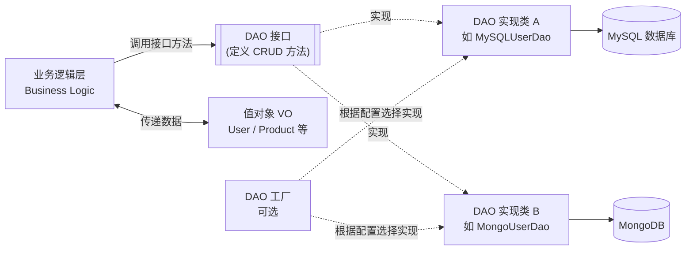
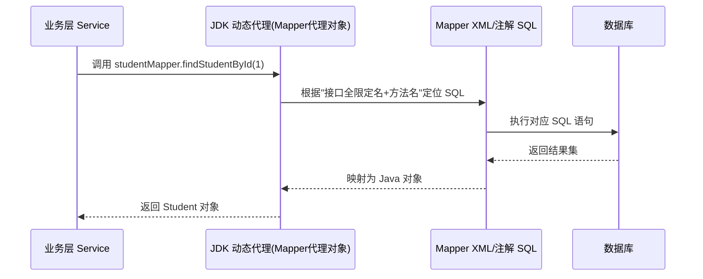

# DAO 设计模式（Data Access Object）学习笔记

> **Last researched（最近整理时间）**：2026-07-29

## 摘要

DAO（Data Access Object，数据访问对象）是一种结构型设计模式，用于将**业务逻辑层**与**数据持久化层**（数据库、文件、XML 等任意数据源）解耦。它最早在 Sun 公司（现 Oracle）发布的 *Core J2EE Patterns* 一书中被正式提出<cite index="2-1">,是Java EE应用中常见的数据访问对象模式,该模式的样例应用还展示了将XML数据源表示为对象的用法</cite>。虽然该模式起源于 Java 生态,但其思想适用于几乎所有支持面向对象编程的语言。

---

## 一、学习目标

读完本笔记后,你应该能够:

- 说清楚 DAO 模式要解决的核心问题(业务逻辑与持久化逻辑耦合)
- 画出/理解 DAO 模式的标准结构(接口、实现类、值对象、工厂)
- 用一门语言(以 Java 为主)实现一个最小可用的 DAO
- 分辨 DAO 与 Repository 模式的区别,知道什么时候选哪个
- 了解 Spring/MyBatis 体系下 DAO 的现代实现方式(接口 + 动态代理),以及常见踩坑点

## 二、前置知识

- 面向对象基础:接口(interface)、类、多态
- 基本的数据库/CRUD(增删改查)概念
- 如果要看 Java 示例,需要了解 JDBC 或至少知道"通过 SQL 操作数据库"是什么

---

## 三、核心概念

### 3.1 为什么需要 DAO

在没有 DAO 分层的情况下,业务代码常常直接和数据库打交道,例如在 Controller 里直接写 SQL 或直接使用 EntityManager/Connection。这样做的问题是:业务逻辑、Web 逻辑和数据访问逻辑混杂在一起,难以维护和测试<cite index="8-1">。如果不使用数据访问对象直接从控制器调用数据库,代码会与数据库操作紧密耦合,难以维护和测试</cite>。

DAO 模式的解决思路是:把"如何访问数据"这件事完全封装到一个独立对象里,业务层只调用这个对象暴露出来的方法(比如 `save`、`findById`、`delete`),完全不关心底层是 MySQL、Oracle、文件还是远程 API<cite index="1-1">。DAO为业务对象提供了一个标准化的接口来执行对实体的增删改查操作,从而屏蔽了底层数据访问实现的细节</cite>。

### 3.2 一句话定义

> DAO 是一个**为某种持久化机制(数据库或其他存储)提供抽象接口的对象**,在不暴露底层实现细节的前提下,对外提供统一的数据访问操作<cite index="3-1">。在计算机软件中,数据访问对象(DAO)是一种为某类数据库或其他持久化机制提供抽象接口的模式</cite>。

### 3.3 模式的两层含义

中文技术圈的资料里常把 DAO 拆成两个词根来理解:

- **Data Accessor(数据访问器)**:解决"怎么访问数据"的问题(连接、查询、事务等)
- **Data Object(数据对象)**:解决"如何用对象封装数据"的问题(即实体/值对象)

这与英文语境中"DAO = 接口 + 实现 + 值对象"的三段式描述是一致的,只是从命名角度做了拆解。

---

## 四、架构与组成部分

一个典型的 DAO 模式包含以下角色:

| 角色 | 作用 |
|---|---|
| **DAO 接口(DAO Interface)** | 定义标准的数据操作方法(增/删/改/查),不涉及具体实现<cite index="6-1">,这个接口定义了在模型对象上要执行的标准操作</cite> |
| **DAO 实现类(DAO Concrete Class)** | 实现接口中定义的方法,负责真正连接某个数据源(数据库、XML、内存等)并完成操作<cite index="6-1">,该类负责从数据源(可以是数据库、XML或其他存储机制)获取数据</cite> |
| **模型对象/值对象(Model/Value Object,VO)** | 一个简单的 POJO,只包含属性和 get/set 方法,用于在各层之间传递通过 DAO 取出的数据<cite index="6-1">,是一个简单的POJO,包含用于存储通过DAO类获取的数据的get/set方法</cite> |
| **DAO 工厂(可选,DAO Factory)** | 在运行时根据配置动态选择具体使用哪个 DAO 实现(例如切换数据库厂商时无需改动业务代码)<cite index="2-1">,样例应用使用工厂类在运行时查找环境配置项来决定实例化哪个实现类,业务代码则统一通过工厂创建的对象访问数据</cite> |

### 4.1 结构图(原文字标注,基于上述来源重绘)



Figure:DAO 模式标准结构,基于 Oracle 官方模式说明与 GeeksforGeeks/TutorialsPoint 教程重绘。来源:[Oracle: Design Patterns - Data Access Object](https://www.oracle.com/java/technologies/data-access-object.html)、[TutorialsPoint DAO Pattern](https://www.tutorialspoint.com/design_pattern/data_access_object_pattern.htm)

### 4.2 数据/控制流

1. 业务层需要数据 → 调用 DAO 接口方法(如 `userDao.findById(1)`)
2. Spring/工厂等容器决定注入哪个具体实现类
3. 实现类执行真正的数据库操作(JDBC/MyBatis/JPA 等)
4. 实现类把数据库返回的结果(结果集/文档)转换为值对象(VO/实体)
5. 值对象一路返回给业务层,业务层完全不知道底层用的是哪种数据库

---

## 五、如何工作(实现方式)

DAO 接口的实现策略主要有以下几种<cite index="2-1">:实现 DAO 接口和实现类是在简单性和灵活性之间做权衡</cite>:

1. **直接写一个类实现接口**:最简单但最不灵活的方式,分离了接口和实现细节,但要更换数据源需要改代码<cite index="2-1">,直接把接口实现为一个类是实现数据访问对象最简单(但最不灵活)的方式,这种方式把数据访问接口和实现细节分开,提供了DAO模式的好处,但更换数据访问机制时仍需要修改代码来切换实现类</cite>。
2. **配合工厂模式动态选择实现**:通过工厂类在运行时根据配置(如环境变量、配置文件)决定实例化哪个具体 DAO 实现,业务代码始终只依赖接口<cite index="2-1">,工厂类在运行时读取环境配置项来查找应该实例化的实现类名,业务代码统一通过工厂创建出来的对象来访问数据源</cite>。
3. **借助 ORM/持久层框架的动态代理(现代 Java 生态)**:例如 MyBatis 中通常只需要写 Mapper 接口而不用手写实现类,框架会在启动时通过 JDK 动态代理,根据接口和对应的 XML/注解 SQL 语句自动生成代理对象来完成实际调用。

### 5.1 最小可运行示例(Java,原始 DAO 写法)

```java
// 1. 值对象 VO
public class Student {
    private int rollNo;
    private String name;
    // 构造方法、getter/setter 省略
}

// 2. DAO 接口
public interface StudentDao {
    List<Student> getAllStudents();
    Student getStudent(int rollNo);
    void updateStudent(Student student);
    void deleteStudent(Student student);
}

// 3. DAO 实现类(用内存 List 模拟数据源,便于演示)
public class StudentDaoImpl implements StudentDao {
    private List<Student> students;

    public StudentDaoImpl() {
        students = new ArrayList<>();
    }

    @Override
    public void updateStudent(Student student) {
        students.get(student.getRollNo()).setName(student.getName());
    }
    // 其余方法实现省略
}

// 4. 业务代码只依赖接口
StudentDao studentDao = new StudentDaoImpl();
Student student = studentDao.getAllStudents().get(0);
student.setName("Michael");
studentDao.updateStudent(student);
```

> 该示例结构参考自 [Baeldung: DAO vs Repository Patterns](https://www.baeldung.com/java-dao-vs-repository) 与 [TutorialsPoint DAO Pattern](https://www.tutorialspoint.com/design_pattern/data_access_object_pattern.htm) 中的经典 `StudentDao` 示例,已按本笔记结构简化重写。

### 5.2 现代写法:MyBatis 中"只写接口不写实现"

在 Spring + MyBatis 体系中,开发者通常只需要定义 Mapper(即 DAO)接口,不需要手写实现类。原理是 MyBatis 在启动时会读取 XML/注解中的 SQL 语句,并利用 JDK 动态代理为接口生成代理对象;调用接口方法时,代理对象会拦截该调用,转而执行对应的 SQL 语句,再把结果映射回来。这也是为什么 Mapper 接口中的方法**不能重载**——因为 MyBatis 底层是用"全限定名 + 方法名"作为查找 SQL 语句的 key,重载方法会导致 key 冲突。

```java
// 只需要接口,不需要实现类
public interface StudentMapper {
    Student findStudentById(Long id);
}
```

```xml
<!-- 对应的 XML 映射文件 -->
<mapper namespace="cn.mybatis.mappers.StudentMapper">
  <select id="findStudentById" parameterType="Long" resultType="com.po.Student">
    select * from tb_student where id = #{id}
  </select>
</mapper>
```



Figure:MyBatis Mapper(DAO)接口的动态代理调用流程,基于 CSDN/博客园社区文章内容整理重绘。来源:[MyBatis常见面试题:Dao接口的工作原理是什么](https://www.cnblogs.com/east7/p/14880341.html)

---

## 六、适用场景 / 不适用场景 / 选型标准

### 适用场景

- 需要支持多种数据源或未来可能更换数据库/存储方案的系统
- 需要将数据访问逻辑独立出来以便**单元测试**(可以用假的 DAO 实现替代真实数据库)
- 传统三层架构(表示层 / 业务层 / 数据访问层)的企业应用

### 不太适用的场景

- 小型项目或原型系统,数据访问需求非常简单,引入 DAO 分层反而增加了不必要的复杂度和开发成本<cite index="1-1">,在数据访问需求很小的小型项目或原型中,实施DAO模式可能会引入不必要的开销,额外的抽象层在需求简单的项目中可能显得多余</cite>
- 领域逻辑非常复杂、需要以聚合根(Aggregate Root)为中心组织业务规则的场景——这种情况下 Repository 模式通常是更合适的选择(见第七节对比)

### 选型考虑因素

- 团队是否已经在用某个 ORM 框架(如 MyBatis/JPA/Hibernate),框架本身是否已经内置了类似 DAO 的抽象
- 项目是否采用领域驱动设计(DDD);如果是,倾向于 Repository 而不是原始 DAO
- 是否需要支持多数据源/多种存储实现的动态切换,需要的话应搭配工厂模式使用

---

## 七、DAO 与 Repository 模式对比

这是学习 DAO 时最容易混淆、也是面试中最常被问到的问题。二者概念上有很多重叠,但侧重点不同。

| 维度 | DAO | Repository |
|---|---|---|
| 抽象层级 | 数据持久化的抽象,更贴近存储系统<cite index="10-1">,DAO是数据持久化的抽象,而Repository是对象集合的抽象</cite> | 对象集合(Collection)的抽象,更贴近领域对象<cite index="10-1">,Repository是更高层的概念,更贴近领域对象</cite> |
| 起源 | 早期企业级应用设计,正式化于《Core J2EE Patterns》(2001)<cite index="11-1">,DAO模式源自早期企业应用设计,并在《Core J2EE Patterns》一书中被系统化</cite> | 领域驱动设计(DDD),源自 Eric Evans 的著作<cite index="11-1">,Repository模式起源于领域驱动设计,由Eric Evans在其著作中提出</cite> |
| 关注点 | 隐藏丑陋的查询细节,充当数据映射/访问层<cite index="10-1">,DAO作为数据映射/访问层工作,隐藏底层丑陋的查询逻辑</cite> | 隐藏"如何拼装并准备好一个完整领域对象"的复杂度,是领域层和数据访问层之间的一层<cite index="10-1">,Repository是领域层和数据访问层之间的一层,隐藏了组装数据并准备领域对象的复杂性</cite> |
| 依赖关系 | DAO 不能反过来依赖 Repository 实现 | Repository 内部可以组合/调用多个 DAO 来完成一次业务查询<cite index="10-1">,DAO无法通过Repository来实现,但Repository可以借助DAO访问底层存储</cite> |
| 典型颗粒度 | 通常一张表对应一个 DAO(表级别) | 通常一个聚合根对应一个 Repository,内部可能聚合多个表/多个 DAO |
| 退化情况 | — | 当领域模型是贫血模型(Anemic Domain)时,Repository 实际上就退化成了一个 DAO<cite index="10-1">,如果领域是贫血模型,Repository实际上就只是一个DAO</cite> |

一个常见的实践误区是:很多项目里所谓的"Repository"其实只是换了个名字的 DAO,并没有真正承担领域逻辑的职责——这也是社区反复讨论"DAO 和 Repository 到底有什么区别"的原因之一<cite index="9-1">,人们常把某些实际上更像DAO的实现直接称为Repository,这也是二者概念容易被混淆的原因之一</cite>。

---

## 八、常见错误与踩坑(社区经验整理)

以下内容综合自 CSDN、博客园等中文技术社区的实践文章,已合并去重并按主题归类,仅代表社区实践经验,不作为权威规范:

1. **Spring 容器扫描不到 DAO/Mapper 接口**:最常见的原因是 `basePackage` 配置路径写错,导致 `@Autowired` 注入 DAO/Service 时报错,需要仔细核对扫描包路径是否与 DAO 接口实际所在包一致。
2. **AOP 代理拦截不到 MyBatis 的 Mapper(DAO)**:MyBatis 只写接口不写实现类,底层依赖 JDK 动态代理;如果 Spring AOP 配置成了基于类的 CGLIB 代理(`proxy-target-class="true"`),就会导致无法正确拦截接口方法,需要确认 AOP 代理方式与 Mapper 的代理方式匹配。
3. **多数据源场景下 SqlSession 混用**:在配置多数据源(如主从库)时,如果 `@MapperScan` 没有显式指定 `sqlSessionFactoryRef`/`sqlSessionTemplateRef`,MyBatis 会按类型自动装配,容易导致不同数据源的 DAO 共用了同一个 SqlSession,引发难以排查的数据错乱问题。
4. **`Property 'sqlSessionFactory' or 'sqlSessionTemplate' are required` 报错**:常见于 Spring Boot 整合 MyBatis 时缺少 `@Mapper`/`@Repository` 注解,或没有在启动类上加 `@MapperScan` 指定 DAO 包路径。
5. **Mapper 接口方法不能重载**:因为 MyBatis 是用"接口全限定名 + 方法名"作为 key 去匹配 XML 中的 SQL 语句,重载方法会导致 key 冲突,只能保留一个签名生效。

---

## 九、调试排查建议

- 遇到 DAO/Mapper 注入失败,优先检查:包扫描路径(`basePackage`)是否正确、是否遗漏 `@Repository`/`@Mapper` 注解、是否在启动类正确配置 `@MapperScan`。
- 遇到多数据源数据错乱,优先检查:每个 `@MapperScan` 分组是否都显式绑定了各自的 `sqlSessionFactoryRef`/`sqlSessionTemplateRef`,避免自动装配"猜错"数据源。
- 遇到 AOP 切面对 DAO 层不生效,检查 Spring AOP 的代理方式(JDK 动态代理 vs CGLIB)是否与目标对象的代理方式一致。
- 单元测试 DAO 层时,建议为 DAO 接口编写一个内存/Mock 实现,验证业务层逻辑是否正确依赖了接口而不是具体实现类,这也是 DAO 模式带来的可测试性优势的直接体现。

---

## 十、优缺点小结

**优点**

- 业务逻辑与数据访问逻辑解耦,数据源变更(如换数据库、换存储方式)对业务代码影响很小
- 提升可测试性:可以用假的 DAO 实现来做业务层单元测试
- 提升代码复用性和可维护性,CRUD 操作统一封装,减少重复 SQL/连接管理代码

**缺点/权衡**

- 在简单项目里会带来额外的抽象层和开发成本<cite index="1-1">,在数据访问需求较小的小型项目或原型中,实施DAO模式可能会带来不必要的开销</cite>
- 对刚接触该模式的开发者有一定学习曲线,需要理解抽象层设计和接口设计的意义<cite index="1-1">,不熟悉DAO模式的开发者在适应其原则时可能会面临学习曲线,理解抽象层次和设计有效的DAO接口对新手来说可能具有挑战性</cite>
- 如果领域逻辑复杂,单纯的表级 DAO 容易让业务代码退化成"面向数据库编程",这时候更适合引入 Repository + 聚合根的设计

---

## 十一、术语速查表

| 术语 | 含义 |
|---|---|
| DAO | Data Access Object,数据访问对象,封装对某种持久化机制的访问 |
| VO / PO | Value Object / Persistent Object,值对象/持久化对象,通常是纯数据容器(POJO) |
| CRUD | Create, Read, Update, Delete,增删改查 |
| 工厂模式(Factory) | 用于在运行时动态创建具体 DAO 实现的模式,常与 DAO 搭配使用 |
| 聚合根(Aggregate Root) | DDD 中的概念,一组相关对象的"入口对象",Repository 通常围绕聚合根设计 |
| 动态代理(Dynamic Proxy) | JVM 在运行期为接口生成代理对象的机制,MyBatis 等框架借此实现"只写接口不写实现类" |
| 泛型 DAO(Generic DAO) | 利用 Java 泛型定义统一的 `GenericDao<T>` 接口,减少为每个实体重复编写相同 CRUD 方法的工作量 |

---

## 十二、References / 参考资料

**Official / 官方与权威资料**

- Oracle, *Design Patterns: Data Access Object* — https://www.oracle.com/java/technologies/data-access-object.html
- Wikipedia, *Data access object* — https://en.wikipedia.org/wiki/Data_access_object

**Standard / 教程与规范类**

- TutorialsPoint, *Data Access Object Pattern* — https://www.tutorialspoint.com/design_pattern/data_access_object_pattern.htm
- GeeksforGeeks, *Data Access Object (DAO) Design Pattern* — https://www.geeksforgeeks.org/system-design/data-access-object-pattern/
- Baeldung, *DAO vs Repository Patterns* — https://www.baeldung.com/java-dao-vs-repository
- Java Design Patterns, *Data Access Object Pattern in Java* — https://java-design-patterns.com/patterns/data-access-object/
- DZone, *Differences Between Repository and DAO* — https://dzone.com/articles/differences-between-repository-and-dao
- Delft Stack, *Difference Between Repository Pattern and DAO in Java* — https://www.delftstack.com/howto/java/difference-between-repository-pattern-and-dao-in-java/

**Vendor blog / 技术博客**

- Dev Cookies, *DAO Design Pattern: The Complete Guide* — https://devcookies.medium.com/dao-design-pattern-the-complete-guide-f8246f227091
- DigitalOcean, *DAO Design Pattern* — https://www.digitalocean.com/community/tutorials/dao-design-pattern
- Medium (kacar7), *DAO (Data Access Object) in Java* — https://medium.com/@kacar7/dao-data-access-object-in-java-e0a76559e5e5
- Medium (VuongPham), *Repositories Pattern vs DAO Pattern* — https://medium.com/@vngphm/repositories-pattern-vs-dao-pattern-765470e73cf3
- DevGex, *The Difference Between DAO and Repository Patterns: Practical Analysis in DDD and Hibernate* — https://devgex.com/en/article/00024368

**Community / 中文社区文章(CSDN / 博客园)**

- CSDN, *DAO模式详解:数据访问对象与其实现* — https://blog.csdn.net/m0_68988603/article/details/124868060
- CSDN, *DAO模式由哪几部分组成* — https://blog.csdn.net/dengjian5959/article/details/101608679
- CSDN, *数据访问对象DAO和DAO模式--学习笔记* — https://blog.csdn.net/weixin_45951911/article/details/109455875
- CSDN, *Java网站开发中的DAO是什么意思》(含泛型DAO)* — https://blog.csdn.net/m0_59834108/article/details/119376604
- CSDN, *DAO模式详细讲解，简单易懂* — https://blog.csdn.net/weixin_59755109/article/details/124105783
- CSDN, *DAO(Data Access Objects)数据访问层介绍* — https://blog.csdn.net/helloxiaozhe/article/details/80916494
- CSDN, *java之 DAO设计模式的【详解】及常见设计模式的【应用】* — https://blog.csdn.net/u011479875/article/details/47911165
- 博客园, *spring + myBatis 常见错误:@Autowired注解失败* — https://www.cnblogs.com/michaelShao/p/5398930.html
- 博客园, *记一次Spring的aop代理Mybatis的DAO所遇到的问题* — https://www.cnblogs.com/study-everyday/p/7429298.html
- 博客园, *springboot 注册dao层 service 层的三种方式* — https://www.cnblogs.com/zhulina-917/p/10502890.html
- 博客园, *MyBatis使用传统Dao开发方式* — https://www.cnblogs.com/atao-BigData/p/16864084.html
- 博客园, *springboot-mybatis多数据源以及踩坑之旅* — https://www.cnblogs.com/xiao-tao/p/10268016.html
- 博客园, *MyBatis常见面试题:Dao接口的工作原理是什么* — https://www.cnblogs.com/east7/p/14880341.html
- 博客园, *Springboot +Mybatis整合常见错误* — https://www.cnblogs.com/kire-cat/p/15350389.html
