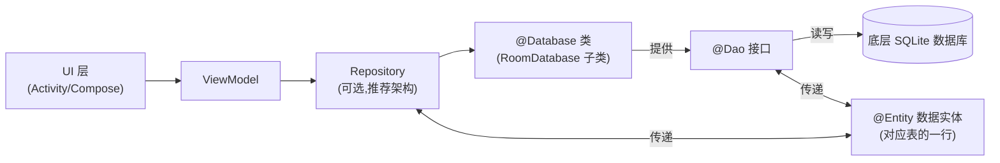
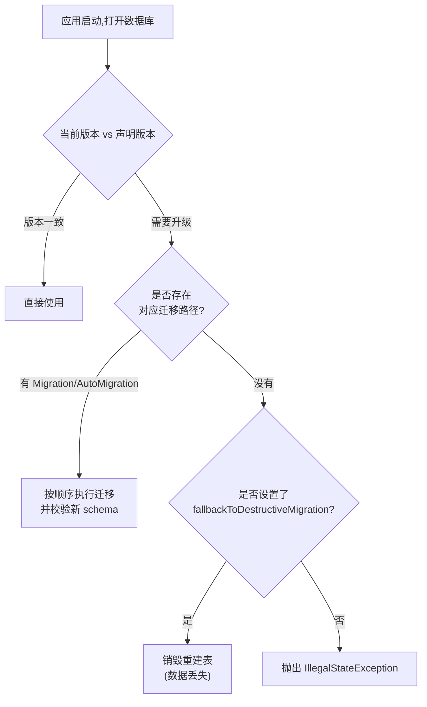

# Room 持久化库学习笔记(Android Jetpack)

> **Last researched(最近整理时间)**:2026-07-29
> 本笔记默认指 Android Jetpack 的 **Room Persistence Library**(与前两篇 DAO 设计模式、SQLite 学习笔记是同一条技术脉络:Room 就是官方在 SQLite 之上、结合 DAO 模式提供的 ORM 封装)。

## 摘要

Room 是 Google Android Jetpack 项目中的持久化库,<cite index="66-1">它在 SQLite 之上提供了一层抽象,让开发者在享受 SQLite 全部能力的同时,获得更流畅、更健壮的数据库访问体验</cite>。Room 的核心价值在于:把手写 SQL 拼接、Cursor 遍历这类繁琐且容易出错的样板代码,转换成基于注解的声明式写法,并在**编译期**就能验证 SQL 语句的正确性。

---

## 一、学习目标

- 理解 Room 在 Android 应用架构中的位置(与 Repository、ViewModel 的关系)
- 掌握 Room 三大核心组件:Entity(实体)、DAO(数据访问对象)、Database(数据库类)
- 能够独立搭建一个包含增删改查的最小 Room 数据库
- 理解 Room 为什么禁止在主线程访问数据库,以及如何配合协程/Flow/LiveData 做异步查询
- 掌握数据库迁移(Migration)的自动与手动方式,理解迁移失败的后果
- 了解 Room 的测试方法与常见踩坑点
- 了解 Room 目前的新进展(Kotlin Multiplatform 支持)

## 二、前置知识

- 本笔记假定你已经了解 **DAO 设计模式**(如果还没有,建议先看《DAO 设计模式学习笔记》)与 **SQLite** 的基础知识(存储类型、事务等,参考《SQLite 学习笔记》),Room 正是把这两者结合起来的产物
- Kotlin 或 Java 基础
- Android 四大组件、Gradle 构建基础
- 了解协程(Coroutine)、LiveData、Flow 会更容易理解异步查询部分(非必需,笔记中会做基础说明)

---

## 三、Room 是什么、解决了什么问题

在 Room 出现之前,Android 开发者要么直接使用 `SQLiteOpenHelper` 手写建表语句和 CRUD 逻辑,要么依赖各种第三方 DAO/ORM 库<cite index="58-1">。在经历多年使用各种第三方 DAO 库之后,Google 终于推出了官方的 SQLite 数据库解决方案——Room 持久化库</cite>。

Room 本质上是**官方 ORM**<cite index="59-1">,作为 Android 里的官方 ORM 被引入,ORM 在 SQLite 之上提供了一层抽象以改善数据库访问体验</cite>。它的具体做法是<cite index="58-1">:利用注解标注 Java/Kotlin 数据模型和数据访问对象(DAO),从而自动生成数据库表结构定义与对应的 SQLite 查询语句,开发者因此不必从零手写全部 SQLite 查询语句,也不必自己实现存取模型对象的逻辑</cite>。

Room 官方文档总结的三大主要收益<cite index="66-1">:SQL 查询的编译期校验;能大幅减少重复且容易出错的样板代码的便捷注解;以及更顺畅的数据库迁移路径。基于这些考虑,官方强烈建议使用 Room 而不是直接使用 SQLite API</cite>。

---

## 四、整体架构

### 4.1 三大核心组件

Room 中有三个主要组件<cite index="67-1">:承载数据库并作为底层持久化数据主要访问入口的数据库类;代表应用数据库中各个表的数据实体(Entity);以及提供查询、更新、插入、删除数据方法的数据访问对象(DAO)</cite>。

<cite index="67-1">数据库类为应用提供与该数据库关联的 DAO 实例;应用进而使用这些 DAO,以关联的数据实体对象形式从数据库中检索数据;应用也可以使用定义好的数据实体来更新对应表中的行,或者创建待插入的新行</cite>。

### 4.2 架构图



Figure:Room 三大组件及其在推荐应用架构中的位置,基于官方文档重绘。来源:[Android Developers: Save data in a local database using Room](https://developer.android.com/training/data-storage/room)、[Techotopia: The Android Room Persistence Library](https://www.techotopia.com/index.php/The_Android_Room_Persistence_Library)

按照官方推荐的分层架构<cite index="60-1">,Repository 与 Room 数据库交互以获取数据库实例,进而用该实例获取 DAO 实例;Repository 创建实体实例并填充数据后交给 DAO 用于查询和插入操作;Repository 调用 DAO 上的方法,把实体传入用于插入,并在查询时接收返回的实体实例;当 DAO 有结果要返回给 Repository 时,会把结果打包成实体对象;DAO 与 Room 数据库交互来发起数据库操作并处理结果</cite>。

---

## 五、三大组件详解

### 5.1 Entity(数据实体)

用 `@Entity` 注解标注的类,每个实例对应表中的一行:

```kotlin
@Entity
data class User(
    @PrimaryKey val uid: Int,
    @ColumnInfo(name = "first_name") val firstName: String?,
    @ColumnInfo(name = "last_name") val lastName: String?
)
```

上面的代码定义了一个 `User` 数据实体,`User` 的每个实例对应应用数据库中 `user` 表的一行。

### 5.2 DAO(数据访问对象)

```kotlin
@Dao
interface UserDao {
    @Query("SELECT * FROM user")
    fun getAll(): List<User>

    @Query("SELECT * FROM user WHERE uid IN (:userIds)")
    fun loadAllByIds(userIds: IntArray): List<User>

    @Query("SELECT * FROM user WHERE first_name LIKE :first AND " +
           "last_name LIKE :last LIMIT 1")
    fun findByName(first: String, last: String): User

    @Insert
    fun insertAll(vararg users: User)

    @Delete
    fun delete(user: User)
}
```

`UserDao` 提供了应用其余部分与 `user` 表中数据交互所需的方法。这里可以直接呼应前面《DAO 设计模式学习笔记》的内容:Room 里的 `@Dao` 接口正是标准 DAO 模式的一个具体实现——只写接口,由 Room 在编译期通过注解处理器(KSP/KAPT)自动生成实现类,概念上与 MyBatis 用动态代理生成 Mapper 实现如出一辙。

参数绑定是编译期做的:通过方法参数把值传入查询,例如需要筛选出年龄大于某个值的 `User`,可以直接使用方法参数;Room 在编译时用 `minAge` 方法参数去匹配 SQL 中的 `:minAge` 绑定参数,如果参数名对不上,会直接产生编译错误。

### 5.3 Database(数据库类)

```kotlin
@Database(entities = [User::class], version = 1)
abstract class AppDatabase : RoomDatabase() {
    abstract fun userDao(): UserDao
}
```

数据库类必须满足以下条件<cite index="67-1">:该类必须使用 @Database 注解,并在其中包含列出所有关联数据实体的 entities 数组;该类必须是继承自 RoomDatabase 的抽象类;对于每一个与该数据库关联的 DAO 类,数据库类都必须定义一个不接收任何参数、返回该 DAO 类实例的抽象方法</cite>。

创建与使用数据库实例:

```kotlin
val db = Room.databaseBuilder(
    applicationContext,
    AppDatabase::class.java, "database-name"
).build()

val userDao = db.userDao()
val users: List<User> = userDao.getAll()
```

> **注意(单例模式)**:<cite index="67-1">如果应用运行在单一进程中,实例化 AppDatabase 对象时应该遵循单例设计模式,因为每个 RoomDatabase 实例的创建代价相当高,在同一进程内几乎不需要访问多个实例。如果应用运行在多进程中,则需要在构建数据库时调用 enableMultiInstanceInvalidation(),这样当每个进程各自持有一个 AppDatabase 实例时,在某一个进程中让共享数据库文件失效,这个失效状态会自动传播到其他进程中的 AppDatabase 实例</cite>。

---

## 六、异步查询与线程规则

### 6.1 为什么禁止在主线程查询

Room 不支持在主线程上进行数据库访问(除非在构造器上调用 `allowMainThreadQueries()`),因为数据库访问耗时,可能会长时间锁定 UI 线程,进而引发界面卡顿甚至 ANR(应用无响应)。不过异步查询(返回 `LiveData`、`Flow`、`Flowable` 等类型的查询)不受此规则约束,因为这类查询会在需要时自动切换到后台线程执行。

### 6.2 常见的异步查询方式

```kotlin
@Dao
interface UserDao {
    // 挂起函数(推荐,配合协程)
    @Insert
    suspend fun insertAll(vararg users: User)

    // 返回 Flow,数据变化时自动重新发射新结果
    @Query("SELECT * FROM user")
    fun observeAll(): Flow<List<User>>

    // 返回 LiveData,便于在 ViewModel/UI 层观察
    @Query("SELECT * FROM user WHERE uid = :uid")
    fun observeById(uid: Int): LiveData<User>
}
```

- `suspend` 挂起函数:适合一次性的增删改操作,需要在协程作用域内调用
- `Flow`/`LiveData`:适合需要持续观察数据变化的查询,底层会在数据库内容变化时自动重新查询并推送新结果

---

## 七、数据库迁移(Migration)

随着应用迭代,Entity 类和底层数据库表结构往往需要跟着变化。为了不丢失设备上已有的用户数据,Room 提供了增量迁移机制,支持自动迁移与手动迁移两种方式。Room 从 2.4.0-alpha01 起支持自动迁移,更低版本必须手动定义迁移路径。

### 7.1 自动迁移(Automated Migration)

```kotlin
// 版本更新前
@Database(version = 1, entities = [User::class])
abstract class AppDatabase : RoomDatabase() { ... }

// 版本更新后
@Database(
    version = 2,
    entities = [User::class],
    autoMigrations = [AutoMigration(from = 1, to = 2)]
)
abstract class AppDatabase : RoomDatabase() { ... }
```

自动迁移依赖新旧两个版本数据库的**导出 schema**(需要开启 `exportSchema`),如果 schema 没有正确导出,或者尚未用新版本号编译过数据库,自动迁移会失败。

当 Room 检测到有歧义的 schema 变更(最常见的是删除/重命名表、删除/重命名列)且无法在没有更多信息的情况下自动生成迁移方案时,会抛出编译期错误,并要求实现 `AutoMigrationSpec`,通过 `@DeleteTable`、`@RenameTable`、`@DeleteColumn`、`@RenameColumn` 等注解补充信息。

### 7.2 手动迁移(Manual Migration)

当迁移涉及复杂的 schema 变更(例如把一张表拆分成两张表)时,Room 无法自动推断该如何操作,必须手动实现 `Migration` 类:

```kotlin
val MIGRATION_1_2 = object : Migration(1, 2) {
    override fun migrate(database: SupportSQLiteDatabase) {
        database.execSQL(
            "CREATE TABLE `Fruit` (`id` INTEGER, `name` TEXT, PRIMARY KEY(`id`))"
        )
    }
}

val MIGRATION_2_3 = object : Migration(2, 3) {
    override fun migrate(database: SupportSQLiteDatabase) {
        database.execSQL("ALTER TABLE Book ADD COLUMN pub_year INTEGER")
    }
}

Room.databaseBuilder(applicationContext, MyDb::class.java, "database-name")
    .addMigrations(MIGRATION_1_2, MIGRATION_2_3)
    .build()
```

> **提醒**:定义迁移逻辑时要写完整的 SQL 语句,而不是引用代表这些查询的常量,以确保迁移逻辑始终按预期工作。如果同一个版本既定义了自动迁移又定义了手动迁移,Room 会优先使用手动迁移。

### 7.3 迁移路径缺失时的处理

如果 Room 找不到把设备上现有数据库升级到当前版本的迁移路径,会抛出 `IllegalStateException`。如果可以接受在缺少迁移路径时丢失现有数据,可以在构建数据库时调用 `fallbackToDestructiveMigration()`,这会让 Room 在需要执行增量迁移但没有定义迁移路径时,直接销毁并重建应用数据库中的表。

> **警告**:该选项意味着 Room 在尝试迁移但没有找到迁移路径时,会**永久删除**用户数据库表中的全部数据,务必谨慎使用。如果只想在特定情形下才允许破坏性迁移,可以改用 `fallbackToDestructiveMigrationFrom()`(仅针对指定的起始版本)或 `fallbackToDestructiveMigrationOnDowngrade()`(仅在数据库版本号被降级时)。



Figure:Room 数据库迁移决策流程,基于官方文档重绘。来源:[Android Developers: Migrate your Room database](https://developer.android.com/training/data-storage/room/migrating-db-versions)

### 7.4 测试迁移

Room 提供 `room-testing` 库配合 `MigrationTestHelper` 来测试迁移路径。测试前需要先开启 `exportSchema` 把每个版本的数据库 schema 导出为 JSON 文件并纳入版本控制,这些文件既是自动迁移生成的依据,也是测试时构造"旧版本数据库"的依据。建议同时测试单个迁移和从最早版本到最新版本的完整迁移链路,以确保新建数据库实例与经历过完整迁移路径的旧实例之间没有 schema 差异。

---

## 八、常用注解速查

| 注解 | 作用 |
|---|---|
| `@Entity` | 标注一个类为数据库中的表 |
| `@PrimaryKey` | 标注主键字段,可加 `autoGenerate = true` 实现自增 |
| `@ColumnInfo(name = "...")` | 自定义列名,或设置 `defaultValue` 默认值(Room 2.2.0+) |
| `@Dao` | 标注一个接口/抽象类为数据访问对象 |
| `@Query` | 声明自定义 SQL 查询,编译期做语法与字段匹配校验 |
| `@Insert` / `@Update` / `@Delete` | 声明式的增/改/删操作,无需手写 SQL |
| `@Database` | 标注数据库类,声明 `entities`、`version`、`autoMigrations` 等 |
| `@TypeConverter` | 定义自定义类型与 Room 支持类型之间的转换规则(如 Date ↔ Long) |
| `@ForeignKey` | 在实体上声明外键关系 |
| `@AutoMigration` | 在 `@Database` 中声明一次自动迁移 |

### TypeConverter 示例

有时需要在单个数据库列中持久化一种自定义数据类型,这时可以借助类型转换器:

```kotlin
class Converters {
    @TypeConverter
    fun fromTimestamp(value: Long?): Date? {
        return value?.let { Date(it) }
    }

    @TypeConverter
    fun dateToTimestamp(date: Date?): Long? {
        return date?.time
    }
}
```

---

## 九、适用场景 / 不适用场景 / 选型标准

### 适用场景

- 需要在设备本地缓存结构化数据,支持离线浏览(网络不可用时依然能展示内容,联网后再同步用户改动)
- 需要复杂查询、多表关联(一对一/一对多/多对多)的本地数据存储
- 团队希望在编译期就发现 SQL 语句错误,减少运行时崩溃
- 已经在用 SQLiteOpenHelper 手写数据库逻辑、希望迁移到更规范的官方方案的项目

### 不适用场景

- 只需要存储简单键值对配置项的场景(更适合 `SharedPreferences`/`DataStore`,用 Room 反而过重)
- 极简单、生命周期极短的临时数据(内存缓存或简单集合即可,没必要落库)

### 选型考虑因素

- 是否需要多表关系、复杂查询、以及后续版本迭代中的 schema 演进能力(这些正是 Room 相对 `SharedPreferences` 的核心优势)
- 是否需要与协程/Flow/LiveData 等 Jetpack 生态组件配合形成响应式数据流
- 团队是否有信心/流程去维护好每一次 schema 变更对应的迁移路径(否则容易埋下线上数据丢失的隐患)

---

## 十、常见错误与踩坑(社区经验整理)

综合中文技术社区(博客园、掘金)的实践经验,以下是使用 Room 时常见的坑:

1. **在主线程直接查询数据库导致崩溃/卡顿**:Room 默认不支持在主线程上进行数据库访问,因为它可能会长时间锁定 UI 线程,若确实需要在主线程访问,需要在构造数据库时调用 `allowMainThreadQueries()` 绕过限制,或者干脆使用异步查询/手动切到后台线程,才能避免 ANR。
2. **滥用 `fallbackToDestructiveMigration()` 导致线上数据丢失**:该方法会在缺失迁移路径时销毁重建表——一些团队为了图方便,在应用已经上线、存在真实用户数据后仍然长期依赖这个选项做"偷懒式迁移",一旦触发就意味着用户本地数据全部丢失,应当仅作为兜底而非常规迁移手段。
3. **`@Query` 返回值字段和查询列不匹配**:Room 会在编译期检查 `@Query` 注解方法,如果查询返回类型的字段和数据库列名存在部分不一致,只会给出警告;如果完全不一致才会报错——这意味着字段名"部分对得上、部分对不上"的情况很容易被忽略,建议查询结果的字段命名与列名保持一致或显式用 `@ColumnInfo` 映射。
4. **升级到 Room 2.2.0 后出现 schema 校验失败**:如果在早期版本(低于 2.2.0)通过手写迁移 SQL(如 `ALTER TABLE ... DEFAULT ''`)的方式添加带默认值的列,后续升级到 2.2.0+ 并在 Entity 上用 `@ColumnInfo(defaultValue = ...)` 声明同样的默认值时,新安装用户(从新版本直接安装)和老用户(经历过迁移路径)的 schema 可能出现不一致,导致校验失败——官方给出的解决办法是:在 Entity 中声明默认值、把数据库版本号加 1、并按照"新建表→拷贝数据→删除旧表→重命名"的方式定义一次迁移,统一新旧用户的 schema。
5. **迁移逻辑里直接引用常量而非完整 SQL 语句**:官方特别提醒,为了保证迁移逻辑长期按预期工作,应该在 `Migration.migrate()` 中书写完整的 SQL 字符串,而不是引用可能随代码演进而改变的常量。
6. **数据库单例被重复创建**:很多项目在多个地方各自 `Room.databaseBuilder(...).build()`,导致创建了多个 `RoomDatabase` 实例,浪费资源且容易引发数据不一致,应确保在单进程应用中遵循单例模式统一持有数据库实例。

---

## 十一、调试排查建议

- 遇到主线程数据库访问异常:检查是否调用了耗时的 DAO 方法却没有切到协程/后台线程,考虑把方法改造为 `suspend` 函数或返回 `Flow`/`LiveData`。
- 遇到迁移崩溃(`IllegalStateException: Migration didn't properly handle...`):对照导出的 schema JSON 文件,检查 `Migration.migrate()` 里的 SQL 是否真正把表结构改成了目标版本要求的样子;可以用 `MigrationTestHelper` 编写专门的迁移测试来复现和定位问题。
- 遇到 `@Query` 相关的编译错误:检查方法参数名是否与 SQL 中的 `:占位符` 完全一致,检查查询结果实体的字段名与 `SELECT` 出来的列名是否匹配。
- 怀疑存在多个数据库实例:全局搜索 `Room.databaseBuilder` 调用点,确认是否已经收敛到一处单例创建逻辑。
- 涉及自定义类型存储异常:检查是否为该类型提供了成对的 `@TypeConverter` 方法(序列化和反序列化两个方向都要覆盖)。

---

## 十二、优缺点小结

**优点**

- 编译期校验 SQL 语句,把很多本该运行时才暴露的错误提前到编译阶段
- 大幅减少手写 SQLite 样板代码(建表、Cursor 遍历、参数绑定等)
- 与协程、Flow、LiveData、Paging 3 等 Jetpack 组件深度集成,天然支持响应式数据流
- 官方长期维护,迁移机制(自动 + 手动)相对成熟

**缺点/权衡**

- 学习成本高于直接用 `SharedPreferences` 存简单数据
- 迁移逻辑如果维护不当(尤其滥用破坏性迁移),容易造成线上用户数据丢失
- 复杂多表关系(一对多、多对多)的实体建模有一定门槛,需要额外学习 Room 的关系映射写法
- 注解处理器(KSP/KAPT)会增加一定的编译时间

---

## 十三、术语速查表

| 术语 | 含义 |
|---|---|
| Entity | 用 `@Entity` 标注的类,对应数据库中的一张表 |
| DAO | Data Access Object,用 `@Dao` 标注的接口,声明数据库操作方法,由 Room 生成实现 |
| RoomDatabase | 数据库类的基类,`@Database` 注解的抽象类需要继承它 |
| Migration | 显式定义某个版本区间(startVersion→endVersion)如何变更 schema 的类 |
| AutoMigration | Room 2.4.0+ 提供的、根据前后 schema 差异自动生成迁移逻辑的机制 |
| AutoMigrationSpec | 当自动迁移存在歧义(如删表/改名)时,用来补充信息的接口 |
| fallbackToDestructiveMigration | 迁移路径缺失时销毁重建数据库表的兜底选项(会丢数据) |
| exportSchema | 是否在编译期把数据库 schema 导出为 JSON,供自动迁移和迁移测试使用 |
| KSP/KAPT | Kotlin 符号处理/Kotlin 注解处理工具,Room 借此在编译期生成 DAO 实现代码 |
| Flow / LiveData | Room 支持的两种响应式返回类型,数据库内容变化时自动重新推送查询结果 |

---

## 十四、References / 参考资料

**Official / 官方**

- Android Developers, *Save data in a local database using Room* — https://developer.android.com/training/data-storage/room
- Android Developers, *Migrate your Room database* — https://developer.android.com/training/data-storage/room/migrating-db-versions
- Android Developers, *Room | Jetpack releases* — https://developer.android.com/jetpack/androidx/releases/room

**Standard / 权威教程类**

- GeeksforGeeks, *Introduction to Room Persistent Library in Android* — https://www.geeksforgeeks.org/android/introduction-to-room-persistent-library-in-android/
- MindOrks, *Introduction to Room Persistent Library in Android* — https://blog.mindorks.com/introduction-to-room-persistent-library-in-android/
- Techotopia, *The Android Room Persistence Library* — https://www.techotopia.com/index.php/The_Android_Room_Persistence_Library
- daily.dev, *Android Room Persistence Library: Complete Guide* — https://daily.dev/blog/android-room-persistence-library-complete-guide/

**Vendor blog / 技术博客**

- Medium (Ollie M), *Android Architecture Components: Room Persistence Library* — https://medium.com/codeprinciples/android-architecture-components-room-persistence-library-3d35e5d19b1f
- Medium (Gonzalo Martin), *Getting started with Room Persistence Library* — https://medium.com/android-news/getting-started-with-room-persistence-library-8932276b4d8c
- FriendlyUsers Tech Blog, *Android Room Persistence Library: A Comprehensive Guide* — https://friendlyuser.github.io/posts/tech/2023/Android_Room_Persistence_Library_A_Comprehensive_Guide/

**Community / 中文社区文章(博客园 / 掘金)**

- 博客园, *Android Room 使用案例* — https://www.cnblogs.com/zoro-zero/p/11413343.html
- 博客园, *Android_存储之DataBase之Room* — https://www.cnblogs.com/fanglongxiang/p/11424325.html
- 博客园, *Android框架式编程之Room* — https://www.cnblogs.com/renhui/p/10966560.html
- 博客园, *Android Architecture Components 系列(五)Room* — https://www.cnblogs.com/cold-ice/p/9115852.html
- 博客园, *android room 使用* — https://www.cnblogs.com/rchao/p/13685012.html
- 掘金, *Android room数据库使用最佳入门教程* — https://juejin.cn/post/7098159046280101924
- 掘金, *重学Android Jetpack(四)之—Room基本使用详解* — https://juejin.cn/post/7090222693303189534
