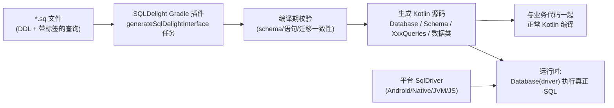
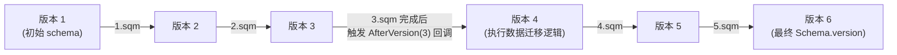

# SQLDelight 学习笔记

> Last researched: 2026-07-30

## 摘要

SQLDelight 是 Cash App（现由社区 `sqldelight` 组织维护）开源的一套 **"SQL 优先"** 的数据库访问框架。它的核心思路和 Room、GreenDAO 等"注解驱动生成 SQL"的框架相反：开发者直接在 `.sq` 文件中编写标准 SQL（建表语句 + 带标签的查询语句），SQLDelight 的 Gradle 插件在编译期解析这些 SQL，做**语法与 Schema 校验**，并生成对应的、类型安全的 Kotlin 代码（数据类 + Queries 接口）。它原生支持 Kotlin Multiplatform（KMP），可以在 Android、iOS、桌面 JVM、Web(JS/Wasm) 之间共享同一套数据库访问层，同时通过"方言"（dialect）机制支持 SQLite、MySQL、PostgreSQL、HSQL/H2，以及第三方维护的 CockroachDB、DB2、Oracle 方言。

当前最新正式版本为 **2.3.2**（2.3.0、2.3.1 因发布问题被跳过），坐标前缀为 `app.cash.sqldelight`；1.x 系列坐标前缀为 `com.squareup.sqldelight`，2.0 是一次不兼容的重大升级。本笔记以 2.x（文档版本 2.1.0 附近的稳定 API，功能上适用于 2.1.0–2.3.2）为主线。

## 版本历史速览

| 版本 | 发布时间 | 关键变化 |
|---|---|---|
| 1.5.5 | 2023-01-20 | 1.x 系列最后的稳定版，坐标为 `com.squareup.sqldelight` |
| 2.0.0 | 2023-07-26 | 重大不兼容升级：坐标切换为 `app.cash.sqldelight`；插件 id 变为 `app.cash.sqldelight`；生成代码/驱动 API 有较多调整，官方提供专门的 [Upgrading to 2.0](https://sqldelight.github.io/sqldelight/2.1.0/upgrading-2.0/) 指南 |
| 2.0.1 / 2.0.2 | 2023-12-01 / 2024-04-05 | Bug 修复与小幅改进 |
| 2.1.0 | 2025-05-16 | 本笔记主要参照的文档版本 |
| 2.2.1 | — | 中间版本 |
| 2.3.2（最新） | 2026-03-16 | 当前最新正式版；2.3.0/2.3.1 因发布流程问题被跳过 |

> 提示：从 1.x 升级到 2.x 不是简单改版本号，需要同时替换 Maven 坐标前缀（`com.squareup.sqldelight` → `app.cash.sqldelight`）、Gradle 插件 id，并核对生成 API 的变化（详见官方 Upgrading 指南）。

## 学习目标

- 理解 SQLDelight 的核心设计哲学（SQL 优先 vs 注解优先）以及它与 Room 的本质区别
- 掌握 `.sq` 文件语法、Gradle 插件配置、生成代码的产物结构
- 掌握 Driver、类型系统（自定义类型/adapter/枚举）、事务、迁移（Migrations）的使用方法
- 掌握 Coroutines Flow、AndroidX Paging3 等扩展的使用
- 了解多平台（KMP）项目中如何为不同 target 提供 Driver
- 了解常见踩坑点、调试排查思路，以及与 Room/Realm/ObjectBox 等方案的选型对比

## 前置知识

- 基础 SQL（DDL、DML、JOIN、索引、事务）
- Kotlin 基础语法，了解 Kotlin Multiplatform 的 `expect`/`actual` 机制（如果要做跨平台）
- 了解 Gradle 插件的基本使用方式（Kotlin DSL / Groovy DSL 均可）
- 如果使用 Coroutines/Flow 扩展，需要了解 Kotlin 协程基础

## 核心概念

| 术语 | 含义 |
|---|---|
| `.sq` 文件 | 存放 SQL 语句的源文件，位于 `src/main/sqldelight/...`（KMP 中为 `src/commonMain/sqldelight/...`），既包含建表 DDL，也包含带"标签"的查询语句 |
| 标签语句（labeled statement） | `.sq` 文件中形如 `selectAll:\nSELECT * FROM xxx;` 的写法，冒号前的名字会成为生成函数名 |
| `Database` 类 | 由 Gradle 插件生成的顶层类，持有一个 `SqlDriver` 实例以及各个 `XxxQueries` 对象，还包含一个 `Schema` 对象 |
| `Schema` 对象 | 描述如何在空库上创建最新 schema，以及如何从旧版本迁移到新版本（`create`/`migrate` 方法） |
| `XxxQueries` | 每个含有标签语句的 `.sq` 文件都会生成一个对应的 Queries 对象（如 `PlayerQueries`），暴露类型安全的方法 |
| `SqlDriver` | 平台相关的驱动接口，真正执行 SQL、管理连接/游标。不同平台有不同实现：`AndroidSqliteDriver`、`NativeSqliteDriver`、`JdbcSqliteDriver`（JVM）、Web Worker 驱动（JS）等 |
| `ColumnAdapter` | 用于在数据库原生类型（TEXT/INTEGER/…）与自定义 Kotlin 类型之间做编解码转换的接口 |
| 方言（dialect） | 决定 SQLDelight 用哪种 SQL 语法去解析/校验 `.sq` 文件：SQLite、MySQL、PostgreSQL、HSQL 等 |
| Migrations（`.sqm` 文件） | 描述"从版本 N 升级到 N+1"的 SQL 语句集合，与 `.sq` 文件放在同一 sqldelight 源集下的 `migrations` 目录 |
| IDE 插件 | IntelliJ/Android Studio 插件，为 `.sq` 文件提供语法高亮、自动补全、跳转、重构等类似写 Kotlin 代码的体验 |

## 可视化：编译期代码生成流程



Figure: 文本重绘的编译期/运行期流程，依据官方文档 [SQLDelight Overview](https://sqldelight.github.io/sqldelight/2.1.0/) 与 [Getting Started (Android)](https://sqldelight.github.io/sqldelight/2.1.0/android_sqlite/) 整理。

## 架构与工作原理

1. **编写 Schema**：在 `.sq` 文件里写 `CREATE TABLE`（可含 `CREATE INDEX`、初始 `INSERT` 等）。`.sq` 文件描述的永远是"空库创建到最新版本"的 DDL。
2. **编写带标签的查询**：在同一个或另一个 `.sq` 文件中写形如：
   ```sql
   selectAll:
   SELECT * FROM hockeyPlayer;

   insert:
   INSERT INTO hockeyPlayer(player_number, full_name)
   VALUES (?, ?);
   ```
   每条标签语句会生成一个同名的 Kotlin 函数。
3. **Gradle 插件生成代码**：`generateSqlDelightInterface` 任务（IDE 编辑 `.sq` 文件时会自动跑，正常 `build` 时也会跑）会为每个 `.sq` 文件生成一个 `XxxQueries` 类，为整个数据库生成一个 `Database` 类和 `Schema` 对象。生成过程中会做**编译期语法与类型校验**：列名拼写错误、SQL 语法不合法、参数个数不匹配等都会在编译期报错，而不是运行时才发现。
4. **注入 Driver 创建 Database 实例**：`val database = Database(driver)`，`driver` 由平台特定的实现构造，如 Android 的 `AndroidSqliteDriver(Database.Schema, context, "test.db")`。`AndroidSqliteDriver` 在构造时会自动调用 `Schema.create`/`Schema.migrate` 完成建表或迁移。
5. **调用 Queries 执行 SQL**：`database.playerQueries.selectAll().executeAsList()` 等，返回强类型的 Kotlin 对象（如生成的 `HockeyPlayer` 数据类）。
6. **可选：接入协程/RxJava**：通过 `asFlow().mapToList(dispatcher)` 或 RxJava 扩展，把 Query 转换成响应式流，每当涉及的表发生写入，流会自动重新查询并发射新结果。

<cite index="2-1">如果 Room 提供的是对 SQLite 的一层抽象，SQLDelight 则更进一步。</cite> 其生成的函数默认不带 `suspend` 修饰符——<cite index="2-1">SQLDelight 在内部自行管理异步操作，目的是在多平台上保持 API 的一致性，简化学习和使用成本</cite>；如果需要挂起/响应式语义，需要显式引入 Coroutines/RxJava 扩展模块。

## 支持的方言与平台

官方文档给出的支持矩阵（截至 2.1.0/2.3.x）：

| 数据库方言 | 支持平台 |
|---|---|
| SQLite | Android、Native (iOS/macOS/Linux/Windows)、JVM、JavaScript (Browser)、JavaScript (Node，第三方驱动)、Multiplatform |
| MySQL | JVM (JDBC)；JVM (R2DBC) |
| PostgreSQL | JVM (JDBC)；JVM (R2DBC)；Native (macOS/Linux，第三方驱动) |
| HSQL / H2（实验性） | JVM (JDBC / R2DBC) |
| 第三方方言 | CockroachDB (JVM)、DB2 (JVM)、Oracle DB (JVM) |

<cite index="9-1">SQLDelight 支持多种 SQL 方言与平台</cite>，这也是它与 Room（专注 Android/SQLite）最大的差异化能力之一。

## 适用场景与不适用场景

**适用场景：**
- Kotlin Multiplatform 项目，需要在 Android、iOS、桌面、Web 之间共享同一套本地数据库访问层
- 团队对 SQL 比较熟悉，希望"所见即所得"地控制真实执行的 SQL 语句，而不是依赖注解生成的隐式 SQL
- 需要支持多种后端方言（不仅仅是移动端 SQLite，也可能是 JVM 服务端连接 MySQL/Postgres）
- 需要严格的编译期 Schema/SQL 校验，尽早发现拼写错误、类型不匹配等问题

**不适用/需权衡的场景：**
- 纯 Android 项目、团队更熟悉注解驱动的 ORM 且看重与 Jetpack 生态（LiveData、Paging、WorkManager）的无缝整合 —— Room 上手更快、迁移工具更成熟
- 极度关注包体积增长的多平台项目（有社区反馈在 iOS x86 架构下会带来约 200KB 的包体积增长，虽然相比早期已有改善）
- 团队希望"零 SQL 知识也能定义数据库"的场景（SQLDelight 要求会写 SQL）
- 需要开箱即用、无需额外配置的迁移辅助工具的场景（Room 有更结构化的内置迁移辅助）

## 模块深入讲解

### 1. Gradle 插件与项目配置

在根 `build.gradle.kts`（或对应模块）应用插件：

```kotlin
plugins {
  id("app.cash.sqldelight") version "2.1.0" // 或使用最新的 2.3.2
}

repositories {
  google()
  mavenCentral()
}

sqldelight {
  databases {
    create("Database") { // 生成的数据库类名
      packageName.set("com.example")
    }
  }
}
```

- **责任边界**：该插件负责扫描 `sqldelight` 源集目录、编译期解析/校验 SQL、生成 Kotlin 源码，以及提供 `verifySqlDelightMigration`、`generate<SourceSet><Database>Schema` 等辅助任务。
- **依赖**：不同平台需要额外引入对应的 driver 依赖（见下），KMP 项目还可以引入 `coroutines-extensions`、`androidx-paging3` 等扩展 artifact。
- **常见配置项**：`packageName`、`schemaOutputDirectory`（迁移校验需要）、`dialect(...)`（切换方言，例如指定具体的 SQLite 版本方言）、`generateAsync`（部分场景下生成异步 API，第三方集成如 PowerSync 会用到）、`deriveSchemaFromMigrations`。
- **Android 特有行为**：Android 项目中，插件会依据模块的 `minSdkVersion` **自动选择对应的 SQLite 方言版本**，你无需手动指定。

### 2. `.sq` 文件与代码生成

- 文件放置路径（单平台 Android/JVM）：`src/main/sqldelight/<package路径>/xxx.sq`
- KMP 项目：`src/commonMain/sqldelight/<package路径>/xxx.sq`
- 一个 `.sq` 文件里可以有多条 DDL、也可以有多条"标签: SQL"语句；每个含标签语句的 `.sq` 文件都会对应生成一个 `XxxQueries` 对象（`Player.sq` → `PlayerQueries`）。
- IDE 中打开/编辑 `.sq` 文件时，IDE 插件会自动触发 `generateSqlDelightInterface` 增量生成，正常 `gradle build` 也会重新生成——**因此第一次使用时如果 IDE 报"找不到生成类"，先手动跑一次 Gradle 同步/编译**。
- 建议在 Android Studio 中切换到 "Project" 视图而非 "Android" 视图，便于查看/编辑 `sqldelight` 目录。

### 3. Driver（各平台驱动）

| 平台 | 依赖 artifact | 构造方式（示例） |
|---|---|---|
| Android | `app.cash.sqldelight:android-driver` | `AndroidSqliteDriver(Database.Schema, context, "test.db")` |
| KMP Native (iOS/macOS/Linux/Windows) | `app.cash.sqldelight:native-driver` | `NativeSqliteDriver(Database.Schema, "test.db")` |
| JVM (纯 Kotlin/服务端) | `app.cash.sqldelight:sqlite-driver`（或 jdbc-driver，用于 MySQL/Postgres/H2） | `JdbcSqliteDriver("jdbc:sqlite:test.db", Properties(), Database.Schema)` |
| JS (Browser) | `sqljs-driver` | 通过 SQL.js WASM 在浏览器/Web Worker 中运行 |

KMP 中通常用一个 `expect class DriverFactory { fun createDriver(): SqlDriver }`，再在各平台源集（`androidMain`/`nativeMain`/`jvmMain`）中提供 `actual` 实现，这样 `commonMain` 里的业务代码可以完全平台无关。

### 4. 类型系统

- SQLite 原生类型与 Kotlin 类型的默认映射：`INTEGER → Long`、`REAL → Double`、`TEXT → String`、`BLOB → ByteArray`。
- **原始类型适配（Primitives）**：引入 `primitive-adapters` 依赖后可用 `IntColumnAdapter`（数据库里存 `Long`，但 Kotlin 侧取出 `Int`）、`FloatColumnAdapter`、`ShortColumnAdapter`。
- **自定义列类型**：用 `TEXT AS List<String>` 之类的语法为列声明"逻辑 Kotlin 类型"，再在构造 `Database` 时提供一个 `ColumnAdapter<KotlinType, DbType>` 实现 `encode`/`decode`：
  ```kotlin
  val listOfStringsAdapter = object : ColumnAdapter<List<String>, String> {
    override fun decode(databaseValue: String) =
      if (databaseValue.isEmpty()) listOf() else databaseValue.split(",")
    override fun encode(value: List<String>) = value.joinToString(",")
  }
  val database = Database(driver, hockeyPlayerAdapter = HockeyPlayer.Adapter(cup_winsAdapter = listOfStringsAdapter))
  ```
- **枚举**：SQLDelight 内置 `EnumColumnAdapter()`，配合 `TEXT AS HockeyPlayer.Position` 语法，把枚举以字符串形式存储。
- **Value Class**：`id INT AS VALUE` 之类的写法可以让 SQLDelight 生成包装类型（value class），提升类型安全（例如避免把 `PlayerId` 和普通 `Int` 混用）。

### 4.1 外键约束（Foreign Keys）—— 一个容易被忽视的默认行为

SQLite **默认不启用外键约束检查**（这是 SQLite 本身的行为，不是 SQLDelight 的限制），即便 `.sq` 文件里写了 `FOREIGN KEY ... REFERENCES ...`，如果不显式开启，插入/删除违反外键关系的数据也不会报错。不同 Driver 开启方式不同：

```kotlin
// Android
AndroidSqliteDriver(
  schema = Database.Schema,
  context = context,
  name = "Database",
  callback = object : AndroidSqliteDriver.Callback(Database.Schema) {
    override fun onOpen(db: SupportSQLiteDatabase) {
      db.setForeignKeyConstraintsEnabled(true)
    }
  }
)

// Native (iOS/macOS/等)
NativeSqliteDriver(
  schema = Database.Schema,
  onConfiguration = { config: DatabaseConfiguration ->
    config.copy(extendedConfig = DatabaseConfiguration.Extended(foreignKeyConstraints = true))
  }
)
```

这是社区 Issue/Discussion 中反复被提问的一个点，建议在项目初始化阶段就统一在各平台 Driver 上打开，而不要等到线上出现"脏数据"才发现外键其实从未生效。

### 4.2 自定义投影（Type Projections）与 Mapper

默认情况下，`SELECT` 语句会生成一个与查询列一一对应的数据类。如果想返回自定义形状的结果，官方推荐**优先用 SQL 本身**去做投影/转换，而不是在 Kotlin 侧做转换：

```sql
selectNames:
SELECT upper(full_name)
FROM hockeyPlayer;
```

```kotlin
val selectAllNames = playerQueries.selectNames()
println(selectAllNames.executeAsList()) // ["RYAN GETZLAF", "COREY PERRY"]
```

如果确实需要在 Kotlin 侧自定义类型转换，可以在调用处传入一个类型安全的 `mapper` lambda：

```kotlin
val selectAllNames = playerQueries.selectAll(
  mapper = { player_number, full_name -> full_name.uppercase() }
)
```

**已知限制**：如果查询涉及 `JOIN` 且结果列超过 22 列，早期版本在生成自定义 mapper 时会有限制（这是 Kotlin 语言层面函数参数个数相关的历史限制，社区在 GitHub Issue 中有讨论），遇到这种"宽表"场景建议拆分查询或使用命名的数据类而非多参数 lambda。

### 4.3 查询参数（Bind Args）与类型推断

`.sq` 文件使用与 SQLite 完全一致的绑定参数（bind args）语法（`?`、`?1`、`:name` 等）。SQLDelight 会根据列定义**自动推断参数的 Kotlin 类型与是否可空**，生成的函数签名会要求调用方传入对应类型的参数，编译期即可发现参数类型不匹配或参数个数错误的问题——这是它相较于手写 `rawQuery`/`ContentValues` 的核心优势之一。

### 5. 事务（Transactions）与语句分组

- SQLDelight 生成的 `Database`/`Queries` 提供 `transaction { ... }` 这样的 DSL，块内的多条写操作会在同一个数据库事务中执行，保证原子性。
- 支持事务嵌套（内层事务实际上作为外层事务的一部分执行，通常通过 savepoint 语义处理）。
- "Grouping Statements"（分组语句）允许把多条 SQL 作为一个逻辑单元生成到同一个函数里，便于封装一次性需要执行多条语句的业务操作。

### 6. Migrations（Schema 迁移）

- `.sq` 文件永远描述"最新版 schema 如何在空库上创建"；如果线上已有旧版本数据库，需要通过**迁移文件**把旧库升级到新版本。
- 迁移文件与 `.sq` 文件放在同一 sqldelight 源集下的 `migrations` 目录，命名规则为 `<起始版本号>.sqm`：
  ```
  src/main/sqldelight
  ├── com/example/hockey/Player.sq
  └── migrations
      ├── 1.sqm   -- 从版本1升级到版本2
      └── 2.sqm   -- 从版本2升级到版本3
  ```
  例如 `1.sqm` 中写：
  ```sql
  ALTER TABLE hockeyPlayer ADD COLUMN draft_year INTEGER;
  ALTER TABLE hockeyPlayer ADD COLUMN draft_order INTEGER;
  ```
- **重要提示**：如果驱动本身支持事务，迁移语句会自动包裹在一个事务里执行；**不要**自己在 `.sqm` 文件里再手写 `BEGIN`/`END TRANSACTION`，否则某些驱动上会崩溃。
- **迁移校验**：插件会注册 `verifySqlDelightMigration` 任务（默认接入 `check` 任务），它会取 sqldelight 源集下形如 `<version>.db` 的历史快照数据库文件，依次应用后续迁移，并断言结果与最新 schema 一致。需要先配置 `schemaOutputDirectory`，再运行 `generate<SourceSet><Database>Schema` 任务生成初始 `.db` 快照（通常只保留一个 `1.db` 即可，过多快照会导致重复迁移校验、拖慢构建）。
- **代码迁移（Code Migrations）**：如果需要在迁移过程中做数据迁移（不仅仅是 DDL），可以用 `Database.Schema.migrate(driver, oldVersion, newVersion, AfterVersion(n) { driver -> ... })` 在某个版本迁移完成后插入自定义逻辑；`AndroidSqliteDriver` 的构造函数也支持通过 `callback` 参数传入这些回调。



Figure: 迁移版本链与 `AfterVersion` 回调触发时机示意，依据官方 [Migrations](https://sqldelight.github.io/sqldelight/2.1.0/android_sqlite/migrations/) 文档中的示例重绘。

### 7. 扩展：Coroutines / Flow

```kotlin
dependencies {
  implementation("app.cash.sqldelight:coroutines-extensions:2.1.0")
}

val players: Flow<List<HockeyPlayer>> =
  playerQueries.selectAll()
    .asFlow()
    .mapToList(Dispatchers.IO)
```

每当涉及的表发生写入，Flow 会自动重新执行查询并发射新的结果集合，非常适合搭配 Jetpack Compose/ViewModel 做响应式 UI。RxJava2/RxJava3 也有对应的扩展模块（`rxjava2-extensions`/`rxjava3-extensions`）。

### 8. 扩展：AndroidX Paging3

SQLDelight 提供 `androidx-paging3` 扩展模块，可以把一个 Query 转换成 Paging3 所需的 `PagingSource`，用于分页加载大数据集，避免一次性把整表加载进内存。

### 9. 测试与 IntelliJ 插件

- **Testing**：官方文档提供了针对 `.sq` 查询的测试建议，通常是用内存数据库（如 JVM 上的 `JdbcSqliteDriver(JdbcSqliteDriver.IN_MEMORY)`）快速创建/销毁 schema 做单元测试，配合 `Database.Schema.create(driver)` 初始化。典型的纯 JVM 单元测试写法：

  ```kotlin
  class CurrencyQueriesTests {
    lateinit var queries: CurrencyQueries

    @Before
    fun setUp() {
      val driver = JdbcSqliteDriver(JdbcSqliteDriver.IN_MEMORY)
      Database.Schema.create(driver)
      val database = Database(driver)
      queries = database.currencyQueries
    }

    @Test
    fun insertOrReplace_insertsItem() {
      val c = currency()
      queries.insertOrReplace(c)
      assertEquals(c, queries.select(c.id).executeAsOneOrNull())
    }
  }
  ```

  这种做法的好处是**测试跑在纯 JVM 上、完全脱离 Android 设备/模拟器**，速度快很多；在 KMP 项目中，也可以用 `expect fun createInMemorySqlDriver(): SqlDriver` + 各平台 `actual` 实现（Android 端底层同样是 `JdbcSqliteDriver(JdbcSqliteDriver.IN_MEMORY)`）来给 `commonTest` 提供一致的内存数据库。
  - **注意**：内存数据库每次新建连接都是一个全新的、独立的数据库，多条连接之间不共享数据；同时需要显式调用 `Schema.create(driver)`，AndroidSqliteDriver 那种"构造时自动建表/迁移"的便利在纯内存 JDBC 驱动上并不是默认行为。
- **IntelliJ/Android Studio 插件**：为 `.sq` 文件提供语法高亮、自动补全、"跳转到定义"、重构（重命名表/列时同步更新引用）等类 IDE 体验；同时提供 alpha/EAP 渠道，可以提前体验尚未发布的插件特性。

## 简单示例：完整最小可运行流程（Android）

```sql
-- src/main/sqldelight/com/example/sqldelight/hockey/data/Player.sq
CREATE TABLE hockeyPlayer (
  player_number INTEGER PRIMARY KEY NOT NULL,
  full_name TEXT NOT NULL
);

CREATE INDEX hockeyPlayer_full_name ON hockeyPlayer(full_name);

INSERT INTO hockeyPlayer (player_number, full_name)
VALUES (15, 'Ryan Getzlaf');

selectAll:
SELECT *
FROM hockeyPlayer;

insert:
INSERT INTO hockeyPlayer(player_number, full_name)
VALUES (?, ?);
```

```kotlin
fun doDatabaseThings(driver: SqlDriver) {
  val database = Database(driver)
  val playerQueries: PlayerQueries = database.playerQueries

  println(playerQueries.selectAll().executeAsList())
  // [HockeyPlayer(15, "Ryan Getzlaf")]

  playerQueries.insert(player_number = 10, full_name = "Corey Perry")
  println(playerQueries.selectAll().executeAsList())
  // [HockeyPlayer(15, "Ryan Getzlaf"), HockeyPlayer(10, "Corey Perry")]
}

val driver: SqlDriver = AndroidSqliteDriver(Database.Schema, context, "test.db")
doDatabaseThings(driver)
```

## KMP 项目的典型目录结构（社区总结）

```text
PROJECT_ROOT/
├── commonMain/kotlin/com/example/app/database   # 共享的数据库访问代码
├── commonMain/sqldelight/com/example/app/data    # .sq 文件（DDL + 查询）
├── androidMain/kotlin                            # actual DriverFactory (Android)
├── iosMain/kotlin (nativeMain)                    # actual DriverFactory (Native)
├── jvmMain/kotlin                                 # actual DriverFactory (JVM)
├── jsMain/kotlin                                  # JS 平台代码
└── build.gradle.kts
```

（依据社区教程整理，参见 CSDN《SQLDelight 使用教程》。）

## 常见错误与陷阱

1. **忘记在迁移文件里避免手写事务包裹**：某些驱动上如果在 `.sqm` 中自己写 `BEGIN TRANSACTION`/`END TRANSACTION`，会与框架自动开启的事务冲突导致崩溃。
2. **多个 schema 快照 `.db` 文件导致构建变慢**：`verifySqlDelightMigration` 会对每一个快照文件重放全部后续迁移，多份快照意味着重复劳动，通常只保留 `1.db` 即可。
3. **IDE 未生成代码就报"unresolved reference"**：`.sq` 文件保存后需要等 IDE 插件（或手动跑 Gradle 任务）完成 `generateSqlDelightInterface` 才能看到生成类；网络不稳定或插件版本不匹配时容易卡住，建议先做一次 `./gradlew generateCommonMainDatabaseInterface`（具体任务名随 source set/数据库名变化）或者 clean build。
4. **忽视生成函数不是 `suspend` 的**：SQLDelight 的查询方法默认是同步阻塞调用（跨平台统一行为），如果直接在主线程/UI 线程调用容易卡 UI；需要显式切到 IO 线程，或使用协程扩展的 `asFlow().mapToList(dispatcher)`。
5. **多平台包体积敏感度**：有实际业务反馈（携程机票团队）在早期调研中，SQLDelight 在 iOS x86 架构下会带来明显的包体积增长（该团队记录的实测数据约为 200KB，且相比更早期的版本已有改善）；如果对包体积极度敏感，需要提前做基准测试评估。
6. **方言不匹配导致的 SQL 语法报错**：例如把仅 PostgreSQL 支持的语法写进面向 SQLite 方言配置的 `.sq` 文件里，会在编译期报语法错误——本质上这是"防呆"设计，但初学者容易误以为是插件 bug。
7. **自定义类型忘记提供 Adapter**：声明了 `TEXT AS SomeType` 却在构造 `Database(...)` 时没有传入对应 `Adapter`，会导致编译不通过；需要为每个自定义列类型显式提供 `ColumnAdapter`。
8. **Gradle 插件坐标混淆**：1.x 系列使用 `com.squareup.sqldelight` 坐标与插件 id，2.0+ 统一切换为 `app.cash.sqldelight`；直接照抄网上旧教程的坐标会导致依赖解析失败，需要按照当前使用的大版本核对坐标前缀。
9. **误以为外键约束默认生效**：写了 `FOREIGN KEY` 却没有在各平台 Driver 上显式开启约束检查（见"外键约束"小节），导致脏数据能够被插入而不报错，这是 SQLite 本身的默认行为，容易被误认为是 SQLDelight 的 bug。
10. **JDBC 文件型 driver 的内存增长**：社区曾报告 `sqlite-driver` 某些版本在长时间轮询查询磁盘文件数据库（非内存库）时出现持续内存增长（GitHub Issue #2444），如果在桌面/服务端场景下做高频轮询查询，建议关注所用版本的相关 issue，评估是否需要控制查询频率、复用 statement，或跟进后续版本修复。
11. **自定义 Mapper 遇到宽表 JOIN**：查询列数较多（历史上 22 列附近）的多表 JOIN，在使用自定义类型安全 `mapper` 参数时可能受限；优先考虑用 SQL 层面的投影（如聚合函数、`CASE WHEN`）替代 Kotlin 侧的自定义 mapper，或拆分成多条查询。

## 调试与故障排查建议

- 生成代码看起来"没更新"：先手动运行 `./gradlew :module:generate<SourceSet><DatabaseName>Interface`（或直接跑一次完整编译），必要时清理 `build` 目录。
- 迁移校验失败：检查 `.sqm` 文件版本号是否连续、是否遗漏了某个版本号对应的迁移文件，以及快照 `.db` 文件是否与当前最新 schema 已经严重偏离。
- 运行时崩溃提示表/列不存在：多半是迁移逻辑遗漏了某张表的变更，或线上存量数据库版本号与代码里 `Schema.version` 不一致，可以打印/断言 `oldVersion`、`newVersion` 辅助定位。
- 查询返回类型与预期不符：检查是否用了隐式的类型推断（如 `SELECT *` 出来的字段类型），必要时显式使用自定义列类型 + `ColumnAdapter`，避免依赖默认的 INTEGER/REAL/TEXT/BLOB 映射。

## 与相关方案的对比

| 维度 | SQLDelight | Room (Jetpack) |
|---|---|---|
| 核心理念 | SQL 优先：手写 SQL，编译期生成类型安全 Kotlin API | 注解优先：用 `@Entity`/`@Dao`/`@Query` 注解驱动代码生成 |
| 多平台支持 | 原生支持 KMP（Android/iOS/JVM/JS/桌面），是其核心定位之一 | 传统上仅限 Android；Room 2.7+/3.0 起逐步加入 KMP 支持，但整体在多平台上的成熟度晚于 SQLDelight |
| 编译期校验 | 对 SQL 语句、schema、迁移一致性做编译期校验 | 对 `@Query` 中的 SQL 也做编译期校验，但以注解处理器/KSP 驱动 |
| 迁移工具 | 需要手写 `.sqm` 迁移 SQL 文件，配合 `verifySqlDelightMigration` 校验 | 提供更结构化的内置迁移 API 和辅助方法，一般认为对迁移新手更友好 |
| 学习曲线 | 需要熟悉 SQL；Gradle 配置相对繁琐，便利性不如"开箱即用" | 如果已经熟悉 Android/注解式开发，上手成本低 |
| 响应式支持 | Coroutines Flow / RxJava2/3 扩展模块 | 原生支持 Flow、LiveData，与 Jetpack 生态无缝衔接 |
| 生态背书 | Cash App 发起，现由社区维护 | Google 官方维护，作为 Android 官方推荐方案 |

社区文章普遍认为：**如果团队 SQL 能力强、需要真正的多平台共享数据层**，SQLDelight 更有优势；**如果是 Android 优先、团队更熟悉注解式开发、且看重与 Jetpack 生态的整合**，Room（尤其是已经加入 KMP 能力的新版本）是更省心的选择。也有团队（如携程机票）在调研 SQLDelight、Room、Realm 等方案后，出于包体积、易用性等综合考虑，选择自研数据库框架，说明"没有放之四海而皆准的最优解"，需要结合团队现状和约束权衡。

## 社区经验与踩坑记录（Community Notes）

- 中文社区（掘金/CSDN）教程普遍以 Gradle 插件配置、`.sq` 文件建表与查询、跨平台 Driver 构造这几个环节作为入门重点，说明这几步是新手最容易卡住的地方。
- 有 KMM 实践文章提醒：使用较低版本的 SQLDelight（如 1.5.0）时要求匹配较高版本的 Gradle（如 6.8+），版本不匹配会直接导致构建报错；升级到 2.x 时坐标从 `com.squareup.sqldelight` 变为 `app.cash.sqldelight`，需要整体替换而不是简单改版本号。
- 携程机票团队的技术分享提到，在自研 KMP SQL 框架之前评估过 SQLDelight，认为其 KCP（Kotlin Compiler Plugin）代码生成能力"非常惊艳"，但同时指出其**配置较为繁琐、学习成本较高、不够开箱即用**，这与官方文档需要显式声明 driver、adapter、迁移文件等设计是一致的——SQLDelight 把更多控制权交给开发者，代价是初始配置成本更高。
- 多篇社区教程建议：迁移到 2.x 之后，尽量使用 Kotlin DSL（`build.gradle.kts`）而非旧的 Groovy DSL 写法，以获得更好的类型提示和与最新文档示例的一致性。

## References and further reading

- Official: [SQLDelight Overview (2.1.0 docs)](https://sqldelight.github.io/sqldelight/2.1.0/)
- Official: [Getting Started with SQLite on Android](https://sqldelight.github.io/sqldelight/2.1.0/android_sqlite/)
- Official: [Getting Started with SQLite on Multiplatform](https://sqldelight.github.io/sqldelight/2.1.0/multiplatform_sqlite/)
- Official: [Migrations](https://sqldelight.github.io/sqldelight/2.1.0/android_sqlite/migrations/)
- Official: [Coroutines (Flow) extension](https://sqldelight.github.io/sqldelight/2.1.0/android_sqlite/coroutines/)
- Official: [Types (Custom Column Types / Enums / Value Types)](https://sqldelight.github.io/sqldelight/2.1.0/android_sqlite/types/)
- Official: [GitHub Releases — sqldelight/sqldelight](https://github.com/sqldelight/sqldelight/releases)
- Official: [GitHub Repository — sqldelight/sqldelight](https://github.com/sqldelight/sqldelight)
- Vendor blog (JetBrains): [Create a multiplatform app using Ktor and SQLDelight](https://kotlinlang.org/docs/multiplatform/multiplatform-ktor-sqldelight.html)
- Community/Explainer: [Intro to SQLDelight — LogRocket Blog](https://blog.logrocket.com/intro-sqldelight/)
- Community/Explainer: [A Guide to SQLDelight — Baeldung on Kotlin](https://www.baeldung.com/kotlin/sqldelight)
- Community/Explainer: [Android — SQLDelight, why and how? (Medium)](https://medium.com/@meytataliti/android-sqldelight-why-and-how-5a1e472cfacd)
- Comparison: [From SQLDelight to Room in Kotlin Multiplatform Projects (Medium)](https://medium.com/@santimattius/from-sqldelight-to-room-in-kotlin-multiplatform-projects-4eaced1620a7)
- Comparison: [Database Solutions for KMP/CMP: SQLDelight vs Room (Medium)](https://medium.com/@muralivitt/database-solutions-for-kmp-cmp-sqldelight-vs-room-ea9a52c7bce7)
- Comparison: [Room vs SQLDelight for Kotlin Multiplatform: Which Database ORM to Choose in 2026 (BSWEN)](https://docs.bswen.com/blog/2026-03-14-room-vs-sqldelight-kmp/)
- Comparison: [Local Database: Comparing Realm, SQLDelight, and Room (ProAndroidDev)](https://proandroiddev.com/which-local-database-should-you-choose-in-2025-comparing-realm-sqldelight-and-room-4221b354c899)
- Chinese community (掘金): [SQLDelight for Android - 从SQL语句中生成Kotlin代码](https://juejin.cn/post/7145643584258539550)
- Chinese community (掘金): [Android 开发中的 SQLDelight 入门](https://juejin.cn/post/7111246458895990792)
- Chinese community (掘金): [将 SQL Delight 与 Android 中的 Room 数据库进行比较](https://juejin.cn/post/7166214131438059533)
- Chinese community (CSDN): [SQLDelight 使用教程](https://blog.csdn.net/gitblog_00426/article/details/141050241)
- Chinese community (CSDN): [KMM 入门（六）使用 SQLDelight 操作数据库](https://blog.csdn.net/yuanguozhengjust/article/details/118679979)
- Chinese community (CSDN): [SqlDelight 跨平台数据库使用记录](https://blog.csdn.net/weixin_45215447/article/details/144076732)
- Vendor blog (携程技术, Ctrip Tech): [开源 | 携程机票跨端 Kotlin DSL 数据库框架 SQLlin](https://blog.csdn.net/ctrip_tech/article/details/128489585)
- Official: [Type Projections (custom mapper)](https://sqldelight.github.io/sqldelight/2.2.1/jvm_mysql/custom_projections/)
- GitHub Discussion: [Document enabling foreign keys for the SQLDelight Multiplatform drivers #3681](https://github.com/sqldelight/sqldelight/discussions/3681)
- GitHub Issue: [Support custom mappers for projections with more than 22 columns #1199](https://github.com/square/sqldelight/issues/1199)
- GitHub Issue: [Memory leak in native code when using sqlite-driver 1.5.0 #2444](https://github.com/sqldelight/sqldelight/issues/2444)
- Community (Kodeco): [SQLDelight in Android: Validate & Test Database Code](https://www.kodeco.com/21631179-sqldelight-in-android-getting-started/lessons/11)
- Community (个人博客): [Android Cache Management With SQLDelight — Igor Bubelov](https://bubelov.com/blog/2020/05/sqldelight/)
- Community (个人博客): [Kotlin Multiplatform In-Memory SQLDelight Database for Testing](https://akjaw.com/kotlin-multiplatform-testing-sqldelight-integration-ios-android/)
- Community (Kotlin Slack 存档): [Recommended way to unit test SQLDelight in KMP](https://slack-chats.kotlinlang.org/t/524972/does-anyone-know-if-there-is-a-recommended-way-to-unit-test-)
