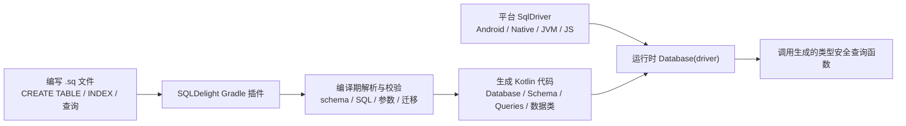

# SQLDelight 完整学习笔记

> 调研时间：2026-08-02  
> 主要版本：SQLDelight `2.3.2`  
> 资料来源：原始笔记 `笔记/SQLDelight-学习笔记.md`、SQLDelight 官方文档、GitHub Changelog、Maven Central、JetBrains 插件市场及少量社区实践文章。

## 1. 一句话理解

SQLDelight 是一个 **SQL 优先、编译期生成类型安全 Kotlin API** 的数据库访问框架。你先在 `.sq` 文件里写真实 SQL，SQLDelight 再通过 Gradle 插件解析这些 SQL，校验 schema、查询和迁移，并生成 `Database`、`Schema`、`XxxQueries`、查询结果数据类等 Kotlin 代码。

它不是传统意义上通过注解生成 SQL 的 ORM。Room 的核心输入通常是 `@Entity`、`@Dao`、`@Query`；SQLDelight 的核心输入则是 `.sq` 文件里的 SQL。换句话说，SQLDelight 把 SQL 当作一等公民，Kotlin API 是由 SQL 推导出来的。

## 2. SQLDelight 解决什么问题

手写 SQLite、JDBC 或 `rawQuery` 时，常见问题是：

- SQL 字符串在运行时才暴露错误。
- 表名、列名、参数数量拼错后很晚才发现。
- 查询结果需要手动从 cursor 或 result set 转 Kotlin 对象。
- schema 迁移容易和当前建表 SQL 漂移。
- 多平台项目需要为 Android、iOS、JVM、JS 重复维护数据库访问层。

SQLDelight 的目标是把这些问题提前到编译期：

- `.sq` 文件中的 SQL 会被解析和类型检查。
- 查询会生成强类型函数。
- 查询结果会生成 Kotlin 数据类或映射函数。
- 迁移可以通过 Gradle 任务校验。
- Kotlin Multiplatform 项目可以在 `commonMain` 共享数据库访问代码，只在各平台提供不同 `SqlDriver`。

## 3. 当前版本与坐标

截至本次调研，官方文档稳定页为 `2.3.2`，Maven Central 上 `app.cash.sqldelight:gradle-plugin` 版本也为 `2.3.2`。SQLDelight 2.x 的坐标和插件 ID 已从 1.x 的 `com.squareup.sqldelight` 切换为 `app.cash.sqldelight`。

| 版本 | 时间 | 重点 |
|---|---:|---|
| `1.5.5` | 2023-01-20 | 1.x 后期稳定版本，旧坐标为 `com.squareup.sqldelight` |
| `2.0.0` | 2023-07-26 | 重大升级，坐标切到 `app.cash.sqldelight`，官方发布 2.0 升级指南 |
| `2.0.1` | 2023-12-01 | 要求 Gradle 构建使用 Java 11，运行时 Java 8 |
| `2.0.2` | 2024-04-05 | PostgreSQL、IDE、Gradle 等修复 |
| `2.1.0` | 2025-05-16 | 增加 WASM driver、K2 支持相关改进、大量方言能力增强 |
| `2.2.0` | 2025-11-13 | 发布失败，官方建议使用 `2.2.1` |
| `2.2.1` | 2025-11-13 | 修复 2.2.0 发布问题，增强 PostgreSQL / MySQL / Gradle 支持 |
| `2.3.0` / `2.3.1` | 2026-03-12 | 发布失败，官方建议使用 `2.3.2` |
| `2.3.2` | 2026-03-16 | 当前稳定主线：AGP 9 兼容、Android minSdk 提升到 23、Paging 扩展切到 AndroidX Paging、增加 `expandSelectStar` 配置 |

2.x 迁移注意点：

- Gradle 插件 ID 使用 `app.cash.sqldelight`。
- Maven 依赖前缀使用 `app.cash.sqldelight`。
- 不要混用旧教程中的 `com.squareup.sqldelight:*`。
- 2.3.2 中 Android driver 的 minSdk 已提高到 23。
- `2.3.0` 和 `2.3.1` 是失败发布版本，应直接跳到 `2.3.2`。

## 4. 核心概念表

| 概念 | 说明 |
|---|---|
| `.sq` 文件 | SQLDelight 的源文件，写建表、索引、初始数据、带标签的查询语句 |
| 带标签语句 | 形如 `selectAll:\nSELECT * FROM table;`，标签名会变成生成函数名 |
| `Database` | 生成的数据库入口类，持有 driver 和各个 `XxxQueries` |
| `Schema` | 生成的 schema 对象，负责空库创建和旧库迁移 |
| `XxxQueries` | 每个含标签语句的 `.sq` 文件会生成对应 Queries 类 |
| `SqlDriver` | 平台相关驱动接口，真正负责执行 SQL |
| `ColumnAdapter` | 自定义 Kotlin 类型与数据库底层类型之间的编码/解码器 |
| Dialect | SQL 方言配置，决定用哪套 SQL 语法解析和校验 |
| `.sqm` 文件 | 迁移文件，描述从某一 schema 版本升级到下一版本的 SQL |
| IDE 插件 | IntelliJ / Android Studio 插件，为 `.sq` 提供高亮、补全、跳转、重构 |

## 5. 工作流程总览



实际开发时大致分为六步：

1. 在 Gradle 中应用 SQLDelight 插件。
2. 在 `src/main/sqldelight` 或 `src/commonMain/sqldelight` 写 `.sq` 文件。
3. 声明表、索引、视图、初始化数据和查询语句。
4. 构建时生成 Kotlin API。
5. 为目标平台创建 `SqlDriver`。
6. 通过 `Database(driver).xxxQueries` 执行查询。

## 6. 支持的方言与平台

官方文档列出的支持范围如下：

| 方言 | 平台 |
|---|---|
| SQLite | Android、Native（iOS、macOS、Linux、Windows）、JVM、JavaScript Browser、JavaScript Node（第三方）、Multiplatform |
| MySQL | JVM JDBC、JVM R2DBC |
| PostgreSQL | JVM JDBC、JVM R2DBC、Native macOS/Linux（第三方驱动） |
| HSQL / H2 | JVM JDBC、JVM R2DBC，实验性 |
| 第三方方言 | CockroachDB、DB2、Oracle DB 等 |

SQLite 方言模块包括：

- `sqlite-3-18-dialect`
- `sqlite-3-24-dialect`
- `sqlite-3-25-dialect`
- `sqlite-3-30-dialect`
- `sqlite-3-33-dialect`
- `sqlite-3-35-dialect`
- `sqlite-3-38-dialect`

Android 项目通常不用手动指定 SQLite 方言，插件会根据模块 `minSdkVersion` 自动选择。非 Android 项目默认通常是 SQLite 3.18；如果要使用较新的 SQL 特性，例如更高版本 SQLite 的函数、JSON 语法或查询能力，应显式配置合适 dialect。

## 7. Gradle 基础配置

### 7.1 Android 单平台配置

```kotlin
plugins {
  id("com.android.application")
  kotlin("android")
  id("app.cash.sqldelight") version "2.3.2"
}

repositories {
  google()
  mavenCentral()
}

sqldelight {
  databases {
    create("AppDatabase") {
      packageName.set("com.example.db")
    }
  }
}

dependencies {
  implementation("app.cash.sqldelight:android-driver:2.3.2")
}
```

说明：

- `create("AppDatabase")` 中的名字就是生成的数据库类名。
- `packageName` 是生成类所在包名。
- Android driver 是 `app.cash.sqldelight:android-driver`。
- 2.3.2 起 Android driver 的 minSdk 是 23。

### 7.2 Kotlin Multiplatform 配置

```kotlin
plugins {
  kotlin("multiplatform")
  id("app.cash.sqldelight") version "2.3.2"
}

kotlin {
  androidTarget()
  iosArm64()
  iosSimulatorArm64()
  jvm()

  sourceSets {
    commonMain.dependencies {
      implementation("app.cash.sqldelight:runtime:2.3.2")
      implementation("app.cash.sqldelight:coroutines-extensions:2.3.2")
    }

    androidMain.dependencies {
      implementation("app.cash.sqldelight:android-driver:2.3.2")
    }

    iosMain.dependencies {
      implementation("app.cash.sqldelight:native-driver:2.3.2")
    }

    jvmMain.dependencies {
      implementation("app.cash.sqldelight:sqlite-driver:2.3.2")
    }
  }
}

sqldelight {
  databases {
    create("AppDatabase") {
      packageName.set("com.example.db")
    }
  }
}
```

KMP 的关键点不是把同一个 driver 到处用，而是让 `commonMain` 只依赖抽象的 `SqlDriver`，各平台自己提供 driver 实现。

### 7.3 常用 Gradle 配置项

```kotlin
sqldelight {
  linkSqlite.set(true)

  databases {
    create("AppDatabase") {
      packageName.set("com.example.db")
      srcDirs.setFrom("src/main/sqldelight")
      schemaOutputDirectory.set(file("src/main/sqldelight/databases"))
      dialect("app.cash.sqldelight:sqlite-3-38-dialect:2.3.2")
      verifyMigrations.set(true)
      generateAsync.set(false)
      deriveSchemaFromMigrations.set(false)
      expandSelectStar.set(true)
    }
  }
}
```

| 配置 | 作用 |
|---|---|
| `linkSqlite` | Native target 是否自动链接 SQLite，默认 `true` |
| `packageName` | 生成数据库类的包名 |
| `srcDirs` | `.sq` 和 `.sqm` 文件查找目录 |
| `schemaOutputDirectory` | 生成 `.db` schema 快照，用于迁移校验 |
| `dialect` | 显式选择 SQL 方言 |
| `verifyMigrations` | 构建时校验迁移文件是否正确 |
| `generateAsync` | 生成面向异步 driver 的 `suspend` 查询方法，默认 `false` |
| `deriveSchemaFromMigrations` | 从 `.sqm` 推导 schema，而不是以 `.sq` 为 schema 源 |
| `expandSelectStar` | 是否把 `SELECT *` 展开成显式列，默认 `true`；2.3.2 增加了开关能力 |

## 8. `.sq` 文件

### 8.1 文件路径

Android / JVM 单平台：

```text
src/main/sqldelight/com/example/db/Player.sq
```

Kotlin Multiplatform：

```text
src/commonMain/sqldelight/com/example/db/Player.sq
```

路径中的 `com/example/db` 通常与 `packageName` 对应，便于生成代码和源码组织一致。

### 8.2 最小示例

```sql
CREATE TABLE hockeyPlayer (
  player_number INTEGER PRIMARY KEY NOT NULL,
  full_name TEXT NOT NULL
);

CREATE INDEX hockeyPlayer_full_name ON hockeyPlayer(full_name);

INSERT INTO hockeyPlayer (player_number, full_name)
VALUES (15, 'Ryan Getzlaf');

selectAll:
SELECT *
FROM hockeyPlayer;

insert:
INSERT INTO hockeyPlayer(player_number, full_name)
VALUES (?, ?);

deleteByNumber:
DELETE FROM hockeyPlayer
WHERE player_number = ?;
```

生成代码大致会提供：

- `AppDatabase`
- `AppDatabase.Schema`
- `PlayerQueries`
- `HockeyPlayer`
- `selectAll()`
- `insert(player_number: Long, full_name: String)`
- `deleteByNumber(player_number: Long)`

### 8.3 标签语句规则

SQLDelight 会为 `.sq` 文件里每条带标签的语句生成函数：

```sql
findByName:
SELECT *
FROM hockeyPlayer
WHERE full_name = ?;
```

对应 Kotlin 调用：

```kotlin
val player = database.playerQueries
  .findByName("Ryan Getzlaf")
  .executeAsOneOrNull()
```

常用执行函数：

```kotlin
query.executeAsList()
query.executeAsOne()
query.executeAsOneOrNull()
```

写操作通常直接调用生成函数：

```kotlin
database.playerQueries.insert(10, "Corey Perry")
```

## 9. 查询参数

SQLDelight 支持 SQLite 常见的绑定参数语法：

```sql
selectById:
SELECT *
FROM article
WHERE id = ?;

selectByStatus:
SELECT *
FROM article
WHERE status = :status;

selectBetween:
SELECT *
FROM article
WHERE created_at BETWEEN :from AND :to;
```

SQLDelight 会根据列定义推断参数类型。例如：

```sql
CREATE TABLE article (
  id INTEGER NOT NULL PRIMARY KEY,
  title TEXT NOT NULL,
  subtitle TEXT,
  created_at INTEGER NOT NULL
);
```

则：

- `id` 通常映射成 `Long`。
- `title` 映射成 `String`。
- `subtitle` 映射成 `String?`。
- `created_at` 映射成 `Long`。

建议：

- 面向业务调用优先使用命名参数 `:name`，可读性更好。
- 避免大型查询里混用大量匿名 `?`，后续维护容易传错顺序。
- 对复杂搜索条件可以拆成多条查询，或者把参数命名清楚。

## 10. 结果映射与自定义投影

### 10.1 默认生成数据类

```sql
selectAll:
SELECT id, title, created_at
FROM article;
```

SQLDelight 会根据查询列生成结果类型。如果查询结果刚好是表的所有列，通常复用表对应的数据类；如果是部分列或表达式，则生成查询专用类型。

### 10.2 用 SQL 做投影

官方更推荐优先让 SQL 返回你真正需要的形状：

```sql
selectArticleCards:
SELECT
  id,
  title,
  substr(content, 1, 120) AS preview,
  created_at
FROM article
ORDER BY created_at DESC;
```

这样 Kotlin 层拿到的就是已经裁剪好的结果，不需要再把整篇正文查出来后手动截断。

### 10.3 Mapper lambda

调用查询时也可以传 mapper：

```kotlin
val titles: List<String> = database.articleQueries
  .selectAll(mapper = { id, title, content, createdAt -> title })
  .executeAsList()
```

注意：

- mapper 适合轻量转换，不适合承载复杂业务规则。
- 宽表 JOIN 的 mapper 参数会变得很难维护。
- 如果查询列很多，优先建立明确的 SQL 投影或拆分查询。

## 11. 类型系统

### 11.1 SQLite 默认类型映射

| SQLite 类型 | Kotlin 类型 |
|---|---|
| `INTEGER` | `Long` |
| `REAL` | `Double` |
| `TEXT` | `String` |
| `BLOB` | `ByteArray` |

可空性来自 SQL 列定义：

```sql
CREATE TABLE user (
  id INTEGER NOT NULL,
  name TEXT NOT NULL,
  nickname TEXT
);
```

生成后通常是：

```kotlin
data class User(
  val id: Long,
  val name: String,
  val nickname: String?
)
```

### 11.2 Primitive adapters

如果希望数据库仍用 SQLite 类型存储，但 Kotlin 侧使用更贴近业务的类型，可以引入：

```kotlin
implementation("app.cash.sqldelight:primitive-adapters:2.3.2")
```

可用 adapter：

- `IntColumnAdapter`：数据库底层是 `Long`，Kotlin 侧是 `Int`。
- `ShortColumnAdapter`：数据库底层是 `Long`，Kotlin 侧是 `Short`。
- `FloatColumnAdapter`：数据库底层是 `Double`，Kotlin 侧是 `Float`。

### 11.3 自定义列类型

```sql
import kotlin.collections.List;
import kotlin.String;

CREATE TABLE article (
  id INTEGER NOT NULL PRIMARY KEY,
  title TEXT NOT NULL,
  tags TEXT AS List<String> NOT NULL
);
```

需要提供 `ColumnAdapter`：

```kotlin
val tagsAdapter = object : ColumnAdapter<List<String>, String> {
  override fun decode(databaseValue: String): List<String> {
    return if (databaseValue.isBlank()) emptyList() else databaseValue.split(",")
  }

  override fun encode(value: List<String>): String {
    return value.joinToString(",")
  }
}

val database = AppDatabase(
  driver = driver,
  articleAdapter = Article.Adapter(
    tagsAdapter = tagsAdapter
  )
)
```

更稳妥的生产做法通常是用 JSON 编码标签列表，而不是简单逗号拼接，因为标签内容本身可能包含逗号：

```kotlin
val tagsAdapter = object : ColumnAdapter<List<String>, String> {
  override fun decode(databaseValue: String): List<String> =
    json.decodeFromString(databaseValue)

  override fun encode(value: List<String>): String =
    json.encodeToString(value)
}
```

### 11.4 枚举

```sql
import com.example.ArticleStatus;

CREATE TABLE article (
  id INTEGER NOT NULL PRIMARY KEY,
  title TEXT NOT NULL,
  status TEXT AS ArticleStatus NOT NULL
);
```

```kotlin
val database = AppDatabase(
  driver = driver,
  articleAdapter = Article.Adapter(
    statusAdapter = EnumColumnAdapter()
  )
)
```

枚举默认以字符串形式存储。优点是数据库可读性好；缺点是重命名 enum 常量会影响旧数据解析。因此生产中不要随意改枚举常量名，必要时写兼容 adapter。

### 11.5 Value types

```sql
CREATE TABLE article (
  id INT AS VALUE PRIMARY KEY NOT NULL,
  title TEXT NOT NULL
);
```

SQLDelight 可以生成包装类型，避免把多个 `Long` / `Int` 类型的 ID 互相传错。适合 `UserId`、`ArticleId`、`OrderId` 这类业务 ID。

## 12. Driver

`SqlDriver` 是 SQLDelight 运行时真正连接数据库的部分。生成的 `Database` 不自己决定底层数据库在哪里，它只依赖一个 driver。

### 12.1 Android

```kotlin
val driver: SqlDriver = AndroidSqliteDriver(
  schema = AppDatabase.Schema,
  context = context,
  name = "app.db"
)

val database = AppDatabase(driver)
```

Android driver 在构造时会自动创建或迁移 schema。

### 12.2 JVM SQLite

```kotlin
val driver = JdbcSqliteDriver(
  url = "jdbc:sqlite:app.db",
  properties = Properties(),
  schema = AppDatabase.Schema
)

val database = AppDatabase(driver)
```

测试时常用内存库：

```kotlin
val driver = JdbcSqliteDriver(JdbcSqliteDriver.IN_MEMORY)
AppDatabase.Schema.create(driver)
val database = AppDatabase(driver)
```

注意：内存库需要显式 `Schema.create(driver)`。

### 12.3 Native / iOS

```kotlin
val driver = NativeSqliteDriver(
  schema = AppDatabase.Schema,
  name = "app.db"
)

val database = AppDatabase(driver)
```

KMP iOS 项目里通常把 driver 创建放在 `iosMain` 的 `actual DriverFactory` 中。

### 12.4 KMP DriverFactory 模式

`commonMain`：

```kotlin
expect class DriverFactory {
  fun createDriver(): SqlDriver
}

fun createDatabase(driverFactory: DriverFactory): AppDatabase {
  return AppDatabase(driverFactory.createDriver())
}
```

`androidMain`：

```kotlin
actual class DriverFactory(
  private val context: Context
) {
  actual fun createDriver(): SqlDriver {
    return AndroidSqliteDriver(AppDatabase.Schema, context, "app.db")
  }
}
```

`iosMain`：

```kotlin
actual class DriverFactory {
  actual fun createDriver(): SqlDriver {
    return NativeSqliteDriver(AppDatabase.Schema, "app.db")
  }
}
```

这种结构能让 `commonMain` 的 repository、DAO 包装层、use case 完全不关心平台。

## 13. 外键约束

SQLite 默认不启用外键约束检查。即使你在 `.sq` 文件中写了：

```sql
CREATE TABLE comment (
  id INTEGER PRIMARY KEY NOT NULL,
  article_id INTEGER NOT NULL,
  content TEXT NOT NULL,
  FOREIGN KEY(article_id) REFERENCES article(id)
);
```

如果没有在 driver 层开启外键检查，违反外键的数据仍可能插入成功。

Android 开启方式：

```kotlin
val driver = AndroidSqliteDriver(
  schema = AppDatabase.Schema,
  context = context,
  name = "app.db",
  callback = object : AndroidSqliteDriver.Callback(AppDatabase.Schema) {
    override fun onOpen(db: SupportSQLiteDatabase) {
      db.setForeignKeyConstraintsEnabled(true)
    }
  }
)
```

建议：

- 项目初始化时统一开启外键。
- 为外键行为写测试，覆盖删除父记录、插入不存在父记录等场景。
- 不要把「建表语句里写了 FOREIGN KEY」误解为「运行时一定检查外键」。

## 14. 事务

SQLDelight 提供 `transaction` DSL：

```kotlin
database.transaction {
  database.articleQueries.insertArticle(...)
  database.tagQueries.insertTags(...)
  database.articleTagQueries.insertRelations(...)
}
```

特点：

- 多条语句作为一个原子操作提交。
- 中间抛异常时回滚。
- 嵌套事务由 driver / runtime 处理。
- 适合批量写入、级联写入、一次业务操作涉及多表的场景。

不要把大量耗时非数据库逻辑放进事务里，例如网络请求、复杂 CPU 计算、UI 状态更新。事务持有数据库资源，时间越长越容易造成锁等待或并发问题。

## 15. 分组语句

分组语句适合把多条 SQL 放在一个标签函数中：

```sql
clearAndSeed {
  DELETE FROM article;

  INSERT INTO article(id, title, content)
  VALUES (1, 'Hello', 'First article');

  INSERT INTO article(id, title, content)
  VALUES (2, 'SQLDelight', 'Typed SQL');
}
```

适用场景：

- 初始化数据。
- 测试准备数据。
- 批量清理。
- 一组总是一起执行的 SQL。

注意：如果这组语句具有业务原子性要求，仍应在调用处明确考虑事务边界。

## 16. Migrations 迁移

### 16.1 迁移模型

`.sq` 文件描述的是「空数据库如何创建最新 schema」。线上旧用户数据库从旧版本升级到新版本时，需要 `.sqm` 迁移文件。

目录示例：

```text
src/main/sqldelight/
├── com/example/db/Article.sq
└── migrations/
    ├── 1.sqm
    ├── 2.sqm
    └── 3.sqm
```

版本规则：

- 初始 schema 版本是 `1`。
- `1.sqm` 表示从版本 1 升级到版本 2。
- `2.sqm` 表示从版本 2 升级到版本 3。
- 文件名必须连续，否则旧库升级链路会断。

示例：

```sql
-- migrations/1.sqm
ALTER TABLE article ADD COLUMN summary TEXT;
CREATE INDEX article_created_at ON article(created_at);
```

### 16.2 不要手写事务包裹

官方文档明确说明，如果 driver 支持，迁移会在事务中执行。因此 `.sqm` 文件中不要写：

```sql
BEGIN TRANSACTION;
-- migration SQL
END TRANSACTION;
```

这可能和框架自动事务冲突，在某些 driver 上导致崩溃。

### 16.3 迁移校验

推荐配置：

```kotlin
sqldelight {
  databases {
    create("AppDatabase") {
      packageName.set("com.example.db")
      schemaOutputDirectory.set(file("src/main/sqldelight/databases"))
      verifyMigrations.set(true)
    }
  }
}
```

生成 schema 快照：

```bash
./gradlew generateMainAppDatabaseSchema
```

校验迁移：

```bash
./gradlew verifySqlDelightMigration
```

或直接：

```bash
./gradlew check
```

实践建议：

- 第一次发布数据库前生成 `1.db`。
- 后续变更 schema 时写对应 `.sqm`。
- 大多数项目只保留 `1.db` 即可；多个 `.db` 快照会让迁移校验重复执行、拖慢构建。
- CI 中运行 `check`，避免迁移漂移进入主分支。

### 16.4 Code Migrations

有些迁移不是单纯 DDL，例如要把旧字段内容拆分、修复脏数据、按业务规则填新表。这时可以用代码迁移：

```kotlin
AppDatabase.Schema.migrate(
  driver = driver,
  oldVersion = oldVersion,
  newVersion = AppDatabase.Schema.version,
  AfterVersion(3) { driver ->
    driver.execute(
      identifier = null,
      sql = "UPDATE article SET summary = substr(content, 1, 120) WHERE summary IS NULL",
      parameters = 0
    )
  }
)
```

`AfterVersion(3)` 的含义是：`3.sqm` 执行完成、数据库已经来到版本 4 后触发回调，然后继续执行后续迁移。

## 17. Coroutines / Flow

依赖：

```kotlin
implementation("app.cash.sqldelight:coroutines-extensions:2.3.2")
```

查询转 Flow：

```kotlin
val articles: Flow<List<Article>> =
  database.articleQueries
    .selectAll()
    .asFlow()
    .mapToList(Dispatchers.IO)
```

特点：

- 初次收集时发射查询结果。
- 对应查询依赖的表发生变更时重新查询并发射新结果。
- 适合 Compose、ViewModel、状态流、列表页面。

常见写法：

```kotlin
class ArticleRepository(
  private val database: AppDatabase,
  private val dispatcher: CoroutineDispatcher = Dispatchers.IO
) {
  fun observeArticles(): Flow<List<Article>> {
    return database.articleQueries
      .selectAll()
      .asFlow()
      .mapToList(dispatcher)
  }

  suspend fun addArticle(title: String, content: String) {
    withContext(dispatcher) {
      database.articleQueries.insertArticle(title, content)
    }
  }
}
```

注意：

- 普通生成查询函数默认不是 `suspend`，不要在 UI 线程直接执行大查询。
- `asFlow()` 是响应式观察，不代表 SQL 本身自动变成非阻塞；仍要传合适 dispatcher。
- 高频写入会触发查询刷新，必要时在上层 Flow 做 `debounce`、`distinctUntilChanged` 或分页。

## 18. AndroidX Paging

SQLDelight 提供 `androidx-paging3` 扩展。2.3.2 中 Paging 扩展切换到 AndroidX Paging，并升级到 Paging `3.4.1`。

典型场景：

- 大型文章列表。
- 聊天记录。
- 日志列表。
- 本地缓存分页展示。

基本思路：

```sql
countArticles:
SELECT count(*)
FROM article;

selectArticlesPage:
SELECT *
FROM article
ORDER BY created_at DESC
LIMIT :limit OFFSET :offset;
```

实际项目中再把 Query 包装成 PagingSource。分页查询要注意稳定排序，不能只 `LIMIT/OFFSET` 而没有确定的 `ORDER BY`。

## 19. 测试策略

### 19.1 JVM 内存库测试

```kotlin
class ArticleQueriesTest {
  private lateinit var driver: SqlDriver
  private lateinit var database: AppDatabase

  @Before
  fun setUp() {
    driver = JdbcSqliteDriver(JdbcSqliteDriver.IN_MEMORY)
    AppDatabase.Schema.create(driver)
    database = AppDatabase(driver)
  }

  @After
  fun tearDown() {
    driver.close()
  }

  @Test
  fun insertAndSelectArticle() {
    database.articleQueries.insertArticle(
      id = 1,
      title = "SQLDelight",
      content = "Typed SQL",
      created_at = 1_700_000_000
    )

    val article = database.articleQueries.selectById(1).executeAsOne()

    assertEquals("SQLDelight", article.title)
  }
}
```

测试重点：

- 表约束是否生效。
- 查询排序是否稳定。
- nullable 字段是否符合预期。
- adapter 编码/解码是否双向正确。
- 迁移前后数据是否保留。
- 外键和级联删除是否符合业务规则。

### 19.2 迁移测试

至少覆盖：

- 从 `1.db` 迁移到最新版本。
- 每个新增 `.sqm` 是否可执行。
- 旧字段重命名、拆表、合表后数据是否正确。
- 非空列新增时是否提供默认值或回填逻辑。

CI 推荐：

```bash
./gradlew check
```

如果项目较大，可以单独跑：

```bash
./gradlew verifySqlDelightMigration
```

## 20. 推荐的项目分层

SQLDelight 生成代码不等于业务数据层全部完成。推荐在它之上再包一层 repository，避免 UI 或 use case 直接依赖大量查询细节。

```text
data/
├── db/
│   ├── AppDatabase.sq 生成产物
│   ├── DriverFactory
│   └── adapters
├── repository/
│   └── ArticleRepository
domain/
├── model/
└── usecase/
ui/
```

Repository 示例：

```kotlin
class ArticleRepository(
  private val database: AppDatabase,
  private val io: CoroutineDispatcher
) {
  fun observeLatest(): Flow<List<ArticleCard>> {
    return database.articleQueries
      .selectLatestArticleCards()
      .asFlow()
      .mapToList(io)
  }

  suspend fun publish(draft: ArticleDraft) {
    withContext(io) {
      database.transaction {
        database.articleQueries.insertArticle(
          title = draft.title,
          content = draft.content,
          created_at = clock.nowEpochSeconds()
        )
      }
    }
  }
}
```

原则：

- `.sq` 写真实 SQL。
- Repository 负责业务语义。
- Use case 组合多个 repository。
- UI 不关心 SQLDelight 的 driver、adapter、迁移细节。

## 21. 选型对比

### 21.1 SQLDelight vs Room

| 维度 | SQLDelight | Room |
|---|---|---|
| 核心输入 | `.sq` 文件中的 SQL | `@Entity`、`@Dao`、`@Query` |
| 思路 | SQL 优先 | 注解 / DAO 优先 |
| 多平台 | 原生定位 KMP | 新版本逐步支持 KMP，但传统优势仍在 Android |
| 编译期校验 | 校验 schema、语句、迁移 | 校验 DAO 查询与实体关系 |
| 迁移 | 手写 `.sqm`，可校验 | 结构化 Migration API 与 AutoMigration |
| SQL 控制力 | 很强 | 强，但常与实体模型绑定 |
| 上手成本 | 需要熟悉 SQL 和 Gradle 配置 | Android 开发者通常更熟 |
| Jetpack 整合 | 需扩展模块 | 更自然 |

选择 SQLDelight：

- 你正在做 KMP。
- 团队 SQL 能力较强。
- 希望 SQL 是数据库层事实来源。
- 需要在编译期发现 SQL 和迁移问题。
- 需要 JVM 服务端或多方言支持。

选择 Room：

- 项目主要是 Android。
- 团队已经大量使用 Jetpack。
- 希望使用注解、实体、DAO、AutoMigration。
- 更重视 Android 官方生态一致性。

### 21.2 SQLDelight vs Realm / ObjectBox

| 维度 | SQLDelight | Realm / ObjectBox |
|---|---|---|
| 数据模型 | 关系型 SQL | 对象数据库或移动数据库 |
| 查询语言 | SQL | 各自查询 API |
| 可移植性 | SQL 可迁移性更强 | 更依赖特定引擎 |
| 学习重点 | SQL、迁移、索引 | SDK、对象模型、同步能力 |
| 适用场景 | 结构化关系数据、多平台共享 SQL | 移动端对象图、本地同步、快速 CRUD |

如果数据天然是关系型、需要 JOIN、聚合、索引调优，SQLDelight 更贴近问题本身。如果更看重对象图、同步、离线优先 SDK 能力，则应评估 Realm / ObjectBox 等方案。

## 22. 常见踩坑

### 22.1 旧坐标照抄

错误：

```kotlin
id("com.squareup.sqldelight")
implementation("com.squareup.sqldelight:android-driver:...")
```

2.x 应使用：

```kotlin
id("app.cash.sqldelight")
implementation("app.cash.sqldelight:android-driver:2.3.2")
```

### 22.2 忘记 driver 依赖

插件只负责生成代码，运行时还需要 driver。Android、JVM、Native 依赖不同，不能只加插件不加 driver。

### 22.3 IDE 找不到生成类

处理顺序：

1. 检查 `.sq` 文件路径是否在 `sqldelight` 源集下。
2. 手动运行一次 `./gradlew build` 或生成接口任务。
3. 检查插件 ID 和 SQLDelight 版本。
4. 检查 `.sq` 中 SQL 是否已编译失败。
5. Android Studio 使用 Project 视图查看目录。

### 22.4 迁移遗漏

改了 `CREATE TABLE` 但忘了写 `.sqm`，新安装用户没问题，老用户升级崩溃。每次 schema 变化都要问：

- 空库建表 SQL 改了吗？
- 老库从旧版本迁移到新版本的 `.sqm` 写了吗？
- 迁移校验跑了吗？

### 22.5 新增非空列

错误示例：

```sql
ALTER TABLE article ADD COLUMN slug TEXT NOT NULL;
```

旧表已有数据时，这通常会失败，因为旧行没有 `slug`。更稳妥：

```sql
ALTER TABLE article ADD COLUMN slug TEXT;
UPDATE article SET slug = lower(replace(title, ' ', '-')) WHERE slug IS NULL;
```

然后视具体数据库能力和业务要求再收紧约束，或在应用层保证新写入数据不为空。

### 22.6 外键未开启

建表里有 `FOREIGN KEY` 不等于运行时启用了外键检查。SQLite 需要在 driver 打开时启用。

### 22.7 主线程执行大查询

生成函数默认同步。大查询、大写入、复杂事务应放在 `Dispatchers.IO` 或后台线程。

### 22.8 过度使用 `SELECT *`

`SELECT *` 在早期开发很方便，但长期维护风险较高：

- 表结构变化会改变查询结果形状。
- 多表 JOIN 时列名冲突或结果过宽。
- 查询返回不必要字段，浪费 I/O。

2.3.2 提供 `expandSelectStar` 配置，默认会把 `SELECT *` 展开成实际列。即便如此，业务查询仍建议显式列出需要的字段。

### 22.9 Adapter 编码不可逆

例如用逗号拼接 `List<String>`，当元素本身包含逗号时会损坏数据。自定义 adapter 要满足：

- `decode(encode(value)) == value`
- 对空值、空集合、旧数据格式有兼容处理
- 枚举重命名有迁移或兼容策略

### 22.10 方言版本过低

非 Android 默认 SQLite 方言可能较老。如果使用较新的 SQLite 语法，在 SQLite 浏览器里能跑，不代表 SQLDelight 当前 dialect 能解析。需要显式配置如：

```kotlin
dialect("app.cash.sqldelight:sqlite-3-38-dialect:2.3.2")
```

## 23. 调试排查清单

构建失败：

- 检查 SQLDelight 插件版本和依赖版本是否一致。
- 检查是否混用 1.x / 2.x 坐标。
- 检查 `.sq` 文件路径是否正确。
- 检查 SQL 是否符合当前 dialect。
- 检查 Gradle、Kotlin、AGP 版本兼容性。

运行时表不存在：

- 确认 driver 使用了正确的 `AppDatabase.Schema`。
- 确认数据库文件名没有写错。
- 确认旧库迁移链完整。
- 确认测试内存库调用了 `Schema.create(driver)`。

迁移失败：

- `.sqm` 文件名是否连续。
- 是否新增非空列但没有默认值。
- 是否手写了 `BEGIN/END TRANSACTION`。
- `schemaOutputDirectory` 是否配置。
- `.db` 快照是否过旧或与当前迁移链不匹配。

查询结果不更新：

- 是否使用了 `asFlow()`。
- 写入是否通过 SQLDelight driver 执行。
- 观察的 query 是否依赖被修改的表。
- 是否在 Flow 上层错误使用了缓存、`stateIn` 或 `distinctUntilChanged`。

性能问题：

- 使用 `EXPLAIN QUERY PLAN` 分析查询。
- 为 `WHERE`、`ORDER BY`、JOIN key 建索引。
- 避免大表 `SELECT *`。
- 对列表使用分页。
- 批量写入放进事务。
- 避免过于频繁地触发响应式查询刷新。

## 24. 学习路线

第一阶段：入门

- 理解 `.sq` 文件。
- 配好 Gradle 插件和 driver。
- 写一张表、一个插入、一个查询。
- 跑通 `executeAsList()` 和 `executeAsOneOrNull()`。

第二阶段：工程化

- 引入 repository 封装。
- 使用 `ColumnAdapter`。
- 使用 `transaction`。
- 使用 Flow 观察数据。
- 为查询写 JVM 内存库测试。

第三阶段：迁移与多平台

- 配置 `schemaOutputDirectory`。
- 生成 `1.db`。
- 写 `.sqm` 迁移。
- 在 CI 中跑 `check`。
- 抽象 KMP `DriverFactory`。

第四阶段：优化

- 分析慢查询。
- 建索引。
- 使用 Paging。
- 减少宽表查询和不必要字段。
- 规范 schema 命名、迁移评审和 adapter 测试。

## 25. 最小可运行 Android 示例

`build.gradle.kts`：

```kotlin
plugins {
  id("com.android.application")
  kotlin("android")
  id("app.cash.sqldelight") version "2.3.2"
}

sqldelight {
  databases {
    create("AppDatabase") {
      packageName.set("com.example.db")
    }
  }
}

dependencies {
  implementation("app.cash.sqldelight:android-driver:2.3.2")
  implementation("app.cash.sqldelight:coroutines-extensions:2.3.2")
}
```

`src/main/sqldelight/com/example/db/Article.sq`：

```sql
CREATE TABLE article (
  id INTEGER PRIMARY KEY NOT NULL,
  title TEXT NOT NULL,
  content TEXT NOT NULL,
  created_at INTEGER NOT NULL
);

CREATE INDEX article_created_at ON article(created_at);

insertArticle:
INSERT INTO article(id, title, content, created_at)
VALUES (:id, :title, :content, :created_at);

selectLatest:
SELECT id, title, created_at
FROM article
ORDER BY created_at DESC;

selectById:
SELECT *
FROM article
WHERE id = :id;

deleteById:
DELETE FROM article
WHERE id = :id;
```

Kotlin：

```kotlin
class ArticleStore(context: Context) {
  private val driver = AndroidSqliteDriver(
    schema = AppDatabase.Schema,
    context = context,
    name = "app.db"
  )

  private val database = AppDatabase(driver)

  fun observeLatest(): Flow<List<SelectLatest>> {
    return database.articleQueries
      .selectLatest()
      .asFlow()
      .mapToList(Dispatchers.IO)
  }

  suspend fun insert(id: Long, title: String, content: String) {
    withContext(Dispatchers.IO) {
      database.articleQueries.insertArticle(
        id = id,
        title = title,
        content = content,
        created_at = System.currentTimeMillis() / 1000
      )
    }
  }
}
```

## 26. 实战规范建议

- 表名和列名统一 snake_case。
- 查询标签使用动词开头：`selectById`、`insertArticle`、`deleteExpired`。
- 列表页查询不要 `SELECT *`，只查卡片需要字段。
- 每次 schema 变更必须同时提交 `.sq` 和 `.sqm`。
- 每个自定义 adapter 都要写往返测试。
- 事务只包数据库操作，不包网络和 UI。
- 所有大查询都在 IO dispatcher 执行。
- KMP 中不要让 `commonMain` 直接依赖 Android context。
- 外键要在 driver 初始化时显式开启并测试。
- CI 中至少跑 `check` 或 `verifySqlDelightMigration`。

## 27. 参考资料

- SQLDelight 官方 Overview 2.3.2：https://sqldelight.github.io/sqldelight/2.3.2/
- SQLite Android Getting Started：https://sqldelight.github.io/sqldelight/2.3.2/android_sqlite/
- SQLite Multiplatform Getting Started：https://sqldelight.github.io/sqldelight/2.3.2/multiplatform_sqlite/
- Gradle 配置：https://sqldelight.github.io/sqldelight/2.3.2/android_sqlite/gradle/
- Types / ColumnAdapter / Enum / Value types：https://sqldelight.github.io/sqldelight/2.3.2/android_sqlite/types/
- Migrations：https://sqldelight.github.io/sqldelight/2.3.2/android_sqlite/migrations/
- Coroutines Flow：https://sqldelight.github.io/sqldelight/2.3.2/android_sqlite/coroutines/
- Foreign Keys：https://sqldelight.github.io/sqldelight/2.3.2/android_sqlite/foreign_keys/
- SQLDelight GitHub：https://github.com/sqldelight/sqldelight
- SQLDelight Changelog：https://github.com/sqldelight/sqldelight/blob/main/CHANGELOG.md
- Maven Central Gradle Plugin：https://central.sonatype.com/artifact/app.cash.sqldelight/gradle-plugin
- JetBrains SQLDelight Plugin：https://plugins.jetbrains.com/plugin/8191-sqldelight
- Cash App：Announcing SQLDelight 2.0：https://code.cash.app/sqldelight-2-0
