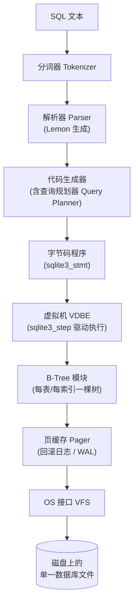
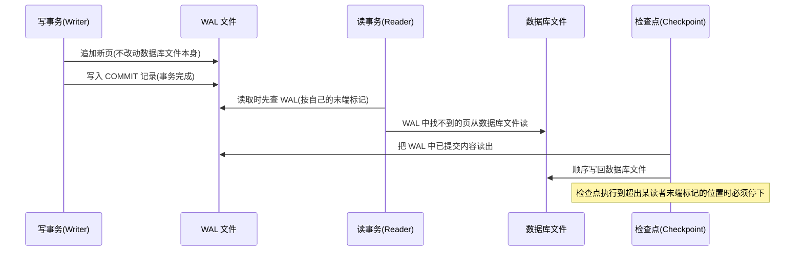

# SQLite 学习笔记

> **Last researched（最近整理时间）**:2026-07-29

## 摘要

SQLite 是一款轻量级、无服务器(serverless)、零配置、事务性的嵌入式关系型数据库引擎。与 MySQL、PostgreSQL、SQL Server 等采用客户端/服务器架构的数据库不同,SQLite 是以**进程内库(in-process library)**的方式与应用程序集成的,整个数据库(表、索引、触发器、视图)都保存在磁盘上的**单一文件**中。它的设计目标是"小、快、可靠",这也是官网的标语:*Small. Fast. Reliable. Choose any three.*

---

## 一、学习目标

- 理解 SQLite 与传统 C/S 架构数据库的本质区别,以及它"无服务器"的含义
- 掌握 SQLite 的整体架构:编译器(Compiler)、虚拟机(VDBE)、后端(B-Tree/Pager/OS 接口)
- 理解 SQLite 的动态类型系统(存储类型 Storage Class vs 类型近似 Type Affinity)
- 理解两种事务日志模式:回滚日志(Rollback Journal)与预写日志(WAL),以及它们的权衡
- 掌握基础 SQL 用法、常用 PRAGMA、常见 API(以 Python/命令行为例)
- 了解常见并发问题(`database is locked`)的成因与排查思路
- 知道 SQLite 适合与不适合的应用场景

## 二、前置知识

- 基本的 SQL 语法(SELECT/INSERT/UPDATE/DELETE/CREATE TABLE)
- 关系型数据库的基础概念:表、索引、事务、ACID
- 了解文件 I/O、进程与线程的基本概念(用于理解锁机制部分)

---

## 三、SQLite 是什么、为什么与众不同

### 3.1 无服务器架构(Serverless)

SQLite 与 MySQL/PostgreSQL/Oracle 等采用客户端/服务器架构的数据库不同——后者的客户端需要通过特定协议与独立的数据库服务器进程通信,再由服务器处理请求并返回结果。而 SQLite 是以进程内(in-process)方式与应用通信的,它本质上就是一个链接进应用里的库,应用程序直接调用其 API 完成数据库操作,不需要额外启动一个数据库服务进程。

数据库本身是磁盘上的**单一文件**,这带来了便携性优势:整个数据库可以像普通文件一样复制、备份、传输。

### 3.2 典型使用场景

- 应用程序内嵌的数据存储(桌面软件、移动 App 的本地数据库)
- 文件格式替代方案(即用 SQLite 文件作为应用的私有文件格式)
- 网站的低/中等写并发场景、测试环境、原型开发
- 嵌入式设备(资源有限,内存占用可以做到很小)

### 3.3 不适合的场景

官方文档明确指出,为了实现"小而快",SQLite 牺牲了一些其他数据库看重的特性,例如高并发写入、细粒度访问控制、丰富的内置函数、存储过程、一些冷门的 SQL 语言特性,以及 TB/PB 级别的可伸缩性。因此,高并发写、多用户网络化访问、需要严格权限控制的大型系统通常不是 SQLite 的目标场景,这类需求更适合 C/S 架构的数据库。

---

## 四、整体架构(Architecture)

SQLite 的工作方式是:先把 SQL 文本编译成字节码(bytecode),然后用一个虚拟机来运行这些字节码<cite index="33-1">。sqlite3_prepare_v2() 等接口相当于一个编译器,负责把 SQL 文本转换成字节码</cite>;`sqlite3_stmt` 对象是容纳这段字节码程序的容器;<cite index="33-1">sqlite3_step() 接口则把字节码程序交给虚拟机执行,直到执行完成、产出一行结果、遇到致命错误或被中断为止</cite>。

整体上可以分为三大部分:**编译器(Compiler)**、**虚拟机/字节码引擎(Virtual Machine)**、**后端/存储引擎(Backend)**<cite index="35-1">,应用发起查询请求时,SQL 语句先由编译器解析,生成字节码,最终由虚拟机执行字节码,调用存储引擎的接口来读写数据</cite>。

### 4.1 架构组件详解

| 组件 | 职责 | 关键源文件 |
|---|---|---|
| **分词器(Tokenizer)** | <cite index="37-1">把 SQL 文本切分成一个个 token,逐个交给解析器;SQLite 的设计是分词器主动调用解析器(而不是常见的解析器调用分词器),这样可以做到线程安全且运行更快</cite> | tokenize.c |
| **解析器(Parser)** | <cite index="37-1">根据上下文为 token 赋予含义,由 Lemon 解析器生成器生成,功能类似 YACC/BISON 但语法更不容易出错,且生成的解析器可重入、线程安全</cite> | parse.y |
| **代码生成器(Code Generator)** | <cite index="37-1">分析解析树,生成能完成该 SQL 语句实际工作的字节码;这里也是查询规划器所在之处,面对同一条 SQL 可能有成千上万种执行算法,查询规划器负责从中挑选最优方案</cite> | expr.c、where.c、select.c、insert.c、update.c、delete.c 等 |
| **字节码引擎/虚拟机(VDBE)** | <cite index="37-1">执行代码生成器产出的字节码程序;内建的 SQL 函数(如 abs()、count()、substr())也是通过回调 C 语言例程实现的</cite> | vdbe.c、vdbeapi.c、vdbemem.c |
| **B-Tree** | <cite index="37-1">数据库在磁盘上以 B-Tree 结构组织;每张表和每个索引都有各自独立的 B-Tree,所有 B-Tree 都存放在同一个磁盘文件里,文件格式是稳定且有明确定义的,保证向前兼容</cite> | btree.c |
| **页缓存(Page Cache)** | <cite index="37-1">B-Tree 模块以固定大小的页为单位向磁盘请求信息,默认页大小 4096 字节,可为 512~65536 字节之间的 2 的幂;页缓存负责页的读写与缓存,并提供回滚/原子提交的抽象以及文件锁管理</cite> | pager.c(回滚日志)、wal.c(WAL 模式)、pcache.c/pcache1.c(内存缓存) |
| **OS 接口(VFS)** | <cite index="37-1">为了跨平台,SQLite 用一个抽象对象 VFS 提供打开/读/写/关闭文件等方法,以及获取当前时间、随机数等操作系统相关功能;目前官方提供 unix 和 Windows 的 VFS 实现</cite> | os_unix.c、os_win.c |

### 4.2 架构示意图



Figure:SQLite 内部架构流程,基于官方文档重绘。来源:[SQLite 官方 Architecture of SQLite](https://sqlite.org/arch.html)

---

## 五、数据类型系统:动态类型与类型近似

这是 SQLite 与大多数关系型数据库(MySQL/PostgreSQL 等采用静态类型)差异最大的地方之一,也是最容易踩坑的知识点。

### 5.1 五种存储类型(Storage Class)

SQLite 中每一个存储在磁盘上的值,都属于五种**存储类型**之一:NULL、INTEGER、REAL、TEXT、BLOB<cite index="46-1">。SQLite 提供 INTEGER、REAL、TEXT、BLOB 和 NULL 共五种存储类型,可以用 typeof() 函数查看某个值实际的存储类型</cite>。

| 存储类型 | 说明 |
|---|---|
| NULL | 空值 |
| INTEGER | 有符号整数,根据数值大小以变长字节存储 |
| REAL | 8 字节浮点数 |
| TEXT | 文本字符串,使用数据库编码(UTF-8/UTF-16) |
| BLOB | 原样存储的二进制数据 |

### 5.2 类型近似(Type Affinity)

与存储类型不同,**类型近似**是分配给"列"的一个推荐类型,而不是强制约束<cite index="45-1">。类型近似是一列所偏好的存储类型;SQLite 共有 TEXT、NUMERIC、INTEGER、REAL、BLOB 五种类型近似;插入值时 SQLite 会尝试把它转换为该列的近似类型,但如果转换会造成信息丢失或无法转换,就会原样存储该值——近似只是一种提示,而非硬性约束</cite>。

SQLite 根据列声明类型中的关键字(子串匹配)来决定其近似类型,判定顺序为<cite index="44-1">:如果声明类型包含字符串CHAR、CLOB或TEXT,则该列具有TEXT近似(注意VARCHAR因为包含CHAR字符串,因此也被归为TEXT近似);如果声明类型包含字符串BLOB,或者根本没有指定类型,则该列具有BLOB近似;如果声明类型包含字符串REAL、FLOA或DOUB,则该列具有REAL近似</cite>;此外含有 "INT" 的类型会被归为 INTEGER 近似,以上都不满足则归为 NUMERIC 近似。

<cite index="44-1">TEXT 近似的列只使用 NULL、TEXT 或 BLOB 三种存储类型存放数据,如果向其插入数值型数据,会先把它转换为文本形式再存储;NUMERIC 近似的列则可以使用全部五种存储类型来存放数据</cite>。

### 5.3 动态类型 vs 静态类型

在 MySQL 等采用静态类型的数据库中,声明某列为 `INTEGER` 后就只能往里插入整数值。而 SQLite 采用的是动态"清单类型"(manifest typing)<cite index="46-1">:数据类型是值本身的属性,而不是表列的属性,列的声明类型只是给出一个建议(近似),而非强制的约束</cite>。

```sql
CREATE TABLE demo (val INTEGER);
INSERT INTO demo VALUES (10), (2), ('100'), ('20'), (3);
SELECT val, typeof(val) FROM demo ORDER BY val;
-- 排序结果容易让人意外:先按存储类型分组(整数在前,文本在后),
-- 组内再各自排序,于是得到 2,3,10(数值组升序),
-- 再接 '100','20'(文本组按字典序,不是按数值大小)
```

### 5.4 STRICT 表(SQLite 3.37+)

如果不希望依赖这种较为宽松的"近似"机制,SQLite 3.37 引入了 `STRICT` 表:<cite index="45-1">STRICT 表关闭了类型近似机制,并会拒绝与声明类型不匹配的值,让 SQLite 在默认动态类型行为和类似 Postgres 的严格类型强制之间提供了一个可选项</cite>。

```sql
CREATE TABLE strict_demo (
    id INTEGER PRIMARY KEY,
    name TEXT NOT NULL
) STRICT;
```

---

## 六、事务与日志模式:Rollback Journal vs WAL

### 6.1 默认方式:回滚日志(Rollback Journal)

SQLite 默认通过"回滚日志"实现原子提交与回滚<cite index="38-1">:回滚日志的工作方式是把未修改的原始数据库内容备份到一个独立的回滚日志文件中,然后把改动直接写入数据库文件;如果发生崩溃或执行了 ROLLBACK,回滚日志中保存的原始内容会被回放到数据库文件中,使其恢复到原始状态;当回滚日志被删除时即视为 COMMIT 完成</cite>。

### 6.2 WAL(Write-Ahead Logging)模式

自 3.7.0(2010-07-21)起,SQLite 提供了 WAL 作为可选日志模式,思路正好相反<cite index="38-1">:WAL 方式下原始内容被保留在数据库文件中,改动则被追加写入一个独立的 WAL 文件;当一条特殊的提交记录被追加进 WAL 时即视为完成 COMMIT,因此提交可以在完全不写数据库文件本身的情况下发生,这让读者可以在改动被同时提交进 WAL 的过程中,继续基于原始未改动的数据库进行操作</cite>。

**WAL 相比回滚日志的优势**<cite index="38-1">:WAL 在大多数场景下明显更快;WAL 提供了更好的并发性,读者不会阻塞写者,写者也不会阻塞读者,读写可以同时进行;使用 WAL 时磁盘 I/O 操作趋向于更加顺序;WAL 使用的 fsync() 操作次数少得多,因此在 fsync() 系统调用存在缺陷的系统上受影响更小</cite>。

**WAL 的代价/限制**<cite index="38-1">:使用同一数据库的所有进程必须位于同一台主机上,WAL 无法在网络文件系统上工作,因为它要求所有进程共享一小块内存,不同主机上的进程显然无法共享内存;涉及多个 ATTACH 数据库的事务,只能保证各自数据库内部的原子性,不能保证跨所有数据库整体的原子性;进入 WAL 模式后就无法再修改 page_size,必须先切回回滚日志模式才能修改</cite>;此外纯读多写少场景下 WAL 可能比回滚日志略慢(约 1%~2%),且会额外产生 `-wal`、`-shm` 文件,需要考虑检查点操作。

### 6.3 Checkpoint(检查点)机制

WAL 文件里的内容最终要被写回原始数据库文件,这个动作称为**检查点(checkpoint)**<cite index="38-1">。可以这样理解回滚方式和预写日志方式的区别:回滚日志方式下只有读、写两种基本操作;而预写日志方式下多了第三种基本操作——检查点</cite>。

<cite index="38-1">默认情况下,SQLite 会在造成 WAL 文件达到 1000 页大小阈值的 COMMIT 发生时自动执行一次检查点</cite>。<cite index="38-1">检查点操作可以和读者并发运行,但当检查点推进到某个当前读者末端标记之后的页面时就必须停下来,因为再往下可能会覆盖该读者正在使用的部分数据库内容;检查点会在 wal-index 中记住自己已经推进到哪里,下次调用时从该处继续</cite>。一次长时间运行的读事务可能会阻止检查点完成进度,直到该读事务结束。

检查点分为 PASSIVE(默认,尽量不打扰其他连接,不保证能执行完)、FULL、RESTART 三种<cite index="38-1">,自动检查点机制和 sqlite3_wal_checkpoint() 发起的检查点都属于 PASSIVE 类型,只有通过调用 sqlite3_wal_checkpoint_v2() 才能发起 FULL 或 RESTART 类型的检查点,这两种类型会更努力地把检查点执行完</cite>。



Figure:WAL 模式下写、读、检查点三者的协作关系,基于官方文档重绘。来源:[SQLite 官方 Write-Ahead Logging](https://sqlite.org/wal.html)

### 6.4 开启 WAL 模式

```sql
PRAGMA journal_mode=WAL;
```

<cite index="38-1">该设置是持久化的:一旦某个进程把数据库设为 WAL 模式,即使关闭再重新打开数据库,该数据库依然会以 WAL 模式启动;而如果设置的是其他日志模式(如 TRUNCATE),关闭重开后会回退到默认的 DELETE 回滚模式,不会保留之前的设置。这也意味着应用可以在完全不修改代码的情况下,仅通过命令行工具对数据库文件执行一次该 PRAGMA,就把应用切换到使用 WAL 模式</cite>。同一数据库文件的所有连接会共享同一种日志模式设置。

如果需要切回传统模式(例如要把数据库刻录到只读介质上之前),可以执行:

```sql
PRAGMA journal_mode=DELETE;
```

### 6.5 版本注意事项

- <cite index="38-1">3.11.0(2016-02-15)之前,对于超过约 100 兆字节的大事务,传统回滚日志模式速度更快,建议对超大事务使用回滚日志模式;3.11.0 之后,WAL 模式处理大事务的效率已经与回滚模式一样高效</cite>
- <cite index="38-1">3.22.0(2018-01-22)之前无法打开只读的 WAL 模式数据库,此前必须有写权限才能读取 WAL 模式数据库;此后只要 -shm、-wal 文件已存在且可读,或者数据库所在目录有写权限可以创建这些文件,或者使用了 immutable 查询参数,就可以只读方式打开 WAL 模式数据库</cite>
- **2026 年的一个已知问题**:<cite index="38-1">官方开发者在 2026-03-03 发现并修复了一个可能导致数据库损坏的缺陷,称为"WAL-Reset Bug",该缺陷可能存在于从 3.7.0(2010-07-21)到 3.51.2(2026-01-09)之间的所有版本,已在 3.51.3(2026-03-13)版本修复,并为部分早期版本(3.44.6、3.50.7)提供了回溯补丁;该缺陷只有在两个及以上数据库连接同时对同一 WAL 模式文件执行写入或检查点操作、且时机极为凑巧时才会触发,是一个时序要求非常苛刻的数据竞争问题</cite>。官方评估其在真实环境下的发生概率极低(大致相当于 SSD 故障或宇宙射线导致比特翻转的概率量级),但由于后果是数据库损坏,建议尽量升级到已修复版本。

---

## 七、并发与锁:为什么会遇到 "database is locked"

### 7.1 基本并发规则

sqlite3 支持并发执行读事务,即可以同时开启多个进程/线程从数据库读数据;但不支持并发执行写事务——它的写事务本质上是锁表,无论开几个线程,只要写操作访问的是同一张表,最终都会被串行化执行,一个写操作没完成时,其他写操作需要排队等待。

### 7.2 常见触发场景(社区经验整理)

综合中文技术社区(博客园等)的排障经验,`database is locked`(即底层的 `SQLITE_BUSY`)常见于以下情形:

1. **高并发写入**:多个进程/线程几乎同时对同一数据库执行写操作,超出 SQLite 单写者模型的承受范围,而且这类问题往往在生产环境高压力下才暴露,开发环境很难重现。
2. **事务未正常提交/连接未关闭**:某次写事务或开启的查询事务因异常未能正常关闭,数据库连接没有被妥善释放,导致锁一直被占用,后续再打开就报锁定错误。
3. **命令行/GUI 工具遗留连接**:用 `sqlite3` 命令行工具或可视化工具打开数据库后忘记关闭,导致其他进程写入时被阻塞;排查时可以用 `fuser 数据库文件` 找到具体是哪个进程占用了该文件。
4. **驱动/连接库的锁模式配置不当**:某些数据库访问组件默认使用独占锁模式(如某 ODBC/驱动组件默认 `LockingMode=lmExclusive`),即便业务代码本身没有明显问题也容易频繁锁库,可以考虑改为普通锁模式(`lmNormal`)。
5. **WAL 模式下的特殊情况**:即使在 WAL 模式下"读不阻塞写、写不阻塞读"基本成立,但仍有几种例外会返回 SQLITE_BUSY——<cite index="38-1">如果另一个数据库连接以独占锁模式打开了该数据库,那么所有针对该数据库的查询都会返回 SQLITE_BUSY,例如 Chrome 和 Firefox 都以独占锁模式打开自己的数据库文件,因此在这两个应用运行期间尝试读取它们的数据库就会遇到这个问题;当最后一个连接正在关闭时会短暂持有独占锁来清理 WAL 和共享内存文件,此时如果有其他连接尝试打开并查询,也可能报错;如果上一个连接崩溃退出,新连接在做恢复期间也会持有独占锁,期间第三方连接的查询同样可能报 SQLITE_BUSY</cite>。

### 7.3 排查与解决思路

- **查找并释放占用连接**:在类 Unix 系统上可以用 `fuser 数据库文件名` 找到正在占用该文件的进程 PID,确认无风险后再考虑结束该进程。
- **使用 busy handler / busy timeout**:SQLite 提供 `sqlite3_busy_handler()` 和 `sqlite3_busy_timeout()` 两个 C 接口,用于在遇到锁冲突时等待并重试,而不是立即返回 SQLITE_BUSY;注意对同一连接来说这两个函数只能生效一个,后设置的会清除并覆盖前一个。
- **应用层做写操作同步**:如果同一进程内有多线程写同一数据库,建议使用进程/线程间的同步机制(如信号量、互斥锁)自行封装写操作,保证同一时刻只有一个线程真正执行写入,减少与 SQLite 底层锁的冲突频率。
- **切换为 WAL 模式**:相比默认回滚日志模式,WAL 模式允许读写并发进行,可以显著降低"写堵读"造成的锁冲突概率(但仍无法让多个写事务真正并发执行)。
- **避免长事务和长时间只读连接占用**:尤其在 WAL 模式下,长时间不结束的读事务会阻止检查点完成,间接导致 WAL 文件膨胀和潜在的锁等待问题。

---

## 八、常用 SQL 与 PRAGMA 速查

### 8.1 基础操作

```sql
-- 创建表(注意 SQLite 的类型近似写法)
CREATE TABLE users (
    id INTEGER PRIMARY KEY AUTOINCREMENT,
    name TEXT NOT NULL,
    age INTEGER,
    balance REAL DEFAULT 0,
    avatar BLOB,
    created_at TEXT DEFAULT CURRENT_TIMESTAMP
);

-- 增删改查
INSERT INTO users (name, age) VALUES ('Alice', 30);
SELECT * FROM users WHERE age > 18;
UPDATE users SET age = 31 WHERE name = 'Alice';
DELETE FROM users WHERE id = 1;

-- 事务
BEGIN TRANSACTION;
UPDATE users SET balance = balance - 100 WHERE id = 1;
UPDATE users SET balance = balance + 100 WHERE id = 2;
COMMIT;
```

### 8.2 常用 PRAGMA

| PRAGMA | 作用 |
|---|---|
| `PRAGMA journal_mode=WAL;` | 切换为 WAL 日志模式 |
| `PRAGMA journal_mode=DELETE;` | 切回默认回滚日志模式 |
| `PRAGMA synchronous=NORMAL;` | 控制事务提交时的 fsync 强度(FULL/NORMAL/OFF),影响持久性与性能的权衡 |
| `PRAGMA foreign_keys=ON;` | 开启外键约束检查(SQLite 默认关闭) |
| `PRAGMA page_size;` | 查看/设置页大小(建表前设置才生效) |
| `PRAGMA wal_checkpoint(PASSIVE\|FULL\|RESTART\|TRUNCATE);` | 手动触发一次检查点 |
| `PRAGMA table_info(表名);` | 查看表结构(列名、声明类型、是否可空等) |
| `PRAGMA integrity_check;` | 检查数据库文件完整性 |

### 8.3 日期与布尔值的处理

SQLite 没有专门的 DATE/BOOLEAN 存储类型,通常约定俗成的做法是:

- 日期/时间:存成 TEXT(ISO8601 格式字符串,如 `'2026-07-29 10:00:00'`)或 INTEGER(Unix 时间戳),二者各有优劣,前者可读性好,后者便于数值比较和排序
- 布尔值:用 INTEGER 存 0/1

### 8.4 Python 中使用 SQLite(标准库 sqlite3 模块)

```python
import sqlite3

conn = sqlite3.connect("app.db")
conn.execute("PRAGMA journal_mode=WAL;")  # 建议为多读单写场景开启 WAL

cur = conn.cursor()
cur.execute("INSERT INTO users (name, age) VALUES (?, ?)", ("Bob", 25))
conn.commit()

for row in cur.execute("SELECT id, name FROM users"):
    print(row)

conn.close()
```

> 排障要点:如果并发写入频繁遇到 `sqlite3.OperationalError: database is locked`,可以在 `connect()` 时设置 `timeout` 参数增加等待时间,或者应用层引入写队列/写锁来减少并发写冲突。

---

## 九、适用场景 / 不适用场景 / 选型标准

### 适用场景

- 桌面/移动应用的本地存储、离线优先(offline-first)应用
- 中小型网站、内部工具、脚本工具的数据持久化
- 作为自定义文件格式使用(应用把自己的数据存成一个 SQLite 文件,方便用标准 SQL 工具检查/调试)
- 测试环境、CI 流水线中替代重量级数据库,加快测试速度
- 嵌入式/IoT 设备,资源受限但需要结构化数据存储的场合

### 不适用场景

- 需要多台机器共同写入同一数据库的分布式场景(WAL 不支持网络文件系统)
- 高并发写密集型的大型 Web 服务后端(写操作本质串行化)
- 需要精细的用户权限/访问控制体系的多租户系统
- 需要 TB/PB 级别水平扩展能力的数据仓库场景

### 选型考虑因素

- 预估的**写并发量**:如果多个进程/线程会频繁并发写同一个库,需要认真评估 SQLite 单写者模型是否可接受,或考虑迁移到 C/S 架构数据库
- 是否需要跨主机共享同一个数据库文件(网络存储场景不适合 WAL,也不太适合 SQLite 整体)
- 对**部署简化**的诉求:不需要额外部署数据库服务进程,这是 SQLite 相对于 C/S 数据库的最大优势之一
- 是否需要长期保存/迁移单一文件形式的数据(备份、拷贝、发送都非常简单)

---

## 十、常见错误与踩坑(社区经验整理)

1. **误以为 SQLite 支持并发写**:很多问题的根源在于开发者没有意识到 SQLite 同一时刻只允许一个写事务,多线程/多进程高频写入同一库时必然会遇到锁冲突,需要在应用层做好写操作的排队或同步。
2. **连接/事务未正确关闭**:命令行工具、GUI 客户端或代码里的连接对象忘记关闭,会一直持有锁,导致后续写操作报 `database is locked`,即便当时看起来没人在"写"。
3. **对类型近似的误解**:以为声明了 `INTEGER` 列就一定只能存整数,结果混入字符串数据导致排序/比较结果出乎意料,需要在应用层做好输入校验,或直接使用 `STRICT` 表。
4. **WAL 模式下 WAL 文件无限增长**:关闭了自动检查点、或者应用里长期存在"读事务缝隙很少"的场景(总有读者在读),导致检查点无法完成,WAL 文件越涨越大。
5. **把 `-wal`/`-shm` 文件和主数据库文件拆开处理**:比如只拷贝了 `.db` 主文件却忘了带上 `-wal` 文件,可能导致已提交的事务丢失,甚至数据库损坏——正确做法是要么保证干净关闭(此时 WAL 会被自动清理合并进主文件),要么连同 `-wal`/`-shm` 一起备份。
6. **第三方驱动默认使用独占锁模式**:一些数据库访问组件/ODBC 驱动默认把锁模式设成独占(exclusive),即使业务代码逻辑正确也会频繁遇到锁冲突,需要检查驱动配置项并按需调整为普通锁模式。

---

## 十一、调试排查建议

- 遇到 `database is locked`:先确认是否有遗留连接(命令行/GUI 工具/未关闭的进程),用 `fuser 数据库文件` (Unix)之类的工具定位到具体占用进程。
- 想减少锁冲突:优先考虑开启 WAL 模式(`PRAGMA journal_mode=WAL;`),并在应用层对写操作做适当的排队/重试(结合 `busy_timeout`)。
- 遇到排序或比较结果异常:用 `typeof(column)` 检查实际存储类型,确认是否因为类型近似导致同一列里混入了不同存储类型的数据。
- 遇到 WAL 文件体积异常增大:检查是否禁用了自动检查点,或是否存在长时间不结束的读事务持续阻止检查点完成。
- 涉及数据库文件拷贝/迁移:确认拷贝时数据库处于干净关闭状态,或者把 `-wal`/`-shm` 文件一并处理,避免数据丢失或损坏。

---

## 十二、优缺点小结

**优点**

- 部署极简:无需独立数据库服务进程,几乎零配置
- 数据库即文件,便于备份、拷贝、迁移
- 读性能优秀,尤其适合读多写少的场景
- 体积小、资源占用低,适合嵌入式/移动端

**缺点/权衡**

- 写操作本质串行化,不适合高并发写密集型系统
- 无内建的用户权限体系,不适合需要精细访问控制的多用户系统
- WAL 模式无法跨网络文件系统使用,限制了分布式部署场景
- 动态类型系统在使用不当时容易引入数据一致性问题(可用 STRICT 表缓解)

---

## 十三、术语速查表

| 术语 | 含义 |
|---|---|
| Serverless(无服务器) | SQLite 以进程内库的方式工作,没有独立的数据库服务器进程 |
| VDBE | Virtual Database Engine,SQLite 的字节码虚拟机 |
| Storage Class(存储类型) | 值实际存储时所属的五种类型之一:NULL/INTEGER/REAL/TEXT/BLOB |
| Type Affinity(类型近似) | 列被推荐使用的存储类型,是一种建议而非强制约束 |
| Manifest Typing(动态/清单类型) | 数据类型是值的属性而非列的属性 |
| Rollback Journal(回滚日志) | 默认的事务日志方式,先备份原始页再写入改动 |
| WAL(Write-Ahead Log) | 预写日志模式,先把改动追加写入独立日志文件,再择机合并回主库 |
| Checkpoint(检查点) | 把 WAL 文件中已提交的内容写回主数据库文件的过程 |
| SQLITE_BUSY | 请求的锁暂时无法获取时返回的状态码,对应用户看到的 "database is locked" |
| STRICT 表 | SQLite 3.37+ 提供的严格类型校验表,关闭类型近似的宽松转换 |
| PRAGMA | SQLite 特有的一种 SQL 扩展指令,用于查询/设置数据库的运行参数 |

---

## 十四、References / 参考资料

**Official / 官方**

- SQLite, *Architecture of SQLite* — https://sqlite.org/arch.html
- SQLite, *Write-Ahead Logging* — https://sqlite.org/wal.html
- SQLite, *Datatypes In SQLite* — https://www.sqlite.org/datatype3.html
- SQLite, *Official Git mirror of the SQLite source tree (GitHub)* — https://github.com/sqlite/sqlite

**Standard / 权威教程类**

- SQLite Tutorial, *SQLite Data Types* — https://www.sqlitetutorial.net/sqlite-data-types/
- Database.Guide, *Understanding Type Affinity in SQLite* — https://database.guide/understanding-type-affinity-in-sqlite/
- Coddy, *Runnable SQLite Docs: Type Affinity* — https://coddy.tech/docs/sqlite/type-affinity
- Database of Databases, *SQLite* — https://dbdb.io/db/sqlite

**Vendor blog / 技术博客**

- sqlite.ai Blog, *Types and Affinities in SQLite* — https://blog.sqlite.ai/types-and-affinities-sqlite
- DEV Community, *SQLite Renaissance(架构与历史)* — https://dev.to/madawei2699/sqlite-renaissance-37mf

**Community / 中文社区文章(博客园)**

- 博客园, *解决SQLite database is locked* — https://www.cnblogs.com/xienb/p/3455562.html
- 博客园, *sqlite遇到database is locked问题的完美解决(wissly)* — https://www.cnblogs.com/wissly/p/13001773.html
- 博客园, *sqlite遇到database is locked问题的完美解决(Bonker)* — https://www.cnblogs.com/Bonker/p/3445240.html
- 博客园, *[转载]sqlite3遇到database is locked问题的完美解决* — https://www.cnblogs.com/cxt-janson/p/5519891.html
- 博客园, *SQLite 数据库使用 sqlite3 命令行时出现"database is locked"错误* — https://www.cnblogs.com/ToTigerMountain/articles/18464117
- 博客园, *SQLite容易出现database is locked的解决方法* — https://www.cnblogs.com/qiufeng2014/p/18313279
- 博客园, *sqlite: 报错 database is locked* — https://www.cnblogs.com/lxgbky/p/13740196.html
- 博客园, *sqlite3.OperationalError: database is locked* — https://www.cnblogs.com/v5captain/p/14336836.html
- 博客园, *sqlite3并发操作导致数据库被锁问题记录* — https://www.cnblogs.com/zipxzf/articles/15392405.html
