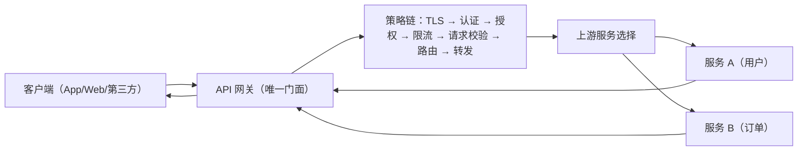
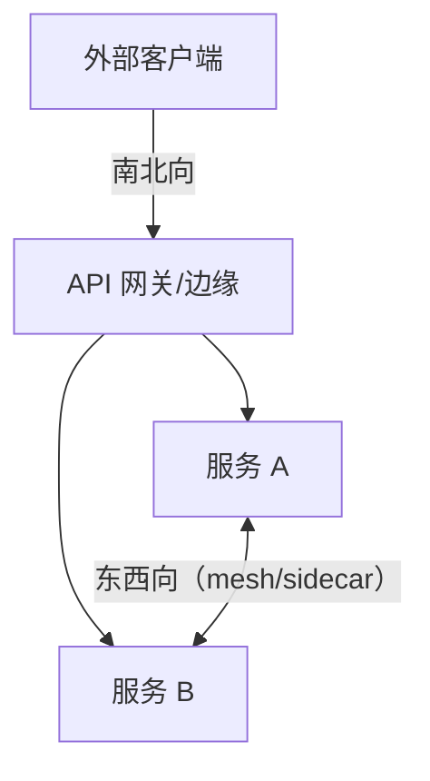
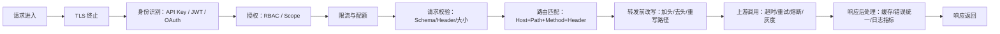
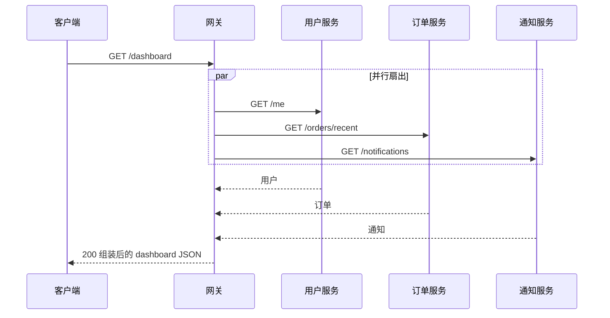
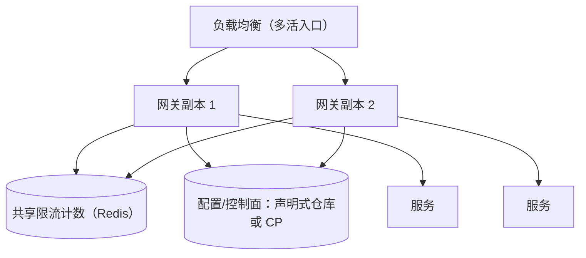
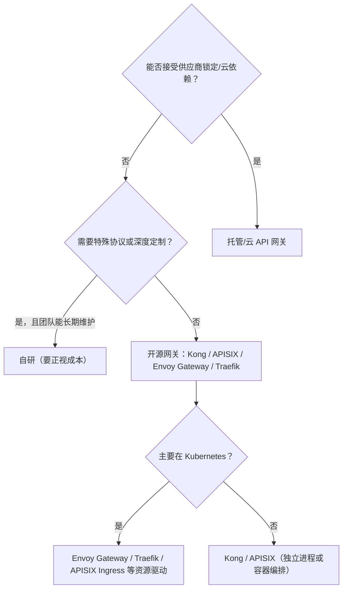

# 网关学习笔记

> **最后调研时间**：2026-09-08。
>
> **读者水平**：入门至进阶。建议先掌握基础 HTTP（方法、状态码、请求/响应头）与 TCP/TLS 概念，最好先读过仓库内的《反向代理学习笔记》前几章；对微服务与 Kubernetes 有基本认知即可。
>
> **版本边界**：以调研时官方资料为据——Kubernetes Gateway API v1.5（2026-02-27 发布，见 [Kubernetes 博客：Gateway API v1.5](https://kubernetes.io/blog/2026/04/21/gateway-api-v1-5/)）；Kong Gateway 3.14.x（2026-07 迭代，见 [Kong Gateway Changelog](https://developer.konghq.com/gateway/changelog)）；Apache APISIX 3.18（2026-08-20 发布，见 [Apache APISIX 文档](https://apisix.apache.org/docs/)）；Envoy Gateway v1.8+（v1.7.5 于 2026-07-08 发布，见 [Envoy Gateway Release Notes](https://gateway.envoyproxy.io/news/releases/notes/v1.7.5/)）；Traefik v3.7（2026-05-05 发布，见 [Traefik v3.7 Blog](https://traefik.io/blog/traefik-proxy-3-7-is-available)）。协议语义以 RFC 9110、RFC 6749（OAuth 2.0）、RFC 7519（JWT）、RFC 9457（Problem Details）为准。
>
> **适用范围**：API 网关 / 微服务网关 / 边缘网关语境，覆盖概念与心智模型、路由/聚合/协议转换、认证授权/限流/配额、流量治理与可观测、BFF 等设计模式、主流产品（Kong、APISIX、Envoy/Envoy Gateway、Traefik）、Kubernetes Ingress 与 Gateway API、端到端实战、安全、性能、高可用、选型与排错。
>
> **不包含**：网络层"默认网关/路由器"知识、硬件与协议级设备网关（Modbus/OPC-UA 等）、云厂商托管网关产品逐项对比、商业化 API 管理平台的开发者门户全量功能。

---

## 讲义导读

"网关"这个词在软件里有两层含义：网络工程师说默认网关（路由出口），开发者说 API 网关（微服务/API 的统一入口）。本讲义只讨论后者，并把它的本质概括成一句话：**网关是"客户端与一堆后端服务之间唯一的门面"——它接收所有请求，做完共性策略后，把请求路由给真正处理它的服务**。

最容易产生的三个错误理解：第一，把 API 网关当"高级反向代理"，只做转发——其实网关的价值在**策略（鉴权、限流、灰度、审计）**而不在转发；第二，以为"网关解决一切"，把所有逻辑塞进网关，制造巨型单点与性能瓶颈；第三，把 Ingress、网关、Service Mesh 混为一谈——它们解决不同方向的流量问题，选错等于把南北向问题搬到东西向。

贯穿全文的心智模型是"**门面 + 策略链 + 数据面/控制面**"：

```text
客户端
  → 网关（统一门面）
      ├─ 请求生命周期：接收 → 校验 → 认证 → 限流 → 路由 → 转发 → 响应
      ├─ 策略链：可插拔插件/过滤器按顺序执行
      └─ 控制面：路由/策略的声明式配置，与数据面分离
  → 后端服务 A / B / C
```

哪个请求坏，就看它在策略链哪一环被拒绝（401/403/429/502 各自对应一环）；哪次发布出问题，先看路由/灰度是否真的切到了新版本。每章末尾的能力式验收与文末的最小检查清单，用来确认你不只是"看懂了"，而是能设计、能实现、能排错。

示例与配置以"最小可运行"为原则：优先给一条命令能跑起来的网关与一条能验证的路由，再讲每个环节在产品里的对应配置。命令与配置段落就近给出官方文档链接，版本变化以目标版本文档为准。

---

## 目录或内容地图

| 章节 | 核心问题 | 主要产出 |
|---|---|---|
| 第一章 学习目标与前置知识 | 学完能做什么、需要什么基础 | 能力锚点与范围 |
| 第二章 网关是什么：从"门面"到 API 网关 | 网关到底解决什么问题 | 定义与门面模型 |
| 第三章 生态位置：网关 vs 反代 vs 负载均衡 vs 网格 | 谁负责哪一类流量 | 边界对照表 |
| 第四章 为什么需要网关：价值与反模式 | 什么时候该上、什么时候别上 | 价值-反模式对照 |
| 第五章 总体架构与心智模型 | 数据面/控制面与策略链如何组织 | 网关架构图 |
| 第六章 核心能力（一）：路由、聚合与协议转换 | 网关如何把请求送到对的服务 | 能力与示例 |
| 第七章 核心能力（二）：认证授权、限流与配额 | 谁能进、能进多少 | 令牌/限流模型 |
| 第八章 核心能力（三）：流量治理与可观测 | 超时/重试/熔断/灰度如何做 | 治理与观测清单 |
| 第九章 设计模式：网关模式、BFF 与边缘网关 | 网关在架构里的摆放姿势 | 模式-场景映射 |
| 第十章 主流产品画像 | Kong/APISIX/Envoy/Envoy Gateway/Traefik 各自是什么 | 产品对照表 |
| 第十一章 Kubernetes 网关：Ingress 到 Gateway API | 集群入口怎么声明与实现 | Gateway/HTTPRoute 模型 |
| 第十二章 端到端实战：一条"客户端 → 网关 → 多服务"链路 | 一条"客户端→网关→多服务"链路怎么落地 | 可运行示例与验证 |
| 第十三章 安全专题 | OAuth2/JWT/mTLS 与错误协议如何落地 | 加固与错误模型 |
| 第十四章 性能与容量 | 网关会引入多少延迟、如何预算 | 延迟预算与瓶颈清单 |
| 第十五章 高可用与部署拓扑 | 网关怎么多活、配置怎么管理 | 部署与 CP/DP 模型 |
| 第十六章 选型与权衡：自研、开源还是托管 | 自研、开源、托管怎么选 | 决策矩阵与顺序 |
| 第十七章 排错与常见问题 | 401/429/502/504 怎么定位 | 故障树与对照表 |
| 第十八章 常见误区 | 最容易错的认知 | 误区纠正表 |
| 第十九章 学习路线、实践闭环与检查清单 | 下一步学什么、如何验收 | 路线与最小清单 |

---

## 第一章 学习目标与前置知识

### 1.1 学完之后应能解决什么问题

- 能解释 API 网关在微服务架构中的位置，并与反向代理、负载均衡、Ingress、Service Mesh 划清边界。
- 能画出网关的数据面/控制面模型，说清请求经过策略链时每类状态码（401/403/429/502/504）对应哪一环。
- 能为"统一认证、限流、灰度、协议转换、审计"等需求设计网关策略，并说明在哪一层实现、为什么。
- 能用至少一款产品（Kong、APISIX、Envoy Gateway、Traefik）跑通"路由 + 鉴权 + 限流"的最小闭环。
- 能用 Kubernetes Gateway API（Gateway/HTTPRoute）表达一个集群入口，并理解它相对 Ingress 的演进。
- 能回答"该不该用网关/该自研还是开源还是托管"，并说清性能、高可用与运维边界。
- 能按"客户端→网关→后端"三层证据链定位网关相关故障。

### 1.2 前置知识

- HTTP 基础：方法、状态码、头、Cookie、TLS；可先读《反向代理学习笔记》第一～八章。
- 微服务基本概念：服务拆分、服务发现、南北向与东西向流量。
- 容器与 Kubernetes 基础：会 `docker run`，知道 Service/Ingress 是什么。
- 安全基础：能区分认证（你是谁）与授权（你能做什么），知道 Token 与密钥。

### 1.3 学习范围与非目标

| 范围 | 内容 |
|---|---|
| 包含 | 定义与边界、架构模型、核心能力、设计模式、产品画像、K8s Gateway API、端到端实战、安全、性能、高可用、选型、排错 |
| 不包含 | 网络默认网关/路由器、设备协议网关、开发者门户/API 商业化平台全量、数据库/消息网关 |
| 版本策略 | 概念以标准/官方文档为准；命令与配置标注产品与版本边界；社区文章只作实践参考 |

---

## 第二章 网关是什么：从"门面"到 API 网关

### 2.1 定义

IBM 的定义是：API 网关是客户端与后端服务之间的**单一入口（front door）**，位于客户端与它管理的 API 之间的独立架构层，负责请求路由、组合与执行横切策略，如限流、认证、监控（来源：[IBM：What Is an API Gateway?](https://www.ibm.com/think/topics/api-gateway)）。微服务语境里的经典定义来自 Chris Richardson 的 API Gateway 模式：**API 网关是客户端访问服务的唯一入口**，在客户端与多个后端服务之间管理请求映射，还常承担请求转发之外的"边缘功能"（edge functions），如身份验证、SSL、限流与响应缓存（来源：[microservices.io：API Gateway 模式](http://microservices.io/patterns/apigateway.html)）。

它**不是**：一台网络路由器、一个 L4 负载均衡器、也不是把后端直接暴露时的"一个好看的域名"。网关的价值密度体现在"策略"上，不在"转发"上。

### 2.2 门面模型：一个请求的一生



图：根据 [IBM：What Is an API Gateway?](https://www.ibm.com/think/topics/api-gateway) 与 [microservices.io：API Gateway 模式](http://microservices.io/patterns/apigateway.html) 整理/重绘。

### 2.3 一句话心智模型

```text
网关 = 统一门面 + 可插拔策略链 + （可选的）请求聚合与协议转换
```

推论：

1. **客户端只认识网关**：网关是服务拓扑的"边界"，后端扩容/迁移/拆分对客户端透明。
2. **共性策略在网关收敛**：鉴权、限流、审计不必在每个服务各写一遍。
3. **网关照单全收也照单全拒**：策略链任一环拒绝（401/403/429/4xx）都不会到达后端——这也意味着排错要先分清"被网关拒"还是"后端失败"。

### 2.4 常见误解

| 误区 | 更准确的理解 | 后果 |
|---|---|---|
| "网关就是多一层转发" | 价值在策略与边界 | 只做转发时白白增加一跳 |
| "加了网关后端就不管安全了" | 网关是边界层，纵深防御仍需后端校验 | 直连绕过网关后裸奔 |
| "网关必须有一个" | 小系统/单体可直接对外 | 过早网关化引入复杂度 |
| "网关=门户网站" | 它是流量入口，不是用户 UI | 与开发者门户混为一谈 |

### 2.5 本章验收

读完本章后，至少应该能：

- 用"front door/唯一入口/策略收敛"三个词向别人解释 API 网关。
- 画出请求从客户端经策略链到后端的一生。
- 说出网关"转发"与"策略"哪个才是价值所在。

---

## 第三章 生态位置：网关 vs 反代 vs 负载均衡 vs 网格

### 3.1 四类组件的分工

| 组件 | 关心的问题 | 典型位置 | 代表性实现 |
|---|---|---|---|
| L4 负载均衡器 | "把连接分给哪个实例" | 最外层/集群前 | 云 NLB、HAProxy(mode tcp) |
| 反向代理 | "把请求转发给哪个上游并处理好协议" | 服务前 | Nginx、Envoy |
| API 网关 | "这个 API 请求该被哪些策略处理后去哪个服务" | 客户端与服务之间 | Kong、APISIX、Envoy Gateway、Traefik |
| Service Mesh（数据面） | "服务与服务之间怎么治理" | 服务旁（sidecar） | Envoy、Linkerd |
| Ingress/Gateway API | "K8s 集群入口怎么声明" | 集群边缘 | Nginx Ingress、Traefik、Envoy Gateway 等 |

一句判据：**负载均衡问"哪个实例"，网关问"哪个服务+哪些策略"**（来源：[API7 学习中心：API 网关 vs 反向代理 vs 负载均衡](https://www.apiseven.com/learning-center/api-gateway-guide/api-gateway-vs-reverse-proxy-vs-load-balancer)，2025-02-12）。

### 3.2 南北向与东西向

- **南北向（north-south）**：外部客户端进入系统，网关是典型入口。
- **东西向（east-west）**：服务之间互调，Service Mesh/内部网关是典型治理点。



实践中边界会模糊：很多产品同时能做反代、Ingress 与 API 网关（如 Traefik、Envoy）；选择时以"你要治理哪一段流量"为准，而不是产品名字。

### 3.3 差异速查

| 需求 | 用负载均衡/反代足够 | 需要网关 | 需要 Mesh |
|---|---|---|---|
| 单一服务多副本分发 | 是 | 不必 | 不必 |
| 统一域名路由到多个服务 | 反代可以 | 网关更完整 | 不解决入口 |
| 统一 OAuth/JWT/API Key | 反代要手写 | 网关插件化 | 网格层另有方案 |
| 服务间限流/重试/熔断 | 每服务自己配 | 可作为出口网关 | 数据面统一治理 |
| 按消费者管理配额与订阅 | 否 | 是（API 管理） | 否 |

### 3.4 本章验收

读完本章后，至少应该能：

- 说清 LB、反代、API 网关、Mesh、Ingress 各自回答的问题。
- 用南北向/东西向判断一个流量治理需求该放哪一层。
- 解释为什么"能当 Ingress 用"不代表"能当完整 API 网关用"。

---

## 第四章 为什么需要网关：价值与反模式

### 4.1 价值清单

| 价值 | 解决什么 | 触发信号 |
|---|---|---|
| 统一入口 | 客户端只连一个地址，后端拓扑自由演化 | 有多个后端且要暴露给多类客户端 |
| 横切策略收敛 | 鉴权/限流/审计/日志一处配置 | 每个服务都在重复"公共逻辑" |
| 客户端与 API 解耦 | 后端拆分/合并不影响客户端 | 微服务重构频繁 |
| 按能力裁剪 API | 聚合多次调用为一次、裁剪字段 | 移动端弱网、需要"专用 API" |
| 协议/格式转换 | REST↔RPC、gRPC/WebSocket 等统一暴露 | 异构后端并存 |
| 安全边界 | 统一校验、令牌校验、防滥用 | 有对外 API 与开发者生态 |
| 可观测 | 全局入口最容易统计调用量/错误/延迟 | 需要跨服务聚合指标 |

### 4.2 反模式与代价

| 反模式 | 问题 | 正确姿势 |
|---|---|---|
| 把网关当"万能处理器" | 大而全、改一次全上线、故障面大 | 只放"边界性质"的策略 |
| 没网关需求硬加网关 | 多一跳延迟与运维面 | 单体/单服务先直连 |
| 网关后后端不再校验 | 直连/内网绕过时裸奔 | 纵深防御 |
| 把业务逻辑塞进网关 | 网关与业务耦合、性能变差 | 业务留在服务，网关做共性策略 |
| 网关做同步聚合过度 | 大量扇出造成放大效应与超时 | 聚合要设预算、可异步 |
| 忽略网关自身高可用 | 单点网关=单点故障 | 网关要水平扩展与多活（见第十五章） |

### 4.3 决策信号

当出现"两类以上客户端、三个以上后端、至少一个横切策略（鉴权/限流/审计）"时，网关的收益开始显现；如果只有"一个服务 + 一个客户端"，先别上网关。

### 4.4 本章验收

读完本章后，至少应该能：

- 列出网关的六类价值并各给一个触发场景。
- 说出至少三种网关反模式及规避方式。
- 用"多客户端 × 多服务 × 横切策略"判断是否该引入网关。

---

## 第五章 总体架构与心智模型

### 5.1 数据面与控制面

现代网关普遍把**数据面（Data Plane，跑流量）**与**控制面（Control Plane，管配置）**分离：

| 面 | 职责 | 内容 | 观测 |
|---|---|---|---|
| 数据面 | 逐请求处理流量 | 路由表、插件/过滤器、转发、限流计数 | 访问日志、指标、连接数 |
| 控制面 | 生成并下发配置 | 从声明式配置/Admin API/控制器合成数据面配置 | 配置版本、下发错误、同步延迟 |

例如 Envoy Gateway 本身是"控制面"，它把 Gateway API 资源翻译成 Envoy 数据面配置（来源：[Envoy Gateway 文档](https://gateway.envoyproxy.io/)）；Kong 也有控制面/数据面分离与配置下发保护（来源：[Kong Gateway Changelog](https://developer.konghq.com/gateway/changelog)）。分面带来的两个排错习惯：

1. "配置改了没生效"先查控制面是否成功生成并下发，而不是怀疑数据面进程；
2. 数据面只执行内存中的路由表，改配置是异步生效，别在改完瞬间断言结果。

### 5.2 请求生命周期与策略链



图：根据 [microservices.io：API Gateway 模式](http://microservices.io/patterns/apigateway.html) 与 [Kong Gateway 文档](https://developer.konghq.com/gateway/) 整理/重绘的典型生命周期（顺序因产品而异）。

每个状态码几乎都能对应到一环：

- `401` → 身份识别失败；`403` → 授权拒绝；
- `429` → 限流/配额；
- `400/422` → 请求校验或参数错误；
- `502/503/504` → 上游阶段（连接失败/无可用节点/超时）。

### 5.3 配置入口：声明式 vs Admin API

网关策略一般有三种配置方式：

| 方式 | 说明 | 适合 | 代表 |
|---|---|---|---|
| Admin API / 动态接口 | 运行时 CRUD 路由与插件 | 快速调试、平台自助 | Kong、APISIX |
| 声明式配置（YAML/文件） | 配置即代码，走 Git 评审 | 生产、审计、可回滚 | Kong declarative、Envoy xDS、APISIX File/Etcd |
| 资源/注解驱动 | 从平台对象自动生成（K8s） | 云原生 | Gateway API、Traefik providers |

生产建议：**管理面走声明式或受控 API，别让人手改生产路由**；网关本身要纳入变更管理与回滚演练。

### 5.4 本章验收

读完本章后，至少应该能：

- 画出"请求→TLS→认证→授权→限流→路由→上游→响应"的策略链。
- 说清控制面与数据面的职责，并解释"改配置没生效"该查哪一面。
- 把 401/403/429/502 对应到策略链的环节。

---

## 第六章 核心能力（一）：路由、聚合与协议转换

### 6.1 路由：把请求送到"对的服务"

网关根据请求特征选择后端，常见匹配键：

| 键 | 示例 | 用途 |
|---|---|---|
| Host | `api.example.com` | 多租户/多域名 |
| Path | `/orders/**`、精确 `/healthz` | 按资源域分服务 |
| Method | GET/POST | 读写分流 |
| Header | `X-Canary: true`、`Authorization` | 灰度/版本 |
| Query | `?version=v2` | 兼容层路由 |

路由设计要守两条纪律：**规则要无歧义（最长/最具体优先）**，**默认拒绝兜底**（没有命中规则就 404，而不是"转发到某个默认服务"）。路由规则是最容易出"请求去了错的服务"的地方，排错先看"命中哪条规则"。

### 6.2 聚合与扇出（Aggregation / Fan-out）

一个客户端请求可能需要网关去调多个后端并组装响应（例如移动端首页 = 用户 + 推荐 + 消息）。经典网关模式允许服务端聚合，Manning 对 API Gateway 模式的描述里把它列为网关的"服务端聚合"能力（来源：[Manning：The API Gateway Pattern](https://freecontent.manning.com/the-api-gateway-pattern/)）。



聚合的工程约束：**必须设整体预算**（总超时、每路超时、错误处理策略），否则一个慢服务拖垮整个聚合；同步扇出过多时考虑异步聚合或客户端直连。

### 6.3 协议转换与多协议暴露

后端协议（HTTP/1.1、gRPC、WebSocket、REST 变体）不必与客户端协议一致，网关负责翻译：

| 场景 | 转换 | 网关要处理 |
|---|---|---|
| gRPC 服务给 HTTP 客户端 | h2/gRPC ↔ HTTP/JSON | 通常需要 transcoding 插件/过滤器 |
| WebSocket 长连接 | HTTP Upgrade 透传 | 头与空闲超时 |
| 老 SOAP/RPC 给新客户端 | 协议转换 | 消息格式映射 |
| 内部微服务给外部精简 API | 字段裁剪/聚合 | 编排而非直通 |

API 描述与契约是转换的基础：用 OpenAPI 描述对外 API，转换器可按 Schema 校验与映射（来源：[OpenAPI v3.1 规范](https://spec.openapis.org/oas/v3.1.0)）。

### 6.4 常见错误与调试

| 现象 | 可能原因 | 排查顺序 | 修复方向 |
|---|---|---|---|
| 请求去了错误服务 | 路由优先级/匹配歧义 | 看网关日志命中规则 | 用更具体的匹配或收紧规则 |
| 命中规则但 502 | 上游服务名/端口错 | 后端可达性与日志 | 修 upstream/服务发现 |
| gRPC 转不了 | 未启用 h2/transcoding | 客户端协议 vs 后端协议 | 配协议转换与 h2 |
| 404 兜底 | 无匹配规则 | 列出网关规则表 | 补规则或确认前缀 |

### 6.5 本章验收

读完本章后，至少应该能：

- 按 Host/Path/Method/Header 设计一组无歧义的路由规则。
- 说明聚合的收益与"总预算"约束。
- 判断一个协议转换需求该由网关还是由后端完成。

---

## 第七章 核心能力（二）：认证授权、限流与配额

### 7.1 身份与令牌

网关通常是"谁在调用"的第一判定点。常见身份模型：

- **API Key**：静态密钥，适合服务对服务与简单场景；需要妥善保管与轮换。
- **JWT（RFC 7519）**：自包含的签名令牌，网关验签后即可信任 claims；可用 JWKS 从授权服务器拉取公钥（来源：[RFC 7519：JSON Web Token](https://www.rfc-editor.org/rfc/rfc7519.html)）。
- **OAuth 2.0**：授权框架，定义了授权码、客户端凭据等流程与令牌语义（来源：[RFC 6749：The OAuth 2.0 Authorization Framework](https://www.rfc-editor.org/rfc/rfc6749.html)）。

最小实践顺序：

1. 网关做**令牌验证**（签名、过期、签发方），通过后把用户/scope 传给后端（加头，如 `X-User-ID`、`X-Scope`）；
2. **授权（能做什么）**按 scope/RBAC 在网关做粗粒度放行，细粒度业务权限仍要后端校验；
3. 后端不要把网关加的头当不可信输入之外的"事实"——内网直连路径也要做同样校验（纵深防御）。

### 7.2 限流与配额

限流保护后端与配额约束消费者。三个维度：

| 维度 | 例子 | 实现要点 |
|---|---|---|
| 速率 | 每 IP/每用户 10 req/s | 令牌桶/滑动窗口 |
| 并发 | 同用户最多 5 个进行中请求 | 计数信号量 |
| 配额 | 每月 100 万次（按套餐） | 长时间窗口计数 |

工程问题：

- **键（key）选谁**：按 IP 会被共享 NAT 误伤；按 API Key/Consumer 更准但要求先认证。
- **分布式一致性**：多副本网关限流要共享计数（Redis 等），否则每个副本各算各的，总限速被放大。
- **错误语义**：超限返回 `429 Too Many Requests`，并可用 `Retry-After` 头告知重试时间（来源：[RFC 9110 对 429/Retry-After 的语义](https://www.rfc-editor.org/rfc/rfc9110.html)）。

### 7.3 产品里的最小表达

主流网关都提供认证/限流插件：Kong 的 `key-auth`、`rate-limiting` 插件；APISIX 的 `key-auth`、`limit-count`/`limit-req` 插件；Envoy Gateway 通过 SecurityPolicy/BackendTrafficPolicy 类资源表达（来源：[Kong Gateway 文档](https://developer.konghq.com/gateway/)、[Apache APISIX 文档](https://apisix.apache.org/docs/)、[Envoy Gateway 文档](https://gateway.envoyproxy.io/)）。具体字段以各产品文档为准。

### 7.4 常见错误与调试

| 现象 | 可能原因 | 排查顺序 | 修复方向 |
|---|---|---|---|
| 一直 401 | 密钥/令牌没传、验签公钥错 | 看网关日志的拒绝原因 | 修凭据或 JWKS |
| 令牌有效但 403 | scope/RBAC 不足 | 解码 token 看 scope | 加授权规则 |
| 偶发 429 | 多副本未共享计数 | 看是否每副本各计 | 接 Redis 共享限流 |
| 配额不清零 | 时间窗口没对齐 | 查配额配置的时区/窗口 | 统一窗口定义 |

### 7.5 本章验收

读完本章后，至少应该能：

- 区分 API Key/JWT/OAuth 并说明网关该验什么、不该信什么。
- 为"限流键、错误码、分布式计数"选型并说明理由。
- 用任一产品给一条路由挂上认证+限流并验证 401/429。

---

## 第八章 核心能力（三）：流量治理与可观测

### 8.1 流量治理工具箱

| 能力 | 网关语义 | 注意 |
|---|---|---|
| 超时 | connect/read/write 分级超时 | 超时过短会误杀慢业务 |
| 重试 | 只对幂等请求安全 | POST 重试需幂等键 |
| 熔断/降级 | 连续失败后快速失败或返回兜底 | 配合健康检查恢复 |
| 灰度/金丝雀 | 按 Header/Cookie/权重切流 | 需要可观测确认切量真实发生 |
| 蓝绿/版本路由 | 按版本路由到新旧集群 | 发布回滚靠路由层实现 |
| 响应缓存 | 只缓存可缓存语义（Cache-Control） | 别缓存带私有数据响应 |

这些能力在 Envoy 生态里由 route/cluster 的 retry、timeout、outlier detection 提供（来源：[Envoy Gateway 文档](https://gateway.envoyproxy.io/)）。网关做灰度时常见误区是"只改权重不看指标"——切量前后必须对比错误率与延迟。

### 8.2 错误契约：用 RFC 9457 统一错误体

网关策略会拒绝很多请求，错误响应应可被客户端机器识别。RFC 9457 定义了 Problem Details：`application/problem+json` 响应含 `type`、`title`、`status`、`detail`、`instance` 等成员，替代并取代了 RFC 7807（来源：[RFC 9457：Problem Details for HTTP APIs](https://www.rfc-editor.org/info/rfc9457/)）。网关统一错误体后，客户端 SDK 只需解析一种格式。

### 8.3 可观测三件套

- **日志**：请求方法/路径/状态码/consumer/网关节点/上游地址/耗时/request id。
- **指标**：按 route、service、status 聚合的 QPS、错误率、P50/P95/P99 延迟、上游健康度、限流命中。
- **追踪**：透传 W3C `traceparent`，把"网关→上游"串成一条链路（来源：[W3C Trace Context](https://www.w3.org/TR/trace-context/)）；网关要生成本跳 span 而不只当哑管道。

### 8.4 观测信号表

| 信号 | 健康 | 预警 | 处理方向 |
|---|---|---|---|
| 5xx 占比 | <1% 且平稳 | 上升 | 看是网关策略还是上游 |
| 429 占比 | 低 | 飙升 | 检查限流键与配额设置 |
| P99 延迟 | 达标 | 缓慢爬升 | 看聚合扇出与上游耗时 |
| 上游健康 | 全绿 | 抖动 | 检查探活与熔断 |

### 8.5 本章验收

读完本章后，至少应该能：

- 为网关设计一套含超时/重试/熔断/灰度的治理配置并说明安全前提。
- 用 RFC 9457 设计网关统一错误体。
- 列出网关日志、指标、追踪至少各两项关键字段。

---

## 第九章 设计模式：网关模式、BFF 与边缘网关

### 9.1 模式地图

| 模式 | 解决什么 | 摆放位置 | 代表资料 |
|---|---|---|---|
| API Gateway 模式 | 客户端与多服务解耦、统一入口 | 所有客户端之前 | [microservices.io：API Gateway](http://microservices.io/patterns/apigateway.html) |
| Backend for Frontend（BFF） | 每类客户端要"专用 API" | 每类客户端各一个网关/聚合层 | 同文档中 per-client gateway 的讨论 |
| 边缘网关（Edge Gateway） | 公网入口的安全/协议边界 | DMZ/集群最外层 | IBM 网关定义中的"edge"表述 |
| 内部网关/出口网关 | 服务调用外部或内部路由 | 服务侧/出口 | 无统一标准，按团队约定 |
| 网关 + 反向代理组合 | 隧道送进来、网关管策略 | 公网节点做 TLS/路由后再到网关 | 参见《反向代理学习笔记》 |

Chris Richardson 的 API Gateway 模式文档特别指出：一个应用可能需要**多个网关**（每类客户端一个），为桌面、移动端等分别定制 API——这就是 BFF 思路的源头（来源：[microservices.io：API Gateway 模式](http://microservices.io/patterns/apigateway.html)）。同一份文档也解释了网关会执行请求转发之外的"边缘功能"，如认证、SSL、限流与缓存。

### 9.2 什么时候用 BFF，什么时候用单一网关

| 情形 | 方案 | 原因 |
|---|---|---|
| 客户端形态统一（一个 Web 站） | 单一 API 网关 | 一套规则够用 |
| Web/Mobile/第三方差异大 | 每端 BFF | 各端 API 语义不同，避免相互污染 |
| 第三方开放平台 | 独立网关+开发者门户 | 对外与对内策略/配额模型不同 |
| 内网服务调用 | 不引网关或只做出口网关 | 南北向网关管不到东西向 |

### 9.3 网关的"邻居"：与反代/隧道的组合

公网入口往往不是"一个产品"：外层负载均衡/CDN 负责 TLS 与 DDoS，中间可能还有反向代理与反向隧道，最内才是 API 网关做业务策略。不要指望单一组件覆盖所有层（来源：[API7：API 网关 vs 反向代理 vs 负载均衡](https://www.apiseven.com/learning-center/api-gateway-guide/api-gateway-vs-reverse-proxy-vs-load-balancer)，2025-02-12）。

### 9.4 本章验收

读完本章后，至少应该能：

- 区分 API Gateway、BFF、边缘网关、内部网关四种摆法。
- 根据"客户端形态是否分化"选择单一网关还是 BFF。
- 画出"LB/CDN → 反代/隧道 → API 网关 → 服务"的典型分层。

---

## 第十章 主流产品画像

### 10.1 产品对照

| 产品 | 语言/形态 | 控制面与数据面 | 特色 | 适合 |
|---|---|---|---|---|
| Kong Gateway | Lua（OpenResty 生态）/Go 插件支持 | CP/DP、声明式或 Admin API | 插件生态丰富、企业版能力强 | 已有 Nginx 栈、传统与云原生过渡 |
| Apache APISIX | OpenResty/etcd | Admin API + etcd、动态生效 | 插件多、性能好、Apache 基金会项目 | 高性能、需动态路由 |
| Envoy / Envoy Gateway | C++ 数据面 + Go 控制面 | xDS/Gateway API | 云原生标准、网格同源 | K8s、Gateway API、服务网格 |
| Traefik | Go | provider 驱动动态配置 | 配置简单、自动发现 | Docker/K8s 快速入口 |
| Nginx Ingress Controller | Nginx | K8s 资源驱动 | 生态成熟、注解多 | 传统 K8s 入口 |
| 云 API 网关/托管 | 厂商托管 | 控制台/OpenAPI | 免运维、含开发者门户与配额 | 不想自运维、有云依赖可接受 |

版本与文档（截至 2026-09-08）：

- Kong Gateway 3.14.x（2026-07 迭代，来源：[Kong Gateway Changelog](https://developer.konghq.com/gateway/changelog)）。
- Apache APISIX 3.18（2026-08-20 发布，来源：[Apache APISIX 文档](https://apisix.apache.org/docs/)）。
- Envoy Gateway v1.8+（v1.7.5 于 2026-07-08 发布，来源：[Envoy Gateway Release Notes](https://gateway.envoyproxy.io/news/releases/notes/v1.7.5/)）。
- Traefik v3.7（2026-05-05 发布，来源：[Traefik v3.7 Blog](https://traefik.io/blog/traefik-proxy-3-7-is-available)）。

### 10.2 产品选型的三个分水岭

1. **部署形态**：K8s 原生化程度（资源驱动 vs 独立进程管理）。
2. **动态性**：路由/插件变更是否需要"秒级生效且不 reload"（etcd/xDS vs 文件 reload）。
3. **扩展面**：插件的开发语言与生态（Lua/Go 插件、WebAssembly、AI 插件等）。

社区与商业生态一直在演进（如 AI 网关能力、Gateway API 符合性实现），选型时把"网关能力"当一维、"你所在平台"当另一维，逐个产品核对官方文档。

### 10.3 本章验收

读完本章后，至少应该能：

- 说出 Kong、APISIX、Envoy Gateway、Traefik 的核心差异与各自强项。
- 用"部署形态/动态性/扩展面"三个分水岭对候选产品排序。
- 引用官方文档说出调研时各产品版本。

---

## 第十一章 Kubernetes 网关：Ingress 到 Gateway API

### 11.1 Ingress 解决了什么、缺什么

Ingress 是 Kubernetes 集群入口的标准对象：它声明"域名/路径 → Service"的规则，由 Ingress Controller（Nginx、Traefik、APISIX Ingress、Envoy Gateway 等）实现（来源：[Kubernetes Ingress 文档](https://kubernetes.io/zh-cn/docs/concepts/services-networking/ingress/)）。Ingress 能覆盖基础路由，但表达能力有限：跨 namespace 引用、按 Header 路由、复杂流量拆分、角色分工都不够模型化，于是社区演进出了 Gateway API。

### 11.2 Gateway API 的核心对象

Gateway API 用分层资源把"基础设施负责人"与"应用团队"解耦（来源：[Gateway API 官网](https://gateway-api.sigs.k8s.io/)）：

| 对象 | 属于谁 | 作用 |
|---|---|---|
| `GatewayClass` | 集群管理员 | 声明使用哪个控制器实现 |
| `Gateway` | 集群管理员 | 声明入口（监听器：端口/协议/证书） |
| `HTTPRoute`/`GRPCRoute`/`TCPRoute` 等 | 应用团队 | 声明路由与后端 |
| `ReferenceGrant` | 相关方 | 显式允许跨 namespace 引用 |

Gateway API v1.5（2026-02-27 发布）把多项能力从实验特性提升到标准（stable），包括把 ReferenceGrant 提升到 v1，并已有多个实现通过符合性测试（来源：[Kubernetes 博客：Gateway API v1.5](https://kubernetes.io/blog/2026/04/21/gateway-api-v1-5/)）。

### 11.3 最小示例：Gateway + HTTPRoute

```yaml
apiVersion: gateway.networking.k8s.io/v1
kind: Gateway
metadata:
  name: prod-gateway
spec:
  gatewayClassName: eg            # 换成你的实现（eg=Envoy Gateway）
  listeners:
  - name: http
    protocol: HTTP
    port: 80
---
apiVersion: gateway.networking.k8s.io/v1
kind: HTTPRoute
metadata:
  name: orders-route
spec:
  parentRefs:
  - name: prod-gateway
  rules:
  - matches:
    - path:
        type: PathPrefix
        value: /orders
    backendRefs:
    - name: orders-svc
      port: 8080
```

来源：[Gateway API 官网](https://gateway-api.sigs.k8s.io/)；`gatewayClassName` 与实现提供的策略资源（如 Envoy Gateway 的 SecurityPolicy）以所选实现文档为准。

### 11.4 Ingress vs Gateway API

| 维度 | Ingress | Gateway API |
|---|---|---|
| 标准化程度 | 规则子集标准，注解五花八门 | 资源模型统一、可符合性测试 |
| 责任分层 | 弱（谁都能建） | Gateway 归平台、Route 归应用 |
| 能力 | 路由为主 | 路由+策略扩展（retry/timeout/security） |
| 成熟度 | 广泛使用 | v1.5（2026）仍在普及 |

### 11.5 本章验收

读完本章后，至少应该能：

- 说清 GatewayClass/Gateway/HTTPRoute/ReferenceGrant 各自角色。
- 写出最小 Gateway + HTTPRoute 并说明 parentRefs 与 backendRefs。
- 解释 Gateway API 相对 Ingress 在"责任分层与可测试性"上的进步。

---

## 第十二章 端到端实战：一条"客户端 → 网关 → 多服务"链路

### 12.1 练习目标

用本地环境跑通"路由 + 认证 + 限流 + 故障注入"最小闭环。选型上你可以用任意产品，本讲义以 **Kong（声明式）**、**Apache APISIX（Admin API）** 与 **Gateway API（HTTPRoute）** 三条路径演示同一目标，命令细节以各产品官方快速开始为准。

### 12.2 准备后端

```bash
# 用 httpbin 充当"后端服务"，后续观察网关转发
docker run -d --name backend -p 8080:80 kennethreitz/httpbin
curl http://127.0.0.1:8080/anything/hello   # 后端自证可达
```

### 12.3 路径 A：Kong 声明式（DB-less）

```yaml
# kong.yml（示意，挂载方式见官方快速开始）
_format_version: "3.0"
services:
- name: backend-svc
  url: http://backend:8080
  routes:
  - name: backend-route
    paths: ["/anything"]
```

启动时用 Kong 的 DB-less 模式（`KONG_DATABASE=off` + 声明式配置文件）启动容器后访问 `http://127.0.0.1:8000/anything/hello`。参考 [Kong Gateway 文档](https://developer.konghq.com/gateway/) 的 DB-less/快速开始章节。

### 12.4 路径 B：APISIX Admin API

```bash
# 默认开发 Admin Key，生产必须替换
curl http://127.0.0.1:9180/apisix/admin/routes/1 \
  -H 'X-API-KEY: edd1c9f034335f136f87ad84b625c8f1' -X PUT -d '{
    "uri": "/anything/*",
    "upstream": {
      "type": "roundrobin",
      "nodes": {"127.0.0.1:8080": 1}
    }
  }'
curl http://127.0.0.1:9080/anything/hello
```

参考 [Apache APISIX 文档](https://apisix.apache.org/docs/) 的快速开始；默认监听端口 9080（代理）与 9180（Admin）。

### 12.5 路径 C：Gateway API

按第十一章的 Gateway + HTTPRoute 创建入口，把 `/orders` 路由到 `orders-svc:8080`。实现可用 Envoy Gateway 或你集群已有的控制器（来源：[Gateway API 官网](https://gateway-api.sigs.k8s.io/)）。

### 12.6 给它加策略：认证与限流（示意）

以 APISIX 为例（概念等价到其他产品）：

```bash
# 给同一路由叠加 key-auth 与 limit-count
curl http://127.0.0.1:9180/apisix/admin/routes/1 \
  -H 'X-API-KEY: edd1c9f034335f136f87ad84b625c8f1' -X PUT -d '{
    "uri": "/anything/*",
    "plugins": {
      "key-auth": {},
      "limit-count": {
        "count": 5,
        "time_window": 60,
        "rejected_code": 429,
        "key_type": "var",
        "key": "remote_addr"
      }
    },
    "upstream": {"type": "roundrobin", "nodes": {"127.0.0.1:8080": 1}}
  }'
# 无 key 应返回 401
curl -i http://127.0.0.1:9080/anything/hello
```

说明：`key-auth` 的 consumer/凭证创建与 `limit-count` 字段随版本变化，以上仅为演示意图（来源：[Apache APISIX 文档](https://apisix.apache.org/docs/)）。

### 12.7 验证与失败注入矩阵

| 场景 | 输入 | 预期 | 证据 |
|---|---|---|---|
| 正常路由 | 带有效凭据访问 `/anything/hello` | 200 且回显来自后端 | 响应体 + 网关访问日志 |
| 无凭据 | 不带 key | 401 | 网关日志的拒绝原因 |
| 超限 | 连续打超过 5 req/60s | 429 + 错误体 | 429 计数 |
| 后端宕机 | 停掉 backend 容器 | 502/503 | 网关日志 upstream 状态 |
| 灰度（可选） | 带 `X-Canary: true` 的头 | 命中灰度路由 | 响应标识 |

### 12.8 本章验收

读完本章后，至少应该能：

- 用三条路径之一跑通"路由→认证→限流"闭环。
- 用 401/429/502 对照验证策略链每一环。
- 说清"网关返回 vs 后端返回"在日志里如何区分。

---

## 第十三章 安全专题

### 13.1 网关在安全里的位置

网关是**边界执行点**，不是安全终点：它适合做令牌验证、限流、TLS 终止、请求校验、统一错误；不适合承载"全部信任"。纵深防御要求后端仍校验授权与数据权限。

### 13.2 令牌验证落地

- JWT：网关验签名与 `exp`，必要时用 JWKS 拉公钥（来源：[RFC 7519](https://www.rfc-editor.org/rfc/rfc7519.html)）。
- OAuth 2.0：网关通常对接授权服务器做 token introspection 或验证 JWT（来源：[RFC 6749](https://www.rfc-editor.org/rfc/rfc6749.html)）。
- mTLS：服务间/高安全场景用客户端证书做双向认证，网关做证书校验与吊销检查。

### 13.3 内部头防伪（必须做）

网关向后端传递可信身份时常用 `X-User-ID`、`X-Scope` 等"内部头"。**如果网关不先删除客户端发来的同名头，攻击者直接伪造即可冒充用户**。正确顺序：先 `remove_header` 客户端带来的内部头，再写入网关自己的可信头。

### 13.4 输入与错误面

| 项 | 网关做法 | 说明 |
|---|---|---|
| 请求校验 | 按 OpenAPI/参数 Schema 校验 | 早拒绝坏请求 |
| 大小限制 | body/header 上限 | 防滥用 |
| 错误统一 | RFC 9457 `application/problem+json` | 别把堆栈吐给客户端 |
| 密钥管理 | 插件/变量引用密钥，不写进代码与日志 | 见 13.2 |
| 日志脱敏 | 不打 Authorization/Cookie 明文 | 防泄漏 |

### 13.5 威胁与缓解速查

| 威胁 | 缓解 |
|---|---|
| 直连后端绕过网关 | 网络隔离 + 后端同样校验 |
| 伪造内部身份头 | 网关先清后写 + 后端校验 |
| 令牌泄露/重放 | 短有效期 + 吊销策略 + 审计 |
| 暴力调用 | 限流 + 失败锁定（谨慎） |
| 错误信息泄露 | 统一错误体 + 隐藏堆栈 |

### 13.6 本章验收

读完本章后，至少应该能：

- 说清"边界执行点 vs 安全终点"并给出后端仍要校验的例子。
- 写出"先删客户端内部头再注入可信头"的正确顺序。
- 用 RFC 9457 设计网关错误契约并做日志脱敏检查。

---

## 第十四章 性能与容量

### 14.1 网关加了多少开销

网关每增加一层处理就增加延迟：TLS 终止、解析、认证、限流、聚合都是成本。容量规划要回答的不是"网关能跑多少 RPS"，而是"在 P95/P99 延迟预算内能跑多少 RPS 且错误率可控"。

### 14.2 关键资源与瓶颈

| 资源 | 影响 | 监控信号 |
|---|---|---|
| CPU | 加解密、解析、正则路由 | CPU 利用率与 p99 同步上升 |
| 内存 | 缓冲、连接、配置快照 | OOM、worker 重启 |
| 文件描述符/连接 | 高并发连接上限 | connection refused、队列堆积 |
| 后端连接池 | 复用率低则建连成本高 | upstream connect 次数 |
| 共享限流存储 | 每请求一次 Redis 往返 | 限流组件延迟 |

### 14.3 性能预算与手段

1. **先量后调**：建立网关直通基线（绕过策略的 p99）与"全策略 p99"，差值就是策略成本。
2. **策略最小化**：正则路由、重 body 校验、同步聚合都要算进预算。
3. **连接与缓冲**：调上游连接池、keep-alive、读/写缓冲，避免每请求新建连接。
4. **TLS 开销**：会话复用、合适的密码套件；终止点尽量靠外但注意信任边界。
5. **降载**：超预算时快速失败（429/503）优于排队拖死（来源可对照 [RFC 9110](https://www.rfc-editor.org/rfc/rfc9110.html) 的流量语义与 Retry-After）。

### 14.4 压测注意

压测要覆盖"无策略/全策略/限流命中/后端慢"四种场景；观察对象是延迟分布与错误率，不是单看 QPS。结果要记录网关与后端两端的耗时，才能说清慢在哪一段。

### 14.5 本章验收

读完本章后，至少应该能：

- 解释"在延迟预算内能跑多少 RPS"为什么比裸 QPS 更正确。
- 列出 CPU/内存/连接池/共享限流四类瓶颈与观测信号。
- 设计"直通基线 vs 全策略"的性能对比实验。

---

## 第十五章 高可用与部署拓扑

### 15.1 网关自己不能是单点

网关收敛了所有入口流量，因此它的可用性就是系统的可用性。基本要求：

- **水平扩展**：无状态数据面多副本，前面放负载均衡。
- **优雅摘流**：下线/升级先摘流量、排空连接，再停进程。
- **有状态部分外置**：限流计数（Redis）、配置存储、会话由外置服务承担，数据面保持无状态。
- **配置可回滚**：路由/策略纳入版本管理；出问题秒级回滚到上一版本。

### 15.2 控制面/数据面与配置管理

现代网关强调 CP/DP 分离：数据面只执行已下发的配置，配置版本不一致会造成"两副本行为不同"。Kong 在 changelog 中显式提到对 CP→DP 下发载荷上限的保护与断连重连优化（来源：[Kong Gateway Changelog](https://developer.konghq.com/gateway/changelog)）；Envoy Gateway 由控制面把 Gateway API 转成 Envoy 配置（来源：[Envoy Gateway 文档](https://gateway.envoyproxy.io/)）。运维上要监控：配置版本号、下发延迟、下发失败数、副本间配置哈希是否一致。

### 15.3 拓扑形态



### 15.4 发布与演练

- 网关自身发布用"先灰一台、观察错误率、再全量"。
- 定期演练：杀一台副本、回滚一次配置、摘流一台看是否影响存量连接。
- 记录每次网关变更的版本、操作人与观测结论，方便复盘。

### 15.5 本章验收

读完本章后，至少应该能：

- 画出"多副本网关 + 共享状态 + 声明式配置"的高可用拓扑。
- 解释 CP/DP 配置不一致会导致什么问题，以及怎么监控。
- 设计网关自身的灰度发布与故障演练步骤。

---

## 第十六章 选型与权衡：自研、开源还是托管

### 16.1 三条路线

| 路线 | 收益 | 代价 | 适合 |
|---|---|---|---|
| 自研网关 | 完全可控、贴合业务 | 性能/安全/高可用全自己扛 | 有独特协议或强定制，团队能长期维护 |
| 开源网关（Kong/APISIX/Envoy Gateway/Traefik） | 功能全、社区大、可改可扩 | 自己部署运维 | 大多数团队 |
| 托管/云网关 | 免运维、含开发者门户 | 供应商锁定、成本、定制受限 | 不想运维且能接受云依赖 |

自研是最贵的路线：网关位于所有流量路径上，任何性能、稳定性或安全问题都是全局事故。阿里云开发者社区对自研网关的分析强调它需要"异步化、插件体系、规则引擎"等完整设计，而不仅是"写个转发"（来源：[阿里云开发者：自研高性能 API 网关架构与设计要点](https://developer.aliyun.com/article/1648931)，2025-01-12）。

另一类综述文章把网关从"单体入口"到"API 管理平台"的演进与主流实现串起来，适合建立全局背景再回来读本文（来源：[CSDN：API 网关深度解析（从架构演进到生产实践）](https://blog.csdn.net/weixin_39863120/article/details/154660034)，2025-11-14）。

### 16.2 决策树



### 16.3 需求矩阵

| 需求 | 推荐 | 不推荐 | 原因 |
|---|---|---|---|
| 快速上线、不想运维 | 云托管网关 | 自研 | 免运维与 SLA |
| 高吞吐且要动态路由 | APISIX/Envoy | 每次改动 reload 的方案 | 动态性与性能 |
| 深度定制协议 | 自研或 Envoy | 普通开源插件不够时别硬凑 | 定制深度决定路线 |
| K8s 生态原生入口 | Gateway API 实现 | 无 K8s 也引入资源驱动 | 与平台耦合 |
| 纯内网简单转发 | 反代/负载均衡即可 | 任何"全家桶" | 别过度设计 |

### 16.4 本章验收

读完本章后，至少应该能：

- 对照"供应商锁定/定制深度/平台"三问给出路线。
- 说出自研网关需要正视的长期成本。
- 用需求矩阵避免"用网关解决不需要网关的问题"。

---

## 第十七章 排错与常见问题

### 17.1 排错总原则

网关问题永远先分两层：**被网关拒了（4xx 策略层）还是上游挂了（5xx 转发层）**；再分三段时间：**进网关前（客户端/网络）、网关内（策略链）、出网关后（上游）**。先看网关访问日志，别先猜配置。

### 17.2 状态码故障树

```text
现象：调用失败
  ├─ 401：身份缺失/无效 → 查 token、API Key、验证插件
  ├─ 403：身份有效但无权 → 查 scope/RBAC/ACL 插件
  ├─ 429：限流/配额 → 查限流键、窗口、共享计数
  ├─ 400/422：请求校验失败 → 查 OpenAPI/参数校验
  ├─ 404：没有命中路由 → 查规则与兜底策略
  ├─ 502：上游不可达/拒绝 → 查服务发现、DNS、端口、探活
  ├─ 503：无健康节点/过载保护 → 查健康检查与熔断
  └─ 504：上游超时 → 查后端耗时与网关超时配置
```

### 17.3 常见问题对照表

| 现象 | 可能原因 | 排查顺序 | 修复方向 |
|---|---|---|---|
| 改了路由不生效 | 控制面未下发/缓存 | 看配置版本与下发日志 | 触发 reload/同步，核对 CP/DP 一致性 |
| 401 突然增多 | 令牌密钥轮换、JWKS 拉取失败、时钟漂移 | 看网关验签日志 | 核对签发方公钥与时间同步 |
| 429 但不该限 | 限流键按 IP 误伤共享 NAT | 看限流 key 与命中者 | 改按 consumer/API Key |
| 多副本行为不一致 | 副本配置不同步/未共享计数 | 对比副本配置哈希 | 声明式来源 + 共享 Redis |
| 502 但后端正常 | 网关 DNS 缓存/上游地址错/网络策略 | 网关内直接解析与连通性 | 清 DNS 缓存、修 target/网络 |
| 504 且后端很快 | 网关读/写超时太小或缓冲 | 对比网关与后端耗时 | 调超时/缓冲 |
| 请求进了错误服务 | 路由规则歧义或缓存旧规则 | 命中规则与配置版本 | 收紧规则、刷新配置 |
| 限流把全站打挂 | 全局限流误配/共享存储故障 | 看限流插件错误 | 熔断限流依赖、按需降级 |

### 17.4 证据链与动作清单

```bash
# 1. 客户端视角
curl -v https://gateway.example.com/orders/1
# 2. 网关日志：请求/状态/consumer/route/upstream/耗时
# 3. 后端日志：同一 request_id 是否到达
# 4. 配置核对：当前路由表/插件/配置版本（产品提供 dump 或 dashboard）
# 5. 网络核对（必要时）：从网关节点直连后端
```

### 17.5 本章验收

读完本章后，至少应该能：

- 按"策略层 4xx vs 转发层 5xx"先给故障归类。
- 对"配置不生效/401 突增/429 误伤/副本不一致"四类问题给出排查顺序。
- 用网关日志 + 后端日志 + request id 建立证据链。

---

## 第十八章 常见误区

| 误区 | 为什么错 | 更准确的理解 | 实际后果 |
|---|---|---|---|
| "网关 = 反向代理升级版" | 转发只是网关能力的一小部分 | 价值在策略与边界治理 | 只配转发、浪费网关 |
| "一个网关管所有流量" | 南北向与东西向治理模型不同 | 入口用网关，服务间用 mesh/内部治理 | 把东西向问题塞进入口 |
| "网关后后端可以不做安全" | 网关不是安全终点 | 纵深防御，后端仍要校验 | 直连/绕过即裸奔 |
| "多副本网关天然一致" | 有状态（限流）与外置配置需要同步 | 数据面无状态 + 共享状态外置 | 限流各算各、行为不一致 |
| "路由就是转发路径" | 路由优先级/匹配歧义会送错服务 | 规则要无歧义并兜底拒绝 | 请求去错服务难发现 |
| "改配置立即全局生效" | 配置经控制面异步下发 | 检查配置版本与下发状态 | 改完马上断言导致误判 |
| "网关层可以无限聚合" | 扇出放大延迟与故障 | 聚合要设总预算 | 慢服务拖垮整页 |
| "429 只能靠改阈值解决" | 先查限流键与误伤 | 键、窗口、共享计数都可能是根因 | 阈值乱调仍误伤 |
| "Gateway API 只是新 Ingress" | 它引入责任分层与可测试模型 | Gateway 属平台、Route 属应用 | 仍按 Ingress 思维使用 |
| "用了托管网关就不用管安全" | 配置与密钥仍由你负责 | 供应商保平台，你保配置 | 密钥泄露照样出事 |

## 第十九章 学习路线、实践闭环与检查清单

### 19.1 学习路线

1. **第一阶段（模型）**：第一～五章——先能画出门面 + 策略链 + CP/DP 模型。
2. **第二阶段（能力）**：第六～八章——逐个做路由、鉴权、限流、灰度的最小实验。
3. **第三阶段（产品与平台）**：第九～十一章——用一款开源网关和 Gateway API 各表达同一路由。
4. **第四阶段（工程化）**：第十二～十五章——完成端到端链路、安全加固、压测与高可用演练。
5. **第五阶段（选型与源码）**：第十六～十八章后，深入所选产品的插件机制与源码/Issue，建立自己的决策清单。

### 19.2 实践闭环建议项目

- **项目 A（最小网关）**：Kong 或 APISIX 把 httpbin 暴露成 `/anything/*`，验证路由与日志。
- **项目 B（策略链）**：叠加 key-auth + limit-count，验证 401/429 与错误契约（RFC 9457）。
- **项目 C（灰度）**：按 Header 切两条上游，用响应标识证明切量。
- **项目 D（K8s）**：部署 Envoy Gateway/Traefik，用 Gateway + HTTPRoute 表达与项目 A 相同的路由。
- **项目 E（高可用）**：双副本网关 + Redis 限流 + 声明式配置，演练"杀一台/回滚一次配置"。

### 19.3 最小检查清单

- [ ] 能用一句话解释 API 网关的价值（门面 + 策略收敛）。
- [ ] 能画出请求生命周期并对应 401/403/429/400/502/504。
- [ ] 能区分 LB/反代/网关/Mesh/Ingress 并放到正确层。
- [ ] 能用一款产品给路由挂认证 + 限流并验证 401/429。
- [ ] 能写出 Gateway + HTTPRoute 并解释 GatewayClass 的作用。
- [ ] 能说出网关安全三条铁律（先删后写内部头、纵深防御、错误契约）。
- [ ] 能解释 CP/DP 不一致问题与多副本限流必须共享计数。
- [ ] 能按"4xx 策略层 vs 5xx 转发层"定位一次网关故障。
- [ ] 能引用官方资料说明调研时的版本边界（Gateway API v1.5、Kong 3.14、APISIX 3.18、Envoy Gateway v1.8+，截至 2026-09-08）。

### 19.4 本章验收

读完本章后，至少应该能：

- 按五阶段路线给自己排学习计划。
- 独立完成至少一个"路由+认证+限流"的最小网关项目。
- 用最小检查清单确认设计、实现、安全、高可用与排错五项能力。

---

## 参考资料与延伸阅读

正文中每个转述的事实、命令、配置、经验或图表均已就地标注来源链接；本节按类型汇总，URL 与正文一致。文档以本节结束。

### 标准与协议

- `标准` [RFC 9110：HTTP 语义](https://www.rfc-editor.org/rfc/rfc9110.html) — 状态码、Retry-After 与 HTTP 语义基线。
- `标准` [RFC 6749：The OAuth 2.0 Authorization Framework](https://www.rfc-editor.org/rfc/rfc6749.html) — 授权框架与令牌流程。
- `标准` [RFC 7519：JSON Web Token](https://www.rfc-editor.org/rfc/rfc7519.html) — JWT 结构与 claims。
- `标准` [RFC 9457：Problem Details for HTTP APIs](https://www.rfc-editor.org/info/rfc9457/) — 统一 HTTP 错误体（取代 RFC 7807）。
- `标准` [W3C Trace Context](https://www.w3.org/TR/trace-context/) — traceparent 跨服务传播。
- `标准` [OpenAPI v3.1 规范](https://spec.openapis.org/oas/v3.1.0) — API 契约与转换/校验基础。

### 官方概念与架构资料

- `官方` [IBM：What Is an API Gateway?](https://www.ibm.com/think/topics/api-gateway) — API 网关定义与 edge 位置。
- `官方` [microservices.io：API Gateway 模式](http://microservices.io/patterns/apigateway.html) — 网关模式与 per-client/BFF 讨论。
- `官方` [Manning：The API Gateway Pattern](https://freecontent.manning.com/the-api-gateway-pattern/) — 网关聚合与边缘功能。
- `厂商博客` [API7 学习中心：API 网关 vs 反向代理 vs 负载均衡](https://www.apiseven.com/learning-center/api-gateway-guide/api-gateway-vs-reverse-proxy-vs-load-balancer)，2025-02-12 — 中文边界对照。

### 产品官方文档与发布资料

- `官方` [Kong Gateway 文档](https://developer.konghq.com/gateway/) — 服务/路由/插件与 DB-less 快速开始。
- `官方` [Kong Gateway Changelog](https://developer.konghq.com/gateway/changelog) — 版本迭代与 CP/DP 行为。
- `官方` [Apache APISIX 文档](https://apisix.apache.org/docs/) — Admin API、路由与插件。
- `官方` [Envoy Gateway 文档](https://gateway.envoyproxy.io/) — Gateway API 控制面与数据面。
- `官方` [Envoy Gateway v1.7.5 Release Notes](https://gateway.envoyproxy.io/news/releases/notes/v1.7.5/) — 版本与 Envoy 升级。
- `厂商博客` [Traefik v3.7 Release Blog](https://traefik.io/blog/traefik-proxy-3-7-is-available) — Traefik v3.7 与 Gateway API v1.5.1 支持。

### Kubernetes 网关

- `官方` [Kubernetes Ingress](https://kubernetes.io/zh-cn/docs/concepts/services-networking/ingress/) — Ingress 对象与 Controller。
- `标准` [Gateway API 官网](https://gateway-api.sigs.k8s.io/) — Gateway/HTTPRoute 模型。
- `官方` [Kubernetes 博客：Gateway API v1.5](https://kubernetes.io/blog/2026/04/21/gateway-api-v1-5/) — v1.5 发布、ReferenceGrant 稳定与符合性实现。

### 社区与厂商实践

- `厂商博客` [阿里云开发者：自研高性能 API 网关架构与设计要点](https://developer.aliyun.com/article/1648931)，2025-01-12 — 自研网关的组件与代价。
- `社区` [CSDN：API 网关深度解析（架构演进到生产实践）](https://blog.csdn.net/weixin_39863120/article/details/154660034)，2025-11-14 — 演进与选型综述（实践参考）。
