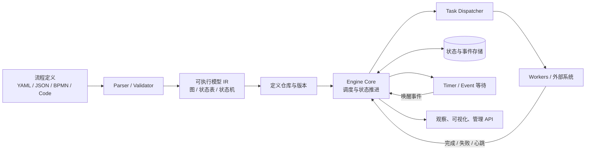
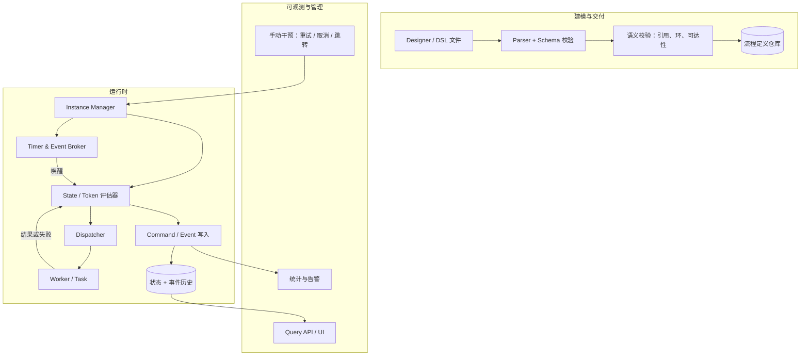
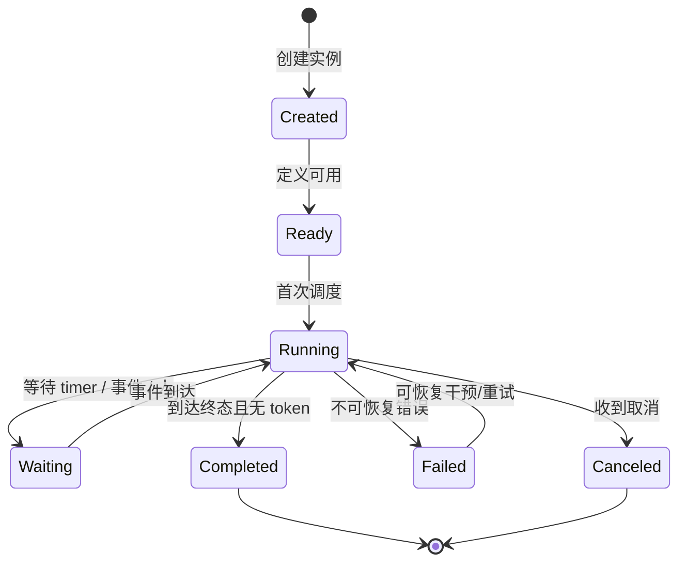
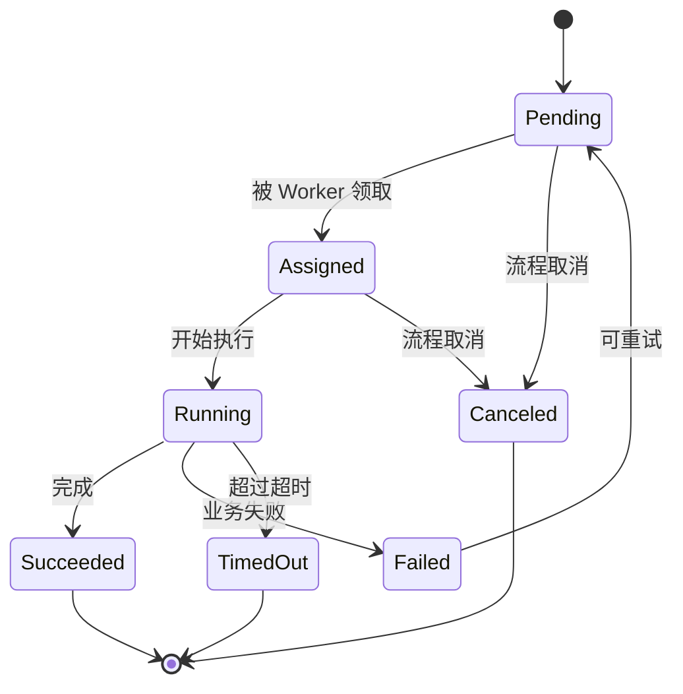
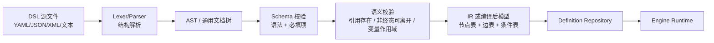
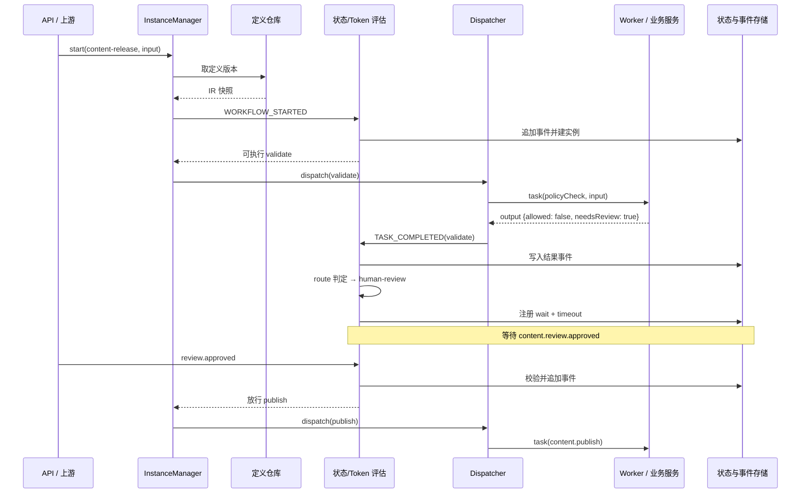

# 自研工作流引擎设计调研与实践笔记

> 最后调研时间：2026-09-08
>
> 读者水平：进阶
>
> 适用范围：面向“自研一套工作流 / 工作流引擎”的调研型学习笔记。文中结论不绑定具体编程语言，示例基于调研到的公开资料改写，不承诺可直接拷贝上线。
>
> 不包含：完整可运行的引擎源码、某家云平台的运维手册、完整 BPMN 规范逐条讲解。

## 讲义导读

这份笔记的目标不是“记住某几个引擎的 API”，而是建立一套能指导**设计、实现、选型和排错**的自研工作流引擎心智模型。

最容易出现的错误理解有两个：一是把“工作流”直接等同于“DAG”，于是自研时只做了拓扑排序，最后发现无法表达循环、超时、人工审批和补偿；二是把“工作流 DSL”直接等同于“YAML 文件”，结果 YAML 只保存了一张无法解释、无法验证的节点画布，引擎靠大量 `if` 分支在代码里补语义。

贯穿全文的核心心智模型是：**工作流 = 定义（Definition）→ 实例（Instance）→ 执行上下文（Execution/Token）→ 事件与状态迁移（Event/State）→ 可观测记录（History）**。任何自研实现，本质上都是在回答三个问题：下一步怎么算出来、算出的状态怎么持久化、挂了之后怎么安全恢复。

学完后应该能够：为不同业务形态选择驱动模型；判断要不要自研；设计一个带校验、可执行、可观测的 DSL；用最小闭环把“YAML/JSON 定义”变成“可靠执行”；使用 Workflow Patterns 和官方产品机制检查自己的设计缺口。

## 目录或内容地图

| 章节 | 核心问题 | 主要产出 |
|---|---|---|
| 一、学习目标 | 读这篇笔记要解决什么问题 | 能力清单与边界 |
| 二、整体认识 | 工作流引擎解决什么问题，为什么自研 | 定义与决策框架 |
| 三、生态调研 | 主流引擎怎么分类、各自侧重什么 | 阵营地图与借鉴点 |
| 四、驱动模型 | 引擎怎么知道“下一步做什么” | 驱动方式对比与选型 |
| 五、核心机制 | 引擎要由哪些模块构成 | 运行时蓝本与数据/状态模型 |
| 六、DSL 设计 | 流程应该用什么语言表达 | DSL 设计决策与原则 |
| 七、端到端实战 | DSL 如何变成可靠执行 | 最小自研闭环与验证 |
| 八、选型与路线 | 什么场景该买、该改、该自研 | 决策顺序与路线图 |
| 九、常见误区 | 自研最容易踩的坑 | 误区对照表 |
| 十、验收 | 交付前检查什么 | 最小检查清单 |

## 一、学习目标与前置知识

### 1.1 学完之后应能解决什么问题

- 能向业务方解释“我们自研的工作流引擎支持什么、不支持什么”，而不是只画一张流程示意图。
- 能在顺序流、状态机、DAG、BPMN 式图模型、Durable Execution、事件流驱动之间做有依据的选择。
- 能设计外部/内部 DSL，并说清语法、语义、校验、版本和解析管线。
- 能画出自研引擎的分层架构，并说明每个模块的输入、输出和观测信号。
- 能根据运行现象（卡住、重复执行、状态不一致、回放失败）按顺序排查。

### 1.2 前置知识

- 熟悉至少一种编程语言，理解函数调用、状态、序列化、异常和重试。
- 了解至少一种基础数据结构：图、有限状态机、栈、队列。
- 理解“进程会崩溃、网络会超时、消息可能重复”等分布式事实，即使尚未正式学过分布式系统。
- 了解“DSL 与通用语言的区别、JSON/YAML/XML 是什么”即可，不要求会写编译器。

### 1.3 学习范围与非目标

| 范围 | 内容 |
|---|---|
| 包含 | 术语、驱动模型、架构模块、DSL 语法/语义、状态与事件、错误补偿、版本、验证与排错 |
| 包含 | Temporal、Camunda/Zeebe、Airflow、Prefect、Dagster、Step Functions、Google Workflows、Kestra、n8n、Open Workflow、DBOS、Restate 等作为参考案例 |
| 不包含 | 某个引擎未来版本的私有功能大全、具体公司生产环境代码、多人审批产品的完整权限模型 |
| 不包含 | “工作流”在艺术创作、通用办公套件中的广义用法；本文默认讨论**可编程执行的流程自动化** |

## 二、整体认识：先把“工作流”和“引擎”说清楚

### 2.1 定义与动机

一份可供自动化执行的流程描述，通常包含三类信息：

- **控制流**：节点按什么顺序、在什么条件下执行；例如顺序、条件、并发、循环、取消。
- **数据流**：节点的输入、输出、变量如何在步骤之间传递。
- **资源/人工流**：谁来执行任务、何时需要人审批、如何分配、如何追踪。

工作流引擎负责把这份描述变成**可以多次运行的实例**，并在实例生命周期内承担状态持久化、调度、重试、超时、事件等待、取消、版本和审计。它是“业务与控制流解耦”的关键：业务方只实现每个节点的能力，控制流交给引擎。

不是所有“自动化执行器”都叫工作流引擎。消息队列只保证消息投递；定时任务只负责按时触发；状态机库只表达状态转换；规则引擎只做条件推理。工作流引擎通常同时拥有**预定义图/过程结构**、**长期存在的实例状态**和**可回溯的执行历史**这三个特征。

### 2.2 核心公式或一句话模型

```text
下一步 = f(流程定义, 当前状态, 到达当前节点的输入/事件, 外部数据)

引擎价值 = 可持久化推进这个“下一步” + 发生故障时仍能继续推进 + 每一步都可解释
```

这句话解释了为什么“只用 `while` 循环在业务代码里写流程”不可靠：代码里的局部变量不持久，进程一重启就丢失“当前走到哪一步”；为什么“只用一张数据库表存当前节点”也不够：并发分支、等待外部事件、回退重试和审计很难只靠一个字段表达。

### 2.3 知识地图或分层视图

| 层次 | 主要职责 | 输入 | 输出 | 首要观测 |
|---|---|---|---|---|
| 建模/DSL | 用文本、图形或代码描述流程 | 流程需求 | 可校验的定义 | schema 错误、lint 结果 |
| 编译/校验 | 把定义变成引擎可执行模型 | DSL/AST/IR | 编译后图或状态表 | 校验告警、版本快照 |
| 定义仓库 | 保存和发布定义版本 | 定义 ID+版本 | 可引用的最新/历史定义 | 发布记录 |
| 调度器 | 计算可执行节点并推进 | 状态、事件、定时器 | 下一步命令/任务 | 队列深度、调度延迟 |
| 执行器/Worker | 运行节点逻辑并回报结果 | 任务、上下文 | 成功/失败/重试 | 心跳、结果事件 |
| 状态存储 | 保存实例状态和事件 | 状态变更/命令 | 事件历史、快照 | 写入延迟、事件规模 |
| 定时/事件桥 | 等待 timer、外部消息、人工输入 | 等待条件 | 唤醒事件 | 过期任务数 |
| 观测/管理 | 查询、可视化、干预 | 历史与指标 | 状态视图/API | 活跃实例、失败率 |



图：根据 [Airflow 组件模型](https://airflow.apache.org/docs/apache-airflow/stable/core-concepts/overview.html)、[Temporal Event History](https://docs.temporal.io/encyclopedia/event-history/event-history-java)、[Zeebe 记录流](https://docs.camunda.io/docs/8.8/components/zeebe/technical-concepts/internal-processing/) 与常见引擎实现综合整理的分层流程。

### 2.4 先区分：流程定义、实例、执行和任务

```
定义(Definition)        模板，例如“退款审批流程 v3”
   │ 创建实例
   ▼
实例(Instance)          一次具体执行，例如“订单 12345 的退款审批”
   │ 推进
   ▼
执行状态(State/Token)   当前实例处于哪个节点、有哪些并发 token、等待什么
   │ 生成
   ▼
任务(Task)/活动(Activity) 需要执行的具体动作，例如“调用风控服务”
```

最容易混淆的是“实例状态”和“任务状态”：一个并行流程实例可能同时存在多个活动任务；一个任务失败可能只影响它所属分支，也可能因为取消语义让整个实例终止。

## 三、调研：主流生态与可借鉴参考

### 3.1 生态分类

按**用什么写流程、由什么引擎驱动**，可以把主流方案分成六大阵营：

1. **BPMN/流程平台**：面向业务分析师和审批流，例如 Camunda 7/8（Zeebe）、Activiti、Flowable、jBPM。模型载体主要是 BPMN XML/图形。
2. **DAG 批处理编排**：面向数据和定时任务，例如 Apache Airflow、Prefect、Dagster、[Argo Workflows](https://argo-workflows.readthedocs.io/en/stable/)、Tekton、DolphinScheduler。强调可调度的任务图。
3. **Durable Execution / code-first**：面向长时间、有状态、需要故障恢复的应用编排，例如 Temporal、Azure Durable Functions、DBOS、Restate。流程就是确定性代码，I/O 移到可记录步骤。
4. **云厂商状态机/Serverless**：例如 AWS Step Functions（Amazon States Language，ASL）、Google Cloud Workflows。用 JSON/YAML 表达状态机。
5. **DSL-first 可移植规范**：例如 CNCF Serverless Workflow / Open Workflow Specification（OWS），以及以 Kestra 为代表的 YAML 声明式编排。
6. **可视化自动化工作台**：例如 n8n、Windmill、Node-RED、Camunda Modeler 配套的运行时，通常围绕节点、连线、触发器。

### 3.2 分类对比表

| 阵营 | 代表实现 | 主要表达方式 | 驱动形态 | 最擅长 | 最容易吃亏的地方 |
|---|---|---|---|---|---|
| BPMN 平台 | Camunda、Flowable、Activiti | BPMN XML + 图形 | 图/令牌 + 事件 + 人工任务 | 审批、Saga、可视化业务流 | 模型重、XML 复杂、运维依赖 |
| DAG 批处理 | Airflow、Prefect、Dagster、Argo | Python 代码 / YAML | 拓扑调度 + 任务状态 | 数据管道、定时批处理 | 不适合长循环和强交互式编排 |
| Durable code | Temporal、DBOS、Restate、Durable Functions | 宿主语言函数 | 确定性重放/日志回放 | 长流程、支付、Agent、跨服务编排 | 对确定性有强约束、调试门槛高 |
| 云状态机 | Step Functions、Google Workflows | JSON/YAML state | 状态机解释器 | Serverless、短到中等状态流 | 供应商锁定、表达式能力有限 |
| DSL 规范 | Open Workflow Spec、Kestra | JSON/YAML DSL | 声明式解释/转译 | 低代码、可移植、事件驱动 | 表达能力和运行时成熟度参差 |
| 工作台 | n8n、Windmill、Node-RED | 节点画布/JSON | 图遍历 + 触发器 | 集成自动化、Ops、RPA 类 | 复杂逻辑和规模场景能力偏弱 |

### 3.3 值得重点深挖的参考实现

#### 3.3.1 Amazon States Language 与 Step Functions：最简洁的状态机外部 DSL

ASL 用 JSON 表达“状态集合 + `StartAt` 起始 + 每个状态显式 `Next`/`End`”（来源：[Amazon States Language Specification](https://states-language.net/spec.html)），每种状态有固定类型：

- `Task` 执行任务；
- `Choice` 按条件选择下一状态；
- `Parallel` 并行执行多个分支；
- `Map` 对集合迭代；
- `Wait` 等待时长或绝对时间；
- `Fail`、`Succeed` 终止状态。

规范把执行者称为 “the interpreter”，每个状态接收一段 JSON 输入并输出 JSON，由 `Next` 决定后续状态。ASL 的价值在于：**把控制流收敛为少量显式状态类型，并为非确定性分支规定一个 `Default` 兜底**，这让校验、可视化和执行都很容易对齐。它也在输入输出上支持 JSONPath/JSONata 查询语言，并引入“state machine variables”做跨状态数据（表达式与数据传递用法见 [AWS Step Functions：Using Amazon States Language](https://docs.aws.amazon.com/step-functions/latest/dg/concepts-amazon-states-language.md)），体现“图上的数据流也要有规范”。

自研借鉴：状态类型集要小；每个非终止状态必须明确“下一步去哪”；必须有一个兜底路径；数据传递规则要在 DSL 层面写清楚。

#### 3.3.2 Temporal：Durable Execution 的确定性重放

Temporal 的核心抽象是 Workflow Execution：业务代码会被重复执行，但**不是盲目重跑副作用**。运行过程会产出 Commands（如 `ScheduleActivityTask`、`StartTimer`、`CompleteWorkflowExecution`），服务端把命令转成 Event 追加到 Event History；崩溃后，Worker 拉取历史，用最初输入重新执行代码，把新生成的命令与历史逐条比对，匹配的就“跳过”，不匹配则报确定性错误（来源：[Temporal：What is Temporal?](https://docs.temporal.io/temporal) 与 [Event History walkthrough](https://docs.temporal.io/encyclopedia/event-history/event-history-java)）。

官方对确定性的定义是：**在相同输入下，同一 Workflow 定义的每次执行都应产生相同顺序的命令**（来源：[Temporal：The definitive guide to Durable Execution](https://temporal.io/blog/what-is-durable-execution)）。因此随机数、真实时钟、直接 HTTP 调用等必须放进 Activity；等待、超时等通过引擎 API 表达。文档也强调“应用可以支持非确定性操作”，只是要让这些操作发生在可记录、可重试的 Activity 边界内。

自研借鉴：如果要做到“进程崩溃后原地续跑”，有两条技术路线都可以研究——**事件历史重放**（Temporal 模式）或**步骤日志/检查点恢复**（DBOS/Restate 的 journal 模式）。前者要求流程代码确定性强；后者通常在每个带副作用步骤前后写日志或记录结果，重试时跳过已完成步骤。

#### 3.3.3 Zeebe / Camunda 8：把流程当成有状态流处理

Zeebe 把进程实例、Job 等有状态实体实现为状态机，并用**流处理器（stream processor）**消费记录流：命令从客户端或 broker 内部写入流，处理器判断命令在当前生命周期是否合法，合法则应用并发布新状态事件，非法则拒绝（来源：[Camunda 8 Docs：Zeebe Internal processing](https://docs.camunda.io/docs/8.8/components/zeebe/technical-concepts/internal-processing/)）。

关键细节是“引擎自己会不断给自己写入后续命令”：例如完成一个 Job 时，处理器同时写出“complete activity”命令，继续驱动流程实例进入下一步。这种设计同时解决了命令协议、审计导出和异步推进问题，因为每个状态变化都发布为 stream 上的 record。

自研借鉴：把“外部调用”和“引擎内部推进”都建模成命令/事件，并坚持“状态只能由状态机合法转换”，即使不做分布式流处理，也会让单机版本更容易正确、可审计、可恢复。

#### 3.3.4 Airflow：DAG、Scheduler、Executor、Metadata 的分工

Airflow 官方架构把职责拆得很清楚（来源：[Apache Airflow：Architecture Overview](https://airflow.apache.org/docs/apache-airflow/stable/core-concepts/overview.html)）：

- DAG/DAG Bundle：定义和存放“任务依赖图”；
- Dag Processor：解析 DAG 文件并序列化到元数据库；
- Scheduler：判断何时触发、任务依赖是否满足，把任务交给 Executor；
- Executor：是 Scheduler 的配置项，决定任务在哪执行；
- Worker：真正跑任务；
- Triggerer：为可延迟任务执行异步等待；
- Metadata Database：保存 DAG、任务实例、变量等状态；
- API Server：提供 API/UI。

Airflow 的任务之间默认“全部上游成功才跑下游”，数据用 XCom 传递；同时提供 Trigger Rules、Branching、TaskGroup 等控制流。它说明“图引擎”在批处理场景下很有价值，但也受制于“DAG 通常不含循环”等图语义限制。

#### 3.3.5 Prefect / Dagster：用语言运行时当建模层

Prefect 把“Flow（流程）”实现为带装饰器的 Python 函数，Flow Run 是单次调用，每个 Run 有自己的状态生命周期；支持参数 schema、重试、超时、部署和子 Flow（来源：[Prefect：Flows](https://docs.prefect.io/v3/concepts/flows)）。

Dagster 更强调“资产（Asset）”而不是“任务（Task）”：一个软件定义资产把数据产物、生产函数和上游依赖绑在一起（来源：[Dagster：Software-defined assets](https://docs.dagster.io/concepts/assets/software-defined-assets)）。这类系统给自研者的启示是：**编排模型要和业务对象对齐**。如果业务关心的重点是“某张表/某个产物什么时候是最新的”，就应该建“资产图”；如果重点是“调用序列”，才适合“任务图”。

#### 3.3.6 DBOS / Restate：Postgres 检查点与执行日志

DBOS 用 Postgres 持久化流程检查点：给函数加 `workflow`/`step` 注解后，程序崩溃重启会从最后一个已完成步骤继续，而不是重跑全部（来源：[DBOS：Why DBOS](https://docs.dbos.dev/why-dbos)）。Restate 则在每个有副作用操作后记录 execution journal，回放时跳过已完成步骤并恢复原位；它还强调 exactly-once 通信、幂等键、Virtual Object/Workflow 状态与执行日志的一致性（来源：[Restate：Key Concepts](https://docs.restate.dev/foundations/key-concepts)）。

这些实现说明 durable execution 不一定需要一个大型编排服务：**如果把“流程状态 + 副作用记录 + 结果缓存”放进同一事务/日志系统，也可获得崩溃恢复能力**。

#### 3.3.7 云 YAML/DSL 工作台：从“人能看懂”出发

Google Cloud Workflows 用 YAML 步骤表表达顺序、`switch`、`for`、`try/except`、`assign`（来源：[Google Cloud Workflows：Syntax overview 与 Steps](https://docs.cloud.google.com/workflows/docs/reference/syntax/steps)）；Kestra 用 `id + namespace + tasks` 声明式 YAML，并用 “flowable tasks” 表达并行/迭代/失败策略（来源：[Kestra：Fundamentals](https://kestra.io/docs/tutorial/fundamentals)）；n8n 则围绕触发节点和普通节点建立可执行图，其官方文档还专门解释了 1.0 前后分支执行顺序的差异（来源：[n8n：Understand execution order](https://docs.n8n.io/build/flow-logic/understand-execution-order)）。共同趋势是：**把分支、循环、错误处理显式放进 DSL，而不是藏在代码里**。

### 3.4 自研前的 Build/Buy/Change 判断

| 判断维度 | 倾向自研 | 倾向复用开源/托管 | 倾向改造开源 |
|---|---|---|---|
| 流程形态 | 强行业特例、审批方式独特、需要自己的画布 | BPMN 标准场景、审批流程 | 平台基本语义符合，只差少量定制 |
| 控制需求 | 需要精确控制执行语义、超时、补偿 | 使用成熟产品的行为约定 | 能接受跟随上游升级 |
| 人力与时间 | 有长期团队维护引擎 | 短期交付、人手少 | 有团队但不希望从零写状态存储 |
| 数据主权 | 需要极简数据表、深度嵌入业务库 | 接受独立服务/数据库 | 接受独立部署但要求自托管 |
| 创新点 | 核心创新就在编排/DSL/运行时 | 创新在业务上层 | 需要在引擎内部做插件 |

结论并不是“必须自研”或“永远不要自研”。参考 vivo 团队的实践，他们选择自研的典型触发点是：开源引擎附带表数量多、需要大量业务化二次开发、而自身只想要轻量可控的“流程模板 + 实例 + 任务”抽象（来源：[vivo 工作流引擎实践](https://juejin.cn/post/7121515335261356069)）。真正健康的决策是**先锁定自己的最小核心场景，再选阵营**。

## 四、引擎驱动模型：引擎怎么知道“下一步做什么”

### 4.1 先建立统一视角

无论引擎内部用什么结构，调度问题都可以抽象成：

```text
当“当前状态 + 已到达事件”满足条件时，
引擎需要决定：
  1) 哪些任务可以开始；
  2) 哪些分支要合并/取消；
  3) 什么时候流程结束；
  4) 哪些结果要写回状态。
```

驱动模型决定了这些决策是**在运行前静态确定的**（如 DAG 拓扑）、**在运行中随事件计算的**（如状态机、BPMN token、事件流），还是**由业务代码逐步“申请”的**（如 Temporal 的命令流）。

### 4.2 六种典型驱动方式

#### 4.2.1 顺序步骤 / 过程式脚本

最简单的方式：定义是一串有序步骤，解释器执行完第一步就执行第二步。适合表单流程、脚本编排。缺点：并发、循环退出条件、等待外部输入、异常分支需要额外发明语法。

#### 4.2.2 显式状态机（FSM / Statecharts）

核心是“当前处于哪个状态 + 什么事件导致什么转换 + 转换时执行什么动作”。XState 一类实现把状态机从玩具级别扩展到状态图：支持层级状态、并行状态、历史状态、守卫（guard）和副作用（来源：[XState：Concepts](https://xstate.js.org/docs/zh/about/concepts.html)）。适合“状态多、需要严格约束非法转换”的系统。

状态机和“工作流”的关系是：工作流引擎经常**用状态机实现节点/实例生命周期**，但不等于整张流程图必须手写成一张状态表。vivo 实践里也总结了这条经验：状态机适合单维度、复杂度不高的状态转换；工作流引擎更适合复杂流程；状态机可以作为工作流内部实现（来源：[vivo 工作流引擎实践](https://juejin.cn/post/7121515335261356069)）。

#### 4.2.3 DAG 拓扑调度

Airflow 等把流程定义成有向无环图：任务依赖声明完毕，引擎按“上游完成”决定下游启动。DAG 适合批处理、无环的任务编排。限制是它天然不适合表达任意循环、需要等待很长时间的人工步骤以及“分支选择发生在执行中途且改变整图”的情况（Airflow 通过 Branching 与 Trigger Rules 部分补足，但语义已不是纯拓扑）。

#### 4.2.4 图模型 + Token（BPMN 风格）

BPMN/Zeebe 的核心心智是 token：启动事件产生 token，顺序流传递 token，网关分裂/合并 token，结束事件消耗 token。并行网关让 token 分裂，join 需要等齐到达的 token。这个模型的优点是可以表达循环（token 可以走回上游）、并发、取消区域、事件网关。代价是 join 语义非常多，例如：

- AND-join：所有分支到达才继续；
- 结构化同步合并 / 非结构化同步合并：语义随路径；
- Multi-Merge / Discriminator：第一个到达或每个到达都触发；
- partial join：到达 M 个中的 N 个即可。

这也是 [Workflow Patterns](http://www.workflowpatterns.com/patterns/control/) 强调“Advanced Branching and Synchronization Patterns”最难的原因。自研时如果只做“每个节点记录一次执行”，很快会发现并行汇合场景无法解释。

#### 4.2.5 事件驱动 / 命令-事件流

Zeebe 提供另一种“把流程推进建模为事件流”的视角：一切外部请求与内部推进都变成 stream 上的 command，state processor 校验命令在当前状态是否合法，合法则应用并发布新状态事件。它与经典状态机的差别是：状态变化同时成为持久化日志中的审计记录，并可被 Exporter 导出。事件驱动对“等待哪个分支先发生（Deferred Choice）、外部事件触发、竞态取消”最自然。

#### 4.2.6 Durable Execution / 命令日志回放

Temporal 使用“业务代码像普通代码，但框架把 I/O 变成命令并记录事件历史”的方式；Restate 使用 execution journal；DBOS 使用 Postgres 检查点。共同点是：**把“流程推进”和“副作用执行”分开，推进可重复，副作用只执行一次**。流程代码可以写 `if/for/sleep`，但所有不确定内容都通过 Activity/Step/Sleep 等“受管 I/O”表达（综合自 [Temporal](https://docs.temporal.io/temporal)、[Restate](https://docs.restate.dev/foundations/key-concepts) 与 [DBOS](https://docs.dbos.dev/why-dbos) 官方文档）。

### 4.3 六种驱动模型对照

| 驱动模型 | 主要控制结构 | 循环 | 并行 | 外部等待 | 失败恢复 | 适合 |
|---|---|---|---|---|---|---|
| 顺序脚本 | 有序步骤 | 需自定义 | 难 | 难 | 重跑/断点续跑 | 简单表单流 |
| 显式状态机 | 状态+事件+转换 | 状态回环 | 并行区域 | 好 | 保存当前状态 | 状态密集、约束严格 |
| DAG 调度 | 依赖图 | 通常不支持 | 好 | 需要 triggerer 类机制 | 任务级重跑 | 批处理、数据管道 |
| 图模型+Token | 顺序流+网关+事件 | 好 | 好 | 好 | 引擎状态持久化 | 业务审批、Saga |
| 事件命令流 | 命令+状态机 | 好 | 好 | 很好 | 事件日志重建 | 高并发、审计严格 |
| Durable code | 普通代码+Activity | 很好 | 很好 | 很好 | 历史/日志回放 | 长流程、Agent、支付 |

### 4.4 混合与演进

成熟系统通常是混合的：

- 实例生命周期本身是状态机；
- 并行合并用 token/join 语义；
- 流程定义可以是 DSL，运行时再把 DSL 编译成内部状态机或图；
- 触发外部时间用 timer/event，I/O 用可重试 Activity；
- 事件历史与当前状态同时保留。

自研第一版不需要同时实现六种模型。推荐演进路径是：**先选一种核心模型，把接口留成“调度器可替换”**，例如先做“显式状态机 + 简单 token”，再向“DAG 批处理”或“durable code”扩展。

### 4.5 模型选择的业务信号

| 业务信号 | 推荐模型 | 错误选择示例 |
|---|---|---|
| 任务是定时批处理、依赖关系静态 | DAG 调度 | 用状态机手工管理几十个并发 |
| 流程会等人审批/等外部事件 | 图+Token 或状态机 | 纯 DAG 无法暂停等待 |
| 步骤可回退、驳回、补偿 | 显式状态机 / 图模型 | 只有单向顺序脚本 |
| 业务代码本身就是长任务且有事务边界 | Durable code | 把代码翻译成 JSON 大图 |
| 流程实例量大、必须严格审计 | 事件命令流 | 只覆盖当前状态不记历史 |
| 复杂但业务想低代码编辑 | DSL → 图 → 引擎 | 直接用通用代码当 DSL |

## 五、核心运行时架构与机制

### 5.1 分层模块总览



### 5.2 模块职责、边界与接口

| 模块 | 职责 | 非职责 | 输入 | 输出 |
|---|---|---|---|---|
| 定义仓库 | 保存、发布、引用流程定义版本 | 不解释定义 | 定义 ID + 版本 | 不可变定义快照 |
| Parser/Validator | 把源文本解析为 IR，做静态校验 | 不执行业务 | DSL 文本/Schema | IR 与错误列表 |
| 实例管理 | 创建实例、保存实例元数据、提供干预 API | 不决定单个节点何时可跑 | 定义版本 + 输入 | 实例 ID、状态 |
| 状态/Token 评估 | 依据定义、当前状态、到达事件计算下一步 | 不直接跑外部任务 | 事件/定时/完成信号 | 可启动任务列表、待合并计数 |
| Dispatcher/Executor | 按策略把任务交给 Worker 并跟踪结果 | 不保存流程整体状态 | Task 描述 | 心跳、结果、重试请求 |
| Worker/Activity | 执行确定业务副作用 | 不负责全流程控制 | Task + 输入 | 结果/错误/进度 |
| 状态与事件存储 | 持久化实例状态、事件历史、快照 | 不做实时调度决策 | 命令/事件 | 可重建的执行历史 |
| Timer/Event Broker | 表示“等到某个时间/某个外部事件/人工输入” | 不伪造业务结果 | 等待注册 | 唤醒事件 |
| 观测与干预 | 可视化、查询、重试、取消、修复 | 不改变流程定义语义 | 实例 ID | 状态图、命令结果 |

### 5.3 生命周期状态

实例、任务、节点分别需要自己的状态，不能混成一列。





设计要点：**所有状态转换都要产生事件**；干预动作（重试、跳过、取消）本身也要是可审计命令，而不是偷偷改库。

### 5.4 并发、汇合与取消

自研最容易出错的是并行语义。至少要显式建模：

| 概念 | 建议实现 | 反例 |
|---|---|---|
| 分裂（fork） | 一个完成事件产生多个可执行子节点 | 用子线程直接跑，状态不落库 |
| 汇合（join） | 记录每个分支 token 是否到达，达到阈值再放行 | 每个分支完成就推进共享“下一节点” |
| 多实例 | 对集合动态创建 N 个子 token/任务 | 在 DSL 里让用户手写 N 个节点 |
| 取消 | 广播取消到活动 token，区分“允许完成”和“强制取消” | 只删实例行，Worker 继续执行 |
| 竞争分支 | 第一个事件赢得分支，其余分支取消 | 每个分支都继续执行产生双写 |

如果希望用事件网关表达“谁先到谁赢”，就要为每个分支注册等待，事件到达时只放行胜者并取消其余等待。

### 5.5 数据流与变量作用域

数据流设计要回答：输入、输出、临时变量放在哪里，谁能读，能不能被并行分支共享。

参考 ASL 的设计：解释器把一段 JSON 作为每个状态的输入，状态把输出交给下一个状态（来源：[Amazon States Language Specification](https://states-language.net/spec.html)）；同时允许状态机级变量 `Assign`，并规定 Map/Parallel 子作用域与外部作用域同名变量不可写。这样做的价值是把“数据血缘”变得可以解释。

自研建议至少包含三类存储：

```text
input          实例启动时的原始输入
context/state  流程级变量，可被后续步骤读
stepOutput     每个节点/分支的输出，按节点名隔离
```

不推荐只维护一个“当前全局 JSON”并在每个节点原地覆盖：并行分支会互相污染，调试时也无法知道某个值是谁写的。

### 5.6 持久化：状态快照 vs 事件历史 vs 双写

| 方案 | 优点 | 缺点 | 代表 |
|---|---|---|---|
| 只存当前状态 | 简单、查询快 | 无法审计、重放恢复困难 | 早期的简单状态表 |
| 事件历史 + 重放 | 审计完整、可重建 | 历史变大、重放有确定性要求 | [Temporal](https://docs.temporal.io/temporal) |
| 状态快照 + 增量事件 | 查询与恢复平衡 | 需处理快照一致性 | [Zeebe 类分区处理](https://docs.camunda.io/docs/8.8/components/zeebe/technical-concepts/internal-processing/) |
| 步骤日志/journal | 每个副作用都有结果缓存，失败续跑简单 | 需要明确哪些调用要 journal | [Restate](https://docs.restate.dev/foundations/key-concepts)、[DBOS](https://docs.dbos.dev/why-dbos) 思路 |

面向分布式的实现必须处理“双写问题”：业务数据库提交成功但事件没发出去，或事件发出但业务未提交。常见解法是 Transactional Outbox：把业务变更和待发事件放进同一个本地事务，再由异步发布者发送。自研时即使只连一个数据库，也要假设“任务完成后通知引擎”这一步可能重复，因此引擎要能幂等处理完成事件。

### 5.7 时间与等待

长流程几乎必然需要：

- `sleep/delay`：等待固定时长；
- `absolute timer`：等到某个截止时间；
- `event wait`：等待外部事件或人工审批；
- `timeout`：等待超时后走超时分支。

实现上不能“进程里 `Thread.sleep` 等一个月”，应当把等待注册为持久化 timer。调度器扫到到期 timer 或收到事件后，把流程重新唤醒。人工审批本质上也是“事件等待”，因此 DSL 里应当有一个统一的“等待条件”，而不是把审批按钮硬编码进节点执行。

### 5.8 错误、重试与补偿

错误模型应至少区分：

1. **瞬时错误**：网络抖动、服务 503，可以重试；
2. **业务错误**：校验失败、余额不足，通常不自动重试；
3. **引擎错误**：状态机不合法、命令非法，需要人工或版本修复；
4. **流程错误**：某分支失败后，需要进入错误分支、回滚或触发补偿。

重试要有：最大次数、退避策略、超时上限、指数退避 + jitter、重试上下文是否保留。补偿可以按 Saga 的两种模式设计：

- **Orchestration-based Saga**：中心流程显式执行“正向步骤，失败后执行反向补偿步骤”，适合控制点多、可预测；
- **Choreography-based Saga**：各服务通过事件接力，无中心控制，适合解耦，但全局状态难以追踪。

如果流程涉及“扣款后发券”之类跨系统副作用，就必须有补偿清单，并且补偿步骤要与正向步骤一一对应、可重复执行。

### 5.9 版本与定义演进

业务流程几乎一定会升级。设计时要区分：

- **定义版本**：新实例用新定义，旧实例是否继续用旧定义；
- **运行时升级策略**：已运行到一半的实例怎么迁移；
- **Workflow code 演进**：code-first 系统里，回放旧实例需要旧代码路径，常用 patching/版本分支或 worker versioning 标记新旧代码。

自研 DSL 时建议从一开始就给每个定义放 `id + version`，并保证历史实例记录自己启动时引用的定义快照，而不是“始终读最新”。

### 5.10 可观测性信号

每个实例至少应暴露：实例 ID、定义 ID/版本、当前状态、进入时间、最近事件、关联业务 ID。每个任务至少应暴露：任务 ID、所属实例、Worker、开始/结束时间、重试次数、结果摘要。核心指标：活跃实例数、卡在等待的实例数、调度延迟、任务失败率、重试分布、实例生命周期时长。

排查“流程卡住”时，先查它是处于 Running、Waiting 还是 Failed；再看它等待的 timer/事件是否真的被注册；最后检查事件是否到达但被状态机拒绝。这条顺序来自 Temporal 与 Zeebe 的公共经验：状态与事件永远先于代码猜测。

## 六、DSL 设计方法

### 6.1 为什么需要 DSL，以及它的边界

Martin Fowler 对 DSL 的定义很简洁：**面向特定一类问题的语言，而不是面向任意软件问题的通用语言**（来源：[Martin Fowler：Domain Specific Language](https://martinfowler.com/bliki/DomainSpecificLanguage.html)）。工作流 DSL 的目标是把“流程长什么样、出错怎么处理、什么时候等待”从宿主代码里抽出来，让流程可审查、可版本管理、可被设计器读取。

但 DSL 不是银弹。一个常见失败模式是：先想好“用 YAML 写流程”，却从未定义 DSL 的语义，最后 YAML 只是画布的持久化格式，真正的控制逻辑全部埋在引擎 `switch(type)` 分支里。因此设计 DSL 之前，先定义语义；语法只是语义的表层。

### 6.2 Internal DSL 与 External DSL

按 [Fowler 对 Internal/External DSL 的区分](https://martinfowler.com/bliki/DomainSpecificLanguage.html)：

- **Internal DSL（内部/嵌入式 DSL）**：复用宿主语言，让它“读起来像专用语言”，典型如流畅接口（fluent interface）、Prefect 的 `@flow`、Temporal 的 Workflow Definition、XState 的机器描述。它获得宿主语言的类型检查、IDE 和调试器，代价是宿主语言语法泄漏进领域。
- **External DSL（外部 DSL）**：独立语法，需要自己的解析器。典型如 CSS、正则、ASL JSON、Kestra YAML、BPMN XML、GitHub Actions YAML。它可控、可移植、适合非开发者编辑，但要自建解析、校验、错误提示和工具链。

| 维度 | Internal DSL | External DSL |
|---|---|---|
| 编辑者 | 开发者 | 开发者、产品、运维 |
| 语法 | 宿主语言子集 | 自定 JSON/YAML/文本/XML |
| 类型与补全 | 借宿主语言 | 需要 JSON Schema、Language Server 等 |
| 执行方式 | 直接被宿主调用 | 需要 parser/validator/compiler/interpreter |
| 校验时机 | 编译期/装饰期 | 静态解析期 + 运行时 |
| 可移植性 | 依赖宿主运行时 | 理论上可跨运行时 |
| 风险 | 宿主语法外漏、重构复杂 | 语义表达不全、工具链工作量大 |

很多工作流系统是双层结构：**外部 DSL 负责交付，internal DSL/代码负责扩展**。例如 Zeebe 用 BPMN XML 描述标准流程，同时允许 Java 等语言的 Job Worker 处理自定义逻辑；CNBlogs 上也有“YAML 声明主流程 + Python Action 实现能力”的 [Flow 流程引擎实践](https://www.cnblogs.com/huangzhen22/p/20362210)。

### 6.3 DSL 的设计轴

设计 DSL 时，先回答以下七个轴：

#### 6.3.1 轴 1：流程用什么“结构”表达

- **节点+边图**：适合可视化设计器，例如 BPMN、ASL。代表语义是“下一步由边决定”。
- **顺序步骤 + 控制动词**：适合 YAML 手写，例如 Kestra 的 `tasks` 列表、Google Cloud Workflows 的 steps、对话 Flow 的 `collect/action/condition/call`。代表语义是“列表内顺序执行 + 显式跳转”。
- **宿主代码顺序执行**：适合 durable code，例如 Temporal、Prefect。代表语义是“代码本身决定流程，引擎只记录可恢复 I/O”。

这三者不是非此即彼。外部 DSL 可以先用“steps 列表 + `next`/`switch`/`parallel`/`call`”表达，然后在内部编译成“节点 + 边”的 IR，既保留手写友好度，又给设计器提供图。

#### 6.3.2 轴 2：控制原语选哪些

最小但有表达力的原语集可以包括：

| 原语 | 说明 |
|---|---|
| `start`/`end` | 入口与出口 |
| `task` | 调用可注册业务能力 |
| `switch/condition` | 单输入多路分支，需要 `default` |
| `parallel` / `fork` | 启动多个分支 |
| `join` | 等待分支汇合（需说明语义：全部/部分） |
| `foreach` | 对集合动态多实例 |
| `wait` | 等待定时器或外部事件 |
| `retry` | 失败策略 |
| `compensate` | 补偿清单 |
| `subworkflow/call` | 调用另一个流程定义 |
| `throw/catch` | 显式错误路径 |

不建议第一版支持“任意图形自由连线”而不规定 join/cancel 语义。自由连线会很快创造出引擎无法解释的模型。

#### 6.3.3 轴 3：分支、循环和错误是否是“一级公民”

如果 DSL 允许用户“画任意分支”，但错误处理只能写“整个流程失败”，那么生产流程会大量不可用。应让错误处理出现在 DSL 中，例如每个 `task` 可声明：

```yaml
- id: call-payment
  type: task
  use: payment.charge
  retry:
    maxAttempts: 3
    policy: exponential
  onError:
    - if: error.code == "INSUFFICIENT_FUNDS"
      goto: send-failure-notice
    - default: compensate
```

#### 6.3.4 轴 4：表达式和数据绑定怎么表达

流程需要读取上下文、计算分支条件、把上一步输出映射为下一步输入。常见方案：

- JSONPath（ASL 默认）；JSONata（ASL 可选）；
- 内嵌在字符串里的 `${...}`、`${{ }}` 表达式（GitHub Actions、Kestra 等）；
- 专用小语言（如 `switch` 条件）。

设计原则：

1. 表达式只在明确定义的位置出现，不允许“整段 YAML 都是表达式”；
2. 表达式求值失败要有独立错误类型，不吞进业务错误；
3. 表达式语言要有安全边界，不能允许任意文件系统访问；
4. 并行作用域要约束变量读写。

#### 6.3.5 轴 5：如何静态校验语义

除了 JSON Schema/结构校验，还需语义校验。至少要检查：

- `start` 和所有引用的 `next/goto/onError` 都存在；
- 每个非终止节点都有离开路径（ASL 的规则：非终止状态必须有 `Next`）；
- 图中没有无法到达的节点（可选告警）；
- 并行 `join` 引用的分支数量与实际 fork 一致（无法静态确认时做运行时断言）；
- `foreach` 输入表达式类型可推断；
- 版本号与 id 有约束；
- 保留字没有被用作节点名，避免状态与变量同名。

#### 6.3.6 轴 6：版本如何表达

建议给每个流程定义显式 `id`、`version`，并把“语义变更”分级：

- Patch：不改控制流的错误修复；
- Minor：增加可选节点，不影响既有路径；
- Major：改变既有路径、删除原语、破坏 schema。

DSL schema 本身也应当有版本号（参考 [Open Workflow Specification](https://github.com/serverlessworkflow/specification) 文件顶部带 `dsl` 版本的设计），不要把 DSL schema 版本混进流程业务版本。

#### 6.3.7 轴 7：运行时语义是否“可解释”

每个 DSL 原语最终都要落到一条引擎规则：

| DSL 原语 | 运行时规则 |
|---|---|
| `task A -> task B` | A 完成事件到达后，把 B 从等待改为可执行 |
| `switch` | 按顺序匹配 condition，首个命中者输出目标节点 |
| `parallel` | 生成多个子 token，每个子 token 独立推进 |
| `join(all)` | 所有分支 token 到达后才放行 |
| `foreach` | 输入求值后为每个元素复制子模板并启动 |
| `wait` | 注册持久化等待，事件到达后重新入队 |
| `retry` | 失败事件进入退避，到期后重新调度 |

DSL 语法如果无法用这类规则说清，说明语义没有定义完成。

### 6.4 真实 DSL 快速对比

#### 6.4.1 ASL（AWS Step Functions）

```json
{
  "StartAt": "Check",
  "States": {
    "Check": {
      "Type": "Choice",
      "Choices": [
        {
          "Condition": "$.approved == true",
          "Next": "Notify"
        }
      ],
      "Default": "FailState"
    },
    "Notify": {
      "Type": "Task",
      "Resource": "arn:aws:lambda:...:notify",
      "End": true
    },
    "FailState": {
      "Type": "Fail",
      "Error": "NotApproved"
    }
  }
}
```

要点：状态名唯一；非终态有 `Next`；`Choice` 用 `Default` 兜底；数据在状态间显式传递（规范见 [Amazon States Language Specification](https://states-language.net/spec.html)，示例用法见 [AWS Step Functions：Using Amazon States Language](https://docs.aws.amazon.com/step-functions/latest/dg/concepts-amazon-states-language.md)）。

#### 6.4.2 Google Cloud Workflows

```yaml
main:
  params: [orderId]
  steps:
    - validate:
        call: http.post
        args:
          url: ${"https://svc.internal/validate/" + orderId}
        result: validation
    - decide:
        switch:
          - condition: ${validation.body.ok}
            next: ship
        next: reject
    - ship:
        call: ship_order
        args:
          orderId: ${orderId}
    - reject:
        return: "REJECTED"
```

要点：步骤名即状态名，顺序默认执行，`switch` 显式分支，`call`/`return` 等动词覆盖常见控制需求（来源：[Google Cloud Workflows：Syntax overview 与 Steps](https://docs.cloud.google.com/workflows/docs/reference/syntax/steps)）。

#### 6.4.3 Kestra

```yaml
id: hello
namespace: company.team
tasks:
  - id: log_start
    type: io.kestra.plugin.core.log.Log
    message: starting
  - id: run_python
    type: io.kestra.plugin.scripts.python.Commands
    commands:
      - python main.py
```

要点：`id + namespace + tasks` 是最小身份；task 有类型，类型决定插件能力；顺序默认串行，并行/迭代由 flowable task 承担（来源：[Kestra：Fundamentals](https://kestra.io/docs/tutorial/fundamentals)）。

#### 6.4.4 Open Workflow DSL（CNCF Serverless Workflow 的现代形态）

```yaml
document:
  dsl: '1.0.3'
  name: order-flow
  version: '1.0.0'
  do:
    - validate:
        call: http
        with:
          method: post
          url: https://svc/validate
    - decide:
        switch:
          - order.valid:
              then: ship
          - default: reject
    - ship:
        run: ship-task
    - reject:
        return: REJECTED
```

要点：声明式 DSL 文件自带 schema 版本；任务序列用 `do`，分支用 `switch`，`default` 兜底。CNCF 社区提供 Conformance Test Kit（CTK）和 SDK，说明“一套 DSL + 合规测试 + 多个 runtime”是可以成立的工程形态（来源：[Open Workflow Specification（原 CNCF Serverless Workflow 生态仓库）](https://github.com/serverlessworkflow/specification)）。

#### 6.4.5 GitHub Actions（事件驱动的 YAML 工作流）

```yaml
name: release
on:
  push:
    tags: ["v*"]
jobs:
  build:
    runs-on: ubuntu-latest
    steps:
      - uses: actions/checkout@v4
      - run: ./build.sh
```

要点：触发条件（`on`）、job 间/步骤间依赖、表达式 `${{ }}` 都是 DSL 设计的一部分；GitHub 同时让“失败重试、并发取消、矩阵”成为内置原语（来源：[GitHub Actions：Workflow syntax](https://docs.github.com/en/actions/writing-workflows/workflow-syntax-for-github-actions)）。

#### 6.4.6 Temporal（code-first 视角）

```ts
export async function checkout(orderId: string) {
  const chargeResult = await activities.charge(orderId);
  if (chargeResult.failed) {
    await activities.notify(orderId, "charge_failed");
    return;
  }
  await Workflow.sleep("1 day");
  await activities.release(orderId);
}
```

要点：顺序、分支由语言本身表达；`activities`、`Workflow.sleep` 等是唯一受管 I/O；用户拿到的是“像普通代码一样写，但要遵守确定性”的编程体验（来源：[Temporal：What is Temporal?](https://docs.temporal.io/temporal)）。

### 6.5 DSL 到执行的编译管线



对“YAML/JSON 数据格式”的 DSL，Parser 通常直接使用成熟解析库，重点不在手写词法，而在 schema 和语义校验。对自创文本语法，才需要认真设计语法、错误位置提示与测试集。

校验可以分为：

| 层 | 例子 | 工具 |
|---|---|---|
| 序列化 | YAML/JSON 合法、字段类型正确 | YAML/JSON parser、JSON Schema |
| 结构引用 | `next` 指向存在的节点 | 静态检查 |
| 图语义 | 有 start、非终态可离开、版本唯一 | 静态检查 |
| 数据语义 | 表达式能解析、`foreach` 输入是数组 | 表达式编译器 |
| 运行时 | join 的分支数正确、版本快照未被改 | 运行时断言/不可变存储 |

### 6.6 DSL 中必须显式表达的错误与重试

自研 DSL 最常见的缺陷是“只表达正常路径”。一份设计合格的流程语言应能表达：

- 每个任务自己的超时和重试策略；
- 异常类型与错误分支的映射；
- 整个流程的超时；
- 补偿操作；
- 哪些失败应该暂停等待人工处理，而不是无限重试。

建议把错误处理写成与正常分支同样的“可见路由”，而不是只在引擎里给一个 `onException` 钩子：

```yaml
steps:
  - id: charge
    task: payment.charge
    retry:
      maxAttempts: 3
      backoffSeconds: [1, 5, 30]
    catch:
      - when: payment.insufficient
        goto: notify-user
      - default:
          compensate: [charge-refund]
          goto: fail-terminal
```

### 6.7 DSL 常见误区

| 误区 | 正确理解 | 后果 |
|---|---|---|
| “YAML 就是 DSL” | DSL = 语法 + 语义 + 工具链 | YAML 只负责序列化，语义缺失造成实现分叉 |
| DSL 原语越少越好 | 原语要覆盖业务主流程的控制需求 | 到处用 `task` + 魔法字段，校验失效 |
| 让通用代码来兜底一切 | 每个扩展都要有插件契约 | 引擎变成不可分析的 `if/else` |
| 不表达错误和等待 | 错误、超时、人工审批是核心语义 | 生产流程无法恢复 |
| 图可以任意画 | 图的 split/join/cancel 必须语义闭合 | 并行流程出现卡死或重复执行 |
| 忽略 schema 版本 | DSL 语法会演进 | 旧定义无法安全回放 |

### 6.8 DSL 设计验收

读完本章后，应该能：

- 区分 internal/external DSL，并说出工作流场景各自适用对象；
- 为“手写 YAML 友好”和“可视化图友好”设计同一份 IR；
- 列举至少五种静态校验规则，并解释“为什么 DSL 必须有语义校验”；
- 指出真实流程 YAML 里缺少超时/重试/错误分支会带来什么问题；
- 画出自定义文本 DSL 从 parse 到 execution 的完整管线。

## 七、端到端设计：从 DSL 到可靠执行的最小闭环

### 7.1 练习目标

用一个小场景把“DSL → 校验 → IR → 执行 → 持久化 → 事件等待 → 恢复”串起来。目标不是交付生产引擎，而是验证你在前六章做出的每一个选择都有明确落点。

### 7.2 场景

“内容发布流程”：内容提交后先调用策略校验服务；校验通过则直接发布；需要人工复核时进入 `wait` 等待审批事件；超时未审批则拒绝；发布失败按策略重试。

### 7.3 DSL 示例

```yaml
id: content-release
version: "1.0.0"
dslVersion: "0.1.0"
start: validate

nodes:
  validate:
    type: task
    service: content.policyCheck
    retry:
      maxAttempts: 3
      backoffSeconds: [1, 5, 30]
    next: route

  route:
    type: switch
    cases:
      - if: .result.allowed == true
        goto: publish
      - if: .result.needsReview == true
        goto: human-review
      - default: reject

  human-review:
    type: wait
    event: content.review.approved
    timeoutSeconds: 172800
    onTimeout: reject
    next: publish

  publish:
    type: task
    service: content.publish
    next: done

  reject:
    type: end
    result: REJECTED

  done:
    type: end
    result: PUBLISHED
```

### 7.4 编译后的 IR

解析后应生成可执行模型，而不是把 YAML 原样交给引擎：

```json
{
  "id": "content-release",
  "version": "1.0.0",
  "start": "validate",
  "nodes": {
    "validate": {
      "type": "task",
      "service": "content.policyCheck",
      "retry": { "maxAttempts": 3, "backoffSeconds": [1, 5, 30] },
      "outgoing": ["route"]
    },
    "route": {
      "type": "switch",
      "cases": [
        { "if": ".result.allowed == true", "goto": "publish" },
        { "if": ".result.needsReview == true", "goto": "human-review" }
      ],
      "default": "reject"
    },
    "human-review": {
      "type": "wait",
      "event": "content.review.approved",
      "timeoutSeconds": 172800,
      "onTimeout": "reject",
      "outgoing": ["publish"]
    },
    "publish": { "type": "task", "service": "content.publish", "outgoing": ["done"] },
    "reject": { "type": "end", "result": "REJECTED" },
    "done": { "type": "end", "result": "PUBLISHED" }
  }
}
```

对 IR 的要求是：**每个节点都能独立回答“什么事件能进入我、进入后做什么、往哪里走、数据怎么映射”**。

### 7.5 执行算法伪代码

```python
# 伪代码：演示“事件 → 校验 → 事务性推进 → 派发”的顺序
def handle_event(instance_id, event):
    instance = store.load_instance(instance_id)
    definition = repository.get_definition(instance.definition_id,
                                           instance.definition_version)

    if not state_machine.is_transition_allowed(instance, event):
        return reject(event)               # 幂等/非法事件

    with store.begin_transaction() as tx:
        tx.append_event(instance_id, event)

        if event.type == "WORKFLOW_STARTED":
            ready = [definition.start]

        elif event.type == "TASK_COMPLETED":
            node = definition.nodes[event.node_id]
            output = normalize_output(node, event.output)
            ready = resolve_next(definition, node, output)

        elif event.type == "WAIT_EVENT_RECEIVED":
            node = definition.nodes[event.node_id]
            ready = node.outgoing

        elif event.type == "TIMER_FIRED":
            node = definition.nodes[event.node_id]
            ready = [node.on_timeout] if node.on_timeout else []

        tx.apply_state(instance_id, ready, event)

    dispatch_ready(instance_id, ready)
```

设计要点：

- `TASK_COMPLETED` 事件中应带原始任务输出，但不能让引擎依赖 Worker 内存；
- 推进和写状态要在同一事务或同一条日志里完成，避免“状态变了但任务没派发”；
- 所有事件按实例顺序处理；乱序的旧事件必须被幂等拒绝；
- `wait` 节点进入时同时注册外部事件和超时 timer，防止“永远等下去”。

### 7.6 模块与交互

```text
content-flow/
├── definitions/          # DSL YAML
├── model/                # IR 节点、边、数据类型
├── parser/               # YAML → AST → IR
├── validator/            # schema + 语义校验
├── runtime/              # 状态评估、派发、timer/event
├── store/                # 定义仓库、实例、事件、timer
└── worker/               # 注册业务服务 content.policyCheck 等
```



### 7.7 验证与失败注入

| 场景 | 输入 | 预期结果 | 可观测证据 |
|---|---|---|---|
| 正常发布 | 校验允许 | validate → publish → done | 事件链完整、最终状态 PUBLISHED |
| 需要复核 | 校验需人工 | validate → human-review（等待） | 实例处于 Waiting、timer 已注册 |
| 审批通过 | 复核后事件到达 | human-review → publish → done | 事件时间线连续 |
| 审批超时 | 72 小时内无事件 | human-review → reject | TIMER_FIRED 事件、状态 REJECTED |
| 发布失败 | publish 抛瞬时错误 | 按退避重试，3 次后失败 | 重试次数、失败原因 |
| 重复完成事件 | 同一 TASK_COMPLETED 发两次 | 第二次被拒绝/幂等 | 返回“已处理”而不是重复派发 |

## 八、选型、决策顺序与落地路线

### 8.1 先问四组问题

1. **边界**：这个“工作流”发生在单进程、微服务、批处理还是 Serverless 环境？
2. **形态**：是审批/业务流、数据管道、跨服务 Saga，还是长时 AI Agent 循环？
3. **人机**：有没有人工审批、编辑画布、非开发者参与？
4. **失败成本**：崩溃后重跑一次可以接受，还是必须精确续跑？

### 8.2 场景选型矩阵

| 场景 | 推荐方向 | 不推荐 | 原因 |
|---|---|---|---|
| 标准审批流 | BPMN 平台（Camunda/Flowable）或轻量自研图模型 | Temporal code-first | 业务方要可视化、要驳回回退 |
| 数据/ML 批处理 | Airflow、Prefect、Dagster | 自研完整图调度器 | 社区连接器与调度能力成熟 |
| 微服务长流程/支付 Saga | Temporal、DBOS、Restate 或自研 durable code | 纯 DAG | 需要长时间运行、精确恢复、补偿 |
| Serverless 事件编排 | Step Functions / Google Workflows / Open Workflow 类 | 自建 Kafka 状态机 | 云上托管可降低运维 |
| 内部系统集成自动化 | n8n、Windmill 或自研“图+触发器” | 重量级 BPMN | 用户要低代码和快速连接 |
| 行业特有审批（中国式会签/转办/驳回） | 自研或深度改造开源引擎 | 标准 BPMN 直接上线 | 标准语义无法覆盖所有组织行为 |

### 8.3 自研决策顺序

1. 先定**不可退让约束**：数据要放哪个数据库、是否必须单进程嵌入、是否多租户。
2. 再选**核心驱动模型**：状态机、DAG、token 图还是 durable code。
3. 再定 **DSL 形态**：外部 YAML/JSON、宿主语言装饰器、还是 BPMN XML。
4. 再设计**状态存储**：事件历史、快照、两者结合、是否共享业务库。
5. 最后补**定时/事件/取消/补偿/可观测**。这些不是“后期功能”，而是会影响 DSL 和状态模型的前置设计。

### 8.4 分阶段路线

| 阶段 | 目标 | 验收 |
|---|---|---|
| P0 需求与模式清单 | 列出业务主路径 + Workflow Patterns 中的必须子集 | 有固定验收用例 |
| P1 单机 MVP | DSL→校验→IR→执行→DB 状态 | 能跑正常/分支/失败注入用例 |
| P2 时间与事件 | wait、超时、人工审批、重试 | 能跨进程恢复并正确唤醒 |
| P3 并发语义 | parallel、join、cancel、多实例 | 能处理 fork/join 竞态与重复事件 |
| P4 版本与升级 | 定义版本、运行中实例迁移 | 新旧实例互不影响、回放可测 |
| P5 可观测与治理 | API/UI、指标、告警、手动干预 | 卡单与失败有证据链 |

## 九、常见误区与排错

### 9.1 常见误区

| 误区 | 更准确的理解 | 实际后果 |
|---|---|---|
| 工作流就是 DAG | 控制流还包括循环、等待、取消、补偿 | 选了错误模型后四处打补丁 |
| 存一个 currentStep 字段就够了 | 并行分支、等待、历史重放都需要更多结构 | 状态恢复后无法重建全貌 |
| 用普通线程/协程实现流程 | 进程重启后线程状态消失 | 长流程丢失、重复副作用 |
| 状态和命令不区分 | 完成命令、引擎推进、结果事件应分层 | 幂等与审计失效 |
| 只要 YAML 不要 schema | DSL 语义必须被静态校验 | 上线前发现不了坏定义 |
| 错误全部重试 | 业务错误、瞬时错误、引擎错误要分开 | 无效重试放大下游压力 |
| 定义始终读最新版 | 运行中实例应锁定义快照 | 升级导致中途实例行为漂移 |
| 引擎只做调度 | 还必须处理幂等、持久化、审计、可观测 | 无法满足长期运行 |

### 9.2 排错顺序

```text
现象：流程卡住 / 重复执行 / 状态不一致
  → 1. 实例处于什么状态（Running / Waiting / Failed / Canceled）
  → 2. 实例等待什么（timer、外部事件、人工输入）
  → 3. 等待是否真的被注册（timer/event table 里有没有记录）
  → 4. 事件是否到达但被非法转换拒绝
  → 5. 事件与定义版本是否匹配（旧版本回放新定义）
  → 6. Worker 是否拿到任务、是否心跳超时
  → 7. 状态写入和任务派发是否在同一事务/日志中
  → 8. 是否有重复完成事件导致重复副作用
```

排查口诀：先看状态与事件，再读定义与版本，最后才怀疑调度代码。每改一个变量前先留复现输入和事件链，避免靠“重启服务”碰运气。

## 十、最小检查清单

- [ ] 能向他人说清定义、实例、任务、token、事件之间的区别。
- [ ] 能说明自己选择“状态机 / DAG / 图+Token / Durable Execution / 事件流”的依据。
- [ ] 能列出 DSL 的控制原语、错误原语、等待原语与数据映射规则。
- [ ] 已为 DSL 建立 schema 校验 + 语义校验（引用存在、非终态可离开、default 兜底）。
- [ ] 每个非终态节点都明确“完成/失败/超时/取消后往哪里走”。
- [ ] 已完成 fork、join、cancel、wait、timeout、retry 的至少一个失败注入用例。
- [ ] 所有状态变更都有事件，所有完成事件都能幂等处理。
- [ ] 定义带 id/version，运行中实例引用不可变快照。
- [ ] 已确定状态存储方案，并说清崩溃后如何恢复。
- [ ] 已建立卡单、重试、失败、重放的观测与排查路径。

## 参考资料

### 官方文档与产品资料

- `官方` [Apache Airflow：Architecture Overview](https://airflow.apache.org/docs/apache-airflow/stable/core-concepts/overview.html) — DAG、Scheduler、Executor、Dag Processor、Worker、Triggerer、Metadata Database 的分工。
- `官方` [Temporal：What is Temporal?](https://docs.temporal.io/temporal) — Workflow Execution、Event History、Durable Execution 的定义。
- `官方` [Temporal：Event History walkthrough（Java SDK）](https://docs.temporal.io/encyclopedia/event-history/event-history-java) — 代码→Commands→Events→Replay 的完整映射。
- `官方` [Temporal：The definitive guide to Durable Execution](https://temporal.io/blog/what-is-durable-execution) — Durable Execution 的四个关键特征。
- `官方` [Camunda 8 Docs：Zeebe Internal processing](https://docs.camunda.io/docs/8.8/components/zeebe/technical-concepts/internal-processing/) — 命令/事件、状态机、流处理器、背压与实例封禁机制。
- `官方` [Amazon States Language Specification](https://states-language.net/spec.html) — JSON 状态机的状态类型、Next/End、数据与变量规则。
- `官方` [AWS Step Functions：Using Amazon States Language](https://docs.aws.amazon.com/step-functions/latest/dg/concepts-amazon-states-language.md) — ASL 与 JSONata/JSONPath 示例。
- `官方` [Google Cloud Workflows：Syntax overview 与 Steps](https://docs.cloud.google.com/workflows/docs/reference/syntax/steps) — YAML steps、switch、for、try/except 等语法参考。
- `官方` [Kestra：Fundamentals](https://kestra.io/docs/tutorial/fundamentals) — Flow 的 id/namespace/tasks 声明式结构。
- `官方` [Argo Workflows](https://argo-workflows.readthedocs.io/en/stable/) — Kubernetes CRD 方式的工作流、Steps/DAG、模板特性。
- `官方` [Prefect：Flows](https://docs.prefect.io/v3/concepts/flows) — Flow/Run、参数 schema、子 Flow、状态生命周期。
- `官方` [Dagster：Software-defined assets](https://docs.dagster.io/concepts/assets/software-defined-assets) — 资产、上游依赖与函数绑定的建模方式。
- `官方` [DBOS：Why DBOS](https://docs.dbos.dev/why-dbos) — 基于 Postgres 检查点的 durable workflow。
- `官方` [Restate：Key Concepts](https://docs.restate.dev/foundations/key-concepts) — execution journal、exactly-once、Virtual Object/Workflow 状态。
- `官方` [GitHub Actions：Workflow syntax](https://docs.github.com/en/actions/writing-workflows/workflow-syntax-for-github-actions) — 事件触发、job、step、表达式与并发取消的 YAML 表达。
- `官方` [n8n：Understand execution order](https://docs.n8n.io/build/flow-logic/understand-execution-order) — n8n 1.0 前后分支执行顺序差异。
- `官方` [XState：Concepts](https://xstate.js.org/docs/zh/about/concepts.html) — FSM/Statechart 的建模心智模型。
- `官方` [Martin Fowler：Domain Specific Language](https://martinfowler.com/bliki/DomainSpecificLanguage.html) — internal/external DSL、interpretation/code-generation 概念。

### 标准、规范与研究资料

- `标准/官方` [Open Workflow Specification（原 CNCF Serverless Workflow 生态仓库）](https://github.com/serverlessworkflow/specification) — DSL、CTK、SDK、Runtime 的生态介绍。
- `标准/研究` [Workflow Patterns：Control-Flow Patterns](http://www.workflowpatterns.com/patterns/control/) — 控制流模式目录、43 个模式的修订与研究资料。
- `标准/研究` Russell, N., van der Aalst, W.M.P., ter Hofstede, A.H.M.：《Workflow Patterns: The Definitive Guide》，MIT Press，2016 — 控制流、数据与资源模式的权威专著。

### 社区与实践资料

- `社区` vivo 互联网服务器团队（Cheng Wangrong）：[工作流引擎在 vivo 营销自动化中的应用实践 | 引擎篇03](https://juejin.cn/post/7121515335261356069)，2022-07-17 — 自研引擎核心模块、状态机 vs 工作流的经验。
- `社区` 黄忠：[Flow 流程引擎：用 YAML 配置化控制对话系统的业务流程](https://www.cnblogs.com/huangzhen22/p/20362210)，2026-06-07 — 外部 YAML DSL + Action 插件化的小型引擎实践。
