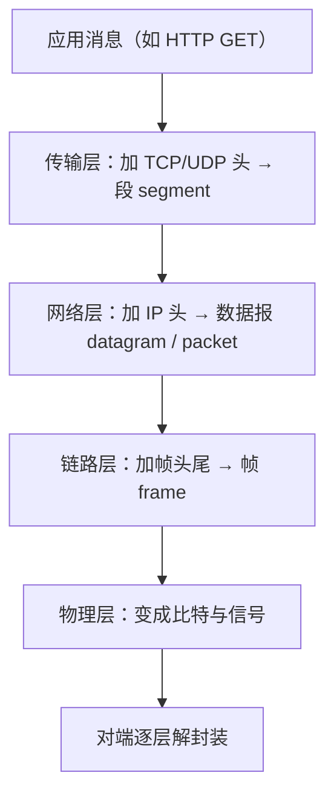
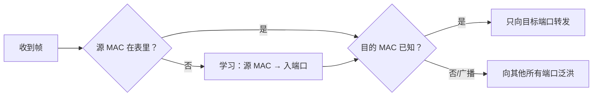
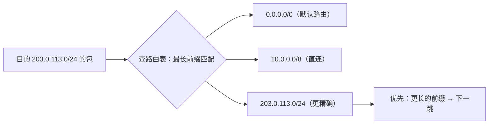
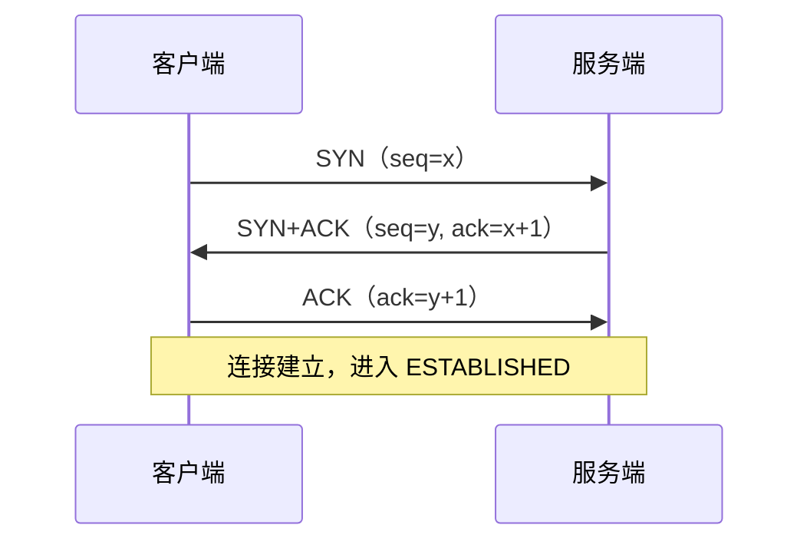
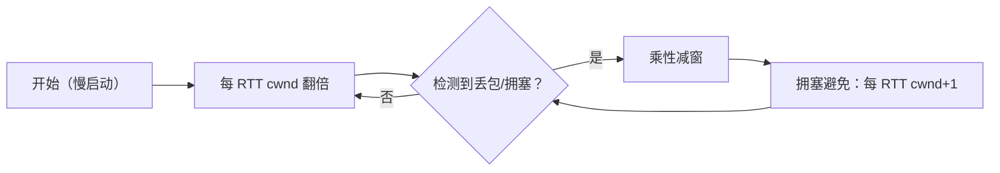
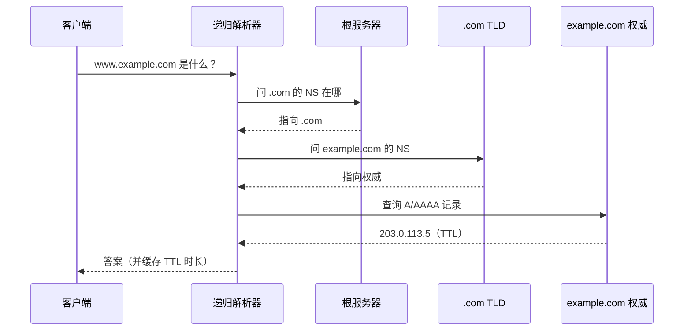
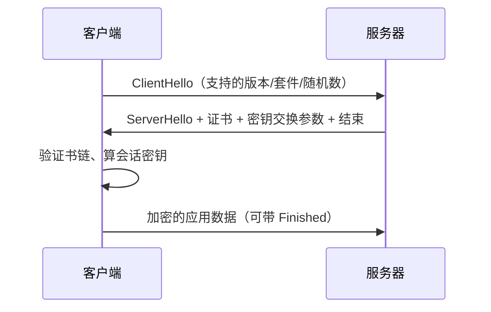
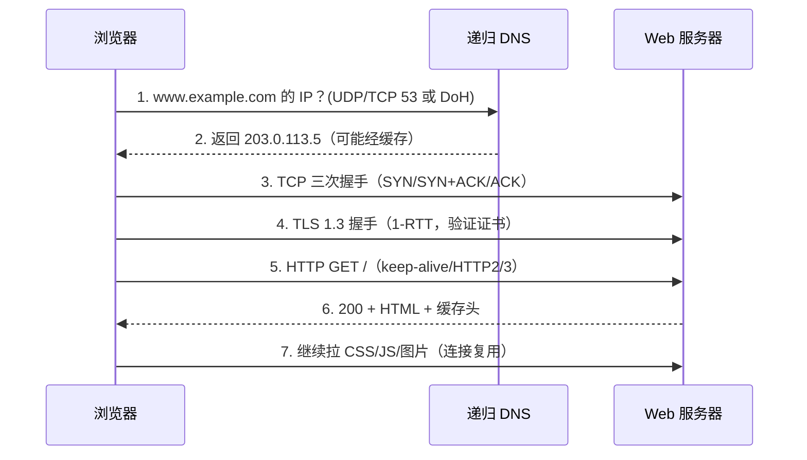

# 计算机网络学习笔记

> **最后调研时间**：2026-09-08。
>
> **读者水平**：入门至进阶。建议具备二进制/十六进制、基础编程与操作系统进程概念；若为零基础，可从第二章的分层模型开始，再回头补第一章前置实验。
>
> **适用范围**：以 TCP/IP 体系为主线（参考五层模型），覆盖分层模型、性能指标、物理层、数据链路层与以太网、ARP、IPv4/IPv6 与子网、路由与 ICMP、UDP/TCP/QUIC、HTTP/DNS/TLS/DHCP/邮件等应用协议、无线与移动网络、NAT/隧道/VPN、SDN 与网络自动化、常用工具与排错、端到端实践与学习路线。
>
> **版本与协议边界**：本讲义按当前生效标准撰写——TCP 以 [RFC 9293（2022，取代 RFC 793）](https://www.rfc-editor.org/rfc/rfc9293.html) 为准；IPv6 以 [RFC 8200](https://www.rfc-editor.org/rfc/rfc8200.html) 为准；QUIC 以 [RFC 9000](https://www.rfc-editor.org/rfc/rfc9000.html)、HTTP/3 以 [RFC 9114](https://www.rfc-editor.org/rfc/rfc9114.html)、TLS 1.3 以 [RFC 8446](https://www.rfc-editor.org/rfc/rfc8446.html) 为准。具体操作系统行为（如 Linux 默认拥塞控制算法）请以发行版为准。
>
> **不包含**：数通厂商（Cisco/Huawei 等）认证课程全量命令、通信工程/信号处理数学推导、大规模数据中心网络设计清单。

---

## 讲义导读

计算机网络是一张"从比特到应用"的分层图。最容易犯的错误是"只见协议名不见分层"——背了三次握手却不明白它在传输层解决什么问题、为什么 IP 层不负责可靠交付、为什么应用层还要再谈 HTTP/3。本讲义的目标是建立一条从**物理比特 → 帧 → 数据报 → 段 → 应用消息**的连续主线，让每一层协议都能回答三个问题：它解决什么、它不解决什么、它和上下层怎么协作。

贯穿全文的核心心智模型是**"分层封装 + 逐跳转发 + 端到端语义"**：

```text
应用层（HTTP/DNS/TLS...）   = 端到端的业务语义
传输层（TCP/UDP/QUIC）      = 端到端的进程间通信与可靠/不可靠服务
网络层（IP/ICMP/路由）      = 逐跳转发与寻址
数据链路层（以太网/WiFi）   = 一跳之内的成帧与介质访问
物理层                      = 把比特变成信号
```

上层不关心下层如何实现（例如 HTTP 不关心你在用有线还是 WiFi），下层不解释上层语义（例如交换机不懂 HTTP）；而"端到端"的意思从 TCP 一直延伸到 TLS——中间节点转发、两端负责最终正确性。

学习路径建议"先横后纵"：先用第二～五章建立全栈地图与性能直觉，再沿链路层、网络层、传输层逐层深入，最后回到应用层把 DNS/TCP/TLS/HTTP 串成一次真实的网页请求。每章末尾有"读完应能……"的能力验收，最后一章给最小检查清单；工程排错部分（第二十二章）会告诉你"哪个命令看哪一层"。

---

## 目录或内容地图

| 章节 | 核心问题 | 主要产出 |
|---|---|---|
| 第一章 学习目标与前置知识 | 学完能做什么、需要什么基础 | 能力锚点与实验环境 |
| 第二章 网络是什么：定义、拓扑与心智模型 | 网络解决的底层问题是什么 | 拓扑与交换方式表 |
| 第三章 分层模型：OSI 与 TCP/IP | 为什么必须分层、各层做什么 | 分层职责与封装图 |
| 第四章 性能指标与基础模型 | 带宽/时延/吞吐怎么度量 | 指标公式与直觉 |
| 第五章 物理层基础 | 比特如何变成信号 | 介质/编码/复用对照 |
| 第六章 数据链路层与以太网 | 一跳之内如何成帧与交换 | 帧结构与交换机行为 |
| 第七章 ARP 与 IPv4 编址 | 怎么找到邻居、地址如何组织 | 子网计算流程 |
| 第八章 IPv6：地址、NDP 与过渡 | 下一代地址与无状态配置 | IPv4/v6 对照 |
| 第九章 网络层与路由：IP、ICMP、路由协议 | 数据报如何逐跳到达 | 路由决策与协议表 |
| 第十章 传输层入门：端口、UDP 与可靠传输原理 | 进程如何通信、可靠如何实现 | 停等/GBN/SR 对照 |
| 第十一章 TCP：连接、可靠传输与拥塞控制 | TCP 如何做到可靠且不压垮网络 | 状态机与窗口机制 |
| 第十二章 TCP 工程问题与优化 | TIME_WAIT/Nagle/队头阻塞为何存在 | 常见现象与取舍 |
| 第十三章 QUIC 与 HTTP/3 | 为什么新一代传输要长在 UDP 上 | QUIC 特性与帧模型 |
| 第十四章 HTTP 的演进 | 从 HTTP/1.0 到 HTTP/3 解决了什么 | 版本对照表 |
| 第十五章 DNS：域名如何变成 IP | 全球分布式命名如何工作 | 解析链路与记录表 |
| 第十六章 常用应用协议：DHCP/邮件/FTP | 地址配置与老牌应用协议 | 协议流程与端口表 |
| 第十七章 TLS 与 HTTPS 安全模型 | 传输安全如何建立 | 握手与信任链 |
| 第十八章 无线与移动网络 | WiFi/蜂窝如何共享介质 | 802.11 演进表 |
| 第十九章 NAT、隧道与 VPN | 私网如何上网、隧道如何工作 | NAT 类型与隧道对照 |
| 第二十章 SDN、可编程网络与自动化 | 网络为何走向软件定义 | SDN 分层模型 |
| 第二十一章 网络工具与观测命令 | 每个工具看哪一层 | 命令速查表 |
| 第二十二章 端到端实战与分层排错 | 一次请求如何走完全栈、坏了怎么查 | 时序图与故障树 |
| 第二十三章 常见误区 | 最容易错的网络认知 | 误区纠正表 |
| 第二十四章 学习路线与最小检查清单 | 下一步学什么、如何验收 | 路线与清单 |

---

## 第一章 学习目标与前置知识

### 1.1 学完之后应能解决什么问题

- 能画出并解释五层/四层模型，说出每一层的 PDU 名称与典型协议。
- 能独立完成子网划分、路由聚合与 IPv4/IPv6 地址换算，并解释 CIDR 与 NAT。
- 能说清 TCP 三次握手、四次挥手、可靠传输、流量控制与拥塞控制背后的"为什么"。
- 能讲清 QUIC/HTTP/3 为什么用 UDP 解决了 HTTP/2 的队头阻塞。
- 能完整讲出"浏览器输入 URL → 页面出现"经过的 DNS、TCP/TLS、HTTP 各环节。
- 能用 `ping/traceroute/ip/ss/curl/dig/tcpdump` 按层定位一次网络故障。
- 能解释 NAT、VPN、隧道、WiFi 与 SDN 在工程里的作用边界。

### 1.2 前置知识与实验环境

- 掌握二进制与十六进制换算、字节与比特的区别。
- 有一台 Linux/macOS 机器（Windows 可用 WSL）用于第二十一章的实验。
- 建议安装：`curl`、`dig`（或 `nslookup`）、`ping`、`traceroute`/`mtr`、`ss`、`ip`、`tcpdump`、Wireshark。
- 可准备两三个真实网站做抓包练习（如 `example.com`、`iana.org`）。

### 1.3 学习范围与非目标

| 范围 | 内容 |
|---|---|
| 包含 | 分层模型、性能指标、物理/链路/网络/传输/应用各层核心机制、IPv4/IPv6、路由、TCP/QUIC、HTTP/DNS/TLS、无线、NAT/隧道/VPN、SDN、工具排错与端到端实战 |
| 不包含 | 数学级信号处理、厂商 CLI 认证题、数据中心全量设计 |
| 说明 | 本讲义面向"开发者 + 运维 + 面试 + 系统设计"，以机制与工程判断为主，不替代完整课程教材 |

---

## 第二章 网络是什么：定义、拓扑与心智模型

### 2.1 网络解决什么问题

计算机网络是"用交换/路由设备把主机连接起来，让任意两台主机上的进程能够交换信息"的系统。它要解决三件事：

1. **寻址与命名**：如何在几十亿台设备里找到对方（IP/域名）。
2. **转发**：数据如何从 A 经中间节点到达 B（交换与路由）。
3. **可靠与性能**：丢包/乱序/拥塞时如何保证可用（传输层）。

### 2.2 拓扑与交换方式

| 维度 | 类型 | 说明 |
|---|---|---|
| 拓扑 | 总线/星型/环型/网状 | 现代局域网以星型为主，骨干用网状 |
| 交换方式（传统电路 vs 分组） | 电路交换 | 预留整条链路（电话网），有保证但利用率低 |
| | 分组交换 | 数据拆包独立转发（互联网），利用率高但需排队与重传 |
| 按范围 | PAN/LAN/MAN/WAN | 个人/局域网/城域/广域 |
| 按收方 | 单播/广播/组播/任播 | 现代以太网单播为主，广播受限（IPv6 取消广播） |

### 2.3 一句话心智模型

```text
发送方把消息切成包 → 每包按"逐跳地址"前进 → 接收方重组为消息
中间节点看"下一跳"就够了（转发），两端才看"整个消息"（端到端）
```

这解释了两个反直觉现象：**中间路由器不保证可靠**（那是传输层的事），**中间人不理解应用语义**（那是端到端原则）。

### 2.4 本章验收

读完本章后，至少应该能：

- 说清分组交换与电路交换的区别与取舍。
- 解释"逐跳转发"与"端到端语义"的分工。
- 为局域网/骨干网画出简单拓扑。

---

## 第三章 分层模型：OSI 与 TCP/IP

### 3.1 为什么分层

分层把"端到端通信"拆成可独立演进的子问题：每一层只依赖下层提供的服务、只对上层提供服务；换掉一层（如把 IPv4 换 IPv6）不必重写整个应用。

### 3.2 OSI 七层与 TCP/IP 的对应

| OSI 层 | 职责示例 | TCP/IP 四层 | 常用五层说法 | 典型协议 |
|---|---|---|---|---|
| 7 应用层 | 应用语义 | 应用层 | 应用层 | HTTP、DNS、SMTP、TLS 承载其中 |
| 6 表示层 | 编码/加密 | 并入应用层 | 应用层 | TLS、JSON 等（实践中归应用） |
| 5 会话层 | 会话管理 | 并入应用层 | 应用层 | 实践中并入传输/应用 |
| 4 传输层 | 进程到进程、可靠/拥塞 | 传输层 | 传输层 | TCP、UDP、QUIC |
| 3 网络层 | 主机到主机寻址与转发 | 网络层 | 网络层 | IP、ICMP、OSPF、BGP |
| 2 数据链路层 | 一跳成帧与介质访问 | 网络接口层 | 链路层 | Ethernet、WiFi(802.11)、ARP |
| 1 物理层 | 比特与信号 | 网络接口层 | 物理层 | 双绞线、光纤、编码 |

### 3.3 封装：每层加一个头



图：根据 TCP/IP 分层封装概念整理/重绘（来源可对照 [RFC 1122](https://www.rfc-editor.org/rfc/rfc1122.html) 对层间接口的要求）。

封装的排错含义：抓包时看到的是"带全部外层头"的帧；分析工具（Wireshark）帮你逐层拆。**每一层只校验自己那层头**，上层错误通常表现为"包到了但应用数据不对"而不是"包没到"。

### 3.4 端到端原则

互联网设计的核心原则之一是"端到端"：尽量把复杂功能（可靠、安全）放在两端，中间网络保持简单、只做转发。这也是为什么 NAT 会"破坏"部分端到端语义、VPN/隧道常被用来"恢复"它。

### 3.5 本章验收

读完本章后，至少应该能：

- 默画 OSI/TCP-IP 对照表并给出各层典型协议。
- 画出从应用消息到帧的逐层封装过程。
- 用"端到端原则"解释为什么中间路由器不做可靠传输。

---

## 第四章 性能指标与基础模型

### 4.1 核心指标

| 指标 | 定义 | 单位 | 直觉 |
|---|---|---|---|
| 带宽（速率） | 单位时间最大可传比特 | bit/s（bps） | 管道的粗细 |
| 吞吐量 | 实际传输速率 | bit/s | 实际流量 |
| 时延（RTT） | 往返时间 | ms | 管道的长度（延迟） |
| 单向时延 | 传播+传输+处理+排队 | ms | 每段路径的贡献 |
| 丢包率 | 丢失/总发送 | % | 传输质量 |
| 抖动 | 时延变化 | ms | 实时音视频最敏感 |

### 4.2 时延的四个组成部分

总时延 ≈ **传播时延 + 传输时延 + 处理时延 + 排队时延**：

- 传播时延 = 距离/介质速度（光纤约 2×10⁸ m/s，接近光速的 2/3）。
- 传输时延 = 数据长度/发送速率（带宽决定"把包推上线"要多久）。
- 处理时延 = 查路由表、校验等（路由器 CPU）。
- 排队时延 = 在队列里等待（拥塞时显著）。

一个常见误区：**带宽大不等于时延小**。跨洋光缆的 RTT 由物理距离决定，换更粗的管道并不能减少它；这就是 CDN/就近接入为什么重要。

### 4.3 带宽时延积（BDP）

```text
BDP = 带宽(bps) × RTT(s)，单位是比特
```

BDP 是"链路里最多能装满多少数据"。TCP 发送窗口如果小于 BDP，管道就填不满（吞吐受限）；这是高带宽远距离链路要用窗口扩大/BBR 等算法的根本原因。

### 4.4 度量实验

```bash
ping -c 5 1.1.1.1            # RTT 与丢包
mtr -r example.com           # 逐跳时延与丢包定位
iperf3 -c <server>           # 真实吞吐
ss -ti                      # TCP 当前拥塞窗口/发送队列
```

### 4.5 本章验收

读完本章后，至少应该能：

- 区分带宽/吞吐/时延/抖动并给出合适单位。
- 把一次访问的时延拆到传播/传输/处理/排队四部分。
- 计算一个简单场景的 BDP 并解释它与 TCP 窗口的关系。

---

## 第五章 物理层基础

### 5.1 物理层解决什么

物理层把比特变成能在介质上传播的信号，并定义接口、电压/光强度、编码与复用。它是唯一"真正传输"的一层；上层的一切最终都落在物理介质上。

### 5.2 关键概念

- **比特率 vs 波特率**：比特率 = 每秒传输的比特数；波特率 = 每秒符号变化次数。一个符号可携带多个比特（多电平/相位调制），所以二者不一定相等。
- **基带 vs 宽带**：基带把整个信道用于一路数字信号（以太网）；宽带把信道分成多路（有线电视、WiFi 用多路载波）。
- **串行 vs 并行**：现代长距离全是串行，靠更高符号率与纠错取胜。

### 5.3 常见介质

| 介质 | 特点 | 典型速率/距离 |
|---|---|---|
| 双绞线（Cat5e/6/6A） | 便宜、抗干扰中等 | 1G/10Gbps，100m 内 |
| 光纤（单模/多模） | 抗电磁干扰、低损耗 | 10G～400G+，数百米～数十公里（单模） |
| 同轴电缆 | 老式有线网/广电 | 现主要用于接入网（HFC） |
| 无线（微波/光） | 无需布线、共享介质 | WiFi、蜂窝、卫星 |

### 5.4 信道复用与双工

- **复用**：频分（FDM）、时分（TDM）、波分（WDM，光纤）、码分（CDMA，蜂窝历史）。
- **双工**：单工（只能单向）、半双工（轮流双向，早期集线器/对讲机）、全双工（同时双向，现代交换式以太网）。

### 5.5 本章验收

读完本章后，至少应该能：

- 区分比特率与波特率并举例说明符号可携带多比特。
- 按"距离/速率/成本/抗干扰"为场景选择介质。
- 解释半双工与全双工对"是否冲突"的影响。

---

## 第六章 数据链路层与以太网

### 6.1 链路层解决什么

数据链路层解决"**一跳之内**把帧从一台设备送到相邻设备"：成帧、介质访问控制、差错检测，以及（在交换机上）帧的转发与隔离。

### 6.2 以太网帧

现代以太网帧（802.3）大致结构：

```text
前导码 + SFD | 目的 MAC | 源 MAC | (VLAN Tag 可选) | EtherType | Payload | FCS
```

MAC 地址 48 位，前 24 位是 OUI（厂商），后 24 位厂商分配；广播地址是全 `FF-FF-FF-FF-FF-FF`。EtherType 说明上层协议（如 `0x0800`=IPv4、`0x86DD`=IPv6、`0x0806`=ARP）。

### 6.3 交换机如何工作：学习、泛洪、转发、过滤

交换机维护 MAC 地址表（MAC→端口）：

1. **学习**：看到帧的源 MAC，记录它来自哪个端口；
2. **转发**：目的 MAC 已知 → 只发对应端口；
3. **泛洪**：目的 MAC 未知或是广播 → 发往除入端口外的所有端口；
4. **过滤**：目的端口与入端口相同 → 丢弃。



### 6.4 VLAN 与环路

- **VLAN（IEEE 802.1Q）**：在帧里打 12 位 VLAN ID（0–4095），把一台物理交换机切成多个广播域；跨交换机用 trunk 端口带 Tag 转发。
- **环路与生成树**：冗余链路会产生广播风暴与 MAC 抖动，用 **STP/RSTP** 阻塞冗余路径直到主路径故障（算法收敛有秒级延迟，现代数据中心多用无环设计如 VXLAN/EVPN 或堆叠）。

### 6.5 常见错误与调试

| 现象 | 可能原因 | 排查方向 |
|---|---|---|
| 网口 link 起不来 | 线序/类型、协商失败、VLAN 不匹配 | 换线、看协商速率、检查接入端口 VLAN |
| 单播像广播一样到处发 | MAC 表老化/端口隔离未生效 | `bridge fdb`/`show mac` 查表 |
| 时通时断 | 环路（广播风暴）或双工失配 | 看端口错误计数与生成树状态 |
| 抓不到某些流量 | 交换机端口隔离/VLAN | 用镜像口或正确 VLAN |

### 6.6 本章验收

读完本章后，至少应该能：

- 画出以太网帧结构并解释 EtherType 与 FCS 的作用。
- 用"学习/泛洪/转发/过滤"解释交换机行为。
- 说明 VLAN 与生成树各解决什么问题。

---

## 第七章 ARP 与 IPv4 编址

### 7.1 为什么要 ARP

IP 地址是逻辑地址，帧在链路上要靠 MAC 地址寻址。**ARP** 把"下一跳 IPv4"解析成 MAC（来源：[RFC 826](https://www.rfc-editor.org/rfc/rfc826.html)）。IPv6 不再用 ARP，改用 NDP（见第八章）。

ARP 流程：

1. 主机要发 IPv4 包，先查 ARP 缓存有没有"目标 IP→MAC"；
2. 没有则广播"谁的 IP 是 X？请回复 MAC"；
3. 目标单播回复；请求方把结果写入缓存并转发帧；
4. 缓存有 TTL（约几十秒到几分钟）。

### 7.2 IPv4 地址结构

IPv4 32 位，通常写作点分十进制。现代编址用 **CIDR**（如 `192.168.1.0/24`）：`/24` 表示网络位 24 位，主机位 8 位。

```text
IP 地址 = 网络号 + 主机号
子网掩码 = 网络位全 1（如 255.255.255.0）
网络地址 = IP & 掩码；广播地址 = 网络地址 + 主机位全 1
```

子网划分练习方法：

```text
例：把 192.168.1.0/24 分成 4 个子网
→ 借 2 位主机位（/26），块大小 = 2^(8-2)=64
→ 子网：0/26、64/26、128/26、192/26
→ 每个子网可用主机 = 2^6 - 2 = 62
```

### 7.3 特殊与私有地址

| 地址段 | 用途 |
|---|---|
| `10.0.0.0/8`、`172.16.0.0/12`、`192.168.0.0/16` | 私有地址（RFC 1918），NAT 上网 |
| `127.0.0.0/8` | 环回（loopback） |
| `169.254.0.0/16` | 链路本地（DHCP 失败时自配） |
| `224.0.0.0/4` | 组播 |
| `0.0.0.0/8` | 本网络/未指定（DHCP 阶段） |

来源：[RFC 1918](https://www.rfc-editor.org/rfc/rfc1918.html) 与 [RFC 6890（特殊用途地址）](https://www.rfc-editor.org/rfc/rfc6890.html)。

### 7.4 NAT 与端口映射

私网无法被公网直接路由，NAT 在边界把私网地址映射为公网地址（常配合端口）。出站做 **SNAT/源地址转换**，入站常用 **DNAT/端口映射**把公网端口转到内网主机（详见第十九章）。

### 7.5 常见错误与调试

| 现象 | 可能原因 | 排查方向 |
|---|---|---|
| 同网段 ping 不通 | ARP 解析失败、掩码不一致、防火墙 | `arp -n`/`ip neigh` 看有没有条目 |
| 跨网段不通但同网段通 | 网关/路由缺失、NAT 没配 | 查默认网关与路由表 |
| IP 冲突 | 两台主机同 IP | `arping` 探测、DHCP 静态绑定 |
| 掩码配错"能通一部分" | 网段范围判断错 | 用 `ipcalc` 复核 |

### 7.6 本章验收

读完本章后，至少应该能：

- 手算一个 `/24` 拆 4 子网的例子并给出每个子网范围。
- 说出私有地址与特殊地址段及其用途。
- 用 `ip neigh` 判断 ARP 问题与 IP 冲突。

---

## 第八章 IPv6：地址、NDP 与过渡

### 8.1 IPv6 动机与地址

IPv6 把地址扩到 **128 位**，写作 8 组十六进制（hextet），可压缩：前导 0 可省、连续全 0 组可用 `::` 压缩一次（来源：[RFC 4291 地址架构](https://www.rfc-editor.org/rfc/rfc4291.html)、[RFC 8200](https://www.rfc-editor.org/rfc/rfc8200.html)）。

```text
完整：2001:0db8:0000:0000:0000:ff00:0042:8329
压缩：2001:db8::ff00:42:8329
```

### 8.2 地址类型

| 类型 | 前缀 | 说明 |
|---|---|---|
| 全局单播（GUA） | `2000::/3` | 公网可路由 |
| 链路本地 | `fe80::/10` | 只在本链路有效，自动生成，不能路由 |
| 唯一本地（ULA） | `fc00::/7`（`fd00::/8` 实践） | 类似 RFC 1918 私网 |
| 组播 | `ff00::/8` | 取代广播 |
| 任播 | 与单播地址空间共用 | 多台主机同一地址，就近服务（CDN/DNS 常用） |

IPv6 **没有广播**：需要"发给所有人"时用组播；邻居发现也不用 ARP。

### 8.3 NDP 与 SLAAC

邻居发现协议（NDP，RFC 4861）替代 ARP 并承担：

- 邻居请求/通告（NS/NA，替代 ARP；协议见 [RFC 4861](https://www.rfc-editor.org/rfc/rfc4861.html)）；
- 路由器请求/通告（RS/RA，告诉主机默认网关）；
- 地址冲突检测（DAD）；
- 重定向。

**SLAAC**（来源：[RFC 4862](https://www.rfc-editor.org/rfc/rfc4862.html)）让主机从 RA 里取前缀，用 EUI-64 或随机接口标识生成地址，实现"插上即联网"；DHCPv6 可选提供 DNS 等额外参数。

### 8.4 过渡与共存

- **双栈**：同时运行 IPv4+IPv6，最常用；
- **隧道**：把 IPv6 封装在 IPv4 里传输（如 6in4）；
- **NAT64/DNS64**：IPv6 客户端访问 IPv4 服务时做翻译。

### 8.5 常见错误与调试

| 现象 | 排查方向 |
|---|---|
| IPv6 地址生成了但上不了网 | 看是否缺默认网关（RA 是否收到） |
| `ping6` 邻居通、外网不通 | 查 RA/网关、防火墙 IPv6 策略 |
| DNS 只回 IPv4（AAAA 缺失） | 服务端是否发布 AAAA、双栈是否真配 |

### 8.6 本章验收

读完本章后，至少应该能：

- 手写并压缩一个 IPv6 地址，说出常见前缀含义。
- 对比 NDP/NS-NA 与 ARP 的对应关系。
- 解释 SLAAC、双栈与 NAT64 各自解决的问题。

---

## 第九章 网络层与路由：IP、ICMP、路由协议

### 9.1 IP 数据报与转发

网络层提供"主机到主机"的尽力而为交付。IPv4 头部关键字段：源/目的 IP、TTL（防环，每跳减 1）、协议号（6=TCP、17=UDP、1=ICMP）、标识/分片字段与头校验。路由器转发逻辑：

```text
收到包 → 查路由表（最长前缀匹配）→ TTL-1 → 重算校验 → 送到下一跳
```

**分片与 MTU**：IP 包不能超过链路 MTU（以太网默认 1500）。IPv4 可中间分片（DF 位禁止时靠路径 MTU 发现）；IPv6 只有源端分片、中间节点不分片、且去掉头部校验（依赖链路校验）。

### 9.2 ICMP：网络层的"信使"

ICMP 用于报告错误与探测：`echo request/reply`（ping）、`destination unreachable`、`time exceeded`（traceroute 靠它）、`redirect`（协议定义见 [RFC 792：ICMP](https://www.rfc-editor.org/rfc/rfc792.html)）。**ICMP 不是数据通道**，但防火墙误封 ICMP 会破坏 PMTUD，导致大包黑洞。

### 9.3 路由协议三族

| 协议 | 类型 | 算法 | 要点 |
|---|---|---|---|
| RIP（RFC 2453） | 内部网关协议（IGP） | 距离向量 | 以跳数为度量，上限 15，收敛慢，小网 |
| OSPF（RFC 2328） | IGP | 链路状态（Dijkstra） | 全网洪泛 LSA，快速收敛，企业/DC 常用 |
| BGP（RFC 4271） | 外部网关协议（EGP） | 路径向量 | 互联网域间路由，策略驱动，不只看最短 |

三族协议的规范入口：[RIPv2（RFC 2453）](https://www.rfc-editor.org/rfc/rfc2453.html)、[OSPFv2（RFC 2328）](https://www.rfc-editor.org/rfc/rfc2328.html)、[BGP-4（RFC 4271）](https://www.rfc-editor.org/rfc/rfc4271.html)。



### 9.4 默认网关与排错

- 主机的"默认网关"就是一条 `0.0.0.0/0`（IPv6 为 `::/0`）路由。
- 主机只负责"发给网关或直连主机"；跨网段必须逐跳。

### 9.5 本章验收

读完本章后，至少应该能：

- 说出 TTL 与最长前缀匹配各自防什么/选什么。
- 区分距离向量/链路状态/路径向量三类路由协议。
- 解释"同网段通、跨网段不通"时的排查起点。

---

## 第十章 传输层入门：端口、UDP 与可靠传输原理

### 10.1 端口与套接字

传输层提供"进程到进程"通信：IP 定位主机，**端口（0–65535）**定位进程。一个连接用四元组标识：`源 IP:源端口 → 目的 IP:目的端口`。0–1023 为知名端口，1024–49151 注册端口，49152–65535 为临时/动态端口。

### 10.2 UDP：尽力而为的传输

UDP 头部仅 8 字节（源端口、目的端口、长度、校验和），无连接、不保证有序与不丢失（来源：[RFC 768](https://www.rfc-editor.org/rfc/rfc768.html)）。适合：

- 要求低延迟、可容忍丢包：实时音视频、游戏；
- 请求-响应很短：DNS、DHCP、NTP；
- 需要自己实现可靠语义的上层：QUIC（见第十三章）。

| 维度 | UDP | TCP |
|---|---|---|
| 连接 | 无 | 面向连接 |
| 可靠性 | 尽力而为 | 确认、重传、有序 |
| 开销 | 小（8B 头） | 大（20B+ 头与状态） |
| 拥塞控制 | 无（由上层承担） | 有 |
| 典型 | DNS/QUIC/媒体 | HTTP/1.1、SMTP、SSH |

### 10.3 可靠传输要解决的四件事

无论 TCP 还是自研协议，可靠传输都要处理：**比特损坏**（校验）、**丢包**（超时重传）、**乱序**（序号排序）、**重复**（去重）。再加上两端速率不匹配时的**流量控制**与网络过载时的**拥塞控制**。

### 10.4 从停等协议到流水线

- **停等（stop-and-wait）**：发一包等一确认。简单但链路利用率低（尤其 BDP 大时）。
- **回退 N（GBN）**：滑动窗口，出错的包及其后所有包都重传。
- **选择重传（SR）**：只重传缺失的包，配合 SACK 减少浪费。

| 机制 | 优点 | 代价 |
|---|---|---|
| 停等 | 最简单 | 吞吐低 |
| GBN | 实现简单 | 一个丢包可能重传一堆 |
| SR/SACK | 只重传缺口 | 需要缓存与更多头部支持 |

TCP 现代实现是"GBN 思想的窗口 + SACK 的选择性重传"混合体。

### 10.5 本章验收

读完本章后，至少应该能：

- 解释四元组如何唯一定位一条连接。
- 为"视频通话/文件下载/DNS"选择 UDP 或 TCP 并说明理由。
- 说出可靠传输解决的四类问题与三种窗口机制取舍。

---

## 第十一章 TCP：连接、可靠传输与拥塞控制

### 11.1 TCP 提供什么

TCP 在不可靠的 IP 之上提供：面向连接、字节流、可靠有序、流量控制与拥塞控制（来源：[RFC 9293](https://www.rfc-editor.org/rfc/rfc9293.html)）。"字节流"意味着 TCP 不保消息边界——应用要自己分帧（HTTP 用 Content-Length/chunked）。

### 11.2 连接建立与状态机



三次握手的核心目的：**双方确认彼此的收发能力并同步初始序号**。只用两次无法防"过期的旧 SYN 突然到达"造成错误资源分配。

连接关闭（四次挥手）：主动方 FIN → 对方 ACK → 对方 FIN → 主动方 ACK，之后主动方进入 **TIME_WAIT（约 2×MSL）** 以便让迟到的包在网络中消亡、防止旧连接的数据串扰新连接。

### 11.3 可靠传输机制

- **序号 + 确认号**：确认号表示"下一个期望的字节"，累积确认；
- **超时重传（RTO）**：基于 RTT 估计（[RFC 6298](https://www.rfc-editor.org/rfc/rfc6298.html)）；
- **快速重传**：收到 3 个重复 ACK 即认为丢包，不必等超时；
- **SACK**：选择性确认（[RFC 2018](https://www.rfc-editor.org/rfc/rfc2018.html)），减少"回退 N"的浪费。

### 11.4 流量控制 vs 拥塞控制

- **流量控制**：接收方通告**接收窗口 rwnd**，防止发送方灌爆接收缓存——端到端的接收能力问题。
- **拥塞控制**：发送方维护**拥塞窗口 cwnd**，探测网络容量，防止把网络打爆——中间网络的容量问题。

实际发送上限：`实际可发字节 ≤ min(rwnd, cwnd) × MSS`。

### 11.5 拥塞控制演进



- **慢启动**：从 1 个 MSS 指数增长，直到 ssthresh 或丢包；
- **拥塞避免**：线性增长；
- **丢包处理**：传统 Reno/NewReno 乘性减半并快速恢复；
- **CUBIC**（[RFC 8312](https://www.rfc-editor.org/rfc/rfc8312.html)）：高 BDP 下增长更快，长期是 Linux 默认；
- **BBR**：从"丢包即拥塞"改为"基于带宽与 RTT 探测"，在部分网络下吞吐更好（由 Google 提出，非 RFC，作为可选用例参考）。

### 11.6 本章验收

读完本章后，至少应该能：

- 画出三次握手/四次挥手并解释 TIME_WAIT 存在的原因。
- 区分 rwnd 与 cwnd，写出发送上限公式。
- 说出慢启动/拥塞避免/快速重传/CUBIC/BBR 各自思路。

---

## 第十二章 TCP 工程问题与优化

### 12.1 常见"反直觉"现象

| 现象 | 原因 | 解释 |
|---|---|---|
| 小包延迟高 | Nagle + 延迟 ACK 互锁 | Nagle 等凑包、接收方延迟 ACK，小请求被卡约 40ms |
| 大量 TIME_WAIT | 主动关闭方要等 2MSL | 短连接场景下的正常现象，别盲目清零 |
| 吞吐远低于带宽 | 窗口 < BDP、丢包重传 | 参考第四章 BDP |
| 偶发大延迟（bufferbloat） | 队列过长 | 拥塞控制 + AQM（如 CoDel）缓解 |
| 顺序到达要求导致队头阻塞 | TCP 按序交付 | 一个丢包阻塞后续流，HTTP/3 因此改用 QUIC |

### 12.2 常见优化点

- **延迟敏感小请求**：关 Nagle（`TCP_NODELAY`），平衡延迟 ACK；
- **长肥管道**：启用窗口缩放、SACK、增大缓冲，用 CUBIC/BBR 对比测试；
- **连接复用**：HTTP keep-alive/连接池减少握手与 TIME_WAIT；
- **SYN 队列**：SYN Flood 时用 syncookies 保护，但仍要观察队列溢出；
- **TCP keepalive**：默认 2 小时，常用于探测死连接但不要当应用心跳；
- **硬件卸载**：TSO/GRO 把分段/合并交给网卡，降低 CPU。

### 12.3 观察 TCP 状态

```bash
ss -t    # 全部 TCP 连接与状态
ss -ti   # 当前窗口、RTT、拥塞状态（Linux）
netstat -s   # TCP 统计（重传、丢包）
```

社区对 TCP 三次握手/挥手与优化的系统性整理可作复习材料（来源：[CSDN：TCP/IP 协议深度解析](https://blog.csdn.net/weixin_43272162/article/details/161305278)，2026-05-21；[掘金：计网八股记录](https://juejin.cn/post/7223695339328241722)，2023-04-18）。

### 12.4 本章验收

读完本章后，至少应该能：

- 解释 Nagle/延迟 ACK 为什么造成小包延迟。
- 说出 TIME_WAIT 的语义与"是否要清理"的判断。
- 用 `ss -ti` 观察窗口与 RTT，判断吞吐瓶颈。

---

## 第十三章 QUIC 与 HTTP/3

### 13.1 为什么还要一个新传输协议

HTTP/2 解决了"连接级"队头阻塞，却仍受 **TCP 队头阻塞**：TCP 必须按序交付，一个丢失的包会阻塞它后面所有流。在弱网/高丢包下，多路复用优势被抵消。QUIC 的设计目标：把传输层的可靠、多路复用、加密都搬到 **UDP 之上**并重新设计（来源：[RFC 9000：QUIC](https://www.rfc-editor.org/rfc/rfc9000.html)）。

### 13.2 QUIC 的关键机制

| 特性 | 解决什么 | 说明 |
|---|---|---|
| 基于 UDP | 可部署、不被中间件当 TCP 特殊对待 | 端口 443 常用于 HTTP/3 |
| 连接 ID（Connection ID） | 连接迁移 | IP/端口变化（如手机切网）连接不断 |
| 独立流（Stream） | TCP 级队头阻塞 | 每流独立序号与确认 |
| 内建 TLS 1.3 | 握手与传输一体化 | 1-RTT/0-RTT 建连（来源：[RFC 9001](https://www.rfc-editor.org/rfc/rfc9001.html)） |
| 多包号空间 | 更精确的乱序与重传判断 | 把加密握手与数据分开处理 |
| QPACK | 头部压缩适配乱序流 | [RFC 9204](https://www.rfc-editor.org/rfc/rfc9204.html) |

### 13.3 HTTP/3 与 QUIC 的关系

HTTP/3 是"在 QUIC 上承载 HTTP"的语义层（来源：[RFC 9114：HTTP/3](https://www.rfc-editor.org/rfc/rfc9114.html)）：仍然有请求/响应、方法、状态码、头，但帧与流映射完全不同。网络观测上：QUIC 表现为 UDP 443 的流量，传统 `ss -t` 看不到连接状态，需用 QUIC 感知工具。

### 13.4 部署与兼容

- 浏览器通过 `Alt-Svc: h3=":443"` 或 DNS HTTPS 记录发现 HTTP/3 可用；
- 客户端会自动回退到 HTTP/2/1.1，因此生产可渐进开启；
- 中间网络（NAT/防火墙）对 UDP 443 的放行程度影响实际可用性。

### 13.5 本章验收

读完本章后，至少应该能：

- 解释 HTTP/2 仍有的队头阻塞来自哪里、QUIC 如何消除。
- 说出 Connection ID、独立流与内建 TLS 各自的收益。
- 说明如何发现"这个站点在用 HTTP/3"以及回退机制。

---

## 第十四章 HTTP 的演进

### 14.1 HTTP 是什么

HTTP 是"请求-响应"式的无状态应用协议，语义由方法、状态码、头与表示（body）构成（来源：[RFC 9110 HTTP 语义](https://www.rfc-editor.org/rfc/rfc9110.html)）。浏览器与服务器之间"每次交互"由客户端发起请求，服务器返回状态码与表示。

### 14.2 版本演进对照

| 版本 | 连接与并发 | 压缩 | 传输层 | 主要问题 |
|---|---|---|---|---|
| HTTP/1.0 | 每请求一条连接 | — | TCP | 建连开销大 |
| HTTP/1.1 | keep-alive + 域分片 | — | TCP | 队头阻塞（应用层顺序） |
| HTTP/2 | 多路复用 + 优先级 | HPACK | TCP | TCP 队头阻塞 |
| HTTP/3 | 多路复用 + 独立流 | QPACK | QUIC/UDP | 需要 UDP 可达 |

HTTP/1.1 的连接复用与 `Host` 头是"一个服务器挂多站点"的基础；HTTP/2 用二进制分帧在一个连接上并行多个流；HTTP/3 再把它搬到 QUIC。

### 14.3 缓存与条件请求

- 缓存语义由 `Cache-Control`（`max-age`、`no-store` 等）与校验器 `ETag`/`Last-Modified` 控制（来源：[RFC 9111](https://www.rfc-editor.org/rfc/rfc9111.html)）；
- `304 Not Modified` 让缓存"确认没变"从而省流量；
- 代理/CDN 都是 HTTP 缓存的参与者——这就是网络分层里"中间人"合法的一类。

### 14.4 状态码与常见语义

| 类 | 含义 | 例子 |
|---|---|---|
| 2xx | 成功 | 200 OK、204 No Content |
| 3xx | 重定向 | 301/302、304 |
| 4xx | 客户端错误 | 400、401、403、404、429 |
| 5xx | 服务端错误 | 500、502、503、504 |

### 14.5 本章验收

读完本章后，至少应该能：

- 说出 HTTP/1.1→2→3 各自解决的瓶颈。
- 用 `Cache-Control` 与 ETag 描述一次缓存命中流程。
- 根据 4xx/5xx 判断错误在客户端还是服务端。

---

## 第十五章 DNS：域名如何变成 IP

### 15.1 为什么需要 DNS

人记域名、机器要 IP，DNS 是两者之间的全球分布式映射系统。它必须是**分层+缓存**的，否则一个根服务器扛不住全网查询。

### 15.2 命名空间与解析链路

```text
根域(.) → 顶级域(com/net/cn) → 权威域(example.com) → 主机名(www)
```



### 15.3 记录类型速查

| 记录 | 作用 |
|---|---|
| A / AAAA | IPv4 / IPv6 地址 |
| CNAME | 别名（不能与其他记录并存于同节点） |
| NS / SOA | 权威与区域起点 |
| MX | 邮件服务器（带优先级） |
| TXT | 任意文本（SPF/DKIM 验证常用） |
| SRV | 服务定位 |

DNS 基础在 [RFC 1035](https://www.rfc-editor.org/rfc/rfc1035.html)；安全扩展 DNSSEC 由 [RFC 4033](https://www.rfc-editor.org/rfc/rfc4033.html) 等定义。

### 15.4 安全与隐私增强

- **DNSSEC**：对记录做签名验证，防缓存投毒；
- **DoH（[RFC 8484](https://www.rfc-editor.org/rfc/rfc8484.html)）**/DoT：加密查询，防窃听与篡改；
- **Anycast + CDN**：让同一个域名在全球就近返回不同 IP，是现代 DNS/CDN 的基础。

### 15.5 排错命令

```bash
dig example.com A
dig +trace example.com      # 看完整递归链路
nslookup -type=MX gmail.com
```

常见问题：`NXDOMAIN`（域名不存在）、`SERVFAIL`（解析器与权威通信失败）、TTL 未到导致"改了 DNS 不生效"。

### 15.6 本章验收

读完本章后，至少应该能：

- 画出递归解析链路并区分递归器与权威服务器。
- 说出 A/AAAA/CNAME/MX/TXT 的用途与 TTL 的作用。
- 用 `dig +trace` 定位 DNS 问题在哪一段。

---

## 第十六章 常用应用协议：DHCP/邮件/FTP

### 16.1 DHCP：自动配置地址

DHCP 用 **DORA** 四步：Discover（找服务器）→ Offer（给配置）→ Request（选定）→ Ack（确认）。分配内容包括 IP、掩码、网关、DNS。租约到期前续租（T1/T2）。IPv6 侧 DHCPv6 常与 SLAAC 配合（来源：[RFC 2131](https://www.rfc-editor.org/rfc/rfc2131.html)）。

```bash
# Linux 观察 DHCP 租约
cat /var/lib/dhcp/dhclient.leases   # 发行版而异
ip addr show                        # 看是否拿到 169.254.*（失败信号）
```

拿到 `169.254.x.x` 通常意味着 DHCP 失败并回退链路本地地址。

### 16.2 电子邮件协议

邮件系统分三段：**撰写/投递**（SMTP）、**读取**（POP3/IMAP）、**格式**（MIME，支持附件与 HTML）。

| 协议 | 端口 | 用途 | 关键点 |
|---|---|---|---|
| SMTP | 25（服务器间）、587（提交） | 发送 | 465 常被误用于提交（SMTPS） |
| POP3 | 110/995 | 下载删除式收信 | 多端不同步 |
| IMAP | 143/993 | 服务器端同步收信 | 多端一致，推荐 |

注意区分：**SMTP 是"推"协议，IMAP/POP3 是"拉"协议**；两者不是替代关系。

### 16.3 FTP 与安全替代

FTP 用 21 控制、20 数据（主动模式）或随机端口（被动模式），**明文**传输，现代环境已不推荐。替代：SFTP（SSH File Transfer，走 22）、FTPS（TLS 包裹 FTP）、WebDAV/对象存储。

### 16.4 本章验收

读完本章后，至少应该能：

- 说出 DHCP 四步与"169.254"地址的含义。
- 为"发送/多端同步收件"选择 SMTP+IMAP 并说明端口。
- 解释为什么明文 FTP 已被 SFTP/FTPS 替代。

---

## 第十七章 TLS 与 HTTPS 安全模型

### 17.1 传输安全解决什么

明文 HTTP 在网络中可被窃听、篡改、冒充。TLS 在 TCP 之上提供三件事：**机密性**（加密）、**完整性**（防篡改）、**身份认证**（证书）。HTTPS 就是"HTTP over TLS"，默认端口 443。

### 17.2 TLS 1.3 握手模型

现行标准是 TLS 1.3（来源：[RFC 8446](https://www.rfc-editor.org/rfc/rfc8446.html)）：

- 通常 **1-RTT** 完成握手：客户端发 ClientHello，服务端回复 ServerHello + 证书 + 密钥协商参数，随后双方直接发加密数据；
- 会话恢复用 PSK 实现 **0-RTT**（有重放风险，需谨慎用于安全写操作）；
- 强制前向保密（用 ECDHE 等临时密钥），移除旧版不安全的静态 RSA 密钥交换；
- 数字证书链（根 CA → 中间 CA → 站点证书）由 [RFC 5280](https://www.rfc-editor.org/rfc/rfc5280.html) 定义，客户端用内置信任库验证。



图：根据 [RFC 8446](https://www.rfc-editor.org/rfc/rfc8446.html) 简化的 TLS 1.3 完整握手。

### 17.3 证书体系与吊销

- 浏览器信任的是"证书链"而不是证书本身：站点证书必须能链到受信根；
- 吊销手段：CRL 与 OCSP（现在更常用 OCSP stapling）；
- 常见工程错误：证书链不完整（漏中间证书）、私钥权限过大、通配符/多域名选错类型。

### 17.4 工程清单

| 检查 | 说明 |
|---|---|
| 证书链完整 | 服务器要发"站点+中间"证书 |
| 现代套件 | 启用 TLS 1.2/1.3，禁用弱套件 |
| HSTS | 告诉浏览器只走 HTTPS |
| 回退风险 | 别允许"先 HTTP 再跳转"的明文首包 |
| 证书轮换自动化 | ACME/Let's Encrypt 自动续期 |

### 17.5 本章验收

读完本章后，至少应该能：

- 说出 TLS 提供的三件事与 TLS 1.3 的 1-RTT 流程。
- 解释证书链验证与吊销的基本思路。
- 用 `openssl s_client -connect host:443` 检查证书与套件。

---

## 第十八章 无线与移动网络

### 18.1 WiFi（802.11）家族

| 标准 | 俗称 | 频段 | 主要改进 |
|---|---|---|---|
| 802.11n | Wi-Fi 4 | 2.4/5GHz | MIMO |
| 802.11ac | Wi-Fi 5 | 5GHz | 更宽信道、更多流 |
| 802.11ax | Wi-Fi 6/6E | 2.4/5/6GHz | OFDMA、更高效率 |
| 802.11be | Wi-Fi 7 | 2.4/5/6GHz | 320MHz、MLO（多链路） |

Wi-Fi 命名由 Wi-Fi Alliance 推动（世代号），标准族背景见 [Wikipedia：IEEE 802.11](https://en.wikipedia.org/wiki/IEEE_802.11)（参考资料）。802.11 介质访问是 **CSMA/CA**（带冲突避免）：先听后发、随机退避，因为无线无法一边发一边监听冲突（与以太网 CSMA/CD 不同）。隐藏终端问题靠 RTS/CTS 与 ACK 缓解。

### 18.2 无线网络的组成

- **AP（接入点）**：把无线客户端接入有线网络，SSID 是网络名；
- **漫游**：客户端在 AP 间切换，企业网常用 802.11r/k/v 加速；
- **安全**：现代最低要求 WPA2；WPA3 提供更强认证（SAE）与对暴力破解的抵抗；公共 WiFi 仍要配 VPN/TLS。

### 18.3 蜂窝网络要点

蜂窝网分**无线接入网（RAN）**与**核心网（Core）**：终端经基站（gNB/eNB）接入，核心网负责移动性、鉴权与互联网出口。4G/5G 的关键差异：更高速率、更低时延（uRLLC）、海量连接（mMTC）、网络切片。5G 核心网走向服务化架构（SBA）。

### 18.4 常见问题

| 现象 | 方向 |
|---|---|
| WiFi 慢 | 信道拥塞、同频干扰、信号弱、老标准 |
| 漫游掉线 | 覆盖重叠不足、密钥协商慢 |
| 时好时坏 | 2.4GHz 干扰、省电模式 |

### 18.5 本章验收

读完本章后，至少应该能：

- 说出 802.11n/ac/ax/be 与 Wi-Fi 4–7 的对应关系。
- 解释 CSMA/CA 与隐藏终端问题。
- 说明 WPA2/WPA3 的最低要求与蜂窝 RAN/Core 分工。

---

## 第十九章 NAT、隧道与 VPN

### 19.1 NAT 的类型

NAT 缓解 IPv4 枯竭并在边界隐藏内网（来源：[RFC 3022](https://www.rfc-editor.org/rfc/rfc3022.html)）。按映射行为分：

| 类型 | 特点 | P2P 友好度 |
|---|---|---|
| 全锥形（Full Cone） | 内网端口映射对所有外网开放 | 高 |
| 受限锥形（Address-Restricted） | 只接受"曾主动联系过的地址" | 中 |
| 端口受限锥形 | 再限制端口 | 低 |
| 对称型（Symmetric） | 每个目的地址/端口用不同映射 | 极低，需 TURN 中继 |

对称 NAT 是 P2P 打洞困难的根源，往往需要 TURN 转发（来源：[RFC 5128：NAT 穿越现状](https://www.rfc-editor.org/rfc/rfc5128.html)）。

### 19.2 NAT 对"端到端"的影响

- 外部无法主动连接内网主机 → 需要端口映射或反向隧道（见《反向代理与反向隧道学习笔记》）；
- NAT 修改 IP/端口，破坏部分 IPsec/AH 与端到端安全假设；
- 解决路径：IPv6（没有 NAT 语义）或 NAT64 过渡。

### 19.3 隧道与 VPN

隧道 = 把一种协议的包封装进另一种协议里传输，形成"虚拟链路"。常见：

| 技术 | 封装 | 用途 |
|---|---|---|
| GRE | IP-in-IP | 基础隧道 |
| IPsec | 加密 IP 包 | 站点到站点 VPN |
| WireGuard | 现代加密隧道 | 简单高性能 VPN |
| OpenVPN/TLS | TLS 流 | 远程访问 VPN |
| SSH 隧道 | SSH 通道 | 端口转发/加密（见反向隧道笔记） |
| VXLAN | 以太网 over UDP | 数据中心 overlay |

VPN 提供"虚拟的私密网络"，与代理的区别：VPN 通常转发整机流量/网络层，代理通常只转发应用层请求。

### 19.4 本章验收

读完本章后，至少应该能：

- 用 NAT 类型解释"为什么打洞可能失败"。
- 说出隧道与 VPN 的封装思想与至少四种实现。
- 说明 NAT 与"端到端原则"的冲突及 IPv6 的解法。

---

## 第二十章 SDN、可编程网络与自动化

### 20.1 为什么网络要"软件定义"

传统网络把控制逻辑（路由/转发决策）分散在每个设备里，跨厂商自动化难、变更慢。SDN 的思路是**把控制面集中（或逻辑集中）到控制器，数据面只管按流表转发**，用标准南向接口（如 OpenFlow）与北向 API 编程（来源：[Cisco：软件定义网络（SDN）概述](https://www.cisco.com/c/en/us/solutions/software-defined-networking/overview.html)）。

### 20.2 SDN 分层

```text
应用层（网络策略/意图） → 北向 API → 控制器（集中逻辑） → 南向协议 → 数据面设备（转发）
```

控制器是"网络的操作系统"：把高层意图编译成各设备配置，并持续采集状态。

### 20.3 从 SDN 到云原生网络

- **Overlay（VXLAN/EVPN）**：在物理 IP 网络上建立逻辑二层/三层，是云数据中心与 K8s CNI 的常见底座；
- **网络自动化/IaC**：用声明式配置（如 YAML）管理路由、ACL、负载均衡；
- **可编程数据面**：P4 等语言让数据面也可编程；
- **AI/意图网络**：把"我要什么"翻译成"网络怎么配"，仍在演进。

### 20.4 本章验收

读完本章后，至少应该能：

- 画出 SDN 的"控制面集中、数据面转发"分层。
- 解释 Overlay/VXLAN 与 CNI 的关系。
- 说明传统 CLI 运维与声明式网络自动化在变更管理上的差别。

---

## 第二十一章 网络工具与观测命令

### 21.1 工具分层速查

| 你要回答的问题 | 工具 | 对应层 |
|---|---|---|
| 接口/地址/路由表是什么 | `ip addr`、`ip route`、`ip link` | 链路/网络 |
| 邻居（ARP/NDP）表 | `ip neigh`、`arp -n` | 链路 |
| 通不通、RTT/丢包 | `ping`、`mtr` | 网络（ICMP） |
| 路径经过哪些跳 | `traceroute`/`traceroute6`、`mtr -r` | 网络 |
| 端口监听/连接状态 | `ss`、`netstat` | 传输 |
| 域名解析 | `dig`、`nslookup`、`host` | 应用（DNS） |
| HTTP/API 行为 | `curl -v`、`wget` | 应用 |
| TLS 证书/握手 | `openssl s_client -connect host:443` | 传输/安全 |
| 抓包分析 | `tcpdump`、`tshark`、Wireshark | 全栈 |
| 裸 TCP/UDP 测试 | `nc`、`ncat` | 传输 |
| 真实吞吐 | `iperf3` | 传输/网络 |

### 21.2 关键命令示例

```bash
# 网络层
ip addr show; ip route show; ip neigh show
ping -c 5 example.com
ping -M do -s 1472 example.com      # MTU 探测（1500-28）
mtr -r example.com

# 传输层
ss -tlnp          # 监听端口
ss -tn state time-wait | wc -l

# 应用层
dig +short example.com A
curl -v https://example.com/
openssl s_client -connect example.com:443 -servername example.com </dev/null

# 抓包（需要权限）
tcpdump -ni eth0 -c 50 host example.com and port 443
```

### 21.3 抓包姿势

- 抓 loopback：`tcpdump -i lo`；抓某个进程：先查端口再按端口抓；
- Wireshark 解封装顺序就是"帧→IP→TCP→应用"，与分层模型完全对应；
- 排错时"两端同时抓"比对时序，比单端猜更可靠。

### 21.4 本章验收

读完本章后，至少应该能：

- 对"地址/邻居/路径/端口/DNS/TLS/HTTP"各说出至少一个工具。
- 用 `mtr`、`ss -ti`、`dig +trace`、`openssl s_client` 完成一次全栈体检。
- 设计一次"两端同时 tcpdump"的实验。

---

## 第二十二章 端到端实战与分层排错

### 22.1 一次网页请求的旅程



### 22.2 分层排错故障树

```text
"网页打不开"
  ├─ 1. DNS 通吗？ dig/nslookup → NXDOMAIN/SERVFAIL/超时？
  │     ├─ 域名没解析 → 查记录与 TTL
  │     └─ 解析 OK → 进入下一步
  ├─ 2. TCP 通吗？ping/curl 观察 connect
  │     ├─ 超时 → 防火墙/路由/主机离线
  │     └─ 拒绝(connection refused) → 端口没监听
  ├─ 3. TLS 通吗？openssl s_client
  │     └─ 证书错/套件错/握手失败 → 服务端配置
  ├─ 4. HTTP 返回什么？
  │     ├─ 4xx → 应用/权限层
  │     └─ 5xx → 服务器/后端；502/504 再查反代与上游
  └─ 5. 内容对吗？(JS 报错、CSP、跨域)
```

### 22.3 症状 → 层次对照

| 症状 | 优先怀疑层 | 先看 |
|---|---|---|
| 域名解析不了 | 应用（DNS） | dig、resolv.conf |
| 连接超时 | 网络/防火墙 | mtr、防火墙、主机状态 |
| connection refused | 传输/主机 | ss -tlnp、服务状态 |
| 证书错误 | 安全（TLS） | openssl s_client |
| 页面 404/403 | 应用/反代 | 后端日志与路由 |
| 502/504 | 网络+应用 | 反代日志与上游可达性 |
| 视频卡顿 | 应用+传输 | 丢包/抖动/带宽 |

### 22.4 验证与失败注入

| 场景 | 动作 | 预期信号 |
|---|---|---|
| DNS 故障 | 改 hosts 指向错误 IP | 能连到错机器=DNS 问题 |
| 防火墙丢包 | 用 curl 观察 hang | mtr 在某跳 100% 丢包 |
| 端口未监听 | 关掉服务再 curl | connection refused |
| MTU 黑洞 | 大包 ping 带 DF | 小包通、大包不通 |
| TLS 证书错 | 连错域名 | openssl 报证书错误 |

### 22.5 本章验收

读完本章后，至少应该能：

- 把"打开网页"拆成 DNS/TCP/TLS/HTTP 四段并各给验证命令。
- 按故障树把"打不开"定位到具体一层。
- 用失败注入理解"超时 vs 拒绝 vs 证书错"的差别。

---

## 第二十三章 常见误区

| 误区 | 为什么错 | 更准确的理解 | 后果 |
|---|---|---|---|
| "IP 地址=物理位置" | IP 是逻辑地址 | 与物理位置无必然关系 | 基于 IP 的地域判断不可靠 |
| "带宽大 = 延迟小" | 延迟由距离/路由决定 | 带宽是吞吐上限 | 误判"加速"手段 |
| "ping 通 = 应用可用" | ping 只测 IP 层 | 端口/协议/应用仍可能坏 | 漏排端口层问题 |
| "ping 不通 = 一定断网" | 对方可能禁 ICMP | TCP 端口可能仍通 | 误判故障 |
| "交换机是路由器" | 交换机转发二层帧 | 路由器做三层转发 | 架构与排错方向错 |
| "MAC 地址是全球唯一" | 可伪造、可厂商重复 | 只在链路内有效 | 把 MAC 当安全凭据 |
| "TCP 保证不丢数据" | 语义是"尽力重传到成功" | 极端下会放弃（超时上限） | 过度相信 TCP |
| "NAT 是安全防火墙" | NAT 改变地址并非过滤 | 防火墙要独立配置 | 裸奔内网 |
| "HTTPS 就代表网站可信" | 证书只证明域名归谁 | 不代表内容可信 | 钓鱼仍然存在 |
| "IPv6 就是地址更长" | 还有 NDP/无广播/免 NAT 等 | 需要重新设计 | 只做地址映射式迁移 |
| "抓包看到的都是明文" | 大量流量已加密（TLS/QUIC） | 抓包常只见 IP/握手 | 期望过高 |

## 第二十四章 学习路线与最小检查清单

### 24.1 学习路线

1. **第一阶段（地图）**：第一～四章 + 第十一章，建立分层、指标与 TCP 总览。
2. **第二阶段（协议）**：第五～九章，把链路层到网络层逐层做小实验（改网段、抓 ARP、traceroute）。
3. **第三阶段（传输）**：第十～十三章，抓包观察三次握手、重传、窗口与 QUIC。
4. **第四阶段（应用）**：第十四～十七章，用 `dig/curl/openssl` 完成 DNS→TCP→TLS→HTTP 全链路分析。
5. **第五阶段（广度与工程）**：第十八～二十二章，补无线、NAT/VPN、SDN 与排错实战。

复习时可结合体系化中文总结（如 [CSDN：计算机网络目录梳理](https://blog.csdn.net/m0_74073296/article/details/137413567)，2024-04-05；[掘金：计网八股记录](https://juejin.cn/post/7223695339328241722)，2023-04-18）。

### 24.2 最小检查清单

- [ ] 能画出五层模型与逐层封装，说出各层 PDU 名。
- [ ] 能手算子网划分与 IPv6 地址压缩。
- [ ] 能画出 TCP 三次握手/四次挥手并解释 TIME_WAIT。
- [ ] 能区分 rwnd/cwnd，讲清慢启动、拥塞避免与 CUBIC/BBR。
- [ ] 能解释 QUIC 为什么解决 TCP 队头阻塞。
- [ ] 能讲完整"URL→页面"链路并给每层一条验证命令。
- [ ] 能按故障树定位 DNS/连接/端口/TLS/HTTP 五类问题。
- [ ] 能说出本讲义的标准边界（RFC 9293/9000/9114/8446 等，截至 2026-09-08）。

### 24.3 本章验收

读完本章后，至少应该能：

- 按五阶段路线给自己安排学习计划。
- 用最小检查清单自测"模型、编址、TCP、QUIC、应用、排错"六项能力。
- 说出每个关键结论对应的标准或工具来源。

---

## 参考资料与延伸阅读

正文中每个转述的事实、命令、配置或图表均已就地标注来源链接；本节按类型汇总，URL 与正文一致。文档以本节结束。

### 标准与 RFC

- `标准` [RFC 1122：互联网主机要求](https://www.rfc-editor.org/rfc/rfc1122.html) — 层间接口与端到端语义基础。
- `标准` [RFC 768：User Datagram Protocol](https://www.rfc-editor.org/rfc/rfc768.html) — UDP 定义。
- `标准` [RFC 826：ARP](https://www.rfc-editor.org/rfc/rfc826.html) — 地址解析协议。
- `标准` [RFC 792：ICMP](https://www.rfc-editor.org/rfc/rfc792.html) — ICMP 消息与错误报告。
- `标准` [RFC 1918：私有地址分配](https://www.rfc-editor.org/rfc/rfc1918.html) — 私网段。
- `标准` [RFC 6890：特殊用途 IPv4 地址](https://www.rfc-editor.org/rfc/rfc6890.html) — 保留/特殊地址登记。
- `标准` [RFC 2131：DHCP](https://www.rfc-editor.org/rfc/rfc2131.html) — 动态主机配置。
- `标准` [RFC 2453：RIPv2](https://www.rfc-editor.org/rfc/rfc2453.html)、[RFC 2328：OSPFv2](https://www.rfc-editor.org/rfc/rfc2328.html)、[RFC 4271：BGP-4](https://www.rfc-editor.org/rfc/rfc4271.html) — 三类路由协议。
- `标准` [RFC 4291：IPv6 地址架构](https://www.rfc-editor.org/rfc/rfc4291.html)、[RFC 8200：IPv6 规范](https://www.rfc-editor.org/rfc/rfc8200.html) — IPv6 基础。
- `标准` [RFC 4861：NDP](https://www.rfc-editor.org/rfc/rfc4861.html)、[RFC 4862：SLAAC](https://www.rfc-editor.org/rfc/rfc4862.html) — IPv6 邻居发现与无状态地址配置。
- `标准` [RFC 9293：TCP（取代 RFC 793）](https://www.rfc-editor.org/rfc/rfc9293.html) — TCP 权威规范。
- `标准` [RFC 6298：RTO 计算](https://www.rfc-editor.org/rfc/rfc6298.html)、[RFC 2018：SACK](https://www.rfc-editor.org/rfc/rfc2018.html)、[RFC 8312：CUBIC](https://www.rfc-editor.org/rfc/rfc8312.html) — 重传与拥塞控制相关规范。
- `标准` [RFC 9000：QUIC](https://www.rfc-editor.org/rfc/rfc9000.html)、[RFC 9001：QUIC 与 TLS](https://www.rfc-editor.org/rfc/rfc9001.html)、[RFC 9114：HTTP/3](https://www.rfc-editor.org/rfc/rfc9114.html)、[RFC 9204：QPACK](https://www.rfc-editor.org/rfc/rfc9204.html) — HTTP/3 协议栈。
- `标准` [RFC 9110：HTTP 语义](https://www.rfc-editor.org/rfc/rfc9110.html)、[RFC 9111：HTTP 缓存](https://www.rfc-editor.org/rfc/rfc9111.html) — HTTP 语义与缓存。
- `标准` [RFC 8446：TLS 1.3](https://www.rfc-editor.org/rfc/rfc8446.html)、[RFC 5280：X.509 证书](https://www.rfc-editor.org/rfc/rfc5280.html) — 传输安全与证书。
- `标准` [RFC 1035：DNS](https://www.rfc-editor.org/rfc/rfc1035.html)、[RFC 4033：DNSSEC](https://www.rfc-editor.org/rfc/rfc4033.html)、[RFC 8484：DoH](https://www.rfc-editor.org/rfc/rfc8484.html) — DNS 体系与增强。
- `标准` [RFC 3022：传统 NAT](https://www.rfc-editor.org/rfc/rfc3022.html)、[RFC 5128：NAT 穿越现状](https://www.rfc-editor.org/rfc/rfc5128.html) — NAT 行为与 P2P。

### 厂商与工程资料

- `厂商博客` [Cisco：软件定义网络（SDN）概述](https://www.cisco.com/c/en/us/solutions/software-defined-networking/overview.html) — SDN 分层与价值。

### 参考性学习与社区资料

- `参考` [Wikipedia：IEEE 802.11](https://en.wikipedia.org/wiki/IEEE_802.11) — 802.11 标准族与 Wi-Fi 世代背景。
- `社区` [CSDN：TCP/IP 协议深度解析](https://blog.csdn.net/weixin_43272162/article/details/161305278)，2026-05-21 — 三次握手/拥塞控制的系统性整理。
- `社区` [CSDN：计算机网络（目录）](https://blog.csdn.net/m0_74073296/article/details/137413567)，2024-04-05 — 分层与协议综述。
- `社区` [掘金：计网八股记录](https://juejin.cn/post/7223695339328241722)，2023-04-18 — 面试向知识点整理（复习用）。
