
# 目录

1. 计算机系统知识

   1.1 计算机系统基础知识

   1.2 计算机体系结构

   1.3 计算机可靠性模型

2. 网络与信息安全基础知识

   2.1 网络协议

   2.2 Internet 及应用

   2.3 网络安全

3. 操作系统基础知识

   3.1 操作系统概述

   3.2 进程管理

   3.3 存储管理

   3.4 设备管理

   3.5 文件管理

4. 软件工程基础知识

   4.1 软件过程

   4.2 软件过程模型

   4.3 软件需求分析

   4.4 系统设计

   4.5 系统测试

   4.6 运行和维护知识

   4.7 软件项目管理

   4.8 软件质量

5. 面向对象技术
    5.1 面向对象基础
    5.2 UML
    5.3 设计模式

6. 程序设计语言基础知识

   6.1 程序设计语言概述

   6.2 编译程序基本原理

7. 数据结构

   7.1 线性结构

   7.2 树

   7.3 图

   7.4 查找

   7.5 排序

8. 数据库技术基础
  8.1 数据库基本概念
  8.2 数据模型
  8.3 关系代数
  8.4 关系数据库 SQL 语言
  8.5 关系数据库的规范化
  8.6 数据库的控制功能

9. 软件知识产权基础知识

10. 结构化开发方法

11. 算法分析与设计

12. 案例分析

基础知识章节内容

| 章节 |                             内容                             |
| :--: | :----------------------------------------------------------: |
|  1   | 中央处理单元，数据的表示，校验码，指令系统，CISC和RISC，存储系统，串联系统，并联系统 |
|  2   | 网络模型，网络协议，IP地址，域名解析，Internet服务，网络攻击，加密技术，认证技术，防火墙技术 |
|  3   | 程序的执行方式，进程的组成和状态，信号量机制，进程调度，线程，分页存储管理，段页式存储管理，I/O软件，磁盘调度，文件的结构，文件目录，存储空间的管理 |
|  4   | 能力成熟度模型(CMM),能力成熟度模型集成(CMMI)，瀑布模型与增量模型、演化模型、喷泉模型、传统软件的测试策略、软件的测试方法、系统维护的内容及类型、软件进度管理、配置与风险管理、软件质量特性 |
|  5   | 面向对象的基本概念、面向对象分析、关系、UML中的图、创建型设计模式、结构型设计模式、行为型设计模式 |
|  6   | 常见的程序设计语言、程序设计语言的基本成分、中间代码生成、编译各阶段主要功能，文法与词法的表达 |
|  7   | 栈、队列、二叉树、Huffman树、图的遍历、查找的分类、排序的分类、各排序的比较 |
|  8   | 数据库系统的体系结构、数据库的三级模式结构、E-R模型转换为关系模式、5种基本的关系代数运算、扩展的关系代数运算、SQL数据查询、函数依赖、规范化、事务管理 |
|  9   | 著作权、专利权、商标权、商业秘密权、知识产权的保护期限、知识产权的归属问题、不知情下贩卖侵权产品问题 |
|  10  | 系统设计基本原理：抽象、模块化、信息隐蔽、模块独立(内聚、耦合)；系统结构设计原则、模块结构图、信息系统文档 |
|  11  | 某个算法的时间复杂度与时间复杂度分析，分支法及其实例、动态规划法及其实例、贪心算法及其实例、回溯法及其实例 |

# 1. 计算机系统知识

## 1.1 计算机系统基础知识

计算机组成与体系结构是软件设计师是理解操作系统、编译器、数据库和网络性能的基础。本章建议按照“**数据如何表示 → 指令如何执行 → CPU 如何提高性能 → 数据如何存储 → 设备如何交换数据**”的主线学习。

### 1. 计算机系统层次与基本组成

#### 1.1 计算机系统的层次结构

计算机系统可以从多个层次理解：

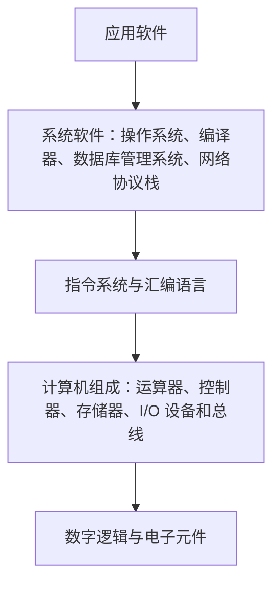

- **计算机体系结构**：程序员**能够看到的机器属性**，如指令系统、数据表示、寻址方式、寄存器组织和 I/O 机制。
  1. 指令系统：寻址方式、指令控制方式、吞吐率和流水时间。
  2. CISC（**Complex Instruction Set Computer**,复杂指令集计算机） 和 RISC(**Reduced Instruction Set Computer**，精简指令集计算机)
  3. 存储系统
  4. 输入/输出技术：
- **计算机组成**：实现体系结构的**具体硬件组织和技术**，如控制器实现、流水线、Cache、总线和存储器结构。
- **计算机实现**：具体器件、芯片、制造工艺和物理实现。

考试中常见的区分是：指令系统、寻址方式属于体系结构；流水线、Cache 组织和控制器实现更偏向组成。

#### 1.2 冯·诺依曼结构(Von Neumann)

冯·诺依曼结构的**核心思想是存储程序**：程序和数据统一存放在存储器中，指令按地址顺序执行，必要时通过转移指令改变执行顺序。

中央处理单元（CPU,Central Processing Unit）主要有运算器，控制器，寄存器组和内部总线等部件组成。

基本部件包括：

- **运算器**：完成算术运算和逻辑运算。
  
  - **算术逻辑单元 ALU（Arithmetic Logic Unit）**：运算器的**重要组成部件**执行加、减、与、或、非、异或、移位和比较等操作。
  - **累加器寄存器 AC(Accumulator)**：通用寄存器，为ALU提供一个工作空间，保存运算操作数或中间结果，传统结构中使用较多。
  - **数据缓冲寄存器 DR(Data Register)**: 作为CPU和内存，外部设备之间数据传送的中转站，解决不同设备操作速度上的缓冲。
  - **状态条件寄存器 PSW(Program Status Word)**：保存进位、零、负号、溢出等标志，保存由算数指令和逻辑指令运行或测试的结果建立的各种条件码内容，有**状态标志**和**控制标志**两种类型。
  
- **控制器**：取指、译码、发出控制信号、控制指令执行。
  
  计算机在执行指令的过程中，需要由CPU的控制器产出每条指令的操作信号并将信号送到相应部件处理完成指定操作。
  
  主要包含**指令控制逻辑**、**时序控制逻辑**、**总线控制逻辑**和**中断控制逻辑**几个部分
  
  
  
  - **指令寄存器 IR（Instruction Register）**，CPU执行指令的时候，将指令从内存存储器取到缓冲寄存器，再送入IR暂存。
  
  - **程序计数器 PC(Program Counter)**：指出下一条待执行指令的地址。
    1. 程序开始执行前，将程序起始地址送入PC（**程序第一条指令的地址**）
    2. 执行指令时，CPU自动修改PC的内容，**保存将要执行的下一条指令的地址**
  - **地址寄存器 AR(Address Register)**: 保存当前CPU所访问的内存单元的地址
  - **指令译码器 ID(**Instruction Decoder**)**：识别操作码并产生相应控制信号。
  
- **存储器**：保存程序、数据、中间结果和最终结果。

- **输入设备**：将外部信息转换为计算机可处理的形式。

- **输出设备**：将处理结果转换为人可理解或其他设备可接收的形式。

- **总线**：在部件之间传输地址、数据和控制信号。

现代计算机通常采用改进的冯·诺依曼结构，通过 Cache、流水线、并行执行、分支预测和多级存储器缓解传统结构的性能瓶颈。

#### 1.3 哈佛结构与冯·诺依曼结构

| 对比项 | 冯·诺依曼结构 | 哈佛结构 |
|---|---|---|
| 程序与数据 | 共用存储器和总线 | 程序存储器与数据存储器分离 |
| 访问方式 | 取指和访问数据可能竞争 | 可同时取指和访问数据 |
| 灵活性 | 较高，地址空间统一 | 结构清晰，访问并行性较好 |
| 常见场景 | 通用计算机 | 微控制器、DSP、部分嵌入式处理器 |

很多现代处理器采用改进型哈佛结构：Cache 层面将指令 Cache 和数据 Cache 分开，但主存地址空间仍可能统一。

### 2. 数据表示与数制转换

计算机中，采用**机器数**表示各种数值，特点是采用**二进制**计数制。机器数有无符号数和带符号数之分，带符号数中最高位表示正负的符号位。带符号的机器数有原码、反码、补码和移码等不同编码方式。

#### 2.1 常用数制

计算机中常用二进制、八进制、十进制和十六进制：

| 数制 | 基数 | 常用数字 | 与二进制关系 |
|---|---:|---|---|
| 二进制 | 2 | 0、1 | 基本表示形式 |
| 八进制 | 8 | 0—7 | 每 3 位二进制对应 1 位八进制 |
| 十进制 | 10 | 0—9 | 人类常用 |
| 十六进制 | 16 | 0—9、A—F | 每 4 位二进制对应 1 位十六进制 |

整数按位权展开：

```text
(dn...d1d0)r = dn×r^n + ... + d1×r^1 + d0×r^0
```

例如：

```text
(101101)2 = 1×2^5 + 0×2^4 + 1×2^3 + 1×2^2 + 0×2^1 + 1 = 45
(2D)16 = 2×16 + 13 = 45
```

#### 2.2 进制转换方法

- 二进制转八进制：从小数点向左右每 3 位分组，不足位在边界补 0。
- 二进制转十六进制：从小数点向左右每 4 位分组，不足位在边界补 0。
- 十进制整数转其他进制：反复除以目标基数，记录余数并逆序读取。
- 十进制小数转其他进制：反复乘以目标基数，依次取整数部分。

小数转换可能出现无限循环。例如十进制 `0.1` 转成二进制通常是无限循环小数，只能按题目要求保留指定位数。

#### 2.3 原码、反码、补码和移码

对 `n` 位机器字长，最高位通常作为符号位：0 表示正数，1 表示负数。

| 表示法 | 正数 | 负数 |   `n` 位整数范围 | n 位小数范围 |
|---|---|---|---|---|
| 原码 | 数值的二进制 | 符号位为 1，数值位取绝对值 |  `-(2^(n-1)-1)` 到 `2^(n-1)-1` | -(1-2^-(n-1)) 到 +(1-2^-(n-1)) |
| 反码 | 与原码相同 | 原码除符号位外按位取反 | `-(2^(n-1)-1)` 到 `2^(n-1)-1` | -(1-2^-(n-1)) 到 +(1-2^-(n-1)) |
| 补码 | 与原码相同 | 反码加 1 | `-2^(n-1)` 到 `2^(n-1)-1` | -1 到 +(1-2^-(n-1)) |
| 移码 | 补码的符号位取反 | 通常用于浮点数中的阶码 | `-2^(n-1)` 到 `2^(n-1)-1` | -1 到 +(1-2^-(n-1)) |

补码求负数的方法：

1. 对正数的二进制按位取反。
2. 末位加 1。
3. 保留指定位数，最高位溢出舍弃。

例如 8 位补码中：

```text
+5 = 00000101
-5 = 11111011
```

补码的特点：

- 加法和减法可以统一使用加法器完成。
- 只有一个 0。
- 多出一个负数 `-2^(n-1)`。
- 判断溢出不能只看最高位是否产生进位，应判断运算结果是否超出可表示范围。

> 1. 在计算机中，数值一律使用补码表示存储，使用补码可以将符号位和其他位统一处理。
> 2. 可以将减法运算转换为加法运算简化运算器的设计
> 3. 两个用补码表示的数相加时，如果最高位即符号位有进位，则进位舍弃。
> 4. 补码0只有一种表示方式
>
> 

#### 2.4 补码加减法与溢出

补码加法直接按位相加，超出字长的最高进位丢弃。减法可转化为加上减数的补码：

```text
A - B = A + (-B)
```

补码加法溢出的判断方法：

- 两个正数相加得到负数，发生正溢出。
- 两个负数相加得到正数，发生负溢出。
- 一正一负相加不会发生补码溢出。
- 也可比较最高位的进位和次高位的进位，两者不同表示溢出。

例：4 位补码的可表示范围是 `-8` 到 `+7`。`0111 + 0001 = 1000`，数学结果为 8，超出范围，故发生正溢出。

#### 2.5 浮点数及其运算(@@@@)

浮点数通常表示为：

```text
数值 = 尾数 × 基数^阶码
```

典型组成包括符号位、阶码和尾数：

```text
浮点数 = 符号位 + 阶码 + 尾数
```

表示格式为：|   阶符     |    阶码    |   数码   |   尾数   |

- **阶码决定数值的数量级和表示范围**。
- **尾数决定有效数字的精度**。
- 增大阶码位数通常扩大表示范围。
- 增大尾数位数通常提高表示精度。

阶码为带符号的纯整数（常用移码表示），尾数常用带符号的小数表示(常用原码和补码表示)

浮点数加减一般需要：对阶、尾数相加减、规格化、舍入和溢出检查。**对阶时通常将较小阶码的尾数右移，而不是随意移动较大阶码的尾数。**

**浮点数的运算**：

假设有浮点数 `X=M*2^i，Y=N*2^j`，求解 X+Y或X-Y的运算步骤如下：

1. **对阶**：

   目的：让两个浮点数阶数相同，以便进行加减

   实现方式： 对较小的尾数进行右移操作，对阶的原则是向高阶看齐

2. **求尾数和/差**：将两个浮点数的尾数相加减，尾数加减的实质是原码的加减

3. **结果规格化并判断溢出**：若运算结果尾数不是规格化的数，需进行规格化处理，当尾数溢出时，需调整阶码

4. **舍入处理**： 在对阶和右规的时候，最右边的数字会被移出，需要进行舍入处理，以求得最小运算误差。

5. **溢出判别**： 以阶码为准，若阶码溢出，则运算结果溢出；若阶码下溢（小于最小值），则结果为0.

**浮点数的其他运算**:

- 相乘：积的阶码相当于两乘数的阶码相加，积的尾数相当于两乘数的尾数相乘
- 相除：商的阶码相当于被除数的阶码减去除数的阶码，商的尾数相当于被除数的尾码除以除数的尾码。

### 3. 字符、汉字与校验编码

#### 3.1 字符编码

- ASCII 是早期常用字符编码，标准 ASCII 使用 7 位表示 128 个字符，扩展表示可能使用 8 位。
- Unicode 为世界范围内字符提供统一编码空间。
- UTF-8 是 Unicode 的一种变长编码方式，英文字符通常占 1 个字节，其他字符可能占多个字节。
- GB2312、GBK、GB18030 是中文字符编码体系中的常见编码。

题目若问“字符占多少字节”，必须先看编码方式，不能默认所有字符都是 1 字节。

#### 3.2 奇偶校验

奇偶校验通过增加一个校验位，使数据中 1 的个数满足奇校验或偶校验规则。

- **可发现奇数个比特错误**。
- **对偶数个比特错误可能无法发现**。
- 不能根据一个普通奇偶校验位定位错误位置。
- 常用于简单、低成本的差错检测。

#### 3.3 海明码

利用**奇偶校验性来检错和纠错**的校验方法。方法为：在数据位的特定位置上插入K个校验位，通过扩大码距（两个码字中不相同的二进制位的个数**来实现检错和纠错

海明码通过多个校验位覆盖不同的数据位，用校验结果组成错误位置编号。设数据位为 `m` 位，校验位为 `r` 位，单比特纠错通常满足：

```text
2^r ≥ m + r + 1
```

其中：

- `m` 是数据位数量。
- `r` 是校验位数量。
- `m+r` 是编码后的总位数。
- `+1` 用于表示“无错误”状态。

海明距离为任意两个合法码字之间不同二进制位的最少数量。若最小海明距离为 `d`：

```text
最多可检测 d - 1 位错误
最多可纠正 floor((d - 1) / 2) 位错误
```

#### 3.4 CRC 循环冗余校验

CRC 将数据看作二进制多项式，用生成多项式进行**模 2** 除法，余数作为校验码。模 2 除法不进位、不借位，加法和减法都等价于按位异或。**CRC只能检错不能纠错**

**模2运算的数学定义**是：`a mod  2` 的结果是 *a* 除以 2 后的**余数**

计算步骤：

1. 设生成多项式最高次数为 `r`。
2. 原数据末尾补 `r` 个 0。
3. 用生成多项式进行模 2 除法。
4. 得到 `r` 位余数，将余数替换补上的 0。
5. 发送数据为原数据加余数。

CRC 的差错检测能力取决于生成多项式，通常比单个奇偶校验位更强，但 CRC 本身主要用于差错检测，不是加密算法。

### 4. CPU 组成、指令系统与寻址方式

#### 4.1 CPU 的主要部件

CPU 通常由**控制器**、**运算器**、**寄存器组**、**内部总线**、Cache、总线接口和时钟控制部件组成。

常见寄存器：

| 寄存器 | 作用 |
|---|---|
| PC | 保存下一条待执行指令地址 |
| IR | 保存当前正在执行的指令 |
| MAR | 保存将要访问的存储单元地址 |
| MDR | 保存从存储器读出或准备写入的数据 |
| ACC | 保存算术逻辑运算中的操作数或中间结果 |
| PSW | 保存进位、零、负号、溢出、中断屏蔽等状态 |
| SP | 保存栈顶地址 |
| 通用寄存器 | 保存操作数、地址和中间结果 |

指令执行基本过程：

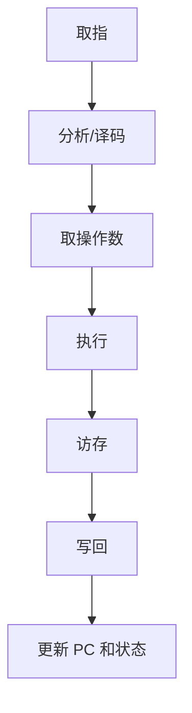

一条指令不一定包含以上所有阶段。例如寄存器之间的加法可能不需要访存，条件转移指令可能重点更新 PC。

#### 4.2 指令格式

指令通常由操作码和地址码组成：

```text
指令 = 操作码 + 地址码/操作数字段
```

- **操作码**：说明执行何种操作。
- **地址码**：说明操作数在哪里或如何获得。
- **寻址方式字段**：说明地址码是立即数、寄存器、存储器地址还是地址的间接引用。

> 指令寻址方式主要分为顺序寻址方式和跳跃寻址方式
>
> 指令操作数寻址方式又分为立即寻址、直接寻址、间接寻址、寄存器直接寻址、寄存器间接寻址

按地址码数量可分为零地址、单地址、双地址和三地址指令。地址码越多，指令表达能力通常越强，但指令长度和硬件复杂度可能增加。

#### 4.3 常见寻址方式

| 寻址方式 | 有效地址/操作数 | 特点 |
|---|---|---|
| 立即寻址 | 操作数就在指令中 | 不需访问主存，速度快；立即数大小受指令长度限制 |
| 直接寻址 | `EA = A` | 地址码直接给出操作数地址 |
| 间接寻址 | `EA = M[A]` | 地址码指向的存储单元中保存有效地址 |
| 寄存器寻址 | 操作数在寄存器中 | 不需访问主存，指令短、速度快 |
| 寄存器间接 | `EA = R` 中保存的地址 | 适合访问数组、指针和链表 |
| 相对寻址 | `EA = PC + 位移量` | 适合转移指令和位置无关代码 |
| 基址寻址 | `EA = 基址寄存器 + 位移量` | 适合程序重定位和分段访问 |
| 变址寻址 | `EA = 变址寄存器 + 位移量` | 适合数组和循环访问 |
| 基址变址 | `EA = 基址 + 变址 + 位移量` | 适合复杂数据结构访问 |

其中 `EA` 表示有效地址，`M[A]` 表示读取地址 `A` 处的存储内容。

地址码位数为 `k` 时，直接寻址能够直接覆盖的地址数量不超过 `2^k`；间接寻址可以通过地址单元间接扩大寻址范围，但需要额外访存。

> **各寻址方式获取操作数的速度：立即寻址>寄存器寻址>直接寻址>间接寻址>寄存器间接寻址**

#### 4.4 

#### 4.5 CISC 与 RISC

| 对比项 | CISC | RISC |
|---|---|---|
| 指令数量 | 多 | 少 |
| 指令长度 | 可变较多 | 通常固定 |
| 寻址方式 | 多 | 少 |
| 指令功能 | 一条指令可能完成复杂操作 | 一条指令通常完成简单操作 |
| 访存方式 | 访存和运算可合并 | 常采用 Load/Store 结构 |
| 控制实现 | 微程序控制常见 | 硬布线控制常见 |
| 流水线 | 相对复杂 | 更容易流水化 |
| 编译器依赖 | 相对较低 | 对编译器优化依赖较高 |

注意：RISC 不等于“指令一定更快”，实际性能还取决于时钟频率、CPI、流水线、缓存、编译器、分支预测和程序特征。

### 7. 存储系统层次与局部性

存储系统通常按速度从快到慢、容量从小到大排列：

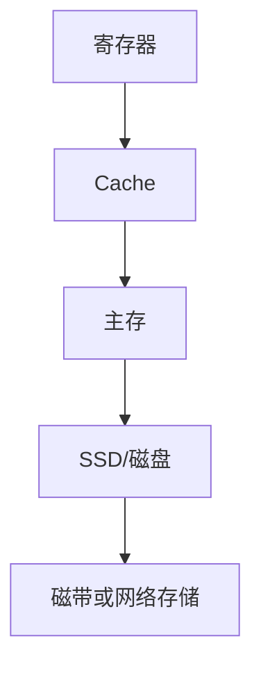

这种层次结构利用程序访问的局部性：

- **时间局部性**：最近访问过的数据可能再次访问。
- **空间局部性**：访问某地址后，附近地址可能很快被访问。
- **顺序局部性**：程序倾向于按顺序执行指令或访问数据。

#### 7.1 存储器分类

| 存储器 | 典型特点 |
|---|---|
| SRAM | 速度快、价格高、无需刷新，常用于 Cache |
| DRAM | 集成度高、容量大、需要刷新，常用于主存 |
| ROM | 非易失，适合保存固件或固定程序 |
| Flash | 可擦写非易失，常用于固态存储和嵌入式设备 |
| 磁盘/SSD | 容量大、作为外存，断电后数据保留 |

SRAM 单元通常由触发器构成，DRAM 单元通常由电容保存电荷。DRAM 需要周期性刷新，刷新会占用存储器访问时间。

#### 7.2 Cache 的基本原理

Cache 保存主存中近期使用的块。访问过程通常为：

1. CPU 给出主存地址。
2. 根据地址中的标记、组号和块内地址查询 Cache。
3. 命中则从 Cache 返回数据。
4. 未命中则从主存取入相应块，更新 Cache 后返回数据。

设 Cache 访问时间为 `Tc`，主存访问时间为 `Tm`，命中率为 `h`，未命中时需要先完成 Cache 检查再访问主存，则平均访问时间为：

```text
T = h × Tc + (1 - h) × (Tc + Tm)
  = Tc + (1 - h) × Tm
```

若题目将未命中惩罚单独给出，应按题干模型计算，重点是分清“命中时间”和“未命中额外代价”。

#### 7.3 Cache 地址划分

设：

- 主存地址长度为 `m` 位。
- Cache 大小为 `C` 字节。
- Cache 行大小为 `B` 字节。
- 采用直接映射。

则：

```text
Cache 行数 = C / B
块内地址位数 = log2(B)
Cache 行号位数 = log2(C / B)
标记位数 = m - 块内地址位数 - Cache 行号位数
```

直接映射时：

```text
Cache 行号 = 主存块号 mod Cache 行数
```

全相联映射没有固定的 Cache 行号字段，主要比较所有行的标记；组相联映射将 Cache 分成若干组，主存块映射到固定组内的任意行。

#### 7.4 Cache 替换算法与写策略

Cache 替换算法：

- **随机替换**：实现简单，但命中率不稳定。
- **FIFO**：淘汰进入最早的块。
- **LRU**：淘汰最长时间未使用的块，更能利用时间局部性。

Cache 写策略：

- **写直达 Write-through**：写 Cache 的同时写主存，数据一致性简单，但写流量大。
- **写回 Write-back**：只写 Cache，块被替换时再写回主存，减少主存写次数，但需要脏位。
- **写分配**：写未命中时先把主存块调入 Cache 再修改。
- **非写分配**：写未命中时直接写主存，不调入 Cache。

常见组合是写回配合写分配、写直达配合非写分配，但具体实现以题目条件为准。

### 8. 主存组织与地址计算

#### 8.1 编址方式

- **按字节编址**：每个地址对应 1 个字节。
- **按字编址**：每个地址对应一个机器字，机器字可能为 16 位、32 位或 64 位。

题目出现“地址单元数”“存储单元字长”“按字节编址”时，要先确认地址对应的单位，再换算总容量。

例如：地址线为 20 位、按字节编址，则地址空间为：

```text
2^20 Byte = 1 MB
```

若存储器有 `N` 个单元、每个单元 `w` bit，则容量为：

```text
容量 = N × w bit = N × w / 8 Byte
```

#### 8.2 存储器芯片扩展

若单片存储芯片容量为 `a` 个单元、每个单元 `b` 位，目标存储器容量为 `A` 个单元、每个单元 `B` 位：

```text
字长扩展片数 = B / b
字数扩展片数 = A / a
总芯片数 = 字长扩展片数 × 字数扩展片数
```

字数扩展通常需要使用高位地址线经译码器产生片选信号；字长扩展通常让各芯片并行连接数据线。

### 11. 奇偶校验、海明码与 CRC 速查

#### 11.1 奇偶校验

奇偶校验通过增加一个校验位，使 1 的个数满足奇校验或偶校验规则：

- 能发现奇数个比特错误。
- 对偶数个比特错误可能无法发现。
- 不能定位错误位置，也不能纠正错误。

#### 11.2 海明码

设信息位为 `m`，校验位为 `r`，单比特纠错通常满足：

```text
2^r ≥ m + r + 1
```

若题目问海明码总长度，则为 `m+r`。若问可以纠正多少位，需结合最小海明距离判断，不能只套校验位公式。

#### 11.3 CRC

CRC 将数据看作二进制多项式，使用生成多项式做模 2 除法，余数作为校验码。模 2 除法使用异或运算，不进位、不借位。CRC 用于差错检测，不用于保密和身份认证。

## 1.2 计算机体系结构

### 5. CPU 性能、时钟与流水线

#### 5.1 CPU 性能公式

CPU 执行程序所需时间常用公式：

```text
CPU 时间 = 指令条数 × CPI × 时钟周期
         = 指令条数 × CPI / 时钟频率
```

其中：

- **指令条数**：程序实际执行的机器指令数量。
- **CPI**：平均每条指令需要的时钟周期数。
- **时钟周期**：时钟频率的倒数。
- **时钟频率**：单位时间内时钟脉冲次数。

性能比较：

```text
性能 ∝ 1 / 执行时间
加速比 = 改进前执行时间 / 改进后执行时间
```

如果时钟频率提高但 CPI 或指令条数同时增加，程序不一定更快；不能只比较主频。

#### 5.2 Amdahl 定律

若程序中可改进部分占原执行时间比例 `f`，该部分加速比为 `s`，则总体加速比为：

```text
总体加速比 = 1 / ((1 - f) + f / s)
```

含义：整体性能提升受不可改进部分限制。即使把某个局部部件加速到无限快，整体加速比也不会无限大。

#### 5.3 流水线

流水线将一条指令的执行拆为多个阶段，使不同指令同时处于不同阶段。若流水线有 `k` 个阶段，每阶段耗时近似为 `t`，执行 `n` 条指令：

```text
非流水线时间 = n × k × t
理想流水线时间 = (k + n - 1) × t
理想加速比 = n × k / (k + n - 1)
```

当 `n` 很大时，理想加速比接近 `k`，但实际受到阶段不均衡、寄存器开销和相关冒险影响。

流水线相关：

- **结构相关**：多个阶段同时争用同一硬件资源。
- **数据相关**：后一条指令依赖前一条指令的结果。
- **控制相关**：分支、跳转导致下一条指令地址不确定。

常见处理方法：暂停、插入气泡、数据旁路、编译器调度、分支预测、分支延迟和乱序执行。

### 6. 总线与系统互连

总线是多个部件之间共享的信息传输通道，通常包括：

- **数据总线**：传输指令、操作数和结果；宽度影响一次传输的数据量。
- **地址总线**：传输存储器或 I/O 设备地址；宽度影响寻址空间。
- **控制总线**：传输读、写、中断、时钟、复位和总线请求等控制信号。

地址总线为 `n` 位、按字节编址时，最大寻址空间为：

```text
2^n Byte
```

总线带宽近似为：

```text
总线带宽 = 总线宽度 × 传输频率 × 每周期传输次数
```

若总线宽度为 `w` bit，时钟频率为 `f`，每个周期传输一次，则：

```text
带宽 = w × f bit/s
```

换算为字节每秒时除以 8。若使用 DDR 等一个周期传输两次，需乘以传输次数。

总线仲裁用于决定多个主设备同时请求总线时谁获得使用权。常见方式包括集中式仲裁、分布式仲裁、链式查询、独立请求和计数器定时查询。

### 9. 输入输出系统与中断

#### 11.1 I/O 控制方式

| 方式 | 工作过程 | 优点 | 缺点 |
|---|---|---|---|
| 程序查询 | CPU 反复读取设备状态寄存器 | 实现简单 | CPU 忙等，效率低 |
| 中断 | 设备就绪后向 CPU 发出请求 | CPU 与设备可并行 | 中断处理有现场保存和切换开销 |
| DMA | DMA 控制器直接在设备和主存间传输 | 适合高速块传输，CPU 负担小 | 硬件复杂，可能争用总线 |
| 通道 | 专用 I/O 处理器执行 I/O 程序 | 适合大型系统和多设备 | 成本和结构复杂 |

DMA 传输时，CPU 不需要逐字节参与，但仍负责初始化 DMA、处理中断和完成后的状态管理。DMA 的基本过程是：CPU 设置起始地址、传输长度和方向；DMA 获取总线控制权；设备与主存直接传输；传输结束后通知 CPU。

#### 11.2 中断处理过程

典型中断处理过程：

1. 外部设备发出中断请求。
2. CPU 在满足响应条件时暂停当前程序。
3. 保存断点和现场信息。
4. 识别中断源并取得中断服务程序入口地址。
5. 执行中断服务程序。
6. 恢复现场，返回被中断程序继续执行。

中断向量表保存不同中断源对应的服务程序入口地址。中断屏蔽用于暂时禁止某些中断；中断优先级决定多个请求同时到达时的处理顺序。

### 10. 磁盘、SSD 与 RAID

#### 12.1 磁盘访问时间

传统磁盘访问时间通常包括：

```text
访问时间 = 寻道时间 + 旋转延迟 + 数据传输时间
```

- **寻道时间**：磁头移动到目标磁道的时间。
- **旋转延迟**：等待目标扇区转到磁头下方的时间。
- **传输时间**：实际读写数据所需时间。

平均旋转延迟约为半个旋转周期：

```text
平均旋转延迟 = 1 / (2 × 转速)
```

转速若以每分钟转数表示，先换算为每秒转数，再计算周期。

#### 12.2 RAID

RAID 通过多个磁盘组合提高可靠性、容量或性能：

| RAID 级别 | 主要方式 | 容错/性能特点 |
|---|---|---|
| RAID 0 | 条带化，无冗余 | 读写性能高，但任一磁盘故障可能导致数据丢失 |
| RAID 1 | 镜像 | 可容忍镜像中的一块磁盘故障，空间利用率约 50% |
| RAID 5 | 条带化 + 分布式奇偶校验 | 通常可容忍一块磁盘故障，写入有校验开销 |
| RAID 6 | 条带化 + 双重分布式校验 | 通常可容忍两块磁盘故障，写入开销更大 |
| RAID 10 | 先镜像再条带化 | 性能和可靠性较好，但成本较高 |

RAID 0 只提升性能和容量利用，不提供可靠性；题目出现“既要高性能又要容错”时，不能选择 RAID 0。

### 12. 高频计算题与答题模板

#### 12.1 地址空间

```text
地址总线 n 位、按字节编址：地址空间 = 2^n Byte
存储单元数 N、单元字长 w bit：容量 = N × w / 8 Byte
```

#### 12.2 CPU 执行时间

```text
CPU 时间 = 指令条数 × CPI / 时钟频率
```

解题顺序：统一时间单位；确认 CPI 是平均值还是分类型给出；确认指令条数是否为实际执行条数；最后换算为 ns、μs 或 ms。

#### 12.3 Cache 地址划分

```text
Cache 行数 = Cache 容量 / 块大小
块内地址位数 = log2(块大小)
组号位数 = log2(组数)
标记位数 = 主存地址位数 - 块内地址位数 - 组号位数
```

#### 12.4 流水线

```text
非流水线时间 = 指令数 × 阶段数 × 阶段时间
流水线时间 = (指令数 + 阶段数 - 1) × 阶段时间
```

若各阶段耗时不同，流水线时钟周期通常取各阶段最大耗时，并考虑流水线寄存器开销。

#### 12.5 海明码校验位

```text
从最小 r 开始，使 2^r ≥ m+r+1
```

### 13. 本章易错点

- 地址总线宽度决定寻址范围，数据总线宽度决定一次传输的数据量，二者不能混淆。
- 主频高不代表程序执行时间一定短，还要看指令条数和 CPI。
- 补码中 `1000...0` 表示最小负数，不是普通正数。
- 两个同号补码相加得到异号结果才是溢出判据之一；一正一负相加不会产生补码溢出。
- 浮点数阶码主要影响范围，尾数主要影响精度。
- Cache 未命中时通常需要付出 Cache 检查时间和主存访问时间，具体以题干公式为准。
- 直接映射中主存块的 Cache 行号为“主存块号对 Cache 行数取模”。
- SRAM 常用于 Cache，DRAM 常用于主存；不要把二者的特点写反。
- DMA 不是完全不需要 CPU，而是减少 CPU 对每个数据单元的干预。
- RAID 0 没有冗余和容错能力；RAID 1 的可用容量通常约为总物理容量的一半。
- CRC、奇偶校验和海明码主要解决差错检测/纠正，不等同于加密和认证。
- 立即寻址的操作数在指令中，直接寻址的地址码就是有效地址，间接寻址的地址码指向保存有效地址的存储单元。
- 机器字长、存储字长和地址字长可能不同，题目要先分清“字长”“总线宽度”和“编址单位”。
- CPU 执行时间要优先套用 `指令条数 × CPI / 主频`，不要只看主频或 MIPS。
- Cache 题不能只背映射公式，还要先判断是直接映射、组相联还是全相联，再算标记位、组号位和块内地址位。
- 流水线的理想加速比会被阶段不均衡、寄存器开销和冲突打折，通常不能直接按级数理解。
- 存储容量计算要先确认按字编址还是按字节编址，字节数、字数和位数不能混用。
- RAID 5 至少需要 3 块盘，容量通常按 `n-1` 块盘计算，和 RAID 0、RAID 1、RAID 0+1 容易混淆。
- 校验码、纠错码只解决传输错误，不提供保密性、完整性认证或访问控制。

### 14. 本章自测清单

- [ ] 能区分计算机体系结构、组成和实现。
- [ ] 能完成二进制、八进制、十六进制和十进制之间的转换。
- [ ] 能计算原码、反码和补码，并判断补码加减法溢出。
- [ ] 能说明浮点数阶码和尾数分别影响什么。
- [ ] 能计算海明码校验位数量和 CRC 的基本步骤。
- [ ] 能说明 PC、IR、MAR、MDR、PSW、SP 的作用。
- [ ] 能根据寻址方式计算有效地址和访存次数。
- [ ] 能使用 CPU 时间公式和 Amdahl 定律。
- [ ] 能计算流水线时间、加速比和总线带宽。
- [ ] 能完成 Cache 行数、组号位、块内地址位和标记位的计算。
- [ ] 能区分 SRAM、DRAM、ROM、Flash 的用途和特点。
- [ ] 能区分程序查询、中断、DMA 和通道。
- [ ] 能计算磁盘访问时间并判断 RAID 级别特点。

---

## 1.3 计算机可靠性模型

# 2. 网络与信息安全基础知识

## 2.1 网络协议

计算机网络是软件设计师考试中综合性较强的章节，常考协议分层、网络设备、以太网、IP 地址与子网划分、路由协议、TCP/UDP、应用层协议、网络安全和网络性能计算。

本章复习主线如下：

> 比特如何传输 → 帧如何交付 → 分组如何寻址和路由 → 端到端如何可靠传输 → 应用如何提供网络服务 → 通信如何保证安全

### 1. 网络体系结构与协议分层

#### 1.1 分层思想

网络通信被拆分为多个层次，每层向上一层提供服务，同时使用下一层提供的服务。分层的优点：

- 降低复杂度，便于设计、实现和维护。
- 层间接口稳定时，可以独立替换某一层实现。
- 便于故障定位和协议标准化。
- 支持不同厂商设备和不同网络的互联。

协议由语法、语义和同步组成：

- **语法**：数据格式、字段和编码。
- **语义**：字段含义、控制信息和错误处理。
- **同步**：通信双方何时发送、如何响应以及时序要求。

#### 1.2 OSI 七层模型

```text
应用层       为应用程序提供网络服务
表示层       数据格式转换、编码、压缩、加密
会话层       建立、管理和终止会话，提供同步点
传输层       端到端传输、可靠性、流量控制和复用
网络层       逻辑寻址、路由和分组转发
数据链路层   成帧、物理寻址、介质访问和差错检测
物理层       比特传输、信号、接口和传输介质
```

常见考法：

- MAC 地址主要属于数据链路层。
- IP 地址和路由属于网络层。
- TCP/UDP 端口和端到端可靠传输属于传输层。
- HTTP、DNS、FTP、SMTP 等属于应用层。
- 加密、压缩和编码转换在 OSI 中偏向表示层，但实际互联网协议常跨层实现。

#### 1.3 TCP/IP 协议族

TCP/IP 常用四层模型：

| TCP/IP 层 | 常见协议 | 对应 OSI 层次 |
|---|---|---|
| 应用层 | HTTP、DNS、DHCP、FTP、SMTP、SSH | 应用、表示、会话 |
| 传输层 | TCP、UDP | 传输 |
| 网际层 | IP、ICMP、IGMP、ARP 相关机制 | 网络 |
| 网络接口层 | Ethernet、PPP、Wi-Fi | 数据链路、物理 |

不同教材可能将网络接口层拆成数据链路层和物理层，或将 ARP 单独归类。考试时优先依据题目给出的协议职责判断，不要只凭层名称死记。

#### 1.4 封装与解封装

发送数据时，各层通常在上层数据前后增加本层控制信息：

```text
应用数据
↓ 加传输层首部
报文段/用户数据报
↓ 加网络层首部
分组/数据报
↓ 加数据链路层首部和尾部
帧
↓ 编码为信号
比特流
```

接收端按相反方向逐层去除首部和尾部。不同层数据单元名称：

| 层次 | 数据单元 |
|---|---|
| 应用层 | 消息/数据 |
| 传输层 | TCP 报文段、UDP 用户数据报 |
| 网络层 | IP 数据报/分组 |
| 数据链路层 | 帧 |
| 物理层 | 比特 |

### 2. 物理层与传输介质

#### 2.1 传输介质

- **双绞线**：成本低、安装方便，常用于局域网和电话线路。
- **同轴电缆**：抗干扰能力较强，但在现代局域网中不如双绞线常见。
- **光纤**：带宽高、传输距离远、抗电磁干扰，不易被电磁窃听。
- **无线介质**：包括无线电、微波、红外和卫星通信，部署灵活但易受干扰和遮挡。

光纤可以分为单模光纤和多模光纤：单模适合长距离和高速传输，多模成本相对低，适合较短距离。

#### 2.2 信道容量与传输速率

数据传输速率表示单位时间传输的比特数，单位通常为 bit/s；带宽在通信中可表示信号频带宽度，也常被口语化地用于表示传输能力。

理想无噪声信道的奈奎斯特公式：

```text
最大数据传输速率 = 2B log2(L)
```

其中：

- `B` 是信道带宽，单位 Hz。
- `L` 是信号电平数量。

有噪声信道的香农公式：

```text
信道容量 C = B log2(1 + S/N)
```

其中 `S/N` 是信噪比。若题目给出分贝值：

```text
SNR(dB) = 10 log10(S/N)
```

传输时延：

```text
发送时延 = 数据长度(bit) / 链路速率(bit/s)
```

传播时延：

```text
传播时延 = 链路长度 / 信号传播速度
```

总时延还可能包括排队时延和处理时延：

```text
总时延 = 发送时延 + 传播时延 + 排队时延 + 处理时延
```

发送时延取决于数据量和发送速率；传播时延取决于距离和介质传播速度，二者不能混淆。

### 3. 数据链路层

#### 3.1 数据链路层功能

- 将网络层分组封装成帧。
- 使用 MAC 地址进行局部网络交付。
- 进行帧同步和透明传输。
- 进行差错检测，部分协议还支持差错纠正。
- 实现流量控制。
- 管理共享介质的访问。

#### 3.2 成帧方法

常见成帧方式：

- 字符计数法。
- 字节填充法。
- 比特填充法。
- 物理层编码违例法。

**比特填充**常见规则是：发送端在连续若干个 `1` 后插入 `0`，接收端在对应位置删除填充位，以避免数据内容与帧定界标志混淆。题目若给出具体标志位和填充规则，应严格按题干模拟。

#### 3.3 差错检测

数据链路层常见差错检测：

- 奇偶校验。
- 校验和。
- CRC 循环冗余校验。
- 海明码。

CRC 通过生成多项式做模 2 除法得到余数。模 2 运算本质是按位异或，不进位、不借位。CRC 主要用于检测传输错误，不是加密算法。

#### 3.4 流量控制

流量控制用于协调发送方和接收方的处理速度，防止接收方缓冲区溢出。

- **停止—等待协议**：发送一帧后等待确认，再发送下一帧；实现简单但链路利用率可能低。
- **滑动窗口协议**：允许发送方连续发送多个帧，接收方通过窗口控制未确认数据量。
- **回退 N 帧 Go-Back-N**：某帧出错后，重传该帧及其后已发送但未确认的帧。
- **选择重传 Selective Repeat**：只重传出错或丢失的帧，接收方可能缓存乱序帧，效率较高但实现复杂。

#### 3.5 MAC 地址与局域网

MAC 地址通常用于数据链路层局部网络内的帧交付。交换机通过学习源 MAC 地址建立转发表，根据目的 MAC 地址选择端口转发：

- 目的 MAC 在转发表中：定向转发。
- 目的 MAC 未知：在除入端口外的其他端口泛洪。
- 广播帧：通常在广播域内泛洪。
- 交换机收到源地址后会更新源 MAC 与端口映射。

交换机隔离冲突域，但默认不隔离广播域；路由器可以隔离广播域。

#### 3.6 以太网与 CSMA/CD

传统共享式以太网使用 CSMA/CD：

1. 发送前监听信道。
2. 信道空闲时发送。
3. 发送过程中继续检测冲突。
4. 发生冲突时发送干扰信号并停止发送。
5. 按二进制指数退避等待后重新发送。

现代全双工交换式以太网通常不需要 CSMA/CD，因为每个端口拥有独立链路，不存在共享冲突域。

#### 3.7 无线局域网

无线局域网常使用 CSMA/CA，通过竞争、确认、随机退避和可选 RTS/CTS 减少碰撞。无线设备无法像有线设备那样可靠地边发送边检测冲突，因此重点是碰撞避免而不是碰撞检测。

### 4. 网络层与 IP 协议

#### 4.1 网络层功能

- 逻辑地址分配。
- 路由选择。
- 分组转发。
- 拥塞处理和差错报告。
- 不同网络之间的互联。

网络层通常提供尽力而为的数据报服务，IP 本身不保证分组一定到达、不重复、不乱序，也不保证端到端可靠性；可靠性通常由 TCP 等上层协议实现。

#### 4.2 IPv4 地址结构

IPv4 地址为 32 位，通常分为网络号和主机号。CIDR 使用前缀长度表示网络位，例如 `/24` 表示前 24 位为网络部分，剩余 8 位为主机部分。

子网掩码中网络位为 1，主机位为 0。例如：

```text
/24 = 255.255.255.0
/16 = 255.255.0.0
/8  = 255.0.0.0
```

IPv4 地址类别的传统记忆：

| 类别 | 首字节范围 | 默认前缀 | 用途概念 |
|---|---:|---|---|
| A 类 | 1—126 | `/8` | 大型网络 |
| B 类 | 128—191 | `/16` | 中型网络 |
| C 类 | 192—223 | `/24` | 小型网络 |
| D 类 | 224—239 | 无传统主机划分 | 组播 |
| E 类 | 240—255 | 保留/实验 | 特殊用途 |

现代网络通常使用 CIDR，不应机械地用 A/B/C 类默认边界进行规划。

#### 4.3 特殊 IPv4 地址

- `0.0.0.0`：未指定地址或默认路由中的特殊表示。
- `127.0.0.0/8`：回环地址范围，常用 `127.0.0.1`。
- `255.255.255.255`：受限广播地址。
- 网络地址：主机位全 0，表示网络本身。
- 广播地址：主机位全 1，表示向子网所有主机广播。
- 私有地址：常见范围包括 `10.0.0.0/8`、`172.16.0.0/12`、`192.168.0.0/16`。

#### 4.4 子网划分

若借用 `s` 位主机位作为子网位：

```text
子网数量 = 2^s
每个子网地址总数 = 2^h
传统可用主机数 = 2^h - 2
```

其中 `h` 是剩余主机位数。传统计算中需要排除主机位全 0 的网络地址和主机位全 1 的广播地址；特殊点到点链路和现代地址规划可能采用不同规则，以题目条件为准。

#### 4.5 IP 地址计算步骤

给定 IP 地址和子网掩码：

```text
网络地址 = IP 地址 AND 子网掩码
广播地址 = 网络地址 OR 反掩码
主机地址范围 = 网络地址之后到广播地址之前
```

判断两个 IP 是否在同一子网：

1. 分别将两个 IP 与同一个子网掩码按位 AND。
2. 比较所得网络地址。
3. 网络地址相同则属于同一子网，否则需要路由器转发。

#### 4.6 VLSM 与 CIDR

- **VLSM**：可变长子网掩码，根据不同网络规模分配不同前缀长度，减少地址浪费。
- **CIDR**：无类别域间路由，使用任意长度前缀聚合地址和路由。
- **路由聚合**：将多个连续网络合并为一个更短前缀，减少路由表项。

地址聚合要求网络地址连续且在二进制前缀上具有共同部分。题目要求聚合时，要检查地址块数量是否为 2 的幂、起始地址是否按块大小对齐。

#### 4.7 IPv4 分片

当 IP 数据报长度超过下一链路的 MTU 时，可能需要分片。分片字段包括标识、标志和片偏移：

- 同一原始数据报的各片具有相同标识。
- `MF` 表示后面是否还有分片。
- 片偏移以 8 字节为单位。
- 只有最后一个分片的 `MF` 通常为 0。
- 分片后的总数据长度和片偏移要按题目单位计算。

IPv4 分片会增加处理开销和丢包重组风险；现代网络常通过路径 MTU 发现减少分片。

#### 4.8 IPv6

IPv6 地址长度为 128 位，使用冒号十六进制表示。主要特点：

- 地址空间巨大。
- 固定基本首部，路由处理更规则。
- 不在基本首部中使用 IPv4 形式的首部校验和。
- 支持自动配置和邻居发现。
- 使用组播和任播等机制，不使用传统广播方式。
- 中间路由器通常不对 IPv6 数据包分片，分片由源端完成。

IPv6 地址压缩时，连续的全 0 字段可以用 `::` 一次表示；一个地址中最多使用一次 `::`。

### 5. ARP、ICMP 与网络地址转换

#### 5.1 ARP

ARP 用于在 IPv4 局域网中根据 IP 地址解析对应的 MAC 地址。

过程：

1. 主机检查 ARP 缓存。
2. 若没有对应项，广播 ARP 请求：“谁拥有该 IP？”
3. 目标主机单播 ARP 应答，返回自己的 MAC 地址。
4. 请求主机缓存 IP—MAC 映射，随后封装数据帧。

ARP 只解决同一局域网内的 IP 到 MAC 映射。若目标主机在其他网络，主机通常解析默认网关的 MAC 地址，将帧发给网关，再由路由器转发。

#### 5.2 ICMP

ICMP 用于 IP 网络中的差错报告和诊断，不属于 TCP/UDP 传输层。常见用途：

- `ping` 使用回显请求和回显应答测试可达性。
- `traceroute/tracert` 利用 TTL 递减和 ICMP 超时报文探测路径。
- 目的不可达、超时和重定向等差错报告。

ICMP 报告的是网络层相关错误，不保证替代 TCP 提供可靠传输。

#### 5.3 NAT

NAT 将内部私有地址转换为外部可路由地址，常见于家庭路由器和企业出口。

- 静态 NAT：固定一对一映射。
- 动态 NAT：从地址池中临时分配外部地址。
- PAT/NAPT：通过端口号让多个内部主机共享一个公网地址。

NAT 可以节省公网 IPv4 地址并隐藏内部地址结构，但会影响端到端连接、协议兼容性和入站访问。

### 6. 路由与路由协议

#### 6.1 路由表

路由表通常包含：目的网络、前缀/掩码、下一跳、出接口和度量值。

路由器转发时通常采用最长前缀匹配：若多个表项都匹配目标地址，选择网络前缀最长、最具体的路由。

默认路由通常用 `0.0.0.0/0` 表示，只有没有更具体路由匹配时才使用。

#### 6.2 距离向量与链路状态

| 对比项 | 距离向量 | 链路状态 |
|---|---|---|
| 典型协议 | RIP | OSPF |
| 网络信息 | 与邻居交换距离向量 | 泛洪链路状态信息 |
| 计算方法 | Bellman-Ford 思想 | Dijkstra 最短路径优先 |
| 收敛速度 | 相对较慢 | 通常较快 |
| 规模 | 小型网络 | 中大型网络 |
| 典型问题 | 计数到无穷、环路 | 状态数据库和计算开销 |

#### 6.3 RIP

RIP 是典型距离向量路由协议，以跳数作为度量。传统 RIP 最大有效跳数为 15，16 表示不可达，适合较小网络。

RIP 可能产生路由环路和计数到无穷问题，常使用水平分割、毒性逆转和最大跳数等机制缓解。

#### 6.4 OSPF

OSPF 是链路状态路由协议：

1. 发现邻居并建立邻接关系。
2. 泛洪链路状态信息。
3. 每台路由器建立链路状态数据库。
4. 以自身为根运行 Dijkstra 算法。
5. 根据最短路径树形成路由表。

OSPF 支持区域划分、开销度量和认证，适合较大规模自治系统内部路由。

#### 6.5 BGP

BGP 是自治系统之间的路径向量协议，主要用于 Internet 级别的域间路由。它关注策略、路径属性、自治系统路径和可达性，不只是单纯选择最短物理路径。

### 7. 传输层：TCP 与 UDP

#### 7.1 端口与套接字

传输层通过端口号区分同一主机上的不同应用进程。一个 TCP 连接通常由四元组唯一标识：

```text
源 IP + 源端口 + 目的 IP + 目的端口
```

套接字通常可理解为 IP 地址与端口的组合，是应用进程进行网络通信的端点。

#### 7.2 TCP 与 UDP 对比

| 对比项 | TCP | UDP |
|---|---|---|
| 连接 | 面向连接 | 无连接 |
| 数据边界 | 字节流，不保留应用消息边界 | 保留数据报边界 |
| 可靠性 | 确认、重传、排序、去重 | 不保证可靠交付 |
| 流量控制 | 滑动窗口 | 无通用内置机制 |
| 拥塞控制 | 有 | 无通用内置机制 |
| 首部开销 | 较大 | 较小 |
| 适用场景 | Web、文件、数据库连接 | DNS、实时音视频、广播和简单请求 |

UDP 不提供可靠性并不代表一定不可靠；应用程序可以在 UDP 之上自行实现确认、重传、排序和拥塞处理。

#### 7.3 TCP 三次握手

典型过程：

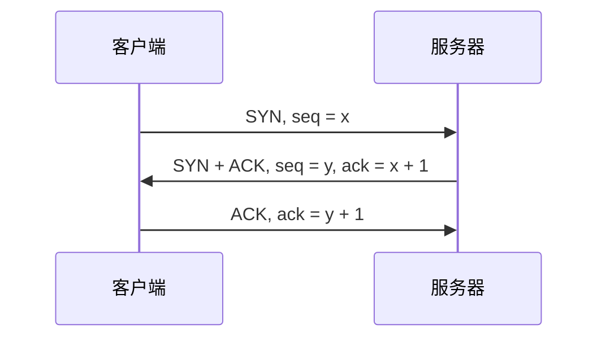

作用：

- 确认双方具有发送和接收能力。
- 同步双方初始序列号。
- 防止旧连接请求影响新连接。

三次握手不是简单的“发送三次数据”，而是双方各自确认对方的序列号和收发能力。

#### 7.4 TCP 四次挥手

TCP 全双工连接的两个方向可以独立关闭：

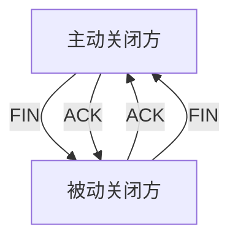

被动关闭方收到 FIN 后可能仍有数据要发送，因此 ACK 和 FIN 通常分成两个阶段。主动关闭方进入 `TIME_WAIT`，等待足够时间使旧报文失效并确保最后 ACK 可重传。

#### 7.5 TCP 可靠传输

TCP 通过以下机制实现可靠字节流：

- 序列号：标识字节在数据流中的位置。
- 确认号：表示下一次期望接收的字节序号。
- 校验和：检测传输错误。
- 超时重传：未及时收到确认则重传。
- 快速重传：收到多个重复确认时提前重传疑似丢失报文段。
- 滑动窗口：允许多个报文段在途，提高链路利用率。
- 接收缓存和按序交付：处理乱序报文段。

TCP 序列号按字节计数，不是按报文段数量计数。SYN 和 FIN 通常各消耗一个序列号，纯 ACK 通常不消耗序列号。

#### 7.6 流量控制

流量控制解决发送方速度超过接收方处理能力的问题。TCP 接收方通过接收窗口 `rwnd` 告知还可接收的数据量，发送方未确认数据不能超过接收窗口约束。

当接收方缓存不足时，可以通告较小窗口甚至零窗口；发送方需要使用窗口探测等机制避免连接永久停滞。

#### 7.7 拥塞控制

拥塞控制解决网络整体负载过高问题，关注发送方、路由器和网络链路的状态。

常见机制：

- **慢启动**：拥塞窗口从较小值开始，通常快速增长。
- **拥塞避免**：窗口达到阈值后转为较缓慢增长。
- **快速重传**：根据重复 ACK 推断报文段丢失并提前重传。
- **快速恢复**：发生轻度拥塞时减少窗口但不完全回到初始值。

发送窗口通常受以下因素共同限制：

```text
实际发送窗口 = min(拥塞窗口 cwnd, 接收窗口 rwnd)
```

流量控制看接收方能力，拥塞控制看网络整体能力，两者不能混淆。

### 9. 网络设备与广播域

| 设备 | 主要层次 | 主要功能 |
|---|---|---|
| 中继器 | 物理层 | 放大、整形和转发信号 |
| 集线器 | 物理层 | 向多个端口广播比特流 |
| 网桥 | 数据链路层 | 根据 MAC 地址转发帧 |
| 交换机 | 数据链路层 | 多端口网桥，隔离冲突域 |
| 路由器 | 网络层 | 根据 IP 和路由表转发分组 |
| 网关 | 多层/协议边界 | 完成不同协议或体系转换 |
| 防火墙 | 多层 | 按安全策略过滤流量 |
| 负载均衡器 | 多层 | 将请求分发到多个后端 |

- 冲突域：可能发生共享介质冲突的范围。
- 广播域：二层广播能够到达的范围。
- 交换机通常隔离冲突域，但不默认隔离广播域。
- 路由器接口通常划分不同广播域。
- VLAN 可以在交换网络中划分逻辑广播域，不同 VLAN 之间通常需要三层设备通信。

### 11. 网络性能与常见计算题

#### 11.1 传输时延与传播时延

```text
发送时延 = 数据长度(bit) / 链路速率(bit/s)
传播时延 = 链路长度 / 信号传播速度
总时延 = 发送时延 + 传播时延 + 排队时延 + 处理时延
```

数据包长度要从字节换算为比特；链路速率通常以 bit/s 表示；光纤和铜缆传播速度通常低于真空光速，具体按题目给定值计算。

#### 11.2 奈奎斯特与香农

无噪声信道的奈奎斯特公式：

```text
最大码元速率 = 2B
最大数据速率 = 2B log2(L)
```

有噪声信道的香农公式：

```text
C = B log2(1 + S/N)
```

若信噪比用分贝给出：

```text
SNR(dB) = 10 log10(S/N)
```

实际可达速率还会受到编码、协议开销、设备能力和误码率影响。

#### 11.3 子网计算模板

```text
主机位数 h = 32 - 前缀长度
地址总数 = 2^h
传统可用主机数 = 2^h - 2
网络地址 = IP AND 掩码
广播地址 = 网络地址 OR 反掩码
```

判断同网段：分别计算网络地址并比较。判断可聚合地址：检查网络连续性、块大小和起始地址对齐。

#### 11.4 TCP 窗口与吞吐量

理想条件下，滑动窗口协议的吞吐量受窗口大小和往返时延限制。若窗口大小为 `W` bit，RTT 为 `T` 秒：

```text
窗口限制下吞吐量 ≈ W / RTT
```

实际吞吐量还受链路带宽、拥塞窗口、接收窗口、报文开销和丢包重传影响。

#### 11.5 停止—等待协议利用率

若发送一帧耗时为 `Tt`，往返传播和确认等待等组成一个周期，链路利用率通常可按：

```text
利用率 = 有效发送时间 / 一个发送—等待周期
```

具体公式取决于题目是否给出确认帧发送时间、传播时延和处理时延，不能脱离条件强行套一个固定式。

### 13. 网络协议与设备速查

| 目标 | 常见协议/技术 |
|---|---|
| 域名解析 | DNS |
| 自动分配网络参数 | DHCP |
| Web 访问 | HTTP、HTTPS |
| 文件传输 | FTP、SFTP |
| 邮件发送 | SMTP |
| 邮件接收/同步 | POP3、IMAP |
| 远程安全登录 | SSH |
| IP 到 MAC 解析 | ARP |
| 网络诊断和差错报告 | ICMP |
| 内部距离向量路由 | RIP |
| 内部链路状态路由 | OSPF |
| 自治系统间路径向量 | BGP |
| 局域网帧转发 | Ethernet、交换机 |

## 2.2 Internet 及应用

### 8. 应用层协议

#### 8.1 DNS

DNS 将域名解析为 IP 地址，也可以提供反向解析、邮件服务器和其他资源记录。

解析方式：

- 递归查询：请求服务器负责返回最终结果。
- 迭代查询：服务器返回下一步应查询的服务器或线索。
- 本地缓存：减少重复查询和响应时间。

常见记录：

- `A`：域名到 IPv4 地址。
- `AAAA`：域名到 IPv6 地址。
- `CNAME`：规范名称别名。
- `MX`：邮件交换服务器。
- `NS`：权威名称服务器。
- `PTR`：反向解析记录。

#### 8.2 DHCP

DHCP 为主机自动分配 IP 地址、子网掩码、默认网关、DNS 服务器等配置。常见过程可记为：

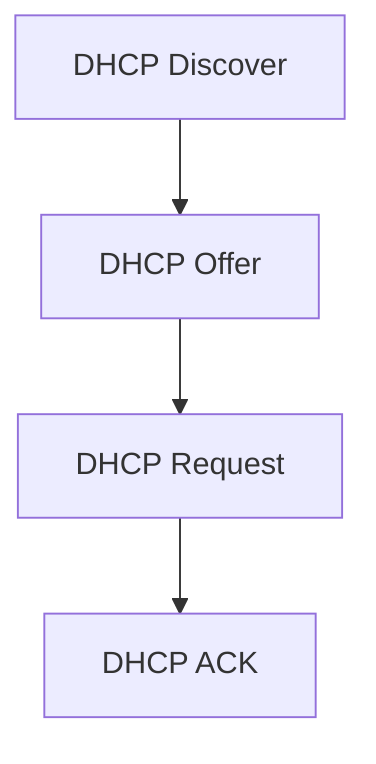

DHCP 通常基于 UDP，客户端初始没有 IP 地址时可能使用广播进行发现。

#### 8.3 HTTP 与 HTTPS

HTTP 是应用层请求—响应协议，常见方法：

- `GET`：获取资源。
- `POST`：提交数据或创建处理请求。
- `PUT`：整体更新或创建资源。
- `PATCH`：部分更新。
- `DELETE`：删除资源。
- `HEAD`：只获取响应头。

HTTP 状态码类别：

```text
1xx：信息
2xx：成功
3xx：重定向
4xx：客户端错误
5xx：服务器错误
```

HTTPS 是 HTTP 运行在 TLS 之上，通常提供服务器认证、传输机密性和完整性保护。HTTPS 不等于“网站内容一定可信”，证书主要证明域名与公钥绑定及加密通信身份。

#### 8.4 FTP、电子邮件与远程登录

- FTP 用于文件传输，传统上使用控制连接和数据连接。
- SMTP 用于发送和转发电子邮件。
- POP3 常用于从服务器下载邮件。
- IMAP 支持在服务器上管理和同步邮件状态。
- SSH 提供加密的远程登录和安全命令执行。
- Telnet 提供远程登录但通信通常不加密，不适合传输敏感信息。

#### 8.5 Web 缓存、代理与 CDN

- **代理服务器**：代替客户端访问外部资源，可缓存、过滤、审计和控制访问。
- **反向代理**：位于服务器前方，负责负载均衡、TLS 终止、缓存和安全防护。
- **CDN**：将内容部署到靠近用户的边缘节点，减少跨地域传播时延。
- **缓存控制**：通过响应头和过期策略控制客户端、代理和 CDN 是否复用资源。

## 2.3 网络安全

### 10. 网络安全

#### 10.1 安全目标

- **机密性**：防止未授权读取。
- **完整性**：防止未经授权修改或篡改。
- **可用性**：授权用户能够正常使用服务。
- **身份认证**：确认通信主体身份。
- **授权**：确定主体可以执行哪些操作。
- **不可否认性**：行为主体不能否认已经执行的操作。
- **可审计性**：记录并追踪安全相关行为。

#### 10.2 对称加密与非对称加密

| 对比项 | 对称加密 | 非对称加密 |
|---|---|---|
| 密钥 | 加密和解密使用同一密钥 | 公钥和私钥成对使用 |
| 速度 | 快 | 相对较慢 |
| 密钥分发 | 困难 | 公钥可公开，分发较方便 |
| 适合场景 | 大量数据加密 | 密钥交换、签名和身份认证 |
| 典型用途 | 会话数据保护 | 建立信任、签名和密钥协商 |

实际安全通信常采用混合加密：先使用非对称密码协商会话密钥，再用对称密码加密大量业务数据。

#### 10.3 消息摘要、数字签名和证书

- **消息摘要**：将任意长度消息映射为固定长度摘要，用于完整性校验；不能从摘要恢复原文。
- **数字签名**：发送方使用私钥签名，接收方使用公钥验证，提供身份认证、完整性和不可否认性。
- **数字证书**：由 CA 对公钥与身份绑定进行证明，通常包含主体、主体公钥、颁发者、有效期和 CA 签名。

数字签名通常不是为了保密；若要保密，应使用接收方公钥加密或会话密钥加密。

#### 10.4 常见攻击与防护

| 攻击 | 基本含义 | 常见防护 |
|---|---|---|
| 窃听 | 被动获取通信内容 | 加密、TLS、专用链路 |
| 篡改 | 修改传输中的数据 | MAC、数字签名、完整性校验 |
| 重放 | 重复发送历史合法消息 | 时间戳、随机数、序列号 |
| 中间人 | 插入通信双方之间进行冒充 | 证书、认证、密钥确认 |
| DoS/DDoS | 消耗资源使服务不可用 | 限流、清洗、冗余、弹性扩容 |
| IP 欺骗 | 伪造源 IP 地址 | ingress 过滤、认证、状态检测 |
| ARP 欺骗 | 伪造 IP—MAC 映射 | 静态绑定、交换机安全、加密认证 |
| DNS 劫持 | 返回错误域名解析结果 | DNSSEC、可信 DNS、HTTPS |
| SQL 注入 | 将输入拼接为恶意 SQL | 参数化查询、输入校验、最小权限 |
| XSS | 向页面注入恶意脚本 | 输出编码、CSP、输入过滤 |
| CSRF | 利用登录状态伪造请求 | CSRF Token、SameSite Cookie、来源检查 |
| 钓鱼 | 伪造页面或消息诱骗用户 | 多因素认证、域名校验、安全教育 |

#### 10.5 防火墙与入侵检测

- **包过滤防火墙**：按 IP、端口、协议和方向过滤。
- **状态检测防火墙**：跟踪连接状态，判断报文是否属于合法会话。
- **应用层代理防火墙**：理解应用协议内容，控制更细致。
- **IDS**：入侵检测系统，发现异常后告警。
- **IPS**：入侵防御系统，能够主动阻断或丢弃可疑流量。

### 12. 本章易错点

- OSI 的表示层、会话层在 TCP/IP 中通常被合并到应用层，不能机械一一对应。
- MAC 地址用于局部链路交付，IP 地址用于跨网络逻辑寻址，端口用于区分主机上的进程。
- 交换机通常隔离冲突域但不默认隔离广播域；路由器隔离广播域。
- 发送时延由数据量和速率决定，传播时延由距离和传播速度决定。
- CSMA/CD 用于传统共享式以太网；无线网络通常采用 CSMA/CA。
- IPv4 网络地址主机位全 0，广播地址主机位全 1，传统可用主机数通常要减 2。
- 子网掩码网络位是 1、主机位是 0；网络地址要使用按位 AND。
- 路由器转发通常采用最长前缀匹配，默认路由不是优先级最高的路由。
- ARP 解析的是同一局域网内的 IP 到 MAC；访问远程网络时通常解析默认网关 MAC。
- IPv4 分片中的片偏移以 8 字节为单位，不能直接按字节填写。
- Dijkstra 不能处理负权边；RIP 使用跳数且有效网络规模有限；OSPF 使用链路状态和 Dijkstra。
- TCP 是字节流，不保留应用消息边界；UDP 保留数据报边界但不保证可靠交付。
- 流量控制面向接收方，拥塞控制面向网络整体，TCP 实际发送窗口通常受二者共同限制。
- TCP 三次握手用于连接建立，四次挥手体现全双工连接的独立关闭。
- 消息摘要提供完整性校验，数字签名提供认证和不可否认性，二者都不等同于保密加密。
- 数字签名通常使用发送方私钥签名、发送方公钥验证；保密通信通常使用接收方公钥或会话密钥。
- HTTPS 提供加密传输和身份认证能力，不保证网站业务内容本身可信。

### 14. 本章自测清单

- [ ] 能说明 OSI 七层和 TCP/IP 分层的职责。
- [ ] 能区分消息、报文段、数据报、分组、帧和比特。
- [ ] 能计算发送时延、传播时延和总时延。
- [ ] 能使用奈奎斯特和香农公式进行信道容量计算。
- [ ] 能说明成帧、CRC、流量控制和滑动窗口。
- [ ] 能区分停止—等待、回退 N 帧和选择重传。
- [ ] 能说明 CSMA/CD 和 CSMA/CA 的差异。
- [ ] 能区分中继器、集线器、交换机、路由器和网关。
- [ ] 能计算 IPv4 网络地址、广播地址、主机范围和子网数量。
- [ ] 能判断两个 IP 是否属于同一子网。
- [ ] 能处理 VLSM、CIDR、路由聚合和最长前缀匹配。
- [ ] 能说明 ARP、ICMP、NAT 和 IPv6 的作用。
- [ ] 能比较 RIP、OSPF 和 BGP。
- [ ] 能解释 TCP 三次握手、四次挥手、序列号和确认号。
- [ ] 能区分 TCP 流量控制和拥塞控制。
- [ ] 能说明 DNS、DHCP、HTTP、HTTPS、FTP、SMTP、POP3 和 IMAP。
- [ ] 能区分对称加密、非对称加密、摘要、数字签名和数字证书。
- [ ] 能识别常见网络攻击及相应防护措施。

---

# 3. 操作系统基础知识

## 3.1 操作系统概述

操作系统是管理计算机硬件与软件资源、控制程序执行并为用户和应用程序提供服务的系统软件。软件设计师考试中，操作系统常以进程调度、同步互斥、死锁、分页和页面置换、文件分配、磁盘调度、I/O 控制和系统调用为核心考点。

本章建议按照以下主线复习：

> 程序如何运行 → 进程如何调度 → 进程如何协作 → 资源如何分配 → 内存如何管理 → 文件如何存储 → 设备如何访问

### 1. 操作系统的功能与分类

#### 1.1 操作系统的主要功能

- **处理机管理**：进程创建、撤销、调度、同步、互斥和通信。
- **存储管理**：内存分配、地址转换、虚拟存储、页面置换和存储保护。
- **文件管理**：文件目录、文件存取、文件分配、共享、保护和备份。
- **设备管理**：设备分配、I/O 控制、中断、缓冲、DMA 和设备驱动。
- **用户接口**：命令接口、程序接口和图形用户接口。
- **安全与保护**：身份认证、访问控制、隔离、审计和故障恢复。

#### 1.2 操作系统的分类

| 类型 | 主要特征 | 典型关注点 |
|---|---|---|
| 批处理系统 | 用户提交作业后由系统批量处理 | 吞吐量、周转时间 |
| 分时系统 | 多个用户共享 CPU，每人获得时间片 | 响应时间、交互性 |
| 实时系统 | 在限定时间内完成任务并响应事件 | 截止时间、确定性 |
| 网络操作系统 | 为联网计算机提供通信和资源共享 | 网络服务、权限管理 |
| 分布式操作系统 | 将多个计算节点组织成统一系统 | 透明性、协同和容错 |
| 嵌入式操作系统 | 面向专用设备和资源受限环境 | 实时性、可靠性、低功耗 |
| 多处理机系统 | 多个处理器并行执行 | 负载均衡、同步和共享内存 |

实时系统又可分为硬实时和软实时：硬实时任务超过截止时间可能造成严重后果；软实时任务偶尔延迟通常只影响服务质量。

### 11. 保护、安全与系统调用

#### 11.1 保护与安全

- **保护**：控制进程对资源的合法访问，防止一个进程破坏其他进程或系统。
- **安全**：防止未授权主体访问、修改或破坏系统资源。

常见机制：用户态/内核态、特权指令、访问控制、地址空间隔离、文件权限、身份认证和审计。

#### 11.2 系统调用

系统调用是应用程序请求操作系统内核服务的接口。常见系统调用类别：

- 进程控制：创建、执行、等待和终止进程。
- 文件管理：打开、读取、写入、关闭和删除文件。
- 设备管理：请求、释放、读写设备。
- 信息维护：获取时间、系统信息和进程属性。
- 通信：建立管道、共享内存、消息队列和套接字。

用户程序执行系统调用时，通常由用户态切换到内核态；系统调用完成后再返回用户态。系统调用不等于普通函数调用，其执行涉及权限级别切换和内核服务。

### 12. 高频计算题与答题模板

#### 12.1 调度指标

```text
周转时间 = 完成时间 - 到达时间
等待时间 = 周转时间 - 实际运行时间
带权周转时间 = 周转时间 / 实际运行时间
响应时间 = 第一次获得 CPU 的时间 - 到达时间
```

答题时先画时间轴，再计算每个进程的完成时间。不要把等待时间误写成“第一次运行前等待时间”，因为抢占式调度中进程可能多次等待。

#### 12.2 分页地址转换

```text
页号 = 逻辑地址 / 页面大小
页内地址 = 逻辑地址 mod 页面大小
物理地址 = 页框号 × 页面大小 + 页内地址
```

若页面大小为 `2^p` 字节，可以用低 `p` 位作为页内地址，其余高位作为页号。

#### 12.3 页面置换

```text
缺页率 = 缺页次数 / 访问页面总次数
```

先装入空闲页框，再按题目指定算法置换。FIFO 维护进入顺序，LRU 维护最近使用顺序，OPT 查看未来访问序列。

#### 12.4 银行家算法

```text
Need = Max - Allocation
Work 初值 = Available
寻找 Need ≤ Work 的未完成进程
假设完成：Work = Work + Allocation
```

找到所有进程的完成顺序，说明存在安全序列；找不到时只能说明当前状态不安全。

#### 12.5 磁盘调度

```text
总磁头移动量 = |初始位置 - 第一个请求| + ... + |倒数第二个 - 最后一个请求|
```

若题目问平均寻道长度：

```text
平均寻道长度 = 总磁头移动量 / 服务请求数
```

### 13. 本章易错点

- 程序是静态的，进程是动态执行过程；线程共享进程资源但有独立执行现场。
- 就绪进程等待 CPU，阻塞进程等待事件或资源；阻塞进程不能直接被调度运行。
- 进程切换需要保存和恢复上下文，会带来额外开销。
- SJF 需要估计运行时间，SRTF 是其抢占式版本；不要混淆二者。
- 时间片过小会导致上下文切换开销增加，时间片过大则 RR 接近 FCFS。
- HRRN 的响应比不是等待时间除以服务时间，而是 `1 + 等待时间/服务时间`。
- 互斥锁用于保护临界区，计数信号量还可以表示资源数量。
- 生产者—消费者问题中，申请 `empty/full` 与申请 `mutex` 的顺序可能影响死锁。
- 不安全状态不等于已经死锁；安全序列存在则一定可以避免死锁。
- 饥饿是某个进程长期得不到服务，系统仍可能继续运行；死锁是相关进程相互等待而无法推进。
- 分页消除外部碎片，但可能存在页内内部碎片；分段体现逻辑结构，但可能产生外部碎片。
- 页面大小越大，页表项数量通常越少，但页内碎片和一次调入的无效数据可能增加。
- FIFO 可能出现 Belady 异常，LRU 和 OPT 通常不出现。
- 段表需要检查段内偏移是否小于段长，分页地址转换不能改变页内地址。
- 连续文件分配支持高效随机访问但扩展困难；链式分配随机访问效率低。
- SSTF 可能造成饥饿；SCAN/C-SCAN 的移动方向和是否到端点必须按题目处理。
- 缓冲用于协调速度差，缓存用于利用访问局部性；二者目标不同。
- 系统调用会发生用户态与内核态切换，不等同于普通函数调用。
- 进程切换和线程切换都会保存上下文，但线程切换通常比进程切换开销小。
- `P(empty); P(mutex)` 和 `P(mutex); P(empty)` 的先后顺序可能改变阻塞结果，做题时必须按题面逐步模拟。
- `mutex` 一般初始化为 1，资源信号量初始化为资源个数；`empty`、`full` 这类计数信号量要看初值。
- 银行家算法判断的是系统是否安全，不是“已经发生死锁”。
- 页内偏移在分页地址转换中保持不变；只要页表项有效，不代表一定命中 TLB。
- 页面置换题里的缺页次数通常要把首次调入也算进去，别漏掉最开始的装入过程。
- 磁盘调度比较时，初始磁头位置、移动方向和是否扫到两端都是关键条件。
- 库函数不一定会陷入内核，系统调用才一定伴随用户态到内核态切换。

### 14. 本章自测清单

- [ ] 能说明操作系统的处理机、存储、文件、设备和安全管理功能。
- [ ] 能区分程序、进程、线程和 PCB。
- [ ] 能画出进程状态转换图并解释各转换原因。
- [ ] 能计算 FCFS、SJF、SRTF、HRRN、RR 的等待和周转时间。
- [ ] 能处理带到达时间、抢占和 I/O 阻塞的调度题。
- [ ] 能使用信号量解决生产者—消费者、读者—写者问题。
- [ ] 能判断死锁、饥饿和活锁。
- [ ] 能执行银行家算法安全性检查和资源请求检查。
- [ ] 能完成固定分区、可变分区、分页、分段和段页式地址转换。
- [ ] 能比较 OPT、FIFO、LRU、LFU 和时钟页面置换算法。
- [ ] 能计算缺页率并模拟页面置换过程。
- [ ] 能比较连续、链式、索引文件分配方式。
- [ ] 能计算 FCFS、SSTF、SCAN、C-SCAN、LOOK 的磁头移动量。
- [ ] 能区分程序查询、中断、DMA、通道、缓冲和缓存。
- [ ] 能说明系统调用、用户态、内核态和访问保护。

---

## 3.2 进程管理

### 2. 进程、线程与进程控制

#### 2.1 程序、进程和线程

- **程序**：静态的指令和数据集合，本身不具有执行状态。
- **进程**：程序的一次执行过程，是资源分配和保护的基本单位。
- **线程**：进程中的执行单元，是处理机调度的基本单位。

进程具有独立的地址空间、程序计数器、寄存器现场和系统资源。线程通常共享所在进程的代码段、数据段、堆、打开的文件和信号处理资源，但拥有独立的栈、寄存器和程序计数器。

| 对比项 | 进程 | 线程 |
|---|---|---|
| 资源拥有 | 拥有独立资源和地址空间 | 共享进程资源 |
| 调度单位 | 传统系统中可作为调度单位 | 通常是 CPU 调度基本单位 |
| 创建/切换开销 | 较大 | 较小 |
| 通信方式 | 通常需要 IPC | 可直接访问共享数据，但要同步 |
| 故障影响 | 通常隔离性较强 | 一个线程错误可能影响整个进程 |

多线程不等于自动并行。只有在多核或多处理器环境下，多个线程才可能真正同时执行；单核系统中的多线程主要体现并发和交替执行。

#### 2.2 进程控制块 PCB

PCB（Process Control Block）是操作系统管理进程的核心数据结构。一个进程通常对应一个 PCB，PCB 中可能包含：

- 进程标识符 PID。
- 进程状态和优先级。
- 程序计数器、通用寄存器和栈指针。
- CPU 调度信息，如时间片、队列指针和调度参数。
- 内存管理信息，如页表指针、段表指针和地址空间信息。
- 打开的文件、I/O 状态和设备分配信息。
- 父进程、子进程和其他进程关系。
- 记账信息、权限信息和信号处理信息。

进程切换的本质是保存当前进程的 CPU 上下文到其 PCB，并从另一个进程的 PCB 恢复上下文。上下文切换本身不直接完成用户业务，会带来额外开销。

#### 2.3 进程状态与转换

常见五状态模型：新建、就绪、运行、阻塞/等待、终止。

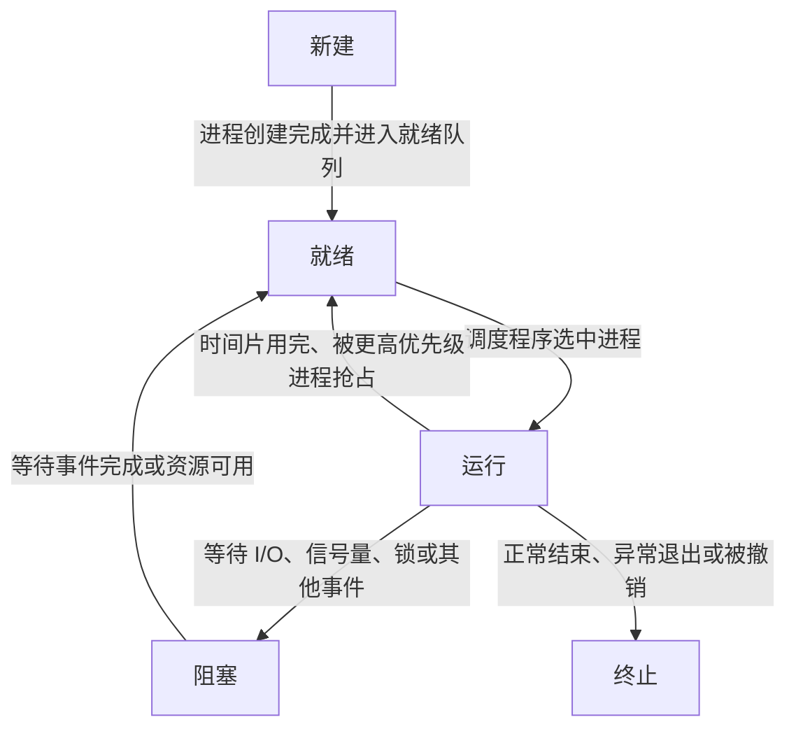

阻塞态进程不能直接被调度运行，因为它缺少某个事件或资源；事件完成后先进入就绪态，再等待调度。

在带挂起的模型中，还可能有就绪挂起和阻塞挂起状态。挂起表示进程暂时不参与调度，可能是为了换出内存、调整负载或暂停任务。

#### 2.4 进程创建与撤销

进程创建可能发生在：系统初始化、用户请求、作业提交或一个进程创建子进程时。创建过程通常包括分配 PID、建立 PCB、分配地址空间和资源、装入程序、初始化状态并进入就绪队列。

进程撤销可能因为：正常结束、异常结束、父进程撤销、资源不足或系统管理需要。撤销时要回收内存、文件、设备和 PCB 等资源。

### 3. 进程调度

#### 3.1 调度层次

- **高级调度/作业调度**：从后备作业中选择作业进入内存，决定哪些作业获得系统资源。
- **中级调度/交换调度**：决定哪些进程换入或换出内存，调整内存和并发度。
- **低级调度/进程调度**：从就绪队列选择进程占用 CPU，发生最频繁。

#### 3.2 调度指标

```text
周转时间 = 完成时间 - 到达时间
带权周转时间 = 周转时间 / 实际运行时间
等待时间 = 周转时间 - 实际运行时间
响应时间 = 第一次获得 CPU 的时间 - 到达时间

吞吐量 = 单位时间内完成的作业数
CPU 利用率 = CPU 忙碌时间 / 总时间
```

题目若存在 I/O 阻塞，要按时间轴记录进程何时到达、何时运行、何时阻塞和何时完成，不能只把所有运行时间简单排序。

#### 3.3 常见调度算法

| 算法 | 核心规则 | 优点 | 缺点 |
|---|---|---|---|
| FCFS | 按到达顺序运行 | 简单、公平、开销低 | 长作业可能造成 convoy effect |
| SJF | 选择估计运行时间最短的作业 | 平均等待时间通常较小 | 需要估计运行时间，长作业可能饥饿 |
| SRTF | 抢占式短作业优先，选择剩余时间最短者 | 响应和平均等待较好 | 抢占开销大，长作业可能饥饿 |
| HRRN | 选择响应比最高的进程 | 兼顾等待时间和服务时间 | 非抢占，需计算响应比 |
| 优先级调度 | 选择优先级最高者 | 适合重要任务优先 | 可能饥饿，可用老化缓解 |
| RR | 每个进程运行一个时间片后轮转 | 适合分时系统，响应较好 | 时间片过小切换开销大，过大接近 FCFS |
| 多级队列 | 不同类型进程进入不同固定队列 | 分类清晰 | 队列间优先级可能导致饥饿 |
| 多级反馈队列 | 根据行为动态调整队列 | 兼顾交互性、吞吐量和公平性 | 参数复杂，分析困难 |

最高响应比优先公式：

```text
响应比 = (等待时间 + 估计运行时间) / 估计运行时间
       = 1 + 等待时间 / 估计运行时间
```

响应比最高者不一定是运行时间最短者。等待时间越长，响应比越高，因此 HRRN 能在一定程度上避免长作业永久饥饿。

#### 3.4 调度题时间轴解法

遇到调度计算题，建议按以下步骤：

1. 列出每个进程的到达时间、服务时间、优先级和时间片。
2. 画出 CPU 时间轴，标出每次运行的起止时刻。
3. 每次 CPU 空闲或当前进程完成/阻塞时，重新判断就绪队列。
4. 若是抢占式算法，检查新到达进程是否能抢占当前进程。
5. 根据完成时间计算周转、等待、响应和带权周转时间。
6. 对所有进程求平均值，并检查总运行时间是否等于各进程服务时间之和。

RR 算法特别容易错在：新到达进程加入就绪队列的位置、时间片结束时当前进程是否重新排队，以及进程在时间片内提前结束时是否立即切换。

### 4. 进程同步、互斥与通信

#### 4.1 临界区与互斥

临界区是访问共享资源的程序片段。正确的临界区问题应满足：

1. **互斥**：同一时刻最多一个进程进入临界区。
2. **空闲让进**：临界区空闲且有进程申请时，不能无故阻止进程进入。
3. **有限等待**：一个进程提出进入请求后，应在有限时间内获得机会。
4. **让权等待**：等待进程阻塞时不应持续占用 CPU。

互斥锁、信号量、管程、监视器和原子指令都可以用于实现同步或互斥。

#### 4.2 信号量

信号量是一个整数变量，只能通过原子操作访问。常用记号：

- `P(S)` 或 `wait(S)`：申请资源。若 `S` 大于 0，则减 1 并继续；否则阻塞。
- `V(S)` 或 `signal(S)`：释放资源。若有等待者，则唤醒一个；否则加 1。

二元信号量通常表示互斥锁；计数信号量通常表示多个同类资源或缓冲区数量。

#### 4.3 生产者—消费者问题

设有 `N` 个缓冲区，通常设置：

```text
empty = N       空缓冲区数量
full = 0        已占用缓冲区数量
mutex = 1       对缓冲区的互斥访问
```

生产者伪代码：

```text
生产一个产品
P(empty)
P(mutex)
将产品放入缓冲区
V(mutex)
V(full)
```

消费者伪代码：

```text
P(full)
P(mutex)
从缓冲区取出一个产品
V(mutex)
V(empty)
消费产品
```

顺序很重要：生产者先申请 `empty`，消费者先申请 `full`；获得资源数量信号量后再申请互斥锁。若先申请 `mutex` 再等待 `empty/full`，可能导致其他进程无法进入缓冲区释放资源。

#### 4.4 读者—写者问题

基本规则：

- 多个读者可以同时读。
- 写者写入时必须排他访问。
- 读者和写者不能同时访问共享数据。

常用信号量：

```text
rw = 1       控制共享数据的读写互斥
mutex = 1    保护 readCount
readCount    当前读者数量
```

第一个读者进入时申请 `rw`，最后一个读者离开时释放 `rw`。写者每次独占申请 `rw`。具体实现还要看题目要求的是读者优先、写者优先还是公平策略。

#### 4.5 哲学家进餐问题

五位哲学家围坐，每人需要同时获得左右两把叉子才能进餐。若所有人先拿左叉再等待右叉，会形成循环等待并发生死锁。

常见解决方法：

- 限制同时就餐的哲学家数量少于叉子数量。
- 对叉子统一编号，按编号顺序申请资源。
- 奇数号哲学家先拿左叉，偶数号哲学家先拿右叉。
- 使用管程统一控制“同时拥有两把叉子”的条件。

### 5. 进程通信 IPC

进程通信方式：

| 方式 | 特点 |
|---|---|
| 共享存储 | 多个进程共享一段内存，速度快，但必须同步 |
| 管道 | 以字节流或消息流方式通信，常用于父子进程或相关进程 |
| 消息传递 | 通过发送和接收消息通信，适合分布式或隔离场景 |
| 信号 | 异步通知进程发生某事件，传递信息量通常较少 |
| 信号量 | 主要用于同步和互斥，不适合传输复杂业务数据 |
| 套接字 | 支持同机或网络通信 |
| 文件映射 | 将文件映射到内存，多个进程可共享映射区域 |

共享内存速度快，但共享数据的并发读写容易产生竞态条件；消息传递隔离性好，但通常有复制和系统调用开销。

### 6. 死锁、饥饿与活锁

#### 6.1 三个概念

- **死锁**：进程互相等待，所有相关进程都无法继续。
- **饥饿**：某进程长期得不到资源或调度机会，但系统整体仍在运行。
- **活锁**：进程不断改变状态、响应彼此，却始终无法完成有效工作。

低优先级进程长期得不到 CPU 通常是饥饿，不一定是死锁。

#### 6.2 死锁四个必要条件

1. **互斥**：资源一次只能被一个进程占用。
2. **请求并保持**：进程已经持有部分资源，又请求新的资源。
3. **不可剥夺**：资源不能被强制从占用者手中夺走。
4. **循环等待**：存在进程等待图的环。

破坏任一条件即可预防死锁，但破坏条件可能带来资源利用率降低、并发度下降或实现复杂度增加。

#### 6.3 死锁处理策略

| 策略 | 思路 | 典型方法 |
|---|---|---|
| 预防 | 静态限制资源申请方式，破坏必要条件 | 一次性申请、按序申请资源 |
| 避免 | 动态分配前检查安全性 | 银行家算法 |
| 检测与解除 | 允许死锁发生，检测后恢复 | 资源分配图、撤销进程、抢占资源 |
| 鸵鸟策略 | 忽略发生概率很低的死锁 | 一般通用系统可能采用 |

#### 6.4 银行家算法

银行家算法中的数据结构：

- `Available`：当前系统中每类资源的可用数量。
- `Max`：每个进程声明的最大需求。
- `Allocation`：当前已分配给每个进程的资源。
- `Need`：每个进程还可能需要的资源。

```text
Need = Max - Allocation
```

安全性检查：

1. 设置 `Work = Available`，并将所有进程标记为未完成。
2. 找到一个未完成进程 `Pi`，满足 `Need[i] ≤ Work`。
3. 假设 `Pi` 完成并释放已分配资源：`Work = Work + Allocation[i]`。
4. 标记 `Pi` 完成，重复寻找下一个进程。
5. 若所有进程都完成，则存在安全序列；否则系统处于不安全状态。

资源请求检查：

1. 判断 `Request[i] ≤ Need[i]`，否则说明进程超出最大声明。
2. 判断 `Request[i] ≤ Available`，否则进程需要等待。
3. 临时分配资源并更新 `Available`、`Allocation` 和 `Need`。
4. 执行安全性检查，安全才正式分配，否则回滚并让进程等待。

不安全状态不等于已经死锁，但从不安全状态继续分配可能最终导致死锁。

## 3.3 存储管理

### 7. 存储管理基础

#### 7.1 地址类型

- **逻辑地址/虚拟地址**：CPU 或程序产生的地址。
- **线性地址**：分页体系中由分段转换后的地址，具体体系结构可能不同。
- **物理地址**：主存中实际存储单元的地址。

地址转换由内存管理单元 MMU 完成。程序使用逻辑地址，操作系统和硬件将其转换为物理地址。地址转换通常还要进行越界检查和访问权限检查。

#### 7.2 分区管理

固定分区在系统启动时将内存划分为若干固定大小区域，存在内部碎片；可变分区按进程实际需要动态分配，容易形成外部碎片。

可变分区分配算法：

- **首次适应 First Fit**：从低地址开始，选择第一个足够大的空闲区。
- **最佳适应 Best Fit**：选择能够满足需求的最小空闲区，可能产生大量小碎片。
- **最坏适应 Worst Fit**：选择最大的空闲区，试图留下较大的剩余空闲区。
- **循环首次适应 Next Fit**：从上次查找结束位置继续查找。

紧凑技术通过移动已分配分区，将分散空闲区合并为连续空闲区，但需要额外时间和地址重定位支持。

#### 7.3 分页管理

分页将逻辑地址空间和物理内存划分为固定大小的页和页框：

```text
逻辑地址 = 页号 p + 页内地址 d
物理地址 = 页框号 f + 页内地址 d
```

页号用于查页表，得到页框号；页内地址保持不变。页面大小为 `2^k` 字节，则页内地址占 `k` 位。

分页优点：

- 消除外部碎片。
- 便于实现虚拟存储。
- 进程页面可以装入不连续的物理页框。
- 便于页面共享和保护。

分页缺点：

- 页表占用内存。
- 页大小不合适时会产生内部碎片。
- 地址转换增加访问开销。
- 缺页时可能产生较大的 I/O 延迟。

页表项通常包含页框号、存在位、访问位、修改位、保护位和禁止缓存位等。

#### 7.4 多级页表与 TLB

当逻辑地址空间很大时，单级页表可能占用大量连续内存。多级页表将页表再分页或分级，只为实际使用的地址空间建立下级页表，从而减少空间浪费，但可能增加地址转换次数。

TLB（Translation Lookaside Buffer）是页表项的高速缓存：

1. CPU 产生页号。
2. 先查 TLB。
3. TLB 命中时直接取得页框号。
4. TLB 未命中时访问内存中的页表，并将结果装入 TLB。
5. 拼接页框号和页内地址得到物理地址。

有效访问时间计算必须根据题目说明是否包含 TLB 查询时间、页表访问次数和主存访问次数。

#### 7.5 分段管理

分段按照程序的逻辑结构划分，如代码段、数据段、堆栈段和共享库段。逻辑地址形式为：

```text
段号 s + 段内偏移 d
```

段表项通常包含段基址、段长和访问权限。地址转换前要检查 `d < 段长`，再计算：

```text
物理地址 = 段基址 + 段内偏移
```

分段便于共享、保护和体现程序逻辑结构，但由于段长度可变，可能产生外部碎片。

#### 7.6 段页式管理

段页式管理先按逻辑结构分段，再将每段划分为固定大小的页。逻辑地址通常为：

```text
段号 s + 页号 p + 页内地址 d
```

先根据段号找到段表项，再根据页号查该段的页表，最后得到页框号并与页内地址拼接。段页式优点是同时利用分段的逻辑性和分页的物理管理便利，但地址转换过程复杂、表项开销较大。

### 8. 虚拟存储与页面置换

#### 8.1 虚拟存储

虚拟存储允许程序使用比物理内存更大的逻辑地址空间。程序只有部分页面装入主存，其余页面保存在外存中，需要访问时再调入。

实现虚拟存储的条件：

- 有地址转换机制。
- 有一定的外存空间。
- 有缺页中断机制。
- 有页面置换策略。
- 需要合理的页面分配和访问保护。

#### 8.2 缺页处理流程

1. CPU 访问页面，发现页表存在位为 0。
2. 产生缺页中断，操作系统保存进程现场。
3. 检查访问是否合法；非法访问则产生异常。
4. 在外存中定位所需页面。
5. 选择空闲页框或执行页面置换。
6. 若被换出页面被修改，先写回外存。
7. 将目标页面调入内存，更新页表和 TLB。
8. 重新执行引发缺页的指令。

#### 8.3 页面置换算法

- **OPT**：淘汰未来最长时间不再访问的页面，理论最优，不可实际精确实现。
- **FIFO**：淘汰进入内存最早的页面，实现简单，可能出现 Belady 异常。
- **LRU**：淘汰最长时间未使用的页面，利用时间局部性，维护成本较高。
- **LFU**：淘汰访问次数最少的页面，容易受到历史访问次数影响。
- **时钟算法**：结合访问位提供 LRU 的近似实现。

Belady 异常是指分配的物理页框数增加后，FIFO 算法的缺页次数反而增加。OPT 和 LRU 属于栈式页面置换算法，通常不会出现这种异常。

#### 8.4 页面置换模拟方法

做题时画表格：

```text
访问序列：  1  2  3  4  1  2  5 ...
页框 1：   -  -  -  -  -  -  -
页框 2：   -  -  -  -  -  -  -
页框 3：   -  -  -  -  -  -  -
缺页？     √  √  √  √  ×  ×  √
```

每访问一个页面：

1. 页面已在内存中，记为命中，不增加缺页次数。
2. 页面不在内存且有空闲页框，直接装入。
3. 页面不在内存且没有空闲页框，按算法选择牺牲页。
4. 更新 FIFO 队列、LRU 最近使用顺序或访问位。

缺页率：

```text
缺页率 = 缺页次数 / 页面访问次数
```

## 3.4 设备管理

### 10. 设备管理、I/O 与磁盘调度

#### 10.1 I/O 控制方式

| 方式 | 工作过程 | 优点 | 缺点 |
|---|---|---|---|
| 程序查询 | CPU 反复读取设备状态寄存器 | 实现简单 | CPU 忙等，效率低 |
| 中断 | 设备就绪后向 CPU 发出请求 | CPU 与设备可并行 | 中断处理有现场保存和切换开销 |
| DMA | DMA 控制器直接在设备和主存间传输 | 适合高速块传输，CPU 负担小 | 硬件复杂，可能争用总线 |
| 通道 | 专用 I/O 处理器执行 I/O 程序 | 适合大型系统和多设备 | 成本和结构复杂 |

#### 10.2 I/O 软件层次

I/O 软件通常分为用户级 I/O 软件、设备无关 I/O 软件、设备驱动程序和中断处理程序。

- **设备无关层**：提供统一的命名、缓冲、错误处理和设备接口。
- **设备驱动程序**：将统一 I/O 请求转换为具体设备控制器命令。
- **中断处理程序**：响应设备中断，完成状态更新和等待进程唤醒。

#### 10.3 缓冲技术

缓冲区用于协调 CPU、设备和网络之间速度不匹配的问题。

- 单缓冲：设备和 CPU 交替使用一个缓冲区。
- 双缓冲：一个缓冲区被处理时，另一个缓冲区可以接收数据。
- 循环缓冲：多个缓冲区首尾相连，适合连续数据流。
- 缓存：保存近期使用的数据，重点是提高命中率。
- 缓冲：重点是平滑速度差和提高并行性，二者不要混淆。

#### 10.4 磁盘访问时间

传统磁盘访问时间通常包括：

```text
访问时间 = 寻道时间 + 旋转延迟 + 数据传输时间
```

- **寻道时间**：磁头移动到目标磁道的时间。
- **旋转延迟**：等待目标扇区转到磁头下方的时间。
- **传输时间**：实际读写数据所需时间。

平均旋转延迟约为半个旋转周期：

```text
平均旋转延迟 = 1 / (2 × 转速)
```

若转速为 `R` 转/分钟，一圈时间为：

```text
一圈时间 = 60 / R 秒
平均旋转延迟 = 30 / R 秒
```

#### 10.5 磁盘调度算法

- **FCFS**：按请求到达顺序服务，公平但平均寻道时间可能较大。
- **SSTF**：选择距离当前磁头最近的请求，平均寻道时间较小，但远端请求可能饥饿。
- **SCAN**：沿一个方向服务请求，到端点后反向，类似电梯。
- **C-SCAN**：只在一个方向服务，到端点后直接返回另一端，等待时间更均匀。
- **LOOK**：像 SCAN，但只走到该方向最后一个请求，不一定到物理端点。
- **C-LOOK**：像 C-SCAN，但只走到该方向最后一个请求，再跳回另一端的第一个请求。

计算总磁头移动量：

```text
总移动量 = Σ |相邻服务位置之差|
```

做题必须明确：初始磁头位置、移动方向、是否到磁盘端点、是否包含返回端点的移动，以及请求到达时间是否影响服务顺序。

## 3.5 文件管理

### 9. 文件系统

#### 9.1 文件属性和操作

文件的常见属性包括文件名、类型、大小、位置、创建时间、修改时间、所有者、权限和状态。

基本文件操作：创建、打开、读、写、定位、关闭、删除和截断。打开文件后，系统通常返回文件描述符，进程通过文件描述符访问打开文件对象。

#### 9.2 文件的逻辑结构

- **无结构文件**：字节流或字符流，操作系统通常不解释内部含义。
- **有结构文件**：由记录组成，记录可定长或变长。
- **顺序文件**：记录按顺序组织，适合批量顺序访问。
- **索引文件**：通过索引快速定位记录。
- **散列文件**：用散列函数定位记录，适合等值查询。

#### 9.3 文件物理分配

| 分配方式 | 优点 | 缺点 |
|---|---|---|
| 连续分配 | 顺序和随机访问快，管理简单 | 外部碎片，扩展和移动困难 |
| 链式分配 | 无外部碎片，文件可动态增长 | 随机访问慢，指针占空间 |
| 索引分配 | 支持直接访问，扩展较灵活 | 需要索引块，文件过大时索引结构复杂 |
| 多级索引 | 支持很大文件 | 地址转换和访问开销更高 |

#### 9.4 目录结构

常见目录结构：

- 单级目录：简单，但文件名冲突严重。
- 两级目录：每个用户有独立目录，减少用户间冲突。
- 树形目录：层次清晰，是常见结构。
- 无环图目录：支持共享文件或目录，但不能形成环。
- 一般图目录：允许环，需要垃圾回收或访问标记防止无限遍历。

#### 9.5 文件保护

文件保护可以通过访问控制列表 ACL、权限位、用户身份、用户组、能力表和加密实现。

基本安全原则：

- 最小权限：只授予完成任务所需的最少权限。
- 默认拒绝：未明确允许的访问默认拒绝。
- 权限分离：重要操作由不同角色共同完成。
- 审计追踪：记录关键文件的访问和修改行为。

# 4. 软件工程基础知识

## 4.1 软件过程

软件工程是采用系统化、规范化和可度量的方法，开发、运行、维护和演化软件的工程学科。软件设计师考试中的软件工程基础，重点考查生命周期、过程模型、开发方法、模块化、质量、度量、风险、维护和敏捷实践。

本章复习主线如下：

> 项目可行性 → 需求与计划 → 设计与实现 → 测试与交付 → 运行维护 → 持续改进

### 1. 软件工程基本概念

#### 1.1 软件的特点

软件与硬件相比具有以下特点：

- 软件是逻辑产品，不是通过机械加工制造出来的实体产品。
- 软件不会像硬件那样因物理磨损而自然老化，但会因修改、环境变化和依赖失配产生维护问题。
- 软件开发过程主要是分析、设计、编码、测试和维护，复制成本通常很低。
- 软件复杂度高，需求变化和隐含知识会显著影响项目成本。
- 软件中大量成本发生在需求、设计、测试和维护，而不是最终复制。
- 软件具有不可见性，缺陷和架构问题不容易仅通过外观发现。

“软件不会磨损”不代表软件不会退化。频繁修改、补丁叠加、架构腐化和文档失真会使维护成本上升，形成软件老化或熵增。

#### 1.2 软件工程的目标

- 在限定时间和成本内交付满足需求的软件。
- 提高软件的可靠性、安全性、可维护性和可扩展性。
- 降低需求变化、缺陷修复和后续维护的成本。
- 建立可重复、可度量、可审计的开发过程。
- 通过标准、规范、工具和自动化提高团队协作效率。

#### 1.3 软件工程基本原则

- **抽象**：只保留当前问题相关的重要特征。
- **分解**：将复杂问题拆成可管理的子问题。
- **模块化**：组织具有明确职责和接口的模块。
- **信息隐藏**：隐藏模块内部实现细节。
- **关注点分离**：将不同变化原因和职责分开。
- **逐步求精**：从概要结构逐步细化为可实现设计。
- **复用**：复用稳定的组件、服务、框架、模式和测试资产。
- **可追踪**：保持需求、设计、代码、测试和缺陷之间的关联。
- **持续验证**：在各阶段尽早发现并修复问题。
- **风险驱动**：优先识别和处理会影响项目成败的风险。

### 2. 软件生命周期

#### 2.1 典型生命周期阶段

1. **问题定义与可行性研究**：明确目标、范围、约束和是否值得建设。
2. **需求分析**：获取、分析、验证和记录用户需求。
3. **概要设计**：确定系统架构、主要模块、数据组织和外部接口。
4. **详细设计**：确定模块内部算法、数据结构、类、接口和异常处理。
5. **实现**：编写代码、构建程序和完成单元级验证。
6. **测试**：进行集成测试、系统测试和验收测试。
7. **部署与交付**：安装、迁移数据、培训用户并正式上线。
8. **运行维护**：纠错、适应变化、完善功能和预防性改进。
9. **退役**：迁移数据、替换系统、归档资料并停止旧系统。

不同过程模型可能重复、交叉或迭代执行这些活动。生命周期阶段不是绝对固定的瀑布式顺序。

#### 2.2 软件过程的基本活动

无论采用何种过程模型，通常都包含：

- **规格说明**：定义系统应该做什么以及受到哪些约束。
- **设计与实现**：将需求转化为可执行的软件。
- **验证与确认**：检查软件是否正确实现、是否满足用户需求。
- **演化**：随着环境和业务变化持续修改软件。

#### 2.3 软件过程中的评审点

在阶段性成果交付前进行评审，可以尽早发现问题：

- 需求评审：检查完整性、一致性、可验证性和可行性。
- 架构评审：检查关键质量属性、技术风险和模块依赖。
- 设计评审：检查接口、算法、数据结构和异常处理。
- 代码评审：检查逻辑错误、规范、安全和可维护性。
- 测试评审：检查测试范围、用例设计和缺陷闭环。
- 发布评审：检查版本、配置、迁移、回滚和运行条件。

### 14. 项目过程与工程实践

#### 14.1 需求、设计、编码和测试的关联

软件工程强调工作产品之间的可追踪关系：

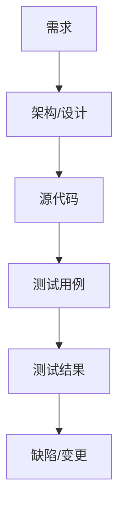

需求变更时应分析其对设计、代码、测试、文档、进度和成本的影响，而不是只修改需求文档。

#### 14.2 持续集成与自动化

自动化工程实践包括：

- 自动构建。
- 静态代码分析。
- 单元测试和集成测试。
- 依赖漏洞扫描。
- 自动打包和发布。
- 环境一致性检查。
- 回滚和变更审计。

自动化可以缩短反馈时间，但自动化脚本本身也是需要版本控制、测试和维护的配置项。

#### 14.3 技术债务

技术债务是为了快速交付而暂时采用低质量或非最优方案，未来需要付出额外成本偿还。技术债务可能表现为：

- 临时补丁和重复代码。
- 缺少测试和文档。
- 不合理的模块依赖。
- 过时的第三方组件。
- 难以修改的数据库结构。
- 架构与部署环境不一致。

技术债务不一定都是错误，有意识、可记录、可计划偿还的技术债务可能是合理的；未记录且持续积累的债务会显著增加维护风险。

## 4.2 软件过程模型

### 4. 软件过程模型

#### 4.1 瀑布模型

瀑布模型按阶段顺序推进，前一阶段成果作为后一阶段输入，强调文档、评审和阶段基线。

优点：

- 阶段清晰，职责和交付物明确。
- 适合需求稳定、技术成熟、法规要求严格的项目。
- 便于计划、审查和合同管理。

缺点：

- 需求变更代价高。
- 用户较晚才能看到可运行系统。
- 集成和测试反馈滞后。
- 早期错误可能在后期集中暴露。

#### 4.2 V 模型

V 模型将开发活动与测试活动对应起来：

```text
需求分析       ↔ 验收测试
概要设计       ↔ 系统测试
详细设计       ↔ 集成测试
编码           ↔ 单元测试
```

它强调测试计划应尽早制定、开发阶段与验证阶段相互对应。V 模型不是“测试只能在编码之后进行”，而是强调验证与确认活动的前置规划。

#### 4.3 原型模型

原型用于快速展示系统界面、流程或关键功能，以帮助用户和开发团队理解需求。

- **抛弃式原型**：用于澄清需求和验证想法，验证后丢弃，最终系统重新设计实现。
- **演化式原型**：从初始原型逐步完善，最终演化为交付系统。

优点：减少需求误解、提高用户参与度、尽早发现交互问题。

风险：用户可能误认为原型已接近成品；开发团队可能为了快速演示忽略架构、性能、安全和可维护性。

#### 4.4 增量模型

系统按功能或业务价值划分为多个增量，每个增量经过分析、设计、实现和测试后交付。

优点：

- 早期交付有价值功能。
- 便于获得用户反馈。
- 单个增量规模较小，风险可控。
- 可以优先实现高价值或高风险部分。

要求：系统架构和增量边界设计合理，增量之间接口稳定，不能因局部快速交付破坏整体架构。

#### 4.5 迭代模型

迭代模型通过多轮循环逐步完善同一个系统。每次迭代可能重新审视需求、设计、实现和测试。

迭代适合需求逐步明确、需要持续反馈或存在技术不确定性的项目，但需要严格控制范围和技术债务，避免每轮只堆功能而不重构。

#### 4.6 螺旋模型

螺旋模型以风险为中心，每轮通常包括：

1. 确定目标、方案和约束。
2. 识别并分析风险。
3. 开发和验证当前原型或增量。
4. 评审结果并计划下一轮。

适合大型、复杂、高风险项目。缺点是管理复杂、成本较高，对风险识别和分析能力要求高。

#### 4.7 喷泉模型

喷泉模型强调面向对象开发中各阶段可以迭代、重叠和反复，适合需求和设计不断细化的对象系统。其阶段不是严格线性串联，体现了迭代和增量思想。

#### 4.8 构件组装模型

构件组装模型通过复用已有组件、框架、服务和第三方库构建系统。

优点：缩短开发时间、降低开发成本、利用成熟质量。

风险：接口不匹配、版本依赖、授权限制、组件质量不可控、供应商锁定和安全漏洞。

#### 4.9 统一过程 RUP

RUP（Rational Unified Process）具有用例驱动、以架构为中心、迭代和增量开发等特点。典型阶段：

- **初始阶段**：明确范围、目标和初步可行性。
- **细化阶段**：稳定需求、确定架构、处理主要风险。
- **构造阶段**：实现大部分功能并持续测试。
- **移交阶段**：部署、培训、验收和交付。

#### 4.10 敏捷开发

敏捷开发强调：

- 个体和交互高于过程和工具。
- 可运行软件高于面面俱到的文档。
- 客户协作高于合同谈判。
- 响应变化高于遵循计划。

这并不意味着不要流程、不要文档或不要计划，而是强调以交付价值和快速反馈为导向，保持足够而非过度的过程资产。

### 5. 敏捷方法与工程实践

#### 5.1 Scrum

Scrum 常见角色：

- **Product Owner**：负责产品目标、需求价值和产品待办列表优先级。
- **Scrum Master**：促进 Scrum 实施，移除障碍，保护团队并推动改进。
- **Developers**：负责在迭代中完成可交付增量。

常见工件：

- 产品待办列表 Product Backlog。
- 冲刺待办列表 Sprint Backlog。
- 产品增量 Increment。

常见活动：

- Sprint：固定时间盒内完成目标。
- Sprint Planning：确定目标和工作。
- Daily Scrum：同步进展和障碍。
- Sprint Review：展示增量并获得反馈。
- Sprint Retrospective：回顾过程并持续改进。

#### 5.2 XP 极限编程

XP 常见实践：

- 测试驱动开发 TDD。
- 结对编程。
- 持续集成。
- 重构。
- 简单设计。
- 小版本发布。
- 集体代码所有权。
- 现场客户或紧密客户反馈。

#### 5.3 看板 Kanban

看板通过可视化工作流、限制在制品数量、持续拉动工作和测量流动效率来改进交付。常见指标包括周期时间、吞吐量、在制品数量和累计流图。

#### 5.4 DevOps 与持续交付

DevOps 强调开发、测试、运维和安全协作，通过自动化和反馈缩短交付周期。

- 持续集成 CI：频繁合并代码并自动构建、测试。
- 持续交付 CD：代码始终处于可发布状态，发布通常需要批准。
- 持续部署：通过自动化将通过验证的版本直接部署到生产环境。
- 基础设施即代码：用版本化配置管理环境。
- 可观测性：通过日志、指标和链路追踪了解系统运行状态。

持续集成不能替代设计和代码评审；自动化流水线也必须包含安全检查、回滚和发布审计。

### 15. 软件工程模型对比速查

| 模型 | 适用场景 | 主要优点 | 主要风险/缺点 |
|---|---|---|---|
| 瀑布 | 需求稳定、规范严格 | 阶段清晰、文档完整 | 变更成本高、反馈晚 |
| V 模型 | 强调测试和验证的项目 | 开发与测试对应 | 仍不擅长处理频繁需求变更 |
| 原型 | 需求模糊、交互复杂 | 澄清需求、快速反馈 | 原型可能被误当成成品 |
| 增量 | 需要分批交付 | 早期交付、风险分散 | 增量边界和架构要求高 |
| 迭代 | 需求逐步明确 | 持续改进、反馈及时 | 需控制范围和技术债务 |
| 螺旋 | 大型、高风险项目 | 以风险为中心 | 管理复杂、成本高 |
| RUP | 面向对象、架构驱动项目 | 用例驱动、迭代增量 | 过程资产较重 |
| 敏捷 | 需求变化快、需快速交付 | 反馈快、价值优先 | 需要高协作和自律 |
| 构件组装 | 可复用组件丰富 | 缩短开发、降低成本 | 接口、版本和授权风险 |

### 16. 高频题型与答题方法

#### 16.1 过程模型选择题

```text
需求稳定、阶段验收严格：瀑布/V 模型
需求模糊、界面难描述：原型
高风险、大型复杂系统：螺旋
分批交付、优先价值：增量
需求变化快、持续反馈：敏捷/迭代
大量复用组件：构件组装
```

#### 16.2 可行性分析题

答题时按技术、经济、操作、法律/社会、时间和安全维度展开。不要只回答“技术可行”，还要说明成本收益、用户接受程度、法规风险和资源限制。

#### 16.3 耦合内聚判断题

判断步骤：

1. 看模块之间传递的是什么。
2. 传递简单数据通常是数据耦合。
3. 传递结构体但只使用部分字段通常是标记耦合。
4. 传递控制码决定对方行为通常是控制耦合。
5. 依赖全局变量是公共耦合。
6. 直接修改其他模块内部实现是内容耦合。
7. 看模块内部操作是否围绕一个明确职责。

#### 16.4 质量属性题

```text
响应快、吞吐高、资源少：性能效率
连续运行、少故障、可恢复：可靠性
防窃取、防篡改、防越权：安全性
易修改、易测试、易扩展：可维护性
适配不同平台：可移植性
多个系统一起工作：兼容性/互操作性
```

#### 16.5 风险题

```text
先识别风险，再评估概率和影响，
选择规避、减轻、转移或接受策略，
指定责任人、触发条件、应急措施和监控指标。
```

## 4.3 软件需求分析

需求分析与系统分析的任务，是把用户目标、业务规则和外部约束转换为清晰、完整、可验证的系统需求和分析模型。软件设计师考试中，常见题型包括需求分类、需求质量判断、数据流图 DFD、数据字典、加工规格、判定表、判定树、需求跟踪和结构化分析。

本章复习主线如下：

> 需求获取 → 需求分析 → 需求规格说明 → 需求验证 → 需求管理 → 数据/流程建模 → 设计输入

### 1. 需求工程概述

#### 1.1 需求的含义

需求是利益相关者对系统功能、质量、约束、数据、接口和运行环境的期望。需求既包括系统“必须做什么”，也包括“必须达到什么条件”。

需求工程通常包含：

- **需求获取**：从用户、业务人员、管理者、法规和现有系统中收集需求。
- **需求分析**：整理、分类、建模、发现冲突和确定优先级。
- **需求规格说明**：以结构化、可评审的形式记录需求。
- **需求验证**：检查需求是否正确、完整、一致、可行和可测试。
- **需求管理**：跟踪需求变化、版本、优先级、状态和影响。

#### 1.2 利益相关者

利益相关者可能包括：

- 最终用户。
- 业务负责人和领域专家。
- 项目发起人和管理者。
- 系统管理员、运维人员和安全人员。
- 外部系统和设备提供方。
- 监管机构、审计人员和法律顾问。
- 开发、测试、部署和维护团队。

不同利益相关者的目标可能冲突。例如用户希望操作简单，安全人员要求更强认证，管理者要求成本低，监管方要求保存完整审计记录。需求分析的重要任务之一是识别并协调这些冲突。

#### 1.3 需求基线

经过评审、确认和批准的需求集合可以作为需求基线。基线后的需求变更需要经过变更控制，分析对架构、代码、测试、进度、成本和风险的影响。

### 2. 需求分类

#### 2.1 功能需求

功能需求描述系统必须提供的服务、操作和行为，例如：

- 用户可以注册、登录和修改资料。
- 管理员可以审核订单。
- 系统根据库存数量决定是否允许下单。
- 系统生成月度销售报表。

功能需求应说明触发条件、输入、处理、输出、异常和业务规则。

#### 2.2 非功能需求

非功能需求描述系统必须达到的质量或约束：

- **性能需求**：响应时间、吞吐量、并发用户数、批处理窗口。
- **可靠性需求**：可用性、平均无故障时间、恢复时间和容错能力。
- **安全需求**：认证、授权、审计、加密、密钥管理和数据保留。
- **易用性需求**：学习成本、操作步骤、可访问性和错误提示。
- **可维护性需求**：模块化、可测试性、日志、监控和扩展能力。
- **可移植性需求**：支持的操作系统、浏览器、数据库或硬件平台。
- **兼容性需求**：与既有系统、协议、数据格式和设备互操作。
- **法规和组织约束**：隐私、审计、行业标准、采购和部署规范。

非功能需求必须尽量量化。例如：

```text
模糊：系统响应要快。
可验证：95% 的查询请求响应时间不超过 2 秒。

模糊：系统支持大量用户。
可验证：在 10,000 个并发在线用户下，核心接口错误率低于 0.1%。
```

#### 2.3 领域需求与用户需求

- **用户需求**：面向用户和管理者，用自然语言、场景和原型描述系统能力。
- **系统需求**：面向开发和测试，规定详细功能、接口、数据和质量指标。
- **领域需求**：由行业规则、法规、物理规律或组织规范产生的需求。

领域需求即使没有被某个用户明确提出，也可能是系统必须满足的约束。

#### 2.4 业务规则

业务规则是业务活动必须遵守的条件、计算、权限或流程，例如：

- 订单金额超过某值必须经过主管审批。
- 已付款订单不能直接删除。
- 同一课程的选课人数不能超过容量。
- 只有本人或授权管理员可以查看敏感信息。

业务规则应能落到需求、数据约束、程序逻辑、权限策略或测试用例中。

### 3. 需求获取方法

#### 3.1 访谈

访谈适合深入了解业务目标、工作流程、异常情况和隐含规则。

优点：信息丰富，可追问和澄清。缺点：耗时，受访者可能遗漏细节或表达不准确。

访谈步骤：准备问题和资料 → 选择代表性人员 → 进行开放式和封闭式提问 → 记录事实与假设 → 复核确认。

#### 3.2 问卷调查

适合用户数量多、地域分散、需要收集偏好或频率数据的场景。问题要避免诱导、歧义、双重问题和无法回答的选项。

#### 3.3 观察与工作影随

通过观察用户实际工作，发现用户无法明确表达的隐含流程、例外操作、手工补偿和环境约束。观察结果需要区分“实际发生的行为”和“用户认为应该发生的行为”。

#### 3.4 文档分析

分析现有制度、表单、报表、接口文档、数据库、日志、法规和旧系统代码，适合遗留系统改造和业务规则复杂的项目。

#### 3.5 原型

原型可以是纸面草图、线框图、交互原型、数据样例或可运行演示。原型适合澄清界面、流程、交互和不确定需求，但不能自动代表最终架构、性能和安全设计。

#### 3.6 场景分析

场景描述参与者、触发事件、前置条件、基本流程、备选流程、异常流程和后置条件。用例是场景分析的常用载体。

#### 3.7 联合需求开发

将用户、领域专家、开发人员和管理者集中在结构化会议中共同分析需求，利用主持人、白板、模型和决策记录提高沟通效率。

### 4. 需求分析与协商

#### 4.1 需求分类与组织

可以按以下维度组织需求：

- 用户角色。
- 业务流程。
- 功能模块。
- 数据对象。
- 优先级。
- 风险和不确定性。
- 质量属性。
- 发布版本或迭代。

#### 4.2 需求优先级

常见优先级方法：

- **必须有**：没有就无法交付或不符合法规。
- **应该有**：重要但可通过临时方案替代。
- **可以有**：有价值但不影响核心交付。
- **暂不做**：当前版本明确排除。

也可以采用 MoSCoW、价值—成本矩阵、风险优先级和利益相关者投票进行排序。

#### 4.3 需求冲突与协商

需求冲突处理步骤：

1. 明确冲突双方和各自目标。
2. 区分硬约束、偏好和可替代方案。
3. 评估成本、收益、风险、法规和用户影响。
4. 组织利益相关者协商并记录决策依据。
5. 更新需求、原型、模型和验证用例。

不能通过“平均满足所有人”解决所有冲突，必须明确权衡和优先级。

### 5. 软件需求规格说明 SRS

#### 5.1 SRS 的典型内容

- 引言：目的、范围、术语、参考资料和读者。
- 总体描述：产品背景、用户特征、运行环境、约束和假设。
- 功能需求：功能、输入、处理、输出、异常和业务规则。
- 外部接口：用户界面、硬件接口、软件接口和通信接口。
- 数据需求：数据对象、数据字典、数据保留、数据质量和迁移。
- 非功能需求：性能、安全、可靠性、可维护性、可移植性和易用性。
- 验收标准：如何判断需求已经满足。
- 附录和索引：术语、模型、约束和参考资料。

#### 5.2 高质量需求特征

| 特征 | 含义 |
|---|---|
| 正确性 | 真实反映利益相关者需要 |
| 无歧义 | 不同读者理解一致 |
| 完整性 | 覆盖正常、异常、边界和约束 |
| 一致性 | 需求之间没有矛盾 |
| 可验证性 | 能通过测试、检查或分析判断满足 |
| 可行性 | 技术、成本、时间和资源允许 |
| 可追踪性 | 能关联来源、设计、代码、测试和变更 |
| 可修改性 | 结构清晰，修改影响可控 |
| 优先级明确 | 能指导版本和资源安排 |

#### 5.3 需求表述原则

推荐使用“系统应……”的可验证句式：

```text
系统应在用户提交订单后 3 秒内返回订单受理结果。
系统应记录所有管理员修改价格的操作，包括操作者、时间、旧值和新值。
```

避免：

- 尽可能、适当、友好、快速、方便等模糊词。
- 一个句子包含多个未分解功能。
- 使用“通常”“大概”“必要时”等不明确条件。
- 把设计方案写成需求，除非技术或组织约束确实指定实现方式。
- 省略异常、边界、权限和数据一致性要求。

### 6. 需求验证与确认

#### 6.1 验证内容

需求评审重点检查：

- **正确性**：是否真实表达业务目标。
- **完整性**：是否覆盖所有角色、流程、数据、异常和约束。
- **一致性**：不同需求是否存在冲突。
- **可行性**：技术、成本、时间和组织是否支持。
- **可验证性**：能否设计测试或验收方法。
- **可追踪性**：来源和后续实现是否明确。
- **优先级**：是否能指导范围管理和发布计划。
- **依赖关系**：需求之间的前置条件是否记录。

#### 6.2 验证方法

- 需求评审和走查。
- 原型验证。
- 测试用例提前设计。
- 模型检查和一致性分析。
- 形式化规格说明和约束验证。
- 用户演示与确认。
- 与法规、标准和接口文档对照。

“能写测试用例”是判断可验证性的有效方法。若需求无法定义输入、前置条件、预期结果和验收标准，通常说明需求仍然模糊。

### 7. 需求管理与可追踪性

#### 7.1 需求状态

需求可以设置以下状态：

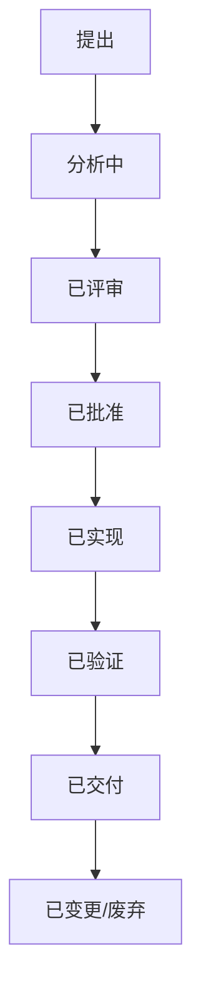

需求状态有助于回答：需求是否已经批准、是否已经实现、是否已经测试、是否属于当前版本。

#### 7.2 需求跟踪矩阵

需求跟踪矩阵建立需求与其他工作产品的关联：

```text
需求 ↔ 用例/业务规则 ↔ 设计模块 ↔ 源代码 ↔ 测试用例 ↔ 缺陷 ↔ 发布版本
```

双向追踪：

- 向前追踪：从需求追到设计、代码和测试。
- 向后追踪：从实现或测试追溯到需求来源。

作用：发现未实现需求、无需求代码、未覆盖需求的测试和变更影响范围。

#### 7.3 需求变更控制

需求变更流程：

1. 提出变更申请并记录原因。
2. 判断变更类型、紧急程度和优先级。
3. 分析对需求、架构、数据库、接口、代码、测试、进度、成本和风险的影响。
4. 由授权人员或变更控制委员会审批。
5. 更新需求基线和追踪关系。
6. 实施、测试、验收并关闭变更。

### 13. 需求跟踪与变更影响

需求跟踪矩阵可以包含：

| 需求编号 | 需求描述 | 来源 | 优先级 | 设计模块 | 测试用例 | 状态 |
|---|---|---|---|---|---|---|
| R-001 | 用户提交订单 | 业务部门 | 必须 | 订单服务 | TC-001、TC-002 | 已验证 |

变更影响分析应回答：

1. 哪些需求被直接改变？
2. 哪些业务规则和接口受到影响？
3. 哪些数据模型、DFD、状态图或用例需要修改？
4. 哪些代码模块、数据库表和配置项需要修改？
5. 哪些测试用例需要新增、修改或重新执行？
6. 是否改变安全、性能、可靠性或合规目标？
7. 是否影响进度、成本、发布和回滚计划？

## 4.4 系统设计

### 8. 软件架构与质量属性

#### 8.1 常见架构风格

- **分层架构**：不同层承担不同职责，依赖方向清晰。
- **客户端—服务器**：客户端请求服务，服务器提供资源或处理能力。
- **管道—过滤器**：数据经过多个独立过滤器处理，适合编译器和数据流水线。
- **事件驱动**：组件发布事件，其他组件订阅并响应。
- **仓库风格**：多个子系统共享中心数据仓库。
- **微内核**：核心保留最基本服务，其他能力通过模块扩展。
- **面向服务架构**：能力以服务形式提供，通过契约和消息交互。
- **微服务架构**：按业务能力拆分独立部署服务，但带来分布式事务、监控和运维复杂度。

#### 8.2 软件质量属性

常见质量属性：

- **功能适合性**：是否提供正确、完整、有用的功能。
- **性能效率**：响应时间、吞吐量、资源消耗和容量。
- **兼容性**：与其他系统共存和互操作的能力。
- **易用性**：可学习性、可操作性、容错性和可访问性。
- **可靠性**：在规定条件和时间内持续正确运行。
- **安全性**：机密性、完整性、可用性、认证和抗抵赖。
- **可维护性**：分析、修改、测试和演化的难易程度。
- **可移植性**：迁移到不同环境的难易程度。
- **可扩展性**：面对负载、用户、数据量和功能增长的能力。

质量属性之间通常存在权衡。例如更强的安全检查可能增加延迟；更高的可用性通常需要冗余；更高的灵活性可能增加架构复杂度。

#### 8.3 架构设计关注点

架构设计应回答：

- 系统如何分解为子系统和组件。
- 组件之间通过何种接口和协议协作。
- 数据如何存储、访问和一致性控制。
- 哪些质量属性是关键驱动因素。
- 哪些技术风险需要原型或实验验证。
- 系统如何部署、扩展、监控和恢复。
- 哪些部分允许替换和独立演化。

软件架构描述系统的主要结构、组件、连接关系、约束和关键设计决策；设计模式则是在特定上下文中反复出现的问题的通用解决方案。二者都不是可以机械套用的代码模板，而是帮助设计者进行职责划分、依赖控制和变化隔离的思维工具。

本章复习主线如下：

> 质量属性与约束 → 架构风格 → 组件与接口 → 设计原则 → 设计模式 → 方案权衡与验证

### 1. 软件架构基础

#### 1.1 软件架构的含义

软件架构通常包括：

- 系统的主要组件、子系统和服务。
- 组件的职责、边界和生命周期。
- 组件之间的连接、通信方式和依赖方向。
- 数据组织、控制流和部署拓扑。
- 关键质量属性和架构约束。
- 对技术、平台、性能、安全和演化做出的重要决策。

架构关注系统级结构和长期变化，详细设计关注类、方法、算法和局部实现。架构设计错误往往会在后期产生大范围返工，因此应尽早识别高风险决策并通过原型、评审和性能实验验证。

#### 1.2 架构驱动因素

架构设计通常由以下因素驱动：

- 核心业务功能和业务边界。
- 性能、吞吐量、延迟和容量。
- 可用性、容错、灾备和恢复能力。
- 安全、隐私、审计和合规。
- 可维护性、可测试性和可演化性。
- 技术栈、遗留系统和第三方依赖。
- 团队能力、交付周期、预算和组织结构。
- 部署环境、网络边界和运维方式。

架构决策不是单纯追求“最先进技术”，而是在约束条件下满足关键质量目标。

#### 1.3 架构与设计的层次

```text
企业/系统架构：系统边界、业务能力、系统间关系
应用架构：应用组件、服务、模块和交互
领域架构：领域对象、业务规则和上下文边界
技术架构：平台、中间件、数据库、网络和部署
详细设计：类、接口、算法、数据结构和异常处理
```

### 2. 架构视图与建模

#### 2.1 4+1 视图

常见架构描述采用 4+1 视图：

| 视图 | 关注内容 | 常见 UML 图 |
|---|---|---|
| 逻辑视图 | 功能、类、对象和业务结构 | 类图、对象图 |
| 进程视图 | 并发、通信、同步和性能 | 顺序图、活动图 |
| 开发视图 | 模块、组件、包和代码组织 | 组件图、包图 |
| 物理视图 | 节点、部署和网络拓扑 | 部署图 |
| 场景视图 | 用例和典型场景，连接其他视图 | 用例图、场景图 |

不同视图描述同一系统的不同方面，不能互相矛盾。例如逻辑视图中的服务必须能映射到开发视图的组件，并在物理视图中有合理部署位置。

#### 2.2 架构文档内容

架构文档通常包括：

- 系统背景、范围和目标。
- 架构原则和关键约束。
- 上下文图和系统边界。
- 组件、接口、数据流和依赖。
- 关键质量属性场景。
- 技术选型和架构决策记录。
- 部署拓扑、运行环境和容量假设。
- 安全、容错、监控和灾备方案。
- 风险、权衡、未决问题和演化路线。

### 3. 常见架构风格

#### 3.1 分层架构

将系统划分为表示层、应用/业务层、领域层、数据访问层和基础设施层等。

特点：

- 每层有明确职责。
- 上层通过接口使用下层服务。
- 可替换某些层的实现。
- 便于团队按层协作和测试。

优点：结构清晰、学习成本低、维护方便。缺点：层间调用可能增加延迟，跨层业务容易产生重复封装，严格分层可能降低灵活性。

常见原则是上层依赖下层抽象，不允许低层反向依赖高层具体实现。领域驱动设计中也常使用依赖倒置，让基础设施实现领域层定义的接口。

#### 3.2 客户端—服务器架构

客户端负责发起请求和展示或部分业务处理，服务器负责集中提供数据、服务或计算能力。

优点：资源集中管理、便于统一升级和权限控制。缺点：服务器可能成为性能瓶颈和单点故障，网络质量直接影响体验。

常见形态：二层 C/S、三层 C/S 和多层 Web 架构。三层或多层结构可以将表示、业务和数据访问职责分开。

#### 3.3 管道—过滤器

数据依次通过多个独立过滤器，每个过滤器对输入执行转换并产生输出。

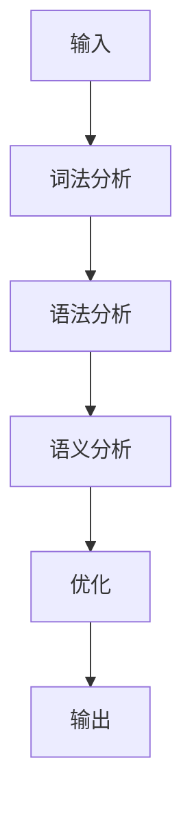

优点：过滤器可复用、替换和并行；适合编译器、数据处理、ETL 和流式计算。缺点：不适合强交互、共享状态复杂或各步骤高度耦合的系统。

#### 3.4 仓库风格

多个子系统共享一个中心数据仓库，子系统通过统一数据模型交换信息。

优点：数据集中、一致性较好、便于全局查询。缺点：中心仓库成为性能和可用性瓶颈，数据模型变化可能影响多个子系统。

#### 3.5 黑板架构

黑板架构由黑板、知识源和控制组件组成：

- 黑板保存问题状态和中间结果。
- 知识源根据黑板内容贡献局部解决方案。
- 控制组件决定下一步激活哪个知识源。

适合语音识别、模式识别、专家系统和复杂推理问题。优点是知识源可独立扩展，缺点是控制策略和共享状态管理复杂。

#### 3.6 事件驱动架构

组件发布事件，其他组件订阅并异步响应，生产者通常不需要知道所有消费者。

优点：解耦、扩展方便、适合异步处理和削峰。缺点：调试和追踪困难，事件顺序、重复消费、最终一致性和错误重试需要额外设计。

常见实现：消息队列、发布订阅、事件总线、日志型消息流和领域事件。

#### 3.7 Broker 架构

Broker 作为中间代理，负责服务注册、请求路由、协议转换、通信和结果返回。客户端不必直接知道服务实现位置。

适合分布式对象、远程服务、消息中间件和多协议系统。Broker 可以降低通信耦合，但自身需要考虑高可用、性能和故障恢复。

#### 3.8 MVC 与变体

- **Model**：数据和业务规则。
- **View**：展示界面和用户交互。
- **Controller**：接收请求、调用模型并选择视图。

MVC 有助于分离界面、控制和业务，便于并行开发和测试。常见变体包括 MVP、MVVM 和 MVI，区别主要在于视图更新方式、状态管理和控制职责分配。

#### 3.9 微内核架构

微内核只保留最基本的核心服务，其他功能通过插件、扩展模块或独立服务实现。

优点：核心稳定、可扩展、便于移植和定制。缺点：插件接口设计困难，模块间通信和版本兼容复杂。操作系统、IDE、规则引擎和插件平台常见此风格。

#### 3.10 面向服务架构 SOA

SOA 将业务能力封装为服务，通过明确契约和消息进行交互。

核心特征：服务自治、契约明确、松耦合、可复用、位置透明和可组合。需要关注服务粒度、服务治理、版本兼容、身份认证、监控和事务边界。

#### 3.11 微服务架构

微服务按业务能力将系统拆分为可独立开发、部署和扩展的服务。每个服务通常拥有清晰边界和相对自治的数据。

优点：独立部署、团队自治、按需扩展、故障隔离和技术异构。代价：网络调用、分布式事务、数据一致性、服务发现、配置、监控、测试和运维复杂度显著增加。

微服务不是“把单体应用任意切小”。合理拆分应以业务边界、变化原因、数据所有权和团队职责为依据。

#### 3.12 无服务器与云原生

无服务器架构将基础设施管理交给云平台，开发者关注函数、事件和业务代码。优点是按需弹性和运维负担低，缺点是冷启动、平台锁定、调试困难和执行时间限制。

云原生常结合容器、服务编排、自动化交付、可观测性和弹性设计。考试中应重点关注架构带来的质量权衡，而不是只记技术名称。

### 4. 架构质量属性与权衡

#### 4.1 关键质量属性

- **性能**：响应时间、吞吐量、并发能力和资源效率。
- **可用性**：服务持续可访问和故障后恢复能力。
- **可靠性**：在规定条件和时间内无故障完成任务。
- **安全性**：机密性、完整性、认证、授权和审计。
- **可修改性**：定位、修改、测试和部署变更的难易程度。
- **可测试性**：能否隔离组件、构造输入并观察结果。
- **可扩展性**：负载、数据量、用户和功能增长时的适应能力。
- **可移植性**：迁移到新平台、环境或基础设施的难易程度。
- **互操作性**：与其他系统通过协议和接口协作的能力。
- **可部署性**：安装、升级、回滚和环境迁移的难易程度。

#### 4.2 质量属性场景

质量属性应转化为场景，常见结构：

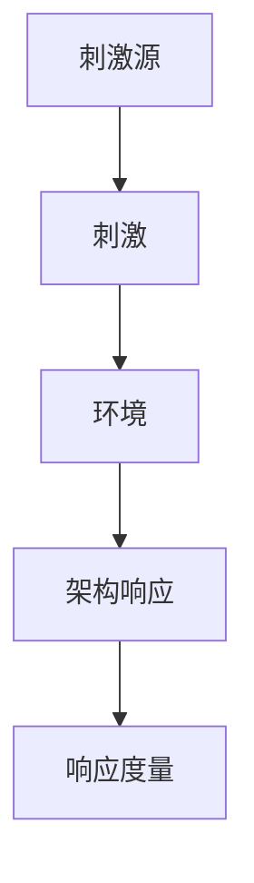

例如：

```text
外部客户端在高峰期发送请求；
系统处于正常生产环境；
服务在 2 秒内返回成功或明确错误；
95% 请求满足该指标，错误率低于 0.1%。
```

可度量的质量场景比“系统性能良好”更适合指导架构设计和验收。

#### 4.3 常见架构权衡

- 缓存提高性能，但带来数据一致性和失效问题。
- 副本提高可用性和读性能，但带来复制延迟和一致性复杂度。
- 异步消息提高吞吐和解耦，但调用方难以立即得到结果。
- 更强安全检查提高防护能力，但可能降低便利性和性能。
- 微服务提高独立部署能力，但增加网络和运维复杂度。
- 共享数据库便于事务一致性，但服务之间耦合较强。
- 服务自治提高独立性，但跨服务查询和事务更复杂。

### 5. 架构设计原则

#### 5.1 SOLID

- **单一职责原则 SRP**：一个类、模块或服务只有一个主要变化原因。
- **开闭原则 OCP**：对扩展开放，对修改关闭。
- **里氏替换原则 LSP**：子类型应能替换父类型而不破坏正确性。
- **接口隔离原则 ISP**：客户端不应依赖不需要的接口。
- **依赖倒置原则 DIP**：高层和低层都依赖抽象，细节依赖抽象。

#### 5.2 其他重要原则

- **高内聚低耦合**：职责集中，依赖最少。
- **封装变化点**：将易变部分隔离在稳定接口之后。
- **优先组合而非继承**：通过组合和委托获得灵活复用。
- **最少知识原则/迪米特法则**：对象只与直接相关对象协作。
- **不要重复 DRY**：避免相同业务规则在多处重复实现。
- **简单原则 KISS**：在满足需求的前提下避免不必要复杂度。
- **只做需要的 YAGNI**：不为尚未确认的需求过度设计。
- **关注点分离**：界面、业务、数据访问、日志和安全等职责分开。
- **稳定依赖原则**：不稳定模块不应被大量稳定模块依赖。
- **依赖方向原则**：依赖应朝向稳定抽象，避免循环依赖。

## 4.5 系统测试

软件测试是为了发现错误、评价软件质量并验证软件是否满足规定需求而执行的一组活动。测试不是证明程序没有错误，而是在有限时间、有限资源和有限用例下尽可能暴露缺陷，并为交付决策提供依据。

本章复习主线如下：

> 测试基础 → 测试层次 → 测试设计 → 覆盖率与路径 → 集成与系统测试 → 缺陷管理 → 可靠性与调试

### 1. 软件测试基础

#### 1.1 测试、错误、缺陷与故障

- **错误 Error**：开发人员的理解、设计、编码或操作错误。
- **缺陷/故障 Fault/Defect**：软件产品中存在的不正确状态或缺陷。
- **故障 Failure**：软件运行时表现出的错误行为或不符合预期结果。
- **失效**：系统无法提供规定服务或输出错误结果的状态。

常见因果链：

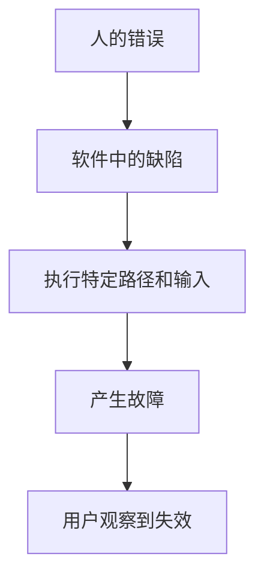

一个缺陷不一定每次运行都导致故障；只有在特定输入、状态、环境或执行路径下才可能暴露。

#### 1.2 验证与确认

- **验证 Verification**：检查是否正确地构建了产品，关注产品是否符合规格、设计和标准。
- **确认 Validation**：检查是否构建了正确的产品，关注软件是否满足用户真实需求和使用场景。

口诀：

```text
验证：做得对不对
确认：做的是不是用户需要的
```

#### 1.3 测试的基本原则

- 测试能够证明存在缺陷，不能证明没有缺陷。
- 穷尽测试通常不可行，应使用风险和优先级指导测试。
- 缺陷具有集群性，少数模块可能集中大多数缺陷。
- 杀虫剂悖论：反复使用同一批测试用例，发现新缺陷的能力会下降。
- 测试应尽早开始，需求和设计阶段也可以进行静态测试。
- 测试活动应考虑上下文，安全关键系统和普通信息系统的测试策略不同。
- 缺陷修复可能引入新缺陷，回归测试不可缺少。
- 测试数据、环境、脚本和结果都应可追踪、可复现。

#### 1.4 测试独立性

测试独立性有助于减少开发者对自己代码的思维盲区：

- 开发者可以进行单元测试。
- 独立测试人员可以提供不同视角。
- 用户或业务代表参与验收测试。
- 高风险系统可由独立测试组织进行确认和审计。

独立性不是越高越好。开发团队最了解实现细节，适合快速单元测试；独立测试人员更容易发现需求理解和使用场景问题。

### 2. 测试过程与测试文档

#### 2.1 测试过程

典型测试过程包括：

1. 分析需求和风险。
2. 编写测试计划。
3. 设计测试方案和测试用例。
4. 准备测试数据、工具和环境。
5. 执行测试并记录结果。
6. 报告、分析和跟踪缺陷。
7. 修复后执行重测和回归测试。
8. 评估出口准则并编写测试总结。

测试不只是执行用例。测试计划、环境管理、缺陷跟踪、风险控制和结果分析同样是测试活动的重要部分。

#### 2.2 测试计划

测试计划通常包括：

- 测试目标、范围和对象。
- 测试类型、级别和策略。
- 测试环境、工具和数据。
- 人员角色、职责和进度。
- 风险、假设和应急措施。
- 进入准则和退出准则。
- 缺陷等级、报告流程和沟通机制。
- 测试交付物和度量指标。

#### 2.3 测试用例

测试用例通常包含：

```text
用例编号
测试目标
前置条件
输入数据
操作步骤
预期结果
实际结果
测试环境
执行人和执行时间
通过/失败状态
关联需求和缺陷
```

好的测试用例应具有明确输入、可重复执行、可判断的预期结果和清晰的需求来源。

#### 2.4 进入准则与退出准则

- **进入准则**：开始某阶段测试前必须满足的条件，如需求已基线、版本已构建、环境可用、测试数据准备完成。
- **退出准则**：结束测试阶段需要满足的条件，如关键用例通过、严重缺陷关闭、覆盖率达到目标、风险得到接受。

测试阶段结束不一定意味着所有缺陷都为零，而是要根据风险、严重程度、剩余缺陷和业务接受情况做出发布决策。

### 3. 测试层次与测试对象

#### 3.1 单元测试

单元测试验证最小可测试单元，如函数、类、模块或组件。

重点：

- 输入边界和异常处理。
- 分支和内部逻辑。
- 类的不变量和接口契约。
- 依赖项隔离。
- 错误路径和资源释放。

常用测试替身：

- **桩 Stub**：被测上层模块调用的下层替代模块。
- **驱动 Driver**：调用被测下层模块的上层替代模块。
- **模拟对象 Mock**：验证交互、调用次数和参数的测试替身。
- **伪对象 Fake**：功能较简化但可运行的替代实现。
- **测试存根**：泛指为隔离依赖而提供的临时代替物。

#### 3.2 集成测试

集成测试验证模块之间的接口、数据传递、调用顺序、异常处理和协作行为。

重点发现：

- 接口参数和数据格式错误。
- 调用顺序错误。
- 共享数据不一致。
- 错误码和异常传播错误。
- 超时、重试和事务边界问题。
- 模块组合后产生的性能和资源问题。

#### 3.3 系统测试

系统测试在完整集成系统上验证系统级需求，包括功能和非功能需求：性能、可靠性、安全性、兼容性、可用性、安装升级、数据迁移和灾备恢复等。

#### 3.4 验收测试

验收测试由用户、客户或代表用户的一方参与，确认系统是否满足合同、业务目标和验收标准。常见形式：

- 用户验收测试 UAT。
- 运行验收测试。
- 合同验收测试。
- 现场验收测试。
- Alpha 测试：在开发方环境中由有限用户试用。
- Beta 测试：在真实或接近真实环境中由外部用户试用。

#### 3.5 回归测试与冒烟测试

- **回归测试**：修改后重新执行相关测试，确认原有功能未被破坏。
- **重测/确认测试**：针对已修复缺陷重新执行原失败用例。
- **冒烟测试**：用少量关键用例快速判断版本是否基本可测试。
- **健全性测试**：针对局部修改快速检查相关功能是否合理。

重测关注缺陷是否修复；回归测试关注修复是否引入其他问题。

### 4. 测试分类

#### 4.1 黑盒测试与白盒测试

| 对比项 | 黑盒测试 | 白盒测试 |
|---|---|---|
| 依据 | 需求、规格和输入输出 | 代码结构和控制流 |
| 是否需要了解实现 | 通常不需要 | 需要 |
| 典型方法 | 等价类、边界值、判定表、场景法 | 语句、分支、条件、路径覆盖 |
| 优点 | 接近用户视角，可发现需求遗漏 | 能覆盖内部逻辑和隐藏分支 |
| 局限 | 可能遗漏内部未暴露路径 | 可能忽略需求错误和用户体验 |

灰盒测试介于二者之间，测试人员了解部分设计、接口、数据库或架构信息，但不完全依据代码内部实现。

#### 4.2 静态测试与动态测试

- **静态测试**：不运行程序，通过评审、走查、审查、静态分析和模型检查发现问题。
- **动态测试**：执行程序，观察输出、状态、性能和资源行为。

静态测试可以在需求、设计和代码阶段尽早发现问题；动态测试适合发现运行时错误、性能问题、并发问题和环境依赖问题。

#### 4.3 功能测试与非功能测试

- 功能测试：验证输入、处理、输出和业务规则。
- 性能测试：验证响应时间、吞吐量、并发量和资源使用。
- 可靠性测试：验证长时间运行、故障恢复和容错。
- 安全测试：验证认证、授权、输入校验、数据保护和审计。
- 兼容性测试：验证不同操作系统、浏览器、设备、数据库和协议。
- 可用性测试：验证用户是否容易学习和完成任务。
- 安装与升级测试：验证安装、配置、升级、卸载和回滚。
- 灾备测试：验证备份、恢复、故障切换和数据丢失目标。

### 5. 黑盒测试用例设计

#### 5.1 等价类划分

等价类划分假设同一等价类中的输入会触发相似处理，因此从每个等价类选择代表值。

步骤：

1. 分析输入条件和输出条件。
2. 划分有效等价类。
3. 划分无效等价类。
4. 为每个等价类选择代表值。
5. 补充边界和组合场景。

例如年龄要求为 `18—60`：

| 等价类 | 示例值 |
|---|---:|
| 小于 18 的无效类 | 17 |
| 18—60 的有效类 | 30 |
| 大于 60 的无效类 | 61 |
| 非数字输入 | `abc` |
| 空输入 | 空字符串 |

等价类不是只划分“有效”和“无效”两类，还要根据不同处理规则进一步细分。

#### 5.2 边界值分析

边界值分析关注输入范围的边界及其邻近值。对范围 `[min, max]`，常见值包括：

```text
min-1, min, min+1, 正常值, max-1, max, max+1
```

也要考虑：

- 长度为 0、1、最大长度和超过最大长度。
- 数组下标首位、末位和越界。
- 文件大小为 0、最大值和超限。
- 日期月初、月末、闰年和跨年。
- 数值上溢、下溢和精度临界。

#### 5.3 决策表测试

判定表适合多个条件组合影响动作的规则。设计步骤：

1. 列出条件。
2. 列出每个条件的可能取值。
3. 列出动作。
4. 枚举规则组合。
5. 删除不可能组合，合并等价规则。
6. 为每条有效规则生成至少一个测试用例。

若有 `n` 个二值条件，理论组合最多为 `2^n`，但业务约束可以减少实际需要测试的组合。

#### 5.4 因果图

因果图将输入条件作为原因、输出结果作为结果，用逻辑关系表达条件组合，再转换为判定表和测试用例。

常见逻辑：

- 与：多个条件同时满足。
- 或：至少一个条件满足。
- 非：条件取反。
- 异或：恰有一个条件满足。
- 约束：原因不能同时出现或结果不能同时出现。

因果图适合规则复杂、条件之间存在组合约束的系统。

#### 5.5 场景法

场景法从用户业务流程出发设计：

- 基本成功场景。
- 备选流程。
- 异常流程。
- 取消、重试和恢复流程。
- 并发和超时流程。
- 权限不足和数据冲突流程。

场景法适合用例驱动系统、交易系统和跨模块业务流程。

#### 5.6 错误推测法

根据经验推测容易出错的位置并设计用例：

- 空值、空集合、重复值。
- 负数、0、最大整数和精度边界。
- 非法字符、超长输入和特殊编码。
- 重复提交、重复点击和并发提交。
- 网络中断、服务超时和数据库故障。
- 权限绕过、未登录访问和参数篡改。

错误推测法不能替代系统化方法，但可以补充高风险和经验性缺陷。

#### 5.7 状态转换测试

适合订单、支付、审批、连接、账户和设备等状态驱动系统。

测试应覆盖：

- 每个状态是否可进入。
- 每个合法事件是否触发正确转移。
- 非法事件是否被拒绝或提示。
- 状态转换动作和副作用是否正确。
- 超时、重试、取消、恢复和并发状态是否正确。

### 6. 白盒测试与覆盖率

#### 6.1 控制流图

控制流图用节点表示语句或基本块，用边表示可能的控制转移。测试设计可以基于控制流图选择路径。

- 顺序语句对应顺序节点。
- `if`、`switch` 和循环产生分支。
- 循环回边表示重复执行。
- 函数调用可以根据分析粒度作为一个节点或展开。

#### 6.2 语句覆盖

语句覆盖要求每条可执行语句至少执行一次：

```text
语句覆盖率 = 已执行语句数 / 可执行语句总数
```

语句覆盖率高不代表所有分支都被测试。例如只执行 `if` 的真分支，可能达到部分或全部语句覆盖，却没有验证假分支。

#### 6.3 判定/分支覆盖

判定覆盖要求每个判定的每个结果至少出现一次：

```text
分支覆盖率 = 已执行分支数 / 分支总数
```

通常比单纯语句覆盖更强，但仍不一定覆盖每个基本条件的所有组合。

#### 6.4 条件覆盖

条件覆盖要求每个基本条件的真值和假值都至少出现一次。例如：

```text
if (A && B)
```

需要让 `A` 分别取真和假，也让 `B` 分别取真和假。条件覆盖不一定保证整个判定结果的真和假都出现。

#### 6.5 判定/条件覆盖

要求同时满足判定覆盖和条件覆盖：

- 每个判定结果真和假都出现。
- 每个基本条件真和假都出现。

#### 6.6 条件组合覆盖

要求覆盖每个判定中基本条件的所有取值组合。若有 `n` 个独立二值条件，理论组合数为 `2^n`。

条件组合覆盖强度高，但测试用例数量可能快速增长。实际项目常结合风险、等价类和组合测试减少用例数量。

#### 6.7 路径覆盖

路径覆盖要求执行程序中的路径。存在循环时，完整路径数量可能无限或极大，因此通常采用：

- 循环 0 次、1 次和多次。
- 循环边界次数。
- 典型分支组合。
- 基本路径覆盖。

路径覆盖的强度通常高于语句覆盖，但“所有路径覆盖”在含循环程序中往往不可行。

#### 6.8 基本路径测试与圈复杂度

圈复杂度用于估计线性独立路径数量，常用公式：

```text
V(G) = E - N + 2P
```

- `E`：控制流图边数。
- `N`：节点数。
- `P`：连通分量数，单个程序通常为 1。

也可以使用：

```text
V(G) = 判定节点数 + 1
```

圈复杂度表示独立路径数量的上界或基本路径测试所需的最少独立路径数，不等于所有实际执行路径数量。

### 7. 集成测试策略

#### 7.1 自顶向下集成

从顶层模块开始，逐步加入下层模块。尚未实现的下层模块用桩模块替代。

优点：优先验证系统控制流程和主要架构；缺点：底层功能晚验证，桩模块可能复杂。

#### 7.2 自底向上集成

从最底层模块开始，逐步向上集成。尚未实现的上层模块用驱动模块替代。

优点：底层基础能力早验证，不需要复杂桩；缺点：系统主要控制流程较晚出现。

#### 7.3 三明治集成

同时从顶层和底层向中间集成，兼顾两种策略。中间层模块可能最后集成，适合层次结构清晰的系统。

#### 7.4 大爆炸集成

所有模块完成后一次性集成。实施简单，但缺陷定位困难，不适合模块多、接口复杂或风险高的系统。

#### 7.5 持续集成

持续集成要求频繁合并代码，自动构建、静态检查和执行测试。它可以尽早发现集成冲突，但需要稳定的自动化测试和构建环境。

### 8. 系统测试与专项测试

#### 8.1 功能测试

验证功能需求、业务规则、数据处理、权限和异常流程。功能测试不应只覆盖成功路径，还应覆盖失败、取消、重试和恢复。

#### 8.2 性能测试

- **负载测试**：在预期负载下验证性能指标。
- **压力测试**：逐渐增加负载，寻找系统极限和失效点。
- **峰值测试**：验证突然高峰负载下的表现。
- **稳定性/耐久性测试**：长时间运行，发现内存泄漏和资源耗尽。
- **容量测试**：验证数据量、用户量、连接数或文件数达到目标时的表现。
- **扩展性测试**：验证增加资源或节点后性能是否改善。

常见性能指标：响应时间、吞吐量、并发用户数、事务成功率、CPU 使用率、内存使用率、I/O 和错误率。

#### 8.3 安全测试

安全测试关注：

- 身份认证和多因素认证。
- 授权、角色和最小权限。
- 会话管理和超时。
- 输入校验、注入和跨站脚本。
- 数据传输和存储加密。
- 敏感数据脱敏。
- 日志审计和告警。
- 文件上传、路径遍历和反序列化。
- 错误信息泄露。
- 密钥、凭据和配置保护。

#### 8.4 兼容性与可用性测试

兼容性测试覆盖不同浏览器、操作系统、数据库、设备、分辨率、网络环境和协议版本。

可用性测试关注：

- 用户完成任务的成功率。
- 完成任务所需时间和步骤数。
- 错误率和恢复难度。
- 学习成本。
- 界面一致性和可访问性。
- 用户主观满意度。

#### 8.5 安装、升级和恢复测试

测试安装包、初始化、配置、升级、回滚、卸载、数据迁移、兼容旧版本和升级失败恢复。升级测试不能只验证“升级成功”，还要检查原有数据、权限、配置和外部接口是否保持正确。

### 9. 测试替身与测试隔离

#### 9.1 桩与驱动

- **桩模块 Stub**：模拟被测模块依赖的下层模块，常用于自顶向下集成。
- **驱动模块 Driver**：模拟调用被测模块的上层模块，常用于自底向上集成。

#### 9.2 Mock、Stub、Fake 与 Spy

- **Stub**：提供预设响应，重点是让测试继续执行。
- **Mock**：预先设定期望交互，验证是否按预期调用。
- **Fake**：可工作的简化实现，如内存数据库。
- **Spy**：记录调用信息，测试后验证调用次数和参数。

测试替身应尽量保持与真实依赖一致的接口和关键行为，否则可能出现“测试通过、真实环境失败”。

### 10. 缺陷管理

#### 10.1 缺陷报告内容

缺陷报告通常包含：

- 缺陷编号和标题。
- 发现版本、环境和配置。
- 前置条件和复现步骤。
- 实际结果与预期结果。
- 复现频率和最小复现数据。
- 严重程度和优先级。
- 日志、截图、堆栈和附件。
- 关联需求、测试用例和责任人。
- 当前状态、修复版本和验证结果。

#### 10.2 严重程度与优先级

- **严重程度 Severity**：缺陷对系统功能、数据、安全和运行的影响大小。
- **优先级 Priority**：修复该缺陷的紧急程度和业务排序。

高严重度缺陷通常优先级高，但也可能因发生概率、用户范围、发布计划和临时规避方案而不同。

#### 10.3 缺陷生命周期

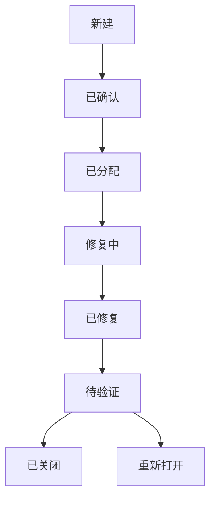

关闭缺陷前应确认：修复版本正确、原问题已解决、相关回归测试通过、没有引入明显副作用。

#### 10.4 缺陷分类

- 需求缺陷。
- 设计缺陷。
- 编码缺陷。
- 接口缺陷。
- 数据缺陷。
- 测试环境缺陷。
- 配置和部署缺陷。
- 文档缺陷。

分析缺陷根因比单纯修复现象更重要，可以使用鱼骨图、五个为什么、因果分析和缺陷分类统计。

### 11. 软件可靠性与可用性

#### 11.1 可靠性

软件可靠性是在规定条件和规定时间内完成规定功能的能力。可靠性受到缺陷数量、运行环境、输入分布、容错机制和维护活动影响。

常见指标：

- **MTTF**：平均无故障时间。
- **MTTR**：平均修复时间。
- **MTBF**：平均故障间隔时间。
- **故障率**：单位时间内发生故障的概率或频率。
- **可用性**：系统处于可使用状态的比例。

常用关系：

```text
MTBF ≈ MTTF + MTTR
可用性 ≈ MTBF / (MTBF + MTTR)
```

若题目定义 MTBF 或 MTTF 的方式不同，应以题目条件为准。

#### 11.2 可靠性增长

测试和维护可以发现并修复缺陷，使软件可靠性提高，但修复过程也可能引入新缺陷。可靠性增长模型用于根据故障数据估算剩余缺陷和未来可靠性。

“测试时间越长，可靠性一定越高”不是绝对结论；测试质量、运行环境、缺陷修复质量和新功能变化都会影响结果。

#### 11.3 容错与恢复测试

容错测试通过注入故障验证系统是否能够：

- 检测故障。
- 隔离故障。
- 降级运行。
- 自动重试或切换。
- 恢复数据和服务。
- 记录日志并告警。

### 12. 调试

测试用于发现故障现象，调试用于定位和修复缺陷原因。

#### 12.1 调试策略

- **蛮力法**：增加日志、打印、断点和运行跟踪，适合快速收集事实。
- **回溯法**：从错误结果开始沿执行路径向前检查。
- **归纳法**：收集多个样例和线索，寻找共同原因。
- **演绎法**：提出可能原因，通过实验逐一排除。
- **二分定位**：在复杂链路或大数据处理中逐步缩小故障范围。

#### 12.2 调试过程

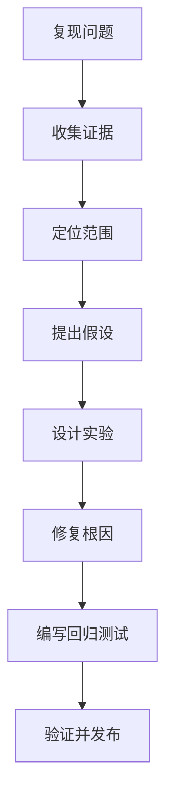

不要只修改让当前样例通过的代码，应确认根因、边界行为和相关场景。

### 13. 测试度量与报告

常见测试度量：

```text
测试执行率 = 已执行用例数 / 计划用例数
测试通过率 = 通过用例数 / 已执行用例数
需求覆盖率 = 已有测试覆盖的需求数 / 需求总数
语句覆盖率 = 已执行语句数 / 可执行语句总数
缺陷密度 = 缺陷数 / 软件规模
缺陷发现率 = 一段时间内发现的缺陷数 / 测试投入或时间
缺陷重开率 = 重开缺陷数 / 已关闭缺陷数
```

度量必须明确统计范围、版本、时间窗口和数据来源。覆盖率高不代表测试质量一定高，低质量用例也可能获得较高覆盖率。

测试总结报告通常包括：测试范围、环境、执行情况、缺陷统计、未解决风险、质量指标、偏差分析和发布建议。

### 14. 测试题型与答题方法

#### 14.1 黑盒测试题

```text
先识别输入条件和业务规则，
再划分有效/无效等价类，
补充边界值、组合条件、异常场景和状态转移，
为每个代表类写出输入、操作和预期结果。
```

#### 14.2 白盒覆盖题

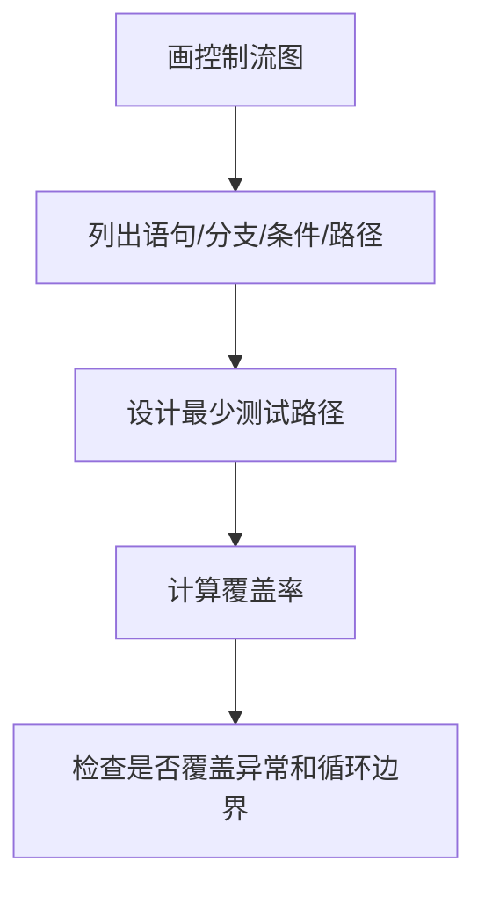

需要注意语句覆盖、判定覆盖、条件覆盖和条件组合覆盖的定义不同，不能从“执行过一个 if”直接推出覆盖率 100%。

#### 14.3 集成测试题

```text
识别模块层次和依赖方向：
自顶向下使用桩，自底向上使用驱动，
三明治同时从两端集成，大爆炸定位困难。
根据接口风险和架构特点选择集成顺序。
```

#### 14.4 缺陷分析题

```text
先说明实际结果与预期结果的差异，
再判断缺陷严重程度和优先级，
给出复现步骤、环境、日志和关联用例，
修复后进行重测，并对相关功能执行回归测试。
```

### 15. 本章易错点

- 测试可以证明存在缺陷，不能证明程序没有缺陷。
- 测试不是只在编码完成后开始，需求和设计阶段也可以评审和静态分析。
- 重测确认原缺陷是否修复，回归测试确认修改是否破坏其他功能。
- 单元测试关注最小模块，集成测试关注接口协作，系统测试关注完整系统，验收测试关注用户和合同要求。
- 自顶向下集成使用桩，自底向上集成使用驱动。
- 等价类要同时考虑有效类和无效类，不能只测一个正常值。
- 边界值测试要覆盖边界内外的邻近值，不是只测最小值和最大值。
- 语句覆盖 100% 不代表分支覆盖 100%；条件覆盖也不一定覆盖所有条件组合。
- 路径覆盖在存在循环时通常无法完全实现，应覆盖循环 0 次、1 次、多次和边界次数。
- 圈复杂度是基本路径测试的重要参考，不等于所有实际路径数量。
- Mock 验证交互，Stub 提供预设响应，Fake 是简化实现，三者用途不同。
- 缺陷严重程度和修复优先级不是完全相同的概念。
- 测试通过率高不代表质量一定高，可能是测试用例覆盖不足。
- 性能测试要区分负载、压力、峰值、稳定性、容量和扩展性测试。
- 安全测试不能只做登录测试，还要覆盖越权、注入、会话、数据保护和审计。
- 测试环境、数据、脚本和版本必须可追踪，否则结果难以复现。
- 修复缺陷后必须执行重测和相关回归测试。

### 16. 公式、覆盖速查与自测清单

#### 16.1 覆盖率公式

```text
语句覆盖率 = 已执行语句数 / 可执行语句总数
分支覆盖率 = 已执行分支数 / 分支总数
条件覆盖率 = 已覆盖基本条件真/假取值数 / 基本条件取值总数
需求覆盖率 = 已覆盖需求数 / 需求总数
测试通过率 = 通过用例数 / 已执行用例数
```

#### 16.2 可靠性公式

```text
MTBF ≈ MTTF + MTTR
可用性 ≈ MTBF / (MTBF + MTTR)
缺陷密度 = 缺陷数 / 软件规模
缺陷重开率 = 重开缺陷数 / 已关闭缺陷数
```

#### 16.3 圈复杂度

```text
V(G) = E - N + 2P
单连通程序：V(G) = 判定节点数 + 1
```

#### 16.4 自测清单

- [ ] 能区分错误、缺陷、故障和失效。
- [ ] 能说明测试原则、验证与确认。
- [ ] 能设计测试计划、用例、进入准则和退出准则。
- [ ] 能区分单元、集成、系统、验收、回归和冒烟测试。
- [ ] 能区分桩、驱动、Mock、Stub、Fake 和 Spy。
- [ ] 能选择等价类、边界值、判定表、因果图、场景法和错误推测法。
- [ ] 能设计状态转换和异常流程测试。
- [ ] 能画控制流图并计算语句、分支、条件和路径覆盖。
- [ ] 能使用圈复杂度估算基本路径数量。
- [ ] 能比较自顶向下、自底向上、三明治和大爆炸集成策略。
- [ ] 能说明性能、压力、容量、稳定性和扩展性测试。
- [ ] 能设计认证、授权、输入校验、会话和数据保护测试。
- [ ] 能编写完整缺陷报告并区分严重程度和优先级。
- [ ] 能说明缺陷生命周期、重测和回归测试。
- [ ] 能计算 MTTF、MTTR、MTBF、可用性和常见测试指标。
- [ ] 能区分静态测试、动态测试、评审和调试。
- [ ] 能根据题干写出测试策略、用例、覆盖结论和发布建议。

---

## 4.6 运行和维护知识

### 13. 软件维护与演化

#### 13.1 四类维护

- **纠错性维护**：修复交付后发现的错误和缺陷。
- **适应性维护**：适应操作系统、数据库、硬件、法规和外部接口变化。
- **完善性维护**：改进性能、易用性、可维护性或增加用户需要的功能。
- **预防性维护**：主动重构、补充测试、改进文档和架构，以降低未来维护成本。

#### 13.2 维护触发原因

- 用户需求变化。
- 业务流程和法规变化。
- 运行环境和依赖组件升级。
- 性能、容量和可用性不足。
- 安全漏洞和合规要求。
- 技术债务和架构腐化。
- 数据迁移和系统集成要求。

#### 13.3 软件再工程

软件再工程是对现有软件进行分析、改造、重构、迁移或重新实现，以延长生命周期或降低维护成本。

常见活动：

- 逆向工程：从代码恢复设计和文档。
- 重构：不改变外部行为，改善内部结构。
- 代码重组：整理模块、命名和依赖。
- 数据重构：转换数据结构、清理数据和迁移数据库。
- 正向工程：根据新的设计和架构重新实现。
- 软件迁移：将系统迁移到新的平台、语言或基础设施。

## 4.7 软件项目管理

### 3. 可行性研究与成本效益

#### 3.1 可行性分析维度

| 类型 | 主要问题 |
|---|---|
| 技术可行性 | 技术、平台、人员和集成能力是否满足要求 |
| 经济可行性 | 成本、收益、预算和投资回收是否合理 |
| 操作可行性 | 用户、组织和业务流程能否接受系统 |
| 法律/社会可行性 | 是否符合政策、法规、伦理和知识产权要求 |
| 时间可行性 | 是否能在目标时间内完成 |
| 安全可行性 | 能否满足认证、授权、审计和数据保护要求 |

可行性研究的结果通常是可行性研究报告，包括问题定义、候选方案、技术分析、成本收益、风险、推荐方案和结论。

#### 3.2 成本分类

- 人员成本：开发、测试、项目管理、运维和培训人员。
- 设备与基础设施成本：服务器、网络、存储、开发环境和办公资源。
- 软件和许可成本：操作系统、数据库、中间件、工具和第三方服务。
- 运行成本：部署、监控、备份、客服和日常运维。
- 机会成本：因选择当前项目而放弃的其他收益。
- 维护成本：缺陷修复、环境适配、功能完善和预防性重构。

#### 3.3 投资回收期

投资回收期是累计收益抵消初始投资所需的时间。回收期越短，资金风险通常越低，但它没有充分体现回收期之后的收益和资金时间价值。

#### 3.4 净现值 NPV

将未来收益和成本折算到当前时点：

```text
NPV = Σ(第 t 年净现金流 / (1 + r)^t) - 初始投资
```

- `r` 是折现率。
- `t` 是时间周期。
- `NPV > 0` 通常表示项目在给定折现率下具有经济可行性。

#### 3.5 收益成本比

```text
收益成本比 = 总收益现值 / 总成本现值
```

比值大于 1 通常表示收益高于成本，但最终还要结合风险、战略、法规和资源约束判断。

### 12. 软件配置管理与变更控制

#### 12.1 配置项

配置项是需要进行版本控制和变更管理的工作产品，例如：

- 需求规格说明书。
- 架构和详细设计文档。
- 源代码和测试代码。
- 测试用例、测试数据和测试报告。
- 构建脚本、部署脚本和环境配置。
- 接口定义、数据库脚本和第三方依赖。
- 发布包、安装包和用户文档。

#### 12.2 基线

基线是经过正式评审和批准、作为后续工作依据的配置项集合。基线建立后不能直接修改，必须通过变更控制流程。

基线的价值：

- 明确某个时间点的正式状态。
- 便于版本比较、审计和回滚。
- 防止未经授权的随意修改。
- 为测试、发布和验收提供稳定依据。

#### 12.3 配置管理活动

1. 配置项识别。
2. 配置库和版本控制。
3. 基线建立与维护。
4. 变更控制。
5. 配置状态记录。
6. 配置审计。
7. 构建与发布管理。

#### 12.4 变更控制流程

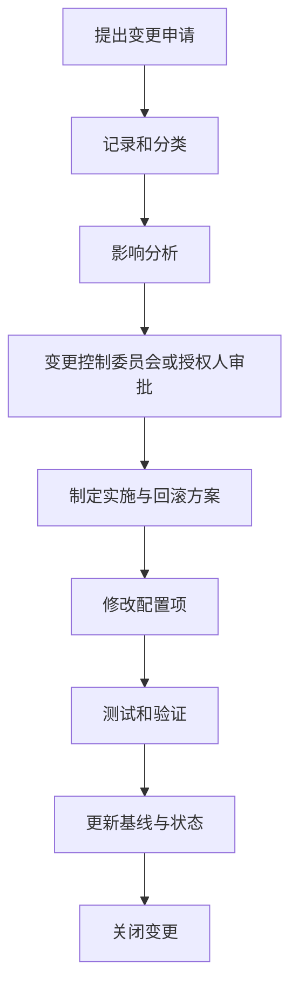

影响分析应覆盖需求、架构、代码、数据库、接口、测试、进度、成本、安全、部署和文档。紧急变更也需要补充记录、验证和事后审计。

项目管理、配置管理和质量保证贯穿软件生命周期。软件设计师考试常考 WBS、甘特图、网络图、关键路径、PERT、成本估算、挣值分析、配置项与基线、变更控制、质量保证、风险管理和项目沟通。

本章复习主线如下：

> 范围与目标 → 工作分解 → 进度与资源 → 成本与质量 → 风险与沟通 → 配置与变更 → 交付与持续改进

### 1. 软件项目管理基础

#### 1.1 项目与运营

- **项目**：为创造独特产品、服务或成果而进行的临时性工作，有明确开始和结束时间。
- **运营**：持续、重复地提供产品或服务，关注稳定性和效率。
- **项目管理**：运用知识、技能、工具和方法满足项目要求。

软件项目具有需求不确定、知识密集、成果不可见、技术变化快、依赖关系复杂和质量难以事后补救等特点。

#### 1.2 项目约束

传统项目管理常关注范围、进度、成本和质量，也要考虑资源、风险、沟通、采购、安全与合规等约束。

```text
范围扩大，通常会影响进度、成本、资源、风险和质量。
进度压缩，可能增加成本、资源冲突和质量风险。
质量目标提高，可能增加测试、人员、工具和基础设施成本。
```

约束之间不是简单的固定公式，项目经理需要根据优先级和组织目标进行权衡。

#### 1.3 项目章程与项目管理计划

项目章程用于正式授权项目，通常包含项目目的、目标、范围边界、主要里程碑、主要干系人、项目经理授权和初步风险。

项目管理计划进一步明确：

- 范围管理计划。
- 进度管理计划。
- 成本管理计划。
- 质量管理计划。
- 资源与沟通计划。
- 风险管理计划。
- 配置与变更管理计划。
- 采购和发布计划。

### 2. 项目范围管理

#### 2.1 范围基准

范围基准通常包括：

- 项目范围说明书。
- 工作分解结构 WBS。
- WBS 词典。

范围说明书应明确产品范围、项目范围、主要交付物、验收标准、假设、约束和明确排除项。

#### 2.2 WBS 工作分解结构

WBS 按可交付成果和工作包将项目逐层分解：

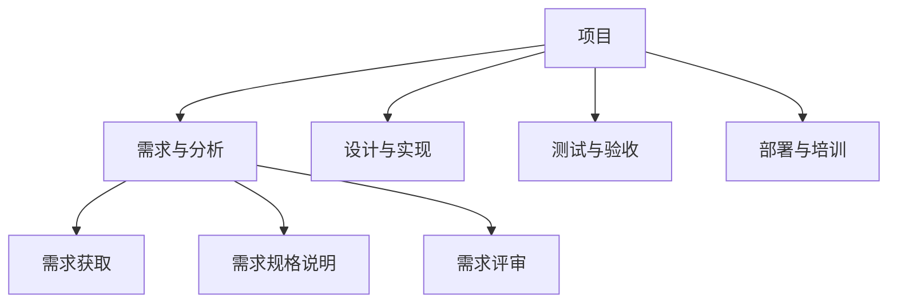

WBS 原则：

- 以可交付成果或工作成果为中心，而不是简单按部门列任务。
- 采用 100% 规则：下层工作应覆盖上层工作全部范围，不能多也不能少。
- 工作包应足够小，便于估算、分配、跟踪和验收。
- 工作包之间边界清晰，避免遗漏和重复。
- WBS 不等同于进度计划；它描述“要完成什么”，网络计划还要描述“先后关系和时间”。

WBS 词典进一步说明工作包的范围、责任人、输入、输出、验收标准、估算、依赖和约束。

#### 2.3 范围蔓延

范围蔓延是未经正式审批，项目范围持续增加的现象。它会导致进度延误、成本增加、资源紧张和质量下降。

控制方法：

- 明确范围基线和验收标准。
- 所有变更正式记录和审批。
- 分析变更对进度、成本、质量和风险的影响。
- 与干系人确认优先级和取舍。
- 通过版本、迭代或后续项目管理新增需求。

### 3. 项目进度管理

#### 3.1 活动定义与依赖关系

常见活动依赖关系：

- **完成—开始 FS**：前一活动完成，后一活动才能开始，最常见。
- **开始—开始 SS**：前一活动开始后，后一活动才能开始。
- **完成—完成 FF**：前一活动完成后，后一活动才能完成。
- **开始—完成 SF**：前一活动开始后，后一活动才能完成，较少见。

依赖来源：技术依赖、资源依赖、合同依赖、外部依赖和组织约束。

#### 3.2 甘特图

甘特图用横向时间轴表示活动的开始、结束、持续时间、完成比例和依赖关系。

优点：直观、便于展示计划和实际进度。缺点：复杂依赖和关键路径表达能力弱，不适合单独进行复杂网络计算。

#### 3.3 网络图

网络图表示活动之间的逻辑依赖和先后关系，常用于计算项目工期、关键路径和时差。

画网络图时：

1. 列出活动及其前置活动。
2. 从无前置活动的节点开始。
3. 按依赖关系连接活动。
4. 检查是否出现循环依赖。
5. 确定开始节点和结束节点。

### 4. 关键路径法 CPM

#### 4.1 关键路径

关键路径是网络图中从开始到结束的最长路径，决定项目最短工期。关键路径上的活动通常总时差为 0，关键路径上的任何延误都可能延误项目总工期。

注意：

- 关键路径可能有多条。
- 关键路径可能随着实际进度和活动持续时间变化。
- 非关键活动有时也可能因时差耗尽而成为关键活动。
- 缩短非关键路径活动不一定缩短项目总工期。

#### 4.2 单代号网络图时间参数

常用参数：

- `ES`：最早开始时间。
- `EF`：最早完成时间。
- `LS`：最迟开始时间。
- `LF`：最迟完成时间。
- `TF`：总时差。
- `FF`：自由时差。

基本公式：

```text
EF = ES + 活动持续时间
LS = LF - 活动持续时间
总时差 TF = LS - ES = LF - EF
```

正推计算：

```text
ES(起点) = 0
EF = ES + duration
某活动 ES = 所有前置活动 EF 的最大值
```

逆推计算：

```text
项目终点 LF = 项目总工期
LS = LF - duration
某活动 LF = 所有后继活动 LS 的最小值
```

自由时差：在不影响紧后活动最早开始时间的前提下，活动可以延迟的时间：

```text
FF = min(紧后活动 ES) - 当前活动 EF
```

#### 4.3 双代号网络图

双代号网络图中：

- 节点表示事件。
- 箭线表示活动。
- 虚活动持续时间为 0，用于表达逻辑依赖，不消耗资源和时间。

虚活动不能被当作普通活动累加时间。题目画图时要避免出现回路、多个起点终点或依赖关系表达不清。

### 5. PERT 与工期估算

#### 5.1 三点估算

使用乐观时间 `a`、最可能时间 `m`、悲观时间 `b`：

```text
期望时间 te = (a + 4m + b) / 6
方差 = ((b - a) / 6)^2
标准差 = (b - a) / 6
```

最可能时间权重最高，期望值通常靠近 `m`。

#### 5.2 项目工期与方差

项目工期通常取关键路径上活动期望时间之和：

```text
项目期望工期 = 关键路径活动 te 之和
项目方差 = 关键路径活动方差之和
项目标准差 = √项目方差
```

以上通常假设活动持续时间相互独立。若关键路径不确定或存在多条接近路径，应结合题目条件谨慎判断。

#### 5.3 概率估算

若项目工期近似服从正态分布，可计算标准化值：

```text
Z = (目标工期 - 期望工期) / 项目标准差
```

再根据标准正态分布表估算按期完成概率。题目若未说明分布假设，不要自行引入概率结论。

### 6. 进度压缩与资源管理

#### 6.1 进度压缩

- **赶工 Crashing**：增加资源、加班或采用更高成本方案，通常增加直接成本。
- **快速跟进 Fast Tracking**：将原本串行的活动部分并行，增加返工和风险。

只有压缩关键路径上的活动才可能缩短项目总工期。压缩后关键路径可能改变，需要重新计算。

#### 6.2 资源平衡与资源平滑

- **资源平衡**：根据资源可用性调整进度，可能改变关键路径和项目工期。
- **资源平滑**：在不改变关键路径和项目总工期的前提下，利用时差调整资源使用。

资源冲突不能只通过“把任务同时安排”解决，应检查人员技能、设备、环境、地域和组织限制。

### 7. 成本管理与挣值分析

#### 7.1 成本类型

- 直接成本：可直接归属于项目或活动的人员、设备和材料成本。
- 间接成本：管理、办公、基础设施和共享服务成本。
- 固定成本：在一定范围内不随工作量明显变化。
- 可变成本：随工作量、使用量或产出变化。
- 机会成本：选择某方案而放弃的其他收益。
- 沉没成本：已经发生且不能通过当前决策收回的成本，不应作为继续投入的主要依据。

#### 7.2 成本基准

成本基准是按时间分配的批准预算，用于比较计划成本和实际成本。项目总预算可以包括管理储备，但成本基准和总预算的定义要按题目给出的管理口径判断。

#### 7.3 挣值管理 EVM

- **PV（计划价值）**：截至某时点计划完成工作的预算价值。
- **EV（挣值）**：截至某时点实际完成工作的预算价值。
- **AC（实际成本）**：截至某时点实际发生的成本。
- **BAC（完工预算）**：项目全部工作的批准预算。

偏差：

```text
进度偏差 SV = EV - PV
成本偏差 CV = EV - AC
```

指标：

```text
进度绩效指数 SPI = EV / PV
成本绩效指数 CPI = EV / AC
```

判断：

- `SV > 0`：进度超前；`SV < 0`：进度落后。
- `CV > 0`：成本节约；`CV < 0`：成本超支。
- `SPI > 1`：进度绩效较好；`SPI < 1`：进度落后。
- `CPI > 1`：成本效率较高；`CPI < 1`：成本超支。

#### 7.4 完工估算

常见公式：

```text
ETC = EAC - AC
VAC = BAC - EAC
```

若假设剩余工作按原计划成本完成：

```text
EAC = AC + (BAC - EV)
```

若假设当前成本绩效继续保持：

```text
EAC = BAC / CPI
```

若同时考虑成本和进度绩效：

```text
EAC = AC + (BAC - EV) / (CPI × SPI)
```

不同公式对应不同假设，必须先读题目对未来绩效的描述。

### 8. 项目沟通与干系人管理

#### 8.1 沟通方式

- **正式沟通**：项目报告、评审会议、批准记录和正式邮件。
- **非正式沟通**：即时讨论、聊天和口头交流，速度快但可追溯性弱。
- **书面沟通**：便于留痕和审计。
- **口头沟通**：适合快速协调、解释和冲突处理。
- **交互式沟通**：会议、评审和讨论，适合复杂问题和共识建立。
- **推送式沟通**：主动向指定对象发送报告。
- **拉取式沟通**：将信息放在知识库、门户或仓库中供需要者查询。

#### 8.2 沟通管理原则

- 确定信息接收者、发送者、渠道、频率和格式。
- 关键决策必须记录，不能只依赖口头承诺。
- 向不同干系人提供与其职责和关注点匹配的信息。
- 及时暴露风险、偏差和需要决策的问题。
- 处理信息安全、隐私和最小知情范围。

#### 8.3 干系人管理

干系人管理步骤：

1. 识别干系人。
2. 分析利益、影响力、态度和期望。
3. 制定参与策略。
4. 持续沟通和管理期望。
5. 监控态度变化和冲突。

常见策略：重点管理、保持满意、保持知情、监督观察。项目失败常不是技术问题，而是目标、期望和决策权没有对齐。

### 9. 采购与供应商管理

#### 9.1 采购决策

采购分析应考虑：

- 自研还是外购。
- 总拥有成本 TCO。
- 交付周期和供应商能力。
- 接口、版本和迁移风险。
- 安全、隐私和合规。
- 许可、知识产权和退出机制。
- 服务等级、支持和故障责任。

#### 9.2 合同类型

常见合同类型：

- **固定总价合同**：价格相对固定，供应商承担较多成本风险，需求必须较明确。
- **成本补偿合同**：按实际成本加费用支付，买方承担较多成本风险，适合范围不确定项目。
- **工料合同**：按人员工时和材料计费，灵活但需要控制工作量和单价。

合同还应明确验收标准、交付物、变更、付款、违约、保密、知识产权、服务等级和终止条件。

### 10. 配置管理

#### 10.1 配置项

配置项是需要识别、版本控制、变更管理和审计的工作产品：

- 需求和设计文档。
- 源代码、测试代码和脚本。
- 测试用例、数据和报告。
- 数据库脚本和接口定义。
- 构建、部署和环境配置。
- 第三方依赖、许可证和发布包。
- 用户手册、运维手册和培训资料。

#### 10.2 配置管理活动

1. 配置项识别。
2. 配置库和版本控制。
3. 基线建立与维护。
4. 变更控制。
5. 配置状态记录。
6. 配置审计。
7. 构建和发布管理。

#### 10.3 基线

基线是经过正式评审和批准、作为后续工作依据的配置项集合。基线建立后不能直接修改，任何修改都要经过授权的变更流程。

常见基线：需求基线、设计基线、测试基线、发布基线和产品基线。

基线的作用：

- 明确正式版本状态。
- 支持版本比较、审计和回滚。
- 防止未经授权的修改。
- 作为测试、验收和发布依据。

#### 10.4 版本控制

版本控制需要记录：

- 文件版本和变更历史。
- 变更作者、时间和原因。
- 分支、合并和标签。
- 构建输入和输出。
- 发布版本与源代码、配置和依赖的对应关系。

版本号应能区分不兼容变更、功能增加和缺陷修复，具体规则可采用项目约定的语义化版本或组织规范。

#### 10.5 配置状态记录

配置状态记录回答：

- 当前有哪些配置项。
- 每个配置项当前处于什么版本和状态。
- 哪些变更已提出、审批、实施和验证。
- 某个发布包由哪些源代码、依赖和配置构成。
- 某个缺陷影响哪些版本和环境。

#### 10.6 配置审计

- **功能配置审计**：检查配置项是否满足需求、设计和功能要求。
- **物理配置审计**：检查实际交付物是否完整、版本是否正确、构成是否与记录一致。

配置审计不是普通代码评审，也不只是检查文件是否存在，而是验证配置项、基线、构建结果和记录的一致性。

### 11. 变更管理

#### 11.1 变更控制流程

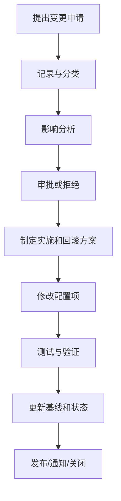

#### 11.2 影响分析内容

变更影响分析应覆盖：

- 范围、需求和验收标准。
- 架构、模块、接口和数据库。
- 源代码、配置和第三方依赖。
- 测试用例、测试数据和测试环境。
- 进度、成本、资源和合同。
- 性能、安全、可靠性和合规。
- 部署、监控、回滚和运维文档。

#### 11.3 紧急变更

紧急变更可以简化部分审批路径，但不能跳过记录、风险判断、验证和事后审计。应保留紧急变更原因、授权人、实施人、影响范围和回滚结果。

### 15. 项目管理综合题解题方法

#### 15.1 关键路径题

```text
先列出活动及前置关系，
再画网络图并进行正推，求各活动最早时间；
从项目终点逆推，求最迟时间和总时差；
总时差为 0 的路径是关键路径，最长路径长度是项目工期。
```

#### 15.2 PERT 题

```text
te = (a + 4m + b) / 6
方差 = ((b-a)/6)^2
先求关键路径，再将关键路径活动的期望时间和方差相加。
```

#### 15.3 挣值题

```text
SV = EV - PV
CV = EV - AC
SPI = EV / PV
CPI = EV / AC
```

答题时先判断正负含义，再根据题目对未来绩效的假设选择 EAC 公式。

#### 15.4 配置管理题

```text
先识别配置项，再建立基线；
发生变更时提出申请并做影响分析；
审批后修改、测试、审计并更新配置状态。
```

#### 15.5 风险题

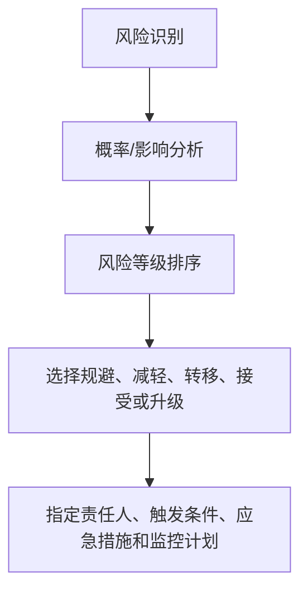

### 16. 常见易错点

- WBS 描述要完成什么，网络计划描述先后关系和时间，二者不能混淆。
- WBS 应满足 100% 规则，不能遗漏范围，也不能把项目外工作混入。
- 关键路径是最长路径，不是最短路径；关键活动总时差通常为 0。
- 缩短非关键路径活动不一定缩短项目总工期，压缩后必须重新计算关键路径。
- 资源平滑通常不改变关键路径，资源平衡可能改变工期和关键路径。
- PERT 期望时间中最可能时间权重为 4，不是简单平均。
- 关键路径方差通常相加，标准差是方差和的平方根，不是标准差直接相加。
- `SV` 衡量进度，`CV` 衡量成本；`SPI` 和 `CPI` 小于 1 通常表示绩效不佳。
- EAC 公式依赖未来成本绩效假设，不能看到 BAC 就机械套用。
- 基线建立后不能直接修改，必须通过变更控制。
- 配置审计既检查功能符合性，也检查实际构成和记录是否一致。
- QA 面向过程，QC 面向产品；评审是静态活动，测试是动态活动。
- 风险尚未发生，问题已经发生；已发生风险应转入问题管理。
- 风险转移不等于风险消失，责任和合同边界仍需明确。
- 紧急变更可以加速审批，但不能省略记录、验证、回滚和事后审计。
- 缺陷密度和测试通过率必须统一统计口径，不能跨版本随意比较。

### 17. 公式、速查表与自测清单

#### 17.1 进度公式

```text
EF = ES + duration
LS = LF - duration
总时差 TF = LS - ES = LF - EF
自由时差 FF = min(紧后活动 ES) - 当前活动 EF
```

#### 17.2 PERT 公式

```text
te = (a + 4m + b) / 6
方差 = ((b - a) / 6)^2
标准差 = (b - a) / 6
```

#### 17.3 挣值公式

```text
SV = EV - PV
CV = EV - AC
SPI = EV / PV
CPI = EV / AC
ETC = EAC - AC
VAC = BAC - EAC
```

常见完工估算：

```text
EAC = AC + (BAC - EV)       剩余工作按原计划完成
EAC = BAC / CPI             当前成本绩效持续
EAC = AC + (BAC-EV)/(CPI×SPI) 同时考虑成本和进度绩效
```

#### 17.4 风险与质量公式

```text
风险暴露 = 发生概率 × 影响程度
生产率 = 完成规模 / 投入工作量
缺陷密度 = 缺陷数 / 软件规模
测试通过率 = 通过用例数 / 已执行用例数
```

#### 17.5 自测清单

- [ ] 能区分项目与运营、项目章程和项目管理计划。
- [ ] 能说明范围基准、WBS、WBS 词典和 100% 规则。
- [ ] 能识别范围蔓延并设计变更控制措施。
- [ ] 能理解 FS、SS、FF、SF 活动依赖关系。
- [ ] 能绘制网络图并计算 ES、EF、LS、LF、总时差和自由时差。
- [ ] 能找出关键路径并计算项目工期。
- [ ] 能完成 PERT 期望时间、方差和标准差计算。
- [ ] 能比较赶工、快速跟进、资源平衡和资源平滑。
- [ ] 能区分直接成本、间接成本、固定成本、可变成本和沉没成本。
- [ ] 能计算 SV、CV、SPI、CPI、EAC、ETC 和 VAC。
- [ ] 能说明项目沟通方式和干系人参与策略。
- [ ] 能比较固定总价、成本补偿和工料合同。
- [ ] 能识别配置项、建立基线并说明配置管理活动。
- [ ] 能描述版本控制、配置状态记录和配置审计。
- [ ] 能执行变更申请、影响分析、审批、实施、验证和关闭流程。
- [ ] 能区分质量保证、质量控制、验证和确认。
- [ ] 能识别质量属性和质量成本。
- [ ] 能区分风险、问题、假设和约束。
- [ ] 能选择风险规避、减轻、转移、接受和升级策略。
- [ ] 能写出项目管理、配置管理、质量和风险题的完整答题过程。

---

## 4.8 软件质量

### 9. 软件度量与估算

#### 9.1 规模度量

- **代码行数 LOC/KLOC**：简单直观，但受语言、编码风格和复用影响。
- **功能点 FP**：根据输入、输出、查询、内部文件和外部接口等功能计数，不依赖具体编程语言。
- **对象点**：根据屏幕、报表、组件等对象估算规模。
- **故事点**：敏捷团队使用相对估算表示复杂度、工作量和不确定性，不等同于小时数。

#### 9.2 功能点基本思想

功能点分析通常识别：

- 外部输入 EI。
- 外部输出 EO。
- 外部查询 EQ。
- 内部逻辑文件 ILF。
- 外部接口文件 EIF。

基本流程：确定功能类型、判断复杂度、计算未调整功能点，再根据技术和环境因素调整。具体权重以题目给出的表格为准，不能背诵一套权重后忽略题干。

#### 9.3 生产率与缺陷密度

```text
生产率 = 完成规模 / 投入工作量
缺陷密度 = 缺陷数量 / 软件规模
```

规模可以使用 KLOC、功能点或故事点，但分子和分母必须使用一致的统计范围和时间窗口。

#### 9.4 成本估算

常见估算方法：

- 专家判断。
- 类比估算。
- 自下而上估算。
- 参数模型估算。
- 三点估算。
- 功能点或用例点估算。
- 敏捷相对估算。

三点估算常用：

```text
期望时间 te = (a + 4m + b) / 6
方差 = ((b - a) / 6)^2
```

其中 `a` 为乐观估计，`m` 为最可能估计，`b` 为悲观估计。

### 10. 软件质量保证与验证确认

#### 10.1 质量保证与质量控制

- **质量保证 QA**：面向过程，建立和改进能够产生高质量产品的过程。
- **质量控制 QC**：面向产品，通过检查、测试和测量识别不符合项。
- **验证 Verification**：检查“是否正确地构建了产品”，关注是否符合设计和规格。
- **确认 Validation**：检查“是否构建了正确的产品”，关注是否满足用户真实需求。

口诀：

```text
验证：做得对不对
确认：做的是不是用户真正需要的
```

#### 10.2 软件评审

- 管理评审：关注项目目标、进度、资源和风险。
- 技术评审：关注架构、设计、代码、接口和技术可行性。
- 走查：作者向评审者讲解工作产品，参与者提出问题。
- 审查：形式更严格，通常有准备、检查清单和记录。
- 代码评审：发现缺陷、规范问题、安全问题和可维护性问题。

评审是静态验证，不需要实际运行程序；测试是动态验证，需要执行软件或相关环境。

#### 10.3 质量成本

- 预防成本：培训、过程改进、规范和工具。
- 评估成本：测试、审计、评审和度量。
- 内部失败成本：交付前返工、修复和重新测试。
- 外部失败成本：交付后故障、赔偿、召回和声誉损失。

尽早发现缺陷通常比交付后修复成本低。质量不能只依靠最终测试阶段保证。

### 11. 风险管理

#### 11.1 风险分类

- **技术风险**：新技术不成熟、性能不达标、集成失败。
- **需求风险**：需求不清、频繁变更、利益相关者冲突。
- **项目风险**：进度延误、人员不足、预算不足、资源不可用。
- **组织风险**：管理支持不足、人员流失、沟通不畅。
- **供应商风险**：第三方组件停止维护、服务不可用或授权变化。
- **安全与合规风险**：漏洞、数据泄露、隐私和法规不符合。
- **运营风险**：部署失败、容量不足、灾备不可用和监控缺失。

#### 11.2 风险管理过程

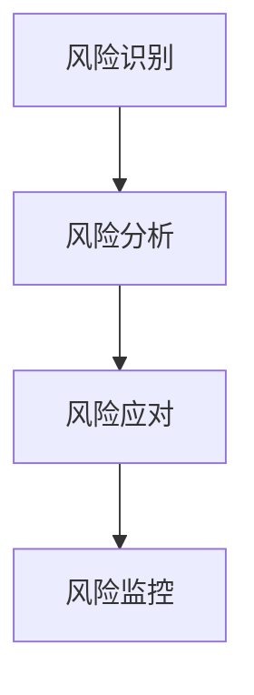

风险登记册通常记录风险描述、类别、概率、影响、风险等级、责任人、触发条件、应对策略和当前状态。

风险优先级可用概率和影响的乘积进行初步评估：

```text
风险暴露 = 发生概率 × 影响程度
```

#### 11.3 风险应对策略

- **规避**：改变方案，消除风险来源。
- **减轻**：降低发生概率或影响程度。
- **转移**：通过保险、合同或外包将影响转移给其他方。
- **接受**：主动接受风险并准备应急方案。
- **利用**：对正向机会采取措施提高发生概率或收益。
- **分享**：与合作方共同承担和利用机会。

应急计划说明风险实际发生后如何处理；缓解措施用于降低风险发生概率或影响，二者不要混淆。

### 17. 本章易错点

- 软件不会物理磨损，但频繁修改和架构腐化会导致软件老化。
- 生命周期阶段可以在迭代和增量模型中重复，不能认为所有模型都严格线性。
- 瀑布模型适合需求稳定的项目，不适合需求高度不确定且需要快速反馈的项目。
- V 模型强调测试活动前置规划，不代表测试只能在编码完成后开始。
- 原型模型有抛弃式和演化式，二者最终是否保留原型不同。
- 螺旋模型的核心是风险分析，不是简单地多次重复瀑布流程。
- 敏捷不是不要文档、不要设计或不要测试，而是强调价值、反馈和适度过程。
- 质量保证面向过程，质量控制面向产品；验证关注“做得对不对”，确认关注“做的是不是对的产品”。
- 数据耦合比控制耦合低；功能内聚通常优于偶然内聚。
- 一个模块传递整个结构体但只使用其中部分字段，通常是标记耦合。
- 技术可行不等于经济可行，也不等于操作和法律可行。
- 风险暴露通常可用概率乘影响进行初步排序，但不能替代完整风险分析。
- 基线建立后不能直接修改，必须走变更控制流程。
- 纠错性、适应性、完善性和预防性维护的触发原因不同。
- 持续集成是频繁集成并自动验证，持续交付强调随时可发布，持续部署强调自动发布到生产环境。
- 重构应保持外部行为不变；重写或重新设计可能改变外部行为。
- 自动化工具也属于软件资产，必须版本化、测试和维护。

### 18. 公式、速查表与自测清单

#### 18.1 可行性与经济性

```text
NPV = Σ(第 t 年净现金流 / (1+r)^t) - 初始投资
收益成本比 = 总收益现值 / 总成本现值
风险暴露 = 发生概率 × 影响程度
```

#### 18.2 软件度量

```text
生产率 = 完成规模 / 投入工作量
缺陷密度 = 缺陷数量 / 软件规模
测试通过率 = 通过用例数 / 执行用例总数
需求覆盖率 = 已验证需求数 / 需求总数
```

这些指标必须统一统计口径，例如规模单位可以是 KLOC、功能点或故事点，不能混用。

#### 18.3 维护类型

```text
修复已发现错误：纠错性维护
适应外部环境变化：适应性维护
增加功能或改善质量：完善性维护
降低未来维护成本：预防性维护
```

#### 18.4 自测清单

- [ ] 能说明软件与硬件的主要区别以及软件老化原因。
- [ ] 能描述软件生命周期阶段和过程活动。
- [ ] 能比较瀑布、V 模型、原型、增量、迭代、螺旋、RUP 和敏捷。
- [ ] 能根据项目特征选择合适的过程模型。
- [ ] 能完成技术、经济、操作、法律、时间和安全可行性分析。
- [ ] 能计算投资回收期、NPV、收益成本比和风险暴露。
- [ ] 能区分结构化、面向对象和面向方面开发方法。
- [ ] 能判断耦合类型并给出由低到高的排序。
- [ ] 能判断内聚类型并给出由低到高的排序。
- [ ] 能解释低耦合、高内聚、信息隐藏和关注点分离。
- [ ] 能说明常见架构风格及其适用场景。
- [ ] 能区分功能适合性、性能、可靠性、安全性、可维护性和可移植性。
- [ ] 能区分质量保证、质量控制、验证和确认。
- [ ] 能识别技术、需求、项目、组织、供应商和安全风险。
- [ ] 能选择规避、减轻、转移、接受等风险应对策略。
- [ ] 能说明配置项、基线、版本控制和变更控制流程。
- [ ] 能区分四类软件维护和软件再工程活动。
- [ ] 能说明 Scrum、XP、Kanban、CI、CD 和持续部署。
- [ ] 能为过程模型、质量属性、耦合内聚和风险题写出有依据的答案。

---

### 12. 软件质量保证

#### 12.1 质量保证与质量控制

- **质量保证 QA**：面向过程，建立能稳定产出高质量软件的过程和规范。
- **质量控制 QC**：面向产品，通过检查、测试和测量识别不符合项。
- **验证**：检查是否正确实现规格和设计。
- **确认**：检查是否满足用户真实目标。

#### 12.2 质量保证活动

- 过程定义和过程改进。
- 需求、设计和代码评审。
- 测试计划、测试执行和缺陷分析。
- 静态分析和自动化检查。
- 配置管理和变更控制。
- 质量审计和过程符合性检查。
- 质量度量、趋势分析和根因分析。
- 持续集成和构建质量控制。
- 发布前质量门禁和风险评审。

#### 12.3 软件质量属性

- 功能适合性。
- 性能效率。
- 兼容性和互操作性。
- 易用性和可访问性。
- 可靠性、可用性和恢复能力。
- 安全性和隐私保护。
- 可维护性、可测试性和可分析性。
- 可移植性和可部署性。

#### 12.4 质量成本

```text
预防成本：培训、规范、过程改进、自动化工具
评估成本：评审、审计、测试、静态分析
内部失败成本：交付前返工、修复和重新测试
外部失败成本：交付后故障、赔偿、召回和声誉损失
```

尽早发现缺陷通常成本更低。只在最终测试阶段发现问题，会导致返工范围扩大。

### 13. 软件度量

#### 13.1 规模与生产率

```text
生产率 = 完成规模 / 投入工作量
缺陷密度 = 缺陷数 / 软件规模
```

规模可以用 KLOC、功能点、对象点或其他统一单位。度量时必须明确统计范围、版本、时间和数据来源。

#### 13.2 质量度量

- 缺陷密度。
- 缺陷发现率。
- 缺陷修复平均时间。
- 缺陷重开率。
- 测试通过率和覆盖率。
- 需求覆盖率。
- 构建成功率。
- 变更失败率。
- 发布回滚率。
- 生产故障数和平均恢复时间。

#### 13.3 项目进度度量

```text
计划完成率 = 已完成计划工作 / 计划工作总量
里程碑按期率 = 按期完成里程碑数 / 里程碑总数
进度偏差 = 实际完成时间 - 计划完成时间
```

指标必须与目标结合分析，单一指标不能完全反映项目健康度。

### 14. 风险管理

#### 14.1 风险与问题

- **风险**：尚未发生但可能影响项目目标的不确定事件。
- **问题**：已经发生并正在影响项目的事件。
- **假设**：计划中认为成立但需要持续验证的条件。
- **约束**：项目必须遵守的限制条件。

风险发生后可能转化为问题，应更新风险登记册和问题清单，不能继续把已发生事件当作普通风险忽略处理。

#### 14.2 风险分类

- 技术风险：新技术、性能、集成和架构不确定性。
- 需求风险：需求模糊、变更、冲突和范围蔓延。
- 项目风险：进度、成本、人员、资源和沟通。
- 组织风险：管理支持、决策、人员流失和组织变化。
- 供应商风险：交付、授权、服务和依赖。
- 安全合规风险：漏洞、隐私、法规和审计。
- 运营风险：部署、容量、监控、备份和灾备。

#### 14.3 风险分析

定性分析通常评估概率、影响、紧迫性、可检测性和接近程度；定量分析可以估算损失、工期影响和概率分布。

初步风险暴露：

```text
风险暴露 = 发生概率 × 影响程度
```

若有多个风险，应按风险等级排序并优先处理高概率、高影响和即将触发的风险。

#### 14.4 风险应对

- **规避**：改变方案，消除风险来源。
- **减轻**：降低概率或影响。
- **转移**：通过保险、外包或合同转移影响。
- **接受**：主动接受并准备应急方案。
- **升级**：超出项目团队权限时提交上级或组织处理。

应急措施是在风险实际发生后采取的行动；缓解措施是在风险发生前降低风险。

#### 14.5 风险监控

风险监控包括重新评估、跟踪触发条件、检查应对措施效果、识别新风险和关闭已过期风险。风险登记册应持续更新，不是项目开始时填写一次就结束。

# 5. 面向对象技术

## 5.1 面向对象基础

面向对象分析与设计（OOAD）以对象、类、职责、协作和关系为核心，将现实业务中的对象抽象为软件对象，并通过 UML 建模描述系统结构和行为。

本章复习主线如下：

> 需求与用例 → 识别对象和类 → 分配职责 → 建立关系 → 描述交互与状态 → 设计接口和组件 → 验证质量

### 1. 面向对象基本思想

#### 1.1 对象与类

- **对象**：具有标识、状态和行为的实体。
- **标识**：区分对象的唯一性，即使属性值相同，对象仍可能不同。
- **状态**：对象在某一时刻属性值和关联关系的集合。
- **行为**：对象可以执行的操作以及状态变化。
- **类**：具有相同属性、操作和语义的一组对象的抽象。
- **实例**：某个类的具体对象。

类描述共同结构，对象表示运行时个体。例如：`订单` 是类，编号为 `O2026001` 的具体订单是对象。

#### 1.2 封装、抽象、继承与多态

- **封装**：将数据和操作封装在对象内部，通过公开接口访问，隐藏内部实现。
- **抽象**：提取与问题相关的共同特征，忽略暂时无关细节。
- **继承**：子类继承父类的属性和操作，并可以扩展或重定义行为。
- **多态**：同一个消息或接口在不同对象上表现出不同实现。
- **接口**：描述对象对外提供的操作契约，通常不暴露具体实现。
- **泛化**：从多个具体类提取共同特征形成一般类。
- **组合复用**：通过包含其他对象并委托其职责实现复用。

继承适合表达稳定的“是一种”关系；组合更适合表达可替换、可配置和运行时变化的行为。优先使用组合可以降低继承层次耦合，避免脆弱基类和深层继承问题。

#### 1.3 面向对象设计目标

- 低耦合、高内聚。
- 职责明确，接口稳定。
- 隐藏变化，减少修改范围。
- 支持替换、扩展和复用。
- 易于测试、部署、监控和维护。
- 让模型能够反映业务概念，同时避免把现实世界细节全部机械搬入软件。

### 2. 面向对象分析与设计过程

#### 2.1 面向对象分析 OOA

OOA 关注“系统需要做什么”和“领域中有哪些对象”：

1. 识别参与者和系统边界。
2. 识别用例和业务目标。
3. 从需求中提取候选类、对象和概念。
4. 确定属性、操作和职责。
5. 识别关联、聚合、组合、泛化和依赖。
6. 描述对象之间的交互和生命周期。
7. 检查模型与需求的一致性。

分析模型应尽量独立于具体编程语言、数据库和部署平台。

#### 2.2 面向对象设计 OOD

OOD 将分析模型转化为可实现的软件设计：

1. 确定架构层次和设计边界。
2. 将职责分配给类、组件和服务。
3. 细化属性、操作、参数和返回值。
4. 设计对象协作、接口和异常处理。
5. 选择组合、继承和设计模式。
6. 设计持久化、事务、并发和安全机制。
7. 映射到组件、部署节点和运行环境。

#### 2.3 三类分析对象

常见 BCE 分析模式：

- **边界类 Boundary**：与用户、外部系统、设备和接口交互。
- **控制类 Control**：协调用例流程，处理业务控制和事务边界。
- **实体类 Entity**：保存领域数据，承担与数据相关的业务规则。

典型调用链：

```mermaid
flowchart TD
    N1["参与者"]
    N2["边界对象"]
    N3["控制对象"]
    N4["实体对象/外部服务"]
    N1 --> N2
    N2 --> N3
    N3 --> N4
```

边界类不应承担复杂业务规则；实体类不应直接负责界面显示；控制类不应变成包含所有逻辑的“上帝类”。

### 13. 职责分配与设计原则

#### 13.1 CRC 卡片

CRC（Class-Responsibility-Collaborator）卡片记录：

```text
Class：类名
Responsibilities：职责
Collaborators：协作者
```

使用方法：

1. 从用例基本流程中找出每一步需要完成的职责。
2. 将职责分配给最了解相关数据的对象。
3. 记录完成职责需要协作的其他对象。
4. 检查是否出现一个类承担过多流程。
5. 检查是否有职责无人承担或多个类重复承担。

#### 13.2 GRASP 职责分配原则

常见 GRASP 原则：

- **信息专家 Information Expert**：把职责分配给拥有完成职责所需信息的类。
- **创建者 Creator**：将创建对象的职责分配给密切使用、聚合或包含该对象的类。
- **控制器 Controller**：设置对象协调系统事件和用例流程。
- **低耦合 Low Coupling**：减少模块之间依赖。
- **高内聚 High Cohesion**：让类职责集中且相关。
- **多态 Polymorphism**：将因类型不同而变化的行为交给不同类型实现。
- **纯虚构 Pure Fabrication**：为降低耦合或提高内聚而创建不直接对应领域概念的服务类。
- **间接 Indirection**：通过中间对象隔离两个直接依赖对象。
- **受保护变化 Protected Variations**：将变化点封装在稳定接口后。

#### 13.3 SOLID 原则

- **单一职责原则 SRP**：一个类只有一个引起变化的原因。
- **开闭原则 OCP**：对扩展开放，对修改关闭。
- **里氏替换原则 LSP**：子类型可以替换父类型而不破坏程序正确性。
- **接口隔离原则 ISP**：客户端不应依赖不需要的接口。
- **依赖倒置原则 DIP**：高层和低层都依赖抽象，细节依赖抽象。

设计题中不要只写原则名称，应说明具体职责、变化点和依赖关系。

### 14. 面向对象设计检查

#### 14.1 类职责检查

- 类是否只承担一个主要职责。
- 属性是否由最了解其含义的类维护。
- 操作是否能够维护类的不变量。
- 是否存在过多公开属性。
- 是否出现上帝类、贫血模型或重复职责。
- 是否将界面、业务、持久化和外部通信混在一个类中。

#### 14.2 关系检查

- 泛化是否确实表示“是一种”。
- 聚合和组合是否符合生命周期关系。
- 关联多重性是否与业务描述一致。
- 是否存在不必要的双向导航。
- 依赖方向是否符合架构层次。
- 是否存在循环依赖。
- 多对多关系是否需要关联类。

#### 14.3 交互检查

- 每个外部事件是否有边界对象接收。
- 是否有控制对象协调用例流程。
- 实体对象是否负责核心业务数据和规则。
- 消息接收者是否真正拥有该职责所需信息。
- 是否存在一条消息调用过多对象导致流程分散。
- 异常、超时和事务边界是否在交互图中体现。

### 17. 本章易错点

- 类是对象集合的抽象，对象是运行时具体实例；对象还具有唯一标识。
- 封装不是简单地把字段设为私有，而是让对象维护自身状态和不变量。
- 继承表示“是一种”，代码复用本身不是使用继承的充分理由。
- 组合和聚合的关键区别是部分是否独立存在以及生命周期是否绑定。
- `include` 表示基础用例必然执行的公共行为，`extend` 表示条件性扩展。
- 用例表示参与者可观察的业务目标，不应把每个按钮点击都画成用例。
- 参与者是角色，不一定是具体个人，也可以是系统、设备或定时器。
- 类图描述静态结构，顺序图描述时间顺序，通信图强调对象链接，活动图描述流程，状态图描述对象生命周期。
- 活动图中的合并节点不等待所有分支，汇合节点需要同步并发分支。
- 顺序图消息从上到下表示时间推进，水平方向不表示时间。
- 多重性要从两端分别理解，不能只看标记靠近哪一类。
- 边界类负责外部交互，控制类负责流程协调，实体类负责业务数据和规则。
- 不要把所有业务逻辑堆到控制类中形成上帝类。
- 组件图关注软件组件和接口，部署图关注运行节点和部署拓扑。
- 关联类适合表示关联本身有属性或操作的场景，如选课成绩和订单明细。
- UML 图必须和需求、业务规则及其他模型保持一致，不能孤立画图。

## 5.2 UML

### 3. UML 概述

UML 是统一建模语言，用于可视化、规约、构造和文档化软件系统。UML 图通常分为结构图和行为图。

#### 3.1 结构图

- 类图。
- 对象图。
- 包图。
- 组件图。
- 部署图。
- 组合结构图。
- 轮廓图。

#### 3.2 行为图

- 用例图。
- 活动图。
- 状态机图。
- 交互图。
  - 顺序图。
  - 通信图。
  - 交互概览图。
  - 时序图。

#### 3.3 UML 图的选择

| 需求问题 | 适合的 UML 图 |
|---|---|
| 谁使用系统、系统提供什么功能 | 用例图 |
| 类有哪些属性、操作和关系 | 类图 |
| 某一时刻对象的具体结构 | 对象图 |
| 消息按什么时间顺序交互 | 顺序图 |
| 哪些对象协作完成任务 | 通信图 |
| 业务流程、分支、并发和泳道 | 活动图 |
| 一个对象如何随事件变化 | 状态机图 |
| 软件组件如何组织和依赖 | 组件图 |
| 软件如何部署到硬件节点 | 部署图 |
| 模型元素如何分组管理 | 包图 |

### 4. 用例图

#### 4.1 用例图元素

- **参与者 Actor**：系统外部与系统交互的角色，不一定是人，也可以是外部系统、设备或定时器。
- **用例 Use Case**：系统为参与者提供的完整业务目标。
- **系统边界**：标识哪些功能属于被建模系统。
- **关联**：参与者与用例之间的通信关系。
- **包含、扩展和泛化**：表达用例复用、条件扩展和一般—特殊关系。

参与者表示角色而不是具体个人。例如“客户”和“管理员”是角色，一个人可能同时扮演多个角色。

#### 4.2 用例命名与粒度

用例名称通常使用“动词 + 名词”，如“提交订单”“审核报销”“查询库存”。一个用例应描述一个对参与者有可观察价值的完整目标，不宜把“点击按钮”“输入姓名”等界面动作单独作为用例。

用例描述建议包含：

- 用例名称和目标。
- 主要参与者和辅助参与者。
- 前置条件。
- 触发事件。
- 基本成功场景。
- 备选流程。
- 异常流程。
- 后置条件。
- 业务规则和特殊需求。

#### 4.3 include、extend 与泛化

| 关系 | 含义 | 判断关键词 |
|---|---|---|
| `include` | 基础用例必然调用被包含用例 | 公共行为、每次都执行 |
| `extend` | 扩展用例在条件满足时附加行为 | 可选、异常、特定条件 |
| 泛化 | 子用例继承并扩展父用例行为 | 一般—特殊 |

判断方法：

- “登录后每次都要记录审计日志”：基础用例 `include` 记录日志。
- “付款失败时发送提醒”：提醒是条件性附加行为，倾向 `extend`。
- “普通用户”和“管理员”都是“用户”的特殊角色：参与者泛化。

`include` 的箭头通常指向被包含用例；`extend` 的箭头通常指向被扩展的基础用例。考试画图时要同时检查箭头方向和关系含义。

#### 4.4 用例之间的粒度

如果多个用例都有一段完全相同且必然发生的复杂行为，可以提取为被包含用例；如果只是偶然共享几行步骤，不应为了复用而过度拆分。过度使用 `include` 会让用例图难以阅读，过度使用 `extend` 会隐藏核心流程。

### 5. 类图

#### 5.1 类的表示

类通常包含三部分：类名、属性和操作。

```text
+--------------------------+
| Order                    |
+--------------------------+
| - orderId: String        |
| - status: OrderStatus    |
| - totalAmount: Decimal   |
+--------------------------+
| + submit(): void         |
| + cancel(): void         |
| + calculateTotal(): Money|
+--------------------------+
```

可见性：

```text
+ public
- private
# protected
~ package/default
```

属性表示对象状态；操作表示对象行为。不要把所有数据库字段机械地变成公开属性，应通过操作维护业务不变量。

#### 5.2 属性与操作

属性可以包含：名称、类型、默认值、可见性、派生标记和多重性。操作可以包含：名称、参数、参数类型、返回类型、可见性、异常和抽象标记。

派生属性常用 `/` 表示，例如 `/age` 表示由出生日期计算得到。静态成员常用下划线或其他 UML 约定表示，具体以题目图例为准。

#### 5.3 关联与导航

关联表示类实例之间存在结构联系，可以标注：

- 关联名称。
- 角色名。
- 多重性。
- 导航方向。
- 关联类。
- 有序、只读、子集和派生等约束。

单向导航表示只有一方需要知道另一方；双向导航可能带来更多耦合和维护责任，不应无必要地全部设置为双向。

#### 5.4 多重性

常见多重性：

```text
1       恰好一个
0..1    零个或一个
*       任意多个
1..*    至少一个
0..*    零个或多个
m..n    m 到 n 个
```

多重性要从两端分别理解：写在 A 端的多重性描述一个 B 实例可以关联多少个 A 实例，不能只看线段靠近哪一类就凭直觉判断。

#### 5.5 关联类

当一个多对多关联本身拥有属性或行为时，可以使用关联类。例如：

```text
学生 —— 选课 —— 课程
```

“选课”可能具有选课时间、成绩和状态等属性，此时可以建模为关联类 `Enrollment`。

### 6. UML 关系

| 关系 | 图形语义 | 含义 |
|---|---|---|
| 关联 | 实线 | 对象之间存在结构联系 |
| 聚合 | 空心菱形 | 整体—部分，部分通常可独立存在 |
| 组合 | 实心菱形 | 强整体—部分，部分生命周期依赖整体 |
| 泛化 | 实线空心三角箭头 | 继承、一般—特殊、is-a |
| 实现 | 虚线空心三角箭头 | 类实现接口或契约 |
| 依赖 | 虚线箭头 | 一个元素短期使用另一个元素 |

#### 6.1 关联、聚合与组合

- **关联**只表示结构上的联系，不表示所有权和生命周期。
- **聚合**表示整体与部分，但部分可以脱离整体存在，也可能被多个整体共享。
- **组合**表示强拥有关系，部分通常不能脱离整体独立存在，整体销毁时部分一起销毁。

例如：部门与员工可能是聚合，订单与订单明细通常更接近组合；但最终判断必须依据业务生命周期、所有权和共享规则，而不是只看“包含”两个字。

#### 6.2 泛化与实现

泛化表示“子类是一种父类”，子类应满足里氏替换原则。实现表示一个类满足接口定义的操作契约，但不一定继承实现代码。

#### 6.3 依赖

依赖通常表示临时使用关系，例如方法参数、局部变量、创建对象、调用服务或使用工具类。依赖比关联更弱，通常不表示长期持有对象引用。

### 7. 对象图与包图

#### 7.1 对象图

对象图是类图在某一时刻的实例快照，显示对象、属性值和对象之间的链接。它适合：

- 解释复杂类图。
- 展示测试样例。
- 说明某一业务场景中的具体对象关系。
- 验证多重性和关联是否合理。

类图描述“可能的结构”，对象图描述“某一时刻的实际结构”。

#### 7.2 包图

包图用于组织模型元素和表达包之间的依赖关系。包可以包含类、接口、用例或其他包。

包设计原则：

- 相关元素放在同一包中。
- 包之间依赖方向清晰。
- 避免循环依赖。
- 稳定包不应依赖不稳定包。
- 对外暴露最少的公共元素。

### 8. 顺序图

#### 8.1 顺序图元素

顺序图强调对象交互的时间顺序，主要元素：

- 参与者或对象。
- 生命线。
- 激活条。
- 消息。
- 返回消息。
- 创建和销毁。
- 交互片段。

时间通常从上到下发展；水平方向表示对象之间的关系，不一定表示空间位置。

#### 8.2 消息类型

- **同步消息**：发送者等待接收者处理后继续。
- **异步消息**：发送者发送后继续执行，不等待完成。
- **返回消息**：接收者返回结果或控制权。
- **创建消息**：创建对象并开始其生命线。
- **销毁消息**：结束对象生命线。
- **自调用**：对象调用自己的操作。

#### 8.3 交互片段

| 片段 | 含义 |
|---|---|
| `alt` | 多分支条件，类似 if/else |
| `opt` | 可选分支，条件满足才执行 |
| `loop` | 循环执行 |
| `par` | 并行执行 |
| `break` | 满足条件时中断外层交互 |
| `critical` | 临界区，强调不可被并发打断 |
| `ref` | 引用另一个交互 |

阅读顺序图时：

1. 从上到下读取消息。
2. 找到触发用例的外部参与者。
3. 区分边界、控制、实体和外部服务对象。
4. 检查条件、循环、异常和返回值。
5. 判断职责是否被合理分配。

### 9. 通信图

通信图强调对象之间的链接和协作关系，消息通过编号表示顺序：

```text
1: submitOrder()
1.1: validate()
1.2: reserveInventory()
1.3: save()
```

顺序图更适合表达时间轴；通信图更适合表达对象之间的结构协作。两者表达的信息可以相互转换，但视觉重点不同。

### 10. 活动图

#### 10.1 活动图元素

- 初始节点。
- 活动或动作。
- 控制流。
- 对象流。
- 决策节点。
- 合并节点。
- 分叉节点和汇合节点。
- 泳道。
- 终止节点。
- 事件和信号。

#### 10.2 决策与并发

- **决策节点**：一个输入流，根据守卫条件选择多个输出流。
- **合并节点**：多个分支重新合并，不表示同步。
- **分叉节点**：一个流拆成多个并发流。
- **汇合节点**：等待多个并发流完成后继续。

常见错误是把合并节点和汇合节点混淆：合并只表示路径汇合，不等待所有分支；汇合表示并发同步。

#### 10.3 泳道

泳道按照参与者、组织、角色或系统组件划分活动，表示哪个主体负责执行某项动作。泳道不是程序线程的严格等价物，但可以帮助分析职责边界和跨组织流程。

### 11. 状态机图

#### 11.1 状态与事件

- **状态**：对象在一段时间内保持的稳定条件。
- **事件**：触发状态转换的发生条件。
- **转移**：从一个状态到另一个状态的变化。
- **守卫条件**：决定转移是否允许的布尔条件。
- **动作**：状态转换过程中执行的即时行为。
- **活动**：对象处于状态期间持续执行的行为。

状态转移常写为：

```text
事件 [守卫条件] / 动作
```

#### 11.2 状态机适用场景

适合订单、支付、审批、设备、连接、用户账户和工单等具有明确生命周期的对象。

例如订单：

```mermaid
flowchart TD
    N1["草稿"]
    N2["已提交"]
    N3["已审核"]
    N4["已支付"]
    N5["已发货"]
    N6["已完成"]
    N1 --> N2
    N2 --> N3
    N3 --> N4
    N4 --> N5
    N5 --> N6
```

状态图应考虑非法转移，例如已完成订单不能重新回到草稿；也应考虑超时、取消、失败重试和异常恢复。

#### 11.3 活动图与状态图区别

| 对比项 | 活动图 | 状态机图 |
|---|---|---|
| 关注对象 | 业务流程或动作流程 | 某个对象的生命周期 |
| 触发方式 | 控制流、条件和并发 | 事件触发状态转移 |
| 典型问题 | 谁执行、先后顺序、并行分支 | 对象当前状态和允许操作 |
| 示例 | 订单处理流程 | 订单状态变化 |

### 12. 组件图与部署图

#### 12.1 组件图

组件图描述软件组件、接口和依赖关系。组件可以是：

- 可执行模块。
- 动态库或静态库。
- 服务。
- 数据库访问模块。
- Web 前端和后端模块。
- 外部系统适配器。

组件图重点回答：

- 系统由哪些可替换、可部署单元组成。
- 组件提供什么接口。
- 组件需要什么接口。
- 组件之间如何依赖。

#### 12.2 部署图

部署图描述软件制品如何部署到硬件节点或执行环境：

- **节点**：服务器、终端、移动设备、虚拟机、容器或云资源。
- **制品**：可执行文件、服务包、配置文件、数据库脚本和部署包。
- **通信路径**：节点之间的网络连接和协议。

部署图关注运行时拓扑、网络边界、节点能力、负载分布、容错和安全区域。组件图偏软件结构，部署图偏运行环境。

### 16. UML 关系与图形速查

```text
关联：实线
聚合：实线 + 空心菱形
组合：实线 + 实心菱形
泛化：实线 + 空心三角箭头
实现：虚线 + 空心三角箭头
依赖：虚线箭头
include：虚线箭头指向被包含用例
extend：虚线箭头指向被扩展基础用例
```

### 18. 公式、模型速查与自测清单

#### 18.1 UML 图选择

```text
系统功能和参与者：用例图
类、属性和关系：类图
对象实例快照：对象图
消息时间顺序：顺序图
对象协作结构：通信图
流程、分支、并发和职责：活动图
对象生命周期：状态机图
软件组件和接口：组件图
运行节点和部署拓扑：部署图
模型分组和依赖：包图
```

#### 18.2 BCE 角色

```text
Boundary：边界类，负责外部交互
Control：控制类，负责用例流程和事务协调
Entity：实体类，负责核心业务数据和规则
```

#### 18.3 关系判断

```text
是一种：泛化
实现接口：实现
长期结构联系：关联
整体—部分且部分可独立：聚合
整体—部分且生命周期绑定：组合
短期使用/调用：依赖
必然公共行为：include
条件性附加行为：extend
```

#### 18.4 自测清单

- [ ] 能区分对象、类、状态、行为、标识、封装、抽象、继承和多态。
- [ ] 能说明面向对象分析与面向对象设计的区别。
- [ ] 能从需求识别参与者、用例、边界类、控制类和实体类。
- [ ] 能正确判断关联、聚合、组合、泛化、实现和依赖。
- [ ] 能使用多重性、导航性和关联类描述业务关系。
- [ ] 能判断 `include`、`extend` 和用例泛化。
- [ ] 能绘制和阅读类图、对象图和包图。
- [ ] 能阅读顺序图中的生命线、消息、激活和交互片段。
- [ ] 能区分同步消息、异步消息、返回、创建和销毁消息。
- [ ] 能使用活动图表达分支、合并、并发、汇合和泳道。
- [ ] 能使用状态机图描述状态、事件、守卫和动作。
- [ ] 能区分活动图与状态机图的适用场景。
- [ ] 能说明组件图与部署图的区别。
- [ ] 能使用 CRC 和 GRASP 分配职责。
- [ ] 能应用 SOLID、低耦合和高内聚原则检查设计。
- [ ] 能发现上帝类、贫血模型、循环依赖和不必要的双向导航。
- [ ] 能根据题干补全类图、顺序图和用例图。
- [ ] 能写出包含“设计选择、职责分配、原因和质量收益”的开放题答案。

---

## 5.3 设计模式

### 6. 创建型设计模式

创建型模式关注对象如何创建，隐藏实例化细节并提高创建过程的灵活性。

#### 6.1 工厂方法 Factory Method

**意图**：定义创建对象的接口，将具体创建延迟到子类。

典型参与者：抽象产品、具体产品、创建者和具体创建者。

适用场景：

- 产品类型会扩展。
- 调用者不应依赖具体产品类。
- 创建逻辑需要由子类定制。

优点：符合开闭原则，客户端与具体产品解耦。缺点：增加具体创建者和产品类数量。

关键词：**子类决定创建什么对象**。

#### 6.2 抽象工厂 Abstract Factory

**意图**：创建一组相关或相互依赖的产品对象，保证产品族兼容。

例如在不同操作系统下创建一整套按钮、窗口和菜单。优点是切换产品族方便；缺点是增加新产品等级结构时需要修改多个工厂。

关键词：**创建整套相关产品**。

#### 6.3 建造者 Builder

**意图**：将复杂对象的构造过程与表示分离，使同样的构造过程可以创建不同表示。

适合：

- 对象构造步骤多。
- 参数组合复杂。
- 需要分阶段构造和校验。
- 希望避免构造函数参数过长。

关键词：**复杂对象、分步骤构造**。

#### 6.4 原型 Prototype

**意图**：通过复制已有对象创建新对象。

适合对象创建代价高、类型在运行时确定或需要快速复制已有配置的场景。浅复制和深复制是常见考点：浅复制只复制引用，深复制还复制引用对象所指向的内容。

关键词：**复制对象**。

#### 6.5 单例 Singleton

**意图**：保证某类只有一个实例，并提供全局访问点。

常见实现需要考虑构造函数私有化、实例延迟创建、并发安全、序列化和反射等问题。

优点：统一管理共享资源。缺点：全局状态、隐藏依赖、测试困难、并发和生命周期复杂。单例不应被当作所有全局访问需求的默认解决方案。

关键词：**唯一实例、全局访问**。

### 7. 结构型设计模式

结构型模式关注类和对象如何组合，以形成更大的结构并降低耦合。

#### 7.1 适配器 Adapter

**意图**：将一个类的接口转换为客户端期望的另一接口。

典型角色：目标接口、适配器、被适配者和客户端。适合复用已有类但接口不兼容的场景。

关键词：**接口不兼容、转换接口**。

注意：适配器解决的是接口适配，不是动态增加职责；动态增加职责更像装饰器。

#### 7.2 桥接 Bridge

**意图**：将抽象与实现分离，使二者可以独立变化。

适合有两个或多个独立变化维度的场景，例如“形状”和“渲染方式”。抽象部分持有实现部分的引用，通过组合代替继承层次组合爆炸。

关键词：**两个维度独立变化**。

#### 7.3 组合 Composite

**意图**：将对象组合成树形结构，并使客户端能够一致地处理叶子对象和组合对象。

典型场景：文件与目录、菜单与菜单项、组织结构和图形对象。组合对象通常维护子对象集合并递归转发操作。

关键词：**树形结构、一致处理叶子和组合**。

#### 7.4 装饰器 Decorator

**意图**：动态地给对象增加职责，装饰器与被装饰对象实现同一接口。

优点：可以叠加多个装饰，避免大量子类；缺点是对象层次变深，调试和配置复杂。

关键词：**动态增强、包装、可叠加**。

#### 7.5 外观 Facade

**意图**：为复杂子系统提供统一的高层接口。

外观不一定封装子系统所有能力，而是提供常用流程的简化入口。它降低客户端与子系统的耦合，但不必然改变子系统内部结构。

关键词：**复杂系统、统一入口**。

#### 7.6 享元 Flyweight

**意图**：共享细粒度对象，减少大量相似对象的内存占用。

关键是区分：

- **内部状态**：可共享、不随上下文变化。
- **外部状态**：不能共享或由客户端传入，随使用场景变化。

关键词：**共享对象、减少内存、内部/外部状态**。

#### 7.7 代理 Proxy

**意图**：为另一个对象提供代理或占位，控制对真实对象的访问。

常见类型：

- 远程代理：代表远程对象。
- 虚拟代理：延迟创建或加载重量级对象。
- 保护代理：根据权限控制访问。
- 智能代理：在访问时附加引用计数、缓存、日志等操作。

关键词：**控制访问、延迟加载、远程对象、权限代理**。

### 8. 行为型设计模式

行为型模式关注对象之间的通信、职责分配和算法变化。

#### 8.1 责任链 Chain of Responsibility

**意图**：让多个对象都有机会处理请求，请求沿链传递，直到某个对象处理或到达链尾。

适合审批链、日志级别、异常处理、中间件过滤器和权限检查。优点是发送者与具体处理者解耦；缺点是请求可能无人处理或链过长。

关键词：**多个处理者依次尝试处理**。

#### 8.2 命令 Command

**意图**：将请求封装为对象，使请求可以排队、记录、撤销、重做和参数化。

典型角色：命令接口、具体命令、调用者和接收者。

关键词：**请求对象化、排队、撤销、日志**。

#### 8.3 解释器 Interpreter

**意图**：为语言或表达式定义文法表示，并提供解释器解释句子。

适合规则表达式、简单查询语言、配置表达式和脚本。文法复杂时，通常应使用专门的词法分析器、语法分析器或编译器工具，而不是直接手写解释器模式。

关键词：**文法、表达式、解释语言**。

#### 8.4 迭代器 Iterator

**意图**：提供访问聚合对象元素的统一方式，而不暴露其内部表示。

适合数组、链表、树、图和自定义集合。迭代器可以提供顺序访问、过滤、映射和遍历状态。

关键词：**遍历集合、不暴露内部结构**。

#### 8.5 中介者 Mediator

**意图**：用中介对象封装一组对象之间的交互，减少对象之间的网状依赖。

适合复杂界面控件、聊天室、工作流和组件协作。优点是降低同事类之间耦合；缺点是中介者可能膨胀为上帝对象。

关键词：**集中协作、减少网状依赖**。

#### 8.6 备忘录 Memento

**意图**：在不破坏封装的前提下保存对象状态，以便以后恢复。

典型角色：发起人、备忘录和管理者。适合撤销、恢复、检查点和编辑历史。

关键词：**保存状态、撤销恢复、不破坏封装**。

#### 8.7 观察者 Observer

**意图**：定义对象间一对多依赖，当主题状态变化时自动通知观察者。

优点：主题与观察者松耦合，便于新增观察者；缺点是通知顺序、重复通知、异常传播和观察者泄漏需要管理。

关键词：**状态变化、自动通知、发布订阅**。

#### 8.8 状态 State

**意图**：允许对象在内部状态改变时改变行为，使外部看起来像改变了对象的类。

适合订单、连接、工作流、设备和审批状态。状态模式将复杂条件分支分散到不同状态类，但状态数量过多时会增加类数量。

关键词：**状态变化、行为随状态变化**。

#### 8.9 策略 Strategy

**意图**：定义一系列算法并分别封装，使它们可以互换。

适合计费、排序、折扣、路由、压缩和验证策略。客户端依赖策略接口，由配置或上下文选择具体算法。

关键词：**算法可替换、消除条件分支**。

#### 8.10 模板方法 Template Method

**意图**：在父类中定义算法骨架，将部分步骤延迟到子类实现。

适合多个流程整体相同、部分步骤不同的场景。模板方法通过继承实现，策略模式通常通过组合实现，二者要区分。

关键词：**固定流程、子类填充步骤**。

#### 8.11 访问者 Visitor

**意图**：将作用于对象结构中的操作与对象结构分离。

适合对象结构稳定、操作类型经常增加的场景，例如编译器 AST 的多种分析和代码生成操作。若对象结构经常变化，访问者需要修改多个具体访问者，维护成本较高。

关键词：**对象结构稳定、操作经常增加**。

### 9. 设计模式之间的辨析

#### 9.1 适配器、装饰器与代理

| 模式 | 主要目的 | 接口关系 |
|---|---|---|
| 适配器 | 解决已有接口不兼容 | 转换为目标接口 |
| 装饰器 | 动态增加职责 | 通常与被装饰对象实现同一接口 |
| 代理 | 控制访问、延迟或远程调用 | 通常与真实对象实现同一接口 |

#### 9.2 策略、状态与模板方法

| 模式 | 变化来源 | 常见实现 |
|---|---|---|
| 策略 | 算法可互换 | 组合和接口 |
| 状态 | 对象状态改变行为 | 状态对象和上下文 |
| 模板方法 | 算法骨架固定、步骤变化 | 抽象父类和子类继承 |

#### 9.3 工厂方法、抽象工厂与建造者

- 工厂方法：通常创建一种产品，具体创建延迟给子类。
- 抽象工厂：创建一族相互匹配的产品。
- 建造者：分步骤构造一个复杂产品，强调构造过程和表示分离。

#### 9.4 外观、中介者与代理

- 外观：简化客户端访问复杂子系统。
- 中介者：集中封装多个对象之间的交互。
- 代理：控制对某个真实对象的访问。

#### 9.5 组合、聚合与组合模式

UML 组合关系是类之间的整体—部分结构；组合设计模式是将对象组织为树形结构并统一处理叶子和组合对象。二者名称相似，但不是同一个概念。

### 10. 设计模式选择方法

遇到模式题，按以下步骤：

1. 找出题目中的变化点：接口、对象创建、算法、状态、通知、请求、访问权限或对象结构。
2. 判断问题是创建、结构还是行为问题。
3. 看客户端是否依赖具体实现。
4. 看对象之间是层次结构、链式处理、集中协调还是一对多通知。
5. 选择模式后，写出参与者、协作关系和模式收益。
6. 检查模式是否引入新的复杂度、性能开销或维护成本。

### 11. 架构与模式的关系

- 架构风格决定系统级组件如何组织和通信。
- 设计模式解决组件内部或局部协作中的重复问题。
- 一个架构可以使用多个设计模式。
- 使用设计模式不能替代架构设计和需求分析。
- 模式之间可以组合，例如 MVC 中可能使用观察者、策略、工厂和命令。
- 模式选择应服务于变化点和质量目标，而不是为了“使用模式”而使用模式。

### 12. 架构与模式评审

#### 12.1 结构评审

- 组件边界是否清晰。
- 依赖方向是否合理。
- 是否存在循环依赖和单点故障。
- 接口是否稳定、最小和可替换。
- 数据所有权和事务边界是否明确。
- 是否有过度共享的公共状态。

#### 12.2 质量属性评审

- 性能：关键路径、缓存、异步和并发设计是否满足目标。
- 可用性：冗余、故障转移、重试和降级是否合理。
- 安全性：认证、授权、加密、审计和边界防护是否完整。
- 可维护性：变化点是否隔离，模块是否可独立测试。
- 可扩展性：增加服务、算法、产品或协议时是否需要大量修改。
- 可部署性：是否支持独立发布、灰度、回滚和配置管理。

#### 12.3 模式使用风险

- 为简单问题引入复杂模式。
- 模式名称正确但参与者关系错误。
- 只复制类图结构，没有解决题目中的变化点。
- 过度使用继承造成层次复杂。
- 观察者通知链不可控。
- 单例导致全局状态和测试困难。
- 中介者、外观或控制器膨胀为上帝对象。
- 微服务拆分过细，导致分布式调用和数据一致性问题。

### 14. 本章易错点

- 架构风格描述系统级结构，设计模式通常解决局部对象协作问题。
- 分层架构强调层职责和依赖方向，不等于任意按文件夹分层。
- 事件驱动系统要处理重复事件、顺序、幂等、重试和最终一致性。
- 微服务不是简单拆分服务数量，必须考虑业务边界、数据所有权和运维能力。
- 适配器解决接口不兼容，装饰器解决动态增强，代理解决访问控制或延迟/远程访问。
- 桥接解决两个变化维度，策略解决算法替换，模板方法解决固定流程中的步骤变化。
- 状态模式处理对象状态变化，观察者处理状态变化后的通知，二者不要混淆。
- 外观简化客户端调用，中介者集中对象交互，代理控制一个真实对象的访问。
- 工厂方法通常创建一种产品，抽象工厂创建一组相关产品，建造者强调复杂构造过程。
- 组合设计模式与 UML 组合关系不是同一概念。
- 单例可能造成全局状态、隐藏依赖和测试困难，不是万能的共享对象方案。
- 访问者适合对象结构稳定、操作经常增加；对象结构频繁变化时维护成本高。
- 模式不是越多越好，必须说明解决的变化点、收益和引入的代价。
- 质量属性场景必须量化刺激、响应和度量，不能只写“性能好”“安全性高”。

### 15. 公式、模型速查与自测清单

#### 15.1 架构风格速查

```text
分层：职责分层、依赖方向清晰
客户端—服务器：请求与服务分离
管道—过滤器：数据经过多个独立处理阶段
仓库：多个子系统共享中心数据
事件驱动：发布事件、异步订阅
微内核：核心稳定、插件扩展
SOA：业务能力服务化、契约交互
微服务：按业务能力独立部署和自治
MVC：模型、视图、控制器分离
```

#### 15.2 质量属性场景

```mermaid
flowchart TD
    N1["刺激源"]
    N2["刺激"]
    N3["环境"]
    N4["架构响应"]
    N5["响应度量"]
    N1 --> N2
    N2 --> N3
    N3 --> N4
    N4 --> N5
```

#### 15.3 自测清单

- [ ] 能说明软件架构的组成和架构驱动因素。
- [ ] 能理解 4+1 架构视图及其关注点。
- [ ] 能比较分层、C/S、管道—过滤器、仓库、事件驱动、微内核、SOA 和微服务。
- [ ] 能说明 MVC、Broker、黑板和云原生架构的特点。
- [ ] 能根据质量属性和约束选择架构风格。
- [ ] 能将质量目标改写为可量化的质量属性场景。
- [ ] 能说明 SOLID、DRY、KISS、YAGNI、信息隐藏和依赖倒置。
- [ ] 能判断工厂方法、抽象工厂、建造者、原型和单例。
- [ ] 能判断适配器、桥接、组合、装饰器、外观、享元和代理。
- [ ] 能判断责任链、命令、解释器、迭代器、中介者、备忘录、观察者、状态、策略、模板方法和访问者。
- [ ] 能区分适配器、装饰器和代理。
- [ ] 能区分策略、状态和模板方法。
- [ ] 能区分工厂方法、抽象工厂和建造者。
- [ ] 能说明设计模式的参与者、协作关系、适用场景和代价。
- [ ] 能从题干提取变化点并选择合适模式。
- [ ] 能写出架构或设计模式选择的理由、收益和风险。
- [ ] 能识别过度设计、上帝对象、循环依赖和模式误用。

---

# 6. 程序设计语言基础知识

## 6.1 程序设计语言概述

程序设计语言与编译原理主要考查“程序如何被描述、分析、翻译和执行”。软件设计师考试中，常见题型包括语言范式判断、编译阶段匹配、正规式和有限自动机、文法推导、语法树、运行时存储、参数传递、链接装载和代码优化。

本章主线如下：

> 程序设计语言 → 词法分析 → 语法分析 → 语义分析 → 中间代码 → 优化 → 目标代码 → 链接装载 → 运行时执行

### 1. 程序设计语言基础

#### 1.1 程序设计语言的组成

程序设计语言通常包含：

- **语法**：规定程序的符号如何组合，回答“写法是否合法”。
- **语义**：规定合法程序的含义，回答“程序表示什么”。
- **语用**：规定语言构造在实际使用中的目的和效果，关注可读性、可维护性和使用方式。

一个程序可能语法正确但语义错误，例如变量未声明、类型不匹配、函数参数数量错误或控制流无法到达合法状态。

#### 1.2 语言处理程序

| 工具 | 输入 | 输出或作用 |
|---|---|---|
| 汇编程序 | 汇编语言源程序 | 机器指令或目标文件 |
| 编译程序 | 高级语言源程序 | 目标程序、中间代码或可执行文件 |
| 解释程序 | 高级语言源程序或中间代码 | 逐句/逐段分析并立即执行 |
| 预处理程序 | 带宏、条件编译的源程序 | 展开后的源程序 |
| 链接程序 | 多个目标文件和库 | 可执行文件或共享库 |
| 装载程序 | 可执行文件 | 将程序装入内存并完成必要重定位 |
| 调试器 | 可执行程序及符号信息 | 断点、单步、变量查看和调用栈分析 |

编译器通常先整体翻译，再运行生成的目标程序；解释器通常边分析边执行。现代语言可能同时使用编译器、解释器和 JIT（Just-In-Time）编译，不能简单依据语言名称判断其实现方式。

#### 1.3 编译与解释的比较

| 对比项 | 编译方式 | 解释方式 |
|---|---|---|
| 翻译时机 | 运行前整体翻译 | 运行时逐条或逐段翻译 |
| 执行速度 | 通常较快 | 通常启动简单但运行时开销较大 |
| 错误发现 | 可能在运行前发现较多错误 | 可能执行到相关语句时才发现 |
| 目标代码 | 通常生成目标代码或机器码 | 不一定生成独立目标文件 |
| 跨平台 | 需针对不同平台编译，或使用虚拟机 | 依赖解释器实现 |
| 开发调试 | 编译步骤可能较重 | 交互式调试通常较方便 |

编译型和解释型不是绝对互斥的分类。Java、C# 等语言常先编译为中间字节码，再由虚拟机解释或 JIT 编译；Python 等语言也可能先生成字节码。

#### 1.4 程序设计语言范式

- **命令式语言**：描述如何一步步改变程序状态，如 C、Pascal。
- **面向对象语言**：以对象和消息为基本组织方式，强调封装、继承和多态。
- **函数式语言**：以函数计算为核心，强调不可变数据和无副作用。
- **逻辑式语言**：通过事实、规则和推理描述问题，如 Prolog。
- **脚本语言**：强调快速开发和动态执行，常用于自动化、Web 和胶水代码。
- **并发/并行语言**：提供线程、协程、消息传递或并发控制机制。

同一种语言可以融合多种范式，范式不是互相排斥的标签。

#### 1.5 语言的评价指标

程序设计语言常从以下方面评价：

- **可读性**：程序结构是否清晰，含义是否容易理解。
- **可写性**：能否方便、简洁地表达问题。
- **可靠性**：类型检查、异常处理、内存安全和并发安全能力。
- **效率**：运行效率、编译效率和资源占用。
- **可维护性**：修改、扩展、调试和重构的难易程度。
- **可移植性**：程序迁移到不同平台的难度。
- **正交性**：语言特征组合是否规则、一致，是否存在大量特殊例外。

### 2. 类型系统、作用域与绑定

#### 2.1 数据类型

常见类型包括：

- 基本类型：整型、实型、字符型、布尔型。
- 构造类型：数组、记录/结构体、联合、枚举、集合。
- 指针和引用类型。
- 函数类型。
- 类、接口和对象类型。
- 泛型、参数化类型和代数数据类型。

类型系统的作用是限制操作数和操作的合法组合，尽早发现错误，并为编译器优化提供信息。

#### 2.2 强类型与弱类型

- **强类型语言**：不同类型之间的转换受到严格限制，非法运算更容易在编译或运行时被发现。
- **弱类型语言**：允许更多隐式转换或类型混合操作，编写灵活，但可能隐藏错误。

强类型不等于静态类型，弱类型也不等于动态类型。强/弱描述类型约束严格程度，静态/动态描述类型检查时机。

#### 2.3 静态类型与动态类型

- **静态类型**：变量或表达式类型主要在编译期确定并检查。
- **动态类型**：类型主要在运行时确定，变量可能在不同时间绑定不同类型。

静态类型有利于早期发现错误和优化；动态类型表达灵活，适合快速开发，但运行时检查开销和错误延迟可能更大。

#### 2.4 类型检查与类型转换

- **显式类型转换**：程序员明确指定转换，例如 `(int)x`。
- **隐式类型转换**：编译器或运行时自动转换。
- **安全转换**：不会丢失信息或改变语义。
- **窄化转换**：可能丢失精度、范围或符号信息。
- **类型提升**：表达式中较小范围类型自动转换为较大范围类型。

类型相容性包括名义相容和结构相容：

- **名义相容**：只有明确声明为同一类型或有继承关系的类型才相容。
- **结构相容**：只要内部结构相同或满足结构规则就相容。

#### 2.5 作用域

作用域是标识符在程序中的可见范围：

- **块作用域**：在代码块内有效。
- **函数作用域**：在函数内部有效。
- **文件/模块作用域**：在文件或模块内有效。
- **类作用域**：在类定义及其相关成员中有效。
- **全局作用域**：在整个程序或运行环境中有效。

作用域决定“能否看到名称”，生命周期决定“对象存在多久”，二者不能混淆。

#### 2.6 词法作用域与动态作用域

- **词法作用域/静态作用域**：根据源程序的嵌套结构确定名称引用，编译期通常可以判断。
- **动态作用域**：根据运行时调用链确定名称引用，查找当前调用环境及其调用者环境。

词法作用域可读性和可分析性较好；动态作用域依赖调用过程，运行时行为更灵活但更难分析。

#### 2.7 绑定

绑定是将名称与属性建立联系，例如名称与类型、值、存储位置或作用域的关联。

- **静态绑定**：编译期确定。
- **动态绑定**：运行期确定。
- **早绑定**：在较早阶段确定，如函数重载解析或静态类型检查。
- **晚绑定**：在运行时根据对象实际类型决定，如动态多态。

动态绑定是实现运行时多态的重要机制，但通常需要额外的表查找或间接调用开销。

## 6.2 编译程序基本原理

### 3. 编译器总体结构

典型编译过程：

```text
源程序
  ↓
预处理
  ↓
词法分析
  ↓
语法分析
  ↓
语义分析与中间表示
  ↓
中间代码生成
  ↓
代码优化
  ↓
目标代码生成
  ↓
汇编、链接与装载
  ↓
可执行程序
```

编译器可以分为前端、中端和后端：

- **前端**：词法分析、语法分析、语义分析，主要依赖源语言。
- **中端**：中间表示和与机器相对独立的优化。
- **后端**：指令选择、寄存器分配、指令调度和目标代码生成，主要依赖目标机器。

### 4. 词法分析

#### 4.1 词法分析任务

词法分析器读取字符流，将其划分为单词符号（token）流，交给语法分析器。常见单词符号：

- 关键字：`if`、`while`、`class`。
- 标识符：变量名、函数名、类名。
- 常数：整数、浮点数、字符和字符串。
- 运算符：`+`、`-`、`*`、`/`、`==`。
- 分隔符：括号、逗号、分号和点号。
- 注释和空白：通常被过滤，但可能影响行号记录。

词法分析器还负责记录标识符、常量和字符串到符号表或常量表中，并报告非法字符、未闭合字符串和注释错误。

#### 4.2 单词符号与属性

词法分析结果通常表示为：

```text
(token 类型, token 属性)
```

例如：

```text
(id, sum)
(num, 10)
(relop, <=)
```

token 类型告诉语法分析器符号属于哪一类；属性可能保存具体字符串、数值、符号表指针或源代码位置。

#### 4.3 最长匹配原则

当多个词法规则都能匹配当前输入时，通常采用：

1. 选择能够匹配最长字符串的规则。
2. 长度相同则按规则优先级或出现顺序选择。

例如标识符 `whileValue` 应识别为一个标识符，而不是关键字 `while` 加标识符 `Value`。关键字通常通过保留字表从标识符中进一步区分。

### 5. 正规式与有限自动机

#### 5.1 正规式

正规式用于描述正规语言，常见基本操作：

- **连接**：`ab`，表示先出现 `a` 再出现 `b`。
- **选择/并**：`a|b`，表示 `a` 或 `b`。
- **闭包**：`a*`，表示 `a` 重复零次或多次。
- **正闭包**：`a+`，表示 `a` 重复一次或多次。
- **可选**：`a?`，表示出现零次或一次。
- **字符类**：`[a-z]` 表示小写字母范围。

运算优先级通常为：闭包最高，连接次之，选择最低；括号可以改变优先级。

#### 5.2 有限自动机

有限自动机由状态集合、输入字母表、状态转移函数、初始状态和终止状态集合组成。

- **DFA**：对每个状态和输入符号至多有一个确定后继状态，不允许同一输入产生多个选择。
- **NFA**：一个状态和输入符号可以对应多个后继状态，可能允许 ε 转移。

DFA 和 NFA 的识别能力等价，都只能识别正规语言，但转换后的 DFA 可能有更多状态。

#### 5.3 正规式、NFA 与 DFA 的关系

```text
正规式 ⇄ NFA ⇄ DFA ⇄ 最小化 DFA
```

它们描述的语言能力相同。常见转换过程：

- 正规式转换为 NFA：构造状态和 ε 转移。
- NFA 转换为 DFA：使用子集构造法，一个 DFA 状态对应 NFA 状态集合。
- DFA 最小化：合并对所有输入行为等价的状态。

#### 5.4 有限自动机的能力边界

有限自动机只有有限状态，不能保存任意大的计数信息，因此不能识别需要无限栈的语言，例如：

```text
{ a^n b^n | n ≥ 0 }
```

它可以识别有限状态可表达的模式，如标识符、整数、关键字和简单注释结构。任意深度嵌套的括号匹配通常需要下推自动机或栈。

### 6. 文法与上下文无关语言

#### 6.1 文法四元组

形式文法通常表示为：

```text
G = (V, T, P, S)
```

- `V`：非终结符集合。
- `T`：终结符集合，且 `V` 与 `T` 不相交。
- `P`：产生式集合。
- `S`：开始符号，属于 `V`。

从开始符号出发，反复使用产生式得到终结符串，称为推导。若得到的终结符串属于语言，则称为句子；推导过程中包含非终结符的串称为句型。

#### 6.2 文法分类

| 类型 | 主要特征 | 识别模型 |
|---|---|---|
| 0 型文法 | 无限制文法 | 图灵机 |
| 1 型文法 | 上下文有关 | 线性有界自动机 |
| 2 型文法 | 上下文无关 | 下推自动机 |
| 3 型文法 | 正规文法 | 有限自动机 |

包含关系：

```text
正规语言 ⊂ 上下文无关语言 ⊂ 上下文有关语言 ⊂ 可枚举语言
```

程序设计语言的嵌套结构通常使用上下文无关文法描述；词法结构通常使用正规式和有限自动机描述。

#### 6.3 推导与语法树

- **最左推导**：每一步替换最左边的非终结符。
- **最右推导**：每一步替换最右边的非终结符。
- **语法树**：以开始符号为根，产生式展开为子节点，叶子从左到右组成句子。

如果一个句子存在两棵不同语法树，文法是二义的。二义文法可能导致运算符优先级和结合性不明确，需要通过改写文法或额外规则消除歧义。

#### 6.4 左递归与左因子

左递归形式：

```text
A → Aα | β
```

这类文法可能使自顶向下分析陷入无限递归。消除直接左递归的一般形式：

```text
A  → βA'
A' → αA' | ε
```

若多个产生式具有公共前缀，可以提取左因子：

```text
A → αβ1 | αβ2
改写为：
A  → αA'
A' → β1 | β2
```

LL(1) 等自顶向下分析方法通常要求文法无左递归，并尽量进行左因子提取。

### 7. 语法分析

#### 7.1 自顶向下分析

自顶向下分析从开始符号出发，尝试推导输入串，构造语法树的根到叶路径。

- 优点：思想直观，容易手工实现。
- 缺点：可能需要回溯，左递归会造成无限递归。
- 常见方法：递归下降分析、预测分析和 LL(1) 分析。

#### 7.2 FIRST 集

`FIRST(α)` 是能够由符号串 `α` 推导出的句型的第一个终结符集合；如果 `α` 能推导空串，还要将 ε 放入 FIRST 集。

计算规则：

- 终结符 `a`：`FIRST(a)={a}`。
- 非终结符 `A`：将其产生式右部第一个可产生终结符加入 FIRST。
- 若第一个符号可推出 ε，则继续检查后续符号。
- 若所有符号都可推出 ε，则将 ε 加入结果。

#### 7.3 FOLLOW 集

`FOLLOW(A)` 是在某些句型中紧跟非终结符 `A` 之后可能出现的终结符集合。

基本规则：

1. 将输入结束符 `$` 加入开始符号的 FOLLOW 集。
2. 对产生式 `A→αBβ`，将 `FIRST(β)` 中除 ε 外的符号加入 `FOLLOW(B)`。
3. 若 `β` 可推出 ε 或产生式为 `A→αB`，将 `FOLLOW(A)` 加入 `FOLLOW(B)`。
4. 反复计算直到集合不再变化。

#### 7.4 LL(1) 预测分析

LL(1) 的含义：从左到右扫描输入，采用最左推导，每次只向前看一个输入符号。

构造预测分析表时：

- 对产生式 `A→α`，若终结符 `a` 属于 `FIRST(α)`，则将该产生式放入 `M[A,a]`。
- 若 `ε` 属于 `FIRST(α)`，则对所有 `b∈FOLLOW(A)`，将产生式放入 `M[A,b]`。
- 若任一表项出现多个产生式，文法通常不是 LL(1)。

LL(1) 文法通常需要无左递归、无二义性，并能通过一个输入符号唯一选择产生式。

#### 7.5 自底向上分析

自底向上分析从输入串开始，逐步归约为开始符号，构造语法树的叶到根路径。

移进—归约分析的基本动作：

- **移进**：将输入符号压入栈。
- **归约**：将栈顶符合某个产生式右部的句柄替换为左部非终结符。
- **接受**：归约得到开始符号且输入结束。
- **报错**：当前栈和输入无法继续分析。

LR 分析方法通常比 LL 方法适用范围更广，能够处理左递归文法。

| 方法 | 特点 |
|---|---|
| LR(0) | 项目集不使用向前看符号，能力较弱 |
| SLR(1) | 使用 FOLLOW 集解决部分归约冲突 |
| LR(1) | 项目中带具体向前看符号，能力较强但状态数多 |
| LALR(1) | 合并部分 LR(1) 状态，兼顾能力和表规模 |

#### 7.6 移进—归约冲突

常见冲突：

- **移进—归约冲突**：既可以移进输入符号，也可以按产生式归约。
- **归约—归约冲突**：存在多个可归约产生式。

运算符优先级和结合性可以帮助解决部分移进—归约冲突，但归约—归约冲突通常需要修改文法。

### 8. 语义分析与符号表

#### 8.1 语义分析任务

语义分析在语法结构合法的基础上检查程序含义，包括：

- 变量是否先声明后使用。
- 标识符是否重复声明。
- 类型是否匹配。
- 运算符是否适用于操作数类型。
- 函数调用的参数数量和类型是否正确。
- 返回值类型是否符合函数声明。
- 控制流是否满足语言规则。
- 数组下标、成员访问和赋值目标是否合法。
- 继承、接口实现和可见性是否正确。

#### 8.2 符号表

符号表保存标识符及其属性，常见属性包括：

- 名称和类别。
- 类型和存储类别。
- 作用域和生命周期。
- 存储地址或偏移量。
- 参数信息和返回类型。
- 访问权限。
- 所属模块、类或源代码位置。

嵌套作用域通常使用符号表栈、作用域链或树形结构实现。进入新作用域时建立新表，离开作用域时销毁或弹出。

#### 8.3 类型表达式

类型检查可通过类型表达式表示：

- 基本类型是原子类型表达式。
- 数组类型可以表示为 `array(index_type, element_type)`。
- 函数类型可以表示为 `参数类型 → 返回类型`。
- 记录或结构体类型由字段名和字段类型组成。

类型等价可以按名字比较，也可以按结构比较。题目若给出“相同声明”或“结构相同”，要判断采用的是名义等价还是结构等价。

### 9. 中间代码与语法制导翻译

#### 9.1 中间表示的作用

中间代码位于源语言和目标机器之间，作用包括：

- 降低编译器前端和后端的耦合。
- 便于进行机器无关优化。
- 便于支持多种源语言和目标机器。
- 便于调试、分析和生成不同目标代码。

常见中间表示：抽象语法树、三地址码、四元式、控制流图、静态单赋值形式 SSA 和字节码。

#### 9.2 三地址码

三地址码每条指令最多包含三个地址或操作数，常见形式：

```text
t1 = a + b
t2 = t1 * c
x = t2
```

控制转移：

```text
if x < y goto L1
goto L2
L1: ...
```

数组和指针访问可拆分为地址计算、取值和赋值。三地址码便于优化，但会产生较多临时变量。

#### 9.3 四元式

四元式通常表示为：

```text
(op, arg1, arg2, result)
```

例如表达式 `a+b*c`：

```text
(*, b, c, t1)
(+, a, t1, t2)
```

常见操作包括算术运算、关系运算、条件转移、无条件转移、参数传递、函数调用和返回。

#### 9.4 逆波兰表示

后缀表达式可直接使用栈求值，也常作为表达式中间表示。表达式树的后序遍历得到后缀表达式，中序遍历得到中缀表达式，先序遍历得到前缀表达式。

### 10. 代码优化

#### 10.1 局部优化与全局优化

- **局部优化**：在基本块内部进行。
- **全局优化**：跨越多个基本块，在控制流图上进行。
- **循环优化**：针对循环体和循环控制进行。
- **机器无关优化**：不依赖具体处理器指令集。
- **机器相关优化**：利用寄存器、指令流水线和目标机器特性。

基本块通常是满足以下条件的最大连续语句序列：

- 只有第一条语句可以作为入口。
- 除最后一条外，其他语句不会跳转。
- 除第一条外，其他语句不会作为跳转目标。

#### 10.2 常见优化方法

- **常量折叠**：编译期计算常量表达式。
- **常量传播**：将已知常量值传播到使用位置。
- **公共子表达式消除**：相同表达式结果未改变时复用之前结果。
- **复制传播**：将简单赋值直接替换到后续使用处。
- **死代码消除**：删除不会影响程序结果的代码。
- **强度削弱**：用代价更低的操作替代高代价操作，如乘法改为移位或加法。
- **循环不变代码外提**：将循环内每次结果相同的表达式移到循环外。
- **归纳变量优化**：减少循环变量更新和计算。
- **函数内联**：用函数体替换调用，减少调用开销。
- **尾递归优化**：将特定递归转换为循环，减少栈空间。
- **寄存器分配**：将高频变量放入寄存器以减少访存。

优化必须保持程序语义不变。若表达式含有副作用、浮点舍入差异、异常行为或并发访问，不能简单套用代数等价变换。

#### 10.3 控制流图

控制流图中：

- 节点通常表示基本块。
- 边表示可能的控制转移。
- 入口节点表示程序或函数入口。
- 出口节点表示程序或函数结束。

控制流图用于活跃变量分析、到达定义分析、循环识别、路径分析和全局优化。

### 11. 目标代码、汇编、链接与装载

#### 11.1 目标代码

目标代码可以是：

- 机器代码：处理器可直接执行的二进制指令。
- 汇编代码：需要汇编程序转换为机器代码。
- 可重定位目标代码：地址尚未完全确定，适合链接。
- 绝对目标代码：地址已确定，可直接装入指定位置。

#### 11.2 汇编与目标文件

汇编程序将汇编语言转换为机器指令，通常还会生成：

- 符号表。
- 重定位信息。
- 外部符号引用。
- 调试信息。
- 代码段、数据段和只读数据段。

#### 11.3 链接

链接程序将多个目标模块和库合并为可执行文件或共享库，主要任务：

- 符号解析：确定外部符号的定义。
- 重定位：修正地址引用。
- 合并代码段和数据段。
- 解析库依赖。
- 生成可执行文件的入口和布局信息。

链接方式：

- **静态链接**：库代码复制到可执行文件中，运行时依赖少，但文件较大。
- **动态链接**：运行时装入共享库，节省空间，便于库升级，但运行时依赖外部库。
- **装入时动态链接**：程序装入时完成链接。
- **运行时动态链接**：程序运行到相关调用时才装入和解析。

#### 11.4 装载方式

- **绝对装载**：程序只能装入指定内存地址。
- **可重定位装载**：装入时根据实际内存地址修改程序中的地址。
- **动态运行时装载**：运行时根据需要进行地址转换或装入共享模块。

动态链接和动态装载可以减少启动时开销或节省内存，但会增加运行时处理复杂度。

### 12. 运行时存储组织

#### 12.1 典型内存区域

```text
高地址
+----------------------+
| 栈 Stack             | 向低地址增长，保存调用现场和局部变量
+----------------------+
| 空闲区域             |
+----------------------+
| 堆 Heap              | 动态分配，通常向高地址增长
+----------------------+
| 静态数据区           | 全局变量、静态变量
+----------------------+
| 代码区/只读区        | 指令、常量和只读数据
+----------------------+
低地址
```

实际布局随操作系统、编译器和平台变化，考试主要考查各区域的生命周期和用途。

#### 12.2 栈与活动记录

函数调用通常在栈中建立活动记录/栈帧，可能包含：

- 返回地址。
- 参数。
- 局部变量。
- 保存的寄存器。
- 动态链/控制链。
- 静态链或访问非局部变量的信息。
- 临时变量和返回值。

递归调用每深入一层通常建立一个新的栈帧，因此递归深度过大可能导致栈溢出。

#### 12.3 堆管理

堆用于动态分配对象。常见管理方式：

- 空闲链表。
- 首次适应、最佳适应和最坏适应。
- 分代式垃圾回收。
- 标记—清除。
- 标记—整理。
- 复制算法。
- 引用计数。

引用计数无法处理循环引用；标记—清除可能产生内存碎片；复制算法需要额外空间但可减少碎片。

#### 12.4 静态、栈式和堆式分配

| 分配方式 | 确定时机 | 适用对象 |
|---|---|---|
| 静态分配 | 编译或装载时 | 全局变量、静态变量 |
| 栈式分配 | 函数调用时 | 参数、局部变量、递归现场 |
| 堆式分配 | 运行时按需申请 | 动态对象、动态数组 |

静态分配生命周期通常覆盖整个程序；栈式分配随调用进入和返回自动建立/释放；堆对象通常由显式释放或垃圾回收管理。

### 13. 参数传递与函数调用

#### 13.1 传值

调用时将实参值复制给形参。形参修改不会影响实参变量本身，适合值语义，但复制大型对象可能有开销。

#### 13.2 传引用

形参成为实参的别名，对形参的修改会影响实参。引用必须绑定到有效对象，调用语义通常比传指针更直接。

#### 13.3 传地址

将实参地址传给形参，通过地址间接访问实参。形参本身是地址副本，但可以修改地址指向的对象；若修改形参地址变量本身，通常不改变调用者的指针变量，除非传递指针的地址。

#### 13.4 传名

传名参数在使用时才求值，类似将实参表达式代入形参位置，可能产生重复求值和副作用。现代通用语言较少直接使用，但考试可能作为参数传递概念考查。

#### 13.5 传结果与传值-结果

- **传结果**：调用结束时将形参最终值复制回实参。
- **传值-结果**：调用时复制实参值，返回时将形参结果写回实参。

若多个形参引用同一个实参，传值-结果的回写顺序可能影响最终结果。

#### 13.6 对象参数的判断

要区分：

```text
变量重新绑定到另一个对象
变量指向的对象内容被修改
```

传递对象引用时，函数内部可能修改对象属性，但是否能让调用者变量指向新对象，取决于具体语言的参数语义。

### 14. 异常、并发与语言运行机制

#### 14.1 异常处理

异常处理通常包括抛出、捕获、传播和清理：

- `try` 包含可能产生异常的代码。
- `catch` 或 `except` 捕获特定异常。
- `finally` 或清理机制执行必须完成的释放操作。
- 未捕获异常沿调用栈向上传播。

异常处理会改变正常控制流，编译器需要生成异常表、清理代码或栈展开信息。

#### 14.2 并发语言机制

常见并发构造：

- 线程。
- 互斥锁和读写锁。
- 信号量。
- 条件变量。
- 管程。
- 消息传递。
- Actor 模型。
- 协程和异步任务。

并发语言设计需要处理原子性、可见性、有序性、竞态条件、死锁和内存模型。语言提供的类型安全不能自动保证并发安全。

#### 14.3 垃圾回收

垃圾回收器回收程序不再可达的对象。常见方法：

- **引用计数**：对象引用数归零时回收；无法处理循环引用。
- **标记—清除**：标记可达对象，清除不可达对象；可能产生碎片。
- **标记—整理**：清除后将存活对象整理到连续区域，减少碎片。
- **复制回收**：将存活对象复制到另一空间，适合存活对象比例较低的区域。
- **分代回收**：根据对象年龄划分代，对不同代采用不同策略。

### 15. 典型题型与解题方法

#### 15.1 编译阶段判断

看到题干关键词时可按下表判断：

| 题干描述 | 对应阶段 |
|---|---|
| 识别关键字、标识符、常量、运算符 | 词法分析 |
| 判断括号、表达式和语句结构 | 语法分析 |
| 类型检查、变量声明、参数匹配 | 语义分析 |
| 生成四元式、三地址码 | 中间代码生成 |
| 常量折叠、公共子表达式、死代码 | 代码优化 |
| 寄存器分配、指令选择、指令调度 | 目标代码生成 |
| 外部符号解析、地址修改 | 链接与重定位 |
| 将程序放入内存并准备执行 | 装载 |

#### 15.2 文法题

遇到文法推导题：

1. 先确认终结符、非终结符和开始符号。
2. 明确要求最左推导还是最右推导。
3. 每次只替换指定位置的非终结符。
4. 检查最终结果是否完全由终结符组成。
5. 画语法树时，父节点必须与产生式左部一致，子节点从左到右对应右部符号。

#### 15.3 FIRST/FOLLOW 题

```text
先求 FIRST，再求 FOLLOW。
开始符号的 FOLLOW 必须包含输入结束符 $。
产生式 A→αBβ 时，将 FIRST(β)-{ε} 加入 FOLLOW(B)。
若 β 能推出 ε，则将 FOLLOW(A) 加入 FOLLOW(B)。
```

#### 15.4 中间代码题

表达式拆分时，优先计算括号和高优先级运算，使用临时变量保存中间结果；条件语句和循环语句通常需要条件跳转、无条件跳转和标签。

#### 15.5 参数传递题

做参数传递题时按以下顺序：

1. 写出调用前实参的值和对象关系。
2. 根据传递方式确定形参是副本、别名、地址还是表达式。
3. 按函数体顺序执行赋值和修改。
4. 写出函数返回时是否存在回写。
5. 区分变量重新绑定和对象内容改变。

### 16. 本章易错点

- 语法正确不代表语义正确；未声明变量和类型不匹配通常属于语义错误。
- 预处理、编译、汇编、链接和装载是不同阶段，不能把它们混为一谈。
- 编译型和解释型可以混合实现，不能据此绝对判断执行方式。
- 强类型/弱类型与静态类型/动态类型是两个不同维度。
- 作用域决定名称可见范围，生命周期决定对象存在时间。
- 词法作用域按源程序结构确定，动态作用域按运行时调用链确定。
- 词法分析识别 token，语法分析检查结构，语义分析检查含义。
- 最长匹配原则可能使关键字前缀被识别为完整标识符，具体还要结合保留字规则。
- DFA 和 NFA 识别能力等价，但 DFA 每个状态对同一输入通常至多一个后继状态。
- 有限自动机不能识别任意深度的 `a^n b^n` 或括号嵌套。
- 文法的四元组中，`V` 是非终结符，`T` 是终结符，`P` 是产生式，`S` 是开始符号。
- 左递归通常不适合递归下降或 LL(1) 分析；LR 类分析可以处理更多左递归文法。
- FIRST 集和 FOLLOW 集的计算规则不同，开始符号 FOLLOW 必须包含 `$`。
- 移进—归约冲突和归约—归约冲突的处理方式不同。
- 公共子表达式消除必须确认中间变量没有被修改，且表达式没有副作用。
- 静态链接将库代码复制进程序，动态链接依赖运行时共享库。
- 栈适合调用现场和局部变量，堆适合动态对象，静态区适合全局和静态变量。
- 引用计数不能处理循环引用；垃圾回收不会自动解决所有并发同步问题。
- 传引用、传地址和传对象引用的语义不能只凭“对象”二字判断，必须依据题干定义。

### 17. 公式、表格与自测清单

#### 17.1 文法与自动机速查

```text
G = (V, T, P, S)
正规文法      ↔ 有限自动机
上下文无关文法 ↔ 下推自动机
DFA 与 NFA    识别能力等价
```

#### 17.2 运行时存储速查

```text
代码区：机器指令和只读代码
静态区：全局变量、静态变量
栈：函数参数、返回地址、局部变量、递归现场
堆：运行时动态分配对象
```

#### 17.3 编译阶段速查

```mermaid
flowchart TD
    N1["字符流"]
    N2["token 流"]
    N3["语法树"]
    N4["语法树/表达式"]
    N5["三地址码"]
    N6["中间表示"]
    N7["机器指令"]
    N1 -->|词法分析| N2
    N2 -->|语法分析| N3
    N4 -->|中间代码生成| N5
    N6 -->|目标代码生成| N7
```

#### 17.4 自测清单

- [ ] 能区分语法、语义和语用。
- [ ] 能比较编译、解释、汇编、链接和装载。
- [ ] 能区分命令式、面向对象、函数式、逻辑式和脚本语言。
- [ ] 能区分强类型/弱类型和静态类型/动态类型。
- [ ] 能判断词法作用域、动态作用域、静态绑定和动态绑定。
- [ ] 能将源程序错误归类到词法、语法或语义阶段。
- [ ] 能用正规式描述标识符、整数和简单字符串模式。
- [ ] 能区分 DFA、NFA 以及有限自动机的能力边界。
- [ ] 能进行文法的最左推导、最右推导和语法树构造。
- [ ] 能识别左递归、提取左因子并判断 LL(1) 分析要求。
- [ ] 能计算 FIRST 集和 FOLLOW 集。
- [ ] 能解释移进、归约、接受以及移进—归约冲突。
- [ ] 能说明符号表保存的信息和嵌套作用域处理方式。
- [ ] 能生成简单表达式和控制流的三地址码或四元式。
- [ ] 能判断常量折叠、公共子表达式和循环不变代码外提。
- [ ] 能区分静态链接、动态链接、重定位和装载。
- [ ] 能说明代码区、静态区、栈和堆的用途。
- [ ] 能分析传值、传引用、传地址、传名和传值-结果。
- [ ] 能说明异常处理、垃圾回收和并发语言机制的基本特点。

---

# 7. 数据结构

## 7.1 线性结构

数据结构与算法是软件设计师考试中计算题、程序阅读题和下午设计题的重要基础。复习本章不能只背算法名称，还要掌握：数据如何组织、操作如何实现、算法为什么正确、时间和空间代价是多少，以及在不同约束下如何选择合适方案。

本章主线如下：

> 抽象数据类型 → 线性结构 → 树形结构 → 图结构 → 查找与排序 → 分治/动态规划/贪心/回溯 → 复杂度与正确性分析

### 2. 抽象数据类型与线性表

#### 2.1 抽象数据类型

抽象数据类型 ADT 由数据对象、数据关系和操作集合组成，强调“能做什么”，不规定“如何实现”。同一个线性表 ADT 可以用顺序表或链表实现。

设计数据结构时需要考虑：

- 数据的逻辑关系。
- 常用操作及其频率。
- 对随机访问、顺序访问、插入、删除和查找的需求。
- 空间限制和并发访问要求。

#### 2.2 顺序表

顺序表使用连续存储空间保存元素，支持按下标随机访问。

| 操作 | 复杂度 | 说明 |
|---|---:|---|
| 按下标访问 | O(1) | 地址可直接计算 |
| 按值查找 | O(n) | 无序时需要顺序扫描 |
| 有序折半查找 | O(log n) | 需要连续且支持随机访问 |
| 表尾插入 | O(1) 摊销 | 扩容时可能为 O(n) |
| 表头插入 | O(n) | 后续元素需要移动 |
| 中间插入 | O(n) | 需要移动一段元素 |
| 表尾删除 | O(1) | 通常只修改长度 |
| 中间删除 | O(n) | 后续元素需要前移 |

动态顺序表扩容时通常申请更大数组并复制原数据。若容量按倍数增长，连续尾部插入的摊销复杂度可以为 `O(1)`，但单次扩容操作仍为 `O(n)`。

#### 2.3 链表

链表节点通常包含数据域和指针域，不要求节点连续存储。

- **单链表**：每个节点只有后继指针，适合单向遍历。
- **双链表**：同时保存前驱和后继，删除已知节点更方便。
- **循环链表**：尾节点指向头节点，适合循环调度和约瑟夫问题。
- **静态链表**：用数组下标代替指针，适合不支持指针的环境。

| 操作 | 单链表 | 双链表 |
|---|---:|---:|
| 按位置访问 | O(n) | O(n) |
| 已知节点插入 | O(1) | O(1) |
| 已知节点删除 | 需要前驱，通常 O(n) | O(1) |
| 按值查找 | O(n) | O(n) |
| 额外指针空间 | 较少 | 较多 |

单链表在已知待删除节点但没有前驱时，常见技巧是把后继节点数据复制到当前节点，再删除后继节点；但尾节点不能使用此技巧。

#### 2.4 线性表实现选择

- 频繁按下标访问、元素数量变化少：优先顺序表。
- 频繁在表头或已知节点处插入删除：优先链表。
- 需要双向遍历和已知节点删除：优先双链表。
- 需要循环访问：优先循环链表或循环队列。
- 需要缓存局部性和连续内存：顺序表通常更有优势。

### 3. 栈、队列与表达式处理

#### 3.1 栈

栈遵循 LIFO（Last In, First Out），基本操作是入栈 `push`、出栈 `pop`、取栈顶 `top` 和判空。

典型应用：

- 函数调用和递归现场保存。
- 深度优先搜索。
- 括号匹配。
- 中缀、后缀和前缀表达式处理。
- 回溯和撤销操作。
- 非递归树遍历。

栈的合法出栈序列题要注意：元素只能从栈顶弹出，不能任意选择已入栈元素。

#### 3.2 队列

队列遵循 FIFO（First In, First Out），基本操作是入队、出队、取队头和判空。

典型应用：

- 广度优先搜索。
- 进程调度和打印队列。
- 网络数据包缓冲。
- 生产者—消费者问题。
- 层序遍历。

#### 3.3 循环队列

循环队列使用取模操作连接数组首尾。若保留一个空位置：

```text
队列为空：front = rear
队列为满：(rear + 1) mod capacity = front
队列元素个数：(rear - front + capacity) mod capacity
```

若采用计数器，可以同时使用全部数组空间，并通过 `count` 判断空和满。做题时必须看清题目采用的是“牺牲一个存储单元”还是“额外计数器”。

#### 3.4 中缀转后缀

转换规则：

1. 操作数直接输出。
2. 左括号直接入栈。
3. 遇右括号，弹出运算符直到左括号，左括号丢弃。
4. 遇运算符，弹出栈中优先级高于或等于当前运算符的运算符，再压入当前运算符。
5. 扫描结束后弹出栈中全部运算符。

例如：

```text
中缀：a + b × c
后缀：a b c × +
```

若运算符具有右结合性，例如幂运算，处理“相同优先级时是否弹栈”要按具体结合性判断，不能一律使用“优先级不低于”。

### 4. 数组、矩阵与字符串

#### 4.1 一维和二维数组地址

一维数组 `A[0...n-1]` 的元素地址可表示为：

```text
LOC(A[i]) = LOC(A[0]) + i × sizeof(element)
```

二维数组地址计算必须确认存储顺序。

行优先、下标从 0 开始时：

```text
LOC(A[i][j]) = LOC(A[0][0]) + (i × 列数 + j) × 元素大小
```

列优先、下标从 0 开始时：

```text
LOC(A[i][j]) = LOC(A[0][0]) + (j × 行数 + i) × 元素大小
```

若下标从 1 开始，要将下标先减 1；若数组有多个维度，按相同思路逐层计算偏移量。

#### 4.2 稀疏矩阵

当矩阵中绝大多数元素为 0 时，可使用稀疏矩阵存储。

- **三元组表**：记录 `(行号, 列号, 值)`，结构简单。
- **十字链表**：同时维护行和列方向链，适合插入、删除和按行/列访问。
- **压缩行存储 CSR**：用非零值数组、列号数组和行起始位置数组保存矩阵，适合稀疏图和科学计算。

如果非零元素数量为 `t`，三元组存储空间通常为 `O(t)`，远小于 `O(mn)`。

#### 4.3 字符串匹配

设主串长度为 `n`，模式串长度为 `m`：

- 朴素匹配：每次失配后主串指针回退，最坏 `O(nm)`。
- KMP：利用模式串的前缀函数，主串指针不回退，通常为 `O(n+m)`。
- 朴素匹配在模式串很短或数据随机时实现简单，实际性能不一定差。

#### 4.4 KMP 与 next 数组

KMP 的核心是：模式串已经匹配的前缀中，寻找“最长的、同时也是后缀的子串”，失配时让模式串跳到该位置，而不是让主串回退。

部分匹配表或前缀函数通常表示：

```text
prefix[i] = 模式串 P[0...i] 的最长相等真前缀和真后缀长度
```

计算前缀函数的基本过程：

1. 令 `j = prefix[i-1]`。
2. 若 `P[i] != P[j]`，令 `j = prefix[j-1]`，继续比较。
3. 若 `P[i] == P[j]`，令 `j++`。
4. 设置 `prefix[i] = j`。

KMP 题目常要求补全失配数组或说明复杂度，重点理解“主串指针不回退”。不同教材对 `next[0]` 的取值和数组整体右移约定可能不同，做题时以题目定义为准。

## 7.2 树

### 5. 树、二叉树与森林

#### 5.1 树的基本性质

非空树中，若节点数为 `n`，边数为 `n-1`。树中任意两个节点之间存在唯一简单路径。

- 节点的度：该节点孩子的数量。
- 树的度：所有节点度的最大值。
- 叶子节点：度为 0 的节点。
- 深度：从根到节点的边数，根深度通常为 0。
- 高度：从节点到最深叶子的边数或层数，题目需确认定义。

#### 5.2 二叉树性质

二叉树每个节点最多有两个孩子，分为左孩子和右孩子。

- 第 `i` 层最多有 `2^(i-1)` 个节点，根为第 1 层。
- 高度为 `h`（按层数计算）时最多有 `2^h-1` 个节点。
- 高度为 `h`（按边数计算）时最多有 `2^(h+1)-1` 个节点。
- 若叶子节点数为 `n0`，度为 2 的节点数为 `n2`，则 `n0=n2+1`。
- 完全二叉树除最后一层外均满，最后一层节点集中在左侧。
- 满二叉树每个非叶子节点都有两个孩子。

完全二叉树适合顺序存储。若从下标 1 开始：

```text
left(i) = 2i
right(i) = 2i + 1
parent(i) = floor(i / 2)
```

若从下标 0 开始：

```text
left(i) = 2i + 1
right(i) = 2i + 2
parent(i) = floor((i - 1) / 2)
```

#### 5.3 二叉树遍历

| 遍历 | 顺序 | 典型用途 |
|---|---|---|
| 先序 | 根—左—右 | 复制树、输出树结构 |
| 中序 | 左—根—右 | 二叉搜索树输出有序序列 |
| 后序 | 左—右—根 | 删除树、表达式求值 |
| 层序 | 从上到下、从左到右 | 按层处理、BFS |

由先序和中序可以唯一确定一棵二叉树；由后序和中序也可以唯一确定；仅由先序和后序通常不能唯一确定，除非有额外条件。

表达式树中：

- 先序遍历可得到前缀表达式。
- 中序遍历可得到中缀表达式，必要时补括号。
- 后序遍历可得到后缀表达式。

#### 5.4 线索二叉树

普通二叉树的空指针可以改造成指向前驱或后继的线索，以便快速进行某种遍历。线索二叉树需要标志位区分指针是孩子指针还是线索指针。

#### 5.5 树、森林与二叉树转换

常用“左孩子—右兄弟”表示法：

- 二叉树的左指针表示第一个孩子。
- 二叉树的右指针表示下一个兄弟。

森林转换为二叉树时，各棵树的根节点通过右指针连接；二叉树还原为森林时，根据左孩子和右兄弟关系恢复。

### 6. 二叉搜索树、AVL 树与堆

#### 6.1 二叉搜索树 BST

二叉搜索树满足：

```text
左子树所有关键字 < 根关键字 < 右子树所有关键字
```

中序遍历结果有序。查找、插入和删除的时间复杂度与树高 `h` 有关：

```text
平均情况：O(log n)
最坏情况：O(n)
```

删除节点：

1. 删除叶子节点：直接删除。
2. 删除只有一个孩子的节点：用孩子替代该节点。
3. 删除有两个孩子的节点：用其中序前驱或中序后继替代，再删除前驱/后继节点。

#### 6.2 AVL 平衡树

AVL 树要求每个节点左右子树高度差的绝对值不超过 1：

```text
平衡因子 BF = 左子树高度 - 右子树高度
|BF| ≤ 1
```

失衡类型：

- **LL**：插入左子树的左子树，进行一次右旋。
- **RR**：插入右子树的右子树，进行一次左旋。
- **LR**：插入左子树的右子树，先对左子树左旋，再对根右旋。
- **RL**：插入右子树的左子树，先对右子树右旋，再对根左旋。

AVL 查找、插入和删除的复杂度为 `O(log n)`，但维护平衡需要旋转。

#### 6.3 堆与优先队列

堆是满足堆序性质的完全二叉树：

- **大根堆**：父节点关键字不小于子节点，堆顶是最大值。
- **小根堆**：父节点关键字不大于子节点，堆顶是最小值。

操作复杂度：

| 操作 | 复杂度 |
|---|---:|
| 查看堆顶 | O(1) |
| 插入元素 | O(log n) |
| 删除堆顶 | O(log n) |
| 建堆 | O(n) |
| 堆排序 | O(n log n) |

建堆从最后一个非叶节点开始向下调整，整体复杂度为 `O(n)`，不能简单地把每个节点都按 `O(log n)` 相加后写成 `O(n log n)`。

### 7. 哈夫曼树与编码

#### 7.1 哈夫曼树

给定若干带权叶子节点，构造带权路径长度最小的二叉树，称为最优二叉树或哈夫曼树。

构造步骤：

1. 选择权值最小的两个节点合并。
2. 新节点权值为两个节点权值之和。
3. 将新节点加入待选集合，删除原两个节点。
4. 重复直到只剩一个根节点。

哈夫曼树的带权路径长度：

```text
WPL = Σ(叶子权值 × 叶子深度)
```

若权值代表字符频率，频率越高的字符通常应具有越短编码。

#### 7.2 哈夫曼编码

从根到左、右分支分别标记 0 和 1，叶子节点路径上的二进制串就是该字符编码。哈夫曼编码具有前缀码性质：任何字符编码都不是另一个字符编码的前缀，因此可以无歧义解码。

## 7.3 图

### 8. 图的表示与遍历

设图有 `V` 个顶点、`E` 条边。

#### 8.1 邻接矩阵

邻接矩阵是 `V×V` 的矩阵：

- 无权图用 0/1 表示是否有边。
- 带权图用边权表示，有时用无穷大表示无边。
- 无向图的邻接矩阵通常对称。
- 有向图不一定对称。
- 空间复杂度为 `O(V^2)`。
- 判断两点是否相邻为 `O(1)`。

适合稠密图和需要频繁判断边是否存在的场景。

#### 8.2 邻接表

每个顶点维护一个邻接点链表或动态数组：

- 空间复杂度为 `O(V+E)`。
- 遍历某个顶点的邻接点效率高。
- 适合稀疏图。
- 无向图通常每条边在两个顶点的表中各出现一次。

#### 8.3 深度优先搜索 DFS

DFS 使用递归或显式栈，基本过程：

1. 访问当前顶点并标记。
2. 依次选择一个尚未访问的邻接顶点。
3. 递归或入栈处理该顶点。
4. 当前顶点没有未访问邻接点时回溯。

邻接表实现复杂度通常为 `O(V+E)`。DFS 可用于连通分量、拓扑排序、回溯、检测环和构造 DFS 树。

#### 8.4 广度优先搜索 BFS

BFS 使用队列，基本过程：

1. 起点入队并标记。
2. 取出队头顶点。
3. 将其所有未访问邻接顶点标记并入队。
4. 队列为空时结束。

BFS 可求无权图中从源点到各点的最短边数，因为它按层次扩展。邻接表实现复杂度通常为 `O(V+E)`。

DFS 与 BFS 的区别：

| 对比项 | DFS | BFS |
|---|---|---|
| 主要结构 | 栈/递归 | 队列 |
| 搜索方式 | 尽可能深入后回溯 | 按层扩展 |
| 无权最短路 | 不保证直接得到 | 可以得到 |
| 空间特点 | 与递归深度相关 | 与某一层宽度相关 |
| 常见用途 | 回溯、连通、拓扑、环检测 | 层序、无权最短路径 |

### 9. 图算法

#### 9.1 连通性

无向图中，任意两个顶点之间都有路径则称为连通图；极大连通子图称为连通分量。对图进行 DFS 或 BFS，从未访问顶点开始搜索的次数就是连通分量数量。

有向图常区分：

- 弱连通：忽略方向后连通。
- 强连通：任意两个顶点之间都存在有向路径。
- 强连通分量：极大的强连通子图。

#### 9.2 最小生成树

适用于连通无向带权图。生成树包含全部 `V` 个顶点、恰有 `V-1` 条边且不含环；最小生成树使边权总和最小。

**Kruskal 算法**：

1. 将所有边按权值从小到大排序。
2. 依次考察边，若加入后不形成环则加入生成树。
3. 直到选择 `V-1` 条边。
4. 使用并查集判断两个端点是否已在同一连通分量。

复杂度主要来自排序，通常为 `O(E log E)`。

**Prim 算法**：

1. 任取一个起点加入已选顶点集合。
2. 在连接已选集合和未选集合的边中选择权值最小者。
3. 将对应新顶点和边加入生成树。
4. 重复直到所有顶点加入。

使用邻接矩阵时复杂度常为 `O(V^2)`；使用优先队列和邻接表可达到约 `O(E log V)`。

Kruskal 以边为中心，适合稀疏图；Prim 以顶点集合扩展，常适合稠密图。

#### 9.3 最短路径

**Dijkstra 算法**用于无负权边的单源最短路径：

1. 初始化源点距离为 0，其他顶点为无穷大。
2. 选择当前未确定且距离最小的顶点 `u`。
3. 将 `u` 标记为已确定。
4. 对 `u` 的每条边执行松弛：

```text
若 dist[v] > dist[u] + weight(u,v)
则 dist[v] = dist[u] + weight(u,v)
```

5. 重复直到所有可达顶点确定。

Dijkstra 不能处理负权边，因为一个已经确定的顶点可能被负边重新改小。

**Bellman-Ford 算法**：

- 对所有边进行 `V-1` 轮松弛。
- 可以处理负权边。
- 再进行一轮松弛，若仍可更新，则存在从源点可达的负权回路。
- 复杂度通常为 `O(VE)`。

**Floyd 算法**用于多源最短路径：

```text
D(k)[i][j] = min(D(k-1)[i][j], D(k-1)[i][k] + D(k-1)[k][j])
```

其思想是逐步允许中间顶点集合扩大，时间复杂度 `O(V^3)`，空间可优化为 `O(V^2)`。

#### 9.4 拓扑排序

拓扑排序只适用于有向无环图 DAG，结果序列满足每条边 `u→v` 中 `u` 位于 `v` 之前。

入度法步骤：

1. 计算每个顶点入度。
2. 将入度为 0 的顶点加入队列或栈。
3. 取出一个顶点并输出。
4. 删除该顶点发出的边，将相关顶点入度减 1。
5. 新产生入度为 0 的顶点加入容器。
6. 若输出顶点数少于 `V`，则图中存在环。

拓扑序列通常不唯一。使用队列、栈或优先队列，可能得到不同但都合法的结果。

#### 9.5 关键路径

AOE 网络中：

- 顶点表示事件。
- 边表示活动。
- 边权表示活动持续时间。
- 源点为工程开始，汇点为工程结束。

关键路径是从源点到汇点的最长路径，项目最短完成时间等于关键路径长度。

常用时间参数：

- `ve(k)`：事件 `k` 最早发生时间。
- `vl(k)`：事件 `k` 最迟发生时间。
- `e(i)`：活动最早开始时间。
- `l(i)`：活动最迟开始时间。
- `总时差 = l(i) - e(i)`。

总时差为 0 的活动是关键活动，关键活动组成关键路径。关键路径可能不止一条，项目工期取所有路径中的最大值。

AOV 网络中顶点表示活动，边表示活动之间的先后约束，常用拓扑排序安排活动顺序；AOE 网络中边表示活动，常用关键路径分析工期。

## 7.4 查找

### 10. 查找与哈希表

#### 10.1 顺序查找

顺序查找不要求数据有序，逐个比较目标关键字。成功查找的平均比较次数取决于目标分布；失败查找通常需要比较全部元素，复杂度为 `O(n)`。

#### 10.2 折半查找

折半查找要求关键字有序，并且数据结构支持高效随机访问，通常使用顺序表。

```text
mid = floor((low + high) / 2)
若 key = A[mid]，查找成功
若 key < A[mid]，在左半区继续
若 key > A[mid]，在右半区继续
```

时间复杂度为 `O(log n)`，但链表不适合折半查找，因为找到中间节点仍需线性移动。

#### 10.3 分块查找

分块查找将数据分成若干块，块内可以无序但块间索引有序。先查索引确定块，再在块内顺序查找。它结合了索引查找和顺序查找。

若每块大小约为 `s`，块数约为 `n/s`，平均查找代价可近似表示为：

```text
n/s + s/2
```

当 `s` 约为 `√n` 时，平均复杂度约为 `O(√n)`。

#### 10.4 哈希表

哈希函数将关键字映射到表下标：

```text
index = h(key)
```

装填因子：

```text
α = 表中已有元素数量 / 哈希表长度
```

装填因子越大，冲突概率通常越高，查找性能越差。

常见哈希函数：直接定址法、除留余数法、数字分析法、平方取中法和折叠法。

冲突处理：

- **开放定址法**：冲突时按探查序列寻找其他空位置。
  - 线性探查：`(h(key)+i) mod m`，容易产生聚集。
  - 二次探查：使用平方增量，减少部分聚集。
  - 双重散列：使用第二个哈希函数确定步长。
- **链地址法**：每个表项连接一个冲突链，删除方便，平均性能较稳定。
- **再哈希法**：使用多个哈希函数重新计算位置。
- **公共溢出区**：冲突记录放入额外溢出区域。

开放定址法删除元素时不能简单清空槽位，否则可能截断后续探查链，通常需要设置“已删除”标记。

## 7.5 排序

### 11. 排序算法

#### 11.1 排序总体比较

| 排序 | 平均时间 | 最坏时间 | 最好时间 | 稳定性 | 额外空间 |
|---|---:|---:|---:|---|---:|
| 冒泡 | O(n²) | O(n²) | O(n)（优化后） | 稳定 | O(1) |
| 简单选择 | O(n²) | O(n²) | O(n²) | 通常不稳定 | O(1) |
| 直接插入 | O(n²) | O(n²) | O(n) | 稳定 | O(1) |
| 希尔 | 依赖增量 | 通常高于 O(n log n) | 依赖增量 | 不稳定 | O(1) |
| 快速 | O(n log n) | O(n²) | O(n log n) | 不稳定 | O(log n) 平均递归栈 |
| 堆排序 | O(n log n) | O(n log n) | O(n log n) | 不稳定 | O(1) |
| 归并 | O(n log n) | O(n log n) | O(n log n) | 稳定 | O(n) |
| 基数 | O(d(n+r)) | O(d(n+r)) | O(d(n+r)) | 通常稳定 | O(n+r) |

#### 11.2 冒泡排序

重复扫描序列，比较相邻元素，若逆序则交换。每轮将一个最大元素或最小元素移动到最终位置。

- 稳定、原地。
- 已有序数据上，加入交换标志后最好为 `O(n)`。
- 适合教学和小规模数据，不适合大规模数据。

#### 11.3 直接选择排序

每轮从未排序区选择最小元素，与未排序区第一个元素交换。

- 比较次数始终约为 `O(n²)`。
- 交换次数相对较少。
- 直接交换可能改变相同关键字的相对顺序，因此通常不稳定。

#### 11.4 直接插入排序

维护一个有序区，将未排序区第一个元素插入有序区正确位置。

- 稳定、原地。
- 对基本有序数据效率高。
- 最好 `O(n)`，最坏 `O(n²)`。

#### 11.5 希尔排序

将序列按增量分组，对每组进行插入排序，逐渐减小增量直到 1。通过预排序减少最终插入排序的移动次数。

- 原地、不稳定。
- 复杂度与增量序列有关，不能简单写成固定复杂度。

#### 11.6 快速排序

步骤：

1. 选择枢轴元素。
2. 通过划分将小于枢轴的元素放左侧，大于枢轴的元素放右侧。
3. 对左右子区间递归排序。

平均时间复杂度为 `O(n log n)`，最坏为 `O(n²)`。最坏情况通常来自每次划分都极不平衡，例如输入已经有序且总选择首元素作为枢轴。

改进方法：随机枢轴、三数取中、尾递归优化、小区间改用插入排序。

#### 11.7 堆排序

先建立大根堆用于升序排序：

1. 将数组调整为大根堆。
2. 交换堆顶和末尾元素。
3. 缩小堆范围。
4. 对新的堆顶向下调整。
5. 重复直到堆为空。

堆排序时间复杂度稳定为 `O(n log n)`，原地但不稳定。

#### 11.8 归并排序

将序列递归分成两半，分别排序后合并两个有序序列。

```text
T(n) = 2T(n/2) + O(n) = O(n log n)
```

归并排序稳定，适合外部排序和链式存储，但数组实现通常需要 `O(n)` 辅助空间。

#### 11.9 基数排序

基数排序不直接比较关键字，而是按个位、十位、百位等关键字进行多趟稳定排序。若关键字有 `d` 位、每位取值范围为 `r`，复杂度通常为：

```text
O(d(n+r))
```

基数排序要求关键字能够按位分解，且每一趟排序必须稳定。

# 8. 数据库技术基础

## 8.1 数据库基本概念

数据库系统是软件设计师考试的重点章节，既出现在上午综合知识中，也经常作为下午软件设计题的主要题型。复习时要建立完整链路：

> 现实业务 → ER 模型 → 关系模式 → 函数依赖与范式 → SQL 操作 → 事务并发 → 恢复与安全 → 索引与性能

### 1. 数据库系统概述

#### 1.1 数据、数据库与数据库系统

- **数据**：描述客观事物的符号记录，包括数字、文字、图像、声音和视频等。
- **数据库 DB**：长期存储在计算机中、有组织、可共享的数据集合。
- **数据库管理系统 DBMS**：对数据库进行定义、建立、操作、控制、维护和恢复的软件系统。
- **数据库系统 DBS**：数据库、DBMS、数据库应用程序、用户和 DBA 的总称。
- **数据库应用程序**：按照业务需求访问和处理数据库的软件。
- **数据库管理员 DBA**：负责数据库设计、权限、安全、备份、恢复、性能和运行维护。

#### 1.2 数据库管理系统的功能

- 数据定义：定义数据库、表、视图、索引、约束和存储过程。
- 数据操纵：完成查询、插入、删除和修改。
- 数据控制：用户认证、权限控制、审计和完整性检查。
- 事务管理：保证原子性、隔离性、一致性和持久性。
- 并发控制：协调多个事务的同时访问。
- 故障恢复：在事务故障、系统故障和介质故障后恢复数据库。
- 存储管理：组织数据文件、索引、缓冲区和磁盘空间。
- 数据字典管理：保存表、字段、索引、约束和权限等元数据。

#### 1.3 数据库系统的特点

与普通文件系统相比，数据库系统通常具有：

- 数据结构化程度高。
- 数据共享性强，减少重复存储。
- 数据独立性较好。
- 由 DBMS 统一管理并提供安全控制。
- 支持多用户并发访问。
- 支持完整性约束、事务和故障恢复。

数据库并不能自动消除所有冗余。设计不合理、重复保存派生数据或缺少规范化仍会产生数据冗余和更新异常。

### 2. 数据库三级模式与数据独立性

#### 2.1 三级模式结构

| 模式 | 含义 | 面向对象 |
|---|---|---|
| 外模式 | 用户或应用看到的局部逻辑结构 | 用户和应用程序 |
| 概念模式 | 全体数据的逻辑结构、联系和约束 | 数据库设计者 |
| 内模式 | 数据的物理存储结构和存取方式 | 存储管理和 DBMS |

- **外模式**可以有多个，一个用户只能看到自己需要的数据子集。
- **概念模式**通常只有一个，描述整个数据库的逻辑结构。
- **内模式**通常只有一个，描述文件、索引、记录组织和物理存储。

#### 2.2 两级映像

- **外模式—概念模式映像**：当概念模式发生变化时，可以通过修改映像保持外模式不变，从而实现逻辑数据独立性。
- **概念模式—内模式映像**：当存储结构或索引方式变化时，可以通过修改映像保持概念模式不变，从而实现物理数据独立性。

判断口诀：

```text
外变概不变：逻辑数据独立性
内变概不变：物理数据独立性
```

物理数据独立性通常比逻辑数据独立性更容易实现；增加概念模式字段或改变实体联系，可能需要调整外模式和应用程序。

### 3. 数据库设计过程

数据库设计通常经历：

1. **需求分析**：收集业务对象、属性、操作、约束、报表和查询需求。
2. **概念结构设计**：建立独立于具体 DBMS 的 ER 模型。
3. **逻辑结构设计**：将 ER 模型转换为关系模式或其他逻辑模型。
4. **物理结构设计**：选择文件组织、索引、分区、存储参数和访问路径。
5. **数据库实施**：建立数据库、装载数据、编写程序和测试。
6. **运行维护**：备份、恢复、性能优化、权限管理和结构变更。

设计顺序一般是先概念、后逻辑、再物理。不要在需求尚未明确时直接决定具体表结构和索引。

## 8.2 数据模型

### 4. ER 模型

#### 4.1 实体、属性与联系

- **实体**：现实世界中可区别的对象，如客户、商品、订单和员工。
- **实体集**：具有相同类型实体的集合。
- **属性**：实体或联系的特征，如客户编号、姓名和电话。
- **联系**：实体之间的关联，如客户下订单、员工负责部门。
- **联系集**：同类联系的集合。

属性分类：

- **简单属性**：不能再分，如性别。
- **复合属性**：可以拆分，如地址可拆为省、市、街道。
- **单值属性**：一个实体只有一个值，如身份证号。
- **多值属性**：一个实体可以有多个值，如多个联系电话。
- **派生属性**：可由其他属性计算得到，如年龄可由出生日期推导。
- **存储属性**：直接存储在数据库中的属性。
- **键属性**：能唯一标识实体的属性或属性组。

复合属性是否拆分取决于查询和业务需求；多值属性在关系模型中通常需要拆成独立关系；派生属性通常不必存储，以减少不一致，但若为性能而存储必须维护同步。

#### 4.2 联系的基数

| 联系类型 | 含义 | 关系转换重点 |
|---|---|---|
| 1:1 | 一方一个实例最多对应另一方一个实例 | 可将一方主键作为另一方外键 |
| 1:N | 1 方一个实例可对应 N 方多个实例 | 将 1 方主键放入 N 方 |
| M:N | 两方一个实例都可对应多个实例 | 必须建立联系表 |
| n 元联系 | 三个或更多实体同时参与 | 通常建立独立联系关系 |

基数之外还要判断参与约束：

- **全部参与/强制参与**：实体集中的每个实体都必须参与联系。
- **部分参与/可选参与**：实体可以不参与联系。

在关系表中，强制参与常体现为外键 `NOT NULL`；可选参与可能允许外键为 `NULL`，但具体还要结合业务约束。

#### 4.3 弱实体

弱实体不能仅依靠自己的属性唯一标识，必须依赖强实体。弱实体通常具有部分键，并通过标识联系与强实体关联。

转换关系模式时，弱实体表一般包含：

```text
强实体主键 + 弱实体部分键 + 弱实体自身属性
```

强实体主键和弱实体部分键共同组成弱实体关系的主键。

#### 4.4 ER 图转关系模式

基本规则：

1. 每个强实体集转换为一个关系。
2. 实体属性转换为关系属性，实体键转换为主键。
3. 复合属性拆为其基本属性；多值属性通常建立独立关系。
4. `1:1` 联系可选择一方加入另一方主键作为外键，也可单独建立联系表。
5. `1:N` 联系将 1 方主键加入 N 方作为外键。
6. `M:N` 联系建立独立关系，包含双方主键和联系属性。
7. n 元联系通常建立独立关系，包含所有参与实体的主键和联系自身属性。
8. 弱实体关系包含强实体主键和弱实体部分键。
9. 泛化/特化结构可采用单表、父子表或具体类表等转换方案，题目需结合约束选择。

**例：客户与订单为 1:N**

```text
客户(客户编号, 姓名, 电话)
订单(订单编号, 下单时间, 客户编号)
```

`订单.客户编号` 是外键，引用 `客户.客户编号`。

**例：订单与商品为 M:N**

```text
订单(订单编号, 下单时间)
商品(商品编号, 商品名称, 单价)
订单明细(订单编号, 商品编号, 数量, 成交价)
```

`订单明细` 的主键通常为 `(订单编号, 商品编号)`，也可以根据允许同一订单多次购买同一商品的业务规则增加明细编号。

## 8.3 关系代数

### 5. 关系模型与关系代数

#### 5.1 关系模型基本概念

- **关系**：二维表。
- **元组**：表中的一行。
- **属性**：表中的一列。
- **域**：属性允许取值的集合。
- **关系模式**：关系名及其属性集合，如 `学生(学号, 姓名, 专业)`。
- **关系实例**：某一时刻关系中实际保存的元组集合。

关系模型要求每个属性值具有原子性、元组无序、属性无序、同一属性域一致。

#### 5.2 键

- **超键**：能够唯一标识元组的属性集合，可以包含多余属性。
- **候选键**：最小超键，去掉任何属性后都不能唯一标识元组。
- **主键**：从候选键中选出的主要标识。
- **备用键**：未被选为主键的候选键。
- **外键**：引用其他关系主键或候选键的属性。
- **复合键**：由多个属性组成的键。

判断候选键要同时满足：唯一性和最小性。只满足唯一性但包含冗余属性的是超键，不是候选键。

#### 5.3 完整性约束

- **实体完整性**：主键不能为 `NULL`，且不能重复。
- **参照完整性**：外键必须为空或引用被参照表中存在的键值。
- **用户定义完整性**：根据业务定义的取值范围、格式、状态和数量约束。

参照完整性中的更新策略：

- 拒绝更新或删除。
- 级联更新或删除。
- 将外键置空。
- 设置为默认值。

选择级联删除时必须注意业务风险，不能因为数据库支持就默认级联。

#### 5.4 关系代数基本运算

| 运算 | 符号 | 作用 |
|---|---|---|
| 选择 | `σ` | 按条件筛选行 |
| 投影 | `π` | 选择列，并去除重复元组 |
| 并 | `∪` | 合并两个相容关系的元组 |
| 差 | `−` | 保留在第一个关系而不在第二个关系中的元组 |
| 笛卡尔积 | `×` | 任意组合两个关系的元组 |
| 连接 | `⋈` | 按条件组合相关元组 |
| 除 | `÷` | 查询“与所有对象都相关”的元组 |

两个关系要做并、差等集合运算，必须满足并相容：属性个数相同，对应属性域相容。

选择操作减少元组；投影操作减少属性。关系代数中的投影通常会消除重复元组，而 SQL 的普通 `SELECT` 默认保留重复行，只有使用 `DISTINCT` 才去重。

#### 5.5 连接与除法

连接常见形式：

- 等值连接：连接条件使用等号。
- 自然连接：按同名属性等值连接，并去掉重复连接列。
- 外连接：保留一侧或两侧不匹配元组。
-  theta 连接：连接条件可以是任意比较关系。

关系除法适合表达“查询至少与另一个关系中的全部对象相关”的问题。例如查询选修了所有必修课程的学生。SQL 中通常通过双重 `NOT EXISTS` 或分组计数实现。

## 8.4 关系数据库 SQL 语言

### 7. SQL 数据定义与数据操纵

#### 7.1 DDL、DML、DCL 和 TCL

| 类别 | 作用 | 常见语句 |
|---|---|---|
| DDL | 定义数据库对象 | `CREATE`、`ALTER`、`DROP`、`TRUNCATE` |
| DML | 操作数据 | `SELECT`、`INSERT`、`UPDATE`、`DELETE` |
| DCL | 控制权限 | `GRANT`、`REVOKE` |
| TCL | 控制事务 | `COMMIT`、`ROLLBACK`、`SAVEPOINT` |

不同 DBMS 对 `TRUNCATE` 的事务行为和日志记录可能不同，考试以题目约定为准。

#### 7.2 表、约束与索引

```sql
CREATE TABLE employee (
    employee_id INTEGER PRIMARY KEY,
    department_id INTEGER NOT NULL,
    employee_name VARCHAR(80) NOT NULL,
    salary DECIMAL(12, 2) CHECK (salary >= 0),
    email VARCHAR(120) UNIQUE,
    FOREIGN KEY (department_id) REFERENCES department(department_id)
);
```

常见约束：

- `PRIMARY KEY`：主键，唯一且非空。
- `UNIQUE`：候选键或唯一性约束，具体 `NULL` 行为依赖 DBMS。
- `NOT NULL`：不允许空值。
- `CHECK`：满足指定条件。
- `FOREIGN KEY`：外键参照完整性。
- `DEFAULT`：默认值。

#### 7.3 查询逻辑顺序

SQL 的书写顺序与逻辑处理顺序不同，常用逻辑顺序为：

```mermaid
flowchart TD
    N1["FROM / JOIN"]
    N2["WHERE"]
    N3["GROUP BY"]
    N4["HAVING"]
    N5["SELECT"]
    N6["DISTINCT"]
    N7["ORDER BY"]
    N8["LIMIT / FETCH"]
    N1 --> N2
    N2 --> N3
    N3 --> N4
    N4 --> N5
    N5 --> N6
    N6 --> N7
    N7 --> N8
```

- `WHERE` 过滤分组前的行。
- `GROUP BY` 将行划分为分组。
- `HAVING` 过滤分组后的结果。
- `SELECT` 形成投影列。
- `ORDER BY` 排序最终结果。

#### 7.4 聚合与分组

常见聚合函数：`COUNT`、`SUM`、`AVG`、`MIN`、`MAX`。

```sql
SELECT department_id,
       COUNT(*) AS employee_count,
       AVG(salary) AS average_salary
FROM employee
GROUP BY department_id
HAVING AVG(salary) >= 8000;
```

`COUNT(*)` 统计行数；`COUNT(column)` 通常不统计该列为 `NULL` 的行。使用聚合查询时，`SELECT` 中的非聚合列通常必须出现在 `GROUP BY` 中，具体语法以题目数据库为准。

#### 7.5 连接查询

```sql
SELECT e.employee_name, d.department_name
FROM employee AS e
JOIN department AS d
  ON e.department_id = d.department_id;
```

连接类型：

- `INNER JOIN`：只保留两表匹配的元组。
- `LEFT JOIN`：保留左表全部元组，右表无匹配时补 `NULL`。
- `RIGHT JOIN`：保留右表全部元组。
- `FULL OUTER JOIN`：保留两侧全部元组。
- 自连接：同一张表以不同别名连接，如查询员工及其经理。
- 交叉连接：产生笛卡尔积，通常需要谨慎使用。

**易错点**：对 `LEFT JOIN` 的右表条件如果写在 `WHERE` 中，可能把无匹配的 `NULL` 行过滤掉，使结果接近内连接。若要保留左表全部行，部分条件应写在 `ON` 中。

#### 7.6 子查询

子查询可以出现在 `WHERE`、`FROM`、`SELECT` 或 `HAVING` 中。

```sql
SELECT employee_name
FROM employee
WHERE salary > (
    SELECT AVG(salary)
    FROM employee
);
```

常用谓词：

- `IN`：判断值是否属于子查询结果集合。
- `EXISTS`：判断子查询是否返回至少一行。
- `ANY/SOME`：与子查询结果中的任意值比较。
- `ALL`：与子查询结果中的所有值比较。

查询“满足所有条件”的对象时，常见写法是双重 `NOT EXISTS`：

```sql
SELECT s.student_id
FROM student AS s
WHERE NOT EXISTS (
    SELECT 1
    FROM required_course AS r
    WHERE NOT EXISTS (
        SELECT 1
        FROM enrollment AS e
        WHERE e.student_id = s.student_id
          AND e.course_id = r.course_id
    )
);
```

#### 7.7 NULL 与三值逻辑

SQL 中比较结果可能是 `TRUE`、`FALSE` 或 `UNKNOWN`。`NULL` 表示未知、缺失或不适用，不等于 0 和空字符串。

```sql
-- 正确
WHERE phone IS NULL

-- 错误或不符合预期
WHERE phone = NULL
```

在 `WHERE` 中只有结果为 `TRUE` 的行通常会被保留；`UNKNOWN` 和 `FALSE` 都不会被保留。

#### 7.8 视图

视图是基于一个或多个基本表定义的虚拟表：

```sql
CREATE VIEW active_employee AS
SELECT employee_id, employee_name, department_id
FROM employee
WHERE status = 'active';
```

视图作用：

- 简化复杂查询。
- 提供数据安全隔离。
- 屏蔽基本表结构变化。
- 为不同用户提供不同数据视图。
- 提高逻辑数据独立性。

视图不一定实际存储数据；能否更新取决于视图定义和 DBMS 限制。包含聚合、分组、去重、连接或计算列的复杂视图通常不适合直接更新。

## 8.5 关系数据库的规范化

### 6. 函数依赖与范式

#### 6.1 函数依赖

若关系中任意两个元组在属性集 `X` 上值相同，则它们在属性集 `Y` 上值也相同，记作：

```mermaid
flowchart TD
    N1["X"]
    N2["Y"]
    N1 --> N2
```

`X` 称为决定因素，`Y` 称为被决定属性。

常见依赖：

- **平凡函数依赖**：`Y ⊆ X`，如 `{学号, 姓名} → 学号`。
- **非平凡函数依赖**：`Y` 不完全包含于 `X`。
- **完全函数依赖**：`X → Y`，且 X 的任意真子集都不能决定 Y。
- **部分函数依赖**：X 为复合候选键，某个真子集即可决定 Y。
- **传递函数依赖**：`X → Y`、`Y → Z`，且 Y 不是候选键，导致 X 间接决定 Z。

#### 6.2 Armstrong 公理

函数依赖推理常用 Armstrong 公理：

- **自反律**：若 `Y ⊆ X`，则 `X → Y`。
- **增广律**：若 `X → Y`，则 `XZ → YZ`。
- **传递律**：若 `X → Y` 且 `Y → Z`，则 `X → Z`。

常用推论：

- **合并律**：若 `X → Y` 且 `X → Z`，则 `X → YZ`。
- **分解律**：若 `X → YZ`，则 `X → Y` 且 `X → Z`。
- **伪传递律**：若 `X → Y` 且 `WY → Z`，则 `WX → Z`。

#### 6.3 属性集闭包

属性集 `X` 关于函数依赖集合 `F` 的闭包记作 `X+`，表示由 X 通过 F 能推导出的全部属性。

计算步骤：

1. 初始化 `X+ = X`。
2. 若存在函数依赖 `Y → Z`，且 `Y ⊆ X+`，则将 Z 加入 `X+`。
3. 重复直到闭包不再增加。

用途：

- 判断 X 是否为超键：若 `X+` 包含关系的全部属性，则 X 是超键。
- 判断 X 是否为候选键：X 是超键且任意真子集都不是超键。
- 判断某个函数依赖是否可由 F 推导：检查 `Y ⊆ X+`。

#### 6.4 范式

| 范式 | 核心要求 | 主要解决问题 |
|---|---|---|
| 1NF | 所有属性值保持原子性 | 消除重复组和多值字段 |
| 2NF | 1NF 且非主属性完全依赖候选键 | 消除部分依赖 |
| 3NF | 2NF 且消除非主属性传递依赖 | 减少更新异常 |
| BCNF | 每个决定因素都是候选键 | 更严格地消除冗余 |
| 4NF | 消除非平凡多值依赖 | 处理独立多值事实 |
| 5NF | 消除由连接依赖造成的冗余 | 处理复杂连接分解 |

3NF 的另一种判断方式：对每个非平凡函数依赖 `X → A`，至少满足以下之一：

- X 是超键。
- A 是主属性，即属于某个候选键。

BCNF 要求每个非平凡函数依赖的左部都是超键，因此比 3NF 严格。

#### 6.5 规范化判断方法

1. 写出关系的全部属性。
2. 根据函数依赖求候选键。
3. 检查是否存在非原子属性，判断 1NF。
4. 若候选键为复合键，检查非主属性是否部分依赖于候选键，判断 2NF。
5. 检查是否存在非主属性决定其他非主属性，判断 3NF。
6. 检查所有决定因素是否为候选键，判断 BCNF。
7. 若涉及多值依赖或连接依赖，再分析 4NF、5NF。

#### 6.6 分解与无损连接

将一个关系分解为多个关系时，希望满足：

- **无损连接**：分解后的关系自然连接可以准确恢复原关系，不产生额外元组。
- **依赖保持**：原函数依赖可以在分解后的关系中直接检查，不必频繁连接。
- **减少冗余和异常**：降低插入、删除和修改异常。

分解不是越多越好。过度分解可能导致连接次数增加、查询变慢和应用复杂度提高。

## 8.6 数据库的控制功能

### 8. 事务与并发控制

#### 8.1 事务 ACID

- **原子性 Atomicity**：事务中的操作要么全部完成，要么全部回滚。
- **一致性 Consistency**：事务执行前后数据库满足完整性约束。
- **隔离性 Isolation**：并发事务的中间状态不应互相产生不合理影响。
- **持久性 Durability**：提交结果在故障后仍应保留。

ACID 是事务的整体性质，不应把一致性简单理解为“每次查询结果一样”，也不应把持久性理解为“永远不会丢失任何尚未提交数据”。

#### 8.2 并发异常

- **丢失修改**：两个事务读到同一旧值，后写事务覆盖先写事务。
- **脏读**：事务读取了其他事务尚未提交的数据。
- **不可重复读**：同一事务两次读取同一行，期间另一事务提交了修改或删除。
- **幻读**：同一事务两次按条件读取，第二次多出或少了满足条件的行。
- **写偏差**：两个事务读取相同约束条件后分别更新不同数据，最终破坏整体业务约束。

#### 8.3 隔离级别

| 隔离级别 | 可能问题 | 并发性 |
|---|---|---|
| 读未提交 | 脏读、不可重复读、幻读 | 高 |
| 读已提交 | 不可重复读、幻读 | 较高 |
| 可重复读 | 具体幻读行为依赖实现 | 中等 |
| 串行化 | 通常避免上述并发异常 | 低 |

具体数据库实现可能通过锁、MVCC、间隙锁或版本号实现隔离，不同系统的默认级别也可能不同。

#### 8.4 调度与可串行化

调度是多个事务操作交错执行形成的操作序列。串行调度是事务一个接一个执行；可串行化调度虽然交错执行，但执行结果等价于某个串行调度。

冲突操作必须同时满足：

1. 属于不同事务。
2. 访问同一数据项。
3. 至少一个操作是写操作。

读—读不冲突；读—写、写—读和写—写可能冲突。

**优先图判断冲突可串行化：**

1. 每个事务作为一个节点。
2. 若 `Ti` 的冲突操作先于 `Tj`，画边 `Ti → Tj`。
3. 图无环，则调度冲突可串行化。
4. 图有环，则调度不是冲突可串行化。
5. 若无环，从源节点开始可得到一个等价串行顺序。

视图可串行化的判断范围比冲突可串行化更宽，考试若只给优先图，通常考冲突可串行化。

#### 8.5 锁与两阶段锁协议

锁的基本类型：

- **共享锁 S**：读锁，多个事务可以同时持有。
- **排他锁 X**：写锁，持有时其他事务通常不能读写。

兼容矩阵：

|  | S | X |
|---|---|---|
| S | 兼容 | 不兼容 |
| X | 不兼容 | 不兼容 |

两阶段锁协议 2PL：

- **扩展阶段**：只能获得锁，不能释放锁。
- **收缩阶段**：只能释放锁，不能获得新锁。

2PL 可以保证冲突可串行化，但不一定避免死锁。严格两阶段锁通常要求事务提交或回滚前不释放排他锁，有利于避免级联回滚。

死锁处理方法包括一次性申请锁、按统一顺序申请、超时、死锁检测和回滚。

#### 8.6 MVCC

多版本并发控制通过保存数据的多个版本，让读操作读取一致性快照，减少读写阻塞。它常用于提高读并发，但仍需处理版本可见性、写写冲突、长事务和存储回收。

### 9. 数据库恢复

#### 9.1 故障类型

- **事务故障**：事务自身错误、约束违反或显式回滚。
- **系统故障**：断电、系统崩溃、内存内容丢失，但外存通常未损坏。
- **介质故障**：磁盘损坏、坏块或存储介质失效。
- **灾难故障**：机房、自然灾害或大范围基础设施故障。

#### 9.2 日志与 WAL

日志记录事务对数据库的修改，用于故障后撤销或重做。WAL（Write-Ahead Logging）原则：

1. 修改数据库前，必须先将对应日志写入稳定存储。
2. 事务提交前，事务的提交日志必须写入稳定存储。

常见日志记录：

```text
<Ti, start>
<Ti, X, old_value, new_value>
<Ti, commit>
<Ti, abort>
```

#### 9.3 UNDO 与 REDO

- **UNDO**：撤销未提交事务的修改，恢复旧值。
- **REDO**：重做已提交事务的修改，写入新值。

故障恢复时：

- 已提交事务可能需要 REDO。
- 未提交事务需要 UNDO。
- 具体是否需要对某类事务执行 REDO/UNDO，要结合日志、检查点和题目采用的恢复协议。

#### 9.4 检查点

检查点定期将部分状态和日志信息写入稳定存储，记录检查点时活跃事务，从而减少恢复时需要扫描的日志范围。

检查点的作用：

- 缩短恢复时间。
- 减少日志扫描范围。
- 帮助判断哪些事务在故障时仍未提交。

#### 9.5 备份与恢复

备份类型：

- **完全备份**：备份全部数据，恢复简单但耗时和空间大。
- **增量备份**：备份上次备份后发生变化的数据，恢复需要完整备份和多个增量备份。
- **差异备份**：备份自上次完全备份以来变化的数据，恢复通常只需完整备份加最近一次差异备份。
- **冷备份**：数据库停止服务时备份，数据一致性容易保证。
- **热备份**：数据库运行时备份，需要处理并发修改和一致性。

恢复目标：

- **RPO**：最多允许丢失多长时间的数据。
- **RTO**：发生故障后允许多长时间恢复服务。

### 10. 索引与物理数据库设计

#### 10.1 索引作用

索引是根据一个或多个属性建立的辅助存取结构，用于减少查询时扫描的数据量。

优点：

- 提高等值查询、范围查询、排序和连接速度。
- 帮助实现唯一性约束。
- 减少磁盘 I/O。

代价：

- 占用额外存储空间。
- 插入、删除和更新时需要维护索引。
- 索引过多可能降低写性能。
- 低选择性列建立普通索引收益可能较低。

#### 10.2 B 树与 B+树

B 树和 B+树是适合磁盘的多路平衡查找树，节点包含多个关键字，树高较低，可减少磁盘 I/O。

B+树常见特点：

- 非叶节点主要保存索引关键字。
- 记录或记录指针集中在叶子节点。
- 叶子节点通常按关键字顺序连接。
- 适合等值查询、范围查询和顺序扫描。
- 所有查询路径通常到达叶子层，性能较稳定。

#### 10.3 哈希索引

哈希索引通过哈希函数定位记录：

- 等值查询通常效率高。
- 不适合范围查询。
- 不适合按索引顺序输出。
- 冲突和动态扩容会影响性能。

#### 10.4 聚集与非聚集索引

- **聚集索引**：数据记录的物理顺序与索引顺序基本一致，一张表通常只能有一个主要聚集顺序。
- **非聚集索引**：索引顺序与数据物理顺序无关，可以建立多个，但需要通过指针回表。

具体数据库对聚集索引的实现可能不同，考试主要考查“物理顺序是否与索引顺序一致”和“一个表可建立多少主要聚集顺序”。

#### 10.5 选择性与联合索引

选择性高的字段通常更适合建立索引，例如唯一编号；取值很少的字段，如性别或布尔状态，单独建索引可能收益有限。

联合索引 `(A, B, C)` 通常最适合匹配从左到右的前缀条件：

```text
(A)
(A, B)
(A, B, C)
```

若只查询 `B` 而不使用 `A`，可能无法充分利用该联合索引，具体取决于数据库优化器。

### 11. 数据库安全与完整性

#### 11.1 数据库安全目标

- 机密性：未经授权的用户不能读取数据。
- 完整性：数据不能被非法或不一致地修改。
- 可用性：授权用户可以在需要时访问数据。
- 可审计性：关键访问和修改可追踪。
- 可恢复性：故障后可恢复到一致状态。

#### 11.2 权限控制

常见权限控制方式：

- 自主访问控制 DAC：对象所有者授予或回收权限。
- 强制访问控制 MAC：根据安全级别和策略控制访问。
- 基于角色的访问控制 RBAC：将权限授予角色，再将角色授予用户。
- 最小权限原则：用户只获得完成工作所需权限。

```sql
GRANT SELECT, INSERT ON employee TO hr_role;
REVOKE INSERT ON employee FROM hr_role;
```

视图可以隐藏不应暴露的列和行，适合实现面向不同用户的逻辑数据隔离。

#### 11.3 数据库安全风险

- SQL 注入。
- 弱口令和凭据泄露。
- 权限过大或越权访问。
- 备份文件泄露。
- 未加密的网络传输。
- 审计日志被篡改。
- 级联删除或错误更新造成数据破坏。

### 13. 常见易错点

- 外模式—概念模式映像对应逻辑数据独立性；概念模式—内模式映像对应物理数据独立性。
- `1:N` 联系通常把 1 方主键放入 N 方；`M:N` 联系必须建立中间关系。
- 候选键必须同时满足唯一性和最小性，超键可以包含多余属性。
- 主键不能为 `NULL`；外键可以为 `NULL`，是否允许取决于参与约束。
- 关系代数投影通常消除重复，SQL 普通 `SELECT` 默认不消除重复。
- `WHERE` 在分组前过滤，`HAVING` 在分组后过滤。
- `COUNT(*)` 与 `COUNT(column)` 对 `NULL` 的处理不同。
- `NULL` 不等于 0、空字符串或另一个 `NULL`，使用 `IS NULL`。
- `LEFT JOIN` 的右表条件写在 `WHERE` 中可能导致左连接效果被破坏。
- 读—读不冲突；读—写、写—读和写—写可能冲突。
- 优先图无环说明冲突可串行化；有环说明不可冲突可串行化。
- 2PL 能保证冲突可串行化，但不自动避免死锁。
- WAL 要求先写日志再写数据库；提交日志必须先安全保存。
- 已提交事务通常需要 REDO，未提交事务通常需要 UNDO，但最终以恢复协议为准。
- B+树适合范围查询，哈希索引适合等值查询。
- 索引不是越多越好，写操作和维护成本会增加。
- 规范化可以减少冗余和更新异常，但可能增加连接操作和查询成本。

### 14. 公式、速查表与自测清单

#### 14.1 关系模型速查

```text
超键：能唯一标识元组的属性集合
候选键：最小超键
主键：选定的候选键
外键：引用其他关系键的属性
实体完整性：主键非空且唯一
参照完整性：外键为空或引用存在的键值
```

#### 14.2 范式速查

```text
1NF：属性原子
2NF：消除部分函数依赖
3NF：消除传递函数依赖
BCNF：决定因素必须是候选键
4NF：消除多值依赖冗余
5NF：处理连接依赖冗余
```

#### 14.3 事务速查

```text
ACID：原子性、一致性、隔离性、持久性
冲突：不同事务、同一数据项、至少一个写操作
优先图无环：冲突可串行化
2PL：先加锁阶段，后释放锁阶段
WAL：先写日志，后写数据库
```

#### 14.4 自测清单

- [ ] 能说明 DB、DBMS、DBS、数据库应用程序和 DBA 的区别。
- [ ] 能说明三级模式、两级映像和两种数据独立性。
- [ ] 能从业务描述识别实体、属性、联系、基数和参与约束。
- [ ] 能将 1:1、1:N、M:N 和 n 元联系转换为关系模式。
- [ ] 能处理复合属性、多值属性、派生属性和弱实体。
- [ ] 能区分超键、候选键、主键、备用键和外键。
- [ ] 能使用选择、投影、连接、并、差、笛卡尔积和除法。
- [ ] 能计算属性集闭包并求候选键。
- [ ] 能判断 1NF、2NF、3NF、BCNF、4NF 和 5NF。
- [ ] 能说明无损连接和依赖保持。
- [ ] 能书写建表、约束、连接、分组、聚合、子查询和视图 SQL。
- [ ] 能正确处理 `NULL`、重复行、`WHERE` 和 `HAVING`。
- [ ] 能判断脏读、不可重复读、幻读和丢失修改。
- [ ] 能使用优先图判断冲突可串行化并写出串行顺序。
- [ ] 能说明共享锁、排他锁、2PL 和 MVCC。
- [ ] 能区分 UNDO、REDO、WAL、检查点和备份类型。
- [ ] 能比较 B+树索引、哈希索引、聚集索引和非聚集索引。
- [ ] 能根据数据库设计题写出规范、完整的分析过程。

---

# 9. 软件知识产权基础知识

# 10. 结构化开发方法

## 6. 软件开发方法

### 6.1 结构化方法

结构化方法以过程和数据流为中心，强调自顶向下、逐步求精和模块分解。常用模型：

- 数据流图 DFD。
- 数据字典 DD。
- 结构化语言。
- 判定表和判定树。
- 模块结构图。
- 实体关系模型。

适合业务流程清晰、数据流和处理过程稳定的系统。它在复杂对象关系、动态行为和复用方面可能不如面向对象方法直观。

### 6.2 面向对象方法

面向对象方法以对象、类、职责、协作和消息为核心，强调封装、继承、多态、抽象、低耦合和高内聚。

常见步骤：

1. 面向对象分析：识别对象、类、职责、关系和用例。
2. 面向对象设计：分配职责，确定接口、协作、架构和设计模式。
3. 面向对象实现：用面向对象语言实现类、接口和组件。
4. 面向对象测试：测试类、协作、状态和用例场景。

常用 UML 图包括用例图、类图、对象图、顺序图、通信图、活动图、状态机图、组件图、部署图和包图。

### 6.3 面向方面方法

面向方面方法将横切关注点，如日志、事务、安全、缓存和权限，从核心业务逻辑中分离出来，通过切面织入多个模块。

它可以减少重复代码，但切面执行位置不直观，可能增加调试和理解成本。

## 7. 模块化、耦合与内聚

模块化的目标是将复杂系统分解为职责清晰、接口稳定、可独立开发和测试的模块。

### 7.1 耦合：由低到高

通常排序：

```text
非直接耦合 < 数据耦合 < 标记耦合 < 控制耦合 < 外部耦合 < 公共耦合 < 内容耦合
```

- **非直接耦合**：模块彼此独立，不直接依赖。
- **数据耦合**：通过参数传递简单数据。
- **标记耦合**：传递一个数据结构，但被调用模块只使用其中部分成员。
- **控制耦合**：传递控制标志，决定被调用模块的行为。
- **外部耦合**：依赖外部协议、设备、文件格式或通信接口。
- **公共耦合**：多个模块共享全局数据或公共区域。
- **内容耦合**：一个模块直接修改或依赖另一个模块内部实现。

### 7.2 内聚：由低到高

通常排序：

```text
偶然内聚 < 逻辑内聚 < 时间内聚 < 过程内聚 < 通信内聚 < 顺序内聚 < 功能内聚
```

- **偶然内聚**：无关操作被放在一起。
- **逻辑内聚**：同类操作通过标志选择执行。
- **时间内聚**：因同一时间执行而放在一起。
- **过程内聚**：操作按某一过程顺序相关。
- **通信内聚**：操作作用于同一数据集。
- **顺序内聚**：前一个操作的输出是后一个操作的输入。
- **功能内聚**：模块只完成一个明确功能。

优秀设计追求低耦合、高内聚。控制码、全局变量、直接访问内部数据和一个模块承担多个无关职责，通常意味着设计质量较差。

### 7.3 模块划分原则

- 模块功能单一，职责边界明确。
- 模块规模适中，避免过大或过度碎片化。
- 接口参数少而清晰，尽量传递业务数据而非控制标志。
- 隐藏内部数据结构和实现细节。
- 变化频繁的部分独立封装。
- 公共模块保持稳定，避免成为全局瓶颈。
- 模块依赖方向清晰，避免循环依赖。

## 8. 数据流图 DFD

### 8.1 DFD 的用途

数据流图从数据流动和处理转换角度描述系统功能，适合结构化分析。它回答：

- 系统接收什么外部输入。
- 输入经过哪些处理。
- 数据保存在哪里。
- 系统向外部输出什么结果。

DFD 不直接描述程序的执行顺序、控制条件、对象生命周期和界面布局。

### 8.2 DFD 四种基本元素

| 元素 | 含义 | 常见识别方式 |
|---|---|---|
| 外部实体 | 系统边界外的数据来源或接收者 | 用户、设备、外部系统、组织 |
| 处理 | 对数据进行转换或业务处理 | 动词短语，如审核订单、计算费用 |
| 数据流 | 数据在元素之间的移动 | 名词短语，如订单、付款结果 |
| 数据存储 | 保存数据的逻辑位置 | 文件、数据库表、档案、缓存 |

命名建议：

- 处理用“动词 + 名词”，如“校验订单”“生成报表”。
- 数据流、数据存储和外部实体用名词，如“订单信息”“客户档案”。
- 同一数据流在不同层次尽量使用一致名称。

### 8.3 上下文图

上下文图将整个系统表示为一个最高层处理，周围连接外部实体和输入输出数据流。

上下文图通常不展开内部处理和数据存储，重点说明系统边界、外部接口和顶层输入输出。

### 8.4 0 层图和逐层分解

将上下文图中的系统处理分解为若干主要处理，形成 0 层图。复杂处理可以继续分解为 1 层图、2 层图等。

编号示例：

```text
0 层图：1.0 受理订单、2.0 审核订单、3.0 发货处理
1 层图：2.1 检查库存、2.2 检查信用、2.3 生成审核结果
```

分解原则：

- 每个处理应有清晰职责。
- 处理规模适中，不要把一个复杂业务过程画成一个黑盒。
- 处理之间通过数据流通信，不直接暴露内部数据结构。
- 父处理的输入输出必须在子图中找到对应。

### 8.5 DFD 平衡原则

父图和子图之间必须保持输入输出平衡：

- 父图进入处理的数据流，子图中必须有对应输入。
- 父图离开处理的数据流，子图中必须有对应输出。
- 子图可以增加内部数据流、内部数据存储和内部处理。
- 不能凭空增加未在父图体现的外部输入输出，除非题目说明这是分解后的内部接口。

常见错误：

- 子图少了父图输入或输出。
- 处理只输入不输出，或只输出不输入。
- 外部实体直接连接数据存储。
- 数据存储直接连接数据存储。
- 数据流箭头方向与业务含义相反。
- 同一编号处理在不同层次含义不一致。

### 8.6 DFD 的合法连接

通常允许：

```mermaid
flowchart TD
    N1["外部实体"]
    N2["处理"]
    N3["数据存储"]
    N1 --> N2
    N2 --> N1
    N2 --> N3
    N3 --> N2
    N2 --> N2
```

通常不直接允许：

```mermaid
flowchart TD
    N1["外部实体"]
    N2["数据存储"]
    N1 --> N1
    N1 --> N2
    N2 --> N2
```

这些直接关系需要通过处理表达数据接收、转换、查询或更新。

### 8.7 黑洞、奇迹与灰洞

- **黑洞**：处理只有输入没有输出，无法说明数据如何产生结果。
- **奇迹**：处理只有输出没有输入，凭空产生数据。
- **灰洞**：输入不足以产生给定输出，处理逻辑或数据流不完整。

这些是 DFD 审查中常见的逻辑错误。

## 9. 数据字典

### 9.1 数据字典内容

数据字典对 DFD 中的元素进行详细定义，通常包括：

- 数据流。
- 数据项。
- 数据存储。
- 外部实体。
- 加工/处理。
- 数据结构。

数据字典可以记录名称、别名、组成、来源、去向、类型、长度、取值范围、频率、访问方式和安全等级。

### 9.2 数据字典符号

```text
+       由……组成
|       或
[]      可选项
{}      重复项
()      条件项或可选项
""      字面量或固定值
```

例如：

```text
订单 = 订单编号 + 客户编号 + 下单时间 + {订单明细} + 订单总额
订单明细 = 商品编号 + 数量 + 成交价
付款方式 = "现金" | "银行卡" | "在线支付"
```

### 9.3 数据流定义

数据流定义应说明：

```text
名称：订单信息
组成：订单编号 + 客户编号 + {订单明细} + 订单总额
来源：订单录入处理
去向：订单审核处理、订单存储
```

同一个名称的数据流在不同图中应保持语义一致，必要时使用别名说明系统内外名称差异。

### 9.4 数据存储定义

数据存储表示逻辑数据集合，不一定等同于物理文件或数据库表。定义时可说明：

- 存储名称。
- 数据结构。
- 主键或标识。
- 数据来源和去向。
- 读写处理。
- 保留时间和安全要求。

## 10. 加工规格说明

DFD 中的基本处理需要进一步描述其转换逻辑。常用工具：

- 结构化语言。
- 判定表。
- 判定树。
- 数学公式和规则。
- 伪代码。
- 状态转换描述。

### 10.1 结构化语言

结构化语言使用有限的控制结构描述处理：

```text
顺序：按先后执行多个动作
选择：如果……则……否则……
循环：当……时重复……
```

示例：

```text
读取订单
如果库存不足
    返回“库存不足”
否则如果客户信用不合格
    返回“信用审核失败”
否则
    保存订单并返回“受理成功”
```

结构化语言不应包含过多实现细节，但要能够明确条件、动作和异常结果。

### 10.2 判定表

判定表适合多个条件组合决定多个动作的业务规则，通常包括：

- **条件桩**：条件名称。
- **条件项**：每条规则下条件的取值。
- **动作桩**：可能执行的动作。
- **动作项**：每条规则是否执行动作。

示例：

| 条件/动作 | 规则 1 | 规则 2 | 规则 3 | 规则 4 |
|---|---|---|---|---|
| 库存足够 | 是 | 是 | 否 | 否 |
| 信用合格 | 是 | 否 | 是 | 否 |
| 受理订单 | 是 | 否 | 否 | 否 |
| 返回库存不足 | 否 | 否 | 是 | 是 |
| 返回信用失败 | 否 | 是 | 否 | 否 |

补判定表时：

1. 列出所有影响结果的条件。
2. 计算可能的条件组合。
3. 删除业务上不可能的组合。
4. 为每种有效组合指定动作。
5. 检查是否存在规则冲突或覆盖不全。
6. 合并动作完全相同的规则，简化表格。

### 10.3 判定树

判定树用树形结构表示条件判断过程：

```mermaid
flowchart TD
    A["库存足够？"]
    B["返回库存不足"]
    C["信用合格？"]
    D["返回信用失败"]
    E["受理订单"]
    A -- 否 --> B
    A -- 是 --> C
    C -- 否 --> D
    C -- 是 --> E
```

判定树适合条件层次和路径关系清晰的场景；判定表更适合检查大量条件组合、规则覆盖和规则冲突。

## 11. 其他系统分析模型

### 11.1 状态转换模型

状态转换图/状态机用于描述对象或系统在事件作用下的状态变化：

```mermaid
flowchart TD
    N1["当前状态"]
    N2["下一状态"]
    N1 -->|事件/条件| N2
```

应包含：

- 状态。
- 事件。
- 转移。
- 守卫条件。
- 动作。
- 初始状态。
- 终止状态。

状态图适合订单、工单、设备、审批流程和连接会话等具有生命周期的对象。

### 11.2 数据模型与功能模型

结构化分析常从多个角度描述系统：

- **功能模型**：DFD，描述数据如何经过处理。
- **数据模型**：ER 图，描述实体、属性和联系。
- **行为模型**：状态转换图，描述事件驱动的状态变化。
- **处理规格**：说明基本处理内部逻辑。

这些模型应相互一致：DFD 中的数据应能在数据字典和数据模型中找到；状态转换中的事件和动作应能对应需求和处理逻辑。

### 11.3 输入输出与接口分析

外部接口需求应说明：

- 接口参与方。
- 通信协议或调用方式。
- 输入输出数据格式。
- 调用时机和频率。
- 错误码和异常处理。
- 超时、重试和幂等规则。
- 认证、授权、加密和审计要求。
- 版本兼容和向后兼容策略。

## 12. 系统分析的完整性检查

### 12.1 需求—模型一致性

检查以下关系：

```mermaid
flowchart TD
    N1["需求功能"]
    N2["DFD 处理"]
    N3["加工规格"]
    N4["设计模块"]
    N5["测试用例"]
    N6["业务对象"]
    N7["ER 实体"]
    N8["关系表/类"]
    N9["数据操作"]
    N10["业务状态"]
    N11["状态图状态"]
    N12["状态转移处理"]
    N13["状态测试场景"]
    N14["外部角色"]
    N15["外部实体/参与者"]
    N16["接口/用例"]
    N17["权限规则"]
    N1 --> N2
    N2 --> N3
    N3 --> N4
    N4 --> N5
    N6 --> N7
    N7 --> N8
    N8 --> N9
    N10 --> N11
    N11 --> N12
    N12 --> N13
    N14 --> N15
    N15 --> N16
    N16 --> N17
```

### 12.2 输入输出平衡

对每个处理检查：

- 是否有必要输入。
- 是否有合理输出。
- 输入是否足以产生输出。
- 输出是否确实由输入和处理规则产生。
- 是否存在黑洞、奇迹或灰洞。

### 12.3 边界与异常场景

每个功能至少考虑：

- 正常流程。
- 空输入、缺失输入和格式错误。
- 最小值、最大值和超范围值。
- 重复请求和重复数据。
- 权限不足和身份失效。
- 外部系统不可用、超时和返回错误。
- 并发修改和数据冲突。
- 网络中断、数据库故障和恢复。
- 操作取消、重试和回滚。

## 15. 本章易错点

- 需求分析不是直接设计数据库和代码，而是先明确问题、目标、功能和约束。
- 功能需求描述做什么，非功能需求描述做到什么程度以及受到什么限制。
- “界面友好”“响应快”“支持大量用户”不是可验证需求，必须量化。
- 需求规格说明要保持正确、完整、一致、可行、可验证、可追踪和可修改。
- 需求获取不能只访谈管理者，还要覆盖实际用户、领域专家、运维和监管角色。
- 业务规则可能来自法规、组织制度和领域知识，不一定由用户主动提出。
- DFD 的数据流表示数据移动，不表示控制流、程序执行顺序或对象生命周期。
- 外部实体不能直接连接数据存储，数据存储不能直接连接数据存储，通常需要通过处理。
- 父图和子图必须保持输入输出平衡，子图可以增加内部流但不能无依据增加外部接口。
- 处理只有输入没有输出是黑洞，只有输出没有输入是奇迹，输入不足以产生输出是灰洞。
- 数据流和数据存储用名词命名，处理通常用动词加名词命名。
- 数据字典中的 `+` 表示组成，`{}` 表示重复，`[]` 表示可选，`|` 表示互斥选择。
- 判定表适合多条件组合，判定树适合层次清晰的条件路径。
- 状态图描述对象生命周期和事件转移，DFD 描述数据流动，二者不能混用。
- 需求变更不能只改需求文档，还要分析设计、代码、数据库、测试和发布影响。
- 需求跟踪矩阵既要支持从需求追踪到测试，也要支持从代码和测试反查需求。

## 16. 公式、模型速查与自测清单

### 16.1 DFD 元素速查

```text
外部实体：系统边界外的数据来源或接收者
处理：对数据进行转换
数据流：数据在元素之间移动
数据存储：保存数据的逻辑集合
```

### 16.2 数据字典符号

```text
+       由……组成
|       或
[]      可选项
{}      重复项
()      条件项或可选项
```

### 16.3 需求质量速查

```text
正确：符合真实需求
完整：覆盖正常、异常、边界和约束
一致：需求之间没有冲突
可行：技术、成本、时间和资源允许
可验证：能设计检查或测试
可追踪：能关联来源、设计、代码和测试
可修改：结构清晰、影响可控
```

### 16.4 自测清单

- [ ] 能区分功能需求、非功能需求、用户需求、系统需求和领域需求。
- [ ] 能选择访谈、问卷、观察、文档分析、原型和场景分析方法。
- [ ] 能判断需求是否正确、完整、一致、可行和可验证。
- [ ] 能将模糊需求改写为可量化、可验收的需求。
- [ ] 能说明需求基线、需求状态和需求变更控制。
- [ ] 能建立需求跟踪矩阵并分析变更影响。
- [ ] 能识别 DFD 中的外部实体、处理、数据流和数据存储。
- [ ] 能绘制上下文图、0 层图和逐层分解图。
- [ ] 能检查 DFD 的父子图平衡。
- [ ] 能识别黑洞、奇迹、灰洞和非法直接连接。
- [ ] 能使用数据字典符号描述复杂数据结构。
- [ ] 能为基本处理编写结构化语言或伪代码。
- [ ] 能使用判定表和判定树描述多条件业务规则。
- [ ] 能区分功能模型、数据模型和行为模型。
- [ ] 能分析正常、异常、边界、权限、超时和恢复场景。
- [ ] 能根据题干完整写出需求分析题的模型、依据和检查结论。

---

# 11. 算法分析与设计

## 1. 算法与复杂度分析

### 1.1 算法的基本特征

一个合格的算法通常具有：

- **有穷性**：有限步骤后结束。
- **确定性**：每一步含义明确，不产生歧义。
- **可行性**：每一步都能用基本操作完成。
- **输入**：可以有零个或多个输入。
- **输出**：至少产生一个结果。

算法分析通常关注正确性、时间复杂度、空间复杂度、可读性、可维护性、稳定性和可扩展性。

### 1.2 时间复杂度

常见增长级别从低到高：

```text
O(1) < O(log n) < O(n) < O(n log n) < O(n^2) < O(n^3) < O(2^n) < O(n!)
```

分析规则：

- 顺序语句的复杂度取各部分最高阶。
- 嵌套循环通常将各层执行次数相乘。
- 分支结构取题目要求的最好、平均或最坏分支。
- 循环每次减半或加倍，通常产生 `O(log n)`。
- 循环变量每次加 1，通常产生 `O(n)`。
- 外层执行 `n` 次，内层分别执行 `1,2,...,n` 次时，总次数为 `O(n^2)`。
- 忽略常数、低阶项和与输入规模无关的项。

常见递推式：

```text
T(n) = T(n - 1) + O(1)       → O(n)
T(n) = T(n / 2) + O(1)       → O(log n)
T(n) = 2T(n / 2) + O(n)      → O(n log n)
T(n) = 2T(n - 1) + O(1)      → O(2^n)
T(n) = T(n - 1) + O(n)       → O(n^2)
```

主定理常见形式：

```text
T(n) = aT(n/b) + f(n)
```

当 `f(n)` 与 `n^(log_b a)` 的数量级相近时，常见结果为 `O(n^(log_b a) log n)`；归并排序就是 `2T(n/2)+O(n)`，结果为 `O(n log n)`。

### 1.3 空间复杂度

空间复杂度包括输入空间、输出空间、辅助空间和递归栈。考试通常更关注除输入数据外的辅助空间：

- 原地交换排序的辅助空间可能为 `O(1)`。
- 递归算法即使没有数组，也要计算递归调用栈。
- 深度优先搜索的递归栈可能为 `O(V)`。
- 广度优先搜索的队列可能为 `O(V)`。
- 归并排序需要额外数组，通常为 `O(n)`。

### 1.4 稳定性、原地性和在线性

- **稳定性**：排序后相同关键字元素的相对次序保持不变。
- **原地性**：除输入数组和少量辅助变量外不需要与输入规模相关的额外存储。
- **在线算法**：数据到达过程中即可处理，不必等待全部数据输入。
- **自适应算法**：输入已有部分有序性时性能更好，如优化后的冒泡排序和直接插入排序。

## 12. 典型算法设计思想

### 12.1 分治法

分治法将问题分解为规模更小、相互独立的子问题，递归求解后合并结果。

基本步骤：

1. 分解：将原问题拆成若干规模较小的子问题。
2. 求解：递归解决子问题，规模足够小时直接求解。
3. 合并：将子问题结果合并为原问题结果。

典型算法：归并排序、快速排序、二分查找、棋盘覆盖和大整数乘法。

适用条件：子问题相互独立或重复较少；如果子问题大量重复，动态规划通常更合适。

### 12.2 动态规划

动态规划适用于具有最优子结构和重叠子问题的问题。核心是保存子问题结果，避免重复计算。

解题步骤：

1. 定义状态 `dp[i]` 或 `dp[i][j]` 的含义。
2. 写出状态转移方程。
3. 确定初始条件和边界条件。
4. 确定计算顺序。
5. 根据需要恢复最优方案。

典型问题：0/1 背包、完全背包、最长公共子序列、最长递增子序列、矩阵连乘、最短路径和区间 DP。

0/1 背包常见状态：

```text
dp[i][j] = 前 i 件物品在容量 j 下的最大价值

dp[i][j] = max(dp[i-1][j], dp[i-1][j-weight[i]] + value[i])
```

使用一维数组优化时，容量通常需要从大到小遍历，以避免同一件物品被重复使用；完全背包通常从小到大遍历。

### 12.3 贪心法

贪心法每一步选择当前看来最优的方案，希望得到全局最优解。

贪心算法必须满足适用条件，不能因为“每一步选择最大/最小”就断言正确。常见证明思路：

- 交换论证：将最优解调整为包含贪心选择而不变差。
- 归纳证明：贪心选择后剩余问题仍具有最优结构。
- 证明局部选择不会破坏全局最优性。

典型问题：活动选择、分数背包、Kruskal、Prim、Dijkstra（非负权条件下）和哈夫曼树。

0/1 背包不能简单使用按价值、重量或单位价值排序的贪心策略；分数背包通常可以按单位重量价值贪心。

### 12.4 回溯法

回溯法按深度优先方式逐步构造解，发现当前选择不满足约束时撤销选择并尝试其他分支。

基本框架：

```text
backtrack(状态):
    if 达到解空间叶节点:
        检查并记录解
        return
    for 每个候选选择:
        if 满足约束:
            做选择
            backtrack(新状态)
            撤销选择
```

典型问题：N 皇后、全排列、组合、子集、数独、迷宫和旅行商问题。回溯法最坏复杂度可能为指数级，需要使用剪枝减少搜索空间。

### 12.5 分支限界法

分支限界法也搜索解空间树，但通常使用队列或优先队列，并根据界函数估计某个分支的最好可能结果，剪去不可能优于当前最优解的分支。

- 回溯法侧重可行性约束，常用深度优先。
- 分支限界法侧重目标函数上界/下界，常用广度优先或最佳优先。

## 13. 递归、正确性与复杂度答题方法

### 13.1 递归三要素

一个正确递归算法必须有：

1. **递归出口**：规模足够小时直接返回。
2. **递归关系**：将当前问题转化为规模更小的问题。
3. **收敛性**：每次递归都向出口靠近。

没有出口会无限递归；递归规模不减小可能无法终止；递归出口覆盖不全会产生边界错误。

### 13.2 循环复杂度模板

```text
若循环变量每次加 1，执行 n 次：O(n)
若循环变量每次乘 2，执行 log2(n) 次：O(log n)
两层独立循环：O(n + m)
两层嵌套循环：通常 O(nm)
内层从 i 执行到 n：Σ(n-i) = O(n^2)
```

如果内层循环变量在外层循环中没有重新初始化，要按总变化次数分析，不能机械地将两层循环都认为是 `n` 次。

### 13.3 正确性说明模板

下午题要求说明算法正确性时，可按以下结构：

```text
初始化时，……性质成立。
每次循环/递归执行后，……不变量仍然成立。
循环结束时，根据结束条件可推出……，因此得到目标结果。
```

常见循环不变量：已处理区间有序、已选集合包含当前最优候选、已访问顶点的距离已经确定、背包状态表示前若干物品的最优值。

## 14. 算法选择速查

| 题目特征 | 优先考虑 |
|---|---|
| 有序数组查找 | 折半查找 |
| 数据流实时维护最大/最小值 | 堆或优先队列 |
| 无权图最短路径 | BFS |
| 非负权图单源最短路径 | Dijkstra |
| 含负权边的单源最短路径 | Bellman-Ford |
| 多源最短路径 | Floyd |
| 连接所有顶点且总权最小 | Kruskal 或 Prim |
| 任务依赖和先后顺序 | 拓扑排序 |
| 工程活动工期 | 关键路径 |
| 子问题重叠 | 动态规划 |
| 子问题独立、递归分解 | 分治 |
| 局部选择可证明全局最优 | 贪心 |
| 组合搜索和约束满足 | 回溯 |
| 有目标上下界可剪枝 | 分支限界 |

## 15. 高频易错点

- 顺序表按下标访问是 `O(1)`，链表按位置访问通常是 `O(n)`。
- 链表“已知节点插入/删除”为 `O(1)` 的前提是已经有相应节点指针，查找节点本身仍可能是 `O(n)`。
- 循环队列是否牺牲一个位置，取决于题目采用的判空判满方案。
- 中缀转后缀时，括号不输出；相同优先级是否弹栈要考虑结合性。
- KMP 的关键是主串指针不回退，具体 `next[0]` 约定以题目为准。
- 二叉树层数从 1 开始还是高度按边数计算，必须先确认定义。
- 先序+中序或后序+中序才能唯一确定一般二叉树；先序+后序通常不能唯一确定。
- 二叉搜索树中序遍历有序，普通二叉树中序遍历不一定有序。
- AVL 的 LL 右旋、RR 左旋；LR 和 RL 都需要双旋。
- 建堆整体复杂度是 `O(n)`，堆排序是 `O(n log n)`，二者不要混淆。
- 哈夫曼树应每次合并权值最小的两个节点，不能只按原始叶子排序一次。
- Dijkstra 不能处理负权边；Floyd 可以处理负权边，但存在负权环时最短路定义会异常。
- 拓扑排序只能用于 DAG，输出顶点少于总顶点数说明存在环。
- Kruskal 判断是否成环通常使用并查集；Prim 每次选择跨越已选集合的最小边。
- 快速排序最坏 `O(n²)`，归并排序稳定但需要额外空间，堆排序原地但不稳定。
- 0/1 背包和分数背包不能混用同一种贪心策略。
- 动态规划必须明确状态含义、转移方程、边界条件和遍历顺序。
- 回溯算法的剪枝条件必须保证不会剪掉合法最优解。

## 16. 高频计算与答题模板

### 16.1 复杂度分析

```text
基本操作是……。
外层循环执行……次，内层循环累计执行……次，
基本操作总次数为……，因此时间复杂度为 O(……)。
辅助空间主要来自……，因此空间复杂度为 O(……)。
```

### 16.2 图遍历

```text
使用 visited 数组记录是否访问过。
从指定起点开始 DFS/BFS，每访问一个顶点就标记。
遍历邻接表中的所有边，避免重复访问。
若遍历结束仍有未访问顶点，则图不连通或存在其他连通分量。
```

### 16.3 动态规划

```text
定义 dp[i][j] 表示……。
当不选择当前元素时，状态转移为……；
当选择当前元素且满足条件时，状态转移为……。
初始状态为……，按……顺序计算，最终答案为……。
```

### 16.4 设计选择说明

```text
该问题具有……特征，因此选择……算法。
算法先……，再……，最后……。
其时间复杂度为……，空间复杂度为……。
在……条件下算法成立；若存在……，则需要改用……。
```

## 17. 本章自测清单

- [ ] 能分析循环、递归、嵌套循环和常见递推式的复杂度。
- [ ] 能比较顺序表、单链表、双链表和循环链表的适用场景。
- [ ] 能判断循环队列的空、满和元素个数。
- [ ] 能完成中缀、前缀、后缀表达式转换和求值。
- [ ] 能完成二维数组地址计算和稀疏矩阵存储判断。
- [ ] 能说明 KMP 的前缀函数和失配跳转思想。
- [ ] 能根据遍历序列恢复二叉树或判断是否唯一。
- [ ] 能完成 BST 查找、插入、删除和 AVL 旋转。
- [ ] 能进行堆的插入、删除、建堆和堆排序分析。
- [ ] 能构造哈夫曼树并计算 WPL。
- [ ] 能选择邻接矩阵或邻接表，并执行 DFS/BFS。
- [ ] 能使用 Kruskal、Prim、Dijkstra、Bellman-Ford 和 Floyd。
- [ ] 能进行拓扑排序并判断有向图是否有环。
- [ ] 能分析 AOE/AOV 网络和关键路径。
- [ ] 能处理折半查找、分块查找和哈希冲突。
- [ ] 能比较各种排序算法的时间、空间、稳定性和原地性。
- [ ] 能区分分治、动态规划、贪心、回溯和分支限界。
- [ ] 能写出动态规划状态、转移方程和边界条件。
- [ ] 能为算法题说明正确性、时间复杂度和空间复杂度。

---

# 12. 案例分析

## 12. 下午数据库设计题解题方法

### 12.1 从题干提取实体

看到下列词语时可以先作为候选：

- 业务对象名词：客户、订单、商品、课程、教师、部门、项目。
- 对象属性：编号、名称、日期、金额、状态、地址。
- 业务动作：购买、选修、负责、归属、审核、支付。

不要把所有名词都建成实体。若一个名词没有独立属性、生命周期和业务操作，可能只是属性或枚举值。

### 12.2 判断联系基数

对每条业务描述依次提问：

1. 一个 A 最多对应几个 B？
2. 一个 B 最多对应几个 A？
3. 一个 A 是否必须对应 B？
4. 一个 B 是否必须对应 A？
5. 联系本身是否有属性？
6. 联系是否具有时间、状态或数量等独立信息？

### 12.3 ER 转关系模式答题模板

```text
实体 X 转换为关系 X(主键, 属性1, 属性2, ...)。
由于 X 与 Y 为 1:N 联系，将 X 的主键加入 N 方关系作为外键。
由于 A 与 B 为 M:N 联系，建立联系关系 R，
R 包含 A、B 的主键以及联系属性，主键通常为两者主键的组合。
```

### 12.4 范式题答题模板

```text
先由函数依赖求候选键。
若存在非主属性依赖复合候选键的真子集，则不满足 2NF。
若存在非主属性决定另一个非主属性，则存在传递依赖，不满足 3NF。
若某非平凡函数依赖的决定因素不是候选键，则不满足 BCNF。
```

### 12.5 SQL 题答题步骤

1. 明确输出列。
2. 确认涉及哪些表以及连接条件。
3. 将行级条件写入 `WHERE`。
4. 若需要分组，明确分组列和聚合函数。
5. 将分组后的条件写入 `HAVING`。
6. 检查是否需要 `DISTINCT`、排序、分页或子查询。
7. 检查 `NULL`、重复行和外连接语义。

### 12.6 事务调度题步骤

1. 按时间顺序列出所有读写操作。
2. 找出不同事务对同一数据项的冲突操作。
3. 根据先后顺序构造事务优先图。
4. 检查图是否有环。
5. 无环时进行拓扑排序，写出等价串行顺序。
6. 若题目要求锁协议，检查加锁、解锁和两阶段锁规则。

## 14. 下午需求分析题解题方法

### 14.1 DFD 读题步骤

1. 圈出外部实体：用户、设备、其他系统、部门和组织。
2. 圈出数据存储：档案、数据库、文件、库存和日志。
3. 圈出处理动作：审核、计算、登记、查询、生成、更新和通知。
4. 圈出数据流：订单、申请、结果、报表、通知和状态。
5. 判断数据流方向和处理输入输出。
6. 按题目要求绘制上下文图、0 层图和分层图。
7. 检查父子图平衡、编号和处理命名。

### 14.2 DFD 补图模板

```text
先确定外部实体和数据存储，再根据题干补充处理。
每个处理至少应有合理输入和输出。
外部实体与数据存储之间不能直接相连，
必须通过处理表达读写或转换。
子图的外部输入输出必须与父图保持平衡。
```

### 14.3 数据字典题模板

```text
数据流 = 数据项 + 数据结构 + 可选项/重复项
数据结构 = 数据项1 + 数据项2 + ...
多值内容使用 { } 表示，可选内容使用 [ ] 表示，
互斥选择使用 | 表示。
```

### 14.4 判定表题模板

```mermaid
flowchart TD
    N1["列出所有条件"]
    N2["枚举条件组合"]
    N3["删除不可能组合"]
    N4["为每种有效组合指定动作"]
    N5["合并相同动作规则"]
    N6["检查规则是否冲突、遗漏或重复"]
    N1 --> N2
    N2 --> N3
    N3 --> N4
    N4 --> N5
    N5 --> N6
```

### 14.5 需求质量题模板

```text
该需求存在……问题，原因是……，无法/难以……验证。
建议改写为包含触发条件、输入、处理、输出、异常和量化指标的句子。
同时补充优先级、来源、验收标准和需求编号。
```

## 15. 下午面向对象题解题方法

### 15.1 从需求提取类

候选类识别方法：

- 业务对象名词通常是实体类候选。
- 外部设备、用户界面和外部系统通常是边界类候选。
- 流程协调、事务控制和业务服务通常是控制类候选。
- 描述对象特征的词可能是属性。
- 表示动作的动词可能是操作或关联。
- “是一种”通常提示泛化。
- “包含、由……组成”可能提示聚合或组合。
- “使用、调用、依赖”通常提示依赖关系。

不能把每个名词直接画成类，要检查它是否有独立状态、职责、生命周期和业务意义。

### 15.2 类图补全步骤

1. 找出类名、属性和操作。
2. 确定主类和辅助类。
3. 根据“是一种”建立泛化。
4. 根据“拥有、包含、组成”判断关联、聚合或组合。
5. 根据业务数量补充多重性。
6. 根据接口契约补充实现关系。
7. 根据临时使用补充依赖。
8. 检查关系方向、导航性和职责分配。

### 15.3 顺序图补全步骤

1. 从外部参与者开始寻找触发消息。
2. 添加边界对象接收请求。
3. 添加控制对象协调业务流程。
4. 将数据查询和规则判断委托给实体对象或领域服务。
5. 按时间顺序排列同步、异步、返回和异常消息。
6. 用 `alt`、`opt`、`loop` 和 `par` 表示条件、可选、循环和并行。
7. 检查消息接收者是否拥有对应操作。

### 15.4 用例关系答题模板

```text
由于……行为在基础用例中每次都必须执行，
因此使用 include 将公共行为提取出来。
由于……行为只在……条件满足时发生，
因此使用 extend 表示条件性扩展。
```

### 15.5 设计说明模板

```text
采用……类负责……，因为该类拥有/最接近完成该职责所需的信息。
通过……接口隔离……变化，客户端不依赖具体实现。
将……职责拆分到……和……，以降低耦合、提高内聚并便于测试。
```

## 13. 下午架构与设计模式题解题方法

### 13.1 架构风格选择模板

```text
题目需要……质量属性，并且系统具有……约束。
因此选择……架构风格，将系统划分为……组件，
组件之间通过……方式通信。
该方案可以改善……，但需要额外处理……风险。
```

### 13.2 设计模式说明模板

```text
采用……模式。
客户端依赖……抽象，……负责……，……负责……，
……负责具体实现/创建/通知/处理请求。
该模式隔离了……变化，降低了……耦合，
但会增加……类数量/运行时开销/配置复杂度。
```

### 13.3 模式关键词速查

```text
接口不兼容：适配器
两个维度独立变化：桥接
树形结构统一处理：组合
动态增加职责：装饰器
复杂子系统统一入口：外观
控制访问或延迟创建：代理
共享细粒度对象：享元
请求依次处理：责任链
请求对象化、撤销、排队：命令
表达式和文法解释：解释器
遍历集合而不暴露内部结构：迭代器
集中协调对象：中介者
保存状态并恢复：备忘录
状态变化自动通知：观察者
状态改变导致行为改变：状态
算法可以互换：策略
流程固定、步骤变化：模板方法
对象结构稳定、操作增加：访问者
创建单个产品并延迟到子类：工厂方法
创建产品族：抽象工厂
复杂对象分步骤构造：建造者
复制对象：原型
唯一实例：单例
```

## 1. 结构化设计题

常见材料包括 DFD、数据字典、模块结构图、判定表和伪代码。

处理步骤：

1. 从题干提取外部实体、数据存储、处理和数据流。
2. 识别输入、输出、查询、更新和异常流。
3. 判断处理是否需要分解，保持父图与子图输入输出平衡。
4. 从数据流提炼数据字典，补足字段类型、组成关系和可选重复关系。
5. 用高内聚、低耦合原则分解模块。
6. 根据业务规则制作判定表或判定树。

变换流是输入经过处理中心后形成输出，适合按输入、变换中心、输出分解；事务流是事务中心根据输入类型选择不同处理路径，适合按事务分支组织模块。

模块结构图中的扇出表示一个模块直接调用的下层模块数量；扇入表示直接调用该模块的上层模块数量。扇出过大说明控制范围可能过宽；扇入较高可能表示复用性高，也可能表示公共模块成为瓶颈，需要结合职责判断。

## 2. 数据库设计题

题干中的“客户、商品、订单、员工、部门、课程、教师”等通常是实体候选；“编号、名称、时间、金额”等通常是属性候选；“购买、负责、选修、属于”等通常是联系候选。

判断基数时逐句问：一个 A 能对应几个 B？一个 B 能对应几个 A？是否必须对应？联系本身有没有属性？

转换规则：`1:N` 把 1 方主键放入 N 方作为外键；`M:N` 建立中间表，包含双方主键和联系属性；`1:1` 根据参与约束、访问频率和可空性决定合并或外键。

范式题答法：

1. 写出候选键或主键。
2. 列出函数依赖。
3. 检查属性是否原子，判断 1NF。
4. 若候选键为复合键，检查非主属性是否依赖部分键。
5. 检查是否存在非主属性决定非主属性的传递依赖。
6. 若要求 BCNF，逐个检查所有决定因素是否为候选键。
7. 分解时说明无损连接和依赖保持，题目要求才展开证明。

## 3. 面向对象设计题

从题干找类：名词优先作为候选类；描述对象特征的名词可能是属性；表示动作的动词可能是操作或联系；表示角色、职责、规则的词可能是控制类或策略类。

关系判断：

- “是一种”通常是泛化。
- “拥有、包含、由……组成”可能是聚合或组合。
- “使用、依赖、调用”通常是依赖。
- “实现某接口”是实现关系。

设计检查：

- 每个用例是否有控制对象协调？
- 实体对象是否只负责自己的数据和业务规则？
- 外部交互是否由边界对象承担？
- 是否出现一个类承担过多职责？
- 是否通过接口隔离变化点？
- 是否需要策略、状态、观察者、工厂或命令模式？

## 4. 算法设计题

读伪代码四步法：

1. 写出输入规模和数据结构。
2. 标出初始化、循环条件、循环体和更新语句。
3. 手算最小样例、空样例、重复元素和边界样例。
4. 再分析时间复杂度、空间复杂度和算法思想。

复杂度答题模板：

```text
外层循环执行约 n 次；内层循环的总执行次数为……；
因此基本操作总次数为……，时间复杂度为 O(……)。
辅助空间主要来自……，空间复杂度为 O(……)。
```

| 方法 | 特征 | 常见问题 |
|---|---|---|
| 分治 | 分成相互独立的子问题，递归求解后合并 | 归并排序、快速排序 |
| 动态规划 | 子问题重叠，保存子问题最优解 | 背包、最长公共子序列 |
| 贪心 | 每一步选当前看起来最优的方案 | 活动选择、部分背包、Kruskal |
| 回溯 | 深度探索，不满足约束就撤销选择 | N 皇后、排列组合、迷宫 |

“每一步最优”不能自动推出“整体最优”。贪心算法必须有问题结构或交换论证支持；没有证明时要谨慎。

## 5. 设计说明题模板

```text
采用……设计，原因是……。
核心抽象为……，职责分别是……。
对象/模块之间通过……接口交互，避免……耦合。
当……发生变化时，只需要扩展/替换……，其他部分无需修改。
```

不要只写“使用面向对象”“使用设计模式”“提高可维护性”，必须写清使用对象、解决问题和带来的局部影响。

## 6. 下午题通用作答顺序

1. 先判断题型：结构化设计、数据库、面向对象、算法设计或说明题。
2. 再圈出题干中的对象、关系、约束、输入输出和术语。
3. 先画图、列表或写关系，再补文字解释，不要一上来长篇描述。
4. 优先写标准术语和题干原词，减少口语化表述。
5. 遇到不确定的细节时，优先保证前后自洽和图表一致。
6. 最后检查：是否漏答问点、是否有命名冲突、是否存在前后矛盾。

## 7. 通用拿分策略

- 图题优先保住结构分，再补文字分；只写文字通常不如“图 + 简述”稳定。
- 题干给出的术语尽量原样使用，避免用含糊的自造词替换。
- 能写“原因、作用、约束、关系”的题，尽量写完整，不只给结论。
- 分步题要保留推导痕迹，尤其是数据库范式、算法复杂度和结构化分解题。
- 题目要求“说明”“比较”“分析”时，要先给结论，再给依据。
- 复杂题先写能确定的部分，把不确定部分留到最后统一回看。

## 8. 常见失分点

- 只答结果，不写过程，导致中间分拿不全。
- 图与文字不一致，例如实体图、关系模式和说明文字互相冲突。
- 把属性写成实体，或把联系误当属性。
- 只记住模式名称，不会说明为什么选这个模式或设计原则。
- 算法题只写复杂度，不说明关键循环或递推关系。
- 题干要求“最少”“最多”“是否可空”“是否必须”时，漏掉约束判断。
- 答题时没有复用题干原词，导致评卷时难以对应得分点。

---

# 附录：公式、图表与概念速查

## 1. 复杂度速查

```text
数组下标访问                 O(1)
链表按位置查找               O(n)
平衡二叉搜索树查找           O(log n)
普通二叉搜索树最坏查找       O(n)
哈希表平均查找               O(1)
哈希表最坏查找               O(n)
二分查找                     O(log n)
DFS/BFS 邻接表               O(V + E)
Floyd                        O(V^3)
归并排序                     O(n log n)
快速排序平均                 O(n log n)
快速排序最坏                 O(n^2)
堆排序                       O(n log n)
```

## 2. 常见数量关系

```text
树的边数                     n - 1
完全二叉树高度 h 最大节点数   2^h - 1
二叉树叶子与分支节点         n0 = n2 + 1
无向完全图边数               n(n - 1) / 2
有向完全图边数               n(n - 1)
无向图所有顶点度数之和        2E
连通图生成树边数             V - 1
```

## 3. 项目估算

```text
PERT 期望时间 = (a + 4m + b) / 6
PERT 方差 = ((b - a) / 6)^2
响应比 = (等待时间 + 服务时间) / 服务时间
可用性 ≈ MTBF / (MTBF + MTTR)
```

## 4. UML 关系速查

```text
继承/一般化       空心三角箭头实线
实现接口           空心三角箭头虚线
依赖               虚线箭头
关联               实线
聚合               空心菱形
组合               实心菱形
```

## 5. 设计原则速查

```text
低耦合、高内聚
面向接口编程
优先组合而非继承
封装变化点
依赖抽象而非具体实现
一个模块一个主要职责
扩展新行为尽量少改稳定代码
```

## 6. 计算机组成速查

```text
CPU 执行时间 = 指令条数 × CPI / 主频
加速比 = 改进前时间 / 改进后时间
Amdahl 定律 = 1 / ((1 - P) + P / S)
平均存储访问时间 = 命中时间 + 未命中率 × 未命中代价
地址空间 = 2^地址位数
块内地址位数 = log2(块大小)
页内偏移位数 = log2(页面大小)
```

- Cache 直接映射：主存块号对 Cache 行数取模。
- 组相联映射：先求组号，再在组内比较标记。
- 总线带宽通常与总线宽度、工作频率和传输方式有关。
- 读取次数题先分清“访存次数”“主存次数”和“Cache 命中次数”。

## 7. 操作系统速查

```text
周转时间 = 完成时间 - 到达时间
带权周转时间 = 周转时间 / 服务时间
响应时间 = 第一次获得 CPU 的时间 - 到达时间
磁盘访问时间 = 寻道时间 + 旋转延迟 + 传输时间
页面数 = 逻辑地址空间 / 页面大小
页表项数 = 虚拟地址空间 / 页面大小
```

- 先来先服务、短作业优先、时间片轮转和高响应比优先的比较重点是等待时间和公平性。
- 页面置换题要把首次调入也算作缺页。
- 缺页异常后若页面无空闲帧，先执行置换，再回填页表。
- `SCAN`、`C-SCAN`、`SSTF` 比较时，起始磁头、移动方向和是否到端点都要看题目。

## 8. 数据库速查

```text
2NF：消除非主属性对候选键的部分依赖
3NF：消除非主属性对非主属性的传递依赖
BCNF：每个决定因素都是候选键
事务特性：ACID
冲突可串行化：优先图无环
```

- `WHERE` 先筛选行，`HAVING` 后筛选组。
- `M:N` 联系通常需要中间表。
- 参照完整性要求外键值要么为空，要么在被参照表中存在。
- 索引适合提升查询，过多索引会增加更新开销。

## 9. 网络与安全速查

```text
传输时延 = 数据长度 / 发送速率
传播时延 = 距离 / 传播速度
IPv4 主机数 = 2^主机位数 - 2
子网掩码前缀长度 = 网络位数
CRC 校验码位数 = 生成多项式阶数
```

- 路由器工作在网络层，交换机工作在数据链路层，集线器工作在物理层。
- TCP 面向连接、可靠传输；UDP 无连接、开销小。
- 题目若给子网掩码，先求网络位和主机位，再算可用主机数。
- 安全题里加密、认证、完整性和访问控制是不同目标，不要混写。

---

# 附录：常见陷阱与易错点

## 1. 计算机组成

- 地址总线位数决定寻址能力，不直接决定数据传输宽度。
- 数据总线宽度影响一次传输的数据量，不等于主存容量。
- Cache 命中率越高，平均访问时间通常越短。
- 流水线提高吞吐率，不一定降低单条指令的全部执行延迟。
- DMA 不是“不需要 CPU”，而是减少 CPU 对每个数据单元的参与。

## 2. 操作系统

- 就绪进程不是阻塞进程；就绪是等 CPU，阻塞是等事件或资源。
- 不安全状态不等于已经发生死锁。
- LRU 依据最近使用时间，FIFO 依据进入内存时间。
- 分页主要解决外部碎片，仍可能有页内内部碎片。
- 段式存储体现逻辑单位，分页更偏向物理存储管理。

## 3. 数据结构与算法

- 二叉搜索树中序遍历有序，但普通二叉树中序遍历不一定有序。
- 建堆是 `O(n)`，不要误写成 `O(n log n)`；逐个插入建堆才常按 `O(n log n)` 分析。
- 归并排序稳定但通常需要额外空间；堆排序原地但不稳定。
- BFS 求无权图最短路径，Dijkstra 不能处理负权边。
- 图的边数、顶点度数和邻接矩阵空间要注意有向/无向区别。

## 4. 数据库

- 主键唯一且非空；候选键不止一个时只能选一个作为主键。
- `NULL` 参与普通比较通常不是 True，使用 `IS NULL`。
- `WHERE` 在分组前过滤，`HAVING` 在分组后过滤。
- `M:N` 联系不能只把一个外键放到另一张表，通常需要中间表。
- 3NF 与 BCNF 不等价，BCNF 要求每个决定因素都是候选键。
- 范式越高不意味着所有查询性能越高，需平衡一致性和访问性能。

## 5. 软件工程与 UML

- 用例图描述外部参与者与系统功能，不直接描述程序内部调用顺序。
- 活动图偏流程，状态图偏对象生命周期。
- `include` 是必然复用，`extend` 是条件扩展。
- 聚合不必然绑定生命周期，组合通常具有强拥有关系。
- 继承表达“是一种”，不能仅因代码复用就滥用继承。
- 观察者解决状态通知，策略解决算法替换，装饰器解决职责动态叠加。

## 6. 测试

- 黑盒测试看需求和输入输出，白盒测试看程序内部结构。
- 语句覆盖达到 100% 不代表分支覆盖达到 100%。
- 测试发现的是故障现象，调试负责定位并修复缺陷原因。
- 验收测试不是单元测试的简单重复，而是确认系统是否满足用户和合同要求。

## 7. 需求分析与系统分析

- 需求不是实现方案，题干中的“怎么做”不一定要照搬到需求规格里。
- 功能需求、非功能需求和约束条件要分开写，别混成一条笼统描述。
- 用例描述的是用户目标，不是界面按钮或内部函数。
- 数据流图、数据字典和加工说明要相互一致，不能前后断裂。

## 8. 网络与安全

- 物理层看比特，数据链路层看帧，网络层看包，传输层看段，不要层次混淆。
- IP 地址和子网掩码要一起看，不能只记地址本身。
- TCP 三次握手和四次挥手要区分方向、状态和作用。
- 加密解决保密性，认证解决身份，完整性解决篡改，别把安全目标混用。

## 9. 项目管理与配置管理

- 甘特图看时间安排，PERT 看不确定工期，关键路径看总工期。
- 风险不是问题本身，而是未来可能发生的负面事件。
- 基线一旦建立，变更必须受控，不是随便改文档就算完成。
- 配置项、版本、变更请求和审计是不同概念，题目常混着考。

## 10. 程序设计语言与编译原理

- 词法分析处理单词，语法分析处理结构，语义分析处理含义。
- 正规式描述词法，文法描述语法，不要把两者作用写反。
- 左递归和回溯相关，消除左递归后再做预测分析。
- 参数传递要分值传递、引用传递和结果传递，别只背名称不看调用效果。

---

# 附录：分阶段复习计划

## 阶段一：建立框架（第 1—2 周）

目标是知道每个章节解决什么问题，形成术语地图。

- 通读计算机组成、操作系统、数据库、数据结构、软件工程和 UML。
- 每章整理一页“定义—对比—公式—典型题型”。
- 不追求一次记住所有细节，先找出薄弱章节。
- 完成一套近年上午真题，统计错题分布。

## 阶段二：重点突破（第 3—6 周）

目标是掌握高频考点和下午题基本模型。

- 每天完成一个上午专题和一个下午小题。
- 数据库重点练 ER 转关系、范式、SQL、事务和调度。
- 面向对象重点练 UML 关系、用例、类图、时序图和设计模式。
- 算法重点练复杂度、排序、图、动态规划、回溯和伪代码。
- 操作系统重点练调度、死锁、分页、页面置换和磁盘调度。

## 阶段三：真题训练（第 7—9 周）

目标是从“会知识”转为“能在时间内得分”。

- 按考试时间完成整套真题。
- 下午题优先做自己最稳定的题型，建立固定答题顺序。
- 每套题复盘知识点错误、读题错误、计算错误和表达不完整。
- 把错题转化为新的规则卡片，不重复抄题干。

## 阶段四：冲刺与查漏（第 10—12 周）

目标是稳定输出，减少低级失分。

- 每天复习公式、UML 关系、设计模式和数据库规则。
- 隔天完成一套上午或下午模拟题。
- 专门训练画图速度和伪代码边界条件。
- 复习错题本，不再大面积扩展新知识。
- 考前准备考试证件、文具、时间安排和答题策略。

## 每日学习模板

```text
30 分钟：复习旧知识和错题
60 分钟：学习一个专题
60 分钟：完成对应真题
30 分钟：整理错因和可迁移规则
```

如果时间有限，优先级建议为：数据库设计、UML 与设计模式、数据结构与算法、操作系统、软件工程，再补充网络、组成原理和语言基础。

---

# 附录：自测清单

## 计算机组成

- [ ] 能说明 PC、IR、MAR、MDR 的作用。
- [ ] 能计算流水线执行时间和近似加速比。
- [ ] 能区分 Cache 映射方式和局部性。
- [ ] 能计算地址空间、海明码校验位和奇偶校验能力。
- [ ] 能区分程序查询、中断和 DMA。

## 操作系统

- [ ] 能画进程状态转换图。
- [ ] 能计算 FCFS、SJF、RR、HRRN 的等待和周转时间。
- [ ] 能使用信号量解决生产者—消费者问题。
- [ ] 能判断死锁四条件并执行银行家算法安全性检查。
- [ ] 能进行分页地址转换和页面置换模拟。
- [ ] 能计算磁盘调度总移动量。

## 数据结构与算法

- [ ] 能判断排序算法复杂度、稳定性和是否原地。
- [ ] 能由遍历序列恢复二叉树或推断遍历结果。
- [ ] 能执行 AVL 旋转和堆调整。
- [ ] 能使用 DFS、BFS、Dijkstra、Floyd、Kruskal、Prim。
- [ ] 能写出动态规划状态、转移方程和边界条件。
- [ ] 能分析递归和嵌套循环的复杂度。

## 数据库

- [ ] 能从业务描述识别实体、属性、联系和基数。
- [ ] 能将 ER 图转换为关系模式。
- [ ] 能判断 1NF、2NF、3NF、BCNF。
- [ ] 能写连接、分组、子查询和更新语句。
- [ ] 能判断事务调度中的冲突和可串行化。
- [ ] 能说明日志、检查点、备份和恢复的作用。

## 软件工程与 UML

- [ ] 能比较瀑布、原型、螺旋、增量和敏捷模型。
- [ ] 能区分耦合类型和内聚类型。
- [ ] 能正确使用 `include`、`extend`、关联、聚合、组合和泛化。
- [ ] 能从需求提炼边界类、控制类和实体类。
- [ ] 能根据场景选择策略、观察者、工厂、装饰器、代理、命令等模式。
- [ ] 能画出基本类图、顺序图、活动图和状态图。

## 测试与管理

- [ ] 能用等价类和边界值设计黑盒测试用例。
- [ ] 能区分语句、判定、条件、组合和路径覆盖。
- [ ] 能区分测试、调试、验证和确认。
- [ ] 能计算 PERT 期望时间和方差。
- [ ] 能说明基线、配置项、变更控制和配置审计。
- [ ] 能识别风险并选择规避、减轻、转移或接受策略。

---

# 附录 A：下午题答题纸表达模板

## 1. 算法复杂度

```text
该算法的基本操作为……。
外层循环执行约 n 次，内层循环累计执行……次，
因此时间复杂度为 O(……)。除输入数据外的辅助空间为……，
因此空间复杂度为 O(……)。
```

## 2. 数据库范式

```text
候选键为……，函数依赖为……。
由于……属性对候选键的真子集存在部分依赖，故不满足 2NF。
分解为……后，消除了……依赖，并通过……保持联系。
```

## 3. 设计模式

```text
采用……模式。
其中……负责……，……负责……，……负责……。
该模式将……与……分离，因此当……变化时，只需……，
可以降低……耦合并提高……可维护性。
```

## 4. UML 关系

```text
A 与 B 是……关系，因为……。
该关系表示……，其中……的生命周期……，
因此不能/可以在没有……的情况下独立存在。
```

---

# 附录 B：最后一周复习顺序

```text
第 1 天：数据库范式、ER 图、SQL
第 2 天：UML 关系、用例图、类图
第 3 天：设计模式与软件工程原则
第 4 天：算法复杂度、排序、树和图
第 5 天：操作系统调度、死锁、分页、文件
第 6 天：计算机组成、网络、编译原理和测试
第 7 天：整套模拟、错题复盘、公式速查
```

最后检查三件事：

1. 是否能在看到题干后快速判断所属模型。
2. 是否能把答案写成“概念 + 依据 + 结论”，而不是只写关键词。
3. 是否能在规定时间内完成填空、计算、画图和说明，并留出检查时间。

---

# 结语

软件设计师考试的核心不是孤立记忆大量名词，而是掌握从需求到模型、从模型到设计、从设计到实现与验证的完整链路：

> 需求分析 → 数据/对象建模 → 模块与接口设计 → 算法与数据库实现 → 测试验证 → 配置与质量管理

当遇到陌生题目时，先回到这条链路，识别题目正在考查哪一层、哪一种约束和哪一种权衡，再选择相应公式、图形或设计模式。持续用真题检验理解，最终形成自己的错题规则库和答题模板，通常比机械背诵更稳定。

# 参考资料方向

- 计算机技术与软件专业技术资格（水平）考试官方网站发布的考试说明、考试大纲和报名通知。
- 软件设计师考试指定或推荐教材及其配套习题。
- UML、数据库系统、操作系统、数据结构、软件工程和计算机网络相关教材。
- 历年软件设计师上午综合知识真题与下午案例分析真题。
- 项目所在博客的构建规范、Markdown 约定和现有技术笔记。
